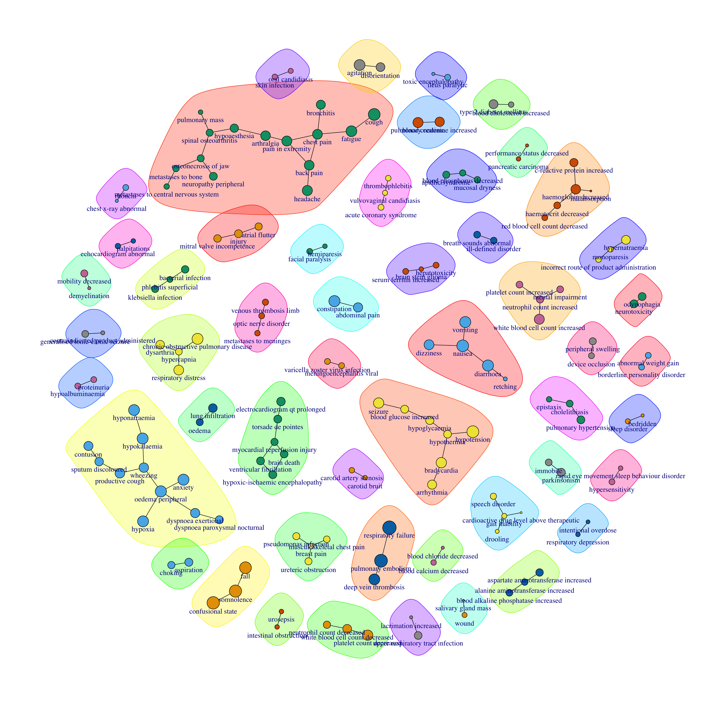
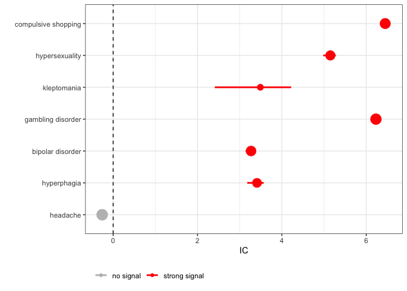
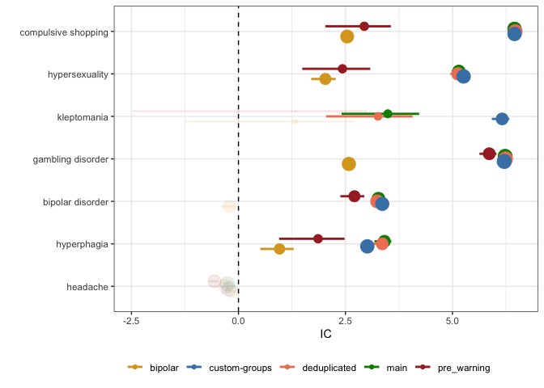

Basic_usage_of_DiAna
================

<!-- README.md is generated from README.Rmd. Please edit that file -->

# DiAna

<!-- badges: start -->
<!-- badges: end -->

The goal of DiAna is to enchance the transparency,
flexibility,replicability, and tool exchange capabilities within the
domain of pharmacovigilance studies. This specialized R package has been
meticulously crafted to facilitate the intricate process of
disproportionality analysis on the FDA Adverse Event Reporting System
(FAERS) data. DiAna empowers researchers and pharmacovigilance
professionals with a comprehensive toolkit to conduct rigorous and
transparent analyses. By providing customizable functions and clear
documentation, the package ensures that each step of the analysis is
fully understood and reproducible. Pharmacovigilance studies often
require tailored approaches due to the diverse nature of adverse event
data. The package offers a range of versatile tools that can be
seamlessly adapted to different study designs, data structures, and
analytical goals. Researchers can effortlessly modify parameters and
methods to suit their specific requirements. Collaboration and
knowledge-sharing are fundamental to advancing pharmacovigilance
research. DiAna plays a pivotal role in enabling the exchange of tools
and methodologies among researchers. Its modular design encourages the
development and integration of new analysis techniques, fostering a
dynamic environment for innovation.

# DiAna: Disproportionality Analysis for Pharmacovigilance

## Introduction

Welcome to DiAna, your go-to R package for performing disproportionality
analysis on the FDA Adverse Event Reporting System (FAERS). DiAna
simplifies the process of importing cleaned FAERS data, retrieving cases
of interest, conducting descriptive analysis, and performing
disproportionality analysis. Whether you’re a novice or an expert in
pharmacovigilance, DiAna is designed to make your analyses easy and
efficient.

## Prerequisites: Installing R and R Studio

Before you can start using DiAna, you need to have R and R Studio
installed on your system. If you haven’t installed them yet, follow
these simple steps:

1.  Installing R Visit the official R project website
    (<https://cran.r-project.org>) and download the appropriate version
    of R for your operating system (Windows, macOS, or Linux). Run the
    installer and follow the instructions to complete the installation.
    R provides a powerful and flexible environment for statistical
    computing and graphics, forming the foundation for your data
    analysis with DiAna.

2.  Installing R Studio R Studio is an integrated development
    environment (IDE) for R that makes your R programming easier and
    more efficient. Once R is installed, go to the R Studio website
    (<https://posit.co/download/rstudio-desktop/>) and download the free
    version of R Studio Desktop. Install R Studio by following the
    installation instructions for your operating system.

With R and R Studio installed, you have a comprehensive and
user-friendly environment ready for conducting pharmacovigilance
analyses using DiAna.

## Setting Up Your DiAna Project

For an organized and efficient workflow, we recommend creating a
dedicated project for your DiAna analyses. Follow these steps to set up
your DiAna project in R Studio:

1.  Open R Studio: Start by opening R Studio on your computer. If you’ve
    just installed R Studio, you can find it in your applications or
    programs menu.

2.  Create a New Project: In R Studio, click on File in the upper left
    corner, then select New Project. Choose New Directory and then New
    Project. Name your project (e.g., “DiAna”) and specify a location on
    your Desktop or any preferred directory.

3.  Install the DiAna package: Begin by installing the DiAna package
    from [GitHub](https://github.com/) writing and running the following
    lines in the console:

``` r
install.packages("devtools")
devtools::install_github("fusarolimichele/DiAna_package")
```

It may be useful to run this command from time to time to download the
latest update to the package (e.g., bugs solved, new or improved
functions)

4.  Setup the DiAna project: The first time we use DiAna, we have to set
    up the folder where the data will be stored together with the
    results of the analyses. This command will require a good internet
    connection. The better your internet connection, the faster the
    download. It usually takes between a few minutes and 20 minutes. On
    the console, we run the two rows below (note that rows preceded by a
    \# are comments and not commands):

``` r
library(DiAna)
setup_DiAna(quarter = "23Q1")
# input yes when asked to download the FAERS
```

With library DiAna we have imported the DiAna package (i.e., the toolbox
with all the functions that we will use in our analyses). With
setup_DiAna(quarter=“23Q1”) we are automaticatilly setting up the
project: it will create a folder to store cleaned FAERS data, that will
be downloaded from an OSF repository (in particular we are downloading
the FAERS updated to the 23Q1 quarter). The entire cleaning process is
made transparent on the github
(<https://github.com/fusarolimichele/DiAna>). It will also create a
folder for external sources and a folder to store projects. In the
external sources, it will also download the DiAna dictionary used to
translate free text drug names into active ingredients, a linkage to the
ATC code, and other useful data sources.


As you can see some external sources are not available for download
because they require subscription (e.g., MedDRA).

## Getting Started

Now that you have R and R Studio installed, you have installed the DiAna
package, and you have set up your project, you are all set to begin your
journey with DiAna.

### Starting a subproject

With DiAna the main project, we now want to create a subproject specific
for this tutorial. The first thing we do is open a new R script (the
white paper with the green and white cross on the top left corner of
rstudio) and insert some details on the project. As specified before,
every time we use a \# we are inserting a comment. Comments are
extremely useful to document and explain our project, but are not run
and do not affect the results.

``` r
# Information -----------------------------------------------------------------
## Project title --------------------------------------------------------------
### Tutorial on the Basic usage of DiAna
## Data -----------------------------------------------------------------------
### FDA Adverse Event Reporting System Quarterly Data up to 23Q1
## Authors --------------------------------------------------------------------
### Michele Fusaroli
## Version --------------------------------------------------------------------
### Set up: 2023-10-08### Last update: 2023-10-08
```

### **Setting Up Your DiAna Subproject**

In this section, we guide you through setting up a subproject within
your DiAna analysis environment. The following R code snippet creates a
new directory named “tutorial” within the “projects” folder of your
DiAna package. It specifies the version of the FAERS dataset to be used
(in this case, “23Q1”). The **`here::here()`** function helps locate the
current DiAna package directory, and the project_path variable is
defined to point to the “tutorial” folder within your DiAna package.

``` r
# Set up ----------------------------------------------------------------------
dir.create(paste0(here::here(), "/projects/tutorial"), recursive = TRUE)
#> Warning in dir.create(paste0(here::here(), "/projects/tutorial"), recursive =
#> TRUE): '/Users/michele.fusaroli/Desktop/DiAna_package/DiAna/projects/tutorial'
#> already exists
FAERS_version <- "23Q1"
DiAna_path <- here::here()
project_path <- paste0(DiAna_path, "/projects/tutorial/")
```

By running this code, you establish a structured subproject environment.
The “tutorial” folder will contain the necessary files and
configurations for your subproject, ensuring a seamless and organized
analysis experience.

Finally, we save the script in the subproject folder, using the blue
floppy icon above the script.

### **Input data and packages**

In the DiAna package, seamless data import is a crucial aspect of
empowering pharmacovigilance analyses. The first code chunk utilizes the
import() function to load essential datasets from the FDA Adverse Event
Reporting System (FAERS). By importing datasets like “DRUG,” “REAC,”
“DEMO,” and “INDI,” DiAna equips users with comprehensive information
about drugs, adverse reactions, patient demographics, and indications.

``` r
## Packages -------------------------------------------------------------------
library(DiAna)

## Input FAERS ---------------------------------------------------------------
import("DRUG")
import("REAC")
import("DEMO")
import("INDI")

# Try also importing and look at the information included in DEMO_SUPP, OUTC, THER, DOSES, DRUG_SUPP, DRUG_NAME
```

| primaryid | sex | age_in_days | wt_in_kgs | occr_country             | event_dt | occp_cod | reporter_country         | rept_cod | init_fda_dt |   fda_dt | premarketing | literature | RB_duplicates | RB_duplicates_only_susp |
|----------:|:----|------------:|----------:|:-------------------------|---------:|:---------|:-------------------------|:---------|------------:|---------:|:-------------|:-----------|:--------------|:------------------------|
| 883619455 | F   |          NA |       117 | NA                       | 20120101 | HP       | Canada                   | EXP      |    20121011 | 20230331 | FALSE        | FALSE      | FALSE         | FALSE                   |
|  89418103 | M   |        4015 |        NA | France, French Republic  |       NA | HP       | France, French Republic  | EXP      |    20121203 | 20230331 | FALSE        | TRUE       | FALSE         | FALSE                   |
|  89516744 | M   |        4015 |        NA | France, French Republic  |       NA | HP       | France, French Republic  | EXP      |    20121204 | 20230331 | FALSE        | TRUE       | FALSE         | FALSE                   |
|  89516903 | M   |        2920 |        NA | France, French Republic  |       NA | HP       | France, French Republic  | EXP      |    20121204 | 20230331 | FALSE        | TRUE       | FALSE         | FALSE                   |
|  90224005 | M   |          NA |        NA | Canada                   | 20020201 | MD       | Canada                   | EXP      |    20130118 | 20230331 | FALSE        | FALSE      | FALSE         | FALSE                   |
|  91610302 | F   |        7665 |        NA | United States of America |       NA | HP       | United States of America | PER      |    20130313 | 20230331 | FALSE        | TRUE       | FALSE         | FALSE                   |

Example of demographics data

| primaryid | pt               | drug_rec_act |
|----------:|:-----------------|:-------------|
| 998834879 | weight increased | NA           |
| 998834879 | joint noise      | NA           |
|  99953304 | drug interaction | NA           |
|  99953304 | breast cancer    | NA           |
|  99974963 | breast cancer    | NA           |
|  99974963 | drug interaction | NA           |

Example of reaction data

| primaryid | drug_seq | substance     | role_cod |
|----------:|---------:|:--------------|:---------|
|  99974963 |        5 | dexamethasone | I        |
|  99974963 |        6 | ibuprofen     | I        |
|  99974963 |        7 | lorazepam     | I        |
|  99974963 |        8 | NA            | I        |
|  99974963 |        9 | paracetamol   | I        |
|  99974963 |       10 | zolmitriptan  | SS       |

Example of drug data

| primaryid | drug_seq | indi_pt                             |
|----------:|---------:|:------------------------------------|
|  99974963 |        5 | product used for unknown indication |
|  99974963 |        6 | product used for unknown indication |
|  99974963 |        7 | product used for unknown indication |
|  99974963 |        8 | product used for unknown indication |
|  99974963 |        9 | product used for unknown indication |
|  99974963 |       10 | migraine                            |

Example of indication data

Moreover, DiAna offers functionality to import data related to the
Anatomical Therapeutic Chemical (ATC) classification linked to the
active ingredients as translated by the DiAna dictionary. This ATC file
is a crucial component for grouping drugs based on their therapeutic
use. Please note that we cannot provide the Medical Dictionary for
Regulatory Activities (MedDRA), which is only upon subscription, and
therefore the import_MedDRA function will not work for you. If you have
access to MedDRA, you can follow the instructions on the GitHub
repository to create the MedDRA file for the import_MedDRA function.

``` r
import_ATC()
# we cannot make the meddra available because it is only upon subscription, but here we usually also use the import_MedDRA()) function for grouping events
```

| substance                                | code    | primary_code | Lvl4  | Class4                                                  | Lvl3 | Class3                      | Lvl2 | Class2                           | Lvl1 | Class1                    |
|:-----------------------------------------|:--------|:-------------|:------|:--------------------------------------------------------|:-----|:----------------------------|:-----|:---------------------------------|:-----|:--------------------------|
| antacids, unspecified                    | A02A    | A02A         | A02A  | NA                                                      | A02A | Antacids                    | A02  | Drugs for acid related disorders | A    | Alimentary and Metabolism |
| sodium perborate                         | A01AB19 | A01AB19      | A01AB | Antiinfectives and antiseptics for local oral treatment | A01A | Stomatological preparations | A01  | Stomatological preparations      | A    | Alimentary and Metabolism |
| domiphen                                 | A01AB06 | A01AB06      | A01AB | Antiinfectives and antiseptics for local oral treatment | A01A | Stomatological preparations | A01  | Stomatological preparations      | A    | Alimentary and Metabolism |
| sodium monofluorophosphate               | A01AA02 | A01AA02      | A01AA | Caries prophylactic agents                              | A01A | Stomatological preparations | A01  | Stomatological preparations      | A    | Alimentary and Metabolism |
| sodium fluoride                          | A01AA01 | A01AA01      | A01AA | Caries prophylactic agents                              | A01A | Stomatological preparations | A01  | Stomatological preparations      | A    | Alimentary and Metabolism |
| stomatological preparations, unspecified | A01A    | A01A         | A01A  | NA                                                      | A01A | Stomatological preparations | A01  | Stomatological preparations      | A    | Alimentary and Metabolism |

Example of ATC data

### **Selecting analysis parameters**

In this code chunk, we define the specific parameters for our analysis
in DiAna. **`drugs_selected`** is set to “haloperidol,” representing the
drug of interest, and **`events_selected`** is set to “pneumonia,”
indicating the adverse event under investigation. These parameters play
a pivotal role in guiding the disproportionality analysis. By specifying
the drug and adverse event of focus, users can narrow down their
analysis to a particular scenario, allowing for a more targeted and
insightful exploration of adverse event patterns related to the selected
drug. The flexibility to customize these and other parameters (e.g.,
population), as we will see in the following paragraphs, enhances the
precision of the analysis, enabling users to derive meaningful
conclusions about drug safety within the pharmacovigilance framework.

``` r
drugs_selected <- "haloperidol"

events_selected <- "pneumonia"
```

Note that while events are coded to MedDRA, drugs are submitted to the
FAERS as free text and need a standardization. We implemented a
FAERS-specific DiAna dictionary
(<https://doi.org/10.1101/2023.06.07.23291076>). The get_drugnames
function allows to retrieve the drugnames that were translated to the
drug of interest. Here we show the first 20.

``` r
t <- get_drugnames(drugs_selected)
```

    #> Warning in instance$preRenderHook(instance): It seems your data is too big for
    #> client-side DataTables. You may consider server-side processing:
    #> https://rstudio.github.io/DT/server.html

<div class="datatables html-widget html-fill-item-overflow-hidden html-fill-item" id="htmlwidget-04caf0b1a98bb0f07416" style="width:100%;height:auto;"></div>
<script type="application/json" data-for="htmlwidget-04caf0b1a98bb0f07416">{"x":{"filter":"none","vertical":false,"data":[["1","2","3","4","5","6","7","8","9","10","11","12","13","14","15","16","17","18","19","20"],["haloperidol","haldol","haloperidol decanoate","haldol decanoate","serenace","serenase","haloperidol lactate","haldol decanoas","serenase /00027401","halomonth","serenase (haloperidol)","haldol solutab","haloperidol injection (manufacturer unknown)","linton","haloperidol (unknown)","haloperidol (haloperidol) (haloperidol)","haldol /00027401","haloperidol (watson laboratories)","aloperidin","neoperidol"],[23579,16764,1422,1079,1064,513,450,413,190,176,138,134,123,122,98,81,56,53,50,49],[0.4898616362654257,0.3482777246852536,0.02954252711181286,0.0224165870278805,0.02210495699505547,0.01065774712261603,0.009348900984750904,0.008580213570449163,0.003947313749117048,0.003656459051813687,0.002866996301990277,0.002783894959903603,0.002555366269165247,0.002534590933643578,0.00203598288112353,0.001682802177255163,0.001163418789213446,0.00110109278264844,0.001038766776083434,0.001017991440561765]],"container":"<table class=\"display\">\n  <thead>\n    <tr>\n      <th> <\/th>\n      <th>drugname<\/th>\n      <th>N<\/th>\n      <th>perc<\/th>\n    <\/tr>\n  <\/thead>\n<\/table>","options":{"columnDefs":[{"className":"dt-right","targets":[2,3]},{"orderable":false,"targets":0}],"order":[],"autoWidth":false,"orderClasses":false},"selection":{"mode":"multiple","selected":null,"target":"row","selectable":null}},"evals":[],"jsHooks":[]}</script>

### **Cases identification and retrieval**

In this code segment, we delve into the process of cases identification
and retrieval within the DiAna package. Firstly, reports associated with
the specified drug of interest, denoted as **`drugs_selected`**, are
identified using the Drug dataset. Similarly, adverse event reports
related to the chosen event (**`events_selected`**) are extracted from
the Reac dataset. The intersection of these two sets of primary IDs
(**`pids_drugs`** and **`pids_events`**) identifies cases where both the
drug and the adverse event are reported. These cases are crucial for
in-depth individual assessment and analysis.

``` r
# we identify the reports with the drug
pids_drugs <- unique(Drug[substance %in% drugs_selected]$primaryid)

# we identify the reports with the event
pids_events <- unique(Reac[pt %in% events_selected]$primaryid)

# we identify cases as reports with both the drug and the event
pids_cases <- intersect(pids_drugs, pids_events)
```

To facilitate further scrutiny and analysis, DiAna offers the
**`retrieve()`** function, which gathers the information about these
identified cases from the different FAERS dataset and stores it into two
Excel files: one with a row for each case, one with multiple rows for
each case recording more detailed drug information. The **`file_name`**
parameter, specified as **`paste0(project_path, "individual_cases")`**,
ensures that the retrieved cases are stored within the designated
subproject folder.

``` r
# retrieve the cases into an excel for individual assessment
retrieve(pids_cases, file_name = paste0(project_path, "individual_cases"))
```

This step is pivotal, allowing pharmacovigilance experts to conduct
detailed examinations of individual cases, thereby enhancing the
precision and depth of the analysis. DiAna’s seamless case retrieval
mechanism simplifies the process, empowering users to focus on in-depth
assessments of specific adverse event patterns associated with the
chosen drug. In particular, it allows to identify duplicates not
detected with the implemented algorithms and identify potential
alternative causes and risk factors.

<div class="datatables html-widget html-fill-item-overflow-hidden html-fill-item" id="htmlwidget-96af05929d2daddd778c" style="width:100%;height:auto;"></div>
<script type="application/json" data-for="htmlwidget-96af05929d2daddd778c">{"x":{"filter":"none","vertical":false,"data":[["1","2","3","4","5","6","7","8","9","10","11","12","13","14","15","16","17","18","19","20","21","22","23","24","25","26","27","28","29","30","31","32","33","34","35","36","37","38","39","40","41","42","43","44","45","46","47","48","49","50","51","52","53","54","55","56","57","58","59","60","61","62","63","64","65","66","67","68","69","70","71","72","73","74","75","76","77","78","79","80","81","82","83","84","85","86","87","88","89","90","91","92","93","94","95","96","97","98","99","100","101","102","103","104","105","106","107","108","109","110","111","112","113","114","115","116","117","118","119","120","121","122","123","124","125","126","127","128","129","130","131","132","133","134","135","136","137","138","139","140","141","142","143","144","145","146","147","148","149","150","151","152","153","154","155","156","157","158","159","160","161","162","163","164","165","166","167","168","169","170","171","172","173","174","175","176","177","178","179","180","181","182","183","184","185","186","187","188","189","190","191","192","193","194","195","196","197","198","199","200","201","202","203","204","205","206","207","208","209","210","211","212","213","214","215","216","217","218","219","220","221","222","223","224","225","226","227","228","229","230","231","232","233","234","235","236","237","238","239","240","241","242","243","244","245","246","247","248","249","250","251","252","253","254","255","256","257","258","259","260","261","262","263","264","265","266","267","268","269","270","271","272","273","274","275","276","277","278","279","280","281","282","283","284","285","286","287","288","289","290","291","292","293","294","295","296","297","298","299","300","301","302","303","304","305","306","307","308","309","310","311","312","313","314","315","316","317","318","319","320","321","322","323","324","325","326","327","328","329","330","331","332","333","334","335","336","337","338","339","340","341","342","343","344","345","346","347","348","349","350","351","352","353","354","355","356","357","358","359","360","361","362","363","364","365","366","367","368","369","370","371","372","373","374","375","376","377","378","379","380","381","382","383","384","385","386","387","388","389","390","391","392","393","394","395","396","397","398","399","400","401","402","403","404","405","406","407","408","409","410","411","412","413","414","415","416","417","418","419","420","421","422","423","424","425","426","427","428","429","430","431","432","433","434","435","436","437","438","439","440","441","442","443","444","445","446","447","448","449","450","451","452","453","454","455","456","457","458","459","460","461","462","463","464","465","466","467","468","469","470","471","472","473","474","475","476","477","478","479","480","481","482","483","484","485","486","487","488","489","490","491","492","493","494","495","496","497","498","499","500","501","502","503","504","505","506","507","508","509","510","511","512","513","514","515","516","517","518","519","520","521","522","523","524","525","526","527","528","529","530","531","532","533","534","535","536","537","538","539","540","541","542","543","544","545","546","547","548","549","550","551","552","553","554","555","556","557","558","559","560","561","562","563","564","565","566","567","568","569","570","571","572","573","574","575","576","577","578","579","580","581","582","583","584","585","586","587","588","589","590","591","592","593","594","595","596","597","598","599","600","601","602","603","604","605","606","607","608","609","610","611","612","613","614","615","616","617","618","619","620","621","622","623","624","625","626","627","628","629","630","631","632","633","634","635","636","637","638","639","640","641","642","643","644","645","646","647","648","649","650","651","652","653","654","655","656","657","658","659","660","661","662","663","664","665","666","667","668","669","670","671","672","673","674","675","676","677","678","679","680","681","682","683","684","685","686","687","688","689","690","691","692","693","694","695","696","697","698","699","700","701","702","703","704","705","706","707","708","709","710","711","712","713","714","715","716","717","718","719","720","721","722","723","724","725","726","727","728","729","730","731","732","733","734","735","736","737","738","739","740","741","742","743","744","745","746","747","748","749","750","751","752","753","754","755","756","757","758","759","760","761","762","763","764","765","766","767","768","769","770","771","772","773","774","775","776","777","778","779","780","781","782","783","784","785","786","787","788","789","790","791","792","793","794","795","796","797","798","799","800","801","802","803","804","805","806","807","808","809","810","811","812","813","814","815","816","817","818","819","820","821","822","823","824","825","826","827","828","829","830","831","832","833","834","835","836","837","838","839","840","841","842","843","844","845","846","847","848","849","850","851","852","853","854","855","856","857","858","859","860","861","862","863","864","865","866","867","868","869","870","871","872","873","874","875","876","877","878","879","880","881","882","883","884","885","886","887","888","889","890","891","892","893","894","895","896","897","898","899","900","901","902","903","904","905","906","907","908","909","910","911","912","913","914","915","916","917","918","919","920","921","922","923","924","925","926","927","928","929","930","931","932","933","934","935","936","937","938","939","940","941","942","943","944","945","946","947","948","949","950","951","952","953","954","955","956","957","958","959","960","961","962","963","964","965","966","967","968","969","970","971","972","973","974","975","976","977","978","979","980","981","982","983","984","985","986","987","988","989","990","991"],[4322006,4378204,4379766,4383607,4448307,4449405,4477412,4547957,4549507,4579752,4598141,4616364,4684451,4742512,4860013,4892872,4906217,4920720,4937460,5052365,5060428,5104132,5163151,5190524,5241354,5378885,5379008,5414864,5680876,5680885,5749486,5754671,5763464,5765350,5777487,5853688,5927494,5988878,6161421,6192498,6197232,6357098,6361617,6439143,6466746,6474638,6517860,6622013,6640124,6734399,6748654,6752746,6758342,6813200,6894651,6913997,6917124,6964861,6969635,7116133,7125156,7202964,7217857,7266333,7286330,7455206,7491482,7533611,7703607,7782301,7887737,7934993,7985786,8014474,8115181,8122867,8208616,8212097,8230729,8241345,8307813,8366856,8400048,8412683,8448599,8458463,8463828,8504345,8520884,8543251,8548708,79291215,80269322,87115283,87248482,88121762,89122001,612969818,84681672,87899383,74038433,601356615,609343031,619956438,92337642,93547572,677975016,723249619,87744692,94963042,95136792,99916182,101009853,909774810,101470872,708558224,82951176,88140965,103791602,104369164,105939673,109332403,112682601,112827331,112886823,112911171,113494962,113498282,113437193,117555111,119690271,121735541,101959234,1057600512,1184743210,119645576,124001723,127035761,100212174,126148833,127917473,72877287,136087763,137039631,128242737,131767889,132471202,135769796,138290293,142401092,143371362,144803391,145732531,143933002,146483252,150099771,150203131,150897643,143088164,143235942,143383626,133943255,146006414,146053993,157943941,158694243,159354761,159372951,159392382,160183001,160394031,140073705,161403122,161516141,161580431,161607671,161632101,161661361,161675191,161699191,161722601,161786522,161836071,147690853,973217912,169302633,169612262,170779621,171287031,168346115,141438854,177993262,178421692,1648000623,179079474,183073911,184459061,184670012,184815565,184963975,185553291,185649691,185650762,185875051,188418991,190642461,192154781,192735271,145665815,191318524,193758872,195707481,196849871,1522163810,192327422,195275353,198568142,199571731,185142543,190630135,191093682,198277112,198754372,203547041,204335581,205295351,196114133,200142503,219390341,4262909,4314454,4371063,4403451,4431767,4432804,4504631,4608971,4655373,4695767,4777848,4870892,5010751,5086478,5139284,5158273,5186365,5233976,5234702,5297264,5317867,5343705,5370448,5511130,5513351,5515779,5569686,6099868,6161335,6188853,6195777,6259290,6329804,6428710,6438284,6460119,6518533,6585063,6600821,6631510,6730192,6735475,6749481,6785756,7105017,7213785,7399058,7533435,7599682,7609922,7651252,7686182,7687431,7705833,7706999,7741978,7767844,7782654,7828917,7979447,8011882,8131627,8208535,8249298,8381578,8459197,85608466,814306110,91127902,91202725,91401452,91487642,92844241,93007591,93055341,94575251,94922593,94962691,95024121,95222778,96311913,96385542,98322542,102718501,108814433,82662343,608796912,106009644,111929742,115568991,119965962,121113531,122030141,122143751,124588732,126032944,127968681,622966117,126073243,127356032,130176572,132744461,122169562,70088942,1241874816,129331292,142895561,130829302,144874473,144921072,147783911,132425434,132425684,132620224,150127562,152213552,153166753,132959402,133173098,154851182,161066271,1447270413,145531563,161545521,161564071,137657273,170468311,175344471,175444241,175455561,175891031,176753581,177097181,182921891,178774635,188873581,190748262,125275772,185341733,185602524,193965392,199878761,201618771,201750532,201887063,206463941,198863475,201784775,206676333,210105122,197541493,208899995,212113621,215544031,215818071,216467691,217458971,135303803,216193715,216550194,218303914,219454101,219509401,155533652,192018101,200527401,5866740,6151272,93918543,4608886,5191211,6161178,97527271,97825851,113188082,208373431,5646783,6370819,6480834,6558021,6910225,7729507,7754730,8119295,8146879,93823572,136632443,155986633,4341077,4344985,4638753,4762292,4925259,4959306,5144255,5196356,5391308,5450174,5651377,5747521,6101096,6137190,6142210,6172268,6264006,6341680,6370773,6401316,6592997,6636129,6639487,6721631,6794746,6819242,6943578,7018426,7059980,7650694,7767835,8192194,8445913,87678671,91933221,92587253,93973831,94123731,95585712,81264547,85670953,89160965,97955921,98828012,102489872,101683192,103080802,103298093,104332735,102087172,102133782,102165283,102196683,88197812,111008524,98156525,102800164,122637532,125946591,122673107,123434584,130491501,132054641,133683011,133757581,133895492,135842381,133394973,133807512,133984369,136400733,140759442,126157044,141053395,149406251,149630361,128154656,131326099,157387492,157936281,105824377,174640414,168203242,179398442,179506862,180502182,181950981,180762663,186152471,133862362,1568309311,181694547,1319397010,196093422,185446653,201447441,143836896,169195277,205043472,152004327,202663204,211450296,177642607,4280660,4464079,4469160,4539540,4602712,4623016,4655919,4659818,4708805,4750999,4792490,4837415,4908188,5052182,5053273,5090045,5097722,5254390,5328452,5444490,5474730,5603140,5795562,5926739,6080157,6299891,6300932,6430627,6451628,6683994,6757850,6870717,7224404,7350376,7379903,7437160,7549763,7641102,7701734,7737802,7783631,8317543,8340268,8410034,8506314,8539110,8591252,8611075,87881181,91160976,94165121,94616222,102341461,98714001,99892252,100596282,100786081,102740511,104754941,104893541,102556343,106822401,93858404,108905013,110897201,112050741,111729783,119356412,122997422,125738131,125836804,127835112,128595702,129394971,129759203,130570671,130601541,130712431,130244393,130826771,123947072,125671053,133956872,136753361,93658086,137832881,116167016,142271821,143047271,143048861,1301376416,142278893,141804093,147425041,132950395,151605861,152739732,131759572,141844443,153524132,156884412,160057442,160593383,161857062,125379842,148358016,166636912,167024781,167429942,123196735,173022651,173537611,174272231,174448861,174494911,174560201,174622391,174627021,174642801,175458691,139328604,176770451,176795041,178282281,178429371,178433011,178433871,178435131,173491083,178309073,178432512,179732301,183588591,183874023,184027661,184590021,185161831,185511331,182832326,187497293,194705502,198448801,198533481,1188559211,173067533,173377782,175113164,203156282,207971731,206029832,203538942,213618873,216519793,2000971414,218218191,218248271,219610601,4551918,4686383,5524000,6691388,112050752,138781134,151147606,101606591,107769931,1220398811,217877731,4290375,4299962,4353316,4353676,4567386,4577482,4694703,4700256,4745897,4784425,4811972,4837421,4910505,4936377,4940060,5012033,5060751,5067947,5268980,5278559,5405372,5413440,5415636,5572932,5596329,5616708,5670030,5744655,5843661,5874008,5892769,5903719,5936865,5955672,5959595,5981258,6067887,6208313,6217020,6234929,6257299,6276034,6435544,6531929,6580501,6643787,6668827,6716972,6723878,6933205,6979623,6993159,7001246,7053140,7164342,7406822,7432009,7440993,7533569,7538193,7552385,7555599,7649858,7670055,7682538,7725866,7726001,7767247,7770011,7889043,7951528,7964742,8000648,8068935,8180661,8188653,8193932,8360900,8389602,8474382,8511547,86529892,87748461,87823271,88959772,89722791,89880791,92760871,88033094,89453413,89931501,90140874,90992071,91602431,93479591,94538051,95243461,97282291,97309642,95368412,96951092,98882603,98980742,99918371,100271922,100663791,102324442,102618882,96198257,102625812,102975793,105330701,106560752,107357681,108599261,109300143,110509081,110559981,112170811,110874677,111713393,113114101,114102313,114450211,115681171,95399974,115990971,116723571,117501991,117742591,118832311,118561314,118846761,119391451,120328571,120910031,111117623,122031152,122547291,123594281,124411531,125182111,117826843,125039982,125617381,126173591,126452142,95869606,128598432,128995131,129907094,130482741,891164415,128283294,130813052,131042684,131219058,131423082,132862433,126028913,128208508,132431153,132938062,134651941,136151242,136719592,137530281,138775511,138973321,139069691,139126793,140767581,141665231,141976432,130813192,143449571,143736531,145117602,145492821,146818411,143092663,144339263,147525481,147835461,150841491,154304922,156869981,149834774,157563832,158394091,156985405,163096992,163421603,163446811,164316071,164393671,112355386,164729712,164826122,166000962,167443941,167638782,156112375,170072654,170205572,170495632,172128721,165112524,171699283,172977624,173567233,173949312,174069222,174213671,174801331,175668631,143095249,1599256710,176151242,176652611,176672202,176696251,176934581,176935931,177188921,177374751,178001072,178007741,178059701,178091341,178307981,178308921,178477391,178781461,178782051,179011421,179259001,133406151,161765476,163753014,167465946,168636217,180266411,181265221,181764372,160082905,161173548,165986997,186608671,166159469,183222927,184391486,187146017,187550901,187567011,187850651,187856522,188033701,188118591,188119511,188173481,188190872,188654551,188712831,188886561,1474077013,1662241610,166516538,186440398,194001041,160590833,192389972,193078854,193623063,193869653,196215031,198083549,200529261,202376502,203738773,204336021,204653451,205243921,205412981,208891891,209216382,209245541,200284796,201846013,203467493,205170822,209115492,216525122,170389522,217966882,218451422,218664312,219308131,219719604,220560862,220586001,220758891,220932721],["HO","HO","HO","DE; HO","HO","DE","DE","HO; OT","LT; HO","DE","DE","OT","HO; OT","DE; LT; HO; OT","LT; HO","HO","DE; OT","DE; HO","DE; HO; OT","OT","RI; HO; OT","DE; LT; HO; OT","LT","DE; HO","HO","LT; HO; OT","OT","HO; OT","HO","HO","DE; HO","DE","DE","HO; OT","DE; LT; HO","HO; OT",null,"DE","HO; OT","HO; OT","LT; DS; HO; OT","DE; HO","DE; HO; OT","DE; HO","HO; OT","DE; HO; OT","DE; OT","DE; LT; RI; HO; OT","LT; DS; HO; OT","LT; HO; OT","LT; HO; OT","DE; LT; HO; OT","DE; HO; OT","LT; HO; OT","HO","HO","HO","HO; OT","HO; OT","DE; LT; HO; OT","DE; OT","HO; OT","DE; OT","DE; LT; HO; OT","DE; HO","HO; OT","DE; HO; OT","HO; OT","DE; HO; OT","DE; HO; OT","DE; LT; HO; OT","DE","DE; LT; HO; OT","DE; OT","LT; HO; OT","DE; HO; OT","DE; LT","LT; HO; OT","DE","DE; OT","DE; LT; DS; HO; OT","DE; HO; OT","HO; OT","HO; OT","DE; LT; HO; OT","DE; LT; DS; HO; OT","DE; LT; DS; HO; OT","DE; LT; HO; OT","DE; OT","DE; LT","HO","DE; OT","DE; HO","LT; DS; HO; OT","HO; OT","HO; OT","LT; HO","OT","HO","DE; HO","HO; OT","DE; HO; OT","DE; HO; OT","HO; OT","HO","HO; OT","DE; HO; OT","DE; HO; OT","DE; LT; HO; OT","HO; OT","HO; OT","DE; LT","DE; OT","HO; OT","DE; OT","DE; HO; OT","DE; HO; OT","DE; HO; OT","DE; HO; OT","LT; HO; OT","HO; OT","DE; HO; OT","DE; HO","DE; HO","LT; HO","LT; HO","DE; HO; OT","DE; HO; OT","DE; HO; OT","OT","HO","HO","HO; OT","DE; LT; HO; OT","HO; OT","DE; LT; HO","DE; HO; OT","HO; OT","DE; LT","DE; DS; OT","HO; OT","DE; LT; HO; OT","DE; HO; OT","HO; OT","DE; LT; HO; OT","DE; LT; HO","DE; LT; HO; OT","DE; HO; OT","DE; HO; OT","HO; OT","DE; OT","HO; OT","DE; LT; HO; OT","DE; HO","DE; HO; OT",null,"DE; LT; HO; OT","DE; LT; HO; OT","DE; HO; OT","HO; OT","DE; LT; HO; OT","HO; OT","DE; LT; HO; OT","DE; LT; HO; OT","DE; LT; HO","HO; OT","DE; LT; HO; OT","DE; LT; HO; OT","HO; OT","HO; OT","HO; OT","DE; HO; OT","LT; HO; OT","LT; HO; OT","LT; HO; OT","LT; HO; OT","LT; HO; OT","LT; HO; OT","LT; HO; OT","LT; HO; OT","LT; HO; OT","LT; HO; OT","HO; OT","DE; LT; HO; OT","DE; LT; HO; OT","HO; OT","DE","DE; LT; HO","DE; LT; HO","HO; OT","DE; LT; HO; OT","DE; LT; HO; OT","DE; LT; HO","HO","HO; OT","DE; HO","LT; DS; HO","LT; DS; HO; OT","LT; DS; HO; OT","LT; DS; HO; OT","LT; DS; HO; OT","HO","LT; DS; HO; OT","DE; HO; OT","OT","HO; OT","DE; HO; OT","DE; HO; OT","HO","DE; HO; OT","DE; HO; OT","DE; HO; OT","DE; HO; OT","DE; LT; HO","DE; HO; OT","DE; HO; OT","HO; OT","DE; HO; OT","LT; DS; HO; OT","HO; OT","HO; OT","DE; HO; OT","DE; HO; OT","DE; HO; OT","HO; OT","DE; HO; OT","DE; HO; OT","DE; HO; OT","OT","HO","DE; LT; HO","DE; HO; OT","DE; HO","DE; LT","DE; HO","DE; LT","DE; LT","OT","DE; HO","DE; HO","HO","DE; HO","HO; OT","HO","HO; OT","LT; HO; OT","DE; OT","DE; LT; HO","OT","DE","DE; OT","LT","DE; LT; HO","RI; OT","LT; HO; OT","HO","DE; HO; OT","DS; HO","LT; HO; OT","HO; OT","HO","DE","DE","HO","DE; LT; HO","DE; LT","HO","HO; OT","HO; OT","LT; HO","HO","DE; OT","HO; OT","DE; HO","HO; OT","HO","HO","HO","OT","OT","DE; LT; OT","DE; HO; OT","OT","HO; OT","DE","HO; OT","DE; HO; OT","DE","DE; LT; DS; HO","HO; OT","DE; DS; HO; OT","DE; HO","DE; HO; OT","LT; HO; OT","DE; HO","DE; DS; HO","HO; OT","DE; HO; OT","DE","DE; HO","DE; LT; OT","DE; HO","HO; OT","DE; HO","HO","DE; LT; OT","DE; LT","DE; LT; HO","LT; HO; OT","LT; HO; OT","HO","HO","DE; OT","HO; OT","DE; LT; HO","LT; HO; OT","DE; HO; OT","DE; HO; OT","LT; HO; OT","HO","HO; OT","HO; OT","DE; HO; OT","HO; OT","LT; HO","OT","DS; HO; OT","LT; HO; OT","DE; HO; OT","DE; HO","OT","HO; OT","DE; OT","DE; LT; HO; OT","DE; LT; HO; OT","LT; HO","HO; OT","DE; HO; OT","HO; OT","DE; HO","LT; HO; OT","LT; HO; OT","LT; HO; OT","LT; HO; OT","DE; HO","DE; HO; OT","HO; OT","LT; HO; OT","HO","HO; OT","HO; OT","HO; OT","LT; HO","DE; LT; HO; OT","DE; HO","DE; HO","DE","DE; HO","DE","DE; HO; OT","DE; LT; HO","DE; HO","DE; OT","DE; HO; OT","DE","DE; HO; OT","HO; OT","LT; HO; OT","HO; OT","DE; HO; OT","DE; HO; OT","DE; LT; HO; OT","DE; LT; HO; OT","DE; LT; HO; OT","DE; OT","DE; LT; OT","DE; LT; HO; OT","DE; LT; HO; OT","DE; LT; HO; OT","HO; OT","DE; LT; HO","DE; LT; HO; OT","HO; OT","DE; LT; HO; OT","DE; LT; HO; OT","DE; LT; HO; OT","LT; HO; OT","LT; HO; OT","LT; HO; OT","LT; HO; OT","DE; LT; HO; OT","DE; LT; HO; OT","DE; HO; OT","DS; HO; OT","HO","DE; LT; HO; OT","HO; OT","DE; HO; OT","HO; OT","HO; OT","OT","LT; HO","HO; OT","DE; HO; OT","DE; HO; OT","DE",null,"DS; HO; OT","DE; DS; OT","HO","HO","OT","HO; OT","DE; DS; HO","HO; OT","DE; HO; OT","DE; LT; HO; OT","DE; LT; HO","DE","DE","DE; HO","HO; OT","OT","HO","DE; HO","HO","LT","DE; DS; HO","HO; OT","HO; OT","DE; HO","DE; HO","LT; HO","DE","DE; OT","HO; OT","DE; HO; OT","DE; DS; OT","HO","DE; LT; HO","LT; HO; OT","HO; OT","HO","HO; OT","DE; HO","HO","OT",null,"DE","DE; HO","LT; HO","LT; DS; RI; HO; OT","LT; HO","HO; OT","HO","HO","DE; LT; HO; OT","DE; HO; OT","HO; OT","DE; HO","DE; HO","HO; OT","HO; OT","DE","DE","DE; DS; OT","HO","HO","HO; OT","HO","DE; HO; OT","LT","DE; HO; OT","HO; OT","DE; HO","HO","DE; HO","HO","DE; HO; OT","HO; OT","LT; OT","LT; OT","DS","LT; HO; OT","LT; OT","LT; OT","HO","HO; OT","DE; HO","DE; HO; OT","HO","HO","HO","DE; LT","OT","HO","OT","DE; DS; HO","LT; OT","DE","LT; HO","LT; HO","LT; HO","HO; OT","DE; HO; OT","HO","LT; OT","HO","OT","HO; OT","HO","OT","HO; OT","HO; OT","HO; OT","DE; HO; OT","DE; LT; OT","HO; OT","LT; HO; OT","DE; HO; OT","DE; HO","DE","DE","DE","HO","LT; HO","HO","DE; HO; OT","HO","DE; HO","HO","HO","LT; HO","DE","HO","DE","DE","HO","HO","DE; HO","DE","DE; HO","DE; HO; OT","OT","DE; HO; OT","DS; HO; OT","DE","DE; HO","DE; HO; OT","DE","HO; OT","DE; HO; OT","DE; OT","DE; LT","LT","HO; OT","HO","DE","DE; HO; OT","OT","DE; HO","DE; HO; OT","DE; OT","HO; OT","OT","DE","DE; LT","HO","LT","DE; HO; OT","OT","DE; OT","HO","HO; OT","HO","DE","OT","DE; HO","DE","DE; OT","DE; OT","HO; OT","DE; LT; HO","DE; HO","OT","HO","DE; HO","HO; OT","HO; OT","HO","LT; HO","DE; HO","HO; OT","DE; HO","DE; OT","OT","OT","HO; OT","DE; HO","OT","DE","DE; OT","HO; OT","HO","DE; HO","LT; HO; OT","HO; OT","LT; DS","DE; OT","DE; LT; OT","HO; OT","DE; OT","DE; DS; HO; OT","HO","HO; OT","HO; OT","OT","DE; HO; OT","DE; HO; OT","HO; OT","DE; LT; HO","HO","HO","HO; OT","DE; HO","OT","HO","HO; OT","DE; HO; OT","DE; OT","DE; HO; OT","DE; HO; OT","DS; OT","DS; OT","DS; OT","DS; OT","DS; OT","DS; OT","DS; OT","DS; OT","DE; HO; OT","HO; OT","HO; OT","LT; HO; OT","LT; HO; OT","LT; HO; OT","LT; HO; OT","LT; HO; OT","HO; OT","LT; HO; OT","LT; HO; OT","HO","LT; HO; OT","HO; OT","DE; LT","HO; OT","LT; OT","LT; OT","DE; HO","DE; LT; OT","DE; DS; HO; OT","HO","HO; OT","HO; OT","HO; OT","HO; OT","HO; OT","DE; DS; HO; OT","DE; LT; OT","DE; LT; OT","DE; HO; OT","HO; OT","LT; HO; OT","OT","HO; OT","DE; LT; OT","DE; LT; OT","DE; HO","DE; HO; OT","DE; OT","HO; OT","LT; HO","LT; OT","LT; DS; OT","DE; HO","DE; HO","DE; LT; HO; OT","HO","HO; OT","DE; OT","DE; LT; HO","HO","OT","HO","HO; OT","DE","DE; HO","DE","HO","OT","HO","DE","OT","DE; HO; OT","HO","HO","OT","RI; HO","HO; OT","HO","DE","DE; LT; DS; RI; HO","LT; HO; OT","DE","DE","DE; LT; HO","HO","HO; OT","HO","HO","DE; HO","DE","DE","DE","DE","DE; HO","HO","DE; HO","DE","HO","HO","DE; OT","DE; HO","OT","DE; LT; HO","DE","LT; HO","OT","HO","HO","HO; OT","HO; OT","DE","HO; OT","DE; HO","HO; OT","DE","DE; OT","HO; OT","HO","DE","DE","DE; LT","HO; OT","HO",null,null,"HO","HO; OT","OT","DE; HO","DE; RI; OT","HO","DE; HO","DE; LT; HO","DE; HO","DE; HO; OT","DE","DE; HO","HO; OT","LT; HO","LT; HO","DS; HO; OT","DS; HO; OT","DS; HO; OT","DE; OT","DE; HO; OT","LT; HO; OT","DS; HO; OT","HO","DE; HO","DE; HO","DS; HO; OT","HO","HO","HO","OT","LT; HO","DE; OT","DE; HO","DE; HO","HO","DE; HO","DE","DE","HO; OT","HO","DE; LT","DE; HO","DE; HO","HO","HO","HO","HO; OT","HO; OT","HO; OT","DE; OT","DE; HO","LT; HO; OT","HO","LT; HO","DE","OT","LT; DS; HO","HO","HO","DE; HO; OT","HO","DE; HO; OT","DE; HO","DE; DS; HO","DE; OT",null,"HO; OT","DE; HO; OT","DE; HO; OT","DS","DE","OT","HO","HO; OT","LT; HO","DE; HO",null,"DE","DE; HO","HO","DE; LT; HO","DE","HO; OT","HO","OT","DE","HO","HO","DE","HO","HO; OT","DE; LT; HO","DE; HO","DE; DS; HO","HO","LT; OT","DE","DE","HO; OT","HO; OT","HO; OT","DE; HO","DE; HO",null,"HO; OT","HO; OT","HO","HO","HO","HO","OT","HO","DE","HO","HO","HO","DE","HO","HO","DE","HO","DE; HO; OT","DE; LT; OT","HO; OT","HO; OT","HO","DE; OT","DE; HO; OT","DE; HO; OT","DE; HO; OT","DE; HO; OT","DE; HO; OT","DE; HO; OT","HO; OT","DE","HO; OT","DE; HO; OT","DE; HO; OT","DE; HO; OT","DE; OT","DS; HO","HO","HO","HO","HO","HO","DE; LT; DS","DE; HO","LT; HO","LT","DE; DS","DE","DE; DS","DE; OT","DE; OT","DE; OT","DE; OT","DE","DE; OT","DE; OT","DE","DE","LT; HO; OT","LT; HO; OT","DE; OT","DE; DS","DE","DE; OT","HO; OT","DE; HO","HO","DE; HO","DE; HO","OT","LT; HO","DE; HO; OT","DE; DS; HO; OT","DE; HO","DE; DS; HO; OT","DE; OT","DE; DS; HO; OT","DE; LT","DE; LT; OT","DE; LT; HO; OT","HO; OT","HO; OT","HO","HO; OT","HO; OT","HO; OT","HO; OT","HO; OT","HO; OT","DE; OT","DE; DS; HO; OT","DE; HO; OT","DE; LT; HO; OT","DE; DS; HO; OT","DE; HO; OT","LT; OT","HO","DE","HO","HO; OT","DE; HO","HO; OT","DE; OT","DE; LT; OT","HO","DE; HO","DE; LT; HO; OT","OT","HO; OT","OT","OT","DE; LT; OT","DE; HO; OT","DE; LT; OT","DE; HO; OT","DE; OT","DE; HO; OT","DE; HO","DE; HO; OT","DE","DE","HO; OT","HO","HO; OT","DE; OT","DE; HO; OT","HO; OT","DE; HO; OT","DE","DE"],["HP","SDY; HP","HP","NA","LIT; HP","LIT; HP; FGN","LIT; FGN","NA","OTH; LIT; HP; FGN","OTH; HP; FGN","NA","HP","HP; CSM","HP","NA","HP","HP; FGN; CR","NA","NA","NA","SDY; HP","SDY; HP; FGN","NA","NA","NA","NA","NA","NA","CSM","CSM","NA","NA","NA","NA","SDY; HP","NA","NA","NA","NA","NA","NA","OTH; CSM","NA","OTH; CSM","NA","NA","NA","SDY; HP","NA","NA","NA","OTH; CSM","NA","NA","NA","NA","NA","OTH; CSM","NA","OTH; CSM","NA","NA","SDY; HP; FGN","NA","OTH; CSM","NA","NA","NA","NA","NA","HP; CSM","SDY; OTH; FGN","CSM","NA","NA","CSM","NA","NA","NA","NA","NA","NA","NA","NA","NA","NA","NA","NA","NA","NA","NA","NA","NA","NA","NA","NA","NA","NA","NA","NA","NA","NA","NA","NA","NA","NA","NA","NA","NA","NA","HP","NA","NA","NA","NA","NA","NA","SDY; HP; FGN","NA","NA","NA","NA","NA","NA","NA","NA","NA","NA","NA","NA","NA","NA","NA","NA","NA","NA","NA","NA","NA","NA","NA","NA","NA","NA","NA","NA","NA","NA","NA","NA","NA","NA","NA","NA","NA","HP","NA","NA","NA","NA","NA","NA","NA","NA","NA","NA","NA","NA","NA","NA","NA","NA","NA","NA","NA","NA","NA","NA","NA","NA","NA","NA","NA","NA","NA","NA","NA","NA","NA","NA","NA","NA","NA","NA","NA","NA","NA","NA","NA","NA","NA","NA","NA","NA","NA","NA","NA","NA","NA","NA","NA","NA","NA","NA","NA","NA","NA","NA","NA","NA","NA","NA","NA","NA","NA","NA","NA","NA","NA","HP","HP; FGN","HP; FGN","SDY; OTH; HP","OTH; LIT; FGN","HP; FGN; CR","HP","NA","HP; CSM","NA","OTH; HP; FGN","NA","NA","NA","CSM","NA","NA","NA","NA","NA","OTH; HP; FGN","NA","NA","SDY; OTH; HP; FGN","SDY; OTH; HP","NA","NA","NA","NA","NA","NA","NA","NA","HP","NA","NA","NA","NA","NA","NA","NA","NA","NA","NA","NA","NA","LIT; HP","NA","NA","NA","NA","NA","NA","NA","NA","NA","NA","NA","NA","NA","NA","CSM","NA","CSM","NA","NA","NA","NA","NA","NA","NA","NA","NA","NA","HP; FGN","LIT; HP","NA","NA","NA","NA","NA","NA","NA","NA","NA","NA","NA","NA","NA","NA","NA","NA","NA","NA","NA","NA","HP","NA","NA","NA","NA","NA","NA","NA","NA","NA","NA","NA","NA","NA","NA","NA","NA","NA","NA","NA","NA","NA","NA","NA","NA","NA","NA","NA","NA","NA","NA","NA","NA","NA","NA","NA","NA","NA","NA","NA","NA","NA","NA","NA","NA","NA","NA","NA","NA","NA","NA","NA","NA","NA","NA","NA","NA","NA","NA","NA","NA","NA","NA","NA","NA","NA","NA","NA","NA","NA","NA","NA","NA","HP; FGN; CR","OTH; HP; FGN","NA","NA","LIT; HP; FGN","NA","NA","NA","NA","LIT; HP","NA","NA","NA","NA","NA","NA","NA","NA","NA","NA","SDY; OTH; HP; FGN","NA","NA","NA","NA","NA","SDY; HP; FGN","NA","NA","NA","NA","NA","NA","NA","NA","NA","NA","NA","NA","NA","OTH; HP","NA","NA","NA","SDY; OTH; HP","NA","HP; FGN","NA","NA","NA","NA","NA","NA","NA","NA","NA","NA","NA","NA","NA","NA","NA","NA","FGN; CSM","NA","NA","NA","NA","NA","NA","NA","NA","NA","NA","NA","NA","NA","NA","NA","NA","NA","NA","NA","NA","NA","HP","NA","NA","NA","NA","NA","NA","NA","NA","NA","NA","NA","NA","NA","NA","NA","NA","NA","NA","NA","NA","NA","NA","NA","NA","NA","NA","NA","NA","NA","NA","NA","NA","NA","NA","NA","NA","HP; FGN","NA","NA","OTH; HP; FGN","HP","OTH; HP; FGN","OTH; HP; FGN","OTH; HP; FGN","OTH; HP; FGN","SDY; HP","NA","NA","NA","NA","OTH; HP; FGN","NA","HP","NA","OTH; HP; FGN","LIT; HP","NA","NA","NA","NA","NA","NA","NA","NA","NA","NA","NA","NA","NA","NA","NA","NA","NA","NA","NA","NA","SDY; FGN","NA","NA","NA","NA","NA","NA","NA","NA","NA","NA","NA","HP; CSM","NA","NA","NA","NA","NA","NA","LIT; HP; FGN","NA","NA","NA","NA","NA","NA","NA","NA","NA","NA","NA","NA","NA","NA","NA","NA","NA","NA","NA","NA","NA","NA","NA","NA","NA","NA","NA","NA","NA","NA","NA","NA","NA","NA","NA","NA","NA","NA","NA","NA","NA","NA","NA","NA","NA","NA","NA","NA","NA","NA","NA","NA","NA","NA","NA","NA","NA","NA","NA","NA","NA","NA","NA","NA","NA","NA","NA","NA","NA","NA","NA","HP","NA","NA","CSM","NA","NA","NA","NA","NA","NA","NA","NA","NA","NA","NA","NA","NA","NA","NA","NA","NA","NA","NA","NA","NA","NA","HP","HP; FGN","NA","NA","NA","NA","NA","NA","NA","NA","NA","NA","HP; FGN","NA","HP","LIT","OTH; HP; FGN; CR","NA","NA","NA","NA","NA","NA","OTH; FGN","CSM","NA","NA","NA","NA","NA","HP","NA","NA","NA","NA","NA","OTH; HP; FGN","OTH; HP; FGN","NA","NA","NA","NA","NA","NA","NA","NA","NA","HP","NA","OTH; HP; FGN","NA","NA","NA","NA","NA","NA","NA","NA","NA","NA","NA","NA","NA","NA","NA","HP; FGN","NA","NA","NA","NA","NA","NA","NA","NA","NA","NA","NA","LIT; HP; FGN","NA","NA","NA","NA","NA","NA","HP; FGN","NA","NA","NA","NA","NA","NA","NA","NA","NA","NA","NA","NA","NA","HP; FGN","NA","NA","NA","NA","NA","NA","NA","LIT; HP","NA","NA","NA","NA","NA","SDY; HP; FGN; CR","NA","NA","NA","NA","NA","NA","NA","NA","NA","NA","NA","NA","NA","NA","NA","NA","NA","NA","NA","NA","NA","NA","NA","NA","NA","NA","NA","NA","NA","NA","NA","NA","NA","NA","NA","NA","NA","CSM","NA","NA","NA","NA","NA","HP","NA","NA","NA","NA","NA","NA","NA","NA","NA","NA","NA","NA","NA","NA","NA","NA","NA","NA","NA","NA","NA","NA","NA","NA","NA","NA","NA","NA","NA","NA","NA","NA","NA","NA","NA","NA","NA","NA","NA","NA","NA","NA","NA","NA","NA","NA","NA","NA","NA","NA","NA","NA","NA","NA","NA","NA","NA","NA","NA","NA","NA","NA","NA","NA","NA","NA","NA","NA","NA","NA","NA","NA","NA","NA","NA","NA","NA","NA","NA","NA","NA","NA","NA","NA","NA","NA","NA","NA","NA","NA","NA","NA","NA","NA","NA","NA","NA","NA","NA","NA","NA","NA","NA","NA","NA","NA","NA","NA","NA","NA","NA","NA","NA","NA","NA","NA","NA","NA","NA","NA","NA","NA","NA","NA","NA","NA","NA","NA","NA","NA","NA","NA","NA","NA","NA","NA","NA","NA","NA","NA","NA","NA","NA","NA","NA","NA","NA","NA","NA","NA","NA","NA","NA","NA","NA","NA","NA"],["M","F","F","M","M","F","F","F","M","M","M","F","F","M","M","F","M","M","M","F","F","M","F","M","M","M","F","M","F","F","M","M","F","F","F","M",null,"M","M","F","M","F",null,"F","F","F","M","M","M","M","M","F","F","M","M","M","M","M","F","F","F","M","F","M","M","M","M","M","M","F","M","M","F","F","M","M","M","M","F","M","F","F",null,"M","F","F","M","M","F","M","F","F","F","F","M","M","M","M","F","M","M","M","M","M","F","F","F","F","M","M","M",null,"M","F","M","M","M","M","F","F","F","M","F","F","F","F","F","F","F","M","M","F","M","M","M","M","F","F","F","F","F","M","F","F","M","F","M","F","F","F","F","F","F","F","M","F","F","F","F","M","F","F","F","F","M","M",null,"F","M","F","F","M","M","M","M","M","M","M","M","M","M",null,"M","F","M","F","M","M","M","F","M","F","M","F","M","F","F","F","F","F","F",null,null,"M",null,"M","M","M","M","M","M",null,"M","M","M","M","M",null,"F","M","M",null,"M",null,"M","M","M","M","M","M","M","M","M","F","M","F","M","F","F","F","F","F","F","M","M","M","M","M","F","F","M","F","F","F","M","F","M","F","F","F","M","F","M","F","M","F","M","F","M","M","M","F","F","M","F","M","F","M","M","M","M","F","F","M","M","M","M","F","M","F","F","M","M","M","F","M","F","F","F","F","F","F","F","F","M","F","M","M","M","M","M","F","F","F","M","M","M",null,"F",null,"F","F","F","F","M","M","M","M","M",null,null,"F","F","M","M","M","F","M",null,"F","M","M","M","M","M","F",null,"M","F","F","M","F","M","M","F","F","F","F",null,"F","F",null,"M","M",null,"M","M","M","M","M","M","F",null,"F","F","M","F","F","F",null,"M","F","M","F","F","F","M","F","F","F","F","F","F","M",null,"M","F","M","M","F","F","M","M",null,null,"F","M","F","M","F","F","M","F","F","F","F","F","F","F","M","M","M","F","M","F","F","M","M","M","F","M","F","M","M","M","M","M","M","M","F","M","M","M","M","M","M","F","M","F","M",null,"F","M","M","M","F","M","M","M","F","F","F","M","F","F",null,"F","F","F","F","F","M","M","M","M","M","F","F","M","F","M","M","M","M","M","M","F","M","M","M","F","F","F","M","F","F","M","M","M","M","M","M","M","F","M","F","M","F",null,"M","F","F","F","F","F","F","F","F","M","M","M","M","M","F","M","M","M","M","F","M","F","F","M","M","F","M","F","M","M","F","F","F","F","F","F","M","F","M","M","M","M","F","F","M","M","F","M","M","M","F","M","M","F","M","F","F","M",null,"F","M","M","M","M","M","F","M","M","M","M","M","F","M","M","F","M","F","M","M","M","F","M","F",null,"M",null,"F",null,"F","M","M",null,"F","M","F","M","M","M","M","F","M","F","M","M","F","M","M","F","F","M","M","F","M","M","M","M","M","M",null,"F","F","F","F","M","M","M","M","M","M",null,"M","F","F","F","F","F","F",null,"F","M","F","F","M","F","F","F","F","F","F","M","F","M","M","M","F","F","F","F","F","F","F","M","M","F","F",null,"F","F","M","M","F","M","F","F","M","M","M","F","F","M","M","F","M","M","F","M","M","F","M","F","M","M","F","F","F","M","F","M","F","M","F","M","M","M","F","F","M","M","M","M","F","M","M","M","M","M","F","M","M",null,"F","F","M","F","F","M","M","M","M","M","M","F","F","M","M","M","M","M","M","M",null,"M","M","M",null,"F","M","F","M","M","F","M","F","M","M","M","M","M","F","F","M","F","F","F","F","F","M","F","M","F","F","M","F","F","M","F","M","M","F","M","M","F","M","M","F","M","M","M","F","F","F","F","F","M","F",null,null,"M","M","F","F","M","F","M","F","F","F","F","F",null,"M","M","M","M","M","M",null,"M","F","F","M","F","M","M",null,"F","M",null,"M","M","F","F","F",null,"M","F","M","F","M","M","F","M","F","M","M","F","F","F","F","F","M","F","M","F","M",null,"F","F","M","F","F","M","F","F","M","M","M","F","F","M","M",null,"F","M","F","M","F","F","M","F","F","M","F","F","F","M",null,"M","M","F",null,"M","F","M",null,"M","M","M",null,"F",null,null,null,null,null,null,"F","F","F","F","F","F",null,null,"F",null,"M","F","M","F","M","F",null,"M","F","F","F",null,"F","M","M","M","M","M","M","M","M","M","M","M","M","F","F","F","M",null,"M","M","F","M",null,"M","M","M","M","M","F",null,"M",null,"F","M",null,"M","F","M","M","F","M","M","M","M","F","F","M",null,"M","M","M",null,"M",null],[21900,20805,20805,16425,12410,16425,16425,23725,24820,28470,17885,23360,12775,20075,null,19345,21170,24820,8395,null,17520,21170,34310,18980,21900,14965,20075,6935,17885,17885,14235,null,null,18250,28835,16060,null,32120,9855,16581,17277,25185,null,25185,null,28835,null,6935,null,8395,8395,25915,28105,27010,24090,24090,24090,28105,22265,22630,12410,19345,17520,25185,29200,20075,null,24820,14600,14965,25185,24455,30295,31390,9125,null,30295,8395,25550,null,25185,null,20075,23725,29565,null,24090,27375,29565,28105,22995,31755,22630,9490,23725,null,21900,null,16060,16060,19710,21535,31755,22265,9855,20075,24820,18615,24090,6935,25915,null,22630,null,22630,28835,31025,23725,23360,22417,16060,24090,29930,29930,11680,18615,17885,17885,17885,24820,10585,20075,14235,17155,24455,25915,27010,10585,20075,32120,23725,24455,29930,null,22995,26280,27010,26280,26280,16425,26280,13140,20440,26280,5840,24820,20440,20440,26280,23360,28835,17885,20440,20440,28470,22630,null,20440,22630,17885,17885,null,25185,25185,25185,25185,25185,25185,25185,25185,25185,null,22995,20440,17155,null,16425,28470,28470,null,29930,32120,28470,14600,15330,14600,24090,24090,24090,24090,24090,null,null,25550,null,14965,25550,25550,27010,25550,25550,null,25550,27740,25550,25550,14965,null,24090,14965,14965,null,25550,null,14965,25550,25550,25550,27375,24090,22630,22265,27740,16425,24455,17885,13870,null,27740,28105,null,29200,13870,23360,null,13140,null,null,null,16425,null,22265,29200,26280,21535,20075,null,15612,9490,15747,null,29930,18250,null,null,32120,null,22052,9855,25550,24820,22995,16065,19710,20440,31025,24820,null,17885,16425,29930,24090,20440,21900,31025,18970,25185,23725,13870,21900,null,22630,28470,null,31795,null,23360,null,24090,null,31025,31025,10220,31025,21900,19345,19345,19345,17520,17885,17885,11680,27010,24455,23360,17155,28105,null,5840,null,16060,16060,27740,33580,18980,34310,null,18615,23725,null,null,16060,6570,29200,29200,17155,16060,31390,null,17885,17885,17885,17885,17885,31025,22265,null,17885,27740,null,28470,17885,14965,13140,21900,16060,14600,14600,null,14600,14600,null,29200,25915,null,24090,16425,20805,20772,null,13140,8030,null,8030,8030,28105,8030,8030,8030,null,24820,8030,20805,8030,8030,8030,11315,25550,25550,25550,8030,8030,7300,null,null,32120,18980,25185,28105,25550,10789,15695,15695,null,null,25915,16425,17520,null,17183,28105,24820,23725,null,30295,29930,8030,22995,30295,30660,null,null,9125,null,20440,null,26280,21170,26280,null,null,10969,14965,29930,29930,17757,24101,null,27010,23725,null,10070,27010,27010,null,27010,15695,15330,34310,25550,null,16790,18615,20440,20440,null,27375,28105,20805,26645,21385,null,26280,22995,22995,null,null,null,null,null,null,22630,18980,13140,29200,8030,28105,28470,22630,34310,19710,19710,null,19345,19710,19710,25550,16790,26280,18250,24090,24090,24090,22265,11315,24090,23725,24090,25915,null,20075,20075,20075,26280,32850,18615,19710,17885,null,12045,17520,18980,17520,15695,17520,25915,21535,22630,25185,30660,21900,null,null,null,32120,12045,25550,27740,8030,20075,14965,17885,22995,21535,13870,null,20805,null,22265,2920,2920,null,null,14600,23360,null,2920,null,null,22995,26280,12775,4380,27010,null,32485,18980,17885,30295,null,26645,13505,22630,22265,14235,25915,21900,null,20805,31390,null,null,29200,28105,32485,25915,null,23360,null,null,21900,16790,29565,19345,null,28470,25185,19345,30295,24455,18980,23725,null,31025,null,19345,null,19345,27010,15330,null,21535,35770,10950,22630,13505,19345,32850,30660,21900,27740,18980,29565,null,17885,null,13505,23360,29565,20805,25185,18615,18615,18615,25185,17885,18615,null,24820,21535,20440,20440,10950,10950,10950,10950,10950,10950,null,10950,27375,20440,20440,18615,18615,18615,null,18615,null,18615,18615,13870,20805,30660,21535,19710,null,null,null,8395,27375,27740,27740,20440,20440,20440,20440,25550,8395,8395,26280,26280,25550,11315,null,8395,8395,17885,24455,30660,12775,22995,20075,24090,22265,22265,15695,25550,20440,21170,23725,17155,22995,14600,18615,null,null,null,13870,14600,20075,365,27740,13140,29200,null,25550,30660,20075,32485,null,18980,27010,29565,null,null,null,14965,null,null,27010,20075,27010,28470,35770,null,21900,null,31390,30295,14235,29565,null,null,25915,null,8395,12775,24090,13112,16790,13537,33580,32850,29930,24820,null,19710,25185,null,17885,null,29930,null,24090,17155,20775,25185,23360,null,17520,31390,23725,29565,28835,27740,21900,16425,30295,21535,20805,20805,21535,21535,21535,33215,27375,12045,21535,28105,28470,null,21535,21900,null,27375,25185,23725,null,17155,21170,null,27010,30295,null,17520,27740,18250,null,null,29565,24820,26645,24090,null,null,17885,26280,22265,18615,null,21535,null,16790,22265,23360,26645,25915,null,21535,24455,21170,null,27740,23725,null,23725,21535,17155,22995,27010,27010,21535,null,null,24820,null,30660,21900,12045,18980,22995,null,26280,25550,null,20805,25915,27375,null,26645,17885,8395,21535,28470,31390,31390,31390,25185,null,null,19710,12045,27375,null,27375,null,19710,25185,24455,23360,null,24090,18250,21535,27010,28470,25915,25915,21535,null,5110,null,24820,24820,24820,24820,24455,24820,24820,21170,28105,null,24820,21170,24820,23725,27740,27010,20075,20075,null,27375,null,28105,19710,26280,null,null,null,null,null,null,null,null,null,null,null,null,18615,18615,null,null,null,null,24820,17155,24455,17520,25185,24455,null,26645,13505,17155,13505,null,13505,7300,7300,24455,null,null,null,null,null,null,null,null,null,13505,13505,13505,30660,null,28470,21170,22265,29200,null,730,22265,32850,27740,28105,22265,null,16790,null,null,20075,null,28105,22265,28105,20805,null,20805,null,5110,25915,22265,null,null,null,14965,28835,27010,null,null,null],[null,69,69,null,null,null,null,null,null,50,88,null,106,102,null,null,56,null,null,null,103,null,null,64,70,null,null,null,79,79,null,null,54,null,54,null,null,67,65,63,74,null,null,null,null,null,null,75,122,72,null,36,null,97,54,155,54,91,96,null,53,92,60,85,73,83,null,null,83,135,85,null,54,null,88,95,null,null,null,94,75,46,null,53,54,null,73,55,45,54,null,54,null,137,null,null,null,83,null,null,null,157,null,null,null,null,61,null,null,64,87,null,54,54,54,null,81,null,43,47,null,89,60,60,null,88,null,null,null,null,null,62,null,68,60,50,77,null,64,null,null,null,60,null,85,60,79,60,60,77,60,77,49,60,null,null,49,49,60,null,null,null,49,49,53,null,null,49,null,null,null,null,null,null,null,null,null,null,null,null,null,null,null,49,68,null,84,53,53,null,null,null,53,58,null,52,74,74,74,74,74,null,null,144,null,null,144,null,null,144,144,null,144,71,144,144,null,null,74,null,null,null,144,null,null,144,144,144,66,null,70,null,83,null,40,null,null,91,null,null,55,31,67,120,80,null,100,null,null,null,null,75,41,70,70,null,null,70,null,137,null,56,null,null,null,null,91,99,null,null,91,48,113,null,111,null,null,null,90,117,null,null,111,null,null,null,null,null,82,null,65,null,68,75,61,null,77,49,null,null,null,null,null,null,null,null,134,134,null,null,null,null,null,null,null,94,68,null,41,null,null,null,78,33,145,57,112,145,null,null,null,null,null,45,45,null,null,73,null,null,null,null,null,null,74,null,null,null,87,68,null,null,null,null,75,null,null,null,null,null,null,null,null,47,null,null,56,null,null,62,null,null,null,null,null,null,null,null,null,null,84,null,null,null,null,null,null,null,null,null,null,null,null,null,null,75,80,null,45,null,77,null,null,null,null,null,104,null,29,73,36,null,null,110,50,null,null,66,80,81,null,null,null,76,52,2,null,null,36,130,77,103,null,null,null,67,120,null,94,71,null,109,94,94,79,94,106,88,null,66,null,50,null,null,null,null,50,68,53,null,90,60,62,61,61,null,60,60,60,60,null,null,null,null,79,null,70,59,null,null,null,null,null,94,null,null,80,null,82,65,54,54,54,71,80,54,65,43,null,42,null,null,null,47,null,44,null,null,null,null,null,50,null,36,null,91,79,null,null,78,60,66,66,null,null,null,null,null,null,null,null,null,null,95,null,null,64,null,null,null,null,null,null,80,null,null,null,null,null,null,59,null,null,null,91,null,null,null,null,null,null,null,null,null,null,73,53,null,null,48,62,null,68,87,null,55,null,50,null,null,null,null,78,null,110,null,72,null,53,null,145,null,null,75,null,null,null,null,null,null,null,91,177,49,93,null,null,null,null,53,null,66,59,null,null,123,null,64,59,69,null,null,null,null,72,null,null,null,null,160,null,null,102,102,102,101,102,102,null,102,null,null,null,null,null,null,null,null,76,null,null,112,83,null,68,null,70,70,null,76,null,null,null,null,null,null,null,null,76,76,null,62,null,null,null,76,76,null,null,null,82,null,36,null,52,52,77,null,103,null,59,69,null,60,160,null,50,null,null,null,null,null,38,null,100,100,null,null,null,null,null,84,null,73,null,65,96,null,96,62,90,null,90,66,48,null,null,null,null,59,73,null,null,null,45,null,null,135,90,104,57,113,null,null,91,null,null,null,null,null,null,65,null,null,null,104,83,93,null,null,132,null,null,null,56,null,52,null,null,null,null,null,null,99,99,null,null,null,100,42,91,93,100,null,null,null,null,null,90,57,81,null,71,null,null,null,94,null,null,null,null,null,null,null,null,null,null,72,null,72,null,null,null,71,51,null,null,null,null,48,null,null,null,null,77,null,43,95,null,85,null,50,48,null,null,72,null,95,null,null,null,null,null,59,60,null,null,null,79,null,85,116,null,172,null,56,56,56,null,null,null,null,null,null,null,47,null,null,null,70,67,null,null,null,null,null,null,null,null,null,null,null,null,null,59,null,null,50,null,null,null,98,null,null,null,null,68,43,null,56,56,null,null,null,82,97,68,null,null,null,null,null,null,null,null,null,null,null,null,null,null,null,null,null,null,61,null,79,null,78,68,null,74,null,null,null,null,null,62,62,75,null,null,null,null,null,null,null,null,null,null,null,null,49,null,101,84,53,81,null,null,null,47,null,null,53,null,null,null,74,null,null,null,110,null,98,80,null,null,null,null,43,66,null,null,null,89,null,null,null,null],[null,null,null,null,null,null,null,null,null,null,null,null,null,null,null,null,null,null,null,null,null,null,null,null,null,null,null,null,null,null,null,null,null,null,null,null,null,null,null,null,null,null,null,null,null,null,null,null,null,null,null,null,null,null,null,null,null,null,null,null,null,null,null,null,null,null,null,null,null,null,null,null,null,null,null,null,null,null,null,null,null,null,null,null,null,null,null,null,null,null,null,"United Kingdom of Great Britain &amp; Northern Ireland","Turkey, Republic of","United States of America","United States of America","United States of America","Germany, Federal Republic of","United States of America","United States of America","Taiwan","Japan","United States of America","United States of America","United States of America","United Kingdom of Great Britain &amp; Northern Ireland","Finland, Republic of","United States of America","United States of America","Japan","United States of America",null,"Spain, Kingdom of","Japan","Germany, Federal Republic of","Japan","United States of America","United States of America",null,"Japan","Japan","United States of America","United States of America","Switzerland, Swiss Confederation","Switzerland, Swiss Confederation","Germany, Federal Republic of","Switzerland, Swiss Confederation","United Kingdom of Great Britain &amp; Northern Ireland","United Kingdom of Great Britain &amp; Northern Ireland","United Kingdom of Great Britain &amp; Northern Ireland","Canada","United States of America","United States of America","France, French Republic","United States of America","Poland, Republic of","United Kingdom of Great Britain &amp; Northern Ireland","United States of America","Brazil, Federative Republic of","Spain, Kingdom of","Canada","Austria, Republic of","Japan","Switzerland, Swiss Confederation","France, French Republic","Czech Republic","United Kingdom of Great Britain &amp; Northern Ireland","Germany, Federal Republic of","United Kingdom of Great Britain &amp; Northern Ireland","United Kingdom of Great Britain &amp; Northern Ireland","United States of America","United Kingdom of Great Britain &amp; Northern Ireland","United States of America","Germany, Federal Republic of","United Kingdom of Great Britain &amp; Northern Ireland","China, People's Republic of","United States of America","Germany, Federal Republic of","Germany, Federal Republic of","United Kingdom of Great Britain &amp; Northern Ireland","Canada","Japan","United Kingdom of Great Britain &amp; Northern Ireland","Germany, Federal Republic of","Germany, Federal Republic of","Canada","United Kingdom of Great Britain &amp; Northern Ireland","Germany, Federal Republic of","Germany, Federal Republic of","United Kingdom of Great Britain &amp; Northern Ireland","United Kingdom of Great Britain &amp; Northern Ireland","United Kingdom of Great Britain &amp; Northern Ireland","Japan","United States of America","United States of America","United States of America","United States of America","United States of America","United States of America","United States of America","United States of America","United States of America","United States of America","Austria, Republic of","Germany, Federal Republic of","United States of America","United Kingdom of Great Britain &amp; Northern Ireland","Canada","Canada","Canada","United Kingdom of Great Britain &amp; Northern Ireland","Switzerland, Swiss Confederation","Croatia, Republic of","Canada","United States of America","Germany, Federal Republic of","United States of America","Germany, Federal Republic of","Germany, Federal Republic of","Germany, Federal Republic of","Germany, Federal Republic of","Germany, Federal Republic of","Spain, Kingdom of","Germany, Federal Republic of","Canada","Brazil, Federative Republic of","Greece, Hellenic Republic","Canada","Canada","Spain, Kingdom of","Canada","Canada","Canada","Canada","Turkey, Republic of","Canada","Canada","Greece, Hellenic Republic","Canada","Germany, Federal Republic of","Greece, Hellenic Republic","Greece, Hellenic Republic","Canada","Canada","Canada","Greece, Hellenic Republic","Canada","Canada","Canada","Canada",null,null,null,null,null,null,null,null,null,null,null,null,null,null,null,null,null,null,null,null,null,null,null,null,null,null,null,null,null,null,null,null,null,null,null,null,null,null,null,null,null,null,null,null,null,null,null,null,null,null,null,null,null,null,null,null,null,null,null,null,null,null,null,null,null,null,"United States of America","United States of America","United States of America","New Zealand","Netherlands, Kingdom of the","Germany, Federal Republic of","Germany, Federal Republic of","Spain, Kingdom of",null,null,"Germany, Federal Republic of","Germany, Federal Republic of","Germany, Federal Republic of","United Kingdom of Great Britain &amp; Northern Ireland","United Kingdom of Great Britain &amp; Northern Ireland","United Kingdom of Great Britain &amp; Northern Ireland","United Kingdom of Great Britain &amp; Northern Ireland","Spain, Kingdom of","Canada","United Kingdom of Great Britain &amp; Northern Ireland","United States of America","Japan","Canada","Mexico, United Mexican States","United States of America","United States of America","United States of America","Colombia, Republic of","Japan","United States of America","United States of America","United States of America","United States of America","Belgium, Kingdom of","United States of America","Finland, Republic of","United States of America","United States of America","Japan","Japan","Switzerland, Swiss Confederation","United Kingdom of Great Britain &amp; Northern Ireland","United States of America","United States of America","United States of America","Finland, Republic of","Finland, Republic of","Finland, Republic of","Finland, Republic of","United Kingdom of Great Britain &amp; Northern Ireland","United States of America","Finland, Republic of","Finland, Republic of","United States of America","Brazil, Federative Republic of","Japan","United States of America","Germany, Federal Republic of","South Africa, Republic of","Canada","United States of America","United States of America","United States of America","Hong Kong, Special Administrative Region of China","United States of America","United States of America","United States of America","Japan","Canada","United Kingdom of Great Britain &amp; Northern Ireland","Japan","United States of America","Australia, Commonwealth of","Australia, Commonwealth of","Japan","South Africa, Republic of","Canada","Canada","Canada","Canada","United Kingdom of Great Britain &amp; Northern Ireland","Canada","Canada","Canada","Japan","Germany, Federal Republic of","Canada","United States of America","Canada","Canada","Canada","Serbia, Republic of","Poland, Republic of","Poland, Republic of","Poland, Republic of","Canada","Canada","Poland, Republic of","Brazil, Federative Republic of","Netherlands, Kingdom of the",null,null,"Japan",null,null,null,"Portugal, Portuguese Republic",null,"United Kingdom of Great Britain &amp; Northern Ireland","United Kingdom of Great Britain &amp; Northern Ireland",null,null,null,null,null,null,null,null,null,"China, People's Republic of","Japan","Poland, Republic of",null,null,null,null,null,null,null,null,null,null,null,null,null,null,null,null,null,null,null,null,null,null,null,null,null,null,null,null,null,null,null,null,null,"Germany, Federal Republic of",null,"Germany, Federal Republic of","United States of America","United States of America","Canada","Taiwan","Japan","Japan","France, French Republic","Brazil, Federative Republic of",null,"Brazil, Federative Republic of","Japan","Japan","Japan","Denmark, Kingdom of","Denmark, Kingdom of","Denmark, Kingdom of","Denmark, Kingdom of","United States of America","Australia, Commonwealth of","Australia, Commonwealth of","Japan","Korea, Republic of","United States of America","Denmark, Kingdom of","Korea, Republic of","Switzerland, Swiss Confederation","France, French Republic","United States of America","United States of America","Finland, Republic of","United States of America","United States of America","United States of America","United States of America","Japan","United States of America","France, French Republic","Germany, Federal Republic of","Germany, Federal Republic of","Germany, Federal Republic of","Japan","United States of America","Germany, Federal Republic of","China, People's Republic of","Japan","Japan","Colombia, Republic of","France, French Republic","France, French Republic","France, French Republic","United States of America","Japan","Germany, Federal Republic of","United States of America","United Kingdom of Great Britain &amp; Northern Ireland","Canada","Canada","United Kingdom of Great Britain &amp; Northern Ireland","Canada","United States of America","Japan","United Kingdom of Great Britain &amp; Northern Ireland","Canada","Germany, Federal Republic of","Australia, Commonwealth of","New Zealand",null,null,null,null,null,null,null,null,null,null,null,null,null,null,null,null,null,null,null,null,null,null,null,null,null,null,null,null,null,null,null,null,null,null,null,null,null,null,null,null,null,null,null,null,null,null,null,null,null,"Germany, Federal Republic of","Japan","United States of America","United States of America",null,"Mexico, United Mexican States","France, French Republic","Japan","United States of America","Japan","Poland, Republic of",null,"Canada","Denmark, Kingdom of","United States of America","United States of America","Brazil, Federative Republic of","France, French Republic","Canada","Italy, Italian Republic","Colombia, Republic of","Germany, Federal Republic of","United States of America","United States of America","Taiwan","United States of America","United Kingdom of Great Britain &amp; Northern Ireland","Taiwan","Taiwan","China, People's Republic of","Germany, Federal Republic of","Taiwan","United States of America","United States of America","United States of America","United States of America","United States of America","China, People's Republic of","Italy, Italian Republic","United States of America","Japan","Japan","Canada","Japan","United Kingdom of Great Britain &amp; Northern Ireland","Finland, Republic of","Finland, Republic of","United States of America","United States of America","Germany, Federal Republic of","United Kingdom of Great Britain &amp; Northern Ireland","Brazil, Federative Republic of","United States of America","Hungary, Republic of","Hungary, Republic of","Hungary, Republic of","Canada","Finland, Republic of","Hungary, Republic of","Canada","Germany, Federal Republic of","United States of America","United Kingdom of Great Britain &amp; Northern Ireland","United Kingdom of Great Britain &amp; Northern Ireland","United Kingdom of Great Britain &amp; Northern Ireland","United Kingdom of Great Britain &amp; Northern Ireland","United Kingdom of Great Britain &amp; Northern Ireland","United Kingdom of Great Britain &amp; Northern Ireland","United Kingdom of Great Britain &amp; Northern Ireland","United Kingdom of Great Britain &amp; Northern Ireland","United Kingdom of Great Britain &amp; Northern Ireland","United Kingdom of Great Britain &amp; Northern Ireland","United States of America","United Kingdom of Great Britain &amp; Northern Ireland","United Kingdom of Great Britain &amp; Northern Ireland","United States of America","United States of America","United States of America","United States of America","United States of America","United States of America","United States of America","United States of America","United States of America","Brazil, Federative Republic of","Netherlands, Kingdom of the","United States of America","Australia, Commonwealth of","Germany, Federal Republic of","Germany, Federal Republic of","United States of America","Canada","Japan","United States of America","United States of America","United Kingdom of Great Britain &amp; Northern Ireland","United Kingdom of Great Britain &amp; Northern Ireland","United Kingdom of Great Britain &amp; Northern Ireland","United Kingdom of Great Britain &amp; Northern Ireland","Austria, Republic of","Canada","Canada","United States of America","United Kingdom of Great Britain &amp; Northern Ireland","Poland, Republic of","Canada","United Kingdom of Great Britain &amp; Northern Ireland","Canada","Canada",null,null,null,null,"France, French Republic","Japan","Japan","Japan","Japan","United Kingdom of Great Britain &amp; Northern Ireland","Poland, Republic of",null,null,null,null,null,null,null,null,null,null,null,null,null,null,null,null,null,null,null,null,null,null,null,null,null,null,null,null,null,null,null,null,null,null,null,null,null,null,null,null,null,null,null,null,null,null,null,null,null,null,null,null,null,null,null,null,null,null,null,null,null,null,null,null,null,null,null,null,null,null,null,null,null,null,null,null,null,null,null,null,null,"Spain, Kingdom of","Germany, Federal Republic of","Germany, Federal Republic of","United Kingdom of Great Britain &amp; Northern Ireland","United Kingdom of Great Britain &amp; Northern Ireland","United Kingdom of Great Britain &amp; Northern Ireland",null,"Canada","United Kingdom of Great Britain &amp; Northern Ireland","United Kingdom of Great Britain &amp; Northern Ireland","Japan","United States of America","United Kingdom of Great Britain &amp; Northern Ireland","United Kingdom of Great Britain &amp; Northern Ireland",null,"United States of America","France, French Republic","Netherlands, Kingdom of the","United Kingdom of Great Britain &amp; Northern Ireland","Brazil, Federative Republic of",null,"United States of America","United States of America","Canada","Norway, Kingdom of","United Kingdom of Great Britain &amp; Northern Ireland","Canada","Netherlands, Kingdom of the","Japan","United Kingdom of Great Britain &amp; Northern Ireland","United States of America","United States of America","United States of America","United States of America","France, French Republic","United States of America","United States of America","United States of America","United States of America","Italy, Italian Republic","Colombia, Republic of","Italy, Italian Republic",null,"Japan","Germany, Federal Republic of","United States of America","United States of America","Germany, Federal Republic of","Italy, Italian Republic","Netherlands, Kingdom of the","United States of America","Canada","Netherlands, Kingdom of the","United States of America","Spain, Kingdom of","United States of America","United States of America","Japan",null,"United States of America","Colombia, Republic of","Australia, Commonwealth of","Japan","United States of America",null,"Netherlands, Kingdom of the","Canada","United States of America","United States of America","Japan","United States of America","Finland, Republic of","Austria, Republic of","Finland, Republic of","Netherlands, Kingdom of the","Spain, Kingdom of","Netherlands, Kingdom of the","United States of America","United States of America","New Zealand","United States of America","Canada","United States of America","Brazil, Federative Republic of","Slovakia (Slovak Republic)","United States of America","United Kingdom of Great Britain &amp; Northern Ireland","United Kingdom of Great Britain &amp; Northern Ireland","United Kingdom of Great Britain &amp; Northern Ireland","United States of America","United States of America","United States of America","United States of America","United States of America","Spain, Kingdom of","United States of America","United States of America","United States of America","United States of America","United States of America","Germany, Federal Republic of","Japan","Finland, Republic of","Italy, Italian Republic","Japan","United States of America","United Kingdom of Great Britain &amp; Northern Ireland","Canada","United States of America","United States of America","United States of America","Germany, Federal Republic of","Germany, Federal Republic of","United States of America","Germany, Federal Republic of","Germany, Federal Republic of","Germany, Federal Republic of","Germany, Federal Republic of","Taiwan","Germany, Federal Republic of","Germany, Federal Republic of","United States of America","Canada","Italy, Italian Republic","Germany, Federal Republic of","United States of America","Germany, Federal Republic of","Japan","Japan","United States of America","Portugal, Portuguese Republic","Portugal, Portuguese Republic","United States of America","United States of America","Germany, Federal Republic of","Canada","United States of America","France, French Republic","Germany, Federal Republic of","United Kingdom of Great Britain &amp; Northern Ireland","Germany, Federal Republic of","Germany, Federal Republic of","Germany, Federal Republic of","Germany, Federal Republic of","Germany, Federal Republic of","United Kingdom of Great Britain &amp; Northern Ireland","United Kingdom of Great Britain &amp; Northern Ireland","United Kingdom of Great Britain &amp; Northern Ireland","United Kingdom of Great Britain &amp; Northern Ireland","United Kingdom of Great Britain &amp; Northern Ireland","United States of America","United States of America","Germany, Federal Republic of","Germany, Federal Republic of","United Kingdom of Great Britain &amp; Northern Ireland","Germany, Federal Republic of","Japan","United Kingdom of Great Britain &amp; Northern Ireland","United States of America","United Kingdom of Great Britain &amp; Northern Ireland","Korea, Republic of","United States of America","Brazil, Federative Republic of","Canada","United Kingdom of Great Britain &amp; Northern Ireland","United Kingdom of Great Britain &amp; Northern Ireland","United Kingdom of Great Britain &amp; Northern Ireland","Greece, Hellenic Republic","United Kingdom of Great Britain &amp; Northern Ireland","Brazil, Federative Republic of","Brazil, Federative Republic of","Brazil, Federative Republic of","United Kingdom of Great Britain &amp; Northern Ireland","United Kingdom of Great Britain &amp; Northern Ireland","United Kingdom of Great Britain &amp; Northern Ireland","United Kingdom of Great Britain &amp; Northern Ireland","United Kingdom of Great Britain &amp; Northern Ireland","United Kingdom of Great Britain &amp; Northern Ireland","United Kingdom of Great Britain &amp; Northern Ireland","United Kingdom of Great Britain &amp; Northern Ireland","United Kingdom of Great Britain &amp; Northern Ireland","United Kingdom of Great Britain &amp; Northern Ireland","United Kingdom of Great Britain &amp; Northern Ireland","United Kingdom of Great Britain &amp; Northern Ireland","Israel, State of","United Kingdom of Great Britain &amp; Northern Ireland","United States of America","Brazil, Federative Republic of","Germany, Federal Republic of","United States of America","United States of America","Brazil, Federative Republic of","United States of America","Japan","United Kingdom of Great Britain &amp; Northern Ireland","United Kingdom of Great Britain &amp; Northern Ireland","Germany, Federal Republic of","United States of America","New Zealand","China, People's Republic of","United States of America","China, People's Republic of","Taiwan","United Kingdom of Great Britain &amp; Northern Ireland","United States of America","United Kingdom of Great Britain &amp; Northern Ireland","United States of America","Spain, Kingdom of","United States of America","United States of America","Brazil, Federative Republic of","United States of America","Japan","United States of America","United States of America","Italy, Italian Republic","Japan","New Zealand","Denmark, Kingdom of","Japan","Canada","United Kingdom of Great Britain &amp; Northern Ireland"],[20031216,20030321,20030321,20040401,null,null,20021001,20040326,19980209,20041124,20041217,null,20030312,20050524,20041116,20050111,20050706,20051111,20050401,20060223,20060609,null,20010319,20041201,20070121,20061001,20060630,19991001,20041114,20041114,20060502,20071206,20080531,null,20080501,null,null,20081121,19990101,20030324,19970401,null,20050424,null,20090101,20080101,20071230,20070412,20060101,20100101,20100227,null,20071001,null,null,null,null,null,20020801,null,20080701,20080201,20070417,20071214,null,20030411,null,20051001,20060801,20110301,null,20110331,null,20110801,20111224,null,20110912,20120101,20111227,null,null,null,20010128,null,null,null,null,20110810,20110428,20111228,20100904,20110322,20110101,2012,20120723,201208,20070607,201203,20111003,null,20090803,200411,20050407,20001018,20130314,2013,20031016,20100810,20120723,20130811,null,20140221,201312,20120104,201312,20110126,20101019,20120606,20130626,201201,20111003,20141208,201506,201506,20150531,20150523,null,null,null,null,20150607,20160302,20140122,20131028,20151124,20151216,20160503,201311,20140203,20160623,20160721,20090320,201506,2016,20160517,20170111,20161229,20170111,20170111,20140324,20170111,2004,20150617,20170111,null,20180329,20150617,20150617,20170111,2015,20170504,201703,20150617,20150617,null,2018,20150617,20150617,2018,201703,201703,20160309,null,null,null,null,null,null,null,null,null,null,null,20150617,20131028,2019,null,null,null,2019,201707,null,null,20190609,2007,20190609,2019,20190430,20190430,20190430,20190430,20180220,20190430,202011,null,null,null,null,20161003,2020,null,null,null,20170914,null,null,null,null,20190430,null,null,null,null,null,null,null,null,null,20130101,20031016,20031014,null,null,20021101,20040622,20040423,20040628,19991222,20050401,20050110,20050223,20060326,20060223,20020101,20060124,20060830,20060111,20050224,20061006,null,20070306,20061229,20070123,20060108,20070806,20060701,20081201,20050716,null,20020112,20050323,20070101,20091012,null,20071230,20090505,20091127,20061201,null,20090501,20090101,20091014,20020327,20101005,20060101,null,20051103,null,20070901,20040101,20071230,20030923,20060523,20040328,20081129,20070228,20100603,20071003,20070626,20111101,null,20060101,null,null,20050303,201204,2005,201212,20130220,201301,null,201207,2009,20120723,null,20011012,20011012,null,20130801,20130801,20130801,20140111,null,20150227,20111102,2005,20110809,201506,20121125,null,null,null,20160302,20150207,20160210,20160526,null,201602,20160831,null,null,null,null,20160519,20160519,2017,20151229,20161203,2018,null,null,null,null,null,20180516,2015,null,null,20160712,2016,20180103,null,20070819,null,20170626,null,null,null,null,null,null,null,2012,20180709,null,20151018,20160125,2020,20200831,20160101,null,null,null,null,null,20210827,null,null,null,20190317,20220517,null,null,null,null,null,null,null,null,null,null,null,null,null,null,20060118,20000101,20130312,20041118,20060715,20010908,null,null,null,null,20041111,20000101,null,20041101,19990519,20110409,null,20111103,20110729,2013,20170427,null,20040202,20040105,20050411,20050601,20040101,20051008,20060701,20060112,null,20070618,20011217,20050101,20000501,20070101,19980116,20070819,null,20050701,20020804,20040821,20041123,20090901,20090805,20091212,19990805,20090922,20090922,null,20090922,20020101,20000101,20120101,20100101,20111129,20110824,20130107,2006,200801,null,20110701,20110809,20110802,20131022,20140106,null,20140111,2014,2014,20140827,null,null,null,null,null,null,2012,20140619,20130923,20160210,20160214,20160220,20160828,20161026,null,null,null,20170116,null,null,201605,20150407,20171001,20160525,201709,20170926,201709,2015,20130828,201709,20181103,20130716,20180727,null,20200413,20200413,20200413,202008,20180110,20190828,null,20180527,2017,20170110,20180527,null,20210101,20170901,20180527,20220101,20170514,20190801,20220711,20191216,null,20040927,20040927,null,20050115,20050226,null,20040227,20050322,20050708,20050909,20040226,20051218,20060702,20060201,20060327,20060801,20070121,20070102,null,null,20041001,20080621,20081013,20090104,20060809,null,20090424,20090901,20100201,20070518,20000101,null,20100812,null,null,20051215,20110707,20100211,null,20090310,20120419,20120128,20120101,20120307,20021005,20070709,20120105,20111129,20121230,null,null,2013,20140129,20120222,201402,null,20140609,null,20140729,201405,200803,20130404,2015,null,20140928,20120713,2015,201603,20140826,201602,20160701,20140125,20161029,null,20140125,20140423,20140125,201612,20140423,null,20150220,20170321,20170324,20130531,null,2015,2017,20070922,20070709,201612,20160722,20170601,201803,null,2018,201803,20160619,20170601,201808,20180116,201805,201805,201805,20120713,null,201805,null,null,20150213,20150918,20150918,2005,2005,2005,2005,2005,2005,2005,2005,2017,20150918,20150918,null,null,null,null,null,2005,null,null,20200605,2018,20200929,20150213,20201006,20190430,20190430,2020,20201110,20161218,20210805,202108,20150918,20150918,20150918,20150918,20060101,null,20200101,20211122,20220701,null,20210106,20220701,null,null,20041119,20050427,20070922,20030101,20150310,20170701,20180618,20130416,20130416,20151231,null,20031130,null,20040407,20040309,null,20041008,null,20020406,20050501,null,null,null,null,null,20060110,20060401,20060212,20060601,20060904,null,20061001,20060711,20070721,20061212,20071120,null,20041104,20080308,20080809,null,20080809,20080424,20070123,null,20070123,20080327,20081126,20090501,20070201,20090604,null,20020501,20070101,null,20091222,20091201,20080404,null,20100227,20020101,20090801,20000524,20030101,20030501,20100814,20101201,20110210,20060101,null,20020319,20061101,20001224,20110707,null,20071231,null,null,20040101,20040701,20111005,20110921,null,20111108,20111213,20110907,20111125,20110330,20120216,20120106,20120201,null,20111127,20111129,20111129,20120713,20120713,20120713,201111,20120416,20121011,20120713,20121228,null,null,20120713,null,2013,201308,null,20120607,null,20131212,20120118,null,20140302,20140203,null,20140511,20130516,20131127,null,null,20130618,20141227,20140801,20150202,null,null,20110707,20150109,null,20150717,null,20150213,20150917,20130526,20150915,20151012,20150310,201509,null,20151130,null,null,null,null,20150413,20160310,20151102,20150213,20160318,20160622,20151108,20160601,20151130,null,null,20120819,null,20160616,20161117,201611,20121102,20160315,null,20161229,20160929,null,null,20151104,20160907,null,20150404,20150223,201705,20170524,20170629,20170411,20170411,20170411,20170815,null,null,20171112,201611,20170727,20171112,20180201,null,null,201711,null,201712,201804,null,20180918,201811,201805,20180927,20180129,20181119,20190129,null,null,2019,null,20150627,null,null,20190526,null,null,20181015,20191018,null,null,null,null,2016,20190701,20200122,20200114,20200114,null,20180807,null,20171207,20190129,20200208,null,null,null,null,null,null,null,null,null,null,null,null,null,null,null,null,null,null,20161201,20180305,20190415,20180305,20190903,20200519,20200622,201805,20160316,20180305,20160316,null,20160316,20200916,20200916,20201226,null,null,null,null,null,null,null,null,null,20160316,20160316,20160316,20180222,20160316,20190625,20201210,20170408,20190225,202103,20100104,20210512,20190203,2015,20210828,20170408,null,20211220,null,20201011,20200829,null,20210828,20210918,20210828,20211003,20180701,20211003,20210101,20220529,20220928,20181213,null,null,20220101,20191107,20221219,20230205,null,null,null],["MD","MD","OT","MD","MD",null,null,"MD","MD",null,"PH","MD","MD","OT","MD","MD","MD","MD","PH","MD","MD","MD","OT","MD","MD","MD","MD","OT","CN","CN","MD","MD","OT","MD","MD","OT","CN","OT",null,null,null,"LW","OT","LW","MD","MD","MD","OT","MD","MD","MD","CN","OT","CN","MD","OT","CN",null,null,null,"CN","OT","MD","OT",null,null,"OT","MD","MD","CN","OT","MD","LW","OT","CN","LW","OT","MD","OT","OT","CN","CN","MD","CN","CN","CN","CN","OT","MD","OT","MD","OT","MD","CN","MD","OT",null,"CN","OT","OT","MD","OT","CN","CN","MD","MD","CN","CN","MD","CN","MD","MD","MD","OT","MD","MD","CN","MD","CN","MD","OT","OT","MD","MD","OT","MD","PH","MD","PH","CN","OT","OT","OT","OT","MD","MD","OT","CN","MD","MD","OT","CN","OT","OT","MD","OT","CN","CN","OT","CN","CN","CN","MD","OT","OT","PH","OT","MD","OT","CN","MD","MD","MD","MD","CN","MD","MD","MD","MD","PH","PH","MD","OT","MD","MD",null,"MD","MD","MD","MD","MD","OT","CN","OT","OT","PH","MD","CN","CN","MD","MD","MD","CN","CN","HP","HP","MD","MD","HP","CN","HP","MD","MD","HP","HP","MD","HP","HP","HP","HP","HP","HP","HP","HP","HP","HP","MD","HP","MD","MD","MD","HP","HP","HP","MD","HP","HP","HP","MD","OT","MD","MD","MD",null,"MD","MD","OT","MD","CN","MD","OT","OT","OT","LW","OT","MD","OT","MD","MD","OT","MD",null,"MD","OT","MD","OT","MD","OT","MD",null,"CN","CN","PH","CN","OT","MD","MD",null,"OT","MD","OT","MD",null,"PH","MD","MD","OT","CN","OT",null,"MD","MD","MD","MD","MD",null,"OT",null,"MD","MD","LW","OT","LW","CN",null,"MD",null,"OT","MD","CN","MD","MD","OT","MD","OT","MD","MD","MD","OT","PH","MD","MD","OT","OT","OT",null,"MD","MD","MD","MD","MD","OT","CN","CN","CN","PH","LW","CN","OT","MD","MD","MD","MD","MD","MD","OT","OT","OT","CN","OT","OT","MD","OT","OT","MD",null,"CN","MD","OT","CN","MD","MD","CN","OT","OT",null,"MD","MD","HP","MD","MD","MD","MD","PH","MD","HP","MD","PH",null,"MD","MD","CN","MD","MD","HP","HP","MD","HP","CN","MD","MD","HP","HP","HP","HP","HP","HP","HP","MD","MD","HP","HP","OT","CN","MD","CN",null,"MD","MD",null,null,"OT","OT","PH","CN",null,null,"MD","CN",null,"CN","OT","CN","CN","MD","MD","MD","MD","OT","CN","MD","MD","MD","PH","OT","OT","OT","OT","CN","OT","CN",null,"MD",null,"OT",null,null,"CN",null,"MD","MD",null,"MD","MD","CN","MD","LW","CN","MD","OT","MD",null,"MD","OT","OT","CN","MD","MD","MD","CN","CN","CN","CN","MD","MD","PH","MD","CN","CN","CN","MD","OT","OT","MD","MD","PH","OT","MD","CN","CN","MD","MD","CN","PH","OT","CN","OT","CN","CN","OT","MD","MD","MD","OT","MD","MD","CN","MD","MD","CN","MD","MD","HP","CN","MD","MD","MD","MD","MD","MD","MD","HP","CN","MD","MD","CN","HP","MD","HP","MD","MD","OT","OT","MD","MD","MD","MD","MD","PH","MD","MD","OT","MD","PH",null,"MD","MD","OT","OT","OT",null,"MD","MD","MD",null,"MD","OT","MD","OT","MD","OT",null,"OT","CN",null,"CN","OT","PH","MD","OT",null,"PH","MD","OT","CN","OT","CN","MD","OT","PH","PH","CN","MD","CN","OT","MD","PH","CN","OT","OT","OT","LW","MD","CN","CN","OT","MD","MD","CN","MD","OT","OT","OT","PH","MD","OT","OT","OT","CN","OT","MD","CN","OT","OT","OT","OT","CN","CN","MD","PH","CN","MD","MD","MD","MD","MD","CN","MD","MD","PH","MD","OT","OT","OT","MD","MD","OT","CN",null,"CN","MD","MD","CN","CN","CN","CN","CN","CN","HP","CN","CN","HP","HP","MD","MD","MD","CN","MD","CN","HP","MD","PH","CN","CN","CN","CN","CN","CN","CN","MD","HP","CN","CN","MD","MD","MD","MD","MD","CN","MD","CN","MD","MD","CN","MD","CN","CN","PH","MD","MD",null,"OT","MD","MD","MD","MD","MD","MD","MD","OT","PH","OT",null,"MD","MD","PH","OT","MD","CN","MD",null,"CN","MD","CN","PH","MD","MD","MD","CN",null,"MD","PH","MD","OT","OT","CN",null,"MD",null,"MD","MD","MD","OT","OT","OT","MD","OT","CN",null,null,null,"OT",null,"OT","MD","PH","MD",null,"PH",null,null,null,"CN","OT","OT","CN","MD","MD","MD","MD","OT","MD","MD",null,null,null,null,"MD","MD","MD","MD","OT","MD","MD","MD","OT","MD","PH","MD","CN","OT","MD","MD","OT","OT","MD","MD","MD","MD","MD","CN","MD","OT","MD","OT","OT","CN","PH","CN","MD","MD","PH","MD","MD","OT","MD","MD","CN","PH","MD","OT","CN","MD","OT","OT","OT","OT","MD","MD","CN","CN",null,"CN","CN","OT","CN","MD","PH","MD","MD","OT","MD","CN","MD","OT","CN","CN","CN","MD","CN","OT","OT","MD","PH","CN","MD","PH","OT","MD","MD","MD","MD","OT","MD","OT","CN","OT","MD","OT","PH","MD","MD","CN","MD","CN","OT","OT","OT","MD","CN","MD","OT","PH","OT","OT","MD","OT","OT","CN","OT","PH","MD","OT","MD","PH","CN","CN","PH","CN","OT","MD","OT","PH","OT","OT","OT","OT","MD","OT","OT","OT","MD",null,"OT","MD","HP","CN","PH","MD","PH","PH","MD","MD","HP","HP","HP","MD","HP","MD","HP","HP","HP","HP","HP","MD","HP","PH","MD","PH","MD","MD","HP","MD","MD","HP","MD","HP","MD","HP","MD","MD","MD","MD","HP","MD","MD","HP","HP","MD","MD","HP","CN","MD","PH","CN","CN","MD","PH","MD","CN","MD","HP","HP","HP","MD","MD","MD","HP","HP","HP","MD","MD","PH","HP","HP","MD","MD","HP","HP","PH","HP","HP","HP","HP","HP","HP","HP","MD","CN","MD","MD","MD","MD","CN","HP","MD","HP","MD","HP","HP","HP"],[null,null,null,null,null,null,null,null,null,null,null,null,null,"United States of America","Japan","United States of America","Japan","France, French Republic","United Kingdom of Great Britain &amp; Northern Ireland","China, People's Republic of","United States of America","Switzerland, Swiss Confederation","France, French Republic","United Kingdom of Great Britain &amp; Northern Ireland","Netherlands, Kingdom of the","United Kingdom of Great Britain &amp; Northern Ireland","Germany, Federal Republic of","Spain, Kingdom of","United States of America","United States of America","Japan","United Kingdom of Great Britain &amp; Northern Ireland","United States of America","United States of America","United States of America","Italy, Italian Republic","United States of America","United States of America","United States of America","United States of America","United States of America","United States of America","United Kingdom of Great Britain &amp; Northern Ireland","United States of America","France, French Republic","Canada","Germany, Federal Republic of","United States of America","United States of America","Austria, Republic of","Austria, Republic of","United States of America","United States of America","Canada","Japan","Japan","Japan","United States of America","United States of America","United States of America","United States of America","United States of America","Japan","United States of America","United States of America","United States of America","Canada","United Kingdom of Great Britain &amp; Northern Ireland","United Kingdom of Great Britain &amp; Northern Ireland","Austria, Republic of","United States of America","Japan","United States of America","Switzerland, Swiss Confederation","Netherlands, Kingdom of the","United States of America","Japan","Slovenia, Republic of","Taiwan","United States of America","United States of America","United States of America","Japan","United States of America","United States of America","United States of America","United States of America","Japan","Japan","Taiwan","Japan","United States of America","Turkey, Republic of","United States of America","United States of America","United States of America","Germany, Federal Republic of","United States of America","United States of America","Taiwan","Japan","United States of America","United States of America","United States of America","United Kingdom of Great Britain &amp; Northern Ireland","Finland, Republic of","United States of America","United States of America","Japan","United States of America","United States of America","Spain, Kingdom of","Japan","Germany, Federal Republic of","Japan","United States of America","United States of America","United Kingdom of Great Britain &amp; Northern Ireland","Japan","Japan","United States of America","United States of America","Switzerland, Swiss Confederation","Switzerland, Swiss Confederation","Germany, Federal Republic of","Switzerland, Swiss Confederation","United Kingdom of Great Britain &amp; Northern Ireland","United Kingdom of Great Britain &amp; Northern Ireland","United Kingdom of Great Britain &amp; Northern Ireland","Canada","United States of America","United States of America","France, French Republic","United States of America","Poland, Republic of","United Kingdom of Great Britain &amp; Northern Ireland","United States of America","Brazil, Federative Republic of","Spain, Kingdom of","Canada","Austria, Republic of","Japan","Finland, Republic of","France, French Republic","Czech Republic","United Kingdom of Great Britain &amp; Northern Ireland","United States of America","Ireland","United Kingdom of Great Britain &amp; Northern Ireland","United States of America","United Kingdom of Great Britain &amp; Northern Ireland","United States of America","Germany, Federal Republic of","United Kingdom of Great Britain &amp; Northern Ireland",null,"United States of America","United Kingdom of Great Britain &amp; Northern Ireland","Germany, Federal Republic of","United Kingdom of Great Britain &amp; Northern Ireland","Canada","Japan","United Kingdom of Great Britain &amp; Northern Ireland","Germany, Federal Republic of","Germany, Federal Republic of","Canada","United Kingdom of Great Britain &amp; Northern Ireland","Germany, Federal Republic of","Germany, Federal Republic of","United Kingdom of Great Britain &amp; Northern Ireland","United Kingdom of Great Britain &amp; Northern Ireland","United Kingdom of Great Britain &amp; Northern Ireland","Japan","United States of America","United States of America","United States of America","United Kingdom of Great Britain &amp; Northern Ireland",null,"United States of America","United States of America","United States of America","United States of America","United States of America","Austria, Republic of","Germany, Federal Republic of","United States of America","United Kingdom of Great Britain &amp; Northern Ireland","Canada","Canada","Canada","United Kingdom of Great Britain &amp; Northern Ireland","Switzerland, Swiss Confederation","Croatia, Republic of","Canada","United States of America","Germany, Federal Republic of","United States of America","Germany, Federal Republic of","Germany, Federal Republic of","Germany, Federal Republic of","Germany, Federal Republic of",null,"Spain, Kingdom of","Germany, Federal Republic of","Canada","Brazil, Federative Republic of","Greece, Hellenic Republic","Canada","Canada","Spain, Kingdom of","Canada","Canada","Canada","Canada","Turkey, Republic of","Canada","Canada","Greece, Hellenic Republic","Canada","Germany, Federal Republic of","Greece, Hellenic Republic","Greece, Hellenic Republic","Canada","Canada","Canada","Greece, Hellenic Republic","Canada","Canada","Canada","Canada",null,null,null,null,null,null,null,null,null,null,"Sweden, Kingdom of",null,"Switzerland, Swiss Confederation","Germany, Federal Republic of","United States of America","United States of America","France, French Republic","United States of America","Germany, Federal Republic of","Japan","Italy, Italian Republic","Japan","United States of America","Japan","United States of America","Japan","Germany, Federal Republic of","Ireland","United States of America","United States of America","United States of America","Germany, Federal Republic of","United States of America","United States of America","United Kingdom of Great Britain &amp; Northern Ireland","Germany, Federal Republic of","Germany, Federal Republic of","United States of America","United States of America","United States of America","Germany, Federal Republic of","United States of America","Japan","United States of America","United Kingdom of Great Britain &amp; Northern Ireland","United States of America","United States of America","Canada","United States of America","United States of America","United States of America","Germany, Federal Republic of","United States of America","Canada","Canada","Germany, Federal Republic of","United States of America","Australia, Commonwealth of","United States of America","Japan","Germany, Federal Republic of","United States of America","United States of America","United States of America","United States of America","United States of America","United States of America","United States of America","United States of America","New Zealand",null,"Germany, Federal Republic of","Germany, Federal Republic of",null,"Germany, Federal Republic of","United States of America","Germany, Federal Republic of","Germany, Federal Republic of","Germany, Federal Republic of","United Kingdom of Great Britain &amp; Northern Ireland","United Kingdom of Great Britain &amp; Northern Ireland","United Kingdom of Great Britain &amp; Northern Ireland","United Kingdom of Great Britain &amp; Northern Ireland","Spain, Kingdom of","Canada","United Kingdom of Great Britain &amp; Northern Ireland","United States of America","Japan","Canada",null,"United States of America","United States of America","United States of America","Colombia, Republic of","Japan","United States of America","United States of America","United States of America","United States of America","Belgium, Kingdom of","United States of America","Finland, Republic of",null,"United States of America","Japan","Japan","Switzerland, Swiss Confederation","United Kingdom of Great Britain &amp; Northern Ireland",null,"United States of America","United States of America",null,"Finland, Republic of","Finland, Republic of","Finland, Republic of","United Kingdom of Great Britain &amp; Northern Ireland","United States of America","India, Republic of","Finland, Republic of","United States of America","Brazil, Federative Republic of","Japan","United States of America","Germany, Federal Republic of","South Africa, Republic of","Canada",null,"United States of America","United States of America","Hong Kong, Special Administrative Region of China","United States of America","United States of America","United States of America","Japan","Canada","United Kingdom of Great Britain &amp; Northern Ireland","Japan","United States of America","Australia, Commonwealth of","Germany, Federal Republic of","Japan","South Africa, Republic of","Netherlands, Kingdom of the","Canada","Canada","Canada","United Kingdom of Great Britain &amp; Northern Ireland","Canada","Canada","Canada","Japan","Germany, Federal Republic of","Canada","United States of America","Canada","Canada","Canada","Serbia, Republic of","Poland, Republic of","Poland, Republic of","Poland, Republic of","Canada","Canada","Poland, Republic of","Brazil, Federative Republic of","Netherlands, Kingdom of the","United States of America","United States of America","Japan",null,"Switzerland, Swiss Confederation","United States of America",null,"Portugal, Portuguese Republic","United Kingdom of Great Britain &amp; Northern Ireland","United Kingdom of Great Britain &amp; Northern Ireland","Germany, Federal Republic of","United States of America","United States of America","United States of America","United States of America","United States of America","Japan","United States of America","Brazil, Federative Republic of","China, People's Republic of","Japan","Poland, Republic of",null,null,null,null,"Canada","Germany, Federal Republic of","United States of America","Australia, Commonwealth of","United States of America","Japan","Japan","Brazil, Federative Republic of","United States of America","United States of America","United States of America","Germany, Federal Republic of","United Kingdom of Great Britain &amp; Northern Ireland","United Kingdom of Great Britain &amp; Northern Ireland","United States of America","United States of America","United States of America","United States of America","Japan","Germany, Federal Republic of","United States of America","United States of America","United States of America","Germany, Federal Republic of","United States of America","United States of America","United States of America","United States of America","Canada","Germany, Federal Republic of","United States of America","Germany, Federal Republic of","United States of America","United States of America",null,"Taiwan","Japan","Japan","France, French Republic","Brazil, Federative Republic of","Denmark, Kingdom of",null,"Japan","Japan","Japan","Denmark, Kingdom of","Denmark, Kingdom of","Denmark, Kingdom of","Denmark, Kingdom of","United States of America","Australia, Commonwealth of","Australia, Commonwealth of","Japan","Korea, Republic of","United States of America","Denmark, Kingdom of","Korea, Republic of","Switzerland, Swiss Confederation","France, French Republic","United States of America","United States of America","Finland, Republic of","United States of America",null,"India, Republic of","United States of America","Japan","United States of America","France, French Republic","Germany, Federal Republic of","Germany, Federal Republic of","Germany, Federal Republic of","Japan","United States of America","Germany, Federal Republic of","China, People's Republic of","Japan","Japan","Colombia, Republic of","France, French Republic","France, French Republic","France, French Republic","United States of America","Japan","Germany, Federal Republic of","United States of America","United Kingdom of Great Britain &amp; Northern Ireland","Canada","Canada","United Kingdom of Great Britain &amp; Northern Ireland","Canada","United States of America","Japan","United Kingdom of Great Britain &amp; Northern Ireland",null,"Germany, Federal Republic of","Australia, Commonwealth of","New Zealand","United States of America",null,null,null,null,null,null,null,null,"Japan","United States of America","Spain, Kingdom of","Germany, Federal Republic of","Switzerland, Swiss Confederation","United States of America","Germany, Federal Republic of","Japan","United States of America","France, French Republic","Switzerland, Swiss Confederation","United States of America","United States of America","Germany, Federal Republic of","Philippines, Republic of the","Brazil, Federative Republic of","United States of America","Canada","Turkey, Republic of","Japan","Canada","Mexico, United Mexican States","Japan","United States of America","Brazil, Federative Republic of","Germany, Federal Republic of","United States of America","Australia, Commonwealth of","Canada","United States of America","Germany, Federal Republic of","Canada","Netherlands, Kingdom of the","United Kingdom of Great Britain &amp; Northern Ireland","Canada","France, French Republic","Japan","United Kingdom of Great Britain &amp; Northern Ireland","Japan","Netherlands, Kingdom of the","Germany, Federal Republic of","Japan","United States of America","United States of America","United States of America",null,"France, French Republic","Japan","United States of America","Japan","Poland, Republic of","Poland, Republic of","Canada","Denmark, Kingdom of",null,"United States of America","Brazil, Federative Republic of","France, French Republic","Canada","Italy, Italian Republic",null,"Germany, Federal Republic of","United States of America",null,"Taiwan","United States of America","United Kingdom of Great Britain &amp; Northern Ireland","Taiwan","Taiwan","China, People's Republic of","Germany, Federal Republic of",null,"United States of America","United States of America","United States of America","United States of America","United States of America","China, People's Republic of","Italy, Italian Republic","United States of America","Japan","Japan","Canada","Japan","United Kingdom of Great Britain &amp; Northern Ireland","Finland, Republic of","Finland, Republic of","United States of America","United States of America","Germany, Federal Republic of","United Kingdom of Great Britain &amp; Northern Ireland","Brazil, Federative Republic of","United States of America","Hungary, Republic of","Hungary, Republic of","Hungary, Republic of","Canada","Finland, Republic of","Hungary, Republic of","Canada",null,"United States of America","United Kingdom of Great Britain &amp; Northern Ireland","United Kingdom of Great Britain &amp; Northern Ireland","United Kingdom of Great Britain &amp; Northern Ireland","United Kingdom of Great Britain &amp; Northern Ireland","United Kingdom of Great Britain &amp; Northern Ireland","United Kingdom of Great Britain &amp; Northern Ireland","United Kingdom of Great Britain &amp; Northern Ireland","United Kingdom of Great Britain &amp; Northern Ireland","United Kingdom of Great Britain &amp; Northern Ireland","United Kingdom of Great Britain &amp; Northern Ireland","United States of America","United Kingdom of Great Britain &amp; Northern Ireland","United Kingdom of Great Britain &amp; Northern Ireland","United States of America","United States of America","United States of America","India, Republic of","United States of America","United States of America",null,"United States of America","United States of America","Brazil, Federative Republic of",null,"United States of America","Australia, Commonwealth of","Germany, Federal Republic of","Germany, Federal Republic of","United States of America","Canada","Japan","United States of America","United States of America","United Kingdom of Great Britain &amp; Northern Ireland","United Kingdom of Great Britain &amp; Northern Ireland","United Kingdom of Great Britain &amp; Northern Ireland","United Kingdom of Great Britain &amp; Northern Ireland","Austria, Republic of","Canada","Canada","United States of America","United Kingdom of Great Britain &amp; Northern Ireland","Poland, Republic of","Canada","United Kingdom of Great Britain &amp; Northern Ireland","Canada","Canada",null,null,"Japan","United States of America","France, French Republic","Japan","Japan","Japan","Japan","United Kingdom of Great Britain &amp; Northern Ireland","Poland, Republic of",null,null,null,null,null,null,null,null,"Germany, Federal Republic of","Germany, Federal Republic of","United States of America","Germany, Federal Republic of","United Kingdom of Great Britain &amp; Northern Ireland","United States of America","Japan","United States of America","United States of America","Austria, Republic of","Japan","United States of America","Brazil, Federative Republic of","United States of America","Japan","United States of America","Japan","Belgium, Kingdom of","Germany, Federal Republic of","United Kingdom of Great Britain &amp; Northern Ireland","United States of America","United States of America","United States of America",null,"United Kingdom of Great Britain &amp; Northern Ireland","Japan","United Kingdom of Great Britain &amp; Northern Ireland","United States of America","United States of America","United States of America","Switzerland, Swiss Confederation","Peru, Republic of","Japan","United States of America","United States of America","United Kingdom of Great Britain &amp; Northern Ireland","United Kingdom of Great Britain &amp; Northern Ireland","Germany, Federal Republic of","Japan","United Kingdom of Great Britain &amp; Northern Ireland","Austria, Republic of","United States of America","United States of America","United States of America","United States of America","United States of America","Denmark, Kingdom of","France, French Republic","United States of America","Brazil, Federative Republic of","New Zealand","Canada","Ireland","United States of America","United States of America","Germany, Federal Republic of","Germany, Federal Republic of","Canada","Canada","United States of America","United States of America","United States of America","Switzerland, Swiss Confederation","Kazakhstan, Republic of","Mexico, United Mexican States","Denmark, Kingdom of","Germany, Federal Republic of","Germany, Federal Republic of","Japan","Germany, Federal Republic of","Japan","United States of America","Japan","Spain, Kingdom of","Germany, Federal Republic of","Germany, Federal Republic of","United Kingdom of Great Britain &amp; Northern Ireland","United Kingdom of Great Britain &amp; Northern Ireland","United Kingdom of Great Britain &amp; Northern Ireland","United Kingdom of Great Britain &amp; Northern Ireland","Canada","United Kingdom of Great Britain &amp; Northern Ireland","United Kingdom of Great Britain &amp; Northern Ireland","Japan","United States of America","United Kingdom of Great Britain &amp; Northern Ireland","United Kingdom of Great Britain &amp; Northern Ireland","United States of America","United States of America","France, French Republic",null,"United Kingdom of Great Britain &amp; Northern Ireland",null,"Japan","United States of America","United States of America","Canada","Norway, Kingdom of","United Kingdom of Great Britain &amp; Northern Ireland","Canada","Netherlands, Kingdom of the","United Kingdom of Great Britain &amp; Northern Ireland","United Kingdom of Great Britain &amp; Northern Ireland","United States of America","United States of America","United States of America","United States of America","France, French Republic","United States of America","United States of America","United States of America","Canada","Italy, Italian Republic",null,"Italy, Italian Republic","United States of America","Japan","Germany, Federal Republic of","United States of America","United States of America","Germany, Federal Republic of","Italy, Italian Republic","Netherlands, Kingdom of the","United States of America","Canada","Netherlands, Kingdom of the",null,"Spain, Kingdom of","United States of America","United States of America","Japan","United States of America","United States of America",null,"Australia, Commonwealth of","United States of America","United States of America","United States of America",null,"Canada","United States of America","United States of America","Japan","United States of America","Finland, Republic of","Austria, Republic of","Finland, Republic of","Netherlands, Kingdom of the","Spain, Kingdom of","Netherlands, Kingdom of the","United States of America","United States of America","New Zealand","United States of America","Canada","United States of America","Brazil, Federative Republic of","Slovakia (Slovak Republic)","United States of America","United Kingdom of Great Britain &amp; Northern Ireland","United Kingdom of Great Britain &amp; Northern Ireland","United Kingdom of Great Britain &amp; Northern Ireland","United States of America","United States of America","United States of America","United States of America","United States of America","Spain, Kingdom of","United States of America","United States of America","United States of America","United States of America","United States of America","Germany, Federal Republic of","Japan","Finland, Republic of","Italy, Italian Republic","Japan","United States of America","United Kingdom of Great Britain &amp; Northern Ireland","Canada","United States of America","United States of America","United States of America","Germany, Federal Republic of","Germany, Federal Republic of","United States of America","United States of America","Germany, Federal Republic of","United States of America","Germany, Federal Republic of","Taiwan","Germany, Federal Republic of","United States of America","United States of America","Canada","Italy, Italian Republic","Netherlands, Kingdom of the","United States of America","Germany, Federal Republic of","India, Republic of","Japan","United States of America","Portugal, Portuguese Republic","Portugal, Portuguese Republic","United States of America","United States of America","Germany, Federal Republic of","Canada","United States of America","France, French Republic","Germany, Federal Republic of","United Kingdom of Great Britain &amp; Northern Ireland","Germany, Federal Republic of","Germany, Federal Republic of","Germany, Federal Republic of","Germany, Federal Republic of","Germany, Federal Republic of","United Kingdom of Great Britain &amp; Northern Ireland","United Kingdom of Great Britain &amp; Northern Ireland","United Kingdom of Great Britain &amp; Northern Ireland","United Kingdom of Great Britain &amp; Northern Ireland","United Kingdom of Great Britain &amp; Northern Ireland","United States of America","United States of America","Germany, Federal Republic of","Germany, Federal Republic of","United Kingdom of Great Britain &amp; Northern Ireland","Germany, Federal Republic of","Japan","United Kingdom of Great Britain &amp; Northern Ireland","United States of America","United Kingdom of Great Britain &amp; Northern Ireland","Korea, Republic of","United States of America","Brazil, Federative Republic of","Canada","United Kingdom of Great Britain &amp; Northern Ireland","United Kingdom of Great Britain &amp; Northern Ireland","United Kingdom of Great Britain &amp; Northern Ireland","Greece, Hellenic Republic","United Kingdom of Great Britain &amp; Northern Ireland","Brazil, Federative Republic of","Brazil, Federative Republic of","Brazil, Federative Republic of","United Kingdom of Great Britain &amp; Northern Ireland","United Kingdom of Great Britain &amp; Northern Ireland","United Kingdom of Great Britain &amp; Northern Ireland","United Kingdom of Great Britain &amp; Northern Ireland","United Kingdom of Great Britain &amp; Northern Ireland","United Kingdom of Great Britain &amp; Northern Ireland","United Kingdom of Great Britain &amp; Northern Ireland","United Kingdom of Great Britain &amp; Northern Ireland","United Kingdom of Great Britain &amp; Northern Ireland","United Kingdom of Great Britain &amp; Northern Ireland","United Kingdom of Great Britain &amp; Northern Ireland","United Kingdom of Great Britain &amp; Northern Ireland","Israel, State of","United Kingdom of Great Britain &amp; Northern Ireland","United States of America","Brazil, Federative Republic of","United Kingdom of Great Britain &amp; Northern Ireland","United States of America","United States of America","Brazil, Federative Republic of","United States of America","Japan","United Kingdom of Great Britain &amp; Northern Ireland","United Kingdom of Great Britain &amp; Northern Ireland","Germany, Federal Republic of","United States of America","New Zealand","China, People's Republic of","United States of America","China, People's Republic of","Taiwan","United Kingdom of Great Britain &amp; Northern Ireland","United States of America","United Kingdom of Great Britain &amp; Northern Ireland","United States of America","Spain, Kingdom of","United States of America",null,"Brazil, Federative Republic of","United States of America","Japan","United States of America","United States of America","Italy, Italian Republic","Japan","New Zealand","Denmark, Kingdom of","Japan","Canada","United Kingdom of Great Britain &amp; Northern Ireland"],["EXP","EXP","EXP","EXP","EXP","EXP","EXP","EXP","EXP","EXP","DIR","EXP","PER","EXP","EXP","PER","EXP","EXP","EXP","EXP","EXP","EXP","EXP","EXP","EXP","EXP","EXP","EXP","EXP","EXP","EXP","EXP","DIR","EXP","EXP","EXP","DIR","DIR","EXP","EXP","EXP","EXP","EXP","EXP","EXP","EXP","EXP","EXP","EXP","EXP","PER","EXP","EXP","EXP","EXP","EXP","EXP","EXP","EXP","EXP","EXP","EXP","EXP","EXP","EXP","EXP","EXP","EXP","EXP","EXP","EXP","EXP","EXP","EXP","EXP","EXP","EXP","EXP","EXP","EXP","EXP","EXP","EXP","EXP","EXP","EXP","EXP","EXP","EXP","EXP","EXP","EXP","EXP","EXP","EXP","EXP","EXP","EXP","EXP","EXP","EXP","EXP","EXP","EXP","EXP","EXP","EXP","EXP","EXP","EXP","PER","EXP","EXP","EXP","EXP","EXP","EXP","EXP","EXP","EXP","EXP","EXP","EXP","EXP","EXP","EXP","EXP","EXP","EXP","EXP","EXP","PER","EXP","EXP","EXP","EXP","EXP","EXP","EXP","EXP","EXP","EXP","EXP","EXP","EXP","EXP","EXP","EXP","EXP","EXP","EXP","EXP","EXP","EXP","EXP","DIR","EXP","EXP","EXP","EXP","EXP","EXP","EXP","EXP","EXP","EXP","EXP","EXP","EXP","EXP","EXP","EXP","EXP","EXP","EXP","EXP","EXP","EXP","EXP","EXP","EXP","EXP","EXP","EXP","EXP","EXP","EXP","EXP","EXP","EXP","EXP","EXP","EXP","EXP","EXP","EXP","EXP","EXP","EXP","EXP","EXP","EXP","EXP","EXP","EXP","EXP","EXP","EXP","EXP","EXP","EXP","EXP","EXP","EXP","EXP","EXP","EXP","EXP","EXP","EXP","EXP","EXP","EXP","EXP","EXP","EXP","EXP","EXP","EXP","EXP","EXP","EXP","EXP","EXP","EXP","EXP","EXP","EXP","EXP","EXP","EXP","EXP","EXP","EXP","PER","EXP","EXP","EXP","EXP","EXP","EXP","DIR","EXP","EXP","EXP","EXP","EXP","EXP","EXP","EXP","EXP","EXP","EXP","EXP","EXP","EXP","EXP","EXP","EXP","EXP","EXP","EXP","EXP","EXP","EXP","EXP","EXP","EXP","EXP","EXP","EXP","EXP","EXP","EXP","EXP","PER","EXP","EXP","EXP","EXP","EXP","EXP","EXP","EXP","EXP","EXP","EXP","EXP","EXP","EXP","EXP","EXP","EXP","EXP","EXP","EXP","EXP","EXP","EXP","EXP","EXP","EXP","EXP","EXP","EXP","EXP","EXP","EXP","EXP","EXP","EXP","EXP","EXP","EXP","EXP","DIR","EXP","EXP","EXP","EXP","EXP","EXP","EXP","EXP","EXP","EXP","EXP","EXP","EXP","EXP","EXP","EXP","EXP","EXP","EXP","EXP","EXP","EXP","EXP","EXP","EXP","EXP","EXP","EXP","EXP","EXP","EXP","EXP","EXP","EXP","EXP","EXP","EXP","EXP","EXP","PER","EXP","EXP","EXP","EXP","EXP","EXP","EXP","EXP","EXP","EXP","EXP","EXP","EXP","EXP","EXP","EXP","EXP","EXP","EXP","EXP","EXP","EXP","EXP","EXP","EXP","EXP","EXP","EXP","EXP","DIR","EXP","EXP","EXP","EXP","EXP","EXP","EXP","EXP","EXP","EXP","PER","EXP","EXP","EXP","PER","EXP","EXP","EXP","EXP","EXP","EXP","EXP","EXP","DIR","EXP","EXP","EXP","DIR","EXP","EXP","EXP","EXP","EXP","EXP","EXP","EXP","EXP","EXP","EXP","PER","EXP","EXP","EXP","EXP","EXP","EXP","EXP","EXP","EXP","EXP","EXP","PER","EXP","EXP","EXP","DIR","EXP","EXP","EXP","EXP","EXP","EXP","EXP","EXP","EXP","EXP","EXP","EXP","EXP","EXP","EXP","EXP","EXP","EXP","EXP","EXP","EXP","EXP","EXP","EXP","EXP","EXP","EXP","EXP","EXP","EXP","EXP","DIR","EXP","EXP","EXP","EXP","EXP","EXP","EXP","EXP","EXP","EXP","EXP","EXP","EXP","EXP","EXP","EXP","EXP","EXP","EXP","EXP","PER","EXP","EXP","EXP","EXP","EXP","EXP","EXP","EXP","EXP","EXP","EXP","EXP","EXP","EXP","EXP","EXP","DIR","DIR","EXP","EXP","EXP","EXP","EXP","EXP","EXP","EXP","EXP","EXP","DIR","EXP","EXP","EXP","EXP","EXP","EXP","DIR","EXP","EXP","EXP","EXP","EXP","EXP","EXP","EXP","EXP","EXP","EXP","EXP","EXP","DIR","PER","EXP","DIR","EXP","EXP","EXP","EXP","EXP","EXP","EXP","EXP","EXP","EXP","EXP","EXP","EXP","EXP","PER","EXP","EXP","PER","EXP","EXP","EXP","EXP","EXP","EXP","EXP","EXP","EXP","EXP","EXP","EXP","EXP","EXP","EXP","EXP","EXP","EXP","EXP","EXP","EXP","EXP","EXP","EXP","EXP","EXP","EXP","EXP","EXP","EXP","EXP","EXP","EXP","EXP","EXP","EXP","EXP","EXP","EXP","EXP","EXP","EXP","EXP","EXP","EXP","EXP","EXP","EXP","EXP","EXP","EXP","EXP","EXP","EXP","EXP","EXP","EXP","EXP","EXP","EXP","EXP","EXP","EXP","EXP","EXP","EXP","EXP","EXP","EXP","EXP","EXP","EXP","PER","EXP","EXP","DIR","EXP","EXP","DIR","EXP","EXP","EXP","EXP","EXP","PER","EXP","PER","EXP","EXP","EXP","EXP","EXP","EXP","EXP","EXP","PER","EXP","EXP","EXP","EXP","EXP","EXP","EXP","EXP","EXP","EXP","EXP","EXP","EXP","EXP","EXP","EXP","EXP","EXP","DIR","EXP","EXP","EXP","EXP","EXP","EXP","EXP","PER","EXP","EXP","EXP","EXP","EXP","DIR","EXP","EXP","PER","EXP","DIR","PER","DIR","EXP","EXP","EXP","EXP","DIR","EXP","DIR","EXP","EXP","EXP","EXP","DIR","EXP","EXP","EXP","EXP","EXP","EXP","EXP","EXP","EXP","PER","EXP","EXP","EXP","EXP","DIR","PER","PER","EXP","EXP","EXP","EXP","EXP","EXP","EXP","EXP","EXP","EXP","EXP","EXP","EXP","EXP","PER","PER","EXP","EXP","EXP","EXP","EXP","EXP","EXP","EXP","EXP","EXP","PER","EXP","EXP","EXP","EXP","EXP","EXP","EXP","EXP","EXP","EXP","EXP","EXP","EXP","EXP","EXP","EXP","EXP","EXP","EXP","PER","EXP","EXP","EXP","EXP","EXP","EXP","EXP","EXP","EXP","EXP","EXP","EXP","PER","EXP","PER","PER","EXP","EXP","PER","EXP","EXP","EXP","PER","DIR","EXP","EXP","PER","EXP","EXP","EXP","EXP","EXP","EXP","EXP","PER","EXP","EXP","EXP","EXP","DIR","PER","EXP","EXP","EXP","EXP","DIR","EXP","EXP","EXP","EXP","EXP","EXP","EXP","EXP","EXP","EXP","EXP","EXP","PER","EXP","EXP","EXP","EXP","EXP","EXP","EXP","EXP","EXP","EXP","EXP","EXP","PER","PER","EXP","EXP","EXP","PER","EXP","EXP","PER","PER","EXP","EXP","EXP","EXP","EXP","PER","EXP","EXP","PER","EXP","EXP","EXP","EXP","PER","EXP","EXP","EXP","EXP","EXP","EXP","EXP","EXP","EXP","EXP","EXP","EXP","EXP","EXP","EXP","EXP","EXP","EXP","EXP","EXP","EXP","EXP","EXP","EXP","EXP","EXP","EXP","EXP","EXP","EXP","EXP","EXP","EXP","EXP","EXP","EXP","EXP","EXP","EXP","EXP","EXP","EXP","EXP","EXP","EXP","EXP","EXP","EXP","EXP","EXP","EXP","EXP","EXP","EXP","EXP","EXP","EXP","EXP","EXP","EXP","EXP","EXP","EXP","EXP","EXP","EXP","EXP","EXP","EXP","EXP","EXP","EXP","EXP","EXP","EXP","EXP","PER","EXP","EXP","EXP","EXP","EXP","EXP","EXP","EXP","EXP","EXP","EXP","EXP","EXP","EXP","EXP","EXP","EXP","EXP","EXP","EXP","EXP","EXP","EXP","PER","EXP","PER","EXP","PER","EXP","EXP","EXP"],[null,null,null,null,null,null,null,null,null,null,null,null,null,null,null,null,null,null,null,null,null,null,null,null,null,null,null,null,null,null,null,null,null,null,null,null,null,null,null,null,null,null,null,null,null,null,null,null,null,null,null,null,null,null,null,null,null,null,null,null,null,null,null,null,null,null,null,null,null,null,null,null,null,null,null,null,null,null,null,null,null,null,null,null,null,null,null,null,null,null,null,20110503,20110708,20120807,20120815,20120927,20121115,20060918,20120320,20120917,20100528,20060328,20060728,20061221,20130416,20130619,20081006,20091229,20120907,20130904,20130305,20140310,20140424,20130212,20140501,20090819,20111216,20120925,20140812,20140908,20141119,20150320,20150714,20150720,20150721,20150722,20150807,20150807,20150806,20151119,20160128,20160311,20140527,20141111,20151217,20160127,20160524,20160831,20140319,20160802,20160929,20100222,20170602,20170629,20161007,20170201,20170217,20170524,20170803,20171130,20171229,20180202,20180226,20180116,20180316,20180521,20180618,20180629,20171220,20171226,20171229,20170402,20180305,20180306,20190107,20190125,20190208,20190208,20190208,20190228,20190306,20170925,20190401,20190403,20190404,20190405,20190405,20190406,20190408,20190408,20190409,20190410,20190411,20180417,20131205,20191017,20191025,20191126,20191209,20190920,20171031,20200518,20200529,20190626,20200617,20200924,20201030,20201105,20201109,20201112,20201127,20201201,20201201,20201207,20210204,20210326,20210505,20210519,20180223,20210413,20210605,20210716,20210811,20180731,20210507,20210713,20210920,20211015,20201118,20210326,20210409,20210914,20210924,20220120,20220205,20220301,20210726,20211029,20230201,null,null,null,null,null,null,null,null,null,null,null,null,null,null,null,null,null,null,null,null,null,null,null,null,null,null,null,null,null,null,null,null,null,null,null,null,null,null,null,null,null,null,null,null,null,null,null,null,null,null,null,null,null,null,null,null,null,null,null,null,null,null,null,null,null,null,20120514,20110919,20130211,20130226,20130305,20130308,20130510,20130521,20130520,20130809,20130830,20130904,20130906,20130913,20131018,20131022,20140121,20140702,20150303,20111129,20060721,20141124,20150616,20150925,20160203,20160224,20160323,20160328,20160613,20160728,20160929,20070202,20160729,20160912,20161212,20170227,20160329,20090602,20160531,20161111,20171214,20170103,20180205,20180206,20180419,20170216,20170216,20170222,20180614,20180731,20180824,20170303,20170310,20181010,20190322,20180201,20180220,20190403,20190404,20170718,20191119,20200312,20200316,20200316,20200327,20200416,20200427,20200922,20200609,20210212,20210331,20160705,20201123,20201130,20210610,20211023,20211208,20211213,20211215,20220329,20210927,20211214,20220404,20220627,20210827,20220530,20220815,20221104,20221111,20221127,20221219,20170509,20221120,20221129,20230106,20230202,20230203,20181026,20210430,20211110,null,null,20130709,null,null,null,20131213,20131220,20150729,20220517,null,null,null,null,null,null,null,null,null,20130703,20170619,20181108,null,null,null,null,null,null,null,null,null,null,null,null,null,null,null,null,null,null,null,null,null,null,null,null,null,null,null,null,null,null,null,null,null,20120905,20130325,20130426,20130712,20130722,20130926,20110908,20120517,20121120,20140103,20140207,20140618,20140512,20140716,20140721,20140905,20140530,20140603,20140604,20140605,20121001,20150508,20140114,20140707,20160413,20160726,20160414,20160506,20161221,20170209,20170324,20170328,20170330,20170525,20170315,20170329,20170403,20170609,20171011,20160802,20171018,20180525,20180601,20161005,20170120,20181219,20190107,20141113,20200226,20190918,20200624,20200626,20200721,20200826,20200728,20201215,20170330,20181204,20200818,20170207,20210726,20201125,20211203,20180115,20191015,20220222,20180726,20211231,20220729,20200511,null,null,null,null,null,null,null,null,null,null,null,null,null,null,null,null,null,null,null,null,null,null,null,null,null,null,null,null,null,null,null,null,null,null,null,null,null,null,null,null,null,null,null,null,null,null,null,null,20120914,20130207,20130724,20130816,20140306,20140205,20140310,20140404,20140415,20140702,20140925,20140930,20140624,20141230,20130705,20150305,20150505,20150622,20150608,20160121,20160425,20160720,20160722,20160927,20161018,20161114,20161125,20161222,20161223,20161229,20161213,20170103,20160523,20160718,20170403,20170621,20130625,20170724,20151009,20171127,20171219,20171219,20161209,20171127,20171111,20180410,20170303,20180718,20180814,20170201,20171113,20180905,20181205,20190226,20190311,20190411,20160707,20180502,20190802,20190814,20190827,20160429,20200122,20200131,20200218,20200221,20200224,20200225,20200226,20200226,20200226,20200316,20170904,20200416,20200417,20200527,20200530,20200530,20200530,20200531,20200130,20200527,20200530,20200701,20201008,20201015,20201016,20201103,20201118,20201126,20200918,20210117,20210629,20210916,20210919,20160104,20200123,20200129,20200306,20220110,20220506,20220316,20220120,20220922,20221128,20211028,20230105,20230105,20230207,null,null,null,null,20150622,20170817,20180706,20140508,20150209,20160323,20221228,null,null,null,null,null,null,null,null,null,null,null,null,null,null,null,null,null,null,null,null,null,null,null,null,null,null,null,null,null,null,null,null,null,null,null,null,null,null,null,null,null,null,null,null,null,null,null,null,null,null,null,null,null,null,null,null,null,null,null,null,null,null,null,null,null,null,null,null,null,null,null,null,null,null,null,null,null,null,null,null,null,20120706,20120910,20120913,20121108,20121218,20121227,20121109,20120924,20121205,20130102,20130115,20130213,20130313,20130614,20130807,20130916,20131204,20131203,20130919,20131119,20140207,20140214,20140310,20140321,20140408,20140612,20140626,20131014,20140626,20140711,20141022,20141216,20150126,20150223,20150319,20150421,20150422,20150624,20150504,20150608,20150727,20150824,20150901,20150929,20130920,20151006,20151028,20151118,20151124,20151231,20151221,20160104,20160122,20160207,20160218,20150514,20160323,20160411,20160511,20160607,20160630,20151127,20160628,20160715,20160802,20160811,20131003,20161018,20161101,20161201,20161220,20121115,20161007,20170103,20170111,20170117,20170124,20170301,20160728,20161006,20170217,20170303,20170421,20170606,20170621,20170714,20170817,20170823,20170825,20170828,20171011,20171107,20171116,20170103,20180103,20180110,20180209,20180219,20180326,20171220,20180124,20180412,20180420,20180628,20180926,20181204,20180607,20181224,20190117,20181207,20190514,20190522,20190522,20190614,20190617,20150702,20190625,20190627,20190719,20190827,20190902,20181113,20191108,20191112,20191119,20191230,20190702,20191218,20200121,20200131,20200210,20200212,20200214,20200228,20200320,20171220,20190221,20200402,20200414,20200414,20200415,20200422,20200422,20200428,20200504,20200518,20200518,20200520,20200520,20200527,20200527,20200601,20200610,20200610,20200616,20200622,20170316,20190409,20190531,20190827,20190927,20200715,20200808,20200820,20190226,20190326,20190719,20201224,20190723,20200929,20201028,20210107,20210119,20210119,20210125,20210125,20210129,20210129,20210129,20210201,20210201,20210208,20210210,20210212,20180410,20190724,20190731,20201221,20210610,20190311,20210510,20210526,20210601,20210608,20210728,20210908,20211110,20211228,20220125,20220205,20220212,20220228,20220302,20220530,20220606,20220607,20211103,20211214,20220118,20220225,20220603,20221128,20191115,20221229,20230110,20230116,20230131,20230209,20230302,20230303,20230308,20230314],[20040323,20040609,20040617,20040623,20040910,20040909,20041013,20050110,20050106,20050210,20050301,20050321,20050531,20050808,20051219,20051223,20060207,20060223,20060309,20060717,20060720,20060911,20061204,20061222,20070220,20070705,20070705,20070815,20080325,20080325,20080527,20080530,20080604,20080611,20080616,20080822,20081022,20081208,20090421,20090518,20090521,20090910,20090918,20091110,20091202,20091204,20091224,20100303,20100318,20100520,20100601,20100528,20100607,20100701,20100802,20100809,20100810,20100901,20100908,20101115,20101129,20101229,20101230,20110131,20110126,20110503,20110519,20110608,20110823,20110927,20111101,20111118,20111214,20111229,20120206,20120206,20120314,20120315,20120323,20120328,20120424,20120517,20120531,20120605,20120619,20120622,20120625,20120711,20120719,20120727,20120730,20120905,20121119,20121017,20120907,20121022,20121115,20130227,20130308,20130215,20130423,20130731,20130731,20130920,20130916,20131016,20140206,20140304,20140202,20140130,20140306,20140321,20140624,20140507,20140703,20140718,20140909,20141003,20150319,20150121,20150310,20150514,20150714,20150720,20150902,20150722,20150923,20150928,20151002,20151119,20160128,20160311,20160530,20160413,20160615,20160711,20160824,20160831,20161205,20161018,20161122,20170208,20170607,20170629,20170724,20171109,20171120,20171222,20171108,20180130,20180109,20180202,20180226,20180516,20180402,20180521,20180618,20180630,20180823,20180924,20181109,20190214,20190118,20190115,20190107,20190211,20190208,20190208,20190219,20190228,20190306,20190527,20190405,20190403,20190404,20190405,20190405,20190406,20190408,20190408,20190409,20190423,20190411,20190823,20190916,20191211,20191109,20191126,20191209,20200122,20200407,20200522,20200620,20200825,20200722,20200924,20201030,20201204,20201228,20201224,20201127,20201201,20201223,20201207,20210204,20210326,20210505,20210519,20210730,20210820,20210831,20210716,20210811,20211001,20211220,20211220,20211004,20211015,20220309,20220107,20220104,20220118,20220303,20220120,20220205,20220301,20220502,20221001,20230201,20040105,20040308,20040601,20040716,20040819,20040823,20041118,20050315,20050505,20050621,20050915,20060103,20060525,20060823,20061023,20061128,20061220,20070208,20070209,20070416,20070430,20070604,20070625,20071107,20071108,20071114,20071220,20090303,20090421,20090513,20090520,20090707,20090826,20091103,20091112,20091129,20091226,20100217,20100225,20100312,20100518,20100521,20100601,20100623,20101116,20110106,20110328,20110608,20110711,20110714,20110802,20110816,20110816,20110824,20110824,20110912,20110922,20110928,20111020,20111214,20111228,20120208,20120314,20120327,20120523,20120622,20121017,20130327,20130312,20130517,20130403,20130513,20130510,20130521,20130520,20130809,20130910,20130904,20130906,20131205,20131206,20131031,20140402,20140702,20150317,20150112,20150608,20150901,20150708,20150925,20160317,20160224,20160323,20160328,20160804,20160818,20160929,20160913,20161020,20161007,20161215,20170227,20170612,20170424,20170705,20170720,20171214,20180131,20180402,20180619,20180419,20180815,20180820,20180805,20180817,20180802,20180912,20181023,20181020,20181026,20190322,20190415,20190403,20190403,20190404,20191111,20191119,20200312,20200316,20200316,20200327,20200416,20200427,20200922,20201203,20210212,20210430,20210719,20210924,20210702,20211203,20211023,20211208,20211222,20211229,20220329,20220613,20220517,20220420,20220630,20220713,20220906,20220815,20221104,20221111,20221127,20221219,20230119,20230130,20230205,20230216,20230202,20230203,20181101,20210430,20211110,20080828,20090410,20130821,20050311,20061218,20090421,20131213,20131220,20150925,20220517,20080303,20090923,20091203,20100129,20100806,20110906,20110915,20120207,20120217,20130709,20170720,20181130,20040419,20040420,20050418,20050907,20060228,20060331,20061102,20061222,20070719,20070912,20080305,20080523,20090304,20090330,20090403,20090429,20090710,20090904,20090923,20091015,20100222,20100311,20100318,20100512,20100625,20100630,20100826,20100924,20101025,20110802,20110922,20120307,20120618,20120905,20130325,20130725,20130712,20130722,20130926,20131010,20131219,20131122,20140103,20140207,20140624,20140714,20141009,20141015,20141117,20150206,20150209,20150210,20150215,20150129,20150518,20151005,20160530,20160516,20160726,20161202,20161124,20161221,20170209,20170324,20170328,20170407,20170525,20171227,20171226,20171215,20171203,20171012,20180130,20180321,20180525,20180601,20181017,20181120,20190116,20190107,20191226,20200330,20200506,20200804,20200731,20200806,20200826,20201215,20201215,20210602,20210421,20210414,20210827,20210803,20211013,20211203,20220208,20220323,20220223,20220421,20220613,20220923,20221209,20040127,20040930,20041005,20041222,20050307,20050329,20050505,20050510,20050705,20050822,20051010,20051128,20060210,20060712,20060712,20060828,20060901,20070302,20070514,20070831,20070927,20080125,20080630,20081022,20090217,20090806,20090807,20091106,20091123,20100416,20100607,20100723,20110113,20110314,20110324,20110426,20110615,20110727,20110822,20110908,20110926,20120427,20120507,20120605,20120712,20120726,20120813,20120822,20120914,20130520,20130724,20130829,20140306,20140205,20140321,20140414,20140415,20140702,20140925,20140930,20141017,20141230,20150220,20150421,20150505,20150622,20150810,20160219,20160523,20160720,20161014,20161116,20161223,20161114,20161209,20161222,20161223,20161229,20170209,20170103,20170622,20170519,20170418,20170621,20170615,20170724,20171219,20171127,20171219,20171219,20180207,20180105,20180622,20180410,20180810,20180718,20180918,20181130,20181008,20181005,20181214,20190422,20190502,20190619,20190915,20190705,20190917,20190814,20191015,20200131,20200122,20200131,20200218,20200221,20200224,20200225,20200226,20200226,20200226,20200316,20200504,20200416,20200417,20200527,20200530,20200530,20200530,20200531,20200909,20200814,20200907,20200701,20201008,20201206,20201016,20201103,20201118,20201126,20210426,20210922,20210724,20210916,20210919,20220225,20220315,20220225,20220304,20220325,20220506,20220808,20221124,20221116,20221230,20230330,20230105,20230105,20230207,20050113,20050606,20071121,20100422,20150702,20180706,20181001,20140508,20150209,20181015,20221228,20040210,20040218,20040504,20040430,20050127,20050208,20050620,20050627,20050816,20050930,20051028,20051128,20060209,20060302,20060310,20060526,20060721,20060802,20070319,20061213,20070803,20070810,20070815,20071219,20080118,20080204,20080312,20080520,20080812,20080908,20080919,20080930,20081031,20081117,20081120,20081202,20090203,20090529,20090604,20090618,20090706,20090722,20091111,20100108,20100212,20100322,20100406,20100510,20100513,20100820,20100910,20100917,20100920,20101020,20101201,20110411,20110422,20110427,20110608,20110609,20110616,20110617,20110802,20110808,20110815,20110902,20110831,20110922,20110922,20111103,20111201,20111208,20111222,20120118,20120302,20120306,20120308,20120515,20120528,20120628,20120716,20121115,20120910,20120913,20121220,20121218,20121227,20121109,20130206,20130306,20130102,20130306,20130213,20130313,20130614,20130807,20130916,20131204,20131224,20140108,20140210,20140314,20140214,20140310,20140423,20140408,20140623,20140626,20140606,20140908,20140918,20141022,20141216,20150126,20150223,20150413,20150421,20150422,20150624,20150727,20150722,20150727,20150925,20150901,20150929,20150707,20151006,20151028,20151118,20151124,20151231,20160222,20160104,20160122,20160207,20160218,20160402,20160402,20160411,20160511,20160607,20160630,20160705,20160913,20160715,20160802,20160829,20160708,20161221,20161101,20161221,20161220,20161122,20170331,20170106,20170124,20170327,20170314,20170328,20170516,20170425,20170418,20170419,20170421,20170614,20170623,20170714,20170817,20170823,20170825,20170907,20171011,20171107,20171129,20180131,20180103,20180110,20180215,20180219,20180326,20180426,20180409,20180412,20180420,20180628,20181203,20181204,20190108,20190201,20190117,20190403,20190627,20190611,20190522,20190614,20190617,20190820,20190709,20190702,20190801,20190827,20190924,20191216,20191209,20191129,20191126,20191230,20200325,20200217,20200326,20200220,20200220,20200221,20200214,20200228,20200320,20200430,20200611,20200408,20200414,20200511,20200415,20200422,20200422,20200428,20200504,20200526,20200518,20200520,20200520,20200527,20200527,20200601,20200610,20200610,20200616,20200622,20170316,20200730,20190827,20200928,20200729,20200715,20200808,20200917,20201231,20201105,20201203,20201224,20210204,20210121,20210218,20210203,20210119,20210119,20210125,20210127,20210129,20210129,20210129,20210201,20210204,20210208,20210210,20210212,20210506,20210510,20210517,20210422,20210610,20210910,20210713,20210830,20210709,20210804,20210728,20211019,20211110,20220111,20220304,20220205,20220212,20220228,20220302,20220530,20220617,20220607,20220729,20220725,20220726,20220701,20221031,20221220,20230130,20230201,20230313,20230117,20230131,20230331,20230315,20230303,20230308,20230314],[false,false,false,false,false,false,false,false,false,false,false,false,false,false,false,false,false,false,false,false,false,false,false,false,false,false,false,false,false,false,false,false,false,false,false,false,false,false,false,false,false,false,false,false,false,false,false,false,false,false,false,false,false,false,false,false,false,false,false,false,false,false,false,false,false,false,false,false,false,false,false,false,false,false,false,false,false,false,false,false,false,false,false,false,false,false,false,false,false,false,false,false,false,false,false,false,false,false,false,false,false,false,false,false,false,false,false,false,false,false,false,false,false,false,false,false,false,false,false,false,false,false,false,false,false,false,false,false,false,false,false,false,false,true,false,false,false,false,false,false,false,false,false,false,false,false,false,false,false,false,false,false,false,false,false,false,false,false,false,false,false,false,false,false,false,false,false,false,false,false,false,false,false,false,false,false,false,false,false,false,false,false,false,false,true,false,false,false,false,false,false,false,false,false,false,false,false,false,false,false,false,false,false,false,false,false,false,false,false,false,false,false,false,false,false,false,false,false,false,false,false,false,false,false,false,false,false,false,false,false,false,false,false,false,false,false,false,false,false,false,false,false,false,false,false,false,false,false,false,false,false,false,false,false,false,false,false,false,false,false,false,false,false,false,false,false,false,false,false,false,false,false,false,false,false,false,false,false,false,false,false,false,false,false,false,false,false,false,false,false,false,false,false,false,false,false,false,false,false,false,false,false,false,false,false,false,false,false,false,false,false,false,false,false,false,false,false,false,false,false,false,false,false,true,false,false,false,false,false,false,false,false,false,false,false,false,false,false,false,false,false,false,false,false,false,false,false,false,false,false,false,false,false,false,false,false,false,false,false,false,false,false,false,false,false,false,false,false,false,false,false,false,false,false,false,false,false,false,false,false,false,false,false,false,false,false,false,false,false,false,false,false,false,false,false,false,false,false,false,false,false,false,false,false,false,false,false,false,false,false,false,false,false,false,false,false,false,false,false,false,false,false,false,false,false,false,false,false,false,false,false,false,false,false,false,false,false,false,false,false,false,false,false,false,false,false,false,false,false,false,false,false,false,false,false,false,false,false,false,false,false,false,false,false,false,false,false,false,false,false,false,false,false,false,false,false,false,false,false,false,false,false,false,false,false,false,false,false,false,false,false,false,false,false,false,false,false,false,false,false,false,false,false,false,false,false,false,false,false,false,false,false,false,false,false,false,false,false,false,false,false,false,false,false,false,false,false,false,false,false,false,false,false,false,false,false,false,false,false,false,false,false,false,false,false,false,false,false,false,false,false,false,false,false,false,false,false,false,false,false,false,false,false,false,false,false,false,false,false,false,false,false,false,false,false,false,false,false,false,false,false,false,false,false,false,false,false,false,false,false,false,false,false,false,false,false,false,false,false,false,false,false,false,false,false,false,false,false,false,false,false,false,false,false,false,false,false,false,false,false,false,false,false,false,false,false,false,false,false,false,false,false,false,false,false,false,false,false,false,false,false,false,false,false,false,false,false,false,false,false,false,false,false,false,false,false,false,false,false,false,false,false,false,false,false,false,false,false,false,false,false,false,false,false,false,false,false,false,false,false,false,false,false,false,false,false,false,false,false,false,false,false,false,false,false,false,false,false,false,false,false,false,false,false,false,false,false,false,false,false,false,false,false,false,false,false,false,false,false,false,false,false,false,false,false,false,false,false,false,false,false,false,false,false,false,false,false,false,false,false,false,false,false,false,false,false,false,false,false,false,false,false,false,false,false,false,false,false,false,false,false,false,false,false,false,false,false,false,false,false,false,false,false,false,false,false,false,false,false,false,false,false,false,false,false,false,false,false,false,false,true,false,false,false,false,false,false,false,false,false,false,false,false,false,false,false,false,false,false,false,false,false,false,false,false,false,false,false,false,false,false,false,false,false,false,false,false,false,false,false,false,false,false,false,false,false,false,false,false,false,false,false,false,false,false,false,false,false,false,false,false,false,false,false,false,false,false,false,false,false,false,false,false,false,false,false,false,false,false,false,false,false,false,false,false,false,false,false,false,false,false,false,false,false,false,false,false,false,false,false,false,false,false,false,false,false,false,false,false,false,false,false,false,false,false,true,true,false,false,false,false,false,false,false,false,false,false,false,false,false,false,false,false,false,false,false,false,false,false,false,false,false,false,false,false,false,false,false,false,false,true,false,false,false,false,false,false,false,false,false,false,false,false,false,false,true,false,false,false,false,false,false,false,false,false,false,false,false,false,false,false,false,false,false,false,false,false,false,false,false,false,false,false,false,false,false,false,false,false,false,false],[false,false,false,false,false,false,false,false,false,false,false,false,false,false,false,false,false,false,false,false,false,false,false,false,false,false,false,false,false,false,false,false,false,false,false,false,false,false,false,false,false,false,false,false,false,false,false,false,false,false,false,false,false,false,false,false,false,false,false,false,false,false,false,false,false,false,false,false,false,false,false,false,false,false,false,false,false,false,false,false,false,false,false,false,false,false,false,false,false,false,false,false,false,false,false,false,false,false,false,false,false,false,false,false,false,false,false,false,false,false,false,false,false,false,false,false,false,false,false,false,false,false,false,false,false,false,false,false,false,false,false,false,false,false,false,false,false,false,false,false,false,false,false,false,false,false,false,false,false,false,false,false,false,false,true,false,false,false,false,false,false,false,false,false,false,false,false,false,false,false,false,false,false,true,true,false,true,true,true,false,true,false,false,false,false,false,false,false,false,false,false,true,false,false,false,false,false,false,false,false,false,false,false,false,false,true,false,false,false,false,false,false,false,false,false,false,true,false,false,true,false,false,false,false,true,false,false,false,false,false,false,false,false,false,false,false,false,false,false,false,false,false,false,false,false,false,false,false,false,false,false,false,false,false,false,false,false,false,false,false,false,false,false,false,false,false,false,false,false,false,false,false,false,false,false,false,false,false,false,false,false,false,false,false,false,false,false,false,false,false,false,false,false,false,false,false,false,false,false,false,false,false,false,false,false,false,false,false,false,false,false,false,true,false,false,false,false,false,false,true,false,false,false,false,false,false,false,false,false,true,true,true,true,false,false,false,false,false,false,true,true,true,false,true,false,false,false,false,false,false,false,true,false,true,false,true,true,true,true,true,false,false,false,false,true,false,false,false,false,false,false,false,true,true,false,false,true,false,false,false,false,false,true,false,false,false,true,true,true,true,false,false,false,false,false,false,false,false,false,false,false,false,false,false,false,false,false,false,false,false,false,false,false,false,false,false,true,false,false,false,false,false,false,false,false,false,false,false,false,false,false,false,false,false,false,false,false,false,false,false,false,false,false,false,false,false,false,false,false,false,false,false,false,false,false,false,false,false,false,false,false,false,false,false,false,false,false,false,false,false,false,true,false,false,false,false,false,false,false,false,true,true,false,false,true,false,false,false,false,false,false,false,false,true,false,false,false,false,false,false,false,false,false,false,false,false,false,false,false,false,false,false,false,false,false,false,false,false,false,false,false,false,false,false,false,false,false,false,false,false,false,false,false,false,false,false,false,false,false,false,false,false,false,false,false,false,false,false,false,false,false,false,false,false,false,false,false,false,false,false,false,false,false,false,false,false,false,false,false,false,false,false,false,false,false,false,false,false,true,false,false,false,false,false,false,false,false,false,false,false,false,false,true,false,false,true,true,false,false,true,true,false,false,false,false,true,false,false,false,false,false,false,false,false,true,false,false,false,false,false,false,true,false,true,false,false,true,false,true,false,false,false,false,false,false,false,false,false,false,false,false,false,false,false,false,true,false,true,false,true,true,false,false,false,false,false,false,false,false,false,false,false,false,false,false,false,false,false,false,false,false,false,true,false,false,false,false,false,false,false,false,false,false,false,false,false,false,true,false,false,false,false,false,false,false,false,false,false,false,false,false,false,false,false,false,false,false,false,false,false,false,false,false,false,false,false,false,false,false,false,false,false,false,false,false,false,false,false,false,false,false,false,false,false,false,false,false,false,false,false,false,false,false,false,false,false,false,false,false,false,false,false,false,false,false,false,false,false,false,false,false,false,false,false,false,false,false,false,false,false,false,false,false,false,false,false,false,false,false,false,false,false,false,false,false,false,false,false,false,false,false,false,false,false,false,false,false,false,false,false,false,false,false,false,true,true,false,false,false,false,false,false,false,false,false,false,false,false,true,false,false,true,false,false,false,false,false,false,false,false,false,false,false,false,false,false,false,false,false,false,false,false,true,false,false,false,false,false,false,false,false,false,false,false,false,false,false,false,false,false,false,false,false,false,false,false,false,true,false,false,false,false,true,false,false,false,false,false,false,false,false,false,false,false,false,true,false,false,true,false,false,false,false,false,true,true,false,false,false,false,false,false,false,true,false,false,false,true,false,true,true,true,true,false,false,false,false,false,false,true,true,true,true,false,false,false,false,false,false,false,false,false,false,false,false,false,true,false,false,false,false,false,false,false,false,false,false,false,false,false,false,false,false,false,false,false,false,false,false,false,false,false,false,true,false,false,false,false,false,false,true,false,false,false,false,false,false,false,false,false,false,false,false,false,true,true,false,false,false,false,false],[false,false,false,false,false,false,false,false,false,false,false,false,false,false,false,false,false,false,false,false,false,false,false,false,false,false,false,false,false,false,false,false,false,false,false,false,false,false,false,false,false,false,false,false,false,false,false,false,false,false,false,false,false,false,false,false,false,false,false,false,false,false,false,false,false,false,false,false,false,false,false,false,false,false,false,false,false,false,false,false,false,false,false,false,false,false,false,false,false,false,false,false,false,false,false,false,false,false,false,false,false,false,false,false,false,false,false,false,false,false,false,false,false,false,false,false,false,false,false,false,false,false,false,false,false,false,false,false,false,false,false,false,false,true,false,false,false,false,false,false,false,false,false,false,false,false,false,false,false,false,false,false,false,false,false,false,false,false,false,false,false,false,false,false,true,false,false,false,false,true,false,false,false,false,false,false,false,false,false,false,false,false,false,false,false,false,false,false,true,false,false,false,false,false,false,false,false,false,false,false,false,false,false,false,false,false,false,false,false,false,false,false,false,false,false,false,false,false,false,false,false,false,false,false,false,false,false,false,false,false,false,false,false,false,false,false,false,false,false,false,false,false,false,false,false,false,false,false,false,false,false,false,false,false,false,false,false,false,false,false,false,false,false,false,false,false,false,false,false,false,false,false,false,false,false,false,false,false,false,false,false,false,false,false,false,false,false,false,false,false,false,false,false,false,false,false,false,false,false,false,false,false,false,false,false,false,false,false,false,false,false,false,false,false,false,false,false,false,false,false,false,false,false,false,false,false,false,false,false,false,false,false,false,false,false,false,false,false,false,false,false,false,false,false,false,false,false,false,false,false,false,false,false,false,false,false,false,false,false,false,false,false,false,false,false,false,false,false,false,false,false,false,false,false,false,false,false,false,true,false,false,false,false,false,false,false,false,false,false,false,false,false,false,false,false,false,false,false,false,false,false,false,false,true,false,false,false,false,false,false,false,false,false,false,false,false,false,false,false,false,false,false,false,false,false,false,false,false,false,false,false,false,false,false,false,false,false,false,false,false,false,false,false,false,false,false,false,false,false,false,false,false,false,false,false,false,false,false,false,false,false,false,false,false,false,false,false,false,false,false,false,false,false,false,false,false,false,false,false,false,false,true,false,false,false,false,false,false,false,false,false,false,false,false,false,false,false,false,false,false,false,false,false,false,false,false,false,false,false,false,false,false,false,false,false,false,false,false,false,false,false,true,false,false,false,false,false,false,false,false,false,false,false,false,false,false,false,false,false,false,false,false,false,false,false,false,false,false,false,false,false,false,false,false,false,false,false,false,false,false,false,false,false,false,false,false,false,false,false,false,false,false,false,false,false,false,false,false,false,false,false,false,false,false,false,false,false,false,false,false,false,false,false,false,false,false,false,false,false,false,false,false,false,false,false,false,false,false,false,false,false,false,false,false,false,false,false,false,false,false,false,false,true,false,false,false,false,false,false,false,true,true,true,true,false,false,false,false,false,false,false,true,true,false,false,false,false,false,false,false,false,false,false,false,false,false,false,false,false,false,false,false,false,false,false,false,false,false,false,false,false,false,false,false,false,true,false,false,false,false,false,false,false,false,false,false,false,false,false,false,false,false,false,false,false,false,false,false,false,false,false,false,false,false,false,false,false,false,false,false,false,false,false,false,false,false,false,false,false,false,false,false,false,false,false,false,false,false,false,false,false,false,false,false,false,false,false,false,false,false,false,false,false,false,false,false,false,false,false,false,false,false,false,false,false,false,false,false,false,false,false,false,false,false,false,false,false,false,false,false,false,false,false,false,false,false,false,false,false,false,false,false,false,false,false,false,false,false,false,false,false,false,false,false,false,false,false,false,false,false,false,false,false,false,false,false,false,false,false,false,false,false,false,false,false,false,false,false,false,false,false,false,false,false,false,false,false,false,false,false,false,false,false,false,false,false,false,false,false,false,false,false,false,false,false,false,false,false,false,false,false,false,false,false,false,false,false,false,false,false,false,false,false,false,false,false,false,false,false,false,false,false,false,false,false,false,false,false,false,false,false,false,false,false,false,false,false,false,false,false,false,false,false,false,false,false,false,false,false,false,false,false,false,false,false,false,false,false,false,false,true,false,true,true,false,false,false,true,false,false,false,true,false,false,false,false,false,false,false,false,false,false,false,false,false,false,false,false,false,false,false,true,false,false,true,true,false,true,false,false,false,false,false,false,false,false,false,false,false,false,false,false,false,false,false,false,false,false,false,false,false,false,false,false,false,false,false,false,false,false,false,false,false,false,false,false,false,false,false,false,false],[false,false,false,false,false,false,false,false,false,false,false,false,false,false,false,false,false,false,false,false,false,false,false,false,false,false,false,false,false,false,false,false,false,false,false,false,false,false,false,false,false,false,false,false,false,false,false,false,false,false,false,false,false,false,false,false,false,false,false,false,false,false,false,false,false,false,false,false,false,false,false,false,false,false,false,false,false,false,false,false,false,false,false,false,false,false,false,false,false,false,false,false,false,false,false,false,false,false,false,false,false,false,false,false,false,false,false,false,false,false,false,false,false,false,false,false,false,false,false,false,false,false,false,false,false,false,false,false,false,false,false,false,false,true,false,false,false,false,false,false,false,false,false,false,false,true,false,false,true,false,false,false,true,true,false,false,false,false,false,false,false,true,false,false,true,true,false,false,false,true,false,false,false,false,false,false,false,false,false,false,false,false,false,false,false,true,false,false,true,false,false,false,false,false,false,false,false,false,false,false,false,false,false,false,false,false,false,false,false,false,false,true,true,false,false,false,false,true,false,false,false,false,false,false,false,false,false,false,false,false,false,false,false,false,false,false,false,false,false,false,false,false,false,false,false,false,false,false,false,false,false,false,false,false,false,false,false,false,false,false,false,false,false,false,false,false,false,false,false,false,false,false,false,false,false,false,false,false,false,false,false,false,false,false,false,false,false,false,false,false,false,false,false,false,false,false,false,false,false,false,false,false,false,false,false,false,false,false,false,false,false,false,false,false,false,false,false,false,false,false,false,false,false,false,false,false,false,false,false,false,false,false,false,true,false,false,false,false,false,false,false,false,false,false,false,false,false,false,false,false,false,false,false,false,false,false,false,false,false,false,false,false,false,false,false,false,false,false,false,false,false,false,false,false,false,false,false,false,true,false,false,false,false,true,false,false,false,false,false,false,false,false,false,false,false,false,false,false,false,false,false,false,false,true,false,false,false,false,false,false,false,false,false,false,false,false,false,false,false,false,false,false,false,false,false,false,false,false,false,false,false,false,false,false,false,false,false,false,false,false,false,false,false,false,false,false,false,false,false,false,false,false,false,false,false,false,false,false,false,false,false,false,false,true,false,false,true,false,false,false,false,false,false,false,false,false,false,false,false,false,true,true,false,false,false,false,false,false,false,false,true,false,false,false,false,false,false,false,false,false,true,false,false,false,false,false,false,false,false,false,false,false,false,false,false,false,false,false,false,false,false,true,false,false,false,false,false,false,false,false,false,false,false,false,false,false,false,false,false,false,false,false,false,false,false,false,false,false,false,false,false,false,false,false,false,false,false,false,false,false,false,false,false,false,false,false,false,false,false,false,false,false,false,false,false,false,false,false,false,false,false,false,false,false,false,false,true,false,false,false,false,false,false,false,false,false,false,false,false,false,false,false,false,false,false,false,false,false,false,false,false,false,true,false,false,false,false,false,false,false,false,true,true,true,false,false,false,false,false,false,true,true,true,true,false,false,false,false,false,false,false,true,true,false,true,false,false,true,false,false,false,false,false,false,false,false,false,false,false,false,false,false,false,true,false,true,false,false,false,false,false,false,false,false,false,true,false,false,false,false,false,false,false,false,false,false,false,false,false,false,false,false,false,false,false,false,false,false,false,false,false,false,false,false,false,false,false,false,false,false,false,false,false,false,false,false,false,false,false,false,false,false,false,false,false,false,false,false,false,false,false,false,false,false,false,false,false,false,false,false,false,false,false,false,false,false,true,false,false,false,true,false,false,false,false,false,false,false,false,false,false,false,false,false,false,false,false,false,false,false,false,false,false,true,false,false,false,false,false,false,false,false,false,false,false,false,false,false,false,false,false,false,false,false,true,false,false,false,false,false,false,false,false,false,false,false,false,false,false,false,false,false,false,false,false,false,false,false,false,false,false,false,false,false,false,false,false,false,false,false,false,false,false,false,false,false,true,false,false,false,false,false,false,false,false,false,false,false,false,true,false,false,false,false,false,false,false,false,false,false,false,false,false,false,false,false,false,false,false,false,false,false,false,false,false,false,false,false,false,false,false,false,false,false,false,false,false,false,false,false,false,false,false,false,false,false,false,false,false,false,false,false,false,false,false,false,false,false,true,true,true,true,true,true,false,true,true,true,true,false,false,true,false,false,false,false,false,false,false,false,false,false,false,true,false,false,false,false,false,false,false,true,true,true,true,true,true,true,true,false,false,false,false,false,false,false,false,false,false,false,false,false,false,false,false,false,true,false,false,false,false,false,true,false,false,false,false,false,false,false,false,false,false,false,false,false,false,false,false,false,false],[60,57,57,45,34,45,45,65,68,78,49,64,35,55,null,53,58,68,23,null,48,58,94,52,60,41,55,19,49,49,39,null,null,50,79,44,null,88,27,45,47,69,null,69,null,79,null,19,null,23,23,71,77,74,66,66,66,77,61,62,34,53,48,69,80,55,null,68,40,41,69,67,83,86,25,null,83,23,70,null,69,null,55,65,81,null,66,75,81,77,63,87,62,26,65,null,60,null,44,44,54,59,87,61,27,55,68,51,66,19,71,null,62,null,62,79,85,65,64,61,44,66,82,82,32,51,49,49,49,68,29,55,39,47,67,71,74,29,55,88,65,67,82,null,63,72,74,72,72,45,72,36,56,72,16,68,56,56,72,64,79,49,56,56,78,62,null,56,62,49,49,null,69,69,69,69,69,69,69,69,69,null,63,56,47,null,45,78,78,null,82,88,78,40,42,40,66,66,66,66,66,null,null,70,null,41,70,70,74,70,70,null,70,76,70,70,41,null,66,41,41,null,70,null,41,70,70,70,75,66,62,61,76,45,67,49,38,null,76,77,null,80,38,64,null,36,null,null,null,45,null,61,80,72,59,55,null,43,26,43,null,82,50,null,null,88,null,60,27,70,68,63,44,54,56,85,68,null,49,45,82,66,56,60,85,52,69,65,38,60,null,62,78,null,87,null,64,null,66,null,85,85,28,85,60,53,53,53,48,49,49,32,74,67,64,47,77,null,16,null,44,44,76,92,52,94,null,51,65,null,null,44,18,80,80,47,44,86,null,49,49,49,49,49,85,61,null,49,76,null,78,49,41,36,60,44,40,40,null,40,40,null,80,71,null,66,45,57,57,null,36,22,null,22,22,77,22,22,22,null,68,22,57,22,22,22,31,70,70,70,22,22,20,null,null,88,52,69,77,70,30,43,43,null,null,71,45,48,null,47,77,68,65,null,83,82,22,63,83,84,null,null,25,null,56,null,72,58,72,null,null,30,41,82,82,49,66,null,74,65,null,28,74,74,null,74,43,42,94,70,null,46,51,56,56,null,75,77,57,73,59,null,72,63,63,null,null,null,null,null,null,62,52,36,80,22,77,78,62,94,54,54,null,53,54,54,70,46,72,50,66,66,66,61,31,66,65,66,71,null,55,55,55,72,90,51,54,49,null,33,48,52,48,43,48,71,59,62,69,84,60,null,null,null,88,33,70,76,22,55,41,49,63,59,38,null,57,null,61,8,8,null,null,40,64,null,8,null,null,63,72,35,12,74,null,89,52,49,83,null,73,37,62,61,39,71,60,null,57,86,null,null,80,77,89,71,null,64,null,null,60,46,81,53,null,78,69,53,83,67,52,65,null,85,null,53,null,53,74,42,null,59,98,30,62,37,53,90,84,60,76,52,81,null,49,null,37,64,81,57,69,51,51,51,69,49,51,null,68,59,56,56,30,30,30,30,30,30,null,30,75,56,56,51,51,51,null,51,null,51,51,38,57,84,59,54,null,null,null,23,75,76,76,56,56,56,56,70,23,23,72,72,70,31,null,23,23,49,67,84,35,63,55,66,61,61,43,70,56,58,65,47,63,40,51,null,null,null,38,40,55,1,76,36,80,null,70,84,55,89,null,52,74,81,null,null,null,41,null,null,74,55,74,78,98,null,60,null,86,83,39,81,null,null,71,null,23,35,66,36,46,37,92,90,82,68,null,54,69,null,49,null,82,null,66,47,57,69,64,null,48,86,65,81,79,76,60,45,83,59,57,57,59,59,59,91,75,33,59,77,78,null,59,60,null,75,69,65,null,47,58,null,74,83,null,48,76,50,null,null,81,68,73,66,null,null,49,72,61,51,null,59,null,46,61,64,73,71,null,59,67,58,null,76,65,null,65,59,47,63,74,74,59,null,null,68,null,84,60,33,52,63,null,72,70,null,57,71,75,null,73,49,23,59,78,86,86,86,69,null,null,54,33,75,null,75,null,54,69,67,64,null,66,50,59,74,78,71,71,59,null,14,null,68,68,68,68,67,68,68,58,77,null,68,58,68,65,76,74,55,55,null,75,null,77,54,72,null,null,null,null,null,null,null,null,null,null,null,null,51,51,null,null,null,null,68,47,67,48,69,67,null,73,37,47,37,null,37,20,20,67,null,null,null,null,null,null,null,null,null,37,37,37,84,null,78,58,61,80,null,2,61,90,76,77,61,null,46,null,null,55,null,77,61,77,57,null,57,null,14,71,61,null,null,null,41,79,74,null,null,null],["(haloperidol; clozapine); (clonazepam)","(pseudoephedrine); (hydrocodone); (diphenhydramine); (paracetamol); (lorazepam); (haloperidol); (dextropropoxyphene); (pemetrexed); (carboplatin); (hydrocortisone); (vitamin b9); (famotidine); (calcium)","(pseudoephedrine); (hydrocodone); (diphenhydramine); (paracetamol); (lorazepam); (haloperidol); (dextropropoxyphene); (pemetrexed); (carboplatin); (hydrocortisone); (vitamin b9); (famotidine); (calcium)","(venlafaxine); (valproic acid); (olanzapine; haloperidol; clozapine); (lorazepam); (benzatropine)","(olanzapine; haloperidol; clozapine); (benzatropine); (propranolol)","(chlorphenamine); (haloperidol); (diazepam); (fludrocortisone; cortisone; betamethasone); (nystatin); (calcitriol); (furosemide); (canrenoic acid); (glucose); (albumin); (rifamycin); (levofloxacin); (gentamicin); (cefaclor); (amoxicillin); (ranitidine; rabeprazole; pantoprazole; omeprazole); (potassium; insulin; clavulanic acid; NA); (metoclopramide); (calcium); (aluminium)","(haloperidol); (diazepam); (fludrocortisone; cortisone; betamethasone); (nystatin); (calcitriol); (furosemide); (canrenoic acid); (levofloxacin); (itraconazole); (cefaclor); (amoxicillin); (rabeprazole; pantoprazole; omeprazole); (metoclopramide); (calcium); (clavulanic acid; NA)","(ipratropium); (tramadol); (haloperidol); (fentanyl); (amitriptyline); (doxorubicin); (prednisolone); (pantoprazole); (lactulose); (radiotherapy, unspecified)","(olanzapine; haloperidol); (metixene); (nifedipine); (cefalexin)","(theophylline; pranlukast); (bromhexine); (ambroxol); (quetiapine; levomepromazine; haloperidol); (estazolam); (biperiden); (diclofenac); (flavoxate); (mexiletine); (etilefrine; dopamine); (iron); (famotidine)","(cyproheptadine); (venlafaxine); (paracetamol; acetylsalicylic acid); (oxycodone); (haloperidol; clozapine); (clonazepam); (etodolac); (terazosin); (simvastatin); (furosemide); (phenoxymethylpenicillin); (ranitidine); (bisacodyl); (NA)","(quetiapine; haloperidol); (moxifloxacin)","(salbutamol); (diphenhydramine); (valproic acid); (trazodone); (risperidone; olanzapine; lithium; haloperidol); (paracetamol); (lorazepam); (ibuprofen); (NA)","(iopromide); (contrast media, unspecified; NA); (guaifenesin); (cyproheptadine); (topiramate; phenytoin); (sertraline); (nicotine); (haloperidol); (clonidine); (benzatropine); (ibuprofen); (propranolol); (felodipine); (candesartan); (vitamin b12); (simeticone); (fluconazole); (vitamin e; vitamin b6; vitamin b5; vitamin b3; vitamin b2); (vitamin c); (vitamin b1); (omeprazole)","(promethazine); (triazolam; nitrazepam; flunitrazepam; brotizolam); (levomepromazine; haloperidol); (carbamazepine); (biperiden)","(haloperidol; clozapine); (fluoxetine); (amantadine)","(triazolam); (haloperidol); (biperiden); (valsartan); (furosemide); (doxazosin); (amlodipine); (NA)","(valproic acid); (tiapride; levomepromazine; haloperidol); (nitrazepam); (biperiden); (carbazochrome); (magnesium)","(haloperidol; clozapine); (citalopram); (ethanol)","(quetiapine; haloperidol)","(salbutamol); (promethazine; diphenhydramine); (guaifenesin); (chlorhexidine); (zolpidem; midazolam); (ropinirole); (paracetamol); (oxycodone); (lorazepam); (haloperidol); (etomidate); (escitalopram); (rocuronium); (sargramostim); (cytarabine; clofarabine); (prednisone); (norethisterone); (heparin); (furosemide); (amiloride); (vitamin k); (sodium phosphate; potassium phosphate); (sodium bicarbonate); (pentamidine); (vancomycin; linezolid); (trimethoprim; sulfamethoxazole); (tazobactam; piperacillin); (cefepime); (amphotericin b); (amikacin); (aciclovir); (ranitidine; pantoprazole); (polycarbophil); (magnesium); (insulin; NA)","(codeine); (zolpidem); (haloperidol); (temozolomide); (dexamethasone); (dalteparin); (trimethoprim; sulfamethoxazole); (esomeprazole); (radiotherapy, unspecified; NA)","(oxazepam); (mianserin); (haloperidol); (macrogol)","(cyclizine); (paracetamol); (morphine); (mirtazapine); (haloperidol); (gemcitabine; capecitabine); (dexamethasone); (lansoprazole); (senna spp; NA)","(valproic acid; lamotrigine; clonazepam); (olanzapine; haloperidol); (flurazepam); (biperiden); (sodium bicarbonate); (sodium chloride); (potassium); (macrogol)","(opioids, unspecified; hydromorphone); (olanzapine; haloperidol); (midazolam); (lorazepam); (everolimus); (ciclosporin); (darbepoetin alfa)","(risperidone; haloperidol); (lorazepam; diazepam); (levothyroxine); (torasemide; furosemide); (enalapril); (carvedilol); (NA)","(olanzapine; haloperidol); (clonazepam; carbamazepine); (biperiden)","(hydrocodone); (venlafaxine; doxepin; bupropion); (sumatriptan); (paracetamol; gabapentin); (levodopa; carbidopa); (haloperidol); (fentanyl); (clonazepam); (alprazolam); (cyclobenzaprine; baclofen); (thyroid hormones, unspecified); (estrogens, unspecified); (vitamin b12); (vitamin e; vitamin b7; vitamin b6; vitamin b5; vitamin b3; vitamin b2); (vitamin d, unspecified; vitamin a); (vitamin c); (vitamin b1); (esomeprazole); (docusate); (calcium); (NA)","(hydrocodone); (venlafaxine; doxepin; bupropion); (sumatriptan); (paracetamol; gabapentin); (modafinil); (levodopa; carbidopa); (haloperidol); (fentanyl); (clonazepam); (alprazolam); (cyclobenzaprine; baclofen); (thyroid hormones, unspecified); (estrogens, unspecified); (vitamin b12); (vitamin e; vitamin b7; vitamin b6; vitamin b5; vitamin b3; vitamin b2); (vitamin d, unspecified; vitamin a); (vitamin c); (vitamin b1); (esomeprazole); (docusate); (calcium); (NA)","(diprophylline); (propofol); (morphine; buprenorphine); (midazolam); (haloperidol); (torasemide); (milrinone); (bosentan); (epoprostenol; danaparoid); (vancomycin); (meropenem; cefotiam); (gentamicin); (famotidine); (carperitide; NA)","(levofolinic acid); (morphine); (haloperidol); (oxaliplatin); (fluorouracil); (bevacizumab); (dexamethasone); (granisetron)","(hypromellose); (artificial tears); (diphenhydramine); (prochlorperazine; haloperidol); (paracetamol); (morphine); (lorazepam); (temozolomide); (glycopyrronium); (metoclopramide); (atropine); (sorbinicate; senna spp; NA)","(olanzapine; haloperidol)","(artificial tears); (diphenhydramine); (prochlorperazine; haloperidol); (paracetamol); (morphine; hydromorphone); (lorazepam); (temozolomide); (glycopyrronium); (lisinopril); (metronidazole); (ciprofloxacin); (metoclopramide); (atropine); (sorbinicate; senna spp)","(lorazepam); (haloperidol; clozapine); (vincristine); (rituximab); (mitoxantrone); (fludarabine); (cyclophosphamide; chlorambucil); (prednisone); (NA)","(haloperidol)","(valproic acid); (olanzapine; haloperidol); (donepezil); (acetylsalicylic acid); (simvastatin); (digoxin); (vitamin b9); (iron); (esomeprazole); (NA)","(hydrocodone); (diphenhydramine; cetirizine); (valproic acid; oxcarbazepine; lamotrigine; clonazepam; carbamazepine); (trazodone; sertraline; nefazodone; mirtazapine; fluoxetine; doxepin; bupropion); (quetiapine; olanzapine; lithium; haloperidol; aripiprazole); (pethidine; oxycodone; hydromorphone; dextropropoxyphene); (paracetamol); (lorazepam; alprazolam); (clonidine); (benzatropine); (valsartan); (propranolol); (lisinopril); (gemfibrozil; fenofibrate; atorvastatin); (pantoprazole; omeprazole; lansoprazole); (insulin)","(protamine); (salmeterol; salbutamol); (pseudoephedrine); (ipratropium; fluticasone; budesonide); (hydrocodone); (guaifenesin); (diphenhydramine); (zolpidem; temazepam; midazolam); (valproic acid); (trazodone; escitalopram; bupropion); (quetiapine; olanzapine; haloperidol); (paracetamol; acetylsalicylic acid); (oxycodone; morphine); (lorazepam); (fentanyl); (pancuronium); (naproxen; ibuprofen); (carisoprodol); (triamterene); (phenylephrine); (metoprolol; atenolol); (amlodipine); (warfarin; enoxaparin); (iron); (epoetin alfa); (sulfadiazine); (rifampicin); (metronidazole); (fluconazole); (doxycycline); (ranitidine; omeprazole; lansoprazole); (potassium; insulin); (loperamide); (docusate; bisacodyl)","(beclometasone); (zolpidem); (topiramate; tiagabine; oxcarbazepine); (quetiapine; olanzapine; lithium; haloperidol; aripiprazole); (mirtazapine; bupropion); (hydroxyzine; buspirone; alprazolam); (gabapentin); (valdecoxib; naproxen); (cyclobenzaprine; carisoprodol); (colchicine; allopurinol); (levothyroxine); (propranolol; atenolol); (benazepril); (vitamin b9); (gatifloxacin); (omeprazole); (metformin)","(salmeterol); (ipratropium; fluticasone); (venlafaxine; mirtazapine); (temazepam); (haloperidol); (quinapril); (fluvastatin); (digoxin); (amiodarone); (warfarin); (vancomycin); (levofloxacin; ciprofloxacin); (azithromycin); (vitamins, unspecified); (hyoscyamine); (calcium)","(haloperidol; clozapine); (citalopram); (ethanol)","(salmeterol); (mupirocin; ipratropium; fluticasone); (hydrocodone); (venlafaxine; mirtazapine); (temazepam); (prochlorperazine; haloperidol); (quinapril); (furosemide); (fluvastatin); (digoxin); (amiodarone); (warfarin); (iron); (vancomycin); (levofloxacin; ciprofloxacin); (fluconazole); (azithromycin); (vitamins, unspecified; potassium); (hyoscyamine); (calcium)","(lormetazepam); (hydroxyzine); (haloperidol); (fentanyl); (acetylsalicylic acid); (tacrolimus; mycophenolic acid); (pemetrexed); (everolimus); (levothyroxine); (rosuvastatin); (warfarin); (ranitidine)","(trazodone); (paracetamol; acetylsalicylic acid); (oxazepam); (haloperidol); (teriparatide); (lisinopril); (digoxin); (bisoprolol); (warfarin); (vitamin d, unspecified); (lansoprazole); (docusate); (calcium); (senna spp)","(zolpidem); (mirtazapine); (lorazepam); (lithium; haloperidol; clozapine); (distigmine); (amlodipine)","(mesna); (diphenhydramine); (zolpidem; scopolamine); (propofol); (oxycodone; hydromorphone); (lorazepam); (haloperidol); (escitalopram); (dexamfetamine; amfetamine); (allopurinol); (filgrastim); (etoposide); (cyclophosphamide); (clofarabine); (propranolol; labetalol); (heparin); (amlodipine); (tigecycline); (meropenem; ceftazidime); (gentamicin); (fluconazole); (dapsone); (aciclovir); (vitamins, unspecified; minerals, unspecified); (ursodeoxycholic acid); (selenium; magnesium); (ranitidine; lansoprazole; esomeprazole); (ondansetron); (metoclopramide); (macrogol; docusate); (calcium)","(ziprasidone; olanzapine; haloperidol); (mirtazapine); (clonidine); (benzatropine)","(risperidone; quetiapine; olanzapine; haloperidol); (diazepam); (phenprocoumon)","(risperidone; quetiapine; olanzapine; haloperidol); (diazepam); (phenprocoumon; enoxaparin)","(oxygen); (salmeterol; salbutamol); (ipratropium; fluticasone); (hydrocodone); (fexofenadine); (zolpidem; temazepam); (tramadol; morphine; dextropropoxyphene); (topiramate; phenobarbital); (sertraline; paroxetine; fluoxetine; amitriptyline); (prochlorperazine; haloperidol); (paracetamol; gabapentin; acetylsalicylic acid); (lorazepam; chlordiazepoxide; alprazolam); (ketorolac); (cyclobenzaprine); (alendronic acid); (prednisone); (megestrol); (simvastatin); (ramipril; benazepril); (nifedipine; amlodipine); (glyceryl trinitrate); (furosemide); (digoxin); (carvedilol); (amiodarone); (enoxaparin); (electrolytes, unspecified); (levofloxacin); (vitamins, unspecified; potassium; senna spp; no medication; NA); (pantoprazole; lansoprazole); (docusate); (diphenoxylate); (atropine)","(urea); (sevelamer); (salbutamol); (ipratropium); (hydrocodone); (diphenhydramine); (quetiapine; haloperidol); (paracetamol); (morphine; hydromorphone); (lorazepam); (fentanyl; etomidate); (citalopram; amitriptyline); (rocuronium); (ibuprofen); (tetracosactide); (hydrocortisone; fludrocortisone); (povidone; nystatin); (simvastatin; ezetimibe; colestyramine); (metoprolol; atenolol); (hydrochlorothiazide); (heparin); (furosemide); (dopamine); (adenosine); (warfarin); (sodium phosphate); (sodium citrate; glucose); (iron); (epoetin alfa); (albumin); (ceftazidime; cefazolin); (aciclovir); (sodium chloride; magnesium); (potassium; insulin; antidiabetics, unspecified; starch; saccharomyces spp; papain; lactobacillus spp; NA); (pantoprazole; famotidine; esomeprazole); (ondansetron); (mesalazine); (calcium)","(codeine); (chlorhexidine); (propofol; nitrous oxide; fentanyl); (paracetamol; acetylsalicylic acid); (oxycodone; morphine); (midazolam); (lidocaine); (haloperidol); (rocuronium; cisatracurium); (prednisone; hydrocortisone); (sildenafil); (rosuvastatin); (ramipril); (procainamide; amiodarone); (norepinephrine; milrinone; ephedrine; dopamine; dobutamine); (nitroprusside); (metoprolol; bisoprolol); (metolazone); (heparin); (furosemide; etacrynic acid); (vitamin k); (vitamin b9); (sodium phosphate); (sodium bicarbonate); (red blood cells; plasma; albumin); (aprotinin); (tazobactam; piperacillin); (fluconazole); (ciprofloxacin); (cefazolin); (ranitidine; pantoprazole; omeprazole); (potassium; insulin; starch; senna spp; NA); (metformin); (magnesium); (lactulose; docusate; bisacodyl); (domperidone); (calcium)","(paracetamol); (lormetazepam; estazolam); (haloperidol); (loxoprofen); (diclofenac); (spironolactone); (furosemide); (vancomycin); (imipenem); (ursodeoxycholic acid); (glycerol); (cimetidine); (limaprost)","(paracetamol); (lormetazepam; estazolam); (haloperidol); (loxoprofen); (diclofenac); (spironolactone); (furosemide); (vancomycin); (imipenem; cilastatin); (ursodeoxycholic acid); (glycerol); (cimetidine); (limaprost)","(lormetazepam; estazolam); (haloperidol); (loxoprofen); (diclofenac); (spironolactone); (furosemide); (vancomycin; linezolid); (imipenem); (ursodeoxycholic acid); (glycerol); (cimetidine); (limaprost)","(mupirocin); (paracetamol; acetylsalicylic acid); (oxycodone); (haloperidol); (risedronic acid); (probenecid; allopurinol); (glucagon); (fludrocortisone); (tamsulosin); (nystatin; ciclopirox); (darifenacin); (terbinafine); (retapamulin); (calcitriol); (unsaturated fatty acids; simvastatin; rosuvastatin; fenofibrate; ezetimibe); (quinapril); (midodrine); (metolazone); (losartan); (hydrochlorothiazide); (heparin); (furosemide); (doxazosin); (digoxin); (carvedilol); (amlodipine); (amiodarone); (warfarin); (vitamin b9); (iron); (epoetin alfa); (tigecycline); (rifampicin); (moxifloxacin); (vitamin b3); (sitagliptin; rosiglitazone; pioglitazone; metformin; glimepiride; exenatide); (pantoprazole; omeprazole; famotidine; esomeprazole); (ondansetron); (magnesium); (lactulose; docusate); (insulin; sodium polystyrene sulfonate; NA)","(meclozine); (codeine); (zolpidem); (trazodone; sertraline; bupropion); (quetiapine; olanzapine; haloperidol; aripiprazole); (paracetamol; gabapentin; diflunisal); (oxycodone); (hydroxyzine; diazepam; clorazepic acid); (ibuprofen); (cyclobenzaprine); (tamoxifen); (levothyroxine); (raloxifene); (metoprolol; atenolol); (lisinopril); (hydrochlorothiazide); (atorvastatin); (potassium; insulin; NA); (metformin; glibenclamide); (lactulose; docusate)","(oxygen); (morphine); (lorazepam); (levetiracetam); (haloperidol); (heparin); (furosemide); (enalapril); (digoxin); (warfarin); (vitamin k); (sodium phosphate); (blood, whole); (oxacillin); (omeprazole); (hyoscyamine); (NA)","(guaifenesin); (diphenhydramine); (dextromethorphan; benzonatate); (zolpidem); (ziprasidone; quetiapine; haloperidol); (trazodone; fluoxetine); (propofol); (paracetamol; acetylsalicylic acid); (morphine); (lorazepam; hydroxyzine); (vecuronium); (ibuprofen); (phenylephrine; norepinephrine); (heparin); (warfarin; lepirudin; enoxaparin); (sodium bicarbonate); (factor i); (albumin); (vancomycin); (pneumococcal vaccine); (levofloxacin); (imipenem; ceftriaxone); (doxycycline); (clindamycin); (caspofungin); (sodium chloride; magnesium); (potassium; wool; NA); (ondansetron)","(salbutamol); (mupirocin; ipratropium); (hydrocodone); (ziprasidone; haloperidol); (trazodone); (propofol; fentanyl); (paracetamol; acetylsalicylic acid); (midazolam); (clonazepam); (ibuprofen); (simvastatin); (norepinephrine; epinephrine); (metoprolol); (lisinopril); (isosorbide mononitrate; glyceryl trinitrate); (hydralazine); (heparin); (furosemide); (warfarin; clopidogrel); (iron); (glucose); (tazobactam; piperacillin); (vitamin b3); (sodium chloride; magnesium); (potassium; insulin; polyvinyl alcohol; NA); (pantoprazole; omeprazole; famotidine); (ondansetron); (lactulose; docusate); (glibenclamide); (calcium)","(diphenhydramine; chlorphenamine); (pentazocine); (paracetamol); (lidocaine); (hydroxyzine; etizolam); (haloperidol; chlorpromazine); (flunitrazepam; brotizolam); (fentanyl); (zoledronic acid; menatetrenone); (ketoprofen); (bortezomib); (octreotide); (dexamethasone); (iodine); (red blood cells; platelets); (iron); (glucose); (electrolytes, unspecified; carbohydrates, unspecified; amino acids, unspecified); (trimethoprim; sulfamethoxazole); (tobramycin; amikacin); (fluconazole); (ceftazidime); (aciclovir); (zinc; sodium lactate; sodium chloride; manganese; magnesium; copper); (vitamins, unspecified; potassium; NA); (sucralfate; pantoprazole); (sodium picosulfate; glycerol); (metoclopramide)","(diatrizoic acid); (theophylline); (salbutamol); (mupirocin; ipratropium); (hydrocodone); (diphenhydramine); (zolpidem; midazolam); (ropinirole); (quetiapine; haloperidol); (propofol; fentanyl); (phenobarbital; levetiracetam; clonazepam); (paracetamol; gabapentin; acetylsalicylic acid); (oxycodone; morphine; hydromorphone); (lorazepam; alprazolam); (lidocaine); (duloxetine; citalopram); (vecuronium); (tacrolimus; mycophenolic acid; ciclosporin; antithymocyte immunoglobulin); (sirolimus); (filgrastim); (vasopressin); (prednisone; methylprednisolone; hydrocortisone); (levothyroxine); (papaverine); (nystatin); (spironolactone); (norepinephrine; milrinone; isoprenaline; dopamine; dobutamine); (nitroprusside; hydralazine); (nicardipine); (nesiritide; isosorbide mononitrate; glyceryl trinitrate); (mexiletine; amiodarone); (metoprolol; carvedilol); (metolazone); (lisinopril); (heparin); (furosemide); (ezetimibe; atorvastatin); (diltiazem); (digoxin); (chlorothiazide); (warfarin); (vitamin k); (trypsin); (sodium phosphate; potassium phosphate); (iron); (glucose); (vancomycin; metronidazole; linezolid; daptomycin); (valganciclovir; aciclovir); (trimethoprim; sulfamethoxazole); (tigecycline); (ticarcillin; tazobactam; piperacillin; benzylpenicillin); (moxifloxacin; ciprofloxacin); (imipenem; cilastatin; cefuroxime; cefepime); (fluconazole); (dapsone); (ursodeoxycholic acid); (sodium chloride; magnesium); (potassium; minerals, unspecified; insulin; sodium polystyrene sulfonate; ricinus spp; papaver spp; myroxylon spp; mineral oil; cyamopsis spp; clavulanic acid; atropa spp; NA); (ondansetron); (omeprazole; famotidine; esomeprazole); (metoclopramide); (lactulose; docusate; bisacodyl); (calcium); (atropine)","(haloperidol); (donepezil); (spironolactone); (metolazone); (furosemide); (dobutamine); (digoxin); (carvedilol); (captopril); (azithromycin); (potassium)","(interferon); (mometasone; fluticasone); (diphenhydramine; cetirizine); (ziprasidone; olanzapine; haloperidol); (trazodone; sertraline); (paracetamol; acetylsalicylic acid); (levodopa; carbidopa; amantadine); (dextropropoxyphene); (clonidine); (benzatropine); (zoledronic acid; pamidronic acid); (diclofenac); (vincristine); (doxorubicin); (celecoxib); (antineoplastics, unspecified; vitamins, unspecified; vitamin b, unspecified; potassium; shark cartilage; radiotherapy, unspecified; NA); (prednisone; dexamethasone); (testosterone); (tamsulosin); (sildenafil); (unsaturated fatty acids); (olmesartan); (metoprolol); (lisinopril); (vitamin b9); (enoxaparin); (phenoxymethylpenicillin); (ciprofloxacin); (zinc; magnesium); (vitamin e); (vitamin d, unspecified); (vitamin c); (thioctic acid); (ondansetron); (calcium)","(salbutamol); (fluticasone); (haloperidol; clozapine); (benzatropine); (meloxicam); (azithromycin); (pantoprazole); (docusate)","(procyclidine); (haloperidol; clozapine); (acetylsalicylic acid); (atorvastatin); (nizatidine; lansoprazole)","(valproic acid); (sulpiride; haloperidol; clozapine); (scopolamine); (lorazepam); (escitalopram)","(olanzapine; levomepromazine; haloperidol; chlorprothixene; aripiprazole); (nordazepam; diazepam); (biperiden); (ethanol); (olmesartan); (nebivolol); (metformin); (NA)","(diatrizoic acid); (theophylline); (salbutamol); (mupirocin; ipratropium); (hydrocodone); (diphenhydramine); (zolpidem; midazolam); (ropinirole); (quetiapine; haloperidol); (propofol; fentanyl); (phenobarbital; levetiracetam; clonazepam); (paracetamol; gabapentin; acetylsalicylic acid); (oxycodone; morphine; hydromorphone); (lorazepam; alprazolam); (lidocaine); (duloxetine; citalopram); (vecuronium); (tacrolimus; mycophenolic acid; ciclosporin; antithymocyte immunoglobulin); (sirolimus); (filgrastim); (vasopressin); (prednisone; methylprednisolone; hydrocortisone); (levothyroxine); (papaverine); (nystatin); (spironolactone); (norepinephrine; milrinone; isoprenaline; dobutamine); (nitroprusside; hydralazine); (nicardipine); (nesiritide; isosorbide mononitrate; glyceryl trinitrate); (mexiletine; amiodarone); (metoprolol; carvedilol); (metolazone); (lisinopril); (heparin); (furosemide); (ezetimibe; atorvastatin); (diltiazem); (digoxin); (chlorothiazide); (warfarin); (vitamin k); (trypsin); (sodium phosphate; potassium phosphate); (iron); (glucose); (vancomycin; metronidazole; linezolid; daptomycin); (valganciclovir; aciclovir); (trimethoprim; sulfamethoxazole); (tigecycline); (ticarcillin; tazobactam; piperacillin; benzylpenicillin); (moxifloxacin; ciprofloxacin); (imipenem; cilastatin; cefuroxime; cefepime); (fluconazole); (dapsone); (ursodeoxycholic acid); (sodium chloride; magnesium); (potassium; minerals, unspecified; insulin; sodium polystyrene sulfonate; ricinus spp; papaver spp; myroxylon spp; mineral oil; cyamopsis spp; clavulanic acid; atropa spp; NA); (ondansetron); (omeprazole; famotidine; esomeprazole); (metoclopramide); (lactulose; docusate; bisacodyl); (calcium); (atropine)","(haloperidol); (fluorouracil); (doxorubicin); (cisplatin); (ondansetron; aprepitant); (insulin)","(morphine); (haloperidol); (acetylsalicylic acid); (cyclobenzaprine); (levothyroxine); (torasemide); (metoprolol); (heparin); (glyceryl trinitrate); (digoxin); (amiloride); (levofloxacin; ciprofloxacin); (cefazolin); (potassium; NA); (pantoprazole; omeprazole); (cisapride)","(quetiapine; haloperidol); (paracetamol); (prednisone); (torasemide); (digoxin); (vitamin k); (phenprocoumon); (phenolphthalein; paraffin)","(haloperidol; chlorpromazine); (clorazepic acid); (idarubicin); (cytarabine; clofarabine); (nadroparin); (cefepime); (amphotericin b); (ondansetron); (magaldrate); (alizapride)","(salbutamol); (ipratropium); (venlafaxine; escitalopram); (morphine); (haloperidol); (acetylsalicylic acid); (ibuprofen); (spironolactone); (simvastatin); (quinapril; lisinopril); (metolazone); (isosorbide mononitrate; glyceryl trinitrate); (furosemide); (digoxin); (carvedilol); (amiodarone); (warfarin; clopidogrel); (moxifloxacin); (dicloxacillin); (ceftriaxone; cefpodoxime); (potassium; NA); (magnesium)","(haloperidol); (edaravone); (acetylsalicylic acid); (menatetrenone); (verapamil); (metildigoxin); (heparin); (furosemide); (disopyramide); (alteplase); (vitamin b1); (insulin; lactobacillus spp; bifidobacterium spp); (glycerol)","(scopolamine); (haloperidol; clozapine); (biperiden)","(haloperidol); (diltiazem); (amoxicillin); (ranitidine); (clavulanic acid)","(oxygen); (tiotropium); (salbutamol; formoterol); (ipratropium; budesonide); (guaifenesin); (prochlorperazine; haloperidol); (paracetamol; acetylsalicylic acid); (oxycodone); (lorazepam); (adalimumab); (prednisone); (clobetasol); (valsartan); (lovastatin); (diltiazem); (carvedilol); (amiodarone); (vitamin b12); (sodium phosphate); (linezolid); (zinc); (potassium; senna spp; menthol; NA); (paraffin; bisacodyl); (atropine)","(salbutamol; levosalbutamol); (promethazine; diphenhydramine); (ipratropium); (hydrocodone; codeine); (guaifenesin); (zolpidem; temazepam; scopolamine); (sertraline; amitriptyline); (propofol); (prochlorperazine; haloperidol; chlorpromazine); (paracetamol; acetylsalicylic acid); (oxycodone; morphine; dextropropoxyphene); (lorazepam; hydroxyzine; diazepam; chlordiazepoxide; alprazolam); (naproxen; ketoprofen; ibuprofen; etodolac); (celecoxib); (triamcinolone; prednisone); (valsartan); (nifedipine; amlodipine); (metoprolol); (lisinopril; enalapril; benazepril); (glyceryl trinitrate); (furosemide); (diltiazem); (digoxin); (warfarin; clopidogrel); (simeticone); (vancomycin; metronidazole); (tazobactam; piperacillin; amoxicillin); (levofloxacin; ciprofloxacin); (fluconazole); (ranitidine; pantoprazole; omeprazole; nizatidine; famotidine); (potassium; insulin; senna spp; metaxalone; clavulanic acid; NA); (metoclopramide); (metformin); (magnesium); (loperamide; diphenoxylate); (lactulose; docusate; bisacodyl); (atropine); (aluminium)","(salmeterol; salbutamol); (mupirocin; ipratropium; fluticasone); (montelukast); (hydrocodone); (guaifenesin); (venlafaxine; mirtazapine; fluoxetine); (temazepam); (prochlorperazine; haloperidol); (paracetamol); (lidocaine); (alprazolam); (naproxen); (vincristine); (rituximab); (pegfilgrastim); (cyclophosphamide); (prednisone); (levothyroxine); (povidone); (estrogens, unspecified); (quinapril); (pravastatin; fluvastatin); (furosemide); (diltiazem); (digoxin); (amiodarone); (warfarin; clopidogrel); (iron); (epoetin alfa); (vancomycin; metronidazole); (trimethoprim; sulfamethoxazole); (tobramycin); (levofloxacin; gatifloxacin; ciprofloxacin); (fluconazole); (ceftriaxone); (azithromycin); (antibiotics, unspecified; vitamins, unspecified; potassium; clavulanic acid; NA); (amoxicillin); (aciclovir); (pantoprazole); (hyoscyamine); (calcium)","(haloperidol); (biperiden); (allopurinol); (tacrolimus; mycophenolic acid; ciclosporin); (spironolactone); (furosemide); (enalapril); (trimethoprim; sulfamethoxazole); (fluconazole); (aciclovir); (omeprazole)","(salbutamol); (meclozine); (ipratropium); (hydrocodone); (guaifenesin); (zolpidem); (paracetamol; acetylsalicylic acid); (oxycodone); (lorazepam); (haloperidol); (bupropion); (ibuprofen); (prednisone); (levothyroxine); (glucagon); (terazosin); (valsartan; candesartan); (unsaturated fatty acids; atorvastatin); (spironolactone); (metoprolol; carvedilol); (lisinopril; enalapril); (isosorbide mononitrate; glyceryl trinitrate); (heparin); (furosemide); (digoxin); (amiodarone); (warfarin; enoxaparin); (vitamin b9; vitamin b12); (potassium phosphate); (vancomycin); (tazobactam; piperacillin); (moxifloxacin); (cefpodoxime); (azithromycin); (vitamins, unspecified; potassium; NA); (vitamin c); (pantoprazole; omeprazole); (magnesium); (docusate)","(oxygen); (salbutamol); (ipratropium); (hydrocodone); (paracetamol; acetylsalicylic acid); (hydromorphone); (haloperidol); (doxercalciferol); (calcitriol); (valsartan); (torasemide; furosemide); (metoprolol); (glyceryl trinitrate); (diltiazem); (digoxin); (benazepril); (warfarin); (iron); (potassium); (famotidine)","(sevelamer; calcium acetate); (paroxetine; escitalopram; amitriptyline); (paracetamol; gabapentin; acetylsalicylic acid); (oxycodone; dextropropoxyphene); (olanzapine; haloperidol); (lorazepam); (fentanyl); (clonidine); (doxercalciferol; cinacalcet); (calcitriol); (valsartan); (ramipril; enalapril); (propranolol; carvedilol); (isosorbide mononitrate); (furosemide); (doxazosin); (digoxin); (atorvastatin); (warfarin; clopidogrel); (vitamin b9; vitamin b12); (trypsin); (sodium bicarbonate); (iron); (epoetin alfa; darbepoetin alfa); (vancomycin; metronidazole); (sulfadiazine); (doxycycline); (ciprofloxacin); (cefalexin); (amoxicillin); (vitamins, unspecified; insulin; ricinus spp; myroxylon spp; clavulanic acid); (vitamin c); (vitamin b7; vitamin b6; vitamin b5; vitamin b3; vitamin b2); (vitamin b1); (rosiglitazone); (pantoprazole; esomeprazole); (ondansetron); (macrogol; docusate); (calcium)","(tyrosine); (tiotropium); (salbutamol; levosalbutamol; formoterol); (promethazine; fexofenadine; diphenhydramine); (montelukast); (mometasone; ipratropium; budesonide); (hydrocodone; benzonatate); (guaifenesin); (varenicline; nicotine); (pethidine; oxycodone; nalbuphine; dextropropoxyphene); (paracetamol; gabapentin; acetylsalicylic acid); (mirtazapine); (lorazepam; hydroxyzine; chlordiazepoxide; alprazolam); (lidocaine); (levodopa; carbidopa); (haloperidol); (clonazepam); (rofecoxib; ketorolac); (carisoprodol); (fluorouracil); (triamcinolone; prednisone; methylprednisolone; dexamethasone; betamethasone); (tamsulosin); (valsartan); (triamterene; spironolactone; eplerenone); (trandolapril; ramipril; lisinopril; enalapril; captopril); (torasemide; bumetanide); (metolazone); (isosorbide mononitrate; glyceryl trinitrate); (hydrochlorothiazide; chlorothiazide); (dofetilide); (digoxin); (carvedilol); (warfarin); (vitamin b9); (iron); (trimethoprim; sulfamethoxazole); (nitrofurantoin); (moxifloxacin; levofloxacin); (erythromycin; azithromycin); (cefuroxime; cefaclor); (amoxicillin); (potassium; valeriana spp; NA); (metoclopramide); (magnesium); (lactulose); (glimepiride); (cimetidine); (calcium)","(tiotropium); (pranlukast); (chlorphenamine); (carbocisteine); (ambroxol); (paracetamol); (morphine; dihydrocodeine); (haloperidol); (filgrastim); (azacitidine); (methylprednisolone; hydrocortisone; dexamethasone); (olmesartan); (nifedipine); (dopamine); (tranexamic acid); (carbazochrome); (voriconazole; micafungin; itraconazole); (vancomycin; teicoplanin); (trimethoprim; sulfamethoxazole); (tazobactam; piperacillin); (panipenem; meropenem; ceftazidime; betamipron); (levofloxacin); (immunoglobulins, unspecified); (sodium picosulfate); (sitagliptin; metformin); (pantoprazole; famotidine); (magnesium); (insulin; senna spp; methylephedrine; azasetron; aluminium silicate; NA)","(tulobuterol); (theophylline; pranlukast); (cloperastine); (carbocisteine); (paracetamol); (lidocaine); (hydroxyzine); (haloperidol); (flunitrazepam; brotizolam); (indometacin); (filgrastim); (azacitidine); (prednisolone; methylprednisolone; hydrocortisone; betamethasone); (spironolactone); (pravastatin); (nifedipine); (furosemide); (tranexamic acid); (glucose); (carbohydrates, unspecified); (carbazochrome); (albumin); (simeticone); (voriconazole; amphotericin b); (vancomycin; linezolid); (tazobactam; piperacillin); (minocycline); (meropenem; doripenem; cefepime); (levofloxacin; garenoxacin; ciprofloxacin); (immunoglobulins, unspecified); (sodium lactate; sodium chloride; magnesium); (rebamipide; famotidine); (potassium; unspecified; thrombomodulin alfa; senna spp; carperitide; NA); (granisetron)","(salbutamol); (ipratropium); (guaifenesin); (fexofenadine; chlorphenamine); (dimemorfan; codeine); (trazodone); (tramadol; morphine); (quetiapine; haloperidol); (paracetamol); (flurbiprofen); (azacitidine); (methylprednisolone; hydrocortisone); (nystatin); (norepinephrine; epinephrine; ephedrine; dopamine); (heparin); (furosemide); (doxazosin); (tranexamic acid); (sodium citrate; glucose); (albumin); (tigecycline); (neomycin); (micafungin); (levofloxacin); (colistin); (zinc; sodium chloride); (potassium; skin care; senna spp; medium-chain triglycerides; glycine spp; NA); (phospholipids); (glycerol); (esomeprazole)","(valproic acid); (risperidone; levomepromazine; haloperidol; clozapine); (biperiden); (ceftriaxone); (teprenone); (senna spp)","(ranibizumab); (codeine); (paracetamol); (haloperidol); (donepezil); (amlodipine); (omeprazole)","(oxygen); (haloperidol); (lenalidomide); (idarubicin); (cytarabine); (red blood cells); (dipyridamole)","(levosalbutamol); (prochlorperazine; lithium; haloperidol; aripiprazole); (paracetamol); (lorazepam); (lamotrigine; clonazepam); (fentanyl); (bupropion); (hydroxycarbamide); (bicalutamide); (methylprednisolone); (metoprolol); (furosemide); (amlodipine); (clopidogrel); (pantoprazole); (ondansetron); (metoclopramide); (magnesium); (aluminium); (unspecified)","(ipratropium); (valproic acid); (haloperidol; clozapine); (levothyroxine); (tamsulosin); (simvastatin); (pantoprazole); (metformin)","(phosphorus); (tiotropium); (salbutamol); (trazodone); (tramadol); (risperidone; haloperidol); (hydroxyzine; alprazolam); (diclofenac); (peginterferon alfa-2a); (iodine); (propranolol); (lisinopril); (hydrochlorothiazide); (amlodipine); (vitamin b9; vitamin b12); (iron); (simeticone); (telaprevir; ribavirin); (zinc; vanadium; selenium; molybdenum; manganese; magnesium); (vitamin e; vitamin b7; vitamin b6; vitamin b5; vitamin b3; vitamin b2); (vitamin d3; vitamin a); (vitamin c); (vitamin b1); (silicones); (potassium; tin; nickel; cupric oxide; chlorine); (phenolphthalein; docusate); (esomeprazole); (calcium)","(mirtazapine); (metamizole); (lorazepam); (haloperidol); (dihydrocodeine); (allopurinol); (rituximab); (pentostatin); (cyclophosphamide); (triamterene); (telmisartan); (metoprolol); (hydrochlorothiazide); (furosemide); (sulfamethoxazole); (levofloxacin); (amoxicillin); (pantoprazole); (clavulanic acid; benzthiazide)","(interferon); (mometasone; fluticasone); (diphenhydramine; cetirizine); (ziprasidone; olanzapine; haloperidol); (trazodone; sertraline); (pramipexole; levodopa; carbidopa; amantadine); (paracetamol; acetylsalicylic acid); (oxycodone; dextropropoxyphene); (clonidine); (benzatropine); (zoledronic acid; pamidronic acid); (diclofenac); (vincristine); (lenalidomide); (doxorubicin); (celecoxib; bortezomib); (antineoplastics, unspecified; vitamin b, unspecified; potassium; shark cartilage; avena spp; NA); (prednisone; dexamethasone); (testosterone); (tamsulosin); (sildenafil); (unsaturated fatty acids); (ramipril; lisinopril); (olmesartan); (metoprolol); (warfarin; enoxaparin); (vitamin b9); (phenoxymethylpenicillin); (ciprofloxacin); (zinc; magnesium); (vitamin e); (vitamin d, unspecified); (vitamin c); (thioctic acid); (ondansetron); (metoclopramide); (calcium)","(ziprasidone; lithium; haloperidol); (valproic acid; clonazepam); (paroxetine); (melphalan); (filgrastim); (vitamin b9); (trimethoprim; sulfamethoxazole); (aciclovir); (vitamins, unspecified); (magnesium)","(trihexyphenidyl); (paliperidone; haloperidol); (propranolol)","(zolpidem; flunitrazepam); (risperidone; lithium; haloperidol; clozapine); (paracetamol); (lorazepam; ethyl loflazepate; diazepam); (clonazepam; carbamazepine); (benzoyl peroxide); (vitamin b12); (iron); (tazobactam; piperacillin); (clindamycin; azithromycin); (ceftriaxone; cefditoren; cefcapene); (senna spp)","(hydrocodone); (paracetamol); (haloperidol); (zoledronic acid); (thalidomide); (prednisone; methylprednisolone; dexamethasone); (furosemide); (enoxaparin); (gatifloxacin); (pantoprazole)","(levosalbutamol); (codeine); (chlorhexidine); (temazepam); (sertraline; mirtazapine); (paracetamol; acetylsalicylic acid); (oxycodone; morphine); (haloperidol); (fentanyl); (zoledronic acid); (naproxen); (goserelin); (docetaxel); (bicalutamide); (antineoplastics, unspecified; vitamins, unspecified; senna spp; lactobacillus spp; clavulanic acid); (prednisone; dexamethasone); (tolterodine; oxybutynin); (terazosin); (nystatin); (salicylic acid); (unsaturated fatty acids; simvastatin; lovastatin); (losartan; irbesartan); (glyceryl trinitrate); (enalapril); (diltiazem); (iron); (epoetin alfa); (enoxaparin; clopidogrel); (vancomycin); (tazobactam; piperacillin; phenoxymethylpenicillin; amoxicillin); (famciclovir); (vitamin b3); (omeprazole); (lactulose; docusate); (calcium)","(montelukast); (meclozine; doxylamine; desloratadine); (ipratropium; fluticasone); (hydrocodone; benzonatate); (guaifenesin); (chlorhexidine); (zolpidem); (pramipexole); (paracetamol; gabapentin); (oxycodone; hydromorphone); (haloperidol); (fluoxetine; citalopram; amitriptyline); (diazepam); (clonazepam); (zoledronic acid; pamidronic acid); (meloxicam; ibuprofen); (cyclobenzaprine); (antineoplastics, unspecified; vitamins, unspecified; vitamin b, unspecified; potassium; minerals, unspecified; senna spp; potassium sulfate; lactobacillus spp; cupric oxide; clavulanic acid; NA); (prednisone; prednisolone); (tamsulosin; finasteride; dutasteride); (sildenafil); (iodine); (metoprolol; carvedilol); (metolazone); (isosorbide mononitrate; glyceryl trinitrate); (hydralazine); (furosemide); (digoxin); (vitamin b9; vitamin b12); (iron); (simeticone); (tetracycline); (levofloxacin); (clindamycin; azithromycin); (amoxicillin); (zinc; manganese; magnesium); (vitamin e; vitamin b7; vitamin b6; vitamin b5; vitamin b3; vitamin b2); (vitamin d2; vitamin a); (vitamin c); (vitamin b1); (pantoprazole; omeprazole; esomeprazole); (ondansetron); (metoclopramide); (docusate); (calcium)","(quetiapine; haloperidol; clozapine)","(venlafaxine); (oxycodone); (haloperidol); (fentanyl); (acetylsalicylic acid); (denosumab); (pegfilgrastim); (letrozole; fulvestrant); (docetaxel); (simvastatin); (enalapril); (amlodipine); (dipyridamole); (vitamin d3); (plantago spp); (metformin); (calcium)","(propofol; fentanyl); (paracetamol; acetylsalicylic acid); (oxycodone); (lidocaine); (haloperidol); (zoledronic acid; pamidronic acid; alendronic acid); (nabumetone); (tamoxifen; letrozole; fulvestrant); (filgrastim); (capecitabine); (bevacizumab); (methylprednisolone; betamethasone); (simvastatin; atorvastatin); (norepinephrine); (hydrochlorothiazide); (furosemide); (enalapril); (atenolol); (clopidogrel); (metronidazole); (ceftriaxone); (amoxicillin); (pantoprazole); (lactulose); (insulin; unspecified); (atropine)","(trimethobenzamide; diphenhydramine); (hydrocodone); (zolpidem); (prochlorperazine; haloperidol; droperidol); (pregabalin; paracetamol; gabapentin); (pilocarpine); (oxycodone; hydromorphone); (modafinil); (lorazepam; diazepam; alprazolam); (lamotrigine); (fentanyl); (zoledronic acid; pamidronic acid); (rofecoxib); (vinorelbine; vincristine; vinblastine; paclitaxel; docetaxel); (tamoxifen; letrozole; fulvestrant); (methotrexate; gemcitabine; capecitabine); (doxorubicin); (cyclophosphamide); (carboplatin); (bevacizumab); (levothyroxine); (labetalol); (furosemide); (warfarin; enoxaparin); (darbepoetin alfa); (cefalexin); (azithromycin); (amoxicillin); (potassium; senna spp); (pantoprazole; esomeprazole); (ondansetron); (metoclopramide); (methylnaltrexone; macrogol; docusate)","(haloperidol); (naproxen); (menatetrenone); (loxoprofen); (allopurinol); (azacitidine); (thyroid hormones, unspecified); (prednisolone); (vitamin b12); (danaparoid; antithrombin iii); (albumin); (trimethoprim; sulfamethoxazole); (teicoplanin); (pazufloxacin; ciprofloxacin); (meropenem; cefozopran); (itraconazole; amphotericin b); (ursodeoxycholic acid); (rebamipide; omeprazole; lansoprazole; famotidine); (magnesium); (insulin; potassium aspartate)","(salmeterol; salbutamol); (montelukast); (fluticasone); (diphenhydramine); (tramadol); (lorazepam); (haloperidol); (methotrexate; cytarabine); (hydroxycarbamide); (erlotinib); (heparin); (voriconazole); (valaciclovir); (levofloxacin); (potassium); (pantoprazole); (ondansetron)","(oxygen); (salbutamol); (ipratropium); (hydrocodone); (diphenhydramine); (prochlorperazine; haloperidol); (paracetamol; acetylsalicylic acid); (morphine); (levodopa; carbidopa); (zoledronic acid); (colchicine; allopurinol); (lenalidomide); (bortezomib); (dexamethasone); (simvastatin; fenofibrate); (heparin); (furosemide); (red blood cells); (epoetin alfa); (valaciclovir); (trimethoprim; sulfamethoxazole); (levofloxacin); (vitamins, unspecified; vaccinium spp; senna spp; NA); (sodium chloride; magnesium); (ranitidine; pantoprazole); (ondansetron); (docusate)","(oxycodone; morphine); (lormetazepam); (haloperidol); (lenalidomide); (bortezomib); (dexamethasone); (furosemide); (vancomycin); (meropenem); (fluconazole); (ciprofloxacin); (amikacin); (ondansetron); (omeprazole)","(levofolinic acid); (prochlorperazine; haloperidol; chlorpromazine); (fentanyl); (flurbiprofen); (oxaliplatin); (irinotecan); (fluorouracil); (dexamethasone); (red blood cells); (sulbactam; ampicillin); (palonosetron; aprepitant); (loperamide); (insulin; NA); (famotidine)","(dimenhydrinate; clemastine); (metamizole); (haloperidol); (ibuprofen); (topotecan; etoposide); (pegfilgrastim); (carboplatin); (prednisolone; dexamethasone); (levothyroxine); (torasemide); (tolvaptan); (simvastatin; fenofibrate; bezafibrate); (nebivolol; metoprolol; bisoprolol); (candesartan); (sodium bicarbonate); (nadroparin); (amphotericin b); (sodium chloride); (ranitidine; pantoprazole); (potassium; insulin; skin care; buthylscopolamine); (ondansetron; granisetron; aprepitant); (metoclopramide; alizapride); (magaldrate); (macrogol)","(levofolinic acid); (prochlorperazine; haloperidol; chlorpromazine); (fentanyl); (flurbiprofen); (oxaliplatin); (lenograstim); (irinotecan); (fluorouracil); (dexamethasone); (verapamil); (red blood cells); (sulbactam; ampicillin); (palonosetron; aprepitant); (loperamide); (insulin; herbals, unspecified); (famotidine)","(salbutamol); (ipratropium); (scopolamine); (morphine); (lorazepam); (haloperidol); (acetylsalicylic acid); (zoledronic acid); (thalidomide; lenalidomide); (bortezomib); (dexamethasone); (ramipril); (metoprolol); (hydrochlorothiazide); (warfarin); (tazobactam; piperacillin; phenoxymethylpenicillin); (levofloxacin; ciprofloxacin); (doxycycline); (daptomycin); (macrogol; docusate); (insulin; NA); (glipizide)","(ipratropium; budesonide); (zolpidem; temazepam); (ropinirole); (paracetamol; gabapentin; acetylsalicylic acid); (modafinil); (haloperidol); (fentanyl); (bortezomib); (glucagon); (dexamethasone); (alfuzosin); (olmesartan); (heparin); (glyceryl trinitrate); (furosemide); (carvedilol); (atorvastatin); (amiodarone); (warfarin; dipyridamole); (glucose); (vancomycin; metronidazole); (meropenem; ceftriaxone; cefazolin); (levofloxacin; ciprofloxacin); (fluconazole); (aciclovir); (vitamin d, unspecified); (sodium); (lansoprazole); (insulin; serenoa spp; NA); (calcium)","(salbutamol); (carbocisteine); (budesonide); (zopiclone; scopolamine; midazolam); (pregabalin; paracetamol; acetylsalicylic acid); (morphine; dihydrocodeine; buprenorphine); (haloperidol); (amitriptyline); (decitabine); (hydrocortisone); (glycopyrronium); (spironolactone); (heparin); (furosemide); (bisoprolol); (vitamin b9); (urokinase); (sodium bicarbonate); (gelatin); (zanamivir; lysozyme); (voriconazole; fluconazole); (teicoplanin; metronidazole; linezolid); (tazobactam; piperacillin); (meropenem); (gentamicin; amikacin); (ciprofloxacin); (sodium lactate; sodium chloride; magnesium); (potassium; xylitol; senna spp; potassium thiocyanate; hyetellose; glucose oxidase; aloe spp; NA); (ondansetron); (omeprazole); (macrogol; lactulose; glycerol; docusate); (calcium)","(tiapride; oxypertine; haloperidol); (propofol); (paracetamol); (morphine); (midazolam; flunitrazepam; eszopiclone); (hydroxyzine; diazepam); (diclofenac); (prednisolone; methylprednisolone); (norepinephrine; dopamine); (heparin); (glucose); (electrolytes, unspecified; carbohydrates, unspecified; amino acids, unspecified); (atovaquone); (sulbactam; ampicillin); (minocycline); (levofloxacin); (itraconazole); (doripenem; cefcapene); (zinc; sodium lactate; sodium chloride; manganese); (vitamins, unspecified; potassium; insulin; potassium aspartate; bifidobacterium spp; NA); (vitamin b1); (mosapride); (metformin); (lansoprazole; famotidine; esomeprazole); (calcium)","(trihexyphenidyl); (quetiapine; haloperidol; chlorpromazine); (diazepam); (benzoyl peroxide); (cilostazol); (clindamycin)","(ziprasidone; lithium; haloperidol); (valproic acid; clonazepam); (paroxetine); (melphalan); (filgrastim); (vitamin b9); (trimethoprim; sulfamethoxazole); (aciclovir); (vitamins, unspecified); (magnesium)","(diphenhydramine); (zolpidem; midazolam); (paroxetine); (paracetamol); (oxycodone; morphine; hydromorphone); (lorazepam); (lidocaine); (haloperidol); (fosphenytoin); (fentanyl); (amantadine); (allopurinol); (sorafenib); (rifaximin); (collagenase); (labetalol); (indapamide); (furosemide); (vitamin k); (vitamin b9); (albumin); (vancomycin); (ceftriaxone); (aciclovir); (vitamin b1); (potassium; insulin); (ondansetron); (metformin; glipizide); (lactulose)","(paracetamol; metamizole); (haloperidol); (diclofenac); (methotrexate)","(paracetamol; metamizole); (haloperidol); (diclofenac); (methotrexate)","(valproic acid); (loxapine; haloperidol; clozapine; chlorprothixene; asenapine); (diazepam)","(tyrothricin); (quetiapine; haloperidol); (lidocaine); (lamotrigine); (tacrolimus); (methotrexate); (clobetasol); (rosuvastatin); (vitamin b9); (lysozyme); (fluconazole); (ciprofloxacin)","(salmeterol; salbutamol); (fluticasone); (zopiclone); (venlafaxine; sertraline); (topiramate); (lorazepam); (haloperidol; clozapine); (levothyroxine); (furosemide); (sodium bicarbonate); (vitamin b, unspecified; insulin); (liraglutide); (lansoprazole)","(salmeterol; salbutamol); (fluticasone); (zopiclone); (venlafaxine; sertraline); (topiramate); (lorazepam); (haloperidol; clozapine); (levothyroxine); (furosemide); (sodium bicarbonate); (liraglutide); (lansoprazole); (insulin)","(salmeterol; salbutamol); (fluticasone); (zopiclone); (venlafaxine; sertraline); (topiramate); (lorazepam); (haloperidol; clozapine); (levothyroxine); (furosemide); (sodium bicarbonate); (liraglutide); (lansoprazole); (insulin)","(hydrocodone); (olanzapine; haloperidol); (hydromorphone); (idelalisib); (alfuzosin); (vitamin b, unspecified; senna spp); (ranitidine); (macrogol; bisacodyl)","(salbutamol); (promethazine; cetirizine); (budesonide); (benzonatate); (topiramate); (sumatriptan); (prochlorperazine; haloperidol); (oxycodone; morphine); (mirtazapine); (lorazepam); (gabapentin); (cyclobenzaprine); (tacrolimus; mycophenolic acid); (sirolimus); (prednisolone); (metoprolol); (lisinopril); (trimethoprim; sulfamethoxazole); (micafungin); (clarithromycin); (ciprofloxacin); (amoxicillin); (aciclovir); (vitamin d2); (ursodeoxycholic acid); (pantoprazole); (ondansetron; dronabinol); (magnesium); (clavulanic acid)","(prochlorperazine; haloperidol); (oxycodone); (lorazepam); (citalopram; bupropion); (lenalidomide); (bortezomib); (dexamethasone); (vitamin b9); (fluconazole); (aciclovir); (vitamins, unspecified; vitamin b, unspecified; potassium; NA); (ursodeoxycholic acid); (omeprazole); (loperamide)","(alimemazine); (tropatepine); (loxapine; haloperidol; cyamemazine)","(rasburicase); (levosalbutamol); (ipratropium); (cetirizine); (paracetamol; acetylsalicylic acid); (oxycodone); (olanzapine; haloperidol); (lorazepam); (fentanyl); (lenalidomide); (isatuximab); (filgrastim); (dexamethasone); (nystatin); (phenylephrine); (linezolid); (levofloxacin); (doxycycline); (aciclovir); (pantoprazole; omeprazole; famotidine); (NA)","(midazolam); (haloperidol); (diazepam); (heparin); (dopamine); (enoxaparin); (eltrombopag); (albumin); (trimethoprim; sulfamethoxazole); (atropine); (NA)","(chlorphenamine); (paracetamol); (haloperidol); (allopurinol); (pegfilgrastim; g-csf); (ofatumumab); (idelalisib); (bendamustine); (hydrocortisone); (simvastatin); (bisoprolol); (dalteparin); (trimethoprim; sulfamethoxazole); (aciclovir); (omeprazole); (metoclopramide)","(salbutamol); (ipratropium; fluticasone); (guaifenesin); (fexofenadine); (scopolamine); (prochlorperazine; haloperidol); (morphine); (lorazepam); (cabozantinib); (iron); (vitamins, unspecified); (vitamin d3); (omeprazole); (macrogol); (hyoscyamine)","(oxcarbazepine; clonazepam); (haloperidol); (diazepam)","(dexchlorpheniramine); (trazodone); (oxycodone; morphine); (lormetazepam); (haloperidol); (fentanyl); (lenalidomide); (bortezomib); (dexamethasone); (furosemide); (fluconazole); (ciprofloxacin); (ondansetron); (omeprazole); (NA)","(dimenhydrinate); (paracetamol); (morphine); (midazolam); (haloperidol); (amitriptyline); (alendronic acid); (lenalidomide); (filgrastim); (prednisone); (nystatin); (glycopyrronium); (pravastatin); (furosemide); (bisoprolol); (trimethoprim); (ciprofloxacin); (anidulafungin); (vitamin d3); (potassium; NA); (pantoprazole; lansoprazole); (metoclopramide); (magnesium); (macrogol); (calcium)","(tramadol); (metamizole); (haloperidol); (exemestane); (everolimus); (prednisolone); (nystatin); (simvastatin); (lisinopril); (hydrochlorothiazide); (carvedilol); (enoxaparin); (pantoprazole)","(haloperidol); (allopurinol); (vindesine; vincristine); (mercaptopurine); (imatinib; dasatinib); (filgrastim); (prednisolone); (trimethoprim; sulfamethoxazole); (itraconazole); (enterococcus spp)","(paracetamol; metamizole); (haloperidol); (diclofenac); (methotrexate)","(folinic acid); (zopiclone; midazolam); (tramadol; oxycodone); (paracetamol; nefopam); (lidocaine); (hydroxyzine; clorazepic acid; alprazolam); (haloperidol); (duloxetine; amitriptyline); (vincristine; etoposide); (rituximab); (methotrexate; cytarabine); (filgrastim); (doxorubicin); (cyclophosphamide); (prednisone; prednisolone; methylprednisolone); (econazole); (spironolactone; amiloride); (furosemide); (bisoprolol); (antihemorrhoids, unspecified); (tinzaparin); (sodium bicarbonate); (alanyl glutamine); (voriconazole; caspofungin; amphotericin b); (vancomycin; metronidazole); (rifampicin; ethambutol); (meropenem; imipenem; cilastatin; ceftazidime); (clarithromycin); (ciprofloxacin); (amikacin); (zinc; titanium; sodium chloride); (vitamin a); (trimebutine); (racecadotril); (potassium; sodium polystyrene sulfonate); (pantoprazole); (ondansetron); (metoclopramide); (macrogol); (diosmectite)","(olanzapine; levomepromazine; haloperidol); (fentanyl); (clonazepam); (denosumab); (nivolumab); (metoclopramide); (lactobacillus spp; escherichia spp; enterococcus spp)","(nutrients, unspecified; potassium; glycyrrhiza spp; NA); (paracetamol); (oxycodone; morphine); (midazolam); (haloperidol); (hyaluronic acid); (allopurinol); (lenalidomide); (dexamethasone); (povidone); (sodium bicarbonate); (epoetin alfa); (enoxaparin); (nitrofurantoin); (fluconazole); (aciclovir); (sodium chloride); (ranitidine; omeprazole); (ondansetron); (metoclopramide); (macrogol)","(nutrients, unspecified); (dimetindene); (tilidine); (metamizole); (haloperidol); (ibuprofen); (pemetrexed); (carboplatin); (levothyroxine); (dexamethasone); (iodine); (valsartan); (metoprolol); (digitoxin); (amlodipine); (vitamin b9; vitamin b12); (rivaroxaban); (ranitidine; pantoprazole); (palonosetron); (naloxone); (metoclopramide)","(paracetamol); (oxycodone; morphine); (midazolam); (haloperidol); (hyaluronic acid); (allopurinol); (lenalidomide); (prednisolone; hydrocortisone; dexamethasone); (povidone; clotrimazole); (heparinoid); (sodium bicarbonate); (fondaparinux; enoxaparin); (epoetin, unspecified); (nitrofurantoin); (meropenem); (fluconazole); (aciclovir); (vitamin b, unspecified; potassium; glycyrrhiza spp; NA); (sodium chloride); (ranitidine; omeprazole); (ondansetron); (metoclopramide); (macrogol)","(nutrients, unspecified; potassium; glycyrrhiza spp; NA); (paracetamol); (oxycodone; morphine); (midazolam); (haloperidol); (hyaluronic acid); (allopurinol); (lenalidomide); (dexamethasone); (povidone); (sodium bicarbonate); (epoetin alfa); (enoxaparin); (nitrofurantoin); (fluconazole); (aciclovir); (sodium chloride); (ranitidine; omeprazole); (ondansetron); (metoclopramide); (macrogol)","(promethazine); (zolpidem); (morphine); (methadone); (lorazepam); (haloperidol); (citalopram); (trastuzumab emtansine; trastuzumab; pertuzumab); (lapatinib; everolimus); (gemcitabine; capecitabine); (exemestane); (vitamins, unspecified); (vitamin d, unspecified); (pantoprazole); (magnesium); (calcium)","(paracetamol); (oxycodone; morphine); (midazolam); (haloperidol); (hyaluronic acid); (allopurinol); (lenalidomide); (dexamethasone); (povidone); (sodium bicarbonate); (epoetin alfa); (enoxaparin); (nitrofurantoin); (fluconazole); (aciclovir); (sodium chloride); (ranitidine; omeprazole); (potassium; glycyrrhiza spp; NA); (ondansetron); (metoclopramide); (macrogol)","(promethazine); (zolpidem); (morphine); (methadone); (lorazepam); (haloperidol); (citalopram); (zoledronic acid); (trastuzumab; pertuzumab); (paclitaxel); (lapatinib; everolimus); (fulvestrant; exemestane); (carboplatin); (capecitabine); (vitamins, unspecified; radiotherapy, unspecified); (vitamin d, unspecified); (pantoprazole); (magnesium); (calcium)","(folinic acid); (mirtazapine); (metamizole); (levetiracetam); (haloperidol); (fentanyl); (pegfilgrastim); (oxaliplatin); (irinotecan); (fluorouracil); (bevacizumab); (ondansetron); (esomeprazole); (skin care)","(paracetamol); (oxycodone; morphine); (midazolam); (haloperidol); (hyaluronic acid); (allopurinol); (lenalidomide); (dexamethasone); (povidone); (sodium bicarbonate); (epoetin alfa); (enoxaparin); (nitrofurantoin); (fluconazole); (aciclovir); (sodium chloride); (ranitidine; omeprazole); (potassium; glycyrrhiza spp; NA); (ondansetron); (metoclopramide); (macrogol)","(valproic acid); (olanzapine; haloperidol)","(quetiapine; haloperidol); (paracetamol); (oxycodone; morphine; hydromorphone); (lorazepam); (milrinone); (metoprolol); (heparin); (furosemide); (atorvastatin); (epoprostenol; enoxaparin); (vancomycin); (lansoprazole); (insulin)","(folinic acid); (mirtazapine); (metamizole); (levetiracetam); (haloperidol); (fentanyl); (pegfilgrastim); (oxaliplatin); (irinotecan); (fluorouracil); (bevacizumab); (ondansetron); (esomeprazole); (skin care)","(folinic acid); (mirtazapine); (metamizole); (levetiracetam); (haloperidol); (fentanyl); (pegfilgrastim); (oxaliplatin); (irinotecan); (fluorouracil); (bevacizumab); (ondansetron); (esomeprazole); (skin care)","(paracetamol); (oxycodone; morphine); (midazolam); (haloperidol); (hyaluronic acid); (allopurinol); (lenalidomide); (prednisolone; dexamethasone); (povidone; clotrimazole); (heparinoid); (antihemorrhoids, unspecified); (sodium bicarbonate); (epoetin alfa); (enoxaparin); (nitrofurantoin); (meropenem); (fluconazole); (aciclovir); (zinc; sodium chloride); (ranitidine; omeprazole); (potassium; glycyrrhiza spp; NA); (ondansetron); (metoclopramide); (macrogol)","(quetiapine; haloperidol); (paracetamol); (morphine); (methotrexate); (leflunomide); (prednisone; methylprednisolone; hydrocortisone); (heparin); (hydroxychloroquine); (tazobactam; piperacillin); (insulin; NA)","(polystyrene sulfonate); (tulobuterol; procaterol; formoterol); (dimemorfan); (carbocisteine; bromhexine); (budesonide); (paracetamol); (oxycodone); (midazolam; eszopiclone); (haloperidol); (fentanyl); (etizolam; diazepam); (betahistine); (febuxostat; colchicine); (lenalidomide); (celecoxib); (prednisolone; hydrocortisone; dexamethasone); (simvastatin); (norepinephrine; dopamine); (furosemide); (carvedilol); (amlodipine); (sodium bicarbonate); (danaparoid; antithrombin iii); (carbazochrome); (valaciclovir); (fluconazole); (vitamin b5); (mosapride; metoclopramide); (magnesium); (insulin)","(haloperidol; clozapine)","(folinic acid); (mirtazapine); (metamizole); (levetiracetam); (haloperidol); (fentanyl); (pegfilgrastim); (oxaliplatin); (irinotecan); (fluorouracil); (bevacizumab); (ondansetron); (esomeprazole); (skin care)","(folinic acid); (mirtazapine); (metamizole); (levetiracetam); (haloperidol); (fentanyl); (pegfilgrastim); (oxaliplatin); (irinotecan); (fluorouracil); (bevacizumab); (ondansetron); (esomeprazole); (skin care)","(midazolam); (haloperidol); (fentanyl); (rocuronium); (methotrexate); (ramipril); (metoprolol); (furosemide); (atorvastatin); (warfarin); (sodium phosphate); (senna spp)","(haloperidol; clozapine)","(folinic acid); (mirtazapine); (metamizole); (levetiracetam); (haloperidol); (fentanyl); (pegfilgrastim); (oxaliplatin); (irinotecan); (fluorouracil); (bevacizumab); (ondansetron); (esomeprazole); (skin care)","(folinic acid); (mirtazapine); (metamizole); (levetiracetam); (haloperidol); (fentanyl); (pegfilgrastim); (oxaliplatin); (irinotecan); (fluorouracil); (bevacizumab); (ondansetron); (esomeprazole); (skin care)","(haloperidol; clozapine)","(haloperidol; clozapine)","(haloperidol; clozapine)","(tramadol); (risperidone; quetiapine; haloperidol); (paracetamol); (mirtazapine; mianserin); (lorazepam; ethyl loflazepate); (flunitrazepam); (distigmine); (panobinostat; bortezomib); (elcatonin); (dexamethasone); (silodosin); (propiverine); (vancomycin); (tazobactam; piperacillin); (micafungin); (levofloxacin); (clarithromycin); (ceftriaxone); (aciclovir); (omeprazole; lansoprazole); (magnesium); (alfacalcidol); (uncaria spp; senna spp; poria spp; glycyrrhiza spp; cnidium spp; bupleurum spp; atractylodes spp; angelica spp)","(valproic acid); (olanzapine; haloperidol; clozapine)","(valproic acid); (olanzapine; haloperidol; clozapine); (voriconazole); (vancomycin; metronidazole); (cefepime); (azithromycin); (ampicillin); (aciclovir)","(valproic acid); (quetiapine; olanzapine; haloperidol; clozapine); (voriconazole); (vancomycin; metronidazole); (cefepime); (azithromycin); (ampicillin); (aciclovir)","(valproic acid); (quetiapine; olanzapine; haloperidol; clozapine); (voriconazole); (vancomycin; metronidazole); (cefepime); (azithromycin); (ampicillin); (aciclovir)","(valproic acid); (olanzapine; haloperidol; clozapine); (voriconazole); (vancomycin; metronidazole); (cefepime); (azithromycin); (ampicillin); (aciclovir)","(valproic acid); (olanzapine; haloperidol; clozapine)","(valproic acid); (quetiapine; olanzapine; haloperidol; clozapine); (voriconazole); (vancomycin; metronidazole); (meropenem; cefepime); (azithromycin); (ampicillin); (aciclovir)","(valproic acid); (quetiapine; olanzapine; haloperidol; clozapine); (voriconazole); (vancomycin; metronidazole); (cefepime); (azithromycin); (ampicillin); (aciclovir)","(valproic acid); (olanzapine; haloperidol; clozapine); (voriconazole); (vancomycin; metronidazole); (cefepime); (azithromycin); (ampicillin); (aciclovir)","(valproic acid); (olanzapine; haloperidol; clozapine); (voriconazole); (vancomycin; metronidazole); (cefepime); (azithromycin); (ampicillin); (aciclovir)","(olanzapine; haloperidol; clozapine); (lorazepam); (gabapentin); (levofloxacin)","(folinic acid); (mirtazapine); (metamizole); (levetiracetam); (haloperidol); (fentanyl); (pegfilgrastim); (oxaliplatin); (irinotecan); (fluorouracil); (bevacizumab); (ondansetron); (esomeprazole); (skin care)","(rasburicase); (levosalbutamol); (ipratropium); (cetirizine); (paracetamol; acetylsalicylic acid); (oxycodone); (olanzapine; haloperidol); (lorazepam); (fentanyl); (lenalidomide); (isatuximab); (filgrastim); (dexamethasone); (nystatin); (phenylephrine); (linezolid); (levofloxacin); (doxycycline); (aciclovir); (pantoprazole; omeprazole; famotidine); (NA)","(salbutamol); (promethazine; loratadine); (beclometasone); (pregabalin; paracetamol); (morphine); (lamotrigine); (haloperidol; clozapine); (diazepam); (oxybutynin); (lymecycline); (orlistat); (lansoprazole)","(venlafaxine); (haloperidol; clozapine); (clonazepam)","(midazolam); (haloperidol); (fentanyl); (rocuronium); (methotrexate); (ramipril); (metoprolol); (furosemide); (atorvastatin); (warfarin); (sodium phosphate); (senna spp)","(midazolam); (haloperidol); (fentanyl); (rocuronium); (methotrexate); (ramipril); (metoprolol); (furosemide); (atorvastatin); (warfarin); (sodium phosphate); (senna spp)","(salbutamol); (promethazine; loratadine); (beclometasone); (pregabalin; paracetamol); (morphine); (lamotrigine); (haloperidol; clozapine); (diazepam); (oxybutynin); (lymecycline); (orlistat); (lansoprazole)","(paracetamol); (lorazepam); (haloperidol); (clomethiazole); (buprenorphine); (torasemide); (spironolactone); (metoprolol); (enalapril); (sorbitol); (rivaroxaban; apixaban); (magnesium); (ficus spp)","(promazine; haloperidol); (alprazolam); (bisoprolol); (dabigatran)","(midazolam); (haloperidol); (fentanyl); (rocuronium); (methotrexate); (ramipril); (metoprolol); (furosemide); (atorvastatin); (warfarin); (sodium phosphate); (senna spp)","(oxygen); (salbutamol); (diphenhydramine); (zolpidem; scopolamine; melatonin); (sumatriptan); (quetiapine; prochlorperazine; haloperidol); (methadone); (lorazepam); (hydromorphone); (gabapentin); (duloxetine); (zoledronic acid); (naproxen); (methocarbamol); (trastuzumab); (levothyroxine); (sildenafil); (heparin); (digoxin); (bumetanide); (bosentan); (vitamin b9); (epoprostenol); (ceftriaxone; cefdinir); (aciclovir); (potassium; senna spp); (pantoprazole); (ondansetron); (macrogol)","(haloperidol; clozapine; aripiprazole)","(oxygen); (salbutamol); (diphenhydramine); (zolpidem; scopolamine; melatonin); (sumatriptan); (quetiapine; prochlorperazine; haloperidol); (methadone); (lorazepam); (hydromorphone); (gabapentin); (duloxetine); (zoledronic acid); (naproxen); (methocarbamol); (trastuzumab); (levothyroxine); (sildenafil); (heparin); (digoxin); (bumetanide); (bosentan); (vitamin b9); (rivaroxaban; epoprostenol); (ceftriaxone; cefdinir); (aciclovir); (potassium; senna spp); (pantoprazole); (ondansetron); (macrogol)","(piritramide); (haloperidol); (clonidine); (citalopram); (biperiden); (lovastatin); (hydrochlorothiazide); (bisoprolol); (amlodipine); (clopidogrel); (pantoprazole); (insulin)","(piritramide); (haloperidol); (clonidine); (citalopram); (biperiden); (lovastatin); (hydrochlorothiazide); (bisoprolol); (amlodipine); (clopidogrel); (pantoprazole); (insulin)","(piritramide); (haloperidol); (clonidine); (citalopram); (biperiden); (lovastatin); (hydrochlorothiazide); (bisoprolol); (amlodipine); (clopidogrel); (pantoprazole); (insulin)","(piritramide); (haloperidol); (clonidine); (citalopram); (biperiden); (lovastatin); (hydrochlorothiazide); (bisoprolol); (amlodipine); (clopidogrel); (pantoprazole); (insulin)","(piritramide); (haloperidol); (clonidine); (citalopram); (lovastatin); (hydrochlorothiazide); (bisoprolol); (amlodipine); (clopidogrel); (pantoprazole); (insulin)","(venlafaxine; mirtazapine); (tramadol; pethidine; morphine); (pregabalin; paracetamol; acetylsalicylic acid); (nicotine); (midazolam); (lorazepam; diazepam); (haloperidol); (fentanyl); (allopurinol); (ruxolitinib); (simvastatin); (furosemide); (doxazosin); (bisoprolol); (amlodipine); (enoxaparin); (fosfomycin); (caspofungin); (amoxicillin); (pantoprazole); (metoclopramide); (clavulanic acid)","(piritramide); (haloperidol); (clonidine); (citalopram); (biperiden); (lovastatin); (hydrochlorothiazide); (bisoprolol); (amlodipine); (clopidogrel); (pantoprazole); (insulin)","(tiotropium); (mepolizumab); (formoterol); (fluticasone; budesonide); (paracetamol; gabapentin); (midazolam); (hydromorphone); (haloperidol); (febuxostat); (prednisone); (tamsulosin); (glycopyrronium); (perindopril); (furosemide); (bisoprolol); (atorvastatin); (sodium chloride); (pantoprazole; omeprazole); (senna spp; NA)","(risperidone; olanzapine; lithium; haloperidol; clozapine)","(lorazepam); (haloperidol; clozapine)","(tiotropium); (mepolizumab); (formoterol); (fluticasone; budesonide); (paracetamol; gabapentin); (midazolam); (hydromorphone); (haloperidol); (febuxostat); (prednisone); (tamsulosin); (glycopyrronium); (perindopril); (furosemide); (bisoprolol); (atorvastatin); (sodium chloride); (pantoprazole; omeprazole); (senna spp)","(tiotropium); (mepolizumab); (formoterol); (fluticasone; budesonide); (paracetamol; gabapentin); (midazolam); (hydromorphone); (haloperidol); (febuxostat); (prednisone); (tamsulosin); (glycopyrronium); (perindopril); (furosemide); (bisoprolol); (atorvastatin); (sodium chloride); (pantoprazole; omeprazole); (senna spp)","(sertraline); (haloperidol); (alprazolam); (acetylsalicylic acid); (zoledronic acid); (pomalidomide); (cyclophosphamide); (dexamethasone); (nifedipine); (omeprazole)","(tiotropium); (mepolizumab); (formoterol); (fluticasone; budesonide); (paracetamol; gabapentin); (midazolam); (hydromorphone); (haloperidol); (febuxostat); (prednisone); (tamsulosin); (glycopyrronium); (perindopril); (furosemide); (bisoprolol); (atorvastatin); (sodium chloride); (pantoprazole; omeprazole); (senna spp)","(tiotropium); (mepolizumab); (formoterol); (fluticasone; budesonide); (paracetamol; gabapentin); (midazolam); (hydromorphone); (haloperidol); (febuxostat); (prednisone); (tamsulosin); (glycopyrronium); (perindopril); (furosemide); (bisoprolol); (atorvastatin); (sodium chloride); (pantoprazole; omeprazole); (senna spp)","(tiotropium); (mepolizumab); (formoterol); (fluticasone; budesonide); (paracetamol; gabapentin); (midazolam); (hydromorphone); (haloperidol); (febuxostat); (prednisone); (tamsulosin); (glycopyrronium); (perindopril); (furosemide); (bisoprolol); (atorvastatin); (sodium chloride); (pantoprazole; omeprazole); (senna spp)","(tiotropium); (mepolizumab); (formoterol); (fluticasone; budesonide); (paracetamol; gabapentin); (midazolam); (hydromorphone); (haloperidol); (febuxostat); (tamsulosin); (glycopyrronium); (furosemide); (bisoprolol); (atorvastatin); (sodium chloride); (pantoprazole; omeprazole); (senna spp)","(trazodone); (haloperidol); (gabapentin; acetylsalicylic acid); (pomalidomide); (dexamethasone); (piperacillin); (moxifloxacin); (NA)","(tiotropium); (mepolizumab); (formoterol); (fluticasone; budesonide); (paracetamol; gabapentin); (midazolam); (hydromorphone); (haloperidol); (febuxostat); (prednisone); (tamsulosin); (glycopyrronium); (perindopril); (furosemide); (bisoprolol); (atorvastatin); (sodium chloride); (pantoprazole; omeprazole); (senna spp)","(tiotropium); (mepolizumab); (formoterol); (fluticasone; budesonide); (paracetamol; gabapentin); (midazolam); (hydromorphone); (haloperidol); (febuxostat); (prednisone); (tamsulosin); (glycopyrronium); (perindopril); (furosemide); (bisoprolol); (atorvastatin); (sodium chloride); (pantoprazole; omeprazole); (senna spp)","(lorazepam); (haloperidol; clozapine); (clarithromycin); (amoxicillin); (clavulanic acid)","(tiotropium); (mepolizumab); (formoterol); (fluticasone; budesonide); (paracetamol; gabapentin); (midazolam); (hydromorphone); (haloperidol); (febuxostat); (prednisone); (tamsulosin); (glycopyrronium); (perindopril); (furosemide); (bisoprolol); (atorvastatin); (sodium chloride); (pantoprazole; omeprazole); (senna spp)","(piritramide); (haloperidol); (clonidine); (citalopram); (biperiden); (hydrochlorothiazide); (fluvastatin); (bisoprolol); (amlodipine); (clopidogrel); (pantoprazole); (insulin)","(lorazepam); (haloperidol; clozapine); (clarithromycin); (amoxicillin); (clavulanic acid)","(lorazepam); (haloperidol; clozapine); (clarithromycin); (amoxicillin); (clavulanic acid)","(tiotropium); (mepolizumab); (formoterol); (fluticasone; budesonide); (paracetamol; gabapentin); (midazolam); (hydromorphone); (haloperidol); (febuxostat); (prednisone); (tamsulosin); (glycopyrronium); (perindopril); (furosemide); (bisoprolol); (atorvastatin); (sodium chloride); (pantoprazole; omeprazole); (senna spp)","(tiotropium); (mepolizumab); (formoterol); (fluticasone; budesonide); (paracetamol; gabapentin); (midazolam); (hydromorphone); (haloperidol); (morniflumate); (febuxostat); (prednisone); (tamsulosin); (glycopyrronium); (perindopril); (furosemide); (bisoprolol); (atorvastatin); (sodium chloride); (pantoprazole; omeprazole); (senna spp)","(tiotropium); (mepolizumab); (formoterol); (fluticasone; budesonide); (paracetamol; gabapentin); (midazolam); (hydromorphone); (haloperidol); (febuxostat); (tamsulosin); (glycopyrronium); (furosemide); (bisoprolol); (atorvastatin); (sodium chloride); (pantoprazole; omeprazole); (senna spp)","(lorazepam); (haloperidol; clozapine); (clarithromycin); (amoxicillin); (clavulanic acid)","(tiotropium); (mepolizumab); (formoterol); (fluticasone; budesonide); (paracetamol; gabapentin); (midazolam); (hydromorphone); (haloperidol); (febuxostat); (tamsulosin); (glycopyrronium); (furosemide); (bisoprolol); (atorvastatin); (sodium chloride); (pantoprazole; omeprazole); (senna spp)","(tiotropium); (mometasone; fluticasone; budesonide); (mepolizumab); (formoterol); (paracetamol; gabapentin); (midazolam); (hydromorphone); (haloperidol); (febuxostat); (prednisone); (tamsulosin); (glycopyrronium); (perindopril); (furosemide); (bisoprolol); (atorvastatin); (sodium chloride); (pantoprazole; omeprazole); (senna spp)","(tiotropium); (mepolizumab); (formoterol); (fluticasone; budesonide); (paracetamol; gabapentin); (midazolam); (hydromorphone); (haloperidol); (febuxostat); (prednisone); (tamsulosin); (glycopyrronium); (perindopril); (furosemide); (bisoprolol); (atorvastatin); (sodium chloride); (pantoprazole; omeprazole); (senna spp)","(salbutamol; formoterol); (ipratropium); (aclidinium); (loxapine; lithium; haloperidol; clozapine); (vitamin b12); (vitamin d, unspecified); (pantoprazole); (domperidone); (docusate); (NA)","(nutrients, unspecified; insulin; radiotherapy, unspecified); (diphenhydramine); (lorazepam); (haloperidol); (irinotecan; docetaxel); (fluorouracil); (lisinopril); (ondansetron; dronabinol); (omeprazole; famotidine)","(risperidone; haloperidol); (mirtazapine); (galantamine); (rofecoxib); (atorvastatin); (vitamin b9); (vitamin e); (vitamin c); (ginkgo spp)","(tiapride; sulpiride; haloperidol); (profenamine; mazaticol); (neostigmine); (flunitrazepam); (bifemelane); (nifedipine); (atorvastatin); (troxipide); (magnesium); (unspecified; anethole; NA)","(morphine); (lorazepam); (haloperidol); (glyceryl trinitrate); (esmolol); (bivalirudin; abciximab); (vitamin b1); (NA)","(haloperidol); (diazepam); (fludrocortisone; cortisone); (nystatin); (calcitriol); (furosemide); (canrenoic acid); (levofloxacin); (itraconazole); (amoxicillin); (potassium; clavulanic acid); (pantoprazole; omeprazole); (magnesium); (calcium); (aluminium)","(valproic acid); (haloperidol); (levothyroxine); (nilvadipine); (doxazosin); (iron); (epoetin alfa); (rabeprazole)","(haloperidol); (diazepam); (clonidine); (terlipressin); (vitamin b, unspecified); (pantoprazole); (metoclopramide)","(haloperidol); (bezafibrate); (atenolol); (pyrimethamine); (tenofovir; ritonavir; lamivudine; didanosine; atazanavir); (fluconazole); (dapsone); (glibenclamide); (diphenoxylate); (cimetidine); (atropine)","(trihexyphenidyl); (olanzapine; haloperidol); (bupropion); (rofecoxib); (estrogens, unspecified); (furosemide); (NA)","(mesna); (cyclizine); (paracetamol); (haloperidol); (cyclophosphamide); (prednisolone); (perindopril); (atenolol); (amiodarone); (tinzaparin); (iron); (trimethoprim; sulfamethoxazole); (ciprofloxacin); (vitamins, unspecified); (vitamin d3); (calcium)","(paracetamol); (haloperidol); (teriparatide); (prednisolone; hydrocortisone); (furosemide); (miconazole); (cefuroxime); (metoclopramide); (NA)","(propofol); (midazolam; brotizolam); (levomepromazine; haloperidol); (acetylsalicylic acid); (spironolactone); (nifedipine; amlodipine); (nicorandil; isosorbide mononitrate; isosorbide dinitrate; glyceryl trinitrate); (losartan); (heparin); (furosemide); (dopamine); (atorvastatin); (ticlopidine; dalteparin; clopidogrel); (sodium phosphate); (sodium bicarbonate; glucose); (iron); (epoetin alfa); (pazufloxacin); (imipenem; cilastatin; cefdinir; cefazolin); (metoclopramide); (magnesium); (gliclazide); (famotidine); (carperitide; ast 120; NA)","(tramadol); (paracetamol; acetylsalicylic acid); (oxazepam); (nitrazepam; clomethiazole); (haloperidol); (fentanyl); (tamoxifen); (candesartan); (esomeprazole)","(lorazepam); (haloperidol); (levothyroxine); (iodine); (NA)","(risperidone; olanzapine; haloperidol); (doxepin); (NA)","(nicotine); (morphine); (midazolam); (lorazepam); (haloperidol); (fentanyl); (acetylsalicylic acid); (simvastatin); (metoprolol); (lisinopril); (isosorbide dinitrate; glyceryl trinitrate); (hydrochlorothiazide); (hydralazine); (furosemide); (warfarin; enoxaparin; abciximab); (vitamin b9); (vitamins, unspecified; potassium); (vitamin b1); (ondansetron)","(olanzapine; haloperidol)","(ziprasidone; haloperidol; clozapine); (topiramate); (paroxetine); (oxybutynin); (lisinopril); (glipizide); (docusate); (unspecified)","(metamizole); (lorazepam); (haloperidol); (fentanyl); (allopurinol); (adalimumab); (prednisone); (digitoxin); (sodium bicarbonate); (vitamin d3); (potassium; NA); (pantoprazole); (macrogol)","(tiapride; risperidone; haloperidol); (donepezil); (brotizolam); (iron)","(chlorphenamine); (haloperidol); (diazepam); (hydrocortisone; fludrocortisone; cortisone); (povidone; nystatin); (calcitriol); (furosemide); (glucose); (albumin); (rifamycin); (piperacillin; amoxicillin); (levofloxacin); (itraconazole); (gentamicin); (cefaclor); (ranitidine; rabeprazole; pantoprazole; omeprazole); (metoclopramide); (insulin; clavulanic acid; NA); (calcium)","(zolpidem; triazolam); (tiapride; risperidone; haloperidol; bromperidol); (mianserin); (lorazepam); (acetylsalicylic acid)","(olanzapine; haloperidol)","(procaine); (midazolam); (haloperidol); (menatetrenone); (diclofenac); (bortezomib); (prednisone; prednisolone; methylprednisolone; dexamethasone); (spironolactone; canrenoic acid); (furosemide); (enalapril); (dopamine); (carvedilol); (tranexamic acid); (sodium bicarbonate); (carbazochrome); (albumin); (trimethoprim; sulfamethoxazole); (teicoplanin); (minocycline); (micafungin; amphotericin b); (meropenem; imipenem; cilastatin; cefazolin); (ganciclovir); (clarithromycin); (arbekacin; amikacin); (potassium; insulin; senna spp; potassium aspartate; fosfluconazole; NA); (magnesium); (granisetron); (famotidine); (calcium); (alfacalcidol)","(salbutamol); (ipratropium); (chlorhexidine); (propofol); (midazolam); (lorazepam); (haloperidol); (acetylsalicylic acid); (methylprednisolone); (rosuvastatin); (ramipril); (furosemide); (dopamine); (digoxin); (fondaparinux); (levofloxacin); (ceftriaxone); (vitamin d3); (sodium chloride); (potassium; insulin; NA); (pantoprazole); (bisacodyl)","(promethazine); (zopiclone; nitrazepam); (risperidone; levomepromazine; haloperidol); (lorazepam); (biperiden); (propiverine); (vitamin b12); (iron); (vitamin b3); (mosapride); (famotidine); (tandospirone; clostridium spp; NA)","(salmeterol); (ipratropium; fluticasone); (lorazepam; diazepam); (haloperidol); (levothyroxine); (fenoterol); (torasemide); (enalapril); (carvedilol)","(venlafaxine); (scopolamine); (haloperidol; clozapine); (donepezil); (biperiden); (dexamethasone)","(venlafaxine; bupropion); (tramadol; oxycodone); (quetiapine; haloperidol); (paracetamol; gabapentin); (nicotine); (lorazepam); (fentanyl); (tizanidine; methocarbamol); (rofecoxib); (prednisone); (levothyroxine); (nystatin); (atenolol); (vitamin b1); (insulin); (dolasetron)","(hydrocodone); (valproic acid); (sumatriptan); (risperidone; quetiapine; olanzapine; haloperidol); (paracetamol); (oxycodone); (lorazepam); (caffeine); (butalbital); (benzatropine); (ibuprofen); (unspecified)","(salmeterol); (fluticasone); (ziprasidone; risperidone; quetiapine; haloperidol; aripiprazole); (valproic acid; topiramate; clonazepam; carbamazepine); (trazodone; escitalopram); (hydroxyzine); (benzatropine); (amantadine); (furosemide); (carvedilol); (amlodipine); (rosiglitazone; metformin; glimepiride); (potassium); (docusate)","(zopiclone; midazolam); (sufentanil; propofol; fentanyl); (morphine); (haloperidol); (diazepam); (clonidine); (acetylsalicylic acid); (febuxostat); (mycophenolic acid; ciclosporin); (prednisolone); (urapidil); (torasemide; furosemide); (simvastatin; fluvastatin; atorvastatin); (ramipril); (molsidomine; isosorbide dinitrate; glyceryl trinitrate); (metoprolol; bisoprolol); (hydrochlorothiazide); (heparin); (diltiazem); (amlodipine); (enoxaparin; clopidogrel); (sulbactam; ampicillin); (cefuroxime); (amphotericin b); (zinc); (insulin; sodium perchlorate)","(paracetamol); (lorazepam); (haloperidol); (metoprolol); (heparin); (digoxin); (clopidogrel); (vitamins, unspecified); (lansoprazole)","(haloperidol; clozapine); (benzatropine); (thiamazole); (megestrol); (iron); (omeprazole); (macrogol)","(zopiclone); (valproic acid); (haloperidol; clozapine); (acetylsalicylic acid); (omeprazole); (metformin); (insulin)","(zolpidem); (mirtazapine); (lorazepam); (lithium; haloperidol; clozapine); (distigmine); (amlodipine)","(haloperidol)","(homatropine); (hydrocodone; dextromethorphan); (guaifenesin); (diphenhydramine); (lidocaine); (haloperidol); (paclitaxel); (carboplatin); (bevacizumab); (trypsin); (aciclovir); (magnesium); (aluminium); (ricinus spp; myroxylon spp)","(trifluoperazine; risperidone; quetiapine; haloperidol; aripiprazole); (trazodone; sertraline; imipramine); (metoprolol)","(ziprasidone; haloperidol; clozapine); (venlafaxine); (valproic acid); (atomoxetine); (azithromycin)","(zopiclone); (valproic acid); (quetiapine; melperone; lithium; haloperidol; aripiprazole); (lorazepam); (biperiden); (allopurinol); (torasemide; furosemide); (hydrochlorothiazide); (enalapril)","(homatropine); (salbutamol); (ipratropium); (hydrocodone; dextromethorphan); (guaifenesin); (diphenhydramine); (prochlorperazine; haloperidol); (paracetamol; gabapentin; acetylsalicylic acid); (lidocaine); (paclitaxel); (carboplatin); (bevacizumab); (dexamethasone); (nystatin); (ramipril); (lovastatin); (heparin); (warfarin; enoxaparin; clopidogrel); (vitamin b9); (trypsin); (aciclovir); (omeprazole); (magnesium); (aprepitant); (aluminium); (ricinus spp; myroxylon spp)","(urea); (pranlukast); (dextromethorphan; codeine); (zolpidem); (oxycodone; morphine); (haloperidol); (sorafenib); (prednisolone); (tranexamic acid); (carbazochrome); (sulbactam; ampicillin); (roxatidine); (mosapride); (haemocoagulase; NA)","(salbutamol); (pseudoephedrine); (ipratropium; budesonide); (fexofenadine; diphenhydramine; cetirizine); (zolpidem; butalbital); (varenicline); (valproic acid; topiramate; phenytoin; oxcarbazepine; carbamazepine); (tiotixene; quetiapine; olanzapine; lithium; haloperidol); (paracetamol); (methylphenidate; caffeine); (citalopram; bupropion); (alprazolam); (tizanidine); (diclofenac); (prednisone); (tolterodine); (valsartan); (lisinopril); (isosorbide mononitrate); (clopidogrel); (clarithromycin); (rosiglitazone; glibenclamide); (potassium; insulin; NA); (pantoprazole); (metoclopramide)","(haloperidol; clozapine)","(zolpidem); (ziprasidone; lithium; haloperidol); (valproic acid; clonazepam); (lorazepam); (benzatropine); (interferon beta-1a); (unsaturated fatty acids; atorvastatin); (amlodipine); (levocarnitine)","(oxycodone); (lorazepam); (haloperidol); (vinorelbine); (gemcitabine); (tamsulosin); (diltiazem); (vancomycin); (tazobactam; piperacillin); (ranitidine; lansoprazole); (docusate); (NA)","(valproic acid); (trihexyphenidyl); (sertraline); (haloperidol; clozapine); (levothyroxine); (furosemide); (potassium)","(hydrocodone); (olanzapine; haloperidol); (hydroxyzine); (gabapentin); (fluoxetine); (benzatropine); (tamsulosin); (metoprolol); (omeprazole)","(salbutamol); (promethazine); (mupirocin; ipratropium); (chlorhexidine); (prochlorperazine; haloperidol); (paracetamol; acetylsalicylic acid); (oxycodone; dextropropoxyphene); (citalopram); (benzatropine); (ketorolac); (metoprolol); (heparin); (warfarin); (sodium chloride; magnesium); (potassium; insulin; mineral oil); (ondansetron); (metoclopramide); (metformin); (lansoprazole; famotidine); (docusate; bisacodyl); (aluminium)","(salbutamol); (ipratropium); (desloratadine); (ziprasidone; risperidone; quetiapine; olanzapine; loxapine; haloperidol; fluphenazine; chlorpromazine); (valproic acid); (trazodone); (clonidine); (benzatropine); (nifedipine); (fenofibrate); (enalapril); (fluconazole); (lansoprazole); (docusate)","(zolpidem); (mirtazapine); (lorazepam); (lithium; haloperidol; clozapine); (distigmine); (simeticone)","(theophylline); (guaifenesin); (diphenhydramine); (dextromethorphan); (chlorhexidine); (risperidone; haloperidol); (phenytoin; levetiracetam; lamotrigine); (paracetamol; acetylsalicylic acid); (oxycodone; morphine); (modafinil); (lorazepam); (lidocaine; bupivacaine); (fentanyl); (duloxetine); (zoledronic acid; pamidronic acid; alendronic acid); (rofecoxib; naproxen); (vinorelbine; paclitaxel; docetaxel); (gemcitabine; capecitabine); (doxorubicin); (antineoplastics, unspecified; senna spp; radiotherapy, unspecified); (anastrozole); (prednisone; methylprednisolone; dexamethasone); (levothyroxine); (calcitonin); (tolterodine); (nystatin); (megestrol); (metoprolol); (irbesartan); (furosemide); (epinephrine); (atorvastatin); (amlodipine); (warfarin; enoxaparin); (tobramycin); (tazobactam; sulbactam; piperacillin; ampicillin); (metronidazole); (levofloxacin); (erythromycin; azithromycin); (cefuroxime; ceftriaxone); (lansoprazole; cimetidine); (granisetron)","(venlafaxine); (valproic acid); (temazepam); (risperidone; quetiapine; olanzapine; haloperidol); (lorazepam)","(zopiclone; temazepam; midazolam); (olanzapine; lithium; haloperidol); (lorazepam); (lamotrigine); (citalopram; bupropion); (acetylsalicylic acid)","(melperone; haloperidol); (lorazepam; diazepam); (acetylsalicylic acid); (diclofenac); (prednisolone); (pantoprazole)","(quetiapine; pimozide; olanzapine; haloperidol); (mirtazapine; fluoxetine); (diazepam); (amantadine)","(valproic acid); (olanzapine; lithium; haloperidol; clozapine)","(risperidone; quetiapine; haloperidol); (phenytoin); (levothyroxine); (hydrochlorothiazide); (diltiazem); (omeprazole; lansoprazole)","(promethazine); (carbocisteine); (zotepine; risperidone; quetiapine; promazine; olanzapine; levomepromazine; haloperidol); (zopiclone; quazepam; nitrazepam); (valproic acid; phenobarbital; carbamazepine); (fluvoxamine); (etizolam; alprazolam); (biperiden); (clarithromycin); (sodium picosulfate); (pantoprazole); (magnesium); (timiperone; senna spp; rilmazafone)","(formoterol); (lorazepam); (levetiracetam); (haloperidol); (acetylsalicylic acid); (prednisolone); (simvastatin); (enoxaparin; clopidogrel); (rifabutin; ethambutol); (clarithromycin); (ranitidine); (NA)","(travoprost); (promethazine); (guaifenesin); (benzonatate); (valproic acid); (sertraline); (paracetamol); (oxycodone; morphine); (lorazepam); (haloperidol); (risedronic acid); (verapamil); (triamterene); (hydrochlorothiazide); (furosemide); (fosinopril); (digoxin); (carvedilol); (amlodipine); (warfarin); (trimethoprim); (polymyxin b; bacitracin); (pneumococcal vaccine); (neomycin); (influenza vaccine); (cefuroxime); (azithromycin); (amoxicillin); (potassium); (metformin; glibenclamide); (magnesium); (calcium); (atropine)","(pilocarpine); (lithium; haloperidol); (rosiglitazone; metformin; glimepiride)","(salbutamol); (promethazine); (ipratropium); (hydrocodone); (acetylcysteine); (zolpidem; zaleplon; temazepam; eszopiclone); (tramadol); (ropinirole); (risperidone; haloperidol); (paracetamol; acetylsalicylic acid); (mirtazapine; escitalopram; citalopram; amitriptyline); (lidocaine); (benzatropine); (alprazolam); (trandolapril; lisinopril); (rosuvastatin); (metoprolol; carvedilol); (isosorbide mononitrate; isosorbide dinitrate); (hydralazine); (furosemide); (diltiazem); (digoxin); (enoxaparin; clopidogrel); (metronidazole); (levofloxacin); (potassium; lactobacillus spp; NA); (pantoprazole; omeprazole; lansoprazole); (bismuth)","(tiotropium); (salmeterol; salbutamol); (fluticasone); (codeine); (zolpidem); (risperidone; quetiapine; haloperidol); (paroxetine; mirtazapine); (paracetamol; acetylsalicylic acid); (lorazepam; clorazepic acid); (allopurinol); (tamsulosin); (megestrol); (spironolactone); (sotalol; carvedilol); (simvastatin; pravastatin; gemfibrozil; ezetimibe); (moracizine); (losartan; irbesartan); (isosorbide dinitrate; glyceryl trinitrate); (hydrochlorothiazide); (heparin); (furosemide; bumetanide); (fosinopril); (digoxin); (antihemorrhoids, unspecified); (warfarin; clopidogrel); (clarithromycin; azithromycin); (ciprofloxacin); (cefalexin); (amoxicillin); (potassium; arformoterol); (pantoprazole; lansoprazole); (macrogol)","(budesonide); (risperidone; quetiapine; haloperidol); (lorazepam; buspirone); (clonidine); (acetylsalicylic acid); (methylprednisolone; betamethasone); (levothyroxine); (clotrimazole); (valsartan); (enoxaparin); (fluconazole); (pantoprazole); (NA)","(oxygen); (nutrients, unspecified; senna spp; NA); (salbutamol); (ipratropium); (morphine); (haloperidol); (rituximab); (lenalidomide); (dexamethasone); (sotalol; metoprolol); (lisinopril); (amiodarone); (platelets); (vancomycin); (tobramycin); (moxifloxacin); (meropenem); (sucralfate; pantoprazole; famotidine); (metoclopramide); (macrogol)","(acetazolamide); (tiotropium); (salmeterol; salbutamol; formoterol); (hydrocodone); (fluticasone; budesonide); (zolpidem); (quetiapine; haloperidol); (paracetamol); (lorazepam); (duloxetine); (clonidine); (clonazepam); (tizanidine); (diltiazem); (carvedilol); (potassium; NA); (esomeprazole); (docusate)","(salbutamol; formoterol); (ipratropium; budesonide); (hydrocodone; benzonatate); (prochlorperazine; haloperidol); (oxycodone); (hydroxyzine); (bupropion); (erlotinib); (prednisone); (oxytocin); (levothyroxine); (simvastatin); (furosemide); (carvedilol); (amiodarone); (moxifloxacin); (dexlansoprazole); (senna spp; metaxalone)","(protamine); (salmeterol; salbutamol); (fluticasone); (ziprasidone; lithium; haloperidol; clozapine); (valproic acid; clonazepam); (paracetamol); (morphine); (lorazepam); (levothyroxine); (glucagon); (bisoprolol); (sodium bicarbonate); (vitamin d3); (sodium chloride); (potassium; NA); (omeprazole); (metoclopramide); (macrogol)","(salmeterol; salbutamol); (fluticasone); (temazepam); (oxycodone); (lorazepam); (haloperidol); (fentanyl); (citalopram); (carbasalate); (zoledronic acid); (teriparatide); (perindopril); (metoprolol); (glyceryl trinitrate); (amlodipine); (clopidogrel); (vitamin b1); (ranitidine); (potassium); (magnesium); (lactulose); (calcium)","(lorazepam; diazepam); (haloperidol); (bupropion); (valsartan); (lercanidipine); (hydrochlorothiazide); (bisoprolol)","(lorazepam; diazepam); (haloperidol); (valsartan); (lercanidipine); (hydrochlorothiazide); (bisoprolol); (NA)","(venlafaxine); (paracetamol; gabapentin); (methadone); (ketamine); (haloperidol); (diazepam); (ketorolac); (baclofen); (dexamethasone); (spironolactone); (furosemide); (pantoprazole); (magnesium); (NA)","(lorazepam; diazepam); (haloperidol); (bupropion); (valsartan); (lercanidipine); (hydrochlorothiazide); (bisoprolol)","(valproic acid); (olanzapine; haloperidol); (lorazepam); (oseltamivir); (ampicillin)","(zuclopenthixol; levomepromazine; haloperidol); (diazepam); (triamterene); (hydrochlorothiazide)","(zuclopenthixol; levomepromazine; haloperidol); (diazepam); (triamterene); (hydrochlorothiazide)","(levomepromazine; haloperidol; clopenthixol); (diazepam); (triamterene); (hydrochlorothiazide)","(haloperidol; clozapine)","(haloperidol; clozapine)","(haloperidol; clozapine)","(salmeterol); (montelukast); (fluticasone); (carbocisteine); (nitrazepam); (haloperidol; clozapine)","(morphine); (midazolam); (haloperidol); (tacrolimus; mycophenolic acid; azathioprine); (rituximab); (octreotide); (corticosteroid, unspecified); (immunoglobulins, unspecified); (NA)","(valproic acid); (haloperidol; clozapine)","(scopolamine); (lithium; haloperidol; clozapine); (clonazepam)","(hydrocodone); (fexofenadine); (trazodone; sertraline; paroxetine; nefazodone; mirtazapine; fluoxetine; bupropion); (risperidone; quetiapine; olanzapine; haloperidol; aripiprazole); (paracetamol; acetylsalicylic acid); (methadone); (clonazepam; carbamazepine); (levothyroxine); (sildenafil); (simvastatin; pravastatin; ezetimibe; atorvastatin); (prazosin); (lisinopril); (hydrochlorothiazide); (furosemide); (amoxicillin); (vitamins, unspecified; potassium; insulin); (vitamin b1); (ranitidine; omeprazole; lansoprazole; esomeprazole); (magnesium); (docusate)","(deferasirox); (zolpidem); (risperidone; prochlorperazine; haloperidol); (pentazocine; morphine); (paracetamol; cannabinoids; acetylsalicylic acid); (hydroxyzine); (fentanyl); (azacitidine); (hydrocortisone); (spironolactone); (pravastatin); (glyceryl trinitrate); (furosemide); (diltiazem); (urokinase; danaparoid); (glycine); (sulbactam; ampicillin); (levofloxacin); (doripenem; ceftriaxone; cefozopran); (sodium picosulfate); (sitagliptin; metformin; glimepiride); (rebamipide; famotidine); (palonosetron); (metoclopramide; domperidone); (magnesium); (zingiber spp; schisandra spp; rheum spp; prunus spp; pinellia spp; paeonia spp; magnolia spp; glycyrrhiza spp; ephedra spp; cysteine; clostridium spp; citrus spp; cinnamomum spp; asarum spp; NA)","(dimenhydrinate); (scopolamine; midazolam); (paracetamol); (mirtazapine); (hydromorphone); (haloperidol); (leuprorelin); (hydrocortisone); (spironolactone); (furosemide); (carvedilol); (rifampicin); (pantoprazole)","(haloperidol); (diclofenac); (adalimumab); (prednisone; hydrocortisone); (levothyroxine)","(valproic acid); (risperidone; olanzapine; haloperidol; clozapine); (lorazepam); (benzatropine); (metoprolol)","(valproic acid); (risperidone; quetiapine; olanzapine; haloperidol; clozapine); (benzatropine); (metoprolol)","(valproic acid); (risperidone; quetiapine; olanzapine; haloperidol; clozapine); (benzatropine); (metoprolol)","(haloperidol); (ibrutinib); (metoprolol); (losartan); (amlodipine)","(haloperidol); (acetylsalicylic acid); (felbinac); (anagrelide); (spironolactone); (isosorbide dinitrate); (heparin); (furosemide); (carvedilol); (amlodipine); (levofloxacin); (ceftriaxone); (ranitidine)","(hydrocodone); (tramadol; morphine; hydromorphone); (paracetamol); (lorazepam; alprazolam); (haloperidol); (iron); (epoetin alfa)","(haloperidol)","(salbutamol); (fluticasone); (valproic acid); (trazodone; sertraline; mirtazapine; fluoxetine; bupropion); (olanzapine; haloperidol); (hydroxyzine); (benzatropine); (acetylsalicylic acid); (paclitaxel); (hydrocortisone); (simvastatin; atorvastatin); (glyceryl trinitrate); (enoxaparin); (ranitidine); (metformin); (loperamide); (insulin); (docusate)","(hydrocodone); (tramadol; morphine; hydromorphone); (paracetamol); (lorazepam; alprazolam); (haloperidol); (iron); (epoetin alfa)","(oxazepam); (haloperidol); (acetylsalicylic acid); (nivolumab); (simvastatin); (perindopril); (bisoprolol)","(risperidone; haloperidol)","(levocetirizine); (zopiclone); (valproic acid); (risperidone; quetiapine; olanzapine; haloperidol); (diazepam); (acetylsalicylic acid); (levothyroxine); (furosemide); (enalapril); (pantoprazole); (lactulose); (insulin); (glimepiride)","(valproic acid); (risperidone; quetiapine; olanzapine; haloperidol; clozapine); (benzatropine)","(phenelzine; imipramine); (pethidine); (paracetamol); (haloperidol); (flurazepam); (diazepam)","(guaiazulene); (ambroxol); (tramadol; oxycodone); (risperidone; prochlorperazine; haloperidol); (ramelteon); (propofol); (pregabalin; paracetamol); (mianserin); (mepivacaine); (hydroxyzine; diazepam); (zoledronic acid); (flurbiprofen); (melphalan); (daratumumab); (bortezomib); (prednisolone; methylprednisolone); (norepinephrine; dopamine); (landiolol; bisoprolol); (heparinoid; heparin); (furosemide); (adenosine); (vitamin b12); (glucose); (cilostazol; apixaban); (trimethoprim; sulfamethoxazole); (micafungin); (doripenem); (aciclovir); (vitamin b5); (sodium lactate; sodium chloride; magnesium); (rebamipide; rabeprazole; omeprazole; famotidine; esomeprazole); (potassium; insulin; senna spp; l-carbocysteine; bifidobacterium spp; NA); (paraffin; glycerol); (metoclopramide); (glimepiride)","(guaiazulene); (ambroxol); (tramadol; oxycodone); (risperidone; prochlorperazine; haloperidol); (ramelteon); (propofol); (pregabalin; paracetamol); (mianserin); (mepivacaine); (hydroxyzine; diazepam); (zoledronic acid); (flurbiprofen); (melphalan); (daratumumab); (bortezomib); (prednisolone; methylprednisolone); (norepinephrine; dopamine); (landiolol; bisoprolol); (heparinoid; heparin); (furosemide); (adenosine); (vitamin b12); (glucose); (cilostazol; apixaban); (trimethoprim; sulfamethoxazole); (micafungin); (doripenem); (aciclovir); (vitamin b5); (sodium lactate; sodium chloride; magnesium); (rebamipide; rabeprazole; omeprazole; famotidine; esomeprazole); (potassium; insulin; senna spp; l-carbocysteine; bifidobacterium spp; NA); (paraffin; glycerol); (metoclopramide); (glimepiride)","(acetylcysteine); (zuclopenthixol; levomepromazine; haloperidol; clozapine); (valproic acid); (allopurinol); (pravastatin); (metoprolol); (lisinopril); (sodium bicarbonate); (ceftriaxone); (vitamin d3); (sodium picosulfate); (pioglitazone)","(mirtazapine); (lithium; haloperidol; clozapine); (diazepam); (levothyroxine)","(oxygen); (salbutamol); (ipratropium); (prochlorperazine; haloperidol); (paracetamol); (morphine); (lorazepam); (levodopa; carbidopa); (tamsulosin); (nystatin); (valsartan); (sacubitril); (metoprolol); (glyceryl trinitrate); (furosemide); (warfarin); (omeprazole); (atropine)","(loratadine); (fluticasone); (haloperidol); (fluoxetine); (acetylsalicylic acid); (levothyroxine); (mifepristone); (spironolactone); (losartan); (glyceryl trinitrate); (carvedilol); (bumetanide); (atorvastatin); (clopidogrel); (vitamin d, unspecified); (insulin)","(valproic acid); (sertraline); (risperidone; olanzapine; haloperidol; fluphenazine; clozapine; chlorpromazine); (benzatropine)","(levocetirizine); (zopiclone); (valproic acid); (risperidone; quetiapine; olanzapine; haloperidol); (diazepam); (acetylsalicylic acid); (levothyroxine); (furosemide); (enalapril); (pantoprazole); (lactulose); (insulin); (glimepiride)","(levocetirizine); (zopiclone); (valproic acid); (risperidone; quetiapine; olanzapine; haloperidol); (diazepam); (acetylsalicylic acid); (levothyroxine); (furosemide); (enalapril); (pantoprazole); (lactulose); (insulin); (glimepiride)","(levocetirizine); (zuclopenthixol; risperidone; quetiapine; olanzapine; haloperidol); (zopiclone); (valproic acid); (diazepam); (acetylsalicylic acid); (levothyroxine); (furosemide); (enalapril); (pantoprazole); (lactulose); (insulin); (glimepiride)","(levocetirizine); (zuclopenthixol; risperidone; quetiapine; olanzapine; haloperidol); (zopiclone); (valproic acid); (diazepam); (acetylsalicylic acid); (levothyroxine); (furosemide); (enalapril); (pantoprazole); (lactulose); (insulin); (glimepiride)","(latanoprost); (lorazepam); (haloperidol); (azacitidine); (furosemide); (tranexamic acid); (eltrombopag); (dalteparin); (vancomycin); (posaconazole; amphotericin b); (meropenem); (levofloxacin); (aciclovir)","(diphenhydramine); (oxybate sodium; fentanyl); (olanzapine; haloperidol); (lorazepam); (levodopa; carbidopa); (citalopram; amitriptyline); (acetylsalicylic acid); (naproxen; diclofenac); (hydrocortisone); (glucagon); (valsartan); (simvastatin; ezetimibe); (norepinephrine; epinephrine); (lisinopril); (hydralazine); (heparin); (chlortalidone); (amlodipine); (glucose); (clopidogrel); (vancomycin; metronidazole); (sulfadiazine); (moxifloxacin; ciprofloxacin); (miconazole); (potassium; insulin); (pantoprazole; omeprazole; lansoprazole; famotidine); (metformin; glimepiride)","(levocetirizine); (zopiclone); (valproic acid); (risperidone; quetiapine; olanzapine; haloperidol); (diazepam); (acetylsalicylic acid); (levothyroxine); (furosemide); (enalapril); (pantoprazole); (lactulose); (insulin); (glimepiride)","(levocetirizine); (zuclopenthixol; risperidone; quetiapine; olanzapine; haloperidol; clozapine); (zopiclone; temazepam; dexmedetomidine); (valproic acid; levetiracetam); (diazepam); (biperiden); (acetylsalicylic acid); (levothyroxine); (lynestrenol); (furosemide); (enalapril); (glucose); (pantoprazole); (macrogol; lactulose); (insulin); (glimepiride)","(salbutamol); (tramadol); (ropinirole); (lidocaine); (haloperidol); (acetylsalicylic acid); (levothyroxine); (sildenafil; mirabegron; fesoterodine); (ubidecarenone); (spironolactone); (simvastatin); (metolazone); (furosemide); (selexipag); (vitamins, unspecified; potassium); (vitamin d, unspecified); (ondansetron); (omeprazole); (magnesium); (hyoscyamine); (calcium)","(desloratadine); (haloperidol; chlorpromazine); (flunarizine); (propranolol); (clarithromycin); (cefuroxime); (amoxicillin)","(valine; tyrosine; threonine; phenylalanine; leucine; isoleucine; histidine; arginine); (methionine; flumazenil); (tryptophan, l-); (ramelteon; midazolam; eszopiclone); (pregabalin; acetylsalicylic acid); (haloperidol); (diazepam); (febuxostat); (gemcitabine); (carboplatin); (atezolizumab); (ketoconazole); (dexamethasone); (iodine); (rosuvastatin); (nicorandil; isosorbide dinitrate); (irbesartan); (indapamide); (heparin); (dopamine); (amlodipine); (vitamin b12); (tranexamic acid); (sodium phosphate; sodium acetate; lysine); (sodium bicarbonate; glucose); (iron); (cilostazol); (carbazochrome); (simeticone); (trimethoprim; sulfamethoxazole); (oseltamivir); (zinc; sodium chloride; sodium; manganese; magnesium; copper); (vonoprazan); (vitamin b6); (vitamin b1); (sodium picosulfate; paraffin; glycerol); (sitagliptin; pioglitazone; glimepiride); (potassium; unspecified; serine; senna spp; proline; perospirone; nafamostat; glycine spp; glutamic acid; crotamiton; aspartic acid; alanine; NA); (metoclopramide); (calcium)","(diphenhydramine); (valproic acid); (sertraline); (risperidone; olanzapine; haloperidol; clozapine); (benzatropine)","(zuclopenthixol; sertindole; risperidone; olanzapine; levomepromazine; haloperidol; clozapine); (lorazepam); (sultamicillin); (cefaclor)","(promethazine); (valproic acid; clonazepam); (sulpiride; lithium; haloperidol; clozapine); (levothyroxine)","(tiotropium); (salmeterol; salbutamol); (fluticasone); (trihexyphenidyl); (paracetamol; acetylsalicylic acid); (lithium; haloperidol; clozapine); (perindopril); (diltiazem); (vitamin d, unspecified)","(valproic acid); (sertraline); (lorazepam); (haloperidol); (benzatropine); (lisinopril); (hydrochlorothiazide); (atenolol); (iron)","(risperidone; haloperidol); (midazolam); (fentanyl)","(risperidone; haloperidol); (lorazepam)","(risperidone; haloperidol)","(risperidone; haloperidol)","(risperidone; haloperidol)","(lorazepam); (haloperidol); (cannabidiol); (hyoscyamine)","(haloperidol); (diazepam)","(tiotropium); (formoterol); (budesonide); (haloperidol; clozapine; chlorpromazine); (allopurinol); (iron); (azithromycin); (potassium; NA); (pantoprazole); (macrogol)","(promethazine); (hydrocodone; codeine); (zopiclone; zolpidem; temazepam; midazolam; flunitrazepam; brotizolam); (venlafaxine; trazodone; sertraline; paroxetine; nortriptyline; mirtazapine; fluoxetine; escitalopram; duloxetine; clomipramine; citalopram; bupropion; amitriptyline); (tramadol; oxycodone; morphine; hydromorphone; dihydrocodeine); (topiramate; clonazepam); (quetiapine; olanzapine; levomepromazine; haloperidol; amisulpride); (oxazepam; lorazepam; diazepam; alprazolam); (methadone; diamorphine); (gabapentin); (fentanyl); (cocaine); (amfetamine); (ethanol)","(deferasirox); (morphine); (haloperidol); (allopurinol); (celecoxib); (methylprednisolone); (glyceryl trinitrate); (furosemide); (amlodipine); (vitamin b12); (glucose); (darbepoetin alfa); (minocycline); (micafungin); (fosfomycin); (ceftazidime); (vitamin b6); (vitamin b1); (sodium picosulfate); (sodium chloride; magnesium); (insulin; NA); (famotidine)","(sevelamer); (salbutamol); (promethazine); (paracetamol; acetylsalicylic acid); (hydromorphone); (haloperidol); (clonidine); (vismodegib); (cinacalcet); (nifedipine); (minoxidil); (labetalol); (heparin); (diltiazem); (sodium chloride)","(tiotropium); (salbutamol; olodaterol); (quetiapine; olanzapine; haloperidol; clozapine); (pramipexole); (fluvoxamine); (diazepam); (clonazepam); (acetylsalicylic acid); (perindopril); (atorvastatin); (amlodipine); (iron); (vitamin d3); (vitamin c); (vitamin b1); (metformin)","(tiotropium); (salbutamol; olodaterol); (quetiapine; olanzapine; haloperidol; clozapine; brexpiprazole); (pramipexole); (fluvoxamine); (diazepam); (clonazepam); (acetylsalicylic acid); (perindopril); (atorvastatin); (amlodipine); (iron); (vitamin d3); (vitamin c); (vitamin b1); (metformin)","(zolpidem; suvorexant); (morphine); (hydroxyzine); (haloperidol); (febuxostat; allopurinol); (tadalafil); (tolvaptan); (spironolactone); (macitentan); (furosemide); (warfarin; treprostinil); (sodium citrate); (sitagliptin; gliclazide); (potassium; pimobendan; azosemide); (lansoprazole)","(promethazine); (valproic acid; clonazepam); (sulpiride; lithium; haloperidol; clozapine); (levothyroxine)","(dimenhydrinate); (olanzapine; haloperidol); (lorazepam); (ondansetron)","(dimenhydrinate); (olanzapine; haloperidol); (lorazepam); (ketorolac); (potassium phosphate); (sodium chloride); (ondansetron); (metoclopramide)","(dimenhydrinate); (olanzapine; haloperidol); (lorazepam); (ketorolac); (potassium phosphate); (sodium chloride); (ondansetron); (metoclopramide)","(dimenhydrinate); (olanzapine; haloperidol); (lorazepam); (potassium phosphate); (ondansetron); (cannabis spp)","(pilocarpine); (lidocaine); (haloperidol); (venetoclax); (azacitidine); (iron); (aciclovir); (ondansetron)","(boric acid); (dimenhydrinate); (olanzapine; haloperidol); (lorazepam); (ketorolac); (potassium phosphate); (sodium chloride); (ondansetron); (metoclopramide); (cannabis spp)","(boric acid); (dimenhydrinate); (olanzapine; haloperidol); (lorazepam); (ketorolac); (potassium phosphate); (sodium chloride); (ondansetron); (metoclopramide); (cannabis spp)","(boric acid); (dimenhydrinate); (olanzapine; haloperidol); (lorazepam); (ketorolac); (potassium phosphate); (sodium chloride); (ondansetron); (metoclopramide); (cannabis spp)","(polystyrene sulfonate); (montelukast; mepolizumab); (formoterol); (budesonide); (zolpidem); (risperidone; haloperidol); (pregabalin); (etizolam); (prednisolone); (telmisartan); (furosemide); (amlodipine); (iron); (vitamin d3); (magnesium); (lubiprostone); (insulin; lactobacillus spp; enterococcus spp; eldecalcitol; bifidobacterium spp; NA); (famotidine; esomeprazole); (calcium)","(valine; tyrosine; threonine; phenylalanine; leucine; isoleucine; histidine; arginine); (oxygen; methionine); (salbutamol; formoterol); (promethazine); (bromhexine); (beclometasone); (tryptophan, l-); (sufentanil; propofol; etomidate); (morphine); (haloperidol); (rocuronium); (ibuprofen); (allopurinol); (prednisolone; hydrocortisone); (urapidil); (ramipril); (metoprolol); (heparin); (furosemide); (digitoxin); (amlodipine); (vitamin b9); (sodium glycerophosphate; sodium acetate; lysine); (selexipag; rivaroxaban; enoxaparin); (proteins, unspecified; carbohydrates, unspecified); (glucose); (vitamins, unspecified; potassium; minerals, unspecified; insulin; serine; proline; herbals, unspecified; glycine spp; glutamic acid; fatty acids, unspecified; aspartic acid; alanine; NA); (sodium chloride; magnesium); (pantoprazole; omeprazole); (metoclopramide); (macrogol); (loperamide); (calcium)","(dimenhydrinate); (olanzapine; haloperidol); (lorazepam); (ketorolac); (potassium phosphate); (sodium chloride); (ondansetron); (metoclopramide)","(flumazenil); (ziprasidone; haloperidol); (propofol; fentanyl); (phenobarbital); (midazolam; dexmedetomidine); (lorazepam; diazepam); (baclofen); (hydralazine); (naloxone)","(boric acid); (dimenhydrinate); (olanzapine; haloperidol); (lorazepam); (ketorolac); (potassium phosphate); (sodium chloride); (ondansetron); (metoclopramide); (cannabis spp)","(boric acid); (dimenhydrinate); (olanzapine; haloperidol); (lorazepam); (ketorolac); (potassium phosphate); (sodium chloride); (ondansetron); (metoclopramide); (cannabis spp)","(boric acid); (dimenhydrinate); (olanzapine; haloperidol); (lorazepam); (ketorolac); (potassium phosphate); (sodium chloride); (metoclopramide); (cannabis spp)","(haloperidol; clozapine); (diazepam); (biperiden)","(trazodone); (selegiline; ropinirole; levodopa; benserazide; amantadine); (quetiapine; haloperidol; clozapine); (midazolam); (lorazepam; diazepam); (clonazepam); (metoprolol)","(oxygen); (trazodone); (selegiline; ropinirole; levodopa; benserazide; amantadine); (quetiapine; haloperidol; clozapine); (midazolam); (lorazepam; diazepam); (clonazepam); (metoprolol)","(oxygen); (trazodone); (selegiline; ropinirole; levodopa; benserazide; amantadine); (quetiapine; haloperidol; clozapine); (midazolam); (lorazepam; diazepam); (clonazepam); (metoprolol)","(boric acid); (dimenhydrinate); (olanzapine; haloperidol); (lorazepam); (ketorolac); (potassium phosphate); (sodium chloride); (ondansetron); (cannabis spp)","(boric acid); (dimenhydrinate); (olanzapine; haloperidol); (lorazepam); (ketorolac); (potassium phosphate); (sodium chloride); (ondansetron); (metoclopramide); (cannabis spp)","(quetiapine; olanzapine; haloperidol; amisulpride); (biperiden); (amitriptyline); (penicillamine); (propranolol); (vitamin b6)","(promethazine); (haloperidol); (spironolactone); (factor viii inhibitor bypassing fraction; factor viii)","(paracetamol; gabapentin); (oxazepam); (haloperidol); (fluoxetine); (clonidine); (buprenorphine); (ibuprofen); (epoetin alfa); (vitamin d3); (vitamin b, unspecified); (pantoprazole); (givosiran)","(haloperidol)","(salmeterol; salbutamol); (promethazine; cetirizine); (montelukast); (mometasone; ipratropium; fluticasone; budesonide; azelastine); (dextromethorphan); (venlafaxine; trazodone; sertraline; paroxetine; escitalopram; doxepin); (tramadol); (tiotixene; quetiapine; olanzapine; haloperidol); (paracetamol); (fentanyl); (diazepam); (clonazepam; carbamazepine); (benzatropine); (rofecoxib; ibuprofen; glucosamine; chondroitin); (cyclobenzaprine); (levothyroxine); (hydrocortisone); (estradiol); (clotrimazole); (nifedipine); (gemfibrozil; fenofibrate; atorvastatin); (polymyxin b); (neomycin); (moxifloxacin; levofloxacin; gatifloxacin; ciprofloxacin); (clindamycin; azithromycin); (cefalexin); (pantoprazole; famotidine); (cellulose; bisacodyl); (NA)","(montelukast); (carbocisteine); (haloperidol); (biperiden); (alendronic acid); (lenalidomide); (prednisolone); (kallidinogenase); (adenosine); (vitamin b12); (trimethoprim; sulfamethoxazole); (meropenem); (fluconazole); (rabeprazole); (magnesium); (senna spp)","(tiapride; haloperidol); (acetylsalicylic acid); (temocapril); (mexiletine); (amlodipine); (sulbactam); (cefoperazone); (rebamipide; famotidine); (magnesium); (polaprezinc)","(guaifenesin); (paracetamol); (haloperidol); (clomethiazole); (zoledronic acid); (levothyroxine); (dexamethasone); (furosemide); (vitamin k); (vitamin b9); (meropenem); (NA)","(salbutamol); (ipratropium; fluticasone); (hydrocodone); (ziprasidone; risperidone; quetiapine; olanzapine; haloperidol; fluphenazine; aripiprazole); (valproic acid; topiramate; tiagabine; clonazepam; carbamazepine); (paracetamol); (mirtazapine); (lorazepam); (benzatropine); (tizanidine; carisoprodol); (rofecoxib; glucosamine); (levothyroxine); (atenolol); (cefaclor)","(promethazine); (valproic acid); (tiapride; olanzapine; lithium; haloperidol; cyamemazine); (diazepam)","(promethazine); (valproic acid); (tiapride; olanzapine; lithium; haloperidol; cyamemazine); (diazepam)","(salmeterol; salbutamol); (fluticasone); (zopiclone); (venlafaxine; sertraline); (topiramate); (lorazepam); (haloperidol; clozapine); (levothyroxine); (furosemide); (sodium bicarbonate); (vitamin b, unspecified; insulin); (liraglutide); (lansoprazole)","(salmeterol; salbutamol); (fluticasone); (zopiclone); (venlafaxine; sertraline); (topiramate); (lorazepam); (haloperidol; clozapine); (levothyroxine); (furosemide); (sodium bicarbonate); (vitamin b, unspecified; insulin); (liraglutide); (lansoprazole)","(promethazine; dimetindene; cetirizine); (pipamperone; melperone; haloperidol); (paracetamol; metamizole; acetylsalicylic acid); (morphine); (lorazepam); (flunitrazepam; brotizolam); (carbamazepine); (allopurinol); (thiamazole); (prednisolone); (prednicarbate); (torasemide; furosemide); (ramipril); (metoprolol); (hydrochlorothiazide); (digitoxin); (atorvastatin); (red blood cells); (iron); (glucose); (enoxaparin; clopidogrel); (tazobactam; sultamicillin); (levofloxacin); (fluconazole; amphotericin b); (clarithromycin); (sodium chloride); (potassium; insulin; unspecified; sodium perchlorate; NA); (pantoprazole); (metoclopramide); (loperamide)","(hydrocodone; codeine); (quetiapine; haloperidol); (paracetamol); (diazepam); (piroxicam; ketorolac); (carisoprodol; baclofen); (sildenafil); (nifedipine); (fluvastatin; atorvastatin); (benazepril); (metformin)","(diphenhydramine); (valproic acid; clonazepam); (risperidone; quetiapine; haloperidol); (benzatropine); (NA)","(risperidone; olanzapine; haloperidol); (lorazepam); (escitalopram); (donepezil); (ceftriaxone; cefadroxil)","(hydrocodone; dextromethorphan); (guaifenesin); (ziprasidone; risperidone; quetiapine; perphenazine; olanzapine; haloperidol; aripiprazole); (valproic acid); (sertraline; bupropion); (paracetamol); (lorazepam); (benzatropine); (alendronic acid); (celecoxib); (raloxifene); (simvastatin; fluvastatin; atorvastatin); (enoxaparin); (repaglinide; metformin; glipizide); (esomeprazole); (docusate)","(hydrocodone); (diphenhydramine); (paracetamol); (morphine); (haloperidol)","(promethazine); (zotepine; sulpiride; risperidone; perphenazine; periciazine; olanzapine; levomepromazine; haloperidol; chlorpromazine; aripiprazole); (phenobarbital); (perospirone)","(risperidone; olanzapine; haloperidol; aripiprazole); (memantine)","(valproic acid); (nortriptyline); (haloperidol); (diazepam); (captopril); (insulin)","(ziprasidone; haloperidol); (duloxetine)","(memantine); (haloperidol); (ibandronic acid); (abatacept); (telmisartan); (hydrochlorothiazide); (furosemide); (esomeprazole)","(sertraline); (risperidone; olanzapine; haloperidol; aripiprazole); (biperiden); (propranolol)","(zolpidem; temazepam); (risperidone; haloperidol); (paracetamol); (lorazepam); (fluoxetine; bupropion); (etomidate); (oxaliplatin); (capecitabine); (octreotide); (levothyroxine); (heparin); (warfarin); (vitamin k); (ciprofloxacin); (vitamins, unspecified; NA); (rabeprazole; pantoprazole); (ondansetron); (magnesium); (calcium); (aluminium)","(ipratropium); (acetylcysteine); (haloperidol); (fenoterol); (furosemide); (diltiazem); (iron); (moxifloxacin); (ceftriaxone); (omeprazole)","(haloperidol)","(zopiclone); (tramadol); (haloperidol); (meloxicam); (furosemide)","(paracetamol; acetylsalicylic acid); (oxycodone); (haloperidol); (fentanyl); (donepezil); (amitriptyline); (allopurinol); (nifedipine); (amoxicillin); (zinc); (plantago spp; lactulose; docusate); (pantoprazole); (domperidone); (calcium); (NA)","(zuclopenthixol; quetiapine; lithium; haloperidol); (valproic acid); (diazepam)","(olanzapine; haloperidol)","(oxycodone); (haloperidol); (zoledronic acid); (sunitinib); (sodium bicarbonate); (sodium chloride); (potassium); (macrogol)","(lamotrigine); (haloperidol)","(quetiapine; olanzapine; haloperidol); (nitrazepam); (clonazepam); (biperiden)","(haloperidol); (biperiden); (prednisolone); (zidovudine; stavudine; ritonavir; lopinavir; lamivudine; ganciclovir; efavirenz; didanosine; abacavir); (trimethoprim; sulfamethoxazole)","(haloperidol); (omeprazole); (NA)","(hydrocodone); (diphenhydramine); (risperidone; quetiapine; olanzapine; lithium; haloperidol; fluphenazine); (paracetamol; gabapentin; acetylsalicylic acid); (lorazepam); (escitalopram); (benzatropine); (acamprosate); (naproxen); (tretinoin); (levothyroxine); (terconazole); (medroxyprogesterone); (salicylic acid); (propranolol; atenolol); (lisinopril); (nitrofurantoin); (amoxicillin); (zinc); (ondansetron); (metformin; glipizide); (NA)","(haloperidol); (antibiotics, unspecified; NA)","(montelukast); (ipratropium); (zolpidem); (ziprasidone; risperidone; quetiapine; olanzapine; lithium; haloperidol; aripiprazole); (venlafaxine; paroxetine; mirtazapine; clomipramine; bupropion); (valproic acid; levetiracetam); (modafinil); (diazepam; alprazolam); (prednisone); (oxybutynin); (glyceryl trinitrate); (diltiazem); (miconazole); (pantoprazole; famotidine); (metoclopramide); (insulin); (bisacodyl)","(zuclopenthixol; levomepromazine; haloperidol); (lorazepam)","(terbutaline; salbutamol); (ipratropium); (scopolamine; midazolam); (morphine); (haloperidol); (dosulepin); (furosemide); (warfarin; dalteparin); (sodium bicarbonate); (metronidazole); (gentamicin); (ciprofloxacin); (ceftriaxone); (vitamin d3); (potassium); (omeprazole); (docusate); (calcium)","(terbutaline; salbutamol); (ipratropium); (scopolamine; midazolam); (morphine); (haloperidol); (dosulepin); (furosemide); (warfarin; dalteparin); (sodium bicarbonate); (metronidazole); (gentamicin); (ciprofloxacin); (vitamin d3); (potassium; potassium bicarbonate; NA); (omeprazole); (docusate); (calcium)","(hydrocodone); (tramadol; morphine); (sertraline; mirtazapine; escitalopram; duloxetine; amitriptyline); (risperidone; quetiapine; haloperidol); (paracetamol; gabapentin); (methadone); (clonazepam); (cyclobenzaprine); (alendronic acid); (spironolactone); (lisinopril); (furosemide); (vitamin b9); (azithromycin); (vitamin b1); (pantoprazole; omeprazole); (multienzymes); (insulin); (docusate); (diphenoxylate); (calcium); (atropine)","(ziprasidone; risperidone; quetiapine; haloperidol); (valproic acid; phenytoin); (paracetamol); (memantine; donepezil); (lorazepam; hydroxyzine; diazepam); (bupropion); (allopurinol); (levothyroxine); (terazosin); (estrogens, unspecified); (simvastatin; ezetimibe; atorvastatin); (losartan); (furosemide); (amlodipine); (iron); (metronidazole); (influenza vaccine); (insulin; NA); (glimepiride; glibenclamide)","(risperidone; olanzapine; haloperidol); (lorazepam); (escitalopram); (donepezil); (ceftriaxone)","(diphenhydramine); (sertraline); (paracetamol); (oxycodone; hydromorphone); (lorazepam); (haloperidol); (clonazepam); (simvastatin); (heparin); (methylnaltrexone); (NA)","(guaiazulene); (tulobuterol); (zopiclone; flunitrazepam); (prochlorperazine; haloperidol); (oxycodone); (hydroxyzine); (fentanyl); (loxoprofen); (ketoprofen; etodolac; bufexamac); (hyaluronic acid); (lenograstim; filgrastim); (doxorubicin); (triamcinolone); (verapamil); (furosemide); (dopamine); (vitamin b12); (sodium phosphate; sodium acetate; potassium phosphate); (sodium bicarbonate; glucose); (albumin); (gentamicin); (garenoxacin); (flomoxef); (vitamin b1); (ursodeoxycholic acid); (sodium picosulfate); (sodium lactate; sodium chloride; magnesium); (ranitidine; pantoprazole; lansoprazole); (potassium; insulin; senna spp; pirenoxine; maltose; levoglutamide; buthylscopolamine; NA); (mitiglinide); (metoclopramide; domperidone); (calcium)","(melperone; haloperidol; flupentixol; clozapine); (diazepam); (biperiden)","(promethazine); (venlafaxine; trazodone; sertraline; amitriptyline); (risperidone; quetiapine; olanzapine; haloperidol); (paracetamol); (oxycodone); (lorazepam); (clonazepam); (naproxen; ibuprofen); (methocarbamol; cyclobenzaprine); (amoxicillin); (metformin; glipizide)","(sertraline); (paracetamol); (oxycodone; morphine; hydromorphone); (lorazepam); (haloperidol); (clonazepam); (simvastatin); (heparin); (methylnaltrexone); (NA)","(diphenhydramine); (sertraline); (paracetamol); (oxycodone; morphine; hydromorphone); (lorazepam); (levodopa; carbidopa); (haloperidol); (clonazepam); (simvastatin); (heparin); (NA)","(latanoprost); (salbutamol); (ipratropium); (dimenhydrinate); (venlafaxine); (paracetamol); (memantine; galantamine); (lorazepam); (hydromorphone); (haloperidol); (glucosamine); (propafenone; amiodarone); (metoprolol); (furosemide); (diltiazem); (digoxin); (vancomycin; metronidazole); (gentamicin); (clindamycin); (ciprofloxacin); (ampicillin); (vitamin e); (potassium; NA); (pantoprazole); (lactulose; docusate)","(diphenhydramine); (sertraline); (paracetamol); (oxycodone; morphine; hydromorphone); (lorazepam); (haloperidol); (clonazepam); (simvastatin); (heparin); (methylnaltrexone); (NA)","(hydrocodone); (trazodone; sertraline); (risperidone; quetiapine; olanzapine; haloperidol); (interferon alfa-2b); (ribavirin); (omeprazole); (metoclopramide; cisapride)","(tiotropium); (loratadine); (zolpidem); (ziprasidone; risperidone; quetiapine; olanzapine; loxapine; lithium; haloperidol); (valproic acid; topiramate; clonazepam); (trazodone); (hydroxyzine); (gabapentin); (metoprolol); (fenofibrate); (pioglitazone); (lansoprazole)","(olanzapine; haloperidol); (morphine); (lorazepam); (thyroid hormones, unspecified); (antihypertensives, unspecified)","(tiotropium); (terbutaline); (cyproheptadine); (paracetamol); (oxycodone); (oxazepam; lorazepam); (haloperidol); (citalopram); (alendronic acid); (adalimumab); (prednisone; fludrocortisone); (levothyroxine); (rosuvastatin); (digoxin); (vitamin b12); (antibiotics, unspecified); (vitamin d3); (sodium chloride); (lansoprazole); (calcium)","(valproic acid); (levomepromazine; haloperidol; clozapine; aripiprazole); (diazepam); (levothyroxine); (furosemide); (bisoprolol); (enoxaparin)","(quetiapine; haloperidol); (lorazepam); (escitalopram)","(zopiclone); (paliperidone; haloperidol); (diazepam); (biperiden); (bisoprolol); (pantoprazole)","(valproic acid); (sertraline; nortriptyline; escitalopram; doxepin; bupropion); (quetiapine; lithium; haloperidol; clozapine)","(valproic acid); (sertraline; nortriptyline; escitalopram; doxepin; bupropion); (quetiapine; olanzapine; haloperidol; clozapine)","(salbutamol); (valproic acid); (paracetamol); (lorazepam); (haloperidol; clozapine); (vitamin d3); (lactulose; bisacodyl); (atropine)","(tramadol); (paracetamol); (haloperidol); (flurbiprofen); (lenalidomide); (prednisolone; dexamethasone); (alfuzosin); (isosorbide dinitrate); (magnesium); (lactulose); (cisapride)","(deferasirox); (zolpidem); (risperidone; prochlorperazine; haloperidol); (pentazocine; morphine); (paracetamol; cannabinoids; acetylsalicylic acid); (hydroxyzine); (fentanyl); (azacitidine); (hydrocortisone); (spironolactone); (pravastatin); (glyceryl trinitrate); (furosemide); (diltiazem); (urokinase; danaparoid); (glycine); (levofloxacin); (doripenem; ceftriaxone; cefozopran); (sodium picosulfate); (sitagliptin; metformin; glimepiride); (rebamipide; famotidine); (palonosetron); (metoclopramide; domperidone); (magnesium); (zingiber spp; schisandra spp; rheum spp; prunus spp; pinellia spp; paeonia spp; magnolia spp; glycyrrhiza spp; ephedra spp; cysteine; clostridium spp; citrus spp; cinnamomum spp; asarum spp; NA)","(trihexyphenidyl; biperiden); (lorazepam); (haloperidol; clozapine); (estazolam); (magnesium); (famotidine); (aminoxidase)","(tiotropium); (zuclopenthixol; haloperidol); (trihexyphenidyl); (paracetamol); (perindopril); (saxagliptin); (macrogol)","(quetiapine; haloperidol); (NA)","(zopiclone); (tramadol); (paracetamol; acetylsalicylic acid); (oxazepam); (haloperidol; aripiprazole); (levothyroxine); (simvastatin); (lisinopril); (pivmecillinam); (nitrofurantoin); (vitamins, unspecified; NA); (pantoprazole); (magnesium); (lactulose)","(rivastigmine); (haloperidol); (acetylsalicylic acid); (allopurinol); (propranolol); (hydrochlorothiazide); (atorvastatin); (metformin)","(valine; tyrosine; threonine; phenylalanine; leucine; isoleucine; histidine; arginine); (methionine; levofolinic acid); (zolpidem; brotizolam); (tryptophan, l-); (propofol; fentanyl); (pentazocine); (olanzapine; haloperidol); (hydroxyzine); (rocuronium); (loxoprofen); (flurbiprofen; diclofenac); (oxaliplatin); (irinotecan); (fluorouracil); (filgrastim); (methylprednisolone; dexamethasone); (spironolactone); (norepinephrine; epinephrine; dopamine); (furosemide); (tranexamic acid); (sodium bicarbonate; glucose); (potassium phosphate; lysine); (platelets; albumin); (simeticone); (immunoglobulins, unspecified); (zinc; sodium lactate; magnesium); (vitamin b1); (omeprazole; lansoprazole); (metoclopramide); (insulin; serine; proline; glycine spp; glutamic acid; cysteine; aspartic acid; alanine); (granisetron; aprepitant); (glycerol); (calcium)","(levofolinic acid); (zolpidem; brotizolam); (propofol; fentanyl); (pentazocine); (olanzapine; haloperidol); (hydroxyzine); (rocuronium); (loxoprofen); (flurbiprofen; diclofenac); (oxaliplatin); (irinotecan); (fluorouracil); (filgrastim); (methylprednisolone; dexamethasone); (spironolactone); (norepinephrine; epinephrine; dopamine); (furosemide); (tranexamic acid); (sodium bicarbonate); (platelets; albumin); (simeticone); (immunoglobulins, unspecified); (omeprazole; lansoprazole); (metoclopramide); (magnesium); (insulin; NA); (granisetron; aprepitant); (glycerol)","(paracetamol); (haloperidol); (etizolam); (menatetrenone); (hydrocortisone); (tolvaptan); (furosemide); (canrenoic acid); (red blood cells; plasma; albumin); (glucose); (minocycline); (kanamycin); (sodium chloride)","(zopiclone); (tramadol); (paracetamol; acetylsalicylic acid); (oxazepam); (haloperidol; aripiprazole); (levothyroxine); (simvastatin); (lisinopril); (dipyridamole); (pivmecillinam); (nitrofurantoin); (vitamins, unspecified); (pantoprazole); (magnesium); (lactulose)","(zopiclone); (tramadol); (paracetamol; acetylsalicylic acid); (oxazepam); (haloperidol; aripiprazole); (levothyroxine); (simvastatin); (metoprolol); (dipyridamole); (pivmecillinam); (nitrofurantoin); (vitamins, unspecified); (pantoprazole); (lactulose)","(zopiclone); (tramadol); (paracetamol; acetylsalicylic acid); (oxazepam); (haloperidol; aripiprazole); (levothyroxine); (simvastatin); (lisinopril); (dipyridamole); (pivmecillinam); (nitrofurantoin); (vitamins, unspecified); (pantoprazole); (magnesium); (lactulose)","(zopiclone); (tramadol); (paracetamol; acetylsalicylic acid); (oxazepam); (haloperidol; aripiprazole); (levothyroxine); (simvastatin); (lisinopril); (dipyridamole); (pivmecillinam); (nitrofurantoin); (pantoprazole); (lactulose)","(diphenhydramine); (paracetamol); (haloperidol); (pamidronic acid); (vinorelbine; paclitaxel); (trastuzumab); (letrozole); (filgrastim); (prednisone; dexamethasone); (heparin); (epoetin alfa); (ofloxacin; levofloxacin); (amoxicillin); (aciclovir); (vitamins, unspecified; minerals, unspecified); (sucralfate; omeprazole); (granisetron)","(valproic acid); (paliperidone; haloperidol; clozapine; amisulpride)","(salbutamol); (ipratropium); (valproic acid; clonazepam); (haloperidol; clozapine); (vitamin b9); (iron); (vitamins, unspecified; potassium; senna spp; NA); (omeprazole; esomeprazole); (macrogol)","(risperidone; haloperidol)","(valine; tyrosine; threonine; phenylalanine; leucine; isoleucine; histidine; arginine); (polystyrene sulfonate; methionine); (tryptophan, l-); (rivastigmine); (lorazepam); (hydromorphone); (haloperidol); (allopurinol); (pazopanib); (tamsulosin); (solifenacin); (megestrol); (lercanidipine); (carvedilol); (sorbitol); (lysine); (ceftriaxone); (vitamin b6; vitamin b3; vitamin b2); (ornithine); (metoclopramide); (magnesium); (citric acid); (cimetropium); (serine; proline; potassium hydroxide; glycine spp; glutamic acid; food additive; cysteine; aspartic acid; alanine; NA)","(ipratropium); (quetiapine; haloperidol); (propofol; fentanyl); (oxycodone; hydromorphone); (lorazepam); (infliximab); (prednisone); (macitentan); (hydralazine); (selexipag; epoprostenol); (iron)","(salbutamol; formoterol); (clemastine); (paracetamol); (morphine); (midazolam); (haloperidol); (citalopram); (rituximab); (lenalidomide); (ibrutinib); (prednisone); (nystatin); (furosemide); (warfarin); (vitamin k); (glucose); (vancomycin); (tazobactam; piperacillin; amoxicillin); (meropenem); (ciprofloxacin); (caspofungin); (potassium; sodium polystyrene sulfonate; clavulanic acid; NA); (metoclopramide)","(valine; tyrosine; threonine; phenylalanine; leucine; isoleucine; histidine; arginine); (methionine); (salbutamol); (levocetirizine; dexchlorpheniramine); (ipratropium); (codeine); (tryptophan, l-); (tramadol; pethidine); (quetiapine; haloperidol); (propacetamol; pregabalin; paracetamol); (lorazepam); (fentanyl); (pamidronic acid); (allopurinol); (methotrexate); (melphalan); (lenograstim); (daratumumab); (bortezomib); (prednisone; methylprednisolone; hydrocortisone; dexamethasone); (telmisartan); (spironolactone); (perindopril); (nicardipine; amlodipine); (furosemide); (warfarin; dalteparin); (vitamin b9); (sodium phosphate; sodium glycerophosphate; sodium acetate; lysine); (glucose); (electrolytes, unspecified; amino acids, unspecified); (teicoplanin); (tazobactam; piperacillin); (micafungin; itraconazole; fluconazole); (meropenem; cefepime); (levofloxacin; ciprofloxacin); (ganciclovir; aciclovir); (zinc; sodium chloride; magnesium); (vitamin d, unspecified); (ursodeoxycholic acid); (potassium; silybum spp; serine; proline; piprinhydrinate; medium-chain triglycerides; glycine spp; glutamic acid; food additive; aspartic acid; alanine; NA); (pantoprazole; omeprazole); (lactulose); (calcium)","(pipamperone; haloperidol); (oxycodone; morphine); (midazolam); (levetiracetam); (acetylsalicylic acid); (nivolumab); (prednisolone; methylprednisolone); (ketoconazole); (tamsulosin; dutasteride); (torasemide); (quinapril; lisinopril); (nebivolol); (vitamin b9); (dalteparin); (vitamin d3); (vitamin b1); (naloxone); (calcium); (NA)","(haloperidol)","(valproic acid); (haloperidol; clozapine)","(valproic acid); (haloperidol; clozapine)","(salbutamol); (ipratropium); (risperidone; haloperidol); (paracetamol); (memantine); (melatonin); (lorazepam); (rosuvastatin); (isosorbide mononitrate); (furosemide); (bisoprolol); (amlodipine); (warfarin); (metronidazole); (vitamin d3); (sulfasalazine); (potassium; NA); (pantoprazole; omeprazole); (calcium)","(valproic acid); (haloperidol; aripiprazole); (benzatropine); (acetylsalicylic acid); (tamsulosin); (simvastatin); (lisinopril); (vitamin d3); (sitagliptin; metformin; glipizide)","(valproic acid); (haloperidol; clozapine)","(valproic acid); (haloperidol; clozapine)","(oxygen); (oxymetazoline; fluticasone; budesonide); (formoterol); (diphenhydramine); (trazodone); (tramadol; oxycodone; hydromorphone); (prochlorperazine; haloperidol); (paracetamol; acetylsalicylic acid); (lorazepam); (lidocaine); (fentanyl); (levothyroxine); (tadalafil); (nystatin; lactic acid); (estriol); (torasemide; furosemide); (norepinephrine; dopamine); (metolazone); (macitentan); (losartan); (heparin); (diltiazem); (chlorothiazide); (atorvastatin); (amlodipine); (warfarin; treprostinil); (vitamin k); (sodium bicarbonate); (iron); (vancomycin); (tazobactam; piperacillin); (cefepime); (azithromycin); (vitamins, unspecified; potassium; senna spp; euphasia spp); (vitamin d3); (sodium chloride; magnesium); (pantoprazole); (ondansetron); (metformin); (macrogol; docusate); (calcium)","(fructose); (carbocisteine; bromhexine); (zolpidem; dexmedetomidine; brotizolam); (risperidone; haloperidol); (propofol; fentanyl); (pentazocine); (paroxetine; escitalopram); (lorazepam; etizolam; bromazepam); (rocuronium); (loxoprofen); (hydrocortisone); (iodine); (sodium acetate); (iron); (glucose); (electrolytes, unspecified; carbohydrates, unspecified; amino acids, unspecified); (vidarabine; tenofovir; raltegravir; etravirine; emtricitabine); (vancomycin); (trimethoprim; sulfamethoxazole); (meropenem; cefozopran; cefcapene); (immunoglobulins, unspecified); (fluconazole); (zinc; sodium lactate; sodium chloride; manganese; copper); (vitamins, unspecified; potassium; gabexate; fosfluconazole; clostridium spp; NA); (vitamin b1); (ursodeoxycholic acid); (rebamipide; lansoprazole); (metoclopramide); (glycerol); (calcium)","(valproic acid); (olanzapine; haloperidol)","(paracetamol); (oxycodone); (lormetazepam); (haloperidol); (clotiazepam); (nivolumab); (hydrocortisone); (spironolactone); (propranolol); (furosemide); (tinzaparin); (pantoprazole)","(dimetindene; dimenhydrinate); (metamizole); (hydromorphone); (haloperidol); (fentanyl); (pamidronic acid); (nintedanib); (docetaxel); (dexamethasone); (torasemide); (metoprolol); (dalteparin); (piperacillin); (sodium picosulfate; macrogol); (sodium lactate; sodium chloride; magnesium); (ranitidine; pantoprazole); (potassium); (ondansetron); (metoclopramide); (calcium)","(dimetindene; dimenhydrinate); (metamizole); (hydromorphone); (haloperidol); (fentanyl); (pamidronic acid); (nintedanib); (docetaxel); (dexamethasone); (torasemide); (metoprolol); (dalteparin); (piperacillin); (sodium picosulfate; macrogol); (sodium chloride; magnesium); (ranitidine; pantoprazole); (potassium); (ondansetron); (metoclopramide); (calcium)","(dimetindene; dimenhydrinate); (metamizole); (hydromorphone); (haloperidol); (fentanyl); (pamidronic acid); (nintedanib); (docetaxel); (dexamethasone); (torasemide); (metoprolol); (dalteparin); (piperacillin); (sodium picosulfate; macrogol); (sodium lactate; sodium chloride; magnesium); (ranitidine; pantoprazole); (potassium); (ondansetron); (metoclopramide); (calcium)","(valproic acid; carbamazepine); (quazepam; flunitrazepam); (olanzapine; haloperidol); (thiamazole; carbimazole)","(topiramate); (haloperidol); (bupropion); (certolizumab)","(dimetindene; dimenhydrinate); (metamizole); (hydromorphone); (haloperidol); (fentanyl); (pamidronic acid); (nintedanib); (docetaxel); (dexamethasone); (torasemide); (metoprolol); (dalteparin); (piperacillin); (sodium picosulfate; macrogol); (sodium lactate; sodium chloride; magnesium); (ranitidine; pantoprazole); (potassium); (ondansetron); (metoclopramide); (calcium)","(sulpiride; risperidone; olanzapine; haloperidol); (sulbactam); (ceftriaxone; cefoperazone); (azithromycin); (sodium chloride)","(trihexyphenidyl); (tetrabenazine); (risperidone; haloperidol); (brotizolam); (uncaria spp; poria spp; glycyrrhiza spp; cnidium spp; bupleurum spp; atractylodes spp; angelica spp)","(risperidone; prochlorperazine; haloperidol); (morphine); (fentanyl); (prednisolone); (meropenem); (magnesium)","(haloperidol); (acetylsalicylic acid); (obinutuzumab); (trimetazidine); (rosuvastatin; ezetimibe); (amiodarone)","(chromium; vitamins, unspecified; potassium; insulin; glucose 1-phosphate); (sufentanil; propofol); (haloperidol); (diazepam); (amitriptyline); (sarilumab); (iodine); (urapidil); (ramipril); (heparin); (furosemide); (vitamin b12); (sodium bicarbonate); (iron); (enoxaparin); (tazobactam; piperacillin); (zinc; sodium chloride; selenium; molybdenum; manganese; magnesium; copper); (vitamin b6); (vitamin b1); (sodium fluoride); (phloroglucinol); (macrogol); (lansoprazole)","(chromium; vitamins, unspecified; potassium; insulin; glucose 1-phosphate); (sufentanil; propofol); (haloperidol); (diazepam); (amitriptyline); (sarilumab); (iodine); (urapidil); (ramipril); (heparin); (furosemide); (vitamin b12); (sodium bicarbonate); (iron); (tazobactam; piperacillin); (levofloxacin); (zinc; sodium chloride; selenium; molybdenum; manganese; magnesium; copper); (vitamin b6); (vitamin b1); (sodium fluoride); (phloroglucinol); (macrogol); (lansoprazole)","(chromium; vitamins, unspecified; potassium; insulin; glucose 1-phosphate); (sufentanil; propofol); (haloperidol); (diazepam); (amitriptyline); (sarilumab); (iodine); (urapidil); (ramipril); (heparin); (furosemide); (vitamin b12); (sodium bicarbonate); (iron); (tazobactam; piperacillin); (levofloxacin); (zinc; sodium chloride; selenium; molybdenum; manganese; magnesium; copper); (vitamin b6); (vitamin b1); (sodium fluoride); (phloroglucinol); (macrogol); (lansoprazole)","(levodopa; carbidopa); (haloperidol); (clonazepam); (levothyroxine); (losartan); (hydrochlorothiazide); (amiodarone)","(olopatadine; fluticasone); (formoterol); (fexofenadine; diphenhydramine; dexchlorpheniramine); (ambroxol); (trazodone); (paracetamol); (lidocaine); (hydroxyzine); (haloperidol); (brotizolam); (lenograstim); (hydrocortisone); (solifenacin; propiverine; mirabegron); (tribenoside); (heparinoid); (furosemide); (candesartan); (amlodipine); (sodium phosphate); (sodium bicarbonate); (darbepoetin alfa); (vancomycin); (tazobactam; piperacillin); (pazufloxacin; levofloxacin); (itraconazole; fluconazole; caspofungin); (immunoglobulins, unspecified); (clarithromycin); (sodium picosulfate); (senna spp; potassium aspartate; perospirone; azelnidipine; NA)","(venlafaxine; citalopram); (morphine); (metamizole); (lorazepam); (haloperidol); (fentanyl); (atezolizumab); (tinzaparin); (sodium chloride)","(valproic acid); (haloperidol; clozapine)","(zopiclone); (pregabalin; gabapentin); (oxycodone; morphine); (mirtazapine; citalopram); (methadone); (lorazepam); (haloperidol); (trastuzumab emtansine; trastuzumab; pertuzumab); (docetaxel); (dexamethasone); (perindopril); (furosemide); (doxazosin); (sodium bicarbonate); (voriconazole; anidulafungin); (vancomycin); (oseltamivir); (doxycycline); (ciprofloxacin); (sodium chloride; magnesium); (potassium; NA); (naloxegol; macrogol; docusate); (metoclopramide); (linagliptin); (lansoprazole)","(haloperidol); (infliximab); (methylprednisolone); (vitamin b12); (dalteparin); (mesalazine)","(mometasone); (dimenhydrinate); (valproic acid; levetiracetam); (trazodone; escitalopram); (quetiapine; haloperidol); (diazepam); (vedolizumab); (methylprednisolone; betamethasone); (terazosin); (oxybutynin); (rosuvastatin); (nitrofurantoin); (pantoprazole); (mesalazine); (loperamide); (insulin); (gliclazide)","(zopiclone); (pregabalin; gabapentin); (oxycodone; morphine); (mirtazapine; citalopram); (methadone); (lorazepam); (haloperidol); (trastuzumab emtansine; trastuzumab; pertuzumab); (docetaxel); (dexamethasone); (perindopril); (furosemide); (doxazosin); (sodium bicarbonate); (voriconazole; anidulafungin); (vancomycin); (oseltamivir); (doxycycline); (ciprofloxacin); (sodium chloride; magnesium); (potassium; senna spp); (naloxegol; macrogol; docusate); (metoclopramide; domperidone); (linagliptin); (lansoprazole)","(midazolam); (haloperidol); (fentanyl); (infliximab); (prednisone; methylprednisolone); (vitamin b12); (dalteparin); (mesalazine)","(venlafaxine); (quetiapine; haloperidol); (hydroxyzine); (esketamine)","(carbocisteine); (tramadol); (pregabalin); (haloperidol); (fentanyl); (tocilizumab); (prednisolone); (tadalafil; sildenafil); (trichlormethiazide); (torasemide); (tolvaptan); (spironolactone); (macitentan; bosentan); (vitamin b12); (treprostinil); (simeticone); (trimethoprim; sulfamethoxazole); (levofloxacin); (cefepime); (vonoprazan; lansoprazole); (vitamin d3; alfacalcidol); (sodium picosulfate; naldemedine); (metoclopramide); (potassium aspartate; clostridium spp)","(zopiclone); (pregabalin; gabapentin); (oxycodone; morphine); (mirtazapine; citalopram); (methadone); (lorazepam); (haloperidol); (trastuzumab emtansine; trastuzumab; pertuzumab); (docetaxel); (dexamethasone); (perindopril); (furosemide); (doxazosin); (sodium bicarbonate); (voriconazole; anidulafungin); (vancomycin); (oseltamivir); (doxycycline); (ciprofloxacin); (sodium chloride; magnesium); (potassium; senna spp); (naloxegol; macrogol; docusate); (metoclopramide; domperidone); (linagliptin); (lansoprazole)","(umeclidinium); (trazodone); (quetiapine; haloperidol); (gabapentin); (adalimumab); (atorvastatin); (amlodipine); (iron); (insulin)","(clemastine); (pregabalin; paracetamol; acetylsalicylic acid); (haloperidol); (fentanyl); (ibuprofen); (nivolumab); (celecoxib); (prednisolone; dexamethasone); (vitamin d3); (ranitidine; pantoprazole); (metoclopramide; alizapride); (granisetron); (calcium)","(mirtazapine); (hydromorphone); (haloperidol); (lanreotide); (cortisone); (spironolactone); (irbesartan); (furosemide); (insulin; NA)","(nutrients, unspecified; vitamin b, unspecified; potassium; zingiber spp; withania spp; trametes spp; senna spp; resveratrol; propolis; piper spp; curcuma spp; boswellia spp; NA); (pholcodine); (paracetamol; acetylsalicylic acid); (haloperidol); (zoledronic acid); (pomalidomide); (bortezomib); (dexamethasone); (iodine); (metoprolol); (felodipine); (vitamin b12); (sodium phosphate); (sodium bicarbonate); (rivaroxaban); (valaciclovir); (trimethoprim; sulfamethoxazole); (sodium chloride); (ondansetron); (metoclopramide); (macrogol; docusate)","(folinic acid); (paracetamol; acetylsalicylic acid); (oxycodone; morphine); (melatonin); (lorazepam); (haloperidol); (oxaliplatin); (fluorouracil); (atezolizumab); (prednisone; methylprednisolone; dexamethasone); (levothyroxine); (tamsulosin); (glycopyrronium); (lisinopril); (enoxaparin); (doxycycline); (ceftriaxone); (palonosetron; ondansetron; aprepitant); (metoclopramide); (methylnaltrexone; macrogol); (senna spp; NA)","(oxazepam); (haloperidol); (clomethiazole); (metoprolol); (ciprofloxacin); (cefuroxime)","(oxycodone); (methylphenidate); (lorazepam); (haloperidol); (gemcitabine); (spironolactone); (gatifloxacin); (pantoprazole); (metoclopramide); (macrogol)","(oxycodone); (methylphenidate); (lorazepam); (haloperidol); (gemcitabine); (spironolactone); (gatifloxacin); (pantoprazole); (metoclopramide); (macrogol)","(zopiclone); (risperidone; haloperidol); (fluoxetine); (digoxin); (vitamin b9); (pantoprazole)","(rivastigmine; memantine); (lorazepam); (haloperidol)","(folinic acid); (haloperidol); (fluorouracil); (bevacizumab); (NA)","(morphine; hydromorphone); (haloperidol); (doxepin); (clonidine); (clomethiazole); (carbamazepine); (bromazepam); (diclofenac); (NA)","(triazolam); (morphine); (haloperidol); (fluorouracil); (cisplatin); (methylprednisolone)","(guaiazulene); (zotepine; sultopride; risperidone; levomepromazine; haloperidol); (zonisamide; clonazepam); (trihexyphenidyl; biperiden); (nitrazepam); (dosulepin); (levoglutamide; NA)","(prochlorperazine; haloperidol; chlorpromazine); (pethidine; morphine); (alprazolam); (interferon alfa-2b); (bevacizumab)","(folinic acid); (oxcarbazepine); (olanzapine; haloperidol); (lorazepam); (vitamin b12); (vitamin b6); (vitamin b1)","(risperidone; melperone; haloperidol; clozapine); (clonidine); (levothyroxine); (telmisartan); (nifedipine); (metoprolol); (furosemide)","(olanzapine; levomepromazine; haloperidol; fluphenazine); (diazepam); (biperiden); (vitamin b12); (NA)","(salbutamol); (paroxetine); (oxycodone; hydromorphone); (modafinil); (lorazepam); (haloperidol); (ketorolac); (gemcitabine); (erlotinib); (prednisone; methylprednisolone); (megestrol); (furosemide; bumetanide); (vancomycin); (trimethoprim; sulfamethoxazole); (cefepime); (pantoprazole); (metoclopramide); (lactulose); (NA)","(lorazepam); (haloperidol); (biperiden); (levothyroxine); (iodine)","(risperidone; periciazine; levomepromazine; haloperidol); (flunitrazepam); (distigmine); (biperiden); (benzoyl peroxide); (clindamycin); (cefozopran; cefotiam); (teprenone)","(zolpidem); (ziprasidone; haloperidol; clozapine); (lorazepam)","(valproic acid; lamotrigine; clonazepam); (olanzapine; haloperidol); (flurazepam); (biperiden); (sodium bicarbonate); (potassium); (macrogol)","(lorazepam); (haloperidol); (clonazepam); (alefacept); (candesartan)","(diphenhydramine); (risperidone; haloperidol; chlorpromazine); (lorazepam)","(diphenhydramine); (risperidone; haloperidol; chlorpromazine)","(promethazine); (pipamperone; melperone; haloperidol); (paracetamol; metamizole; acetylsalicylic acid); (morphine); (lorazepam); (flunitrazepam; brotizolam); (carbamazepine); (allopurinol); (torasemide; furosemide); (ramipril); (metoprolol); (hydrochlorothiazide); (digitoxin); (atorvastatin); (red blood cells); (iron); (glucose); (enoxaparin; clopidogrel); (carbohydrates, unspecified); (tazobactam; sulbactam; ampicillin); (levofloxacin); (clarithromycin); (sodium chloride); (potassium; minerals, unspecified; insulin; unspecified; sodium perchlorate); (pantoprazole); (metoclopramide); (loperamide)","(zolpidem); (haloperidol; clozapine); (fluoxetine); (biperiden); (ciprofloxacin)","(phenobarbital); (haloperidol); (diazepam); (amitriptyline)","(artificial tears); (guaifenesin); (dextromethorphan); (lorazepam); (haloperidol); (fentanyl); (lenalidomide); (hydrocortisone); (lisinopril); (sodium chloride); (naloxone); (insulin; NA)","(valproic acid); (loxapine; haloperidol; clozapine); (lorazepam); (benzatropine)","(diphenhydramine); (risperidone; haloperidol; chlorpromazine); (lorazepam)","(olopatadine); (dexchlorpheniramine); (valproic acid; phenobarbital; lamotrigine; carbamazepine); (risperidone; haloperidol); (chloral hydrate); (benzoyl peroxide); (trimethoprim; sulfamethoxazole); (clindamycin); (rabeprazole)","(risperidone; haloperidol; clozapine)","(quetiapine; haloperidol; clozapine); (clonazepam)","(tiotropium); (quetiapine; haloperidol); (carbamazepine)","(sertraline; paroxetine); (risperidone; quetiapine; haloperidol; clozapine); (alprazolam)","(phenobarbital; carbamazepine); (imipramine); (haloperidol; chlorpromazine); (clobazam)","(methionine); (prothipendyl; haloperidol); (oxazepam); (mirtazapine); (metamizole); (baclofen); (trospium); (vitamin b9); (ciprofloxacin); (glibenclamide)","(haloperidol)","(sertraline); (risperidone; haloperidol); (raloxifene); (vitamins, unspecified); (calcium)","(valproic acid); (sertraline); (haloperidol; clozapine); (metformin)","(oxycodone; morphine); (haloperidol); (fentanyl); (lenalidomide); (ondansetron)","(quetiapine; prothipendyl; haloperidol); (pregabalin); (fentanyl); (torasemide; furosemide); (losartan); (enoxaparin); (carbohydrates, unspecified); (minerals, unspecified)","(risperidone; olanzapine; haloperidol; clozapine); (ramipril)","(methylphenidate); (haloperidol); (buprenorphine); (vorinostat); (prednisone); (verapamil); (acenocoumarol); (esomeprazole); (NA)","(valproic acid); (paroxetine); (haloperidol; clozapine; amisulpride); (diazepam)","(tiotropium); (salbutamol; formoterol); (budesonide); (trazodone); (tramadol); (paracetamol; acetylsalicylic acid); (lorazepam); (haloperidol); (risedronic acid); (prednisone); (tobramycin); (tazobactam; piperacillin); (azithromycin); (vitamin e); (vitamin d, unspecified); (docusate); (calcium)","(zopiclone; benzodiazepines, unspecified); (valproic acid; phenobarbital; levetiracetam; clonazepam); (propofol); (milnacipran); (lithium; haloperidol); (biperiden); (desmopressin); (lercanidipine); (vancomycin); (tazobactam; cloxacillin; amoxicillin); (ceftriaxone); (amikacin); (insulin; clavulanic acid)","(haloperidol)","(mometasone); (fexofenadine); (codeine); (zopiclone); (sertraline; amitriptyline); (pregabalin; paracetamol); (lorazepam; diazepam); (haloperidol; clozapine); (carbamazepine); (baclofen); (alendronic acid); (tamoxifen); (betamethasone); (salicylic acid); (furosemide); (sodium bicarbonate); (iron); (benzyl benzoate; benzyl alcohol); (trimethoprim); (erythromycin; clarithromycin); (ciprofloxacin); (cefalexin); (amoxicillin); (zinc; sodium chloride); (vitamin d3); (vitamin c); (sodium sulfate; macrogol; lactulose); (potassium; wool; benzyl cinnamate; NA); (calcium)","(quazepam; flunitrazepam); (levomepromazine; haloperidol; aripiprazole); (biperiden); (cefotiam); (amoxicillin); (NA)","(tramadol; oxycodone; buprenorphine); (pregabalin; paracetamol; gabapentin; carbasalate); (haloperidol); (cyclophosphamide); (bortezomib); (dexamethasone); (hydrochlorothiazide); (dipyridamole; dalteparin); (valaciclovir); (trimethoprim; sulfamethoxazole); (fluconazole); (omeprazole; esomeprazole)","(valproic acid); (levomepromazine; haloperidol; clozapine; aripiprazole); (diazepam); (levothyroxine); (furosemide); (bisoprolol); (enoxaparin)","(tulobuterol); (dexchlorpheniramine); (carbocisteine); (zopiclone); (risperidone; quetiapine; haloperidol); (donepezil); (diclofenac); (prednisolone); (teicoplanin); (piperacillin); (meropenem; cefepime); (erythromycin); (glycyrrhiza spp)","(haloperidol)","(haloperidol)","(haloperidol); (benzatropine); (lenalidomide); (bortezomib); (dexamethasone); (atenolol); (vitamin d2); (omeprazole); (calcium)","(rivastigmine); (haloperidol); (nebivolol); (vildagliptin; metformin)","(oxazepam); (haloperidol); (galantamine); (fluvoxamine; citalopram); (perindopril); (molsidomine)","(valproic acid); (risperidone; paliperidone; olanzapine; haloperidol); (hydroxyzine; diazepam); (diclofenac); (unsaturated fatty acids); (flomoxef); (vitamins, unspecified; minerals, unspecified)","(haloperidol)","(risperidone; haloperidol); (methadone); (diclofenac)","(trihexyphenidyl); (levodopa); (haloperidol); (clonazepam); (botulinum toxin); (baclofen)","(trihexyphenidyl); (levodopa); (haloperidol); (clonazepam); (botulinum toxin); (baclofen)","(salbutamol); (fluticasone); (haloperidol; clozapine); (ramipril); (hydrochlorothiazide); (atorvastatin); (clarithromycin)","(haloperidol)","(tiotropium); (salmeterol; salbutamol); (ipratropium; fluticasone); (memantine); (haloperidol); (citalopram); (acetylsalicylic acid); (prednisone; methylprednisolone); (tamsulosin; dutasteride); (metoprolol); (furosemide); (diltiazem); (atorvastatin); (potassium phosphate); (enoxaparin; dabigatran); (vancomycin); (tazobactam; piperacillin); (ciprofloxacin); (potassium; NA)","(hydrocodone); (fluticasone); (tetrabenazine); (sertraline); (rivastigmine; memantine); (paracetamol; gabapentin); (olanzapine; lurasidone; haloperidol); (lorazepam); (clonazepam); (benzatropine); (meloxicam); (simvastatin); (magnesium); (docusate); (senna spp)","(promethazine); (valproic acid; clonazepam); (haloperidol)","(nutrients, unspecified); (oxazepam; lorazepam); (haloperidol); (levothyroxine); (vitamin b12); (vitamin d3)","(prochlorperazine; haloperidol); (paracetamol; acetylsalicylic acid); (lorazepam); (ketorolac); (pegfilgrastim; g-csf); (lenalidomide); (elotuzumab); (dexamethasone); (heparin); (red blood cells); (enoxaparin; dalteparin); (pneumococcal vaccine); (moxifloxacin; ciprofloxacin); (influenza vaccine); (fusidic acid); (ceftriaxone; cefixime); (amoxicillin); (metoclopramide); (macrogol); (senna spp; NA)","(haloperidol; aripiprazole); (clonazepam); (biperiden)","(scopolamine); (haloperidol); (eltrombopag); (omeprazole)","(olanzapine; levomepromazine; haloperidol); (diazepam); (levothyroxine); (oxybutynin); (glimepiride); (NA)","(hydrocodone); (tramadol; morphine; hydromorphone); (paracetamol); (lorazepam; alprazolam); (haloperidol); (iron); (epoetin alfa)","(tiotropium); (salmeterol); (guaifenesin); (fluticasone); (trazodone); (morphine); (lorazepam); (haloperidol); (gabapentin); (levothyroxine); (furosemide); (omeprazole); (NA)","(valproic acid; clonazepam); (trihexyphenidyl); (olanzapine; haloperidol; clozapine); (lorazepam)","(haloperidol); (buprenorphine); (pomalidomide); (dexamethasone); (verapamil); (sotalol); (warfarin); (aciclovir); (vitamins, unspecified); (vitamin c)","(zopiclone); (mirtazapine; duloxetine); (haloperidol; clozapine)","(valproic acid; clonazepam); (trihexyphenidyl); (olanzapine; haloperidol; clozapine); (lorazepam)","(valproic acid); (trihexyphenidyl); (haloperidol; clozapine); (clomipramine); (brotizolam)","(valproic acid; clonazepam); (trihexyphenidyl); (olanzapine; haloperidol; clozapine); (lorazepam)","(levodopa; carbidopa; budipine; benserazide); (haloperidol); (duloxetine); (clopidogrel); (vitamin d3); (macrogol); (esomeprazole); (NA)","(valproic acid); (trihexyphenidyl); (haloperidol; clozapine); (clomipramine); (brotizolam)","(risperidone; quetiapine; olanzapine; haloperidol)","(lorazepam); (hydromorphone); (haloperidol)","(paracetamol; acetylsalicylic acid); (morphine); (lorazepam); (haloperidol); (donepezil); (enzalutamide); (tamsulosin); (epoetin alfa); (ranitidine); (hyoscyamine); (docusate)","(promethazine; cyproheptadine); (lumacaftor; ivacaftor); (levosalbutamol); (dornase alfa); (zolpidem); (quetiapine; haloperidol); (methylphenidate); (lorazepam; chlordiazepoxide); (gabapentin); (duloxetine); (prazosin); (tobramycin); (ondansetron); (omeprazole); (clidinium)","(pseudoephedrine); (guaifenesin); (prochlorperazine; haloperidol); (prilocaine; lidocaine); (oxycodone); (lorazepam); (levetiracetam); (everolimus); (hydrocortisone); (valsartan); (heparin); (simeticone); (vitamins, unspecified; dactolisib; NA); (omeprazole); (magnesium)","(risperidone; perphenazine; haloperidol; fluphenazine; clozapine; chlorpromazine)","(haloperidol; aripiprazole)","(valproic acid); (risperidone; paliperidone; haloperidol)","(quetiapine; levomepromazine; haloperidol; aripiprazole); (brotizolam); (ursodeoxycholic acid); (lactulose)","(quazepam; flunitrazepam); (levomepromazine; haloperidol; aripiprazole); (biperiden); (glucose); (cefotiam); (amoxicillin); (sodium lactate; sodium chloride); (potassium); (calcium)","(salbutamol); (mometasone); (oxazepam); (haloperidol; clozapine); (risedronic acid); (vedolizumab); (prednisone); (levothyroxine); (solifenacin); (metoprolol); (warfarin); (vitamin b12); (iron); (aprotinin); (vitamin d3); (potassium; NA); (pantoprazole); (mesalazine); (docusate); (calcium)","(valine; tyrosine; threonine; phenylalanine; leucine; isoleucine; histidine; arginine); (methionine); (dexchlorpheniramine); (tryptophan, l-); (paracetamol); (oxycodone); (haloperidol); (flunitrazepam); (flurbiprofen); (lenograstim); (prednisolone); (furosemide); (lysine); (glucose); (vancomycin); (micafungin; caspofungin; amphotericin b); (meropenem); (levofloxacin); (zinc; manganese); (vitamins, unspecified; skin care; serine; proline; glycine spp; glutamic acid; cysteine; aspartic acid; alanine); (lansoprazole)","(oxygen); (nutrients, unspecified; vitamins, unspecified; potassium; minerals, unspecified; insulin; wax; skin care; menthol; lanolin oil; isopropyl myristate; fatty acids, unspecified; clavulanic acid; cassia spp; calamine; NA); (salbutamol); (mometasone; ipratropium; beclometasone); (loratadine; chlorphenamine; cetirizine); (chlorhexidine; benzalkonium); (zopiclone); (trazodone; amitriptyline); (risperidone; olanzapine; haloperidol); (propofol; alfentanil); (pregabalin; paracetamol; gabapentin; acetylsalicylic acid); (lorazepam; hydroxyzine); (prednisolone; hydrocortisone); (tamsulosin); (glycopyrronium); (simvastatin); (perindopril); (norepinephrine); (isosorbide mononitrate); (furosemide); (doxazosin); (digoxin); (bisoprolol); (amiodarone); (vitamin b9); (tranexamic acid); (tinzaparin; apixaban); (sodium bicarbonate); (proteins, unspecified; carbohydrates, unspecified); (iron); (gentamicin); (clarithromycin); (amoxicillin); (vitamin d3); (sodium chloride; magnesium); (pioglitazone; metformin; gliclazide); (paraffin; macrogol; docusate); (omeprazole)","(valproic acid); (quetiapine; lithium; haloperidol; clozapine)","(levocetirizine); (zuclopenthixol; risperidone; quetiapine; olanzapine; haloperidol; clozapine); (zopiclone; dexmedetomidine); (valproic acid; levetiracetam); (diazepam); (biperiden); (acetylsalicylic acid); (levothyroxine); (lynestrenol); (furosemide); (enalapril); (pantoprazole); (macrogol; lactulose); (insulin); (glimepiride)","(salbutamol); (trazodone; citalopram); (topiramate); (lurasidone; lithium; haloperidol; clozapine; cariprazine); (eszopiclone); (lisinopril); (hydrochlorothiazide); (omeprazole); (metformin; linagliptin; glipizide; dapagliflozin)","(trazodone); (topiramate); (quetiapine; haloperidol); (adalimumab); (mesalazine)","(folinic acid); (lithium; haloperidol); (irinotecan); (fluorouracil); (aflibercept)","(oxygen); (salbutamol); (mometasone; ipratropium; beclometasone); (loratadine; chlorphenamine; cetirizine); (chlorhexidine; benzalkonium); (zopiclone); (trazodone; amitriptyline); (risperidone; olanzapine; haloperidol); (propofol; alfentanil); (pregabalin; paracetamol; gabapentin; acetylsalicylic acid); (lorazepam; hydroxyzine); (prednisolone; hydrocortisone); (tamsulosin); (glycopyrronium); (simvastatin); (perindopril); (norepinephrine); (isosorbide mononitrate); (furosemide); (doxazosin); (digoxin); (bisoprolol); (amiodarone); (vitamin b9); (tranexamic acid); (tinzaparin; apixaban); (sodium phosphate); (sodium bicarbonate); (proteins, unspecified; carbohydrates, unspecified); (iron); (gentamicin); (clarithromycin); (amoxicillin); (vitamins, unspecified; potassium; minerals, unspecified; insulin; skin care; senna spp; menthol; lanolin oil; isopropyl myristate; fatty acids, unspecified; clavulanic acid; calamine; NA); (vitamin d3); (sodium chloride; magnesium); (pioglitazone; metformin; gliclazide); (paraffin; macrogol; docusate); (omeprazole)","(salmeterol; salbutamol); (fluticasone); (codeine); (valproic acid; phenytoin; phenobarbital); (quetiapine; haloperidol); (acetylsalicylic acid); (prednisone); (simvastatin); (sorbitol); (insulin)","(oxygen); (midazolam); (methadone); (levetiracetam; clonazepam); (haloperidol); (fentanyl); (duloxetine); (amantadine); (interferon beta-1a); (levothyroxine); (simvastatin); (labetalol; carvedilol); (magnesium)","(zolpidem); (valproic acid); (quetiapine; olanzapine; haloperidol; clozapine); (lorazepam)","(zolpidem); (valproic acid); (quetiapine; olanzapine; haloperidol; clozapine); (lorazepam)","(zolpidem); (valproic acid); (quetiapine; olanzapine; haloperidol; clozapine); (lorazepam)","(prochlorperazine; haloperidol); (paracetamol; acetylsalicylic acid); (lorazepam); (ketorolac); (pegfilgrastim; g-csf); (lenalidomide); (elotuzumab); (dexamethasone); (heparin); (red blood cells); (enoxaparin; dalteparin); (pneumococcal vaccine); (moxifloxacin; ciprofloxacin); (influenza vaccine); (fusidic acid); (ceftriaxone; cefixime); (amoxicillin); (metoclopramide); (macrogol); (senna spp; NA)","(levocetirizine); (zuclopenthixol; risperidone; quetiapine; olanzapine; haloperidol); (zopiclone); (valproic acid); (diazepam); (acetylsalicylic acid); (levothyroxine); (furosemide); (enalapril); (glucose); (pantoprazole); (lactulose); (insulin); (glimepiride)","(zolpidem); (valproic acid); (quetiapine; olanzapine; haloperidol; clozapine); (lorazepam)","(trazodone; paroxetine; mirtazapine; imipramine); (tramadol; oxycodone); (haloperidol); (meloxicam); (furosemide); (atorvastatin); (amlodipine); (warfarin); (moxifloxacin); (domperidone)","(haloperidol); (tacrolimus; azathioprine; antithymocyte immunoglobulin); (rituximab); (prednisolone)","(salbutamol); (ipratropium); (tramadol; hydromorphone); (lorazepam); (haloperidol); (rifaximin); (furosemide); (pantoprazole); (ondansetron); (lactulose)","(chlorphenamine); (zopiclone; scopolamine); (haloperidol); (diamorphine); (zoledronic acid); (trastuzumab; pertuzumab); (docetaxel); (hydrocortisone; dexamethasone); (vitamin d3); (metoclopramide)","(chlorphenamine); (zopiclone; scopolamine); (haloperidol); (diamorphine); (zoledronic acid); (trastuzumab; pertuzumab); (docetaxel); (hydrocortisone; dexamethasone); (vitamin d3); (metoclopramide)","(lamotrigine); (haloperidol; clozapine)","(lamotrigine); (haloperidol; clozapine)","(lamotrigine); (haloperidol; clozapine)","(lamotrigine); (haloperidol; clozapine)","(lamotrigine); (haloperidol; clozapine)","(lamotrigine); (haloperidol; clozapine)","(lamotrigine); (haloperidol; clozapine)","(lamotrigine); (haloperidol; clozapine)","(tramadol; morphine); (rasagiline); (prochlorperazine; pimavanserin; haloperidol); (lorazepam); (levothyroxine); (atorvastatin); (pantoprazole); (hyoscyamine); (senna spp)","(chlorphenamine); (zopiclone; scopolamine); (haloperidol); (diamorphine); (zoledronic acid); (trastuzumab; pertuzumab); (docetaxel); (hydrocortisone; dexamethasone); (vitamin d3); (metoclopramide)","(chlorphenamine); (zopiclone; scopolamine); (haloperidol); (diamorphine); (zoledronic acid); (trastuzumab; pertuzumab); (docetaxel); (hydrocortisone; dexamethasone); (vitamin d3); (metoclopramide)","(diphenhydramine); (valproic acid; clonazepam); (olanzapine; haloperidol; chlorpromazine); (lorazepam); (oseltamivir)","(diphenhydramine); (valproic acid; clonazepam); (olanzapine; haloperidol; chlorpromazine); (lorazepam); (oseltamivir)","(diphenhydramine); (valproic acid; clonazepam); (olanzapine; haloperidol; chlorpromazine); (lorazepam); (oseltamivir)","(diphenhydramine); (valproic acid; clonazepam); (olanzapine; haloperidol; chlorpromazine); (lorazepam); (oseltamivir)","(diphenhydramine); (valproic acid; clonazepam); (olanzapine; haloperidol; chlorpromazine); (lorazepam); (oseltamivir)","(cobicistat); (promethazine; diphenhydramine); (hydrocodone; codeine); (valproic acid); (trazodone; sertraline; citalopram; amitriptyline); (tramadol; oxycodone); (risperidone; haloperidol); (paracetamol; gabapentin; diflunisal); (benzatropine); (naproxen; ibuprofen); (cyclobenzaprine); (allopurinol); (prednisone); (tamsulosin); (hydrochlorothiazide); (furosemide); (amlodipine); (sodium bicarbonate); (tenofovir; saquinavir; rilpivirine; lamivudine; emtricitabine; doravirine; dolutegravir; darunavir; abacavir); (moxifloxacin; levofloxacin); (metronidazole); (doxycycline); (benzylpenicillin; amoxicillin); (azithromycin); (sodium sulfate; macrogol); (sodium chloride); (potassium; clavulanic acid)","(diphenhydramine); (valproic acid; clonazepam); (olanzapine; haloperidol; chlorpromazine); (lorazepam); (oseltamivir)","(diphenhydramine); (valproic acid; clonazepam); (olanzapine; haloperidol; chlorpromazine); (lorazepam); (oseltamivir)","(loratadine); (lithium; haloperidol); (gabapentin); (tamsulosin); (metoprolol); (diltiazem); (pantoprazole); (NA)","(omalizumab); (formoterol); (budesonide); (haloperidol); (fluoxetine); (clonazepam); (enalapril)","(paracetamol); (oxycodone); (haloperidol); (octreotide); (spironolactone); (metoprolol); (furosemide); (sodium bicarbonate); (acenocoumarol); (nitrofurantoin; fosfomycin); (amoxicillin); (vitamin d3); (sodium chloride); (potassium; clavulanic acid); (pantoprazole); (ondansetron); (mesalazine); (macrogol)","(lorazepam); (hydromorphone); (haloperidol)","(tiotropium); (theophylline; mepolizumab); (salmeterol; salbutamol); (fluticasone; cromoglicic acid); (haloperidol); (diazepam); (vitamin d3)","(piritramide); (haloperidol; flupentixol); (clonidine); (citalopram); (lovastatin); (hydrochlorothiazide); (candesartan); (bisoprolol); (amlodipine); (clopidogrel); (pantoprazole)","(piritramide); (haloperidol; flupentixol); (clonidine); (citalopram); (hydrochlorothiazide); (candesartan); (bisoprolol); (amlodipine); (clopidogrel); (vitamin b3); (pantoprazole)","(umeclidinium); (salbutamol); (montelukast); (venlafaxine); (prochlorperazine; haloperidol); (oxycodone; morphine); (lorazepam); (allopurinol); (rucaparib; celecoxib); (prednisone; dexamethasone); (ubidecarenone); (atenolol); (vitamin b9); (simeticone); (vitamins, unspecified; potassium; euphasia spp); (vitamin d3); (metoclopramide); (lubiprostone); (calcium); (bismuth)","(pregabalin); (hydromorphone); (haloperidol); (trametinib); (dexamethasone)","(lanthanum carbonate); (mannitol; carbocisteine); (epinastine); (zolpidem; suvorexant; ramelteon; dexmedetomidine; brotizolam); (trazodone); (risperidone; haloperidol; asenapine); (propofol; fentanyl); (pentazocine); (paracetamol); (febuxostat); (tolvaptan); (phenylephrine; amezinium); (olmesartan; azilsartan); (nicardipine; cilnidipine; amlodipine); (heparin); (furosemide); (flecainide); (dipyridamole; cilostazol); (darbepoetin alfa); (tazobactam; sulbactam; piperacillin; ampicillin); (cefazolin); (ursodeoxycholic acid); (teneligliptin; linagliptin; alogliptin); (sodium picosulfate; lubiprostone); (rabeprazole; lansoprazole); (mosapride; metoclopramide); (insulin; zingiber spp; zanthoxylum spp; skin care; panax spp; nafamostat; lactobacillus spp; herbals, unspecified; enterococcus spp; carperitide; bifidobacterium spp; ast 120)","(quetiapine; haloperidol); (levodopa; carbidopa; amantadine); (tamsulosin; finasteride); (doxycycline); (ciprofloxacin)","(quetiapine; haloperidol); (levodopa; carbidopa; amantadine); (tamsulosin; finasteride); (doxycycline); (ciprofloxacin)","(chlorphenamine); (zopiclone; scopolamine); (haloperidol); (diamorphine); (zoledronic acid); (trastuzumab; pertuzumab); (docetaxel); (hydrocortisone; dexamethasone); (vitamin d3); (metoclopramide)","(chlorphenamine); (zopiclone; scopolamine); (haloperidol); (diamorphine); (zoledronic acid); (trastuzumab; pertuzumab); (docetaxel); (hydrocortisone; dexamethasone); (vitamin d3); (metoclopramide)","(chlorphenamine); (zopiclone; scopolamine); (haloperidol); (diamorphine); (zoledronic acid); (trastuzumab; pertuzumab); (docetaxel); (hydrocortisone; dexamethasone); (vitamin d3); (metoclopramide)","(chlorphenamine); (zopiclone; scopolamine); (haloperidol); (diamorphine); (zoledronic acid); (trastuzumab; pertuzumab); (docetaxel); (hydrocortisone; dexamethasone); (vitamin d3); (metoclopramide)","(cetylpyridinium); (ziprasidone; tiapride; sertindole; risperidone; haloperidol); (dihydroergotamine); (clorazepic acid); (levothyroxine)","(pregabalin); (hydromorphone); (haloperidol); (trametinib); (dexamethasone)","(pregabalin); (hydromorphone); (haloperidol); (trametinib); (dexamethasone)","(latanoprost); (montelukast); (ipratropium; budesonide); (valproic acid; clonazepam); (pimavanserin; olanzapine; haloperidol); (mirtazapine; duloxetine); (memantine; donepezil); (meloxicam; ibuprofen); (celecoxib); (levothyroxine); (tamsulosin); (simvastatin; atorvastatin); (olmesartan); (metoprolol); (hydralazine); (amlodipine); (omeprazole); (metformin)","(codeine); (paracetamol); (haloperidol); (allopurinol); (bevacizumab; atezolizumab); (levothyroxine); (fludrocortisone; dexamethasone); (furosemide); (doxazosin); (red blood cells); (iron); (flucloxacillin)","(trazodone); (selegiline; ropinirole; levodopa; benserazide; amantadine); (quetiapine; haloperidol; clozapine); (midazolam); (lorazepam; diazepam); (clonazepam); (metoprolol)","(tiotropium); (salmeterol; salbutamol); (omalizumab; montelukast); (fluticasone); (cetirizine); (trazodone); (pramipexole); (haloperidol; aripiprazole); (clonazepam); (levothyroxine); (fesoterodine); (spironolactone); (iron); (vitamin c); (rabeprazole; pantoprazole); (metformin); (unspecified)","(codeine); (paracetamol); (haloperidol); (allopurinol); (bevacizumab; atezolizumab); (levothyroxine); (fludrocortisone); (doxazosin); (red blood cells); (iron); (flucloxacillin); (vitamins, unspecified; minerals, unspecified)","(pregabalin); (hydromorphone); (haloperidol); (trametinib); (dexamethasone)","(pregabalin); (hydromorphone); (haloperidol); (trametinib); (dexamethasone)","(ziprasidone; haloperidol; clozapine; aripiprazole)","(phenobarbital; lamotrigine; clonazepam; carbamazepine); (haloperidol); (citalopram); (atorvastatin); (unspecified)","(quetiapine; levomepromazine; haloperidol; aripiprazole); (brotizolam); (ursodeoxycholic acid); (lactulose)","(zolpidem); (ziprasidone; tiotixene; risperidone; quetiapine; haloperidol; chlorpromazine; aripiprazole); (venlafaxine; paroxetine); (clonazepam); (buspirone; alprazolam); (prednisone; methylprednisolone)","(promethazine); (zolpidem); (paracetamol); (levomepromazine; haloperidol); (diazepam); (amitriptyline)","(zolpidem); (haloperidol; asenapine; aripiprazole); (diazepam)","(glutathione); (fexofenadine); (valproic acid; lacosamide); (quetiapine; haloperidol; brexpiprazole; aripiprazole); (flunitrazepam); (prednisolone); (lecithin; blonanserin)","(nutrients, unspecified; potassium; insulin; unspecified; polaprezinc; NA); (salmeterol); (fluticasone); (zolpidem); (paracetamol); (haloperidol); (fentanyl); (menatetrenone); (tacrolimus); (azacitidine); (prednisolone); (isosorbide dinitrate); (heparinoid); (furosemide); (vitamin b12); (glucose); (dalteparin; antithrombin iii); (voriconazole); (vancomycin); (valganciclovir; ganciclovir; aciclovir); (tazobactam; piperacillin); (levofloxacin); (vitamin b6); (vitamin b1); (sodium lactate; sodium chloride; magnesium); (rabeprazole; famotidine); (paraffin); (loperamide); (granisetron); (calcium)","(nutrients, unspecified; potassium; insulin; unspecified; polaprezinc; NA); (salmeterol); (fluticasone); (zolpidem); (paracetamol); (haloperidol); (fentanyl); (menatetrenone); (tacrolimus); (azacitidine); (prednisolone); (metoprolol); (isosorbide dinitrate); (heparinoid); (furosemide); (vitamin b12); (glucose); (dalteparin; antithrombin iii); (voriconazole); (vancomycin); (valganciclovir; ganciclovir; aciclovir); (tazobactam; piperacillin); (levofloxacin); (immunoglobulins, unspecified); (cefepime); (vitamin b6); (vitamin b1); (sodium lactate; sodium chloride; magnesium); (rabeprazole; famotidine); (paraffin); (loperamide); (granisetron); (calcium)","(phenytoin; clonazepam; carbamazepine); (olanzapine; haloperidol); (melatonin); (citalopram; amitriptyline); (amantadine); (alendronic acid); (natalizumab); (doxycycline); (vitamin d3); (docusate); (calcium); (NA)","(trazodone); (selegiline; ropinirole; levodopa; benserazide; amantadine); (quetiapine; haloperidol; clozapine); (midazolam); (lorazepam; diazepam); (clonazepam); (metoprolol)","(haloperidol; clozapine)","(salbutamol); (beclometasone); (zopiclone); (procyclidine); (olanzapine; haloperidol; chlorpromazine); (diazepam); (carbamazepine); (vitamin b9); (sodium bicarbonate); (sodium chloride); (potassium; NA); (macrogol)","(ziprasidone; olanzapine; haloperidol; aripiprazole); (rivastigmine); (mirtazapine; citalopram); (ibuprofen); (levofloxacin); (lansoprazole)","(quetiapine; haloperidol; clozapine); (citalopram); (benzatropine); (vitamin b12); (iron); (docusate); (senna spp)","(ipratropium); (tiapride; haloperidol)","(bromhexine); (ziprasidone; olanzapine; haloperidol; clozapine); (clonazepam); (biperiden); (ciprofloxacin); (cefuroxime); (amoxicillin); (clavulanic acid; barium)","(ziprasidone; lithium; haloperidol; clozapine); (valproic acid); (rivastigmine); (ketoprofen); (hydrochlorothiazide); (amlodipine); (amiloride); (vitamin b9); (omeprazole); (magnesium); (aluminium)","(salbutamol); (beclometasone); (procyclidine); (paracetamol); (olanzapine; haloperidol; chlorpromazine; amisulpride); (diazepam); (carbamazepine); (cefalexin); (NA)","(risperidone; haloperidol); (diazepam); (etanercept; ciclosporin); (prednisolone); (spironolactone); (digitoxin); (phenprocoumon); (esomeprazole)","(zopiclone); (tramadol); (oxazepam); (haloperidol)","(oxygen); (tiotropium); (salmeterol; salbutamol; formoterol); (ipratropium; fluticasone); (oxazepam; chlordiazepoxide); (haloperidol); (carbamazepine); (levothyroxine); (tamsulosin); (simvastatin); (labetalol); (trimethoprim); (sulfasalazine); (diphenoxylate); (atropine)","(valproic acid); (olanzapine; haloperidol; clozapine); (lorazepam)","(haloperidol; clozapine); (diazepam)","(trazodone; mirtazapine); (risperidone; quetiapine; olanzapine; haloperidol); (lorazepam); (NA)","(tulobuterol); (paracetamol); (haloperidol); (estazolam); (clonazepam); (oseltamivir)","(sevelamer); (fluticasone); (tramadol); (paracetamol); (lamotrigine; carbamazepine); (haloperidol; chlorpromazine); (butalbital); (prednisone); (levothyroxine); (losartan); (hydrochlorothiazide); (atenolol); (amlodipine); (sodium bicarbonate); (iron); (epoetin alfa); (famotidine); (docusate); (skin care; NA)","(haloperidol); (fosphenytoin); (moxifloxacin; levofloxacin); (ceftriaxone); (azithromycin); (aciclovir); (ursodeoxycholic acid); (NA)","(metamizole); (haloperidol); (fentanyl); (citalopram); (hydrochlorothiazide); (furosemide); (cilazapril); (bisoprolol); (amlodipine); (rosiglitazone; metformin); (omeprazole); (macrogol)","(promethazine); (risperidone; olanzapine; levomepromazine; haloperidol); (flunitrazepam); (diazepam); (biperiden); (valeriana spp)","(quetiapine; haloperidol); (unspecified)","(promethazine); (bamifylline); (periciazine; haloperidol); (oxcarbazepine); (alprazolam); (unspecified)","(zolpidem); (risperidone; haloperidol); (paracetamol; acetylsalicylic acid); (nystatin); (metoprolol); (heparin); (captopril); (atorvastatin); (clopidogrel); (moxifloxacin); (pantoprazole)","(haloperidol); (zoledronic acid); (loxoprofen); (methylprednisolone); (itraconazole); (ceftriaxone; cefozopran); (ranitidine; famotidine); (pulsatilla spp; populus spp; equisetum spp; chimaphila spp)","(lorazepam); (haloperidol); (clomipramine); (benzatropine); (simvastatin; atorvastatin); (levofloxacin); (azithromycin)","(valproic acid); (haloperidol); (donepezil); (acetylsalicylic acid); (ezetimibe); (amlodipine); (cefotiam; cefdinir); (glimepiride; glibenclamide; acarbose)","(tiotropium); (ipratropium; budesonide); (formoterol); (lormetazepam); (haloperidol); (escitalopram); (sildenafil); (fenoterol); (candesartan); (bosentan); (phenprocoumon); (moxifloxacin); (metformin)","(promethazine; dimetindene; cetirizine); (gramicidin); (pipamperone; melperone; haloperidol); (paracetamol; metamizole; acetylsalicylic acid); (morphine); (lorazepam); (flunitrazepam; brotizolam); (carbamazepine); (allopurinol); (thiamazole); (prednicarbate); (torasemide; furosemide); (ramipril); (metoprolol); (hydrochlorothiazide); (digitoxin); (atorvastatin); (glucose); (enoxaparin; clopidogrel); (sulbactam; ampicillin); (polymyxin b); (neomycin); (levofloxacin); (fluconazole; amphotericin b); (clarithromycin); (sodium chloride); (potassium; insulin; sodium perchlorate; NA); (pantoprazole); (metoclopramide); (loperamide)","(budesonide); (acetylcysteine); (paracetamol); (oxycodone); (haloperidol); (gemcitabine); (carboplatin); (bevacizumab); (sodium bicarbonate); (dalteparin); (potassium); (omeprazole); (metoclopramide); (macrogol)","(diphenhydramine); (zolpidem); (lorazepam); (haloperidol); (dextropropoxyphene); (vincristine); (rituximab); (pegfilgrastim); (doxorubicin); (cyclophosphamide); (prednisone); (isosorbide mononitrate); (carvedilol); (atorvastatin); (vitamin b9; vitamin b12); (aciclovir); (vitamin b6); (ondansetron); (famotidine)","(haloperidol; clozapine); (fluoxetine)","(diphenhydramine); (zolpidem); (lorazepam); (haloperidol); (dextropropoxyphene); (vincristine); (rituximab); (pegfilgrastim); (doxorubicin); (cyclophosphamide); (prednisone); (isosorbide mononitrate); (carvedilol); (atorvastatin); (vitamin b9; vitamin b12); (aciclovir); (vitamin b6); (ondansetron); (famotidine)","(zolpidem; bromisoval); (haloperidol); (ethyl loflazepate); (biperiden); (loxoprofen); (alendronic acid); (telmisartan); (doxazosin); (amlodipine); (vitamin d3); (rebamipide; famotidine); (pioglitazone); (senna spp; bifidobacterium spp; NA)","(quetiapine; haloperidol); (lorazepam); (donepezil); (diclofenac); (tamsulosin); (misoprostol); (simvastatin); (bendroflumethiazide)","(olanzapine; haloperidol); (ast 120)","(haloperidol)","(haloperidol)","(trazodone; escitalopram); (haloperidol; clozapine); (megestrol); (metoprolol); (levofloxacin); (doxycycline); (omeprazole); (bisacodyl); (NA)","(valproic acid); (risperidone; haloperidol)","(lorazepam); (haloperidol); (clonazepam); (alefacept); (candesartan)","(olanzapine; haloperidol); (lorazepam); (carbamazepine); (dutasteride)","(epinastine); (risperidone; levomepromazine; haloperidol); (flunitrazepam); (azithromycin); (pioglitazone; metformin; glimepiride); (unspecified; naftopidil)","(salbutamol); (hydrocodone); (diphenhydramine); (valproic acid; clonazepam); (rivastigmine); (quetiapine; olanzapine; haloperidol; clozapine); (paroxetine; mirtazapine); (paracetamol); (methylphenidate); (lorazepam); (levothyroxine); (raloxifene); (midodrine); (isosorbide mononitrate); (furosemide); (enalapril)","(quetiapine; lithium; haloperidol); (diazepam); (citalopram); (benzatropine)","(haloperidol; flupentixol)","(salbutamol); (scopolamine; midazolam); (paracetamol); (morphine); (lidocaine); (levodopa; carbidopa); (haloperidol); (ibuprofen); (lenalidomide); (loperamide); (domperidone); (NA)","(haloperidol)","(guaiazulene); (haloperidol); (diclofenac); (sorafenib); (dexamethasone); (verapamil); (pindolol); (furosemide); (glycine); (teprenone; famotidine); (glycyrrhiza spp; cysteine)","(zopiclone); (procyclidine); (olanzapine; lithium; haloperidol); (lofepramine); (gabapentin; acetylsalicylic acid); (diazepam); (vitamin d, unspecified)","(risperidone; quetiapine; olanzapine; haloperidol); (diazepam); (phenprocoumon)","(salmeterol); (pseudoephedrine); (promethazine; cetirizine); (hydrocodone); (fluticasone); (ziprasidone; risperidone; quetiapine; olanzapine; lithium; haloperidol; clozapine; chlorpromazine; aripiprazole); (temazepam); (paracetamol); (oxycodone); (nefazodone; escitalopram; duloxetine; bupropion); (clonazepam); (amantadine); (rofecoxib); (celecoxib); (tamsulosin); (propranolol); (lisinopril); (potassium); (omeprazole; lansoprazole); (metformin); (hyoscyamine)","(haloperidol); (simvastatin; gemfibrozil; ezetimibe); (lisinopril); (rosiglitazone; metformin); (insulin; NA)","(diphenhydramine); (ziprasidone; trifluoperazine; tiotixene; risperidone; quetiapine; perphenazine; olanzapine; haloperidol; chlorpromazine; aripiprazole); (valproic acid; clonazepam); (fluvoxamine)","(ziprasidone; quetiapine; haloperidol); (topiramate); (sertraline; paroxetine); (lorazepam); (benzatropine); (estrogens, unspecified)","(ziprasidone; risperidone; quetiapine; olanzapine; haloperidol); (venlafaxine; trazodone; sertraline; fluoxetine; escitalopram; bupropion); (temazepam); (hydroxyzine; diazepam); (gabapentin)","(valproic acid); (memantine); (lorazepam); (haloperidol)","(salbutamol); (ipratropium; budesonide); (haloperidol); (methylprednisolone); (pravastatin); (perindopril); (nicorandil); (amiodarone); (levofloxacin); (ceftriaxone; ceftazidime); (serenoa spp)","(oxygen); (salbutamol); (ipratropium; fluticasone); (zolpidem); (morphine); (haloperidol); (ibuprofen); (methotrexate; azacitidine); (lenalidomide); (platelets); (vancomycin); (cefepime); (azithromycin); (docusate); (atropine); (unspecified; senna spp)","(formoterol); (budesonide); (quetiapine; levomepromazine; haloperidol); (clonazepam; carbamazepine); (trimetazidine); (rosuvastatin); (manidipine); (losartan); (isosorbide mononitrate)","(rivastigmine); (paroxetine); (haloperidol; clozapine)","(haloperidol; clozapine); (clonazepam)","(salmeterol); (procyclidine); (lamotrigine; clonazepam); (haloperidol; clozapine); (celecoxib); (levothyroxine); (tamsulosin); (ramipril); (doxycycline); (gliclazide)","(rivastigmine); (haloperidol); (gabapentin); (isosorbide mononitrate); (benazepril); (amlodipine); (clopidogrel)","(oxycodone; morphine); (haloperidol); (fentanyl); (thalidomide; lenalidomide); (melphalan); (bortezomib); (prednisone; dexamethasone); (ondansetron)","(quetiapine; prothipendyl; haloperidol); (pregabalin); (fentanyl); (torasemide; furosemide); (losartan); (enoxaparin); (carbohydrates, unspecified); (minerals, unspecified)","(zolpidem); (mirtazapine); (lorazepam); (lithium; haloperidol; clozapine); (distigmine); (amlodipine)","(trazodone; paroxetine; mirtazapine; imipramine); (tramadol; oxycodone); (haloperidol); (meloxicam); (furosemide); (atorvastatin); (amlodipine); (warfarin); (moxifloxacin); (domperidone)","(trazodone; paroxetine; mirtazapine; imipramine); (tramadol; oxycodone); (haloperidol); (meloxicam); (furosemide); (atorvastatin); (amlodipine); (warfarin); (moxifloxacin); (domperidone)","(ziprasidone; risperidone; quetiapine; olanzapine; haloperidol; aripiprazole); (valproic acid); (diazepam); (NA)","(trazodone; sertraline; paroxetine; fluoxetine; bupropion); (risperidone; quetiapine; haloperidol); (hydroxyzine); (clonazepam); (levothyroxine); (estrogens, unspecified); (omeprazole); (metformin)","(sertraline); (prochlorperazine; lithium; haloperidol); (benzatropine); (acetylsalicylic acid); (panitumumab); (paclitaxel); (carboplatin); (solifenacin); (pravastatin; gemfibrozil; atorvastatin); (hydrochlorothiazide); (doxycycline); (vitamins, unspecified); (vitamin c); (sitagliptin; metformin)","(trazodone; mianserin); (haloperidol); (clomethiazole)","(trihexyphenidyl); (piracetam); (paliperidone; olanzapine; haloperidol; chlorpromazine); (diazepam); (prednisolone; hydrocortisone; dexamethasone); (heparin); (sorbitol); (dextran); (amino acids, unspecified); (metronidazole); (magnesium); (atropine); (potassium aspartate; hypochlorous acid; blood, animal)","(haloperidol); (clonazepam); (amfetamine)","(haloperidol); (escitalopram); (furosemide); (digoxin); (potassium; NA)","(haloperidol); (diazepam)","(risperidone; olanzapine; melperone; haloperidol); (propofol); (lorazepam; diazepam); (clonidine)","(tiapride; risperidone; prochlorperazine; haloperidol); (morphine); (acetylsalicylic acid); (lenalidomide); (dexamethasone); (magnesium); (lansoprazole); (senna spp; NA)","(metamizole; acetylsalicylic acid); (haloperidol); (ipilimumab); (torasemide); (ceftriaxone); (ampicillin); (potassium); (metoclopramide)","(lithium; haloperidol); (biperiden); (diclofenac); (prednisolone); (levothyroxine); (oseltamivir); (senna spp)","(haloperidol; clozapine); (azithromycin); (ondansetron)","(promethazine); (haloperidol; bromperidol)","(zolpidem); (morphine); (haloperidol); (fentanyl); (gemcitabine); (cisplatin); (nystatin); (calcium dobesilate); (sodium bicarbonate); (sodium chloride); (potassium); (omeprazole); (metoclopramide); (macrogol; bisacodyl)","(valproic acid); (levomepromazine; haloperidol; clozapine; aripiprazole); (diazepam); (levothyroxine); (furosemide); (bisoprolol); (enoxaparin)","(valproic acid); (levomepromazine; haloperidol; clozapine; aripiprazole); (diazepam); (levothyroxine); (furosemide); (bisoprolol); (enoxaparin)","(cyclizine; chlorphenamine); (codeine); (chlorhexidine); (sertraline); (paracetamol); (morphine); (midazolam); (lorazepam); (levomepromazine; haloperidol); (naproxen); (allopurinol); (vincristine); (obinutuzumab); (filgrastim); (doxorubicin); (cyclophosphamide); (prednisone; prednisolone; hydrocortisone; dexamethasone); (nystatin; clotrimazole); (estrone; estriol; estradiol); (spironolactone; amiloride); (metaraminol); (furosemide); (vitamin b9); (platelets; blood, whole); (iron); (glucose); (enoxaparin); (quinine); (vancomycin; teicoplanin; metronidazole); (meropenem); (fluconazole; amphotericin b); (flucloxacillin; amoxicillin); (ciprofloxacin); (aciclovir); (potassium; insulin; potassium bicarbonate; clavulanic acid); (ondansetron); (metoclopramide; domperidone); (magnesium); (lansoprazole); (calcium)","(cyclizine; chlorphenamine); (codeine); (chlorhexidine); (sertraline); (paracetamol); (morphine); (midazolam); (lorazepam); (levomepromazine; haloperidol); (naproxen); (allopurinol); (vincristine); (obinutuzumab); (filgrastim); (doxorubicin); (cyclophosphamide); (prednisone; prednisolone; hydrocortisone; dexamethasone); (nystatin; clotrimazole); (estrone; estriol; estradiol); (spironolactone; amiloride); (metaraminol); (furosemide); (vitamin b9); (sodium phosphate); (sodium bicarbonate; glucose); (platelets; blood, whole); (iron); (enoxaparin); (quinine); (vancomycin; teicoplanin; metronidazole); (meropenem); (fluconazole; amphotericin b); (flucloxacillin; amoxicillin); (ciprofloxacin); (aciclovir); (potassium; insulin; potassium bicarbonate; clavulanic acid; NA); (ondansetron); (metoclopramide; domperidone); (magnesium); (lansoprazole); (calcium)","(cyclizine; chlorphenamine); (codeine); (chlorhexidine); (sertraline); (paracetamol); (morphine); (midazolam); (lorazepam); (levomepromazine; haloperidol); (naproxen); (allopurinol); (vincristine); (obinutuzumab); (gm-csf; filgrastim); (doxorubicin); (cyclophosphamide); (prednisone; prednisolone; hydrocortisone; dexamethasone); (nystatin; clotrimazole); (estrone; estriol; estradiol); (spironolactone; amiloride); (metaraminol); (furosemide); (vitamin b9); (sodium phosphate); (platelets); (iron); (glucose); (enoxaparin); (quinine); (vancomycin; teicoplanin; metronidazole); (meropenem); (fluconazole; amphotericin b); (flucloxacillin; amoxicillin); (ciprofloxacin); (aciclovir); (potassium; insulin; clavulanic acid; NA); (ondansetron); (metoclopramide; domperidone); (magnesium); (lansoprazole); (calcium)","(salbutamol); (risperidone; haloperidol); (paracetamol; acetylsalicylic acid); (isosorbide mononitrate); (furosemide); (bisoprolol); (atorvastatin); (enoxaparin; clopidogrel); (daptomycin); (aciclovir); (insulin)","(salbutamol); (ipratropium); (zopiclone); (paracetamol); (morphine; hydromorphone); (haloperidol); (allopurinol); (lenalidomide); (elotuzumab); (levothyroxine); (dexamethasone); (nystatin); (valsartan); (furosemide); (red blood cells); (enoxaparin); (oseltamivir); (fluconazole); (ciprofloxacin); (cefixime); (amoxicillin); (zinc; sodium chloride; magnesium); (vitamin d, unspecified); (potassium; senna spp; NA); (metoclopramide); (docusate; bisacodyl)","(valproic acid); (haloperidol; clozapine; antipsychotics, unspecified); (gabapentin); (diazepam; buspirone; anxiolytics, unspecified); (amitriptyline)","(cyclizine; chlorphenamine); (codeine); (chlorhexidine); (sertraline); (paracetamol); (morphine); (midazolam); (lorazepam); (levomepromazine; haloperidol); (naproxen); (allopurinol); (vincristine); (gm-csf; filgrastim); (doxorubicin); (cyclophosphamide); (prednisone; prednisolone; hydrocortisone; dexamethasone); (nystatin; clotrimazole); (estrone; estriol; estradiol); (spironolactone; amiloride); (metaraminol); (furosemide); (vitamin b9); (sodium phosphate); (sodium bicarbonate; glucose); (platelets); (iron); (enoxaparin); (quinine); (vancomycin; teicoplanin; metronidazole); (meropenem); (fluconazole; amphotericin b); (flucloxacillin; amoxicillin); (ciprofloxacin); (aciclovir); (potassium; insulin; potassium bicarbonate; clavulanic acid; NA); (ondansetron); (metoclopramide; domperidone); (magnesium); (lansoprazole); (calcium)","(montelukast); (budesonide); (trazodone); (risperidone; haloperidol); (alprazolam); (allopurinol); (vincristine); (rituximab); (doxorubicin); (cyclophosphamide); (prednisolone); (amlodipine); (magnesium); (lafutidine); (nartograstim; NA)","(haloperidol)","(salmeterol); (fluticasone); (sertraline; amitriptyline); (pregabalin; paracetamol); (haloperidol); (tocilizumab); (prednisolone; hydrocortisone); (levothyroxine); (norgestimate); (ethinylestradiol); (bumetanide); (vitamin b9); (enoxaparin); (ranitidine); (potassium; senna spp; potassium bicarbonate); (lactulose)","(cyclizine; chlorphenamine); (codeine); (chlorhexidine); (sertraline); (paracetamol); (morphine); (midazolam); (lorazepam); (levomepromazine; haloperidol); (naproxen); (allopurinol); (vincristine); (obinutuzumab); (gm-csf; filgrastim); (doxorubicin); (cyclophosphamide); (prednisone; prednisolone; hydrocortisone; dexamethasone); (nystatin; clotrimazole); (estrone; estriol; estradiol); (spironolactone; amiloride); (metaraminol); (furosemide); (vitamin b9); (sodium phosphate); (sodium bicarbonate; glucose); (platelets); (iron); (enoxaparin); (quinine); (vancomycin; teicoplanin; metronidazole); (meropenem); (fluconazole; amphotericin b); (flucloxacillin; amoxicillin); (ciprofloxacin); (aciclovir); (potassium; insulin; potassium bicarbonate; clavulanic acid; NA); (ondansetron); (metoclopramide; domperidone); (magnesium); (lansoprazole); (calcium)","(valproic acid); (olanzapine; haloperidol)","(haloperidol)","(mirtazapine); (haloperidol); (acetylsalicylic acid); (indapamide); (amlodipine); (potassium)","(haloperidol); (zoledronic acid); (diclofenac); (cabazitaxel); (furosemide); (nadroparin); (esomeprazole); (bisacodyl)","(haloperidol)","(rivastigmine); (haloperidol); (diclofenac); (clopidogrel); (insulin; NA)","(zolpidem); (valproic acid; clonazepam); (tiapride; haloperidol; aripiprazole); (tetrabenazine); (etizolam); (NA)","(salbutamol); (montelukast); (hydrocodone); (scopolamine); (prochlorperazine; haloperidol); (paracetamol); (morphine); (methylphenidate); (lorazepam; hydroxyzine); (fentanyl); (citalopram); (zoledronic acid; alendronic acid); (trastuzumab emtansine); (prednisone; methylprednisolone); (rosuvastatin); (propranolol; atenolol); (prazosin); (lisinopril); (furosemide); (enoxaparin); (voriconazole; fluconazole); (vancomycin); (levofloxacin); (cefepime); (azithromycin); (aciclovir); (vitamin d, unspecified); (vitamin b3); (ranitidine; pantoprazole; omeprazole; famotidine); (ondansetron); (macrogol); (insulin; placebo; NA); (atropine)","(haloperidol)","(pregabalin; paracetamol); (levomepromazine; haloperidol); (hydromorphone); (pomalidomide); (glycopyrronium); (ceftriaxone); (azithromycin); (ranitidine); (senna spp)","(risperidone; haloperidol); (mirtazapine); (simvastatin)","(valproic acid); (scopolamine); (haloperidol; clozapine); (gabapentin); (levothyroxine)","(lamotrigine); (haloperidol; clozapine); (benzatropine); (acetylsalicylic acid); (desmopressin); (tolterodine); (fenofibrate); (atenolol); (pantoprazole); (senna spp)","(dorzolamide); (artificial tears); (haloperidol); (vismodegib); (dexamethasone); (valsartan); (timolol; metoprolol); (simvastatin; rosuvastatin); (isosorbide mononitrate); (hydrochlorothiazide); (nadroparin); (tobramycin); (chloramphenicol); (NA)","(trazodone); (haloperidol); (flurbiprofen); (mycophenolic acid; ciclosporin); (lenograstim); (losartan); (furosemide); (red blood cells; platelets); (teicoplanin; daptomycin); (micafungin; fluconazole; amphotericin b); (meropenem; doripenem); (levofloxacin); (aciclovir); (ursodeoxycholic acid); (potassium; potassium aspartate; glycyrrhiza spp)","(haloperidol; flupentixol; clozapine)","(valproic acid; phenytoin); (trazodone; sertraline); (hydroxyzine); (haloperidol); (tolterodine); (fumaric acid)","(loratadine); (codeine); (tramadol); (risperidone; haloperidol); (paracetamol; acetylsalicylic acid); (lidocaine); (thalidomide); (metoprolol); (furosemide); (vitamin b9; vitamin b12); (iron); (vitamin d, unspecified); (vitamin c); (vitamin b7; vitamin b6; vitamin b5; vitamin b3; vitamin b2); (vitamin b1); (omeprazole); (calcium)","(haloperidol); (fluoxetine); (interferon beta-1a); (prednisone); (calcitonin); (azelaic acid); (pravastatin); (glyceryl trinitrate); (polymyxin b; nitrofurantoin; bacitracin); (neomycin); (ciprofloxacin); (zinc); (vitamins, unspecified; vitamin b, unspecified; minerals, unspecified; vaccinium spp; NA); (vitamin e); (vitamin d, unspecified; vitamin a); (vitamin c); (omeprazole); (calcium)","(artificial tears); (haloperidol); (acetylsalicylic acid); (lenalidomide); (finasteride); (metoprolol); (heparin); (aciclovir); (lactobacillus spp)","(olanzapine; haloperidol); (levetiracetam); (clorazepic acid); (acetylsalicylic acid); (atorvastatin); (pantoprazole)","(diphenhydramine; cetirizine); (tramadol); (risperidone; lithium; haloperidol); (fentanyl); (oxybutynin); (loperamide)","(diphenhydramine; cetirizine); (tramadol); (risperidone; lithium; haloperidol); (fentanyl); (oxybutynin); (loperamide)","(oxycodone; morphine); (haloperidol); (fentanyl); (thalidomide; lenalidomide); (melphalan); (bortezomib); (prednisone; dexamethasone); (ondansetron)","(prochlorperazine; haloperidol); (paracetamol; acetylsalicylic acid); (lorazepam); (ketorolac); (pegfilgrastim; g-csf); (lenalidomide); (elotuzumab); (prednisone; methylprednisolone; dexamethasone); (nystatin); (heparin); (enoxaparin; dalteparin); (tazobactam; piperacillin; amoxicillin); (moxifloxacin; ciprofloxacin); (meropenem; ceftriaxone; cefixime); (fusidic acid); (sodium chloride; magnesium); (metoclopramide); (macrogol); (senna spp; NA)","(olanzapine; haloperidol)","(pregabalin); (haloperidol); (colchicine); (adalimumab); (spironolactone)","(haloperidol); (delorazepam)","(tramadol; hydromorphone); (lorazepam); (haloperidol); (spironolactone); (furosemide); (enoxaparin); (levofloxacin); (clindamycin); (aztreonam); (sodium chloride); (potassium; NA); (pantoprazole); (ondansetron); (lactulose)","(olanzapine; haloperidol)","(haloperidol); (idarubicin); (cytarabine; clofarabine); (linezolid); (fluconazole); (ciprofloxacin); (ceftazidime); (aciclovir)","(tramadol); (lorazepam); (haloperidol); (lenalidomide); (bortezomib); (dexamethasone); (estradiol); (aciclovir); (vitamin d, unspecified); (vitamin b, unspecified; NA); (sucralfate; pantoprazole); (ondansetron); (docusate)","(tiotropium); (theophylline); (salmeterol; salbutamol); (fluticasone); (ropinirole); (lorazepam); (haloperidol); (risedronic acid); (levothyroxine); (estradiol); (rosuvastatin); (carvedilol); (alpha-1-antitrypsin); (levofloxacin); (potassium; NA); (pantoprazole); (dicycloverine)","(haloperidol)","(haloperidol); (levothyroxine)","(thioridazine; risperidone; quetiapine; olanzapine; haloperidol; clozapine); (digoxin)","(prochlorperazine; haloperidol; chlorpromazine); (paracetamol; acetylsalicylic acid); (oxycodone; morphine); (lorazepam); (zoledronic acid); (allopurinol); (pomalidomide); (dexamethasone); (glycopyrronium); (verapamil); (heparin); (glyceryl trinitrate); (red blood cells); (vancomycin); (trimethoprim; sulfamethoxazole); (tazobactam; piperacillin); (aciclovir); (sodium chloride); (ondansetron); (famotidine); (docusate); (atropine); (senna spp)","(tiotropium); (salmeterol); (fluticasone); (chlorhexidine); (temazepam); (morphine; hydromorphone); (haloperidol); (acetylsalicylic acid); (docetaxel); (dexamethasone); (furosemide); (dipyridamole; dalteparin); (metoclopramide); (famotidine)","(lithium; haloperidol)","(diphenhydramine); (topiramate; levetiracetam); (risperidone; haloperidol); (adalimumab)","(valproic acid); (paliperidone; haloperidol)","(salbutamol); (ipratropium); (guaifenesin); (trazodone; sertraline; duloxetine); (paracetamol; gabapentin); (morphine); (lorazepam; alprazolam); (lidocaine); (haloperidol; aripiprazole); (zoledronic acid); (meloxicam); (nivolumab); (triamcinolone; methylprednisolone); (heparin); (furosemide); (diltiazem); (atorvastatin); (amlodipine); (sodium acetate); (rivaroxaban; enoxaparin); (iron); (vancomycin; metronidazole); (tazobactam; piperacillin); (cefepime); (caspofungin); (azithromycin); (vitamins, unspecified; potassium; senna spp; barium; ammonium lactate); (sodium chloride; magnesium); (pantoprazole; esomeprazole); (docusate; bisacodyl); (calcium)","(hydrocodone); (acetylcysteine); (ziprasidone; olanzapine; haloperidol); (paracetamol; gabapentin); (oxycodone; hydromorphone); (methadone); (glucosamine); (nivolumab; cetuximab); (labetalol); (enalapril); (amlodipine); (enoxaparin); (levofloxacin); (cefepime); (sodium chloride); (pantoprazole); (ondansetron); (macrogol; docusate); (senna spp; NA)","(valine; tyrosine; threonine; phenylalanine; leucine; isoleucine; histidine; arginine); (methionine); (tryptophan, l-); (paracetamol); (oxycodone); (methadone); (haloperidol); (flunitrazepam); (iodine); (heparin); (digoxin); (vitamin k); (vitamin b9; vitamin b12); (lysine); (iron); (glucose); (electrolytes, unspecified; amino acids, unspecified); (sulbactam; ampicillin); (zinc; sodium; manganese; copper); (vitamin e; vitamin b7; vitamin b6; vitamin b5; vitamin b3; vitamin b2); (vitamin d2; vitamin a); (vitamin c); (vitamin b1); (skin care; serine; proline; glycine spp; glutamic acid; fatty acids, unspecified; cysteine; aspartic acid; alanine)","(lorazepam); (hydromorphone); (haloperidol)","(mometasone; fluticasone); (formoterol); (zolpidem); (tramadol); (topiramate); (sumatriptan); (haloperidol); (gabapentin); (benzatropine); (etanercept); (simvastatin); (furosemide); (vitamin b9); (hydroxychloroquine); (vitamin d, unspecified); (sulfasalazine)","(sevelamer); (haloperidol); (clonidine); (clonazepam); (acetylsalicylic acid); (paricalcitol); (metoprolol); (amlodipine); (omeprazole); (loperamide); (calcium)","(haloperidol); (naproxen); (methotrexate); (abatacept); (simvastatin); (quinapril); (metoprolol); (hydrochlorothiazide); (sulfasalazine)","(guaiazulene); (pregabalin; paracetamol; acetylsalicylic acid); (morphine); (lidocaine); (haloperidol; droperidol); (flunitrazepam; apronal); (etizolam); (caffeine); (loxoprofen); (ketoprofen; ibuprofen); (pomalidomide); (filgrastim); (hydrocortisone; dexamethasone; betamethasone); (red blood cells); (darbepoetin alfa); (trimethoprim; sulfamethoxazole); (fluconazole); (aciclovir); (sitagliptin); (magnesium); (lansoprazole; lafutidine; famotidine); (bisacodyl); (aluminium); (senna spp; herbals, unspecified; enterococcus spp; NA)","(prochlorperazine; haloperidol; chlorpromazine); (paracetamol; acetylsalicylic acid); (oxycodone; morphine); (lorazepam); (zoledronic acid); (allopurinol); (pomalidomide); (dexamethasone); (glycopyrronium); (verapamil); (heparin); (glyceryl trinitrate); (red blood cells); (vancomycin); (trimethoprim; sulfamethoxazole); (tazobactam; piperacillin); (aciclovir); (sodium chloride); (ondansetron); (famotidine); (docusate); (atropine); (senna spp)","(lorazepam); (hydromorphone); (haloperidol)","(haloperidol); (zoledronic acid); (meropenem); (gentamicin)","(oxygen); (guaifenesin); (fluticasone); (scopolamine); (quetiapine; haloperidol); (paracetamol; acetylsalicylic acid); (morphine; hydromorphone); (lorazepam); (pamidronic acid); (cyclobenzaprine); (pegfilgrastim; g-csf); (lenalidomide); (elotuzumab); (dexamethasone); (metoprolol); (dalteparin); (vancomycin; metronidazole); (cefuroxime; cefalexin); (vitamin d3); (vitamin b1); (sodium chloride; magnesium); (potassium; senna spp; NA); (lactulose)","(haloperidol; clozapine); (benzatropine)","(sevelamer); (salmeterol; salbutamol); (ipratropium; fluticasone); (trazodone); (risperidone; haloperidol); (ramelteon; midazolam); (paracetamol); (oxycodone; hydromorphone); (lidocaine); (fentanyl); (allopurinol); (venetoclax); (azacitidine); (prednisone; methylprednisolone); (tamsulosin); (lisinopril); (furosemide); (vitamin k); (sodium bicarbonate); (platelets); (atovaquone); (vancomycin); (isavuconazole; fluconazole; amphotericin b); (cefepime); (sodium chloride; magnesium); (ondansetron); (omeprazole); (insulin; senna spp); (docusate)","(valproic acid); (risperidone; quetiapine; paliperidone; olanzapine; haloperidol)","(salbutamol); (loratadine); (topiramate); (melatonin); (lorazepam); (haloperidol; clozapine); (benzatropine); (unsaturated fatty acids); (lisinopril); (iron)","(salbutamol; formoterol); (ipratropium; budesonide); (cetirizine); (paracetamol); (haloperidol); (zoledronic acid; ibandronic acid); (ibuprofen); (trastuzumab; pertuzumab); (pegfilgrastim); (docetaxel); (dexamethasone); (furosemide); (enoxaparin); (roxithromycin); (aciclovir); (vitamin d3); (potassium; NA); (esomeprazole); (calcium)","(zolpidem); (sertraline; mirtazapine; citalopram); (risperidone; olanzapine; haloperidol); (metamizole); (lorazepam); (biperiden); (furosemide); (pantoprazole)","(risperidone; quetiapine; haloperidol)","(salbutamol); (ipratropium); (clemastine); (temazepam; dexmedetomidine); (sufentanil); (paracetamol); (haloperidol); (paclitaxel); (carboplatin); (atezolizumab); (hydrocortisone); (norepinephrine); (nadroparin); (blood, whole); (ranitidine); (potassium; gluconate; NA); (metoclopramide); (magnesium); (macrogol)","(oxygen); (tiotropium); (risperidone; haloperidol); (paracetamol; metamizole; acetylsalicylic acid); (morphine); (mirtazapine); (lorazepam; alprazolam); (fentanyl); (clonazepam); (dexketoprofen); (allopurinol); (pembrolizumab); (lenalidomide); (methylprednisolone; dexamethasone); (torasemide); (hydrochlorothiazide); (amlodipine); (amiloride); (sodium phosphate); (enoxaparin); (entecavir); (amoxicillin); (omeprazole); (macrogol); (calcium); (senna spp; clavulanic acid)","(salbutamol); (ipratropium); (haloperidol); (leuprorelin); (bicalutamide); (solifenacin); (spironolactone); (metoprolol); (furosemide); (digoxin); (sodium bicarbonate); (acenocoumarol); (ciprofloxacin); (sodium chloride); (potassium); (omeprazole); (macrogol)","(trazodone; fluoxetine); (haloperidol); (clonazepam); (acetylsalicylic acid); (levothyroxine); (macitentan); (iron)","(levosalbutamol); (valproic acid); (temazepam); (paracetamol); (oxycodone); (lorazepam; buspirone; alprazolam); (haloperidol); (citalopram); (cyclobenzaprine); (allopurinol); (rituximab); (bendamustine); (methylprednisolone); (iodine); (metoprolol; carvedilol); (lisinopril); (furosemide); (digoxin); (amiodarone); (vitamin b9; vitamin b12); (iron); (vancomycin; metronidazole); (cefepime); (zinc; sodium chloride; manganese; magnesium); (vitamin e; vitamin b7; vitamin b6; vitamin b5; vitamin b3; vitamin b2); (vitamin d2; vitamin a); (vitamin c); (vitamin b1); (calcium); (potassium sulfate; cupric oxide)","(paracetamol; acetylsalicylic acid); (haloperidol); (allopurinol); (pomalidomide); (pembrolizumab); (dexamethasone); (nystatin); (red blood cells); (cefepime); (amoxicillin); (sodium lactate); (potassium; clavulanic acid); (omeprazole)","(meclozine); (fluticasone); (temazepam); (paracetamol); (oxycodone; morphine); (mirtazapine; duloxetine); (methadone); (memantine; donepezil); (lorazepam); (haloperidol; aripiprazole); (lenalidomide); (megestrol); (cefadroxil); (zinc; magnesium); (vitamins, unspecified; vitamin b, unspecified; minerals, unspecified); (vitamin e); (vitamin c); (vitamin a); (ondansetron); (omeprazole); (lactulose); (calcium); (atropine)","(oxygen); (dimenhydrinate); (temazepam); (paracetamol; gabapentin); (oxycodone; morphine); (haloperidol); (citalopram); (lenalidomide); (levothyroxine); (dexamethasone); (testosterone); (tamsulosin; dutasteride); (valsartan); (labetalol); (glyceryl trinitrate); (atorvastatin); (amlodipine); (plasma); (epoetin alfa); (dabigatran); (tazobactam); (fluconazole); (ceftazidime); (ranitidine; pantoprazole; lansoprazole); (potassium; insulin); (metformin); (glycerol; bisacodyl)","(meclozine; diphenhydramine; cetirizine); (trazodone; nortriptyline; mirtazapine; escitalopram); (tramadol; oxycodone); (paracetamol; gabapentin); (lorazepam); (haloperidol); (fampridine); (donepezil); (caffeine); (butalbital); (naproxen; nabumetone; ibuprofen); (baclofen); (tretinoin); (ocrelizumab); (methylprednisolone); (oxybutynin); (spironolactone); (simvastatin; atorvastatin); (epinephrine); (vitamin b12); (enoxaparin); (influenza vaccine); (ciprofloxacin)","(haloperidol)","(piracetam); (mirtazapine); (haloperidol); (pegvisomant); (levothyroxine); (lanreotide); (hydrocortisone); (testosterone); (solifenacin); (alfuzosin); (urapidil); (furosemide); (bisoprolol); (amlodipine); (nadroparin); (isoniazid; ethambutol); (ciprofloxacin); (cefotaxime); (vitamin d3); (pantoprazole); (NA)","(hydrocodone); (venlafaxine; trazodone); (ropinirole; levodopa; carbidopa); (quetiapine; pimavanserin; haloperidol); (piracetam); (paracetamol; acetylsalicylic acid); (alprazolam); (nystatin); (pravastatin); (simeticone); (cefaclor); (vitamins, unspecified; vaccinium spp; noopept; lactobacillus spp; choline); (vitamin d3; vitamin d, unspecified); (pectin); (omeprazole); (magnesium); (loperamide); (bisacodyl); (aluminium)","(lorazepam); (haloperidol)","(lorazepam); (haloperidol)","(lorazepam); (haloperidol)","(haloperidol); (fluoxetine; bupropion); (amantadine); (baclofen); (levothyroxine); (oxybutynin); (fumaric acid); (pravastatin); (lisinopril); (hydrochlorothiazide); (atenolol); (vitamin d, unspecified)","(valproic acid); (olanzapine; haloperidol)","(brinzolamide); (tiotropium); (salbutamol); (ipratropium); (lithium; haloperidol); (diazepam); (benzatropine); (diclofenac); (lisinopril); (vitamins, unspecified)","(valproic acid; clonazepam); (quetiapine; haloperidol; clozapine); (fluoxetine)","(salbutamol); (loratadine); (topiramate); (melatonin); (lorazepam); (haloperidol; clozapine); (benzatropine); (unsaturated fatty acids); (lisinopril); (iron)","(sertraline); (haloperidol); (alprazolam); (acetylsalicylic acid); (zoledronic acid); (pomalidomide); (cyclophosphamide); (dexamethasone); (nifedipine); (omeprazole)","(valproic acid; clonazepam); (quetiapine; haloperidol; clozapine); (fluoxetine)","(hydrocodone; dextromethorphan); (doxylamine); (zolpidem); (trazodone; duloxetine); (tramadol; morphine); (risperidone; haloperidol); (paracetamol; gabapentin); (alprazolam); (acalabrutinib); (levothyroxine); (nystatin); (phenylephrine); (vitamin b9); (metronidazole); (cefepime); (amoxicillin); (saxagliptin; metformin; dapagliflozin); (ondansetron); (insulin; NA); (docusate)","(quetiapine; olanzapine; lurasidone; haloperidol); (lorazepam); (levothyroxine); (warfarin); (vitamin k); (vitamin d3); (pantoprazole)","(valproic acid); (haloperidol; clozapine)","(valproic acid); (valbenazine); (haloperidol); (donepezil); (acetylsalicylic acid); (lovastatin); (lisinopril)","(ipratropium); (indacaterol); (metamizole); (lorazepam); (hydromorphone); (haloperidol; chlorprothixene); (ibuprofen); (lenalidomide); (fenoterol); (glycopyrronium); (ramipril); (nitrendipine); (furosemide); (pantoprazole); (macrogol); (NA)","(zotepine; haloperidol; chlorpromazine); (valproic acid; phenobarbital); (triazolam; suvorexant; midazolam); (betahistine); (dantrolene); (mirabegron); (mexiletine); (meropenem); (immunoglobulins, unspecified); (aciclovir); (sitagliptin; glimepiride); (omeprazole; lansoprazole); (magnesium); (insulin; zingiber spp; zanthoxylum spp; panax spp; blonanserin; NA)","(valproic acid); (quetiapine; lithium; haloperidol; clozapine)","(promazine; haloperidol; clotiapine)","(valproic acid); (paliperidone; haloperidol)","(loratadine); (oxycodone); (haloperidol); (acetylsalicylic acid); (lenalidomide); (dexamethasone); (rosuvastatin; fenofibrate); (carvedilol); (valaciclovir); (vitamin d, unspecified); (vitamin b3); (sitagliptin); (pantoprazole); (ondansetron)","(haloperidol; clozapine); (acetylsalicylic acid); (tamsulosin); (oxybutynin); (furosemide); (metformin); (senna spp)","(salbutamol; formoterol); (mometasone); (tramadol); (pregabalin; paracetamol; acetylsalicylic acid); (haloperidol; clozapine; aripiprazole); (dexlansoprazole); (senna spp; NA)","(promethazine); (oxycodone); (lorazepam); (haloperidol); (gabapentin; acetylsalicylic acid); (bupropion); (tizanidine); (lenalidomide); (levothyroxine); (unsaturated fatty acids; atorvastatin); (spironolactone); (metoprolol; carvedilol); (furosemide); (amlodipine); (vitamin b12); (vitamins, unspecified); (vitamin d3); (omeprazole); (macrogol; docusate); (calcium)","(hydrocodone); (fluticasone); (temazepam); (quetiapine; pimavanserin; haloperidol); (paroxetine); (paracetamol; gabapentin); (lorazepam); (levodopa; carbidopa; amantadine); (naproxen); (baclofen); (ketoconazole); (nystatin); (simvastatin; atorvastatin); (hydrochlorothiazide); (furosemide); (doxazosin); (benazepril); (amlodipine); (potassium); (omeprazole); (bisacodyl); (atropine)","(salbutamol); (paracetamol); (haloperidol); (fentanyl); (nivolumab; cetuximab); (hydralazine); (heparin); (pantoprazole); (magnesium); (insulin)","(ziprasidone; quetiapine; olanzapine; haloperidol)","(quetiapine; olanzapine; haloperidol)","(loratadine); (oxycodone); (haloperidol); (acetylsalicylic acid); (lenalidomide); (dexamethasone); (rosuvastatin; fenofibrate); (carvedilol); (valaciclovir); (vitamin d, unspecified); (vitamin b3); (sitagliptin); (pantoprazole); (ondansetron)","(haloperidol); (tacrolimus; azathioprine; antithymocyte immunoglobulin); (rituximab); (prednisone)","(ipratropium); (opipramol); (metamizole); (haloperidol); (fentanyl); (buprenorphine); (nivolumab); (torasemide; furosemide); (bisoprolol); (sodium acetate); (enoxaparin); (tazobactam; piperacillin); (nitrofurantoin); (meropenem; cefuroxime); (vitamins, unspecified; potassium; malic acid; NA); (sodium chloride; magnesium); (ondansetron; granisetron); (metoclopramide); (lactulose); (calcium)","(haloperidol); (tacrolimus; azathioprine; antithymocyte immunoglobulin); (rituximab); (prednisone)","(haloperidol); (tacrolimus; azathioprine); (prednisone)","(zolpidem); (quetiapine; haloperidol); (paracetamol); (lorazepam); (flurbiprofen); (certolizumab); (clobetasol); (clindamycin); (aspartate calcium)","(haloperidol); (tacrolimus; azathioprine; antithymocyte immunoglobulin); (rituximab); (prednisone)","(haloperidol); (tacrolimus; azathioprine; antithymocyte immunoglobulin); (rituximab); (prednisone)","(loratadine); (fluticasone); (oxycodone); (lidocaine); (haloperidol); (acetylsalicylic acid); (tizanidine); (lenalidomide); (elotuzumab); (rosuvastatin; fenofibrate); (metoprolol); (doxazosin); (valaciclovir); (vitamin d2); (vitamin b3); (sitagliptin; metformin); (pantoprazole); (ondansetron); (docusate); (senna spp; device, unspecified; NA)","(valproic acid); (paracetamol); (haloperidol; clozapine); (levothyroxine); (furosemide); (vitamin b9)","(promazine; haloperidol); (levetiracetam); (osimertinib); (dexamethasone); (fondaparinux); (vitamin d, unspecified); (calcium)","(haloperidol); (tacrolimus; azathioprine; antithymocyte immunoglobulin); (rituximab); (prednisone)","(haloperidol); (tacrolimus; mycophenolic acid; alemtuzumab); (rituximab); (prednisone); (nifedipine); (valganciclovir)","(haloperidol); (tacrolimus; azathioprine; antithymocyte immunoglobulin); (rituximab); (prednisone)","(oxygen); (paracetamol); (morphine); (haloperidol); (regorafenib); (methylprednisolone); (ceftriaxone)","(risperidone; haloperidol); (mirtazapine); (lormetazepam; eszopiclone); (alprazolam); (ziziphus spp; zingiber spp; rheum spp; paeonia spp; glycyrrhiza spp; cinnamomum spp)","(salbutamol); (oxymetazoline; ipratropium); (benzonatate); (haloperidol); (ixazomib); (daratumumab); (dexamethasone); (rosuvastatin); (furosemide); (amlodipine); (valaciclovir); (levofloxacin); (cefepime); (vitamins, unspecified; senna spp); (vitamin d3); (pantoprazole); (calcium)","(haloperidol); (biperiden); (vinblastine); (doxorubicin; bleomycin); (dacarbazine)","(haloperidol); (biperiden); (vinblastine); (doxorubicin; bleomycin); (dacarbazine)","(salmeterol); (fluticasone); (trihexyphenidyl); (trazodone; sertraline; paroxetine; fluoxetine; duloxetine; amitriptyline); (quetiapine; haloperidol; chlorpromazine; aripiprazole); (gabapentin); (alprazolam); (meloxicam); (carisoprodol); (oxybutynin); (unsaturated fatty acids; pravastatin); (macitentan); (amlodipine); (azithromycin); (metformin); (macrogol)","(oxygen); (diphenhydramine); (trazodone); (quetiapine; olanzapine; haloperidol); (propofol; fentanyl); (paracetamol; acetylsalicylic acid); (midazolam; melatonin); (lidocaine); (levetiracetam); (fludarabine); (cyclophosphamide); (prednisone; dexamethasone); (pravastatin); (metoprolol); (hydralazine); (heparin); (vitamin b12); (enoxaparin; apixaban); (trimethoprim; sulfamethoxazole); (metronidazole); (immunoglobulins, unspecified); (fluconazole); (ciprofloxacin); (cefepime); (aciclovir); (vitamins, unspecified; potassium; insulin; lisocabtagene maraleucel; ammonium lactate; NA); (vitamin d3); (vitamin b1); (magnesium); (macrogol; docusate)","(risperidone; pipamperone; haloperidol)","(oxygen); (codeine); (quetiapine; haloperidol); (morphine); (allopurinol); (venetoclax); (azacitidine); (levothyroxine); (betamethasone); (glycopyrronium); (spironolactone); (rosuvastatin); (furosemide); (tranexamic acid); (vancomycin); (meropenem; ertapenem); (ciprofloxacin); (aciclovir); (sodium chloride; magnesium); (ranitidine); (potassium; NA); (docusate)","(gadobenic acid); (salbutamol); (promethazine); (mupirocin; ipratropium); (hydrocodone; codeine; benzonatate); (chlorhexidine); (rizatriptan); (paracetamol; gabapentin; acetylsalicylic acid); (oxycodone; hydromorphone); (lorazepam); (lidocaine); (haloperidol); (ketorolac; ibuprofen); (baclofen); (sildenafil); (simvastatin; atorvastatin); (lisinopril); (hydrochlorothiazide); (enoxaparin); (tenofovir; emtricitabine); (azithromycin); (sodium chloride); (pantoprazole); (naloxone; macrogol); (loperamide); (placebo; lactobacillus spp; NA)","(valine; tyrosine; threonine; taurine; phenylalanine; leucine; isoleucine; histidine; arginine); (phosphorus); (methionine; folinic acid); (chromium; potassium; insulin; serine; proline; placebo; olea spp; medium-chain triglycerides; lactobacillus spp; glycine spp; glutamic acid; glucose 1-phosphate; clavulanic acid; aspartic acid; alanine); (latanoprost); (vilanterol; salbutamol); (ipratropium; fluticasone); (codeine); (bilastine); (venlafaxine; tryptophan, l-); (sufentanil; propofol; ketamine; fentanyl; etomidate); (rotigotine; levodopa); (paracetamol; nefopam; gabapentin); (oxazepam; diazepam; alprazolam); (nicotine); (neostigmine); (morphine); (midazolam); (lidocaine); (haloperidol); (clonidine); (suxamethonium; rocuronium; cisatracurium; atracurium); (methylprednisolone); (lactic acid); (alfuzosin); (iodine); (urapidil); (unsaturated fatty acids); (norepinephrine); (isosorbide mononitrate); (furosemide); (canrenoic acid); (amlodipine); (amiodarone); (vitamin k); (sodium glycerophosphate; sodium acetate; lysine); (iron); (glycine; glucose); (enoxaparin); (albumin); (spiramycin; erythromycin); (oseltamivir); (metronidazole); (fluconazole); (ceftriaxone); (amoxicillin); (zinc; sodium chloride; selenium; molybdenum; manganese; magnesium; copper); (vitamin c); (vitamin b6; vitamin b3); (vitamin b1); (sodium fluoride); (phloroglucinol); (pantoprazole; lansoprazole); (metoclopramide; domperidone); (macrogol); (calcium); (atropine)","(lorazepam; diazepam); (haloperidol)","(nicotine); (lithium; haloperidol; clozapine); (diazepam); (levothyroxine); (vitamin b1); (metformin); (lansoprazole)","(prothipendyl; olanzapine; haloperidol)","(prothipendyl; olanzapine; haloperidol)","(lorazepam; diazepam); (haloperidol)","(prothipendyl; olanzapine; haloperidol)","(prothipendyl; olanzapine; haloperidol)","(nicotine); (lithium; haloperidol; clozapine); (diazepam); (levothyroxine); (vitamin b1); (metformin); (lansoprazole)","(nicotine); (lithium; haloperidol; clozapine); (diazepam); (levothyroxine); (vitamin b1); (metformin); (lansoprazole)","(nicotine); (lithium; haloperidol; clozapine); (diazepam); (levothyroxine); (vitamin b1); (metformin); (lansoprazole)","(nicotine); (lithium; haloperidol; clozapine); (diazepam); (levothyroxine); (vitamin b1); (metformin); (lansoprazole)","(nicotine); (lithium; haloperidol; clozapine); (diazepam); (levothyroxine); (vitamin b1); (metformin); (lansoprazole)","(diphenhydramine); (valproic acid; clonazepam); (olanzapine; haloperidol; chlorpromazine); (lorazepam); (oseltamivir)","(diphenhydramine); (valproic acid; clonazepam); (olanzapine; haloperidol; chlorpromazine); (lorazepam); (oseltamivir)","(lorazepam; diazepam); (haloperidol)","(lorazepam; diazepam); (haloperidol)","(nicotine); (lithium; haloperidol; clozapine); (diazepam); (levothyroxine); (vitamin b1); (metformin); (lansoprazole)","(prothipendyl; olanzapine; haloperidol)","(epinastine); (dimemorfan; benproperine); (carbocisteine); (risperidone; haloperidol); (ramelteon; eszopiclone; brotizolam); (paracetamol); (distigmine); (loxoprofen); (ketoprofen; diclofenac); (celecoxib); (alectinib); (tamsulosin); (losartan); (sodium phosphate); (sodium bicarbonate); (ofloxacin); (influenza vaccine); (gentamicin); (cefcapene); (amoxicillin); (paraffin); (metformin; glimepiride); (magnesium); (senna spp; naftopidil; enterococcus spp; clostridium spp; bacillus spp; NA)","(salbutamol); (paracetamol; gabapentin); (morphine); (midazolam); (lorazepam); (levomepromazine; haloperidol); (diamorphine); (citalopram); (ibuprofen; benzydamine); (denosumab); (trastuzumab emtansine; trastuzumab); (letrozole); (dexamethasone); (glycopyrronium); (sodium bicarbonate); (hyaluronidase); (enoxaparin); (nitrofurantoin); (influenza vaccine); (vitamin d3); (sodium chloride); (potassium; senna spp; salvia spp; potassium bicarbonate); (macrogol); (lansoprazole); (calcium)","(sevelamer); (hypromellose); (salbutamol; levosalbutamol); (ipratropium); (diphenhydramine); (acetylcysteine); (ramelteon; midazolam; dexmedetomidine); (quetiapine; prochlorperazine; olanzapine; haloperidol); (propofol; fentanyl; etomidate); (pethidine; oxycodone; morphine); (paracetamol); (methylphenidate); (lorazepam); (lidocaine); (rocuronium); (naproxen); (allopurinol); (rituximab; polatuzumab vedotin); (pegfilgrastim; filgrastim); (bendamustine); (vasopressin; desmopressin); (methylprednisolone; hydrocortisone; dexamethasone); (nystatin); (collagenase); (phenylephrine; norepinephrine; midodrine; epinephrine); (nicardipine; amlodipine); (metoprolol; labetalol; carvedilol); (lisinopril); (hydralazine); (furosemide; bumetanide); (chlorothiazide); (vitamin k); (sodium phosphate; sodium acetate); (sodium bicarbonate; glucose); (enoxaparin; alteplase); (albumin); (atovaquone); (vancomycin); (tazobactam; piperacillin); (micafungin); (meropenem; cefepime); (levofloxacin); (azithromycin); (aciclovir); (zinc; sodium chloride; magnesium); (vitamin c); (ranitidine; pantoprazole; omeprazole; lansoprazole; famotidine; esomeprazole); (potassium; senna spp; NA); (palonosetron; ondansetron); (macrogol; lactulose; docusate); (calcium)","(salbutamol); (carbocisteine); (paracetamol; gabapentin); (morphine); (midazolam); (lorazepam); (levomepromazine; haloperidol); (diamorphine); (citalopram); (ibuprofen; benzydamine); (denosumab); (trastuzumab); (letrozole); (dexamethasone); (nystatin); (glycopyrronium); (sodium bicarbonate); (enoxaparin); (nitrofurantoin); (influenza vaccine); (flucloxacillin; amoxicillin); (vitamin d3); (sodium chloride); (potassium; senna spp); (macrogol); (lansoprazole); (calcium)","(levocetirizine; chlorphenamine); (quetiapine; haloperidol); (oxycodone); (levetiracetam); (fentanyl); (bethanechol); (pomalidomide); (lenograstim); (cyclophosphamide); (levothyroxine); (dexamethasone); (tamsulosin); (heparin); (darbepoetin alfa); (dalteparin; apixaban); (voriconazole); (sulbactam); (cefoperazone); (metformin); (esomeprazole); (NA)","(salbutamol); (chlorhexidine); (propofol; fentanyl; etomidate); (pregabalin; paracetamol); (oxycodone); (midazolam; dexmedetomidine); (lorazepam; hydroxyzine); (haloperidol); (duloxetine); (suxamethonium; rocuronium); (norepinephrine); (heparin); (furosemide); (enoxaparin); (remdesivir); (ceftriaxone); (azithromycin); (ondansetron); (macrogol; docusate); (insulin; senna spp); (famotidine)","(haloperidol); (sarilumab); (hydrocortisone; dexamethasone); (norepinephrine); (amiodarone); (red blood cells); (glucose); (vitamin b6; vitamin b3; vitamin b2); (vitamin b1); (skin care)","(valproic acid); (quetiapine; haloperidol; clozapine); (paracetamol; acetylsalicylic acid); (hydromorphone); (denosumab); (tamsulosin; finasteride); (metoprolol); (epinephrine); (rivaroxaban); (iron); (oseltamivir); (vitamin d, unspecified); (lansoprazole); (lactulose; bisacodyl); (NA)","(cyclizine); (budesonide); (zopiclone; midazolam); (prochlorperazine; haloperidol); (paracetamol); (lorazepam); (amitriptyline); (zoledronic acid); (glucosamine); (vinorelbine; docetaxel); (trastuzumab emtansine; trastuzumab; pertuzumab); (neratinib); (filgrastim); (eribulin); (capecitabine); (dexamethasone); (nystatin); (verapamil); (unsaturated fatty acids); (bisoprolol); (trimethoprim); (tazobactam; piperacillin; amoxicillin); (metronidazole); (vitamin d3); (vitamin c); (paraffin; macrogol; glycerol); (ondansetron); (loperamide); (domperidone); (calcium); (lanolin oil; clavulanic acid)","(salbutamol); (paracetamol; gabapentin); (morphine); (midazolam); (lorazepam); (levomepromazine; haloperidol); (diamorphine); (citalopram); (ibuprofen; benzydamine); (denosumab); (trastuzumab emtansine; trastuzumab); (letrozole); (dexamethasone); (nystatin); (glycopyrronium); (sodium bicarbonate); (enoxaparin); (influenza vaccine); (flucloxacillin); (vitamin d3); (sodium chloride); (potassium; senna spp; potassium bicarbonate); (macrogol); (lansoprazole); (calcium)","(cyclizine); (budesonide); (zopiclone; midazolam); (prochlorperazine; haloperidol); (paracetamol); (lorazepam); (amitriptyline); (zoledronic acid); (glucosamine); (vinorelbine; docetaxel); (trastuzumab emtansine; trastuzumab; pertuzumab); (neratinib); (filgrastim); (eribulin); (capecitabine); (nystatin); (verapamil); (unsaturated fatty acids); (bisoprolol); (trimethoprim); (metronidazole); (gentamicin); (flucloxacillin; amoxicillin); (vitamin d3); (vitamin c); (paraffin; macrogol; glycerol); (ondansetron); (loperamide); (domperidone); (calcium); (lanolin oil; clavulanic acid; NA)","(risperidone; paliperidone; haloperidol)","(cyclizine); (budesonide); (zopiclone; midazolam); (prochlorperazine; haloperidol); (paracetamol); (lorazepam); (amitriptyline); (zoledronic acid); (glucosamine); (vinorelbine; docetaxel); (trastuzumab; pertuzumab); (neratinib); (filgrastim); (eribulin); (capecitabine); (dexamethasone); (nystatin); (verapamil); (unsaturated fatty acids); (bisoprolol); (trimethoprim); (tazobactam; piperacillin; flucloxacillin; amoxicillin); (metronidazole); (gentamicin); (vitamin d3); (vitamin c); (paraffin; macrogol; glycerol); (ondansetron); (loperamide); (domperidone); (calcium); (lanolin oil; clavulanic acid)","(oxygen); (codeine); (scopolamine; midazolam; dexmedetomidine); (quetiapine; haloperidol); (propofol; fentanyl); (morphine); (methadone); (metamizole); (lidocaine); (suxamethonium; rocuronium); (tocilizumab); (vasopressin); (methylprednisolone; dexamethasone); (norepinephrine; epinephrine); (enoxaparin); (vancomycin; polymyxin b; linezolid); (remdesivir); (meropenem; ceftriaxone); (azithromycin); (vitamin b1); (sodium lactate); (potassium; insulin; arketamine); (omeprazole; cimetidine); (calcium); (bromopride)","(oxygen); (codeine); (scopolamine; midazolam; dexmedetomidine); (quetiapine; haloperidol); (propofol; fentanyl); (morphine); (methadone); (metamizole); (lidocaine); (suxamethonium; rocuronium); (tocilizumab); (vasopressin); (methylprednisolone; dexamethasone); (norepinephrine; epinephrine); (enoxaparin); (vancomycin; linezolid); (remdesivir); (ceftriaxone); (azithromycin); (vitamin b1); (sodium lactate); (potassium; insulin; arketamine); (omeprazole; cimetidine); (calcium); (bromopride)","(oxygen); (metamizole); (lidocaine); (haloperidol); (dexamfetamine); (rocuronium); (vasopressin); (methylprednisolone; dexamethasone); (norepinephrine); (heparin); (enoxaparin); (remdesivir; oseltamivir); (ceftriaxone); (azithromycin); (pantoprazole); (insulin; placebo; NA); (bromopride)","(quetiapine; olanzapine; haloperidol; clozapine); (lorazepam)","(quetiapine; olanzapine; haloperidol; clozapine); (lorazepam)","(quetiapine; olanzapine; haloperidol; clozapine); (lorazepam)","(quetiapine; olanzapine; haloperidol; clozapine); (lorazepam)","(quetiapine; olanzapine; haloperidol; clozapine); (lorazepam)","(quetiapine; olanzapine; haloperidol; clozapine); (lorazepam)","(quetiapine; olanzapine; haloperidol; clozapine); (lorazepam)","(quetiapine; olanzapine; haloperidol; clozapine); (lorazepam)","(quetiapine; olanzapine; haloperidol; clozapine); (lorazepam)","(cyclizine); (budesonide); (zopiclone; midazolam); (prochlorperazine; haloperidol); (paracetamol); (lorazepam); (amitriptyline); (zoledronic acid); (glucosamine); (vinorelbine; docetaxel); (trastuzumab emtansine; trastuzumab; pertuzumab); (neratinib); (filgrastim); (eribulin); (capecitabine); (dexamethasone); (nystatin); (verapamil); (unsaturated fatty acids); (bisoprolol); (trimethoprim); (tazobactam; piperacillin); (metronidazole); (vitamin d3); (paraffin; macrogol; glycerol); (ondansetron); (loperamide); (domperidone); (calcium); (lanolin oil; NA)","(cyclizine); (budesonide); (zopiclone; midazolam); (prochlorperazine; haloperidol); (paracetamol); (lorazepam); (amitriptyline); (zoledronic acid); (glucosamine); (vinorelbine; docetaxel); (trastuzumab emtansine; trastuzumab; pertuzumab); (neratinib); (filgrastim); (eribulin); (capecitabine); (dexamethasone); (nystatin); (verapamil); (unsaturated fatty acids); (bisoprolol); (trimethoprim); (tazobactam; piperacillin; amoxicillin); (metronidazole); (vitamin d3); (vitamin c); (paraffin; macrogol; glycerol); (ondansetron); (loperamide); (domperidone); (calcium); (lanolin oil; clavulanic acid)","(cyclizine); (budesonide); (zopiclone; midazolam); (prochlorperazine; haloperidol); (paracetamol); (lorazepam); (amitriptyline); (zoledronic acid); (glucosamine); (vinorelbine; docetaxel); (trastuzumab emtansine; trastuzumab; pertuzumab); (neratinib); (filgrastim); (eribulin); (capecitabine); (dexamethasone); (nystatin); (verapamil); (unsaturated fatty acids); (bisoprolol); (trimethoprim); (tazobactam; piperacillin; amoxicillin); (metronidazole); (vitamin d3); (vitamin c); (paraffin; macrogol; glycerol); (ondansetron); (loperamide); (domperidone); (calcium); (lanolin oil; clavulanic acid)","(paracetamol; acetylsalicylic acid); (levetiracetam); (ketamine); (haloperidol); (pamidronic acid); (pomalidomide); (nivolumab; elotuzumab); (prednisone; methylprednisolone; hydrocortisone; dexamethasone); (rosuvastatin); (furosemide); (enalapril); (bisoprolol; atenolol); (clopidogrel; apixaban); (vancomycin); (trimethoprim; sulfamethoxazole); (tazobactam; piperacillin); (oseltamivir); (ceftriaxone); (vitamin d3); (sitagliptin; repaglinide); (insulin; NA); (calcium)","(cyclizine); (budesonide); (zopiclone; midazolam); (prochlorperazine; haloperidol); (paracetamol); (lorazepam); (amitriptyline); (zoledronic acid); (glucosamine); (vinorelbine; docetaxel); (trastuzumab emtansine; trastuzumab; pertuzumab); (neratinib); (filgrastim); (eribulin); (capecitabine); (nystatin); (verapamil); (unsaturated fatty acids); (bisoprolol); (trimethoprim); (metronidazole); (gentamicin); (flucloxacillin; amoxicillin); (vitamin d3); (vitamin c); (paraffin; macrogol; glycerol); (ondansetron); (loperamide); (domperidone); (calcium); (lanolin oil; clavulanic acid)","(salbutamol); (ipratropium); (diphenhydramine); (paracetamol); (morphine); (lorazepam); (haloperidol); (duloxetine); (allopurinol); (vincristine); (rituximab); (pegfilgrastim); (doxorubicin); (cyclophosphamide); (prednisone); (phenylephrine); (hydralazine); (furosemide; bumetanide); (amiodarone); (red blood cells); (apixaban); (clindamycin); (senna spp; placebo)","(oxygen); (lidocaine); (haloperidol); (suxamethonium; rocuronium); (tocilizumab); (dexamethasone); (norepinephrine); (enoxaparin); (remdesivir); (ceftriaxone)","(haloperidol); (fampridine); (citalopram); (paclitaxel); (carboplatin); (levothyroxine); (trospium); (ramipril); (hydrochlorothiazide); (vitamin d3); (pantoprazole)","(paracetamol; acetylsalicylic acid); (morphine); (mirtazapine); (haloperidol); (lenalidomide); (ixazomib); (prednisone; dexamethasone); (levothyroxine); (finasteride); (metoprolol); (furosemide); (amlodipine); (apixaban); (meropenem); (potassium; insulin; NA); (pantoprazole; omeprazole); (ondansetron); (macrogol; docusate; bisacodyl)","(valbenazine); (olanzapine; haloperidol); (lorazepam)","(acetazolamide); (diphenhydramine); (valproic acid); (risperidone; haloperidol); (paracetamol; metamizole); (hydroxyzine); (biperiden); (ibuprofen); (macrogol); (idursulfase)","(artificial tears); (diphenhydramine); (scopolamine); (prochlorperazine; haloperidol); (paracetamol); (oxycodone); (glycopyrronium); (iron); (probiotics, unspecified; sorbinicate); (ondansetron)","(fexofenadine; dexchlorpheniramine); (paracetamol); (hydroxyzine); (haloperidol); (febuxostat); (gilteritinib); (isosorbide mononitrate); (furosemide); (amlodipine); (iron); (vancomycin; teicoplanin); (oseltamivir); (meropenem); (levofloxacin); (itraconazole; caspofungin); (vonoprazan); (sodium picosulfate; lubiprostone); (metoclopramide); (magnesium)","(lorazepam); (haloperidol)","(haloperidol); (venetoclax); (azacitidine); (iron); (aciclovir); (ondansetron); (NA)","(haloperidol); (fampridine); (citalopram); (paclitaxel); (carboplatin); (levothyroxine); (trospium); (ramipril); (vitamin d3); (pantoprazole)","(valbenazine); (risperidone; haloperidol); (lorazepam); (donepezil); (citalopram); (benzatropine); (propranolol)","(tetrabenazine); (haloperidol; clozapine); (fluoxetine); (fentanyl); (clonazepam); (benzatropine); (solifenacin); (proteins, unspecified; carbohydrates, unspecified); (vitamins, unspecified; minerals, unspecified; senna spp; fatty acids, unspecified); (omeprazole); (lactulose; docusate)","(ziprasidone; risperidone; quetiapine; paliperidone; olanzapine; haloperidol; clozapine; aripiprazole; amisulpride)","(acetazolamide); (chlorhexidine); (quetiapine; haloperidol); (hydromorphone); (fentanyl); (dexmedetomidine); (vasopressin); (methylprednisolone; hydrocortisone); (simvastatin); (midodrine); (metoprolol); (furosemide); (sodium phosphate); (glucose); (albumin); (vancomycin); (meropenem); (sodium lactate; sodium chloride); (potassium; insulin; NA); (macrogol; lactulose); (calcium)","(valproic acid); (risperidone; olanzapine; haloperidol; clozapine)","(risperidone; quetiapine; olanzapine; haloperidol; clozapine; chlorpromazine; aripiprazole)","(haloperidol); (venetoclax); (azacitidine); (iron); (aciclovir); (ondansetron); (NA)","(acetazolamide); (cyproheptadine); (tramadol; morphine); (propofol; ketamine; fentanyl); (paracetamol; acetylsalicylic acid); (midazolam); (methadone); (lorazepam); (haloperidol); (rocuronium); (tocilizumab); (vasopressin); (dexamethasone); (glycopyrronium); (norepinephrine); (furosemide); (vancomycin); (tazobactam; piperacillin); (remdesivir); (sodium chloride); (famotidine)","(lidocaine); (haloperidol); (venetoclax); (azacitidine); (iron); (aciclovir); (ondansetron)","(hydrocodone); (fluticasone); (zolpidem; temazepam; suvorexant; scopolamine; midazolam); (paracetamol; gabapentin; acetylsalicylic acid); (morphine); (modafinil); (haloperidol); (fampridine); (ibuprofen); (botulinum toxin); (baclofen); (natalizumab); (testosterone); (solifenacin; sildenafil; mirabegron); (glycopyrronium); (simvastatin); (propranolol); (furosemide); (vitamin b12); (vitamin d3); (vitamin c); (potassium; NA); (naloxegol); (atropine)","(tramadol; morphine); (risperidone; haloperidol); (paracetamol; metamizole; gabapentin); (midazolam; lormetazepam); (dexketoprofen); (sunitinib); (nivolumab); (levothyroxine); (captopril); (enoxaparin); (trimethoprim; sulfamethoxazole); (linezolid); (imipenem); (gentamicin); (pantoprazole; omeprazole); (metoclopramide); (lactulose)","(hydrocodone); (fluticasone); (zolpidem; temazepam; suvorexant; scopolamine; midazolam); (paracetamol; gabapentin; acetylsalicylic acid); (morphine); (modafinil); (haloperidol); (fampridine); (ibuprofen); (botulinum toxin); (baclofen); (natalizumab); (testosterone); (solifenacin; sildenafil; mirabegron); (glycopyrronium); (simvastatin); (propranolol); (furosemide); (vitamin b12); (vitamin d3); (vitamin c); (potassium; NA); (naloxegol); (atropine)","(salbutamol); (promethazine); (paracetamol; acetylsalicylic acid); (oxycodone; morphine); (mirtazapine); (haloperidol); (alprazolam); (diclofenac); (adalimumab); (levofloxacin); (omeprazole); (hyoscyamine); (dronabinol)","(acetazolamide); (diphenhydramine); (valproic acid); (risperidone; haloperidol); (paracetamol; metamizole); (hydroxyzine); (biperiden); (ibuprofen); (macrogol); (idursulfase)","(dextromethorphan); (phenytoin); (morphine); (haloperidol); (quinidine); (carvedilol); (atorvastatin); (amlodipine)","(tetrabenazine); (sulpiride; risperidone; haloperidol); (alprazolam); (dopamine)","(venlafaxine; mirtazapine; citalopram); (lacosamide); (haloperidol); (gabapentin); (brigatinib); (levothyroxine); (dexamethasone); (olmesartan); (vitamin d3); (vitamin c); (pantoprazole); (linum spp)","(haloperidol); (ibuprofen); (natalizumab)","(lurasidone; haloperidol)","(guaiazulene); (mometasone); (diphenhydramine; dexchlorpheniramine); (paracetamol); (morphine); (midazolam); (lidocaine); (hydroxyzine); (haloperidol; chlorpromazine); (fluvoxamine); (biperiden); (mycophenolic acid; ciclosporin); (hydrocortisone; betamethasone); (lanoconazole); (furosemide); (azilsartan); (amlodipine); (romiplostim); (glucose); (electrolytes, unspecified; amino acids, unspecified); (sulfadiazine); (micafungin); (meropenem); (letermovir; aciclovir); (daptomycin); (vitamins, unspecified; potassium; minerals, unspecified; insulin; maxacalcitol; escherichia spp; enterococcus spp; clostridium spp; bacillus spp); (ursodeoxycholic acid); (sodium); (esomeprazole); (calcium)","(umeclidinium); (temazepam); (paracetamol); (haloperidol); (ibrutinib); (finasteride); (metoprolol); (furosemide); (digoxin); (dabigatran); (NA)","(tramadol); (paracetamol); (mirtazapine); (haloperidol); (fentanyl); (selinexor); (filgrastim); (tamsulosin); (lercanidipine); (enalapril); (sodium bicarbonate); (dalteparin); (aciclovir); (vitamin d3); (sodium chloride; magnesium); (potassium); (ondansetron; aprepitant); (macrogol); (calcium)","(risperidone; haloperidol)","(valproic acid); (scopolamine); (lorazepam); (hydromorphone); (haloperidol; clozapine); (hydrochlorothiazide); (bisoprolol)","(risperidone; paliperidone; haloperidol)"],["(anaemia);  (feeling abnormal);  (liver disorder);  (pneumonia);  (blood albumin decreased);  (blood alkaline phosphatase increased; blood lactate dehydrogenase increased);  (body temperature increased; general physical condition abnormal);  (coagulation factor vii level decreased; coagulation factor x level decreased; lymphocyte morphology abnormal; monocyte morphology abnormal; prothrombin level decreased);  (drug level increased);  (laboratory test abnormal);  (mania)","(febrile neutropenia);  (pneumonia);  (sputum culture positive)","(febrile neutropenia);  (pneumonia)","(lymphopenia);  (thrombocytopenia);  (atrial flutter; tachycardia);  (cardiac failure);  (myocarditis);  (death);  (gait disturbance; gait disturbance; malaise);  (pyrexia);  (cellulitis);  (pneumonia);  (mycoplasma infection);  (fall; injury);  (rib fracture);  (haemoglobin decreased);  (oxygen saturation decreased);  (decreased appetite);  (peroneal nerve palsy);  (somnolence);  (flat affect);  (restlessness);  (hypotension)","(eosinophilia);  (meningitis; pneumonia);  (blood pressure systolic increased; heart rate increased);  (body temperature increased; respiratory rate increased);  (fungal test positive);  (white blood cell count increased);  (lethargy);  (pleural effusion);  (rash erythematous)","(lymphocytic infiltration);  (aortic valve sclerosis);  (calcinosis);  (hepatic fibrosis);  (pneumonia; septic shock);  (enterococcal infection; pseudomonas infection; staphylococcal infection);  (cachexia);  (brain oedema);  (cerebral disorder);  (renal haemorrhage);  (lung infiltration);  (toxic epidermal necrolysis)","(lymphocytic infiltration);  (aortic valve sclerosis);  (thyroid atrophy);  (gastrointestinal mucosal disorder);  (vomiting);  (condition aggravated);  (autoimmune hepatitis; chronic hepatitis; hepatic fibrosis);  (pneumonia; septic shock);  (enterococcal infection; pseudomonas infection; staphylococcal infection);  (blood culture positive);  (cachexia);  (hypokalaemia);  (brain oedema);  (agitation);  (hallucination);  (oliguria);  (endometrial atrophy);  (ovarian atrophy);  (lung infiltration);  (respiratory distress);  (onychomadesis);  (rash macular; toxic epidermal necrolysis);  (hypotension)","(lymphadenopathy);  (vomiting);  (pneumonia; sepsis);  (prothrombin time shortened)","(haematotoxicity);  (neutropenia);  (condition aggravated);  (drug resistance; therapy non-responder);  (bacterial infection);  (bronchitis; pneumonia);  (facial bones fracture);  (fall; wound);  (overdose);  (granulocyte count decreased; white blood cell count decreased);  (cerebral atrophy);  (hyperkinesia; parkinsonism; tremor);  (neuroleptic malignant syndrome);  (paraesthesia);  (delusion);  (paranoia; social avoidant behaviour);  (psychotic disorder);  (aspiration; respiratory failure);  (loss of personal independence in daily activities)","(granulocytopenia; leukopenia);  (haemorrhagic diathesis);  (cardio-respiratory arrest);  (multiple organ dysfunction syndrome);  (therapeutic product ineffective);  (infection in an immunocompromised host; pneumonia; septic shock);  (klebsiella infection);  (bacterial test positive);  (c-reactive protein increased);  (depressed level of consciousness);  (acute kidney injury);  (respiratory failure)","(leukocytosis);  (cardio-respiratory arrest; pulseless electrical activity; tachycardia);  (constipation; diarrhoea);  (gastric ulcer);  (gastrointestinal haemorrhage);  (asthenia);  (pneumonia);  (pulse absent);  (hypervolaemia);  (coma; loss of consciousness);  (headache);  (haemoptysis);  (alcohol use);  (hypotension)","(leukopenia);  (pneumonia)","(lymphadenopathy);  (vertigo);  (pneumonia; pharyngitis; pneumonia; sinusitis);  (fall);  (blood cholesterol abnormal; blood triglycerides increased);  (diabetes mellitus; hyperglycaemia);  (myalgia);  (pain in extremity);  (depression);  (insomnia)","(spleen congestion);  (cardiac arrest; pulseless electrical activity);  (cardiomegaly);  (arteriosclerosis coronary artery);  (mitral valve incompetence);  (mesenteric fibrosis);  (effusion);  (hepatic steatosis);  (contrast media reaction);  (laryngitis bacterial);  (pneumonia);  (anticonvulsant drug level decreased);  (blood glucose increased);  (electrocardiogram st-t segment depression);  (metabolic acidosis);  (hypoxic-ischaemic encephalopathy);  (coma);  (seizure);  (sneezing);  (aortic arteriosclerosis);  (hypotension)","(disseminated intravascular coagulation);  (cardio-respiratory arrest);  (vomiting);  (pneumonia; pneumonia aspiration);  (blood chloride increased; blood sodium increased);  (blood creatinine increased);  (platelet count decreased);  (dehydration; electrolyte imbalance);  (neuroleptic malignant syndrome);  (pulmonary infarction);  (haemodialysis);  (deep vein thrombosis)","(leukocytosis);  (pneumonia)","(disseminated intravascular coagulation);  (ascites);  (generalised oedema; oedema peripheral);  (hypothermia);  (pneumonia; septic shock);  (platelet count decreased);  (protein total decreased);  (hypoalbuminaemia);  (proteinuria);  (skin ulcer)","(agranulocytosis);  (anaemia);  (cholestasis; jaundice);  (pneumonia);  (staphylococcal infection);  (lymphocyte stimulation test positive)","(anaemia);  (cardio-respiratory arrest);  (oral disorder);  (gait disturbance);  (congestive hepatopathy; hepatic necrosis; hepatorenal failure; liver disorder);  (pneumonia; infection; lower respiratory tract infection; purulent discharge; sepsis);  (contusion; skin abrasion; face injury; mouth injury; periorbital haematoma);  (facial bones fracture);  (blood creatine phosphokinase increased);  (blood creatinine increased; blood urea increased; renal function test abnormal);  (blood electrolytes abnormal);  (c-reactive protein increased);  (haemoglobin decreased; neutrophil count increased; white blood cell count increased);  (hepatic enzyme abnormal);  (dehydration);  (rhabdomyolysis);  (confusional state; delirium tremens; disorientation);  (hallucination);  (psychotic disorder; schizophrenia);  (renal impairment);  (dyspnoea);  (lung consolidation; pulmonary congestion; pulmonary oedema)","(leukopenia);  (pneumonia)","(spleen disorder);  (atrial flutter; conduction disorder; sinus tachycardia);  (cardiac ventricular disorder);  (constipation; diarrhoea);  (nausea; vomiting);  (therapy non-responder);  (oedema peripheral);  (enterococcal infection);  (infection; pneumonia);  (blood creatinine increased);  (culture urine positive);  (electrocardiogram st-t change);  (platelet count decreased; red blood cell count decreased);  (lung neoplasm);  (dyspnoea; hypoxia; lung disorder; respiratory distress);  (pleural effusion);  (pulmonary oedema)","(thrombocytopenia);  (pneumonia);  (inflammation of wound);  (procedural site reaction);  (malignant neoplasm progression);  (metastases to liver);  (non-small cell lung cancer metastatic);  (haemorrhage)","(agranulocytosis; leukopenia; lymphopenia);  (asthenia; malaise);  (pneumonia);  (viral infection)","(anaemia);  (nausea);  (biliary obstruction);  (pneumonia);  (pneumonia pneumococcal);  (liver function test abnormal);  (weight decreased);  (pancreatic carcinoma)","(monocytosis);  (pain);  (pneumonia);  (blood creatine phosphokinase increased);  (c-reactive protein increased);  (food aversion);  (somnolence);  (confusional state)","(anaemia);  (lymphadenopathy);  (cardiac arrest);  (tinnitus);  (photophobia);  (hiatus hernia);  (oesophageal ulcer);  (vomiting);  (chills; influenza like illness);  (pyrexia);  (cytomegalovirus infection);  (pharyngitis; pneumonia; sepsis; urinary tract infection);  (blood creatinine increased);  (culture urine positive);  (back pain; musculoskeletal stiffness);  (headache);  (stupor);  (agitation);  (confusional state);  (respiratory arrest)","(thrombocytopenia);  (cardiac failure);  (drug interaction);  (pneumonia);  (respiratory failure)","(leukocytosis; neutrophilia);  (lymphadenopathy);  (chills; face oedema; oedema peripheral);  (pyrexia);  (hepatomegaly);  (conjunctivitis; pneumonia);  (aspartate aminotransferase increased; gamma-glutamyltransferase increased);  (blood albumin decreased; globulins decreased; protein total decreased);  (blood alkaline phosphatase increased; blood lactate dehydrogenase increased);  (eosinophil count increased; prothrombin time prolonged; white blood cell count increased);  (skin test positive);  (psychomotor hyperactivity);  (disorientation);  (mania);  (cough; haemoptysis; tachypnoea);  (dermatitis exfoliative; drug reaction with eosinophilia and systemic symptoms; pruritus; rash erythematous; skin exfoliation; skin fissures)","(anaemia);  (gastric disorder);  (candida infection);  (pneumonia)","(anaemia);  (gastric disorder);  (candida infection);  (pneumonia)","(disseminated intravascular coagulation);  (cardiac failure);  (device related infection; pneumonia);  (dyspnoea; haemoptysis);  (cyanosis)","(disseminated intravascular coagulation);  (pneumonia);  (renal failure);  (acute respiratory distress syndrome)","(leukostasis syndrome);  (splenic infarction);  (thrombocytopenia);  (atrial fibrillation; cardio-respiratory arrest);  (abdominal pain);  (therapy non-responder);  (pneumonia);  (malignant neoplasm progression);  (lethargy; unresponsive to stimuli);  (renal infarct);  (pleural effusion);  (refusal of treatment by patient);  (embolism)","(neutropenia);  (pneumonia);  (overdose)","(anaemia);  (coagulopathy);  (febrile neutropenia; leukocytosis; leukostasis syndrome; neutropenia);  (splenic infarction; splenomegaly);  (thrombocytopenia);  (aortic valve stenosis);  (atrial fibrillation; cardio-respiratory arrest);  (general physical health deterioration);  (therapy non-responder);  (diverticulitis; pneumonia);  (haemodilution);  (blood sodium decreased);  (platelet count decreased);  (dehydration; hyponatraemia; polydipsia);  (blast crisis in myelogenous leukaemia);  (malignant neoplasm progression);  (unresponsive to stimuli);  (renal infarct);  (atelectasis; lung consolidation; lung infiltration; pneumonitis);  (hypoxia; respiratory distress);  (pleural effusion; pleurisy);  (petechiae);  (rash maculo-papular);  (refusal of treatment by patient);  (embolism);  (pallor)","(leukopenia; neutropenia);  (lymphadenopathy);  (pneumonia);  (non-hodgkin's lymphoma; non-hodgkin's lymphoma recurrent);  (agitation);  (delusion; hallucination);  (psychotic disorder)","(leukocytosis);  (cardiac failure);  (malaise);  (hepatic failure; hepatotoxicity);  (pneumonia; sepsis; urinary tract infection);  (product administration error; incorrect dose administered);  (blood electrolytes abnormal);  (blood gases abnormal; oxygen saturation decreased);  (body temperature increased);  (hyperkalaemia; hyponatraemia);  (akathisia; movement disorder; parkinsonism; tardive dyskinesia);  (myoclonus);  (confusional state);  (drug abuse; mental status changes);  (insomnia);  (azotaemia; renal failure);  (neurogenic bladder);  (chromaturia);  (contraindication to medical treatment)","(anaemia);  (immune system disorder);  (pneumonia; sepsis);  (staphylococcal infection);  (platelet count decreased; white blood cell count)","(iron deficiency anaemia);  (leukocytosis);  (abdominal pain; abdominal pain upper; dyspepsia; vomiting);  (diabetic gastroparesis);  (gastritis; oesophagitis);  (pancreatitis);  (upper gastrointestinal haemorrhage);  (gallbladder disorder);  (cellulitis);  (pneumonia; sinusitis);  (arthropod bite);  (toxicity to various agents);  (blood glucose decreased);  (liver function test);  (dehydration; hyperkalaemia; hypovolaemia);  (diabetes mellitus; hyperglycaemia);  (diabetic ketoacidosis);  (hyperphosphataemia);  (hypertriglyceridaemia);  (thyroid neoplasm);  (coma);  (schizophrenia);  (acute kidney injury; chronic kidney disease)","(anaemia);  (myocardial infarction);  (pericarditis);  (vision blurred);  (abdominal pain);  (intra-abdominal haemorrhage);  (chest pain);  (cystitis; endocarditis; pneumonia);  (viral upper respiratory tract infection);  (muscle strain);  (drug level below therapeutic);  (dehydration);  (diabetes mellitus);  (back pain; musculoskeletal pain);  (dysarthria; somnolence);  (headache);  (memory impairment);  (drug abuse);  (insomnia);  (schizophrenia);  (dyspnoea; hypoxia);  (pulmonary embolism);  (rhinitis allergic);  (pruritus);  (cardiac pacemaker replacement)","(anaemia);  (hypothyroidism);  (cataract nuclear);  (dry eye);  (gastrooesophageal reflux disease);  (vomiting);  (pyrexia);  (abscess; localised infection; osteomyelitis; pneumonia; urinary tract infection);  (alcohol poisoning);  (skin abrasion; pneumothorax traumatic);  (rib fracture);  (weight decreased; weight increased);  (decreased appetite);  (dehydration);  (diabetic ketoacidosis);  (hyperuricaemia);  (type 2 diabetes mellitus);  (bursitis);  (foot deformity);  (muscle spasms);  (musculoskeletal pain);  (rotator cuff syndrome);  (akinesia; essential tremor);  (dizziness; hypoaesthesia);  (neuropathy peripheral);  (bipolar disorder; mania);  (depression);  (hallucination);  (suicidal ideation);  (cough; respiratory failure);  (nasal congestion);  (diabetic foot; skin ulcer);  (seborrhoeic dermatitis; skin lesion);  (essential hypertension);  (orthostatic hypotension)","(pancytopenia);  (atrial flutter; bradycardia; nodal rhythm);  (nausea);  (chest discomfort; oedema peripheral; pain);  (nasopharyngitis; pneumonia; sepsis; upper respiratory tract infection);  (injury);  (toxicity to various agents);  (blood pressure increased; carotid bruit);  (quality of life decreased);  (weight decreased);  (decreased appetite; hypophagia);  (dehydration);  (arthralgia);  (carotid artery stenosis);  (dizziness);  (anhedonia);  (anxiety);  (confusional state);  (emotional distress);  (acute kidney injury);  (pneumothorax);  (respiratory distress);  (wheezing)","(agranulocytosis);  (microcytic anaemia);  (cardio-respiratory arrest);  (gait disturbance; general physical health deterioration);  (therapy non-responder);  (hepatorenal failure; liver injury);  (pneumonia; lower respiratory tract infection; oral infection; sepsis; wound infection);  (skin abrasion; eyelid injury; mouth injury; muscle injury);  (jaw fracture);  (rhabdomyolysis);  (hallucination, visual);  (pulmonary congestion);  (victim of crime)","(lymphadenopathy);  (pancytopenia);  (atrial fibrillation; atrial flutter; bradycardia; nodal rhythm);  (cardiomyopathy);  (lacrimation increased);  (nausea);  (asthenia; malaise; oedema peripheral; pain);  (nasopharyngitis; pneumonia; sepsis; upper respiratory tract infection);  (injury);  (toxicity to various agents);  (blood pressure increased; carotid bruit);  (international normalised ratio increased; prothrombin time prolonged);  (weight decreased);  (decreased appetite; hypophagia);  (dehydration);  (arthralgia);  (lymphoma);  (carotid artery stenosis);  (dizziness);  (anhedonia);  (anxiety);  (confusional state);  (emotional disorder);  (mental disorder);  (acute kidney injury);  (chronic obstructive pulmonary disease; wheezing);  (dyspnoea; respiratory distress);  (pneumothorax);  (economic problem);  (social problem)","(febrile neutropenia);  (thrombocytopenia);  (pneumonia);  (malignant neoplasm progression);  (renal failure)","(anaemia);  (dyspepsia);  (gastrointestinal amyloidosis);  (gastrointestinal haemorrhage);  (pneumonia);  (decreased appetite);  (cough)","(anaemia);  (arrhythmia; sinus bradycardia);  (cardiopulmonary failure);  (fatigue);  (pyrexia);  (pneumonia);  (aspartate aminotransferase increased);  (blood alkaline phosphatase increased; blood creatine phosphokinase increased; blood lactate dehydrogenase increased)","(bone marrow failure);  (cardiomegaly);  (ventricular tachycardia);  (haematochezia);  (hyperbilirubinaemia);  (bronchopulmonary aspergillosis);  (cns ventriculitis; pneumonia);  (meningitis bacterial; staphylococcal infection);  (fall);  (alanine aminotransferase increased; gamma-glutamyltransferase increased);  (blood alkaline phosphatase increased);  (blood phosphorus increased; blood sodium increased);  (fluid imbalance; hypernatraemia);  (hypophagia);  (seizure);  (encephalopathy);  (hypoxia; respiratory distress);  (pleural effusion)","(anaemia);  (leukopenia);  (vision blurred);  (pneumonia);  (blood glucose increased);  (weight increased);  (blood hyposmosis);  (diabetes mellitus);  (acute kidney injury);  (respiratory failure)","(antiphospholipid syndrome);  (pneumonia);  (overdose);  (sedation);  (pulmonary embolism);  (superficial vein thrombosis)","(antiphospholipid syndrome);  (pneumonia);  (pulmonary embolism);  (superficial vein thrombosis)","(anaemia);  (cardiac arrest; ventricular tachycardia);  (cardiac failure congestive);  (coronary artery disease);  (ventricular hypokinesia);  (blindness; blindness unilateral);  (macular degeneration);  (retinal artery occlusion);  (abdominal mass; abdominal pain; nausea; vomiting);  (colitis ischaemic);  (diarrhoea);  (rectal haemorrhage);  (gait inability; asthenia; chest pain; fatigue; malaise; oedema peripheral; pain; unevaluable event);  (abscess intestinal; pneumonia; urinary tract infection);  (klebsiella infection);  (contusion; fall; multiple injuries);  (toxicity to various agents);  (vascular graft occlusion);  (brain natriuretic peptide increased; oxygen saturation decreased);  (cardioactive drug level above therapeutic);  (culture urine positive);  (hepatic enzyme abnormal; liver function test abnormal);  (weight decreased);  (cachexia; decreased appetite; malnutrition);  (dehydration);  (back pain; musculoskeletal pain; neck pain; pain in extremity);  (muscular weakness);  (balance disorder; dizziness);  (cerebrovascular accident);  (seizure);  (confusional state);  (depression);  (social avoidant behaviour);  (renal failure);  (chronic obstructive pulmonary disease);  (dyspnoea);  (emphysema; pulmonary oedema);  (pleural effusion);  (economic problem; loss of employment);  (refusal of treatment by patient);  (cardiac pacemaker insertion; implantable defibrillator insertion);  (hypertension);  (peripheral arterial occlusive disease)","(anaemia);  (thrombocytopenia);  (ileus paralytic);  (lower gastrointestinal haemorrhage);  (peptic ulcer);  (clostridial sepsis; enterococcal infection; pseudomembranous colitis; streptococcal sepsis; urinary tract infection enterococcal);  (device related infection; pneumonia; sepsis);  (fungal infection);  (liver function test abnormal);  (dehydration; hyperosmolar state);  (diabetes mellitus);  (hyperlipidaemia);  (metabolic acidosis);  (muscle haemorrhage; rhabdomyolysis);  (acute kidney injury; renal tubular necrosis);  (acute respiratory distress syndrome);  (acute respiratory failure);  (bronchial hyperreactivity);  (pleural effusion);  (blood pressure fluctuation; hypotension; shock);  (deep vein thrombosis);  (hypertension);  (vascular insufficiency)","(thrombocytopenia);  (cardiogenic shock);  (ventricular fibrillation; ventricular tachycardia);  (pneumonia; sepsis);  (renal failure);  (pulmonary hypertension);  (pulmonary oedema);  (respiratory failure);  (implantable defibrillator insertion);  (mechanical ventilation; tracheostomy)","(anaemia; pancytopenia);  (cheilitis; stomatitis);  (pneumonia);  (staphylococcal sepsis);  (activated partial thromboplastin time prolonged);  (candida test positive; streptococcus test positive);  (hepatic enzyme increased);  (immunoglobulins increased);  (hypoalbuminaemia);  (joint contracture);  (hypoxia);  (toxic epidermal necrolysis);  (haemorrhage)","(anaemia; pancytopenia);  (disseminated intravascular coagulation);  (mouth haemorrhage; oral mucosa erosion);  (pyrexia);  (candida infection);  (pneumonia; sepsis);  (pseudomonas infection; staphylococcal infection);  (activated partial thromboplastin time prolonged);  (hepatic enzyme increased);  (immunoglobulins increased);  (hypoalbuminaemia);  (dyspnoea; hypoxia; respiratory distress);  (increased bronchial secretion);  (erythema multiforme; nikolsky's sign; rash; skin lesion; toxic epidermal necrolysis);  (skin erosion)","(pancytopenia);  (ascites);  (mucosal erosion);  (pyrexia);  (pneumonia; sepsis);  (blood culture positive; candida test positive);  (dyspnoea; hypoxia; tachypnoea);  (increased bronchial secretion);  (erythema multiforme; nikolsky's sign; toxic epidermal necrolysis);  (skin erosion);  (haemorrhage)","(anaemia);  (angina pectoris; coronary artery disease; coronary artery insufficiency);  (arrhythmia; atrial fibrillation; bradycardia);  (cardiac failure congestive);  (retinal artery thrombosis; retinal haemorrhage);  (abdominal pain; dyspepsia; nausea);  (peptic ulcer);  (asthenia; oedema peripheral; pain);  (ulcer haemorrhage);  (cholecystitis acute; cholelithiasis; gallbladder fistula);  (osteomyelitis; pneumonia; sepsis; sinusitis);  (fall; limb injury; multiple injuries; near drowning);  (rib fracture);  (blood glucose increased);  (electrocardiogram abnormal);  (haematocrit decreased);  (liver function test abnormal);  (weight decreased);  (dehydration; hypervolaemia; hyperkalaemia);  (hypoglycaemia);  (metabolic acidosis);  (carotid arteriosclerosis; transient ischaemic attack);  (dizziness; lethargy; loss of consciousness; syncope);  (anxiety);  (depression);  (emotional disorder);  (mental disorder);  (azotaemia; renal failure; chronic kidney disease);  (nephrosclerosis);  (proteinuria);  (acute lung injury; pulmonary congestion);  (economic problem);  (toe amputation);  (deep vein thrombosis);  (peripheral artery occlusion; peripheral arterial occlusive disease);  (hypertension; malignant hypertension)","(thrombocytopenia);  (vertigo);  (diabetic retinopathy);  (large intestine polyp);  (diverticulum intestinal);  (haemorrhoids);  (gait disturbance);  (pneumonia);  (foot fracture);  (type 2 diabetes mellitus);  (bone pain);  (musculoskeletal pain);  (carpal tunnel syndrome; neuropathy peripheral);  (headache);  (restless legs syndrome);  (tremor);  (stress urinary incontinence);  (cystocele);  (pelvic pain);  (vaginal haemorrhage);  (diabetic foot)","(anaemia);  (leukocytosis);  (thrombocytopenia);  (aortic valve calcification; aortic valve sclerosis; mitral valve calcification; mitral valve disease mixed; pulmonary valve incompetence; tricuspid valve incompetence);  (atrial fibrillation; bundle branch block left; ventricular tachycardia);  (cardiac failure; cardiac failure congestive);  (cardiomegaly; ischaemic cardiomyopathy; left atrial dilatation; left ventricular dysfunction);  (nausea);  (asthenia; malaise);  (pneumonia; urinary tract infection);  (staphylococcal infection);  (subdural haematoma);  (blood culture positive);  (brain natriuretic peptide increased);  (cardiac murmur; ejection fraction decreased);  (drug level below therapeutic);  (glucose urine present);  (international normalised ratio increased);  (dehydration; hypokalaemia);  (pain in extremity);  (dizziness; loss of consciousness);  (headache);  (subarachnoid haemorrhage);  (confusional state);  (renal failure);  (chronic obstructive pulmonary disease; wheezing);  (dyspnoea; hypoxia; respiratory failure);  (pulmonary hypertension);  (pulmonary oedema);  (rales);  (hypertension);  (infarction);  (pallor)","(anaemia);  (coagulopathy);  (leukocytosis);  (thrombocytopenia);  (tachycardia);  (abdominal distension);  (pyrexia);  (hepatic failure);  (pneumonia; septic shock);  (liver function test abnormal);  (acute kidney injury);  (dyspnoea; respiratory failure);  (lung infiltration);  (pulmonary embolism);  (deep vein thrombosis);  (hypotension; shock)","(heparin-induced thrombocytopenia);  (cardiogenic shock);  (coronary artery occlusion);  (oedema peripheral);  (pneumonia);  (post procedural myocardial infarction; vascular graft occlusion);  (muscular weakness);  (hypoaesthesia);  (delirium);  (pulmonary oedema);  (respiratory failure);  (hypotension);  (peripheral vascular disorder)","(lymphopenia);  (cardiac failure);  (abdominal pain; vomiting);  (ascites);  (ileus);  (disease progression);  (pyrexia);  (herpes simplex);  (infection; pneumonia);  (nerve injury);  (aspartate aminotransferase increased; gamma-glutamyltransferase increased);  (blood creatinine increased; blood urea increased);  (blood lactate dehydrogenase increased);  (blood phosphorus increased; blood sodium decreased);  (c-reactive protein increased);  (haemoglobin decreased; platelet count decreased; white blood cell count decreased);  (hyperuricaemia);  (hypokalaemia; hyponatraemia; tumour lysis syndrome);  (hypophosphataemia);  (arthralgia);  (dysarthria; hypoaesthesia);  (headache);  (atelectasis; pulmonary congestion; pulmonary oedema);  (dysphonia);  (pleural effusion);  (respiratory failure);  (erythema);  (petechiae)","(thrombocytopenia);  (neutropenia);  (anaemia);  (cardiac failure congestive);  (small intestinal obstruction);  (nausea; vomiting);  (general physical health deterioration);  (enterococcal infection; staphylococcal infection; serratia infection; clostridial infection);  (pneumonia; sepsis);  (subdural haematoma);  (escherichia test positive; sputum culture positive);  (hyponatraemia);  (malnutrition);  (seizure);  (dementia);  (loss of consciousness);  (acute kidney injury; chronic kidney disease);  (dyspnoea; aspiration; respiratory failure);  (hypertension);  (hypotension; shock);  (deep vein thrombosis)","(anaemia);  (ventricular tachycardia; ventricular extrasystoles; supraventricular extrasystoles; arrhythmia; bundle branch block left);  (pulmonary valve incompetence; aortic valve incompetence; tricuspid valve incompetence; mitral valve incompetence);  (arteriosclerosis coronary artery; coronary artery disease);  (cardiac failure congestive);  (visual impairment);  (dysphagia; vomiting; abdominal tenderness);  (gait disturbance);  (pneumonia; bronchitis);  (fall; injury);  (cardiac murmur);  (blood creatine phosphokinase mb increased);  (international normalised ratio increased);  (hepatic enzyme increased);  (weight decreased);  (dehydration);  (decreased appetite);  (cerebral atrophy);  (dementia; vascular dementia);  (mental status changes);  (confusional state);  (hallucination; hallucination, visual);  (aggression);  (insomnia);  (sinus disorder);  (pulmonary hypertension);  (economic problem);  (arteriosclerosis);  (hypotension)","(anaemia; pancytopenia);  (mitral valve incompetence);  (cardiac failure congestive; cardiac failure);  (sinus bradycardia);  (left ventricular dysfunction; cardiomyopathy);  (tourette's disorder);  (hypoacusis);  (vertigo);  (inappropriate antidiuretic hormone secretion);  (hypogonadism);  (blepharitis);  (dry eye);  (visual acuity reduced);  (cataract);  (dysphagia; vomiting);  (acquired oesophageal web);  (gastritis);  (poor dental condition; loose tooth);  (gastrooesophageal reflux disease; diarrhoea; constipation);  (swelling; fatigue; pain; asthenia; hernia; chest pain);  (nodule);  (cholelithiasis);  (purulent discharge; infection; bronchitis; wound infection; tooth infection; pneumonia);  (dermatophytosis);  (fall; muscle strain; injury);  (spinal compression fracture; rib fracture);  (wound dehiscence);  (electrocardiogram qt prolonged);  (hyponatraemia; electrolyte imbalance; hypovolaemia; dehydration);  (increased appetite);  (hypomagnesaemia);  (osteonecrosis of jaw; osteosclerosis; osteoporosis; bone pain; jaw disorder; bone loss);  (spinal stenosis; dentofacial functional disorder);  (musculoskeletal stiffness; back pain);  (spinal osteoarthritis);  (muscle disorder);  (dementia with lewy bodies; cognitive disorder; amnesia; disturbance in attention);  (headache);  (dizziness; somnolence; presyncope);  (olfactory nerve disorder);  (parkinson's disease; tremor);  (lacunar infarction; carotid artery stenosis);  (autonomic neuropathy);  (hallucination, visual);  (irritability);  (anxiety; nervousness);  (breast hyperplasia; gynaecomastia);  (erectile dysfunction);  (asthma);  (dyspnoea);  (atelectasis);  (pulmonary hypertension);  (urticaria);  (hyperhidrosis);  (hearing disability; orthosis user; physical disability);  (deep vein thrombosis);  (giant cell arteritis);  (orthostatic hypotension);  (arteriosclerosis)","(hilar lymphadenopathy);  (cyst);  (tenderness);  (death);  (pneumonia);  (fracture);  (arthropathy; osteoarthritis);  (osteosclerosis);  (metastases to liver; metastases to bone);  (lung neoplasm malignant; thymoma malignant);  (lung disorder);  (mediastinal disorder)","(iron deficiency anaemia);  (rectal haemorrhage);  (pneumonia);  (weight decreased);  (haemoglobin decreased)","(eosinophilia);  (cardiac hypertrophy; restrictive cardiomyopathy);  (pericarditis adhesive);  (lacrimation increased);  (constipation);  (sudden death; sudden cardiac death);  (oedema peripheral; malaise);  (pyrexia);  (congestive hepatopathy);  (upper respiratory tract infection; lower respiratory tract infection; pneumonia);  (blood creatine phosphokinase increased; blood alkaline phosphatase increased);  (antipsychotic drug level increased);  (serum ferritin increased);  (vitamin b12 increased);  (red blood cell sedimentation rate increased);  (blood immunoglobulin g increased);  (c-reactive protein increased);  (disturbance in attention);  (depressed level of consciousness; syncope; somnolence);  (mental disorder);  (aggression);  (obsessive-compulsive disorder);  (communication disorder);  (psychotic disorder);  (catatonia);  (sexually inappropriate behaviour);  (renal vessel disorder);  (rhinorrhoea; upper respiratory tract congestion);  (pleural effusion; pleural adhesion);  (pulmonary congestion; pulmonary oedema);  (verbal abuse; physical assault; sexual abuse)","(spleen disorder);  (cardiac failure; cardiac failure congestive);  (angina pectoris);  (dilatation ventricular);  (abdominal wall haemorrhage);  (pancreatic disorder);  (sudden death);  (cholelithiasis);  (hepatic steatosis; hepatomegaly; congestive hepatopathy);  (bronchiolitis);  (pneumonia; pneumonia; bronchitis; tracheitis);  (overdose);  (electrocardiogram qt prolonged);  (drug screen positive);  (haemoptysis; dyspnoea);  (pulmonary congestion);  (epistaxis);  (arterial disorder)","(thrombocytopenia);  (neutropenia);  (anaemia);  (cardiac failure congestive);  (small intestinal obstruction);  (nausea; vomiting);  (general physical health deterioration);  (staphylococcal infection; pneumonia klebsiella; clostridium difficile colitis);  (sepsis; pneumonia);  (subdural haematoma);  (stenotrophomonas test positive; pseudomonas test positive; culture urine positive; serratia test positive; enterococcus test positive; sputum culture positive; escherichia test positive; clostridium test positive);  (activated partial thromboplastin time prolonged);  (malnutrition);  (hyponatraemia);  (posterior reversible encephalopathy syndrome);  (seizure);  (dementia);  (loss of consciousness);  (acute kidney injury; chronic kidney disease);  (respiratory failure; aspiration);  (dialysis);  (deep vein thrombosis);  (shock; hypotension);  (hypertension)","(bone marrow failure);  (agranulocytosis; febrile neutropenia);  (disseminated intravascular coagulation);  (dihydropyrimidine dehydrogenase deficiency);  (stomatitis);  (hyperbilirubinaemia);  (skin infection; oral infection; pneumonia);  (international normalised ratio decreased; activated partial thromboplastin time prolonged; white blood cell count decreased; platelet count decreased; international normalised ratio abnormal);  (acute respiratory distress syndrome);  (stevens-johnson syndrome)","(anaemia);  (cardiac failure congestive);  (cardiac disorder);  (angina unstable; myocardial infarction);  (mitral valve incompetence);  (ear pain);  (hiatus hernia);  (dysphagia; abdominal pain upper; vomiting; nausea; dyspepsia);  (impaired gastric emptying; gastrooesophageal reflux disease; constipation);  (gastrointestinal disorder);  (feeling hot; hunger; oedema peripheral; pain; unevaluable event; chest pain; chest discomfort);  (ulcer);  (arthritis bacterial; escherichia infection; cellulitis; staphylococcal bacteraemia);  (urinary tract infection; wound infection; infection; device related infection; pneumonia);  (pneumonia viral);  (multiple injuries; tendon injury; tendon rupture; fall; contusion);  (wound dehiscence);  (blood urea increased);  (blood sodium decreased; blood calcium decreased; blood chloride decreased; blood potassium decreased);  (blood albumin decreased; protein total decreased);  (culture stool positive);  (cardiac murmur);  (osteoarthritis; arthritis; arthralgia; joint range of motion decreased);  (pain in extremity);  (synovial cyst);  (dizziness; syncope);  (akinesia);  (choking);  (pulmonary oedema);  (pleural effusion);  (dyspnoea; cough);  (ecchymosis);  (erythema);  (economic problem);  (surgery);  (knee operation);  (aortic dilatation);  (haematoma);  (hypertension)","(thrombocytopenia);  (blood loss anaemia);  (haematochezia; melaena; haematemesis; gastrointestinal haemorrhage);  (gastric ulcer);  (pneumonia);  (international normalised ratio increased);  (delirium);  (chronic kidney disease);  (pneumothorax)","(disseminated intravascular coagulation);  (mallory-weiss syndrome; oesophageal haemorrhage);  (septic shock; pneumonia);  (acute respiratory distress syndrome)","(coagulopathy);  (cardiac failure congestive);  (atrial fibrillation; supraventricular extrasystoles; bradycardia; ventricular extrasystoles);  (left atrial dilatation; right atrial dilatation; cardiomegaly);  (myocardial ischaemia; myocardial infarction);  (aortic valve sclerosis);  (ascites);  (pyrexia);  (gait inability; exercise tolerance decreased; chest pain; fatigue; oedema peripheral);  (impaired healing);  (cholelithiasis);  (bronchitis; sinusitis; urinary tract infection; pneumonia; sepsis; pneumonia);  (cellulitis);  (toxicity to various agents);  (lymphocyte count decreased; monocyte count increased; eosinophil count increased; haematocrit decreased; white blood cell count increased; haemoglobin decreased);  (cardioactive drug level above therapeutic);  (blood sodium decreased; blood calcium decreased; blood potassium decreased);  (breath sounds abnormal; body temperature increased);  (blood albumin decreased);  (cardiac murmur; heart sounds abnormal);  (blood thyroid stimulating hormone increased);  (malnutrition);  (osteoarthritis);  (muscular weakness);  (mobility decreased; pain in extremity);  (cerebral infarction; cerebral arteriosclerosis);  (memory impairment);  (dysstasia; speech disorder; somnolence);  (monoplegia);  (delirium; confusional state);  (depression; depressed mood);  (psychotic disorder);  (agitation);  (mental status changes);  (renal failure);  (cough; dyspnoea; dyspnoea exertional);  (pulmonary hypertension);  (rales; throat irritation);  (pharyngeal erythema);  (pulmonary congestion);  (pleural effusion);  (skin ulcer);  (skin fissures);  (loss of personal independence in daily activities);  (iliac artery stenosis; iliac artery occlusion);  (aortic aneurysm; aneurysm; femoral artery aneurysm)","(disseminated intravascular coagulation);  (pneumonia; urinary tract infection);  (haemorrhage intracranial)","(agranulocytosis);  (sinus tachycardia);  (oral fungal infection);  (infection; sepsis; pharyngotonsillitis; pneumonia);  (neutrophil count decreased; white blood cell count decreased);  (generalised tonic-clonic seizure)","(leukopenia);  (atrial fibrillation);  (sepsis; pneumonia);  (acute respiratory failure);  (asthmatic crisis)","(macrocytosis);  (atrial fibrillation);  (cardiac failure congestive);  (pneumonia);  (staphylococcal infection);  (chronic kidney disease);  (chronic obstructive pulmonary disease);  (hypertension)","(anaemia);  (cardiac failure congestive; cor pulmonale chronic);  (angina pectoris);  (left ventricular hypertrophy; cardiomegaly);  (cardio-respiratory arrest; bradyarrhythmia; tachycardia; bradycardia; atrial fibrillation);  (mitral valve incompetence; cardiac valve disease; tricuspid valve incompetence);  (vertigo);  (exophthalmos);  (vomiting);  (gastrointestinal haemorrhage);  (ascites);  (gastric ulcer);  (condition aggravated; oedema peripheral; pain; asthenia; ill-defined disorder; chest pain; discomfort; exercise tolerance decreased; decreased activity; gait disturbance);  (treatment noncompliance);  (hypothermia);  (death);  (hepatic steatosis);  (bronchitis; pneumonia; urinary tract infection);  (injury; fall);  (laboratory test abnormal; computerised tomogram abnormal; ultrasound scan abnormal);  (pulse pressure decreased; echocardiogram abnormal; heart rate irregular; electrocardiogram abnormal; cardiac murmur);  (aspiration pleural cavity);  (oesophagoscopy abnormal);  (skin turgor decreased; breath sounds abnormal);  (sputum culture positive);  (hyperkalaemia);  (diabetes mellitus);  (metabolic acidosis);  (pain in extremity; mobility decreased);  (transient ischaemic attack);  (headache);  (dementia);  (syncope; sedation; unresponsive to stimuli);  (drug dependence; drug abuse);  (anxiety);  (depression);  (acute kidney injury; renal disorder);  (respiratory failure; acute respiratory failure; dyspnoea; haemoptysis; respiratory tract congestion; hypoventilation; respiratory arrest; cough; dyspnoea exertional; dyspnoea paroxysmal nocturnal);  (atelectasis; pulmonary oedema);  (pleural effusion);  (obstructive airways disorder; wheezing);  (pulmonary hypertension; pulmonary embolism);  (nasal congestion);  (rales; use of accessory respiratory muscles);  (hyperhidrosis);  (economic problem);  (loss of personal independence in daily activities; wheelchair user);  (central venous catheterisation);  (mechanical ventilation; endotracheal intubation; chest tube insertion; oxygen therapy);  (jugular vein distension; peripheral vascular disorder; pallor);  (aortic aneurysm);  (shock; hypotension);  (diabetic vascular disorder; aortic stenosis);  (hypertension)","(retroperitoneal lymphadenopathy);  (anaemia; pancytopenia);  (lymphocytic infiltration);  (atrial flutter; cardiac flutter; nodal rhythm; bradycardia; tachyarrhythmia; bundle branch block right; nodal arrhythmia; atrial fibrillation; extrasystoles; arrhythmia supraventricular; sinus tachycardia);  (left ventricular hypertrophy; left atrial dilatation; left ventricular dysfunction; right atrial dilatation; ventricular hypokinesia; dilatation ventricular);  (tricuspid valve incompetence; mitral valve incompetence; aortic valve sclerosis; pulmonary valve incompetence);  (pericardial effusion);  (cardiac septal defect);  (hypoacusis);  (nausea);  (dry mouth);  (irritable bowel syndrome);  (pain; ill-defined disorder; disease progression; chest discomfort; condition aggravated; gait disturbance; asthenia; oedema peripheral; disease recurrence; feeling abnormal; fatigue; mucosal disorder; malaise; chest pain);  (drug ineffective; treatment failure);  (pyrexia);  (upper respiratory tract infection; sinusitis; sputum purulent; pneumonia; sepsis; nasopharyngitis; acute sinusitis);  (pseudomonas bronchitis);  (scar; injury; skin laceration; contusion; fall);  (toxicity to various agents);  (humerus fracture; comminuted fracture);  (incision site complication);  (prothrombin time ratio increased; international normalised ratio increased);  (blood urea increased);  (chest x-ray abnormal);  (carotid bruit; heart sounds abnormal; blood pressure increased);  (general physical condition abnormal; respiratory rate increased; weight decreased; pulmonary physical examination abnormal; breath sounds abnormal);  (romberg test positive; electroencephalogram abnormal);  (sputum culture positive);  (dyslipidaemia; hyperlipidaemia);  (dehydration);  (cachexia; hypophagia; decreased appetite);  (joint swelling; arthritis; polyarthritis; arthralgia; osteoarthritis);  (pain in extremity; musculoskeletal pain);  (myalgia);  (b-cell lymphoma; follicle centre lymphoma diffuse small cell lymphoma);  (lung neoplasm);  (hodgkin's disease stage iv);  (lymphoma);  (carotid artery stenosis; carotid artery disease; cerebrovascular disorder);  (speech disorder; sensory loss; areflexia; dizziness; dizziness postural; somnolence);  (cerebral atrophy);  (encephalopathy);  (cognitive disorder; amnesia);  (anxiety);  (anhedonia);  (hallucination);  (delirium; confusional state);  (mental status changes);  (listless; emotional distress);  (social avoidant behaviour);  (renal failure; acute kidney injury);  (dyspnoea; respiratory distress; lung disorder; respiratory disorder; sputum discoloured; productive cough; hypoxia; cough; hypercapnia; prolonged expiration; chronic respiratory disease);  (wheezing; chronic obstructive pulmonary disease; bronchitis chronic; bronchiectasis);  (lung hyperinflation; rales; rhonchi);  (pulmonary fibrosis; atelectasis; lung infiltration; emphysema; pulmonary congestion);  (pneumothorax; pleural effusion);  (mediastinal shift);  (ecchymosis);  (economic problem; loss of employment);  (cardiac pacemaker insertion; cardioversion);  (hypotension);  (pallor; peripheral vascular disorder);  (hypertension);  (dilated cardiomyopathy)","(pancytopenia);  (gastric ulcer haemorrhage);  (pneumonia)","(normochromic normocytic anaemia);  (leukocytosis);  (thrombocytopenia);  (atrial flutter; atrial fibrillation);  (cardiac failure congestive);  (hypertensive cardiomyopathy; cardiomegaly; ischaemic cardiomyopathy);  (myocardial infarction; coronary artery disease);  (palpitations; cardiac disorder);  (anisocoria);  (dyspepsia; epigastric discomfort; abdominal pain upper; nausea);  (constipation; gastrooesophageal reflux disease);  (chest pain; chest discomfort; pain; asthenia; gait disturbance; general physical health deterioration; ill-defined disorder);  (pneumonia; septic shock; bronchitis; sepsis);  (skin laceration; fall; injury);  (thoracic vertebral fracture);  (toxicity to various agents);  (cardiac murmur; echocardiogram abnormal; blood pressure decreased);  (weight increased; breath sounds abnormal; weight decreased);  (myocardial necrosis marker increased);  (chest x-ray abnormal);  (hypophosphataemia; hypomagnesaemia);  (hyperkalaemia);  (muscular weakness);  (arthralgia; gouty tophus);  (back pain);  (cognitive disorder);  (hypoaesthesia; dysstasia; dizziness);  (neuropathy peripheral);  (mental status changes);  (confusional state);  (urinary incontinence);  (renal disorder; renal cyst; acute kidney injury; renal failure);  (dyspnoea exertional; sleep apnoea syndrome; dyspnoea; cough);  (rhonchi);  (hyperhidrosis);  (skin ulcer);  (haemodialysis);  (implantable defibrillator insertion; implantable defibrillator replacement);  (hypotension);  (hypertension)","(anaemia);  (cardiomegaly);  (acute coronary syndrome; myocardial ischaemia);  (palpitations);  (cardiac failure congestive);  (atrial fibrillation; tachycardia);  (mitral valve incompetence);  (meningocele);  (hyperparathyroidism);  (constipation);  (nausea; abnormal faeces);  (terminal state; pain; fatigue; ill-defined disorder; chest pain; oedema; crepitations);  (pyrexia);  (treatment noncompliance);  (death);  (cholelithiasis);  (upper respiratory tract infection; pneumonia);  (vascular pseudoaneurysm; post procedural oedema);  (toxicity to various agents);  (injury);  (chest x-ray abnormal; pulmonary function test abnormal);  (ultrasound doppler abnormal; cardiac murmur; carotid bruit; echocardiogram abnormal);  (computerised tomogram abnormal);  (coagulation test abnormal; prothrombin level increased);  (breath sounds abnormal; weight decreased);  (cachexia; malnutrition; decreased appetite; underweight);  (hyperlipidaemia);  (hypokalaemia);  (pain in extremity; musculoskeletal chest pain);  (lung neoplasm);  (benign neoplasm);  (benign gastrointestinal neoplasm);  (carotid artery stenosis);  (syncope; lethargy; dizziness);  (facial paralysis);  (restlessness);  (emotional distress);  (confusional state);  (social avoidant behaviour);  (chronic kidney disease; acute kidney injury);  (proteinuria);  (nephrosclerosis);  (pleural effusion);  (chronic obstructive pulmonary disease; wheezing);  (epistaxis);  (cough; respiratory distress; acute respiratory failure; dyspnoea exertional; dyspnoea; hypoxia; hypercapnia);  (pulmonary hypertension);  (emphysema; pulmonary oedema; atelectasis);  (rhonchi; rales);  (economic problem; loss of employment);  (transfusion);  (aneurysm repair; carotid angioplasty; carotid endarterectomy; atherosclerosis prophylaxis; carotid artery stent insertion; arterial repair);  (oxygen therapy);  (hospice care);  (arteriosclerosis);  (hypotension; orthostatic hypotension);  (hypertension);  (pallor; peripheral vascular disorder; cyanosis)","(anaemia);  (heparin-induced thrombocytopenia; heparin-induced thrombocytopenia);  (splenic infarction);  (leukocytosis);  (cardio-respiratory arrest; bradyarrhythmia; sinus tachycardia; ventricular tachycardia; pulseless electrical activity; atrial flutter);  (cardiac failure congestive);  (mitral valve incompetence; cardiac valve disease);  (ischaemic cardiomyopathy; left ventricular hypertrophy; cardiomyopathy);  (palpitations);  (acute myocardial infarction);  (vision blurred; blindness unilateral; visual acuity reduced);  (macular oedema);  (diabetic retinopathy; vitreous haemorrhage);  (nausea; vomiting; dyspepsia; abdominal pain; abdominal discomfort);  (constipation);  (gastric ulcer; duodenal ulcer);  (hiatus hernia);  (gastritis);  (gastrointestinal tract mucosal pigmentation);  (ascites);  (ill-defined disorder; disease progression; asthenia; localised oedema; soft tissue inflammation; chills; gait disturbance; fatigue; malaise; oedema peripheral);  (treatment noncompliance);  (death);  (fat necrosis);  (cholelithiasis);  (pneumonia; sepsis; abdominal wall abscess; urinary tract infection; bacteraemia);  (clostridium difficile colitis; bacterial infection);  (eschar; injury);  (cardiac valve replacement complication);  (pulse absent; echocardiogram abnormal; electrocardiogram abnormal; ultrasound doppler abnormal; cardiac murmur);  (urine analysis abnormal; urine output decreased);  (blood glucose increased);  (x-ray abnormal; magnetic resonance imaging abnormal; laboratory test abnormal);  (breath sounds abnormal);  (ultrasound abdomen abnormal; endoscopy upper gastrointestinal tract abnormal);  (dehydration; polydipsia; hyponatraemia; hypervolaemia; hyperkalaemia);  (hypoalbuminaemia);  (diabetes mellitus inadequate control; hypoglycaemia);  (hypercholesterolaemia);  (intervertebral disc protrusion);  (muscle spasms; myalgia);  (arthritis);  (back pain; neck pain; pain in extremity);  (uterine leiomyoma);  (headache);  (lethargy; phantom limb syndrome; stupor; unresponsive to stimuli; syncope; hypoaesthesia; amputation stump pain; paraesthesia);  (cerebrovascular accident);  (disturbance in attention);  (diabetic neuropathy);  (delirium; confusional state);  (depression);  (tobacco abuse; mental status changes);  (restlessness);  (poor quality sleep);  (hallucination);  (anxiety; agitation);  (renal failure; chronic kidney disease);  (proteinuria; incontinence; polyuria; dysuria);  (breast mass);  (pulmonary hypertension; pulmonary veno-occlusive disease);  (respiratory failure; dyspnoea paroxysmal nocturnal; cough; orthopnoea; dyspnoea exertional);  (epistaxis);  (blister; erythema; skin exfoliation; decubitus ulcer);  (skin ulcer);  (hyperhidrosis);  (economic problem);  (intraocular lens implant; cataract operation);  (finger amputation; leg amputation);  (peritoneal dialysis; dialysis);  (resuscitation; debridement);  (red blood cell transfusion);  (mechanical ventilation);  (aortic valve replacement);  (shock; hypotension);  (deep vein thrombosis; thrombosis);  (dry gangrene; extremity necrosis; peripheral ischaemia);  (hypertension)","(splenomegaly);  (anaemia);  (thrombocytopenia);  (cardiac failure congestive; cardiac failure acute; cor pulmonale);  (mitral valve incompetence; cardiac valve disease);  (ischaemic cardiomyopathy; ventricular dysfunction; ventricular hypertrophy; diastolic dysfunction; ventricular hypokinesia);  (atrial flutter; atrial fibrillation; bundle branch block; atrial tachycardia; ventricular extrasystoles; supraventricular extrasystoles);  (palpitations);  (coronary artery stenosis; myocardial infarction);  (deafness);  (tinnitus);  (eye pruritus; blepharitis);  (eye disorder);  (functional gastrointestinal disorder);  (constipation);  (pancreatitis);  (periodontal disease);  (gastrointestinal haemorrhage);  (pain; face oedema; asthenia; ill-defined disorder; terminal state; oedema peripheral; gait disturbance; fatigue; disease progression; chest pain);  (death);  (treatment noncompliance; withdrawal syndrome);  (pyrexia);  (jaundice; hepatic cirrhosis; hepatomegaly);  (cholelithiasis);  (bronchitis; pneumonia);  (hepatitis c);  (injury; fall);  (toxicity to various agents);  (poor quality product administered);  (x-ray abnormal; computerised tomogram abnormal; ultrasound scan abnormal; laboratory test abnormal);  (echocardiogram abnormal; blood pressure decreased);  (oxygen saturation decreased);  (breath sounds abnormal);  (hypercholesterolaemia);  (hypervolaemia; hypokalaemia; electrolyte imbalance; hyponatraemia);  (obesity; decreased appetite);  (diabetes mellitus);  (folate deficiency);  (arthralgia; osteoarthritis; spinal osteoarthritis; rotator cuff syndrome);  (back pain; musculoskeletal pain; pain in extremity);  (myalgia);  (intervertebral disc degeneration; spinal stenosis);  (osteopenia);  (polycythaemia vera; myeloproliferative neoplasm);  (basal cell carcinoma);  (squamous cell carcinoma);  (paraesthesia; dizziness; syncope; burning sensation; hypoaesthesia; loss of consciousness);  (lumbar radiculopathy; radiculopathy; sciatica);  (encephalopathy);  (headache);  (emotional distress);  (anhedonia);  (tobacco abuse; alcohol abuse; drug dependence);  (azotaemia; renal failure; renal vessel disorder);  (dysuria);  (bladder outlet obstruction);  (gynaecomastia);  (respiratory failure; hypoxia; haemoptysis; cough; apnoea; dyspnoea; productive cough; orthopnoea);  (rhonchi; upper-airway cough syndrome);  (pulmonary oedema; pulmonary fibrosis; atelectasis; emphysema);  (pulmonary hypertension);  (wheezing; chronic obstructive pulmonary disease);  (pleurisy; pleural effusion);  (epistaxis);  (actinic keratosis);  (rash);  (loss of employment; economic problem);  (hypotension);  (jugular vein distension; cyanosis)","(febrile neutropenia);  (anaemia);  (stomatitis);  (constipation; diarrhoea);  (pyrexia);  (pneumonia);  (white blood cell count decreased; platelet count decreased; neutrophil count decreased);  (blood creatinine increased);  (insomnia);  (respiratory failure)","(disseminated intravascular coagulation);  (febrile neutropenia);  (cardiac failure);  (pneumonia; pyelonephritis);  (pseudomembranous colitis);  (systemic mycosis);  (dehydration)","(neutropenia);  (pneumonia)","(anaemia);  (pyrexia);  (chills);  (liver disorder);  (infection; pneumonia);  (white blood cell count decreased; lymphocyte percentage decreased; platelet count decreased);  (heart rate increased);  (headache);  (cough);  (drug eruption; erythema)","(iron deficiency anaemia);  (arteriosclerosis coronary artery);  (pneumonia; lower respiratory tract infection);  (cerebrovascular disorder)","(febrile neutropenia);  (pneumonia);  (myelofibrosis)","(anaemia);  (eosinophilia);  (splenomegaly);  (cardiac disorder);  (cardiomyopathy);  (haematemesis);  (nausea);  (asthenia; face oedema);  (pyrexia);  (hepatomegaly);  (hypersensitivity);  (pneumonia);  (alanine aminotransferase increased; aspartate aminotransferase increased; bilirubin conjugated increased; blood bilirubin increased);  (blood albumin decreased);  (blood alkaline phosphatase increased; blood lactate dehydrogenase increased);  (eosinophil percentage increased; haemoglobin decreased; white blood cell count increased);  (magnetic resonance imaging head abnormal);  (myalgia; myositis);  (neck pain);  (confusional state);  (mental status changes);  (proteinuria);  (bronchospasm);  (laryngeal oedema);  (arterial stenosis);  (hypotension)","(granulocytopenia);  (pneumonia);  (dehydration)","(anaemia);  (diarrhoea);  (empyema; pneumonia);  (toxicity to various agents);  (dehydration);  (renal tubular necrosis);  (acute respiratory distress syndrome);  (chronic obstructive pulmonary disease);  (hypotension)","(anaemia);  (pneumonia);  (dyspnoea at rest);  (haemothorax)","(anaemia; pancytopenia);  (acute myocardial infarction; coronary artery disease);  (cardiac failure congestive);  (cardiomegaly; cardiomyopathy; diastolic dysfunction);  (mitral valve incompetence);  (sinus bradycardia);  (tourette's disorder);  (cerumen impaction);  (hypoacusis);  (vertigo);  (inappropriate antidiuretic hormone secretion);  (cataract);  (dry eye);  (visual acuity reduced);  (acquired oesophageal web);  (dysphagia);  (gastritis);  (gastrooesophageal reflux disease);  (gingival bleeding; noninfective gingivitis; gingival recession; loose tooth; poor dental condition);  (chest pain; deformity; fatigue; general physical health deterioration; hernia; inflammation; oedema; pain);  (fibrosis; nodule);  (cholelithiasis);  (bronchitis; infection; pneumonia; soft tissue infection; tooth infection; wound infection);  (cellulitis);  (coccidioidomycosis; dermatophytosis);  (fall; injury; muscle strain);  (floppy iris syndrome; wound dehiscence);  (foot fracture; rib fracture; spinal compression fracture);  (bone density decreased);  (hypokalaemia; hyponatraemia);  (hypomagnesaemia);  (hypophagia);  (back pain; musculoskeletal stiffness);  (bone pain; exposed bone in jaw; jaw disorder; osteonecrosis of jaw; osteoporosis; osteosclerosis);  (foot deformity; intervertebral disc disorder; scoliosis; spinal deformity);  (joint swelling; osteoarthritis; spinal osteoarthritis);  (myalgia);  (trigger finger);  (plasma cell myeloma);  (amnesia; cognitive disorder; dementia alzheimer's type; dementia with lewy bodies; disturbance in attention);  (autonomic neuropathy);  (carotid artery stenosis; lacunar infarction);  (headache);  (hypoaesthesia; presyncope; somnolence);  (neuropathy peripheral; peroneal nerve palsy);  (olfactory nerve disorder);  (parkinson's disease; tremor);  (anxiety);  (decreased interest);  (emotional distress);  (hallucination, visual);  (renal failure);  (breast hyperplasia; gynaecomastia);  (prostatomegaly);  (asthma);  (epistaxis);  (lung consolidation; lung infiltration);  (pleural effusion);  (pulmonary hypertension);  (pulmonary mass);  (urticaria);  (hearing disability);  (life expectancy shortened);  (aortic arteriosclerosis; aortic arteriosclerosis; arteriosclerosis);  (deep vein thrombosis);  (orthostatic hypotension);  (giant cell arteritis)","(neutropenia);  (diarrhoea);  (nausea; vomiting);  (mucosal inflammation);  (pyrexia);  (pneumonia);  (international normalised ratio increased);  (hypervolaemia; hypernatraemia)","(agranulocytosis);  (disseminated intravascular coagulation);  (pneumonia; septic shock);  (liver function test abnormal);  (acute kidney injury);  (acute respiratory distress syndrome)","(disseminated intravascular coagulation);  (salivary hypersecretion);  (asthenia; general physical health deterioration);  (pyrexia);  (infection; pneumonia);  (blood pressure diastolic decreased; blood pressure systolic decreased);  (neutrophil count decreased; platelet count decreased);  (sciatica);  (psychotic disorder);  (decubitus ulcer)","(anaemia);  (constipation);  (dental caries);  (death);  (fatigue; oedema peripheral; pain; swelling);  (osteomyelitis; pneumonia; tooth abscess; urinary tract infection);  (tinea infection);  (bone fragmentation);  (fall; injury; tooth fracture);  (diabetes mellitus);  (haemochromatosis);  (obesity);  (bone pain; exposed bone in jaw; osteitis; osteonecrosis of jaw);  (fistula; fistula discharge);  (myalgia);  (bone cancer);  (lung neoplasm malignant);  (malignant melanoma);  (plasma cell myeloma);  (dementia);  (hemiparesis; monoplegia);  (hyperaesthesia; paraesthesia);  (neuropathy peripheral);  (aggression);  (agitation; anxiety);  (depression);  (insomnia);  (mental status changes);  (psychotic disorder);  (chronic kidney disease);  (benign prostatic hyperplasia);  (pulmonary embolism);  (respiratory distress);  (decubitus ulcer)","(anaemia);  (arrhythmia; cardio-respiratory arrest);  (cardiomegaly; left ventricular dysfunction);  (deafness neurosensory);  (colitis);  (dental caries; tooth loss);  (dyspepsia);  (gastrointestinal haemorrhage; haematochezia);  (oral disorder; oral pain; stomatitis);  (pain; swelling);  (hepatic lesion);  (infection; otitis externa; pneumonia; urinary tract infection);  (contusion; skin abrasion; fall; head injury; injury; skin laceration; subdural haematoma; wound);  (rib fracture);  (haematocrit decreased; haemoglobin decreased);  (arthropathy; osteoarthritis; spinal osteoarthritis; vertebral foraminal stenosis; vertebral osteophyte);  (bone disorder; bone loss; bone pain; osteonecrosis of jaw);  (intervertebral disc protrusion; intervertebral disc space narrowing; scoliosis; spondylolisthesis);  (mastication disorder);  (tendon calcification);  (malignant neoplasm progression);  (metastases to liver);  (cerebral atrophy);  (cerebral ischaemia; haemorrhage intracranial; lacunar infarction);  (dementia);  (spinal cord compression);  (syncope);  (anxiety);  (confusional state);  (hypertonic bladder);  (renal cyst);  (chronic obstructive pulmonary disease);  (dyspnoea);  (lung infiltration; pulmonary fibrosis);  (nasal septum deviation);  (pleural calcification; pleural effusion);  (pulmonary embolism; pulmonary vascular disorder);  (rales);  (ecchymosis; purpura);  (skin ulcer);  (deep vein thrombosis);  (vascular calcification)","(lymphadenopathy);  (pancytopenia);  (atrial fibrillation; bundle branch block left; ventricular extrasystoles; ventricular tachycardia);  (cardiomegaly; cardiomyopathy; left atrial dilatation);  (diplopia; vision blurred);  (barrett's oesophagus);  (dental caries; dental pulp disorder; hyperaesthesia teeth);  (dysphagia);  (ileus);  (oral discharge; oral pain);  (asthenia; chills; fatigue; general physical health deterioration; swelling; pain);  (pyrexia);  (cholelithiasis);  (congo-crimean haemorrhagic fever);  (ludwig angina; neutropenic sepsis; osteomyelitis; pneumonia; sepsis; urinary tract infection);  (fall; soft tissue injury; tooth fracture);  (osteoradionecrosis);  (overdose);  (spinal compression fracture);  (ejection fraction decreased; electrocardiogram qt prolonged; electrocardiogram st segment depression; electrocardiogram t wave abnormal);  (arthralgia; arthropathy; chondromalacia; joint effusion; osteoarthritis; spinal fusion acquired; spinal osteoarthritis);  (back pain; fistula; flank pain; mastication disorder; musculoskeletal pain; pain in extremity);  (bone disorder; bone lesion; bone pain; bone swelling; osteonecrosis of jaw; osteopenia; osteosclerosis; pain in jaw);  (bursitis);  (connective tissue disorder);  (intervertebral disc compression; intervertebral disc degeneration; kyphosis; scoliosis; spondylolisthesis);  (muscle spasms);  (tenosynovitis);  (metastases to bone);  (plasma cell myeloma);  (prostate cancer);  (second primary malignancy);  (axonal neuropathy; neuropathy peripheral);  (cerebral atrophy);  (cerebrovascular accident);  (cervical cord compression; radiculopathy);  (dizziness; unresponsive to stimuli);  (encephalopathy);  (extrapyramidal disorder);  (headache; occipital neuralgia);  (myasthenia gravis);  (device malfunction);  (anxiety);  (decreased interest; persistent depressive disorder);  (mental disorder);  (chronic kidney disease);  (urinary retention);  (pelvic pain);  (apnoea; dyspnoea; dyspnoea exertional; haemoptysis; lung disorder; pulmonary mass; sputum discoloured);  (atelectasis; lung consolidation; lung infiltration);  (bronchial secretion retention; bronchitis chronic; chronic obstructive pulmonary disease);  (pulmonary hypertension);  (sinus disorder);  (hyperhidrosis);  (pruritus);  (skin mass);  (vascular calcification);  (venous thrombosis)","(neutrophilia);  (tachycardia);  (salivary hypersecretion);  (infection; lower respiratory tract infection; pneumonia);  (wheezing)","(leukocytosis);  (constipation; diarrhoea);  (dysphagia; nausea; vomiting);  (gastritis);  (fatigue; pain);  (groin abscess; pneumonia; oral infection; urinary tract infection);  (rib fracture);  (electrocardiogram qt prolonged);  (weight decreased);  (hypercalcaemia);  (metabolic acidosis);  (osteonecrosis of jaw);  (epilepsy);  (headache);  (dysuria);  (renal impairment);  (cough);  (upper-airway cough syndrome);  (hyperhidrosis);  (skin disorder)","(leukocytosis; leukopenia);  (arteriosclerosis coronary artery);  (cardiac failure congestive);  (cardiomegaly; left ventricular hypertrophy);  (mitral valve disease; mitral valve incompetence; mitral valve prolapse; tricuspid valve incompetence);  (pericardial effusion);  (retinal haemorrhage);  (colitis ischaemic);  (constipation; diarrhoea; gastrooesophageal reflux disease; irritable bowel syndrome);  (gingival bleeding; gingival erosion; gingival swelling; periodontal disease);  (glossodynia);  (haemorrhoids);  (large intestine polyp);  (oral cavity fistula);  (oral disorder; oral mucosal blistering; oral pain);  (rectal haemorrhage);  (salivary gland mass);  (general physical health deterioration; oedema; pain);  (abscess; infection; oral infection; osteomyelitis acute; parotitis; pneumonia; purulent discharge; sepsis);  (actinomycosis; cellulitis);  (compression fracture; foot fracture; meniscus injury);  (fall; wound);  (weight decreased);  (decreased appetite);  (hyperkalaemia);  (hyperlipidaemia);  (hypoalbuminaemia);  (arthralgia; joint effusion; osteoarthritis; rheumatoid arthritis; spinal osteoarthritis);  (back disorder; back pain; fistula; mobility decreased; pain in extremity);  (bone disorder; bone pain; osteolysis; osteonecrosis of jaw; pain in jaw);  (intervertebral disc compression; intervertebral disc protrusion; intervertebral disc space narrowing; scoliosis; spinal stenosis; spondylolisthesis);  (malignant neoplasm progression);  (metastases to bone; metastases to lung; metastases to spine);  (epilepsy);  (hypoaesthesia; paraesthesia);  (neuropathy peripheral);  (radiculopathy; sciatica);  (anhedonia);  (anxiety);  (oliguria);  (acute respiratory distress syndrome; lung infiltration);  (acute respiratory failure; dyspnoea; respiratory distress);  (pleural effusion);  (pulmonary hypertension);  (ecchymosis);  (aortic arteriosclerosis; aortic arteriosclerosis; arteriosclerosis);  (hypertension);  (hypotension)","(anaemia);  (coagulopathy; hypercoagulation);  (leukopenia);  (thrombocytopenia);  (cardiomyopathy);  (hyperthyroidism);  (cataract);  (dry eye; lacrimation increased);  (abdominal pain; dyspepsia; dysphagia; nausea; vomiting);  (constipation; gastrooesophageal reflux disease);  (dry mouth);  (oesophagitis);  (small intestinal obstruction);  (stomatitis);  (chest pain; deformity; fatigue; pain; temperature intolerance);  (death);  (hepatic lesion; hepatic steatosis);  (bronchitis; infection; laryngitis; pneumonia; sinusitis; upper respiratory tract infection);  (herpes zoster; varicella);  (onychomycosis);  (acetabulum fracture);  (contusion);  (white blood cell count decreased);  (decreased appetite);  (hypercholesterolaemia);  (hypokalaemia);  (hypomagnesaemia);  (metabolic disorder);  (arthralgia; joint effusion; spinal osteoarthritis);  (back pain; musculoskeletal pain);  (bone lesion; osteonecrosis of jaw; spinal pain);  (bursitis; synovial cyst);  (muscular weakness);  (pathological fracture);  (spondylolisthesis);  (haemangioma);  (metastases to bone; metastases to central nervous system);  (seborrhoeic keratosis; skin papilloma);  (seizure);  (hypoaesthesia; sedation);  (lumbar radiculopathy; radiculitis brachial; radiculopathy; spinal cord compression);  (neuritis; neuropathy peripheral; polyneuropathy);  (anxiety);  (confusional state);  (insomnia);  (vaginal haemorrhage);  (dyspnoea; haemoptysis; pulmonary mass; respiratory distress; respiratory failure);  (epistaxis; nasal congestion; sinus disorder);  (lung infiltration);  (oropharyngeal pain);  (pleural effusion; pleural fibrosis);  (pulmonary embolism);  (actinic keratosis);  (pruritus; skin lesion);  (hypertension)","(anaemia);  (disseminated intravascular coagulation);  (neutropenia);  (ascites);  (diarrhoea);  (lower gastrointestinal haemorrhage);  (nausea);  (proctalgia);  (pneumonia);  (blood bilirubin increased);  (blood urea increased);  (c-reactive protein increased);  (platelet count decreased; white blood cell count decreased);  (hyperglycaemia);  (hypernatraemia; hypokalaemia);  (hypoalbuminaemia);  (delirium);  (pleural effusion)","(anaemia);  (febrile neutropenia);  (thrombocytopenia);  (gingival hypertrophy);  (pneumonia);  (off label use)","(anaemia);  (thrombocytopenia);  (drug ineffective);  (pneumonia);  (rib fracture);  (plasma cell myeloma);  (neuropathy peripheral);  (dyspnoea);  (pleural effusion)","(neutropenia);  (death);  (pneumonia; respiratory tract infection)","(pancytopenia);  (diarrhoea);  (duodenal stenosis);  (gastrointestinal haemorrhage);  (nausea);  (disease progression);  (pneumonia);  (pancreatic carcinoma)","(leukopenia);  (pancytopenia);  (dyspepsia; nausea; vomiting);  (gastrointestinal disorder);  (general physical health deterioration; loss of control of legs; oedema; thirst);  (pyrexia);  (atypical pneumonia; pneumonia; urinary tract infection);  (candida infection; oropharyngeal candidiasis);  (herpes virus infection);  (fall);  (incorrect drug administration rate);  (radiation fibrosis - lung; radiation pneumonitis);  (blood calcium decreased; blood potassium decreased);  (blood glucose increased; blood uric acid increased);  (c-reactive protein increased);  (haemoglobin decreased);  (pain in extremity);  (lung neoplasm malignant);  (seizure);  (cough; dyspnoea);  (lung infiltration; pneumonitis);  (pleural effusion);  (pulmonary artery stenosis);  (pruritus);  (rapid correction of hyponatraemia);  (superior vena cava stenosis; superior vena cava syndrome)","(pancytopenia);  (diarrhoea);  (duodenal stenosis);  (gastrointestinal haemorrhage);  (nausea);  (pneumonia)","(anaemia; pancytopenia);  (polychromasia);  (thrombocytopenia);  (angina pectoris; arteriosclerosis coronary artery; coronary artery disease);  (aortic valve calcification; mitral valve incompetence);  (atrial fibrillation; bradycardia; bundle branch block bilateral; sinus bradycardia);  (cardiac failure congestive);  (blepharitis; ocular hyperaemia);  (eye pain);  (dysphagia; dysphagia; anal incontinence; nausea);  (constipation; diarrhoea);  (glossitis);  (haemorrhoids);  (large intestine polyp);  (loose tooth; tooth loss);  (melaena);  (stomatitis);  (asthenia; deformity; fatigue; gait disturbance; generalised oedema; moaning; oedema peripheral; pain);  (death);  (hyperplasia; hypertrophy);  (bronchitis; conjunctivitis; gingivitis; infection; pneumonia; periodontitis; pneumonia; pyuria; upper respiratory tract infection; urinary tract infection);  (conjunctivitis bacterial);  (contusion; fall; injury; ligament sprain; limb injury; muscle strain; wound);  (lumbar vertebral fracture; thoracic vertebral fracture);  (blood cholesterol increased);  (troponin increased);  (weight decreased);  (cachexia; decreased appetite; failure to thrive);  (dehydration; hypokalaemia);  (dyslipidaemia; hyperlipidaemia);  (hyperglycaemia; type 1 diabetes mellitus; type 2 diabetes mellitus);  (hypoalbuminaemia);  (arthralgia; arthropathy; osteoarthritis; osteoarthropathy; rotator cuff syndrome; spinal osteoarthritis);  (back pain; pain in extremity; soft tissue mass);  (bone lesion; osteonecrosis of jaw);  (bursitis);  (intervertebral disc degeneration; intervertebral disc protrusion; scoliosis; spinal stenosis; spinal deformity);  (ligament disorder);  (pathological fracture);  (basal cell carcinoma; metastatic malignant melanoma; skin cancer);  (large intestine benign neoplasm);  (malignant neoplasm progression; second primary malignancy; squamous cell carcinoma);  (melanocytic naevus);  (metastases to bone);  (monoclonal gammopathy; plasma cell myeloma; plasma cell myeloma in remission);  (altered state of consciousness; dysstasia; hypoaesthesia; paraesthesia; somnolence; syncope);  (neuropathy peripheral);  (agitation; anxiety; stress);  (confusional state);  (emotional distress);  (albuminuria; incontinence; proteinuria; urinary incontinence);  (apnoea; aspiration; cough; hypopnoea; lung disorder; productive cough; sputum discoloured);  (atelectasis; pulmonary congestion);  (increased viscosity of bronchial secretion; rales; rhonchi);  (nasal septum deviation; rhinitis allergic);  (pleural effusion);  (actinic keratosis);  (erythema; rash; skin disorder; skin irritation);  (lentigo);  (aortic stenosis);  (hypertension);  (hypotension; orthostatic hypotension)","(anaemia);  (thrombocytopenia);  (oedema peripheral);  (pneumonia);  (biopsy kidney; blood creatinine increased);  (hypoaesthesia; paraesthesia);  (acute kidney injury; renal haemorrhage);  (cough; dyspnoea; orthopnoea);  (rash; rash vesicular)","(anaemia);  (cardiac failure);  (asthenia);  (drug resistance);  (pneumonia);  (platelet count decreased)","(anaemia macrocytic);  (constipation; diarrhoea);  (vomiting);  (liver disorder);  (pneumonia; sepsis; urinary tract infection);  (pneumonia fungal);  (blood pressure decreased);  (dehydration; hypokalaemia; hyponatraemia);  (diabetes mellitus);  (hypovitaminosis);  (malnutrition);  (trace element deficiency);  (insomnia);  (restlessness);  (pulmonary embolism)","(agranulocytosis);  (pneumonia);  (blood creatine phosphokinase increased);  (blood urea decreased);  (platelet count decreased);  (cerebral infarction)","(neutropenia);  (diarrhoea);  (nausea; vomiting);  (mucosal inflammation);  (pyrexia);  (pneumonia);  (international normalised ratio increased);  (hypervolaemia; hypernatraemia);  (hospitalisation)","(anaemia);  (acute myocardial infarction);  (ascites);  (nausea);  (rectal haemorrhage);  (death);  (portal vein thrombosis);  (acute hepatitis c);  (pneumonia);  (platelet count decreased);  (dehydration; hypernatraemia);  (musculoskeletal pain);  (spinal deformity);  (metastases to adrenals; metastases to chest wall);  (encephalomalacia);  (encephalopathy);  (insomnia);  (acute kidney injury; renal disorder);  (acute respiratory failure)","(agranulocytosis);  (bone marrow failure; pancytopenia);  (gastrointestinal haemorrhage);  (drug interaction);  (oral candidiasis);  (oral herpes);  (pneumonia; postoperative wound infection)","(agranulocytosis);  (bone marrow failure; blood loss anaemia; pancytopenia);  (gastrointestinal haemorrhage);  (infection; pneumonia);  (product use issue)","(neutropenia);  (pneumonia; sepsis);  (respiratory failure)","(agranulocytosis);  (lymphadenopathy);  (pancytopenia);  (cheilitis; stomatitis);  (drug interaction);  (gingivitis; pneumonia);  (staphylococcal bacteraemia);  (accidental overdose; inappropriate schedule of product administration);  (hypotonia);  (macule; skin lesion)","(anaemia);  (leukocytosis);  (hypothyroidism);  (pneumonia; pyelonephritis);  (eosinophil count increased; neutrophil count increased; platelet count increased; white blood cell count increased);  (gastrointestinal carcinoma);  (uterine cancer);  (renal disorder);  (ureteric obstruction);  (chronic obstructive pulmonary disease)","(anaemia);  (leukocytosis);  (hypothyroidism);  (pneumonia; pyelonephritis);  (eosinophil count increased; neutrophil count increased; platelet count increased);  (gastrointestinal carcinoma);  (uterine cancer);  (renal disorder);  (ureteric obstruction);  (chronic obstructive pulmonary disease)","(anaemia);  (hypothyroidism);  (pneumonia; pyelonephritis);  (off label use);  (gastrointestinal carcinoma);  (uterine cancer);  (ureteric obstruction);  (chronic obstructive pulmonary disease)","(lymphadenopathy);  (drug ineffective);  (general physical health deterioration);  (pneumonia);  (hepatic neoplasm);  (cough);  (skin mass)","(febrile neutropenia);  (pancytopenia);  (graft versus host disease);  (hypogammaglobulinaemia);  (cytomegalovirus viraemia);  (infection; pneumonia)","(anaemia);  (thrombocytopenia);  (pneumonia; sepsis);  (hypokalaemia)","(anaemia);  (cardiac disorder);  (tachycardia);  (pneumonia);  (ejection fraction decreased);  (oxygen saturation decreased);  (acute kidney injury; hydronephrosis);  (hypertonic bladder);  (urinary retention);  (urinary tract obstruction);  (acute pulmonary oedema);  (hypertension);  (dilated cardiomyopathy)","(febrile neutropenia);  (chest discomfort; fatigue);  (pneumonia);  (infusion related reaction);  (plasma cell myeloma);  (cough)","(febrile neutropenia);  (atrial fibrillation);  (upper gastrointestinal haemorrhage);  (pyrexia);  (pneumonia)","(febrile neutropenia; neutropenia);  (pancytopenia);  (multiple organ dysfunction syndrome);  (neutropenic sepsis; oesophageal infection; pneumonia)","(pancytopenia);  (pneumonia; urinary tract infection);  (off label use);  (hyperlipidaemia);  (lactic acidosis);  (malignant neoplasm progression);  (hypertension)","(hypercoagulation);  (pain; peripheral swelling);  (pneumonia);  (incorrect dose administered; product use issue);  (coma; dizziness; somnolence);  (drug dependence);  (euphoric mood; mood altered);  (sleep disorder);  (erythema);  (thrombosis);  (vein disorder)","(neutropenia);  (pneumonia)","(febrile neutropenia);  (pneumonia);  (myelodysplastic syndrome)","(hilar lymphadenopathy; lymphadenopathy mediastinal);  (stomatitis);  (pneumonia);  (blood lactate dehydrogenase increased);  (blood potassium decreased);  (c-reactive protein increased);  (gamma-glutamyltransferase increased);  (haematocrit decreased; haemoglobin decreased; myelocyte count increased; platelet count increased; red blood cell count decreased; white blood cell count increased);  (pain in extremity);  (metastases to lung);  (dyspnoea; respiratory failure);  (pleural effusion);  (erythema; skin reaction);  (flushing);  (lymphoedema);  (venous occlusion)","(anaemia);  (febrile neutropenia);  (diarrhoea);  (gastrointestinal haemorrhage);  (nausea);  (generalised oedema);  (hyperbilirubinaemia);  (bronchopulmonary aspergillosis);  (pneumonia; sepsis);  (alanine aminotransferase increased; aspartate aminotransferase increased);  (blood alkaline phosphatase increased);  (neutrophil count decreased; platelet count decreased; white blood cell count decreased);  (decreased appetite);  (hyperphosphatasaemia);  (malignant neoplasm progression)","(agranulocytosis);  (bone marrow failure; pancytopenia);  (gastrointestinal haemorrhage);  (drug interaction);  (oral candidiasis);  (oral herpes);  (pneumonia; postoperative wound infection)","(febrile neutropenia);  (condition aggravated; general physical health deterioration; inflammation; mucosal inflammation);  (granulomatous liver disease);  (bacillus bacteraemia; clostridium difficile colitis; enterobacter infection);  (pneumonia; sepsis);  (facial paralysis);  (neurological decompensation);  (sensorimotor disorder);  (hallucination);  (acute kidney injury)","(bone marrow necrosis);  (diarrhoea);  (pain);  (meningitis aseptic; pneumonia);  (meningitis leptospiral);  (body temperature increased);  (c-reactive protein increased);  (chorea; dyskinesia; psychomotor hyperactivity);  (coma; neurological symptom);  (aggression; paranoia);  (dysphoria; euphoric mood);  (hallucination);  (mental disorder);  (restlessness);  (suicidal ideation);  (urinary retention)","(lymphadenopathy);  (acute coronary syndrome);  (pneumonia);  (vulvovaginal candidiasis);  (acute kidney injury; chronic kidney disease);  (thrombophlebitis)","(pancytopenia);  (mucosal inflammation);  (neutropenic sepsis; pneumonia);  (prerenal failure)","(lymphadenopathy);  (acute coronary syndrome);  (pneumonia);  (vulvovaginal candidiasis);  (acute kidney injury; chronic kidney disease);  (thrombophlebitis)","(lymphadenopathy);  (acute coronary syndrome);  (pneumonia);  (vulvovaginal candidiasis);  (acute kidney injury; chronic kidney disease);  (thrombophlebitis)","(anaemia of chronic disease);  (cardiomegaly);  (pericardial effusion);  (cushingoid);  (diarrhoea);  (enteritis);  (nausea; vomiting);  (asthenia; fatigue; oedema peripheral);  (paronychia; staphylococcal infection);  (pneumonia);  (varicella zoster virus infection);  (hand fracture);  (road traffic accident);  (magnetic resonance imaging head abnormal);  (hyperglycaemia);  (hypermetabolism);  (hypomagnesaemia);  (hypovolaemia);  (back pain);  (facet joint syndrome; spinal osteoarthritis; vertebral foraminal stenosis);  (intervertebral disc annular tear; intervertebral disc protrusion; intervertebral disc space narrowing; lumbar spinal stenosis);  (muscular weakness; myopathy);  (osteonecrosis of jaw; osteopenia);  (systemic scleroderma);  (invasive ductal breast carcinoma);  (malignant neoplasm progression);  (metastases to bone; metastases to central nervous system; metastases to lung);  (tumour pain);  (headache; migraine);  (hypoaesthesia);  (multiple sclerosis);  (neuropathy peripheral);  (vasogenic cerebral oedema);  (depression);  (nephrolithiasis);  (pollakiuria);  (cough; dyspnoea; hypoxia; pulmonary mass);  (pleural effusion);  (pulmonary granuloma);  (rash erythematous);  (hot flush)","(lymphadenopathy);  (acute coronary syndrome);  (pneumonia);  (vulvovaginal candidiasis);  (acute kidney injury; chronic kidney disease);  (thrombophlebitis)","(anaemia);  (cardiomegaly);  (pericardial effusion);  (cushingoid);  (diarrhoea);  (nausea; vomiting);  (asthenia; fatigue; granuloma; oedema peripheral);  (device related infection; pneumonia);  (paronychia; staphylococcal bacteraemia);  (hand fracture);  (road traffic accident);  (dehydration; hypovolaemia);  (hypomagnesaemia);  (arthropathy);  (back pain; pain in extremity);  (intervertebral disc degeneration);  (myopathy);  (osteonecrosis of jaw; osteopenia);  (metastases to bone; metastases to central nervous system; metastases to lung; metastases to spine);  (tumour pain);  (migraine);  (neuropathy peripheral);  (depression);  (pleural effusion);  (alopecia);  (hot flush)","(neutropenia);  (optic nerve disorder);  (pneumonia);  (overdose);  (metastases to meninges);  (disturbance in attention);  (headache);  (pulmonary embolism);  (venous thrombosis limb)","(lymphadenopathy);  (acute coronary syndrome);  (pneumonia);  (vulvovaginal candidiasis);  (acute kidney injury; chronic kidney disease);  (thrombophlebitis)","(lymphadenopathy);  (pyrexia);  (acute hepatic failure; ocular icterus);  (pneumonia);  (product use issue);  (alanine aminotransferase increased; aspartate aminotransferase increased; bilirubin conjugated increased; blood bilirubin increased; blood bilirubin unconjugated increased; gamma-glutamyltransferase increased);  (blood albumin decreased; procalcitonin increased);  (blood alkaline phosphatase increased);  (liver palpable; lymph node palpable);  (platelet count decreased; red blood cell sedimentation rate increased; white blood cell count increased);  (decreased appetite);  (delirium);  (chromaturia);  (atelectasis; pneumonitis);  (respiratory failure);  (macule; rash; rash erythematous; rash; scab; skin discolouration; skin exfoliation; toxic epidermal necrolysis);  (circulatory collapse)","(heparin-induced thrombocytopenia);  (cardiac arrest);  (pneumonia);  (dyspnoea);  (pulmonary embolism)","(neutropenia);  (optic nerve disorder);  (pneumonia);  (overdose);  (metastases to meninges);  (disturbance in attention);  (headache);  (pulmonary embolism);  (venous thrombosis limb)","(neutropenia);  (optic nerve disorder);  (pneumonia);  (overdose);  (metastases to meninges);  (disturbance in attention);  (headache);  (pulmonary embolism);  (venous thrombosis limb)","(lymphadenopathy);  (acute coronary syndrome);  (pneumonia);  (vulvovaginal candidiasis);  (acute kidney injury; chronic kidney disease);  (thrombophlebitis)","(immune thrombocytopenia; thrombocytopenia);  (gastric mucosal lesion; gastrointestinal disorder);  (gastrointestinal haemorrhage; melaena; rectal haemorrhage);  (stress ulcer);  (pneumonia);  (haemoglobin decreased; platelet count decreased);  (embolism venous)","(anaemia);  (cardiac failure acute);  (melaena);  (nausea; vomiting);  (cystitis; pneumonia; pneumonia aspiration; septic shock);  (cytomegalovirus infection; oral herpes);  (hyperkalaemia);  (plasma cell myeloma);  (dizziness);  (insomnia);  (upper respiratory tract inflammation);  (deep vein thrombosis)","(neutropenia);  (pneumonia; sepsis);  (neutrophil count increased; white blood cell count decreased; white blood cell count increased);  (mental impairment)","(neutropenia);  (optic nerve disorder);  (pneumonia);  (overdose);  (neoplasm progression);  (headache);  (loss of consciousness);  (pulmonary embolism);  (venous thrombosis limb)","(neutropenia);  (optic nerve disorder);  (pneumonia);  (off label use);  (overdose);  (metastases to meninges);  (disturbance in attention);  (headache);  (pulmonary embolism);  (venous thrombosis limb)","(coagulopathy);  (vision blurred);  (asthenia);  (pyrexia);  (pneumonia; sepsis);  (biopsy liver);  (urine output decreased);  (decreased appetite);  (memory impairment);  (slow response to stimuli; somnolence);  (agitation);  (disorientation);  (restlessness);  (chromaturia);  (nephropathy);  (dyspnoea);  (pneumothorax);  (endotracheal intubation; thoracic cavity drainage)","(neutropenia);  (malabsorption);  (pneumonia);  (haemoglobin decreased)","(neutropenia);  (optic nerve disorder);  (pneumonia);  (overdose);  (metastases to meninges);  (disturbance in attention);  (headache);  (pulmonary embolism);  (venous thrombosis limb)","(neutropenia);  (optic nerve disorder);  (pneumonia);  (overdose);  (metastases to meninges);  (disturbance in attention);  (headache);  (pulmonary embolism);  (venous thrombosis limb)","(neutropenia);  (malabsorption);  (pneumonia);  (haemoglobin decreased)","(neutropenia);  (pneumonia; sepsis);  (neutrophil count increased; white blood cell count decreased; white blood cell count increased);  (mental impairment)","(neutropenia);  (pneumonia; sepsis);  (neutrophil count increased; white blood cell count decreased; white blood cell count increased);  (mental impairment)","(cytopenia);  (cardiac failure);  (concomitant disease aggravated; condition aggravated);  (pneumonia);  (blood calcium increased);  (blood creatinine increased; creatinine renal clearance abnormal);  (haemoglobin decreased; neutrophil count decreased; platelet count decreased; white blood cell count decreased);  (hyperuricaemia);  (bone swelling);  (musculoskeletal pain);  (malignant neoplasm progression);  (plasma cell myeloma);  (renal failure)","(agranulocytosis);  (atrial fibrillation);  (bacterial infection; klebsiella infection);  (pneumonia; sepsis);  (unresponsive to stimuli);  (pleural effusion);  (phlebitis superficial)","(agranulocytosis);  (atrial fibrillation);  (bacterial infection; klebsiella infection);  (pneumonia; sepsis);  (unresponsive to stimuli);  (pleural effusion);  (phlebitis superficial)","(agranulocytosis);  (atrial fibrillation);  (bacterial infection; klebsiella infection);  (pneumonia; sepsis);  (unresponsive to stimuli);  (pleural effusion);  (phlebitis superficial)","(agranulocytosis);  (atrial fibrillation);  (bacterial infection; klebsiella infection);  (pneumonia; sepsis);  (pleural effusion)","(agranulocytosis; neutropenia);  (atrial fibrillation);  (bacterial infection; klebsiella infection);  (pneumonia; sepsis);  (unresponsive to stimuli);  (mental status changes);  (pleural effusion);  (phlebitis superficial)","(agranulocytosis);  (atrial fibrillation);  (bacterial infection; klebsiella infection);  (pneumonia; sepsis);  (pleural effusion);  (phlebitis superficial)","(agranulocytosis);  (atrial fibrillation);  (therapy non-responder);  (bacterial infection; klebsiella infection);  (pneumonia; sepsis);  (unresponsive to stimuli);  (pleural effusion);  (phlebitis superficial)","(neutropenia);  (drug interaction; treatment failure);  (pneumonia; sepsis);  (pneumonia klebsiella)","(agranulocytosis);  (atrial fibrillation);  (bacterial infection; klebsiella infection);  (pneumonia; sepsis);  (unresponsive to stimuli);  (pleural effusion);  (phlebitis superficial)","(agranulocytosis);  (atrial fibrillation);  (drug interaction);  (bacterial infection; klebsiella infection);  (pneumonia; sepsis);  (unresponsive to stimuli);  (pleural effusion);  (phlebitis superficial)","(leukocytosis);  (tachycardia);  (salivary hypersecretion);  (condition aggravated; influenza like illness);  (drug ineffective);  (pneumonia);  (body temperature increased);  (extrapyramidal disorder);  (sedation);  (dyspnoea);  (lung infiltration);  (pulmonary embolism)","(neutropenia);  (optic nerve disorder);  (pneumonia);  (overdose);  (metastases to meninges);  (disturbance in attention);  (headache);  (pulmonary embolism);  (venous thrombosis limb)","(febrile neutropenia);  (chest discomfort; fatigue);  (pneumonia);  (infusion related reaction);  (plasma cell myeloma);  (cough)","(leukopenia; neutropenia);  (cardiac disorder);  (myocarditis);  (tachycardia);  (pneumonia);  (troponin increased)","(pancytopenia);  (pyrexia);  (bronchitis; cystitis; pneumonia; septic shock);  (cardiac murmur);  (dyslipidaemia);  (obesity);  (chronic obstructive pulmonary disease)","(coagulopathy);  (vision blurred);  (asthenia);  (pyrexia);  (pneumonia; sepsis);  (biopsy liver);  (urine output decreased);  (decreased appetite);  (memory impairment);  (slow response to stimuli; somnolence);  (agitation);  (disorientation);  (restlessness);  (chromaturia);  (nephropathy);  (dyspnoea);  (pneumothorax);  (endotracheal intubation; thoracic cavity drainage)","(coagulopathy);  (vision blurred);  (asthenia);  (pyrexia);  (pneumonia; sepsis);  (biopsy liver);  (urine output decreased);  (decreased appetite);  (memory impairment);  (slow response to stimuli; somnolence);  (agitation);  (disorientation);  (restlessness);  (chromaturia);  (nephropathy);  (dyspnoea);  (pneumothorax);  (endotracheal intubation; thoracic cavity drainage)","(leukopenia; neutropenia);  (cardiac disorder);  (myocarditis);  (tachycardia);  (pneumonia);  (troponin increased)","(thrombocytopenia);  (atrial fibrillation);  (cardiac failure);  (condition aggravated);  (pneumonia; sepsis);  (fall);  (periprosthetic fracture);  (prescribed underdose);  (hepatic enzyme increased);  (cognitive disorder);  (confusional state);  (respiratory failure)","(neutrophilia);  (tachycardia);  (coronavirus infection);  (pneumonia; septic shock);  (urinary sediment present);  (chromaturia; haematuria; leukocyturia; urine abnormality);  (lung infiltration);  (pleural effusion);  (hypotension)","(coagulopathy);  (vision blurred);  (asthenia);  (pyrexia);  (pneumonia; sepsis);  (biopsy liver);  (urine output decreased);  (decreased appetite);  (memory impairment);  (slow response to stimuli; somnolence);  (agitation);  (disorientation);  (restlessness);  (chromaturia);  (nephropathy);  (dyspnoea);  (pneumothorax);  (endotracheal intubation; thoracic cavity drainage)","(anaemia);  (thrombocytopenia);  (cor pulmonale; right ventricular failure);  (myocardial ischaemia);  (nausea; vomiting);  (asthenia; chest pain; condition aggravated; fatigue; oedema; oedema peripheral);  (catheter site rash);  (device related infection; pneumonia; septic pulmonary embolism);  (staphylococcal sepsis);  (fall);  (blood creatine increased);  (haematocrit decreased; haemoglobin decreased; platelet count decreased; red blood cell count decreased; white blood cell count decreased);  (oxygen saturation decreased);  (staphylococcus test positive);  (troponin increased);  (weight increased);  (dehydration; hyperkalaemia; hyponatraemia);  (metabolic acidosis);  (arthralgia);  (back pain; pain in extremity);  (cancer pain);  (metastases to bone; metastases to central nervous system; metastases to liver);  (somnolence; syncope);  (mental disorder);  (acute kidney injury);  (acute respiratory failure; dyspnoea; hypoxia);  (lung infiltration);  (pleural effusion);  (pulmonary arterial hypertension; pulmonary embolism; pulmonary hypertension);  (catheter management);  (transfusion);  (hypotension)","(agranulocytosis);  (pyrexia);  (erysipelas);  (pneumonia);  (weight increased);  (fluid retention);  (depression);  (psychotic disorder);  (rash);  (hypertension)","(anaemia);  (thrombocytopenia);  (cor pulmonale; right ventricular failure);  (myocardial ischaemia);  (nausea; vomiting);  (asthenia; chest pain; condition aggravated; fatigue; oedema; oedema peripheral);  (catheter site rash);  (death);  (device related infection; pneumonia; septic pulmonary embolism);  (staphylococcal sepsis);  (fall);  (blood creatine increased);  (haematocrit decreased; haemoglobin decreased; platelet count decreased; red blood cell count decreased; white blood cell count decreased);  (oxygen saturation decreased);  (staphylococcus test positive);  (troponin increased);  (weight increased);  (dehydration; hyperkalaemia; hyponatraemia);  (metabolic acidosis);  (arthralgia);  (back pain; pain in extremity);  (cancer pain);  (metastases to bone; metastases to central nervous system; metastases to liver);  (somnolence; syncope);  (mental disorder);  (acute kidney injury);  (acute respiratory failure; dyspnoea; hypoxia);  (lung infiltration);  (pleural effusion);  (pulmonary arterial hypertension; pulmonary embolism; pulmonary hypertension);  (catheter management);  (transfusion);  (hypotension)","(anaemia);  (pyrexia);  (pneumonia);  (blood creatine phosphokinase increased);  (hypernatraemia);  (coma);  (monoparesis);  (neuroleptic malignant syndrome);  (restlessness)","(anaemia);  (pyrexia);  (pneumonia);  (incorrect route of product administration);  (off label use);  (blood creatine phosphokinase increased);  (hypernatraemia);  (coma);  (monoparesis);  (neuroleptic malignant syndrome);  (restlessness)","(anaemia);  (pyrexia);  (pneumonia);  (incorrect route of product administration);  (off label use);  (blood creatine phosphokinase increased);  (hypernatraemia);  (coma);  (monoparesis);  (neuroleptic malignant syndrome);  (restlessness)","(anaemia);  (pyrexia);  (pneumonia);  (incorrect route of product administration);  (off label use);  (blood creatine phosphokinase increased);  (hypernatraemia);  (coma);  (monoparesis);  (neuroleptic malignant syndrome);  (restlessness)","(anaemia);  (pyrexia);  (pneumonia);  (incorrect route of product administration);  (off label use);  (blood creatine phosphokinase increased);  (hypernatraemia);  (coma);  (monoparesis);  (neuroleptic malignant syndrome);  (restlessness)","(anaemia);  (abdominal discomfort);  (constipation);  (asthenia);  (pyrexia);  (pneumonia);  (basophil percentage increased; eosinophil percentage increased; haematocrit increased; lymphocyte count decreased; mean cell volume increased; monocyte percentage increased; neutrophil count increased; platelet count increased; platelet distribution width increased; red cell distribution width increased; white blood cell count increased);  (blood urea increased);  (cough);  (lung infiltration);  (hyperhidrosis)","(anaemia);  (pyrexia);  (pneumonia);  (incorrect route of product administration);  (off label use);  (blood creatine phosphokinase increased);  (hypernatraemia);  (coma);  (monoparesis);  (neuroleptic malignant syndrome);  (restlessness)","(lymphadenopathy);  (odynophagia);  (umbilical hernia);  (general physical health deterioration; malaise; oedema peripheral);  (pyrexia);  (covid-19; covid-19 pneumonia);  (pneumonia);  (contusion);  (troponin increased);  (hypokalaemia; hyponatraemia);  (myoclonus; neuralgia; neurotoxicity; somnolence);  (tremor);  (anxiety);  (confusional state);  (hallucination);  (urinary incontinence);  (dyspnoea; dyspnoea exertional; dyspnoea paroxysmal nocturnal; hypoxia; orthopnoea; productive cough; respiratory failure; sputum discoloured);  (pulmonary embolism);  (rhinorrhoea);  (wheezing);  (deep vein thrombosis)","(neutropenia);  (drug ineffective);  (pneumonia; sepsis);  (extrapyramidal disorder)","(leukocytosis);  (pneumonia);  (inflammatory marker increased);  (delusion)","(lymphadenopathy);  (odynophagia);  (umbilical hernia);  (general physical health deterioration; malaise; oedema peripheral);  (pyrexia);  (covid-19; covid-19 pneumonia);  (pneumonia);  (contusion);  (troponin increased);  (hypokalaemia; hyponatraemia);  (myoclonus; neuralgia; neurotoxicity; somnolence);  (tremor);  (anxiety);  (confusional state);  (hallucination);  (urinary incontinence);  (dyspnoea; dyspnoea exertional; hypoxia; orthopnoea; productive cough; respiratory failure; sputum discoloured);  (pulmonary embolism);  (rhinorrhoea);  (wheezing);  (deep vein thrombosis)","(lymphadenopathy);  (odynophagia);  (umbilical hernia);  (general physical health deterioration; malaise; oedema peripheral);  (pyrexia);  (covid-19; covid-19 pneumonia);  (pneumonia);  (contusion);  (troponin increased);  (hypokalaemia; hyponatraemia);  (myoclonus; neuralgia; neurotoxicity; somnolence);  (tremor);  (anxiety);  (confusional state);  (hallucination);  (urinary incontinence);  (dyspnoea; dyspnoea exertional; dyspnoea paroxysmal nocturnal; hypoxia; orthopnoea; productive cough; respiratory failure; sputum discoloured);  (pulmonary embolism);  (rhinorrhoea);  (wheezing);  (deep vein thrombosis)","(neutropenia);  (pneumonia)","(lymphadenopathy);  (odynophagia);  (umbilical hernia);  (general physical health deterioration; malaise; oedema peripheral);  (pyrexia);  (covid-19; covid-19 pneumonia);  (pneumonia);  (contusion);  (troponin increased);  (hypokalaemia; hyponatraemia);  (myoclonus; neuralgia; neurotoxicity; somnolence);  (tremor);  (anxiety);  (confusional state);  (hallucination);  (urinary incontinence);  (dyspnoea; dyspnoea exertional; dyspnoea paroxysmal nocturnal; hypoxia; orthopnoea; productive cough; respiratory failure; sputum discoloured);  (pulmonary embolism);  (rhinorrhoea);  (wheezing);  (deep vein thrombosis)","(lymphadenopathy);  (odynophagia);  (umbilical hernia);  (general physical health deterioration; malaise; oedema peripheral);  (pyrexia);  (covid-19; covid-19 pneumonia);  (pneumonia);  (contusion);  (troponin increased);  (hypokalaemia; hyponatraemia);  (myoclonus; neuralgia; neurotoxicity; somnolence);  (tremor);  (anxiety);  (confusional state);  (hallucination);  (urinary incontinence);  (dyspnoea; dyspnoea exertional; dyspnoea paroxysmal nocturnal; hypoxia; orthopnoea; productive cough; respiratory failure; sputum discoloured);  (pulmonary embolism);  (rhinorrhoea);  (wheezing);  (deep vein thrombosis)","(lymphadenopathy);  (odynophagia);  (umbilical hernia);  (general physical health deterioration; malaise; oedema peripheral);  (pyrexia);  (covid-19; covid-19 pneumonia);  (pneumonia);  (contusion);  (troponin increased);  (hypokalaemia; hyponatraemia);  (myoclonus; neuralgia; neurotoxicity; somnolence);  (tremor);  (anxiety);  (confusional state);  (hallucination);  (urinary incontinence);  (dyspnoea; dyspnoea exertional; dyspnoea paroxysmal nocturnal; hypoxia; orthopnoea; productive cough; respiratory failure; sputum discoloured);  (pulmonary embolism);  (rhinorrhoea);  (wheezing);  (deep vein thrombosis)","(lymphadenopathy);  (odynophagia);  (umbilical hernia);  (general physical health deterioration; malaise; oedema peripheral);  (pyrexia);  (covid-19; covid-19 pneumonia);  (pneumonia);  (contusion);  (troponin increased);  (hypokalaemia; hyponatraemia);  (myoclonus; neuralgia; neurotoxicity; somnolence);  (tremor);  (anxiety);  (confusional state);  (hallucination);  (urinary incontinence);  (dyspnoea; dyspnoea exertional; dyspnoea paroxysmal nocturnal; hypoxia; orthopnoea; productive cough; respiratory failure; sputum discoloured);  (pulmonary embolism);  (rhinorrhoea);  (wheezing);  (deep vein thrombosis)","(neutropenia);  (general physical health deterioration);  (urinary tract infection; pneumonia);  (candida pneumonia)","(lymphadenopathy);  (odynophagia);  (umbilical hernia);  (general physical health deterioration; oedema peripheral; malaise);  (pyrexia);  (covid-19 pneumonia; covid-19);  (pneumonia);  (contusion);  (troponin increased);  (hypokalaemia; hyponatraemia);  (somnolence; myoclonus; neurotoxicity; neuralgia);  (tremor);  (anxiety);  (hallucination);  (confusional state);  (urinary incontinence);  (dyspnoea exertional; dyspnoea; dyspnoea paroxysmal nocturnal; sputum discoloured; productive cough; orthopnoea; respiratory failure; hypoxia);  (pulmonary embolism);  (wheezing);  (rhinorrhoea);  (deep vein thrombosis)","(lymphadenopathy);  (umbilical hernia);  (odynophagia);  (general physical health deterioration; malaise; oedema peripheral);  (pyrexia);  (covid-19; covid-19 pneumonia);  (pneumonia);  (contusion);  (troponin increased);  (hyponatraemia; hypokalaemia);  (tremor);  (somnolence; myoclonus; neurotoxicity; neuralgia);  (anxiety);  (hallucination);  (confusional state);  (urinary incontinence);  (hypoxia; productive cough; dyspnoea exertional; respiratory failure; dyspnoea; orthopnoea; sputum discoloured; dyspnoea paroxysmal nocturnal);  (pulmonary embolism);  (wheezing);  (rhinorrhoea);  (deep vein thrombosis)","(leukocytosis);  (drowning);  (drug ineffective; drug interaction);  (pneumonia);  (inflammatory marker increased);  (delusion)","(lymphadenopathy);  (odynophagia);  (umbilical hernia);  (general physical health deterioration; malaise; oedema peripheral);  (pyrexia);  (covid-19 pneumonia; covid-19);  (pneumonia);  (contusion);  (troponin increased);  (hypokalaemia; hyponatraemia);  (tremor);  (myoclonus; neuralgia; neurotoxicity; somnolence);  (confusional state);  (anxiety);  (hallucination);  (urinary incontinence);  (dyspnoea exertional; dyspnoea paroxysmal nocturnal; dyspnoea; hypoxia; orthopnoea; productive cough; respiratory failure; sputum discoloured);  (wheezing);  (pulmonary embolism);  (rhinorrhoea);  (deep vein thrombosis)","(anaemia);  (pyrexia);  (pneumonia);  (blood creatine phosphokinase increased);  (hypernatraemia);  (monoparesis);  (coma);  (neuroleptic malignant syndrome);  (restlessness)","(leukocytosis);  (drug interaction; drug ineffective);  (drowning);  (pneumonia);  (antipsychotic drug level increased);  (inflammatory marker increased);  (delusion);  (choking);  (aspiration)","(leukocytosis);  (drug interaction);  (drowning);  (pneumonia);  (inflammatory marker increased);  (delusion)","(lymphadenopathy);  (umbilical hernia);  (odynophagia);  (oedema peripheral; general physical health deterioration; malaise);  (pyrexia);  (covid-19 pneumonia; covid-19);  (pneumonia);  (contusion);  (troponin increased);  (hyponatraemia; hypokalaemia);  (tremor);  (myoclonus; neuralgia; somnolence; neurotoxicity);  (anxiety);  (confusional state);  (hallucination);  (urinary incontinence);  (wheezing);  (sputum discoloured; hypoxia; dyspnoea exertional; productive cough; respiratory failure; dyspnoea paroxysmal nocturnal; dyspnoea; orthopnoea);  (rhinorrhoea);  (pulmonary embolism);  (deep vein thrombosis)","(lymphadenopathy);  (umbilical hernia);  (odynophagia);  (malaise; oedema peripheral; general physical health deterioration);  (pyrexia);  (covid-19 pneumonia; covid-19);  (pneumonia);  (contusion);  (troponin increased);  (hyponatraemia; hypokalaemia);  (neuralgia; neurotoxicity; somnolence; myoclonus);  (tremor);  (anxiety);  (hallucination);  (confusional state);  (urinary incontinence);  (respiratory failure; dyspnoea; productive cough; orthopnoea; hypoxia; sputum discoloured; dyspnoea paroxysmal nocturnal; dyspnoea exertional);  (pulmonary embolism);  (wheezing);  (rhinorrhoea);  (deep vein thrombosis)","(lymphadenopathy);  (umbilical hernia);  (odynophagia);  (oedema peripheral; malaise; general physical health deterioration);  (pyrexia);  (pneumonia);  (covid-19; covid-19 pneumonia);  (contusion);  (troponin increased);  (hyponatraemia; hypokalaemia);  (somnolence; myoclonus; neurotoxicity; neuralgia);  (tremor);  (anxiety);  (hallucination);  (confusional state);  (urinary incontinence);  (dyspnoea; respiratory failure; orthopnoea; hypoxia; dyspnoea paroxysmal nocturnal; dyspnoea exertional; productive cough; sputum discoloured);  (wheezing);  (rhinorrhoea);  (pulmonary embolism);  (deep vein thrombosis)","(leukocytosis);  (drowning);  (drug ineffective; drug interaction);  (pneumonia);  (inflammatory marker increased);  (delusion)","(lymphadenopathy);  (umbilical hernia);  (odynophagia);  (oedema peripheral; general physical health deterioration; malaise);  (pyrexia);  (covid-19; covid-19 pneumonia);  (pneumonia);  (contusion);  (troponin increased);  (hypokalaemia; hyponatraemia);  (neuralgia; neurotoxicity; myoclonus; somnolence);  (tremor);  (hallucination);  (confusional state);  (anxiety);  (urinary incontinence);  (respiratory failure; orthopnoea; dyspnoea paroxysmal nocturnal; hypoxia; productive cough; sputum discoloured; dyspnoea exertional; dyspnoea);  (rhinorrhoea);  (wheezing);  (pulmonary embolism);  (deep vein thrombosis)","(lymphadenopathy);  (umbilical hernia);  (odynophagia);  (general physical health deterioration; oedema peripheral; malaise);  (pyrexia);  (covid-19 pneumonia; covid-19);  (pneumonia);  (contusion);  (troponin increased);  (hypokalaemia; hyponatraemia);  (neurotoxicity; somnolence; myoclonus; neuralgia);  (tremor);  (confusional state);  (hallucination);  (anxiety);  (urinary incontinence);  (pulmonary embolism);  (dyspnoea; respiratory failure; hypoxia; sputum discoloured; orthopnoea; dyspnoea paroxysmal nocturnal; productive cough; dyspnoea exertional);  (rhinorrhoea);  (wheezing);  (deep vein thrombosis)","(lymphadenopathy);  (umbilical hernia);  (odynophagia);  (oedema peripheral; general physical health deterioration; malaise);  (pyrexia);  (covid-19 pneumonia; covid-19);  (pneumonia);  (contusion);  (troponin increased);  (hyponatraemia; hypokalaemia);  (neurotoxicity; myoclonus; somnolence; neuralgia);  (tremor);  (confusional state);  (hallucination);  (anxiety);  (urinary incontinence);  (sputum discoloured; dyspnoea paroxysmal nocturnal; productive cough; respiratory failure; dyspnoea exertional; dyspnoea; hypoxia; orthopnoea);  (pulmonary embolism);  (wheezing);  (rhinorrhoea);  (deep vein thrombosis)","(anaemia);  (constipation; diarrhoea);  (salivary hypersecretion);  (dysphagia);  (gastritis);  (asthenia);  (covid-19);  (pneumonia);  (off label use);  (blood pressure increased);  (vitamin d decreased);  (gamma-glutamyltransferase decreased);  (blood creatinine decreased);  (blood thyroid stimulating hormone increased);  (neutrophil count decreased);  (decreased appetite; underweight);  (mobility decreased);  (lung neoplasm);  (psychomotor hyperactivity; tardive dyskinesia; dyskinesia);  (cognitive disorder);  (aphasia);  (schizoaffective disorder bipolar type);  (ideas of reference);  (aggression);  (abnormal behaviour);  (denture wearer; tobacco user)","(atrial flutter; bundle branch block left; tachycardia);  (ventricular hypertrophy);  (fatigue);  (bacteraemia; pneumonia);  (staphylococcal infection);  (dehydration);  (carcinoid tumour);  (gastrointestinal stromal tumour);  (dizziness);  (acute respiratory distress syndrome);  (pulmonary embolism);  (hypotension)","(tachycardia);  (cholecystitis);  (klebsiella infection; staphylococcal infection);  (lower respiratory tract infection; pneumonia; pneumonia aspiration; sepsis);  (postoperative ileus);  (blood urea increased; urine output decreased);  (agitation);  (confusional state; delirium; disorientation);  (hypoxia; respiratory arrest; respiratory distress; respiratory failure);  (pulmonary embolism);  (hypotension)","(bradycardia);  (drug ineffective);  (gait disturbance);  (immune system disorder);  (pneumonia);  (head injury);  (activated partial thromboplastin time prolonged; basophil count increased; eosinophil count increased; haematocrit decreased; haemoglobin decreased; lymphocyte count decreased; monocyte count decreased; neutrophil count increased; platelet count decreased; prothrombin time prolonged; red blood cell count decreased; white blood cell count increased);  (alanine aminotransferase increased; aspartate aminotransferase increased; gamma-glutamyltransferase increased);  (blood calcium decreased; blood chloride abnormal; blood chloride decreased; blood potassium abnormal; blood potassium decreased; blood potassium increased; blood sodium abnormal; blood sodium decreased);  (blood cholesterol increased; blood triglycerides increased);  (blood glucose increased; blood uric acid abnormal);  (blood pressure diastolic increased; blood pressure systolic decreased; blood pressure systolic increased);  (protein total decreased);  (rhabdomyolysis);  (seizure; status epilepticus);  (depressed level of consciousness);  (nephritis);  (acute kidney injury);  (apnoea);  (haemodialysis)","(bradycardia; pulseless electrical activity; ventricular fibrillation; ventricular tachycardia);  (cardiac failure);  (myocardial infarction);  (general physical health deterioration);  (puncture site haemorrhage);  (pneumonia);  (graft complication);  (pulse absent);  (alcohol withdrawal syndrome);  (aspiration; respiratory acidosis; respiratory failure);  (vascular graft);  (hypotension)","(aortic valve sclerosis);  (adrenal disorder);  (parathyroid disorder);  (thyroid atrophy);  (calcinosis);  (hepatic fibrosis);  (pneumonia; septic shock);  (enterococcal infection; pseudomonas infection; staphylococcal infection);  (blood culture positive);  (cachexia);  (brain oedema);  (renal haemorrhage);  (endometrial atrophy);  (ovarian atrophy);  (toxic epidermal necrolysis)","(atrioventricular block complete; cardio-respiratory arrest);  (pneumonia);  (alanine aminotransferase increased; aspartate aminotransferase increased);  (blood pressure systolic increased);  (body temperature decreased);  (c-reactive protein increased);  (haematocrit decreased; haemoglobin decreased; platelet count decreased; red blood cell count decreased);  (laboratory test abnormal);  (cheyne-stokes respiration; mouth breathing)","(cardiac arrest; ventricular fibrillation);  (dilatation ventricular);  (multiple organ dysfunction syndrome);  (hepatic function abnormal);  (pneumonia; sepsis);  (drug level increased);  (hypoxic-ischaemic encephalopathy);  (hypoventilation)","(atrial fibrillation; cardiac arrest);  (cardiomegaly);  (pneumonia; septic shock);  (diabetic ketoacidosis);  (coma; depressed level of consciousness);  (seizure);  (dyspnoea; respiratory failure);  (hyperhidrosis)","(bundle branch block);  (cardiac failure congestive);  (ear pain);  (stomatitis);  (chest pain; oedema peripheral);  (mass);  (pneumonia);  (blood cholesterol increased; low density lipoprotein increased);  (blood pressure systolic increased);  (weight increased);  (type 2 diabetes mellitus);  (atelectasis);  (hyperventilation; hypoxia);  (peripheral venous disease)","(left ventricular failure);  (hepatic failure);  (pneumonia);  (acute respiratory distress syndrome)","(atrial fibrillation; sinus arrhythmia; supraventricular extrasystoles);  (cardiac failure);  (mitral valve incompetence);  (myocardial infarction);  (sudden death);  (pneumonia);  (blood pressure diastolic decreased);  (hypoxia; respiratory arrest; respiratory failure);  (pulmonary embolism)","(cardiac failure);  (diastolic dysfunction);  (condition aggravated);  (pneumonia);  (blood potassium increased);  (fluid retention);  (chronic kidney disease);  (pleural effusion);  (respiratory failure);  (dialysis)","(tachycardia);  (diarrhoea);  (dry mouth);  (pyrexia);  (pneumonia);  (bronchial aspiration procedure);  (myoclonus);  (serotonin syndrome);  (agitation);  (confusional state);  (increased upper airway secretion);  (respiratory failure);  (hyperhidrosis);  (hypertension)","(coronary artery embolism);  (tachycardia);  (pneumonia);  (back pain);  (sedation);  (pulmonary embolism);  (deep vein thrombosis)","(cardiac failure congestive);  (pneumonia);  (heart rate irregular);  (weight decreased);  (diabetes mellitus);  (lung neoplasm malignant)","(cardiac failure congestive);  (pneumonia);  (iliac vein occlusion);  (thrombosis)","(sinus tachycardia);  (pneumonia);  (staphylococcal infection);  (intentional overdose);  (oxygen saturation decreased);  (rhabdomyolysis);  (coma);  (motor dysfunction);  (suicide attempt);  (respiratory depression)","(myocarditis);  (drug ineffective);  (pneumonia);  (high density lipoprotein decreased);  (arteriosclerosis)","(cardiac failure);  (general physical health deterioration; pain);  (pneumonia; urinary tract infection);  (dehydration);  (arthropathy);  (bladder cancer recurrent);  (agitation);  (disorientation);  (anuria; renal failure);  (dyspnoea);  (pulmonary oedema);  (shock)","(arrhythmia);  (cardiac failure);  (pneumonia);  (dizziness);  (extrapyramidal disorder);  (renal failure)","(aortic valve sclerosis);  (parathyroid disorder);  (thyroid atrophy);  (gastric mucosal lesion);  (atrophy);  (pneumonia; septic shock);  (skin bacterial infection);  (blood culture positive);  (cachexia);  (hypocalcaemia);  (hypokalaemia);  (brain oedema);  (cerebral calcification);  (oliguria);  (endometrial atrophy);  (ovarian atrophy);  (toxic epidermal necrolysis)","(ventricular tachycardia);  (ileus paralytic);  (pneumonia);  (depressed level of consciousness)","(cardiac failure congestive);  (pneumonia);  (joint dislocation);  (ligament sprain);  (hypophagia);  (cerebrovascular accident);  (neuroleptic malignant syndrome);  (tardive dyskinesia)","(arteriosclerosis coronary artery);  (cardiac disorder);  (cardiomegaly);  (cardiopulmonary failure);  (pericardial effusion);  (adrenal atrophy);  (diverticulum intestinal);  (enterocolitis);  (gastrointestinal haemorrhage);  (haemorrhagic ascites);  (intestinal ischaemia);  (necrosis);  (immunosuppression);  (bacterial infection);  (pneumonia; superinfection);  (fungal infection);  (pneumonia cytomegaloviral);  (silicosis);  (spinal compression fracture);  (blood pressure decreased);  (neutrophil count decreased);  (hypokalaemia);  (osteoporosis);  (nephrosclerosis);  (renal arteriosclerosis; renal atrophy; acute kidney injury);  (urinary bladder haemorrhage);  (bronchial disorder);  (interstitial lung disease; pulmonary fibrosis);  (pleural disorder; pleural effusion);  (skin reaction);  (aortic arteriosclerosis);  (shock)","(myocardial infarction);  (pneumonia);  (chronic obstructive pulmonary disease);  (respiratory failure)","(cardio-respiratory arrest);  (dysphagia);  (pneumonia);  (subcutaneous haematoma);  (hypoxic-ischaemic encephalopathy);  (neuroleptic malignant syndrome);  (bronchial secretion retention)","(arrhythmia; ventricular tachycardia);  (drug interaction);  (general physical health deterioration);  (pyrexia);  (device related infection; pneumonia);  (somnolence);  (cyanosis);  (hypertension)","(tachycardia);  (constipation);  (asthenia);  (pneumonia; respiratory tract infection);  (fall);  (weight decreased);  (bronchial carcinoma; lung cancer metastatic; lung neoplasm; non-small cell lung cancer);  (metastases to central nervous system; metastases to lymph nodes);  (cerebral infarction);  (dementia; memory impairment);  (somnolence);  (confusional state);  (neglect of personal appearance);  (radiotherapy)","(tachycardia);  (hypothyroidism);  (abdominal pain; dysphagia);  (pancreatitis acute);  (ill-defined disorder; oedema peripheral);  (gastroenteritis viral);  (pneumonia);  (urinary tract infection enterococcal);  (overdose);  (dehydration; hypokalaemia; hyponatraemia);  (hypercalcaemia);  (hyperglycaemia);  (metabolic acidosis);  (encephalopathy);  (generalised anxiety disorder);  (dyspnoea);  (wheezing);  (hypertension)","(bradycardia);  (diarrhoea);  (pneumonia);  (generalised tonic-clonic seizure);  (neuroleptic malignant syndrome);  (atelectasis)","(cardiac flutter);  (abdominal pain; dysphagia; nausea);  (constipation);  (rectal haemorrhage);  (uvulitis);  (chest discomfort);  (abscess oral; tonsillitis; chronic tonsillitis; pneumonia);  (diabetes mellitus);  (arthralgia);  (back pain);  (foot deformity; foot deformity);  (enthesopathy);  (metatarsalgia);  (dizziness);  (headache);  (neuritis);  (alcohol abuse; drug abuse; substance dependence; substance abuse);  (anxiety; panic attack);  (bipolar i disorder);  (delusion; hallucination, auditory);  (delusional disorder, persecutory type; schizophrenia; schizophrenia);  (insomnia);  (suicidal ideation; suicide attempt);  (dyspnoea)","(atrioventricular block complete; atrioventricular block second degree; bradycardia);  (cardiac failure congestive; cardiogenic shock);  (coronary artery disease);  (gangrene; staphylococcal infection);  (localised infection; pneumonia; pulmonary sepsis);  (pneumonia chlamydial);  (catheterisation cardiac);  (dizziness);  (cardiac pacemaker insertion)","(cardiac arrest);  (cardiac failure congestive);  (pneumonia);  (electrolyte imbalance);  (metabolic acidosis);  (coma; lethargy; loss of consciousness);  (seizure);  (confusional state);  (azotaemia; renal failure; chronic kidney disease);  (cheyne-stokes respiration; respiratory distress);  (malignant hypertension);  (dilated cardiomyopathy)","(cardiac arrest);  (pneumonia);  (acute respiratory failure)","(atrial flutter; supraventricular tachycardia);  (pneumonia)","(bradycardia);  (fatigue);  (pyrexia);  (pneumonia);  (respiratory arrest);  (rhonchi);  (circulatory collapse)","(cardiac failure);  (pneumonia)","(atrial fibrillation);  (pneumonia);  (tumour lysis syndrome);  (acute kidney injury);  (chronic obstructive pulmonary disease);  (pulmonary embolism);  (deep vein thrombosis)","(cardiac failure congestive);  (myocardial infarction);  (infective exacerbation of chronic obstructive airways disease; pneumonia);  (type 2 diabetes mellitus);  (acute respiratory failure; dyspnoea);  (chronic obstructive pulmonary disease);  (pulmonary embolism);  (blister)","(cardiac failure acute);  (left ventricular dysfunction; myocarditis);  (sinus tachycardia);  (dysphagia);  (chest pain; chills; influenza like illness);  (pyrexia);  (pneumonia);  (ejection fraction decreased; electrocardiogram st segment elevation);  (dehydration);  (bronchial secretion retention);  (dyspnoea; productive cough);  (pulmonary oedema)","(atrial fibrillation; atrioventricular block complete);  (inguinal hernia);  (drug interaction);  (general physical health deterioration; oedema);  (pneumonia);  (toxicity to various agents);  (blood pressure increased);  (electrolyte imbalance; hyperkalaemia; polydipsia);  (agitation)","(atrial fibrillation);  (pneumonia);  (tumour lysis syndrome);  (acute kidney injury);  (chronic obstructive pulmonary disease);  (pulmonary embolism);  (deep vein thrombosis)","(arrhythmia);  (diarrhoea);  (nausea);  (stomatitis);  (pneumonia);  (platelet count decreased; white blood cell count decreased);  (decreased appetite);  (hepatic cancer);  (haemoptysis)","(bradycardia);  (cataract);  (pancreatitis acute);  (cholecystitis chronic);  (pneumonia);  (diabetic complication);  (hyponatraemia);  (type 2 diabetes mellitus);  (balance disorder; nervous system disorder);  (seizure);  (tremor);  (renal failure; renal impairment);  (dyspnoea; orthopnoea);  (hypotension)","(cardiac arrest);  (addison's disease);  (abdominal distension);  (gastrointestinal haemorrhage);  (general physical health deterioration; malaise; multiple organ dysfunction syndrome);  (pneumonia; sepsis);  (blood creatine phosphokinase increased);  (blood pressure abnormal);  (platelet count decreased);  (metabolic acidosis);  (sedation);  (renal impairment);  (respiratory failure);  (circulatory collapse);  (haemodynamic instability)","(cardiac failure congestive);  (pneumonia);  (muscular weakness);  (ataxia);  (seizure);  (tremor);  (multiple sclerosis relapse);  (renal failure)","(supraventricular tachycardia);  (miosis);  (decreased activity);  (drug interaction);  (urinary tract infection; pneumonia);  (clostridium difficile colitis);  (blood creatine increased);  (haemoglobin decreased);  (dehydration);  (somnolence);  (persecutory delusion; hallucination);  (delirium; confusional state);  (agitation);  (aggression);  (bedridden)","(cardiac failure);  (pneumonia)","(heart valve incompetence);  (polyp);  (pneumonia);  (post procedural haemorrhage);  (blood pressure decreased)","(cardiac failure);  (abdominal hernia);  (vomiting);  (pyrexia);  (sensation of foreign body; chest pain);  (pneumonia; bronchitis);  (platelet count decreased);  (back pain);  (dizziness; burning sensation);  (headache);  (pulmonary embolism);  (pharyngeal oedema);  (haemoptysis; cough);  (pruritus; erythema);  (night sweats);  (haemorrhage);  (hypotension)","(cardiac disorder);  (pneumonia);  (blood triglycerides increased);  (type 2 diabetes mellitus; insulin-requiring type 2 diabetes mellitus);  (dyspnoea);  (hypertension)","(cardiopulmonary failure);  (fatigue);  (pneumonia)","(pericardial effusion);  (cardiomegaly);  (chromatopsia; blindness unilateral);  (nausea);  (gingival erosion; tooth loss; dental caries; tooth disorder);  (dry mouth);  (umbilical hernia);  (constipation);  (large intestine polyp);  (gait disturbance; oedema peripheral; asthenia; swelling);  (mass);  (pyrexia);  (death);  (onychomycosis; candida infection);  (cellulitis);  (osteomyelitis; pneumonia; conjunctivitis);  (herpes zoster);  (meniscus injury; radius fracture; rib fracture; foot fracture);  (skin laceration);  (brain scan abnormal; romberg test positive; electroencephalogram abnormal; csf test abnormal);  (eating disorder symptom; decreased appetite);  (bone disorder; osteonecrosis of jaw; bone lesion; osteonecrosis);  (bursitis; synovitis; synovial cyst);  (pathological fracture);  (cervical spinal stenosis; foot deformity);  (pain in extremity; back pain; neck pain);  (osteoarthritis);  (metastases to liver; metastases to bone);  (uterine leiomyoma);  (headache);  (unresponsive to stimuli; syncope; dysstasia; cerebral disorder; loss of consciousness; lethargy);  (seizure);  (tremor);  (neuropathy peripheral);  (hallucination);  (delirium; confusional state);  (depression);  (mental status changes);  (anxiety);  (micturition urgency);  (epistaxis);  (hypoxia; cough);  (pleural effusion);  (atelectasis);  (poor personal hygiene);  (ischaemia);  (thrombophlebitis; deep vein thrombosis);  (vein disorder)","(myocardial ischaemia);  (cataract);  (oedema peripheral);  (hepatic steatosis; hepatosplenomegaly);  (pneumonia);  (overdose);  (aspartate aminotransferase increased);  (cardiac murmur);  (weight increased);  (diabetes mellitus; metabolic syndrome);  (hypercholesterolaemia; hypertriglyceridaemia);  (neuropathy peripheral);  (hypertension);  (aortic arteriosclerosis; intermittent claudication)","(cardiomegaly);  (tachycardia);  (pneumonia);  (streptococcus test positive);  (diabetic ketoacidosis);  (diabetes mellitus; hyperglycaemia);  (hypernatraemia);  (dyslipidaemia);  (altered state of consciousness; coma);  (atelectasis);  (respiratory failure)","(cardiac failure);  (pneumonia)","(tachycardia);  (pneumonia);  (type 2 diabetes mellitus);  (extrapyramidal disorder);  (hypertension)","(myocarditis);  (tachycardia);  (pyrexia);  (multiple organ dysfunction syndrome);  (pneumonia);  (troponin increased);  (electrocardiogram abnormal);  (lung consolidation);  (hypotension)","(cardiac arrest);  (sepsis; pneumonia);  (acute respiratory failure)","(cardio-respiratory arrest);  (abnormal faeces; nausea; faeces hard);  (gastrointestinal oedema);  (ileus paralytic; intestinal dilatation; defaecation urgency);  (intestinal obstruction);  (pyrexia);  (pneumonia; sepsis);  (blood creatine phosphokinase increased);  (postresuscitation encephalopathy);  (dizziness; apallic syndrome);  (respiratory depression)","(torsade de pointes);  (acute myocardial infarction);  (pneumonia);  (electrocardiogram qt prolonged);  (seizure)","(atrial fibrillation; tachycardia);  (cardiac failure congestive);  (eye swelling);  (visual impairment);  (abdominal pain; abdominal tenderness);  (diarrhoea);  (condition aggravated; fatigue; chills; oedema; oedema peripheral);  (therapy non-responder; treatment noncompliance);  (pyrexia);  (herpes zoster);  (bronchitis; pneumonia; upper respiratory tract infection);  (fall);  (weight decreased);  (sputum abnormal);  (blood pressure increased);  (hypomagnesaemia);  (decreased appetite);  (hypokalaemia);  (vitamin b12 deficiency);  (hyperlipidaemia);  (mobility decreased);  (ovarian cancer);  (metastases to liver);  (amnesia; dementia; memory impairment; cognitive disorder);  (anxiety);  (confusional state);  (depression);  (mental disorder);  (dysuria);  (throat tightness; oropharyngeal pain);  (chronic obstructive pulmonary disease; wheezing);  (cough; productive cough; anoxia; hypoxia; dyspnoea);  (pleural effusion);  (lung infiltration);  (alopecia; hyperhidrosis);  (erythema; skin disorder);  (walking aid user);  (hypertension)","(bradycardia; arrhythmia);  (cardiovascular disorder);  (pericardial effusion);  (pneumonia; wound infection);  (cellulitis);  (subdural haematoma; multiple injuries; wound; skin abrasion);  (fracture; upper limb fracture);  (victim of elder abuse)","(cardiac disorder; cardiovascular disorder);  (cardiac failure congestive; hepatojugular reflux);  (cardiomegaly);  (atrioventricular block first degree);  (nausea; abdominal pain; dysphagia; abnormal faeces);  (diarrhoea);  (asthenia; chest discomfort; oedema peripheral; pain; fatigue; decreased activity; gait disturbance; effusion);  (sepsis; pneumonia; bronchitis);  (clostridium difficile colitis);  (toxicity to various agents);  (incorrect dose administered);  (multiple injuries; limb crushing injury);  (qrs axis abnormal; electrocardiogram pr prolongation; venous pressure jugular increased; blood pressure diastolic decreased; pulse pressure decreased; carotid bruit; electrocardiogram qt prolonged; heart rate increased; pulse absent; heart rate decreased; cardiac murmur);  (body temperature decreased; respiratory rate increased; weight increased);  (white blood cell count increased; platelet count decreased);  (dehydration);  (decreased appetite; central obesity);  (muscular weakness);  (pain in extremity);  (arthralgia; spinal osteoarthritis);  (exostosis);  (lung neoplasm);  (hypoaesthesia; dysarthria; neuralgia);  (dementia; memory impairment);  (cerebral small vessel ischaemic disease; carotid artery stenosis; carotid arteriosclerosis);  (encephalomalacia; cerebral atrophy);  (diabetic neuropathy);  (stress; anxiety; fear);  (mental status changes);  (depression);  (aggression);  (confusional state);  (psychotic disorder);  (poor quality sleep);  (renal failure);  (orthopnoea; dyspnoea; cough; dyspnoea exertional);  (pleural effusion);  (acquired diaphragmatic eventration);  (acute chest syndrome);  (pulmonary congestion);  (paranasal cyst; sinus polyp);  (cafe au lait spots);  (loss of personal independence in daily activities; social problem);  (arteriosclerosis; peripheral arterial occlusive disease; dependent rubor; peripheral venous disease; peripheral artery occlusion; intermittent claudication);  (jugular vein distension; arterial disorder; peripheral vascular disorder);  (spider vein; varicose vein)","(cardiomegaly; left ventricular dysfunction; left atrial dilatation; cardiomyopathy; dilatation ventricular; ischaemic cardiomyopathy);  (palpitations);  (bradycardia; conduction disorder; arrhythmia; atrial fibrillation; atrial flutter; ventricular tachycardia; bundle branch block left; ventricular extrasystoles; supraventricular tachycardia);  (arteriosclerosis coronary artery; angina pectoris; coronary artery disease; myocardial infarction);  (cardiac failure congestive);  (cardiac valve disease);  (cardiac malposition);  (miosis);  (hiatus hernia);  (stomatitis);  (salivary gland mass);  (rectal haemorrhage; gastrointestinal haemorrhage);  (gastritis; duodenitis);  (constipation; gastrooesophageal reflux disease);  (dyspepsia; epigastric discomfort; nausea);  (tooth loss);  (granuloma; asthenia; swelling; oedema; chest pain; oedema peripheral; fatigue; disease progression; ill-defined disorder; chest discomfort);  (cholelithiasis);  (pneumonia);  (wound; fall; injury);  (accidental exposure to product);  (cardiac murmur; catheterisation cardiac abnormal; echocardiogram abnormal; electrocardiogram abnormal);  (diagnostic procedure; investigation abnormal);  (brain natriuretic peptide increased; oxygen saturation);  (breath sounds abnormal; weight decreased; body temperature decreased);  (brain scan abnormal);  (blood creatinine increased);  (hyperlipidaemia; hypercholesterolaemia);  (gout);  (osteoarthritis; spinal osteoarthritis);  (muscle spasms);  (intervertebral disc disorder);  (pain in extremity);  (adenoma benign);  (neoplasm prostate; prostate cancer);  (syncope; presyncope; dizziness; loss of consciousness; somnolence; hypoaesthesia);  (transient ischaemic attack; cerebral infarction; cerebral small vessel ischaemic disease);  (disturbance in attention; dementia);  (dyskinesia; hemiparesis; hypokinesia; akinesia);  (facial paralysis; facial paresis);  (device malfunction);  (thinking abnormal);  (nervousness; agitation; anxiety);  (schizophrenia; psychotic disorder);  (restlessness);  (sleep disorder);  (mental status changes);  (disorientation);  (major depression; depression);  (renal cyst; renal failure);  (dyspnoea; dyspnoea exertional; respiratory distress; pulmonary mass; cough; sleep apnoea syndrome; orthopnoea);  (pulmonary oedema; lung infiltration);  (obstructive airways disorder; asthma; chronic obstructive pulmonary disease);  (pleural fibrosis; pleural effusion);  (rales; snoring);  (pulmonary vascular disorder; pulmonary hypertension);  (economic problem);  (coronary artery bypass);  (surgery; radiotherapy);  (implantable defibrillator insertion; cardiac pacemaker insertion);  (essential hypertension; hypertension);  (varicose vein);  (hypotension);  (arteriosclerosis)","(acute right ventricular failure);  (mitral valve disease);  (atrial fibrillation);  (hepatic necrosis);  (sepsis; pneumonia; septic shock);  (cognitive disorder);  (delirium);  (acute kidney injury);  (obstructive airways disorder);  (acute pulmonary oedema);  (pulmonary haemorrhage)","(atrial fibrillation);  (drug ineffective);  (pneumonia; sepsis);  (mantle cell lymphoma)","(cardiac failure congestive);  (cataract);  (eye pruritus);  (eyelid ptosis);  (glaucoma);  (diarrhoea);  (gastric disorder);  (nausea);  (adverse drug reaction);  (pain);  (pneumonia);  (product dispensing error; product dose omission issue);  (intentional product misuse);  (overdose);  (bone disorder);  (hypersomnia);  (migraine);  (psychomotor hyperactivity);  (sciatica);  (abnormal dreams; sleep disorder);  (confusional state);  (mania);  (mood swings);  (obsessive-compulsive disorder; stress);  (thinking abnormal);  (renal failure);  (chronic obstructive pulmonary disease);  (hypertension)","(cardiac failure congestive);  (diarrhoea);  (gastrointestinal infection; pneumonia);  (rib fracture);  (hypercalcaemia);  (lung cancer metastatic);  (lethargy);  (confusional state);  (interstitial lung disease);  (pneumothorax)","(tachycardia);  (dysphagia);  (pneumonia);  (quality of life decreased);  (cerebrovascular accident);  (hemiparesis);  (mental disorder)","(acute coronary syndrome);  (atrial fibrillation);  (pneumonia);  (delirium);  (depression)","(myocardial infarction);  (tachycardia);  (dysphagia);  (condition aggravated);  (drug interaction);  (pneumonia);  (toxicity to various agents);  (blood pressure increased);  (mastication disorder);  (parkinsonism);  (hypoventilation);  (circulatory collapse)","(myocardial infarction);  (dysphagia);  (pyrexia);  (pneumonia);  (parkinsonism);  (circulatory collapse)","(cardiotoxicity);  (cushing's syndrome);  (constipation);  (breakthrough pain);  (influenza);  (pneumonia);  (fall);  (pelvic fracture);  (cauda equina syndrome);  (dizziness; somnolence);  (hallucination, visual);  (urinary incontinence);  (pulmonary embolism);  (sleep apnoea syndrome)","(cardiomegaly);  (myocardial infarction);  (tachycardia);  (dysphagia);  (drug interaction);  (pyrexia);  (pneumonia);  (fall);  (mastication disorder; mobility decreased);  (parkinsonism);  (sedation);  (hypoventilation);  (aortic arteriosclerosis);  (circulatory collapse)","(tachycardia);  (pneumonia);  (influenza a virus test positive);  (liver function test abnormal);  (neuroleptic malignant syndrome);  (stupor);  (confusional state);  (mental status changes)","(cardiopulmonary failure);  (pneumonia);  (apallic syndrome);  (pulmonary embolism);  (respiratory failure)","(cardiopulmonary failure);  (pneumonia);  (apallic syndrome);  (pulmonary embolism)","(cardiopulmonary failure);  (pneumonia);  (pulmonary embolism)","(tachycardia);  (abdominal pain);  (constipation);  (intestinal obstruction);  (swelling; malaise);  (pyrexia);  (pneumonia; urosepsis);  (blood creatine phosphokinase increased);  (neutrophil count increased; platelet count increased; white blood cell count increased);  (mental impairment);  (neuroleptic malignant syndrome);  (nephrolithiasis);  (pulmonary embolism);  (hyperhidrosis)","(tachycardia);  (abdominal pain);  (constipation);  (intestinal obstruction);  (swelling; malaise);  (pyrexia);  (pneumonia; urosepsis);  (blood creatine phosphokinase increased);  (neutrophil count increased; platelet count increased; white blood cell count increased);  (mental impairment);  (neuroleptic malignant syndrome);  (nephrolithiasis);  (pulmonary embolism);  (hyperhidrosis)","(tachycardia);  (abdominal pain);  (constipation);  (intestinal obstruction);  (swelling; malaise);  (pyrexia);  (pneumonia; urosepsis);  (blood creatine phosphokinase increased);  (neutrophil count increased; platelet count increased; white blood cell count increased);  (mental impairment);  (neuroleptic malignant syndrome);  (nephrolithiasis);  (pulmonary embolism);  (hyperhidrosis)","(tachycardia);  (lower respiratory tract infection; pneumonia);  (asthma)","(cardiac failure);  (mitral valve incompetence);  (death);  (therapeutic response decreased);  (disseminated tuberculosis);  (influenza);  (pneumonia; sepsis; urinary tract infection);  (quality of life decreased);  (asthma);  (pulmonary embolism);  (respiratory failure)","(atrial fibrillation);  (cardiac failure congestive);  (malaise);  (pneumonia);  (neutrophil count decreased; white blood cell count increased);  (cerebral hypoperfusion);  (depressed level of consciousness);  (confusional state)","(cardiopulmonary failure);  (pneumonia);  (haematuria)","(cardiac arrest);  (myocardial infarction);  (pericarditis);  (intra-abdominal fluid collection);  (nausea; vomiting);  (pancreatitis; pancreatitis acute);  (multiple organ dysfunction syndrome);  (pyrexia);  (hepatic failure);  (pneumonia);  (blood creatinine increased);  (blood glucose increased);  (blood potassium decreased);  (electroencephalogram abnormal);  (troponin increased);  (diabetes mellitus; hyperglycaemia; type 2 diabetes mellitus);  (electrolyte imbalance; hyponatraemia);  (hypercholesterolaemia; hyperlipidaemia);  (hypomagnesaemia);  (metabolic acidosis);  (brain injury);  (dementia);  (diabetic coma; diabetic hyperosmolar coma);  (diabetic neuropathy);  (encephalopathy);  (hyperglycaemic seizure; seizure);  (delirium);  (acute kidney injury; renal disorder; renal tubular necrosis);  (pelvic fluid collection);  (atelectasis; pulmonary oedema);  (pleural effusion);  (respiratory failure);  (ischaemia)","(angina pectoris);  (cardiac failure congestive);  (colitis ischaemic);  (liver disorder);  (bronchitis; pneumonia; sepsis);  (blast cell count increased; platelet count increased; white blood cell count decreased; white blood cell count increased);  (blood lactate dehydrogenase increased);  (serum ferritin increased);  (weight increased);  (diabetes mellitus);  (hyperkalaemia; hyponatraemia);  (myelodysplastic syndrome);  (delirium);  (renal impairment)","(acute myocardial infarction);  (aortic valve incompetence);  (cardiac disorder);  (cardiac failure);  (pneumonia)","(cardiac failure congestive);  (pneumonia);  (diffuse vasculitis)","(myocarditis);  (drug interaction);  (pneumonia);  (toxicity to various agents);  (sedation)","(myocarditis);  (drug interaction);  (pneumonia);  (brain injury);  (agitation)","(myocarditis);  (drug interaction);  (pneumonia);  (brain injury)","(cardio-respiratory arrest);  (abdominal pain; abdominal pain upper);  (diarrhoea);  (pneumonia);  (viral infection);  (rash)","(atrial fibrillation);  (cardiac failure; cardiac failure congestive);  (influenza);  (pneumonia)","(atrial flutter);  (chest pain);  (osteomyelitis; pneumonia);  (fall);  (lower limb fracture);  (hyperkalaemia);  (arthralgia);  (agitation);  (dyspnoea; respiratory arrest)","(cardiac arrest; ventricular tachycardia);  (pneumonia; septic shock);  (acute kidney injury)","(cardiac disorder);  (cardiac failure);  (blindness transient; visual acuity reduced);  (gastrooesophageal reflux disease);  (haemorrhoids);  (asthenia; chest pain; feeling abnormal; peripheral swelling);  (liver disorder);  (onychomycosis);  (pneumonia);  (fall);  (overdose);  (toxicity to various agents);  (weight increased);  (hyperlipidaemia);  (type 2 diabetes mellitus);  (back pain);  (bone disorder);  (finger deformity);  (dizziness);  (migraine);  (seizure);  (delusion; hallucination, auditory; hallucination, visual);  (hypomania);  (libido decreased);  (mental status changes);  (suicide attempt);  (ejaculation disorder; sexual dysfunction);  (penis disorder);  (respiratory disorder);  (hypertension)","(atrial flutter; atrioventricular block);  (chest pain);  (diabetic foot infection; osteomyelitis; pneumonia);  (agitation);  (respiratory arrest)","(cardiac failure);  (ischaemic cardiomyopathy);  (inappropriate antidiuretic hormone secretion);  (oedema);  (pneumonia);  (hyponatraemia)","(myocardial infarction);  (death);  (bacterial infection);  (pneumonia);  (hip fracture);  (cerebrovascular accident; transient ischaemic attack)","(bradycardia);  (hypothermia);  (pneumonia; urinary tract infection);  (fall);  (hypoglycaemia);  (muscle rigidity);  (seizure);  (somnolence; unresponsive to stimuli);  (confusional state);  (hypotension)","(atrial fibrillation; tachycardia);  (myocarditis);  (drug ineffective);  (pyrexia);  (pneumonia);  (toxicity to various agents);  (brain natriuretic peptide abnormal);  (c-reactive protein increased);  (drug level increased);  (troponin i increased);  (somnolence; unresponsive to stimuli);  (product quality issue);  (agitation);  (disorganised speech);  (psychotic disorder)","(cardio-respiratory arrest);  (hyperpyrexia);  (pneumonia);  (agitation)","(arrhythmia; bradycardia; cardiac arrest; sinus tachycardia);  (haematochezia);  (gangrene);  (pneumonia; pneumonia aspiration);  (ilium fracture; spinal compression fracture);  (decreased appetite);  (hypoglycaemia);  (hypokalaemia; tumour lysis syndrome);  (delirium);  (benign prostatic hyperplasia);  (acute respiratory failure);  (pleural effusion);  (decubitus ulcer)","(arrhythmia; bradycardia; cardiac arrest; sinus tachycardia);  (haematochezia);  (gangrene);  (pneumonia; pneumonia aspiration);  (ilium fracture; spinal compression fracture);  (decreased appetite);  (hypoglycaemia);  (hypokalaemia; tumour lysis syndrome);  (delirium);  (benign prostatic hyperplasia);  (acute respiratory failure);  (pleural effusion);  (decubitus ulcer)","(arrhythmia; bradycardia; tachycardia);  (abdominal hernia);  (mechanical ileus);  (drug interaction);  (pneumonia);  (chronic kidney disease);  (nephrolithiasis);  (hypoxia);  (hypotension)","(tachycardia);  (crepitations);  (empyema; infectious pleural effusion; pneumonia; upper respiratory tract infection);  (breath sounds abnormal; respiratory rate increased);  (platelet count increased; white blood cell count increased)","(arteriosclerosis coronary artery);  (chronic left ventricular failure);  (ischaemic cardiomyopathy);  (hypoacusis);  (anal incontinence);  (chest pain; exercise tolerance decreased; fatigue; generalised oedema; moaning; oedema peripheral);  (pneumonia);  (fall; skin abrasion);  (blood calcium decreased; blood chloride increased; blood potassium increased; blood sodium increased);  (blood creatinine increased; blood urea increased; glomerular filtration rate decreased);  (blood glucose increased; carbon dioxide decreased; oxygen saturation decreased);  (blood pressure decreased);  (body temperature decreased; respiratory rate decreased; weight increased);  (haematocrit decreased; haemoglobin decreased; lymphocyte count decreased; platelet count decreased; red blood cell count decreased);  (dizziness; dysarthria; somnolence);  (insomnia);  (dyspnoea exertional);  (pulmonary amyloidosis; pulmonary congestion);  (rhonchi);  (decubitus ulcer)","(cardiac failure congestive);  (blindness);  (pneumonia);  (blood creatinine increased);  (blood potassium decreased);  (renal failure)","(cardiac arrest; torsade de pointes);  (pneumonia);  (electrocardiogram qt prolonged)","(bradycardia);  (hypothermia);  (pneumonia; urinary tract infection);  (fall);  (blood glucose increased);  (hypoglycaemia);  (muscle rigidity);  (neuroleptic malignant syndrome);  (seizure);  (somnolence; unresponsive to stimuli);  (agitation);  (confusional state);  (hypotension)","(bradycardia);  (hypothermia);  (pneumonia; urinary tract infection);  (fall);  (blood glucose increased);  (hypoglycaemia);  (musculoskeletal stiffness);  (neuroleptic malignant syndrome);  (seizure);  (somnolence; unresponsive to stimuli);  (agitation);  (confusional state);  (hypotension)","(bradycardia);  (hypothermia);  (pneumonia; urinary tract infection);  (fall);  (blood glucose increased);  (hypoglycaemia);  (musculoskeletal stiffness);  (neuroleptic malignant syndrome);  (seizure);  (somnolence; unresponsive to stimuli);  (confusional state);  (hypotension)","(bradycardia);  (hypothermia);  (pneumonia; urinary tract infection);  (fall);  (blood glucose increased);  (hypoglycaemia);  (muscle rigidity);  (musculoskeletal stiffness);  (seizure);  (somnolence);  (confusional state);  (hypotension)","(cardiac failure);  (pneumonia);  (dyskinesia);  (confusional state);  (hallucination)","(cardiac arrest);  (pneumonia);  (acute kidney injury; chronic kidney disease; end stage renal disease; renal failure)","(bradycardia);  (hypothermia);  (pneumonia; urinary tract infection);  (fall);  (hypoglycaemia);  (musculoskeletal stiffness);  (seizure);  (somnolence; unresponsive to stimuli);  (confusional state);  (hypotension)","(bradycardia);  (hypothermia);  (pneumonia; sepsis; urinary tract infection);  (fall);  (blood glucose increased);  (hypoglycaemia);  (musculoskeletal stiffness);  (neuroleptic malignant syndrome);  (seizure);  (somnolence; unresponsive to stimuli);  (agitation);  (confusional state);  (hypotension)","(cardiac failure acute);  (supraventricular extrasystoles);  (gastritis; oesophagitis);  (gastrooesophageal reflux disease);  (hiatus hernia);  (nausea; vomiting);  (condition aggravated; fatigue; gait disturbance; oedema peripheral);  (pneumonia);  (viral upper respiratory tract infection);  (facial bones fracture);  (fall);  (product dose omission issue);  (alanine aminotransferase increased; aspartate aminotransferase increased);  (blood alkaline phosphatase increased);  (blood creatinine increased; blood urea abnormal);  (brain natriuretic peptide abnormal; oxygen saturation decreased);  (sinus rhythm);  (white blood cell count increased);  (hyponatraemia);  (back pain; pain in extremity);  (restless legs syndrome);  (acute kidney injury; chronic kidney disease);  (acute respiratory distress syndrome; pulmonary oedema);  (acute respiratory failure; cough; dyspnoea; dyspnoea exertional; hypoxia; productive cough);  (chronic obstructive pulmonary disease);  (nasal discomfort);  (pulmonary hypertension);  (positive airway pressure therapy);  (hypotension)","(arrhythmia; bradycardia; tachycardia);  (abdominal pain);  (lip swelling);  (swollen tongue);  (fatigue);  (pneumonia);  (blood pressure decreased; heart rate abnormal);  (dehydration);  (malnutrition);  (myalgia);  (scoliosis);  (headache; migraine);  (syncope);  (dermatitis allergic; rash; rash);  (hyperhidrosis)","(acute myocardial infarction);  (ileal ulcer);  (pyrexia);  (hepatic function abnormal);  (pneumonia);  (platelet count decreased);  (hyperglycaemia);  (acute kidney injury)","(cardiac arrest; torsade de pointes);  (salivary hypersecretion);  (drug ineffective; therapeutic product effect decreased);  (pneumonia);  (sedation);  (aspiration)","(tachycardia);  (salivary hypersecretion);  (vomiting);  (chills);  (pneumonia; urinary tract infection);  (blood creatine phosphokinase increased);  (body temperature increased);  (c-reactive protein increased);  (diet refusal);  (amimia);  (disturbance in attention);  (neuroleptic malignant syndrome);  (parkinsonism; tremor)","(cardiopulmonary failure);  (pneumonia; sepsis);  (neuroleptic malignant syndrome)","(cardio-respiratory arrest);  (pneumonia);  (chronic obstructive pulmonary disease)","(cardio-respiratory arrest);  (hypopituitarism);  (pyrexia);  (acute hepatic failure; hepatotoxicity);  (pneumonia);  (acute kidney injury);  (acute respiratory distress syndrome)","(cardiac arrest);  (pneumonia; sepsis; wound infection);  (neuroleptic malignant syndrome)","(cardiac arrest);  (drug ineffective);  (pneumonia);  (off label use);  (neuroleptic malignant syndrome)","(cardiovascular disorder);  (pneumonia)","(cardiac arrest);  (pneumonia; sepsis; wound infection);  (neuroleptic malignant syndrome)","(cardiac arrest);  (pneumonia; sepsis);  (neuroleptic malignant syndrome)","(cardiac arrest);  (pneumonia; septic shock)","(cardio-respiratory arrest);  (multiple organ dysfunction syndrome; oedema);  (pneumonia);  (incorrect dose administered; product use in unapproved indication);  (cerebral ischaemia);  (circulatory collapse)","(tachycardia);  (vision blurred);  (constipation; diarrhoea);  (dry mouth; salivary hypersecretion);  (gastrointestinal obstruction; subileus);  (asthenia);  (abdominal infection; pneumonia; pneumonia aspiration; pulmonary sepsis);  (weight decreased);  (headache);  (hypertonia);  (lethargy; somnolence);  (confusional state);  (enuresis);  (cough);  (hyperhidrosis);  (hypotension)","(cardiac arrest);  (pneumonia);  (intentional overdose);  (intentional product misuse);  (toxicity to various agents);  (completed suicide);  (drug abuse; drug dependence);  (respiratory depression)","(cardiac failure);  (constipation);  (pneumonia);  (arthralgia);  (insomnia)","(cardiac failure congestive);  (pneumonia);  (dyspnoea);  (pulmonary oedema)","(bradycardia);  (cardiogenic shock);  (cardiomyopathy);  (pericardial effusion);  (hypothermia);  (pneumonia; septic shock);  (overdose);  (echocardiogram abnormal);  (brain injury);  (encephalitis toxic);  (mental impairment);  (delirium);  (respiratory failure);  (hospitalisation);  (hypotension)","(bradycardia);  (cardiac dysfunction);  (cardiogenic shock);  (cardiomyopathy);  (pericardial effusion);  (hypothermia);  (pneumonia; sepsis; septic shock);  (overdose);  (coma scale abnormal);  (brain injury);  (encephalitis toxic);  (mental impairment);  (abnormal behaviour);  (delirium);  (psychotic symptom);  (hypoxia; respiratory failure);  (impaired quality of life);  (hypotension)","(right ventricular failure);  (injection site pain);  (pneumonia);  (dyspnoea)","(cardiopulmonary failure);  (pneumococcal sepsis);  (pneumonia);  (neuroleptic malignant syndrome)","(torsade de pointes; arrhythmia; ventricular fibrillation; cardiac arrest);  (myocardial reperfusion injury);  (brain death);  (pneumonia);  (electrocardiogram qt prolonged);  (hypoxic-ischaemic encephalopathy);  (brain injury);  (pulmonary embolism)","(myocardial reperfusion injury);  (cardio-respiratory arrest; arrhythmia; ventricular fibrillation; torsade de pointes);  (brain death);  (pneumonia);  (electrocardiogram qt prolonged);  (hypoxic-ischaemic encephalopathy);  (brain injury);  (pulmonary embolism)","(torsade de pointes; ventricular arrhythmia; cardiac arrest; ventricular fibrillation);  (myocardial reperfusion injury);  (brain death);  (pneumonia);  (electrocardiogram qt prolonged);  (brain injury);  (hypoxic-ischaemic encephalopathy);  (pulmonary embolism)","(ventricular fibrillation; torsade de pointes; cardiac arrest; bradycardia);  (myocardial reperfusion injury);  (vomiting; nausea);  (mucosal dryness);  (brain death);  (pneumonia);  (off label use);  (blood phosphorus decreased; blood sodium decreased);  (blood creatinine increased);  (electrocardiogram qt prolonged);  (hypokalaemia);  (brain injury);  (hypoxic-ischaemic encephalopathy);  (apallic syndrome);  (anxiety);  (pulmonary embolism);  (pulmonary oedema);  (hypertension)","(cardiac arrest);  (fatigue);  (pneumonia);  (covid-19 pneumonia);  (fall);  (cerebral haemorrhage);  (loss of consciousness; unresponsive to stimuli);  (stress);  (circulatory collapse)","(bradycardia; cardio-respiratory arrest; arrhythmia; ventricular fibrillation; cardiac arrest; torsade de pointes);  (myocardial reperfusion injury);  (vomiting; nausea);  (mucosal dryness);  (brain death);  (pneumonia);  (contraindicated product administered);  (off label use);  (blood creatinine increased);  (blood sodium decreased; blood phosphorus decreased);  (electrocardiogram qt prolonged);  (hypokalaemia);  (apallic syndrome);  (hypoxic-ischaemic encephalopathy);  (brain injury);  (anxiety);  (pulmonary embolism);  (hypertension)","(cardiac arrest; torsade de pointes; ventricular fibrillation; arrhythmia; bradycardia; cardio-respiratory arrest);  (myocardial reperfusion injury);  (vomiting);  (mucosal dryness);  (brain death);  (pneumonia);  (off label use);  (contraindicated product administered);  (blood phosphorus decreased; blood sodium decreased);  (electrocardiogram qt prolonged);  (blood creatinine increased);  (hypokalaemia);  (brain injury);  (hypoxic-ischaemic encephalopathy);  (apallic syndrome);  (anxiety);  (pulmonary oedema);  (pulmonary embolism);  (hypertension)","(ventricular arrhythmia; bradycardia; ventricular fibrillation; cardio-respiratory arrest; torsade de pointes; cardiac arrest; arrhythmia);  (myocardial reperfusion injury);  (mucosal dryness);  (brain death);  (pneumonia);  (off label use);  (electrocardiogram qt prolonged);  (blood creatinine increased);  (blood phosphorus decreased; blood sodium decreased);  (hypokalaemia);  (hypoxic-ischaemic encephalopathy);  (apallic syndrome);  (brain injury);  (pulmonary oedema);  (pulmonary embolism);  (hypertension)","(cardiac failure);  (pneumonia)","(right ventricular failure);  (pneumonia; sepsis)","(cardiac arrest; ventricular fibrillation; arrhythmia; cardio-respiratory arrest; torsade de pointes);  (myocardial reperfusion injury);  (brain death);  (pneumonia);  (electrocardiogram qt prolonged);  (brain injury);  (hypoxic-ischaemic encephalopathy);  (pulmonary embolism)","(tachycardia);  (drug ineffective for unapproved indication; therapeutic product effect incomplete);  (asthenia);  (hyperthermia);  (pneumonia);  (off label use);  (autonomic nervous system imbalance);  (renal failure);  (tachypnoea);  (hypertension)","(torsade de pointes; arrhythmia; ventricular fibrillation; ventricular arrhythmia; cardio-respiratory arrest; cardiac arrest; bradycardia);  (myocardial reperfusion injury);  (mucosal dryness);  (brain death);  (pneumonia);  (off label use);  (blood phosphorus decreased; blood sodium decreased);  (electrocardiogram qt prolonged);  (blood creatinine increased);  (hypokalaemia);  (apallic syndrome);  (brain injury);  (hypoxic-ischaemic encephalopathy);  (pulmonary embolism);  (pulmonary oedema);  (hypertension)","(ventricular arrhythmia; ventricular fibrillation; arrhythmia; bradycardia; torsade de pointes; cardiac arrest; cardio-respiratory arrest);  (myocardial reperfusion injury);  (mucosal dryness);  (brain death);  (pneumonia);  (off label use);  (blood phosphorus decreased; blood sodium decreased);  (blood creatinine increased);  (electrocardiogram qt prolonged);  (hypokalaemia);  (hypoxic-ischaemic encephalopathy);  (brain injury);  (apallic syndrome);  (pulmonary oedema);  (pulmonary embolism);  (hypertension)","(ventricular arrhythmia; ventricular fibrillation; cardiac arrest; cardio-respiratory arrest; arrhythmia; torsade de pointes; bradycardia);  (myocardial reperfusion injury);  (brain death);  (mucosal dryness);  (pneumonia);  (off label use);  (electrocardiogram qt prolonged);  (blood phosphorus decreased; blood sodium decreased);  (blood creatinine increased);  (hypokalaemia);  (brain injury);  (hypoxic-ischaemic encephalopathy);  (apallic syndrome);  (pulmonary oedema);  (pulmonary embolism);  (hypertension)","(sinus tachycardia);  (pupillary disorder);  (duodenal ulcer);  (intestinal pseudo-obstruction; gastric dilatation; intestinal dilatation);  (haematemesis; small intestinal haemorrhage);  (oesophagitis);  (abdominal distension; nausea; gastrointestinal sounds abnormal);  (salivary hypersecretion);  (febrile infection; pneumonia);  (overdose);  (white blood cell count increased; haemoglobin decreased; haematocrit decreased);  (antipsychotic drug level decreased);  (loss of consciousness);  (acute respiratory failure)","(tachycardia);  (drug interaction);  (hypersensitivity);  (pneumonia);  (product use issue);  (body temperature increased);  (musculoskeletal stiffness);  (serotonin syndrome; neuroleptic malignant syndrome);  (rapid eye movement sleep behaviour disorder; abnormal dreams);  (mutism)","(tachycardia);  (drug interaction; therapy non-responder);  (hypersensitivity);  (pneumonia);  (product use issue);  (body temperature increased);  (musculoskeletal stiffness);  (serotonin syndrome; neuroleptic malignant syndrome);  (abnormal dreams; rapid eye movement sleep behaviour disorder);  (mutism);  (immobile)","(tachycardia);  (drug interaction; therapy non-responder);  (hypersensitivity);  (pneumonia);  (product use issue);  (body temperature increased);  (musculoskeletal stiffness);  (neuroleptic malignant syndrome; serotonin syndrome);  (abnormal dreams; rapid eye movement sleep behaviour disorder);  (mutism);  (immobile)","(cardiac arrest; ventricular arrhythmia; ventricular fibrillation; bradycardia; cardio-respiratory arrest; torsade de pointes; arrhythmia);  (myocardial reperfusion injury);  (brain death);  (mucosal dryness);  (pneumonia);  (off label use);  (blood creatinine increased);  (blood sodium decreased; blood phosphorus decreased);  (electrocardiogram qt prolonged);  (hypokalaemia);  (brain injury);  (apallic syndrome);  (hypoxic-ischaemic encephalopathy);  (pulmonary embolism);  (pulmonary oedema);  (hypertension)","(ventricular fibrillation; cardiac arrest; ventricular arrhythmia; bradycardia; torsade de pointes; cardio-respiratory arrest; arrhythmia);  (myocardial reperfusion injury);  (mucosal dryness);  (brain death);  (pneumonia);  (off label use);  (electrocardiogram qt prolonged);  (blood phosphorus decreased; blood sodium decreased);  (blood creatinine increased);  (hypokalaemia);  (brain injury);  (hypoxic-ischaemic encephalopathy);  (apallic syndrome);  (pulmonary oedema);  (pulmonary embolism);  (hypertension)","(hepato-lenticular degeneration);  (dysphagia);  (salivary hypersecretion);  (gait disturbance);  (pneumonia);  (muscle rigidity);  (musculoskeletal pain);  (dysarthria; psychomotor skills impaired);  (dystonia; head titubation; intention tremor; oromandibular dystonia; reduced facial expression; resting tremor; tremor);  (flat affect);  (initial insomnia; terminal insomnia);  (aphonia)","(haemophilia);  (drug ineffective);  (influenza);  (pneumonia);  (fall; head injury);  (cerebral thrombosis);  (epilepsy);  (psychomotor hyperactivity);  (speech disorder);  (anxiety)","(porphyria acute);  (swelling face);  (nail infection; pneumonia);  (cellulitis);  (weight decreased)","(hypoacusis);  (crying; ill-defined disorder; screaming; thirst);  (drug intolerance);  (pneumonia);  (hypophagia);  (tremor);  (aggression);  (agitation);  (verbigeration);  (patient restraint)","(ear haemorrhage; ear pain);  (vision blurred);  (abdominal pain; nausea; vomiting);  (constipation; diarrhoea);  (diverticulum intestinal);  (rectal haemorrhage);  (toothache);  (chest pain; chills; oedema peripheral; tenderness; thirst);  (pyrexia);  (abscess oral; bronchitis; otitis externa; pneumonia; rhinitis; upper respiratory tract infection);  (hand fracture);  (weight decreased);  (hyperglycaemia);  (arthralgia; spinal osteoarthritis);  (back pain; flank pain; musculoskeletal pain; neck pain; pain in extremity);  (coccydynia; pain in jaw);  (intervertebral disc disorder);  (melanocytic naevus);  (dizziness; hypoaesthesia);  (headache; migraine);  (anxiety);  (paranoia);  (schizoaffective disorder);  (suicidal ideation);  (dysuria; pollakiuria);  (cough; dyspnoea);  (nasal congestion);  (oropharyngeal pain; rhinorrhoea);  (pleurisy);  (hyperhidrosis);  (rash)","(deafness neurosensory);  (constipation);  (pneumonia);  (osteoporosis);  (oropharyngeal cancer);  (dysarthria);  (confusional state);  (restlessness);  (asthma);  (interstitial lung disease)","(hyperthyroidism);  (gastric ulcer);  (cholecystitis);  (pneumonia);  (syphilis)","(hypothyroidism);  (gastrooesophageal reflux disease);  (pain);  (pneumonia);  (prescribed overdose);  (hypocalcaemia);  (generalised tonic-clonic seizure);  (agitation);  (restlessness);  (sleep disorder);  (haemodialysis)","(hypothyroidism);  (colitis);  (diverticulum);  (haematochezia);  (toothache);  (otitis media; pharyngitis; pneumonia; tooth abscess; urinary tract infection);  (alcohol poisoning);  (limb injury; road traffic accident);  (weight increased);  (diabetes mellitus);  (myalgia);  (tendonitis);  (headache);  (neuritis);  (paraesthesia);  (anxiety disorder; panic attack);  (drug abuse; nicotine dependence);  (homicidal ideation);  (insomnia);  (libido decreased);  (suicidal ideation);  (galactorrhoea);  (asthma);  (dyspnoea);  (acne)","(diabetes insipidus);  (pneumonia);  (toxicity to various agents);  (coma)","(diabetes insipidus);  (pneumonia);  (toxicity to various agents);  (antipsychotic drug level above therapeutic);  (inflammatory marker increased);  (dehydration; hypernatraemia);  (coma);  (acute kidney injury)","(hypothyroidism);  (pneumonia; pyelonephritis);  (off label use);  (gastrointestinal carcinoma);  (uterine cancer);  (ureteric obstruction);  (chronic obstructive pulmonary disease)","(hypothyroidism);  (pneumonia; pyelonephritis);  (off label use);  (uterine cancer);  (gastrointestinal carcinoma);  (ureteric obstruction);  (chronic obstructive pulmonary disease)","(ocular hyperaemia);  (lip erosion; mouth ulceration);  (swollen tongue);  (conjunctivitis; pneumonia);  (blister; nikolsky's sign; pruritus; skin reaction; stevens-johnson syndrome)","(retinopathy);  (visual field defect);  (haemorrhoids);  (vomiting);  (chest pain; xerosis);  (bronchitis; pharyngitis; pneumonia);  (viral upper respiratory tract infection);  (epicondylitis);  (incisional hernia);  (diabetes mellitus);  (arthralgia);  (back pain; musculoskeletal chest pain; musculoskeletal pain; pain in extremity);  (tendonitis);  (headache);  (sciatica);  (anxiety);  (hallucination, auditory);  (schizoaffective disorder);  (chronic obstructive pulmonary disease);  (skin exfoliation);  (abdominal hernia repair)","(cataract);  (drug interaction);  (screaming);  (pneumonia; upper respiratory tract infection);  (fall);  (hip fracture);  (cognitive disorder; dementia; memory impairment);  (lethargy);  (affect lability; anger);  (aggression; paranoia);  (delusion; hallucination);  (disorientation);  (insomnia);  (loss of personal independence in daily activities)","(ophthalmoplegia);  (dyspepsia; dysphagia);  (gait inability; asthenia);  (pneumonia; pneumonia aspiration);  (off label use);  (overdose);  (body temperature increased);  (muscle rigidity);  (cerebrovascular accident);  (dementia; mental impairment);  (drooling; lethargy; speech disorder);  (dyskinesia; hemiparesis; tremor);  (facial paralysis);  (muscle spasticity);  (agitation);  (incontinence);  (choking);  (hypotension)","(eye pain; eye swelling);  (ocular hyperaemia);  (abdominal pain; abdominal tenderness; nausea; vomiting);  (constipation);  (gastritis);  (haemorrhoids);  (hiatus hernia);  (chest pain; fatigue; organ failure);  (drug hypersensitivity);  (nasopharyngitis; pneumonia);  (blood cholesterol increased);  (diabetes mellitus; type 2 diabetes mellitus);  (hyperlipidaemia);  (arthralgia; rotator cuff syndrome);  (back pain; pain in extremity);  (coccydynia);  (seizure);  (hypoaesthesia);  (bipolar disorder; mania);  (confusional state);  (delusion; hallucination);  (dissociation);  (paranoia);  (psychotic disorder);  (aphonia; choking; oropharyngeal pain);  (atelectasis);  (cough; respiratory tract congestion);  (deep vein thrombosis)","(eye disorder);  (dysphagia);  (pneumonia);  (movement disorder);  (coma; speech disorder; aphasia);  (cognitive disorder);  (cough)","(gaze palsy);  (ileus paralytic; constipation);  (dysphagia);  (thirst);  (pneumonia);  (urinary retention)","(eye movement disorder);  (pain);  (clostridium difficile colitis);  (pneumonia);  (off label use);  (heart rate increased);  (cyanosis)","(eyelid function disorder);  (tongue disorder);  (secretion discharge);  (pneumonia);  (blood glucose decreased);  (diabetic complication);  (somnolence; speech disorder);  (confusional state)","(vision blurred);  (dysphagia; anal incontinence);  (pneumonia; urinary tract infection);  (overdose);  (breath sounds abnormal; weight decreased);  (white blood cell count increased);  (muscle rigidity; muscle spasms; trismus);  (musculoskeletal stiffness);  (amimia; depressed level of consciousness);  (extrapyramidal disorder);  (staring);  (urinary incontinence);  (dyspnoea);  (throat tightness)","(dry eye);  (vomiting);  (pneumonia);  (decreased appetite);  (dehydration);  (dementia)","(diplopia);  (drug ineffective);  (pneumonia);  (extrapyramidal disorder);  (psychotic symptom)","(diarrhoea);  (dysphagia; nausea; vomiting);  (ileus; intestinal obstruction);  (mucosal inflammation);  (pneumonia);  (candida infection);  (acidosis);  (dehydration);  (encephalopathy);  (agitation);  (confusional state; disorientation);  (hydronephrosis; renal failure);  (atelectasis);  (respiratory distress);  (circulatory collapse; hypotension)","(diarrhoea);  (drug ineffective);  (pneumonia);  (acute kidney injury)","(dysphagia);  (swollen tongue; tongue disorder; tongue ulceration);  (condition aggravated);  (pneumonia);  (hypophagia);  (balance disorder; coma; lethargy; speech disorder);  (facial paralysis);  (mental impairment);  (confusional state)","(duodenal ulcer haemorrhage);  (haematochezia);  (pneumonia);  (haemoglobin decreased)","(constipation);  (nausea);  (pyrexia);  (pneumonia);  (dizziness);  (chronic obstructive pulmonary disease);  (hyperhidrosis)","(dysphagia);  (pneumonia);  (blood creatine phosphokinase increased);  (extrapyramidal disorder);  (catatonia);  (psychotic disorder)","(constipation);  (anal incontinence);  (escherichia urinary tract infection);  (pneumonia);  (eschar);  (blood creatine phosphokinase increased);  (mental status changes);  (urinary incontinence)","(diarrhoea);  (mouth ulceration);  (general physical health deterioration);  (pneumonia);  (dyspnoea)","(gastrooesophageal reflux disease);  (pneumonia);  (exposure during pregnancy);  (premature baby)","(constipation);  (liver disorder);  (pneumonia);  (aspartate aminotransferase increased)","(nausea);  (bronchopulmonary aspergillosis);  (cytomegalovirus chorioretinitis);  (pneumonia);  (hyperlipidaemia);  (hypokalaemia);  (lactic acidosis);  (restlessness)","(dysphagia);  (oesophageal haemorrhage);  (infective tenosynovitis; pneumonia);  (fall);  (upper limb fracture);  (muscle atrophy);  (cough; dyspnoea)","(diarrhoea);  (vomiting);  (chest pain; xerosis);  (carbuncle; infected cyst; pharyngitis; pneumonia; skin infection; upper respiratory tract infection);  (cellulitis);  (herpes zoster oticus);  (thermal burn);  (type 2 diabetes mellitus);  (arthralgia);  (pain in extremity);  (facial paralysis);  (ovarian cyst);  (vaginal haemorrhage);  (dyspnoea);  (ear operation; tooth extraction)","(dysphagia);  (tongue disorder);  (asthenia; gait disturbance);  (pneumonia);  (joint stiffness);  (dementia);  (depressed level of consciousness)","(diarrhoea);  (peptic ulcer);  (drug withdrawal syndrome);  (pyrexia);  (temperature intolerance);  (cholecystitis);  (breast abscess; bronchitis; pneumonia; sepsis);  (accidental overdose);  (overdose);  (diabetes mellitus);  (arthralgia);  (back pain);  (muscle spasms);  (osteonecrosis);  (anxiety; anxiety disorder due to a general medical condition; panic attack; post-traumatic stress disorder);  (bipolar disorder; bipolar ii disorder);  (dissociative disorder);  (mental disorder);  (stress urinary incontinence);  (acute respiratory distress syndrome);  (acute respiratory failure);  (asthma; chronic obstructive pulmonary disease);  (oropharyngeal pain);  (arteriosclerosis);  (hypertension)","(salivary hypersecretion);  (vomiting);  (drug interaction);  (pneumonia; urinary tract infection);  (diet refusal);  (akinesia; extrapyramidal disorder; parkinsonism);  (depressed level of consciousness);  (neuroleptic malignant syndrome)","(abdominal pain);  (colitis);  (intestinal pseudo-obstruction);  (general physical health deterioration);  (pneumonia);  (international normalised ratio increased);  (renal failure);  (pulmonary oedema)","(intestinal pseudo-obstruction);  (clostridium difficile colitis);  (pneumonia);  (blood potassium decreased);  (international normalised ratio increased);  (seizure);  (renal failure; chronic kidney disease);  (pulmonary oedema);  (immobile);  (hypertension)","(pancreatitis);  (pneumonia);  (diabetic ketoacidosis);  (hypoglycaemia; type 2 diabetes mellitus);  (limb discomfort);  (diabetic coma; diabetic hyperosmolar coma);  (diabetic foot)","(peptic ulcer perforation, obstructive);  (gravitational oedema; oedema peripheral);  (cellulitis);  (pneumonia; pneumonia aspiration);  (skin injury);  (dehydration; hypernatraemia; hyponatraemia);  (diabetes mellitus; type 1 diabetes mellitus);  (gout; hyperuricaemia);  (hyperlipidaemia);  (seizure);  (dementia alzheimer's type; senile dementia; vascular dementia);  (transient ischaemic attack);  (anxiety);  (depression);  (renal failure; acute kidney injury);  (urinary incontinence);  (balanoposthitis);  (hypertension)","(dyspepsia);  (asthenia; gait disturbance);  (pneumonia; pneumonia aspiration);  (muscle rigidity);  (cerebrovascular accident);  (dementia);  (drooling; lethargy);  (dyskinesia; tremor);  (facial paralysis);  (incontinence);  (choking);  (hypotension)","(abdominal pain; vomiting);  (constipation; ileus paralytic);  (clostridial infection);  (pneumonia);  (dehydration);  (incontinence)","(ascites);  (pyrexia);  (device related infection; pneumonia; urinary tract infection);  (ovarian cancer);  (renal impairment);  (pleural effusion);  (respiratory failure)","(dysphagia);  (salivary hypersecretion);  (pneumonia);  (toxicity to various agents);  (rhabdomyolysis);  (somnolence);  (disorientation);  (dyspnoea; respiratory failure);  (hiccups);  (pleural effusion)","(pancreatitis);  (gastroenteritis; localised infection; pneumonia);  (hepatitis c);  (head injury; muscle injury);  (type 2 diabetes mellitus);  (back pain);  (loss of consciousness);  (alcoholism; substance dependence; substance abuse);  (persistent depressive disorder; major depression);  (insomnia);  (shared psychotic disorder);  (suicidal ideation);  (hypoxia);  (alopecia);  (hypotension)","(abdominal pain; vomiting);  (constipation; ileus paralytic);  (pneumonia);  (blood potassium decreased; blood sodium increased);  (white blood cell count increased);  (dehydration);  (myoclonus);  (toxic encephalopathy);  (confusional state; delirium);  (atelectasis);  (aortic arteriosclerosis);  (aortic elongation)","(constipation; ileus paralytic);  (pneumonia);  (dehydration);  (toxic encephalopathy);  (confusional state; delirium);  (atelectasis)","(nausea; vomiting);  (chest pain; unevaluable event);  (pneumonia);  (haemoglobin decreased);  (oesophageal carcinoma);  (hiccups)","(ileus paralytic);  (pneumonia);  (toxic encephalopathy)","(gastric disorder);  (chest pain);  (pneumonia);  (type 2 diabetes mellitus);  (osteoarthritis);  (diabetic neuropathy; carpal tunnel syndrome);  (reproductive tract disorder);  (dermal cyst)","(gastric ulcer);  (pneumonia);  (hepatic enzyme abnormal; liver function test abnormal);  (type 2 diabetes mellitus);  (hypertension)","(dysphagia);  (pneumonia);  (intentional product misuse);  (wrong technique in product usage process);  (tremor);  (tension);  (apathy)","(diarrhoea);  (dysphagia);  (asthenia; general physical health deterioration);  (pneumonia);  (clostridial infection);  (decreased appetite);  (malignant pleural effusion);  (metastatic neoplasm);  (aortic aneurysm)","(salivary hypersecretion);  (pneumonia);  (tracheal obstruction);  (oxygen saturation decreased);  (dyspnoea; respiratory depression)","(anal incontinence);  (gait inability);  (pneumonia);  (blood sodium abnormal);  (weight decreased);  (mobility decreased);  (muscle twitching);  (altered state of consciousness; drooling; speech disorder);  (amnesia);  (seizure);  (parkinsonism; tardive dyskinesia; tremor);  (personality change);  (urinary incontinence);  (pulmonary thrombosis);  (respiratory disorder);  (loss of personal independence in daily activities; wheelchair user);  (deep vein thrombosis)","(salivary hypersecretion);  (general physical health deterioration);  (pyrexia);  (pneumonia);  (dyskinesia)","(abdominal pain; faecaloma);  (constipation);  (salivary hypersecretion);  (chest pain; chills; fatigue; malaise);  (pyrexia);  (pneumonia; pneumonia aspiration);  (antipsychotic drug level decreased);  (cerebrovascular accident);  (lethargy; loss of consciousness);  (hallucination, auditory);  (irritability);  (choking; oropharyngeal pain; rales);  (cough; dyspnoea; productive cough)","(constipation);  (salivary hypersecretion);  (pneumonia; pneumonia aspiration);  (product dose omission issue);  (lethargy; syncope)","(gastrointestinal haemorrhage);  (pneumonia)","(colitis ischaemic);  (pneumonia; septic shock);  (cachexia; malnutrition)","(colitis ischaemic);  (liver disorder);  (pneumonia; sepsis);  (blast cell count increased; platelet count increased; white blood cell count decreased; white blood cell count increased);  (blood lactate dehydrogenase increased);  (serum ferritin increased);  (weight increased);  (hyperkalaemia; hyponatraemia);  (myelodysplastic syndrome);  (renal impairment)","(gastrointestinal haemorrhage; haematemesis; mallory-weiss syndrome);  (vomiting);  (hepatic function abnormal);  (pneumonia);  (white blood cell count increased);  (somatic hallucination)","(ascites);  (escherichia urinary tract infection; proteus infection);  (pneumonia; sinusitis);  (nosocomial infection);  (encephalopathy);  (acute respiratory distress syndrome);  (pleural effusion);  (sleep apnoea syndrome);  (angioedema)","(gastrointestinal disorder);  (pneumonia; septic shock);  (hallucination);  (mania);  (psychotic disorder)","(constipation);  (strawberry tongue);  (pneumonia);  (cerebral thrombosis)","(dysphagia);  (asthenia);  (pneumonia; urinary tract infection);  (blood sodium decreased);  (incoherent);  (prostatic disorder);  (aspiration);  (skin disorder);  (peripheral coldness)","(diarrhoea);  (nausea);  (malaise);  (pneumonia);  (neutrophil count decreased; platelet count decreased; white blood cell count decreased);  (dizziness);  (headache);  (renal failure);  (pulmonary alveolar haemorrhage)","(diarrhoea);  (nausea);  (malaise);  (pneumonia);  (neutrophil count decreased; platelet count decreased; white blood cell count decreased);  (dizziness);  (headache);  (renal failure);  (pulmonary alveolar haemorrhage)","(oesophageal varices haemorrhage);  (pneumonia);  (fall);  (dehydration);  (muscle haemorrhage);  (hepatic encephalopathy);  (acute kidney injury);  (aspiration);  (shock haemorrhagic)","(constipation);  (strawberry tongue);  (pneumonia);  (cerebral thrombosis)","(constipation);  (strawberry tongue);  (pneumonia);  (cerebral thrombosis)","(constipation);  (strawberry tongue);  (pneumonia);  (cerebral thrombosis)","(constipation);  (strawberry tongue);  (pneumonia);  (cerebral thrombosis)","(gastrointestinal haemorrhage);  (death);  (disease progression; performance status decreased; peripheral swelling);  (ulcer);  (oral candidiasis);  (pneumonia);  (urine output increased);  (cachexia);  (bone disorder);  (muscular weakness);  (musculoskeletal chest pain);  (hemianopia homonymous);  (hypokinesia);  (hyporeflexia);  (agitation; anxiety);  (confusional state);  (paranoia);  (dysphonia)","(salivary hypersecretion);  (general physical health deterioration);  (therapeutic response decreased);  (lower respiratory tract infection; pneumonia);  (toxicity to various agents);  (drug level increased);  (agitation);  (increased bronchial secretion);  (productive cough; tachypnoea)","(abdominal distension; abdominal pain; vomiting);  (intestinal dilatation);  (intestinal ischaemia);  (general physical health deterioration);  (pneumonia; pneumonia aspiration);  (aspartate aminotransferase increased);  (blood albumin decreased);  (blood creatine phosphokinase increased);  (blood creatinine increased; blood urea increased);  (blood sodium decreased);  (international normalised ratio decreased; lymphocyte count increased; platelet count decreased; prothrombin time prolonged);  (pelvic fluid collection);  (lung consolidation; lung infiltration);  (respiratory distress)","(haematemesis);  (pneumonia);  (hepatic enzyme increased);  (neuroleptic malignant syndrome);  (seizure);  (hallucination, auditory)","(diarrhoea);  (vomiting);  (asthenia);  (death);  (pneumonia);  (respiratory rate increased);  (decreased appetite);  (dehydration; hyponatraemia)","(haematemesis);  (catheter site inflammation);  (catheter site infection; device related infection; pneumonia);  (device leakage; device malfunction);  (haemoptysis; respiratory failure);  (pleural effusion);  (transfusion)","(gastrointestinal disorder);  (pneumonia);  (mantle cell lymphoma)","(constipation);  (dyspepsia);  (pneumonia);  (liver function test increased);  (neutrophil count decreased);  (fluid retention);  (delirium);  (insomnia);  (perineal erythema);  (hypertension)","(vomiting);  (encephalitis; pneumonia);  (confabulation);  (confusional state)","(dysphagia);  (malaise);  (pyrexia);  (pneumonia; urinary tract infection)","(dysphagia);  (pneumonia);  (aspiration);  (choking)","(dysphagia);  (pneumonia);  (aspiration);  (choking)","(diarrhoea);  (pyrexia);  (pneumonia; pyelonephritis; urinary tract infection);  (blood urine);  (body temperature decreased);  (dizziness);  (headache);  (memory impairment);  (confusional state);  (proteinuria; urinary retention);  (dyspnoea);  (pleural effusion);  (pruritus; rash)","(swollen tongue);  (pneumonia);  (angioedema)","(dysphagia);  (pneumonia);  (aspiration);  (choking)","(dysphagia);  (pneumonia);  (aspiration);  (choking)","(abdominal pain; dysphagia; nausea; vomiting);  (diarrhoea);  (condition aggravated; polyp);  (pyrexia);  (cholelithiasis);  (multiple allergies);  (pneumonia);  (viral infection);  (oxygen saturation decreased);  (decreased appetite);  (renal failure);  (cough; dyspnoea; hypoxia);  (nasal congestion);  (pulmonary arterial hypertension);  (gallbladder operation);  (hypertension)","(diarrhoea);  (nausea);  (pancreatitis);  (malaise);  (pyrexia);  (hepatic function abnormal);  (meningitis bacterial);  (pneumocystis jirovecii pneumonia);  (pneumonia);  (antithrombin iii decreased);  (panic disorder);  (sputum increased);  (eczema)","(dysphagia);  (pneumonia)","(gastrointestinal haemorrhage);  (pneumonia);  (red blood cell count decreased)","(diarrhoea);  (dysphagia; retching);  (pneumonia);  (dehydration)","(diarrhoea);  (dysphagia; retching);  (pneumonia);  (dehydration)","(diarrhoea);  (dysphagia; retching);  (pneumonia);  (dehydration)","(glossoptosis);  (general physical health deterioration; oedema peripheral);  (pyrexia);  (pneumonia; sepsis);  (product use in unapproved indication);  (anticonvulsant drug level increased);  (blood creatine phosphokinase increased);  (electrocardiogram abnormal);  (urine output decreased);  (depressed level of consciousness);  (asthma; wheezing);  (cough; respiratory failure)","(crohn's disease);  (diarrhoea);  (injection site erythema; injection site nodule; injection site swelling);  (perirectal abscess; pneumonia; skin infection; subcutaneous abscess);  (off label use);  (weight increased);  (arthralgia);  (muscle spasms);  (pain in extremity);  (schizophrenia)","(diarrhoea);  (dysphagia; retching);  (pneumonia);  (dehydration)","(nausea);  (asthenia);  (pneumonia);  (liver function test abnormal)","(dysphagia);  (pneumonia);  (cerebral infarction)","(constipation);  (pneumonia);  (delirium);  (insomnia)","(colitis);  (constipation);  (large intestine infection; pneumonia)","(gastrointestinal ulcer haemorrhage);  (cholecystitis acute);  (hepatocellular injury);  (pneumonia);  (hypotonia; neuromyopathy)","(gastrointestinal ulcer haemorrhage);  (cholecystitis acute);  (hepatocellular injury);  (pneumonia);  (hypotonia; neuromyopathy)","(gastrointestinal ulcer haemorrhage);  (cholecystitis acute);  (hepatocellular injury);  (pneumonia);  (hypotonia; neuromyopathy)","(haematochezia);  (ulcer haemorrhage);  (pneumonia; stoma site infection);  (weight decreased);  (feeding disorder);  (cerebrovascular accident);  (facial paralysis);  (hemiparesis);  (hallucination)","(constipation);  (haemorrhoids);  (oedema);  (bronchitis; pneumonia);  (fall; skin laceration; subdural haematoma);  (eosinophil count increased);  (altered state of consciousness);  (insomnia);  (pollakiuria);  (pleural effusion)","(dysphagia);  (general physical health deterioration);  (pneumonia);  (tumour pain);  (cough)","(dysphagia);  (pneumonia);  (aspiration);  (choking)","(abdominal pain upper; nausea);  (pyrexia);  (influenza);  (pneumonia);  (body temperature increased);  (lethargy);  (cough)","(abdominal discomfort; nausea);  (chest pain; condition aggravated; fatigue; inflammation; malaise; pain);  (drug ineffective; therapeutic response shortened);  (hypersensitivity);  (bronchitis; lower respiratory tract infection; nasopharyngitis; pneumonia; urinary tract infection);  (influenza);  (inappropriate schedule of product administration);  (off label use);  (antibody test abnormal);  (drug level above therapeutic; drug level below therapeutic);  (faecal calprotectin increased);  (arthralgia);  (neck pain; pain in extremity);  (anxiety);  (cough; productive cough);  (nasal congestion);  (oropharyngeal pain; respiratory symptom)","(crohn's disease);  (chills; fatigue; malaise);  (drug ineffective);  (infection; pneumonia);  (off label use);  (product dose omission issue);  (diabetes mellitus inadequate control);  (hyperhidrosis)","(abdominal pain upper; nausea);  (pyrexia);  (influenza);  (pneumonia);  (body temperature increased);  (lethargy);  (cough)","(nausea; abdominal discomfort);  (fatigue; condition aggravated; chest pain; pain; malaise; inflammation);  (therapeutic response shortened; drug ineffective);  (hypersensitivity);  (lower respiratory tract infection; nasopharyngitis; bronchitis; urinary tract infection; pneumonia);  (influenza);  (off label use);  (inappropriate schedule of product administration);  (faecal calprotectin increased);  (antibody test abnormal);  (drug level below therapeutic; drug level above therapeutic);  (arthralgia);  (neck pain; pain in extremity);  (anxiety);  (oropharyngeal pain; respiratory symptom);  (cough; productive cough);  (nasal congestion)","(volvulus);  (gastrointestinal disorder);  (diarrhoea);  (hernia);  (ulcer haemorrhage);  (drug ineffective);  (pneumonia);  (medication error; product dose omission issue);  (transfusion reaction);  (weight decreased);  (sedation);  (migraine);  (hallucination, synaesthetic);  (dissociative identity disorder; dissociation);  (sleep disorder);  (bedridden);  (gastric bypass)","(nausea);  (injection site pain; injection site swelling; injection site induration; injection site warmth; injection site erythema);  (pyrexia);  (urinary tract infection; pneumonia);  (platelet count decreased);  (arthralgia; still's disease);  (device alarm issue)","(nausea; abdominal pain upper);  (pyrexia);  (pneumonia; lower respiratory tract infection);  (influenza);  (body temperature increased);  (lethargy);  (cough)","(ascites);  (hepatic cirrhosis);  (pneumonia);  (cerebrovascular accident);  (chronic kidney disease);  (intercapillary glomerulosclerosis);  (emphysema);  (chronic obstructive pulmonary disease);  (pleural effusion)","(nausea);  (fatigue);  (pneumonia);  (onychomycosis);  (hypercalcaemia);  (back pain);  (malignant neoplasm progression);  (rash)","(diarrhoea);  (impaired healing);  (peripheral swelling);  (pneumonia);  (fall; contusion; skin laceration);  (rib fracture; upper limb fracture; hand fracture; pelvic fracture; hip fracture);  (off label use);  (blood glucose decreased);  (hypoglycaemia; diabetes mellitus inadequate control);  (dizziness);  (restlessness);  (alopecia);  (skin exfoliation);  (cataract operation);  (circulatory collapse; hypotension)","(duodenal ulcer perforation);  (pneumonia; neutropenic sepsis)","(nausea; abdominal pain);  (constipation);  (fatigue; gait disturbance);  (pneumonia; urinary tract infection);  (covid-19);  (alanine aminotransferase increased; aspartate aminotransferase increased);  (blood alkaline phosphatase increased);  (weight decreased);  (hyponatraemia);  (decreased appetite);  (back pain);  (paraesthesia);  (anxiety);  (insomnia);  (pollakiuria);  (erythema; dry skin)","(hypothermia);  (pneumonia; peritonitis; sepsis);  (c-reactive protein increased);  (white blood cell count increased);  (dialysis)","(general physical health deterioration; performance status decreased);  (pneumonia);  (pancreatic carcinoma)","(general physical health deterioration; performance status decreased);  (pneumonia);  (pancreatic carcinoma)","(general physical health deterioration);  (pneumonia);  (dehydration);  (mobility decreased);  (agitation);  (confusional state)","(drug intolerance);  (hepatic function abnormal; jaundice);  (pneumonia);  (pallor)","(general physical health deterioration);  (pneumonia);  (pulmonary embolism)","(drug ineffective; inadequate analgesia);  (pneumonia);  (spinal cord injury);  (arthropathy);  (mobility decreased; muscle contracture);  (myalgia);  (areflexia; depressed level of consciousness; myoclonus);  (demyelination);  (paresis);  (polyneuropathy);  (upper motor neurone lesion);  (incontinence; urinary incontinence)","(condition aggravated);  (pneumonia);  (gastric cancer);  (lymphangiosis carcinomatosa);  (delirium);  (hallucination; hallucination, visual);  (insomnia)","(pyrexia);  (drug hypersensitivity);  (nasopharyngitis; pneumonia);  (neurological symptom);  (cough);  (decubitus ulcer; toxic skin eruption)","(chills; fatigue; influenza like illness);  (drug interaction);  (pyrexia);  (pneumonia);  (overdose);  (dehydration);  (metabolic acidosis);  (mental status changes);  (renal failure);  (atelectasis);  (hypoxia; respiratory failure);  (pulmonary embolism);  (cyanosis);  (hypotension)","(pyrexia);  (pneumonia; atypical pneumonia);  (blood osmolarity decreased; blood sodium decreased);  (haemoglobin decreased; platelet count increased);  (schizoaffective disorder)","(gait disturbance);  (pneumonia);  (dysarthria; myoclonus);  (psychotic disorder);  (thinking abnormal)","(pyrexia);  (pneumonia);  (bacterial test);  (blood creatine phosphokinase increased);  (muscle rigidity);  (hypokinesia; tremor);  (agitation);  (catatonia; restlessness);  (disorientation);  (mutism);  (micturition disorder);  (tachypnoea);  (hyperhidrosis)","(pain);  (pneumonia);  (dyspnoea; hypoxia; lung disorder; respiratory failure);  (pneumonitis; pulmonary oedema)","(pain);  (pneumonia);  (back pain; pain in extremity);  (sedation);  (pulmonary embolism; pulmonary infarction);  (deep vein thrombosis)","(hyperthermia);  (multiple organ dysfunction syndrome);  (pneumonia; urinary tract infection);  (blood creatine phosphokinase increased);  (depressed level of consciousness);  (neuroleptic malignant syndrome)","(sudden death);  (pneumonia);  (heat stroke);  (productive cough)","(pain);  (pneumonia);  (blood creatine phosphokinase increased);  (hypophagia);  (depressed level of consciousness);  (depression);  (mood altered)","(general physical health deterioration);  (pneumonia; sinusitis);  (pseudomonas infection);  (sputum culture positive);  (altered state of consciousness);  (hypoxia);  (haemodynamic instability)","(brain death);  (hyperthermia);  (mucosal dryness; multiple organ dysfunction syndrome);  (cholestasis; hepatic necrosis);  (pneumonia; sepsis);  (brain herniation);  (heart rate increased);  (urine output decreased);  (acidosis);  (muscle rigidity; rhabdomyolysis);  (autonomic nervous system imbalance; neuroleptic malignant syndrome);  (brain oedema; intracranial pressure increased);  (cerebellar infarction; cerebral ischaemia);  (choreoathetosis);  (coma);  (hypoxic-ischaemic encephalopathy);  (catatonia)","(brain death);  (general physical health deterioration; multiple organ dysfunction syndrome);  (cholestasis; hepatic necrosis);  (pneumonia; sepsis);  (brain herniation);  (electroencephalogram abnormal);  (heart rate increased);  (urine output decreased);  (acidosis);  (rhabdomyolysis);  (brain hypoxia; cerebral infarction; cerebral ischaemia);  (brain oedema; intracranial pressure increased);  (neuroleptic malignant syndrome)","(unevaluable event);  (parotitis; pneumonia);  (stevens-johnson syndrome)","(pyrexia);  (pneumonia; sepsis);  (white blood cell count decreased);  (pulmonary oedema);  (mechanical ventilation)","(pyrexia);  (pneumonia);  (suicide attempt)","(multiple organ dysfunction syndrome);  (pneumonia)","(hyperthermia);  (candida infection);  (pneumonia; infectious pleural effusion);  (neutrophil count decreased; white blood cell count decreased);  (aggression);  (mental disorder);  (dysphonia);  (hyperhidrosis);  (pleural decortication; thoracic cavity drainage)","(multiple organ dysfunction syndrome);  (pneumonia; sepsis);  (intentional overdose);  (cerebrovascular accident);  (neuroleptic malignant syndrome)","(pyrexia);  (hepatic failure);  (cytomegalovirus infection; human herpesvirus 6 infection);  (oesophageal candidiasis; pneumocystis jirovecii pneumonia);  (pneumonia);  (blood pressure decreased);  (c-reactive protein increased);  (eosinophil count increased; lymphocyte morphology abnormal; white blood cell count increased);  (renal failure);  (pulmonary fibrosis);  (drug reaction with eosinophilia and systemic symptoms; rash)","(death);  (pneumonia);  (antipsychotic drug level increased);  (seizure);  (delirium)","(hypothermia);  (pneumonia);  (hepatic encephalopathy);  (hypotension)","(drug interaction; withdrawal syndrome);  (pyrexia);  (pneumonia);  (alanine aminotransferase increased);  (blood alkaline phosphatase increased; blood creatine phosphokinase decreased; blood lactate dehydrogenase increased);  (blood glucose increased);  (blood urea increased);  (neutrophil count decreased; platelet count decreased);  (muscle rigidity);  (dementia with lewy bodies);  (neuroleptic malignant syndrome);  (pulmonary embolism);  (respiratory disorder)","(adverse drug reaction);  (chills);  (pneumonia; septic shock);  (pneumonia staphylococcal);  (hormone level abnormal);  (diabetes mellitus);  (diabetic ketoacidosis);  (diabetic coma);  (neuroleptic malignant syndrome);  (aggression);  (insomnia; nightmare);  (restlessness);  (renal failure; chronic kidney disease);  (gynaecomastia);  (ovarian disorder);  (uterine disorder);  (acute respiratory failure; dyspnoea)","(death);  (drug interaction);  (hepatotoxicity);  (pneumonia);  (off label use);  (fall);  (depressed level of consciousness; presyncope; somnolence);  (tremor);  (confusional state);  (aggression);  (respiratory failure);  (pulmonary haemorrhage)","(death);  (pneumonia);  (sedation);  (apnoea)","(gait disturbance);  (drug ineffective);  (pneumonia; urinary tract infection);  (somnolence; dysarthria);  (agitation);  (staring)","(general physical health deterioration; asthenia);  (pneumonia);  (breath sounds abnormal);  (extrapyramidal disorder);  (cognitive disorder);  (social avoidant behaviour);  (confusional state);  (choking; aphonia);  (hypotension)","(pyrexia);  (pneumonia);  (transient ischaemic attack)","(moaning);  (pyrexia);  (sepsis; pneumonia);  (restlessness);  (respiratory distress)","(general physical health deterioration);  (death);  (pneumonia);  (blood pressure decreased);  (restlessness);  (bronchial obstruction);  (rhonchi);  (cyanosis)","(pyrexia);  (pneumonia; urinary tract infection)","(general physical health deterioration);  (pneumonia);  (neoplasm progression);  (pleural mesothelioma malignant)","(pain);  (pneumonia);  (facial bones fracture);  (central obesity);  (dyspnoea; respiratory distress);  (sinus disorder);  (pulmonary embolism)","(fatigue; asthenia);  (death);  (pneumonia);  (oxygen saturation decreased);  (delirium; confusional state);  (restlessness);  (dyspnoea; cough; respiratory failure; sputum discoloured)","(pyrexia);  (hepatic cytolysis);  (central nervous system infection; pneumonia);  (encephalopathy);  (cognitive disorder; memory impairment);  (tremor; extrapyramidal disorder);  (status epilepticus);  (serotonin syndrome);  (balance disorder);  (confusional state; disorientation);  (abnormal behaviour)","(pyrexia);  (pneumonia);  (decreased appetite);  (musculoskeletal stiffness);  (depressed level of consciousness)","(pain; facial pain);  (pneumonia);  (glomerular filtration rate decreased);  (neck pain);  (dyskinesia; tardive dyskinesia);  (somnolence);  (mania);  (schizophrenia);  (chronic kidney disease)","(drug ineffective);  (hepatic failure);  (pneumonia);  (hypoglycaemia);  (neuroleptic malignant syndrome)","(pain);  (pneumonia)","(oedema peripheral);  (pneumonia);  (blood glucose increased);  (polyneuropathy);  (aspiration)","(drug interaction);  (pneumonia);  (off label use);  (blood pressure decreased);  (rhabdomyolysis);  (acute kidney injury);  (drug eruption)","(treatment noncompliance);  (pneumonia)","(death);  (pneumonia);  (renal failure)","(asthenia);  (pneumonia; upper respiratory tract infection);  (fall);  (full blood count decreased; platelet count decreased);  (weight decreased);  (decreased appetite)","(condition aggravated);  (bronchitis; pneumonia);  (dyspnoea)","(hyperthermia);  (pneumonia; urinary tract infection);  (extrapyramidal disorder)","(fatigue);  (pneumonia);  (somnolence);  (decubitus ulcer)","(malaise);  (pneumonia; urinary tract infection)","(pyrexia);  (pneumonia);  (lung neoplasm malignant);  (delirium)","(drug ineffective);  (pneumonia)","(drug ineffective);  (pneumonia)","(death);  (pneumonia);  (hyponatraemia)","(general physical health deterioration);  (liver disorder);  (pneumonia);  (hallucination)","(necrosis);  (pneumonia);  (pneumonia staphylococcal; staphylococcal sepsis);  (hypervolaemia);  (mental status changes);  (chronic obstructive pulmonary disease)","(death);  (pneumonia)","(swelling);  (pneumonia);  (fluid retention);  (irritability);  (urinary retention);  (pulmonary congestion)","(gait disturbance);  (pneumonia; urinary tract infection);  (dehydration);  (muscle rigidity);  (extrapyramidal disorder; parkinson's disease)","(pyrexia);  (pneumonia; sepsis);  (pneumonia viral);  (plasma cell myeloma);  (acute kidney injury)","(asthenia);  (pneumonia);  (blood creatine phosphokinase increased);  (sedation);  (psychiatric decompensation)","(terminal state);  (pneumonia);  (blood urine present);  (platelet count decreased);  (decreased appetite)","(drug interaction);  (general physical health deterioration; screaming);  (pneumonia);  (decreased appetite);  (catatonia; restlessness);  (delirium; disorientation)","(drug interaction);  (osteomyelitis; pneumonia);  (comminuted fracture; tibia fracture);  (respiratory rate decreased);  (respiratory arrest)","(death);  (pneumonia; sepsis);  (respiratory failure)","(therapeutic product effect decreased; drug interaction);  (gait disturbance);  (pneumonia);  (wrong technique in product usage process);  (dysarthria; somnolence);  (burnout syndrome);  (schizophrenia)","(multiple organ dysfunction syndrome);  (pneumonia)","(malaise);  (pneumonia);  (chronic obstructive pulmonary disease)","(asthenia; gait disturbance);  (therapeutic product effect decreased; drug interaction);  (pneumonia);  (wrong technique in product usage process);  (dysarthria; somnolence);  (burnout syndrome);  (productive cough);  (wheezing)","(drug interaction);  (pneumonia);  (blood creatine phosphokinase increased);  (blood pressure decreased);  (c-reactive protein increased);  (haemoglobin decreased; white blood cell count increased)","(therapeutic product effect decreased; drug interaction);  (gait disturbance);  (pneumonia);  (wrong technique in product usage process);  (dysarthria; somnolence);  (burnout syndrome);  (schizophrenia)","(general physical health deterioration);  (pneumonia)","(drug interaction);  (pneumonia);  (blood creatine phosphokinase increased);  (blood pressure decreased);  (c-reactive protein increased);  (haemoglobin decreased; white blood cell count increased)","(death);  (influenza);  (pneumonia);  (parkinson's disease);  (pneumonitis)","(drug interaction);  (pneumonia);  (sedation);  (product label issue);  (asphyxia; respiratory failure)","(asthenia);  (pneumonia);  (inappropriate schedule of product administration);  (urine output decreased)","(treatment noncompliance);  (pneumonia);  (depression)","(disease progression);  (diverticulitis; pneumonia; sepsis);  (atelectasis)","(drug ineffective);  (pneumonia);  (neuroleptic malignant syndrome)","(asthenia);  (drug ineffective; treatment noncompliance);  (pneumonia);  (drug monitoring procedure incorrectly performed);  (off label use);  (blood creatine phosphokinase increased);  (dysarthria);  (aggression);  (agitation);  (delusion; hallucination; thinking abnormal);  (euphoric mood);  (psychiatric decompensation);  (hospitalisation)","(gait inability);  (pneumonia; sepsis);  (inappropriate schedule of product administration);  (off label use);  (overdose);  (drooling; unresponsive to stimuli);  (pulmonary embolism)","(death);  (hepatic failure);  (pneumonia);  (encephalopathy)","(drug ineffective);  (hepatic failure);  (pneumonia);  (hypoglycaemia);  (neuroleptic malignant syndrome)","(asthenia; condition aggravated);  (pneumonia; pneumonia);  (fall);  (foot fracture; sternal fracture; upper limb fracture);  (off label use);  (pulmonary fibrosis);  (hypotension)","(drug ineffective);  (drug-induced liver injury);  (herpes zoster; pneumonia cytomegaloviral);  (pneumocystis jirovecii pneumonia);  (pneumonia);  (hypokalaemia);  (organising pneumonia; pulmonary alveolar haemorrhage)","(death);  (pneumonia);  (oxygen saturation decreased);  (formication; paraesthesia);  (pulmonary oedema);  (pruritus; rash erythematous)","(condition aggravated);  (infection; pneumonia);  (loss of consciousness);  (confusional state);  (psychiatric symptom);  (restlessness);  (chronic obstructive pulmonary disease)","(hypothermia);  (pneumonia; urosepsis);  (hyperglycaemia; hypoglycaemia);  (seizure);  (hypotension)","(asthenia; fatigue; ill-defined disorder);  (drug ineffective);  (pneumonia; tooth infection);  (fall);  (suicidal ideation);  (dyspnoea)","(malaise);  (pneumonia);  (atelectasis);  (haemoptysis; lung disorder)","(disease progression; general physical health deterioration);  (pneumonia; sepsis);  (overdose);  (seizure);  (anxiety);  (apathy);  (confusional state; disorientation);  (depression);  (restlessness)","(death);  (pneumonia);  (oxygen saturation decreased);  (formication; paraesthesia);  (pulmonary oedema);  (pruritus; rash erythematous)","(condition aggravated; feeling abnormal);  (conjunctivitis bacterial; enterococcal bacteraemia);  (pneumonia);  (multiple injuries);  (heart rate increased);  (oxygen saturation decreased);  (hyperglycaemia);  (epilepsy);  (unresponsive to stimuli);  (agitation);  (atelectasis);  (cough; hypoxia);  (increased bronchial secretion);  (hospitalisation);  (tracheostomy);  (haemodynamic instability);  (hypotension; shock)","(death);  (pneumonia; pneumonia aspiration; sepsis; urinary tract infection);  (troponin increased);  (hypomagnesaemia);  (muscular weakness);  (metabolic encephalopathy);  (nystagmus);  (seizure);  (acute respiratory failure);  (pneumonitis)","(general physical health deterioration);  (pyrexia);  (lower respiratory tract infection; pneumonia);  (hypernatraemia; hyperosmolar state);  (muscle spasms);  (altered state of consciousness; cerebral disorder);  (circadian rhythm sleep disorder);  (generalised tonic-clonic seizure);  (judgement impaired);  (agitation);  (catatonia);  (coprolalia);  (delusion; derealisation; hallucination, auditory; perseveration);  (disorientation);  (insomnia);  (psychomotor retardation)","(general physical health deterioration);  (pyrexia);  (lower respiratory tract infection; pneumonia);  (hypernatraemia; hyperosmolar state);  (muscle spasms);  (altered state of consciousness; cerebral disorder);  (circadian rhythm sleep disorder);  (generalised tonic-clonic seizure);  (judgement impaired);  (agitation);  (catatonia);  (coprolalia);  (delusion; derealisation; hallucination, auditory; perseveration);  (disorientation);  (insomnia);  (psychomotor retardation)","(general physical health deterioration);  (pyrexia);  (lower respiratory tract infection; pneumonia);  (hypernatraemia; hyperosmolar state);  (muscle spasms);  (altered state of consciousness; cerebral disorder);  (circadian rhythm sleep disorder);  (generalised tonic-clonic seizure);  (judgement impaired);  (agitation);  (catatonia);  (coprolalia);  (delusion; derealisation; hallucination, auditory; perseveration);  (disorientation);  (insomnia);  (psychomotor retardation)","(pyrexia);  (pneumonia; sepsis);  (pneumonia viral);  (plasma cell myeloma);  (acute kidney injury)","(hypothermia);  (pneumonia);  (hypoglycaemia);  (neuroleptic malignant syndrome);  (hypotension)","(general physical health deterioration);  (pyrexia);  (lower respiratory tract infection; pneumonia);  (hypernatraemia; hyperosmolar state);  (muscle spasms);  (altered state of consciousness; cerebral disorder);  (circadian rhythm sleep disorder);  (generalised tonic-clonic seizure);  (judgement impaired);  (agitation);  (catatonia);  (coprolalia);  (delusion; derealisation; hallucination, auditory; perseveration);  (disorientation);  (insomnia);  (psychomotor retardation)","(disease progression);  (drug interaction);  (pneumonia);  (anion gap increased; urine ketone body present);  (blood albumin decreased);  (blood calcium decreased; blood chloride decreased; blood magnesium decreased);  (blood creatine phosphokinase increased);  (blood creatinine increased; blood urea increased; blood urine present);  (international normalised ratio increased; white blood cell count increased);  (hypophagia);  (mobility decreased);  (circadian rhythm sleep disorder; non-24-hour sleep-wake disorder);  (hypertonia; serotonin syndrome);  (parkinson's disease; tremor);  (reflexes abnormal);  (confusional state; disorientation)","(chills);  (infection reactivation; pneumonia);  (meningoencephalitis viral; varicella zoster virus infection);  (blood lactate dehydrogenase increased);  (c-reactive protein increased);  (csf cell count increased; csf glucose decreased; csf protein increased);  (areflexia; coordination abnormal; pleocytosis; somnolence);  (disturbance in attention);  (hypertonia);  (tremor);  (cough decreased; respiratory failure);  (angiopathy)","(sudden death);  (pneumonia);  (product use in unapproved indication; product use issue);  (respiratory failure)","(peripheral swelling);  (pneumonia);  (device occlusion);  (cough; dyspnoea)","(peripheral swelling);  (pneumonia);  (device occlusion);  (cough; dyspnoea)","(drug interaction; withdrawal syndrome);  (gait disturbance; thirst decreased);  (lower respiratory tract infection; pneumonia);  (abnormal weight gain; decreased appetite);  (arthritis);  (jaw disorder);  (dyskinesia; fine motor skill dysfunction);  (borderline personality disorder; paranoia);  (dissociation);  (emotional disorder);  (hallucinations, mixed);  (psychotic disorder);  (hypotension)","(drug interaction; withdrawal syndrome);  (gait disturbance; thirst decreased);  (lower respiratory tract infection; pneumonia);  (abnormal weight gain; decreased appetite);  (arthritis);  (jaw disorder);  (dyskinesia; fine motor skill dysfunction);  (borderline personality disorder; paranoia);  (dissociation);  (emotional disorder);  (hallucinations, mixed);  (psychotic disorder);  (hypotension)","(drug interaction; withdrawal syndrome);  (gait disturbance; thirst decreased);  (lower respiratory tract infection; pneumonia);  (abnormal weight gain; decreased appetite);  (arthritis);  (jaw disorder);  (dyskinesia; fine motor skill dysfunction);  (borderline personality disorder; paranoia);  (dissociation);  (emotional disorder);  (hallucinations, mixed);  (psychotic disorder);  (hypotension)","(drug interaction; withdrawal syndrome);  (gait disturbance; thirst decreased);  (lower respiratory tract infection; pneumonia);  (abnormal weight gain; decreased appetite);  (arthritis);  (jaw disorder);  (dyskinesia; fine motor skill dysfunction);  (borderline personality disorder; paranoia);  (dissociation);  (emotional disorder);  (hallucinations, mixed);  (psychotic disorder);  (hypotension)","(drug interaction; withdrawal syndrome);  (gait disturbance; thirst decreased);  (lower respiratory tract infection; pneumonia);  (abnormal weight gain; decreased appetite);  (arthritis);  (jaw disorder);  (dyskinesia; fine motor skill dysfunction);  (borderline personality disorder; paranoia);  (dissociation);  (emotional disorder);  (hallucinations, mixed);  (psychotic disorder);  (hypotension)","(drug interaction; withdrawal syndrome);  (gait disturbance; thirst decreased);  (lower respiratory tract infection; pneumonia);  (abnormal weight gain; decreased appetite);  (arthritis);  (jaw disorder);  (dyskinesia; fine motor skill dysfunction);  (borderline personality disorder; paranoia);  (dissociation);  (emotional disorder);  (hallucinations, mixed);  (psychotic disorder);  (hypotension)","(drug interaction; withdrawal syndrome);  (gait disturbance; thirst decreased);  (lower respiratory tract infection; pneumonia);  (abnormal weight gain; decreased appetite);  (arthritis);  (jaw disorder);  (dyskinesia; fine motor skill dysfunction);  (borderline personality disorder; paranoia);  (dissociation);  (emotional disorder);  (hallucinations, mixed);  (psychotic disorder);  (hypotension)","(drug interaction; withdrawal syndrome);  (gait disturbance; thirst decreased);  (lower respiratory tract infection; pneumonia);  (abnormal weight gain; decreased appetite);  (arthritis);  (jaw disorder);  (dyskinesia; fine motor skill dysfunction);  (borderline personality disorder; paranoia);  (dissociation);  (emotional disorder);  (hallucinations, mixed);  (psychotic disorder);  (hypotension)","(adverse event);  (death);  (pneumonia);  (product dose omission issue);  (memory impairment);  (tremor);  (hallucination)","(peripheral swelling);  (pneumonia);  (device occlusion);  (cough; dyspnoea)","(peripheral swelling);  (pneumonia);  (device occlusion);  (cough; dyspnoea)","(drug interaction);  (pneumonia);  (dysarthria; somnolence);  (chronic obstructive pulmonary disease);  (hypercapnia; respiratory distress; respiratory failure);  (pulmonary embolism);  (deep vein thrombosis)","(drug interaction);  (pneumonia);  (dysarthria; somnolence);  (chronic obstructive pulmonary disease);  (hypercapnia; respiratory distress; respiratory failure);  (pulmonary embolism);  (deep vein thrombosis)","(drug interaction);  (pneumonia);  (dysarthria; somnolence);  (chronic obstructive pulmonary disease);  (hypercapnia; respiratory distress; respiratory failure);  (pulmonary embolism);  (deep vein thrombosis)","(drug interaction);  (pneumonia);  (dysarthria; somnolence);  (chronic obstructive pulmonary disease);  (hypercapnia; respiratory distress; respiratory failure);  (pulmonary embolism);  (deep vein thrombosis)","(drug interaction);  (pneumonia);  (dysarthria; somnolence);  (chronic obstructive pulmonary disease);  (hypercapnia; respiratory distress; respiratory failure);  (pulmonary embolism);  (deep vein thrombosis)","(gait disturbance; pain);  (pneumonia);  (fracture);  (anhedonia; depression);  (anxiety);  (emotional distress);  (end stage renal disease);  (nephrolithiasis);  (economic problem)","(drug interaction);  (pneumonia);  (dysarthria; somnolence);  (chronic obstructive pulmonary disease);  (hypercapnia; respiratory distress; respiratory failure);  (pulmonary embolism);  (deep vein thrombosis)","(drug interaction);  (pneumonia);  (dysarthria; somnolence);  (chronic obstructive pulmonary disease);  (hypercapnia; respiratory distress; respiratory failure);  (pulmonary embolism);  (deep vein thrombosis)","(general physical health deterioration);  (drug hypersensitivity);  (pneumonia);  (dystonia);  (nephrolithiasis)","(fatigue; malaise);  (pyrexia);  (nasopharyngitis; pneumonia);  (poor quality sleep);  (suicide attempt);  (catarrh);  (cough; dyspnoea)","(general physical health deterioration);  (pneumonia);  (femur fracture);  (product use in unapproved indication);  (dementia);  (dyspnoea)","(discomfort);  (pneumonia);  (incorrect product administration duration; incorrect route of product administration; wrong product administered);  (respiratory rate decreased);  (somnolence);  (respiratory failure);  (hypotension)","(fatigue; secretion discharge);  (injection site bruising);  (pneumonia);  (dyspnoea; productive cough)","(gait disturbance);  (pneumonia; sepsis);  (haemoglobin decreased);  (hypernatraemia);  (rhabdomyolysis);  (coma);  (neuroleptic malignant syndrome);  (paresis);  (subdural hygroma);  (agitation);  (restlessness);  (respiratory failure)","(gait disturbance);  (pneumonia; sepsis);  (haemoglobin decreased);  (hypernatraemia);  (rhabdomyolysis);  (coma);  (neuroleptic malignant syndrome);  (paresis);  (subdural hygroma);  (agitation);  (restlessness);  (respiratory failure)","(adverse event);  (asthenia; fatigue);  (death);  (pneumonia);  (blood test abnormal);  (platelet count decreased)","(death);  (general physical health deterioration);  (hepatotoxicity);  (pneumonia);  (serum ferritin increased);  (brain stem glioma);  (malignant neoplasm progression);  (dyspnoea)","(sudden death);  (enteritis infectious; pneumonia);  (brain contusion);  (hepatocellular carcinoma);  (pruritus);  (dialysis);  (dialysis hypotension);  (haematoma)","(adverse drug reaction; drug interaction);  (pneumonia);  (fall);  (parkinson's disease);  (abnormal behaviour);  (hallucination);  (insomnia);  (urinary retention)","(treatment noncompliance);  (pneumonia);  (fall);  (parkinson's disease);  (abnormal behaviour);  (hallucination);  (insomnia);  (urinary retention)","(peripheral swelling);  (pneumonia);  (device occlusion);  (cough; dyspnoea)","(peripheral swelling);  (pneumonia);  (device occlusion);  (dyspnoea; cough)","(peripheral swelling);  (pneumonia);  (device occlusion);  (dyspnoea; cough)","(peripheral swelling);  (pneumonia);  (device occlusion);  (cough; dyspnoea)","(gait inability);  (death);  (pneumonia);  (weight decreased; weight increased);  (chorea; hypokinesia; dyskinesia);  (dementia);  (speech disorder);  (sleep disorder);  (incontinence);  (choking);  (bedridden);  (living in residential institution);  (parenteral nutrition)","(general physical health deterioration);  (death);  (hepatotoxicity);  (pneumonia);  (serum ferritin increased);  (malignant neoplasm progression);  (brain stem glioma);  (dyspnoea)","(general physical health deterioration);  (death);  (hepatotoxicity);  (pneumonia);  (serum ferritin increased);  (brain stem glioma);  (malignant neoplasm progression);  (dyspnoea)","(death);  (pneumonia);  (hyponatraemia; hyperkalaemia)","(chills);  (pneumonia);  (hypokalaemia; hyponatraemia);  (pruritus)","(therapy non-responder);  (hypersensitivity);  (pneumonia);  (neuroleptic malignant syndrome; serotonin syndrome);  (rapid eye movement sleep behaviour disorder)","(pyrexia);  (chest discomfort; malaise; illness);  (injection site haemorrhage);  (pneumonia; urinary tract infection; skin infection);  (incorrect dose administered; wrong technique in product usage process);  (heart rate increased; blood pressure increased);  (weight decreased; weight increased);  (forced expiratory volume decreased);  (back pain);  (migraine; headache);  (middle insomnia);  (dyspnoea; cough);  (oropharyngeal pain);  (asthma)","(chills);  (pneumonia);  (off label use);  (hyponatraemia; hypokalaemia);  (pruritus)","(death);  (general physical health deterioration);  (hepatotoxicity);  (pneumonia);  (serum ferritin increased);  (brain stem glioma);  (malignant neoplasm progression);  (dyspnoea)","(death);  (general physical health deterioration);  (hepatotoxicity);  (pneumonia);  (serum ferritin increased);  (brain stem glioma);  (malignant neoplasm progression);  (dyspnoea)","(hepatosplenomegaly);  (pneumonia);  (renal cell carcinoma);  (neuroleptic malignant syndrome);  (aggression);  (pulmonary congestion);  (respiratory failure);  (dilated cardiomyopathy)","(hepatitis fulminant; hepatorenal syndrome);  (pneumonia);  (chest injury);  (rib fracture);  (haemoglobin decreased);  (red blood cells urine positive);  (rhabdomyolysis);  (epilepsy);  (chromaturia);  (dyspnoea)","(hepatic failure);  (pneumonia);  (encephalopathy)","(liver disorder);  (pneumonia);  (blood cholesterol increased);  (weight decreased; weight increased);  (diabetes mellitus; diabetes mellitus inadequate control; type 1 diabetes mellitus; type 2 diabetes mellitus);  (diabetic ketoacidosis);  (obesity);  (osteonecrosis);  (suicidal ideation; suicide attempt)","(hepatitis acute);  (pneumonia);  (alcohol poisoning);  (intentional overdose);  (rhabdomyolysis);  (hepatic encephalopathy);  (acute kidney injury)","(hepatic function abnormal);  (pneumonia);  (weight decreased);  (stupor)","(hepatic function abnormal);  (pneumonia; septic shock);  (hyponatraemia);  (muscle rigidity);  (dyskinesia);  (drug eruption)","(chronic graft versus host disease);  (catheter site infection; pneumonia);  (malnutrition)","(chronic graft versus host disease);  (secondary immunodeficiency);  (catheter site infection; pneumonia);  (malnutrition)","(immune reconstitution inflammatory syndrome);  (pneumonia);  (progressive multifocal leukoencephalopathy);  (loss of consciousness)","(hypersensitivity);  (pneumonia);  (neuroleptic malignant syndrome);  (rapid eye movement sleep behaviour disorder)","(pneumonia);  (fall; head injury);  (overdose);  (c-reactive protein increased);  (somnolence);  (disorientation);  (restlessness)","(pneumonia);  (medication error)","(pneumonia; sepsis);  (neuroleptic malignant syndrome)","(conjunctivitis bacterial);  (pneumonia);  (dehydration);  (mental status changes);  (hypoxia)","(pneumonia);  (delirium)","(pneumonia);  (neuroleptic malignant syndrome)","(pneumonia);  (weight decreased; weight increased);  (increased appetite);  (arthropathy);  (amnesia; disturbance in attention);  (coordination abnormal; myoclonus);  (delusion);  (schizophrenia);  (hypertension);  (thrombosis);  (peripheral venous disease)","(pneumonia);  (overdose)","(infection; pneumonia; sepsis)","(pneumonia);  (respiratory depression)","(pneumonia);  (aphonia; laryngeal pain);  (cough)","(pneumonia)","(pneumonia);  (meningitis pneumococcal; staphylococcal infection; wound infection staphylococcal);  (coma);  (generalised tonic-clonic seizure)","(pneumonia);  (dementia)","(pneumonia);  (alanine aminotransferase increased; aspartate aminotransferase increased);  (blood creatine phosphokinase increased);  (myopathy)","(pneumonia)","(infection; pneumonia);  (meningitis viral);  (fall);  (rib fracture);  (cerebrovascular accident);  (seizure);  (encephalopathy);  (agitation);  (confusional state);  (mental status changes);  (aspiration)","(pneumonia);  (sopor);  (cyanosis)","(pneumonia; pneumonia aspiration);  (hyperkalaemia; hyponatraemia)","(pneumonia);  (akathisia; tardive dyskinesia)","(pneumonia);  (intentional product misuse);  (metastatic neoplasm);  (aphasia);  (eating disorder);  (throat irritation)","(pneumonia);  (mental status changes)","(pneumonia);  (hypercalcaemia);  (lung neoplasm malignant);  (respiratory failure)","(pneumonia);  (blood creatine phosphokinase increased);  (muscle disorder);  (loss of consciousness);  (agitation);  (respiratory arrest)","(pneumonia);  (hyperglycaemia);  (hypernatraemia);  (rhabdomyolysis);  (diabetic hyperosmolar coma);  (acute kidney injury)","(pneumonia)","(pneumonia);  (stevens-johnson syndrome)","(pneumonia)","(pneumonia)","(pneumonia);  (neuroleptic malignant syndrome);  (bronchospasm)","(haemophilus infection; staphylococcal infection);  (pneumonia);  (herpes simplex test positive);  (dyspnoea)","(pneumonia)","(pneumonia; encephalitis);  (musculoskeletal stiffness);  (aggression);  (delirium)","(pneumonia);  (renal function test abnormal);  (hyperglycaemia)","(pneumonia);  (musculoskeletal stiffness);  (aggression);  (delirium)","(pneumonia);  (pulmonary oedema)","(pneumonia)","(pneumonia);  (hypophagia);  (catatonia);  (social avoidant behaviour)","(pneumonia; sinusitis)","(pneumonia);  (respiratory failure)","(pneumonia)","(pneumonia);  (overdose);  (oxygen saturation decreased);  (dehydration);  (hyperglycaemia)","(pneumonia);  (type 1 diabetes mellitus)","(pneumonia);  (chronic obstructive pulmonary disease)","(pneumonia);  (chronic lymphocytic leukaemia)","(pneumonia);  (lung infiltration)","(pneumonia);  (dehydration; hyperkalaemia);  (bronchial haemorrhage);  (haemothorax)","(pneumonia);  (fall);  (weight decreased);  (lethargy)","(pneumonia);  (pulmonary embolism);  (superficial vein thrombosis)","(pneumonia);  (contusion);  (hyperglycaemia; type 2 diabetes mellitus);  (coma);  (diabetic neuropathy; neuropathy peripheral; polyneuropathy)","(pneumonia);  (lactic acidosis);  (renal impairment)","(pneumonia);  (type 1 diabetes mellitus; type 2 diabetes mellitus)","(bronchitis; pneumonia);  (weight increased);  (obesity);  (type 2 diabetes mellitus);  (pain in extremity);  (dizziness);  (suicide attempt);  (dyspnoea)","(pneumonia);  (multiple injuries);  (upper limb fracture);  (bacterial test positive; fungal test positive);  (blood cholesterol increased);  (blood potassium decreased);  (catheterisation cardiac);  (diabetes mellitus; type 2 diabetes mellitus);  (diabetic ketoacidosis);  (hyperlipidaemia)","(pneumonia);  (incorrect dose administered);  (underdose);  (device malfunction)","(pneumonia);  (abnormal behaviour);  (confusional state);  (interstitial lung disease; pulmonary fibrosis);  (dyspnoea; hypoxia)","(pneumonia);  (acute myeloid leukaemia)","(pneumonia);  (diabetes mellitus; diabetes mellitus inadequate control);  (transient ischaemic attack);  (balance disorder);  (hypokinesia);  (restlessness);  (insomnia);  (bipolar disorder);  (obsessive-compulsive disorder);  (pneumothorax);  (pulmonary oedema);  (cough)","(pneumonia)","(pneumonia)","(urinary tract infection; pneumonia; lower respiratory tract infection);  (head injury; fall);  (haematocrit decreased; neutrophil count increased; white blood cell count increased);  (po2 decreased; pco2 increased);  (type 2 diabetes mellitus);  (depressed level of consciousness; syncope; somnolence);  (agitation);  (dyspnoea);  (chronic obstructive pulmonary disease);  (hypertension)","(pneumonia);  (tremor);  (seizure);  (cerebrovascular accident)","(pneumonia; sepsis);  (plasma cell myeloma)","(pneumonia)","(pneumonia)","(pneumonia);  (blood urea increased; blood creatinine increased; blood urine present);  (blood calcium decreased; blood magnesium decreased);  (blood creatine phosphokinase increased);  (white blood cell count increased);  (blood albumin decreased);  (anion gap increased; urine ketone body present);  (hypophagia);  (mobility decreased);  (demyelination);  (cerebral ischaemia);  (circadian rhythm sleep disorder);  (serotonin syndrome)","(pneumonia);  (hypophagia);  (mobility decreased);  (serotonin syndrome);  (cerebral ischaemia);  (demyelination)","(pneumonia);  (skin laceration);  (diabetes mellitus);  (arthritis);  (respiratory disorder)","(pneumonia);  (blood cholesterol increased; blood triglycerides increased);  (hyperlipidaemia);  (diabetes mellitus inadequate control; diabetes mellitus; hypoglycaemia; type 2 diabetes mellitus);  (diabetic complication);  (obesity)","(pneumonia);  (mental status changes);  (lung infiltration)","(pneumonia);  (seizure)","(pneumonia);  (overdose);  (incorrect route of product administration);  (vital functions abnormal);  (blood albumin decreased);  (febrile convulsion);  (neuroleptic malignant syndrome);  (catatonia);  (decubitus ulcer)","(septic shock; pneumonia; gastroenteritis)","(pneumonia);  (hyponatraemia);  (aggression);  (delusion)","(meningoencephalitis herpetic);  (pneumonia);  (intensive care unit acquired weakness)","(pneumonia);  (meningeal disorder; somnolence; coma);  (delirium);  (respiratory failure)","(pneumonia);  (influenza);  (pulmonary embolism);  (deep vein thrombosis)","(pneumonia);  (neoplasm malignant);  (mental disorder due to a general medical condition);  (delirium)","(pneumonia; sepsis);  (rhabdomyolysis);  (loss of consciousness);  (cerebral infarction);  (respiratory arrest);  (rash);  (shock)","(pneumonia)","(pneumonia);  (neuroleptic malignant syndrome)","(pneumonia);  (venous thrombosis limb)","(pneumonia);  (psychotic disorder)","(pneumonia);  (obstructive airways disorder)","(pneumonia);  (pulmonary embolism);  (respiratory failure)","(pneumonia);  (pulmonary cavitation);  (pulmonary embolism);  (respiratory failure)","(pneumonia);  (pulmonary cavitation);  (pulmonary embolism);  (respiratory failure)","(pneumonia);  (off label use);  (hypervolaemia);  (unresponsive to stimuli);  (eosinophilic pneumonia; pulmonary oedema)","(pneumonia);  (pelvic fracture)","(pneumonia; prostatic abscess);  (antipsychotic drug level increased);  (epilepsy);  (acute respiratory distress syndrome);  (asthma)","(pneumonia);  (respiratory tract infection bacterial);  (respiratory tract infection fungal);  (pulmonary cavitation);  (pulmonary embolism);  (respiratory failure)","(pneumonia)","(klebsiella sepsis);  (pneumonia);  (normal pressure hydrocephalus)","(pneumonia);  (cerebrovascular disorder)","(pneumonia);  (pulmonary cavitation);  (pulmonary embolism);  (respiratory failure)","(h1n1 influenza);  (pneumonia);  (neuroleptic malignant syndrome)","(pneumonia);  (off label use);  (seizure)","(pneumonia);  (fall);  (extrapyramidal disorder)","(pneumonia);  (dehydration);  (hypophagia)","(pneumonia);  (sleep apnoea syndrome)","(infection; pneumonia);  (arthralgia);  (cerebrovascular accident);  (hallucination)","(pneumonia; pneumonia aspiration)","(pneumonia)","(pneumonia; urinary tract infection)","(pneumonia)","(pneumonia);  (off label use);  (cerebral infarction)","(pneumonia)","(clostridium difficile colitis);  (pneumonia);  (toxicity to various agents)","(pneumonia)","(pneumonia);  (blood creatinine increased);  (weight increased);  (hypokalaemia)","(pneumonia);  (loss of consciousness);  (chronic obstructive pulmonary disease)","(clostridium difficile infection);  (pneumonia; sepsis)","(pneumonia; urinary tract infection)","(influenza);  (pneumonia);  (dyspnoea);  (gastrointestinal tube insertion)","(pneumonia)","(pneumonia);  (fall; head injury);  (coma; somnolence)","(pneumonia)","(pneumonia)","(pneumonia; sepsis);  (plasma cell myeloma)","(pneumonia);  (plasma cell myeloma)","(pneumonia);  (coma; loss of consciousness);  (agitation)","(pneumonia);  (respiratory distress)","(pneumonia);  (product administration error);  (coma);  (neuroleptic malignant syndrome);  (sopor)","(pneumonia);  (product use issue);  (respiratory failure)","(pneumonia)","(pneumonia; sepsis);  (international normalised ratio increased);  (communication disorder);  (hallucination)","(pneumonia);  (neuropathy peripheral)","(pneumonia)","(pneumonia);  (restlessness);  (pulmonary embolism);  (deep vein thrombosis)","(pneumonia);  (bradykinesia);  (cognitive disorder);  (generalised tonic-clonic seizure);  (bradyphrenia)","(pneumonia)","(pneumonia; sepsis)","(pneumonia);  (metastases to central nervous system);  (respiratory failure)","(pneumonia);  (rhabdomyolysis);  (catatonia);  (renal failure)","(pneumonia)","(pneumonia);  (hypokalaemia);  (neuroleptic malignant syndrome)","(pneumonia);  (pneumonitis)","(pneumonia)","(pneumonia)","(pneumonia);  (overdose);  (respiratory failure)","(pneumonia)","(pneumonia);  (oxygen saturation decreased)","(pneumonia);  (colon cancer metastatic);  (metastases to liver; metastases to lung; metastases to ovary)","(pneumonia; sepsis)","(pneumonia; sepsis);  (respiratory failure)","(pneumonia);  (medication error);  (asphyxia; respiratory failure)","(pneumonia; sepsis)","(pneumonia)","(pneumonia)","(pneumonia; pneumonia necrotising);  (pneumonia fungal);  (acute erythroid leukaemia)","(pneumonia)","(pneumonia; septic shock; upper respiratory tract infection);  (acute respiratory failure)","(erysipelas);  (pneumonia)","(pneumonia);  (liver function test increased)","(pneumonia)","(pneumonia)","(pneumonia);  (epilepsy)","(pneumonia);  (respiratory failure)","(pneumonia);  (dyspnoea)","(pneumonia; sepsis);  (fall);  (seizure)","(neutropenic sepsis; pneumonia);  (acute pulmonary oedema)","(pneumonia)","(pneumonia; sepsis);  (plasma cell myeloma);  (acute kidney injury)","(pneumonia)","(pneumonia);  (product dose omission issue);  (product availability issue);  (aggression)","(pneumonia)","(pneumonia)","(pneumonia);  (prescribed overdose);  (coma scale abnormal);  (acute respiratory distress syndrome);  (respiratory failure)","(pneumonia);  (coma scale abnormal);  (acute respiratory distress syndrome);  (respiratory failure)","(pneumonia);  (prescribed overdose);  (coma scale abnormal);  (acute respiratory distress syndrome);  (respiratory failure)","(pneumonia; sepsis);  (respiratory distress)","(pneumonia);  (hepatic enzyme increased)","(pneumonia);  (blood glucose increased);  (chronic obstructive pulmonary disease)","(pneumonia)","(pneumonia; septic shock; upper respiratory tract infection);  (product dose omission issue);  (acute respiratory failure)","(pneumonia)","(pneumonia)","(pneumonia; urinary tract infection)","(pneumonia)","(pneumonia);  (aspiration)","(pneumonia; sepsis)","(pneumonia);  (plasma cell myeloma)","(pneumonia);  (hyperglycaemic hyperosmolar nonketotic syndrome);  (neuroleptic malignant syndrome);  (renal failure)","(infection; pneumonia);  (inappropriate schedule of product administration);  (off label use);  (loss of consciousness);  (confusional state);  (restlessness);  (chronic obstructive pulmonary disease)","(pneumonia);  (neuroleptic malignant syndrome);  (respiratory failure)","(pneumonia)","(pneumonia)","(pneumonia);  (mental impairment)","(pneumonia)","(pneumonia)","(pneumonia);  (parkinson's disease);  (hallucination)","(pneumonia);  (pulmonary cavitation);  (respiratory failure)","(pneumonia);  (blood creatine phosphokinase increased);  (stupor);  (catatonia);  (schizophrenia)","(pneumonia);  (catatonia);  (schizophrenia)","(pneumonia);  (product dose omission issue)","(meningoencephalitis viral);  (pneumonia);  (respiratory failure)","(pneumonia);  (circulatory collapse)","(meningoencephalitis viral; varicella zoster virus infection);  (pneumonia);  (respiratory failure)","(meningoencephalitis viral; varicella zoster virus infection);  (pneumonia);  (respiratory failure)","(pneumonia; urinary tract infection);  (toxicity to various agents);  (respiratory distress; respiratory failure)","(meningoencephalitis viral; varicella zoster virus infection);  (pneumonia);  (respiratory failure)","(meningoencephalitis viral; varicella zoster virus infection);  (pneumonia);  (respiratory failure)","(pneumonia);  (lactic acidosis);  (paraganglion neoplasm)","(pneumonia);  (blood creatine increased);  (haemoglobin decreased)","(pneumonia);  (respiratory failure)","(meningoencephalitis viral; varicella zoster virus infection);  (pneumonia);  (respiratory failure)","(acanthamoeba infection);  (encephalitis; pneumonia)","(meningoencephalitis viral; varicella zoster virus infection);  (pneumonia);  (respiratory failure)","(pneumonia);  (hypoalbuminaemia);  (proteinuria);  (renal impairment);  (hypertension)","(pneumonia; pneumonia aspiration);  (off label use);  (product use in unapproved indication);  (immobilisation syndrome);  (sedation complication);  (hypoxia)","(pneumonia);  (confusional state)","(pneumonia)","(pneumonia)","(influenza);  (pneumonia)","(osteomyelitis; pneumonia);  (fall);  (somnolence);  (confusional state)","(pneumonia);  (parkinsonism)","(pneumonia);  (loss of personal independence in daily activities)","(pneumonia);  (acute kidney injury);  (acute respiratory failure);  (pulmonary embolism)","(pneumonia);  (acute respiratory failure)","(pneumonia);  (parkinsonism)","(pneumonia);  (respiratory failure)","(pneumonia);  (parkinsonism);  (immobile)","(pneumonia);  (parkinsonism);  (immobile)","(pneumonia);  (parkinsonism);  (immobile)","(pneumonia);  (parkinsonism);  (immobile)","(pneumonia);  (parkinsonism);  (immobile)","(pneumonia);  (respiratory failure)","(pneumonia);  (respiratory failure)","(pneumonia);  (respiratory failure)","(pneumonia);  (respiratory failure)","(pneumonia);  (respiratory failure)","(pneumonia);  (dysarthria; somnolence);  (chronic obstructive pulmonary disease);  (hypercapnia; respiratory distress; respiratory failure);  (pulmonary embolism);  (deep vein thrombosis)","(pneumonia);  (dysarthria; somnolence);  (chronic obstructive pulmonary disease);  (hypercapnia; respiratory distress; respiratory failure);  (pulmonary embolism);  (deep vein thrombosis)","(pneumonia);  (parkinsonism);  (immobile)","(pneumonia);  (parkinsonism);  (immobile)","(pneumonia);  (respiratory failure)","(pneumonia);  (parkinsonism);  (immobile)","(pneumonia);  (leukoencephalopathy)","(oral candidiasis);  (pneumonia; sinusitis; skin infection);  (arthralgia);  (neck pain; pain in extremity);  (hypoaesthesia)","(pneumonia; sepsis);  (respiratory failure)","(oral candidiasis);  (pneumonia; sinusitis; skin infection);  (arthralgia);  (neck pain; pain in extremity);  (hypoaesthesia)","(pneumonia);  (diabetic ketoacidosis)","(pneumonia);  (blood bilirubin increased; transaminases increased);  (blood creatinine increased);  (acute kidney injury);  (acute respiratory distress syndrome);  (respiratory disorder);  (jugular vein thrombosis)","(bacterial infection);  (pneumonia)","(pneumonia; pneumonia aspiration);  (respiratory syncytial virus bronchiolitis);  (pleural effusion)","(pneumonia);  (pseudomonas infection);  (musculoskeletal chest pain);  (ureteric obstruction);  (breast pain);  (cough);  (pleural effusion; pneumothorax)","(oral candidiasis);  (pneumonia; sinusitis; skin infection);  (arthralgia);  (neck pain; pain in extremity);  (hypoaesthesia)","(pneumonia);  (pseudomonas infection);  (musculoskeletal chest pain);  (ureteric obstruction);  (breast pain);  (cough);  (pleural effusion; pneumothorax)","(pneumonia; pneumonia aspiration)","(pneumonia);  (pseudomonas infection);  (musculoskeletal chest pain);  (ureteric obstruction);  (breast pain);  (cough);  (pleural effusion; pneumothorax)","(pneumonia; septic shock);  (pneumothorax);  (obstructive shock)","(pneumonia; septic shock);  (pneumothorax)","(pneumonia; septic shock);  (post procedural haemorrhage);  (acute kidney injury)","(pneumonia; sepsis)","(pneumonia; sepsis)","(pneumonia; sepsis)","(pneumonia; sepsis)","(pneumonia; sepsis)","(pneumonia; sepsis)","(pneumonia; sepsis)","(pneumonia; sepsis)","(pneumonia; sepsis)","(pneumonia);  (pseudomonas infection);  (musculoskeletal chest pain);  (ureteric obstruction);  (breast pain);  (cough);  (pleural effusion; pneumothorax)","(pneumonia);  (pseudomonas infection);  (musculoskeletal chest pain);  (ureteric obstruction);  (breast pain);  (cough);  (pleural effusion; pneumothorax)","(pneumonia);  (pseudomonas infection);  (musculoskeletal chest pain);  (ureteric obstruction);  (breast pain);  (cough);  (pleural effusion; pneumothorax)","(encephalitis; pneumonia; sepsis);  (hyponatraemia)","(pneumonia);  (pseudomonas infection);  (musculoskeletal chest pain);  (ureteric obstruction);  (breast pain);  (cough);  (pleural effusion; pneumothorax)","(pneumonia; sepsis)","(pneumonia)","(pneumonia);  (eastern cooperative oncology group performance status worsened)","(pneumonia)","(pneumonia);  (chronic obstructive pulmonary disease)","(device related infection; pneumonia);  (rash)","(pneumonia; sepsis);  (small cell carcinoma)","(pneumonia);  (platelet count decreased);  (rhabdomyolysis)","(pneumonia; pneumonia aspiration)","(pneumonia);  (fall);  (cerebral haemorrhage)","(pneumonia);  (off label use)","(pneumonia)","(pneumonia);  (white blood cell count increased; neutrophil count increased)","(pneumonia)","(abdominal infection; pneumonia);  (burkholderia test positive);  (respiratory rate decreased);  (adenocarcinoma of colon);  (dyspnoea);  (endotracheal intubation)","(urinary tract infection; pneumonia)","(pneumonia);  (off label use);  (product use in unapproved indication)","(pneumonia);  (fall);  (cerebral haemorrhage);  (loss of consciousness)","(pneumonia)","(pneumonia);  (fall);  (cerebral haemorrhage);  (loss of consciousness)","(sepsis; pneumonia);  (contraindicated product administered);  (generalised tonic-clonic seizure);  (respiratory failure)","(pneumonia; urosepsis);  (off label use);  (malignant neoplasm progression)","(sepsis; pneumonia);  (contraindicated product administered);  (generalised tonic-clonic seizure);  (respiratory failure)","(pneumonia);  (wrong technique in product usage process);  (joint swelling);  (pancreatic carcinoma)","(pneumonia)","(pneumonia)","(pneumonia)","(pneumonia);  (inappropriate schedule of product administration);  (brain neoplasm)","(pneumonia);  (influenza)","(pneumonia);  (off label use);  (cytokine increased);  (cytotoxic lesions of corpus callosum);  (cytotoxic oedema);  (catatonia)","(pneumonia)","(pneumonia);  (malignant pleural effusion);  (mantle cell lymphoma);  (pleural effusion)","(pneumonia)","(urinary tract infection; pneumonia; postoperative wound infection; sepsis);  (hospitalisation)","(pneumonia)","(pneumonia; pneumonia aspiration)"],[null,null,null,null,null,null,null,null,null,null,null,null,null,null,null,null,null,null,null,null,null,null,null,null,null,null,null,null,null,null,null,null,null,null,null,null,null,null,null,null,null,null,null,null,null,null,null,null,null,null,null,null,null,null,null,null,null,null,null,null,null,null,null,null,null,null,null,null,null,null,null,null,null,null,null,null,null,null,null,null,null,null,null,null,null,null,null,null,null,null,null,null,null,null,null,null,null,null,null,null,null,null,null,null,null,null,null,null,null,null,null,null,null,null,null,null,null,null,null,null,null,null,null,null,null,null,null,null,null,null,null,null,null,null,null,null,null,null,null,null,null,null,null,null,null,null,null,null,null,null,null,null,null,null,null,null,null,null,null,null,null,null,null,null,null,null,null,null,null,null,null,null,null,null,null,null,null,null,null,null,null,null,null,null,null,null,null,null,null,null,null,null,null,null,null,null,null,null,null,null,null,null,null,null,null,null,null,null,null,null,null,null,null,null,null,null,null,null,null,null,null,null,null,null,null,null,null,null,null,null,null,null,null,null,null,null,null,null,null,null,null,null,null,null,null,null,null,null,null,null,null,null,null,null,null,null,null,null,null,null,null,null,null,null,null,null,null,null,null,null,null,null,null,null,null,null,null,null,null,null,null,null,null,null,null,null,null,null,null,null,null,null,null,null,null,null,null,null,null,null,null,null,null,null,null,null,null,null,null,null,null,null,null,null,null,null,null,null,null,null,null,null,null,null,null,null,null,null,null,null,null,null,null,null,null,null,null,null,null,null,null,null,null,null,null,null,null,null,null,null,null,null,null,null,null,null,null,null,null,null,null,null,null,null,null,null,null,null,null,null,null,null,null,null,null,null,null,null,null,null,null,null,null,null,null,null,null,null,null,null,null,null,null,null,null,null,null,null,null,null,null,null,null,null,null,null,null,null,null,null,null,null,null,null,null,null,null,null,null,null,null,null,null,null,null,null,null,null,null,null,null,null,null,null,null,null,null,null,null,null,null,null,null,null,null,null,null,null,null,null,null,null,null,null,null,null,null,null,null,null,null,null,null,null,null,null,null,null,null,null,null,null,null,null,null,null,null,null,null,null,null,null,null,null,null,null,null,null,null,null,null,null,null,null,null,null,null,null,null,null,null,null,null,null,null,null,null,null,null,null,null,null,null,null,null,null,null,null,null,null,null,null,null,null,null,null,null,null,null,null,null,null,null,null,null,null,null,null,null,null,null,null,null,null,null,null,null,null,null,null,null,null,null,null,null,null,null,null,null,null,null,null,null,null,null,null,null,null,null,null,null,null,null,null,null,null,null,null,null,null,null,null,null,null,null,null,null,null,null,null,null,null,null,null,null,null,null,null,null,null,null,null,null,null,null,null,null,null,null,null,null,null,null,null,null,null,null,null,null,null,null,null,null,null,null,null,null,null,null,null,null,null,null,null,null,null,null,null,null,null,null,null,null,null,null,null,null,null,null,null,null,null,null,null,null,null,null,null,null,null,null,null,null,null,null,null,null,null,null,null,null,null,null,null,null,null,null,null,null,null,null,null,null,null,null,null,null,null,null,null,null,null,null,null,null,null,null,null,null,null,null,null,null,null,null,null,null,null,null,null,null,null,null,null,null,null,null,null,null,null,null,null,null,null,null,null,null,null,null,null,null,null,null,null,null,null,null,null,null,null,null,null,null,null,null,null,null,null,null,null,null,null,null,null,null,null,null,null,null,null,null,null,null,null,null,null,null,null,null,null,null,null,null,null,null,null,null,null,null,null,null,null,null,null,null,null,null,null,null,null,null,null,null,null,null,null,null,null,null,null,null,null,null,null,null,null,null,null,null,null,null,null,null,null,null,null,null,null,null,null,null,null,null,null,null,null,null,null,null,null,null,null,null,null,null,null,null,null,null,null,null,null,null,null,null,null,null,null,null,null,null,null,null,null,null,null,null,null,null,null,null,null,null,null,null,null,null,null,null,null,null,null,null,null,null,null,null,null,null,null,null,null,null,null,null,null,null,null,null,null,null,null,null,null,null,null,null,null,null,null,null,null,null,null,null,null,null,null,null,null,null,null,null,null,null,null,null,null,null,null,null,null,null,null,null,null,null,null,null,null,null,null,null,null,null,null,null,null,null,null,null,null,null,null,null,null,null,null,null,null,null,null,null,null,null,null,null,null,null,null,null,null,null,null,null,null,null,null,null,null,null,null,null,null,null,null,null,null,null,null,null,null,null,null,null,null,null,null,null,null,null]],"container":"<table class=\"display\">\n  <thead>\n    <tr>\n      <th> <\/th>\n      <th>primaryid<\/th>\n      <th>outc_cod<\/th>\n      <th>rpsr_cod<\/th>\n      <th>sex<\/th>\n      <th>age_in_days<\/th>\n      <th>wt_in_kgs<\/th>\n      <th>occr_country<\/th>\n      <th>event_dt<\/th>\n      <th>occp_cod<\/th>\n      <th>reporter_country<\/th>\n      <th>rept_cod<\/th>\n      <th>init_fda_dt<\/th>\n      <th>fda_dt<\/th>\n      <th>premarketing<\/th>\n      <th>literature<\/th>\n      <th>RB_duplicates<\/th>\n      <th>RB_duplicates_only_susp<\/th>\n      <th>age_in_years<\/th>\n      <th>substance<\/th>\n      <th>pt<\/th>\n      <th>pt_rechallenged<\/th>\n    <\/tr>\n  <\/thead>\n<\/table>","options":{"columnDefs":[{"className":"dt-right","targets":[1,5,6,8,12,13,18]},{"orderable":false,"targets":0}],"order":[],"autoWidth":false,"orderClasses":false},"selection":{"mode":"multiple","selected":null,"target":"row","selectable":null}},"evals":[],"jsHooks":[]}</script>
<div class="datatables html-widget html-fill-item-overflow-hidden html-fill-item" id="htmlwidget-4d9ab9dfd6ce64fc08a8" style="width:100%;height:auto;"></div>
<script type="application/json" data-for="htmlwidget-4d9ab9dfd6ce64fc08a8">{"x":{"filter":"none","vertical":false,"data":[["1","2","3","4","5","6","7","8","9","10","11","12","13","14","15","16","17","18","19","20","21","22","23","24","25","26","27","28","29","30","31","32","33","34","35","36","37","38","39","40","41","42","43","44","45","46","47","48","49","50","51","52","53","54","55","56","57","58","59","60","61","62","63","64","65","66","67","68","69","70","71","72","73","74","75","76","77","78","79","80","81","82","83","84","85","86","87","88","89","90","91","92","93","94","95","96","97","98","99","100","101","102","103","104","105","106","107","108","109","110","111","112","113","114","115","116","117","118","119","120","121","122","123","124","125","126","127","128","129","130","131","132","133","134","135","136","137","138","139","140","141","142","143","144","145","146","147","148","149","150","151","152","153","154","155","156","157","158","159","160","161","162","163","164","165","166","167","168","169","170","171","172","173","174","175","176","177","178","179","180","181","182","183","184","185","186","187","188","189","190","191","192","193","194","195","196","197","198","199","200","201","202","203","204","205","206","207","208","209","210","211","212","213","214","215","216","217","218","219","220","221","222","223","224","225","226","227","228","229","230","231","232","233","234","235","236","237","238","239","240","241","242","243","244","245","246","247","248","249","250","251","252","253","254","255","256","257","258","259","260","261","262","263","264","265","266","267","268","269","270","271","272","273","274","275","276","277","278","279","280","281","282","283","284","285","286","287","288","289","290","291","292","293","294","295","296","297","298","299","300","301","302","303","304","305","306","307","308","309","310","311","312","313","314","315","316","317","318","319","320","321","322","323","324","325","326","327","328","329","330","331","332","333","334","335","336","337","338","339","340","341","342","343","344","345","346","347","348","349","350","351","352","353","354","355","356","357","358","359","360","361","362","363","364","365","366","367","368","369","370","371","372","373","374","375","376","377","378","379","380","381","382","383","384","385","386","387","388","389","390","391","392","393","394","395","396","397","398","399","400","401","402","403","404","405","406","407","408","409","410","411","412","413","414","415","416","417","418","419","420","421","422","423","424","425","426","427","428","429","430","431","432","433","434","435","436","437","438","439","440","441","442","443","444","445","446","447","448","449","450","451","452","453","454","455","456","457","458","459","460","461","462","463","464","465","466","467","468","469","470","471","472","473","474","475","476","477","478","479","480","481","482","483","484","485","486","487","488","489","490","491","492","493","494","495","496","497","498","499","500","501","502","503","504","505","506","507","508","509","510","511","512","513","514","515","516","517","518","519","520","521","522","523","524","525","526","527","528","529","530","531","532","533","534","535","536","537","538","539","540","541","542","543","544","545","546","547","548","549","550","551","552","553","554","555","556","557","558","559","560","561","562","563","564","565","566","567","568","569","570","571","572","573","574","575","576","577","578","579","580","581","582","583","584","585","586","587","588","589","590","591","592","593","594","595","596","597","598","599","600","601","602","603","604","605","606","607","608","609","610","611","612","613","614","615","616","617","618","619","620","621","622","623","624","625","626","627","628","629","630","631","632","633","634","635","636","637","638","639","640","641","642","643","644","645","646","647","648","649","650","651","652","653","654","655","656","657","658","659","660","661","662","663","664","665","666","667","668","669","670","671","672","673","674","675","676","677","678","679","680","681","682","683","684","685","686","687","688","689","690","691","692","693","694","695","696","697","698","699","700","701","702","703","704","705","706","707","708","709","710","711","712","713","714","715","716","717","718","719","720","721","722","723","724","725","726","727","728","729","730","731","732","733","734","735","736","737","738","739","740","741","742","743","744","745","746","747","748","749","750","751","752","753","754","755","756","757","758","759","760","761","762","763","764","765","766","767","768","769","770","771","772","773","774","775","776","777","778","779","780","781","782","783","784","785","786","787","788","789","790","791","792","793","794","795","796","797","798","799","800","801","802","803","804","805","806","807","808","809","810","811","812","813","814","815","816","817","818","819","820","821","822","823","824","825","826","827","828","829","830","831","832","833","834","835","836","837","838","839","840","841","842","843","844","845","846","847","848","849","850","851","852","853","854","855","856","857","858","859","860","861","862","863","864","865","866","867","868","869","870","871","872","873","874","875","876","877","878","879","880","881","882","883","884","885","886","887","888","889","890","891","892","893","894","895","896","897","898","899","900","901","902","903","904","905","906","907","908","909","910","911","912","913","914","915","916","917","918","919","920","921","922","923","924","925","926","927","928","929","930","931","932","933","934","935","936","937","938","939","940","941","942","943","944","945","946","947","948","949","950","951","952","953","954","955","956","957","958","959","960","961","962","963","964","965","966","967","968","969","970","971","972","973","974","975","976","977","978","979","980","981","982","983","984","985","986","987","988","989","990","991","992","993","994","995","996","997","998","999","1000","1001","1002","1003","1004","1005","1006","1007","1008","1009","1010","1011","1012","1013","1014","1015","1016","1017","1018","1019","1020","1021","1022","1023","1024","1025","1026","1027","1028","1029","1030","1031","1032","1033","1034","1035","1036","1037","1038","1039","1040","1041","1042","1043","1044","1045","1046","1047","1048","1049","1050","1051","1052","1053","1054","1055","1056","1057","1058","1059","1060","1061","1062","1063","1064","1065","1066","1067","1068","1069","1070","1071","1072","1073","1074","1075","1076","1077","1078","1079","1080","1081","1082","1083","1084","1085","1086","1087","1088","1089","1090","1091","1092","1093","1094","1095","1096","1097","1098","1099","1100","1101","1102","1103","1104","1105","1106","1107","1108","1109","1110","1111","1112","1113","1114","1115","1116","1117","1118","1119","1120","1121","1122","1123","1124","1125","1126","1127","1128","1129","1130","1131","1132","1133","1134","1135","1136","1137","1138","1139","1140","1141","1142","1143","1144","1145","1146","1147","1148","1149","1150","1151","1152","1153","1154","1155","1156","1157","1158","1159","1160","1161","1162","1163","1164","1165","1166","1167","1168","1169","1170","1171","1172","1173","1174","1175","1176","1177","1178","1179","1180","1181","1182","1183","1184","1185","1186","1187","1188","1189","1190","1191","1192","1193","1194","1195","1196","1197","1198","1199","1200","1201","1202","1203","1204","1205","1206","1207","1208","1209","1210","1211","1212","1213","1214","1215","1216","1217","1218","1219","1220","1221","1222","1223","1224","1225","1226","1227","1228","1229","1230","1231","1232","1233","1234","1235","1236","1237","1238","1239","1240","1241","1242","1243","1244","1245","1246","1247","1248","1249","1250","1251","1252","1253","1254","1255","1256","1257","1258","1259","1260","1261","1262","1263","1264","1265","1266","1267","1268","1269","1270","1271","1272","1273","1274","1275","1276","1277","1278","1279","1280","1281","1282","1283","1284","1285","1286","1287","1288","1289","1290","1291","1292","1293","1294","1295","1296","1297","1298","1299","1300","1301","1302","1303","1304","1305","1306","1307","1308","1309","1310","1311","1312","1313","1314","1315","1316","1317","1318","1319","1320","1321","1322","1323","1324","1325","1326","1327","1328","1329","1330","1331","1332","1333","1334","1335","1336","1337","1338","1339","1340","1341","1342","1343","1344","1345","1346","1347","1348","1349","1350","1351","1352","1353","1354","1355","1356","1357","1358","1359","1360","1361","1362","1363","1364","1365","1366","1367","1368","1369","1370","1371","1372","1373","1374","1375","1376","1377","1378","1379","1380","1381","1382","1383","1384","1385","1386","1387","1388","1389","1390","1391","1392","1393","1394","1395","1396","1397","1398","1399","1400","1401","1402","1403","1404","1405","1406","1407","1408","1409","1410","1411","1412","1413","1414","1415","1416","1417","1418","1419","1420","1421","1422","1423","1424","1425","1426","1427","1428","1429","1430","1431","1432","1433","1434","1435","1436","1437","1438","1439","1440","1441","1442","1443","1444","1445","1446","1447","1448","1449","1450","1451","1452","1453","1454","1455","1456","1457","1458","1459","1460","1461","1462","1463","1464","1465","1466","1467","1468","1469","1470","1471","1472","1473","1474","1475","1476","1477","1478","1479","1480","1481","1482","1483","1484","1485","1486","1487","1488","1489","1490","1491","1492","1493","1494","1495","1496","1497","1498","1499","1500","1501","1502","1503","1504","1505","1506","1507","1508","1509","1510","1511","1512","1513","1514","1515","1516","1517","1518","1519","1520","1521","1522","1523","1524","1525","1526","1527","1528","1529","1530","1531","1532","1533","1534","1535","1536","1537","1538","1539","1540","1541","1542","1543","1544","1545","1546","1547","1548","1549","1550","1551","1552","1553","1554","1555","1556","1557","1558","1559","1560","1561","1562","1563","1564","1565","1566","1567","1568","1569","1570","1571","1572","1573","1574","1575","1576","1577","1578","1579","1580","1581","1582","1583","1584","1585","1586","1587","1588","1589","1590","1591","1592","1593","1594","1595","1596","1597","1598","1599","1600","1601","1602","1603","1604","1605","1606","1607","1608","1609","1610","1611","1612","1613","1614","1615","1616","1617","1618","1619","1620","1621","1622","1623","1624","1625","1626","1627","1628","1629","1630","1631","1632","1633","1634","1635","1636","1637","1638","1639","1640","1641","1642","1643","1644","1645","1646","1647","1648","1649","1650","1651","1652","1653","1654","1655","1656","1657","1658","1659","1660","1661","1662","1663","1664","1665","1666","1667","1668","1669","1670","1671","1672","1673","1674","1675","1676","1677","1678","1679","1680","1681","1682","1683","1684","1685","1686","1687","1688","1689","1690","1691","1692","1693","1694","1695","1696","1697","1698","1699","1700","1701","1702","1703","1704","1705","1706","1707","1708","1709","1710","1711","1712","1713","1714","1715","1716","1717","1718","1719","1720","1721","1722","1723","1724","1725","1726","1727","1728","1729","1730","1731","1732","1733","1734","1735","1736","1737","1738","1739","1740","1741","1742","1743","1744","1745","1746","1747","1748","1749","1750","1751","1752","1753","1754","1755","1756","1757","1758","1759","1760","1761","1762","1763","1764","1765","1766","1767","1768","1769","1770","1771","1772","1773","1774","1775","1776","1777","1778","1779","1780","1781","1782","1783","1784","1785","1786","1787","1788","1789","1790","1791","1792","1793","1794","1795","1796","1797","1798","1799","1800","1801","1802","1803","1804","1805","1806","1807","1808","1809","1810","1811","1812","1813","1814","1815","1816","1817","1818","1819","1820","1821","1822","1823","1824","1825","1826","1827","1828","1829","1830","1831","1832","1833","1834","1835","1836","1837","1838","1839","1840","1841","1842","1843","1844","1845","1846","1847","1848","1849","1850","1851","1852","1853","1854","1855","1856","1857","1858","1859","1860","1861","1862","1863","1864","1865","1866","1867","1868","1869","1870","1871","1872","1873","1874","1875","1876","1877","1878","1879","1880","1881","1882","1883","1884","1885","1886","1887","1888","1889","1890","1891","1892","1893","1894","1895","1896","1897","1898","1899","1900","1901","1902","1903","1904","1905","1906","1907","1908","1909","1910","1911","1912","1913","1914","1915","1916","1917","1918","1919","1920","1921","1922","1923","1924","1925","1926","1927","1928","1929","1930","1931","1932","1933","1934","1935","1936","1937","1938","1939","1940","1941","1942","1943","1944","1945","1946","1947","1948","1949","1950","1951","1952","1953","1954","1955","1956","1957","1958","1959","1960","1961","1962","1963","1964","1965","1966","1967","1968","1969","1970","1971","1972","1973","1974","1975","1976","1977","1978","1979","1980","1981","1982","1983","1984","1985","1986","1987","1988","1989","1990","1991","1992","1993","1994","1995","1996","1997","1998","1999","2000","2001","2002","2003","2004","2005","2006","2007","2008","2009","2010","2011","2012","2013","2014","2015","2016","2017","2018","2019","2020","2021","2022","2023","2024","2025","2026","2027","2028","2029","2030","2031","2032","2033","2034","2035","2036","2037","2038","2039","2040","2041","2042","2043","2044","2045","2046","2047","2048","2049","2050","2051","2052","2053","2054","2055","2056","2057","2058","2059","2060","2061","2062","2063","2064","2065","2066","2067","2068","2069","2070","2071","2072","2073","2074","2075","2076","2077","2078","2079","2080","2081","2082","2083","2084","2085","2086","2087","2088","2089","2090","2091","2092","2093","2094","2095","2096","2097","2098","2099","2100","2101","2102","2103","2104","2105","2106","2107","2108","2109","2110","2111","2112","2113","2114","2115","2116","2117","2118","2119","2120","2121","2122","2123","2124","2125","2126","2127","2128","2129","2130","2131","2132","2133","2134","2135","2136","2137","2138","2139","2140","2141","2142","2143","2144","2145","2146","2147","2148","2149","2150","2151","2152","2153","2154","2155","2156","2157","2158","2159","2160","2161","2162","2163","2164","2165","2166","2167","2168","2169","2170","2171","2172","2173","2174","2175","2176","2177","2178","2179","2180","2181","2182","2183","2184","2185","2186","2187","2188","2189","2190","2191","2192","2193","2194","2195","2196","2197","2198","2199","2200","2201","2202","2203","2204","2205","2206","2207","2208","2209","2210","2211","2212","2213","2214","2215","2216","2217","2218","2219","2220","2221","2222","2223","2224","2225","2226","2227","2228","2229","2230","2231","2232","2233","2234","2235","2236","2237","2238","2239","2240","2241","2242","2243","2244","2245","2246","2247","2248","2249","2250","2251","2252","2253","2254","2255","2256","2257","2258","2259","2260","2261","2262","2263","2264","2265","2266","2267","2268","2269","2270","2271","2272","2273","2274","2275","2276","2277","2278","2279","2280","2281","2282","2283","2284","2285","2286","2287","2288","2289","2290","2291","2292","2293","2294","2295","2296","2297","2298","2299","2300","2301","2302","2303","2304","2305","2306","2307","2308","2309","2310","2311","2312","2313","2314","2315","2316","2317","2318","2319","2320","2321","2322","2323","2324","2325","2326","2327","2328","2329","2330","2331","2332","2333","2334","2335","2336","2337","2338","2339","2340","2341","2342","2343","2344","2345","2346","2347","2348","2349","2350","2351","2352","2353","2354","2355","2356","2357","2358","2359","2360","2361","2362","2363","2364","2365","2366","2367","2368","2369","2370","2371","2372","2373","2374","2375","2376","2377","2378","2379","2380","2381","2382","2383","2384","2385","2386","2387","2388","2389","2390","2391","2392","2393","2394","2395","2396","2397","2398","2399","2400","2401","2402","2403","2404","2405","2406","2407","2408","2409","2410","2411","2412","2413","2414","2415","2416","2417","2418","2419","2420","2421","2422","2423","2424","2425","2426","2427","2428","2429","2430","2431","2432","2433","2434","2435","2436","2437","2438","2439","2440","2441","2442","2443","2444","2445","2446","2447","2448","2449","2450","2451","2452","2453","2454","2455","2456","2457","2458","2459","2460","2461","2462","2463","2464","2465","2466","2467","2468","2469","2470","2471","2472","2473","2474","2475","2476","2477","2478","2479","2480","2481","2482","2483","2484","2485","2486","2487","2488","2489","2490","2491","2492","2493","2494","2495","2496","2497","2498","2499","2500","2501","2502","2503","2504","2505","2506","2507","2508","2509","2510","2511","2512","2513","2514","2515","2516","2517","2518","2519","2520","2521","2522","2523","2524","2525","2526","2527","2528","2529","2530","2531","2532","2533","2534","2535","2536","2537","2538","2539","2540","2541","2542","2543","2544","2545","2546","2547","2548","2549","2550","2551","2552","2553","2554","2555","2556","2557","2558","2559","2560","2561","2562","2563","2564","2565","2566","2567","2568","2569","2570","2571","2572","2573","2574","2575","2576","2577","2578","2579","2580","2581","2582","2583","2584","2585","2586","2587","2588","2589","2590","2591","2592","2593","2594","2595","2596","2597","2598","2599","2600","2601","2602","2603","2604","2605","2606","2607","2608","2609","2610","2611","2612","2613","2614","2615","2616","2617","2618","2619","2620","2621","2622","2623","2624","2625","2626","2627","2628","2629","2630","2631","2632","2633","2634","2635","2636","2637","2638","2639","2640","2641","2642","2643","2644","2645","2646","2647","2648","2649","2650","2651","2652","2653","2654","2655","2656","2657","2658","2659","2660","2661","2662","2663","2664","2665","2666","2667","2668","2669","2670","2671","2672","2673","2674","2675","2676","2677","2678","2679","2680","2681","2682","2683","2684","2685","2686","2687","2688","2689","2690","2691","2692","2693","2694","2695","2696","2697","2698","2699","2700","2701","2702","2703","2704","2705","2706","2707","2708","2709","2710","2711","2712","2713","2714","2715","2716","2717","2718","2719","2720","2721","2722","2723","2724","2725","2726","2727","2728","2729","2730","2731","2732","2733","2734","2735","2736","2737","2738","2739","2740","2741","2742","2743","2744","2745","2746","2747","2748","2749","2750","2751","2752","2753","2754","2755","2756","2757","2758","2759","2760","2761","2762","2763","2764","2765","2766","2767","2768","2769","2770","2771","2772","2773","2774","2775","2776","2777","2778","2779","2780","2781","2782","2783","2784","2785","2786","2787","2788","2789","2790","2791","2792","2793","2794","2795","2796","2797","2798","2799","2800","2801","2802","2803","2804","2805","2806","2807","2808","2809","2810","2811","2812","2813","2814","2815","2816","2817","2818","2819","2820","2821","2822","2823","2824","2825","2826","2827","2828","2829","2830","2831","2832","2833","2834","2835","2836","2837","2838","2839","2840","2841","2842","2843","2844","2845","2846","2847","2848","2849","2850","2851","2852","2853","2854","2855","2856","2857","2858","2859","2860","2861","2862","2863","2864","2865","2866","2867","2868","2869","2870","2871","2872","2873","2874","2875","2876","2877","2878","2879","2880","2881","2882","2883","2884","2885","2886","2887","2888","2889","2890","2891","2892","2893","2894","2895","2896","2897","2898","2899","2900","2901","2902","2903","2904","2905","2906","2907","2908","2909","2910","2911","2912","2913","2914","2915","2916","2917","2918","2919","2920","2921","2922","2923","2924","2925","2926","2927","2928","2929","2930","2931","2932","2933","2934","2935","2936","2937","2938","2939","2940","2941","2942","2943","2944","2945","2946","2947","2948","2949","2950","2951","2952","2953","2954","2955","2956","2957","2958","2959","2960","2961","2962","2963","2964","2965","2966","2967","2968","2969","2970","2971","2972","2973","2974","2975","2976","2977","2978","2979","2980","2981","2982","2983","2984","2985","2986","2987","2988","2989","2990","2991","2992","2993","2994","2995","2996","2997","2998","2999","3000","3001","3002","3003","3004","3005","3006","3007","3008","3009","3010","3011","3012","3013","3014","3015","3016","3017","3018","3019","3020","3021","3022","3023","3024","3025","3026","3027","3028","3029","3030","3031","3032","3033","3034","3035","3036","3037","3038","3039","3040","3041","3042","3043","3044","3045","3046","3047","3048","3049","3050","3051","3052","3053","3054","3055","3056","3057","3058","3059","3060","3061","3062","3063","3064","3065","3066","3067","3068","3069","3070","3071","3072","3073","3074","3075","3076","3077","3078","3079","3080","3081","3082","3083","3084","3085","3086","3087","3088","3089","3090","3091","3092","3093","3094","3095","3096","3097","3098","3099","3100","3101","3102","3103","3104","3105","3106","3107","3108","3109","3110","3111","3112","3113","3114","3115","3116","3117","3118","3119","3120","3121","3122","3123","3124","3125","3126","3127","3128","3129","3130","3131","3132","3133","3134","3135","3136","3137","3138","3139","3140","3141","3142","3143","3144","3145","3146","3147","3148","3149","3150","3151","3152","3153","3154","3155","3156","3157","3158","3159","3160","3161","3162","3163","3164","3165","3166","3167","3168","3169","3170","3171","3172","3173","3174","3175","3176","3177","3178","3179","3180","3181","3182","3183","3184","3185","3186","3187","3188","3189","3190","3191","3192","3193","3194","3195","3196","3197","3198","3199","3200","3201","3202","3203","3204","3205","3206","3207","3208","3209","3210","3211","3212","3213","3214","3215","3216","3217","3218","3219","3220","3221","3222","3223","3224","3225","3226","3227","3228","3229","3230","3231","3232","3233","3234","3235","3236","3237","3238","3239","3240","3241","3242","3243","3244","3245","3246","3247","3248","3249","3250","3251","3252","3253","3254","3255","3256","3257","3258","3259","3260","3261","3262","3263","3264","3265","3266","3267","3268","3269","3270","3271","3272","3273","3274","3275","3276","3277","3278","3279","3280","3281","3282","3283","3284","3285","3286","3287","3288","3289","3290","3291","3292","3293","3294","3295","3296","3297","3298","3299","3300","3301","3302","3303","3304","3305","3306","3307","3308","3309","3310","3311","3312","3313","3314","3315","3316","3317","3318","3319","3320","3321","3322","3323","3324","3325","3326","3327","3328","3329","3330","3331","3332","3333","3334","3335","3336","3337","3338","3339","3340","3341","3342","3343","3344","3345","3346","3347","3348","3349","3350","3351","3352","3353","3354","3355","3356","3357","3358","3359","3360","3361","3362","3363","3364","3365","3366","3367","3368","3369","3370","3371","3372","3373","3374","3375","3376","3377","3378","3379","3380","3381","3382","3383","3384","3385","3386","3387","3388","3389","3390","3391","3392","3393","3394","3395","3396","3397","3398","3399","3400","3401","3402","3403","3404","3405","3406","3407","3408","3409","3410","3411","3412","3413","3414","3415","3416","3417","3418","3419","3420","3421","3422","3423","3424","3425","3426","3427","3428","3429","3430","3431","3432","3433","3434","3435","3436","3437","3438","3439","3440","3441","3442","3443","3444","3445","3446","3447","3448","3449","3450","3451","3452","3453","3454","3455","3456","3457","3458","3459","3460","3461","3462","3463","3464","3465","3466","3467","3468","3469","3470","3471","3472","3473","3474","3475","3476","3477","3478","3479","3480","3481","3482","3483","3484","3485","3486","3487","3488","3489","3490","3491","3492","3493","3494","3495","3496","3497","3498","3499","3500","3501","3502","3503","3504","3505","3506","3507","3508","3509","3510","3511","3512","3513","3514","3515","3516","3517","3518","3519","3520","3521","3522","3523","3524","3525","3526","3527","3528","3529","3530","3531","3532","3533","3534","3535","3536","3537","3538","3539","3540","3541","3542","3543","3544","3545","3546","3547","3548","3549","3550","3551","3552","3553","3554","3555","3556","3557","3558","3559","3560","3561","3562","3563","3564","3565","3566","3567","3568","3569","3570","3571","3572","3573","3574","3575","3576","3577","3578","3579","3580","3581","3582","3583","3584","3585","3586","3587","3588","3589","3590","3591","3592","3593","3594","3595","3596","3597","3598","3599","3600","3601","3602","3603","3604","3605","3606","3607","3608","3609","3610","3611","3612","3613","3614","3615","3616","3617","3618","3619","3620","3621","3622","3623","3624","3625","3626","3627","3628","3629","3630","3631","3632","3633","3634","3635","3636","3637","3638","3639","3640","3641","3642","3643","3644","3645","3646","3647","3648","3649","3650","3651","3652","3653","3654","3655","3656","3657","3658","3659","3660","3661","3662","3663","3664","3665","3666","3667","3668","3669","3670","3671","3672","3673","3674","3675","3676","3677","3678","3679","3680","3681","3682","3683","3684","3685","3686","3687","3688","3689","3690","3691","3692","3693","3694","3695","3696","3697","3698","3699","3700","3701","3702","3703","3704","3705","3706","3707","3708","3709","3710","3711","3712","3713","3714","3715","3716","3717","3718","3719","3720","3721","3722","3723","3724","3725","3726","3727","3728","3729","3730","3731","3732","3733","3734","3735","3736","3737","3738","3739","3740","3741","3742","3743","3744","3745","3746","3747","3748","3749","3750","3751","3752","3753","3754","3755","3756","3757","3758","3759","3760","3761","3762","3763","3764","3765","3766","3767","3768","3769","3770","3771","3772","3773","3774","3775","3776","3777","3778","3779","3780","3781","3782","3783","3784","3785","3786","3787","3788","3789","3790","3791","3792","3793","3794","3795","3796","3797","3798","3799","3800","3801","3802","3803","3804","3805","3806","3807","3808","3809","3810","3811","3812","3813","3814","3815","3816","3817","3818","3819","3820","3821","3822","3823","3824","3825","3826","3827","3828","3829","3830","3831","3832","3833","3834","3835","3836","3837","3838","3839","3840","3841","3842","3843","3844","3845","3846","3847","3848","3849","3850","3851","3852","3853","3854","3855","3856","3857","3858","3859","3860","3861","3862","3863","3864","3865","3866","3867","3868","3869","3870","3871","3872","3873","3874","3875","3876","3877","3878","3879","3880","3881","3882","3883","3884","3885","3886","3887","3888","3889","3890","3891","3892","3893","3894","3895","3896","3897","3898","3899","3900","3901","3902","3903","3904","3905","3906","3907","3908","3909","3910","3911","3912","3913","3914","3915","3916","3917","3918","3919","3920","3921","3922","3923","3924","3925","3926","3927","3928","3929","3930","3931","3932","3933","3934","3935","3936","3937","3938","3939","3940","3941","3942","3943","3944","3945","3946","3947","3948","3949","3950","3951","3952","3953","3954","3955","3956","3957","3958","3959","3960","3961","3962","3963","3964","3965","3966","3967","3968","3969","3970","3971","3972","3973","3974","3975","3976","3977","3978","3979","3980","3981","3982","3983","3984","3985","3986","3987","3988","3989","3990","3991","3992","3993","3994","3995","3996","3997","3998","3999","4000","4001","4002","4003","4004","4005","4006","4007","4008","4009","4010","4011","4012","4013","4014","4015","4016","4017","4018","4019","4020","4021","4022","4023","4024","4025","4026","4027","4028","4029","4030","4031","4032","4033","4034","4035","4036","4037","4038","4039","4040","4041","4042","4043","4044","4045","4046","4047","4048","4049","4050","4051","4052","4053","4054","4055","4056","4057","4058","4059","4060","4061","4062","4063","4064","4065","4066","4067","4068","4069","4070","4071","4072","4073","4074","4075","4076","4077","4078","4079","4080","4081","4082","4083","4084","4085","4086","4087","4088","4089","4090","4091","4092","4093","4094","4095","4096","4097","4098","4099","4100","4101","4102","4103","4104","4105","4106","4107","4108","4109","4110","4111","4112","4113","4114","4115","4116","4117","4118","4119","4120","4121","4122","4123","4124","4125","4126","4127","4128","4129","4130","4131","4132","4133","4134","4135","4136","4137","4138","4139","4140","4141","4142","4143","4144","4145","4146","4147","4148","4149","4150","4151","4152","4153","4154","4155","4156","4157","4158","4159","4160","4161","4162","4163","4164","4165","4166","4167","4168","4169","4170","4171","4172","4173","4174","4175","4176","4177","4178","4179","4180","4181","4182","4183","4184","4185","4186","4187","4188","4189","4190","4191","4192","4193","4194","4195","4196","4197","4198","4199","4200","4201","4202","4203","4204","4205","4206","4207","4208","4209","4210","4211","4212","4213","4214","4215","4216","4217","4218","4219","4220","4221","4222","4223","4224","4225","4226","4227","4228","4229","4230","4231","4232","4233","4234","4235","4236","4237","4238","4239","4240","4241","4242","4243","4244","4245","4246","4247","4248","4249","4250","4251","4252","4253","4254","4255","4256","4257","4258","4259","4260","4261","4262","4263","4264","4265","4266","4267","4268","4269","4270","4271","4272","4273","4274","4275","4276","4277","4278","4279","4280","4281","4282","4283","4284","4285","4286","4287","4288","4289","4290","4291","4292","4293","4294","4295","4296","4297","4298","4299","4300","4301","4302","4303","4304","4305","4306","4307","4308","4309","4310","4311","4312","4313","4314","4315","4316","4317","4318","4319","4320","4321","4322","4323","4324","4325","4326","4327","4328","4329","4330","4331","4332","4333","4334","4335","4336","4337","4338","4339","4340","4341","4342","4343","4344","4345","4346","4347","4348","4349","4350","4351","4352","4353","4354","4355","4356","4357","4358","4359","4360","4361","4362","4363","4364","4365","4366","4367","4368","4369","4370","4371","4372","4373","4374","4375","4376","4377","4378","4379","4380","4381","4382","4383","4384","4385","4386","4387","4388","4389","4390","4391","4392","4393","4394","4395","4396","4397","4398","4399","4400","4401","4402","4403","4404","4405","4406","4407","4408","4409","4410","4411","4412","4413","4414","4415","4416","4417","4418","4419","4420","4421","4422","4423","4424","4425","4426","4427","4428","4429","4430","4431","4432","4433","4434","4435","4436","4437","4438","4439","4440","4441","4442","4443","4444","4445","4446","4447","4448","4449","4450","4451","4452","4453","4454","4455","4456","4457","4458","4459","4460","4461","4462","4463","4464","4465","4466","4467","4468","4469","4470","4471","4472","4473","4474","4475","4476","4477","4478","4479","4480","4481","4482","4483","4484","4485","4486","4487","4488","4489","4490","4491","4492","4493","4494","4495","4496","4497","4498","4499","4500","4501","4502","4503","4504","4505","4506","4507","4508","4509","4510","4511","4512","4513","4514","4515","4516","4517","4518","4519","4520","4521","4522","4523","4524","4525","4526","4527","4528","4529","4530","4531","4532","4533","4534","4535","4536","4537","4538","4539","4540","4541","4542","4543","4544","4545","4546","4547","4548","4549","4550","4551","4552","4553","4554","4555","4556","4557","4558","4559","4560","4561","4562","4563","4564","4565","4566","4567","4568","4569","4570","4571","4572","4573","4574","4575","4576","4577","4578","4579","4580","4581","4582","4583","4584","4585","4586","4587","4588","4589","4590","4591","4592","4593","4594","4595","4596","4597","4598","4599","4600","4601","4602","4603","4604","4605","4606","4607","4608","4609","4610","4611","4612","4613","4614","4615","4616","4617","4618","4619","4620","4621","4622","4623","4624","4625","4626","4627","4628","4629","4630","4631","4632","4633","4634","4635","4636","4637","4638","4639","4640","4641","4642","4643","4644","4645","4646","4647","4648","4649","4650","4651","4652","4653","4654","4655","4656","4657","4658","4659","4660","4661","4662","4663","4664","4665","4666","4667","4668","4669","4670","4671","4672","4673","4674","4675","4676","4677","4678","4679","4680","4681","4682","4683","4684","4685","4686","4687","4688","4689","4690","4691","4692","4693","4694","4695","4696","4697","4698","4699","4700","4701","4702","4703","4704","4705","4706","4707","4708","4709","4710","4711","4712","4713","4714","4715","4716","4717","4718","4719","4720","4721","4722","4723","4724","4725","4726","4727","4728","4729","4730","4731","4732","4733","4734","4735","4736","4737","4738","4739","4740","4741","4742","4743","4744","4745","4746","4747","4748","4749","4750","4751","4752","4753","4754","4755","4756","4757","4758","4759","4760","4761","4762","4763","4764","4765","4766","4767","4768","4769","4770","4771","4772","4773","4774","4775","4776","4777","4778","4779","4780","4781","4782","4783","4784","4785","4786","4787","4788","4789","4790","4791","4792","4793","4794","4795","4796","4797","4798","4799","4800","4801","4802","4803","4804","4805","4806","4807","4808","4809","4810","4811","4812","4813","4814","4815","4816","4817","4818","4819","4820","4821","4822","4823","4824","4825","4826","4827","4828","4829","4830","4831","4832","4833","4834","4835","4836","4837","4838","4839","4840","4841","4842","4843","4844","4845","4846","4847","4848","4849","4850","4851","4852","4853","4854","4855","4856","4857","4858","4859","4860","4861","4862","4863","4864","4865","4866","4867","4868","4869","4870","4871","4872","4873","4874","4875","4876","4877","4878","4879","4880","4881","4882","4883","4884","4885","4886","4887","4888","4889","4890","4891","4892","4893","4894","4895","4896","4897","4898","4899","4900","4901","4902","4903","4904","4905","4906","4907","4908","4909","4910","4911","4912","4913","4914","4915","4916","4917","4918","4919","4920","4921","4922","4923","4924","4925","4926","4927","4928","4929","4930","4931","4932","4933","4934","4935","4936","4937","4938","4939","4940","4941","4942","4943","4944","4945","4946","4947","4948","4949","4950","4951","4952","4953","4954","4955","4956","4957","4958","4959","4960","4961","4962","4963","4964","4965","4966","4967","4968","4969","4970","4971","4972","4973","4974","4975","4976","4977","4978","4979","4980","4981","4982","4983","4984","4985","4986","4987","4988","4989","4990","4991","4992","4993","4994","4995","4996","4997","4998","4999","5000","5001","5002","5003","5004","5005","5006","5007","5008","5009","5010","5011","5012","5013","5014","5015","5016","5017","5018","5019","5020","5021","5022","5023","5024","5025","5026","5027","5028","5029","5030","5031","5032","5033","5034","5035","5036","5037","5038","5039","5040","5041","5042","5043","5044","5045","5046","5047","5048","5049","5050","5051","5052","5053","5054","5055","5056","5057","5058","5059","5060","5061","5062","5063","5064","5065","5066","5067","5068","5069","5070","5071","5072","5073","5074","5075","5076","5077","5078","5079","5080","5081","5082","5083","5084","5085","5086","5087","5088","5089","5090","5091","5092","5093","5094","5095","5096","5097","5098","5099","5100","5101","5102","5103","5104","5105","5106","5107","5108","5109","5110","5111","5112","5113","5114","5115","5116","5117","5118","5119","5120","5121","5122","5123","5124","5125","5126","5127","5128","5129","5130","5131","5132","5133","5134","5135","5136","5137","5138","5139","5140","5141","5142","5143","5144","5145","5146","5147","5148","5149","5150","5151","5152","5153","5154","5155","5156","5157","5158","5159","5160","5161","5162","5163","5164","5165","5166","5167","5168","5169","5170","5171","5172","5173","5174","5175","5176","5177","5178","5179","5180","5181","5182","5183","5184","5185","5186","5187","5188","5189","5190","5191","5192","5193","5194","5195","5196","5197","5198","5199","5200","5201","5202","5203","5204","5205","5206","5207","5208","5209","5210","5211","5212","5213","5214","5215","5216","5217","5218","5219","5220","5221","5222","5223","5224","5225","5226","5227","5228","5229","5230","5231","5232","5233","5234","5235","5236","5237","5238","5239","5240","5241","5242","5243","5244","5245","5246","5247","5248","5249","5250","5251","5252","5253","5254","5255","5256","5257","5258","5259","5260","5261","5262","5263","5264","5265","5266","5267","5268","5269","5270","5271","5272","5273","5274","5275","5276","5277","5278","5279","5280","5281","5282","5283","5284","5285","5286","5287","5288","5289","5290","5291","5292","5293","5294","5295","5296","5297","5298","5299","5300","5301","5302","5303","5304","5305","5306","5307","5308","5309","5310","5311","5312","5313","5314","5315","5316","5317","5318","5319","5320","5321","5322","5323","5324","5325","5326","5327","5328","5329","5330","5331","5332","5333","5334","5335","5336","5337","5338","5339","5340","5341","5342","5343","5344","5345","5346","5347","5348","5349","5350","5351","5352","5353","5354","5355","5356","5357","5358","5359","5360","5361","5362","5363","5364","5365","5366","5367","5368","5369","5370","5371","5372","5373","5374","5375","5376","5377","5378","5379","5380","5381","5382","5383","5384","5385","5386","5387","5388","5389","5390","5391","5392","5393","5394","5395","5396","5397","5398","5399","5400","5401","5402","5403","5404","5405","5406","5407","5408","5409","5410","5411","5412","5413","5414","5415","5416","5417","5418","5419","5420","5421","5422","5423","5424","5425","5426","5427","5428","5429","5430","5431","5432","5433","5434","5435","5436","5437","5438","5439","5440","5441","5442","5443","5444","5445","5446","5447","5448","5449","5450","5451","5452","5453","5454","5455","5456","5457","5458","5459","5460","5461","5462","5463","5464","5465","5466","5467","5468","5469","5470","5471","5472","5473","5474","5475","5476","5477","5478","5479","5480","5481","5482","5483","5484","5485","5486","5487","5488","5489","5490","5491","5492","5493","5494","5495","5496","5497","5498","5499","5500","5501","5502","5503","5504","5505","5506","5507","5508","5509","5510","5511","5512","5513","5514","5515","5516","5517","5518","5519","5520","5521","5522","5523","5524","5525","5526","5527","5528","5529","5530","5531","5532","5533","5534","5535","5536","5537","5538","5539","5540","5541","5542","5543","5544","5545","5546","5547","5548","5549","5550","5551","5552","5553","5554","5555","5556","5557","5558","5559","5560","5561","5562","5563","5564","5565","5566","5567","5568","5569","5570","5571","5572","5573","5574","5575","5576","5577","5578","5579","5580","5581","5582","5583","5584","5585","5586","5587","5588","5589","5590","5591","5592","5593","5594","5595","5596","5597","5598","5599","5600","5601","5602","5603","5604","5605","5606","5607","5608","5609","5610","5611","5612","5613","5614","5615","5616","5617","5618","5619","5620","5621","5622","5623","5624","5625","5626","5627","5628","5629","5630","5631","5632","5633","5634","5635","5636","5637","5638","5639","5640","5641","5642","5643","5644","5645","5646","5647","5648","5649","5650","5651","5652","5653","5654","5655","5656","5657","5658","5659","5660","5661","5662","5663","5664","5665","5666","5667","5668","5669","5670","5671","5672","5673","5674","5675","5676","5677","5678","5679","5680","5681","5682","5683","5684","5685","5686","5687","5688","5689","5690","5691","5692","5693","5694","5695","5696","5697","5698","5699","5700","5701","5702","5703","5704","5705","5706","5707","5708","5709","5710","5711","5712","5713","5714","5715","5716","5717","5718","5719","5720","5721","5722","5723","5724","5725","5726","5727","5728","5729","5730","5731","5732","5733","5734","5735","5736","5737","5738","5739","5740","5741","5742","5743","5744","5745","5746","5747","5748","5749","5750","5751","5752","5753","5754","5755","5756","5757","5758","5759","5760","5761","5762","5763","5764","5765","5766","5767","5768","5769","5770","5771","5772","5773","5774","5775","5776","5777","5778","5779","5780","5781","5782","5783","5784","5785","5786","5787","5788","5789","5790","5791","5792","5793","5794","5795","5796","5797","5798","5799","5800","5801","5802","5803","5804","5805","5806","5807","5808","5809","5810","5811","5812","5813","5814","5815","5816","5817","5818","5819","5820","5821","5822","5823","5824","5825","5826","5827","5828","5829","5830","5831","5832","5833","5834","5835","5836","5837","5838","5839","5840","5841","5842","5843","5844","5845","5846","5847","5848","5849","5850","5851","5852","5853","5854","5855","5856","5857","5858","5859","5860","5861","5862","5863","5864","5865","5866","5867","5868","5869","5870","5871","5872","5873","5874","5875","5876","5877","5878","5879","5880","5881","5882","5883","5884","5885","5886","5887","5888","5889","5890","5891","5892","5893","5894","5895","5896","5897","5898","5899","5900","5901","5902","5903","5904","5905","5906","5907","5908","5909","5910","5911","5912","5913","5914","5915","5916","5917","5918","5919","5920","5921","5922","5923","5924","5925","5926","5927","5928","5929","5930","5931","5932","5933","5934","5935","5936","5937","5938","5939","5940","5941","5942","5943","5944","5945","5946","5947","5948","5949","5950","5951","5952","5953","5954","5955","5956","5957","5958","5959","5960","5961","5962","5963","5964","5965","5966","5967","5968","5969","5970","5971","5972","5973","5974","5975","5976","5977","5978","5979","5980","5981","5982","5983","5984","5985","5986","5987","5988","5989","5990","5991","5992","5993","5994","5995","5996","5997","5998","5999","6000","6001","6002","6003","6004","6005","6006","6007","6008","6009","6010","6011","6012","6013","6014","6015","6016","6017","6018","6019","6020","6021","6022","6023","6024","6025","6026","6027","6028","6029","6030","6031","6032","6033","6034","6035","6036","6037","6038","6039","6040","6041","6042","6043","6044","6045","6046","6047","6048","6049","6050","6051","6052","6053","6054","6055","6056","6057","6058","6059","6060","6061","6062","6063","6064","6065","6066","6067","6068","6069","6070","6071","6072","6073","6074","6075","6076","6077","6078","6079","6080","6081","6082","6083","6084","6085","6086","6087","6088","6089","6090","6091","6092","6093","6094","6095","6096","6097","6098","6099","6100","6101","6102","6103","6104","6105","6106","6107","6108","6109","6110","6111","6112","6113","6114","6115","6116","6117","6118","6119","6120","6121","6122","6123","6124","6125","6126","6127","6128","6129","6130","6131","6132","6133","6134","6135","6136","6137","6138","6139","6140","6141","6142","6143","6144","6145","6146","6147","6148","6149","6150","6151","6152","6153","6154","6155","6156","6157","6158","6159","6160","6161","6162","6163","6164","6165","6166","6167","6168","6169","6170","6171","6172","6173","6174","6175","6176","6177","6178","6179","6180","6181","6182","6183","6184","6185","6186","6187","6188","6189","6190","6191","6192","6193","6194","6195","6196","6197","6198","6199","6200","6201","6202","6203","6204","6205","6206","6207","6208","6209","6210","6211","6212","6213","6214","6215","6216","6217","6218","6219","6220","6221","6222","6223","6224","6225","6226","6227","6228","6229","6230","6231","6232","6233","6234","6235","6236","6237","6238","6239","6240","6241","6242","6243","6244","6245","6246","6247","6248","6249","6250","6251","6252","6253","6254","6255","6256","6257","6258","6259","6260","6261","6262","6263","6264","6265","6266","6267","6268","6269","6270","6271","6272","6273","6274","6275","6276","6277","6278","6279","6280","6281","6282","6283","6284","6285","6286","6287","6288","6289","6290","6291","6292","6293","6294","6295","6296","6297","6298","6299","6300","6301","6302","6303","6304","6305","6306","6307","6308","6309","6310","6311","6312","6313","6314","6315","6316","6317","6318","6319","6320","6321","6322","6323","6324","6325","6326","6327","6328","6329","6330","6331","6332","6333","6334","6335","6336","6337","6338","6339","6340","6341","6342","6343","6344","6345","6346","6347","6348","6349","6350","6351","6352","6353","6354","6355","6356","6357","6358","6359","6360","6361","6362","6363","6364","6365","6366","6367","6368","6369","6370","6371","6372","6373","6374","6375","6376","6377","6378","6379","6380","6381","6382","6383","6384","6385","6386","6387","6388","6389","6390","6391","6392","6393","6394","6395","6396","6397","6398","6399","6400","6401","6402","6403","6404","6405","6406","6407","6408","6409","6410","6411","6412","6413","6414","6415","6416","6417","6418","6419","6420","6421","6422","6423","6424","6425","6426","6427","6428","6429","6430","6431","6432","6433","6434","6435","6436","6437","6438","6439","6440","6441","6442","6443","6444","6445","6446","6447","6448","6449","6450","6451","6452","6453","6454","6455","6456","6457","6458","6459","6460","6461","6462","6463","6464","6465","6466","6467","6468","6469","6470","6471","6472","6473","6474","6475","6476","6477","6478","6479","6480","6481","6482","6483","6484","6485","6486","6487","6488","6489","6490","6491","6492","6493","6494","6495","6496","6497","6498","6499","6500","6501","6502","6503","6504","6505","6506","6507","6508","6509","6510","6511","6512","6513","6514","6515","6516","6517","6518","6519","6520","6521","6522","6523","6524","6525","6526","6527","6528","6529","6530","6531","6532","6533","6534","6535","6536","6537","6538","6539","6540","6541","6542","6543","6544","6545","6546","6547","6548","6549","6550","6551","6552","6553","6554","6555","6556","6557","6558","6559","6560","6561","6562","6563","6564","6565","6566","6567","6568","6569","6570","6571","6572","6573","6574","6575","6576","6577","6578","6579","6580","6581","6582","6583","6584","6585","6586","6587","6588","6589","6590","6591","6592","6593","6594","6595","6596","6597","6598","6599","6600","6601","6602","6603","6604","6605","6606","6607","6608","6609","6610","6611","6612","6613","6614","6615","6616","6617","6618","6619","6620","6621","6622","6623","6624","6625","6626","6627","6628","6629","6630","6631","6632","6633","6634","6635","6636","6637","6638","6639","6640","6641","6642","6643","6644","6645","6646","6647","6648","6649","6650","6651","6652","6653","6654","6655","6656","6657","6658","6659","6660","6661","6662","6663","6664","6665","6666","6667","6668","6669","6670","6671","6672","6673","6674","6675","6676","6677","6678","6679","6680","6681","6682","6683","6684","6685","6686","6687","6688","6689","6690","6691","6692","6693","6694","6695","6696","6697","6698","6699","6700","6701","6702","6703","6704","6705","6706","6707","6708","6709","6710","6711","6712","6713","6714","6715","6716","6717","6718","6719","6720","6721","6722","6723","6724","6725","6726","6727","6728","6729","6730","6731","6732","6733","6734","6735","6736","6737","6738","6739","6740","6741","6742","6743","6744","6745","6746","6747","6748","6749","6750","6751","6752","6753","6754","6755","6756","6757","6758","6759","6760","6761","6762","6763","6764","6765","6766","6767","6768","6769","6770","6771","6772","6773","6774","6775","6776","6777","6778","6779","6780","6781","6782","6783","6784","6785","6786","6787","6788","6789","6790","6791","6792","6793","6794","6795","6796","6797","6798","6799","6800","6801","6802","6803","6804","6805","6806","6807","6808","6809","6810","6811","6812","6813","6814","6815","6816","6817","6818","6819","6820","6821","6822","6823","6824","6825","6826","6827","6828","6829","6830","6831","6832","6833","6834","6835","6836","6837","6838","6839","6840","6841","6842","6843","6844","6845","6846","6847","6848","6849","6850","6851","6852","6853","6854","6855","6856","6857","6858","6859","6860","6861","6862","6863","6864","6865","6866","6867","6868","6869","6870","6871","6872","6873","6874","6875","6876","6877","6878","6879","6880","6881","6882","6883","6884","6885","6886","6887","6888","6889","6890","6891","6892","6893","6894","6895","6896","6897","6898","6899","6900","6901","6902","6903","6904","6905","6906","6907","6908","6909","6910","6911","6912","6913","6914","6915","6916","6917","6918","6919","6920","6921","6922","6923","6924","6925","6926","6927","6928","6929","6930","6931","6932","6933","6934","6935","6936","6937","6938","6939","6940","6941","6942","6943","6944","6945","6946","6947","6948","6949","6950","6951","6952","6953","6954","6955","6956","6957","6958","6959","6960","6961","6962","6963","6964","6965","6966","6967","6968","6969","6970","6971","6972","6973","6974","6975","6976","6977","6978","6979","6980","6981","6982","6983","6984","6985","6986","6987","6988","6989","6990","6991","6992","6993","6994","6995","6996","6997","6998","6999","7000","7001","7002","7003","7004","7005","7006","7007","7008","7009","7010","7011","7012","7013","7014","7015","7016","7017","7018","7019","7020","7021","7022","7023","7024","7025","7026","7027","7028","7029","7030","7031","7032","7033","7034","7035","7036","7037","7038","7039","7040","7041","7042","7043","7044","7045","7046","7047","7048","7049","7050","7051","7052","7053","7054","7055","7056","7057","7058","7059","7060","7061","7062","7063","7064","7065","7066","7067","7068","7069","7070","7071","7072","7073","7074","7075","7076","7077","7078","7079","7080","7081","7082","7083","7084","7085","7086","7087","7088","7089","7090","7091","7092","7093","7094","7095","7096","7097","7098","7099","7100","7101","7102","7103","7104","7105","7106","7107","7108","7109","7110","7111","7112","7113","7114","7115","7116","7117","7118","7119","7120","7121","7122","7123","7124","7125","7126","7127","7128","7129","7130","7131","7132","7133","7134","7135","7136","7137","7138","7139","7140","7141","7142","7143","7144","7145","7146","7147","7148","7149","7150","7151","7152","7153","7154","7155","7156","7157","7158","7159","7160","7161","7162","7163","7164","7165","7166","7167","7168","7169","7170","7171","7172","7173","7174","7175","7176","7177","7178","7179","7180","7181","7182","7183","7184","7185","7186","7187","7188","7189","7190","7191","7192","7193","7194","7195","7196","7197","7198","7199","7200","7201","7202","7203","7204","7205","7206","7207","7208","7209","7210","7211","7212","7213","7214","7215","7216","7217","7218","7219","7220","7221","7222","7223","7224","7225","7226","7227","7228","7229","7230","7231","7232","7233","7234","7235","7236","7237","7238","7239","7240","7241","7242","7243","7244","7245","7246","7247","7248","7249","7250","7251","7252","7253","7254","7255","7256","7257","7258","7259","7260","7261","7262","7263","7264","7265","7266","7267","7268","7269","7270","7271","7272","7273","7274","7275","7276","7277","7278","7279","7280","7281","7282","7283","7284","7285","7286","7287","7288","7289","7290","7291","7292","7293","7294","7295","7296","7297","7298","7299","7300","7301","7302","7303","7304","7305","7306","7307","7308","7309","7310","7311","7312","7313","7314","7315","7316","7317","7318","7319","7320","7321","7322","7323","7324","7325","7326","7327","7328","7329","7330","7331","7332","7333","7334","7335","7336","7337","7338","7339","7340","7341","7342","7343","7344","7345","7346","7347","7348","7349","7350","7351","7352","7353","7354","7355","7356","7357","7358","7359","7360","7361","7362","7363","7364","7365","7366","7367","7368","7369","7370","7371","7372","7373","7374","7375","7376","7377","7378","7379","7380","7381","7382","7383","7384","7385","7386","7387","7388","7389","7390","7391","7392","7393","7394","7395","7396","7397","7398","7399","7400","7401","7402","7403","7404","7405","7406","7407","7408","7409","7410","7411","7412","7413","7414","7415","7416","7417","7418","7419","7420","7421","7422","7423","7424","7425","7426","7427","7428","7429","7430","7431","7432","7433","7434","7435","7436","7437","7438","7439","7440","7441","7442","7443","7444","7445","7446","7447","7448","7449","7450","7451","7452","7453","7454","7455","7456","7457","7458","7459","7460","7461","7462","7463","7464","7465","7466","7467","7468","7469","7470","7471","7472","7473","7474","7475","7476","7477","7478","7479","7480","7481","7482","7483","7484","7485","7486","7487","7488","7489","7490","7491","7492","7493","7494","7495","7496","7497","7498","7499","7500","7501","7502","7503","7504","7505","7506","7507","7508","7509","7510","7511","7512","7513","7514","7515","7516","7517","7518","7519","7520","7521","7522","7523","7524","7525","7526","7527","7528","7529","7530","7531","7532","7533","7534","7535","7536","7537","7538","7539","7540","7541","7542","7543","7544","7545","7546","7547","7548","7549","7550","7551","7552","7553","7554","7555","7556","7557","7558","7559","7560","7561","7562","7563","7564","7565","7566","7567","7568","7569","7570","7571","7572","7573","7574","7575","7576","7577","7578","7579","7580","7581","7582","7583","7584","7585","7586","7587","7588","7589","7590","7591","7592","7593","7594","7595","7596","7597","7598","7599","7600","7601","7602","7603","7604","7605","7606","7607","7608","7609","7610","7611","7612","7613","7614","7615","7616","7617","7618","7619","7620","7621","7622","7623","7624","7625","7626","7627","7628","7629","7630","7631","7632","7633","7634","7635","7636","7637","7638","7639","7640","7641","7642","7643","7644","7645","7646","7647","7648","7649","7650","7651","7652","7653","7654","7655","7656","7657","7658","7659","7660","7661","7662","7663","7664","7665","7666","7667","7668","7669","7670","7671","7672","7673","7674","7675","7676","7677","7678","7679","7680","7681","7682","7683","7684","7685","7686","7687","7688","7689","7690","7691","7692","7693","7694","7695","7696","7697","7698","7699","7700","7701","7702","7703","7704","7705","7706","7707","7708","7709","7710","7711","7712","7713","7714","7715","7716","7717","7718","7719","7720","7721","7722","7723","7724","7725","7726","7727","7728","7729","7730","7731","7732","7733","7734","7735","7736","7737","7738","7739","7740","7741","7742","7743","7744","7745","7746","7747","7748","7749","7750","7751","7752","7753","7754","7755","7756","7757","7758","7759","7760","7761","7762","7763","7764","7765","7766","7767","7768","7769","7770","7771","7772","7773","7774","7775","7776","7777","7778","7779","7780","7781","7782","7783","7784","7785","7786","7787","7788","7789","7790","7791","7792","7793","7794","7795","7796","7797","7798","7799","7800","7801","7802","7803","7804","7805","7806","7807","7808","7809","7810","7811","7812","7813","7814","7815","7816","7817","7818","7819","7820","7821","7822","7823","7824","7825","7826","7827","7828","7829","7830","7831","7832","7833","7834","7835","7836","7837","7838","7839","7840","7841","7842","7843","7844","7845","7846","7847","7848","7849","7850","7851","7852","7853","7854","7855","7856","7857","7858","7859","7860","7861","7862","7863","7864","7865","7866","7867","7868","7869","7870","7871","7872","7873","7874","7875","7876","7877","7878","7879","7880","7881","7882","7883","7884","7885","7886","7887","7888","7889","7890","7891","7892","7893","7894","7895","7896","7897","7898","7899","7900","7901","7902","7903","7904","7905","7906","7907","7908","7909","7910","7911","7912","7913","7914","7915","7916","7917","7918","7919","7920","7921","7922","7923","7924","7925","7926","7927","7928","7929","7930","7931","7932","7933","7934","7935","7936","7937","7938","7939","7940","7941","7942","7943","7944","7945","7946","7947","7948","7949","7950","7951","7952","7953","7954","7955","7956","7957","7958","7959","7960","7961","7962","7963","7964","7965","7966","7967","7968","7969","7970","7971","7972","7973","7974","7975","7976","7977","7978","7979","7980","7981","7982","7983","7984","7985","7986","7987","7988","7989","7990","7991","7992","7993","7994","7995","7996","7997","7998","7999","8000","8001","8002","8003","8004","8005","8006","8007","8008","8009","8010","8011","8012","8013","8014","8015","8016","8017","8018","8019","8020","8021","8022","8023","8024","8025","8026","8027","8028","8029","8030","8031","8032","8033","8034","8035","8036","8037","8038","8039","8040","8041","8042","8043","8044","8045","8046","8047","8048","8049","8050","8051","8052","8053","8054","8055","8056","8057","8058","8059","8060","8061","8062","8063","8064","8065","8066","8067","8068","8069","8070","8071","8072","8073","8074","8075","8076","8077","8078","8079","8080","8081","8082","8083","8084","8085","8086","8087","8088","8089","8090","8091","8092","8093","8094","8095","8096","8097","8098","8099","8100","8101","8102","8103","8104","8105","8106","8107","8108","8109","8110","8111","8112","8113","8114","8115","8116","8117","8118","8119","8120","8121","8122","8123","8124","8125","8126","8127","8128","8129","8130","8131","8132","8133","8134","8135","8136","8137","8138","8139","8140","8141","8142","8143","8144","8145","8146","8147","8148","8149","8150","8151","8152","8153","8154","8155","8156","8157","8158","8159","8160","8161","8162","8163","8164","8165","8166","8167","8168","8169","8170","8171","8172","8173","8174","8175","8176","8177","8178","8179","8180","8181","8182","8183","8184","8185","8186","8187","8188","8189","8190","8191","8192","8193","8194","8195","8196","8197","8198","8199","8200","8201","8202","8203","8204","8205","8206","8207","8208","8209","8210","8211","8212","8213","8214","8215","8216","8217","8218","8219","8220","8221","8222","8223","8224","8225","8226","8227","8228","8229","8230","8231","8232","8233","8234","8235","8236","8237","8238","8239","8240","8241","8242","8243","8244","8245","8246","8247","8248","8249","8250","8251","8252","8253","8254","8255","8256","8257","8258","8259","8260","8261","8262","8263","8264","8265","8266","8267","8268","8269","8270","8271","8272","8273","8274","8275","8276","8277","8278","8279","8280","8281","8282","8283","8284","8285","8286","8287","8288","8289","8290","8291","8292","8293","8294","8295","8296","8297","8298","8299","8300","8301","8302","8303","8304","8305","8306","8307","8308","8309","8310","8311","8312","8313","8314","8315","8316","8317","8318","8319","8320","8321","8322","8323","8324","8325","8326","8327","8328","8329","8330","8331","8332","8333","8334","8335","8336","8337","8338","8339","8340","8341","8342","8343","8344","8345","8346","8347","8348","8349","8350","8351","8352","8353","8354","8355","8356","8357","8358","8359","8360","8361","8362","8363","8364","8365","8366","8367","8368","8369","8370","8371","8372","8373","8374","8375","8376","8377","8378","8379","8380","8381","8382","8383","8384","8385","8386","8387","8388","8389","8390","8391","8392","8393","8394","8395","8396","8397","8398","8399","8400","8401","8402","8403","8404","8405","8406","8407","8408","8409","8410","8411","8412","8413","8414","8415","8416","8417","8418","8419","8420","8421","8422","8423","8424","8425","8426","8427","8428","8429","8430","8431","8432","8433","8434","8435","8436","8437","8438","8439","8440","8441","8442","8443","8444","8445","8446","8447","8448","8449","8450","8451","8452","8453","8454","8455","8456","8457","8458","8459","8460","8461","8462","8463","8464","8465","8466","8467","8468","8469","8470","8471","8472","8473","8474","8475","8476","8477","8478","8479","8480","8481","8482","8483","8484","8485","8486","8487","8488","8489","8490","8491","8492","8493","8494","8495","8496","8497","8498","8499","8500","8501","8502","8503","8504","8505","8506","8507","8508","8509","8510","8511","8512","8513","8514","8515","8516","8517","8518","8519","8520","8521","8522","8523","8524","8525","8526","8527","8528","8529","8530","8531","8532","8533","8534","8535","8536","8537","8538","8539","8540","8541","8542","8543","8544","8545","8546","8547","8548","8549","8550","8551","8552","8553","8554","8555","8556","8557","8558","8559","8560","8561","8562","8563","8564","8565","8566","8567","8568","8569","8570","8571","8572","8573","8574","8575","8576","8577","8578","8579","8580","8581","8582","8583","8584","8585","8586","8587","8588","8589","8590","8591","8592","8593","8594","8595","8596","8597","8598","8599","8600","8601","8602","8603","8604","8605","8606","8607","8608","8609","8610","8611","8612","8613","8614","8615","8616","8617","8618","8619","8620","8621","8622","8623","8624","8625","8626","8627","8628","8629","8630","8631","8632","8633","8634","8635","8636","8637","8638","8639","8640","8641","8642","8643","8644","8645","8646","8647","8648","8649","8650","8651","8652","8653","8654","8655","8656","8657","8658","8659","8660","8661","8662","8663","8664","8665","8666","8667","8668","8669","8670","8671","8672","8673","8674","8675","8676","8677","8678","8679","8680","8681","8682","8683","8684","8685","8686","8687","8688","8689","8690","8691","8692","8693","8694","8695","8696","8697","8698","8699","8700","8701","8702","8703","8704","8705","8706","8707","8708","8709","8710","8711","8712","8713","8714","8715","8716","8717","8718","8719","8720","8721","8722","8723","8724","8725","8726","8727","8728","8729","8730","8731","8732","8733","8734","8735","8736","8737","8738","8739","8740","8741","8742","8743","8744","8745","8746","8747","8748","8749","8750","8751","8752","8753","8754","8755","8756","8757","8758","8759","8760","8761","8762","8763","8764","8765","8766","8767","8768","8769","8770","8771","8772","8773","8774","8775","8776","8777","8778","8779","8780","8781","8782","8783","8784","8785","8786","8787","8788","8789","8790","8791","8792","8793","8794","8795","8796","8797","8798","8799","8800","8801","8802","8803","8804","8805","8806","8807","8808","8809","8810","8811","8812","8813","8814","8815","8816","8817","8818","8819","8820","8821","8822","8823","8824","8825","8826","8827","8828","8829","8830","8831","8832","8833","8834","8835","8836","8837","8838","8839","8840","8841","8842","8843","8844","8845","8846","8847","8848","8849","8850","8851","8852","8853","8854","8855","8856","8857","8858","8859","8860","8861","8862","8863","8864","8865","8866","8867","8868","8869","8870","8871","8872","8873","8874","8875","8876","8877","8878","8879","8880","8881","8882","8883","8884","8885","8886","8887","8888","8889","8890","8891","8892","8893","8894","8895","8896","8897","8898","8899","8900","8901","8902","8903","8904","8905","8906","8907","8908","8909","8910","8911","8912","8913","8914","8915","8916","8917","8918","8919","8920","8921","8922","8923","8924","8925","8926","8927","8928","8929","8930","8931","8932","8933","8934","8935","8936","8937","8938","8939","8940","8941","8942","8943","8944","8945","8946","8947","8948","8949","8950","8951","8952","8953","8954","8955","8956","8957","8958","8959","8960","8961","8962","8963","8964","8965","8966","8967","8968","8969","8970","8971","8972","8973","8974","8975","8976","8977","8978","8979","8980","8981","8982","8983","8984","8985","8986","8987","8988","8989","8990","8991","8992","8993","8994","8995","8996","8997","8998","8999","9000","9001","9002","9003","9004","9005","9006","9007","9008","9009","9010","9011","9012","9013","9014","9015","9016","9017","9018","9019","9020","9021","9022","9023","9024","9025","9026","9027","9028","9029","9030","9031","9032","9033","9034","9035","9036","9037","9038","9039","9040","9041","9042","9043","9044","9045","9046","9047","9048","9049","9050","9051","9052","9053","9054","9055","9056","9057","9058","9059","9060","9061","9062","9063","9064","9065","9066","9067","9068","9069","9070","9071","9072","9073","9074","9075","9076","9077","9078","9079","9080","9081","9082","9083","9084","9085","9086","9087","9088","9089","9090","9091","9092","9093","9094","9095","9096","9097","9098","9099","9100","9101","9102","9103","9104","9105","9106","9107","9108","9109","9110","9111","9112","9113","9114","9115","9116","9117","9118","9119","9120","9121","9122","9123","9124","9125","9126","9127","9128","9129","9130","9131","9132","9133","9134","9135","9136","9137","9138","9139","9140","9141","9142","9143","9144","9145","9146","9147","9148","9149","9150","9151","9152","9153","9154","9155","9156","9157","9158","9159","9160","9161","9162","9163","9164","9165","9166","9167","9168","9169","9170","9171","9172","9173","9174","9175","9176","9177","9178","9179","9180","9181","9182","9183","9184","9185","9186","9187","9188","9189","9190","9191","9192","9193","9194","9195","9196","9197","9198","9199","9200","9201","9202","9203","9204","9205","9206","9207","9208","9209","9210","9211","9212","9213","9214","9215","9216","9217","9218","9219","9220","9221","9222","9223","9224","9225","9226","9227","9228","9229","9230","9231","9232","9233","9234","9235","9236","9237","9238","9239","9240","9241","9242","9243","9244","9245","9246","9247","9248","9249","9250","9251","9252","9253","9254","9255","9256","9257","9258","9259","9260","9261","9262","9263","9264","9265","9266","9267","9268","9269","9270","9271","9272","9273","9274","9275","9276","9277","9278","9279","9280","9281","9282","9283","9284","9285","9286","9287","9288","9289","9290","9291","9292","9293","9294","9295","9296","9297","9298","9299","9300","9301","9302","9303","9304","9305","9306","9307","9308","9309","9310","9311","9312","9313","9314","9315","9316","9317","9318","9319","9320","9321","9322","9323","9324","9325","9326","9327","9328","9329","9330","9331","9332","9333","9334","9335","9336","9337","9338","9339","9340","9341","9342","9343","9344","9345","9346","9347","9348","9349","9350","9351","9352","9353","9354","9355","9356","9357","9358","9359","9360","9361","9362","9363","9364","9365","9366","9367","9368","9369","9370","9371","9372","9373","9374","9375","9376","9377","9378","9379","9380","9381","9382","9383","9384","9385","9386","9387","9388","9389","9390","9391","9392","9393","9394","9395","9396","9397","9398","9399","9400","9401","9402","9403","9404","9405","9406","9407","9408","9409","9410","9411","9412","9413","9414","9415","9416","9417","9418","9419","9420","9421","9422","9423","9424","9425","9426","9427","9428","9429","9430","9431","9432","9433","9434","9435","9436","9437","9438","9439","9440","9441","9442","9443","9444","9445","9446","9447","9448","9449","9450","9451","9452","9453","9454","9455","9456","9457","9458","9459","9460","9461","9462","9463","9464","9465","9466","9467","9468","9469","9470","9471","9472","9473","9474","9475","9476","9477","9478","9479","9480","9481","9482","9483","9484","9485","9486","9487","9488","9489","9490","9491","9492","9493","9494","9495","9496","9497","9498","9499","9500","9501","9502","9503","9504","9505","9506","9507","9508","9509","9510","9511","9512","9513","9514","9515","9516","9517","9518","9519","9520","9521","9522","9523","9524","9525","9526","9527","9528","9529","9530","9531","9532","9533","9534","9535","9536","9537","9538","9539","9540","9541","9542","9543","9544","9545","9546","9547","9548","9549","9550","9551","9552","9553","9554","9555","9556","9557","9558","9559","9560","9561","9562","9563","9564","9565","9566","9567","9568","9569","9570","9571","9572","9573","9574","9575","9576","9577","9578","9579","9580","9581","9582","9583","9584","9585","9586","9587","9588","9589","9590","9591","9592","9593","9594","9595","9596","9597","9598","9599","9600","9601","9602","9603","9604","9605","9606","9607","9608","9609","9610","9611","9612","9613","9614","9615","9616","9617","9618","9619","9620","9621","9622","9623","9624","9625","9626","9627","9628","9629","9630","9631","9632","9633","9634","9635","9636","9637","9638","9639","9640","9641","9642","9643","9644","9645","9646","9647","9648","9649","9650","9651","9652","9653","9654","9655","9656","9657","9658","9659","9660","9661","9662","9663","9664","9665","9666","9667","9668","9669","9670","9671","9672","9673","9674","9675","9676","9677","9678","9679","9680","9681","9682","9683","9684","9685","9686","9687","9688","9689","9690","9691","9692","9693","9694","9695","9696","9697","9698","9699","9700","9701","9702","9703","9704","9705","9706","9707","9708","9709","9710","9711","9712","9713","9714","9715","9716","9717","9718","9719","9720","9721","9722","9723","9724","9725","9726","9727","9728","9729","9730","9731","9732","9733","9734","9735","9736","9737","9738","9739","9740","9741","9742","9743","9744","9745","9746","9747","9748","9749","9750","9751","9752","9753","9754","9755","9756","9757","9758","9759","9760","9761","9762","9763","9764","9765","9766","9767","9768","9769","9770","9771","9772","9773","9774","9775","9776","9777","9778","9779","9780","9781","9782","9783","9784","9785","9786","9787","9788","9789","9790","9791","9792","9793","9794","9795","9796","9797","9798","9799","9800","9801","9802","9803","9804","9805","9806","9807","9808","9809","9810","9811","9812","9813","9814","9815","9816","9817","9818","9819","9820","9821","9822","9823","9824","9825","9826","9827","9828","9829","9830","9831","9832","9833","9834","9835","9836","9837","9838","9839","9840","9841","9842","9843","9844","9845","9846","9847","9848","9849","9850","9851","9852","9853","9854","9855","9856","9857","9858","9859","9860","9861","9862","9863","9864","9865","9866","9867","9868","9869","9870","9871","9872","9873","9874","9875","9876","9877","9878","9879","9880","9881","9882","9883","9884","9885","9886","9887","9888","9889","9890","9891","9892","9893","9894","9895","9896","9897","9898","9899","9900","9901","9902","9903","9904","9905","9906","9907","9908","9909","9910","9911","9912","9913","9914","9915","9916","9917","9918","9919","9920","9921","9922","9923","9924","9925","9926","9927","9928","9929","9930","9931","9932","9933","9934","9935","9936","9937","9938","9939","9940","9941","9942","9943","9944","9945","9946","9947","9948","9949","9950","9951","9952","9953","9954","9955","9956","9957","9958","9959","9960","9961","9962","9963","9964","9965","9966","9967","9968","9969","9970","9971","9972","9973","9974","9975","9976","9977","9978","9979","9980","9981","9982","9983","9984","9985","9986","9987","9988","9989","9990","9991","9992","9993","9994","9995","9996","9997","9998","9999","10000","10001","10002","10003","10004","10005","10006","10007","10008","10009","10010","10011","10012","10013","10014","10015","10016","10017","10018","10019","10020","10021","10022","10023","10024","10025","10026","10027","10028","10029","10030","10031","10032","10033","10034","10035","10036","10037","10038","10039","10040","10041","10042","10043","10044","10045","10046","10047","10048","10049","10050","10051","10052","10053","10054","10055","10056","10057","10058","10059","10060","10061","10062","10063","10064","10065","10066","10067","10068","10069","10070","10071","10072","10073","10074","10075","10076","10077","10078","10079","10080","10081","10082","10083","10084","10085","10086","10087","10088","10089","10090","10091","10092","10093","10094","10095","10096","10097","10098","10099","10100","10101","10102","10103","10104","10105","10106","10107","10108","10109","10110","10111","10112","10113","10114","10115","10116","10117","10118","10119","10120","10121","10122","10123","10124","10125","10126","10127","10128","10129","10130","10131","10132","10133","10134","10135","10136","10137","10138","10139","10140","10141","10142","10143","10144","10145","10146","10147","10148","10149","10150","10151","10152","10153","10154","10155","10156","10157","10158","10159","10160","10161","10162","10163","10164","10165","10166","10167","10168","10169","10170","10171","10172","10173","10174","10175","10176","10177","10178","10179","10180","10181","10182","10183","10184","10185","10186","10187","10188","10189","10190","10191","10192","10193","10194","10195","10196","10197","10198","10199","10200","10201","10202","10203","10204","10205","10206","10207","10208","10209","10210","10211","10212","10213","10214","10215","10216","10217","10218","10219","10220","10221","10222","10223","10224","10225","10226","10227","10228","10229","10230","10231","10232","10233","10234","10235","10236","10237","10238","10239","10240","10241","10242","10243","10244","10245","10246","10247","10248","10249","10250","10251","10252","10253","10254","10255","10256","10257","10258","10259","10260","10261","10262","10263","10264","10265","10266","10267","10268","10269","10270","10271","10272","10273","10274","10275","10276","10277","10278","10279","10280","10281","10282","10283","10284","10285","10286","10287","10288","10289","10290","10291","10292","10293","10294","10295","10296","10297","10298","10299","10300","10301","10302","10303","10304","10305","10306","10307","10308","10309","10310","10311","10312","10313","10314","10315","10316","10317","10318","10319","10320","10321","10322","10323","10324","10325","10326","10327","10328","10329","10330","10331","10332","10333","10334","10335","10336","10337","10338","10339","10340","10341","10342","10343","10344","10345","10346","10347","10348","10349","10350","10351","10352","10353","10354","10355","10356","10357","10358","10359","10360","10361","10362","10363","10364","10365","10366","10367","10368","10369","10370","10371","10372","10373","10374","10375","10376","10377","10378","10379","10380","10381","10382","10383","10384","10385","10386","10387","10388","10389","10390","10391","10392","10393","10394","10395","10396","10397","10398","10399","10400","10401","10402","10403","10404","10405","10406","10407","10408","10409","10410","10411","10412","10413","10414","10415","10416","10417","10418","10419","10420","10421","10422","10423","10424","10425","10426","10427","10428","10429","10430","10431","10432","10433","10434","10435","10436","10437","10438","10439","10440","10441","10442","10443","10444","10445","10446","10447","10448","10449","10450","10451","10452","10453","10454","10455","10456","10457","10458","10459","10460","10461","10462","10463","10464","10465","10466","10467","10468","10469","10470","10471","10472","10473","10474","10475","10476","10477","10478","10479","10480","10481","10482","10483","10484","10485","10486","10487","10488","10489","10490","10491","10492","10493","10494","10495","10496","10497","10498","10499","10500","10501","10502","10503","10504","10505","10506","10507","10508","10509","10510","10511","10512","10513","10514","10515","10516","10517","10518","10519","10520","10521","10522","10523","10524","10525","10526","10527","10528","10529","10530","10531","10532","10533","10534","10535","10536","10537","10538","10539","10540","10541","10542","10543","10544","10545","10546","10547","10548","10549","10550","10551","10552","10553","10554","10555","10556","10557","10558","10559","10560","10561","10562","10563","10564","10565","10566","10567","10568","10569","10570","10571","10572","10573","10574","10575","10576","10577","10578","10579","10580","10581","10582","10583","10584","10585","10586","10587","10588","10589","10590","10591","10592","10593","10594","10595","10596","10597","10598","10599","10600","10601","10602","10603","10604","10605","10606","10607","10608","10609","10610","10611","10612","10613","10614","10615","10616","10617","10618","10619","10620","10621","10622","10623","10624","10625","10626","10627","10628","10629","10630","10631","10632","10633","10634","10635","10636","10637","10638","10639","10640","10641","10642","10643","10644","10645","10646","10647","10648","10649","10650","10651","10652","10653","10654","10655","10656","10657","10658","10659","10660","10661","10662","10663","10664","10665","10666","10667","10668","10669","10670","10671","10672","10673","10674","10675","10676","10677","10678","10679","10680","10681","10682","10683","10684","10685","10686","10687","10688","10689","10690","10691","10692","10693","10694","10695","10696","10697","10698","10699","10700","10701","10702","10703","10704","10705","10706","10707","10708","10709","10710","10711","10712","10713","10714","10715","10716","10717","10718","10719","10720","10721","10722","10723","10724","10725","10726","10727","10728","10729","10730","10731","10732","10733","10734","10735","10736","10737","10738","10739","10740","10741","10742","10743","10744","10745","10746","10747","10748","10749","10750","10751","10752","10753","10754","10755","10756","10757","10758","10759","10760","10761","10762","10763","10764","10765","10766","10767","10768","10769","10770","10771","10772","10773","10774","10775","10776","10777","10778","10779","10780","10781","10782","10783","10784","10785","10786","10787","10788","10789","10790","10791","10792","10793","10794","10795","10796","10797","10798","10799","10800","10801","10802","10803","10804","10805","10806","10807","10808","10809","10810","10811","10812","10813","10814","10815","10816","10817","10818","10819","10820","10821","10822","10823","10824","10825","10826","10827","10828","10829","10830","10831","10832","10833","10834","10835","10836","10837","10838","10839","10840","10841","10842","10843","10844","10845","10846","10847","10848","10849","10850","10851","10852","10853","10854","10855","10856","10857","10858","10859","10860","10861","10862","10863","10864","10865","10866","10867","10868","10869","10870","10871","10872","10873","10874","10875","10876","10877","10878","10879","10880","10881","10882","10883","10884","10885","10886","10887","10888","10889","10890","10891","10892","10893","10894","10895","10896","10897","10898","10899","10900","10901","10902","10903","10904","10905","10906","10907","10908","10909","10910","10911","10912","10913","10914","10915","10916","10917","10918","10919","10920","10921","10922","10923","10924","10925","10926","10927","10928","10929","10930","10931","10932","10933","10934","10935","10936","10937","10938","10939","10940","10941","10942","10943","10944","10945","10946","10947","10948","10949","10950","10951","10952","10953","10954","10955","10956","10957","10958","10959","10960","10961","10962","10963","10964","10965","10966","10967","10968","10969","10970","10971","10972","10973","10974","10975","10976","10977","10978","10979","10980","10981","10982","10983","10984","10985","10986","10987","10988","10989","10990","10991","10992","10993","10994","10995","10996","10997","10998","10999","11000","11001","11002","11003","11004","11005","11006","11007","11008","11009","11010","11011","11012","11013","11014","11015","11016","11017","11018","11019","11020","11021","11022","11023","11024","11025","11026","11027","11028","11029","11030","11031","11032","11033","11034","11035","11036","11037","11038","11039","11040","11041","11042","11043","11044","11045","11046","11047","11048","11049","11050","11051","11052","11053","11054","11055","11056","11057","11058","11059","11060","11061","11062","11063","11064","11065","11066","11067","11068","11069","11070","11071","11072","11073","11074","11075","11076","11077","11078","11079","11080","11081","11082","11083","11084","11085","11086","11087","11088","11089","11090","11091","11092","11093","11094","11095","11096","11097","11098","11099","11100","11101","11102","11103","11104","11105","11106","11107","11108","11109","11110","11111","11112","11113","11114","11115","11116","11117","11118","11119","11120","11121","11122","11123","11124","11125","11126","11127","11128","11129","11130","11131","11132","11133","11134","11135","11136","11137","11138","11139","11140","11141","11142","11143","11144","11145","11146","11147","11148","11149","11150","11151","11152","11153","11154","11155","11156","11157","11158","11159","11160","11161","11162","11163","11164","11165","11166","11167","11168","11169","11170","11171","11172","11173","11174","11175","11176","11177","11178","11179","11180","11181","11182","11183","11184","11185","11186","11187","11188","11189","11190","11191","11192","11193","11194","11195","11196","11197","11198","11199","11200","11201","11202","11203","11204","11205","11206","11207","11208","11209","11210","11211","11212","11213","11214","11215","11216","11217","11218","11219","11220","11221","11222","11223","11224","11225","11226","11227","11228","11229","11230","11231","11232","11233","11234","11235","11236","11237","11238","11239","11240","11241","11242","11243","11244","11245","11246","11247","11248","11249","11250","11251","11252","11253","11254","11255","11256","11257","11258","11259","11260","11261","11262","11263","11264","11265","11266","11267","11268","11269","11270","11271","11272","11273","11274","11275","11276","11277","11278","11279","11280","11281","11282","11283","11284","11285","11286","11287","11288","11289","11290","11291","11292","11293","11294","11295","11296","11297","11298","11299","11300","11301","11302","11303","11304","11305","11306","11307","11308","11309","11310","11311","11312","11313","11314","11315","11316","11317","11318","11319","11320","11321","11322","11323","11324","11325","11326","11327","11328","11329","11330","11331","11332","11333","11334","11335","11336","11337","11338","11339","11340","11341","11342","11343","11344","11345","11346","11347","11348","11349","11350","11351","11352","11353","11354","11355","11356","11357","11358","11359","11360","11361","11362","11363","11364","11365","11366","11367","11368","11369","11370","11371","11372","11373","11374","11375","11376","11377","11378","11379","11380","11381","11382","11383","11384","11385","11386","11387","11388","11389","11390","11391","11392","11393","11394","11395","11396","11397","11398","11399","11400","11401","11402","11403","11404","11405","11406","11407","11408","11409","11410","11411","11412","11413","11414","11415","11416","11417","11418","11419","11420","11421","11422","11423","11424","11425","11426","11427","11428","11429","11430","11431","11432","11433","11434","11435","11436","11437","11438","11439","11440","11441","11442","11443","11444","11445","11446","11447","11448","11449","11450","11451","11452","11453","11454","11455","11456","11457","11458","11459","11460","11461","11462","11463","11464","11465","11466","11467","11468","11469","11470","11471","11472","11473","11474","11475","11476","11477","11478","11479","11480","11481","11482","11483","11484","11485","11486","11487","11488","11489","11490","11491","11492","11493","11494","11495","11496","11497","11498","11499","11500","11501","11502","11503","11504","11505","11506","11507","11508","11509","11510","11511","11512","11513","11514","11515","11516","11517","11518","11519","11520","11521","11522","11523","11524","11525","11526","11527","11528","11529","11530","11531","11532","11533","11534","11535","11536","11537","11538","11539","11540","11541","11542","11543","11544","11545","11546","11547","11548","11549","11550","11551","11552","11553","11554","11555","11556","11557","11558","11559","11560","11561","11562","11563","11564","11565","11566","11567","11568","11569","11570","11571","11572","11573","11574","11575","11576","11577","11578","11579","11580","11581","11582","11583","11584","11585","11586","11587","11588","11589","11590","11591","11592","11593","11594","11595","11596","11597","11598","11599","11600","11601","11602","11603","11604","11605","11606","11607","11608","11609","11610","11611","11612","11613","11614","11615","11616","11617","11618","11619","11620","11621","11622","11623","11624","11625","11626","11627","11628","11629","11630","11631","11632","11633","11634","11635","11636","11637","11638","11639","11640","11641","11642","11643","11644","11645","11646","11647","11648","11649","11650","11651","11652","11653","11654","11655","11656","11657","11658","11659","11660","11661","11662","11663","11664","11665","11666","11667","11668","11669","11670","11671","11672","11673","11674","11675","11676","11677","11678","11679","11680","11681","11682","11683","11684","11685","11686","11687","11688","11689","11690","11691","11692","11693","11694","11695","11696","11697","11698","11699","11700","11701","11702","11703","11704","11705","11706","11707","11708","11709","11710","11711","11712","11713","11714","11715","11716","11717","11718","11719","11720","11721","11722","11723","11724","11725","11726","11727","11728","11729","11730","11731","11732","11733","11734","11735","11736","11737","11738","11739","11740","11741","11742","11743","11744","11745","11746","11747","11748","11749","11750","11751","11752","11753","11754","11755","11756","11757","11758","11759","11760","11761","11762","11763","11764","11765","11766","11767","11768","11769","11770","11771","11772","11773","11774","11775","11776","11777","11778","11779","11780","11781","11782","11783","11784","11785","11786","11787","11788","11789","11790","11791","11792","11793","11794","11795","11796","11797","11798","11799","11800","11801","11802","11803","11804","11805","11806","11807","11808","11809","11810","11811","11812","11813","11814","11815","11816","11817","11818","11819","11820","11821","11822","11823","11824","11825","11826","11827","11828","11829","11830","11831","11832","11833","11834","11835","11836","11837","11838","11839","11840","11841","11842","11843","11844","11845","11846","11847","11848","11849","11850","11851","11852","11853","11854","11855","11856","11857","11858","11859","11860","11861","11862","11863","11864","11865","11866","11867","11868","11869","11870","11871","11872","11873","11874","11875","11876","11877","11878","11879","11880","11881","11882","11883","11884","11885","11886","11887","11888","11889","11890","11891","11892","11893","11894","11895","11896","11897","11898","11899","11900","11901","11902","11903","11904","11905","11906","11907","11908","11909","11910","11911","11912","11913","11914","11915","11916","11917","11918","11919","11920","11921","11922","11923","11924","11925","11926","11927","11928","11929","11930","11931","11932","11933","11934","11935","11936","11937","11938","11939","11940","11941","11942","11943","11944","11945","11946","11947","11948","11949","11950","11951","11952","11953","11954","11955","11956","11957","11958","11959","11960","11961","11962","11963","11964","11965","11966","11967","11968","11969","11970","11971","11972","11973","11974","11975","11976","11977","11978","11979","11980","11981","11982","11983","11984","11985","11986","11987","11988","11989","11990","11991","11992","11993","11994","11995","11996","11997","11998","11999","12000","12001","12002","12003","12004","12005","12006","12007","12008","12009","12010","12011","12012","12013","12014","12015","12016","12017","12018","12019","12020","12021","12022","12023","12024","12025","12026","12027","12028","12029","12030","12031","12032","12033","12034","12035","12036","12037","12038","12039","12040","12041","12042","12043","12044","12045","12046","12047","12048","12049","12050","12051","12052","12053","12054","12055","12056","12057","12058","12059","12060","12061","12062","12063","12064","12065","12066","12067","12068","12069","12070","12071","12072","12073","12074","12075","12076","12077","12078","12079","12080","12081","12082","12083","12084","12085","12086","12087","12088","12089","12090","12091","12092","12093","12094","12095","12096","12097","12098","12099","12100","12101","12102","12103","12104","12105","12106","12107","12108","12109","12110","12111","12112","12113","12114","12115","12116","12117","12118","12119","12120","12121","12122","12123","12124","12125","12126","12127","12128","12129","12130","12131","12132","12133","12134","12135","12136","12137","12138","12139","12140","12141","12142","12143","12144","12145","12146","12147","12148","12149","12150","12151","12152","12153","12154","12155","12156","12157","12158","12159","12160","12161","12162","12163","12164","12165","12166","12167","12168","12169","12170","12171","12172","12173","12174","12175","12176","12177","12178","12179","12180","12181","12182","12183","12184","12185","12186","12187","12188","12189","12190","12191","12192","12193","12194","12195","12196","12197","12198","12199","12200","12201","12202","12203","12204","12205","12206","12207","12208","12209","12210","12211","12212","12213","12214","12215","12216","12217","12218","12219","12220","12221","12222","12223","12224","12225","12226","12227","12228","12229","12230","12231","12232","12233","12234","12235","12236","12237","12238","12239","12240","12241","12242","12243","12244","12245","12246","12247","12248","12249","12250","12251","12252","12253","12254","12255","12256","12257","12258","12259","12260","12261","12262","12263","12264","12265","12266","12267","12268","12269","12270","12271","12272","12273","12274","12275","12276","12277","12278","12279","12280","12281","12282","12283","12284","12285","12286","12287","12288","12289","12290","12291","12292","12293","12294","12295","12296","12297","12298","12299","12300","12301","12302","12303","12304","12305","12306","12307","12308","12309","12310","12311","12312","12313","12314","12315","12316","12317","12318","12319","12320","12321","12322","12323","12324","12325","12326","12327","12328","12329","12330","12331","12332","12333","12334","12335","12336","12337","12338","12339","12340","12341","12342","12343","12344","12345","12346","12347","12348","12349","12350","12351","12352","12353","12354","12355","12356","12357","12358","12359","12360","12361","12362","12363","12364","12365","12366","12367","12368","12369","12370","12371","12372","12373","12374","12375","12376","12377","12378","12379","12380","12381","12382","12383","12384","12385","12386","12387","12388","12389","12390","12391","12392","12393","12394","12395","12396","12397","12398","12399","12400","12401","12402","12403","12404","12405","12406","12407","12408","12409","12410","12411","12412","12413","12414","12415","12416","12417","12418","12419","12420","12421","12422","12423","12424","12425","12426","12427","12428","12429","12430","12431","12432","12433","12434","12435","12436","12437","12438","12439","12440","12441","12442","12443","12444","12445","12446","12447","12448","12449","12450","12451","12452","12453","12454","12455","12456","12457","12458","12459","12460","12461","12462","12463","12464","12465","12466","12467","12468","12469","12470","12471","12472","12473","12474","12475","12476","12477","12478","12479","12480","12481","12482","12483","12484","12485","12486","12487","12488","12489","12490","12491","12492","12493","12494","12495","12496","12497","12498","12499","12500","12501","12502","12503","12504","12505","12506","12507","12508","12509","12510","12511","12512","12513","12514","12515","12516","12517","12518","12519","12520","12521","12522","12523","12524","12525","12526","12527","12528","12529","12530","12531","12532","12533","12534","12535","12536","12537","12538","12539","12540","12541","12542","12543","12544","12545","12546","12547","12548","12549","12550","12551","12552","12553","12554","12555","12556","12557","12558","12559","12560","12561","12562","12563","12564","12565","12566","12567","12568","12569","12570","12571","12572","12573","12574","12575","12576","12577","12578","12579","12580","12581","12582","12583","12584","12585","12586","12587","12588","12589","12590","12591","12592","12593","12594","12595","12596","12597","12598","12599","12600","12601","12602","12603","12604","12605","12606","12607","12608","12609","12610","12611","12612","12613","12614","12615","12616","12617","12618","12619","12620","12621","12622","12623","12624","12625","12626","12627","12628","12629","12630","12631","12632","12633","12634","12635","12636","12637","12638","12639","12640","12641","12642","12643","12644","12645","12646","12647","12648","12649","12650","12651","12652","12653","12654","12655","12656","12657","12658","12659","12660","12661","12662","12663","12664","12665","12666","12667","12668","12669","12670","12671","12672","12673","12674","12675","12676","12677","12678","12679","12680","12681","12682","12683","12684","12685","12686","12687","12688","12689","12690","12691","12692","12693","12694","12695","12696","12697","12698","12699","12700","12701","12702","12703","12704","12705","12706","12707","12708","12709","12710","12711","12712","12713","12714","12715","12716","12717","12718","12719","12720","12721","12722","12723","12724","12725","12726","12727","12728","12729","12730","12731","12732","12733","12734","12735","12736","12737","12738","12739","12740","12741","12742","12743","12744","12745","12746","12747","12748","12749","12750","12751","12752","12753","12754","12755","12756","12757","12758","12759","12760","12761","12762","12763","12764","12765","12766","12767","12768","12769","12770","12771","12772","12773","12774","12775","12776","12777","12778","12779","12780","12781","12782","12783","12784","12785","12786","12787","12788","12789","12790","12791","12792","12793","12794","12795","12796","12797","12798","12799","12800","12801","12802","12803","12804","12805","12806","12807","12808","12809","12810","12811","12812","12813","12814","12815","12816","12817","12818","12819","12820","12821","12822","12823","12824","12825","12826","12827","12828","12829","12830","12831","12832","12833","12834","12835","12836","12837","12838","12839","12840","12841","12842","12843","12844","12845","12846","12847","12848","12849","12850","12851","12852","12853","12854","12855","12856","12857","12858","12859","12860","12861","12862","12863","12864","12865","12866","12867","12868","12869","12870","12871","12872","12873","12874","12875","12876","12877","12878","12879","12880","12881","12882","12883","12884","12885","12886","12887","12888","12889","12890","12891","12892","12893","12894","12895","12896","12897","12898","12899","12900","12901","12902","12903","12904","12905","12906","12907","12908","12909","12910","12911","12912","12913","12914","12915","12916","12917","12918","12919","12920","12921","12922","12923","12924","12925","12926","12927","12928","12929","12930","12931","12932","12933","12934","12935","12936","12937","12938","12939","12940","12941","12942","12943","12944","12945","12946","12947","12948","12949","12950","12951","12952","12953","12954","12955","12956","12957","12958","12959","12960","12961","12962","12963","12964","12965","12966","12967","12968","12969","12970","12971","12972","12973","12974","12975","12976","12977","12978","12979","12980","12981","12982","12983","12984","12985","12986","12987","12988","12989","12990","12991","12992","12993","12994","12995","12996","12997","12998","12999","13000","13001","13002","13003","13004","13005","13006","13007","13008","13009","13010","13011","13012","13013","13014","13015","13016","13017","13018","13019","13020","13021","13022","13023","13024","13025","13026","13027","13028","13029","13030","13031","13032","13033","13034","13035","13036","13037","13038","13039","13040","13041","13042","13043","13044","13045","13046","13047","13048","13049","13050","13051","13052","13053","13054","13055","13056","13057","13058","13059","13060","13061","13062","13063","13064","13065","13066","13067","13068","13069","13070","13071","13072","13073","13074","13075","13076","13077","13078","13079","13080","13081","13082","13083","13084","13085","13086","13087","13088","13089","13090","13091","13092","13093","13094","13095","13096","13097","13098","13099","13100","13101","13102","13103","13104","13105","13106","13107","13108","13109","13110","13111","13112","13113","13114","13115","13116","13117","13118","13119","13120","13121","13122","13123","13124","13125","13126","13127","13128","13129","13130","13131","13132","13133","13134","13135","13136","13137","13138","13139","13140","13141","13142","13143","13144","13145","13146","13147","13148","13149","13150","13151","13152","13153","13154","13155","13156","13157","13158","13159","13160","13161","13162","13163","13164","13165","13166","13167","13168","13169","13170","13171","13172","13173","13174","13175","13176","13177","13178","13179","13180","13181","13182","13183","13184","13185","13186","13187","13188","13189","13190","13191","13192","13193","13194","13195","13196","13197","13198","13199","13200","13201","13202","13203","13204","13205","13206","13207","13208","13209","13210","13211","13212","13213","13214","13215","13216","13217","13218","13219","13220","13221","13222","13223","13224","13225","13226","13227","13228","13229","13230","13231","13232","13233","13234","13235","13236","13237","13238","13239","13240","13241","13242","13243","13244","13245","13246","13247","13248","13249","13250","13251","13252","13253","13254","13255","13256","13257","13258","13259","13260","13261","13262","13263","13264","13265","13266","13267","13268","13269","13270","13271","13272","13273","13274","13275","13276","13277","13278","13279","13280","13281","13282","13283","13284","13285","13286","13287","13288","13289","13290","13291","13292","13293","13294","13295","13296","13297","13298","13299","13300","13301","13302","13303","13304","13305","13306","13307","13308","13309","13310","13311","13312","13313","13314","13315","13316","13317","13318","13319","13320","13321","13322","13323","13324","13325","13326","13327","13328","13329","13330","13331","13332","13333","13334","13335","13336","13337","13338","13339","13340","13341","13342","13343","13344","13345","13346","13347","13348","13349","13350","13351","13352","13353","13354","13355","13356","13357","13358","13359","13360","13361","13362","13363","13364","13365","13366","13367","13368","13369","13370","13371","13372","13373","13374","13375","13376","13377","13378","13379","13380","13381","13382","13383","13384","13385","13386","13387","13388","13389","13390","13391","13392","13393","13394","13395","13396","13397","13398","13399","13400","13401","13402","13403","13404","13405","13406","13407","13408","13409","13410","13411","13412","13413","13414","13415","13416","13417","13418","13419","13420","13421","13422","13423","13424","13425","13426","13427","13428","13429","13430","13431","13432","13433","13434","13435","13436","13437","13438","13439","13440","13441","13442","13443","13444","13445","13446","13447","13448","13449","13450","13451","13452","13453","13454","13455","13456","13457","13458","13459","13460","13461","13462","13463","13464","13465","13466","13467","13468","13469","13470","13471","13472","13473","13474","13475","13476","13477","13478","13479","13480","13481","13482","13483","13484","13485","13486","13487","13488","13489","13490","13491","13492","13493","13494","13495","13496","13497","13498","13499","13500","13501","13502","13503","13504","13505","13506","13507","13508","13509","13510","13511","13512","13513","13514","13515","13516","13517","13518","13519","13520","13521","13522","13523","13524","13525","13526","13527","13528","13529","13530","13531","13532","13533","13534","13535","13536","13537","13538","13539","13540","13541","13542","13543","13544","13545","13546","13547","13548","13549","13550","13551","13552","13553","13554","13555","13556","13557","13558","13559","13560","13561","13562","13563","13564","13565","13566","13567","13568","13569","13570","13571","13572","13573","13574","13575","13576","13577","13578","13579","13580","13581","13582","13583","13584","13585","13586","13587","13588","13589","13590","13591","13592","13593","13594","13595","13596","13597","13598","13599","13600","13601","13602","13603","13604","13605","13606","13607","13608","13609","13610","13611","13612","13613","13614","13615","13616","13617","13618","13619","13620","13621","13622","13623","13624","13625","13626","13627","13628","13629","13630","13631","13632","13633","13634","13635","13636","13637","13638","13639","13640","13641","13642","13643","13644","13645","13646","13647","13648","13649","13650","13651","13652","13653","13654","13655","13656","13657","13658","13659","13660","13661","13662","13663","13664","13665","13666","13667","13668","13669","13670","13671","13672","13673","13674","13675","13676","13677","13678","13679","13680","13681","13682","13683","13684","13685","13686","13687","13688","13689","13690","13691","13692","13693","13694","13695","13696","13697","13698","13699","13700","13701","13702","13703","13704","13705","13706","13707","13708","13709","13710","13711","13712","13713","13714","13715","13716","13717","13718","13719","13720","13721","13722","13723","13724","13725","13726","13727","13728","13729","13730","13731","13732","13733","13734","13735","13736","13737","13738","13739","13740","13741","13742","13743","13744","13745","13746","13747","13748","13749","13750","13751","13752","13753","13754","13755","13756","13757","13758","13759","13760","13761","13762","13763","13764","13765","13766","13767","13768","13769","13770","13771","13772","13773","13774","13775","13776","13777","13778","13779","13780","13781","13782","13783","13784","13785","13786","13787","13788","13789","13790","13791","13792","13793","13794","13795","13796","13797","13798","13799","13800","13801","13802","13803","13804","13805","13806","13807","13808","13809","13810","13811","13812","13813","13814","13815","13816","13817","13818","13819","13820","13821","13822","13823","13824","13825","13826","13827","13828","13829","13830","13831","13832","13833","13834","13835","13836","13837","13838","13839","13840","13841","13842","13843","13844","13845","13846","13847","13848","13849","13850","13851","13852","13853","13854","13855","13856","13857","13858","13859","13860","13861","13862","13863","13864","13865","13866","13867","13868","13869","13870","13871","13872","13873","13874","13875","13876","13877","13878","13879","13880","13881","13882","13883","13884","13885","13886","13887","13888","13889","13890","13891","13892","13893","13894","13895","13896","13897","13898","13899","13900","13901","13902","13903","13904","13905","13906","13907","13908","13909","13910","13911","13912","13913","13914","13915","13916","13917","13918","13919","13920","13921","13922","13923","13924","13925","13926","13927","13928","13929","13930","13931","13932","13933","13934","13935","13936","13937","13938","13939","13940","13941","13942","13943","13944","13945","13946","13947","13948","13949","13950","13951","13952","13953","13954","13955","13956","13957","13958","13959","13960","13961","13962","13963","13964","13965","13966","13967","13968","13969","13970","13971","13972","13973","13974","13975","13976","13977","13978","13979","13980","13981","13982","13983","13984","13985","13986","13987","13988","13989","13990","13991","13992","13993","13994","13995","13996","13997","13998","13999","14000","14001","14002","14003","14004","14005","14006","14007","14008","14009","14010","14011","14012","14013","14014","14015","14016","14017","14018","14019","14020","14021","14022","14023","14024","14025","14026","14027","14028","14029","14030","14031","14032","14033","14034","14035","14036","14037","14038","14039","14040","14041","14042","14043","14044","14045","14046","14047","14048","14049","14050","14051","14052","14053","14054","14055","14056","14057","14058","14059","14060","14061","14062","14063","14064","14065","14066","14067","14068","14069","14070","14071","14072","14073","14074","14075","14076","14077","14078","14079","14080","14081","14082","14083","14084","14085","14086","14087","14088","14089","14090","14091","14092","14093","14094","14095","14096","14097","14098","14099","14100","14101","14102","14103","14104","14105","14106","14107","14108","14109","14110","14111","14112","14113","14114","14115","14116","14117","14118","14119","14120","14121","14122","14123","14124","14125","14126","14127","14128","14129","14130","14131","14132","14133","14134","14135","14136","14137","14138","14139","14140","14141","14142","14143","14144","14145","14146","14147","14148","14149","14150","14151","14152","14153","14154","14155","14156","14157","14158","14159","14160","14161","14162","14163","14164","14165","14166","14167","14168","14169","14170","14171","14172","14173","14174","14175","14176","14177","14178","14179","14180","14181","14182","14183","14184","14185","14186","14187","14188","14189","14190","14191","14192","14193","14194","14195","14196","14197","14198","14199","14200","14201","14202","14203","14204","14205","14206","14207","14208","14209","14210","14211","14212","14213","14214","14215","14216","14217","14218","14219","14220","14221","14222","14223","14224","14225","14226","14227","14228","14229","14230","14231","14232","14233","14234","14235","14236","14237","14238","14239","14240","14241","14242","14243","14244","14245","14246","14247","14248","14249","14250","14251","14252","14253","14254","14255","14256","14257","14258","14259","14260","14261","14262","14263","14264","14265","14266","14267","14268","14269","14270","14271","14272","14273","14274","14275","14276","14277","14278","14279","14280","14281","14282","14283","14284","14285","14286","14287","14288","14289","14290","14291","14292","14293","14294","14295","14296","14297","14298","14299","14300","14301","14302","14303","14304","14305","14306","14307","14308","14309","14310","14311","14312","14313","14314","14315","14316","14317","14318","14319","14320","14321","14322","14323","14324","14325","14326","14327","14328","14329","14330","14331","14332","14333","14334","14335","14336","14337","14338","14339","14340","14341","14342","14343","14344","14345","14346","14347","14348","14349","14350","14351","14352","14353","14354","14355","14356","14357","14358","14359","14360","14361","14362","14363","14364","14365","14366","14367","14368","14369","14370","14371","14372","14373","14374","14375","14376","14377","14378","14379","14380","14381","14382","14383","14384","14385","14386","14387","14388","14389","14390","14391","14392","14393","14394","14395","14396","14397","14398","14399","14400","14401","14402","14403","14404","14405","14406","14407","14408","14409","14410","14411","14412","14413","14414","14415","14416","14417","14418","14419","14420","14421","14422","14423","14424","14425","14426","14427","14428","14429","14430","14431","14432","14433","14434","14435","14436","14437","14438","14439","14440","14441","14442","14443","14444","14445","14446","14447","14448","14449","14450","14451","14452","14453","14454","14455","14456","14457","14458","14459","14460","14461","14462","14463","14464","14465","14466","14467","14468","14469","14470","14471","14472","14473","14474","14475","14476","14477","14478","14479","14480","14481","14482","14483","14484","14485","14486","14487","14488","14489","14490","14491","14492","14493","14494","14495","14496","14497","14498","14499","14500","14501","14502","14503","14504","14505","14506","14507","14508","14509","14510","14511","14512","14513","14514","14515","14516","14517","14518","14519","14520","14521","14522","14523","14524","14525","14526","14527","14528","14529","14530","14531","14532","14533","14534","14535","14536","14537","14538","14539","14540","14541","14542","14543","14544","14545","14546","14547","14548","14549","14550","14551","14552","14553","14554","14555","14556","14557","14558","14559","14560","14561","14562","14563","14564","14565","14566","14567","14568","14569","14570","14571","14572","14573","14574","14575","14576","14577","14578","14579","14580","14581","14582","14583","14584","14585","14586","14587","14588","14589","14590","14591","14592","14593","14594","14595","14596","14597","14598","14599","14600","14601","14602","14603","14604","14605","14606","14607","14608","14609","14610","14611","14612","14613","14614","14615","14616","14617","14618","14619","14620","14621","14622","14623","14624","14625","14626","14627","14628","14629","14630","14631","14632","14633","14634","14635","14636","14637","14638","14639","14640","14641","14642","14643","14644","14645","14646","14647","14648","14649","14650","14651","14652","14653","14654","14655","14656","14657","14658","14659","14660","14661","14662","14663","14664","14665","14666","14667","14668","14669","14670","14671","14672","14673","14674","14675","14676","14677","14678","14679","14680","14681","14682","14683","14684","14685","14686","14687","14688","14689","14690","14691","14692","14693","14694","14695","14696","14697","14698","14699","14700","14701","14702","14703","14704","14705","14706","14707","14708","14709","14710","14711","14712","14713","14714","14715","14716","14717","14718","14719","14720","14721","14722","14723","14724","14725","14726","14727","14728","14729","14730","14731","14732","14733","14734","14735","14736","14737","14738","14739","14740","14741","14742","14743","14744","14745","14746","14747","14748","14749","14750","14751","14752","14753","14754","14755","14756","14757","14758","14759","14760","14761","14762","14763","14764","14765","14766","14767","14768","14769","14770","14771","14772","14773","14774","14775","14776","14777","14778","14779","14780","14781","14782","14783","14784","14785","14786","14787","14788","14789","14790","14791","14792","14793","14794","14795","14796","14797","14798","14799","14800","14801","14802","14803","14804","14805","14806","14807","14808","14809","14810","14811","14812","14813","14814","14815","14816","14817","14818","14819","14820","14821","14822","14823","14824","14825","14826","14827","14828","14829","14830","14831","14832","14833","14834","14835","14836","14837","14838","14839","14840","14841","14842","14843","14844","14845","14846","14847","14848","14849","14850","14851","14852","14853","14854","14855","14856","14857","14858","14859","14860","14861","14862","14863","14864","14865","14866","14867","14868","14869","14870","14871","14872","14873","14874","14875","14876","14877","14878","14879","14880","14881","14882","14883","14884","14885","14886","14887","14888","14889","14890","14891","14892","14893","14894","14895","14896","14897","14898","14899","14900","14901","14902","14903","14904","14905","14906","14907","14908","14909","14910","14911","14912","14913","14914","14915","14916","14917","14918","14919","14920","14921","14922","14923","14924","14925","14926","14927","14928","14929","14930","14931","14932","14933","14934","14935","14936","14937","14938","14939","14940","14941","14942","14943","14944","14945","14946","14947","14948","14949","14950","14951","14952","14953","14954","14955","14956","14957","14958","14959","14960","14961","14962","14963","14964","14965","14966","14967","14968","14969","14970","14971","14972","14973","14974","14975","14976","14977","14978","14979","14980","14981","14982","14983","14984","14985","14986","14987","14988","14989","14990","14991","14992","14993","14994","14995","14996","14997","14998","14999","15000","15001","15002","15003","15004","15005","15006","15007","15008","15009","15010","15011","15012","15013","15014","15015","15016","15017","15018","15019","15020","15021","15022","15023","15024","15025","15026","15027","15028","15029","15030","15031","15032","15033","15034","15035","15036","15037","15038","15039","15040","15041","15042","15043","15044","15045","15046","15047","15048","15049","15050","15051","15052","15053","15054","15055","15056","15057","15058","15059","15060","15061","15062","15063","15064","15065","15066","15067","15068","15069","15070","15071","15072","15073","15074","15075","15076","15077","15078","15079","15080","15081","15082","15083","15084","15085","15086","15087","15088","15089","15090","15091","15092","15093","15094","15095","15096","15097","15098","15099","15100","15101","15102","15103","15104","15105","15106","15107","15108","15109","15110","15111","15112","15113","15114","15115","15116","15117","15118","15119","15120","15121","15122","15123","15124","15125","15126","15127","15128","15129","15130","15131","15132","15133","15134","15135","15136","15137","15138","15139","15140","15141","15142","15143","15144","15145","15146","15147","15148","15149","15150","15151","15152","15153","15154","15155","15156","15157","15158","15159","15160","15161","15162","15163","15164","15165","15166","15167","15168","15169","15170","15171","15172","15173","15174","15175","15176","15177","15178","15179","15180","15181","15182","15183","15184","15185","15186","15187","15188","15189","15190","15191","15192","15193","15194","15195","15196","15197","15198","15199","15200","15201","15202","15203","15204","15205","15206","15207","15208","15209","15210","15211","15212","15213","15214","15215","15216","15217","15218","15219","15220","15221","15222","15223","15224","15225","15226","15227","15228","15229","15230","15231","15232","15233","15234","15235","15236","15237","15238","15239","15240","15241","15242","15243","15244","15245","15246","15247","15248","15249","15250","15251","15252","15253","15254","15255","15256","15257","15258","15259","15260","15261","15262","15263","15264","15265","15266","15267","15268","15269","15270","15271","15272","15273","15274","15275","15276","15277","15278","15279","15280","15281","15282","15283","15284","15285","15286","15287","15288","15289","15290","15291","15292","15293","15294","15295","15296","15297","15298","15299","15300","15301","15302","15303","15304","15305","15306","15307","15308","15309","15310","15311","15312","15313","15314","15315","15316","15317","15318","15319","15320","15321","15322","15323","15324","15325","15326","15327","15328","15329","15330","15331","15332","15333","15334","15335","15336","15337","15338","15339","15340","15341","15342","15343","15344","15345","15346","15347","15348","15349","15350","15351","15352","15353","15354","15355","15356","15357","15358","15359","15360","15361","15362","15363","15364","15365","15366","15367","15368","15369","15370","15371","15372","15373","15374","15375","15376","15377","15378","15379","15380","15381","15382","15383","15384","15385","15386","15387","15388","15389","15390","15391","15392","15393","15394","15395","15396","15397","15398","15399","15400","15401","15402","15403","15404","15405","15406","15407","15408","15409","15410","15411","15412","15413","15414","15415","15416","15417","15418","15419","15420","15421","15422","15423","15424","15425","15426","15427","15428","15429","15430","15431","15432","15433","15434","15435","15436","15437","15438","15439","15440","15441","15442","15443","15444","15445","15446","15447","15448","15449","15450","15451","15452","15453","15454","15455","15456","15457","15458","15459","15460","15461","15462","15463","15464","15465","15466","15467","15468","15469","15470","15471","15472","15473","15474","15475","15476","15477","15478","15479","15480","15481","15482","15483","15484","15485","15486","15487","15488","15489","15490","15491","15492","15493","15494","15495","15496","15497","15498","15499","15500","15501","15502","15503","15504","15505","15506","15507","15508","15509","15510","15511","15512","15513","15514","15515","15516","15517","15518","15519","15520","15521","15522","15523","15524","15525","15526","15527","15528","15529","15530","15531","15532","15533","15534","15535","15536","15537","15538","15539","15540","15541","15542","15543","15544","15545","15546","15547","15548","15549","15550","15551","15552","15553","15554","15555","15556","15557","15558","15559","15560","15561","15562","15563","15564","15565","15566","15567","15568","15569","15570","15571","15572","15573","15574","15575","15576","15577","15578","15579","15580","15581","15582","15583","15584","15585","15586","15587","15588","15589","15590","15591","15592","15593","15594","15595","15596","15597","15598","15599","15600","15601","15602","15603","15604","15605","15606","15607","15608","15609","15610","15611","15612","15613","15614","15615","15616","15617","15618","15619","15620","15621","15622","15623","15624","15625","15626","15627","15628","15629","15630","15631","15632","15633","15634","15635","15636","15637","15638","15639","15640","15641","15642","15643","15644","15645","15646","15647","15648","15649","15650","15651","15652","15653","15654","15655","15656","15657","15658","15659","15660","15661","15662","15663","15664","15665","15666","15667","15668","15669","15670","15671","15672","15673","15674","15675","15676","15677","15678","15679","15680","15681","15682","15683","15684","15685","15686","15687","15688","15689","15690","15691","15692","15693","15694","15695","15696","15697","15698","15699","15700","15701","15702","15703","15704","15705","15706","15707","15708","15709","15710","15711","15712","15713","15714","15715","15716","15717","15718","15719","15720","15721","15722","15723","15724","15725","15726","15727","15728","15729","15730","15731","15732","15733","15734","15735","15736","15737","15738","15739","15740","15741","15742","15743","15744","15745","15746","15747","15748","15749","15750","15751","15752","15753","15754","15755","15756","15757","15758","15759","15760","15761","15762","15763","15764","15765","15766","15767","15768","15769","15770","15771","15772","15773","15774","15775","15776","15777","15778","15779","15780","15781","15782","15783","15784","15785","15786","15787","15788","15789","15790","15791","15792","15793","15794","15795","15796","15797","15798","15799","15800","15801","15802","15803","15804","15805","15806","15807","15808","15809","15810","15811","15812","15813","15814","15815","15816","15817","15818","15819","15820","15821","15822","15823","15824","15825","15826","15827","15828","15829","15830","15831","15832","15833","15834","15835","15836","15837","15838","15839","15840","15841","15842","15843","15844","15845","15846","15847","15848","15849","15850","15851","15852","15853","15854","15855","15856","15857","15858","15859","15860","15861","15862","15863","15864","15865","15866","15867","15868","15869","15870","15871","15872","15873","15874","15875","15876","15877","15878","15879","15880","15881","15882","15883","15884","15885","15886","15887","15888","15889","15890","15891","15892","15893","15894","15895","15896","15897","15898","15899","15900","15901","15902","15903","15904","15905","15906","15907","15908","15909","15910","15911","15912","15913","15914","15915","15916","15917","15918","15919","15920","15921","15922","15923","15924","15925","15926","15927","15928","15929","15930","15931","15932","15933","15934","15935","15936","15937","15938","15939","15940","15941","15942","15943","15944","15945","15946","15947","15948","15949","15950","15951","15952","15953","15954","15955","15956","15957","15958","15959","15960","15961","15962","15963","15964","15965","15966","15967","15968","15969","15970","15971","15972","15973","15974","15975","15976","15977","15978","15979","15980","15981","15982","15983","15984","15985","15986","15987","15988","15989","15990","15991","15992","15993","15994","15995","15996","15997","15998","15999","16000","16001","16002","16003","16004","16005","16006","16007","16008","16009","16010","16011","16012","16013","16014","16015","16016","16017","16018","16019","16020","16021","16022","16023","16024","16025","16026","16027","16028","16029","16030","16031","16032","16033","16034","16035","16036","16037","16038","16039","16040","16041","16042","16043","16044","16045","16046","16047","16048","16049","16050","16051","16052","16053","16054","16055","16056","16057","16058","16059","16060","16061","16062","16063","16064","16065","16066","16067","16068","16069","16070","16071","16072","16073","16074","16075","16076","16077","16078","16079","16080","16081","16082","16083","16084","16085","16086","16087","16088","16089","16090","16091","16092","16093","16094","16095","16096","16097","16098","16099","16100","16101","16102","16103","16104","16105","16106","16107","16108","16109","16110","16111","16112","16113","16114","16115","16116","16117","16118","16119","16120","16121","16122","16123","16124","16125","16126","16127","16128","16129","16130","16131","16132","16133","16134","16135","16136","16137","16138","16139","16140","16141","16142","16143","16144","16145","16146","16147","16148","16149","16150","16151","16152","16153","16154","16155","16156","16157","16158","16159","16160","16161","16162","16163","16164","16165","16166","16167","16168","16169","16170","16171","16172","16173","16174","16175","16176","16177","16178","16179","16180","16181","16182","16183","16184","16185","16186","16187","16188","16189","16190","16191","16192","16193","16194","16195","16196","16197","16198","16199","16200","16201","16202","16203","16204","16205","16206","16207","16208","16209","16210","16211","16212","16213","16214","16215","16216","16217","16218","16219","16220","16221","16222","16223","16224","16225","16226","16227","16228","16229","16230","16231","16232","16233","16234","16235","16236","16237","16238","16239","16240","16241","16242","16243","16244","16245","16246","16247","16248","16249","16250","16251","16252","16253","16254","16255","16256","16257","16258","16259","16260","16261","16262","16263","16264","16265","16266","16267","16268","16269","16270","16271","16272","16273","16274","16275","16276","16277","16278","16279","16280","16281","16282","16283","16284","16285","16286","16287","16288","16289","16290","16291","16292","16293","16294","16295","16296","16297","16298","16299","16300","16301","16302","16303","16304","16305","16306","16307","16308","16309","16310","16311","16312","16313","16314","16315","16316","16317","16318","16319","16320","16321","16322","16323","16324","16325","16326","16327","16328","16329","16330","16331","16332","16333","16334","16335","16336","16337","16338","16339","16340","16341","16342","16343","16344","16345","16346","16347","16348","16349","16350","16351","16352","16353","16354","16355","16356","16357","16358","16359","16360","16361","16362","16363","16364","16365","16366","16367","16368","16369","16370","16371","16372","16373","16374","16375","16376","16377","16378","16379","16380","16381","16382","16383","16384","16385","16386","16387","16388","16389","16390","16391","16392","16393","16394","16395","16396","16397","16398","16399","16400","16401","16402","16403","16404","16405","16406","16407","16408","16409","16410","16411","16412","16413","16414","16415","16416","16417","16418","16419","16420","16421","16422","16423","16424","16425","16426","16427","16428","16429","16430","16431","16432","16433","16434","16435","16436","16437","16438","16439","16440","16441","16442","16443","16444","16445","16446","16447","16448","16449","16450","16451","16452","16453","16454","16455","16456","16457","16458","16459","16460","16461","16462","16463","16464","16465","16466","16467","16468","16469","16470","16471","16472","16473","16474","16475","16476","16477","16478","16479","16480","16481","16482","16483","16484","16485","16486","16487","16488","16489","16490","16491","16492","16493","16494","16495","16496","16497","16498","16499","16500","16501","16502","16503","16504","16505","16506","16507","16508","16509","16510","16511","16512","16513","16514","16515","16516","16517","16518","16519","16520","16521","16522","16523","16524","16525","16526","16527","16528","16529","16530","16531","16532","16533","16534","16535","16536","16537","16538","16539","16540","16541","16542","16543","16544","16545","16546","16547","16548","16549","16550","16551","16552","16553","16554","16555","16556","16557","16558","16559","16560","16561","16562","16563","16564","16565","16566","16567","16568","16569","16570","16571","16572","16573","16574","16575","16576","16577","16578","16579","16580","16581","16582","16583","16584","16585","16586","16587","16588","16589","16590","16591","16592","16593","16594","16595","16596","16597","16598","16599","16600","16601","16602","16603","16604","16605","16606","16607","16608","16609","16610","16611","16612","16613","16614","16615","16616","16617","16618","16619","16620","16621","16622","16623","16624","16625","16626","16627","16628","16629","16630","16631","16632","16633","16634","16635","16636","16637","16638","16639","16640","16641","16642","16643","16644","16645","16646","16647","16648","16649","16650","16651","16652","16653","16654","16655","16656","16657","16658","16659","16660","16661","16662","16663","16664","16665","16666","16667","16668","16669","16670","16671","16672","16673","16674","16675","16676","16677","16678","16679","16680","16681","16682","16683","16684","16685","16686","16687","16688","16689","16690","16691","16692","16693","16694","16695","16696","16697","16698","16699","16700","16701","16702","16703","16704","16705","16706","16707","16708","16709","16710","16711","16712","16713","16714","16715","16716","16717","16718","16719","16720","16721","16722","16723","16724","16725","16726","16727","16728","16729","16730","16731","16732","16733","16734","16735","16736","16737","16738","16739","16740","16741","16742","16743","16744","16745","16746","16747","16748","16749","16750","16751","16752","16753","16754","16755","16756","16757","16758","16759","16760","16761","16762","16763","16764","16765","16766","16767","16768","16769","16770","16771","16772","16773","16774","16775","16776","16777","16778","16779","16780","16781","16782","16783","16784","16785","16786","16787","16788","16789","16790","16791","16792","16793","16794","16795","16796","16797","16798","16799","16800","16801","16802","16803","16804","16805","16806","16807","16808","16809","16810","16811","16812","16813","16814","16815","16816","16817","16818","16819","16820","16821","16822","16823","16824","16825","16826","16827","16828","16829","16830","16831","16832","16833","16834","16835","16836","16837","16838","16839","16840","16841","16842","16843","16844","16845","16846","16847","16848","16849","16850","16851","16852","16853","16854","16855","16856","16857","16858","16859","16860","16861","16862","16863","16864","16865","16866","16867","16868","16869","16870","16871","16872","16873","16874","16875","16876","16877","16878","16879","16880","16881","16882","16883","16884","16885","16886","16887","16888","16889","16890","16891","16892","16893","16894","16895","16896","16897","16898","16899","16900","16901","16902","16903","16904","16905","16906","16907","16908","16909","16910","16911","16912","16913","16914","16915","16916","16917","16918","16919","16920","16921","16922","16923","16924","16925","16926","16927","16928","16929","16930","16931","16932","16933","16934","16935","16936","16937","16938","16939","16940","16941","16942","16943","16944","16945","16946","16947","16948","16949","16950","16951","16952","16953","16954","16955","16956","16957","16958","16959","16960","16961","16962","16963","16964","16965","16966","16967","16968","16969","16970","16971","16972","16973","16974","16975","16976","16977","16978","16979","16980","16981","16982","16983","16984","16985","16986","16987","16988","16989","16990","16991","16992","16993","16994","16995","16996","16997","16998","16999","17000","17001","17002","17003","17004","17005","17006","17007","17008","17009","17010","17011","17012","17013","17014","17015","17016","17017","17018","17019","17020","17021","17022","17023","17024","17025","17026","17027","17028","17029","17030","17031","17032","17033","17034","17035","17036","17037","17038","17039","17040","17041","17042","17043","17044","17045","17046","17047","17048","17049","17050","17051","17052","17053","17054","17055","17056","17057","17058","17059","17060","17061","17062","17063","17064","17065","17066","17067","17068","17069","17070","17071","17072","17073","17074","17075","17076","17077","17078","17079","17080","17081","17082","17083","17084","17085","17086","17087","17088","17089","17090","17091","17092","17093","17094","17095","17096","17097","17098","17099","17100","17101","17102","17103","17104","17105","17106","17107","17108","17109","17110","17111","17112","17113","17114","17115","17116","17117","17118","17119","17120","17121","17122","17123","17124","17125","17126","17127","17128","17129","17130","17131","17132","17133","17134","17135","17136","17137","17138","17139","17140","17141","17142","17143","17144","17145","17146","17147","17148","17149","17150","17151","17152","17153","17154","17155","17156","17157","17158","17159","17160","17161","17162","17163","17164","17165","17166","17167","17168","17169","17170","17171","17172","17173","17174","17175","17176","17177","17178","17179","17180","17181","17182","17183","17184","17185","17186","17187","17188","17189","17190","17191","17192","17193","17194","17195","17196","17197","17198","17199","17200","17201","17202","17203","17204","17205","17206","17207","17208","17209","17210","17211","17212","17213","17214","17215","17216","17217","17218","17219","17220","17221","17222","17223","17224","17225","17226","17227","17228","17229","17230","17231","17232","17233","17234","17235","17236","17237","17238","17239","17240","17241","17242","17243","17244","17245","17246","17247","17248","17249","17250","17251","17252","17253","17254","17255","17256","17257","17258","17259","17260","17261","17262","17263","17264","17265","17266","17267","17268","17269","17270","17271","17272","17273","17274","17275","17276","17277","17278","17279","17280","17281","17282","17283","17284","17285","17286","17287","17288","17289","17290","17291","17292","17293","17294","17295","17296","17297","17298","17299","17300","17301","17302","17303","17304","17305","17306","17307","17308","17309","17310","17311","17312","17313","17314","17315","17316","17317","17318","17319","17320","17321","17322","17323","17324","17325","17326","17327","17328","17329","17330","17331","17332","17333","17334","17335","17336","17337","17338","17339","17340","17341","17342","17343","17344","17345","17346","17347","17348","17349","17350","17351","17352","17353","17354","17355","17356","17357","17358","17359","17360","17361","17362","17363","17364","17365","17366","17367","17368","17369","17370","17371","17372","17373","17374","17375","17376","17377","17378","17379","17380","17381","17382","17383","17384","17385","17386","17387","17388","17389","17390","17391","17392","17393","17394","17395","17396","17397","17398","17399","17400","17401","17402","17403","17404","17405","17406","17407","17408","17409","17410","17411","17412","17413","17414","17415","17416","17417","17418","17419","17420","17421","17422","17423","17424","17425","17426","17427","17428","17429","17430","17431","17432","17433","17434","17435","17436","17437","17438","17439","17440","17441","17442","17443","17444","17445","17446","17447","17448","17449","17450","17451","17452","17453","17454","17455","17456","17457","17458","17459","17460","17461","17462","17463","17464","17465","17466","17467","17468","17469","17470","17471","17472","17473","17474","17475","17476","17477","17478","17479","17480","17481","17482","17483","17484","17485","17486","17487","17488","17489","17490","17491","17492","17493","17494","17495","17496","17497","17498","17499","17500","17501","17502","17503","17504","17505","17506","17507","17508","17509","17510","17511","17512","17513","17514","17515","17516","17517","17518","17519","17520","17521","17522","17523","17524","17525","17526","17527","17528","17529","17530","17531","17532","17533","17534","17535","17536","17537","17538","17539","17540","17541","17542","17543","17544","17545","17546","17547","17548","17549","17550","17551","17552","17553","17554","17555","17556","17557","17558","17559","17560","17561","17562","17563","17564","17565","17566","17567","17568","17569","17570","17571","17572","17573","17574","17575","17576","17577","17578","17579","17580","17581","17582","17583","17584","17585","17586","17587","17588","17589","17590","17591","17592","17593","17594","17595","17596","17597","17598","17599","17600","17601","17602","17603","17604","17605","17606","17607","17608","17609","17610","17611","17612","17613","17614","17615","17616","17617","17618","17619","17620","17621","17622","17623","17624","17625","17626","17627","17628","17629","17630","17631","17632","17633","17634","17635","17636","17637","17638","17639","17640","17641","17642","17643","17644","17645","17646","17647","17648","17649","17650","17651","17652","17653","17654","17655","17656","17657","17658","17659","17660","17661","17662","17663","17664","17665","17666","17667","17668","17669","17670","17671","17672","17673","17674","17675","17676","17677","17678","17679","17680","17681","17682","17683","17684","17685","17686","17687","17688","17689","17690","17691","17692","17693","17694","17695","17696","17697","17698","17699","17700","17701","17702","17703","17704","17705","17706","17707","17708","17709","17710","17711","17712","17713","17714","17715","17716","17717","17718","17719","17720","17721","17722","17723","17724","17725","17726","17727","17728","17729","17730","17731","17732","17733","17734","17735","17736","17737","17738","17739","17740","17741","17742","17743","17744","17745","17746","17747","17748","17749","17750","17751","17752","17753","17754","17755","17756","17757","17758","17759","17760","17761","17762","17763","17764","17765","17766","17767","17768","17769","17770","17771","17772","17773","17774","17775","17776","17777","17778","17779","17780","17781","17782","17783","17784","17785","17786","17787","17788","17789","17790","17791","17792","17793","17794","17795","17796","17797","17798","17799","17800","17801","17802","17803","17804","17805","17806","17807","17808","17809","17810","17811","17812","17813","17814","17815","17816","17817","17818","17819","17820","17821","17822","17823","17824","17825","17826","17827","17828","17829","17830","17831","17832","17833","17834","17835","17836","17837","17838","17839","17840","17841","17842","17843","17844","17845","17846","17847","17848","17849","17850","17851","17852","17853","17854","17855","17856","17857","17858","17859","17860","17861","17862","17863","17864","17865","17866","17867","17868","17869","17870","17871","17872","17873","17874","17875","17876","17877","17878","17879","17880","17881","17882","17883","17884","17885","17886","17887","17888","17889","17890","17891","17892","17893","17894","17895","17896","17897","17898","17899","17900","17901","17902","17903","17904","17905","17906","17907","17908","17909","17910","17911","17912","17913","17914","17915","17916","17917","17918","17919","17920","17921","17922","17923","17924","17925","17926","17927","17928","17929","17930","17931","17932","17933","17934","17935","17936","17937","17938","17939","17940","17941","17942","17943","17944","17945","17946","17947","17948","17949","17950","17951","17952","17953","17954","17955","17956","17957","17958","17959","17960","17961","17962","17963","17964","17965","17966","17967","17968","17969","17970","17971","17972","17973","17974","17975","17976","17977","17978","17979","17980","17981","17982","17983","17984","17985","17986","17987","17988","17989","17990","17991","17992","17993","17994","17995","17996","17997","17998","17999","18000","18001","18002","18003","18004","18005","18006","18007","18008","18009","18010","18011","18012","18013","18014","18015","18016","18017","18018","18019","18020","18021","18022","18023","18024","18025","18026","18027","18028","18029","18030","18031","18032","18033","18034","18035","18036","18037","18038","18039","18040","18041","18042","18043","18044","18045","18046","18047","18048","18049","18050","18051","18052","18053","18054","18055","18056","18057","18058","18059","18060","18061","18062","18063","18064","18065","18066","18067","18068","18069","18070","18071","18072","18073","18074","18075","18076","18077","18078","18079","18080","18081","18082","18083","18084","18085","18086","18087","18088","18089","18090","18091","18092","18093","18094","18095","18096","18097","18098","18099","18100","18101","18102","18103","18104","18105","18106","18107","18108","18109","18110","18111","18112","18113","18114","18115","18116","18117","18118","18119","18120","18121","18122","18123","18124","18125","18126","18127","18128","18129","18130","18131","18132","18133","18134","18135","18136","18137","18138","18139","18140","18141","18142","18143","18144","18145","18146","18147","18148","18149","18150","18151","18152","18153","18154","18155","18156","18157","18158","18159","18160","18161","18162","18163","18164","18165","18166","18167","18168","18169","18170","18171","18172","18173","18174","18175","18176","18177","18178","18179","18180","18181","18182","18183","18184","18185","18186","18187","18188","18189","18190","18191","18192","18193","18194","18195","18196","18197","18198","18199","18200","18201","18202","18203","18204","18205","18206","18207","18208","18209","18210","18211","18212","18213","18214","18215","18216","18217","18218","18219","18220","18221","18222","18223","18224","18225","18226","18227","18228","18229","18230","18231","18232","18233","18234","18235","18236","18237","18238","18239","18240","18241","18242","18243","18244","18245","18246","18247","18248","18249","18250","18251","18252","18253","18254","18255","18256","18257","18258","18259","18260","18261","18262","18263","18264","18265","18266","18267","18268","18269","18270","18271","18272","18273","18274","18275","18276","18277","18278","18279","18280","18281","18282","18283","18284","18285","18286","18287","18288","18289","18290","18291","18292","18293","18294","18295","18296","18297","18298","18299","18300","18301","18302","18303","18304","18305","18306","18307","18308","18309","18310","18311","18312","18313","18314","18315","18316","18317","18318","18319","18320","18321","18322","18323","18324","18325","18326","18327","18328","18329","18330","18331","18332","18333","18334","18335","18336","18337","18338","18339","18340","18341","18342","18343","18344","18345","18346","18347","18348","18349","18350","18351","18352","18353","18354","18355","18356","18357","18358","18359","18360","18361","18362","18363","18364","18365","18366","18367","18368","18369","18370","18371","18372","18373","18374","18375","18376","18377","18378","18379","18380","18381","18382","18383","18384","18385","18386","18387","18388","18389","18390","18391","18392","18393","18394","18395","18396","18397","18398","18399","18400","18401","18402","18403","18404","18405","18406","18407","18408","18409","18410","18411","18412","18413","18414","18415","18416","18417","18418","18419","18420","18421","18422","18423","18424","18425","18426","18427","18428","18429","18430","18431","18432","18433","18434","18435","18436","18437","18438","18439","18440","18441","18442","18443","18444","18445","18446","18447","18448","18449","18450","18451","18452","18453","18454","18455","18456","18457","18458","18459","18460","18461","18462","18463","18464","18465","18466","18467","18468","18469","18470","18471","18472","18473","18474","18475","18476","18477","18478","18479","18480","18481","18482","18483","18484","18485","18486","18487","18488","18489","18490","18491","18492","18493","18494","18495","18496","18497","18498","18499","18500","18501","18502","18503","18504","18505","18506","18507","18508","18509","18510","18511","18512","18513","18514","18515","18516","18517","18518","18519","18520","18521","18522","18523","18524","18525","18526","18527","18528","18529","18530","18531","18532","18533","18534","18535","18536","18537","18538","18539","18540","18541","18542","18543","18544","18545","18546","18547","18548","18549","18550","18551","18552","18553","18554","18555","18556","18557","18558","18559","18560","18561","18562","18563","18564","18565","18566","18567","18568","18569","18570","18571","18572","18573","18574","18575","18576","18577","18578","18579","18580","18581","18582","18583","18584","18585","18586","18587","18588","18589","18590","18591","18592","18593","18594","18595","18596","18597","18598","18599","18600","18601","18602","18603","18604","18605","18606","18607","18608","18609","18610","18611","18612","18613","18614","18615","18616","18617","18618","18619","18620","18621","18622","18623","18624","18625","18626","18627","18628","18629","18630","18631","18632","18633","18634","18635","18636","18637","18638","18639","18640","18641","18642","18643","18644","18645","18646","18647","18648","18649","18650","18651","18652","18653","18654","18655","18656","18657","18658","18659","18660","18661","18662","18663","18664","18665","18666","18667","18668","18669","18670","18671","18672","18673","18674","18675","18676","18677","18678","18679","18680","18681","18682","18683","18684","18685","18686","18687","18688","18689","18690","18691","18692","18693","18694","18695","18696","18697","18698","18699","18700","18701","18702","18703","18704","18705","18706","18707","18708","18709","18710","18711","18712","18713","18714","18715","18716","18717","18718","18719","18720","18721","18722","18723","18724","18725","18726","18727","18728","18729","18730","18731","18732","18733","18734","18735","18736","18737","18738","18739","18740","18741","18742","18743","18744","18745","18746","18747","18748","18749","18750","18751","18752","18753","18754","18755","18756","18757","18758","18759","18760","18761","18762","18763","18764","18765","18766","18767","18768","18769","18770","18771","18772","18773","18774","18775","18776","18777","18778","18779","18780","18781","18782","18783","18784","18785","18786","18787","18788","18789","18790","18791","18792","18793","18794","18795","18796","18797","18798","18799","18800","18801","18802","18803","18804","18805","18806","18807","18808","18809","18810","18811","18812","18813","18814","18815","18816","18817","18818","18819","18820","18821","18822","18823","18824","18825","18826","18827","18828","18829","18830","18831","18832","18833","18834","18835","18836","18837","18838","18839","18840","18841","18842","18843","18844","18845","18846","18847","18848","18849","18850","18851","18852","18853","18854","18855","18856","18857","18858","18859","18860","18861","18862","18863","18864","18865","18866","18867","18868","18869","18870","18871","18872","18873","18874","18875","18876","18877","18878","18879","18880","18881","18882","18883","18884","18885","18886","18887","18888","18889","18890","18891","18892","18893","18894","18895","18896","18897","18898","18899","18900","18901","18902","18903","18904","18905","18906","18907","18908","18909","18910","18911","18912","18913","18914","18915","18916","18917","18918","18919","18920","18921","18922","18923","18924","18925","18926","18927","18928","18929","18930","18931","18932","18933","18934","18935","18936","18937","18938","18939","18940","18941","18942","18943","18944","18945","18946","18947","18948","18949","18950","18951","18952","18953","18954","18955","18956","18957","18958","18959","18960","18961","18962","18963","18964","18965","18966","18967","18968","18969","18970","18971","18972","18973","18974","18975","18976","18977","18978","18979","18980","18981","18982","18983","18984","18985","18986","18987","18988","18989","18990","18991","18992","18993","18994","18995","18996","18997","18998","18999","19000","19001","19002","19003","19004","19005","19006","19007","19008","19009","19010","19011","19012","19013","19014","19015","19016","19017","19018","19019","19020","19021","19022","19023","19024","19025","19026","19027","19028","19029","19030","19031","19032","19033","19034","19035","19036","19037","19038","19039","19040","19041","19042","19043","19044","19045","19046","19047","19048","19049","19050","19051","19052","19053","19054","19055","19056","19057","19058","19059","19060","19061","19062","19063","19064","19065","19066","19067","19068","19069","19070","19071","19072","19073","19074","19075","19076","19077","19078","19079","19080","19081","19082","19083","19084","19085","19086","19087","19088","19089","19090","19091","19092","19093","19094","19095","19096","19097","19098","19099","19100","19101","19102","19103","19104","19105","19106","19107","19108","19109","19110","19111","19112","19113","19114","19115","19116","19117","19118","19119","19120","19121","19122","19123","19124","19125","19126","19127","19128","19129","19130","19131","19132","19133","19134","19135","19136","19137","19138","19139","19140","19141","19142","19143","19144","19145","19146","19147","19148","19149","19150","19151","19152","19153","19154","19155","19156","19157","19158","19159","19160","19161","19162","19163","19164","19165","19166","19167","19168","19169","19170","19171","19172","19173","19174","19175","19176","19177","19178","19179","19180","19181","19182","19183","19184","19185","19186","19187","19188","19189","19190","19191","19192","19193","19194","19195","19196","19197","19198","19199","19200","19201","19202","19203","19204","19205","19206","19207","19208","19209","19210","19211","19212","19213","19214","19215","19216","19217","19218","19219","19220","19221","19222","19223","19224","19225","19226","19227","19228","19229","19230","19231","19232","19233","19234","19235","19236","19237","19238","19239","19240","19241","19242","19243","19244","19245","19246","19247","19248","19249","19250","19251","19252","19253","19254","19255","19256","19257","19258","19259","19260","19261","19262","19263","19264","19265","19266","19267","19268","19269","19270","19271","19272","19273","19274","19275","19276","19277","19278","19279","19280","19281","19282","19283","19284","19285","19286","19287","19288","19289","19290","19291","19292","19293","19294","19295","19296","19297","19298","19299","19300","19301","19302","19303","19304","19305","19306","19307","19308","19309","19310","19311","19312","19313","19314","19315","19316","19317","19318","19319","19320","19321","19322","19323","19324","19325","19326","19327","19328","19329","19330","19331","19332","19333","19334","19335","19336","19337","19338","19339","19340","19341","19342","19343","19344","19345","19346","19347","19348","19349","19350","19351","19352","19353","19354","19355","19356","19357","19358","19359","19360","19361","19362","19363","19364","19365","19366","19367","19368","19369","19370","19371","19372","19373","19374","19375","19376","19377","19378","19379","19380","19381","19382","19383","19384","19385","19386","19387","19388","19389","19390","19391","19392","19393","19394","19395","19396","19397","19398","19399","19400","19401","19402","19403","19404","19405","19406","19407","19408","19409","19410","19411","19412","19413","19414","19415","19416","19417","19418","19419","19420","19421","19422","19423","19424","19425","19426","19427","19428","19429","19430","19431","19432","19433","19434","19435","19436","19437","19438","19439","19440","19441","19442","19443","19444","19445","19446","19447","19448","19449","19450","19451","19452","19453","19454","19455","19456","19457","19458","19459","19460","19461","19462","19463","19464","19465","19466","19467","19468","19469","19470","19471","19472","19473","19474","19475","19476","19477","19478","19479","19480","19481","19482","19483","19484","19485","19486","19487","19488","19489","19490","19491","19492","19493","19494","19495","19496","19497","19498","19499","19500","19501","19502","19503","19504","19505","19506","19507","19508","19509","19510","19511","19512","19513","19514","19515","19516","19517","19518","19519","19520","19521","19522","19523","19524","19525","19526","19527","19528","19529","19530","19531","19532","19533","19534","19535","19536","19537","19538","19539","19540","19541","19542","19543","19544","19545","19546","19547","19548","19549","19550","19551","19552","19553","19554","19555","19556","19557","19558","19559","19560","19561","19562","19563","19564","19565","19566","19567","19568","19569","19570","19571","19572","19573","19574","19575","19576","19577","19578","19579","19580","19581","19582","19583","19584","19585","19586","19587","19588","19589","19590","19591","19592","19593","19594","19595","19596","19597","19598","19599","19600","19601","19602","19603","19604","19605","19606","19607","19608","19609","19610","19611","19612","19613","19614","19615","19616","19617","19618","19619","19620","19621","19622","19623","19624","19625","19626","19627","19628","19629","19630","19631","19632","19633","19634","19635","19636","19637","19638","19639","19640","19641","19642","19643","19644","19645","19646","19647","19648","19649","19650","19651","19652","19653","19654","19655","19656","19657","19658","19659","19660","19661","19662","19663","19664","19665","19666","19667","19668","19669","19670","19671","19672","19673","19674","19675","19676","19677","19678","19679","19680","19681","19682","19683","19684","19685","19686","19687","19688","19689","19690","19691","19692","19693","19694","19695","19696","19697","19698","19699","19700","19701","19702","19703","19704","19705","19706","19707","19708","19709","19710","19711","19712","19713","19714","19715","19716","19717","19718","19719","19720","19721","19722","19723","19724","19725","19726","19727","19728","19729","19730","19731","19732","19733","19734","19735","19736","19737","19738","19739","19740","19741","19742","19743","19744","19745","19746","19747","19748","19749","19750","19751","19752","19753","19754","19755","19756","19757","19758","19759","19760","19761","19762","19763","19764","19765","19766","19767","19768","19769","19770","19771","19772","19773","19774","19775","19776","19777","19778","19779","19780","19781","19782","19783","19784","19785","19786","19787","19788","19789","19790","19791","19792","19793","19794","19795","19796","19797","19798","19799","19800","19801","19802","19803","19804","19805","19806","19807","19808","19809","19810","19811","19812","19813","19814","19815","19816","19817","19818","19819","19820","19821","19822","19823","19824","19825","19826","19827","19828","19829","19830","19831","19832","19833","19834","19835","19836","19837","19838","19839","19840","19841","19842","19843","19844","19845","19846","19847","19848","19849","19850","19851","19852","19853","19854","19855","19856","19857","19858","19859","19860","19861","19862","19863","19864","19865","19866","19867","19868","19869","19870","19871","19872","19873","19874","19875","19876","19877","19878","19879","19880","19881","19882","19883","19884","19885","19886","19887","19888","19889","19890","19891","19892","19893","19894","19895","19896","19897","19898","19899","19900","19901","19902","19903","19904","19905","19906","19907","19908","19909","19910","19911","19912","19913","19914","19915","19916","19917","19918","19919","19920","19921","19922","19923","19924","19925","19926","19927","19928","19929","19930","19931","19932","19933","19934","19935","19936","19937","19938","19939","19940","19941","19942","19943","19944","19945","19946","19947","19948","19949","19950","19951","19952","19953","19954","19955","19956","19957","19958","19959","19960","19961","19962","19963","19964","19965","19966","19967","19968","19969","19970","19971","19972","19973","19974","19975","19976","19977","19978","19979","19980","19981","19982","19983","19984","19985","19986","19987","19988","19989","19990","19991","19992","19993","19994","19995","19996","19997","19998","19999","20000","20001","20002","20003","20004","20005","20006","20007","20008","20009","20010","20011","20012","20013","20014","20015","20016","20017","20018","20019","20020","20021","20022","20023","20024","20025","20026","20027","20028","20029","20030","20031","20032","20033","20034","20035","20036","20037","20038","20039","20040","20041","20042","20043","20044","20045","20046","20047","20048","20049","20050","20051","20052","20053","20054","20055","20056","20057","20058","20059","20060","20061","20062","20063","20064","20065","20066","20067","20068","20069","20070","20071","20072","20073","20074","20075","20076","20077","20078","20079","20080","20081","20082","20083","20084","20085","20086","20087","20088","20089","20090","20091","20092","20093","20094","20095","20096","20097","20098","20099","20100","20101","20102","20103","20104","20105","20106","20107","20108","20109","20110","20111","20112","20113","20114","20115","20116","20117","20118","20119","20120","20121","20122","20123","20124","20125","20126","20127","20128","20129","20130","20131","20132","20133","20134","20135","20136","20137","20138","20139","20140","20141","20142","20143","20144","20145","20146","20147","20148","20149","20150","20151","20152","20153","20154","20155","20156","20157","20158","20159","20160","20161","20162","20163","20164","20165","20166","20167","20168","20169","20170","20171","20172","20173","20174","20175","20176","20177","20178","20179","20180","20181","20182","20183","20184","20185","20186","20187","20188","20189","20190","20191","20192","20193","20194","20195","20196","20197","20198","20199","20200","20201","20202","20203","20204","20205","20206","20207","20208","20209","20210","20211","20212","20213","20214","20215","20216","20217","20218","20219","20220","20221","20222","20223","20224","20225","20226","20227","20228","20229","20230","20231","20232","20233","20234","20235","20236","20237","20238","20239","20240","20241","20242","20243","20244","20245","20246","20247","20248","20249","20250","20251","20252","20253","20254","20255","20256","20257","20258","20259","20260","20261","20262","20263","20264","20265","20266","20267","20268","20269","20270","20271","20272","20273","20274","20275","20276","20277","20278","20279","20280","20281","20282","20283","20284","20285","20286","20287","20288","20289","20290","20291","20292","20293","20294","20295","20296","20297","20298","20299","20300","20301","20302","20303","20304","20305","20306","20307","20308","20309","20310","20311","20312","20313","20314","20315","20316","20317","20318","20319","20320","20321","20322","20323","20324","20325","20326","20327","20328","20329","20330","20331","20332","20333","20334","20335","20336","20337","20338","20339","20340","20341","20342","20343","20344","20345","20346","20347","20348","20349","20350","20351","20352","20353","20354","20355","20356","20357","20358","20359","20360","20361","20362","20363","20364","20365","20366","20367","20368","20369","20370","20371","20372","20373","20374","20375","20376","20377","20378","20379","20380","20381","20382","20383","20384","20385","20386","20387","20388","20389","20390","20391","20392","20393","20394","20395","20396","20397","20398","20399","20400","20401","20402","20403","20404","20405","20406","20407","20408","20409","20410","20411","20412","20413","20414","20415","20416","20417","20418","20419","20420","20421","20422","20423","20424","20425","20426","20427","20428","20429","20430","20431","20432","20433","20434","20435","20436","20437","20438","20439","20440","20441","20442","20443","20444","20445","20446","20447","20448","20449","20450","20451","20452","20453","20454","20455","20456","20457","20458","20459","20460","20461","20462","20463","20464","20465","20466","20467","20468","20469","20470","20471","20472","20473","20474","20475","20476","20477","20478","20479","20480","20481","20482","20483","20484","20485","20486","20487","20488","20489","20490","20491","20492","20493","20494","20495","20496","20497","20498","20499","20500","20501","20502","20503","20504","20505","20506","20507","20508","20509","20510","20511","20512","20513","20514","20515","20516","20517","20518","20519","20520","20521","20522","20523","20524","20525","20526","20527","20528","20529","20530","20531","20532","20533","20534","20535","20536","20537","20538","20539","20540","20541","20542","20543","20544","20545","20546","20547","20548","20549","20550","20551","20552","20553","20554","20555","20556","20557","20558","20559","20560","20561","20562","20563","20564","20565","20566","20567","20568","20569","20570","20571","20572","20573","20574","20575","20576","20577","20578","20579","20580","20581","20582","20583","20584","20585","20586","20587","20588","20589","20590","20591","20592","20593","20594","20595","20596","20597","20598","20599","20600","20601","20602","20603","20604","20605","20606","20607","20608","20609","20610","20611","20612","20613","20614","20615","20616","20617","20618","20619","20620","20621","20622","20623","20624","20625","20626","20627","20628","20629","20630","20631","20632","20633","20634","20635","20636","20637","20638","20639","20640","20641","20642","20643","20644","20645","20646","20647","20648","20649","20650","20651","20652","20653","20654","20655","20656","20657","20658","20659","20660","20661","20662","20663","20664","20665","20666","20667","20668","20669","20670","20671","20672","20673","20674","20675","20676","20677","20678","20679","20680","20681","20682","20683","20684","20685","20686","20687","20688","20689","20690","20691","20692","20693","20694","20695","20696","20697","20698","20699","20700","20701","20702","20703","20704","20705","20706","20707","20708","20709","20710","20711","20712","20713","20714","20715","20716","20717","20718","20719","20720","20721","20722","20723","20724","20725","20726","20727","20728","20729","20730","20731","20732","20733","20734","20735","20736","20737","20738","20739","20740","20741","20742","20743","20744","20745","20746","20747","20748","20749","20750","20751","20752","20753","20754","20755","20756","20757","20758","20759","20760","20761","20762","20763","20764","20765","20766","20767","20768","20769","20770","20771","20772","20773","20774","20775","20776","20777","20778"],[4262909,4262909,4262909,4262909,4262909,4262909,4262909,4262909,4262909,4262909,4262909,4262909,4262909,4262909,4280660,4280660,4280660,4280660,4280660,4280660,4280660,4290375,4290375,4290375,4299962,4299962,4299962,4299962,4299962,4299962,4299962,4299962,4299962,4299962,4299962,4299962,4299962,4299962,4314454,4314454,4314454,4314454,4314454,4314454,4314454,4314454,4314454,4314454,4322006,4322006,4322006,4322006,4341077,4341077,4341077,4341077,4341077,4341077,4341077,4341077,4341077,4341077,4341077,4341077,4341077,4341077,4341077,4341077,4341077,4341077,4341077,4341077,4341077,4341077,4341077,4341077,4344985,4344985,4344985,4344985,4344985,4344985,4344985,4344985,4344985,4353316,4353316,4353316,4353316,4353316,4353316,4353316,4353316,4353316,4353316,4353316,4353676,4353676,4353676,4353676,4353676,4353676,4353676,4353676,4353676,4353676,4371063,4371063,4371063,4371063,4371063,4371063,4371063,4371063,4371063,4371063,4371063,4371063,4371063,4371063,4371063,4371063,4371063,4378204,4378204,4378204,4378204,4378204,4378204,4378204,4378204,4378204,4378204,4378204,4378204,4378204,4379766,4379766,4379766,4379766,4379766,4379766,4379766,4379766,4379766,4379766,4379766,4379766,4379766,4383607,4383607,4383607,4383607,4383607,4383607,4383607,4403451,4403451,4403451,4403451,4403451,4403451,4403451,4403451,4403451,4431767,4431767,4431767,4431767,4431767,4431767,4431767,4431767,4431767,4431767,4431767,4431767,4431767,4431767,4431767,4431767,4431767,4431767,4431767,4431767,4431767,4431767,4431767,4431767,4431767,4431767,4431767,4431767,4432804,4432804,4432804,4432804,4432804,4432804,4432804,4432804,4448307,4448307,4448307,4448307,4448307,4449405,4449405,4449405,4449405,4449405,4449405,4449405,4449405,4449405,4449405,4449405,4449405,4449405,4449405,4449405,4449405,4449405,4449405,4449405,4449405,4449405,4449405,4449405,4449405,4449405,4449405,4449405,4449405,4449405,4449405,4449405,4449405,4449405,4464079,4464079,4464079,4464079,4464079,4464079,4464079,4464079,4464079,4464079,4469160,4469160,4469160,4469160,4469160,4469160,4469160,4469160,4469160,4469160,4477412,4477412,4477412,4477412,4477412,4477412,4477412,4477412,4477412,4477412,4477412,4477412,4477412,4477412,4477412,4477412,4477412,4477412,4477412,4477412,4477412,4477412,4477412,4477412,4477412,4477412,4504631,4504631,4504631,4504631,4504631,4504631,4504631,4504631,4504631,4504631,4504631,4504631,4504631,4504631,4539540,4539540,4539540,4539540,4539540,4539540,4539540,4547957,4547957,4547957,4547957,4547957,4547957,4547957,4547957,4547957,4547957,4549507,4549507,4549507,4549507,4549507,4551918,4551918,4551918,4551918,4567386,4567386,4567386,4577482,4577482,4577482,4577482,4577482,4577482,4577482,4577482,4577482,4577482,4577482,4579752,4579752,4579752,4579752,4579752,4579752,4579752,4579752,4579752,4579752,4579752,4579752,4579752,4579752,4579752,4579752,4579752,4598141,4598141,4598141,4598141,4598141,4598141,4598141,4598141,4598141,4598141,4598141,4598141,4598141,4598141,4598141,4602712,4602712,4602712,4602712,4608886,4608886,4608886,4608886,4608886,4608886,4608886,4608886,4608886,4608886,4608886,4608971,4608971,4608971,4608971,4608971,4608971,4608971,4608971,4608971,4608971,4608971,4608971,4608971,4608971,4616364,4616364,4616364,4623016,4623016,4623016,4623016,4623016,4638753,4655373,4655373,4655373,4655373,4655373,4655373,4655373,4655373,4655919,4655919,4655919,4655919,4655919,4655919,4655919,4655919,4655919,4655919,4659818,4659818,4659818,4659818,4659818,4659818,4659818,4659818,4684451,4684451,4684451,4684451,4684451,4684451,4684451,4684451,4684451,4684451,4684451,4684451,4686383,4686383,4686383,4686383,4686383,4686383,4686383,4686383,4694703,4694703,4694703,4694703,4694703,4694703,4694703,4694703,4694703,4694703,4694703,4694703,4694703,4694703,4694703,4694703,4694703,4695767,4695767,4695767,4695767,4695767,4695767,4695767,4695767,4695767,4695767,4695767,4695767,4695767,4695767,4695767,4700256,4700256,4700256,4700256,4700256,4700256,4700256,4700256,4700256,4700256,4700256,4700256,4700256,4700256,4700256,4708805,4708805,4708805,4708805,4708805,4708805,4708805,4708805,4708805,4708805,4708805,4708805,4708805,4708805,4708805,4742512,4742512,4742512,4742512,4742512,4742512,4742512,4742512,4742512,4742512,4742512,4742512,4742512,4742512,4742512,4742512,4742512,4742512,4742512,4742512,4742512,4742512,4742512,4742512,4742512,4742512,4742512,4745897,4745897,4745897,4745897,4745897,4745897,4745897,4745897,4745897,4745897,4750999,4750999,4750999,4750999,4750999,4750999,4750999,4750999,4762292,4762292,4762292,4762292,4762292,4777848,4777848,4777848,4777848,4777848,4777848,4777848,4777848,4777848,4784425,4784425,4784425,4784425,4792490,4792490,4792490,4792490,4792490,4792490,4811972,4811972,4811972,4811972,4811972,4811972,4811972,4811972,4811972,4811972,4811972,4811972,4811972,4811972,4811972,4811972,4837415,4837415,4837415,4837415,4837415,4837415,4837415,4837415,4837415,4837415,4837415,4837415,4837415,4837415,4837415,4837421,4837421,4837421,4837421,4837421,4860013,4860013,4860013,4860013,4860013,4860013,4860013,4860013,4860013,4860013,4860013,4860013,4860013,4870892,4870892,4870892,4870892,4870892,4870892,4870892,4870892,4870892,4870892,4870892,4870892,4870892,4870892,4870892,4870892,4870892,4870892,4870892,4870892,4870892,4870892,4870892,4870892,4870892,4870892,4870892,4870892,4870892,4870892,4870892,4870892,4870892,4870892,4870892,4870892,4870892,4870892,4870892,4870892,4870892,4870892,4870892,4870892,4870892,4870892,4870892,4870892,4870892,4870892,4870892,4870892,4870892,4870892,4870892,4870892,4870892,4870892,4870892,4870892,4870892,4870892,4870892,4870892,4870892,4870892,4870892,4870892,4870892,4870892,4870892,4870892,4870892,4870892,4870892,4870892,4870892,4870892,4870892,4870892,4870892,4870892,4870892,4870892,4870892,4870892,4870892,4870892,4870892,4870892,4870892,4870892,4870892,4870892,4870892,4870892,4870892,4870892,4870892,4870892,4870892,4870892,4870892,4870892,4870892,4870892,4892872,4892872,4892872,4892872,4906217,4906217,4906217,4906217,4906217,4906217,4906217,4906217,4906217,4906217,4906217,4908188,4908188,4908188,4908188,4908188,4908188,4908188,4908188,4908188,4908188,4908188,4908188,4908188,4908188,4908188,4908188,4908188,4908188,4908188,4908188,4908188,4908188,4910505,4910505,4910505,4920720,4920720,4920720,4920720,4920720,4920720,4920720,4920720,4925259,4925259,4925259,4925259,4925259,4925259,4925259,4925259,4925259,4925259,4925259,4925259,4925259,4925259,4925259,4925259,4925259,4925259,4925259,4925259,4925259,4925259,4925259,4925259,4925259,4936377,4936377,4936377,4936377,4936377,4936377,4936377,4936377,4937460,4937460,4937460,4937460,4940060,4940060,4940060,4940060,4940060,4940060,4959306,4959306,4959306,4959306,4959306,4959306,4959306,4959306,4959306,5010751,5010751,5010751,5010751,5010751,5010751,5010751,5010751,5010751,5010751,5010751,5012033,5012033,5012033,5012033,5012033,5012033,5012033,5012033,5012033,5012033,5012033,5012033,5012033,5012033,5012033,5012033,5012033,5012033,5012033,5012033,5012033,5012033,5012033,5052182,5052182,5052182,5052182,5052182,5052182,5052182,5052182,5052182,5052182,5052182,5052182,5052182,5052182,5052182,5052182,5052182,5052182,5052182,5052182,5052182,5052182,5052182,5052365,5052365,5053273,5053273,5053273,5053273,5060428,5060428,5060428,5060428,5060428,5060428,5060428,5060428,5060428,5060428,5060428,5060428,5060428,5060428,5060428,5060428,5060428,5060428,5060428,5060428,5060428,5060428,5060428,5060428,5060428,5060428,5060428,5060428,5060428,5060428,5060428,5060428,5060428,5060428,5060428,5060428,5060428,5060428,5060428,5060428,5060428,5060428,5060428,5060428,5060428,5060428,5060428,5060751,5060751,5060751,5060751,5060751,5060751,5060751,5060751,5060751,5060751,5067947,5067947,5067947,5067947,5067947,5067947,5067947,5067947,5067947,5067947,5067947,5086478,5086478,5086478,5086478,5090045,5090045,5090045,5090045,5090045,5090045,5090045,5090045,5090045,5090045,5090045,5090045,5090045,5090045,5097722,5097722,5097722,5097722,5097722,5104132,5104132,5104132,5104132,5104132,5104132,5104132,5104132,5104132,5104132,5139284,5139284,5139284,5139284,5139284,5144255,5144255,5158273,5158273,5158273,5158273,5158273,5158273,5158273,5158273,5158273,5158273,5158273,5158273,5158273,5158273,5158273,5158273,5158273,5158273,5158273,5158273,5158273,5158273,5158273,5163151,5163151,5163151,5163151,5186365,5186365,5190524,5190524,5190524,5190524,5190524,5190524,5190524,5190524,5190524,5190524,5190524,5190524,5191211,5191211,5191211,5191211,5191211,5191211,5191211,5191211,5191211,5191211,5191211,5191211,5191211,5191211,5196356,5196356,5196356,5196356,5196356,5233976,5233976,5233976,5233976,5233976,5233976,5233976,5233976,5233976,5233976,5233976,5234702,5234702,5234702,5234702,5234702,5234702,5234702,5234702,5234702,5234702,5234702,5234702,5234702,5241354,5241354,5241354,5241354,5241354,5241354,5241354,5241354,5241354,5254390,5254390,5254390,5254390,5254390,5254390,5254390,5254390,5254390,5268980,5268980,5268980,5268980,5268980,5268980,5268980,5268980,5268980,5268980,5268980,5268980,5268980,5268980,5268980,5268980,5268980,5278559,5278559,5278559,5297264,5297264,5297264,5297264,5297264,5297264,5297264,5317867,5317867,5317867,5317867,5317867,5317867,5317867,5317867,5317867,5317867,5317867,5317867,5317867,5317867,5317867,5317867,5317867,5317867,5317867,5317867,5317867,5317867,5317867,5317867,5317867,5317867,5317867,5317867,5317867,5317867,5317867,5317867,5317867,5317867,5328452,5328452,5328452,5328452,5328452,5328452,5343705,5343705,5343705,5343705,5343705,5343705,5343705,5343705,5343705,5343705,5343705,5343705,5343705,5343705,5343705,5370448,5370448,5370448,5378885,5378885,5378885,5378885,5378885,5378885,5378885,5378885,5378885,5379008,5379008,5379008,5379008,5379008,5379008,5379008,5379008,5379008,5379008,5379008,5379008,5379008,5379008,5379008,5379008,5379008,5379008,5379008,5379008,5379008,5379008,5379008,5391308,5391308,5405372,5405372,5405372,5405372,5405372,5405372,5405372,5405372,5405372,5413440,5413440,5413440,5413440,5413440,5413440,5413440,5413440,5413440,5413440,5413440,5413440,5413440,5413440,5414864,5414864,5414864,5414864,5414864,5415636,5415636,5415636,5415636,5415636,5415636,5415636,5415636,5415636,5415636,5415636,5415636,5444490,5444490,5444490,5444490,5444490,5450174,5450174,5450174,5450174,5450174,5450174,5450174,5450174,5450174,5450174,5450174,5450174,5450174,5450174,5450174,5450174,5450174,5474730,5474730,5474730,5474730,5511130,5511130,5511130,5511130,5511130,5511130,5511130,5511130,5511130,5511130,5511130,5511130,5511130,5511130,5511130,5511130,5511130,5511130,5511130,5511130,5511130,5511130,5511130,5511130,5511130,5511130,5511130,5511130,5511130,5511130,5511130,5511130,5511130,5511130,5511130,5511130,5511130,5511130,5511130,5511130,5511130,5511130,5511130,5511130,5511130,5513351,5513351,5513351,5513351,5513351,5513351,5513351,5513351,5513351,5513351,5513351,5513351,5513351,5513351,5513351,5513351,5513351,5513351,5513351,5513351,5513351,5513351,5513351,5513351,5513351,5513351,5513351,5513351,5515779,5515779,5515779,5515779,5515779,5515779,5515779,5515779,5515779,5515779,5515779,5515779,5515779,5515779,5515779,5515779,5515779,5515779,5515779,5524000,5524000,5524000,5524000,5524000,5524000,5524000,5569686,5569686,5569686,5569686,5569686,5569686,5569686,5569686,5569686,5572932,5572932,5572932,5572932,5572932,5572932,5572932,5572932,5572932,5572932,5596329,5596329,5596329,5596329,5596329,5596329,5596329,5596329,5596329,5596329,5596329,5603140,5603140,5603140,5603140,5603140,5603140,5603140,5603140,5603140,5603140,5603140,5603140,5603140,5603140,5603140,5603140,5603140,5603140,5603140,5603140,5603140,5603140,5603140,5603140,5603140,5603140,5603140,5603140,5603140,5603140,5603140,5603140,5603140,5603140,5603140,5603140,5603140,5603140,5603140,5603140,5603140,5603140,5603140,5603140,5603140,5603140,5603140,5616708,5616708,5616708,5616708,5616708,5616708,5616708,5616708,5616708,5616708,5616708,5616708,5616708,5646783,5646783,5646783,5646783,5646783,5646783,5646783,5646783,5646783,5646783,5646783,5646783,5646783,5646783,5646783,5646783,5646783,5646783,5646783,5646783,5646783,5646783,5646783,5646783,5646783,5646783,5646783,5646783,5646783,5646783,5646783,5646783,5646783,5646783,5646783,5646783,5646783,5646783,5646783,5646783,5646783,5646783,5646783,5646783,5646783,5646783,5646783,5646783,5646783,5646783,5646783,5646783,5646783,5646783,5646783,5646783,5646783,5646783,5646783,5646783,5646783,5646783,5646783,5646783,5646783,5646783,5646783,5646783,5646783,5651377,5651377,5651377,5651377,5651377,5651377,5651377,5651377,5651377,5651377,5651377,5651377,5670030,5670030,5670030,5670030,5670030,5670030,5670030,5670030,5670030,5670030,5670030,5670030,5670030,5670030,5670030,5670030,5670030,5670030,5670030,5670030,5670030,5670030,5670030,5670030,5670030,5670030,5670030,5670030,5670030,5670030,5670030,5670030,5670030,5670030,5670030,5670030,5670030,5670030,5670030,5670030,5670030,5670030,5670030,5670030,5670030,5670030,5670030,5670030,5670030,5670030,5670030,5670030,5670030,5670030,5670030,5670030,5670030,5670030,5670030,5670030,5670030,5670030,5670030,5680876,5680876,5680876,5680876,5680876,5680876,5680876,5680876,5680876,5680876,5680876,5680876,5680876,5680876,5680876,5680876,5680876,5680876,5680876,5680876,5680876,5680876,5680876,5680885,5680885,5680885,5680885,5680885,5680885,5680885,5680885,5680885,5680885,5680885,5680885,5680885,5680885,5680885,5680885,5680885,5680885,5680885,5680885,5680885,5680885,5680885,5744655,5744655,5744655,5744655,5744655,5744655,5744655,5744655,5744655,5744655,5744655,5744655,5747521,5747521,5747521,5747521,5749486,5749486,5749486,5749486,5749486,5749486,5749486,5749486,5749486,5749486,5749486,5749486,5749486,5749486,5749486,5749486,5749486,5749486,5754671,5754671,5754671,5754671,5754671,5754671,5754671,5754671,5754671,5763464,5763464,5763464,5763464,5763464,5763464,5763464,5763464,5763464,5763464,5763464,5763464,5763464,5763464,5763464,5765350,5765350,5765350,5777487,5777487,5777487,5777487,5777487,5777487,5777487,5777487,5777487,5777487,5777487,5777487,5777487,5777487,5777487,5777487,5777487,5777487,5777487,5777487,5795562,5795562,5795562,5795562,5795562,5795562,5795562,5795562,5795562,5795562,5843661,5843661,5843661,5843661,5843661,5843661,5843661,5843661,5843661,5843661,5843661,5843661,5843661,5843661,5843661,5843661,5853688,5853688,5853688,5853688,5853688,5853688,5853688,5853688,5853688,5853688,5853688,5853688,5853688,5853688,5866740,5874008,5874008,5874008,5892769,5892769,5892769,5892769,5892769,5892769,5892769,5892769,5892769,5892769,5892769,5892769,5892769,5892769,5892769,5892769,5903719,5903719,5903719,5903719,5903719,5903719,5903719,5903719,5903719,5903719,5903719,5903719,5903719,5903719,5903719,5903719,5903719,5926739,5926739,5926739,5926739,5927494,5936865,5936865,5936865,5936865,5936865,5936865,5936865,5936865,5955672,5955672,5955672,5959595,5981258,5988878,5988878,5988878,5988878,5988878,5988878,5988878,5988878,5988878,5988878,5988878,6067887,6067887,6067887,6067887,6067887,6067887,6067887,6067887,6067887,6067887,6067887,6067887,6067887,6067887,6080157,6080157,6080157,6080157,6080157,6080157,6080157,6080157,6080157,6080157,6080157,6080157,6080157,6080157,6080157,6080157,6080157,6080157,6080157,6099868,6099868,6099868,6099868,6099868,6099868,6099868,6101096,6101096,6101096,6101096,6101096,6101096,6101096,6101096,6101096,6101096,6101096,6101096,6101096,6101096,6101096,6101096,6101096,6101096,6101096,6101096,6101096,6101096,6101096,6101096,6101096,6101096,6101096,6101096,6101096,6101096,6101096,6101096,6101096,6101096,6101096,6101096,6101096,6101096,6101096,6101096,6101096,6101096,6101096,6101096,6101096,6101096,6101096,6101096,6101096,6101096,6101096,6101096,6101096,6101096,6101096,6101096,6101096,6101096,6101096,6101096,6101096,6101096,6101096,6101096,6101096,6101096,6101096,6101096,6137190,6137190,6137190,6137190,6142210,6142210,6142210,6142210,6142210,6142210,6142210,6142210,6142210,6142210,6142210,6142210,6142210,6142210,6142210,6142210,6142210,6142210,6142210,6142210,6142210,6142210,6142210,6142210,6142210,6142210,6142210,6142210,6142210,6142210,6151272,6151272,6151272,6151272,6151272,6151272,6151272,6151272,6151272,6151272,6151272,6151272,6151272,6151272,6151272,6151272,6151272,6151272,6151272,6151272,6151272,6151272,6151272,6151272,6151272,6151272,6151272,6151272,6151272,6151272,6151272,6151272,6151272,6151272,6151272,6151272,6151272,6151272,6151272,6151272,6151272,6151272,6151272,6151272,6151272,6151272,6151272,6151272,6151272,6151272,6151272,6151272,6151272,6161178,6161178,6161178,6161178,6161178,6161178,6161178,6161178,6161178,6161178,6161178,6161178,6161178,6161178,6161178,6161178,6161178,6161178,6161178,6161178,6161178,6161178,6161178,6161178,6161178,6161178,6161178,6161178,6161178,6161178,6161178,6161335,6161335,6161335,6161335,6161335,6161335,6161335,6161335,6161335,6161335,6161335,6161335,6161335,6161335,6161335,6161335,6161335,6161335,6161335,6161335,6161335,6161335,6161421,6161421,6161421,6161421,6161421,6161421,6161421,6161421,6161421,6161421,6161421,6161421,6161421,6161421,6161421,6161421,6161421,6161421,6161421,6161421,6161421,6161421,6161421,6161421,6161421,6161421,6161421,6161421,6161421,6161421,6161421,6161421,6161421,6161421,6161421,6161421,6161421,6161421,6161421,6161421,6161421,6172268,6172268,6172268,6172268,6172268,6172268,6172268,6172268,6188853,6188853,6188853,6188853,6188853,6188853,6188853,6188853,6188853,6188853,6188853,6188853,6188853,6188853,6188853,6192498,6192498,6192498,6192498,6192498,6192498,6192498,6192498,6192498,6192498,6192498,6192498,6192498,6192498,6192498,6192498,6192498,6192498,6192498,6192498,6192498,6192498,6192498,6192498,6192498,6192498,6192498,6192498,6192498,6192498,6192498,6192498,6192498,6192498,6192498,6192498,6192498,6192498,6192498,6192498,6192498,6192498,6192498,6192498,6192498,6192498,6192498,6192498,6192498,6192498,6192498,6192498,6192498,6192498,6192498,6195777,6195777,6195777,6195777,6195777,6195777,6195777,6195777,6195777,6195777,6195777,6195777,6195777,6195777,6195777,6195777,6195777,6195777,6195777,6195777,6195777,6195777,6195777,6195777,6197232,6197232,6197232,6197232,6197232,6197232,6197232,6197232,6197232,6197232,6197232,6197232,6197232,6197232,6197232,6197232,6197232,6197232,6197232,6197232,6197232,6197232,6197232,6197232,6197232,6197232,6197232,6197232,6197232,6197232,6197232,6197232,6197232,6197232,6197232,6208313,6208313,6208313,6208313,6217020,6217020,6217020,6217020,6217020,6234929,6234929,6234929,6234929,6234929,6257299,6257299,6257299,6257299,6257299,6257299,6257299,6257299,6257299,6257299,6257299,6259290,6259290,6259290,6259290,6259290,6259290,6259290,6259290,6259290,6259290,6259290,6259290,6259290,6259290,6259290,6259290,6259290,6259290,6259290,6259290,6259290,6259290,6259290,6259290,6259290,6259290,6259290,6259290,6259290,6259290,6259290,6259290,6259290,6259290,6259290,6259290,6259290,6259290,6259290,6259290,6259290,6259290,6259290,6259290,6259290,6259290,6259290,6259290,6259290,6259290,6259290,6259290,6259290,6259290,6259290,6259290,6264006,6264006,6264006,6264006,6264006,6264006,6264006,6264006,6264006,6264006,6264006,6264006,6264006,6264006,6264006,6264006,6264006,6264006,6264006,6264006,6264006,6264006,6264006,6264006,6264006,6264006,6264006,6264006,6264006,6276034,6276034,6276034,6276034,6276034,6276034,6276034,6276034,6276034,6276034,6276034,6276034,6276034,6276034,6276034,6276034,6276034,6276034,6276034,6276034,6276034,6276034,6276034,6276034,6276034,6276034,6276034,6299891,6299891,6299891,6299891,6299891,6299891,6300932,6300932,6300932,6300932,6300932,6329804,6329804,6329804,6329804,6329804,6329804,6329804,6329804,6329804,6329804,6329804,6341680,6341680,6341680,6341680,6341680,6341680,6341680,6341680,6341680,6341680,6341680,6341680,6341680,6341680,6341680,6341680,6341680,6341680,6341680,6341680,6341680,6341680,6341680,6341680,6341680,6341680,6341680,6341680,6341680,6341680,6341680,6341680,6357098,6357098,6357098,6357098,6357098,6357098,6357098,6357098,6357098,6357098,6357098,6357098,6357098,6357098,6357098,6357098,6357098,6357098,6357098,6357098,6357098,6357098,6357098,6361617,6361617,6361617,6361617,6370773,6370773,6370773,6370773,6370773,6370773,6370773,6370773,6370773,6370773,6370773,6370773,6370773,6370773,6370773,6370773,6370773,6370773,6370773,6370773,6370773,6370773,6370773,6370773,6370773,6370773,6370773,6370773,6370773,6370773,6370773,6370773,6370773,6370773,6370773,6370773,6370819,6370819,6370819,6370819,6370819,6370819,6370819,6370819,6370819,6370819,6370819,6370819,6370819,6370819,6370819,6370819,6401316,6401316,6401316,6401316,6401316,6401316,6401316,6401316,6401316,6401316,6401316,6401316,6401316,6401316,6401316,6401316,6401316,6401316,6401316,6401316,6401316,6401316,6401316,6401316,6401316,6401316,6401316,6401316,6401316,6401316,6401316,6401316,6401316,6401316,6401316,6401316,6401316,6401316,6401316,6401316,6401316,6401316,6401316,6401316,6401316,6401316,6428710,6428710,6428710,6428710,6428710,6428710,6428710,6428710,6430627,6430627,6430627,6430627,6430627,6430627,6430627,6430627,6430627,6430627,6430627,6430627,6435544,6435544,6435544,6435544,6435544,6435544,6435544,6438284,6438284,6438284,6438284,6438284,6438284,6438284,6438284,6438284,6439143,6439143,6439143,6439143,6439143,6439143,6439143,6439143,6439143,6439143,6439143,6439143,6439143,6439143,6439143,6439143,6439143,6439143,6439143,6439143,6439143,6439143,6439143,6439143,6439143,6439143,6439143,6439143,6439143,6439143,6439143,6439143,6439143,6439143,6439143,6439143,6439143,6439143,6439143,6439143,6439143,6439143,6439143,6451628,6451628,6451628,6460119,6460119,6460119,6460119,6460119,6460119,6460119,6460119,6460119,6460119,6460119,6460119,6460119,6466746,6466746,6466746,6466746,6466746,6466746,6466746,6466746,6466746,6466746,6466746,6466746,6466746,6466746,6466746,6466746,6466746,6466746,6474638,6474638,6474638,6474638,6474638,6474638,6474638,6474638,6474638,6474638,6474638,6474638,6474638,6474638,6480834,6480834,6480834,6480834,6480834,6480834,6480834,6480834,6480834,6480834,6480834,6517860,6517860,6517860,6517860,6517860,6517860,6517860,6517860,6517860,6517860,6517860,6517860,6518533,6518533,6518533,6518533,6518533,6518533,6518533,6518533,6531929,6531929,6558021,6558021,6558021,6558021,6558021,6558021,6558021,6558021,6558021,6558021,6558021,6558021,6558021,6558021,6558021,6558021,6558021,6558021,6580501,6580501,6580501,6580501,6580501,6580501,6580501,6580501,6580501,6580501,6580501,6580501,6580501,6580501,6580501,6580501,6585063,6585063,6585063,6585063,6585063,6585063,6585063,6585063,6585063,6585063,6585063,6592997,6592997,6592997,6592997,6592997,6592997,6592997,6592997,6592997,6592997,6592997,6592997,6592997,6600821,6600821,6600821,6600821,6600821,6600821,6600821,6600821,6600821,6600821,6600821,6600821,6600821,6600821,6600821,6622013,6622013,6622013,6622013,6622013,6622013,6622013,6622013,6622013,6622013,6622013,6622013,6622013,6622013,6622013,6622013,6622013,6622013,6622013,6622013,6622013,6622013,6622013,6622013,6622013,6622013,6622013,6622013,6622013,6622013,6622013,6622013,6622013,6622013,6622013,6622013,6622013,6622013,6622013,6622013,6622013,6622013,6631510,6631510,6631510,6631510,6631510,6631510,6631510,6631510,6631510,6636129,6636129,6636129,6636129,6636129,6636129,6636129,6636129,6636129,6636129,6636129,6636129,6636129,6636129,6636129,6636129,6639487,6639487,6639487,6639487,6639487,6639487,6639487,6639487,6639487,6639487,6639487,6639487,6639487,6639487,6639487,6639487,6639487,6639487,6639487,6639487,6639487,6639487,6639487,6639487,6639487,6639487,6639487,6639487,6639487,6639487,6639487,6639487,6639487,6639487,6639487,6639487,6639487,6639487,6639487,6639487,6639487,6639487,6639487,6639487,6639487,6639487,6639487,6639487,6639487,6639487,6639487,6639487,6639487,6639487,6639487,6639487,6639487,6639487,6639487,6639487,6639487,6639487,6640124,6640124,6640124,6640124,6640124,6640124,6640124,6640124,6640124,6640124,6640124,6640124,6643787,6643787,6643787,6668827,6668827,6668827,6668827,6668827,6668827,6668827,6668827,6668827,6668827,6668827,6668827,6668827,6668827,6683994,6683994,6683994,6683994,6691388,6691388,6691388,6691388,6691388,6691388,6691388,6691388,6691388,6691388,6691388,6691388,6691388,6691388,6691388,6691388,6691388,6691388,6691388,6691388,6691388,6691388,6691388,6691388,6691388,6691388,6716972,6716972,6716972,6716972,6716972,6716972,6716972,6716972,6716972,6716972,6721631,6721631,6721631,6721631,6721631,6721631,6721631,6721631,6721631,6721631,6721631,6723878,6723878,6723878,6723878,6723878,6723878,6723878,6730192,6730192,6730192,6730192,6730192,6730192,6730192,6730192,6730192,6730192,6730192,6730192,6730192,6730192,6730192,6730192,6730192,6730192,6730192,6730192,6730192,6730192,6734399,6734399,6734399,6734399,6734399,6734399,6734399,6735475,6735475,6735475,6735475,6735475,6735475,6735475,6735475,6735475,6735475,6735475,6735475,6735475,6735475,6735475,6735475,6735475,6735475,6735475,6735475,6735475,6735475,6735475,6735475,6735475,6735475,6735475,6735475,6748654,6748654,6748654,6748654,6748654,6748654,6748654,6748654,6749481,6749481,6749481,6749481,6749481,6749481,6749481,6749481,6749481,6749481,6749481,6749481,6749481,6749481,6749481,6749481,6749481,6749481,6749481,6749481,6752746,6752746,6752746,6752746,6752746,6752746,6752746,6752746,6752746,6752746,6752746,6752746,6752746,6752746,6752746,6752746,6752746,6752746,6752746,6752746,6752746,6752746,6752746,6752746,6752746,6752746,6752746,6752746,6752746,6752746,6752746,6752746,6752746,6752746,6752746,6752746,6752746,6752746,6752746,6752746,6752746,6752746,6752746,6752746,6752746,6752746,6752746,6752746,6752746,6752746,6752746,6752746,6752746,6752746,6752746,6752746,6752746,6752746,6752746,6752746,6752746,6752746,6752746,6752746,6752746,6752746,6752746,6752746,6752746,6757850,6757850,6757850,6757850,6758342,6758342,6758342,6758342,6758342,6758342,6758342,6758342,6758342,6758342,6758342,6758342,6758342,6758342,6758342,6758342,6758342,6758342,6758342,6758342,6758342,6758342,6758342,6758342,6758342,6758342,6758342,6758342,6758342,6758342,6758342,6758342,6758342,6758342,6758342,6758342,6758342,6758342,6758342,6758342,6758342,6758342,6758342,6758342,6758342,6758342,6758342,6758342,6758342,6758342,6758342,6758342,6758342,6758342,6758342,6758342,6758342,6758342,6758342,6758342,6758342,6758342,6758342,6758342,6758342,6758342,6758342,6758342,6758342,6758342,6758342,6758342,6758342,6758342,6758342,6758342,6758342,6758342,6758342,6758342,6758342,6758342,6758342,6758342,6758342,6758342,6758342,6758342,6758342,6758342,6758342,6758342,6758342,6758342,6758342,6758342,6758342,6758342,6758342,6758342,6758342,6758342,6758342,6758342,6758342,6758342,6758342,6758342,6758342,6758342,6758342,6758342,6758342,6758342,6758342,6758342,6758342,6758342,6758342,6758342,6758342,6758342,6758342,6758342,6758342,6758342,6758342,6758342,6758342,6758342,6758342,6758342,6758342,6758342,6758342,6758342,6785756,6785756,6785756,6785756,6785756,6785756,6785756,6785756,6785756,6785756,6785756,6785756,6785756,6785756,6785756,6785756,6785756,6785756,6785756,6785756,6785756,6785756,6785756,6785756,6785756,6785756,6785756,6785756,6785756,6785756,6785756,6785756,6785756,6785756,6785756,6785756,6785756,6785756,6785756,6785756,6785756,6785756,6785756,6785756,6794746,6794746,6794746,6794746,6794746,6794746,6794746,6794746,6794746,6794746,6794746,6794746,6794746,6794746,6794746,6794746,6794746,6794746,6794746,6794746,6794746,6794746,6794746,6794746,6794746,6794746,6794746,6794746,6794746,6794746,6794746,6794746,6794746,6794746,6813200,6813200,6813200,6813200,6813200,6813200,6813200,6813200,6813200,6813200,6813200,6813200,6813200,6813200,6813200,6813200,6813200,6813200,6813200,6813200,6813200,6813200,6813200,6813200,6813200,6813200,6813200,6813200,6813200,6813200,6813200,6813200,6813200,6813200,6813200,6813200,6813200,6813200,6813200,6813200,6813200,6813200,6813200,6813200,6813200,6813200,6813200,6813200,6813200,6813200,6813200,6813200,6813200,6813200,6813200,6813200,6813200,6813200,6813200,6813200,6813200,6813200,6813200,6813200,6813200,6813200,6813200,6813200,6813200,6813200,6819242,6819242,6819242,6819242,6819242,6819242,6819242,6819242,6819242,6819242,6819242,6819242,6819242,6819242,6819242,6819242,6870717,6870717,6870717,6870717,6870717,6870717,6870717,6870717,6870717,6870717,6870717,6870717,6870717,6870717,6870717,6870717,6870717,6870717,6870717,6870717,6894651,6894651,6894651,6894651,6894651,6894651,6894651,6894651,6894651,6894651,6894651,6894651,6894651,6894651,6910225,6910225,6910225,6910225,6910225,6910225,6910225,6910225,6910225,6910225,6910225,6910225,6910225,6910225,6910225,6910225,6910225,6910225,6910225,6910225,6910225,6910225,6910225,6910225,6910225,6910225,6910225,6910225,6910225,6910225,6910225,6910225,6910225,6910225,6910225,6910225,6910225,6910225,6910225,6910225,6910225,6910225,6910225,6910225,6910225,6913997,6913997,6913997,6913997,6913997,6913997,6913997,6913997,6913997,6913997,6913997,6913997,6913997,6913997,6913997,6917124,6917124,6917124,6917124,6917124,6917124,6917124,6917124,6917124,6917124,6917124,6917124,6917124,6917124,6933205,6933205,6933205,6933205,6933205,6933205,6933205,6933205,6933205,6933205,6933205,6933205,6933205,6933205,6933205,6933205,6933205,6933205,6933205,6933205,6933205,6933205,6933205,6933205,6933205,6933205,6933205,6933205,6933205,6933205,6933205,6933205,6933205,6933205,6933205,6933205,6933205,6933205,6933205,6933205,6933205,6933205,6933205,6933205,6933205,6933205,6933205,6943578,6943578,6943578,6943578,6943578,6943578,6943578,6943578,6943578,6943578,6943578,6943578,6943578,6943578,6964861,6964861,6964861,6964861,6964861,6964861,6964861,6964861,6964861,6964861,6964861,6964861,6964861,6964861,6964861,6964861,6964861,6964861,6964861,6964861,6964861,6964861,6964861,6964861,6964861,6964861,6964861,6964861,6964861,6964861,6964861,6964861,6964861,6964861,6964861,6964861,6964861,6964861,6964861,6964861,6964861,6964861,6964861,6964861,6964861,6964861,6964861,6964861,6964861,6964861,6964861,6964861,6964861,6964861,6964861,6964861,6964861,6964861,6964861,6964861,6964861,6964861,6964861,6964861,6964861,6964861,6964861,6964861,6964861,6964861,6964861,6964861,6964861,6964861,6964861,6964861,6964861,6964861,6964861,6964861,6964861,6964861,6964861,6964861,6964861,6964861,6964861,6964861,6964861,6964861,6964861,6964861,6964861,6964861,6969635,6969635,6969635,6969635,6969635,6969635,6969635,6969635,6969635,6969635,6969635,6969635,6969635,6969635,6969635,6969635,6969635,6969635,6969635,6969635,6969635,6969635,6969635,6969635,6969635,6969635,6969635,6969635,6969635,6969635,6969635,6969635,6969635,6969635,6969635,6969635,6969635,6969635,6969635,6969635,6969635,6969635,6969635,6979623,6979623,6979623,6979623,6979623,6979623,6979623,6979623,6979623,6979623,6993159,6993159,6993159,6993159,6993159,6993159,6993159,6993159,6993159,6993159,6993159,6993159,6993159,6993159,7001246,7001246,7001246,7001246,7001246,7001246,7001246,7001246,7001246,7001246,7001246,7001246,7001246,7001246,7001246,7001246,7001246,7001246,7001246,7001246,7018426,7018426,7018426,7018426,7018426,7018426,7018426,7018426,7018426,7018426,7018426,7018426,7018426,7018426,7018426,7018426,7018426,7018426,7018426,7018426,7018426,7018426,7018426,7018426,7018426,7018426,7018426,7018426,7018426,7018426,7018426,7018426,7018426,7018426,7018426,7018426,7053140,7053140,7053140,7053140,7053140,7053140,7053140,7053140,7053140,7053140,7053140,7053140,7053140,7053140,7053140,7053140,7053140,7053140,7053140,7053140,7053140,7053140,7053140,7053140,7053140,7053140,7053140,7053140,7053140,7053140,7053140,7053140,7053140,7053140,7053140,7053140,7053140,7053140,7053140,7053140,7053140,7053140,7053140,7053140,7053140,7053140,7053140,7059980,7059980,7059980,7059980,7059980,7059980,7059980,7059980,7059980,7059980,7059980,7059980,7059980,7059980,7105017,7105017,7105017,7116133,7116133,7116133,7116133,7116133,7116133,7116133,7116133,7116133,7116133,7116133,7116133,7116133,7116133,7116133,7116133,7116133,7125156,7125156,7125156,7125156,7125156,7125156,7125156,7125156,7125156,7125156,7125156,7125156,7125156,7125156,7125156,7125156,7125156,7125156,7125156,7125156,7125156,7125156,7125156,7125156,7125156,7125156,7125156,7125156,7125156,7125156,7125156,7125156,7125156,7125156,7125156,7125156,7125156,7125156,7125156,7125156,7125156,7125156,7125156,7125156,7125156,7125156,7125156,7125156,7125156,7125156,7125156,7164342,7164342,7164342,7164342,7164342,7202964,7202964,7202964,7202964,7202964,7202964,7202964,7202964,7202964,7202964,7202964,7202964,7202964,7202964,7202964,7202964,7202964,7202964,7202964,7202964,7202964,7202964,7202964,7202964,7202964,7202964,7202964,7202964,7202964,7202964,7202964,7202964,7202964,7202964,7202964,7202964,7202964,7202964,7202964,7202964,7202964,7202964,7202964,7202964,7202964,7202964,7202964,7202964,7202964,7202964,7202964,7202964,7202964,7202964,7202964,7202964,7202964,7202964,7202964,7202964,7202964,7202964,7202964,7202964,7202964,7202964,7202964,7202964,7202964,7202964,7202964,7202964,7202964,7202964,7202964,7202964,7202964,7202964,7213785,7213785,7213785,7213785,7213785,7213785,7213785,7213785,7213785,7213785,7213785,7213785,7213785,7213785,7217857,7217857,7217857,7217857,7217857,7217857,7217857,7217857,7217857,7217857,7217857,7217857,7217857,7217857,7217857,7217857,7217857,7217857,7217857,7217857,7217857,7217857,7217857,7217857,7217857,7217857,7217857,7217857,7217857,7217857,7217857,7217857,7217857,7217857,7217857,7217857,7217857,7217857,7217857,7217857,7217857,7217857,7224404,7224404,7224404,7224404,7224404,7224404,7266333,7266333,7266333,7266333,7266333,7266333,7266333,7266333,7266333,7266333,7266333,7266333,7266333,7266333,7266333,7266333,7266333,7266333,7266333,7266333,7266333,7266333,7266333,7266333,7266333,7266333,7266333,7266333,7266333,7266333,7266333,7266333,7266333,7266333,7266333,7266333,7266333,7266333,7266333,7266333,7266333,7266333,7266333,7266333,7266333,7266333,7266333,7266333,7266333,7266333,7266333,7266333,7266333,7266333,7266333,7266333,7266333,7266333,7266333,7266333,7266333,7266333,7266333,7266333,7266333,7266333,7266333,7266333,7266333,7266333,7266333,7266333,7266333,7266333,7266333,7266333,7266333,7266333,7266333,7266333,7266333,7266333,7266333,7266333,7266333,7266333,7266333,7266333,7266333,7266333,7266333,7266333,7266333,7266333,7266333,7266333,7266333,7266333,7266333,7266333,7266333,7266333,7266333,7266333,7266333,7266333,7266333,7266333,7266333,7266333,7266333,7266333,7266333,7266333,7266333,7266333,7266333,7266333,7266333,7266333,7266333,7266333,7266333,7266333,7266333,7266333,7266333,7266333,7266333,7266333,7266333,7266333,7266333,7266333,7266333,7266333,7266333,7266333,7266333,7266333,7266333,7266333,7266333,7266333,7266333,7266333,7266333,7266333,7266333,7266333,7266333,7266333,7266333,7286330,7286330,7286330,7286330,7286330,7286330,7286330,7286330,7286330,7286330,7286330,7286330,7350376,7350376,7350376,7350376,7350376,7350376,7350376,7350376,7350376,7350376,7350376,7350376,7350376,7350376,7350376,7350376,7350376,7350376,7350376,7379903,7399058,7399058,7399058,7399058,7399058,7399058,7399058,7399058,7399058,7399058,7399058,7399058,7399058,7399058,7399058,7399058,7399058,7406822,7406822,7406822,7406822,7406822,7406822,7406822,7406822,7406822,7406822,7406822,7406822,7406822,7432009,7432009,7432009,7432009,7432009,7432009,7432009,7432009,7432009,7432009,7432009,7432009,7432009,7432009,7432009,7432009,7432009,7432009,7437160,7437160,7437160,7437160,7437160,7437160,7440993,7440993,7440993,7440993,7440993,7440993,7440993,7440993,7440993,7440993,7440993,7440993,7440993,7440993,7440993,7455206,7455206,7455206,7455206,7455206,7455206,7455206,7455206,7455206,7455206,7455206,7455206,7455206,7455206,7455206,7455206,7455206,7455206,7455206,7455206,7455206,7455206,7455206,7455206,7455206,7455206,7455206,7455206,7455206,7455206,7455206,7455206,7455206,7455206,7455206,7455206,7455206,7455206,7455206,7455206,7455206,7455206,7455206,7455206,7455206,7455206,7455206,7455206,7455206,7455206,7455206,7455206,7491482,7491482,7491482,7491482,7491482,7491482,7491482,7491482,7491482,7491482,7533435,7533435,7533435,7533435,7533435,7533435,7533435,7533435,7533569,7533569,7533569,7533569,7533611,7533611,7533611,7533611,7533611,7533611,7533611,7538193,7538193,7538193,7549763,7549763,7549763,7549763,7549763,7549763,7552385,7552385,7552385,7552385,7552385,7552385,7552385,7552385,7552385,7552385,7552385,7552385,7552385,7552385,7555599,7555599,7555599,7555599,7555599,7555599,7599682,7599682,7599682,7599682,7599682,7599682,7599682,7599682,7599682,7599682,7609922,7609922,7609922,7609922,7609922,7609922,7609922,7609922,7609922,7609922,7609922,7609922,7609922,7609922,7609922,7609922,7609922,7609922,7609922,7609922,7609922,7609922,7609922,7609922,7609922,7609922,7609922,7609922,7609922,7609922,7609922,7609922,7609922,7609922,7641102,7641102,7641102,7641102,7641102,7641102,7641102,7649858,7649858,7649858,7649858,7649858,7649858,7649858,7649858,7649858,7649858,7649858,7649858,7650694,7650694,7650694,7650694,7650694,7650694,7650694,7650694,7650694,7650694,7650694,7651252,7651252,7651252,7651252,7651252,7651252,7651252,7651252,7651252,7651252,7651252,7651252,7651252,7651252,7651252,7651252,7651252,7651252,7651252,7651252,7651252,7651252,7651252,7651252,7651252,7651252,7651252,7651252,7651252,7651252,7670055,7670055,7670055,7670055,7670055,7670055,7670055,7670055,7670055,7670055,7670055,7670055,7682538,7682538,7682538,7682538,7682538,7682538,7682538,7682538,7682538,7682538,7682538,7682538,7686182,7686182,7686182,7686182,7686182,7686182,7686182,7686182,7686182,7686182,7686182,7686182,7687431,7687431,7687431,7687431,7687431,7687431,7687431,7687431,7687431,7687431,7687431,7687431,7687431,7687431,7687431,7687431,7687431,7687431,7687431,7687431,7687431,7687431,7687431,7687431,7687431,7687431,7687431,7687431,7687431,7687431,7687431,7687431,7687431,7687431,7687431,7687431,7687431,7687431,7687431,7687431,7687431,7687431,7687431,7687431,7687431,7687431,7687431,7687431,7687431,7687431,7687431,7687431,7687431,7687431,7687431,7687431,7687431,7687431,7687431,7687431,7687431,7687431,7687431,7687431,7701734,7701734,7701734,7701734,7701734,7701734,7701734,7701734,7701734,7701734,7701734,7701734,7703607,7703607,7703607,7703607,7703607,7703607,7703607,7703607,7705833,7705833,7705833,7705833,7705833,7705833,7705833,7705833,7705833,7705833,7705833,7705833,7705833,7705833,7705833,7706999,7706999,7706999,7706999,7706999,7706999,7706999,7706999,7706999,7706999,7706999,7706999,7725866,7725866,7725866,7725866,7725866,7725866,7725866,7725866,7725866,7725866,7725866,7725866,7725866,7725866,7726001,7726001,7726001,7726001,7726001,7726001,7726001,7726001,7726001,7726001,7726001,7726001,7726001,7726001,7729507,7729507,7729507,7729507,7729507,7737802,7737802,7737802,7737802,7737802,7741978,7741978,7741978,7741978,7741978,7741978,7741978,7741978,7741978,7741978,7741978,7754730,7754730,7754730,7754730,7754730,7754730,7754730,7754730,7754730,7754730,7754730,7754730,7754730,7767247,7767247,7767247,7767247,7767247,7767247,7767247,7767247,7767247,7767247,7767247,7767247,7767247,7767247,7767247,7767835,7767835,7767835,7767835,7767835,7767835,7767835,7767835,7767835,7767835,7767835,7767835,7767835,7767835,7767835,7767835,7767835,7767835,7767835,7767835,7767835,7767835,7767835,7767835,7767835,7767835,7767835,7767835,7767835,7767835,7767835,7767835,7767835,7767844,7767844,7767844,7767844,7767844,7767844,7767844,7767844,7770011,7770011,7770011,7770011,7770011,7770011,7770011,7770011,7770011,7770011,7770011,7770011,7770011,7770011,7770011,7770011,7770011,7770011,7770011,7770011,7770011,7770011,7770011,7770011,7770011,7782301,7782301,7782301,7782301,7782301,7782301,7782301,7782301,7782301,7782301,7782301,7782301,7782301,7782301,7782301,7782301,7782301,7782301,7782301,7782301,7782301,7782301,7782301,7782654,7782654,7782654,7782654,7782654,7782654,7783631,7783631,7783631,7783631,7783631,7783631,7783631,7783631,7783631,7783631,7828917,7828917,7828917,7828917,7828917,7828917,7828917,7828917,7828917,7887737,7887737,7887737,7887737,7887737,7887737,7887737,7887737,7887737,7887737,7887737,7887737,7887737,7887737,7887737,7887737,7887737,7887737,7887737,7887737,7887737,7887737,7887737,7887737,7887737,7887737,7887737,7887737,7887737,7887737,7887737,7887737,7887737,7887737,7887737,7887737,7887737,7887737,7887737,7887737,7887737,7887737,7887737,7887737,7887737,7887737,7887737,7887737,7887737,7887737,7887737,7887737,7887737,7887737,7887737,7887737,7887737,7887737,7887737,7887737,7887737,7887737,7887737,7887737,7887737,7887737,7887737,7887737,7887737,7887737,7887737,7887737,7887737,7887737,7887737,7887737,7887737,7887737,7887737,7887737,7887737,7887737,7887737,7887737,7887737,7887737,7887737,7887737,7887737,7887737,7887737,7887737,7887737,7887737,7887737,7887737,7887737,7887737,7887737,7887737,7887737,7887737,7887737,7887737,7887737,7887737,7887737,7887737,7887737,7887737,7887737,7887737,7887737,7887737,7887737,7887737,7887737,7887737,7887737,7887737,7887737,7887737,7887737,7887737,7887737,7887737,7887737,7887737,7887737,7887737,7887737,7887737,7887737,7887737,7887737,7887737,7887737,7887737,7887737,7887737,7887737,7887737,7887737,7887737,7887737,7887737,7887737,7887737,7887737,7887737,7887737,7887737,7887737,7887737,7887737,7889043,7889043,7889043,7889043,7889043,7889043,7889043,7889043,7889043,7889043,7889043,7889043,7889043,7889043,7889043,7889043,7889043,7889043,7889043,7934993,7934993,7934993,7934993,7934993,7934993,7934993,7934993,7951528,7951528,7951528,7951528,7951528,7951528,7964742,7964742,7964742,7964742,7964742,7964742,7964742,7964742,7964742,7964742,7964742,7964742,7964742,7964742,7964742,7964742,7964742,7964742,7964742,7964742,7979447,7979447,7979447,7979447,7979447,7979447,7979447,7979447,7979447,7979447,7979447,7979447,7979447,7979447,7979447,7979447,7979447,7979447,7979447,7979447,7979447,7979447,7979447,7979447,7979447,7979447,7979447,7979447,7979447,7979447,7979447,7979447,7979447,7985786,7985786,7985786,7985786,7985786,7985786,7985786,7985786,7985786,7985786,7985786,7985786,7985786,7985786,7985786,7985786,7985786,7985786,7985786,7985786,8000648,8000648,8000648,8011882,8011882,8011882,8011882,8011882,8011882,8011882,8011882,8011882,8011882,8011882,8011882,8011882,8011882,8011882,8011882,8011882,8014474,8014474,8014474,8014474,8014474,8014474,8014474,8014474,8014474,8014474,8014474,8014474,8014474,8014474,8014474,8014474,8068935,8068935,8068935,8068935,8068935,8068935,8115181,8115181,8115181,8115181,8115181,8115181,8115181,8115181,8115181,8115181,8115181,8115181,8119295,8119295,8119295,8119295,8119295,8119295,8122867,8122867,8122867,8122867,8122867,8122867,8122867,8122867,8122867,8122867,8122867,8122867,8122867,8122867,8122867,8122867,8122867,8122867,8122867,8122867,8122867,8122867,8122867,8122867,8122867,8122867,8122867,8122867,8122867,8122867,8131627,8131627,8131627,8131627,8131627,8131627,8131627,8131627,8131627,8131627,8131627,8131627,8131627,8131627,8131627,8131627,8131627,8131627,8131627,8131627,8131627,8131627,8131627,8131627,8131627,8131627,8131627,8131627,8131627,8131627,8131627,8131627,8131627,8131627,8131627,8146879,8146879,8146879,8146879,8146879,8146879,8180661,8180661,8180661,8180661,8180661,8180661,8180661,8180661,8188653,8188653,8188653,8188653,8188653,8188653,8188653,8188653,8188653,8188653,8192194,8192194,8192194,8192194,8192194,8192194,8192194,8193932,8193932,8193932,8193932,8193932,8193932,8193932,8193932,8193932,8193932,8193932,8193932,8208535,8208535,8208535,8208535,8208535,8208535,8208616,8208616,8208616,8208616,8208616,8208616,8208616,8208616,8208616,8208616,8208616,8208616,8208616,8208616,8208616,8208616,8212097,8212097,8212097,8212097,8230729,8230729,8230729,8230729,8230729,8241345,8241345,8241345,8241345,8241345,8241345,8241345,8241345,8241345,8241345,8241345,8241345,8241345,8241345,8241345,8241345,8241345,8241345,8241345,8241345,8241345,8241345,8241345,8241345,8241345,8241345,8241345,8241345,8241345,8241345,8241345,8241345,8241345,8241345,8241345,8241345,8241345,8241345,8241345,8241345,8241345,8241345,8241345,8241345,8241345,8241345,8241345,8241345,8241345,8249298,8249298,8249298,8249298,8249298,8249298,8249298,8249298,8249298,8249298,8249298,8249298,8249298,8249298,8249298,8249298,8249298,8249298,8249298,8249298,8249298,8249298,8249298,8249298,8249298,8249298,8249298,8249298,8249298,8249298,8249298,8249298,8249298,8249298,8249298,8249298,8249298,8249298,8249298,8249298,8249298,8249298,8249298,8249298,8249298,8249298,8249298,8249298,8249298,8249298,8249298,8249298,8249298,8249298,8249298,8249298,8249298,8249298,8307813,8307813,8307813,8307813,8307813,8307813,8307813,8307813,8307813,8307813,8307813,8307813,8307813,8307813,8307813,8307813,8307813,8307813,8307813,8307813,8307813,8307813,8307813,8307813,8307813,8307813,8307813,8307813,8307813,8307813,8307813,8307813,8307813,8307813,8307813,8307813,8307813,8307813,8307813,8307813,8307813,8307813,8307813,8307813,8307813,8307813,8307813,8307813,8307813,8307813,8307813,8307813,8307813,8307813,8307813,8307813,8307813,8307813,8307813,8307813,8307813,8307813,8307813,8307813,8307813,8307813,8307813,8307813,8307813,8307813,8307813,8307813,8307813,8307813,8307813,8307813,8307813,8307813,8307813,8307813,8307813,8307813,8307813,8307813,8307813,8307813,8307813,8307813,8307813,8307813,8317543,8317543,8317543,8317543,8317543,8317543,8317543,8317543,8340268,8340268,8340268,8340268,8340268,8340268,8340268,8340268,8340268,8340268,8340268,8340268,8340268,8340268,8340268,8340268,8340268,8340268,8340268,8340268,8360900,8360900,8360900,8360900,8360900,8360900,8360900,8360900,8360900,8360900,8366856,8366856,8366856,8366856,8366856,8366856,8366856,8366856,8366856,8366856,8366856,8366856,8366856,8366856,8366856,8366856,8366856,8366856,8366856,8366856,8366856,8366856,8366856,8366856,8366856,8366856,8366856,8366856,8366856,8366856,8366856,8366856,8366856,8366856,8366856,8366856,8366856,8366856,8366856,8366856,8366856,8366856,8366856,8366856,8366856,8366856,8366856,8366856,8366856,8366856,8366856,8366856,8366856,8366856,8366856,8366856,8366856,8366856,8366856,8366856,8366856,8366856,8366856,8366856,8366856,8366856,8366856,8366856,8366856,8366856,8381578,8381578,8381578,8381578,8381578,8381578,8381578,8381578,8381578,8381578,8381578,8381578,8381578,8381578,8381578,8381578,8381578,8381578,8381578,8381578,8381578,8381578,8381578,8381578,8381578,8381578,8381578,8381578,8381578,8381578,8381578,8381578,8381578,8381578,8381578,8381578,8381578,8381578,8381578,8381578,8381578,8381578,8381578,8381578,8381578,8381578,8381578,8381578,8381578,8381578,8381578,8381578,8381578,8381578,8381578,8381578,8381578,8381578,8381578,8381578,8381578,8389602,8389602,8389602,8389602,8389602,8389602,8389602,8389602,8389602,8400048,8400048,8400048,8400048,8400048,8400048,8400048,8400048,8400048,8400048,8400048,8400048,8400048,8400048,8400048,8400048,8400048,8400048,8410034,8410034,8410034,8410034,8410034,8410034,8410034,8410034,8410034,8410034,8410034,8410034,8410034,8410034,8410034,8410034,8410034,8410034,8410034,8410034,8410034,8410034,8412683,8412683,8412683,8412683,8412683,8412683,8412683,8412683,8412683,8412683,8412683,8412683,8412683,8412683,8412683,8412683,8412683,8412683,8412683,8412683,8412683,8412683,8412683,8412683,8412683,8412683,8412683,8412683,8412683,8412683,8412683,8412683,8412683,8412683,8412683,8412683,8412683,8412683,8412683,8412683,8412683,8412683,8412683,8412683,8412683,8412683,8412683,8412683,8412683,8412683,8412683,8412683,8412683,8412683,8412683,8412683,8412683,8412683,8412683,8412683,8412683,8412683,8412683,8412683,8412683,8412683,8412683,8445913,8445913,8445913,8445913,8445913,8445913,8445913,8445913,8445913,8445913,8445913,8445913,8445913,8445913,8445913,8445913,8445913,8445913,8445913,8445913,8445913,8445913,8445913,8448599,8448599,8448599,8448599,8448599,8448599,8448599,8448599,8448599,8448599,8448599,8448599,8448599,8448599,8448599,8448599,8448599,8448599,8448599,8448599,8448599,8448599,8448599,8448599,8458463,8458463,8458463,8458463,8458463,8458463,8458463,8458463,8458463,8458463,8458463,8458463,8458463,8458463,8458463,8458463,8458463,8458463,8458463,8458463,8458463,8458463,8458463,8458463,8458463,8458463,8458463,8458463,8458463,8458463,8458463,8458463,8458463,8458463,8458463,8458463,8458463,8458463,8458463,8458463,8458463,8458463,8458463,8458463,8458463,8458463,8458463,8458463,8458463,8458463,8458463,8458463,8458463,8458463,8458463,8458463,8458463,8458463,8459197,8459197,8459197,8459197,8459197,8459197,8459197,8459197,8459197,8459197,8459197,8459197,8459197,8459197,8459197,8459197,8459197,8459197,8459197,8459197,8463828,8463828,8463828,8463828,8463828,8463828,8463828,8463828,8463828,8463828,8463828,8463828,8463828,8463828,8463828,8463828,8463828,8463828,8463828,8463828,8463828,8463828,8463828,8463828,8463828,8463828,8463828,8463828,8463828,8463828,8463828,8463828,8463828,8463828,8463828,8463828,8463828,8463828,8463828,8463828,8463828,8463828,8463828,8463828,8463828,8463828,8463828,8463828,8463828,8463828,8463828,8463828,8463828,8463828,8463828,8463828,8463828,8463828,8463828,8463828,8463828,8463828,8463828,8463828,8463828,8463828,8463828,8463828,8463828,8463828,8463828,8463828,8463828,8463828,8463828,8463828,8463828,8463828,8463828,8463828,8463828,8463828,8463828,8463828,8463828,8463828,8463828,8463828,8463828,8463828,8463828,8463828,8463828,8463828,8463828,8463828,8463828,8474382,8474382,8474382,8474382,8474382,8504345,8504345,8504345,8504345,8504345,8504345,8504345,8504345,8504345,8504345,8504345,8504345,8504345,8504345,8504345,8504345,8504345,8504345,8504345,8504345,8504345,8504345,8504345,8504345,8504345,8504345,8504345,8504345,8504345,8504345,8504345,8504345,8504345,8504345,8504345,8504345,8504345,8504345,8504345,8504345,8504345,8504345,8504345,8504345,8504345,8504345,8504345,8504345,8504345,8504345,8504345,8504345,8504345,8504345,8504345,8504345,8504345,8504345,8504345,8504345,8504345,8506314,8506314,8511547,8511547,8511547,8511547,8511547,8511547,8511547,8511547,8520884,8520884,8520884,8520884,8520884,8520884,8520884,8520884,8520884,8520884,8520884,8520884,8520884,8520884,8520884,8520884,8520884,8520884,8520884,8520884,8520884,8520884,8520884,8520884,8520884,8520884,8520884,8520884,8520884,8520884,8520884,8520884,8520884,8520884,8520884,8520884,8520884,8520884,8520884,8520884,8520884,8520884,8520884,8520884,8520884,8520884,8520884,8520884,8520884,8520884,8520884,8520884,8520884,8520884,8520884,8520884,8520884,8520884,8520884,8520884,8520884,8520884,8539110,8539110,8539110,8539110,8539110,8539110,8539110,8539110,8539110,8539110,8539110,8539110,8539110,8539110,8539110,8539110,8539110,8539110,8539110,8539110,8539110,8539110,8539110,8539110,8539110,8539110,8539110,8539110,8539110,8539110,8539110,8539110,8539110,8543251,8543251,8543251,8543251,8543251,8543251,8543251,8543251,8543251,8543251,8543251,8543251,8543251,8543251,8543251,8543251,8543251,8543251,8543251,8543251,8543251,8543251,8543251,8543251,8543251,8543251,8543251,8543251,8543251,8543251,8543251,8543251,8543251,8543251,8543251,8543251,8543251,8543251,8543251,8543251,8543251,8543251,8543251,8543251,8543251,8543251,8543251,8543251,8543251,8543251,8543251,8543251,8543251,8543251,8543251,8543251,8543251,8543251,8543251,8543251,8543251,8543251,8543251,8543251,8543251,8543251,8543251,8543251,8543251,8543251,8543251,8543251,8543251,8543251,8543251,8543251,8543251,8543251,8543251,8543251,8543251,8543251,8543251,8543251,8543251,8548708,8548708,8548708,8548708,8548708,8548708,8548708,8548708,8548708,8548708,8548708,8548708,8548708,8548708,8548708,8548708,8548708,8548708,8548708,8548708,8548708,8591252,8591252,8591252,8591252,8591252,8591252,8591252,8591252,8591252,8591252,8591252,8591252,8611075,8611075,8611075,8611075,8611075,8611075,8611075,8611075,8611075,8611075,8611075,8611075,8611075,8611075,8611075,8611075,8611075,8611075,8611075,8611075,70088942,70088942,70088942,70088942,70088942,70088942,70088942,70088942,70088942,72877287,72877287,72877287,72877287,72877287,72877287,72877287,72877287,72877287,72877287,72877287,72877287,72877287,74038433,74038433,74038433,74038433,74038433,74038433,74038433,74038433,74038433,74038433,74038433,74038433,74038433,74038433,74038433,74038433,74038433,74038433,74038433,74038433,74038433,74038433,74038433,74038433,74038433,74038433,74038433,74038433,74038433,74038433,74038433,74038433,74038433,74038433,74038433,74038433,74038433,74038433,74038433,74038433,74038433,74038433,74038433,74038433,74038433,74038433,74038433,74038433,74038433,74038433,74038433,74038433,74038433,74038433,74038433,74038433,74038433,79291215,79291215,79291215,79291215,79291215,79291215,79291215,80269322,80269322,80269322,80269322,80269322,80269322,80269322,81264547,81264547,81264547,81264547,81264547,81264547,81264547,81264547,81264547,81264547,81264547,81264547,81264547,81264547,81264547,81264547,81264547,81264547,82662343,82662343,82662343,82662343,82662343,82662343,82951176,82951176,82951176,82951176,82951176,82951176,82951176,82951176,82951176,82951176,82951176,82951176,82951176,82951176,82951176,82951176,82951176,82951176,82951176,82951176,82951176,82951176,82951176,82951176,82951176,82951176,82951176,82951176,82951176,82951176,82951176,82951176,82951176,82951176,82951176,82951176,82951176,82951176,82951176,82951176,82951176,82951176,82951176,84681672,84681672,84681672,84681672,84681672,84681672,84681672,84681672,84681672,84681672,84681672,84681672,84681672,85608466,85608466,85608466,85608466,85608466,85608466,85608466,85608466,85608466,85608466,85608466,85608466,85608466,85608466,85608466,85608466,85608466,85608466,85608466,85608466,85608466,85608466,85608466,85608466,85608466,85608466,85608466,85608466,85608466,85608466,85608466,85608466,85608466,85608466,85608466,85608466,85670953,85670953,85670953,85670953,85670953,85670953,85670953,85670953,85670953,85670953,85670953,85670953,85670953,85670953,85670953,85670953,85670953,85670953,85670953,85670953,85670953,85670953,85670953,85670953,85670953,85670953,85670953,85670953,85670953,85670953,85670953,85670953,85670953,85670953,85670953,85670953,85670953,85670953,85670953,85670953,85670953,85670953,85670953,85670953,85670953,85670953,85670953,85670953,85670953,85670953,85670953,85670953,85670953,85670953,86529892,86529892,86529892,86529892,86529892,86529892,86529892,86529892,86529892,86529892,86529892,86529892,86529892,87115283,87115283,87115283,87115283,87115283,87115283,87115283,87115283,87115283,87115283,87115283,87115283,87115283,87115283,87115283,87115283,87115283,87115283,87115283,87115283,87115283,87115283,87115283,87248482,87248482,87248482,87248482,87248482,87248482,87248482,87248482,87248482,87248482,87678671,87678671,87678671,87678671,87678671,87678671,87678671,87678671,87678671,87678671,87678671,87678671,87678671,87678671,87678671,87678671,87678671,87678671,87678671,87678671,87678671,87744692,87744692,87744692,87744692,87744692,87744692,87744692,87744692,87744692,87744692,87744692,87744692,87744692,87744692,87744692,87744692,87744692,87744692,87744692,87744692,87744692,87744692,87744692,87744692,87744692,87744692,87744692,87744692,87744692,87744692,87744692,87748461,87748461,87748461,87748461,87748461,87748461,87748461,87748461,87748461,87748461,87748461,87748461,87748461,87748461,87748461,87748461,87748461,87748461,87748461,87748461,87748461,87823271,87823271,87823271,87823271,87823271,87823271,87823271,87823271,87823271,87823271,87823271,87823271,87823271,87823271,87823271,87823271,87823271,87823271,87823271,87823271,87823271,87881181,87881181,87881181,87881181,87881181,87881181,87881181,87881181,87881181,87881181,87881181,87881181,87881181,87881181,87881181,87881181,87881181,87881181,87881181,87881181,87881181,87899383,87899383,87899383,87899383,87899383,87899383,87899383,87899383,87899383,88033094,88033094,88033094,88033094,88033094,88033094,88033094,88033094,88033094,88033094,88033094,88033094,88033094,88033094,88033094,88033094,88033094,88033094,88033094,88033094,88033094,88033094,88033094,88033094,88033094,88033094,88033094,88033094,88033094,88033094,88033094,88033094,88033094,88033094,88033094,88033094,88033094,88033094,88033094,88033094,88033094,88033094,88033094,88033094,88033094,88033094,88033094,88121762,88121762,88121762,88121762,88121762,88121762,88121762,88121762,88121762,88121762,88121762,88121762,88121762,88121762,88121762,88121762,88121762,88121762,88121762,88121762,88121762,88140965,88140965,88140965,88140965,88140965,88140965,88140965,88140965,88140965,88140965,88140965,88140965,88140965,88140965,88140965,88140965,88140965,88140965,88140965,88140965,88140965,88140965,88140965,88140965,88140965,88140965,88140965,88140965,88140965,88140965,88140965,88140965,88140965,88140965,88140965,88140965,88140965,88140965,88140965,88140965,88140965,88140965,88140965,88140965,88140965,88140965,88140965,88140965,88140965,88140965,88140965,88140965,88140965,88140965,88140965,88140965,88140965,88140965,88140965,88140965,88197812,88197812,88197812,88197812,88197812,88197812,88197812,88197812,88197812,88197812,88197812,88197812,88197812,88197812,88197812,88197812,88197812,88197812,88197812,88197812,88197812,88197812,88197812,88197812,88959772,88959772,88959772,88959772,88959772,88959772,88959772,88959772,88959772,88959772,88959772,88959772,88959772,88959772,88959772,88959772,88959772,88959772,88959772,88959772,88959772,88959772,88959772,88959772,88959772,88959772,88959772,88959772,88959772,88959772,88959772,88959772,88959772,88959772,88959772,88959772,88959772,88959772,88959772,88959772,88959772,88959772,88959772,88959772,88959772,88959772,88959772,88959772,88959772,88959772,88959772,88959772,88959772,88959772,88959772,88959772,88959772,88959772,88959772,88959772,88959772,88959772,88959772,89122001,89122001,89122001,89122001,89122001,89122001,89122001,89122001,89122001,89122001,89122001,89122001,89122001,89122001,89122001,89122001,89122001,89122001,89160965,89160965,89160965,89160965,89160965,89160965,89160965,89160965,89160965,89160965,89160965,89160965,89160965,89160965,89160965,89160965,89160965,89160965,89160965,89160965,89160965,89160965,89160965,89160965,89160965,89160965,89160965,89160965,89160965,89160965,89160965,89160965,89160965,89160965,89160965,89160965,89453413,89453413,89453413,89453413,89453413,89453413,89453413,89453413,89453413,89722791,89722791,89722791,89722791,89722791,89722791,89722791,89722791,89722791,89722791,89722791,89722791,89722791,89722791,89722791,89722791,89722791,89722791,89722791,89722791,89722791,89722791,89722791,89722791,89722791,89722791,89722791,89722791,89722791,89722791,89722791,89722791,89722791,89722791,89722791,89722791,89722791,89722791,89722791,89722791,89722791,89722791,89722791,89722791,89722791,89722791,89722791,89722791,89722791,89722791,89722791,89722791,89722791,89722791,89722791,89722791,89722791,89722791,89722791,89722791,89880791,89880791,89880791,89880791,89880791,89880791,89880791,89880791,89880791,89880791,89880791,89880791,89880791,89880791,89880791,89880791,89880791,89880791,89880791,89880791,89880791,89880791,89880791,89880791,89880791,89880791,89880791,89880791,89880791,89880791,89880791,89880791,89880791,89880791,89880791,89880791,89880791,89880791,89880791,89880791,89880791,89880791,89880791,89880791,89880791,89880791,89880791,89880791,89880791,89880791,89880791,89880791,89880791,89880791,89880791,89880791,89880791,89880791,89880791,89931501,89931501,89931501,89931501,89931501,89931501,89931501,89931501,89931501,89931501,89931501,89931501,89931501,89931501,89931501,89931501,89931501,89931501,89931501,89931501,89931501,89931501,89931501,89931501,89931501,89931501,89931501,89931501,89931501,89931501,89931501,89931501,89931501,89931501,89931501,89931501,89931501,89931501,89931501,89931501,89931501,89931501,89931501,89931501,89931501,89931501,89931501,89931501,89931501,89931501,89931501,89931501,89931501,89931501,89931501,89931501,89931501,89931501,89931501,89931501,89931501,89931501,90140874,90140874,90140874,90140874,90140874,90140874,90140874,90140874,90140874,90140874,90140874,90140874,90140874,90140874,90140874,90140874,90140874,90140874,90140874,90140874,90140874,90140874,90140874,90140874,90140874,90140874,90140874,90992071,91127902,91127902,91127902,91127902,91127902,91127902,91127902,91127902,91127902,91127902,91127902,91127902,91127902,91127902,91127902,91127902,91127902,91127902,91127902,91127902,91127902,91127902,91127902,91127902,91160976,91160976,91160976,91160976,91160976,91160976,91160976,91160976,91160976,91160976,91160976,91160976,91160976,91160976,91160976,91160976,91160976,91202725,91202725,91202725,91202725,91202725,91202725,91202725,91202725,91202725,91202725,91202725,91202725,91202725,91202725,91202725,91202725,91202725,91202725,91202725,91202725,91401452,91401452,91401452,91401452,91401452,91401452,91401452,91401452,91401452,91401452,91401452,91401452,91401452,91401452,91401452,91401452,91401452,91401452,91401452,91401452,91401452,91401452,91401452,91487642,91487642,91487642,91487642,91487642,91487642,91487642,91487642,91487642,91487642,91487642,91487642,91487642,91487642,91487642,91602431,91602431,91602431,91602431,91602431,91602431,91602431,91602431,91602431,91602431,91602431,91602431,91602431,91602431,91602431,91602431,91602431,91602431,91933221,91933221,91933221,91933221,91933221,92337642,92337642,92337642,92337642,92587253,92587253,92587253,92587253,92587253,92587253,92587253,92587253,92587253,92587253,92760871,92760871,92760871,92760871,92760871,92760871,92760871,92760871,92760871,92760871,92760871,92760871,92760871,92760871,92844241,92844241,92844241,92844241,92844241,92844241,92844241,92844241,92844241,92844241,92844241,92844241,92844241,92844241,93007591,93007591,93007591,93007591,93007591,93007591,93007591,93007591,93007591,93007591,93007591,93007591,93007591,93007591,93007591,93007591,93055341,93055341,93055341,93055341,93055341,93055341,93055341,93055341,93055341,93479591,93479591,93479591,93479591,93479591,93479591,93479591,93479591,93479591,93479591,93479591,93479591,93479591,93479591,93479591,93479591,93479591,93479591,93479591,93479591,93479591,93479591,93479591,93479591,93479591,93479591,93479591,93479591,93479591,93479591,93479591,93479591,93479591,93479591,93479591,93479591,93479591,93479591,93479591,93479591,93479591,93479591,93479591,93479591,93479591,93479591,93479591,93479591,93479591,93479591,93479591,93479591,93479591,93479591,93479591,93479591,93479591,93479591,93479591,93479591,93479591,93479591,93479591,93479591,93479591,93547572,93547572,93547572,93547572,93547572,93547572,93547572,93547572,93547572,93547572,93547572,93547572,93547572,93547572,93547572,93547572,93547572,93547572,93658086,93658086,93658086,93658086,93658086,93658086,93658086,93658086,93658086,93658086,93658086,93658086,93658086,93658086,93658086,93658086,93658086,93658086,93658086,93658086,93658086,93823572,93823572,93823572,93858404,93858404,93858404,93858404,93858404,93858404,93858404,93858404,93858404,93858404,93858404,93858404,93858404,93858404,93858404,93858404,93858404,93858404,93858404,93858404,93858404,93858404,93858404,93858404,93858404,93858404,93858404,93858404,93918543,93918543,93918543,93918543,93918543,93918543,93918543,93918543,93918543,93918543,93918543,93918543,93918543,93918543,93918543,93918543,93973831,93973831,93973831,93973831,93973831,93973831,93973831,93973831,93973831,93973831,93973831,93973831,93973831,93973831,93973831,93973831,93973831,93973831,93973831,93973831,94123731,94123731,94123731,94123731,94123731,94123731,94123731,94123731,94123731,94123731,94123731,94123731,94165121,94538051,94538051,94538051,94575251,94575251,94575251,94575251,94575251,94575251,94616222,94922593,94922593,94922593,94922593,94922593,94922593,94922593,94962691,94962691,94962691,94962691,94962691,94962691,94962691,94963042,94963042,94963042,94963042,94963042,94963042,94963042,94963042,94963042,94963042,94963042,94963042,94963042,94963042,94963042,94963042,94963042,94963042,94963042,94963042,94963042,95024121,95024121,95024121,95024121,95024121,95024121,95024121,95136792,95136792,95136792,95136792,95136792,95136792,95136792,95136792,95136792,95136792,95136792,95136792,95136792,95136792,95136792,95136792,95136792,95136792,95136792,95136792,95136792,95136792,95136792,95136792,95136792,95136792,95136792,95136792,95136792,95136792,95136792,95136792,95136792,95136792,95136792,95136792,95136792,95136792,95136792,95222778,95222778,95222778,95222778,95222778,95243461,95368412,95368412,95368412,95399974,95399974,95399974,95399974,95399974,95399974,95399974,95399974,95399974,95399974,95585712,95585712,95585712,95585712,95585712,95585712,95585712,95585712,95585712,95585712,95869606,95869606,95869606,95869606,95869606,95869606,95869606,95869606,95869606,95869606,95869606,95869606,95869606,95869606,95869606,95869606,95869606,95869606,95869606,95869606,95869606,95869606,95869606,95869606,95869606,95869606,95869606,95869606,95869606,95869606,95869606,95869606,95869606,95869606,95869606,95869606,95869606,95869606,95869606,95869606,95869606,95869606,95869606,95869606,95869606,95869606,95869606,95869606,95869606,95869606,96198257,96198257,96198257,96198257,96198257,96198257,96198257,96198257,96198257,96198257,96198257,96198257,96198257,96198257,96198257,96198257,96198257,96311913,96311913,96311913,96311913,96311913,96385542,96385542,96385542,96385542,96951092,96951092,96951092,96951092,96951092,96951092,97282291,97282291,97282291,97282291,97282291,97282291,97309642,97309642,97309642,97309642,97309642,97309642,97309642,97309642,97309642,97309642,97309642,97309642,97527271,97527271,97527271,97527271,97527271,97527271,97527271,97527271,97825851,97825851,97825851,97825851,97825851,97825851,97825851,97825851,97955921,97955921,97955921,97955921,97955921,97955921,97955921,97955921,98156525,98156525,98156525,98156525,98156525,98156525,98156525,98156525,98156525,98156525,98156525,98156525,98156525,98156525,98322542,98322542,98322542,98322542,98322542,98322542,98714001,98714001,98714001,98714001,98714001,98828012,98828012,98828012,98882603,98882603,98882603,98882603,98882603,98882603,98882603,98882603,98882603,98882603,98882603,98980742,98980742,98980742,98980742,98980742,98980742,98980742,98980742,98980742,98980742,98980742,98980742,98980742,98980742,98980742,98980742,98980742,98980742,98980742,98980742,98980742,98980742,98980742,98980742,98980742,98980742,98980742,98980742,98980742,98980742,98980742,98980742,98980742,98980742,98980742,98980742,98980742,98980742,98980742,98980742,98980742,98980742,98980742,98980742,98980742,98980742,98980742,98980742,98980742,98980742,98980742,98980742,98980742,99892252,99892252,99892252,99892252,99892252,99892252,99892252,99916182,99916182,99916182,99916182,99916182,99916182,99916182,99916182,99916182,99916182,99916182,99916182,99916182,99916182,99916182,99918371,100212174,100212174,100212174,100212174,100212174,100212174,100212174,100212174,100212174,100212174,100212174,100212174,100212174,100212174,100212174,100212174,100271922,100271922,100271922,100271922,100271922,100271922,100271922,100271922,100271922,100271922,100271922,100596282,100596282,100596282,100596282,100596282,100596282,100596282,100596282,100596282,100596282,100596282,100596282,100596282,100596282,100596282,100596282,100596282,100596282,100663791,100663791,100663791,100663791,100786081,100786081,101009853,101009853,101009853,101009853,101009853,101009853,101009853,101009853,101009853,101009853,101009853,101009853,101009853,101009853,101009853,101009853,101009853,101009853,101009853,101009853,101009853,101009853,101009853,101009853,101009853,101470872,101470872,101470872,101470872,101470872,101470872,101470872,101470872,101470872,101470872,101470872,101470872,101470872,101470872,101470872,101470872,101470872,101470872,101470872,101470872,101470872,101470872,101470872,101470872,101470872,101470872,101606591,101606591,101606591,101606591,101606591,101606591,101606591,101606591,101606591,101606591,101606591,101606591,101606591,101606591,101606591,101606591,101606591,101606591,101606591,101606591,101606591,101606591,101606591,101606591,101606591,101606591,101606591,101606591,101606591,101606591,101606591,101606591,101606591,101606591,101606591,101606591,101606591,101606591,101606591,101606591,101606591,101606591,101606591,101606591,101606591,101606591,101606591,101606591,101606591,101606591,101606591,101606591,101606591,101606591,101606591,101606591,101606591,101606591,101606591,101606591,101606591,101606591,101606591,101606591,101606591,101683192,101683192,101683192,101683192,101683192,101683192,101683192,101959234,101959234,101959234,101959234,101959234,101959234,102087172,102087172,102087172,102087172,102087172,102087172,102087172,102087172,102087172,102087172,102087172,102087172,102087172,102087172,102087172,102087172,102133782,102133782,102133782,102133782,102133782,102133782,102133782,102133782,102133782,102133782,102133782,102133782,102133782,102133782,102133782,102133782,102165283,102165283,102165283,102165283,102165283,102165283,102165283,102165283,102165283,102165283,102165283,102165283,102165283,102165283,102165283,102165283,102196683,102196683,102196683,102196683,102196683,102196683,102196683,102196683,102196683,102196683,102196683,102196683,102196683,102196683,102196683,102324442,102324442,102324442,102324442,102324442,102324442,102341461,102341461,102341461,102341461,102341461,102341461,102341461,102341461,102341461,102341461,102489872,102489872,102489872,102489872,102489872,102489872,102489872,102489872,102489872,102489872,102489872,102489872,102489872,102489872,102489872,102489872,102556343,102556343,102556343,102556343,102556343,102556343,102556343,102556343,102618882,102618882,102618882,102618882,102618882,102618882,102618882,102618882,102618882,102618882,102618882,102625812,102625812,102625812,102625812,102625812,102625812,102625812,102625812,102625812,102625812,102625812,102625812,102625812,102625812,102625812,102625812,102625812,102625812,102625812,102625812,102625812,102625812,102625812,102718501,102718501,102718501,102718501,102718501,102718501,102718501,102718501,102718501,102718501,102718501,102718501,102718501,102740511,102740511,102740511,102740511,102800164,102800164,102800164,102975793,102975793,102975793,102975793,102975793,102975793,103080802,103080802,103080802,103080802,103080802,103080802,103080802,103080802,103080802,103080802,103080802,103080802,103080802,103080802,103080802,103080802,103080802,103080802,103080802,103080802,103080802,103080802,103080802,103080802,103080802,103080802,103080802,103080802,103080802,103080802,103080802,103080802,103080802,103080802,103080802,103080802,103080802,103080802,103080802,103080802,103080802,103080802,103298093,103298093,103298093,103298093,103298093,103298093,103298093,103298093,103298093,103298093,103298093,103298093,103298093,103298093,103298093,103298093,103298093,103298093,103298093,103298093,103298093,103298093,103298093,103298093,103298093,103298093,103298093,103298093,103298093,103298093,103298093,103298093,103298093,103298093,103298093,103298093,103298093,103298093,103298093,103298093,103298093,103298093,103791602,103791602,103791602,103791602,103791602,103791602,103791602,103791602,103791602,103791602,103791602,103791602,103791602,103791602,103791602,103791602,103791602,103791602,103791602,103791602,103791602,103791602,103791602,103791602,103791602,103791602,103791602,103791602,103791602,103791602,103791602,103791602,103791602,103791602,103791602,103791602,103791602,103791602,103791602,103791602,103791602,103791602,103791602,103791602,103791602,103791602,103791602,103791602,103791602,103791602,103791602,103791602,103791602,103791602,103791602,103791602,103791602,103791602,103791602,103791602,103791602,103791602,103791602,103791602,103791602,103791602,103791602,103791602,103791602,103791602,103791602,103791602,103791602,104332735,104332735,104332735,104332735,104332735,104332735,104332735,104332735,104332735,104332735,104332735,104332735,104332735,104332735,104332735,104332735,104332735,104332735,104332735,104332735,104332735,104332735,104332735,104332735,104332735,104332735,104332735,104332735,104332735,104332735,104332735,104332735,104332735,104332735,104332735,104369164,104369164,104369164,104369164,104369164,104369164,104369164,104754941,104754941,104754941,104754941,104754941,104754941,104893541,104893541,104893541,104893541,104893541,104893541,105330701,105330701,105330701,105330701,105330701,105330701,105330701,105330701,105824377,105824377,105824377,105824377,105824377,105824377,105824377,105824377,105824377,105824377,105824377,105824377,105939673,105939673,105939673,105939673,105939673,105939673,105939673,105939673,105939673,105939673,105939673,105939673,105939673,106009644,106009644,106009644,106009644,106009644,106009644,106009644,106009644,106009644,106009644,106009644,106009644,106009644,106009644,106009644,106009644,106009644,106009644,106009644,106009644,106009644,106009644,106009644,106009644,106009644,106009644,106009644,106009644,106009644,106009644,106009644,106009644,106009644,106009644,106009644,106009644,106009644,106009644,106009644,106009644,106009644,106009644,106009644,106009644,106009644,106009644,106009644,106009644,106009644,106009644,106009644,106009644,106009644,106009644,106560752,106560752,106560752,106560752,106560752,106560752,106560752,106560752,106560752,106560752,106560752,106560752,106560752,106560752,106560752,106560752,106560752,106560752,106822401,107357681,107357681,107357681,107357681,107357681,107357681,107357681,107357681,107357681,107357681,107357681,107357681,107357681,107357681,107357681,107357681,107769931,107769931,107769931,107769931,107769931,107769931,107769931,107769931,107769931,107769931,107769931,107769931,107769931,107769931,107769931,107769931,107769931,107769931,107769931,107769931,107769931,107769931,107769931,107769931,107769931,107769931,107769931,107769931,107769931,107769931,107769931,107769931,107769931,107769931,107769931,107769931,107769931,107769931,107769931,107769931,107769931,107769931,107769931,107769931,107769931,107769931,107769931,107769931,107769931,107769931,107769931,107769931,107769931,107769931,107769931,107769931,107769931,107769931,107769931,107769931,107769931,107769931,107769931,107769931,107769931,108599261,108599261,108599261,108599261,108599261,108599261,108599261,108599261,108599261,108814433,108814433,108814433,108905013,108905013,108905013,108905013,108905013,108905013,108905013,108905013,108905013,108905013,108905013,108905013,108905013,108905013,108905013,108905013,108905013,108905013,108905013,109300143,109300143,109300143,109300143,109300143,109300143,109300143,109300143,109332403,109332403,109332403,109332403,109332403,109332403,109332403,109332403,109332403,109332403,109332403,109332403,109332403,109332403,109332403,109332403,109332403,109332403,109332403,109332403,109332403,109332403,109332403,109332403,109332403,109332403,109332403,109332403,109332403,109332403,109332403,109332403,109332403,109332403,109332403,109332403,109332403,109332403,109332403,109332403,110509081,110509081,110509081,110509081,110509081,110509081,110509081,110509081,110509081,110509081,110559981,110559981,110559981,110559981,110559981,110559981,110559981,110559981,110559981,110874677,110874677,110874677,110874677,110874677,110874677,110874677,110874677,110874677,110874677,110874677,110874677,110874677,110874677,110874677,110874677,110874677,110874677,110874677,110874677,110874677,110874677,110874677,110874677,110874677,110874677,110874677,110874677,110874677,110874677,110874677,110874677,110874677,110874677,110874677,110874677,110874677,110874677,110874677,110874677,110874677,110874677,110874677,110874677,110874677,110874677,110874677,110874677,110874677,110874677,110874677,110874677,110874677,110874677,110874677,110874677,110874677,110897201,110897201,110897201,110897201,110897201,110897201,110897201,111008524,111008524,111008524,111008524,111008524,111008524,111008524,111008524,111008524,111117623,111117623,111117623,111117623,111117623,111117623,111117623,111117623,111117623,111117623,111117623,111117623,111117623,111117623,111117623,111117623,111117623,111117623,111117623,111117623,111117623,111117623,111117623,111117623,111117623,111117623,111117623,111117623,111117623,111117623,111117623,111117623,111117623,111117623,111117623,111117623,111117623,111117623,111117623,111117623,111117623,111117623,111117623,111117623,111117623,111117623,111117623,111117623,111117623,111713393,111713393,111729783,111729783,111729783,111729783,111729783,111729783,111729783,111729783,111729783,111729783,111729783,111729783,111729783,111729783,111729783,111729783,111729783,111729783,111729783,111729783,111729783,111729783,111729783,111729783,111729783,111729783,111729783,111729783,111729783,111729783,111729783,111729783,111729783,111729783,111729783,111729783,111729783,111729783,111729783,111729783,111729783,111729783,111729783,111729783,111729783,111729783,111729783,111729783,111729783,111929742,111929742,111929742,111929742,111929742,111929742,111929742,111929742,111929742,111929742,111929742,111929742,111929742,111929742,111929742,111929742,111929742,111929742,111929742,111929742,112050741,112050741,112050741,112050741,112050741,112050741,112050741,112050752,112050752,112050752,112050752,112050752,112050752,112050752,112170811,112170811,112170811,112170811,112170811,112170811,112170811,112170811,112170811,112170811,112170811,112170811,112355386,112355386,112355386,112355386,112355386,112355386,112355386,112355386,112355386,112355386,112355386,112355386,112355386,112355386,112355386,112355386,112355386,112355386,112355386,112355386,112355386,112355386,112355386,112355386,112355386,112355386,112355386,112682601,112682601,112682601,112682601,112682601,112827331,112827331,112827331,112827331,112827331,112886823,112886823,112886823,112886823,112886823,112886823,112886823,112911171,112911171,112911171,112911171,112911171,112911171,112911171,112911171,112911171,112911171,112911171,112911171,112911171,113114101,113114101,113114101,113114101,113114101,113188082,113188082,113188082,113188082,113188082,113188082,113188082,113188082,113188082,113188082,113188082,113188082,113188082,113188082,113188082,113188082,113437193,113437193,113437193,113437193,113437193,113437193,113437193,113437193,113437193,113437193,113437193,113437193,113437193,113437193,113437193,113494962,113494962,113494962,113494962,113494962,113494962,113494962,113494962,113494962,113494962,113494962,113494962,113494962,113494962,113494962,113494962,113494962,113494962,113494962,113494962,113494962,113494962,113494962,113494962,113498282,113498282,113498282,113498282,113498282,113498282,113498282,113498282,113498282,113498282,113498282,113498282,113498282,113498282,113498282,114102313,114102313,114102313,114102313,114450211,114450211,114450211,114450211,114450211,114450211,114450211,114450211,114450211,114450211,114450211,114450211,114450211,114450211,114450211,114450211,114450211,114450211,114450211,114450211,114450211,114450211,115568991,115568991,115568991,115568991,115568991,115568991,115568991,115568991,115568991,115568991,115568991,115681171,115681171,115681171,115990971,115990971,115990971,115990971,115990971,115990971,115990971,115990971,115990971,115990971,115990971,115990971,115990971,115990971,115990971,115990971,115990971,116167016,116167016,116167016,116167016,116167016,116167016,116167016,116167016,116167016,116167016,116167016,116723571,116723571,116723571,116723571,116723571,116723571,116723571,116723571,116723571,116723571,116723571,116723571,116723571,116723571,116723571,116723571,116723571,116723571,117501991,117501991,117501991,117501991,117501991,117501991,117555111,117555111,117555111,117555111,117555111,117555111,117555111,117555111,117555111,117555111,117555111,117742591,117742591,117742591,117742591,117742591,117826843,117826843,117826843,117826843,117826843,117826843,117826843,117826843,118561314,118561314,118561314,118561314,118561314,118561314,118561314,118561314,118561314,118561314,118561314,118561314,118561314,118561314,118561314,118561314,118561314,118561314,118561314,118561314,118561314,118561314,118561314,118561314,118561314,118561314,118561314,118561314,118561314,118561314,118561314,118561314,118561314,118561314,118561314,118561314,118561314,118561314,118561314,118561314,118561314,118561314,118561314,118561314,118561314,118561314,118561314,118832311,118832311,118832311,118832311,118832311,118832311,118832311,118832311,118832311,118832311,118832311,118832311,118832311,118832311,118832311,118832311,118832311,118832311,118832311,118846761,118846761,118846761,118846761,118846761,118846761,118846761,118846761,118846761,118846761,118846761,118846761,118846761,118846761,119356412,119356412,119356412,119356412,119356412,119356412,119356412,119356412,119356412,119356412,119356412,119356412,119391451,119391451,119645576,119645576,119645576,119645576,119645576,119645576,119645576,119645576,119645576,119645576,119645576,119645576,119645576,119645576,119645576,119645576,119645576,119645576,119690271,119690271,119690271,119690271,119690271,119690271,119690271,119690271,119690271,119690271,119690271,119690271,119690271,119690271,119690271,119690271,119690271,119690271,119690271,119690271,119690271,119690271,119690271,119690271,119690271,119690271,119690271,119690271,119690271,119690271,119690271,119690271,119690271,119690271,119690271,119965962,119965962,119965962,119965962,119965962,119965962,119965962,119965962,119965962,119965962,119965962,120328571,120328571,120328571,120328571,120328571,120328571,120910031,120910031,120910031,120910031,121113531,121113531,121113531,121113531,121113531,121113531,121113531,121113531,121113531,121113531,121113531,121113531,121113531,121113531,121113531,121113531,121113531,121113531,121113531,121113531,121735541,121735541,121735541,121735541,121735541,121735541,121735541,121735541,121735541,121735541,121735541,121735541,121735541,121735541,121735541,121735541,121735541,121735541,121735541,122030141,122030141,122030141,122030141,122030141,122030141,122030141,122030141,122031152,122031152,122031152,122031152,122031152,122031152,122031152,122031152,122031152,122031152,122031152,122031152,122031152,122031152,122031152,122031152,122031152,122031152,122031152,122031152,122031152,122031152,122031152,122031152,122031152,122031152,122031152,122031152,122031152,122031152,122031152,122143751,122143751,122143751,122143751,122143751,122169562,122169562,122169562,122169562,122169562,122169562,122169562,122169562,122169562,122169562,122169562,122169562,122169562,122169562,122169562,122169562,122169562,122169562,122169562,122547291,122547291,122547291,122547291,122547291,122547291,122547291,122547291,122547291,122547291,122547291,122547291,122547291,122547291,122547291,122547291,122547291,122547291,122547291,122547291,122637532,122637532,122637532,122637532,122637532,122637532,122637532,122637532,122637532,122637532,122637532,122637532,122637532,122637532,122637532,122637532,122637532,122637532,122637532,122673107,122673107,122673107,122673107,122673107,122673107,122673107,122673107,122673107,122673107,122673107,122673107,122673107,122673107,122673107,122673107,122673107,122673107,122673107,122673107,122673107,122673107,122673107,122673107,122673107,122673107,122673107,122673107,122673107,122673107,122673107,122673107,122673107,122673107,122673107,122673107,122673107,122673107,122673107,122673107,122673107,122997422,122997422,122997422,122997422,123196735,123196735,123196735,123196735,123196735,123196735,123196735,123196735,123196735,123196735,123196735,123196735,123196735,123196735,123196735,123196735,123196735,123196735,123434584,123434584,123434584,123434584,123434584,123434584,123434584,123434584,123434584,123434584,123434584,123434584,123434584,123434584,123434584,123434584,123434584,123434584,123434584,123434584,123434584,123434584,123434584,123434584,123434584,123434584,123434584,123434584,123434584,123434584,123434584,123434584,123434584,123434584,123434584,123434584,123434584,123434584,123434584,123434584,123434584,123434584,123434584,123434584,123434584,123434584,123434584,123434584,123434584,123434584,123434584,123434584,123434584,123434584,123434584,123434584,123434584,123434584,123434584,123434584,123434584,123434584,123434584,123434584,123434584,123434584,123434584,123434584,123434584,123434584,123434584,123434584,123434584,123434584,123434584,123434584,123434584,123434584,123434584,123434584,123434584,123434584,123434584,123434584,123434584,123434584,123434584,123434584,123434584,123434584,123434584,123434584,123434584,123434584,123434584,123434584,123434584,123434584,123434584,123434584,123434584,123434584,123434584,123434584,123434584,123434584,123594281,123594281,123594281,123947072,123947072,123947072,123947072,123947072,123947072,123947072,123947072,124001723,124001723,124001723,124001723,124001723,124001723,124001723,124001723,124001723,124001723,124001723,124001723,124001723,124001723,124001723,124001723,124001723,124411531,124411531,124411531,124411531,124411531,124411531,124411531,124411531,124411531,124411531,124411531,124411531,124411531,124411531,124411531,124411531,124588732,124588732,124588732,124588732,124588732,124588732,124588732,124588732,124588732,124588732,124588732,124588732,124588732,124588732,125039982,125039982,125039982,125039982,125039982,125039982,125039982,125039982,125039982,125039982,125039982,125039982,125039982,125039982,125039982,125039982,125039982,125039982,125039982,125039982,125039982,125039982,125039982,125039982,125039982,125039982,125039982,125039982,125039982,125039982,125039982,125039982,125039982,125039982,125039982,125039982,125039982,125039982,125039982,125039982,125182111,125182111,125182111,125182111,125182111,125182111,125182111,125182111,125182111,125182111,125182111,125275772,125275772,125275772,125275772,125275772,125275772,125275772,125275772,125275772,125275772,125275772,125275772,125275772,125275772,125275772,125275772,125275772,125275772,125379842,125379842,125379842,125379842,125379842,125379842,125379842,125379842,125379842,125379842,125379842,125379842,125379842,125379842,125379842,125379842,125379842,125379842,125379842,125379842,125379842,125379842,125379842,125379842,125379842,125379842,125379842,125379842,125379842,125379842,125379842,125379842,125379842,125379842,125379842,125379842,125379842,125379842,125379842,125379842,125379842,125379842,125379842,125379842,125379842,125379842,125379842,125379842,125379842,125379842,125379842,125617381,125617381,125617381,125617381,125617381,125617381,125617381,125617381,125617381,125617381,125617381,125617381,125617381,125617381,125617381,125617381,125617381,125617381,125617381,125617381,125617381,125617381,125617381,125617381,125617381,125617381,125617381,125617381,125617381,125617381,125617381,125617381,125617381,125617381,125617381,125617381,125617381,125617381,125617381,125617381,125617381,125617381,125617381,125617381,125617381,125617381,125617381,125671053,125671053,125671053,125671053,125671053,125671053,125671053,125738131,125738131,125738131,125738131,125738131,125738131,125738131,125738131,125836804,125836804,125836804,125836804,125836804,125836804,125836804,125836804,125836804,125836804,125836804,125946591,125946591,125946591,125946591,125946591,125946591,125946591,125946591,125946591,125946591,125946591,125946591,125946591,125946591,125946591,125946591,126028913,126028913,126028913,126028913,126028913,126028913,126028913,126028913,126028913,126028913,126028913,126028913,126028913,126028913,126028913,126028913,126028913,126028913,126028913,126028913,126028913,126028913,126028913,126028913,126028913,126028913,126028913,126028913,126032944,126032944,126032944,126032944,126032944,126032944,126032944,126032944,126032944,126032944,126073243,126073243,126073243,126073243,126073243,126073243,126073243,126073243,126073243,126073243,126073243,126148833,126148833,126148833,126148833,126148833,126148833,126148833,126148833,126148833,126148833,126148833,126148833,126148833,126148833,126148833,126148833,126148833,126148833,126148833,126148833,126148833,126148833,126148833,126148833,126148833,126148833,126148833,126148833,126148833,126148833,126148833,126148833,126148833,126148833,126148833,126157044,126157044,126157044,126157044,126157044,126157044,126157044,126157044,126157044,126157044,126157044,126157044,126157044,126173591,126173591,126173591,126452142,126452142,126452142,126452142,126452142,127035761,127035761,127035761,127035761,127035761,127356032,127356032,127356032,127356032,127356032,127356032,127356032,127835112,127835112,127835112,127835112,127835112,127835112,127835112,127835112,127835112,127835112,127835112,127835112,127835112,127917473,127917473,127917473,127917473,127917473,127917473,127917473,127917473,127917473,127917473,127917473,127917473,127917473,127917473,127917473,127917473,127917473,127968681,128154656,128154656,128154656,128154656,128154656,128154656,128154656,128154656,128154656,128154656,128154656,128154656,128208508,128208508,128208508,128208508,128208508,128208508,128208508,128208508,128208508,128208508,128208508,128208508,128208508,128208508,128208508,128208508,128208508,128208508,128208508,128242737,128242737,128242737,128242737,128242737,128242737,128242737,128242737,128242737,128242737,128242737,128242737,128242737,128242737,128242737,128242737,128242737,128242737,128283294,128283294,128283294,128283294,128283294,128283294,128283294,128283294,128283294,128283294,128283294,128283294,128283294,128283294,128283294,128283294,128283294,128283294,128595702,128595702,128595702,128595702,128595702,128595702,128595702,128595702,128595702,128598432,128598432,128598432,128995131,128995131,128995131,128995131,128995131,128995131,128995131,128995131,128995131,128995131,128995131,128995131,128995131,128995131,128995131,128995131,128995131,128995131,128995131,128995131,128995131,128995131,128995131,128995131,128995131,128995131,128995131,128995131,128995131,128995131,128995131,128995131,128995131,128995131,128995131,128995131,128995131,128995131,128995131,128995131,128995131,128995131,129331292,129331292,129331292,129331292,129331292,129331292,129331292,129331292,129331292,129331292,129331292,129331292,129331292,129331292,129331292,129331292,129331292,129331292,129331292,129331292,129331292,129331292,129331292,129331292,129331292,129331292,129331292,129331292,129331292,129331292,129331292,129331292,129331292,129331292,129331292,129331292,129331292,129331292,129331292,129331292,129331292,129331292,129331292,129331292,129331292,129331292,129331292,129331292,129331292,129331292,129331292,129331292,129331292,129331292,129331292,129331292,129331292,129331292,129331292,129331292,129331292,129331292,129331292,129331292,129331292,129331292,129331292,129331292,129331292,129331292,129331292,129331292,129331292,129331292,129331292,129331292,129331292,129331292,129331292,129331292,129331292,129331292,129331292,129331292,129331292,129331292,129331292,129331292,129331292,129331292,129331292,129331292,129331292,129331292,129331292,129331292,129331292,129331292,129331292,129331292,129331292,129331292,129331292,129331292,129331292,129331292,129331292,129331292,129331292,129331292,129331292,129331292,129331292,129331292,129331292,129331292,129331292,129331292,129331292,129331292,129331292,129331292,129331292,129331292,129331292,129331292,129331292,129331292,129331292,129331292,129331292,129331292,129331292,129331292,129394971,129394971,129394971,129394971,129394971,129394971,129394971,129394971,129394971,129394971,129759203,129759203,129759203,129759203,129759203,129907094,129907094,129907094,129907094,129907094,129907094,130176572,130176572,130244393,130244393,130244393,130244393,130244393,130244393,130244393,130244393,130244393,130244393,130244393,130244393,130244393,130482741,130482741,130482741,130482741,130482741,130482741,130482741,130482741,130482741,130482741,130482741,130482741,130482741,130491501,130491501,130491501,130491501,130491501,130491501,130491501,130491501,130491501,130491501,130491501,130491501,130491501,130491501,130491501,130491501,130491501,130491501,130491501,130491501,130491501,130491501,130491501,130570671,130570671,130570671,130570671,130570671,130570671,130570671,130570671,130570671,130570671,130570671,130601541,130601541,130601541,130601541,130601541,130601541,130601541,130601541,130712431,130712431,130712431,130712431,130712431,130712431,130712431,130712431,130813052,130813052,130813052,130813192,130813192,130813192,130813192,130813192,130813192,130813192,130813192,130813192,130813192,130813192,130813192,130813192,130813192,130826771,130826771,130826771,130826771,130826771,130826771,130826771,130829302,130829302,130829302,130829302,130829302,130829302,130829302,131042684,131042684,131042684,131042684,131042684,131042684,131042684,131042684,131042684,131042684,131042684,131042684,131042684,131042684,131042684,131042684,131042684,131042684,131042684,131042684,131042684,131042684,131042684,131042684,131042684,131042684,131042684,131042684,131042684,131042684,131219058,131219058,131219058,131219058,131219058,131219058,131219058,131219058,131219058,131219058,131219058,131219058,131219058,131219058,131219058,131219058,131219058,131219058,131219058,131219058,131219058,131219058,131219058,131219058,131219058,131219058,131219058,131219058,131219058,131219058,131219058,131219058,131219058,131219058,131219058,131219058,131219058,131219058,131219058,131219058,131326099,131326099,131326099,131326099,131326099,131326099,131326099,131326099,131326099,131326099,131326099,131423082,131423082,131423082,131423082,131423082,131423082,131423082,131423082,131423082,131423082,131423082,131423082,131423082,131423082,131423082,131423082,131759572,131759572,131759572,131759572,131759572,131759572,131759572,131767889,131767889,131767889,131767889,131767889,131767889,131767889,131767889,131767889,131767889,131767889,131767889,131767889,131767889,131767889,131767889,131767889,131767889,131767889,131767889,131767889,131767889,131767889,131767889,131767889,131767889,131767889,131767889,131767889,131767889,131767889,131767889,131767889,131767889,131767889,131767889,131767889,131767889,131767889,132054641,132054641,132054641,132054641,132054641,132425434,132425434,132425434,132425434,132425434,132425434,132425434,132425434,132425434,132425434,132425434,132425434,132425434,132425434,132425434,132425434,132425434,132425434,132425434,132425684,132425684,132425684,132425684,132425684,132425684,132425684,132425684,132425684,132425684,132425684,132425684,132425684,132425684,132425684,132425684,132425684,132425684,132425684,132431153,132431153,132431153,132431153,132431153,132431153,132431153,132431153,132431153,132431153,132431153,132431153,132431153,132431153,132431153,132431153,132431153,132431153,132431153,132431153,132431153,132431153,132431153,132431153,132431153,132431153,132431153,132431153,132431153,132471202,132471202,132471202,132471202,132471202,132471202,132471202,132471202,132471202,132471202,132471202,132471202,132471202,132471202,132471202,132471202,132471202,132471202,132471202,132471202,132471202,132471202,132620224,132620224,132620224,132620224,132620224,132620224,132620224,132620224,132620224,132620224,132620224,132620224,132620224,132620224,132620224,132620224,132620224,132620224,132620224,132620224,132620224,132620224,132620224,132620224,132620224,132620224,132620224,132620224,132620224,132744461,132744461,132744461,132744461,132744461,132744461,132744461,132744461,132744461,132744461,132744461,132744461,132744461,132744461,132744461,132744461,132744461,132744461,132862433,132862433,132862433,132862433,132862433,132862433,132862433,132862433,132938062,132938062,132938062,132938062,132938062,132938062,132938062,132938062,132938062,132938062,132938062,132938062,132938062,132938062,132938062,132938062,132938062,132938062,132938062,132938062,132938062,132938062,132938062,132938062,132938062,132938062,132938062,132938062,132938062,132938062,132938062,132938062,132938062,132938062,132938062,132938062,132938062,132938062,132938062,132938062,132950395,132950395,132950395,132950395,132950395,132950395,132950395,132950395,132950395,132950395,132950395,132950395,132950395,132950395,132950395,132950395,132950395,132950395,132950395,132950395,132950395,132950395,132950395,132950395,132950395,132950395,132950395,132959402,132959402,132959402,132959402,132959402,132959402,132959402,132959402,132959402,132959402,132959402,132959402,132959402,132959402,132959402,132959402,132959402,132959402,132959402,133173098,133173098,133173098,133173098,133173098,133173098,133173098,133173098,133173098,133173098,133173098,133173098,133173098,133173098,133173098,133173098,133173098,133173098,133173098,133173098,133173098,133173098,133173098,133173098,133173098,133173098,133173098,133173098,133173098,133173098,133173098,133173098,133394973,133394973,133394973,133406151,133406151,133406151,133406151,133406151,133406151,133406151,133406151,133406151,133406151,133406151,133406151,133406151,133406151,133406151,133406151,133406151,133406151,133406151,133406151,133406151,133406151,133406151,133406151,133406151,133406151,133406151,133406151,133406151,133406151,133406151,133406151,133406151,133406151,133406151,133406151,133406151,133406151,133406151,133406151,133406151,133406151,133406151,133406151,133406151,133406151,133406151,133406151,133406151,133406151,133406151,133406151,133406151,133406151,133406151,133406151,133406151,133406151,133406151,133406151,133406151,133406151,133406151,133406151,133406151,133406151,133406151,133406151,133406151,133406151,133406151,133406151,133406151,133406151,133406151,133406151,133406151,133406151,133406151,133406151,133406151,133406151,133406151,133406151,133406151,133406151,133406151,133406151,133406151,133406151,133406151,133406151,133406151,133406151,133406151,133406151,133406151,133406151,133406151,133406151,133406151,133406151,133406151,133406151,133406151,133406151,133406151,133406151,133406151,133406151,133406151,133406151,133406151,133406151,133406151,133406151,133406151,133406151,133406151,133406151,133406151,133406151,133406151,133406151,133406151,133406151,133406151,133406151,133683011,133683011,133683011,133757581,133757581,133757581,133807512,133807512,133807512,133862362,133862362,133862362,133895492,133895492,133895492,133895492,133895492,133895492,133895492,133895492,133895492,133895492,133895492,133895492,133895492,133895492,133895492,133895492,133895492,133895492,133895492,133895492,133895492,133895492,133895492,133895492,133895492,133943255,133943255,133943255,133943255,133956872,133956872,133956872,133956872,133956872,133956872,133956872,133956872,133956872,133956872,133956872,133956872,133956872,133956872,133956872,133956872,133984369,133984369,133984369,133984369,133984369,133984369,133984369,133984369,133984369,133984369,133984369,133984369,133984369,133984369,133984369,133984369,133984369,133984369,133984369,133984369,133984369,133984369,133984369,133984369,133984369,133984369,133984369,133984369,133984369,133984369,133984369,133984369,133984369,133984369,133984369,133984369,133984369,133984369,133984369,133984369,133984369,133984369,133984369,133984369,133984369,133984369,133984369,133984369,133984369,133984369,133984369,133984369,133984369,133984369,134651941,134651941,134651941,134651941,134651941,134651941,134651941,134651941,134651941,134651941,134651941,134651941,134651941,134651941,134651941,134651941,134651941,134651941,134651941,134651941,134651941,134651941,134651941,134651941,134651941,134651941,134651941,134651941,134651941,134651941,134651941,134651941,134651941,134651941,134651941,134651941,134651941,134651941,134651941,134651941,134651941,134651941,134651941,134651941,134651941,134651941,134651941,134651941,134651941,134651941,134651941,134651941,134651941,134651941,134651941,134651941,134651941,134651941,134651941,134651941,134651941,134651941,134651941,134651941,134651941,134651941,134651941,134651941,134651941,134651941,134651941,134651941,134651941,134651941,134651941,134651941,134651941,134651941,134651941,134651941,134651941,134651941,134651941,134651941,134651941,134651941,134651941,134651941,134651941,134651941,134651941,134651941,134651941,134651941,134651941,134651941,134651941,134651941,134651941,134651941,134651941,134651941,134651941,134651941,134651941,134651941,134651941,134651941,135303803,135303803,135303803,135303803,135769796,135769796,135769796,135769796,135769796,135769796,135769796,135769796,135769796,135769796,135769796,135769796,135769796,135769796,135769796,135769796,135769796,135769796,135769796,135769796,135769796,135769796,135769796,135769796,135769796,135769796,135769796,135769796,135769796,135769796,135769796,135769796,135769796,135769796,135769796,135769796,135769796,135769796,135769796,135769796,135842381,135842381,135842381,135842381,135842381,135842381,135842381,135842381,135842381,135842381,135842381,135842381,135842381,135842381,136087763,136087763,136087763,136087763,136087763,136151242,136151242,136400733,136400733,136400733,136400733,136400733,136400733,136400733,136400733,136400733,136400733,136400733,136400733,136400733,136400733,136400733,136400733,136400733,136400733,136400733,136400733,136400733,136400733,136400733,136400733,136400733,136400733,136400733,136400733,136400733,136400733,136400733,136400733,136400733,136400733,136400733,136400733,136400733,136400733,136400733,136400733,136400733,136400733,136400733,136400733,136400733,136400733,136400733,136400733,136400733,136400733,136400733,136400733,136400733,136400733,136400733,136400733,136400733,136400733,136400733,136400733,136400733,136400733,136400733,136400733,136400733,136400733,136400733,136400733,136400733,136400733,136400733,136400733,136400733,136400733,136400733,136400733,136400733,136400733,136400733,136400733,136400733,136400733,136400733,136400733,136400733,136632443,136632443,136632443,136632443,136632443,136632443,136632443,136719592,136719592,136719592,136719592,136719592,136719592,136719592,136719592,136719592,136719592,136719592,136719592,136719592,136719592,136719592,136719592,136719592,136719592,136719592,136719592,136719592,136719592,136719592,136719592,136753361,136753361,136753361,136753361,136753361,136753361,136753361,136753361,136753361,136753361,136753361,136753361,136753361,136753361,136753361,136753361,136753361,137039631,137039631,137039631,137039631,137039631,137039631,137039631,137039631,137039631,137039631,137039631,137039631,137039631,137039631,137039631,137039631,137039631,137039631,137039631,137039631,137039631,137039631,137039631,137039631,137039631,137039631,137039631,137039631,137039631,137039631,137039631,137039631,137039631,137039631,137039631,137039631,137039631,137039631,137039631,137039631,137039631,137039631,137039631,137039631,137039631,137039631,137039631,137039631,137039631,137039631,137039631,137039631,137039631,137039631,137039631,137039631,137039631,137039631,137039631,137039631,137039631,137530281,137530281,137530281,137530281,137530281,137530281,137530281,137530281,137530281,137530281,137530281,137530281,137530281,137530281,137530281,137530281,137530281,137530281,137530281,137530281,137530281,137530281,137530281,137530281,137530281,137530281,137530281,137530281,137530281,137530281,137530281,137530281,137530281,137657273,137657273,137657273,137657273,137657273,137657273,137657273,137657273,137657273,137657273,137657273,137657273,137657273,137832881,137832881,137832881,137832881,137832881,137832881,138290293,138290293,138290293,138290293,138290293,138290293,138290293,138290293,138290293,138290293,138290293,138290293,138290293,138290293,138290293,138290293,138290293,138290293,138290293,138290293,138290293,138290293,138290293,138290293,138290293,138290293,138290293,138290293,138290293,138290293,138290293,138290293,138290293,138290293,138775511,138775511,138781134,138781134,138781134,138781134,138781134,138781134,138781134,138781134,138973321,138973321,138973321,138973321,139069691,139069691,139069691,139126793,139126793,139126793,139126793,139126793,139126793,139126793,139126793,139126793,139126793,139126793,139126793,139126793,139126793,139328604,139328604,139328604,139328604,139328604,139328604,139328604,139328604,139328604,139328604,139328604,139328604,139328604,139328604,140073705,140073705,140073705,140073705,140073705,140073705,140073705,140073705,140073705,140073705,140073705,140073705,140073705,140073705,140073705,140073705,140073705,140073705,140073705,140073705,140073705,140073705,140073705,140073705,140073705,140073705,140073705,140073705,140073705,140073705,140073705,140073705,140073705,140073705,140073705,140073705,140073705,140073705,140073705,140073705,140073705,140073705,140759442,140759442,140759442,140767581,140767581,140767581,140767581,141053395,141053395,141053395,141053395,141053395,141053395,141053395,141053395,141053395,141053395,141053395,141053395,141053395,141053395,141053395,141053395,141053395,141053395,141053395,141053395,141053395,141053395,141053395,141053395,141053395,141053395,141053395,141053395,141053395,141053395,141053395,141053395,141053395,141053395,141053395,141438854,141438854,141438854,141438854,141438854,141438854,141438854,141438854,141438854,141438854,141438854,141438854,141438854,141438854,141438854,141665231,141665231,141665231,141665231,141665231,141665231,141665231,141665231,141665231,141665231,141665231,141804093,141804093,141804093,141804093,141804093,141804093,141804093,141804093,141804093,141804093,141804093,141804093,141804093,141804093,141804093,141804093,141804093,141804093,141804093,141804093,141804093,141804093,141804093,141804093,141804093,141804093,141804093,141804093,141804093,141804093,141804093,141804093,141804093,141804093,141804093,141804093,141804093,141804093,141804093,141804093,141804093,141804093,141804093,141804093,141804093,141804093,141804093,141804093,141804093,141804093,141804093,141804093,141804093,141804093,141804093,141804093,141804093,141804093,141804093,141804093,141804093,141804093,141804093,141804093,141804093,141804093,141804093,141804093,141804093,141804093,141804093,141804093,141804093,141804093,141804093,141804093,141804093,141804093,141804093,141804093,141804093,141804093,141804093,141804093,141804093,141804093,141804093,141804093,141804093,141804093,141804093,141804093,141804093,141804093,141804093,141804093,141844443,141844443,141844443,141844443,141844443,141844443,141844443,141844443,141844443,141844443,141844443,141844443,141844443,141844443,141844443,141844443,141844443,141844443,141844443,141844443,141844443,141844443,141844443,141844443,141844443,141844443,141844443,141844443,141844443,141844443,141844443,141844443,141844443,141844443,141844443,141844443,141844443,141844443,141844443,141844443,141844443,141844443,141844443,141844443,141844443,141844443,141844443,141844443,141844443,141844443,141844443,141844443,141844443,141844443,141844443,141844443,141844443,141844443,141844443,141844443,141844443,141844443,141844443,141844443,141844443,141844443,141844443,141844443,141844443,141844443,141844443,141844443,141844443,141844443,141844443,141844443,141844443,141844443,141844443,141844443,141844443,141844443,141844443,141844443,141844443,141844443,141976432,141976432,141976432,141976432,141976432,141976432,142271821,142271821,142271821,142271821,142271821,142271821,142278893,142278893,142278893,142278893,142278893,142278893,142278893,142278893,142278893,142278893,142278893,142278893,142278893,142278893,142278893,142278893,142278893,142278893,142278893,142278893,142278893,142278893,142401092,142401092,142401092,142401092,142401092,142401092,142401092,142401092,142401092,142401092,142401092,142401092,142401092,142401092,142401092,142401092,142401092,142401092,142401092,142401092,142401092,142401092,142401092,142401092,142401092,142401092,142401092,142401092,142401092,142401092,142401092,142401092,142401092,142401092,142401092,142401092,142401092,142401092,142401092,142401092,142401092,142401092,142401092,142401092,142401092,142401092,142401092,142401092,142401092,142401092,142401092,142401092,142401092,142401092,142401092,142401092,142401092,142401092,142401092,142401092,142401092,142401092,142401092,142401092,142401092,142401092,142401092,142895561,142895561,142895561,142895561,142895561,142895561,142895561,142895561,142895561,142895561,142895561,142895561,142895561,142895561,142895561,143047271,143047271,143047271,143047271,143047271,143047271,143047271,143047271,143047271,143048861,143048861,143048861,143048861,143048861,143048861,143048861,143048861,143048861,143048861,143048861,143048861,143048861,143048861,143048861,143048861,143048861,143048861,143048861,143048861,143048861,143048861,143048861,143088164,143088164,143088164,143088164,143088164,143088164,143088164,143088164,143088164,143088164,143088164,143088164,143088164,143088164,143088164,143088164,143088164,143088164,143088164,143088164,143088164,143088164,143088164,143088164,143088164,143088164,143088164,143088164,143088164,143088164,143088164,143088164,143088164,143088164,143088164,143088164,143088164,143088164,143088164,143088164,143088164,143092663,143092663,143092663,143092663,143092663,143092663,143092663,143092663,143092663,143095249,143095249,143095249,143095249,143095249,143095249,143095249,143095249,143095249,143095249,143095249,143095249,143095249,143095249,143095249,143095249,143095249,143095249,143095249,143095249,143095249,143095249,143095249,143095249,143095249,143095249,143095249,143095249,143095249,143095249,143095249,143095249,143095249,143095249,143095249,143095249,143095249,143095249,143095249,143095249,143095249,143095249,143095249,143095249,143095249,143095249,143095249,143095249,143095249,143095249,143095249,143095249,143095249,143095249,143095249,143095249,143095249,143095249,143095249,143095249,143095249,143095249,143095249,143095249,143095249,143095249,143095249,143235942,143235942,143235942,143235942,143235942,143235942,143235942,143235942,143235942,143235942,143235942,143235942,143235942,143235942,143235942,143235942,143235942,143371362,143371362,143371362,143371362,143371362,143371362,143371362,143371362,143371362,143371362,143371362,143371362,143371362,143371362,143371362,143371362,143371362,143371362,143371362,143371362,143371362,143371362,143371362,143371362,143371362,143371362,143371362,143371362,143371362,143371362,143371362,143383626,143383626,143383626,143383626,143383626,143383626,143383626,143383626,143383626,143383626,143383626,143383626,143383626,143383626,143383626,143383626,143383626,143383626,143383626,143383626,143383626,143383626,143383626,143383626,143383626,143383626,143383626,143383626,143383626,143383626,143383626,143383626,143383626,143383626,143383626,143383626,143383626,143383626,143383626,143383626,143383626,143383626,143383626,143383626,143383626,143383626,143383626,143449571,143449571,143449571,143449571,143449571,143449571,143449571,143449571,143449571,143449571,143449571,143449571,143449571,143736531,143736531,143736531,143736531,143736531,143736531,143836896,143836896,143836896,143836896,143836896,143836896,143836896,143836896,143836896,143836896,143836896,143836896,143836896,143836896,143836896,143836896,143836896,143836896,143836896,143836896,143836896,143836896,143836896,143836896,143836896,143836896,143836896,143836896,143836896,143836896,143836896,143836896,143836896,143836896,143836896,143836896,143836896,143836896,143836896,143836896,143933002,143933002,143933002,143933002,143933002,143933002,143933002,143933002,143933002,143933002,143933002,143933002,143933002,143933002,143933002,143933002,143933002,143933002,143933002,143933002,143933002,143933002,143933002,143933002,143933002,143933002,143933002,143933002,143933002,143933002,143933002,143933002,143933002,143933002,143933002,143933002,143933002,143933002,144339263,144339263,144339263,144339263,144339263,144339263,144339263,144339263,144339263,144339263,144339263,144339263,144339263,144339263,144339263,144803391,144803391,144803391,144803391,144803391,144803391,144803391,144803391,144803391,144803391,144803391,144803391,144803391,144803391,144803391,144803391,144803391,144803391,144803391,144803391,144803391,144803391,144803391,144803391,144803391,144874473,144874473,144874473,144874473,144874473,144874473,144874473,144874473,144874473,144874473,144874473,144874473,144874473,144874473,144874473,144874473,144874473,144874473,144874473,144874473,144874473,144874473,144874473,144874473,144874473,144874473,144874473,144874473,144874473,144874473,144874473,144874473,144874473,144874473,144874473,144874473,144921072,144921072,144921072,144921072,144921072,144921072,144921072,144921072,144921072,144921072,144921072,144921072,144921072,144921072,144921072,144921072,144921072,145117602,145117602,145117602,145117602,145117602,145117602,145117602,145117602,145117602,145117602,145117602,145117602,145117602,145117602,145117602,145117602,145117602,145117602,145117602,145117602,145117602,145117602,145117602,145117602,145117602,145117602,145117602,145117602,145117602,145117602,145117602,145117602,145117602,145117602,145117602,145117602,145117602,145117602,145117602,145117602,145117602,145117602,145492821,145492821,145492821,145492821,145492821,145492821,145492821,145492821,145492821,145492821,145531563,145531563,145531563,145531563,145531563,145531563,145531563,145531563,145531563,145531563,145531563,145531563,145531563,145531563,145531563,145531563,145531563,145531563,145531563,145531563,145531563,145531563,145531563,145531563,145665815,145665815,145665815,145665815,145665815,145665815,145665815,145665815,145665815,145665815,145665815,145665815,145665815,145665815,145665815,145665815,145665815,145665815,145665815,145665815,145665815,145665815,145665815,145665815,145665815,145665815,145665815,145732531,145732531,145732531,145732531,145732531,145732531,145732531,145732531,145732531,145732531,145732531,145732531,145732531,145732531,145732531,145732531,145732531,145732531,145732531,145732531,145732531,145732531,145732531,145732531,145732531,145732531,145732531,145732531,145732531,145732531,145732531,145732531,145732531,145732531,145732531,145732531,145732531,145732531,145732531,145732531,145732531,145732531,145732531,145732531,145732531,145732531,145732531,145732531,145732531,145732531,145732531,145732531,145732531,145732531,145732531,145732531,145732531,146006414,146006414,146006414,146006414,146006414,146006414,146006414,146006414,146006414,146006414,146006414,146006414,146006414,146006414,146006414,146006414,146006414,146006414,146006414,146006414,146006414,146006414,146006414,146006414,146006414,146006414,146006414,146006414,146006414,146006414,146006414,146006414,146006414,146006414,146006414,146006414,146006414,146006414,146006414,146006414,146006414,146006414,146006414,146006414,146006414,146006414,146006414,146006414,146006414,146006414,146006414,146006414,146006414,146006414,146006414,146006414,146006414,146006414,146006414,146006414,146006414,146006414,146006414,146053993,146053993,146053993,146053993,146053993,146053993,146053993,146053993,146053993,146053993,146053993,146053993,146053993,146053993,146053993,146053993,146053993,146053993,146053993,146053993,146053993,146053993,146053993,146053993,146053993,146053993,146053993,146053993,146053993,146053993,146053993,146053993,146053993,146053993,146053993,146053993,146053993,146483252,146483252,146483252,146483252,146818411,146818411,146818411,147425041,147425041,147425041,147425041,147425041,147425041,147425041,147525481,147525481,147525481,147525481,147525481,147525481,147525481,147525481,147525481,147525481,147525481,147525481,147525481,147525481,147525481,147525481,147525481,147525481,147525481,147525481,147525481,147525481,147525481,147525481,147525481,147690853,147690853,147690853,147690853,147690853,147690853,147690853,147690853,147690853,147690853,147690853,147690853,147690853,147690853,147690853,147690853,147690853,147690853,147690853,147690853,147690853,147690853,147690853,147690853,147690853,147690853,147690853,147690853,147690853,147690853,147690853,147690853,147690853,147690853,147690853,147690853,147690853,147690853,147690853,147690853,147690853,147690853,147690853,147690853,147690853,147690853,147690853,147690853,147690853,147690853,147690853,147690853,147690853,147690853,147690853,147690853,147690853,147690853,147690853,147690853,147690853,147690853,147690853,147690853,147690853,147690853,147690853,147690853,147690853,147690853,147690853,147690853,147690853,147690853,147690853,147690853,147783911,147783911,147783911,147783911,147783911,147783911,147783911,147783911,147783911,147783911,147783911,147783911,147783911,147783911,147783911,147835461,147835461,147835461,147835461,147835461,147835461,147835461,148358016,148358016,148358016,148358016,148358016,148358016,148358016,148358016,148358016,148358016,148358016,148358016,148358016,148358016,148358016,148358016,148358016,148358016,148358016,148358016,148358016,148358016,148358016,148358016,148358016,148358016,148358016,148358016,148358016,148358016,148358016,148358016,148358016,148358016,148358016,149406251,149406251,149406251,149406251,149406251,149406251,149406251,149406251,149406251,149406251,149406251,149406251,149406251,149406251,149406251,149406251,149406251,149406251,149406251,149406251,149406251,149406251,149406251,149406251,149406251,149406251,149406251,149406251,149406251,149406251,149406251,149406251,149406251,149406251,149406251,149406251,149630361,149630361,149630361,149630361,149630361,149630361,149630361,149630361,149630361,149630361,149630361,149630361,149630361,149630361,149630361,149630361,149630361,149630361,149630361,149630361,149630361,149630361,149630361,149630361,149630361,149630361,149630361,149630361,149630361,149630361,149630361,149630361,149630361,149630361,149630361,149834774,149834774,149834774,149834774,149834774,149834774,149834774,149834774,149834774,149834774,149834774,149834774,150099771,150099771,150099771,150099771,150099771,150099771,150099771,150099771,150099771,150099771,150099771,150099771,150099771,150099771,150099771,150099771,150099771,150127562,150127562,150127562,150127562,150127562,150127562,150127562,150127562,150127562,150127562,150127562,150127562,150127562,150127562,150127562,150127562,150127562,150127562,150127562,150203131,150203131,150203131,150203131,150203131,150203131,150203131,150203131,150203131,150203131,150203131,150203131,150203131,150203131,150203131,150203131,150203131,150203131,150203131,150203131,150203131,150203131,150203131,150203131,150203131,150203131,150203131,150203131,150203131,150203131,150203131,150203131,150203131,150203131,150203131,150203131,150203131,150203131,150203131,150203131,150203131,150203131,150203131,150203131,150203131,150203131,150203131,150203131,150203131,150203131,150203131,150203131,150203131,150203131,150203131,150203131,150203131,150841491,150841491,150841491,150841491,150897643,150897643,150897643,150897643,150897643,150897643,150897643,150897643,150897643,150897643,150897643,150897643,150897643,150897643,150897643,150897643,150897643,150897643,150897643,150897643,150897643,150897643,150897643,150897643,150897643,150897643,150897643,150897643,150897643,150897643,150897643,150897643,150897643,150897643,150897643,150897643,150897643,150897643,150897643,150897643,150897643,150897643,150897643,150897643,150897643,150897643,150897643,150897643,150897643,150897643,150897643,150897643,150897643,150897643,150897643,150897643,150897643,151147606,151147606,151147606,151147606,151147606,151147606,151147606,151147606,151147606,151147606,151147606,151147606,151147606,151147606,151147606,151605861,151605861,151605861,151605861,151605861,151605861,151605861,151605861,151605861,151605861,151605861,151605861,151605861,151605861,151605861,151605861,151605861,151605861,151605861,151605861,151605861,151605861,152004327,152004327,152004327,152004327,152004327,152004327,152004327,152004327,152004327,152004327,152004327,152004327,152004327,152004327,152004327,152004327,152004327,152004327,152004327,152004327,152004327,152004327,152004327,152004327,152004327,152213552,152213552,152213552,152213552,152213552,152213552,152213552,152213552,152213552,152213552,152213552,152213552,152213552,152213552,152213552,152213552,152739732,152739732,152739732,152739732,152739732,152739732,152739732,153166753,153166753,153166753,153166753,153166753,153166753,153166753,153166753,153166753,153166753,153166753,153166753,153166753,153166753,153166753,153166753,153166753,153166753,153166753,153166753,153166753,153166753,153166753,153166753,153166753,153166753,153166753,153166753,153166753,153166753,153166753,153166753,153166753,153166753,153166753,153166753,153166753,153166753,153166753,153166753,153166753,153166753,153166753,153166753,153166753,153166753,153166753,153524132,153524132,153524132,153524132,153524132,153524132,153524132,153524132,153524132,153524132,153524132,153524132,153524132,154304922,154304922,154304922,154304922,154851182,154851182,154851182,154851182,154851182,154851182,154851182,154851182,154851182,154851182,154851182,154851182,154851182,154851182,154851182,154851182,154851182,154851182,154851182,154851182,154851182,154851182,154851182,154851182,154851182,155533652,155533652,155533652,155533652,155533652,155533652,155533652,155533652,155533652,155533652,155533652,155533652,155986633,155986633,155986633,155986633,155986633,155986633,155986633,156112375,156112375,156112375,156112375,156112375,156112375,156112375,156112375,156112375,156112375,156112375,156112375,156112375,156112375,156112375,156112375,156112375,156112375,156112375,156112375,156112375,156112375,156112375,156112375,156112375,156112375,156112375,156112375,156112375,156112375,156112375,156112375,156112375,156112375,156869981,156869981,156869981,156869981,156869981,156869981,156869981,156869981,156869981,156869981,156869981,156869981,156869981,156869981,156869981,156869981,156869981,156884412,156884412,156884412,156884412,156884412,156884412,156884412,156884412,156884412,156884412,156884412,156884412,156884412,156884412,156884412,156985405,156985405,156985405,156985405,156985405,156985405,156985405,156985405,156985405,156985405,156985405,156985405,156985405,156985405,156985405,156985405,156985405,156985405,156985405,156985405,156985405,156985405,156985405,156985405,156985405,156985405,156985405,156985405,156985405,156985405,156985405,156985405,156985405,156985405,156985405,156985405,156985405,157387492,157387492,157387492,157387492,157387492,157387492,157387492,157387492,157387492,157387492,157387492,157387492,157387492,157387492,157387492,157387492,157387492,157387492,157387492,157387492,157387492,157387492,157387492,157387492,157563832,157563832,157563832,157563832,157563832,157563832,157563832,157563832,157563832,157563832,157563832,157563832,157563832,157936281,157936281,157936281,157936281,157936281,157936281,157936281,157936281,157936281,157936281,157943941,157943941,157943941,157943941,157943941,157943941,157943941,157943941,157943941,157943941,157943941,157943941,157943941,157943941,157943941,158394091,158394091,158394091,158394091,158394091,158394091,158394091,158394091,158394091,158394091,158394091,158394091,158394091,158394091,158394091,158394091,158394091,158394091,158394091,158394091,158394091,158394091,158394091,158394091,158394091,158394091,158394091,158694243,158694243,158694243,159354761,159354761,159354761,159354761,159354761,159354761,159354761,159354761,159354761,159354761,159354761,159354761,159354761,159354761,159354761,159354761,159354761,159354761,159354761,159354761,159354761,159354761,159354761,159354761,159354761,159354761,159354761,159354761,159354761,159354761,159354761,159354761,159354761,159354761,159354761,159354761,159354761,159354761,159354761,159354761,159354761,159354761,159354761,159354761,159354761,159354761,159354761,159354761,159354761,159354761,159354761,159354761,159354761,159354761,159354761,159354761,159354761,159354761,159354761,159354761,159372951,159372951,159372951,159372951,159372951,159372951,159372951,159372951,159372951,159372951,159372951,159372951,159372951,159372951,159372951,159372951,159372951,159372951,159372951,159372951,159372951,159372951,159372951,159372951,159372951,159392382,159392382,159392382,160057442,160057442,160057442,160057442,160057442,160057442,160057442,160057442,160082905,160082905,160082905,160082905,160082905,160082905,160082905,160082905,160082905,160082905,160082905,160082905,160082905,160082905,160082905,160082905,160082905,160082905,160082905,160082905,160082905,160082905,160082905,160082905,160082905,160082905,160082905,160082905,160082905,160082905,160082905,160082905,160082905,160082905,160082905,160082905,160082905,160082905,160082905,160082905,160082905,160082905,160082905,160082905,160082905,160082905,160082905,160082905,160082905,160082905,160082905,160082905,160082905,160082905,160082905,160082905,160082905,160082905,160183001,160183001,160183001,160183001,160394031,160394031,160394031,160394031,160590833,160590833,160590833,160590833,160590833,160590833,160590833,160590833,160590833,160590833,160590833,160590833,160590833,160590833,160590833,160590833,160590833,160590833,160590833,160590833,160590833,160590833,160590833,160590833,160590833,160590833,160590833,160593383,160593383,160593383,160593383,160593383,160593383,160593383,160593383,161066271,161066271,161066271,161066271,161066271,161066271,161066271,161066271,161173548,161173548,161173548,161173548,161173548,161173548,161173548,161173548,161173548,161173548,161173548,161173548,161173548,161173548,161173548,161173548,161173548,161173548,161173548,161173548,161173548,161173548,161173548,161173548,161173548,161173548,161173548,161173548,161173548,161173548,161173548,161173548,161173548,161173548,161173548,161173548,161173548,161173548,161173548,161173548,161173548,161173548,161173548,161173548,161173548,161173548,161173548,161173548,161173548,161173548,161403122,161403122,161403122,161403122,161403122,161403122,161403122,161516141,161516141,161516141,161516141,161516141,161516141,161516141,161516141,161516141,161516141,161516141,161516141,161516141,161516141,161545521,161545521,161545521,161545521,161545521,161545521,161545521,161545521,161545521,161545521,161545521,161545521,161545521,161545521,161545521,161545521,161564071,161564071,161564071,161564071,161564071,161564071,161564071,161564071,161580431,161580431,161580431,161580431,161580431,161580431,161580431,161580431,161580431,161580431,161580431,161580431,161580431,161580431,161580431,161580431,161607671,161607671,161607671,161607671,161607671,161607671,161607671,161607671,161607671,161607671,161607671,161607671,161607671,161607671,161607671,161607671,161607671,161632101,161632101,161632101,161632101,161632101,161632101,161632101,161632101,161632101,161632101,161632101,161632101,161632101,161632101,161632101,161661361,161661361,161661361,161661361,161661361,161675191,161675191,161675191,161675191,161675191,161675191,161675191,161675191,161675191,161675191,161675191,161675191,161675191,161675191,161675191,161675191,161675191,161675191,161699191,161699191,161699191,161699191,161699191,161699191,161699191,161699191,161699191,161699191,161699191,161699191,161699191,161699191,161699191,161699191,161699191,161722601,161722601,161722601,161722601,161722601,161722601,161722601,161722601,161722601,161722601,161722601,161722601,161722601,161722601,161722601,161722601,161765476,161765476,161765476,161765476,161765476,161765476,161765476,161765476,161765476,161765476,161765476,161765476,161765476,161765476,161765476,161765476,161765476,161765476,161765476,161765476,161765476,161765476,161765476,161765476,161765476,161765476,161765476,161765476,161765476,161765476,161765476,161765476,161765476,161765476,161765476,161765476,161765476,161765476,161765476,161765476,161765476,161765476,161765476,161765476,161765476,161765476,161765476,161765476,161765476,161765476,161765476,161765476,161765476,161765476,161765476,161765476,161765476,161765476,161765476,161765476,161765476,161765476,161765476,161786522,161786522,161786522,161786522,161786522,161786522,161786522,161786522,161786522,161786522,161786522,161786522,161786522,161786522,161786522,161836071,161836071,161836071,161836071,161836071,161836071,161836071,161836071,161836071,161857062,161857062,161857062,161857062,161857062,161857062,161857062,161857062,163096992,163096992,163096992,163096992,163096992,163096992,163096992,163096992,163096992,163096992,163096992,163421603,163421603,163421603,163421603,163421603,163421603,163446811,163446811,163446811,163446811,163446811,163753014,163753014,163753014,163753014,163753014,163753014,163753014,163753014,163753014,163753014,163753014,163753014,163753014,163753014,163753014,163753014,163753014,163753014,163753014,163753014,163753014,163753014,163753014,163753014,163753014,163753014,163753014,163753014,163753014,163753014,163753014,163753014,163753014,163753014,163753014,163753014,163753014,163753014,163753014,163753014,163753014,163753014,163753014,163753014,163753014,163753014,163753014,163753014,163753014,163753014,163753014,163753014,163753014,163753014,163753014,163753014,163753014,163753014,163753014,163753014,163753014,163753014,163753014,163753014,163753014,163753014,163753014,163753014,163753014,163753014,163753014,163753014,163753014,163753014,163753014,163753014,163753014,163753014,163753014,163753014,163753014,163753014,163753014,163753014,163753014,163753014,163753014,163753014,163753014,163753014,163753014,163753014,163753014,163753014,163753014,163753014,163753014,163753014,163753014,163753014,163753014,163753014,163753014,163753014,163753014,163753014,163753014,163753014,163753014,163753014,163753014,163753014,163753014,163753014,163753014,163753014,163753014,163753014,163753014,163753014,163753014,163753014,163753014,163753014,163753014,163753014,163753014,163753014,163753014,163753014,163753014,163753014,163753014,163753014,163753014,163753014,163753014,163753014,163753014,163753014,163753014,163753014,163753014,163753014,163753014,163753014,163753014,163753014,163753014,163753014,163753014,163753014,163753014,163753014,163753014,163753014,163753014,163753014,163753014,163753014,163753014,163753014,163753014,163753014,163753014,163753014,163753014,163753014,163753014,163753014,163753014,163753014,163753014,163753014,163753014,163753014,163753014,163753014,163753014,163753014,163753014,163753014,163753014,163753014,163753014,163753014,163753014,163753014,163753014,163753014,163753014,163753014,163753014,163753014,163753014,163753014,163753014,163753014,163753014,163753014,163753014,163753014,163753014,163753014,163753014,163753014,163753014,163753014,163753014,163753014,163753014,163753014,163753014,163753014,163753014,163753014,163753014,163753014,163753014,163753014,163753014,163753014,163753014,163753014,163753014,163753014,163753014,163753014,163753014,163753014,163753014,163753014,163753014,163753014,163753014,163753014,163753014,163753014,163753014,163753014,163753014,163753014,163753014,163753014,163753014,163753014,163753014,163753014,163753014,163753014,163753014,163753014,163753014,163753014,163753014,163753014,163753014,163753014,163753014,163753014,163753014,163753014,163753014,163753014,163753014,163753014,163753014,163753014,163753014,163753014,163753014,163753014,163753014,163753014,163753014,163753014,163753014,163753014,163753014,163753014,163753014,163753014,163753014,163753014,163753014,163753014,163753014,163753014,163753014,163753014,163753014,163753014,163753014,163753014,163753014,163753014,163753014,163753014,163753014,163753014,163753014,163753014,163753014,163753014,163753014,163753014,163753014,163753014,163753014,163753014,163753014,163753014,163753014,163753014,163753014,163753014,163753014,163753014,163753014,163753014,163753014,163753014,163753014,163753014,163753014,163753014,163753014,163753014,163753014,163753014,163753014,163753014,163753014,163753014,163753014,163753014,163753014,163753014,163753014,163753014,163753014,163753014,163753014,163753014,163753014,163753014,163753014,163753014,163753014,163753014,163753014,163753014,163753014,163753014,163753014,163753014,163753014,163753014,163753014,163753014,163753014,163753014,163753014,163753014,163753014,163753014,163753014,163753014,163753014,163753014,163753014,163753014,163753014,163753014,163753014,163753014,163753014,163753014,163753014,163753014,163753014,163753014,163753014,163753014,163753014,163753014,163753014,163753014,163753014,163753014,163753014,163753014,163753014,163753014,164316071,164316071,164316071,164316071,164316071,164316071,164316071,164316071,164316071,164316071,164316071,164316071,164316071,164316071,164316071,164316071,164316071,164393671,164393671,164393671,164393671,164393671,164393671,164393671,164729712,164729712,164729712,164729712,164729712,164729712,164729712,164826122,164826122,164826122,164826122,164826122,165112524,165112524,165112524,165112524,165112524,165112524,165112524,165986997,165986997,165986997,165986997,165986997,165986997,165986997,165986997,165986997,165986997,165986997,165986997,165986997,165986997,165986997,165986997,165986997,165986997,165986997,165986997,165986997,165986997,165986997,165986997,165986997,165986997,165986997,165986997,165986997,165986997,165986997,165986997,165986997,165986997,165986997,165986997,165986997,165986997,165986997,165986997,165986997,165986997,165986997,165986997,165986997,165986997,165986997,165986997,165986997,166000962,166000962,166000962,166000962,166000962,166000962,166000962,166000962,166000962,166000962,166000962,166159469,166159469,166159469,166159469,166159469,166159469,166159469,166159469,166159469,166159469,166159469,166159469,166159469,166159469,166159469,166159469,166159469,166159469,166159469,166159469,166159469,166159469,166159469,166159469,166159469,166159469,166159469,166159469,166159469,166159469,166159469,166159469,166159469,166159469,166159469,166159469,166159469,166159469,166159469,166159469,166159469,166159469,166159469,166159469,166159469,166159469,166159469,166159469,166159469,166159469,166159469,166159469,166159469,166159469,166159469,166159469,166159469,166516538,166516538,166516538,166516538,166516538,166516538,166516538,166516538,166516538,166516538,166516538,166516538,166516538,166516538,166516538,166516538,166516538,166516538,166516538,166516538,166516538,166516538,166516538,166516538,166516538,166516538,166516538,166636912,166636912,166636912,166636912,166636912,166636912,166636912,166636912,167024781,167024781,167024781,167024781,167024781,167024781,167024781,167024781,167024781,167024781,167024781,167024781,167024781,167024781,167024781,167024781,167024781,167024781,167024781,167024781,167024781,167024781,167024781,167429942,167429942,167429942,167429942,167429942,167429942,167429942,167443941,167443941,167443941,167443941,167443941,167443941,167443941,167465946,167465946,167465946,167465946,167465946,167465946,167465946,167465946,167465946,167465946,167465946,167465946,167465946,167465946,167465946,167465946,167465946,167465946,167465946,167465946,167465946,167465946,167465946,167465946,167465946,167465946,167465946,167465946,167465946,167465946,167465946,167465946,167465946,167465946,167465946,167465946,167465946,167465946,167465946,167465946,167465946,167465946,167465946,167465946,167465946,167465946,167465946,167465946,167465946,167465946,167465946,167465946,167465946,167465946,167465946,167465946,167465946,167465946,167465946,167465946,167465946,167465946,167465946,167465946,167465946,167465946,167465946,167465946,167465946,167465946,167465946,167465946,167465946,167465946,167465946,167465946,167465946,167465946,167465946,167465946,167465946,167465946,167465946,167465946,167465946,167465946,167465946,167465946,167638782,167638782,167638782,167638782,167638782,167638782,167638782,168203242,168203242,168203242,168203242,168203242,168203242,168203242,168346115,168346115,168346115,168346115,168346115,168346115,168346115,168346115,168346115,168346115,168346115,168346115,168346115,168346115,168346115,168346115,168636217,168636217,168636217,168636217,168636217,168636217,168636217,168636217,168636217,168636217,168636217,168636217,168636217,168636217,168636217,168636217,168636217,168636217,168636217,168636217,168636217,168636217,168636217,168636217,168636217,168636217,168636217,168636217,168636217,168636217,168636217,168636217,168636217,169195277,169195277,169195277,169195277,169195277,169195277,169195277,169195277,169195277,169195277,169195277,169195277,169195277,169195277,169195277,169195277,169195277,169195277,169195277,169195277,169195277,169195277,169195277,169195277,169195277,169195277,169195277,169195277,169195277,169195277,169195277,169195277,169195277,169195277,169195277,169195277,169195277,169195277,169195277,169195277,169195277,169195277,169195277,169195277,169195277,169195277,169195277,169195277,169195277,169195277,169195277,169195277,169195277,169195277,169195277,169195277,169195277,169195277,169195277,169195277,169195277,169302633,169302633,169302633,169302633,169302633,169302633,169302633,169302633,169302633,169302633,169302633,169302633,169302633,169302633,169302633,169302633,169612262,169612262,169612262,169612262,170072654,170072654,170072654,170072654,170072654,170072654,170072654,170205572,170205572,170205572,170205572,170205572,170205572,170205572,170205572,170389522,170389522,170389522,170389522,170389522,170389522,170468311,170468311,170468311,170468311,170468311,170468311,170468311,170468311,170468311,170468311,170495632,170495632,170495632,170495632,170495632,170495632,170495632,170495632,170495632,170779621,170779621,170779621,170779621,170779621,170779621,170779621,170779621,170779621,170779621,170779621,170779621,170779621,170779621,170779621,171287031,171287031,171287031,171287031,171287031,171287031,171287031,171287031,171287031,171287031,171287031,171287031,171287031,171287031,171287031,171699283,171699283,171699283,171699283,171699283,171699283,171699283,171699283,171699283,172128721,172128721,172128721,172128721,172128721,172128721,172128721,172128721,172977624,172977624,172977624,172977624,172977624,172977624,172977624,173022651,173022651,173022651,173022651,173022651,173022651,173022651,173022651,173022651,173022651,173022651,173022651,173022651,173022651,173022651,173022651,173022651,173022651,173022651,173022651,173022651,173067533,173067533,173067533,173067533,173067533,173067533,173067533,173067533,173067533,173067533,173067533,173067533,173067533,173067533,173377782,173377782,173377782,173377782,173377782,173377782,173377782,173377782,173377782,173377782,173377782,173377782,173377782,173377782,173377782,173377782,173377782,173377782,173377782,173377782,173377782,173491083,173491083,173491083,173491083,173491083,173491083,173491083,173491083,173491083,173491083,173491083,173491083,173491083,173491083,173491083,173491083,173491083,173491083,173491083,173491083,173491083,173491083,173491083,173491083,173491083,173491083,173491083,173491083,173491083,173491083,173491083,173491083,173491083,173491083,173491083,173491083,173491083,173491083,173491083,173491083,173491083,173491083,173491083,173491083,173491083,173491083,173491083,173491083,173537611,173537611,173537611,173537611,173537611,173537611,173537611,173537611,173537611,173537611,173537611,173537611,173537611,173537611,173537611,173537611,173537611,173537611,173537611,173537611,173537611,173567233,173567233,173567233,173567233,173567233,173567233,173567233,173567233,173567233,173567233,173567233,173567233,173567233,173567233,173567233,173567233,173567233,173567233,173567233,173567233,173567233,173949312,173949312,173949312,173949312,173949312,173949312,174069222,174069222,174069222,174069222,174069222,174069222,174213671,174213671,174213671,174213671,174213671,174213671,174213671,174213671,174213671,174213671,174213671,174213671,174213671,174213671,174213671,174213671,174213671,174213671,174213671,174213671,174213671,174213671,174213671,174213671,174213671,174272231,174272231,174272231,174448861,174448861,174448861,174494911,174494911,174494911,174560201,174560201,174560201,174622391,174622391,174622391,174627021,174627021,174627021,174640414,174640414,174640414,174640414,174640414,174640414,174640414,174640414,174640414,174640414,174640414,174642801,174642801,174642801,174801331,174801331,174801331,174801331,174801331,174801331,174801331,174801331,174801331,174801331,174801331,174801331,174801331,174801331,174801331,174801331,174801331,174801331,174801331,174801331,174801331,174801331,174801331,174801331,174801331,174801331,174801331,174801331,174801331,174801331,174801331,174801331,174801331,174801331,174801331,174801331,174801331,174801331,174801331,174801331,174801331,174801331,174801331,174801331,174801331,174801331,174801331,174801331,174801331,174801331,174801331,174801331,174801331,174801331,174801331,174801331,174801331,174801331,174801331,174801331,174801331,174801331,174801331,174801331,174801331,174801331,174801331,174801331,174801331,174801331,174801331,174801331,174801331,174801331,174801331,174801331,174801331,174801331,174801331,174801331,174801331,174801331,174801331,174801331,174801331,174801331,174801331,174801331,174801331,175113164,175113164,175113164,175113164,175113164,175113164,175113164,175113164,175113164,175113164,175113164,175113164,175113164,175113164,175113164,175113164,175113164,175113164,175113164,175113164,175113164,175344471,175344471,175344471,175344471,175444241,175444241,175444241,175444241,175444241,175444241,175444241,175455561,175455561,175458691,175458691,175458691,175668631,175668631,175668631,175668631,175891031,175891031,175891031,175891031,175891031,175891031,176151242,176151242,176151242,176151242,176151242,176151242,176151242,176151242,176151242,176151242,176151242,176151242,176151242,176151242,176151242,176151242,176151242,176151242,176151242,176151242,176151242,176151242,176151242,176151242,176151242,176151242,176151242,176151242,176151242,176151242,176151242,176151242,176151242,176151242,176151242,176151242,176151242,176151242,176151242,176151242,176151242,176151242,176151242,176151242,176151242,176151242,176151242,176151242,176151242,176151242,176151242,176151242,176151242,176151242,176151242,176151242,176151242,176151242,176151242,176151242,176151242,176151242,176151242,176151242,176151242,176151242,176151242,176151242,176151242,176151242,176151242,176151242,176151242,176151242,176151242,176151242,176151242,176151242,176151242,176151242,176151242,176151242,176151242,176151242,176151242,176151242,176151242,176151242,176151242,176151242,176151242,176151242,176151242,176151242,176151242,176151242,176151242,176151242,176151242,176151242,176151242,176151242,176151242,176151242,176151242,176151242,176151242,176151242,176151242,176151242,176151242,176151242,176151242,176151242,176151242,176151242,176652611,176652611,176652611,176672202,176672202,176672202,176672202,176672202,176672202,176672202,176672202,176672202,176696251,176696251,176696251,176753581,176753581,176770451,176770451,176770451,176770451,176770451,176770451,176770451,176770451,176770451,176770451,176770451,176770451,176770451,176770451,176770451,176770451,176770451,176770451,176770451,176770451,176770451,176795041,176795041,176795041,176795041,176795041,176795041,176795041,176795041,176795041,176795041,176795041,176795041,176795041,176795041,176795041,176795041,176795041,176795041,176795041,176795041,176795041,176934581,176934581,176934581,176935931,176935931,176935931,177097181,177097181,177097181,177097181,177188921,177188921,177188921,177374751,177374751,177374751,177642607,177642607,177642607,177642607,177642607,177642607,177642607,177642607,177642607,177642607,177642607,177642607,177642607,177642607,177642607,177642607,177642607,177642607,177642607,177642607,177642607,177642607,177642607,177642607,177642607,177642607,177642607,177642607,177642607,177642607,177642607,177642607,177642607,177642607,177642607,177642607,177642607,177642607,177642607,177642607,177642607,177642607,177642607,177642607,177642607,177642607,177642607,177642607,177642607,177642607,177642607,177642607,177642607,177642607,177642607,177642607,177642607,177642607,177642607,177642607,177642607,177642607,177642607,177642607,177642607,177993262,177993262,177993262,177993262,177993262,178001072,178001072,178001072,178001072,178001072,178001072,178001072,178001072,178001072,178007741,178007741,178007741,178007741,178007741,178007741,178007741,178007741,178007741,178059701,178059701,178059701,178059701,178059701,178059701,178059701,178059701,178059701,178091341,178091341,178091341,178091341,178091341,178091341,178091341,178091341,178091341,178282281,178282281,178282281,178282281,178282281,178282281,178282281,178282281,178282281,178307981,178307981,178307981,178307981,178307981,178307981,178307981,178307981,178307981,178308921,178308921,178308921,178308921,178308921,178308921,178308921,178308921,178308921,178308921,178308921,178308921,178308921,178308921,178308921,178308921,178308921,178308921,178308921,178308921,178308921,178308921,178308921,178308921,178308921,178308921,178309073,178309073,178309073,178309073,178309073,178309073,178309073,178309073,178309073,178309073,178309073,178309073,178309073,178309073,178309073,178309073,178309073,178309073,178309073,178309073,178309073,178309073,178309073,178309073,178309073,178309073,178421692,178421692,178421692,178421692,178421692,178421692,178421692,178421692,178421692,178421692,178421692,178421692,178421692,178421692,178421692,178429371,178429371,178429371,178429371,178429371,178429371,178429371,178429371,178429371,178429371,178429371,178429371,178429371,178429371,178429371,178429371,178429371,178429371,178429371,178429371,178429371,178429371,178429371,178429371,178429371,178429371,178432512,178432512,178432512,178432512,178432512,178432512,178432512,178432512,178432512,178432512,178432512,178432512,178432512,178432512,178432512,178432512,178432512,178432512,178432512,178432512,178432512,178432512,178432512,178432512,178432512,178432512,178433011,178433011,178433011,178433011,178433011,178433011,178433011,178433011,178433011,178433011,178433011,178433011,178433011,178433011,178433011,178433011,178433011,178433011,178433011,178433011,178433011,178433011,178433011,178433011,178433011,178433011,178433871,178433871,178433871,178433871,178433871,178433871,178433871,178433871,178433871,178433871,178433871,178433871,178433871,178433871,178433871,178433871,178433871,178433871,178433871,178433871,178433871,178433871,178433871,178433871,178433871,178433871,178435131,178435131,178435131,178435131,178435131,178435131,178435131,178435131,178435131,178435131,178435131,178435131,178435131,178435131,178435131,178435131,178435131,178435131,178435131,178435131,178435131,178435131,178435131,178435131,178435131,178435131,178435131,178435131,178435131,178435131,178435131,178435131,178435131,178477391,178477391,178477391,178477391,178477391,178477391,178477391,178477391,178477391,178477391,178477391,178477391,178477391,178477391,178477391,178477391,178477391,178477391,178477391,178477391,178477391,178477391,178477391,178774635,178774635,178774635,178774635,178774635,178774635,178774635,178774635,178774635,178774635,178774635,178774635,178774635,178781461,178781461,178781461,178782051,178782051,178782051,179011421,179011421,179011421,179011421,179011421,179011421,179011421,179011421,179011421,179079474,179079474,179079474,179259001,179259001,179259001,179398442,179398442,179398442,179398442,179398442,179398442,179398442,179398442,179398442,179398442,179398442,179398442,179398442,179398442,179398442,179398442,179398442,179398442,179398442,179398442,179398442,179398442,179398442,179398442,179398442,179506862,179506862,179506862,179506862,179506862,179506862,179506862,179506862,179506862,179506862,179506862,179506862,179506862,179506862,179506862,179506862,179506862,179506862,179506862,179506862,179506862,179506862,179506862,179506862,179506862,179732301,179732301,179732301,179732301,179732301,179732301,179732301,179732301,179732301,179732301,180266411,180266411,180266411,180266411,180266411,180266411,180266411,180266411,180266411,180266411,180266411,180266411,180266411,180266411,180266411,180266411,180266411,180266411,180266411,180266411,180266411,180266411,180266411,180266411,180266411,180266411,180266411,180266411,180266411,180266411,180266411,180266411,180266411,180266411,180266411,180266411,180502182,180502182,180502182,180502182,180502182,180502182,180502182,180502182,180502182,180502182,180502182,180502182,180502182,180502182,180502182,180502182,180502182,180502182,180502182,180502182,180502182,180502182,180502182,180502182,180762663,180762663,180762663,180762663,180762663,180762663,180762663,180762663,180762663,180762663,180762663,180762663,180762663,180762663,180762663,180762663,180762663,180762663,180762663,180762663,180762663,180762663,180762663,180762663,180762663,180762663,180762663,180762663,180762663,180762663,180762663,180762663,180762663,180762663,180762663,180762663,180762663,180762663,180762663,180762663,180762663,180762663,180762663,180762663,180762663,180762663,180762663,180762663,180762663,180762663,180762663,180762663,180762663,180762663,180762663,180762663,180762663,180762663,180762663,180762663,180762663,180762663,180762663,180762663,180762663,180762663,181265221,181265221,181265221,181265221,181265221,181265221,181265221,181265221,181265221,181265221,181265221,181265221,181265221,181265221,181694547,181694547,181694547,181694547,181694547,181694547,181694547,181694547,181694547,181694547,181694547,181694547,181694547,181694547,181694547,181694547,181694547,181694547,181694547,181694547,181694547,181694547,181694547,181694547,181694547,181694547,181694547,181694547,181694547,181764372,181764372,181764372,181764372,181764372,181764372,181764372,181764372,181764372,181764372,181764372,181764372,181764372,181764372,181764372,181764372,181764372,181764372,181764372,181764372,181764372,181764372,181764372,181764372,181764372,181764372,181764372,181764372,181950981,181950981,181950981,181950981,181950981,181950981,181950981,181950981,181950981,182832326,182832326,182832326,182832326,182832326,182832326,182832326,182832326,182832326,182832326,182832326,182832326,182832326,182832326,182832326,182832326,182832326,182832326,182832326,182832326,182832326,182832326,182832326,182832326,182832326,182832326,182832326,182832326,182832326,182832326,182921891,182921891,183073911,183073911,183073911,183073911,183073911,183073911,183073911,183073911,183073911,183073911,183073911,183073911,183073911,183073911,183073911,183073911,183073911,183073911,183073911,183073911,183073911,183073911,183073911,183073911,183073911,183073911,183073911,183073911,183073911,183073911,183073911,183073911,183073911,183073911,183073911,183073911,183073911,183073911,183073911,183073911,183073911,183073911,183073911,183073911,183073911,183073911,183073911,183073911,183073911,183073911,183073911,183073911,183073911,183073911,183073911,183073911,183073911,183073911,183073911,183073911,183073911,183073911,183073911,183073911,183073911,183222927,183222927,183222927,183222927,183222927,183222927,183222927,183222927,183222927,183222927,183222927,183222927,183222927,183222927,183222927,183222927,183222927,183222927,183222927,183222927,183222927,183222927,183222927,183222927,183222927,183222927,183222927,183222927,183222927,183222927,183222927,183222927,183222927,183222927,183222927,183222927,183222927,183222927,183222927,183222927,183222927,183222927,183222927,183222927,183222927,183222927,183222927,183222927,183222927,183222927,183222927,183222927,183222927,183222927,183222927,183222927,183222927,183222927,183222927,183222927,183222927,183222927,183222927,183222927,183222927,183222927,183222927,183222927,183222927,183222927,183222927,183222927,183222927,183222927,183222927,183222927,183222927,183222927,183222927,183222927,183222927,183222927,183222927,183222927,183222927,183222927,183222927,183222927,183222927,183222927,183222927,183222927,183222927,183222927,183222927,183222927,183222927,183588591,183588591,183588591,183588591,183588591,183588591,183588591,183588591,183588591,183588591,183874023,183874023,183874023,183874023,183874023,183874023,183874023,183874023,183874023,183874023,183874023,183874023,183874023,183874023,183874023,183874023,183874023,183874023,183874023,183874023,183874023,183874023,184027661,184027661,184027661,184391486,184391486,184391486,184391486,184391486,184391486,184391486,184391486,184391486,184391486,184391486,184391486,184391486,184391486,184391486,184391486,184391486,184391486,184391486,184391486,184391486,184391486,184391486,184391486,184391486,184391486,184391486,184391486,184391486,184391486,184391486,184391486,184391486,184391486,184391486,184391486,184391486,184391486,184391486,184391486,184391486,184391486,184391486,184391486,184391486,184391486,184391486,184391486,184391486,184391486,184391486,184391486,184391486,184391486,184391486,184391486,184391486,184391486,184391486,184391486,184391486,184391486,184391486,184391486,184391486,184391486,184391486,184391486,184391486,184391486,184391486,184391486,184391486,184391486,184391486,184391486,184391486,184391486,184391486,184391486,184391486,184391486,184391486,184391486,184391486,184391486,184391486,184391486,184391486,184391486,184391486,184391486,184391486,184391486,184391486,184391486,184391486,184391486,184391486,184391486,184391486,184391486,184391486,184391486,184391486,184391486,184391486,184391486,184391486,184391486,184391486,184391486,184391486,184391486,184391486,184391486,184391486,184391486,184391486,184391486,184391486,184391486,184391486,184391486,184459061,184459061,184459061,184459061,184459061,184459061,184459061,184459061,184459061,184459061,184459061,184459061,184590021,184590021,184590021,184590021,184590021,184590021,184590021,184590021,184590021,184590021,184590021,184670012,184670012,184670012,184670012,184670012,184670012,184670012,184670012,184670012,184670012,184670012,184670012,184815565,184815565,184815565,184815565,184815565,184815565,184815565,184815565,184815565,184815565,184815565,184815565,184815565,184815565,184815565,184963975,184963975,184963975,184963975,184963975,184963975,184963975,184963975,184963975,184963975,184963975,184963975,184963975,184963975,184963975,184963975,185142543,185142543,185142543,185142543,185142543,185142543,185142543,185142543,185142543,185142543,185142543,185142543,185142543,185142543,185161831,185161831,185161831,185161831,185161831,185161831,185161831,185161831,185161831,185161831,185161831,185161831,185341733,185341733,185341733,185341733,185341733,185341733,185341733,185341733,185341733,185341733,185341733,185341733,185341733,185341733,185341733,185341733,185341733,185341733,185341733,185341733,185341733,185341733,185341733,185341733,185446653,185446653,185446653,185446653,185446653,185446653,185446653,185446653,185446653,185446653,185446653,185446653,185446653,185446653,185446653,185446653,185511331,185511331,185511331,185511331,185511331,185511331,185511331,185511331,185511331,185511331,185511331,185511331,185553291,185553291,185553291,185553291,185553291,185553291,185553291,185553291,185553291,185553291,185553291,185602524,185602524,185602524,185602524,185602524,185602524,185602524,185602524,185602524,185602524,185602524,185602524,185602524,185602524,185602524,185602524,185602524,185602524,185602524,185602524,185602524,185602524,185649691,185649691,185649691,185649691,185649691,185649691,185649691,185649691,185649691,185649691,185649691,185649691,185649691,185649691,185649691,185649691,185649691,185649691,185649691,185649691,185649691,185649691,185649691,185649691,185649691,185649691,185649691,185649691,185649691,185649691,185649691,185649691,185649691,185649691,185649691,185649691,185649691,185649691,185650762,185650762,185650762,185650762,185650762,185650762,185650762,185650762,185650762,185650762,185650762,185650762,185875051,185875051,185875051,185875051,185875051,185875051,185875051,185875051,185875051,185875051,185875051,185875051,185875051,185875051,185875051,185875051,185875051,185875051,185875051,185875051,185875051,185875051,185875051,186152471,186152471,186152471,186152471,186152471,186152471,186152471,186152471,186152471,186152471,186152471,186152471,186152471,186152471,186152471,186152471,186152471,186152471,186440398,186440398,186440398,186440398,186440398,186440398,186440398,186440398,186440398,186440398,186440398,186440398,186440398,186440398,186440398,186440398,186440398,186440398,186440398,186440398,186440398,186440398,186440398,186440398,186440398,186440398,186440398,186440398,186440398,186440398,186440398,186440398,186440398,186440398,186440398,186440398,186440398,186440398,186440398,186440398,186440398,186440398,186440398,186440398,186440398,186440398,186440398,186440398,186440398,186440398,186608671,186608671,186608671,187146017,187146017,187146017,187146017,187146017,187146017,187146017,187146017,187146017,187146017,187146017,187146017,187146017,187146017,187146017,187146017,187146017,187146017,187146017,187146017,187146017,187146017,187146017,187146017,187146017,187146017,187146017,187146017,187146017,187146017,187146017,187146017,187146017,187146017,187146017,187146017,187146017,187146017,187146017,187146017,187146017,187146017,187146017,187146017,187146017,187146017,187146017,187146017,187146017,187146017,187146017,187146017,187146017,187146017,187146017,187146017,187497293,187497293,187497293,187497293,187497293,187497293,187550901,187550901,187550901,187550901,187550901,187567011,187567011,187567011,187567011,187567011,187850651,187850651,187850651,187850651,187850651,187856522,187856522,187856522,187856522,187856522,188033701,188033701,188033701,188033701,188033701,188118591,188118591,188118591,188118591,188118591,188119511,188119511,188119511,188119511,188119511,188173481,188173481,188173481,188173481,188173481,188190872,188190872,188190872,188190872,188190872,188418991,188418991,188418991,188418991,188418991,188418991,188418991,188418991,188418991,188654551,188654551,188654551,188654551,188654551,188654551,188654551,188654551,188654551,188654551,188654551,188654551,188654551,188654551,188654551,188654551,188654551,188654551,188654551,188654551,188654551,188654551,188654551,188654551,188654551,188654551,188654551,188654551,188654551,188654551,188654551,188654551,188654551,188654551,188654551,188654551,188654551,188654551,188654551,188654551,188654551,188654551,188654551,188654551,188654551,188654551,188654551,188654551,188654551,188654551,188654551,188654551,188654551,188654551,188654551,188712831,188712831,188712831,188712831,188712831,188712831,188712831,188712831,188712831,188712831,188712831,188712831,188712831,188712831,188712831,188712831,188712831,188712831,188712831,188712831,188712831,188712831,188712831,188712831,188712831,188712831,188712831,188712831,188712831,188712831,188712831,188712831,188712831,188712831,188712831,188712831,188712831,188712831,188712831,188712831,188712831,188712831,188712831,188712831,188712831,188712831,188712831,188712831,188712831,188712831,188873581,188873581,188873581,188873581,188873581,188873581,188873581,188873581,188873581,188873581,188873581,188873581,188873581,188873581,188873581,188873581,188873581,188873581,188873581,188873581,188873581,188873581,188873581,188873581,188873581,188873581,188873581,188873581,188873581,188873581,188873581,188873581,188873581,188873581,188873581,188873581,188873581,188873581,188873581,188873581,188873581,188873581,188873581,188873581,188873581,188873581,188873581,188873581,188873581,188873581,188873581,188873581,188886561,188886561,188886561,188886561,188886561,188886561,188886561,188886561,188886561,188886561,188886561,188886561,188886561,188886561,188886561,188886561,188886561,188886561,188886561,188886561,188886561,188886561,188886561,188886561,188886561,188886561,188886561,188886561,188886561,188886561,188886561,188886561,188886561,188886561,188886561,188886561,188886561,188886561,188886561,188886561,188886561,188886561,188886561,188886561,188886561,188886561,188886561,188886561,188886561,188886561,188886561,188886561,188886561,188886561,188886561,188886561,188886561,188886561,190630135,190630135,190630135,190630135,190630135,190642461,190642461,190642461,190748262,190748262,190748262,190748262,190748262,190748262,190748262,190748262,190748262,190748262,190748262,190748262,190748262,190748262,190748262,190748262,190748262,190748262,190748262,190748262,190748262,190748262,190748262,190748262,190748262,190748262,190748262,190748262,190748262,190748262,191093682,191093682,191093682,191093682,191093682,191318524,191318524,191318524,191318524,191318524,191318524,191318524,191318524,191318524,191318524,191318524,191318524,191318524,191318524,191318524,191318524,191318524,191318524,191318524,191318524,191318524,191318524,192018101,192018101,192018101,192018101,192018101,192018101,192154781,192154781,192154781,192154781,192154781,192154781,192154781,192154781,192154781,192154781,192154781,192154781,192154781,192154781,192154781,192154781,192154781,192154781,192154781,192154781,192154781,192154781,192327422,192327422,192327422,192327422,192327422,192327422,192327422,192327422,192327422,192327422,192327422,192327422,192327422,192327422,192327422,192327422,192327422,192327422,192327422,192327422,192327422,192327422,192327422,192389972,192389972,192389972,192389972,192389972,192735271,192735271,192735271,192735271,192735271,192735271,192735271,192735271,192735271,192735271,192735271,192735271,192735271,192735271,192735271,192735271,192735271,192735271,192735271,192735271,192735271,192735271,193078854,193078854,193078854,193078854,193078854,193078854,193078854,193078854,193078854,193078854,193078854,193078854,193078854,193078854,193623063,193623063,193623063,193623063,193623063,193623063,193623063,193623063,193623063,193623063,193623063,193623063,193623063,193758872,193758872,193758872,193758872,193758872,193758872,193758872,193758872,193758872,193758872,193758872,193758872,193758872,193758872,193758872,193758872,193758872,193758872,193758872,193758872,193758872,193758872,193758872,193869653,193869653,193869653,193869653,193869653,193869653,193869653,193869653,193869653,193869653,193869653,193869653,193869653,193869653,193869653,193869653,193869653,193869653,193869653,193869653,193869653,193869653,193869653,193869653,193869653,193869653,193869653,193869653,193869653,193965392,193965392,193965392,193965392,193965392,193965392,193965392,193965392,193965392,193965392,193965392,193965392,193965392,193965392,193965392,193965392,193965392,193965392,193965392,193965392,193965392,193965392,193965392,193965392,194001041,194001041,194001041,194001041,194001041,194001041,194001041,194001041,194001041,194001041,194001041,194001041,194001041,194001041,194001041,194705502,194705502,194705502,194705502,194705502,194705502,194705502,194705502,194705502,194705502,194705502,194705502,194705502,194705502,194705502,194705502,194705502,194705502,194705502,194705502,194705502,194705502,194705502,194705502,194705502,194705502,194705502,194705502,194705502,194705502,194705502,194705502,194705502,194705502,194705502,194705502,194705502,194705502,194705502,194705502,194705502,194705502,194705502,194705502,194705502,194705502,194705502,194705502,194705502,194705502,194705502,194705502,194705502,194705502,194705502,194705502,194705502,194705502,194705502,194705502,194705502,194705502,194705502,194705502,194705502,194705502,194705502,194705502,194705502,194705502,194705502,194705502,194705502,194705502,194705502,194705502,194705502,195275353,195275353,195275353,195275353,195275353,195275353,195275353,195275353,195275353,195275353,195275353,195275353,195275353,195275353,195275353,195275353,195275353,195275353,195275353,195275353,195275353,195275353,195275353,195275353,195275353,195275353,195275353,195275353,195275353,195275353,195707481,195707481,195707481,195707481,195707481,195707481,195707481,195707481,195707481,195707481,195707481,195707481,195707481,195707481,195707481,195707481,195707481,195707481,195707481,195707481,195707481,195707481,196093422,196093422,196093422,196093422,196093422,196093422,196093422,196093422,196093422,196093422,196093422,196093422,196093422,196093422,196093422,196093422,196093422,196093422,196093422,196093422,196093422,196093422,196093422,196093422,196093422,196093422,196093422,196093422,196093422,196093422,196093422,196093422,196093422,196093422,196093422,196093422,196093422,196093422,196093422,196093422,196093422,196093422,196093422,196093422,196093422,196093422,196093422,196114133,196114133,196114133,196114133,196114133,196114133,196114133,196114133,196114133,196114133,196114133,196114133,196114133,196114133,196114133,196114133,196114133,196114133,196114133,196114133,196114133,196114133,196114133,196114133,196114133,196114133,196114133,196114133,196114133,196114133,196114133,196114133,196114133,196114133,196114133,196114133,196114133,196114133,196114133,196114133,196114133,196114133,196114133,196215031,196215031,196849871,196849871,196849871,196849871,196849871,196849871,196849871,196849871,196849871,196849871,196849871,196849871,196849871,196849871,196849871,196849871,196849871,196849871,196849871,196849871,197541493,197541493,197541493,197541493,197541493,197541493,197541493,197541493,197541493,197541493,197541493,197541493,197541493,197541493,197541493,197541493,197541493,197541493,197541493,197541493,197541493,197541493,197541493,197541493,197541493,197541493,197541493,197541493,197541493,197541493,197541493,197541493,197541493,197541493,197541493,197541493,197541493,197541493,197541493,198083549,198083549,198083549,198083549,198083549,198083549,198083549,198083549,198277112,198277112,198277112,198277112,198277112,198277112,198277112,198277112,198277112,198277112,198277112,198277112,198277112,198277112,198277112,198277112,198277112,198277112,198277112,198277112,198277112,198277112,198277112,198277112,198277112,198277112,198277112,198448801,198448801,198448801,198448801,198448801,198448801,198448801,198448801,198533481,198533481,198533481,198533481,198533481,198533481,198533481,198533481,198533481,198568142,198568142,198568142,198568142,198568142,198754372,198754372,198754372,198754372,198754372,198754372,198754372,198754372,198754372,198754372,198754372,198754372,198754372,198754372,198754372,198754372,198754372,198754372,198754372,198754372,198754372,198754372,198754372,198754372,198754372,198754372,198863475,198863475,198863475,198863475,198863475,198863475,198863475,198863475,198863475,199571731,199571731,199571731,199571731,199571731,199571731,199571731,199571731,199571731,199571731,199571731,199571731,199571731,199571731,199571731,199571731,199571731,199571731,199571731,199571731,199571731,199571731,199878761,199878761,199878761,199878761,199878761,199878761,199878761,199878761,199878761,200142503,200142503,200142503,200142503,200142503,200142503,200142503,200142503,200142503,200142503,200142503,200142503,200142503,200142503,200142503,200142503,200142503,200142503,200142503,200142503,200142503,200142503,200142503,200142503,200142503,200142503,200142503,200284796,200284796,200284796,200284796,200284796,200284796,200284796,200284796,200284796,200284796,200284796,200284796,200284796,200284796,200284796,200284796,200284796,200284796,200284796,200284796,200284796,200284796,200284796,200284796,200284796,200284796,200284796,200284796,200284796,200284796,200284796,200284796,200284796,200284796,200284796,200284796,200284796,200284796,200284796,200284796,200284796,200284796,200284796,200527401,200527401,200527401,200527401,200527401,200527401,200527401,200527401,200527401,200527401,200527401,200527401,200527401,200527401,200527401,200527401,200527401,200529261,200529261,200529261,200529261,200529261,200529261,200529261,200529261,200529261,200529261,201447441,201447441,201447441,201447441,201447441,201447441,201618771,201618771,201618771,201618771,201618771,201618771,201618771,201618771,201618771,201618771,201750532,201750532,201750532,201750532,201750532,201750532,201750532,201750532,201750532,201750532,201750532,201750532,201750532,201750532,201750532,201750532,201750532,201750532,201750532,201784775,201784775,201784775,201784775,201784775,201784775,201784775,201784775,201784775,201784775,201784775,201784775,201784775,201784775,201784775,201784775,201784775,201784775,201784775,201784775,201784775,201784775,201784775,201784775,201784775,201784775,201784775,201784775,201784775,201784775,201784775,201784775,201784775,201784775,201784775,201784775,201784775,201784775,201784775,201846013,201846013,201846013,201846013,201846013,201846013,201846013,201846013,201846013,201846013,201846013,201846013,201846013,201846013,201846013,201846013,201846013,201846013,201846013,201846013,201846013,201846013,201846013,201846013,201887063,201887063,201887063,201887063,201887063,201887063,201887063,201887063,201887063,201887063,201887063,201887063,201887063,201887063,201887063,201887063,201887063,201887063,202376502,202376502,202376502,202376502,202376502,202376502,202376502,202376502,202663204,202663204,202663204,202663204,202663204,202663204,202663204,202663204,202663204,202663204,202663204,202663204,202663204,202663204,203156282,203156282,203156282,203156282,203156282,203156282,203156282,203156282,203156282,203156282,203156282,203156282,203156282,203156282,203156282,203156282,203467493,203467493,203467493,203467493,203467493,203467493,203467493,203467493,203467493,203467493,203467493,203467493,203467493,203467493,203467493,203467493,203467493,203467493,203467493,203467493,203467493,203467493,203467493,203467493,203467493,203467493,203467493,203467493,203467493,203467493,203467493,203467493,203467493,203467493,203467493,203467493,203467493,203467493,203467493,203467493,203538942,203538942,203538942,203538942,203538942,203538942,203538942,203538942,203538942,203538942,203538942,203538942,203538942,203538942,203538942,203538942,203538942,203538942,203538942,203538942,203538942,203538942,203538942,203538942,203538942,203538942,203538942,203538942,203547041,203547041,203547041,203547041,203547041,203547041,203547041,203547041,203547041,203547041,203547041,203547041,203547041,203547041,203547041,203547041,203547041,203547041,203547041,203547041,203738773,203738773,203738773,203738773,203738773,203738773,203738773,203738773,203738773,203738773,203738773,203738773,203738773,203738773,203738773,204335581,204335581,204335581,204335581,204335581,204335581,204336021,204336021,204336021,204336021,204336021,204336021,204336021,204336021,204336021,204653451,204653451,204653451,204653451,204653451,204653451,204653451,204653451,204653451,204653451,204653451,204653451,204653451,204653451,204653451,204653451,204653451,204653451,204653451,204653451,204653451,204653451,204653451,204653451,204653451,204653451,204653451,204653451,204653451,204653451,204653451,204653451,204653451,204653451,205043472,205043472,205043472,205043472,205043472,205043472,205043472,205043472,205043472,205043472,205043472,205170822,205170822,205170822,205170822,205170822,205170822,205170822,205170822,205170822,205170822,205170822,205170822,205170822,205170822,205170822,205170822,205243921,205243921,205243921,205243921,205243921,205295351,205295351,205295351,205295351,205295351,205295351,205295351,205295351,205295351,205295351,205295351,205295351,205295351,205295351,205295351,205295351,205295351,205295351,205295351,205295351,205412981,205412981,205412981,205412981,205412981,205412981,205412981,206029832,206029832,206029832,206029832,206029832,206029832,206029832,206029832,206029832,206463941,206463941,206463941,206463941,206463941,206463941,206463941,206463941,206463941,206463941,206463941,206463941,206676333,206676333,206676333,206676333,206676333,206676333,206676333,206676333,206676333,206676333,206676333,206676333,206676333,206676333,206676333,206676333,206676333,206676333,206676333,206676333,206676333,206676333,206676333,206676333,206676333,206676333,206676333,206676333,206676333,206676333,206676333,206676333,206676333,206676333,206676333,206676333,206676333,206676333,206676333,206676333,206676333,206676333,206676333,206676333,206676333,206676333,206676333,206676333,206676333,206676333,206676333,206676333,206676333,207971731,207971731,207971731,207971731,207971731,207971731,208373431,208373431,208373431,208373431,208373431,208373431,208373431,208373431,208373431,208373431,208373431,208373431,208373431,208373431,208373431,208373431,208891891,208891891,208891891,208891891,208891891,208891891,208891891,208891891,208899995,208899995,208899995,208899995,208899995,208899995,208899995,208899995,208899995,208899995,208899995,208899995,208899995,208899995,208899995,208899995,208899995,208899995,208899995,208899995,208899995,208899995,208899995,208899995,208899995,208899995,208899995,208899995,208899995,208899995,208899995,208899995,208899995,208899995,208899995,208899995,208899995,208899995,208899995,208899995,208899995,208899995,208899995,208899995,208899995,208899995,208899995,208899995,208899995,208899995,208899995,208899995,208899995,208899995,208899995,208899995,208899995,208899995,208899995,208899995,208899995,208899995,209115492,209115492,209115492,209115492,209115492,209115492,209115492,209115492,209115492,209115492,209115492,209115492,209115492,209115492,209115492,209115492,209115492,209216382,209216382,209216382,209216382,209216382,209216382,209216382,209216382,209216382,209216382,209216382,209216382,209216382,209216382,209216382,209216382,209216382,209216382,209216382,209216382,209216382,209216382,209216382,209216382,209216382,209216382,209216382,209216382,209245541,209245541,209245541,209245541,209245541,209245541,209245541,209245541,210105122,210105122,210105122,210105122,210105122,210105122,210105122,210105122,210105122,210105122,210105122,210105122,210105122,210105122,210105122,210105122,210105122,210105122,210105122,210105122,210105122,210105122,210105122,210105122,210105122,210105122,210105122,210105122,210105122,210105122,210105122,210105122,210105122,210105122,211450296,211450296,211450296,211450296,211450296,211450296,211450296,211450296,211450296,211450296,211450296,211450296,211450296,211450296,211450296,211450296,211450296,211450296,211450296,211450296,211450296,211450296,211450296,211450296,211450296,211450296,211450296,211450296,211450296,211450296,211450296,211450296,211450296,211450296,211450296,211450296,211450296,211450296,211450296,211450296,211450296,211450296,211450296,211450296,211450296,211450296,211450296,211450296,211450296,211450296,211450296,211450296,211450296,211450296,211450296,211450296,211450296,212113621,212113621,212113621,212113621,212113621,212113621,212113621,212113621,212113621,212113621,212113621,212113621,212113621,212113621,212113621,212113621,212113621,212113621,212113621,212113621,212113621,212113621,212113621,212113621,212113621,212113621,212113621,212113621,213618873,213618873,213618873,213618873,213618873,213618873,213618873,213618873,213618873,213618873,213618873,213618873,213618873,215544031,215544031,215544031,215544031,215544031,215544031,215544031,215544031,215544031,215544031,215544031,215544031,215544031,215544031,215818071,215818071,215818071,215818071,215818071,215818071,215818071,215818071,215818071,215818071,215818071,215818071,215818071,215818071,215818071,215818071,215818071,215818071,215818071,215818071,215818071,215818071,215818071,215818071,215818071,215818071,215818071,215818071,215818071,215818071,215818071,215818071,215818071,215818071,215818071,215818071,215818071,215818071,215818071,215818071,215818071,215818071,215818071,216193715,216193715,216193715,216193715,216193715,216193715,216193715,216193715,216193715,216193715,216193715,216193715,216193715,216193715,216193715,216193715,216193715,216193715,216193715,216193715,216193715,216193715,216467691,216467691,216467691,216467691,216467691,216467691,216467691,216467691,216467691,216467691,216467691,216467691,216467691,216467691,216467691,216467691,216467691,216467691,216467691,216467691,216467691,216467691,216467691,216467691,216467691,216467691,216467691,216467691,216467691,216467691,216467691,216467691,216467691,216467691,216467691,216467691,216467691,216467691,216467691,216467691,216467691,216467691,216467691,216519793,216519793,216519793,216519793,216519793,216519793,216519793,216519793,216519793,216519793,216519793,216519793,216519793,216519793,216519793,216519793,216519793,216519793,216519793,216519793,216519793,216519793,216519793,216519793,216525122,216525122,216525122,216525122,216525122,216525122,216525122,216525122,216550194,216550194,216550194,216550194,216550194,216550194,216550194,216550194,216550194,216550194,216550194,216550194,216550194,216550194,216550194,216550194,216550194,216550194,216550194,216550194,216550194,216550194,216550194,216550194,216550194,216550194,216550194,217458971,217458971,217458971,217458971,217458971,217458971,217458971,217458971,217458971,217458971,217458971,217458971,217458971,217458971,217458971,217458971,217458971,217458971,217458971,217458971,217458971,217458971,217458971,217458971,217458971,217458971,217458971,217458971,217877731,217877731,217877731,217877731,217877731,217877731,217877731,217877731,217877731,217877731,217877731,217877731,217877731,217877731,217877731,217877731,217966882,217966882,217966882,217966882,217966882,217966882,217966882,217966882,217966882,217966882,217966882,217966882,217966882,217966882,217966882,218218191,218218191,218218191,218218191,218218191,218218191,218218191,218218191,218218191,218218191,218218191,218218191,218248271,218248271,218248271,218248271,218248271,218248271,218248271,218248271,218303914,218303914,218303914,218303914,218303914,218303914,218303914,218303914,218303914,218303914,218303914,218303914,218303914,218303914,218303914,218303914,218303914,218303914,218303914,218303914,218303914,218303914,218451422,218451422,218451422,218664312,218664312,219308131,219308131,219308131,219308131,219308131,219308131,219308131,219308131,219308131,219308131,219308131,219308131,219308131,219308131,219308131,219308131,219308131,219308131,219308131,219308131,219308131,219308131,219308131,219308131,219308131,219308131,219308131,219308131,219308131,219308131,219308131,219308131,219308131,219308131,219308131,219308131,219308131,219308131,219308131,219308131,219390341,219390341,219390341,219390341,219390341,219390341,219390341,219390341,219390341,219390341,219390341,219390341,219390341,219390341,219390341,219390341,219454101,219454101,219454101,219454101,219454101,219454101,219454101,219454101,219454101,219454101,219454101,219454101,219454101,219454101,219454101,219454101,219454101,219454101,219454101,219454101,219454101,219454101,219454101,219454101,219454101,219454101,219454101,219454101,219454101,219454101,219454101,219454101,219454101,219454101,219454101,219454101,219454101,219454101,219509401,219509401,219509401,219509401,219509401,219509401,219509401,219509401,219509401,219509401,219509401,219509401,219509401,219509401,219509401,219509401,219509401,219509401,219509401,219509401,219509401,219509401,219509401,219509401,219509401,219509401,219509401,219509401,219509401,219509401,219509401,219509401,219509401,219509401,219610601,219610601,219610601,219610601,219610601,219610601,219610601,219610601,219719604,219719604,219719604,219719604,219719604,219719604,219719604,219719604,219719604,219719604,219719604,219719604,219719604,219719604,219719604,220560862,220560862,220560862,220560862,220560862,220560862,220560862,220560862,220560862,220560862,220560862,220560862,220560862,220560862,220560862,220560862,220560862,220560862,220586001,220586001,220758891,220758891,220758891,220758891,220758891,220758891,220758891,220758891,220758891,220758891,220932721,220932721,220932721,601356615,601356615,601356615,601356615,601356615,601356615,601356615,601356615,601356615,601356615,601356615,601356615,608796912,608796912,608796912,608796912,608796912,608796912,608796912,608796912,608796912,608796912,608796912,608796912,608796912,608796912,608796912,608796912,608796912,608796912,608796912,608796912,608796912,608796912,608796912,608796912,608796912,608796912,608796912,608796912,608796912,608796912,608796912,608796912,608796912,608796912,608796912,608796912,608796912,608796912,608796912,608796912,608796912,608796912,608796912,608796912,608796912,608796912,608796912,608796912,608796912,608796912,608796912,608796912,608796912,608796912,608796912,608796912,608796912,608796912,608796912,608796912,608796912,608796912,608796912,608796912,608796912,608796912,608796912,608796912,608796912,608796912,608796912,608796912,608796912,608796912,608796912,609343031,609343031,609343031,609343031,609343031,609343031,609343031,609343031,609343031,609343031,609343031,609343031,609343031,609343031,609343031,609343031,609343031,609343031,609343031,609343031,609343031,609343031,609343031,609343031,609343031,609343031,609343031,609343031,609343031,609343031,609343031,609343031,609343031,609343031,609343031,609343031,609343031,609343031,609343031,609343031,609343031,609343031,609343031,609343031,609343031,609343031,609343031,609343031,609343031,609343031,609343031,609343031,609343031,609343031,609343031,609343031,609343031,609343031,609343031,609343031,609343031,609343031,609343031,609343031,609343031,609343031,612969818,612969818,612969818,612969818,612969818,612969818,612969818,612969818,612969818,612969818,612969818,612969818,612969818,612969818,612969818,612969818,612969818,612969818,612969818,612969818,612969818,612969818,612969818,612969818,612969818,612969818,612969818,612969818,612969818,612969818,612969818,612969818,612969818,612969818,612969818,612969818,612969818,612969818,612969818,612969818,612969818,612969818,612969818,612969818,612969818,612969818,612969818,612969818,612969818,612969818,612969818,612969818,612969818,612969818,612969818,612969818,612969818,619956438,619956438,619956438,619956438,619956438,619956438,619956438,619956438,619956438,619956438,619956438,619956438,619956438,619956438,619956438,619956438,619956438,619956438,619956438,619956438,619956438,619956438,619956438,619956438,619956438,619956438,619956438,619956438,619956438,619956438,619956438,619956438,619956438,619956438,619956438,619956438,619956438,619956438,619956438,619956438,619956438,619956438,619956438,619956438,619956438,619956438,619956438,619956438,619956438,619956438,619956438,619956438,619956438,619956438,619956438,619956438,619956438,619956438,619956438,619956438,619956438,619956438,619956438,619956438,619956438,619956438,619956438,619956438,619956438,619956438,619956438,619956438,619956438,619956438,619956438,622966117,622966117,622966117,622966117,622966117,622966117,622966117,622966117,622966117,622966117,622966117,622966117,622966117,622966117,622966117,622966117,622966117,622966117,622966117,622966117,622966117,622966117,622966117,622966117,622966117,622966117,622966117,677975016,677975016,677975016,677975016,677975016,677975016,677975016,677975016,677975016,677975016,677975016,677975016,677975016,677975016,677975016,677975016,677975016,677975016,677975016,677975016,677975016,677975016,677975016,677975016,677975016,677975016,677975016,677975016,677975016,677975016,677975016,677975016,677975016,677975016,677975016,677975016,677975016,708558224,708558224,708558224,708558224,708558224,708558224,708558224,708558224,708558224,708558224,708558224,708558224,708558224,708558224,708558224,708558224,708558224,708558224,708558224,708558224,708558224,708558224,708558224,708558224,708558224,708558224,708558224,708558224,708558224,708558224,723249619,723249619,723249619,723249619,723249619,723249619,723249619,723249619,723249619,723249619,723249619,723249619,723249619,723249619,723249619,723249619,723249619,723249619,723249619,723249619,723249619,723249619,723249619,723249619,723249619,723249619,723249619,723249619,723249619,723249619,723249619,723249619,723249619,723249619,723249619,723249619,723249619,723249619,723249619,723249619,723249619,723249619,723249619,723249619,723249619,723249619,723249619,723249619,723249619,723249619,723249619,723249619,723249619,723249619,723249619,723249619,723249619,814306110,814306110,814306110,814306110,814306110,814306110,814306110,814306110,814306110,814306110,814306110,814306110,814306110,814306110,814306110,814306110,814306110,814306110,814306110,814306110,814306110,814306110,814306110,814306110,814306110,814306110,814306110,814306110,814306110,891164415,891164415,891164415,891164415,891164415,891164415,891164415,891164415,891164415,891164415,891164415,891164415,891164415,891164415,891164415,891164415,891164415,891164415,891164415,891164415,891164415,891164415,891164415,891164415,891164415,891164415,891164415,891164415,891164415,891164415,891164415,891164415,891164415,891164415,891164415,891164415,891164415,891164415,891164415,909774810,909774810,909774810,909774810,909774810,909774810,909774810,909774810,909774810,909774810,909774810,909774810,909774810,909774810,909774810,909774810,909774810,909774810,909774810,909774810,909774810,909774810,909774810,909774810,909774810,909774810,909774810,909774810,909774810,909774810,909774810,909774810,909774810,909774810,909774810,909774810,909774810,909774810,909774810,909774810,909774810,909774810,909774810,909774810,909774810,909774810,909774810,909774810,909774810,909774810,909774810,909774810,909774810,909774810,909774810,909774810,909774810,909774810,909774810,909774810,909774810,909774810,909774810,909774810,909774810,909774810,909774810,909774810,909774810,909774810,909774810,909774810,909774810,909774810,909774810,909774810,909774810,909774810,909774810,909774810,909774810,909774810,909774810,909774810,909774810,909774810,909774810,909774810,909774810,909774810,909774810,909774810,909774810,909774810,909774810,909774810,909774810,909774810,909774810,909774810,909774810,909774810,909774810,909774810,909774810,909774810,909774810,909774810,909774810,909774810,909774810,909774810,909774810,909774810,909774810,909774810,909774810,909774810,909774810,909774810,909774810,909774810,909774810,909774810,909774810,909774810,909774810,909774810,909774810,909774810,909774810,909774810,909774810,909774810,909774810,909774810,909774810,909774810,909774810,909774810,909774810,909774810,909774810,909774810,909774810,909774810,909774810,909774810,909774810,909774810,909774810,909774810,909774810,909774810,909774810,909774810,909774810,909774810,909774810,909774810,909774810,909774810,909774810,909774810,909774810,909774810,909774810,909774810,909774810,909774810,909774810,909774810,909774810,909774810,909774810,909774810,909774810,909774810,909774810,909774810,909774810,909774810,909774810,909774810,909774810,909774810,909774810,909774810,909774810,909774810,909774810,909774810,909774810,909774810,909774810,909774810,909774810,909774810,909774810,909774810,973217912,973217912,973217912,973217912,973217912,973217912,973217912,973217912,973217912,973217912,973217912,973217912,973217912,973217912,973217912,973217912,973217912,973217912,973217912,973217912,973217912,973217912,973217912,973217912,973217912,973217912,973217912,973217912,973217912,973217912,973217912,973217912,973217912,973217912,973217912,973217912,973217912,973217912,973217912,973217912,973217912,973217912,973217912,1057600512,1057600512,1057600512,1057600512,1057600512,1057600512,1057600512,1057600512,1057600512,1057600512,1057600512,1057600512,1057600512,1057600512,1057600512,1057600512,1057600512,1057600512,1057600512,1057600512,1057600512,1057600512,1057600512,1057600512,1057600512,1057600512,1057600512,1057600512,1057600512,1057600512,1057600512,1057600512,1057600512,1057600512,1057600512,1057600512,1057600512,1057600512,1057600512,1057600512,1057600512,1057600512,1057600512,1184743210,1184743210,1184743210,1184743210,1184743210,1184743210,1184743210,1184743210,1184743210,1184743210,1184743210,1184743210,1184743210,1188559211,1188559211,1188559211,1188559211,1188559211,1188559211,1188559211,1188559211,1188559211,1188559211,1188559211,1188559211,1188559211,1188559211,1188559211,1188559211,1188559211,1188559211,1188559211,1188559211,1188559211,1220398811,1220398811,1220398811,1220398811,1220398811,1220398811,1220398811,1220398811,1220398811,1220398811,1220398811,1220398811,1220398811,1220398811,1220398811,1241874816,1241874816,1241874816,1241874816,1241874816,1241874816,1241874816,1241874816,1241874816,1241874816,1241874816,1241874816,1241874816,1241874816,1241874816,1241874816,1241874816,1241874816,1241874816,1241874816,1241874816,1241874816,1241874816,1241874816,1241874816,1241874816,1241874816,1241874816,1241874816,1241874816,1241874816,1241874816,1241874816,1241874816,1241874816,1241874816,1241874816,1241874816,1241874816,1241874816,1241874816,1241874816,1241874816,1241874816,1241874816,1241874816,1241874816,1241874816,1241874816,1241874816,1241874816,1241874816,1241874816,1241874816,1241874816,1241874816,1241874816,1241874816,1241874816,1241874816,1241874816,1241874816,1241874816,1241874816,1241874816,1241874816,1241874816,1241874816,1241874816,1241874816,1241874816,1241874816,1241874816,1241874816,1241874816,1241874816,1241874816,1241874816,1241874816,1241874816,1241874816,1241874816,1241874816,1241874816,1241874816,1241874816,1241874816,1241874816,1241874816,1241874816,1241874816,1241874816,1241874816,1241874816,1241874816,1241874816,1241874816,1241874816,1241874816,1241874816,1241874816,1241874816,1241874816,1241874816,1241874816,1241874816,1241874816,1241874816,1241874816,1241874816,1241874816,1241874816,1241874816,1241874816,1241874816,1241874816,1241874816,1241874816,1241874816,1241874816,1241874816,1241874816,1241874816,1241874816,1241874816,1241874816,1241874816,1241874816,1241874816,1241874816,1241874816,1241874816,1241874816,1241874816,1301376416,1301376416,1301376416,1301376416,1301376416,1301376416,1301376416,1301376416,1301376416,1301376416,1301376416,1301376416,1301376416,1301376416,1301376416,1301376416,1301376416,1301376416,1301376416,1301376416,1301376416,1301376416,1301376416,1301376416,1319397010,1319397010,1319397010,1319397010,1319397010,1319397010,1319397010,1319397010,1319397010,1319397010,1319397010,1319397010,1319397010,1319397010,1319397010,1319397010,1319397010,1319397010,1319397010,1319397010,1319397010,1319397010,1319397010,1319397010,1319397010,1319397010,1319397010,1319397010,1319397010,1319397010,1319397010,1319397010,1447270413,1447270413,1447270413,1447270413,1447270413,1447270413,1447270413,1447270413,1447270413,1447270413,1447270413,1447270413,1447270413,1447270413,1447270413,1447270413,1447270413,1447270413,1447270413,1447270413,1447270413,1447270413,1447270413,1447270413,1447270413,1447270413,1447270413,1447270413,1447270413,1447270413,1447270413,1447270413,1447270413,1447270413,1447270413,1447270413,1447270413,1447270413,1447270413,1447270413,1447270413,1447270413,1447270413,1447270413,1447270413,1447270413,1447270413,1447270413,1447270413,1447270413,1447270413,1447270413,1447270413,1447270413,1447270413,1447270413,1447270413,1447270413,1447270413,1474077013,1474077013,1474077013,1474077013,1474077013,1474077013,1474077013,1474077013,1474077013,1474077013,1474077013,1474077013,1474077013,1474077013,1474077013,1474077013,1474077013,1474077013,1474077013,1474077013,1474077013,1474077013,1474077013,1474077013,1474077013,1474077013,1474077013,1474077013,1474077013,1474077013,1474077013,1474077013,1474077013,1474077013,1474077013,1474077013,1474077013,1474077013,1474077013,1474077013,1474077013,1474077013,1474077013,1474077013,1474077013,1474077013,1474077013,1474077013,1474077013,1474077013,1474077013,1474077013,1474077013,1474077013,1474077013,1474077013,1474077013,1474077013,1474077013,1474077013,1474077013,1474077013,1474077013,1522163810,1522163810,1522163810,1522163810,1522163810,1522163810,1522163810,1522163810,1522163810,1522163810,1522163810,1522163810,1522163810,1568309311,1568309311,1568309311,1568309311,1568309311,1568309311,1568309311,1568309311,1568309311,1568309311,1568309311,1568309311,1568309311,1568309311,1568309311,1568309311,1568309311,1568309311,1568309311,1568309311,1568309311,1568309311,1568309311,1568309311,1568309311,1568309311,1568309311,1568309311,1568309311,1568309311,1568309311,1568309311,1568309311,1568309311,1568309311,1568309311,1568309311,1568309311,1568309311,1568309311,1568309311,1568309311,1568309311,1568309311,1599256710,1599256710,1599256710,1599256710,1599256710,1599256710,1599256710,1599256710,1599256710,1599256710,1599256710,1599256710,1599256710,1599256710,1599256710,1599256710,1599256710,1599256710,1599256710,1599256710,1599256710,1599256710,1599256710,1599256710,1599256710,1599256710,1599256710,1599256710,1599256710,1599256710,1599256710,1599256710,1599256710,1599256710,1599256710,1599256710,1599256710,1599256710,1599256710,1599256710,1599256710,1599256710,1599256710,1599256710,1599256710,1599256710,1599256710,1599256710,1599256710,1599256710,1599256710,1599256710,1599256710,1599256710,1599256710,1599256710,1599256710,1599256710,1599256710,1599256710,1648000623,1648000623,1648000623,1648000623,1648000623,1648000623,1648000623,1648000623,1648000623,1648000623,1648000623,1648000623,1648000623,1648000623,1648000623,1648000623,1648000623,1648000623,1648000623,1648000623,1648000623,1648000623,1648000623,1648000623,1648000623,1648000623,1648000623,1648000623,1648000623,1648000623,1648000623,1648000623,1648000623,1648000623,1648000623,1648000623,1648000623,1648000623,1648000623,1648000623,1648000623,1648000623,1648000623,1648000623,1648000623,1648000623,1648000623,1648000623,1648000623,1648000623,1648000623,1648000623,1648000623,1648000623,1648000623,1648000623,1648000623,1648000623,1648000623,1648000623,1648000623,1648000623,1648000623,1648000623,1662241610,1662241610,1662241610,1662241610,1662241610,1662241610,1662241610,1662241610,1662241610,1662241610,1662241610,1662241610,1662241610,1662241610,1662241610,1662241610,1662241610,1662241610,1662241610,1662241610,1662241610,1662241610,1662241610,1662241610,1662241610,1662241610,1662241610,1662241610,1662241610,1662241610,1662241610,1662241610,1662241610,1662241610,1662241610,1662241610,1662241610,1662241610,1662241610,1662241610,1662241610,1662241610,1662241610,1662241610,1662241610,1662241610,1662241610,2000971414,2000971414,2000971414,2000971414,2000971414,2000971414,2000971414,2000971414,2000971414,2000971414,2000971414,2000971414,2000971414,2000971414,2000971414,2000971414,2000971414,2000971414,2000971414,2000971414,2000971414,2000971414,2000971414,2000971414,2000971414,2000971414,2000971414,2000971414,2000971414,2000971414,2000971414,2000971414,2000971414,2000971414,2000971414,2000971414,2000971414,2000971414,2000971414],["oesophageal carcinoma","oesophageal carcinoma","oesophageal carcinoma",null,null,null,null,null,null,null,null,null,null,null,"hallucination","hallucination",null,null,null,null,null,"schizophrenia",null,"schizophrenia","dementia alzheimer's type",null,null,null,null,null,null,null,null,null,null,null,null,null,"dementia","depression",null,null,null,null,null,null,null,null,"schizoaffective disorder",null,null,null,"colorectal cancer","colorectal cancer",null,null,null,null,null,null,null,null,null,null,null,null,null,null,null,null,null,null,null,null,null,null,"pneumonia",null,null,null,null,null,null,null,null,"agitation","dementia","dementia",null,null,null,null,null,null,null,null,"schizophrenia","agitation",null,null,null,null,null,null,null,null,"hyperlipidaemia","head injury","head injury","head injury","head injury","head injury",null,null,null,null,null,null,null,null,null,null,null,"non-small cell lung cancer","non-small cell lung cancer",null,null,null,null,null,null,null,null,null,null,null,"non-small cell lung cancer","non-small cell lung cancer","vitamin supplementation","headache","nausea","nausea","nausea","nausea","chest pain",null,"pyrexia","dyspepsia","allergic sinusitis","schizophrenia",null,null,null,null,null,null,"chest pain","tachycardia",null,null,null,null,null,null,null,"prophylaxis","prophylaxis",null,null,null,null,"pneumonia",null,"agitation","hallucination",null,"oliguria","renal impairment","oliguria","renal impairment","agitation","hallucination","oral candidiasis","pneumonia",null,null,null,"oliguria","renal impairment","oliguria","renal impairment",null,null,"hypertension","gastrooesophageal reflux disease","anaemia",null,null,null,null,null,"schizophrenia",null,null,null,null,null,null,null,null,null,null,null,null,null,null,null,null,null,null,null,null,null,null,null,null,null,null,null,null,null,null,null,null,null,null,null,null,null,"pancreatic carcinoma",null,null,null,null,null,null,null,null,null,"pancreatic carcinoma",null,null,null,null,null,null,null,null,null,"pneumonia",null,null,null,null,"cystitis","oral candidiasis","cystitis","oral candidiasis",null,null,null,null,null,"pneumonia","pneumonia","oliguria","oliguria","agitation","hallucination","agitation","hallucination",null,null,null,null,null,null,null,null,null,null,null,null,null,null,null,null,null,null,null,null,null,null,null,null,null,null,null,"pain","pain","gastrointestinal disorder therapy",null,null,"pain",null,null,"schizophrenia",null,null,null,null,"schizophrenia",null,null,null,null,null,null,"schizophrenia",null,null,null,null,null,null,null,null,null,null,"schizophrenia","schizophrenia",null,null,null,null,null,null,null,null,null,null,null,null,null,null,null,"back pain","cardiac disorder",null,null,null,null,null,null,null,null,null,null,null,null,null,null,null,null,null,"cholecystitis","hypertension","ill-defined disorder",null,null,null,null,null,null,null,null,"hiv infection","hiv infection","hiv infection","hiv infection","hiv infection",null,null,null,null,null,null,null,null,null,null,null,null,"colorectal cancer metastatic",null,null,null,null,"insomnia","bipolar disorder",null,null,null,null,null,null,null,"back pain","back pain",null,null,null,null,null,null,null,null,"cancer pain","cancer pain","cancer pain","insomnia",null,null,null,null,null,null,null,null,null,null,null,null,null,null,null,null,"ill-defined disorder",null,null,null,null,null,null,null,null,"blood homocysteine increased","schizophrenia","memory impairment",null,"schizophrenia",null,null,null,"arthralgia","arthralgia","arthralgia","arthralgia",null,null,"hypertension","hypertension","vasculitis","prophylaxis",null,null,null,null,null,null,null,null,null,null,null,null,null,"sedation","schizophrenia",null,"schizophrenia",null,"sedation","adverse drug reaction",null,null,null,null,null,null,null,null,"epilepsy","epilepsy",null,null,null,null,null,null,null,null,null,null,null,null,null,"computerised tomogram abdomen","computerised tomogram abdomen",null,null,null,null,null,null,null,null,null,null,null,null,null,null,null,null,null,null,null,null,null,null,null,null,null,"pyoderma gangrenosum",null,null,null,null,null,null,null,null,null,"renal cell carcinoma","renal cell carcinoma",null,null,null,null,null,null,"osteoarthritis",null,null,null,null,"osteoporosis",null,null,null,null,null,null,null,null,null,null,null,null,"affective disorder",null,null,null,null,null,"chronic obstructive pulmonary disease",null,null,null,null,null,null,null,null,null,null,null,null,null,null,null,null,null,null,null,null,null,null,null,null,null,null,null,null,null,null,null,null,null,null,null,"schizophrenia","schizophrenia",null,null,"schizophrenia","schizophrenia","schizophrenia","schizophrenia","insomnia","insomnia","insomnia","insomnia","insomnia","electrocardiogram st segment elevation",null,null,"angina pectoris","hypertension",null,"hypertension",null,null,"polyuria","diabetes mellitus",null,"azotaemia",null,"angina pectoris","infection prophylaxis","restlessness",null,"hypertension",null,null,null,"thrombosis","anaemia",null,"constipation",null,"constipation","hyperlipidaemia","prophylaxis","polyuria",null,null,"constipation","thrombosis prophylaxis",null,null,null,null,null,null,null,null,null,null,null,null,"gastrointestinal disorder",null,"angina pectoris",null,null,null,null,null,null,null,null,null,null,null,null,null,null,null,null,"anaemia",null,null,null,"infection prophylaxis","anaemia",null,"infection prophylaxis","cardiac failure",null,null,"infection prophylaxis",null,"cardiac failure","sedative therapy",null,null,null,null,null,null,null,null,null,null,null,"coagulation time",null,null,"angina pectoris",null,"gastrointestinal disorder","acidosis",null,"infection",null,"restlessness","restlessness","sleep disorder",null,"schizophrenia",null,null,null,"hypertension","hypertension","hypertension","hypertension","hypertension","hypertension",null,null,null,null,null,null,null,null,null,null,null,null,null,null,null,null,null,null,null,null,null,null,null,null,null,null,null,null,null,"schizophrenia","delirium","delirium","delirium","delirium","delirium","subdural haematoma","delirium","delirium",null,null,null,"nausea","gastrointestinal disorder",null,"gout","prophylaxis","memory impairment",null,"pain",null,"sleep disorder therapy",null,null,null,null,"constipation","constipation",null,null,null,null,null,null,null,null,null,null,null,null,null,null,"schizophrenia",null,null,null,null,"pyrexia",null,null,null,null,null,null,null,null,null,null,null,null,null,"back pain",null,"restlessness","restlessness",null,null,"essential hypertension",null,"breast cancer in situ","back pain","back pain","abnormal behaviour",null,null,null,null,null,null,null,null,null,null,null,null,null,null,null,null,null,null,null,null,null,null,"pancreatic carcinoma metastatic",null,null,null,null,null,null,null,null,null,null,null,null,null,null,null,null,null,null,null,null,null,null,"schizophrenia","schizophrenia",null,null,null,null,"acute lymphocytic leukaemia recurrent","acute lymphocytic leukaemia recurrent",null,null,null,null,null,null,null,null,null,null,null,null,null,null,null,null,null,null,null,null,null,null,null,null,null,null,null,null,null,null,null,null,null,null,null,null,null,null,null,null,null,null,null,null,null,"postoperative care","vitrectomy",null,null,null,null,null,null,null,null,"pain","abdominal discomfort","hypertonia","depression","hypertonia","pain","cardiac disorder","constipation","agitation","type 2 diabetes mellitus","hypertonia","schizophrenia",null,null,null,null,null,"schizophrenia","schizophrenia","schizophrenia","schizophrenia","schizophrenia","schizophrenia","gastritis","schizophrenia","dysuria","schizophrenia","infection","infection","schizophrenia",null,null,null,null,"metastases to central nervous system","metastases to central nervous system",null,null,null,null,null,null,null,null,null,null,null,null,null,"schizophrenia",null,"prophylaxis","hypertension","high density lipoprotein decreased","prophylaxis","angina pectoris","hypertension","pain prophylaxis","sedation","nausea","vitamin supplementation","prophylaxis","hypertension","hypertension","prophylaxis","chest pain","prophylaxis","smoking cessation therapy","prophylaxis","prophylaxis","prophylaxis","cardiac failure","angina pectoris","anticoagulant therapy","paranoia",null,"depression",null,"schizophrenia","schizophrenia",null,null,"pain","constipation","pain","pain","depression",null,"ill-defined disorder","nausea","nausea",null,"hypercalcaemia of malignancy",null,null,null,null,null,null,null,null,null,null,null,null,null,"renal cell carcinoma",null,null,null,null,"schizophrenia","mental impairment",null,null,null,null,null,null,null,null,null,"rheumatoid arthritis",null,null,null,"pain","pain",null,null,null,null,null,null,null,"bipolar disorder",null,"bipolar disorder",null,"bipolar disorder",null,null,null,null,"bipolar disorder",null,"bipolar disorder","bipolar disorder",null,null,null,null,null,"schizophrenia",null,"schizophrenia",null,null,null,"schizophrenia",null,null,null,null,null,"schizophrenia","dysphagia",null,null,null,null,null,null,"dementia",null,"dementia",null,"dementia alzheimer's type","anaemia","insomnia","pneumonia","pneumonia","renal impairment","renal impairment",null,"candida infection",null,null,null,null,null,null,null,null,null,null,null,null,null,null,null,null,null,null,null,null,null,null,null,null,null,null,null,null,"psoriasis","psoriasis",null,null,null,null,null,"delirium",null,"psychotic disorder due to a general medical condition",null,"psychotic disorder due to a general medical condition",null,"delirium",null,null,"delirium",null,"coronary artery insufficiency","dementia","insomnia","homeless","sleep disorder",null,"renal transplant",null,null,"renal transplant",null,null,null,null,null,null,null,null,null,null,null,null,null,null,null,null,null,null,null,null,null,null,null,null,null,null,null,null,"bipolar disorder",null,"nervousness","syncope","ill-defined disorder","mental disorder",null,null,null,null,null,"pneumonia",null,null,null,null,null,null,null,null,null,null,null,null,null,"bipolar disorder",null,null,null,null,null,"fungaemia","pneumonia","gastric ulcer","cancer pain","dysuria","hypercalcaemia","metastases to bone","pneumonia","respiratory failure","restlessness","prophylaxis",null,null,null,null,null,"schizophrenia",null,null,null,null,"schizophrenia",null,null,null,null,null,null,null,"schizophrenia","prophylaxis",null,null,null,null,null,null,"plasma cell myeloma",null,null,null,null,null,null,null,null,null,null,null,null,null,null,null,null,null,null,null,null,null,null,null,null,null,null,null,null,null,null,null,null,null,null,null,null,null,null,null,null,null,null,null,null,"sedation",null,null,null,null,null,null,null,null,null,null,null,null,null,null,null,null,null,null,null,null,null,null,null,null,null,null,null,null,null,null,null,null,null,null,null,null,null,null,null,null,null,null,null,null,null,null,"dementia",null,null,null,null,null,null,"asthma",null,null,null,null,null,"hypertension","diuretic therapy","hypertension",null,null,null,null,null,null,null,null,null,null,"hypercholesterolaemia",null,null,null,null,null,null,null,null,null,null,"hypercholesterolaemia",null,"thrombosis prophylaxis","sleep disorder","hypertension","acute myocardial infarction",null,"hyperuricaemia",null,"hypertension",null,"prophylaxis","renal failure","hyperthyroidism",null,null,null,null,null,"cardiac failure",null,null,null,"nausea",null,"hypokalaemia",null,"sleep disorder","diarrhoea",null,"restlessness",null,null,null,null,null,null,null,null,null,null,null,null,null,null,null,null,"pulmonary hypertension","pulmonary hypertension",null,null,null,null,null,null,null,null,null,null,null,"thrombosis prophylaxis","hypertension","sleep disorder",null,"acute myocardial infarction","hypertension","gastric disorder","prophylaxis","renal failure",null,"hyperthyroidism","hyperthyroidism","thrombosis prophylaxis","cardiac failure",null,"nausea",null,"hyperuricaemia","sleep disorder",null,"diarrhoea","agitation","pneumonia","pyrexia",null,"haemoglobin decreased","hypercholesterolaemia","thrombosis prophylaxis","diabetes mellitus","diabetes mellitus","hypokalaemia",null,null,"sleep disorder",null,null,"pain","agitation","pneumonia","nausea","electrolyte substitution therapy",null,null,"hypokalaemia",null,"polyuria","hypertension","hypertension","hypoglycaemia",null,"polyuria","electrolyte substitution therapy","confusional state","electrolyte substitution therapy","confusional state","pruritus",null,"agitation","swollen tongue","parotitis",null,"pain",null,null,"parotitis","ocular hyperaemia","pruritus","skin disorder",null,"hiv infection","hiv infection","hiv infection","hiv infection","hiv infection","cytomegalovirus infection",null,null,null,null,null,null,"sleep disorder","sleep disorder","thrombosis prophylaxis","hyperuricaemia","acute myocardial infarction","agitation","thrombosis prophylaxis","hypertension","cardiac failure","cardiac failure","confusional state","hypertension","sleep disorder","sleep disorder","mineral supplementation","polyuria","polyuria","hypoglycaemia","hypoglycaemia","hypoglycaemia","hypothyroidism","thrombosis prophylaxis","fluid replacement","hypokalaemia","hypokalaemia","hypokalaemia","hypokalaemia","hypokalaemia","pneumonia","diabetes mellitus","sleep disorder","sleep disorder","sleep disorder","diarrhoea","nausea","nausea","nausea","hypertension","prophylaxis against gastrointestinal ulcer","hypokalaemia","hypokalaemia","hypertension","fluid replacement","hypercholesterolaemia","hyperthyroidism","renal failure","renal failure",null,null,null,null,null,null,null,null,null,null,null,null,null,null,null,null,"bone pain",null,null,null,null,null,null,null,null,null,null,null,null,null,null,null,null,null,null,null,null,null,null,"fatigue",null,null,null,null,null,null,null,null,null,null,null,null,null,null,null,null,null,null,null,null,null,null,"non-small cell lung cancer","non-small cell lung cancer","non-small cell lung cancer",null,null,null,null,null,null,null,null,null,"gastrooesophageal reflux disease",null,"drug therapy","muscle relaxant therapy","pulmonary hypertension",null,null,null,null,null,null,null,null,null,null,null,null,null,null,null,null,null,"colon cancer recurrent","colon cancer recurrent","colon cancer recurrent","colon cancer recurrent","pain",null,null,null,null,"acute myeloid leukaemia","acute myeloid leukaemia",null,null,null,null,null,null,null,null,null,null,null,null,null,null,null,null,"acute myeloid leukaemia","acute myeloid leukaemia",null,null,null,null,null,null,null,null,null,null,null,null,null,null,null,null,null,null,"schizophrenia",null,null,null,null,null,null,"trichotillomania","urinary tract infection","insomnia",null,null,null,null,null,null,null,null,null,null,null,null,null,null,null,null,"schizophrenia","non-hodgkin's lymphoma","non-hodgkin's lymphoma","non-hodgkin's lymphoma","non-hodgkin's lymphoma","non-hodgkin's lymphoma","non-hodgkin's lymphoma",null,null,null,"non-hodgkin's lymphoma","non-hodgkin's lymphoma",null,null,null,"depressed mood",null,null,null,null,null,null,null,null,null,null,null,null,null,null,null,null,null,null,"hypertension",null,null,null,null,null,null,null,null,null,null,null,null,null,null,null,"insomnia",null,null,null,null,null,null,null,null,null,null,null,null,null,null,null,null,null,"hallucination","dementia alzheimer's type",null,null,null,null,null,null,null,null,null,null,"dementia","depression","psychotic disorder",null,null,null,null,null,null,null,null,null,null,null,null,null,null,null,null,"nausea","vomiting","pain",null,null,null,null,null,"cough","constipation","agitation",null,"pain",null,"schizophrenia",null,null,null,null,null,null,null,null,null,null,null,null,null,null,null,null,null,null,null,null,null,null,null,null,null,null,null,null,null,null,null,null,null,null,null,null,null,null,null,null,null,null,null,null,null,null,null,null,null,null,null,null,null,null,null,null,null,null,null,null,null,null,null,null,null,null,null,null,null,null,null,null,null,null,"agitation","cardiac disorder","cardiac disorder","pneumonia","depression",null,null,null,null,null,null,null,null,null,null,null,null,null,null,null,null,null,null,null,null,null,null,null,null,null,null,null,null,null,null,null,null,null,null,null,null,null,null,null,null,null,null,null,null,null,null,null,null,null,null,null,null,null,null,null,null,null,null,null,null,null,null,null,null,null,null,null,null,null,null,null,null,null,null,null,null,null,null,null,null,null,null,"bipolar disorder","schizophrenia","depression","psychotic disorder",null,null,null,null,null,null,null,null,null,null,null,null,null,null,null,null,null,null,null,null,null,null,null,null,null,null,null,"depression","anxiety",null,null,null,null,null,null,null,null,null,null,null,null,null,null,null,null,null,null,null,null,"bipolar disorder","depression",null,null,null,null,null,null,null,null,null,null,null,null,null,null,null,null,null,null,null,null,null,null,null,null,null,null,null,null,null,null,null,null,null,null,null,null,null,null,null,"psychotic disorder",null,"psychotic disorder",null,null,null,null,null,null,null,null,null,null,null,null,"pain","pain","pain","pain","pain","pain","pain","pain","anxiety","sleep disorder",null,null,null,null,null,null,null,null,null,null,null,null,null,null,null,null,null,null,null,null,null,null,null,null,null,null,null,null,null,null,"pain","pyrexia",null,null,null,null,null,null,null,null,null,null,null,null,null,null,null,null,null,null,null,null,"back pain","schizophrenia",null,null,null,null,null,null,null,null,null,null,null,null,null,null,null,null,null,null,null,null,null,null,null,"depression","bipolar disorder",null,null,null,null,null,null,null,null,null,null,null,null,null,null,null,null,null,null,null,null,null,null,null,null,null,null,null,null,null,null,null,null,null,"mania",null,"mania",null,"psoriasis",null,null,null,null,"prostate cancer",null,null,null,null,null,null,null,null,null,null,null,null,null,null,null,"renal transplant",null,"renal transplant",null,null,null,null,null,null,null,null,null,null,"renal transplant",null,null,null,null,null,null,null,null,null,null,null,null,null,null,null,null,null,null,null,null,null,null,null,null,null,null,null,null,null,null,null,null,null,null,null,null,null,null,null,null,null,null,"catheter placement",null,null,null,null,null,"pneumonia",null,null,null,null,null,null,null,null,null,null,null,"clostridium difficile colitis",null,null,null,null,null,null,null,null,null,null,"panic attack",null,null,null,null,null,null,"hyperthyroidism",null,null,"bipolar i disorder","psychotic disorder","dementia","abnormal behaviour",null,null,null,"panic attack","dyspnoea","wheezing","agitation","anxiety",null,null,"cardiac disorder",null,null,"schizophrenia",null,null,null,null,null,null,null,null,null,null,"confusional state","agitation","confusional state","agitation",null,null,null,null,null,null,null,"pneumonia","oedema",null,null,"catheter placement","pneumonia","oedema","pneumonia","oedema",null,null,"urine output decreased",null,"pneumonia","oedema",null,null,null,null,null,null,null,null,null,null,null,null,null,null,null,null,null,null,null,null,null,null,null,null,null,null,null,null,null,null,null,null,null,null,null,null,null,null,null,null,"schizophrenia",null,null,null,"insomnia","schizophrenia",null,null,null,null,null,null,null,null,null,null,null,null,null,null,null,null,null,null,null,null,null,null,null,null,null,null,null,null,null,null,null,null,null,null,"stress",null,null,null,null,null,null,null,null,null,null,null,null,null,null,null,"dementia alzheimer's type","paranoia","abnormal behaviour",null,null,null,null,null,null,null,null,null,null,null,null,null,null,null,null,null,null,null,null,null,null,null,"agitation",null,null,null,null,null,null,"anaemia",null,null,null,null,null,null,null,null,null,null,null,null,"bipolar disorder",null,null,null,null,null,null,null,"temporal lobe epilepsy",null,null,null,null,null,null,null,null,null,null,null,"schizophrenia","bipolar disorder",null,null,null,null,null,"schizophrenia",null,"psychotic disorder","diabetes mellitus","diabetes mellitus","ulcer","insomnia","cardiac disorder","mood swings",null,null,null,null,null,null,null,null,null,null,null,null,null,null,null,null,null,null,null,null,null,null,null,null,null,null,null,null,null,null,null,null,null,null,null,null,null,null,null,null,null,null,null,"schizophrenia",null,null,null,null,null,null,null,null,null,null,null,null,null,null,null,null,null,null,null,null,null,null,null,null,null,null,null,null,null,null,null,null,null,"osteoporosis",null,null,null,null,null,null,null,null,null,null,null,null,null,"paranoia","anxiety",null,null,"abnormal behaviour","affective disorder","paranoia",null,"cough","upper respiratory tract infection",null,null,null,null,null,null,null,null,null,null,null,null,null,"abnormal behaviour",null,null,"mental disorder",null,null,null,null,"psychotic disorder","psychotic disorder","agitation",null,null,null,null,null,null,null,null,"depressed mood",null,null,null,null,null,"dementia","cystitis",null,"chronic lymphocytic leukaemia",null,null,null,null,null,null,null,null,"nausea","vomiting",null,null,null,null,null,"non-small cell lung cancer","non-small cell lung cancer","non-small cell lung cancer",null,null,null,null,null,null,null,null,"confusional state",null,null,null,null,null,null,null,null,"cystitis",null,null,null,"schizophrenia",null,null,null,null,null,null,null,null,null,null,null,null,null,null,"acute lymphocytic leukaemia","acute lymphocytic leukaemia","acute lymphocytic leukaemia",null,null,null,null,null,null,null,null,null,null,null,null,null,null,null,null,null,null,null,null,null,null,null,null,null,null,null,null,null,null,null,null,null,null,null,null,null,null,null,null,null,null,null,null,null,null,"disturbance in attention",null,"pain","on and off phenomenon","parkinson's disease","on and off phenomenon","parkinson's disease",null,null,null,null,null,null,null,null,null,null,null,"ovarian cancer recurrent",null,null,"ovarian cancer",null,null,null,"ovarian cancer",null,null,"ovarian cancer",null,null,null,null,null,null,null,null,null,null,null,null,null,null,null,null,null,null,null,null,null,null,null,null,null,null,null,null,null,"ovarian cancer",null,null,null,null,null,null,null,null,null,null,null,null,null,null,null,null,null,null,"prophylaxis",null,null,null,null,null,null,null,null,null,null,null,null,null,null,"schizophrenia",null,null,"renal cell carcinoma",null,null,null,null,null,null,null,"prophylaxis against gastrointestinal ulcer",null,"prophylaxis against gastrointestinal ulcer",null,null,null,"schizophrenia","schizophrenia","schizophrenia","schizophrenia","bipolar disorder","affective disorder",null,null,null,null,"affective disorder","bipolar disorder",null,null,null,null,null,null,null,null,"affective disorder","bipolar disorder","anxiety",null,null,"bipolar disorder","bipolar disorder",null,null,null,"sedation",null,null,null,null,null,null,null,null,null,null,null,null,null,null,null,null,null,null,null,null,null,"psychotic disorder",null,null,null,null,null,null,null,null,null,null,null,null,null,null,null,null,null,null,null,null,null,null,null,null,null,null,null,"acute psychosis",null,"acute psychosis",null,null,null,null,"non-small cell lung cancer","non-small cell lung cancer","non-small cell lung cancer","agitation","prophylaxis","cough","cough","oral pain","oral pain","oral pain","prophylaxis",null,null,null,null,null,null,null,null,null,null,null,null,null,null,null,null,null,"acute psychosis",null,null,null,null,null,null,null,"hepatic cancer",null,null,null,null,null,null,null,null,null,null,null,"prophylaxis","prophylaxis",null,null,null,null,null,null,null,null,null,null,null,null,null,null,null,null,null,null,null,null,null,null,null,null,null,null,null,null,null,null,null,null,null,null,null,null,null,null,null,null,null,null,null,null,null,null,null,null,null,null,null,null,null,null,null,null,null,null,null,null,null,null,null,null,null,null,null,null,null,null,null,null,null,null,null,"depression",null,null,null,"arterial occlusive disease","peripheral ischaemia","thrombectomy","haemodialysis","thrombosis prophylaxis",null,null,null,null,null,null,null,null,null,null,null,null,null,null,null,null,null,null,null,null,null,null,null,null,null,null,null,null,null,null,null,null,null,null,null,null,null,null,null,null,null,null,null,null,null,null,null,null,null,null,null,null,null,null,null,"anticoagulant therapy",null,null,"deep vein thrombosis",null,null,null,null,null,null,null,null,null,"transfusion",null,null,null,null,null,null,null,null,null,null,null,null,null,null,null,null,null,null,null,null,null,"pain",null,null,null,null,null,null,null,null,null,null,null,null,null,null,null,null,null,null,null,null,null,null,null,null,null,null,null,null,null,null,null,null,null,null,null,null,null,null,null,null,"bipolar disorder","depression","borderline personality disorder",null,null,null,null,null,null,null,null,null,null,null,null,null,null,null,null,null,null,null,null,null,null,null,null,null,null,null,null,null,null,null,null,null,null,null,null,null,null,null,null,null,"bipolar disorder","anxiety","hallucination",null,null,null,null,null,null,null,null,null,null,null,null,null,null,null,null,null,null,null,null,null,null,null,null,null,null,null,null,null,null,null,null,null,null,null,null,null,null,null,null,null,null,null,null,null,null,null,null,null,null,null,null,null,null,null,null,null,null,null,null,null,null,null,null,null,null,null,null,null,null,null,null,null,null,null,null,null,null,null,null,null,null,null,null,null,null,null,null,null,null,null,null,null,null,null,null,null,null,null,null,null,"pain","on and off phenomenon","parkinson's disease","on and off phenomenon","parkinson's disease","pain","pain","pain",null,null,null,null,null,null,null,null,"schizophrenia","intermittent explosive disorder","agitation",null,null,null,"schizophrenia","intermittent explosive disorder","agitation",null,null,null,null,null,null,null,null,null,null,null,null,null,null,null,null,null,null,null,null,null,null,null,null,null,"affective disorder","anxiety","psychotic disorder","confusional state","schizophrenia",null,null,null,null,null,null,null,null,null,null,null,null,null,null,null,null,null,null,null,null,"affective disorder",null,null,null,null,null,null,null,null,null,"affective disorder",null,null,null,null,null,null,null,null,null,null,null,null,null,null,null,null,null,null,null,null,null,null,null,null,null,"hepatic cirrhosis",null,null,null,null,null,null,null,null,null,null,null,null,"bipolar disorder","depression","schizophrenia","schizoaffective disorder",null,null,null,null,null,null,null,null,null,null,null,null,null,null,null,null,null,"pain",null,null,"nausea","gastritis",null,null,null,null,null,null,null,null,null,null,null,null,null,null,null,null,"pain",null,null,null,null,"pain","pain",null,"on and off phenomenon","pain",null,null,null,null,null,null,null,null,null,null,null,null,null,null,null,null,null,null,null,null,null,null,null,null,null,null,null,null,null,null,null,null,null,null,null,null,null,null,null,null,null,null,null,null,null,null,null,null,null,null,null,null,null,null,null,null,null,null,null,null,null,null,null,null,null,null,null,null,null,null,null,null,null,null,null,null,null,null,null,null,null,null,null,null,null,null,null,null,null,null,null,null,null,null,null,null,null,null,null,null,null,null,null,"depression","post-traumatic stress disorder",null,null,null,null,"depression",null,"depression","post-traumatic stress disorder",null,null,null,null,null,null,null,"diabetes mellitus","thyroid disorder","hyperlipidaemia",null,null,null,"pain",null,"vertigo","diuretic therapy","laxative supportive care","pain",null,"hypertension","hypertension",null,null,null,"anxiety",null,"insomnia",null,"mineral supplementation",null,null,null,"diabetes mellitus",null,null,null,null,null,null,null,null,null,"bipolar disorder",null,null,null,null,null,null,null,null,null,null,null,null,null,"schizophrenia","depression","psychotic disorder",null,null,null,null,null,null,null,null,null,null,null,null,null,null,null,null,null,"dementia alzheimer's type",null,null,null,null,null,null,null,null,null,null,null,null,null,null,null,null,null,null,null,null,null,null,null,null,null,null,null,null,null,null,null,null,null,null,null,"depression","anxiety","paranoia","nightmare","bipolar disorder",null,null,null,null,null,null,null,null,null,null,"bipolar disorder","depression",null,null,"anxiety","sleep disorder","paranoia","bipolar disorder","depression",null,null,null,null,null,null,null,null,null,null,null,null,null,null,null,null,"insomnia",null,null,null,null,null,null,"pain","parkinson's disease","on and off phenomenon","pain",null,"pain",null,null,null,null,null,null,null,null,"schizophrenia",null,null,null,null,null,null,null,null,null,null,null,null,null,null,null,null,null,null,null,"catheter management","anticoagulant therapy",null,null,"pulmonary embolism","deep vein thrombosis",null,null,null,null,null,null,null,null,null,null,null,null,null,null,null,null,null,null,null,null,null,null,null,null,null,null,null,null,null,null,null,null,null,null,null,null,null,null,null,null,null,null,null,null,null,"dementia alzheimer's type","dementia alzheimer's type",null,null,null,"coronary artery bypass","thrombosis prophylaxis","catheter management",null,null,null,null,null,null,null,null,null,null,null,null,null,null,null,null,null,null,null,null,null,null,null,null,"catheter management",null,null,null,null,null,null,null,null,null,null,null,null,null,null,null,null,null,null,null,null,null,null,null,null,null,null,null,null,null,null,null,null,null,null,null,null,null,null,null,null,null,null,null,null,null,null,null,null,null,null,"multiple sclerosis",null,null,"bipolar disorder",null,null,"anxiety",null,"bipolar disorder",null,null,null,null,null,"plasma cell myeloma","plasma cell myeloma",null,null,null,null,null,null,null,null,null,null,null,null,null,null,null,null,null,null,null,null,null,null,null,null,null,null,null,null,null,null,null,null,null,null,null,null,null,null,null,null,"seizure","seizure","seizure","seizure","seizure","seizure","heart transplant",null,null,null,null,null,null,null,null,null,null,null,null,null,null,null,null,null,null,null,null,null,null,null,null,null,null,null,null,null,null,null,null,null,null,null,null,null,null,null,null,null,null,null,null,null,null,null,null,null,null,null,"dialysis",null,null,null,null,null,null,null,null,null,null,null,null,null,null,null,null,null,null,null,null,null,null,null,null,null,null,null,null,null,null,null,null,null,null,null,null,null,null,null,null,null,null,null,null,null,null,null,null,null,null,null,"dialysis",null,null,null,null,null,null,null,null,null,null,null,null,null,null,null,null,null,null,null,null,null,null,null,null,null,null,null,null,null,null,null,null,null,null,null,null,null,null,null,null,null,null,null,null,null,null,null,null,null,null,null,null,null,null,null,null,null,null,null,null,null,null,null,null,"ill-defined disorder",null,null,"ill-defined disorder",null,null,"ill-defined disorder",null,"ill-defined disorder",null,null,null,null,null,null,null,"supraventricular tachycardia","back pain","lung cancer metastatic","musculoskeletal chest pain","lung cancer metastatic","back pain","musculoskeletal chest pain",null,null,null,null,null,null,null,null,null,null,null,null,null,null,null,null,null,"atrial fibrillation",null,"chronic obstructive pulmonary disease",null,"hypertension",null,null,null,"rheumatoid arthritis",null,null,null,null,null,null,null,null,"hypoxia","insomnia",null,null,"secretion discharge",null,"constipation",null,null,null,null,null,null,null,"bipolar disorder","obsessive-compulsive disorder",null,null,"hypercholesterolaemia","sedation",null,"sedation",null,null,"hypertension",null,null,"hypertension",null,null,null,null,null,null,null,null,null,null,null,null,null,null,"depression",null,null,null,null,null,null,null,null,null,null,null,null,null,null,null,null,null,null,null,null,null,null,null,null,null,null,null,null,null,null,null,null,null,null,null,null,null,"schizophrenia",null,null,null,null,null,null,null,null,null,null,null,null,null,null,null,null,null,"schizophrenia",null,null,null,"schizophrenia","hyperlipidaemia","schizophrenia","hypertension","dyspepsia",null,"extrapyramidal disorder","schizophrenia",null,null,"schizophrenia",null,null,null,null,null,"schizophrenia",null,"hypothyroidism","anxiety","psychotic disorder",null,"hypertension","chronic obstructive pulmonary disease","anticholinergic syndrome","type 2 diabetes mellitus","analgesic therapy","benign prostatic hyperplasia",null,"chronic obstructive pulmonary disease","dementia alzheimer's type",null,null,null,null,null,"schizophrenia",null,null,null,null,null,null,null,null,null,"coronary artery bypass",null,"pulmonary embolism",null,null,null,null,null,null,null,null,null,null,null,null,null,null,null,null,null,null,null,null,"pain",null,null,null,null,null,null,null,null,null,"pain","plasma cell myeloma","plasma cell myeloma",null,null,null,null,null,"plasma cell myeloma",null,"plasma cell myeloma","plasma cell myeloma","plasma cell myeloma","plasma cell myeloma","plasma cell myeloma",null,null,null,null,null,"schizophrenia",null,null,null,null,null,null,null,null,null,null,"depression","bipolar disorder","schizophrenia",null,null,null,null,null,null,null,null,null,null,null,null,null,null,null,null,null,null,null,null,null,null,null,null,null,null,null,"vascular dementia",null,null,null,null,null,null,null,null,null,null,null,null,null,null,null,null,null,null,null,null,null,null,null,null,null,null,"ill-defined disorder",null,null,null,null,"ill-defined disorder",null,"ill-defined disorder",null,null,null,null,null,null,null,null,null,null,null,null,null,null,null,null,null,null,null,null,null,null,null,null,null,null,null,null,null,null,null,null,null,null,null,null,null,null,null,null,null,null,null,null,null,null,null,null,null,null,null,null,null,null,null,null,null,null,null,null,null,null,null,null,null,null,"anaesthesia",null,null,null,null,null,"hypertension","hypertension",null,null,null,"schizophrenia",null,null,null,null,null,null,null,"schizoaffective disorder",null,null,"schizoaffective disorder",null,null,null,null,null,null,null,null,null,null,null,"bipolar disorder",null,null,null,null,null,null,null,null,null,null,null,null,null,"paranoia",null,"paranoia",null,"pneumonia",null,null,null,null,null,null,null,"paranoia",null,null,null,null,null,null,null,null,null,null,null,null,null,"delirium",null,"delirium","delirium","delirium","schizophrenia",null,null,null,null,null,null,null,null,null,null,null,null,null,null,null,"schizophrenia",null,null,null,null,null,null,null,null,null,null,null,null,"schizophrenia","bipolar disorder",null,null,null,null,null,null,null,null,null,null,null,null,null,"bipolar disorder","sleep disorder","psychotic disorder",null,null,null,null,null,null,null,null,"bipolar disorder",null,null,null,"bipolar disorder",null,null,"hyposomnia","anxiety",null,"hypertension",null,null,null,"hyperlipidaemia",null,"neuralgia","bipolar disorder","type 2 diabetes mellitus",null,"bipolar disorder",null,null,null,null,null,null,null,null,"extrapyramidal disorder","anxiety","depression","insomnia",null,null,null,null,null,null,"depression","anxiety",null,null,null,"hypothyroidism",null,null,null,"anxiety",null,"gastrooesophageal reflux disease",null,null,null,null,null,null,null,null,null,null,null,null,null,null,null,null,null,null,null,null,"restlessness",null,null,"extrapyramidal disorder",null,null,null,null,null,null,null,null,null,null,null,null,null,null,null,null,null,null,null,null,null,null,null,null,null,null,null,null,null,null,"heart transplant","heart transplant","heart transplant","heart transplant","heart transplant","heart transplant","heart transplant","heart transplant","heart transplant","heart transplant","heart transplant","heart transplant","heart transplant","heart transplant","heart transplant",null,null,null,null,null,null,null,null,null,null,null,null,null,null,null,null,null,null,null,null,null,null,null,null,null,null,null,null,null,null,null,null,null,null,null,null,null,null,null,null,null,null,null,null,null,null,null,null,null,null,null,null,null,null,null,null,null,null,null,null,null,null,null,null,null,null,null,null,null,null,null,null,null,null,null,null,null,null,null,null,null,null,null,null,null,null,null,null,null,null,null,null,null,null,null,null,null,null,null,null,null,null,null,null,null,null,null,null,null,null,null,null,null,null,null,null,null,null,null,null,null,null,null,null,null,null,null,null,null,null,null,null,null,null,null,null,null,null,"non-small cell lung cancer","non-small cell lung cancer","non-small cell lung cancer",null,null,null,null,null,null,null,null,null,null,null,null,null,null,null,null,"prophylaxis","prophylaxis","oesophageal carcinoma",null,null,null,null,null,null,null,null,null,null,null,null,null,"cardiac fibrillation",null,null,null,null,null,null,null,null,null,null,null,null,null,null,null,null,null,"schizophrenia","schizophrenia","schizophrenia",null,"schizophrenia","schizophrenia","schizophrenia",null,"schizophrenia","schizophrenia","pneumonia","schizophrenia","schizophrenia","schizophrenia",null,"schizophrenia","schizophrenia","schizophrenia","insomnia",null,"schizophrenia",null,"constipation","constipation","schizophrenia","constipation","constipation","pneumonia",null,null,null,null,null,"cardiac failure congestive",null,null,null,null,null,null,null,null,null,null,null,null,null,null,null,null,null,null,null,null,null,null,null,"pneumonia","pneumonia",null,null,null,null,null,null,null,null,null,null,null,null,null,null,"cardiac failure",null,null,"atrial fibrillation",null,null,"cardiac failure",null,null,null,null,null,null,null,null,null,null,null,null,null,null,null,"acute myeloid leukaemia","acute myeloid leukaemia","acute myeloid leukaemia","antifungal prophylaxis","febrile neutropenia","nausea","nausea","hiccups","prophylaxis against gastrointestinal ulcer","hiccups","anxiety","thrombosis prophylaxis","psychotic disorder",null,null,null,null,null,null,null,null,null,null,null,null,null,null,null,null,null,null,null,null,null,null,null,null,null,null,null,null,null,null,null,null,null,null,null,null,null,null,null,null,null,null,null,null,null,null,null,null,null,null,null,null,null,null,null,null,null,null,null,null,null,null,null,null,null,null,null,null,null,null,"confusional state","depression","depression",null,"diabetes mellitus","hypertension",null,null,null,null,null,null,null,null,null,null,null,null,null,null,null,null,null,null,"bipolar disorder",null,"hypertension","thyroid disorder",null,null,null,"plasma cell myeloma","plasma cell myeloma","plasma cell myeloma","ill-defined disorder","ill-defined disorder","ill-defined disorder","ill-defined disorder","ill-defined disorder","ill-defined disorder","plasma cell myeloma","plasma cell myeloma","ill-defined disorder","diabetes mellitus",null,null,null,null,null,"embolic stroke","embolic stroke","embolic stroke",null,null,null,null,null,null,null,null,null,null,null,null,null,"schizophrenia",null,null,null,null,null,null,null,null,"psoriasis",null,null,null,null,null,null,null,null,null,"dyspnoea",null,"anxiety",null,null,null,"dyspnoea",null,null,null,null,null,null,"cough","respiratory tract congestion",null,null,null,null,null,null,null,null,"pain","pyrexia","agitation","secretion discharge","nausea","vomiting","nausea","vomiting","constipation",null,"constipation","constipation","faecaloma","constipation","dyspnoea",null,null,null,null,null,null,null,null,null,null,null,null,null,null,null,null,null,null,null,null,null,null,null,null,null,null,null,null,null,null,null,null,null,null,null,null,null,null,null,null,null,null,null,null,null,null,null,null,null,null,null,null,null,null,null,null,null,null,null,null,null,null,null,null,null,null,null,null,null,null,null,null,null,null,null,null,null,null,null,null,null,null,null,null,null,null,null,null,null,null,null,null,null,null,null,null,null,null,null,null,null,null,null,null,null,null,null,null,null,null,null,null,null,null,null,null,null,null,null,null,null,null,null,null,null,null,null,null,null,null,null,null,null,null,null,null,null,null,null,null,null,null,null,null,null,null,null,null,null,"schizophrenia",null,"schizophrenia","anxiety","anxiety","obesity",null,"schizophrenia","bronchiectasis",null,null,null,null,null,null,null,null,null,null,null,null,null,null,null,null,null,null,null,"malignant melanoma",null,null,null,null,null,null,null,null,null,null,null,null,null,null,null,null,null,null,null,null,null,null,null,null,null,null,null,null,null,null,null,null,null,null,null,null,null,null,null,null,null,null,null,null,null,null,null,null,null,null,null,null,null,null,null,null,null,null,null,null,null,null,null,null,null,null,null,null,null,null,null,null,null,null,null,null,null,null,null,"cardiac disorder",null,null,null,null,null,null,null,null,null,null,null,null,null,null,null,null,null,null,null,null,null,null,null,null,null,null,null,null,null,null,null,null,null,null,null,null,null,null,null,null,null,null,null,null,null,null,null,null,null,null,null,null,null,null,null,null,null,null,null,null,"influenza","schizophrenia","parkinsonism","acromegaly","mania","hypothyroidism","constipation","pyrexia",null,"prophylaxis against transplant rejection",null,null,null,null,"prophylaxis against transplant rejection","prophylaxis against transplant rejection","prophylaxis against transplant rejection","prophylaxis against transplant rejection","prophylaxis against transplant rejection","prophylaxis against transplant rejection","prophylaxis against transplant rejection","prophylaxis against transplant rejection",null,null,null,null,null,null,null,"bipolar disorder",null,null,null,null,null,null,null,"status epilepticus","sedation","status epilepticus","pneumonia","pneumonia","pneumonia",null,null,null,null,null,null,null,null,null,null,null,null,null,null,null,null,null,null,null,null,null,null,null,null,null,null,null,null,null,null,null,null,null,null,null,null,null,null,null,null,null,null,null,null,null,null,null,null,null,null,null,null,null,null,null,null,null,null,null,null,null,null,null,null,null,null,null,null,null,null,null,null,null,"crohn's disease",null,null,"insomnia",null,"pain",null,null,"dyspnoea",null,"appetite disorder",null,"vitamin supplementation","thyroid disorder",null,null,null,"pain",null,null,null,"mineral supplementation","vitamin supplementation","heart rate irregular",null,null,null,null,null,null,null,null,null,null,null,null,null,null,null,null,null,null,null,null,null,null,null,null,null,null,null,null,null,null,null,null,null,null,null,null,null,null,null,null,null,null,null,null,null,null,null,null,null,null,null,null,null,null,null,null,null,null,null,null,null,null,null,null,null,null,null,null,null,null,null,null,null,null,null,null,null,null,null,null,null,"hypothyroidism",null,null,null,null,null,null,null,null,null,null,null,null,null,null,null,null,null,null,null,"cardiomyopathy",null,null,null,null,null,null,null,null,null,null,null,null,null,null,null,null,null,null,null,null,null,null,null,null,null,null,null,null,null,null,null,null,null,null,null,null,null,null,null,null,null,null,null,null,null,null,null,null,null,null,null,null,null,null,null,null,null,null,null,null,null,null,null,null,null,null,null,null,null,null,null,null,null,null,null,null,null,null,null,null,null,null,null,null,null,null,null,null,null,null,null,null,null,null,null,null,"schizophrenia",null,null,null,null,null,null,null,null,null,null,null,null,null,null,null,null,null,null,null,null,null,null,null,null,null,null,null,null,null,null,null,null,null,null,null,null,null,null,null,null,null,null,null,null,null,null,null,null,null,null,null,null,null,null,null,null,null,null,null,null,null,null,null,null,null,null,null,"delusion","hallucination, visual","delusion","hallucination, visual","delusion","hallucination, visual","delusion","hallucination, visual",null,null,null,null,null,null,null,null,null,null,null,null,null,null,null,null,null,null,null,null,null,null,null,null,null,null,null,null,null,null,null,null,null,null,null,null,null,null,null,null,null,null,null,null,null,null,null,null,null,null,null,null,null,null,null,null,null,null,null,null,null,null,"schizophrenia",null,null,null,null,null,null,null,null,null,null,null,null,null,null,null,null,null,null,null,null,null,null,null,null,null,null,null,null,null,null,null,null,"acute myeloid leukaemia",null,null,null,null,null,null,null,null,null,null,null,null,null,null,null,"neutropenia",null,null,null,null,null,null,null,null,null,null,null,null,null,null,null,null,null,null,null,null,null,null,null,null,null,null,null,null,null,null,null,null,null,null,null,null,null,null,null,null,null,null,null,null,null,null,null,null,null,null,"neutropenia",null,null,null,null,null,null,null,null,null,null,null,null,null,null,null,null,null,"schizophrenia",null,null,null,null,null,null,null,null,"schizophrenia",null,null,null,null,null,null,null,null,"schizophrenia",null,"schizophrenia","schizophrenia","schizophrenia","prophylaxis","prophylaxis","schizophrenia","schizophrenia",null,null,null,"schizophrenia",null,null,"plasma cell myeloma","plasma cell myeloma",null,"plasma cell myeloma",null,null,null,null,null,null,null,null,null,null,null,null,null,null,null,null,"confusional state","agitation","chills","agitation","stress","stress","stress","stress",null,"chronic myeloid leukaemia","chronic myeloid leukaemia",null,null,"infection prophylaxis",null,null,null,null,"chronic myeloid leukaemia",null,"prophylaxis","infection prophylaxis","schizophrenia",null,null,null,null,null,null,null,null,null,null,null,null,null,null,null,null,null,null,null,null,null,null,null,null,null,null,null,null,"schizophrenia",null,null,null,null,null,null,null,null,null,null,null,null,null,null,null,null,null,null,null,null,null,null,null,null,null,null,null,null,null,null,null,null,null,null,"myelofibrosis",null,null,"delirium","platelet count decreased","haemoglobin decreased",null,"plasma cell myeloma",null,"plasma cell myeloma",null,"plasma cell myeloma",null,"benign prostatic hyperplasia","analgesic therapy","osteoporosis","angina pectoris","myocardial ischaemia","osteoporosis","constipation","bone pain","osteoporosis","confusional state","dyspepsia","constipation","schizophrenia",null,null,null,null,null,"plasma cell myeloma","plasma cell myeloma",null,null,null,null,null,null,null,null,null,null,null,null,null,null,null,null,null,null,null,null,null,null,null,null,null,null,null,null,null,null,null,null,null,null,null,null,null,null,null,null,null,"bone marrow transplant",null,null,null,null,null,null,null,null,null,null,null,null,"non-hodgkin's lymphoma","transfusion",null,"atrial fibrillation",null,null,null,"spinal cord compression",null,null,null,null,null,null,"breakthrough pain",null,null,null,null,null,null,null,"nausea",null,null,"dyspepsia",null,null,null,null,null,null,null,null,"chest pain",null,"myelodysplastic syndrome",null,null,null,null,null,null,null,null,null,null,null,null,null,null,null,null,null,null,null,null,null,null,null,null,null,null,null,null,null,null,null,null,null,null,null,null,null,null,null,null,null,null,null,null,null,null,null,null,null,null,null,null,null,"lung neoplasm malignant","lung neoplasm malignant","prophylaxis","pain","pain","antifungal treatment",null,"anxiety","prophylaxis","nausea","prophylaxis","anxiety","prophylaxis",null,null,null,null,null,null,null,null,null,null,null,null,null,null,null,null,null,null,null,null,null,null,null,"schizophrenia","psychotic disorder",null,null,null,null,null,null,null,null,null,null,null,null,null,null,null,null,null,null,null,null,null,null,null,null,null,null,null,null,null,null,null,null,null,null,null,null,null,null,null,null,null,null,null,null,null,null,null,null,null,null,null,null,null,null,null,null,null,null,null,null,"psychotic disorder","psychotic disorder","psychotic disorder","psychotic disorder","psychotic disorder","psychotic disorder","psychotic disorder","psychotic disorder","psychotic disorder","psychotic disorder","psychotic disorder","psychotic disorder","psychotic disorder","psychotic disorder","psychotic disorder","psychotic disorder","psychotic disorder",null,null,null,null,null,null,null,null,null,null,null,null,null,null,null,null,null,null,null,null,null,null,null,null,null,null,null,null,null,null,null,null,null,null,null,null,null,null,null,null,null,null,null,null,null,null,null,null,null,null,null,null,null,null,null,"plasma cell myeloma","plasma cell myeloma","plasma cell myeloma",null,null,null,"adverse event",null,null,null,null,null,"adverse event",null,"adverse event","adverse event","adverse event",null,"adverse event","adverse event",null,null,"adverse event","adverse event",null,"adverse event","adverse event",null,"adverse event",null,null,null,null,null,null,null,null,null,null,null,null,null,null,null,null,null,null,"hepatitis c","hepatitis c",null,"hepatitis c",null,null,null,null,null,null,null,null,null,null,null,null,null,null,null,null,null,"myelodysplastic syndrome",null,null,null,null,null,null,null,null,null,null,null,null,null,null,null,null,null,null,null,null,null,null,null,null,null,null,null,null,null,null,null,null,null,null,null,null,null,null,null,null,null,null,null,null,null,null,null,null,null,null,null,null,null,null,null,null,null,null,null,"breast cancer female","bone cancer metastatic",null,null,null,"metastases to bone",null,null,null,null,null,null,null,null,null,null,null,null,null,null,null,null,null,null,"follicular lymphoma","follicular lymphoma","follicular lymphoma","follicular lymphoma","follicular lymphoma","osteoarthritis","hiatus hernia","night sweats","menopausal symptoms","osteoarthritis","depression","anxiety","prophylaxis",null,"arthralgia","nausea",null,"oral candidiasis","nausea","nausea","infection","urinary tract infection","neutropenia",null,"fluid retention","blood potassium decreased","infection","infection","infection",null,"infection","anxiety","infection","anaemia",null,null,null,null,null,"erythema",null,"mucosal inflammation","blood potassium decreased","blood calcium decreased","oedema",null,"anxiety","anaemia",null,"blood glucose increased","nausea","infection","blood magnesium decreased",null,null,"platelet count decreased","anxiety","hypotension","oedema","blood glucose decreased",null,"candida infection",null,"chronic lymphocytic leukaemia","chronic lymphocytic leukaemia","chronic lymphocytic leukaemia",null,null,null,null,null,null,null,null,null,null,null,null,null,null,null,"schizophrenia",null,null,null,null,null,null,null,null,null,null,null,null,null,null,null,null,null,null,null,null,null,null,null,null,null,null,null,null,"schizophrenia","schizophrenia",null,null,null,"hepatic function abnormal",null,"schizophrenia","psychotic disorder","epilepsy","anxiety","pain","anxiety",null,null,null,"b-cell lymphoma","b-cell lymphoma","b-cell lymphoma","b-cell lymphoma","b-cell lymphoma","osteoarthritis","hiatus hernia","night sweats","menopausal symptoms","osteoarthritis","depression","prophylaxis","arthralgia","nausea",null,"oral candidiasis","nausea","infection","urinary tract infection","neutropenia","fluid retention","blood potassium decreased","infection","infection","infection","infection","infection","anxiety","infection","anaemia",null,null,null,null,"nausea","erythema",null,"mucosal inflammation","blood potassium decreased","blood calcium decreased","oedema","anxiety","anaemia","blood glucose increased","nausea","infection","blood magnesium decreased",null,null,"neutropenia","platelet count decreased","anxiety","hypotension","oedema","blood glucose decreased",null,"candida infection",null,null,null,"b-cell lymphoma","b-cell lymphoma","b-cell lymphoma","b-cell lymphoma","b-cell lymphoma","osteoarthritis","hiatus hernia","night sweats","menopausal symptoms","osteoarthritis","depression","prophylaxis","arthralgia","nausea",null,"oral candidiasis","nausea","infection","urinary tract infection","neutropenia","fluid retention","blood potassium decreased","infection","infection","infection",null,"infection","anxiety","infection","anaemia",null,null,null,null,"nausea","erythema",null,"mucosal inflammation","blood potassium decreased","blood calcium decreased","oedema","anxiety","blood glucose increased","nausea","infection","blood magnesium decreased",null,null,"neutropenia","platelet count decreased","anxiety","hypotension","oedema","blood glucose decreased",null,"candida infection",null,null,null,"b-cell lymphoma",null,"b-cell lymphoma",null,"b-cell lymphoma",null,"b-cell lymphoma",null,"blood glucose increased",null,null,null,"fluid retention","blood calcium decreased","candida infection","mucosal inflammation","erythema","infection","urinary tract infection","osteoarthritis",null,"nausea",null,"nausea","infection","anaemia","neutropenia",null,"infection",null,"oedema",null,"blood glucose decreased","nausea","menopausal symptoms","neutropenia",null,"hiatus hernia","anxiety","anxiety","blood magnesium decreased","infection","hypotension","nausea","infection","anxiety","osteoarthritis","oral candidiasis","prophylaxis",null,"arthralgia",null,"platelet count decreased",null,"night sweats","blood potassium decreased","depression","blood potassium decreased","oedema","infection","infection",null,"b-cell lymphoma",null,"b-cell lymphoma",null,"b-cell lymphoma",null,"b-cell lymphoma",null,"b-cell lymphoma",null,"neutropenia","prophylaxis",null,null,"delirium","prophylaxis",null,"asthma",null,"asthma","prophylaxis","hypertension","delirium",null,"delirium","delirium",null,"abnormal behaviour","non-small cell lung cancer","dyspnoea","atrial fibrillation",null,"cough","affective disorder","cardiac disorder","gastrointestinal disorder","fluid retention","anxiety","nausea","cough","pruritus","supplementation therapy","muscle relaxant therapy","pain","respiratory disorder","nausea","vomiting","laxative supportive care","hyperlipidaemia","respiratory disorder","oral pain","oropharyngeal pain","restlessness","bronchiectasis","bronchiectasis","restlessness","pyrexia","pneumonia","dementia alzheimer's type","insomnia","bronchiectasis","chronic obstructive pulmonary disease","pneumonia","pneumonia",null,"pneumonia","drug eruption","drug eruption",null,"schizoaffective disorder",null,null,null,null,null,null,null,null,null,null,null,null,null,null,null,null,null,null,null,"osteoporosis",null,null,null,null,null,null,null,null,null,null,null,null,null,null,null,null,null,null,null,null,null,null,null,null,null,null,null,null,null,null,null,null,null,"diuretic therapy","hypertension",null,"hypertension",null,null,null,null,null,null,null,null,null,null,null,null,null,null,null,null,null,null,"aggression","anxiety",null,null,null,"schizophrenia",null,"schizophrenia","schizophrenia",null,null,null,null,null,null,null,null,null,null,"enterococcal infection",null,null,null,null,null,null,null,null,null,null,null,null,null,"depression",null,null,null,null,null,null,null,null,null,null,null,null,null,"pain","pain",null,null,null,null,null,null,null,null,null,null,null,null,null,null,null,"depression",null,null,null,null,null,null,null,"b-cell lymphoma","b-cell lymphoma","b-cell lymphoma","b-cell lymphoma","b-cell lymphoma","b-cell lymphoma","b-cell lymphoma","b-cell lymphoma","b-cell lymphoma","b-cell lymphoma",null,"oedema",null,"menopausal symptoms","oedema","nausea","blood glucose decreased",null,null,null,"fluid retention","blood calcium decreased","candida infection","mucosal inflammation","erythema","infection","urinary tract infection","osteoarthritis",null,null,"nausea","infection","anaemia","neutropenia",null,null,null,"neutropenia","blood glucose increased","hiatus hernia","anxiety","anxiety","blood magnesium decreased","infection","hypotension","nausea","infection","anxiety","osteoarthritis","oral candidiasis","prophylaxis",null,"platelet count decreased",null,"night sweats","blood potassium decreased","depression","blood potassium decreased","infection","infection","infection","infection","nausea","arthralgia","anaemia","metastases to bone",null,"breast cancer metastatic","breast cancer metastatic",null,null,null,null,null,null,null,null,null,null,null,null,null,null,"neoplasm","neoplasm","haemorrhoids","agitation","delirium","brain neoplasm",null,"nausea",null,null,"pain",null,null,"epilepsy",null,null,"epilepsy","epilepsy","constipation",null,null,"depression",null,null,"atrial fibrillation","mineral supplementation","diuretic therapy","dementia","chronic obstructive pulmonary disease","cardiovascular event prophylaxis","chronic obstructive pulmonary disease","antidepressant therapy","benign prostatic hyperplasia","benign prostatic hyperplasia","hypertension","hypercholesterolaemia","agitation","dementia","supplementation therapy","chronic obstructive pulmonary disease","chronic obstructive pulmonary disease","hypertension","chronic obstructive pulmonary disease","seizure","thrombosis prophylaxis",null,null,"pneumonia",null,null,"pneumonia","pneumonia","myelodysplastic syndrome","prophylaxis","prophylaxis","prophylaxis",null,null,null,"interstitial lung disease",null,null,null,null,null,null,null,null,"psychotic disorder",null,null,null,null,null,null,null,null,null,null,"affective disorder","depression","depression","depression",null,null,null,"psychotic disorder",null,"schizophrenia","schizophrenia","schizophrenia","depression","depression","depression","depression","depression","schizophrenia",null,null,null,null,null,null,null,"schizophrenia","schizophrenia",null,null,null,null,null,null,null,null,null,null,null,null,null,null,null,null,null,null,null,"acute myeloid leukaemia",null,"leukaemia",null,null,null,"nausea","vomiting","dyspnoea","nausea","vomiting","pain",null,"catheter management","acute myeloid leukaemia",null,null,null,null,null,null,null,null,null,null,null,null,null,"plasma cell myeloma","plasma cell myeloma","plasma cell myeloma",null,null,null,null,null,null,null,null,null,null,null,null,null,null,null,null,null,null,null,null,null,null,null,null,null,null,null,null,null,null,null,null,null,null,null,null,"schizophrenia",null,null,null,null,"multiple drug therapy","mania","mania","mania","acute myeloid leukaemia","acute myeloid leukaemia","acute myeloid leukaemia","acute myeloid leukaemia",null,null,null,null,null,null,"schizoaffective disorder",null,null,null,null,null,null,null,null,null,"plasma cell myeloma","plasma cell myeloma",null,"plasma cell myeloma","adverse event","adverse event",null,null,null,null,"adverse event","adverse event","adverse event",null,"adverse event",null,"adverse event",null,null,null,null,null,"adverse event",null,null,null,"adverse event",null,null,"adverse event",null,"adverse event","adverse event","adverse event","adverse event","adverse event","adverse event","adverse event","adverse event","adverse event","adverse event","adverse event","adverse event","adverse event","adverse event",null,null,null,null,"adverse event","basal cell carcinoma",null,"eye pain",null,"eye pain","angiopathy","angiopathy","angiopathy","angiopathy","angiopathy",null,null,null,"delirium","eye pain","hypercholesterolaemia","eye pain",null,"schizophrenia","schizophrenia","schizophrenia","schizophrenia",null,"schizophrenia",null,null,"dementia alzheimer's type",null,null,null,null,null,"psychotic disorder",null,null,null,null,null,"metastases to bone",null,null,null,null,null,null,null,null,null,null,null,"bipolar disorder",null,null,null,null,null,null,null,"bipolar disorder",null,null,null,null,null,null,null,"type 2 diabetes mellitus",null,null,null,null,null,null,null,null,null,null,null,null,null,null,null,null,null,null,null,null,null,null,"schizophrenia","insomnia","asthma","asthma","asthma","dementia alzheimer's type","hypertension","off label use",null,"insomnia","bipolar disorder",null,null,"huntington's disease","huntington's disease","huntington's disease",null,null,null,null,null,null,null,null,"breast cancer metastatic","pneumonia","pneumonia","pneumonia",null,"nausea","pneumonia","hypertension","hypertension","bipolar disorder","anxiety","depression","bipolar disorder","hyperlipidaemia","hyperlipidaemia","asthma","gastrooesophageal reflux disease","gastrooesophageal reflux disease","asthma","osteoporosis","osteoporosis",null,"nausea","vomiting","metastases to bone","depression","pain","pneumonia","pneumonia","deep vein thrombosis","dyspepsia","polyuria","pain","dyspepsia","prophylaxis","hypertension","hypertension","nausea","pneumonia","pneumonia","pneumonia","depression","pneumonia","constipation","pain","pain","hyperglycaemia","insomnia","abdominal pain upper",null,"pain","pyrexia","breast cancer metastatic",null,null,null,null,null,null,null,"plasma cell myeloma","plasma cell myeloma","plasma cell myeloma",null,null,null,null,null,null,null,null,null,null,null,null,"schizophrenia","plasma cell myeloma","plasma cell myeloma","plasma cell myeloma",null,null,null,null,null,null,null,null,null,null,null,null,null,"plasma cell myeloma",null,null,null,null,null,null,null,null,null,null,"schizophrenia","schizophrenia","schizophrenia","schizophrenia","schizophrenia","schizophrenia","schizophrenia","schizophrenia","schizophrenia","schizophrenia","schizophrenia","schizophrenia","schizophrenia","schizophrenia","peripheral coldness","nutritional supplementation","pneumonia",null,"cognitive disorder","cognitive disorder","hypercholesterolaemia","depressed mood","schizophrenia","schizophrenia","pancreatic carcinoma",null,"pancreatic carcinoma",null,"pancreatic carcinoma",null,null,null,"pancreatic carcinoma",null,null,null,null,"diarrhoea",null,null,null,null,null,null,null,null,null,null,null,"pancreatic carcinoma","pancreatic carcinoma","pancreatic carcinoma","pancreatic carcinoma","pancreatic carcinoma","pancreatic carcinoma","pancreatic carcinoma","pancreatic carcinoma",null,null,null,null,null,null,null,null,null,null,null,null,null,null,null,null,null,null,"myelodysplastic syndrome",null,null,null,null,null,null,null,null,null,null,null,null,null,null,null,null,null,null,null,null,null,null,null,null,null,null,null,null,null,null,null,null,null,null,null,null,null,null,null,null,null,null,null,null,null,null,null,null,null,null,null,null,null,null,null,null,null,null,null,null,null,null,null,null,"parkinsonism","blood pressure abnormal","blood pressure measurement",null,null,"blood glucose increased","fat tissue increased","psychotic disorder","psychotic disorder","psychotic disorder","psychotic disorder","psychotic disorder","psychotic disorder","thrombosis prophylaxis","schizophrenia","myxoedema","hypertension","constipation","thrombosis prophylaxis","restlessness","prophylaxis urinary tract infection","infection","pain","gastrooesophageal reflux disease","mental disorder","cardiovascular disorder","insomnia","pain","vitamin supplementation","mental disorder","infection","hypertension","constipation","thrombosis prophylaxis","restlessness","prophylaxis urinary tract infection","thrombosis prophylaxis","pain","gastrooesophageal reflux disease","cardiovascular disorder","schizophrenia","myxoedema","insomnia","vitamin supplementation","pain","gastrooesophageal reflux disease","prophylaxis urinary tract infection","schizophrenia","myxoedema","hypertension","constipation","thrombosis prophylaxis","restlessness","infection","thrombosis prophylaxis","pain","mental disorder","cardiovascular disorder",null,null,null,"restlessness","pain","cardiovascular disorder","schizophrenia","myxoedema","hypertension","constipation","thrombosis prophylaxis","prophylaxis urinary tract infection","infection","thrombosis prophylaxis","gastrooesophageal reflux disease","mental disorder","pain","insomnia",null,"epilepsy","schizophrenia","hypothyroidism","salivary hypersecretion","epilepsy","plasma cell myeloma","plasma cell myeloma",null,null,null,null,null,null,null,null,"cardiovascular disorder","gastrooesophageal reflux disease","prophylaxis urinary tract infection","schizophrenia","myxoedema","hypertension","constipation","thrombosis prophylaxis","restlessness","infection","thrombosis prophylaxis","pain","mental disorder",null,null,null,"schizophrenia",null,null,null,null,null,null,null,"schizophrenia",null,null,null,null,null,null,null,null,null,null,"febrile neutropenia",null,null,null,null,null,null,null,null,null,null,null,null,null,null,null,null,null,null,null,null,null,null,"myasthenia gravis","off label use","myasthenia gravis","myasthenia gravis","myasthenia gravis","myasthenia gravis",null,null,"myasthenia gravis","dyspnoea",null,"myasthenia gravis","myasthenia gravis","cancer pain",null,null,null,"schizophrenia","schizophrenia","schizophrenia","schizophrenia","schizophrenia",null,null,null,"aggression","pancreatic carcinoma","pancreatic carcinoma","pancreatic carcinoma",null,"pancreatic carcinoma",null,null,null,null,null,null,null,null,null,null,null,null,null,null,null,null,null,null,null,null,null,null,null,null,null,null,null,null,null,null,null,null,null,null,null,null,null,"pancreatic carcinoma","pancreatic carcinoma","pancreatic carcinoma","pancreatic carcinoma","pancreatic carcinoma",null,null,null,null,null,null,null,null,null,null,null,null,null,null,null,null,null,null,null,null,null,null,null,null,null,null,null,null,null,null,null,null,null,null,null,null,null,"pneumocystis jirovecii pneumonia","antifungal prophylaxis","pneumocystis jirovecii pneumonia","pneumonia",null,null,"sedative therapy","prophylaxis against gastrointestinal ulcer","pneumonia","pneumonia","prophylaxis against gastrointestinal ulcer","constipation","diabetes mellitus","insomnia","insomnia","urinary tract infection","urinary tract infection","sepsis","restlessness","diarrhoea","insomnia","restlessness",null,null,"hyponatraemia","pneumonia","sepsis","pneumonia fungal",null,"infection","dehydration",null,null,"hypokalaemia",null,"diabetes mellitus","sedative therapy",null,"sedative therapy","dehydration","hypokalaemia",null,null,"dehydration","blood pressure decreased","feeding disorder",null,"pulmonary embolism","pneumonia",null,"sedative therapy","pneumonia",null,"dehydration","dehydration",null,"trace element deficiency","hypovitaminosis","sedative therapy",null,"sedative therapy",null,"dehydration","dehydration",null,"hyponatraemia","dehydration","blood pressure decreased","prophylaxis against gastrointestinal ulcer","pneumonia",null,"pneumonia",null,"hepatic failure","hypoalbuminaemia","ascites","fluid retention",null,null,null,null,null,null,null,null,null,null,null,null,null,null,null,null,null,null,null,null,null,null,null,null,null,null,null,null,null,null,null,"schizophrenia","schizophrenia",null,null,"schizophrenia",null,"schizophrenia","dystonia","dystonia","dystonia","dystonia","dystonia","dystonia","dystonia","dystonia",null,null,null,null,"multiple sclerosis",null,null,null,null,null,null,null,"huntington's disease",null,null,null,null,null,null,"huntington's disease","huntington's disease",null,null,null,"bone marrow transplant",null,null,null,null,null,null,null,null,null,null,null,null,"myelodysplastic syndrome",null,null,null,null,null,null,null,null,null,null,null,null,null,null,null,null,null,null,null,null,null,null,null,null,null,null,null,null,null,null,null,null,null,null,null,null,null,null,null,null,null,null,null,null,null,null,null,null,null,null,null,null,null,"plasma cell myeloma",null,null,null,null,null,null,null,null,"hypersensitivity",null,null,null,null,"pain","pain",null,null,"psychotic disorder","multiple sclerosis",null,null,null,null,null,null,null,null,null,null,null,null,null,null,null,"myelodysplastic syndrome",null,null,null,null,null,null,null,null,null,null,null,null,null,null,null,null,null,null,null,null,null,null,null,null,null,null,null,null,null,null,null,null,null,null,null,null,null,null,null,null,null,null,null,null,null,null,null,null,null,null,null,null,null,null,null,null,null,null,null,null,null,null,null,null,"plasma cell myeloma",null,null,null,null,null,null,null,null,"schizophrenia",null,null,"huntington's disease",null,null,null,null,null,null,null,null,null,null,null,null,null,null,null,null,null,null,null,null,null,null,null,null,null,null,"hepatic cancer","hepatic cancer","hepatic cancer","hepatic cancer",null,null,null,null,null,null,null,null,null,null,null,null,null,null,null,null,null,null,null,null,null,null,null,null,null,null,null,null,null,null,null,null,null,null,null,null,null,null,null,null,null,null,null,null,null,null,null,null,null,null,null,null,null,null,null,"plasma cell myeloma","plasma cell myeloma","plasma cell myeloma",null,"adverse event",null,null,null,"adverse event","adverse event","adverse event","adverse event","adverse event",null,null,null,"adverse event",null,"adverse event",null,null,"adverse event","adverse event","adverse event","adverse event",null,null,null,"adverse event","adverse event","adverse event",null,null,null,null,null,null,null,"adverse event","adverse event","adverse event",null,null,"adverse event",null,null,null,"adverse event","adverse event",null,null,"adverse event",null,"adverse event","adverse event","adverse event","adverse event","anxiety","depression","anxiety","depression",null,null,"schizophrenia","schizophrenia",null,null,"schizophrenia","schizophrenia",null,"schizophrenia","schizophrenia",null,"non-small cell lung cancer",null,null,null,null,null,null,null,null,null,null,null,null,null,null,null,null,null,null,null,null,null,null,null,null,null,null,null,null,null,null,null,null,null,null,null,null,null,null,null,null,null,null,null,null,null,null,null,null,null,null,"plasma cell myeloma",null,"plasma cell myeloma",null,null,null,"plasma cell myeloma",null,null,null,null,null,null,"adverse event",null,"adverse event",null,"adverse event",null,null,null,"adverse event",null,null,"haemoglobin decreased",null,null,null,null,null,null,"adverse event",null,null,null,null,"adverse event","adverse event","adverse event","adverse event",null,null,null,"adverse event",null,"adverse event",null,null,null,"prostate cancer",null,null,null,null,null,null,null,null,null,null,null,null,null,null,null,null,null,null,null,null,null,null,null,null,null,null,null,null,null,null,null,null,null,"plasma cell myeloma",null,null,null,null,null,"plasma cell myeloma","plasma cell myeloma","plasma cell myeloma","plasma cell myeloma","plasma cell myeloma",null,"transitional cell carcinoma",null,null,null,null,null,null,null,null,null,null,null,null,null,null,null,null,null,null,null,null,null,null,null,null,null,null,"rheumatoid arthritis","procedural pain","procedural pain","delirium","procedural pain","delirium","rheumatoid arthritis","procedural pain","procedural pain","procedural pain","agitation","agitation","agitation","agitation","agitation","seizure",null,"cutaneous lupus erythematosus",null,null,"stomatitis",null,"schizophrenia","schizophrenia",null,null,"systemic lupus erythematosus","systemic lupus erythematosus",null,null,"ankylosing spondylitis",null,null,null,null,"post-traumatic stress disorder","schizophrenia",null,null,"type 1 diabetes mellitus",null,null,null,"depression","asthma",null,null,null,"depression",null,null,"post-traumatic stress disorder","schizophrenia",null,null,"type 1 diabetes mellitus",null,null,null,"depression","asthma",null,null,null,"depression",null,"post-traumatic stress disorder","schizophrenia",null,null,"type 1 diabetes mellitus",null,null,null,null,null,null,"depression",null,"asthma",null,null,null,null,null,"depression",null,null,null,null,null,"post-traumatic stress disorder","schizophrenia",null,"type 1 diabetes mellitus",null,null,null,"depression","asthma",null,null,null,"depression",null,"psychotic disorder","schizophrenia","psychotic disorder","psychotic disorder",null,null,null,null,null,null,null,null,null,null,null,null,null,null,null,null,null,null,null,null,null,null,"juvenile idiopathic arthritis",null,null,"juvenile idiopathic arthritis","bipolar disorder","hypothyroidism",null,null,null,"juvenile idiopathic arthritis","dermatitis","schizophrenia","schizophrenia","schizophrenia","plasma cell myeloma",null,null,null,null,null,null,null,null,null,null,null,null,null,null,null,null,"schizophrenia","schizophrenia",null,"schizophrenia",null,null,null,null,null,null,null,"alpha-1 antitrypsin deficiency",null,null,null,null,null,null,null,null,null,null,null,null,null,null,null,null,null,null,null,null,null,null,null,"non-hodgkin's lymphoma unspecified histology indolent",null,null,null,null,null,null,null,null,null,null,"persecutory delusion","persecutory delusion","psychotic disorder","psychotic disorder",null,"rheumatoid arthritis",null,null,null,null,null,null,null,"plasma cell myeloma","plasma cell myeloma","plasma cell myeloma",null,null,null,null,null,null,null,null,"arthralgia","antiviral prophylaxis",null,null,"gastrooesophageal reflux disease",null,null,"arthralgia",null,null,null,null,null,"arthralgia",null,null,null,null,null,null,null,null,null,"prophylaxis of nausea and vomiting","prophylaxis of nausea and vomiting","thrombosis prophylaxis",null,null,"prophylaxis","infection prophylaxis","anaemia","prophylaxis of nausea and vomiting","prophylaxis of nausea and vomiting","bone disorder",null,null,"agitation","affective disorder","dementia","agitation","affective disorder","dementia","agitation","affective disorder","dementia","agitation","affective disorder","dementia","agitation","affective disorder","dementia","agitation","affective disorder","dementia",null,null,null,null,null,null,null,null,null,null,null,null,null,"non-small cell lung cancer",null,null,null,null,null,null,null,null,null,null,null,null,null,null,null,"chronic lymphocytic leukaemia","chronic lymphocytic leukaemia","chronic lymphocytic leukaemia","chronic lymphocytic leukaemia","chronic lymphocytic leukaemia","chronic lymphocytic leukaemia","chronic lymphocytic leukaemia","chronic lymphocytic leukaemia",null,"neutropenia","chronic lymphocytic leukaemia","chronic lymphocytic leukaemia","atrial flutter","lipids abnormal","anticoagulant therapy","agitation","gastrooesophageal reflux disease",null,"graft versus host disease",null,null,null,null,null,null,null,null,null,null,null,null,null,null,"muscle spasms","headache",null,null,null,"anxiety",null,null,null,null,null,null,null,null,null,"dystonia","swelling face","dystonia","dystonia",null,"schizoaffective disorder bipolar type",null,"schizoaffective disorder bipolar type",null,null,"schizoaffective disorder bipolar type","tachycardia","schizoaffective disorder bipolar type","agitation","psychotic disorder","psychotic disorder","rheumatoid arthritis",null,null,null,null,null,"schizophrenia","schizophrenia","agitation",null,"schizoaffective disorder bipolar type","mental disability","psychotic disorder",null,null,null,null,null,null,null,null,"tachycardia","schizoaffective disorder bipolar type","mental disability",null,"schizoaffective disorder bipolar type","mental disability","agitation","psychotic disorder","psychotic disorder","plasma cell myeloma","plasma cell myeloma","plasma cell myeloma",null,null,null,null,null,null,null,null,null,null,null,null,null,null,null,null,"schizoaffective disorder bipolar type","schizoaffective disorder bipolar type","psychotic behaviour","tachycardia","schizoaffective disorder bipolar type","psychotic disorder","psychotic disorder","psychotic disorder","neoplasm","neoplasm",null,"constipation",null,null,null,null,null,null,"constipation",null,null,null,null,null,null,null,null,null,null,null,null,null,null,null,null,null,null,null,null,"chronic lymphocytic leukaemia",null,null,"hypertension","hypertension","schizoaffective disorder bipolar type","intellectual disability","psychotic disorder","psychotic disorder","schizoaffective disorder bipolar type","intellectual disability","schizoaffective disorder bipolar type","intellectual disability","schizoaffective disorder bipolar type","intellectual disability",null,null,null,null,null,null,null,null,"psychotic disorder","cancer pain","analgesic therapy",null,null,null,null,null,null,null,null,null,null,null,null,null,null,null,null,null,"analgesic therapy","renal cell carcinoma","dementia alzheimer's type",null,null,null,null,null,null,null,null,null,null,null,null,null,null,null,null,null,"mantle cell lymphoma",null,"mantle cell lymphoma",null,"mantle cell lymphoma",null,null,null,null,"pain",null,null,null,null,null,null,null,null,null,null,null,"prophylaxis of nausea and vomiting",null,null,null,"depression","chronic obstructive pulmonary disease","ligament disorder",null,"bronchospasm",null,null,null,null,null,null,null,null,null,null,null,"thrombocytopenic purpura",null,null,null,"anxiety","agitation","pain","anxiety","agitation","gastrooesophageal reflux disease","gastrointestinal haemorrhage","oesophagitis",null,"nausea","vomiting","pain",null,"oedema","hypertension","cardiac failure","bronchospasm","asthma","plasma cell myeloma",null,null,null,null,null,null,null,"plasma cell myeloma",null,"plasma cell myeloma",null,null,null,"plasma cell myeloma",null,"pyloric stenosis","upper respiratory tract infection","infusion related reaction","infusion related reaction","prophylaxis","infusion related reaction","prophylaxis","prophylaxis","upper respiratory tract infection","upper respiratory tract infection","upper respiratory tract infection","upper respiratory tract infection","upper respiratory tract infection","upper respiratory tract infection","upper respiratory tract infection","rheumatoid arthritis","osteoarthritis","rheumatoid arthritis","hypertension","blood potassium increased",null,null,"nutritional supplementation","pneumonia","pneumonia","pneumonia",null,null,"hypertension","pneumonia","fluid retention",null,null,null,"biopsy bone marrow","prophylaxis","premedication","infection prophylaxis","antipyresis","pyrexia",null,null,"pain",null,null,null,"infection prophylaxis","premedication",null,null,"blood potassium increased",null,null,null,"back pain",null,null,null,null,"infection prophylaxis",null,null,"perineal erythema","prophylaxis",null,"premedication","premedication","hypertension","infection prophylaxis","pain prophylaxis","insomnia","fluid retention","hypertension","liver function test increased","liver function test increased","anticoagulant therapy","pneumonia","cough","pain","pneumonia","delirium","gastrointestinal disorder therapy","pneumonia","nutritional supplementation","nutritional supplementation","neutrophil count decreased","back pain","constipation","hypertension","dyspnoea","agitation",null,null,"dementia","psychotic disorder","dementia","psychotic disorder","dementia","psychotic disorder","dementia","psychotic disorder","endometrial cancer","uterine cancer",null,null,null,null,null,null,null,null,null,null,null,null,null,null,null,"rheumatoid arthritis",null,null,null,null,null,null,null,null,null,null,null,null,null,null,null,"essential thrombocythaemia","prophylaxis",null,"thrombosis prophylaxis",null,null,null,"prophylaxis","procedural pain",null,null,"prophylaxis","prophylaxis","infection prophylaxis","plasma cell myeloma",null,null,"plasma cell myeloma",null,null,null,null,null,null,null,null,null,null,null,null,null,null,"thrombosis prophylaxis",null,null,"anaemia","neutropenia","pancytopenia","transfusion","prophylaxis against gastrointestinal ulcer","prophylaxis against gastrointestinal ulcer","prophylaxis against gastrointestinal ulcer","catheter placement",null,null,null,null,null,null,null,null,null,"plasma cell myeloma","prophylaxis","hyperparathyroidism secondary",null,null,null,null,null,null,null,null,null,null,"basal cell carcinoma",null,null,null,null,null,null,null,null,null,null,null,null,null,null,null,null,null,"plasma cell myeloma",null,"plasma cell myeloma",null,null,null,"plasma cell myeloma",null,null,null,null,null,null,"adverse event",null,"adverse event",null,"adverse event",null,null,null,null,null,"adverse event",null,null,"haemoglobin decreased",null,null,null,null,null,null,"adverse event",null,null,null,null,"adverse event","adverse event","adverse event","adverse event",null,null,null,"adverse event",null,"adverse event",null,null,null,"plasma cell myeloma","plasma cell myeloma","plasma cell myeloma",null,null,null,null,null,null,null,null,"arthralgia","antiviral prophylaxis",null,null,"gastrooesophageal reflux disease",null,null,"arthralgia",null,null,null,null,null,"arthralgia",null,null,null,null,null,null,null,null,null,"prophylaxis of nausea and vomiting","prophylaxis of nausea and vomiting","thrombosis prophylaxis",null,null,"prophylaxis","infection prophylaxis","anaemia","prophylaxis of nausea and vomiting","prophylaxis of nausea and vomiting","bone disorder",null,null,null,"sleep disorder","pain","sleep disorder","aggression","pain","sedation",null,null,null,null,null,null,null,null,"arthralgia","nephrogenic anaemia","nephrogenic anaemia","agitation","arthralgia","arthralgia","arthralgia","agitation","agitation","agitation","nephrogenic anaemia","pulmonary arterial hypertension",null,"pulmonary arterial hypertension","pulmonary arterial hypertension",null,null,null,null,null,null,null,null,null,null,null,null,"non-hodgkin's lymphoma","non-hodgkin's lymphoma",null,null,null,null,null,null,null,null,null,null,null,null,null,null,null,null,"pain","pain",null,"insomnia",null,null,null,null,null,null,"agitation",null,"arthralgia","arthralgia","agitation","arthralgia","arthralgia","agitation","nephrogenic anaemia","nephrogenic anaemia","arthralgia","arthralgia","nephrogenic anaemia",null,"agitation","arthralgia","arthralgia","agitation","agitation",null,"nephrogenic anaemia","myelodysplastic syndrome",null,null,null,null,null,null,null,null,null,null,null,null,null,null,null,null,null,null,null,null,null,null,null,null,null,null,null,null,null,null,null,null,null,null,"renal cell carcinoma","gastritis","stress",null,null,"analgesic therapy","analgesic therapy","analgesic therapy",null,"polyuria","oedema","stress","insomnia",null,null,null,"osteoporosis",null,null,null,null,"insomnia","mood altered",null,null,null,"non-small cell lung cancer",null,null,null,null,null,null,"hypothyroidism","pain","anxiety","agitation","nausea",null,null,"cough","gastrooesophageal reflux disease","back pain",null,"chronic obstructive pulmonary disease","chronic obstructive pulmonary disease","breast cancer metastatic",null,null,null,null,null,null,null,null,null,null,null,null,null,null,null,null,null,"schizophrenia","schizophrenia","schizophrenia","schizophrenia","schizophrenia","graves' disease","hyperthyroidism","schizophrenia","schizophrenia","schizophrenia","schizophrenia","graves' disease","plasma cell myeloma","plasma cell myeloma","plasma cell myeloma",null,null,null,null,null,null,"pain","anaemia","prophylaxis","neutropenic sepsis","prophylaxis","neutropenic sepsis","prophylaxis","neutropenic sepsis","antifungal prophylaxis","neutropenic sepsis","renal cell carcinoma",null,null,null,null,null,null,null,null,null,null,null,null,null,null,null,null,null,null,null,null,null,null,null,null,null,null,null,null,null,null,null,null,null,null,null,"schizophrenia","schizophrenia","schizophrenia",null,null,"schizophrenia","schizophrenia","schizophrenia","schizophrenia",null,null,null,"acute myeloid leukaemia","acute myeloid leukaemia",null,null,"prophylaxis of nausea and vomiting","muscle twitching","benign prostatic hyperplasia","constipation",null,null,null,null,null,null,null,null,"prophylaxis","fluid replacement","wheezing",null,null,null,null,null,null,null,null,null,null,null,null,null,null,null,null,null,null,null,null,"prophylaxis","chronic obstructive pulmonary disease",null,"plasma cell myeloma","plasma cell myeloma","plasma cell myeloma","plasma cell myeloma","chronic gastritis","sciatica","spinal compression fracture","type 2 diabetes mellitus",null,null,"supraventricular extrasystoles","type 2 diabetes mellitus","sciatica","periodontal disease","spinal compression fracture","bronchitis chronic","nausea","spinal compression fracture",null,null,null,null,null,"eczema asteatotic","constipation",null,null,"constipation","nausea","opportunistic infection",null,null,"opportunistic infection",null,"opportunistic infection",null,"eczema asteatotic","bone lesion","decreased appetite",null,null,"infection","pneumonia",null,"infection","gastritis",null,null,null,null,"prophylaxis","haematochezia","gastritis","mucosal ulceration","thrombosis",null,"intervertebral disc compression",null,"hypoglycaemia",null,null,null,null,"delirium",null,null,null,null,null,"ilium fracture","delirium","acute respiratory failure",null,null,null,null,null,null,null,null,null,null,"delirium",null,null,null,null,null,null,"sinus tachycardia","sinus tachycardia",null,"sinus tachycardia","sinus tachycardia",null,null,null,null,null,null,"sinus tachycardia","supraventricular extrasystoles","sedation",null,"chronic gastritis",null,"delirium",null,null,null,"supraventricular extrasystoles","supraventricular extrasystoles",null,"constipation","sedation",null,null,null,null,"hypokalaemia","hypotension","decreased appetite","local anaesthesia",null,"constipation","pleural effusion",null,null,"pneumonia",null,"opportunistic infection",null,"spinal compression fracture",null,"plasma cell myeloma",null,null,null,null,null,"agitation",null,null,null,"schizophrenia","schizophrenia","depression","insomnia","depression","schizophrenia","schizophrenia","schizophrenia","schizophrenia","schizophrenia","schizophrenia","psychotic disorder","psychotic disorder","parkinson's disease",null,null,null,null,null,null,null,null,null,null,null,null,null,null,null,"upper respiratory tract infection","upper respiratory tract infection",null,null,null,null,null,null,null,null,"non-small cell lung cancer",null,null,null,null,null,null,null,null,null,null,null,null,null,null,null,null,null,null,null,null,null,null,"schizophrenia",null,null,null,null,"schizophrenia","schizophrenia","schizophrenia","schizophrenia","schizophrenia","schizophrenia","childhood psychosis","childhood psychosis",null,null,"childhood psychosis","childhood psychosis","childhood psychosis","childhood psychosis","schizophrenia","schizophrenia",null,"schizophrenia","schizophrenia",null,null,null,"dementia alzheimer's type","dementia alzheimer's type","dementia alzheimer's type",null,null,null,null,null,null,null,null,null,null,null,null,null,null,"childhood psychosis","childhood psychosis","childhood psychosis",null,"childhood psychosis",null,null,"schizophrenia",null,null,null,null,null,null,"non-small cell lung cancer stage iv","non-small cell lung cancer stage iv","non-small cell lung cancer stage iv","non-small cell lung cancer stage iv","prophylaxis",null,"prophylaxis","constipation",null,"dry eye","mucosal dryness","prophylaxis","diarrhoea",null,"prophylaxis",null,null,"prophylaxis",null,"anaemia",null,"hypokalaemia","prophylaxis","hypotension","prophylaxis",null,"prophylaxis","hypomagnesaemia",null,"hypocalcaemia","plasma cell myeloma",null,"plasma cell myeloma","plasma cell myeloma",null,"anticoagulant therapy","hepatitis b","hypertension","hyperuricaemia","hypokalaemia","calcium deficiency","calcium deficiency","hypokalaemia","calcium deficiency","hypokalaemia","constipation","constipation","constipation","back pain",null,null,"back pain","withdrawal syndrome","pain","infection","bronchitis",null,null,"dyspnoea",null,"hypertension","hypertension","anxiety","anxiety","anxiety","pain","pain","depression","depression",null,"crohn's disease",null,null,null,null,null,null,null,null,"schizophrenia","schizophrenia","prostate cancer",null,null,null,null,null,null,null,null,null,null,null,null,null,null,null,"colorectal cancer metastatic",null,"colorectal cancer metastatic","colorectal cancer metastatic","colorectal cancer metastatic","bipolar disorder","bipolar disorder","plasma cell myeloma",null,null,"plasma cell myeloma","infection prophylaxis","prophylaxis","prophylaxis","anaemia","gastrooesophageal reflux disease","constipation","arthralgia","urinary tract infection","gastritis prophylaxis","non-cardiac chest pain","arthralgia","arthralgia","chest pain","arthralgia","arthralgia","oral candidiasis","arthralgia","non-cardiac chest pain","thrombosis prophylaxis","constipation",null,"prophylaxis of nausea and vomiting",null,"gastritis prophylaxis","supplementation therapy","infection","infection prophylaxis","supportive care","infection prophylaxis","supportive care","infection prophylaxis","supportive care","infection prophylaxis","arthralgia","non-cardiac chest pain",null,null,null,null,null,"schizophrenia","schizophrenia","type 2 diabetes mellitus","schizophrenia","schizophrenia","schizophrenia","type 2 diabetes mellitus",null,null,null,null,null,null,null,null,null,null,null,null,"schizophrenia","schizophrenia",null,"type 2 diabetes mellitus","schizophrenia",null,"schizophrenia",null,null,"type 2 diabetes mellitus",null,null,null,null,null,null,null,"type 2 diabetes mellitus","type 2 diabetes mellitus","5q minus syndrome",null,null,null,null,null,null,null,null,null,null,null,null,null,null,null,null,null,null,null,null,null,null,null,null,null,null,null,null,"non-small cell lung cancer","non-small cell lung cancer",null,null,null,null,null,null,null,null,null,null,null,null,null,null,null,null,null,null,null,null,"psychotic disorder","psychotic disorder","psychotic disorder","psychotic disorder",null,null,"psychotic disorder","type 2 diabetes mellitus",null,"type 2 diabetes mellitus",null,null,null,null,null,"psychotic disorder",null,null,null,null,"psychotic disorder",null,null,null,null,null,null,null,null,"psychotic disorder",null,null,null,"type 2 diabetes mellitus","type 2 diabetes mellitus",null,null,null,null,null,null,"type 2 diabetes mellitus","type 2 diabetes mellitus",null,null,null,null,"pulmonary arterial hypertension",null,null,null,null,null,null,null,"plasma cell myeloma",null,"plasma cell myeloma",null,null,null,null,"diabetes mellitus","cerebrovascular accident prophylaxis","atrial fibrillation","dyspepsia",null,null,null,null,null,null,null,"neuralgia",null,"back pain","pain",null,null,null,"hypothyroidism",null,null,"back pain","benign prostatic hyperplasia","urinary retention","pancytopenia","hypercholesterolaemia","depression","atrial fibrillation",null,"gastrooesophageal reflux disease","benign prostatic hyperplasia",null,null,"psychotic disorder",null,"psychotic disorder","psychotic disorder",null,null,null,null,null,null,null,null,null,null,"type 2 diabetes mellitus",null,"type 2 diabetes mellitus","type 2 diabetes mellitus","type 2 diabetes mellitus","type 2 diabetes mellitus",null,null,null,null,"epilepsy",null,null,null,null,null,null,null,null,null,null,null,null,null,null,null,"type 2 diabetes mellitus","type 2 diabetes mellitus","type 2 diabetes mellitus",null,"type 2 diabetes mellitus",null,"psychotic disorder","psychotic disorder","psychotic disorder",null,"epilepsy","psychotic disorder",null,"psychotic disorder",null,"psychotic disorder","type 2 diabetes mellitus","type 2 diabetes mellitus",null,null,null,null,null,null,"type 2 diabetes mellitus",null,"type 2 diabetes mellitus",null,null,null,null,null,null,"blood glucose decreased",null,null,null,null,"schizoaffective disorder","schizoaffective disorder","schizoaffective disorder","non-small cell lung cancer","non-small cell lung cancer","non-small cell lung cancer","non-small cell lung cancer","non-small cell lung cancer","non-small cell lung cancer","non-small cell lung cancer","non-small cell lung cancer","non-small cell lung cancer","non-small cell lung cancer","non-small cell lung cancer","non-small cell lung cancer","non-small cell lung cancer","non-small cell lung cancer","non-small cell lung cancer","non-small cell lung cancer","non-small cell lung cancer","non-small cell lung cancer","non-small cell lung cancer","non-small cell lung cancer","non-small cell lung cancer","non-small cell lung cancer","non-small cell lung cancer","non-small cell lung cancer","non-small cell lung cancer","non-small cell lung cancer","non-small cell lung cancer","non-small cell lung cancer","non-small cell lung cancer","non-small cell lung cancer","non-small cell lung cancer","non-small cell lung cancer","non-small cell lung cancer","non-small cell lung cancer","non-small cell lung cancer","non-small cell lung cancer","non-small cell lung cancer","non-small cell lung cancer","non-small cell lung cancer","non-small cell lung cancer","non-small cell lung cancer","non-small cell lung cancer","non-small cell lung cancer","non-small cell lung cancer","non-small cell lung cancer","non-small cell lung cancer","non-small cell lung cancer","non-small cell lung cancer","non-small cell lung cancer","non-small cell lung cancer","non-small cell lung cancer","non-small cell lung cancer","non-small cell lung cancer","non-small cell lung cancer","non-small cell lung cancer","non-small cell lung cancer","non-small cell lung cancer","non-small cell lung cancer","non-small cell lung cancer","non-small cell lung cancer","non-small cell lung cancer","non-small cell lung cancer","non-small cell lung cancer","non-small cell lung cancer","non-small cell lung cancer","non-small cell lung cancer","non-small cell lung cancer","non-small cell lung cancer","non-small cell lung cancer","non-small cell lung cancer","non-small cell lung cancer","non-small cell lung cancer","non-small cell lung cancer","non-small cell lung cancer","non-small cell lung cancer","non-small cell lung cancer","non-small cell lung cancer","non-small cell lung cancer","non-small cell lung cancer","non-small cell lung cancer",null,null,null,null,null,null,null,null,null,null,null,null,null,null,null,null,null,null,null,"benign prostatic hyperplasia",null,null,null,null,null,null,null,null,null,null,null,null,null,null,null,"hypertension","diabetes mellitus","diabetes mellitus","benign prostatic hyperplasia",null,null,null,null,null,null,null,null,null,"schizoaffective disorder","schizoaffective disorder","schizoaffective disorder","schizoaffective disorder","schizoaffective disorder","schizoaffective disorder","schizoaffective disorder","schizoaffective disorder","schizoaffective disorder","schizoaffective disorder","schizoaffective disorder","schizoaffective disorder",null,null,null,null,null,null,null,null,null,null,null,null,null,null,null,null,null,null,null,null,null,null,null,null,null,"schizophrenia",null,null,"schizophrenia",null,null,"agitation","agitation",null,"pyrexia","pain",null,null,null,null,null,null,null,null,"pyrexia","pulmonary arterial hypertension",null,null,null,null,null,null,null,null,null,null,null,null,null,null,null,null,null,null,null,null,null,null,null,null,null,null,null,null,null,null,null,null,null,null,null,null,null,null,null,null,null,null,null,null,null,null,null,null,null,null,null,null,null,"anxiety","depression","suicidal ideation","premedication","musculoskeletal pain","muscle spasms","nasopharyngitis",null,null,null,null,null,null,null,null,null,null,null,null,null,null,"premedication",null,null,null,null,null,null,null,null,null,null,null,null,null,null,null,null,null,null,null,null,null,"premedication",null,null,null,null,null,null,null,null,null,null,null,null,null,null,null,null,null,null,null,null,"ligament sprain","memory impairment","muscle spasticity",null,null,"urinary tract infection","allergy to arthropod sting","pain","muscle spasms",null,"musculoskeletal pain",null,null,"dizziness","suicidal ideation","anxiety","depression","musculoskeletal pain","headache","anxiety","depression","musculoskeletal pain","pollakiuria","incontinence","musculoskeletal pain","hypercholesterolaemia","insomnia",null,"muscle spasticity","prophylaxis","depression","hypercholesterolaemia","depression","migraine","migraine","hypersensitivity","vitamin b12 deficiency","depression","depression","anxiety","oedema peripheral",null,"acne","relapsing-remitting multiple sclerosis",null,null,null,null,"plasma cell myeloma",null,null,"plasma cell myeloma","prophylaxis","infection prophylaxis","prophylaxis","thrombosis prophylaxis","anaemia","infection prophylaxis","infection","supportive care","constipation","gastrooesophageal reflux disease","supportive care","supportive care","constipation","arthralgia","urinary tract infection","gastritis prophylaxis","prophylaxis of nausea and vomiting",null,"arthralgia","non-cardiac chest pain","non-cardiac chest pain","arthralgia","arthralgia","chest pain","non-cardiac chest pain","arthralgia","gastritis prophylaxis","haemorrhoids","nutritional supplementation","thrombophlebitis","sepsis","bacteraemia","vulvovaginal candidiasis",null,"supplementation therapy","oral candidiasis","diabetes mellitus","hypertension",null,null,null,null,null,null,null,null,null,null,null,null,"rheumatoid arthritis","procedural pain","procedural pain","delirium","procedural pain","aggression","aggression","acquired immunodeficiency syndrome",null,"acquired immunodeficiency syndrome","acquired immunodeficiency syndrome","depression","depression","panic disorder",null,"hepatic function abnormal","depression","prophylaxis","antipyresis","pyrexia","fluid replacement","pyrexia",null,null,"fluid replacement",null,null,"nausea","meningitis",null,"meningitis",null,null,null,null,null,null,null,null,null,null,null,null,null,null,null,"eczema","meningitis","meningitis",null,null,"vitamin supplementation","prophylaxis","meningitis",null,null,null,null,null,"gastritis prophylaxis","pneumonia","sedation","fluid replacement","pneumonia","antithrombin iii decreased","sedation",null,"sedation","pneumonia","fluid replacement","sedation","pancreatitis","pancreatitis",null,null,"electrolyte substitution therapy","prophylaxis","fluid replacement",null,"vitamin supplementation","pneumocystis jirovecii pneumonia",null,"depression","depression","panic disorder","panic disorder","malaise","malaise","sputum abnormal","gastritis prophylaxis","gastritis prophylaxis","diarrhoea","rheumatoid arthritis","hypertension","hypertension",null,"dementia","dementia",null,"acromegaly","blood thyroid stimulating hormone decreased","blood luteinising hormone decreased","blood follicle stimulating hormone decreased","adrenocorticotropic hormone deficiency","acromegaly",null,null,null,null,null,null,null,null,null,null,null,null,null,null,null,null,null,null,"cystic fibrosis",null,null,null,null,null,null,null,null,null,null,null,null,null,null,null,null,"diffuse large b-cell lymphoma stage iv","diffuse large b-cell lymphoma stage iv","diffuse large b-cell lymphoma stage iv",null,"keratitis","hyperkalaemia",null,"pain",null,"diffuse large b-cell lymphoma stage iv",null,"diffuse large b-cell lymphoma stage iv","diffuse large b-cell lymphoma stage iv","diffuse large b-cell lymphoma stage iv",null,"diffuse large b-cell lymphoma stage iv",null,"diffuse large b-cell lymphoma stage iv",null,"pneumonia","enterobacter infection","febrile neutropenia","clostridium difficile colitis","hallucination","gastric ulcer","diarrhoea","diarrhoea","pneumonia","infection","hypokalaemia","anxiety","depression","pain","pain","pain",null,"vomiting","constipation","nausea","neutropenia","haemorrhoids","amino acid level decreased","venous thrombosis","insomnia","infection",null,null,"anxiety","candida infection","pain","intertrigo","pain",null,"sedation","adverse event",null,"adverse event","adverse event","adverse event","adverse event","adverse event","hallucination","delusion","parkinson's disease psychosis",null,null,null,null,null,"agitation",null,null,null,null,null,null,null,null,null,null,null,null,null,"headache","musculoskeletal pain",null,null,null,null,null,null,null,null,null,null,null,null,null,null,null,null,null,null,null,null,null,null,"schizophrenia","schizophrenia","schizophrenia","schizophrenia","schizophrenia","schizophrenia","plasma cell myeloma",null,null,"plasma cell myeloma","prophylaxis","infection prophylaxis","prophylaxis","thrombosis prophylaxis","anaemia","infection prophylaxis","infection","oral candidiasis","supportive care","constipation",null,"gastrooesophageal reflux disease","supportive care","supportive care","constipation","arthralgia","urinary tract infection","gastritis prophylaxis","prophylaxis of nausea and vomiting",null,"arthralgia","non-cardiac chest pain","non-cardiac chest pain","arthralgia","arthralgia","chest pain","non-cardiac chest pain","arthralgia","gastritis prophylaxis","supplementation therapy","sedation","sedation","schizophrenia",null,null,null,null,null,null,null,"sedation","sedation","sedation","sedation","sedation","sedation","sedation","multiple sclerosis",null,null,null,null,null,null,null,null,null,null,null,null,null,"parkinson's disease",null,"parkinson's disease",null,null,null,null,null,null,null,null,null,null,null,"plasma cell myeloma",null,null,null,"plasma cell myeloma",null,null,null,null,"plasma cell myeloma",null,null,null,"prophylaxis",null,"prophylaxis","prophylaxis","bladder disorder",null,"bladder disorder",null,"bladder disorder","prophylaxis","delirium","delirium","delirium","delirium","delirium","delirium",null,null,"prophylaxis","prophylaxis",null,"prophylaxis","prophylaxis","delirium","delirium","delirium",null,"prophylaxis","prophylaxis","agitation","mental disorder","seizure",null,null,null,"epilepsy","non-small cell lung cancer",null,null,null,null,null,null,null,null,null,null,null,null,null,null,null,null,null,null,null,null,null,null,null,null,null,null,null,null,null,null,null,null,null,null,"cerebrovascular accident prophylaxis",null,null,null,null,null,null,null,null,null,null,null,null,null,null,"chronic obstructive pulmonary disease",null,null,null,null,null,null,null,null,null,null,"delirium","delirium",null,null,null,null,null,null,null,null,null,null,null,null,null,null,"agitation",null,null,null,null,null,null,null,null,null,null,"constipation",null,null,null,null,"dyspnoea",null,"pruritus",null,"insomnia",null,null,null,"pneumonia",null,null,null,"agitation","sepsis",null,"mouth ulceration","pruritus",null,null,null,null,null,null,null,null,null,null,null,null,null,null,"dyspnoea",null,null,null,null,null,"pruritus","anticoagulant therapy","pruritus","hypoxia",null,null,null,null,null,null,null,"pneumonia",null,null,null,null,null,null,null,null,null,null,null,null,null,null,null,"delirium",null,null,null,null,null,null,null,null,null,null,null,null,null,null,null,"agitation",null,null,null,null,"insomnia",null,null,null,null,null,null,"constipation",null,null,null,null,"delirium","dyspnoea",null,null,null,null,"pneumonia",null,null,null,"agitation","sepsis",null,"mouth ulceration","pruritus",null,null,null,null,null,null,null,null,null,null,"dyspnoea",null,null,null,null,null,"pruritus","anticoagulant therapy","pruritus","hypoxia",null,null,null,null,null,"pneumonia",null,null,null,null,null,null,null,null,null,null,null,null,"schizoaffective disorder",null,null,null,null,null,null,null,"schizophrenia","schizophrenia","schizophrenia",null,"bronchopulmonary aspergillosis","bronchopulmonary aspergillosis","bronchopulmonary aspergillosis","bronchopulmonary aspergillosis","febrile neutropenia","antipyresis","organising pneumonia","febrile neutropenia","prophylaxis against gastrointestinal ulcer","stomatitis","oedema peripheral","stomatitis","allergy prophylaxis","insomnia","insomnia","fluid replacement","fluid replacement","fluid replacement","fluid replacement","constipation","febrile neutropenia","neutropenia","breast cancer metastatic",null,"breast cancer metastatic",null,null,null,null,null,null,null,"breast cancer metastatic",null,null,null,null,null,null,null,"breast cancer metastatic",null,null,null,"breast cancer metastatic",null,null,null,null,null,"breast cancer metastatic",null,null,null,null,null,null,"breast cancer metastatic",null,null,null,null,null,null,null,null,null,null,null,null,null,null,null,null,"sleep disorder","nausea",null,null,null,null,null,null,null,"pain",null,null,null,"nausea","nausea","hypertension","schizophrenia",null,"hypertension","schizophrenia","schizophrenia","schizophrenia","schizophrenia",null,"antibiotic therapy",null,"constipation","type 2 diabetes mellitus",null,null,null,null,null,null,null,null,null,null,null,"schizophrenia",null,null,"schizophrenia",null,null,"schizophrenia","prophylaxis",null,null,"schizophrenia","pneumonia aspiration",null,"schizophrenia","pneumonia aspiration","pneumonia aspiration",null,null,"pneumonia aspiration","schizophrenia",null,"schizophrenia","prophylaxis","plasma cell myeloma",null,null,"plasma cell myeloma","prophylaxis","infection prophylaxis","prophylaxis","thrombosis prophylaxis","anaemia","infection","infection prophylaxis","supportive care","constipation",null,"gastrooesophageal reflux disease","supportive care","supportive care","constipation","arthralgia","urinary tract infection","gastritis prophylaxis","prophylaxis of nausea and vomiting",null,"arthralgia","non-cardiac chest pain","chest pain","non-cardiac chest pain","arthralgia","chest pain",null,"arthralgia","non-cardiac chest pain","gastritis prophylaxis","haemorrhoids","nutritional supplementation","thrombophlebitis","sepsis","bacteraemia","vulvovaginal candidiasis","supplementation therapy","oral candidiasis","tardive dyskinesia",null,null,null,"blood pressure measurement",null,null,null,"blood cholesterol","acute myeloid leukaemia","acute myeloid leukaemia",null,null,null,"pneumonia fungal","hypothyroidism",null,"blood cholesterol increased","haemorrhage prophylaxis","platelet count decreased",null,"prophylaxis","antiviral prophylaxis",null,null,null,"oral pain","infection prophylaxis",null,null,"rash maculo-papular","pain","constipation prophylaxis","pneumonia fungal","respiratory disorder","confusional state","pain","oedema peripheral","antibiotic prophylaxis",null,null,"confusional state",null,null,null,"prophylaxis",null,null,null,"dyspnoea",null,"prophylaxis",null,null,null,null,null,null,"oedema peripheral","hypervolaemia","premedication","premedication","prophylaxis",null,null,null,null,null,null,null,null,null,"prophylaxis",null,null,"prophylaxis","pneumonia","pneumonia","pneumonia",null,null,null,null,"rheumatoid arthritis",null,null,null,null,null,"rheumatoid arthritis","rheumatoid arthritis","rheumatoid arthritis",null,"plasma cell myeloma","plasma cell myeloma",null,null,null,null,null,null,null,null,null,null,null,null,null,null,null,null,null,null,null,null,null,null,null,null,null,null,null,null,null,"plasma cell myeloma",null,null,"plasma cell myeloma",null,null,null,null,"prophylaxis","adverse event",null,null,"adverse event",null,null,null,null,null,"adverse event",null,null,"adverse event","adverse event","adverse event","adverse event","adverse event","adverse event",null,"adverse event","adverse event","adverse event","adverse event","adverse event","adverse event","adverse event","prophylaxis","adverse event","adverse event","adverse event","adverse event","adverse event","adverse event","adverse event","adverse event","adverse event","adverse event","adverse event","plasma cell myeloma",null,"plasma cell myeloma",null,null,"blood pressure systolic increased","anxiety","depression","depression","plasma cell myeloma","gastritis prophylaxis","anticoagulant therapy","plasma cell myeloma","schizoaffective disorder",null,null,null,null,null,"pulmonary arterial hypertension",null,null,"pulmonary arterial hypertension",null,null,null,"pulmonary arterial hypertension","still's disease","pulmonary arterial hypertension","pulmonary arterial hypertension","pulmonary arterial hypertension","pulmonary arterial hypertension","pulmonary arterial hypertension","pulmonary arterial hypertension","pulmonary arterial hypertension","pulmonary arterial hypertension","pulmonary arterial hypertension",null,"pulmonary arterial hypertension","prophylaxis","prophylaxis","prophylaxis","prophylaxis",null,"pulmonary arterial hypertension","pulmonary arterial hypertension",null,"prophylaxis","pulmonary arterial hypertension","prophylaxis","prophylaxis","prophylaxis","pulmonary arterial hypertension","prophylaxis","prophylaxis",null,"prophylaxis",null,null,"plasma cell myeloma",null,null,"plasma cell myeloma","constipation","infection prophylaxis","prophylaxis","prophylaxis","anaemia","non-cardiac chest pain","arthralgia","arthralgia","non-cardiac chest pain","supportive care","constipation","chest pain","arthralgia","non-cardiac chest pain","arthralgia","arthralgia","urinary tract infection","gastrooesophageal reflux disease",null,"supportive care","infection","infection prophylaxis","infection prophylaxis","gastritis prophylaxis","thrombosis prophylaxis","prophylaxis of nausea and vomiting",null,"supplementation therapy",null,null,null,"gastritis prophylaxis","oral candidiasis","supportive care","plasma cell myeloma",null,null,null,null,null,null,null,null,null,null,null,null,null,null,"breast cancer metastatic","breast cancer metastatic","breast cancer metastatic",null,"breast cancer metastatic","breast cancer metastatic","breast cancer metastatic",null,null,null,null,null,null,null,null,null,null,null,null,null,null,null,null,null,null,null,null,null,"pyrexia","pain",null,"dyspnoea",null,null,null,null,"parkinson's disease","dyspnoea",null,"nausea","delirium","cardiac failure","dyspnoea","cardiac failure","dyspnoea","anxiety","restlessness","nausea","insomnia","hypertension","pain","dyspnoea","angina pectoris","dyspnoea","gastrooesophageal reflux disease","nausea","vomiting","benign prostatic hyperplasia","dyspnoea","fungal infection","anticoagulant therapy","cushing's syndrome",null,null,null,null,null,null,null,null,null,null,null,null,null,null,null,null,"mantle cell lymphoma","mantle cell lymphoma","mantle cell lymphoma","mantle cell lymphoma","mantle cell lymphoma","mantle cell lymphoma","mantle cell lymphoma","mantle cell lymphoma","mantle cell lymphoma","mantle cell lymphoma","mantle cell lymphoma","mantle cell lymphoma","mantle cell lymphoma","hyperglycaemia","agitation","anxiety","depression","diabetes mellitus","supplementation therapy","agitation","pain in extremity","pain in extremity","headache","vomiting","diabetes mellitus","diabetes mellitus","hypothyroidism","insomnia","neuropathy peripheral","pain","nausea","vomiting","clostridium difficile colitis","intertrigo","constipation prophylaxis","constipation prophylaxis","musculoskeletal pain","urinary tract infection","pyrexia","insomnia","cough","cough",null,null,null,null,null,null,null,null,null,null,"psychotic symptom",null,null,"psychotic symptom","psychotic symptom",null,null,null,null,null,"psychotic symptom","psychotic symptom",null,null,null,null,null,null,null,"psychotic symptom",null,"psychotic symptom",null,null,"plasma cell myeloma",null,null,null,null,null,null,null,"plasma cell myeloma",null,null,null,null,"blood pressure systolic increased",null,"plasma cell myeloma","anticoagulant therapy",null,"anxiety",null,"plasma cell myeloma","mixed anxiety and depressive disorder",null,"gastritis prophylaxis",null,"mixed anxiety and depressive disorder",null,"colorectal cancer",null,null,null,null,null,"colorectal cancer",null,"colorectal cancer",null,null,null,null,null,null,null,null,null,"colorectal cancer",null,null,null,null,null,"colorectal cancer",null,null,"nausea","vomiting",null,null,null,null,null,"prophylaxis",null,"colorectal cancer metastatic",null,null,null,null,null,null,null,null,null,"tumour pain","back pain",null,null,"pain","adjustment disorder with depressed mood",null,"prophylaxis","vomiting","mucosal inflammation","prophylaxis","colorectal cancer",null,null,null,null,null,"colorectal cancer",null,null,"colorectal cancer",null,"colorectal cancer",null,null,null,null,null,"colorectal cancer",null,null,null,null,null,null,null,null,null,"vomiting",null,null,null,null,null,null,"nausea","prophylaxis",null,"colorectal cancer metastatic",null,null,null,null,null,null,null,null,null,null,"tumour pain","back pain",null,null,null,null,null,null,"pain","adjustment disorder with depressed mood",null,"prophylaxis","vomiting","mucosal inflammation","prophylaxis","colorectal cancer","off label use","colorectal cancer",null,null,null,null,null,null,null,null,"colorectal cancer",null,null,null,null,null,"colorectal cancer",null,null,null,null,null,"colorectal cancer",null,null,null,null,null,null,null,null,null,null,null,null,null,"mania","mania",null,null,"schizoaffective disorder","schizoaffective disorder","schizoaffective disorder",null,null,null,null,null,null,null,"schizophrenia",null,null,null,null,null,null,null,null,null,null,null,null,null,null,null,null,null,null,null,null,null,null,null,null,"colorectal cancer",null,null,null,null,null,"colorectal cancer",null,null,null,null,null,null,null,null,null,null,null,null,"colorectal cancer",null,"colorectal cancer",null,null,null,null,null,"colorectal cancer",null,null,"colorectal cancer metastatic","intestinal adenocarcinoma","nausea","vomiting",null,null,null,null,null,null,"prophylaxis",null,"colorectal cancer metastatic",null,null,null,null,null,null,null,null,null,null,null,null,"back pain","tumour pain",null,null,null,null,null,null,"pain","adjustment disorder with depressed mood",null,null,"prophylaxis","vomiting",null,"mucosal inflammation","prophylaxis",null,null,null,null,"schizoaffective disorder bipolar type",null,"psychotic disorder","psychotic disorder",null,"schizoaffective disorder bipolar type","schizoaffective disorder bipolar type",null,null,"psychotic disorder","psychotic disorder",null,null,"schizoaffective disorder bipolar type",null,null,null,null,null,null,null,null,null,null,null,"psychotic disorder",null,null,null,null,"psychotic disorder",null,null,null,"type 2 diabetes mellitus","type 2 diabetes mellitus",null,"type 2 diabetes mellitus",null,null,"psychotic disorder",null,null,null,"type 2 diabetes mellitus",null,null,null,null,null,null,null,null,"blood glucose decreased",null,"blood glucose increased","type 2 diabetes mellitus",null,null,"non-small cell lung cancer",null,null,null,null,null,null,null,null,null,null,null,null,null,null,null,null,null,null,null,null,null,null,null,null,null,null,null,null,null,null,null,null,null,null,null,"non-small cell lung cancer",null,null,null,null,null,null,null,null,null,null,null,null,null,null,null,null,null,null,null,null,null,null,null,null,null,null,null,null,null,null,null,null,"schizophrenia",null,null,"disease risk factor","prostatism","prostatism","diuretic therapy","constipation","diabetes mellitus",null,"schizophrenia",null,"acute myocardial infarction",null,null,null,null,null,null,null,null,null,null,null,null,null,null,null,null,"schizophrenia","schizophrenia","type 2 diabetes mellitus","schizophrenia","schizophrenia","schizophrenia",null,null,null,"type 2 diabetes mellitus",null,null,null,null,null,null,null,null,null,"colorectal cancer",null,null,null,null,null,"colorectal cancer",null,"colorectal cancer",null,null,null,null,null,"colorectal cancer",null,null,null,null,null,null,null,null,null,"colorectal cancer",null,null,"colorectal cancer metastatic",null,null,null,null,null,null,null,null,"vomiting",null,null,null,null,null,"adjustment disorder with depressed mood",null,"tumour pain","back pain",null,null,"mucosal inflammation","prophylaxis","prophylaxis",null,"prophylaxis",null,"vomiting","nausea","pain","bipolar disorder",null,"bipolar disorder","bipolar disorder",null,null,null,null,null,null,null,null,null,null,"colorectal cancer",null,null,null,null,null,"colorectal cancer",null,null,null,null,null,"colorectal cancer",null,"colorectal cancer",null,null,"colorectal cancer metastatic",null,null,null,null,null,null,null,null,null,null,null,null,null,null,"adjustment disorder with depressed mood",null,"tumour pain","back pain",null,null,"mucosal inflammation","prophylaxis","prophylaxis",null,"prophylaxis",null,"vomiting","nausea","pain","schizophrenia",null,"schizophrenia",null,null,null,null,null,null,null,"drug eruption",null,null,null,"seizure","psychotic disorder",null,null,null,null,null,null,null,null,"psychotic disorder","paranoia",null,null,null,null,null,"mood altered","weight decreased",null,null,null,null,"malignant melanoma","lung neoplasm malignant",null,"malignant melanoma",null,"autoimmune disorder","prophylaxis","prophylaxis",null,"prophylaxis","prophylaxis","cerebrovascular disorder","cerebrovascular disorder","cerebrovascular disorder",null,"cerebrovascular disorder","cerebrovascular disorder","prophylaxis","prophylaxis","prophylaxis",null,"prophylaxis","prophylaxis","cerebrovascular disorder",null,"myelodysplastic syndrome","myelodysplastic syndrome","antiviral prophylaxis",null,"antibiotic prophylaxis","antifungal prophylaxis",null,"diuretic therapy",null,"antifungal treatment","confusional state","confusional state","epistaxis","prophylaxis","glaucoma",null,"crohn's disease",null,"schizophrenia","migraine","schizophrenia","colitis ulcerative","sleep disorder","gastrooesophageal reflux disease","gastrooesophageal reflux disease","gastrooesophageal reflux disease","gastrooesophageal reflux disease",null,"blood pressure measurement","blood pressure measurement","depression","infection",null,"blood cholesterol",null,null,null,null,null,null,null,null,null,null,null,null,null,null,null,null,null,null,null,null,null,null,null,null,null,null,null,null,null,null,null,null,null,null,null,null,"chronic obstructive pulmonary disease",null,null,null,null,null,null,null,"diabetes mellitus",null,null,null,null,null,null,null,null,"pulmonary hypertension",null,null,null,null,null,null,null,null,null,null,null,null,null,null,null,null,null,null,null,null,null,null,null,null,null,"schizophrenia","schizophrenia",null,null,null,null,null,null,null,null,null,null,null,"schizophrenia","schizophrenia",null,"schizophrenia","schizophrenia","plasma cell myeloma","plasma cell myeloma",null,null,null,null,"hypersensitivity","agitation",null,"hypersensitivity","type 2 diabetes mellitus",null,null,"vomiting","blood glucose","pain",null,null,"constipation",null,null,null,null,null,null,"hypertension","hyperlipidaemia",null,"gastrooesophageal reflux disease",null,null,null,null,"prophylaxis","plasma cell myeloma",null,null,null,null,null,null,null,null,null,null,null,null,null,null,null,null,"multiple sclerosis","sedation",null,null,"blood pressure management",null,null,null,null,null,null,null,"sedation","seizure","chronic obstructive pulmonary disease","parkinson's disease",null,"hallucination","delusion","parkinson's disease psychosis",null,null,null,null,null,null,null,null,null,null,null,null,null,null,null,null,null,null,null,null,null,null,null,null,null,null,null,null,null,null,null,null,null,"non-small cell lung cancer",null,null,null,null,null,null,null,null,null,null,null,null,null,null,null,null,null,null,null,null,null,null,null,null,null,null,null,null,null,null,null,null,null,null,null,"schizophrenia","pneumonia","pneumonia","pneumonia","schizophrenia","schizophrenia","schizophrenia","medication dilution",null,"schizophrenia","non-cardiac chest pain","back pain","cough","agitation",null,null,null,null,null,null,null,null,null,null,null,"plasma cell myeloma",null,null,null,null,null,null,null,null,null,null,null,null,null,null,null,null,null,null,null,null,null,null,null,null,null,null,"schizophrenia",null,null,"colorectal cancer",null,"colorectal cancer",null,null,null,null,null,"colorectal cancer",null,null,null,null,null,"colorectal cancer",null,null,null,null,null,null,null,null,null,"colorectal cancer",null,null,"colorectal cancer metastatic",null,"nausea","vomiting",null,null,null,null,null,null,"prophylaxis",null,"colorectal cancer metastatic",null,null,null,null,null,null,null,null,null,"tumour pain","back pain",null,null,"pain","adjustment disorder with depressed mood",null,"prophylaxis","vomiting","mucosal inflammation","prophylaxis","colorectal cancer","colorectal cancer","colorectal cancer","colorectal cancer","colorectal cancer","prophylaxis","vomiting","prophylaxis","prophylaxis",null,"vomiting","nausea","pain","colorectal cancer metastatic","adjustment disorder with depressed mood","tumour pain","mucosal inflammation","prophylaxis",null,null,null,"adjustment disorder with depressed mood",null,null,null,null,"schizophrenia","schizophrenia",null,null,null,null,"psychotic disorder",null,null,null,"breast cancer","breast cancer metastatic","her2 positive breast cancer","breast cancer metastatic",null,"her2 positive breast cancer",null,null,"her2 positive breast cancer","breast cancer metastatic","her2 positive breast cancer","breast cancer metastatic","her2 positive breast cancer","breast cancer metastatic","her2 positive breast cancer","her2 positive breast cancer","breast cancer metastatic","her2 positive breast cancer",null,null,null,null,null,null,null,null,null,null,null,null,null,null,"ventricular extrasystoles",null,null,null,null,null,null,null,null,null,null,"anxiety",null,null,null,null,null,"constipation","constipation","nausea",null,"insomnia","insomnia","oral candidiasis",null,"insomnia","schizophrenia","schizophrenia","schizophrenia","schizophrenia","schizophrenia","schizophrenia",null,null,"plasma cell myeloma","plasma cell myeloma","plasma cell myeloma","wheezing","thrombosis",null,null,null,null,null,null,null,null,null,null,null,null,null,null,null,"pollakiuria","nausea","gastrooesophageal reflux disease","hypertension","pain","constipation",null,null,null,null,null,null,null,null,"psychotic disorder","hypersensitivity",null,null,null,null,null,null,null,"breast cancer","breast cancer","breast cancer",null,"bone pain",null,null,"musculoskeletal chest pain","bone pain",null,null,null,"bone pain",null,null,null,null,null,null,"musculoskeletal chest pain","skin infection","bone pain","bone pain",null,null,null,null,null,null,"bone pain",null,null,null,null,null,null,null,"restlessness",null,null,null,null,null,null,null,null,null,null,"hypokalaemia","oral candidiasis","schizophrenia",null,"schizophrenia","schizophrenia","schizophrenia","schizophrenia","schizophrenia","schizophrenia","schizophrenia","phlebitis superficial","evidence based treatment","schizophrenia","schizophrenia","schizophrenia","evidence based treatment","antifungal treatment","pneumonia aspiration","evidence based treatment","legionella infection","evidence based treatment","schizophrenia",null,null,null,null,null,"schizophrenia",null,null,"pneumonia",null,null,null,null,null,null,"pneumonia","mania","mania","mania","mania","mania","mania","mania","mania","schizophrenia",null,"evidence based treatment",null,"schizophrenia","schizophrenia","schizophrenia","schizophrenia","evidence based treatment","antifungal treatment","pneumonia aspiration","evidence based treatment","legionella infection","evidence based treatment","schizophrenia","schizophrenia","phlebitis superficial","evidence based treatment","schizophrenia",null,null,"schizophrenia",null,"schizophrenia","evidence based treatment","legionella infection","antifungal treatment","pneumonia aspiration","evidence based treatment","evidence based treatment","schizophrenia","schizophrenia",null,"schizophrenia","schizophrenia",null,null,"phlebitis superficial",null,"schizophrenia",null,null,null,null,null,null,null,null,"schizophrenia","schizophrenia","schizophrenia","schizophrenia","schizophrenia","evidence based treatment","phlebitis superficial","schizophrenia","schizophrenia","schizophrenia","schizophrenia","schizophrenia",null,null,"evidence based treatment","antifungal treatment","pneumonia aspiration","evidence based treatment","legionella infection","evidence based treatment","schizophrenia","bacterial infection","klebsiella infection","schizophrenia",null,"schizophrenia","schizophrenia","schizophrenia","schizophrenia","meningitis","phlebitis superficial","schizophrenia","meningitis","meningitis","meningitis","pneumonia aspiration","prophylaxis","legionella infection","prophylaxis","antifungal prophylaxis","phlebitis superficial","schizophrenia","schizophrenia","schizophrenia","schizophrenia","evidence based treatment","schizophrenia","evidence based treatment","antifungal treatment","pneumonia aspiration","evidence based treatment","legionella infection","phlebitis superficial","evidence based treatment","schizophrenia","schizophrenia","breast cancer","breast cancer","breast cancer","breast cancer","musculoskeletal chest pain",null,null,null,null,null,null,null,null,"musculoskeletal chest pain","bone pain",null,null,null,null,"prophylaxis","bone pain",null,null,"urinary tract infection","prophylaxis","prophylaxis",null,"bone pain",null,"antiviral prophylaxis","influenza","bone pain",null,null,null,null,null,null,"restlessness",null,null,null,"bone pain",null,null,null,null,null,null,null,null,null,null,null,null,null,null,null,null,null,null,"hypokalaemia","bone pain","schizophrenia",null,null,"phlebitis superficial",null,"schizophrenia","schizophrenia","schizophrenia","antifungal treatment","evidence based treatment","pneumonia aspiration","evidence based treatment","legionella infection","evidence based treatment","schizophrenia","schizophrenia","schizophrenia","schizophrenia",null,null,null,null,null,null,null,null,null,null,null,null,null,null,"oropharyngeal cancer","oropharyngeal cancer",null,null,null,null,null,null,null,null,null,"schizophrenia",null,"schizophrenia","schizophrenia",null,"schizophrenia","schizophrenia",null,null,"schizophrenia","schizophrenia","diffuse large b-cell lymphoma","diffuse large b-cell lymphoma","diffuse large b-cell lymphoma",null,"pain","pain","tumour lysis syndrome",null,null,null,null,null,null,null,"infection",null,null,null,null,null,null,null,null,null,null,null,null,"nausea",null,null,null,null,"infection",null,null,null,null,null,null,null,"pyrexia",null,null,null,null,null,null,null,null,null,null,null,null,null,null,null,null,null,null,null,null,null,null,null,null,null,null,null,null,null,null,null,null,null,null,"neutropenia","infection","chills",null,"gastrooesophageal reflux disease",null,null,"constipation",null,null,null,null,null,null,"pain",null,null,null,null,null,null,null,null,null,null,null,null,null,null,null,null,"nausea",null,"pain",null,null,null,null,null,null,null,null,null,null,null,null,null,null,null,null,null,null,null,null,null,null,null,null,null,null,null,null,null,null,null,null,null,null,null,null,null,null,"anaesthesia",null,null,"anaesthesia",null,null,null,null,null,null,null,null,null,null,null,null,null,null,null,null,null,null,"pain",null,null,null,null,null,null,null,null,null,null,null,null,null,null,null,null,null,null,null,null,null,null,null,null,null,null,null,null,null,null,null,null,null,null,null,null,null,null,null,null,null,null,null,null,null,null,null,null,null,null,null,null,null,null,null,null,null,null,null,null,null,null,null,null,null,null,null,null,null,null,null,null,"infection",null,null,null,null,null,null,null,null,null,null,null,null,null,"infection",null,null,null,null,null,null,null,"infection","infection",null,null,null,null,null,null,null,"infection",null,"pain",null,null,null,null,null,null,null,null,null,null,null,null,null,null,"gastrointestinal disorder prophylaxis","constipation",null,null,null,null,"pain",null,"constipation",null,null,null,null,null,null,"infection",null,null,null,null,null,null,null,null,null,null,null,null,"infection",null,null,null,null,null,null,null,null,null,null,null,null,null,null,null,null,null,null,null,null,null,null,null,null,null,null,null,null,null,null,null,null,null,null,null,null,null,null,"pain",null,null,null,null,null,null,null,null,null,null,null,null,null,null,null,null,null,null,null,null,null,null,null,null,null,null,"pain","pain",null,null,null,"pain",null,"infection","pain",null,"plasma cell myeloma",null,null,null,null,null,null,null,null,null,null,null,null,null,null,null,null,"immunosuppression","immunosuppression",null,"immunosuppression","immunosuppression","immunosuppression",null,"renal transplant","immunosuppressant drug therapy","immunosuppressant drug therapy","immunosuppressant drug therapy","immunosuppressant drug therapy","immunosuppressant drug therapy","psychotic disorder","renal transplant","renal transplant",null,"renal transplant","psychotic disorder","renal transplant","immunosuppression","immunosuppression","renal transplant","immunosuppression","psychotic disorder","renal transplant","breast cancer metastatic",null,null,"breast cancer metastatic",null,"breast cancer metastatic",null,"breast cancer metastatic","breast cancer metastatic","breast cancer metastatic","breast cancer metastatic","breast cancer metastatic","breast cancer metastatic",null,null,null,null,null,null,null,null,null,null,"ventricular extrasystoles","pneumonia",null,null,null,null,null,null,null,null,null,null,"anxiety","pneumonia","pseudomonas infection",null,null,"constipation","constipation","nausea","insomnia","oral candidiasis",null,null,"insomnia",null,"rheumatoid arthritis",null,null,null,null,null,null,null,null,null,null,"her2 positive breast cancer",null,null,null,"her2 positive breast cancer","her2 positive breast cancer",null,null,"her2 positive breast cancer","breast cancer metastatic","her2 positive breast cancer","breast cancer metastatic","her2 positive breast cancer","breast cancer metastatic","her2 positive breast cancer","breast cancer metastatic",null,null,null,null,null,null,"oral candidiasis",null,null,null,null,null,null,null,"ventricular extrasystoles","pneumonia",null,null,null,null,null,null,null,"anxiety",null,null,null,null,null,"pneumonia","pseudomonas infection",null,null,null,null,"constipation","constipation","nausea","insomnia",null,"insomnia","diffuse large b-cell lymphoma","diffuse large b-cell lymphoma","diffuse large b-cell lymphoma","diffuse large b-cell lymphoma","diffuse large b-cell lymphoma","diffuse large b-cell lymphoma","anxiety",null,"anxiety","atrial fibrillation","atrial fibrillation","atrial fibrillation",null,null,"arthritis","wound infection","haemorrhoids","constipation","dyspnoea","dyspnoea","delirium",null,null,null,"anaemia","premedication",null,null,null,null,null,null,null,null,"psychotic disorder","paranoia",null,"paranoia",null,null,null,null,null,null,null,"pneumonia",null,null,null,null,null,null,null,null,null,null,null,null,"immunosuppression",null,"immunosuppression","immunosuppression","immunosuppression","immunosuppression","schizoid personality disorder","immunosuppression","immunosuppression","immunosuppression","immunosuppression","immunosuppression",null,"immunosuppression","breast cancer",null,"breast cancer","musculoskeletal chest pain","bone pain",null,null,null,"bone pain",null,null,null,null,null,"bone pain",null,null,"skin infection","musculoskeletal chest pain",null,null,"sinusitis","antiviral prophylaxis",null,null,null,null,"metastasis",null,"prophylaxis","urinary tract infection",null,"bone pain",null,null,null,null,null,"restlessness",null,null,null,null,"bone pain",null,null,null,null,null,null,null,null,null,null,"bone pain",null,null,null,"bone pain",null,null,null,null,null,null,null,null,null,null,null,null,"oral candidiasis",null,null,"thrombosis prophylaxis","pulmonary embolism","hypokalaemia",null,null,null,null,null,null,null,null,null,null,null,"immunosuppression","immunosuppression","immunosuppression",null,"immunosuppression","immunosuppression",null,"chronic lymphocytic leukaemia",null,null,null,null,null,null,"schizophrenia",null,null,null,null,null,null,null,null,null,null,null,null,null,null,null,"plasma cell myeloma",null,"plasma cell myeloma",null,"plasma cell myeloma",null,null,"pneumonia","pneumonia","diabetes mellitus","dysuria","dysuria","neuropathy peripheral","gastritis","hypersensitivity","pneumonia","hypersensitivity","hypothyroidism","neuropathy peripheral","epilepsy","pneumonia","infection","delirium","delirium",null,"mineral supplementation","vitamin supplementation","embolism","embolism","embolism","anaemia","pneumonia","neutrophil count decreased","breast cancer",null,null,null,"breast cancer",null,null,"breast cancer",null,null,null,"breast cancer",null,"illness","dyspepsia",null,"pain",null,"pain",null,null,null,"nausea","nausea","hypomagnesaemia",null,"anxiety","lower respiratory tract infection",null,"pain","pain","fungal infection","dyspnoea",null,"constipation",null,"fungal infection",null,null,"insomnia","constipation",null,null,"depression","anxiety","pain","dyspnoea","dyspnoea","back pain",null,null,"dyspnoea","influenza",null,"anxiety","back pain",null,"fall","dyspnoea","bacteraemia","pain",null,"schizophrenia",null,null,null,null,null,null,null,null,null,null,null,null,null,null,"schizophrenia","schizophrenia","schizophrenia","schizophrenia","schizophrenia","schizophrenia","pain","prophylaxis","schizoaffective disorder","oedema","hypothyroidism","non-small cell lung cancer stage iv","depression",null,null,null,null,null,null,"huntington's disease","huntington's disease","huntington's disease","huntington's disease","huntington's disease",null,"schizophrenia",null,null,null,null,null,null,null,null,null,"immunosuppression","renal transplant","immunosuppression","immunosuppression","immunosuppression","renal transplant","immunosuppression","renal transplant","psychotic disorder","non-cardiac chest pain","cough","back pain","agitation",null,null,null,null,null,null,null,null,null,null,null,"agitation","non-cardiac chest pain","cough","back pain",null,null,null,null,null,null,null,null,null,null,null,"rectal cancer","lymphangiosis carcinomatosa","dyspnoea",null,null,null,null,null,null,"immunosuppressant drug therapy","immunosuppressant drug therapy","immunosuppressant drug therapy","immunosuppressant drug therapy","immunosuppressant drug therapy",null,null,null,"postoperative delirium","postoperative delirium",null,null,null,null,null,"her2 positive breast cancer","her2 positive breast cancer",null,"her2 positive breast cancer",null,null,null,null,null,null,null,null,null,null,null,null,null,null,null,null,null,"her2 positive breast cancer",null,"her2 positive breast cancer",null,null,null,null,null,null,null,null,null,null,null,"her2 positive breast cancer","her2 positive breast cancer",null,"her2 positive breast cancer",null,null,null,null,null,null,null,null,null,null,null,null,null,null,null,null,null,"hiv infection","hiv infection","hiv infection",null,null,null,null,null,null,null,null,null,null,null,null,null,null,null,null,null,null,null,null,null,null,null,null,null,null,null,null,null,null,null,null,null,null,null,null,null,null,null,null,null,null,null,null,null,"her2 positive breast cancer","her2 positive breast cancer",null,"her2 positive breast cancer",null,null,null,null,null,null,null,null,null,null,null,null,null,null,null,null,null,"amyloidosis","amyloidosis",null,"amyloidosis",null,"amyloidosis","acute kidney injury","hyperlipidaemia","essential hypertension",null,null,null,null,null,null,null,null,null,null,null,null,"hodgkin's disease nodular sclerosis","hodgkin's disease nodular sclerosis","hodgkin's disease nodular sclerosis","hodgkin's disease nodular sclerosis","schizophrenia",null,"hodgkin's disease nodular sclerosis","hodgkin's disease nodular sclerosis","hodgkin's disease nodular sclerosis","hodgkin's disease nodular sclerosis","psoriasis","schizophrenia","pulmonary arterial hypertension",null,null,null,null,null,null,null,null,null,null,null,null,null,null,null,null,null,null,null,null,null,null,null,null,"schizophrenia",null,null,null,null,"schizophrenia",null,"schizophrenia",null,"schizophrenia",null,null,null,"schizophrenia",null,"schizophrenia","schizophrenia",null,"cancer pain","delirium","pneumonia","pneumonia","delirium","cancer pain","cancer pain","cancer pain","cancer pain","constipation","prophylaxis",null,"schizophrenia",null,"chronic lymphocytic leukaemia","chronic lymphocytic leukaemia","chronic lymphocytic leukaemia","premedication","premedication","gastrointestinal tube insertion","prophylaxis","hypokalaemia","supplementation therapy",null,null,null,null,"prophylaxis","seizure prophylaxis",null,null,null,null,"diverticulitis","prophylaxis","constipation","insomnia","prophylaxis","premedication","prophylaxis","peripheral swelling","prophylaxis","type 2 diabetes mellitus","supplementation therapy","hyperlipidaemia",null,"supplementation therapy","supplementation therapy","prophylaxis",null,null,null,null,null,null,null,"infection prophylaxis","agitation",null,"insomnia",null,null,"atrial fibrillation","hypertension","prophylaxis",null,"cardiovascular event prophylaxis","peripheral swelling",null,null,"type 2 diabetes mellitus",null,null,"diverticulitis","premedication","prophylaxis","prophylaxis","prophylaxis","supplementation therapy","blood phosphorus decreased",null,"blood magnesium decreased","prophylaxis","supplementation therapy","prophylaxis","hypoxia","hypertension","oesophagogastroduodenoscopy","prophylaxis","agitation","agitation",null,"agitation","dyspepsia","agitation","blood magnesium decreased","blood phosphorus decreased","agitation","premedication","dry skin",null,null,"constipation","her2 positive breast cancer",null,"her2 positive breast cancer","her2 positive breast cancer",null,null,null,null,null,null,null,null,null,null,null,null,null,null,null,null,null,"agitation",null,"sedative therapy","sedative therapy","schizoaffective disorder","alcohol use disorder","panic disorder","schizoaffective disorder","alcohol use disorder","panic disorder","neuroleptic malignant syndrome","abnormal behaviour",null,"schizophrenia",null,null,null,null,null,null,"panic disorder","schizoaffective disorder","alcohol use disorder","schizoaffective disorder","alcohol use disorder","panic disorder","influenza","influenza","parkinsonism","hypersensitivity","pain in extremity",null,"chronic obstructive pulmonary disease",null,null,"anxiety","hypertension",null,null,null,"sedation",null,"pneumonia","intestinal obstruction",null,"pneumonia","chronic obstructive pulmonary disease","anxiety",null,null,null,"analgesic therapy","sedation","hyperglycaemia","hyperkalaemia",null,null,"anxiety",null,null,"tobacco abuse",null,null,"hypertension","sedation",null,null,"pyrexia",null,null,null,"analgesic therapy","sedation","pain","sedation",null,null,"hypotension","parenteral nutrition","hyperkalaemia",null,null,null,null,"parenteral nutrition",null,null,"intestinal obstruction","intestinal obstruction","intestinal obstruction",null,"hypotension","sedation","sedation","parenteral nutrition",null,"intestinal obstruction","bradycardia",null,"intestinal obstruction","agitation",null,"analgesic therapy","intestinal obstruction","sedation","oedema",null,null,null,"tachycardia",null,null,null,null,"impaired gastric emptying","oedema",null,null,null,null,null,"dyspnoea","dyspnoea",null,"analgesic therapy","sedation","pneumonia","intestinal obstruction",null,null,null,null,"sedation","bronchospasm",null,"pyrexia",null,null,null,null,null,"analgesic therapy","drug therapy","drug therapy","drug therapy","schizophrenia",null,null,null,null,null,null,null,null,"drug therapy","drug therapy","drug therapy","panic disorder","schizoaffective disorder",null,null,null,null,null,null,null,null,null,null,null,null,null,null,null,null,null,null,null,null,null,null,null,null,null,null,null,null,null,null,null,null,null,null,null,null,null,null,null,null,null,null,"antidepressant therapy","antidepressant therapy","antidepressant therapy","psychotic disorder","psychotic disorder","psychotic disorder","seizure",null,null,null,"antidepressant therapy","antidepressant therapy","antidepressant therapy","antidepressant therapy","antidepressant therapy","antidepressant therapy","adenocarcinoma of colon","adenocarcinoma of colon","adenocarcinoma of colon","adenocarcinoma of colon",null,null,null,null,null,null,null,null,null,null,null,null,null,null,null,null,null,null,null,null,null,null,null,null,null,null,null,null,null,null,null,null,null,null,null,null,null,null,null,null,null,null,null,null,null,null,null,null,null,null,null,null,null,null,null,null,null,null,null,null,null,"atrial fibrillation",null,null,null,null,null,null,null,null,null,null,null,null,"schizophrenia",null,null,null,null,null,null,null,null,"schizophrenia",null,null,null,null,null,null,null,null,"schizophrenia",null,null,null,null,null,null,null,null,"schizophrenia","mood swings","bipolar disorder","bipolar disorder","influenza",null,"bipolar disorder","bipolar disorder","bipolar disorder","agitation",null,null,"schizophrenia",null,null,null,null,null,null,"bipolar disorder","bipolar disorder",null,null,null,"mood swings",null,"bipolar disorder","bipolar disorder","bipolar disorder",null,"agitation",null,null,null,null,null,null,null,null,null,null,null,null,null,"influenza","affective disorder",null,"bipolar disorder","agitation",null,null,null,null,null,null,null,null,null,null,null,null,null,"bipolar disorder",null,"bipolar disorder",null,null,null,null,"bipolar disorder","influenza","non-cardiac chest pain","cough","back pain","agitation",null,null,null,null,null,null,null,null,null,null,null,"bipolar disorder","mood swings",null,null,null,null,null,null,null,null,"bipolar disorder",null,null,null,"agitation",null,null,null,null,null,null,"bipolar disorder",null,"bipolar disorder","bipolar disorder","influenza","agitation",null,null,null,null,null,null,null,null,null,null,null,null,null,"bipolar disorder","bipolar disorder","bipolar disorder","bipolar disorder",null,"mood swings",null,"bipolar disorder",null,null,null,"influenza","bipolar disorder","bipolar disorder","bipolar disorder","bipolar disorder","bipolar disorder","mood swings",null,"agitation","influenza","mood swings","agitation","agitation","agitation",null,null,null,null,null,null,"bipolar disorder","bipolar disorder","bipolar disorder","agitation","agitation","agitation","bipolar disorder","bipolar disorder",null,null,null,"bipolar disorder","mood swings",null,"agitation",null,null,null,null,null,null,"bipolar disorder","bipolar disorder",null,null,null,null,null,null,null,"bipolar disorder",null,"influenza","mood swings","mood swings","agitation","agitation","agitation","agitation","agitation","agitation","agitation","bipolar disorder","bipolar disorder","bipolar disorder","bipolar disorder","bipolar disorder",null,null,null,"bipolar disorder",null,null,null,null,"bipolar disorder","bipolar disorder","bipolar disorder","agitation","agitation","agitation","agitation","agitation","agitation","agitation","influenza","mood swings","mood swings",null,"bipolar disorder",null,null,null,"bipolar disorder",null,"bipolar disorder",null,null,null,"agitation",null,null,null,null,"agitation",null,null,"bipolar disorder","influenza",null,null,null,null,null,null,null,null,null,null,null,null,null,"psychotic disorder","psychotic disorder","psychotic disorder",null,"psychotic disorder","psychotic disorder",null,null,null,null,null,null,null,null,"schizophrenia","depression","psychotic disorder","psychotic disorder","antidepressant therapy","antidepressant therapy","antidepressant therapy","antibiotic therapy","covid-19",null,null,null,null,null,null,null,null,null,null,null,null,null,null,null,null,null,null,null,null,null,null,null,"antibiotic therapy","covid-19",null,null,null,null,null,null,null,null,null,null,null,null,null,null,null,null,null,null,null,null,null,null,null,"schizoaffective disorder","affective disorder",null,null,null,null,null,null,null,null,"covid-19",null,null,null,null,null,null,null,null,null,null,null,null,null,null,null,null,null,null,null,null,null,null,null,null,null,null,null,null,null,null,null,null,null,null,null,"antibiotic therapy","covid-19",null,null,null,null,null,null,null,null,null,null,null,null,null,null,null,null,null,null,null,null,null,null,"myelodysplastic syndrome",null,null,null,null,null,null,"asthma","asthma","asthma","asthma","myelodysplastic syndrome",null,null,"hypertension","hypertension",null,null,null,null,"asthma","asthma","asthma","asthma","hypertension","prophylaxis","subdural haematoma","subdural haematoma",null,null,null,"pyrexia","pyrexia","pruritus","constipation",null,null,null,"pyrexia",null,null,"pruritus","pruritus","constipation",null,"pruritus","pruritus",null,null,"pollakiuria","haemorrhoids","haemorrhoids","pyrexia","pruritus","pruritus",null,"pruritus","pruritus","insomnia","insomnia","pollakiuria",null,"constipation",null,null,"pollakiuria","covid-19",null,null,null,null,"pre-existing disease","pre-existing disease",null,null,null,null,null,null,"salvage therapy","colitis ulcerative",null,null,null,null,null,null,null,null,null,null,null,null,null,null,null,null,null,null,null,null,null,null,null,"nausea",null,null,null,null,"psychotic disorder","schizoaffective disorder","psychotic disorder","schizoaffective disorder",null,"gastrooesophageal reflux disease","erosive oesophagitis","hypertension","psychotic disorder","psychotic disorder","vitamin d deficiency","benign prostatic hyperplasia",null,"deep vein thrombosis",null,"constipation",null,null,"seizure",null,"seizure",null,"pain","pain","agitation","anaphylactic reaction",null,"prophylaxis",null,null,null,null,null,null,null,null,null,"prostate cancer","breast cancer metastatic",null,null,null,null,null,null,null,null,null,null,null,null,null,null,null,null,null,null,null,null,null,null,null,null,null,null,null,null,"sedation","restlessness","pulmonary arterial hypertension",null,null,"pulmonary arterial hypertension",null,"hypotension","pulmonary hypertension",null,null,null,null,null,null,"nausea","pain",null,"anxiety","sleep disorder","nausea","vomiting","sleep disorder",null,"muscle spasms","pulmonary embolism","cor pulmonale acute","pulmonary arterial hypertension",null,null,null,"nausea","vomiting","insomnia","constipation","migraine",null,null,"sleep disorder","hypotension","hypothyroidism",null,"migraine",null,null,null,null,null,null,"nausea","gastrooesophageal reflux disease","insomnia",null,null,null,null,"peripheral swelling",null,"neuralgia","cancer pain",null,"cancer pain","cancer pain","nausea","insomnia",null,null,"covid-19 pneumonia","covid-19 pneumonia","prophylaxis against gastrointestinal ulcer",null,null,"antibiotic prophylaxis","thrombosis prophylaxis",null,"antibiotic prophylaxis",null,null,"covid-19 pneumonia",null,"cough","covid-19","covid-19",null,null,null,null,"anxiety",null,null,null,null,null,"sedation",null,null,"neuromuscular blockade","sedation",null,"sedation",null,"hypotension","covid-19",null,null,"hyperglycaemia",null,null,null,null,null,null,null,null,null,"covid-19","covid-19 pneumonia",null,"dyspnoea",null,null,"pneumonia",null,null,"pneumonia",null,"pneumonia",null,null,"sedation",null,null,null,null,null,"bacterial infection",null,"septic shock",null,null,null,null,null,null,null,null,null,null,null,null,null,null,null,null,null,null,null,null,null,null,null,null,null,null,"asthma",null,null,null,"depression","depression","depression","asthma","asthma",null,"macular oedema",null,null,null,null,null,null,null,null,null,null,null,null,null,null,null,null,null,null,null,null,null,null,null,null,"covid-19 pneumonia","covid-19 pneumonia",null,"prophylaxis against gastrointestinal ulcer",null,null,"infection prophylaxis","antibiotic prophylaxis","thrombosis prophylaxis",null,null,"infection prophylaxis","antibiotic prophylaxis",null,null,"covid-19 pneumonia","covid-19 pneumonia",null,"cough","covid-19","covid-19",null,null,null,null,null,"anxiety",null,null,null,null,null,null,"sedation",null,null,null,"sedation",null,"sedation",null,"hypotension","hyperglycaemia",null,null,null,null,"covid-19","covid-19 pneumonia",null,"dyspnoea",null,null,null,null,null,null,null,null,null,"bacterial infection",null,null,null,null,null,null,null,null,null,null,null,null,null,null,null,null,null,null,null,null,null,null,null,null,null,null,null,null,null,null,null,null,null,null,null,null,null,null,null,null,null,null,null,null,null,null,null,null,"neuromuscular blockade","covid-19",null,null,null,null,null,null,null,null,null,null,"sedation",null,null,"hypertension","schizoaffective disorder","dyslipidaemia","procedural pain","cerebrovascular accident prophylaxis","cardiac failure",null,null,null,null,null,null,"asthma",null,"anxiety","dyspnoea",null,null,null,null,null,null,null,null,null,null,"cerebrovascular accident prophylaxis","cardiac failure","procedural pain","hypertension",null,"dyslipidaemia","schizoaffective disorder",null,null,"cardiac failure","dyslipidaemia",null,"hypertension",null,null,"schizoaffective disorder",null,null,null,"cerebrovascular accident prophylaxis","procedural pain","procedural pain",null,null,null,null,"hypertension",null,null,"dyslipidaemia",null,"schizoaffective disorder",null,null,null,"cerebrovascular accident prophylaxis","cardiac failure","procedural pain","procedural pain",null,"procedural pain","schizoaffective disorder","hypertension",null,"dyslipidaemia",null,null,null,null,null,null,"cerebrovascular accident prophylaxis","cardiac failure",null,"hyperlipidaemia","hypertension","psychotic disorder",null,null,null,null,null,null,null,null,null,null,"schizophrenia",null,null,null,null,null,null,null,null,null,null,null,null,null,null,null,null,null,null,null,null,null,null,"colitis ulcerative",null,null,"nausea",null,null,null,null,null,null,null,null,null,null,null,null,null,null,null,null,null,null,"hypertension",null,null,null,"hyperlipidaemia","psychotic disorder","cardiac failure","cerebrovascular accident prophylaxis",null,null,null,"dyslipidaemia","schizoaffective disorder",null,"hypertension","procedural pain",null,null,null,null,null,null,null,null,null,null,null,null,null,"schizophrenia","schizophrenia",null,null,null,null,null,null,null,null,"polycythaemia vera",null,null,null,null,null,"thrombosis prophylaxis","pain","sedation","thrombosis prophylaxis","prophylaxis of nausea and vomiting","prophylaxis","pain","pain",null,"hypervolaemia","depression",null,"hypertension","urinary tract infection","renal failure","urinary tract infection",null,"hypertension","urinary tract infection",null,null,"neuralgia","anxiety","hypertension","depression","prophylaxis","pain prophylaxis","anxiety","depression","blood cholesterol","anxiety","depression","cerebrovascular accident prophylaxis","hypertension",null,null,null,null,"cardiac failure","procedural pain","schizoaffective disorder","dyslipidaemia",null,null,"asthma",null,null,null,null,null,null,null,null,null,null,null,null,null,null,null,null,null,null,null,null,null,null,"panic disorder","jugular vein thrombosis","tumour pain",null,null,null,null,"tumour pain",null,"adjustment disorder with depressed mood",null,null,null,"adjustment disorder with depressed mood",null,"adjustment disorder with depressed mood",null,"tumour pain","covid-19 pneumonia",null,"covid-19 pneumonia",null,null,null,null,null,null,null,null,null,null,null,null,null,null,null,null,null,null,null,null,null,null,null,null,null,null,null,null,null,null,null,null,null,null,null,null,null,null,null,"bacterial infection","covid-19",null,"endotracheal intubation","covid-19",null,"delirium","delirium","psychiatric symptom","psychiatric symptom","psychiatric symptom","covid-19 pneumonia","covid-19 pneumonia","thrombosis prophylaxis",null,null,null,null,null,null,null,null,null,null,null,null,null,null,null,null,null,null,null,null,null,null,null,null,null,null,null,null,null,null,null,null,null,null,null,null,null,"covid-19",null,null,null,null,"covid-19","covid-19","covid-19","covid-19 pneumonia",null,null,null,null,null,null,null,"glioma",null,null,null,null,null,"schizophrenia",null,null,null,null,"schizophrenia",null,null,null,null,null,"schizophrenia",null,null,null,null,null,"schizophrenia",null,null,null,"schizophrenia",null,null,null,null,"schizophrenia",null,null,null,null,"schizophrenia",null,null,null,null,null,"schizophrenia",null,null,null,null,null,null,"schizophrenia","schizophrenia",null,"schizophrenia","schizophrenia","schizophrenia",null,null,null,null,"her2 positive breast cancer",null,null,"her2 positive breast cancer",null,null,null,"her2 positive breast cancer","breast cancer metastatic","breast cancer metastatic","her2 positive breast cancer","her2 positive breast cancer","breast cancer metastatic","her2 positive breast cancer","breast cancer metastatic","her2 positive breast cancer","breast cancer metastatic",null,null,null,null,null,null,"nausea",null,null,null,null,null,null,null,null,null,null,"constipation",null,null,"anxiety","constipation",null,null,null,"insomnia","oral candidiasis",null,null,null,null,null,null,null,"ventricular extrasystoles",null,null,"insomnia","breast cancer",null,"her2 positive breast cancer","her2 positive breast cancer","her2 positive breast cancer",null,"her2 positive breast cancer","her2 positive breast cancer",null,null,null,null,null,"ventricular extrasystoles",null,null,"insomnia",null,null,null,null,null,null,null,null,null,null,null,null,"constipation",null,null,"anxiety","constipation",null,"insomnia","oral candidiasis",null,null,null,null,null,"breast cancer metastatic","her2 positive breast cancer","breast cancer metastatic","her2 positive breast cancer",null,null,null,null,null,null,null,null,null,null,null,null,null,null,null,null,null,null,null,null,null,null,null,null,null,null,null,null,null,null,null,null,null,null,null,null,null,null,null,null,null,null,null,null,null,null,null,null,null,null,null,null,null,null,null,null,"breast cancer metastatic","breast cancer","breast cancer metastatic","her2 positive breast cancer",null,"her2 positive breast cancer","her2 positive breast cancer","breast cancer metastatic","her2 positive breast cancer","breast cancer metastatic","her2 positive breast cancer","her2 positive breast cancer",null,null,"breast cancer metastatic","her2 positive breast cancer","her2 positive breast cancer","breast cancer metastatic",null,null,null,null,null,null,"nausea",null,null,null,null,null,null,null,null,null,null,"constipation",null,null,"anxiety","constipation",null,null,null,"insomnia","oral candidiasis",null,null,null,null,null,null,null,"ventricular extrasystoles",null,null,null,"insomnia","insomnia","schizophrenia","pneumonia","schizophrenia","schizophrenia","pneumonia","schizophrenia","schizophrenia","schizophrenia","myelodysplastic syndrome","myelodysplastic syndrome","diabetes mellitus","hypertension","hyperuricaemia",null,null,null,"pneumonia","pneumonia",null,null,null,null,null,null,null,null,null,null,null,null,null,null,"diabetes mellitus",null,null,null,null,null,"schizophrenia","schizophrenia","schizophrenia","pneumonia","pneumonia",null,null,null,null,null,null,null,null,null,null,"asthma",null,null,null,null,null,null,null,null,null,null,null,"factor viii deficiency","factor viii deficiency",null,"sedation","infertility female","sedation",null,null,null,null,null,null,"asthma",null,null,null,null,null,null,null,null,null,null,null,null,null,null,null,null,null,null,null,null,null,null,"asthma",null,null,null,null,null,null,null,null,null,null,null,null,null,null,null,"tardive dyskinesia",null,"anxiety","psychotic disorder","psychotic disorder",null,null,null,null,null,null,null,null,null,null,null,"asthma",null,null,null,null,null,null,null,null,null,null,"mucopolysaccharidosis ii",null,null,"respiratory disorder","irritability",null,"umbilical hernia","irritability",null,null,"behaviour disorder","umbilical hernia","hypersensitivity","umbilical hernia","iron deficiency anaemia",null,null,"rhonchi",null,"nausea",null,null,null,null,"nausea",null,null,null,null,null,null,null,null,null,"asthma",null,null,null,null,null,null,null,null,null,null,null,null,null,null,null,"acute myeloid leukaemia refractory","prophylaxis",null,"prophylaxis","dry skin","rash","constipation","prophylaxis","prophylaxis","prophylaxis",null,"prophylaxis","angina pectoris","prophylaxis","prophylaxis","prophylaxis","prophylaxis","constipation","constipation","pneumonia","prophylaxis","pneumonia","pneumonia","pneumonia","pneumonia",null,null,"prophylaxis","prophylaxis","pulmonary arterial hypertension",null,null,null,"pulmonary arterial hypertension","pulmonary arterial hypertension",null,null,null,null,"pulmonary arterial hypertension","pulmonary arterial hypertension","prophylaxis","prophylaxis","pulmonary arterial hypertension",null,"pulmonary arterial hypertension",null,"pulmonary arterial hypertension","prophylaxis","prophylaxis","prophylaxis",null,"prophylaxis","non-small cell lung cancer","non-small cell lung cancer",null,null,null,"depression","multiple sclerosis","prophylaxis",null,"prophylaxis","multiple sclerosis","hypothyroidism","dysdiadochokinesis","movement disorder","prophylaxis","myelodysplastic syndrome",null,null,null,null,null,null,null,null,null,null,null,null,null,null,"chronic kidney disease","gastric ulcer","chronic kidney disease","hypertension","dyspepsia",null,null,"insomnia","diabetic nephropathy","hyperuricaemia","diabetes mellitus",null,"diabetes mellitus","chronic kidney disease","chronic kidney disease","hepatocellular carcinoma","hypertension","cholestasis","insomnia","hypertension",null,"gastric ulcer",null,"constipation",null,"diabetes mellitus","hypertension","gastric ulcer","insomnia",null,null,null,null,"diabetes mellitus","insomnia","insomnia","hypertension",null,"pruritus",null,"hypertension",null,null,null,null,null,null,null,"gastric ulcer",null,null,null,null,null,null,null,null,null,null,null,"insomnia",null,null,null,null,null,null,null,null,null,null,null,null,"asthma",null,null,null,null,null,null,null,null,null,null,null,null,null,null,null,null,null,null,null,null,null,null,null,null,"asthma",null,null,null,null,null,null,null,null,null,null,null,null,null,null,null,null,null,null,null,"pain","dyspnoea","pain","influenza","pain",null,"back pain","constipation","bacteraemia","fungal infection","insomnia",null,"dyspnoea","anxiety",null,null,"nausea",null,"lower respiratory tract infection","dyspnoea","pain","nausea","dyspepsia","constipation","fall","anxiety","hypomagnesaemia","pain","illness","depression","breast cancer",null,null,null,"breast cancer",null,null,null,"fungal infection","dyspnoea","depression",null,null,null,null,null,null,null,null,null,null,null,null,null,null,null,null,"asthma",null,null,null,null,null,null,null,null,null,null,null,null,null,null,null,null,null,null,null,null,null,null,null,null,null,null,null,null,null,null,null,null,null,null,null,"asthma",null,null,null,null,null,null,null,null,null,null,null,null,null,null,"asthma",null,null,null,null,null,null,null,null,null,null,null,null,null,"asthma","prophylaxis","asthma","asthma",null,null,"asthma",null,null,null,null,null,null,null,null,null,null,null,null,null,null,null,null,"anaemia",null,"myelodysplastic syndrome","myelodysplastic syndrome","antiviral prophylaxis","hiccups","iron deficiency","nausea","vomiting","local anaesthesia",null,null,null,null,"asthma",null,null,null,null,null,null,null,null,null,null,null,null,null,null,null,null,null,null,null,null,null,null,"urinary tract infection","dyskinesia",null,null,null,null,null,null,null,"dyskinesia",null,"urinary tract infection","insomnia",null,null,null,null,"schizophrenia","schizophrenia","pneumonia","pneumonia","schizophrenia",null,null,null,null,null,null,null,"asthma",null,null,null,null,null,null,null,null,null,null,null,null,null,null,null,null,null,null,"myelodysplastic syndrome","myelodysplastic syndrome","antiviral prophylaxis","iron deficiency","hiccups","vomiting","nausea","local anaesthesia","local anaesthesia",null,null,null,null,null,null,"asthma",null,null,null,null,null,null,null,null,null,null,null,null,null,null,null,null,"mania",null,null,null,null,null,null,null,null,null,null,null,null,null,null,null,"asthma",null,null,null,null,null,null,null,null,null,null,null,null,null,null,null,null,null,null,"multiple sclerosis",null,null,null,null,null,"gait disturbance",null,null,null,null,null,null,null,null,null,"tremor",null,null,null,null,null,null,"pain",null,null,"breakthrough pain",null,"agitation","seizure prophylaxis","motion sickness","general symptom",null,null,null,null,null,null,null,null,null,null,null,"porphyria",null,"porphyria acute","vitamin d deficiency","depression","porphyria acute","agitation","insomnia","porphyria acute","agitation","gastritis prophylaxis","porphyria acute","anaemia","nephrogenic anaemia",null,"porphyria acute",null,"non-small cell lung cancer","non-small cell lung cancer","prophylaxis","depression","prophylaxis","prophylaxis","hypothyroidism","movement disorder","multiple sclerosis","multiple sclerosis","major depression",null,"major depression","major depression","major depression","major depression","anxiety","cyclic vomiting syndrome","cyclic vomiting syndrome","nausea","anxiety","cyclic vomiting syndrome","nausea","cyclic vomiting syndrome","cyclic vomiting syndrome","nausea","anxiety","cyclic vomiting syndrome",null,"anxiety","cyclic vomiting syndrome","cyclic vomiting syndrome",null,null,"nausea","cyclic vomiting syndrome",null,"anxiolytic therapy",null,null,null,null,null,null,"fluid replacement","anxiety","cyclic vomiting syndrome","vomiting","cannabinoid hyperemesis syndrome","electrocardiogram qt prolonged","nausea","cyclic vomiting syndrome","cannabinoid hyperemesis syndrome","vomiting","electrocardiogram qt prolonged","vomiting","cannabinoid hyperemesis syndrome","nausea","cyclic vomiting syndrome","anxiety","cyclic vomiting syndrome","vomiting","cannabinoid hyperemesis syndrome","electrocardiogram qt prolonged","vomiting",null,null,null,"vomiting","nausea","nausea","cyclic vomiting syndrome","anxiety","cannabinoid hyperemesis syndrome","cyclic vomiting syndrome","nausea","vomiting","cannabinoid hyperemesis syndrome","vomiting",null,"vomiting","drug therapy","fluid replacement","drug therapy","renal cell carcinoma","renal cell carcinoma","hypothyroidism","pain","pain","gastric disorder","prophylaxis","pain","gastric disorder","insomnia","pain","constipation prophylaxis","insomnia","hypertension","urinary tract infection","urinary tract infection","hypothyroidism","anxiety","insomnia","vomiting","pain","agitation","urinary tract infection","urinary tract infection","anxiety","cyclic vomiting syndrome","cyclic vomiting syndrome","nausea","cyclic vomiting syndrome","nausea","anxiety","cyclic vomiting syndrome","nausea","cyclic vomiting syndrome","anxiolytic therapy","nausea","fluid replacement",null,null,null,null,null,null,null,null,null,null,null,null,null,"gastroenteropancreatic neuroendocrine tumour disease","carcinoid tumour","neuroendocrine tumour","neoplasm malignant",null,null,null,null,null,null,null,null,"diabetes mellitus",null,null,"psychotic disorder",null,null,null,null,null,null,null,null,null,null,"schizophrenia","hypothyroidism","migraine","schizophrenia",null,"gait disturbance","multiple sclerosis",null,null,null,null,null,null,null,null,null,null,"tremor",null,null,null,null,null,null,"pain",null,null,"breakthrough pain",null,"agitation",null,"motion sickness","general symptom",null,null,null,null,null,null,null,null,null,null,null,"parkinson's disease",null,null,null,null,null,null,null,null,null,null,null,null,null,null,null,null,null,null,null,null,null,null,null,null,null,null,null,null,null,null,null,null,"asthma",null,null,null,null,null,null,null,null,null,null,null,null,null,null,"schizophrenia","pain management",null,null,null,null,null,null,null,null,null,null,null,null,null,"schizophrenia","schizophrenia","schizophrenia","pneumonia","schizophrenia","pneumonia","schizophrenia","schizophrenia","schizophrenia","schizophrenia","schizophrenia","schizophrenia","schizophrenia","schizophrenia","schizophrenia","pharyngitis",null,null,null,null,null,null,null,null,null,null,null,null,null,null,null,null,null,null,null,null,null,null,null,null,null,null,null,null,null,null,null,null,null,"crohn's disease",null,null,null,null,null,null,null,"chronic obstructive pulmonary disease","diabetes mellitus","hypertension","rheumatoid arthritis",null,null,null,null,null,null,null,null,null,null,null,null,null,null,null,"affective disorder","affective disorder",null,"affective disorder",null,null,null,null,null,null,null,"asthma",null,null,null,null,null,null,null,null,null,null,null,null,null,"parkinson's disease","parkinson's disease",null,null,null,null,null,"headache","back pain","brain oedema","headache","back pain","brain stem glioma",null,null,null,"vomiting","nausea","vomiting","nausea",null,null,null,null,null,null,null,null,"cyclic vomiting syndrome","cannabinoid hyperemesis syndrome","anxiety","vomiting","nausea","cyclic vomiting syndrome","vomiting","nausea","cannabinoid hyperemesis syndrome","anxiety","cyclic vomiting syndrome","vomiting","nausea","cannabinoid hyperemesis syndrome",null,"cannabinoid hyperemesis syndrome","cyclic vomiting syndrome","anxiety",null,null,"cyclic vomiting syndrome","anxiety","nausea","cyclic vomiting syndrome",null,"vomiting","nausea","nausea","cyclic vomiting syndrome","anxiety","vomiting","cannabinoid hyperemesis syndrome",null,"nausea","cyclic vomiting syndrome","anxiety","vomiting","anxiolytic therapy","cannabinoid hyperemesis syndrome",null,null,null,"vomiting",null,"vomiting","drug therapy",null,"drug therapy","fluid replacement",null,null,"vomiting",null,null,null,"glioma",null,null,null,"post-traumatic stress disorder","schizophrenia",null,null,"type 1 diabetes mellitus",null,null,null,"depression","asthma",null,null,null,"depression",null,null,"myelodysplastic syndrome","myelodysplastic syndrome","antiviral prophylaxis","hiccups","iron deficiency","nausea","vomiting","local anaesthesia","pulmonary hypertension","diuretic therapy","thrombosis prophylaxis","sarcoidosis",null,"hyperuricaemia","gastrooesophageal reflux disease",null,"sarcoidosis",null,null,null,null,"hypertension",null,"hypertension",null,null,"diarrhoea","bronchitis",null,null,"bronchitis","bronchitis","bronchitis","pain in jaw","anticoagulant therapy",null,"disorientation","restlessness","gastrooesophageal reflux disease",null,null,"nutritional supplementation",null,"nutritional supplementation",null,"infusion","infusion","dyspnoea","hypertension",null,"infusion","infusion",null,"anticoagulant therapy","nutritional supplementation","sarcoidosis","hypertension",null,"nausea","atrial fibrillation","restlessness","nutritional supplementation","restlessness","constipation prophylaxis","prophylaxis","sarcoidosis","prophylaxis","prophylaxis","prophylaxis","infusion","mucopolysaccharidosis ii",null,"respiratory disorder",null,null,null,"behaviour disorder","hypersensitivity","umbilical hernia","device malfunction","umbilical hernia","device malfunction","umbilical hernia","device malfunction","irritability","irritability",null,"covid-19",null,"covid-19",null,null,null,null,null,null,null,null,null,null,null,null,null,null,null,null,null,null,null,null,null,null,null,null,null,"myelodysplastic syndrome","myelodysplastic syndrome","antiviral prophylaxis","iron deficiency","hiccups","nausea","vomiting","local anaesthesia","vomiting","nausea","cyclic vomiting syndrome","anxiety","cannabinoid hyperemesis syndrome","electrocardiogram qt prolonged","vomiting","nausea","cyclic vomiting syndrome","cannabinoid hyperemesis syndrome","electrocardiogram qt prolonged","cyclic vomiting syndrome","anxiety","nausea","cannabinoid hyperemesis syndrome","electrocardiogram qt prolonged","cyclic vomiting syndrome","vomiting","nausea","cannabinoid hyperemesis syndrome","nausea","cyclic vomiting syndrome","anxiety","cannabinoid hyperemesis syndrome","nausea","cyclic vomiting syndrome","drug therapy","vomiting","vomiting","vomiting","drug therapy","fluid replacement",null,null,"plasma cell myeloma refractory",null,"plasma cell myeloma refractory",null,null,"plasma cell myeloma refractory",null,null,null,null,null,null,null,null,null,null,null,null,null,null,null,null,null,null,null,null,null,null,null,null,null,null,null,null,null,null,null,null,null,null,null,"thrombosis prophylaxis",null,null,"thrombosis prophylaxis","haemorrhoids","supplementation therapy","supplementation therapy","constipation",null,null,null,null,null,null,null,null,"nausea","cyclic vomiting syndrome","nausea","cyclic vomiting syndrome","cyclic vomiting syndrome","anxiety","cyclic vomiting syndrome","anxiety",null,null,"nausea","cyclic vomiting syndrome","nausea","cyclic vomiting syndrome","cyclic vomiting syndrome","anxiety","cyclic vomiting syndrome","anxiety",null,null,"cyclic vomiting syndrome","nausea","nausea","cyclic vomiting syndrome",null,null,null,"fluid replacement","hepatocellular carcinoma","hepatocellular carcinoma",null,"pain",null,null,null,null,null,null,"anaemia",null,null,"drug withdrawal syndrome","drug withdrawal syndrome","agitation","drug withdrawal syndrome","drug withdrawal syndrome","drug withdrawal syndrome","drug withdrawal syndrome","drug withdrawal syndrome","agitation","drug withdrawal syndrome",null,null,null,null,"nausea","electrocardiogram qt prolonged","cyclic vomiting syndrome","cannabinoid hyperemesis syndrome","anxiety","vomiting","nausea","electrocardiogram qt prolonged","cyclic vomiting syndrome","cannabinoid hyperemesis syndrome","anxiety","vomiting","nausea","electrocardiogram qt prolonged","cyclic vomiting syndrome","cannabinoid hyperemesis syndrome","nausea","electrocardiogram qt prolonged","cyclic vomiting syndrome","cannabinoid hyperemesis syndrome","anxiety","vomiting","nausea","electrocardiogram qt prolonged","cyclic vomiting syndrome","cannabinoid hyperemesis syndrome",null,null,"vomiting","nausea","nausea","cyclic vomiting syndrome","cannabinoid hyperemesis syndrome","vomiting","nausea","cyclic vomiting syndrome","cannabinoid hyperemesis syndrome","anxiety","vomiting","fluid replacement","drug therapy","vomiting","drug therapy","cardiac disorder","aggression","delusion","neuroleptic malignant syndrome","aggression","delusion","delusion","aggression","parkinson's disease","delusion","aggression","sleep disorder","delusion","moaning","parkinson's disease",null,"delusion","moaning","neuroleptic malignant syndrome","parkinson's disease","neuroleptic malignant syndrome","parkinson's disease","nausea","electrocardiogram qt prolonged","cyclic vomiting syndrome","cannabinoid hyperemesis syndrome","anxiety","nausea","vomiting","electrocardiogram qt prolonged","cyclic vomiting syndrome","cannabinoid hyperemesis syndrome","anxiety","vomiting","nausea","electrocardiogram qt prolonged","cyclic vomiting syndrome","cannabinoid hyperemesis syndrome","nausea","electrocardiogram qt prolonged","cyclic vomiting syndrome","cannabinoid hyperemesis syndrome","anxiety","vomiting","nausea","electrocardiogram qt prolonged","cyclic vomiting syndrome","cannabinoid hyperemesis syndrome",null,null,"nausea","vomiting","nausea","cyclic vomiting syndrome","cannabinoid hyperemesis syndrome","vomiting","nausea","cyclic vomiting syndrome","cannabinoid hyperemesis syndrome","anxiety","vomiting","fluid replacement","drug therapy","vomiting","drug therapy","delusion","aggression","delusion","aggression","delusion","aggression","moaning","parkinson's disease","cardiac disorder","delusion","aggression","sleep disorder","insomnia","delusion","aggression","parkinson's disease",null,"neuroleptic malignant syndrome","moaning","delusion","neuroleptic malignant syndrome","parkinson's disease","neuroleptic malignant syndrome","parkinson's disease","affect lability","dementia","depression",null,null,null,null,null,"cardiac disorder","delusion","aggression","delusion","aggression","delusion","moaning","aggression","delusion","delusion","aggression","parkinson's disease","sleep disorder","insomnia","parkinson's disease",null,"neuroleptic malignant syndrome","delusion","moaning","neuroleptic malignant syndrome","parkinson's disease","neuroleptic malignant syndrome","parkinson's disease",null,"delusion","aggression",null,"vomiting","nausea","electrocardiogram qt prolonged","cyclic vomiting syndrome","cannabinoid hyperemesis syndrome","anxiety","nausea","cyclic vomiting syndrome","cannabinoid hyperemesis syndrome","anxiety","electrocardiogram qt prolonged",null,null,"vomiting","nausea","nausea","cyclic vomiting syndrome","cannabinoid hyperemesis syndrome","vomiting","nausea","cyclic vomiting syndrome","cannabinoid hyperemesis syndrome","anxiety","vomiting","fluid replacement","drug therapy","vomiting","drug therapy","delusion","delusion","cardiac disorder","aggression","delusion","delusion","parkinson's disease","sleep disorder","parkinson's disease","parkinson's disease","delusion","parkinson's disease",null,"parkinson's disease","delusion","parkinson's disease","lung neoplasm malignant","non-small cell lung cancer",null,null,null,null,null,null,"muscle twitching",null,null,null,null,null,null,"hepatocellular carcinoma","hepatocellular carcinoma",null,"pain",null,null,null,null,null,null,"anaemia","decreased appetite","headache","brain oedema","back pain","headache","back pain","brain stem glioma",null,null,"aggression","delusion","delusion","aggression","parkinson's disease",null,"delusion","moaning","parkinson's disease","parkinson's disease","neuroleptic malignant syndrome","cardiac disorder","insomnia","parkinson's disease","delusion","aggression","moaning","delusion","neuroleptic malignant syndrome","aggression","delusion",null,"multiple sclerosis",null,null,"acute psychosis","acute psychosis","platelet count decreased","oedema","obsessive-compulsive disorder","gastritis prophylaxis","palliative care","stomatitis","hepatobiliary disorder prophylaxis","nervous system disorder prophylaxis","proctalgia","irritable bowel syndrome","stomatitis","psoriasis","psoriasis","prophylaxis against graft versus host disease","antiviral prophylaxis","antiviral prophylaxis","febrile neutropenia","febrile neutropenia","nausea","hypokalaemia","hyperglycaemia","hypocalcaemia","rash","rash","skin candida","skin candida","decubitus ulcer","hypertension","hypertension","rash","rash","nausea","rash","febrile neutropenia","obsessive-compulsive disorder","restlessness","obsessive-compulsive disorder","restlessness","prophylaxis against graft versus host disease","febrile neutropenia","schizoaffective disorder","tardive dyskinesia","schizoaffective disorder",null,null,null,"vitamin d decreased",null,"aggression","agitation","constipation",null,null,null,null,null,"vomiting","nausea","electrocardiogram qt prolonged","cyclic vomiting syndrome","cannabinoid hyperemesis syndrome","vomiting","nausea","electrocardiogram qt prolonged","cyclic vomiting syndrome","cannabinoid hyperemesis syndrome","nausea","electrocardiogram qt prolonged","cyclic vomiting syndrome","cannabinoid hyperemesis syndrome","anxiety",null,"vomiting","nausea","electrocardiogram qt prolonged","cyclic vomiting syndrome","cannabinoid hyperemesis syndrome","anxiety","nausea","cyclic vomiting syndrome","cannabinoid hyperemesis syndrome",null,null,"vomiting","nausea","vomiting","nausea","cyclic vomiting syndrome","cannabinoid hyperemesis syndrome","anxiety","fluid replacement","drug therapy","vomiting","drug therapy","vomiting","nausea","electrocardiogram qt prolonged","cyclic vomiting syndrome","cannabinoid hyperemesis syndrome","anxiety","nausea","electrocardiogram qt prolonged","cyclic vomiting syndrome","cannabinoid hyperemesis syndrome","anxiety",null,"vomiting","nausea","electrocardiogram qt prolonged","cyclic vomiting syndrome","cannabinoid hyperemesis syndrome","vomiting","drug therapy","fluid replacement","drug therapy","vomiting","nausea","cyclic vomiting syndrome","cannabinoid hyperemesis syndrome","anxiety","vomiting","nausea","cyclic vomiting syndrome","cannabinoid hyperemesis syndrome","nausea","vomiting",null,null,"headache","back pain","headache","brain oedema","back pain","brain stem glioma",null,null,"mantle cell lymphoma","mantle cell lymphoma","hypertension","hypertension","sleep apnoea syndrome",null,"atrial fibrillation","atrial fibrillation","hypertension","hypertension","hypertension","benign prostatic hyperplasia",null,null,null,null,"constipation","anticoagulant therapy","blood pressure measurement","blood pressure measurement","dysuria","infection","psychotic disorder","depression","hyponatraemia","mineral supplementation","constipation","neutropenia","pain","nausea","nausea","pain","pain",null,null,null,null,null,null,null,null,null,null,null,null,null,null,null,null,null,null,null,null,null,null,null,null,null,null,null,"schizophrenia","bipolar i disorder","post-traumatic stress disorder","affective disorder","anxiety","agitation","schizophrenia","bipolar i disorder","post-traumatic stress disorder","affective disorder","anxiety","agitation","schizophrenia","bipolar i disorder","post-traumatic stress disorder","affective disorder","anxiety","agitation","schizophrenia","bipolar i disorder","post-traumatic stress disorder","affective disorder","anxiety","agitation","depression","depression","depression","insomnia","depression","insomnia","depression","insomnia","depression","insomnia","depression","insomnia","depression",null,null,null,null,null,null,"gastrointestinal disorder","gastrointestinal disorder",null,null,null,null,null,null,null,"diabetes mellitus",null,null,"hypomagnesaemia","pain",null,null,null,null,null,null,"depression",null,null,"schizophrenia","abnormal dreams","erectile dysfunction","blood cholesterol abnormal",null,null,null,null,null,"metastases to bone","prostate cancer metastatic",null,null,null,null,null,null,null,null,null,null,null,null,null,null,null,null,"arthritis",null,null,null,null,null,null,null,null,null,null,null,null,null,null,null,null,null,null,null,null,null,null,null,null,null,null,null,null,null,null,null,null,null,null,null,null,null,null,null,null,null,null,null,null,null,null,null,"plasma cell myeloma",null,"plasma cell myeloma",null,null,null,null,null,null,null,null,null,null,null,null,null,null,null,null,null,null,null,null,null,null,null,null,null,null,null,null,null,null,null,null,null,null,null,null,null,null,null,null,null,null,null,null,null,null,null,null,null,null,null,null,null,null,null,"plasma cell myeloma",null,null,null,null,null,null,null,null,null,null,null,null,null,null,null,null,null,null,null,null,null,null,null,null,null,null,null,null,null,null,null,null,null,null,null,null,null,null,null,null,null,null,null,null,null,null,null,null,null,null,null,null,null,null,null,null,null,null,null,null,null,null,null,null,null,null,null,null,null,null,null,null,null,"major depression",null,null,null,null,null,null,null,null,null,null,null,null,null,null,null,null,null,null,null,null,null,null,null,null,null,null,null,null,null,null,null,null,null,null,null,null,null,null,null,null,null,null,null,null,null,null,null,null,null,null,null,null,null,null,null,null,null,null,null,null,null,null,null,"plasma cell myeloma",null,null,null,null,null,null,null,null,null,null,null,null,null,null,null,null,null,null,null,null,null,null,null,null,null,null,null,null,null,null,"breast cancer",null,null,null,null,null,null,null,null,null,null,null,null,null,null,null,null,null,null,null,null,null,null,null,null,null,null,null,null,null,null,null,null,null,null,null,null,null,null,null,null,null,null,null,null,null,null,null,null,null,null,null,null,null,null,null,"bipolar disorder","bipolar disorder","bipolar disorder","bipolar disorder","bipolar disorder","bipolar disorder","bipolar disorder","bipolar disorder","chronic obstructive pulmonary disease",null,null,null,"blood potassium decreased",null,null,null,null,"chronic obstructive pulmonary disease",null,null,"chronic obstructive pulmonary disease","panic attack",null,"hypertension","pain","sciatica","blood pressure abnormal","chronic obstructive pulmonary disease","nausea","her2 positive breast cancer",null,null,null,null,"her2 positive breast cancer",null,null,null,null,"her2 positive breast cancer",null,"metastases to bone",null,null,"metastases to bone","pain","prophylaxis",null,null,null,null,"prophylaxis","hypersensitivity","nausea","hypersensitivity","prophylaxis",null,null,null,"prophylaxis","prophylaxis",null,null,null,null,"asthma",null,null,"inappropriate antidiuretic hormone secretion",null,null,null,null,null,null,null,null,null,null,null,null,"hyponatraemia",null,null,null,null,null,null,null,null,null,null,null,null,null,null,null,null,null,null,null,null,null,null,null,null,null,null,null,null,null,null,null,null,null,null,null,null,null,null,null,null,null,null,null,"hypothyroidism","gastrointestinal disorder","gastritis",null,"hypertension",null,null,"hyperlipidaemia",null,"gastrointestinal disorder",null,"nausea","vomiting","nausea","vomiting",null,"nausea","vomiting","chemotherapy",null,null,null,null,null,"prophylaxis of nausea and vomiting",null,"small cell lung cancer",null,null,null,null,null,"small cell lung cancer","chemotherapy",null,null,null,null,"gastritis prophylaxis","prophylaxis against gastrointestinal ulcer","allergy prophylaxis",null,"hyperlipidaemia",null,"nausea","vomiting","prophylaxis of nausea and vomiting",null,"nausea","vomiting","prophylaxis of nausea and vomiting","gastrointestinal disorder",null,"nausea","vomiting","nausea","vomiting","anticoagulant therapy",null,"dyspepsia","abdominal discomfort","nausea","vomiting","abdominal pain","gastrointestinal disorder","constipation","hypertension","pain","prophylaxis of nausea and vomiting","dyspepsia","abdominal pain upper",null,"chemotherapy","small cell lung cancer",null,null,null,null,"allergy prophylaxis","allergy prophylaxis","allergy prophylaxis",null,null,"nausea","vomiting","chemotherapy","gastrointestinal disorder","nausea","vomiting","chemotherapy",null,"hypercholesterolaemia","hypertension",null,null,null,"hypertension","hypertension",null,null,"chemotherapy",null,"chemotherapy",null,null,null,"tumour pain","polyuria","hypertension","pleural effusion","oedema",null,null,null,"chemotherapy",null,"chemotherapy",null,"mineral supplementation","prophylaxis","prophylaxis","hypertension",null,"prophylaxis","pulmonary congestion","hypothyroidism",null,"small cell lung cancer","chemotherapy","blood glucose increased","diabetes mellitus","immobile","thrombosis prophylaxis","superior vena cava occlusion",null,null,null,null,"prophylaxis","blood glucose increased",null,null,null,"plasma cell myeloma",null,null,null,null,null,"plasma cell myeloma",null,"plasma cell myeloma",null,null,"prophylaxis",null,null,"prophylaxis",null,null,"prophylaxis",null,null,null,null,null,null,null,null,null,null,"prophylaxis","prophylaxis","prophylaxis",null,null,null,null,null,null,"wound infection staphylococcal",null,null,null,null,"insomnia","plasma cell myeloma",null,null,null,null,null,"plasma cell myeloma",null,"plasma cell myeloma",null,null,"prophylaxis",null,null,"prophylaxis",null,null,"prophylaxis",null,null,null,null,null,null,null,null,null,null,"prophylaxis","prophylaxis","prophylaxis",null,null,null,null,null,null,"wound infection staphylococcal",null,null,null,null,"insomnia","myelodysplastic syndrome","myelodysplastic syndrome",null,"arrhythmia prophylaxis","prophylaxis",null,"hypoalbuminaemia","hypotonia","prophylaxis","prophylaxis","prophylaxis","premedication","premedication","her2 positive breast cancer",null,"her2 positive breast cancer","her2 positive breast cancer",null,null,null,null,null,null,null,null,null,null,null,null,null,null,null,null,null,"multiple sclerosis","seizure prophylaxis","seizure prophylaxis",null,null,"antiviral prophylaxis","neuralgia","antidepressant therapy","seizure prophylaxis","constipation prophylaxis","antibiotic therapy","antibiotic therapy","prophylaxis","psychotic disorder","psychotic disorder","plasma cell myeloma","plasma cell myeloma","plasma cell myeloma","plasma cell myeloma","chronic gastritis","sciatica","spinal compression fracture","type 2 diabetes mellitus",null,null,"supraventricular extrasystoles","type 2 diabetes mellitus","sciatica","periodontal disease","spinal compression fracture","bronchitis chronic","nausea","spinal compression fracture",null,null,null,null,null,"eczema asteatotic","constipation",null,null,"constipation","nausea","opportunistic infection",null,null,"opportunistic infection",null,"opportunistic infection",null,"eczema asteatotic","bone lesion","decreased appetite",null,null,"infection","pneumonia",null,"infection","gastritis","type 2 diabetes mellitus",null,null,null,"prophylaxis","haematochezia","gastritis","mucosal ulceration","thrombosis",null,"intervertebral disc compression","pneumonia","hypoglycaemia",null,null,null,null,"delirium",null,null,null,null,null,"ilium fracture","delirium","acute respiratory failure",null,null,null,null,null,null,null,null,null,null,"delirium",null,null,null,"delirium",null,null,"sinus tachycardia","sinus tachycardia","sinus tachycardia","sinus tachycardia","sinus tachycardia","acute respiratory failure",null,null,null,null,null,"sinus tachycardia","supraventricular extrasystoles","sedation",null,"chronic gastritis",null,"delirium",null,null,null,"supraventricular extrasystoles","supraventricular extrasystoles",null,"constipation","sedation",null,null,null,null,"hypokalaemia","hypotension","decreased appetite","local anaesthesia",null,"constipation","pleural effusion","delirium",null,"pneumonia",null,"opportunistic infection",null,"spinal compression fracture",null,"crohn's disease",null,null,null,null,null,null,null,null,null,null,null,null,null,null,null,"premedication",null,null,null,null,null,null,null,"crohn's disease",null,null,null,null,null,null,null,null,null,null,null,null,null,null,null,null,null,null,null,null,null,null,null,null,null,null,null,null,null,"premedication","premedication","transitional cell carcinoma","transitional cell carcinoma","hypertension","hypertension","hyperuricaemia","diabetes mellitus","diabetes mellitus","diabetes mellitus","angina pectoris",null,"angina pectoris","peripheral arterial occlusive disease",null,"hyperlipidaemia",null,null,null,null,"delirium",null,null,null,"delirium",null,null,null,null,null,"peripheral arterial occlusive disease","angina pectoris",null,null,null,null,null,"prophylaxis of nausea and vomiting","premedication",null,null,null,"acute myocardial infarction",null,null,null,null,null,"delirium",null,null,null,null,"ileal ulcer","ileal ulcer","prophylaxis",null,null,null,"prophylaxis","transitional cell carcinoma","plasma cell myeloma","plasma cell myeloma","plasma cell myeloma",null,null,"plasma cell myeloma",null,null,null,null,null,null,null,null,null,null,null,null,null,null,null,null,null,null,null,null,null,null,null,null,null,null,null,null,null,null,null,null,null,null,null,null,null,null,null,null,null,null,null,null,null,null,null,null,null,null,null,null,null,null,null,null,null,"plasma cell myeloma",null,"plasma cell myeloma","pneumonia",null,null,null,null,null,null,null,null,"prophylaxis","breast cancer",null,null,null,"breast cancer",null,null,null,"breast cancer",null,"breast cancer",null,"pain","illness",null,null,"dyspepsia","pain",null,null,"nausea","constipation","depression",null,"pain","insomnia","pain","anxiety","constipation","fungal infection",null,"fungal infection","lower respiratory tract infection","hypomagnesaemia","dyspnoea",null,"dyspnoea","dyspnoea","influenza","back pain","anxiety","fall","bacteraemia","dyspnoea","prophylaxis against hiv infection",null,null,"prophylaxis against hiv infection",null,null,"prophylaxis against hiv infection","muscle spasms",null,"acute myocardial infarction","cardiovascular event prophylaxis","acute myocardial infarction","myocardial infarction","hyperlipidaemia","erectile dysfunction","hyperlipidaemia","migraine","hypotension","seborrhoeic dermatitis","tooth extraction","erectile dysfunction","pain","pyrexia",null,null,"hyperlipidaemia",null,"anxiety","prophylaxis","acute myocardial infarction","nausea",null,"dehydration","asthenia",null,null,null,"cough",null,"anxiety","dental disorder prophylaxis","neuropathy peripheral",null,null,null,null,null,"pain","diarrhoea","pain",null,null,"pain","pain","constipation","asthenia","dehydration","neuropathy peripheral",null,"pneumonia","pulmonary arterial hypertension",null,null,"pulmonary arterial hypertension",null,"hypotension","pulmonary hypertension",null,null,null,null,null,null,"nausea","pain",null,"anxiety","sleep disorder","nausea","vomiting","sleep disorder",null,"muscle spasms","pulmonary embolism","cor pulmonale acute","pulmonary arterial hypertension",null,null,null,"nausea","vomiting","insomnia","constipation","migraine",null,null,"sleep disorder","hypotension","hypothyroidism",null,"migraine",null,null,null,null,null,null,"nausea","gastrooesophageal reflux disease","insomnia",null,null,null,null,"peripheral swelling",null,"neuralgia","cancer pain",null,"cancer pain","cancer pain","nausea","insomnia",null,"breast cancer metastatic",null,"breast cancer metastatic","breast cancer metastatic","breast cancer metastatic",null,null,"breast cancer metastatic",null,"breast cancer metastatic","breast cancer metastatic","breast cancer metastatic","breast cancer metastatic","constipation",null,"constipation",null,null,null,null,null,"pseudomonas infection","pneumonia",null,null,null,null,"ventricular extrasystoles","insomnia","anxiety",null,null,null,null,"nausea",null,null,null,"oral candidiasis",null,null,"insomnia",null,null,"pneumonia",null,null,"asthma",null,null,null,null,null,null,null,null,null,null,null,null,"type 2 diabetes mellitus",null,null,null,null,"hypothyroidism","polycystic ovaries",null,"mental disorder","gastrooesophageal reflux disease","mental disorder",null,null,null,null,null,null,null,null,null,null,"asthma",null,"asthma",null,null],["intravenous","intravenous","intravenous",null,null,null,null,null,null,null,null,null,null,null,"oral","oral",null,null,null,null,null,"oral","oral",null,null,"oral",null,null,null,null,null,null,null,null,null,null,null,null,"oral","oral",null,null,null,null,null,null,null,null,"oral","oral","oral",null,"oral","intravenous",null,null,null,null,null,null,null,null,null,null,null,null,null,null,null,null,null,null,null,null,null,null,"oral",null,null,null,null,null,null,null,null,"oral","oral","oral",null,null,null,null,null,null,null,null,"oral","oral",null,null,null,null,null,null,null,null,"oral","oral","oral","oral","oral","oral",null,null,null,null,null,null,null,null,null,null,null,null,null,null,null,null,null,null,null,null,null,null,null,null,"intravenous","intravenous",null,null,null,null,null,null,null,null,null,null,null,null,null,null,null,null,null,null,"intravenous","intravenous",null,null,null,null,null,null,null,null,null,null,null,null,null,"intravenous",null,"oral","oral",null,null,null,null,null,"oral","oral",null,null,null,null,null,null,null,null,null,null,null,"oral","oral","intravenous",null,null,null,null,null,null,null,null,null,null,null,null,null,null,null,null,null,null,null,null,null,null,null,null,null,null,null,null,null,null,"intravenous",null,null,null,null,null,null,null,null,null,null,null,null,"intravenous",null,null,null,null,null,null,null,null,null,"intravenous",null,null,null,null,null,null,null,null,null,null,null,null,null,null,null,null,null,null,null,null,null,null,null,"intravenous","oral","oral","oral",null,null,null,null,null,null,null,null,"intravenous","intravenous","intravenous","intravenous","intravenous","intravenous","intravenous","intravenous","intravenous",null,null,null,null,null,null,null,null,null,null,null,null,"intravenous",null,"oropharingeal","oropharingeal","oropharingeal","oropharingeal","oropharingeal","transdermal","inhalation",null,null,null,null,null,null,"oral",null,null,null,null,null,null,null,null,null,null,null,null,null,null,null,null,null,"oral","oral",null,null,null,null,null,null,null,null,null,null,null,null,null,null,null,null,null,null,null,null,null,null,null,null,null,null,null,null,null,null,null,"oral",null,null,"intravenous","oral","oral",null,null,null,null,null,null,null,null,"oral",null,null,null,null,null,null,null,null,null,null,null,null,null,"oral",null,null,null,null,null,null,null,null,null,null,null,null,null,null,null,null,"intratracheal","oral",null,null,null,null,null,null,null,null,"oral","oral","intravenous","oral",null,null,null,null,null,null,null,null,null,null,null,null,null,null,null,null,"oral",null,null,null,null,null,null,null,null,"oral","oral","oral",null,"oral","oral","oral","oral",null,null,null,null,null,null,"oral","oral","intravenous","intravenous",null,null,null,null,null,null,null,null,null,null,null,null,null,"oropharingeal","oropharingeal",null,null,null,null,null,null,null,null,null,null,null,null,null,"oral","oral",null,null,null,null,null,null,null,null,null,null,null,null,null,"intravenous","oral",null,null,null,null,null,null,null,null,null,null,null,null,null,null,null,null,null,null,null,null,null,null,null,null,null,"subcutaneous",null,null,null,"oral","oral",null,null,null,null,"intravenous","subcutaneous",null,null,null,null,null,null,"oral","oral","oral","oral","oral",null,null,null,null,null,null,null,null,null,"oral",null,null,null,"oral",null,null,null,null,null,"inhalation",null,null,null,null,null,null,null,null,null,null,null,null,null,null,null,"oral","oral","oral","oral","oral","oral","oral",null,null,null,null,null,null,null,null,null,null,null,null,null,"intramuscular","intramuscular","oral","oral","intramuscular","intramuscular","intramuscular","oral","oral","oral","oral","oral","oral","oral",null,"intracoronary","oral","oral","oral","oral","oral","oral","oral","oral","oral","oral","oral","oral","oral","oral","oral","oral","oral","oral","oral","oral","oral","oral","oral","oral","oral","oral","oral","oral","intravenous","intravenous","rectal","intravenous","intravenous","intravenous","hemodialysis","hemodialysis","hemodialysis","hemodialysis","hemodialysis","hemodialysis","hemodialysis","hemodialysis","hemodialysis","hemodialysis","intravenous","intravenous","intravenous","intravenous","intravenous","intravenous","intravenous","intravenous","intravenous","intravenous","intravenous","intravenous","intravenous","intravenous","intravenous","intravenous","intravenous","intravenous","intravenous","subcutaneous","subcutaneous","subcutaneous","subcutaneous","intravenous","intravenous","intravenous","intravenous","intravenous","intravenous","intravenous","intravenous","intravenous","intravenous","intravenous","intravenous","intravenous","intravenous","intravenous","intravenous","intravenous","intravenous","intravenous","intravenous","intravenous","intravenous","intravenous","intravenous","intravenous","intracoronary","intravenous","intravenous","intravenous","intravenous","intravenous","intravenous","intravenous","intravenous","oral","oral","oral",null,null,null,"oral","oral","oral","oral","oral","oral",null,null,null,null,null,"oral","oral","oral","intramuscular","intramuscular","oral","oral","oral","oral","oral","oral","oral","oral","oral","oral","oral","oral","oral","oral","oral","oral","intramuscular","oral","intramuscular","oral","oral",null,"oral","oral","oral","oral","oral","oral","transdermal","transdermal","oral","oral","oral","oral","oral","oral","oral","oral","oral","oral","oral","oral","oral","oral","oral","oral",null,"oral","oral","oral",null,null,null,null,null,null,null,null,null,null,null,"oral",null,null,null,"oral","oral","topical","oral","oral","oral","intravenous","oral","oral","intramuscular","oral","oral","oral","oral","intravenous","oral","oral",null,"oral","oral","oral","oral","oral","oral","oral","cutaneous","oral",null,null,null,null,null,null,null,null,null,null,null,null,null,null,null,null,null,null,null,null,null,null,"intravenous",null,null,null,null,null,null,null,null,null,null,null,null,null,null,null,null,null,null,null,null,null,null,"oral",null,"oral","oral",null,null,"intravenous","intravenous",null,null,null,null,null,null,null,null,null,null,null,null,null,null,null,null,null,null,null,null,null,null,null,null,null,null,null,null,null,null,null,null,null,null,null,null,null,null,null,null,null,null,null,null,null,"ophthalmic","ophthalmic",null,null,null,null,null,null,null,null,"transdermal",null,null,null,null,null,null,null,null,null,null,"oral","oral","oral","oral","oral","oral","oral","oral","oral","oral",null,"oral","oral",null,null,"oral",null,null,"oral",null,null,null,null,"oral",null,null,null,null,null,null,null,null,null,null,null,null,null,null,"oral","oral",null,null,null,null,null,null,null,null,null,null,null,null,null,null,null,null,null,null,null,null,null,null,null,"oral","oral","oral","oral","oral","intramuscular","oral","intravenous","oral","oral","oral","oral","oral","oral","oral","oral","oral","oral","intravenous",null,"intravenous",null,null,null,null,null,null,null,null,null,null,null,"oral",null,null,null,null,null,null,null,null,null,null,null,null,"oral",null,null,"subcutaneous",null,null,null,null,null,null,null,null,null,null,null,null,null,null,null,null,null,null,null,null,null,"oral","oral","oral","oral","oral","oral","oral","oral","oral","oral","oral","oral","oral","oral","oral",null,null,null,null,"intramuscular","intramuscular",null,null,null,null,"oral","oral",null,null,"oral","oral","oral","oral","oral","oral","oral",null,null,"intravenous","oral",null,null,null,null,null,null,null,null,null,null,null,null,null,null,null,null,null,null,null,null,null,null,null,null,null,null,null,null,null,null,null,null,null,null,null,null,"oral","oral","oral","oral","oral","oral","oral","oral","oral","oral","oral","oral","oral","oral","oral",null,null,null,"oral",null,null,"oral",null,null,null,null,null,"oral","oral","oral","oral","oral","oral","oral","oral","oral","oral","oral","oral","oral","oral","oral","oral","oral","oral","oropharingeal","oropharingeal","oropharingeal","oropharingeal","intramuscular",null,null,null,null,null,null,null,null,null,null,null,"intravenous",null,null,null,null,null,null,null,null,null,null,null,null,null,null,null,null,null,null,"intravenous","intravenous","intravenous","oral","oral","oral","intravenous","intravenous","intravenous","intravenous","intravenous","oral","oral",null,"oral",null,null,"oral","oral","oral","oral","oral","intravenous","intravenous","intravenous","intravenous","oral","oral","oral","oral","oral","intraarticular","oral","oral",null,null,"oral",null,"intravenous",null,null,null,null,null,null,null,null,null,null,null,null,null,null,null,null,null,null,null,null,null,null,null,null,null,null,null,null,null,null,null,null,null,null,null,null,null,null,null,null,null,null,null,null,"intravenous",null,null,null,null,null,null,null,null,null,null,null,null,null,null,null,null,null,null,null,null,null,null,null,null,null,null,null,"intramuscular","oral","oral","oral","oral","oral","oral","oral","oral","oral","oral","oral","oral","oral","oral","oral","oral","oral","oral","oral","oral","oral","oral","oral","oral","oral","inhalation","intramuscular",null,"oral","oral","oral","oral","oral","oral","oral","intramuscular",null,null,null,null,null,null,null,null,"oral",null,null,null,null,null,null,null,null,null,null,"oral","oral","subcutaneous","oral","oral","oral","intravenous","oral","intravenous","oral","intravenous","oral","oral","oral","oral","oral","oral","subcutaneous","subcutaneous","oral","oral","oral","oral","oral","intravenous","oral","intravenous","oral","oral","oral","oral","oral",null,"intravenous",null,"oral","oral","intravenous","intravenous","oral","oral","intravenous","intravenous","intravenous","intravenous","intravenous","subcutaneous","oral","oral",null,null,null,null,null,null,null,null,null,null,null,"subcutaneous","oral","oral","oral","oral","oral","oral","oral","oral","oral","oral","oral","oral","oral","oral","oral","oral","oral","oral","oral","oral","oral","intravenous","intravenous","intravenous","intravenous","oral","oral","subcutaneous","subcutaneous","oral","oral","oral","oral","oral","oral","oral","oral","oral","intravenous","intravenous","oral","oral","intravenous","intravenous","oral","oral","oral","intravenous","intravenous","intravenous","intravenous","oral","oral","oral","oral","intravenous","intravenous","intravenous","intravenous","intravenous","intravenous","intravenous","topical","intravenous","topical","oral","topical","subcutaneous","oral","oral",null,"oral","oral","oral",null,null,null,null,null,null,"oral","oral",null,"oral","oral","oral","subcutaneous","oral","oral","oral","oral","oral","oral","oral","oral","intravenous","oral","intravenous","intravenous","subcutaneous","oral","oral","intravenous","oral","oral","oral","oral","oral","subcutaneous","subcutaneous","oral","oral","oral","oral","oral","oral","oral","oral","oral","intravenous","intravenous","oral","intravenous","oral","oral","oral","oral",null,null,null,null,null,null,null,null,null,null,null,null,null,null,null,null,"buccal",null,null,null,null,null,null,null,null,null,null,null,null,null,null,null,null,null,null,null,null,null,null,"oral",null,null,null,null,null,null,null,null,null,null,null,null,null,null,null,null,null,null,null,null,null,null,"intravenous",null,null,null,null,null,null,null,null,null,null,null,"oral","oral","oral",null,"intravenous","oral","oral","intravenous",null,null,null,"intravenous","intravenous","intravenous",null,null,"intravenous","intravenous","intravenous","intravenous",null,"intravenous","intravenous","intravenous",null,"intravenous","oral",null,null,null,null,"oral","oral",null,null,null,null,null,null,null,null,null,null,null,null,null,null,null,null,"oral","oral",null,null,null,null,null,null,null,null,null,null,null,null,null,null,null,null,null,null,"oral","oral",null,null,null,null,null,null,null,null,null,null,null,null,null,null,null,null,null,null,null,null,null,null,null,null,null,null,null,null,null,null,null,null,null,null,null,null,null,null,null,null,null,null,null,null,null,null,null,null,null,null,null,null,null,null,null,null,null,null,"oral","oral","oral","oral","oral","oral","oral","oral","oral","oral","oral","oral","oral","oral","oral","oral","oral",null,null,null,null,null,null,null,null,null,null,null,null,null,"oral","oral","oral","oral",null,"oral","oral",null,null,null,null,null,null,null,null,null,"oral","oral","oral",null,null,null,null,null,null,null,null,null,null,null,"oral","oral",null,"subcutaneous",null,null,null,"parenteral","parenteral",null,"nasal","ophthalmic","oral","oral","oral",null,null,null,null,"oral",null,null,null,null,null,null,"oral","oral","oral","oral","oral",null,null,null,"oral",null,null,null,null,null,null,"oral","oral","oral","oral","oral",null,null,null,null,null,null,null,null,null,null,null,null,null,null,"vaginal",null,null,null,"oral","oral","oral","oral","oral",null,"oral",null,null,null,null,null,null,null,null,null,null,null,null,null,null,null,null,null,null,null,null,null,"oral",null,null,null,null,null,"oral",null,null,null,null,null,null,null,null,null,null,null,null,null,null,null,null,null,null,null,null,null,null,null,null,null,null,null,null,null,"oral",null,null,null,null,null,null,null,null,null,null,null,null,null,null,null,null,null,null,null,null,null,null,null,null,null,null,null,null,null,null,null,null,null,null,null,null,null,null,null,null,null,null,null,null,null,null,null,null,null,null,null,null,"oral","oral","oral","oral",null,null,null,null,null,null,null,null,null,null,null,null,null,null,null,null,null,null,null,null,null,null,null,null,null,null,null,"oral","oral",null,null,null,null,null,null,null,null,null,null,null,null,null,null,null,null,null,null,null,null,"oral","oral",null,null,null,null,null,null,null,null,null,null,null,null,null,null,null,null,null,null,null,null,null,null,null,null,null,null,null,null,null,null,null,null,null,null,null,null,null,null,null,"oral","oral","oral","oral","oral","oral","oral","oral",null,null,null,null,null,null,null,null,null,null,null,null,null,null,null,"oral","oral","oral","oral","oral","oral","oral",null,"oral",null,null,"inhalation","oral",null,null,null,"inhalation","oral","oral","oral",null,"oral","parenteral","parenteral","parenteral",null,"parenteral",null,"oral","parenteral","parenteral","parenteral","oral","oral","oral","oral","oral","oral","oral","rectal","parenteral","oral","oral","oral","oral","oral","parenteral","oral","parenteral","oral","topical","oral","oral",null,"oral","oral","oral","oral","oral",null,"oral",null,null,null,null,"oral","oral",null,null,null,null,null,null,null,null,null,null,"oral",null,null,null,"oral","oral","oral","oral","oral","oral",null,null,null,null,null,"oral","oral","oral",null,"nasal",null,"oral",null,null,null,"oral",null,null,null,null,null,null,null,null,"intramuscular","oral",null,"oral","intramuscular","intramuscular",null,"intramuscular",null,null,null,null,"oral",null,null,null,null,"oral","oral","oral","oral","oral","oral","oral","oral","oral","oral",null,"oral","oral","oral","oral","oral","oral","oral","oral","oral","oral","oral","oral","oral","intravenous","oral",null,null,null,null,null,null,null,null,null,null,null,null,null,null,null,null,null,null,null,null,null,null,null,null,null,null,null,null,null,null,null,null,null,null,null,null,null,null,null,null,null,"intramuscular","oral","intravenous","intravenous","intravenous","intravenous","oral","intravenous","oral","oral","oral","oral","inhalation","oral","oral","subcutaneous","subcutaneous","intravenous","intravenous","oral","intravenous","intramuscular","subcutaneous","inhalation","inhalation","oral","oral","subcutaneous","subcutaneous","oral","oral",null,null,null,"oral","oral","oral","oral","oral","oral","oral","oral","oral",null,null,null,null,null,null,null,null,null,"oral",null,null,"oral","oral",null,null,null,null,null,"parenteral",null,null,null,null,null,null,null,null,null,null,null,null,null,null,null,"intravenous","intravenous",null,null,"intramuscular","intravenous","intravenous","oral","oral","oral","oral","intravenous","oral","intravenous","intravenous","oral","subcutaneous","subcutaneous","oral","oral","intramuscular","subcutaneous","inhalation","subcutaneous","subcutaneous","oral","oral","inhalation","oral","oral","inhalation","oral","oral",null,null,null,null,null,null,null,null,null,null,null,null,null,null,null,null,null,null,null,null,null,null,"oral",null,null,null,"oral","oral","oral","oral",null,null,null,null,null,null,null,null,null,null,null,null,null,null,null,null,null,null,null,null,null,null,null,null,null,null,null,null,null,null,null,null,"oral",null,null,null,null,null,null,null,null,null,null,null,null,null,null,null,"oral","oral","oral","oral","oral","oral","oral","oral","oral","oral","oral","oral","oral","oral","oral","oral",null,"oral",null,null,"oral","oral","oral",null,"oral",null,null,"oral",null,null,null,"oral",null,null,null,null,null,null,null,null,null,null,null,null,"oral",null,"oral",null,null,null,null,null,null,null,"oral","oral","oral","oral",null,"oral",null,"rectal","oral",null,"oral","oral","oral","oral",null,null,null,null,null,"oral","oral","oral",null,"oral","oral","oral","oral","oral","oral",null,null,null,null,null,null,null,null,null,null,null,null,null,null,null,null,null,null,null,null,null,null,null,null,null,null,null,null,null,null,null,null,null,null,null,null,null,null,null,null,null,null,"oral",null,null,"oral","oral",null,"oral","oral","oral","oral","oral","oral","oral","oral","oral","oral","intravenous","intravenous","intravenous","intravenous","intravenous","intravenous","oral","oral","oral",null,null,null,null,null,null,null,null,null,"subcutaneous",null,null,null,null,null,null,null,null,null,null,null,null,null,null,"oral",null,"intramuscular",null,null,null,null,null,null,null,"oral","oral","oral","oral","oral","oral","oral","oral","oral","oral","oral","oral","oral","oral","oral","oral","oral","oral","intravenous","intravenous",null,null,"oral","oral","oral","oral","oral","oral","oral",null,"oral","oral",null,null,"oral","oral",null,null,null,null,"oral","oral","oral","subcutaneous","subcutaneous","oral","oral","oral","subcutaneous","oral",null,"oral",null,null,"subcutaneous","subcutaneous","intravenous","intravenous","intravenous",null,null,null,null,null,null,null,null,null,null,null,null,null,null,null,null,null,null,null,null,null,"oral","oral","oral",null,"oral","oral",null,null,"oral",null,"oral","oral","oral","oral",null,"intravenous","intravenous","intravenous",null,null,null,null,null,null,null,null,null,null,null,null,null,null,null,null,null,null,null,null,null,null,null,null,null,null,null,null,null,null,null,null,null,null,null,null,null,null,null,null,null,null,null,null,null,null,null,null,"oral",null,null,null,null,"intravenous","intravenous",null,null,null,null,null,null,null,null,null,"intravenous","oral","oral","oral","oral","oral","transdermal","rectal","oral","oral","oral","oral","ophthalmic","oral","rectal","transdermal","oral","oral","topical","ophthalmic","intravenous","intravenous","intravenous","intravenous","intravenous","intravenous","intravenous","intravenous","intravenous","intravenous","intravenous","intravenous","intravenous","intravenous","intravenous","intravenous","intravenous","intravenous","intravenous","intravenous","oral","oral","transdermal","topical","rectal","intravenous","intravenous","intramuscular","topical","oral","oral","oral","oral","oropharingeal","oral","subcutaneous","oral","oral","subcutaneous","subcutaneous","intraarticular","intravenous",null,null,null,null,null,null,null,null,null,null,"intramuscular","transdermal","oral","oral","oral","oral","oral","oral","oral","oral","oral","oral","oral","oral","intravenous","intravenous","intravenous","intravenous","intravenous","oral","intramuscular","oral","oral","oral","oral","oral","oral","oral","oral","oral","oral","oral","oral","oral","oral",null,"oral","oral",null,"oral","oral","oral","oral","intravenous","oral","oral","oral","oral","oral",null,null,null,null,null,null,null,null,null,null,"oral","oral","oral","oral","oral","oral",null,null,null,"intramuscular",null,"oral","intramuscular","oral","oral",null,null,null,"intramuscular","intramuscular","oral","oral","oral","oral","oral","oral","oral","oral","oral","oral","oral","oral","oral","oral",null,null,null,null,null,null,"oral","oral","intramuscular",null,null,null,null,"intravenous","intravenous","intravenous",null,null,null,null,null,null,null,null,null,null,null,null,null,null,null,null,null,null,null,null,null,null,null,null,null,"intramuscular","oral",null,null,null,null,"subcutaneous",null,"oral","oral","oral","oral","oral","oral","oral","oral","oral","oral","oral","oral","topical","oral","oral","intravenous","intravenous","intravenous","intravenous","intravenous","oral",null,null,null,null,null,null,null,null,null,null,null,null,null,null,null,null,null,null,null,null,null,null,null,null,null,null,null,null,null,null,null,null,null,null,null,null,null,null,null,null,null,null,null,null,null,null,null,null,null,null,null,null,null,null,null,null,null,null,null,null,null,null,null,null,null,null,null,null,"oral","oral","oral",null,"intravenous","intravenous","intravenous","intravenous","intravenous","intravenous","intravenous","intravenous","intravenous","intravenous","intravenous","intravenous","intravenous","intravenous","intravenous","intraarterial","intraarterial","intraarterial","intraarterial","intraarterial","intravenous","intravenous","intravenous","intravenous","intravenous","intravenous","intravenous","intravenous","intravenous","intravenous","intravenous","intravenous","intravenous","intravenous","intravenous","subcutaneous","subcutaneous","subcutaneous","subcutaneous","subcutaneous","intravenous","intravenous","intravenous","intravenous","intravenous","subcutaneous","subcutaneous","subcutaneous","subcutaneous","subcutaneous","intravenous","intravenous","intravenous","intravenous","intravenous","subcutaneous","subcutaneous","subcutaneous","subcutaneous","subcutaneous","intravenous","intravenous","intravenous","intravenous",null,"oral",null,null,null,"topical",null,null,null,null,"subcutaneous",null,null,"intravenous",null,null,"intravenous","intravenous",null,null,null,"subcutaneous",null,null,null,null,null,null,null,null,null,null,null,null,null,null,null,null,"intravenous",null,null,null,"intravenous",null,null,"intravenous","intravenous","intravenous",null,null,null,null,null,null,null,null,null,"intravenous","intravenous",null,null,null,null,"oral",null,null,"intravenous","rectal",null,null,null,null,"oral","oral","oral",null,null,null,null,null,null,null,null,null,null,null,null,null,null,null,null,null,null,null,null,null,null,null,null,null,null,null,null,null,null,null,null,null,null,null,null,null,null,null,null,null,"oral","oral","oral","oral","oral","oral","oral","oral","oral","oral","oral","oral","oral","oral","oral","oral","oral","oral","oral",null,null,null,null,null,null,null,null,null,null,null,null,null,null,null,"intravenous","parenteral","parenteral",null,null,null,null,"intravenous",null,null,null,null,"intramuscular",null,null,null,"intravenous",null,null,null,null,null,null,null,null,null,null,null,"intravenous",null,null,null,null,null,null,null,null,null,null,"intramuscular","intravenous",null,"intramuscular","intravenous",null,null,null,null,null,null,"intravenous",null,"intravenous",null,"intravenous",null,"intramuscular",null,null,null,null,null,null,null,null,null,"intravenous",null,null,"intravenous","oral",null,null,null,null,"intravenous","intravenous","oral",null,null,null,null,null,null,null,null,"oral","oral","oral","oral","oral","oral",null,null,null,null,null,null,null,null,null,null,null,null,null,null,null,null,null,null,null,null,null,null,null,null,null,null,null,null,"oral","oral","oral","oral","oral","oral","oral","oral","oral","oral","oral","oral","oral","oral","oral","oral","oral","oral","oral","oral",null,null,null,null,null,null,null,null,null,null,null,null,null,null,null,null,null,null,null,null,null,null,null,null,null,"oral",null,null,null,null,null,null,null,null,null,null,null,null,null,"rectal",null,"oral",null,null,null,null,null,null,null,null,null,null,null,null,"oral","oral","oral","oral","oral","oral","oral","oral","oral","oral","oral","oral",null,null,null,null,"oral",null,"oral","oral","oral","oral",null,"oral","oral",null,null,"oral",null,"oral",null,null,null,null,null,null,null,null,null,null,null,null,null,null,null,null,null,"intravenous","oral",null,null,null,null,null,null,null,null,null,null,null,null,"oral","oral","oral",null,null,null,null,null,null,null,null,null,null,null,null,null,null,null,null,null,null,null,null,null,null,null,null,null,null,null,null,null,null,null,null,null,null,null,null,null,null,null,null,null,null,null,null,null,null,null,null,null,null,null,null,null,null,null,null,null,null,null,null,null,null,null,null,null,null,null,null,null,null,null,null,null,null,null,null,null,null,null,null,null,null,null,null,null,null,null,null,null,null,null,"oral","oral","oral","oral","oral","oral","oral",null,null,null,null,null,null,"oral",null,"oral","oral","oral","oral","oral","oral",null,null,null,null,"oral","oral","oral","oral","oral","oral","oral",null,null,null,null,"oral","oral",null,"oral","oral","intramuscular","oral","oral",null,null,null,null,null,null,null,null,null,"oral",null,null,null,null,null,null,null,null,null,"oral",null,null,null,"oral","oral","oral","oral","oral","oral","oral","oral","oral","oral","oral","oral",null,null,"oral","oral","oral","oral","oral","oral","oral",null,null,null,null,null,null,null,null,null,null,null,null,null,null,null,null,null,null,null,null,null,null,null,null,null,null,null,null,null,null,null,null,null,null,null,"oral","oral","oral","oral","oral","oral","oral","oral","oral","oral","oral","oral","oral","oral","oral",null,null,null,null,null,null,null,null,null,"oral","oral","oral","oral","oral",null,null,null,null,null,"oral",null,null,null,"oral","oral",null,"oral",null,"oral","oral",null,null,"oral",null,null,null,null,"oral",null,null,null,null,null,null,null,null,"oral","oral",null,"oral",null,null,null,null,null,null,null,null,null,null,null,null,null,null,null,null,"intravenous","intravenous","intravenous","intravenous","intravenous","intravenous",null,null,"intravenous","subcutaneous","oral","intravenous","intravenous","intravenous","intravenous",null,"oral","oral",null,"intravenous","intravenous","intravenous",null,"topical","intravenous","intravenous","intravenous","intramuscular","intravenous","intravenous","intravenous","intravenous","intravenous","intravenous",null,null,null,"intravenous","intravenous",null,"intravenous",null,null,null,"intravenous",null,null,null,null,"oral","oral","oral","oral",null,null,null,"intravenous","intravenous","intravenous","subcutaneous","subcutaneous","subcutaneous","subcutaneous","subcutaneous","subcutaneous","intravenous","intravenous","intravenous","intravenous","intravenous","intravenous","intravenous","intravenous","intravenous",null,null,null,"intravenous","intravenous","intravenous",null,null,null,"intravenous",null,null,null,"oral","oral",null,null,null,"inhalation",null,"oral",null,null,null,null,null,null,null,null,"intravenous","intravenous",null,"oral",null,null,null,"intravenous",null,"intravenous",null,null,null,null,null,"intravenous",null,null,null,null,null,"oral",null,null,null,null,"oral",null,null,null,null,"subcutaneous","subcutaneous",null,null,null,null,null,null,null,null,null,null,null,null,"intravenous","oral",null,null,null,null,null,null,null,null,null,null,null,null,null,null,null,null,null,null,null,null,null,null,null,null,null,null,null,null,null,null,null,null,null,null,null,null,null,null,null,null,null,null,null,null,null,null,"subcutaneous","intravenous",null,"intravenous","subcutaneous","intravenous","intravenous","intravenous","subcutaneous",null,"intravenous","subcutaneous","intravenous","intravenous","oral","topical","inhalation",null,"intravenous","subcutaneous","oral","oral",null,null,null,"intravenous",null,"oral","intravenous",null,null,"oral",null,"intravenous",null,null,null,null,null,"intravenous",null,null,"oral",null,null,null,"intravenous",null,null,"intravenous",null,null,"subcutaneous","oral",null,null,null,"intravenous","intravenous",null,null,"intravenous",null,"inhalation",null,null,null,null,"intravenous",null,null,null,null,"intravenous","oral",null,null,"oral",null,"intravenous",null,null,null,null,null,null,"nasal","intravenous",null,"intravenous",null,null,null,"oral","oral",null,null,"oral","intravenous",null,"intravenous",null,null,null,null,null,"intravenous",null,null,null,null,null,"intravenous","intravenous",null,"oral",null,null,null,null,null,null,null,null,"intravenous","intravenous","intravenous","intravenous","oral",null,null,null,"oral","intravenous",null,"intravenous",null,null,null,"intravenous",null,null,null,null,null,null,null,null,null,null,"subcutaneous","oral","intravenous","oral",null,null,null,null,null,null,null,null,null,null,null,"oral","oral","oral","oral","oral","oral","oral","oral","oral","oral","oral","oral","oral","oral","oral","oral","oral","oral","oral",null,null,"intravenous","intravenous","intravenous",null,null,null,null,null,null,null,null,null,null,null,null,null,"intravenous","inhalation","oral","intravenous","subcutaneous","intravenous","inhalation","oral","oral","inhalation","oral","oral","oral","oral","parenteral",null,null,null,null,"intravenous","parenteral","inhalation","inhalation","oral","nasal","oral","oral",null,"oral","oral","oral","oral",null,null,null,null,null,"inhalation","oral","oral","oral","oral","oral","oral","oral","oral","oral","oral","oral","oral","oral","oral","intravenous",null,"oral","oral",null,null,null,"oral",null,"oral",null,null,null,null,null,"oral",null,null,null,null,null,null,null,null,null,null,null,null,null,null,null,null,null,null,null,null,null,null,"subcutaneous","oral",null,null,null,null,null,null,null,null,null,null,null,null,"oral",null,null,null,null,null,null,null,null,null,null,null,null,null,null,null,null,null,"oral",null,null,null,"oral","oral","oral","oral","oral","oral","oral","oral",null,null,"oral",null,null,null,"oral",null,"oral","oral","oral","oral","oral",null,"oral",null,"oral","oral","oral","oral",null,null,"oral",null,null,null,null,null,null,null,null,null,null,null,null,null,null,null,null,null,"intravenous",null,null,"oral",null,null,null,null,null,null,null,"oral",null,null,null,null,null,null,null,null,null,null,null,null,null,null,null,null,null,"oral","oral",null,"oral","oral",null,null,null,null,null,"oral","oral",null,null,null,null,null,null,null,null,null,null,"oral",null,null,null,null,null,null,null,null,null,null,"oral","oral","oral","oral","oral","oral","oral","oral","oral",null,null,null,null,null,null,null,null,null,null,"oral","oral","oral","oral","nasal","oral","oral","oral","oral","oral","oral","oral",null,null,null,"oral","intravenous","oral","oral","intravenous","subcutaneous",null,null,"oral","oral","oral","oral","oral","oral","oral","oral","oral","oral","oral","oral","oral","oral","oral","oral","oral","oral","oral","oral","oral","oral","oral",null,null,null,null,null,null,null,null,null,null,null,null,null,null,null,null,null,null,null,null,null,null,null,null,null,null,null,null,null,null,null,null,null,null,null,null,null,null,null,null,null,null,null,null,null,null,null,null,null,null,null,null,null,null,null,null,null,null,null,null,"oral","oral",null,null,null,"oral","intravenous","intravenous","intravenous","intravenous","oral","oral",null,null,"subcutaneous","oral","intravenous","oral","oral",null,null,null,null,null,null,null,null,null,null,null,null,null,null,null,null,null,null,null,null,null,null,null,null,null,null,null,null,null,null,null,null,null,null,null,null,null,null,null,null,null,null,null,null,null,null,null,null,null,null,null,null,null,null,null,null,null,null,null,null,null,"intramuscular",null,null,null,null,null,null,null,null,null,"oral","oral","oral","oral","oral","oral","oral","oral","oral","oral","oral","oral",null,null,null,null,null,null,null,null,null,null,null,null,"oral","oral","oral","oral","oral","oral",null,null,null,null,null,null,null,null,null,"oral","oral","oral","oral","oral","oral","oral","oral","oral",null,"oral",null,"oral",null,null,null,"oral",null,"oral","oral","oral","oral","oral","oral","oral","oral","oral","oral","oral","oral","oral","oral","oral","oral","oral","oral","oral",null,null,null,"oral","oral","oral","oral","oral","oral","oral","oral","oral","oral",null,null,null,null,null,null,null,null,null,null,null,null,null,null,null,null,"oral","oral",null,null,"intravenous","intravenous",null,null,null,null,null,null,null,null,null,null,null,null,null,null,null,null,null,"oral",null,"oral","oral","oral","oral","oral",null,null,null,null,null,null,null,null,null,"oral",null,null,null,null,null,null,null,null,"intravenous","intravenous","subcutaneous","subcutaneous","subcutaneous","subcutaneous","subcutaneous","subcutaneous","subcutaneous","subcutaneous","subcutaneous","subcutaneous","subcutaneous","subcutaneous","subcutaneous","subcutaneous","subcutaneous",null,null,null,null,null,null,null,null,null,null,null,null,null,null,null,null,null,null,null,null,null,null,null,null,null,null,null,null,null,null,null,null,null,null,null,null,null,null,null,null,null,null,null,null,null,null,null,null,null,null,null,null,null,null,null,null,null,null,null,null,null,null,null,null,null,null,null,null,null,null,null,null,null,null,null,null,null,null,null,null,null,null,null,null,null,null,null,null,null,null,null,null,null,null,null,null,null,null,null,null,null,null,null,null,null,null,null,null,null,null,null,null,null,null,null,null,null,null,null,null,null,null,null,null,null,null,null,null,null,null,null,null,null,null,null,null,null,null,null,null,null,null,null,null,null,null,null,null,null,null,null,null,null,null,null,null,null,"oral","oral","intravenous",null,null,null,null,null,"oral","oral","oral","oral","oral","oral","intramuscular","intravenous",null,"intravenous",null,null,null,null,null,null,null,null,null,null,null,null,null,null,null,null,"oral","intravenous","oral","oral","oral","oral","oral","oral","oral","oral","oral","oral","oral","oral","oral","oral","intravenous","oral","oral","oral","intravenous",null,"oral","oral","oral","oral","oral","oral","oral","oral",null,null,"oral","oral",null,null,null,null,null,null,null,null,null,null,null,null,null,null,null,null,null,null,null,null,null,null,null,null,null,null,"subcutaneous",null,null,null,null,null,null,null,null,null,null,null,null,"oral","oral","oral","oral","oral","oral",null,null,null,"oral","oral",null,null,null,"oral","intravenous","oral",null,null,null,null,null,"intravenous","intravenous","intravenous","intravenous","intravenous","intravenous","intravenous","oral","oral","oral","intravenous","subcutaneous",null,null,null,null,null,null,"oral",null,null,null,null,null,null,null,null,null,null,null,null,null,null,null,null,null,null,null,null,null,null,null,null,null,null,null,null,null,"oral",null,null,null,null,null,null,null,null,null,null,null,null,null,null,null,null,null,null,null,null,null,null,null,null,null,null,null,null,null,null,null,null,null,null,"oral","oral","oral","oral","subcutaneous","oral","oral","oral","oral","oral","oral","oral","oral","oral","intravenous","intravenous","oral","oral","oral","oral","intravenous",null,null,null,"oral","oral",null,null,null,null,null,"oral","oral","oral","oral","oral","oral","oral","oral","oral","oral","intravenous","intravenous","oral",null,null,null,null,null,"intravenous","intravenous","intravenous","parenteral","oral","parenteral","parenteral","parenteral","parenteral","parenteral","oral","parenteral","parenteral","oral","oral",null,"oral",null,null,null,null,null,null,null,null,"subcutaneous","subcutaneous",null,"oral","oral",null,null,"oral","oral","oral","oral",null,"oral","oral","inhalation","inhalation","inhalation","oral","oral","oral","oral","oral",null,"oral",null,"oral","oral","oral","oral","oral",null,null,null,"rectal",null,"oral","ophthalmic","oral",null,"rectal",null,"oral","rectal","rectal","rectal","rectal","rectal","inhalation","topical","oral",null,null,null,null,null,null,null,null,null,null,null,null,null,null,null,null,null,null,null,null,null,null,null,null,null,null,null,null,null,null,null,null,null,null,null,null,null,null,null,null,null,null,null,null,null,null,null,null,null,null,null,null,null,null,null,null,null,"oral",null,null,null,null,null,null,null,null,null,null,null,null,null,null,null,null,null,null,null,null,null,null,null,null,null,null,null,null,null,null,null,null,null,null,null,null,null,null,null,null,null,null,null,null,null,null,null,null,null,null,null,null,null,null,null,"intravenous",null,null,null,null,null,null,null,null,null,null,null,null,null,null,null,null,null,null,null,null,null,null,null,null,null,null,null,null,null,null,null,null,null,"oral","oral","oral","oral","oral",null,"oral","oral",null,null,null,null,null,null,null,null,null,null,null,null,null,null,null,null,null,null,null,null,"intravenous",null,null,null,"oral",null,null,"oral","oral","oral","oral","intravenous",null,null,null,null,null,null,null,null,null,null,null,null,null,null,null,null,null,null,null,null,null,null,null,null,null,null,null,null,null,null,null,null,"intravenous",null,null,null,null,null,null,null,null,null,null,null,null,null,null,null,null,null,null,null,null,null,null,null,null,"intravenous",null,null,"inhalation",null,null,null,null,null,null,null,"oral",null,null,null,null,null,null,null,null,null,null,null,null,null,null,null,null,null,null,null,null,null,null,null,null,null,null,null,null,null,null,null,null,null,null,null,null,null,null,null,null,null,null,null,null,null,null,null,null,null,null,null,null,null,null,null,null,null,null,null,null,"oral","oral","oral","oral","oral","oral","oral","rectal","rectal","oral","oral","oral","oral","oral","oral",null,"oral","oral","oral","oral","oral","oral","intravenous","intravenous","oral","oral","oral","oral","oral","oral","oral","oral","oral","oral","oral","oral",null,null,null,null,null,null,null,null,null,null,null,null,null,"oral",null,null,null,null,null,null,null,null,null,null,null,null,null,null,null,null,null,null,null,null,null,null,null,null,null,null,null,null,null,null,null,null,null,null,null,null,null,null,null,null,null,null,null,null,null,null,null,null,null,null,null,null,null,null,null,null,null,null,null,null,null,null,null,null,null,null,"subcutaneous",null,"oral","oral","oral",null,"oral",null,"inhalation","inhalation",null,"oral","oral","oral","intramuscular","oral",null,"oral","oral","oral","oral",null,null,"oral",null,null,null,null,null,null,null,null,null,null,null,null,null,null,null,null,null,null,null,null,null,null,null,"oral",null,null,null,null,null,null,null,null,null,null,null,null,null,null,null,null,null,null,null,null,null,null,null,null,null,null,null,null,null,null,null,null,null,null,null,null,null,"subcutaneous",null,null,null,null,null,null,null,null,null,null,null,null,null,null,null,null,null,null,null,"oral","oral",null,null,null,null,null,null,null,null,null,null,null,null,null,null,null,null,"oral","oral","oral",null,null,null,null,null,null,null,null,null,null,null,null,null,null,null,null,null,null,null,null,null,null,null,null,null,null,null,null,null,null,null,null,null,null,null,null,null,null,null,null,null,null,null,null,null,null,null,null,null,null,null,null,null,null,null,null,null,null,null,null,null,null,null,null,null,null,null,null,null,null,null,null,null,null,null,null,null,null,null,null,null,null,null,null,null,null,null,null,null,null,null,null,null,null,null,null,"oral","oral",null,null,null,"intravenous",null,null,null,null,null,null,null,null,null,null,null,null,null,null,null,null,null,null,null,null,null,null,null,null,null,null,null,null,null,null,null,null,null,null,null,null,null,null,null,null,null,null,null,null,null,null,null,null,null,null,null,null,null,null,null,null,null,null,null,null,"intramuscular",null,"oral","oral","oral","oral","oral","oral",null,null,"intravenous","intravenous","intravenous",null,null,null,null,null,null,null,null,null,null,null,null,null,null,null,null,null,null,null,null,null,null,null,null,null,null,null,null,null,null,null,null,null,null,null,null,null,null,null,null,null,null,null,null,null,null,null,null,null,null,null,null,null,null,null,null,null,null,null,"oral",null,null,null,null,null,null,null,null,null,null,null,null,null,null,null,null,null,null,null,null,null,null,null,null,null,null,"nasal",null,null,null,null,null,"subcutaneous","subcutaneous","intravenous","oral","oral","oral","oral","oral","oral","oral","oral","oral","oral","oral","intravenous","intravenous","intravenous","intravenous","intravenous","intravenous","oral","intravenous","oral","intravenous","intravenous","intravenous","oral","oral","intravenous","intravenous","oral","oral","intravenous","intravenous","oral","oral","intravenous","intravenous","intravenous","intravenous","intravenous","intravenous","intravenous","intravenous","intravenous","intravenous","intravenous","intravenous","oral",null,null,"intravenous","oral",null,"intravenous","intravenous","intravenous","intravenous","intravenous","intravenous","intravenous","intravenous",null,"intravenous","intravenous","intravenous",null,"intravenous","intravenous","intravenous","intravenous","intravenous","intravenous","oral",null,"oral","oral","oral","intravenous","intravenous","intravenous","intravenous","intravenous","intramuscular","intravenous","oral","oral","oral","oral","oral","oral","oral","oral","oral","oral","oral","oral","oral","oral",null,"intravenous","oral","oral","oral","oral","oral","oral","oral","oral","intramuscular","oral","intramuscular","intravenous","intravenous","intravenous","oral",null,null,"intravenous","intravenous",null,"oral","oral","oral","oral","oral","oral","oral","oral",null,"transdermal","oral","oral","oral",null,"oral","oral","subcutaneous","parenteral","parenteral","intramuscular","intramuscular",null,null,null,null,"oral","oral","intravenous","oral","oral","oral",null,null,null,"oral","oral","subcutaneous","oral","oral","oral","oral","oral","oral","oral","oral","oral","oral","oral","oral","oral","oral","oral","oral","oral","oral","oral","oral","oral",null,"oral","oral","oral","oral","oral","oral","oral","oral","oral","oral","oral","oral","oral","oral","oral","oral","oral","oral","oral","oral","oral","oral","oral","oral","oral","intravenous","intravenous","intravenous","oral","oral","oral","oral","oral","oral","oral","oral","oral","parenteral",null,null,null,null,null,null,"oral",null,null,null,null,null,null,"oral","oral",null,null,"oral","oral",null,null,null,null,null,null,null,null,null,null,null,null,"oral","oral","oral","oral","oral","oral","intravenous","oral",null,null,null,null,null,null,null,null,null,null,null,null,null,null,null,null,null,null,null,null,null,null,null,null,null,null,null,null,null,null,null,null,null,null,null,null,null,null,null,null,null,"intravenous",null,null,null,null,null,null,null,null,null,null,null,null,"oral","intravenous","nasal","intravenous",null,"oral","oral","oral","intravenous",null,"oral","inhalation","oral","oral","oral","oral",null,null,"oral","oral","oral","oral","oral","oral","oral",null,"inhalation","intravenous",null,"intravenous","intravenous","intravenous",null,null,null,null,"subcutaneous","subcutaneous","subcutaneous","subcutaneous","subcutaneous","subcutaneous","subcutaneous","subcutaneous","subcutaneous",null,null,null,null,null,null,null,null,null,null,null,null,null,null,null,null,null,null,null,null,null,null,null,null,null,null,null,null,null,null,null,null,null,null,null,null,null,null,null,null,null,null,null,null,null,"intravenous","intravenous","oral","oral","oral","topical","oral","oral","oral","oral","oral","oral","oral","oral","oral",null,"oral","oral","oral","oral","oral",null,null,null,"oral",null,null,null,null,null,null,null,null,null,null,null,"oral","oral",null,null,null,null,null,null,null,null,"oral","oral","oral","oral","oral","oral","oral","oral","oral","oral","intramuscular","oral","oral","oral","oral","oral","oral","oral","oral","oral",null,"intravenous",null,null,null,null,null,null,null,null,null,null,null,null,null,null,null,null,null,null,null,null,null,null,null,null,null,null,null,null,null,null,"intramuscular","oral","oral","oral","oral","oral","oral","oral","oral","oral","oral","oral","oral","oral","oral","oral","oral","oral","oral","oral","oral","oral","oral","oral","oral","oral","oral","oral","oral","oral","oral","oral","oral","oral","oral","oral","oral","oral","intramuscular","oral","oral","oral","oral","oral","oral",null,"oral","oral","oral","oral","oral","oral","oral","oral","oral","oral","oral","oral","oral",null,"oral","oral","oral","oral","oral","oral","intramuscular","intramuscular","intramuscular","oral",null,null,"oral","intravenous","oral","intravenous",null,"topical","intravenous","intravenous",null,null,"rectal",null,null,null,null,null,null,null,null,null,null,null,null,null,null,null,null,null,null,null,null,"topical",null,null,null,null,null,null,null,null,null,null,null,null,null,null,null,"oral","oral",null,"subcutaneous","oral","oral","oral","oral","oral","oral","oral","oral","oral","oral","oral","oral","oral","oral","oral","oral",null,"intravenous",null,null,null,null,null,null,null,null,null,null,null,null,null,null,null,null,null,null,null,null,null,null,null,null,null,null,null,null,null,null,null,null,null,null,null,null,null,null,null,null,null,null,null,null,null,null,null,null,null,null,null,null,null,null,null,null,null,null,null,"intravenous",null,null,null,null,null,null,"oral",null,null,null,null,null,null,null,null,null,"oral",null,null,null,null,null,null,"intravenous","intravenous","oral","intravenous","intravenous",null,null,null,null,null,null,null,null,null,null,null,null,null,null,null,null,null,null,null,null,null,null,null,null,null,null,null,null,null,null,null,null,null,null,null,null,null,null,null,null,null,null,null,null,null,null,null,null,null,null,null,null,null,null,null,null,null,"oral","intravenous","intravenous","intravenous",null,null,null,null,null,null,null,null,null,null,null,null,null,null,null,"oral","oral","oral","oral","oral","oral","oral","oral","oral","oral","oral","oral","oral","oral","oral","oral","oral","oral","oral","oral","oral","oral","oral","oral","oral","oral","oral","oral","oral","oral","oral","oral",null,"oral","oral","oral","oral","oral","oral","oral","oral","oral","oral",null,null,"intravenous","intravenous","intravenous","intravenous","oral",null,null,null,null,null,null,null,null,null,null,null,null,null,null,null,null,null,null,null,null,null,null,null,null,null,null,null,null,null,null,null,null,null,null,null,null,null,null,null,null,null,null,null,null,null,null,null,null,null,null,null,null,null,null,null,"intravenous","oral","intravenous","intravenous","intravenous",null,null,null,null,null,null,null,null,null,null,null,null,null,null,null,null,null,null,null,null,null,null,null,null,null,null,null,null,null,null,null,null,null,null,null,null,null,null,null,null,null,null,null,null,null,null,null,null,null,null,null,null,null,null,"intravenous","intravenous","intravenous","intravenous","oral","oral","intravenous","intravenous",null,null,null,null,null,null,null,null,null,null,null,null,null,null,null,null,null,null,null,null,null,null,null,null,null,null,null,null,null,null,null,null,null,null,null,null,null,null,null,null,null,null,null,null,null,null,null,null,null,null,null,null,null,null,"intravenous","intravenous","intravenous","intravenous","intravenous","intravenous","intravenous","intravenous","oral","oral",null,null,null,null,null,null,null,null,null,null,null,null,null,null,null,null,null,"oral","oral","inhalation","oral","oral","oral","oral","oral","oral","oral","oral","oral","oral","oral","oral","oral","oral","oral","oral","oral","oral","oral","inhalation","oral",null,"oral","oral","oral","oral","rectal","intravenous","oral","oral","oral","transdermal","parenteral","parenteral","parenteral","parenteral","parenteral","parenteral","parenteral","oral","oral","subcutaneous","oral","oral","oral","oral","oral","oral","oral","oral","oral","oral","oral",null,null,"oral","oral","subcutaneous","subcutaneous","intravenous","intravenous","oral","oral","oral","oral","oral","oral","oral",null,null,null,null,null,null,null,null,null,null,null,null,null,null,"oral","oral","oral","oral",null,null,null,"oral","oral","oral","oral","oral","oral","oral","oral",null,null,null,null,null,null,null,null,null,null,null,null,null,null,null,null,null,null,null,null,null,null,null,"oral","oral","oral","oral","oral","intramuscular","intramuscular","intramuscular","oral","oral","oral","oral","oral","oral","intravenous",null,null,null,null,null,null,null,null,null,null,null,null,null,"oral","oral","oral","oral","oral","oral","oral","oral","oral","oral","oral","oral","oral","oral","oral","subcutaneous",null,null,"oral",null,null,null,null,null,"oral",null,null,null,null,"subcutaneous","oral","oral","oral","oral",null,null,null,null,null,"intravenous","intravenous","intravenous","intravenous","oral","oral","intravenous","intravenous","intravenous","intravenous",null,null,null,null,null,null,null,null,null,null,null,null,null,null,null,null,null,null,null,null,null,null,null,null,null,null,null,null,null,null,null,null,null,null,null,null,null,null,null,null,null,null,null,null,null,null,null,null,null,null,null,null,null,null,null,"subcutaneous",null,null,"intravenous","oral","oral","oral","oral","oral",null,"oral",null,null,null,null,null,null,null,"oral","oral",null,"oral",null,"subcutaneous","oral","oral",null,"oral","oral","oral","rectal","intravenous",null,"intravenous","topical",null,null,"oral","oral","oral",null,null,"oral","oral","oral","oral","oral","oral","oral","oral","oral","oral","oral","oral",null,null,null,"oral","oral","intravenous",null,null,"subcutaneous","subcutaneous","subcutaneous",null,null,null,"intravenous",null,"oral","oral","oral","oral","oral","oral","oral","oral","oral","oral","oral","oral","oral","intravenous","intravenous","intravenous",null,null,null,null,null,null,null,null,null,null,null,null,null,null,null,null,null,null,null,null,null,null,null,null,null,null,null,null,null,null,null,null,"oral",null,null,"intramuscular","intramuscular",null,null,null,null,null,null,"oral","oral","intramuscular","intramuscular","intramuscular","oral","oral","oral","oral","intramuscular","intramuscular","intramuscular","oral",null,"oral","oral","intrathecal","intrathecal","intrathecal","intrathecal","oral","oral","inhalation","oral","oral","oral","inhalation","intravenous","oral","oral","oral","oral","oral","oral","oral","oral","oral","intramuscular","intramuscular","intramuscular","oral",null,"oral","oral","oral",null,null,null,null,null,null,null,null,null,null,null,null,null,null,null,null,null,null,null,null,null,null,null,null,null,null,null,null,null,null,null,null,null,null,null,null,"oral","oral","oral","oral",null,"intravenous","oral","oral","oral","intravenous","intravenous","intravenous",null,"intravenous","intravenous","intravenous","intravenous","intravenous","intravenous","oral",null,null,null,null,null,null,null,null,"oral","oral","intravenous","oral","intravenous",null,null,null,null,null,null,null,null,null,null,null,null,null,null,null,null,null,null,null,null,null,null,null,null,null,null,null,null,null,null,"intravenous",null,null,null,null,null,null,null,null,null,null,null,null,null,null,null,"oral","oral",null,null,null,null,null,null,null,null,null,null,null,null,null,null,"ophthalmic",null,"oral","oral","oral","oral",null,"oral","oral","oral","transdermal",null,null,null,null,null,"oral",null,null,null,null,null,"intravenous","intravenous","intravenous","intravenous","intravenous",null,null,null,null,null,null,null,null,null,null,null,null,null,null,null,null,null,null,null,null,null,null,null,"oral","oral",null,"oral",null,null,null,null,"oral",null,null,null,null,null,null,null,"oral","oral","oral","oral","inhalation","inhalation","oral","oral","oral","oral","oral","inhalation","transdermal","oral","oral","oral","oral","oral",null,"oral","oral","oral","oral",null,null,null,null,null,null,null,null,"intravenous",null,null,null,null,null,null,null,null,null,null,null,null,null,null,null,null,null,null,null,null,null,null,null,"intravenous",null,null,null,null,null,null,null,null,null,null,null,null,null,null,null,null,null,null,null,null,null,null,null,null,null,null,null,"intravenous","oral","oral",null,null,null,null,null,"subcutaneous","oral","intravenous",null,null,null,null,null,null,null,null,null,null,null,null,"intramuscular","oral","subcutaneous","intravenous",null,null,null,null,null,null,null,null,null,null,null,null,null,"oral",null,null,null,null,null,null,null,null,null,null,"intramuscular","intramuscular","intramuscular","oral","oral","oral","intravenous","intravenous","intravenous","oral","oral","oral","oral","intravenous","oral","oral","parenteral","rectal","oral","oral","oral","oral","oral","oral","intravenous","intravenous","intravenous","intravenous","intravenous","intravenous","intravenous","intravenous","intravenous","intravenous","intravenous","oral","transdermal","oral","oral","intravenous","intravenous","oral","subcutaneous","oral","intravenous","rectal","intravenous","oral","parenteral","intravenous","intravenous","intravenous","intravenous","intravenous","intravenous","intravenous","intravenous","parenteral","parenteral","parenteral","oral",null,"oral","oral","parenteral","parenteral","oral","parenteral","parenteral","oral","parenteral","rectal","parenteral","oral","parenteral","subcutaneous","subcutaneous","subcutaneous",null,null,null,null,null,null,null,null,null,null,null,null,null,null,null,null,null,null,null,null,null,null,null,null,null,null,null,null,null,null,null,null,null,null,null,null,null,null,null,null,null,null,null,null,null,null,null,null,null,null,null,null,null,null,null,null,null,null,null,null,null,null,"transdermal","oral","oral","oral",null,"oral","oral","oral","intramuscular","oral","oral","oral","oral","oral","oral","oral","oral","oral","oral","oral","oral","oral","oral","oral","oral","oral","oral","oral","oral","oral","oral","oral","oral","oral","oral","oral","oral","oral","oral","oral","oral","oral",null,null,"oral","oral","oral","oral","oral","oral","oral","oral","oral","oral","oral","oral","oral","oral","oral",null,null,"oral","oral","oral","oral","oral","oral","oral","oral","oral","oral","oral","oral","oral","oral","oral","oral","oral","oral","oral","oral","oral","oral","oral",null,null,null,null,null,null,null,null,"oral","oral","oral","oral","oral","oral",null,"oral","oral","oral","oral","oral","oral",null,null,null,"oral","oral","oral","oral","oral",null,"oral","oral","oral",null,null,null,null,null,null,null,null,null,null,"intravenous",null,"oral","intravenous",null,"parenteral","parenteral","oral",null,null,null,null,null,null,null,null,null,null,null,null,null,null,null,"subcutaneous",null,null,null,null,null,null,null,"intravenous","intravenous","intravenous","intravenous","intravenous","oral","oral","parenteral","rectal","oral","oral","oral","oral","oral","oral","oral","oral",null,"intravenous","intravenous","intravenous","intravenous","intravenous","parenteral","parenteral","oral","parenteral","parenteral","parenteral","oral","oral","oral","oral","oral","oral","oral","oral","rectal","parenteral","cutaneous","oral","rectal","oral","parenteral","parenteral","parenteral","parenteral","parenteral","parenteral","parenteral","parenteral","parenteral","parenteral","parenteral","parenteral","parenteral","parenteral","parenteral","parenteral","parenteral","intravenous","intravenous","intravenous","intravenous","intravenous","parenteral","parenteral","oral","parenteral","parenteral","parenteral","oral","oral","oral","oral","oral","oral","oral","oral","rectal","parenteral",null,"oral","rectal","oral","parenteral","parenteral","parenteral","parenteral","parenteral","parenteral","parenteral","parenteral","parenteral","parenteral","parenteral","parenteral","parenteral","parenteral","parenteral","parenteral","parenteral","oral","oral","oral","oral","oral","oral","parenteral","oral","rectal","rectal","oral","oral","oral","oral","oral","oral","oral","oral","oral","oral","oral","oral","oral","oral","oral","oral","oral","intravenous","intravenous","intravenous","intravenous","intravenous","intravenous","intravenous","intravenous","subcutaneous","parenteral","parenteral","parenteral","intravenous","intravenous","intravenous","intravenous","intravenous","intravenous","intravenous","intravenous","parenteral","intravenous","intravenous","parenteral","parenteral","parenteral","intravenous","intravenous","intravenous","intravenous","intravenous","parenteral","parenteral","parenteral","parenteral","intravenous","parenteral","parenteral","parenteral","intravenous","parenteral","parenteral","intravenous","intravenous","intravenous","intravenous","oral","oral","oral","oral","oral","oral","oral","oral","intravenous","intravenous","intravenous","intravenous","intravenous","intravenous","intravenous","intravenous","intravenous","intravenous","intravenous","oral","intravenous","intravenous","intravenous","intravenous","intravenous","intravenous","intravenous","intravenous","intravenous","intravenous","intravenous","intravenous","intravenous","intravenous","rectal","oral","oral","oral","oral","oral","oral","oral",null,null,null,null,null,null,null,null,null,null,null,null,null,null,null,null,null,null,null,null,"oral","oral","oral","oral","oral","oral","oral","oral","oral","oral","oral","oral","intravenous",null,null,null,null,null,null,null,null,null,null,null,null,"subcutaneous","subcutaneous","subcutaneous","subcutaneous","subcutaneous","subcutaneous","subcutaneous","subcutaneous","subcutaneous",null,null,null,null,null,null,null,null,null,null,null,null,null,null,null,null,null,null,null,null,null,null,null,null,null,null,null,null,null,null,null,null,null,null,null,null,null,null,null,null,null,null,null,null,null,"oral","oral","oral","oral","oral","oral","oral","oral","transdermal","oral","oral","oral","oral","oral","oral","oral","oral","oral",null,"intramuscular",null,null,null,null,null,null,null,null,null,null,null,null,null,null,null,"subcutaneous","subcutaneous","subcutaneous",null,null,null,null,null,null,null,null,null,null,null,null,null,null,null,null,null,null,null,null,null,null,null,null,null,null,null,null,null,null,null,null,null,null,null,null,null,null,null,null,null,null,null,null,null,null,null,null,null,null,null,null,null,null,null,null,null,null,null,null,null,null,"oral",null,null,null,null,"subcutaneous",null,null,null,"oral",null,null,"oral",null,null,null,null,null,null,null,null,null,null,null,null,null,null,null,null,null,null,null,"intramuscular",null,null,null,null,null,null,"oral","oral","oral","oral",null,null,null,null,null,null,null,null,null,null,null,null,null,null,null,null,null,null,null,null,null,null,null,null,null,null,null,null,null,null,null,null,null,null,null,null,null,null,null,null,null,null,null,null,null,null,null,"oral",null,null,null,null,null,null,null,"oral","intravenous","oral","intravenous",null,null,null,null,null,null,null,null,null,null,null,null,null,null,null,null,null,null,null,null,null,null,null,null,null,null,null,null,null,null,null,null,null,null,null,null,"intravenous",null,"intravenous",null,null,null,"rectal",null,null,null,null,null,null,null,null,null,null,"oral",null,null,null,null,null,"oral",null,null,null,null,null,null,null,"intramuscular","intramuscular","intravenous",null,null,null,null,null,null,null,null,null,null,null,null,null,null,null,null,null,null,null,null,null,null,null,null,null,null,null,null,null,null,null,null,null,null,null,null,null,null,null,null,null,null,null,null,null,null,null,null,"intramuscular",null,"oral","oral","intravenous","intravenous","oral","oral","intravenous","intravenous",null,null,null,null,null,null,null,null,null,null,null,null,"rectal",null,null,null,null,null,"intravenous",null,null,null,null,null,null,null,null,null,null,null,null,null,null,null,null,null,null,null,null,null,null,"subcutaneous","subcutaneous","subcutaneous","subcutaneous","parenteral",null,null,null,null,null,null,null,null,null,null,null,null,null,"subcutaneous","subcutaneous","oral",null,null,null,null,null,null,"oral","oral","oral","oral","oral","oral","oral","parenteral",null,null,null,null,null,null,"parenteral","oral","oral","oral","oral","intravenous",null,"oral",null,null,"oral","sublingual","oral","subcutaneous","sublingual","oral","oral","intravenous","oral","intravenous","intravenous","intravenous","intravenous","oral","intravenous","intravenous","intravenous","intravenous","intravenous","nasal","nasal",null,"oral","oral","oral","oral","oral","oral","oral","oral","oral","oral","inhalation","oral","oral","oral","oral","oral",null,"oral","oral","oral","oral","oral","oral","oral","oral","oropharingeal","topical","topical","oral","oral","subcutaneous",null,null,null,null,"oral","oral","oral",null,null,null,null,null,null,null,null,null,null,"oral",null,null,"oral","oral","oral",null,null,null,null,null,null,null,null,null,null,"oral",null,"oral","oral","oral",null,null,null,null,null,null,null,null,null,null,null,null,null,null,null,null,"oral","oral",null,null,null,"oral","oral","oral",null,null,null,null,null,null,null,null,null,null,"oral",null,"intramuscular","intramuscular","intramuscular","intramuscular","parenteral","parenteral","parenteral",null,null,null,null,null,null,null,null,null,null,null,null,null,null,null,null,null,null,null,"subcutaneous","subcutaneous","subcutaneous","oral","oral","oral","oral","oral","oral","oral","topical","oral","intramuscular","oral","oral","parenteral",null,null,null,null,null,null,null,null,null,null,null,null,null,null,null,"intramuscular","oral","oral","intramuscular","intramuscular","oral","oral","oral","oral","oral","intramuscular","intravenous",null,null,null,null,null,null,null,null,null,null,null,null,null,null,null,null,null,"oral","oral","oral","oral","oral","oral","oral",null,null,null,null,null,null,null,null,null,null,"intramuscular","intramuscular","intramuscular","intramuscular",null,"intravenous",null,null,null,null,null,null,null,"oral","oral",null,null,null,null,null,"oral","intraarterial","intravenous","intravenous","oral","oral","oral","oral","oral","oral","intravenous","oral","oral","intravenous","oral","intravenous","intravenous","oral","oral","intravenous","intraarterial","intravenous","intravenous","intravenous","intravenous","oral","intravenous","intravenous","oral","oral","oral","oral","oral","oral","intravenous","oral",null,"intravenous","intravenous",null,null,null,null,null,null,null,null,null,null,null,null,null,null,null,null,null,null,null,null,null,"parenteral",null,"oral","oral",null,"oral",null,null,null,null,null,"intravenous",null,"oral","oral","oral","oral","oral","oral","oral",null,null,null,null,null,null,null,"intravenous","intravenous","oral","oral","intravenous","intravenous","oral","oral",null,"subcutaneous",null,"oral","oral","oral","subcutaneous","intravenous","oral","oral",null,"oral","oral","oral","oral","oral","oral","oral","oral","oral","oral","oral","oral","oral","oral","oral","oral","oral","oral","oral","oral",null,"oral","oral",null,"oral","oral","intravenous","oral",null,null,"ophthalmic",null,null,null,null,null,null,null,null,"intramuscular",null,null,"intravenous","intramuscular","intramuscular","subcutaneous","oral","oral","oral","oral","oral","oral","parenteral","parenteral",null,"oral","oral",null,null,null,null,null,null,null,null,null,null,"intramuscular",null,null,null,null,"intramuscular","intramuscular",null,"oral","intravenous","oral",null,null,"oral","oral","oral",null,null,null,null,null,null,null,"oral",null,null,null,null,"intramuscular",null,null,null,null,null,null,"intravenous","subcutaneous",null,"oral",null,"oral","oral",null,null,"oral","oral",null,null,null,"intravenous",null,"oral","subcutaneous","intravenous","intravenous","intravenous","intravenous",null,null,"intravenous",null,"intravenous","intravenous","intravenous","intravenous","intravenous","oral",null,"oral","oral","oral",null,null,null,null,"intramuscular",null,null,null,null,null,null,null,null,null,null,null,null,null,null,"oral","parenteral","parenteral","parenteral","parenteral","parenteral","parenteral","parenteral","parenteral","parenteral","parenteral","parenteral","parenteral","parenteral","parenteral","parenteral","parenteral","parenteral","parenteral","parenteral","oral","transdermal","intravenous","intravenous",null,"oral","oral","oral","oral","oral","oral","oral","intravenous","intramuscular","intramuscular","intravenous","intravenous","intravenous","oral","oral","oral",null,null,null,"oral","oral","oral","oral","oral","oral","oral","intravenous","intravenous","oral","oral","intravenous","oral","oral","subcutaneous","intravenous","intravenous","intravenous","oral","intravenous","oral","inhalation","oral","oral","inhalation",null,null,"subcutaneous","subcutaneous","subcutaneous","subcutaneous","oral","oral","oral","oral","oral","oral",null,null,null,"intravenous",null,"intravenous","intravenous",null,"intravenous",null,null,"oral","intravenous",null,"oral","oral","oral",null,null,"inhalation",null,"subcutaneous","subcutaneous","subcutaneous","subcutaneous","subcutaneous","subcutaneous","subcutaneous","subcutaneous","oral","oral","intravenous","intravenous","intravenous","intravenous","oral","oral",null,null,null,null,null,null,null,null,null,null,null,null,null,null,null,null,null,null,null,"intravenous","intravenous","intravenous","intravenous","intravenous","intravenous","intravenous","intravenous","oral","oral","intravenous","intravenous","oral","oral","oral","intramuscular","intramuscular","intravenous","intravenous","intravenous","intravenous","intravenous","intravenous","intravenous","intravenous","intramuscular","intramuscular","intravenous","oral","oral","oral","oral","oral","oral","oral","oral","oral","oral","oral","oral","oral","oral","oral","oral","intravenous","intravenous","intravenous","oral","oral","oral","oral","oral","oral","intravenous","oral","oral","subcutaneous","intravenous","oral","intravenous","intravenous","intravenous","intravenous","intravenous","intravenous","intravenous","intravenous","oral","oral","oral","inhalation","intravenous",null,null,null,null,null,null,null,null,null,null,"oral","oral",null,null,null,null,null,null,null,null,null,null,null,null,null,null,null,"subcutaneous","oral","oral","oral",null,"oral",null,null,"oral","oral","oral","oral","oral",null,"oral","oral","oral",null,"oral","oral",null,"oral","oral","oral","transdermal","transdermal","transdermal","intravenous",null,"intravenous","oral","oral","oral","oral","oral","oral","oral","oral","oral","oral","oral","oral","topical","topical","oral","oral","oral",null,"oral","oral","oral","intravenous","intravenous",null,null,null,null,null,null,null,null,null,null,null,null,null,null,null,null,null,"intravenous",null,null,null,null,null,null,null,null,null,null,"oral","oral",null,"oral",null,"oral","oral","oral","oral",null,null,"intravenous","oral","oral","intravenous","intravenous","intravenous","oral","oral","oral","intravenous","intravenous","oral","oral","intravenous","intravenous",null,null,null,null,null,null,null,null,null,null,null,null,null,null,"rectal",null,null,null,null,null,"intravenous",null,null,null,null,null,null,null,null,null,null,null,null,null,null,null,null,null,null,null,null,null,null,"oral","oral",null,null,null,null,null,"oral","intraarterial","intravenous","intravenous","oral","oral","oral","oral","oral","oral","intravenous","oral","oral","intravenous","oral","intravenous","intravenous","oral","oral","intravenous","intraarterial","intravenous","intravenous","intravenous","intravenous","oral","intravenous","intravenous","oral","oral","oral","oral","oral","oral","intravenous","oral",null,"intravenous","intravenous",null,"intravenous","intravenous","parenteral","intravenous","intravenous","parenteral","parenteral",null,null,null,null,null,null,null,null,"oral","intravenous","intravenous","oral","intravenous","intravenous","oral","intravenous","intravenous","intravenous",null,"intravenous","intravenous","oral","oral",null,null,null,null,null,null,null,null,null,null,null,null,"intravenous","intravenous","oral","oral","oral","oral","intravenous","oral","intravenous",null,"oral","intravenous",null,"oral","intravenous",null,"oral","oral","oral","oral",null,"oral",null,"oral","oral","oral","oral","oral","intravenous","intravenous","intravenous","intravenous","oral","oral","oral","intravenous","intravenous",null,"oral","intravenous","intravenous","intravenous","oral","intravenous","oral","intravenous","intravenous","intravenous",null,"oral","oral","rectal","oral","oral","oral",null,"oral","oral","oral","oral","oral","subcutaneous","intravenous","oral","subcutaneous","subcutaneous","oral","oral","parenteral","intravenous","subcutaneous","oral","subcutaneous","rectal","oral","oral","oral","oral","oral","oral",null,"subcutaneous","oral","oral","intravenous","oral","oral","oral","oral","oral","oral","oral","oral","oral","oral","oral","oral",null,null,null,"intravenous","intravenous",null,null,null,"oral","oral",null,null,null,"intravenous",null,null,null,null,null,null,"oral",null,null,null,null,null,null,null,null,null,null,null,null,"oral","oral","oral","oral",null,null,null,null,null,null,"oral","oral","oral","oral",null,null,null,null,"oral","oral","oral",null,"oral",null,null,"oral","oral","oral","oral","oral","oral","intravenous","oral","oral","oral",null,"oral",null,null,null,null,null,null,null,null,null,null,null,null,"intravenous","parenteral","parenteral","parenteral","parenteral","parenteral",null,null,null,null,null,null,null,null,null,null,null,null,null,null,null,null,null,null,null,null,null,null,null,null,null,null,null,null,null,null,null,null,null,null,null,null,null,null,null,"oral",null,null,"intravenous","oral","oral","oral","oral","oral","oral","oral","intravenous",null,null,null,null,null,null,null,null,null,null,null,null,null,null,null,null,null,null,null,null,null,null,null,null,null,null,null,null,null,null,null,null,null,"oral","subcutaneous","intravenous","oral","oral","oral","oral","oral","oral","oral","oral","oral","oral","topical","oral","oral","oral","oral","oral","oral","intravenous","intravenous","oral","topical","oral","oral","oral","oral","oral","oral","oral","oral","oral","oral","oral","oral",null,"intravenous","intravenous","intravenous","intravenous","intravenous","intravenous","intravenous","intravenous","intravenous","intravenous","intravenous","intravenous","intravenous","intravenous","intravenous","intravenous","intravenous","intravenous","intravenous","intravenous","intravenous","intravenous","intravenous","intravenous","intravenous","intravenous","intravenous","intravenous","intravenous","intravenous","intravenous","intravenous","intravenous","intravenous","intravenous","intravenous","intravenous","intravenous","intravenous","intravenous","intravenous","intravenous","intravenous","intravenous","intravenous","oral","oral","oral","oral","oral","oral","nasal","intravenous","intravenous","intravenous","intravenous","intravenous","intravenous","intravenous","intravenous","intravenous","intravenous","intravenous","topical","topical","intravenous","intravenous","oral","oral","oral","oral","oral","oral","oral","oral","oral","topical","intravenous","intravenous","intravenous","intravenous","intravenous","nasal","intravenous","intravenous","topical","topical","nasal","intravenous","oral","oral","nasal","nasal","intravenous","intravenous","intravenous","intravenous","oral",null,null,"cutaneous","oral",null,null,null,null,null,"oral","oral","oral","oral","oral","intramuscular","oral","oral","oral","oral","intramuscular",null,null,null,null,null,null,null,null,null,null,null,null,null,null,null,null,null,null,null,null,null,null,null,null,null,null,null,null,"intravenous","intravenous",null,null,null,null,"oral",null,null,"oral",null,null,null,null,null,null,null,null,null,null,null,null,null,null,null,null,null,null,"oral",null,null,null,null,null,null,null,null,null,null,null,null,null,"oral","oral","oral",null,"oral",null,null,null,null,null,null,"oral","oral","oral",null,"inhalation","oral","oral","oral","oral","oral",null,"oral",null,"oral","oral",null,null,"oral",null,null,null,"oral","oral","oral","oral",null,null,null,"intravenous","intravenous",null,"intravenous",null,null,null,null,null,null,null,null,null,null,null,null,null,null,null,null,null,null,null,null,null,null,null,null,null,null,"oral","oral","intravenous","oral","oral","parenteral","oral","oral",null,null,null,null,null,null,null,null,null,null,"parenteral","parenteral","oral","oral","intravenous",null,null,null,null,"parenteral",null,"inhalation",null,null,null,null,null,null,null,null,null,null,"subcutaneous","subcutaneous","subcutaneous","subcutaneous","subcutaneous","subcutaneous","subcutaneous",null,null,null,"oral","parenteral","subcutaneous","subcutaneous",null,null,null,null,null,null,null,null,null,null,null,null,null,"intravenous","intravenous","intravenous","intravenous","intravenous",null,null,"oral","oral","oral","oral","oral","oral","oral","subcutaneous","oral","oral","oral",null,null,"oral",null,null,null,"oral",null,"oral",null,null,null,"oral","topical","oral",null,"oral",null,"oral",null,null,null,null,null,null,null,null,null,"oral","oral","oral","oral","oral",null,null,null,null,null,null,null,null,null,null,null,null,null,null,null,null,null,null,null,null,null,null,null,null,"oral",null,null,null,null,null,null,null,null,null,null,null,null,null,"oral","oral",null,"oral","oral","oral","oral",null,null,null,null,null,null,null,null,null,null,null,null,null,null,null,null,null,null,null,null,null,null,"intravenous","intravenous","oral","oral","oral","oral","oral","oral","oral","oral",null,null,"oral","parenteral","parenteral","parenteral","parenteral","oral","topical","oral","oral","oral","oral",null,null,"oral",null,null,null,null,null,null,null,null,null,null,null,null,null,null,null,null,null,null,null,null,null,null,null,null,null,null,null,null,null,null,null,null,null,null,null,null,null,null,null,null,null,null,null,"oral",null,null,null,null,null,null,null,"oral","oral","oral","oral",null,null,"cutaneous","oral","oral",null,"oral",null,null,null,null,"intravenous",null,null,"oral",null,"oral",null,null,null,null,"oral",null,null,"oral","oral",null,"intravenous","oral","oral","oral","intravenous","oral","oral",null,null,null,null,null,null,null,null,null,"oral",null,null,null,null,null,null,null,null,null,null,null,null,null,null,null,null,null,null,null,null,null,null,null,null,null,null,null,null,null,null,null,null,null,null,null,null,null,null,null,null,null,null,null,null,null,null,null,"oral",null,null,null,null,null,null,null,null,null,null,null,null,null,null,null,null,null,null,null,"parenteral",null,null,"oral","oral",null,"oral","oral","oral","oral","oral","oral","oral","oral","oral","oral","oral","oral","oral","oral","oral","oral","oral","oral","oral","oral","oral","oral","oral","oral","oral","oral","oral","oral","oral","oral","oral","oral","oral","oral","oral","oral","oral","oral","oral","oral","oral","oral","oral","oral","oral","oral","oral","oral","oral","oral","oral","oral","oral","oral","oral","oral","oral","oral","oral","oral","oral","oral","oral","oral","oral","oral","oral","oral","oral","oral","oral","oral","oral","oral","oral","oral","oral","oral","oral","oral","oral","oral","oral",null,"oral","oral","transdermal","rectal","rectal","oral","oral",null,"oral","oral","otic",null,null,null,null,null,"oral","oral","oral",null,null,null,null,null,null,null,null,null,null,"oral","topical","oral","oral","oral","oral",null,"cutaneous","oral","oral","oral","topical",null,null,"oral",null,null,null,null,null,null,null,null,null,null,null,null,"oral",null,"oral","oral","oral","oral","oral","oral",null,"oral","oral","oral","oral","oral","oral","oral",null,"oral","oral","intravenous",null,"oral","intravenous","oral","inhalation","oral","oral","oral",null,"oral",null,null,"oral",null,null,null,"oral","oral","oral","subcutaneous","oral","oral","oral","oral","oral","oral",null,null,null,null,null,null,null,null,null,null,null,null,null,null,null,null,null,null,null,null,null,null,null,null,null,null,null,null,null,null,null,null,null,null,null,null,null,null,null,null,null,null,null,null,null,null,null,null,null,null,null,null,null,null,null,null,null,null,null,null,null,null,null,null,null,null,null,null,null,null,null,null,null,null,null,null,null,null,null,null,null,null,null,null,null,null,null,null,null,null,null,null,null,null,null,null,null,null,null,null,null,null,null,null,null,null,null,null,null,null,null,null,null,null,null,null,null,null,null,null,null,"oral",null,null,null,null,null,null,null,null,null,null,null,null,null,null,null,null,null,null,null,null,null,null,null,null,null,null,null,null,null,null,null,null,null,null,null,null,null,null,"intravenous",null,null,null,null,"oral","oral","oral","oral","oral","oral","oral",null,"subcutaneous",null,"oral",null,"oral","oral",null,null,"oral","oral","oral",null,"oral","oral",null,"oral",null,null,null,null,"oral","oral","oral","topical",null,null,"oral",null,null,null,"oral","oral","oral","oral",null,null,null,null,null,null,null,null,null,null,null,null,"oral","oral","oral","oral","oral",null,null,"oral","oral","oral","oral","oral","oral","oral","oral","oral","oral",null,null,"oral","parenteral","parenteral","parenteral","parenteral","parenteral","parenteral","parenteral",null,"parenteral","parenteral","parenteral","parenteral","parenteral","parenteral","parenteral","parenteral","parenteral","parenteral","parenteral","parenteral","parenteral","parenteral","parenteral","parenteral","parenteral","parenteral","parenteral",null,"parenteral","parenteral","parenteral","parenteral",null,null,null,null,null,null,null,null,"parenteral","parenteral","parenteral","parenteral","parenteral",null,null,"parenteral",null,"parenteral",null,"parenteral","parenteral","parenteral","parenteral","parenteral","parenteral","parenteral","parenteral","parenteral",null,null,"oral","oral","oral","oral","oral","oral","oral","oral","oral","oral","subcutaneous","oral","oral","oral","oral","oral","intravenous","subcutaneous","oral","intramuscular",null,"oral","intramuscular",null,null,null,null,null,null,null,null,null,null,null,null,null,null,null,null,null,null,"oral",null,null,null,null,null,null,null,null,null,null,null,null,null,null,null,null,"intravenous","intravenous","intravenous","intravenous","oral","oral","oral","oral","intravenous","intravenous","intravenous","intravenous","intravenous",null,"intravenous","intravenous","intravenous","intravenous","oral","intravenous",null,null,null,"oral","intravenous","oral","oral","intravenous","intravenous","oral","oral","oral","oral","intravenous","cutaneous","intravenous",null,"oral","oral","intravenous","cutaneous","intravenous","subcutaneous","oral","intravenous","oral","oral","oral","intravenous","oral","vaginal","oral","oral","intravenous",null,null,null,null,null,null,null,"oral","oral","oral",null,"rectal",null,null,null,null,null,null,null,null,null,null,null,null,null,null,null,null,null,null,null,null,null,null,null,null,null,null,"oral",null,"oral",null,"oral","oral","oral",null,null,null,null,null,null,null,null,"oral","oral","oral","oral","oral","intramuscular","oral","oral","oral","oral","oral","oral","oral",null,"subcutaneous",null,"oral","oral",null,"oral","topical","oral",null,null,"oral",null,"oral",null,"oral","oral",null,"oral",null,null,null,null,"oral",null,"oral","oral","intramuscular","intramuscular","sublingual","sublingual","sublingual","sublingual",null,null,null,null,"intramuscular","intramuscular","intramuscular","intravenous","intramuscular","intramuscular","intravenous","oral",null,null,null,null,null,null,null,null,null,null,null,null,null,"oral","oral","oral",null,null,null,null,null,null,null,null,null,null,null,"oral","oral","oral","oral","subcutaneous","subcutaneous","subcutaneous","subcutaneous","subcutaneous",null,null,null,"oral","oral","oral","oral","oral","oral","oral","oral","oral","oral","oral","oral","oral","oral","oral","oral","oral","oral","oral","intravenous","intravenous","oral","intravenous","intravenous","oral","oral","intravenous","intravenous","intravenous","intravenous","oral",null,null,"oral",null,null,null,null,null,null,null,"oral","intravenous","intravenous",null,"transdermal","transdermal","intravenous","intravenous","intravenous","intravenous","subcutaneous","oral","oral","oral","oral","oral","oral","oral","intravenous","oral","oral",null,"oral","oral","intravenous","intravenous","oral","oral","oral","intravenous","oral","oral","oral","oral","oral","subcutaneous","subcutaneous","oral","oral","oral",null,null,null,null,null,null,"inhalation","subcutaneous","oral","oral","oral",null,"oral","oral","inhalation","topical","inhalation","oral","oral",null,null,"oral","oral","oral","oral",null,"oral",null,"oral",null,"oral","oral","oral","oral",null,"inhalation","oral","oral",null,null,"intravenous","intravenous","oral","intravenous","rectal","intravenous","oral","intravenous","oral","intravenous","oral","topical","oral","oral","oral","oral","oral","intravenous","oral","oral",null,"oral","intravenous","intravenous",null,"topical","oral","intravenous","oral","topical","inhalation","topical",null,"oral","oral","oral",null,null,"oral",null,"inhalation","oral",null,null,null,null,null,"oral","topical","inhalation","oral",null,"oral","oral","intravenous",null,"subcutaneous","intravenous","topical","oral","intravenous","oral","oral","oral","intravenous",null,null,null,null,null,null,"topical",null,"oral","oral",null,"oral","oral","oral","oral","oral","oral",null,"oral","oral","oral","oral","oral","oral","oral","inhalation","inhalation","oral","oral","oral",null,null,"intravenous","intravenous","oral","intravenous","rectal","intravenous","oral","intravenous","oral","oral","intravenous","oral","oral","oral","oral","intravenous","oral","oral","oral","oral","intravenous","intravenous","topical","topical","oral","intravenous","topical","inhalation","topical",null,null,"oral","oral","topical","inhalation","oral","oral",null,null,null,"oral","oral","topical","inhalation","oral","oral","intravenous","oral","subcutaneous","intravenous","topical","oral","intravenous","oral","intravenous","oral",null,"oral",null,"oral","topical",null,null,null,null,null,null,null,null,"oral","intramuscular","oral","oral",null,"intravenous","intravenous","parenteral","intravenous","parenteral","parenteral","parenteral","parenteral","parenteral","parenteral","parenteral","parenteral","parenteral","parenteral","parenteral","parenteral","parenteral","parenteral","parenteral","parenteral","parenteral","subcutaneous",null,null,"oral","oral","oral","oral","oral","oral",null,"oral",null,null,null,null,null,null,null,null,null,null,null,null,null,null,null,null,null,null,null,null,null,null,null,null,null,null,null,null,null,null,null,null,null,null,null,null,null,null,null,null,null,"oral","oral","oral","oral","oral","oral","oral","oral","oral","oral","oral","oral","oral","oral","rectal","oral","oral","oral","oral","oral","oral","oral","oral","oral","oral","intravenous","oral","oral","oral","oral","oral","oral","oral","oral","oral","oral","oral","oral","oral","oral","oral","oral","oral","oral","oral","oral","oral","oral","oral","intramuscular","oral","intravenous","intravenous","intramuscular","intravenous","intravenous","intravenous","intravenous","oral","oral","oral","oral","intramuscular","oral","oral","oral","oral","oral","oral","oral",null,"subcutaneous","oral",null,null,"oral","topical","oral",null,null,"oral","oral","oral",null,"oral","oral","oral",null,null,null,null,null,null,"oral","oral","oral",null,null,null,null,null,null,"oral","oral","oral","oral",null,null,null,null,null,null,null,"subcutaneous","oral","oral","oral","oral","intravenous","oral","oral","oral","oral","oral","oral","oral","oral","oral","intravenous","oral","oral","oral","oral","oral","topical","oral","oral","intravenous","subcutaneous","intravenous","intravenous","oral","intravenous","intravenous","intravenous","oral","oral","oral","oral","oral","intravenous","intravenous","intravenous","nasal","nasal","intravenous","intravenous","intravenous","intravenous","intravenous","intravenous","intravenous","oral","intravenous","intravenous","intravenous","oral","oral","intravenous","intravenous","intravenous","intravenous","intravenous","intravenous","intravenous","intravenous","intravenous","intravenous","intravenous","oral",null,null,null,null,null,null,null,null,null,"oral",null,null,null,null,"oral",null,null,"oral","oral","oral",null,null,null,null,null,null,null,null,null,null,null,null,null,null,null,null,null,null,null,null,null,null,null,null,null,null,null,null,"oral","oral","oral","oral","oral","oral","oral","oral","oral",null,"oral","oral","oral","oral","transdermal","oral","oral","oral","oral","intravenous","oral","intravenous","intravenous","inhalation","inhalation","oral","oral","oral","oral","oral","oral","oral","inhalation","transdermal","intravenous","intravenous","intravenous","intravenous","intravenous","intravenous","intravenous","intravenous","intravenous","intravenous","intravenous","intravenous","intravenous",null,null,"oral","oral","oral",null,null,null,null,null,null,null,null,null,null,null,null,null,null,"intravenous","intravenous","intravenous","subcutaneous","subcutaneous","subcutaneous","subcutaneous","oral","transdermal","oral",null,"oral","oral","oral","oral","oral","oral","oral","oral","oral","oral","oral","oral","oral","oral",null,null,"oral",null,"oral","oral","oral","oral",null,"oral","oral","oral","oral",null,null,"oral","oral","oral","oral","oral","oral","oral","oral","subcutaneous","oral",null,"oral","oral",null,"oral",null,null,null,null,"oral","oral","oral","oral",null,"oral","oral",null,null,null,"oral","oral","oral","oral","topical","topical","oral","oral",null,"oral","oral",null,"oral","oral","oral","inhalation","oral","oral","oral","oral","oral","oral","oral","inhalation","intramuscular",null,null,null,null,null,"oral","oral","oral","oral","oral","oral","oral","oral","oral","oral","oral","oral",null,null,null,null,null,null,null,"oral","oral","oral","rectal","rectal","ophthalmic",null,null,null,null,null,"oral","oral","oral","oral","oral","inhalation",null,"inhalation",null,"oral","oral","oral","oral","oral","oral","subcutaneous","sublingual","oral","oral","rectal","rectal","oral","topical",null,null,"oral",null,null,null,null,null,null,null,null,null,null,null,null,null,null,null,null,"oral","oral","oral","oral","oral","oral","oral","oral","oral","oral","oral","oral","oral","oral","oral","oral","oral","oral","oral","oral","oral","oral","oral","intravenous","subcutaneous","oral","oral","oral","oral","oral","oral","oral","oral","topical","oral","oral","intravenous","intravenous","intravenous","oral","oral","oral","parenteral",null,null,null,null,null,null,null,null,null,null,null,null,null,null,null,null,null,null,null,null,null,null,null,null,null,null,null,null,null,null,"intravenous","intravenous","intravenous",null,null,null,null,null,null,null,null,"oral","oral","oral","oral","oral",null,null,null,null,null,null,null,null,null,null,null,null,null,null,"intravenous","intravenous","intravenous","intravenous","intravenous","intravenous","intravenous","intravenous","intravenous","intravenous","intravenous","intravenous","intravenous","intravenous","intravenous","intravenous","intravenous","intravenous","intravenous","intravenous","intravenous","intravenous","intravenous","intravenous","intravenous","intravenous","intravenous","oral","intravenous","intravenous","intravenous","intravenous","intravenous","oral","oral","intravenous",null,"intravenous","intravenous","intravenous","intravenous","oral","oral","intravenous","intravenous","intravenous","oral","intravenous","oral","intravenous","oral","oral","oral","subcutaneous","oral","oral",null,"intravenous","intravenous","intravenous","intravenous","intravenous","intravenous","intravenous","intravenous","intravenous","intravenous","intravenous","intravenous","intravenous","intravenous","intravenous","intravenous","intravenous","intravenous","intravenous","intravenous","intravenous","intravenous","intravenous","intravenous","intravenous","intravenous","intravenous","intravenous","oral","intravenous","intravenous","intravenous","intravenous",null,"oral","oral","intravenous","intravenous","intravenous",null,"intravenous","oral","intravenous","oral","intravenous","intravenous","oral","intravenous","oral","intravenous","oral","intravenous",null,null,"intravenous",null,"oral","oral","oral","subcutaneous","oral","oral",null,"intravenous","intravenous","intravenous","intravenous","intravenous","intravenous","intravenous","intravenous","intravenous",null,"intravenous","intravenous","intravenous","intravenous","intravenous","intravenous","intravenous","intravenous","intravenous","intravenous","intravenous","intravenous","intravenous",null,"intravenous","intravenous",null,null,null,null,null,null,null,null,null,null,null,"oral","oral","oral",null,"oral",null,null,"oral","oral","oral",null,null,null,null,"intramuscular","oral","oral","oral","oral","parenteral","parenteral",null,"parenteral","parenteral","parenteral",null,"oral","oral","oral","oral","oral","oral","oral","oral","oral","oral","oral","oral","oral","intravenous","intravenous","intravenous","intravenous","intravenous","intravenous","intravenous","intravenous","intravenous","intravenous","intravenous","intravenous","intravenous","intravenous","intravenous","intravenous","intravenous","intravenous","intravenous","intravenous","intravenous","intravenous","intravenous","intravenous","intravenous","intravenous","intravenous","intravenous","intravenous","intravenous","intravenous","intravenous","oral","intravenous","oral","intravenous","intravenous","intravenous","intravenous","oral","oral","intravenous","intravenous","intravenous",null,"intravenous","oral","intravenous","oral","intravenous","intravenous","oral",null,"intravenous","intravenous","oral","intravenous","oral","intravenous","intravenous","oral","oral","intravenous","oral","oral","oral","oral","subcutaneous","oral","oral","oral",null,"oral","oral",null,"oral",null,null,null,null,null,"intramuscular",null,null,null,null,null,null,null,null,null,null,"oral","oral","oral",null,null,null,null,null,null,null,null,null,null,null,null,"oral","oral",null,null,null,null,null,null,null,null,null,null,null,null,null,null,null,null,null,null,null,"parenteral","parenteral","parenteral","parenteral","parenteral",null,null,null,null,null,"oral","oral",null,"intravenous","intravenous","intravenous","oral","intravenous","intravenous",null,null,"oral","oral","intravenous","oral","intravenous","oral","oral","oral","intravenous","oral","oral","subcutaneous","oral","intravenous",null,"transdermal","transdermal","oral","oral","oral",null,null,null,null,"oral","intravenous",null,"oral","oral","intravenous","oral","intravenous","intravenous","oral","intravenous","oral","oral","oral","oral","intravenous","intravenous","oral","oral","oral","intravenous","oral","oral","subcutaneous","intravenous","intravenous","transdermal","transdermal","oral","oral","oral","oral","oral","oral","oral","oral","oral","oral","oral","oral","oral","intramuscular","intramuscular","intravenous","subcutaneous",null,null,null,null,null,null,null,null,null,null,null,null,null,null,null,null,null,null,null,"oral",null,null,"parenteral",null,null,null,null,null,null,null,null,null,null,null,"intravenous","intravenous","intravenous","intravenous","intravenous","intravenous","intravenous","intravenous","intravenous","intravenous","intravenous","intravenous","intravenous","intravenous","intravenous","intravenous","intravenous","intravenous","intravenous","intravenous","intravenous","intravenous","intravenous","intravenous","intravenous","intravenous","intravenous",null,"intravenous","oral","intravenous","intravenous","intravenous","oral","intravenous","intravenous","intravenous","intravenous","oral","intravenous","intravenous","intravenous","oral","oral","oral","oral","intravenous","intravenous","oral",null,"oral","intravenous","subcutaneous","intravenous","oral","oral","oral",null,null,null,null,"intravenous","intravenous","intravenous","intravenous","intravenous","intravenous","intravenous","intravenous","intravenous","intravenous","intravenous","intravenous","intravenous","intravenous","intravenous","intravenous","intravenous","intravenous","intravenous","intravenous","intravenous","intravenous","intravenous","intravenous","intravenous","intravenous","intravenous",null,"intravenous","oral","intravenous","intravenous","intravenous","oral","intravenous","intravenous","intravenous","intravenous","oral","intravenous","intravenous","intravenous","oral","oral","oral","oral","intravenous","intravenous",null,"oral","oral","intravenous","subcutaneous","intravenous","oral","oral","oral","oral","oral","oral","oral","oral","oral","oral","oral","oral","intravenous","oral","oral","oral","oral","oral","oral","oral","oral",null,"inhalation","oral","oral","oral","oral","oral","oral","oral","oral","oral","oral","oral","oral","oral","oral","oral","oral","oral",null,null,null,null,null,"oral","oral","oral","oral","oral","oral","oral","oral","intravenous","intravenous","oral","sublingual","intravenous","intravenous","intravenous","intravenous","oral","intravenous","oral","oral","oral","subcutaneous",null,null,null,null,null,null,null,null,null,null,null,null,null,null,"subcutaneous","subcutaneous",null,null,null,null,null,"oral","oral",null,"oral","intravenous",null,"oral",null,null,null,null,null,"oral","oral","oral",null,null,"oral","oral","oral","oral","oral",null,null,"oral","topical","topical","oral","oral","oral","topical","topical","parenteral","oral","oral","oral","oral","oral","oral","intravenous","oral","parenteral",null,null,"oral","oral","oral","inhalation","inhalation",null,null,null,null,null,null,null,null,null,null,null,"intramuscular","intramuscular","oral","oral","oral","oral","oral","oral",null,"oral","oral","topical",null,null,"oral",null,"oral","oral","oral","oral",null,"oral","oral","buccal","oral","oral","oral","oral","oral",null,null,null,null,"intracardiac","oral","intracardiac","oral",null,null,"intracardiac",null,null,null,null,null,null,null,null,"intravenous","oral","oral","oral","oral","oral","inhalation","oral","topical","oral","oral","oral","oral","oral",null,"oral","oral","oral","oral","oral","oral",null,null,null,null,null,null,null,null,null,null,null,null,null,"oral","oral","oral",null,null,null,null,null,null,null,null,null,null,null,null,null,null,"subcutaneous",null,"intravenous","oral","oral","oral","oral","oral","oral","oral","oral","oral",null,null,null,"oral","oral","oral","oral","oral","oral","oral","oral","oral","oral","oral","oral","oral","oral","oral",null,"oral","oral","topical","oral","oral","oral","oral","oral","oral","oral","oral","oral","topical","oral","oral","oral","oral",null,null,null,null,null,null,"intravenous","oral","intravenous","oral","intravenous","oral","intravenous","oral","intravenous","intravenous","oral","intravenous","oral","oral","subcutaneous","intravenous","oral","intravenous","transdermal","oral","oral","oral","oral",null,null,null,null,null,null,"oral",null,null,"oral",null,null,"oral","intravenous","intravenous","intravenous","oral","oral","oral","intravenous","intravenous","intramuscular","transdermal","transdermal","transdermal","intravenous","rectal",null,"oral","oral","oral","oral",null,null,null,null,"intramuscular","oral","oral","oral","oral",null,null,null,null,null,null,null,null,null,null,null,null,null,null,null,null,null,null,null,null,null,null,null,"oral","oral",null,"intravenous","intravenous","intravenous","intravenous","intravenous","intravenous","intravenous","intravenous","intravenous","intravenous","intravenous","intravenous","intravenous","intravenous","intravenous","intravenous","intravenous","intravenous","intravenous","intravenous","intravenous","intravenous","intravenous","intravenous","intravenous","intravenous","intravenous","intravenous","intravenous","oral","intravenous","oral","intravenous","intravenous","intravenous","intravenous","oral","oral","intravenous","intravenous","intravenous",null,"intravenous","oral","intravenous","oral","intravenous","intravenous","intravenous","oral","intravenous","oral","intravenous","oral","oral","oral","subcutaneous","oral","oral",null,"intravenous","intravenous","intravenous","intravenous","intravenous","subcutaneous","oral","oral","oral","intravenous","oral","oral","oral","intravenous","oral","oral",null,"oral","intravenous","intravenous","intravenous","oral","oral","intravenous","intravenous",null,"oral","oral",null,null,null,null,null,null,null,null,"oral","oral","intravenous","intravenous","intravenous","intravenous","intravenous","subcutaneous","intravenous","intravenous","oral",null,"oral",null,"intravenous","intravenous","parenteral","subcutaneous","oral","oral","topical","intravenous","intravenous","subcutaneous","subcutaneous","subcutaneous","oral","intravenous","oral","oral","oral","topical","oral","oral","oral","oral","oral","oral","oral","oral","oral","oral","oral","oral","oral","oral","oral","oral","oral","rectal","oral","oral","oral","oral","oral","oral",null,"subcutaneous",null,"oral","oral","oral",null,"oral","oral","oral","oral","oral","oral","inhalation","oral","oral","oral","oral","oral","subcutaneous","oral","intravenous","oral","oral","oral","oral","oral","oral","intravenous","intravenous","oral","oral","oral","oral","oral","rectal","oral",null,null,null,null,null,null,null,null,"oral",null,null,null,null,null,null,null,"intravenous","subcutaneous","oral","oral","oral","oral","inhalation","oral","oral","oral","oral","oral","oral","intravenous","oral","subcutaneous","oral","subcutaneous","oral","oral","oral","intravenous","intravenous","subcutaneous","subcutaneous","subcutaneous","subcutaneous","subcutaneous","subcutaneous","subcutaneous","subcutaneous","subcutaneous","subcutaneous","subcutaneous","subcutaneous","subcutaneous","subcutaneous","subcutaneous","subcutaneous","subcutaneous","oral","subcutaneous","oral","oral","oral","oral","topical","subcutaneous","oral","oral",null,null,null,null,null,null,null,null,"parenteral",null,null,null,null,null,null,null,null,null,null,null,null,null,"oral","oral","oral","oral","oral","oral",null,null,null,"oral",null,"oral","oral","oral",null,null,null,null,null,null,null,null,"oral","parenteral",null,null,null,null,null,null,null,null,null,null,null,null,null,null,null,null,null,null,null,null,"parenteral","parenteral",null,null,null,null,null,null,null,null,null,null,"oral",null,null,null,null,null,null,null,null,null,null,null,null,null,null,null,null,null,null,null,"parenteral","parenteral","parenteral","parenteral",null,null,null,null,null,null,null,null,null,null,null,null,"intravenous",null,null,null,null,"parenteral",null,null,null,null,null,null,null,null,null,null,null,null,null,null,null,null,null,"parenteral",null,null,null,null,null,null,null,null,null,null,null,"oral","intravenous","subcutaneous","subcutaneous","oral","oral","oral","oral","oral","oral","oral","inhalation","subcutaneous","oral","oral","oral","oral","oral","oral","oral","oral","intravenous","intravenous","oral","oral","oral","oral","oral","oral","subcutaneous","subcutaneous","intravenous","subcutaneous","subcutaneous","subcutaneous","subcutaneous","subcutaneous","subcutaneous","subcutaneous","subcutaneous","subcutaneous","oral","subcutaneous","subcutaneous","subcutaneous","subcutaneous","subcutaneous","subcutaneous","topical","topical","oral","oral","oral","oral","subcutaneous","subcutaneous","oral","oral","subcutaneous","subcutaneous","subcutaneous","oral","intravenous",null,null,null,null,null,null,null,null,null,null,null,null,null,null,null,null,null,"oral","oral","oral","oral",null,null,null,null,null,null,null,null,null,null,null,"intravenous","intravenous","subcutaneous","subcutaneous","oral","nasal","nasal",null,"intravenous","intravenous","intravenous",null,null,null,null,null,null,null,null,null,null,null,"intravenous","intravenous","intravenous",null,null,null,null,null,null,null,null,null,null,null,null,null,null,null,null,null,null,null,null,null,null,null,null,null,null,null,null,null,null,null,null,null,null,null,null,null,null,null,null,null,null,null,null,null,null,null,null,null,null,null,null,null,null,null,null,null,null,null,null,null,null,null,null,null,null,null,null,null,null,null,null,null,null,null,null,null,null,null,null,null,null,"parenteral",null,null,null,null,null,null,null,null,null,null,null,null,null,null,null,null,null,null,null,null,null,null,null,null,null,null,null,null,null,null,null,null,null,null,null,null,null,null,null,null,null,null,null,null,null,null,null,null,null,null,null,null,null,null,null,null,null,null,null,null,null,null,null,null,null,null,null,null,null,null,null,null,null,null,null,null,null,null,null,null,null,null,null,null,null,null,null,null,null,null,null,null,null,null,null,null,null,null,null,null,null,null,null,null,null,null,null,null,null,null,null,null,null,null,null,null,null,null,null,null,null,null,null,null,null,null,null,null,null,null,null,null,null,null,null,null,null,null,null,null,null,null,null,null,null,null,null,null,null,null,null,null,null,null,null,null,null,null,null,null,null,null,null,null,null,null,null,null,null,null,null,null,null,null,null,null,null,null,null,null,null,null,null,null,null,null,null,null,null,null,null,null,null,null,null,null,null,null,null,null,null,null,null,null,null,null,null,null,null,null,null,null,null,null,null,null,null,null,null,null,null,null,null,null,null,null,null,null,null,null,null,null,null,null,null,null,null,null,null,null,null,null,null,null,null,null,null,null,null,null,null,null,null,null,null,null,null,null,null,null,null,null,null,null,null,null,null,null,null,null,null,null,null,null,null,null,null,null,null,null,null,null,null,null,null,null,null,null,null,null,null,null,null,null,null,null,null,null,null,null,null,null,null,null,null,"topical",null,null,"oral","oral","oral",null,null,null,null,null,null,null,null,null,null,null,null,null,null,null,null,null,null,null,null,null,null,null,null,null,null,null,null,null,null,null,null,null,null,null,null,null,null,null,null,"intravenous","intravenous","intravenous","intravenous","intravenous","intravenous","intravenous","oral","oral","oral","intravenous","intravenous","subcutaneous","oral","intravenous","subcutaneous","subcutaneous","subcutaneous","oral","oral","oral","oral","topical","oral","intravenous","intravenous","oral","oral","oral","oral","oral","oral","oral","oral","oral","oral",null,null,"oral","oral",null,"oral","oral","oral","oral","topical",null,"subcutaneous","oral","subcutaneous","subcutaneous",null,null,null,null,null,null,null,null,null,"intravenous","intravenous","intravenous","subcutaneous","oral","intravenous","intravenous","intravenous","intravenous","intravenous","intravenous","parenteral","oral",null,"oral",null,"oral","intravenous","oral","oral","intravenous","oral","oral","oral","subcutaneous","subcutaneous","subcutaneous","subcutaneous","oral","topical","oral","intravenous","intravenous","oral","oral","oral","oral","oral","oral","oral","oral","oral","oral","oral","oral",null,null,"oral","oral","topical","oral","rectal","oral","oral","oral",null,"subcutaneous","intravenous","intravenous","intravenous","intravenous","intravenous","oral","oral","intravenous","oral","oral","oral","oral","oral","intravenous","oral","oral","topical","oral","inhalation","inhalation","intravenous","intravenous","intravenous","subcutaneous","intravenous","oral","intravenous",null,null,null,null,null,null,null,null,"oral","oral",null,"oral","oral","oral","oral",null,null,null,null,null,null,null,"oral","oral","oral","oral","oral","oral",null,null,"oral",null,null,null,null,null,null,null,null,null,null,null,null,null,null,"subcutaneous","intravenous","oral","oral","oral","oral","oral","oral","oral","inhalation","inhalation",null,null,"oral","oral","oral","oral","oral","oral","oral","oral","oral","subcutaneous","subcutaneous","oral","oral","oral","oral","oral","oral","oral","oral","subcutaneous","subcutaneous","subcutaneous","subcutaneous","subcutaneous","subcutaneous","subcutaneous","subcutaneous","subcutaneous","oral","oral","subcutaneous","subcutaneous","subcutaneous","subcutaneous","subcutaneous","subcutaneous","subcutaneous","subcutaneous","subcutaneous","subcutaneous","subcutaneous","intravenous","intravenous","subcutaneous","subcutaneous","intravenous","intravenous","topical","topical","topical","oral","oral","oral","oral","oral","oral","subcutaneous","subcutaneous","oral","oral","oral","subcutaneous","subcutaneous","oral","oral","oral","subcutaneous","intravenous","intravenous","intravenous","intravenous","intravenous","intravenous","intravenous",null,"oral",null,null,null,null,null,null,"intravenous",null,null,null,null,null,null,"oral","oral",null,null,null,null,null,null,null,null,null,null,null,null,null,null,"oral","oral","oral","oral","oral","oral","oral","oral","oral","oral","oral","oral","oral","oral","oral",null,"oral","oral","oral","oral",null,"oral","oral","oral","intramuscular","oral",null,"oral","parenteral","parenteral","parenteral","parenteral",null,"intravenous","intravenous","intravenous","intravenous","intravenous","intravenous","intravenous","intravenous","intravenous","intravenous","intravenous","intravenous","intravenous","oral","oral","oral","oral","oral","oral","oral","oral","oral","oral","oral","oral","oral","oral",null,null,"oral","oral","intravenous","intravenous","intravenous","oral","oral","oral","oral","oral","oral","oral","oral",null,"oral","oral","oral","oral","oral","oral","oral","oral","oral","oral","oral","oral","oral","oral","oral","oral","intravenous","oral",null,"oral","oral",null,null,null,null,null,null,null,null,null,null,null,null,null,"oral","oral","oral","oral","oral","oral","oral","oral","oral","oral","oral","oral","intramuscular",null,null,null,"subcutaneous",null,null,"oral","oral","oral","oral","oral",null,"oral","intravenous","oral","oral","oral","oral","oral","oral","oral","oral",null,null,null,null,null,null,null,null,null,"transdermal","transdermal","transdermal","intravenous","oral",null,"oral","oral","rectal",null,null,null,null,null,"intramuscular","intravenous","transdermal","transdermal","transdermal","oral","oral","oral","oral","rectal",null,null,null,null,null,"parenteral","oral","oral",null,"oral","intravenous","oral","intravenous","intravenous","intravenous",null,null,null,null,null,null,null,null,"intramuscular","parenteral","oral","oral","oral","oral","oral","intravenous","intravenous","intravenous","intravenous","intravenous","intravenous","intravenous","intravenous","oral","intravenous","oral","intravenous","subcutaneous","intravenous","intravenous","subcutaneous","intravenous","intravenous","oral","subcutaneous","oral","intravenous","intravenous","intravenous","subcutaneous","oral","intravenous","oral","subcutaneous","intravenous","subcutaneous","intravenous","intravenous","oral","intravenous","intravenous","intravenous","intravenous","intravenous","intravenous","intravenous","oral","subcutaneous","intravenous","intravenous","subcutaneous","intravenous","intravenous","oral","oral","subcutaneous","intravenous","oral","intravenous","intravenous","intravenous","oral","oral","oral","oral",null,null,null,null,null,null,null,null,null,null,null,null,null,null,null,null,null,null,null,null,null,null,null,null,null,null,null,null,null,null,null,null,null,null,null,null,null,null,null,null,null,null,null,null,"intravenous","intravenous","intravenous","intravenous","intravenous","intravenous","intravenous","intravenous","oral","intravenous","oral","intravenous","subcutaneous","intravenous","intravenous","subcutaneous","intravenous","intravenous","oral","subcutaneous","oral","oral","intravenous","intravenous","oral","oral","intravenous",null,null,"oral","oral","oral","intravenous","intravenous",null,"oral","oral","oral","oral","oral","oral","nasal","intravenous","intravenous","intravenous","intravenous",null,"parenteral","intravenous","intravenous","intravenous","intravenous","parenteral",null,"oral",null,null,null,null,null,null,null,null,null,null,null,null,null,null,null,null,null,null,null,null,null,null,null,null,"oral",null,null,"oral",null,"oral",null,"oral",null,"oral",null,null,null,"oral",null,null,"oral",null,"oral","oral",null,null,"intravenous",null,null,"oral",null,"oral","oral",null,"oral",null,"intravenous","intravenous","intravenous",null,"intravenous",null,"oral","intravenous","intravenous","oral",null,"oral","intravenous","oral","oral",null,null,"oral","oral","oral","oral","oral","oral","intravenous",null,"oral","oral","oral",null,"oral","oral","oral","oral","oral","intravenous",null,null,null,null,"intravenous","intravenous","intravenous",null,null,null,"oral","oral",null,"oral","intravenous","oral","oral","subcutaneous",null,"subcutaneous","subcutaneous","subcutaneous",null,"subcutaneous",null,"oral","intravenous",null,null,null,"oral",null,"intravenous","intravenous","intravenous","intravenous","intravenous","intravenous",null,"intravenous","oral","oral","oral","intravenous","oral","oral","intravenous","intravenous","oral","intravenous",null,"oral","subcutaneous",null,"intravenous","intravenous","intravenous","intravenous","intravenous","intravenous","intravenous","oral","oral","intravenous","intravenous","subcutaneous","oral","intravenous","intravenous","intravenous","intravenous","intravenous","oral","subcutaneous","subcutaneous","intravenous","oral",null,null,"oral","oral","oral","intravenous","parenteral","parenteral",null,null,null,"oral",null,null,null,null,null,null,"oral",null,null,"intravenous",null,null,"oral","oral","oral","oral",null,null,null,null,null,"oral","oral",null,null,"intravenous","intravenous","intravenous","intravenous","intravenous","intravenous","intravenous",null,"oral",null,"intravenous","intravenous","intravenous",null,"subcutaneous","subcutaneous","subcutaneous","subcutaneous","nasal","nasal","nasal","transdermal","transdermal","intravenous","intravenous","intravenous","intravenous","oral","oral","intravenous","ophthalmic",null,"intravenous","intravenous",null,"intravenous","intravenous","intravenous","intravenous","intravenous","intravenous","intravenous","intravenous","intravenous","intravenous","intravenous","intravenous","intravenous","intravenous","intravenous","intravenous",null,"intravenous","intravenous","intravenous","intravenous","intravenous","intravenous","intravenous","intravenous","intravenous",null,"intravenous","intravenous","intravenous",null,"intravenous","intravenous","intravenous",null,"intravenous",null,null,"intravenous","intravenous",null,"intravenous",null,"intravenous",null,null,null,null,null,"intravenous","intravenous","intravenous","intravenous","intravenous","intravenous","intravenous","intravenous",null,"intravenous","intravenous","intravenous","intravenous","intravenous","intravenous","intravenous","intravenous","intravenous","intravenous",null,null,null,"oral","oral","oral","oral","oral","oral","oral","oral",null,null,null,null,"intravenous","oral","intravenous","intravenous","intravenous","intravenous","intravenous","intravenous","oral","oral","oral","intravenous","intravenous","subcutaneous","oral","intravenous","intravenous","intravenous","intravenous","intravenous","oral","subcutaneous","subcutaneous","intravenous","intravenous","intravenous","intravenous","intravenous","intravenous","intravenous","intravenous","intravenous","intravenous","oral","oral","subcutaneous","intravenous","intravenous","subcutaneous","intravenous","intravenous","oral","subcutaneous","oral",null,null,null,null,null,null,"oral",null,null,null,null,null,null,null,null,null,"intravenous","intravenous","intravenous","intravenous",null,null,null,null,null,"intravenous","intravenous","intravenous","intravenous","intravenous","intravenous","intravenous",null,null,null,null,null,null,null,null,null,null,null,null,null,null,"intramuscular","oral","oral",null,null,null,null,null,null,"oral","subcutaneous",null,"intravenous","intravenous","oral",null,null,null,null,null,null,null,null,null,null,null,"oral",null,null,null,null,null,null,null,null,null,null,null,null,null,null,"oral","oral","oral","oral","oral","oral","oral","oral","oral","oral","oral","oral",null,"oral","oral","oral","oral","oral","oral","oral","oral",null,"oral","oral","oral","oral","oral","oral","oral","oral",null,"oral","oral","oral","oral","oral",null,null,null,"intramuscular","intramuscular","oral",null,"intramuscular","oral","oral","oral","oral",null,"oral","oral","oral","oral","oral",null,null,"oral","oral","oral","oral",null,"intramuscular","oral","oral","intramuscular","oral","intramuscular","oral","oral","intramuscular","intramuscular","intramuscular","intramuscular","oral","intramuscular","oral","intramuscular","oral",null,"oral","oral","intramuscular","intramuscular","intramuscular","oral","oral","oral","intramuscular","intramuscular","intramuscular","oral","oral","intramuscular","intramuscular","oral","intramuscular","oral","oral","oral","oral","oral",null,null,null,null,"intravenous","intravenous","intravenous","intravenous",null,null,null,null,"rectal",null,null,null,null,null,null,"intramuscular","oral","oral","intramuscular","oral","oral","intramuscular","intramuscular","oral","intramuscular",null,"oral","oral",null,"intramuscular","intramuscular","oral","oral","oral","intramuscular","intramuscular","oral","oral",null,null,null,"intramuscular","intramuscular",null,null,null,"intramuscular","intramuscular","intramuscular","intramuscular",null,"intramuscular","intramuscular","intramuscular","intramuscular","intramuscular",null,null,"oral","oral","oral","oral","oral","oral","oral","oral",null,"oral","intramuscular",null,null,null,"oral","intramuscular","intramuscular",null,"oral","intramuscular","intramuscular","intramuscular","oral","oral","intramuscular","intramuscular","oral","intramuscular","oral","oral",null,"oral","oral","oral","oral",null,"oral","oral",null,null,"oral","oral","intramuscular","intramuscular","oral","oral","intramuscular","intramuscular","oral",null,"intramuscular","intramuscular","oral","oral","intramuscular","intramuscular","oral","intramuscular","oral","oral",null,"oral","oral","intramuscular","intramuscular","intramuscular","intramuscular",null,null,null,null,"oral","oral",null,null,"oral","oral","oral","intramuscular","intramuscular","intramuscular","intramuscular","intramuscular","oral","oral",null,"oral","oral","oral",null,null,null,null,null,null,"oral","oral",null,"intramuscular","intramuscular","intramuscular","oral","oral",null,"oral","oral","oral","intramuscular","intramuscular","intramuscular","oral","oral","oral","oral","oral","intramuscular",null,"oral","oral",null,null,null,null,null,null,null,null,null,null,null,null,null,null,null,null,null,"oral",null,"oral","oral","oral",null,"oral","oral","oral","oral",null,null,null,null,null,"parenteral","intravenous","intravenous",null,null,null,null,null,null,null,null,null,null,null,null,null,null,null,null,null,null,null,null,null,null,"parenteral","intravenous","intravenous","intravenous",null,null,null,null,null,null,null,null,null,null,null,null,null,null,null,null,null,null,null,null,null,"oral","oral",null,null,null,null,null,null,null,null,"intravenous","intravenous","oral","oral",null,null,null,null,null,null,null,null,null,null,null,null,null,null,null,null,null,null,null,null,null,null,null,null,null,null,null,null,null,null,null,null,"parenteral","intravenous","intravenous",null,null,null,null,null,null,null,null,null,null,null,null,null,null,null,null,null,null,null,null,null,"parenteral","subcutaneous","subcutaneous","subcutaneous","subcutaneous","subcutaneous","subcutaneous","oral","oral","oral",null,"parenteral","parenteral","parenteral","oral","oral","oral","parenteral","oral","oral","oral","oral","inhalation","inhalation","oral","oral","oral","oral","parenteral","oral","oral","parenteral","oral","parenteral","oral","oral","parenteral","parenteral","parenteral","oral","parenteral","topical","topical","oral","topical","oral","oral","oral","oral","oral","topical","topical","oral","oral","oral","oral","topical","topical","oral","oral","oral","parenteral","rectal","oral","parenteral","oral","intravenous","intravenous","intravenous","intravenous","intravenous","intravenous","intravenous","intravenous",null,"oral","intravenous",null,"intravenous","intravenous","intravenous","intravenous","intravenous","intravenous","intravenous","intravenous","intravenous","intravenous","intravenous","intravenous","intravenous","intravenous","intravenous","intravenous","intravenous","intravenous","intravenous","intravenous","intravenous","intravenous","intravenous","intravenous","oral","subcutaneous","oral","rectal","intravenous","parenteral","rectal","oral","oral",null,null,"oral","oral","oral","oral",null,null,"oral","oral",null,"oral","oral","oral","rectal","subcutaneous","oral",null,"rectal",null,"oral","rectal",null,"intramuscular","subcutaneous","oral","oral",null,"oral","oral","oral","oral","oral","oral","oral","oral","oral","oral","oral",null,null,null,null,null,null,null,null,null,null,null,null,null,null,null,null,null,null,null,null,null,null,null,null,null,null,"intravenous",null,"intravenous","intravenous","intravenous","oral","intravenous","oral",null,"oral","oral",null,"oral",null,null,"sublingual","oral","oral","oral",null,null,null,"sublingual","oral","oral","inhalation","inhalation",null,"oral","oral","oral","oral",null,"oral","oral","oral","intravenous","intravenous","oral",null,null,null,null,null,null,null,null,null,"intravenous","oral","oral",null,null,null,null,"oral","oral","oral","oral","oral","oral","oral","oral","oral","oral","oral",null,"intravenous","intravenous",null,null,null,null,null,null,null,null,null,null,null,null,null,null,null,null,null,null,null,null,null,null,null,null,null,null,null,null,null,null,null,null,null,null,null,null,null,null,null,null,null,null,null,null,null,null,null,null,null,null,null,null,null,null,null,null,null,null,null,null,null,null,null,null,null,null,null,null,null,"inhalation","intratracheal","inhalation","inhalation","inhalation","intratracheal","inhalation","inhalation","inhalation","inhalation","inhalation","intratracheal","inhalation","intratracheal","inhalation","inhalation","inhalation","intratracheal","intratracheal","inhalation","inhalation","inhalation","inhalation","inhalation","inhalation","inhalation","subcutaneous","subcutaneous","subcutaneous",null,"oral","oral","oral","oral","nasal","oral","parenteral","parenteral","parenteral","oral","oral","oral","oral","oral","oral","oral","oral","rectal","oral","oral","oral","oral",null,null,null,null,null,null,"intravenous",null,null,"intravenous","intravenous","intravenous",null,null,null,null,null,null,null,null,null,null,null,null,null,null,null,null,null,null,null,null,null,null,null,null,null,null,null,null,null,null,null,null,null,null,null,null,null,null,null,null,null,null,null,null,null,null,null,null,null,null,null,null,null,null,null,null,null,null,null,null,"inhalation","intratracheal","inhalation","inhalation","inhalation","intratracheal","inhalation","inhalation","inhalation","inhalation","inhalation","inhalation","inhalation","intratracheal","inhalation","intratracheal","inhalation","inhalation","inhalation","intratracheal","intratracheal","inhalation","inhalation","inhalation","inhalation","inhalation","inhalation","intratracheal","intratracheal","inhalation","inhalation","inhalation","inhalation","inhalation","intratracheal","intratracheal","intratracheal","inhalation","intratracheal","inhalation","inhalation","inhalation","intratracheal","inhalation","inhalation","inhalation",null,null,null,null,null,null,null,null,null,null,null,null,null,null,null,"intravenous","intravenous","intravenous","intravenous",null,null,null,null,null,null,null,null,"subcutaneous",null,null,"inhalation","inhalation","oral",null,"inhalation",null,"inhalation",null,null,null,null,null,null,"intravenous","intravenous",null,"intravenous","intravenous",null,null,null,"intravenous","intravenous","intravenous","intravenous",null,"intravenous",null,null,null,null,"intravenous","intravenous",null,null,"oral",null,"intravenous","intravenous",null,"intravenous","intravenous","intravenous",null,null,null,null,null,"intravenous","intravenous",null,"intravenous","intravenous","intravenous","intravenous","intravenous","intravenous",null,null,null,null,null,null,null,null,"oral","intravenous","intravenous",null,null,null,null,null,null,null,null,null,null,"oral","oral","oral",null,null,null,null,null,null,null,null,null,null,null,null,null,null,null,null,"oral",null,null,null,"intravenous","oral","oral","oral","oral",null,null,"rectal","rectal","subcutaneous",null,"rectal",null,"intravenous","intravenous",null,null,null,null,null,null,null,"intravenous",null,null,null,"oral","intravenous",null,null,null,null,null,"intravenous","intravenous",null,"intravenous","intravenous",null,null,null,null,null,null,null,null,null,null,null,null,null,"oral","oral",null,null,null,null,null,null,null,null,"oral","oral","oral","oral","oral","oral",null,null,null,null,null,null,null,null,null,null,null,null,null,null,null,null,null,null,null,null,null,null,null,null,null,null,"cutaneous",null,null,null,null,null,null,"intravenous",null,null,null,null,"oral","intravenous","intravenous","intravenous",null,null,"intravenous","nasal","parenteral","oral","cutaneous",null,null,null,"oral","intravenous","intravenous",null,null,null,null,"oral","oral","oral","oral",null,"oral","oral",null,"intravenous","subcutaneous","oral","oral","oral","oral","oral","oral","oral","oral","oral",null,null,"oral","oral","oral","oral","oral","intravenous","intravenous","intravenous","inhalation","intratracheal","intratracheal","intratracheal","intratracheal","intratracheal","intratracheal","intratracheal","intratracheal","intratracheal","intratracheal","intratracheal","intratracheal","intratracheal","intratracheal","intratracheal","intratracheal","intratracheal","intratracheal","intratracheal","intratracheal","intratracheal","intratracheal","intratracheal",null,null,"intratracheal",null,"intratracheal","intratracheal","intratracheal","intratracheal","intratracheal","intratracheal","intratracheal","intratracheal",null,null,null,null,null,null,null,null,null,null,null,null,null,null,"intravenous","intravenous",null,"inhalation","intratracheal","intratracheal","intratracheal","intratracheal","intratracheal","intratracheal","inhalation","intratracheal","intratracheal","intratracheal","inhalation","intratracheal","intratracheal","inhalation","inhalation","inhalation","intratracheal","intratracheal","inhalation","inhalation","inhalation","inhalation","intratracheal","intratracheal","intratracheal","intratracheal","inhalation","intratracheal","intratracheal","intratracheal","intratracheal","intratracheal","intratracheal","intratracheal","intratracheal",null,null,null,null,null,null,null,null,null,null,null,null,null,null,null,null,null,"oral","oral",null,"oral",null,null,"oral",null,null,"intramuscular","intramuscular","oral",null,null,"intramuscular","intramuscular","intramuscular","oral",null,"intramuscular",null,null,"intramuscular","oral","intramuscular",null,null,"oral",null,"intramuscular","intramuscular","intramuscular","oral",null,"intramuscular",null,null,"oral","intramuscular","intramuscular",null,"intramuscular",null,"oral",null,"intramuscular",null,null,"intramuscular","intramuscular","oral",null,null,null,null,null,null,null,null,null,"intravenous","intravenous","intravenous","intravenous","intravenous","subcutaneous","subcutaneous","oral","parenteral","oral","intravenous","oral",null,"intravenous","intravenous","intravenous","parenteral","oral","oral","oral","oral","oral","oral","oral","oral","oral","oral","oral","oral","topical","subcutaneous","subcutaneous","subcutaneous","oral","rectal",null,"oral","oral","oral","topical","oral","oral","subcutaneous","oral","oral","oral","oral","oral","intravenous","oral","oral","oral","intravenous","intravenous","oral","oral","intravenous","intravenous","intravenous","oral","intravenous","intravenous","oral","oral","intravenous","oral","oral","oral","oral","oral","intravenous","oral","oral","oral","oral","oral","oral","oral","oral","oral","oral","topical","subcutaneous","oral","rectal",null,"oral","oral","oral","topical","subcutaneous","oral","oral","oral","intravenous","intravenous","topical","intravenous","intravenous","intravenous","intravenous","oral","oral","subcutaneous","subcutaneous",null,null,null,null,null,null,null,null,null,null,null,null,null,null,null,null,null,null,null,null,null,null,null,null,null,null,null,null,null,null,null,null,null,null,null,null,null,null,null,null,null,null,null,null,null,null,null,null,null,null,null,null,"oral","oral","intravenous","intravenous","intravenous","intravenous","oral",null,"intravenous","intravenous","intravenous","subcutaneous","intravenous","subcutaneous","parenteral","intravenous","oral",null,"oral","oral","oral","oral","oral","oral","oral","oral","oral","oral","oral","oral","topical","subcutaneous","subcutaneous","subcutaneous","oral",null,null,"oral","oral","oral","topical","oral","oral","subcutaneous","oral","oral","oral","oral","oral","intravenous","oral","oral","oral","oral","intravenous","intravenous","oral","oral","oral",null,null,null,null,null,null,null,"subcutaneous","oral","parenteral","oral","oral","oral","oral","oral","intravenous","parenteral","intravenous","intravenous","intravenous","intravenous","intravenous","intravenous","intravenous","parenteral","intravenous","parenteral","parenteral","parenteral","parenteral","intravenous","parenteral","intravenous","intravenous","parenteral","intravenous","parenteral","parenteral",null,"oral",null,null,null,"oral",null,null,"intramuscular",null,"intravenous","oral",null,"intravenous","intravenous",null,"oral",null,"oral",null,"oral","oral","oral","oral",null,"oral","intravenous",null,null,null,null,null,null,null,"intravenous","oral",null,"oral","intravenous",null,null,"oral",null,null,null,"intravenous","oral",null,"oral","oral","oral","oral",null,"oral","inhalation",null,"intravenous","oral",null,"oral","intravenous","intravenous",null,null,null,"oral",null,null,"intramuscular","oral",null,"oral","oral","oral","oral","oral",null,"oral","oral",null,null,null,"oral","inhalation",null,null,"oral",null,null,null,"intramuscular",null,null,"intravenous",null,null,null,null,null,null,null,null,null,"oral","intravenous","intravenous","oral","oral","oral","oral","oral","oral","oral","oral","oral","oral",null,"intravenous","parenteral","parenteral","oral","intravenous","oral","intravenous","oral","oral","oral","oral","oral","oral","transdermal","oral",null,null,"intravenous","oral",null,"intravenous","intravenous",null,"oral",null,null,null,null,"intramuscular","oral",null,"oral","oral","oral","oral",null,"oral","oral","oral","oral","oral","oral","oral","oral","oral","parenteral","parenteral","parenteral","oral","oral","oral","oral","oral","oral","oral","oral","oral","parenteral","parenteral","parenteral","parenteral","parenteral","parenteral","parenteral","parenteral","parenteral","subcutaneous","subcutaneous","subcutaneous","subcutaneous","oral","oral","oral","oral","oral","oral","oral","oral","oral","oral","oral","oral","oral","oral","oral","oral",null,"intravenous","oral",null,"intravenous","intravenous","intravenous","intravenous","intravenous","oral","oral","subcutaneous","subcutaneous","oral","oral","oral","oral",null,"oral","subcutaneous","subcutaneous","subcutaneous","subcutaneous","subcutaneous","subcutaneous","subcutaneous","subcutaneous","subcutaneous","subcutaneous","subcutaneous","subcutaneous","subcutaneous","subcutaneous","subcutaneous","oral","oral","oral","oral","oral","oral","oral","oral","oral","oral","oral","oral","oral","oral","oral","oral","oral","oral","oral","oral","oral","oral","parenteral","oral","oral","parenteral","oral","oral","oral","parenteral","parenteral","parenteral","parenteral","oral","oral","oral","oral","oral","oral","oral","oral","parenteral","parenteral","parenteral","parenteral","parenteral","parenteral","parenteral","intravenous","parenteral","parenteral","parenteral","parenteral","parenteral","intravenous","parenteral","parenteral","oral","oral","oral","oral","oral","oral",null,null,null,"intravenous","oral",null,"oral","intramuscular","intramuscular","intravenous","intravenous",null,null,"oral","intravenous",null,null,null,"parenteral","oral","oral",null,"oral","oral",null,"oral","oral",null,"oral","oral",null,"intravenous",null,null,"intravenous","intravenous",null,null,"oral",null,null,null,"parenteral","oral",null,"oral","oral","oral","oral",null,"oral","intravenous","intravenous","intravenous","intravenous","oral","oral","oral","oral","oral","oral","oral","oral","intravenous","oral","oral","intravenous","oral","oral","oral","oral","oral","oral",null,"oral","oral","oral",null,"oral","oral","oral","oral","oral","oral","oral","intravenous","intravenous","intravenous","intravenous","intravenous","intravenous","intravenous","intravenous","intravenous","oral","oral","intravenous","intravenous",null,null,"intravenous","intravenous","intravenous",null,null,"oral","oral",null,"oral",null,null,"intravenous","intravenous",null,null,null,null,null,null,"parenteral",null,"intramuscular","intramuscular",null,"oral",null,null,null,"oral","oral","oral","oral",null,"oral","oral","oral",null,null,null,null,null,null,null,null,"intravenous",null,null,"intravenous",null,"intramuscular",null,null,"oral",null,null,null,null,"oral","oral","oral",null,null,"oral","subcutaneous","subcutaneous","subcutaneous","subcutaneous","subcutaneous","subcutaneous","subcutaneous","subcutaneous","subcutaneous","subcutaneous","subcutaneous","subcutaneous",null,null,null,null,null,null,null,null,null,null,null,null,null,null,null,null,null,null,null,null,null,null,null,null,null,null,null,"subcutaneous","oral","oral","oral","oral","oral",null,"topical","oral","intravenous",null,"intravenous","intravenous","intramuscular",null,null,"oral",null,null,null,null,null,null,"intravenous",null,null,"oral",null,"oral","oral","oral","oral",null,"oral",null,"oral","oral",null,null,null,null,null,null,null,"oral","oral",null,null,null,null,null,null,null,"oral",null,null,null,null,null,null,"intravenous",null,"oral","intravenous","intravenous","intramuscular",null,null,"oral",null,null,"oral",null,"intravenous","oral",null,"oral","oral","oral","oral",null,"oral",null,"subcutaneous","oral","oral","oral","oral","oral",null,"topical","topical","parenteral",null,null,null,"oral","intravenous","intravenous","intramuscular",null,null,null,null,null,null,"oral","oral",null,"oral",null,"oral","oral","oral",null,null,null,null,null,null,null,null,null,null,"oral",null,null,null,null,"intravenous","intravenous","intravenous",null,"intramuscular",null,null,null,null,null,null,"intravenous","oral",null,"oral","oral","oral","oral",null,"oral",null,null,null,null,null,"parenteral","oral","oral",null,null,null,"oral","parenteral",null,null,null,"oral","oral","oral","oral","oral","oral",null,null,"parenteral",null,"ophtalmic",null,null,"parenteral",null,null,null,"oral","oral","oral","oral","oral","oral","oral","oral",null,"parenteral",null,"parenteral","parenteral","oral","oral","oral","oral","oral",null,"oral","oral","oral","oral","oral","subcutaneous","subcutaneous","transdermal","sublingual","intravenous","intravenous","subcutaneous","oral","oral","oral","oral","oral","oral","oral","nasal","nasal",null,null,null,null,null,null,"oral","oral",null,null,null,null,"oral","oral","oral",null,"intravenous","oral","intravenous","oral",null,"intravenous","oral",null,"intravenous","oral","intravenous","intravenous","oral","intravenous","oral","intravenous",null,"oral","intravenous",null,null,null,null,"intravenous","oral",null,null,"oral","oral","oral","oral","oral","intravenous","intramuscular","parenteral","parenteral","oral","intravenous",null,null,null,null,"intravenous","oral",null,null,"oral","intravenous","oral","oral","oral","intravenous","intravenous","parenteral",null,null,"intravenous","oral",null,null,null,null,null,null,null,null,null,null,null,null,null,null,null,null,null,null,null,null,null,null,null,null,null,"oral","intravenous",null,"intravenous","oral","intravenous","intravenous","oral","oral",null,"intravenous","oral","intravenous","intravenous","oral","oral",null,null,null,null,null,null,null,"subcutaneous",null,null,"oral",null,null,null,null,null,null,null,null,null,null,null,null,null,null,"oral","oral","oral","oral",null,null,null,"oral",null,null,null,null,"oral","oral",null,null,"nasal",null,null,"oral","parenteral",null,null,null,"oral","oral","oral","oral","oral","oral",null,null,"intravenous","rectal","ophthalmic","intravenous","intravenous","intravenous","intravenous","transdermal","intravenous","oral","oral","oral","oral","oral","oral","oral","oral","intramuscular","parenteral","oral","oral","oral","oral",null,null,null,null,null,null,null,null,null,null,null,null,null,null,null,null,null,null,null,null,null,null,null,null,null,null,null,"intravenous",null,"intravenous",null,"intramuscular",null,null,"oral",null,null,null,null,null,"oral",null,"oral","oral","oral","oral","cutaneous","oral","oral","oral","oral","oral","oral","oral","oral","oral","oral","oral","oral",null,null,null,null,null,"oral",null,null,"oral",null,null,null,null,null,null,null,"buccal","intravenous","intravenous","buccal","oral","buccal","buccal","buccal","intravenous","intravenous","intravenous","intravenous","intravenous","intravenous","intravenous","intravenous","intravenous","intravenous","intravenous","intravenous","intravenous","oral","intravenous","intravenous","intravenous","intravenous","transdermal","intravenous","intravenous","intravenous","intravenous","intravenous","intravenous","intravenous","subcutaneous","subcutaneous",null,null,null,null,null,null,"inhalation","subcutaneous","oral","subcutaneous","subcutaneous",null,null,null,null,null,null,null,null,null,null,null,null,null,null,"oral","oral","intramuscular","oral",null,null,null,"intravenous",null,null,"intravenous",null,"intramuscular",null,null,"oral",null,null,null,"oral",null,"oral","oral",null,"oral",null,null,null,null,null,null,null,null,null,"oral",null,null,"oral","oral",null,"oral",null,null,null,null,null,null,null,null,null,null,"parenteral",null,null,null,"oral",null,null,null,null,"oral",null,null,null,null,"oral","oral","oral",null,null,"intravenous","intravenous","oral","intravenous",null,"intravenous","oral",null,null,null,null,null,"oral","intravenous",null,null,"oral","oral","intravenous","oral",null,null,null,null,null,null,null,"intravenous",null,null,null,null,null,"intravenous",null,"oral",null,"oral","oral","oral",null,"oral","oral","oral","oral",null,null,null,null,null,null,null,null,null,null,"oral",null,null,"subcutaneous","oral","oral","oral","oral","oral",null,"topical","oral","oral","oral","inhalation","inhalation","oral","oral","oral","oral","intravenous","intravenous","intravenous","intravenous","oral","oral","oral","intravenous","oral","oral","inhalation","inhalation","inhalation","oral","oral","inhalation","oral","subcutaneous","intravenous","subcutaneous","intravenous","intravenous","oral","intravenous","subcutaneous","intravenous","intravenous","intravenous","intravenous","intravenous","nasal","intravenous","intravenous","intravenous","intravenous","intravenous","subcutaneous","parenteral","inhalation","oral","oral","intravenous","intravenous","intravenous","oral","intravenous","oral","intravenous","intravenous","intravenous","intravenous","intravenous","intravenous","intravenous","intravenous","oral","oral","oral","oral","oral",null,"intravenous",null,"oral",null,"oral","oral",null,"oral","oral","intravenous","intravenous","oral",null,null,null,null,null,null,null,null,null,null,null,null,null,null,null,null,null,null,null,null,null,null,null,null,null,"subcutaneous","oral","oral","oral","oral","oral",null,"topical",null,"oral",null,null,null,null,null,"oral","intravenous",null,null,"intravenous","oral",null,null,null,null,null,null,"oral",null,null,null,null,null,null,"intravenous",null,null,null,null,null,null,null,"oral","oral","oral","oral","oral","subcutaneous","subcutaneous",null,null,"oral",null,null,null,null,null,null,null,null,null,"oral","oral",null,null,null,"oral",null,null,"oral","oral",null,null,null,null,null,null,null,null,"oral","oral","oral",null,null,"oral","oral","oral","topical","oral","oral","rectal",null,null,null,null,null,null,null,null,"oral",null,"intravenous","parenteral","oral",null,"intravenous",null,"intravenous","oral","oral","oral","intravenous",null,"oral",null,"intravenous",null,"intravenous","oral","oral",null,"intravenous",null,"intravenous","oral",null,null,"parenteral","intravenous",null,null,null,null,null,null,null,null,null,null,null,null,null,null,null,"parenteral","parenteral",null,"parenteral",null,null,null,null,"parenteral","parenteral",null,"oral",null,null,null,null,null,"oral",null,null,null,"oral",null,null,null,null,"intravenous",null,null,null,null,"intravenous",null,null,null,null,null,null,null,null,null,"oral",null,null,null,null,null,null,null,null,null,"intravenous",null,null,null,null,null,null,null,null,null,null,null,null,null,null,null,null,null,null,null,null,"parenteral","parenteral",null,null,"oral",null,null,null,null,null,"oral",null,null,null,"oral",null,null,null,null,"intravenous",null,null,null,null,"intravenous",null,null,null,null,null,null,null,null,null,null,"oral",null,null,null,null,null,null,null,"topical","intravenous",null,null,null,null,null,null,null,null,null,null,null,null,null,null,null,null,null,null,"parenteral",null,null,null,null,"parenteral","parenteral","oral",null,null,null,null,null,null,null,null,null,null,null,null,null,null,null,null,null,null,null,null,null,null,null,"parenteral",null,null,null,null,null,null,null,null,null,null,null,"oral","intravenous",null,null,null,null,"intravenous","oral",null,null,null,null,null,null,null,"oral",null,null,null,null,null,null,null,null,null,null,"intravenous",null,null,null,null,null,null,null,null,null,null,null,null,"parenteral",null,null,null,"oral","oral",null,null,null,null,null,null,null,null,null,null,null,null,null,"parenteral","intravenous",null,null,null,null,null,null,null,null,null,null,null,"oral",null,null,null,"oral",null,"oral",null,null,null,null,null,null,null,null,null,"parenteral","parenteral",null,null,null,null,null,null,null,"parenteral",null,null,null,"parenteral","oral","oral","oral",null,"subcutaneous","intravenous","oral","oral","intravenous","oropharingeal","oral","oral","topical","oral","oropharingeal","topical","topical","oral","oral","oral","intravenous","intravenous","intravenous","intravenous","intravenous","intravenous","topical","topical","topical","topical","topical","oral","oral","intravenous","intravenous","intramuscular",null,"intravenous","oral","intravenous","parenteral","intramuscular","intravenous","intravenous","oral","oral","oral",null,null,null,"oral",null,null,null,"oral",null,null,null,null,null,"intravenous","parenteral","parenteral","parenteral","parenteral","oral",null,null,null,null,null,null,"intravenous",null,null,"oral",null,null,null,"oral",null,null,null,null,null,null,null,null,null,null,null,null,null,null,null,null,"intravenous",null,null,null,null,"oral",null,null,null,null,"intravenous",null,null,"oral","oral",null,null,null,"intravenous","intravenous",null,null,null,null,null,null,null,null,null,null,null,"oral",null,null,null,null,null,null,null,"oral",null,"oral",null,"oral","oral","oral",null,null,null,null,null,null,null,null,null,null,null,null,null,"oral",null,null,null,null,null,null,null,null,null,null,null,null,null,null,null,null,null,"oral",null,"oral","oral",null,null,"oral",null,null,null,null,null,null,"oral",null,"parenteral","oral",null,null,"oral",null,null,"intravenous","intravenous",null,null,null,"oral","oral","oral","oral","oral","oral","oral","oral","oral","oral","oral","oral","oral","oral","oral","oral","oral","oral","oral","oral","oral","oral","oral","oral",null,null,null,null,null,null,null,null,null,"oral","oral",null,null,null,"oral","oral","oral",null,"oral","oral","oral",null,null,null,null,null,null,null,null,null,null,null,"oral",null,null,null,null,null,null,"oral",null,null,"oral","oral","oral","oral","oral","oral",null,"oral","oral","intravenous","parenteral",null,null,null,null,null,null,null,null,null,null,null,null,null,null,null,null,null,null,"subcutaneous",null,null,null,null,null,null,null,null,null,null,null,null,null,null,null,null,null,null,null,null,null,null,null,null,null,null,null,null,null,null,null,null,null,null,null,"subcutaneous","oral","intravenous","oral",null,null,"oral","oral",null,null,"intravenous","parenteral","parenteral",null,null,null,null,null,null,null,null,null,null,null,null,null,null,null,null,null,null,null,null,null,null,null,null,null,null,null,null,null,null,null,null,null,null,null,null,null,null,null,null,null,null,null,null,null,null,null,null,null,"oral","oral",null,null,null,"intravenous","intravenous",null,null,null,null,null,null,null,null,null,null,null,null,null,null,null,null,null,null,null,null,null,null,null,null,null,null,null,null,null,null,null,null,null,null,null,null,null,null,null,null,null,null,null,null,null,null,null,null,null,null,"oral",null,null,null,null,null,null,null,null,null,null,null,null,null,"oral","oral",null,null,null,"oral","oral",null,"oral",null,"oral","oral","oral",null,null,null,"rectal","oral","inhalation","subcutaneous","oral","oral","oral","oral",null,null,null,null,null,null,null,null,"oral","oral",null,"oral","parenteral","parenteral",null,null,null,"oral",null,null,null,null,"oral","oral","oral","oral",null,null,null,"oral",null,"transdermal",null,null,null,null,null,null,null,null,null,null,null,null,null,null,null,null,null,"intravenous","parenteral","intravenous",null,null,null,null,null,null,null,null,null,null,null,null,null,null,null,null,null,null,null,null,null,null,null,"oral",null,null,null,"intravenous","parenteral",null,null,null,null,null,null,null,null,null,null,null,null,null,null,"topical",null,null,"oral","oral","oral",null,"subcutaneous",null,"intracavity",null,null,null,"rectal",null,null,null,null,null,null,"oral","subcutaneous","oral","oral","oral","oral",null,"oral","oral","oral",null,null,null,null,null,"oral",null,null,null,null,null,"oral","oral","oral","oral","oral","oral","oral","oral","inhalation","oral","oral",null,null,null,null,null,null,null,null,null,null,null,null,null,null,null,null,null,null,"intravenous","intravenous","intravenous","intravenous","intravenous","intravenous","intravenous","intravenous","intravenous","intravenous","intravenous","intravenous","intravenous","intravenous","intravenous",null,null,null,"oral","oral","oral",null,"oral","oral","oral",null,"subcutaneous","topical","intravenous",null,"subcutaneous","oral",null,"oral",null,null,null,null,null,"oral","oral","oral","oral","oral","oral","oral","oral","oral","oral","oral","oral","oral","oral","intravenous","intravenous","intravenous","intravenous","intravenous","intravenous","intravenous","intravenous","intravenous","intravenous","intravenous","intravenous","intravenous","intravenous","intravenous","intravenous","intravenous","intravenous","intravenous","intravenous","intravenous","intravenous","intravenous","intravenous","intravenous","intravenous","intravenous","intravenous","intravenous","intravenous","intravenous","intravenous","intravenous","intravenous","intravenous","intravenous","intravenous","intravenous","intravenous","intravenous","intravenous","intravenous","intravenous","oral","oral","oral","oral","oral","oral","oral",null,"oral","oral","oral","oral","oral","intravenous","oral","rectal","oral",null,"oral","intravenous","intravenous","intravenous","intravenous","intravenous","oral","oral","intravenous","intravenous","intravenous","intravenous","intravenous","intravenous","intravenous","intravenous","intravenous","intravenous","intravenous","intravenous","intravenous","intravenous","intravenous","oral","oral","oral","intravenous","intravenous","intravenous","intravenous","oral",null,null,"oral","oral","oral","oral","oral",null,"intravenous","intravenous","oral","topical","topical","topical","oral","oral","oral","oral","oral","intravenous","oral","oral","oral","intravenous","oral","oral","intravenous","intravenous","intravenous","intravenous","intravenous","intravenous","intravenous","intravenous","oral","oral",null,"intravenous","intravenous","intravenous","intravenous","intravenous","oral","oral","oral","oral","oral","oral","oral","oral","oral","oral","oral","oral","oral","oral","oral","oral","oral","oral","oral","oral","oral","oral","oral","intravenous","intravenous","subcutaneous","subcutaneous","oral","oral","oral","oral","oral","oral","subcutaneous","oral","oral","intravenous",null,"subcutaneous","subcutaneous","subcutaneous","subcutaneous","subcutaneous","subcutaneous","subcutaneous","subcutaneous","subcutaneous","oral","subcutaneous","intravenous",null,"intravenous","oral","oral","oral","oral","oral","oral","oral","oral","intravenous","intravenous","intravenous",null,null,null,null,null,null,null,null,null,null,null,null,null,null,null,null,"oral",null,null,null,null,null,null,null,null,null,null,null,null,null,null,null,"oral","oral","oral","oral","oral","oral","oral","oral","intravenous","intravenous","intravenous",null,null,null,null,null,null,null,null,null,null,null,null,null,null,null,null,"oral",null,null,null,null,null,null,null,null,null,null,null,null,null,null,null,"oral",null,null,null,"oral",null,"intravenous","intravenous","subcutaneous","oral","intravenous","oral","intravenous","intravenous","intravenous","intravenous","intravenous","intravenous","intravenous","intravenous","intravenous","intravenous","intravenous","intravenous","intravenous","oral","oral","oral","oral","intravenous","subcutaneous","subcutaneous","subcutaneous","intravenous","intravenous",null,null,null,null,null,null,null,null,null,null,null,null,null,null,"subcutaneous","oral","intravenous","oral","oral","oral","oral","oral","oral","oral","oral","oral","oral","topical","oral","oral","oral","oral","oral","oral","intravenous","intravenous","oral","topical","oral","oral","oral","oral","oral","oral","oral","oral","oral","oral","oral","oral",null,"intravenous","intravenous","intravenous","intravenous","intravenous","intravenous","intravenous","intravenous","intravenous","intravenous","intravenous","intravenous","intravenous","intravenous","intravenous","intravenous","intravenous","intravenous","intravenous","intravenous","intravenous","intravenous","intravenous","intravenous","intravenous","intravenous","intravenous","intravenous","intravenous","intravenous","intravenous","intravenous","intravenous","intravenous","intravenous","intravenous","intravenous","intravenous","intravenous","intravenous","intravenous","intravenous","intravenous","intravenous","intravenous","oral","oral","oral","oral","oral","oral","nasal","intravenous","intravenous","intravenous","intravenous","intravenous","intravenous","intravenous","intravenous","intravenous","intravenous","intravenous","topical","topical","intravenous","intravenous","oral","oral","oral","oral","oral","oral","oral","oral","oral","topical","intravenous","intravenous","intravenous","intravenous","intravenous","nasal","intravenous","intravenous","topical","topical","nasal","intravenous","oral","oral","nasal","nasal","intravenous","intravenous","intravenous","intravenous","intravenous","intravenous",null,null,null,null,null,null,null,null,null,null,null,null,null,null,null,null,null,null,null,null,null,null,"intravenous","intravenous","intravenous","intravenous","intravenous","intravenous","intravenous","intravenous",null,"oral",null,null,null,"oral",null,null,null,null,null,"oral",null,"topical",null,null,null,null,"oral","oral","oral",null,"oral","intravenous","intravenous","intravenous","oral","oral","oral","oral","oral","oral","oral","oral","oral","oral","oral","oral","oral","intravenous","intravenous","subcutaneous","intravenous","intravenous","intravenous","intravenous","intravenous","intravenous","intravenous","intravenous","intravenous","intravenous","intravenous",null,"intravenous","intravenous","oral","oral","oral","oral","oral","rectal","topical","oral","transdermal","transdermal","rectal","oral","oral","intravenous","oral","oral","oral","oral","oral","intravenous","intravenous","oral","intravenous","intravenous",null,"topical","intravenous","oral","oral","intravenous","intravenous","intravenous","intravenous","intravenous","intravenous","rectal","oral",null,"oral","intravenous",null,"intramuscular",null,"intravenous",null,null,"subcutaneous",null,"intravenous",null,"oral",null,null,null,"intravenous",null,"oral",null,"intravenous",null,"intravenous",null,null,"intravenous","intravenous","intravenous","oral",null,"oral",null,null,"intravenous",null,"intravenous",null,"intravenous",null,"intravenous",null,"intravenous",null,"intravenous",null,"intravenous",null,"intravenous",null,"intravenous","subcutaneous","intravenous","oral","oral","oral",null,"oral","oral",null,null,null,null,null,null,"subcutaneous","intravenous","intravenous","intravenous","intravenous","intravenous","intravenous","intravenous","intravenous","intravenous","intravenous","intravenous","intravenous","oral","oral","oral","oral",null,"oral","oral","oral","oral",null,"oral","oral","oral","oral","oral","oral","oral","intravenous","intravenous","oral",null,"oral","oral","oral","oral","oral","oral","oral","oral","oral","intravenous","oral","oral","oral","oral","oral","oral","oral","oral","oral","oral","oral",null,"oral","oral",null,"intramuscular","oral","oral","oral","topical","oral","oral","oral","oral","oral","intravenous","oral","oral","intravenous","oral",null,"intravenous","intravenous","intravenous","intravenous","subcutaneous","intravenous","oral","oral","intravenous","intravenous","oral",null,"inhalation","inhalation","intravenous","inhalation","intravenous","intravenous","oral","oral","oral","oral","intravenous","intravenous","oral","intravenous","intravenous","oral","oral","intravenous","intravenous","intravenous","intravenous","oral","intravenous","oral",null,"oral","oral",null,"oral",null,null,"sublingual","oral","oral","oral",null,null,null,"sublingual","oral","oral","inhalation","inhalation",null,"oral","oral","oral","oral",null,"oral","oral","oral","intravenous","intravenous","oral",null,null,null,null,null,null,null,null,null,"intravenous","oral","oral",null,null,null,null,"oral","oral","oral","oral","oral","oral","oral","oral","oral","oral","oral","intravenous","intravenous","subcutaneous","intravenous","intravenous","intravenous","intravenous","intravenous","intravenous","oral","intravenous","oral","oral","oral","oral",null,"oral","oral","intravenous","oral","oral",null,null,"topical","oral","topical","oral","oral","subcutaneous","oral","oral",null,"oral","oral","oral","subcutaneous","subcutaneous","subcutaneous","oral","oral","oral","oral","oral","oral","intravenous","intravenous","oral","subcutaneous","subcutaneous","subcutaneous","subcutaneous","parenteral","subcutaneous","subcutaneous","subcutaneous","subcutaneous","subcutaneous","subcutaneous","parenteral","subcutaneous","oral","oral","oral","oral",null,"oral","oral","oral","oral","oral","oral","oral",null,null,"oral","oral",null,"oral","oral","oral",null,null,null,null,null,null],[null,null,null,null,null,null,null,null,null,null,null,null,null,null,null,null,null,null,null,null,null,null,null,null,null,null,null,null,null,null,null,null,null,null,null,null,null,null,null,null,null,null,null,null,null,null,null,null,null,null,null,null,null,null,null,null,null,null,null,null,null,null,null,null,null,null,null,null,null,null,null,null,null,null,null,null,null,null,null,null,null,null,null,null,null,null,null,null,null,null,null,null,null,null,null,null,null,null,null,null,null,null,null,null,null,null,null,null,null,null,null,null,null,null,null,null,null,null,null,null,null,null,null,null,null,null,null,null,null,null,null,null,null,null,null,null,null,null,null,null,null,null,null,null,null,null,null,null,null,null,null,null,null,null,null,null,null,null,null,null,null,null,null,null,null,null,null,null,null,null,null,null,null,null,null,null,null,null,null,null,null,null,null,null,null,null,null,null,null,null,null,null,null,null,null,null,null,null,null,null,null,null,null,null,null,null,null,null,null,null,null,null,null,null,null,null,null,null,null,null,null,null,null,null,null,null,null,null,null,null,null,null,null,null,null,null,null,null,null,null,null,null,null,null,null,null,null,null,null,null,null,null,null,null,null,null,null,null,null,null,null,null,null,null,null,null,null,null,null,null,null,null,null,null,null,null,null,null,null,null,null,null,null,null,null,null,null,null,null,null,null,null,null,null,null,null,null,null,null,null,null,null,null,null,null,null,null,null,null,null,null,null,null,null,null,null,null,null,null,null,null,null,null,null,null,null,null,null,null,null,null,null,null,null,null,null,null,null,null,null,null,null,null,null,null,null,null,null,null,null,null,null,null,null,null,null,null,null,null,null,null,null,null,null,null,null,null,null,null,null,null,null,null,null,null,null,null,null,null,null,null,null,null,null,null,null,null,null,null,null,null,null,null,null,null,null,null,null,null,null,null,null,null,null,null,null,null,null,null,null,null,null,null,null,null,null,null,null,null,null,null,null,null,null,null,null,null,null,null,null,null,null,null,null,null,null,null,null,null,null,null,null,null,null,null,null,null,null,null,null,null,null,null,null,null,null,null,null,null,null,null,null,null,null,null,null,null,null,null,null,null,null,null,null,null,null,null,null,null,null,null,null,null,null,null,null,null,null,null,null,null,null,null,null,null,null,null,null,null,null,null,null,null,null,null,null,null,null,null,null,null,null,null,null,null,null,null,null,null,null,null,null,null,null,null,null,null,null,null,null,null,null,null,null,null,null,null,null,null,null,null,null,null,null,null,null,null,null,null,null,null,null,null,null,null,null,null,null,null,null,null,null,null,null,null,null,null,null,null,null,null,null,null,null,null,null,null,null,null,null,null,null,null,null,null,null,null,null,null,null,null,null,null,null,null,null,null,null,null,null,null,null,null,null,null,null,null,null,null,null,null,null,null,null,null,null,null,null,null,null,null,null,null,null,null,null,null,null,null,null,null,null,null,null,null,null,null,null,null,null,null,null,null,null,null,null,null,null,null,null,null,null,null,null,null,null,null,null,null,null,null,null,null,null,null,null,null,null,null,null,null,null,null,null,null,null,null,null,null,null,null,null,null,null,null,null,null,null,null,null,null,null,null,null,null,null,null,null,null,null,null,null,null,null,null,null,null,null,null,null,null,null,null,null,null,null,null,null,null,null,null,null,null,null,null,null,null,null,null,null,null,null,null,null,null,null,null,null,null,null,null,null,null,null,null,null,null,null,null,null,null,null,null,null,null,null,null,null,null,null,null,null,null,null,null,null,null,null,null,null,null,null,null,null,null,null,null,null,null,null,null,null,null,null,null,null,null,null,null,null,null,null,null,null,null,null,null,null,null,null,null,null,null,null,null,null,null,null,null,null,null,null,null,null,null,null,null,null,null,null,null,null,null,null,null,null,null,null,null,null,null,null,null,null,null,null,null,null,null,null,null,null,null,null,null,null,null,null,null,null,null,null,null,null,null,null,null,null,null,null,null,null,null,null,null,null,null,null,null,null,null,null,null,null,null,null,null,null,null,null,null,null,null,null,null,null,null,null,null,null,null,null,null,null,null,null,null,null,null,null,null,null,null,null,null,null,null,null,null,null,null,null,null,null,null,null,null,null,null,null,null,null,null,null,null,null,null,null,null,null,null,null,null,null,null,null,null,null,null,null,null,null,null,null,null,null,null,null,null,null,null,null,null,null,null,null,null,null,null,null,null,null,null,null,null,null,null,null,null,null,null,null,null,null,null,null,null,null,null,null,null,null,null,null,null,null,null,null,null,null,null,null,null,null,null,null,null,null,null,null,null,null,null,null,null,null,null,null,null,null,null,null,null,null,null,null,null,null,null,null,null,null,null,null,null,null,null,null,null,null,null,null,null,null,null,null,null,null,null,null,null,null,null,null,null,null,null,null,null,null,null,null,null,null,null,null,null,null,null,null,null,null,null,null,null,null,null,null,null,null,null,null,null,null,null,null,null,null,null,null,null,null,null,null,null,null,null,null,null,null,null,null,null,null,null,null,null,null,null,null,null,null,null,null,null,null,null,null,null,null,null,null,null,null,null,null,null,null,null,null,null,null,null,null,null,null,null,null,null,null,null,null,null,null,null,null,null,null,null,null,null,null,null,null,null,null,null,null,null,null,null,null,null,null,null,null,null,null,null,null,null,null,null,null,null,null,null,null,null,null,null,null,null,null,null,null,null,null,null,null,null,null,null,null,null,null,null,null,null,null,null,null,null,null,null,null,null,null,null,null,null,null,null,null,null,null,null,null,null,null,null,null,null,null,null,null,null,null,null,null,null,null,null,null,null,null,null,null,null,null,null,null,null,null,null,null,null,null,null,null,null,null,null,null,null,null,null,null,null,null,null,null,null,null,null,null,null,null,null,null,null,null,null,null,null,null,null,null,null,null,null,null,null,null,null,null,null,null,null,null,null,null,null,null,null,null,null,null,null,null,null,null,null,null,null,null,null,null,null,null,null,null,null,null,null,null,null,null,null,null,null,null,null,null,null,null,null,null,null,null,null,null,null,null,null,null,null,null,null,null,null,null,null,null,null,null,null,null,null,null,null,null,null,null,null,null,null,null,null,null,null,null,null,null,null,null,null,null,null,null,null,null,null,null,null,null,null,null,null,null,null,null,null,null,null,null,null,null,null,null,null,null,null,null,null,null,null,null,null,null,null,null,null,null,null,null,null,null,null,null,null,null,null,null,null,null,null,null,null,null,null,null,null,null,null,null,null,null,null,null,null,null,null,null,null,null,null,null,null,null,null,null,null,null,null,null,null,null,null,null,null,null,null,null,null,null,null,null,null,null,null,null,null,null,null,null,null,null,null,null,null,null,null,null,null,null,null,null,null,null,null,null,null,null,null,null,null,null,null,null,null,null,null,null,null,null,null,null,null,null,null,null,null,null,null,null,null,null,null,null,null,null,null,null,null,null,null,null,null,null,null,null,null,null,null,null,null,null,null,null,null,null,null,null,null,null,null,null,null,null,null,null,null,null,null,null,null,null,null,null,null,null,null,null,null,null,null,null,null,null,null,null,null,null,null,null,null,null,null,null,null,null,null,null,null,null,null,null,null,null,null,null,null,null,null,null,null,null,null,null,null,null,null,null,null,null,null,null,null,null,null,null,null,null,null,null,null,null,null,null,null,null,null,null,null,null,null,null,null,null,null,null,null,null,null,null,null,null,null,null,null,null,null,null,null,null,null,null,null,null,null,null,null,null,null,null,null,null,null,null,null,null,null,null,null,null,null,null,null,null,null,null,null,null,null,null,null,null,null,null,null,null,null,null,null,null,null,null,null,null,null,null,null,null,null,null,null,null,null,null,null,null,null,null,null,null,null,null,null,null,null,null,null,null,null,null,null,null,null,null,null,null,null,null,null,null,null,null,null,null,null,null,null,null,null,null,null,null,null,null,null,null,null,null,null,null,null,null,null,null,null,null,null,null,null,null,null,null,null,null,null,null,null,null,null,null,null,null,null,null,null,null,null,null,null,null,null,null,null,null,null,null,null,null,null,null,null,null,null,null,null,null,null,null,null,null,null,null,null,null,null,null,null,null,null,null,null,null,null,null,null,null,null,null,null,null,null,null,null,null,null,null,null,null,null,null,null,null,null,null,null,null,null,null,null,null,null,null,null,null,null,null,null,null,null,null,null,null,null,null,null,null,null,null,null,null,null,null,null,null,null,null,null,null,null,null,null,null,null,null,null,null,null,null,null,null,null,null,null,null,null,null,null,null,null,null,null,null,null,null,null,null,null,null,null,null,null,null,null,null,null,null,null,null,null,null,null,null,null,null,null,null,null,null,null,null,null,null,null,null,null,null,null,null,null,null,null,null,null,null,null,null,null,null,null,null,null,null,null,null,null,null,null,null,null,null,null,null,null,null,null,null,null,null,null,null,null,null,null,null,null,null,null,null,null,null,null,null,null,null,null,null,null,null,null,null,null,null,null,null,null,null,null,null,null,null,null,null,null,null,null,null,null,null,null,null,null,null,null,null,null,null,null,null,null,null,null,null,null,null,null,null,null,null,null,null,null,null,null,null,null,null,null,null,null,null,null,null,null,null,null,null,null,null,null,null,null,null,null,null,null,null,null,null,null,null,null,null,null,null,null,null,null,null,null,null,null,null,null,null,null,null,null,null,null,null,null,null,null,null,null,null,null,null,null,null,null,null,null,null,null,null,null,null,null,null,null,null,null,null,null,null,null,null,null,null,null,null,null,null,null,null,null,null,null,null,null,null,null,null,null,null,null,null,null,null,null,null,null,null,null,null,null,null,null,null,null,null,null,null,null,null,null,null,null,null,null,null,null,null,null,null,null,null,null,null,null,null,null,null,null,null,null,null,null,null,null,null,null,null,null,null,null,null,null,null,null,null,null,null,null,null,null,null,null,null,null,null,null,null,null,null,null,null,null,null,null,null,null,null,null,null,null,null,null,null,null,null,null,null,null,null,null,null,null,null,null,null,null,null,null,null,null,null,null,null,null,null,null,null,null,null,null,null,null,null,null,null,null,null,null,null,null,null,null,null,null,null,null,null,null,null,null,null,null,null,null,null,null,null,null,null,null,null,null,null,null,null,null,null,null,null,null,null,null,null,null,null,null,null,null,null,null,null,null,null,null,null,null,null,null,null,null,null,null,null,null,null,null,null,null,null,null,null,null,null,null,null,null,null,null,null,null,null,null,null,null,null,null,null,null,null,null,null,null,null,null,null,null,null,null,null,null,null,null,null,null,null,null,null,null,null,null,null,null,null,null,null,null,null,null,null,null,null,null,null,null,null,null,null,null,null,null,null,null,null,null,null,null,null,null,null,null,null,null,null,null,null,null,null,null,null,null,null,null,null,null,null,null,null,null,null,null,null,null,null,null,null,null,null,null,null,null,null,null,null,null,null,null,null,null,null,null,null,null,null,null,null,null,null,null,null,null,null,null,null,null,null,null,null,null,null,null,null,null,null,null,null,null,null,null,null,null,null,null,null,null,null,null,null,null,null,null,null,null,null,null,null,null,null,null,null,null,null,null,null,null,null,null,null,null,null,null,null,null,null,null,null,null,null,null,null,null,null,null,null,null,null,null,null,null,null,null,null,null,null,null,null,null,null,null,null,null,null,null,null,null,null,null,null,null,null,null,null,null,null,null,null,null,null,null,null,null,null,null,null,null,null,null,null,null,null,null,null,null,null,null,null,null,null,null,null,null,null,null,null,null,null,null,null,null,null,null,null,null,null,null,null,null,null,null,null,null,null,null,null,null,null,null,null,null,null,null,null,null,null,null,null,null,null,null,null,null,null,null,null,null,null,null,null,null,null,null,null,null,null,null,null,null,null,null,null,null,null,null,null,null,null,null,null,null,null,null,null,null,null,null,null,null,null,null,null,null,null,null,null,null,null,null,null,null,null,null,null,null,null,null,null,null,null,null,null,null,null,null,null,null,null,null,null,null,null,null,null,null,null,null,null,null,null,null,null,null,null,null,null,null,null,null,null,null,null,null,null,null,null,null,null,null,null,null,null,null,null,null,null,null,null,null,null,null,null,null,null,null,null,null,null,null,null,null,null,null,null,null,null,null,null,null,null,null,null,null,null,null,null,null,null,null,null,null,null,null,null,null,null,null,null,null,null,null,null,null,null,null,null,null,null,null,null,null,null,null,null,null,null,null,null,null,null,null,null,null,null,null,null,null,null,null,null,null,null,null,null,null,null,null,null,null,null,null,null,null,null,null,null,null,null,null,null,null,null,null,null,null,null,null,null,null,null,null,null,null,null,null,null,null,null,null,null,null,null,null,null,null,null,null,null,null,null,null,null,null,null,null,null,null,null,null,null,null,null,null,null,null,null,null,null,null,null,null,null,null,null,null,null,null,null,null,null,null,null,null,null,null,null,null,null,null,null,null,null,null,null,null,null,null,null,null,null,null,null,null,null,null,null,null,null,null,null,null,null,null,null,null,null,null,null,null,null,null,null,null,null,null,null,null,null,null,null,null,null,null,null,null,null,null,null,null,null,null,null,null,null,null,null,null,null,null,null,null,null,null,null,null,null,null,null,null,null,null,null,null,null,null,null,null,null,null,null,null,null,null,null,null,null,null,null,null,null,null,null,null,null,null,null,null,null,null,null,null,null,null,null,null,null,null,null,null,null,null,null,null,null,null,null,null,null,null,null,null,null,null,null,null,null,null,null,null,null,null,null,null,null,null,null,null,null,null,null,null,null,null,null,null,null,null,null,null,null,null,null,null,null,null,null,null,null,null,null,null,null,null,null,null,null,null,null,null,null,null,null,null,null,null,null,null,null,null,null,null,null,null,null,null,null,null,null,null,null,null,null,null,null,null,null,null,null,null,null,null,null,null,null,null,null,null,null,null,null,null,null,null,null,null,null,null,null,null,null,null,null,null,null,null,null,null,null,null,null,null,null,null,null,null,null,null,null,null,null,null,null,null,null,null,null,null,null,null,null,null,null,null,null,null,null,null,null,null,null,null,null,null,null,null,null,null,null,null,null,null,null,null,null,null,null,null,null,null,null,null,null,null,null,null,null,null,null,null,null,null,null,null,null,null,null,null,null,null,null,null,null,null,null,null,null,null,null,null,null,null,null,null,null,null,null,null,null,null,null,null,null,null,null,null,null,null,null,null,null,null,null,null,null,null,null,null,null,null,null,null,null,null,null,null,null,null,null,null,null,null,null,null,null,null,null,null,null,null,null,null,null,null,null,null,null,null,null,null,null,null,null,null,null,null,null,null,null,null,null,null,null,null,null,null,null,null,null,null,null,null,null,null,null,null,null,null,null,null,null,null,null,null,null,null,null,null,null,null,null,null,null,null,null,null,null,null,null,null,null,null,null,null,null,null,null,null,null,null,null,null,null,null,null,null,null,null,null,null,null,null,null,null,null,null,null,null,null,null,null,null,null,null,null,null,null,null,null,null,null,null,null,null,null,null,null,null,null,null,null,null,null,null,null,null,null,null,null,null,null,null,null,null,null,null,null,null,null,null,null,null,null,null,null,null,null,null,null,null,null,null,null,null,null,null,null,null,null,null,null,null,null,null,null,null,null,null,null,null,null,null,null,null,null,null,null,null,null,null,null,null,null,null,null,null,null,null,null,null,null,null,null,null,null,null,null,null,null,null,null,null,null,null,null,null,null,null,null,null,null,null,null,null,null,null,null,null,null,null,null,null,null,null,null,null,null,null,null,null,null,null,null,null,null,null,null,null,null,null,null,null,null,null,null,null,null,null,null,null,null,null,null,null,null,null,null,null,null,null,null,null,null,null,null,null,null,null,null,null,null,null,null,null,null,null,null,null,null,null,null,null,null,null,null,null,null,null,null,null,null,null,null,null,null,null,null,null,null,null,null,null,null,null,null,null,null,null,null,null,null,null,null,null,null,null,null,null,null,null,null,null,null,null,null,null,null,null,null,null,null,null,null,null,null,null,null,null,null,null,null,null,null,null,null,null,null,null,null,null,null,null,null,null,null,null,null,null,null,null,null,null,null,null,null,null,null,null,null,null,null,null,null,null,null,null,null,null,null,null,null,null,null,null,null,null,null,null,null,null,null,null,null,null,null,null,null,null,null,null,null,null,null,null,null,null,null,null,null,null,null,null,null,null,null,null,null,null,null,null,null,null,null,null,null,null,null,null,null,null,null,null,null,null,null,null,null,null,null,null,null,null,null,null,null,null,null,null,null,null,null,null,null,null,null,null,null,null,null,null,null,null,null,null,null,null,null,null,null,null,null,null,null,null,null,null,null,null,null,null,null,null,null,null,null,null,null,null,null,null,null,null,null,null,null,null,null,null,null,null,null,null,null,null,null,null,null,null,null,null,null,null,null,null,null,null,null,null,null,null,null,null,null,null,null,null,null,null,null,null,null,null,null,null,null,null,null,null,null,null,null,null,null,null,null,null,null,null,null,null,null,null,null,null,null,null,null,null,null,null,null,null,null,null,null,null,null,null,null,null,null,null,null,null,null,null,null,null,null,null,null,null,null,null,null,null,null,null,null,null,null,null,null,null,null,null,null,null,null,null,null,null,null,null,null,null,null,null,null,null,null,null,null,null,null,null,null,null,null,null,null,null,null,null,null,null,null,null,null,null,null,null,null,null,null,null,null,null,null,null,null,null,null,null,null,null,null,null,null,null,null,null,null,null,null,null,null,null,null,null,null,null,null,null,null,null,null,null,null,null,null,null,null,null,null,null,null,null,null,null,null,null,null,null,null,null,null,null,null,null,null,null,null,null,null,null,null,null,null,null,null,null,null,null,null,null,null,null,null,null,null,null,null,null,null,null,null,null,null,null,null,null,null,null,null,null,null,null,null,null,null,null,null,null,null,null,null,null,null,null,null,null,null,null,null,null,null,null,null,null,null,null,null,null,null,null,null,null,null,null,null,null,null,null,null,null,null,null,null,null,null,null,null,null,null,null,null,null,null,null,null,null,null,null,null,null,null,null,null,null,null,null,null,null,null,null,null,null,null,null,null,null,null,null,null,null,null,null,null,null,null,null,null,null,null,null,null,null,null,null,null,null,null,null,null,null,null,null,null,null,null,null,null,null,null,null,null,null,null,null,null,null,null,null,null,null,null,null,null,null,null,null,null,null,null,null,null,null,null,null,null,null,null,null,null,null,null,null,null,null,null,null,null,null,null,null,null,null,null,null,null,null,null,null,null,null,null,null,null,null,null,null,null,null,null,null,null,null,null,null,null,null,null,null,null,null,null,null,null,null,null,null,null,null,null,null,null,null,null,null,null,null,null,null,null,null,null,null,null,null,null,null,null,null,null,null,null,null,null,null,null,null,null,null,null,null,null,null,null,null,null,null,null,null,null,null,null,null,null,null,null,null,null,null,null,null,null,null,null,null,null,null,null,null,null,null,null,null,null,null,null,null,null,null,null,null,null,null,null,null,null,null,null,null,null,null,null,null,null,null,null,null,null,null,null,null,null,null,null,null,null,null,null,null,null,null,null,null,null,null,null,null,null,null,null,null,null,null,null,null,null,null,null,null,null,null,null,null,null,null,null,null,null,null,null,null,null,null,null,null,null,null,null,null,null,null,null,null,null,null,null,null,null,null,null,null,null,null,null,null,null,null,null,null,null,null,null,null,null,null,null,null,null,null,null,null,null,null,null,null,null,null,null,null,null,null,null,null,null,null,null,null,null,null,null,null,null,null,null,null,null,null,null,null,null,null,null,null,null,null,null,null,null,null,null,null,null,null,null,null,null,null,null,null,null,null,null,null,null,null,null,null,null,null,null,null,null,null,null,null,null,null,null,null,null,null,null,null,null,null,null,null,null,null,null,null,null,null,null,null,null,null,null,null,null,null,null,null,null,null,null,null,null,null,null,null,null,null,null,null,null,null,null,null,null,null,null,null,null,null,null,null,null,null,null,null,null,null,null,null,null,null,null,null,null,null,null,null,null,null,null,null,null,null,null,null,null,null,null,null,null,null,null,null,null,null,null,null,null,null,null,null,null,null,null,null,null,null,null,null,null,null,null,null,null,null,null,null,null,null,null,null,null,null,null,null,null,null,null,null,null,null,null,null,null,null,null,null,null,null,null,null,null,null,null,null,null,null,null,null,null,null,null,null,null,null,null,null,null,null,null,null,null,null,null,null,null,null,null,null,null,null,null,null,null,null,null,null,null,null,null,null,null,null,null,null,null,null,null,null,null,null,null,null,null,null,null,null,null,null,null,null,null,null,null,null,null,null,null,null,null,null,null,null,null,null,null,null,null,null,null,null,null,null,null,null,null,null,null,null,null,null,null,null,null,null,null,null,null,null,null,null,null,null,null,null,null,null,null,null,null,null,null,null,null,null,null,null,null,null,null,null,null,null,null,null,null,null,null,null,null,null,null,null,null,null,null,null,null,null,null,null,null,null,null,null,null,null,null,null,null,null,null,null,null,null,null,null,null,null,null,null,null,null,null,null,null,null,null,null,null,null,null,null,null,null,null,null,null,null,null,null,null,null,null,null,null,null,null,null,null,null,null,null,null,null,null,null,null,null,null,null,null,null,null,null,null,null,null,null,null,null,null,null,null,null,null,null,null,null,null,null,null,null,null,null,null,null,null,null,null,null,null,null,null,null,null,null,null,null,null,null,null,null,null,null,null,null,null,null,null,null,null,null,null,null,null,null,null,null,null,null,null,null,null,null,null,null,null,null,null,null,null,null,null,null,null,null,null,null,null,null,null,null,null,null,null,null,null,null,null,null,null,null,null,null,null,null,null,null,null,null,null,null,null,null,null,null,null,null,null,null,null,null,null,null,null,null,null,null,null,null,null,null,null,null,null,null,null,null,null,null,null,null,null,null,null,null,null,null,null,null,null,null,null,null,null,null,null,null,null,null,null,null,null,null,null,null,null,null,null,null,null,null,null,null,null,null,null,null,null,null,null,null,null,null,null,null,null,null,null,null,null,null,null,null,null,null,null,null,null,null,null,null,null,null,null,null,null,null,null,null,null,null,null,null,null,null,null,null,null,null,null,null,null,null,null,null,null,null,null,null,null,null,null,null,null,null,null,null,null,null,null,null,null,null,null,null,null,null,null,null,null,null,null,null,null,null,null,null,null,null,null,null,null,null,null,null,null,null,null,null,null,null,null,null,null,null,null,null,null,null,null,null,null,null,null,null,null,null,null,null,null,null,null,null,null,null,null,null,null,null,null,null,null,null,null,null,null,null,null,null,null,null,null,null,null,null,null,null,null,null,null,null,null,null,null,null,null,null,null,null,null,null,null,null,null,null,null,null,null,null,null,null,null,null,null,null,null,null,null,null,null,null,null,null,null,null,null,null,null,null,null,null,null,null,null,null,null,null,null,null,null,null,null,null,null,null,null,null,null,null,null,null,null,null,null,null,null,null,null,null,null,null,null,null,null,null,null,null,null,null,null,null,null,null,null,null,null,null,null,null,null,null,null,null,null,null,null,null,null,null,null,null,null,null,null,null,null,null,null,null,null,null,null,null,null,null,null,null,null,null,null,null,null,null,null,null,null,null,null,null,null,null,null,null,null,null,null,null,null,null,null,null,null,null,null,null,null,null,null,null,null,null,null,null,null,null,null,null,null,null,null,null,null,null,null,null,null,null,null,null,null,null,null,null,null,null,null,null,null,null,null,null,null,null,null,null,null,null,null,null,null,null,null,null,null,null,null,null,null,null,null,null,null,null,null,null,null,null,null,null,null,null,null,null,null,null,null,null,null,null,null,null,null,null,null,null,null,null,null,null,null,null,null,null,null,null,null,null,null,null,null,null,null,null,null,null,null,null,null,null,null,null,null,null,null,null,null,null,null,null,null,null,null,null,null,null,null,null,null,null,null,null,null,null,null,null,null,null,null,null,null,null,null,null,null,null,null,null,null,null,null,null,null,null,null,null,null,null,null,null,null,null,null,null,null,null,null,null,null,null,null,null,null,null,null,null,null,null,null,null,null,null,null,null,null,null,null,null,null,null,null,null,null,null,null,null,null,null,null,null,null,null,null,null,null,null,null,null,null,null,null,null,null,null,null,null,null,null,null,null,null,null,null,null,null,null,null,null,null,null,null,null,null,null,null,null,null,null,null,null,null,null,null,null,null,null,null,null,null,null,null,null,null,null,null,null,null,null,null,null,null,null,null,null,null,null,null,null,null,null,null,null,null,null,null,null,null,null,null,null,null,null,null,null,null,null,null,null,null,null,null,null,null,null,null,null,null,null,null,null,null,null,null,null,null,null,null,null,null,null,null,null,null,null,null,null,null,null,null,null,null,null,null,null,null,null,null,null,null,null,null,null,null,null,null,null,null,null,null,null,null,null,null,null,null,null,null,null,null,null,null,null,null,null,null,null,null,null,null,null,null,null,null,null,null,null,null,null,null,null,null,null,null,null,null,null,null,null,null,null,null,null,null,null,null,null,null,null,null,null,null,null,null,null,null,null,null,null,null,null,null,null,null,null,null,null,null,null,null,null,null,null,null,null,null,null,null,null,null,null,null,null,null,null,null,null,null,null,null,null,null,null,null,null,null,null,null,null,null,null,null,null,null,null,null,null,null,null,null,null,null,null,null,null,null,null,null,null,null,null,null,null,null,null,null,null,null,null,null,null,null,null,null,null,null,null,null,null,null,null,null,null,null,null,null,null,null,null,null,null,null,null,null,null,null,null,null,null,null,null,null,null,null,null,null,null,null,null,null,null,null,null,null,null,null,null,null,null,null,null,null,null,null,null,null,null,null,null,null,null,null,null,null,null,null,null,null,null,null,null,null,null,null,null,null,null,null,null,null,null,null,null,null,null,null,null,null,null,null,null,null,null,null,null,null,null,null,null,null,null,null,null,null,null,null,null,null,null,null,null,null,null,null,null,null,null,null,null,null,null,null,null,null,null,null,null,null,null,null,null,null,null,null,null,null,null,null,null,null,null,null,null,null,null,null,null,null,null,null,null,null,null,null,null,null,null,null,null,null,null,null,null,null,null,null,null,null,null,null,null,null,null,null,null,null,null,null,null,null,null,null,null,null,null,null,null,null,null,null,null,null,null,null,null,null,null,null,null,null,null,null,null,null,null,null,null,null,null,null,null,null,null,null,null,null,null,null,null,null,null,null,null,null,null,null,null,null,null,null,null,null,null,null,null,null,null,null,null,null,null,null,null,null,null,null,null,null,null,null,null,null,null,null,null,null,null,null,null,null,null,null,null,null,null,null,null,null,null,null,null,null,null,null,null,null,null,null,null,null,null,null,null,null,null,null,null,null,null,null,null,null,null,null,null,null,null,null,null,null,null,null,null,null,null,null,null,null,null,null,null,null,null,null,null,null,null,null,null,null,null,null,null,null,null,null,null,null,null,null,null,null,null,null,null,null,null,null,null,null,null,null,null,null,null,null,null,null,null,null,null,null,null,null,null,null,null,null,null,null,null,null,null,null,null,null,null,null,null,null,null,null,null,null,null,null,null,null,null,null,null,null,null,null,null,null,null,null,null,null,null,null,null,null,null,null,null,null,null,null,null,null,null,null,null,null,null,null,null,null,null,null,null,null,null,null,null,null,null,null,null,null,null,null,null,null,null,null,null,null,null,null,null,null,null,null,null,null,null,null,null,null,null,null,null,null,null,null,null,null,null,null,null,null,null,null,null,null,null,null,null,null,null,null,null,null,null,null,null,null,null,null,null,null,null,null,null,null,null,null,null,null,null,null,null,null,null,null,null,null,null,null,null,null,null,null,null,null,null,null,null,null,null,null,null,null,null,null,null,null,null,null,null,null,null,null,null,null,null,null,null,null,null,null,null,null,null,null,null,null,null,null,null,null,null,null,null,null,null,null,null,null,null,null,null,null,null,null,null,null,null,null,null,null,null,null,null,null,null,null,null,null,null,null,null,null,null,null,null,null,null,null,null,null,null,null,null,null,null,null,null,null,null,null,null,null,null,null,null,null,null,null,null,null,null,null,null,null,null,null,null,null,null,null,null,null,null,null,null,null,null,null,null,null,null,null,null,null,null,null,null,null,null,null,null,null,null,null,null,null,null,null,null,null,null,null,null,null,null,null,null,null,null,null,null,null,null,null,null,null,null,null,null,null,null,null,null,null,null,null,null,null,null,null,null,null,null,null,null,null,null,null,null,null,null,null,null,null,null,null,null,null,null,null,null,null,null,null,null,null,null,null,null,null,null,null,null,null,null,null,null,null,null,null,null,null,null,null,null,null,null,null,null,null,null,null,null,null,null,null,null,null,null,null,null,null,null,null,null,null,null,null,null,null,null,null,null,null,null,null,null,null,null,null,null,null,null,null,null,null,null,null,null,null,null,null,null,null,null,null,null,null,null,null,null,null,null,null,null,null,null,null,null,null,null,null,null,null,null,null,null,null,null,null,null,null,null,null,null,null,null,null,null,null,null,null,null,null,null,null,null,null,null,null,null,null,null,null,null,null,null,null,null,null,null,null,null,null,null,null,null,null,null,null,null,null,null,null,null,null,null,null,null,null,null,null,null,null,null,null,null,null,null,null,null,null,null,null,null,null,null,null,null,null,null,null,null,null,null,null,null,null,null,null,null,null,null,null,null,null,null,null,null,null,null,null,null,null,null,null,null,null,null,null,null,null,null,null,null,null,null,null,null,null,null,null,null,null,null,null,null,null,null,null,null,null,null,null,null,null,null,null,null,null,null,null,null,null,null,null,null,null,null,null,null,null,null,null,null,null,null,null,null,null,null,null,null,null,null,null,null,null,null,null,null,null,null,null,null,null,null,null,null,null,null,null,null,null,null,null,null,null,null,null,null,null,null,null,null,null,null,null,null,null,null,null,null,null,null,null,null,null,null,null,null,null,null,null,null,null,null,null,null,null,null,null,null,null,null,null,null,null,null,null,null,null,null,null,null,null,null,null,null,null,null,null,null,null,null,null,null,null,null,null,null,null,null,null,null,null,null,null,null,null,null,null,null,null,null,null,null,null,null,null,null,null,null,null,null,null,null,null,null,null,null,null,null,null,null,null,null,null,null,null,null,null,null,null,null,null,null,null,null,null,null,null,null,null,null,null,null,null,null,null,null,null,null,null,null,null,null,null,null,null,null,null,null,null,null,null,null,null,null,null,null,null,null,null,null,null,null,null,null,null,null,null,null,null,null,null,null,null,null,null,null,null,null,null,null,null,null,null,null,null,null,null,null,null,null,null,null,null,null,null,null,null,null,null,null,null,null,null,null,null,null,null,null,null,null,null,null,null,null,null,null,null,null,null,null,null,null,null,null,null,null,null,null,null,null,null,null,null,null,null,null,null,null,null,null,null,null,null,null,null,null,null,null,null,null,null,null,null,null,null,null,null,null,null,null,null,null,null,null,null,null,null,null,null,null,null,null,null,null,null,null,null,null,null,null,null,null,null,null,null,null,null,null,null,null,null,null,null,null,null,null,null,null,null,null,null,null,null,null,null,null,null,null,null,null,null,null,null,null,null,null,null,null,null,null,null,null,null,null,null,null,null,null,null,null,null,null,null,null,null,null,null,null,null,null,null,null,null,null,null,null,null,null,null,null,null,null,null,null,null,null,null,null,null,null,null,null,null,null,null,null,null,null,null,null,null,null,null,null,null,null,null,null,null,null,null,null,null,null,null,null,null,null,null,null,null,null,null,null,null,null,null,null,null,null,null,null,null,null,null,null,null,null,null,null,null,null,null,null,null,null,null,null,null,null,null,null,null,null,null,null,null,null,null,null,null,null,null,null,null,null,null,null,null,null,null,null,null,null,null,null,null,null,null,null,null,null,null,null,null,null,null,null,null,null,null,null,null,null,null,null,null,null,null,null,null,null,null,null,null,null,null,null,null,null,null,null,null,null,null,null,null,null,null,null,null,null,null,null,null,null,null,null,null,null,null,null,null,null,null,null,null,null,null,null,null,null,null,null,null,null,null,null,null,null,null,null,null,null,null,null,null,null,null,null,null,null,null,null,null,null,null,null,null,null,null,null,null,null,null,null,null,null,null,null,null,null,null,null,null,null,null,null,null,null,null,null,null,null,null,null,null,null,null,null,null,null,null,null,null,null,null,null,null,null,null,null,null,null,null,null,null,null,null,null,null,null,null,null,null,null,null,null,null,null,null,null,null,null,null,null,null,null,null,null,null,null,null,null,null,null,null,null,null,null,null,null,null,null,null,null,null,null,null,null,null,null,null,null,null,null,null,null,null,null,null,null,null,null,null,null,null,null,null,null,null,null,null,null,null,null,null,null,null,null,null,null,null,null,null,null,null,null,null,null,null,null,null,null,null,null,null,null,null,null,null,null,null,null,null,null,null,null,null,null,null,null,null,null,null,null,null,null,null,null,null,null,null,null,null,null,null,null,null,null,null,null,null,null,null,null,null,null,null,null,null,null,null,null,null,null,null,null,null,null,null,null,null,null,null,null,null,null,null,null,null,null,null,null,null,null,null,null,null,null,null,null,null,null,null,null,null,null,null,null,null,null,null,null,null,null,null,null,null,null,null,null,null,null,null,null,null,null,null,null,null,null,null,null,null,null,null,null,null,null,null,null,null,null,null,null,null,null,null,null,null,null,null,null,null,null,null,null,null,null,null,null,null,null,null,null,null,null,null,null,null,null,null,null,null,null,null,null,null,null,null,null,null,null,null,null,null,null,null,null,null,null,null,null,null,null,null,null,null,null,null,null,null,null,null,null,null,null,null,null,null,null,null,null,null,null,null,null,null,null,null,null,null,null,null,null,null,null,null,null,null,null,null,null,null,null,null,null,null,null,null,null,null,null,null,null,null,null,null,null,null,null,null,null,null,null,null,null,null,null,null,null,null,null,null,null,null,null,null,null,null,null,null,null,null,null,null,null,null,null,null,null,null,null,null,null,null,null,null,null,null,null,null,null,null,null,null,null,null,null,null,null,null,null,null,null,null,null,null,null,null,null,null,null,null,null,null,null,null,null,null,null,null,null,null,null,null,null,null,null,null,null,null,null,null,null,null,null,null,null,null,null,null,null,null,null,null,null,null,null,null,null,null,null,null,null,null,null,null,null,null,null,null,null,null,null,null,null,null,null,null,null,null,null,null,null,null,null,null,null,null,null,null,null,null,null,null,null,null,null,null,null,null,null,null,null,null,null,null,null,null,null,null,null,null,null,null,null,null,null,null,null,null,null,null,null,null,null,null,null,null,null,null,null,null,null,null,null,null,null,null,null,null,null,null,null,null,null,null,null,null,null,null,null,null,null,null,null,null,null,null,null,null,null,null,null,null,null,null,null,null,null,null,null,null,null,null,null,null,null,null,null,null,null,null,null,null,null,null,null,null,null,null,null,null,null,null,null,null,null,null,null,null,null,null,null,null,null,null,null,null,null,null,null,null,null,null,null,null,null,null,null,null,null,null,null,null,null,null,null,null,null,null,null,null,null,null,null,null,null,null,null,null,null,null,null,null,null,null,null,null,null,null,null,null,null,null,null,null,null,null,null,null,null,null,null,null,null,null,null,null,null,null,null,null,null,null,null,null,null,null,null,null,null,null,null,null,null,null,null,null,null,null,null,null,null,null,null,null,null,null,null,null,null,null,null,null,null,null,null,null,null,null,null,null,null,null,null,null,null,null,null,null,null,null,null,null,null,null,null,null,null,null,null,null,null,null,null,null,null,null,null,null,null,null,null,null,null,null,null,null,null,null,null,null,null,null,null,null,null,null,null,null,null,null,null,null,null,null,null,null,null,null,null,null,null,null,null,null,null,null,null,null,null,null,null,null,null,null,null,null,null,null,null,null,null,null,null,null,null,null,null,null,null,null,null,null,null,null,null,null,null,null,null,null,null,null,null,null,null,null,null,null,null,null,null,null,null,null,null,null,null,null,null,null,null,null,null,null,null,null,null,null,null,null,null,null,null,null,null,null,null,null,null,null,null,null,null,null,null,null,null,null,null,null,null,null,null,null,null,null,null,null,null,null,null,null,null,null,null,null,null,null,null,null,null,null,null,null,null,null,null,null,null,null,null,null,null,null,null,null,null,null,null,null,null,null,null,null,null,null,null,null,null,null,null,null,null,null,null,null,null,null,null,null,null,null,null,null,null,null,null,null,null,null,null,null,null,null,null,null,null,null,null,null,null,null,null,null,null,null,null,null,null,null,null,null,null,null,null,null,null,null,null,null,null,null,null,null,null,null,null,null,null,null,null,null,null,null,null,null,null,null,null,null,null,null,null,null,null,null,null,null,null,null,null,null,null,null,null,null,null,null,null,null,null,null,null,null,null,null,null,null,null,null,null,null,null,null,null,null,null,null,null,null,null,null,null,null,null,null,null,null,null,null,null,null,null,null,null,null,null,null,null,null,null,null,null,null,null,null,null,null,null,null,null,null,null,null,null,null,null,null,null,null,null,null,null,null,null,null,null,null,null,null,null,null,null,null,null,null,null,null,null,null,null,null,null,null,null,null,null,null,null,null,null,null,null,null,null,null,null,null,null,null,null,null,null,null,null,null,null,null,null,null,null,null,null,null,null,null,null,null,null,null,null,null,null,null,null,null,null,null,null,null,null,null,null,null,null,null,null,null,null,null,null,null,null,null,null,null,null,null,null,null,null,null,null,null,null,null,null,null,null,null,null,null,null,null,null,null,null,null,null,null,null,null,null,null,null,null,null,null,null,null,null,null,null,null,null,null,null,null,null,null,null,null,null,null,null,null,null,null,null,null,null,null,null,null,null,null,null,null,null,null,null,null,null,null,null,null,null,null,null,null,null,null,null,null,null,null,null,null,null,null,null,null,null,null,null,null,null,null,null,null,null,null,null,null,null,null,null,null,null,null,null,null,null,null,null,null,null,null,null,null,null,null,null,null,null,null,null,null,null,null,null,null,null,null,null,null,null,null,null,null,null,null,null,null,null,null,null,null,null,null,null,null,null,null,null,null,null,null,null,null,null,null,null,null,null,null,null,null,null,null,null,null,null,null,null,null,null,null,null,null,null,null,null,null,null,null,null,null,null,null,null,null,null,null,null,null,null,null,null,null,null,null,null,null,null,null,null,null,null,null,null,null,null,null,null,null,null,null,null,null,null,null,null,null,null,null,null,null,null,null,null,null,null,null,null,null,null,null,null,null,null,null,null,null,null,null,null,null,null,null,null,null,null,null,null,null,null,null,null,null,null,null,null,null,null,null,null,null,null,null,null,null,null,null,null,null,null,null,null,null,null,null,null,null,null,null,null,null,null,null,null,null,null,null,null,null,null,null,null,null,null,null,null,null,null,null,null,null,null,null,null,null,null,null,null,null,null,null,null,null,null,null,null,null,null,null,null,null,null,null,null,null,null,null,null,null,null,null,null,null,null,null,null,null,null,null,null,null,null,null,null,null,null,null,null,null,null,null,null,null,null,null,null,null,null,null,null,null,null,null,null,null,null,null,null,null,null,null,null,null,null,null,null,null,null,null,null,null,null,null,null,null,null,null,null,null,null,null,null,null,null,null,null,null,null,null,null,null,null,null,null,null,null,null,null,null,null,null,null,null,null,null,null,null,null,null,null,null,null,null,null,null,null,null,null,null,null,null,null,null,null,null,null,null,null,null,null,null,null,null,null,null,null,null,null,null,null,null,null,null,null,null,null,null,null,null,null,null,null,null,null,null,null,null,null,null,null,null,null,null,null,null,null,null,null,null,null,null,null,null,null,null,null,null,null,null,null,null,null,null,null,null,null,null,null,null,null,null,null,null,null,null,null,null,null,null,null,null,null,null,null,null,null,null,null,null,null,null,null,null,null,null,null,null,null,null,null,null,null,null,null,null,null,null,null,null,null,null,null,null,null,null,null,null,null,null,null,null,null,null,null,null,null,null,null,null,null,null,null,null,null,null,null,null,null,null,null,null,null,null,null,null,null,null,null,null,null,null,null,null,null,null,null,null,null,null,null,null,null,null,null,null,null,null,null,null,null,null,null,null,null,null,null,null,null,null,null,null,null,null,null,null,null,null,null,null,null,null,null,null,null,null,null,null,null,null,null,null,null,null,null,null,null,null,null,null,null,null,null,null,null,null,null,null,null,null,null,null,null,null,null,null,null,null,null,null,null,null,null,null,null,null,null,null,null,null,null,null,null,null,null,null,null,null,null,null,null,null,null,null,null,null,null,null,null,null,null,null,null,null,null,null,null,null,null,null,null,null,null,null,null,null,null,null,null,null,null,null,null,null,null,null,null,null,null,null,null,null,null,null,null,null,null,null,null,null,null,null,null,null,null,null,null,null,null,null,null,null,null,null,null,null,null,null,null,null,null,null,null,null,null,null,null,null,null,null,null,null,null,null,null,null,null,null,null,null,null,null,null,null,null,null,null,null,null,null,null,null,null,null,null,null,null,null,null,null,null,null,null,null,null,null,null,null,null,null,null,null,null,null,null,null,null,null,null,null,null,null,null,null,null,null,null,null,null,null,null,null,null,null,null,null,null,null,null,null,null,null,null,null,null,null,null,null,null,null,null,null,null,null,null,null,null,null,null,null,null,null,null,null,null,null,null,null,null,null,null,null,null,null,null,null,null,null,null,null,null,null,null,null,null,null,null,null,null,null,null,null,null,null,null,null,null,null,null,null,null,null,null,null,null,null,null,null,null,null,null,null,null,null,null,null,null,null,null,null,null,null,null,null,null,null,null,null,null,null,null,null,null,null,null,null,null,null,null,null,null,null,null,null,null,null,null,null,null,null,null,null,null,null,null,null,null,null,null,null,null,null,null,null,null,null,null,null,null,null,null,null,null,null,null,null,null,null,null,null,null,null,null,null,null,null,null,null,null,null,null,null,null,null,null,null,null,null,null,null,null,null,null,null,null,null,null,null,null,null,null,null,null,null,null,null,null,null,null,null,null,null,null,null,null,null,null,null,null,null,null,null,null,null,null,null,null,null,null,null,null,null,null,null,null,null,null,null,null,null,null,null,null,null,null,null,null,null,null,null,null,null,null,null,null,null,null,null,null,null,null,null,null,null,null,null,null,null,null,null,null,null,null,null,null,null,null,null,null,null,null,null,null,null,null,null,null,null,null,null,null,null,null,null,null,null,null,null,null,null,null,null,null,null,null,null,null,null,null,null,null,null,null,null,null,null,null,null,null,null,null,null,null,null,null,null,null,null,null,null,null,null,null,null,null,null,null,null,null,null,null,null,null,null,null,null,null,null,null,null,null,null,null,null,null,null,null,null,null,null,null,null,null,null,null,null,null,null,null,null,null,null,null,null,null,null,null,null,null,null,null,null,null,null,null,null,null,null,null,null,null,null,null,null,null,null,null,null,null,null,null,null,null,null,null,null,null,null,null,null,null,null,null,null,null,null,null,null,null,null,null,null,null,null,null,null,null,null,null,null,null,null,null,null,null,null,null,null,null,null,null,null,null,null,null,null,null,null,null,null,null,null,null,null,null,null,null,null,null,null,null,null,null,null,null,null,null,null,null,null,null,null,null,null,null,null,null,null,null,null,null,null,null,null,null,null,null,null,null,null,null,null,null,null,null,null,null,null,null,null,null,null,null,null,null,null,null,null,null,null,null,null,null,null,null,null,null,null,null,null,null,null,null,null,null,null,null,null,null,null,null,null,null,null,null,null,null,null,null,null,null,null,null,null,null,null,null,null,null,null,null,null,null,null,null,null,null,null,null,null,null,null,null,null,null,null,null,null,null,null,null,null,null,null,null,null,null,null,null,null,null,null,null,null,null,null,null,null,null,null,null,null,null,null,null,null,null,null,null,null,null,null,null,null,null,null,null,null,null,null,null,null,null,null,null,null,null,null,null,null,null,null,null,null,null,null,null,null,null,null,null,null,null,null,null,null,null,null,null,null,null,null,null,null,null,null,null,null,null,null,null,null,null,null,null,null,null,null,null,null,null,null,null,null,null,null,null,null,null,null,null,null,null,null,null,null,null,null,null,null,null,null,null,null,null,null,null,null,null,null,null,null,null,null,null,null,null,null,null,null,null,null,null,null,null,null,null,null,null,null,null,null,null,null,null,null,null,null,null,null,null,null,null,null,null,null,null,null,null,null,null,null,null,null,null,null,null,null,null,null,null,null,null,null,null,null,null,null,null,null,null,null,null,null,null,null,null,null,null,null,null,null,null,null,null,null,null,null,null,null,null,null,null,null,null,null,null,null,null,null,null,null,null,null,null,null,null,null,null,null,null,null,null,null,null,null,null,null,null,null,null,null,null,null,null,null,null,null,null,null,null,null,null,null,null,null,null,null,null,null,null,null,null,null,null,null,null,null,null,null,null,null,null,null,null,null,null,null,null,null,null,null,null,null,null,null,null,null,null,null,null,null,null,null,null,null,null,null,null,null,null,null,null,null,null,null,null,null,null,null,null,null,null,null,null,null,null,null,null,null,null,null,null,null,null,null,null,null,null,null,null,null,null,null,null,null,null,null,null,null,null,null,null,null,null,null,null,null,null,null,null,null,null,null,null,null,null,null,null,null,null,null,null,null,null,null,null,null,null,null,null,null,null,null,null,null,null,null,null,null,null,null,null,null,null,null,null,null,null,null,null,null,null,null,null,null,null,null,null,null,null,null,null,null,null,null,null,null,null,null,null,null,null,null,null,null,null,null,null,null,null,null,null,null,null,null,null,null,null,null,null,null,null,null,null,null,null,null,null,null,null,null,null,null,null,null,null,null,null,null,null,null,null,null,null,null,null,null,null,null,null,null,null,null,null,null,null,null,null,null,null,null,null,null,null,null,null,null,null,null,null,null,null,null,null,null,null,null,null,null,null,null,null,null,null,null,null,null,null,null,null,null,null,null,null,null,null,null,null,null,null,null,null,null,null,null,null,null,null,null,null,null,null,null,null,null,null,null,null,null,null,null,null,null,null,null,null,null,null,null,null,null,null,null,null,null,null,null,null,null,null,null,null,null,null,null,null,null,null,null,null,null,null,null,null,null,null,null,null,null,null,null,null,null,null,null,null,null,null,null,null,null,null,null,null,null,null,null,null,null,null,null,null,null,null,null,null,null,null,null,null,null,null,null,null,null,null,null,null,null,null,null,null,null,null,null,null,null,null,null,null,null,null,null,null,null,null,null,null,null,null,null,null,null,null,null,null,null,null,null,null,null,null,null,null,null,null,null,null,null,null,null,null,null,null,null,null,null,null,null,null,null,null,null,null,null,null,null,null,null,null,null,null,null,null,null,null,null,null,null,null,null,null,null,null,null,null,null,null,null,null,null,null,null,null,null,null,null,null,null,null,null,null,null,null,null,null,null,null,null,null,null,null,null,null,null,null,null,null,null,null,null,null,null,null,null,null,null,null,null,null,null,null,null,null,null,null,null,null,null,null,null,null,null,null,null,null,null,null,null,null,null,null,null,null,null,null,null,null,null,null,null,null,null,null,null,null,null,null,null,null,null,null,null,null,null,null,null,null,null,null,null,null,null,null,null,null,null,null,null,null,null,null,null,null,null,null,null,null,null,null,null,null,null,null,null,null,null,null,null,null,null,null,null,null,null,null,null,null,null,null,null,null,null,null,null,null,null,null,null,null,null,null,null,null,null,null,null,null,null,null,null,null,null,null,null,null,null,null,null,null,null,null,null,null,null,null,null,null,null,null,null,null,null,null,null,null,null,null,null,null,null,null,null,null,null,null,null,null,null,null,null,null,null,null,null,null,null,null,null,null,null,null,null,null,null,null,null,null,null,null,null,null,null,null,null,null,null,null,null,null,null,null,null,null,null,null,null,null,null,null,null,null,null,null,null,null,null,null,null,null,null,null,null,null,null,null,null,null,null,null,null,null,null,null,null,null,null,null,null,null,null,null,null,null,null,null,null,null,null,null,null,null,null,null,null,null,null,null,null,null,null,null,null,null,null,null,null,null,null,null,null,null,null,null,null,null,null,null,null,null,null,null,null,null,null,null,null,null,null,null,null,null,null,null,null,null,null,null,null,null,null,null,null,null,null,null,null,null,null,null,null,null,null,null,null,null,null,null,null,null,null,null,null,null,null,null,null,null,null,null,null,null,null,null,null,null,null,null,null,null,null,null,null,null,null,null,null,null,null,null,null,null,null,null,null,null,null,null,null,null,null,null,null,null,null,null,null,null,null,null,null,null,null,null,null,null,null,null,null,null,null,null,null,null,null,null,null,null,null,null,null,null,null,null,null,null,null,null,null,null,null,null,null,null,null,null,null,null,null,null,null,null,null,null,null,null,null,null,null,null,null,null,null,null,null,null,null,null,null,null,null,null,null,null,null,null,null,null,null,null,null,null,null,null,null,null,null,null,null,null,null,null,null,null,null,null,null,null,null,null,null,null,null,null,null,null,null,null,null,null,null,null,null,null,null,null,null,null,null,null,null,null,null,null,null,null,null,null,null,null,null,null,null,null,null,null,null,null,null,null,null,null,null,null,null,null,null,null,null,null,null,null,null,null,null,null,null,null,null,null,null,null,null,null,null,null,null,null,null,null,null,null,null,null,null,null,null,null,null,null,null,null,null,null,null,null,null,null,null,null,null,null,null,null,null,null,null,null,null,null,null,null,null,null,null,null,null,null,null,null,null,null,null,null,null,null,null,null,null,null,null,null,null,null,null,null,null,null,null,null,null,null,null,null,null,null,null,null,null,null,null,null,null,null,null,null,null,null,null,null,null,null,null,null,null,null,null,null,null,null,null,null,null,null,null,null,null,null,null,null,null,null,null,null,null,null,null,null,null,null,null,null,null,null,null,null,null,null,null,null,null,null,null,null,null,null,null,null,null,null,null,null,null,null,null,null,null,null,null,null,null,null,null,null,null,null,null,null,null,null,null,null,null,null,null,null,null,null,null,null,null,null,null,null,null,null,null,null,null,null,null,null,null,null,null,null,null,null,null,null,null,null,null,null,null,null,null,null,null,null,null,null,null,null,null,null,null,null,null,null,null,null,null,null,null,null,null,null,null,null,null,null,null,null,null,null,null,null,null,null,null,null,null,null,null,null,null,null,null,null,null,null,null,null,null,null,null,null,null,null,null,null,null,null,null,null,null,null,null,null,null,null,null,null,null,null,null,null,null,null,null,null,null,null,null,null,null,null,null,null,null,null,null,null,null,null,null,null,null,null,null,null,null,null,null,null,null,null,null,null,null,null,null,null,null,null,null,null,null,null,null,null,null,null,null,null,null,null,null,null,null,null,null,null,null,null,null,null,null,null,null,null,null,null,null,null,null,null,null,null,null,null,null,null,null,null,null,null,null,null,null,null,null,null,null,null,null,null,null,null,null,null,null,null,null,null,null,null,null,null,null,null,null,null,null,null,null,null,null,null,null,null,null,null,null,null,null,null,null,null,null,null,null,null,null,null,null,null,null,null,null,null,null,null,null,null,null,null,null,null,null,null,null,null,null,null,null,null,null,null,null,null,null,null,null,null,null,null,null,null,null,null,null,null,null,null,null,null,null,null,null,null,null,null,null,null,null,null,null,null,null,null,null,null,null,null,null,null,null,null,null,null,null,null,null,null,null,null,null,null,null,null,null,null,null,null,null,null,null,null,null,null,null,null,null,null,null,null,null,null,null,null,null,null,null,null,null,null,null,null,null,null,null,null,null,null,null,null,null,null,null,null,null,null,null,null,null,null,null,null,null,null,null,null,null,null,null,null,null,null,null,null,null,null,null,null,null,null,null,null,null,null,null,null,null,null,null,null,null,null,null,null,null,null,null,null,null,null,null,null,null,null,null,null,null,null,null,null,null,null,null,null,null,null,null,null,null,null,null,null,null,null,null,null,null,null,null,null,null,null,null,null,null,null,null,null,null,null,null,null,null,null,null,null,null,null,null,null,null,null,null,null,null,null,null,null,null,null,null,null,null,null,null,null,null,null,null,null,null,null,null,null,null,null,null,null,null,null,null,null,null,null,null,null,null,null,null,null,null,null,null,null,null,null,null,null,null,null,null,null,null,null,null,null,null,null,null,null,null,null,null,null,null,null,null,null,null,null,null,null,null,null,null,null,null,null,null,null,null,null,null,null,null,null,null,null,null,null,null,null,null,null,null,null,null,null,null,null,null,null,null,null,null,null,null,null,null,null,null,null,null,null,null,null,null,null,null,null,null,null,null,null,null,null,null,null,null,null,null,null,null,null,null,null,null,null,null,null,null,null,null,null,null,null,null,null,null,null,null,null,null,null,null,null,null,null,null,null,null,null,null,null,null,null,null,null,null,null,null,null,null,null,null,null,null,null,null,null,null,null,null,null,null,null,null,null,null,null,null,null,null,null,null,null,null,null,null,null,null,null,null,null,null,null,null,null,null,null,null,null,null,null,null,null,null,null,null,null,null,null,null,null,null,null,null,null,null,null,null,null,null,null,null,null,null,null,null,null,null,null,null,null,null,null,null,null,null,null,null,null,null,null,null,null,null,null,null,null,null,null,null,null,null,null,null,null,null,null,null,null,null,null,null,null,null,null,null,null,null,null,null,null,null,null,null,null,null,null,null,null,null,null,null,null,null,null,null,null,null,null,null,null,null,null,null,null,null,null,null,null,null,null,null,null,null,null,null,null,null,null,null,null,null,null,null,null,null,null,null,null,null,null,null,null,null,null,null,null,null,null,null,null,null,null,null,null,null,null,null,null,null,null,null,null,null,null,null,null,null,null,null,null,null,null,null,null,null,null,null,null,null,null,null,null,null,null,null,null,null,null,null,null,null,null,null,null,null,null,null,null,null,null,null,null,null,null,null,null,null,null,null,null,null,null,null,null,null,null,null,null,null,null,null,null,null,null,null,null,null,null,null,null,null,null,null,null,null,null,null,null,null,null,null,null,null,null,null,null,null,null,null,null,null,null,null,null,null,null,null,null,null,null,null,null,null,null,null,null,null,null,null,null,null,null,null,null,null,null,null,null,null,null,null,null,null,null,null,null,null,null,null,null,null,null,null,null,null,null,null,null,null,null,null,null,null,null,null,null,null,null,null,null,null,null,null,null,null,null,null,null,null,null,null,null,null,null,null,null,null,null,null,null,null,null,null,null,null,null,null,null,null,null,null,null,null,null,null,null,null,null,null,null,null,null,null,null,null,null,null,null,null,null,null,null,null,null,null,null,null,null,null,null,null,null,null,null,null,null,null,null,null,null,null,null,null,null,null,null,null,null,null,null,null,null,null,null,null,null,null,null,null,null,null,null,null,null,null,null,null,null,null,null,null,null,null,null,null,null,null,null,null,null,null,null,null,null,null,null,null,null,null,null,null,null,null,null,null,null,null,null,null,null,null,null,null,null,null,null,null,null,null,null,null,null,null,null,null,null,null,null,null,null,null,null,null,null,null,null,null,null,null,null,null,null,null,null,null,null,null,null,null,null,null,null,null,null,null,null,null,null,null,null,null,null,null,null,null,null,null,null,null,null,null,null,null,null,null,null,null,null,null,null,null,null,null,null,null,null,null,null,null,null,null,null,null,null,null,null,null,null,null,null,null,null,null,null,null,null,null,null,null,null,null,null,null,null,null,null,null,null,null,null,null,null,null,null,null,null,null,null,null,null,null,null,null,null,null,null,null,null,null,null,null,null,null,null,null,null,null,null,null,null,null,null,null,null,null,null,null,null,null,null,null,null,null,null,null,null,null,null,null,null,null,null,null,null,null,null,null,null,null,null,null,null,null,null,null,null,null,null,null,null,null,null,null,null,null,null,null,null,null,null,null,null,null,null,null,null,null,null,null,null,null,null,null,null,null,null,null,null,null,null,null,null,null,null,null,null,null,null,null,null,null,null,null,null,null,null,null,null,null,null,null,null,null,null,null,null,null,null,null,null,null,null,null,null,null,null,null,null,null,null,null,null,null,null,null,null,null,null,null,null,null,null,null,null,null,null,null,null,null,null,null,null,null,null,null,null,null,null,null,null,null,null,null,null,null,null,null,null,null,null,null,null,null,null,null,null,null,null,null,null,null,null,null,null,null,null,null,null,null,null,null,null,null,null,null,null,null,null,null,null,null,null,null,null,null,null,null,null,null,null,null,null,null,null,null,null,null,null,null,null,null,null,null,null,null,null,null,null,null,null,null,null,null,null,null,null,null,null,null,null,null,null,null,null,null,null,null,null,null,null,null,null,null,null,null,null,null,null,null,null,null,null,null,null,null,null,null,null,null,null,null,null,null,null,null,null,null,null,null,null,null,null,null,null,null,null,null,null,null,null,null,null,null,null,null,null,null,null,null,null,null,null,null,null,null,null,null,null,null,null,null,null,null,null,null,null,null,null,null,null,null,null,null,null,null,null,null,null,null,null,null,null,null,null,null,null,null,null,null,null,null,null,null,null,null,null,null,null,null,null,null,null,null,null,null,null,null,null,null,null,null,null,null,null,null,null,null,null,null,null,null,null,null,null,null,null,null,null,null,null,null,null,null,null,null,null,null,null,null,null,null,null,null,null,null,null,null,null,null,null,null,null,null,null,null,null,null,null,null,null,null,null,null,null,null,null,null,null,null,null,null,null,null,null,null,null,null,null,null,null,null,null,null,null,null,null,null,null,null,null,null,null,null,null,null,null,null,null,null,null,null,null,null,null,null,null,null,null,null,null,null,null,null,null,null,null,null,null,null,null,null,null,null,null,null,null,null,null,null,null,null,null,null,null,null,null,null,null,null,null,null,null,null,null,null,null,null,null,null,null,null,null,null,null,null,null,null,null,null,null,null,null,null,null,null,null,null,null,null,null,null,null,null,null,null,null,null,null,null,null,null,null,null,null,null,null,null,null,null,null,null,null,null,null,null,null,null,null,null,null,null,null,null,null,null,null,null,null,null,null,null,null,null,null,null,null,null,null,null,null,null,null,null,null,null,null,null,null,null,null,null,null,null,null,null,null,null,null,null,null,null,null,null,null,null,null,null,null,null,null,null,null,null,null,null,null,null,null,null,null,null,null,null,null,null,null,null,null,null,null,null,null,null,null,null,null,null,null,null,null,null,null,null,null,null,null,null,null,null,null,null,null,null,null,null,null,null,null,null,null,null,null,null,null,null,null,null,null,null,null,null,null,null,null,null,null,null,null,null,null,null,null,null,null,null,null,null,null,null,null,null,null,null,null,null,null,null,null,null,null,null,null,null,null,null,null,null,null,null,null,null,null,null,null,null,null,null,null,null,null,null,null,null,null,null,null,null,null,null,null,null,null,null,null,null,null,null,null,null,null,null,null,null,null,null,null,null,null,null,null,null,null,null,null,null,null,null,null,null,null,null,null,null,null,null,null,null,null,null,null,null,null,null,null,null,null,null,null,null,null,null,null,null,null,null,null,null,null,null,null,null,null,null,null,null,null,null,null,null,null,null,null,null,null,null,null,null,null,null,null,null,null,null,null,null,null,null,null,null,null,null,null,null,null,null,null,null,null,null,null,null,null,null,null,null,null,null,null,null,null,null,null,null,null,null,null,null,null,null,null,null,null,null,null,null,null,null,null,null,null,null,null,null,null,null,null,null,null,null,null,null,null,null,null,null,null,null,null,null,null,null,null,null,null,null,null,null,null,null,null,null,null,null,null,null,null,null,null,null,null,null,null,null,null,null,null,null,null,null,null,null,null,null,null,null,null,null,null,null,null,null,null,null,null,null,null,null,null,null,null,null,null,null,null,null,null,null,null,null,null,null,null,null,null,null,null,null,null,null,null,null,null,null,null,null,null,null,null,null,null,null,null,null,null,null,null,null,null,null,null,null,null,null,null,null,null,null,null,null,null,null,null,null,null,null,null,null,null,null,null,null,null,null,null,null,null,null,null,null,null,null,null,null,null,null,null,null,null,null,null,null,null,null,null,null,null,null,null,null,null,null,null,null,null,null,null,null,null,null,null,null,null,null,null,null,null,null,null,null,null,null,null,null,null,null,null,null,null,null,null,null,null,null,null,null,null,null,null,null,null,null,null,null,null,null,null,null,null,null,null,null,null,null,null,null,null,null,null,null,null,null,null,null,null,null,null,null,null,null,null,null,null,null,null,null,null,null,null,null,null,null,null,null,null,null,null,null,null,null,null,null,null,null,null,null,null,null,null,null,null,null,null,null,null,null,null,null,null,null,null,null,null,null,null,null,null,null,null,null,null,null,null,null,null,null,null,null,null,null,null,null,null,null,null,null,null,null,null,null,null,null,null,null,null,null,null,null,null,null,null,null,null,null,null,null,null,null,null,null,null,null,null,null,null,null,null,null,null,null,null,null,null,null,null,null,null,null,null,null,null,null,null,null,null,null,null,null,null,null,null,null,null,null,null,null,null,null,null,null,null,null,null,null,null,null,null,null,null,null,null,null,null,null,null,null,null,null,null,null,null,null,null,null,null,null,null,null,null,null,null,null,null,null,null,null,null,null,null,null,null,null,null,null,null,null,null,null,null,null,null,null,null,null,null,null,null,null,null,null,null,null,null,null,null,null,null,null,null,null,null,null,null,null,null,null,null,null,null,null,null,null,null,null,null,null,null,null,null,null,null,null,null,null,null,null,null,null,null,null,null,null,null,null,null,null,null,null,null,null,null,null,null,null,null,null,null,null,null,null,null,null,null,null,null,null,null,null,null,null,null,null,null,null,null,null,null,null,null,null,null,null,null,null,null,null,null,null,null,null,null,null,null,null,null,null,null,null,null,null,null,null,null,null,null,null,null,null,null,null,null,null,null,null,null,null,null,null,null,null,null,null,null,null,null,null,null,null,null,null,null,null,null,null,null,null,null,null,null,null,null,null,null,null,null,null,null,null,null,null,null,null,null,null,null,null,null,null,null,null,null,null,null,null,null,null,null,null,null,null,null,null,null,null,null,null,null,null,null,null,null,null,null,null,null,null,null,null,null,null,null,null,null,null,null,null,null,null,null,null,null,null,null,null,null,null,null,null,null,null,null,null,null,null,null,null,null,null,null,null,null,null,null,null,null,null,null,null,null,null,null,null,null,null,null,null,null,null,null,null,null,null,null,null,null,null,null,null,null,null,null,null,null,null,null,null,null,null,null,null,null,null,null,null,null,null,null,null,null,null,null,null,null,null,null,null,null,null,null,null,null,null,null,null,null,null,null,null,null,null,null,null,null,null,null,null,null,null,null,null,null,null,null,null,null,null,null,null,null,null,null,null,null,null,null,null,null,null,null,null,null,null,null,null,null,null,null,null,null,null,null,null,null,null,null,null,null,null,null,null,null,null,null,null,null,null,null,null,null,null,null,null,null,null,null,null,null,null,null,null,null,null,null,null,null,null,null,null,null,null,null,null,null,null,null,null,null,null,null,null,null,null,null,null,null,null,null,null,null,null,null,null,null,null,null,null,null,null,null,null,null,null,null,null,null,null,null,null,null,null,null,null,null,null,null,null,null,null,null,null,null,null,null,null,null,null,null,null,null,null,null,null,null,null,null,null,null,null,null,null,null,null,null,null,null,null,null,null,null,null,null,null,null,null,null,null,null,null,null,null,null,null,null,null,null,null,null,null,null,null,null,null,null,null,null,null,null,null,null,null,null,null,null,null,null,null,null,null,null,null,null,null,null,null,null,null,null,null,null,null,null,null,null,null,null,null,null,null,null,null,null,null,null,null,null,null,null,null,null,null,null,null,null,null,null,null,null,null,null,null,null,null,null,null,null,null,null,null,null,null,null,null,null,null,null,null,null,null,null,null,null,null,null,null,null,null,null,null,null,null,null,null,null,null,null,null,null,null,null,null,null,null,null,null,null,null,null,null,null,null,null,null,null,null,null,null,null,null,null,null,null,null,null,null,null,null,null,null,null,null,null,null,null,null,null,null,null,null,null,null,null,null,null,null,null,null,null,null,null,null,null,null,null,null,null,null,null,null,null,null,null,null,null,null,null,null,null,null,null,null,null,null,null,null,null,null,null,null,null,null,null,null,null,null,null,null,null,null,null,null,null,null,null,null,null,null,null,null,null,null,null,null,null,null,null,null,null,null,null,null,null,null,null,null,null,null,null,null,null,null,null,null,null,null,null,null,null,null,null,null,null,null,null,null,null,null,null,null,null,null,null,null,null,null,null,null,null,null,null,null,null,null,null,null,null,null,null,null,null,null,null,null,null,null,null,null,null,null,null,null,null,null,null,null,null,null,null,null,null,null,null,null,null,null,null,null,null,null,null,null,null,null,null,null,null,null,null,null,null,null,null,null,null,null,null,null,null,null,null,null,null,null,null,null,null,null,null,null,null,null,null,null,null,null,null,null,null,null,null,null,null,null,null,null,null,null,null,null,null,null,null,null,null,null,null,null,null,null,null,null,null,null,null,null,null,null,null,null,null,null,null,null,null,null,null,null,null,null,null,null,null,null,null,null,null,null,null,null,null,null,null,null,null,null,null,null,null,null,null,null,null,null,null,null,null,null,null,null,null,null,null,null,null,null,null,null,null,null,null,null,null,null,null,null,null,null,null,null,null,null,null,null,null,null,null,null,null,null,null,null,null,null,null,null,null,null,null,null,null,null,null,null,null,null,null,null,null,null,null,null,null,null,null,null,null,null,null,null,null,null,null,null,null,null,null,null,null,null,null,null,null,null,null,null,null,null,null,null,null,null,null,null,null,null,null,null,null,null,null,null,null,null,null,null,null,null,null,null,null,null,null,null,null,null,null,null,null,null,null,null,null,null,null,null,null,null,null,null,null,null,null,null,null,null,null,null,null,null,null,null,null,null,null,null,null,null,null,null,null,null,null,null,null,null,null,null,null,null,null,null,null,null,null,null,null,null,null,null,null,null,null,null,null,null,null,null,null,null,null,null,null,null,null,null,null,null,null,null,null,null,null,null,null,null,null,null,null,null,null,null,null,null,null,null,null,null,null,null,null,null,null,null,null,null,null,null,null,null,null,null,null,null,null,null,null,null,null,null,null,null,null,null,null,null,null,null,null,null,null,null,null,null,null,null,null,null,null,null,null,null,null,null,null,null,null,null,null,null,null,null,null,null,null,null,null,null,null,null,null,null,null,null,null,null,null,null,null,null,null,null,null,null,null,null,null,null,null,null,null,null,null,null,null,null,null,null,null,null,null,null,null,null,null,null,null,null,null,null,null,null,null,null,null,null,null,null,null,null,null,null,null,null,null,null,null,null,null,null,null,null,null,null,null,null,null,null,null,null,null,null,null,null,null,null,null,null,null,null,null,null,null,null,null,null,null,null,null,null,null,null,null,null,null,null,null,null,null,null,null,null,null,null,null,null,null,null,null,null,null,null,null,null,null,null,null,null,null,null,null,null,null,null,null,null,null,null,null,null,null,null,null,null,null,null,null,null,null,null,null,null,null,null,null,null,null,null,null,null,null,null,null,null,null,null,null,null,null,null,null,null,null,null,null,null,null,null,null,null,null,null,null,null,null,null,null,null,null,null,null,null,null,null,null,null,null,null,null,null,null,null,null,null,null,null,null,null,null,null,null,null,null,null,null,null,null,null,null,null,null,null,null,null,null,null,null,null,null,null,null,null,null,null,null,null,null,null,null,null,null,null,null,null,null,null,null,null,null,null,null,null,null,null,null,null,null,null,null,null,null,null,null,null,null,null,null,null,null,null,null,null,null,null,null,null,null,null,null,null,null,null,null,null,null,null,null,null,null,null,null,null,null,null,null,null,null,null,null,null,null,null,null,null,null,null,null,null,null,null,null,null,null,null,null,null,null,null,null,null,null,null,null,null,null,null,null,null,null,null,null,null,null,null,null,null,null,null,null,null,null,null,null,null,null,null,null,null,null,null,null,null,null,null,null,null,null,null,null,null,null,null,null,null,null,null,null,null,null,null,null,null,null,null,null,null,null,null,null,null,null,null,null,null,null,null,null,null,null,null,null,null,null,null,null,null,null,null,null,null,null,null,null,null,null,null,null,null,null,null,null,null,null,null,null,null,null,null,null,null,null,null,null,null,null,null,null,null,null,null,null,null,null,null,null,null,null,null,null,null,null,null,null,null,null,null,null,null,null,null,null,null,null,null,null,null,null,null,null,null,null,null,null,null,null,null,null,null,null,null,null,null,null,null,null,null,null,null,null,null,null,null,null,null,null,null,null,null,null,null,null,null,null,null,null,null,null,null,null,null,null,null,null,null,null,null,null,null,null,null,null,null,null,null,null,null,null,null,null,null,null,null,null,null,null,null,null,null,null,null,null,null,null,null,null,null,null,null,null,null,null,null,null,null,null,null,null,null,null,null,null,null,null,null,null,null,null,null,null,null,null,null,null,null,null,null,null,null,null,null,null,null,null,null,null,null,null,null,null,null,null,null,null,null,null,null,null,null,null,null,null,null,null,null,null,null,null,null,null,null,null,null,null,null,null,null,null,null,null,null,null,null,null,null,null,null,null,null,null,null,null,null,null,null,null,null,null,null,null,null,null,null,null,null,null,null,null,null,null,null,null,null,null,null,null,null,null,null,null,null,null,null,null,null,null,null,null,null,null,null,null,null,null,null,null,null,null,null,null,null,null,null,null,null,null,null,null,null,null,null,null,null,null,null,null,null,null,null,null,null,null,null,null,null,null,null,null,null,null,null,null,null,null,null,null,null,null,null,null,null,null,null,null,null,null,null,null,null,null,null,null,null,null,null,null,null,null,null,null,null,null,null,null,null,null,null,null,null,null,null,null,null,null,null,null,null,null,null,null,null,null,null,null,null,null,null,null,null,null,null,null,null,null,null,null,null,null,null,null,null,null,null,null,null,null,null,null,null,null,null,null,null,null,null,null,null,null,null,null,null,null,null,null,null,null,null,null,null,null,null,null,null,null,null,null,null,null,null,null,null,null,null,null,null,null,null,null,null,null,null,null,null,null,null,null,null,null,null,null,null,null,null,null,null,null,null,null,null,null,null,null,null,null,null,null,null,null,null,null,null,null,null,null,null,null,null,null,null,null,null,null,null,null,null,null,null,null,null,null,null,null,null,null,null,null,null,null,null,null,null,null,null,null,null,null,null,null,null,null,null,null,null,null,null,null,null,null,null,null,null,null,null,null,null,null,null,null,null,null,null,null,null,null,null,null,null,null,null,null,null,null,null,null,null,null,null,null,null,null,null,null,null,null,null,null,null,null,null,null,null,null,null,null,null,null,null,null,null,null,null,null,null,null,null,null,null,null,null,null,null,null,null,null,null,null,null,null,null,null,null,null,null,null,null,null,null,null,null,null,null,null,null,null,null,null,null,null,null,null,null,null,null,null,null,null,null,null,null,null,null,null,null,null,null,null,null,null,null,null,null,null,null,null,null,null,null,null,null,null,null,null,null,null,null,null,null,null,null,null,null,null,null,null,null,null,null,null,null,null,null,null,null,null,null,null,null,null,null,null,null,null,null,null,null,null,null,null,null,null,null,null,null,null,null,null,null,null,null,null,null,null,null,null,null,null,null,null,null,null,null,null,null,null,null,null,null,null,null,null,null,null,null,null,null,null,null,null,null,null,null,null,null,null,null,null,null,null,null,null,null,null,null,null,null,null,null,null,null,null,null,null,null,null,null,null,null,null,null,null,null,null,null,null,null,null,null,null,null,null,null,null,null,null,null,null,null,null,null,null,null,null,null,null,null,null,null,null,null,null,null,null,null,null,null,null,null,null,null,null,null,null,null,null,null,null,null,null,null,null,null,null,null,null,null,null,null,null,null,null,null,null,null,null,null,null,null,null,null,null,null,null,null,null,null,null,null,null,null,null,null,null,null,null,null,null,null,null,null,null,null,null,null,null,null,null,null,null,null,null,null,null,null,null,null,null,null,null,null,null,null,null,null,null,null,null,null,null,null,null,null,null,null,null,null,null,null,null,null,null,null,null,null,null,null,null,null,null,null,null,null,null,null,null,null,null,null,null,null,null,null,null,null,null,null,null,null,null,null,null,null,null,null,null,null,null,null,null,null,null,null,null,null,null,null,null,null,null,null,null,null,null,null,null,null,null,null,null,null,null,null,null,null,null,null,null,null,null,null,null,null,null,null,null,null,null,null,null,null,null,null,null,null,null,null,null,null,null,null,null,null,null,null,null,null,null,null,null,null,null,null,null,null,null,null,null,null,null,null,null,null,null,null,null,null,null,null,null,null,null,null,null,null,null,null,null,null,null,null,null,null,null,null,null,null,null,null,null,null,null,null,null,null,null,null,null,null,null,null,null,null,null,null,null,null,null,null,null,null,null,null,null,null,null,null,null,null,null,null,null,null,null,null,null,null,null,null,null,null,null,null,null,null,null,null,null,null,null,null,null,null,null,null,null,null,null,null,null,null,null,null,null,null,null,null,null,null,null,null,null,null,null,null,null,null,null,null,null,null,null,null,null,null,null,null,null,null,null,null,null,null,null,null,null,null,null,null,null,null,null,null,null,null,null,null,null,null,null,null,null,null,null,null,null,null,null,null,null,null,null,null,null,null,null,null,null,null,null,null,null,null,null,null,null,null,null,null,null,null,null,null,null,null,null,null,null,null,null,null,null,null,null,null,null,null,null,null,null,null,null,null,null,null,null,null,null,null,null,null,null,null,null,null,null,null,null,null,null,null,null,null,null,null,null,null,null,null,null,null,null,null,null,null,null,null,null,null,null,null,null,null,null,null,null,null,null,null,null,null,null,null,null,null,null,null,null,null,null,null,null,null,null,null,null,null,null,null,null,null,null,null,null,null,null,null,null,null,null,null,null,null,null,null,null,null,null,null,null,null,null,null,null,null,null,null,null,null,null,null,null,null,null,null,null,null,null,null,null,null,null,null,null,null,null,null,null,null,null,null,null,null,null,null,null,null,null,null,null,null,null,null,null,null,null,null,null,null,null,null,null,null,null,null,null,null,null,null,null,null,null,null,null,null,null,null,null,null,null,null,null,null,null,null,null,null,null,null,null,null,null,null,null,null,null,null,null,null,null,null,null,null,null,null,null,null,null,null,null,null,null,null,null,null,null,null,null,null,null,null,null,null,null,null,null,null,null,null,null,null,null,null,null,null,null,null,null,null,null,null,null,null,null,null,null,null,null,null,null,null,null,null,null,null,null,null,null,null,null,null,null,null,null,null,null,null,null,null,null,null,null,null,null,null,null,null,null,null,null,null,null,null,null,null,null,null,null,null,null,null,null,null,null,null,null,null,null,null,null,null,null,null,null,null,null,null,null,null,null,null,null,null,null,null,null,null,null,null,null,null,null,null,null,null,null,null,null,null,null,null,null,null,null,null,null,null,null,null,null,null,null,null,null,null,null,null,null,null,null,null,null,null,null,null,null,null,null,null,null,null,null,null,null,null,null,null,null,null,null,null,null,null,null,null,null,null,null,null,null,null,null,null,null,null,null,null,null,null,null,null,null,null,null,null,null,null,null,null,null,null,null,null,null,null,null,null,null,null,null,null,null,null,null,null,null,null,null,null,null,null,null,null,null,null,null,null,null,null,null,null,null,null,null,null,null,null,null,null,null,null,null,null,null,null,null,null,null,null,null,null,null,null,null,null,null,null,null,null,null,null,null,null,null,null,null,null,null,null,null,null,null,null,null,null,null,null,null,null,null,null,null,null,null,null,null,null,null,null,null,null,null,null,null,null,null,null,null,null,null,null,null,null,null,null,null,null,null,null,null,null,null,null,null,null,null,null,null,null,null,null,null,null,null,null,null,null,null,null,null,null,null,null,null,null,null,null,null,null,null,null,null,null,null,null,null,null,null,null,null,null,null,null,null,null,null,null,null,null,null,null,null,null,null,null,null,null,null,null,null,null,null,null,null,null,null,null,null,null,null,null,null,null,null,null,null,null,null,null,null,null,null,null,null,null,null,null,null,null,null,null,null,null,null,null,null,null,null,null,null,null,null,null,null,null,null,null,null,null,null,null,null,null,null,null,null,null,null,null,null,null,null,null,null,null,null,null,null,null,null,null,null,null,null,null,null,null,null,null,null,null,null,null,null,null,null,null,null,null,null,null,null,null,null,null,null,null,null,null,null,null,null,null,null,null,null,null,null,null,null,null,null,null,null,null,null,null,null,null,null,null,null,null,null,null,null,null,null,null,null,null,null,null,null,null,null,null,null,null,null,null,null,null,null,null,null,null,null,null,null,null,null,null,null,null,null,null,null,null,null,null,null,null,null,null,null,null,null,null,null,null,null,null,null,null,null,null,null,null,null,null,null,null,null,null,null,null,null,null,null,null,null,null,null,null,null,null,null,null,null,null,null,null,null,null,null,null,null,null,null,null,null,null,null,null,null,null,null,null,null,null,null,null,null,null,null,null,null,null,null,null,null,null,null,null,null,null,null,null,null,null,null,null,null,null,null,null,null,null,null,null,null,null,null,null,null,null,null,null,null,null,null,null,null,null,null,null,null,null,null,null,null,null,null,null,null,null,null,null,null,null,null,null,null,null,null,null,null,null,null,null,null,null,null,null,null,null,null,null,null,null,null,null,null,null,null,null,null,null,null,null,null,null,null,null,null,null,null,null,null,null,null,null,null,null,null,null,null,null,null,null,null,null,null,null,null,null,null,null,null,null,null,null,null,null,null,null,null,null,null,null,null,null,null,null,null,null,null,null,null,null,null,null,null,null,null,null,null,null,null,null,null,null,null,null,null,null,null,null,null,null,null,null,null,null,null,null,null,null,null,null,null,null,null,null,null,null,null,null,null,null,null,null,null,null,null,null,null,null,null,null,null,null,null,null,null,null,null,null,null,null,null,null,null,null,null,null,null,null,null,null,null,null,null,null,null,null,null,null,null,null,null,null,null,null,null,null,null,null,null,null,null,null,null,null,null,null,null,null,null,null,null,null,null,null,null,null,null,null,null,null,null,null,null,null,null,null,null,null,null,null,null,null,null,null,null,null,null,null,null,null,null,null,null,null,null,null,null,null,null,null,null,null,null,null,null,null,null,null,null,null,null,null,null,null,null,null,null,null,null,null,null,null,null,null,null,null,null,null,null,null,null,null,null,null,null,null,null,null,null,null,null,null,null,null,null,null,null,null,null,null,null,null,null,null,null,null,null,null,null,null,null,null,null,null,null,null,null,null,null,null,null,null,null,null,null,null,null,null,null,null,null,null,null,null,null,null,null,null,null,null,null,null,null,null,null,null,null,null,null,null,null,null,null,null,null,null,null,null,null,null,null,null,null,null,null,null,null,null,null,null,null,null,null,null,null,null,null,null,null,null,null,null,null,null,null,null,null,null,null,null,null,null,null,null,null,null,null,null,null,null,null,null,null,null,null,null,null,null,null,null,null,null,null,null,null,null,null,null,null,null,null,null,null,null,null,null,null,null,null,null,null,null,null,null,null,null,null,null,null,null,null,null,null,null,null,null,null,null,null,null,null,null,null,null,null,null,null,null,null,null,null,null,null,null,null,null,null,null,null,null,null,null,null,null,null,null,null,null,null,null,null,null,null,null,null,null,null,null,null,null,null,null,null,null,null,null,null,null,null,null,null,null,null,null,null,null,null,null,null,null,null,null,null,null,null,null,null,null,null,null,null,null,null,null,null,null,null,null,null,null,null,null,null,null,null,null,null,null,null,null,null,null,null,null,null,null,null,null,null,null,null,null,null,null,null,null,null,null,null,null,null,null,null,null,null,null,null,null,null,null,null,null,null,null,null,null,null,null,null,null,null,null,null,null,null,null,null,null,null,null,null,null,null,null,null,null,null,null,null,null,null,null,null,null,null,null,null,null,null,null,null,null,null,null,null,null,null,null,null,null,null,null,null,null,null,null,null,null,null,null,null,null,null,null,null,null,null,null,null,null,null,null,null,null,null,null,null,null,null,null,null,null,null,null,null,null,null,null,null,null,null,null,null,null,null,null,null,null,null,null,null,null,null,null,null,null,null,null,null,null,null,null,null,null,null,null,null,null,null,null,null,null,null,null,null,null,null,null,null,null,null,null,null,null,null,null,null,null,null,null,null,null,null,null,null,null,null,null,null,null,null,null,null,null,null,null,null,null,null,null,null,null,null,null,null,null,null,null,null,null,null,null,null,null,null,null,null,null,null,null,null,null,null,null,null,null,null,null,null,null,null,null,null,null,null,null,null,null,null,null,null,null,null,null,null,null,null,null,null,null,null,null,null,null,null,null,null,null,null,null,null,null,null,null,null,null,null,null,null,null,null,null,null,null,null,null,null,null,null,null,null,null,null,null,null,null,null,null,null,null,null,null,null,null,null,null,null,null,null,null,null,null,null,null,null,null,null,null,null,null,null,null,null,null,null,null,null,null,null,null,null,null,null,null,null,null,null,null,null,null,null,null,null,null,null,null,null,null,null,null,null,null,null,null,null,null,null,null,null,null,null,null,null,null,null,null,null,null,null,null,null,null,null,null,null,null,null,null,null,null,null,null,null,null,null,null,null,null,null,null,null,null,null,null,null,null,null,null,null,null,null,null,null,null,null,null,null,null,null,null,null,null,null,null,null,null,null,null,null,null,null,null,null,null,null,null,null,null,null,null,null,null,null,null,null,null,null,null,null,null,null,null,null,null,null,null,null,null,null,null,null,null,null,null,null,null,null,null,null,null,null,null,null,null,null,null,null,null,null,null,null,null,null,null,null,null,null,null,null,null,null,null,null,null,null,null,null,null,null,null,null,null,null,null,null,null,null,null,null,null,null,null,null,null,null,null,null,null,null,null,null,null,null,null,null,null,null,null,null,null,null,null,null,null,null,null,null,null,null,null,null,null,null,null,null,null,null,null,null,null,null,null,null,null,null,null,null,null,null,null,null,null,null,null,null,null,null,null,null,null,null,null,null,null,null,null,null,null,null,null,null,null,null,null,null,null,null,null,null,null,null,null,null,null,null,null,null,null,null,null,null,null,null,null,null,null,null,null,null,null,null,null,null,null,null,null,null,null,null,null,null,null,null,null,null,null,null,null,null,null,null,null,null,null,null,null,null,null,null,null,null,null,null,null,null,null,null,null,null,null,null,null,null,null,null,null,null,null,null,null,null,null,null,null,null,null,null,null,null,null,null,null,null,null,null,null,null,null,null,null,null,null,null,null,null,null,null,null,null,null,null,null,null,null,null,null,null,null,null,null,null,null,null,null,null,null,null,null,null,null,null,null,null,null,null,null,null,null,null,null,null,null,null,null,null,null,null,null,null,null,null,null,null,null,null,null,null,null,null,null,null,null,null,null,null,null,null,null,null,null,null,null,null,null,null,null,null,null,null,null,null,null,null,null,null,null,null,null,null,null,null,null,null,null,null,null,null,null,null,null,null,null,null,null,null,null,null,null,null,null,null,null,null,null,null,null,null,null,null,null,null,null,null,null,null,null,null,null,null,null,null,null,null,null,null,null,null,null,null,null,null,null,null,null,null,null,null,null,null,null,null,null,null,null,null,null,null,null,null,null,null,null,null,null,null,null,null,null,null,null,null,null,null,null,null,null,null,null,null,null,null,null,null,null,null,null,null,null,null,null,null,null,null,null,null,null,null,null,null,null,null,null,null,null,null,null,null,null,null,null,null,null,null,null,null,null,null,null,null,null,null,null,null,null,null,null,null,null,null,null,null,null,null,null,null,null,null,null,null,null,null,null,null,null,null,null,null,null,null,null,null,null,null,null,null,null,null,null,null,null,null,null,null,null,null,null,null,null,null,null,null,null,null,null,null,null,null,null,null,null,null,null,null,null,null,null,null,null,null,null,null,null,null,null,null,null,null,null,null,null,null,null,null,null,null,null,null,null,null,null,null,null,null,null,null,null,null,null,null,null,null,null,null,null,null,null,null,null,null,null,null,null,null,null,null,null,null,null,null,null,null,null,null,null,null,null,null,null,null,null,null,null,null,null,null,null,null,null,null,null,null,null,null,null,null,null,null,null,null,null,null,null,null,null,null,null,null,null,null,null,null,null,null,null,null,null,null,null,null,null,null,null,null,null,null,null,null,null,null,null,null,null,null,null,null,null,null,null,null,null,null,null,null,null,null,null,null,null,null,null,null,null,null,null,null,null,null,null,null,null,null,null,null,null,null,null,null,null,null,null,null,null,null,null,null,null,null,null,null,null,null,null,null,null,null,null,null,null,null,null,null,null,null,null,null,null,null,null,null,null,null,null,null,null,null,null,null,null,null,null,null,null,null,null,null,null,null,null,null,null,null,null,null,null,null,null,null,null,null,null,null,null,null,null,null,null,null,null,null,null,null,null,null,null,null,null,null,null,null,null,null,null,null,null,null,null,null,null,null,null,null,null,null,null,null,null,null,null,null,null,null,null,null,null,null,null,null,null,null,null,null,null,null,null,null,null,null,null,null,null,null,null,null,null,null,null,null,null,null,null,null,null,null,null,null,null,null,null,null,null,null,null,null,null,null,null,null,null,null,null,null,null,null,null,null,null,null,null,null,null,null,null,null,null,null,null,null,null,null,null,null,null,null,null,null,null,null,null,null,null,null,null,null,null,null,null,null,null,null,null,null,null,null,null,null,null,null,null,null,null,null,null,null,null,null,null,null,null,null,null,null,null,null,null,null,null,null,null,null,null,null,null,null,null,null,null,null,null,null,null,null,null,null,null,null,null,null,null,null,null,null,null,null,null,null,null,null,null,null,null,null,null,null,null,null,null,null,null,null,null,null,null,null,null,null,null,null,null,null,null,null,null,null,null,null,null,null,null,null,null,null,null,null,null,null,null,null,null,null,null,null,null,null,null,null,null,null,null,null,null,null,null,null,null,null,null,null,null,null,null,null,null,null,null,null,null,null,null,null,null,null,null,null,null,null,null,null,null,null,null,null,null,null,null,null,null,null,null,null,null,null,null,null,null,null,null,null,null,null,null,null,null,null,null,null,null,null,null,null,null,null,null,null,null,null,null,null,null,null,null,null,null,null,null,null,null,null,null,null,null,null,null,null,null,null,null,null,null,null,null,null,null,null,null,null,null,null,null,null,null,null,null,null,null,null,null,null,null,null,null,null,null,null,null,null,null,null,null,null,null,null,null,null,null,null,null,null,null,null,null,null,null,null,null,null,null,null,null,null,null,null,null,null,null,null,null,null,null,null,null,null,null,null,null,null,null,null,null,null,null,null,null,null,null,null,null,null,null,null,null,null,null,null,null,null,null,null,null,null,null,null,null,null,null,null,null,null,null,null,null,null,null,null,null,null,null,null,null,null,null,null,null,null,null,null,null,null,null,null,null,null,null,null,null,null,null,null,null,null,null,null,null,null,null,null,null,null,null,null,null,null,null,null,null,null,null,null,null,null,null,null,null,null,null,null,null,null,null,null,null,null,null,null,null,null,null,null,null,null,null,null,null,null,null,null,null,null,null,null,null,null,null,null,null,null,null,null,null,null,null,null,null,null,null,null,null,null,null,null,null,null,null,null,null,null,null,null,null,null,null,null,null,null,null,null,null,null,null,null,null,null,null,null,null,null,null,null,null,null,null,null,null,null,null,null,null,null,null,null,null,null,null,null,null,null,null,null,null,null,null,null,null,null,null,null,null,null,null,null,null,null,null,null,null,null,null,null,null,null,null,null,null,null,null,null,null,null,null,null,null,null,null,null,null,null,null,null,null,null,null,null,null,null,null,null,null,null,null,null,null,null,null,null,null,null,null,null,null,null,null,null,null,null,null,null,null,null,null,null,null,null,null,null,null,null,null,null,null,null,null,null,null,null,null,null,null,null,null,null,null,null,null,null,null,null,null,null,null,null,null,null,null,null,null,null,null,null,null,null,null,null,null,null,null,null,null,null,null,null,null,null,null,null,null,null,null,null,null,null,null,null,null,null,null,null,null,null,null,null,null,null,null,null,null,null,null,null,null,null,null,null,null,null,null,null,null,null,null,null,null,null,null,null,null,null,null,null,null,null,null,null,null,null,null,null,null,null,null,null,null,null,null,null,null,null,null,null,null,null,null,null,null,null,null,null,null,null,null,null,null,null,null,null,null,null,null,null,null,null,null,null,null,null,null,null,null,null,null,null,null,null,null,null,null,null,null,null,null,null,null,null,null,null,null,null,null,null,null,null,null,null,null,null,null,null,null,null,null,null,null,null,null,null,null,null,null,null,null,null,null,null,null,null,null,null,null,null,null,null,null,null,null,null,null,null,null,null,null,null,null,null,null,null,null,null,null,null,null,null,null,null,null,null,null,null,null,null,null,null,null,null,null,null,null,null,null,null,null,null,null,null,null,null,null,null,null,null,null,null,null,null,null,null,null,null,null,null,null,null,null,null,null,null,null,null,null,null,null,null,null,null,null,null,null,null,null,null,null,null,null,null,null,null,null,null,null,null,null,null,null,null,null,null,null,null,null,null,null,null,null,null,null,null,null,null,null,null,null,null,null,null,null,null,null,null,null,null,null,null,null,null,null,null,null,null,null,null,null,null,null,null,null,null,null,null,null,null,null,null,null,null,null,null,null,null,null,null,null,null,null,null,null,null,null,null,null,null,null,null,null,null,null,null,null,null,null,null,null,null,null,null,null,null,null,null,null,null,null,null,null,null,null,null,null,null,null,null,null,null,null,null,null,null,null,null,null,null,null,null,null,null,null,null,null,null,null,null,null,null,null,null,null,null,null,null,null,null,null,null,null,null,null,null,null,null,null,null,null,null,null,null,null,null,null,null,null,null,null,null,null,null,null,null,null,null,null,null,null,null,null,null,null,null,null,null,null,null,null,null,null,null,null,null,null,null,null,null,null,null,null,null,null,null,null,null,null,null,null,null,null,null,null,null,null,null,null,null,null,null,null,null,null,null,null,null,null,null,null,null,null,null,null,null,null,null,null,null,null,null,null,null,null,null,null,null,null,null,null,null,null,null,null,null,null,null,null,null,null,null,null,null,null,null,null,null,null,null,null,null,null,null,null,null,null,null,null,null,null,null,null,null,null,null,null,null,null,null,null,null,null,null,null,null,null,null,null,null,null,null,null,null,null,null,null,null,null,null,null,null,null,null,null,null,null,null,null,null,null,null,null,null,null,null,null,null,null,null,null,null,null,null,null,null,null,null,null,null,null,null,null,null,null,null,null,null,null,null,null,null,null,null,null,null,null,null,null,null,null,null,null,null,null,null,null,null,null,null,null,null,null,null,null,null,null,null,null,null,null,null,null,null,null,null,null,null,null,null,null,null,null,null,null,null,null,null,null,null,null,null,null,null,null,null,null,null,null,null,null,null,null,null,null,null,null,null,null,null,null,null,null,null,null,null,null,null,null,null,null,null,null,null,null,null,null,null,null,null,null,null,null,null,null,null,null,null,null,null,null,null,null,null,null,null,null,null,null,null,null,null,null,null,null,null,null,null,null,null,null,null,null,null,null,null,null,null,null,null,null,null,null,null,null,null,null,null,null,null,null,null,null,null,null,null,null,null,null,null,null,null,null,null,null,null,null,null,null,null,null,null,null,null,null,null,null,null,null,null,null,null,null,null,null,null,null,null,null,null,null,null,null,null,null,null,null,null,null,null,null,null,null,null,null,null,null,null,null,null,null,null,null,null,null,null,null,null,null,null,null,null,null,null,null,null,null,null,null,null,null,null,null,null,null,null,null,null,null,null,null,null,null,null,null,null,null,null,null,null,null,null,null,null,null,null,null,null,null,null,null,null,null,null,null,null,null,null,null,null,null,null,null,null,null,null,null,null,null,null,null,null,null,null,null,null,null,null,null,null,null,null,null,null,null,null,null,null,null,null,null,null,null,null,null,null,null,null,null,null,null,null,null,null,null,null,null,null,null,null,null,null,null,null,null,null,null,null,null,null,null,null,null,null,null,null,null,null,null,null,null,null,null,null,null,null,null,null,null,null,null,null,null,null,null,null,null,null,null,null,null,null,null,null,null,null,null,null,null,null,null,null,null,null,null,null,null,null,null,null,null,null,null,null,null,null,null,null,null,null,null,null,null,null,null,null,null,null,null,null,null,null,null,null,null,null,null,null,null,null,null,null,null,null,null,null,null,null,null,null,null,null,null,null,null,null,null,null,null,null,null,null,null,null,null,null,null,null,null,null,null,null,null,null,null,null,null,null,null,null,null,null,null,null,null,null,null,null,null,null,null,null,null,null,null,null,null,null,null,null,null,null,null,null,null,null,null,null,null,null,null,null,null,null,null,null,null,null,null,null,null,null,null,null,null,null,null,null,null,null,null,null,null,null,null,null,null,null,null,null,null,null,null,null,null,null,null,null,null,null,null,null,null,null,null,null,null,null,null,null,null,null,null,null,null,null,null,null,null,null,null,null,null,null,null,null,null,null,null,null,null,null,null,null,null,null,null,null,null,null,null,null,null,null,null,null,null,null,null,null,null,null,null,null,null,null,null,null,null,null,null,null,null,null,null,null,null,null,null,null,null,null,null,null,null,null,null,null,null,null,null,null,null,null,null,null,null,null,null,null,null,null,null,null,null,null,null,null,null,null,null,null,null,null,null,null,null,null,null,null,null,null,null,null,null,null,null,null,null,null,null,null,null,null,null,null,null,null,null,null,null,null,null,null,null,null,null,null,null,null,null,null,null,null,null,null,null,null,null,null,null,null,null,null,null,null,null,null,null,null,null,null,null,null,null,null,null,null,null,null,null,null,null,null,null,null,null,null,null,null,null,null,null,null,null,null,null,null,null,null,null,null,null,null,null,null,null,null,null,null,null,null,null,null,null,null,null,null,null,null,null,null,null,null,null,null,null,null,null,null,null,null,null,null,null,null,null,null,null,null,null,null,null,null,null,null,null,null,null,null,null,null,null,null,null,null,null,null,null,null,null,null,null,null,null,null,null,null,null,null,null,null,null,null,null,null,null,null,null,null,null,null,null,null,null,null,null,null,null,null,null,null,null,null,null,null,null,null,null,null,null,null,null,null,null,null,null,null,null,null,null,null,null,null,null,null,null,null,null,null,null,null,null,null,null,null,null,null,null,null,null,null,null,null,null,null,null,null,null,null,null,null,null,null,null,null,null,null,null,null,null,null,null,null,null,null,null,null,null,null,null,null,null,null,null,null,null,null,null,null,null,null,null,null,null,null,null,null,null,null,null,null,null,null,null,null,null,null,null,null,null,null,null,null,null,null,null,null,null,null,null,null,null,null,null,null,null,null,null,null,null,null,null],[null,null,null,null,null,null,null,null,null,null,null,null,null,null,"Y","Y",null,null,null,null,null,null,null,null,null,null,null,null,null,null,null,null,null,null,null,null,null,null,"D","D","D","D",null,null,null,null,null,null,null,null,null,null,null,null,null,null,null,null,null,null,null,null,null,null,null,null,null,null,null,null,null,null,null,null,null,null,"D",null,null,null,null,null,null,null,null,"N","N","N",null,null,null,null,null,null,null,null,"D","D",null,null,null,null,null,null,null,null,null,null,null,null,null,null,null,null,null,null,null,null,null,null,null,null,null,"D","D",null,null,null,null,null,null,null,null,null,null,null,null,null,null,null,null,null,null,null,null,null,null,null,null,null,null,null,null,null,null,null,"D","D","D","D",null,null,null,null,null,"D","D","D","D","D","D","D","D","D","D","D","D","D","D","D","D","D","D","D","D","D","D","D","D","D","D",null,null,"N",null,null,null,null,null,null,null,"Y",null,null,null,null,null,null,null,null,null,null,null,null,null,null,null,null,null,null,null,null,null,null,null,null,null,null,null,null,null,null,null,null,null,null,null,null,null,"D",null,null,null,null,null,null,null,null,null,"D",null,null,null,null,null,null,null,null,null,"D",null,null,null,null,null,null,null,null,null,null,null,null,null,null,null,null,null,null,null,null,null,null,null,null,null,null,null,null,null,null,null,null,null,null,null,null,null,null,null,"D",null,null,null,null,null,null,null,null,null,null,null,null,null,null,null,null,"Y",null,null,null,null,"D",null,null,null,"N",null,null,null,null,null,null,null,null,null,null,null,null,null,"D","D","D",null,null,null,null,null,null,null,null,null,null,null,null,null,null,"D","D",null,null,null,null,null,null,null,null,null,null,null,null,null,null,"D",null,null,"D",null,null,null,null,null,null,null,null,null,null,null,null,null,null,null,null,null,null,null,null,null,null,null,null,"Y",null,null,null,null,null,null,null,"D",null,null,null,null,null,null,null,null,"Y",null,null,null,null,null,null,null,null,null,"D","D",null,null,null,null,null,null,null,null,null,null,null,null,null,null,null,null,null,null,null,null,null,null,null,null,null,null,null,null,null,null,null,null,null,null,null,null,null,null,null,null,null,null,null,null,null,null,null,null,null,null,null,null,null,null,null,null,null,null,null,null,null,null,null,null,null,null,null,null,null,null,null,null,null,"Y","Y",null,null,null,null,null,null,null,null,null,null,null,null,null,"D","D",null,null,null,null,null,null,null,null,null,null,null,null,null,null,null,null,null,null,null,null,null,null,null,null,null,null,null,null,null,null,null,null,null,null,null,"D","D",null,null,null,null,null,null,null,null,null,null,null,"D",null,null,null,null,null,null,null,null,null,null,null,null,null,null,null,null,null,null,null,null,null,null,null,null,null,null,null,null,null,null,null,null,null,null,null,null,null,null,null,null,null,null,null,null,null,null,null,null,null,null,null,null,null,null,null,null,null,null,null,null,null,null,null,null,null,null,null,null,null,null,null,null,null,null,null,null,null,null,null,null,null,null,null,null,null,null,null,null,null,null,null,null,null,null,null,null,null,null,null,null,null,null,null,null,null,null,null,null,null,null,null,null,null,null,null,null,null,null,null,null,null,null,null,null,null,null,null,null,null,null,null,null,null,null,null,null,null,null,null,null,null,null,null,null,null,null,null,null,null,null,null,null,null,null,null,null,null,null,null,null,null,null,null,null,null,null,null,null,null,null,null,null,null,null,null,null,null,"D","D","D","D","D","D",null,null,null,null,null,null,null,null,null,null,null,null,null,null,null,null,null,null,null,null,null,null,null,null,null,null,null,"D",null,null,null,null,null,null,null,null,null,null,null,null,null,null,null,null,null,null,null,null,null,null,null,null,null,null,null,null,null,null,null,null,null,null,null,null,null,null,null,null,null,null,null,null,null,null,null,null,null,null,null,null,null,null,null,null,null,null,null,null,null,null,null,null,null,null,null,null,null,null,null,null,null,null,null,null,null,null,null,null,null,null,null,null,null,null,null,null,null,null,null,null,null,null,null,null,null,null,null,null,null,null,null,null,null,null,null,null,null,null,null,null,null,null,null,null,null,null,null,null,null,"Y","Y",null,null,"D","D",null,null,null,null,null,null,null,null,null,null,null,null,null,null,null,null,null,null,null,null,null,null,null,null,null,null,null,null,null,null,null,null,null,null,null,null,null,null,null,null,null,null,null,null,null,"Y","Y",null,null,null,null,null,null,null,null,null,null,null,null,null,null,null,null,null,null,null,null,null,null,null,null,null,null,null,null,null,null,null,null,null,null,null,null,null,null,null,null,null,null,"D","D",null,null,null,null,null,null,null,null,null,null,null,null,null,"Y","Y",null,null,null,null,null,null,null,null,null,null,null,null,null,null,null,null,null,null,null,null,null,null,null,null,null,null,null,null,null,null,null,null,null,null,null,null,null,null,null,null,null,null,null,null,null,null,null,null,null,null,null,null,null,null,null,"D",null,null,null,null,null,null,null,null,null,null,null,null,null,null,null,null,null,null,null,null,null,null,null,null,null,null,null,null,null,null,null,null,null,null,null,null,null,null,null,null,null,null,null,null,null,null,null,null,null,null,null,null,null,null,null,null,null,null,null,null,null,null,null,"D",null,null,null,null,null,null,null,null,null,null,null,null,null,null,null,null,null,null,null,null,null,null,null,null,null,null,null,null,null,null,null,null,null,null,null,null,null,null,null,null,null,null,null,"D","D",null,null,null,null,null,null,null,null,null,null,null,null,null,null,null,null,null,null,null,"D","D","D",null,null,null,null,null,null,null,null,null,null,null,null,null,null,null,null,null,null,null,null,null,null,null,null,null,null,null,null,null,null,null,null,null,null,null,null,null,null,null,null,null,null,null,"Y",null,null,null,null,null,null,null,null,null,null,null,null,null,null,null,null,null,null,null,null,null,null,null,null,null,null,null,null,null,null,"D","D","D","D","D",null,null,null,null,null,null,null,null,null,null,null,null,null,null,null,null,null,null,null,null,null,"N",null,null,null,null,null,null,null,null,null,null,null,null,null,null,null,null,null,null,null,null,null,null,null,null,null,null,null,null,null,null,null,null,null,null,null,null,null,null,null,null,null,null,null,null,"D",null,null,null,null,null,null,null,null,null,null,null,null,null,null,null,null,null,null,null,null,null,null,null,null,null,null,null,null,null,null,null,null,null,null,null,null,null,null,null,null,null,null,null,null,null,null,null,null,null,null,null,null,null,null,null,null,null,null,null,null,null,null,"D","N",null,null,null,null,null,null,null,null,null,null,null,null,null,null,null,null,null,null,null,null,null,null,null,null,null,null,null,null,null,null,null,null,null,null,null,null,null,null,null,null,null,null,null,null,null,null,null,null,null,null,null,null,null,null,null,null,null,null,null,null,null,null,null,null,null,null,null,null,null,null,null,null,null,null,null,null,null,null,null,null,null,null,null,null,null,null,null,null,null,null,null,null,null,null,null,null,null,null,null,null,null,null,null,null,null,null,null,null,null,null,null,null,null,null,null,null,null,null,null,null,null,null,null,null,null,null,null,null,null,null,null,null,null,null,null,null,null,null,null,null,null,null,null,null,null,null,null,null,null,null,null,null,null,null,null,null,null,null,null,null,"D","D","D","D","D","D","D","D","D","D","D","D","D","D","D","D","D","D","D","D","D","D","D","D","D","D","D","D","D","D","D","D","D","D","D","D","D","D","D","D","D","D","D","D","D","D","D",null,null,null,null,null,null,null,null,null,null,null,null,null,null,null,null,null,null,null,null,null,null,null,null,null,null,null,null,null,null,null,null,null,null,null,null,null,null,null,"D",null,null,null,null,null,null,null,null,null,null,null,null,null,null,null,null,null,null,null,null,null,null,null,null,null,null,null,null,null,null,null,null,null,null,null,null,null,null,null,null,null,null,null,null,null,null,null,null,null,null,null,null,null,null,null,null,null,null,null,null,null,null,null,null,null,null,null,null,null,null,null,null,null,null,null,null,null,null,null,null,null,null,null,"D","D",null,null,null,null,null,null,null,null,null,null,null,null,null,null,null,null,null,null,null,null,null,null,null,null,null,null,null,null,null,null,null,null,null,null,null,null,null,null,null,null,null,null,null,null,null,null,null,null,null,null,null,null,null,null,null,null,null,null,"N",null,null,null,null,null,null,null,null,null,null,null,null,null,null,null,null,null,null,null,null,null,null,null,null,null,null,null,null,null,null,null,null,null,null,null,null,null,null,null,null,null,null,null,null,null,null,null,null,null,null,null,null,null,"D","D","D",null,null,null,null,null,null,null,null,null,"D","D","D",null,null,null,null,null,null,null,null,null,null,null,null,null,null,null,null,null,null,null,null,null,null,null,null,null,null,null,null,null,null,null,null,null,null,null,null,null,null,null,null,null,null,null,null,null,null,null,null,null,null,null,null,null,null,null,null,null,null,null,null,null,null,null,null,null,null,null,null,null,null,null,null,null,null,null,null,null,null,null,null,null,null,null,null,null,null,null,null,null,null,null,null,null,null,null,null,null,null,null,null,null,null,null,null,null,null,null,null,null,null,null,null,null,null,null,null,null,null,null,null,null,null,null,null,null,null,null,null,null,null,null,null,null,null,null,null,null,null,null,null,null,null,null,null,null,null,null,null,null,null,null,null,null,null,null,null,null,null,null,null,null,null,null,null,null,null,null,null,null,null,null,null,null,null,null,null,null,null,null,null,null,null,null,null,null,null,null,null,null,null,null,null,null,null,null,null,null,null,null,null,null,null,null,null,null,null,null,null,null,null,null,null,null,null,null,null,null,null,null,null,null,null,null,null,null,null,null,null,null,null,null,null,null,null,null,null,null,null,null,null,null,null,null,null,null,null,null,null,null,null,null,null,null,null,null,null,null,null,null,null,null,null,null,null,null,null,null,null,null,null,null,null,null,null,null,null,null,null,null,null,null,null,null,null,null,null,null,null,null,null,null,null,null,null,null,null,null,null,null,null,null,null,null,null,null,null,null,null,null,null,null,null,null,null,null,null,null,null,null,null,null,null,null,null,null,null,null,null,null,null,null,null,null,null,null,null,null,null,null,null,null,null,null,null,null,null,null,null,null,null,null,null,null,null,null,null,null,null,null,null,null,null,null,null,null,null,null,null,null,null,null,null,null,null,null,null,null,null,null,null,null,null,null,null,null,null,null,null,null,null,null,null,null,null,null,null,null,null,null,null,null,null,null,null,null,null,null,null,null,null,null,null,null,null,null,null,null,null,null,null,null,null,null,null,null,null,null,"D",null,null,null,null,null,null,null,null,null,null,null,null,null,null,null,null,null,null,null,null,null,null,null,null,null,null,null,null,null,null,null,null,null,null,null,null,null,null,null,null,null,null,null,null,null,null,null,null,null,null,null,null,null,null,null,null,null,null,null,null,null,null,null,null,null,null,null,null,null,null,null,null,null,null,null,null,null,null,null,null,null,null,null,null,null,null,null,null,null,null,null,null,null,null,null,null,null,null,null,null,null,null,null,null,null,null,null,null,null,null,null,null,null,null,null,null,null,null,null,null,null,null,null,null,null,null,null,null,null,null,null,null,null,null,null,null,null,null,null,null,null,null,null,null,null,null,null,null,null,null,null,null,null,null,null,null,null,null,null,null,null,null,null,null,null,null,null,null,null,null,null,null,null,null,null,null,null,null,null,null,null,null,null,null,null,null,"D",null,null,null,null,null,null,null,null,null,null,null,null,null,null,null,null,null,null,null,null,null,null,null,null,null,null,null,null,null,null,null,null,null,null,null,null,null,null,null,null,null,null,null,null,null,null,null,null,null,null,null,null,null,null,null,null,null,null,null,null,null,null,null,null,null,null,null,null,null,null,null,null,null,null,null,null,null,null,null,null,null,null,null,null,null,null,null,null,null,null,null,null,null,null,null,null,null,null,null,null,null,null,null,null,null,null,null,null,null,null,null,null,null,null,null,null,null,null,null,null,null,null,null,null,"D",null,null,null,null,null,null,null,null,null,null,null,null,null,null,null,null,null,null,null,null,null,null,null,null,null,null,null,null,null,null,null,null,null,null,null,"D",null,null,null,null,null,null,null,null,null,null,null,null,null,null,null,null,null,null,null,null,null,null,null,null,null,null,null,null,null,null,null,null,null,null,null,null,null,null,null,null,null,null,null,null,null,null,null,null,null,null,null,null,null,null,null,null,null,null,null,null,null,null,null,null,null,null,null,null,null,null,null,null,null,null,null,null,null,null,null,null,null,null,null,null,null,null,null,null,null,null,"Y","Y","Y","Y","Y","Y","Y","Y","D","D",null,null,null,null,null,null,null,null,null,null,null,null,null,null,null,null,null,null,null,null,null,null,null,null,null,null,null,null,null,null,null,null,null,null,null,null,null,null,null,null,null,null,null,null,null,null,null,null,null,null,null,null,null,null,null,null,null,null,null,null,null,null,null,null,null,null,null,null,null,null,null,null,null,null,null,null,null,null,null,null,null,null,null,null,null,null,null,null,null,null,null,null,null,null,null,null,null,null,null,null,null,null,null,null,null,null,null,null,null,null,null,null,null,null,null,null,null,null,null,null,null,null,null,null,null,null,null,null,null,null,null,null,null,null,null,null,null,null,null,null,null,null,null,null,null,null,null,null,null,null,null,null,"D","D",null,null,null,null,null,null,null,null,null,null,null,null,null,null,null,null,null,null,null,null,null,null,null,null,null,null,null,null,null,null,null,null,null,null,null,null,null,null,null,null,null,null,null,null,null,null,null,null,null,null,null,null,null,null,null,null,null,null,null,null,null,null,null,null,null,null,null,null,null,null,null,null,null,null,null,null,null,null,null,null,null,null,null,null,null,null,null,null,null,null,null,null,null,null,null,null,null,null,null,null,null,null,null,null,null,null,null,null,null,null,null,null,null,null,null,null,null,null,null,null,null,null,null,null,null,null,null,null,null,null,null,null,null,null,null,null,null,null,null,null,null,null,null,null,null,null,null,null,null,null,null,null,null,null,null,null,null,null,null,null,null,null,null,null,null,null,null,null,null,null,null,null,null,null,null,null,null,null,null,null,null,null,null,null,null,null,null,null,null,null,null,null,null,null,null,null,null,null,null,null,null,null,null,null,null,null,null,null,null,null,null,null,null,null,null,null,null,null,null,null,null,null,null,null,null,null,null,null,null,null,null,null,null,null,null,null,null,null,null,null,null,null,null,"D",null,null,null,null,null,null,null,null,null,null,null,null,null,null,null,null,null,null,null,null,null,null,null,null,null,null,null,null,null,null,null,null,null,null,null,null,null,null,null,null,null,null,null,null,null,null,null,null,null,null,null,null,null,null,null,null,null,null,null,null,null,null,null,null,null,null,null,null,null,null,null,null,null,null,null,null,null,null,null,null,null,null,null,null,null,null,null,null,null,null,null,null,null,null,null,null,null,null,null,null,null,null,null,null,null,null,null,null,null,null,null,null,null,null,null,null,null,null,null,null,null,null,null,null,null,null,null,null,null,null,null,null,null,null,null,null,null,null,null,null,null,null,null,null,null,null,null,null,null,null,null,null,null,null,null,null,null,null,null,null,null,null,null,null,null,null,null,null,null,null,null,null,null,null,null,null,null,null,null,null,null,null,null,null,null,null,null,null,null,null,null,null,null,null,null,null,null,null,null,null,null,null,null,null,null,null,null,null,null,null,null,null,null,null,null,null,null,null,null,null,null,null,null,null,null,null,null,null,null,null,null,null,null,null,null,null,null,null,null,null,null,null,null,null,null,null,null,null,null,null,null,null,null,null,null,null,null,null,null,null,null,null,null,null,null,null,null,null,null,null,null,null,null,null,null,null,null,null,null,null,null,null,null,null,null,null,null,null,null,null,null,null,null,null,null,null,null,null,null,null,null,null,null,null,null,null,null,null,null,null,null,null,null,null,null,null,null,null,null,null,null,null,null,null,null,null,null,null,null,null,null,null,null,null,null,null,null,null,null,null,null,null,null,null,null,null,null,null,null,null,null,null,null,null,null,null,"Y","D","D","D","D","Y","Y","Y",null,null,null,null,null,null,null,null,null,null,null,null,null,null,null,null,null,null,null,null,null,null,null,null,null,null,null,null,null,null,null,null,null,null,null,null,null,null,null,null,null,null,null,null,null,null,null,null,null,null,null,null,null,null,null,null,null,null,null,null,null,null,null,null,null,null,null,null,null,null,null,null,null,null,null,null,null,null,null,null,null,null,null,null,null,null,null,null,null,null,null,null,null,null,null,null,null,null,null,null,null,null,null,null,null,null,null,null,null,null,null,null,null,null,null,null,null,null,null,null,null,null,null,null,null,null,null,null,null,null,null,null,null,null,null,null,null,null,null,null,null,null,null,null,null,null,null,null,null,null,null,null,null,null,null,null,null,null,null,null,null,null,null,null,null,null,null,null,null,null,null,null,null,null,null,null,null,"D","D","D",null,null,null,null,null,null,null,null,null,null,null,null,null,null,null,null,null,null,null,null,null,null,null,null,null,null,null,null,null,null,null,null,null,null,null,null,null,null,null,null,null,null,null,null,null,null,null,null,null,null,null,null,null,null,null,null,null,null,null,null,null,null,null,null,null,null,null,null,null,null,null,null,null,null,null,null,null,null,null,null,null,null,null,null,null,null,null,null,null,null,null,null,null,null,null,null,null,null,null,null,null,null,null,null,null,null,null,null,null,null,null,null,null,null,null,null,null,null,null,null,null,null,null,null,null,null,null,null,null,null,null,null,null,null,"Y",null,null,null,null,null,null,null,null,null,null,null,null,null,null,null,null,null,null,null,null,null,null,null,null,null,null,null,null,null,null,null,null,null,null,null,null,null,null,null,null,null,null,null,"D",null,null,null,null,null,null,null,null,null,null,null,null,null,null,null,null,null,null,null,null,null,null,null,null,null,null,null,null,null,null,null,null,null,null,null,null,null,null,null,null,null,null,null,null,null,null,null,null,null,null,null,null,null,null,null,null,null,null,null,null,null,null,null,null,null,null,null,null,null,null,null,null,null,null,null,null,null,null,null,null,null,null,null,null,null,null,null,null,null,null,null,null,null,null,null,null,null,null,null,"D",null,null,null,null,null,null,null,null,null,null,null,null,null,null,null,null,null,null,null,null,null,null,null,null,null,null,null,null,null,null,null,null,null,null,null,null,null,null,null,null,null,null,null,null,null,null,null,null,null,null,null,null,null,null,null,null,null,null,null,null,null,null,null,null,null,null,null,"D","D",null,null,null,null,null,null,null,null,null,null,null,null,null,null,null,null,null,null,null,null,null,null,null,null,null,null,null,null,null,null,null,null,null,null,null,null,null,null,null,null,null,null,null,null,null,null,null,null,null,null,null,null,null,null,null,null,null,null,null,null,null,null,null,null,null,null,null,null,null,null,null,null,null,null,null,null,null,null,null,null,null,null,null,null,null,null,null,null,null,null,null,null,null,null,null,null,null,null,null,null,null,null,null,null,null,null,null,null,null,null,null,null,null,null,null,null,null,null,null,null,null,null,null,null,null,null,null,null,null,null,null,null,null,null,null,null,null,null,null,null,null,null,null,null,null,null,null,null,null,null,null,null,null,null,null,null,null,null,null,null,null,null,null,null,null,null,null,null,null,null,null,null,null,null,null,null,null,null,null,null,null,null,null,null,null,null,null,null,null,null,null,null,null,null,null,null,null,null,null,null,null,null,null,null,null,null,null,null,null,null,null,null,null,null,null,null,null,null,null,null,null,null,null,null,null,null,null,null,null,null,null,null,null,null,null,null,null,null,null,null,null,null,null,null,null,null,null,null,null,null,null,null,null,null,null,null,null,null,null,null,null,null,null,null,null,null,null,null,null,null,null,null,null,null,null,null,null,null,null,null,null,null,null,null,null,null,null,null,null,null,null,null,null,null,null,null,"D",null,null,null,null,null,null,null,null,null,null,null,null,null,null,null,null,null,null,null,null,null,null,null,null,null,null,null,null,null,null,"Y","D","Y","Y","Y","D","D","D",null,null,null,null,null,null,null,null,null,null,null,null,null,null,null,null,null,null,null,null,null,null,null,null,null,null,null,null,null,null,null,null,null,null,null,null,null,null,null,null,null,null,null,null,null,null,null,null,null,null,null,null,null,null,null,null,null,null,null,null,null,null,null,null,null,null,null,null,null,null,null,null,null,null,null,null,null,null,null,null,null,null,null,null,null,null,null,null,null,null,null,null,null,null,null,null,null,null,null,null,null,null,null,null,null,null,null,null,null,null,null,null,null,null,null,null,null,null,null,null,null,null,null,null,null,null,null,null,null,null,null,null,null,null,null,null,null,null,null,null,null,null,null,null,null,null,null,null,null,null,null,null,null,null,null,null,null,null,null,null,null,null,null,null,null,null,null,null,null,null,null,null,null,null,null,null,null,null,null,null,null,null,null,null,null,null,null,null,null,null,null,null,null,null,null,null,null,null,null,null,null,null,null,null,null,null,null,null,null,null,null,null,null,null,null,null,"D","D",null,null,null,null,null,null,null,null,null,null,null,null,null,null,null,null,null,null,null,null,null,null,null,null,null,null,null,null,null,null,null,null,null,null,null,null,null,null,null,null,null,null,null,null,null,null,null,null,null,null,null,null,null,null,null,null,null,null,null,null,null,null,null,null,null,null,null,null,null,null,null,null,null,null,null,null,null,null,null,null,null,null,null,null,null,null,null,null,null,null,null,null,null,null,null,null,null,null,null,null,null,null,null,null,null,null,null,null,null,null,null,null,null,null,null,null,null,null,null,null,null,null,null,null,null,null,null,null,null,null,null,null,null,null,null,null,null,null,null,null,null,null,null,null,null,null,null,null,null,null,null,null,null,null,null,null,null,null,null,null,null,null,null,null,null,null,null,null,null,null,null,null,null,null,null,null,null,null,null,null,null,null,null,null,null,null,null,null,null,null,null,null,null,null,null,null,null,null,null,null,null,null,null,null,null,null,null,null,null,null,null,null,null,null,null,null,null,null,null,"Y","Y",null,null,null,null,null,null,null,null,null,null,null,null,null,null,null,null,null,null,null,null,null,null,null,null,null,null,null,null,null,null,null,null,null,null,null,null,null,null,null,null,null,null,null,null,null,null,null,null,null,null,null,null,null,null,null,null,null,null,null,null,null,null,null,null,null,null,null,null,null,null,null,null,null,null,null,null,null,null,null,null,null,null,null,null,null,null,null,null,null,null,null,null,null,null,null,null,null,null,null,null,null,null,null,null,null,null,null,null,null,null,null,null,null,null,null,null,null,null,null,null,null,null,null,null,null,null,null,null,null,null,null,null,null,null,null,null,null,null,null,null,null,null,null,null,null,null,null,null,null,null,null,null,null,null,null,null,"D",null,null,null,null,null,null,null,null,null,null,null,null,null,null,null,null,null,null,"D","D","D","D","D","D","D","D","D","D","D","D","D","D","D","D","D",null,null,null,null,null,null,null,null,null,null,null,null,null,null,null,null,null,null,null,null,null,null,null,null,null,null,null,null,null,null,null,null,null,null,null,null,null,null,null,null,null,null,null,null,null,null,null,null,null,null,null,null,null,null,null,null,null,null,null,null,null,null,null,null,null,null,null,null,null,null,null,null,null,null,null,null,null,null,null,null,null,null,null,null,null,null,null,null,null,null,null,null,null,null,null,null,null,null,null,null,null,null,null,null,null,null,null,null,null,null,null,null,null,null,null,null,null,null,null,null,null,null,null,null,null,null,null,null,null,null,null,null,null,null,null,null,null,null,null,null,null,null,null,null,null,null,null,null,null,null,null,null,null,null,null,null,null,"D","D",null,null,null,null,null,null,null,null,null,null,null,null,null,null,null,null,null,null,null,null,null,null,null,null,null,null,null,null,null,null,null,null,null,null,null,null,null,null,null,null,null,null,null,null,null,null,null,null,null,null,null,null,null,null,null,null,null,null,null,null,null,null,null,null,null,null,null,null,null,null,null,null,null,null,null,null,null,null,null,null,null,null,null,null,null,null,null,null,null,null,null,null,null,null,null,null,null,null,null,null,null,null,null,null,null,null,null,null,null,null,null,null,null,null,null,null,null,null,null,null,null,"D",null,null,null,null,null,null,null,null,null,null,null,null,null,null,null,null,null,null,null,null,null,null,null,null,null,null,null,null,null,null,null,null,null,null,null,null,null,null,null,null,null,null,null,null,null,null,null,null,null,null,null,null,null,null,null,null,null,null,null,null,null,null,null,null,null,null,null,null,null,null,null,null,null,null,null,null,null,null,null,null,null,null,null,null,null,null,null,null,null,null,null,null,null,null,null,null,null,null,null,null,null,null,null,null,null,null,null,null,null,null,null,null,null,null,null,null,null,null,null,null,null,null,null,null,null,null,null,null,null,null,null,null,null,null,null,null,null,null,null,null,null,null,null,null,null,null,null,null,null,null,null,null,null,null,null,null,null,null,null,null,null,null,null,null,null,null,null,null,null,null,null,null,null,null,null,null,null,null,null,null,null,null,null,null,null,null,null,null,null,null,null,null,null,null,null,null,null,null,null,null,null,null,null,null,null,null,null,null,null,null,null,"N",null,null,null,null,null,null,null,null,null,null,null,null,null,null,null,null,null,null,null,null,null,null,null,null,null,null,null,null,null,null,null,null,null,null,null,null,null,null,null,null,null,null,null,null,null,null,null,null,null,null,null,null,null,null,null,null,null,null,null,null,null,null,null,null,null,null,null,null,null,null,null,null,null,null,null,null,null,null,null,null,null,null,null,null,null,null,null,null,null,null,null,null,null,null,null,null,null,null,null,null,null,null,null,null,null,null,null,null,null,null,null,null,null,null,null,null,null,null,null,null,null,null,null,null,null,null,null,null,null,null,null,null,null,null,null,null,null,null,null,null,null,null,null,null,null,null,null,null,null,null,null,null,null,null,null,null,null,null,null,null,null,null,null,null,null,null,null,null,null,null,null,null,null,null,null,null,null,null,null,null,null,null,null,null,null,null,null,null,null,null,null,null,null,null,null,null,null,null,null,null,null,null,null,null,null,null,null,null,null,null,null,null,null,null,null,null,null,null,null,null,null,null,null,null,null,null,null,null,null,null,null,null,null,null,null,null,null,null,null,null,null,null,null,null,null,null,null,null,null,null,null,null,null,null,null,null,null,null,null,null,null,null,null,null,null,null,null,null,null,null,null,null,null,null,null,null,null,null,null,null,null,null,null,null,null,null,null,null,null,null,null,null,null,null,null,null,null,null,null,null,null,null,null,null,null,null,null,null,null,null,null,null,null,null,null,null,null,null,null,null,null,null,null,null,null,null,null,null,null,null,null,null,null,null,null,null,null,null,null,null,null,null,null,null,null,null,null,null,null,null,null,null,null,null,null,null,null,null,null,null,null,null,null,null,null,null,null,null,null,null,null,null,null,null,null,null,null,null,null,null,null,null,null,null,null,null,null,null,null,null,null,null,null,null,null,null,null,null,null,null,null,null,null,null,null,null,null,null,null,null,null,null,null,null,null,null,null,null,null,null,null,null,null,null,null,null,null,null,null,null,null,null,null,null,null,null,null,null,null,null,null,null,null,null,null,null,null,null,null,null,null,null,null,null,null,null,null,null,null,null,null,null,null,null,null,null,null,null,null,null,null,null,null,null,null,null,null,null,null,null,null,null,null,null,null,null,null,null,null,null,null,null,null,null,null,null,null,null,null,null,null,null,null,null,null,null,null,null,null,null,null,null,null,null,null,null,null,null,null,null,null,null,null,null,null,null,null,null,null,null,null,null,null,null,null,null,null,null,null,null,null,null,null,null,null,null,null,null,null,null,null,null,null,null,null,null,null,null,null,null,null,null,null,null,null,null,null,null,null,null,null,null,null,null,null,null,null,null,null,null,null,null,null,null,null,null,null,null,null,null,null,null,null,null,null,null,null,null,null,null,null,null,null,null,null,null,null,null,null,null,null,null,null,null,null,null,null,null,null,null,null,null,null,null,null,null,null,null,null,null,null,null,null,null,null,null,null,null,null,null,null,null,null,null,null,null,null,null,null,null,null,null,null,null,null,null,null,null,null,null,null,null,null,null,null,null,null,null,null,null,null,null,null,null,null,null,null,null,null,null,null,null,null,null,null,null,null,null,null,null,null,null,null,null,null,null,null,null,null,null,null,null,null,null,null,null,null,null,null,null,null,null,null,null,null,null,null,null,null,null,null,null,null,null,null,null,null,null,null,null,null,null,null,null,null,null,null,null,null,null,null,null,null,null,null,null,null,null,null,null,null,null,null,null,null,null,null,null,null,null,null,null,null,null,null,null,null,null,null,null,null,null,null,null,null,null,null,null,null,null,null,null,null,null,null,null,null,null,null,null,null,null,null,null,null,null,null,null,null,null,null,null,null,null,null,null,null,null,null,null,null,null,null,null,null,null,null,null,null,null,null,null,null,null,null,null,null,null,null,null,null,null,null,null,null,null,null,null,null,null,null,null,null,null,null,null,null,null,null,null,null,null,null,null,null,null,null,null,null,null,null,null,null,null,null,null,null,null,null,null,null,null,null,null,null,null,null,null,null,null,null,null,null,null,null,null,null,null,null,null,null,null,null,null,null,null,null,null,null,null,null,null,null,null,null,null,null,null,null,null,null,null,null,null,null,null,null,null,null,null,null,null,null,null,null,null,null,null,null,null,null,null,null,null,null,null,null,null,null,null,null,null,null,null,null,null,null,null,null,null,null,null,null,null,null,null,null,null,null,null,null,null,null,"D","D",null,null,"D","D","D","D","D","Y",null,null,null,null,null,null,null,null,null,null,null,null,null,null,null,null,null,null,null,null,null,null,null,null,null,null,null,null,null,null,null,null,null,null,null,null,null,null,null,null,null,null,null,null,null,null,null,null,null,null,null,null,null,null,null,null,null,null,null,null,null,null,null,null,null,null,null,null,null,null,null,null,null,null,null,null,null,null,null,null,null,null,null,null,null,null,null,null,null,null,null,null,null,null,null,null,null,null,null,null,null,null,null,null,null,null,null,null,null,null,null,null,null,null,null,null,null,null,null,null,null,null,null,null,null,null,null,null,null,null,null,null,null,null,null,null,null,null,null,null,null,null,null,null,null,null,null,null,null,null,null,null,null,null,null,null,null,null,null,null,null,null,null,null,null,null,null,null,null,null,null,null,null,null,null,null,null,null,null,null,null,null,null,null,null,null,null,null,null,null,null,null,null,null,null,null,null,null,null,null,null,null,null,null,null,null,null,null,null,null,null,null,null,null,null,null,null,null,null,null,null,null,null,null,null,null,null,null,null,null,null,null,null,null,null,null,null,null,null,null,null,null,null,null,null,null,null,null,null,null,null,null,null,null,null,null,null,null,null,null,null,null,null,null,null,null,null,null,null,null,null,null,null,null,null,null,null,null,null,null,null,null,null,null,null,null,null,null,null,null,null,null,null,null,null,null,null,null,null,null,null,null,null,null,null,null,null,null,null,null,null,null,null,null,null,null,null,null,null,null,null,null,null,null,null,null,null,null,null,null,null,null,null,null,null,null,null,null,null,null,null,null,null,null,null,null,null,null,null,null,null,null,null,null,null,null,null,null,null,null,null,null,null,null,null,null,null,null,null,null,null,null,null,null,null,null,null,null,null,null,null,null,null,null,null,null,null,null,null,null,null,null,null,null,null,null,null,null,null,null,null,null,null,null,null,null,null,null,null,null,null,null,null,null,null,null,null,null,null,null,null,null,null,null,null,null,null,null,null,null,null,null,null,null,null,null,null,null,null,null,null,null,null,null,null,null,null,null,null,null,null,null,null,null,null,null,null,null,null,null,null,null,null,null,null,null,null,null,null,null,null,null,null,null,null,null,null,null,null,null,null,null,null,null,null,null,null,null,null,null,null,"D",null,null,null,null,null,null,null,null,null,null,null,null,null,null,null,null,null,null,null,null,null,null,null,null,null,null,null,null,null,null,null,null,null,null,null,null,null,null,null,null,null,null,null,null,null,null,null,null,null,null,null,null,null,null,null,null,null,null,null,null,null,null,null,null,null,null,null,null,null,null,null,null,null,null,null,null,null,null,null,null,null,null,null,null,null,null,null,null,null,null,null,null,null,null,null,null,null,null,null,null,null,null,null,null,null,null,null,null,null,null,null,null,null,null,null,null,null,null,null,null,null,null,null,null,null,null,null,null,null,null,null,null,null,null,null,null,null,null,null,null,null,null,null,null,null,null,null,null,null,null,null,null,null,null,null,null,null,null,null,null,null,null,null,null,null,null,null,null,null,null,null,null,null,null,null,null,null,null,null,null,null,null,null,null,null,null,null,null,null,null,null,null,null,null,null,null,null,null,null,null,null,null,null,null,null,null,null,null,null,null,null,null,null,null,null,null,null,null,null,null,null,null,null,null,null,null,null,null,null,null,null,null,null,null,null,null,null,null,null,null,null,null,null,null,null,null,null,null,null,null,null,null,null,null,null,null,null,null,null,null,null,null,null,null,null,null,null,null,null,null,null,null,null,null,null,null,null,null,null,null,null,null,null,null,null,null,null,null,null,null,null,null,null,null,null,null,null,null,null,null,null,null,null,null,null,null,null,null,null,null,null,null,null,null,null,null,null,null,null,null,null,null,null,null,null,null,null,null,null,null,null,null,null,null,null,null,null,null,null,null,null,null,null,null,null,null,null,null,null,null,null,null,null,null,null,null,null,null,null,null,null,null,null,null,null,null,null,null,null,null,null,null,null,null,null,null,null,null,null,null,null,null,null,null,null,null,null,null,null,null,null,null,null,null,null,null,null,null,null,null,null,null,null,null,null,null,null,null,null,null,null,null,null,null,null,null,null,null,null,null,null,null,null,null,null,null,null,null,null,null,null,null,null,null,null,null,null,null,null,null,null,null,null,null,null,null,null,null,null,null,null,null,null,null,null,null,null,null,null,null,null,null,null,null,null,null,null,null,null,null,null,null,null,null,null,null,null,null,null,null,null,null,null,null,null,null,null,null,null,null,null,null,null,null,null,null,null,null,null,null,null,null,null,null,null,null,null,null,null,null,null,null,null,null,null,null,null,null,null,null,null,null,null,null,null,null,null,null,null,null,null,null,null,null,null,null,null,null,null,null,null,null,null,null,null,null,null,null,null,null,null,null,null,null,"D",null,null,null,null,null,null,null,null,null,null,null,null,null,null,null,null,null,null,null,null,null,null,null,null,null,null,null,null,null,null,null,null,null,null,null,null,null,null,null,null,null,null,null,"D","D","D",null,null,null,null,null,null,null,null,null,null,null,null,null,null,null,null,null,null,null,null,null,null,null,null,null,null,null,null,null,null,null,null,null,null,null,null,null,null,null,null,null,null,null,null,null,null,null,null,null,null,null,null,null,null,null,null,null,null,null,null,null,null,null,null,null,null,null,null,null,null,null,null,null,null,null,null,null,null,null,null,null,null,null,null,null,null,null,null,null,null,null,null,null,null,null,null,null,null,null,null,null,null,null,null,null,null,null,null,null,null,null,null,null,null,null,null,null,null,null,null,null,null,null,null,null,null,null,null,null,null,null,null,null,null,null,null,null,null,null,null,null,null,null,null,null,null,null,null,null,null,null,null,null,null,null,null,null,null,null,null,null,null,null,null,null,null,null,null,null,null,null,null,null,null,null,null,null,null,null,null,null,null,null,null,null,null,null,null,null,null,"D","D","D","D",null,null,null,null,null,null,null,null,null,null,null,null,null,null,null,null,null,null,null,null,null,null,null,null,null,null,null,null,null,null,null,null,null,null,null,null,null,null,null,null,null,null,null,null,null,null,null,null,null,null,null,null,null,null,null,null,null,null,null,null,null,null,null,null,null,null,null,null,null,null,null,null,null,null,null,null,null,null,null,null,null,null,null,null,null,null,null,null,null,null,null,null,null,null,null,null,null,null,null,null,null,null,null,null,null,null,null,null,null,null,null,null,null,null,null,null,"Y","Y","Y","Y",null,null,null,null,null,null,null,null,null,null,null,null,null,null,null,null,null,null,null,null,null,null,null,null,null,null,null,null,null,null,null,null,null,null,null,null,null,null,null,null,null,null,null,null,null,null,null,null,null,null,null,null,null,null,null,null,null,null,null,null,null,null,null,null,null,null,null,null,null,null,null,null,null,null,null,null,null,null,null,null,null,null,null,null,null,null,null,null,null,null,null,null,null,null,null,null,null,null,null,null,null,null,null,null,"Y",null,null,null,null,null,null,null,null,null,null,null,null,null,null,null,null,null,null,null,null,null,null,null,null,null,null,null,null,null,null,null,null,null,null,null,null,null,null,null,null,null,null,null,"D","D","D",null,null,null,null,null,null,null,null,null,null,null,null,null,null,null,null,null,null,null,null,null,null,null,null,null,null,null,null,null,null,null,null,null,null,null,null,null,null,null,null,null,null,null,null,null,null,null,null,null,null,null,null,null,null,null,null,null,null,null,null,null,null,null,null,null,null,null,null,null,null,null,null,null,null,null,null,null,null,null,null,null,null,null,null,null,null,null,null,null,null,null,null,null,null,null,null,null,null,null,null,null,null,null,null,null,null,null,null,null,null,null,null,null,null,null,null,null,null,null,null,null,null,null,null,null,null,null,null,null,null,null,null,null,null,null,null,null,null,null,null,null,null,null,null,null,null,null,null,null,null,null,null,null,null,null,null,null,null,null,null,null,null,null,null,null,null,null,null,null,null,null,null,null,null,null,null,null,null,null,null,null,null,null,null,null,null,null,null,null,null,null,null,null,null,null,null,null,null,null,null,null,null,null,null,null,null,null,null,null,null,null,null,null,null,null,null,null,null,null,null,null,null,null,null,null,null,null,null,null,null,null,null,null,null,null,null,null,null,null,null,null,null,null,null,null,null,null,null,null,null,null,null,null,null,null,null,null,null,null,null,null,null,null,null,null,null,null,null,null,null,null,null,null,null,null,null,null,null,null,null,null,null,null,null,null,null,null,null,null,null,null,null,null,null,null,null,null,null,null,null,null,null,null,null,null,null,null,null,null,null,null,null,null,null,null,null,null,null,null,null,null,null,null,null,null,null,null,null,null,null,null,null,null,null,null,null,null,null,null,null,null,null,null,null,null,null,null,null,null,null,null,null,null,null,null,null,null,null,null,null,null,null,null,null,null,null,null,null,null,null,null,null,null,null,null,null,null,null,null,null,null,null,null,null,null,null,null,null,null,null,null,null,null,null,null,null,null,null,null,null,null,null,null,null,null,null,null,null,null,null,null,null,null,null,null,null,null,null,null,null,null,null,null,null,null,null,null,null,null,null,null,null,null,null,null,null,null,null,null,null,null,null,null,null,null,null,null,null,null,null,null,null,null,null,null,null,null,null,null,null,null,null,null,null,null,null,null,null,null,null,null,null,null,null,null,null,null,null,null,null,null,null,null,null,null,null,null,null,null,null,null,null,null,null,null,null,null,null,null,null,null,null,null,null,null,null,null,null,null,null,null,null,null,null,null,null,null,null,null,null,null,null,null,null,null,null,null,null,null,null,null,null,null,null,null,null,null,null,null,null,null,null,null,null,null,null,null,null,null,null,null,null,null,null,null,null,null,null,null,null,null,null,null,null,null,null,null,null,null,null,null,null,null,null,null,null,null,null,null,null,null,null,null,null,null,null,null,null,null,null,null,null,null,null,null,null,null,null,null,null,null,null,null,null,null,null,null,null,null,null,null,null,null,null,null,null,null,null,null,null,null,null,null,null,null,null,null,null,null,null,null,null,null,null,null,null,null,null,null,null,null,null,null,null,null,null,"D","D","D","D","D","D","D","D","D",null,null,null,null,null,null,null,null,null,null,null,null,null,null,null,null,null,null,null,null,null,null,null,null,null,null,null,null,null,null,null,null,null,null,null,null,null,null,null,null,null,null,null,null,null,null,null,null,null,null,null,null,null,null,null,null,null,null,null,null,null,null,null,null,null,null,null,null,null,null,null,null,null,null,null,null,null,null,null,null,null,null,null,null,null,null,null,null,null,null,null,null,null,null,null,null,null,null,null,null,null,null,null,null,null,null,null,null,null,null,null,null,null,null,null,null,null,null,null,null,null,null,null,null,null,null,null,null,null,null,null,null,null,null,null,null,null,null,null,null,null,null,null,null,null,null,null,null,null,null,null,null,null,null,null,null,null,null,null,null,null,null,null,null,null,null,null,null,null,null,null,null,null,null,null,null,null,null,null,null,null,null,null,null,null,null,null,null,null,null,null,null,null,null,null,null,null,null,null,null,null,null,null,null,null,null,null,null,null,null,null,null,null,null,null,null,null,null,null,null,null,null,null,null,null,null,null,null,null,null,null,null,null,null,null,null,null,null,null,null,null,null,null,null,null,null,null,null,null,null,null,null,null,null,null,null,null,null,null,null,null,null,null,null,null,null,null,null,null,null,null,null,null,null,null,null,null,null,null,null,null,null,null,null,null,null,null,null,null,null,null,null,null,null,null,null,null,null,null,null,null,null,null,null,null,null,null,null,null,null,null,null,null,null,null,null,null,null,null,null,null,null,null,null,null,null,null,null,null,null,null,null,null,null,null,null,null,null,null,null,null,null,null,null,null,null,null,null,null,null,null,null,null,null,null,null,null,null,null,null,null,null,null,null,null,null,null,null,null,null,null,null,null,null,null,null,null,null,null,null,null,null,null,null,null,null,null,null,null,null,null,null,null,null,null,null,null,null,null,null,null,null,null,null,null,null,null,null,null,null,null,null,null,null,null,null,null,null,null,null,null,null,null,null,null,null,null,null,null,null,null,null,null,null,null,null,null,null,null,null,null,null,null,null,null,null,null,null,null,null,null,null,null,null,null,null,null,null,null,null,null,null,null,null,null,null,null,null,null,null,null,null,null,null,null,null,null,null,null,null,null,null,null,null,null,null,null,"D",null,null,null,null,null,null,null,null,null,null,null,null,null,null,null,null,null,null,null,null,null,null,null,null,null,null,null,null,null,null,null,null,null,null,null,null,null,null,null,null,null,null,null,null,null,null,null,null,null,null,null,null,null,null,null,null,null,null,null,null,null,null,null,null,null,null,null,null,null,null,null,null,null,null,null,null,null,null,null,null,null,null,null,null,null,null,null,null,null,null,null,null,null,null,null,null,null,null,null,null,null,null,null,null,null,null,null,null,null,null,null,null,null,null,null,null,null,null,null,null,null,null,null,null,null,null,null,null,null,null,null,null,null,null,null,null,null,null,null,null,null,null,null,null,null,null,null,null,null,null,null,null,null,null,null,null,null,null,null,null,null,null,null,null,null,null,null,null,null,null,null,null,null,null,null,null,null,null,null,null,null,null,null,null,null,null,null,null,"Y","Y","Y","Y","Y",null,null,null,null,null,null,null,null,null,null,null,null,null,null,null,null,null,null,null,null,null,null,null,null,null,null,null,null,null,null,null,null,null,null,null,null,null,null,null,null,null,null,null,null,null,null,"Y",null,null,null,null,null,null,null,null,null,null,null,null,null,null,null,null,null,null,null,null,null,null,null,null,null,null,null,null,null,null,null,null,null,null,null,null,null,null,null,null,null,null,null,null,null,null,null,null,null,null,null,null,null,null,null,null,null,null,null,null,null,null,null,null,null,null,null,null,null,null,null,null,null,null,null,null,null,null,null,null,null,null,null,null,null,null,null,null,null,null,null,null,null,null,null,null,null,null,null,null,null,null,null,null,null,null,null,null,null,null,null,null,null,null,null,null,null,null,null,null,null,null,null,null,null,null,null,null,null,null,null,null,null,null,null,null,null,null,null,null,null,null,null,null,null,null,null,null,null,null,null,null,null,null,null,null,null,null,null,null,null,null,null,null,null,null,null,null,null,null,null,null,null,null,null,null,null,null,null,null,null,null,null,null,null,null,null,null,null,null,null,null,null,null,null,null,null,null,null,null,null,null,null,null,null,null,null,null,null,null,null,null,null,null,null,null,null,null,null,null,null,null,null,null,null,null,null,null,null,null,null,null,null,null,null,null,null,null,null,null,null,null,null,null,null,null,null,null,null,null,null,null,null,null,null,null,null,null,null,null,null,null,null,null,null,null,null,null,null,null,null,null,null,null,null,null,null,null,null,null,null,null,null,null,null,null,null,null,null,null,null,null,null,null,null,null,null,null,null,null,null,null,null,null,null,null,null,null,null,null,null,null,null,null,null,null,"Y","Y","Y","Y","Y",null,null,null,null,null,null,null,null,null,null,null,null,null,null,null,null,null,null,null,null,null,null,null,null,null,null,null,null,null,null,null,null,null,null,null,null,null,null,null,null,"D","D",null,null,null,null,null,null,null,null,null,null,null,null,null,null,null,null,"Y","Y","Y","Y","Y","Y","Y","Y","Y","Y","Y","Y","Y","Y","Y","Y","D","D","D","D","D","D","D","D","D","D","D","D","D","D","D","D","D","D","D","D","D","D","D","D","D","D","D","D","D","D","D","D","D","D","D","D","D","D","D","D","D","D","D","D","D","D","D","D","D","D","D","D","D","D","D","D","D","D","D","D","D","D","D","D","D","D","D","D","D","D","D","D","D","D","D","D","D","D","D","D","D","D","D","D","D","D","D","D","D","D","D",null,null,"D","D","D","D","D","D","D","D","Y","Y",null,null,null,null,null,null,null,null,null,null,null,null,null,null,null,null,null,null,null,null,null,null,null,null,null,null,null,null,null,null,null,null,null,null,null,null,null,null,null,null,null,null,null,null,null,"Y","Y","Y","Y","Y","Y",null,null,null,null,null,null,null,null,null,null,null,null,null,null,null,null,null,null,null,null,null,null,null,null,null,null,null,null,null,null,null,null,null,null,null,null,null,null,null,null,null,null,null,null,null,"Y",null,null,null,null,null,null,null,null,null,null,null,null,null,null,null,null,null,"D","D","D","D","D","D","D","D",null,null,null,null,null,null,null,null,null,null,null,null,null,null,null,null,null,null,null,null,null,null,null,null,null,null,null,null,null,null,null,null,null,null,null,null,null,null,null,null,null,null,null,null,null,null,null,null,null,null,null,null,null,null,null,null,null,null,null,null,null,null,null,null,null,null,null,null,null,null,null,null,null,null,null,null,null,null,null,null,null,null,null,null,null,null,null,null,null,null,null,null,null,null,null,null,null,null,null,null,null,null,null,null,null,"Y",null,null,"Y","Y","Y","Y","Y","Y","Y","D","Y","Y",null,null,null,null,null,null,null,null,null,null,null,null,null,null,null,null,"D","D","D","D","D","D","D","D","D","D","D","D","D","D","D","D","D","D","D","D","D","D","D","D","D","D",null,null,null,null,null,null,null,null,null,null,null,"Y",null,null,"Y","Y","Y",null,"Y","Y",null,"D",null,null,null,null,null,null,null,null,null,null,null,null,null,null,null,null,null,null,null,null,null,null,null,null,null,null,null,null,null,null,null,null,null,null,null,null,null,null,null,null,null,null,null,null,null,null,null,null,null,null,null,null,null,null,null,null,null,null,null,null,null,null,null,null,null,null,null,null,null,null,null,null,null,null,null,null,null,null,null,null,"Y","Y","Y","Y",null,null,null,null,null,null,null,null,null,null,null,null,null,"Y","D","D","D","D","D","D","D","D","D","D","D","D","N","N","N",null,null,null,null,null,null,null,null,null,null,null,null,null,null,null,null,"N","N","N","N","N","N",null,null,null,null,null,null,null,null,null,null,null,null,null,null,null,null,"D","Y",null,null,null,null,null,"Y","Y","D","D","D","D","D",null,null,null,null,null,null,"D","D","D",null,"D","D","D","D","D","D",null,null,null,null,null,null,null,null,null,null,null,null,null,null,null,null,null,null,null,null,null,null,null,null,null,null,null,null,null,null,null,null,null,null,null,null,null,null,"D","D","D","D",null,null,null,null,null,null,null,null,null,null,null,null,null,null,null,null,null,null,null,null,null,null,null,null,null,null,null,null,null,null,null,null,null,null,null,null,null,null,null,null,null,null,null,null,null,null,null,null,null,null,null,null,null,null,null,null,null,null,null,null,null,null,null,null,null,null,null,null,null,null,null,null,null,null,null,null,null,null,null,null,null,null,null,null,null,null,null,null,null,null,null,null,null,null,null,null,null,null,null,null,null,null,null,null,null,null,null,null,null,null,null,null,null,null,null,null,null,null,null,null,null,null,null,null,null,null,null,null,null,null,"D",null,null,null,null,null,null,null,null,null,"D","D","D","D","D","D","D","D","D","D","D","D","D","D","D","D",null,null,null,null,null,null,null,null,null,null,null,null,null,null,null,null,null,null,null,null,null,null,null,null,null,null,null,null,null,null,null,null,null,null,null,null,null,null,null,null,null,null,null,null,null,null,null,null,null,null,null,null,null,null,null,null,null,null,null,null,null,null,null,"D","D",null,null,null,null,null,null,null,null,null,null,null,null,null,null,"D","D","D","D","D","D","D","D","D","D","D",null,null,null,null,null,null,null,null,null,"D","D","D","D","D","Y","Y","Y","Y",null,null,null,null,null,null,null,null,null,null,null,null,null,null,null,null,null,null,null,null,null,null,null,null,null,null,"Y","Y","Y","Y",null,null,null,null,null,null,null,null,null,null,null,null,null,null,null,null,null,null,null,null,null,null,null,null,null,null,null,null,null,null,null,null,null,null,null,null,null,null,null,null,null,null,null,null,null,null,null,"D","D","D",null,null,null,null,null,null,null,null,null,null,null,null,null,"Y","Y",null,null,null,null,null,"D","D","D","D",null,null,null,null,null,null,null,null,null,null,null,null,null,null,null,null,null,null,null,null,null,null,null,null,null,null,null,null,null,null,null,null,null,null,null,null,null,null,null,null,null,null,null,null,null,null,null,null,null,null,null,null,null,null,null,null,null,null,null,"Y","Y","Y","Y","Y","Y","Y","Y","Y","Y",null,null,null,null,null,null,null,null,null,"D","D",null,null,null,null,null,null,null,null,null,null,null,null,null,null,null,null,null,null,null,null,null,null,null,null,null,null,null,null,null,null,null,null,null,null,null,null,null,null,null,null,"D","D","D","D",null,null,null,null,null,"Y","Y","Y",null,"Y","Y","Y","Y","Y","Y","Y",null,null,null,null,null,null,null,null,null,"Y","Y",null,null,null,null,null,null,null,null,null,null,"D","D","D","D","D","D","D","D","D","D","D","D","D","D","D",null,null,null,null,null,null,null,null,"D","D","D","D",null,null,null,null,null,null,null,null,null,null,null,null,null,null,null,null,null,null,null,null,null,null,null,null,null,null,null,null,null,null,null,null,null,null,null,null,"Y","Y","Y","Y",null,"Y","Y","Y","Y","D","D","D","D","D","D","D","D","D","D","D","D","D","D","D","D","D","D","Y","Y","Y","Y","Y","Y",null,"Y",null,null,null,null,null,"Y","Y","Y",null,"Y",null,"Y","Y","Y",null,null,null,"Y","Y","Y","Y","Y","Y","Y",null,null,null,null,null,"Y",null,"Y","Y","Y","Y",null,null,null,null,null,null,null,null,null,null,null,null,null,null,null,null,null,null,null,null,null,null,null,null,null,null,null,null,null,null,null,null,null,null,null,null,null,null,null,null,null,null,null,null,null,null,null,null,null,null,null,null,null,null,null,null,null,null,null,null,null,null,null,null,null,null,null,null,null,null,null,null,null,null,null,null,null,null,null,null,null,null,null,null,null,null,null,null,null,null,null,null,null,null,null,null,null,null,null,null,null,null,null,null,null,null,null,null,null,null,null,null,null,null,null,null,null,null,null,null,null,null,null,null,null,null,null,null,null,null,null,null,null,null,null,null,null,null,null,null,null,null,null,null,null,null,null,null,null,null,null,null,null,null,null,null,null,null,null,null,"D","D","D",null,"D","D","D","D","D","D","D","D","D","D","D",null,"Y","Y","Y",null,null,"D","D","D","D","D",null,"D","D","D","D","D","D","D","D","D","Y",null,null,null,null,null,null,null,null,null,null,null,null,null,null,null,null,null,null,null,null,null,null,null,null,null,null,null,null,null,null,null,null,null,null,null,null,null,null,null,null,null,null,null,null,null,null,null,null,null,null,null,null,null,null,null,null,null,null,null,null,null,null,null,null,null,null,null,null,null,null,null,null,null,null,null,null,null,null,null,null,null,null,null,null,null,null,null,null,null,null,null,null,null,null,null,null,null,null,null,null,null,null,null,null,null,null,null,null,null,null,null,null,null,null,null,null,null,null,null,null,null,null,null,null,null,null,null,null,null,null,null,null,null,null,null,null,null,null,null,null,null,null,null,null,null,null,null,null,null,null,null,null,null,null,null,null,null,null,null,null,null,null,"D","D","D","N","N","N","D",null,null,null,null,null,null,null,null,null,null,null,null,null,null,null,null,null,null,null,null,null,null,null,null,null,null,null,null,null,null,null,null,null,null,null,null,"Y","Y",null,null,null,null,null,null,null,null,null,null,null,null,null,null,null,null,null,null,null,"D","D","D","D","D",null,"D","D","D","D","D",null,"D","D","D","D","D","D","D","D","D","D","D",null,null,null,null,null,null,null,null,null,null,null,null,null,null,null,null,"D","D","D","D","D","D","D","D","D","D","D","D","D","Y","D","D","D","D","D","D","D","D","Y","D","D",null,null,null,null,"D","Y",null,null,null,"Y","Y","D","D","D","D","D","D","D","D","D","D","Y","Y",null,null,null,null,null,"D",null,null,null,null,null,null,null,null,null,null,null,null,null,null,null,null,null,null,null,null,null,null,null,null,null,null,null,null,null,null,null,null,null,null,null,null,null,null,null,null,"N","D","N","N",null,"N","N","N","N",null,null,null,null,null,null,null,null,"D",null,null,null,null,null,null,null,null,null,null,null,null,null,null,null,null,null,null,null,null,null,null,null,null,null,"D",null,null,null,null,null,null,null,null,null,null,"D","D","D","D","D","D","D","D","D","D",null,null,null,null,null,null,null,null,null,null,null,null,null,null,null,null,null,null,null,null,null,null,null,null,null,null,null,null,null,null,"D",null,null,null,null,null,null,null,null,null,null,null,null,null,null,null,null,null,null,"D","D","D","D",null,null,null,null,null,null,null,null,null,null,null,null,null,null,null,null,null,null,null,null,null,null,null,null,null,null,null,null,null,null,"D",null,"Y","Y","Y","Y",null,null,null,null,"D","D","D","D",null,"D","D",null,null,null,null,null,null,null,null,null,null,null,null,null,null,"D","D","D",null,null,null,null,null,null,null,null,null,null,null,"D","D","D","D","D","D","D","D","D","D","D","D","D","D","D","D","D","D","D","D","D","D","D","D","D","D","D","D","D","D","D","D","D","D","D","D","D","D","D","D","D","D",null,"D","D",null,null,null,null,"Y","Y","Y","Y",null,null,null,null,null,null,null,null,null,null,null,null,null,null,null,null,null,null,null,null,null,null,null,null,null,null,null,null,null,null,null,"N","N",null,null,null,null,null,null,null,null,null,null,null,null,null,null,null,null,null,null,null,null,null,null,null,null,"D","D",null,null,null,null,null,null,null,null,null,null,null,null,null,null,null,null,null,null,null,null,null,null,null,null,null,null,null,null,null,null,null,null,null,null,null,null,null,null,null,null,null,null,null,null,null,null,null,null,null,null,null,null,null,null,null,null,null,null,null,null,null,null,null,null,null,null,null,null,null,null,null,null,null,null,null,null,null,null,null,null,null,null,null,null,null,null,null,null,null,null,null,null,null,null,"Y","Y","D","D","D","D","D","D","D","D","D","D","D","D","D","D","D","D","D","D","D","D","D","D","D","D","D","D","D","D","D","D","D","D","D","D","D","D","D","D","D","D","D","D","D","D","D","D","D","D","D","D","D","D","D","D","D","D","D","D","D","D","D","D","D","D","D","D","D","D","D","D","D","D","D","D","D","D","D","D","D","D","D","D","D","D",null,"D","D","D","D","D","N","N",null,null,null,null,null,"D","D","D","D","D","Y","Y",null,"Y","D","Y",null,"D","Y",null,null,null,null,null,"Y","Y","Y","Y","Y","Y","Y","Y","Y","Y","Y","Y","Y","Y","Y","Y","Y","Y","Y","Y",null,null,null,null,null,null,null,null,null,null,null,null,null,null,null,null,null,null,null,null,null,null,null,null,null,null,null,null,null,null,null,null,null,null,null,null,null,null,null,null,null,null,null,null,null,null,null,null,null,"Y","Y","Y","Y","Y","Y","Y","Y","Y","Y",null,"Y","Y","Y",null,"D","D",null,null,null,null,null,null,null,"D","D","D","D","D","D","D",null,null,null,null,null,null,null,null,null,null,null,null,null,null,null,null,"N","N","N",null,null,null,null,null,null,null,null,null,null,null,null,null,null,null,null,null,null,null,null,null,null,null,null,null,null,null,null,null,null,null,null,null,null,null,null,null,null,null,null,null,null,null,null,null,null,null,"D",null,null,null,null,null,null,null,null,null,null,null,null,null,null,null,null,null,null,null,null,null,null,null,null,null,null,null,null,null,null,null,null,null,null,null,null,null,null,null,null,null,null,null,null,null,null,null,null,null,null,null,null,null,null,null,null,null,null,null,null,null,null,null,null,null,null,"Y","Y","Y",null,null,null,null,null,null,null,null,null,null,null,null,null,null,"D","D","D",null,null,null,null,null,null,null,null,null,null,null,null,null,null,null,null,null,null,null,null,null,null,null,null,null,null,null,null,"D","D","D","D","D","D",null,null,null,null,null,null,null,null,null,null,null,null,null,null,null,null,null,null,null,null,null,null,null,null,null,null,null,null,null,null,null,null,null,null,null,null,null,null,null,null,null,"Y","Y","Y","Y","Y",null,null,null,null,null,null,null,null,null,null,null,null,null,null,"D","D","D","Y","Y","Y","Y",null,null,null,null,null,null,null,null,null,null,null,null,null,null,null,null,null,null,null,null,null,null,null,null,null,null,null,null,null,null,null,null,null,"D","D","D","D","D","D","D","D","D","D","D","D","D","D","D","D","D","D","D","D","D","D","D","D","D","D","D","D","D","D","D","D","D","D","D","D","D","D","D",null,null,null,null,null,null,null,null,null,null,null,null,null,null,"D",null,null,null,null,null,null,null,null,null,null,null,null,null,null,null,null,null,null,null,null,null,null,null,null,"D","D","D","D","D","D","D","D","D","D","D","D","D","D","D","D","D","D","D","D","D","D","D","D","D","D","D","D","D","D","D","D","D","D","D","D",null,null,"D","D","D","D","D","D","D","D","D","D","D","D","D","D","D","Y","Y","Y","Y","Y","Y","Y","Y","Y","Y","Y","Y","Y",null,null,null,null,null,null,null,null,null,null,null,null,null,null,null,null,null,null,null,null,null,null,null,null,null,null,null,null,null,null,null,null,null,null,null,null,null,null,null,"D","D","D","D","D",null,null,null,null,null,"D","D","D","D","D","D","D","D","D",null,null,"D","D","D","Y","Y","Y","Y","Y","Y","Y","Y",null,null,null,null,null,null,null,null,null,null,null,null,null,null,null,null,null,null,null,null,null,null,null,null,null,null,null,null,null,null,null,null,null,null,null,null,null,null,null,null,null,null,null,null,null,null,null,null,null,null,null,null,null,null,null,null,null,null,null,null,null,null,null,null,null,null,null,null,null,null,null,null,null,null,null,null,null,null,null,null,null,null,null,null,null,null,null,null,null,null,null,null,null,null,null,null,null,null,null,null,null,null,null,null,null,null,null,null,null,null,null,null,null,null,null,null,null,null,null,null,null,null,null,null,null,null,null,null,null,null,null,null,null,null,null,null,null,null,null,null,null,null,null,null,null,null,null,null,null,null,null,null,null,null,null,null,null,null,null,null,null,null,null,null,null,null,null,null,null,null,null,null,null,null,null,null,"D","D","D",null,null,null,null,"N","N","N",null,"D","D","D","Y",null,null,"D","D","D","D","D","D","D","D","D","D","D","D","D","D","D","D","D","D","D","D","D","D","D","D","D","D","D","D","D","D","D","D","D","D","D","D","D","D","D","D","D","D","D","D","D","D","D","D","D","D","D","D","D","D","D","D","D","D","D","D","D","D","D","D","D","D","D","D","D","D","D","D","D","D","D","D","D","D","D","D","D","D","D","D","D","D","D","D","D","D","D","D","D","D","D","D","D","D",null,null,null,null,null,null,null,null,null,null,null,null,null,null,null,null,"N","N","N","D","D","D","Y","Y","Y","Y","Y","Y","Y","Y","Y","Y","Y","Y","Y","Y",null,null,null,null,null,null,null,null,"Y",null,"Y",null,null,null,null,null,null,null,null,"Y","Y","Y","Y","Y","Y",null,null,null,null,null,null,null,null,null,null,null,null,null,null,null,null,null,null,null,null,null,null,null,null,null,null,null,null,null,null,null,null,"Y","Y","Y","Y",null,null,null,null,null,null,null,null,null,null,null,null,null,null,null,null,null,null,null,null,null,null,null,null,null,null,null,null,null,null,null,"D","D","D","D","D","D","D","D","D","D","D","D","N",null,null,null,null,null,null,null,null,null,null,null,null,null,null,null,null,null,null,"Y",null,null,null,null,null,"Y","Y","D","D","D","D","D","D","D","D","D",null,null,null,null,null,null,null,null,null,null,null,null,null,null,null,null,null,null,null,null,null,null,null,null,null,null,null,null,null,null,null,null,null,null,null,null,null,null,null,null,null,null,null,null,null,null,null,null,null,null,null,null,null,null,null,null,null,"Y","Y","Y","Y",null,null,null,null,null,null,null,null,null,null,null,null,null,null,null,null,null,null,null,null,null,null,null,null,null,null,null,null,null,null,null,null,null,null,null,null,null,null,null,null,null,null,null,null,null,null,null,null,null,null,null,null,null,null,null,null,null,"D","D","D","Y","Y","Y","Y","Y","D",null,null,null,null,null,null,null,null,null,"D","D","D","D","D","D","D","D","D","D","D","D","D","D","D","D","D","D","D",null,null,null,null,null,null,null,null,null,null,null,null,null,null,null,null,null,null,null,null,null,null,null,null,null,"D","D","D","D","D","D","D","D","D","D","D","D","D","D","D","D",null,null,null,null,null,null,null,null,null,null,null,null,null,null,null,null,null,null,null,null,null,null,null,null,null,null,null,null,null,null,null,null,null,null,null,null,null,null,null,null,null,null,null,null,null,null,null,null,null,null,null,null,null,null,"Y",null,null,null,null,null,null,null,null,null,null,null,null,"D","D","D","D","Y","Y",null,null,null,null,null,null,null,null,null,null,null,null,null,null,null,null,null,null,null,null,null,null,null,"D",null,null,null,"D","D","D","D","D","D","D",null,"Y","Y","Y","Y","Y","Y","Y","Y","Y",null,null,null,null,null,null,null,null,null,null,null,null,null,null,null,null,null,null,null,null,null,null,null,null,null,null,null,null,null,null,null,null,null,null,null,null,null,null,null,null,null,null,null,null,null,null,null,null,null,"D",null,null,null,null,null,null,null,null,null,null,null,null,null,null,"D","D","D","D","D",null,null,null,null,null,null,null,null,null,null,null,null,null,null,null,null,null,null,null,null,null,null,null,null,null,null,null,null,null,null,null,null,"Y","Y",null,null,null,null,null,null,null,null,null,null,null,null,null,null,null,null,null,null,null,null,null,null,"D",null,null,null,null,null,null,null,null,null,null,null,null,"Y","Y","Y","Y","Y","Y",null,null,null,null,"D","D","D","D","D","D","D","D","D","D","D","D","D","D","D",null,null,null,null,null,null,null,null,null,null,null,null,null,null,null,null,null,null,null,null,null,null,null,null,null,null,null,"N","N",null,null,null,null,null,null,null,null,null,"D","D","D","D","D","D",null,null,null,null,null,null,null,null,null,null,null,null,null,null,null,null,null,null,null,null,null,null,null,null,null,null,null,null,null,null,null,null,null,null,null,null,null,null,null,null,null,null,null,null,null,null,null,null,null,null,null,null,null,null,null,null,null,null,null,null,null,null,null,null,null,null,null,null,null,null,null,null,"N","N",null,null,"Y","Y",null,null,null,null,"D","D","D","D","D","D","D","D","D","D","D","D","D","D","D","D","D","D","D","D","D","D","D","D","D","D","D","D","D","D","D","D","D","D","D","D","D","D","D","D","D","D","D","D","D","D","D","D","D","D","D","D","D","D","D","D","D","D",null,"Y","Y","Y",null,"Y","Y","Y","D","D","D",null,null,null,null,null,null,null,null,null,null,null,null,null,null,null,null,null,null,null,null,null,null,null,null,"Y","Y",null,null,null,null,null,null,null,null,null,null,null,null,null,null,"D","D",null,null,null,null,null,null,null,null,null,null,null,null,null,null,null,null,null,null,null,null,null,null,null,null,null,null,null,null,null,null,null,null,null,null,null,null,null,null,null,null,null,null,null,null,null,null,null,null,"Y","Y","Y","Y","Y","Y","Y","Y","Y","D","D","Y","Y","Y","D","D","D","D","D","D","D",null,"Y","Y",null,null,"Y","Y",null,null,null,null,null,null,null,null,null,null,"Y","Y","Y","Y","Y","Y","Y","Y","Y","D","D","Y","Y","Y","Y",null,null,null,null,null,null,"Y",null,null,null,null,null,null,null,null,null,null,null,null,null,null,null,null,null,null,"Y","Y","Y","Y","D","D","Y","Y",null,null,null,null,null,null,null,"Y","Y","Y","Y","Y","D","D","Y","Y","Y","Y","Y","Y","Y",null,null,null,null,null,null,null,null,null,"Y","Y","Y","Y","Y","Y",null,null,"Y","Y","Y","Y","Y","Y","Y","Y","Y","D","Y","Y","Y","Y",null,"Y",null,null,null,null,null,"D","D","Y","Y","D","D","D","D","D","D","D","D","D","D","D","D","D","D","D","D","D","D","D","D","D","D","D","D","D","D","D","D","D","D","D","D","D","D","D","D","D","D","D","D","D","D","D","D","D","D","D","D","D","D","D","D","D","D","D","D","D","D","D","D","D","D","D","Y","Y","Y","D","D","Y","Y","Y",null,null,null,null,null,null,"Y","Y","Y",null,null,null,null,null,null,null,null,null,null,null,null,null,null,null,null,null,null,null,null,null,null,null,null,null,null,"Y","Y","Y","Y","Y",null,"Y","Y","Y","Y",null,null,null,null,null,null,null,null,null,null,null,null,null,null,null,null,null,null,null,null,null,null,null,null,null,null,null,null,null,null,null,null,null,null,null,null,null,null,null,null,null,null,null,null,null,null,null,null,null,null,null,null,null,null,null,null,null,null,null,null,null,null,null,null,null,null,null,null,null,null,null,null,null,null,null,null,null,null,null,null,null,null,null,null,null,null,null,null,null,null,null,null,null,null,null,null,null,null,null,null,null,null,null,null,null,null,null,null,null,null,null,null,null,null,null,null,null,null,null,null,null,null,null,null,null,null,null,null,null,null,null,null,null,null,null,null,null,null,null,null,null,null,null,null,null,null,null,null,null,null,null,null,null,null,null,null,null,null,null,null,null,null,null,null,null,null,null,null,null,null,null,null,null,null,null,null,null,null,null,null,null,null,null,null,null,null,null,null,null,null,null,null,null,null,null,null,null,null,null,null,null,null,null,null,null,null,null,null,null,null,null,null,null,null,null,null,null,null,null,null,null,null,null,null,null,null,null,null,null,null,null,null,null,null,null,null,null,null,null,null,null,null,null,null,null,null,null,null,null,null,null,null,null,null,null,null,null,null,null,null,null,null,null,null,null,null,null,null,null,null,null,null,null,null,null,null,null,null,null,null,null,null,null,null,null,null,null,null,null,null,null,null,null,null,null,null,null,null,null,null,null,null,null,null,null,null,null,null,null,null,null,null,null,null,null,null,null,null,null,null,null,null,null,null,null,null,null,null,null,null,null,null,null,null,null,null,null,null,null,null,null,null,null,null,null,null,null,null,null,null,null,null,null,null,null,null,null,null,null,null,null,null,null,null,null,null,null,null,null,null,null,null,null,null,null,null,null,null,null,null,null,null,null,null,null,null,null,null,null,null,null,null,null,null,null,"N","N","N",null,null,null,null,null,null,null,null,null,null,null,null,null,null,null,null,null,null,null,null,null,"D","D","D","D","D","D","D",null,null,null,null,null,null,null,null,null,null,null,null,"Y","Y","Y","D","D","Y","Y","Y",null,"Y","D","Y","D",null,null,null,null,null,null,null,null,null,null,null,null,null,null,null,null,null,null,null,null,null,null,null,null,null,null,null,null,null,null,null,null,null,null,null,null,"D","D","D",null,null,null,null,null,null,null,null,"D","D","D","D","D","D","D","D","D","D","D","D","D","D",null,null,null,null,null,null,null,null,null,null,null,null,null,null,null,null,null,null,null,null,null,null,null,null,null,null,null,null,null,null,null,null,null,null,null,null,null,null,null,null,null,null,null,"D","D","D","D","D","D",null,null,null,null,null,null,null,null,null,null,null,null,null,null,null,null,null,null,null,null,null,"Y","Y",null,null,null,null,null,null,"Y",null,null,null,null,null,null,null,null,null,null,null,null,null,null,null,null,null,null,null,null,null,null,null,null,null,null,null,null,null,"D","D","D","D",null,null,null,"D","D","D",null,null,null,null,null,null,null,null,null,null,null,null,null,null,null,null,null,null,null,null,null,null,null,null,null,null,null,null,null,null,null,null,null,null,null,null,null,null,null,null,null,null,null,null,null,null,null,null,null,null,null,null,null,null,null,null,null,null,null,null,null,null,null,null,null,null,null,null,null,null,null,null,null,null,null,null,null,null,null,null,null,null,null,null,null,null,null,null,null,null,null,null,null,null,null,null,null,null,null,"Y","Y",null,null,null,null,null,null,null,null,null,null,null,null,null,null,"Y","Y","Y","Y","Y","Y","Y",null,null,null,null,null,null,null,null,null,null,null,null,null,null,null,null,null,null,null,null,null,null,null,null,null,null,null,null,null,null,null,null,null,null,null,null,null,null,null,null,null,null,null,null,null,null,null,null,null,null,null,null,null,null,null,null,null,null,null,null,null,null,null,null,null,null,null,null,null,null,null,null,null,null,null,null,null,null,null,null,null,null,null,null,null,null,null,null,"Y","Y","D","D","D","D",null,null,null,null,null,null,null,null,null,"D",null,null,null,null,null,null,null,null,null,null,null,null,null,null,null,null,null,null,"D",null,null,null,null,null,"D","D",null,null,null,null,null,null,null,null,"D","D","D","D","D","D","D","D",null,null,null,null,null,null,null,null,null,null,null,null,null,null,null,null,null,null,null,null,null,null,null,null,null,null,null,null,null,null,null,"N","N",null,null,null,null,null,null,null,"D","D","D","D","D",null,null,null,"Y",null,null,null,null,null,null,null,null,null,null,null,null,null,null,null,null,null,null,null,null,null,null,null,null,null,null,null,null,null,null,null,null,null,null,null,null,null,null,null,null,null,null,null,null,null,null,null,null,null,null,null,null,null,null,null,null,null,null,null,null,null,null,null,null,null,null,null,null,null,null,null,null,null,null,null,null,null,null,null,null,null,null,null,null,null,null,null,null,null,null,null,null,null,null,null,null,null,null,null,null,null,null,null,null,null,null,null,null,null,null,null,null,null,null,null,null,null,null,null,null,null,null,null,null,null,null,null,null,null,null,null,null,"Y","Y","Y","Y",null,null,null,null,null,null,null,null,null,null,null,null,null,null,null,null,null,null,null,null,null,null,null,null,null,null,null,null,null,null,null,null,null,null,null,null,null,null,null,null,null,null,null,null,null,null,null,null,null,null,null,null,null,"Y",null,null,null,null,"Y",null,"Y",null,"Y",null,null,null,"Y",null,null,"Y",null,null,null,null,null,null,null,null,null,null,null,null,null,"Y",null,null,null,null,null,null,null,null,null,null,null,null,null,null,null,null,null,null,null,null,null,null,null,null,null,null,null,null,null,null,null,null,null,null,null,null,null,null,null,null,null,null,null,null,null,null,null,null,null,null,null,null,null,null,null,null,null,null,null,null,null,null,null,null,null,null,null,null,null,null,null,null,null,null,null,null,null,null,null,null,null,null,null,null,null,null,null,null,null,null,null,null,null,null,null,null,null,null,null,null,null,null,null,null,null,null,null,null,null,null,null,"D",null,null,null,null,null,null,null,null,null,"D","D","D","Y",null,null,null,null,null,null,"D","D","D","D","D","D",null,null,null,null,null,null,null,null,null,null,null,null,null,null,null,null,null,null,null,null,null,null,null,null,null,null,null,null,null,null,null,null,null,null,null,null,null,null,null,null,null,null,null,null,null,null,null,null,null,null,null,null,null,null,null,null,null,null,null,null,null,null,null,null,null,null,null,null,null,null,null,null,null,null,null,null,null,null,null,null,null,null,null,null,null,null,null,null,null,null,null,null,null,null,null,null,null,null,null,null,null,null,null,null,null,null,null,null,null,null,null,null,null,null,null,null,"D","D","D","D","D",null,null,null,null,null,null,null,"D","D","D","N","N",null,null,null,null,null,null,null,null,null,null,null,null,null,null,null,null,null,null,null,null,null,null,null,null,null,null,null,null,null,null,null,null,null,null,null,null,null,null,null,null,null,null,"D","D","D","D","D","D",null,null,null,null,"D","D","D","D","D","D","Y",null,null,null,null,null,null,null,null,null,null,null,null,null,null,null,null,null,null,null,null,null,null,null,null,null,null,null,null,null,null,null,null,null,null,null,null,null,null,null,null,null,null,null,null,null,null,null,null,null,null,null,null,null,null,null,null,null,null,null,null,null,null,null,null,null,null,null,null,null,null,null,null,null,null,"D",null,null,"D","D",null,null,null,null,null,null,null,"D","D","D","D","D","D","D","D","D","D",null,null,null,"D",null,null,null,null,"D",null,"D","D",null,null,"D","D","D",null,"D","D","D","D","D","D","D","D","D",null,null,null,null,null,null,null,null,null,null,null,null,null,null,null,null,null,null,null,null,null,null,null,null,null,null,null,null,"D",null,null,null,null,null,null,null,"D","D","D","D","D","D","D","D","D","D","D","D","D","D","D","D",null,null,null,null,null,null,null,null,null,null,null,null,null,null,null,"D",null,null,null,null,null,null,null,null,null,"D","D","D","D",null,null,null,null,null,null,null,"D","D","D","D",null,null,null,null,null,null,null,null,"D","D","D","D","D","D","D","D","D","D","D","D",null,null,"D","D","D","D",null,"D","D","D","D","D",null,null,null,null,null,null,null,null,null,null,null,null,null,null,"D","D","D",null,null,null,"D",null,null,null,null,null,null,null,null,null,null,null,null,null,null,null,null,null,null,null,null,null,null,null,null,null,null,null,null,null,null,null,null,null,null,null,"D","D","D","D","D",null,null,null,"D",null,null,null,null,"D","D","D",null,null,null,null,null,null,null,null,null,null,null,null,null,null,null,null,null,null,null,null,null,null,null,null,null,null,null,null,null,null,null,"D","D",null,"D",null,null,null,null,null,null,null,null,null,"D","D","D","D","D","D","D","D","D","D","D","D","D","D","D","Y",null,null,"D","D","D",null,"D","D",null,null,null,null,null,null,null,null,null,null,null,null,null,null,null,null,null,null,null,null,null,null,null,"D","D","D",null,null,null,null,null,null,null,null,null,null,null,null,null,null,null,null,null,null,null,null,null,"Y","Y",null,null,null,null,null,null,null,null,null,null,null,null,null,null,null,null,null,null,null,null,null,null,null,null,null,null,null,null,null,null,null,null,null,null,null,null,null,null,null,null,null,null,null,null,null,"D","D",null,null,null,null,null,null,null,null,null,null,null,null,null,null,null,null,null,null,null,null,null,"D","D","D","D","D","D","D",null,null,null,null,null,null,null,null,null,null,null,null,null,null,null,null,null,null,null,null,null,null,null,null,null,null,null,null,null,null,null,null,null,null,null,null,null,null,null,null,null,null,null,null,null,null,null,null,null,null,null,null,null,null,null,null,null,null,null,"D",null,null,null,null,null,null,null,null,null,null,null,null,null,"Y","Y","Y","Y","Y","Y","Y","Y","Y","Y","Y","Y","Y","Y","Y","Y","Y","Y","Y","Y","Y","Y",null,null,null,null,null,null,null,null,null,null,null,null,null,null,null,null,null,null,null,null,null,null,null,null,null,null,null,null,null,null,null,null,null,null,null,"Y","Y","Y",null,null,null,null,null,null,"N","N","N","N",null,null,null,null,null,null,null,null,null,null,null,null,null,null,null,null,null,null,null,null,null,null,null,null,null,null,"D",null,"D","D","D","D",null,null,null,null,null,null,null,null,null,"Y",null,null,null,null,null,null,null,null,null,null,null,null,null,null,null,null,null,null,null,null,null,null,null,null,null,null,null,null,null,null,null,"Y","Y",null,null,null,null,null,null,null,null,null,null,null,null,null,null,null,null,null,null,"D","D",null,null,null,null,null,null,null,null,null,null,null,null,null,null,null,null,null,null,null,null,null,null,null,null,null,null,null,null,null,null,null,null,null,null,null,null,null,null,null,null,null,null,null,null,null,null,null,null,null,null,null,null,null,null,null,null,null,null,null,null,null,null,null,null,null,null,null,null,null,null,null,null,null,null,null,null,null,null,null,null,null,null,null,null,null,null,null,null,null,null,null,null,null,null,null,null,null,null,null,null,null,null,null,null,null,null,null,null,"D","D","D","D","D","D","D","D","D","D","D","D","D","D","D","D","D","D","D","N",null,null,"D","D","D",null,null,null,null,null,null,null,null,null,null,null,null,null,null,null,null,null,null,null,null,null,null,null,null,null,null,null,null,null,null,null,null,null,null,null,null,null,null,null,null,null,null,null,null,null,null,null,null,null,null,null,null,null,null,null,null,null,null,null,null,null,null,null,null,null,null,null,null,null,null,null,null,null,null,null,null,null,null,null,null,null,null,null,null,null,null,null,null,null,null,null,null,null,null,null,null,null,null,null,null,null,null,null,null,null,null,null,null,null,null,null,null,null,null,null,null,null,null,null,null,null,"Y","Y","Y","Y",null,null,"Y","Y","Y","Y",null,null,null,null,null,null,null,null,null,null,null,null,null,null,"Y",null,null,null,"Y","Y","Y","Y","Y","Y","Y",null,"Y","Y","Y","Y","Y","Y",null,"Y","Y",null,"Y","Y","Y",null,"Y","Y","Y","Y","Y","Y","Y","Y","Y","Y",null,null,null,"Y","Y",null,"Y","Y","Y","Y","Y","Y","Y","Y","Y","Y",null,null,null,null,"Y","Y","Y",null,null,null,null,null,null,null,null,null,null,null,null,null,null,null,null,null,null,null,null,null,null,null,null,null,null,null,null,null,null,null,null,null,null,null,null,null,null,null,null,null,null,null,null,null,null,null,null,null,null,null,null,null,null,null,"Y",null,null,null,"Y","Y",null,null,"Y",null,"Y","Y","Y","Y","Y","Y",null,null,null,null,null,null,null,null,null,null,null,null,null,"Y","Y",null,null,null,null,null,null,null,null,null,null,null,null,null,null,"Y",null,"Y",null,null,"Y","Y","Y","Y","Y","Y","Y","Y","Y","Y","Y","Y","Y","Y","Y","Y","Y","Y",null,null,null,null,null,null,null,null,null,null,"Y","Y",null,"Y","Y",null,"Y","Y","Y","Y",null,"D","D","D","D","D","D","D","D","D","D","D","D","D","D","D","D","D","D","D","D","D","D","D",null,null,null,null,null,null,null,null,null,null,null,null,null,null,null,null,null,null,null,null,null,null,null,null,null,null,null,null,null,null,null,null,null,null,null,null,null,null,null,null,null,null,null,null,null,null,null,null,null,null,null,null,null,null,null,null,null,null,null,null,null,null,null,null,null,null,null,null,"D","D","D","D","D",null,null,null,null,null,null,null,null,null,null,null,null,null,null,null,null,null,null,null,null,null,null,null,null,null,null,null,null,null,null,null,null,null,null,null,null,null,null,null,null,null,null,null,null,null,null,null,null,null,null,null,null,null,null,"D","D","D",null,null,null,null,null,null,null,null,null,null,null,null,null,null,null,null,null,null,null,null,null,null,null,null,null,null,null,null,null,null,null,null,null,null,null,null,null,null,null,null,null,null,null,null,null,null,null,null,null,null,null,null,null,null,null,null,null,"D","D","D","D","D","D","D","D","D","D","D","D","D","D","D","D","D",null,null,null,null,null,null,null,null,null,null,null,null,null,null,null,null,null,null,null,null,null,null,null,null,null,null,null,null,null,null,null,null,null,null,null,null,null,null,"D","D","D","D","D","D","D","D",null,null,null,null,null,null,null,null,null,null,null,null,null,null,null,null,null,null,null,null,null,null,null,null,null,null,null,null,null,null,null,null,"D",null,"D","D","D","D",null,null,null,null,"D","D","D","D","D","D","D","D","D","D","D","D","D","D","D","D","D","D","D","D","D","D","D","D","D","D","D","D","D","D","D","D","D","D","D","D","D","D","D","D","D","D","D","D","D","D","D","D","D","D","D","D","D","D","D","D","D","D","D","D","D","D","D","D","D","D","D","D","D","D",null,null,null,null,null,null,null,null,null,null,null,null,null,null,null,null,null,null,null,null,null,null,null,null,null,null,null,null,null,null,null,null,null,null,null,null,null,null,null,null,"Y","Y",null,null,null,null,null,null,"D",null,null,null,null,null,null,null,null,null,null,null,null,null,null,null,null,null,null,null,null,null,null,null,null,null,null,null,null,null,null,null,"Y",null,null,"D","D","D","D","D","D","D","D","D","D","D","D","D","D",null,null,null,null,null,null,null,null,null,null,null,null,null,null,"D","D","D","D","D","D","D","D","D","D","D","D","D","D",null,null,null,null,null,null,null,null,null,null,null,null,null,null,null,null,null,null,null,null,null,null,null,null,null,null,null,null,null,null,null,null,null,null,null,null,"D",null,null,null,null,null,null,null,null,null,null,null,null,null,null,null,null,null,null,null,null,null,null,null,null,null,null,null,null,null,null,null,null,null,null,null,"D","D",null,null,null,null,null,null,null,null,null,null,null,"D","D","D","D","D","D","D","D","D","D","D","D","D","D","D","D","D","D","D","D","D","D","D","Y",null,null,null,null,null,null,null,null,null,null,null,null,null,null,null,null,null,null,null,null,null,null,null,null,null,null,null,null,"D","D","D","D",null,null,null,null,null,null,null,null,null,null,null,null,null,null,null,null,null,null,null,null,"Y","D","D","D","D",null,null,null,null,null,null,null,null,null,null,"D","D","D","D","D","D","D","D","D","D","D","D","D","D","D",null,null,null,null,null,null,null,null,null,null,null,null,null,null,null,null,null,null,null,null,null,null,null,null,null,null,null,null,null,null,null,null,null,null,null,null,null,null,null,null,null,null,null,null,null,null,null,null,null,null,null,null,null,null,null,null,null,null,null,null,null,null,"D","D","D","D","D","D","D",null,"D","D","D","D","D","D","D","D","D","D","D","D","D","D","D","D","D","D","D","D","D","D",null,null,null,null,null,null,null,null,null,null,null,null,null,null,null,null,null,null,null,null,null,null,null,null,null,null,null,null,null,null,null,null,null,null,null,null,null,null,null,null,null,null,null,null,null,null,null,null,null,null,null,null,null,null,null,null,null,null,null,null,null,null,null,null,null,null,null,null,null,null,null,null,null,null,null,null,null,null,null,null,null,null,null,null,null,null,null,null,null,null,null,null,null,null,null,null,null,null,null,null,null,null,null,null,null,null,null,null,null,null,null,null,null,null,null,null,null,null,null,null,null,null,null,null,null,null,null,null,null,null,null,null,null,null,null,null,null,null,null,null,null,null,null,null,null,null,null,null,null,null,null,null,null,null,null,null,null,null,null,null,null,null,null,null,null,null,null,null,null,null,null,null,null,"D","D",null,null,null,null,null,null,null,null,null,null,null,null,null,null,null,null,null,null,null,null,null,null,null,null,null,null,null,null,null,null,null,null,null,null,null,null,null,null,null,null,null,null,null,null,"Y",null,null,null,null,null,null,"Y",null,null,null,"D","D","D","D","D","D","D","D","D","D","D","D","D","D","D","D","D",null,null,null,null,null,null,null,null,null,"D","D",null,null,null,null,null,null,null,null,null,null,null,null,null,null,null,null,null,null,null,null,null,null,null,null,null,null,null,null,null,null,"D","D","D","D","D","D","D","D",null,null,null,null,null,null,null,null,null,null,null,null,null,null,null,null,null,null,null,null,null,null,null,null,null,null,null,"D","D","D","D","D","D","D",null,null,null,null,null,null,null,null,null,null,null,null,null,null,null,null,null,null,null,null,null,null,null,null,null,null,null,null,null,null,null,null,null,null,null,null,null,null,null,null,null,null,null,null,null,null,null,null,null,null,null,null,null,null,"Y",null,null,null,null,null,null,null,null,null,null,null,null,null,null,"D","D","D","D","D","D","D","D","D","D",null,null,null,null,null,null,null,null,null,null,null,null,null,null,null,null,null,null,null,"D","D","D","D","D","D","D","D","D","D","D","D","D","D","D","D","D","D","D","D","D","D","D","D","D","D","D","D","D","D","D","D","D","D","D","D","D","D","D",null,null,null,null,null,null,null,null,null,null,null,null,null,null,null,null,null,null,null,null,null,null,null,null,"D","D","D","D","D","D","D","D",null,null,null,null,null,null,null,null,null,null,"D",null,null,null,null,null,null,null,null,null,null,null,null,null,null,null,null,null,null,null,null,null,"D","D","D","D","D","D","D","D","D","D","D","D",null,null,null,null,"D",null,"D","D",null,null,null,null,null,null,null,null,null,null,null,null,null,null,null,null,null,null,null,null,null,null,null,null,null,null,null,null,null,null,null,null,null,null,null,null,"D","D","D",null,null,null,null,null,null,null,null,null,null,null,null,null,null,null,null,null,null,null,null,null,null,null,null,null,null,null,null,null,null,null,null,null,null,null,null,null,null,null,null,null,null,null,null,null,"D",null,null,null,null,null,null,null,null,null,null,null,null,null,null,"Y",null,null,null,"Y",null,null,null,null,null,null,null,null,null,null,null,null,null,null,null,null,null,null,null,null,null,null,null,null,null,null,null,null,null,null,null,null,null,null,null,null,null,null,null,null,null,null,null,null,null,null,null,null,null,null,null,null,null,null,null,"D","D",null,null,null,null,null,null,null,null,null,null,null,null,null,null,null,null,null,null,null,"D","D","D","D","D","D","D","D","D","D","D","D","D","D",null,null,null,null,null,null,null,null,null,null,null,null,null,"D","D","D","D","D","D","D",null,null,"D","D","D","D","D","D","D","D","D","D","D","D",null,null,null,null,null,null,null,null,null,null,null,null,null,null,null,null,null,null,null,null,null,null,null,null,null,null,null,null,null,null,null,null,null,null,null,null,null,null,null,null,null,null,null,null,null,null,null,null,null,null,null,null,null,null,null,null,null,null,null,null,null,null,null,null,null,null,null,null,null,null,null,null,null,null,null,"D","D","D","D","D",null,null,null,null,null,null,null,null,null,null,null,null,null,null,null,null,null,null,null,null,null,null,null,null,null,null,null,null,null,null,null,null,null,null,null,null,null,null,null,null,null,null,null,null,null,null,null,null,null,null,null,null,null,null,null,null,null,null,null,null,null,null,null,null,null,"D","D",null,null,null,null,null,null,null,null,null,null,null,null,null,null,null,"D","D","D",null,null,null,null,null,null,null,null,null,null,null,null,null,null,null,null,null,null,null,null,null,null,null,null,null,"D","D",null,null,null,null,null,null,null,null,null,null,null,null,null,null,null,null,null,null,null,null,null,null,null,null,null,null,null,null,null,null,null,null,null,null,null,null,null,null,null,null,"Y","Y","Y","Y","Y","Y","Y",null,null,null,null,null,null,null,null,null,null,null,null,null,null,null,null,null,null,null,null,null,null,null,null,null,null,null,null,null,null,null,null,null,null,null,null,null,null,null,null,null,null,null,null,null,null,null,null,null,null,"D","D","D","D","D","D","D","D","D","D","D","D","D","D","D","D","D","D","D","D","D","D","D","D","D","D","D","D",null,"Y",null,null,null,null,null,null,null,null,null,null,null,null,null,null,null,null,null,null,null,"D",null,null,null,null,null,"D","D","D","D","D","D","D","D","D","D","D","D","D","D","D","D","D","D","D","D","D","D","D","D","D","D","D","D","D","D","D","D","D","D","D","D","D","D","D","D","D","D","D",null,"N","N",null,null,null,null,null,"N","N","N",null,"N","N","N","N","N","N","N",null,null,"N",null,null,null,null,null,null,null,null,null,null,null,null,null,null,null,null,null,null,null,null,null,null,null,null,null,null,null,null,null,null,null,null,null,null,null,null,null,null,null,null,null,null,null,"D","D","D","D",null,null,null,"D","D","D","D","D","D","D","D","D","D","D","D","D","D","D","D","D","D",null,null,null,null,null,null,null,null,"N","N",null,null,"N","N",null,null,"N","N","N",null,null,null,null,null,"N","N","N","N","N","N",null,null,null,null,"D","D","D","D","D","D","D","D","D","D","D",null,null,null,null,null,null,null,null,null,null,null,null,null,null,null,null,null,null,null,null,null,null,null,null,null,null,null,null,null,null,null,null,null,null,null,null,null,null,null,null,null,null,null,null,null,null,null,null,null,"Y",null,null,null,null,null,null,null,null,null,null,"D","D","D","D","D","D",null,null,null,null,null,null,null,null,null,null,null,null,null,null,null,null,null,null,null,null,"D",null,null,null,null,null,null,"Y","D","D",null,null,null,null,null,null,null,null,null,null,null,null,null,null,null,null,null,null,null,null,null,null,null,null,null,null,null,null,null,null,null,null,null,null,null,null,null,null,null,null,null,null,null,null,null,null,null,null,null,null,null,null,null,null,null,"D","D","D","D","D","D","D","D","D","D","D","D","D","D","D","D","D","D","D","D","D","D",null,null,null,null,null,null,null,null,null,null,null,null,null,null,null,null,null,null,null,null,null,null,null,null,null,null,null,null,null,null,null,null,null,"D","D","D","D","D","D","D","D","D","D","D","D","D","D","D","D","D","D","D","D","D","D","D",null,null,"D","D",null,null,null,null,null,null,null,null,null,null,null,null,null,"Y",null,null,null,null,null,null,null,null,null,null,null,null,null,null,null,null,null,"D",null,null,null,null,null,null,null,null,null,null,null,"D","D","D",null,null,null,null,null,null,null,null,null,null,null,null,null,null,null,null,null,null,null,null,null,null,null,null,null,null,null,null,null,null,null,null,null,null,null,null,null,null,null,null,null,null,null,null,null,null,null,null,null,null,null,null,null,null,null,null,null,null,null,null,null,null,null,null,null,null,null,null,null,null,null,null,null,null,null,null,null,null,null,null,null,null,null,null,null,null,null,null,null,null,null,null,null,null,null,null,null,null,null,null,null,null,null,null,null,null,null,null,null,null,null,null,null,null,null,null,null,null,null,null,null,null,null,null,null,null,null,null,null,null,null,null,null,null,null,null,null,null,null,null,null,null,null,null,null,null,null,null,null,null,null,null,null,null,null,null,null,null,null,null,null,null,null,null,null,null,null,null,null,null,null,null,null,null,null,null,null,null,null,null,null,null,null,null,null,null,null,null,null,null,null,null,null,null,null,null,null,null,null,null,null,null,null,null,null,null,null,null,null,null,null,null,null,null,null,null,null,null,null,null,null,null,null,null,null,null,null,null,null,null,null,null,null,null,null,null,null,null,null,null,null,null,null,null,null,null,null,null,null,null,null,null,null,null,null,null,null,null,null,null,null,null,null,null,null,null,null,null,null,null,null,null,null,null,null,null,null,null,null,null,null,null,null,null,null,"Y","Y",null,null,null,null,null,null,null,null,null,null,null,null,null,null,null,null,null,null,null,null,null,null,null,null,null,null,null,null,null,null,null,null,null,null,null,null,null,null,null,null,null,null,null,null,null,null,null,null,null,null,null,null,null,null,null,null,null,null,null,null,null,null,null,null,null,null,null,null,null,null,null,null,null,null,null,null,null,null,null,null,null,null,null,null,null,null,null,null,null,null,null,null,null,null,null,null,null,null,null,null,null,null,null,null,null,null,null,null,null,null,null,null,null,null,null,null,null,null,null,null,null,null,null,null,null,null,null,null,null,null,null,null,null,null,null,null,null,null,null,null,null,null,null,null,null,null,null,null,null,null,null,null,null,null,null,null,null,null,null,null,null,null,null,null,null,null,null,null,null,null,null,null,null,null,null,null,null,null,"Y","Y","Y","Y","Y","Y","Y","Y","Y","Y","Y","Y",null,null,null,null,null,null,null,null,null,null,null,null,null,null,null,null,null,null,null,null,null,null,null,null,null,null,null,null,null,null,null,null,null,null,null,null,null,null,null,null,null,null,null,null,null,null,null,null,null,null,null,null,null,null,null,null,null,null,null,null,null,null,null,null,null,null,null,null,null,null,null,null,null,null,null,null,null,null,null,null,null,null,null,null,null,null,null,null,null,null,null,null,null,null,null,null,null,null,null,null,null,null,null,null,null,null,null,null,null,null,null,null,null,null,null,null,null,null,null,null,null,null,null,null,null,null,null,null,null,null,null,null,null,null,null,null,null,null,null,null,null,null,null,null,null,null,null,null,null,null,null,null,null,null,null,null,null,null,null,null,null,null,null,null,null,null,null,null,null,null,null,null,null,null,null,null,null,null,null,null,null,null,null,null,null,null,null,null,null,null,null,null,null,null,null,null,null,null,null,null,null,null,null,null,null,null,null,null,null,null,null,null,null,null,null,null,null,null,null,null,null,null,null,null,null,null,null,"D","D","D","D","D","D","D","D","D","D","D",null,null,null,null,null,null,null,null,null,null,null,null,null,null,null,null,null,null,null,null,null,null,null,null,null,null,null,null,null,null,null,null,null,null,null,null,null,null,null,null,null,null,null,null,null,null,null,null,null,null,null,null,null,null,null,null,null,null,null,null,null,null,null,null,null,null,null,null,null,null,null,null,null,null,null,null,null,null,null,null,null,null,null,null,null,null,null,null,null,null,null,null,null,null,null,null,null,null,null,null,null,null,null,null,null,null,null,null,null,null,null,null,null,null,null,null,null,null,null,null,null,null,null,null,"Y","Y","Y","Y","D","D","D","D","D","D","D","D","D","D","D","D","D","D","D","D","D","D","D","D","D","D","D","D","D","D","D","D","D","D","D","D","D","D","D","D","D","D","D","D","D","D","D","D","D","D","D","D","D","D","D","D","D","D","D","D","D","D","D","D","D","D","D","D","D","D","D","D","D","D","D","D","D","D","D","D","D","D","D","D","D","D","D","D","D","D","D","D","D","D","D","D","D","D","D","D","D","D","D","D","D","D","D","D","D","D","D","D","D","D","D","D","D","D","D","D","D","D","D","D","D","D","D","D","D","D","D","D","D","D","Y","Y",null,null,null,null,null,null,null,null,null,null,null,null,null,null,null,null,null,null,null,null,null,null,null,null,null,null,null,null,null,null,null,null,null,null,null,null,null,null,null,null,null,null,null,null,null,null,null,null,null,null,null,null,null,null,"Y","Y",null,null,null,null,null,null,null,null,null,null,null,null,null,null,null,null,null,null,null,null,null,null,null,null,null,null,null,null,null,null,null,null,null,null,null,null,null,null,null,null,null,null,null,null,null,null,null,null,null,null,null,null,null,null,null,null,"Y","Y","Y",null,null,null,null,null,null,null,null,null,null,null,null,null,null,null,null,null,null,null,null,null,null,null,null,null,null,null,null,null,null,null,null,null,null,null,null,null,null,null,null,null,null,null,null,null,null,null,null,null,null,null,null,null,null,null,null,null,null,null,null,null,null,null,null,null,null,null,null,null,null,null,null,null,null,null,null,null,null,null,null,null,null,null,null,null,null,null,null,null,null,null,null,null,null,null,null,null,null,null,null,null,null,null,null,null,null,null,null,null,null,null,null,null,null,null,null,null,null,"Y","Y","Y","Y","Y","Y","D",null,null,null,null,null,null,null,null,null,null,null,null,null,null,null,null,null,null,null,null,null,null,null,null,null,null,null,null,null,null,null,null,null,null,null,null,null,null,null,null,null,null,null,null,null,null,null,null,null,null,null,null,null,null,null,null,null,null,null,null,null,null,null,null,null,null,"Y",null,null,null,null,null,null,null,null,null,null,null,null,null,null,null,null,null,null,null,null,null,null,null,null,null,null,null,null,null,null,null,"Y","Y",null,null,null,null,null,null,null,null,null,null,null,null,null,null,null,null,null,"Y","Y","D","Y","Y","Y","Y","Y","Y","Y","D",null,"Y",null,null,null,null,null,null,null,null,null,null,null,null,null,null,null,null,null,null,null,null,null,null,null,null,null,null,null,null,null,null,null,null,null,null,null,null,null,null,null,null,null,null,null,null,null,null,null,null,null,null,null,null,null,null,null,null,null,null,null,"Y",null,null,null,null,null,null,null,null,null,null,null,null,null],[null,null,null,null,null,null,null,null,null,null,null,null,null,null,"N","N",null,null,null,null,null,null,null,null,null,null,null,null,null,null,null,null,null,null,null,null,null,null,"D","D","D","D",null,null,null,null,null,null,null,null,null,null,null,null,null,null,null,null,null,null,null,null,null,null,null,null,null,null,null,null,null,null,null,null,null,null,"D",null,null,null,null,null,null,null,null,"D","D","D",null,null,null,null,null,null,null,null,"D","D",null,null,null,null,null,null,null,null,null,null,null,null,null,null,null,null,null,null,null,null,null,null,null,null,null,null,null,null,null,null,null,null,null,null,null,null,null,null,null,null,null,null,null,null,null,null,null,null,null,null,null,null,null,null,null,null,null,null,"D","D",null,"D",null,null,null,null,null,"D","D","D","D","D","D","D","D","D","D","D","D","D","D","D","D","D","D","D","D","D","D","D","D","D","D",null,null,"D","D","D",null,null,null,null,null,"N",null,null,null,null,"D",null,"D","D","D",null,"D","D","D","D","D","D","D","D","D","D","D","D","D","D","D","D",null,null,null,null,null,null,null,null,null,null,null,"D",null,null,null,null,null,null,null,null,null,"D",null,null,null,null,null,null,null,null,null,"D",null,null,null,null,null,null,null,null,null,null,null,null,null,null,null,null,null,null,null,null,null,null,null,null,null,null,null,null,null,null,null,null,null,null,null,null,null,null,null,null,null,null,null,null,null,null,null,null,null,null,null,null,null,null,null,null,"D",null,null,null,null,"D",null,null,null,"N",null,null,null,null,null,null,null,null,null,null,null,null,null,"D","D","D",null,null,null,null,null,null,null,null,null,null,null,null,null,null,"D","D",null,null,null,null,null,null,null,null,null,null,null,null,null,"D","D",null,null,"D",null,null,null,null,null,null,null,null,null,null,null,null,null,null,null,null,null,null,null,null,null,null,null,null,"D",null,null,null,null,null,null,null,"Y",null,null,null,null,null,null,null,null,null,null,null,null,null,null,null,null,null,null,"D","D",null,null,null,null,null,null,null,null,null,null,null,null,null,null,null,null,null,null,null,null,null,null,null,null,null,null,null,null,null,null,null,null,null,null,null,null,null,null,null,null,null,null,null,null,null,null,null,null,null,null,null,null,null,null,null,null,null,null,null,null,null,null,null,null,null,null,null,null,null,null,null,null,null,"D","D",null,null,null,null,null,null,null,null,null,null,null,null,null,"D","D",null,null,null,null,null,null,null,null,null,null,null,null,null,null,null,null,null,null,null,null,null,null,null,null,null,null,null,null,null,null,null,null,null,null,null,"D","D",null,null,null,null,null,null,null,null,null,null,null,null,null,null,null,null,null,null,null,null,null,null,null,null,null,null,null,null,null,null,null,null,null,null,null,null,null,null,null,null,null,null,null,null,null,null,null,null,null,null,null,null,null,null,null,null,null,null,null,null,null,null,null,null,null,null,null,null,null,null,null,null,null,null,null,null,null,null,null,null,null,null,null,null,null,null,null,null,null,null,null,null,null,null,null,null,null,null,null,null,null,null,null,null,null,null,null,null,null,null,null,null,null,null,null,null,null,null,null,null,null,null,null,null,null,null,null,null,null,null,null,null,null,null,null,null,null,null,null,null,null,null,null,null,null,null,null,null,null,null,null,null,null,null,null,null,null,null,null,null,null,null,null,null,null,null,null,null,null,null,null,null,null,null,null,null,null,null,null,null,null,null,null,null,null,null,null,null,null,"D","D","D","D","D","D",null,null,null,null,null,null,null,null,null,null,null,null,null,null,null,null,null,null,null,null,null,null,null,null,null,null,null,"D",null,null,null,null,null,null,null,null,null,null,null,null,null,null,null,null,null,null,null,null,null,null,null,null,null,null,null,null,null,null,null,null,null,null,null,null,null,null,null,null,null,null,null,null,null,null,null,null,null,null,null,null,null,null,null,null,null,null,null,null,null,null,null,null,null,null,null,null,null,null,null,null,null,null,null,null,null,null,null,null,null,null,null,null,null,null,null,null,null,null,null,null,null,null,null,null,null,null,null,null,null,null,null,null,null,null,null,null,null,null,null,null,null,null,null,null,null,null,null,null,null,"D","D",null,null,"D","D",null,null,null,null,null,null,null,null,null,null,null,null,null,null,null,null,null,null,null,null,null,null,null,null,null,null,null,null,null,null,null,null,null,null,null,null,null,null,null,null,null,null,null,null,null,"D","D",null,null,null,null,null,null,null,null,null,null,null,null,null,null,null,null,null,null,null,null,null,null,null,null,null,null,null,null,null,null,null,null,null,null,null,null,null,null,null,null,null,null,"D","D",null,null,null,null,null,null,null,null,null,null,null,null,null,"Y","Y",null,null,null,null,null,null,null,null,null,null,null,null,null,null,null,null,null,null,null,null,null,null,null,null,null,null,null,null,null,null,null,null,null,null,null,null,null,null,null,null,null,null,null,null,null,null,null,null,null,null,null,null,null,null,null,"D",null,null,null,null,null,null,null,null,null,null,null,null,null,null,null,null,null,null,null,null,null,null,null,null,null,null,null,null,null,null,null,null,null,null,null,null,null,null,null,null,null,null,null,null,null,null,null,null,null,null,null,null,null,null,null,null,null,null,null,null,null,null,null,"D",null,null,null,null,null,null,null,null,null,null,null,null,null,null,null,null,null,null,null,null,null,null,null,null,null,null,null,null,null,null,null,null,null,null,null,null,null,null,null,null,null,null,null,"D","D",null,null,null,null,null,null,null,null,null,null,null,null,null,null,null,null,null,null,null,"D","D","D",null,null,null,null,null,null,null,null,null,null,null,null,null,null,null,null,null,null,null,null,null,null,null,null,null,null,null,null,null,null,null,null,null,null,null,null,null,null,null,null,null,null,null,"D",null,null,null,null,null,null,null,null,null,null,null,null,null,null,null,null,null,null,null,null,null,null,null,null,null,null,null,null,null,null,"D","D","D","D","D",null,null,null,null,null,null,null,null,null,null,null,null,null,null,null,null,null,null,null,null,null,"D",null,null,null,null,null,null,null,null,null,null,null,null,null,null,null,null,null,null,null,null,null,null,null,null,null,null,null,null,null,null,null,null,null,null,null,null,null,null,null,null,null,null,null,null,"D",null,null,null,null,null,null,null,null,null,null,null,null,null,null,null,null,null,null,null,null,null,null,null,null,null,null,null,null,null,null,null,null,null,null,null,null,null,null,null,null,null,null,null,null,null,null,null,null,null,null,null,null,null,null,null,null,null,null,null,null,null,null,"D","D",null,null,null,null,null,null,null,null,null,null,null,null,null,null,null,null,null,null,null,null,null,null,null,null,null,null,null,null,null,null,null,null,null,null,null,null,null,null,null,null,null,null,null,null,null,null,null,null,null,null,null,null,null,null,null,null,null,null,null,null,null,null,null,null,null,null,null,null,null,null,null,null,null,null,null,null,null,null,null,null,null,null,null,null,null,null,null,null,null,null,null,null,null,null,null,null,null,null,null,null,null,null,null,null,null,null,null,null,null,null,null,null,null,null,null,null,null,null,null,null,null,null,null,null,null,null,null,null,null,null,null,null,null,null,null,null,null,null,null,null,null,null,null,null,null,null,null,null,null,null,null,null,null,null,null,null,null,null,null,null,"D","D","D","D","D","D","D","D","D","D","D","D","D","D","D","D","D","D","D","D","D","D","D","D","D","D","D","D","D","D","D","D","D","D","D","D","D","D","D","D","D","D","D","D","D","D","D",null,null,null,null,null,null,null,null,null,null,null,null,null,null,null,null,null,null,null,null,null,null,null,null,null,null,null,null,null,null,null,null,null,null,null,null,null,null,null,"D",null,null,null,null,null,null,null,null,null,null,null,null,null,null,null,null,null,null,null,null,null,null,null,null,null,null,null,null,null,null,null,null,null,null,null,null,null,null,null,null,null,null,null,null,null,null,null,null,null,null,null,null,null,null,null,null,null,null,null,null,null,null,null,null,null,null,null,null,null,null,null,null,null,null,null,null,null,null,null,null,null,null,null,"D","D",null,null,null,null,null,null,null,null,null,null,null,null,null,null,null,null,null,null,null,null,null,null,null,null,null,null,null,null,null,null,null,null,null,null,null,null,null,null,null,null,null,null,null,null,null,null,null,null,null,null,null,null,null,null,null,null,null,null,"D",null,null,null,null,null,null,null,null,null,null,null,null,null,null,null,null,null,null,null,null,null,null,null,null,null,null,null,null,null,null,null,null,null,null,null,null,null,null,null,null,null,null,null,null,null,null,null,null,null,null,null,null,null,"Y","D","D",null,null,null,null,null,null,null,null,null,"D","D","D",null,null,null,null,null,null,null,null,null,null,null,null,null,null,null,null,null,null,null,null,null,null,null,null,null,null,null,null,null,null,null,null,null,null,null,null,null,null,null,null,null,null,null,null,null,null,null,null,null,null,null,null,null,null,null,null,null,null,null,null,null,null,null,null,null,null,null,null,null,null,null,null,null,null,null,null,null,null,null,null,null,null,null,null,null,null,null,null,null,null,null,null,null,null,null,null,null,null,null,null,null,null,null,null,null,null,null,null,null,null,null,null,null,null,null,null,null,null,null,null,null,null,null,null,null,null,null,null,null,null,null,null,null,null,null,null,null,null,null,null,null,null,null,null,null,null,null,null,null,null,null,null,null,null,null,null,null,null,null,null,null,null,null,null,null,null,null,null,null,null,null,null,null,null,null,null,null,null,null,null,null,null,null,null,null,null,null,null,null,null,null,null,null,null,null,null,null,null,null,null,null,null,null,null,null,null,null,null,null,null,null,null,null,null,null,null,null,null,null,null,null,null,null,null,null,null,null,null,null,null,null,null,null,null,null,null,null,null,null,null,null,null,null,null,null,null,null,null,null,null,null,null,null,null,null,null,null,null,null,null,null,null,null,null,null,null,null,null,null,null,null,null,null,null,null,null,null,null,null,null,null,null,null,null,null,null,null,null,null,null,null,null,null,null,null,null,null,null,null,null,null,null,null,null,null,null,null,null,null,null,null,null,null,null,null,null,null,null,null,null,null,null,null,null,null,null,null,null,null,null,null,null,null,null,null,null,null,null,null,null,null,null,null,null,null,null,null,null,null,null,null,null,null,null,null,null,null,null,null,null,null,null,null,null,null,null,null,null,null,null,null,null,null,null,null,null,null,null,null,null,null,null,null,null,null,null,null,null,null,null,null,null,null,null,null,null,null,null,null,null,null,null,null,null,null,null,null,null,null,null,null,null,null,null,null,null,null,null,null,null,null,null,null,null,null,null,null,"D",null,null,null,null,null,null,null,null,null,null,null,null,null,null,null,null,null,null,null,null,null,null,null,null,null,null,null,null,null,null,null,null,null,null,null,null,null,null,null,null,null,null,null,null,null,null,null,null,null,null,null,null,null,null,null,null,null,null,null,null,null,null,null,null,null,null,null,null,null,null,null,null,null,null,null,null,null,null,null,null,null,null,null,null,null,null,null,null,null,null,null,null,null,null,null,null,null,null,null,null,null,null,null,null,null,null,null,null,null,null,null,null,null,null,null,null,null,null,null,null,null,null,null,null,null,null,null,null,null,null,null,null,null,null,null,null,null,null,null,null,null,null,null,null,null,null,null,null,null,null,null,null,null,null,null,null,null,null,null,null,null,null,null,null,null,null,null,null,null,null,null,null,null,null,null,null,null,null,null,null,null,null,null,null,null,null,"D",null,null,null,null,null,null,null,null,null,null,null,null,null,null,null,null,null,null,null,null,null,null,null,null,null,null,null,null,null,null,null,null,null,null,null,null,null,null,null,null,null,null,null,null,null,null,null,null,null,null,null,null,null,null,null,null,null,null,null,null,null,null,null,null,null,null,null,null,null,null,null,null,null,null,null,null,null,null,null,null,null,null,null,null,null,null,null,null,null,null,null,null,null,null,null,null,null,null,null,null,null,null,null,null,null,null,null,null,null,null,null,null,null,null,null,null,null,null,null,null,null,null,null,null,"D",null,null,null,null,null,null,null,null,null,null,null,null,null,null,null,null,null,null,null,null,null,null,null,null,null,null,null,null,null,null,null,null,null,null,null,"D",null,null,null,null,null,null,null,null,null,null,null,null,null,null,null,null,null,null,null,null,null,null,null,null,null,null,null,null,null,null,null,null,null,null,null,null,null,null,null,null,null,null,null,null,null,null,null,null,null,null,null,null,null,null,null,null,null,null,null,null,null,null,null,null,null,null,null,null,null,null,null,null,null,null,null,null,null,null,null,null,null,null,null,null,null,null,null,null,null,null,"D","N","D","N","N","N","N","N","D","D",null,null,null,null,null,null,null,null,null,null,null,null,null,null,null,null,null,null,null,null,null,null,null,null,null,null,null,null,null,null,null,null,null,null,null,null,null,null,null,null,null,null,null,null,null,null,null,null,null,null,null,null,null,null,null,null,null,null,null,null,null,null,null,null,null,null,null,null,null,null,null,null,null,null,null,null,null,null,null,null,null,null,null,null,null,null,null,null,null,null,null,null,null,null,null,null,null,null,null,null,null,null,null,null,null,null,null,null,null,null,null,null,null,null,null,null,null,null,null,null,null,null,null,null,null,null,null,null,null,null,null,null,null,null,null,null,null,null,null,null,null,null,null,null,null,null,null,"D",null,null,null,null,"D","D",null,null,null,null,null,null,null,null,null,null,null,null,null,null,null,null,null,null,null,null,null,null,null,null,null,null,null,null,null,null,null,null,null,null,null,null,null,null,null,null,null,null,null,null,null,null,null,null,null,null,null,null,null,null,null,null,null,null,null,null,null,null,null,null,null,null,null,null,null,null,null,null,null,null,null,null,null,null,null,null,null,null,null,null,null,null,null,null,null,null,null,null,null,null,null,null,null,null,null,null,null,null,null,null,null,null,null,null,null,null,null,null,null,null,null,null,null,null,null,null,null,null,null,null,null,null,null,null,null,null,null,null,null,null,null,null,null,null,null,null,null,null,null,null,null,null,null,null,null,null,null,null,null,null,null,null,null,null,null,null,null,null,null,null,null,null,null,null,null,null,null,null,null,null,null,null,null,null,null,null,null,null,null,null,null,null,null,null,null,null,null,null,null,null,null,null,null,null,null,null,null,null,null,null,null,null,null,null,null,null,null,null,null,null,null,null,null,null,null,null,null,null,null,null,null,null,null,null,null,null,null,null,null,null,null,null,null,null,null,null,null,null,null,"D",null,null,null,null,null,null,null,null,null,null,null,null,null,null,null,null,null,null,null,null,null,null,null,null,null,null,null,null,null,null,null,null,null,null,null,null,null,null,null,null,null,null,null,null,null,null,null,null,null,null,null,null,null,null,null,null,null,null,null,null,null,null,null,null,null,null,null,null,null,null,null,null,null,null,null,null,null,null,null,null,null,null,null,null,null,null,null,null,null,null,null,null,null,null,null,null,null,null,null,null,null,null,null,null,null,null,null,null,null,null,null,null,null,null,null,null,null,null,null,null,null,null,null,null,null,null,null,null,null,null,null,null,null,null,null,null,null,null,null,null,null,null,null,null,null,null,null,null,null,null,null,null,null,null,null,null,null,null,null,null,null,null,null,null,null,null,null,null,null,null,null,null,null,null,null,null,null,null,null,null,null,null,null,null,null,null,null,null,null,null,null,null,null,null,null,null,null,null,null,null,null,null,null,null,null,null,null,null,null,null,null,null,null,null,null,null,null,null,null,null,null,null,null,null,null,null,null,null,null,null,null,null,null,null,null,null,null,null,null,null,null,null,null,null,null,null,null,null,null,null,null,null,null,null,null,null,null,null,null,null,null,null,null,null,null,null,null,null,null,null,null,null,null,null,null,null,null,null,null,null,null,null,null,null,null,null,null,null,null,null,null,null,null,null,null,null,null,null,null,null,null,null,null,null,null,null,null,null,null,null,null,null,null,null,null,null,null,null,null,null,null,null,null,null,null,null,null,null,null,null,null,null,null,null,null,null,null,null,null,null,null,null,null,null,null,null,null,null,null,null,null,null,null,null,null,null,"D","D","D","D","D","D","D","D",null,null,null,null,null,null,null,null,null,null,null,null,null,null,null,null,null,null,null,null,null,null,null,null,null,null,null,null,null,null,null,null,null,null,null,null,null,null,null,null,null,null,null,null,null,null,null,null,null,null,null,null,null,null,null,null,null,null,null,null,null,null,null,null,null,null,null,null,null,null,null,null,null,null,null,null,null,null,null,null,null,null,null,null,null,null,null,null,null,null,null,null,null,null,null,null,null,null,null,null,null,null,null,null,null,null,null,null,null,null,null,null,null,null,null,null,null,null,null,null,null,null,null,null,null,null,null,null,null,null,null,null,null,null,null,null,null,null,null,null,null,null,null,null,null,null,null,null,null,null,null,null,null,null,null,null,null,null,null,null,null,null,null,null,null,null,null,null,null,null,null,null,null,null,null,null,null,"D","D","D",null,null,null,null,null,null,null,null,null,null,null,null,null,null,null,null,null,null,null,null,null,null,null,null,null,null,null,null,null,null,null,null,null,null,null,null,null,null,null,null,null,null,null,null,null,null,null,null,null,null,null,null,null,null,null,null,null,null,null,null,null,null,null,null,null,null,null,null,null,null,null,null,null,null,null,null,null,null,null,null,null,null,null,null,null,null,null,null,null,null,null,null,null,null,null,null,null,null,null,null,null,null,null,null,null,null,null,null,null,null,null,null,null,null,null,null,null,null,null,null,null,null,null,null,null,null,null,null,null,null,null,null,null,null,"D",null,null,null,null,null,null,null,null,null,null,null,null,null,null,null,null,null,null,null,null,null,null,null,null,null,null,null,null,null,null,null,null,null,null,null,null,null,null,null,null,null,null,null,"D",null,null,null,null,null,null,null,null,null,null,null,null,null,null,null,null,null,null,null,null,null,null,null,null,null,null,null,null,null,null,null,null,null,null,null,null,null,null,null,null,null,null,null,null,null,null,null,null,null,null,null,null,null,null,null,null,null,null,null,null,null,null,null,null,null,null,null,null,null,null,null,null,null,null,null,null,null,null,null,null,null,null,null,null,null,null,null,null,null,null,null,null,null,null,null,null,null,null,null,"D",null,null,null,null,null,null,null,null,null,null,null,null,null,null,null,null,null,null,null,null,null,null,null,null,null,null,null,null,null,null,null,null,null,null,null,null,null,null,null,null,null,null,null,null,null,null,null,null,null,null,null,null,null,null,null,null,null,null,null,null,null,null,null,null,null,null,null,"D","D",null,null,null,null,null,null,null,null,null,null,null,null,null,null,null,null,null,null,null,null,null,null,null,null,null,null,null,null,null,null,null,null,null,null,null,null,null,null,null,null,null,null,null,null,null,null,null,null,null,null,null,null,null,null,null,null,null,null,null,null,null,null,null,null,null,null,null,null,null,null,null,null,null,null,null,null,null,null,null,null,null,null,null,null,null,null,null,null,null,null,null,null,null,null,null,null,null,null,null,null,null,null,null,null,null,null,null,null,null,null,null,null,null,null,null,null,null,null,null,null,null,null,null,null,null,null,null,null,null,null,null,null,null,null,null,null,null,null,null,null,null,null,null,null,null,null,null,null,null,null,null,null,null,null,null,null,null,null,null,null,null,null,null,null,null,null,null,null,null,null,null,null,null,null,null,null,null,null,null,null,null,null,null,null,null,null,null,null,null,null,null,null,null,null,null,null,null,null,null,null,null,null,null,null,null,null,null,null,null,null,null,null,null,null,null,null,null,null,null,null,null,null,null,null,null,null,null,null,null,null,null,null,null,null,null,null,null,null,null,null,null,null,null,null,null,null,null,null,null,null,null,null,null,null,null,null,null,null,null,null,null,null,null,null,null,null,null,null,null,null,null,null,null,null,null,null,null,null,null,null,null,null,null,null,null,null,null,null,null,null,null,null,null,null,null,null,"D",null,null,null,null,null,null,null,null,null,null,null,null,null,null,null,null,null,null,null,null,null,null,null,null,null,null,null,null,null,null,"D","D","Y","Y","Y","D","D","D",null,null,null,null,null,null,null,null,null,null,null,null,null,null,null,null,null,null,null,null,null,null,null,null,null,null,null,null,null,null,null,null,null,null,null,null,null,null,null,null,null,null,null,null,null,null,null,null,null,null,null,null,null,null,null,null,null,null,null,null,null,null,null,null,null,null,null,null,null,null,null,null,null,null,null,null,null,null,null,null,null,null,null,null,null,null,null,null,null,null,null,null,null,null,null,null,null,null,null,null,null,null,null,null,null,null,null,null,null,null,null,null,null,null,null,null,null,null,null,null,null,null,null,null,null,null,null,null,null,null,null,null,null,null,null,null,null,null,null,null,null,null,null,null,null,null,null,null,null,null,null,null,null,null,null,null,null,null,null,null,null,null,null,null,null,null,null,null,null,null,null,null,null,null,null,null,null,null,null,null,null,null,null,null,null,null,null,null,null,null,null,null,null,null,null,null,null,null,null,null,null,null,null,null,null,null,null,null,null,null,null,null,null,null,null,null,"D","D",null,null,null,null,null,null,null,null,null,null,null,null,null,null,null,null,null,null,null,null,null,null,null,null,null,null,null,null,null,null,null,null,null,null,null,null,null,null,null,null,null,null,null,null,null,null,null,null,null,null,null,null,null,null,null,null,null,null,null,null,null,null,null,null,null,null,null,null,null,null,null,null,null,null,null,null,null,null,null,null,null,null,null,null,null,null,null,null,null,null,null,null,null,null,null,null,null,null,null,null,null,null,null,null,null,null,null,null,null,null,null,null,null,null,null,null,null,null,null,null,null,null,null,null,null,null,null,null,null,null,null,null,null,null,null,null,null,null,null,null,null,null,null,null,null,null,null,null,null,null,null,null,null,null,null,null,null,null,null,null,null,null,null,null,null,null,null,null,null,null,null,null,null,null,null,null,null,null,null,null,null,null,null,null,null,null,null,null,null,null,null,null,null,null,null,null,null,null,null,null,null,null,null,null,null,null,null,null,null,null,null,null,null,null,null,null,null,null,null,"D","D",null,null,null,null,null,null,null,null,null,null,null,null,null,null,null,null,null,null,null,null,null,null,null,null,null,null,null,null,null,null,null,null,null,null,null,null,null,null,null,null,null,null,null,null,null,null,null,null,null,null,null,null,null,null,null,null,null,null,null,null,null,null,null,null,null,null,null,null,null,null,null,null,null,null,null,null,null,null,null,null,null,null,null,null,null,null,null,null,null,null,null,null,null,null,null,null,null,null,null,null,null,null,null,null,null,null,null,null,null,null,null,null,null,null,null,null,null,null,null,null,null,null,null,null,null,null,null,null,null,null,null,null,null,null,null,null,null,null,null,null,null,null,null,null,null,null,null,null,null,null,null,null,null,null,null,null,"D",null,null,null,null,null,null,null,null,null,null,null,null,null,null,null,null,null,null,"D","D","D","D","D","D","D","D","D","D","D","D","D","D","D","D","D",null,null,null,null,null,null,null,null,null,null,null,null,null,null,null,null,null,null,null,null,null,null,null,null,null,null,null,null,null,null,null,null,null,null,null,null,null,null,null,null,null,null,null,null,null,null,null,null,null,null,null,null,null,null,null,null,null,null,null,null,null,null,null,null,null,null,null,null,null,null,null,null,null,null,null,null,null,null,null,null,null,null,null,null,null,null,null,null,null,null,null,null,null,null,null,null,null,null,null,null,null,null,null,null,null,null,null,null,null,null,null,null,null,null,null,null,null,null,null,null,null,null,null,null,null,null,null,null,null,null,null,null,null,null,null,null,null,null,null,null,null,null,null,null,null,null,null,null,null,null,null,null,null,null,null,null,null,"D","D",null,null,null,null,null,null,null,null,null,null,null,null,null,null,null,null,null,null,null,null,null,null,null,null,null,null,null,null,null,null,null,null,null,null,null,null,null,null,null,null,null,null,null,null,null,null,null,null,null,null,null,null,null,null,null,null,null,null,null,null,null,null,null,null,null,null,null,null,null,null,null,null,null,null,null,null,null,null,null,null,null,null,null,null,null,null,null,null,null,null,null,null,null,null,null,null,null,null,null,null,null,null,null,null,null,null,null,null,null,null,null,null,null,null,null,null,null,null,null,null,null,"D",null,null,null,null,null,null,null,null,null,null,null,null,null,null,null,null,null,null,null,null,null,null,null,null,null,null,null,null,null,null,null,null,null,null,null,null,null,null,null,null,null,null,null,null,null,null,null,null,null,null,null,null,null,null,null,null,null,null,null,null,null,null,null,null,null,null,null,null,null,null,null,null,null,null,null,null,null,null,null,null,null,null,null,null,null,null,null,null,null,null,null,null,null,null,null,null,null,null,null,null,null,null,null,null,null,null,null,null,null,null,null,null,null,null,null,null,null,null,null,null,null,null,null,null,null,null,null,null,null,null,null,null,null,null,null,null,null,null,null,null,null,null,null,null,null,null,null,null,null,null,null,null,null,null,null,null,null,null,null,null,null,null,null,null,null,null,null,null,null,null,null,null,null,null,null,null,null,null,null,null,null,null,null,null,null,null,null,null,null,null,null,null,null,null,null,null,null,null,null,null,null,null,null,null,null,null,null,null,null,null,null,null,null,null,null,null,null,null,null,null,null,null,null,null,null,null,null,null,null,null,null,null,null,null,null,null,null,null,null,null,null,null,null,null,null,null,null,null,null,null,null,null,null,null,null,null,null,null,null,null,null,null,null,null,null,null,null,null,null,null,null,null,null,null,null,null,null,null,null,null,null,null,null,null,null,null,null,null,null,null,null,null,null,null,null,null,null,null,null,null,null,null,null,null,null,null,null,null,null,null,null,null,null,null,null,null,null,null,null,null,null,null,null,null,null,null,null,null,null,null,null,null,null,null,null,null,null,null,null,null,null,null,null,null,null,null,null,null,null,null,null,null,null,null,null,null,null,null,null,null,null,null,null,null,null,null,null,null,null,null,null,null,null,null,null,null,null,null,null,null,null,null,null,null,null,null,null,null,null,null,null,null,null,null,null,null,null,null,null,null,null,null,null,null,null,null,null,null,null,null,null,null,null,null,null,null,null,null,null,null,null,null,null,null,null,null,null,null,null,null,null,null,null,null,null,null,null,null,null,null,null,null,null,null,null,null,null,null,null,null,null,null,null,null,null,null,null,null,null,null,null,null,null,null,null,null,null,null,null,null,null,null,null,null,null,null,null,null,null,null,null,null,null,null,null,null,null,null,null,null,null,null,null,null,null,null,null,null,null,null,null,null,null,null,null,null,null,null,null,null,null,null,null,null,null,null,null,null,null,null,null,null,null,null,null,null,null,null,null,null,null,null,null,null,null,null,null,null,null,null,null,null,null,null,null,null,null,null,null,null,null,null,null,null,null,null,null,null,null,null,null,null,null,null,null,null,null,null,null,null,null,null,null,null,null,null,null,null,null,null,null,null,null,null,null,null,null,null,null,null,null,null,null,null,null,null,null,null,null,null,null,null,null,null,null,null,null,null,null,null,null,null,null,null,null,null,null,null,null,null,null,null,null,null,null,null,null,null,null,null,null,null,null,null,null,null,null,null,null,null,null,null,null,null,null,null,null,null,null,null,null,null,null,null,null,null,null,null,null,null,null,null,null,null,null,null,null,null,null,null,null,null,null,null,null,null,null,null,null,null,null,null,null,null,null,null,null,null,null,null,null,null,null,null,null,null,null,null,null,null,null,null,null,null,null,null,null,null,null,null,null,null,null,null,null,null,null,null,null,null,null,null,null,null,null,null,null,null,null,null,null,null,null,null,null,null,null,null,null,null,null,null,null,null,null,null,null,null,null,null,null,null,null,null,null,null,null,null,null,null,null,null,null,null,null,null,null,null,null,null,null,null,null,null,null,null,null,null,null,null,null,null,null,null,null,null,null,null,null,null,null,null,null,null,null,null,null,null,null,null,null,null,null,null,null,null,null,null,null,null,null,null,null,null,null,null,null,null,null,null,null,null,null,null,null,null,null,null,null,null,null,null,null,null,null,null,null,null,null,null,null,null,null,null,null,null,null,null,null,null,null,null,null,null,null,null,null,null,null,null,null,null,null,null,null,null,null,null,null,null,null,null,null,null,null,null,null,null,null,null,null,null,null,null,null,null,null,null,null,null,null,null,null,null,null,null,null,null,null,null,null,null,null,null,null,null,null,null,null,null,null,null,null,null,null,null,null,null,null,null,null,null,null,null,null,null,null,null,null,null,null,null,null,null,null,null,null,null,null,null,null,null,null,null,null,null,null,null,null,null,null,null,null,null,null,null,null,null,null,null,null,null,null,null,null,null,null,null,null,null,null,null,null,null,null,null,null,null,null,null,null,null,null,null,null,null,null,null,null,null,null,null,null,null,null,null,null,null,null,null,null,null,null,null,null,null,null,null,null,null,null,null,null,null,null,null,null,null,null,null,null,null,null,null,null,null,null,null,null,null,null,null,null,null,null,null,null,null,null,null,null,null,null,null,null,null,null,null,null,null,null,null,null,null,null,null,null,null,null,null,null,null,null,null,null,null,null,null,null,null,null,null,null,null,null,null,null,null,null,null,null,null,null,null,null,null,null,null,null,null,null,null,null,null,null,null,null,null,null,null,null,null,null,null,null,null,null,null,null,null,null,null,null,null,null,null,null,null,null,null,null,null,null,null,null,null,null,null,null,null,null,null,null,null,null,null,null,null,null,null,null,null,null,null,null,null,null,null,null,null,null,null,null,null,null,null,null,null,null,null,null,null,null,null,null,null,null,null,null,null,null,null,null,null,null,"N","N",null,null,null,null,null,null,null,null,null,null,null,null,null,null,null,null,null,null,null,null,"D","D","D","D","D","D","D","D","D","D","D","D","D","D","D","D","D","D","D",null,null,null,null,null,null,"D","D",null,null,null,null,null,null,null,null,null,null,null,null,null,null,null,null,null,null,null,null,null,null,null,null,null,null,null,null,null,null,"D","D","D","D","D","D","D",null,"D","D","D","D","D","D","Y","Y","D","D","D","D","D","D","D","D","D","D","D","D","D","D","D","D","D","D","D","D","D","D","D","D",null,null,null,null,null,null,null,null,null,null,null,null,null,null,null,null,null,null,null,null,null,null,null,null,null,null,null,null,null,null,null,null,null,null,null,null,null,null,null,null,null,"D","D","D","D","D","D","D","D","D","D","D","D","D",null,"D","D","D","D","D","D","D","D","D","D","D","D","D","D","D","D","D","D","D","D","D","D","D","D","D","D","D","D","D","D","D","D","D","D","D",null,null,null,null,null,null,null,null,null,"D","D","D","D","D","D","D","D","D","D","D","D","D","D","D","D","D","D","D","D","D","D","D","D","D","D","D","D","D","D","D","D","D","D","D","D","D","D","D","D","D","D","D","D","D","D","D","D","D","D","D","D","D","D","D","D","D","D","D","D","D","D","D","D","D","D","D","D","D","D","D","D","D","D","D","D","D","D","D","D","D","D","D","D","D","D","D","D","D","D","D","D","D","D","D","D","D","D","D","D",null,null,null,null,null,null,null,"D","D",null,null,null,null,"D","D","D","D","D","D","D","D","D","D","D","D","D","D","D","D","D","D","D","D","D","D","D","D","D","D","D","D","D","D","N","D","D","D","D","D","D","D","D","D","D","D","D","D","D","D","D","D","D","D","D","D","D","D","D","D","D","D","D","D","D","D","D","D","D","D","D","D","D","D","D","D","D","D","D","D","D","D","D","D","D","D","D","D","D","D","D","D","D","D","D","D","D","N","N","N","N","N","N",null,"D","D",null,null,null,null,"D","D","D","D","D","D","D","D","D","D","D","D","D","D","D","D","D","D","D","D","D","D","D","D","D","D","D","D","D","D","D","D","D","D","D","D","D","D","D","D","D","D","D",null,null,null,null,null,null,null,null,null,null,null,null,null,null,null,null,null,null,null,null,null,"D",null,null,null,null,null,null,null,null,null,null,null,null,null,null,null,null,null,null,null,null,null,null,null,null,null,null,null,null,null,null,null,null,null,null,null,null,null,null,null,null,null,null,null,null,null,null,null,null,null,null,null,null,null,null,null,null,null,null,null,"D","D","D","D","D","D","D","D","D","D","D","D","D","D","D","D","D","D","D","D","D","D","D","D","D","D","D","D","D","D","D","D","D","D","D","D","D","D","D","D","D","D","D","D","D","D","D","D","D","D","D","D","D","D","D","D","D","D","D","D","D","D","D","D","D","D","D","D","D","D","D","D","D","D","D","D","D","D","D","D","D","D","D","D","D","D","D","D","D","D","D","D","D","D","D","D","D","D","D","D","D","D","D","D","D",null,null,null,null,null,null,null,null,null,null,null,null,null,null,null,null,null,null,null,"D","D","D","D","D","D","D","D","D","D",null,null,null,null,null,null,null,null,"D","D",null,"D","D","D",null,null,null,null,null,null,null,"D","D","D","D","D","D","D","D","D","D","D","D","D","D","D","D","D","D","D","D","D","D","D","D","D","D","D","D","D","D","D","D","D","D","D","D","D","D","D","D","D","D","D","D","D","D","D","D","D","D","D","D","D","D","D","D","D","D","D","D","D","D","D","D","D","D","D","D","D","D","D","D","D","D","D","D","D","D","D","D","D","D","D","D","D","D","D","D","D","D","D","D","D","D","D","D","D","D","D","D","D","D","D","D","D","D","D","D","D","D","D","D","D","D","D","D","D","D","D","D","D","D","D","D","D","D","D","D","D","D","D","D","D","D","D","D","D","D","D","D","D","D","D","D","D","D","D","D","D","D","D","D","D","D","D","D","D","D","D","D","D","D","D","D","D","D","D","D","D","D","D","D","D","D","D","D","D","D","D","D","D","D","D","D","D","D","D","D","D","D","D","D","D","D","D","D","D","D","D","D","D","D","D",null,"D","D","D","D","D","D","D","D","D","D","D","D","D","D","D","D","D","D","D","D","D","D","D","D","D","D","D","D","D","D","D","D","D","D","D","D","D","D","D","D","D",null,null,null,null,null,null,null,null,null,null,null,null,null,null,null,null,null,null,null,null,null,null,null,null,null,null,null,null,null,null,null,null,null,null,null,null,null,null,null,null,null,null,null,"N","N","N","N","D","D","D","D","D","D","D","D","D","D","D","D","D","D","D","D","D","D","D","D","D","D","D","D","D","D","D","D","D",null,null,null,null,null,null,null,null,"D","N","N","N","N","D","D","D","D","D","D","D",null,null,null,null,null,null,null,null,null,null,null,null,null,"D","D","D","D","D","D","D","D","D","D","D","D","D","D","D","D","D","D","D","D","D","D","D","D","D","D","D","D","D","D",null,null,null,null,null,null,null,null,null,"N","N","D","D","D","D","D","D","D","D","D","D","D","D","D","D","D","D","D","D","D","D","D","D","D","D","D","D","D","D","D","D","D","D","D","D","D","D","D","D","D","D","D","D","D","D","D","D","D","D","D","D","D","D","D","D","D","D","D","D","D","D","D","D","D","D","D","D","D","D","D","D","D","D","D","D","D","D","D","D","D","D","D",null,null,null,null,null,null,null,null,null,null,null,null,null,null,null,null,null,null,null,null,null,"D","D","D","D","D","D","D","D","D","D","D","D","D","D","D","D","D","D","D","D","D","D","D","D","D","D","D","D","D","D","D",null,"D","D","D","D","D","D","D","D","D","D","D","D","D","D","D","Y","Y","Y","Y","Y","Y","Y","Y","Y","Y","Y",null,null,null,null,null,null,null,null,null,"Y","Y","Y","D","D","D","D","D","D","D","D","D",null,"D","D","D","D",null,null,null,null,null,"N","N","D","D","D","D","D","D","D","D","D","D","D","D","D","D","D","D","D","D","D","D","D","D","D","D","D","D","D","D","D","D","D","D","D","D","D","D","D","D","D","D","D","D","D","D",null,null,null,null,null,null,null,null,null,null,null,null,null,null,null,null,null,null,null,null,null,null,null,null,null,null,null,null,null,null,null,null,null,null,null,null,null,null,null,null,null,"N",null,null,null,"D","D","D","D","D","D","D","D","D","D","D",null,null,null,null,null,null,null,null,null,null,null,null,null,null,null,null,null,null,null,null,null,null,null,null,null,null,null,null,null,null,null,null,null,null,null,null,null,null,null,null,null,null,null,null,null,null,null,null,null,null,null,null,null,null,null,null,null,null,null,"D","D","D","D","D","D","D","D","D","D","D","D","D","D","D","D","D",null,"D","D","D","D",null,null,null,null,null,null,null,null,null,null,null,"D","D","D","D","D",null,null,null,null,null,"D","D","D","D","D","D","D","D","D","D","D","D","D","D","D",null,null,null,null,null,null,null,null,"D","D","D","D","D","D","D","D",null,null,null,null,null,null,null,null,null,null,null,null,null,null,"D",null,"D","D","D","D",null,null,null,null,null,"D","D","D","D","D","D",null,null,null,null,null,null,null,null,"D","D","D","D","D","D","D","D","D","D","D","D","D","D","D","D","D","D","D","D","D","D","D","D","D","D","D","D","D","D","D","D","D","D","D","D","D","D","D","D","D","D","D","D","D","D","D","D","D","D","D","D","D","N","D","D","D","D","D","D","D","D","D",null,null,null,null,null,null,null,null,null,null,null,null,null,null,null,null,null,null,null,null,null,null,null,null,null,null,null,null,null,null,"D","D","D","D","D","D","D","D","D","D","N","N","N","D","D","D","D","D","D","D","D","D","D","D","D","D","D","D","N","N","D","D",null,null,"D","D","D","D","D","D","D","D","D","D","D","D","D","D","D","D","D","D","D","D","D","D","D","D","D","D","D","D","D","D","D","D","D","D","D","D","D","D","D","D","D","D","D","D","D","D","D","D","D","D","D",null,null,null,"D","D","D","D","D","D","D","D","D","D","D","D","D","D","D","D","D","D","D","D","D","D","D","D","D","D","D","D","D","D","D","D","D","D","D","D","D","D","D","D","D","D","D","D","D","D","D","D","D","D","D","D","D","D","D","D","D","D","D","D","D","D","D","D","D","D",null,"D","D","N",null,null,null,null,null,"D","D","D","D","D","D","D","D","D","D","D","D","D","D","D","D",null,"D","D","D","D","D","D","D","D","D","D","D","D","D","D","D","D","D","D","D","D","D","D","D","D","D","D","D","D","D","D","D","D","D","D","D","D","D","D","D","D","D","D","D","D",null,null,null,null,null,null,null,null,"D","D",null,null,null,null,null,null,null,null,null,null,null,null,null,null,null,null,null,null,null,null,null,null,null,null,"D",null,null,null,null,null,null,null,"D",null,null,null,null,null,null,null,null,null,null,"D","D","D","D","D","D","D","D","D","D","D","D","D","D","D","D","D","D","D","D","D","D","D",null,null,null,null,null,null,null,null,null,null,null,null,null,"D",null,null,null,null,null,null,null,null,null,null,null,null,"D","D","D","D","D","D","D","D","D","D","D","D","D","D","D","D","D","D","D","D","D","D","D","D","D","D","D","D","D","D","D","D","D","D","D","D","D","D","D","D","D","D","D","D","D","D","D","D","D","D","D","D","D","D","D","D","D","D","D","D","D","D","D","D","D","D","D","D","D","D","D","D","D","D","D","D","D","D","D","D","D","D","D","D","D","D","D","D","D","D","D","D","D","D","D","D","D","D","D","D","D","D","D","D","D","D","D","D","D","D","D","D","D","D","D","D","D","D","D","D","D","D","D","D","D","D","D","D","D","D","D","D","D","D","D","D","D","D","D","D","D","D","D","D","D","D","D","D","D","D","D","D","D","D","D","D","D","D","D","D","D","D","D","D","D","D","D","D","D","D","D","D","D","D","D","D","D","D","D","D","D","D","D","D","D","D","D","D","D","D","D","D","D","D","D","D","D","D","D","D","D","D","D","D","D",null,null,null,null,null,null,"D","D","D","D","D","D","D","D",null,null,null,null,null,null,null,null,null,null,null,null,"D","D","D","D","D","D","D","D","D","D","D","D","D",null,null,null,null,null,null,null,null,null,"D","D","D","D","D","D","D","D","D","D","D","D","D","D","D","D","D","D","D","D","D","D","D","D","D","D","D","D","D","D","D","D","D","D","D","D","D","D","D","D","D","D","D","D","D",null,"D","D","D","D","D","D","D","D","D","D","D","D","D","D","D","D","D","N","D","D","D","D","D","D","D","D","D","D","D","D","D","D","D","D",null,null,null,"D","D","D","D","D","D","D","D","D","D","D","D","D","D","D","D","D","D","D","D","D","D","D","D","D","D","D","D","D","D","D","D","D","D","D","D","D","D","D","D","D","D","D","D","D","D","D","D","D","D","D","D","D","D","D","D","D","D","D","D","D","D",null,"D","D","D","D","D","D","D","D",null,"D","D","D","D","D","D","D","D","D","D","D","D","D","D","D","D","D","D","D","D","D","N","N","D","D","D","D","D","D","D","D","D","D","D","D","D","D","D","D","D","D","D","D","D","D","D","D","D","D","D","D","D","D","D","D","D","D","D","D","D","D","D","D","D","D","D","D","D","D",null,null,null,null,null,null,null,null,null,null,"D","D","D","D","D","D","D","D","D",null,null,null,null,"D","D","D","D","D","D","D","D","D","D","D","D","D","D","D","D","D","D","D","D","D","D","D","D","D","D","D","D","D","D","D","D","D","D","D","D","D","D","D","D","D","D","D","D","D","D","D","D","D","D","D","D","D","D","D","D","D","D","D","D","D","D","D","D","D","D","D","D","D",null,null,null,null,null,null,null,null,null,null,null,null,null,null,null,null,null,null,null,null,null,null,null,null,null,null,null,null,null,null,null,null,null,null,null,null,null,null,null,null,null,null,null,null,null,null,null,null,null,"D","D",null,null,null,null,null,null,null,null,"D","D","D","D","D","D","D","D","D","D","D","D","D","D","D","D","D","D","D","D","D","D","D","D","D","D","D","D","D","D","D","D","D","D","D","D","D","D","D","D","D","D","D","D","D","D","D","D","D","D","D","D","D","D","D","D","D","D","D","D","D","N","D","D","D","D","D","D","N","D","D","D","D","D","D",null,null,null,null,null,null,null,null,"D","D","D","D",null,null,null,null,null,null,null,null,null,null,null,null,null,null,null,null,null,null,null,null,null,null,null,null,null,null,null,"D","D","D","D","D","N","D","D","D","D","D","D","D","D","D","D","D","D","D","D","D","D","D","D","D","D","D","D","D","D","D","D","D","D","D","D","D","D","D","D","D","D","D","D","D","D","D","D","D","D","D",null,null,null,null,null,null,null,null,null,null,null,null,null,null,null,null,null,null,null,null,null,null,null,null,null,null,null,null,null,null,null,null,null,null,null,null,null,null,null,"N","N","D","D","D","D","D","D","D","D","D","D","D","D","D","N","N","N","D",null,null,null,null,null,null,null,null,null,null,null,null,null,null,null,null,null,null,null,null,null,null,"D","D","D","D","D","D","D","D","D","D","D",null,"D","D",null,null,null,null,null,null,null,null,null,null,null,null,null,null,null,null,null,null,null,null,null,null,null,null,null,null,null,null,null,null,null,null,null,null,null,null,null,null,null,null,null,null,null,null,null,null,"N","N","N","N","N","N",null,null,null,null,null,null,null,null,null,null,null,"N","N","N","N",null,null,null,null,null,null,null,null,null,null,null,null,null,null,null,null,null,null,null,null,null,null,null,null,null,null,null,null,null,null,null,null,null,null,null,null,null,null,null,null,null,null,null,null,null,null,null,null,null,null,null,null,null,null,null,null,"N","N","N","N","N","N",null,null,null,null,null,null,null,null,null,null,null,null,null,null,null,null,null,null,null,null,null,null,null,null,null,null,null,null,null,null,null,null,null,null,null,null,null,null,null,"N",null,null,null,null,null,null,null,null,null,null,null,null,null,null,null,null,null,null,null,null,null,null,null,null,null,null,null,null,null,null,null,null,null,null,null,null,null,null,null,null,null,null,null,null,null,null,null,null,null,null,null,null,null,null,null,null,null,null,null,null,null,null,null,null,null,null,null,null,null,null,null,"N","N","N",null,null,null,"Y","Y","Y","Y","Y","Y","Y","Y","Y",null,null,null,null,null,null,null,null,null,null,null,null,null,null,null,null,null,null,null,null,null,null,null,null,null,null,null,null,null,null,null,null,null,null,null,null,null,null,null,null,null,null,null,null,null,null,null,null,null,null,null,null,null,null,null,null,null,null,null,null,null,null,null,null,null,null,null,"N",null,null,null,null,null,null,null,null,null,null,null,null,null,null,null,null,null,null,null,null,null,null,null,null,null,null,null,null,null,null,null,null,null,null,null,null,null,null,null,null,null,null,null,null,null,null,null,null,null,null,null,null,null,null,null,null,null,null,null,null,null,null,null,null,null,null,null,null,null,null,null,null,null,null,null,null,null,null,null,null,null,null,null,null,null,null,null,null,null,null,null,null,null,null,null,null,null,null,null,null,null,null,null,null,null,null,null,null,null,null,null,null,null,null,null,null,null,null,null,null,null,null,null,null,null,null,null,null,null,null,null,null,null,null,null,null,null,null,null,null,null,null,null,null,null,null,null,null,null,null,null,null,null,null,null,null,null,null,null,null,null,null,null,null,null,null,null,null,null,null,null,null,null,null,null,null,null,null,null,null,null,null,null,null,null,null,null,null,null,null,null,null,null,null,null,null,null,null,null,null,null,null,null,null,null,null,null,null,null,null,null,null,null,null,null,null,null,null,null,null,null,null,null,null,null,null,null,null,null,null,null,null,null,null,"N","N","N","N",null,null,null,null,null,null,null,null,null,null,null,null,null,null,null,null,null,null,null,null,null,null,null,null,null,null,null,null,null,null,null,null,null,null,null,null,null,null,null,null,null,null,null,null,null,null,null,null,null,null,null,null,null,null,null,null,null,null,null,null,null,null,null,null,null,null,null,null,null,null,null,null,null,null,null,null,null,null,null,null,null,null,null,null,null,null,null,null,null,null,null,null,null,null,null,null,null,null,null,null,null,null,null,null,null,null,null,null,null,null,null,null,null,null,null,null,null,null,null,null,null,null,null,null,null,null,null,null,null,null,null,null,null,null,null,null,null,null,null,null,null,null,null,null,null,null,null,null,null,null,null,null,null,null,null,null,null,null,null,null,null,null,null,null,null,null,null,null,null,null,null,null,null,null,null,null,null,null,null,null,null,null,null,null,null,null,null,null,null,null,null,null,null,null,null,null,null,null,null,null,null,null,null,null,null,null,null,null,null,null,null,null,null,null,null,null,null,null,null,null,null,null,null,null,null,null,null,null,null,null,null,null,null,"N",null,null,null,null,null,null,null,null,null,null,null,null,null,null,null,null,null,null,null,null,null,null,null,null,null,null,null,null,null,null,null,null,null,null,null,null,null,null,null,null,null,null,null,null,null,null,null,null,null,null,null,null,null,null,null,null,null,null,null,null,null,null,null,null,null,null,null,null,null,null,null,null,null,null,null,null,null,null,null,null,null,null,null,null,null,null,null,null,null,null,null,null,null,null,null,null,null,null,null,null,null,null,null,null,null,null,null,null,null,null,null,null,null,null,null,null,null,null,null,null,null,null,null,null,null,null,null,null,null,null,null,null,null,null,null,null,null,null,null,null,null,null,null,null,null,null,null,null,null,null,null,null,null,null,null,null,null,null,null,null,null,null,null,null,null,null,null,null,null,null,null,null,null,"D",null,null,null,null,null,null,null,null,null,null,null,null,null,null,null,null,null,null,null,null,null,null,null,null,null,null,null,null,null,null,null,null,null,null,null,null,null,null,null,null,null,null,null,null,null,null,null,null,null,"N","N","N","N","N",null,null,null,null,null,null,null,null,null,null,null,null,null,null,null,null,null,null,null,null,null,null,null,null,null,null,null,null,null,null,null,null,null,null,null,null,null,null,null,null,null,null,null,null,null,null,null,null,null,null,null,null,null,null,null,null,null,null,null,null,null,null,null,null,null,null,null,null,null,null,null,null,null,null,null,null,null,null,null,null,null,null,null,null,null,null,null,null,null,null,null,null,null,null,null,null,null,null,null,null,null,null,null,null,null,null,null,null,null,null,null,null,null,null,null,null,null,null,null,null,null,null,null,null,null,null,null,null,null,null,null,null,null,null,null,null,null,null,null,null,null,null,null,null,null,null,null,null,null,null,null,null,null,null,null,null,null,null,null,null,null,null,null,null,null,null,null,null,null,null,null,null,null,null,null,null,null,null,null,null,null,null,null,null,null,null,null,null,null,null,null,null,null,null,null,null,null,null,null,null,null,null,null,null,null,null,null,null,null,null,null,null,null,null,null,null,"N","N",null,null,null,"N","N","N",null,null,null,null,null,null,null,null,null,null,null,null,null,null,null,null,null,null,null,null,null,null,null,null,null,null,null,null,null,null,null,null,null,null,null,null,null,null,null,null,null,null,null,null,null,null,null,null,null,null,null,null,null,null,null,null,null,null,null,null,null,null,null,null,null,null,null,null,null,null,null,null,null,null,null,null,null,null,null,null,null,null,null,null,null,null,null,null,null,null,null,null,null,null,null,null,null,null,null,null,null,null,null,null,null,null,null,null,null,null,null,null,null,null,null,null,null,null,null,null,null,null,null,null,null,null,null,null,null,null,null,null,null,null,null,null,null,null,null,null,null,null,null,null,null,null,null,null,null,null,null,null,null,null,null,null,null,null,null,null,null,null,null,null,null,null,null,null,null,null,null,null,null,null,null,null,null,null,null,null,null,null,null,null,null,null,null,null,null,null,null,null,null,null,null,null,null,null,null,null,null,null,null,null,null,null,null,null,null,null,null,null,null,null,null,null,null,null,null,null,null,null,null,null,null,null,null,null,null,null,null,null,null,null,null,null,null,null,null,null,null,null,null,null,null,null,null,null,null,null,null,null,null,null,null,null,null,null,null,null,null,null,null,null,null,null,null,null,null,null,null,null,null,null,null,null,null,null,null,null,null,null,null,null,null,null,null,null,null,null,null,null,null,null,null,null,null,null,null,null,null,null,null,null,null,null,null,null,null,null,null,null,null,null,null,null,null,null,null,null,null,null,null,null,null,null,null,null,null,null,null,null,null,null,null,null,null,null,null,null,null,null,null,null,null,null,null,null,null,null,null,null,null,null,null,null,null,null,null,null,null,null,null,null,null,null,null,null,null,null,null,null,null,null,null,null,null,null,null,null,null,null,null,null,null,null,null,null,null,null,null,null,null,null,null,null,null,null,null,null,null,null,null,null,null,null,null,null,null,null,null,null,null,null,null,null,null,null,null,null,null,null,null,null,null,null,null,null,null,null,null,null,null,null,null,null,null,null,null,"N","N",null,null,null,null,null,null,null,null,null,null,null,null,null,null,null,null,null,null,null,null,null,null,null,null,null,null,null,null,null,null,null,null,null,null,null,null,null,null,null,null,null,null,null,null,null,null,null,null,null,null,null,null,null,null,null,null,null,null,null,null,null,null,null,null,null,null,null,null,null,null,null,null,null,null,null,null,null,null,null,null,null,null,null,null,null,null,null,null,null,null,null,null,null,null,null,null,null,null,null,null,null,null,null,null,null,null,null,null,null,null,null,null,null,null,null,null,null,null,null,null,null,null,null,null,null,null,null,null,null,null,null,null,null,null,null,null,null,null,null,null,null,null,null,null,null,null,null,null,null,null,null,null,null,null,null,null,null,null,null,null,null,null,null,null,null,null,null,null,null,null,null,null,null,null,null,null,null,null,null,null,null,null,null,null,null,null,null,null,null,null,null,null,null,null,null,null,null,null,null,null,null,null,null,null,null,null,null,null,null,null,null,null,null,null,null,null,null,null,null,null,null,null,null,null,null,null,null,null,null,null,null,null,null,null,null,null,null,null,null,null,null,null,null,null,null,null,null,null,null,null,null,null,null,null,null,null,null,null,null,null,null,null,null,null,null,null,null,null,null,null,null,null,null,null,null,null,null,null,null,null,null,null,null,null,null,null,null,null,null,null,null,null,null,null,null,null,null,null,null,null,null,null,null,null,null,null,null,null,null,null,null,null,null,null,null,null,null,null,null,null,null,null,null,null,null,null,null,null,null,null,null,null,null,null,null,null,null,null,null,null,null,null,null,null,null,null,null,null,null,null,null,null,null,null,null,null,null,null,null,null,null,null,null,null,null,null,null,null,null,null,null,null,null,null,null,null,null,null,null,null,null,null,null,null,null,null,null,null,null,null,null,null,null,null,null,null,null,null,null,null,null,null,null,null,null,null,null,null,null,null,null,null,null,null,null,null,null,null,null,null,null,null,null,null,null,null,null,null,null,null,null,null,null,null,null,null,null,null,null,null,null,null,null,null,null,null,null,null,null,null,null,null,null,null,null,null,null,null,null,null,null,null,null,null,null,null,null,null,null,null,"D","D",null,null,null,null,null,null,null,null,null,null,null,null,null,null,null,null,null,null,null,null,null,null,null,null,null,null,null,null,null,null,null,null,null,null,null,null,null,null,null,null,null,null,null,null,null,null,null,null,null,null,null,null,null,null,null,null,null,null,null,null,null,null,null,null,null,null,null,null,null,null,null,null,null,null,null,null,null,null,null,null,null,null,null,null,null,null,null,null,null,null,null,null,null,null,null,null,null,null,null,null,null,null,null,null,null,null,null,null,null,null,null,null,null,null,null,null,null,null,null,null,null,null,null,null,null,null,null,null,null,null,null,null,null,null,null,null,null,null,null,null,null,null,null,null,null,null,null,null,null,null,null,null,null,null,null,null,null,null,null,null,null,null,null,null,null,null,null,null,null,null,null,null,null,null,null,null,null,null,null,null,null,null,null,null,null,null,null,null,null,null,null,null,null,null,null,null,null,null,null,null,null,null,null,null,null,null,null,null,null,null,null,null,null,null,null,null,null,null,null,null,null,null,null,null,null,null,null,null,null,null,null,null,null,null,null,null,null,null,null,null,null,null,null,null,null,null,null,null,null,null,null,null,null,null,null,null,null,null,null,null,null,null,null,null,null,null,null,null,null,null,null,null,null,null,null,null,null,null,null,null,null,null,null,null,null,null,null,null,null,null,null,null,null,null,null,null,null,null,null,null,null,null,null,null,null,null,null,null,null,"N","N",null,null,null,null,null,null,null,null,null,null,null,null,null,null,null,null,null,null,null,null,null,null,null,null,null,null,null,null,null,null,null,null,null,null,null,null,null,null,null,null,null,null,null,null,null,null,null,null,null,null,null,null,null,null,null,null,null,null,null,null,null,null,null,null,null,null,null,null,null,null,null,null,null,null,null,"N",null,null,null,null,null,null,null,null,null,null,null,null,null,null,null,null,null,null,null,null,null,null,null,null,null,null,null,null,null,null,null,null,null,null,null,null,null,null,null,null,null,null,null,null,null,null,null,null,null,null,null,null,null,null,null,null,null,null,null,null,null,null,null,null,null,null,null,null,null,null,null,null,null,null,null,null,null,null,null,null,null,null,null,null,null,null,null,null,null,null,null,null,null,null,null,null,null,null,null,null,null,null,null,null,null,null,null,null,null,null,null,null,null,null,null,null,null,null,null,null,null,null,null,null,null,null,null,null,null,null,null,null,null,null,null,null,null,null,null,null,null,null,null,null,null,null,null,null,null,null,null,null,null,null,null,null,null,null,null,null,null,null,null,null,null,null,null,null,null,null,null,null,null,null,null,null,null,null,null,null,null,null,null,null,null,null,null,null,null,null,null,null,null,null,null,null,null,null,null,null,null,null,null,null,null,null,null,null,null,null,null,null,null,null,null,null,null,null,null,null,null,null,null,null,null,null,null,null,null,null,null,null,null,null,null,null,null,null,null,null,null,null,null,null,null,null,null,null,null,null,null,null,null,null,null,"N","N",null,"N","N",null,null,null,null,null,null,null,null,null,null,null,null,null,null,null,null,null,null,null,null,null,null,null,null,null,null,null,null,null,null,null,null,null,null,null,null,null,null,null,null,null,null,null,null,null,null,null,null,null,null,null,null,null,null,null,null,null,null,null,null,null,null,null,null,null,null,null,null,null,null,null,null,null,null,null,null,null,null,null,null,null,null,null,null,null,null,null,null,null,null,null,null,null,null,null,null,null,null,null,null,null,null,null,null,null,null,null,null,null,null,null,null,null,null,null,null,null,null,null,null,null,null,null,null,null,null,null,null,null,null,null,null,null,null,null,null,null,null,null,null,null,null,null,null,null,null,null,null,null,null,null,null,null,null,null,null,null,null,null,null,null,null,null,null,null,null,null,null,null,null,null,null,null,null,null,null,null,null,null,null,null,null,null,null,null,null,null,null,null,null,null,null,null,null,null,null,null,null,null,null,null,null,null,null,null,null,null,null,null,null,null,null,null,null,null,null,null,null,null,null,null,null,null,null,null,null,null,null,null,null,null,null,null,null,null,null,null,null,null,null,null,null,null,null,null,null,null,null,null,null,null,null,null,null,null,null,null,null,null,null,null,null,null,null,null,null,null,null,null,null,null,null,null,null,null,null,null,null,null,null,null,null,null,null,null,null,null,null,null,null,null,null,null,null,null,null,null,null,null,null,null,null,null,null,null,null,null,null,null,null,null,null,null,null,null,null,null,null,null,null,null,null,null,null,null,null,null,null,null,null,null,null,null,null,null,null,null,null,null,null,null,null,null,null,null,null,null,null,null,null,null,null,null,null,null,null,null,null,null,null,null,null,null,null,null,null,null,null,null,null,null,null,null,null,null,null,null,null,null,null,null,null,null,null,null,null,null,null,null,null,null,null,null,null,null,null,null,null,null,null,null,null,null,null,null,null,null,null,null,null,null,null,null,null,null,null,null,null,null,null,null,null,null,null,null,null,null,null,null,null,null,null,null,null,null,null,null,null,null,null,null,null,null,null,null,null,null,null,null,null,null,null,null,null,null,null,null,null,null,null,null,null,null,null,null,null,null,null,null,null,null,null,null,null,null,null,null,null,null,null,null,null,null,null,null,null,null,null,null,null,null,null,null,null,null,null,null,null,null,null,null,null,null,null,null,null,null,null,null,null,null,null,null,null,null,null,null,null,null,null,null,null,null,null,null,null,null,null,null,null,null,null,null,null,null,null,null,null,null,null,null,null,null,null,null,null,null,null,null,null,null,null,null,null,null,null,null,null,null,null,null,null,null,null,null,null,null,null,null,null,null,null,null,null,null,null,null,null,null,null,null,null,null,null,null,null,null,null,null,null,null,null,null,null,null,null,null,null,null,null,null,null,null,null,null,null,null,null,null,null,null,null,null,null,null,null,null,null,null,null,null,null,null,null,null,null,null,null,null,null,null,null,null,null,null,null,null,null,null,null,null,null,null,null,null,null,null,null,null,null,null,null,null,null,null,null,null,null,null,null,null,null,null,null,null,null,null,null,null,null,null,null,null,null,null,null,null,null,null,null,null,null,null,null,null,null,null,null,null,null,null,null,null,null,null,null,null,null,null,null,null,null,null,null,null,null,null,null,null,null,null,null,null,null,null,null,null,null,null,null,null,null,null,null,null,null,null,null,null,null,null,null,null,null,null,null,null,null,null,null,null,null,null,null,null,null,null,null,null,null,null,null,null,null,null,null,null,null,null,null,null,null,null,null,null,null,null,null,null,null,null,null,null,null,null,null,null,null,null,null,null,null,null,null,null,null,null,null,null,null,null,null,null,null,null,null,null,null,null,null,null,null,null,null,null,null,null,null,null,null,null,null,null,"N",null,null,null,null,null,null,null,null,null,null,null,null,null,null,null,null,null,null,null,null,null,null,null,null,null,null,null,null,null,null,null,null,null,null,null,null,null,null,null,null,null,null,null,null,null,null,null,null,null,null,null,null,null,null,null,null,null,null,null,null,null,null,null,null,null,null,null,null,null,null,null,null,null,null,null,null,null,null,null,null,null,null,null,null,null,null,null,null,null,null,null,null,null,null,null,null,null,null,null,null,null,null,null,null,null,null,null,null,null,null,null,null,null,null,null,null,null,null,null,null,null,null,null,null,null,null,null,null,null,null,null,null,null,null,null,null,null,null,null,null,null,null,null,null,null,null,null,null,null,null,null,null,null,null,null,null,null,null,null,null,null,null,null,null,null,null,null,null,null,null,null,null,null,null,null,null,null,null,null,null,null,null,null,null,null,null,null,null,null,null,null,null,null,null,null,null,null,null,null,null,null,null,null,null,null,null,null,null,null,null,null,null,null,null,null,null,null,null,null,null,null,null,null,null,null,null,null,null,null,null,null,null,null,null,null,null,null,null,null,null,"N",null,null,null,null,null,null,null,null,null,null,null,null,null,null,null,null,null,null,null,null,null,null,null,null,null,null,null,null,null,null,null,null,null,null,null,null,null,null,null,null,null,null,null,null,null,null,null,null,null,null,null,null,null,null,null,null,null,null,null,null,null,null,null,null,null,null,null,null,null,null,null,null,null,null,null,null,null,null,null,null,null,null,null,null,null,null,null,null,null,null,null,null,null,null,null,null,null,null,null,null,null,null,null,null,null,null,null,null,null,null,null,null,null,null,null,null,null,null,null,null,null,null,null,null,null,null,null,null,null,null,null,null,null,null,null,null,null,null,null,null,null,null,null,null,null,null,null,null,null,null,null,null,null,null,null,null,null,null,null,null,null,null,null,null,null,null,null,null,null,null,null,null,null,null,null,null,null,null,null,null,null,null,null,null,null,null,null,null,null,null,null,null,null,null,null,null,null,null,null,null,null,null,null,null,null,null,null,null,null,null,null,null,null,null,null,null,null,null,null,null,null,null,null,null,null,null,null,null,null,null,null,null,null,null,null,null,null,null,null,null,null,null,null,null,null,null,null,null,null,null,null,null,null,null,null,null,null,null,null,null,null,null,null,null,null,null,null,null,null,null,null,null,null,null,null,null,null,null,null,null,null,null,null,null,null,null,null,null,null,null,null,null,null,null,null,null,null,null,"N","N",null,null,null,null,null,null,null,null,null,null,null,null,null,null,null,null,null,null,null,null,null,null,null,null,null,null,null,null,null,null,null,null,null,null,null,null,null,null,null,"N",null,null,null,null,null,null,null,null,null,null,null,null,null,null,null,null,null,null,null,null,null,null,null,null,null,null,null,null,null,null,null,null,null,null,null,null,null,null,null,null,null,null,null,null,null,null,null,null,null,null,null,null,null,null,null,null,null,null,null,null,null,null,null,null,null,null,null,null,null,null,null,null,null,null,null,null,null,null,null,null,null,null,null,null,null,null,null,null,null,null,null,null,null,null,null,null,null,null,null,null,null,null,null,null,null,null,null,null,null,null,null,null,null,null,null,null,null,null,null,null,null,null,null,null,null,null,null,null,null,null,null,null,null,null,null,null,null,null,null,null,null,null,null,null,null,null,null,null,null,null,null,null,null,null,null,null,"N","N","N","N",null,null,null,null,null,null,null,null,null,null,null,null,null,null,null,null,null,null,null,null,null,null,null,null,null,null,null,null,null,null,null,null,null,null,null,null,null,null,null,null,null,null,null,null,null,null,null,null,null,null,null,null,null,null,null,null,null,null,null,null,null,null,null,null,null,null,null,null,null,null,null,null,null,null,null,null,null,null,null,null,null,null,null,null,null,null,null,null,null,null,null,null,null,null,null,null,null,null,null,null,null,null,null,null,null,null,null,null,null,null,null,null,null,null,null,null,null,null,null,null,null,null,null,null,null,null,null,null,null,null,null,null,null,null,null,null,null,null,null,null,null,null,null,null,null,null,null,null,null,null,null,null,null,null,null,null,null,null,null,null,null,null,null,null,null,null,null,null,null,null,null,null,null,null,null,null,null,null,null,null,null,null,null,null,null,null,null,null,null,null,null,null,null,null,null,null,null,null,null,null,null,null,null,null,null,null,null,null,null,null,null,null,null,null,null,null,null,null,null,null,null,null,null,null,null,null,null,null,null,null,null,null,null,null,null,null,null,null,null,null,null,null,null,null,null,null,null,null,null,null,null,null,null,null,null,null,null,null,null,null,null,null,null,null,null,null,null,null,null,null,null,null,null,null,null,null,null,null,null,null,null,null,null,null,null,null,null,null,null,null,null,null,null,null,null,null,null,null,null,null,null,null,null,"N","N",null,null,null,null,null,null,null,null,null,null,null,null,null,null,null,null,null,null,null,null,null,null,null,null,null,null,null,null,null,null,null,null,null,null,null,null,null,null,null,null,null,null,null,null,null,null,null,null,null,null,null,null,null,null,null,null,null,null,null,null,null,null,null,null,null,null,null,null,null,null,null,null,null,null,null,null,null,null,null,null,null,null,null,null,null,null,null,null,null,null,null,null,null,null,null,null,null,null,null,null,null,null,null,null,null,null,null,null,null,null,null,null,null,null,null,null,null,null,null,null,null,null,null,null,null,null,null,null,null,null,null,null,null,null,null,null,null,null,null,null,null,null,null,null,null,null,null,null,null,null,null,null,null,null,null,null,null,null,null,null,null,null,null,null,null,null,null,null,null,null,null,null,null,null,null,null,null,null,null,null,null,null,null,null,null,null,null,null,null,null,null,null,null,null,null,null,null,null,null,null,null,null,null,null,null,null,null,null,null,null,null,null,null,null,null,null,null,null,null,null,null,null,null,null,null,null,null,null,null,null,null,null,null,null,null,null,null,null,null,null,null,null,null,null,null,null,null,null,null,null,null,null,null,null,null,null,null,null,null,null,null,null,null,null,null,null,null,null,null,null,null,null,null,null,null,null,null,null,null,null,null,null,null,null,null,null,null,null,null,null,null,null,null,null,null,null,null,null,null,null,null,null,null,null,null,null,null,null,null,null,null,null,null,null,null,null,null,null,null,null,null,null,null,null,null,null,null,null,null,null,null,null,null,null,null,null,null,null,null,null,null,null,null,null,null,null,null,null,null,null,null,null,null,null,null,null,null,null,null,null,null,null,null,null,null,null,null,null,null,null,null,null,null,null,null,null,null,null,null,null,null,null,null,null,null,null,null,null,null,null,null,null,null,null,null,null,null,null,null,null,null,null,null,null,null,null,null,null,null,null,null,null,null,null,null,null,null,null,null,null,null,null,null,null,null,null,null,null,null,null,null,null,null,null,null,null,null,null,null,null,null,null,null,null,null,null,null,null,null,null,null,null,null,null,null,null,null,null,null,null,null,null,null,null,null,null,null,null,null,null,null,null,null,null,null,null,null,null,null,null,null,null,null,null,null,null,null,null,null,null,null,null,null,null,null,null,null,null,null,null,null,null,null,null,null,null,null,null,null,null,null,null,null,null,null,null,null,null,null,null,null,null,null,null,null,null,null,null,null,null,null,null,null,null,null,null,null,null,null,null,null,null,null,null,null,null,null,null,null,null,null,null,null,null,null,null,null,null,null,null,null,null,null,null,null,null,null,null,null,null,null,null,null,null,null,null,null,null,null,null,null,null,null,null,null,null,null,null,null,null,null,null,null,null,null,null,null,null,null,null,null,null,null,null,null,null,null,null,null,null,null,null,null,null,null,null,null,null,null,null,null,null,null,null,null,null,null,null,null,null,null,null,null,null,null,null,null,null,null,null,null,null,null,null,null,null,null,null,null,null,null,null,null,null,null,null,null,null,null,null,null,null,null,null,null,null,null,null,null,null,null,null,null,null,null,null,null,null,null,null,null,null,null,null,null,null,null,null,null,null,null,null,null,null,null,null,null,null,null,null,null,null,null,null,null,null,null,null,null,null,null,null,null,null,null,null,null,null,null,null,null,null,null,null,null,null,null,null,null,null,null,null,null,null,null,null,null,null,null,null,null,null,null,null,null,null,null,null,null,null,null,null,null,null,null,null,null,null,null,null,null,null,null,null,null,null,null,null,null,null,null,null,null,null,null,null,null,null,null,null,null,null,null,null,null,null,null,null,null,null,null,null,null,null,null,null,null,null,null,null,null,null,null,null,null,null,null,null,null,null,null,null,null,null,null,null,null,null,null,null,null,null,null,null,null,null,null,null,null,null,null,null,null,null,null,null,null,null,null,null,null,null,null,null,null,null,null,null,null,null,null,null,null,null,null,null,null,null,null,null,null,null,null,null,null,null,null,null,null,null,null,null,null,null,null,null,null,null,null,null,null,null,null,null,null,null,null,null,null,null,null,null,null,null,null,null,null,null,null,null,null,null,null,null,null,null,null,null,null,null,null,null,null,null,null,null,null,null,null,null,null,null,null,null,null,null,null,null,null,null,null,null,null,null,null,null,null,null,null,null,null,null,null,null,null,null,null,null,null,null,null,null,null,null,null,null,null,null,null,null,null,null,null,null,null,null,null,null,null,null,null,null,null,null,null,null,null,null,null,null,null,null,null,null,null,null,null,null,null,null,null,null,null,null,null,null,null,null,null,null,null,null,null,null,null,null,null,null,null,null,null,null,null,null,null,null,null,null,null,null,null,null,null,null,null,null,null,null,null,null,null,null,null,null,null,null,null,null,null,null,null,null,null,null,null,null,null,null,null,null,null,null,null,null,null,null,null,null,null,null,null,null,null,null,null,null,null,null,null,null,null,null,null,null,null,null,null,null,null,null,null,null,null,null,null,null,null,null,null,null,null,null,null,null,null,null,null,null,null,null,null,null,null,null,null,null,null,null,null,null,null,null,null,null,null,null,null,null,null,null,null,null,null,null,null,null,null,null,null,null,null,null,null,null,null,null,null,null,null,null,null,null,null,null,null,null,null,null,null,null,null,null,null,null,null,null,null,null,null,null,null,null,null,null,null,null,null,null,null,null,null,null,null,null,null,null,null,null,null,null,null,null,null,null,null,null,null,null,null,null,null,null,null,null,null,null,null,null,null,null,null,null,null,null,null,null,null,null,null,null,null,null,null,null,null,null,null,null,null,null,null,null,null,null,null,null,null,null,null,null,null,null,null,null,null,null,null,null,null,null,null,null,null,null,null,null,null,null,null,null,null,null,null,null,null,null,null,null,null,null,null,null,null,null,null,null,null,null,null,null,null,null,null,null,null,null,null,null,null,null,null,null,null,null,null,null,null,null,null,null,null,null,null,null,null,null,null,null,null,null,null,null,null,null,null,null,null,null,null,null,null,null,null,null,null,null,null,null,null,null,null,null,null,null,null,null,null,null,null,null,null,null,null,null,null,null,null,null,null,null,null,null,null,null,null,null,null,null,null,null,null,null,null,null,null,null,null,null,null,null,null,null,null,null,null,null,null,null,null,null,null,null,null,null,null,null,null,null,null,null,null,null,null,null,null,null,null,null,null,null,null,null,null,null,null,null,null,null,null,null,null,null,null,null,null,null,null,null,null,null,null,null,null,null,null,null,null,null,null,null,null,null,null,null,null,null,null,null,null,null,null,null,null,null,null,null,null,null,null,null,null,null,null,null,null,null,null,null,null,null,null,null,null,null,null,null,null,null,null,null,null,null,null,null,null,null,null,null,null,null,null,null,null,null,null,null,null,null,null,null,null,null,null,null,null,null,null,null,null,null,null,null,null,null,null,null,null,null,null,null,null,null,null,null,null,null,null,null,null,null,null,null,null,null,null,null,null,null,null,null,null,null,null,null,null,null,null,null,null,null,null,null,null,null,null,null,null,null,null,null,null,null,null,null,null,null,null,null,null,null,null,null,null,null,null,null,null,null,null,null,null,null,null,null,null,null,null,null,null,null,null,null,null,null,null,null,null,null,null,null,null,null,null,null,null,null,null,null,null,null,null,null,null,null,null,null,null,null,null,null,null,null,null,null,null,null,null,null,null,null,null,null,null,null,null,null,null,null,null,null,null,null,null,null,null,null,null,null,null,null,null,null,null,null,null,null,null,null,null,null,null,null,null,null,null,null,null,null,null,null,null,null,null,null,null,null,null,null,null,null,null,null,null,null,null,null,null,null,null,null,null,null,null,null,null,null,null,null,null,null,null,null,null,null,null,null,null,null,null,null,null,null,null,null,null,null,null,null,null,null,null,null,null,null,null,null,null,null,null,null,null,null,null,null,null,null,null,null,null,null,null,null,null,null,null,null,null,null,null,null,null,null,null,null,null,null,null,null,null,null,null,null,null,null,null,null,null,null,null,null,null,null,null,null,null,null,null,null,null,null,null,null,null,null,null,null,null,null,null,null,null,null,null,null,null,null,null,null,null,null,null,null,null,null,null,null,null,null,null,null,null,null,null,null,null,null,null,null,null,null,null,null,null,null,null,null,null,null,null,null,null,null,null,null,null,null,null,null,null,null,null,null,null,null,null,null,null,null,null,null,null,null,null,null,null,null,null,null,null,null,null,null,null,null,null,null,null,null,null,null,null,null,null,null,null,null,null,null,null,null,null,null,null,null,null,null,null,null,null,null,null,null,null,null,null,null,null,null,null,null,null,null,null,null,null,null,null,null,null,null,null,null,null,null,null,null,null,null,null,null,null,null,null,null,null,null,null,null,null,null,null,null,null,null,null,null,null,null,null,null,null,null,null,null,null,null,null,null,null,null,null,null,null,null,null,null,null,null,null,null,null,null,null,null,null,null,null,null,null,null,null,null,null,null,null,null,null,null,null,null,null,null,null,null,null,null,null,null,null,null,null,null,null,null,null,null,null,null,null,null,null,null,null,null,null,null,null,null,null,null,null,null,null,null,null,null,null,null,null,null,null,null,null,null,null,null,null,null,null,null,null,null,null,null,null,null,null,null,null,null,null,null,null,null,null,null,null,null,null,null,null,null,null,null,null,null,null,null,null,null,null,null,null,null,null,null,null,null,null,null,null,null,null,null,null,null,null,null,null,null,null,null,null,null,null,null,null,null,null,null,null,null,null,null,null,null,null,null,null,null,null,null,null,null,null,null,null,null,null,null,null,null,null,null,null,null,null,null,null,null,null,null,null,null,null,null,null,null,null,null,null,null,null,null,null,null,null,null,null,null,null,null,null,null,null,null,null,null,null,null,null,null,null,null,null,null,null,null,null,null,null,null,null,null,null,null,null,null,null,null,null,null,null,null,null,null,null,null,null,null,null,null,null,null,null,null,null,null,null,null,null,null,null,null,null,null,null,null,null,null,null,null,null,null,null,null,"D","D",null,null,null,null,null,null,null,null,null,null,null,null,null,null,null,null,null,null,null,null,null,null,null,null,null,null,null,null,null,null,null,null,null,null,null,null,null,null,null,null,null,null,null,null,null,null,null,null,null,null,null,null,null,null,null,null,null,null,null,null,null,null,null,null,null,null,null,null,null,null,null,null,null,null,null,null,null,null,null,null,null,null,null,null,null,null,null,null,null,null,null,null,null,null,null,null,null,null,null,null,null,null,null,null,null,null,null,null,null,null,null,null,null,null,null,null,null,null,null,null,null,null,null,null,null,null,null,null,null,null,null,null,null,null,null,null,null,null,null,null,null,null,null,null,null,null,null,null,null,null,null,null,null,null,null,null,null,null,null,null,null,null,null,null,null,null,null,null,null,null,null,null,null,null,null,null,null,null,null,null,null,null,null,null,null,null,null,null,null,null,null,null,null,null,null,null,null,null,null,null,null,null,null,null,null,null,null,null,null,null,null,null,null,null,null,null,null,null,null,null,null,null,null,null,null,null,null,null,null,null,null,null,null,null,null,null,null,null,null,null,null,null,null,null,null,null,null,null,null,null,null,null,null,null,null,null,null,null,null,null,null,null,null,null,null,null,null,null,null,null,null,null,null,null,null,null,null,null,null,null,null,null,null,null,null,null,null,null,null,null,null,null,null,null,null,null,null,null,null,null,null,null,null,null,null,null,null,null,null,null,null,null,null,null,null,null,null,null,null,null,null,null,null,null,null,null,null,null,null,null,null,null,null,null,null,null,null,null,null,null,null,null,null,null,null,null,null,null,null,null,null,null,null,null,null,null,null,null,null,null,null,null,null,null,null,null,null,null,null,null,null,null,null,null,null,null,null,null,null,null,null,null,null,null,null,null,null,null,null,null,null,null,null,null,null,null,null,null,null,null,null,null,null,null,null,null,null,null,null,null,null,null,null,null,null,null,null,null,null,null,null,null,null,null,null,null,null,null,null,null,null,null,null,null,null,null,null,null,null,null,"D",null,null,null,null,null,null,null,null,null,null,null,null,null,null,null,null,null,null,null,null,null,null,null,null,null,null,null,null,null,null,null,null,null,null,null,null,null,null,null,null,null,null,null,null,null,null,null,null,null,null,null,null,null,null,null,null,null,null,null,null,null,null,null,null,null,null,null,null,null,null,null,null,null,null,null,null,null,null,null,null,null,null,null,null,null,null,null,null,null,null,null,null,null,null,null,null,null,null,null,null,null,null,null,null,null,null,null,null,null,null,null,null,null,null,null,null,null,null,null,null,null,null,null,null,null,null,null,null,null,null,null,null,null,null,null,null,null,null,null,null,null,null,null,null,null,null,null,null,null,null,null,null,null,null,null,null,null,null,null,null,null,null,null,null,null,null,null,null,null,null,null,null,null,null,null,null,null,null,null,null,null,null,null,null,null,null,null,null,null,null,null,null,null,null,null,null,null,null,null,null,null,null,null,null,null,null,null,null,null,null,null,null,null,null,null,null,null,null,null,null,null,null,null,null,null,null,null,null,null,null,null,null,null,null,null,null,null,null,null,null,null,null,null,null,null,null,null,null,null,null,null,null,null,null,null,null,null,null,null,null,null,null,null,null,null,null,null,null,null,null,null,null,null,null,null,null,null,null,null,null,null,null,null,null,null,null,null,null,null,null,null,null,null,null,null,null,null,null,null,null,null,null,null,null,null,null,null,null,null,null,null,null,null,null,null,null,null,null,null,null,null,null,null,null,null,null,null,null,null,null,null,null,null,null,null,null,null,null,null,null,null,null,null,null,null,null,null,null,null,null,null,null,null,null,null,null,null,null,null,null,null,null,null,null,null,null,null,null,null,null,null,null,null,null,null,null,null,null,null,null,null,null,null,null,null,null,null,null,null,null,null,null,null,null,null,null,null,null,null,null,null,null,null,null,null,null,null,null,null,null,null,null,null,null,null,null,null,null,null,null,null,null,null,null,null,null,null,null,null,null,null,null,null,null,null,null,null,null,null,null,null,null,null,null,null,null,null,null,null,null,null,null,null,null,null,null,null,null,null,null,null,null,null,null,null,null,null,null,null,null,null,null,null,null,null,null,null,null,null,null,null,null,null,null,null,null,null,null,null,null,null,null,null,null,null,null,null,null,null,null,null,null,null,null,null,null,null,null,null,null,null,null,null,null,null,null,null,null,null,null,null,null,null,null,null,null,null,null,null,null,null,null,null,null,null,null,null,null,null,null,null,null,null,null,null,null,null,null,null,null,null,null,null,null,null,null,null,null,null,null,null,null,null,null,null,null,null,null,null,null,null,null,null,null,null,null,null,null,null,null,null,null,null,null,null,null,null,null,null,null,null,null,null,null,null,null,null,null,null,null,null,null,null,null,null,null,null,null,null,null,null,null,null,null,null,null,null,null,null,null,null,null,null,null,null,null,null,null,null,null,null,null,null,null,null,null,null,null,null,null,null,null,null,null,null,null,null,null,null,null,null,null,null,null,null,null,null,null,null,null,null,null,null,null,null,null,null,null,null,null,null,null,null,null,null,null,null,null,null,null,null,null,null,null,null,null,null,null,null,null,null,null,null,null,null,null,null,null,null,null,null,null,null,null,null,null,null,null,null,null,null,null,null,null,null,null,null,null,null,null,null,null,null,null,null,null,null,null,null,null,null,null,null,null,null,null,null,null,null,null,null,null,null,null,null,null,null,null,null,null,null,null,null,null,null,null,null,null,null,null,null,null,null,null,null,null,null,null,null,null,null,null,null,null,null,null,null,null,null,null,null,null,null,null,null,null,null,null,null,null,null,null,null,null,null,null,null,null,null,null,null,null,null,null,null,null,null,null,null,null,null,null,null,null,null,null,null,null,null,null,null,null,null,null,null,null,null,null,null,null,null,null,null,null,null,null,null,null,null,null,null,null,null,null,null,null,null,null,null,null,null,null,null,null,null,null,null,null,null,null,null,null,null,null,null,null,null,null,null,null,null,null,null,null,null,null,null,null,null,null,null,null,null,null,null,null,null,null,null,null,null,null,null,null,null,null,null,null,null,null,null,null,null,null,null,null,null,null,null,null,null,null,null,null,null,null,null,null,null,null,null,null,null,null,null,null,null,null,null,null,null,null,null,null,null,null,null,null,null,null,null,null,null,null,null,null,null,null,null,null,null,null,null,null,null,null,null,null,null,null,null,null,null,null,null,null,null,null,null,null,null,null,null,null,null,null,null,null,null,null,null,null,null,null,null,null,null,null,null,null,null,null,null,null,null,null,null,null,null,null,null,null,null,null,null,null,null,null,null,null,null,null,null,null,null,null,null,null,null,null,null,null,null,null,null,null,null,null,null,null,null,null,null,null,null,null,null,null,null,null,null,null,null,null,null,null,null,null,null,null,null,null,null,null,null,null,null,null,null,null,null,null,null,null,null,null,null,null,null,null,null,null,null,null,null,null,null,null,null,null,null,null,null,null,null,null,null,null,null,null,null,null,null,null,null,null,null,null,null,null,null,null,null,null,null,null,null,null,null,null,null,null,null,null,null,null,null,null,null,null,null,null,null,null,null,null,null,null,null,null,null,null,null,null,null,null,null,null,null,null,null,null,null,null,null,null,null,null,null,null,null,null,null,null,null,null,null,null,null,null,null,null,null,null,null,null,null,null,null,null,null,null,null,null,null,null,null,null,null,null,null,null,null,null,null,null,null,null,null,null,null,null,null,null,null,null,null,null,null,null,null,null,null,null,null,null,null,null,null,null,null,null,null,null,null,null,null,null,null,null,null,null,null,null,null,null,null,null,null,null,null,null,null,null,null,null,null,null,null,null,null,null,null,null,null,null,null,null,null,null,null,null,null,null,null,null,null,null,null,null,null,null,null,null,null,null,null,null,null,null,null,null,null,null,null,null,null,null,null,null,null,null,null,null,null,null,null,null,null,null,null,null,null,null,null,null,null,null,null,null,null,null,null,null,null,null,null,null,null,null,null,null,null,null,null,null,null,null,null,null,null,null,null,null,null,null,null,null,null,null,null,null,null,null,null,null,null,null,null,null,null,null,null,null,null,null,null,null,null,null,null,null,null,null,null,null,null,null,null,null,null,null,null,null,null,null,null,null,null,null,null,null,null,null,null,null,null,null,null,null,null,null,null,null,null,null,null,null,null,null,null,null,null,null,null,null,null,null,null,null,null,null,null,null,null,null,null,null,null,null,null,null,null,null,null,null,null,null,null,null,null,null,null,null,null,null,null,null,null,null,null,null,null,null,null,null,null,null,null,null,null,null,null,null,null,null,null,null,null,null,null,null,null,null,null,null,null,null,null,null,null,null,null,null,null,null,null,null,null,null,null,null,null,null,null,null,null,null,null,null,null,null,null,null,null,null,null,null,null,null,null,null,null,null,null,null,null,null,null,null,null,null,null,null,null,null,null,null,null,null,null,null,null,null,null,null,null,null,null,null,null,null,null,null,null,null,null,null,null,null,null,null,null,null,null,null,null,null,null,null,null,null,null,null,null,null,null,null,null,null,null,null,null,null,null,null,null,null,null,null,null,null,null,null,null,null,null,null,null,null,null,null,null,null,null,null,null,null,null,null,null,null,null,null,null,null,null,null,null,null,null,null,null,null,null,null,null,null,null,null,null,null,null,null,null,null,null,null,null,null,null,null,null,null,null,null,null,null,null,null,null,null,null,null,null,null,null,null,null,null,null,null,null,null,null,null,null,null,null,null,null,null,null,null,null,null,null,null,null,null,null,null,null,null,null,null,null,null,null,null,null,null,null,null,null,null,null,null,null,null,null,null,null,null,null,null,null,null,null,null,null,null,null,null,null,null,null,null,null,null,null,null,null,null,null,null,null,null,null,null,null,null,null,null,null,null,null,null,null,null,null,null,null,null,null,null,null,null,null,null,null,null,null,null,null,null,null,null,null,null,null,null,null,null,null,null,null,null,null,null,null,null,null,null,null,null,null,null,null,null,null,null,null,null,null,null,null,null,null,null,null,null,null,null,null,null,null,null,null,null,null,null,null,null,null,null,null,null,null,null,null,null,null,null,null,null,null,null,null,null,null,null,null,null,null,null,null,null,null,null,null,null,null,null,null,null,null,null,null,null,null,null,null,null,null,null,null,null,null,null,null,null,null,null,null,null,null,null,null,null,null,null,null,null,null,null,null,null,null,null,null,null,null,null,null,null,null,null,null,null,null,null,null,null,null,null,null,null,null,null,null,null,null,null,null,null,null,null,null,null,null,null,null,null,null,null,null,null,null,null,null,null,null,null,null,null,null,null,null,null,null,null,null,null,null,null,null,null,null,null,null,null,null,null,null,null,null,null,null,null,null,null,null,null,null,null,null,null,null,null,null,null,null,null,null,null,null,null,null,null,null,null,null,null,null,null,null,null,null,null,null,null,null,null,null,null,null,null,null,null,null,null,null,null,null,null,null,null,null,null,null,null,null,null,null,null,null,null,null,null,null,null,null,null,null,null,null,null,null,null,null,null,null,null,null,null,null,null,null,null,null,null,null,null,null,null,null,null,null,null,null,null,null,null,null,null,null,null,null,null,null,null,null,null,null,null,null,null,null,null,null,null,null,null,null,null,null,null,null,null,null,null,null,null,null,null,null,null,null,null,null,null,null,null,null,null,null,null,null,null,null,null,null,null,null,null,null,null,null,null,null,null,null,null,null,null,null,null,null,null,null,null,null,null,null,null,null,null,null,null,null,null,null,null,null,null,null,null,null,null,null,null,null,null,null,null,null,null,null,null,null,null,null,null,null,null,null,null,null,null,null,null,null,null,null,null,null,null,null,null,null,null,null,null,null,null,null,null,null,null,null,null,null,null,null,null,null,null,null,null,null,null,null,null,null,null,null,null,null,null,null,null,null,null,null,null,null,null,null,null,null,null,null,null,null,null,null,null,null,null,null,null,null,null,null,null,null,null,null,null,null,null,null,null,null,null,null,null,null,null,null,null,null,null,null,null,null,null,null,null,null,null,null,null,null,null,null,null,null,null,null,null,null,null,null,null,null,null,null,null,null,null,null,null,null,null,null,null,null,null,null,null,null,null,null,null,null,null,null,null,null,null,null,null,null,null,null,null,null,null,null,null,null,null,null,null,null,null,null,null,null,null,null,null,null,null,null,null,null,null,null,null,null,null,null,null,null,null,null,null,null,null,null,null,null,null,null,null,null,null,null,null,null,null,null,null,null,null,null,null,null,null,null,null,null,null,null,null,null,null,null,null,null,null,null,null,null,null,null,null,null,null,null,null,null,null,null,null,null,null,null,null,null,null,null,null,null,null,null,null,null,null,null,null,null,null,null,null,null,null,null,null,null,null,null,null,null,null,null,null,null,null,null,null,null,null,null,null,null,null,null,null,null,null,null,null,null,null,null,null,null,null,null,null,null,null,null,null,null,null,null,null,null,null,null,null,null,null,null,null,null,null,null,null,null,null,null,null,null,null,null,null,null,null,null,null,null,null,null,null,null,null,null,null,null,null,null,null,null,null,null,null,null,null,null,null,null,null,null,null,null,null,null,null,null,null,null,null,null,null,null,null,null,null,null,null,null,null,null,null,null,null,null,null,null,null,null,null,null,null,null,null,null,null,null,null,null,null,null,null,null,null,null,null,null,null,null,null,null,null,null,null,null,null,null,null,null,null,null,null,null,null,null,null,null,null,null,null,null,null,null,null,null,null,null,null,null,null,null,null,null,null,null,null,null,null,null,null,null,null,null,null,null,null,null,null,null,null,null,null,null,null,null,null,null,null,null,null,null,null,null,null,null,null,null,null,null,null,null,null,null,null,null,null,null,null,null,null,null,null,null,null,null,null,null,null,null,null,null,null,null,null,null,null,null,null,null,null,null,null,null,null,null,null,null,null,null,null,null,null,null,null,null,null,null,null,null,null,null,null,null,null,null,null,null,null,null,null,null,null,null,null,null,null,null,null,null,null,null,null,null,null,null,null,null,null,null,null,null,null,null,null,null,null,null,null,null,null,null,null,null,null,null,null,null,null,null,null,null,null,null,null,null,null,null,null,null,null,null,null,null,null,null,null,null,null,null,null,null,null,null,null,null,null,null,null,null,null,null,null,null,null,null,null,null,null,null,null,null,null,null,null,null,null,null,null,null,null,null,null,null,null,null,null,null,null,null,null,null,null,null,null,null,null,null,null,null,null,null,null,null,null,null,null,null,null,"D","D","D","D","D","D","D","D","D","D","D","D","D","D","D","D","D","D","D","D","D","D","D","D","D","D","D","D","D","D","D","D","D","D","D","D","D","D","D","D","D","D","D","D","D","D","D","D","D","D","D","D","D","D","D","D","D","D","D","D","D","D","D","D","D","D","D","D","D","D","D","D","D","D","D","D","D",null,null,"D","D","D","D","D","D","D","D","D","D","D","D","D",null,"D","D","D","D","D","D","D","D","D","D","D","D","D","D","D","D","D","D","D","D","D","D","D","D","D","D","D","D","D","D","D","D","D","D","D","D","D","D",null,null,null,null,null,null,null,null,null,null,null,null,null,null,null,"D","D","D","D","D","D","D","D","D","D","D","D","D","D","D","D","D","D","D","D","D","D","D","D","D","D","D","D","D","D","D","D","D","D","D","D","D","D","D","D","D","D","D","D","D","D","D","D","D","D","D","D","D",null,null,null,null,"D","D","D","D","D","D","D","D","D","D","D","D","D","D","D","D","D","D","D","D","D","D","D","D","D","D","D","D","D","D","D","D","D","D","D","D","D","D","D","D","D","D","D","D",null,null,"D",null,null,"D","D","D","D","D","D","D","D","D","D","D","D","D","D",null,null,"D",null,null,null,null,null,null,null,null,null,null,null,null,null,null,null,null,null,null,null,null,null,null,null,null,null,null,null,null,null,null,null,null,null,null,null,"D","D","D","D","D","D","D","D","D","D","D","D","D","D","D","D","D","D","D","D","D","D","D","D",null,null,null,null,null,null,null,null,null,null,null,null,null,null,null,null,null,null,"D","D","D","D","D","D","D","D","D","D","D","D","D","D","D","D","D","D","D","D","D","D","D","D","D",null,null,null,null,null,null,null,null,null,null,null,null,null,null,null,null,null,null,null,null,null,null,null,null,null,null,null,null,null,null,null,null,null,null,null,null,null,null,null,null,null,null,null,null,null,null,null,null,null,null,null,null,null,null,null,"D","D","D","D","D","D","D","D","D","D","D","D","D","D","D","D","D","D","D","D","D","D","D","D","D","D","D","D","D",null,null,null,null,null,null,null,null,null,null,null,null,null,null,null,null,null,null,null,null,null,null,null,null,null,null,null,null,null,null,null,null,null,null,null,null,null,null,null,"D","D","D","D","D","D","D","D","D","D","D","D","D","D","D","D","D","D","D","D","D","D","D","D","D","D","D","D","D","D","D","D","D","D","D","D","D","D","D","D","D","D","D","D","D","D","D","D","D","D","D","D","D","D","D","D","D","D","D","D","D","D","D","D","D","D","D","D","D","D","D","D","D","D","D","D","D","D","D","D","D","D","D","D","D","D","D","D","D","D","D","D","D","D","D","D","D","D","D","D","D","D","D","D","D","D","D","D","D","D","D","D","D","D","D","D","D","D","D","D","D","D","D","D","D","D","D","D","D","D","D","D","D","D","D","D","D","D","D","D","D","D","D","D","D","D","D","D","D","D","D","D","D","D","D","D","D","D","D","D","D","D","D","D","D","D","D","D","D","D","D","D","D","D","D","D","D","D","D","D","D","D","D","D","D","D","D","D","D","D","D","D","D","D","D","D","D","D","D","D",null,null,null,null,null,null,null,null,null,null,null,null,null,null,null,null,null,null,null,null,null,null,null,null,null,null,null,null,null,null,null,null,null,null,null,null,null,null,null,null,null,null,null,null,null,null,null,null,null,null,null,null,null,null,null,null,null,null,null,null,null,null,null,null,null,null,null,null,null,null,null,null,null,null,null,null,null,null,null,null,null,null,null,null,null,null,null,null,null,null,null,null,null,null,null,null,null,null,null,null,null,null,null,null,null,null,null,null,null,null,null,null,null,null,null,null,null,null,null,null,null,null,null,null,null,null,null,null,null,null,null,null,null,null,null,null,null,null,null,null,null,null,null,null,null,null,null,null,null,null,null,null,null,null,null,null,null,null,null,null,null,null,null,null,null,null,null,null,null,null,null,null,null,null,null,null,null,null,null,null,null,null,null,null,null,null,null,null,null,null,null,null,null,null,null,null,null,null,null,null,null,null,null,null,null,null,null,null,null,null,null,null,null,null,null,null,null,null,null,null,null,null,null,null,null,null,null,null,null,null,null,null,null,null,null,null,null,null,null,null,null,null,null,null,null,null,null,null,null,null,null,null,null,null,null,null,null,null,null,null,null,null,null,null,null,null,null,null,null,null,null,null,null,null,null,null,null,null,null,null,null,null,null,null,null,null,null,null,null,null,null,null,null,null,null,null,null,null,null,null,null,null,null,null,null,null,null,null,null,null,null,null,null,null,null,null,null,null,null,null,null,null,null,null,null,null,null,null,null,null,null,null,null,null,null,null,null,null,null,null,null,null,null,null,null,null,null,null,null,null,null,null,null,null,null,null,null,null,null,null,null,null,null,null,null,null,null,null,null,null,null,null,null,null,null,null,null,null,null,null,null,null,null,null,null,null,null,null,null,null,null,null,null,null,null,null,null,null,null,null,null,null,null,null,null,null,null,null,null,null,null,null,null,null,null,null,null,null,null,null,null,null,null,null,null,null,null,null,null,null,null,null,null,null,null,null,null,null,null,null,null,null,null,null,null,null,null,null,null,null,null,null,null,null,null,null,null,null,null,null,null,null,null,null,null,null,null,null,null,null,null,null,null,null,null,null,null,null,null,null,null,null,null,null,null,null,null,null,null,null,null,null,null,null,null,null,null,null,null,null,null,null,null,null,null,null,null,null,null,null,null,null,null,null,null,null,null,null,null,null,null,null,null,null,null,null,null,null,null,null,null,null,null,null,null,null,null,null,null,null,null,null,null,null,null,null,null,null,null,null,null,null,null,null,null,null,null,null,null,null,null,null,null,null,null,null,null,null,null,null,null,null,null,null,null,null,null,null,null,null,null,null,null,null,null,null,null,null,null,null,null,null,null,null,null,null,null,null,null,null,null,null,null,null,null,null,null,null,null,null,null,null,null,null,null,null,null,null,null,null,null,null,null,null,null,null,null,null,null,null,null,null,null,null,null,null,null,null,null,null,null,null,null,null,null,null,null,null,null,null,null,null,null,null,null,null,null,null,null,null,null,null,null,null,null,null,null,null,null,null,null,null,null,null,null,null,null,null,null,null,null,null,null,null,null,null,null,null,null,null,null,null,null,null,null,null,null,null,null,null,null,null,null,null,null,null,null,null,null,null,null,null,null,null],[null,null,null,null,null,null,null,null,null,null,null,null,null,null,null,null,null,null,null,null,null,null,null,null,null,null,null,null,null,null,null,null,null,null,null,null,null,null,null,null,null,null,null,null,null,null,null,null,null,null,null,null,null,null,null,null,null,null,null,null,null,null,null,null,null,null,null,null,null,null,null,null,null,null,null,null,null,null,null,null,null,null,null,null,null,null,null,null,null,null,null,null,null,null,null,null,null,null,null,null,null,null,null,null,null,null,null,null,null,null,null,null,null,null,null,null,null,null,null,null,null,null,null,null,null,null,null,null,null,null,null,null,null,null,null,null,null,null,null,null,null,null,null,null,null,null,null,null,null,null,null,null,null,null,null,null,null,null,null,null,null,null,null,null,null,null,null,null,null,null,null,null,null,null,null,null,null,null,null,null,null,null,null,null,null,null,null,null,null,null,null,null,null,null,null,null,null,null,null,null,null,null,null,null,null,null,null,null,null,null,null,null,null,null,null,null,null,null,null,null,null,null,null,null,null,null,null,null,null,null,null,null,null,null,null,null,null,null,null,null,null,null,null,null,null,null,null,null,null,null,null,null,null,null,null,null,null,null,null,null,null,null,null,null,null,null,null,null,null,null,null,null,null,null,null,null,null,null,null,null,null,null,null,null,null,null,null,null,null,null,null,null,null,null,null,null,null,null,null,null,null,null,null,null,null,null,null,null,null,null,null,null,null,null,null,null,null,null,null,null,null,null,null,null,null,null,null,null,null,null,null,null,null,null,null,null,null,null,null,null,null,null,null,null,null,null,null,null,null,null,null,null,null,null,null,null,null,null,null,null,null,null,null,null,null,null,null,null,null,null,null,null,null,null,null,null,null,null,null,null,null,null,null,null,null,null,null,null,null,null,null,null,null,null,null,null,null,null,null,null,null,null,null,null,null,null,null,null,null,null,null,null,null,null,null,null,null,null,null,null,null,null,null,null,null,null,null,null,null,null,null,null,null,null,null,null,null,null,null,null,null,null,null,null,null,null,null,null,null,null,null,null,null,null,null,null,null,null,null,null,null,null,null,null,null,null,null,null,null,null,null,null,null,null,null,null,null,null,null,null,null,null,null,null,null,null,null,null,null,null,null,null,null,null,null,null,null,null,null,null,null,null,null,null,null,null,null,null,null,null,null,null,null,null,null,null,null,"161862T",null,null,null,null,null,null,null,null,null,null,null,null,null,null,null,null,null,null,null,null,null,null,null,null,null,"161642T","NOT PROVIDED",null,null,null,null,null,null,null,null,null,null,null,null,null,null,null,null,null,null,null,null,null,null,null,null,null,null,null,null,null,null,null,null,null,null,null,null,null,null,null,null,null,null,null,null,null,null,null,null,null,null,null,null,null,null,null,null,null,null,null,null,null,null,null,null,null,null,null,null,null,null,null,null,null,null,null,null,null,null,null,null,null,null,null,null,null,null,null,null,null,null,null,null,null,null,null,null,null,null,null,null,null,null,null,null,null,null,null,null,null,null,null,null,null,null,null,null,null,null,null,null,null,null,null,null,null,null,null,null,null,null,null,null,null,null,null,null,null,null,null,null,null,null,null,null,null,null,null,null,null,null,null,null,null,null,null,null,null,null,null,null,null,null,null,null,null,null,null,null,null,null,null,null,null,null,null,null,null,null,null,null,null,null,null,null,null,null,null,null,null,null,null,null,null,null,null,null,null,null,null,null,null,null,null,null,null,null,null,null,null,null,null,null,null,null,null,null,null,null,null,null,null,null,null,null,null,null,null,null,null,null,null,null,null,null,null,null,"UNKNOWN","UNKNOWN","UNKNOWN","UNKNOWN","UNKNOWN","UNKNOWN","UNKNOWN","UNKNOWN",null,null,null,null,null,null,null,null,null,null,null,null,null,null,null,null,null,null,null,null,null,null,null,null,null,null,null,null,null,null,null,null,null,null,null,null,null,null,null,null,null,null,null,null,null,null,null,null,null,null,null,null,null,null,null,null,null,null,null,null,null,null,null,"UNKNOWN",null,null,null,null,null,null,null,null,null,null,null,null,null,null,null,null,null,null,null,null,null,null,null,null,null,null,null,null,null,null,null,null,null,null,null,null,null,null,null,null,null,null,null,null,null,null,null,null,null,null,null,null,null,null,null,null,null,null,null,null,null,null,null,null,null,null,null,null,null,null,null,null,null,null,null,null,null,null,null,null,null,null,null,null,null,null,null,null,null,null,null,null,null,null,null,null,null,null,null,null,null,null,null,null,null,null,null,null,null,null,null,null,null,null,null,null,null,null,null,null,null,null,null,null,null,null,null,null,null,null,null,null,null,null,null,null,null,null,null,null,null,null,null,null,null,null,null,null,null,null,null,null,null,null,null,null,null,null,null,null,null,null,null,null,null,null,null,null,null,null,null,null,null,null,null,null,null,null,null,null,null,null,null,null,null,null,null,null,null,null,null,null,null,null,null,null,null,null,null,null,null,null,null,null,null,null,null,null,null,null,null,null,null,null,null,null,null,null,null,null,null,null,null,null,null,null,null,null,null,null,"UNKNOWN",null,null,null,null,null,null,null,null,null,null,null,null,null,null,null,null,null,null,null,null,null,"UNKNOWN","UNKNOWN","UNKNOWN","UNKNOWN",null,null,null,null,null,null,null,null,null,null,null,null,null,null,null,null,null,null,null,null,null,null,null,null,null,null,null,null,null,null,null,null,null,null,null,null,null,null,null,null,null,null,null,null,null,null,null,null,null,null,null,null,null,null,null,null,null,null,null,null,null,null,null,null,null,null,null,null,null,null,null,null,null,null,null,null,null,null,null,null,null,null,null,null,null,null,null,null,null,null,null,null,null,null,null,null,null,null,null,null,null,null,null,null,null,null,null,null,null,null,null,null,null,null,null,null,null,null,null,null,null,null,null,null,null,null,null,null,null,null,null,null,null,null,null,null,null,null,null,null,null,null,null,null,null,null,null,null,null,null,null,null,null,null,null,null,null,null,null,null,null,null,null,null,null,null,null,null,null,null,null,null,null,null,null,null,null,null,null,null,null,null,null,null,null,null,null,null,null,null,null,null,null,null,null,null,null,null,null,null,null,null,null,null,null,null,null,null,null,null,null,null,null,null,null,null,null,null,null,null,null,null,null,null,null,null,null,null,null,null,null,null,null,null,null,null,null,null,null,null,null,null,null,null,null,null,null,null,null,null,null,null,null,null,null,null,null,null,null,null,null,null,null,null,null,null,null,null,null,null,null,null,null,null,null,null,null,null,null,null,null,null,null,null,null,null,null,null,null,null,null,null,null,null,null,null,null,null,null,null,null,null,null,null,null,null,null,null,null,null,null,null,null,null,null,null,null,null,null,null,null,null,null,null,null,null,null,null,null,null,null,null,null,null,null,null,null,null,null,null,null,null,null,null,null,null,null,null,null,null,null,null,null,null,null,null,null,null,null,null,null,null,null,null,null,null,null,null,null,null,null,null,null,null,null,null,null,null,null,null,null,null,null,null,null,null,null,null,null,null,null,null,null,null,null,null,null,null,null,null,null,null,null,null,null,null,null,null,null,null,null,null,null,null,null,null,null,null,null,null,null,null,null,null,null,null,null,null,null,null,null,null,null,null,null,null,null,null,null,null,null,null,null,null,null,null,null,null,null,null,null,null,null,null,null,null,null,null,null,null,null,null,null,null,null,null,null,null,null,null,null,null,null,null,null,null,null,null,null,null,null,null,null,null,null,null,null,null,null,null,null,null,null,null,null,null,null,null,null,null,null,null,null,null,null,null,null,null,null,null,null,null,null,null,null,null,null,null,null,null,null,null,null,null,null,null,null,null,null,null,null,null,null,null,null,null,null,null,null,null,null,null,null,null,null,null,null,null,null,null,null,null,null,null,null,null,null,null,null,null,null,null,null,null,null,null,null,null,null,"UNKNOWN",null,null,null,null,null,null,null,null,null,null,null,null,null,null,null,null,null,null,null,null,null,null,null,null,null,null,null,null,null,null,null,null,null,"UNKNOWN",null,null,null,null,null,null,null,null,null,null,null,null,null,null,null,null,null,null,null,null,null,null,null,null,null,null,null,null,null,null,null,null,null,null,null,null,null,null,null,null,null,null,null,null,null,null,null,null,null,null,null,null,null,null,null,null,null,null,null,null,null,null,null,null,null,null,null,null,null,null,null,null,null,null,null,null,null,null,null,null,null,null,null,null,null,null,null,null,null,null,null,null,null,null,null,null,null,null,null,null,null,null,null,null,null,null,null,null,null,null,null,null,null,null,null,null,null,null,null,null,null,null,null,null,null,null,null,null,null,null,null,null,null,null,null,null,null,null,null,null,null,null,null,null,null,null,null,null,null,null,null,null,null,null,null,null,null,null,null,null,null,null,null,null,null,null,null,null,null,null,null,null,null,null,null,null,null,null,null,null,null,null,null,null,null,null,null,null,null,null,null,null,null,null,null,null,null,null,null,null,null,null,null,null,null,null,null,null,null,null,null,null,null,null,null,null,null,null,null,null,null,null,null,null,null,null,null,null,null,null,null,null,null,null,null,null,null,null,null,null,null,null,null,null,null,null,null,null,null,null,null,null,null,null,null,null,null,null,null,null,null,null,null,null,null,null,null,null,null,null,null,null,null,null,null,null,null,null,null,null,null,null,null,null,null,null,null,null,null,null,null,null,null,null,null,null,null,null,null,null,null,null,null,null,null,null,null,null,null,null,null,null,null,null,null,null,null,null,null,null,null,null,null,null,null,null,null,null,null,null,null,null,null,null,null,null,null,null,null,null,null,null,null,null,null,null,null,null,null,null,null,null,null,null,null,null,null,null,null,null,null,null,null,null,null,null,null,null,null,null,null,null,null,null,null,null,null,null,null,null,null,null,null,null,null,null,null,null,null,null,null,null,null,null,null,null,null,null,null,null,null,null,null,null,null,null,null,null,null,null,null,null,null,null,null,null,null,null,null,null,null,null,null,null,null,null,null,null,null,null,null,null,null,null,null,null,null,null,null,null,null,null,null,null,null,null,null,null,null,null,null,null,null,null,null,null,null,null,null,null,null,null,null,null,null,null,null,null,null,null,null,null,null,null,null,null,null,null,null,null,null,null,null,null,null,null,null,null,null,null,null,null,null,null,null,null,null,null,null,null,null,null,null,null,null,null,null,null,null,null,null,null,null,null,null,null,null,null,null,null,null,null,null,null,null,null,null,null,null,null,null,null,null,null,null,null,null,null,null,null,null,null,null,null,null,null,null,null,null,null,null,null,null,null,null,null,null,null,null,null,null,null,null,null,null,null,null,null,null,null,null,null,null,null,null,null,null,null,null,null,null,null,null,null,null,null,null,"UNKNOWN",null,null,null,null,null,null,null,null,null,null,null,null,null,null,null,null,null,null,null,null,null,null,null,null,null,null,null,null,null,null,null,null,null,null,null,null,null,null,null,null,null,null,null,null,null,null,null,null,null,null,null,null,null,null,null,null,null,null,null,null,null,null,null,null,null,null,null,null,null,null,null,null,null,null,null,null,null,null,null,null,null,null,null,null,null,null,null,null,null,null,null,null,null,null,null,null,null,null,null,null,null,null,null,null,null,null,null,null,null,null,null,null,null,null,null,null,null,null,null,null,null,null,null,null,null,null,null,null,null,null,null,null,null,null,null,null,null,null,"UNKNOWN","UNKNOWN","UNKNOWN","UNKNOWN",null,null,null,null,null,null,null,"UNKNOWN","UNKNOWN","UNKNOWN","UNKNOWN","UNKNOWN","UNKNOWN","UNKNOWN","UNKNOWN","UNKNOWN","UNKNOWN","UNKNOWN","UNKNOWN","UNKNOWN","UNKNOWN","UNKNOWN",null,null,null,null,null,null,null,null,null,null,null,null,null,null,null,null,null,null,null,null,null,null,null,null,null,null,null,null,null,null,null,null,null,null,null,null,null,null,null,null,null,null,null,null,null,null,null,null,null,null,null,null,null,null,null,null,null,null,null,null,null,null,null,null,null,null,null,null,null,null,null,null,null,null,null,null,null,null,null,null,null,null,null,null,null,null,null,null,null,null,null,null,null,null,null,null,null,null,null,null,null,null,null,null,null,null,null,null,null,null,null,null,null,null,null,null,null,null,null,null,null,null,null,null,null,null,null,null,null,null,null,null,null,null,null,null,null,null,null,null,null,null,null,null,null,null,null,null,null,null,null,null,null,null,null,null,null,null,null,null,null,null,null,null,null,null,null,null,null,null,null,null,null,null,null,null,null,null,null,null,null,null,null,null,null,null,null,null,null,null,null,null,null,null,null,null,null,null,null,null,null,null,null,null,null,null,null,null,null,null,null,null,null,null,null,null,null,null,null,null,null,null,null,null,null,null,null,null,null,null,null,null,null,null,null,null,null,null,null,null,null,null,null,null,null,null,null,null,null,null,null,null,null,null,null,null,null,null,null,null,null,null,null,null,null,null,null,null,null,null,null,null,null,null,null,null,null,null,null,null,null,null,null,null,null,null,null,null,null,null,null,null,null,null,null,null,null,null,null,null,null,null,null,null,null,null,null,null,null,null,null,null,null,null,null,null,null,null,null,null,null,null,null,null,null,null,null,null,null,null,null,null,null,null,null,null,null,null,null,null,null,null,null,null,null,null,null,null,null,null,null,null,null,null,null,null,null,null,null,null,null,null,null,null,null,null,null,null,null,null,null,null,null,null,null,null,null,null,null,null,null,null,null,null,null,null,null,null,null,null,null,null,null,null,null,null,null,null,null,null,null,null,null,null,null,null,null,null,null,null,null,null,null,null,null,null,null,null,null,null,null,null,null,null,null,null,null,null,null,null,null,null,null,null,null,null,null,null,null,null,null,null,null,null,null,null,null,null,null,null,null,null,null,null,null,null,null,null,null,null,null,null,null,null,null,null,null,null,null,null,null,null,null,null,null,null,null,null,null,null,null,null,null,null,null,null,null,null,null,null,null,null,null,null,null,null,null,null,null,null,null,null,null,null,null,null,null,null,null,null,null,null,null,null,null,null,null,null,null,null,null,null,null,null,null,null,null,null,null,null,null,null,null,null,null,null,null,null,null,null,null,null,null,null,null,null,null,null,null,null,null,null,null,null,null,null,null,null,null,null,null,null,null,null,null,null,null,null,null,null,null,null,null,null,null,null,null,null,null,null,null,null,null,null,null,null,null,null,null,null,null,null,null,null,null,null,null,null,null,null,null,null,null,null,null,null,null,null,null,null,null,null,null,null,null,null,null,null,null,null,null,null,null,null,null,null,null,null,null,null,null,null,null,null,null,null,null,null,null,null,null,null,null,null,null,null,null,null,null,null,null,null,null,null,null,null,null,null,null,null,null,null,null,null,null,null,null,null,null,null,null,null,null,null,null,null,null,null,null,null,null,null,null,null,null,null,null,null,null,null,null,null,null,null,null,null,null,null,null,null,null,null,null,null,null,null,null,null,null,null,null,null,null,null,null,null,null,null,null,null,null,null,null,null,null,null,null,null,null,null,null,null,null,null,null,null,null,null,null,null,null,null,null,null,null,null,null,null,null,"UNKNOWN","UNKNOWN","UNKNOWN","UNKNOWN","UNKNOWN","UNKNOWN","UNKNOWN","UNKNOWN","UNKNOWN","UNKNOWN","UNKNOWN","UNKNOWN","UNKNOWN","UNKNOWN","UNKNOWN","UNKNOWN","UNKNOWN","UNKNOWN","UNKNOWN","UNKNOWN","UNKNOWN","UNKNOWN","UNKNOWN","UNKNOWN","UNKNOWN","UNKNOWN","UNKNOWN","UNKNOWN","UNKNOWN","UNKNOWN","UNKNOWN","UNKNOWN","UNKNOWN","UNKNOWN","UNKNOWN","UNKNOWN","UNKNOWN","UNKNOWN","UNKNOWN","UNKNOWN","UNKNOWN","UNKNOWN","UNKNOWN","UNKNOWN","UNKNOWN","UNKNOWN","UNKNOWN","UNKNOWN","UNKNOWN","UNKNOWN","UNKNOWN","UNKNOWN","UNKNOWN","UNKNOWN","UNKNOWN","UNKNOWN","UNKNOWN","UNKNOWN","UNKNOWN","UNKNOWN","UNKNOWN","UNKNOWN","UNKNOWN","UNKNOWN",null,null,null,null,null,null,null,null,null,null,null,null,null,null,null,null,null,null,null,null,null,null,null,null,null,null,null,null,null,null,null,null,null,null,null,null,null,null,null,null,null,null,null,null,null,null,null,null,null,null,null,null,null,null,null,null,null,null,null,null,null,null,null,null,null,null,null,null,null,null,null,null,null,null,null,null,null,null,null,null,null,null,null,null,null,null,null,null,null,null,null,null,null,null,null,null,null,null,null,null,null,null,null,null,null,null,null,null,null,null,null,null,null,null,null,null,null,null,null,null,null,null,null,null,null,null,null,null,null,null,null,null,null,null,null,null,null,null,null,null,null,null,null,null,null,null,null,null,null,null,null,null,null,null,null,null,null,null,null,null,null,null,null,null,null,null,null,null,null,null,null,null,null,null,null,null,null,null,null,null,null,null,null,null,null,null,null,null,null,null,null,null,null,null,null,null,null,null,null,null,null,null,null,null,null,null,null,null,null,null,null,null,null,null,null,null,null,null,null,null,null,null,null,null,null,null,null,null,null,null,null,null,null,null,null,null,null,null,null,null,null,null,null,null,null,null,null,null,null,null,null,null,null,null,null,null,null,null,null,null,null,null,null,null,null,null,null,null,null,null,null,null,null,null,null,null,null,null,null,null,null,null,null,null,null,null,null,null,null,null,null,null,null,null,null,null,null,null,null,null,null,null,null,null,null,null,null,null,null,null,null,null,null,null,null,null,null,null,null,null,null,null,null,null,null,null,null,null,null,null,null,null,null,null,null,null,null,null,null,null,null,null,null,null,null,null,null,null,null,null,null,null,null,null,null,null,null,null,null,null,null,null,null,null,null,null,null,null,null,null,null,null,null,null,null,null,null,null,null,null,null,null,null,null,null,null,null,null,null,null,null,"UNKNOWN","UNKNOWN","UNKNOWN",null,"UNKNOWN",null,null,null,null,null,null,null,null,null,null,null,null,null,null,null,null,null,null,null,null,null,null,null,null,null,null,null,null,null,null,null,null,null,null,null,null,null,null,null,null,null,null,null,null,null,null,null,null,null,null,null,null,null,null,null,null,null,null,null,null,null,null,null,null,null,null,null,null,null,null,null,null,null,null,null,null,null,null,null,null,null,null,null,null,null,null,null,null,null,null,null,null,null,null,null,null,null,null,null,null,null,null,null,null,null,null,null,null,null,null,null,null,null,null,null,null,null,null,null,null,null,null,null,null,null,null,null,null,null,null,null,null,null,null,null,null,null,null,null,null,null,null,null,null,null,null,null,null,null,null,null,null,null,null,null,null,null,null,null,null,null,null,null,null,null,null,null,null,null,null,null,null,null,null,null,null,null,null,null,null,null,null,null,null,null,null,null,null,null,null,null,null,null,null,null,null,null,null,null,null,null,null,null,null,null,null,null,null,null,null,null,null,null,null,null,null,null,null,null,null,null,null,null,null,null,null,null,null,null,null,null,null,null,null,null,null,null,null,null,null,null,null,null,null,null,null,null,null,null,null,null,null,null,null,null,null,null,null,null,null,null,null,null,null,null,null,null,null,null,null,null,null,null,null,null,null,null,null,null,null,null,null,null,null,null,null,null,null,null,null,null,null,null,null,null,null,null,null,null,null,null,null,null,null,null,null,null,"UNKNOWN","UNKNOWN","UNKNOWN","UNKNOWN","UNKNOWN","UNKNOWN",null,null,null,null,null,null,null,null,null,null,null,null,null,null,null,null,null,null,null,null,null,null,null,null,null,null,null,null,null,null,null,null,null,null,null,null,null,null,null,null,null,null,null,null,null,"04771","04771",null,null,null,"UNKNOWN","UNKNOWN","UNKNOWN","UNKNOWN","UNKNOWN","UNKNOWN","UNKNOWN","UNKNOWN","UNKNOWN","UNKNOWN","UNKNOWN","UNKNOWN","UNKNOWN","UNKNOWN","UNKNOWN","UNKNOWN","UNKNOWN","UNKNOWN","UNKNOWN","UNKNOWN","UNKNOWN","UNKNOWN","UNKNOWN","UNKNOWN","UNKNOWN","UNKNOWN","UNKNOWN","UNKNOWN",null,null,null,null,null,null,null,null,null,null,null,null,null,null,null,null,null,null,null,null,null,null,null,null,null,null,null,null,null,null,null,null,null,null,null,null,null,null,null,null,null,null,null,null,null,null,null,null,null,null,null,null,null,null,null,null,null,null,null,null,null,null,null,null,null,null,null,null,null,null,null,null,null,null,null,null,null,null,null,null,null,null,null,null,null,null,null,null,null,null,null,null,null,null,null,null,null,null,null,null,null,null,null,null,null,null,null,null,null,null,null,null,"NOWN","NOWN","NOWN","NOWN","NOWN","NOWN","NOWN","NOWN","NOWN","NOWN","NOWN","NOWN","NOWN","NOWN",null,null,null,null,null,null,null,null,null,null,null,null,null,null,null,null,null,null,null,null,null,null,null,null,null,null,null,null,null,null,null,null,null,null,null,null,null,null,null,null,null,null,null,null,null,null,null,null,null,null,null,null,null,null,null,null,null,null,null,null,null,null,null,null,null,null,null,null,null,null,null,null,null,null,null,null,null,null,null,null,null,null,null,null,null,null,null,null,null,null,null,null,null,null,null,null,null,null,null,null,null,null,null,null,null,null,null,null,null,null,null,null,null,null,null,null,null,null,null,null,null,null,null,null,null,null,null,null,null,null,null,null,null,null,null,null,null,null,null,null,null,null,null,null,null,null,null,null,null,null,null,null,null,null,null,null,null,null,null,null,null,null,null,null,null,null,null,null,null,null,null,null,null,null,null,null,null,null,null,null,null,null,null,null,null,null,null,null,null,null,null,null,null,null,null,null,null,null,null,null,null,null,null,null,null,null,null,null,null,null,null,null,null,null,null,null,null,null,null,null,null,null,null,null,null,null,null,null,null,null,null,null,null,null,null,null,null,null,null,null,null,null,null,null,null,null,null,null,null,null,null,null,null,null,null,null,null,null,null,null,null,null,null,null,null,null,null,null,null,null,null,null,null,null,null,null,null,null,null,null,null,null,null,null,null,null,null,null,null,null,null,null,null,null,null,null,null,null,null,null,null,null,null,null,null,null,null,null,null,null,null,null,null,null,null,null,null,null,null,null,null,null,null,null,null,null,null,null,null,null,null,null,null,null,null,null,null,null,null,null,null,null,null,null,null,null,null,null,null,null,null,null,null,null,null,null,null,null,null,null,"NOWN","NOWN","NOWN","NOWN",null,null,null,null,null,null,null,null,null,null,null,null,null,null,null,null,null,null,null,null,null,null,null,null,null,null,null,null,null,null,"A10A2404A","A10A2404A",null,null,null,null,null,null,null,null,null,null,null,null,null,null,null,null,null,null,null,null,null,null,null,null,null,null,null,null,null,null,null,null,null,null,null,null,null,null,null,null,null,null,null,null,null,null,null,null,null,null,null,null,null,null,null,null,null,null,null,null,null,null,null,null,null,null,null,null,null,null,null,null,null,null,null,null,null,null,null,null,null,null,null,null,null,null,null,null,null,null,null,null,null,null,null,null,null,null,null,null,null,null,null,null,null,null,null,null,null,null,null,null,null,null,null,null,null,null,null,null,null,null,null,null,null,null,null,null,null,null,null,null,null,null,null,null,null,null,null,null,null,null,null,null,null,null,null,null,null,null,null,null,null,null,null,null,null,null,null,null,null,null,null,null,null,null,null,null,null,null,null,null,null,null,null,null,null,null,null,null,null,null,null,null,null,null,null,null,null,null,null,null,null,null,null,null,null,null,null,null,null,null,null,null,null,null,null,null,null,null,null,null,null,null,null,null,null,null,null,null,null,null,null,null,null,null,null,null,null,null,null,null,null,null,null,null,null,null,null,null,null,null,null,null,null,null,null,null,null,null,null,null,null,null,null,null,null,null,null,null,null,null,null,null,null,null,null,null,null,null,null,null,null,null,null,null,null,null,null,null,null,null,null,null,null,null,null,null,null,null,null,null,null,null,null,null,null,null,null,null,null,null,null,null,null,null,null,null,null,null,null,null,null,null,null,null,null,null,null,null,null,null,null,null,null,null,null,null,null,null,null,null,null,null,null,null,null,null,null,null,null,null,null,null,null,null,null,null,null,null,null,null,null,null,null,null,null,null,null,null,null,null,null,null,null,null,null,null,null,null,null,null,null,null,null,null,null,null,null,null,null,null,null,null,null,null,null,null,null,null,null,null,null,null,null,null,null,null,null,null,null,null,null,null,null,null,null,null,null,null,null,null,null,null,null,null,null,null,null,null,null,null,null,null,null,null,null,null,null,null,null,null,null,null,null,null,null,null,null,null,null,null,null,null,null,null,null,null,null,null,null,null,null,null,null,null,null,null,null,null,null,null,null,null,null,null,null,null,null,null,null,null,null,null,null,null,null,null,null,null,null,null,null,null,null,null,null,null,null,null,null,null,null,null,null,null,null,null,null,null,null,null,null,null,null,null,null,null,null,null,null,null,null,null,null,null,null,null,null,null,null,null,null,null,null,null,null,null,null,null,null,null,null,null,null,null,null,null,null,null,null,null,null,null,null,null,null,null,null,null,null,null,null,null,null,null,null,null,null,null,null,null,null,null,null,null,null,null,null,null,null,null,null,null,null,null,null,null,null,null,null,null,null,null,null,null,null,null,null,null,null,null,null,null,null,null,null,null,null,null,null,null,null,null,null,null,null,null,null,null,null,null,null,null,null,null,null,null,null,null,null,null,null,null,null,null,null,null,null,null,null,null,null,null,null,null,null,null,null,null,null,null,null,null,null,null,null,null,null,null,null,null,null,null,null,null,null,null,null,null,"NOWN",null,null,null,null,null,null,null,null,null,null,null,null,null,null,null,null,null,null,null,null,null,null,null,null,null,null,null,null,null,null,null,null,null,null,null,null,null,null,null,null,null,null,null,null,null,null,null,null,null,null,null,null,null,null,null,null,null,null,null,null,null,null,null,null,null,null,null,null,null,null,null,null,null,null,null,null,null,null,null,null,null,null,null,null,null,null,null,null,null,null,null,null,null,null,null,null,null,null,null,null,null,null,null,null,null,null,null,null,null,null,null,null,null,null,null,null,null,null,null,null,null,"890908F02",null,null,null,null,null,null,null,null,null,null,null,null,null,null,null,null,null,null,null,null,null,null,null,null,null,null,null,null,null,null,null,null,null,null,null,null,null,null,null,null,null,null,null,null,null,null,null,null,null,null,null,null,null,null,null,null,null,null,null,null,null,null,null,null,null,null,null,null,null,null,null,null,null,null,null,null,null,null,null,null,null,null,null,null,null,null,null,null,null,null,null,null,null,null,null,null,null,null,null,null,null,null,null,null,null,null,null,null,null,null,null,null,null,null,null,null,null,null,null,null,null,null,null,null,null,null,null,null,null,null,null,null,null,null,null,null,null,null,null,null,null,null,null,null,null,null,null,null,null,null,null,null,null,null,null,null,null,null,null,null,null,null,null,null,null,null,null,null,null,null,null,null,null,null,null,null,null,null,null,null,null,null,null,null,null,null,null,null,null,null,null,null,null,null,null,null,null,null,null,null,null,null,null,null,null,null,null,null,null,null,null,null,null,null,null,null,null,null,null,null,null,null,null,null,null,null,null,null,null,null,null,null,null,null,null,null,null,null,null,null,null,null,null,null,null,null,null,null,null,null,null,null,null,null,null,null,null,null,null,null,null,null,null,null,null,null,null,null,null,null,null,null,null,null,null,null,null,null,null,null,null,null,null,null,null,null,null,null,null,null,null,null,null,null,null,null,null,null,null,null,null,null,null,null,null,null,null,null,null,null,null,null,null,null,null,null,null,null,null,null,null,null,null,null,null,null,null,null,null,null,null,null,null,null,null,null,null,null,null,null,null,null,null,null,null,null,null,null,null,null,null,null,null,null,null,null,null,null,null,null,null,null,null,null,null,null,null,null,null,null,null,null,null,null,null,null,null,null,null,null,null,null,null,null,null,null,null,null,null,null,null,null,null,null,null,null,null,null,null,null,null,null,null,null,null,null,null,null,null,null,null,null,null,null,null,null,null,null,null,null,null,null,null,null,null,null,null,null,null,null,null,null,null,null,null,null,null,null,null,null,null,null,null,null,null,null,null,null,null,null,null,null,null,null,null,null,null,null,null,null,null,null,null,null,null,null,null,null,null,null,null,null,null,null,null,null,null,null,null,null,null,null,null,null,null,null,null,null,null,null,null,null,null,null,null,null,null,null,null,null,null,null,null,null,null,null,null,null,null,null,null,null,null,null,null,null,null,null,null,null,null,null,null,null,null,null,null,null,null,null,null,null,null,null,null,null,null,null,null,null,null,null,null,null,null,null,null,null,null,null,null,null,null,null,null,null,null,null,null,null,null,null,null,null,null,null,null,null,null,null,null,null,null,null,null,null,null,null,null,null,null,null,null,null,null,null,null,null,null,null,null,null,null,null,null,null,null,null,null,null,null,null,null,null,null,null,null,null,null,null,null,null,null,null,null,null,null,null,null,null,null,null,null,null,null,null,null,null,null,null,null,null,null,null,null,null,null,null,null,null,null,null,null,null,null,null,null,null,null,null,null,null,null,null,null,null,null,null,null,null,null,null,null,null,null,null,null,null,null,null,null,null,null,null,null,null,null,null,null,null,null,null,null,null,null,null,null,null,null,null,null,null,null,null,null,null,null,null,null,null,null,null,null,null,null,null,null,null,null,null,null,null,null,null,null,null,null,null,null,null,null,null,null,null,null,null,null,null,null,null,null,null,null,null,null,null,null,null,null,null,null,null,null,null,null,null,null,null,null,null,null,null,null,null,null,null,null,null,null,null,null,null,null,null,null,null,null,null,null,null,null,null,null,null,null,null,null,null,null,null,null,null,null,null,null,null,null,null,null,null,null,null,null,null,null,null,null,null,null,null,null,null,null,null,null,null,null,null,null,null,null,null,null,null,null,null,null,null,null,null,null,null,null,null,null,null,null,null,null,null,null,null,null,null,null,null,null,null,null,null,null,null,null,null,null,null,null,null,null,null,null,null,null,null,null,null,null,null,null,null,null,null,null,null,null,null,null,null,null,null,null,null,null,null,null,null,null,null,null,null,null,null,null,null,null,null,null,null,null,null,null,null,null,null,null,null,null,null,null,null,null,null,null,null,null,null,null,null,null,null,null,null,null,null,null,null,null,null,null,null,null,null,null,null,null,null,null,null,null,null,null,null,null,null,null,null,null,null,null,null,null,null,null,null,null,null,null,null,null,null,null,null,null,null,null,null,null,null,null,null,null,null,null,null,null,null,null,null,null,null,null,null,null,null,null,null,null,null,null,null,null,null,null,null,null,null,null,null,null,null,null,null,null,null,null,null,null,null,null,null,null,null,null,null,null,null,null,null,null,null,null,null,null,null,null,null,null,null,null,null,null,null,null,null,null,null,null,null,null,null,null,null,null,null,null,null,null,null,null,null,null,null,null,null,null,null,null,null,null,null,null,null,null,null,null,null,null,null,null,null,null,null,null,null,null,null,"NOT REPORTED","NOT REPORTED","NOT REPORTED","NOT REPORTED",null,null,null,null,null,null,null,null,null,null,null,null,null,null,null,null,null,null,null,null,null,null,null,null,null,null,null,null,null,null,null,null,null,null,null,null,null,null,null,null,null,null,null,null,null,null,null,null,null,null,null,null,null,null,null,null,null,null,null,null,null,null,null,null,null,null,null,null,null,null,null,null,null,null,null,null,null,null,null,null,null,null,null,null,null,null,null,null,null,null,null,null,null,null,null,"NOT REPORTED",null,null,null,null,null,null,null,null,null,null,null,null,null,null,null,null,null,null,null,null,null,null,null,null,null,null,null,null,null,null,null,null,null,null,null,null,null,null,null,null,null,null,null,null,null,null,null,null,null,null,null,null,null,null,null,null,null,null,null,null,null,null,null,null,null,null,null,null,null,null,null,null,null,null,null,null,null,null,null,null,null,null,null,null,null,null,null,null,null,null,null,null,null,null,null,null,null,null,null,null,null,null,null,null,null,null,null,null,null,null,null,null,null,null,null,null,null,null,null,null,null,null,null,null,null,null,null,null,null,null,null,null,null,null,null,null,null,null,null,null,null,null,null,null,null,null,null,null,null,null,null,null,null,null,null,null,null,null,null,null,null,null,null,null,null,null,null,null,null,null,null,null,null,null,null,null,null,null,null,null,null,null,null,null,null,null,null,null,null,null,null,null,null,null,null,null,"UNKNOWN",null,null,null,null,null,null,null,null,null,null,null,null,null,null,null,null,null,null,null,null,null,null,null,null,null,null,null,null,null,null,null,null,null,null,null,null,null,null,null,null,null,null,null,null,null,null,null,null,null,null,null,null,null,null,null,null,null,null,null,null,null,null,null,null,null,null,null,null,null,null,null,null,null,null,null,null,null,null,null,null,null,null,null,null,null,null,null,null,null,null,null,null,null,null,null,null,null,null,null,null,null,null,null,null,null,null,null,null,null,null,null,null,null,null,null,null,null,null,null,null,null,null,null,null,null,null,null,null,null,null,null,null,null,null,null,null,null,null,null,null,null,null,null,null,null,null,null,null,null,null,null,null,null,null,null,null,null,null,null,null,null,null,null,null,null,null,null,null,null,null,null,null,null,null,null,null,null,null,null,null,null,null,null,null,null,null,null,null,null,null,null,null,null,null,null,null,null,null,null,null,null,null,null,null,null,null,null,null,null,null,null,null,null,null,null,null,null,null,null,null,null,null,null,null,null,null,null,null,null,null,null,null,null,null,null,null,null,null,null,null,null,null,null,null,null,null,null,null,null,null,null,null,null,null,null,null,null,null,null,null,null,null,null,null,null,null,null,null,null,null,null,null,null,null,null,null,null,null,null,null,null,null,null,null,null,null,null,null,null,null,null,null,null,null,null,null,null,null,null,null,null,null,null,null,null,null,null,null,null,null,null,null,"B242471",null,null,null,null,null,null,null,null,null,null,null,null,null,null,null,null,null,null,null,null,null,null,null,null,null,null,null,null,null,null,null,null,null,null,null,null,null,null,null,null,null,null,null,null,null,null,null,null,null,null,null,null,null,null,null,null,null,null,"UNKNOWN","UNKNOWN","UNKNOWN","UNKNOWN","UNKNOWN","UNKNOWN","UNKNOWN","UNKNOWN","UNKNOWN","UNKNOWN","UNKNOWN","UNKNOWN","UNKNOWN","UNKNOWN","UNKNOWN","UNKNOWN","UNKNOWN","UNKNOWN",null,null,null,null,null,null,null,null,null,null,null,null,null,null,null,null,null,null,null,null,null,null,null,null,null,null,null,null,null,null,null,null,null,null,null,null,null,null,null,null,null,null,null,null,null,"UNK","UNK",null,null,null,null,null,null,null,null,null,null,null,null,null,null,null,null,null,null,null,null,null,null,null,null,null,null,null,null,null,null,null,null,null,null,null,null,null,null,null,null,null,null,null,null,null,null,null,null,null,null,null,null,null,null,null,null,null,null,"UNCOMFIRMED","UNCONFIRMED",null,null,null,null,null,null,null,null,null,null,null,null,null,null,null,null,null,null,null,null,null,null,null,null,null,null,null,null,null,null,null,null,null,null,null,null,null,null,null,null,null,null,null,null,null,null,null,null,null,null,null,null,null,null,null,null,null,"UNKNOWN","UNKNOWN","UNKNOWN","UNKNOWN","UNKNOWN","UNKNOWN","UNKNOWN","UNKNOWN","UNKNOWN","UNKNOWN","UNKNOWN","UNKNOWN","UNKNOWN","UNKNOWN","UNKNOWN","UNKNOWN","UNKNOWN","UNKNOWN","UNKNOWN","UNKNOWN","UNKNOWN","UNKNOWN","UNKNOWN","UNKNOWN","UNKNOWN","UNKNOWN","UNKNOWN","UNKNOWN","UNKNOWN","UNKNOWN","UNKNOWN","UNKNOWN","UNKNOWN","UNKNOWN","UNKNOWN","UNKNOWN","UNKNOWN","UNKNOWN","UNKNOWN","UNKNOWN","UNKNOWN","UNKNOWN","UNKNOWN","UNKNOWN","UNKNOWN","UNKNOWN","UNKNOWN","UNKNOWN","UNKNOWN","UNKNOWN","UNKNOWN","UNKNOWN","UNKNOWN","UNKNOWN","UNKNOWN","UNKNOWN","UNKNOWN","UNKNOWN","UNKNOWN",null,"UNKNOWN,UNKNOWN","UNKNOWN,UNKNOWN","UNKNOWN","UNKNOWN","B6188A,B6044A","B6188A,B6044A","UNKNOWN","UNKNOWN","UNKNOWN","UNKNOWN","UNKNOWN","UNKNOWN","UNKNOWN","UNKNOWN","UNKNOWN","UNKNOWN","UNKNOWN","UNKNOWN","UNKNOWN","UNKNOWN","UNKNOWN","UNKNOWN","UNKNOWN","UNKNOWN","UNKNOWN","UNKNOWN","UNKNOWN","UNKNOWN","UNKNOWN",null,null,null,null,null,null,null,null,null,null,null,null,null,null,null,null,null,null,null,null,null,null,null,null,null,null,null,null,null,null,null,null,null,null,null,null,null,null,null,null,null,null,null,null,null,null,null,null,null,null,null,null,null,null,null,null,null,null,null,null,null,null,"S0216","S0278",null,null,null,null,null,null,null,null,null,null,null,null,null,null,null,null,null,null,null,null,null,null,null,null,null,null,null,null,null,null,null,null,null,null,null,null,null,null,null,null,null,null,null,null,null,null,null,null,null,null,null,null,null,null,null,null,null,null,null,null,null,null,null,null,null,null,null,null,null,null,null,null,null,null,null,null,null,null,null,null,null,null,null,null,null,null,null,null,null,null,null,null,null,null,null,null,null,null,null,null,null,null,null,null,null,null,null,null,null,null,null,null,null,null,null,null,null,null,null,null,null,null,null,null,null,null,null,null,null,null,null,null,null,null,"B242471","B242471",null,null,null,null,null,null,null,null,null,null,null,null,null,null,null,null,null,null,null,null,null,null,null,null,null,null,null,null,null,null,null,null,null,null,null,null,null,null,null,null,null,null,null,null,null,null,null,null,null,null,null,null,null,null,null,null,null,null,null,null,null,null,null,null,null,null,null,null,null,null,null,null,null,null,null,null,null,null,null,null,null,null,null,null,null,null,null,null,null,null,null,null,null,null,null,null,null,null,null,null,null,null,null,null,null,null,null,null,null,null,null,null,null,null,null,null,null,null,null,null,null,null,null,null,null,null,null,null,null,null,null,null,null,null,null,null,null,null,null,null,null,null,null,null,null,null,null,null,null,null,null,null,null,null,null,null,null,null,null,null,null,null,null,null,null,null,null,null,null,null,null,null,null,null,null,null,null,null,null,null,null,null,null,null,null,null,null,null,null,null,null,null,null,null,null,null,null,null,null,null,null,null,null,null,null,null,null,null,null,null,null,null,null,null,null,null,null,null,null,null,null,null,null,null,null,null,"A0159-01","A0159-01","A0159-01",null,null,null,null,null,null,null,null,null,null,null,null,null,null,null,null,null,null,null,null,null,null,null,null,null,null,null,null,null,null,null,null,null,null,null,null,null,null,null,null,null,null,null,null,null,"UNKNOWN","UNKNOWN","UNKNOWN",null,"UNKNOWN",null,null,null,null,null,null,null,null,null,null,null,null,null,null,null,null,null,null,null,null,null,null,null,null,null,null,null,null,null,null,null,null,null,null,null,null,null,null,null,null,null,null,null,null,null,null,null,null,null,null,null,null,null,null,null,null,null,null,null,null,null,null,null,null,null,"873911","873911",null,null,null,null,null,null,null,null,null,null,null,null,null,null,null,null,null,null,null,null,null,null,null,null,null,null,null,null,null,null,null,null,null,null,null,null,null,null,"S0033","S0064","S0064",null,null,null,null,null,null,null,null,null,null,null,null,null,null,null,null,null,null,null,null,null,null,null,null,null,null,null,null,null,null,null,null,null,null,null,null,null,null,null,null,null,null,null,null,null,null,null,null,null,null,null,null,null,null,null,null,null,null,null,null,null,null,null,null,null,null,null,null,null,null,"93185",null,null,null,null,null,null,null,null,null,null,null,null,null,null,null,null,null,null,null,null,null,null,null,null,null,null,null,null,null,null,null,null,null,null,null,null,null,null,null,null,null,null,null,null,null,null,null,null,null,null,null,"301444",null,null,null,null,null,null,null,"NOT REPORTED","NOT REPORTED","NOT REPORTED",null,null,null,null,null,null,null,null,null,null,null,null,null,null,null,null,null,null,null,null,null,null,null,null,null,null,null,null,null,null,null,null,null,null,null,null,null,null,null,null,"UNKNOWN","UNKNOWN","UNKNOWN",null,null,null,null,null,null,null,null,null,null,null,null,null,null,null,null,null,null,null,null,null,null,null,null,null,null,null,null,null,null,null,null,null,null,null,null,null,null,null,null,null,null,null,null,null,null,"UNKNOWN","UNKNOWN","UNKNOWN","UNKNOWN","UNKNOWN","UNKNOWN","UNKNOWN","UNKNOWN",null,null,null,null,null,null,null,null,null,null,null,null,null,null,null,null,null,null,null,null,null,null,null,null,null,null,null,null,null,null,null,null,null,null,null,null,null,null,null,null,null,null,null,null,null,null,null,null,null,null,null,null,null,null,null,null,null,null,null,null,null,null,null,null,null,null,null,null,null,null,null,null,null,null,null,null,null,null,null,null,null,null,null,"479220",null,null,null,null,null,null,null,null,null,null,null,null,null,null,null,null,null,null,null,null,null,null,null,null,null,null,null,null,null,null,null,null,null,null,null,null,null,null,null,null,null,null,null,null,null,null,null,null,null,null,null,null,null,null,null,null,null,null,null,null,"UNKNOWN","UNKNOWN","UNKNOWN",null,null,null,null,null,null,null,null,null,null,null,null,null,null,null,null,null,null,null,null,null,null,null,null,null,null,null,null,null,null,null,null,null,null,null,null,null,null,null,null,null,null,null,null,null,null,null,null,null,null,null,null,null,null,null,null,null,null,null,null,null,null,null,null,null,null,null,null,null,null,null,null,null,null,null,null,null,null,null,null,null,null,null,null,null,null,null,null,null,null,null,null,null,null,null,null,null,null,null,"UNKNOWN",null,null,null,null,null,null,null,null,null,null,null,null,null,null,null,null,null,null,null,null,null,null,null,null,null,null,null,null,null,null,null,null,null,null,null,null,null,null,null,null,null,null,null,null,null,null,null,null,null,null,null,null,null,null,"UNKNOWN","UNKNOWN","UNKNOWN","UNKNOWN","UNK",null,null,null,null,null,null,null,null,null,null,null,null,null,null,null,null,null,null,null,null,null,null,null,null,null,null,null,null,null,null,null,null,null,null,null,null,null,null,null,null,null,null,null,null,null,null,null,null,null,null,null,null,null,null,null,null,null,null,null,null,null,null,null,null,null,null,null,null,null,null,null,null,null,null,null,null,null,null,null,null,null,null,null,null,null,null,null,null,null,null,null,null,null,null,null,null,null,null,null,null,null,null,null,null,null,null,null,null,null,null,null,null,null,null,null,null,null,null,null,null,null,null,null,null,null,null,null,null,null,null,null,null,null,null,null,null,null,null,null,null,null,null,null,null,null,null,null,null,null,null,null,null,null,null,null,null,null,null,null,null,null,null,null,null,null,null,null,null,null,null,null,null,null,null,null,null,null,null,null,null,null,null,null,null,null,null,null,null,null,null,null,null,null,null,null,null,null,null,null,null,null,null,null,null,null,null,null,null,null,null,null,null,null,null,null,null,null,null,null,null,null,null,null,null,null,null,null,null,null,null,null,null,null,null,null,null,null,null,null,null,null,null,null,null,null,null,null,null,null,null,null,"UNKNOWN",null,null,null,null,null,null,null,null,null,null,null,null,null,null,null,null,"UNKNOWN",null,null,null,null,null,null,null,null,null,null,null,null,null,null,null,null,null,null,null,null,null,null,null,null,null,null,null,null,null,null,null,null,null,null,null,null,null,null,null,null,null,null,null,null,null,null,null,null,null,null,null,null,null,null,null,null,null,null,null,null,null,null,null,null,null,null,null,null,null,null,null,null,null,null,null,null,null,null,null,null,null,null,null,null,null,null,null,null,null,null,null,null,null,null,null,null,null,null,null,null,null,null,null,null,null,null,null,null,null,null,null,null,null,null,null,null,null,null,null,null,null,null,null,null,null,null,null,null,null,null,null,null,null,null,null,null,null,null,null,null,null,null,null,null,null,null,null,null,null,null,null,null,null,null,null,null,null,null,null,null,null,null,null,null,null,null,null,null,null,null,null,null,null,null,null,null,null,null,null,null,"UNKNOWN","UNKNOWN","UNKNOWN","UNKNOWN",null,null,null,null,null,null,null,null,null,null,null,null,null,null,null,null,null,null,null,null,null,null,null,null,null,null,null,null,null,null,null,null,null,null,null,null,null,null,null,null,null,null,null,null,null,null,null,null,null,null,null,null,null,null,null,null,null,null,null,null,null,null,null,null,null,null,null,null,null,null,null,null,null,null,null,null,null,null,null,null,null,null,null,null,null,null,null,null,null,null,null,null,null,null,null,null,null,null,null,null,null,null,null,null,null,null,null,null,null,null,null,null,null,null,null,null,null,null,null,null,null,null,null,null,null,null,null,null,null,null,null,null,null,null,null,null,null,null,null,null,null,null,null,null,null,null,null,null,null,null,null,null,null,null,null,null,null,null,null,null,null,null,null,null,null,null,null,null,null,null,null,null,null,null,null,null,null,null,null,null,null,null,null,null,null,null,null,null,null,null,null,null,null,null,null,null,null,null,null,null,null,null,null,"NOT PROVIDED",null,null,null,null,null,null,null,null,null,null,"A10A24/04-A","UNKNOWN",null,null,null,null,null,null,null,null,null,null,null,null,null,null,null,null,null,null,null,null,null,null,null,null,null,null,"7680477530151","7680169520286","76804731403859","7680268920758","7680475040232","7680268920758","7680477530151",null,"7680475040232","7680169520286",null,null,null,null,null,null,null,null,null,null,null,null,null,null,null,null,null,null,null,null,"UNKNOWN",null,null,null,null,null,null,null,null,null,null,null,null,null,null,null,null,null,null,null,null,null,null,null,null,null,null,null,null,null,null,null,null,null,null,null,null,null,null,null,null,null,null,null,null,null,null,null,null,null,null,null,null,null,null,null,null,null,null,null,null,null,null,null,null,null,null,null,null,null,null,null,null,null,null,null,null,null,null,null,null,null,null,null,null,null,null,null,null,null,null,null,null,null,null,null,null,null,null,null,null,null,null,null,null,null,null,null,null,null,null,null,null,null,null,"A0585A",null,null,null,null,null,null,null,null,null,null,null,null,null,null,null,null,null,null,null,null,null,null,null,null,null,null,null,null,null,null,null,null,null,null,null,null,null,null,null,null,null,null,null,null,null,null,null,null,null,null,null,null,null,null,null,null,null,null,null,null,null,null,null,null,null,null,null,null,null,null,null,null,null,null,null,null,null,null,null,null,null,null,null,null,null,null,null,null,null,null,null,null,null,null,null,null,null,null,null,null,null,null,null,null,null,null,null,null,null,null,null,null,null,null,null,null,null,null,null,null,null,null,null,null,null,null,null,null,null,null,null,null,null,null,null,null,null,null,null,null,null,null,null,null,null,null,null,null,null,null,null,null,null,"UNK",null,"UNKNOWN","UNKNOWN","UNKNOWN","UNKNOWN","UNKNOWN",null,null,null,null,null,null,null,null,null,null,null,null,null,null,null,null,null,null,null,null,null,null,null,null,null,null,null,null,null,null,null,null,null,null,null,null,null,null,null,null,null,null,null,null,null,null,null,null,null,null,null,null,null,null,null,null,null,null,null,null,null,null,null,null,null,null,null,null,null,null,null,null,null,"UNKNOWN",null,null,null,null,null,null,null,null,null,null,null,null,null,null,null,null,null,null,null,null,null,null,null,null,null,null,null,null,null,null,null,null,null,null,null,null,null,null,null,null,null,null,null,null,null,null,null,null,"UNKNOWN","UNKNOWN","UNKNOWN","UNKNOWN","UNKNOWN","UNKNOWN","UNKNOWN","UNKNOWN",null,null,null,null,null,null,null,null,null,null,null,null,null,null,null,null,null,null,null,null,null,null,null,null,null,null,null,null,null,null,null,"463178",null,null,null,null,"UNKNOWN","UNKNOWN","UNKNOWN",null,null,null,null,null,null,null,null,null,null,null,null,null,null,null,null,"UNKNOWN",null,null,null,null,null,null,null,null,null,null,null,null,null,null,null,null,null,null,null,null,null,null,null,null,null,null,null,null,null,null,null,null,null,null,null,null,null,null,null,null,null,null,null,null,null,null,null,null,null,null,null,null,null,null,null,null,null,null,null,null,null,null,null,null,null,null,null,null,null,null,null,null,null,null,null,null,null,null,null,null,null,null,null,"UNKNOWN","UNKNOWN",null,null,null,null,null,null,null,null,null,null,null,null,null,null,null,null,"4370492","4370492","4370492","4370492","4370492","4370492","4370492","4370492","4371050","4371050","4371371","4371371","4371371","4371371","4371043","4371043",null,null,null,null,null,null,null,null,null,null,null,null,null,null,null,null,null,null,null,null,null,null,null,null,null,null,null,null,null,null,null,null,null,null,null,null,null,null,null,null,null,null,null,null,null,null,null,null,null,null,null,null,null,null,null,null,null,null,null,null,null,null,null,null,null,null,null,null,null,null,null,null,null,null,null,null,null,null,null,null,null,null,null,null,null,null,null,null,null,null,null,null,null,null,null,null,null,null,null,null,null,null,null,null,null,null,null,null,null,null,null,null,null,null,null,null,null,null,"1064414",null,null,null,null,null,null,null,null,null,null,null,null,null,null,null,null,null,null,null,null,null,null,null,null,null,null,null,null,null,null,null,null,null,null,null,null,null,null,null,null,null,null,null,null,null,null,null,null,null,null,null,null,null,null,null,null,null,null,null,null,null,null,null,null,null,null,null,null,null,"UNKNOWN",null,null,null,null,null,null,null,null,null,null,"UNKNOWN",null,null,null,null,null,null,null,null,null,null,null,null,null,null,null,null,null,null,null,null,null,null,null,null,null,null,null,null,null,null,null,null,null,null,null,null,null,null,null,null,null,null,null,null,null,null,null,null,null,null,null,null,null,null,null,null,null,null,null,null,null,null,null,null,null,null,null,null,null,null,null,null,null,null,null,null,null,null,null,null,null,null,null,null,null,null,null,null,null,null,null,null,null,null,null,null,null,null,null,null,null,null,null,null,null,null,null,null,null,null,null,null,null,null,null,null,null,null,null,null,null,null,null,null,null,null,null,null,null,null,null,null,null,null,null,null,null,null,null,null,null,null,null,null,null,null,null,null,null,null,null,null,null,null,null,null,null,null,null,null,null,null,null,null,null,null,null,null,null,null,null,null,null,null,null,null,null,null,null,null,null,null,null,null,null,"UNKNOWN","UNKNOWN","UNKNOWN","UNKNOWN","UNKNOWN","UNKNOWN","UNKNOWN","UNKNOWN","UNKNOWN","UNKNOWN","UNKNOWN","UNKNOWN","UNKNOWN","UNKNOWN","UNKNOWN","UNKNOWN","UNKNOWN","UNKNOWN","UNKNOWN","UNKNOWN",null,null,null,null,null,null,null,null,null,null,null,null,null,null,null,null,null,null,null,null,null,null,null,null,null,null,null,null,null,null,null,null,null,null,null,null,null,null,null,null,null,null,null,null,null,null,null,null,null,null,null,null,null,"16HB0109A",null,null,null,null,null,null,null,null,null,null,null,null,null,null,null,"UNKNOWN",null,null,null,null,null,null,null,null,null,null,null,null,null,null,null,null,null,null,null,null,null,null,null,null,null,null,null,null,null,null,null,null,null,null,null,null,null,null,null,null,null,null,null,null,null,null,null,null,null,null,null,null,null,null,null,null,null,null,null,null,null,"AAE7571","AAE7571","AAE7571","AAE7571","AAE7571","AAE7571",null,null,null,null,null,null,null,null,null,null,null,null,null,null,null,null,null,null,null,null,null,null,null,null,null,null,null,null,null,null,null,null,null,null,null,null,null,null,null,"3075600",null,null,null,null,null,null,null,null,null,null,null,null,null,null,null,null,null,null,null,null,null,null,null,null,null,null,null,null,null,null,null,null,null,null,null,null,null,null,null,null,null,null,null,null,null,"068BRA","4371280","507808",null,null,null,null,null,null,null,null,null,null,null,null,null,null,null,null,null,null,null,null,null,null,null,null,null,null,null,null,null,null,null,null,null,null,null,null,null,null,null,null,null,null,null,null,null,null,null,null,null,null,null,null,null,null,null,null,null,null,null,null,null,null,null,null,null,null,null,null,null,null,null,null,null,null,null,null,null,null,null,null,null,null,null,null,null,null,null,null,null,null,null,null,null,null,null,null,null,null,null,null,null,null,null,null,null,null,null,null,null,null,null,null,null,null,null,null,null,null,null,null,null,null,null,null,null,null,null,null,null,null,"C2052A",null,null,null,null,null,null,null,null,null,null,null,null,null,null,null,null,null,null,null,null,null,null,"16I28G48,16I28G48,UNKNOWN","16I28G48,16I28G48,UNKNOWN","16I28G48,16I28G48,UNKNOWN",null,null,null,null,null,null,null,null,null,null,null,null,null,null,null,null,null,null,null,null,null,null,null,null,null,null,null,null,null,null,null,null,null,null,null,null,null,null,null,null,null,null,null,null,null,null,null,null,null,null,null,null,null,null,null,null,null,null,null,null,null,null,null,null,null,"UNKNOWN","UNKNOWN,UNKNOWN","UNKNOWN,UNKNOWN","UNKNOWN","UNKNOWN",null,null,null,null,null,null,null,null,null,null,null,null,null,null,null,null,null,null,null,null,"UNKNOWN","UNKNOWN","UNKNOWN,UNKNOWN","UNKNOWN,UNKNOWN","UNKNOWN",null,null,null,null,null,null,null,null,null,"1150946","1150167","1150167",null,null,null,null,null,null,null,null,null,null,null,null,null,null,null,null,null,null,null,null,null,null,null,null,null,null,null,null,null,null,null,null,null,null,null,null,null,null,null,null,null,null,null,null,null,null,null,null,null,null,null,null,null,null,null,null,null,null,null,null,null,null,null,null,null,null,null,"121505; 310027","310008","310016","310028","310040, 310044","310038","310033",null,null,null,null,null,"8292B1","8575B1",null,null,null,null,null,null,null,null,null,null,null,null,null,"200MG:5F012A","100MG: 5F010Z",null,null,null,null,null,"16D13/A","16D13/A","16D13/A","4373022",null,null,null,null,null,null,null,null,null,null,null,null,null,null,null,null,null,null,null,null,null,null,null,null,null,null,null,null,null,null,null,null,null,null,null,null,null,null,null,null,"UNKNOWN","UNKNOWN","UNKNOWN","UNKNOWN","UNKNOWN","UNKNOWN","UNKNOWN,UNKNOWN","UNKNOWN,UNKNOWN","UNKNOWN,UNKNOWN,UNKNOWN","UNKNOWN",null,null,null,null,null,null,null,null,null,null,null,null,null,null,null,null,null,null,null,null,null,null,null,null,null,null,null,null,"A2235-01","A2235-01",null,null,null,null,null,null,null,null,null,null,null,null,null,null,null,null,null,null,null,null,null,null,null,null,null,null,null,null,null,null,null,null,null,null,null,null,null,null,null,null,null,null,null,null,null,null,null,null,null,"UNKNOWN",null,null,null,null,null,null,null,null,null,null,null,"ASKU",null,"ASKU",null,"ASKU",null,null,"ASKU",null,"ASKU",null,"ASKU",null,"ASKU",null,null,null,null,null,null,null,null,null,null,null,null,null,null,null,null,null,null,null,null,null,null,null,null,null,null,null,null,null,null,null,"103058","103058",null,null,null,null,null,null,null,null,null,null,null,null,null,null,null,null,null,null,null,null,null,null,null,null,null,null,null,null,null,null,null,null,null,null,null,null,null,null,null,null,null,null,null,null,null,null,null,null,null,null,null,null,null,null,null,null,null,null,null,null,null,null,null,null,null,null,null,null,null,null,null,null,null,null,null,null,null,null,null,null,null,null,null,null,null,null,null,null,"UNKNOWN",null,null,null,null,null,null,null,null,null,null,null,null,null,null,null,null,null,null,null,null,null,null,null,null,null,"UNKNOWN","UNKNOWN","UNKNOWN,UNKNOWN","AF301B,13I010AA,14C010D,AF303B,AF30","AF301B,13I010AA,14C010D,AF303B,AF30","AF301B,13I010AA,14C010D,AF303B,AF30","AF301B,13I010AA,14C010D,AF303B,AF30","AF301B,13I010AA,14C010D,AF303B,AF30","AF301B,13I010AA,14C010D,AF303B,AF30","AF301B,13I010AA,14C010D,AF303B,AF30","AF301B,13I010AA,14C010D,AF303B,AF30","AF301B,13I010AA,14C010D,AF303B,AF30","AF301B,13I010AA,14C010D,AF303B,AF30","AF301B,13I010AA,14C010D,AF303B,AF30","AF301B,13I010AA,14C010D,AF303B,AF30","AF301B,13I010AA,14C010D,AF303B,AF30","AF301B,13I010AA,14C010D,AF303B,AF30","AF301B,13I010AA,14C010D,AF303B,AF30","AF301B,13I010AA,14C010D,AF303B,AF30","AF301B,13I010AA,14C010D,AF303B,AF30","AF301B,13I010AA,14C010D,AF303B,AF30","AF301B,13I010AA,14C010D,AF303B,AF30","AF301B,13I010AA,14C010D,AF303B,AF30","AF301B,13I010AA,14C010D,AF303B,AF30","AF301B,13I010AA,14C010D,AF303B,AF30","AF301B,13I010AA,14C010D,AF303B,AF30","AF301B,13I010AA,14C010D,AF303B,AF30","AF301B,13I010AA,14C010D,AF303B,AF30","AF301B,13I010AA,14C010D,AF303B,AF30","AF301B,13I010AA,14C010D,AF303B,AF30","AF301B,13I010AA,14C010D,AF303B,AF30","AF301B,13I010AA,14C010D,AF303B,AF30","AF301B,13I010AA,14C010D,AF303B,AF30","AF301B,13I010AA,14C010D,AF303B,AF30","AF301B,13I010AA,14C010D,AF303B,AF30","AF301B,13I010AA,14C010D,AF303B,AF30","AF301B,13I010AA,14C010D,AF303B,AF30","AF301B,13I010AA,14C010D,AF303B,AF30","AF301B,13I010AA,14C010D,AF303B,AF30","AF301B,13I010AA,14C010D,AF303B,AF30","AF301B,13I010AA,14C010D,AF303B,AF30","AF301B,13I010AA,14C010D,AF303B,AF30","AF301B,13I010AA,14C010D,AF303B,AF30","AF301B,13I010AA,14C010D,AF303B,AF30","AF301B,13I010AA,14C010D,AF303B,AF30","AF301B,13I010AA,14C010D,AF303B,AF30","AF301B,13I010AA,14C010D,AF303B,AF30","AF301B,13I010AA,14C010D,AF303B,AF30","AF301B,13I010AA,14C010D,AF303B,AF30","AF301B,13I010AA,14C010D,AF303B,AF30","AF301B,13I010AA,14C010D,AF303B,AF30","AF301B,13I010AA,14C010D,AF303B,AF30","AF301B,13I010AA,14C010D,AF303B,AF30","AF301B,13I010AA,14C010D,AF303B,AF30","AF301B,13I010AA,14C010D,AF303B,AF30","AF301B,13I010AA,14C010D,AF303B,AF30","AF301B,13I010AA,14C010D,AF303B,AF30","AF301B,13I010AA,14C010D,AF303B,AF30","AF301B,13I010AA,14C010D,AF303B,AF30","AF301B,13I010AA,14C010D,AF303B,AF30","AF301B,13I010AA,14C010D,AF303B,AF30","AF301B,13I010AA,14C010D,AF303B,AF30","AF301B,13I010AA,14C010D,AF303B,AF30","AF301B,13I010AA,14C010D,AF303B,AF30","AF301B,13I010AA,14C010D,AF303B,AF30","AF301B,13I010AA,14C010D,AF303B,AF30","AF301B,13I010AA,14C010D,AF303B,AF30","AF301B,13I010AA,14C010D,AF303B,AF30","AF301B,13I010AA,14C010D,AF303B,AF30","AF301B,13I010AA,14C010D,AF303B,AF30","AF301B,13I010AA,14C010D,AF303B,AF30","AF301B,13I010AA,14C010D,AF303B,AF30","AF301B,13I010AA,14C010D,AF303B,AF30","AF301B,13I010AA,14C010D,AF303B,AF30","AF301B,13I010AA,14C010D,AF303B,AF30","AF301B,13I010AA,14C010D,AF303B,AF30","AF301B,13I010AA,14C010D,AF303B,AF30","AF301B,13I010AA,14C010D,AF303B,AF30","AF301B,13I010AA,14C010D,AF303B,AF30","AF301B,13I010AA,14C010D,AF303B,AF30","AF301B,13I010AA,14C010D,AF303B,AF30","AF301B,13I010AA,14C010D,AF303B,AF30","AF301B,13I010AA,14C010D,AF303B,AF30",null,null,null,null,null,null,null,null,null,null,null,null,null,null,null,null,null,null,null,null,null,null,null,null,null,null,null,null,null,null,null,null,null,null,null,null,null,null,null,null,null,null,null,null,null,null,null,null,null,null,null,null,null,null,null,null,null,null,null,null,null,null,null,null,null,null,null,null,null,null,null,null,null,null,null,null,null,null,null,null,null,null,null,null,null,null,null,null,null,"3004820PC",null,null,null,null,null,null,null,null,null,null,null,null,null,null,null,"UM016A0201, UM019A0101, UM019B0101",null,null,null,null,null,null,null,null,null,null,null,null,null,null,null,null,null,null,null,null,null,null,null,null,null,null,null,null,null,null,null,null,null,null,null,null,null,null,null,null,null,null,null,null,null,null,null,null,null,null,null,null,null,null,null,null,null,null,null,null,null,null,null,null,null,null,null,null,null,null,null,null,null,null,null,null,null,null,null,null,null,null,null,null,null,null,null,null,null,null,null,null,null,null,null,null,null,null,null,null,null,null,null,null,null,null,null,null,null,null,null,null,null,null,null,null,null,null,null,null,null,null,null,null,null,null,null,null,null,null,null,null,null,null,null,null,null,null,null,null,null,null,null,null,null,null,null,null,null,null,null,null,null,null,null,null,null,null,null,null,null,null,null,null,null,null,null,null,"4373022",null,null,null,null,null,null,null,null,null,null,null,null,null,null,null,null,null,null,null,null,null,null,null,null,null,null,null,null,null,null,null,null,null,null,null,null,null,null,null,null,null,null,null,null,null,null,null,null,null,null,"7680477530151","7680169520286","76804731403859","7680268920758","7680475040232","UNKNOWN","UNKNOWN",null,null,null,null,null,null,null,null,null,null,null,null,null,null,null,null,null,null,null,null,null,null,null,null,null,null,null,null,null,null,null,null,null,null,null,null,null,null,null,null,null,null,null,null,null,null,null,null,null,null,null,null,null,null,null,null,null,null,null,null,null,null,null,null,null,null,null,null,null,null,null,null,null,null,null,null,null,null,null,null,null,null,null,null,null,null,null,null,null,null,null,null,null,null,null,null,null,null,null,null,null,null,null,null,null,null,null,null,null,null,null,null,null,null,null,null,null,null,null,null,null,null,null,null,null,null,null,null,null,null,null,null,null,null,null,null,null,null,null,null,null,null,null,null,null,null,null,null,null,null,null,null,null,null,null,null,null,null,null,null,null,null,null,null,null,null,null,null,null,null,null,null,null,null,null,null,null,null,null,null,null,null,null,null,null,null,null,null,null,null,null,null,null,null,null,null,null,null,null,null,null,null,null,null,null,null,null,null,null,null,null,null,null,null,null,null,null,null,null,null,null,null,null,null,null,null,null,null,null,null,null,null,null,null,null,null,null,null,null,null,"UNKNOWN","UNKNOWN",null,null,null,null,"16D13/A","16D13/A","16D13/A","4373022",null,null,null,null,null,null,null,null,null,null,null,null,null,null,null,null,null,null,null,null,null,null,null,null,null,null,null,null,null,null,null,null,"UNKNOWN",null,null,null,null,null,null,null,null,null,null,null,null,null,null,null,null,null,null,null,null,null,null,null,null,null,null,null,null,"8474253, 8918870","8474253, 8918870, 9346829","3139292",null,null,null,null,null,null,null,null,null,null,null,null,null,null,null,null,null,null,null,null,null,null,null,null,null,null,null,null,null,null,null,null,null,null,null,null,null,null,null,null,null,null,null,null,null,null,null,null,null,null,null,null,null,null,null,null,null,null,null,null,null,null,null,null,null,null,null,null,null,null,null,null,null,null,null,null,null,null,null,null,null,null,null,null,null,null,null,null,null,null,null,null,null,null,null,null,null,null,null,null,null,null,null,null,null,null,null,null,null,null,null,null,null,null,null,null,null,null,null,null,null,"VARIOUS","VARIOUS",null,null,null,null,null,null,null,null,null,null,null,null,null,null,null,null,null,null,null,null,null,null,null,null,null,null,null,null,null,null,null,null,null,null,null,null,null,null,null,null,null,null,null,null,null,null,null,null,null,null,null,null,null,null,null,null,null,null,null,null,null,null,null,null,null,null,null,null,null,null,null,null,null,null,null,null,null,null,null,null,null,null,null,null,null,null,null,null,null,null,null,null,null,null,null,null,null,null,null,null,null,null,null,null,null,null,null,null,null,null,null,null,null,null,null,null,null,null,null,null,null,null,null,null,null,null,null,null,null,null,null,null,null,null,null,null,null,null,null,null,null,null,null,null,null,null,null,null,null,null,null,null,null,null,null,null,null,null,null,null,null,null,null,null,null,null,null,null,null,null,null,null,null,null,null,null,null,null,null,null,null,null,null,null,null,null,null,null,null,null,null,null,null,null,null,null,null,null,null,null,null,null,null,null,null,null,null,null,null,null,null,null,null,null,null,null,null,null,null,null,null,null,null,null,null,null,null,null,null,null,null,null,null,null,null,null,null,null,null,null,null,null,null,null,null,null,null,null,null,null,null,null,null,null,null,null,null,null,null,null,null,null,null,null,null,null,null,null,null,null,null,null,null,null,null,null,null,null,null,null,null,null,null,null,null,null,null,null,null,null,null,null,null,null,null,null,null,null,null,null,null,null,null,null,null,null,null,null,null,null,null,null,null,null,null,null,null,null,null,null,null,null,null,null,null,null,null,null,"16D13/A","16D13/A","(16D13/A) (16A29/C)","4373022",null,null,null,null,null,null,null,null,null,null,null,null,null,null,null,null,null,null,null,null,null,null,null,null,null,null,null,null,null,null,null,null,null,null,null,null,null,"1506939,7016ZZZ,7113XXX,7114XXX","1506939,7016ZZZ,7113XXX,7114XXX",null,null,null,null,null,null,null,null,null,null,null,null,null,null,null,null,null,null,null,null,null,null,null,null,null,null,null,null,null,null,null,null,null,null,null,null,null,null,null,null,null,null,null,null,null,null,null,null,null,null,null,null,null,null,null,null,null,null,null,null,null,null,null,null,null,null,null,null,null,null,null,null,null,null,null,null,null,null,null,null,null,null,null,null,null,null,null,null,null,null,null,null,null,null,null,null,null,null,null,null,null,null,null,null,null,null,null,null,null,null,null,null,null,null,null,null,null,null,null,null,null,null,null,null,null,null,null,null,null,null,null,null,null,null,null,null,null,null,null,null,null,null,null,null,null,null,null,null,null,null,null,null,null,null,null,null,null,null,null,null,null,null,null,null,null,null,null,null,null,null,null,null,null,null,null,null,null,null,null,null,null,null,null,null,null,null,null,null,null,null,null,null,null,null,null,null,null,null,null,null,null,null,null,null,null,null,null,null,null,null,null,null,null,null,null,null,null,null,null,null,null,null,null,null,null,null,null,null,"16A29/C","16A29/C","16A29/C","4373022","UNKNOWN",null,null,null,null,null,null,null,null,null,"UNKNOWN",null,null,null,"UNKNOWN",null,null,null,"UNKNOWN",null,null,null,null,null,null,null,null,null,"UNKNOWN",null,"UNKNOWN",null,null,null,"A2459HA",null,null,null,null,null,null,null,null,null,null,null,null,null,null,null,null,null,null,null,null,null,null,null,null,null,null,null,null,null,null,null,null,null,null,null,null,null,null,null,null,null,null,null,null,null,null,null,null,null,null,null,null,null,null,null,null,null,null,null,null,null,null,null,null,null,null,null,null,null,null,null,null,null,null,null,null,null,null,null,null,null,null,null,null,null,null,null,null,null,null,null,null,null,null,null,null,null,null,null,null,null,null,null,null,null,null,null,null,null,null,null,null,null,null,null,null,null,null,null,null,null,null,null,null,null,null,null,null,null,null,null,null,null,null,null,null,null,null,null,null,null,null,null,null,null,null,null,null,null,null,null,null,null,null,null,null,null,null,null,null,null,null,null,null,null,null,null,null,null,null,null,null,null,null,null,null,null,null,null,null,null,null,null,null,null,null,null,null,null,null,null,null,null,null,null,null,null,null,null,null,null,null,null,null,null,null,null,null,null,null,null,null,null,null,null,null,null,null,null,null,null,null,null,null,null,null,null,null,null,null,null,null,null,null,null,null,null,null,null,null,null,null,null,null,null,null,null,null,null,null,null,null,null,null,null,null,null,null,null,null,null,null,null,null,null,null,null,null,null,null,null,null,null,null,null,null,null,null,null,null,null,null,null,null,null,null,null,null,null,null,null,null,null,null,null,null,null,null,null,null,null,null,null,null,null,null,null,null,null,null,null,null,null,null,null,null,null,null,null,null,null,null,null,null,null,null,null,null,null,null,null,null,null,null,null,null,null,null,null,null,null,null,null,null,null,null,null,null,null,null,null,null,"UNKNOWN","UNKNOWN,UNKNOWN","UNKNOWN,UNKNOWN",null,null,null,null,null,null,null,null,null,null,null,null,null,null,null,null,null,null,null,null,null,null,null,null,null,null,null,null,null,null,null,null,null,null,null,null,null,"UNKNOWN","UNKNOWN","UNKNOWN","UNKNOWN","UNKNOWN",null,"UNKNOWN","UNKNOWN",null,"UNKNOWN","UNKNOWN","UNKNOWN","UNKNOWN","UNKNOWN",null,"UNKNOWN","UNKNOWN","UNKNOWN",null,null,null,null,null,null,null,null,null,null,null,null,null,"UNKNOWN","UNKNOWN","UNKNOWN","UNKNOWN","UNKNOWN","UNKNOWN","UNKNOWN","UNKNOWN","UNKNOWN","UNKNOWN","UNKNOWN","UNKNOWN","UNKNOWN","UNKNOWN","UNKNOWN","UNKNOWN","UNKNOWN","UNKNOWN","UNKNOWN","UNKNOWN","UNKNOWN","UNKNOWN","UNKNOWN",null,null,null,null,null,null,null,null,"UNKNOWN",null,"UNKNOWN","UNKNOWN","UNKNOWN",null,"UNKNOWN",null,"UNKNOWN","UNKNOWN","UNKNOWN","UNKNOWN","UNKNOWN","UNKNOWN","UNKNOWN","UNKNOWN",null,null,null,null,null,null,null,null,null,null,null,null,null,null,null,null,null,null,null,null,null,null,null,null,null,null,null,null,null,null,null,null,null,null,"UNKNOWN","UNKNOWN","UNKNOWN","UNKNOWN","UNKNOWN","UNKNOWN","UNKNOWN","UNKNOWN",null,null,null,"UNKNOWN","UNKNOWN",null,null,null,null,null,null,null,null,null,null,null,null,null,null,null,null,null,null,null,null,null,null,null,null,null,null,null,null,null,null,null,null,null,null,null,null,null,null,null,null,null,null,null,"UNKNOWN","UNKNOWN",null,null,null,null,null,null,null,null,null,null,null,null,null,null,null,null,null,null,null,null,null,null,null,null,null,null,null,null,null,null,null,null,null,null,null,null,null,null,null,null,null,null,null,null,null,null,null,null,null,null,null,null,null,null,null,null,null,null,null,null,null,null,null,null,null,null,null,null,null,null,null,null,null,null,null,null,null,null,null,null,null,null,null,null,null,null,null,null,null,null,null,null,null,null,null,null,null,null,null,null,null,null,null,null,null,null,null,null,null,null,null,null,null,null,null,null,null,null,null,null,null,null,null,null,null,null,null,null,null,null,null,null,null,null,null,null,null,null,null,null,null,null,null,null,null,null,null,null,null,null,null,null,null,null,null,null,null,null,null,null,null,null,null,null,null,null,null,null,null,null,null,null,null,null,null,null,null,null,null,null,null,null,null,null,null,null,null,null,null,null,null,null,null,null,null,null,null,null,null,null,null,null,null,null,null,null,null,null,null,null,null,null,null,null,null,null,null,null,null,null,null,null,null,null,null,null,null,null,null,null,null,null,null,null,null,null,"unknown","unknown","AAN6970","AAN6970","unknown",null,null,null,null,null,null,null,null,null,null,null,null,null,null,null,null,null,null,null,null,null,null,null,null,null,null,null,null,null,null,null,null,null,null,null,null,"1088705,1095173","1088705,1095173",null,null,null,null,null,null,null,null,null,null,null,null,null,null,null,null,null,null,null,null,null,null,null,null,null,null,null,null,null,null,null,null,null,null,null,null,null,null,null,null,null,null,null,null,null,null,null,null,null,null,null,null,null,null,null,null,null,null,null,null,null,null,null,null,null,null,null,null,null,null,null,null,null,null,null,null,null,null,null,null,null,null,null,null,null,null,null,null,null,null,null,null,null,null,null,"UNK","UNK","UNK","UNK",null,"UNK",null,null,null,null,null,null,null,null,null,null,null,null,null,null,null,null,null,null,null,null,null,null,null,null,null,null,null,null,null,null,null,null,null,null,null,null,null,null,null,null,null,null,null,null,null,null,"A2695A","A2695A","A2695A",null,null,null,null,null,null,null,null,null,null,null,null,null,null,null,null,null,null,null,null,null,null,null,null,null,null,null,null,null,"UNK","6927202, 6927198","UNKNOWN",null,null,null,null,null,null,null,null,null,null,null,null,null,null,null,null,null,null,null,null,null,null,null,null,null,null,null,null,null,null,null,null,null,null,null,null,null,null,null,null,null,null,null,null,null,null,null,null,null,null,null,null,null,null,null,null,null,null,null,null,null,null,null,null,null,null,null,null,null,null,null,"C823090","1804015","X60221","180309","20180622","20180510",null,"C1806122","H33021772","17071901",null,null,null,null,null,null,null,null,null,null,null,null,null,null,null,"A2698A","A2698A","A2698A","A2698A",null,null,null,null,null,null,null,null,null,null,null,null,null,null,null,null,null,null,null,null,null,null,null,null,null,null,null,null,null,null,null,null,null,null,null,null,null,null,null,null,null,null,null,null,null,null,null,null,null,null,null,null,null,null,null,null,null,null,null,null,null,null,null,null,null,null,null,null,null,null,null,null,null,null,null,null,null,null,null,null,null,null,null,null,null,null,null,null,null,null,null,null,null,null,null,null,null,null,null,null,null,null,null,null,null,null,null,null,null,null,null,null,null,null,null,null,null,null,null,null,null,null,"UNKNOWN",null,"UNKNOWN",null,null,"UNKNOWN",null,"UNKNOWN","UNKNOWN","UNKNOWN",null,null,"UNKNOWN",null,"UNKNOWN","UNKNOWN",null,null,null,null,null,null,null,null,null,null,null,null,null,null,null,null,null,null,null,null,null,null,null,null,null,null,null,null,null,null,null,null,null,null,null,null,null,null,null,null,null,null,null,null,null,null,"UNKNOWN","UNKNOWN","UNKNOWN","UNKNOWN","UNKNOWN","UNKNOWN","UNKNOWN",null,null,null,null,null,null,null,null,null,null,null,null,null,null,null,null,null,null,null,null,null,null,null,null,null,null,null,null,null,null,null,null,null,null,null,null,null,null,null,null,"UNKNOWN","UNKNOWN","UNKNOWN",null,null,null,null,null,null,null,null,null,null,null,null,null,null,null,null,null,null,null,null,null,null,null,null,null,null,null,null,null,null,null,null,null,null,null,null,null,null,null,null,null,null,null,null,null,null,null,null,null,null,null,null,null,null,null,null,null,null,null,null,null,null,null,null,null,null,null,null,null,null,null,null,null,null,null,null,null,null,null,null,null,null,null,null,null,null,null,null,null,null,null,null,"UNKNOWN","UNKNOWN","UNKNOWN","UNKNOWN","UNKNOWN","UNKNOWN","UNKNOWN","UNKNOWN",null,null,null,null,null,null,null,null,null,null,null,null,null,null,null,null,null,null,null,null,null,null,null,null,null,"UNKNOWN","UNKNOWN,UNKNOWN,UNKNOWN,UNKNOWN,UNK","UNKNOWN,UNKNOWN,UNKNOWN,UNKNOWN,UNK","UNKNOWN,UNKNOWN,UNKNOWN,UNKNOWN,UNK","UNKNOWN,UNKNOWN,UNKNOWN,UNKNOWN","UNKNOWN,UNKNOWN,UNKNOWN,UNKNOWN","UNKNOWN,UNKNOWN,UNKNOWN,UNKNOWN","UNKNOWN,UNKNOWN,UNKNOWN,UNKNOWN",null,null,null,null,null,null,null,null,null,null,null,null,null,null,null,null,null,null,null,null,null,null,null,null,null,null,null,null,null,null,null,null,null,null,null,null,null,null,null,null,null,null,null,null,null,null,null,null,null,null,null,null,null,null,null,null,null,null,null,null,null,null,null,"UNKNOWN","UNKNOWN",null,"UNKNOWN",null,null,null,null,null,null,null,null,null,null,null,null,null,null,null,null,null,null,null,null,null,null,null,null,null,null,null,null,null,null,null,null,null,null,null,null,null,null,null,null,null,null,null,null,null,null,null,null,null,null,null,null,null,null,null,null,null,null,null,null,null,null,null,null,null,null,null,null,null,null,null,null,null,null,null,null,null,null,null,null,null,null,null,null,null,null,null,null,null,null,null,"UNKNOWN","UNKNOWN",null,null,null,null,null,null,null,null,null,null,null,null,null,null,null,null,null,null,null,null,"1159411","1155619","1158402",null,null,null,null,null,null,null,null,null,null,null,null,null,null,null,null,null,null,null,null,null,null,null,null,null,null,null,null,null,null,null,null,null,null,null,null,null,null,null,null,null,null,null,null,null,null,null,null,null,null,null,null,null,null,null,null,null,null,null,null,null,null,null,null,null,null,null,null,null,null,null,null,null,null,null,null,null,null,null,null,null,null,null,null,null,null,null,null,null,null,null,null,null,null,null,null,null,null,null,null,null,null,null,null,null,null,null,null,null,null,null,null,null,null,null,null,null,null,null,null,null,null,null,null,null,null,null,null,null,null,null,null,null,null,null,null,null,null,null,null,null,null,null,null,null,null,null,null,null,null,null,null,null,null,null,null,null,null,null,null,null,null,null,null,null,null,null,null,null,null,null,null,null,null,null,null,null,null,null,null,null,null,null,null,null,null,null,null,null,null,null,null,null,null,null,null,null,null,null,null,null,null,null,null,null,null,null,null,null,null,null,null,null,null,null,null,null,null,null,null,null,null,null,null,null,null,null,null,null,null,null,null,null,null,null,null,null,null,null,null,null,null,null,null,null,null,null,null,null,null,null,null,null,null,null,null,null,null,null,null,null,null,null,null,null,null,null,null,null,null,null,null,null,null,null,null,null,null,null,null,null,null,null,null,null,null,null,null,null,null,null,null,null,null,null,null,null,null,null,null,null,null,null,null,null,null,null,null,null,null,null,null,null,null,null,null,null,null,null,null,null,null,null,null,null,null,null,null,null,null,null,null,null,null,null,null,null,null,null,null,null,null,null,null,null,null,null,null,null,null,null,null,null,null,null,null,null,null,null,null,null,null,null,null,null,null,null,null,null,null,null,null,null,null,null,null,null,null,null,null,null,null,null,null,null,null,null,null,null,null,null,"A2794A","A2794A","A2794A",null,null,null,null,null,null,null,null,null,null,null,null,null,null,"UNKNOWN","UNKNOWN","UNKNOWN","UNKNOWN","UNKNOWN","UNKNOWN",null,null,null,null,null,null,null,null,"UNKNOWN","UNKNOWN","UNKNOWN","UNKNOWN",null,null,null,null,null,"UNKNOWN",null,null,"UNKNOWN","UNKNOWN","UNKNOWN",null,null,"UNKNOWN","UNKNOWN","UNKNOWN","UNKNOWN","UNKNOWN","UNKNOWN","UNKNOWN",null,null,null,null,null,null,null,null,null,null,null,null,null,null,null,null,null,null,null,null,null,null,null,null,null,null,null,null,null,null,null,null,null,null,null,null,null,null,null,null,null,null,null,null,null,null,null,null,null,null,null,null,null,null,null,null,null,null,null,null,null,null,null,null,null,null,null,null,null,null,null,null,null,null,null,null,null,null,null,null,null,null,null,null,null,null,null,null,null,null,null,null,null,null,null,null,null,null,null,null,null,null,null,null,null,"VB669427,VB255407,VB254728,VB298688","VB007873,VB119449,VB026985,VB622700","1155619","UNKNOWN","UNKNOWN","UNKNOWN",null,null,null,null,null,null,null,null,null,null,null,null,null,null,null,null,null,null,null,null,null,null,null,null,null,null,null,null,null,null,null,null,null,null,null,null,null,null,null,null,null,null,null,null,null,null,null,null,null,null,null,null,"UNK",null,null,"UNK","UNK",null,null,null,null,null,null,null,null,null,null,null,null,null,null,null,null,null,null,null,null,null,null,null,null,null,null,null,null,null,null,null,null,null,null,null,null,null,null,null,null,null,null,null,null,null,null,null,null,null,null,null,null,null,null,null,null,null,null,null,null,null,null,null,null,null,null,null,null,null,null,null,null,null,null,null,null,null,null,null,null,null,null,null,null,null,null,null,null,null,null,null,null,null,null,null,null,null,"UNKNOWN","UNKNOWN","UNKNOWN","UNKNOWN","UNKNOWN","UNKNOWN","UNKNOWN","UNKNOWN",null,null,null,null,null,null,null,null,null,null,null,null,null,null,null,null,null,null,null,null,null,null,null,null,null,null,null,null,null,null,null,null,null,null,null,null,null,null,null,null,null,null,null,null,null,null,null,null,null,null,null,null,null,null,null,null,null,null,null,null,null,null,null,null,null,null,null,null,null,null,null,null,null,null,null,null,null,null,null,null,null,null,null,null,null,null,null,null,null,null,null,null,null,null,null,null,null,null,null,null,null,null,null,null,null,null,null,null,null,null,null,null,null,null,null,null,null,null,null,null,null,null,null,null,null,null,null,null,null,null,null,null,null,null,null,null,null,null,null,null,null,null,null,null,null,null,null,null,null,null,null,null,null,null,null,null,null,null,null,null,null,null,null,null,null,null,null,null,null,null,null,null,null,null,null,null,null,null,null,null,null,null,null,null,null,null,null,null,null,null,null,null,null,null,null,null,null,null,null,null,null,null,null,null,null,null,null,null,null,null,null,null,null,null,null,"UNKNOWN","UNKNOWN","UNKNOWN","UNKNOWN","UNKNOWN","UNKNOWN","UNKNOWN","UNKNOWN",null,null,null,null,null,null,null,null,null,null,null,null,null,null,null,null,null,null,null,null,null,null,null,null,null,null,null,null,null,null,null,null,null,null,null,null,null,null,null,null,null,null,"UNKNOWN","UNKNOWN","UNKNOWN","UNKNOWN","UNKNOWN","Unknown","Unknown","Unknown","Unknown","Unknown","Unknown","Unknown","Unknown","Unknown","Unknown","Unknown","Unknown","Unknown","Unknown","Unknown","Unknown",null,null,null,null,null,null,null,null,null,null,null,null,null,null,null,null,null,null,null,null,null,null,null,null,null,null,null,null,null,null,null,null,null,null,null,null,null,null,null,null,null,null,null,null,null,null,null,null,"UNKNOWN","UNKNOWN,UNKNOWN","UNKNOWN,UNKNOWN","UNKNOWN,UNKNOWN","UNKNOWN,UNKNOWN","UNKNOWN,UNKNOWN,UNKNOWN","UNKNOWN,UNKNOWN,UNKNOWN","UNKNOWN,UNKNOWN,UNKNOWN","UNKNOWN,UNKNOWN,UNKNOWN,UNKNOWN","UNKNOWN,UNKNOWN,UNKNOWN,UNKNOWN","UNKNOWN,UNKNOWN,UNKNOWN,UNKNOWN","UNKNOWN,UNKNOWN,UNKNOWN,UNKNOWN","UNKNOWN","UNKNOWN,UNKNOWN","UNKNOWN,UNKNOWN","UNKNOWN","UNKNOWN","UNKNOWN","UNKNOWN","UNKNOWN","UNKNOWN",null,null,"UNKNOWN","UNKNOWN","UNKNOWN",null,null,null,null,null,null,null,null,null,null,null,null,null,null,null,null,"C190113CA","987019","F180331AA","A190026AE","UNKNOWN","UNKNOWN","C190113CA","A190026AE","987019","F180331AA",null,null,"ZM018B0101",null,null,null,null,null,null,null,null,null,null,null,null,null,null,null,null,null,null,null,null,null,null,null,null,null,null,null,"UNKNOWN","UNKNOWN","UNKNOWN",null,null,null,null,null,null,null,null,null,null,null,null,null,null,null,null,null,null,null,null,null,null,null,null,null,null,"UNKNOWN",null,null,null,null,null,null,null,null,null,null,null,null,null,null,null,null,null,null,null,null,null,null,null,null,null,null,null,null,null,null,null,null,null,null,null,null,null,null,null,null,null,null,null,null,null,null,null,null,null,null,null,null,null,null,null,null,null,null,null,null,null,null,null,null,null,null,null,null,null,null,null,null,null,null,null,null,null,null,null,null,null,null,null,null,null,null,null,null,null,null,null,null,null,null,null,null,null,null,null,null,null,null,null,null,null,null,null,null,null,"UNKNOWN,UNKNOWN","UNKNOWN","UNKNOWN","UNKNOWN",null,null,null,null,null,null,null,null,null,null,null,null,null,null,null,null,"UNKNOWN","UNKNOWN","UNKNOWN","UNKNOWN","UNKNOWN","UNKNOWN","RV885065","1159039",null,null,null,null,null,null,null,null,null,null,null,null,null,null,null,null,null,null,null,null,null,null,null,null,null,null,null,null,null,null,null,null,null,null,null,null,null,null,null,null,null,null,null,null,null,null,null,null,null,null,null,null,null,null,null,null,null,null,null,null,null,null,null,null,null,null,null,null,null,null,null,null,null,null,null,null,null,null,null,null,null,null,null,null,null,null,null,null,null,null,null,null,null,null,null,null,null,null,null,null,null,null,null,null,null,null,null,null,null,null,null,null,null,null,null,null,null,null,null,null,null,null,null,null,null,null,null,null,null,null,null,"UNKNOWN","UNKNOWN",null,"UNKNOWN",null,null,null,null,null,null,null,null,null,null,null,null,null,null,null,null,null,"UNKNOWN","UNKNOWN",null,"UNKNOWN",null,null,null,null,null,null,null,null,null,null,null,null,null,null,null,null,null,null,null,null,null,null,null,null,null,null,null,null,null,null,null,null,null,"UNKNOWN","UNKNOWN","UNKNOWN","UNKNOWN",null,null,null,null,null,null,null,null,null,null,null,null,null,null,null,null,null,null,null,null,null,null,null,null,null,null,null,null,null,null,null,null,null,null,null,null,null,null,null,null,null,null,null,null,null,null,null,null,null,null,null,null,null,null,null,null,null,null,null,null,null,null,null,null,null,null,null,null,null,null,null,null,null,null,null,null,null,null,null,null,null,null,null,null,null,null,null,null,null,null,null,null,null,null,null,null,null,null,null,null,null,null,null,null,null,null,null,null,null,null,null,null,null,null,null,null,null,null,null,null,null,null,null,null,null,null,null,null,null,null,null,null,null,null,null,null,null,null,null,null,null,null,null,null,null,null,"NOT AVAILABLE,NOT AVAILABLE","NOT AVAILABLE,NOT AVAILABLE","NOT AVAILABLE","NOT AVAILABLE,NOT AVAILABLE,NOT AVA","NOT AVAILABLE,NOT AVAILABLE,NOT AVA","NOT AVAILABLE,NOT AVAILABLE,NOT AVA","NOT AVAILABLE,NOT AVAILABLE,NOT AVA","NOT AVAILABLE,NOT AVAILABLE,NOT AVA","NOT AVAILABLE,NOT AVAILABLE,NOT AVA","NOT AVAILABLE,NOT AVAILABLE,NOT AVA","NOT AVAILABLE,NOT AVAILABLE,NOT AVA","NOT AVAILABLE,NOT AVAILABLE,NOT AVA","NOT AVAILABLE,NOT AVAILABLE,NOT AVA","NOT AVAILABLE,NOT AVAILABLE,NOT AVA","NOT AVAILABLE,NOT AVAILABLE,NOT AVA","NOT AVAILABLE,NOT AVAILABLE,NOT AVA","NOT AVAILABLE,NOT AVAILABLE,NOT AVA","NOT AVAILABLE,NOT AVAILABLE","NOT AVAILABLE,NOT AVAILABLE","NOT AVAILABLE,NOT AVAILABLE,NOT AVA","NOT AVAILABLE,NOT AVAILABLE,NOT AVA","NOT AVAILABLE,NOT AVAILABLE,NOT AVA","NOT AVAILABLE,NOT AVAILABLE,NOT AVA","NOT AVAILABLE,NOT AVAILABLE,NOT AVA","NOT AVAILABLE",null,null,null,null,null,null,null,null,null,null,null,null,null,null,null,null,null,null,null,null,null,null,null,null,null,null,null,null,null,null,null,null,null,null,null,null,null,null,null,null,null,null,"UNKNOWN,UNKNOWN,UNKNOWN,UNKNOWN,UNK","UNKNOWN,UNKNOWN,UNKNOWN,UNKNOWN,UNK","UNKNOWN,UNKNOWN,UNKNOWN,UNKNOWN,UNK","UNKNOWN,UNKNOWN,UNKNOWN,UNKNOWN,UNK","UNKNOWN,UNKNOWN,UNKNOWN,UNKNOWN,UNK","UNKNOWN,UNKNOWN,UNKNOWN,UNKNOWN,UNK","UNKNOWN,UNKNOWN,UNKNOWN,UNKNOWN,UNK","UNKNOWN,UNKNOWN,UNKNOWN,UNKNOWN,UNK","UNKNOWN,UNKNOWN,UNKNOWN,UNKNOWN,UNK","UNKNOWN,UNKNOWN,UNKNOWN,UNKNOWN,UNK","UNKNOWN,UNKNOWN,UNKNOWN,UNKNOWN,UNK","UNKNOWN,UNKNOWN,UNKNOWN,UNKNOWN,UNK","UNKNOWN,UNKNOWN,UNKNOWN,UNKNOWN,UNK","UNKNOWN,UNKNOWN,UNKNOWN,UNKNOWN,UNK","UNKNOWN","UNKNOWN","UNKNOWN","UNKNOWN,UNKNOWN","UNKNOWN,UNKNOWN","UNKNOWN,UNKNOWN","UNKNOWN,UNKNOWN","UNKNOWN,UNKNOWN,UNKNOWN,UNKNOWN","UNKNOWN,UNKNOWN,UNKNOWN,UNKNOWN","UNKNOWN,UNKNOWN,UNKNOWN,UNKNOWN","UNKNOWN,UNKNOWN,UNKNOWN,UNKNOWN","UNKNOWN",null,null,null,null,null,null,null,null,null,null,null,null,null,null,null,null,null,null,null,null,null,null,null,null,null,null,null,null,null,null,null,null,null,null,null,null,null,null,null,null,null,null,null,null,null,null,null,null,null,null,null,null,"UNKNOWN","UNKNOWN","UNKNOWN","UNKNOWN","UNKNOWN","UNKNOWN","UNKNOWN","UNKNOWN","UNKNOWN","UNKNOWN","UNKNOWN","UNKNOWN","UNKNOWN","UNKNOWN","UNKNOWN","UNKNOWN","UNKNOWN","UNKNOWN","UNKNOWN","UNKNOWN","UNKNOWN","UNKNOWN","UNKNOWN","UNKNOWN","UNKNOWN","UNKNOWN","UNKNOWN","UNKNOWN","UNKNOWN","UNKNOWN","UNKNOWN","UNKNOWN","UNKNOWN",null,null,null,null,null,null,null,null,null,null,null,null,null,null,null,null,null,null,null,null,null,null,null,null,null,null,null,null,null,null,null,null,null,null,null,null,"UNKNOWN","UNKNOWN","UNKNOWN","ASKED BUT UNKNOWN","ASKED BUT UNKNOWN","ASKED BUT UNKNOWN","UNKNOWN","UNKNOWN","UNKNOWN","UNKNOWN","UNKNOWN","UNKNOWN","UNKNOWN","UNKNOWN","UNKNOWN",null,null,null,null,null,null,"UNKNOWN","UNKNOWN","UNKNOWN",null,null,null,null,null,null,null,null,null,null,null,null,null,null,null,null,null,null,null,null,null,null,null,null,null,null,null,null,null,null,null,null,null,null,null,null,null,null,null,null,null,null,null,null,null,null,null,"NA",null,null,null,null,null,null,null,null,null,null,null,null,null,null,null,null,null,null,null,null,null,null,null,null,null,null,null,null,null,null,null,null,null,null,null,null,null,null,null,null,null,null,null,null,null,null,null,null,null,null,null,null,null,null,null,null,null,null,null,null,null,null,null,null,null,null,null,null,null,null,null,null,null,null,null,null,null,null,null,null,null,null,null,null,null,null,null,null,null,null,null,null,null,null,null,null,null,null,null,null,null,null,null,null,null,null,null,null,null,null,null,null,null,null,null,null,null,null,null,null,null,null,null,null,null,null,null,null,null,null,null,null,null,null,null,null,null,null,null,null,null,null,null,null,null,null,null,null,null,"UNKNOWN","UNKNOWN","UNKNOWN","UNKNOWN","UNKNOWN","216097","UNKNOWN","248107","246107","W35326","UNKNOWN","X72432","X72398","AL8611","CJ8522","AM4167","CJ2715","DD4125","DD4125","DD4126","UNKNOWN","DD4127",null,null,null,null,null,null,null,null,null,null,null,null,null,null,null,null,null,null,null,null,null,null,null,null,null,null,null,null,null,null,null,null,null,null,null,"1125662","1125662","UNKNOWN",null,null,null,null,null,null,null,null,null,null,null,null,null,null,null,null,null,null,null,null,null,null,null,null,null,null,null,null,null,null,null,null,null,null,null,null,"UNKNOWN",null,"LM020M0201LM025M0101,LM020M0201,LM0","LM020M0201LM025M0101,LM020M0201,LM0","LM020M0201LM025M0101,LM020M0201,LM0",null,null,null,null,null,null,null,null,null,null,null,null,null,null,null,null,null,null,null,null,null,null,null,null,null,null,null,null,null,null,null,null,null,null,null,null,null,null,null,null,null,null,null,null,null,null,null,null,null,null,null,null,null,null,null,null,null,null,null,null,null,null,"MC061533,MC128391,MC261513","1165789",null,null,null,null,null,null,null,null,null,null,null,null,null,null,null,null,null,null,null,null,null,null,null,null,null,null,null,null,null,null,null,null,null,null,null,null,null,null,null,null,null,null,null,null,null,null,null,null,null,null,null,null,null,null,null,null,null,null,null,null,null,null,null,null,null,null,null,null,null,null,null,null,null,null,null,null,null,null,null,null,null,null,null,null,null,null,null,null,null,null,null,null,null,null,null,"ASKED BUT UNKNOWN,ASKED BUT UNKNOWN","ASKED BUT UNKNOWN,ASKED BUT UNKNOWN","ASKED BUT UNKNOWN,ASKED BUT UNKNOWN","ASKED BUT UNKNOWN,ASKED BUT UNKNOWN",null,null,null,null,null,null,null,"NOT REPORTED",null,null,null,null,null,null,null,null,null,null,null,null,null,null,null,null,null,null,null,null,null,null,null,null,null,"MC128391,MC261513",null,null,null,null,null,null,null,null,null,null,null,null,null,null,null,null,null,null,null,null,null,null,null,null,null,null,null,null,null,null,null,null,null,null,null,null,null,null,null,null,null,null,null,null,null,null,null,null,null,null,null,null,null,null,null,null,null,null,null,null,null,null,null,null,null,null,null,null,null,null,null,null,null,null,null,null,null,null,null,null,null,null,null,null,null,null,null,null,null,null,null,null,null,null,null,null,null,null,null,null,null,null,null,null,null,null,null,null,null,null,null,null,null,null,null,null,null,null,null,null,null,null,null,null,null,null,null,null,null,null,null,null,null,"XE6C",null,null,null,null,null,null,null,null,null,null,null,"UNKNOWN","UNKNOWN","UNKNOWN","UNKNOWN","UNKNOWN","UNKNOWN","UNKNOWN","UNKNOWN","UNKNOWN","UNKNOWN","UNKNOWN",null,null,null,null,null,null,null,null,null,null,null,null,null,null,null,null,null,null,null,null,null,null,null,null,null,null,null,null,null,null,null,null,null,null,null,null,null,null,null,null,null,null,null,null,null,null,null,null,null,null,null,null,null,null,null,null,null,null,null,null,null,null,null,null,null,null,null,null,null,null,null,null,null,null,null,null,null,null,null,null,null,null,null,null,null,null,null,null,null,null,null,null,null,null,null,null,null,null,null,null,null,null,null,"ASKED BUT UNKNOWN",null,null,null,"ASKED BUT UNKNOWN","ASKED BUT UNKNOWN",null,null,null,null,null,null,null,null,null,null,null,null,null,null,null,null,null,null,null,null,null,null,null,null,null,null,null,null,null,null,null,null,null,"SV919",null,null,null,null,null,null,null,null,null,null,null,null,null,null,null,null,null,null,null,null,null,null,null,null,null,null,null,null,null,null,null,null,null,null,null,null,null,null,null,null,null,null,null,null,null,null,null,null,null,null,null,null,null,null,null,null,null,null,null,null,null,null,null,null,null,null,null,null,null,null,null,null,"ASKED BUT UNKNOWN",null,null,null,null,null,null,null,null,null,null,null,null,null,null,null,null,null,"1165789",null,"MC174807,MC315366,MC552812,MC888952",null,null,null,null,null,null,null,null,null,null,null,null,null,null,null,null,null,null,null,null,null,null,null,null,null,null,null,null,null,null,null,null,null,null,null,null,null,null,null,null,null,null,null,null,null,null,null,null,null,null,"1165791","MC042431",null,null,null,null,null,null,null,null,null,null,null,null,null,null,null,null,null,null,null,null,null,null,null,null,null,null,null,null,null,null,null,null,null,null,null,null,null,null,null,null,null,null,null,null,null,null,null,null,null,null,null,null,null,null,null,null,null,null,null,null,null,null,null,null,null,null,null,null,null,null,null,null,null,null,null,"UNKNOWN","UNKNOWN","UNKNOWN","UNKNOWN","UNKNOWN",null,null,null,null,null,null,null,null,null,null,null,null,null,null,null,null,null,null,null,null,null,null,null,null,null,null,null,null,null,null,null,null,null,null,null,null,null,null,null,null,null,null,null,null,null,null,null,null,null,null,null,null,null,null,null,null,null,null,null,null,null,null,null,null,null,null,null,null,null,null,null,null,null,null,null,null,null,null,null,null,null,null,null,null,null,null,null,null,null,null,null,null,null,null,null,null,null,null,null,null,null,null,null,null,null,null,null,null,null,null,null,null,null,null,null,null,null,null,null,null,null,null,null,null,null,null,null,null,null,null,null,null,null,null,null,null,null,null,null,null,null,null,null,null,null,null,null,null,null,null,null,null,null,null,null,null,null,null,null,null,null,null,null,null,null,null,null,null,null,null,null,null,null,null,null,null,null,null,null,null,null,null,null,null,null,null,null,null,null,null,null,null,null,null,null,null,"UNKNOWN",null,null,"UNKNOWN","UNKNOWN",null,null,null,null,null,null,"UNKNOWN","UNKNOWN",null,null,null,null,null,null,null,null,null,null,null,null,null,null,null,null,null,null,null,null,null,null,null,null,null,null,null,null,null,null,null,null,null,null,null,null,null,null,null,null,null,null,null,null,null,null,null,null,null,null,null,null,null,null,null,null,null,null,null,null,null,null,null,null,null,null,null,null,null,null,null,null,null,null,null,null,null,null,null,null,null,null,null,null,null,null,null,null,null,null,null,null,null,null,null,null,null,null,null,null,null,null,null,null,null,null,null,null,null,null,null,null,null,null,null,null,null,null,null,null,null,null,null,null,null,null,null,null,null,null,null,null,null,"Unknown","Unknown","Unknown","Unknown","Unknown","Unknown","Unknown","Unknown","Unknown","Unknown","Unknown","Unknown","Unknown","Unknown","Unknown",null,null,null,null,null,null,null,null,"2000101",null,null,null,null,null,null,null,null,null,null,null,null,null,null,null,null,null,null,null,null,null,null,null,null,null,null,null,"FDB09?003",null,null,null,null,null,null,null,null,null,null,null,null,"UNK","UNK",null,null,null,null,null,null,null,null,null,null,null,null,null,null,null,null,null,null,null,null,null,null,null,null,null,null,null,null,null,null,null,null,null,null,null,null,null,null,null,null,null,null,null,null,null,null,null,null,null,null,null,null,null,null,null,null,null,null,null,null,null,null,null,null,null,null,null,null,null,null,null,null,null,null,null,null,null,null,null,null,null,null,null,null,null,null,null,"UNKNOWN","UNKNOWN,UNKNOWN,ASKED BUT UNKNOWN,U","UNKNOWN,UNKNOWN,ASKED BUT UNKNOWN,U","UNKNOWN,UNKNOWN,ASKED BUT UNKNOWN,U","UNKNOWN,UNKNOWN,ASKED BUT UNKNOWN,U","UNKNOWN","UNKNOWN","UNKNOWN,UNKNOWN","UNKNOWN,UNKNOWN","UNKNOWN","UNKNOWN,UNK","UNKNOWN","UNKNOWN","UNKNOWN","UNK",null,null,null,null,null,null,null,null,null,null,null,null,null,null,null,null,null,null,null,null,null,null,null,null,null,null,null,null,null,null,null,null,null,null,null,null,null,null,null,null,null,null,null,null,null,null,null,null,null,null,null,null,null,null,null,null,null,null,null,null,null,null,null,null,null,null,null,null,null,null,null,null,null,null,null,null,null,null,null,null,null,null,null,null,null,null,null,null,null,null,null,null,null,null,null,null,null,null,null,null,null,null,null,null,null,null,null,null,null,null,null,null,null,null,null,null,null,null,null,null,null,null,null,null,null,null,null,null,null,null,null,null,null,null,null,null,null,null,null,null,null,null,null,null,null,null,null,null,null,null,null,null,null,null,null,null,null,null,null,null,null,null,null,null,null,null,null,null,null,null,null,null,null,null,null,null,null,null,null,null,null,null,null,null,null,null,null,null,null,null,null,null,null,null,null,null,null,null,null,null,null,null,null,null,null,null,null,null,null,null,null,null,null,null,null,null,null,null,null,null,null,null,null,null,null,null,null,null,null,null,null,null,null,null,null,null,null,null,null,null,null,null,null,null,null,null,null,null,null,null,null,null,null,null,null,null,null,null,null,null,null,null,null,null,null,null,null,null,null,null,null,null,null,null,null,null,null,null,null,null,null,null,null,null,null,null,null,null,"UNK","UNK",null,null,null,null,null,null,null,null,null,null,null,null,null,null,null,null,null,null,null,null,null,null,null,null,null,null,null,null,null,null,null,null,null,"UNKNOWN","UNKNOWN,3291076,3291076","UNKNOWN,3291076,3291076","UNKNOWN","UNKNOWN",null,null,null,null,null,null,null,null,null,null,null,null,null,null,null,null,null,null,null,null,null,null,null,null,null,null,null,null,null,null,null,null,null,null,null,"UNKNOWN","UNKNOWN","UNKNOWN","UNKNOWN","UNKNOWN","UNKNOWN,UNKNOWN","UNKNOWN,UNKNOWN","UNKNOWN","UNKNOWN",null,null,null,null,null,null,null,null,null,null,null,null,null,null,null,null,null,null,null,null,null,null,"NOT AVAILABLE","NOT AVAILABLE,NOT AVAILABLE","NOT AVAILABLE,NOT AVAILABLE","NOT AVAILABLE","NOT AVAILABLE","NOT AVAILABLE","NOT AVAILABLE","NOT AVAILABLE","NOT AVAILABLE",null,null,null,null,null,null,null,null,null,null,null,null,null,null,null,null,null,null,null,null,null,null,null,null,null,null,null,"SPO153","SPO153","SPO153","SPO153","SPO153",null,null,null,null,null,null,null,null,null,null,null,null,null,null,null,null,null,null,null,null,null,null,null,null,null,null,null,null,null,null,null,null,null,null,null,null,null,null,"501628","5000182",null,null,null,null,null,null,null,null,null,null,null,null,null,null,null,null,null,null,null,null,null,null,null,null,null,"Unknown","Unknown",null,null,null,null,null,null,null,null,null,null,null,null,null,null,null,null,null,null,null,null,null,null,null,null,null,null,null,null,null,null,null,null,null,null,null,null,null,null,null,null,null,null,null,null,null,null,null,null,null,null,null,null,null,null,null,null,null,null,null,null,null,null,null,null,null,null,null,null,null,null,null,null,"UNKNOWN","Unknown",null,null,null,null,null,null,null,null,null,null,null,null,null,null,null,null,null,null,null,null,null,null,"Unknown",null,"Unknown","Unknown",null,null,"Unknown","Unknown","Unknown","Unknown","Unknown",null,null,"UNKNOWN","UNKNOWN",null,"UNKNOWN","UNKNOWN",null,null,null,null,null,null,null,null,"P03287/N21980/T21945","P03287/N21980/T21945","P03287/N21980/T21945",null,null,null,null,null,null,null,null,null,null,null,null,null,null,null,null,null,null,null,null,null,null,null,null,null,null,null,"Unknown","Unknown","SPO153","SPO153",null,null,null,null,null,null,null,null,null,null,null,null,null,null,null,null,null,null,null,null,null,null,null,null,null,null,null,null,null,null,null,null,null,null,null,null,null,null,"2606809",null,null,null,null,null,null,null,null,null,null,null,null,null,null,null,null,null,null,null,null,null,null,null,null,null,null,null,null,null,null,null,null,null,null,null,null,null,null,null,null,null,null,null,null,null,null,null,null,null,null,null,null,null,null,null,null,null,null,null,null,null,null,null,null,null,null,"UNKNOWN","UNKNOWN","UNKNOWN","UNKNOWN","UNKNOWN","UNKNOWN","UNKNOWN","UNKNOWN","UNKNOWN","N/A",null,null,null,null,null,null,null,null,null,null,null,null,null,null,null,null,null,null,null,null,null,null,null,null,null,null,null,null,null,null,null,null,null,"1153044,1154802","1153044,1154802",null,null,null,null,null,null,null,null,null,"NOT AVAILABLE,NOT AVAILABLE","NOT AVAILABLE,NOT AVAILABLE",null,null,null,null,null,null,null,null,null,null,null,null,null,null,"UNKNOWN","UNKNOWN","UNKNOWN","UNKNOWN","UNKNOWN",null,null,null,null,null,null,null,null,null,null,null,null,null,null,null,null,null,null,null,null,null,null,null,null,null,null,null,null,null,null,null,null,null,null,null,null,null,null,null,null,null,null,null,null,null,null,null,null,null,null,null,null,null,null,null,null,null,null,null,null,null,null,null,null,null,null,null,null,null,null,null,null,null,null,null,null,null,null,null,null,null,null,null,null,null,null,null,null,null,null,null,null,null,null,null,null,null,null,null,null,null,null,null,null,null,null,null,null,null,null,null,null,null,null,null,null,null,null,null,null,null,null,null,"Unknown","Unknown",null,null,null,null,null,null,"AAIZ-10035",null,null,null,null,null,null,null,null,null,null,null,null,null,null,null,null,null,null,null,null,null,null,null,null,null,null,null,null,null,null,null,null,null,null,null,null,null,null,null,null,null,null,null,null,null,null,null,null,null,null,null,null,null,null,null,null,null,null,null,null,null,null,null,null,null,null,null,null,null,null,null,null,null,null,null,null,null,null,null,null,null,null,null,null,null,null,null,null,null,null,null,null,null,null,null,null,null,null,null,null,null,null,null,null,null,null,null,null,null,null,null,null,null,null,null,null,null,null,null,null,null,null,null,null,null,null,null,null,null,null,null,null,null,null,null,null,null,null,null,null,null,null,null,null,null,null,null,null,"Unknown","Unknown","Unknown","Unknown","Unknown","Unknown","Unknown",null,null,null,null,null,null,null,null,null,null,null,null,null,null,null,null,null,null,null,null,null,null,null,null,null,null,null,null,null,null,null,null,null,null,null,null,null,null,null,null,null,null,null,null,null,null,null,null,null,null,null,null,null,null,null,null,null,null,null,null,null,null,null,null,null,null,null,null,null,null,null,null,null,null,null,null,null,null,null,null,null,null,null,null,null,null,null,null,null,null,null,"Unknown","Unknown",null,"Unknown","Unknown","Unknown","Unknown","Unknown","Unknown",null,null,null,null,null,null,null,null,null,null,null,null,null,null,null,null,null,null,null,null,null,null,null,null,null,null,null,null,null,null,null,null,null,null,null,null,null,null,null,null,null,null,null,null,null,null,null,null,null,null,null,null,null,null,null,null,null,null,null,null,null,null,null,null,null,null,null,null,null,null,null,null,null,null,null,null,null,null,null,null,null,null,null,null,null,null,null,null,null,null,null,null,null,null,null,null,null,null,null,null,null,null,null,null,null,null,null,null,null,null,null,null,null,null,null,null,null,null,null,null,null,null,null,null,null,null,null,null,null,null,null,null,null,null,null,null,null,null,null,null,null,null,null,null,null,null,null,null,null,null,null,null,null,null,null,null,null,null,null,null,null,null,null,null,null,null,null,null,null,null,null,null,null,null,null,null,null,null,null,null,null,null,null,null,null,null,null,null,null,null,null,null,null,null,null,null,null,null,null,null,null,null,null,null,null,null,null,null,null,null,null,null,null,null,null,null,"023133",null,null,null,null,null,null,null,null,null,null,null,null,null,null,"UNKNOWN","1","UNKNOWN","UNKNOWN","UNKNOWN","UNKNOWN","UNKNOWN","UNKNOWN","UNKNOWN","UNKNOWN","UNKNOWN","UNKNOWN",null,null,null,null,null,null,null,null,null,null,null,null,null,null,null,null,null,null,null,null,null,null,null,null,null,null,null,null,null,null,null,null,null,null,null,null,null,null,null,null,null,null,null,null,null,null,null,null,null,null,null,null,null,null,null,null,null,null,null,null,null,null,null,null,null,null,null,null,null,null,null,null,null,null,null,null,null,null,null,null,null,null,null,null,null,null,null,null,null,null,null,null,null,null,null,null,null,null,null,null,null,null,null,null,null,null,null,null,null,null,null,null,null,null,null,null,null,null,null,null,null,null,null,null,null,null,null,null,null,null,null,null,null,null,null,null,null,null,null,null,null,null,null,null,null,null,null,null,null,null,null,null,null,null,null,null,null,null,null,null,null,null,null,null,null,null,null,null,null,null,null,null,null,null,null,null,null,null,null,null,null,null,null,null,null,null,null,null,null,null,null,null,null,null,null,null,null,null,null,null,null,null,null,null,null,null,null,null,null,null,null,null,null,null,null,null,null,null,null,null,null,null,null,null,null,null,null,null,null,null,null,null,null,null,null,null,null,null,null,null,null,null,null,null,null,null,null,null,null,null,null,null,null,null,null,null,null,null,null,null,null,null,null,null,null,null,null,null,null,null,null,null,null,null,null,null,null,null,null,null,null,null,null,null,null,null,null,null,null,null,null,null,null,null,null,null,null,null,null,null,null,null,null,null,null,null,null,null,null,null,null,null,null,null,null,null,null,null,null,null,null,null,null,null,null,null,null,null,null,null,null,null,null,null,null,null,null,null,null,null,null,null,null,null,null,null,null,null,null,null,null,null,null,null,null,null,null,null,null,null,null,null,null,null,null,null,null,null,null,null,null,null,null,null,null,null,null,null,null,null,null,null,null,null,null,null,null,null,null,null,null,null,null,null,null,null,null,null,null,null,null,null,null,null,null,null,null,null,null,null,null,null,null,null,null,null,null,null,null,null,null,null,null,null,null,null,null,null,null,null,null,null,null,null,null,null,null,null,null,null,null,null,null,null,null,null,null,null,null,null,null,null,null,null,null,null,null,null,null,null,null,null,null,null,null,null,null,null,null,null,null,null,null,null,null,null,null,null,null,null,null,null,null,null,null,null,null,null,null,null,null,null,null,null,null,null,null,null,null,null,null,null,null,null,null,null,null,null,null,null,null,null,null,null,null,null,null,null,null,null,null,null,null,null,null,null,null,null,null,null,null,null,null,null,null,null,null,null,null,null,null,null,null,null,null,null,null,null,null,null,null,null,null,null,null,null,null,null,null,null,null,null,null,null,null,null,null,null,null,null,null,null,null,null,null,null,null,null,null,null,null,null,null,null,null,null,null,null,null,null,null,null,null,null,null,null,null,null,null,null,null,null,null,null,null,null,null,null,null,null,null,null,null,null,null,null,null,null,null,null,null,null,null,null,null,null,null,null,null,null,null,null,null,null,null,null,null,null,null,null,null,null,null,null,null,null,null,null,null,null,null,null,null,null,null,null,null,null,null,null,null,null,null,null,null,null,null,null,null,null,null,null,null,null,null,null,null,null,null,null,null,null,null,null,"1102071,1125805,1150927","1102071,1125805,1150927","1102071,1125805,1150927","1102071,1125805,1150927","1102071,1125805,1150927",null,null,null,null,null,null,null,null,null,null,null,null,null,null,null,null,null,null,null,null,null,null,null,null,null,null,null,null,null,null,null,null,null,null,null,null,null,null,null,null,null,null,null,null,null,null,null,null,null,null,null,null,null,null,null,null,null,null,null,null,null,null,null,null,null,null,null,null,null,null,null,null,null,null,null,null,null,null,null,null,null,null,null,null,null,null,null,null,null,null,null,null,null,null,null,null,null,null,null,null,null,null,null,null,null,null,null,null,null,null,null,null,null,null,null,null,null,null,null,null,null,null,null,null,null,null,null,null,null,null,null,null,null,null,null,null,null,null,null,null,null,null,null,null,null,null,null,null,null,null,null,null,null,null,null,null,null,null,null,null,null,null,null,null,null,null,null,null,null,null,null,null,null,null,null,null,null,null,null,null,null,null,null,null,null,null,null,null,null,null,null,null,null,null,null,null,null,null,null,null,null,null,null,null,null,null,null,null,null,null,null,null,null,null,null,null,null,null,null,null,null,null,null,null,null,null,null,null,null,null,null,null,null,null,"A0290A,A02920A","A0290A,A02920A","A0290A,A02920A","A0290A,A02920A","A0290A,A02920A","A0290A,A02920A",null,null,"IP0003513","IP0003513","IP0003513",null,null,null,null,null,null,null,null,null,null,null,null,null,null,null,null,null,null,null,null,null,null,null,null,null,null,null,null,null,null,null,null,"A0290A,A02920A","A0290A,A02920A","A0290A,A02920A","A0290A,A02920A","A0290A,A02920A","A0290A,A02920A",null,null,"IP0003513","IP0003513","IP0003513",null,null,null,null,null,null,null,null,null,null,null,null,null,null,null,null,null,null,null,null,null,null,null,null,null,null,null,null,null,null,null,null,null,null,null,null,null,null,null,null,null,null,null,null,null,"UNKNOWN,ASKED BUT UNKNOWN","UNKNOWN,ASKED BUT UNKNOWN","UNKNOWN","ASKED BUT UNKNOWN,ASKED BUT UNKNOWN","ASKED BUT UNKNOWN,ASKED BUT UNKNOWN",null,null,null,null,null,null,null,null,null,null,null,null,null,null,null,null,null,null,null,null,null,null,null,null,null,null,null,null,null,null,null,"068BRA",null,"4371280","507808",null,null,null,null,null,null,null,null,null,null,null,null,null,null,null,null,null,null,null,null,null,null,null,null,null,null,null,null,null,null,null,null,null,null,null,null,null,null,null,null,null,null,null,null,null,null,null,null,null,null,null,null,null,null,null,null,null,null,null,null,null,null,null,null,null,null,null,null,null,null,null,null,null,null,null,null,null,null,null,null,null,null,null,null,null,null,null,null,null,null,null,null,null,null,null,null,null,null,null,null,null,null,null,null,null,null,null,null,null,null,null,null,null,null,null,null,null,null,null,null,null,null,null,null,null,null,null,null,null,null,"349863, 353754, 11365609","11314122, 11365609",null,null,null,null,null,null,null,null,null,null,null,null,null,null,null,null,null,null,null,null,null,null,"344223","11296225","11340609","11669182","11730859","11860628","11928700","12015669",null,null,null,null,null,null,null,null,null,null,null,null,null,null,null,null,null,null,null,null,null,null,null,null,null,null,null,null,null,null,null,null,null,null,null,null,null,null,null,null,null,null,null,null,null,null,null,null,null,null,null,null,null,null,null,null,null,null,null,null,null,null,null,null,null,null,null,null,null,null,null,null,null,null,null,null,null,null,null,null,null,null,"VUH45562",null,null,null,null,null,null,null,null,null,null,null,null,null,null,null,null,null,null,null,null,null,null,null,null,null,null,null,null,null,null,null,null,null,null,null,null,null,null,null,null,null,null,null,null,null,null,null,null,null,null,null,null,null,null,null,null,null,null,null,null,null,null,null,"IP0006957","IP0006957","IP0006844","IP0006844","IP0006844","IP0006844",null,null,null,null,null,null,null,"UNKNOWN,UNKNOWN,UNKNOWN,UNKNOWN","UNKNOWN,UNKNOWN,UNKNOWN,UNKNOWN","UNKNOWN,UNKNOWN,UNKNOWN,UNKNOWN","UNKNOWN,UNKNOWN,UNKNOWN,UNKNOWN","UNKNOWN,UNKNOWN,UNKNOWN,UNKNOWN","UNKNOWN,UNKNOWN,UNKNOWN,UNKNOWN","UNKNOWN,UNKNOWN,UNKNOWN,UNKNOWN","UNKNOWN,UNKNOWN,UNKNOWN,UNKNOWN","UNKNOWN,UNKNOWN","UNKNOWN,UNKNOWN","UNKNOWN,UNKNOWN","UNKNOWN,UNKNOWN",null,null,null,null,null,null,null,null,null,null,null,null,null,null,null,null,null,null,null,null,null,null,null,null,null,null,null,null,null,null,null,null,null,null,null,null,null,null,null,null,null,null,null,null,null,null,null,null,null,null,null,null,null,null,null,null,null,null,null,null,null,null,null,null,null,null,null,null,null,null,null,null,null,null,null,null,null,null,null,null,null,null,null,null,null,null,null,null,null,null,null,null,"LM020M0201LM025M0101","LM020M0201",null,null,null,null,null,null,null,null,null,null,null,null,null,null,null,null,null,null,null,null,null,null,null,null,null,null,null,null,null,null,null,null,null,null,null,null,null,null,null,null,null,null,null,null,null,null,null,null,null,null,null,null,null,null,null,null,null,null,null,null,null,null,"UNKNOWN","UNKNOWN","UNKNOWN","UNKNOWN","UNKNOWN","UNKNOWN","UNKNOWN","UNKNOWN","UNKNOWN","UNKNOWN","UNKNOWN","UNKNOWN","UNKNOWN","UNKNOWN","UNKNOWN","UNKNOWN","UNKNOWN","UNKNOWN","UNKNOWN","UNKNOWN","UNKNOWN","UNKNOWN",null,"UNKNOWN","UNKNOWN","UNKNOWN","UNKNOWN","UNKNOWN","UNKNOWN","UNKNOWN","UNKNOWN","UNKNOWN","UNKNOWN","UNKNOWN","UNKNOWN","UNKNOWN","UNKNOWN","UNKNOWN","UNKNOWN","UNKNOWN","UNKNOWN","UNKNOWN","UNKNOWN","UNKNOWN","UNKNOWN","UNKNOWN","UNKNOWN",null,null,null,null,null,null,"SYD28","SWJ16",null,null,"SFHU3",null,null,null,null,null,null,null,null,null,null,null,null,null,null,null,null,null,null,null,null,null,null,null,null,null,null,null,null],[null,null,null,null,null,null,null,null,null,null,null,null,null,null,null,null,null,null,null,null,null,null,null,null,null,null,null,null,null,null,null,null,null,null,null,null,null,null,null,null,null,null,null,null,null,null,null,null,null,null,null,null,null,null,null,null,null,null,null,null,null,null,null,null,null,null,null,null,null,null,null,null,null,null,null,null,null,null,null,null,null,null,null,null,null,null,null,null,null,null,null,null,null,null,null,null,null,null,null,null,null,null,null,null,null,null,null,null,null,null,null,null,null,null,null,null,null,null,null,null,null,null,null,null,null,null,null,null,null,null,null,null,null,null,null,null,null,null,null,null,null,null,null,null,null,null,null,null,null,null,null,null,null,null,null,null,null,null,null,null,null,null,null,null,null,null,null,null,null,null,null,null,null,null,null,null,null,null,null,null,null,null,null,null,null,null,null,null,null,null,null,null,null,null,null,null,null,null,null,null,null,null,null,null,null,null,null,null,null,null,null,null,null,null,null,null,null,null,null,null,null,null,null,null,null,null,null,null,null,null,null,null,null,null,null,null,null,null,null,null,null,null,null,null,null,null,null,null,null,null,null,null,null,null,null,null,null,null,null,null,null,null,null,null,null,null,null,null,null,null,null,null,null,null,null,null,null,null,null,null,null,null,null,null,null,null,null,null,null,null,null,null,null,null,null,null,null,null,null,null,null,null,null,null,null,null,null,null,null,null,null,null,null,null,null,null,null,null,null,null,null,null,null,null,null,null,null,null,null,null,null,null,null,null,null,null,null,null,null,null,null,null,null,null,null,null,null,null,null,null,null,null,null,null,null,null,null,null,null,null,null,null,null,null,null,null,null,null,null,null,null,null,null,null,null,null,null,null,null,null,null,null,null,null,null,null,null,null,null,null,null,null,null,null,null,null,null,null,null,null,null,null,null,null,null,null,null,null,null,null,null,null,null,null,null,null,null,null,null,null,null,null,null,null,null,null,null,null,null,null,null,null,null,null,null,null,null,null,null,null,null,null,null,null,null,null,null,null,null,null,null,null,null,null,null,null,null,null,null,null,null,null,null,null,null,null,null,null,null,null,null,null,null,null,null,null,null,null,null,null,null,null,null,null,null,null,null,null,null,null,null,null,null,null,null,null,null,null,null,null,null,null,null,null,null,null,null,null,null,null,null,null,null,null,null,null,null,null,null,null,null,null,null,null,null,null,null,null,null,null,null,null,null,null,null,null,null,null,null,null,null,null,null,null,null,null,null,null,null,null,null,null,null,null,null,null,null,null,null,null,null,null,null,null,null,null,null,null,null,null,null,null,null,null,null,null,null,null,null,null,null,null,null,null,null,null,null,null,null,null,null,null,null,null,null,null,null,null,null,null,null,null,null,null,null,null,null,null,null,null,null,null,null,null,null,null,null,null,null,null,null,null,null,null,null,null,null,null,null,null,null,null,null,null,null,null,null,null,null,null,null,null,null,null,null,null,null,null,null,null,null,null,null,null,null,null,null,null,null,null,null,null,null,null,null,null,null,null,null,null,null,null,null,null,null,null,null,null,null,null,null,null,null,null,null,null,null,null,null,null,null,null,null,null,null,null,null,null,null,null,null,null,null,null,null,null,null,null,null,null,null,null,null,null,null,null,null,null,null,null,null,null,null,null,null,null,null,null,null,null,null,null,null,null,null,null,null,null,null,null,null,null,null,null,null,null,null,null,null,null,null,null,null,null,null,null,null,null,null,null,null,null,null,null,null,null,null,null,null,null,null,null,null,null,null,null,null,null,null,null,null,null,null,null,null,null,null,null,null,null,null,null,null,null,null,null,null,null,null,null,null,null,null,null,null,null,null,null,null,null,null,null,null,null,null,null,null,null,null,null,null,null,null,null,null,null,null,null,null,null,null,null,null,null,null,null,null,null,null,null,null,null,null,null,null,null,null,null,null,null,null,null,null,null,null,null,null,null,null,null,null,null,null,null,null,null,null,null,null,null,null,null,null,null,null,null,null,null,null,null,null,null,null,null,null,null,null,null,null,null,null,null,null,null,null,null,null,null,null,null,null,null,null,null,null,null,null,null,null,null,null,null,null,null,null,null,null,null,null,null,null,null,null,null,null,null,null,null,null,null,null,null,null,null,null,null,null,null,null,null,null,null,null,null,null,null,null,null,null,null,null,null,null,null,null,null,null,null,null,null,null,null,null,null,null,null,null,null,null,null,null,null,null,null,null,null,null,null,null,null,null,null,null,null,null,null,null,null,null,null,null,null,null,null,null,null,null,null,null,null,null,null,null,null,null,null,null,null,null,null,null,null,null,null,null,null,null,null,null,null,null,null,null,null,null,null,null,null,null,null,null,null,null,null,null,null,null,null,null,null,null,null,null,null,null,null,null,null,null,null,null,null,null,null,null,null,null,null,null,null,null,null,null,null,null,null,null,null,null,null,null,null,null,null,null,null,null,null,null,null,null,null,null,null,null,null,null,null,null,null,null,null,null,null,null,null,null,null,null,null,null,null,null,null,null,null,null,null,null,null,null,null,null,null,null,null,null,null,null,null,null,null,null,null,null,null,null,null,null,null,null,null,null,null,null,null,null,null,null,null,null,null,null,null,null,null,null,null,null,null,null,null,null,null,null,null,null,null,null,null,null,null,null,null,null,null,null,null,null,null,null,null,null,null,null,null,null,null,null,null,null,null,null,null,null,null,null,null,null,null,null,null,null,null,null,null,null,null,null,null,null,null,null,null,null,null,null,null,null,null,null,null,null,null,null,null,null,null,null,null,null,null,null,null,null,null,null,null,null,null,null,null,null,null,null,null,null,null,null,null,null,null,null,null,null,null,null,null,null,null,null,null,null,null,null,null,null,null,null,null,null,null,null,null,null,null,null,null,null,null,null,null,null,null,null,null,null,null,null,null,null,null,null,null,null,null,null,null,null,null,null,null,null,null,null,null,null,null,null,null,null,null,null,null,null,null,null,null,null,null,null,null,null,null,null,null,null,null,null,null,null,null,null,null,null,null,null,null,null,null,null,null,null,null,null,null,null,null,null,null,null,null,null,null,null,null,null,null,null,null,null,null,null,null,null,null,null,null,null,null,null,null,null,null,null,null,null,null,null,null,null,null,null,null,null,null,null,null,null,null,null,null,null,null,null,null,null,null,null,null,null,null,null,null,null,null,null,null,null,null,null,null,null,null,null,null,null,null,null,null,null,null,null,null,null,null,null,null,null,null,null,null,null,null,null,null,null,null,null,null,null,null,null,null,null,null,null,null,null,null,null,null,null,null,null,null,null,null,null,null,null,null,null,null,null,null,null,null,null,null,null,null,null,null,null,null,null,null,null,null,null,null,null,null,null,null,null,null,null,null,null,null,null,null,null,null,null,null,null,null,null,null,null,null,null,null,null,null,null,null,null,null,null,null,null,null,null,null,null,null,null,null,null,null,null,null,null,null,null,null,null,null,null,null,null,null,null,null,null,null,null,null,null,null,null,null,null,null,null,null,null,null,null,null,null,null,null,null,null,null,null,null,null,null,null,null,null,null,null,null,null,null,null,null,null,null,null,null,null,null,null,null,null,null,null,null,null,null,null,null,null,null,null,null,null,null,null,null,null,null,null,null,null,null,null,null,null,null,null,null,null,null,null,null,null,null,null,null,null,null,null,null,null,null,null,null,null,null,null,null,null,null,null,null,null,null,null,null,null,null,null,null,null,null,null,null,null,null,null,null,null,null,null,null,null,null,null,null,null,null,null,null,null,null,null,null,null,null,null,null,null,null,null,null,null,null,null,null,null,null,null,null,null,null,null,null,null,null,null,null,null,null,null,null,null,null,null,null,null,null,null,null,null,null,null,null,null,null,null,null,null,null,null,null,null,null,null,null,null,null,null,null,null,null,null,null,null,null,null,null,null,null,null,null,null,null,null,null,null,null,null,null,null,null,null,null,null,null,null,null,null,null,null,null,null,null,null,null,null,null,null,null,null,null,null,null,null,null,null,null,null,null,null,null,null,null,null,null,null,null,null,null,null,null,null,null,null,null,null,null,null,null,null,null,null,null,null,null,null,null,null,null,null,null,null,null,null,null,null,null,null,null,null,null,null,null,null,null,null,null,null,null,null,null,null,null,null,null,null,null,null,null,null,null,null,null,null,null,null,null,null,null,null,null,null,null,null,null,null,null,null,null,null,null,null,null,null,null,null,null,null,null,null,null,null,null,null,null,null,null,null,null,null,null,null,null,null,null,null,null,null,null,null,null,null,null,null,null,null,null,null,null,null,null,null,null,null,null,null,null,null,null,null,null,null,null,null,null,null,null,null,null,null,null,null,null,null,null,null,null,null,null,null,null,null,null,null,null,null,null,null,null,null,null,null,null,null,null,null,null,null,null,null,null,null,null,null,null,null,null,null,null,null,null,null,null,null,null,null,null,null,null,null,null,null,null,null,null,null,null,null,null,null,null,null,null,null,null,null,null,null,null,null,null,null,null,null,null,null,null,null,null,null,null,null,null,null,null,null,null,null,null,null,null,null,null,null,null,null,null,null,null,null,null,null,null,null,null,null,null,null,null,null,null,null,null,null,null,null,null,null,null,null,null,null,null,null,null,null,null,null,null,null,null,null,null,null,null,null,null,null,null,null,null,null,null,null,null,null,null,null,null,null,null,null,null,null,null,null,null,null,null,null,null,null,null,null,null,null,null,null,null,null,null,null,null,null,null,null,null,null,null,null,null,null,null,null,null,null,null,null,null,null,null,null,null,null,null,null,null,null,null,null,null,null,null,null,null,null,null,null,null,null,null,null,null,null,null,null,null,null,null,null,null,null,null,null,null,null,null,null,null,null,null,null,null,null,null,null,null,null,null,null,null,null,null,null,null,null,null,null,null,null,null,null,null,null,null,null,null,null,null,null,null,null,null,null,null,null,null,null,null,null,null,null,null,null,null,null,null,null,null,null,null,null,null,null,null,null,null,null,null,null,null,null,null,null,null,null,null,null,null,null,null,null,null,null,null,null,null,null,null,null,null,null,null,null,null,null,null,null,null,null,null,null,null,null,null,null,null,null,null,null,null,null,null,null,null,null,null,null,null,null,null,null,null,null,null,null,null,null,null,null,null,null,null,null,null,null,null,null,null,null,null,null,null,null,null,null,null,null,null,null,null,null,null,null,null,null,null,null,null,null,null,null,null,null,null,null,null,null,null,null,null,null,null,null,null,null,null,null,null,null,null,null,null,null,null,null,null,null,null,null,null,null,null,null,null,null,null,null,null,null,null,null,null,null,null,null,null,null,null,null,null,null,null,null,null,null,null,null,null,null,null,null,null,null,null,null,null,null,null,null,null,null,null,null,null,null,null,null,null,null,null,null,null,null,null,null,null,null,null,null,null,null,null,null,null,null,null,null,null,null,null,null,null,null,null,null,null,null,null,null,null,null,null,null,null,null,null,null,null,null,null,null,null,null,null,null,null,null,null,null,null,null,null,null,null,null,null,null,null,null,null,null,null,null,null,null,null,null,null,null,null,null,null,null,null,null,null,null,null,null,null,null,null,null,null,null,null,null,null,null,null,null,null,null,null,null,null,null,null,null,null,null,null,null,null,null,null,null,null,null,null,null,null,null,null,null,null,null,null,null,null,null,null,null,null,null,null,null,null,null,null,null,null,null,null,null,null,null,null,null,null,null,null,null,null,null,null,null,null,null,null,null,null,null,null,null,null,null,null,null,null,null,null,null,null,null,null,null,null,null,null,null,null,null,null,null,null,null,null,null,null,null,null,null,null,null,null,null,null,null,null,null,null,null,null,null,null,null,null,null,null,null,null,null,null,null,null,null,null,null,null,null,null,null,null,null,null,null,null,null,null,null,null,null,null,null,null,null,null,null,null,null,null,null,null,null,null,null,null,null,null,null,null,null,null,null,null,null,null,null,null,null,null,null,null,null,null,null,null,null,null,null,null,null,null,null,null,null,null,null,null,null,null,null,null,null,null,null,null,null,null,null,null,null,null,null,null,null,null,null,null,null,null,null,null,null,null,null,null,null,null,null,null,null,null,null,null,null,null,null,null,null,null,null,null,null,null,null,null,null,null,null,null,null,null,null,null,null,null,null,null,null,null,null,null,null,null,null,null,null,null,null,null,null,null,null,null,null,null,null,null,null,null,null,null,null,null,null,null,null,null,null,null,null,null,null,null,null,null,null,null,null,null,null,null,null,null,null,null,null,null,null,null,null,null,null,null,null,null,null,null,null,null,null,null,null,null,null,null,null,null,null,null,null,null,null,null,null,null,null,null,null,null,null,null,null,null,null,null,null,null,null,null,null,null,null,null,null,null,null,null,null,null,null,null,null,null,null,null,null,null,null,null,null,null,null,null,null,null,null,null,null,null,null,null,null,null,null,null,null,null,null,null,null,null,null,null,null,null,null,null,null,null,null,null,null,null,null,null,null,null,null,null,null,null,null,null,null,null,null,null,null,null,null,null,null,null,null,null,null,null,null,null,null,null,null,null,null,null,null,null,null,null,null,null,null,null,null,null,null,null,null,null,null,null,null,null,null,null,null,null,null,null,null,null,null,null,null,null,null,null,null,null,null,null,null,null,null,null,null,null,null,null,null,null,null,null,null,null,null,null,null,null,null,null,null,null,null,null,null,null,null,null,null,null,null,null,null,null,null,null,null,null,null,null,null,null,null,null,null,null,null,null,null,null,null,null,null,null,null,null,null,null,null,null,null,null,null,null,null,null,null,null,null,null,null,null,null,null,null,null,null,null,null,null,null,null,null,null,null,null,null,null,null,null,null,null,null,null,null,null,null,null,null,null,null,null,null,null,null,null,null,null,null,null,null,null,null,null,null,null,null,null,null,null,null,null,null,null,null,null,null,null,null,null,null,null,null,null,null,null,null,null,null,null,null,null,null,null,null,null,null,null,null,null,null,null,null,null,null,null,null,null,null,null,null,null,null,null,null,null,null,null,null,null,null,null,null,null,null,null,null,null,null,null,null,null,null,null,null,null,null,null,null,null,null,null,null,null,null,null,null,null,null,null,null,null,null,null,null,null,null,null,null,null,null,null,null,null,null,null,null,null,null,null,null,null,null,null,null,null,null,null,null,null,null,null,null,null,null,null,null,null,null,null,null,null,null,null,null,null,null,null,null,null,null,null,null,null,null,null,null,null,null,null,null,null,null,null,null,null,null,null,null,null,null,null,null,null,null,null,null,null,null,null,null,null,null,null,null,null,null,null,null,null,null,null,null,null,null,null,null,null,null,null,null,null,null,null,null,null,null,null,null,null,null,null,null,null,null,null,null,null,null,null,null,null,null,null,null,null,null,null,null,null,null,null,null,null,null,null,null,null,null,null,null,null,null,null,null,null,null,null,null,null,null,null,null,null,null,null,null,null,null,null,null,null,null,null,null,null,null,null,null,null,null,null,null,null,null,null,null,null,null,null,null,null,null,null,null,null,null,null,null,null,null,null,null,null,null,null,null,null,null,null,null,null,null,null,null,null,null,null,null,null,null,null,null,null,null,null,null,null,null,null,null,null,null,null,null,null,null,null,null,null,null,null,null,null,null,null,null,null,null,null,null,null,null,null,null,null,null,null,null,null,null,null,null,null,null,null,null,null,null,null,null,null,null,null,null,null,null,null,null,null,null,null,null,null,null,null,null,null,null,null,null,null,null,null,null,null,null,null,null,null,null,null,null,null,null,null,null,null,null,null,null,null,null,null,null,null,null,null,null,null,null,null,null,null,null,null,null,null,null,null,null,null,null,null,null,null,null,null,null,null,null,null,null,null,null,null,null,null,null,null,null,null,null,null,null,null,null,null,null,null,null,null,null,null,null,null,null,null,null,null,null,null,null,null,null,null,null,null,null,null,null,null,null,null,null,null,null,null,null,null,null,null,null,null,null,null,null,null,null,null,null,null,null,null,null,null,null,null,null,null,null,null,null,null,null,null,null,null,null,null,null,null,null,null,null,null,null,null,null,null,null,null,null,null,null,null,null,null,null,null,null,null,null,null,null,null,null,null,null,null,null,null,null,null,null,null,null,null,null,null,null,null,null,null,null,null,null,null,null,null,null,null,null,null,null,null,null,null,null,null,null,null,null,null,null,null,null,null,null,null,null,null,null,null,null,null,null,null,null,null,null,null,null,null,null,null,null,null,null,null,null,null,null,null,null,null,null,null,null,null,null,null,null,null,null,null,null,null,null,null,null,null,null,null,null,null,null,null,null,null,null,null,null,null,null,null,null,null,null,null,null,null,null,null,null,null,null,null,null,null,null,null,null,null,null,null,null,null,null,null,null,null,null,null,null,null,null,null,null,null,null,null,null,null,null,null,null,null,null,null,null,null,null,null,null,null,null,null,null,null,null,null,null,null,null,null,null,null,null,null,null,null,null,null,null,null,null,null,null,null,null,null,null,null,null,null,null,null,null,null,null,null,null,null,null,null,null,null,null,null,null,null,null,null,null,null,null,null,null,null,null,null,null,null,null,null,null,null,null,null,null,null,null,null,null,null,null,null,null,null,null,null,null,null,null,null,null,null,null,null,null,null,null,null,null,null,null,null,null,null,null,null,null,null,null,null,null,null,null,null,null,null,null,null,null,null,null,null,null,null,null,null,null,null,null,null,null,null,null,null,null,null,null,null,null,null,null,null,null,null,null,null,null,null,null,null,null,null,null,null,null,null,null,null,null,null,null,null,null,null,null,null,null,null,null,null,null,null,null,null,null,null,null,null,null,null,null,null,null,null,null,null,null,null,null,null,null,null,null,null,null,null,null,null,null,null,null,null,null,null,null,null,null,null,null,null,null,null,null,null,null,null,null,null,null,null,null,null,null,null,null,null,null,null,null,null,null,null,null,null,null,null,null,null,null,null,null,null,null,null,null,null,null,null,null,null,null,null,null,null,null,null,null,null,null,null,null,null,null,null,null,null,null,null,null,null,null,null,null,null,null,null,null,null,null,null,null,null,null,null,null,null,null,null,null,null,null,null,null,null,null,null,null,null,null,null,null,null,null,null,null,null,null,null,null,null,null,null,null,null,null,null,null,null,null,null,null,null,null,null,null,null,null,null,null,null,null,null,null,null,null,null,null,null,null,null,null,null,null,null,null,null,null,null,true,true,null,null,null,null,null,null,null,null,null,null,null,null,null,null,null,null,null,null,null,null,null,null,null,null,null,null,null,null,null,null,null,null,null,null,null,null,null,null,null,null,null,null,null,null,null,null,null,null,null,null,null,null,null,null,null,null,null,null,null,null,null,null,null,null,null,null,null,null,null,null,null,null,null,null,null,null,null,null,null,null,null,null,null,null,null,null,null,null,null,null,null,null,null,null,null,null,null,null,null,null,null,null,null,null,null,null,null,null,null,null,null,null,null,null,null,null,null,null,null,null,null,null,null,null,null,null,null,null,null,null,null,null,null,null,null,null,null,null,null,null,null,null,null,null,null,null,null,null,null,null,null,null,null,null,null,null,null,null,null,null,null,null,null,null,null,null,null,null,null,null,null,null,null,null,null,null,null,null,null,null,null,null,null,null,null,null,null,null,null,null,null,null,null,null,null,null,null,null,null,null,null,null,null,null,null,null,null,null,null,null,null,null,null,null,null,null,null,null,null,null,null,null,null,null,null,null,null,null,null,null,null,null,null,null,null,null,null,null,null,null,null,null,null,null,null,null,null,null,null,null,null,null,null,null,null,null,null,null,null,null,null,null,null,null,null,null,null,null,null,null,null,null,null,null,null,null,null,null,null,null,null,null,null,null,null,null,null,null,null,null,null,null,null,null,null,null,null,null,null,null,null,null,null,null,null,null,null,null,null,null,null,null,null,null,null,null,null,null,null,null,null,null,null,null,null,null,null,null,null,null,null,null,null,null,null,null,null,null,null,null,null,null,null,null,null,null,null,null,null,null,null,null,null,null,null,null,null,null,null,null,null,null,null,null,null,null,null,null,null,null,null,null,null,null,null,null,null,null,null,null,null,null,null,null,null,null,null,null,null,null,null,null,null,null,null,null,null,null,null,null,null,null,null,null,null,null,null,null,null,null,null,null,null,null,null,null,null,null,null,null,null,null,null,null,null,null,null,null,null,null,null,null,null,null,null,null,null,null,null,null,null,null,null,null,null,null,null,null,null,null,null,null,null,null,null,null,null,null,null,null,null,null,null,null,null,null,null,null,null,null,null,null,null,null,null,null,null,null,null,null,null,null,null,null,null,null,null,null,null,null,null,null,null,null,null,null,null,null,null,null,null,null,null,null,null,null,null,null,null,null,null,null,null,null,null,null,null,null,null,null,null,null,null,null,null,null,null,null,null,null,null,null,null,null,null,null,null,null,null,null,null,null,null,null,null,null,null,null,null,null,null,true,true,null,null,null,null,null,null,null,null,null,null,null,null,null,null,null,null,null,null,null,null,null,null,null,null,null,null,null,null,null,null,null,null,null,null,null,null,null,null,null,null,null,null,null,null,null,null,null,null,null,null,null,null,null,null,null,null,null,null,null,null,null,null,null,null,null,null,null,null,null,null,null,null,null,null,null,null,null,null,null,null,null,null,null,null,null,null,null,null,null,null,null,null,null,null,null,null,null,null,null,null,null,null,null,null,null,null,null,null,null,null,null,null,null,null,null,null,null,null,null,null,null,null,null,null,null,null,null,null,null,null,null,null,null,null,null,null,null,null,null,null,null,null,null,null,null,null,null,null,null,null,null,null,null,null,null,null,null,null,null,null,null,null,null,null,null,null,null,null,null,null,null,null,null,null,null,null,null,null,null,null,null,null,null,null,null,null,null,null,null,null,null,null,null,null,null,null,null,null,null,null,null,null,null,null,null,null,null,null,null,null,null,null,null,null,null,null,null,null,null,null,null,null,null,null,null,null,null,null,null,null,null,null,null,null,null,null,null,null,null,null,null,null,null,null,null,null,null,null,null,null,null,null,null,null,null,null,null,null,null,null,null,null,null,null,null,null,null,null,null,null,null,null,null,null,null,null,null,null,null,null,null,null,null,null,null,null,null,null,null,null,null,null,null,null,null,null,null,null,null,null,null,null,null,null,null,null,null,null,null,null,null,null,null,null,null,null,null,null,null,null,null,null,null,null,null,null,null,null,null,null,null,null,null,null,null,null,null,null,null,null,null,null,null,null,null,null,null,null,null,null,null,null,null,null,null,null,null,null,null,null,null,null,null,null,null,null,null,null,null,null,null,null,null,null,null,null,null,null,null,null,null,null,null,null,null,null,null,null,null,null,null,null,null,null,null,null,null,null,null,null,null,null,null,null,null,null,null,null,null,null,null,null,null,null,null,null,null,null,null,null,null,null,null,null,null,null,null,null,null,null,null,null,null,null,null,null,null,null,null,null,null,null,null,null,null,null,null,null,null,null,null,null,null,null,null,null,null,null,null,null,null,null,null,null,null,null,null,null,null,null,null,null,null,null,null,null,null,null,null,null,null,null,null,null,null,null,null,null,null,null,null,null,null,null,null,null,null,null,null,null,null,null,null,null,null,null,null,null,null,null,null,null,null,null,null,null,null,null,null,null,null,null,null,null,null,null,null,null,null,null,null,null,null,null,null,null,null,null,null,null,null,null,null,null,null,null,null,null,null,null,null,null,null,null,null,null,null,null,null,null,null,null,null,null,null,null,null,null,null,null,null,null,null,null,null,null,null,null,null,null,null,null,null,null,null,null,null,null,null,null,null,null,null,null,null,null,null,null,null,null,null,null,null,null,null,null,null,null,null,null,null,null,null,null,null,null,null,null,null,null,null,null,null,null,null,null,null,null,null,null,null,null,null,null,null,null,null,null,null,null,null,null,null,null,null,null,null,null,null,null,null,null,null,null,null,null,null,null,null,null,null,null,null,null,null,null,null,null,null,null,null,null,null,null,null,null,null,null,null,null,null,null,null,null,null,null,null,null,null,null,null,null,null,null,null,null,null,null,null,null,null,null,null,null,null,null,null,null,null,null,null,null,null,null,null,null,null,null,null,null,null,null,null,null,null,null,null,null,null,null,null,null,null,null,null,null,null,null,null,null,null,null,null,null,null,null,null,null,null,null,null,null,null,null,null,null,null,null,null,null,null,null,null,null,null,null,null,null,null,null,null,null,null,null,null,null,null,null,null,null,null,null,null,null,null,null,null,null,null,null,null,null,null,null,null,null,null,null,null,null,null,null,null,null,null,null,null,null,null,null,null,null,null,null,null,null,null,null,null,null,null,null,null,null,null,null,null,null,null,null,null,null,null,null,null,null,null,null,null,null,null,null,null,null,null,null,null,null,null,null,null,null,null,null,null,null,null,null,null,null,null,null,null,null,null,null,null,null,null,null,null,null,null,null,null,null,null,null,null,null,null,null,null,null,null,null,null,null,null,null,null,null,null,null,null,null,null,null,null,null,null,null,null,null,null,null,null,null,null,null,null,null,null,null,null,null,null,null,null,null,null,null,null,null,null,null,null,null,null,null,null,null,null,null,null,null,null,null,null,null,null,null,null,null,null,null,null,null,null,null,null,null,null,null,null,null,null,null,null,null,null,null,null,null,null,null,null,null,null,null,null,null,null,null,null,null,null,null,null,null,null,null,null,null,null,null,null,null,null,null,null,null,null,null,null,null,null,null,null,null,null,null,null,null,null,null,null,null,null,null,null,null,null,null,null,null,null,null,null,null,null,null,null,null,null,null,null,null,null,null,null,null,null,null,null,null,null,null,null,null,null,null,null,null,null,null,null,null,null,null,null,null,null,null,null,null,null,null,null,null,null,null,null,null,null,null,null,null,null,null,null,null,null,null,null,null,null,null,null,null,null,null,null,null,null,null,null,null,null,null,null,null,null,null,null,null,null,null,null,null,null,null,null,null,null,null,null,null,null,null,null,null,null,null,null,null,null,null,null,null,null,null,null,null,null,null,null,null,null,null,null,null,null,null,null,null,null,null,null,null,null,null,null,null,null,null,null,null,null,null,null,null,null,null,null,null,null,null,null,null,null,null,null,null,null,null,null,null,null,null,null,null,null,null,null,null,null,null,null,null,null,null,null,null,null,null,null,null,null,null,null,null,null,null,null,null,null,null,null,null,null,null,null,null,null,null,null,null,null,null,null,null,null,null,null,null,null,null,null,null,null,null,null,null,null,null,null,null,null,null,null,null,null,null,null,null,null,null,null,null,null,null,null,null,null,null,null,null,null,null,null,null,null,null,null,null,null,null,null,null,null,null,null,null,null,null,null,null,null,null,null,null,null,null,null,null,null,null,null,null,null,null,null,null,null,null,null,null,null,null,null,null,null,null,null,null,null,null,null,null,null,null,null,null,null,null,null,null,null,null,null,null,null,null,null,null,null,null,null,null,null,null,null,null,null,null,null,null,null,null,null,null,null,null,null,null,null,null,null,null,null,null,null,null,null,null,null,null,null,null,null,null,null,null,null,null,null,null,null,null,null,null,null,null,null,null,null,null,null,null,null,null,null,null,null,null,null,null,null,null,null,null,null,null,null,null,null,null,null,null,null,null,null,null,null,null,null,null,null,null,null,null,null,null,null,null,null,null,null,null,null,null,null,null,null,null,null,null,null,null,null,null,null,null,null,null,null,null,null,null,null,null,null,null,null,null,null,null,null,null,null,null,null,null,null,null,null,null,null,null,null,null,null,null,null,null,null,null,null,null,null,null,null,null,null,null,null,null,null,null,null,null,null,null,null,null,null,null,null,null,null,null,null,null,null,null,null,null,null,null,null,null,null,null,null,null,null,null,null,null,null,null,null,null,null,null,null,null,null,null,null,null,null,null,null,null,null,null,null,null,null,null,null,null,null,null,null,null,null,null,null,null,null,null,null,null,null,null,null,null,null,null,null,null,null,null,null,null,null,null,null,null,null,null,null,null,null,null,null,null,null,null,null,null,null,null,null,null,null,null,null,null,null,null,null,null,null,null,null,null,null,null,null,null,null,null,null,null,null,null,null,null,null,null,null,null,null,null,null,null,null,null,null,null,null,null,null,null,null,null,null,null,null,null,null,null,null,null,null,null,null,null,null,null,null,null,null,null,null,null,null,null,null,null,null,null,null,null,null,null,null,null,null,null,null,null,null,null,null,null,null,null,null,null,null,null,null,null,null,null,null,null,null,null,null,null,null,null,null,null,null,null,null,null,null,null,null,null,null,null,null,null,null,null,null,null,null,null,null,null,null,null,null,null,null,null,null,null,null,null,null,null,null,null,null,null,null,null,null,null,null,null,null,null,null,null,null,null,null,null,null,null,null,null,null,null,null,null,null,null,null,null,null,null,null,null,null,null,null,null,null,null,null,null,null,null,null,null,null,null,null,null,null,null,null,null,null,null,null,null,null,null,null,null,null,null,null,null,null,null,null,null,null,null,null,null,null,null,null,null,null,null,null,null,null,null,null,null,null,null,null,null,null,null,null,null,null,null,null,null,null,null,null,null,null,null,null,null,null,null,null,null,null,null,null,null,null,null,null,null,null,null,null,null,null,null,null,null,null,null,null,null,null,null,null,null,null,null,null,null,null,null,null,null,null,null,null,null,null,null,null,null,null,null,null,null,null,null,null,null,null,null,null,null,null,null,null,null,null,null,null,null,null,null,null,null,null,null,null,null,null,null,null,null,null,null,null,null,null,null,null,null,null,null,null,null,null,null,null,null,null,null,null,null,null,null,null,null,null,null,null,null,null,null,null,null,null,null,null,null,null,null,null,null,null,null,null,null,null,null,null,null,null,null,null,null,null,null,null,null,null,null,null,null,null,null,null,null,null,null,null,null,null,null,null,null,null,null,null,null,null,null,null,null,null,null,null,null,null,null,null,null,null,null,null,null,null,null,null,null,null,null,null,null,null,null,null,null,null,null,null,null,null,null,null,null,null,null,null,null,null,null,null,null,null,null,null,null,null,null,null,null,null,null,null,null,null,null,null,null,null,null,null,null,null,null,null,null,null,null,null,null,null,null,null,null,null,null,null,null,null,null,null,null,null,null,null,null,null,null,null,null,null,null,null,null,null,null,null,null,null,null,null,null,null,null,null,null,null,null,null,null,null,null,null,null,null,null,null,null,null,null,null,null,null,null,null,null,null,null,null,null,null,null,null,null,null,null,null,null,null,null,null,null,null,null,null,null,null,null,null,null,null,null,null,null,null,null,null,null,null,null,null,null,null,null,null,null,null,null,null,null,null,null,null,null,null,null,null,null,null,null,null,null,null,null,null,null,null,null,null,null,null,null,null,null,null,null,null,null,null,null,null,null,null,null,null,null,null,null,null,null,null,null,null,null,null,null,null,null,null,null,null,null,null,null,null,null,null,null,null,null,null,null,null,null,null,null,null,null,null,null,null,null,null,null,null,null,null,null,null,null,null,null,null,null,null,null,null,null,null,null,null,null,null,null,null,null,null,null,null,null,null,null,null,null,null,null,null,null,null,null,null,null,null,null,null,null,null,null,null,null,null,null,null,null,null,null,null,null,null,null,null,null,null,null,null,null,null,null,null,null,null,null,null,null,null,null,null,null,null,null,null,null,null,null,null,null,null,null,null,null,null,null,null,null,null,null,null,null,null,null,null,null,null,null,null,null,null,null,null,null,null,null,null,null,null,null,null,null,null,null,null,null,null,null,null,null,null,null,null,null,null,null,null,null,null,null,null,null,null,null,null,null,null,null,null,null,null,null,null,null,null,null,null,null,null,null,null,null,null,null,null,null,null,null,null,null,null,null,null,null,null,null,null,null,null,null,null,null,null,null,null,null,null,null,null,null,null,null,null,null,null,null,null,null,null,null,null,null,null,null,null,null,null,null,null,null,null,null,null,null,null,null,null,null,null,null,null,null,null,null,null,null,null,null,null,null,null,null,null,null,null,null,null,null,null,null,null,null,null,null,null,null,null,null,null,null,null,null,null,null,null,null,null,null,null,null,null,null,null,null,null,null,null,null,null,null,null,null,null,null,null,null,null,null,null,null,null,null,null,null,null,null,null,null,null,null,null,null,null,null,null,null,null,null,null,null,null,null,null,null,null,null,null,null,null,null,null,null,null,null,null,null,null,null,null,null,null,null,null,null,null,null,null,null,null,null,null,null,null,null,null,null,null,null,null,null,null,null,null,null,null,null,null,null,null,null,null,null,null,null,null,null,null,null,null,null,null,null,null,null,null,null,null,null,null,null,null,null,null,null,null,null,null,null,null,null,null,null,null,null,null,null,null,null,null,null,null,null,null,null,null,null,null,null,null,null,null,null,null,null,null,null,null,null,null,null,null,null,null,null,null,null,null,null,null,null,null,null,null,null,null,null,null,null,null,null,null,null,null,null,null,null,null,null,null,null,null,null,null,null,null,null,null,null,null,null,null,null,null,null,null,null,null,null,null,null,null,null,null,null,null,null,null,null,null,null,null,null,null,null,null,null,null,null,null,null,null,null,null,null,null,null,null,null,null,null,null,null,null,null,null,null,null,null,null,null,null,null,null,null,null,null,null,null,null,null,null,null,null,null,null,null,null,null,null,null,null,null,null,null,null,null,null,null,null,null,null,null,null,null,null,null,null,null,null,null,null,null,null,null,null,null,null,null,null,null,null,null,null,null,null,null,null,null,null,null,null,null,null,null,null,null,null,null,null,null,null,null,null,null,null,null,null,null,null,null,null,null,null,null,null,null,null,null,null,null,null,null,null,null,null,null,null,null,null,null,null,null,null,null,null,null,null,null,null,null,null,null,null,null,null,null,null,null,null,null,null,null,null,null,null,null,null,null,null,null,null,null,null,null,null,null,null,null,null,null,null,null,null,null,null,null,null,null,null,null,null,null,null,null,null,null,null,null,null,null,null,null,null,null,null,null,null,null,null,null,null,null,null,null,null,null,null,null,null,null,null,null,null,null,null,null,null,null,null,null,null,null,null,null,null,null,null,null,null,null,null,null,null,null,null,null,null,null,null,null,null,null,null,null,null,null,null,null,null,null,null,null,null,null,null,null,null,null,null,null,null,null,null,null,null,null,null,null,null,null,null,null,null,null,null,null,null,null,null,null,null,null,null,null,null,null,null,null,null,null,null,null,null,null,null,null,null,null,null,null,null,null,null,null,null,null,null,null,null,null,null,null,null,null,null,null,null,null,null,null,null,null,null,null,null,null,null,null,null,null,null,null,null,null,null,null,null,null,null,null,null,null,null,null,null,null,null,null,null,null,null,null,null,null,null,null,null,null,null,null,null,null,null,null,null,null,null,null,null,null,null,null,null,null,null,null,null,null,null,null,null,null,null,null,null,null,null,null,null,null,null,null,null,null,null,null,null,null,null,null,null,null,null,null,null,null,null,null,null,null,null,null,null,null,null,null,null,null,null,null,null,null,null,null,null,null,null,null,null,null,null,null,null,null,null,null,null,null,null,null,null,null,null,null,null,null,null,null,null,null,null,null,null,null,null,null,null,null,null,null,null,null,null,null,null,null,null,null,null,null,null,null,null,null,null,null,null,null,null,null,null,null,null,null,null,null,null,null,null,null,null,null,null,null,null,null,null,null,null,null,null,null,null,null,null,null,null,null,null,null,null,null,null,null,null,null,null,null,null,null,null,null,null,null,null,null,null,null,null,null,null,null,null,null,null,null,null,null,null,null,null,null,null,null,null,null,true,true,true,null,null,null,null,null,null,null,null,null,null,null,null,null,null,null,null,null,null,null,null,null,null,null,null,null,null,null,null,null,null,null,null,null,null,null,null,null,null,null,null,null,null,null,null,null,null,null,null,null,null,null,null,null,null,null,null,null,null,null,null,null,null,null,null,null,null,null,null,null,null,null,null,null,null,null,null,null,null,null,null,null,null,null,null,null,null,null,null,null,null,null,null,null,null,null,null,null,null,null,null,null,null,null,null,null,null,null,null,null,null,null,null,null,null,null,null,null,null,null,null,null,null,null,null,null,null,null,null,null,null,null,null,null,null,null,null,null,null,null,null,null,null,null,null,null,null,null,null,null,null,null,null,null,null,null,null,null,null,null,null,null,null,null,null,null,null,null,null,null,null,null,null,null,null,null,null,null,null,null,null,null,null,null,null,null,null,null,null,null,null,null,null,null,null,null,null,null,null,null,null,null,null,null,null,null,null,null,null,null,null,null,null,null,null,null,null,null,null,null,null,null,null,null,null,null,null,null,null,null,null,null,null,null,null,null,null,null,null,null,null,null,null,null,null,null,null,null,null,null,null,null,null,null,null,null,null,null,null,null,null,null,null,null,null,null,null,null,null,null,null,null,null,null,null,null,null,null,null,null,null,null,null,null,null,null,null,null,null,null,null,null,null,null,null,null,null,null,null,null,null,null,null,null,null,null,null,null,null,null,null,null,null,null,null,null,null,null,null,null,null,null,null,null,null,null,null,null,null,null,null,null,null,null,null,null,null,null,null,null,null,null,null,null,null,null,null,null,null,null,null,null,null,null,null,null,null,null,null,null,null,null,null,null,null,null,null,null,null,null,null,null,null,null,null,null,null,null,null,null,null,null,null,null,null,null,null,null,null,null,null,null,null,null,null,null,null,null,null,null,null,null,null,null,null,null,null,null,null,null,null,null,null,null,null,null,null,null,null,null,null,null,null,null,null,null,null,null,null,null,null,null,null,null,null,null,null,null,null,null,null,null,null,null,null,null,null,null,null,null,null,null,null,null,null,null,null,null,null,null,null,null,null,null,null,null,null,null,null,null,null,null,null,null,null,null,null,null,null,null,null,null,null,null,null,null,null,null,null,null,null,null,null,null,null,null,null,null,null,null,null,null,null,null,null,null,null,null,null,null,null,null,null,null,null,null,null,null,null,null,null,null,null,null,null,null,null,null,null,null,null,null,null,null,null,null,null,null,null,null,null,null,null,null,null,null,null,null,null,null,null,null,null,null,null,null,null,null,null,null,null,null,null,null,null,null,null,null,null,null,null,null,null,null,null,null,null,null,null,null,null,null,null,null,null,null,null,null,null,null,null,null,null,null,null,null,null,null,null,null,null,null,null,null,null,null,null,null,null,null,null,null,null,null,null,null,null,null,null,null,null,null,null,null,null,null,null,null,null,null,null,null,null,null,null,null,null,null,null,null,null,null,null,null,null,null,null,null,null,null,null,null,null,null,null,null,null,null,null,null,null,null,null,null,null,null,null,null,null,null,null,null,null,null,null,null,null,null,null,null,null,null,null,null,null,null,null,null,null,null,null,null,null,null,null,null,null,null,null,null,null,null,null,null,null,null,null,null,null,null,null,null,null,null,null,null,null,null,null,null,null,null,null,null,null,null,null,null,null,null,null,null,null,null,null,null,null,null,null,null,null,null,null,null,null,null,null,null,null,null,null,null,null,null,null,null,null,null,null,null,null,null,null,null,null,null,null,null,null,null,null,null,null,null,null,null,null,null,null,null,null,null,null,null,null,null,null,null,null,null,null,null,null,null,null,null,null,null,null,null,null,null,null,null,null,null,null,null,null,null,null,null,null,null,null,null,null,null,null,null,null,null,null,null,null,null,null,null,null,null,null,null,null,null,null,null,null,null,null,null,null,null,null,null,null,null,null,null,null,null,null,null,null,null,null,null,null,null,null,null,null,null,null,null,null,null,null,null,null,null,null,null,null,null,null,null,null,null,null,null,null,null,null,null,null,null,null,null,null,null,null,null,null,null,null,null,null,null,null,null,null,null,null,null,null,null,null,null,null,null,null,null,null,null,null,null,null,null,null,null,null,null,null,null,null,null,null,null,null,null,null,null,null,null,null,null,null,null,null,null,null,null,null,null,null,null,null,null,null,null,null,null,null,null,null,null,null,null,null,null,null,null,null,null,null,null,null,null,null,null,null,null,null,null,null,null,null,null,null,null,null,null,null,null,null,null,null,null,null,null,null,null,null,null,null,null,null,null,null,null,null,null,null,null,null,null,null,null,null,null,null,null,null,null,null,null,null,null,null,null,null,null,null,null,null,null,null,null,null,null,null,null,null,null,null,null,null,null,null,null,null,null,null,null,null,null,null,null,null,null,null,null,null,null,null,null,null,null,null,null,null,null,null,null,null,null,null,null,null,null,null,null,null,null,null,null,null,null,null,null,null,null,null,null,null,null,null,null,null,null,null,null,null,null,null,null,null,null,null,null,null,null,null,null,null,null,null,null,null,null,null,null,null,null,null,null,null,null,null,null,null,null,null,null,null,null,null,null,null,null,null,null,null,null,null,null,null,null,null,null,null,null,null,null,null,null,null,null,null,null,null,null,null,null,null,null,null,null,null,null,null,null,null,null,null,null,null,null,null,null,null,null,null,null,null,null,null,null,null,null,null,null,null,null,null,null,null,null,null,null,null,null,null,null,null,null,null,null,null,null,null,null,null,null,null,null,null,null,null,null,null,null,null,null,null,null,null,null,null,null,null,null,null,null,null,null,null,null,null,null,null,null,null,null,null,null,null,null,null,null,null,null,null,null,null,null,null,null,null,null,null,null,null,null,null,null,null,null,null,null,null,null,null,null,null,null,null,null,null,null,null,null,null,null,null,null,null,null,null,null,null,null,null,null,null,null,null,null,null,null,null,null,null,null,null,null,null,null,null,null,null,null,null,null,null,null,null,null,null,null,null,null,null,null,null,null,null,null,null,null,null,null,null,null,null,null,null,null,null,null,null,null,null,null,null,null,null,null,null,null,null,null,null,null,null,null,null,null,null,null,null,null,null,null,null,null,null,null,null,null,null,null,null,null,null,null,null,null,null,null,null,null,null,null,null,null,null,null,null,null,null,null,null,null,null,null,null,null,null,null,null,null,null,null,null,null,null,null,null,null,null,null,null,null,null,null,null,null,null,null,null,null,null,null,null,null,null,null,null,null,null,null,null,null,null,null,null,null,null,null,null,null,null,null,null,null,null,null,null,null,null,null,null,null,null,null,null,null,null,null,null,null,null,null,null,null,null,null,null,null,null,null,null,null,null,null,null,null,null,null,null,null,null,null,null,null,null,null,null,null,null,null,null,null,null,null,null,null,null,null,null,null,null,null,null,null,null,null,null,null,null,null,null,null,null,null,null,null,null,null,null,null,null,null,null,null,null,null,null,null,null,null,null,null,null,null,null,null,null,null,null,null,null,null,null,null,null,null,null,null,null,null,null,null,null,null,null,null,null,null,null,null,null,null,null,null,null,null,null,null,null,null,null,null,null,null,null,null,null,null,null,null,null,null,null,null,null,null,null,null,null,null,null,null,null,null,null,null,null,null,null,null,null,null,null,null,null,null,null,null,null,null,null,null,null,null,null,null,null,null,null,null,null,null,null,null,null,null,null,null,null,null,null,null,null,null,null,null,null,null,null,null,null,null,null,null,null,null,null,null,null,null,null,null,null,null,null,null,null,null,null,null,null,null,null,null,null,null,null,null,null,null,null,null,null,null,null,null,null,null,null,null,null,null,null,null,null,null,null,null,null,null,null,null,null,null,null,null,null,null,null,null,null,null,null,null,null,null,null,null,null,null,null,null,null,null,null,null,null,null,null,null,null,null,null,null,null,null,null,null,null,null,null,null,null,null,null,null,null,null,null,null,null,null,null,null,null,null,null,null,null,null,null,null,null,null,null,null,null,null,null,null,null,null,null,null,null,null,null,null,null,null,null,null,null,null,null,null,null,null,null,null,null,null,null,null,null,null,null,null,null,null,null,null,null,null,null,null,null,null,null,null,null,null,null,null,null,null,null,null,null,null,null,null,null,null,null,null,null,null,null,null,null,null,null,null,null,null,null,null,null,null,null,null,null,null,null,null,null,null,null,null,null,null,null,null,null,null,null,null,null,null,null,null,null,null,null,null,null,null,null,null,null,null,null,null,null,null,null,null,null,null,null,null,null,null,null,null,null,null,null,null,null,null,null,null,null,null,null,null,null,null,null,null,null,null,null,null,null,null,null,null,null,null,null,null,null,null,null,null,null,null,null,null,null,null,null,null,null,null,null,null,null,null,null,null,null,null,null,null,null,null,null,null,null,null,null,null,null,null,null,null,null,null,null,null,null,null,null,null,null,null,null,null,null,null,null,null,null,null,null,null,null,null,null,null,null,null,null,null,null,null,null,null,null,null,null,null,null,null,null,null,null,null,null,null,null,null,null,null,null,null,null,null,null,null,null,null,null,null,null,null,null,null,null,null,null,null,null,null,null,null,null,null,null,null,null,null,null,null,null,null,null,null,null,null,null,null,null,null,null,null,null,null,null,null,null,null,null,null,null,null,null,null,null,null,null,null,null,null,null,null,null,null,null,null,null,null,null,null,null,null,null,null,null,null,null,null,null,null,null,null,null,null,null,null,null,null,null,null,null,null,null,null,null,null,null,null,null,null,null,null,null,null,null,null,null,null,null,null,null,null,null,null,null,null,null,null,null,null,null,null,null,null,null,null,null,null,null,null,null,null,null,null,null,null,null,null,null,null,null,null,null,null,null,null,null,null,null,null,null,null,null,null,null,null,null,null,null,null,null,null,null,null,null,null,null,null,null,null,null,null,null,null,null,null,null,null,null,null,null,null,null,null,null,null,null,null,null,null,null,null,null,null,null,null,null,null,null,null,null,null,null,null,null,null,null,null,null,null,null,null,null,null,null,null,null,null,null,null,null,null,null,null,null,null,null,null,null,null,null,null,null,null,null,null,null,null,null,null,null,null,null,null,null,null,null,null,null,null,null,null,null,null,null,null,null,null,null,null,null,null,null,null,null,null,null,null,null,null,null,null,null,null,null,null,null,null,null,null,null,null,null,null,null,null,null,null,null,null,null,null,null,null,null,null,null,null,null,null,null,null,null,null,null,null,null,null,null,null,null,null,null,null,null,null,null,null,null,null,null,null,null,null,null,null,null,null,null,null,null,null,null,null,null,null,null,null,null,null,null,null,null,null,null,null,null,null,null,null,null,null,null,null,null,null,null,null,null,null,null,null,null,null,null,null,null,null,null,null,null,null,null,null,null,null,null,null,null,null,null,null,null,null,null,null,null,null,null,null,null,null,null,null,null,null,null,null,null,null,null,null,null,null,null,null,null,null,null,null,null,null,null,null,null,null,null,null,null,null,null,null,null,null,null,null,null,null,null,null,null,null,null,null,null,null,null,null,null,null,null,null,null,null,null,null,null,null,null,null,null,null,null,null,null,null,null,null,null,null,null,null,null,null,null,null,null,null,null,null,null,null,null,null,null,null,null,null,null,null,null,null,null,null,null,null,null,null,null,null,null,null,null,null,null,null,null,null,null,null,null,null,null,null,null,null,null,null,null,null,null,null,null,null,null,null,null,null,null,null,null,null,null,null,null,null,null,null,null,null,null,null,null,null,null,null,null,null,null,null,null,null,null,null,null,null,null,null,null,null,null,null,null,null,null,null,null,null,null,null,null,null,null,null,null,null,null,null,null,null,null,null,null,null,null,null,null,null,null,null,null,null,null,null,null,null,null,null,null,null,null,null,null,null,null,null,null,null,null,null,null,null,null,null,null,null,null,null,null,null,null,null,null,null,null,null,null,null,null,null,null,null,null,null,null,null,null,null,null,null,null,null,null,null,null,null,null,null,null,null,null,null,null,null,null,null,null,null,null,null,null,null,null,null,null,null,null,null,null,null,null,null,null,null,null,null,null,null,null,null,null,null,null,null,null,null,null,null,null,null,null,null,null,null,null,null,null,null,null,null,null,null,null,null,null,null,null,null,null,null,null,null,null,null,null,null,null,null,null,null,null,null,null,null,null,null,null,null,null,null,null,null,null,null,null,null,null,null,null,null,null,null,null,null,null,null,null,null,null,null,null,null,null,null,null,null,null,null,null,null,null,null,null,null,null,null,null,null,null,null,null,null,null,null,null,null,null,null,null,null,null,null,null,null,null,null,null,null,null,null,null,null,null,null,null,null,null,null,null,null,null,null,null,null,null,null,null,null,null,null,null,null,null,null,null,null,null,null,null,null,null,null,null,null,null,null,null,null,null,null,null,null,null,null,null,null,null,null,null,null,null,null,null,null,null,null,null,null,null,null,null,null,null,null,null,null,null,null,null,null,null,null,null,null,null,null,null,null,null,null,null,null,null,null,null,null,null,null,null,null,null,null,null,null,null,null,null,null,null,null,null,null,null,null,null,null,null,null,null,null,null,null,null,null,null,null,null,null,null,null,null,null,null,null,null,null,null,null,null,null,null,null,null,null,null,null,null,null,null,null,null,null,null,null,null,null,null,null,null,null,null,null,null,null,null,null,null,null,null,null,null,null,null,null,null,null,null,null,null,null,null,null,null,null,null,null,null,null,null,null,null,null,null,null,null,null,null,null,null,null,null,null,null,null,null,null,null,null,null,null,null,null,null,null,null,null,null,null,null,null,null,null,null,null,null,null,null,null,null,null,null,null,null,null,null,null,null,null,null,null,null,null,null,null,null,null,null,null,null,null,null,null,null,null,null,null,null,null,null,null,null,null,null,null,null,null,null,null,null,null,null,null,null,null,null,null,null,null,null,null,null,null,null,null,null,null,null,null,null,null,null,null,null,null,null,null,null,null,null,null,null,null,null,null,null,null,null,null,null,null,null,null,null,null,null,null,null,null,null,null,null,null,null,null,null,null,null,null,null,null,null,null,null,null,null,null,null,null,null,null,null,null,null,null,null,null,null,null,null,null,null,null,null,null,null,null,null,null,null,null,null,null,null,null,null,null,null,null,null,null,null,null,null,null,null,null,null,null,null,null,null,null,null,null,null,null,null,null,null,null,null,null,null,null,null,null,null,null,null,null,null,null,null,null,null,null,null,null,null,null,null,null,null,null,null,null,null,null,null,null,null,null,null,null,null,null,null,null,null,null,null,null,null,null,null,null,null,null,null,null,null,null,null,null,null,null,null,null,null,null,null,null,null,null,null,null,null,null,null,null,null,null,null,null,null,null,null,null,null,null,null,null,null,null,null,null,null,null,null,null,null,null,null,null,null,null,null,null,null,null,null,null,null,null,null,null,null,null,null,null,null,null,null,null,null,null,null,null,null,null,null,null,null,null,null,null,null,null,null,null,null,null,null,null,null,null,null,null,null,null,null,null,null,null,null,null,null,null,null,null,null,null,null,null,null,null,null,null,null,null,null,null,null,null,null,null,null,null,null,null,null,null,null,null,null,null,null,null,null,null,null,null,null,null,null,null,null,null,null,null,null,null,null,null,null,null,null,null,null,null,null,null,null,null,null,null,null,null,null,null,null,null,null,null,null,null,null,null,null,null,null,null,null,null,null,null,null,null,null,null,null,null,null,null,null,null,null,null,null,null,null,null,null,null,null,null,null,null,null,null,null,null,null,null,null,null,null,null,null,null,null,null,null,null,null,null,null,null,null,null,null,null,null,null,null,null,null,null,null,null,null,null,null,null,null,null,null,null,null,null,null,null,null,null,null,null,null,null,null,null,null,null,null,null,null,null,null,null,null,null,null,null,null,null,null,null,null,null,null,null,null,null,null,null,null,null,null,null,null,null,null,null,null,null,null,null,null,null,null,null,null,null,null,null,null,null,null,null,null,null,null,null,null,null,null,null,null,null,null,null,null,null,null,null,null,null,null,null,null,null,null,null,null,null,null,null,null,null,null,null,null,null,null,null,null,null,null,null,null,null,null,null,null,null,null,null,null,null,null,null,null,null,null,null,null,null,null,null,null,null,null,null,null,null,null,null,null,null,null,null,null,null,null,null,null,null,null,null,null,null,null,null,null,null,null,null,null,null,null,null,null,null,null,null,null,null,null,null,null,null,null,null,null,null,null,null,null,null,null,null,null,null,null,null,null,null,null,null,null,null,null,null,null,null,null,null,null,null,null,null,null,null,null,null,null,null,null,null,null,null,null,null,null,null,null,null,null,null,null,null,null,null,null,null,null,null,null,null,null,null,null,null,null,null,null,null,null,null,null,null,null,null,null,null,null,null,null,null,null,null,null,null,null,null,null,null,null,null,null,null,null,null,null,null,null,null,null,null,null,null,null,null,null,null,null,null,null,null,null,null,null,null,null,null,null,null,null,null,null,null,null,null,null,null,null,null,null,null,null,null,null,null,null,null,null,null,null,null,null,null,null,null,null,null,null,null,null,null,null,null,null,null,null,null,null,null,null,null,null,null,null,null,null,null,null,null,null,null,null,null,null,null,null,null,null,null,null,null,null,null,null,null,null,null,null,null,null,null,null,null,null,null,null,null,null,null,null,null,null,null,null,null,null,null,null,null,null,null,null,null,null,null,null,null,null,null,null,null,null,null,null,null,null,null,null,null,null,null,null,null,null,null,null,null,null,null,null,null,null,null,null,null,null,null,null,null,null,null,null,null,null,null,null,null,null,null,null,null,null,null,null,null,null,null,null,null,null,null,null,null,null,null,null,null,null,null,null,null,null,null,null,null,null,null,null,null,null,null,null,null,null,null,null,null,null,null,null,null,null,null,null,null,null,null,null,null,null,null,null,null,null,null,null,null,null,null,null,null,null,null,null,null,null,null,null,null,null,null,null,null,null,null,null,null,null,null,null,null,null,null,null,null,null,null,null,null,null,null,null,null,null,null,null,null,null,null,null,null,null,null,null,null,null,null,null,null,null,null,null,null,null,null,null,null,null,null,null,null,null,null,null,null,null,null,null,null,null,null,null,null,null,null,null,null,null,null,null,null,null,null,null,null,null,null,null,null,null,null,null,null,null,null,null,null,null,null,null,null,null,null,null,null,null,null,null,null,null,null,null,null,null,null,null,null,null,null,null,null,null,null,null,null,null,null,null,null,null,null,null,null,null,null,null,null,null,null,null,null,null,null,null,null,null,null,null,null,null,null,null,null,null,null,null,null,null,null,null,null,null,null,null,null,null,null,null,null,null,null,null,null,null,null,null,null,null,null,null,null,null,null,null,null,null,null,null,null,null,null,null,null,null,null,null,null,null,null,null,null,null,null,null,null,null,null,null,null,null,null,null,null,null,null,null,null,null,null,null,null,null,null,null,null,null,null,null,null,null,null,null,null,null,null,null,null,null,null,null,null,null,null,null,null,null,null,null,null,null,null,null,null,null,null,null,null,null,null,null,null,null,null,null,null,null,null,null,null,null,null,null,null,null,null,null,null,null,null,null,null,null,null,null,null,null,null,null,null,null,null,null,null,null,null,null,null,null,null,null,null,null,null,null,null,null,null,null,null,null,null,null,null,null,null,null,null,null,null,null,null,null,null,null,null,null,null,null,null,null,null,null,null,null,null,null,null,null,null,null,null,null,null,null,null,null,null,null,null,null,null,null,null,null,null,null,null,null,null,null,null,null,null,null,null,null,null,null,null,null,null,null,null,null,null,null,null,null,null,null,null,null,null,null,null,null,null,null,null,null,null,null,null,null,null,null,null,null,null,null,null,null,null,null,null,null,null,null,null,null,null,null,null,null,null,null,null,null,null,null,null,null,null,null,null,null,null,null,null,null,null,null,null,null,null,null,null,null,null,null,null,null,null,null,null,null,null,null,null,null,null,null,null,null,null,null,null,null,null,null,null,null,null,null,null,null,null,null,null,null,null,null,null,null,null,null,null,null,null,null,null,null,null,null,null,null,null,null,null,null,null,null,null,null,null,null,null,null,null,null,null,null,null,null,null,null,null,null,null,null,null,null,null,null,null,null,null,null,null,null,null,null,null,null,null,null,null,null,null,null,null,null,null,null,null,null,null,null,null,null,null,null,null,null,null,null,null,null,null,null,null,null,null,null,null,null,null,null,null,null,null,null,null,null,null,null,null,null,null,null,null,null,null,null,null,null,null,null,null,null,null,null,null,null,null,null,null,null,null,null,null,null,null,null,null,null,null,null,null,null,null,null,null,null,null,null,null,null,null,null,null,null,null,null,null,null,null,null,null,null,null,null,null,null,null,null,null,null,null,null,null,null,null,null,null,null,null,null,null,null,null,null,null,null,null,null,null,null,null,null,null,null,null,null,null,null,null,null,null,null,null,null,null,null,null,null,null,null,null,null,null,null,null,null,null,null,null,null,null,null,null,null,null,null,null,null,null,null,null,null,null,null,null,null,null,null,null,null,null,null,null,null,null,null,null,null,null,null,null,null,null,null,null,null,null,null,null,null,null,null,null,null,null,null,null,null,null,null,null,null,null,null,null,null,null,null,null,null,null,null,null,null,null,null,null,null,null,null,null,null,null,null,null,null,null,null,null,null,null,null,null,null,null,null,null,null,null,null,null,null,null,null,null,null,null,null,null,null,null,null,null,null,null,null,null,null,null,null,null,null,null,null,null,null,null,null,null,null,null,null,null,null,null,null,null,null,null,null,null,null,null,null,null,null,null,null,null,null,null,null,null,null,null,null,null,null,null,null,null,null,null,null,null,null,null,null,null,null,null,null,null,null,null,null,null,null,null,null,null,null,null,null,null,null,null,null,null,null,null,null,null,null,null,null,null,null,null,null,null,null,null,null,null,null,null,null,null,null,null,null,null,null,null,null,null,null,null,null,null,null,null,null,null,null,null,null,null,null,null,null,null,null,null,null,null,null,null,null,null,null,null,null,null,null,null,null,null,null,null,null,null,null,null,null,null,null,null,null,null,null,null,null,null,null,null,null,null,null,null,null,null,null,null,null,null,null,null,null,null,null,null,null,null,null,null,null,null,null,null,null,null,null,null,null,null,null,null,null,null,null,null,null,null,null,null,null,null,null,null,null,null,null,null,null,null,null,null,null,null,null,null,null,null,null,null,null,null,null,null,null,null,null,null,null,null,null,null,null,null,null,null,null,null,null,null,null,null,null,null,null,null,null,null,null,null,null,null,null,null,null,null,null,null,null,null,null,null,null,null,null,null,null,null,null,null,null,null,null,null,null,null,null,null,null,null,null,null,null,null,null,null,null,null,null,null,null,null,null,null,null,null,null,null,null,null,null,null,null,null,null,null,null,null,null,null,null,null,null,null,null,null,null,null,null,null,null,null,null,null,null,null,null,null,null,null,null,null,null,null,null,null,null,null,null,null,null,null,null,null,null,null,null,null,null,null,null,null,null,null,null,null,null,null,null,null,null,null,null,null,null,null,null,null,null,null,null,null,null,null,null,null,null,null,null,null,null,null,null,null,null,null,null,null,null,null,null,null,null,null,null,null,null,null,null,null,null,null,null,null,null,null,null,null,null,null,null,null,null,null,null,null,null,null,null,null,null,null,null,null,null,null,null,null,null,null,null,null,null,null,null,null,null,null,null,null,null,null,null,null,null,null,null,null,null,null,null,null,null,null,null,null,null,null,null,null,null,null,null,null,null,null,null,null,null,null,null,null,null,null,null,null,null,null,null,null,null,null,null,null,null,null,null,null,null,null,null,null,null,null,null,null,null,null,null,null,null,null,null,null,null,null,null,null,null,null,null,null,null,null,null,null,null,null,null,null,null,null,null,null,null,null,null,null,null,null,null,null,null,null,null,null,null,null,null,null,null,null,null,null,null,null,null,null,null,null,null,null,null,null,null,null,null,null,null,null,null,null,null,null,null,null,null,null,null,null,null,null,null,null,null,null,null,null,null,null,null,null,null,null,null,null,null,null,null,null,null,null,null,null,null,null,null,null,null,null,null,null,null,null,null,null,null,null,null,null,null,null,null,null,null,null,null,null,null,null,null,null,null,null,null,null,null,null,null,null,null,null,null,null,null,null,null,null,null,null,null,null,null,null,null,null,null,null,null,null,null,null,null,null,null,null,null,null,null,null,null,null,null,null,null,null,null,null,null,null,null,null,null,null,null,null,null,null,null,null,null,null,null,null,null,null,null,null,null,null,null,null,null,null,null,null,null,null,null,null,null,null,null,null,null,null,null,null,null,null,null,null,null,null,null,null,null,null,null,null,null,null,null,null,null,null,null,null,null,null,null,null,null,null,null,null,null,null,null,null,null,null,null,null,null,null,null,null,null,null,null,null,null,null,null,null,null,null,null,null,null,null,null,null,null,null,null,null,null,null,null,null,null,null,null,null,null,null,null,null,null,null,null,null,null,null,null,null,null,null,null,null,null,null,null,null,null,null,null,null,null,null,null,null,null,null,null,null,null,null,null,null,null,null,null,null,null,null,null,null,null,null,null,null,null,null,null,null,null,null,null,null,null,null,null,null,null,null,null,null,null,null,null,null,null,null,null,null,null,null,null,null,null,null,null,null,null,null,null,null,null,null,null,null,null,null,null,null,null,null,null,null,null,null,null,null,null,null,null,null,null,null,null,null,null,null,null,null,null,null,null,null,null,null,null,null,null,null,null,null,null,null,null,null,null,null,null,null,null,null,null,null,null,null,null,null,null,null,null,null,null,null,null,null,null,null,null,null,null,null,null,null,null,null,null,null,null,null,null,null,null,null,null,null,null,null,null,null,null,null,null,null,null,null,null,null,null,null,null,null,null,null,null,null,null,null,null,null,null,null,null,null,null,null,null,null,null,null,null,null,null,null,null,null,null,null,null,null,null,null,null,null,null,null,null,null,null,null,null,null,null,null,null,null,null,null,null,null,null,null,null,null,null,null,null,null,null,null,null,null,null,null,null,null,null,null,null,null,null,null,null,null,null,null,null,null,null,null,null,null,null,null,null,null,null,null,null,null,null,null,null,null,null,null,null,null,null,null,null,null,null,null,null,null,null,null,null,null,null,null,null,null,null,null,null,null,null,null,null,null,null,null,null,null,null,null,null,null,null,null,null,null,null,null,null,null,null,null,null,null,null,null,null,null,null,null,null,null,null,null,null,null,null,null,null,null,null,null,null,null,null,null,null,null,null,null,null,null,null,null,null,null,null,null,null,null,null,null,null,null,null,null,null,null,null,null,null,null,null,null,null,null,null,null,null,null,null,null,null,null,null,null,null,null,null,null,null,null,null,null,null,null,null,null,null,null,null,null,null,null,null,null,null,null,null,null,null,null,null,null,null,null,null,null,null,null,null,null,null,null,null,null,null,null,null,null,null,null,null,null,null,null,null,null,null,null,null,null,null,null,null,null,null,null,null,null,null,null,null,null,null,null,null,null,null,null,null,null,null,null,null,null,null,null,null,null,null,null,null,null,null,null,null,null,null,null,null,null,null,null,null,null,null,null,null,null,null,null,null,null,null,null,null,null,null,null,null,null,null,null,null,null,null,null,null,null,null,null,null,null,null,null,null,null,null,null,null,null,null,null,null,null,null,null,null,null,null,null,null,null,null,null,null,null,null,null,null,null,null,null,null,null,null,null,null,null,null,null,null,null,null,null,null,null,null,null,null,null,null,null,null,null,null,null,null,null,null,null,null,null,null,null,null,null,null,null,null,null,null,null,null,null,null,null,null,null,null,null,null,null,null,null,null,null,null,null,null,null,null,null,null,null,null,null,null,null,null,null,null,null,null,null,null,null,null,null,null,null,null,null,null,null,null,null,null,null,null,null,null,null,null,null,null,null,null,null,null,null,null,null,null,null,null,null,null,null,null,null,null,null,null,null,null,null,null,null,null,null,null,null,null,null,null,null,null,null,null,null,null,null,null,null,null,null,null,null,null,null,null,null,null,null,null,null,null,null,null,null,null,null,null,null,null,null,null,null,null,null,null,null,null,null,null,null,null,null,null,null,null,null,null,null,null,null,null,null,null,null,null,null,null,null,null,null,null,null,null,null,null,null,null,null,null,null,null,null,null,null,null,null,null,null,null,null,null,null,null,null,null,null,null,null,null,null,null,null,null,null,null,null,null,null,null,null,null,null,null,null,null,null,null,null,null,null,null,null,null,null,null,null,null,null,null,null,null,null,null,null,null,null,null,null,null,null,null,null,null,null,null,null,null,null,null,null,null,null,null,null,null,null,null,null,null,null,null,null,null,null,null,null,null,null,null,null,null,null,null,null,null,null,null,null,null,null,null,null,null,null,null,null,null,null,null,null,null,null,null,null,null,null,null,null,null,null,null,null,null,null,null,null,null,null,null,null,null,null,null,null,null,null,null,null,null,null,null,null,null,null,null,null,null,null,null,null,null,null,null,null,null,null,null,null,null,null,null,null,null,null,null,null,null,null,null,null,null,null,null,null,null,null,null,null,null,null,null,null,null,null,null,null,null,null,null,null,null,null,null,null,null,null,null,null,null,null,null,null,null,null,null,null,null,null,null,null,null,null,null,null,null,null,null,null,null,null,null,null,null,null,null,null,null,null,null,null,null,null,null,null,null,null,null,null,null,null,null,null,null,null,null,null,null,null,null,null,null,null,null,null,null,null,null,null,null,null,null,null,null,null,null,null,null,null,null,null,null,null,null,null,null,null,null,null,null,null,null,null,null,null,null,null,null,null,null,null,null,null,null,null,null,null,null,null,null,null,null,null,null,null,null,null,null,null,null,null,null,null,null,null,null,null,null,null,null,null,null,null,null,null,null,null,null,null,null,null,null,null,null,null,null,null,null,null,null,null,null,null,null,null,null,null,null,null,null,null,null,null,null,null,null,null,null,null,null,null,null,null,null,null,null,null,null,null,null,null,null,null,null,null,null,null,null,null,null,null,null,null,null,null,null,null,null,null,null,null,null,null,null,null,null,null,null,null,null,null,null,null,null,null,null,null,null,null,null,null,null,null,null,null,null,null,null,null,null,null,null,null,null,null,null,null,null,null,null,null,null,null,null,null,null,null,null,null,null,null,null,null,null,null,null,null,null,null,null,null,null,null,null,null,null,null,null,null,null,null,null,null,null,null,null,null,null,null,null,null,null,null,null,null,null,null,null,null,null,null,null,null,null,null,null,null,null,null,null,null,null,null,null,null,null,null,null,null,null,null,null,null,null,null,null,null,null,null,null,null,null,null,null,null,null,null,null,null,null,null,null,null,null,null,null,null,null,null,null,null,null,null,null,null,null,null,null,null,null,null,null,null,null,null,null,null,null,null,null,null,null,null,null,null,null,null,null,null,null,null,null,null,null,null,null,null,null,null,null,null,null,null,null,null,null,null,null,null,null,null,null,null,null,null,null,null,null,null,null,null,null,null,null,null,null,null,null,null,null,null,null,null,null,null,null,null,null,null,null,null,null,null,null,null,null,null,null,null,null,null,null,null,null,null,null,null,null,null,null,null,null,null,null,null,null,null,null,null,null,null,null,null,null,null,null,null,null,null,null,null,null,null,null,null,null,null,null,null,null,null,null,null,null,null,null,null,null,null,null,null,null,null,null,null,null,null,null,null,null,null,null,null,null,null,null,null,null,null,null,null,null,null,null,null,null,null,null,null,null,null,null,null,null,null,null,null,null,null,null,null,null,null,null,null,null,null,null,null,null,null,null,null,null,null,null,null,null,null,null,null,null,null,null,null,null,null,null,null,null,null,null,null,null,null,null,null,null,null,null,null,null,null,null,null,null,null,null,null,null,null,null,null,null,null,null,null,null,null,null,null,null,null,null,null,null,null,null,null,null,null,null,null,null,null,null,null,null,null,null,null,null,null,null,null,null,null,null,null,null,null,null,null,null,null,null,null,null,null,null,null,null,null,null,null,null,null,null,null,null,null,null,null,null,null,null,null,null,null,null,null,null,null,null,null,null,null,null,null,null,null,null,null,null,null,null,null,null,null,null,null,null,null,null,null,null,null,null,null,null,null,null,null,null,null,null,null,null,null,null,null,null,null,null,null,null,null,null,null,null,null,null,null,null,null,null,null,null,null,null,null,null,null,null,null,null,null,null,null,null,null,null,null,null,null,null,null,null,null,null,null,null,null,null,null,null,null,null,null,null,null,null,null,null,null,null,null,null,null,null,null,null,null,null,null,null,null,null,null,null,null,null,null,null,null,null,null,null,null,null,null,null,null,null,null,null,null,null,null,null,null,null,null,null,null,null,null,null,null,null,null,null,null,null,null,null,null,null,null,null,null,null,null,null,null,null,null,null,null,null,null,null,null,null,null,null,null,null,null,null,null,null,null,null,null,null,null,null,null,null,null,null,null,null,null,null,null,null,null,null,null,null,null,null,null,null,null,null,null,null,null,null,null,null,null,null,null,null,null,null,null,null,null,null,null,null,null,null,null,null,null,null,null,null,null,null,null,null,null,null,null,null,null,null,null,null,null,null,null,null,null,null,null,null,null,null,null,null,null,null,null,null,null,null,null,null,null,null,null,null,null,null,null,null,null,null,null,null,null,null,null,null,null,null,null,null,null,null,null,null,null,null,null,null,null,null,null,null,null,null,null,null,null,null,null,null,null,null,null,null,null,null,null,null,null,null,null,null,null,null,null,null,null,null,null,null,null,null,null,null,null,null,null,null,null,null,null,null,null,null,null,null,null,null,null,null,null,null,null,null,null,null,null,null,null,null,null,null,null,null,null,null,null,null,null,null,null,null,null,null,null,null,null,null,null,null,null,null,null,null,null,null,null,null,null,null,null,null,null,null,null,null,null,null,null,null,null,null,null,null,null,null,null,null,null,null,null,null,null,null,null,null,null,null,null,null,null,null,null,null,null,null,null,null,null,null,null,null,null,null,null,null,null,null,null,null,null,null,null,null,null,null,null,null,null,null,null,null,null,null,null,null,null,null,null,null,null,null,null,null,null,null,null,null,null,null,null,null,null,null,null,null,null,null,null,null,null,null,null,null,null,null,null,null,null,null,null,null,null,null,null,null,null,null,null,null,null,null,null,null,null,null,null,null,null,null,null,null,null,null,null,null,null,null,null,null,null,null,null,null,null,null,null,null,null,null,null,null,null,null,null,null,null,null,null,null,null,null,null,null,null,null,null,null,null,null,null,null,null,null,null,null,null,null,null,null,null,null,null,null,null,null,null,null,null,null,null,null,null,null,null,null,null,null,null,null,null,null,null,null,null,null,null,null,null,null,null,null,null,null,null,null,null,null,null,null,null,null,null,null,null,null,null,null,null,null,null,null,null,null,null,null,null,null,null,null,null,null,null,null,null,null,null,null,null,null,null,null,null,null,null,null,null,null,null,null,null,null,null,null,null,null,null,null,null,null,null,null,null,null,null,null,null,null,null,null,null,null,null,null,null,null,null,null,null,null,null,null,null,null,null,null,null,null,null,null,null,null,null,null,null,null,null,null,null,null,null,null,null,null,null,null,null,null,null,null,null,null,null,null,null,null,null,null,null,null,null,null,null,null,null,null,null,null,null,null,null,null,null,null,null,null,null,null,null,null,null,null,null,null,null,null,null,null,null,null,null,null,null,null,null,null,null,null,null,null,null,null,null,null,null,null,null,null,null,null,null,null,null,null,null,null,null,null,null,null,null,null,null,null,null,null,null,null,null,null,null,null,null,null,null,null,null,null,null,null,null,null,null,null,null,null,null,null,null,null,null,null,null,null,null,null,null,null,null,null,null,null,null,null,null,null,null,null,null,null,null,null,null,null,null,null,null,null,null,null,null,null,null,null,null,null,null,null,null,null,null,null,null,null,null,null,null,null,null,null,null,null,null,null,null,null,null,null,null,null,null,null,null,null,null,null,null,null,null,null,null,null,null,null,null,null,null,null,null,null,null,null,null,null,null,null,null,null,null,null,null,null,null,null,null,null,null,null,null,null,null,null,null,null,null,null,null,null,null,null,null,null,null,null,null,null,null,null,null,null,null,null,null,null,null,null,null,null,null,null,null,null,null,null,null,null,null,null,null,null,null,null,null,null,null,null,null,null,null,null,null,null,null,null,null,null,null,null,null,null,null,null,null,null,null,null,null,null,null,null,null,null,null,null,null,null,null,null,null,null,null,null,null,null,null,null,null,null,null,null,null,null,null,null,null,null,null,null,null,null,null,null,null,null,null,null,null,null,null,null,null,null,null,null,null,null,null,null,null,null,null,null,null,null,null,null,null,null,null,null,null,null,null,null,null,null,null,null,null,null,null,null,null,null,null,null,null,null,null,null,null,null,null,null,null,null,null,null,null,null,null,null,null,null,null,null,null,null,null,null,null,null,null,null,null,null,null,null,null,null,null,null,null,null,null,null,null,null,null,null,null,null,null,null,null,null,null,null,null,null,null,null,null,null,null,null,null,null,null,null,null,null,null,null,null,null,null,null,null,null,null,null,null,null,null,null,null,null,null,null,null,null,null,null,null,null,null,null,null,null,null,null,null,null,null,null,null,null,null,null,null,null,null,null,null,null,null,null,null,null,null,null,null,null,null,null,null,null,null,null,null,null,null,null,null,null,null,null,null,null,null,null,null,null,null,null,null,null,null,null,null,null,null,null,null,null,null,null,null,null,null,null,null,null,null,null,null,null,null,null,null,null,null,null,null,null,null,null,null,null,null,null,null,null,null,null,null,null,null,null,null,null,null,null,null,null,null,null,null,null,null,null,null,null,null,null,null,null,null,null,null,null,null,null,null,null,null,null,null,null,null,null,null,null,null,null,null,null,null,null,null,null,null,null,null,null,null,null,null,null,null,null,null,null,null,null,null,null,null,null,null,null,null,null,null,null,null,null,null,null,null,null,null,null,null,null,null,null,null,null,null,null,null,null,null,null,null,null,null,null,null,null,null,null,null,null,null,null,null,null,null,null,null,null,null,null,null,null,null,null,null,null,null,null,null,null,null,null,null,null,null,null,null,null,null,null,null,null,null,null,null,null,null,null,null,null,null,null,null,null,null,null,null,null,null,null,null,null,null,null,null,null,null,null,null,null,null,null,null,null,null,null,null,null,null,null,null,null,null,null,null,null,null,null,null,null,null,null,null,null,null,null,null,null,null,null,null,null,null,null,null,null,null,null,null,null,null,null,null,null,null,null,null,null,null,null,null,null,null,null,null,null,null,null,null,null,null,null,null,null,null,null,null,null,null,null,null,null,null,null,null,null,null,null,null,null,null,null,null,null,null,null,null,null,null,null,null,null,null,null,null,null,null,null,null,null,null,null,null,null,null,null,null,null,null,null,null,null,null,null,null,null,null,null,null,null,null,null,null,null,null,null,null,null,null,null,null,null,null,null,null,null,null,null,null,null,null,null,null,null,null,null,null,null,null,null,null,null,null,null,null,null,null,null,null,null,null,null,null,null,null,null,null,null,null,null,null,null,null,null,null,null,null,null,null,null,null,null,null,null,null,null,null,null,null,null,null,null,null,null,null,null,null,null,null,null,null,null,null,null,null,null,null,null,null,null,null,null,null,null,null,null,null,null,null,null,null,null,null,null,null,null,null,null,null,null,null,null,null,null,null,null,null,null,null,null,null,null,null,null,null,null,null,null,null,null,null,null,null,null,null,null,null,null,null,null,null,null,null,null,null,null,null,null,null,null,null,null,null,null,null,null,null,null,null,null,null,null,null,null,null,null,null,null,null,null,null,null,null,null,null,null,null,null,null,null,null,null,null,null,null,null,null,null,null,null,null,null,null,null,null,null,null,null,null,null,null,null,null,null,null,null,null,null,null,null,null,null,null,null,null,null,null,null,null,null,null,null,null,null,null,null,null,null,null,null,null,null,null,null,null,null,null,null,null,null,null,null,null,null,null,null,null,null,null,null,null,null,null,null,null,null,null,null,null,null,null,null,null,null,null,null,null,null,null,null,null,null,null,null,null,null,null,null,null,null,null,null,null,null,null,null,null,null,null,null,null,null,null,null,null,null,null,null,null,null,null,null,null,null,null,null,null,null,null,null,null,null,null,null,null,null,null,null,null,null,null,null,null,null,null,null,null,null,null,null,null,null,null,null,null,null,null,null,null,null,null,null,null,null,null,null,null,null,null,null,null,null,null,null,null,null,null,null,null,null,null,null,null,null,null,null,null,null,null,null,null,null,null,null,null,null,null,null,null,null,null,null,null,null,null,null,null,null,null,null,null,null,null,null,null,null,null,null,null,null,null,null,null,null,null,null,null,null,null,null,null,null,null,null,null,null,null,null,null,null,null,null,null,null,null,null,null,null,null,null,null,null,null,null,null,null,null,null,null,null,null,null,null,null,null,null,null,null,null,null,null,null,null,null,null,null,null,null,null,null,null,null,null,null,null,null,null,null,null,null,null,null,null,null,null,null,null,null,null,null,null,null,null,null,null,null,null,null,null,null,null,null,null,null,null,null,null,null,null,null,null,null,null,null,null,null,null,null,null,null,null,null,null,null,null,null,null,null,null,null,null,null,null,null,null,null,null,null,null,null,null,null,null,null,null,null,null,null,null,null,null,null,null,null,null,null,null,null,null,null,null,null,null,null,null,null,null,null,null,null,null,null,null,null,null,null,null,null,null,null,null,null,null,null,null,null,null,null,null,null,null,null,null,null,null,null,null,null,null,null,null,null,null,null,null,null,null,null,null,null,null,null,null,null,null,null,null,null,null,null,null,null,null,null,null,null,null,null,null,null,null,null,null,null,null,null,null,null,null,null,null,null,null,null,null,null,null,null,null,null,null,null,null,null,null,null,null,null,null,null,null,null,null,null,null,null,null,null,null,null,null,null,null,null,null,null,null,null,null,null,null,null,null,null,null,null,null,null,null,null,null,null,null,null,null,null,null,null,null,null,null,null,null,null,null,null,null,null,null,null,null,null,null,null,null,null,null,null,null,null,null,null,null,null,null,null,null,null,null,null,null,null,null,null,null,null,null,null,null,null,null,null,null,null,null,null,null,null,null,null,null,null,null,null,null,null,null,null,null,null,null,null,null,null,null,null,null,null,null,null,null,null,null,null,null,null,null,null,null,null,null,null,null,null,null,null,null,null,null,null,null,null,null,null,null,null,null,null,null,null,null,null,null,null,null,null,null,null,null,null,null,null,null,null,null,null,null,null,null,null,null,null,null,null,null,null,null,null,null,null,null,null,null,null,null,null,null,null,null,null,null,null,null,null,null,null,null,null,null,null,null,null,null,null,null,null,null,null,null,null,null,null,null,null,null,null,null,null,null,null,null,null,null,null,null,null,null,null,null,null,null,null,null,null,null,null,null,null,null,null,null,null,null,null,null,null,null,null,null,null,null,null,null,null,null,null,null,null,null,null,null,null,null,null,null,null,null,null,null,null,null,null,null,null,null,null,null,null,null,null,null,null,null,null,null,null,null,null,null,null,null,null,null,null,null,null,null,null,null,null,null,null,null,null,null,null,null,null,null,null,null,null,null,null,null,null,null,null,null,null,null,null,null,null,null,null,null,null,null,null,null,null,null,null,null,null,null,null,null,null,null,null,null,null,null,null,null,null,null,null,null,null,null,null,null,null,null,null,null,null,null,null,null,null,null,null,null,null,null,null,null,null,null,null,null,null,null,null,null,null,null,null,null,null,null,null,null,null,null,null,null,null,null,null,null,null,null,null,null,null,null,null,null,null,null,null,null,null,null,null,null,null,null,null,null,null,null,null,null,null,null,null,null,null,null,null,null,null,null,null,null,null,null,null,null,null,null,null,null,null,null,null,null,null,null,null,null,null,null,null,null,null,null,null,null,null,null,null,null,null,null,null,null,null,null,null,null,null,null,null,null,null,null,null,null,null,null,null,null,null,null,null,null,null,null,null,null,null,null,null,null,null,null,null,null,null,null,null,null,null,null,null,null,null,null,null,null,null,null,null,null,null,null,null,null,null,null,null,null,null,null,null,null,null,null,null,null,null,null,null,null,null,null,null,null,null,null,null,null,null,null,null,null,null,null,null,null,null,null,null,null,null,null,null,null,null,null,null,null,null,null,null,null,null,null,null,null,null,null,null,null,null,null,null,null,null,null,null,null,null,null,null,null,null,null,null,null,null,null,null,null,null,null,null,null,null,null,null,null,null,null,null,null,null,null,null,null,null,null,null,null,null,null,null,null,null,null,null,null,null,null,null,null,null,null,null,null,null,null,null,null,null,null,null,null,null,null,null,null,null,null,null,null,null,null,null,null,null,null,null,null,null,null,null,null,null,null,null,null,null,null,null,null,null,null,null,null,null,null,null,null,null,null,null,null,null,null,null,null,null,null,null,null,null,null,null,null,null,null,null,null,null,null,null,null,null,null,null,null,null,null,null,null,null,null,null,null,null,null,null,null,null,null,null,null,null,null,null,null,null,null,null,null,null,null,null,null,null,null,null,null,null,null,null,null,null,null,null,null,null,null,null,null,null,null,null,null,null,null,null,null,null,null,null,null,null,null,null,null,null,null,null,null,null,null,null,null,null,null,null,null,null,null,null,null,null,null,null,null,null,null,null,null,null,null,null,null,null,null,null,null,null,null,null,null,null,null,null,null,null,null,null,null,null,null,null,null,null,null,null,null,null,null,null,null,null,null,null,null,null,null,null,null,null,null,null,null,null,null,null,null,null,null,null,null,null,null,null,null,null,null,null,null,null,null,null,null,null,null,null,null,null,null,null,null,null,null,null,null,null,null,null,null,null,null,null,null,null,null,null,null,null,null,null,null,null,null,null,null,null,null,null,null,null,null,null,null,null,null,null,null,null,null,null,null,null,null,null,null,null,null,null,null,null,null,null,null,null,null,null,null,null,null,null,null,null,null,null,null,null,null,null,null,null,null,null,null,null,null,null,null,null,null,null,null,null,null,null,null,null,null,null,null,null,null,null,null,null,null,null,null,null,null,null,null,null,null,null,null,null,null,null,null,null,null,null,null,null,null,null,null,null,null,null,null,null,null,null,null,null,null,null,null,null,null,null,null,null,null,null,null,null,null,null,null,null,null,null,null,null,null,null,null,null,null,null,null,null,null,null,null,null,null,null,null,null,null,null,null,null,null,null,null,null,null,null,null,null,null,null,null,null,null,null,null,null,null,null,null,null,null,null,null,null,null,null,null,null,null,null,null,null,null,null,null,null,null,null,null,null,null,null,null,null,null,null,null,null,null,null,null,null,null,null,null,null,null,null,null,null,null,null,null,null,null,null,null,null,null,null,null,null,null,null,null,null,null,null,null,null,null,null,null,null,null,null,null,null,null,null,null,null,null,null,null,null,null,null,null,null,null,null,null,null,null,null,null,null,null,null,null,null,null,null,null,null,null,null,null,null,null,null,null,null,null,null,null,null,null,null,null,null,null,null,null,null,null,null,null,null,null,null,null,null,null,null,null,null,null,null,null,null,null,null,null,null,null,null,null,null,null,null,null,null,null,null,null,null,null,null,null,null,null,null,null,null,null,null,null,null,null,null,null,null,null,null,null,null,null,null,null,null,null,null,null,null,null,null,null,null,null,null,null,null,null,null,null,null,null,null,null,null,null,null,null,null,null,null,null,null,null,null,null,null,null,null,null,null,null,null,null,null,null,null,null,null,null,null,null,null,null,null,null,null,null,null,null,null,null,null,null,null,null,null,null,null,null,null,null,null,null,null,null,null,null,null,null,null,null,null,null,null,null,null,null,null,null,null,null,null,null,null,null,null,null,null,null,null,null,null,null,null,null,null,null,null,null,null,null,null,null,null,null,null,null,null,null,null,null,null,null,null,null,null,null,null,null,null,null,null,null,null,null,null,null,null,null,null,null,null,null,null,null,null,null,null,null,null,null,null,null,null,null,null,null,null,null,null,null,null,null,null,null,null,null,null,null,null,null,null,null,null,null,null,null,null,null,null,null,null,null,null,null,null,null,null,null,null,null,null,null,null,null,null,null,null,null,null,null,null,null,null,null,null,null,null,null,null,null,null,null,null,null,null,null,null,null,null,null,null,null,null,null,null,null,null,null,null,null,null,null,null,null,null,null,null,null,null,null,null,null,null,null,null,null,null,null,null,null,null,null,null,null,null,null,null,null,null,null,null,null,null,null,null,null,null,null,null,null,null,null,null,null,null,null,null,null,null,null,null,null,null,null,null,null,null,null,null,null,null,null,null,null,null,null,null,null,null,null,null,null,null,null,null,null,null,null,null,null,null,null,null,null,null,null,null,null,null,null,null,null,null,null,null,null,null,null,null,null,null,null,null,null,null,null,null,null,null,null,null,null,null,null,null,null,null,null,null,null,null,null,null,null,null,null,null,null,null,null,null,null,null,null,null,null,null,null,null,null,null,null,null,null,null,null,null,null,null,null,null,null,null,null,null,null,null,null,null,null,null,null,null,null,null,null,null,null,null,null,null,null,null,null,null,null,null,null,null,null,null,null,null,null,null,null,null,null,null,null,null,null,null,null,null,null,null,null,null,null,null,null,null,null,null,null,null,null,null,null,null,null,null,null,null,null,null,null,null,null,null,null,null,null,null,null,null,null,null,null,null,null,null,null,null,null,null,null,null,null,null,null,null,null,null,null,null,null,null,null,null,null,null,null,null,null,null,null,null,null,null,null,null,null,null,null,null,null,null,null,null,null,null,null,null,null,null,null,null,null,null,null,null,null,null,null,null,null,null,null,null,null,null,null,null,null,null,null,null,null,null,null,null,null,null,null,null,null,null,null,null,null,null,null,null,null,null,null,null,null,null,null,null,null,null,null,null,null,null,null,null,null,null,null,null,null,null,null,null,null,null,null,null,null,null,null,null,null,null,null,null,null,null,null,null,null,null,null,null,null,null,null,null,null,null,null,null,null,null,null,null,null,null,null,null,null,null,null,null,null,null,null,null,null,null,null,null,null,null,null,null,null,null,null,null,null,null,null,null,null,null,null,null,null,null,null,null,null,null,null,null,null,null,null,null,null,null,null,null,null,null,null,null,null,null,null,null,null,null,null,null,null,null,null,null,null,null,null,null,null,null,null,null,null,null,null,null,null,null,null,null,null,null,null,null,null,null,null,null,null,null,null,null,null,null,null,null,null,null,null,null,null,null,null,null,null,null,null,null,null,null,null,null,null,null,null,null,null,null,null,null,null,null,null,null,null,null,null,null,null,null,null,null,null,null,null,null,null,null,null,null,null,null,null,null,null,null,null,null,null,null,null,null,null,null,null,null,null,null,null,null,null,null,null,null,null,null,null,null,null,null,null,null,null,null,null,null,null,null,null,null,null,null,null,null,null,null,null,null,null,null,null,null,null,null,null,null,null,null,null,null,null,null,null,null,null,null,null,null,null,null,null,null,null,null,null,null,null,null,null,null,null,null,null,null,null,null,null,null,null,null,null,null,null,null,null,null,null,null,null,null,null,null,null,null,null,null,null,null,null,null,null,null,null,null,null,null,null,null,null,null,null,null,null,null,null,null,null,null,null,null,null,null,null,null,null,null,null,null,null,null,null,null,null,null,null,null,null,null,null,null,null,null,null,null,null,null,null,null,null,null,null,null,null,null,null,null,null,null,null,null,null,null,null,null,null,null,null,null,null,null,null,null,null,null,null,null,null,null,null,null,null,null,null,null,null,null,null,null,null,null,null,null,null,null,null,null,null,null,null,null,null,null,null,null,null,null,null,null,null,null,null,null,null,null,null,null,null,null,null,null,null,null,null,null,null,null,null,null,null,null,null,null,null,null,null,null,null,null,null,null,null,null,null,null,null,null,null,null,null,null,null,null,null,null,null,null,null,null,null,null,null,null,null,null,null,null,null,null,null,null,null,null,null,null,null,null,null,null,null,null,null,null,null,null,null,null,null,null,null,null,null,null,null,null,null,null,null,null,null,null,null,null,null,null,null,null,null,null,null,null,null,null,null,null,null,null,null,null,null,null,null,null,null,null,null,null,null,null,null,null,null,null,null,null,null,null,null,null,null,null,null,null,null,null,null,null,null,null,null,null,null,null,null,null,null,null,null,null,null,null,null,null,null,null,null,null,null,null,null,null,null,null,null,null,null,null,null,null,null,null,null,null,null,null,null,null,null,null,null,null,null,null,null,null,null,null,null,null,null,null,null,null,null,null,null,null,null,null,null,null,null,null,null,null,null,null,null,null,null,null,null,null,null,null,null,null,null,null,null,null,null,null,null,null,null,null,null,null,null,null,null,null,null,null,null,null,null,null,null,null,null,null,null,null,null,null,null,null,null,null,null,null,null,null,null,null,null,null,null,null,null,null,null,null,null,null,null,null,null,null,null,null,null,null,null,null,null,null,null,null,null,null,null,null,null,null,null,null,null,null,null,null,null,null,null,null,null,null,null,null,null,null,null,null,null,null,null,null,null,null,null,null,null,null,null,null,null,null,null,null,null,null,null,null,null,null,null,null,null,null,null,null,null,null,null,null,null,null,null,null,null,null,null,null,null,null,null,null,null,null,null,null,null,null,null,null,null,null,null,null,null,null,null,null,null,null,null,null,null,null,null,null,null,null,null,null,null,null,null,null,null,null,null,null,null,null,null,null,null,null,null,null,null,null,null,null,null,null,null,null,null,null,null,null,null,null,null,null,null,null,null,null,null,null,null,null,null,null,null,null,null,null,null,null,null,null,null,null,null,null,null,null,null,null,null,null,null,null,null,null,null,null,null,null,null,null,null,null,null,null,null,null,null,null,null,null,null,null,null,null,null,null,null,null,null,null,null,null,null,null,null,null,null,null,null,null,null,null,null,null,null,null,null,null,null,null,null,null,null,null,null,null,null,null,null,null,null,null,null,null,null,null,null,null,null,null,null,null,null,null,null,null,null,null,null,null,null,null,null,null,null,null,null,null,null,null,null,null,null,null,null,null,null,null,null,null,null,null,null,null,null,null,null,null,null,null,null,null,null,null,null,null,null,null,null,null,null,null,null,null,null,null,null,null,null,null,null,null,null,null,null,null,null,null,null,null,null,null,null,null,null,null,null,null,null,null,null,null,null,null,null,null,null,null,null,null,null,null,null,null,null,null,null,null,null,null,null,null,null,null,null,null,null,null,null,null,null,null,null,null,null,null,null,null,null,null,null,null,null,null,null,null,null,null,null,null,null,null,null,null,null,null,null,null,null,null,null,null,null,null,null,null,null,null,null,null,null,null,null,null,null,null,null,null,null,null,null,null,null,null,null,null,null,null,null,null,null,null,null,null,null,null,null,null,null,null,null,null,null,null,null,null,null,null,null,null,null,null,null,null,null,null,null,null,null,null,null,null,null,null,null,null,null,null,null,null,null,null,null,null,null,null,null,null,null,null,null,null,null,null,null,null,null,null,null,null,null,null,null,null,null,null,null,null,null,null,null,null,null,null,null,null,null,null,null,null,null,null,null,null,null,null,null,null,null,null,null,null,null,null,null,null,null,null,null,null,null,null,null,null,null,null,null,null,null,null,null,null,null,null,null,null,null,null,null,null,null,null,null,null,null,null,null,null,null,null,null,null,null,null,null,null,null,null,null,null,null,null,null,null,null,null,null,null,null,null,null,null,null,null,null,null,null,null,null,null,null,null,null,null,null,null,null,null,null,null,null,null,null,null,null,null,null,null,null,null,null,null,null,null,null,null,null,null,null,null,null,null,null,null,null,null,null,null,null,null,null,null,null,null,null,null,null,null,null,null,null,null,null,null,null,null,null,null,null,null,null,null,null,null,null,null,null,null,null,null,null,null,null,null,null,null,null,null,null,null,null,null,null,null,null,null,null,null,null,null,null,null,null,null,null,null,null,null,null,null,null,null,null,null,null,null,null,null,null,null,null,null,null,null,null,null,null,null,null,null,null,null,null,null,null,null,null,null,null,null,null,null,null,null,null,null,null,null,null,null,null,null,null,null,null,null,null,null,null,null,null,null,null,null,null,null,null,null,null,null,null,null,null,null,null,null,null,null,null,null,null,null,null,null,null,null,null,null,null,null,null,null,null,null,null,null,null,null,null,null,null,null,null,null,null,null,null,null,null,null,null,null,null,null,null,null,null,null,null,null,null,null,null,null,null,null,null,null,null,null,null,null,null,null,null,null,null,null,null,null,null,null,null,null,null,null,null,null,null,null,null,null,null,null,null,null,null,null,null,null,null,null,null,null,null,null,null,null,null,null,null,null,null,null,null,null,null,null,null,null,null,null,null,null,null,null,null,null,null,null,null,null,null,null,null,null,null,null,null,null,null,null,null,null,null,null,null,null,null,null,null,null,null,null,null,null,null,null,null,null,null,null,null,null,null,null,null,null,null,null,null,null,null,null,null,null,null,null,null,null,null,null,null,null,null,null,null,null,null,null,null,null,null,null,null,null,null,null,null,null,null,null,null,null,null,null,null,null,null,null,null,null,null,null,null,null,null,null,null,null,null,null,null,null,null,null,null,null,null,null,null,null,null,null,null,null,null,null,null,null,null,null,null,null,null,null,null,null,null,null,null,null,null,null,null,null,null,null,null,null,null,null,null,null,null,null,null,null,null,null,null,null,null,null,null,null,null,null,null,null,null,null,null,null,null,null,null,null,null,null,null,null,null,null,null,null,null,null,null,null,null,null,null,null,null,null,null,null,null,null,null,null,null,null,null,null,null,null,null,null,null,null,null,null,null,null,null,null,null,null,null,null,null,null,null,null,null,null,null,null,null,null,null,null,null,null,null,null,null,null,null,null,null,null,null,null,null,null,null,null,null,null,null,null,null,null,null,null,null,null,null,null,null,null,null,null,null,null,null,null,null,null,null,null,null,null,null,null,null,null,null,null,null,null,null,null,null,null,null,null,null,null,null,null,null,null,null,null,null,null,null,null,null,null,null,null,null,null,null,null,null,null,null,null,null,null,null,null,null,null,null,null,null,null,null,null,null,null,null,null,null,null,null,null,null,null,null,null,null,null,null,null,null,null,null,null,null,null,null,null,null,null,null,null,null,null,null,null,null,null,null,null,null,null,null,null,null,null,null,null,null,null,null,null,null,null,null,null,null,null,null,null,null,null,null,null,null,null,null,null,null,null,null,null,null,null,null,null,null,null,null,null,null,null,null,null,null,null,null,null,null,null,null,null,null,null,null,null,null,null,null,null,null,null,null,null,null,null,null,null,null,null,null,null,null,null,null,null,null,null,null,null,null,null,null,null,null,null,null,null,null,null,null,null,null,null,null,null,null,null,null,null,null,null,null,null,null,null,null,null,null,null,null,null,null,null,null,null,null,null,null,null,null,null,null,null,null,null,null,null,null,null,null,null,null,null,null,null,null,null,null,null,null,null,null,null,null,null,null,null,null,null,null,null,null,null,null,null,null,null,null,null,null,null,null,null,null,null,null,null,null,null,null,null,null,null,null,null,null,null,null,null,null,null,null,null,null,null,null,null,null,null],[null,null,null,"DOSE: 5040 CGY",null,null,null,null,null,null,null,null,null,null,"10 MG, IN 1 DAY, ORAL","10 MG, IN 1 DAY, ORAL",null,null,null,null,null,"450MG/DAY","200MG/DAY","20 MG/DAY",", IN 1 DAY","15 MG, IN 1 DAY, ORAL",null,null,null,null,null,null,null,null,null,null,null,null,"8 MG, 2 IN 1 DAY, ORAL","30 MG, 1 IN 1 DAY, ORAL",null,null,null,null,null,null,null,null,null,"200 MG/D","10 TO 20 MG/D",null,"ACTUAL DOSE RECEIVED WAS 1800 MG BID GIVEN FROM DAY 1 TO DAY 14 OF A THREE WEEK CYCLE.","ACTUAL DOSE RECEIVED WAS 233 MG.","BASELINE MED.","BASELINE MED.","BASELINE MED.","BASELINE MED.","BASELINE MED.","BASELINE MED.",null,null,null,null,null,null,null,null,null,null,null,null,null,null,null,null,"400 MG, TOTAL DAILY, ORAL",null,null,null,null,null,null,null,null,"10 MG DAILY ORAL","10 MG DAILY ORAL","20 MG Q12 H PRN ORAL",null,null,null,null,null,null,null,null,"300 MG TID PO","150 MG BID PO",null,null,null,null,null,null,null,null,"10 MG (2 IN 1 D), ORAL","80 MG (DAILY), ORAL","8 MG (DAILY), ORAL","2 MG (DAILY), ORAL","5 MG (DAILY), ORAL","50 MG (3 IN 1 D), ORAL",null,null,null,null,null,null,null,null,null,null,null,"375 MG/M2 OTHER",null,null,null,null,null,null,null,null,null,null,null,null,"AUC 4.5; FIRST DOSE 01JUL2002","FIRST DOSE: 21JUL2002",null,null,null,null,null,null,null,null,null,null,null,"12.5 - 75 MG/DAY",null,null,null,null,null,null,"2 MG, PRN, INTRAVENOUS","250 MG, INTRAVENOUS",null,null,null,null,null,null,null,"SEE IMAGE","SEE IMAGE","4 ML 3X PER 1 DAY","0.5 UG 1X PER 1 DAY","1 GRAIN 1X PER 1 DAY","1 GRAIN 1X PER 1 DAY","1200 MG 3X PER 1 DAY INTRAVENOUS","25 MG 2X PER 1 DAY","DOSE DAILY ORAL","DOSE DAILY ORAL","4 ML 3X PER 1 DAY","SEE IMAGE","SEE IMAGE","SEE IMAGE","SEE IMAGE","DOSE DAILY ORAL","DOSE DAILY ORAL","100 MG 1X PER 1 DAY","500 MG -","4 ML 3X PER 1 DAY","4 ML 3X PER 1 DAY","20 MG 1X PER 1 DAY","SEE IMAGE","SEE IMAGE","SEE IMAGE","SEE IMAGE",null,null,"2 MG (1 IN 1 D), ORAL","20 MG (10 MG, 2 IN 1 D), ORAL","INTRAVENOUS",null,null,null,null,null,null,null,null,null,null,null,"1200 MG THREE TIMES PER DAY",null,null,null,"4 ML THREE TIMES PER DAY",null,null,"25 MG TWICE PER DAY",null,null,"4 ML THREE TIMES PER DAY",null,null,null,null,null,null,null,null,"INTRAVENOUS","INTRAVENOUS",null,null,null,null,null,null,null,null,null,null,null,"1000MG/M2, WKLY, IV",null,null,null,null,null,null,null,null,null,"1000 MG/M2 WKLY IV",null,null,null,null,null,null,null,null,null,"1200 MG T.D.S.; TABLE OVER LEAF",null,null,null,null,null,null,null,null,"20 MG","25 MG B.I.D.","0.5 MCG AT 8 A.M.",null,null,"1200 MG T.D.S. IV","500 MG P.O.","PO, IV","PO",null,null,null,null,null,null,null,null,null,null,null,null,null,null,null,null,null,null,null,null,null,null,"40 MG/1 DAY",null,null,null,null,null,null,"40 MG/M2 X 1 CYCLE",null,"100 MG XL",null,null,null,"2 MG/ML",null,null,"50% ORAL",null,null,null,null,null,"800MG QD ORAL",null,null,null,null,null,null,"2 DSG FORM/2 DAY",null,null,null,null,null,null,null,null,null,null,"25 MG TID PO","50 MG TID PO","25 MG DAILY RC",null,null,null,null,null,null,null,null,null,null,null,null,null,null,null,null,null,null,null,null,null,null,null,null,null,null,null,null,null,null,"6 MH BID PO",null,null,"2 GRAM (1 GRAM, 2 IN 1 D), INTRAVENOUS","5 MG (5 MG, 1 IN 1 D), ORAL","1 MG (1 MG, 1 IN 1 D), ORAL",null,null,null,null,null,null,null,null,"THERAPY INTERRUPTED 6/28/04","ONCE DAILY","ONCE DAILY","ONCE DAILY",null,null,null,null,null,null,null,null,null,null,"300 MG PO",null,null,null,null,null,null,null,"3MG    EVERY 8 HOURS","20 MG",null,null,null,null,null,null,null,"SEE IMAGE","240, ORAL",null,null,null,null,null,null,null,null,"SEE IMAGE","SEE IMAGE","50 MG, DAILY, IV DRIP","0.25 MG, DAILY, ORAL",null,null,null,null,"10 MG/1 DAY",null,null,null,null,null,null,null,null,null,null,null,"20 MG (20 MG, 1 IN 1 D) ORAL",null,null,null,null,null,null,null,null,"5 MG/D","2000 MG/D","6 MG, BID",null,"300 MG/D","500 MG/D","600 MG/D","400 MG/D",null,null,null,null,"300 MG/D","600 MG/D","15 MG/D","50 MG, Q48H",null,null,null,null,null,null,null,null,null,null,null,null,null,null,null,null,null,null,null,null,"TO BE TAKEN WHEN REQUIRED.",null,"OR TO BE TAKEN WHEN REQUIRED, UP TO A MAXIMUM DOSE OF 25 MG/DAY.","TAKEN AS NEEDED","UP TO 15MG AT HIGHEST DOSE","OR TO BE TAKEN WHEN REQUIRED.   DOSE= PUFFS","STRENGTH: 100  DOSE = PUFF  TAKEN AS NEEDED","STENGTH= 200.   DOSE= PUFF","TO BE TAKEN WHEN REQUIRED.","FOR 1 1/2 DAYS UNTIL DEATH.","SEE IMAGE","SEE IMAGE",null,null,null,null,null,null,null,null,null,null,null,null,null,"100 ML, AT 3 ML/SEC 1 DOSE, INTRAVENOUS","20 ML, 1 DOSE, ORAL",null,null,null,null,null,null,null,null,null,null,null,null,null,null,null,null,null,null,null,null,null,null,null,null,null,null,"250 MG","DEPENDING ON INR","3 MG","25 MG","0.07 MG","80 MG","20 MG",null,null,"10 MG/KG, DAYS 1 + 15, INTRAVENOUS","9 MIU, 3/WEEK, SUBCUTANEOUS",null,null,null,null,null,null,null,null,null,null,null,"20 UG",null,null,null,null,null,null,null,null,null,null,null,null,"1800 MG/D","UNK, BID",null,"UNK, BID","UNK, BID","UNK, BID",null,null,null,null,null,null,null,null,null,null,null,null,null,null,null,null,null,null,null,null,null,"2-4 MG",null,null,null,null,null,null,null,null,null,null,null,null,null,null,null,null,null,null,null,null,null,null,null,null,null,null,null,"LOADING DOSE 300 MG FOLLOWED BY 75 MG DAILY",null,"190 ML","80 MG","10 MG",null,"5 MG",null,null,"25 MG","40 MG","40 MG",null,null,"20 MG","900 MG","0.75 MG",null,"25 MG",null,"25 MG",null,"100 MG","100 MG","100 MG",null,"4.5 MG",null,"10 MG",null,null,null,null,"1 DOSE FORMS AS REQUIRED","7000 IU","392.2 IU/HOUR","212.2 IU/HOUR","4000 IU","4000 IU","4000 IU","4000 IU","4000 IU","4000 IU","4000 IU","4000 IU","4000 IU","4000 IU","20 MG","20 MG","1.5-3 MG/H","1 MG/H","1.5 MG/H","2 MG/H","1.5-2.0 MG/H","1 MG/H","2.5-1.0 MG/H","2.0-2.5 MG/H","2.0 MG/H","0.5-1.5 MG/H","0.5-7 MG/H","2.0 MG/H","1.0-2.0 MG/H","1.0-1.8 MG/H","0.8 MG/H","0.5-1.5 MG/H","0.5-2.0 MG/H","6000 IU","6000 IU","6000 IU","6000 IU","1 GR","40 MG","40 MG","0.5 GR","150-450 MCG/H","600 MCG/H","450-600 MCG/H","500 MG","500 MG",null,"30 MG",null,"2.5 MG","4.0-5.0 MG/H","1.2 MG","1.8-2.4 MG/H","1.8 MG/H","1.2-1.8","0.6-1.2 MG/H","2.0-5.0 MG/H","5.0 MG/H","4.0 MG/H","600 IU/HOUR","600 IU/HOUR","600 IU/HOUR","6.25 MG","5 MG","10 MG","40 ML","40 ML","40 ML","40 ML","25 MG","3 ML/HOUR","0.25 MG","100 MG","500 MG, QD, ORAL",null,null,null,"SEE IMAGE","SEE IMAGE","5 MG (2 IN 1 D), ORAL","5 MG (2 IN 1 D), ORAL","160 MG (2 IN 1 D), ORAL","160 MG (2 IN 1 D), ORAL",null,null,null,null,null,null,null,null,null,null,null,null,null,null,null,null,null,null,null,null,null,null,null,null,null,null,null,"5 MG BID/PRN, ORAL","3.3333 MG, 1 IN 1 M, INTRAMUSCULAR","300 MG, 1 IN 1 D, ORAL",null,null,null,null,null,null,null,null,null,null,"EACH MORNING","1/2 OF A 1 MG TABLET",null,"ONE TABLET 20 MINUTES BEFORE MEALS AND BEFORE BEDTIME",null,"2000 MG ONE HOUR PRIOR TO DENTAL WORK (DUE TO HISTORY OF AORTIC ANEURYSM SURGERY)",null,null,"5 MG OXYCODONE HYDROCHLORIDE/325 MG ACETAMINOPHEN, 4 IN 1 DAY AS NEEDED",null,"10 MG TABLETS (10 MG TO 30 MG AT BEDTIME, WHEN REQUIRED FOR SLEEP)",null,null,null,null,null,"100 MG OR 200 MG AT NIGHT","ONE TABLESPOON ONCE OR TWICE DAILY","ONE TABLESPOON, 2 IN 1 DAY",null,null,null,null,"20 MG",null,null,null,null,null,null,null,"550MG/DAY","UNK, PRN",null,null,null,null,"DOSE FORM REPORTED AS TAPE.",null,null,null,null,"200 - 1000 MG",null,null,null,null,null,null,null,null,null,null,null,null,null,null,null,null,null,null,"200MG THREE TIMES PER DAY",null,null,null,null,null,null,null,null,null,null,null,null,null,null,null,null,null,null,null,null,null,null,"WEEKLY X 3   IV",null,null,null,null,null,null,null,null,null,null,null,null,null,null,null,null,null,null,null,null,null,null,null,null,"7.5 MG Q DAY PO","20 MG Q DAY PO",null,null,"84 MG DAILY IV","4220 MG DAILY IV",null,null,null,null,null,null,null,null,null,null,null,null,null,null,null,null,null,null,null,null,null,null,null,null,null,null,null,null,null,null,null,null,null,null,null,null,null,null,null,null,null,null,null,null,null,"1 DROP  FOUR TIMES A DAY  OPHTHALMIC","1 DROP  FOUR TIMES A DAY  OPHTHALMIC",null,null,null,null,null,null,null,null,null,null,null,null,null,null,null,null,"3X3",null,null,null,null,null,null,null,null,null,null,null,null,null,null,null,null,null,null,null,null,"200 MILLIGRAM DAILY ORAL",null,null,null,null,"130 MG; UNKNOWN; PO","OTHER",null,null,null,null,null,null,null,null,"5 MG, DAILY (1/D)",null,null,null,null,"HALOPERIDOL  5MG    EVERY SIX HOURS  PO","OLANZAPINE 20MG   AT BEDTIME   PO",null,null,null,null,null,null,null,null,null,null,null,null,null,null,null,null,null,null,null,null,null,null,null,null,null,null,null,null,null,"GIVEN FOR 14 DAYS FOLLOWED BY A WEEK REST.","GIVEN ON DAYS ONE AND EIGHT OF A THREE WEEK CYCLE.","STARTED AT A DOSE OF 10 MG, INCREASED ON AN UNSPECIFIED DATE TO 15-20 MG, AND ON 06 JAN 05 INCREASE+","STARTED WITH A DOSE OF 15 MG AND CHANGED ON AN UNSPECIFIED DATE TO 2 TAB.","STARTED WITH A DOSE OF 30 MG DAILY, INCREASED TO 100 MG TWICE DAILY ON AN UNSPECIFIED DATE, AND ON +",null,null,"INDICATION FOR DEXAMETHSONE REPORTED AS APPETITE.","STARTED BETWEEN 08-15 MARCH 2005.",null,"STARTED BETWEEN 08-15 MARCH 2005.","FREQUENCY ILLEGIBLE. STARTED BETWEEN 08-15 MARCH 2005.","4 MG, INTRAVENOUS","40 MG","20MG, INTRAVENOUS",null,null,null,null,null,null,null,null,null,null,null,"(50 MG, 1 IN 1 D), ORAL",null,null,null,null,null,null,null,null,null,null,null,null,null,null,null,null,null,null,null,null,null,null,null,null,null,null,null,null,"5 MG, DAILY (1/D)","20 MG, UNK","25 MG, OTHER","1 MG, 2/W","500 MG, 2/D","2 MG, 4/D","30 MG, DAILY (1/D)","2 MG, 2/D","1 UNK, DAILY (1/D)",null,null,null,null,null,null,null,null,null,"20 MG, DAILY (1/D)","10 MG, DAILY (1/D)","4 MG, DAILY (1/D)","6 MG, DAILY (1/D)","2 MG, DAILY (1/D)","15 MG, DAILY (1/D)","10 MG, DAILY (1/D)","10 MG, DAILY (1/D)","10 MG, DAILY (1/D)","5 MG, DAILY (1/D)","25 MG, DAILY (1/D)","50 MG, DAILY (1/D)","25 MG, DAILY (1/D)","5 MG, DAILY (1/D)","10 MG, DAILY (1/D)","5 MG, DAILY (1/D)","400 MG, DAILY (1/D)","25 MG PO",null,null,null,null,null,null,null,null,null,null,null,"INTRAVENOUS","ORAL",null,"100 MG , QD,",null,null,null,null,null,null,null,null,null,null,null,null,null,null,null,null,null,null,null,null,null,null,null,null,null,null,null,null,"SEE IMAGE","SEE IMAGE",null,null,null,null,null,null,null,null,null,null,null,null,null,null,null,null,null,null,null,"TWICE DAILY","TWICE DAILY",null,"1 MG, BID",null,null,null,null,null,null,null,null,null,null,null,null,null,null,null,null,null,null,null,null,null,null,null,null,null,null,null,null,null,null,null,"50MG PER DAY",null,null,null,null,null,null,null,null,null,null,"400 MG DAILY IV DRIP",null,null,null,null,null,null,null,null,null,null,null,null,null,"500 MG/DAY",null,null,null,null,null,null,null,null,null,null,null,null,null,null,null,null,"ORAL",null,"ORAL",null,null,null,null,null,null,null,null,null,null,null,null,null,null,null,null,null,null,null,"12.5 MG",null,"0.25 MG TABLET","25 MG/ML (INJECTABLE)","1.30 MG/M2, INTRAVENOUS",null,null,null,null,null,null,null,null,null,null,null,null,null,null,null,null,null,null,null,null,null,null,null,null,null,null,null,null,null,null,null,null,null,null,null,null,null,null,null,null,null,null,null,null,"8 - 14 ML PER HR, CONTINUOUS, INTRAVENOUS",null,null,null,null,null,null,null,null,null,null,null,null,null,null,null,null,null,null,null,null,null,null,null,null,null,null,null,null,null,null,null,null,null,null,null,null,null,null,null,null,null,null,null,null,null,null,null,"21-SEP-07 TO NOT CONTINUING,DOSE:50MG,ROUTE:ORAL.",null,null,null,null,null,"1BLS TWICE PER DAY","150MG PER DAY","1BLS FOUR TIMES PER DAY","15MG PER DAY","1.5MG PER DAY","50MCG PER DAY","12.5MG PER DAY","5MG PER DAY","10MG PER DAY","15MG PO","5MG IM",null,null,null,null,null,null,null,null,null,null,null,null,null,null,null,null,null,null,null,null,null,"TEXT:40MLG BID  TDD:80ML","FREQ:DAILY","TEXT:0.5 OF 5MG DAILY TDD: 0.5 OF 5MG",null,null,null,null,null,null,null,null,null,null,null,null,null,null,null,null,null,null,null,null,null,null,null,null,null,null,null,null,null,null,null,null,null,null,null,null,null,null,null,null,null,null,"125 MG, BID; ORAL; 62.5 MG, ORAL","125 MG, BID; ORAL; 62.5 MG, ORAL",null,null,null,null,null,null,null,null,null,null,null,null,null,"DOSE: 1 TABLET","DOSE: 1 TABLET","DOSE: 3X1 TABLET",null,null,null,"DOSE: 1-0-1, 2-0-2, 1-0-0","DOSE: 1-0-1, 2-0-2, 1-0-0",null,"DOSE: 2-0-0, 1-0-0",null,"DOSE: 0-1-0, 2-2-2, 1-0-0","DOSE: 0-1-0, 2-2-2, 1-0-0",null,null,"DOSE: 1 TABLET",null,null,null,"DOSE: 2X1/2 TABLET",null,null,null,"DOSE: 2 BLOOD BOTTLES",null,null,"DOSE: 60/30","DOSE: 24-24-26","DOSE: 1 TABLET","DOSE: 1 TABLET","DOSE: 1 TABLET",null,null,null,null,null,null,"DOSE: 1 AMPOULE",null,"DOSE: 1-1-1, 1-1-2, 2-2-2","DOSE: 1-1-1, 1-1-2, 2-2-2",null,null,null,"DOSE: 5/25 HALF A TABLET",null,"DOSE: NOT REPORTED","DOSE: NOT REPORTED",null,"DOSE: 1000 ML - 2000 ML",null,null,null,null,null,"DOSE: 2X1/2 AMPOULE","DOSE: 1-1-0, 1-0-0, 1-0-1/2",null,"DOSE: 1/2 AMPOULE","DOSE: NOT REPORTED","DOSE: 1-0-0",null,null,"DOSE: 1-1-1",null,"DOSE: 1-0-1","DOSE QUANTITY: 0.01","THERAPY STOPPED 09-JUL-2002, RESTARTED 17-SEP-2002, STOPPED 17-JUL-2003, RESTARTED 19-FEB-2004",null,null,null,"THERAPY STOPPED 17-JUL-2003, RESTARTED AT REDUCED DOSE 6 DOSAGE FORMS DAILY FROM 19FEB04-16MAY04","(5MG)28SEP-5OCT01;(7.5)6-15OCT;(10)16OCT-1NOV+9JAN-11MAR02;(15)2-13NOV+01JUL-12AUG","02DEC01-21DEC01;06MAR02-17JUL02;19NOV02-26NOV02;25JUL03-20MAY04",null,null,null,null,null,"(1 TABLET ONCE A DAY DF ORAL), (1 TABLET ONCE A DAY DF ORAL)","(1 TABLET ONCE A DAY DF ORAL), (1 TABLET ONCE A DAY DF ORAL)","(100 MG QD ORAL)","(1 TABLET ONCE A DAY DF ORAL)","(1-2  TABLETS DAILY DF ORAL)","(.5 TABLET TWICE A DAY DF ORAL)","(40 ML BID SUBCUTANEOUS)","(2.5 MMG QD ORAL)","(0.07 MG 1-6 TIMES DAILY ORAL)","(0.07 MG 1-6 TIMES DAILY ORAL)","(1 TABLET  ONCE A DAY DF ORAL)","(25 MG QD ORAL)","(1 ML QD  ORAL),  (1 ML QD ORAL)","(1 ML QD  ORAL),  (1 ML QD ORAL)","(1 TABLET ONCE A DAY DF ORAL)","(40 MG QD, INTRAVENOUS) (NOT OTHERWISE SPECIFIED)","(10 MG QD ORAL)","(DF  INTRAVENOUS (NOT OTHERWISE SPECIFIED)","(DF  INTRAVENOUS (NOT OTHERWISE SPECIFIED)","(24 -24-26 I.E. DAILY SUBCUTANEOUS)","(20 DROPS ORAL)","(75 MG QD ORAL)","(1000 TO 2000 ML DAILY INTRAVENOUS (NOT OTHERWISE SPECIFIED)","( 3 - 6 TABLETS DAILY ORAL),  ( 3 - 6 TABLETS DAILY ORAL)","( 3 - 6 TABLETS DAILY ORAL),  ( 3 - 6 TABLETS DAILY ORAL)","(1 DF QD ORAL), (1 DF QD ORAL)","(1 DF QD ORAL), (1 DF QD ORAL)","(1 DF QD ORAL), (1 DF QD ORAL)","(250 MG 2-3 DAILY SUBCUTANEOUS)","(30-60 I.E. DAILY SUBCUTANEOUS)","(1 DF QD ORAL), (1 DF QD ORAL)","(1 DF QD ORAL), (1 DF QD ORAL)","(1 DF QD ORAL), (1 DF QD ORAL)","(2 TABLETS  1 TIME PER 1 DAY ORAL)","(20-80  DROPS DAILY ORAL) (1 VIAL INTRAVENOUS (NOT OTHERWISE SPECIFIED)","(20-80  DROPS DAILY ORAL) (1 VIAL INTRAVENOUS (NOT OTHERWISE SPECIFIED)","(20-80  DROPS DAILY ORAL) (1 VIAL INTRAVENOUS (NOT OTHERWISE SPECIFIED)","(200 MG QD ORAL)","(40 MG QD ORAL)","(40 MMOL QD INTRAVENOUS (NOT OTHERWISE SPECIFIED)),(40 MMOL QD INTRAVENOUS","(40 MMOL QD INTRAVENOUS (NOT OTHERWISE SPECIFIED)),(40 MMOL QD INTRAVENOUS","(0.5 TABLET 1 TIME PER 1 DAY ORAL)","(500 ML QD INTRAVENOUS (NOT OTHERWISE SPECIFIED)","(40 MG QD ORAL)","(5 MG 1-2  TIMES DAILY ORAL)","1-4 TABLETS DAILY ORAL), (1-4 TABLETS DAILY ORAL)","1-4 TABLETS DAILY ORAL), (1-4 TABLETS DAILY ORAL)",null,null,null,null,null,null,null,null,null,null,null,null,null,null,null,null,"BUCCAL",null,null,null,null,null,null,null,null,null,null,null,null,null,null,null,null,null,null,null,null,null,null,"200 MG BID ORAL",null,null,null,null,null,null,null,null,null,null,null,null,null,null,null,null,null,null,null,null,null,null,"15 MG/KG, Q3W","UNK, UNKNOWN","UNK, UNKNOWN",null,null,null,null,null,null,null,null,null,null,null,null,null,null,null,null,null,null,null,null,null,null,null,null,null,null,null,null,null,null,null,"5 MG/KG, QD",null,"400 MG/M2, QD","90 MG/M2, QD","90 MG, QD",null,"UNK, UNK",null,null,"100 MG/M2 (160 MG) QD PO","200 MG/M2 (320 MG) QD PO",null,null,null,null,null,null,null,null,null,null,null,null,null,"40 MG, UNK","20 MG, UNK","15 MG, DAILY (1/D)","160 MG;QD;PO, 320 MG;QD;PO","160 MG;QD;PO, 320 MG;QD;PO",null,null,null,null,null,null,null,null,null,null,null,null,null,null,null,null,null,null,"100 MG, QHS","300 MG/DAY","350 MG/DAY","5 MG/DAY","7.5 MG/DAY","0.5 DF, QD","1 DF, QD",null,null,null,"1658 MG","88 MG","6 MG","450 MG","829 MG","2 MG",null,null,null,null,null,null,null,null,null,null,"300 MG/DAY",null,null,null,null,"UNK","8 MG/DAY, 7 DAYS EVERY 5 WEEKS","8 MG/DAY, 7 DAYS EVERY 5 WEEKS","15 MG/DAY","12 MG/DAY","UNK","UNK",null,null,null,"UNK, UNKNOWN","UNK, UNKNOWN","350 MG, DAILY (1/D)","1658 MG","88 MG","6 MG","450 MG","829 MG","2 MG",null,null,null,null,null,null,null,null,null,null,"40MG",null,null,null,null,null,null,null,null,null,null,null,null,null,null,null,null,null,null,null,null,null,null,null,null,null,null,null,null,null,"UNK, UNKNOWN","UNK, UNKNOWN","UNK, UNKNOWN",null,null,"5MG PO BID","100MG PO QHS",null,null,null,null,null,null,null,null,null,"37.5 MG PO QHS","37.5 MG PO QHS","37.5 MG PO QHS",null,null,null,null,null,null,null,null,null,null,null,null,null,null,null,null,null,null,null,null,null,null,null,null,null,"1-2 TABLETS",null,null,"25-50 MCG",null,"UNK",null,null,null,null,null,null,null,null,null,null,null,null,null,null,null,null,null,null,null,null,null,"1- 2 TABLETS","1- 2 TABLETS","1- 2 TABLETS","1- 2 TABLETS","5MG/352MG","5MG/500MG","5MG/500MG","5MG/500MG","5MG/500MG","5MG/500MG","5MG/500MG","5MG/500MG","5MG/500MG","5MG/500MG","5MG/500MG","5MG/500MG",null,null,null,null,null,null,"800/160",null,null,"1-2 TABLETS","1-2 TABLETS","1 HALF",null,null,null,null,null,null,null,null,null,null,null,null,null,null,null,null,null,null,null,null,null,null,null,null,null,null,null,null,null,"25-800 MG",null,null,null,null,null,null,null,null,null,null,null,null,null,null,null,null,null,null,null,null,null,null,null,null,null,null,null,null,null,"25 MG-150 MG",null,null,null,null,null,null,null,null,null,null,null,null,null,null,null,null,null,null,null,null,null,null,null,null,null,null,null,null,null,null,null,null,null,null,null,null,null,null,null,null,null,null,null,null,null,null,null,null,null,null,null,null,"50 - 1200 MG","50 - 1200 MG","50 - 1200 MG","50 - 1200 MG",null,null,null,null,null,null,null,null,null,null,null,null,null,null,null,null,null,null,null,null,null,null,null,null,null,null,null,null,null,null,null,null,null,null,null,null,null,null,null,null,null,null,null,null,null,null,null,null,null,"100-1600 MG","100-1600 MG",null,null,null,null,null,null,null,null,null,null,null,null,null,null,null,null,null,null,null,null,null,null,null,null,null,null,null,null,null,null,null,null,null,null,null,null,null,null,null,null,null,null,null,null,null,null,null,null,null,null,null,null,null,null,null,null,null,null,null,null,null,null,null,null,"25-150 MG","25-150 MG",null,null,null,null,"300-800 MG","25-50 MG",null,"2 PUFFS EVERY FOUR HOURS",null,"100-200 MG",null,null,"2 PUFFS  THREE TIMES A DAY.",null,"100-500 MG",null,null,null,null,null,"STRENGTH 1MG/ML, 1-4 MG EVERY HOURLY.",null,"STRENGTH- 5 MG/ML AND DOSE- 0.5-2 MG",null,null,"STRENGTH- 10 MG/ML","STRENGTH- 10 MG/ML.","STRENGTH- 10 MG/ML","325-650 MG","325-650 MG","2.5-10 MG",null,null,"1-5 MG","7.5 MG - 15 MG",null,null,"300-600 MG",null,"250-500 MG",null,null,"STRENGTH- 10.000 U/ML AND DOSE- 1 ML",null,"12 UNITS",null,null,null,"500-1000 MG",null,"350 MG EVERY 4-6 HOURS.",null,"DOSE FLUCTUATED BETWEEN 100 MG-1200 MG","DOSE FLUCTUATED BETWEEN 200 MG TO 900 MG","5 MG TO 20 MG","100 MG TO 200 MG",null,null,null,"50 MG TO 100 MG",null,"80 TO 120 MG",null,null,null,null,"250/50 B.I.D",null,null,null,"2-500 MG B.I.D",null,"1 MG TO 3 MG",null,null,null,null,null,null,"100MG TO 300MG","100MG TO 300MG",null,null,null,null,null,null,null,null,null,null,null,"2 SPRAYS IN EACH NOSTRIL DAILY",null,"20 MG - 60 MG DAILY",null,null,null,"300 MG - 1200 MG DAILY",null,null,null,null,null,null,null,null,null,null,"3 TABLETS DAILY",null,null,null,null,"15 MG WEEKLY INTRAMUSCULAR",null,null,null,null,".5MG PER DAY",null,null,null,null,"2 G, 1X/DAY",null,null,null,null,null,null,null,null,null,null,"180 MG, BID","70 MG/DAY","500 MG, BID","500 MG DAILY","1000 MG, BID","1500 MG","1000 MG, BID","500 MG, QID","1000 MG, BID","1000 MG DAILY","500 MG, QD","500 MG, TID","500 MG, BID","100 MG, QD","75 MG, QD",null,null,null,null,null,null,null,null,null,null,null,null,null,null,null,null,null,null,null,null,null,null,null,null,null,null,null,null,null,null,null,null,null,null,null,null,null,null,null,null,null,null,null,null,null,null,null,null,null,null,null,null,null,"DOSE: 2 PUFFS","DOSE QUANTITY: 2",null,null,null,null,null,null,null,null,null,null,null,null,"DOSE QUANTITY: 2",null,null,null,"25-100 MG",null,null,null,"10-40 MG","125-850 MG",null,"1.5-3 MG",null,"5-10 MG","5-10 MG","5-10 MG","5-10 MG",null,null,"40-80 MG","0.25-0.5 MG","0.083 PERCENT HHN QID TIMES ONE WEEK AND THEN PRN","0.083 PERCENT HHN QID TIMES ONE WEEK AND THEN PRN",null,null,"5 MG ONE TABLET P.O. EVERY FOUR TO SIX HOURS P.R.N.",null,null,null,"5-10 MG","100 MG QAM, 200 MG QPM, 250 MG QHS",null,"INCREASED DOSE",null,null,null,null,null,null,null,null,null,null,null,null,null,null,null,null,null,null,null,null,null,null,null,null,null,null,null,null,null,null,null,null,null,null,null,null,null,null,null,null,null,null,null,null,null,null,null,null,null,null,null,"0.125MG, DAILY, PO",null,null,null,null,null,null,null,null,null,null,null,null,null,null,null,null,null,null,null,null,null,null,"550 MG/KG",null,null,null,null,null,"25 MG- 400 MG","25 MG- 400 MG",null,null,null,null,null,null,null,null,null,null,null,null,null,null,null,null,null,null,null,null,null,null,null,null,null,null,null,null,null,null,null,null,null,null,null,null,null,null,null,null,null,null,null,null,null,null,null,null,"25 MG - 300 MG","25 MG - 300 MG","25 MG - 300 MG","15 MG - 300 MG","15 MG - 300 MG","15 MG - 300 MG","200 MG - 300 MG","200 MG - 300 MG","200 MG - 300 MG","25 MG - 200 MG","25 MG - 200 MG","25 MG - 200 MG",null,null,null,"5 MG - 10 MG","10 MG - 60 MG","40 MG -260 MG",null,"750 MG - 1500 MG, 250 MG PER 5 ML AND 40 ML AT BEDTIME",null,null,null,null,null,"0.625 MG - 1.25 MG",null,null,null,null,null,"100/25 MG DAILY",null,"325 MG",null,null,null,null,null,null,null,null,null,"150 MG-450 MG",null,null,"200 MG DAILY PO",null,null,null,null,null,null,null,null,null,null,null,null,null,null,null,null,null,"120MG PER DAY","200MG PER DAY","50 MG AND 100 MG","50 MG AND 100 MG",null,null,null,null,null,"UNK","UNK","5 MG, QD","500 MG, TID","30 UNITS","20 MG","7.5 MG","75 MG","1000 MG",".125 MG;QD;PO",null,null,null,null,null,null,null,null,null,null,null,null,null,null,null,null,null,null,null,null,null,null,null,null,null,null,null,null,null,null,null,null,null,null,null,null,null,null,null,null,null,null,"500-600 MG",null,null,"125 MG/DAY","200 MG/DAY","125MG/DAY","2 MG EVERY DAY","5 MG EVERY DAY","7.5 MG EVERY DAY","225 MG EVERY DAY","450 MG EVERY DAY","15 MG EVERY DAY","6 DF EVERY DAY","1 MG EVERY DAY","7.5 MG EVERY DAY","10 MG EVERY DAY","840 MG, OTHER","850 MG, OTHER","860 MG, OTHER","875 MG, OTHER","880 MG, OTHER","720 MG, OTHER","1 MG, 2/D","500 MG, 4/D","1.25 MG, 2/D","100 MG, DAILY (1/D)","100 MG, DAILY (1/D)","125 UG, DAILY (1/D)","2 MG, DAILY (1/D)","25 UG, EVERY 72 HOURS","2 MG, 2/D","300 MG, DAILY (1/D)","0.5 D/F, DAILY (1/D)","20 MG, DAILY (1/D)","20 UG, DAILY (1/D)",null,null,null,"400 MG, UNK",null,null,null,null,null,null,null,null,"UNK, AS NEEDED","3 MG; TID; 5 MG","2 MG; BID; 1 MG; BID, PO","1750 MG; QD","50 MG; IM","25 MG; QD; 125 MG; TID","25 MG; QD; 125 MG; TID","25 MG; QD; 125 MG; TID","1 MG; BID",null,null,null,"200 MG/DAY","125 MG/DAY","2 MG/DAY","5 MG/DAY","7.5 MG/DAY","225 MG/DAY","450 MG/DAY","7.5 MG/DAY","6 TABLET","10 MG/DAY","15 MG/DAY","1 MG/DAY",null,null,null,null,null,null,null,null,null,null,"10 MG, UNK","15 MG, UNK","10 MG, UNK","12.5 MG, UNK","25 MG, UNK","15 MG, UNK","7.5 MG, UNK",null,"UNK, UNK","10 MG, UNK","1 MG, AS NEEDED","35 MG, AS NEEDED","UNK, UNK","5 MG, UNK","10 MG, UNK",null,"10 MG, UNK","500 MG, UNK",null,null,null,null,null,null,"4 TO 2MG",null,null,"10-20MG",null,null,null,null,null,null,"DAY 1",null,"DAY 1",null,null,null,null,null,null,null,null,"10 MG, UNK",null,"25 MG, UNK","15 MG, UNK",null,null,"10 MG, UNK","1 MG, AS NEEDED","35 MG, AS NEEDED","10 MG, UNK","5 MG, UNK",null,"10 MG, UNK","25MG-500MG AT NIGHT","200-300 MG, AT BEDTIME","400-500 MG","5-15 MG QD","2-3 MG QHS","0.5MG-3MG","2 MG BID, THEN DECREASE TO 2 MG QOD","100MG-200MG AT NIGHT",null,"EARLY 1990, 1991",null,"100 MG TABLET 1TABLET TWICE A DAY, 100 MG 2 TABLETS DAILY",null,null,null,"78 MG, QDX5, INTRAVENOUS","196 MG, QDX5, INTRAVENOUS","860 MG, QDX5, INTRAVENOUS",null,null,null,null,null,null,null,null,null,null,null,null,null,null,null,null,null,null,null,null,null,null,null,null,null,null,null,null,null,null,null,null,null,null,null,null,null,null,null,"50 MG, AT BED TIME","300 MG, BED TIME","200 MG, QD","40 MG EVERY 2 DAYS","20 MG, QD","1500 MG, QD","150 MG, QD","25 MG, IN THE MORNING",null,"5 MG/325 MG, Q4H, ORAL","20 MG/ML; 20 MG/ML","20 MG/ML; 20 MG/ML","20 MG/ML; 20 MG/ML","20 MG/ML; 20 MG/ML","0.2 MG, OD, INTRAVENOUS; 0.4 MG PRN AND 2 MG PRN, QHD, INTRAVENOUS","0.2 MG, OD, INTRAVENOUS; 0.4 MG PRN AND 2 MG PRN, QHD, INTRAVENOUS",null,null,null,null,null,null,null,null,null,"CYCLE 1",null,null,"20-40MG/DAY",null,null,null,null,null,null,null,null,null,null,null,"12.5UG-25UG-50UG-25UG",null,null,null,"0.02%",null,null,null,null,null,"12..5G/50ML",null,null,null,null,null,null,null,null,null,null,null,null,null,"1-3 G/DAY",null,null,null,null,null,null,null,null,null,null,null,null,null,null,null,null,null,null,null,null,null,"20-40MG/DAY","5 MG, DAILY (1/D)","15 MG, UNK","20 MG, DAILY (1/D)","5 MG, UNK","10 MG, UNK","1 MG, UNK","2 MG, UNK","30 MG, UNK","60 MG, UNK","80 MG, UNK","1 D/F, UNK","0.3 MG, WEEKLY (1/W)",null,null,null,"TOTAL DAILY DOSE: 400 MG  UNIT DOSE: 200 MG",null,null,null,null,null,null,null,null,null,null,null,null,null,null,"ADMINISTTERED ONLY ON WEEKENDS",null,null,"50-800 MG","50-800 MG",null,null,"TAKE 1 TABLET EVERY MORNING AND TWO AT NIGHT","TAKE 1 TABLET EVERY MORNING AND TWO AT NIGHT",null,null,"20-30 MG","20-30 MG",null,null,null,null,null,null,"75-450 MG","75-450 MG","3-6 MG","5-30 MG",null,"30-60 MG","1-6 MG","ONE TABLET TWICE A DAY PRN",null,null,null,null,null,null,null,null,null,null,null,null,"400 MG DAILY","200 MG/DAY","400 MG/DAY","400 MG/DAY","25-250 MG DAILY","300 MG DAILY","25-650 MG DAILY","5-450 MG DAILY","4 MG DAILY","EVERY 28 DAYS","2 MG DAILY",null,null,null,null,null,null,null,null,null,null,null,null,null,null,null,null,null,null,null,null,null,null,null,null,null,null,null,null,null,"UNK UNK, DAILY (1/D)","20 MG, DAILY (1/D)","10 MG, UNK","2 MG, DAILY (1/D)","50 MG, DAILY (1/D)","10 MG, DAILY (1/D)",null,"TAKEN OFF STUDY ON 29OCT09","6 DOSAGEFORM = 6 AUC TAKEN OFF STUDY ON 29OCT09","TAKEN OFF STUDY ON 29OCT09",null,null,null,null,null,null,null,null,null,null,null,null,null,null,null,null,null,null,null,null,null,null,null,null,null,null,null,null,null,null,null,null,null,"UNIT DOSE: 200 MG","UNIT DOSE: 200 MG","SINCE BEFORE ADMINISTRATION","SINCE BEFORE ADMINISTRATION","SINCE BEFORE ADMINISTRATION","SINCE BEFORE ADMINISTRATION","SINCE BEFORE ADMINISTRATION","SINCE BEFORE ADMINISTRATION","SINCE BEFORE ADMINISTRATION","SINCE BEFORE ADMINISTRATION","SINCE BEFORE ADMINISTRATION",null,null,null,null,null,null,null,null,null,"0.125 MG;QD;PO",null,null,null,null,null,null,null,null,null,null,null,null,null,null,null,null,null,null,null,null,null,null,null,null,null,null,null,null,null,null,null,null,null,null,null,null,null,null,null,null,null,null,null,null,null,null,null,null,null,null,null,null,null,null,null,null,null,null,null,null,null,null,null,null,null,null,null,null,"200 MG DAILY","UNK","25 MG DAILY","1 DF",null,null,null,null,null,null,null,null,null,null,null,null,null,null,null,null,null,null,null,null,null,null,null,null,null,null,null,null,null,null,null,null,null,null,null,null,null,null,null,null,null,null,null,null,null,null,null,null,null,null,null,null,null,null,null,null,null,null,null,null,null,null,null,null,null,null,null,null,null,null,null,null,null,null,null,null,null,null,null,null,null,null,null,null,null,null,null,null,null,null,null,null,null,null,null,null,null,null,null,null,null,null,null,null,null,null,null,null,null,null,null,null,null,null,null,null,null,null,null,null,null,null,null,null,null,null,null,null,null,null,null,null,null,null,null,null,"100 MG TO 800 MG","100 MG TO 800 MG","100 MG TO 800 MG",null,"5 MG","5 MG","10 MG",null,null,null,null,null,null,null,"200 MG QAM, 400 MG QPM TOTAL DOSE 200 MG",null,null,"TWO TIMES A DAY",null,null,null,null,"FOUR TIMES A DAY",null,"75/25 35 UNITS AM AND PM",null,null,null,null,null,"TWO TIMES A DAY",null,"20 MG","150 MG","50 MG","500 MG",null,null,null,null,null,"TOTAL DOSE 400 MG","10 MG","500-1000 MG","200MG TO 400MG","200MG TO 400MG","200MG TO 400MG",null,null,null,"25-100MG","25-100MG","25-100MG","100MG-300MG","100MG-300MG","100MG-300MG",null,"10MG","5MG","1MG",null,null,"225 MG QAM",null,null,null,null,null,null,null,null,null,null,null,null,null,null,null,null,null,null,null,null,null,null,null,null,null,null,null,null,null,null,null,null,null,null,null,null,null,null,null,null,null,null,null,null,null,null,null,null,null,null,null,null,null,null,null,null,null,null,null,null,null,null,null,null,null,null,null,null,null,null,null,null,null,null,null,null,null,null,null,null,null,null,null,null,null,"5/325 MG, Q4H, ORAL","5/20 MG/ML, 5/20 MG/ML","5/20 MG/ML, 5/20 MG/ML","5/20 MG/ML, 5/20 MG/ML","5/20 MG/ML, 5/20 MG/ML","0.2 MG, QD, INTRAVENOUS, 0.4 MG, PRN, INTRAVENOUS","0.2 MG, QD, INTRAVENOUS, 0.4 MG, PRN, INTRAVENOUS","15 MG, BID, ORAL",null,null,null,null,null,null,null,null,null,null,null,null,null,null,"2 MG,  3 MG","2 MG,  3 MG","2 MG,  3 MG","1 MG TO 3 MG","1 MG TO 3 MG","1 MG TO 3 MG",null,null,null,null,null,null,null,null,null,null,null,null,null,null,null,null,null,null,null,null,null,null,"100-700 MG","100-700 MG","100-700 MG","100-700 MG","100-700 MG","100-700 MG","100-700 MG","100-700 MG","100-700 MG","100-700 MG","25MG-400MG","25MG-400MG","25MG-400MG","25MG-400MG","25MG-400MG","125-200 MG","125-200 MG","125-200 MG","125-200 MG","125-200 MG","5-10 MG",null,null,"500-1500 MG",null,"10-22.5 MG",null,null,null,null,null,null,null,null,null,null,null,null,null,null,null,null,null,null,"80-160 MG",null,null,null,null,null,null,null,null,null,null,null,null,null,null,null,null,null,null,null,null,null,null,null,null,null,null,null,null,"600MG PER DAY",null,null,null,null,"100-400 MG","100-400 MG","100-400 MG","100-400 MG","200-800 MG","200-800 MG","200-800 MG","200-800 MG",null,"2-8 MG",null,null,"AS NEEDED, 5/325 DAILY",null,"30-90 MG","0.5-1.5 MG",null,"1-2 TABLETS 4-6 HOURS AS NEEDED",null,null,"25 MG THREE TIMES A DAY, 6 HOURS, AS NEEDED","30-60 MG","250/50 1 PUFF TWO TIMES A DAY",null,null,"300-1200 MG","10 MG, 2 DAILY",null,"100-200 MG","0.375 TO 0.750 MG","75 MG 1 OR 2 AT NIGHT",null,"150 IN MORNING AND 1 IN AFTERNOON","20 MG-60 MG",null,"1 TABLET TWO TIMES A DAY",null,null,"5/325 1 OR 2 TABLETS Q4-Q6 AS NEEDED",null,null,null,null,"0.2 MG, DAILY","15 MG, Q12H","UNK",null,"5 MG, Q4H","1 MG, HS","10 MG, DAILY","5000 UNIT, Q12H","20 MG, DAILY","1 MG, DAILY","100 MG, HS",null,"25 MG, PRN","12 MG, DAILY","0.125 MG; QD; PO","125 MCG; PO","PO",null,null,null,null,null,null,null,null,null,null,null,null,null,null,null,null,null,null,null,null,null,null,null,null,null,null,null,null,null,null,null,null,null,null,null,null,null,null,null,null,null,null,null,null,null,null,null,null,null,null,null,null,null,null,null,null,null,null,null,null,null,null,null,null,null,null,null,null,null,null,null,null,null,null,null,null,null,null,null,null,null,null,null,null,null,null,null,null,null,null,null,null,null,"100-400 MG","100-400 MG",null,null,"100-300 MG",null,null,null,"2.5-5 MG","2.5-5 MG",null,null,null,"100-500 MG","400-1200 MG","2.5-12.5 MG",null,"10-20 MG",null,null,null,"3-4 TIMES DAILY",null,null,null,"50-200 MG","1 TO 2 TABLETS 4 TIMES A DAY","7.5-22.5 MG","5-10 MG",null,null,null,null,"4 TIMES",null,"5-10 MG",null,null,null,null,null,"1 G BID PO",null,null,null,null,null,null,null,null,null,null,null,null,null,null,null,null,null,null,null,null,null,null,null,null,null,null,"100 - 200 MG","100 - 200 MG","100 - 200 MG",null,null,null,"100 TO 400 MG","100 TO 400 MG","100 TO 400 MG",null,null,null,null,null,null,null,null,"20 MG (20 MG, 1 IN 1 D), ORAL",null,null,null,null,null,null,null,null,null,null,null,null,null,null,null,null,null,null,null,null,null,null,null,null,null,null,null,null,null,null,null,null,null,null,null,"100 - 200 MG DAILY","100 - 200 MG DAILY","100 - 200 MG DAILY","100 - 200 MG DAILY","100 - 200 MG DAILY",null,null,null,null,null,"100 - 600 MG DAILY","100 - 600 MG DAILY","100 - 600 MG DAILY","100 - 600 MG DAILY","100 - 600 MG DAILY",null,null,null,null,null,null,null,null,null,null,null,null,null,null,null,null,null,null,null,"30 - 2000 MG DAILY","10 - 20 MG DAILY",null,"100 - 150 MG DAILY","50 - 150 MG DAILY","100 - 300 MG","15 - 30 MG DAILY",null,"60-120 MG","20 - 300 MG DAILY","25 - 75 MG DAILY",null,null,"5/325 MG","5/20 MG/ML","5/20 MG/ML","0.2 MG","0.4 MG","15 MG",null,"10 MG","5000 UNITS","12 MG","100 MG","20 MG","1 MG","25 MG","UNK","UNK","2.5 MG, TID","0.125 MG; PO",null,null,null,null,null,null,null,null,null,null,null,null,null,null,null,null,null,null,null,null,null,null,null,null,null,null,null,null,null,null,null,null,null,null,null,null,null,null,null,null,null,null,null,null,null,null,null,null,null,null,null,null,null,null,null,null,null,null,null,null,null,null,null,null,null,null,null,"5 MG (5 MG, 1 IN 1 D), ORAL; 10 MG (10 MG, 1 IN 1 D), ORAL","5 MG (5 MG, 1 IN 1 D), ORAL; 10 MG (10 MG, 1 IN 1 D), ORAL",null,null,null,null,null,null,null,null,null,null,null,null,null,null,null,null,null,null,null,null,null,null,null,null,null,null,null,null,null,null,null,null,null,null,null,null,null,null,null,null,null,null,null,null,null,null,null,null,null,null,null,null,null,null,null,null,null,null,null,null,null,null,null,null,null,null,null,null,null,null,null,null,null,null,null,null,null,null,null,null,null,null,null,null,null,null,null,null,null,null,null,null,null,null,null,"1.30 MG/M2, UNK, INTRAVENOUS","4.00 MG, UNK, ORAL",null,null,null,null,null,null,null,null,null,null,null,null,null,null,null,null,null,null,null,null,null,null,null,null,null,null,null,null,null,null,null,null,null,null,null,null,null,null,null,null,null,null,null,null,null,null,null,null,null,null,null,null,null,null,null,null,null,null,null,null,null,null,null,null,null,null,null,null,null,null,null,null,null,null,null,null,null,null,null,null,null,null,null,null,null,null,null,null,null,null,null,null,null,null,null,null,null,null,null,null,null,null,null,null,null,null,null,null,null,null,null,null,null,null,null,null,null,null,null,null,null,null,null,null,null,null,null,null,null,null,null,null,null,null,null,null,null,null,null,null,null,null,null,null,null,null,null,null,null,null,null,null,null,null,null,null,null,null,null,null,null,null,null,null,null,null,null,null,null,null,null,null,null,null,null,null,null,null,null,null,null,null,null,null,null,null,null,null,null,null,null,null,null,null,null,null,null,null,null,"0.125 MG;QD;PO",null,null,null,null,null,null,null,null,null,null,null,null,null,null,null,null,null,null,null,null,null,null,null,null,null,null,null,null,null,null,"0.5MG TWICE A DAY ID",null,"25 UG, QH; IV","25 UG, QH; IV","25 UG, QH; IV","30 MG, Q4H;","30 MG, Q4H;","30 MG, Q4H;",null,null,null,null,null,null,null,null,null,null,"2 DF, 1X/DAY","1 DF, 4X/DAY","500 MG, 1X/DAY","1 DF, 1X/DAY","1 DF, 1X/DAY","2 G, 3X/DAY","1 DF, 4X/DAY","200 MG, UNK","20 MG, 1X/DAY","100 UG, 4X/DAY","1 DF, 2X/DAY","2.5 MG, 2X/DAY","20 MG, 2X/DAY","50 MILLIGRAM","75 MILLIGRAM/SQ. METER",null,null,null,null,"1 L","1 UNIT","220 MICROGRAM","103MCG-18MCG 1 PUFF","200 MILLIGRAM","2-4L/MIN","5 MILLIGRAM","2MG/ML 0.25-1ML","20MG/ML","1% 2-4 DROPS","100 MILLIGRAM","8.6 MILLIGRAM",null,null,null,null,null,null,"160/4.5 MCG",null,null,null,null,null,null,null,null,null,null,null,null,null,null,"90 MG, QMO","4MG/5ML EVERY 28 DAYS","3MG, DAILY","50MG, EVERY NIGHT AT BEDTIME",null,null,null,"4 MG, DAILY",null,"50MG, EVERY NIGHT AT BEDTIME",null,"2MG 2 PILLS DAILY","0.4MG DAILY","DAILY",null,"325MG, DAILY","500 MG / TID",null,"500 MG, BID",null,null,null,null,null,null,null,null,null,null,null,null,null,null,null,null,null,null,null,"40 MG, QD","100 MG, TID",null,"1 DAILY","1 (10 MEQ) DAILY","2 DF (0.1 MG) AT BEDTIME",null,null,"UNK",null,"1 DF, TID",null,"UNK",null,null,null,"UNK",null,null,null,null,null,null,null,null,null,"UNK",null,null,null,null,null,"50 MG, QD",null,null,null,"70 MG, QD","10 MG, QD","3.5 MG, QD","75 MG, QD","30 MG, QD","150 MG, BID","5 MG, TID","200 MG, BID",".5 MG, BID","4 MG, DAILY","200 MG, QHS",null,"50 MG, QD","1 MG, QHS","500 MG QAM, 1000 MG QHS","50 MG QAM, 100 MG QHS","175 MG, QD","275 MG, QD","100 MG,PER DAY","0.5 MG,PER DAY","5 MG, MANE","10 MG, NOCTE","5 MG, PER DAY","2 PUFFS, BID","5 MG, PER DAY","300 MG, PER DAY","200 MG, PER DAY","0.4 MG, PER DAY",null,null,"1.5 MBQ, BID",null,null,null,null,null,"20 MG, QD",null,null,null,null,null,null,null,null,null,null,null,null,null,null,null,null,null,null,null,null,null,null,null,null,null,null,null,null,null,null,null,null,null,null,null,null,null,null,null,null,null,null,null,"REVLIMID 25MG DAILY X21D/28D ORALLY","REVLIMID 25MG DAILY X21D/28D ORALLY",null,null,null,null,null,"10 MILLIGRAM","25 MILLIGRAM",null,null,null,null,null,null,null,null,null,null,"100 TO 200 MG",null,null,null,null,"5/500 MG",null,null,null,null,null,null,null,null,"VARIOUS DOSES","VARIOUS DOSES","VARIOUS DOSES","200-400 MG","200-400 MG","200-400 MG",null,null,null,null,null,null,"VARIOUS DOSES, INCLUDING BUT NOT LIMITED TO 20 MG",null,null,null,"SUFFICIENT QUANTITY",null,"SUFFICIENT QUANTITY",null,"TWO TIMES A DAY",null,null,null,null,null,null,null,"25 AT UNKNOWN FREQUENCY","50 AT UNKNOWN FREQUENCY","75 AT UNKNOWN FREQUENCY",null,null,null,null,null,"1 AMPOULE",null,null,null,null,null,null,null,null,null,null,null,null,null,null,null,null,null,null,null,null,null,null,null,null,null,null,"4 MG, QMO",null,null,"70 MG, QW","5 MG, QD","300 MG, QD","0.175 MG, QD","81 MG, QD","20 MG, QD","1 MG, QD","UNK",null,null,null,null,null,null,null,null,null,null,null,null,null,null,null,null,null,null,null,null,null,null,null,null,null,null,null,null,null,null,null,null,null,null,null,null,null,"UNK","UNK","UNK","UNK","UNK","UNK","UNK","UNK","UNK","UNK","UNK","0.5 MG / TWICE DAILY","25 MG/ TWICE DAILY","10-100MG/5ML / EVERY 4 HRS PRN","UNK","UNK","25 MG, 1X/DAY","25 UG/H","50 UG/H","75 UG/H","5 MG, 1X/DAY","40 MG, 1X/DAY","100 MG, 1X/DAY","20 MG, UNK","25 MG, UNK","1 DF, 1X/DAY","40 MG PER DAY","1000 MG PER DAY",null,"200 MG + 200 MG + 300 MG","800 MG, BID","1000 MG, BID","20 MG, QD","300 UG, TID","4 MG, QD","10 MG, QD","1 DF, BID","20 MG, EACH EVENING","10 MG, QD","35 MG, QD","10 MG, UNKNOWN","5 MG, UNK","15 MG, UNKNOWN",null,null,null,null,null,null,null,null,"10 MG, QD","15 MG, QD",null,null,null,null,null,null,null,null,null,null,"25 MG, DAILY","20 MG, DAILY","15 MG, DAILY","37.5 MG, TID","2 MG, BID","50 MG, DAILY","400 MG, DAILY","40 MG, BID","10 MG, QID","10 MG, DAILY","20 MG, DAILY","2 MG, DAILY","5 MG, BID","15 MG, DAILY","15 MG;QD","20 MG:QD",null,null,null,null,null,null,null,null,null,null,null,null,"AS NEEDED",null,"EVERY 3 HOURS","EVERY 2 HOURS","EVERY 3 HOURS",null,null,null,null,null,null,null,null,null,null,null,null,null,null,null,null,null,null,null,null,null,null,null,"TAB",null,"PEROSPIRONE HCL HYDRATE TAB",null,null,"TAB",null,null,"100 MG, 200 MG","100 MG, 200 MG","100 MG, 200 MG","100 MG, 200 MG",null,null,null,null,null,null,null,null,"50/25","25 MG-600 MG","25 MG-600 MG","25 MG-600 MG",null,null,null,"200 MG TO 600 MG, TWO TABS AT NIGHT","200 MG TO 600 MG, TWO TABS AT NIGHT","200 MG TO 600 MG, TWO TABS AT NIGHT","80 MG-160 MG",null,"2MG-4MG","1 MG TO 3 MG, EVERY MORNING, AT NIGHT, TWO TIMES A DAY",null,null,null,"250 MG IN THE MORNING, 1500 MG AT NIGHT",null,"0.5 MG TO 1 MG, AT NIGHT, EVERY MORNING","0.5 MG TO 1 MG, AT NIGHT, EVERY MORNING","150 MG, TWO TABLETS AT NIGHT","50 MG TO 100 MG, TWO TIMES A DAY",null,"5 MG TO 10 MG, AT NIGHT","5 MG TO 10 MG, DAILY, TWO TIMES A DAY","134 MG TO 160 MG, DAILY, AT NIGHT",null,"50 MG ONE IN MORNING AND TWO AT NIGHT","50 MG ONE IN MORNING AND TWO AT NIGHT",null,"5 MG EVERY FOUR HOURS PRN",null,"DAILY","100 MG TO 800 MG",null,null,null,"5 MG TO 20 MG","0.5 MG TO 2 MG",null,null,"25 MG TO 300 MG","25 MG TO 300 MG","25 MG TO 300 MG","100-300 MG","100-300 MG","100-300 MG","100-900 MG","100-900 MG","100-900 MG",null,null,null,null,null,"0.05 HALF TABLET DAILY",null,null,"20 MG TWO TABLETS DAILY","1 MG THREE TIMES A DAY AS NEEDED",null,null,"500 MG TWO TABLETS IN THE MORNING",null,null,null,"10 MG, QD","25 MG, QD","3 DF, UNK","3 DF, UNK","1 DF, UNK","1 DF, UNK","100 MG, QD","25 MG, QD","35 MG, QD","1000 MG, QD","1000 MG, QD","80 MG, QD","80 MG, QD","5 MG, QD","5 MG, QD","UNK UNK, QD","UNK, BID","UNK, OTHER 5 TIMES A DAY","1 DF, UNK","2 MG, PRN","2.5 ML, UNK",null,null,"175 MG,","200 MG, 50 MG MANE AND 150 MG NOCTE","450 MG, BID","10 MG, BID","500 MG, BID","1.5 MG, DAILY","300 MG/BID/PO",null,null,null,null,null,null,null,null,null,null,null,null,null,null,null,null,null,null,";CONTINUOUS;IVDRP",";CONTINUOUS;IVDRP","SEE IMAGE","SEE IMAGE","SEE IMAGE","SEE IMAGE","SEE IMAGE","SEE IMAGE","SEE IMAGE","SEE IMAGE","SEE IMAGE","SEE IMAGE","SEE IMAGE","SEE IMAGE","SEE IMAGE","SEE IMAGE","SEE IMAGE",null,null,null,null,null,null,null,null,null,null,null,null,null,null,null,null,null,null,null,null,null,null,null,null,null,null,null,null,null,null,null,null,null,null,null,null,null,null,null,null,null,null,null,null,null,null,null,null,null,null,null,null,null,null,null,null,null,null,null,null,null,null,null,null,null,null,null,null,null,null,null,null,null,null,null,null,null,null,null,null,null,null,null,null,null,null,null,null,null,null,null,null,null,null,null,null,null,null,null,null,null,null,null,null,null,null,null,null,null,null,null,null,null,null,null,null,null,null,null,null,null,null,null,null,null,null,null,null,null,null,null,null,null,null,null,null,null,null,"UNK","UNK","UNK","25 MG, BID","10 MG, UNK","5 MG, UNK","1 MG, UNK","50 MG, UNK","5 MG, UNK","600 MG, BID",null,null,null,null,"600 MG, BID","100 MG, BID","UNK UNK, BID","25 MG, UNK","100 MG, BID","125;80  MG, DAILY, PO","125;80  MG, DAILY, PO","1000 MG, DAILY, IV",null,null,null,null,null,null,null,null,null,null,null,"UNK UNK, DAILY (1/D)","UNK","250 MG, UNK",null,null,null,null,null,null,null,null,null,null,null,null,null,null,null,null,null,null,"30 MG, UNK","4 MG, UNK","10 MG, UNK",null,"150 MG, UNK","50 MG, UNK","210 MG, UNK","100 MG, UNK","80 MG, UNK","600 MG, UNK","600 MG, UNK","60 MG, UNK","15 MG, UNK","10 MG, UNK","20 MG, UNK","24 MG, UNK","200 MG, UNK","15 MG, UNK","1 G, UNK","50 MG, UNK",null,null,"12 MG, UNK","25 MG, UNK","250 MG, UNK","600 MG, UNK","750 MG, UNK","1 MG, UNK","0.5 MG, UNK","3 MG, UNK","100 MG, UNK",null,"0.125 MG;BIW;PO",null,null,null,null,null,null,null,null,null,null,null,null,null,null,null,null,null,null,null,null,null,null,null,"300 MG TWICE DAILY","1200 MG DAILY","2.5 MG 3X DAILY","40 MG DAILY","5 MG DAILY","500 MG TWICE DAILY","5 DROPS DAILY","150 MG DAILY","40 MG DAILY","100 MG DAILY","75 MG DAILY","1200 MG DAILY","300 MG DAILY","0.5 MG DAILY","2 PUFFS DAILY","1 PUFF DAILY","0.125 MG, DAILY","0.25 MG, DAILY","0.375 MG, DAILY","0.5 DF, UNK","0.25 DF, UNK","0.5 DF, UNK","150 MG, DAILY","10 MG, DAILY","7.5 MG, DAILY","25 - 35 MG DAILY","5 MG, BID","11 DRP",null,null,"5 MG, PRN","5 MG, PRN","5 MG (5 MG,1 IN 1 D),ORAL",null,null,null,null,null,"100 MG, UNK","72 MG, UNK","2800 MG, UNK","300 MG, UNK","6 G, UNK","24 MG, UNK","300 MG, UNK","15 DROPS, UNK","800 MG, UNK","75 MG, UNK","20 MG, UNK","0.6 ML, TIW","5 MG, QD","2.5 MG, QD",null,null,null,null,"0.25 MG;QD;PO",null,null,null,null,null,null,null,null,null,null,null,null,null,null,null,null,null,null,null,null,null,null,null,null,null,null,null,null,null,"0.125 MG;QD;PO",null,null,null,null,null,null,null,null,null,null,null,null,null,null,null,null,null,null,null,null,null,null,null,null,null,null,null,null,null,null,null,null,null,null,null,null,null,null,"20 IU IN MORNING AND 4 IU AT NIGHT",null,null,null,null,null,null,null,null,null,null,null,null,null,null,null,null,null,null,null,"7.5 MG, QD","7.5 MG, QD","UNK","UNK","UNK","UNK","UNK","10 MILLIGRAM","20 MILLIGRAM","10 MILLIGRAM","24 MILLIGRAM","1980 MILLIGRAM","15 MILLIGRAM","100 MILLIGRAM","150 MILLIGRAM","1 MILLIGRAM","30 MILLIGRAM","20 MILLIGRAM","5 MILLIGRAM","8MG PER DAY",null,null,null,null,null,null,"10000UNITS/10ML, DAILY DOSE: UNKNOWN",null,null,null,"1 AMP",null,null,"2 AMP",null,null,null,null,null,null,null,"400 MG, QD","UNK UKN, UNK","UNK UKN, UNK","UNK UKN, UNK",null,null,null,null,null,null,null,null,null,null,null,"QD  PRN",null,null,null,"CONCENTRATE, SL ATC, 1 IN 4 HRS","ONCE HOURLY AS NEEDED","0.5 MG /1 TAB ONCE EVERY 6 HOURS PRN","1 MG (CP) = 1 TAB 1 IN 6 HR PRN, (10) PO","160-4.5 MCG INHALER, 2 IN 1 DAY","18 MCG INHALER, ONE PUFF DAILY","108(90 BASE) MCG/ACT, 1 IN 4 HR PRN","DAILY, ADULT LOW STRENGTH CHEWABLE","1000 MCG = 1 TAB DAILY","200 MG = 1 TAB DAILY","20 MEQ = 2 TAB DAILY, EXTENDED RELEASE","120 MG = 1 TAB DAILY","0.05% = 1 UNIT DAILY, EXTERNAL","400MG = 1 TAB, 1 IN 6 HR PRN",null,"(600 MG = 1 TAB) TWICE DAILY","40MG = 4 TAB DAILY","30MG = 3 TAB DAILY","20MG = 2 TAB DAILY","10MG = 1 TAB DAILY","10 MG DAILY, AFTER TAPER DOSE","10 L/MIN, CONTINUOUS MASK","50% VENTI MASK DURING DAY","650 MG (CP) = 1 IN 6 HR PRN",null,"1 MG (0.5ML), 1 IN 6 HR PRN","UNDER TONGUE 1 IN 4 HR PRN","10 MG (CP) = 1 TAB, 1 IN 6 HR PRN",null,"25 MG (CP), 1 IN 12 HR PRN",null,"8.6-50 MG = 1 TAB PRN OR HS, MAY TITRATE","IF INEFFECTIVE, TITRATE UP TO 4 IN 1 D PRN/SCHEDULED PR","1, DAILY AS NEEDED","7-19 GM/118ML AS NEEDED","AS REQUIRED","AS NEEDED","0.5-2.5 (3) MG/3ML, 1 IN 4 HR PRN","0.2-20%, EXT PASTE, PRN TO AFFECTED AREA","0.125 MG;QD;PO",null,null,null,null,null,null,null,null,null,null,null,null,null,null,null,null,null,null,null,null,null,null,null,null,null,null,null,null,null,null,null,null,null,null,null,null,null,null,null,null,null,null,null,null,null,null,null,null,null,null,null,null,null,null,null,null,null,null,null,null,"X10 DAYS",null,null,null,null,null,null,null,null,null,null,null,null,null,null,null,null,null,null,null,null,null,null,null,null,null,null,null,"0.5MG TO 2MG",null,null,null,null,null,null,null,"5 TO 10 MG",null,null,null,null,null,null,null,null,"1 TO 2 MG","400MG TO 600MG",null,null,null,null,null,null,null,null,null,null,null,null,null,null,null,null,null,null,null,"5 TO 10MG",null,null,null,null,null,null,"10 TO 25",null,null,null,null,null,null,null,null,null,null,null,null,null,null,"850 MG, DAILY","20 MG, DAILY","15 MG, DAILY","10 MG, DAILY",null,"600 MG, DAILY","65 MG, DAILY","300 MG, BID","UNK",null,null,null,null,null,null,null,null,null,null,null,null,null,null,null,null,null,null,"DRUG INTERRUPTED ON 02-FEB-2012",null,null,null,null,null,null,null,null,null,null,null,null,null,null,null,null,null,null,null,null,null,null,null,null,null,null,null,null,null,null,null,null,null,null,null,null,null,null,null,null,null,null,null,null,null,null,null,null,null,null,null,null,null,null,null,null,null,null,null,null,null,null,null,null,null,null,null,null,null,null,null,null,null,null,null,null,null,null,null,null,null,null,null,null,null,null,null,null,null,null,null,null,null,null,null,null,null,null,null,null,null,null,null,null,null,null,null,null,null,null,null,null,null,null,null,null,null,null,null,null,null,null,null,null,null,null,null,null,null,null,null,null,null,null,null,null,null,null,null,null,null,null,null,null,null,null,null,null,null,"DOSAGE IS UNCERTAIN.","DOSAGE IS UNCERTAIN.","DOSAGE IS UNCERTAIN.","DOSAGE IS UNCERTAIN.","DOSAGE IS UNCERTAIN.","75-175 MG",null,null,null,null,null,null,null,null,null,null,null,null,null,"DAILY DOSE: 500 MG",null,null,"DAILY DOSE: 5 MG","7.5 MG",null,"DAILY DOSE: 20 MG","DAILY DOSE: 400 MG",null,null,null,null,null,null,null,null,null,null,null,null,null,null,null,null,null,null,null,null,null,null,null,null,null,null,null,null,null,null,null,null,null,null,null,null,null,null,null,null,null,null,null,null,null,null,null,null,null,null,null,null,null,null,null,null,null,null,null,null,null,null,null,null,null,null,null,null,null,null,null,null,null,null,null,null,null,null,null,null,null,null,"15 MG DAILY","AT HOUR OF SLEEP AS NEEDED","IN THE AM","2 EVERY 4 HOURS AS NEEDED","DAILY, AT HOUR OF SLEEP","DAILY, IN THE AM WITH BREAKFAST","1 INHALATION EVERY 6 HOURS AS NEEDED","DAILY, EVERY AM","2MG TID AC",null,null,null,null,null,null,"EVERY 3 HOURS AS NEEDED","15MG/DAY/7D, 10MG/DAY/7D, 5MG/DAY/7D",null,null,"500MG CALCIUM+D40, 2 IN 1 DAY",null,null,null,null,null,null,null,null,null,null,null,null,null,null,null,null,null,null,null,null,"2 PUFFS QID","300MG X3 ONE WEEK APART",null,null,null,null,null,null,null,null,null,null,null,null,null,null,null,null,null,null,null,null,null,null,null,null,"70/30 35 UNITS QAM",null,null,null,null,null,null,null,null,null,null,null,null,null,null,null,null,null,null,"WITH MEALS",null,null,null,null,null,null,null,null,null,null,null,null,null,null,"Q72H",null,null,null,null,null,null,null,null,null,null,null,null,null,null,null,null,null,null,null,null,null,null,null,null,null,null,null,null,null,null,null,null,null,null,null,null,null,null,null,null,null,null,null,null,null,null,null,null,null,null,null,null,null,null,null,null,null,null,null,null,null,null,null,null,null,null,null,null,null,null,null,null,null,null,null,null,null,null,null,null,null,null,null,null,null,null,null,null,null,null,null,null,null,null,null,null,null,null,null,null,null,null,null,null,null,null,null,null,null,null,null,null,null,null,null,null,null,null,null,null,null,null,null,null,"75 MILLIGRAM/SQ. METER",null,null,null,null,null,null,null,null,null,null,null,null,null,null,null,null,null,null,null,null,null,null,null,null,null,null,null,null,null,null,null,null,null,null,null,null,null,null,null,null,null,null,null,null,null,null,null,null,null,null,null,null,null,null,null,null,null,null,null,null,null,null,null,null,null,null,null,null,null,null,"100 MILLIGRAM","35 MILLIGRAM","35 MILLIGRAM",null,null,null,null,null,null,null,null,null,null,null,null,null,null,null,null,null,null,null,null,null,null,null,null,null,null,null,null,null,null,null,null,null,null,null,null,null,null,null,null,null,null,null,null,null,null,null,null,null,null,null,null,null,null,null,null,null,null,null,null,"80 MG, EACH MORNING","20 ML, TID","1 DF, QD",null,"ONE TABLET WEEKLY","2 DF, UNK","2 DF, (1 TAB AT LUNCH AND 1 AT TEA)",null,"1 DF, QD (I TAB @NIGHT)","2 DF, TID","1 DF, BID","1 DF, QD",null,null,null,"1 DF, (1 TAB AT BEDTIME)","1 DF, QID","1 DF, UNK","1 DF, QD(1SACHET IN MORNING)","2 DF, QID",null,null,"1 DF, TID","1 DF, BID","1 DF, QD",null,"1 DF, BID","2 DF, BID","1 DF, QD","1 DF, QD","1 DF, QD","2 DF, Q6H","75 MILLIGRAM/SQ. METER","50 MILLIGRAM/SQ. METER","1 AMP","2 MILLIGRAM","2 MILLIGRAM","2 MILLIGRAM","60 MILLIGRAM","60 MILLIGRAM","30 MILLIGRAM","30 MILLIGRAM","30 MILLIGRAM","10 MILLIGRAM","10 MILLIGRAM","10 MILLIGRAM","0.5 AMP","1 BOT","750 MILLIGRAM","750 MILLIGRAM","500 MILLIGRAM","500 MILLIGRAM",null,"1000 CC","1 CAP","500 CC","500 CC","500 CC","0.5","25 MILLIGRAM","1000 MILLIGRAM","100 MILLIGRAM","15 MILLIGRAM","15 MILLIGRAM",null,null,"1 TAB","1 TAB","10 CC","20 CC","20 CC","20 CC","20 CC",null,null,"1 AMP/20MG/2ML","1 AMP/20MG/2ML","1 AMP/20MG/2ML","0.5 AMP/20MG/2ML","1 AMP/20MG/2ML","0.5 TAB",null,null,"1 BOTTLE",null,"X4","100 MILLIGRAM","100 MILLIGRAM","100 MILLIGRAM","100 MILLIGRAM","50 MILLIGRAM","100 MILLIGRAM","100 MILLIGRAM","100 MILLIGRAM","X1 TUB","1 AMP","1 AMP","2 AMP","1 AMP",null,"100 MILLIGRAM","1 AMP","1 BOT","1 BOT","0.5 AMP","0.5 TAB","X1 TUB","X1 BOT","X1 BOT","1 TAB","250CC","250CC","10 MILLIGRAM","2 AMP","125 MILLIGRAM","1 VIAL","400 MILLIGRAM","12.5 MG, UNK","25 MG, UNK","50 MG, UNK","75 MG, UNK","100 MG, UNK","125 MG, UNK","50 MG, UNK","75 MG, UNK","25 MG, UNK","800 MG, DAILY","600 MG, UNK","400 MG, UNK","150 MG, UNK","UNK UKN, UNK","UNK UKN, UNK","2 G, UNK","2 MG, UNK","1 MG, UNK","4 MG, UNK","2 MG, UNK","24 MG, UNK","27JUN07-2JUL07;12MG,6DAYS.03-JUL-11JUL 24MG/DAY.15MG 12JUL-7AUG:30MG, 3WEEK 6DAYS. ALSO 6MG","50 MG 4 WEEKS 1DAY. 31JUL07-7AUG07;DOSE INCREASED TO 150 MG ON 31JUL07, 1WEEK 1DAY. TABS 100MG 1JN07",null,null,"TAB","INJ","06-AUG-2007 TO 8AUG. DOSE 2G. INJ","INJ","INJ",null,null,null,"1.3 MG/M2, UNK","500 MG/M2, UNK","4000 MG/M2, UNK","40 MG, UNK","480 MG, BID","50 MG, UNK","500 MG, UNK","1000 MG, QID","100 MG, UNK","40 MG, UNK","200 MG, UNK","12.5 MG, UNK",null,"200 MG, UNK","40 MG, UNK","75 MG, UNK","20 MG, UNK","1 MG, UNK","100 MG, TID","12500 IU, UNK",null,null,null,null,null,null,null,null,null,"19MAR09-20MAR09.(70 MG X2/D)DURA:2DAYS;24MR09-UNK (50MG X2/D);10JL-14AU09.  24MAR09-ONG:50MGX2/D","3.5 MG, QD","40 MG, QD","200 MG, QD","1 DF = 1 TABLET",null,"UNK","UNK","1DF=3TABLETS","MERCAPTOPURINE HYDRATE POWDER 08MAY09-UNK;10JUL09TO14AUG09.","INJ",".75 MG, QD","1 DF, QD","300 MG, DAILY","350 MG, DAILY","50 MG, DAILY","12.5 MG, DAILY","25 MG, DAILY","50 MG, DAILY","75 MG, DAILY","100 MG, DAILY","125 MG, DAILY","150 MG, DAILY","175 MG, DAILY","200 MG, DAILY","225 MG, DAILY","250 MG, DAILY","300 MG, DAILY","350 MG, DAILY","400 MG, DAILY","450 MG, DAILY","500 MG, DAILY","UNK","UNK","3 MG","2 MG","UNK","5 MG","UNK","1.5 MG","UNK","2 MG","5 MG, UNK","10 MG","5 MG","10 MG","1.5 MG","400 MG","800 MG","2000 MG","2000 MG","48 MG","24 MG","2 MG","1 MG","0.5 MG","200 MG","300 MG","2000 MG","80 MG","4500 MG","100 MG","200 MG","100 MG","1 MG","100 MG","2 MG","300 MG","100 MG","300 MG",null,null,null,null,null,null,null,"10 MILLIGRAM",null,null,"20 DROPS",null,null,null,"10 MILLIGRAM","10 MILLIGRAM","16 MILLIGRAM","16 MILLIGRAM","5 MILLIGRAM","5 MILLIGRAM","10 MILLIGRAM",null,null,"5 MILLIGRAM",null,null,"500 MILLIGRAM","2 DOSAGE FORMS",null,null,"15 MILLIGRAM","60 MILLILITER","350 MG, QD","300 UG, QD","800 MG, NOCTE","1 MG, MANE","0.5 MG, BID","5-10 MG, PRN","1.3 MG/M2, DAYS 1,4,8,11 OF 21 DAY CYCLE","40 MG, DAYS 1,4,8,11 OF 21 DAY CYCLE",null,null,null,null,null,null,null,null,null,null,null,null,null,null,null,null,null,null,null,null,null,null,null,null,null,null,null,null,null,null,null,null,null,null,null,null,null,null,null,null,null,null,null,null,null,null,null,null,null,null,null,null,null,null,"15 MILLIGRAM","6 UNITS",null,"400 MILLIGRAM","200 MILLIGRAM","400 MILLIGRAM","4 GRAM","8 MILLIGRAM",null,"4 MILLIGRAM","2 MILLIGRAM",null,"75 MILLIGRAM","34 GRAM","60 MILLIGRAM","7.5-15MG","BASAL","2 MILLIGRAM","30 MILLIGRAM","15 MILLIGRAM","20 MILLIGRAM","40 MILLIGRAM","60 MILLIGRAM","6 TABLET","600 MILLIGRAM","300 MILLIGRAM",null,null,null,null,null,null,null,null,null,null,"75 MILLIGRAM/SQ. METER","75 MILLIGRAM/SQ. METER","75 MILLIGRAM/SQ. METER","75 MILLIGRAM/SQ. METER","75 MILLIGRAM/SQ. METER","75 MILLIGRAM/SQ. METER","75 MILLIGRAM/SQ. METER","75 MILLIGRAM/SQ. METER","75 MILLIGRAM/SQ. METER",null,null,null,null,null,null,null,null,null,null,null,null,null,null,null,null,null,null,null,null,null,null,null,null,null,null,null,null,null,null,null,null,null,null,null,null,null,null,null,null,null,null,null,null,null,"2362.5 MG, OTHER","141.75 MG, OTHER","20 MG, UNK","260 MG, UNK","3200 UG, UNK","UNK MG, TOPICAL ANTIFUNGAL","UNK MG, ORAL ANTIFUNGAL","UNK MG, UNK","UNK MG, UNK","30 MG, UNK","5 MG, UNK","10 MG, UNK","1 G, UNK","400MG AT NIGHT","10MG PER DAY",null,"100MG THREE TIMES PER DAY","300MG THREE TIMES PER DAY",".25MG AT NIGHT","5MG AT NIGHT","1MG THREE TIMES PER DAY",null,null,null,null,null,null,null,null,null,null,null,null,null,null,null,null,null,null,null,null,null,null,null,null,null,"12.5 MG, QD","25 MG, QD","50 MG, QD","75 MG, QD","100 MG, QD","150 MG, QD","25 MG, QD","20 MG, QD","15 MG, QD","100 MG, QD","100 MG, QD","50 MG, QD","100 MG, QD","500 MG, QD","1000 MG, QD","1500 MG, QD","15 MG, QD","30 MG, QD","2.5 MG, QD","120 MG, QD","40 MG, QD","100 MILLIGRAM",null,null,null,null,null,null,null,null,null,null,null,null,null,null,null,null,null,null,null,null,null,null,null,null,null,null,null,null,null,null,null,null,null,null,null,null,null,null,null,null,null,null,null,null,null,null,null,null,null,null,null,"100 MILLIGRAM DAILY;","25 MILLIGRAM DAILY;","20 MILLIGRAM DAILY;","15 MILLIGRAM DAILY;","12.5 MILLIGRAM DAILY;","25 MILLIGRAM DAILY;","50 MILLIGRAM DAILY;","75 MILLIGRAM DAILY;","100 MILLIGRAM DAILY;","150 MILLIGRAM DAILY;","50 MILLIGRAM DAILY;","100 MILLIGRAM DAILY;","500 MILLIGRAM DAILY;","1000 MILLIGRAM DAILY;","1500 MILLIGRAM DAILY;",null,"30 MILLIGRAM DAILY;",null,"2.5 MILLIGRAM DAILY;","120 MILLIGRAM DAILY;","40 MILLIGRAM DAILY;",null,null,null,null,null,null,null,null,null,null,null,null,null,null,null,null,null,null,null,null,null,"5 MG/0.5 DOSE/ ONCE IN THE EVENING",null,"5 MG/0.5 DOSE/ ONCE IN THE EVENING","50 MG/1 AMPOULE",null,"50 MG/ 1 AMPOULE",null,null,null,"10 MILLIGRAM","496 MILLIGRAM","28 MILLIGRAM","8 MILLIGRAM",null,null,null,null,null,null,null,null,null,null,null,null,null,null,null,"5 MILLIGRAM","2.5 MILLIGRAM",null,null,null,null,null,null,null,null,null,null,null,null,null,null,null,null,null,null,null,null,null,null,null,null,null,null,"750 MG, TID","400 MG AM 600 MG PM, QD","200MG AM, 400 MG PM, QD","180 �G, QW","1 DF, QD","65 MG, QD","2 DF, QD","1 DF,QD","1-2 DF, BEDTIME","1/2 DF, BEDTIME","1 DF, TID","1 DF, QD","1 TIP AS PER ANXIETY","1 DF, PRN","2 DF, TID","1 DF, QD","1 DF, QD","1 DF, BID","1 DF, QD","1 DF, PRN","2 PUFFS, PRN","TEMPORARILY INTERRUPTED",null,null,null,null,null,null,null,null,null,null,null,null,null,null,null,null,null,null,null,null,null,null,null,null,null,null,null,null,null,null,null,null,null,null,null,null,null,null,null,null,null,null,null,null,null,null,null,null,null,null,null,null,null,null,null,null,null,null,null,null,null,null,null,null,null,"40000 UNIT",null,null,null,null,null,null,null,null,null,null,null,null,null,null,null,null,null,"LAST DOSE PRIOR TO SAE : 100MG ON 14JUN2012 (1 IN 3 WK)","LAST DOSE PRIOR TO SAE : 1500MG ON 14JUN2012 (1 IN 3 WK)","LAST DOSE PRIOR TO SAE : 100MG ON 14JUN2012 (1 IN 3 WK)","LAST DOSE PRIOR TO SAE: 2MG ON 14JUN2012 (1 IN 3 WK)","250 ML, EVERY 3 WEEKS",null,null,"UNK","UNK","UNK","UNK","UNK","UNK","UNK","UNK","UNK","UNK","UNK","UNK","UNK","UNK","UNK","UNK","UNK","UNK","UNK","UNK","UNK","UNK","UNK","UNK","UNK","UNK","UNK","UNK","UNK","UNK","UNK","UNK","UNK","UNK","UNK","UNK","UNK","UNK","UNK","UNK","UNK","UNK","UNK","UNK","UNK","UNK","UNK","UNK","UNK","UNK","UNK","UNK","UNK","UNK","UNK",null,null,null,null,null,null,null,null,null,null,null,null,null,null,null,null,null,null,null,"12.5 MG, DAILY","25 MG, DAILY","50 MG, DAILY","75 MG, DAILY","100 MG, DAILY","125 MG, DAILY","150 MG,DAILY","175 MG, DAILY","200 MG, DAILY","250 MG, DAILY","300 MG, DAILY","400 MG, DAILY","500 MG, DAILY","600 MG, DAILY","500 MG, DAILY","550 MG, DAILY","600 MG, DAILY","500 MG, DAILY","400 MG, DAILY","20 MG, DAILY","12 MG, DAILY","4 MG, DAILY","12 MG, DAILY","6 MG, DAILY","12 MG, DAILY","20 MG, DAILY","21 MG, DAILY","18 MG,DAILY","21 MG,DAILY","2 MG, UNK","1.5 MG, UNK","2000 MG, UNK","6 MG, UNK","20 MG, UNK","75 MG, UNK","4 MG","350 MG, UNK","10 MG, UNK","400 MG, BID","15 MG, UNK","75 G, UNK","20 MG, UNK","300 MG, UNK (FOUR TIMES A DAY)",null,null,null,null,null,null,null,null,null,null,null,null,null,null,null,null,null,null,null,null,null,null,null,null,null,null,null,null,null,null,null,null,null,null,null,null,null,null,null,null,null,null,null,null,null,null,null,null,null,null,null,null,null,null,null,null,null,null,null,null,null,null,"100 MG, 3/WEEK","100 MG, 3/WEEK","2 MG, 3/WEEK","250 ML, 3/WEEK","1500 MG, 3/WEEK","UNK","UNK","UNKNOWN","UNKNOWN","UNKNOWN","UNK","UNK","UNK","UNK","UNK","UNK","UNK","UNK","UNK","UNK","UNK","UNK","UNK","UNK","UNK","UNK","UNK","UNK","UNK","UNK","UNK","UNK","UNK","UNK","UNK","UNK","UNK","UNK","UNK","UNK","UNK","UNK","UNK","UNK","UNK","UNK","UNK","UNK","UNK","UNK","UNK","UNK","UNK","UNK","UNK","UNK","UNK","UNK","UNK",null,null,null,null,null,null,null,null,null,null,null,null,null,null,null,null,null,null,null,null,null,null,null,null,null,null,null,null,null,null,null,null,null,null,null,null,null,null,null,null,null,null,null,null,null,null,null,null,null,null,null,null,null,null,null,null,null,null,null,null,null,null,null,null,null,null,null,null,null,null,null,null,null,null,null,null,null,null,null,null,null,null,null,null,null,null,null,null,null,"2 MG DAILY","150 MG, UID/QD","1 DF, Q6 HOURS","100 MG, UID/QD","400 MG, UID/QD","100 MG, PRN","300 MG, UID/QD","1.56 MG, UID/QD","60 MG, UID/QD","20 MG, UID/QD, PRN","1 MG, PRN Q2 H",null,"5 ML, PRN Q4H","25 MG, PRN Q6H","75 UG, UID/QD","800 MG, QHS","10 MG, PRN Q2H","30 MG, UID/QD","10 MG, PRN Q6H",null,"8.6 MG, PRN Q12H","10 MG, UID/QD","160/4.5 UG BID","10 ML, PRN Q4H",null,null,null,null,null,null,null,null,null,null,null,null,null,null,null,null,null,null,"300 MG","UNK UKN, UNK","UNK UKN, UNK","1000 MG, UNK","UNK UKN, UNK","25 UKN, UNK","250 MG, UNK","UNK UKN, UNK","100 MG, UNK","500 UKN, UNK","UNK UKN, UNK","40 UKN, UNK","500 MG, UNK","20 MG, UNK","UNK UKN, PRN","5 UKN, PRN","10 UG, PRN","10 MG, PRN","1 MG, PRN","20 MG, PRN","5MG/100ML YEARLY","5MG/100ML YEARLY","UNK","UNK","UNK","UNK","UNK","5 MG, (1-3DD WHEN NEEDED)","100 UG/HR, UNK","UNK","UNK","UNK","UNK","UNK","UNK","UNK","UNK","UNK","UNK","UNK","UNK","UNK",null,null,null,null,null,null,null,null,null,null,"10-15 MG",null,null,null,null,null,"LAST DOSE PRIOR SAE: 21/MAY/2012",null,null,null,null,"250 MDI, 2 PUFFS","DUET",null,null,null,null,null,null,null,null,null,null,null,"FOUR DOSE EVERY SIX HOURS","FOUR DOSE EVERY SIX HOURS",null,null,null,"UNK","100 MG DAILY","10 MG DAILY","600 MG DAILY",null,null,null,null,null,null,null,null,null,null,null,null,null,null,null,null,null,null,null,null,null,null,null,null,null,null,"10-15 MG",null,null,null,null,null,null,null,null,null,null,null,null,null,null,null,null,null,null,"4 MG","40 MG",null,null,"40 MG","100 MG",null,"5 MG",null,null,null,null,null,null,null,null,null,null,null,null,null,null,null,null,null,null,null,null,null,null,null,null,null,null,null,null,null,null,null,null,null,null,null,null,null,null,null,null,null,null,null,null,null,null,null,null,null,null,null,null,null,null,null,null,null,null,null,null,null,null,null,null,null,null,null,null,null,null,null,null,null,null,null,"120 MG, Q4WK","UNK","UNK","119 MG, Q3WK","5 MG, UNK","DEPOT","20 MG, QD","100 MG, QD","10 MG, UNK","DEPOPATCH","RETARD, DEPOT","5 MG, QD","UNK UNK, BID","1 MG, UNK","75 MG, QD","2.5 MG, QD","UNK UNK, BID","UNK","800 MG, QD","2.5 MG, QD","25 MG, PRN","2 MG,  (EVERY 6 HR PRN)",null,"5000 U, BID","10 ML, AS NEEDED","10 MG, EVERY 6 HOURS PRN","UNK","EVERY MORNING","5 MG, 6 HR PRN","320 MG, UNK","2 TIMES DAILY","1500 MG, UNK","1000 MG, (1 1/2 TAB IN MORNING AND 2 TAB IN EVENNG)","2000 MG, AT BAD TIME",null,"0.5 MG, UNK","10 ML, UNK",null,"20 MG, UNK","40 MG, 2X/DAY","60 MG, ON THE MORNING","UNK","125 MG","20 MEQ","40 MG","20 MG","20 MG","325 MG","FORMULATION: INHALER; DOSE PER APPLICATION: 500 MCG/50MG AND DAILY DOSE:1000MCG/100MG","20 MG","0.4 MG","0.5 MG","240 MG","40 MG","0.4 ML","4.4 ML","29 ML","FORMULATION: INHALER; DAILY DOSE: Q4 HRS PRN","18 MCG","15 ML","1.85 ML","8 ML","0.3 ML","0.4 ML","0.4 ML","171.25 ML","270.75 ML","1500 MG","135 ML","100 ML","5 MILLIGRAM","10 MILLIGRAM","500 MILLIGRAM","100 MILLIGRAM","12 MILLIGRAM","10 MILLIGRAM","1500 MILLIGRAM","30 MILLIGRAM","35 MILLIGRAM","660 MILLIGRAM","3 GRAM","1.5 MILLIGRAM","516 MILLIGRAM","1 GRAM","5 MILLIGRAM","5 MILLIGRAM","UNK (350 -450 MG/DAY)","450 MG, QD","300 MG, QD","UNK (350-400 MG/DAY)","200 MG, QD","225 MG, QD (FOR 2 DAYS)","250 MG, QD (FOR TWO DAYS)","75 MG, QD","200 MG, QD","250 MG, QD","200 MG, QD","600 MG, HS","UNK","UNK","UNK","UNK","UNK","100 MG, QD","UNK, DOSE GRADUALLY INCREASED",null,"TITRATED TO 450MG DAILY; DISCONTINUED THEN TITRATED TO 300MG DAILY","TITRATED TO 300MG DAILY; THEN INCREASED TO 350-400MG DAILY IN 2007","350-400MG DAILY",null,null,null,null,null,null,null,null,null,null,"20 MG, 1 IN 1 D","2000 MG, 1 IN 1 D","200 MG, 1 IN 4 WK, INTRAMUSCULAR",null,null,null,null,null,null,null,null,null,null,null,null,null,null,"30-50 MG/D","40-50 MG/D",null,null,null,null,null,"UNK","150 MG, UID/QD","100 MG, TOTAL DOSE","100 MG, TOTAL DOSE","12 MG, TOTAL DOSE","12 MG, TOTAL DOSE","1 DF, Q6H, PRN","1 DF, Q6 HOURS, PRN","90 UG, Q4H, PRN","8 MG, Q8H, PRN",null,"50 MG, Q6H, PRN","1 DF, BID","100 U/ML UID/QD","2000 MG, UID/QD","500 MG, UID/QD","10 MG, UID/QD","20 MEQ, BID","1 DF, UID/QD","500 MG, UID/QD","200 MG, BID","30-50 MG/DAY","40 - 50 MG/DAY","REPORTED AS: CIATYL-Z ACUPHASE",null,null,null,null,"10 MG, 14 IN 14 D, PO","10 MG, 14 IN 14 D, PO","10 MG, 14 IN 14 D, PO",null,null,null,null,null,null,null,null,null,null,null,null,null,null,null,null,null,null,null,null,null,null,null,null,null,null,null,null,null,null,null,null,null,null,null,null,"UNK","UNK","UNK","UNK","UNK UKN, UNK",null,null,null,null,"35 MG/M2, QD","750 MG/M2, QD","7.5 MG/M2, QD","7.5 MG/M2, QD",null,"2250 MG, QD","200 MG, QD",null,null,null,"150 Q AM 225 Q HS","UNK UKN, UNK","UNK UKN, UNK","UNK UKN, UNK","UNK UKN, UNK","UNK UKN, UNK","UNK UKN, UNK","UNK UKN, UNK","UNK UKN, QHS","UNK UKN, TID",null,null,null,null,null,null,null,null,null,null,null,null,null,null,null,null,null,null,null,null,null,null,null,null,null,null,null,null,null,null,null,null,null,null,null,null,null,null,null,null,null,null,null,null,null,null,null,null,null,null,"FREQUENCY- DAILY, LAST DOSE PRIOR TO SAE WAS 23/MAY/2013. TEMPORARILY INTERRUPTED.",null,null,null,null,null,null,null,null,null,null,null,null,null,null,null,null,null,null,null,null,null,"UNK","UNK","UNK","UNK","9.5 MG, DAILY",null,null,null,null,null,"10DROPS A DAY",null,null,null,null,null,"4 MG/100ML, ONCE PER 4 WEKS","4 MG, UNK","4 MG/100ML, ONCE PER 4 WEKS","4 MG/100ML, ONCE PER 4 WEKS","4 MG/100ML, ONCE PER 4 WEKS","1DD40","UNK UKN, UNK","UNK UKN, UNK","UNK UKN, UNK","UNK UKN, UNK","UNK UKN, UNK","UNK UKN, UNK",null,null,null,null,null,null,null,null,null,null,null,null,null,null,null,null,null,"1DF-10MG/5MG",null,null,null,null,null,null,"175 MG, BID","2 MG, BID","1000 MG, BID","10 MG, QD","20 MG, BID","20 MG, BID","600 MG, QD","20 ML, BIW","4 DF, BIW","2 DF, BID","1 DF, QD (1 TABLET, MANE)","1 DF, QD (1 TABLET MANE)","5 MG, BID","500 UG, BID","UNK","10 MG, DAILY","10 MG, DAILY","750 MG, BID","10 MG, DAILY","2 DF, BID (2 PUFF)","9.5 MG, DAILY (PATCH 10 CM2)","UNK UKN, DAILY",null,"UNK UKN, DAILY","UNK UKN, DAILY",null,null,null,null,null,null,null,null,null,null,null,null,null,null,"RECENT DOSE ON 17 JAN 2012, LAST DOSE: 293MG",null,null,null,null,null,null,null,null,null,null,null,null,null,null,null,null,null,null,null,null,null,null,null,null,null,null,null,null,null,null,null,null,null,null,null,null,null,null,null,null,null,null,null,null,null,null,null,null,null,null,null,"RECENT DOSE ON 17 JAN 2012",null,null,null,null,null,null,null,"2.2 MG, UNK","25 MG, UNK","40 MG, UNK",null,null,null,null,null,null,null,null,null,null,null,null,null,"25 MG","2.12 MG","40 MG",null,null,null,null,null,null,null,null,null,null,null,null,null,"4 MILLIGRAM",null,null,null,null,null,null,null,null,null,null,null,null,null,null,null,"5% AT 15 ML PER DAY",null,null,null,null,null,null,null,null,null,null,null,null,null,null,null,null,null,null,"100 MG, 1X/DAY (100 MG/BODY) (62.5 MG/M2)","100 MG, 1X/DAY (100 MG/BODY)","60 MG, 1X/DAY (60 MG/BODY) (37.5 MG/M2)","60 MG, 1X/DAY (60 MG/BODY)","300 MG, 1X/DAY (300MG/BODY) (187.5 MG/M2)","2000 MG, ONCE IN 2 DAYS (2000 MG/BODY/D1-2) (1250 MG/M2/D1-2)","300 MG, 1X/DAY (300MG/BODY)","2000 MG, ONCE IN 2DAYS (2000 MG/BODY/D1-2)","150 MG/BODY (93.8 MG/M2)","UNK","UNK","UNK","UNK","UNK","UNK","UNK","UNK","UNK","UNK","UNK","UNK","UNK","UNK","UNK","UNK",null,null,null,null,null,null,null,null,null,null,null,null,"FORM:TAPE (INCLUDING POULTICE",null,null,null,null,"GRANULE",null,null,null,null,"SUPPOSITORY",null,null,null,"50 MILLIGRAM","50 MILLIGRAM","50 MILLIGRAM",null,null,null,null,null,null,null,null,null,null,null,null,null,null,null,null,null,null,null,null,null,null,null,null,null,null,null,null,null,null,null,null,null,null,null,null,null,null,null,null,null,null,null,null,null,null,null,null,null,null,null,null,null,null,null,null,null,null,null,null,null,null,"18 MG/ 10 CM2 (9.5 MG/24 HOURS)","1 DF (40/12.5), DAILY","1 DF, DAILY (100)","1 DF, DAILY (100)","UNK UKN, UNK","1 DF, DAILY (750)","1 DF, DAILY",null,"SOMETIMES","VARIABLE DOSAGE BETWEEN 50 AND 200DROPS",null,null,null,"400 MG","10 MG","50 MCG","20 MG","20 ML","75 MG","7.5 MG","50 MG","1200 MG","4 G","40 MG","12 MG","40 MG","FORMULATION: FILM-COATED TABLET",null,"1 ANZ",null,null,null,"667NG/ML",null,"15 MG",null,null,null,null,null,null,null,null,null,null,"40 MG, 1X/DAY","50 MG, 1X/DAY","10 MG, 1X/DAY","50 UG, 1X/DAY","20 MG, 1X/DAY","10 ML, 2X/DAY (667 MG/ML)","75 MG, 1X/DAY","7.5 MG, DAILY","400 MG, 3X/DAY","200 MG, 2X/DAY","1 G, 4X/DAY","4 MG, 3X/DAY","40 MG, 1X/DAY","UNK","UNK","UNK","7.5 MG, DAILY","1 G, QID;","40 MG, DAILY","10 MG, DAILY","50 ?G, DAILY","20 MG, DAILY","10 ML, BID; ORIFARM","75 MG, DAILY","50 MG, DAILY","400 MG, TID","200 MG, BID; PERSANTIN RETARD","40 MG, DAILY; TAKEDA","4 MG, TID","50 MG, TID; AS NECESSARY","7.5 MG, PRN","200 MG, DAILY","2 G, DAILY","3 MG, DAILY","75 UG, DAILY","300 UG, DAILY","1600 MG, DAILY",null,null,null,null,null,null,null,null,null,null,null,null,null,null,null,null,null,null,null,null,null,null,null,null,null,null,"325 MG, DAILY","10 MG, DAILY","1 DF (250 UG PUFF), BID","2.5 MG, Q AM","10 MG, QHS","2 DF (100 UG PUFF), QID","25 MG, Q AM","250 MG, BID X10 DAYS IN MAY","400 MG, UNK","80 MG, UNK","25 MG, UNK","200 MG, UNK","120 UG, UNK","40 MG, UNK",null,"4 MG, UNK","1.5 MG, TID","1 MG, BID","100 MG, BID",null,"UNK UNK, UNKNOWN FREQ.","UNK UNK, UNKNOWN FREQ.","UNK, UNKNOWN FREQ.","UNK, UNKNOWN FREQ.","UNK UNK, UNKNOWN FREQ.","UNK UNK, UNKNOWN FREQ.","UNK UNK, UNKNOWN FREQ.","UNK UNK, UNKNOWN FREQ.","UNK UNK, UNKNOWN FREQ.","UNK UNK, UNKNOWN FREQ.","UNK UNK, UNKNOWN FREQ.","UNK UNK, UNKNOWN FREQ.","UNK UNK, UNKNOWN FREQ.","UNK UNK, UNKNOWN FREQ.","UNK UNK, UNKNOWN FREQ.","UNK UNK, UNKNOWN FREQ.","UNK UNK, UNKNOWN FREQ.","UNK UNK, UNKNOWN FREQ.","UNK UNK, UNKNOWN FREQ.","UNK UNK, UNKNOWN FREQ.","UNK UNK, UNKNOWN FREQ.","UNK UNK, UNKNOWN FREQ.","100 UG, EVERY 6 HOURS","200 UG",null,null,null,null,null,null,null,"15 MG/DAY","25 MG/DAY","5 MG/DAY","1 MG/DAY","5 MG, (15 MG DAILY DOSE)","0.5 MG","5 MG","25 MG",null,null,null,"UNK","350 MG, DAILY (50MG MORNING AND 300MG NIGHT)","3 MG, PRN","3 MG, DAILY","3 MG, BID","1 DF,(1MG OR 2 MG) PRN","125.3 MG/M2 (200 MG/BODY), 1X/DAY","75.2 MG/M2 (120 MG/BODY), 1X/DAY","313.3 MG/M2 (500 MG/BODY), 1X/DAY","2193 MG/M2 (3500 MG/BODY), DAYS 1-2","188 MG/M2 (300 MG/BODY), 1X/DAY","UNK","UNK","UNK","UNK","UNK","UNK","UNK","UNK","UNK","UNK","UNK","UNK","UNK","UNK","UNK","UNK","UNK","UNK","UNK","UNK","UNK","UNK","UNK","UNK","UNK","UNK","UNK","UNK","UNK","UNK","UNK","UNK","UNK","UNK","UNK","UNK","UNK",null,null,null,null,null,"2",null,null,null,null,null,null,null,null,null,null,null,null,null,null,null,"TAPE (INCLUDING POULTICE).",null,null,null,null,null,null,null,null,null,null,null,null,null,null,null,null,null,null,null,null,"750 MG, BID","1500 MG, QD","750 MG, BID","15 MG, BID","20 MG, BID","15 MG, BID","UNK, PRN","20 MG, QD",null,null,"30 MG, QD","5 MG, TID","250 MG, TID","25 MG, TID","2 MG, QD","100 MG, TID","500 MG, QD",null,"50 MG, TID","1 G, TID","1 MG, QD","20 MG, QD","20 MG, BID","20 MG, TID","2 G, TID",null,"100 MG, BID","200 MG, BID","200 MG, QD","1.5 MG, TID","500 ML, QD","1000 ML, QD","500 ML, QD","10 MEQ, QD","10 MEQ, QD",null,null,null,null,"500 ML, TID","20 MEQ, BID","20 MEQ, BID","20 MEQ, BID","1806 ML, QD",null,"2006 ML, QD","2006 ML, QD","10 KIU, QD","1 G, TID","1 G, TID","10 MG, QD","100 MG, BID","100 MG, BID","750 ML, QD","1200 ML, QD","1200 ML, QD","1 DF, QD","1 DF, QD","50 MG, QD","50 MG, QD","5 MG, QD","5 MG, QD","1103 ML, QD","200 ML, QD","250 ML, QD","40 ML, QD","500 ML, QD",null,"20 MG, QD","60 MG, QD","30 MG, QD","1000 MG, QD","500 MG, QD","7.5 MG MILLIGRAM(S), DAILY DOSE",null,null,null,"1 MG MILLIGRAM(S), DAILY DOSE","0.75 MG MILLIGRAM(S), DAILY DOSE","20 MG MILLIGRAM(S), DAILY DOSE","2000 MG MILLIGRAM(S), DAILY DOSE","20 ML MILLILITRE(S), DAILY DOSE","100 MG MILLIGRAM(S), QD","4 IU, DAILY DOSE","2 IU, DAILY DOSE","2 IU, DAILY DOSE","20 MG MILLIGRAM(S), QD","20 MG MILLIGRAM(S), QD","50 ML MILLILITRE(S), QD","50 ML MILLILITRE(S), QD","50 ML MILLILITRE(S), QD","50 ML MILLILITRE(S), QD","200 MG MILLIGRAM(S), PRN","200 MG MILLIGRAM(S), QD","100 MG MILLIGRAM(S), QD","100 MG MILLIGRAM(S), BID","100 ML MILLILITRE(S), BID","4 IU, DAILY DOSE","20 ML MILLILITRE(S), QD","10 MG MILLIGRAM(S), DAILY DOSE","10 MG MILLIGRAM(S), DAILY DOSE","10 MG MILLIGRAM(S), DAILY DOSE","10 MG MILLIGRAM(S), DAILY DOSE","10 MG MILLIGRAM(S), DAILY DOSE","10 MG MILLIGRAM(S), DAILY DOSE","10 MG MILLIGRAM(S), DAILY DOSE","10 MG MILLIGRAM(S), DAILY DOSE","UNK",null,null,null,null,null,null,null,null,null,null,null,null,null,null,null,null,null,null,null,null,null,null,null,null,null,null,null,null,null,null,null,"DOSE INCREASED",null,null,null,null,null,null,null,"169 MG, Z",null,null,null,null,null,null,null,null,null,null,null,null,null,null,null,null,null,null,null,null,null,null,null,null,null,null,null,null,null,null,null,null,null,null,null,null,null,null,null,null,null,null,null,null,null,null,null,null,null,null,null,null,null,null,null,null,null,null,null,null,null,null,null,null,null,null,"50 MILLIGRAM","81 MILLIGRAM","600MG/400IU","1500 MILLIGRAM","325 MILLIGRAM","1 MILLIGRAM","60MG IN AM, 40MG IN PM","10 MILLIGRAM","5 PERCENT","10 MILLIGRAM","25 MILLIGRAM","1 CAPSULE","20 MILLIGRAM","3 MILLIGRAM","400 MILLIGRAM","180 MILLIGRAM","1000 MICROGRAM","50 MILLIGRAM",null,null,null,null,null,null,null,null,null,null,null,null,null,null,null,null,null,null,null,null,null,null,null,null,null,null,null,null,null,null,null,null,null,null,null,null,null,null,null,null,null,null,null,null,null,null,null,null,null,null,null,null,null,null,null,null,null,null,null,null,null,null,null,null,null,null,null,null,null,null,null,null,null,null,null,null,null,null,null,null,null,null,"5 MILLIGRAM","50 MILLIGRAM",null,null,"400 MILLIGRAM",null,null,"5 MILLIGRAM",null,"200 MG, UNK","2 MG, BID","750 MG, UNK",null,null,null,null,null,null,null,null,null,null,null,null,null,null,null,null,null,null,null,"10 DROPS IN THE EVENING",null,null,null,null,null,null,null,"UNK","400 MG, BID","DAILY DOSE 800 MG","DAILY DOSE 800 MG",null,null,null,null,null,null,null,null,null,null,null,null,null,null,null,null,null,null,null,null,null,null,null,null,null,null,null,null,"UNK UNK, PRN","UNK UNK, PRN",null,null,null,null,null,null,null,null,null,null,null,null,null,null,null,null,"UNKNOWN DOSE","UNKNOWN DOSE","UNKNOWN DOSE","UNKNOWN DOSE","UNKNOWN DOSE","UNKNOWN DOSE","UNKNOWN DOSE","UNKNOWN DOSE","UNKNOWN DOSE","10 MILLIGRAM",null,"825 MILLIGRAM",null,null,null,null,null,null,null,null,null,null,null,null,null,null,null,null,null,null,null,null,null,null,null,null,null,null,null,null,null,null,null,null,null,null,null,null,null,null,null,null,null,null,null,null,null,null,null,null,null,null,null,null,null,null,"ONE TABLET ADMINISTERED AT NIGHT",null,null,null,null,null,"ADMINISTERED IN THE MORNING AND AT NIGHT","500 MG, QD","400 MG, QD","375 MG, QD","1500 MG, QD","600 MG, QD","400 MG, BID","5 MG","150 MG, EVERY MONTH","150 MG, EVERY 3 WEEKS","3 MG/KG, Q2WK","UNK","UNK","UNK","UNK","UNK","UNK","UNK","UNK","UNK","UNK","UNK","UNK","UNK","UNK","UNK","UNK","UNK","UNK","UNK","UNK","UNK","UNK","UNK","UNK",null,null,null,null,null,null,null,null,null,null,null,null,null,null,null,null,null,null,null,null,null,null,null,null,null,null,null,null,null,null,null,null,null,null,null,null,null,null,null,null,null,null,null,null,null,null,null,null,null,null,"2 UNITS",null,null,null,null,null,null,null,null,null,null,null,null,null,null,null,null,null,null,null,null,null,null,null,null,"UNK","UNK","UNK","UNK","UNK",null,"50 UNK, DAILY","9.375 MG, AT BED TIME","12.5 DAILY AM","0.4 Q4H, PRN","0.5 Q4H, PRN",null,"0.5 Q4H, PRN","7.5 UNK, AT BEDTIME","40 UNK, BID","40 ONCE A DAY, REASSESSED DAILY","12.5 TO 25","600 UNK, DAILY","0.5 MG, Q 1 HOURS PRN","0.5MG, Q6H","2 MG/ML",null,null,null,null,null,null,null,null,null,null,null,null,null,"UNK",null,null,null,null,null,"UNK","UNK","UNK","25 MG, CYCLIC","10 MG, CYCLIC","25 UNK, UNK","3 MG/KG, UNK","UNK","100 MG, UNK","100 MG, UNK","20 ?G, UNK","4X26 DROPS","50 ?G, QH","2.5 MG, UNK","40 MG, UNK","4 MG, UNK","10 MG, UNK","1 MG, UNK","10 MG, UNK","33 G, UNK","1000 MG, UNK","UNK","10 ML, UNK","750 MG, UNK","100 ?G, UNK","2 MMOL, UNK","40 MG, UNK",null,"1 DF:4G/0.5G","500 ML, UNK","1 DF: 6 DROPS","1 DF: 6 DROPS","10 MG, UNK","STRENGTH: 10 MG","STRENGTH: 500 MG","STRENGTH: 50 MG","STRENGTH: 2 MG/ML","STRENGTH: 500 MG",null,null,null,null,null,null,null,null,null,null,null,null,"STRENGTH: 10 MG",null,null,null,null,null,null,null,null,null,null,null,null,null,null,null,null,null,"150 MG, OD","300 MG, OD","5 MG, BID","UNK","UNK","UNK","UNK","UNK","UNK","UNK","UNK","UNK","UNK","375 MG, OD","UNK","UNK",null,null,null,null,null,null,null,null,null,null,null,null,null,null,null,"150 MG, QD","300 MG, QD","5 MG, BID",null,null,null,null,null,null,null,null,null,null,null,null,null,null,null,null,"375 MG, QD","375 MG, QD",null,null,null,null,null,null,null,null,null,null,null,null,null,null,null,null,null,null,null,null,null,null,null,null,null,null,null,null,null,null,null,null,null,null,null,null,null,null,null,null,null,null,null,null,null,null,null,null,null,null,null,null,null,"10 MG AM, 5 MG PM",null,"20 MG, QD","UNK","UNK","5 MILLIGRAM",null,null,null,null,null,null,"3.5 MILLIGRAM","200 MILLIGRAM","1000 IU (INTERNATIONAL UNIT)","5MG/ML","2 MILLIGRAM","4 MILLIGRAM","1 GRAM","100 MILLIGRAM",".5 MILLIGRAM",null,"400 MG, QM","15 MG, UNK","30 MG, QD","100 MG, EVERY 28 DAYS","75 MG, UNK","4.5 MG, UNK","3 MG, UNK","12 MG, UNK","15 MG, UNK","10 MG, QD","UNK","INJECTION (1000 MG)",null,null,null,null,null,null,null,null,null,null,null,null,null,null,null,null,null,null,null,null,null,null,null,"150 MG, BID",null,null,null,null,null,null,null,null,null,null,null,null,null,null,null,"750 MG, QMO",null,null,null,null,null,null,null,"4 MILLIGRAM",null,null,null,null,"160 MILLIGRAM",null,null,"5MG/2ML","1000UNITS/1ML","25,000 UNITS","5/325MG",null,null,null,null,null,"1.25 MILLILITER","1 MILLILITER",null,"2 MILLIGRAM",".5 MILLILITER",null,null,"1-2 TABS",null,null,"200MCG/ML","10-20MCG/MIN","2600 MILLIGRAM","300 MILLIGRAM","1 TABLET",null,"30 MILLIGRAM",null,null,null,null,null,null,null,"2 UNITS",null,null,null,null,null,null,null,null,null,null,null,null,null,null,null,null,null,null,null,null,null,null,null,null,null,null,null,null,null,null,null,null,null,null,null,null,null,null,null,null,null,null,null,null,null,null,null,null,null,null,null,null,"105 MILLIGRAM DAILY; PER PROTOCOL","PER PROTOCOL","150 MILLIGRAM DAILY;","PER PROTOCOL","PER PROTOCOL","PER PROTOCOL","PER PROTOCOL","PER PROTOCOL",null,"PER PROTOCOL",null,"PER PROTOCOL","2.5 MILLIGRAM DAILY;","NOCTE (EVERY NIGHT)","10000 IU (INTERNATIONAL UNIT) DAILY;",null,"20 MILLIGRAM DAILY;","20 MILLIGRAM DAILY;",null,null,"1 CAPS 3 TIMES A DAY","1 CAPSULE",null,null,null,"ONE TABLET TWICE A DAY","5 CAPSULES ORALLY FOR EVERY 12 HOURS",null,null,null,null,"1 CAPS 3 TIMES A DAY",null,null,null,null,null,null,null,null,null,null,"4 GM ADDED TO 100 ML INTRAVENOUS SOLUTION",null,null,null,null,null,null,null,null,null,null,"25MG/DAY TITRATED UP TO 500MG/DAY OVER 8 DAYS THEN DECREASED TO","THEN DECREASED TO 350 MG AT BEDTIME","500 MG, AM","1000 MG, HS","1250 MG NIGHTLY SINCE PAST 2 YEARS FOLLOWED BY","LONG ACTING 50 MG EVERY 2 WEEKS SINCE PAST 2 YEARS","50 MG, BID","SINCE PAST 2 YEARS","MULTIPLE DOSES","MULTIPLE DOSES","MULTIPLE DOSES",null,null,null,null,null,null,null,null,null,null,"1250 MG, BEDTIME","500 MG EVERY MORNING AND 1000 MG NIGHTLY","25 MG, DAILY","50 MG, DAILY","100 MG, DAILY","150 MG, DAILY","200 MG, DAILY","300 MG, DAILY","400 MG, DAILY","500 MG, DAILY","350 MG, DAILY","50 MG, 2 /DAY","50 MG, EVERY 2WK","4 MG, BEDTIME","1 MG, 2 /DAY","1 MG, 2 /DAY",null,"UNK","UNK","UNK","25 MILLIGRAM",null,null,null,null,null,null,"2.35 MILLIGRAM",null,"800 MILLIGRAM","300 MILLIGRAM","400 IU (INTERNATIONAL UNIT)","30 MILLIGRAM","800 MILLIGRAM","1 MILLIGRAM","1.5 MILLIGRAM",null,"4 MILLIGRAM",null,"1250 MG NIGHTLY","50MG INTRAMUSCULARLY EVERY 2 WEEKS","25MG PER DAY,","50MG TWO TIMES PER DAY","1 MG TWO TIMES PER DAY",null,null,null,null,null,null,"100 MG, BID","24 ML, TID","1 TAB, QD","15 ML, Q4H","5 ML, Q6H","5 ML, Q8H","10 MG, Q12H","5 ML, BID","2 ML, Q6H","UNK UNK, Q6H","5 MG, QD","2000 MG, Q12H","100 MG, BID","5 MG, BID","40 MG, QD","1 MG, Q4H","1 MG, Q2H","5 MG, Q4H","750 MG, QD","5 MG, Q6H","2.5 MG, QHS","40 MG, QD","17 G, QD","10 ML, PRN","10 ML, PRN","100 ML, PRN","250 ML, PRN","75 ML/MIN, UNK","3 CAPSULES OF 140 MG EACH TAKEN AS A SINGLE DOSE",null,null,"1 DOSAGE FORM","1 DOSAGE FORM",null,null,null,null,null,null,null,"500 MG EVERY MORNING AND 1000 MG NIGHTLY",null,null,null,null,null,null,null,null,null,null,null,"5MG (DAILY DOSE 5 MG)","2 MG, PRN","48 MG","72 MG","500 ML","200 ML","1 DF","1 DF","2000 IU","1500 MG","100 ML","0.25 MG","200 ML, 50 ML","50ML","100 ML, 50 ML","5 MG","10 MG, 5 MG","2 MG","6 G, 1.5 G","1500 MG","400 MG, QD","4.6 MG, QD (9 MG/5 CM2)","500 ML, UNK","1 G, UNK","UNK","8 MG, QD","20 ML, QD","25 MG, QD","10 MG, QD","100 MG, QD","0.2 MG, UNK","5 MG, UNK","500 ML, UNK","0.25 MG, UNK","0.25 MG, UNK","1 MG, UNK","5 MG, UNK","10 MG, UNK","5 G, TID",null,null,null,null,null,"560MG","15MG","25MG","1MG","1000MG","1000MG",null,"3000MG","3000MG","1000MG","1000MG","55GM","15GM","40MG",null,"12000MG","10MG","5 MG/ML INJ. LIQUID SOLUTION?30MG",null,"2MG","20MG","24MICROGM","560MICROGM","15MICROGM","2000MICROGM",null,null,null,null,null,null,null,"400000 IE","3000MG","750MG",null,"25 MG, BID","20 MG, UNK",null,null,"10 MILLIGRAM",null,null,null,null,null,null,null,null,null,null,null,null,null,null,null,null,null,"2 MG, UNK","1.6 MG, UNK","1.6 MG, UNK","1.6 MG, UNK","1.6 MG, UNK","1.6 MG, UNK","1.6 MG, UNK","1.6 MG, UNK","95 MG, UNK","70 MG, UNK","944 MG, UNK","UNK","UNK","UNK","14 MG, UNK","10 MG, UNK","UNK","UNK","UNK","UNK","UNK","UNK","UNK","UNK","UNK","UNK","UNK","UNK","UNK","UNK","UNK","UNK","UNK","UNK","UNK","20 ML, UNK","20 ML, UNK","160 ML, UNK","1000 ML, UNK","500 MG, UNK","1 G, TID","200 MG, BID","10 MG, UNK","UNK","2 MG, UNK","750 MG, UNK","10 MG, UNK","40 MG, BID","40 MG, UNK","20 MG, UNK","25 MG, UNK","25 MG, UNK","3 MG, UNK","4.5 G, TID","1 G, TID","2 G, UNK","2 G, UNK","3 G, BID","50 MG, UNK","100 MG, UNK","50 MG, QID","50 MG, BID","400 MG, BID","500 MG, BID","500 MG, UNK","500 MG, UNK","1200 MG, TID","1200 MG, TID","600 MG, UNK","600 MG, BID","UNK, TID","UNK, BID","UNK","UNK, TID","UNK, TID","500 MG, BID","1000 MG, UNK","250 MG, UNK","5 MG, BID","90 MG, BID","90 MG, UNK","20 MG, UNK","650 MG, UNK","5 MG, UNK","200 MG, UNK","300 MG, UNK","12.5 MG, UNK","25 MG, UNK","24 MG, UNK","UNK, TID","100 MG, UNK","UNK","2 G, TID","20 MG, BID","0.1 MG, UNK","400 MG, UNK","2.5 MG, UNK","40 MG, UNK","50 MG, UNK","1250 ML, UNK","1100 ML, UNK","250 ?G, UNK","75 MG, UNK","15 ML, UNK","5 MG, UNK","500 ?G, UNK","6 H  PRN",null,null,null,null,null,null,null,null,null,null,"60 MG, QD",null,null,null,null,null,null,null,null,null,null,null,null,null,null,null,null,"50 MG, ONCE WEEKLY","1 MG, UNK","40 MG, UNK","40 MG, UNK","5000 UNIT, UNK","2 MG, UNK","200-5MCG","50 MUG, UNK","100 MG, UNK","10 MG, UNK","2000 MG, UNK","500 MG, UNK","100 MG, UNK","200 MG, UNK","50 MG, UNK","10 MG, UNK","0.5 MG, 2X/DAY:BID","UNK, UNKNOWN","UNK, UNKNOWN","UNK, UNKNOWN","UNK, UNKNOWN","UNK, UNKNOWN","UNK, UNKNOWN","UNK, UNKNOWN","UNK, UNKNOWN","UNK, UNKNOWN","UNK UNK, UNKNOWN","UNK, UNKNOWN","UNK, UNKNOWN","UNK, UNKNOWN",null,"1 DOSAGE FORMS",null,null,"330 MILLIGRAM","150 MILLIGRAM",null,null,null,null,null,null,"100 MILLIGRAM","200 MILLIGRAM","25 MILLIGRAM","50 MILLIGRAM","1 DOSAGE FORMS","1 DOSAGE FORMS","10 MILLIGRAM",null,null,"400 MILLIGRAM",null,null,null,null,null,null,null,"400 MILLIGRAM",null,null,null,null,null,null,null,null,null,null,"POST DIALYSIS","2 DROPS AT NIGHT","2 DROPS AT MORNING, AT AFTERNOON AND AT NIGHT",null,null,null,null,null,null,null,null,null,null,"ACTUATION INHALER?2 PUFF PRN",null,"6.25 MG / 5 ML SYRUP?PRN",null,null,null,null,null,null,"2.5 MG PER HOUR",null,null,"25000 UNIT PER 250 ML DSW (100 UNIT/ML)",null,null,null,"25 MILLIGRAM","10 MILLIGRAM","28 MILLIGRAM","8 MILLIGRAM","40 MILLIGRAM","40 MILLIGRAM","719 MILLIGRAM",null,null,null,null,null,null,null,null,null,null,null,null,null,null,null,null,null,null,null,"2 UNITS",null,null,null,null,null,null,null,null,null,null,null,null,null,null,null,null,null,null,null,null,null,null,null,null,"4 MILLIGRAM",null,null,null,null,"160 MILLIGRAM",null,null,"5MG/2ML","1000UNITS/1ML","25,000 UNITS","5/325MG",null,null,null,null,null,"1.25 MILLILITER","1 MILLILITER",null,"2 MILLIGRAM",".5 MILLILITER",null,null,"1-2 TABS",null,null,"200MCG/ML","10-20MCG/MIN","2600 MILLIGRAM","300 MILLIGRAM","1 TABLET",null,"30 MILLIGRAM",null,null,null,null,null,null,null,"2 UNITS",null,null,null,null,null,"UNK  (1 MG PER 1 ML AMP )","IN COMBINATIN WITH ATIVAN",null,"UNK","2MG PER ML INJECTION IN COMBINATION WITH DILAUDID",null,"1ML OF 5 MG/ML INJECTION",null,null,null,null,null,null,null,null,null,null,null,null,null,null,null,null,null,null,null,"28.19 NG/KG, PER MIN","30 NG/KG, PER MIN","UNK","UNK",null,null,null,null,null,null,null,null,"UNK",null,"UNK","UNK","2 IN 1 MONTH",null,"10 MILLIGRAM DAILY;","40 MILLIGRAM DAILY;",null,"2 MG, 1 IN 4 HOUR","1 MG/MIN","30 MILLIGRAM DAILY;","6 GRAM DAILY;",null,null,null,null,null,"160 MILLIGRAM DAILY;","100 MILLIGRAM DAILY;","3 DOSAGE FORMS DAILY;",null,"60 MILLIGRAM DAILY;","AS NEEDED",null,"IN 1 HOUR OF SLEEP","2000 MILLIGRAM DAILY;","300 MILLIGRAM DAILY;","50 MILLIGRAM DAILY;","30 MILLIGRAM DAILY;","80 MILLIGRAM DAILY;","5 MILLIGRAM DAILY;","5 MG, SINGLE","10 MG, SINGLE","2 MG, AS NEEDED","1 MG, AS NEEDED, EVERY 4 HOURS","2 MG, AS NEEDED","10 MG/ 325 MG, ONCE","50 MG, AS NEEDED","1 MG, 2 DOSES","UNKNOWN","UNKNOWN","10/325 MG ONCE","1 MG, Q4H PRN","8200 IU IV","5200 IU IV","2 MG, PRN","2 MG, PRN","50 MG, PRN","1 MG, TWICE","5 MG, SINGLE","10 MG, SINGLE",null,"5 MILLIGRAM",null,null,null,null,null,"100-200 MG","2.5 - 5 MG",null,"10 MILLIGRAM",null,null,null,"10-20 MEQ","2 GRAM","0.2 - 0.4 MG","100 MILLIGRAM","300 MICROGRAM","400 MILLIGRAM",null,null,"2.5 - 5 MG",null,"2.5 - 5 MG",".5 MILLIGRAM","30 MILLIGRAM","250 MILLIGRAM","3000 MILLIGRAM","20-40 MEQ","10-50 MG",null,"400 MILLIGRAM","0.8 - 0.4 MG","7.5 MILLIGRAM","40 MILLIGRAM","195 MG, CUMULATIVE DOSE 1029MG","UNK","UNK","UNK","UNK","UNK","UNK","UNK","UNK","UNK","UNK","UNK","UNK",null,null,null,"5 MG, Q12MO","1 DF, Q12MO",null,null,null,"2 DF, QD","2 DF, QD",null,"10 GTT, QD (10 AT BREAKFAST, 10 DROPS AT LUNCH, 10 DROPS AT DINNER)","UNK","3 MG/KG, Q2WK",null,null,null,null,null,null,null,null,null,null,null,null,null,null,null,null,null,null,null,"10 MG, QD","5 MG, QD","UNK","UNK","25 MG, UNK","25 MG, QD",null,"HALF IN MORNING","HALF AT EVENING","HALF IN MORNING, QD","1 DF, IN EVENING","4 DF, QD","2 DF, BID","1 DF, QD (IN MORNING)","1 DF, QD (AT EVENING)","5 IN MORNING, 5 IN NOON AND 5 IN EVENING","1 DF, QD (IN MORNING)",null,"200 MG, BID","400 MG, UNK","10 MG, UNK","2 MG, UNK","15 MG, UNK","UNK",null,"200 MG, BID","15 MG, QD","2 MG, QD","10 MG, QD","5 MG, QD","4MG","200MG","40MG","100MG","100MG","2 G","1G","1.2G","UNKNOWN","2G","1.2G","UNKNOWN",null,"UNKNOWN",null,"UNKNOWN",null,"UNKNOWN",null,"10 DF, Q2WK","3 MG/KG, UNK","3 MG/KG, Q2WK","3 MG/KG, UNK","3 MG/KG, Q2WK","3 MG/KG, UNK",null,null,null,"UNK",null,null,null,"100 ML, UNK",null,null,"1 DF, UNK","10 MG, UNK",null,null,null,null,null,null,null,null,null,null,null,null,null,null,null,null,null,null,"UNK UNK, TID","UNK, TID","UNK, HS","UNK UNK, AM","UNK, TID","UNK, AM","UNK, AM","UNK, AM","UNK, HS",null,null,null,"75 MILLIGRAM/SQ. METER",null,null,null,null,null,null,null,"16 MILLIGRAM",".25 MILLIGRAM",".4 MILLIGRAM","2 TABLET","40 MILLIGRAM",null,null,null,null,null,null,null,null,null,null,null,null,null,null,null,null,null,null,null,null,null,null,null,null,null,null,null,null,null,"80 MILLIGRAM DAILY;","1.8 MILLIGRAM DAILY;","720 MILLIGRAM DAILY;","12 MILLIGRAM DAILY;","300 MILLIGRAM DAILY;","1500 MICROGRAM DAILY;","180 MILLIGRAM DAILY;","1 MILLIGRAM DAILY;","1 MILLIGRAM DAILY;","1 MILLIGRAM DAILY;","10 MILLIGRAM DAILY;","10 MILLIGRAM DAILY;","150 MILLIGRAM DAILY;",null,"100 MILLIGRAM DAILY;","1500 MILLIGRAM DAILY;","15 MILLIGRAM DAILY;",null,"10 MILLIGRAM DAILY;","20 MILLIGRAM DAILY;","20 MILLIGRAM DAILY;","40 MILLIGRAM DAILY;","20 MILLIGRAM DAILY;",null,null,"990 MILLIGRAM DAILY;","990 MILLIGRAM DAILY;","24 MILLIGRAM DAILY;","5 MILLIGRAM DAILY;","200 MILLIGRAM DAILY;",null,null,".4286 MILLIGRAM DAILY;","120 MILLIGRAM DAILY;","34.2857 MILLIGRAM DAILY;",null,null,".1333 MILLIGRAM DAILY;","1000 ML DAILY;","1500 ML DAILY;","1000 ML DAILY;","3 GRAM DAILY;","1.5 GRAM DAILY;","3 GRAM DAILY;","50 MILLIGRAM DAILY;","20 MILLIGRAM DAILY;",".5 ML DAILY;",".12 ML DAILY;",null,null,"40 MILLIGRAM DAILY;","40 MILLIGRAM DAILY;","20 MILLIGRAM DAILY;","60 MILLIGRAM DAILY;",null,"20000 IU (INTERNATIONAL UNIT) DAILY;","50 MILLIGRAM DAILY;",null,null,null,null,null,null,"5 MILLIGRAM DAILY;",null,null,null,null,null,null,null,"1.6667 MILLIGRAM DAILY;","40 MILLIGRAM DAILY;","30 MILLIGRAM DAILY;","20 MILLIGRAM DAILY;","10 MILLIGRAM DAILY;","20 MILLIGRAM DAILY;","50 MILLIGRAM DAILY;","40 MILLIGRAM DAILY;","30 MILLIGRAM DAILY;","10 MILLIGRAM DAILY;","10 MILLIGRAM DAILY;","1 MILLIGRAM DAILY;",null,null,null,"8 MILLIGRAM DAILY;",null,null,"10 MILLIGRAM DAILY;","150 MILLIGRAM DAILY;","1000 MILLIGRAM DAILY;","1000 MILLIGRAM DAILY;","600 MILLIGRAM DAILY;","500 MILLIGRAM DAILY;","250 MILLIGRAM DAILY;","250 MILLIGRAM DAILY;","125 MILLIGRAM DAILY;","60 MILLIGRAM DAILY;",null,"4 MILLIGRAM DAILY;",null,"1000 MILLIGRAM DAILY;",null,null,"20 MILLIGRAM DAILY;","30 MILLIGRAM DAILY;",null,"30 MILLIGRAM DAILY;","30 MILLIGRAM DAILY;",null,"10 MILLIGRAM DAILY;","2.5 MILLIGRAM DAILY;",null,null,null,null,null,null,"2.4 GRAM DAILY;",null,null,null,null,"3 GRAM DAILY;",null,null,null,null,null,"250 MILLIGRAM DAILY;","250 MILLIGRAM DAILY;","20 MILLIGRAM DAILY;","40 MILLIGRAM DAILY;","3 MILLIGRAM",null,null,"7.5 MCG/HR",null,null,null,"200 MILLIGRAM","1000 MILLIGRAM",null,"UNK","1.5 MG, UNK","60 MG, AM","7.5 MG, PM","45 MG, PM",null,null,null,null,null,null,null,null,"MD 5.5ML, CRD 2.4ML/H, CRN 2.4ML/H, ED 1.2ML","MD 5.5ML, CRD 2.6ML/H, CRN 2.4ML/H, ED 1.2ML","MD 5.5 ML; CRD 2.4 ML/H; CRN 2.4 ML/H; ED 1.2 ML",null,null,null,null,null,null,null,null,null,null,"150 MG, QD","200 MG, QHS","UNK, PRN","UNK, TID","10 MG, QD","10 MG, QD","325 MG, QD","1 MG, TID","UNK, TID","100 MG, QD","IM/PO EVERY 6 HRS PRN","10 MG, QHS","100 MG, QHS",null,"1 DF, UNK","1 DF, UNK",null,null,null,null,null,null,null,null,null,null,null,null,null,null,null,null,null,null,null,null,"UNK","100 MG (3.5(UNKNOWN UNIT)/HS)","100 MG (0.5(UNKNOWN UNIT)/AM)","100 MG (3(UNKNOWN UNIT)/HS)","100 MG, (0.5(UNKNOWN UNIT) /TID)","500 MG, 1(UNKNOWN UNIT)/TID","0.5 MG, 1(UNKNOWN UNIT)/AM","0.5 MG, 1(UNKNOWN UNIT)/TID","5 MG, 1(UNKNOWN UNIT)/AM","2 MG, 1(UNKNOWN UNIT)/AM","10 MG, 1(UNKNOWN UNIT)/HS","500 MG, HS","UNK","100 MG, HS","25 MG, AM","25 MG, HS","5 MG, HS","2 MG, BID","0.25 MG, HS","EXTENDED RELEASE",null,null,null,null,null,null,null,"AD AND NON AD COHORTS WERE 0.5 AND 0.45 MG PER DAY","AD AND NON AD COHORTS WERE .36 AND 1.20 MG PER DAY","AD AND NON AD COHORTS WERE 52 AND 48 MG PER DAY","2 DF, HS","150 MG, QD","200 MG, UNK","UNK, PRN","3 DF, TID","10 MG, QD","0.5 DF, QD","1 DF, QD","1 DF, TID","1 DF, TID","100 MG, UNK","5 DF, Q6H","10 MG, HS","1 DF, HS","AT BEDTIME","AT BEDTIME","AT BEDTIME",null,"AT BEDTIME",null,null,"UNK","UNK","10 MG, QD","45 MG, QD","7 MG, QD","1 MG, QD","100 UG, QD","MOST RECENT DOSE ADMINISTERED ON 28/DEC/2016, PRIOR TO THE EVENT","MOST RECENT DOSE (171 MG) ADMINISTERED ON 28/DEC/2016, PRIOR TO THE EVENT",null,"TARGET AUC = 6 MG/ML/MIN?MOST RECENT DOSE (645 MG) ADMINISTERED ON 28/DEC/2016, PRIOR TO THE EVENT",null,null,null,null,null,null,null,null,null,null,null,null,null,null,null,null,null,null,null,null,null,null,null,null,null,null,"25 MILLIGRAM","25 MILLIGRAM","200 MILLIGRAM","40 MILLIGRAM",null,null,null,null,null,null,null,null,null,null,null,null,null,null,null,null,null,null,null,null,null,null,null,null,null,"95%",null,null,null,null,null,null,null,null,null,null,"400 MG, EV 2 WEEKS(QOW)(NDC#:  50474-700-62)","400 MG, EV 2 WEEKS(QOW)","400 MG, EV 2 WEEKS(QOW)","400 MG, EV 2 WEEKS(QOW)","400 MG, EV 2 WEEKS(QOW), NDC # 50474-700-62","400 MG, EV 2 WEEKS(QOW)","400 MG, EV 2 WEEKS(QOW)","UNK","UNK","UNK, EV 2 WEEKS(QOW), SHOT","UNK, AS NEEDED (PRN)",null,"45 MG, EVERY 6 MONTHS","45 MG, EVERY 6 MONTHS",null,null,null,null,null,null,null,null,null,null,null,null,null,"4 MG/KG,QCY","256 MG,QCY","UNK UNK,QCY","UNK UNK,QCY","UNK UNK,QCY","UNK UNK,UNK","UNK UNK,UNK","DAYS 1, 8, 15 AND 22",null,null,null,null,null,null,null,null,null,null,null,null,null,null,null,null,null,null,null,null,null,null,null,null,null,null,null,null,null,null,null,null,null,null,null,null,null,null,null,null,null,null,null,null,null,null,null,null,null,null,null,null,null,null,null,null,null,null,null,null,null,null,"UNK","UNK UNK,UNK","UNK","4 MG,QD","UNK UNK,UNK","UNK UNK,UNK","UNK UNK,UNK","UNK UNK,UNK","UNK UNK,UNK","42 IU,QD","UNK UNK,UNK","UNK UNK,UNK","UNK UNK,UNK","UNK UNK,UNK","UNK UNK,UNK","UNK UNK,UNK","UNK UNK,UNK","UNK UNK, PRN","30 IU, QD","10 MILLIGRAM","10 MILLIGRAM",null,"5 MILLIGRAM","1000MG","5 MILLIGRAM","120MG",null,null,null,null,null,null,null,null,null,null,null,null,null,null,null,null,null,null,null,null,null,null,"500 MG/M2, EVERY THREE WEEKS","AUG 5, Q3W","20 MG, UNK","5 MG, UNK","1 DF, UNK","5 MG, UNK","20 MG, UNK","0.07 MG, UNK","30 GTT, UNK","0.4 MG, UNK","500 UG, CAPSULE","250 UG, INJECTION","10 MG, UNK","50 MG, UNK","4 MG, UNK","1000 UG, UNK","16 MG, UNK","8 GTT, UNK","1 DF, UNK","50 UG, UNK","600 MG, UNK","1 DF, UNK","UNK",null,null,null,"UNK UNK,UNK","UNK",null,"42 UNITS/DAY (QD)","42 DF,QD","4 MG, QD","4 MG,QD",null,null,null,null,"UNK",null,null,"UNK",null,null,null,null,null,null,null,"UNK",null,null,"UNK","UNK","UNK","UNK","42 IU, QD","4 MG, QD","UNK","UNK","UNK","UNK","UNK","UNK","30 IU, QD","UNK","UNK","UNK","UNK","UNK","10 MG, QD",null,null,null,null,null,null,null,"25 MG","25 MG","40 MG","40 MG",null,null,null,"1500 MG","300 MG",null,"80 MG","30-40 L/MIN",null,null,null,"500 MG",null,null,"600 MG",null,"5/650 MG",null,null,null,null,"50 MCG",null,null,"650 MG","0.5 MG",null,"700 MG","10 MG","20 MG","300 MG","1 ML","300 MG","0.4 MG",null,null,null,null,"DOSE INCREASED",null,null,null,null,null,null,null,null,null,null,null,null,null,null,null,null,null,null,null,null,null,null,null,null,"UNK","UNK","UNK","UNK","UNK","DOSE INCREASED","UNK","UNK","UNK","UNK","UNK","UNK","UNK","42 IU, QD (PREMIXED INSULIN)","30 IU, QD","AS NECESSARY","UNK","4 MG, QD","UNK","UNK","UNK","UNK","UNK","UNKNOWN DOSE","UNK","UNK","UNK","UNK","UNK","42 INTERNATIONAL UNIT","4 MILLIGRAM, ONCE A DAY","30 UNITS PER DAY (QD) (1)","UNK","UNK","UNK","UNK","UNK","AS NECESSARY","UNK","30 INTERNATIONAL UNIT, ONCE A DAY","RE-INITIATED","30 UNITS/DAY; DISCONTINUED","42 UNITS/DAY","UNKNOWN DOSE","UNKNOWN DOSE","UNK","UNKNOWN DOSE","UNKNOWN DOSE","UNKNOWN DOSE","UNK","UNKNOWN DOSE","EXTENDED RELEASE",null,null,null,null,null,null,null,null,null,null,null,null,null,null,null,null,null,null,null,null,null,null,null,null,null,null,null,null,null,null,null,null,null,null,null,null,null,null,null,null,null,null,null,null,null,null,null,null,null,null,null,null,null,null,null,null,null,null,null,null,null,null,null,null,null,null,null,null,null,null,null,null,null,null,null,null,null,null,null,null,null,null,"DOSAGE IS UNCERTAIN.","DOSAGE IS UNCERTAIN.","DOSAGE IS UNCERTAIN.","DOSAGE IS UNCERTAIN.","DOSAGE IS UNCERTAIN.","DOSAGE IS UNCERTAIN.","DOSAGE IS UNCERTAIN.","DOSAGE IS UNCERTAIN.","DOSAGE IS UNCERTAIN.","DOSAGE IS UNCERTAIN.","DOSAGE IS UNCERTAIN.","DOSAGE IS UNCERTAIN.","DOSAGE IS UNCERTAIN.","DOSAGE IS UNCERTAIN.","DOSAGE IS UNCERTAIN.","DOSAGE IS UNCERTAIN.","DOSAGE IS UNCERTAIN.","DOSAGE IS UNCERTAIN.","DOSAGE IS UNCERTAIN.","DOSAGE IS UNCERTAIN.",null,"DOSAGE IS UNCERTAIN.","DOSAGE IS UNCERTAIN.","DOSAGE IS UNCERTAIN.","DOSAGE IS UNCERTAIN.","DOSAGE IS UNCERTAIN.","DOSAGE IS UNCERTAIN.","DOSAGE IS UNCERTAIN.","DOSAGE IS UNCERTAIN.","DOSAGE IS UNCERTAIN.","DOSAGE IS UNCERTAIN.","DOSAGE IS UNCERTAIN.","DOSAGE IS UNCERTAIN.","DOSAGE IS UNCERTAIN.","DOSAGE IS UNCERTAIN.",null,null,null,null,"DOSAGE IS UNCERTAIN.","DOSAGE IS UNCERTAIN.","DOSAGE IS UNCERTAIN.","DOSAGE IS UNCERTAIN.","DOSAGE IS UNCERTAIN.","DOSAGE IS UNCERTAIN.","DOSAGE IS UNCERTAIN.","DOSAGE IS UNCERTAIN.",null,null,null,null,null,null,null,null,null,null,"UNK","UNK","UNK","5 MILLIGRAM DAILY;",null,"40 MILLIGRAM DAILY; GASTRO-RESITANT TABLET","80 MILLIGRAM DAILY;","1 GRAM DAILY;","2 DOSAGE FORMS DAILY;",null,null,"10 MILLIGRAM DAILY;","10 MILLIGRAM DAILY;","1.25 MILLIGRAM DAILY;","10 MILLIGRAM DAILY;","1.5 MG ON MONDAYS, WEDNESDAYS, FRIDAYS AND SUNDAYS AND 3 MG ON TUESDAYS, THURSDAYS AND SATURDAYS","3 MILLIGRAM DAILY;","1200 MILLIGRAM DAILY;","1000 MILLIGRAM DAILY;","MOUTHSPRAY, WHEN NEEDED 1 SPARY","1 TABLET MAX 4 TIMES PER DAY WHEN NEEDED","MAX 3 G PER DAY WHEN NEEDED","WHEN NEEDED 1000 MG (MAX 3000 MG/DAY)","I.M. OR P.O. WHEN NEEDED 2,5 MG MAX 2 MG/DAY",".5 MILLIGRAM DAILY; AS NEEDED","1 MG AS NEEDED MAX. 3 MG/DAY","AS NEEDED 10 MG, MAX. 20 MG/DAY","AS NEEDED 2,5 ML, MAX 4 ML/DAY","UNK","UNK","UNK","UNK",null,"0.25 ML, EVERY 3 HOURS, AS NEEDED","0.5 MG, EVERY 6 HOURS AS NEEDED","1 MG, EVERY 6 HOURS, AS NEEDED","0.125 MG, AS NEEDED",null,null,"0.4 MG, ONCE DAILY",null,"650 MG (2 350 MG), AS NEEDED",null,null,null,null,null,"2 TABLETS, AS NEEDED","10 MG, QD",null,"2 L, UNK","125 MG, QD","50 MG, QD","7.5 MG, UNK","40 MG, OD","81 MG, QD","20 MG, QD","300 MG, QD","0.5 MG, QD","1000 MG, QD","UNK","UNK","600 MG, BID","UNK","UNK","UNK","UNK","UNK","UNK","UNK","UNK","UNK","UNK","UNK","UNK","UNK","UNK","UNK","UNK","UNK","UNK","UNK","UNK",null,"UNK","UNK","UNK","UNK","UNK","UNK","UNK","UNK","UNK","UNK","UNK","UNK",null,"UNK","UNK","UNK","UNK",null,null,null,null,"SAME DAY AS BLINDED OCRELIZUMAB",null,null,null,null,null,null,null,null,null,null,null,null,null,null,null,null,null,"SAME DAY AS BLINDED OCRELIZUMAB",null,null,null,null,null,null,null,null,null,null,null,null,null,null,null,null,null,null,null,null,null,"SAME DAY AS BLINDED OCRELIZUMAB",null,null,null,null,null,null,null,null,null,null,null,null,null,null,null,null,null,null,null,null,null,null,null,null,null,null,null,null,null,null,null,null,null,null,null,null,null,null,null,null,null,null,null,null,null,null,null,null,null,null,null,null,null,null,null,null,null,null,null,null,null,null,"OTHER DOSE","2 INFUSIONS SEPARATED BY 14 DAYS AT A SCHEDULED INTERVAL OF EVERY 24 WEEKS?LAST DOSE PRIOR TO EVENT:","UNK","UNK","UNK","UNK","20 MG, UNK","40 MILLIGRAM, DAYS 1, 8, 15, 22 (40 MG, 4 IN 28 D)","10MG","10 MG, 21 IN 28 D","UNK","400 MG, 2 IN 1 D","300 MG, 1 IN 1 D","20 MG, 1 IN 1 D","3000 INTERNATIONAL UNIT (IU), 1 IN 1 WK","UNKNOWN","100 MG, 1 IN 1 D","UNKNOWN","1 DOSAGE FORMS, 3 IN 1 D","10 MG, 4 IN 1 D","UNKNOWN","UNKNOWN","UNKNOWN, 2 IN 1 D  (DAILY DOSE: 2 DOSAGE FORMS)","UNKNOWN","100 MG, 4 IN 1 D","20 MG, 1 IN 1 D","UNKNOWN","4 MG, 1 IN 1 D","UNKNOWN","10 MG, 2 IN 1 D","5 MG","UNKNOWN","30 MG, 2 IN 1 D","UNKNOWN","1000 MG, 4 IN 1 D","UNKNOWN","150 MG, 2 IN 1 D","UNKNOWN","UNKNOWN,PLAIN","UNKNOWN, COMBINATIONS","UNKNOWN","UNKNOWN","UNKNOWN",null,"UNK, QD","UNK, QD",null,null,null,null,null,null,null,null,null,null,null,null,null,null,"15 MG, 2X/WEEK (15 MG,TUESDAY AND FRIDAY)","4 G, 1X/DAY (1 D)","100 MG, 1X/DAY","10 MG, 1X/DAY","2 G, 1X/DAY","ONE YEAR AGO",null,"800 MG, QD","400 MG, BID","1 DF, QD","400 MG, QD","0.25 MG, QD","10 MG, QD","2 MG, TID","5 MG, TID","200 MG, BID","1 MG, UNKNOWN","100 MG, QD","60 MG, UNKNOWN","100 MG, TID","500 ML, QD","0.5 G, QD","0.5 G, BID","0.5 G, TID","500 ML, QD","500 ML, QD","500 ML, BID","10 MG, QD","1 G, TID","1 G, QD","100 ML, TID","50 ML, QD","100 ML, BID","100 ML, TID","100 ML, QD","100 ML, TID","100 ML, BID","20 ML, BID","50 ML, QD","50 ML, QD","100 ML, QD","100 ML, QD","100 ML, QD","100 ML, QD","100 ML, BID","100 ML, QD","100 MG, QD","15 MG, QD","200 ML, QD","200 ML, BID","200 ML, QD","10 ML, QD","300 MG, QD","1 G, BID","1 G, QD","1.5 G, QD","1.5 G, BID","1 G, BID","1.5 G, QD","30 MG, BID","50 MG, QD","1 G, QD","500 ML, QD","5 G, QD","1500 IU, QD","0.25 MG, QD","0.5 MG, QD","200 MICROGRAM, QD","4 MG, BID","500 ML, QD","5 MG, QD","100 MG, BID","500 ML, BID","250 ML, BID","250 ML, TID","20 MEQ, QD","200 MG, QD","903 ML, QD","903 ML, BID","2 ML, QD","10 ML, BID","10 ML, TID","5 MG, QD","3 MG, TID","0.5 MG, QD","10 MG, QD","1 G, QD","2.5 G, TID","500 MG, TID","30 MG, QD","1 DF, TID","1 G, TID","125 MG, Q2WK","UNK","UNK","UNK",null,"UNK",null,"15 MG, 2 TIMES WEEKLY",null,null,null,null,null,null,null,null,null,null,null,null,null,null,null,null,null,null,null,null,null,null,null,"UNK, BID","60 MG, QD","10 MG, QD","1 MG, QD","8 MG, UNK","1 MG, QD","5 MG, QID","50 MG, QD","25 MG, QID","UNK, BID","0.63 MG, BID","UNK, QD","2 MG, TID","54 MG, QD","4 MG, UNK","300 MG, TID","10 MG, QD",null,null,null,"2ND COURSE",null,"POWDER FOR ORAL AND RECTAL SUSPENSION",null,null,null,null,null,null,null,null,null,null,null,null,null,null,null,null,null,null,"AT LEAST SINCE 2016",null,null,null,null,null,"ATLEAST SINCE 2016","ATLEAST SINCE 2016","IF PAIN ONCE IN 4 HOURS",null,null,null,"8MG/4ML; 1 VIAL/24HOURS",null,"SCORED TABLET; AS NEEDED",null,null,"SOLUTION FOR DILUTION FOR INFUSION",null,"SCORED COATED TABLET; AS NEEDED; SINCE ATLEAST 2017",null,null,null,null,null,null,null,"50MG/5ML; VIAL","SCORED COATED TABLET",null,null,"DUAL THERAPY","DUAL THERAPY",null,"TRIPLE THERAPY","TRIPLE THERAPY","TRIPLE THERAPY","34 MG, QD",null,null,"325 MG, QD","10 MG, PRN DAILY","25/100, 5 TIMES DAILY","250 MG, QD","400 MG, UNK","1 MG, TID","5/325 MG TID","2 MG AFTER LOOS STOOL AND 1 AFTER NEXT BM",null,"UNK, QD","100000 G (TITRE), UNK","40 MG, QD","80 MG, QD","25 MG, UNK","50 MG, UNK","0.5 MG, TID","50 MG, QD","75 MG, BID","5000 UNITS, QD","650 MG, PRN Q6HRS",null,"1 MG, TID","100 MG, QD","200MG/ML, 30 MIL EVERY 4 HR","20000 U, QD","150 MCG, UNK","50 MCG, UNK","15 MG, UNK","25 MG, TID","50 MG, QD","200MG TWICE A DAY",null,"600MG TWICE A DAY","1MG TWICE A DAY","5MG TWICE A DAY",null,null,null,null,null,null,null,null,null,null,null,null,null,null,null,null,null,null,"NOT PROVIDED","800 MILLIGRAM","300 MILLIGRAM DAILY;","20 MILLIGRAM DAILY;","3000 IU (INTERNATIONAL UNIT)",null,"100 MILLIGRAM",null,"NOT PROVIDED","3 DOSAGE FORMS DAILY;",null,"40 MILLIGRAM DAILY;","NOT PROVIDED","NOT PROVIDED",null,null,"400 MG","20 MILLIGRAM DAILY;","NOT PROVIDED","4 MILLIGRAM",null,"20 MILLIGRAM","5 MG",null,"60 MILLIGRAM DAILY;",null,"4000 MILLIGRAM DAILY;",null,"300 MILLIGRAM DAILY;",null,"6 MG, DAILY (2 MG AT 17:20 + 4 MG AT 19:00)","1 HOUR AFTER INITIAL 2 MG DOSE.","7.5 MG, BID","5 MG, BID","10 MG, BID","5 MG, BID","UNK","UNK","UNK","UNK",null,null,null,null,"1 HOUR AFTER INITIAL 2MG DOSE.","AT 17:20","AT AROUND 19:00","MAINTENANCE DOSE",null,null,null,null,null,null,null,null,null,null,null,null,null,"34 MILLIGRAM, QD","34 MILLIGRAM, QD","34 MG, QD","UNK","UNK","UNK","UNK","UNK",null,null,null,null,null,null,"20 MG, QD (3 ADMINISTRATION PER CYCLE)","20 MG, QD","20 MG, QD","20 MG, QD","1.3 MG/M2, QW","1.3 MG/M2, QW","1.3 MG/M2, QW","1.3 MG/M2, QW","1.3 MG/M2, QW","UNK","UNK","UNK","400 MG, UNK","200 MG, UNK","200 MG, UNK","15 MG, UNK","1 UG, UNK","8 MG, UNK","5 MG, UNK","24 MG, UNK","3 DF, UNK","1980 MG, UNK","750 MG, UNK","30 MG, UNK","50 MG, UNK","1 MG, UNK","5 G, UNK","2 MG, UNK","1.5 MG, UNK","20 MG, UNK","20 MG, UNK","250 MG, UNK","20 MG, UNK","10 MG, UNK","1 G, UNK","150 MG, UNK","1 MG, UNK","20 MG, UNK","5 MG, UNK","40 DF, UNK","0.5 G, UNK","4.5 G, UNK",null,null,null,"UNK, UNKNOWN","UNK","UNK, UNKNOWN","UNK, UNKNOWN",null,null,null,null,null,null,null,null,null,null,null,null,"DOSE- 1 UNKNOWN",null,null,"DOSE- 1UNKNOWN","DOSE- 1 UNKNOWN","DOSE- 1 UNKNOWN",null,null,null,null,null,null,"DOSE- 3 UNKNOWN",null,null,null,null,null,null,null,"DOSE- 6 UNKNOWN",null,null,"2.5 MILLIGRAM, BID","1000 MILLIGRAM, TID","20 MILLIGRAM, QD","0.5 MILLIGRAM, BID","1 MILLIGRAM","1.5 MG, PER DAY","2.5 MILLIGRAM, BID","75 MILLIGRAM, QD","192 MILLIGRAM, QD",null,"UNK","UNK","1 MILLIGRAM","UNK","UNK","1 CAPSULE QD;  FORM STRENGTH: 18 MCG; FORMULATION: CAPSULE? ADMINISTRATION CORRECT? NR(NOT REPORTED)","1 GTT BID;","QD;  FORM STRENGTH: 2MG","BID;  FORM STRENGTH: 5MG","QD;  FORM STRENGTH: 10MG","2 TEASPOONS BID;  FORM STRENGTH: 8MEQ/5ML","QD;","BID;  FORM STRENGTH: 5MG",null,"2 TO 4 GRAMS TO LOWER EXTREMITES QID;","1 VIAL 4 TIMES PER DAY;",null,"50 MILLIGRAM DAILY;",null,"2 DOSAGE FORMS DAILY;","1.25 MILLIGRAM DAILY;","5 MILLIGRAM DAILY;","FRIDAY 8AM","125 MICROGRAM DAILY; MORNING",null,null,null,"900 MILLIGRAM DAILY; 250MG/5ML",null,"10 MILLIGRAM DAILY;","1980 MILLIGRAM DAILY;","2000 MILLIGRAM DAILY;","1 MILLIGRAM DAILY;","5MG/2.5ML. ONE DOSE.","600 MICROGRAM DAILY;","80 MILLIGRAM DAILY;","40 MILLIGRAM DAILY; NIGHT",null,null,"25/50ML. 0-3ML PER HOUR","1000 MILLIGRAM DAILY;","400 MICROGRAM DAILY;","1000 MILLIGRAM DAILY;","AS REQUIRED","40 MILLIGRAM DAILY;","20 MILLIGRAM DAILY; MORNING.","7200 MILLIGRAM DAILY; 300MG PER 50ML.","25 MILLIGRAM DAILY;","300 MILLIGRAM DAILY;","160 MILLIGRAM DAILY;","AS REQUIRED,","45 MILLIGRAM DAILY;","3.75 MILLIGRAM DAILY; AS REQUIRED.","7.5 MILLIGRAM DAILY; NIGHT. FOR 3 NIGHTS.","25 MILLIGRAM DAILY;","75 MILLIGRAM DAILY;","500 MILLIGRAM DAILY;","10 MILLIGRAM DAILY;","2 MILLIGRAM DAILY;","2 MILLIGRAM DAILY;",".5 MILLIGRAM DAILY; AS REQUIRED.","360 MILLIGRAM DAILY; SLOW INJECTION","4MG/50ML, 0-8ML PER HOUR","AS REQUIRED","AS REQUIRED","10 MILLIGRAM DAILY;",".5 MILLIGRAM DAILY;","1 DOSAGE FORMS DAILY;","1 DOSAGE FORMS DAILY; FOAM","44 MICROGRAM DAILY;","1 DOSAGE FORMS DAILY;","0.5-1G VIA ORAL/IV INFUSION/RECTAL","TAKE 1-2 FOUR TIMES DAILY","3 DOSAGE FORMS DAILY;","2 DOSAGE FORMS DAILY;","420 MILLIGRAM DAILY;",null,null,"4 DOSAGE FORMS DAILY; BRUSH ONTO TEETH AND GUMS","6-10 PUFFS, AS REQUIRED","1 DOSAGE FORMS DAILY; 1 BOTTLE",null,"25 MILLIGRAM DAILY; TEATIME","100 MILLIGRAM DAILY;","2 DOSAGE FORMS DAILY; DISSOLVE 1 SACHET IN 20ML WATER","EVERY 4-6 HOURS, AS REQUIRED","10 MILLIGRAM DAILY;","AS REQUIRED",null,"1 BOTTLE","3 DOSAGE FORMS DAILY; 49ML PER HOUR. VIA FEEDING TUBE","30 MILLIGRAM DAILY;","20 MILLIGRAM DAILY;","1UNIT PER ML, 0-10ML PER HOUR",null,"4500 IU (INTERNATIONAL UNIT) DAILY;","1.2 GRAM DAILY;","1 DOSAGE FORMS DAILY;","VIA FEEDING TUBE","500MG/50ML, 0-20ML PER HOUR","200 MILLIGRAM DAILY;","60 MILLIGRAM DAILY;","40 MILLIGRAM DAILY; 8AM AND 2PM.","20MML EVERY HOUR, AS REQUIRED",null,"4 DOSAGE FORMS DAILY; DISSOLVE TABLETS IN WATER",null,null,"2.5 MILLIGRAM DAILY;",null,"COVER WHOLE BODY EXCEPT HEAD AND NECK AT NIGHT.","1500 MILLIGRAM DAILY; FOR 5 DAYS.","25 MG, UNK","50 MG, HS","2 DF, QD","1.25 MG, QD,MORNING","5 MG, QD,MORNING","4000 IU, QW,FRIDAY 8 AM","125 ?G, QD, MORNING","200 MG, BID,VIA FEEDING TUBE","420 MG, QD","UNK","900 MG, QD,250MG/5ML","60 MG, QD, MORNING","40 MG, QD,8AM AND 2PM.","10 MG, QD","1980 MG, QD","2000 MG, QD","1 MG, QD","5 ML, UNK,5MG/2.5ML. ONE DOSE","600 G, QD","80 MG, QD, NIGHT","40 MG, QD,NIGHT","3.75 MG, UNK, NIGHT","7.5 MG, QD,NIGHT,FOR 3 NIGHTS","UNK","UNK,25/50ML. 03ML PER HOUR","1000 MG, ONCE","400 MG, QD, MORNING","1000 MG, ONCE","UNK","40 MG, ONCE, DAILY","20 MG, QD,MORNING.","300 MG, UNK,300MG PER 50ML.ONCE ONLY OVER ONE HOUR","25 MG, QD, NIGHT",null,"300 MG, QD","160 MG, QD, MORNING","45 MG, QD, MORNING","25 MG, UNK, ONCE ONLY","75 MG, QD, MORNING","500 MG, UNK, ONCE ONLY","10 MG, QD,AT NIGHT","2 MG, QD, MORNING","2 MG, UNK, ONCE ONLY","0.5 MG, UNK, ONCE ONLY","360 MG, QD","UNK,4MG/50ML, 0-8ML PER HOUR.IN 5% GLUCOSE","1 DF, UNK","UNK","10 MG, QD, MORNING","0.5 MG, UNK, ONCE ONLY","1 DF, QD","44 ?G, QD,MORNING","1 DF, QD,NIGHT","UNK,0.5-1G VIA ORAL/IV INFUSION/RECTAL","UNK,TAKE 1-2 FOUR TIMES DAILY","3 DF, QD","1 DF, BID","1 DF, Q6H,BRUSH ONTO TEETH AND GUMS","UNK,6-10 PUFFS","2 DF, Q8H","1 DF, QD, 1 BOTTLE","25 MG, QD,TEATIME","100 MG, QD","2 DF, QD,DISSOLVE 1 SACHET IN 20ML WATER","4 MG, UNK,EVERY 4-6 HOURS","10 MG, QD","UNK","UNK","30 MG, QD, MORNING","20 MG, QD, MORNING","UNK,1UNIT PER ML,010ML PER HOUR","10 ML, BID","4500 IU, QD,AT6PM","1.2 G, UNK,ONCE ONLY","1 DF, QD,7 AM,APPLY TO SKIN AND SHOWER DAILY","200 MG, BID, VIA FEEDING TUBE","UNK,500MG/50ML, 0-20ML PER HOUR","200 MG, QD, MORNING","UNK,20MML EVERY HOUR","4 DF, QD, DISSOLVE TABLETS IN WATER","UNK","2.5 MG, QD,MORNING","UNK","630 MG, QD","UNK,COVER WHOLE BODY EXCEPT HEAD AND NECK AT NIGHT.","1500 MG, QD,FOR 5 DAYS","UNK","UNK","UNK","UNK","UNK","UNK","INITIATED 5 OR 6 YEARS AGO","INITIATED 5 OR 6 YEARS AGO",null,"INCREASED DOSE",null,null,"50 MG, QD","70 MG, QD","300 MG, QD","150 MG, UNK","1 G, TID","0.5 G, PRN","10 MG, QD","0.5 G, BID","30 MG, BID","50 MG, BID","20 MG, BID","20 MG, QD","5 MG, PRN","2 MG, PRN","5 MG, QD","0.7 L, QD","0.4 L, QD","2 ML, QD","1 DF, QD","2 G, QD","0.5 G, QD","100 MICROGRAM, QD","UNK","10 MG, QD","UNK","UNK","UNK","UNK","UNK","UNK","UNK","1250 MG, QD","UNK","UNK","UNK","UNK","UNK","UNK","UNK","UNK","UNK","UNK","UNK","UNK","UNK","UNK","UNK","UNK","UNK","UNK","UNK","UNK","UNK","UNK","UNK","UNK","UNK","UNK","UNK","UNK","UNK","UNK","UNK","1 DF, UNK","UNK","UNK","UNK","UNK","UNK","UNK","UNK","UNK","UNK","1 DF, BID","1 DF, QHS PRN","1 DF, Q4H PRN","1 DF, TID","3 DF, QD","1 DF, QD","UNK","1 DF, QD","2 DF, TID","25 MG, TID","2 DF, Q3H PRN","90 MG, Q3H","1 DF, QD","1 DF, QD","1 DF, Q4H PRN","1 DF, Q4H","2.5 MG, QD","100 MG, Q12H (1-0-1.25-0)","150 MG, QD","25 MG, QD","200 MG, QD","20 ML, QD","1 G, Q12H","15 MG, QD (0.5-0-1-0)","600 MG, QD","2 G, QD","20 MG, QD (0-0-1-0)","5 GTT, QD (0-0-1-0)","45 MG, QD (0-0-1-0)","21 GTT, QD","1 G, QID","6 MG, QD","6 MG, QD","50 MG, QD","50 MG, QD","0.5 MG, QD","4.5 MG, QD","25 MG, QD","40 ML, QD","150 MG, QD","12 MG, QD","12 MG, BID","15 MG, BID","100 MG, UNK","100 MG, UNK","150 MG, QD","50 MG, QD (50 MG 4 WEEKS 1DAY. 31JUL07-7AUG07;DOSE INCREASED TO 150 MG ON 31JUL07, 1WEEK 1DAY. TABS)","3 MG, UNK","3 MG, QD","5 MG, UNK","20 MG, QD","2 MG, QD","2 MG, TID","5 MG, QD","500 ML, UNK","1000 ML, BID","1000 ML, QD","1000 ML, QD","750 MG, QD","4 MG, UNK","UNK","4 MG, UNK","5 MG, UNK","20 MG","40 MG EVERY 28 DAYS","10 MG","10 MILLIGRAM","UNK","400 MG, BID","300 MG, QD","20 MG, QD","3000 IU","100 MG, QD","UNK","UNK","1 DF, SINGLE","UNK, SINGLE","40MILLIGRAM","UNK","UNK","2 UNK, QD","400 MG","400 UNK","20 MG, QD","UNK","4 MG, QD","10 MG, BID",null,"5 MG",null,"30 MG, BID","UNK","UNK","4000 MG, QD",null,"300 MILLIGRAM","UNK","UNK",null,"UNK",null,"UNK","UNK, QD","4 UNK, QD",null,null,null,null,null,null,null,null,null,"75 MILLIGRAM/SQ. METER","50 MILLIGRAM","100 MILLIGRAM","200 MILLIGRAM","400 MILLIGRAM","3 GRAM",".1 MILLIGRAM","0.125 MILLIGRAM","10 MILLIGRAM","1000 MILLIGRAM","2000 MILLIGRAM","3000 MILLIGRAM","300 MILLIGRAM","800 MILLIGRAM","1200 MILLIGRAM","600 MILLIGRAM","800 MILLIGRAM","45 MILLILITER","1000 MILLIGRAM","1000 MILLIGRAM","1000 MILLIGRAM",".3 PERCENT","120 MILLIGRAM","200 MILLIGRAM","1 GRAM",".4 MILLIGRAM","12 MILLIGRAM","24 MILLIGRAM","50 MILLIGRAM","1 GRAM","3 GRAM","1 GRAM","25 MILLIGRAM","50 MILLIGRAM","75 MILLIGRAM","300 MILLIGRAM","32 MILLIEQUIVALENTS","40 MILLIEQUIVALENTS","40 MILLIEQUIVALENTS","40 MILLIEQUIVALENTS","2-3 LITERS","3 LITERS","5 GRAM","5 GRAM","2.5 GRAM","5 GRAM","5 GRAM","5 GRAM","5 GRAM","40 MILLIGRAM","20 MILLIGRAM","40 MILLIGRAM","20 MILLIGRAM","40 MILLIGRAM","40 MILLIGRAM","40 MILLIGRAM","40 MILLIGRAM","20 MILLIGRAM","20 MILLIGRAM","20 MILLIGRAM","40 MILLIGRAM","20 MILLIGRAM","40 MILLIGRAM",null,null,null,"300 MILLIGRAM","UNK",null,null,"5 MG, QD","40 MG, QD","UNK","1 G, QD","UNK","UNK","UNK","UNK",null,"UNK","UNK","UNK","UNK","UNK","10 MILLIGRAM","40 MILLIGRAM",null,null,null,null,null,null,null,null,null,null,null,null,null,null,null,null,null,null,null,null,null,null,null,null,null,null,null,null,null,"15 MILLIGRAM","5 MILLIGRAM","5 MILLIGRAM","10 MILLIGRAM","4 MILLIGRAM","4 MILLIGRAM","UNKNOWN","INCREASED DOSE","100 MILLIGRAM",null,"UNKNOWN","UNKNOWN","UNKNOWN","UNKNOWN","UNKNOWN","UNKNOWN","UNKNOWN","UNKNOWN","UNKNOWN","UNKNOWN","UNKNOWN","UNKNOWN","UNKNOWN","UNKNOWN","UNKNOWN","UNKNOWN","UNKNOWN","UNKNOWN","UNKNOWN","UNKNOWN","UNKNOWN","UNKNOWN","UNKNOWN","UNKNOWN","UNKNOWN","UNKNOWN","UNKNOWN","UNKNOWN","UNKNOWN","UNKNOWN","UNKNOWN","UNKNOWN","UNKNOWN","UNKNOWN","UNKNOWN","UNKNOWN","UNKNOWN",null,null,null,null,null,null,null,null,null,"28 DAYS INTERVAL",null,null,"1 MONTH INTERVAL",null,null,null,null,null,null,"UNK, continuing","UNK, continuing","0.0694 ?g/kg, continuing","UNK UNK, continuing","0.0694 ?g/kg, continuing","0.060 ?g/kg, continuing","0.0504 ?g/kg, continuing","UNK","UNK","UNK","UNK","UNK","UNK","UNK","UNK","UNK","UNK","UNK","UNK","UNK","UNK","UNK","UNK","UNK","UNK","UNK","UNK","UNK","UNK","UNK","UNK","UNK","UNK","UNK","UNK","UNK","UNK","UNK","UNK","UNK","40 MG, UNK","10 MG, UNK","20 MG, UNK","210 MG, Q4W (10 MG)","3 ?G/L, QD (3 DOSAGE FORMS)","UNK","800 MG, QD","300 MG, QD","3000 IU, QW","20 MG, QD",null,"4000 MG, QD","UNK","UNK","2 OT, QD","60 MG, QD","UNK","5 MG, UNK","UNK","UNK","400 MG, QD","10 MG, UNK","40 MILLIGRAM","UNK","100 MG, QD","UNK",null,"20 MG, QD","20 MG, QD","4 MG, QD","UNK","UNK","3 OT, UNK","UNK","2 OT, QD","300 MG, QD","4 OT, QD","UNK",null,"8 MILLIGRAM","25 MILLIGRAM",null,null,null,"85/43","3 TABLET",null,"40 MILLIGRAM","40 MILLIGRAM","40 MILLIGRAM","5/25MG","1800 MILLIGRAM",null,null,null,null,null,null,null,null,null,null,null,null,null,null,null,null,null,null,null,null,null,null,null,null,null,null,"1 DF (24MG SACUBITRIL/ 26MG VALSARTAN), BID","1 DF (49MG SACUBITRIL/ 51MG VALSARTAN), BID","1 DF (24MG SACUBITRIL/ 26MG VALSARTAN), BID","650 MG, Q8H AS NEEDED",null,"2 DRP, Q2H AS NEEDED","2 L, DAILY/ PRN","5 L, DAILY/ PRN","4 L, DAILY/ PRN","8 L, DAILY/ PRN","10 L, DAILY/ PRN","2 DF (25MG/100MG), TID","0.5 DF, QD (EXCEPT ON MONDAY)","1 DF, QD (IF GAINED WEIGHT 2LB PER DAY) FOR 3 DAYS AND THEN RETURNS TO ORIGINAL)","1/2 TO1 TABLET, EVERY 8-12 HRS AS NEEDED",null,"0.5 MG, TID",null,"3 MG, TID",null,"1 MG TABLET, HOURLY/PRN",null,null,null,"0.5 DF, BID","0.25 ML (5 MG), HOURLY/ PRN","2 MG, UNK","0.4 MG, DAILY/ PRN",null,"20 MG, QD","25 MG, Q12H/ PRN",null,"0.4 MG, QHS","APPLY 100000 U/G TO GROIN AREA, 4 TIME DAILY",null,"UNK","600 MG, QD","UNK","UNK","UNK","UNK","UNK","UNK","UNK","UNK","UNK","UNK","UNK","UNK","UNK","UNK","UNK","5000 UNK, UNK",null,null,null,null,null,null,null,null,null,null,null,null,null,null,"1.0MG AS REQUIRED",null,null,null,null,"1 MG, OTHER AT BEDTIME","300.0MG AS REQUIRED","1.0DF AS REQUIRED","1.0DF AS REQUIRED",null,"50 ML OTHER AT BETIME",null,null,null,null,"50 MG OTHER TWO TIMES A DAY PRN","8 MG OTHER 8 HRS PRN","8 MG OTHER 8 HRS PRN","500 MG OTHER THREE (3) TIMES A DAY FOR 14 DAYS","100,000 UNITS/G POWDER THREE TIMES PER DAY",null,"8.6 - 50 MG TWICE PER DAY BY MOUTH","1 MG OTHER EVERY 3 HRS PRN",null,null,"100 MG OTHER NIGHTLY PRN","2.0DF AS REQUIRED","325.0MG AS REQUIRED","UNK, CYCLICAL",null,null,null,null,null,null,null,null,null,"4 MG, Q.H.S.","2 MG, BID","1 MG, BID","100 MG, DAILY","UNK","1250 MG, Q.H.S.","25 UNK, UNK","500 MG, UNK","500 MG, Q.AM","1000 MG, Q.H.S.",null,"25 MG, Q.H.S.","50 MG, Q.H.S.","100 MG, Q.H.S.","150 MG, Q.H.S.","200 MG, Q.H.S.","300 MG, Q.H.S.","400 MG, Q.H.S.","500 MG, Q.H.S.","2 MG, BID","1 UNK, UNK","2 MG, UNK","4 MG, UNK","2.5 MG, UNK","20 MG","20 MG","40 MG","20 MG","20 MG","20 MG","20 MG","UNK","4 MG","84 MG, 28D","4 MG, UNK","4 MG","UNK","30 MG","30 MG","4 MG, QMO (4 MILLIGRAM)","100 MG","100 MG","0.25 MG","0.25 MG","50 MG, QMO (1.6667 MILLIGRAM)","5 DRP (DROP (1/12 MILLILITRE))","5 DRP","6 MG","6 MG","50 MG","50 MG",null,"240-468 MG (1)",null,null,null,null,null,null,"L",null,null,null,null,"304-312 MG (1)",null,null,null,null,"1 DF",null,null,null,null,null,"DATE OF LAST DOSE PRIOR TO SAE: 30/JUN/2015?5 MG/KG",null,null,null,null,null,null,null,null,null,null,"(1)",null,null,null,null,null,null,null,null,null,null,null,null,null,null,null,"0-0-1",null,"SINCE 2ND CYCLE OF THERAPY.","1-0-0","1-1-1 (3)",null,"240 MG, UNK","456 MG, UNK","304 MG, 2X/WEEK","468 MG, 2X/WEEK","312 MG, UNK","240-468 MG","245 MG, 2X/WEEK (LAST DOSE PRIOR TO SAE ON 30JUN2015 AT 5 MG/KG)","260 MG, UNK","245 MG, UNK","200 MG, UNK","125 MG, UNK","103.36 MG, 2X/WEEK","114 MG, 2X/WEEK","76 MG, 2X/WEEK","78 MG, 2X/WEEK","117 MG, 2X/WEEK","78 MG, 2X/WEEK","4000 MG, 2X/WEEK","3420 MG, 2X/WEEK","2280 MG, 2X/WEEK","3510 MG, 2X/WEEK","2340 MG, 2X/WEEK","456 MG, 2X/WEEK","304 MG, 2X/WEEK","312 MG, 2X/WEEK","468 MG, 2X/WEEK","2340 MG, 2X/WEEK","0.07 MG, UNK","15 GTT, 1X/DAY","0.04 MG, UNK","2.5 MG, UNK","0.03 MG, UNK","0.05 MG, UNK","5 GTT, 1X/DAY","8 MG, 1X/DAY","40 MG, 1X/DAY","UNK","7.5 MG, UNK","6 MG, UNK","5 MG, UNK","10.5 MG, UNK","1000 MG, UNK","4.5 MG, UNK","1500 MG, 1X/DAY","1000 MG, EVERY 3 WEEKS","5000 MG, UNK","500 MG, 1X/DAY","1000 MG, 1X/DAY","2000 MG, 1X/DAY","3 G, 1X/DAY","1500 MG, 1X/DAY","15000 MG, 1X/DAY","500 MG, DAILY","500 MG, DAILY","1 G, 1X/DAY","5000 MG, UNK","100 UG, UNK","15 MG, 1X/DAY (0-0-1)","15 MG, 1X/DAY","6 MG, 1X/DAY (SINCE 2ND CYCLE OF THERAPY)","8 MG, 1X/DAY (1-0-0)","1-1-1",null,null,null,null,null,null,null,null,null,null,null,null,null,"240 - 468 MG",null,null,null,null,null,null,null,null,null,null,null,null,null,null,null,null,null,null,null,null,null,null,null,null,null,null,null,null,"UNK MG, QD",null,"UNK UNK, QD","500 MG, QD","300 MG, QD","500 MG, QD","2 MG, PRN","100 MG, BID","UNK","UNK",null,null,null,null,null,null,null,null,null,null,null,null,null,null,null,null,null,"TRADE NAME: VALERIN",null,null,null,null,null,null,null,"103.36 MG, Q2W","114 MG, UNK","76 MG, Q2W","78 MG, Q2W","117 MG, Q2W","78 MG, Q2W","4000 MG, Q2W","3420 MG, Q2W","456 MG, Q2W","1 OT, Q2W (304-312 MG)","304 MG, Q2W","2280 MG, Q2W","312 MG, Q2W","468 MG, Q2W","3510 MG, Q2W","1 OT, Q2W (304-312 MG)","304-312 MG","2340 MG, UNK","304-312 MG","200 MG, Q2W","125 MG, Q2W","1 OT, Q2W (240-468 MG)","312 MG, Q2W","240 MG, Q2W","456 MG, Q2W","304 MG, Q2W","468 MG, Q2W","245 MG, Q2W","245 MG, Q2W","260 MG, Q2W","245 MG, UNK (DATE OF LAST DOSE PRIOR TO SAE: 30/JUN/20155 MG/KG)","260 MG, UNK","8 MG, UNK","0.07 MG, Q2W","15 GTT, Q2W","0.04 MG, Q2W","2.5 MG, Q2W","0.03 MG, Q2W","0.05 MG, Q2W","5 GTT, UNK","40 MG, QD","1 OT, QD","7.5 MG, UNK","6 MG, UNK","5 MG, UNK","10.5 MG, UNK","1000 MG, UNK","4.5 MG, UNK","1500 MG, UNK","1000 MG, UNK","5000 MG, UNK","500 MG, UNK","5 MG, UNK","1000 MG, UNK","500 MG, UNK","2000 MG, UNK","3 G, UNK","1500 MG, UNK","15000 MG, UNK","5000 MG, QD","500 MG, QD","500 MG, QD","1 G, QD","100 UG, UNK","15 MG, QD","15 MG, QD (0-0-1)","15 MG, UNK (0-0-1)","6 MG, QD (SINCE 2ND CYCLE OF THERAPY)","8 MG, QD (1-0-0)","1-0-0","3 UNK, TID","UNK","1 DF, QD (1-1-1)","1-1-1","UNK","1-1-1",null,null,null,null,null,null,null,null,null,null,null,null,null,null,null,null,null,null,null,null,null,null,"UNK","UNK","UNK",null,null,"UNK",null,null,"UNKNOWN DOSE","UNKNOWN DOSE",null,"4 MG, ONCE DAILY (QD)",null,null,"30 IU, ONCE DAILY (QD)","RE-INITIATED","RE-INITIATED","DOSE INCREASED UPON ADMISSION TO PSYCHIATRIC WARD","INITIAL DOSE NOT STATED","INITIAL DOSE NOT STATED","UNK","UNKNOWN DOSE","42 UNITS/DAY","UNK","UNKNOWN DOSE","UNK","UNK","UNK","UNK","UNK","UNKNOWN DOSE",null,null,"42 DF, ONCE DAILY (QD)",null,"90 MILLIGRAM DAILY; DAILY DOSE: 90 MG MILLIGRAM(S) EVERY DAY",null,"240 MILLIGRAM DAILY; DAILY DOSE: 240 MG MILLIGRAM(S) EVERY DAY","DAILY DOSE: 240 MG MILLIGRAM(S) EVERY DAY",null,null,null,null,null,null,null,null,null,"DOSE- 1 UNKNOWN",null,null,null,null,null,null,null,"DOSE- 1 UNKNOWN","DOSE- 1 UNKNOWN","DOSE- 1UNKNOWN",null,null,"DOSE- 6 UNKNOWN",null,null,null,null,null,null,null,null,null,"DAILY DOSE: 90 MG MILLIGRAM(S) EVERY DAY","DAILY DOSE: 90 MG MILLIGRAM(S) EVERY DAY","DAILY DOSE: 240 MG MILLIGRAM(S) EVERY DAY","DAILY DOSE: 240 MG MILLIGRAM(S) EVERY DAY",null,null,null,null,null,null,null,null,null,null,null,null,null,null,null,null,null,null,null,null,null,null,null,null,null,null,null,null,null,null,null,"UNK","25 MG, BID","75 MG, QD","75 MG, QD","400 ?G, QD","5 MG, QD","40 MG, QD","15 MG, QD","1 G, AM","500 MG, PM","500 ?G, BID","1 MG, BID",null,null,null,null,null,null,null,null,null,null,null,null,null,null,null,null,null,"UNK","UNK","4 MG, QD","UNK","UNK","UNK, PRN","UNK","UNK","UNK","42 IU, QD","UNK","UNK","UNK","UNK","UNK","UNK","UNK","UNK, PRN","UNK","456 MG, UNK","312 MG, UNK","240 MG, UNK","468 MG, UNK","240-468 MG ()","304 MG, UNK","200 MG, UNK","125 MG, UNK","78 MG, UNK","76 MG, UNK","114 MG, UNK","1 DF","117 MG, UNK","78 MG, UNK","3510 MG, UNK","2280 MG, UNK","304-312 MG ()","3420 MG, UNK","2340 MG, UNK","4000 MG, UNK","304 MG, UNK","456 MG, UNK","312 MG, UNK","468 MG, UNK","DATE OF LAST DOSE PRIOR TO SAE: 30/JUN/2015 5 MG/KG","260 MG, UNK","245 MG, UNK",null,"10.5 MG, UNK","1000 MG, UNK","4.5 MG, UNK","7.5 MG, UNK","6 MG, UNK","500 MG, UNK","5000 MG, UNK","1000 MG, UNK","0.04 MG, UNK","0.07 MG, UNK","UNK","0.05 MG, UNK","2.5 MG, UNK","0.03 MG, UNK","15 MG, UNK","0-0-1","500 MG, UNK","500 MG, UNK","UNK","5000 MG, UNK","1-1-1 ()",null,"40 MG, UNK","()","SINCE 2ND CYCLE OF THERAPY.","500 MG, UNK","1-0-0","8 MG, UNK","100 ?G, UNK",null,"INCRESED DOSES",null,null,"3510 MILLIGRAM DAILY;",null,"304-312 MG",null,null,null,null,null,null,null,null,null,null,null,"240-468 MG",null,null,null,null,"1DF",null,null,null,null,"DATE OF LAST DOSE PRIOR TO SAE: 30/JUN/2015?5 MG/KG",null,null,null,null,null,null,null,null,null,null,null,".04 MILLIGRAM DAILY;",null,"5 GTT DAILY;",null,null,".03 MILLIGRAM DAILY;","15 MILLIGRAM DAILY;","15 MILLIGRAM DAILY;","500 MILLIGRAM DAILY;","500 MILLIGRAM DAILY;","1 GRAM DAILY;","5000 MILLIGRAM DAILY;",null,"1-1-1","40 MILLIGRAM DAILY;",null,"6 MILLIGRAM DAILY; SINCE 2ND CYCLE OF THERAPY.","500 MILLIGRAM DAILY;","8 GRAM DAILY; 1-0-0","8 MILLIGRAM DAILY;",null,"1 MG, DAILY DOSE","2 MG, UNK","2 MG, DAILY DOSE","800 MG, DAILY DOSE","400 MG, DAILY DOSE","24 MG, DAILY DOSE","1 MG, DAILY DOSE","100 MG, DAILY DOSE","30 MG, DAILY DOSE","5 MG, DAILY DOSE","5 MG, DAILY DOSE","3 DF, DAILY DOSE","3 DF, DAILY DOSE","2 DF, DAILY DOSE","UNK","2 DF, BID","175 MG, AM","100 MG, PM","UNK","UNK","UNK","1 DF, QD","1 DF, BID","3 DF, HS",null,null,"1 DF, QD","1 DF, TID","1 DF, HS","1 DF, BID","1 DF, QD","1 DF, BID",null,"1 DF, QD","UNK","1.5 MG, HS","3 MG, HS","240, Q2wk","240, Q2wk","240, Q2wk","240, q2wk","240, q2wk","1200 mg, qd","40 mg, qd","500 mg, qd","100 mg, qd","50 mg, prn","500 mg, prn","1 DF, qd","75 mg, qd","100 mg, one time dose","100 mg, qd","400 mg, qd","200 Other 200 OTHER, prn","50 mg, UNK","2 mg, UNK","8 mg, UNK","4 mg, prn","1 DF, UNK","1 mg, UNK","5 mg, qd","10 mg, qd","25 MG, QD","145 MG, QD","400 MG, BID","700 MG, QD","500 MG, QD","300 MG, QD","300 MG, QD","40 MG, QD","1 G, BID","200 MG, QD","0.5 MG, QD","500 MG, QD","1 G, PRN","300 MG, QD","50 MG, QD","2 MG, BID",null,null,null,null,null,null,null,null,null,null,null,null,null,null,null,null,null,null,null,null,null,"25 MG/L00 MG",null,null,null,null,null,null,null,null,null,null,null,null,null,null,null,null,"TWO TABLETS",null,null,null,null,null,null,"250 MG/10 ML","5 MG/ML",null,"5000 UNITS 1 ML INJ, 1 ML","NOREPINEPHRINE 4 MG + DEXTROSE 5% IN WATER 250 ML","FENTANYL (ADDITIVE) 5,000 MCG [25 MCG/HR] + DILUENT?NS 250 ML",null,null,null,"2 PUFF(S), BID","UNK","UNK UNK, BID","UNK UNK, BID","UNK UNK, BID","UNK UNK, QD","10 ML, TID","UNK UNK, QD","10 UNK, BID","UNK","30 ML, BID","2 DF, QD","1 DF, TID",null,null,null,null,"1600 MCG, BID","UNK","81 MG, QD","UNK, QD",null,"30 MG, QD","80 MG, BID",null,null,null,"40 MG, QD",null,"1MG AT NOON, 1.5 MG QHS","80 MG, TID","25 MG, BID","150 MCG, QAM","1 PUGG Q4HRS, PRN","8 MG, QD","0.5-1 ML, Q2-4 HRS, PRN","125 MCG, Q4HRS, PRN","2.5 MG, 2 TIMES WEEKLY","50 MG, QD","50-100MG, Q6HRS, PRN","40 MEQ, TID","40 MG, QPM","50 MILLIGRAM, ONCE A DAY","10 MILLIGRAM, DAILY","6 MILLIGRAM, DAILY","200 MILLIGRAM, DAILY  INITIAL DOSE NOT STATED","250 MILLIGRAM, TWO TIMES A DAY","PENICILLAMINE WAS REDUCED TO 2 TABLETS, THEN GRADUALLY INCREASED TO 4 TABLETSUNK","250 MILLIGRAM. 0.5 A DAY","1 GRAM, ONCE A DAY","20 MILLIGRAM, ONCE A DAY","6 MILLIGRAM, ONCE A DAY","40 MILLIGRAM, ONCE A DAY","UNK",null,null,null,null,null,null,null,"10 MILLIGRAM/KILOGRAM, 28-DAY CYCLE","10 MILLIGRAM, QD","1 TAB, QD","1 TAB, PRN","1 DOSAGE FORM,  TWICE WEEKLY FOR 8 WEEKS, THEN REDUCE BACK TO ONCE WEEKLY","145 MILLIGRAM, QD","1 DOSAGE FORM, QD, AS NEEDED","1 TAB, Q6H","1 DOSAGE FORM, PRN","10 MILLIGRAM, PRN","UNK","1 TAB, BID","500 MILLIGRAM, QD (AT BED TIME)","8 MILLIGRAM, Q8H","UNK, TID","0.5 TAB (5 MG), Q6H","1 TAB, QD  (WITH BREAKFAST)","10 MILLIGRAM, QD","1 TAB, BID AS NEEDED","1 TAB, QD","1 TAB, QD","UNK","UNK","UNK","UNK","UNK","UNK","UNK","UNK","UNK","UNK","UNK","UNK","UNK","25 MILLIGRAM","10 MILLIGRAM","10 MILLIGRAM",null,null,null,null,null,null,null,null,null,null,null,null,null,null,null,null,null,null,null,null,null,null,null,null,null,null,null,null,null,"34 MG, QD","34 MG, QD","34 MG, QD, TABLET",null,null,"2 CAPSULES QHS","137 MG, 1 QHS","5 MG, UNK","5 MG, UNK","10 MG, UNK","10 MG, UNK","10 MG, UNK","25-250 MG","1 MG,","2 MG, UNK","50 MCG","7.5-325","7.5-325","2%","40 MG, UNK","250 MG, UNK","100 MG, UNK","20 MG, UNK","10 MG, UNK","99 MG, UNK","25 MG, UNK","20 MG, UNK","25 MG, UNK","CRE 100000","15 MG, UNK","15 MG, UNK","15 MG, UNK","20 MG, UNK",null,null,null,null,null,null,null,"12 MG FROM 10-OCT-2017 TO 13-OCT-2017",null,null,null,"ALSO RECEIVED FROM 09-OCT-2017 AND 16-OCT-2017,",null,null,null,null,"09-OCT-2017 TO 10-OCT-2017.",null,"DOSE- 3","DOSE- 6",null,null,null,null,null,null,null,null,"100 MG HS","2 INH BID","50 MG BID",null,null,"81 MG DAILY","1000 MG QID","22 MG DAILY","100 MG DAILY","2 INHALATIONS BID","2 MG QID","25 MG DAILY","2.5 MG NEBUL QID","2.5 MG, BID","2 G, DAILY","2 G, DAILY","0.5 G, DAILY","0.75 ML, BID","100 MG, DAILY","5 MG, DAILY","250 ML, DAILY","100 ML, DAILY","2.5 ML, BID",null,null,null,null,null,null,null,null,null,null,null,null,null,null,null,"25 MILLIGRAM","15 MILLIGRAM","15 MILLIGRAM","10 MILLIGRAM",null,null,null,null,null,null,null,null,null,null,null,null,null,null,null,null,null,null,null,null,null,null,null,"UNK","UNK","UNK","125 MILLIGRAM","200 MILLIGRAM","312 MILLIGRAM","240-468 MG","456 MILLIGRAM","468 MILLIGRAM","304 MILLIGRAM","240 MILLIGRAM","76 MILLIGRAM","117 MILLIGRAM","103.36 MILLIGRAM","78 MILLIGRAM","114 MILLIGRAM","78 MILLIGRAM","3420 MILLIGRAM","304-312 MG (1)","4000 MILLIGRAM","3510 MILLIGRAM","2340 MILLIGRAM","2280 MILLIGRAM","304 MILLIGRAM","456 MILLIGRAM","468 MILLIGRAM","312 MILLIGRAM","245 MILLIGRAM,DATE OF LAST DOSE PRIOR TO SAE: 30/JUN/20155 MG/KG","260 MILLIGRAM","245 MILLIGRAM","245 MILLIGRAM,2WEEK","260 MILLIGRAM","8 MILLIGRAM","0.07 MILLIGRAM","15 GTT DROPS","0.04 MILLIGRAM","2.5 MILLIGRAM","0.03 MILLIGRAM","0.05 MILLIGRAM","5 GTT DROPS","40 MILLIGRAM","(1)","7.5 MILLIGRAM","6 MILLIGRAM","5 MILLIGRAM","10.5 MILLIGRAM","1000 MILLIGRAM","4.5 MILLIGRAM","1500 MILLIGRAM","1000 MILLIGRAM","5000 MILLIGRAM","1000 MILLIGRAM, ONCE A DAY","2000 MILLIGRAM","3 GRAM","1500 MILLIGRAM","15000 MILLIGRAM","100 MICROGRAM","15 MILLIGRAM (0-0-1)","15 MILLIGRAM","6 MILLIGRAM,SINCE 2ND CYCLE OF THERAPY.","8 MILLIGRAM (1-0-0)","1-1-1 (3)",null,"OTHER DOSE AND DATES ARE GIVEN IN NARRATIVE","OTHER DOSE AND DATES ARE GIVEN IN NARRATIVE",null,"ALSO RECEIVED FROM 26-JAN-2016 TO 26-JAN-2016 AT DOSE OF 468 MG, FROM 03-JUN-2015 TO 12-FEB-2016","DATE OF LAST DOSE PRIOR TO SAE: 30/JUN/2015 5 MG/KG","SINCE 2ND CYCLE OF THERAPY.","0.04 MG",null,"1-1-1",null,"1-0-0",null,null,"OTHER DOSE AND DATES ARE GIVEN IN NARRATIVE","0-0-1",null,null,null,null,null,null,"0-0-1",null,null,null,null,null,null,"UNK","UNK","UNK","5 MG, UNK","UNK","UNK","UNK","UNK","500 MG",null,"108 MG, Q3W","86 MG, Q3W","108 MG, Q3W","525 MG","400 MG, TIW (MAINTAINANCE DOSE6 MG/KG)","600 MG, TIW","840 MG","420 MG, TIW","240 MG, QD",null,"110 MG",null,"2.5 MG, Q3W","240 MG, Q3W",null,"600 MG, Q3W","1200 MG, QD","400 MG","0.75 %","4 MG, QMO","4 MG, QMO","300 UG, QD","300 UG, QD","300 UG, QD","2 OT, QD","18 G, QD","1.25 MG, QD","UNK","1 OT, QD","30 G","UNK","15 MG, QD","4 G, QD","1 G","400 MG, QD",null,"1 OT, QD","TID FOR 3 DAYS AFTER DAY 1 AND 8 OF CHEM","10 MG","2 MG","1 DF, QD","1 MG","4 MG, QD","12 MG, QD","8 MG, QD","9 MG","8 MG","4 G","UNK UNK, QD (0.33)","150 MG, QD","50 MG","3.75 MG",null,"4 OT, QD","1.5 MG","1.25 MG",null,null,null,null,null,"UNK","UNK","UNK","10 MILLIGRAM","20 MILLIGRAM","3 MILLIGRAM","3 MILLILITER","10 MILLIGRAM","5 MILLIGRAM","81 MILLIGRAM","150 MILLIGRAM","20 MILLIGRAM","1 UNIT/0.01 ML",".025 MILLIGRAM","1GM 20ML","100 MILLIGRAM","7.5 MG 0.5 TABS","40 MILLIGRAM","17 GRAM","40 MILLIEQUIVALENTS","20 MILLIGRAM","5MG/ML VIAL 1ML","2MG/1ML","5 MILLIGRAM",null,"40 MILLIGRAM","5 MILLIGRAM","3900 MILLIGRAM","10 MILLIGRAM","200 MILLIGRAM","UNK UNK, UNKNOWN","5 MG, UNKNOWN","UNK UNK, UNKNOWN","UNK UNK, UNKNOWN","UNK UNK, UNKNOWN","UNK UNK, UNKNOWN","UNK UNK, UNKNOWN","UNK UNK, UNKNOWN","STRENGHT 5MG, UNK","UNK","UNK","UNK","UNK","UNK","UNK","UNK",null,null,null,null,null,null,null,null,"300MG MORNING AND 600MG EVENING",null,null,null,null,null,null,null,"DOSE: 1 TABLET",null,"DOSE: 1 SACHET",null,null,null,null,null,null,null,null,null,null,null,null,null,null,null,null,null,null,null,null,null,null,null,null,null,null,null,null,null,null,null,"200 MG, UNK","50 MG, UNK INCREMENTS EVERY 7 TO 11 DAYS","10 MG, QD","1250 MG, QD","1250 MG, UNK","150 MG, Q2W","20 MG, QD",null,null,null,null,null,null,null,null,null,null,null,null,null,null,"UNK UNK, UNKNOWN",null,"100 MG, UNKNOWN","30 MG, DAILY","20 UNK","AS USED: 260 MG  UNIT DOSE: 260 MG","200 MG, DAILY","UNK UNK, UNKNOWN","UNK UNK, UNKNOWN","200 MG, DAILY","300 MG, DAILY",null,null,"8 UNK","10 MG, DAILY","UNK UNK, UNKNOWN",null,null,"ALSO RECEIVED 75 MG AT MID-DAY",null,null,null,null,null,null,null,null,null,null,null,null,null,null,null,null,null,null,null,null,null,"UNK,ON DAY TWO EMPIRIC COVERAGE.","UNK","200 MG PER DAY NIGHTLY","50-MG INCREMENTS EVERY 7 TO 11 DAYS ()","50 MG, UNKNOWN","150 MG PER 2 WEEKS","10 MG PER DAY","1250 MG PER DAY","UNK","UNK","UNK","UNK","UNK","UNK","20 MG PER DAY","UNK","UNK",null,"INCREMENTS EVERY 7 TO 11 DAYS","50MG INCREMENTS EVERY 7 TO 11 DAYS",null,"ON DAY 2, EMPIRIC COVERAGE",null,null,null,null,null,null,null,null,null,null,"INCREASED TO 200 MG NIGHTLY?IN 50-MG INCREMENTS EVERY 7 TO 11 DAYS","150 MG",null,null,"150 MG","ON DAY 2, EMPIRIC COVERAGE","ON DAY 3 TO DAY 6",null,null,null,null,null,"INCREASED TO 200 MG NIGHTLY","50 MG INCREMENTS EVERY 7 TO 11 DAYS",null,null,null,null,null,null,null,null,null,"50 MILLIGRAM","INCREASED TO 200 MG NIGHTLY IN 50MG INCREMENTS EVERY 7 TO 11 DAYS","10 MILLIGRAM, QD","150 MILLIGRAM, BIWEEKLY","1250 MILLIGRAM, QD","20 MILLIGRAM, QD",null,"UNK",null,null,null,null,null,null,null,null,null,"ON DAY 2, EMPIRIC COVERAGE",null,"200 MG NIGHTLY",null,null,null,null,null,null,null,null,null,"FOR SUPERFICIAL PHLEBITIS","ON DAY 2, EMPIRIC COVERAGE.","50-MG INCREMENTS EVERY 7 TO 11 DAYS",null,"2.5 MG, QD","350 MG, Q3W","600 MG","600 MG, UNK","200 MG, UNK","280 MG, QD","480 MG, QD","240 MG","20 MG, QD","1200 MG, QD","400 MG","100 MG, UNK","120 MG, QMO","900 MG, QD (300MG MORNING AND 600MG EVENING)","600 MG, QD","300 MG (300MG MORNING AND 600MG EVENING)","1800 MG, QD","600 MG","200 MG","30 MG, QD","4 G, QD","4 G, QD","1 G","150 MG, QD","1 DF, QD","1 DF, UNK (1 TABLET)","1 DF, QD","20 MG, UNK","80 MG, UNK",null,"UNK","1.25 MG, UNK","30 MG, UNK","180 MG, UNK","2.5 MG, UNK","270 MG, UNK","40 MG, UNK","350 MG, UNK","18.75 MG, UNK","25 MG, UNK","50 MG, UNK","2 DF, QD","2.5 MG, UNK","10 MG, UNK","5 MG, QD","30 MG, UNK","7.5 MG, UNK","50 MG, UNK","3 DF, QD","UNK","2 MG, QD","6 MG, QD","5 MG, QD","3.3 MG, QD","3 MG, QD","1 MG","4 MG, QD","1 MG","40 MG, QD","200 UG, UNK","1.2 MG, UNK","4 DF, QD","10 MG","200 MILLIGRAM, DAILY (NIGHTLY)","UNK, (50-MG INCREMENTS EVERY 7 TO 11 DAYS)","50 MILLIGRAM","UNK, ON DAY 2, EMPIRIC COVERAGE","UNK, FOR SUPERFICIAL PHLEBITIS","1250 MILLIGRAM, DAILY","10 MILLIGRAM, DAILY","150 MILLIGRAM","UNK","UNK","UNK","UNK","UNK","UNK","20 MILLIGRAM, DAILY","UNK UNK, UNKNOWN","UNK UNK, UNKNOWN","50 MG, DAILY","200 MG","UNK, UNKNOWN","150 MG, DAILY","500 MG, QD","600 MG, QD","3 MG, QD","UNK, UNK","UNK UNK, UNK","UNK","5 MG, UNK (REDUCED DOSE)","UNK UNK, UNK","UNK UNK, UNK","UNK UNK, UNK","UNK UNK, UNK","1 DOSAGE FORM, Q2WK","1 DOSAGE FORM, Q2WK","5000 UNIT, Q8H","UNK UNK, Q4H","400 MILLIGRAM, Q4H","40 MILLIGRAM, QD","650 MILLIGRAM, Q6H","UNK UNK, Q4H","50 MICROGRAM, Q4H","5 MILLIGRAM, Q6H","10 MILLIGRAM, Q4H","20 MG, UNKNOWN","UNK","2 X 20 MG","600 MILLIGRAM","1200 MILLIGRAM","UNK, 3 ? 10 MG","600 MG, UNK","1200 MG, UNK","300 MG, UNK",null,"3-10 MG","DATE OF MOST RECENT DOSE OF POLATUZUMAB VEDOTIN PRIOR TO AE ONSET: 29/MAR/2019 (140 MG)","DATE OF MOST RECENT DOSE OF RITUXIMAB PRIOR TO AE ONSET: 29/MAR/2019 (750 MG)","DATE OF MOST RECENT DOSE OF BENDAMUSTINE PRIOR TO AE ONSET: 30/MAR/2019 (180 MG)","SLEEP",null,null,null,null,null,null,null,null,null,"REFLUX FROM STEROIDS",null,null,null,null,null,null,null,null,null,null,null,null,null,null,null,null,null,null,null,null,null,null,null,null,null,null,null,null,null,null,null,null,null,null,null,null,null,null,null,null,null,null,null,null,null,null,null,null,null,null,null,null,null,null,null,null,null,null,null,null,null,null,null,null,null,null,null,null,null,null,null,null,null,null,null,null,null,null,null,null,null,null,null,null,null,null,null,null,null,null,null,null,null,null,null,null,null,null,null,null,null,null,null,null,null,null,null,null,null,null,null,null,null,null,null,null,null,null,null,null,null,null,null,null,null,null,null,null,null,null,null,null,null,null,null,null,null,null,null,null,null,null,null,null,null,null,null,null,null,null,null,null,null,null,null,null,null,null,null,null,null,null,null,null,null,null,null,null,null,null,null,null,null,null,null,null,null,null,null,null,null,null,null,null,null,null,null,null,null,null,null,null,null,null,null,null,null,null,null,null,null,null,null,null,null,null,null,null,null,null,null,null,null,null,null,null,null,null,null,null,null,null,null,null,null,null,null,null,null,null,null,null,null,null,null,null,null,null,null,null,null,null,null,null,null,null,null,null,null,null,null,null,null,null,null,null,null,null,null,null,null,null,null,null,null,null,null,null,null,null,null,null,null,null,null,null,null,null,null,null,null,null,null,null,null,null,null,null,null,null,null,null,null,null,null,null,null,null,null,null,null,null,null,null,null,null,null,null,null,null,null,null,null,null,null,null,null,null,null,null,null,null,null,null,null,null,null,null,null,null,null,null,null,null,null,null,null,null,null,null,null,null,null,null,null,null,null,null,null,null,null,null,null,null,null,null,null,null,null,null,null,null,null,null,null,null,null,null,null,null,null,null,null,null,null,null,null,null,null,null,"25 MILLIGRAM","10 MILLIGRAM","10 MILLIGRAM",null,null,null,null,null,null,null,null,null,null,null,null,null,null,null,null,null,null,null,null,null,"UNK",null,"500 MG, UNK","UNK","UNK","UNK","UNK","UNK UNK, UNKNOWN FREQ.","UNK UNK, UNKNOWN FREQ.",null,"UNK UNK, UNKNOWN FREQ.","UNK UNK, UNKNOWN FREQ.",null,null,null,null,null,null,null,"108 MG, EVERY 3 WEEKS","86 MG, EVERY 3 WEEKS","108 MG, EVERY 3 WEEKS","525 MG SINGLE (LOADING DOSE 8 MG/KG)","400 MG, EVERY 3 WEEKS (MAINTAINANCE DOSE 6 MG/KG (400 MG EVERY 3 WEEKS))","LOADING DOSE","MAINTAINANCE DOSE","240 MG, 1X/DAY","110 MG, UNK","500 MG, UNK","240 MG, EVERY 3 WEEKS","2.5 MG, EVERY 3 WEEKS","600 MG, EVERY 3 WEEKS","400 MG, 3X/DAY (0.33 DAY)","4 MG, MONTHLY","300 UG, 1X/DAY","300 UG, 1X/DAY","300 UG, 1X/DAY","UNK UNK, 2X/DAY","1.25 MG, 1X/DAY","UNK","UNK UNK, 1X/DAY","30 G, UNK","UNK","345 MG, 1X/DAY","UNK","5 MG, 3X/DAY (0.33 DAY)","1 G, 4X/DAY","FREQ:.25 D;","200 MG, 2X/DAY (0.5 DAY)","UNK UNK, 1X/DAY","TID FOR 3 DAYS AFTER DAY 1 AND 8 OF CHEM","10 MG, UNK","2 MG, UNK","1 DF, 3X/DAY (0.33 DAY)","1 MG, UNK","UNK",null,"9 MG, UNK","8 MG, UNK","4 G, UNK","UNK, 3X/DAY","50 MG, 3X/DAY (0.33 DAY)","3.75 MG, UNK","UNK, 4X/DAY","0.75 %, (TIME INTERVAL: 0.33 D) 2.25 %, DAILY","1.5 MG, UNK","1.25 MG, UNK",null,"400 MILLIGRAM, EV 2 WEEKS(QOW)","400 MILLIGRAM, MONTHLY (QM)","UNK",null,null,null,null,null,null,null,null,"240 MILLIGRAM, Q3W","525 MILLIGRAM, TOTAL(LOADING DOSE 8 MG/KG)","400 MILLIGRAM, Q3W(MAINTAINANCE DOSE 6 MG/KG)","600 MILLIGRAM, Q3W","500 MILLIGRAM","108 MILLIGRAM, Q3W","86 MILLIGRAM, Q3W","108 MILLIGRAM, Q3W","840 MILLIGRAM, TOTAL, LOADING DOSE","420 MILLIGRAM, Q3W(MAINTAINANCE DOSE)","2.5 MILLIGRAM, Q3W",null,"240 MILLIGRAM, QD",null,"110 MILLIGRAM",null,"400 MILLIGRAM, TID","4 MILLIGRAM, MONTHLY","2 DOSAGE FORM, QD","UNK UNK, BID","18 GRAM, QD","1.25 MILLIGRAM, QD","UNK, QID","UNK","300 MICROGRAM, QD","300 MICROGRAM, QD","300 MICROGRAM, QD","300 MICROGRAM, QD","1 DOSAGE FORM, QD","30 GRAM","UNK","345 MILLIGRAM, QD","UNK","5 MILLIGRAM, TID","5 MILLIGRAM, QD","1 GRAM, QID","200 MILLIGRAM, BID","2 MILLIGRAM","1 DOSAGE FORM, TID","1 MILLIGRAM","12 MILLIGRAM, QD","8 MILLIGRAM, QD","4 MILLIGRAM, QD","1 UNK, QD","TID FOR 3 DAYS AFTER DAY 1 AND 8 OF CHEM","UNK","UNK","9 MILLIGRAM","8 MILLIGRAM","0.75 PERCENT, TID","10 MILLIGRAM","4 GRAM","0.33 DAY","150 MILLIGRAM, TID","3.75 MILLIGRAM","1.5 MILLIGRAM","1.25 MILLIGRAM","DATE OF MOST RECENT DOSE ADMINISTERED PRIOR TO SAE ONSET: 11/JUN/2019?ON 11/JUL/2019, HE RECEIVED TH","DATE OF MOST RECENT DOSE ADMINISTERED PRIOR TO SAE ONSET: 11/JUN/2019?ON 11/JUL/2019, HE RECEIVED TH","DATE OF MOST RECENT DOSE ADMINISTERED PRIOR TO SAE ONSET: 11/JUN/2019 (850 MG)?ON 11/JUL/2019, HE RE","DATE OF MOST RECENT DOSE ADMINISTERED PRIOR TO SAE ONSET: 11/JUN/2019?ON 11/JUL/2019, HE RECEIVED TH","DATE OF MOST RECENT DOSE ADMINISTERED PRIOR TO SAE ONSET: 11/JUN/2019 (1700 MG)?ON 11/JUL/2019, HE R","DAYS 1?5 OF EVERY 21?DAY CYCLE FOR 6 CYCLES.?DATE OF MOST RECENT DOSE ADMINISTERED PRIOR TO SAE ONSE",null,null,null,null,null,null,"INDICATION: DIURETIC",null,null,null,null,null,null,null,null,null,null,null,"UP TO 1 U (UNIT)",null,null,"5 MILLIGRAM","UNK","UNK","UNK","UNK","UNK","UNK","UNK","15 MILLIGRAM, DAILY","20 MILLIGRAM, DAILY","2 MG,TWO TIMES A DAY,","25 MILLIGRAM, DAILY","UNK","50 MILLIGRAM, DAILY","UNK","5 MILLIGRAM, TWO TIMES A DAY","UNK","37.5 MILLIGRAM, 3 TIMES A DAY","400 MILLIGRAM, DAILY","UNK","40 MILLIGRAM, TWO TIMES A DAY","UNK","10 MILLIGRAM, FOUR TIMES/DAY","UNK","10 MILLIGRAM, DAILY","UNK","20 MILLIGRAM, DAILY","UNK","15 MILLIGRAM, DAILY","UNK","UNK","UNK UNK,UNK","500 MG","UNK","UNK UNK,UNK","UNK UNK,UNK","UNK","UNK",null,null,null,"500 MG, UNKNOWN FREQ.",null,null,null,"600 MILLIGRAM, Q3W","350 MILLIGRAM, Q3W","2.5 MILLIGRAM, QD","300MG MORNING AND 600MG EVENING","600 MILLIGRAM, QD","1800 MILLIGRAM, QD","300 MILLIGRAM","600 MILLIGRAM","4 GRAM, QD(1 GRAM,QID)","100 MICROGRAM, PRN","100 MICROGRAM","100 MICROGRAM INHALANT","10 MILLIGRAM, QD","20 MILLIGRAM, QD","20 MILLIGRAM, PRN","80 MILLIGRAM","20 MILLIGRAM","2000 MILLIGRAM, QD (500 MG, QID)","280 MILLIGRAM, QD","480 MILLIGRAM, QD","200 MILLIGRAM, QD","2000 MILLIGRAM, QD","UNK","120 MILLIGRAM, MONTHLY","1 DOSAGE FORM, QD DOSE: 1 SACHET","1 DOSAGE FORM","2 DOSAGE FORM, QD","1 DOSAGE FORM, QD DOSE: 1 TABLET","UNK, QD 1 TABLET","30 MILLIGRAM, QD","150 MILLIGRAM, QD","1200 MILLIGRAM, QD","30 MILLIGRAM","180 MILLIGRAM","2.5 MILLIGRAM","40 MILLIGRAM","350 MILLIGRAM","270 MILLIGRAM","50 MILLIGRAM","18.75 MILLIGRAM","25 MILLIGRAM","2 DOSAGE FORM, QD","UNK, QD, 2 TABLET","5 MILLIGRAM, PRN","30 MILLIGRAM","7.5 MILLIGRAM, PRN","50 MILLIGRAM, PRN","10 MILLIGRAM, PRN","2.5 MILLIGRAM, PRN","10 MILLIGRAM","50 MILLIGRAM","2.5 MILLIGRAM","5 MILLIGRAM","7.5 MILLIGRAM","10 MILLIGRAM, PRN","10 MILLIGRAM","1.2 MILLIGRAM","200 MICROGRAM","4 GRAM, QD(1 GRAM,QID)","1 GRAM","UNK UNK, QD","UNK UNK, TID","UNK UNK, TID MOUTHCARE","5 MILLIGRAM, QD","6 MILLIGRAM, QD","3.3 MILLIGRAM, QD","2 MILLIGRAM, QD PROPHYLACTIC","5 MILLIGRAM, QD PROPHYLACTIC","6 MILLIGRAM, QD PROPHYLACTIC","3 MILLIGRAM, QD","3 GRAM, QD END OF LIFE DISTRESS","4 MILLILITER, QD","4 MILLIGRAM, QD (1 MILLIGAM, QID)","4 MILLIGRAM, QD, END OF LIFE DISTRESS","40 MILLIGRAM, QD","40 MILLIGRAM, QD","4 DOSAGE FORM, QD","UNK UNK, QD 2 TABLET","2250 MILLIGRAM, QD","3.3 MILLIGRAM, QD PROPHYLACTIC","1.25 MILLIGRAM, PRN","40 MILLIGRAM","30 MILLIGRAM","270 MILLIGRAM","180 MILLIGRAM","2.5 MILLIGRAM","350 MILLIGRAM","UNK UNK, QID, NEBULISER 0.9 AMPOULE","UNK","UNK","UNK","500 MG","UNK","UNK","UNK",null,null,null,null,null,null,null,"UNK","UNK","UNK","UNK","UNK","UNK","UNK","UNK","UNK","UNK","UNK","UNK","UNK","UNK","UNK","UNK",null,null,null,null,null,null,null,"750 MILLIGRAM","1106.7 MILLIGRAM","500 MILLIGRAM",".2 MILLIGRAM","75 MILLIGRAM","30 MILLIGRAM","20 MILLIGRAM","6 MILLIGRAM","4 MILLIGRAM","5 MILLIGRAM","125 MICROGRAM","4.2 MILLIGRAM","1000 MILLIGRAM","4 GRAM","400 MILLIGRAM","25 MILLIGRAM",".75 MILLIGRAM","2.5 MILLIGRAM","1250 MG ,1000 IU",null,"10 MILLIGRAM","1000 IU (INTERNATIONAL UNIT)","15000 IU (INTERNATIONAL UNIT)",null,null,null,"1092 milligram, q3w","819 milligram, q3w","789 milligram, q3w","777 milligram, q3w","150 milligram, q3w","120 milligram, q3w","120 milligram","460 milligram, q3w","400 milligram, q3w","420 milligram, q3w","380 milligram, q3w","840 milligram, q3w","420 milligram, q3w","10 milligram, 0.33 day","30 milligram","UNK","10 milligram","8 milligram","15 milligram","15 milligram, 0.5 day","4 milligram","UNK","30 milligram, qd","1.5 milligram","3 dosage form, qd","0.33 day","0.5 milligram","UNK","UNK","5 tablet","20 milligram, qd (10 mg, 0.5 day)","100 milligram, qd","200 milligram, qd","100 milligram, qd","15 milligram","UNK","400 milligram, qd (200 mg, 0.5 day)","200 milligram, qd","200 milligram","7.5 milligram","2 dosage form, qd","0.5 dosage form, qd","UNK","30 milligram","15 milligram, qd","200 milligram","1000 milligram, qd (500 mg, 0.5 day)","2 milligram, qd","8 milligram, qd","15 milligram, qd","10 milligram, qd","12.5 milligram, q2d","150 milligram, qd (75 milligram, 0.5 day)","0.5 day","20 milligram, qd","100 milligram, qd","50 milligram, qd","5 milligram, qd","20 milligram, qd","1500 milligram, 0.5 day","solution","UNK","UNK",null,"UNK","UNK","UNK","UNK","UNK",null,"UNK","UNK","UNK","UNK","UNK","UNK","UNK","100MG AM, 200MG AT DINNER AND 200MG HS","2MG TID","225MG","1MG BID","50MG BID","1MG QID","650MG TID","1MG DAILY","500MG BID","20MG","100MCG",null,"1/2 VIAL INTRAMUSCULAR ADMINISTRATION PER MONTH","10 DROPS IN THE EVENING","8 DROPS IN THE MORNING",null,"5MG 1 VIAL SUBCUTANEOUS ADMINISTRATION DAILY",null,null,null,null,null,"CONSTAN",null,"10 A",null,null,null,null,null,null,null,null,null,null,"UNK",null,"UNK","UNK","UNK",null,"500 MILLIGRAM","UNK, UNKNOWN FREQ.","UNK","8.3333 MICROGRAM DAILY;","8.3333 MICROGRAM DAILY;","8.3333 MICROGRAM DAILY;",null,null,null,null,null,null,null,null,null,null,null,null,"2310 MG, UNK","25 UG, 3X/DAY",null,null,"UNK","UNK","UNK","UNK","UNK","UNK","UNK","UNK","UNK","UNK","UNK","3 WEEKS ON 1 WEEK OFF,120MG DAILY, ADMINISTRATION FOR 21 DAYS",null,null,"DAILY DOSE 5 MG","DAILY DOSE 50 MG","DAILY DOSE 3300 MG","DAILY DOSE 1 G","DAILY DOSE 1000 MG","DAILY DOSE 10 MG","UNK","UNK","UNK","UNK","UNK","UNK","UNK","UNK",null,null,null,"GRANULATED POWDER",null,null,null,"150 MG, Q3W","750 MG, Q3W","577.5 MG, Q3W","840 MG, Q3W","420 MG, Q3W","10 MG","10 MG, QD","10 MG, QD","8 MG","20 MG","8 MG, Q3W","8 MG, QD","20 MG","4 MG, Q3W","4 MG, Q3W","5 MG, PRN (AS NEEDED)",null,"50 MG","3.75 MG, PRN","1.5 MG, PRN","500 MG, QD","150 mg per 3 week","420 mg","750 mg per 3 weeks","1.5 mg as needed","500 mg","10 mg","8 mg","20 mg","20 mg","5 mg as needed","10 mg","50 mg","3.75 mg as needed","4 mg","150 mg per 3 week","420 mg","840 mg","750 mg per 3 weeks","577.5 mg","10 mg","8 mg","20 mg","4 mg","20 mg","5 mg as needed","10 mg","50 mg","8 mg","3.75 mg as needed","1.5 mg as needed","10 mg","500 mg","10 mg","8 mg","4 mg","UNK","UNK",null,null,null,null,null,null,null,null,null,null,null,null,null,null,null,null,null,null,null,null,null,null,null,null,null,null,null,null,null,null,null,null,null,null,null,null,null,null,null,null,null,null,null,null,null,null,null,null,null,null,null,null,null,null,null,null,null,null,null,null,null,"AS NEEDED",null,null,"AS NEEDED","AS NEEDED",null,"3 MILLIGRAM","20 MILLIGRAM","20 MILLIGRAM","20 MILLIGRAM","12 MILLIGRAM","1080 MILLIGRAM","UNK","UNK","5 MILLIGRAM, QD","100 MILLIGRAM","UNK UNK, QD","1000 MILLIGRAM, Q12H","0.5 MILLIGRAM","0.3 MILLILITER","750 MILLIGRAM, QOD","UNK UNK, QD","40 MILLIGRAM, QD","20 MILLIGRAM, QD",null,"500 MILLIGRAM, QOD","UNK UNK, BID","40MG/15D","9.7MG/15D","600MG/15D","15MG/15D",null,null,null,null,"INJECTABLE SOLUTION",null,null,"TABLET","10 MG, QD",null,"10 MG",null,null,null,null,null,null,"20 MG","100 MG",null,null,null,null,null,null,null,null,null,null,null,null,null,null,null,null,null,null,"300 MG","700 MG","300 MG, QD","700 MG","UNK",null,"UNKNOWN",null,"300 MILLIGRAM, ONCE A DAY","700 MILLIGRAM","UNK",null,null,null,"120 MG, DAILY","UNK","UNK","UNK","UNK","4 MCG, TID (THREE TIMES A DAY)","UNK","60 MG, PRN (ON AS-NEEDED BASIS)","30 MG, DAILY","500 MG, DAILY","UNK","300 MG, OD","700 MG, UNK","UNK",null,null,"1.5X 10^8 CAR +T CELLS",null,null,"1 APP (X1 DOSE)",null,null,null,null,null,null,"10-20 MEQ",null,null,null,null,null,null,null,null,null,null,null,null,"TABLET",null,null,null,null,null,null,null,null,null,null,null,null,null,null,null,null,null,null,null,null,null,null,null,null,null,null,null,null,null,null,null,null,"20 IU (INTERNATIONAL UNIT (50 IU, 1 IN 1 D)",null,null,null,null,null,null,null,"1 PACKET",null,null,null,"2-4 GM AS NEEDED","NC, TITRATE",null,"TITRATE AS NEEDED",null,null,null,null,null,null,null,null,null,null,null,null,null,null,null,"577.5 milligram, 3xw","750 milligram, 3xw","150 milligram, 3xw","420 milligram, 3xw","840 milligram, 3xw","20 milligram","8 milligram","8 milligram","8 milligram","10 milligram","50 milligram","20 milligram","3.75 milligram, prn, as needed","10 milligram","10 milligram","10 milligram","4 milligram, 3xw","4 milligram, 3xw","500 milligram, qd","1.5 milligram, prn, as needed","5 milligram, prn, as needed","UNKNOWN",null,"UNKNOWN","UNKNOWN","UNK",null,null,null,null,null,"UNK",null,null,"700 MILLIGRAM","UNK","300 MILLIGRAM, QD",null,null,null,null,null,null,null,null,null,null,"ON 27/JAN/2020 AT 16:15 THE PATIENT RECEIVED THE MOST RECENT  DOSE OF THE BLINDED BALOXAVIR MARBOXIL","ON 29/JAN/2020 AT 8.10 THE PATIENT RECEIVED THE MOST RECENT DOSE OF THE OSELTAMIVIR 75 MG TWICE A DA",null,null,null,null,null,"INHALATION",null,null,null,null,null,"PRN (AS NEEDED)","PRN (AS NEEDED)",null,null,null,null,null,null,"PRN (AS NEEDED)",null,null,null,null,null,"PRN (AS NEEDED)","PRN (AS NEEDED)",null,null,null,null,null,null,null,null,"PRN (AS NEEDED)","PRN (AS NEEDED)","PRN (AS NEEDED)",null,null,"AS NEEDED INTRAVENOUS",null,null,null,null,null,null,null,"8 OTHER",null,null,null,null,"PRN (AS NEEDED)",null,null,null,null,"AMPULE",null,null,null,null,"OTHER","OTHER","OTHER","OTHER","AMPULE","OTHER",null,"AMPULE",null,null,null,"OTHER",null,null,null,null,null,null,"4 AMPULE",null,"OTHER",null,"1 AMPULE",null,null,null,"5 OTHER",null,null,"2 TBSP (TABLESPOON DOSING UNIT)","2 INHALATION",null,null,null,null,null,null,null,"FLUID RESSUSCITATION FOR HYPOTENSION POST?SEDATION","AMPULE",null,null,null,"AMPULE",null,null,null,null,null,null,null,"3 MILLIGRAM, QD","5 MILLIGRAM, QD","2 MILLIGRAM, QD","UNK","300 MILLIGRAM, QD","2 MILLIGRAM, QD","2 MILLIGRAM, QD","300 MILLIGRAM, QD","1 MILLIGRAM, QD","150 MILLIGRAM, QD","50 MILLIGRAM, BID","21 MILLIGRAM, QD","2 MILLIGRAM, QD","12.5 MILLIGRAM, QD","120 MILLIGRAM, QD","UNKNOWN","UNKNOWN","150 MG, Q3W","577.5 MG, Q3W","750 MG, QD","420 MG, Q3W","840 UNK","20 MG, QD","8 MG","8 MG","8 MG","10 MG, QD","50 MG, QD",null,"AS NEEDED","10 MG, QD","10 MG, QD","10 MG, QD","4 MG, Q3W","4 MG, Q3W","500 MG, QD","AS NEEDED","5 MG","150 MG, TIW","420 MG, TIW","840 MG, TIW","750 MG, TIW","577.5 MG, TIW","10 MG","10 MG","10 MG","20 MG","8 MG","8 MG","8 MG","20 MG","4 MG, TIW","4 MG, TIW","AS NEEDED","10 MG","50 MG","AS NEEDED","AS NEEDED",null,"12.5 MILLIGRAM DAILY;","2 MILLIGRAM DAILY;","120 MILLIGRAM DAILY;","3 MILLIGRAM DAILY;","5 MILLIGRAM DAILY;","2 MILLIGRAM DAILY;","150 MILLIGRAM, BID","UNK","UNK","UNK","12.5 MG, DAILY","120 MG, DAILY","2 MG, DAILY","12.5 MILLIGRAM, ONCE A DAY","120 MILLIGRAM, ONCE A DAY","2 MILLIGRAM, ONCE A DAY","The date of last dose of atezolizumab prior to event onset: 02/Mar/2020.","over 2 hours on Day 1",null,"on Day 1 followed by 2400mg/m2 IV over 46 hours Days 1-3",null,null,null,null,null,null,null,null,null,null,null,null,null,null,null,null,null,null,null,null,null,null,null,null,null,null,null,"75 mcg","75 mcg",null,null,"2 mg/ml",null,null,null,null,null,null,null,null,null,null,null,null,null,null,null,null,null,null,null,null,null,null,null,null,null,null,null,null,null,null,null,null,null,null,"21 MILLIGRAM, QD","2 MILLIGRAM, QD","2 MILLIGRAM, QD","300 MILLIGRAM, QD","1 MILLIGRAM, QD","300 MILLIGRAM, QD","50 MILLIGRAM, BID","150 MILLIGRAM, QD","UNK","300 MILLIGRAM, QD","100 MILLIGRAM, QD","300 MILLIGRAM, QD","1 MILLIGRAM, QD","21 MILLIGRAM, QD","2 MILLIGRAM, QD","150 MILLIGRAM, QD","2 MILLIGRAM, QD","UNK","50 MILLIGRAM, TWO TIMES A DAY (100 MG ONCE A DAY)","300 MILLIGRAM, ONCE A DAY","1 MILLIGRAM, ONCE A DAY","300 MILLIGRAM, ONCE A DAY","21 MILLIGRAM, ONCE A DAY","2 MILLIGRAM, ONCE A DAY","150 MILLIGRAM, ONCE A DAY","2 MILLIGRAM, ONCE A DAY","UNK",null,null,null,null,null,null,null,null,"UNK","EVERY NIGHT AT BEDTIME (QHS)","TWO ROUNDS ON DAY 2 AND DAY 3","AS NECESSARY AT DAY 4","UNKNOWN","ON DAY 4","TWO ROUNDS ON DAY 2 AND DAY 3","AT DAY 1","ON DAY 1 AS AN WHEN NECESSARY (PRN)","ON DAY 4 THE DOSE WAS AGAIN CHANGED TO 100 MG PO/IM","2 MILLIGRAM, QD","150 MILLIGRAM, QD","UNK","300 MILLIGRAM, QD","21 MILLIGRAM, QD",null,null,"50 MILLIGRAM, BID","2 MILLIGRAM, QD","AS NECESSARY AT DAY 4","ON DAY 1","ON DAY 1 AS AN WHEN NECESSARY (PRN)","ON DAY 2 TWO ROUNDS","ON DAY 2 DOSE WAS INCREASED","EVERY NIGHT AT BEDTIME (QHS)","EVERY MORNING (QAM)","TWO ROUNDS ON DAY 2 AND DAY 3","TWO ROUNDS ON DAY 2 AND DAY 3","AT DAY 1","ON DAY 2 DOSE INCREASED TO 1 MG PO","TWO ROUNDS ON DAY 2","ORAL / INTRAMUSCULAR ON DAY 3","ORAL / INTRAMUSCULAR ON DAY 3","ON DAY 4 THE DOSE WAS AGAIN CHANGED TO 100 MG PO/IM","ON DAY 4 THE DOSE WAS CHANGED TO PO 200 MG Q8H.","ON DAY 4 THE DOSE WAS AGAIN CHANGED TO 100 MG PO/IM","ON DAY 4","TWO ROUNDS ON DAY 2 AND DAY 3","ORAL / INTRAMUSCULAR ON DAY 3","ORAL / INTRAMUSCULAR ON DAY 3","ON DAY 4","ON DAY 4 THE DOSE WAS CHANGED TO Q8H","ORAL / INTRAMUSCULAR ON DAY 4","ORAL / INTRAMUSCULAR ON DAY 4","UNK, UNKNOWN","EVERY NIGHT AT BEDTIME (QD)","EVERY MORNING (QAM)","TWO ROUNDS ON DAY 2 AND DAY 3","ON DAY 4 THE DOSE WAS AGAIN CHANGED TO 100 MG PO/IM;","ORAL / INTRAMUSCULAR ON DAY 3","ON DAY 4 THE DOSE WAS CHANGED TO PO 200 MG Q8H.","ON DAY 4 THE DOSE WAS AGAIN CHANGED TO 100 MG PO/IM","ORAL / INTRAMUSCULAR ON DAY 3;","ON DAY 4","TWO ROUNDS ON DAY 2","ON DAY 4","ORAL / INTRAMUSCULAR ON DAY 3","ON DAY 4 THE DOSE WAS CHANGED TO Q8H","ORAL / INTRAMUSCULAR ON DAY 4","TWO ROUNDS ON DAY 2 AND DAY 3","ORAL / INTRAMUSCULAR ON DAY 4","ORAL / INTRAMUSCULAR ON DAY 3","AT DAY 1","ON DAY 2 DOSE INCREASED TO 1 MG PO","(ON DAY 1 Q6H; AS AN WHEN NECESSARY (PRN))","ON DAY 2 TWO ROUNDS","ON DAY 2 DOSE WAS INCREASED","ON DAY 1","AS NECESSARY AT DAY 4","TWO ROUNDS ON DAY 2 AND DAY 3",null,null,null,null,"75 MICROGRAM DAILY;",null,null,null,null,null,null,null,null,null,null,null,"50 MILLIGRAM (TWO ROUNDS ON DAY 2 AND DAY 3)","1000 MILLIGRAM, ONCE A DAY (EVERY NIGHT AT BEDTIME (QHS))","500 MILLIGRAM, ONCE A DAY (EVERY MORNING (QAM))","1 MILLIGRAM (ON DAY 4)","1 MILLIGRAM (ORAL / INTRAMUSCULAR ON DAY 3)","1 MILLIGRAM, 3 TIMES A DAY (ON DAY 4 THE DOSE WAS CHANGED TO Q8H)","1 MILLIGRAM (ORAL / INTRAMUSCULAR ON DAY 4)","2 MILLIGRAM (TWO ROUNDS ON DAY 2 AND DAY 3)","1 MILLIGRAM (ORAL / INTRAMUSCULAR ON DAY 4)","1 MILLIGRAM (ORAL / INTRAMUSCULAR ON DAY 3)","5 MILLIGRAM, FOUR TIMES/DAY (ON DAY 1 AS AN WHEN NECESSARY (PRN))","5 MILLIGRAM, ONCE A DAY (ON DAY 2 TWO ROUNDS)","15 MILLIGRAM, TWO TIMES A DAY (ON DAY 2 DOSE WAS INCREASED)","10 MILLIGRAM, TWO TIMES A DAY (ON DAY 1)","100 MILLIGRAM (ON DAY 4 THE DOSE WAS AGAIN CHANGED TO 100 MG PO/IM)","100 MILLIGRAM (ORAL / INTRAMUSCULAR ON DAY 3)","200 MILLIGRAM, 3 TIMES A DAY (ON DAY 4 THE DOSE WAS CHANGED TO PO 200 MG Q8H)","100 MILLIGRAM (100 MILLIGRAM (ON DAY 4 THE DOSE WAS AGAIN CHANGED TO 100 MG PO/IM)","100 MILLIGRAM (ORAL / INTRAMUSCULAR ON DAY 3)","100 MILLIGRAM (ON DAY 4)","50 MILLIGRAM, ONCE A DAY (TWO ROUNDS ON DAY 2)","0.5 MILLIGRAM, TWO TIMES A DAY (AT DAY 1)","1 MILLIGRAM, TWO TIMES A DAY (ON DAY 2 DOSE INCREASED TO 1 MG PO)","5 MILLIGRAM (TWO ROUNDS ON DAY 2 AND DAY 3)","5 MILLIGRAM (AS NECESSARY AT DAY 4)","UNK","ON DAY 4 THE DOSE WAS AGAIN CHANGED TO 100 MG PO/IM","ORAL / INTRAMUSCULAR ON DAY 3","ON DAY 4 THE DOSE WAS CHANGED TO PO 200 MG Q8H.","ON DAY 4 THE DOSE WAS AGAIN CHANGED TO 100 MG PO/IM","ORAL / INTRAMUSCULAR ON DAY 3","ON DAY 4","TWO ROUNDS ON DAY 2","ON DAY 4","ORAL / INTRAMUSCULAR ON DAY 3","ON DAY 4 THE DOSE WAS CHANGED TO Q8H","ORAL / INTRAMUSCULAR ON DAY 4","TWO ROUNDS ON DAY 2 AND DAY 3","ORAL / INTRAMUSCULAR ON DAY 4","ORAL / INTRAMUSCULAR ON DAY 3","TWO ROUNDS ON DAY 2 AND DAY 3","TWO ROUNDS ON DAY 2 AND DAY 3","AS NECESSARY AT DAY 4","AT DAY 1","ON DAY 2 DOSE INCREASED TO 1 MG PO","EVERY NIGHT AT BEDTIME (QHS)","EVERY MORNING (QAM)",null,null,null,null,null,"AT DAY 1","TWO ROUNDS ON DAY 2 AND DAY 3","ON DAY 1 AS AN WHEN NECESSARY (PRN)","AS NECESSARY AT DAY 4","TWO ROUNDS ON DAY 2 AND DAY 3","EVERY NIGHT AT BEDTIME (QHS)","ON DAY 4","ON DAY 4 THE DOSE WAS AGAIN CHANGED TO 100 MG PO/IM",null,"EVERY MORNING (QAM)","ORAL / INTRAMUSCULAR ON DAY 3","ON DAY 4","TWO ROUNDS ON DAY 2","ORAL / INTRAMUSCULAR ON DAY 3","ON DAY 4 THE DOSE WAS CHANGED TO Q8H","ORAL / INTRAMUSCULAR ON DAY 4","TWO ROUNDS ON DAY 2 AND DAY 3","ORAL / INTRAMUSCULAR ON DAY 4","ORAL / INTRAMUSCULAR ON DAY 3","ON DAY 2 TWO ROUNDS","ON DAY 2 DOSE WAS INCREASED","ON DAY 1","ON DAY 4 THE DOSE WAS CHANGED TO PO 200 MG Q8H","ON DAY 4 THE DOSE WAS AGAIN CHANGED TO 100 MG PO/IM","ORAL / INTRAMUSCULAR ON DAY 3","ON DAY 2 DOSE INCREASED TO 1 MG PO","5 MILLIGRAM, QID, ON DAY 1 AS AN WHEN NECESSARY (PRN)","5 MILLIGRAM, QD, ON DAY 2 TWO ROUNDS","15 MILLIGRAM, BID, ON DAY 2 DOSE WAS INCREASED","10 MILLIGRAM, BID, ON DAY 1","5 MILLIGRAM, TWO ROUNDS ON DAY 2 AND DAY 3","1000 MILLIGRAM, QD, EVERY NIGHT AT BEDTIME (QHS)","500 MILLIGRAM, QD, EVERY MORNING (QAM)","100 MILLIGRAM, ON DAY 4 THE DOSE WAS AGAIN CHANGED TO 100 MG PO/IM","100 MILLIGRAM, ORAL / INTRAMUSCULAR ON DAY 3","200 MILLIGRAM, TID, ON DAY 4 THE DOSE WAS CHANGED TO PO 200 MG Q8H.","100 MILLIGRAM, ORAL / INTRAMUSCULAR ON DAY 3","100 MILLIGRAM, ON DAY 4","50 MILLIGRAM, QD, TWO ROUNDS ON DAY 2","100 MILLIGRAM, ON DAY 4 THE DOSE WAS AGAIN CHANGED TO 100 MG PO/IM","5 MILLIGRAM, BID, AS NECESSARY AT DAY 4","50 MILLIGRAM, TWO ROUNDS ON DAY 2 AND DAY 3","1 MILLIGRAM, ON DAY 4","1 MILLIGRAM, ORAL / INTRAMUSCULAR ON DAY 3","1 MILLIGRAM, TID, ON DAY 4 THE DOSE WAS CHANGED TO Q8H","1 MILLIGRAM, TID, ORAL / INTRAMUSCULAR ON DAY 4","2 MILLIGRAM, TWO ROUNDS ON DAY 2 AND DAY 3","1 MILLIGRAM, ORAL / INTRAMUSCULAR ON DAY 4","1 MILLIGRAM, ORAL / INTRAMUSCULAR ON DAY 3","0.5 MILLIGRAM, BID","1 MILLIGRAM, BID, ON DAY 2 DOSE INCREASED TO 1 MG PO","UNK",null,null,null,null,null,null,null,null,null,null,null,null,null,null,null,null,null,null,null,null,null,null,null,"ON DAY 2 DOSE INCREASED TO 1 MG PO",null,null,null,null,null,null,null,null,null,"TWO ROUNDS ON DAY 2 AND DAY 3","EVERY NIGHT AT BEDTIME (QHS)","EVERY MORNING (QAM)",null,"ON DAY 4","TWO ROUNDS ON DAY 2 AND DAY 3","ORAL / INTRAMUSCULAR ON DAY 3",null,null,"ON DAY 1 AS AN WHEN NECESSARY (PRN)","ON DAY 2 TWO ROUNDS","ON DAY 2 DOSE WAS INCREASED","ON DAY 2 DOSE WAS INCREASED","ON DAY 4 THE DOSE WAS AGAIN CHANGED TO 100 MG PO/IM","ORAL / INTRAMUSCULAR ON DAY 3","TWO ROUNDS ON DAY 2","ORAL / INTRAMUSCULAR ON DAY 3","ON DAY 4 THE DOSE WAS CHANGED TO Q8H","ON DAY 4 THE DOSE WAS CHANGED TO PO 200 MG Q8H.","ON DAY 4 THE DOSE WAS AGAIN CHANGED TO 100 MG PO/IM","ORAL / INTRAMUSCULAR ON DAY 3",null,null,"150MG AT BEDTIME","25MG AND GRADUALLY INCREASED","UNKNOWN","UNKNOWN","UNKNOWN","UNKNOWN","UNKNOWN","UNKNOWN","UNKNOWN","UNKNOWN","UNKNOWN","UNKNOWN","UNKNOWN","5 MILLIGRAM DAILY","3 MILLIGRAM DAILY","2 MILLIGRAM DAILY;",null,null,null,"2 MILLIGRAM, QD",null,null,null,null,null,"2 MILLIGRAM, QD","150 MILLIGRAM, QD","UNK","100MG IN THE MORNING, 100MG IN THE EVENING (100 MG 2X DAILY)","UNK","UNK","12.5 MG, QD","120 MG, QD","2 MG, QD","UNK","400 MG, SINGLE (400 MG, 1X, TOTAL)","400 MG, SINGLE (400 MG, 1X, TOTAL)","UNK","UNK","UNK","UNK","UNK","UNK","UNK","UNK","UNK","UNK","UNK","UNK","UNK","UNK","UNK","UNK","UNK","UNK","UNK","UNK","UNK","UNK","UNK","400 MG, 1X","400 MG, 1X","400 MG, 1X","UNK","UNK","UNK","UNK","UNK",null,"UNK",null,"UNK","UNK","UNK","UNK","UNK","UNK","UNK","UNK","UNK","UNK","UNK","UNK","UNK",null,null,null,null,null,null,null,null,null,null,"200 MG, QD","100 MG, QD","650 MG","975 MG","975 MG","650 MG","650 MG","650 MG","650 MG",null,null,null,null,null,null,null,null,null,null,null,null,null,null,null,null,null,null,null,null,null,null,null,null,null,null,null,"UNK","400 MG, 1X (TOTAL)","400 MG, 1X (TOTAL)","UNK","UNK","UNK","UNK","UNK","UNK","UNK","UNK","UNK","UNK","UNK (UNFRACTIONATED HEPARIN)","UNK","UNK","UNK","UNK","UNK","UNK",null,"UNK","UNK",null,"UNK","240 MICROGRAM, QWK","240 MICROGRAM","240 MICROGRAM","240 MICROGRAM","240 MICROGRAM","240 MICROGRAM","UNK","UNK","UNK  *SINGLE",null,"250 UG","100 UG","250 UG","UNK","UNK","UNK","UNK","UNK","UNK","UNK","UNK","UNK",null,"UNK","UNK","UNK","UNK  *SINGLE","UNK","UNK","UNK","UNK","UNK  *SINGLE","UNK","UNK","UNK","UNK","UNK","UNK","UNK","UNK","UNK","UNK  *SINGLE","UNK","UNK","UNK",null,"UNK","UNK","UNK","UNK",null,"UNK","UNK","UNK","UNK","UNK",null,"UNK",null,"UNK","UNK","UNK","UNK","UNK","UNK","1 BAG; INFUSION RATE: 100 ML/H, 1X","10 IU, PRN; GLUCOSE SERUM?REGULAR INSULIN","50 ML, PRN; SERUM; GLUCOSE 50%","DOSE: 1 BAG, 1X","5 MG, PRN","6 MG, QD","20 ML, PRN","20 ML, PRN","20 GTT DROPS, BID","200 MG, BID","1200 MG, PRN","20 GTT DROPS, TID","300 MG, TID","50 MG, QID","250 MG, (EVERY 0, 2, 6 WEEKS, THEN EVERY 8 WEEKS)","300 MG, (EVERY 0, 2, 6 WEEKS, THEN EVERY 8 WEEKS)/Q 0 WEEK DOSE","300 MG Q 2 WEEK DOSE","300 MG Q 6 WEEK DOSE","300 MG, (0, 2, 6 WEEKS, THEN EVERY 8 WEEKS)","UNK","300 MG, EVERY 8 WEEKS","300 MG, Q 0, 2, 6 WEEKS, THEN EVERY 8 WEEKS)","300 MG, Q 0, 2, 6 WEEKS, THEN EVERY 8 WEEKS)","300 MG, Q 0, 2, 6 WEEKS, THEN EVERY 8 WEEKS)","300 MG, Q 0, 2, 6 WEEKS, THEN EVERY 8 WEEKS)","300 MG, Q 0, 2, 6 WEEKS, THEN EVERY 8 WEEKS)","300 MG, Q 0, 2, 6 WEEKS, THEN EVERY 8 WEEKS)","300 MG, Q 0, 2, 6 WEEKS, THEN EVERY 8 WEEKS)","300 MG, Q 0, 2, 6 WEEKS, THEN EVERY 8 WEEKS)","300 MG, Q 0, 2, 6 WEEKS, THEN EVERY 8 WEEKS)","300 MG,EVERY 8 WEEKS","400 MG EVERY 4 WEEKS  (2 EXTRA DOSES)","400 MG  (2 EXTRA DOSES)","400 MG  (2 EXTRA DOSES)","400 MG, EVERY 8 WEEKS","400 MG, EVERY 8 WEEKS","UNK","0.2 ML, DAILY (5000 UNITS DAILY AT 20:00)","1 DF (UNKNOWN DOSE AND FREQUENCY)","1000 MG (2 SUPPOSITORIES) AT BEDTIME","20 MG, 3X/DAY (EVERY 8 HOURS)","1000 UG, AS DIRECTED","(1000MG) 2 SUPPOSITORIES AT BEDTIME",null,null,"AT BEDTIME","AT BEDTIME",null,null,null,"1/4 DAILY","25 MG BY MOUTH AT 0600 AND 2 TABLETS (50 MG) AT 1600 HOURS PRN",null,null,"AT BEDTIME","1 SCOOP",null,"5 MLS (300MG) AT BEDTIME","667 MG/ML, 30 MLS DAILY",null,"60MG/ML INJECTION","50 MG/ML ?25 ML BY MOUTH IN MORNING AN D20 ML BY MOUTH IN THE EVENING","2 PUFF EVERY 6 HOURS + PRN","10 MG/2 ML",null,"AS REQUIRED",null,"0.1 ML INTRAMUSCULAR/ SUBCUTANEOUSLY",null,null,null,null,null,null,null,null,"100?25MG",null,"50?200 MG",null,"600 MILLIGRAM, BID","500 MILLIGRAM, BID","400 MILLIGRAM, BID","400 MILLIGRAM, BID","UNK","UNK","UNK","UNK","UNK","UNK","UNK","UNK","UNK","UNK","UNK","UNK","UNK","UNK","UNK","UNK","UNK","UNK",null,null,null,null,null,null,null,null,null,null,"11 NG/KG, PER MIN","9 NG/KG, PER MIN","7 NG/KG, PER MIN","125 MG, BID","0.5 MG","20 MG, TID",null,"200 MG, BID","1 MG, QD","1 MG, BID","125 MCG, QD","200 MG, BID","900 MG, TID","2 MG, PRN Q 6 HOURS UNDER THE TONGUE","4 MG TABLETS; 1?2 EVERY 6 HOURS AS NEEDED","125 MCG, QD","1 MG, Q 6 HOURS PRN",null,null,null,"20 MG, PRN","20 MG, Q12HRS","750 MG, PRN Q 6 HRS","6?7 L PER NASAL CANNULA","3?4 L PER NASAL CANNULA",null,"40 MG, QD","17 G; 1 PACKET 2 TIMES DAILY PRN","20 MEQ, BID","10 MG, PRN Q 6 HRS",null,"25 MG, PRN","8.6?50 MG, 2 TABLETS PRN QD","25 MG; 1 TAB Q2H IF NEEDED (MAX 4 TABS IN 24 HRS)","UNK, Q3WEEK","4 MG/100 ML; INJECT 4 MG EVERY 3 MONTHS","5 MG, PRN","125 MCG, QD","125 MCG, QD","60 MG, QD","25 MG, PRN","2.5 MG",null,null,null,"300 MG",null,"1 MG, Q6HRS","40 MG, QD","5 MG, PRN","4 MG, Q6HRS",null,"1 MG, QD","220?25 MG, 2 TABLETS , QD","1 MG, QD","60 MG, QD","300 MG, TID","8 MG, 1TO 2 TABLETS EVERY 6HRS","137 MCG, QD","10 MG, BID, EVERY 12 HOURS","750 MG, EVERY 6 HOURS","10 MG, EVERY 6 HRS","25 MG, PRN","20 MG, TID",null,"ON 03/SEP/2020, AT 09:39 MOST RECENT DOSE OF BLINDED TOCILIZUMAB WAS ADMINISTERED PRIOR TO ADVERSE E","ON 11/SEP/2020, AT 3:15 MOST RECENT DOSE OF INTRAVENOUS REMDESIVIR (100 ML) PRIOR TO ADVERSE EVENT A",null,null,null,null,null,null,null,null,null,null,null,null,null,null,null,null,null,null,null,null,null,null,null,null,null,null,null,null,null,null,null,null,null,null,null,null,null,null,null,null,null,null,null,null,null,null,null,null,null,null,null,null,"9  AMPULE","4.5 AMPULE","4.5 AMPULE",null,null,null,null,null,null,null,null,null,null,null,null,"1 AMPULE",null,"9 L/MIN",null,"8 L/MIN","10 L/MIN","11 L/MIN","SUBSEQUENT DOSES ON 06/SEP/2020, 08/SEP/2020","14 L/MIN","7 L/MIN SUBSEQUENT DOSES ON 20/SEP/2020","15 L/MIN","12 L/MIN","9 L/MIN",null,"4 L/MIN SUBSEQUENT DOSES ON 21/SEP/2020, 10/SEP/2020, 20/SEP/2020",null,"10 L/MIN SUBSEQUENT DOSES ON 16/SEP/2020, 12/SEP/2020, 10/SEP/2020","3 L/MIN","12 L/MIN SUBSEQUENT DOSES ON 16/SEP/2020","SUBSEQUENT DOSES ON 03/SEP/2020",null,"5 L/MIN","4 L/MIN","12 L/MIN","7 L/MIN ON 02/SEP/2020","15 L/MIN","5 L/MIN","8 L/MIN",null,null,null,null,"2 MG, QD (EVERY EVENING) (STARTED 5 OR 6 YEARS AGO)","1 DF, QD (EVERY EVENING) (STARTED 5 OR 6 YEARS AGO)","4 DF, QD (EVERY MORNING) (STARTED 5 OR 6 YEARS AGO)","STARTED MORE THAN 3 YEARS AGO","2 DF, QD (EVERY NIGHT)",null,"1 DF, Q4W (1X PER 4 WEEKS)","UNK",null,"100 MG, BID","1 MG (USE ACCORDING TO THE SCHEDULE OF THE THROMBOSIS SERVICE AND 1 SACHET ONCE A DAY FIRST DISSOLVE","3 G (POWDER FOR DRINK)(1 SACHET ONCE A DAY)","40 MG, QD","1 MG, BID (HALF A TABLET OF 1 MG)","UNK, QD (HALF A TABLET OF 1 MG)","UNK (POWDER FOR DRINK)(1 SACHET ONCE A DAY)","250 MG, TID","16 MG (ONCE A DAY WHEN NECESSARY IN CASE OF NAUSEA AND VOMITING)","5 MG (1?6 TIMES A DAY WHEN NECESSARY)","5 MG, BID (CONTROLLED-RELEASE TABLET)","20 MG, BID","1 MG","UNK","UNK","500/125 MG THEREE TIME A DAY","5600 IU, QW","UNK","UNK","?          QUANTITY:2.5 MG MILLIGRAM(S);?",null,null,"100 ML, QD","UNK","UNK",null,"40 MG, QD","40 UNK","2 G, QD","2 G","40 MG, QD","40 MG","40 MG","500 MG, QD","500 MG","500 MG","500 MG","6 MG, QD","6 MG","2 MG","5 ML, QD","5 ML","500 MG, QD","500 MG","500 MG","500 MG","500 MG","500 MG","100 UG","100 UG","100 UG","10 MG, QD","10 MG","6 ML","5 ML","50 MG","50 MG","50 MG",null,"20 ML","20 ML","40 MG","10 MG",null,null,"100 MG","25 MG","50 MG",null,"5 MG","40 MG","40 MG","1 MG","1 MG","300 MG",null,"300 MG",null,"600 MG","600 MG","500 ML",null,"600 MG","1 AMPULE",null,"9 L/MIN","50 %","8 L/MIN","10 L/MIN","11 L/MIN","SUBSEQUENT DOSES ON 06/SEP/2020, 08/SEP/2020","14 L/MIN","7 L/MIN SUBSEQUENT DOSES ON 20/SEP/2020","15 L/MIN","12 L/MIN","5 L/MIN","8 L/MIN","9 L/MIN","40 %","4 L/MIN SUBSEQUENT DOSES ON 21/SEP/2020, 10/SEP/2020, 20/SEP/2020","65 %","10 L/MIN SUBSEQUENT DOSES ON 16/SEP/2020, 12/SEP/2020, 10/SEP/2020","3 L/MIN","12 L/MIN SUBSEQUENT DOSES ON 16/SEP/2020","SUBSEQUENT DOSES ON 03/SEP/2020","50 %","5 L/MIN","4 L/MIN","12 L/MIN","7 L/MIN ON 02/SEP/2020","15 L/MIN","8 L/MIN","30 %","30 %","4 L/MIN","10 L/MIN","7 L/MIN","4 L/MIN","4 L/MIN","30 %","30 %","100 %","12 L/MIN","30 %","10 L/MIN","5 L/MIN","7 L/MIN","100 %","15 L/MIN","10 L/MIN","10 L/MIN","100 MG","20 ML","20 ML","20 ML","20 ML","5 IU","5 IU","5 IU","20 IU","20 IU","5 MG","5 ML","100 MG","100 MG",".25 MG",null,"4 MILLIGRAM DAILY;","80 MILLIGRAM DAILY;",null,null,null,null,null,null,null,null,null,"100 MG, Z","25 UG, QD","5 MG, TID, AS NEEDED","UNK,6-12 PUFF EVERY 20 MIN","1 PUFF(S), BID","300 MG, BID","UNK, PRN","2 PUFF(S), BID","18 UG, QD","18 UG, QD, CAPSULE","4 MG, QD",null,null,null,null,null,null,"0,075",null,"80 MILLIGRAM DAILY;","4 MILLIGRAM DAILY;",null,null,"UNK","80 MG, QD (DAILY)","80 MG, QD (80 MILLIGRAM DAILY)","UNK (0,075 )","UNK (0.075)","UNK","4 MILLIGRAM DAILY;","UNK","UNK","UNK","UNK","UNK","UNK","UNK","UNK","UNK","UNK","UNK","UNK","UNK","80 MG, 1X/DAY","80 MILLIGRAM, QD","4 MG, DAILY","UNK","UNK","UNK","UNK","UNK","UNK","UNK","UNK",null,null,"Unit dose unit was mg.","0.075","80 Milligram Daily;","80 Milligram Daily;",null,null,null,null,null,null,null,null,"80 MG, QD","0.075 MG, QD","2 MG, QD","3.75 MG","75 MG","25 MG","5 MG","30 MG","20 MG","50 MG","1.25 MG","16 MG",null,null,"DOSE REDUCED","UNKNOWN FREQUENCY",null,null,"UNKNOWN DOSE","DOSE INCREASED",null,null,null,null,null,"2 PUFFS","(2.5?2.5 MCG 2 PUFFS",null,"DOSE INCREASED",null,null,null,null,null,null,null,null,"Unknown?Tablet (enteric coated)","Unknown","Unknown",null,null,null,"Tablet (enteric coated)",null,null,null,null,null,null,null,null,"20 MG","75 MG","5 MG","25 MG","3.75 MG","1.25 MG","0.075 MG, QD","30 MG","50 MG","16 MG","80 MG, QD","2 MG, QD","UNK","UNK","UNK","UNK","UNK","80 MG, QD","4 MG, QD","UNK","UNK","UNK","UNK",null,null,null,null,"100 MCG TWO TIMES A DAY (2 PUFFS)","2.5 ? 2.5, BID (2 PUFFS) TWO TIMES A DAY",null,null,"MANE, 5MG DAILY","MANE, 100 MG 1 D",null,null,null,null,null,"MANE 325 MG","MANE 10 MG 1 D",null,"80 MILLI?INTERNATIONAL UNIT,1 D","5 MG TWO TIMES A DAY","50 MG AT NIGHT","UNKNOWN HIGH DOSES)","20, OT","30, OT","40, OT","20, OT","30, OT","40, OT","40 OT, UNK","5 OT, UNK","1 DF, UNK","100 OT, UNK","10 DF, UNK","1 DF, UNK","50 DF, UNK","50 OT, UNK","50 UNK, UNK","20 OT, UNK","15 OT, UNK","21 OT, UNK","10 OT, UNK","875 OT, UNK","100 OT, UNK","70 UNK, UNK","50 OT, UNK","4 OT, UNK","3 OT, UNK","3 OT, UNK","3 OT, UNK","25 OT, UNK","5 OT, UNK","2.5 OT, UNK","75 OT, UNK","40 OT, UNK","100 OT, UNK","10 OT, UNK",null,"10 OT, UNK","1 OT, UNK",null,"UNK","UNK",null,"UNK",null,null,"UNK","UNK","4 MG, QD","80 MG, QD","UNK",null,"100 MG, Z (MONTHLY)","UNK,1 SPRAY","0.4 MG","17.2 MG","UNK","650 MG","0.4 MG","2 PUFF(S)","600 MG, BID","UNK,1-2 MG","UNK,1-2MG","1 MG","40 MG","UNK,17 G","2 PUFF(S)","10 MG, 1D","10 MG, 1D","10 MG, 1D","UNK UNK, 1D","20 MG, BID","2 MG, 1D","1 MG, 1D","1 PUFF(S), 1D",null,null,null,null,null,null,null,null,null,null,null,null,null,null,null,null,null,null,"100 ML, QD","100 ML, MOST RECENT DOSE OF RDV PRIOR TO AE ONSET AT 12:38 PM TO 1:38 PM","8 MG/KG, ONCE; MOST RECENT DOSE OF BLINDED TOCI PRIOR TO AE ONSET 06/DEC/2020 AT 09:28AM TO 10:28AM","15 L/MIN","30 %","30 UNK","40 UNK","35 UNK","40 UNK","35 UNK","35 UNK","40 UNK","30 UNK","35 UNK","50 UNK","40 UNK","40 UNK","40 UNK","70 UNK","30 UNK","TRANSTRACHEAL","30 UNK","TRANSTRACHEAL","TRANSTRACHEAL","35 UNK",null,null,"TRANSTRACHEAL","TRANSTRACHEAL","35 %","UNK","30 %","50 UNK","25 UNK","30 UNK","35 UNK","35 UNK","35 UNK","35 UNK",null,"20 ML",null,null,null,null,null,null,"20 ML","UNK","5 MG",null,null,null,"100 ML, QD, RECENT DOSE OF STUDY DRUG PRIOR TO SERIOUS ADVERSE EVENT 26?DEC?2020","DATE OF MOST RECENT DOSE OF STUDY DRUG PRIOR TO SERIOUS ADVERSE EVENT 23?DEC?2020",null,"50 L/MIN25/DEC/2020, 24/DEC/2020","80 %","50 %","70 L/MIN","60 L/MIN","45 L/MIN","100 %","75 L/MIN","50 %","60 %","40 UNK","12 L/MIN","45 %","40 %","12 L/MIN","13 L/MIN","02 L/MIN","60 %","40 %","08 L/MIN","09 L/MIN","04 L/MIN","15 L/MIN","40 %","40 %","50 %","70 %","13 L/MIN","50 %","40 %","35 %","40 %","45 UNK","40 UNK","40 UNK","50 UNK","500 MG, QD","6 MG, QD","2 G, QD","40 MG, QD","40 MG, QD","10 MG","500 MG","40 MG","75 MG","20 ML","UNK",null,null,null,null,null,null,"2 MG, DAILY","2 MG","UNK","4 MG, QD","50 MG, BID","UNK","UNK","UNK","500 MG, PM","7.5 MG","1 MG","UNK","UNK","500 MILLIGRAM, PM","7.5 MILLIGRAM","1 MILLIGRAM","7.5 MG, UNK","UNK UNK, UNKNOWN","UNK, UNKNOWN","1 MG, UNK","500 MG, DAILY","UNK",null,null,null,"500 MG ,PM","500 MILLIGRAM, ONCE A DAY (PM)","UNK","UNK","1 MILLIGRAM","7.5 MILLIGRAM","1 MILLIGRAM","UNK","UNK","7.5 MILLIGRAM","500 MG, 1X/DAY PM",null,null,"7.5MG UNKNOWN","1.0MG UNKNOWN",null,null,"500 MILLIGRAM, PM","UNK","UNK","1 MILLIGRAM","UNK","500 MILLIGRAM DAILY; 500 MILLIGRAM, PM","1 MILLIGRAM","7.5 MILLIGRAM","UNK","20 MILLIGRAM, QD","UNK","UNK","UNK","12.5 MILLIGRAM","500 MILLIGRAM","UNK","300 MILLIGRAM, QD","600 MILLIGRAM, QD","108 MG, Q3W","86 MG, Q3W","108 MG, Q3W","525 MG","400 MG, Q3W","600 MG, TIW","600 MG, Q3W","110 MG",null,"500 MG","2.5 MG, Q3W","240 MG, QD",null,"840 MG","420 MG, TIW","240 MG, Q3W",null,"10 MG","1.25 MG, QD","9 MG","2 OT, QD","1 DF, QD","UNK","50 MG","150 MG, QD","12 MG, QD","8 MG, QD","4 MG, QD","UNK UNK, TID FOR 3 DAYS AFTER DAY 1 AND 8 OF CHEM","30 G","300 UG, QD","300 UG, QD","300 UG, QD","1 OT, QD","4 G","1.5 MG","2 MG","1 MG","UNK, QD (0.33)","0.75 %","1200 MG, QD","400 MG","1.25 MG","4 OT, QD","8 MG","1 G","4 G, QD","15 MG, QD","18 G, QD","400 MG, QD","200 MG","UNK","4 MG, QM","4 MG, QM","3.75 MG","500 MG","108 MG, Q3W","2.5 MG, Q3W","840 MG","240 MG, QD","400 MG, TIW (MAINTAINANCE DOSE6 MG/KG)","240 MG, Q3W","110 MG","15 MG, QD","18 G, QD","400 MG, QD","8 MG","1 G","UNK","1 OT, QD","4 MG, QMO","3.75 MG","10 MG","1.25 MG, QD","9 MG","2 OT, QD","1 DF, QD","UNK","50 MG","8 MG, QD","TID FOR 3 DAYS AFTER DAY 1 AND 8 OF CHEM","30 G","300 UG, QD","1 OT, QD","4 G","1.5 MG","2 MG","1 MG","UNK UNK, QD (0.33)","0.75 %","1.25 MG","4 OT, QD","4 G, QD",null,"4 MG, QMO","600 MG, TIW","0.75 %","86 MG, Q3W","108 MG, Q3W","420 MG, TIW","525 MG","12 MG, QD","4 MG, QD","300 UG, QD","300 UG, QD",null,null,null,null,null,null,null,null,null,null,null,null,null,null,null,null,null,null,null,null,null,null,null,null,null,null,null,null,null,null,null,null,null,null,null,null,null,null,null,null,null,null,null,null,null,null,null,null,null,null,null,null,null,"500 MG","108 MG, Q3W","86 MG, Q3W","108 MG, Q3W","2.5 MG, Q3W","240 MILLIGRAM DAILY; 240 MG, QD",null,"840 MG","420 MG, TIW","400 MG, TIW (MAINTAINANCE DOSE6 MG/KG)","600 MG, TIW","525 MG","600 MG, Q3W",null,"240 MG, Q3W","110 MG",null,"10 MG","1.25 MILLIGRAM DAILY; 1.25 MG, QD","9 MG","2 OT, QD","1 DF, QD","UNK","50 MG","150 MILLIGRAM DAILY; 150 MG, QD","8 MILLIGRAM DAILY; 8 MG, QD","12 MILLIGRAM DAILY; 12 MG, QD","4 MILLIGRAM DAILY; 4 MG, QD","TID FOR 3 DAYS AFTER DAY 1 AND 8 OF CHEM","30 G","300 MICROGRAM DAILY; 300 UG, QD","300 MICROGRAM DAILY; 300 UG, QD","300 MICROGRAM DAILY; 300 UG, QD","1 OT, QD","4 G","1.5 MG","2 MG","1 MG","UNK UNK, QD (0.33)","0.75 %","1200 MG, QD","400 MG","1.25 MG","4 OT, QD","8 MG","1 G","4 G, QD","15 MILLIGRAM DAILY; 15 MG, QD","18 GRAM DAILY; 18 G, QD","400 MILLIGRAM DAILY; 400 MG, QD",null,"UNK","1 OT, QD","4 MG, QMO","4 MG, QMO","3.75 MG",null,"600 milligram, qd","UNK","UNK","UNK","UNK","UNK","600 MG, DAILY","UNK","240 MICROGRAM, QWK","750 MG","UNK","5 MG","100 MG","400 MG","UNK","2970 MG","100 MG","100 ML","2 G","3 G","200 ML","100 ML","100 ML","300 ML","100 ML","500 ML","1 DF","20 MG","250 MG","1000 MG","500 MG","20 MG","UNK","UNK","UNK","UNK","UNK","UNK","UNK","UNK","600 mg, daily",null,null,"40 MILLIGRAM","600 MILLIGRAM, BID","UNK","650 MILLIGRAM","1 MILLIGRAM","2 DF","UNK","0.4 MILLIGRAM","UNK","UNK","100 MG, MONTHLY","0.4 MILLIGRAM","17.2 MILLIGRAM","2 DF","10 MILLIGRAM, QD","20 MILLIGRAM, BID","10 MILLIGRAM, QD","10 MILLIGRAM, QD","2 MILLIGRAM, QD","1 MILLIGRAM, QD","UNK UNK, QD","UNK UNK, QD","2000 INTERNATIONAL UNIT, Q3WEEKS",null,"UNK",null,null,null,null,null,null,null,null,null,null,null,null,null,null,null,"LIQUID?INTRAMUSCULAR",null,null,null,null,null,null,null,null,null,"2.0 Dosage forms","2 dosage form",null,"CAPSULE, SUSTAINED-RELEASE",null,null,null,null,null,null,null,null,null,null,"LIQUIDINTRAMUSCULAR",null,null,null,null,null,null,null,"1DF 1 every 1 day","80 MILLIGRAM, QD","40 MILLIGRAM, QD","2 MILLIGRAM","60 MILLIGRAM, QD","20 MILLIGRAM","0.4 MG, QD (0.4 MG, ONCE DAILY)","UNK UNK, ONCE DAILY","UNK UNK, ONCE DAILY;","UNK UNK, UNKNOWN FREQ.","600 MG, TWICE DAILY","40 MG, ONCE DAILY","UNK UNK, UNKNOWN FREQ","650 MG, ONCE DAILY","1 MG, ONCE DAILY;","17.2 MG, ONCE DAILY","0.4 MG, ONCE DAILY;","100 MG, QD","UNK UNK, UNKNOWN FREQ","UNK UNK, UNKNOWN FREQ","UNK","UNK","UNK","UNK","UNK","UNK","UNK","UNK","0.5 MILLIGRAM/KILOGRAM","0.5 MILLIGRAM/KILOGRAM, 1/WEEK","UNK",null,"UNK","UNK","UNK","UNK","UNK","UNK","UNK","UNK","UNK","UNK","750 MILLIGRAM, SINGLE","750 MILLIGRAM, SINGLE","1 TABLET AT BEDTIME AS NEEDED","INJECT 1 ML INTO VEIN EVERY HOUR AS NEEDED","2 MILLIGRAM, EVERY 4 HRS AS NEEDED","INJECT 2 ML (4 MG) INTO VEIN EVERY 8 HOURS AS NEEDED","1 TABLET EVERY 8 HOURS AS NEEDED","20 MILLIGRAM EVERY 12 HOURS","10 MILLIGRAM EVERY 4 HOURS AS NEEDED (MAX AMOUNT: 60 MG)","1 TAB, QD","10 MILLIGRAM, EVERY 6 HOURS AS NEEDED","3 SPRAYS AS NEEDED","1 PATCH ONTO SKN EVERY THIRD DAY","600 MILLIGRAM, TWO TIMES A DAY","40 MILLIGRAM","2 DOSAGE FORM","UNK","0.4 MILLIGRAM","UNK","UNK","100 MILLIGRAM","0.4 MILLIGRAM","17.2 MILLIGRAM","UNK","0.4 MILLIGRAM","2 DOSAGE FORM","650 MILLIGRAM","1 MILLIGRAM","10 MILLIGRAM, ONE EVERY 1 DAY","20 MILLIGRAM, TWO TIMES A DAY","10 MILLIGRAM, ONCE A DAY","10 MILLIGRAM, ONCE A DAY","2 MILLIGRAM, ONCE A DAY","1 MILLIGRAM, ONCE A DAY","1 DOSAGE FORM, ONCE A DAY","UNK UNK, ONCE A DAY",null,"20 ML/DAY, UNKNOWN FREQ.","20 ML/DAY, UNKNOWN FREQ.","10 MG/DAY, UNKNOWN FREQ.","2 DF/DAY, UNKNOWN FREQ.",null,"6 DF/DAY, UNKNOWN FREQ.","75 MG/DAY, UNKNOWN FREQ.","1?2 V/DAY, UNKNOWN FREQ.","1 A/DAY, UNKNOWN FREQ.","1 A/DAY, UNKNOWN FREQ.","1 DF/DAY, UNKNOWN FREQ.","1 DF/DAY, UNKNOWN FREQ.","1 DF/DAY, UNKNOWN FREQ.","2 DF/DAY, UNKNOWN FREQ.","1 DF/DAY, UNKNOWN FREQ.","2 DF/DAY, UNKNOWN FREQ.",null,"2 CAP/DAY, UNKNOWN FREQ.","200 MG/DAY, UNKNOWN FREQ.","1A/DAY, UNKNOWN FREQ.","2 KIT/DAY, UNKNOWN FREQ.","1?2 V/DAY, UNKNOWN FREQ.","50?70 MG/DAY, UNKNOWN FREQ.","1000?2000 MG/DAY, UNKNOWN FREQ.","1000 MG/DAY, UNKNOWN FREQ.","1000 MG/DAY, UNKNOWN FREQ.","1 A/DAY, UNKNOWN FREQ.","0.25 MG/DAY, UNKNOWN FREQ.","UNK, continuing","0.0128 ?g/kg, continuing","0.0161 ?g/kg, continuing","0.0202 ?g/kg, continuing","UNK","UNK","UNK","UNK","UNK","UNK","UNK","UNK","UNK","UNK","UNK","UNK","UNK","UNK","UNK","UNK","UNK","UNK","UNK","UNK","400 MG MIN/ML","100 MG/M2, QD","100 MG/M2, QD","100 MG/M2, QD","100 MG/M2, QD","10 MG, QD",null,"2000 IU, UNK","2000 IU","2.5 MG, QD","30 MG, QD","125 UG, QD","3.75 MG, QD",null,"40 MG, QD","240 MICROGRAM, QWK","240 MICROGRAM, Q4WK","240 MICROGRAM, Q3WK","240 MICROGRAM, Q2WK","240 MICROGRAM, Q2WK","240 MICROGRAM, Q2WK","240 MICROGRAM","240 MICROGRAM, Q3WK","240 MICROGRAM, Q2WK","240 MICROGRAM","120 MICROGRAM, QWK","240 MICROGRAM","240 MICROGRAM","240 MICROGRAM, Q2WK","240 MICROGRAM, Q2WK","UNK","UNK","UNK","UNK","UNK","UNK","UNK","UNK","UNK","UNK","UNK","UNK","UNK","UNK","UNK","UNK","UNK","UNK","UNK","UNK","UNK","UNK","UNK","UNK","UNK","UNK","UNK","UNK","UNK","UNK","UNK","UNK","UNK","UNK","UNK","UNK","UNK","UNK","UNK","UNK","UNK","UNK","UNK","UNK","UNK","UNK","UNK","UNK","UNK","UNK","UNK","UNK","UNK","UNK","UNK","UNK","UNK","UNK","UNK","UNK","UNK","UNK","600 milligram, bid","40 milligram","0.4 milligram","2 dosage form","UNK","0.4 milligram","UNK","0.4 milligram","1 milligram","10 milligram","UNK","100 milligram, q.m.t.","100 milligram","0.4 milligram","17.2 milligram","UNK","UNK","2 dosage form","650 milligram","1 milligram","10 milligram, qd","UNK","20 milligram, bid","10 milligram, qd","10 milligram, qd","UNK, qd","2 milligram, qd","1 milligram, qd","1 dosage form, qd","UNK UNK, qd","600 MILLIGRAM, BID","2 DOSAGE FORM","UNK","0.4 MILLIGRAM","UNK","UNK","100 MILLIGRAM","40 MILLIGRAM","0.4 MILLIGRAM","17.2 MILLIGRAM","UNK","2 DOSAGE FORM","650 MILLIGRAM","1 MILLIGRAM (LIQUID INTRAMUSCULAR)","10 MILLIGRAM, OD","20 MILLIGRAM, BID","10 MILLIGRAM, OD","10 MILLIGRAM, OD","2 MILLIGRAM, OD","1 MILLIGRAM, OD","1 DOSAGE FORM, OD","UNK, OD","120 MG","420 MG, EVERY 3 WEEKS","789 MG, EVERY 3 WEEKS","420 MG, EVERY 3 WEEKS","15 MG, 2X/DAY (0.5DAY)","12.5 MG, ALTERNATE DAY","10 MG, UNK, (SOLUTION)","75 MG, 2X/DAY (0.5 DAY)","5 TABLET","8 MG, UNK","50 MG, 1X/DAY","15 MG, UNK","1500 MG, 2X/DAY (0.5 DAY)","200 MG, 1X/DAY","7.5 MG, UNK","100 MG, 1X/DAY","500 MG, 2X/DAY (0.5 DAY)","20 MG, 1X/DAY","10 MG, 1X/DAY","200 MG, UNK","30 MG, 1X/DAY","4 MG, UNK","UNK","20 MG, 1X/DAY","200 MG, UNK","1.5 MG, UNK","30 MG, UNK","1 DF, 2X/DAY (0.5 DAY)","5 MG, 1X/DAY","0.5 MG, UNK","UNK, 3X/DAY","10 MG, 2X/DAY (0.5 DAY)","10 MG, 3X/WEEK (0.33)","30 MG, UNK","150 MG","840 MG, EVERY 3 WEEKS","819 MG, EVERY 3 WEEKS","777 MG, EVERY 3 WEEKS","1092 MG, EVERY 3 WEEKS","460 MG, EVERY 3 WEEKS","380 MG, EVERY 3 WEEKS","400 MG, EVERY 3 WEEKS","100 MG, UNK","15 MG, 1X/DAY","15 MG, 1X/DAY",null,null,"17.2 mg, UNK","17.2 mg, UNK","2 DF, UNK","2 DF, UNK","UNK","2 DF (dosage form total), UNK","2 DF, UNK","0.4 mg, UNK","0.4 mg, UNK","UNK","600 mg, daily (2 every 1 Days)","600 mg, bid","UNK","UNK","100 mg, UNK","100 mg, UNK","UNK, monthly","0.4 mg, UNK","UNK","2 DF, UNK","650 mg, UNK","1 mg, UNK","UNK","10 mg, UNK","1 mg, UNK","0.4 mg, UNK","10 mg","20 mg, daily","20 mg, bid","20 mg, bid","10 mg, daily","10 mg, daily","2 mg, daily","1 mg, daily","1 DF, daily","UNK (1 every 1 Days)","UNK, daily","UNK, daily","UNK","2 dosage form","UNK, daily","2 DF, UNK","40 mg, UNK","UNK","UNK","2 DF,UNKNOWN UNKNOWN","UNKNOWN","UNKNOWN","UNKNOWN","UNKNOWN","100.0MG UNKNOWN","10.0MG UNKNOWN","40.0MG UNKNOWN","0.4MG UNKNOWN","17.2MG UNKNOWN","UNKNOWN","0.4MG UNKNOWN","2.0DF UNKNOWN","650.0MG UNKNOWN",null,null,null,null,null,null,"100 mg","100 mg","100 mg","100 mg","100 mg","100 mg","100 mg","100 mg","100 mg","100 mg","100 mg","100 mg","UNK","UNK","UNK","UNK","UNK","UNK","UNK","UNK","640 ?g, 1D","UNK","UNK","UNK","UNK","UNK","UNK","UNK","UNK","UNK","UNK","UNK","UNK","UNK","UNK","UNK","UNK","2 DF, 1D","2 DF, 1D",null,null,"600 Milligram",null,"420 Milligram","8 Milligram",null,null,"600 milligram, bid (2 every 1 days)","UNK","UNK","UNK","100 milligram, 1 every 1 months","1 milligram","40 milligram","0.4 milligram","17.2 milligram","UNK","0.4 milligram","2 dosage form","UNK","650 milligram","2 dosage form","UNK","0.4 milligram (capsule sustained-release)","UNK","10 milligram, od, 1 every 1 days","20 milligram, bid","10 milligram, od","10 milligram, od","2 milligram, od","1 milligram, od","UNK, od (1 every 1 days)","UNK, od (1 every 1 days)","1 dosage form, od (1 every, 1 days)","500 MG","274 MG, CONT","UNK","UNK",null,null,null,null,null,"1X/DAY EVERY NIGHT AT BEDTIME","1X/DAY EVERY NIGHT AT BEDTIME",null,null,null,null,null,null,null,null,null,null,null,null,null,null,null,null,null,null,null,null,null,null,null,null,null,null,null,null,null,null,null,null,null,null,null,null,null,null,null,null,"420 Milligram",null,"8 Milligram",null,null,null,null,"2 dosage form","Intravenous (not otherwise specified)",null,"600.0 milligram, bid","intravenous (not otherwise specified)","100 milligram, intravenous (not otherwise specified)","1 milligram","40 milligram","0.4 milligram","17.2 milligram","2.0 dosage form","0.4 milligram","650.0 milligram","10.0 milligram, daily","10.0 milligram, daily","20.0 milligram, bid","20.0 milligram, bid","daily","2.0 milligram, daily","1 milligram, daily","daily",null,"at midday","BID at midday","at midday",null,null,null,null,null,null,"1200 Milligram Daily;",null,null,null,null,null,null,null,null,null,null,null,null,null,null,null,null,"10 Milligram Daily;","40 Milligram Daily;","10 Milligram Daily;","10 Milligram Daily;","2 Milligram Daily;","1 Milligram Daily;",null,null,null,null,null,null,null,null,null,null,null,null,null,null,"1000 mcg/ml",null,null,null,"prn",null,"20/25 mg",null,null,"10-325 mg",null,null,"1001000mg, IV q 6 hours as needed for fever or temperature greater than 38.5 Celsius administered...",". Acetaminophen 325 mg rectally every 4 hours as needed for fever or mild pain first dose 07 Oct ...",null,null,null,null,"1mg/hr",null,null,"at bedtime",null,null,null,null,null,null,"at bedtime","200mg/ml","1000mcg/ml",null,"109.25 milligram","109.25 milligram, monthly","0.075 milligram, bid","50000 international unit per millilitre, monthly","30 milligram, qd","600 milligram, tid","1 milligram, qd",null,"200 milligram, bid","10 milligram, tid if necessary","40 milligram, qid","1000 milligram, qid","UNK, qd","2000 international unit, 2 times a week","2000 international unit, 3 times per week","5 microgram/hour, weekly","0.2 milligram, bid if necessary","400 mg min/mL","100 milligram/sq. meter",null,"10 Milligram","40 Milligram","2.5 Milligram","125 Microgram","3.75 Milligram","30 Milligram","20 Milligram","56 mg, 6 total doses","84 mg, 7 total doses",null,null,null,"as needed","5 mg, daily",null,"8 mg, daily",null,"UNK, unknown",null,"50 mg, daily",null,"UNK, unknown",null,"UNK","5 milligram at 14:35 h","UNK","UNK","UNK","UNK, tablet","8 milligram at 11:45 h","UNK","UNK","50 milligram at 18:00 h","UNK","UNK, tablet","UNK","UNK","UNK","UNK","UNK","6.8 milliequivalent (3 total)","UNK","UNK","UNK","5 milligram, Once a Day",null,null,"8 milligram (11:45 h )","UNK","UNK",null,null,"8 milligram, Once a Day",null,"UNK",null,"UNK","UNK","UNK","8 milligram",null,"UNK","UNK","UNK","UNK","50 milligram",null,"UNK","UNK","50 milligram (at 18:00 h )",null,"UNK","UNK",null,null,"UNK","UNK","6.8 milliequivalent, 3 total",null,"UNK",null,"240 mg every 15 days","50 milligram, q2wk","UNK","UNK","UNK","UNK","UNK","UNK","UNK","UNK","UNK","UNK","UNK","as needed","UNK","UNK","UNK","as needed",null,"as needed","as needed","as needed","UNK","UNK","UNK",null,"UNK","UNK","11:45 h",null,"UNK","at 14:35 h","UNK","at 18:00 h","UNK",null,null,"UNK","UNK","6.8 meq",null,"UNK","40 milligram, qd","UNK","UNK","UNK","UNK","UNK","UNK","UNK",null,null,null,"dose not reported","TWO IN THE MORNING","20 MGM, 2 in 1 day","500 MCG (TWO THREE TIMES A DAY)","(HALF A IN THE MORNING)","8 MG (ONE AT NIGHT AS DIRECTED)","(ONE AT NIGHT)","15 M (ONE AT NIGHT)","25 MGM ( HALF IN THE MORNING)",null,null,null,null,null,null,"8 milligram",null,"4 milligram",null,null,"200 mg as add-on medication","30 mg",null,null,null,null,null,"10 milligram, bid","10 milligram","1 in 5 week","1 in 4 week","50 mcg/inh","UNK","UNK","600 milligram, qid","1000 mcg/ml","UNK","10 milligram QD","UNK","20 milligram, Q 4 hrs, prn","10 milligram, bid","20/25 milligram, qd","200 milligram, q 4 hrs","40 milligram, qd","10-325 mg 1in 4 hr","25 milligram, qd","UNK","1001000mg, IV q 6 hours as needed for fever or temperature greater than 38.5 Celsius administered...","Acetaminophen  capsule rectally every 4 hours as needed for fever or mild pain first dose","2 drops every 2 hours, prn","4 milligram","8 milligram","1 in 1 hour","1mg/hr","1 in 3 days","979 microgram, tid","10 milligram, qd at bedtime","325 milligram, qd","200 milligram, qd","25 milligram, qd","20 milliequivalent, qd","20 milligram, qd","500 milligram, qd","20 milligram, qd at bedtime","200mg/ml every 2 weeks","1000 mcg/ml","5 milligram, qd","34 milligram, qd","34 milligram, qd","34 milligram, qd",null,null,null,null,null,null,null,null,null,null,null,null,null,null,null,null,null,null,null,null,null,null,null,null,null,"UNK","UNK","UNK","UNK","UNK","100 milligram","10 milligram","40 milligram","0.4 milligram","17.2 milligram","UNK","0.4 milligram","650.0 milligram","2 dosage form","UNK","UNK","20 milligram, bid","10 milligram, od","10 milligram, od","UNK","250 milligram, PM","12.5 microgram, q3d","2 milligram","1 milligram, bid","10 milligram, PM","3 milligram, bid","1-5 mg","5 milligram, AM","40 milligram, qd","50 plus 8 mg  twice daily","25 milligram, qd","20 milligram, qd","3 tablet noon and 2 at night","30 milliliter, bid","200 milliliter, tid","600 mg, daily",null,null,null,"600 milligram, qd",null,null,null,null,null,null,null,null,null,null,null,null,null,null,null,null,null,null,null,null,null,null,null,null,null,null,null,null,null,null,null,null,null,null,null,null,null,null,null,null,null,null,null,null,null,null,null,null,null,null,"at bedtime","at bedtime",null,null,null,null,null,null,null,null,null,null,null,null,null,null,null,null,null,null,null,null,null,null,null,null,"650.0 Milligram",null,null,null,null,null,"100.0 Milligram","10.0 Milligram","40.0 Milligram","0.4 Milligram","17.2 Milligram",null,"0.4 Milligram","2.0 Dosage forms",null,"20.0 Milligram","10.0 Milligram","10.0 Milligram",null,null,null,null,null,null,null,null,null,"UNK",null,"1 mg, 1x/day",null,null,"2 mg, daily","2 mg","UNK","50 mg, 2x/day","5 milligram, qd",null,"8 milligram, qd",null,"UNK","UNK","UNK","UNK","UNK","UNK","UNK","UNK",null,null,null,null,null,null,"5 Milligram Daily;",null,null,null,"8 Milligram Daily;",null,null,null,null,null,null,null,null,null,null,null,null,null,null,null,null,null,"50 Milligram Daily;",null,null,null,null,null,null,null,null,null,null,null,null,null,null,null,null,null,null,null,null,null,null,null,null,"UNK","4 milligram, daily","2 milligram","2 milligram","UNK","50 milligram, bid","150 mg, od","300 mg, od","5 mg, bid","UNK","UNK","UNK","UNK","UNK","UNK","UNK","UNK","UNK","UNK","375 mg, od","UNK","UNK","Frequency text: Days 1-9 of each cycle",null,"600 Milligram","Frequency text: PRN","420 Milligram","8 Milligram",null,"Frequency text: As required",null,null,null,null,null,null,null,null,null,null,null,null,null,null,null,null,null,null,"1-2",null,null,null,null,null,null,null,null,"5000 (no units)",null,null,null,null,null,null,"2 (no units)",null,null,null,null,null,null,null,null,null,null,null,null,null,null,null,null,null,null,null,null,null,null,null,null,null,null,null,"0.5 milligram/kilogram","0.5 milligram/kilogram, 1/week","UNK","UNK","UNK","UNK","UNK","UNK","UNK",null,"UNK",null,"UNK","UNK",null,"UNK","UNK","200 mg, QD","100 mg, QD","8 mg, Q8H",null,null,"1.5 g, Q36Hr",null,null,null,null,null,null,null,null,null,null,null,null,null,null,null,null,null,null,null,null,null,null,"75 milligram/sq. meter, Frequency text: Days 1-9 of each cycle","1 dosage form, bid","200 milligram, tid, 600 Milligram","210 milligram, bid, 420 Milligram","500 microgram, prn","4 milligram, bid, 8 Milligram",null,"Frequency text: As required","5 mg, 1 every 1 days","UNK, unknown",null,null,null,null,"8 mg, 1 every 1 days","UNK UNK, unknown","UNK, unknown",null,null,"UNK, unknown","UNK, unknown",null,null,null,null,"50 mg",null,"50 mg",null,null,null,null,null,null,"6.8 Milliequivalents,unknown",null,"UNK, unknown","UNK, unknown","UNK, unknown",null,null,null,"CYC","CYC","CYC","CYC","12 mg, CYC, day 3;","CYC","Cyc day 1 and 8",null,null,null,null,null,null,null,null,null,null,null,null,null,null,null,null,null,null,null,null,null,null,null,null,null,null,null,null,null,null,null,null,null,null,null,null,null,null,"PRN","PRN","nicotinamide 20 mg + pyridoxine hydrochloride 2 mg + riboflavin 2 mg + thiamine nitrate 5 mg","PRN",null,null,null,null,null,null,null,null,"UNK","8 milligram","UNK",null,"UNK",null,"UNK",null,"UNK","UNK","UNK",null,"UNK",null,"UNK","5 milligram","UNK",null,"UNK","UNK","UNK","50 milligram","UNK",null,"6.8 milliequivalent","UNK","50 milligram","UNK","800 milligram","1200 milligram, q3wk","UNK UNK, qd","UNK","UNK UNK, qd","UNK UNK, bid","UNK UNK, qd","UNK UNK, qd","UNK UNK, qd","UNK UNK, qd","UNK","UNK UNK, qd","UNK UNK, qd","UNK","UNK",null,"UNK","UNK","UNK","UNK","UNK","UNK","UNK","UNK (2 doses)","UNK (2 doses)","UNK","UNK","UNK","UNK",null,null,null,"UNK","5 milligram, qd","UNK",null,null,null,"UNK","UNK","8 milligram, qd",null,null,"UNK",null,null,null,null,"UNK",null,null,null,null,"UNK","UNK","UNK","50 milligram","UNK","50 milligram",null,"UNK","UNK",null,null,null,"UNK","UNK",null,"UNK","UNK","25 mg, QD","25 mg, QD (before bedtime)",null,"Infusion of midazolam 50 mg in 50 ml 0.9 percent NaCl at a dose of 2 ml/h","20 mg, QD",null,"20 mg, UNKNOWN",null,"5 mg, QD","30 mg, UNKNOWN",null,"75 mg, QD","25 mg, QD (overnight)","dose was increased to 25 mg in the morning and 50 mg in the evening","62.5 mg, Q8H (500 mg/per day)","500 mg, QD","1 mg-1mg-2mg",null,null,"100 mg, BID","200 mg, BID","4 mg, QD",null,null,null,null,null,null,null,null,null,"5 Milligram Daily;",null,null,null,null,"8 Milligram Daily;",null,null,null,null,null,null,null,null,null,null,null,null,null,null,null,null,null,null,null,null,null,null,null,null,null,null,null,null,"total dose - 30 mg, during night shift",null,"total dose - 20 mg, during night shift",null,"25 mg administered overnight","dose was increased to 25 mg in the morning  and 50 mg in the evening",null,null,"25 mg per day","total dose - 20 mg, during night shift",null,"75 mg per day",null,"25 mg overnight",null,null,"500 mg/per day","infusion of midazolam 50 mg in 50 ml 0.9% NaCl at a dose of 2 ml/h","1 mg-1mg-2mg",null,null,"4 mg per day",null,null,"1 DF (20-10 mg), bid","10 mg",null,"10 mg","40 mg","25 mg","300 mg","5 mg (as needed)","25 milligram, Daily","25 milligram, overnight",null,"20 milligram, Once a Day (at bed time)",null,"25 milligram, Once a Day (overnight)","UNK, Two Times a Day","20 milligram, At Bed Time",null,"30 milligram, At Bed Time",null,"5 milligram, Once a Day","75 milligram, Daily",null,"500 milligram, Once a Day","62.5 milligram, 3 Times a Day","infusion of midazolam 50 mg in 50 ml 0.9% NaCl at a dose of 2 ml/h","1 mg-1mg-2mg",null,null,"200 milligram, Two Times a Day","100 milligram, Two Times a Day","4 milligram, Daily","UNK","20 milligram, Once a Day during night shift",null,"UNK","5 milligram, Once a Day","UNK","UNK","8 milligram, Once a Day",null,null,"UNK","UNK","UNK",null,null,"UNK","UNK","50 milligram",null,"UNK","50 milligram",null,"UNK","UNK",null,null,null,"UNK","UNK",null,"UNK","UNK","total dose - 20 mg, during night shift","Strength: 25 mg, dose was increased to 25 mg in the morning and 50 mg in the evening","25 mg per day","25 mg overnight","total dose - 20 mg, during night shift","total dose - 30 mg, during night shift",null,"75 mg per day",null,"500 mg/per day","1 mg-1mg-2mg","4 mg per day","infusion of midazolam 50 mg in 50 ml 0.9% NaCl at a dose of 2 ml/h",null,"Strength: 25 mg, 25 mg administered overnight",null,"180 milligram, qd",null,"UNK","UNK","UNK","UNK","UNK","UNK","UNK","UNK","UNK","UNK","UNK","UNK","UNK","800 milligram","1200 milligram every 3 weeks; Dose last study drug admin prior AE and SAE is 1200 mg on 30/Jun/2022.","UNK UNK, qd","UNK","UNK UNK, qd","UNK, qd","UNK, qd","UNK, qd","UNK, qd","UNK, qd","UNK",null,null,null,null,null,null,null,null,null,"25 milligram, qd, 25 mg overnight",null,"total dose - 30 mg, during night shift",null,"62.5 milligram, q8h","500 milligram, qd (total dose of 500 mg daily)","25mg, qd, administered overnight","bid,increased to 25mg morning,50 mg evening","4 mg per day","100 milligram, bid (100 mg twice daily)","100 milligram, bid","25 mg per day","75 mg per day","5 milligram, qd (5 mg once daily)","20 mg, qd during night shift",null,"1 mg-1mg-2mg",null,"50 mg in 50 ml 0.9% NaCl at a dose of 2 ml/h","20 mg, qd , during night shift",null,"UNK",null,null,null,"UNK","UNK","15ug/kg(31-OCT)","20 milligram, prn","100 milligram, bid","20 milligram, qd","10 milligram","UNK, several times per day","200 milligram, tid","1 milligram, bid","1 dosage form, bid","1 gram, tid","UNK, several times per day","optimal dose","optimal dose","1000 milligram, bid","240 milligram","200 milligram","425 milligram, qd","300 milligram, qd","1500 milliliter","80 milliequivalent","26 international unit","10 milliliter","UNK, one to several times per day","UNK, one to several times per day","UNK UNK, qd","UNK UNK, tid","UNK, at treatment","20 milligram","10 milligram (5 to 10 mg)","5 milligram, prn","50 milligram, prn","10 milligram, prn","UNK","600 milligram, prn","0.75 milligram, bid","5 milligram, prn",null,"UNK, continuous infusion only during the night","280 milligram (230 to 280 mg)","1 gram, tid","100mg PO BID (at supper and at bedtime)","100mg PO BID (at supper and at bedtime)","900 mg PO once a day (prior to Oct-18-2022 it was at 600mg daily)","0.03% two regular BID sprays","40mg daily","1,200 mcg per day","1,000 units po per day","TID before meals","0.5mg one or two tablets BID PRN","0.5mg one or two tablets BID PRN","100mg po once daily",null,null,null,null,null,"UNK",null,null,null,null,"UNK","8.0 milligram, qd (1 every 1 Days)","UNK","UNK",null,"UNK","UNK","UNK","UNK","UNK","UNK","UNK","UNK","5 milligram, qd (1 every 1 Days)","UNK","UNK","UNK","UNK","UNK","50 milligram","UNK","UNK","UNK","50 milligram","UNK","UNK","UNK","UNK","UNK","UNK","UNK","UNK","UNK","UNK","UNK","UNK","UNK","UNK","5 mg, QD","UNK","UNK","UNK","UNK","UNK","UNK","UNK","8 mg, QD","UNK","UNK","UNK","UNK","UNK","UNK","UNK","UNK","UNK","UNK","UNK","UNK","UNK","UNK","UNK","50 mg","50 mg","UNK","UNK","UNK","UNK",null,"UNK","1 mg, QD","UNK","2 mg, QD","UNK","50 mg, BID",null,null,null,null,null,null,null,null,null,null,null,null,null,null,null,"20 mg, Weekly on days 1, 8, 15, and 22 of a 28-day cycle","2 tablets at night","UNK","UNK","UNK","UNK","1 at 8 am and 1 at 8 pm","0.5 tablet at night","1 tablet at night","1 in the morning and 1 at night","1 tablet in morning and 1 in evening","1 sachet once daily","30 million units/0.5ml; Once every Monday in the morning","1 patch every 3 days","4 times every week (two tablets on Thursday, 1 at 8am and 1 at 6pm and two tablets on Friday, 1 at 8","3 times every week (one 125mg at 8am on thursday, one 80 mg at 8am on Friday, and one 80 mg at 8 am","1 tablet max. 4 times daily","2 tablets max. 4 times daily","between July 2010 and March 2018",null,"1 every 1 Days?Amount: 2.5 Milligram","1 every 1 Days?Amount: 325 Milligram","Tablets dosage form?Therapy Duration: 4376 Days","1 every 8 Hours?Amount: 23 Milligram?NOT SPECIFIED dosage form","1 every 1 Days?Amount: 50 Milligram?Tablets dosage form","1 every 4 Hours?Amount: 1.5 Milligram?NOT SPECIFIED dosage form",null,"1 every 8 Hours?Amount: 0.8 Milligram","1 every 8 Hours?Amount: 1 Milligram?NOT SPECIFIED dosage form","Amount: 750 Milligram",null,null,null,"4 MG, QMO","200 MG, QD",null,"400 MG, QD","40 MG, QD","160 MG, Q12H","150 MG, Q12H","80 MG, Q12H","80 MG, UNK","UNK UKN, UNK",null,null,"25-50 MG HS PLUS 25 MG BID PRN","25-50 MG HS PLUS 25 MG BID PRN","25-50 MG HS PLUS 25 MG BID PRN","25-50 MG HS PLUS 25 MG BID PRN","25-50 MG HS PLUS 25 MG BID PRN","25-50 MG HS PLUS 25 MG BID PRN","25 TO 75 MG","25 TO 75 MG","25 TO 75 MG","25 TO 75 MG","25 TO 75 MG","25 TO 75 MG",null,null,null,null,null,null,null,null,null,null,null,null,null,null,null,null,null,null,null,null,null,null,null,null,null,null,null,null,null,null,null,null,null,"5 MG EVERY THREE HOURS",null,null,null,null,null,"ONE TO TWO TABLETS BY MOUTH FOUR TIMES A DAY","70/30 15 UNITS SUBCUTANEOUSLY TWICE A DAY",null,null,null,"5 MG ONE HALF TABLET EVERY EIGHT HOURS",null,null,null,null,null,null,null,null,null,null,null,"100 MG TABLET BY MOUTH AS DIRECTED.",null,null,null,null,null,null,"4 MG, QMO",null,null,null,"81 MG, UNK","4 MG, UNK",null,null,"150 MG, UNK","25 MG, UNK",null,null,null,null,null,null,"10 MG, UNK",null,"250 MG, UNK",null,"10.8 MG, UNK",null,"5 MG, UNK","10 MG, UNK","30 MG, UNK","100 MG, UNK","50 MG, UNK","80 MG, UNK",null,"75 MG, UNK","0.4 MG, UNK","250 MG, UNK","8.6 MG, UNK","20 MG, UNK","500 MG, UNK",null,"250 MG, UNK","300 MG, UNK","2 MG, UNK",null,null,null,null,null,null,null,null,null,null,null,null,null,null,null,null,null,"40 MG, QD","2 DF, BID",null,"50 MG, QD","2 MG, Q4H","4 MG, Q4H","1 DF, BID","15 MG, QHS","5 MG, Q2H","10 MG, Q2H","90 MG, QMO","UNK UKN, UNK","4 MG\\5ML,",null,null,null,null,null,null,null,null,null,null,null,null,null,null,null,null,null,null,null,null,null,null,null,null,null,null,null,null,null,null,null,null,null,null,null,null,null,null,null,null,null,null,null,null,null,null,null,null,null,"0.5 MG, UNK",null,null,null,"UNK UKN, UNK",null,null,null,null,null,null,null,null,null,null,null,null,null,null,null,null,null,null,null,null,null,null,null,null,null,null,null,null,null,null,null,null,null,null,null,null,null,null,null,null,null,null,null,null,null,null,null,null,null,null,null,null,"40 MG, QD",null,null,null,null,null,null,null,null,null,null,null,null,null,"300 MG, TID","80 MG, BID",null,null,null,"75 MG, TID","50 MG, PRN","80 MG, QID","5 MG, QD","20 MG, EACH EVENING","10 MG, EACH MORNING","20 MG, EACH MORNING","40 MG, QD","UNK, UNKNOWN","200 MG, EACH EVENING","30 MG, EACH EVENING","1 DF, AT NIGHT","750 MG, BID","1 DF, BID","10 IU, EACH MORNING","40 MG, EACH MORNING","50 MG, AT NIGHT","150 MG, BID","150 MG, EACH MORNING","UNK, UNKNOWN","UNK, UNKNOWN","UNK, UNKNOWN","UNK, UNKNOWN","UNK, UNKNOWN","UNK, UNKNOWN","UNK, UNKNOWN","UNK, UNKNOWN","10 MG, UNKNOWN","2 MG, UNKNOWN","UNK, UNKNOWN","100 MG, EVERY NIGHT",null,null,"2 ML,","1 %,",null,null,null,null,null,null,"100 MG, QD","10 MG, QD","500 MG, QD",null,null,null,null,null,"5 MG, Q12H",null,null,null,null,null,null,null,null,null,null,null,null,null,null,null,null,null,null,null,"4 MG, OT","4 MG, QMO",null,null,null,null,null,null,null,null,null,null,null,null,null,null,null,null,null,null,null,null,null,null,null,"100 MG, QHS",null,null,null,null,null,null,null,null,null,null,null,null,null,null,null,null,null,null,null,"1 DF, Q72H",null,null,"500 MG, Q6H","2 DF, QD","25 MG, Q6H PRN",null,"80 MG, Q12H","40 MG, BID",null,null,null,null,null,null,null,null,null,null,null,"100 MG, QHS",null,null,"1 DF, Q6H","3 DF, BID","0.5 MG, Q4H, PRN",null,"17 G, PRN","4 MG, QD","0.5 MG, UNK",null,null,null,null,null,"5 MG, TID",null,null,null,null,null,null,null,null,"200 MG, HALF TABLET",null,null,null,null,"80/4.5 MCG, BID","SUPPOSE TO TAKE 2 CAPSULES A DAY BUT DOCTOR ADVISED HER TO TAKE THE NEXIUM THREE TIMES A DAY","1 CAPSULE IN THE MORNING AND 1 AT NIGHT BUT DIRECTION ON PRESCIPTION SAID TO TAKE 1 IN THE MORNING",null,null,null,null,null,null,"DAILY",null,"AS NEEDED","8.5 GM, PRN",null,null,null,"5/500 MG, PRN",null,null,"250/50, BID",null,null,"MOST RECENT DOSE PRIOR TO EVENT: 25/OCT/2012","THERAPY RESTARTED?LAST DOSE PRIOR TO 2ND EVENT OF ERYSIPELAS LEFT ARM 24/OCT/2014","LAST DOSE PRIOR TO SECOND OCCURENCE OF PNEUMONIA 14/NOV/2014",null,null,"MOST RECENT DOSE PRIOR TO EVENT: 25/OCT/2012","THERAPY RESTARTED?LAST DOSE PRIOR TO 2ND EVENT OF ERYSIPELAS LEFT ARM 24/OCT/2014","LAST DOSE PRIOR TO SECOND OCCURENCE OF PNEUMONIA 14/NOV/2014?MAINTENANCE DOSE PER PROTOCOL 6MG/KG","LAST DOSE PRIOR TO THIRD EPISODE OF ERYSIPELAS OF LEFT ARM: 27/OCT/2016","MOST RECENT DOSE PRIOR TO SAE WAS TAKEN ON 25/OCT/2012","DOSE REDUCED, MOST RECENT DOSE","EVERY CYCLE ON DAY ONE.",null,null,"1000MG/20 MICROGRAM","1200-1800 MG AS TOTAL DAILY DOSE",null,null,null,null,"PRN",null,"BEFORE INFUSION","FOR THREE DAYS IN EVERY CYCLE TO PREVENT NAUSEA AND ALLERGIC REACTIONS (CAUSED BY DOCETAXEL)",null,"ONCE IN EVERY CYCLE ON DAY 2.","5%X5/DAY",null,null,null,null,null,"150MGX1","TOTAL DAILY DOSE: 1GX3 AS REQUIRED",null,"TOTAL DAILY DOSE: 200/UG 1-2X 1-4","TOTAL DAILY DOSE: 160/4.5/UG","40-80MG/DAY","15 MG MILLIGRAM(S), DAILY DOSE","15 MG MILLIGRAM(S), DAILY DOSE","15 MG MILLIGRAM(S), DAILY DOSE","15 MG MILLIGRAM(S), DAILY DOSE","15 MG MILLIGRAM(S), DAILY DOSE","15 MG MILLIGRAM(S), DAILY DOSE","15 MG MILLIGRAM(S), UNKNOWN","15 MG MILLIGRAM(S), UNKNOWN","15 MG MILLIGRAM(S), DAILY DOSE","15 MG MILLIGRAM(S), UNKNOWN","15 MG MILLIGRAM(S), UNKNOWN","15 MG MILLIGRAM(S), UNKNOWN","15 MG MILLIGRAM(S), UNKNOWN","4200 MG MILLIGRAM(S), DAILY DOSE","308 MMOL/L, UNKNOWN","15 MMOL/L, UNKNOWN","39 MMOL/L, UNKNOWN","170 MMOL/L, UNKNOWN","53 MMOL/L, UNKNOWN","15 MMOL/L, UNKNOWN","107 MMOL/L, UNKNOWN","53 MMOL/L, UNKNOWN","77 MMOL/L, UNKNOWN","77 MMOL/L, UNKNOWN","107 MMOL/L, UNKNOWN","53 MMOL/L, UNKNOWN","77 MMOL/L, UNKNOWN","145 MMOL/L, UNKNOWN","108 MMOL/L, UNKNOWN","54 MMOL/L, UNKNOWN","108 MMOL/L, UNKNOWN","54 MMOL/L, UNKNOWN","8 MMOL MILLIMOLE(S), DAILY DOSE","23 MMOL MILLIMOLE(S), DAILY DOSE","54 MMOL MILLIMOLE(S), DAILY DOSE","100 MMOL MILLIMOLE(S), DAILY DOSE","72 MMOL/L, UNKNOWN","217 MMOL/L, UNKNOWN","145 MMOL/L, UNKNOWN","217 MMOL/L, UNKNOWN","145 MMOL/L, UNKNOWN","72 MMOL/L, UNKNOWN","217 MMOL/L, UNKNOWN","145 MMOL/L, UNKNOWN","72 MMOL/L, UNKNOWN","217 MMOL/L, UNKNOWN","145 MMOL/L, UNKNOWN","217 MMOL/L, UNKNOWN","145 MMOL/L, UNKNOWN","217 MMOL/L, UNKNOWN","145 MMOL/L, UNKNOWN","72 MMOL/L, UNKNOWN","145 MMOL/L, UNKNOWN","73 MMOL/L, UNKNOWN","147 MMOL/L, UNKNOWN","17 MMOL/L, UNKNOWN","17 MMOL/L, UNKNOWN","25 MCG, DAILY DOSE","40 MG MILLIGRAM(S), DAILY DOSE","40 MG MILLIGRAM(S), DAILY DOSE","20 MG MILLIGRAM(S), DAILY DOSE","8 MG MILLIGRAM(S), DAILY DOSE","4 MG MILLIGRAM(S), DAILY DOSE","8 MG MILLIGRAM(S), DAILY DOSE","200 MG MILLIGRAM(S), DAILY DOSE","200 MG MILLIGRAM(S), DAILY DOSE","60 GTT DROP(S), DAILY DOSE","90 GTT DROP(S), DAILY DOSE","16 MG MILLIGRAM(S), DAILY DOSE","16 MG MILLIGRAM(S), DAILY DOSE","10 ML MILLILITRE(S), DAILY DOSE","150 MG MILLIGRAM(S), DAILY DOSE","450 MG MILLIGRAM(S), PRN","15 GTT DROP(S), PRN",null,"4 MG MILLIGRAM(S), DAILY DOSE","8 MG MILLIGRAM(S), DAILY DOSE","8 MG MILLIGRAM(S), DAILY DOSE","8 MG MILLIGRAM(S), DAILY DOSE","8 MG MILLIGRAM(S), DAILY DOSE","8 MG MILLIGRAM(S), DAILY DOSE","125 MG MILLIGRAM(S), DAILY DOSE","80 MG MILLIGRAM(S), DAILY DOSE","400 MG MILLIGRAM(S), DAILY DOSE","350 MG MILLIGRAM(S), DAILY DOSE","340 MG MILLIGRAM(S), DAILY DOSE","430 MG MILLIGRAM(S), DAILY DOSE","550 MG MILLIGRAM(S), DAILY DOSE","470 MG MILLIGRAM(S), DAILY DOSE","150 MG MILLIGRAM(S), DAILY DOSE","150 MG MILLIGRAM(S), DAILY DOSE","150 MG MILLIGRAM(S), DAILY DOSE","150 MG MILLIGRAM(S), DAILY DOSE","150 MG MILLIGRAM(S), DAILY DOSE","160 MG MILLIGRAM(S), DAILY DOSE","10 MG MILLIGRAM(S), DAILY DOSE","150 MG MILLIGRAM(S), DAILY DOSE","5 ML MILLILITRE(S), DAILY DOSE","1 DF DOSAGE FORM, DAILY DOSE","400 MG MILLIGRAM(S), DAILY DOSE","400 MG MILLIGRAM(S), DAILY DOSE","10 ML MILLILITRE(S), DAILY DOSE","10 ML MILLILITRE(S), DAILY DOSE","20 ML MILLILITRE(S), DAILY DOSE","20 ML MILLILITRE(S), DAILY DOSE","15 MG MILLIGRAM(S), DAILY DOSE",null,null,"8 MG MILLIGRAM(S), PRN","16 MG MILLIGRAM(S), DAILY DOSE","16 MG MILLIGRAM(S), DAILY DOSE","4 MG MILLIGRAM(S), DAILY DOSE","80 MG MILLIGRAM(S), DAILY DOSE",null,"3 ML MILLILITRE(S), DAILY DOSE","0.3 ML MILLILITRE(S), DAILY DOSE","10 ML MILLILITRE(S), PRN",null,null,null,"1 DF DOSAGE FORM, PRN","20 GTT DROP(S), PRN","13.3 G GRAM(S), PRN","23.75 MG MILLIGRAM(S), DAILY DOSE","1500 MG MILLIGRAM(S), DAILY DOSE","40 MG MILLIGRAM(S), DAILY DOSE","160 MG MILLIGRAM(S), DAILY DOSE","160 MG MILLIGRAM(S), PRN","160 MG MILLIGRAM(S), DAILY DOSE","3 MG MILLIGRAM(S), DAILY DOSE","3 MG MILLIGRAM(S), DAILY DOSE","3 MG MILLIGRAM(S), DAILY DOSE","3 MG MILLIGRAM(S), DAILY DOSE","3 MG MILLIGRAM(S), DAILY DOSE","3 MG MILLIGRAM(S), DAILY DOSE","250 MG MILLIGRAM(S), DAILY DOSE","5 ML MILLILITRE(S), DAILY DOSE","5 ML MILLILITRE(S), DAILY DOSE","5 ML MILLILITRE(S), DAILY DOSE","5 ML MILLILITRE(S), DAILY DOSE","125 MG MILLIGRAM(S), DAILY DOSE","80 MG MILLIGRAM(S), DAILY DOSE",null,"5 ML MILLILITRE(S), DAILY DOSE","250 DF DOSAGE FORM, DAILY DOSE","250 MG MILLIGRAM(S), DAILY DOSE","250 MG MILLIGRAM(S), DAILY DOSE","250 DF DOSAGE FORM, DAILY DOSE","20 MG MILLIGRAM(S), DAILY DOSE","2.5 MG MILLIGRAM(S), DAILY DOSE","7.5 MG MILLIGRAM(S), DAILY DOSE","10 MG MILLIGRAM(S), DAILY DOSE","5 MG MILLIGRAM(S), DAILY DOSE","5 MG MILLIGRAM(S), DAILY DOSE","47.5 MG MILLIGRAM(S), DAILY DOSE","47.5 MG MILLIGRAM(S), DAILY DOSE","47.5 MG MILLIGRAM(S), DAILY DOSE","125 MG MILLIGRAM(S), DAILY DOSE","80 MG MILLIGRAM(S), DAILY DOSE","125 MG MILLIGRAM(S), DAILY DOSE","80 MG MILLIGRAM(S), DAILY DOSE","125 MG MILLIGRAM(S), DAILY DOSE","80 MG MILLIGRAM(S), DAILY DOSE","600 MG MILLIGRAM(S), PRN","10 MG MILLIGRAM(S), UNKNOWN","5 MG MILLIGRAM(S), DAILY DOSE","20 MG MILLIGRAM(S), DAILY DOSE","10 MG MILLIGRAM(S), DAILY DOSE","20 MG MILLIGRAM(S), DAILY DOSE","10 MG MILLIGRAM(S), DAILY DOSE","5 MG MILLIGRAM(S), DAILY DOSE","250 MG MILLIGRAM(S), DAILY DOSE","250 MG MILLIGRAM(S), DAILY DOSE","6 MG MILLIGRAM(S), DAILY DOSE","6 MG MILLIGRAM(S), DAILY DOSE","1 DF DOSAGE FORM, DAILY DOSE","4 DF DOSAGE FORM, DAILY DOSE","UNK","10 MG MILLIGRAM(S), DAILY DOSE","2.5 MG MILLIGRAM(S), DAILY DOSE","3 DF DOSAGE FORM, DAILY DOSE","1.2 ML MILLILITRE(S), DAILY DOSE","25 MCG, DAILY DOSE","25 MCG, DAILY DOSE","1.6 MG MILLIGRAM(S), DAILY DOSE",null,"12 IU, DAILY DOSE","8 IU, DAILY DOSE","0.6 ML MILLILITRE(S), DAILY DOSE","1.2 ML MILLILITRE(S), DAILY DOSE","0.3 ML MILLILITRE(S), DAILY DOSE","0.6 ML MILLILITRE(S), DAILY DOSE","1.2 ML MILLILITRE(S), DAILY DOSE","0.6 ML MILLILITRE(S), DAILY DOSE","0.3 ML MILLILITRE(S), DAILY DOSE","20 MG MILLIGRAM(S), DAILY DOSE","8 IU, DAILY DOSE","73 MMOL MILLIMOLE(S), DAILY DOSE","147 MMOL MILLIMOLE(S), DAILY DOSE","147 MMOL MILLIMOLE(S), DAILY DOSE",null,"5 MILLIGRAM","10 MILLIGRAM","15 MILLIGRAM","25 MILLIGRAM","25 MILLIGRAM","40 MILLIGRAM","40 MILLIGRAM","10 MILLIGRAM/SQ. METER","10 MILLIGRAM/SQ. METER","10 MILLIGRAM/SQ. METER",null,null,null,null,null,null,null,null,null,null,null,null,null,null,null,null,null,null,null,null,null,null,null,null,null,null,null,null,null,null,null,null,null,null,null,null,null,null,null,null,null,null,null,null,null,null,null,null,null,null,null,null,null,null,null,null,null,null,null,null,null,null,null,null,null,null,null,null,null,null,null,null,null,null,null,"UNK","892.5 MG, UNK (TOTAL DOSE)","861 MG, UNK (TOTAL DOSE)",null,"400 MG, Q6H",null,"100 MG, QD","200 MG, UNK","0.6 ML, BID","0.5 ML, BID","5 MG, ONCE/SINGLE","7.5 MG, ONCE/SINGLE","0.5 MG, ONCE/SINGLE",null,null,null,null,null,null,null,null,null,null,null,null,null,null,"as needed",null,null,"as needed","as needed",null,null,null,null,null,null,null,null,null,null,null,null,null,null,null,null,null,"1.8 MG, QD","80 MG, QD","720 MG, QD","12 MG, QD","100 MG, TID","500 ?G, TID","60 MG, TID","1 MG, QD","1 MG, QD","1 MG, QD","10 MG, QD","10 MG, QD","75 MG, BID","UNK, QID","25 MG, QID","500 MG, TID","5 MG, TID","0.5 MG, UNK","5 MG, BID","10 MG, BID","20 MG, QD","20 MG, BID","10 MG, BID","UNK, BID","660 MG, UNK","330 MG, TID","330 MG, TID","24 MG, QD","5 MG, UNK","200 MG, QD","200 MG, QD","200 MG, QD","1 MG, 3/WEEK","40 MG, TID","80 MG, 3/WEEK","UNK, BID","UNK","4 MG, MONTHLY","500 ML, BID","500 ML, TID","500 ML, BID","1 G, TID","0.5 G, TID","1 G, TID","50 MG, QD","20 MG, QD","0.5 ML, QD","0.06 ML, BID","UNK, QID","UNK","20 MG, BID","20 MG, BID","10 MG, BID","20 MG, TID","13000 IU, QD","10000 IU, BID","25 MG, BID","1 G, UNK","20 MG, UNK","20 ML, UNK","20 ML, UNK","20 ML, UNK","20 ML, UNK","5 MG, QD","2.5 MG, QD","2.5 MG, UNK","2.5 MG, UNK","2.5 MG, UNK","2.5 MG, UNK","500 MG, UNK","25 MG, UNK","50 MG, MONTHLY","40 MG, QD","30 MG, QD","20 MG, QD","10 MG, QD","20 MG, QD","50 MG, QD","40 MG, QD","30 MG, QD","20 MG, QD","10 MG, QD","1 MG, QD","1 MG, QD","2 MG, QD","1 MG, QD","8 MG, QD","8 MG, QD","4 MG, UNK","10 MG, QD","150 MG, QD","500 MG, BID","500 MG, BID","600 MG, QD","500 MG, QD","125 MG, BID","125 MG, BID","62.5 MG, BID","30 MG, BID","125 MG, QD","4 MG, QD","4 MG, UNK","500 MG, BID","UNK","20 MG, TID","20 MG, QD","30 MG, QD","10 MG, UNK","30 MG, QD","30 MG, QD","2.5 MG, QD","5 MG, BID","2.5 MG, QD","60 ML, UNK","5 MG, UNK","5 MG, UNK","500 MG, UNK","500 MG, UNK","500 MG, UNK","1.2 G, BID","UNK","UNK","50 MG, UNK","UNK","1 G, TID","20 MG, UNK","0.5 ML, UNK","0.5 ML, UNK","800 MG, UNK","400 MG, UNK","250 MG, QD","250 MG, QD","20 MG, QD","20 MG, BID","300 MG, UNK","300 MG, Q4WEEKS","UNK","UNK, QD","UNK","UNK, BID","UNK","UNK, QD","UNK","UNK, BID","UNK, QD","UNK, QD","UNK","UNK, QD","UNK, QD","UNK UNK, 1/WEEK","UNK","UNK","UNK UNK, QD","UNK, 1/WEEK","UNK, BID","UNK, BID","UNK, QID","UNK, QD","300 MILLIGRAM","300 MILLIGRAM","300 MILLIGRAM","300 MILLIGRAM","300 MILLIGRAM","300 MILLIGRAM","300 MILLIGRAM","300 MILLIGRAM","UNK","120 MILLIGRAM, QD","UNK","20 MILLIGRAM, QD","2 MILLIGRAM, BID","UNK UNK, QD","UNK UNK, QID","UNK","UNK","750 MILLIGRAM, QD","1.5 MILLIGRAM, QD","750 MILLIGRAM, BID","UNK","UNK","UNK","UNK","UNK","600 MILLIGRAM, QD","10 MILLIGRAM, QD","2 MILLIGRAM, QD","100 MILLIGRAM, QD","UNK UNK, QID","50 MILLIGRAM","100 MILLIGRAM","AREA UNDER THE CONCENTRATION-TIME CURVE (AUC) OF 4.5 MILLIGRAM PER MILLILITER INTO MINUTE (4.5MG/ML/","MOST RECENT DOSE PRIOR TO EVENT ONSET: 25/DEC/2017,",null,null,null,null,null,null,null,null,null,null,null,null,null,null,null,null,null,null,null,null,null,null,null,null,null,null,null,null,null,null,null,null,null,null,null,null,null,null,null,null,null,null,null,null,null,null,null,null,null,null,null,null,null,null,"LOTION",null,"DATE OF MOST RECENT DOSE OF ATEZOLIZUMAB PRIOR TO EVENT ONSET 25/DEC/2017","4 MG","VARIABLE DOSE BETWEEN 8 AND 20MG","480 MG","480 MG",null,"980 MG","980 MG","980 MG",null,null,"500 MILLIGRAM",null,null,"40 MILLIGRAM",null,".5 MILLIGRAM",null,"50 MILLIGRAM","150 MILLIGRAM",null,"18 UNIT",null,"500 MILLIGRAM",null,"800/160 MD","800/160 MG","160 MILLIGRAM",null,"2 GRAM",null,"30 MILLIGRAM",null,"18 GRAM",null,"1000 MILLIGRAM",null,"2 MILLIGRAM","60 MILLIGRAM",null,null,"1500 MILLIGRAM",null,"15 MILLIGRAM","25 MILLIGRAM","480 MG","400 MILLIGRAM","480 MG","100 MILLIGRAM","480 MG","600 MILLIGRAM","480 MG","5 MILLIGRAM","480 MG","75 MILLIGRAM","480 MG","5 MILLIGRAM","480 MG","1.25 MILLIGRAM","480 MG","5 MILLIGRAM","480 MG",null,null,"4 Milligram","4 Milligram","20 Milligram",null,"20 Milligram","20 Milligram",null,null,null,null,null,null,null,null,null,null,null,null,null,null,null,null,null,null,null,null,null,null,null,null,null,null,null,null,null,null,null,"5 TAB",null,null,null,null,null,null,null,null,null,null,null,null,null,null,null,null,null,null,null,"1 DOSAGE FORM, QD","1 DOSAGE FORM, QD","1 DOSAGE FORM, QD","1 DOSAGE FORM, QD","1 DOSAGE FORM, QD","1 DOSAGE FORM, QD","1 DOSAGE FORM, QD","UNK","UNK","UNK","UNK","20 MG, QD","UNK",null,null,null,null,"UNK",null,null,null,"UNK","UNK","UNK","650 MG",null,null,null,null,"UNK","UNK","UNK","UNK","UNK","UNK",null,null,"UNK","UNK",null,null,"UNK","UNK","UNK",null,null,null,null,null,"UNK","UNK","UNK","UNK","UNK",null,"UNK","UNK",null,"UNK",null,"11 NG/KG, PER MIN","9 NG/KG, PER MIN","7 NG/KG, PER MIN","125 MG, BID","0.5 MG","20 MG, TID",null,"200 MG, BID","1 MG, QD","1 MG, BID","125 MCG, QD","200 MG, BID","900 MG, TID","2 MG, PRN Q 6 HOURS UNDER THE TONGUE","4 MG TABLETS; 1?2 EVERY 6 HOURS AS NEEDED","125 MCG, QD","1 MG, Q 6 HOURS PRN",null,null,null,"20 MG, PRN","20 MG, Q12HRS","750 MG, PRN Q 6 HRS","6?7 L PER NASAL CANNULA","3?4 L PER NASAL CANNULA",null,"40 MG, QD","17 G; 1 PACKET 2 TIMES DAILY PRN","20 MEQ, BID","10 MG, PRN Q 6 HRS",null,"25 MG, PRN","8.6?50 MG, 2 TABLETS PRN QD","25 MG; 1 TAB Q2H IF NEEDED (MAX 4 TABS IN 24 HRS)","UNK, Q3WEEK","4 MG/100 ML; INJECT 4 MG EVERY 3 MONTHS","5 MG, PRN","125 MCG, QD","125 MCG, QD","60 MG, QD","25 MG, PRN","2.5 MG",null,null,null,"300 MG",null,"1 MG, Q6HRS","40 MG, QD","5 MG, PRN","4 MG, Q6HRS",null,"1 MG, QD","220?25 MG, 2 TABLETS , QD","1 MG, QD","60 MG, QD","300 MG, TID","8 MG, 1TO 2 TABLETS EVERY 6HRS","137 MCG, QD","10 MG, BID, EVERY 12 HOURS","750 MG, EVERY 6 HOURS","10 MG, EVERY 6 HRS","25 MG, PRN","20 MG, TID","LOADING DOSE 8 MG/KG","400 MG EVERY 3 WEEKS, MAINTAINANCE DOSE 6 MG/KG)/ 400 MG, TIW (MAINTAINANCE DOSE6 MG/KG)FORMULATION:","600 MG, EVERY 3 WEEKS","2.5 MG, Q3W (EVERY 3 WEEKS) (PHARMACEUTICAL DOSAGE FORM: UNKNOWN)","108 MG, Q3W (EVERY 3 WEEKS)","86 MG PER 3 WEEK  86 MG, Q3W (EVERY 3 WEEKS)","108 MG, Q3W (EVERY 3 WEEKS)","840 MG, LOADING DOSE","420 MG, EVERY 3 WEEKS MAINTAINANCE DOSE/420 MG, MAINTENANCE DOSE","500 MG","240 MG, Q3W (EVERY 3 WEEKS)","110 MG","240 MG DAILY","QD (0.33)/ PER 0.33 DAY","1 G PER 0.25 DAY","4 G","10 MG","UNK, DAILY","4 MG, MONTHLY","TID FOR 3 DAYS AFTER DAY 1 AND 8 OF CHEM","1 DF PER 0.33 DAY","UNK",null,"30 G","400 MG PER 0.33 DAY","0.75 % PER 0.33 DAY","8 MG","UNK","1.25 MG","1 MG","2 MG","1.5 MG","UNK, PER 0.5 DAY","9 MG","50 MG, PER 0.33 DAY","300 UG, DAILY","300 UG, DAILY","300 UG, DAILY","UNK PER 0.25 DAY","5 MG PER 0.33 DAY","UNK, DAILY","3.75 MG","200 MG PER 0.5 DAY","1.25 MG, DAILY","345 MG, DAILY","UNK","UNK","375 mg, BIW","375 mg, BIW","375 mg, BIW","375 mg, BIW","150 mg","375 mg, BIW","375 mg, BIW","375 mg, BIW","300 mg","375 mg, BIW","375 mg, BIW","UNK","375 mg, BIW","1 dosage form, QD","500 mg, QD","2 dosage form, QD","2 dosage form, QD","10 mg, PRN","1 dosage form, QD","1 dosage form, QD","150 mg","1 dosage form, QD","1 dosage form, BID","1 dosage form, QD","UNK","UNK","UNK","UNK","UNK","UNK","UNK","1 dosage form, QD","UNK","UNK","2 dosage form, BID","2 dosage form, QD (2 puffs)","2 dosage form, PRN","1 dosage form, QD (puffs equals 1)","UNK"],[20030922,20030922,20030922,20030922,null,null,null,null,null,null,null,null,null,null,20031021,20031023,null,null,null,null,null,null,null,20031201,20020314,null,null,null,null,null,null,null,null,null,null,null,null,null,20011101,20030730,null,null,null,null,null,null,null,null,null,20031201,null,null,20040120,20040120,null,20040206,20040206,null,null,null,20040206,20040206,20040211,20040207,20040207,20040208,20040209,20040209,20040210,20040210,20040211,20040213,20040207,20040210,20040218,20040219,20040105,null,null,null,null,null,null,null,null,20040403,20040403,20040401,null,null,null,null,null,null,null,null,null,20030101,null,null,null,null,null,null,null,null,20030119,19921215,19921215,19921215,19930119,19940324,null,null,null,null,null,null,null,null,null,null,null,20020701,20020701,null,null,null,null,null,null,null,null,null,null,null,20030319,20030319,20020615,20020415,20010701,20010701,20010701,20010701,20030603,20010601,20020719,20030131,20030107,20040317,null,null,null,null,null,null,null,null,null,null,null,null,null,null,null,20021009,20021027,20020927,20020927,null,null,20021004,20020927,20021009,20021009,20020927,20021004,20021004,20021027,20021027,20021009,20021009,20021009,20021004,20020927,null,20020927,20021004,20021004,20021027,20021027,null,null,20040622,20040520,null,null,null,null,null,null,null,null,null,null,null,null,null,null,null,null,null,null,null,null,null,null,null,null,null,null,null,null,null,null,null,null,null,null,null,null,null,null,null,null,null,null,null,null,20040806,null,null,null,null,null,null,null,null,null,20040806,null,null,null,null,null,null,null,null,null,null,null,null,20020927,null,20040927,20040927,null,null,null,null,null,null,null,null,null,20041027,null,null,null,null,null,null,null,null,null,null,null,null,null,null,null,null,null,null,null,null,null,null,null,20040210,null,null,null,null,null,null,null,null,null,null,null,null,null,null,null,null,19980209,null,null,null,null,null,null,null,null,null,null,null,20041001,null,null,null,null,null,null,null,null,null,null,20041021,20041028,20041123,null,null,null,null,null,null,null,null,null,null,null,null,null,null,20021025,20020926,null,null,null,null,null,null,null,null,null,null,null,null,null,null,null,null,null,20041118,20041102,20041118,null,null,null,null,null,null,null,null,20040302,20040302,20040302,20040302,20030822,null,null,null,null,null,null,null,null,null,null,null,null,20050222,null,null,null,null,20050329,19990825,null,null,null,null,null,null,null,null,null,null,null,null,null,null,null,null,null,20040225,20040228,20040310,20040227,null,null,null,null,20020507,null,null,null,null,null,null,null,null,null,null,null,20030101,null,null,null,null,null,null,null,null,null,null,null,null,null,20040721,null,null,null,null,null,null,null,20050601,null,null,20050412,20050412,null,20050408,20050407,20050408,null,20050408,20050408,20050413,null,null,null,null,null,20010601,20010601,null,null,null,null,null,null,20010901,20010901,null,null,null,null,null,20050118,20050215,null,null,null,null,null,null,null,null,null,null,null,null,null,20050524,20050524,null,null,null,null,null,null,null,null,null,null,null,null,null,null,null,null,null,null,null,null,null,null,null,null,null,20050519,20050401,20040101,20050401,20050301,20050301,20050401,20050301,null,null,20050706,20050706,null,null,null,null,null,null,20050429,null,null,null,null,20040310,null,null,null,null,null,null,null,null,null,null,null,null,null,null,null,null,null,null,null,null,null,null,null,null,null,null,null,null,null,null,null,null,null,null,null,null,null,null,null,null,null,null,null,null,null,null,null,null,null,null,null,null,null,null,null,null,null,null,null,null,null,null,null,null,null,null,null,20050214,null,20050214,20050218,null,20050222,null,20050219,20050215,20050223,20050216,20050222,20050216,20050228,20050221,null,20050215,20050215,null,20050222,20050222,20050224,20050213,20050214,20050218,20050219,20050225,20050217,20050215,20050221,20050222,20050215,20050216,20050218,20050214,20050213,20050224,20050224,20050223,20050309,20050306,20050305,20050304,20050303,20050302,20050228,20050224,null,20050224,20050213,20050216,20050218,20050220,20050219,20050228,20050228,20050227,20050226,20050224,20050225,20050223,20050222,20050217,20050216,20050214,20050215,20050215,20050222,20050228,20050301,20050216,20050216,20050228,20050223,20050217,20050219,20050218,20050219,20050302,20050218,20050223,20050304,20050305,20050223,20050306,20050309,20050308,20050307,20050306,20050303,20050225,20050224,20050224,20050302,20050228,20050214,20050221,20050214,20050214,20050223,20050223,20050214,20050215,20050215,20050214,20050218,null,null,null,null,20050428,20050710,null,20050712,null,20050710,null,null,null,null,null,20051213,20051213,20051213,null,20050121,20050929,20050929,20050929,20050929,20050929,20051215,20051208,20051208,20051208,null,null,null,null,null,null,20051206,null,null,null,20050408,20051102,20051102,20051006,20051102,20051102,20051005,20051005,20051005,null,null,null,null,null,null,null,null,null,null,null,null,null,null,null,null,null,null,null,null,null,null,null,null,null,null,null,null,null,null,null,null,null,20010409,null,null,null,20060109,20060110,20060110,20040515,20040915,20040515,null,null,null,null,null,null,null,null,null,null,null,null,null,null,null,null,null,null,null,null,null,null,null,null,null,null,null,null,null,null,null,null,null,null,null,null,null,null,null,null,null,null,null,20060201,null,null,null,null,null,null,null,null,null,null,null,null,null,null,null,null,null,null,null,null,null,null,20060221,null,20060220,20060220,null,null,20060608,20060608,null,null,null,null,null,null,null,null,null,null,null,null,null,null,null,null,null,null,null,null,null,null,null,null,null,null,null,null,null,null,null,null,null,null,null,null,null,null,null,null,null,null,null,null,null,20060208,20060208,null,null,null,null,null,null,null,null,20060530,null,null,null,null,null,null,null,null,null,null,20060220,null,null,null,null,null,null,null,null,null,null,null,null,null,null,null,null,null,20001101,null,null,null,null,20060531,20060531,null,null,null,null,null,null,null,null,20020508,null,null,null,null,19970616,19981216,null,null,null,null,null,null,null,null,null,null,null,null,null,null,null,null,null,null,null,null,null,null,null,20000601,null,20000501,null,null,null,20040116,20040116,20031004,20031204,20031224,20031218,20040130,20041021,20050308,20050307,20050308,20050308,20060713,20060713,20060710,null,null,null,null,null,null,null,null,null,null,null,20051201,null,null,null,null,null,null,null,null,null,null,null,null,null,null,null,20041201,null,null,null,null,null,null,null,null,null,null,null,null,20070115,null,20060128,null,20060106,null,null,null,null,20070106,20070106,20061228,20070115,null,null,null,null,null,20060831,20060907,20060824,20061007,20060617,20060616,20060904,20060908,20061009,20061010,20060912,20060919,20060912,20060912,20061009,20061010,20061007,null,null,null,null,null,null,null,null,null,null,null,null,20021004,20021004,20021009,20021009,null,null,null,null,null,null,null,null,null,null,null,null,null,null,null,null,null,null,null,null,null,null,null,null,null,null,null,null,20041201,20060901,null,null,null,null,null,null,null,null,null,null,null,null,null,null,null,null,null,null,null,20020618,20020618,null,20060928,null,null,20060928,20061027,20061026,20061026,20061026,null,null,null,null,null,null,null,null,null,null,null,null,null,null,null,null,null,null,null,null,null,null,null,null,null,null,null,null,null,null,null,20061001,20061001,20061001,20061001,20060710,null,null,null,null,null,null,null,null,null,null,null,null,null,19990913,19990913,null,null,null,null,null,null,null,null,null,null,null,null,null,null,null,null,null,null,null,null,20070614,20070615,20070628,20070703,20070720,20070615,20070619,20070622,20070703,20070629,20070703,20070706,20070720,20070614,20070615,20070618,20070618,null,null,null,null,20070119,null,null,null,null,null,null,null,null,null,null,null,null,null,null,null,null,null,null,null,null,null,null,null,null,null,null,null,null,null,null,null,null,null,null,null,null,null,null,null,null,null,null,null,null,20060107,null,null,null,null,null,null,null,null,null,null,null,null,null,null,null,null,null,null,null,null,null,null,null,null,null,null,null,null,null,null,null,null,null,null,null,null,null,null,null,null,null,null,null,null,null,null,20070921,null,null,null,null,null,null,20060710,null,null,null,20060615,null,null,20070630,null,null,null,null,null,null,null,null,null,null,null,20071112,null,null,null,null,null,null,null,20071112,20071120,20071122,20040729,20041104,20041014,20041014,20041007,20041012,20041024,20041024,null,20041012,null,20041007,null,null,null,null,null,null,null,null,null,null,20041018,20041023,20041024,20041025,20041027,null,20041031,20041101,20041101,20041101,null,null,null,null,null,20041007,20041014,20041017,20041018,20041105,20041106,20041106,20041106,20041107,null,20051129,20051227,null,null,null,null,null,null,null,null,null,null,null,20041011,20041007,20041014,20041030,20041012,20041012,20041007,20041007,20041012,20041102,20041006,20041006,20041005,20041014,20041103,20041023,20041025,20041024,20041030,20041102,20041031,20041101,20041007,20041014,20041021,20041004,20040729,20040729,20040729,20040729,20041015,20041023,20041102,20041015,20041103,20041110,20041017,20041018,20041018,20041024,20041024,20041025,20041101,20041027,20041102,20041101,20041101,20041101,20041102,20041108,20041102,20041102,20041103,20041103,20041104,20041104,20041105,20041105,20041105,20041106,20041106,20041106,20041106,20041106,20041107,20041108,20041110,20041110,20041110,20011025,20011025,20011127,20040219,20020917,20010928,20011202,20020402,20020917,20011217,20011217,20011025,20041014,20041030,20040729,20041024,20041012,20041101,20041011,20041007,20041014,20041103,20041103,20041012,20041030,20041102,20041103,20041102,20041101,20041102,20041108,20040729,20041006,20041005,20041002,20041025,20041101,20041015,20041023,20041102,20041018,20040729,20041015,20041103,20041110,20041031,20041023,20041024,20041025,20041101,20041007,20041027,20041102,20041101,20041024,20040729,20041006,20041012,20041102,null,null,null,null,null,null,null,null,null,null,null,null,null,null,null,null,null,null,null,null,null,null,null,null,null,null,null,null,null,null,null,null,null,null,null,null,null,null,null,20031229,null,null,null,null,null,null,null,null,null,null,null,null,null,null,null,null,null,null,null,null,null,null,20080227,20080227,20080227,20080101,20080101,20080201,20071101,20080101,20080201,20080301,20080201,20080201,20040101,20050101,19960101,null,20041229,null,null,null,null,null,null,null,null,null,null,null,null,null,null,null,null,null,20071009,20071009,20071009,20071009,20071003,20071003,20071009,20071009,20071121,20080430,20080514,null,null,null,null,null,null,null,null,null,null,null,null,null,20080101,null,null,20080430,20080514,null,null,null,null,null,null,null,null,null,null,null,null,null,null,null,null,null,null,20080609,null,20080617,null,null,null,null,null,null,null,null,null,null,null,null,null,null,null,null,null,null,null,null,null,null,null,19990101,null,null,null,null,20061101,20040601,20051101,null,null,20060601,20060601,null,null,20060118,null,null,null,null,null,null,null,null,null,null,null,null,null,null,null,null,null,null,null,20070701,20080424,20070701,20070701,20070701,20070701,20070701,20070701,20070701,20070701,20070701,20070701,20070701,20070701,20070701,20070701,20070701,null,null,null,null,null,null,null,null,null,null,null,null,null,null,null,null,20070123,20070301,20081103,20080601,null,null,null,null,null,null,null,null,null,20080101,20080101,20080101,null,null,null,null,null,null,null,null,null,null,null,20081217,null,20090101,20090108,null,20090104,20090104,20090104,20090109,20090104,20090109,20090107,20090104,20090104,20090104,20090112,20090112,null,20090112,20040123,null,null,null,null,null,null,19990929,19991006,20000113,20000113,20030101,20040401,19990808,19820104,19900101,20001003,20001003,20010612,20010612,20010612,20061026,20050628,20050628,20051208,20051208,20060115,20060206,20060301,20060308,20060612,20061227,20070115,20070122,20070202,20070211,20070212,20070601,20060222,20060612,20061027,20060612,20060616,20061024,20070601,20051027,20051027,20050404,20050404,20040626,20060608,20030613,20060608,20040401,20060608,20040101,null,20060608,20040401,20060608,20060608,20060608,20060608,20060608,19860401,19870908,19870925,19900101,19980505,19880101,19940805,19940101,19940101,19980505,19980505,null,null,null,null,19980107,null,null,null,null,20060101,null,null,null,null,null,null,null,null,null,null,null,null,null,null,null,null,null,null,null,null,null,null,null,null,20000217,null,null,null,null,null,null,null,null,null,null,null,null,null,null,null,null,null,null,null,null,null,null,null,null,null,null,null,null,null,null,null,null,null,null,null,null,null,null,null,null,null,null,null,null,null,null,null,null,null,null,null,null,19990802,19990802,19990802,19990802,null,null,null,null,null,null,null,null,null,null,null,null,null,null,null,null,null,null,null,null,null,null,null,null,null,null,null,20041001,20041001,null,null,null,null,null,null,null,null,null,null,null,null,null,null,null,null,null,null,null,null,20010329,20010329,null,null,null,null,null,null,null,null,null,null,null,null,null,null,null,null,null,null,null,null,null,null,null,null,null,null,null,null,null,null,null,null,null,null,null,null,null,null,null,null,null,null,null,null,null,null,null,null,null,null,null,null,null,null,null,null,null,null,null,null,null,null,20030423,20030423,20030423,20030423,null,20031024,null,null,null,null,null,20030425,null,20030429,null,null,null,null,null,null,20030813,null,null,null,20030516,null,null,null,null,20030502,null,null,20030430,20030430,null,null,null,20030619,null,null,null,20030504,null,null,20031025,null,20030609,20030615,null,20030601,null,null,null,null,null,19970101,20020211,20040913,null,null,null,null,null,null,null,null,null,null,null,null,null,null,null,null,null,null,null,null,null,20020101,20020101,20030201,20030201,20020302,20020302,20021012,20021012,null,null,null,null,null,null,null,null,null,null,null,null,null,null,null,null,null,null,null,null,null,null,null,null,null,null,null,null,null,null,null,20060901,null,null,null,null,20090528,null,null,null,null,20090617,null,null,null,null,null,null,null,null,null,null,20040708,null,20040705,20040709,20040710,20040712,20040713,20040731,20040908,20041124,20060302,20060310,20060819,20040708,20040709,null,null,null,null,null,null,null,null,null,null,null,null,null,null,null,null,null,null,null,null,null,null,null,null,null,null,null,null,null,null,null,null,null,null,null,null,null,null,null,null,null,20050628,20050628,20050703,20050705,20050708,20050708,20050628,20050630,20050628,20050628,20050628,20050628,20050628,20050628,20050628,20050629,20050705,20050701,20050701,20050705,20050708,20050630,20050630,20050705,20050705,20050708,20050708,20050708,20050708,19990101,20000509,20020501,20020501,20020501,null,20020426,null,null,null,null,null,null,null,20020801,null,20020704,null,20030610,20030610,null,null,null,null,null,null,20020730,19980101,null,null,null,null,null,null,null,null,null,null,null,null,null,null,null,null,null,null,null,null,null,20050701,20050701,20050708,20050708,20050628,20050628,20050628,20050630,20050630,20050708,20050708,20050630,null,20050701,20050701,20050628,20050705,20050629,20050628,20050628,20050630,20050630,20050705,20050708,20050708,20050628,20050628,20050705,20050708,20050708,20050628,20050628,null,null,null,null,null,null,null,null,null,null,null,null,null,null,null,null,null,null,null,null,null,null,null,20020101,null,null,null,20020101,20020101,null,null,19980101,20040101,null,null,null,null,null,null,null,null,null,null,null,null,null,null,null,null,null,null,null,null,null,null,null,null,null,null,null,null,null,null,20000101,null,null,null,null,null,null,null,null,null,null,null,null,null,null,null,20020514,20020514,20020514,20020514,20020514,20020514,null,null,null,null,null,null,null,null,null,19990428,20050131,20050202,null,20050213,20050202,20050202,20020215,null,20050202,20050213,20050808,20020101,null,20050808,null,20011128,null,20050808,null,20040914,null,null,null,null,null,null,null,19920909,19980101,20050202,20050831,null,null,null,null,null,null,null,20090323,20090530,20090312,20090416,20090423,20090423,20090423,20090318,20090306,20090306,20090306,20090308,20050101,20050101,null,null,null,null,null,20090108,20090710,20080521,20080521,20080521,20080521,20080521,20080521,null,null,null,null,null,null,null,null,null,null,null,null,null,null,null,null,null,null,null,null,null,null,null,null,null,null,null,null,null,null,null,null,null,null,null,null,null,null,null,null,null,null,null,null,20071005,null,null,20071128,null,null,20071130,20071204,20071228,20071212,20071230,20071203,20071220,20071220,20071219,20071130,20081021,20081112,20081204,20090107,20090303,20090716,null,null,null,null,null,null,null,null,null,null,null,null,20071218,null,null,null,null,null,null,null,null,null,null,null,null,null,null,null,null,null,null,null,null,null,null,null,null,null,20071128,20071130,20071204,20071228,20071212,20071230,20071219,20071220,20071130,20071203,20071220,20090416,20090416,20090416,20090416,20090416,20090416,20090430,20090430,null,null,20041116,20041118,20041119,20041121,20041122,20041123,20041124,null,20041115,20041116,20041115,20041117,20071101,20041115,null,null,20041115,null,20091124,20090608,null,null,null,null,null,null,null,null,null,null,null,null,null,null,20090930,20090930,20090930,20091201,20091201,20091208,20091208,20091127,20091127,20091127,20091130,20041116,20041118,20041122,20041123,null,null,20041116,20041115,20041117,20041115,20041115,20041115,20041116,20060614,20070110,null,20070530,20030101,20030116,20020801,19880101,20060208,null,20060823,20060817,20061114,20030116,20080101,20070411,20070411,20070411,null,null,null,null,null,null,null,null,null,null,null,null,null,null,null,null,null,null,null,null,null,null,null,null,null,null,null,null,null,null,null,null,null,null,null,null,null,null,null,null,null,null,null,null,null,null,null,null,20090922,20090914,20090914,20090921,20090921,20090921,20090922,null,null,null,null,null,null,null,null,null,null,null,null,null,null,null,null,null,null,null,null,null,null,null,null,null,null,null,null,null,null,null,null,null,null,null,null,null,null,null,null,null,null,null,null,null,null,null,null,null,null,null,null,null,null,null,null,null,null,null,null,null,null,null,null,null,null,null,null,null,null,null,19950101,null,20080401,null,null,null,null,null,null,null,null,null,null,null,null,20080401,20080401,20080401,20080401,20080401,20080401,20080405,20080401,20080401,20080405,20080405,20080405,20080407,20080410,20100201,20100201,null,null,20010422,20010422,20010101,20010101,20060324,20060324,20030101,20030101,20060207,20060207,20010501,20030101,19920101,null,null,null,20010422,20010422,20020326,20030525,20030525,20000214,20000214,20010722,20010501,20010418,null,null,null,null,null,null,null,null,null,null,20090901,20091215,20091216,20091218,20091221,20100109,20090901,20090901,20090901,null,20091231,20100220,20100217,20100217,20100223,20100222,20100217,20100308,null,null,20090526,20090526,20090526,20090526,null,null,null,null,null,null,null,null,null,null,null,null,null,null,null,20090519,20100217,20100224,20100217,20100222,20100220,20100217,20100308,20090930,20090930,20090930,20091201,20091201,20091208,20091208,20091014,20091127,20091127,20091130,20091101,20091101,null,null,20091029,null,20090930,20091029,20090924,20090924,20091029,20091014,20091014,null,20091109,20091021,null,null,null,null,null,null,null,null,null,20091006,20090323,null,null,null,null,null,null,null,null,null,20091013,20091013,20091013,20091013,20091014,20091014,20091014,20091014,20091014,20070601,null,null,null,null,null,null,null,null,null,null,null,null,null,null,null,null,null,null,null,null,null,null,null,null,null,null,null,null,null,null,null,null,null,null,null,null,null,null,null,null,null,null,null,null,null,null,null,null,null,null,null,null,null,null,null,null,null,null,null,null,null,null,null,null,null,null,null,null,20040109,null,20070518,20060706,20071023,20071023,20071023,20071023,20071023,20071023,20071023,20071023,20071023,20071023,20071024,20071024,20071024,20071024,20071024,20071024,20071024,20071024,20071024,20071024,20071024,20071024,20071024,20071024,20071024,20071030,20071030,20071030,20071030,20071030,20071030,20071030,20071030,20071030,20071030,20071106,20071106,20071106,20071106,20071106,20071112,20071112,20071112,20071112,20071112,20071208,20071208,20071208,20071208,20071208,20071221,20071221,20071221,20071221,20071221,20080219,20080219,20080219,20080219,20080219,20071024,20071101,20071112,20071221,null,null,null,null,null,null,null,null,null,null,null,null,null,null,null,null,null,null,null,null,null,null,null,null,null,null,null,null,null,null,null,null,null,null,null,null,null,null,null,null,null,null,null,null,null,null,null,null,null,null,null,null,null,null,null,null,null,null,null,null,null,null,null,null,null,null,null,null,null,null,null,null,20011011,20011011,20011011,19970708,19960807,19930101,19971208,19980604,null,null,null,null,20030708,null,null,null,null,null,null,null,null,null,null,null,null,null,null,null,null,null,null,null,null,null,null,null,null,null,null,null,null,null,null,19960101,19900101,19900101,19900101,20010101,20010101,20010101,20040610,20040610,20040610,20040701,20040701,20040701,20040513,20040610,20040615,20050201,20050223,20050223,20051205,null,19900101,null,null,null,null,null,null,null,null,null,null,null,null,null,null,null,null,null,null,null,null,null,null,null,null,null,null,null,null,null,null,null,null,null,null,null,null,null,null,null,null,null,null,null,null,null,null,null,null,null,null,null,null,null,null,null,null,null,null,null,null,null,null,null,null,null,null,null,null,null,null,null,null,null,null,null,null,null,null,null,null,null,null,null,20090922,20090914,20090914,20090921,20090921,20090921,20090922,20090923,null,null,null,null,null,null,null,null,20000918,20000918,20000918,20040901,20040901,20040901,20000921,20000921,20000921,20001001,20001001,20001001,null,null,null,20000101,19940101,20040101,20040101,20010101,null,null,null,null,null,null,null,null,null,null,null,null,null,null,19990101,19990101,19990101,19990101,19990101,20000720,20000720,20000720,20000720,20000720,19990121,19990121,19990121,19990121,19990121,20040101,20040101,20040101,20040101,20040101,20060101,null,null,20020101,null,20010401,null,null,null,null,null,null,null,null,null,19990101,null,null,null,null,null,null,null,null,20060101,null,null,null,null,null,null,null,null,null,null,null,null,null,null,null,null,null,null,null,null,null,null,null,null,null,null,null,null,null,19980201,19980201,19980201,19980201,20030218,20030218,20030218,20030218,20040303,20040303,20040303,20040303,19971201,19990811,19990601,19990712,20041215,20030616,20060712,20000905,20060712,20030131,20060712,20000210,20040421,19950101,20020610,20011109,19991019,20000905,20000905,20000905,19990824,20040329,20040329,20040329,20040329,20040329,20040329,20040329,20040329,20040329,20040329,19950101,19930101,20080101,null,20090921,20090923,20090914,null,20090922,20090913,20090925,20090925,20090701,20090924,20060201,null,20090915,20090924,null,20050701,20000801,null,null,null,null,null,null,null,null,null,null,null,null,null,null,null,null,null,null,null,null,null,null,null,null,null,null,null,null,null,null,null,null,null,null,null,null,null,null,null,null,null,null,null,null,null,null,null,null,null,null,null,null,null,null,null,null,null,null,null,null,null,null,null,null,null,null,null,null,null,null,null,null,null,null,null,null,null,null,null,null,null,null,null,null,null,null,null,null,null,null,null,20020701,20020701,20020917,20020917,20020917,20020917,null,20040901,19971001,19971001,20010819,20010819,null,19990101,19990101,null,null,20020905,null,null,null,null,null,null,null,null,null,null,null,null,null,null,20000101,20000101,null,null,null,null,null,null,null,null,null,null,null,null,null,null,null,null,null,null,null,19980909,null,null,null,null,null,null,null,null,null,19980909,19980922,19980922,19980922,20021127,20021127,20021127,20021127,20021127,20021127,20030418,20030418,20030418,20040701,20040701,20040701,20060321,20020101,20040426,20040426,20040426,20021127,20021127,20021127,20050719,null,null,null,null,null,null,null,null,null,null,null,null,null,null,null,null,null,null,null,null,null,null,null,null,null,null,null,null,null,null,null,null,null,null,null,20001027,20001027,20001027,20001027,20001027,20011201,20011201,20011201,20011201,20011201,20020130,20020130,20020130,20020130,20020130,20000401,20000401,20001106,20001106,20010821,20010821,20010821,20010821,20010821,20010731,20010731,20010731,20010731,20010731,20010701,20010701,20010701,20010701,20010701,null,null,null,null,null,null,null,null,null,null,20001020,20060213,null,20090922,20090914,20090921,20090921,20090922,20090923,20090913,null,null,null,null,null,null,null,20041016,20101019,null,20060614,null,null,null,null,null,null,null,null,null,null,null,null,null,null,null,null,20080711,20080711,20080708,20080708,20080709,20080709,null,null,null,null,null,null,null,null,null,null,null,null,null,null,null,null,null,null,null,null,null,null,null,null,null,null,null,null,null,null,null,null,null,null,null,null,null,null,null,null,null,null,null,null,null,20100814,20100830,null,null,null,20080204,20080204,20080204,20070101,20070101,20070101,20080201,20080201,20080201,20080204,20080204,20080204,20080204,20080204,20080204,20080204,20080204,20080204,20080207,20080207,20080207,20080207,20080207,20080207,20080207,20080207,20080207,20080201,null,null,null,null,null,null,null,null,null,null,null,null,null,null,null,null,null,null,null,null,null,null,null,null,null,null,null,null,null,null,null,null,null,null,null,null,null,null,null,null,null,null,null,null,null,null,null,null,null,null,20020101,20100101,null,null,null,null,null,null,null,null,null,null,null,null,20070416,20070416,null,null,null,null,null,null,null,null,null,null,null,null,null,null,null,null,null,null,null,null,null,null,null,null,null,null,null,null,null,null,null,null,null,null,null,null,null,null,null,null,null,null,null,null,null,null,20071119,20071130,20071212,20080307,20080411,20080519,20080415,20071208,20080517,20080215,20080129,20080124,20071130,20071208,null,null,null,null,null,null,null,null,null,null,null,null,null,null,null,null,null,null,null,null,null,null,null,null,null,null,null,null,null,null,null,null,null,null,null,null,null,null,null,null,null,null,null,null,null,null,null,null,null,null,null,null,null,null,null,null,null,null,null,null,null,null,null,null,null,null,null,null,null,null,null,null,null,null,null,null,null,null,null,null,null,null,null,null,null,null,null,null,null,null,null,null,null,null,null,null,null,null,null,null,null,null,null,null,null,null,null,null,null,null,null,null,null,null,null,null,null,null,null,null,null,null,null,null,null,null,null,null,null,null,null,null,null,null,null,null,null,null,null,19910605,null,null,null,null,null,null,null,null,null,null,null,20100805,20100805,20100805,20100805,null,null,null,null,null,null,null,null,null,null,20100810,null,20100807,null,null,20110102,null,null,null,null,null,null,null,null,null,null,null,null,null,null,null,null,null,20101223,20101220,20101220,20101220,20101221,20101222,20101220,null,null,null,null,null,null,20110204,20110128,null,20110210,20110210,20110210,20110210,20110210,null,null,null,null,null,null,null,null,null,null,null,null,null,null,null,null,20080101,20070101,20070101,null,null,20050101,null,20080101,20080101,null,20080101,null,null,null,null,19950101,20020628,null,null,null,null,null,null,null,null,null,null,null,null,null,null,null,null,null,null,null,null,null,null,null,null,null,null,null,null,null,null,null,null,null,null,null,null,null,null,null,null,null,null,null,null,null,null,null,null,null,null,19930101,20001127,null,null,null,null,null,null,null,null,19971202,null,null,null,null,null,null,null,20050714,null,null,null,19970814,null,null,null,null,null,null,19951201,null,null,null,20051103,null,null,null,null,20041118,20050415,null,null,null,null,null,null,null,null,null,null,null,null,20000926,null,null,null,null,null,19990101,null,null,null,null,null,null,null,null,null,20070926,20070926,20080206,20080201,null,null,null,null,null,null,null,null,null,null,null,null,null,null,null,null,null,null,null,null,null,null,null,null,null,null,null,null,null,null,20090301,20100501,null,null,null,null,null,20090301,20100501,20100501,20100501,20110301,20110301,20110301,null,null,null,null,null,20000117,20040101,20000525,20010930,20000305,20061104,20000320,20000320,20000321,20000321,20000427,20030101,20030101,20030101,20030101,20030101,20030101,20030101,20030101,20030101,20020101,20020617,20020101,20020501,20060801,null,20020617,null,20070101,20030401,20040429,20040429,20040429,20041019,20041019,20041019,20041019,20041019,20041019,20041019,20041019,20100210,null,20100212,20100214,20100210,20100215,20100111,20100213,20100213,20100210,null,null,20071130,20071203,null,20071128,20071130,20071204,20071228,20071220,20071219,20071212,20071220,20071220,20071204,20071130,20071228,20071128,null,20071130,20071203,20071220,20071230,20071212,20071219,20071220,null,null,null,null,null,null,null,null,null,null,null,null,null,null,null,null,null,null,null,null,null,null,null,null,null,null,null,null,null,null,null,null,null,null,null,null,null,null,null,null,null,null,null,null,null,null,null,null,20071101,null,null,null,null,null,null,null,null,null,null,null,null,null,null,null,20100111,null,20100212,20100214,20100215,20100210,20100210,null,null,20100210,20100213,20100213,19960101,20060220,null,null,null,null,null,null,null,null,null,null,null,null,null,null,null,null,null,null,null,null,null,20030811,null,null,null,null,null,null,null,null,null,null,null,null,null,null,null,null,null,null,null,null,null,null,null,null,null,null,null,null,null,null,null,null,null,null,null,null,null,null,null,20110409,null,20110410,20110410,20110410,20080608,null,null,null,null,20081128,20081129,20081126,20081127,20081128,20081127,20081128,20081126,null,20081127,null,null,null,null,null,null,null,null,null,null,null,null,null,null,20030823,20030823,20030801,20030801,20041217,20041217,20030704,20030101,20080101,20080101,20030528,20030724,20030501,20030713,20030706,19980401,19980401,19980401,19980429,19980429,19980429,20010930,20010930,20010930,20010601,20010503,20020101,20010930,19970501,19990601,20000901,19950824,19961001,20001024,20001024,19990212,19970723,20010212,19981001,20000505,20030609,19950824,20051219,20051219,20050202,20060506,20060607,20060607,20050929,20050907,20050907,20050907,20050929,20060608,20060804,20060804,19980701,19980701,19980701,20000101,20000101,20000101,20030202,20030202,20030202,20000101,20000101,20030326,20030326,20030206,20030206,20030206,20030206,20030206,20060104,20030326,20030101,20060725,null,null,null,20110310,20110315,20110309,20110309,20110309,20110309,20110309,20110309,20110310,20110309,20110310,20110309,20110310,20110309,20110310,20110301,20110309,20110301,20110309,20110309,null,null,null,20100520,20100603,null,null,null,null,20080611,null,null,null,null,null,null,null,null,null,20030528,20031001,20030318,20030422,20030512,20030512,20030610,20030610,20030610,20071208,20071130,20080517,20081006,20071119,20080129,20080307,20080415,20071208,20071212,20080411,20080519,20081015,20080926,20071130,20080215,20081003,null,null,null,null,null,null,null,null,null,null,null,null,null,null,null,null,null,null,null,null,null,null,null,null,null,null,null,null,null,null,null,null,null,null,null,null,null,null,null,null,null,null,null,null,null,null,null,null,null,null,null,null,null,null,null,null,null,null,null,null,null,null,null,null,null,null,null,null,null,null,null,null,null,null,null,null,null,null,null,null,null,null,null,null,null,null,null,null,null,null,null,null,null,null,null,null,null,null,null,null,null,null,null,null,null,null,null,null,null,null,null,null,null,null,null,null,null,null,null,null,null,null,null,null,null,null,null,null,null,null,null,null,null,null,null,null,null,null,20110801,20110801,20110801,null,null,null,null,null,null,null,null,null,null,null,null,null,null,null,null,20110326,20110325,20110325,null,null,null,null,null,null,null,null,null,null,null,null,null,null,null,null,null,null,null,null,null,null,null,null,null,null,null,null,null,null,null,20070620,20070620,20070628,null,20070619,20070623,20070628,null,20070628,20070620,20070622,20070625,20070619,20070628,null,20070627,20070619,20070625,20070628,null,20070628,null,20070626,20070626,20070619,20070626,20070626,20070622,null,null,null,null,null,20061127,null,null,null,null,null,null,null,null,null,null,null,null,null,null,null,null,null,null,null,null,null,null,null,null,null,null,null,null,null,null,null,null,null,null,null,null,null,null,null,20110810,20110905,null,20110701,20110801,null,20110809,20110905,null,20110831,null,20110906,null,null,20110902,20110909,20111206,null,null,null,null,null,20111215,20111215,20111215,20111221,20111221,20111213,20111215,20111218,20111218,20111221,20111219,20111214,20111103,20120120,null,null,null,null,20051230,null,null,null,null,null,null,null,null,null,null,null,null,null,null,null,null,null,null,null,null,null,null,null,null,null,null,null,null,null,20060526,null,null,null,null,null,null,null,null,null,null,null,null,null,null,null,null,null,null,null,null,null,null,null,null,null,null,null,null,null,null,null,null,null,null,20110729,null,null,null,null,null,20110903,20110910,20110912,20110913,20110903,20110905,20110908,20110910,20111124,20111125,20111124,20111208,20111125,20111125,20111125,null,null,null,null,20120101,null,null,null,null,null,20110322,20110322,20110322,20110322,20110322,20110322,20110322,20110415,20110404,20110322,20110420,20110417,null,null,null,null,null,null,20110910,20110911,20110910,null,20040119,20110910,20110910,20110910,20110911,20110911,20110912,20110912,20110912,20110912,20110919,20110919,20111106,null,null,null,null,null,null,null,null,20090323,20111201,null,null,null,20110929,20090507,null,null,null,20111201,20111201,20111201,20111201,20111201,20111201,20111201,20111201,20111201,20111201,20111201,20111201,20111201,20111201,null,20111201,20111202,20111204,20111207,20111210,20111214,20111201,20111201,20111201,null,20111201,20111201,20111201,null,20111201,null,20111201,20111201,20111201,20111201,20111201,20111201,20111202,20111204,20050825,null,null,null,null,null,null,null,null,null,null,null,null,null,null,null,null,null,null,null,null,null,null,null,null,null,null,null,null,null,null,null,null,null,null,null,null,null,null,null,null,null,null,null,null,null,null,null,null,null,null,null,null,null,null,null,null,null,20061101,null,null,null,null,null,null,null,null,null,null,null,null,null,null,null,null,null,null,null,null,null,null,null,null,null,null,null,null,null,null,null,null,null,null,null,null,null,null,null,null,null,null,null,null,null,null,null,null,null,null,null,null,null,null,null,null,null,null,null,null,null,null,null,null,null,null,null,null,null,null,null,null,null,null,null,null,null,null,null,null,null,null,null,null,null,null,null,null,null,20030909,null,null,null,null,null,null,null,20111201,null,null,null,null,null,null,null,null,null,null,null,null,null,null,null,null,null,null,null,20111221,20120301,null,null,20120216,20120216,20120226,null,null,null,20031110,null,null,null,null,null,null,null,null,null,null,null,null,null,null,null,null,null,null,null,null,null,null,null,null,null,null,null,null,null,null,null,null,null,null,null,null,null,null,null,null,null,null,null,null,null,null,null,null,null,null,null,null,null,null,null,null,null,null,null,null,null,null,null,null,null,null,null,null,null,19930104,null,null,null,null,null,null,null,null,null,null,null,null,null,null,null,null,null,null,null,null,null,null,null,null,null,null,null,null,null,null,null,null,null,null,null,null,null,null,null,null,null,null,null,null,null,null,null,null,null,null,null,null,null,null,null,null,null,null,null,null,20120106,20120106,20120106,20120106,20110517,20120106,20060201,20120106,20120108,20010123,20010123,20010127,20010131,20010201,20010122,20010305,20010122,20010122,20010201,20010208,20010214,20010215,20010122,20010122,null,20010123,20010127,20120216,null,20120215,null,null,20120121,null,null,20120215,null,20120305,20120305,20120305,20120308,20120308,20120308,20120308,20120309,20120308,20120312,20120310,null,20071225,null,null,null,null,null,null,null,null,null,null,null,null,null,null,null,null,null,null,null,null,null,null,null,null,null,null,null,null,null,null,null,null,null,null,null,null,null,null,null,null,null,null,null,null,null,null,null,null,null,null,null,null,null,null,null,null,null,null,null,null,null,null,null,null,null,null,20070406,null,null,null,null,null,null,null,null,null,null,null,null,null,null,null,null,null,null,null,null,null,null,19980407,null,null,null,null,null,null,null,null,null,null,null,null,null,null,null,null,null,null,null,null,null,null,null,19930121,null,null,null,null,null,null,null,null,null,null,null,null,null,null,null,null,null,null,null,null,null,null,null,null,null,null,null,null,null,null,null,null,null,null,null,null,null,null,null,null,null,null,null,null,null,null,null,null,null,null,null,null,null,null,null,null,null,20050214,null,null,null,null,null,null,null,null,null,null,null,null,null,null,null,null,null,20050214,20050213,19990601,null,null,null,null,null,null,null,null,null,null,null,null,null,null,null,null,null,null,null,null,null,null,null,null,null,null,null,null,null,null,null,null,null,null,null,null,null,null,null,null,null,null,null,null,null,null,null,null,null,null,null,null,null,null,null,null,null,null,null,null,null,null,null,null,null,null,null,null,null,null,null,null,null,null,null,null,null,null,null,null,null,null,null,null,null,null,null,null,null,null,null,null,null,null,null,null,null,null,null,null,null,20110808,null,null,20110815,20110812,20110815,20110815,20110815,null,null,null,null,null,null,20110819,20110824,20110825,20110901,20110918,20110917,20110919,20110923,20111003,20111007,20110920,20110823,20110928,20110808,20110815,20110824,20110826,20110907,20110907,20110910,20110825,20110910,20110920,20110924,20110927,20110930,20111002,20111004,20111008,20111010,20110825,20110910,20110920,20110924,20110927,20110930,20111002,20111006,20111010,20110919,20110920,20111011,20111011,20110811,20110930,20111007,20110921,20120307,20120307,20110901,20110901,20110901,20110901,20110901,20110901,20110901,20110901,20110421,20110615,20110727,20110428,20110510,20110425,20110425,20110426,null,null,null,null,null,20110610,20110613,20110615,20110620,20110708,20110708,20110708,20110725,20110505,20110506,20110505,20110506,20110520,20110524,20110525,20110608,20110526,20110526,20110527,20110531,20110705,20110606,20110607,20110610,20110611,20110613,20110523,20110623,20110701,20110704,20110711,20110421,20110421,20110428,20110430,20110811,20110430,20110523,20110526,20110526,null,20110801,20110811,20110811,20110811,20110812,20110813,20110813,null,20020505,null,null,null,null,null,null,null,null,null,null,null,null,null,null,null,null,null,null,null,null,null,null,null,null,null,null,null,null,null,null,null,null,20111216,20120206,20120122,20120123,20120130,20120206,20120123,20120130,20120206,20120206,20120212,20120123,20120127,20120206,20120124,20120124,20120127,20120127,20120213,20120213,20120129,20120130,20120130,20120130,20120216,20120217,20120130,20120131,20120130,20120130,20120131,20120212,20120201,20120201,20120204,20120204,20120201,20120201,20120217,20120217,20120220,20120204,20120220,20120204,20120206,20120214,20120220,20120222,20120204,20120205,20120205,20120207,20120208,20120210,20120211,20120211,20120214,20120215,20120216,20120219,20120221,20120222,20120212,20120213,20120214,20120218,20120213,20120213,20120213,20120214,20120214,20120214,20120216,20120216,20120216,20120217,20120218,20120219,20120222,20120222,20120222,20120222,20120222,20120222,20120223,20100825,20100826,20100829,20100901,20100903,20100905,20100906,20100908,20100909,20100701,20100903,null,20100906,null,null,20100906,20100831,null,20100825,null,20100825,20070627,20070702,20070706,20070706,20070602,20070706,20070705,20070726,20070726,null,20070804,null,20111223,20111223,20120203,20111223,null,null,null,null,null,null,null,null,null,null,null,null,null,null,null,null,null,null,null,null,null,null,null,null,null,20090319,20090403,20081031,null,null,null,20081031,20080822,20090403,20090508,20090519,20090414,20090420,20090803,20090914,20100618,20100706,20100708,20100711,20100713,20100716,20100719,20100722,20100725,20100728,20101102,20101214,20110109,20110201,20110215,20110601,20110608,null,20100204,null,null,20100204,null,20100204,null,20100204,null,20100204,20100204,null,null,20100515,20100515,null,20100513,null,20100204,null,20100204,null,null,20100710,null,20100513,20100623,20100707,20100522,null,null,20110513,20110621,20110624,20100524,null,null,null,null,null,null,null,null,null,null,20101227,20101227,null,null,null,null,20110603,20110708,20110603,20110706,20110311,20110701,20110311,20071218,20081125,20070215,20080708,null,20110516,20070417,20110329,20110720,20110512,20110512,20081218,null,null,null,null,null,20100928,20100928,null,null,null,null,null,null,null,null,null,null,null,null,null,null,null,null,null,null,null,null,null,null,null,null,null,null,null,null,null,null,null,null,null,null,null,null,null,null,null,null,null,20111001,20111009,null,null,null,null,null,null,null,null,null,null,null,201111,20120502,null,null,null,null,null,null,null,null,null,null,null,null,20120426,null,null,null,20120501,null,null,null,null,null,null,null,null,null,null,201204,201204,201204,null,null,null,null,20110804,20110905,20111003,20111031,20111205,20120106,20120206,20120305,20120403,null,20110804,null,null,20110811,20110811,null,20110816,20110816,20111007,20111012,20120315,20120322,20111109,20111122,20111124,20111215,20120319,20120411,20111213,null,20120210,20120222,20120315,20120316,20120316,20120329,20120208,20120315,20120315,20120316,20120317,20120414,20120315,20120315,20120315,20120316,20120316,20120317,20120318,20120413,20120414,20120414,20120417,20120418,20111117,20111117,2003,20111115,20111115,201111,20111108,201110,20111023,20111021,20111021,201111,2005,2008,null,null,null,null,null,null,null,null,null,null,null,null,null,null,null,null,null,null,null,null,null,null,201108,201108,null,null,null,null,null,null,null,null,20111118,20111120,20111122,20111124,20111126,20111127,20111012,20111123,20111126,20111117,20111125,20111108,20111117,20111017,20111102,20111126,20111011,20111013,2009,2009,20111124,20120721,null,null,null,20120713,20120719,20120719,20120720,20120423,20120724,20120715,20120715,20120715,20120718,20120727,20120724,20120731,20120807,20120804,20120817,20120809,20120810,20120809,20120810,20120817,20120806,20120802,20120810,20120818,20120818,20120818,20111125,20111120,20111126,20111118,20111122,20111124,20111127,20111126,20111012,20111123,20111102,20111017,20111126,20111013,20111011,20111108,20111117,20111117,2009,2009,20111124,20111117,20111012,20111123,20111126,20111118,20111120,20111122,20111124,20111126,20111127,20111108,20111117,20111017,20111102,20111126,20111011,20111013,20111125,2009,2009,20111124,20111012,20111123,20111126,20111108,20111117,20111117,20111017,20111102,20111126,20111011,20111013,20111118,20111120,20111122,20111124,20111126,20111127,20111125,2009,2009,20111124,20120523,20120503,20120509,20120523,20120503,20120509,201112,201112,201112,20120404,20120404,20120404,20120404,20120327,20120402,20120411,20120412,20120409,20120407,20120401,20120329,20120419,20120421,20120419,20120417,20120419,20120417,20120416,20120413,20120413,20120415,20120415,20120413,20120413,20120412,20120411,20120411,20120411,20120324,20120410,20120324,20110201,20110201,20120325,20120324,20120324,20120324,20090301,20100101,20120325,20120325,20120325,20120324,20120327,20100101,20100101,20120709,20120709,null,20120709,null,null,null,null,null,null,null,null,null,null,null,null,null,null,null,null,null,null,null,null,null,null,null,null,null,null,null,null,null,null,null,null,null,null,null,null,null,null,null,null,null,null,null,null,null,null,null,null,null,null,null,null,null,null,null,null,null,null,null,null,null,null,null,null,null,null,null,null,null,null,null,null,null,null,null,null,null,199909,null,null,null,null,null,null,null,null,null,null,null,null,null,null,null,null,null,null,null,null,null,null,null,20120312,20120312,20120312,20120312,20120312,null,null,200504,201107,200906,201006,20120613,20120312,20120710,20120312,20120312,20120309,20120609,20120604,20120410,20120815,20120827,20120712,20120830,20120713,20120808,20120624,20120711,20120705,20120705,20120629,20120712,20120713,20120626,20120609,20120701,20120713,20120711,20120312,20120714,20120708,20120711,20120714,20120722,20120724,20120730,20120718,20120624,20120814,20120727,20120904,20120911,20120624,20120702,20120624,20120804,20120731,20120731,20120730,20120801,20120625,20120708,null,20070605,null,20070605,null,null,null,null,null,null,null,null,null,null,null,null,null,null,null,20110621,20110622,20110625,20110628,20110630,20110702,20110706,20110709,20110713,20110718,20110723,20110729,20110810,20110817,20110831,20120419,20120503,20120712,20120726,20110621,20110713,20110720,20110727,20110817,20110819,20110831,20111222,20120419,20120503,20111222,20111222,20111222,20111222,20111222,20111222,20120622,20120906,null,null,null,null,null,null,null,null,20120312,20120312,20120312,20120312,20120312,null,null,null,null,null,null,20120312,20120312,20120312,20120309,20120609,20120410,20120815,20120827,20120712,20120713,20120808,20120624,20120711,20120705,20120705,20120629,20120712,20120713,20120626,20120609,20120713,20120711,20120312,20120604,20120714,20120708,20120711,20120714,20120722,20120724,20120718,20120624,20120727,20120904,20120911,20120624,20120702,20120624,20120712,20120804,20120731,20120731,20120730,20120801,20120625,20120708,null,null,null,20120312,20120312,20120312,20120312,20120312,null,null,null,null,null,null,20120312,20120312,20120312,20120309,20120609,20120410,20120815,20120827,20120712,20120713,20120808,20120624,20120711,20120705,20120705,20120629,20120712,20120713,null,20120609,20120713,20120711,20120312,20120604,20120714,20120708,20120711,20120714,20120722,20120724,20120718,20120727,20120904,20120911,20120624,20120702,20120624,20120712,20120804,20120731,20120731,20120730,20120801,20120625,20120708,null,null,null,20120312,20120614,20120312,20120614,20120312,20120614,20120312,20120614,20120727,20120711,20120309,20120713,20120713,20120722,20120708,20120711,20120714,20120518,20120827,null,20120625,20120604,20120702,20120312,20120629,20120626,20120712,20120609,20120713,20120624,20120724,null,20120801,20120904,20120727,20120712,20120708,null,20120718,20120712,20120624,20120711,20120731,20120410,20120911,20120731,null,20120609,20120312,null,20120312,null,20120804,20120312,null,20120714,null,20120808,20120730,20120624,20120705,20120705,20120920,20121218,20120919,20121217,20120920,20121218,20120920,20121218,20120919,20121217,20121203,20121231,20121203,20120919,20120927,20120919,20120919,null,null,null,20121004,20120927,20130112,20130114,20130111,20130106,20130111,2003,20121222,null,null,null,null,null,null,null,null,null,null,null,null,null,null,null,null,null,null,null,null,null,null,null,20121221,20121227,20130110,20121221,20121230,20121231,20120602,20121221,20120522,20120522,20130101,20130101,20121221,20121229,20130101,20130101,20130325,20090612,20130221,20130221,20130221,20130221,20130221,20130221,20130221,20130221,20130221,20130221,20130221,20130221,20130221,20130221,20130221,20130221,20130221,20130221,20130221,20110510,20120510,null,null,null,null,null,null,null,null,null,null,null,null,null,null,null,null,null,null,null,null,null,20120722,20120715,20120712,20120724,null,20120721,20120719,20120724,20120719,20120714,20120722,null,null,null,null,20120125,null,null,null,null,null,null,null,null,null,null,null,null,null,null,null,null,null,20110825,20110825,null,null,null,201211,20130306,20130307,20130319,20121030,20130207,20130130,20130123,20121028,20121028,20130304,20121205,20121101,20130214,20111116,null,null,null,null,null,null,null,null,null,null,null,null,null,20120719,20120722,20120714,20120712,20120724,20120715,20120722,20120719,20120721,20120724,null,null,null,null,200905,null,null,null,null,null,null,null,null,null,null,null,null,null,null,null,20120719,20120714,20120724,20120712,null,null,null,null,null,20120312,20120614,20120312,20120614,20120614,20130312,20120614,20120312,20120312,20120614,null,20120730,20120708,null,20120724,20120604,20120801,20120713,20120309,20120711,20120713,20120722,20120708,20120711,20120714,20120815,20120827,null,20120625,20120702,20120312,20120629,20120626,20120712,20120609,20120624,null,20120712,20120727,null,20120718,20120712,20120624,20120711,20120731,20120410,20120911,20120731,null,20120609,20130312,null,20120804,20120312,null,20120714,null,20120808,20120624,20120705,20120705,20120713,20120904,20120312,20120624,201210,201012,2010,201301,null,null,null,null,null,null,null,null,null,null,null,2011,null,201210,20130424,20130424,20130529,20130611,null,20130611,null,20130424,20130531,null,20130609,20130601,20130608,20130603,20130513,20130602,null,20021101,20130531,null,20130601,20130522,20130522,null,20130331,20130625,20130522,null,20130326,null,null,20130315,20121226,20121221,20130623,20130404,20130606,20130620,20130622,20121203,20121203,20130622,20130620,20130622,20130602,20130608,20130626,20130407,20130603,20130622,20130620,20130620,20130225,20130223,20130223,20130223,20130227,20130301,20130301,20130223,20130308,20130309,20130311,20130311,20130311,20130416,20130418,20130419,null,null,null,2008,null,null,null,null,null,null,null,null,null,null,null,null,null,null,null,null,2005,2005,2005,null,null,null,null,null,200904,null,null,null,null,null,null,null,null,null,null,null,null,null,null,20011004,20011004,20011010,20011005,20011010,20011011,20011007,20011004,20011004,20011005,20011010,20011010,20011011,20011007,20130808,20130812,20130723,20130730,20130719,20130726,null,null,null,null,null,null,null,null,null,null,null,null,null,null,null,20011004,20011004,20011005,20011010,20011010,20011011,20011007,200903,20130107,null,null,null,null,null,null,null,null,null,null,null,null,null,null,null,null,null,null,null,null,null,null,null,null,null,null,null,null,null,null,null,null,null,null,null,null,null,20030801,20130908,20130913,null,null,201307,null,null,20120606,20130514,20130514,20130514,20130516,20130604,20130615,20130605,20130526,20130605,20130523,20081111,null,null,null,null,null,null,null,null,null,20120309,20120309,20120309,20120309,20120820,20120504,20120725,20120727,20120819,20130731,20120710,20120710,20120504,20120821,20120510,20120819,20120302,20120504,20120726,20120821,20120309,201202,20120404,20120819,20120823,20130730,20120323,200803,200803,20120827,20120127,20120725,20120820,20120820,20120821,20120830,20120830,20120820,20130423,20130730,20130730,20130802,20130803,20130803,20130805,20130805,20130809,20130809,20130809,20130809,20130409,20130604,20120711,20130111,20130313,20130205,20111125,20130205,20130205,20120608,20130409,20130205,20130523,20130525,20130604,20130410,20131220,null,20130913,20030801,null,20130908,null,20030801,20130908,20130913,null,null,null,null,null,null,null,null,null,null,null,null,null,2012,20120427,20131010,20131129,null,null,null,null,null,null,null,null,null,null,null,null,null,null,null,null,null,null,null,null,null,null,null,20120716,20100302,null,null,null,null,null,null,19990906,null,null,null,null,null,null,null,null,null,null,null,null,null,20131223,20140126,null,null,null,null,null,null,null,null,null,null,null,null,20130801,20130828,20130925,null,null,null,null,null,null,null,null,20110802,20120118,20120119,20120119,null,20120202,20120202,2005,2006,2006,2006,null,2006,2010,2006,2006,2006,2006,null,2011,2011,2006,20110802,null,20110823,20110901,20120106,20120120,20120118,20120119,20120119,20120119,20120119,20120119,20120119,20120119,20120124,20120119,20120205,20120130,20120206,20120203,20120212,20120123,20120219,20120121,20120205,20120201,20120220,20120220,20120119,null,20110802,null,null,null,null,null,null,null,20140203,20140203,20140128,null,null,null,null,null,null,null,null,null,null,null,null,null,20140203,20140203,20140128,null,null,null,null,null,null,null,null,null,null,null,null,null,20140228,null,null,null,null,null,null,null,null,null,null,20140124,20140301,20140131,20140123,20140207,20140207,20140122,20140106,20140115,20140123,20140128,20140131,20140204,20140210,20140130,20140115,20140115,20140301,201302,201310,null,null,null,null,20131218,20140110,20131218,20140110,20131218,20131218,20140110,20140110,20131218,20131218,20131218,20131218,20131218,20131218,20131218,20131218,20131221,20131221,20131228,20140108,20140111,20140122,20131217,20140115,20140117,20131218,20140110,20131218,20140110,20131218,20131218,20140110,20140110,20131218,20131218,20131218,20131218,20131218,20131218,20131218,20131218,20131221,20131221,20131228,20140107,20140108,20140111,20140122,20131217,20140115,20140117,20130115,20130214,20130314,null,null,null,null,null,null,20130321,null,20130426,null,20130116,20130220,20130314,20130501,null,20130115,20130214,20130314,20130124,20130516,20130128,20130213,null,20130313,20130321,20130314,20130426,20130429,20130501,20130417,20130416,20130416,20130417,20130417,20130520,20130418,20130508,20130416,20130521,20130501,20130501,20130504,20130501,20130606,20130503,20130503,20130504,20130504,20130504,20130518,20130504,20130531,20130505,20130506,20130510,20130510,20130421,20130512,20130529,20130520,20130524,20130601,2013,null,null,null,null,null,201309,20020626,null,20130901,20070421,20131030,20130901,20120921,20130217,20120921,20120925,20130302,20120921,20130302,20120921,20130306,20130302,20130302,20120921,20120921,20120224,20130303,20130121,20120921,20130306,20120925,20130302,20120921,20130302,20120921,20120921,20130302,20130302,20120921,20130217,20120921,20120224,20130121,20130303,20130302,20120921,20130217,20120921,20120925,20130302,20120921,20130302,20130306,20120921,20130302,20120921,20120921,20130303,20120224,20130121,20130302,20130302,20120921,20130217,20120921,20120925,20130302,20120921,20120921,20130306,20120921,20130302,20120921,20130303,20120224,20021002,null,null,null,null,null,20130405,20130517,null,null,null,null,null,null,null,null,20120921,20130302,20120921,20130217,20120921,20120925,20130302,20120921,20130302,20130306,20120921,20130302,20120921,null,null,null,20070816,null,null,null,null,null,null,201405,20090330,null,null,null,20140213,null,null,null,20140213,null,20140131,20131121,null,null,null,null,null,null,null,null,null,null,null,null,null,null,null,null,null,null,null,null,null,20131117,null,null,null,null,null,null,null,null,null,null,null,null,null,20140609,20140609,20140614,20140613,20140619,2014,20140619,20050314,2007,null,null,200808,null,20140624,20140624,20140624,20140624,20140624,20140624,20140624,20140624,20140624,20140624,20140625,20140625,20140625,20140625,20140625,20140625,20140625,20140625,20140625,20140628,20140630,20140630,20140630,20140701,20140701,20140702,20140703,20140703,20140703,20140703,20140703,20140703,20140703,20140703,20140703,20140703,20140703,20140703,20140703,20140704,20140704,20140704,20140624,20140624,20140624,20140624,20140624,null,20140624,20140624,20140624,20140624,20140625,20140625,20140625,20140625,20140625,20140625,20140625,20140625,20140625,20140628,20140630,20140630,20140630,20140701,20140701,20140702,20140703,20140703,20140703,20140703,20140703,20140703,20140703,20140703,20140703,20140703,20140703,20140703,20140703,20140704,20140704,20140704,20130626,20130717,20130821,20130513,20130705,20130710,20130627,20130408,20130624,20130627,20130701,20130709,20130729,20130731,20130731,20130802,20130803,20130823,20130804,20130806,20130808,20130810,20130811,20130813,20130817,20130818,20130826,20130625,20130627,20130624,20130626,20130821,20130827,20130626,20130628,20130626,20130627,20130704,20130627,20130627,20130627,20130629,20130720,20130627,20130627,20130630,20130721,20130704,20130705,20130826,20130709,20130715,20130827,20130719,20130719,20130830,20130719,20130719,20130722,20130821,20130803,20130821,20130816,20130816,20130831,20130816,20130827,20130826,20130827,20130630,20130828,20130627,20130827,20140822,null,null,null,null,null,null,null,20140818,20140818,20140818,20140819,20140823,20140818,20140829,20140818,20140827,20140901,20140904,20140819,20140821,20140821,20140822,20140821,20140822,20140822,20140822,20140824,20140826,20140831,20140902,20140904,20140906,20140908,20140827,20090625,null,null,null,20140904,null,20060119,null,null,null,null,null,null,null,null,null,null,null,null,201404,null,null,null,null,null,null,null,20130717,20130326,20130403,20130417,20130508,20140521,201810,20110705,20110625,20110627,20110625,20140701,20111001,20111009,null,null,null,null,null,null,null,null,null,null,null,20110804,20110905,20111003,20111031,20111205,20120106,20120206,20120305,20120403,null,20110804,null,null,20110811,20110811,null,20110816,20110816,20111007,20111012,20120315,20120322,20111109,20111122,20111124,20111215,20120319,20120411,20111213,null,20120210,20120222,20120315,20120316,20120316,20120329,20120208,20120315,20120315,20120316,20120317,20120414,20120315,20120315,20120315,20120316,20120316,20120317,20120318,20120413,20120414,20120414,20120417,20120418,200811,null,null,null,null,null,null,null,null,null,null,null,null,null,null,null,null,null,20080302,20140220,null,null,null,null,null,null,null,null,null,null,null,null,null,null,null,20130115,20130214,20130314,null,null,null,null,null,null,20130321,null,20130426,null,20130116,20130220,20130314,20130501,null,20130115,20130214,20130314,20130124,20130516,20130128,20130213,null,20130313,20130321,20130314,20130426,20130429,20130501,20130417,20130416,20130416,20130417,20130417,20130520,20130418,20130508,20130416,20130521,20130501,20130501,20130504,20130501,20130606,20130503,20130503,20130504,20130504,20130504,20130518,20130504,20130531,20130505,20130506,20130510,20130510,20130421,20130512,20130529,20130520,20130524,20130601,201311,null,null,null,null,null,null,null,null,20071016,null,null,20130625,null,null,null,null,null,null,null,null,null,null,null,null,null,null,null,null,null,null,20150116,20150120,201411,20141216,null,null,null,null,2009,201005,20130207,null,null,null,null,null,null,null,null,null,null,null,null,null,null,null,null,null,null,null,null,null,null,null,null,null,null,null,null,null,null,null,null,null,null,null,null,null,null,null,null,null,null,null,null,null,null,null,null,null,null,null,null,null,null,null,null,20120706,20120706,20120706,20120706,20120713,20120927,20130122,20120706,20120713,20120714,20120716,20120801,20130321,20130402,20130918,20131008,20130307,20130428,20120814,20120831,20130704,20130806,20120910,20130913,20130907,20121002,201211,20131023,20131230,20140103,20120713,20120929,20120714,20121031,20120930,20120716,20120719,20120723,20120722,20120720,20120713,20120724,20120929,20120713,20121101,20120929,20120713,20120714,20120713,20120929,20120831,20121022,20121030,20120830,20121128,20121104,20120802,null,null,null,null,null,null,null,null,null,null,null,null,null,null,null,null,20140930,20130705,20130705,20130705,20130828,20130907,20130922,20141222,20131104,20141104,20131108,20140530,20140705,20140730,20140818,20140922,20140922,20140930,20140930,20140930,20141208,20141208,20141223,20141223,20150403,null,null,null,null,null,null,null,null,null,null,null,null,null,null,null,null,null,null,null,null,null,null,null,null,null,null,20120706,20130122,20120706,20120706,20120706,20130122,20120706,20130122,20120719,20120723,20120714,20120930,20121031,20120616,20120716,20120801,20120706,20120814,20120831,20130704,20120713,20120802,20120722,20120831,null,20121022,20121030,20130321,20130402,20120830,20121002,20121128,20121104,201211,20131023,201211,20120910,20130406,20130913,20130321,20130402,20130918,20131008,20131230,20131008,20140103,20131008,20130307,20130704,20140625,20140924,20141217,20150311,null,null,null,null,null,null,null,null,null,null,null,null,null,null,null,null,201402,null,null,null,null,null,null,20150310,20150310,20150310,20150310,20150310,20150310,20150310,201103,null,null,null,null,null,201103,201103,201005,201005,200903,201005,20150610,null,201502,201407,201502,201410,20150610,20150618,20150618,20150618,20150618,20150618,20150619,20150620,20150620,20150623,20150623,20150623,null,null,null,null,null,null,null,null,null,null,20150601,20150531,20150604,20150601,20150604,null,20150531,20150601,20150601,20150506,20150506,20150506,20150506,20150506,20150506,null,20150523,20150608,20150615,20150608,20150622,null,null,null,null,null,null,null,null,20140320,null,null,null,null,null,20091207,null,null,null,null,null,null,null,null,null,null,null,null,null,null,null,20091207,null,null,null,null,null,null,null,null,null,null,null,null,null,null,20091207,null,null,null,null,null,null,null,null,null,null,null,null,null,null,null,null,null,null,null,null,null,null,null,null,20091207,null,null,null,null,null,null,null,null,null,null,null,null,20150716,20150716,20150716,20150716,20150213,20150213,20150213,null,null,null,null,null,null,null,null,null,null,null,null,null,null,null,null,null,null,null,20110920,20111128,20120817,20100901,20090101,20100501,20111206,20120323,20120518,20120220,20121105,20150911,20150905,null,20150817,null,null,null,null,null,null,null,null,null,null,null,null,null,null,null,null,20150504,20150401,20150422,null,null,2015,201505,null,null,null,null,20150928,null,null,null,null,null,null,null,null,null,null,null,null,null,null,null,null,null,20150306,20150305,20150304,20150309,20150302,20150223,20150918,null,null,null,null,null,null,null,null,null,null,201506,20151015,20151015,201506,null,20101120,null,null,null,null,null,null,null,20151111,20151111,20130411,20130509,20130611,20130815,20140131,20151111,20151130,20151130,20151201,20151130,201311,20151201,null,201311,20151201,20151201,20151111,20151201,20151201,20151201,20151201,20151202,201311,20151201,20151130,20151130,20151201,20151130,null,null,null,null,null,null,201401,20151201,null,20151111,201311,20151120,null,null,20151111,20151118,null,null,null,null,null,null,null,null,null,null,null,null,null,null,null,null,null,null,null,null,null,null,null,null,null,null,null,null,null,null,null,null,null,null,null,null,null,null,null,20150422,20150401,20150504,20150604,null,null,null,null,null,20151124,20151123,20151123,20151123,20151123,20151123,20151125,20151123,null,20151228,null,20151123,20130429,20050525,20151123,20150107,20150108,20160108,20150522,20151210,null,20160104,20160104,null,20151231,null,20151217,20151216,20151216,20151215,20151215,20151210,20151210,20151203,20151203,20151023,20151023,20150826,20150707,20150511,20150330,null,null,null,null,null,null,null,20141102,null,null,null,null,null,null,null,null,null,null,null,null,null,null,null,null,20150810,20150810,20150810,20150810,20150810,null,null,null,null,null,null,null,null,null,null,null,null,null,null,null,null,null,null,null,null,null,null,null,null,20151027,20151027,20151027,null,null,null,null,null,null,null,null,null,null,null,null,null,null,null,null,null,null,null,null,null,null,null,null,null,null,null,20160308,null,null,null,null,null,null,null,null,null,null,20160319,null,null,null,null,null,null,null,null,null,null,null,null,null,null,null,null,20160123,null,null,null,null,null,null,null,null,null,null,null,null,null,null,null,null,null,null,null,null,null,null,null,20151028,20151027,20151029,20151101,20151027,20151027,20151027,20151027,20151027,20151028,20151029,20151026,20151024,20151025,20151026,20151025,20151026,20151025,20151024,20151026,20130902,null,20130923,null,null,null,null,null,null,null,null,null,20131003,null,null,null,null,null,null,null,null,20160210,20160323,20160210,20160210,20160210,20160210,20160210,20160210,20151228,20160405,20160208,20160208,20160108,20160111,20160204,20160204,20160204,20160405,20160202,20160201,20160329,20151225,20151228,20160211,20151221,20160210,20160210,20150723,null,null,20160331,20160331,20160405,20160405,20160405,20160215,20160206,20160225,20151222,20160229,null,null,null,20150213,null,20150220,20160220,null,20150213,null,null,20150213,20150213,null,20150214,20150215,20150217,null,null,20160218,null,20160219,20160401,20160408,20160422,20160429,20160511,20160518,20160830,20160220,20160401,20160219,null,null,null,20160219,20160401,null,null,null,null,null,null,null,null,null,null,null,null,null,null,null,null,null,null,null,20160222,20160308,20160401,20160302,20160301,20160303,20160305,20160314,20160311,20160226,20160226,20160227,20160223,20160222,20160312,20160204,20160204,20160219,20160204,20160213,20160305,20160204,20160229,20160209,20160302,20160303,20160308,20160216,20160219,20160224,20160401,20160223,20160216,20160221,20160316,20160227,20160219,20160217,20160319,20160326,20160325,20160217,20160401,20160219,20160219,20160401,20160219,20160219,20160219,20160219,20160219,20160220,20160223,20160223,20160224,20160224,20160226,20160225,20160225,20160226,20160229,20160301,20160302,20160309,20160310,20160315,20160320,20160322,20160326,20160331,20160223,20150213,null,null,null,null,null,null,null,null,null,null,201604,null,null,null,null,null,null,null,null,null,null,null,null,null,null,null,null,20160309,null,null,null,null,null,null,null,null,null,null,null,null,null,null,null,20150123,null,null,20150123,20150208,20150212,20150221,20150330,20150525,20150729,20150717,20150207,20150209,20150712,20160420,20160518,20160615,20160420,20160525,20160615,20140702,20150819,20150527,20150812,20151228,20130717,20160322,20160322,20160420,20160420,20160426,20160511,20160518,20160523,20160524,null,null,null,null,null,null,null,null,null,null,null,null,null,null,null,null,null,null,null,20130318,null,null,null,null,null,null,null,null,null,null,20160107,null,null,null,null,null,null,null,null,null,null,null,null,null,null,null,null,null,20120706,20130122,20120706,20120706,20120706,20130122,20120706,20130122,20120719,20120723,20120714,20120930,20121031,20120616,20120716,20120801,20120706,20120814,20120831,20130704,20130809,20120928,20120713,20120802,20120722,20120831,null,20121022,20121030,20130321,20130402,20120830,20121002,20121128,20121104,201211,20131023,201211,20120910,20130406,20130913,20130321,20130402,20130918,20131008,20131230,20131008,20140103,20131008,20130307,20130704,20151111,20151111,20130411,20130509,20130611,20130815,20140131,20151111,20151130,20151130,20151201,20151130,201311,20151201,null,201311,20151201,20151201,20151111,20151201,20151201,20151201,20151201,20151202,201311,20151201,20151130,20151130,20151201,20151130,null,null,null,null,null,null,201401,20151201,null,20151111,201311,20151120,null,null,20151111,20151118,null,20150220,20150220,null,20150213,20150220,null,null,null,null,null,null,null,null,null,null,20160208,20151226,20151218,20160207,20160207,20160207,20160207,20160209,20160210,20160210,null,20151107,20151028,20160608,201606,null,null,null,null,null,null,null,null,20151120,null,20160527,20160328,20150528,20150528,null,null,null,null,null,null,null,null,null,null,null,null,null,null,null,null,null,null,null,null,null,null,null,null,null,null,20160210,20160210,20160207,20160207,20160207,20160207,20160208,20160210,20151218,null,20160207,20160207,20151218,20151226,20160207,20160207,20160208,20160210,20160210,20160210,null,20160324,null,null,null,null,null,null,null,null,null,null,null,null,null,null,null,null,null,null,null,null,null,null,null,null,null,null,null,null,null,null,null,null,null,null,20160315,null,null,null,null,null,null,null,null,null,null,null,null,null,null,null,null,20151002,null,null,null,null,2015,null,null,null,20160823,null,null,null,null,null,null,201510,null,null,null,null,null,null,null,null,null,null,null,null,20160708,null,null,null,20151021,20160708,null,null,null,null,null,null,null,null,null,null,null,20160526,null,null,null,null,null,null,null,null,null,null,null,null,20160830,null,20160830,20160830,20160130,20160911,20160911,20160912,20160911,20160911,20160912,null,null,null,null,null,null,null,null,20160517,20160602,20160616,20160630,20160714,20160728,null,null,null,null,null,null,null,20160728,null,20160211,null,null,20160310,20160207,20160208,20160206,20160211,null,20160302,20160302,20160206,20160307,20160216,20160222,20160310,20160208,20160318,20160323,20160324,20160209,20140125,null,null,null,20140122,null,null,null,null,null,null,null,20160405,20160405,20160406,20160407,20160405,20160405,20160405,20160406,20160406,null,null,null,null,null,null,null,20160401,null,20160405,null,null,null,null,null,null,null,null,null,null,null,null,null,null,null,null,null,null,null,null,20160402,20160406,20160617,20160518,20160517,20160517,20160517,null,null,null,null,20160622,20160623,null,null,null,null,null,20160519,null,20160427,null,20160518,20160520,20160522,20160620,null,null,20160621,20160626,20160427,20160516,20160517,20160618,20160624,20160517,20160606,20160517,20160606,20160514,20160516,20160519,20160623,20160627,20160519,20160521,20160705,20160520,20160520,20160520,20160616,20160618,20160712,20160521,20160604,20160606,20160623,20160521,20160522,20160524,20160705,20160527,20160607,20160610,20160613,20160628,20160524,20160525,20160527,20160609,20160616,20160630,20160527,20160528,20160529,20160601,20160604,20160607,20160610,20160628,20160706,20160713,20160716,20160719,20160728,20160602,20160611,20160613,20160618,20160604,20160623,20160630,20160521,20160521,20160521,20160521,20160522,20160519,20160520,20160522,20160523,20160526,20160622,20160522,20160627,20160523,20160622,20160615,20160623,20160617,20160618,20160623,20160630,20160620,20160620,20160627,20160621,20160622,20160701,20160622,20160701,20160707,20160623,20160627,20160627,20160627,20160706,20160628,20160630,20160603,20160606,20160705,20160705,20160520,20160623,20160520,20160522,201610,null,null,null,null,null,null,null,null,null,20000706,20151209,20110412,null,null,20161101,null,null,null,null,null,null,null,20160824,201612,null,null,null,null,null,null,null,null,null,null,null,null,201611,null,null,null,null,null,null,null,null,null,null,null,20160509,null,null,null,null,null,null,null,null,null,null,null,null,null,null,null,null,null,null,null,null,null,null,null,null,null,20131112,20140125,20140125,null,20140122,null,null,null,20131104,20081027,20131104,20140403,20131104,20140401,20131104,20131104,20140125,20101027,20131112,null,null,null,null,null,null,null,null,null,null,201611,null,null,null,null,null,null,null,null,null,null,null,20131104,20140401,20131104,20140403,20131104,20131104,20131104,20010701,20120521,null,null,null,null,null,20161020,20161020,null,20161020,20161229,20170103,20161020,20161020,20161229,20161109,20161109,20161206,20161214,20161228,20161206,20161214,20161228,20161206,20161214,20161222,20161229,20161229,20170103,20161229,20161229,20161229,20170103,20161229,20170101,20170103,20160721,20160915,20160721,20160721,20160721,20160721,20160721,201001,null,null,null,201001,null,null,null,null,null,null,20160921,20160915,201006,20160901,null,null,20170111,20161219,20161224,20160915,201606,20161019,null,null,null,null,null,null,null,null,null,20161214,20111101,null,201512,201512,201512,201512,201512,null,null,null,null,2015,20160401,20161003,null,null,null,null,null,null,null,null,null,null,null,null,null,20160518,20160905,null,null,null,null,null,20160803,20170112,20170113,20160803,20160803,20170112,20160803,20160928,20160803,20160921,20170102,null,20160803,20160706,null,20160713,null,20160622,null,20160907,null,null,20170115,20170112,20170125,20170115,20170203,20170115,null,20170112,null,20170225,null,20170225,null,20170225,null,null,null,null,null,null,null,20161020,null,null,null,null,null,null,null,null,null,null,null,null,null,null,null,null,null,null,null,null,null,null,null,null,null,null,null,null,null,null,null,null,null,null,null,null,null,null,20140110,20160531,20170126,null,20170119,null,20140325,null,null,null,null,null,null,null,null,null,null,null,null,null,null,null,null,null,null,null,null,null,null,20161220,20161220,201001,201306,201306,201607,201607,201607,20161128,20161207,20161221,20161220,20161221,20161220,20161220,20161220,20161220,20161220,20161220,201001,201612,201612,null,null,null,null,null,null,null,null,null,null,null,null,null,null,null,null,null,null,null,null,null,null,null,null,null,null,null,null,null,null,null,null,null,null,null,null,null,null,null,null,null,null,null,null,null,null,null,20161214,null,null,null,null,null,null,null,20150327,201504,20150327,201504,null,null,null,2007,2011,null,20150405,null,null,null,null,20150406,null,null,1995,null,2010,null,null,null,null,2010,null,null,2015,2015,null,20150408,2015,2005,2011,null,201401,2012,null,null,null,null,null,null,null,null,null,null,null,null,null,null,null,null,null,null,null,null,null,null,null,null,null,null,null,null,null,null,null,null,null,null,null,null,null,null,null,null,null,null,null,null,null,null,null,null,null,null,null,null,null,null,null,null,null,null,null,null,null,null,null,null,null,null,null,null,null,null,null,null,null,null,null,null,null,null,null,null,null,null,null,20140108,20140404,20140405,20140604,20140605,20140830,20140831,20150209,20150210,20150217,20150218,20150307,20150308,20150326,20150327,20150505,20150506,20150613,20150614,20150619,20150620,20150711,20150713,20150717,20150718,20150719,20150720,20150725,20150727,20150804,20150805,20150826,20150827,20150906,20150907,20150922,20150923,20151013,20151014,20151021,20151022,20151107,20151108,20151114,20151116,20151125,20151127,20151226,20151227,20160104,20160105,20160107,20160108,20160109,20160110,20160125,20160126,20160208,20160209,20160301,20160302,20160318,20160319,20160418,20160419,20160421,20160514,20160515,20160613,20160614,20160628,20160629,20160804,20160805,20160901,20160902,20161202,20161203,20161228,20161229,null,null,20140131,null,null,null,null,20140114,20161224,20140116,20140121,20161209,20140122,20140205,20140203,20140509,20141008,20140606,20140613,20140618,null,20140723,20140910,20140917,20141008,20141015,20141008,20141110,20151028,20150306,20150306,20150306,20150306,20150323,20150328,null,null,null,null,20161207,20161209,20161215,20161215,20161222,20161222,20161229,20161218,20161220,null,null,null,null,null,null,null,null,null,null,null,null,null,null,null,null,201703,null,null,null,null,null,null,null,null,null,null,null,null,null,null,null,null,null,null,null,null,20080912,201703,20180328,null,null,null,null,null,null,null,null,null,null,null,null,null,null,null,null,null,20160505,null,null,20170321,null,null,20170321,20170321,null,null,20170321,null,null,null,null,null,20170321,20170321,20170321,20170321,20170321,20170321,20170321,20170321,20170321,20170321,20170321,20170321,20170321,20170321,20170321,20170321,20170321,20170321,20170321,null,20170321,20170321,20170321,20170321,20170321,20170321,20170321,20170321,20170321,20170321,20170321,20170321,null,20170321,20170321,20170321,20170321,null,20130208,20140618,null,20121219,20140509,20121213,20140213,20130613,20131125,20121226,20130430,20131202,20130102,20141103,20130605,20140505,20141106,20130617,20131118,20140519,20150409,null,20131202,20130102,20130603,20141103,20130605,20140505,20141106,20131118,20121219,20140519,20141020,20130617,20150409,20160912,20160324,20150423,20150921,20140519,20151014,20160310,20160307,null,20131202,20130102,20130603,20141103,20130605,20140505,20141106,20130617,20131118,20121219,20140519,20141020,20150409,20160324,20150423,20150921,20151014,20160912,20160310,20120406,20140415,20090202,20141003,20131104,null,20131204,1986,20110816,20130430,20150401,20130605,20141118,20130823,2008,20140618,20150501,20151021,2009,20120913,20110804,20140924,null,2008,null,20140509,2008,2008,20150909,20141014,20150223,20151221,20160613,20151221,20160922,20160922,20140626,20140618,20151221,20130208,20140618,20151001,20160613,20160613,20121219,null,null,null,null,20170112,20160803,20170113,20160803,20170112,20160803,20160803,20170115,20160928,null,20170112,20170225,20170112,20160803,20170225,20170225,20160921,null,20170102,20160803,20170203,20170115,null,20160706,null,null,20160713,null,20160622,null,20170115,null,null,null,null,null,null,null,20170112,20160907,20130101,20130101,null,null,null,null,null,null,null,null,null,null,null,null,null,null,20150531,20150604,20150601,2016,null,20090120,20160307,20090120,20100515,null,null,20150421,20150421,20150421,20151110,20160218,20150421,20151221,20160201,20151221,20160201,20160202,20160127,20160201,20160202,20160127,20160130,20160201,20160130,20160130,20160201,20160201,20160202,20160202,20160203,20160204,20160205,20160205,20160205,20160207,20160208,20160209,20160216,20160218,20160130,20160130,20160201,20160202,20160205,20160202,20160202,20160203,20160205,20160208,20160209,20160216,20160218,20160204,20160204,20160204,20160204,20160204,20160204,20160205,20160205,20160205,20160205,20160207,20160207,20160208,20160208,20160209,20160210,20160208,20160208,20160208,20160208,20160208,20160209,20160210,20150407,20150407,20150407,20150421,20150407,20150407,20160218,20160218,20160218,20160218,20170302,null,null,null,null,null,null,20070510,null,null,null,null,null,null,null,null,null,null,null,null,null,null,null,null,null,null,null,null,null,null,null,20160909,null,null,null,null,null,null,null,null,null,null,null,null,null,null,null,null,2016,2016,2016,20161010,null,2016,2016,2016,2016,2016,2016,2016,2016,2016,2016,2016,2016,20160912,201610,201610,20170117,20170317,2016,null,2016,2016,2016,2016,2016,2016,2016,2016,2016,2016,2016,2016,null,2016,2016,2016,2016,null,null,2017,2016,2016,2016,2016,2016,2016,2016,2016,2016,2016,20161209,20161230,20161230,20170224,20170323,20170323,20170323,null,null,null,null,null,null,null,null,null,null,null,null,null,null,null,null,null,null,null,null,null,null,null,null,null,null,null,null,null,null,null,null,null,20150616,null,null,null,null,null,null,null,null,null,null,null,null,20140606,20140606,20140606,20140606,20140606,20170606,20170112,20160803,20170113,20160803,20170112,20160803,20160803,20170115,20160928,null,20170112,20160907,20170225,20170112,20170125,20160803,20170225,20170225,20160921,null,20170102,20160803,20170203,20170115,null,20160706,null,null,20160713,null,20160622,null,20170115,20170112,20170411,20170411,20170629,20170803,20170706,20170615,null,null,20170814,20170814,null,20170411,20170411,20170411,20170411,20170411,20170411,20140328,null,null,null,null,null,null,null,null,null,null,null,null,null,null,null,20161026,null,null,null,null,null,null,null,null,null,null,null,20160210,20160302,20160323,20160420,20160210,20160302,20160323,20160420,20160510,20160323,20160420,20160510,null,null,20160525,null,null,null,null,null,null,null,null,null,null,null,null,null,null,null,20160330,20160510,20160510,20160525,20160510,20160511,20160510,20160510,20160527,20160526,20160523,20160516,2017,null,null,201704,201709,null,null,20170925,null,20170925,null,20170608,20170925,20170925,20171002,20171002,20171005,20171003,20171003,20171003,20171007,20171003,20171004,20171009,20171011,20171006,20171009,20171016,20171007,20171007,20171010,20171010,20171010,20171014,20171016,20171012,20171012,20171012,20171014,20171014,20171016,20171113,201706,null,201702,20170918,20170918,20171004,null,null,null,null,null,null,20170918,null,null,null,null,null,null,null,null,null,null,null,null,null,201705,null,null,null,null,null,null,null,null,null,null,null,null,null,null,null,null,null,null,null,null,null,null,null,null,null,null,null,null,null,null,null,null,null,null,null,null,null,null,null,null,null,null,null,null,null,null,null,null,null,null,null,null,null,null,null,null,null,null,null,null,null,null,null,null,null,null,null,null,null,null,null,null,null,null,null,null,null,null,null,null,null,null,null,null,null,null,null,null,null,null,null,null,null,null,null,201705,null,null,null,null,null,null,null,null,null,null,null,null,null,null,null,null,null,null,null,null,null,null,null,null,null,null,null,null,null,null,null,null,null,null,null,null,null,null,null,null,null,null,null,null,null,null,null,null,null,null,null,null,null,null,null,null,null,null,null,null,null,null,null,null,null,null,null,null,null,null,null,null,null,null,null,null,null,null,null,null,null,null,null,null,null,null,null,null,null,null,null,null,null,null,2017,null,null,20160717,20160716,20160730,20160709,20160706,20160707,20160711,20160710,20160710,20160710,20160710,20160710,20160711,20160720,20160722,20160716,20160716,20160716,20160716,20160710,20160718,20160719,20140614,20141217,20100821,20100520,20101017,20101112,20101226,20150928,20151202,20170419,2010,20100520,20101017,20101112,20101226,20170424,null,null,20120611,20120709,20120917,20121008,20130916,20131011,20131104,20131202,20131223,20140113,20160615,20160705,20160726,20160816,20161004,20161025,20161115,20110114,20120611,20120709,20120917,20121008,20141017,20150519,20150928,20151202,20160615,20160705,20160726,20160816,20161004,20161025,20161115,null,null,null,2003,20141203,20140614,20141017,null,null,null,null,null,null,null,20121116,20091113,20170117,20161215,20120821,20170125,20170411,20161215,20120821,null,20160324,20170430,20170117,20170427,20160229,20170117,20150211,20070921,20070925,20070921,null,null,null,null,null,null,20070627,20070703,20070712,null,null,20070731,20070702,null,20070707,20070706,20070602,20070705,20070806,20070706,20070726,20070726,20070804,20070807,20070804,null,20070804,null,20070706,20170112,20160803,20170113,20160803,null,20160803,20160803,20170115,20160928,20170112,null,null,20170112,20170125,20160803,20170225,null,20160921,20170102,null,20160803,null,20170115,20160706,null,null,null,20160713,null,null,20160622,null,20170115,null,null,null,null,null,null,20170112,20160907,20170901,20170908,null,null,null,null,null,null,null,20171120,20171120,20171121,20171122,20171218,20171122,1987,20171213,1997,20171101,20171117,20171211,20171110,20171110,20171201,20171207,20171226,20171110,20171119,20171129,20171211,20171129,20171226,20171122,20171129,20171228,20171214,20171229,20171212,20171111,20171113,20171220,20171212,20171214,20171215,20171218,20171114,20171124,20171209,20171216,20171122,20171213,20171121,20171123,20171124,20171127,20171207,20171209,20171216,20171120,20171122,20171123,20171124,20171124,20171126,20171127,20171129,20171204,20171208,20171213,20171216,20171218,20171219,null,null,null,20171120,201508,null,null,null,null,null,null,null,null,null,null,null,null,null,null,null,null,20160803,20160803,null,20170112,null,20160803,20160803,20160928,20160706,20160622,null,null,20160921,null,20160713,null,null,20170102,null,20160803,20170112,null,20160803,20170115,20170115,null,20170112,20170125,20170115,20160907,null,20170504,20170627,20170727,20170504,20170627,20170727,null,null,20170430,null,null,null,null,null,null,null,null,null,null,null,null,null,null,null,null,null,null,null,null,null,null,null,null,null,null,null,null,null,null,null,null,null,null,null,null,null,null,null,null,null,null,20160906,null,null,null,null,20160906,null,null,20161004,null,null,null,null,null,null,20110221,20110408,20170824,20110316,20170904,null,null,20180405,null,200905,201006,20170114,null,null,null,null,null,null,null,null,null,null,20170826,null,20180302,null,null,20170828,null,null,null,20171115,20171130,20171227,20180119,20180213,20180405,null,20170911,20170928,20160803,null,null,20160803,20170112,null,20160803,20160803,20160928,20160706,null,20160622,20160622,null,20160921,20160713,null,null,null,null,20170102,20160803,20160803,null,20170112,null,null,20160803,20170115,20170115,null,20170112,20170112,20170125,20170125,20170115,20160907,null,201606,null,null,null,null,null,null,null,null,null,null,null,null,null,null,200710,200710,null,20160914,20170124,20170124,null,null,null,2003,20141231,null,null,null,null,null,null,null,null,null,null,null,null,null,null,20161117,20170524,20170530,20170710,null,null,20170710,null,null,null,null,20170710,20170710,null,20170710,null,20170710,null,20170710,null,20170710,null,null,null,20170710,20170710,20170710,20170710,null,20170710,20170710,null,20170710,null,null,20160201,20161123,null,null,null,null,null,null,null,null,null,null,null,null,null,null,null,null,20151210,20151211,20151217,20151218,20151223,20151224,20151231,20160101,20160107,20160108,20171013,20171106,null,20170304,20170802,20140529,20140529,20150506,20070718,20140515,20151211,20151231,20151231,20170913,20140925,20150515,20071002,20140515,20070718,20170802,20170809,20170809,20170302,20170302,20170109,20170107,20170109,20161206,20170913,20170809,20151213,20151213,null,null,null,null,null,null,null,null,null,null,null,null,null,null,null,null,null,null,null,null,null,null,null,null,null,null,null,null,null,null,null,null,null,null,null,20160906,20160906,20170703,20170710,20170717,20170724,20170814,20160806,20160906,20160906,20170703,20170814,20170608,null,20161004,20170317,null,20161031,null,20160906,20160928,null,20160906,null,20161031,null,20150603,20150603,20150903,20151124,20160108,20160126,20150603,20150723,20150603,20150903,20150903,20151124,20151124,20151124,20160108,20160108,20160126,20160126,20150603,20150903,20151124,20160108,20160126,20160212,20150603,20160212,null,20150604,20150831,20150901,20150721,20150810,20150826,20150902,20150602,20160225,null,20150810,20150826,20150831,20150901,20150902,20160212,20160225,20160225,20160301,20150602,20150721,20150902,20160225,null,null,20150605,20150620,20150605,null,null,20150603,20150903,20151124,20160126,20160108,20150603,20150603,20160212,null,20150603,20150723,20150603,20150903,20151124,20160108,20160126,20160212,20150603,20150903,20151124,20160126,20160108,20150903,20151124,20160108,20160126,null,20150810,20150902,20150831,20150721,20150901,20150826,20150902,20150604,20150602,20160225,20150826,20150831,null,20150810,20160212,20150901,20150902,20160225,20160225,20150902,20160301,20150602,20160225,20150902,20150721,20150602,20150902,20160225,20150721,null,null,20150605,20150620,20150605,null,null,20150723,20150603,20150603,20151124,20160126,20151124,20151124,20160108,20160108,20160126,20160126,20150603,20150603,20150903,20151124,20160108,20160126,20150603,20150903,20151124,20160108,20160126,20160212,null,20150603,20160212,20150604,20150721,20150602,20150826,20160301,20150602,null,null,20150620,20150608,null,null,null,null,null,null,null,null,null,201803,20180404,201804,null,null,null,20171102,null,null,null,null,20171220,20171220,20171220,20171220,20171222,20171222,20171222,null,null,null,null,null,null,null,null,null,null,null,null,null,20150603,20150903,20151124,20160108,20160126,20160212,20150603,20150903,20150903,20151124,20151124,20151124,20160108,20160126,20160126,20160212,20151124,null,20151124,20150603,20150723,20150603,null,20150603,20150903,20151124,20160126,20150603,null,20160212,20150603,20160212,20150604,null,20150902,null,null,null,null,20150902,20150602,20160225,20150826,20150831,null,20150810,null,20150901,20150902,20160225,20160225,20150902,null,20160301,20160301,20150602,20160225,20150902,20150721,20150721,20150602,20150902,20160225,null,null,20150605,null,20150620,20150605,20150605,null,null,null,null,null,null,null,null,null,null,null,null,null,null,null,null,null,null,null,null,null,201804,201803,null,20180404,null,null,null,null,null,null,null,null,null,null,null,null,null,null,null,null,null,null,null,null,null,null,null,null,null,null,null,null,null,null,null,null,null,null,null,null,null,null,null,20170925,null,20170925,20170925,20171014,20171016,20171010,20171012,20171007,20171003,20171016,20171007,20171003,20171009,20171002,20171016,20171006,20171003,20171012,20171016,20171009,20171011,20171004,20171012,20171010,20171014,20171003,20171008,20170925,null,20171005,20171002,20171017,20171007,20171113,null,20170925,null,20170925,20170608,20170925,20171010,20171014,20171016,20171012,20171014,20171003,20171007,20171009,20171003,20171012,20171002,20171006,20171016,20171016,20171007,20171004,20171009,20171011,20171012,20171010,20171014,20171003,20171003,20170925,20171002,20171005,20171007,20171010,20171113,20140807,2014,201805,null,null,null,null,null,null,null,null,null,20180308,null,null,null,null,null,null,null,null,null,null,null,null,null,null,null,null,null,null,null,null,null,null,null,null,null,null,null,null,null,null,null,null,null,null,null,20150903,20160108,20150603,20160126,20150603,20151124,20150603,20150723,20160212,20151124,20150903,20150603,20160126,20160108,20160126,20151124,20151124,20150903,20160108,20150603,20151124,20150903,20160108,20160126,20150603,20160212,null,null,20150810,20160212,20150901,20150826,20150831,20150902,20160225,20160225,20150831,20150810,20150902,20150826,20150721,20150901,20150605,null,20150602,20150902,20160225,20150721,null,null,20150602,20160225,20150620,20160301,20150605,20150604,null,null,null,null,null,20160126,20151124,20151124,20150903,20151124,20150903,20160108,20160108,20150603,20160126,20150903,20160108,20150603,20160126,20150603,20151124,20160212,20151124,20150903,20150603,20160126,20160108,20150603,20150723,20150603,20160212,null,null,20150810,20160212,20150901,20150826,20150831,20150902,20160225,20160225,20150831,20150810,20150902,20150826,20150721,20150901,20150605,null,20150602,20150902,20160225,20150721,null,null,20150602,20160225,20150620,20160301,20150605,20150604,null,20180614,null,20180621,20180428,20180621,20180531,null,null,20180427,20180625,20180618,20180620,20180620,20180620,null,20180323,2018,2018,20180615,2018,2018,2018,2018,2018,null,null,2018,2018,2018,2018,2018,2018,null,2018,2018,2018,2018,20170420,20170504,20170519,20170420,20170504,2010,2010,2012,2014,201704,201704,20170516,20170517,20170420,20170519,20150514,20170602,20170602,20170602,20170602,20180628,20170602,20170714,201704,20170427,20171113,20171120,20171025,20180524,20171025,20180120,20180531,20180314,20180525,20180525,20180525,20180526,20180523,20180524,2007,20180523,2015,null,null,null,null,null,null,20090805,20090805,2009,20150720,20150616,2008,20090805,2007,2008,20081014,2009,20050810,20050810,20050810,20050829,20050829,20051221,20051221,20070316,20070426,20070327,20080205,20080419,20150604,20150604,20150604,20150604,20150604,20150604,20150604,20150604,20150514,20150514,20150514,20150514,20150514,20150727,20150717,20150715,20150616,20150612,20150609,20150611,20150505,20090805,20090805,20090805,null,null,null,null,null,null,null,null,null,null,null,null,null,20180309,20180316,null,null,20180116,20160309,null,20140101,null,null,20180904,null,null,null,20180516,null,20180404,20170616,20170518,20170811,20180925,null,null,null,20170424,20180328,20180920,20180727,20180404,null,null,null,null,null,null,null,null,null,null,null,null,null,null,null,null,null,null,null,20180330,20180727,20171215,null,20180720,null,null,20180602,null,null,null,20180709,null,20171215,20171230,20180831,20180725,null,20171208,20180718,20180727,null,null,null,null,null,null,null,null,null,null,null,null,null,201708,201803,20180713,null,null,null,null,null,null,null,null,null,null,null,null,null,null,20060706,null,null,null,null,null,null,null,null,null,null,null,null,null,null,201811,20181219,201808,null,null,null,null,20180803,20190110,20181107,20181105,20180803,20180803,20180803,20180803,20180803,20180803,20190131,20181108,20180803,20180803,20180803,20180803,20180803,20180803,20181028,20180803,20190131,20190114,20190107,20190129,20190201,20190205,null,null,null,null,20170925,20170925,20170925,20171014,20171003,20171014,20171003,20171002,20171003,20171012,null,20171007,20171004,20171012,20171010,20171014,20171003,20171003,20170608,20170925,20171002,20171007,20171010,20171113,20161129,null,null,null,null,null,null,null,null,null,null,null,null,20181030,20181018,20181030,20181104,20181021,20181108,20181018,20181104,20181018,20181029,null,null,null,null,null,null,null,null,null,null,null,null,null,null,null,201609,201610,20170215,201706,null,null,null,null,null,null,null,null,null,null,null,null,null,null,null,null,null,null,null,null,null,null,null,20171124,null,null,20150723,20150603,20160108,20150603,20150903,20160126,20151124,20150603,20151124,20160126,20150603,20160108,20150903,20160212,20150903,20151124,20150603,20160126,20160108,20151124,20151124,20150903,20160126,20160108,20150603,20160212,null,20150603,20160212,20150604,20150810,20150902,20150831,20150721,20150901,20150826,20150902,20150602,20160225,20150826,20150831,null,20150810,20160212,20150901,20150902,20160225,20160225,20160301,20150602,20160225,20150902,20150721,null,null,20150605,20150620,20150605,null,null,20150603,20150603,20150603,20150903,20150603,20150620,20150902,20150602,null,20160301,20150605,20150604,null,20150810,20150605,20150602,null,20150602,20150831,20160225,20160225,null,20150902,20150901,20150826,null,20171124,null,null,null,null,null,null,null,null,null,20181031,null,20150722,20150814,20150925,20150721,20150814,20190522,20150721,20150814,20181101,null,20190522,null,20190222,20180625,null,20190522,20151005,20151005,20190508,20151027,20151030,20151005,20151025,20151120,20150720,20151005,20160826,20171213,20171213,20151116,20160906,20160106,20151006,20151006,20151014,20151014,20171213,20190216,20190213,20181101,20190513,20190611,20190303,20190301,20190302,20181101,20190522,20190513,20190513,20181121,20181121,20190521,null,20190614,20190702,20190702,null,201703,20080912,20180328,null,20180328,20080912,201703,20160420,20160321,20160321,null,null,20150812,null,null,null,null,null,null,null,null,null,null,null,null,null,null,20180425,20180806,20150612,20160210,null,null,null,null,null,null,null,null,null,null,null,null,null,null,null,null,null,null,null,20190115,20170918,201709,null,null,20190506,null,null,20181229,20190324,null,null,null,20190324,null,20171007,20171007,20171211,null,20190116,20180803,20190324,20190324,20190514,20190514,20190515,20190514,20190515,20190516,20190515,20190515,20190514,20190514,20190515,20190516,20190515,20190515,20190515,20190516,20190515,20190514,20190514,20190502,20190510,20190514,20190501,20190513,20190501,20190513,20190508,null,null,null,null,null,null,null,null,null,null,null,null,null,null,null,null,null,null,null,null,null,null,20070816,20070814,20070804,null,20070731,20070818,null,20070824,null,null,null,20070731,20070805,20070807,20070819,null,null,null,null,null,null,null,null,null,null,null,null,null,null,null,null,null,null,null,null,null,null,null,null,null,null,null,null,null,null,null,null,null,null,null,null,null,null,null,null,null,null,null,null,null,null,null,null,null,null,null,null,null,null,null,null,null,null,null,null,null,null,null,null,null,null,null,null,null,null,null,null,null,null,null,null,null,null,null,null,null,null,null,null,null,null,null,null,null,null,null,null,null,null,null,null,null,null,null,null,null,null,null,null,null,null,null,null,null,null,null,null,201709,20190115,20170918,20170918,20171001,20171002,20190116,20190116,null,null,null,null,20171007,null,null,20181229,20190324,20190324,null,null,null,20190324,20190324,20190124,20171007,null,null,null,20190506,null,20171211,20190324,20190514,20190514,20190514,20190515,20190515,20190516,20190515,20190515,20190516,null,20190514,20190514,20190515,20190515,20190515,20190516,20190513,20190513,20190501,20190502,20190510,20190514,20190514,20190514,20190514,20190514,20190501,20190515,20190515,20190513,20190324,null,null,null,null,null,null,null,null,null,null,null,null,null,null,null,null,null,null,null,null,null,null,null,null,null,null,null,null,null,null,null,null,20181219,20181219,20190205,20190128,20190205,20190202,null,null,null,null,null,null,null,null,null,null,null,null,null,null,null,null,20190309,20190308,20190309,null,20190416,null,20190304,20190520,20190527,20190530,20190531,20190602,20190602,20190228,20190307,20190415,20190425,20190426,20190511,20190512,20190517,20190523,20190527,20190530,20190603,20190422,20190415,20190307,20190415,20190417,20190426,20190430,20190307,20190416,20190422,20190426,20190426,20190502,20190530,20190602,20190329,20190415,20190416,20190421,20190423,20190425,20190426,20190501,20190502,20190506,20190508,20190509,20190510,20190512,20190514,20190520,20190522,20190613,20190608,20190611,20190613,20190329,20190330,20190422,20190515,20190526,20190528,20190531,20190602,20190329,20190502,20190605,20190329,20190330,20190422,20190330,20190415,20190415,20190421,20190228,20190421,20190426,20190417,20190511,20190604,20190416,20190527,20190530,20190416,20190415,20190417,20190425,20190426,20190427,20190602,20190610,20190416,20190418,20190429,20190430,20190501,20190523,20190525,20190601,20190612,20190418,20190416,20190613,20190416,20190417,20190421,20190425,20190427,20190430,20190501,20190502,20190503,20190506,20190508,20190510,20190513,20190513,20190513,20190520,20190525,20190526,20190529,20190531,20190602,20190603,20190604,20190605,20190606,20190607,20190608,20190609,20190416,20190418,20190416,20190418,20190502,20190605,20190607,20190417,20190421,20190513,20190523,20190421,20190513,20190421,20190421,20190504,20190506,20190422,20190502,20190513,20190523,20190530,20190421,20190503,20190506,20190506,20190512,20190421,20190530,20190421,20190421,20190502,20190506,20190421,20190422,20190423,20190502,20190504,20190506,20190510,20190513,20190521,20190523,20190530,20190603,20190613,20190613,20190421,20190424,20190602,20190421,20190422,20190502,20190508,20190509,20190510,20190512,20190513,20190513,20190521,20190524,20190526,20190527,20190528,20190529,20190530,20190530,20190531,20190603,20190604,20190605,20190613,20190606,20190607,20190608,20190609,20190611,20190613,20190421,20190421,20190424,20190503,20190503,20190510,20190527,20190530,20190530,20190602,20190421,20190423,20190508,20190422,20190425,20190426,20190509,20190530,20190601,20190422,20190422,20190422,20190506,20190513,20190516,20190529,20190530,20190422,20190421,20190422,20190429,20190430,20190502,20190502,20190506,20190508,20190509,20190510,20190511,20190515,20190530,20190611,20190421,20190426,20190530,20190530,20190601,20190602,20190611,20190611,20190421,20190421,20190422,20190425,20190430,20190502,20190503,20190504,20190511,20190422,20190527,20190423,20190507,20190513,20190517,20190423,20190425,20190502,20190527,20190423,20190425,20190426,20190502,20190527,20190423,20190425,20190424,20190424,20190425,20190502,20190528,20190604,20190425,20190507,20190426,20190519,20190524,20190427,20190512,20190530,20190611,20190429,20190430,20190429,20190510,20190511,20190501,20190503,20190503,20190510,20190527,20190530,20190530,20190502,20190503,20190504,20190504,20190505,20190503,20190504,20190503,20190504,20190515,20190518,20190523,20190524,20190527,20190530,20190602,20190603,20190505,20190506,20190516,20190530,20190517,20190531,20190602,20190510,20190510,20190510,20190525,20190511,20190518,20190512,20190530,20190512,20190513,20190514,20190517,20190515,20190516,20190516,20190517,20190516,20190517,20190524,20190524,20190525,20190527,null,20190519,20190523,20190523,20190613,20190613,20190524,20190525,20190527,20190524,20190527,20190530,20190602,20190524,20190527,20190530,20190602,20190524,20190527,20190530,20190602,20190525,20190528,20190530,20190529,20190603,20190613,20190613,20190612,20190610,20190611,201708,201803,20180713,null,null,null,null,null,null,null,null,null,null,null,null,null,null,null,null,null,null,null,null,null,null,null,null,null,null,null,null,null,null,null,null,null,null,null,null,null,null,null,null,20150722,20150814,20150925,20150721,20150814,20150721,20150814,20181101,20190522,20181031,20180625,20190222,20190522,20151005,20151027,20151005,20151025,20151120,20150720,20160826,20171213,20171213,20151116,20160906,20151005,20190627,20160106,20151006,20151006,20151014,20171213,20190216,20190213,20181101,20190513,20190611,20190627,null,20181101,20190522,20190513,20190513,20181121,20190521,20190614,20190508,20190702,20190702,20171213,20180919,20181107,null,null,null,null,null,null,null,null,null,20180625,20150721,20150814,20190522,20181031,20150722,20150814,20150925,20150721,20150814,20190222,null,20181101,null,20190522,null,20151005,20151027,20150720,20150720,20151005,20160826,20190614,20171213,20151005,20151120,20151025,20151120,20171213,20151116,20160906,20151005,20190627,20160106,20160106,20151006,20151014,20181101,20190513,20190611,20190301,20190302,20190303,20171213,20190216,20190627,20190627,20181101,20190522,20190508,20190213,20190513,20190513,20181121,20190521,20190702,20190702,20190410,20190410,20190410,20190410,20190410,20190410,null,20190722,null,null,null,null,20190716,20190716,null,20190424,20190507,20190624,20190716,20190716,20190722,20190722,20190711,20190711,20190625,20190711,20190722,null,null,null,null,null,null,null,null,null,null,null,null,null,null,null,null,null,null,null,null,null,null,null,null,null,null,null,null,null,null,null,null,null,null,null,null,null,null,null,null,null,null,null,null,null,20170918,20190115,201709,20181229,20181220,20190324,20181220,20190324,null,null,null,null,20190512,null,null,20190506,null,20180803,20171002,20190116,null,20180911,20171211,20171007,null,null,null,20171007,20171007,null,20190124,null,20190514,20190514,20190514,20190515,20190516,20190515,20190516,20190515,20190515,null,null,20190515,20190515,20190515,20190516,20190515,20190514,20190514,20190516,20190514,20190515,20190515,20190324,20190324,20190515,20190515,20190324,null,20190503,20190513,20190513,20190510,20010502,20190514,20190501,20190510,20190502,20190514,20190514,20190508,20190514,20190514,20190501,20190501,20190513,20190513,20190512,20190514,20190324,20190515,20190514,20190515,20190514,20190514,20190516,20190509,null,null,null,null,null,null,null,201901,null,null,null,null,null,null,20190828,20191009,null,null,null,null,null,null,null,null,null,null,null,null,null,null,20190801,null,20190801,null,20190801,20190829,null,20190708,20190718,20190701,20190723,20190723,20190714,20120302,20190724,20190916,20190124,20190628,20190404,20190718,20190624,20190627,20190813,20190807,20191122,20170920,null,20170923,20170916,20190904,20190926,20191021,20191021,20170303,20170324,20170606,20171129,20170303,20170324,20170324,20171218,20180815,20180524,20181203,20170303,20170327,20190103,201703,201703,20171001,null,201702,201702,null,null,null,null,null,20190528,null,null,20180822,20171124,null,null,20181223,20181223,null,null,null,null,null,null,null,null,null,null,null,null,20190102,20190103,20190131,20190103,null,20181222,20190207,20190207,20190226,20190207,20190207,20190301,20190226,20190314,20171001,null,20190828,20191009,null,null,null,null,null,null,null,null,null,null,null,null,null,200402,null,null,null,20050816,201812,201806,201612,201711,201811,201807,20190517,null,null,null,null,null,null,null,20160425,20160425,20160425,20160425,20160425,20181213,null,null,null,null,null,null,null,null,null,null,null,null,null,null,null,null,null,null,null,null,null,null,null,null,null,null,null,null,null,null,null,null,null,null,null,null,null,null,null,null,null,null,null,null,null,null,null,null,null,20160701,null,null,20160701,20161028,20160720,20161018,20161027,20161028,null,null,null,null,null,null,null,null,20190701,20190701,null,null,null,null,null,20150728,20150728,20150819,20150728,20150819,20150909,20150819,20150728,20150910,20150728,20150820,20150819,null,20150729,20150909,null,20150909,20150909,null,null,null,20150728,20150819,20150728,null,null,20150909,20150910,null,20150728,null,20150909,20150909,null,20150909,20150728,20150819,20150728,20150728,20150819,20150909,20150910,null,20150729,20150728,null,20150909,20150909,20150820,null,null,20150819,null,20150728,20150819,20150909,2004,2004,null,null,null,null,null,null,null,null,null,null,null,null,null,null,null,null,null,null,null,null,null,null,null,null,null,null,null,null,null,null,null,null,null,null,null,null,null,null,null,null,null,null,null,null,null,null,20150728,20150819,20150728,20150728,20150819,20150909,20150819,20150728,20150910,20150728,20150820,20150819,null,20150729,20150909,null,20150909,20150909,null,null,null,20191011,20190103,20200131,null,null,20191011,null,null,null,null,null,null,null,null,null,null,null,null,null,null,null,20190904,20190904,20190904,20190904,null,null,20190904,20190904,20190904,20190904,null,null,null,null,null,null,null,null,null,null,null,null,null,null,null,null,null,null,null,null,null,null,null,null,null,null,null,2000,null,null,null,null,2000,null,2000,null,2000,null,null,null,2000,null,null,2000,null,20180720,20180727,20180820,20180820,20180822,null,null,20180720,20180823,20180817,null,null,2000,null,20180613,20180613,20180618,20190918,20180918,20180910,20180710,20180814,20180816,20180824,20180916,20180814,20180831,20180807,20180807,20180828,20180816,20180807,20180809,20180720,20180807,20180619,20180620,20180725,null,20180613,20180826,2015,20180711,2015,2013,null,2012,2012,20180711,null,20180815,20180817,20180820,20180809,20180811,20180813,20180827,20180815,20180910,20180813,20180828,20180913,20180810,20180831,20180710,20180810,20180901,null,20180826,20180902,20180711,20180813,20180815,201807,20180725,20180725,20180815,20180709,20180808,20180906,20180915,20180824,20180812,20180904,20180907,20180908,20180913,20180914,20180827,null,20180827,20180829,20180908,20180813,20180829,20180831,20180904,20180905,20180918,20180918,null,null,null,20150819,20150728,20150728,20150819,20150728,20150728,20150819,20150910,20150820,20150909,20150909,null,null,20150819,20150909,20150728,20150729,20150909,null,null,null,null,null,null,null,null,null,null,null,null,null,null,null,null,2000,null,null,null,null,null,null,null,null,null,null,null,null,20200124,20200124,null,20200123,20200131,20200203,20200123,20200218,20200123,20200208,20200123,20200208,null,20200123,20200123,20200127,20200124,20200130,20200129,20200124,20200124,null,20200131,20200124,20200124,20200124,null,20200124,20200130,20200124,20200130,20200124,20200126,20200126,20200125,20200214,20200126,20200126,20200127,20200127,null,null,20200208,null,20200210,20200130,20200130,20200205,20200130,20200208,20200131,20200130,20200129,20200124,20200130,20200130,20200128,20200206,20200130,20200131,20200216,20200128,20200129,20200129,20200130,20200131,20200129,20200130,20200131,20200130,20200131,20200201,20200201,20200202,20200202,20200129,20200203,20200203,20200203,20200203,20200207,20200214,20200217,20200206,20200206,20200208,20200208,20200216,20200211,20200211,20200212,20200214,20200215,20200215,20200215,20200218,20200123,20200123,20200123,20200129,20200124,20200128,20200123,20200129,20200201,20200217,20200130,20200208,20200130,20200130,20200131,20200208,20200211,20200204,20200215,20200208,null,null,null,20090706,null,null,null,null,null,null,null,null,null,null,null,null,null,20150728,20150819,20150728,20150819,20150728,20150728,20150910,20150819,20150820,20150909,20150909,null,null,20150819,20150909,20150728,20150729,20150909,null,null,null,20150728,20150819,20150728,20150728,20150819,20150728,20150819,20150909,20150728,20150819,20150820,20150910,null,20150729,20150909,null,20150909,20150909,null,null,null,null,null,null,null,null,null,null,null,null,null,null,null,null,null,null,null,20191216,20191216,null,null,20200420,20200418,20200418,20200418,20200420,20200420,20200420,20200419,20200419,20200418,20200418,20200418,20200420,20200420,20200418,20200406,20200418,20200406,20200418,20200418,20200420,20200418,20200420,20200419,20200420,20200420,20200418,20200418,20200418,20200408,20200418,20200419,20200419,20200419,20200420,20200418,20200419,20200418,20200418,20200418,20200418,20200420,20200419,20200418,20200418,20200418,20200418,20200418,20200417,20200407,20200418,20200218,20200417,20200302,20200218,20200203,20200420,20200302,20200218,20200203,20200218,null,null,null,null,null,null,null,null,null,null,null,null,null,20090706,null,null,null,null,null,null,null,null,20090706,null,null,null,null,null,null,null,null,20090706,null,null,null,null,null,null,null,null,20090706,null,null,null,null,null,null,null,null,null,null,null,20090706,null,null,null,null,null,null,null,null,null,null,null,null,null,null,null,null,null,null,null,null,null,null,null,null,null,null,null,null,null,null,null,null,null,null,null,null,null,null,null,null,null,null,null,null,null,null,null,null,null,null,null,null,null,null,null,null,null,null,null,null,null,null,null,null,null,null,null,null,null,null,null,null,null,null,null,null,null,null,null,null,null,null,null,null,null,null,null,null,null,null,null,null,null,null,null,null,null,null,null,null,null,null,null,null,null,null,null,null,null,null,null,null,null,null,null,null,null,null,null,null,null,null,null,null,null,null,null,null,null,null,null,null,null,null,null,null,null,null,null,null,null,null,null,null,null,null,null,null,null,null,null,null,null,null,null,null,null,null,null,null,null,null,null,null,null,null,null,null,null,null,null,null,null,null,null,null,null,null,null,null,null,null,null,null,null,null,null,null,null,null,null,null,null,null,null,null,null,null,null,null,null,null,null,null,null,null,null,null,null,null,null,null,null,null,null,null,null,null,null,null,null,null,null,null,null,null,null,null,null,null,null,null,null,19950517,null,null,null,null,null,null,null,null,null,null,null,null,null,null,null,null,null,null,null,null,null,null,null,null,null,null,20090706,2007,null,null,null,null,null,20200413,20200406,20200408,null,null,null,null,null,null,null,null,null,null,null,null,null,null,null,null,null,null,null,null,null,null,20200413,20200406,20200408,null,null,null,null,null,null,null,null,null,null,null,null,null,null,null,null,null,null,null,null,null,null,20200527,20200527,20200527,20200527,20200527,20200527,20200527,20200527,20200527,20200605,20200514,20200515,20200513,20200513,20200515,20200516,20200517,20200517,20200518,null,null,null,null,null,null,null,null,null,null,null,null,null,null,null,null,null,null,null,null,null,null,null,null,null,null,null,20200413,20200406,20200408,null,null,null,null,null,null,null,null,null,null,null,null,null,null,null,null,null,null,null,null,null,null,20170619,20170705,20181017,20170619,20170705,20181017,20180418,null,null,null,20171101,20181007,20181107,null,null,null,20181019,20181031,null,null,null,20180418,null,20180530,20180530,20181003,20181003,20181002,20181011,20181212,20181003,20181002,20181017,20181003,20181031,20181002,20181015,20181007,20181029,20181005,20181021,20181121,20181010,20181121,20181031,null,20181010,20181205,20181003,20181029,null,20181002,20181005,20181107,20181029,20181107,null,20181121,null,20181003,20181007,20181010,null,20181005,20181026,20200617,20200623,20200623,20200702,20200704,20200617,20200617,20200702,20200625,20200703,20200705,20200706,20200704,20200706,null,20171020,20171110,20171208,20171020,20180202,20180202,20180921,20181108,20190114,20190401,20190723,20190723,20190916,20191113,20200109,20200611,20200713,20200713,20200813,20201005,20201204,null,null,null,null,null,null,null,20140611,20140611,null,null,null,null,null,null,null,null,null,null,null,null,null,null,null,null,null,null,null,null,null,null,null,null,null,null,20190417,null,20190417,null,null,null,null,null,null,20200821,20200821,20200821,20200801,null,null,null,null,null,null,null,null,null,null,null,null,null,null,null,null,null,null,null,null,null,null,null,null,null,null,2012,null,20190609,20190517,20190517,20190509,null,null,null,null,null,null,20190416,null,null,null,null,null,null,null,null,null,null,null,null,null,null,null,null,null,null,null,null,null,null,null,null,null,null,20190416,null,null,null,null,null,null,null,null,null,null,null,null,null,null,null,null,null,null,null,null,null,null,null,null,null,null,null,20200902,20200902,20200902,20200906,20200908,20200902,20200902,20200909,20200902,20200904,20200908,20200902,20200902,20200902,null,20200908,20200911,20200913,20200915,20200919,20200908,20200902,20200916,20200902,20200903,20200922,20200903,20200913,20200922,20200903,20200903,20200922,20200904,20200922,20200903,20200914,20200916,20200921,20200904,20200909,20200911,20200905,20200914,20200913,20200906,20200909,20200906,20200910,20200908,20200905,20200910,20200915,20200921,20200915,20200915,20200915,20200922,20200915,20200922,20200915,20200915,20200917,20200903,20200922,20200906,20200908,20200913,20200911,20200922,20200922,20200922,20200902,20200905,20200917,20200903,20200914,20200907,20200912,20200915,20200922,20200911,20200902,20200909,20200919,20200904,20200913,20200918,20200915,20200922,20200904,20200909,20200918,20200921,20200914,20200911,20200917,20200902,2011,20160722,201801,2017,null,null,null,null,null,null,20161212,null,null,20200813,20161013,20200824,20160804,null,null,20201002,20190627,20201007,20201002,20201005,20190313,null,null,null,null,null,null,null,20150213,null,null,20200902,20200902,null,20200902,20200906,20200908,null,20200902,null,20200902,20200909,null,20200902,20200904,20200908,null,20200902,20200902,null,20200902,null,20200908,20200911,20200913,20200915,20200919,20200908,20200902,20200916,null,20200902,20200903,20200922,20200903,20200913,20200922,null,20200903,20200922,20200904,20200922,null,null,20200913,20200906,20200909,null,20200908,20200905,20200910,20200915,20200921,20200915,null,20200917,null,20200906,20200908,20200913,null,20200922,20200922,null,20200902,20200905,20200917,20200903,20200914,20200907,20200912,20200915,20200922,20200911,20200917,20200922,20200902,20200909,20200919,20200904,20200913,20200918,20200915,20200922,20200904,20200909,20200918,20200921,20200914,20200911,20200902,20200906,20200908,20200921,20200916,20200920,20200910,20200920,20200908,20200905,20200922,20200916,20200907,20200912,20200909,20200902,20200903,20200911,20200913,20200910,20200903,20200903,20200914,20200916,20200921,20200904,20200909,20200911,20200905,20200914,20200906,20200910,20200903,20200922,20200911,20190430,20190430,20190430,null,null,null,null,null,null,null,null,null,20190909,null,null,null,null,null,null,null,null,null,null,null,null,null,null,null,null,20190430,null,null,null,null,null,null,20190430,null,20190430,20190430,null,20190430,null,null,null,null,null,null,null,null,null,null,20190430,20190430,null,20190430,null,20190430,null,null,null,null,null,null,null,null,null,20190430,20190430,20190430,20190430,20190601,null,null,null,null,null,null,null,null,20190419,20190419,20190419,null,null,null,null,null,null,null,null,null,null,20060104,20210116,20210116,null,null,null,null,null,null,null,null,null,null,null,null,null,null,null,null,null,null,null,null,null,null,null,null,null,null,null,null,null,null,null,null,null,null,null,null,null,null,null,null,null,null,20190419,null,null,null,20190419,20190419,null,null,null,null,null,20190430,20190430,null,20190430,null,null,null,null,null,null,null,null,null,null,null,null,null,null,20060104,20210116,null,null,null,null,null,null,null,null,20180215,20180227,20180307,20180309,20180402,20180502,20180225,20180303,20180308,null,20180303,20180220,20180305,20180221,20180323,20180224,20180324,20180324,20180323,20180325,20180423,20180402,20180403,20180323,20180401,20180403,20180410,20180329,20180325,20170711,20170811,20170711,20170711,20080719,null,20170710,20170710,null,null,20190430,null,null,null,null,null,null,20190430,20190430,null,null,20200916,null,null,null,null,null,null,null,null,null,null,null,null,null,null,null,null,null,null,null,null,null,null,20190613,201901,20190911,20190926,20190927,20190114,20190102,20190102,20190903,null,20190927,20190921,20191001,20190904,20190829,20190904,20190904,20190905,20201205,20201210,20201205,20201205,20201212,20201213,20201211,20201208,20201209,20201216,20201215,20201207,20201214,20201217,20201206,20201210,20201209,20201210,20201205,20201212,20201219,20201221,20201220,20201219,20201218,20201222,20201205,20201220,20201221,20201218,20201223,20201221,20201205,20201219,20201220,20201221,20201220,20201219,20201218,20201210,20201205,20201206,20201206,20201206,20201205,20201205,20201205,20201210,20201219,20201219,null,null,null,20201223,20201223,null,20201224,20201228,20201223,20201226,20201227,20201225,20201228,20201226,20201227,20201229,20201229,20210102,20201231,20201230,20201223,20201223,20210102,20201231,20201230,20201223,20201223,20210103,20210103,20210107,20210106,20210105,20210104,20201223,20210104,20210104,20210106,20210107,20210109,20210108,20210109,20200108,20201219,20201219,20201222,20201222,20201223,20201222,20201222,20201222,20201222,20201228,20201228,null,null,null,null,null,null,20201104,20201124,null,20201015,20201101,null,20111103,null,null,null,null,20111103,null,null,null,null,null,20111103,null,null,null,null,null,20111103,null,null,null,20111103,null,null,null,null,20111103,null,null,null,null,20111103,null,null,null,null,null,20111103,null,null,null,null,null,null,20111103,null,null,null,null,null,null,null,null,null,20150722,20150814,20150925,20150721,20150814,20190522,20190522,20190522,null,20181031,20190222,20181101,null,20150721,20150814,20180625,null,20190213,20160826,20181101,20150720,20190513,20171213,20181121,20181121,20190301,20190302,20190303,20190216,20151116,20151005,20151025,20151120,20171213,20190513,20190702,20181101,20190611,20190513,20190508,20151005,20151005,20190702,20190614,20190522,20151006,20151006,20160106,20151005,20151014,20151014,20160906,20151027,20151030,20190521,20181031,20150925,20190222,20150721,20181101,20150814,20180625,20190522,20160106,20151005,20151014,20190522,20151006,20160906,20171213,20151027,20190521,20190213,20160826,20181101,20150720,20190513,20171213,20181121,20190302,20190216,20151116,20151120,20171213,20190513,20190702,20181101,20190611,20190513,null,20190702,20190614,20151006,20151014,20151030,null,null,20150814,20150722,20150814,20150721,20190301,20190303,20151025,20151005,null,null,null,null,null,null,null,null,null,null,null,null,null,null,null,null,null,null,null,null,null,null,null,null,null,null,null,null,null,null,null,null,null,null,null,null,null,null,null,null,null,null,null,null,null,null,null,null,null,null,null,null,null,20181031,20150925,20150814,20150722,20190222,20181101,null,20150721,20150814,20150814,20190522,20150721,20190522,null,20180625,20190522,null,20190213,20160826,20181101,20150720,20190513,20171213,20181121,20181121,20190302,20190301,20190303,20190216,20151116,20151120,20151025,20151005,20171213,20190513,20190702,20181101,20190611,20190513,20190508,20151005,20151005,20190702,20190614,20190522,20151006,20151006,20160106,20151005,20151014,20151014,20160906,20171213,20151027,20151030,20190521,null,null,null,null,null,null,null,null,null,20150916,null,null,null,null,20151022,20151110,20151110,20150916,20150916,20151107,20151109,20151107,20151110,20151110,20151109,20151121,20151108,20151108,20151109,20151110,20151110,20151121,20151110,null,null,null,null,null,null,null,null,null,null,null,null,null,null,null,null,null,null,null,null,null,2020,null,null,null,null,null,null,null,null,null,null,null,2004,null,null,null,null,null,null,null,null,null,null,null,null,null,null,null,null,null,null,null,null,null,null,null,null,null,null,null,null,null,null,null,null,null,null,null,null,null,null,null,null,null,null,null,null,null,null,null,null,null,null,20190913,20190906,null,null,null,null,null,null,null,null,null,null,null,null,null,null,null,null,null,null,null,null,null,null,null,null,null,20091101,20110526,null,null,20160217,null,20140512,20160120,null,20160318,null,20140512,20100104,20140512,20210423,20210505,null,null,null,null,null,null,null,null,null,null,null,null,null,null,null,null,null,null,null,null,null,null,null,null,null,null,null,null,null,null,null,null,null,null,20190110,null,20190123,null,null,null,null,20190110,20190110,20190112,20190207,20190116,20190117,20190125,20190126,20190126,20190126,20190131,20190202,20190203,20190203,20190207,20190207,20190207,20190208,20190217,20190221,20190208,20190208,20160926,201609,201609,null,201603,20160622,null,null,null,null,null,null,null,null,null,null,null,20161104,20161114,20160929,null,null,20161114,20170731,20170227,20170227,20170504,20170420,20170403,20170327,null,null,2016,20170101,null,null,20170111,null,null,20161109,20181025,20161227,20170131,20170404,20170606,20170711,20170816,20171012,20171121,20171208,20180118,20180301,20180510,20180802,null,null,null,null,null,null,20171124,null,null,null,null,20181211,null,null,null,null,null,null,null,null,20171206,null,null,null,null,null,null,20171124,20171124,null,20171206,null,20171206,20171206,20171206,null,null,20181127,null,20181030,20181225,null,null,null,null,null,null,null,null,null,null,null,null,null,null,null,null,null,null,null,20171124,null,null,null,null,null,null,null,null,null,null,null,null,null,null,null,null,null,null,null,null,null,null,null,null,null,null,null,null,null,null,null,null,null,null,null,null,null,null,null,null,null,null,null,null,null,null,null,null,null,null,null,null,null,20170324,20170327,20170606,20180524,201702,20181222,null,20190207,20171124,null,20190207,null,20190314,20181015,null,20181223,20190102,20190226,null,null,null,null,20180822,20190226,null,null,201703,null,20190301,null,20190528,null,null,null,20170303,20170303,20170329,20171129,20170303,20171218,20181203,20180815,20180929,20190103,null,20180524,20170324,null,null,null,null,null,null,null,null,null,null,null,null,null,null,null,null,null,null,null,null,null,null,null,null,null,null,null,null,null,null,null,null,null,null,null,null,null,null,null,null,null,null,null,2015,2015,null,null,null,null,null,null,null,null,null,null,null,null,null,null,null,null,null,null,null,null,20190111,20190208,20190315,20190426,20190607,20190705,20190802,20190906,20191004,20191101,20191129,20200124,null,null,null,null,null,null,null,null,null,null,null,null,null,null,null,null,null,null,null,null,null,null,null,null,null,20190318,20190320,20210517,20210517,20210517,20210720,20210809,20210809,null,20210624,null,null,null,null,null,null,null,null,null,null,null,null,null,null,null,null,null,null,null,null,null,null,null,null,null,null,null,20210802,20190718,20210805,2021,null,null,null,null,202108,2021,202108,20210802,20210805,null,null,null,null,null,null,null,null,null,null,null,null,null,null,null,null,null,null,null,null,null,null,null,null,null,null,null,null,null,null,null,null,null,null,null,20210517,20210517,20210517,20210809,20210720,20210809,null,20210624,20210624,null,null,null,null,null,null,null,null,null,null,null,null,null,null,null,null,null,null,null,null,null,null,null,null,null,null,null,null,null,null,null,null,null,null,null,null,null,null,null,null,null,null,null,null,null,null,null,null,null,null,null,null,null,null,null,null,null,null,20130129,null,null,20180801,null,20211003,201702,null,null,null,null,null,null,null,null,null,null,null,null,null,null,null,null,20211008,20211007,null,20211007,20211007,20211007,20211007,20211007,20211007,null,null,null,null,null,null,null,null,null,null,null,20211025,20210927,20210921,20210201,20181023,20190804,20210929,null,20210922,20210924,20210329,20210403,20201001,20211025,20210201,20211006,20211005,20170227,20170227,2016,20170327,null,201701,null,20170111,null,null,20210615,20210924,2011,202006,202006,null,null,null,null,null,null,null,null,null,null,null,null,null,null,null,null,null,null,null,null,null,null,null,null,null,null,null,null,null,null,null,null,null,null,null,null,null,null,null,null,null,null,null,null,null,null,null,null,null,null,null,null,null,null,null,null,null,null,null,null,null,null,null,null,null,null,null,null,null,20180518,201710,200701,201709,201709,201709,201711,201801,201711,201712,201712,201712,201711,201711,201801,201801,201803,201803,null,201803,201803,201803,201806,201806,null,null,null,null,null,null,null,null,null,null,null,null,null,null,null,null,null,null,null,null,null,null,null,null,null,null,20141201,null,null,null,null,null,null,null,null,null,null,null,null,null,null,2000,2000,20010117,20071010,2004,null,20040402,null,20040505,2004,20040402,null,null,null,null,null,201702,20180801,20130129,null,null,null,null,null,null,null,null,null,null,null,null,null,null,null,null,20211008,20211007,null,20211007,20211007,20211007,20211007,20211007,20211007,null,null,null,null,null,null,null,null,null,null,null,20201109,2021,20220308,null,null,null,null,null,null,null,null,null,null,null,null,null,null,null,null,null,null,null,null,null,null,null,null,null,null,null,null,null,null,null,null,null,null,null,null,null,null,null,null,null,null,null,null,null,20171113,null,null,null,null,null,null,null,null,null,null,null,null,null,null,null,null,null,null,null,null,null,null,null,null,null,null,null,null,null,202010,20201028,20201024,20201020,20201019,20201020,20201023,20201020,20201021,20201025,20201024,20201025,20201027,20201028,20201021,20201021,20201025,20201020,20201018,20201018,20201027,20201021,20201021,20201023,20201022,20201019,20201023,20201028,20201021,20201028,20201021,20201022,20201021,20201027,20131205,null,null,null,null,null,null,null,null,null,null,2017,2022,null,null,null,null,null,null,null,null,null,null,null,null,null,null,20200828,null,null,null,null,null,null,null,null,null,null,null,null,null,null,null,null,null,null,null,null,null,null,null,null,null,null,null,null,null,null,null,2020,null,2020,null,null,2020,2020,null,2020,null,null,null,null,null,null,null,null,null,null,null,null,null,null,null,null,null,null,null,null,null,null,null,null,null,null,null,null,null,null,null,null,null,null,null,null,null,null,null,null,null,null,null,null,null,null,null,null,null,null,null,null,null,null,null,null,null,null,null,null,null,null,null,null,null,null,null,null,null,null,null,null,20091207,null,null,null,null,null,null,null,null,null,null,null,null,null,null,20210517,20210517,20210517,20210720,20210809,20210809,null,20210624,20211014,20150101,20150101,20180101,20220530,20200101,20200101,20220530,20200301,20220517,20220530,20220602,20220603,20050101,20220603,20150101,20220531,20220604,20211021,20220303,20220304,20220530,20211227,20211227,20211227,20220303,20220517,20220604,20220524,20220604,20220524,20220531,20220601,20220524,20220531,20220524,20220530,20220524,20220530,20220530,20220530,20220530,20220530,20220530,20220606,20220530,20220530,20220530,20220531,20220604,20220531,20220531,20220601,20220601,20220602,20220602,20220606,20220606,20220606,20220606,20220606,20220606,20091101,20110526,null,null,null,null,null,20100104,20140512,null,20140512,null,20140512,20160120,null,20160217,20160318,20210909,20210910,20210910,null,null,20210908,null,null,null,null,null,null,null,null,null,null,null,null,null,null,null,null,null,null,null,null,null,null,20210517,20210517,20210517,20210809,20210720,20210809,null,20210624,null,null,null,null,null,null,null,null,null,null,null,null,null,null,null,null,null,null,null,null,null,null,null,null,null,null,null,null,null,null,null,null,null,null,20220215,20220809,20220215,20220823,20220809,20220215,20220809,null,null,202001,null,null,202001,null,null,20220215,null,null,20220215,null,null,20220221,null,null,20220221,null,null,null,null,null,20220215,null,20220215,20200525,null,20190903,null,202001,202001,202001,20120106,20220318,202001,202001,20220308,20191101,202001,20220308,20220322,20220321,null,20220711,null,20220711,null,20220713,null,null,null,null,null,null,null,null,null,null,null,null,null,null,null,null,null,null,null,null,null,null,null,null,null,null,null,null,null,20220630,20220630,null,20220807,null,null,null,20220526,20220809,null,20220806,20220908,20220922,null,null,null,null,null,null,null,null,null,null,null,null,null,null,null,null,null,null,null,null,null,null,null,null,null,null,null,null,null,null,null,null,null,null,null,null,null,null,null,null,null,null,null,null,null,null,null,null,null,null,null,null,null,null,null,null,null,null,null,null,null,null,null,null,null,null,null,null,null,null,null,null,null,null,null,null,null,null,null,null,null,null,null,null,null,null,null,null,null,null,null,null,null,null,null,null,null,null,null,null,null,null,null,null,null,null,null,null,null,null,null,null,null,null,null,null,null,null,null,null,null,null,null,null,null,null,null,null,null,null,null,null,null,null,null,null,null,null,null,null,null,null,null,null,null,null,20211109,null,null,null,null,null,null,null,null,null,null,null,null,null,null,null,null,null,null,null,null,null,null,null,null,null,null,null,null,null,null,null,null,null,null,null,null,null,null,null,null,null,null,null,null,null,null,null,null,null,null,null,null,null,null,null,null,null,null,null,null,null,null,null,null,null,null,null,null,null,null,null,null,null,null,null,null,null,null,202209,null,null,null,null,null,null,null,null,null,null,null,null,null,null,20220630,20220630,null,20220807,null,null,null,20220526,20220809,null,20220806,null,null,null,null,null,null,null,null,null,null,null,null,null,null,null,null,null,null,null,null,null,null,null,null,null,null,null,null,null,null,null,null,null,null,null,null,20191004,20190930,null,20190926,20191109,20191002,20190926,null,20191009,null,20191002,null,null,20191002,20191105,20191105,20191010,20191024,20191031,20191003,20191025,20191018,20191018,20191018,20191021,20191028,20191105,20191027,20191028,20191018,20190929,20191005,null,20191008,null,20191023,null,20191025,20191002,20191010,20120214,20120214,null,null,null,null,null,null,null,null,null,null,null,null,null,null,null,null,null,null,null,null,null,null,null,null,null,null,null,null,null,null,null,null,null,null,null,null,null,null,null,null,null,null,null,null,null,null,null,null,null,null,null,null,null,null,null,null,null,null,null,null,null,null,null,null,null,null,null,null,null,null,null,null,null,null,null,null,null,null,null,null,null,null,null,null,null,null,null,null,null,null,null,null,null,null,20220802,20221226,20220726,1998,20220614,20230119,20220913,20220913,null,null,null,20150422,20230119,20230119,20230119,20220601,20221119,20220708,20220425,20220607,20220822,20220601,20220605,20220614,null,20220823,20220926,20230116,20230106,null,20230112,20220728,20220726,null,null,null,null,null,null,null,null,null,null,null,null,null,null,null,20040517,null,null,null,null,null,null,null,null,null,null,null,20041206,20041206,20041206,20041206,20041206,20041206,20041206,20041206,20041206,20041206,20041206,20041206,20051103,20051103,20051103,20051103,20051103,20051103,20051130,20051130,20051130,20051130,20051130,20051130,19991025,20001120,20020829,19991025,19991025,20001120,20001120,20020829,20020829,20061005,20061005,20110710,20110710,null,null,null,null,null,null,null,20051130,20051018,20051003,20021002,null,null,null,20051017,20051016,20051018,20051017,20051017,20051017,20051016,20110710,20110710,20110710,20110710,20110710,20051130,20100525,201005,20131218,null,null,null,20111221,20120112,20110719,20110719,20110718,20030516,null,null,null,null,null,null,null,null,null,null,null,null,null,null,null,null,null,null,null,null,null,null,null,null,null,null,null,null,null,null,null,null,null,null,null,null,null,null,null,null,null,null,null,null,null,null,null,null,null,null,null,null,null,null,null,null,null,null,null,null,null,null,null,null,null,1995,20020520,20020628,null,null,null,null,null,null,null,null,null,null,null,null,null,null,null,null,null,null,null,null,null,null,null,null,null,null,null,null,null,null,null,null,null,null,null,null,null,null,null,null,null,null,null,null,null,null,null,null,null,null,null,null,null,20090923,null,null,200012,null,null,null,null,null,null,null,null,null,null,null,null,null,null,null,null,null,null,null,null,null,null,null,null,null,null,null,null,null,null,null,null,null,null,null,null,null,null,null,null,null,null,null,null,null,null,null,null,null,null,null,null,null,null,null,null,null,null,null,null,null,null,null,null,null,null,null,null,null,null,null,null,1997,null,20010301,null,null,null,null,null,null,null,null,null,null,null,null,null,null,null,null,null,null,null,null,20040419,null,null,null,200204,200012,20000912,20000912,null,null,200312,200312,null,null,null,null,null,null,20070322,20070322,null,null,null,null,null,null,null,null,null,null,null,null,null,null,null,null,null,null,null,null,null,200406,20060322,null,null,null,null,null,null,null,null,null,null,null,null,null,null,null,null,null,null,null,null,null,null,null,null,null,null,null,null,200405,200508,null,null,null,null,null,null,null,null,null,null,null,null,null,null,null,null,null,null,null,null,null,null,null,null,null,null,null,null,null,null,null,null,null,null,null,null,null,null,null,null,null,null,null,null,null,null,null,null,null,null,null,null,null,null,null,null,2009,null,null,null,null,2011,1999,null,null,null,null,null,null,null,null,null,null,null,null,null,null,null,null,2011,null,2011,null,null,20120802,20120823,20121130,null,null,20120802,20120823,20121130,null,null,20120802,20121130,20120802,20140801,20120802,20120801,20120713,20120801,20121110,20131119,20141119,20150325,20120802,20120802,20120801,null,20120803,20141101,20141119,20141119,20141120,20141121,20120802,20141211,20161107,20150718,20160125,20160211,20161116,20111221,20120109,20120117,20120202,20120222,20120225,20120228,20120330,20120412,20120414,20120926,20121011,20130221,20111220,20111215,20120104,20120104,20120109,20120110,20120118,20120131,20120201,20120220,20120222,20120224,20120225,20120412,20121228,20130125,20130126,20130218,20130219,20130402,20130403,20130510,20130515,20120104,20120109,20120110,20120131,20120201,20120223,20120224,20120225,20120608,20121228,20121229,20130125,20130126,20130218,20130219,20130221,20130510,20130614,20130618,20120220,20120222,null,20111221,20121227,null,null,20120330,20120503,null,201203,20111216,20120402,20111219,20120118,20111219,20120109,20120412,20111220,null,20111220,20120224,20120109,20121228,20130125,20130218,20120131,20120201,20120109,20120131,20120224,20121228,20130125,20130218,20120109,20120131,20120224,20121229,20130125,20130218,20120131,20130515,20120131,20120321,20120315,20121227,20120104,20120106,20120107,20120108,20120104,null,null,20120125,20120220,20120105,20120112,20120109,null,20120104,20120221,20120107,null,null,null,20120113,20120125,20120125,20120314,20120402,20120104,20120107,20120113,20120327,20120109,20120224,20121228,20130125,20130218,20130510,20120224,20120224,20120224,20120112,20130515,20120224,20120225,null,20120112,20120112,20120203,20121228,20120414,20120503,20121227,20121229,20130113,20130118,20130111,20130111,20130125,20130306,20130125,20130126,20130125,20130126,20130218,20130219,20130218,20130219,20130218,20130515,20130520,20130521,20130523,20130614,20130125,20130218,20130221,20130128,20130304,20130226,20130226,20130402,20130514,20130402,20130402,20130406,201304,20130510,null,20130503,20130501,20130430,20130501,20130508,20130510,20130511,20130517,20130614,20130529,20130614,20130614,20130618,20130618,20131028,null,20131028,null,null,20131028,20131028,20131120,20131028,20131120,20131028,20131028,20131120,20131204,20131028,20131029,20131204,20131028,20131120,20131204,20130920,201307,200803,201110,20131120,201311,20131029,20131101,20131028,20131029,20131109,20131029,20131030,20131029,20131206,20131209,20131211,20131212,20131029,20131122,null,null,20131107,20131028,null,20131028,null,null,20131028,20131028,20131120,20131028,20131120,20131028,20131028,20131120,20131204,20131028,20131029,20131204,20131028,20131120,20131204,20130920,201307,200803,201110,20131120,201311,20131029,20131101,20131028,20131029,20131109,20131029,20131030,20131029,20131206,20131209,20131211,20131212,20131029,20131122,null,null,20131107,null,20151103,20151201,null,20151125,null,20160105,20160106,20160110,20160114,20160114,20160115,20160115,20150728,20150819,20150728,20150728,20150819,20150729,20150909,20150728,20150819,20150909,20150728,20150819,20150820,20150910,null,null,20150909,null,null,null,20150909,20110404,20160521,20160322,20160315,20160315,20160217,20160607,20160216,20160507,20160519,20160519,20160520,20160409,20160322,20160322,20160517,20160518,20160517,20160517,null,null,null,null,20160622,20160623,null,null,null,null,null,null,null,20160427,null,20160518,20160520,20160522,20160620,null,null,20160621,20160626,20160427,20160516,20160517,20160618,20160624,20160517,20160606,20160517,20160606,20160514,20160516,20160519,20160623,20160627,20160519,20160521,20160705,20160520,20160520,20160520,20160616,20160618,20160712,20160521,20160604,20160606,20160623,20160521,20160522,20160524,20160705,20160527,20160607,20160610,20160613,20160628,20160524,20160525,20160527,20160609,20160616,20160630,20160527,20160528,20160529,20160601,20160604,20160607,20160610,20160628,20160706,20160713,20160716,20160719,20160728,20160602,20160611,20160613,20160618,20160604,20160623,20160630,20160521,20160521,20160521,20160521,20160522,20160519,20160520,20160522,20160523,20160526,20160622,20160522,20160627,20160523,20160622,20160615,20160623,20160617,20160618,20160623,20160630,20160620,20160620,20160627,20160621,20160622,20160701,20160622,20160701,20160707,20160623,20160627,20160627,20160627,20160706,20160628,20160630,20160603,20160606,20160705,20160705,20160520,20160623,20160520,20160522,20161026,20170704,20161114,20160622,null,20160622,null,20160622,null,20160622,20160622,20160628,null,20160628,20160628,20160628,null,null,20160622,20160628,20161017,20160628,20160106,20160628,20161025,null,null,null,null,20201230,null,null,null,null,null,null,null,null,null,null,null,null,null,null,null,null,null,null,null,null,null,null,null,null,null,null,20171225,20171225,null,null,2017,null,null,null,20180116,20180108,null,20180108,null,null,20180106,20180108,20180108,20180108,20180109,20180125,20180109,20180109,20180115,20180125,20180115,20180115,20180115,20180115,20180108,null,20180110,20180113,20171224,20171129,20171225,20171226,20171226,20171228,20180109,20180110,20180115,20180203,20180119,20180119,20180122,20180109,20180110,20180111,20180118,20180122,20180129,20180121,20180121,20180204,20180125,20180125,null,20180317,20171225,20170207,20170207,20170529,20170207,20170207,20170207,20170529,20170207,20180306,null,20180307,null,null,20180306,null,20180307,20180308,20180307,20180308,20180311,20180311,null,20180309,null,20180308,20180312,20131002,null,20180306,null,20180306,null,20180309,null,20180309,20170802,20170730,20140108,null,null,20180322,null,20180319,20100609,20170207,20131002,20170207,20160508,20170207,20170302,20170207,20080925,20170207,20170719,20170207,20170802,20170207,20170730,20170207,20170614,20170207,null,null,20170912,20180104,20170912,null,20170927,20180104,2006,20170825,20170825,2006,20171221,20170927,20171122,20170303,20170324,20170606,20171129,20181203,20180815,20180524,20171218,20170303,20170327,20170303,20170324,201702,null,null,null,201703,null,null,null,null,null,null,null,20171124,null,null,null,null,null,20181223,null,20180822,null,20190103,null,null,20190102,20190207,20190207,20190226,20190301,20190314,20190226,20170602,20190208,20190218,20170602,20190208,20190218,20190930,20120625,20190203,20170807,20190129,20170808,20170807,null,201612,20120316,20171113,20171015,20160317,20180502,20150624,20190129,20190206,20190213,20190213,20190129,20190204,20190129,20190129,20170808,20190129,20190202,20190129,20190208,20190206,20190131,20190131,20171120,20190204,20190213,20190213,20190210,20190213,20190211,20190213,20190213,20190213,20190213,20190131,20190204,20190213,20190129,20190213,20190208,20190206,20190208,20190129,20190209,20190209,20190204,20190609,20190517,20190517,20190509,null,null,null,null,null,null,20190416,null,null,null,null,null,null,null,null,null,null,null,null,null,null,null,null,null,null,null,null,null,null,null,null,null,null,20190416,null,null,null,null,null,null,null,null,null,null,null,null,null,null,null,null,null,null,null,null,null,null,null,null,null,null,20150721,20150814,20190522,20190222,20150722,20150814,20150925,20150721,20150814,20181031,20180625,20190522,20181101,20190513,20151006,20190513,20190213,20171213,20151027,20190216,20190513,20190627,null,20151116,20151005,20190508,20190522,20160906,20190702,20190611,20181101,20190702,20150720,20181101,20181121,20151005,20151025,20151120,20190614,20160106,20171213,20190521,20151014,20160826,20151005,20190627,20171213,20181128,null,20181129,null,null,null,null,null,20220802,null,20221024,20230208,20230308,2013,null,201802,20180219,2014,2013,2017,null,2016,2011,2017,null,20220728,null,null,null,null,null,2013,null,null,2008,null,1998,null,null],[22,22,25,25,null,null,null,null,null,null,null,null,null,null,3,null,null,null,null,null,null,null,null,null,null,null,null,null,null,null,null,null,null,null,null,null,null,null,null,null,null,null,null,null,null,null,null,null,null,null,null,null,15,1,null,6,13,null,null,null,7,12,1,5,12,null,null,5,9,9,null,null,12,9,2,1,4,null,null,null,null,null,null,null,null,4,4,6,null,null,null,null,null,null,null,null,null,426,null,null,null,null,null,null,null,null,442,4129,4129,4129,4094,3665,null,null,null,null,null,null,null,null,null,null,null,null,null,null,null,null,null,null,null,null,null,null,null,null,1,1,null,null,null,null,null,null,null,null,null,null,null,28,null,null,null,null,null,null,null,null,null,null,null,null,null,null,null,10,null,22,39,null,null,16,37,27,27,28,12,12,null,null,27,27,27,16,22,null,37,12,12,null,null,null,null,10,43,null,null,null,null,null,null,null,null,null,null,null,null,null,null,null,null,null,null,null,null,null,null,null,null,null,null,null,null,null,null,null,null,null,null,null,null,null,null,null,null,null,null,null,null,36,null,null,null,null,null,null,null,null,null,36,null,null,null,null,null,null,null,null,null,null,null,null,null,null,null,null,null,null,null,null,null,null,null,null,null,null,null,null,null,null,null,null,null,null,null,null,null,null,null,null,null,null,null,null,null,null,null,null,null,null,null,null,null,null,null,null,null,null,null,null,null,null,null,null,null,null,369,null,null,null,null,null,null,null,null,null,null,null,10,null,null,null,null,null,null,null,null,null,null,7,null,null,null,null,null,null,null,null,null,null,null,null,null,null,null,null,785,814,null,null,null,null,null,null,null,null,null,null,null,null,null,null,null,null,null,7,21,12,null,null,null,null,null,null,null,null,119,119,119,119,312,null,null,null,null,null,null,null,null,null,null,null,null,1,null,null,null,null,12,1247,null,null,null,null,null,null,null,null,null,null,null,null,null,null,null,null,null,3,5,13,3,null,null,null,null,319,null,null,null,null,null,null,null,null,null,null,null,860,null,null,null,null,null,null,null,null,null,null,null,null,null,null,null,null,null,null,null,null,null,null,null,null,1,1,null,8,null,null,null,null,null,1,null,null,null,null,null,null,null,null,null,null,null,null,null,213,213,null,null,null,null,null,28,48,null,null,null,null,null,null,null,null,null,null,null,null,null,1,1,null,null,null,null,null,null,null,null,null,null,null,null,null,null,null,null,null,null,null,null,null,null,null,null,null,8,null,null,null,null,null,null,null,null,null,null,null,null,null,null,null,null,null,22,null,null,null,null,null,null,null,null,null,null,null,null,null,null,null,null,null,null,null,null,null,null,null,365.00004,null,null,null,null,null,null,null,null,null,null,null,null,null,null,null,null,null,null,null,null,null,null,null,null,null,null,null,null,null,null,null,null,null,null,null,null,null,null,null,null,null,null,null,null,null,null,null,null,24,null,1,14,null,2,null,null,4,null,6,6,8,4,null,null,5,1,null,null,4,4,null,3,6,null,7,null,17,null,null,1,1,null,1,7,2,1,1,1,1,1,1,1,1,1,1,null,1,2,1,1,1,1,7,1,1,1,1,1,1,1,1,1,1,1,1,1,1,1,3,7,null,7,1,5,1,3,1,1,1,1,1,1,null,1,1,1,1,1,1,1,3,1,1,1,1,1,1,1,1,1,1,1,1,5,null,null,null,null,70,161,null,159,null,161,null,null,null,null,null,6,6,6,null,326,80,80,80,80,80,3,15,15,15,null,null,null,null,null,null,20,null,null,null,259,10,10,37,10,10,38,38,38,null,null,null,null,null,null,null,null,null,null,null,null,null,null,null,null,null,null,null,null,null,null,null,null,null,null,null,null,null,null,null,null,null,1454,null,null,null,4,3,3,null,null,null,null,null,null,null,null,null,null,null,null,null,null,null,null,null,null,null,null,null,null,null,null,null,null,null,null,null,null,null,null,null,null,null,null,null,null,null,null,null,null,null,null,null,null,140,null,null,null,null,null,null,null,null,null,null,null,null,null,null,null,null,null,null,null,null,null,null,4,null,42,47,null,null,5,5,null,null,null,null,null,null,null,null,null,null,null,null,null,null,null,null,null,null,null,null,null,null,null,null,null,null,null,null,null,null,null,null,null,null,null,null,null,null,null,null,null,null,null,null,null,11,11,null,null,null,null,null,null,null,null,9,null,null,null,null,null,null,null,null,null,null,47,null,null,null,null,null,null,null,null,null,null,null,null,null,null,null,null,null,null,null,null,null,null,31,15,null,null,null,null,null,null,null,null,36,null,null,null,null,3310,2762,2,null,null,null,null,1,1,1,1,5,1,1,5,3,2,5,4,1,6,null,null,null,null,292,292,325,294,null,null,155,155,708,null,null,null,null,null,null,null,null,null,null,2,null,null,null,null,null,null,null,null,null,null,null,null,28,null,null,null,null,null,null,null,null,null,null,null,null,null,null,null,122,null,null,null,null,null,null,null,null,null,null,null,null,9,null,null,null,null,null,null,null,null,null,null,null,9,null,null,null,null,null,4,1,7,2,79,80,3,29,1,null,7,18,25,25,1,null,2,null,null,null,null,null,null,null,null,null,null,null,null,null,null,null,null,null,null,null,null,null,null,null,null,null,null,null,null,null,null,null,null,null,null,null,null,null,null,null,null,null,null,null,null,91,92,null,null,null,null,null,null,null,null,null,null,null,null,null,null,null,null,null,null,null,8,8,null,27,null,null,null,3,7,2,null,null,null,null,null,null,null,null,null,null,null,null,null,null,null,null,null,null,null,null,null,null,null,null,null,null,null,null,null,null,null,null,null,null,null,null,5,null,null,null,null,null,null,null,null,null,null,null,null,null,null,null,null,null,null,null,null,null,null,null,null,null,null,null,null,null,null,null,null,null,null,null,2,5,5,17,15,4,3,11,4,4,3,14,null,1,11,2,2,null,null,null,null,4,null,null,null,null,null,null,null,null,null,null,null,null,null,null,null,null,null,null,null,null,null,null,null,null,null,null,null,null,null,null,null,null,null,null,null,null,null,null,null,null,null,null,null,null,2,null,null,null,null,null,null,null,null,null,null,null,null,null,null,null,null,null,null,null,null,null,null,null,null,null,null,null,null,null,null,null,null,null,null,null,null,null,null,null,null,null,null,null,null,null,null,40,null,null,null,null,null,null,null,null,null,null,32,null,null,14,null,7300,null,null,null,null,null,null,null,null,null,11,null,null,null,null,null,null,null,11,2,1,97,2,15,17,25,20,4,10,null,20,null,25,null,null,null,null,null,null,null,null,null,null,7,6,1,8,1,null,1,1,2,2,null,null,null,null,null,9,8,1,1,4,1,3,4,4,null,28,742,null,null,null,null,null,null,null,null,null,null,null,18,25,1,1,20,20,25,25,20,4,31,31,34,14,null,1,4,10,2,6,1,2,9,1,1,28,97,102,105,105,6,3,3,10,1,1,1,1,7,2,4,3,1,1,3,1,2,7,1,1,null,null,2,5,2,4,366,4,6,1,3,4,5,null,4,null,1,1,1,935,258,225,88,608,968,901,786,303,205,205,33,1,1,102,10,20,2,18,25,14,9,2,20,2,3,5,10,1,1,1,105,31,34,41,3,1,6,3,3,7,105,10,1,1,1,1,2,4,7,25,1,3,2,4,97,31,20,4,null,null,null,null,null,null,null,null,null,null,null,null,null,null,null,null,null,null,null,null,null,null,null,null,null,null,null,null,null,null,null,null,null,null,null,null,null,null,null,null,null,null,null,null,null,null,null,null,null,null,null,null,null,null,null,null,null,null,null,null,null,null,null,null,null,null,null,null,null,null,null,null,null,null,367,null,null,null,null,null,null,null,null,null,null,null,null,null,null,null,null,null,null,null,null,null,44,44,45,45,65,65,1,1,16,14,7,null,null,null,null,null,null,null,null,null,null,null,null,null,null,null,null,14,7,null,null,null,null,null,null,null,null,null,null,null,null,null,null,null,null,null,null,null,null,null,null,null,null,null,null,null,null,null,null,null,null,null,null,null,null,null,null,null,null,null,null,null,null,null,null,null,null,null,null,305,null,null,null,null,null,null,null,3,null,null,null,null,null,null,null,null,null,null,null,null,null,null,null,null,null,null,null,302,null,302,302,302,302,302,302,302,null,null,null,null,302,null,302,302,null,null,null,null,null,null,null,null,null,null,null,null,null,null,null,null,9,27,null,null,null,null,null,null,null,null,null,null,null,331,331,331,null,null,null,null,null,null,null,null,null,null,null,19,null,null,null,null,null,null,null,null,null,null,null,8,8,8,1,1,null,1,null,null,null,null,null,null,null,null,null,null,null,null,null,null,2555,null,null,null,null,null,null,null,null,null,null,null,null,null,null,null,null,null,null,null,null,null,null,null,null,null,null,null,null,null,null,null,null,null,null,null,null,null,null,null,null,null,null,null,null,208,null,null,null,null,null,null,null,null,null,null,null,null,null,973,null,null,null,null,null,null,null,null,null,null,null,null,null,null,null,null,null,null,null,null,null,null,null,null,null,null,null,null,null,null,null,null,null,null,null,null,null,null,null,null,null,null,null,null,null,null,null,null,null,null,null,null,null,null,null,null,null,null,null,null,null,null,null,null,null,null,null,null,null,null,null,null,null,null,null,null,null,null,null,null,null,null,null,null,null,null,null,null,null,null,null,null,null,null,null,null,null,null,null,null,null,null,null,null,null,null,null,null,null,null,null,null,null,null,null,null,null,null,null,null,null,null,null,null,null,null,null,null,null,null,null,null,null,null,null,null,null,null,null,null,null,null,null,null,null,null,null,null,null,null,null,null,null,null,null,null,null,null,null,null,null,null,null,null,null,null,null,null,null,null,null,null,null,null,null,null,null,null,null,null,null,null,null,null,null,null,null,null,null,null,null,null,null,null,null,null,null,null,null,null,null,null,null,null,null,61,61,null,null,null,null,null,null,null,null,null,null,null,null,null,null,null,null,null,null,null,null,null,null,null,null,null,null,null,null,null,null,null,null,null,null,null,null,null,null,null,null,null,null,null,null,null,null,null,null,null,null,null,null,null,2557,932,null,null,null,null,null,null,null,null,null,null,null,null,null,null,null,null,null,null,null,null,null,null,1097,1097,1403,1403,null,null,null,null,null,null,null,null,null,null,null,null,null,null,null,null,null,null,null,null,null,null,null,null,null,null,null,null,null,null,null,null,null,null,null,92,null,null,null,null,9,null,null,null,null,2,null,null,null,null,null,null,null,null,null,null,null,null,null,null,null,null,null,null,null,null,null,149,null,null,null,null,null,null,null,null,null,null,null,null,null,null,null,null,null,null,null,null,null,null,null,null,null,null,null,null,null,null,null,null,null,null,null,null,null,null,null,null,null,null,null,null,1,3,1,1,1097,1,3,3,4,2,2,1,8,1,1,1,2,4,4,2,2,2,11,null,null,null,2,null,null,2193,1710,null,null,null,null,null,null,null,null,null,null,null,null,null,null,null,null,null,null,null,null,null,null,null,null,null,2923,null,null,null,null,null,null,null,null,null,null,null,null,null,null,null,null,null,null,null,null,null,6,6,2,2,1,3,3,3,3,2,2,9,null,4,4,1,2,1,1,2,2,11,null,4,4,2,4,7,2,4,8,1,null,null,null,null,null,null,null,null,null,null,null,null,null,null,null,null,null,null,null,null,null,null,null,1187,null,null,null,null,null,null,null,366,null,null,null,null,null,null,null,null,null,null,null,null,null,null,null,null,null,null,null,null,null,null,null,null,null,null,null,null,null,null,null,2193,null,null,null,null,null,null,null,null,null,null,null,null,null,null,null,null,null,null,null,null,null,null,null,null,null,null,null,null,null,null,1967,187,null,null,null,null,null,null,null,null,null,null,null,null,null,null,null,null,null,null,null,null,null,null,null,null,null,null,null,null,null,1504,null,null,null,null,null,null,null,78,null,null,null,null,null,null,null,null,null,3,11,1054,1054,null,null,null,null,null,null,9,null,null,null,null,null,null,null,null,null,null,null,null,null,null,null,null,null,null,null,null,null,null,null,null,null,null,null,null,null,null,null,null,null,null,null,null,null,null,null,null,null,null,null,null,null,null,null,null,null,null,null,null,null,null,null,null,4,24,6,18,4,31,14,12,15,34,1,1,1,1,1,1,null,null,null,null,null,null,null,null,null,null,null,null,null,null,null,null,null,null,null,null,null,null,null,null,null,null,null,null,null,null,null,null,null,null,null,null,null,null,null,4,24,null,18,null,null,null,null,null,12,20,20,20,20,20,20,null,null,null,null,null,null,null,null,null,null,70,null,null,null,3,null,null,null,null,null,null,null,21,null,null,null,null,null,null,null,null,null,null,null,null,null,null,null,1,22,1,11,11,4,4,15,15,15,12,3,5,2,null,null,null,null,3,2,null,2,2,78,666,null,null,null,1296,null,305,null,null,null,null,null,null,null,null,5,5,5,null,null,null,null,null,null,null,null,null,null,null,null,null,null,null,null,null,null,null,null,null,null,null,null,null,null,null,null,null,null,null,null,null,null,null,null,null,null,null,null,null,null,null,null,null,null,null,null,11,null,null,null,null,2,1,null,null,null,null,null,null,null,null,null,null,null,null,null,null,null,null,null,null,null,null,null,null,null,null,null,null,null,null,null,null,null,null,null,null,null,null,null,null,null,null,null,null,null,null,null,null,null,null,null,null,null,null,null,null,null,null,null,null,null,null,null,null,null,null,null,null,null,null,null,null,null,4749,null,null,null,null,null,null,null,null,null,null,null,null,null,null,4,9,9,9,9,4,6,9,9,6,6,3,1,1,29,29,null,null,null,null,2251,2251,null,null,null,null,null,null,null,366,732,null,null,null,null,null,null,null,null,null,null,null,null,null,null,null,null,null,null,null,null,null,null,null,102,1,1,3,19,null,null,null,null,null,null,2,1,7,null,29,1,null,null,null,11,11,11,11,null,null,null,null,null,null,null,null,null,null,null,null,null,null,null,null,7,null,1,9,2,null,null,22,1,1,11,11,4,4,59,15,15,12,null,null,null,null,null,null,null,null,null,null,null,null,null,null,null,null,null,null,null,null,null,null,null,null,null,null,null,null,null,null,null,null,null,null,null,null,null,null,null,null,28,29,29,29,29,181,null,null,null,null,null,null,null,null,null,null,null,null,null,null,null,null,null,null,null,null,null,null,null,null,null,null,null,null,null,null,null,null,null,null,null,null,null,null,null,null,null,null,null,null,null,null,null,null,null,null,null,null,null,null,null,null,null,null,null,null,null,null,null,null,null,null,null,null,1230,null,2,321,1,1,1,1,1,1,1,1,1,1,1,1,1,1,1,1,1,1,1,1,1,1,1,1,1,7,7,7,7,7,7,7,7,7,7,6,6,6,6,6,1,1,1,1,1,14,14,14,14,14,1,1,1,1,1,2,2,2,2,2,9,6,null,6,null,null,null,null,null,null,null,null,null,null,null,null,null,null,null,null,null,null,null,null,null,null,null,null,null,null,null,null,null,null,null,null,null,null,null,null,null,null,null,null,null,null,null,null,null,null,null,null,null,null,null,null,null,null,null,null,null,null,null,null,null,null,null,null,null,null,null,null,null,null,null,null,1947,1947,1947,63,377,1016,1432,null,null,null,null,null,null,null,null,null,null,null,null,null,null,null,null,null,null,null,null,null,null,null,null,null,null,null,null,null,null,null,null,null,null,null,null,2341,6210,6210,6210,1827,1827,1827,null,null,null,null,null,null,29,6,null,null,null,null,null,null,null,null,null,null,null,null,null,null,null,null,null,null,null,null,null,2,null,null,null,null,null,null,null,null,null,null,null,null,null,null,null,null,null,null,null,null,null,null,null,null,null,null,null,null,null,null,null,null,null,null,null,null,null,null,null,null,null,null,null,null,null,null,null,null,null,null,null,null,null,null,null,null,null,null,null,null,null,null,null,null,null,null,null,null,11,8,8,null,null,2,1,2,null,null,null,null,null,null,null,null,4,4,4,null,null,null,1379,1379,1379,1279,1279,1279,null,null,null,1462,null,null,null,null,null,null,null,null,null,null,null,null,null,null,null,null,null,null,1097,1097,1097,1097,1097,null,null,null,null,null,null,null,null,null,null,null,null,null,null,null,null,null,null,1462,null,1768,null,null,null,null,null,null,null,null,null,213,null,null,null,null,null,null,null,null,null,null,null,null,null,null,null,null,null,null,null,null,null,null,null,null,null,null,null,null,null,null,null,null,null,null,null,null,null,null,3835,3835,3835,3835,null,null,null,null,685,685,685,685,183,null,184,null,null,null,null,null,null,null,null,null,null,null,null,null,null,null,null,null,null,null,null,null,null,null,null,null,null,null,null,1,1,null,null,2,2,null,null,11,11,1,1,null,3,null,null,3,1,null,null,2679,null,null,null,null,null,null,null,null,null,null,null,null,null,null,null,null,null,null,null,null,null,null,null,null,null,null,null,null,null,null,null,null,null,null,null,null,null,null,null,null,null,null,null,null,null,null,null,null,null,null,null,null,null,null,null,null,null,null,null,null,null,null,null,null,null,null,null,null,null,null,null,null,null,null,null,null,null,null,null,null,null,null,null,null,null,null,null,null,null,null,null,428,428,null,null,197,197,null,154,1735,1735,348,348,null,null,null,null,null,null,null,null,null,null,null,null,null,null,null,null,null,null,null,null,null,null,null,null,null,null,null,null,null,null,null,null,null,null,null,null,null,null,null,null,null,3096,null,null,null,null,null,null,null,null,null,null,null,null,null,142,142,142,null,null,null,441,441,441,640,640,640,42,null,null,null,null,null,null,null,232,null,null,null,null,null,null,null,null,null,null,null,null,null,null,null,null,null,null,null,null,null,null,null,null,null,null,null,null,null,null,null,null,null,null,null,4,4,4,4,4,1524,1524,1524,1524,1524,null,null,null,null,null,629,629,1152,1152,134,134,134,134,134,335,335,335,335,335,154,154,154,154,154,null,null,null,null,null,null,null,null,null,null,619,null,null,11,8,7,2,1,2,11,null,null,null,null,null,null,null,2181,null,null,567,null,null,null,null,null,null,null,null,null,null,null,null,null,null,null,null,1,1,5,5,3,3,null,null,null,null,null,null,null,null,null,null,null,null,null,null,null,null,null,null,null,null,null,null,null,null,null,null,null,null,null,null,null,null,null,null,null,null,null,null,null,null,null,null,null,null,null,16,16,null,null,null,null,null,null,397,397,397,9,9,9,1,1,1,1,1,1,1,1,1,1,1,1,1,1,1,1,1,1,9,null,null,null,null,null,null,null,null,null,null,null,null,null,null,null,null,null,null,null,null,null,null,null,null,null,null,null,null,null,null,null,null,null,null,null,null,null,null,null,null,null,null,null,null,null,null,null,null,null,null,2982,null,null,null,null,null,null,null,null,null,null,null,null,null,29,29,null,null,null,null,null,null,null,null,null,null,null,null,null,null,null,null,null,null,null,null,null,null,null,null,null,null,null,null,null,null,null,null,null,null,null,null,null,null,null,null,null,null,null,null,null,null,10,1,1,25,37,92,127,1,95,1,11,27,2,5,null,null,null,null,null,null,null,null,null,null,null,null,null,null,null,null,null,null,null,null,null,null,null,null,null,null,null,null,null,null,null,null,null,null,null,null,null,null,null,null,null,null,null,null,null,null,null,null,null,null,null,null,null,null,null,null,null,null,null,null,null,null,null,null,null,null,null,null,null,null,null,null,null,null,null,null,null,null,null,null,null,null,null,null,null,null,null,null,null,null,null,null,null,null,null,null,null,null,null,null,null,null,null,null,null,null,null,null,null,null,null,null,null,null,null,null,null,null,null,null,null,null,null,null,null,null,null,null,null,null,null,null,null,null,null,null,null,null,null,6083,null,null,null,null,null,null,null,null,null,null,null,13,13,13,13,null,null,null,null,null,null,null,null,null,null,6,null,12,null,null,65,null,null,null,null,null,null,null,null,null,null,null,null,null,null,null,null,null,9,12,5,3,11,10,12,null,null,null,null,null,null,7,7,null,null,null,null,null,null,null,null,null,null,null,null,null,null,null,null,null,null,null,null,null,null,null,null,null,null,null,null,null,null,null,null,null,null,null,null,null,2673,1239,null,null,null,null,null,null,null,null,null,null,null,null,null,null,null,null,null,null,null,null,null,null,null,null,null,null,null,null,null,null,null,null,null,null,null,null,null,null,null,null,null,null,null,null,null,null,null,null,null,null,null,null,null,null,null,null,null,null,null,null,2894,null,null,null,null,null,null,null,173,null,null,null,null,null,null,null,null,null,null,null,null,null,null,null,null,null,null,null,null,null,null,null,null,null,null,null,null,null,null,null,null,null,null,null,null,null,null,null,null,null,null,null,null,null,null,null,null,null,1,1,null,null,null,null,null,null,null,null,null,null,null,null,null,null,null,null,null,null,null,null,null,null,null,null,null,null,null,null,null,null,null,null,154,305,null,null,null,null,null,154,305,null,null,null,null,null,null,null,null,null,null,null,null,168,12,586,null,null,null,null,null,null,1643,1643,1643,1643,1643,1643,null,null,null,null,null,null,1554,274,null,0,null,null,null,null,null,null,null,null,null,null,null,null,null,null,3,null,2,3,4,2,34,4,4,7,null,null,34,31,null,36,4,24,6,12,15,8,14,14,24,4,6,36,null,34,31,12,4,18,15,14,null,null,null,null,null,null,null,null,null,null,null,null,null,null,null,null,null,null,null,null,null,null,null,null,null,null,null,null,null,null,null,null,null,null,null,null,null,null,null,null,null,null,null,null,null,null,null,null,1,null,null,null,null,null,null,null,null,null,null,null,null,null,null,null,34,null,2,null,null,4,3,null,null,null,null,null,null,null,null,null,null,null,null,null,null,null,null,null,null,null,null,null,null,null,null,null,null,null,null,250,null,null,null,null,null,null,null,null,null,null,null,null,null,null,null,null,null,null,null,null,null,null,null,null,null,null,null,null,null,null,null,null,null,null,null,null,null,null,null,3,null,2,2,2,1112,null,null,null,null,null,null,1,1,1,null,null,4,null,3,null,null,null,null,null,null,null,null,null,null,null,null,null,null,null,null,306,306,381,381,null,182,null,null,null,null,855,null,null,2864,2864,2864,1178,1178,1178,1839,1839,1839,93,281,null,null,124,215,1765,null,609,null,null,null,3255,null,null,null,null,null,182,182,null,null,null,null,null,23,null,null,null,null,null,null,3166,3166,3166,1097,1097,1097,null,null,null,732,732,null,null,null,null,1064,null,null,null,null,null,null,null,null,null,null,null,1,null,1,null,9,1,null,1,null,1,null,1,null,null,null,null,null,null,null,null,null,null,2,null,null,null,null,279,null,null,null,null,null,null,null,null,null,null,null,null,null,null,null,null,null,null,5,2,95,1,10,11,25,127,1,1,37,92,6,null,1,1,1,null,null,null,null,null,null,null,null,null,null,null,null,null,null,null,null,null,null,null,null,null,null,null,null,null,null,null,null,null,null,null,null,null,null,null,null,null,null,null,null,null,null,null,null,null,null,null,null,null,null,null,null,null,null,null,null,null,null,null,null,null,null,null,null,null,null,null,null,null,null,null,null,null,null,null,null,null,null,null,null,null,null,null,null,null,null,null,null,null,null,null,null,null,null,null,null,null,null,null,null,null,null,null,null,null,null,null,null,null,null,null,null,null,null,null,null,null,null,null,null,null,null,null,null,null,null,null,null,null,null,null,null,null,null,null,null,null,null,37,37,37,null,null,null,null,null,null,null,null,null,null,null,null,null,null,null,null,2,1,7,null,null,null,null,null,null,null,null,null,null,null,null,null,null,null,null,null,null,null,null,null,null,null,null,null,null,null,null,null,null,null,101,101,null,null,10,6,null,null,null,9,37,4,10,null,null,2,10,4,null,null,null,null,null,null,10,null,null,null,null,null,null,null,null,361,null,null,null,null,null,null,null,null,null,null,null,null,null,null,null,null,null,null,null,null,null,null,null,null,null,null,null,null,null,null,null,null,null,null,null,null,null,null,null,26,4,null,null,null,null,null,null,null,7,null,4,null,null,null,null,8,null,null,null,null,null,5,3,7,3,4,12,10,7,7,2,6,5,78,null,null,null,null,null,427,null,null,null,null,null,null,null,null,null,null,null,null,null,null,null,null,null,null,null,null,null,null,null,null,null,null,null,null,null,687,null,null,null,null,null,null,null,null,null,null,null,null,null,null,null,null,null,null,null,null,null,null,null,null,null,null,null,null,null,null,null,null,null,null,3,null,null,null,null,null,7,4,1,1,2,3,2,2,null,null,4,null,3,1,1,null,null,null,null,1,null,null,null,null,null,21,15,26,26,26,26,26,2,16,36,6,4,null,null,null,null,null,null,1,2,11,null,null,16,1,4,1,15,1,1,1,14,7,7,null,null,null,null,null,null,null,null,null,null,null,null,null,null,null,null,null,null,null,null,null,null,null,null,null,2,null,null,null,null,null,null,null,null,2,2,3,3,3,null,null,null,null,null,null,null,null,null,null,null,null,null,null,null,null,null,null,null,1037,null,null,null,null,null,null,null,null,null,null,null,null,null,null,null,null,null,null,null,null,null,null,null,null,null,null,null,null,null,null,null,null,null,null,null,null,null,null,null,null,null,null,null,null,null,null,null,null,null,null,null,null,null,null,null,null,null,548,null,null,null,null,null,null,null,null,null,null,null,null,null,null,null,null,null,null,null,null,null,null,null,null,null,null,null,null,null,null,null,null,null,null,null,null,null,null,null,null,null,null,null,null,null,null,null,null,null,null,null,null,null,null,null,null,null,null,null,null,null,null,null,null,null,null,null,null,null,null,null,null,null,null,null,null,null,null,null,null,null,null,null,null,null,null,null,null,null,null,null,null,null,null,null,null,null,38,null,null,null,null,null,null,null,null,null,null,null,null,null,null,null,null,null,null,null,44,null,null,null,15,15,20,null,null,null,1151,null,null,null,null,null,null,null,null,null,null,null,null,null,null,null,null,null,null,null,null,null,null,null,null,null,null,null,null,null,null,null,null,null,null,null,null,null,null,null,null,null,null,null,null,null,null,null,null,null,null,null,null,null,null,null,null,null,null,null,null,null,null,null,null,null,null,null,null,null,6018,null,null,null,null,null,null,null,null,null,null,null,null,null,null,null,null,null,null,null,null,null,null,null,null,null,null,null,null,null,null,null,null,null,null,null,null,null,null,null,null,null,null,null,null,null,null,null,null,null,null,null,null,null,null,null,null,null,null,null,null,2,null,null,null,235,null,2166,2,2,1,4,1,1,18,43,null,31,31,21,20,8,14,5,5,null,null,null,34,null,13,null,null,null,null,null,1,null,null,7,16,1,null,2,null,2,null,4,null,null,75,null,null,null,null,null,null,null,null,null,null,null,null,null,null,null,null,null,null,null,null,null,null,null,null,null,null,null,null,null,null,null,null,null,null,null,null,null,null,null,null,null,null,null,null,null,null,null,null,null,null,null,null,null,null,null,null,null,null,null,null,null,null,null,null,null,null,1134,null,null,null,null,null,null,null,null,null,null,null,null,null,null,null,null,null,null,null,null,null,null,3763,null,null,null,null,null,null,null,null,null,null,null,null,null,null,null,null,null,null,null,null,null,null,null,5459,null,null,null,null,null,null,null,null,null,null,null,null,null,null,null,null,null,null,null,null,null,null,null,null,null,null,null,null,null,null,null,null,null,null,null,null,null,null,null,null,null,null,null,null,null,null,null,null,null,null,null,null,null,null,null,null,null,23,null,null,null,null,null,null,null,null,null,null,null,null,null,null,null,null,null,null,null,3173,null,null,null,null,null,null,null,null,null,null,null,null,null,null,null,null,null,null,null,null,null,null,null,null,null,null,null,null,null,null,null,null,null,null,null,null,null,null,null,null,null,null,null,null,null,null,null,null,null,null,null,null,null,null,null,null,null,null,null,null,null,null,null,null,null,null,null,null,null,null,null,null,null,null,null,null,null,null,null,null,null,null,null,null,null,null,null,null,null,null,null,null,null,null,null,null,null,null,null,null,null,9,null,null,55,50,56,56,1,null,null,null,null,null,null,43,24,2,7,18,25,14,14,9,5,3,23,8,5,2,14,22,13,3,13,1,1,2,1,1,1,1,3,1,2,1,1,2,1,1,1,1,1,2,1,21,1,1,4,4,5,21,null,null,null,null,null,null,null,null,null,null,7,7,7,null,null,111,5,null,null,null,null,null,null,11,1,49,43,8,4,4,8,null,100,89,null,48,null,null,67,11,78,1,73,9,4,4,21,64,null,4,52,44,10,null,7,7,84,null,3,94,11,79,16,null,11,3,null,null,null,1,null,null,null,null,null,null,null,null,null,null,null,null,null,null,null,null,null,null,null,null,null,null,null,null,null,null,null,null,null,null,null,null,null,null,null,7,7,33,2,14,2,2,8,7,2,3,2,15,2,14,11,15,2,11,2,2,14,25,2,2,2,2,13,15,15,13,4,2,3,2,12,2,3,4,2,1,4,4,2,2,2,2,2,9,9,2,4,11,8,2,3,2,2,2,3,2,2,12,6,2,6,11,11,2,2,7,1,8,8,8,2,2,5,1,2,2,2,2,1,1,1,3,3,2,2,1,1,1,1,null,null,null,4,null,null,3,null,null,null,null,12,42,37,33,17,33,17,35,1,2,null,4,null,11,8,1,12,null,null,null,null,null,null,null,null,null,null,null,null,null,null,null,null,null,null,null,null,null,null,null,null,null,149,15,170,null,null,null,125,209,16,99,34,5,135,42,277,4,2,3,2,3,3,3,3,3,97,42,26,23,14,106,7,58,null,null,null,null,null,null,null,null,null,null,217,null,null,null,367,null,null,null,null,null,null,null,null,null,null,null,9,9,6,null,null,null,77,null,null,null,null,null,null,null,null,null,null,null,null,null,null,null,null,null,null,null,19,6,null,7,null,6,99,1316,null,1597,1088,null,14,1563,null,null,3,3,null,null,null,null,null,null,387,22,null,null,null,null,null,null,null,null,null,null,null,null,null,null,null,null,null,null,null,null,null,null,null,null,null,null,null,null,null,null,null,null,null,null,null,null,null,null,null,null,null,2,8,null,null,null,null,null,null,null,null,null,null,null,null,null,null,null,null,null,null,null,null,null,null,null,null,null,null,null,null,null,null,null,null,null,null,null,null,null,null,null,null,null,null,null,null,null,null,null,7,5,5,5,7,7,5,5,5,null,1,null,null,5,222,null,247,244,null,28,34,28,159,3,9,5,8,6,3,null,14,7,35,31,7,19,28,5,32,31,1,5,5,2,31,34,29,3,28,6,5,5,1,2,null,null,null,null,null,null,null,null,null,null,null,null,null,null,null,null,null,null,null,null,null,null,null,null,null,null,null,null,null,null,null,null,null,null,null,null,null,null,null,null,null,null,null,null,null,null,2,2,2,2,2,3,42,3,4,null,null,9,null,16,24,4,2,48,null,null,null,7,null,null,null,34,22,22,21,108,12,null,null,3,4,4,7,8,13,6,3,3,6,11,7,3,5,16,7,2,2,2,null,2,2,2,2,2,3,4,42,3,24,16,4,48,2,9,null,null,null,null,null,null,42,3,4,2,2,2,2,2,3,9,null,16,24,4,2,48,null,null,null,null,42,3,4,9,null,null,16,24,4,2,48,2,2,2,2,2,3,null,null,null,null,1,null,1,1,null,1,null,null,null,12,8,7,8,8,9,1,1,2,3,1,2,4,2,1,6,1,1,7,3,9,8,1,9,1,5,6,12,12,30,3,30,418,447,29,19,21,30,1144,814,null,null,null,13,null,814,791,null,null,null,null,null,null,null,null,null,null,null,null,null,null,null,null,null,null,null,null,null,null,null,null,null,null,null,null,null,null,null,null,null,null,null,null,null,null,null,null,null,null,null,null,null,null,null,null,null,null,null,null,null,null,null,null,null,null,null,null,null,null,null,null,null,null,null,null,null,null,null,null,null,null,null,null,null,null,null,null,null,null,null,null,null,null,null,null,null,null,null,null,null,null,null,null,null,null,null,null,null,null,null,null,null,null,null,null,null,null,null,null,null,null,null,null,44,null,3,null,null,null,105,null,171,27,5,1,5,36,3,12,31,8,1,16,2,6,16,78,2,1,17,null,null,null,17,26,1,1,1,1,1,1,1,23,10,1,1,11,1,1,1,5,1,3,19,null,null,null,null,null,null,null,null,null,null,null,null,null,null,null,null,null,null,null,1,3,3,2,2,4,3,4,5,5,6,12,7,14,228,14,70,14,107,22,7,7,21,2,12,22,119,14,191,null,null,null,null,null,63,141,35,null,null,null,null,null,null,null,null,null,null,null,null,null,null,null,null,null,null,null,null,null,null,null,105,171,27,5,1,36,3,12,31,8,1,16,2,6,16,78,1,17,null,null,null,null,17,26,1,1,1,1,1,23,10,1,1,11,1,1,1,1,5,1,3,19,null,null,null,null,null,null,null,null,null,null,null,null,null,null,null,null,null,null,105,171,27,5,1,36,3,12,31,8,1,16,2,6,null,78,1,17,null,null,null,null,17,26,1,1,1,1,23,10,1,1,11,1,1,1,1,5,1,3,19,null,null,null,null,null,null,null,null,null,null,null,1,17,null,1,36,1,19,17,null,116,5,null,3,null,1,null,16,16,1,78,6,11,1,null,1,23,1,1,null,null,1,2,1,31,1,171,10,1,null,105,null,null,null,null,1,null,null,26,null,3,5,12,1,8,null,null,null,null,null,null,null,null,null,null,2,2,12,103,null,null,null,null,null,null,null,null,1,1,6,1,1,null,27,null,null,null,null,null,null,null,null,null,null,null,null,null,null,null,null,null,null,null,null,null,null,null,11,6,12,6,1,2,234,25,245,null,4,7,1,3,1,1,2,1351,null,null,null,null,null,null,null,null,null,null,null,null,null,null,null,null,null,null,null,null,null,null,null,null,null,null,null,null,null,null,null,null,null,null,null,null,null,null,null,null,null,null,2,7,3,null,null,4,2,2,3,5,3,null,null,null,null,118,null,null,null,null,null,null,null,null,null,null,null,null,null,null,null,null,null,3,3,null,null,null,null,9,19,null,null,1,1,1,null,null,null,89,null,null,13,null,null,null,null,null,null,null,null,null,null,null,null,null,3,3,5,10,null,7,2,2,4,null,null,null,null,null,null,null,null,null,null,null,null,null,null,null,null,null,null,null,null,null,7,11,null,14,null,null,null,null,null,null,null,null,null,null,null,null,null,null,null,null,5,null,null,1,null,1,1,null,17,36,1,19,17,null,27,5,null,3,1,null,16,16,1,78,11,null,1,1,null,1,2,1,31,1,171,10,1,null,113,null,null,1,null,null,26,null,3,12,8,1,6,23,null,1,null,null,null,null,null,null,null,null,null,null,null,null,null,null,null,null,null,null,38,38,null,null,null,null,null,null,null,null,null,null,null,null,null,null,null,null,null,null,null,4,null,null,19,null,null,null,null,null,null,null,null,null,null,null,2,5,2,null,null,5,7,1,6,3,1,4,5,null,7,1,54,56,56,56,52,50,50,56,43,42,15,15,15,3,2,1,null,null,null,null,null,null,null,null,null,null,null,null,null,null,null,null,null,null,null,null,null,null,null,null,null,null,null,null,null,null,null,null,null,null,null,null,null,null,null,null,null,null,null,9,9,1,1,null,null,6,9,9,null,null,null,null,6,null,null,1,1,1,1,null,null,null,null,null,null,null,null,null,null,null,null,null,null,null,9,9,1,null,1,null,6,null,null,null,null,null,null,null,null,null,null,null,null,null,null,null,null,null,null,null,null,null,null,null,null,null,null,null,null,null,null,null,null,null,null,null,null,null,null,null,null,null,null,null,null,null,null,null,279,5,5,1,1,13,5,2,17,13,26,null,null,null,null,null,null,null,null,null,null,null,null,null,null,1,14,1,1,1,11,23,23,8,4,null,null,16,47,10,62,22,null,null,null,5,12,506,null,null,null,41,2,6,1,1,null,1,6,1,12,12,9,8,8,6,5,1,1,2,2,46,null,null,null,84,null,null,null,109,306,null,109,13,4,null,null,null,null,null,null,null,null,null,null,null,5,null,null,null,null,null,null,null,null,null,null,null,null,null,null,null,null,null,null,null,null,null,null,null,null,null,null,null,null,null,null,null,null,null,null,null,null,null,null,null,null,464,1331,null,null,null,null,null,null,null,null,null,null,null,null,null,null,null,null,null,null,null,null,null,9,null,null,null,null,null,null,null,null,null,null,null,null,119,28,79,null,null,null,null,null,null,null,null,null,3,2,4,null,19,5,null,null,null,null,null,null,null,null,null,null,null,null,null,null,null,171,null,148,173,14,3,3,25,19,19,33,33,33,6,28,33,2,7,7,18,9,29,1,31,16,20,2,1,33,null,null,null,null,null,null,null,null,null,11,19,17,null,null,null,null,null,null,null,null,null,null,null,null,null,19,null,null,null,null,null,null,null,null,null,null,null,null,null,null,null,3,null,null,null,null,null,null,null,null,null,null,1,1,1,null,23,23,39,2,7,5,3,30,26,20,31,46,46,1,null,null,null,null,null,null,1,1,1,1,1,1,1,1,24,24,26,26,38,25,13,40,37,24,25,2,4,2,40,10,null,1,1,1,1,1,1,1,1,24,24,26,26,38,25,13,40,37,24,25,15,2,4,2,40,10,null,5,5,5,null,null,null,null,null,null,63,null,5,null,35,22,48,22,null,5,5,5,null,null,1,null,null,null,null,7,3,2,20,56,3,3,4,9,23,3,null,10,17,39,39,6,20,null,7,7,3,6,6,7,6,12,5,3,33,33,14,2,15,23,6,11,null,null,null,null,null,null,null,4255,null,20,2518,111,170,null,29,null,null,null,null,null,null,4,null,null,null,null,null,null,null,null,4,null,null,null,null,null,null,null,null,null,29,null,null,null,null,null,null,29,null,null,null,null,null,4,null,null,null,null,null,null,null,null,null,null,29,null,null,null,null,null,4,null,null,null,null,null,null,null,null,null,null,null,null,null,null,null,null,null,null,null,null,null,null,null,null,29,null,null,null,null,null,4,null,null,null,null,null,null,null,null,null,null,null,null,null,null,null,null,null,null,null,null,null,null,null,null,null,58,null,null,null,null,null,null,null,null,null,null,null,null,null,null,null,null,null,null,null,null,null,5,null,null,null,null,null,null,null,null,null,null,null,null,null,1,5,1,1,5,null,5,null,null,null,null,null,null,1,1,1,1,1,3,2,3,2,2,null,null,null,null,null,null,null,2,null,null,4,null,2,2,null,null,null,null,null,null,null,null,null,null,null,null,null,null,null,null,null,null,1,1,1,1,1,null,2,3,2,2,null,null,null,null,null,null,null,2,null,null,4,null,2,2,null,null,null,null,null,null,null,null,null,null,null,null,null,null,null,null,null,null,21,35,6,48,5,48,12,84,63,61,58,50,30,28,8,2,4,4,24,22,20,1,2,15,11,6,2,2,5,12,1,6,2,1,1,62,1,58,18,1,1,14,1,3,67,18,26,54,10,7,1,8,6,2,2,1,2,2,1,2,1,2,5,5,2,13,2,7,6,5,null,3,1,6,null,null,null,null,null,null,null,5,5,1,1,1,5,1,1,3,1,1,8,1,1,5,16,2,11,1,1,1,1,1,1,1,4,null,null,null,null,null,null,null,null,null,null,null,null,null,null,null,null,null,null,null,null,null,null,null,null,null,null,null,null,308,8,14,21,70,null,null,1038,942,1010,942,null,2,8,null,null,null,null,null,null,null,null,null,null,null,7,5,5,5,7,7,5,5,5,null,1,null,null,5,222,null,247,244,null,28,34,28,159,3,9,5,8,6,3,null,14,7,35,31,7,19,28,5,32,31,1,5,5,2,31,34,29,3,28,6,5,5,1,2,null,null,null,null,null,null,null,null,null,null,null,null,null,null,null,null,null,null,null,null,null,null,null,null,null,null,null,null,null,null,null,null,null,null,null,5,5,5,null,null,null,null,null,null,63,null,5,null,35,22,48,22,null,5,5,5,null,null,1,null,null,null,null,7,3,2,20,56,3,3,4,9,23,3,null,10,17,39,39,6,20,null,7,7,3,6,6,7,6,12,5,3,33,33,14,2,15,23,6,11,null,null,null,null,null,null,null,null,null,2692,null,null,null,null,null,null,null,null,null,null,null,null,null,null,null,null,null,null,null,null,null,19,1,null,50,null,null,null,null,null,null,null,null,null,null,null,null,null,null,null,null,null,null,null,null,null,null,null,null,null,null,null,null,null,null,null,null,null,null,null,null,null,null,null,null,null,null,null,null,null,null,null,null,null,null,null,null,null,null,null,null,null,null,null,null,null,null,null,917,897,904,897,1,1,null,null,1,3,1,null,7,7,11,11,11,10,null,null,null,11,369,6,null,null,null,1,null,11,12,2,2,null,null,4,4,3,2,7,2,2,7,1,null,1,1,1,12,2,64,11,14,null,10,1,null,null,null,null,null,null,null,null,null,null,null,null,null,null,null,null,null,154,null,null,null,null,null,null,null,null,null,null,null,null,null,null,null,null,null,null,null,null,null,null,null,null,null,null,null,null,null,null,null,null,null,null,null,null,null,null,null,null,null,null,null,null,null,null,null,null,null,null,null,null,null,null,null,null,null,null,4,3,2,null,null,31,4,null,null,null,null,null,1,null,2,64,null,11,14,7,7,null,null,10,1,null,1,null,369,11,6,7,7,11,11,null,11,11,11,11,null,null,null,null,null,null,null,null,null,null,null,null,null,null,null,null,null,null,null,null,null,null,null,null,null,null,null,null,1,1,1,1,1,1,1,null,null,null,null,null,null,null,null,null,null,null,null,1,null,null,null,null,null,null,null,null,null,null,8,null,null,6,null,null,null,null,null,null,null,null,null,null,null,null,null,15,8,4,15,4,null,8,15,15,null,null,null,null,null,null,null,32,9,6,9,null,null,null,null,null,null,null,null,null,null,null,null,null,null,null,null,null,null,null,null,null,null,null,null,null,null,null,null,null,null,null,null,null,null,null,null,null,null,null,null,null,null,null,null,null,null,null,null,null,null,null,null,null,null,null,null,null,null,null,null,null,null,null,null,null,null,null,null,null,null,null,null,null,null,null,null,null,null,null,null,null,null,null,null,5,4,4,3,8,8,8,null,null,null,null,null,null,null,null,null,null,null,null,null,null,null,null,null,null,null,56,201,75,817,1428,584,108,56,192,280,24,7,1,null,null,null,null,null,null,null,null,null,null,null,null,null,null,null,null,null,null,60,null,null,null,null,null,null,null,null,null,null,8,null,null,null,null,null,null,null,null,null,null,null,null,null,null,null,null,null,2,null,null,null,2,7,56,null,null,null,null,null,null,null,null,null,null,null,1,1,null,null,1797,null,null,null,null,null,null,null,19,19,24,29,52,35,630,15,null,null,null,null,null,null,null,null,null,null,null,null,null,null,null,null,null,null,null,null,null,null,null,null,null,null,null,null,null,null,null,null,null,1,null,null,1,1,null,null,null,null,null,null,null,null,null,null,null,null,null,null,null,null,null,null,null,null,null,null,null,null,null,null,null,null,null,null,null,null,null,null,null,null,null,null,null,null,null,null,null,null,null,null,null,null,2,8,35,42,8,8,7,35,null,15,null,35,null,3870,42,370,369,null,null,null,null,null,null,null,null,null,31,null,null,14,14,null,null,null,null,null,null,null,null,null,null,null,null,null,null,null,null,null,null,null,null,null,null,null,null,null,null,null,null,null,null,null,null,null,null,null,null,null,null,null,null,null,null,null,null,null,null,null,null,null,null,null,null,null,null,null,null,null,null,null,null,null,null,null,49,49,49,null,null,null,null,null,null,null,null,null,null,null,null,null,null,null,null,null,null,null,null,null,null,null,null,null,null,null,null,null,null,null,null,null,null,null,null,null,null,null,null,null,null,null,null,null,null,null,null,null,null,null,null,null,null,null,47,null,null,null,null,null,null,null,null,null,null,null,null,null,null,null,null,null,null,null,null,null,null,null,6,null,4,null,null,null,null,null,null,null,null,null,8,null,null,1,null,null,12,null,null,null,null,null,null,null,null,null,null,null,null,null,null,null,null,null,null,null,null,null,null,43,null,23,null,null,1,1,1,null,null,4,1,70,5,5,2,2,null,7,12,null,84,1,null,null,null,null,null,null,null,null,null,null,null,null,2,30,4,42,null,null,null,null,8,null,null,null,null,2,null,null,null,null,null,null,null,null,null,null,null,null,4,null,null,null,null,null,null,null,3,4,1,null,null,null,4,4,null,null,null,null,null,null,null,null,null,null,null,null,null,null,null,null,null,null,null,2,6,9,8,7,15,4,27,null,5,7,1,1,1,6,1,1,null,10,31,1,30,4,23,1,5,2,3,5,2,null,8,3,1,3,4,8,1,7,null,7,14,null,12,1,1,null,null,null,null,null,49,3,16,7,7,9,8,6,5,18,3,13,2,4,17,1,null,null,1,1,8,null,null,null,null,null,null,null,null,null,null,null,null,null,null,null,null,null,null,null,null,null,null,null,null,null,null,null,null,null,null,null,null,null,null,null,null,null,null,null,null,null,null,null,216,null,null,39,200,173,187,3,53,29,41,1,1,3,21,14,4,29,1,1,701,null,358,313,175,1069,87,87,61,61,36,21,15,1,2,null,null,null,null,null,null,null,null,null,null,null,null,null,null,null,null,null,null,null,1192,null,null,null,null,null,null,null,null,null,null,168,null,null,null,null,null,null,null,null,null,null,null,null,null,null,null,null,null,null,null,null,null,null,697,null,null,4,3,2,null,null,31,4,null,null,null,null,563,null,null,1,null,2,64,null,11,14,7,7,null,null,10,1,null,1,null,369,11,6,7,7,11,11,null,11,11,11,11,null,19,19,24,29,52,35,630,15,null,null,null,null,null,null,null,null,null,null,null,null,null,null,null,null,null,null,null,null,null,null,null,null,null,null,null,null,null,null,null,null,null,1,null,null,1,1,null,null,null,null,null,null,null,null,null,null,null,null,null,null,null,null,1,null,null,3,4,3,1,2,1,1,null,null,null,null,null,null,null,null,null,null,null,null,null,null,null,null,null,null,null,null,null,null,null,null,null,null,null,null,null,null,null,null,null,null,null,null,null,null,null,null,null,null,null,null,null,1,1,3,4,3,1,1,1,null,null,1,4,null,null,3,3,1,1,1,1,null,57,null,null,null,null,null,null,null,null,null,null,null,null,null,null,null,null,null,null,null,null,null,null,null,null,null,null,null,null,null,null,null,null,null,null,58,null,null,null,null,null,null,null,null,null,null,null,null,null,null,null,null,1,null,null,null,null,null,null,null,null,11,null,null,null,null,null,null,null,null,null,null,null,null,null,null,null,null,null,null,null,null,null,null,null,null,null,null,null,null,null,null,null,null,null,null,null,null,1,null,null,null,null,null,null,null,null,null,null,null,null,15,null,16,15,null,1,7,3,1,1,3,null,null,null,null,null,null,null,null,73,null,null,null,null,1,null,null,null,null,null,null,null,null,null,null,null,null,null,1,2,1,28,null,null,null,19,18,null,17,6,3,null,null,3,14,null,null,null,null,null,null,null,null,null,null,null,null,63,1,1,71,62,7,82,78,2,null,null,null,null,null,null,null,11,null,7,null,null,null,null,null,null,null,null,null,null,null,null,null,null,null,null,null,null,null,null,10,3,1,2,1,3,3,null,null,null,null,1,1,null,null,null,null,null,null,null,23,null,2,1,null,3,null,null,2,null,23,4,3,5,null,2,15,2,15,null,null,35,4,null,3,9,16,null,1,9,2,null,null,5,2,9,1,1,2,2,3,2,1,1,1,null,1,3,9,1,null,4,1,3,3,3,1,3,4,null,7,3,3,9,1,11,6,5,4,18,null,1,1,1,1,1,2,32,2,1,3,2,6,null,null,2,null,8,null,5,5,null,null,3,3,null,1,1,1,null,null,13,null,1,null,1,1,4,1,1,4,1,1,29,1,1,null,null,null,null,null,null,null,null,null,null,null,null,354,2056,null,null,1,null,null,null,null,null,null,null,null,null,null,null,null,null,null,null,null,null,null,null,null,null,null,null,null,null,null,null,null,null,null,null,null,null,null,null,null,null,null,null,null,null,null,null,null,null,null,null,null,null,null,null,null,null,null,null,null,null,null,null,null,null,null,null,null,null,null,null,null,null,null,null,null,3,null,null,null,null,null,null,null,null,null,null,null,null,null,null,null,null,null,null,null,null,null,null,null,null,null,null,null,null,3,null,null,null,null,null,null,null,null,null,null,null,null,null,null,null,null,6,2,null,null,null,null,null,1,1,1,1,1,1,1,1,1,8,7,4,2,3,3,4,6,2,1,29,150,null,203,null,76,207,null,null,null,null,null,null,null,null,null,null,null,1,1,null,29,null,null,null,null,null,1,null,59,null,null,null,null,null,null,null,null,null,1,null,null,null,null,null,null,null,null,null,null,null,null,null,null,null,null,null,null,null,null,null,null,null,null,null,null,null,1,1,null,null,null,null,null,162,1,2,161,null,45,163,151,207,158,55,null,207,235,null,228,null,249,null,172,null,null,11,8,32,9,null,12,null,14,null,1,null,1,null,1,null,null,null,null,null,null,null,null,null,null,null,null,null,null,null,null,null,null,null,null,null,null,null,null,null,null,null,null,null,null,null,null,null,null,null,null,null,null,null,null,null,null,null,null,null,null,null,228,null,null,9,null,null,null,null,null,null,null,null,null,null,null,null,null,null,null,null,null,null,null,null,null,null,null,null,1,1,null,null,null,null,null,null,null,null,null,1,null,1,1,1,1,null,null,null,null,null,null,null,null,null,null,null,null,null,null,null,null,null,null,null,null,null,null,null,null,null,null,null,null,null,null,null,null,null,null,null,null,null,null,null,null,null,null,null,null,null,null,null,null,null,null,null,null,null,null,null,null,null,null,null,null,1,null,1,null,null,null,null,null,null,null,null,null,null,null,null,31,null,null,null,null,null,null,null,null,null,null,null,null,null,null,null,1,null,null,null,null,null,null,null,null,null,null,null,null,null,null,null,null,null,null,null,null,null,null,null,null,null,null,null,null,null,null,null,null,null,null,null,null,null,null,null,null,null,null,null,null,null,null,null,null,null,null,null,null,null,null,null,null,null,null,null,null,null,null,null,null,null,null,null,null,null,null,null,null,null,null,null,null,null,null,null,null,null,null,null,null,null,null,null,null,null,86,1,60,1,86,1,162,1,7,1,17,1,18,1,38,1,38,1,5,1,21,2,4,1,1,1,5,2,8,1,21,1,10,1,15,1,20,1,7,1,16,1,6,2,9,2,29,1,8,1,2,1,1,1,15,1,13,1,21,1,16,1,30,1,1,23,1,29,1,14,1,36,1,27,1,91,1,25,1,34,null,null,6,null,null,null,null,1,null,104,1,null,1,168,5,124,791,4,8,903,null,868,28,null,4,5,4,1,1,11,11,11,34,1,null,null,null,null,null,null,null,null,5,null,null,null,1,null,null,null,null,null,null,null,null,null,null,null,null,null,null,null,null,null,null,null,null,null,null,null,null,null,null,null,null,null,null,null,null,null,null,null,null,null,null,3110,null,null,null,null,null,null,null,null,null,null,null,null,null,null,null,null,null,null,null,351,null,null,null,null,null,null,null,null,null,null,null,null,null,null,null,null,null,null,null,null,null,null,null,null,null,null,null,null,null,null,null,null,null,null,null,null,null,null,null,null,null,null,null,null,null,null,null,null,null,null,null,null,null,495,null,null,null,30,138,null,165,80,3,44,null,null,null,null,null,null,null,null,null,null,null,null,null,null,null,null,null,null,null,null,null,null,null,null,null,null,null,null,null,null,null,null,null,null,null,null,null,null,null,null,null,null,null,null,null,null,null,null,null,null,null,null,null,16,null,null,333,null,7,null,623,701,null,1,null,1,null,null,170,null,null,107,1147,null,null,null,null,30,null,null,null,null,8,1,null,1,null,null,null,null,1,495,null,256,null,null,1174,null,null,null,null,1,162,2,161,44,207,163,11,151,null,14,1,8,207,1,1,158,null,55,207,null,9,null,235,null,null,228,null,249,null,12,null,null,null,null,null,null,null,14,172,1477,1477,null,null,null,null,null,null,null,null,null,null,null,null,null,null,8,4,15,null,null,2570,null,2570,2090,null,null,239,288,281,204,22,null,8,3,1,1,30,8,1,2,8,2,1,2,1,1,1,7,30,2,15,1,4,4,2,1,6,2,3,1,1,1,3,1,2,7,2,4,1,6,1,3,15,1,2,4,2,1,1,1,4,14,2,2,24,24,1,11,1,11,1,23,32,1,11,14,14,14,77,302,302,14,14,14,14,null,null,null,null,null,null,null,3667,null,null,null,null,null,null,null,null,null,null,null,null,null,null,null,null,null,null,null,null,null,null,null,null,null,null,null,null,null,null,null,null,null,null,null,null,null,null,null,null,null,null,null,12,null,null,null,null,null,null,null,null,null,null,null,null,null,1,null,null,39,11,null,null,null,null,null,null,null,null,null,null,null,null,null,null,null,null,null,null,null,null,null,null,null,null,null,null,null,null,null,null,null,null,null,110,46,18,null,null,null,null,null,null,null,null,null,null,null,null,null,null,null,null,null,null,null,null,null,null,null,null,null,null,null,null,null,null,null,null,null,null,null,null,null,null,null,null,null,null,null,null,null,null,null,null,null,null,null,null,null,null,null,1,162,2,161,44,207,163,11,151,null,14,172,1,8,32,207,1,1,158,null,55,207,null,9,null,235,null,null,228,null,249,null,12,null,null,null,7,12,28,14,null,null,3,32,null,1,1,1,null,null,null,null,null,null,null,null,null,null,null,null,null,null,null,null,null,null,null,null,null,null,null,null,null,null,null,null,null,null,null,21,21,28,20,21,21,28,20,21,28,20,21,null,null,null,null,null,null,null,null,null,null,null,null,null,null,null,null,null,null,42,15,15,null,null,null,null,null,null,null,5,14,null,null,null,null,null,null,null,50,null,1,null,131,null,null,4,3,6,7,4,4,3,15,2,2,null,4,2,null,null,3,null,7,4,2,1,5,5,4,null,null,null,null,null,null,null,null,null,null,null,null,null,null,null,null,1,null,null,null,null,null,null,null,null,null,null,null,null,null,null,null,null,null,null,null,null,null,null,null,null,null,null,null,null,null,null,null,null,null,null,null,null,null,null,null,null,null,null,null,null,null,null,null,null,null,null,null,null,null,null,null,null,null,null,null,null,null,null,null,null,null,null,null,null,null,null,null,null,null,null,null,null,null,null,null,null,null,null,null,null,null,null,null,null,null,null,null,null,null,null,null,null,null,null,null,null,null,null,null,null,null,null,null,null,null,null,null,null,null,null,null,null,null,null,null,null,null,null,null,null,null,null,null,null,null,null,null,null,null,null,null,null,null,null,null,null,null,null,null,null,null,null,null,null,null,null,null,null,null,null,null,null,null,null,null,null,null,null,null,null,null,null,null,null,null,null,null,null,null,null,null,null,null,null,null,null,null,null,null,null,null,null,null,null,null,null,null,null,null,null,null,null,null,null,null,null,null,null,null,null,null,null,null,26,1,null,7,13,15,22,20,null,33,7,24,null,3,19,null,null,null,null,null,17,8,null,null,null,null,null,null,null,null,null,null,null,null,null,null,20,null,null,null,null,null,null,null,null,null,null,null,null,null,null,null,null,null,null,null,null,null,null,null,null,null,null,null,null,null,null,null,null,null,null,null,null,null,null,null,null,null,null,null,null,null,null,null,null,null,null,null,null,105,138,1715,97,21,138,1715,null,404,1,null,5,428,105,null,null,36,null,null,null,null,null,null,null,6,9,27,null,null,7,37,null,32,17,33,7,3,21,1,2,2,9,4,null,4,null,17,1,162,2,161,null,207,163,11,151,14,null,null,8,32,207,1,null,158,55,null,207,null,9,235,null,null,null,228,null,null,249,null,12,null,null,null,null,null,null,14,172,7,null,null,null,null,null,null,null,null,null,1,1,26,null,null,null,17,null,9,24,1,28,21,7,5,2,28,4,9,5,9,3,37,9,1,1,2,17,1,4,1,2,1,4,1,3,1,1,2,10,18,1,1,1,1,1,1,2,1,1,1,1,1,1,1,1,1,2,1,1,1,6,null,null,null,22,null,null,null,null,null,null,null,null,null,null,null,null,null,null,null,null,null,161,162,null,8,null,207,163,151,null,249,null,null,158,null,228,null,null,55,null,207,14,null,207,11,9,null,14,32,12,172,null,7,21,8,1,15,8,null,null,131,null,null,null,null,null,null,null,null,null,null,null,null,null,null,null,null,null,null,null,null,null,null,null,null,null,null,null,null,null,null,null,null,null,null,null,null,null,null,null,null,null,null,21,null,null,null,null,null,null,null,null,null,null,null,null,null,null,23,470,12,23,null,null,null,null,null,null,null,null,null,null,null,null,null,null,null,null,null,null,null,null,34,null,null,220,null,null,null,null,107,60,5,null,null,null,7,24,162,null,null,161,8,null,207,163,151,235,null,249,249,null,158,228,null,null,null,null,55,207,207,null,14,null,null,207,11,9,null,14,14,32,32,12,172,null,null,null,null,null,null,null,null,null,null,null,null,null,null,null,null,null,null,null,null,null,null,null,null,null,null,null,null,null,null,null,null,null,null,null,null,null,null,null,null,null,null,null,null,null,null,null,null,null,null,null,null,null,null,null,null,null,null,null,null,null,null,null,null,null,null,null,null,null,null,null,null,null,null,null,null,null,null,null,null,null,null,null,null,null,null,null,null,null,null,null,null,null,null,1,6,1,5,1,7,1,6,1,27,1,59,null,null,null,null,null,null,null,null,null,null,null,null,null,null,null,null,null,null,null,null,null,null,null,null,null,null,null,null,null,null,null,null,null,null,null,null,null,null,null,null,null,null,null,null,null,null,null,null,null,null,null,null,null,null,null,null,null,null,null,null,null,null,null,null,null,1,22,null,1,1,1,null,52,21,751,null,null,null,null,null,null,null,null,null,null,null,null,null,null,null,null,64,255,63,1,36,1,28,14,64,63,65,1,3,81,3,5,1,2,64,63,1,36,1,1,175,1,null,null,2,2,21,17,6,61,268,null,null,17,6,2,2,63,null,null,2,null,57,21,null,2,null,null,187,126,null,null,null,64,63,1,1,36,255,175,1,null,28,14,64,63,1,1,1,1,64,65,3,2,3,63,1,5,1,null,17,61,2,21,2,6,null,null,268,null,6,2,null,17,null,2,63,2,null,63,null,57,2,null,21,57,null,2,21,null,null,187,126,null,null,null,null,28,null,null,null,3,81,3,5,1,2,64,255,63,1,36,1,64,63,1,36,1,1,null,175,1,null,104,265,6,null,57,null,null,126,null,null,null,null,null,null,null,null,null,null,null,2,null,null,null,null,51,null,null,null,null,4,4,4,4,null,null,null,null,null,null,null,null,null,null,null,null,null,null,null,null,64,63,1,36,1,1,64,65,63,null,1,3,5,1,2,null,81,null,81,28,14,null,null,64,63,1,1,175,null,1,175,1,null,null,null,null,null,null,null,null,268,null,6,2,null,17,null,2,63,2,null,63,null,null,null,57,2,null,21,21,57,null,2,null,null,187,null,126,null,null,null,null,null,null,null,null,null,null,null,null,null,null,null,null,null,null,null,null,null,null,null,null,null,null,2,null,null,null,null,null,null,null,null,null,null,null,null,null,null,null,null,null,null,null,null,null,null,null,null,null,null,null,null,null,null,null,null,null,null,null,null,null,null,null,1,null,null,null,2,1,4,5,3,4,null,3,4,2,4,null,4,8,4,null,2,null,null,5,7,null,8,9,null,null,6,3,null,null,null,null,1,null,50,131,null,4,2,1,5,null,4,3,2,7,4,4,4,null,null,3,2,2,null,5,7,null,15,4,null,3,6,null,null,null,null,null,null,null,null,null,null,null,null,null,null,null,22,null,null,null,null,null,null,null,null,null,null,null,null,null,null,null,null,null,null,null,null,null,null,null,null,null,null,null,null,null,null,null,null,null,null,null,63,36,64,1,255,1,28,14,1,1,63,64,1,36,2,3,81,65,3,64,1,63,5,1,175,1,null,null,17,null,2,6,2,63,null,2,2,17,null,6,21,2,187,null,57,null,2,21,null,null,268,null,126,null,null,null,null,null,null,null,null,2,3,81,65,1,63,5,3,64,1,63,36,64,1,255,1,1,1,63,64,1,36,28,14,175,1,null,null,17,null,2,6,2,63,1,2,2,17,null,6,21,2,187,null,57,null,2,32,null,null,268,null,126,null,null,null,null,5,null,2,54,2,21,null,null,34,null,5,3,3,3,null,35,null,null,null,null,null,null,null,null,null,null,null,null,null,null,null,null,null,null,null,null,null,1,1,1,1,1,2632,null,1901,null,null,null,null,null,1,1,null,null,null,null,null,null,null,null,27,null,182,156,null,4,211,124,null,71,5,5,5,1,1,32,null,9,null,null,null,null,null,null,null,null,null,null,null,null,null,null,null,null,null,null,null,null,null,null,null,null,null,null,null,null,null,null,null,null,null,null,null,null,null,null,null,null,null,null,null,null,null,null,null,null,null,null,null,null,null,null,null,null,null,null,null,null,null,null,null,null,null,null,null,1,null,null,null,null,null,null,null,null,null,null,null,null,null,null,null,null,null,null,null,null,null,null,null,null,null,null,null,null,null,null,null,null,null,null,null,null,null,null,null,null,null,null,null,null,null,null,null,null,null,null,null,null,null,null,null,null,null,null,null,null,null,null,null,null,null,null,null,null,null,null,null,null,null,null,null,null,null,null,null,null,null,null,null,null,null,null,null,null,null,null,null,null,null,null,null,null,null,null,null,null,null,null,null,null,null,null,null,null,null,null,null,null,null,null,null,null,null,null,null,null,null,null,null,null,null,null,null,null,null,null,null,null,null,null,null,null,null,null,null,null,null,null,22,null,null,null,null,null,null,null,1,1,null,2,4,null,4,9,7,4,null,3,2,5,7,null,15,4,131,null,3,null,null,null,668,null,null,null,null,null,null,null,null,null,null,null,null,4,5,14,5,9,5,2,5,26,17,null,null,null,null,null,null,null,null,null,null,null,null,null,null,null,null,null,null,null,null,null,null,null,null,null,null,null,null,null,null,null,null,null,null,null,null,null,null,null,null,null,null,null,null,null,14,28,36,255,63,1,1,64,1,1,64,36,63,1,65,81,64,2,3,3,1,63,1,5,175,1,null,175,1,null,17,61,2,21,2,6,null,268,null,6,2,null,17,null,2,63,2,null,null,57,2,null,21,null,null,187,126,null,null,null,64,64,28,63,175,126,null,268,null,null,null,null,null,17,187,57,null,268,2,null,2,null,null,2,6,null,null,null,null,null,null,null,null,null,null,null,92,null,1,22,64,1,1002,8,1,1002,70,null,374,null,50,96,null,8,null,null,22,null,null,4,7,7,null,4,12,null,null,null,null,8,3,3,50,50,null,115,null,null,8,null,1,1,null,29,20,48,48,null,null,14,null,16,null,null,null,null,3110,null,null,null,3110,null,977,1039,1074,null,null,null,null,null,null,null,null,null,null,null,null,null,null,null,null,null,null,null,null,null,null,null,null,null,null,null,null,null,null,null,null,null,null,null,null,null,null,null,null,null,444,null,null,null,8,null,null,null,51,null,null,null,53,null,410,null,1,null,null,8,1,1,1,2,2,2,2,2,1,2,1,2,2,2,2,3,2,2,1,1,1,8,4,2,1,1,13,1,5,null,null,null,null,null,null,null,null,null,null,null,null,null,null,null,null,null,null,null,null,null,null,4,2,16,null,18,2,null,20,null,null,null,5,2,null,5,null,null,null,null,null,null,null,null,null,null,null,null,null,null,null,null,null,null,null,null,null,null,null,null,null,null,null,null,null,null,null,null,null,null,null,null,null,null,null,null,null,null,null,null,null,null,null,null,null,null,null,null,null,null,null,null,null,null,null,null,null,null,null,null,null,null,null,null,null,null,null,null,null,null,null,null,null,null,null,null,null,null,null,null,null,null,null,null,null,null,null,null,null,null,null,null,null,null,null,null,null,null,null,null,null,null,null,null,null,null,null,null,null,null,444,444,null,null,null,null,null,null,null,null,410,null,null,null,51,51,null,null,null,53,53,4,null,null,null,null,8,null,1,1,2,2,1,2,2,null,1,2,null,null,1,2,1,2,2,null,1,1,1,8,4,2,1,1,1,1,13,2,null,1,1,null,null,null,null,null,null,null,null,null,null,null,null,null,null,null,null,null,null,null,null,null,null,null,null,null,null,null,null,null,null,null,null,null,null,null,null,null,null,null,null,null,null,null,null,null,null,null,null,null,null,null,null,null,null,null,null,null,null,2,null,21,8,4,2,3,23,2,null,null,4,1,7,2,6,7,5,4,4,16,1,4,null,1,1,6,3,null,3,1,7,7,10,4,23,1,2,2,1,2,2,7,1,2,1,1,1,1,2,2,2,2,2,6,2,2,1,1,1,11,2,3,3,13,1,2,1,1,1,1,1,4,1,1,30,1,7,null,5,21,2,1,1,3,1,1,1,1,2,1,1,3,1,1,1,2,2,1,1,1,1,2,1,1,1,1,1,1,1,1,2,1,1,1,1,1,1,2,1,1,1,1,1,1,1,1,1,1,1,1,1,3,1,3,1,2,1,1,2,1,1,1,1,1,1,1,3,3,1,3,2,1,1,1,3,1,4,5,1,1,1,1,2,1,1,1,2,3,3,5,11,4,7,1,4,1,7,7,1,2,23,1,1,1,1,1,1,1,1,2,1,1,1,1,1,1,1,1,1,1,1,1,1,1,1,1,1,1,1,1,1,2,1,8,18,4,1,4,23,1,1,1,1,1,1,1,1,1,1,1,1,1,1,1,1,1,1,1,1,1,3,1,2,1,1,1,1,2,1,1,1,1,4,1,3,1,1,1,6,1,1,1,3,3,3,1,8,6,1,4,2,4,4,4,3,8,26,4,3,2,7,26,4,3,5,1,2,8,14,2,21,1,3,20,6,2,2,1,1,2,2,1,4,2,2,2,1,8,18,4,1,4,2,1,1,2,12,2,3,2,12,3,6,2,4,4,4,2,11,1,1,1,1,1,3,5,3,6,1,1,3,3,1,1,2,2,4,1,1,8,2,4,5,2,1,2,3,2,null,1,1,1,7,7,1,3,4,4,4,4,23,4,4,4,23,4,4,4,23,1,3,3,2,1,1,2,13,15,8,null,null,null,null,null,null,null,null,null,null,null,null,null,null,null,null,null,null,null,null,null,null,null,null,null,null,null,null,null,null,null,null,null,null,null,null,null,null,null,null,null,null,null,1,22,64,1,1002,1,1002,70,8,92,96,50,8,null,1346,4,7,7,1445,12,568,568,null,1031,4,5,8,3,3,50,568,115,141,245,8,23,7,null,29,20,48,48,225,14,16,22,2,2,568,49,189,null,null,null,null,null,null,null,null,null,96,1,1002,8,92,1,22,64,1,1002,50,null,70,null,null,null,null,1346,1445,1445,4,12,16,568,4,7,7,7,568,null,1031,4,5,8,8,3,50,245,8,23,1,null,1,568,115,7,7,29,20,22,141,48,48,225,14,2,2,null,null,null,null,null,null,null,null,null,null,null,null,null,null,null,null,null,null,null,null,null,null,1,1,1,1,null,null,null,null,null,null,null,null,null,null,null,null,null,null,null,null,null,null,null,null,null,null,null,null,null,null,null,null,null,null,null,null,null,null,null,null,null,null,null,null,null,null,null,null,null,null,444,null,null,null,null,51,null,51,null,null,null,null,4,null,null,8,null,8,472,null,null,8,1,410,null,null,null,null,null,null,4,null,2,2,1,2,2,2,2,1,2,null,null,1,2,2,2,1,1,2,2,1,1,2,1,1,3,2,53,null,11,1,1,4,6582,2,1,4,8,1,1,5,1,1,13,1,1,1,2,2,1,2,2,2,2,1,2,7,null,null,null,null,null,null,null,null,null,null,null,null,null,null,12,null,null,null,null,null,null,null,null,null,null,null,null,null,null,null,34,null,34,null,null,6,null,85,20,50,101,101,102,2820,14,1,191,146,233,128,47,149,8,7,1,773,null,769,738,20,1,1,1,1,47,156,1,1,96,826,68,111,63,1,1,1,null,null,null,55,null,365,365,null,null,null,null,null,6,null,null,7,null,null,null,5,5,null,null,null,null,null,null,null,null,null,null,null,null,7,15,10,15,null,null,6,6,null,15,15,null,null,7,55,null,12,null,null,null,null,null,null,null,null,null,null,null,null,null,null,null,null,null,null,5185,null,null,null,null,null,null,153,null,null,null,null,null,null,null,null,null,null,null,null,1,null,null,null,null,null,null,null,null,null,null,null,null,null,null,null,null,null,null,null,null,null,null,null,null,null,null,null,null,null,null,null,null,null,null,null,null,null,null,null,null,null,null,null,null,null,null,null,null,null,103,null,null,120,2,101,6,2,2,null,null,null,null,null,null,null,null,1,null,null,null,null,null,null,44,1,22,1,22,1,1,1,3,1,3,1,null,22,null,null,1,1,null,null,null,44,22,1,null,null,1,3,null,1,null,1,1,null,null,44,22,1,1,22,1,3,null,22,1,null,1,1,3,null,null,1,null,1,1,null,null,null,null,null,null,null,null,null,null,null,null,null,null,null,null,null,null,null,null,null,null,null,null,null,null,null,null,null,null,null,null,null,null,null,null,null,null,null,null,null,null,null,null,null,null,null,null,null,44,22,1,1,22,1,1,1,3,1,3,1,null,22,null,null,1,1,null,null,null,null,null,null,null,null,null,null,null,null,null,null,null,null,null,null,null,null,null,null,null,null,132,132,132,132,null,null,132,132,132,132,null,null,null,null,null,null,null,null,null,null,null,null,null,null,null,null,null,null,null,null,null,null,null,null,null,null,null,null,null,null,null,null,null,null,null,null,null,null,null,null,null,null,null,null,null,71,22,null,5,2,null,null,71,9,null,null,null,null,null,3,3,1,null,1,1,38,1,1,null,null,1,null,null,3,null,1,22,null,8,null,null,null,1,null,null,null,null,null,null,null,null,null,null,null,null,3,4,2,3,3,3,5,13,null,16,4,null,null,null,null,22,2,null,1,null,34,3,null,null,1,1,null,null,9,1,null,null,1,1,null,null,null,1,null,null,3,3,null,null,3,1,1,null,1,null,null,null,null,null,1,null,null,1,1,1,3,3,1,1,null,null,1,1,1,22,21,null,null,null,null,null,null,null,null,null,null,null,null,null,null,null,null,null,null,null,null,null,null,null,null,null,null,null,null,null,null,null,null,null,4,null,null,1,null,null,null,null,null,1,2,4,1,5,1,1,22,null,1,26,26,1,null,1,1,null,null,2,2,1,null,null,4,3,1,1,null,null,4,null,null,1,8,2,1,2,6,2,1,5,1,1,2,2,2,null,2,19,4,1,10,3,1,8,18,20,2,1,2,20,3,1,4,4,5,1,5,1,null,2,11,null,1,1,6,5,null,1,null,3,null,1,34,2,2,2,6,2,2,2,10,10,5,1,20,2,2,1,5,1,2,3,null,null,null,3907,null,null,null,null,null,null,null,null,null,null,null,null,null,null,null,null,null,null,1,3,1,3,1,1,null,null,1,1,1,22,null,null,null,null,null,null,null,null,null,1,1,1,1,1,3,3,null,22,null,null,1,1,null,null,null,null,null,null,null,null,null,null,null,null,null,null,null,null,null,null,null,null,null,null,null,null,2,null,null,1,1,1,2,1,3,2,1,2,2,3,1,3,1,3,1,1,1,2,2,1,2,1,2,2,1,1,2,1,2,2,3,2,3,2,1,3,1,1,2,1,3,2,3,1,1,2,1,1,1,1,1,1,1,1,1,1,null,null,null,null,null,null,null,null,null,null,null,null,null,3907,null,null,null,null,null,null,null,null,3907,null,null,null,null,null,null,null,null,3907,null,null,null,null,null,null,null,null,3907,null,null,null,null,null,null,null,null,null,null,null,3907,null,null,null,null,null,null,null,null,null,null,null,null,null,null,null,null,null,null,null,null,null,null,null,null,null,null,null,null,null,null,null,null,null,null,null,null,null,null,null,null,null,null,null,null,null,null,null,null,null,null,null,null,null,null,null,null,null,null,null,null,null,null,null,null,null,null,null,null,null,null,null,null,null,null,null,null,null,null,null,null,null,null,null,null,null,null,null,null,null,null,null,null,null,null,null,null,null,null,null,null,null,null,null,null,null,null,null,null,null,null,null,null,null,null,null,null,null,null,null,null,null,null,null,null,null,null,null,null,null,null,null,null,null,null,null,null,null,null,null,null,null,null,null,null,null,null,null,null,null,null,null,null,null,null,null,null,null,null,null,null,null,null,null,null,null,null,null,null,null,null,null,null,null,null,null,null,null,null,null,null,null,null,null,null,null,null,null,null,null,null,null,null,null,null,null,null,null,null,null,null,null,null,null,null,null,null,null,null,null,null,null,null,null,null,null,null,null,null,null,null,null,null,null,null,null,null,null,null,null,null,null,null,null,8680,null,null,null,null,null,null,null,null,null,null,null,null,null,null,null,null,null,null,null,null,null,null,null,null,null,null,3907,null,null,null,null,null,null,null,1,1,null,null,null,null,null,null,null,null,null,null,null,null,null,null,null,null,null,null,null,null,null,null,null,1,1,null,null,null,null,null,null,null,null,null,null,null,null,null,null,null,null,null,null,null,null,null,null,7,10,null,null,null,null,null,null,null,null,1,4,1,1,1,1,1,1,1,null,null,null,null,null,null,null,null,null,null,null,null,null,null,null,null,null,null,null,null,null,null,null,null,null,null,null,null,1,1,null,null,null,null,null,null,null,null,null,null,null,null,null,null,null,null,null,null,null,null,null,null,8,456,71,8,456,71,189,null,null,null,337,12,50,null,null,null,13,63,null,null,null,169,null,217,126,7,7,4,10,21,17,1,5,74,63,30,14,1,3,14,18,36,18,36,63,null,14,28,59,24,null,1,17,56,3,50,null,42,null,44,3,3,null,14,68,1,3,3,1,1,null,14,5,8,2,1,15,6,8,null,1,1,1,812,null,707,null,null,null,null,null,null,null,null,null,1,32,null,null,null,null,null,null,null,null,null,null,null,2260,2260,null,null,null,null,null,null,null,null,null,null,null,null,null,null,null,null,null,null,null,null,null,null,null,null,null,null,null,null,null,null,null,null,null,null,null,null,null,133,null,null,null,null,null,null,null,null,null,null,null,null,null,null,null,null,null,null,null,null,null,null,null,null,null,null,null,null,null,null,null,null,null,null,null,null,null,null,null,null,null,null,null,null,null,null,null,null,null,null,null,null,null,null,null,null,null,null,null,null,null,null,null,null,null,null,null,null,null,null,null,null,null,null,null,null,null,null,null,null,null,null,null,null,null,null,null,null,null,null,null,null,null,null,null,null,null,1,9,8,6,14,1,3,1,3,1,2,null,1,1,1,3,4,7,1,7,21,1,1,1,1,1,1,6,1,3,1,6,1,1,2,1,1,1,6,9,10,3,5,1,1,6,4,13,2,1,8,1,2,1,2,1,1,2,7,6,1,1,1,2,6,1,1,1,null,null,null,null,null,null,null,null,null,null,null,null,null,null,null,null,null,null,null,null,null,null,null,null,null,null,null,null,null,null,null,null,null,null,null,null,1396,null,null,null,1455,2,1525,null,null,9,468,null,7,4,574,null,null,null,null,null,null,null,8,null,null,null,null,null,3,1,9,null,8,null,6,14,null,1,3,1,null,3,1,null,2,null,1,1,1,3,4,7,1,7,null,21,1,1,1,1,1,null,6,1,3,1,null,null,10,3,5,null,6,4,13,2,1,8,null,7,null,1,1,2,null,1,1,null,null,null,null,null,null,null,null,null,null,null,null,null,null,null,null,null,null,null,null,null,null,null,null,null,null,null,null,null,null,null,null,null,null,null,null,null,null,null,null,null,null,null,null,null,null,null,1,6,1,1,2,1,1,1,6,9,1,1,6,1,6,21,19,21,null,null,null,null,null,null,null,null,null,null,null,null,null,null,null,null,null,null,null,null,null,null,null,null,null,null,19,null,null,null,null,null,null,52,null,19,21,null,19,null,null,null,null,null,null,null,null,null,null,19,21,null,21,null,19,null,null,null,null,null,null,null,null,null,19,21,19,21,20,null,null,null,null,null,null,null,null,33,33,33,null,null,null,null,null,null,null,null,null,null,null,null,null,null,null,null,null,null,null,null,null,null,null,null,null,null,null,null,null,null,null,null,null,null,null,null,null,null,null,1,null,null,null,1,null,null,null,null,null,null,null,null,null,null,null,33,null,null,null,33,33,null,null,null,null,null,21,19,null,21,null,null,null,null,null,null,null,null,null,null,null,null,null,null,null,null,null,null,null,null,null,null,null,null,12,8,2,24,30,null,11,1,1,null,1,17,null,15,7,62,34,34,36,4,4,1,16,36,1,24,1,30,2,null,null,null,null,null,null,null,null,null,null,21,null,null,null,null,null,null,19,21,null,null,null,null,null,null,null,null,null,null,null,null,null,null,null,null,null,null,null,null,null,null,null,null,null,null,null,15,1,null,240,12,244,null,null,null,10,1,null,8,4,2,1,null,null,null,null,null,null,null,null,null,null,null,null,null,null,null,null,null,null,null,null,null,null,null,null,null,null,null,null,null,null,null,null,null,null,null,null,null,null,null,null,null,null,null,null,null,null,null,null,15,15,null,null,null,null,null,null,null,null,null,null,null,null,null,null,null,null,null,null,null,null,null,null,null,null,null,null,null,null,null,null,null,null,null,null,null,null,null,null,null,null,null,null,4,4,null,null,null,null,null,null,null,null,null,null,null,null,null,null,null,null,15,null,null,null,null,null,null,null,null,null,null,null,null,null,null,null,null,null,null,null,null,null,null,null,null,null,null,null,null,null,null,null,null,null,null,null,null,null,null,null,null,null,null,null,null,null,null,null,null,null,null,null,null,null,null,null,null,null,null,1,22,64,1,1002,8,8,374,null,92,50,70,null,1,1002,96,null,null,12,29,null,8,null,null,null,1,1,1,115,null,4,7,7,null,48,null,null,null,48,22,null,null,null,16,20,3,3,8,4,50,50,null,null,null,14,92,64,50,1,70,1002,96,null,8,4,50,20,3,null,null,null,14,null,12,29,null,null,null,null,null,115,null,7,null,48,null,null,null,48,null,null,16,3,50,null,null,null,22,1,1002,1,1,1,7,4,null,null,null,null,null,null,null,null,null,null,null,null,null,null,null,null,null,null,null,null,null,null,null,null,null,null,null,null,null,null,null,null,null,null,null,null,null,null,null,null,null,null,null,null,null,null,null,null,null,null,null,null,null,92,64,22,1,50,70,null,1,1002,1002,8,1,8,null,96,374,null,null,12,29,null,8,null,null,null,null,1,1,115,null,7,7,4,null,48,null,null,null,48,22,null,null,null,16,20,3,3,8,4,50,50,null,null,null,null,14,null,null,null,null,null,null,null,null,null,44,null,null,null,null,18,50,50,15,15,2,11,2,1,3,11,3,52,52,51,1,3,3,9,null,null,null,null,null,null,null,null,null,null,null,null,null,null,null,null,null,null,null,null,null,null,null,null,null,null,null,null,null,null,null,null,null,null,null,null,null,null,null,null,null,null,null,null,null,null,null,null,null,null,null,null,null,null,null,null,null,null,null,null,null,null,null,null,null,null,null,null,null,null,null,null,null,null,null,null,null,null,null,null,null,null,null,null,null,7,null,null,null,null,null,null,null,null,null,null,null,null,null,null,null,null,null,null,null,null,null,null,null,null,null,null,null,null,null,9,null,2,1,null,null,null,2,1,2,1,1,null,null,null,null,null,null,null,null,null,null,null,null,null,null,null,null,null,null,null,null,null,null,null,null,null,null,null,null,null,null,null,null,null,null,28,null,13,null,null,null,null,3,6,1,1,20,20,12,4,10,12,1,4,4,2,12,15,12,5,3,1,1,1,null,null,null,null,null,null,null,null,null,null,null,null,null,null,null,null,null,253,null,null,null,null,null,3,53,22,1,null,32,null,null,null,null,null,null,null,null,null,null,35,57,22,43,29,15,1,44,15,1,14,1,1,57,57,null,null,null,null,null,null,411,null,null,null,null,29,null,null,null,null,null,null,null,null,399,null,null,null,null,null,null,411,411,null,399,null,399,370,399,null,null,43,null,71,15,null,null,null,null,null,null,null,null,null,null,null,null,null,null,null,null,null,null,null,193,null,null,null,null,null,null,null,null,null,null,null,null,null,null,null,null,null,null,null,null,null,null,null,null,null,null,null,null,null,null,null,null,null,null,null,null,null,null,null,null,null,null,null,null,null,null,null,null,null,null,null,null,null,826,1,156,63,null,null,null,6,null,null,15,null,7,null,null,5,7,null,null,null,null,null,7,null,null,null,null,null,null,null,6,null,null,null,1,1,42,1,1,68,1,null,null,15,null,63,null,null,null,null,null,null,null,null,null,null,null,null,null,null,null,null,null,null,null,null,null,null,null,null,null,null,null,null,null,null,null,null,null,null,null,null,null,null,null,null,null,null,null,null,null,null,null,null,null,null,null,null,null,null,null,null,null,null,null,null,null,null,null,null,null,null,1,1,1,1,1,1,1,1,1,1,1,1,null,null,null,null,null,null,null,null,null,null,null,null,null,null,null,null,null,null,null,null,null,null,null,null,null,1,1,93,98,null,null,null,null,null,null,null,null,null,null,null,null,null,null,null,null,null,null,null,null,null,null,null,null,null,null,null,null,null,null,null,null,null,null,null,null,null,null,null,null,null,null,null,null,null,null,null,null,null,null,null,null,null,null,null,null,null,null,null,null,null,null,null,null,null,null,null,null,null,null,null,null,null,null,null,null,null,null,null,null,null,93,98,null,null,null,null,null,null,null,null,null,null,null,null,null,null,null,null,null,null,null,null,null,null,null,null,null,null,null,null,null,null,null,null,null,null,null,null,null,null,null,null,null,null,null,null,null,null,null,null,null,null,null,null,null,null,null,null,null,null,null,null,null,null,null,null,null,null,null,null,1130,null,null,null,null,null,null,null,null,null,null,null,null,null,null,null,null,null,null,null,null,null,null,null,null,null,null,null,null,null,null,null,null,null,null,null,null,null,null,null,null,null,null,null,null,null,null,null,null,32,null,null,null,null,267,null,null,53,22,null,null,null,null,null,null,null,null,99,54,null,null,null,null,null,null,null,null,null,null,null,null,null,null,null,null,null,null,null,null,null,null,null,null,null,null,null,null,null,null,null,null,null,null,null,null,null,null,null,null,null,null,null,null,null,null,null,null,null,null,null,null,null,null,null,null,null,null,null,null,null,null,null,null,null,null,null,null,null,null,null,null,166,212.91669,null,null,null,60.83334,null,null,null,null,null,null,null,null,30.41667,30.41667,null,null,null,null,null,null,1,30.41667,null,null,null,null,null,null,null,null,null,null,null,null,null,null,null,null,null,null,null,null,null,null,null,null,null,null,null,null,null,null,null,null,null,null,null,null,null,null,null,null,null,null,null,null,1,1460,1460,1460,null,1460,1460,null,null,null,null,null,null,null,1130,494,null,null,null,null,null,null,null,null,null,null,null,null,null,null,null,null,null,null,null,null,null,null,null,null,null,null,null,null,null,null,null,null,null,null,null,null,null,null,248,null,null,null,null,null,null,null,null,null,null,null,null,null,null,null,null,null,null,null,null,null,null,null,null,null,null,null,null,null,null,null,null,null,null,null,null,null,null,null,null,null,null,null,null,null,null,null,null,null,null,null,null,null,null,null,null,null,null,null,null,null,null,null,null,null,null,null,null,null,null,null,null,null,null,null,12,1,1,9,10,9,2,9,4,1,1,1,2,1,3,3,2,1,8,5,2,1,3,1,2,1,4,1,3,1,4,2,1,2,null,null,null,null,null,null,null,null,null,null,null,null,null,null,null,null,null,null,null,null,null,null,null,null,null,null,null,null,null,null,null,null,null,null,null,null,null,null,null,null,null,null,null,null,null,null,null,null,null,null,null,null,null,null,null,null,null,null,null,null,null,null,null,null,15,null,null,null,null,null,null,null,null,null,null,null,null,null,null,null,null,null,null,null,null,null,null,null,null,null,null,null,null,null,null,null,null,null,null,null,null,null,null,null,null,null,null,null,null,null,null,null,null,null,null,null,null,null,null,null,null,null,null,null,null,null,null,null,null,null,null,null,null,null,null,null,15,null,null,null,null,null,null,null,null,null,null,null,null,null,null,null,null,null,null,93,98,null,null,null,null,null,null,216,2701,2701,1605,9,875,875,2,815,14,3,2,5,6353,5,2701,5,4,216,83,90,9,149,149,149,83,14,4,7,4,7,1,7,7,8,7,9,7,3,6,8,1,9,4,2,6,9,9,4,4,5,8,6,7,2,6,1,2,2,2,2,2,null,null,null,null,null,null,null,1,2,null,2,null,2,1,null,9,null,1,9,11,null,null,null,null,null,null,null,null,null,null,null,null,null,null,null,null,null,null,null,null,null,null,null,null,null,93,98,null,null,null,null,null,null,null,null,null,null,null,null,null,null,null,null,null,null,null,null,null,null,null,null,null,null,null,null,null,null,null,null,null,null,null,null,null,null,null,null,140,15,138,null,null,137,22,null,null,null,null,null,null,null,null,null,null,null,null,null,null,null,null,null,null,null,null,null,null,null,null,null,null,null,null,null,null,null,null,null,null,120,null,null,10,null,null,null,null,null,null,7,null,9,null,1,null,null,null,null,null,null,null,null,null,null,null,null,null,null,null,null,null,null,null,null,null,null,null,null,null,null,null,null,null,null,null,null,null,null,null,null,60.83334,null,null,null,null,14,null,null,null,null,null,null,null,null,null,null,null,null,null,null,null,null,null,null,null,null,null,null,null,null,null,null,null,null,null,null,null,null,null,null,null,null,null,null,null,null,null,null,null,null,null,null,null,null,null,null,null,null,null,null,null,null,null,null,null,null,null,null,null,null,null,null,null,null,null,null,null,null,null,null,null,null,null,null,null,null,null,null,null,null,null,null,null,null,null,null,null,null,null,null,null,null,null,null,null,null,null,null,null,null,null,null,null,null,null,null,null,null,null,null,null,null,null,null,null,null,null,null,null,null,null,null,null,null,null,null,null,null,null,null,null,null,null,null,null,null,null,null,null,null,null,null,317,null,null,null,null,null,null,null,null,null,null,null,null,null,null,null,null,null,null,null,null,null,null,null,null,null,null,null,null,null,null,null,null,null,null,null,null,null,null,null,null,null,null,null,null,null,null,null,null,null,null,null,null,null,null,null,null,null,null,null,null,null,null,null,null,null,null,null,null,null,null,null,null,null,null,null,null,null,null,null,null,null,null,null,null,null,null,null,null,null,null,null,null,null,null,null,null,null,null,null,null,null,null,null,null,null,null,null,null,null,null,15,null,null,null,null,null,null,null,null,null,null,null,null,null,null,null,null,null,null,null,null,null,null,null,null,null,null,null,null,null,28,null,null,null,null,null,null,null,null,null,null,null,null,null,null,null,29,null,null,null,null,null,null,null,null,null,null,null,null,null,null,null,null,null,null,null,null,null,null,null,null,null,null,null,null,null,null,null,null,null,null,null,null,null,null,null,null,null,null,null,null,null,null,null,null,null,null,null,null,null,null,null,null,null,null,null,null,null,null,null,null,null,null,null,null,null,null,null,null,null,null,null,null,null,null,null,null,null,null,null,null,null,null,null,null,null,null,null,null,null,null,null,null,null,null,null,null,null,null,null,null,null,null,null,null,null,null,null,null,null,null,null,null,15,null,null,135,22,null,null,null,12,null,null,null,null,null,null,12,12,12,247,null,null,null,null,null,null,null,null,null,null,null,null,null,null,null,null,null,null,null,null,null,null,null,null,null,null,null,null,null,null,null,null,null,null,null,null,null,null,null,null,null,null,null,null,null,null,null,null,null,null,375,375,375,375,375,375,43,43,43,43,43,43,367,367,367,367,367,367,1326,null,null,null,null,null,null,null,null,null,null,null,null,null,null,null,null,null,null,null,367,11,32,17,null,null,null,null,null,null,null,null,null,null,null,null,null,null,null,367,null,null,null,null,null,null,null,null,null,null,null,null,null,null,null,null,null,null,null,null,null,null,null,null,null,null,null,null,null,null,null,null,null,null,null,null,null,null,null,null,null,null,null,null,null,null,null,null,null,null,null,null,null,null,null,null,null,null,null,null,null,null,null,null,null,null,null,null,null,null,null,null,null,null,null,null,null,null,null,1239,null,null,null,null,null,null,null,null,null,null,null,null,null,null,null,null,null,null,null,null,null,null,null,null,null,null,null,null,null,null,null,null,null,null,null,null,null,null,null,null,null,null,null,null,null,null,null,null,null,null,null,null,null,null,null,null,null,null,null,null,null,null,null,null,null,null,null,null,null,null,null,null,null,null,null,null,null,null,null,null,null,null,null,null,null,null,null,null,null,null,null,null,null,null,null,null,null,null,null,null,null,null,null,null,null,null,null,null,null,null,null,null,null,null,null,null,null,null,null,null,null,null,null,null,null,null,null,null,null,null,null,null,null,null,null,null,null,null,null,null,null,null,null,null,null,null,null,null,null,null,null,null,92,null,null,null,null,null,null,null,null,null,null,null,null,null,null,null,null,null,null,null,null,null,null,null,null,null,null,null,null,null,null,null,null,null,null,null,null,null,null,null,null,null,null,null,null,null,null,null,null,null,null,null,null,null,null,null,null,null,null,null,null,null,null,null,null,null,null,null,null,null,null,null,null,null,null,null,null,null,null,null,null,null,null,null,null,null,null,null,null,null,null,null,null,null,null,null,null,null,null,null,null,null,null,null,null,null,null,null,null,null,null,null,null,null,null,null,null,null,null,null,null,null,null,null,null,null,null,null,null,null,null,null,null,null,null,null,null,null,null,null,null,null,null,null,null,null,null,null,null,null,null,null,null,null,null,null,null,1,72,null,null,null,1,72,null,null,null,null,null,730,351,null,null,217,322,221,null,126,260,null,null,124,null,121,7,4,9,8,7,53,345,10,null,null,null,null,1,1,1,1,1,1,28,10,1,165,15,133,113,84,7,1,2,1,2,3,1,2,1,1,1,2,6,3,1,2,1,2,1,5,5,1,5,1,3,1,3,1,1,3,1,1,3,1,3,1,2,1,6,4,2,1,1,null,171,153,null,null,34,119,null,null,40,24,24,5,3,9,1,29,null,4,1,1,1,1,1,1,2,1,1,1,1,1,1,3,3,3,2,3,3,1,1,1,14,49,null,2,1,2,1,6,null,null,5,1,3,1,3,null,14,7,1,null,null,null,5,5,5,288,10,1,1,46,1,3,3,3,3,3,1,3,3,3,1,1,1,2,null,1,1,1,4,1,null,2,15,5,74,2,3,32,null,1,2,1,2,1,2,1,1,87,3,1,2,22,null,4,4,1,1,2,9,8,42,11,null,27,1,null,6,null,1,2,1,7,2,1,6,1,5,null,null,4,2,2,null,null,null,null,null,null,null,1,1,1,null,1,1,1,1,1,1,1,1,1,null,null,null,null,null,null,null,null,null,22,null,9,1,1,1,1,1,11,1,11,null,null,null,null,null,null,null,null,null,null,1,1,1,null,1,1,1,1,1,1,1,1,1,null,null,null,null,null,null,null,null,null,22,null,9,1,1,1,1,1,11,1,11,null,null,null,null,9,9,null,null,null,10,7,5,1,1,1,1,1,22,44,1,22,22,null,1,1,1,1,1,3,3,null,null,1,null,null,null,1,1732,null,null,null,null,null,null,null,null,null,null,null,null,null,null,1,2,3,3,null,null,null,null,1,null,null,null,null,null,null,null,null,23,null,2,1,null,3,null,null,2,null,23,4,3,5,null,2,15,2,15,null,null,35,4,null,3,9,16,null,1,9,2,null,null,5,2,9,1,1,2,2,3,2,1,1,1,null,1,3,9,1,null,4,1,3,3,3,1,3,4,null,7,3,3,9,1,11,6,5,4,18,null,1,1,1,1,1,2,1,2,1,3,2,6,null,null,2,null,8,null,5,5,null,null,3,3,null,1,1,1,null,null,13,null,1,null,1,1,4,1,1,4,1,1,29,1,1,null,null,168,136,281,null,281,null,281,null,281,281,275,null,275,275,275,null,null,281,275,164,275,445,183,null,null,null,null,null,null,null,null,null,null,null,null,null,null,null,null,null,null,null,null,null,null,null,null,null,null,null,null,null,null,null,null,null,null,null,null,null,null,null,null,null,null,null,null,null,null,57,2,2,2,13,1,7,7,1,1,12,12,12,17,11,null,3,2,null,94,10,4,4,1,27,65,19,null,1,1,2,4,1,24,1,1,null,11,11,26,1,1,null,null,null,372,372,261,99,372,99,null,372,null,null,3,null,null,4,null,1,null,1,null,null,null,null,6,null,1,1,null,null,4,null,2,null,13,null,1,null,null,null,null,null,null,null,null,null,99,null,99,null,99,null,99,null,99,null,99,null,99,null,99,null,99,null,null,17,14,1,null,1,1,null,null,null,null,7,9,1,1,47,156,1,1,null,63,68,1,1,1,826,null,null,null,null,null,null,null,null,null,null,null,null,null,null,null,null,null,null,5,null,7,null,15,null,null,7,6,15,null,null,7,null,606,6,224,606,6,224,null,null,1,null,10,null,null,null,null,null,null,null,null,null,null,6,2,3,1,4,3,1,10,null,5,1,3,1,10,1,8,null,4,1,4,null,1,null,4,1,4,4,4,3,1,16,3,7,1,1,3,null,1,3,null,null,null,null,null,null,null,null,null,null,null,null,null,null,null,null,null,null,null,null,null,null,null,null,null,null,null,null,null,null,null,null,null,null,null,null,null,null,null,null,null,null,null,null,null,null,null,null,null,null,null,null,null,null,null,null,null,null,null,null,null,null,null,null,1,1002,8,50,1,22,64,1,1002,92,96,8,70,48,3,48,141,568,1346,115,8,7,null,null,null,22,20,1031,2,23,245,2,1445,29,225,4,7,7,16,8,568,14,50,12,4,5,568,null,null,null,null,null,null,null,null,null,null,null,null,null,null,null,null,5,null,null,null,null,null,null,null,null,7,null,null,null,null,null,null,null,null,null,null,null,null,null],[20031013,20031013,20031016,20031016,null,null,null,null,null,null,null,null,null,null,20031023,null,null,null,null,null,null,null,null,null,null,null,null,null,null,null,null,null,null,null,null,null,null,null,null,null,null,null,null,null,null,null,null,null,null,null,null,null,20040203,20040120,null,20040211,20040218,null,null,20040206,20040212,20040217,20040211,20040211,20040218,null,null,20040213,20040218,20040218,null,null,20040218,20040218,20040219,20040219,20040108,null,null,null,null,null,null,null,null,20040406,20040406,20040406,null,null,null,null,null,null,null,null,20040301,20040301,null,null,null,null,null,null,null,null,20040404,20040404,20040404,20040404,20040404,20040404,null,null,null,null,null,null,null,null,null,null,null,null,null,null,null,null,null,null,null,null,null,null,null,null,20030319,20030319,null,null,null,null,null,null,null,null,null,null,null,20040413,null,null,null,null,null,null,null,null,null,null,null,null,null,null,null,20021018,null,20021018,20021104,20021008,20021008,20021019,20021102,20021104,20021104,20021024,20021015,20021015,null,null,20021104,20021104,20021104,20021019,20021018,20021008,20021102,20021015,20021015,null,null,null,null,20040701,20040701,20040707,null,null,null,null,null,null,null,null,null,null,null,null,null,null,null,null,null,null,null,null,null,null,null,null,null,null,null,null,null,null,null,null,null,null,null,null,null,null,null,null,null,null,null,20040910,null,null,null,null,null,null,null,null,null,20040910,null,null,null,null,null,null,null,null,null,null,null,null,null,null,null,null,null,null,null,null,null,null,null,null,null,null,null,null,null,null,null,null,null,null,null,null,null,null,null,null,null,null,null,null,null,null,null,null,null,null,null,null,null,null,null,null,null,null,null,null,null,null,null,null,null,null,19990212,null,null,null,null,null,null,null,null,null,null,null,20041010,null,null,null,null,null,null,null,null,null,null,20041027,null,null,null,null,null,null,null,null,null,null,null,null,null,null,null,null,20041217,20041217,null,null,null,null,null,null,null,null,null,null,null,null,null,20050101,null,null,null,20041124,20041122,20041129,null,null,null,null,null,null,null,null,20040628,20040628,20040628,20040628,20040628,20040628,20040628,20040628,20040628,20040628,20040628,20040628,20040628,20040628,null,null,null,20050222,null,null,null,null,20050409,20030122,null,null,null,null,null,null,null,null,null,null,null,null,null,null,null,null,null,20040227,20040303,20040322,20040229,null,null,null,null,20030321,null,null,null,null,null,null,null,null,null,null,null,20050509,null,null,null,null,null,null,null,null,null,null,null,null,null,null,null,null,null,null,null,null,null,null,null,null,20050412,20050412,null,20050415,null,null,null,null,null,20050413,null,null,null,null,null,null,null,null,null,null,null,null,null,20020401,20020401,null,null,null,null,null,20050214,20050403,null,null,null,null,null,null,null,null,null,null,null,null,null,20050524,20050524,null,null,null,null,null,null,null,null,null,null,null,null,null,null,null,null,null,null,null,null,null,null,null,null,null,20050526,null,null,null,null,null,null,null,null,null,null,null,null,null,null,null,null,null,20050520,null,null,null,null,null,null,null,null,null,null,null,null,null,null,null,null,null,20051001,null,null,null,null,null,null,null,null,null,null,null,null,null,null,null,null,null,null,null,null,null,null,null,null,null,null,null,null,null,null,null,null,null,null,null,null,null,null,null,null,null,null,null,null,null,null,null,null,null,null,null,null,null,null,20050309,null,20050214,20050303,20050210,20050223,20050214,null,20050218,null,20050221,20050227,20050223,20050303,null,20050216,20050219,20050215,20050221,null,20050225,20050227,null,20050216,20050223,null,20050303,null,20050303,null,null,20050215,20050216,null,20050214,20050219,20050225,20050224,20050223,20050309,20050306,20050305,20050304,20050303,20050302,20050228,20050224,20050216,20050224,20050214,20050216,20050218,20050220,20050219,20050306,20050228,20050227,20050226,20050224,20050225,20050223,20050222,20050217,20050216,20050214,20050215,20050215,20050222,20050228,20050301,20050218,20050222,null,20050301,20050217,20050223,20050218,20050221,20050302,20050218,20050223,20050304,20050305,20050223,null,20050309,20050308,20050307,20050306,20050303,20050225,20050224,20050226,20050302,20050228,20050214,20050221,20050214,20050214,20050223,20050223,20050214,20050215,20050215,20050214,20050222,null,null,null,null,20050706,20051217,20050706,20051217,20050706,20051217,null,null,null,null,null,20051218,20051218,20051218,null,20051212,20051217,20051217,20051217,20051217,20051217,20051217,20051222,20051222,20051222,null,null,null,null,null,null,20051225,null,null,null,20051222,20051111,20051111,20051111,20051111,20051111,20051111,20051111,20051111,null,null,null,null,null,null,null,null,null,null,null,null,null,null,null,null,null,null,null,null,null,null,null,null,null,null,null,null,null,null,null,null,null,20050401,null,null,null,20060112,20060112,20060112,null,null,null,null,null,null,null,null,null,null,null,null,null,null,null,null,null,null,null,null,null,null,null,null,null,null,null,null,null,null,null,null,null,null,null,null,null,null,null,null,null,null,null,null,null,null,20060620,null,null,null,null,null,null,null,null,null,null,null,null,null,null,null,null,null,null,null,null,null,null,20060224,null,20060402,20060407,null,null,20060612,20060612,null,null,null,null,null,null,null,null,null,null,null,null,null,null,null,null,null,null,null,null,null,null,null,null,null,null,null,null,null,null,null,null,null,null,null,null,null,null,null,null,null,null,null,null,null,20060218,20060218,null,null,null,null,null,null,null,null,20060607,null,null,null,null,null,null,null,null,null,null,20060407,null,null,null,null,null,null,null,null,null,null,null,null,null,null,null,null,null,null,null,null,null,null,20060630,20060614,null,null,null,null,null,null,null,null,20020612,null,null,null,null,20060708,20060708,null,null,null,null,null,null,null,null,null,null,null,null,null,null,null,null,null,null,null,null,null,null,null,20010319,null,20010321,null,null,null,20040618,20040618,20050910,null,null,null,null,null,null,null,null,null,null,20060714,null,null,null,null,null,null,null,null,null,null,null,null,20051228,null,null,null,null,null,null,null,null,null,null,null,null,null,null,null,20050401,null,null,null,null,null,null,null,null,null,null,null,null,20070123,null,null,null,null,null,null,null,null,null,null,null,20070123,null,null,null,null,null,20060903,20060907,20060830,20061008,20060903,20060903,20060906,20061006,20061009,null,20060918,20061006,20061006,20061006,20061009,null,20061008,null,null,null,null,null,null,null,null,null,null,null,null,null,null,null,null,null,null,null,null,null,null,null,null,null,null,null,null,null,null,null,null,null,null,null,null,null,null,null,null,null,null,null,null,20050301,20061201,null,null,null,null,null,null,null,null,null,null,null,null,null,null,null,null,null,null,null,20020625,20020625,null,20061024,null,null,null,20061029,20061101,20061027,null,null,null,null,null,null,null,null,null,null,null,null,null,null,null,null,null,null,null,null,null,null,null,null,null,null,null,null,null,null,null,null,null,null,null,null,20060714,null,null,null,null,null,null,null,null,null,null,null,null,null,null,null,null,null,null,null,null,null,null,null,null,null,null,null,null,null,null,null,null,null,null,null,20070615,20070619,20070702,20070719,20070803,20070618,20070621,20070702,20070706,20070702,20070705,20070719,null,20070614,20070625,20070619,20070619,null,null,null,null,20070122,null,null,null,null,null,null,null,null,null,null,null,null,null,null,null,null,null,null,null,null,null,null,null,null,null,null,null,null,null,null,null,null,null,null,null,null,null,null,null,null,null,null,null,null,20060108,null,null,null,null,null,null,null,null,null,null,null,null,null,null,null,null,null,null,null,null,null,null,null,null,null,null,null,null,null,null,null,null,null,null,null,null,null,null,null,null,null,null,null,null,null,null,20071030,20071030,20071030,20070921,20070921,20070921,20070921,null,null,null,null,20060716,null,null,20070713,null,null,null,null,null,null,null,null,null,null,null,20071122,20071111,null,20071121,20071122,20071122,20071122,20071122,20071122,20071121,20071122,20041102,20041105,20041028,20041030,20041031,20041031,20041027,20041102,null,20041031,null,20041031,null,null,null,null,null,null,null,null,null,null,20041024,20041028,20041024,20041101,20041027,null,20041031,20041101,20041102,20041102,null,null,null,null,null,20041015,20041021,20041017,20041018,20041108,20041106,20041108,20041109,20041110,null,20051226,20080107,null,null,null,null,null,null,null,null,null,null,null,20041028,20041031,20041014,20041030,20041031,20041031,20041031,20041031,20041031,20041105,20041105,20041105,20041107,20041027,null,20041023,20041028,20041102,20041031,20041107,20041031,20041102,20041015,20041014,20041021,20041031,20041102,20041107,20041110,20041110,20041020,20041025,20041104,20041024,20041103,20041110,20041017,20041018,20041024,20041025,20041027,20041027,20041101,20041027,20041104,20041101,20041102,20041107,20041102,20041108,null,null,20041104,20041107,20041105,20041107,20051105,20041108,20041110,20041106,20041108,20041109,20041110,null,20041110,null,20041110,20041110,20041110,20040516,20020709,20020709,20040516,20040516,20040522,20040520,20040526,20030716,20020709,20020709,20011126,20041014,20041030,20041107,20041102,20041031,20041102,20041028,20041031,20041027,20041111,20041104,20041031,20041031,20041104,20041107,20041111,20041101,20041102,20041108,20041110,20041105,20041107,20041111,20041027,20041101,20041020,20041025,20041104,20041024,20041110,20041024,20041103,20041110,20041031,20041023,20041025,20041028,20041107,20041031,20041027,20041104,20041102,20041027,20041102,20041105,20041031,20041105,null,null,null,null,null,null,null,null,null,null,null,null,null,null,null,null,null,null,null,null,null,null,null,null,null,null,null,null,null,null,null,null,null,null,null,null,null,null,null,null,null,null,null,null,null,null,null,null,null,null,null,null,null,null,null,null,null,null,null,null,null,null,null,null,null,null,null,null,null,null,null,null,null,null,20050101,null,null,null,null,null,null,null,null,null,null,null,null,null,null,null,null,null,null,null,null,null,20071121,20071121,20071122,20071122,20071206,20071206,20071009,20071009,20071206,20080513,20080520,null,null,null,null,null,null,null,null,null,null,null,null,null,null,20080401,null,20080513,20080520,null,null,null,null,null,null,null,null,null,null,null,null,null,null,null,null,null,null,null,null,null,null,null,null,null,null,null,null,null,null,null,null,null,null,null,null,null,null,null,null,null,null,null,null,null,null,null,null,null,null,20050401,null,null,null,null,null,null,null,20060120,null,null,null,null,null,null,null,null,null,null,null,null,null,null,null,null,null,null,null,20080427,null,20080427,20080427,20080427,20080427,20080427,20080427,20080427,null,null,null,null,20080427,null,20080427,20080427,null,null,null,null,null,null,null,null,null,null,null,null,null,null,null,null,20070131,20070327,null,null,null,null,null,null,null,null,null,null,null,20081126,20081126,20081126,null,null,null,null,null,null,null,null,null,null,null,20090104,null,null,null,null,null,null,null,null,null,null,null,20090111,20090111,20090111,20090112,20090112,null,20090112,null,null,null,null,null,null,null,null,null,null,null,null,null,null,19890101,null,null,null,null,null,null,null,null,null,null,null,null,null,null,null,null,null,null,null,null,null,null,null,null,null,null,null,null,null,null,null,null,null,null,null,null,null,null,null,null,null,null,null,null,20070101,null,null,null,null,null,null,null,null,null,null,null,null,null,20010101,null,null,null,null,null,null,null,null,null,null,null,null,null,null,null,null,null,null,null,null,null,null,null,null,null,null,null,null,null,null,null,null,null,null,null,null,null,null,null,null,null,null,null,null,null,null,null,null,null,null,null,null,null,null,null,null,null,null,null,null,null,null,null,null,null,null,null,null,null,null,null,null,null,null,null,null,null,null,null,null,null,null,null,null,null,null,null,null,null,null,null,null,null,null,null,null,null,null,null,null,null,null,null,null,null,null,null,null,null,null,null,null,null,null,null,null,null,null,null,null,null,null,null,null,null,null,null,null,null,null,null,null,null,null,null,null,null,null,null,null,null,null,null,null,null,null,null,null,null,null,null,null,null,null,null,null,null,null,null,null,null,null,null,null,null,null,null,null,null,null,null,null,null,null,null,null,null,null,null,null,null,null,null,null,null,null,null,null,null,null,null,null,null,null,null,null,null,null,null,null,null,null,null,null,null,20030622,20030622,null,null,null,null,null,null,null,null,null,null,null,null,null,null,null,null,null,null,null,null,null,null,null,null,null,null,null,null,null,null,null,null,null,null,null,null,null,null,null,null,null,null,null,null,null,null,null,null,null,null,null,null,null,20040101,20040830,null,null,null,null,null,null,null,null,null,null,null,null,null,null,null,null,null,null,null,null,null,null,20050101,20050101,20061204,20061204,null,null,null,null,null,null,null,null,null,null,null,null,null,null,null,null,null,null,null,null,null,null,null,null,null,null,null,null,null,null,null,null,null,null,null,20061201,null,null,null,null,20090605,null,null,null,null,20090618,null,null,null,null,null,null,null,null,null,null,null,null,null,null,null,null,null,null,null,null,null,20060805,null,null,null,null,null,null,null,null,null,null,null,null,null,null,null,null,null,null,null,null,null,null,null,null,null,null,null,null,null,null,null,null,null,null,null,null,null,null,null,null,null,null,null,null,20050628,20050630,20050703,20050705,20080708,20050708,20050630,20050702,20050701,20050629,20050629,20050628,20050705,20050628,20050628,20050629,20050706,20050704,20050704,20050706,20050709,20050701,20050710,null,null,null,20050709,null,null,20050101,20050112,null,null,null,null,null,null,20021221,null,20050112,20050112,20050112,20050112,null,null,null,null,null,null,null,null,null,null,null,null,null,20060101,null,null,null,null,null,null,null,null,null,null,null,null,null,null,null,null,null,null,null,null,null,20050706,20050706,20050709,20050709,20050628,20050630,20050630,20050702,20050702,20050709,20050709,20050708,null,20050704,20050704,20050628,20050706,20050629,20050628,20050629,20050701,20050710,null,20050711,20050711,20050629,20050701,20050711,20050709,20050711,20050705,20050628,null,null,null,null,null,null,null,null,null,null,null,null,null,null,null,null,null,null,null,null,null,null,null,20050401,null,null,null,null,null,null,null,19990101,null,null,null,null,null,null,null,null,null,null,null,null,null,null,null,null,null,null,null,null,null,null,null,null,null,null,null,null,null,null,null,20060101,null,null,null,null,null,null,null,null,null,null,null,null,null,null,null,null,null,null,null,null,null,20060616,20060616,20060616,null,null,null,null,null,null,20040914,20050805,null,null,null,null,null,null,null,null,null,null,null,null,null,null,null,null,null,null,null,null,null,null,null,null,null,null,null,null,null,20091012,null,null,null,null,null,null,null,20090608,null,null,null,null,null,null,null,null,null,20090308,20090318,20071120,20071120,null,null,null,null,null,null,20090718,null,null,null,null,null,null,null,null,null,null,null,null,null,null,null,null,null,null,null,null,null,null,null,null,null,null,null,null,null,null,null,null,null,null,null,null,null,null,null,null,null,null,null,null,null,null,null,null,null,null,null,null,null,null,20080128,20080207,20071203,20071227,20080102,20071229,20080102,20080102,20080102,20071231,20080102,20080102,20081021,20081112,20081204,20090107,20090303,20090716,null,20090801,null,null,null,null,null,null,null,null,null,null,null,null,null,null,null,null,null,null,null,null,null,null,null,null,null,null,null,null,null,null,null,null,null,null,null,20071127,null,20071203,20071227,null,20071229,null,null,null,null,null,20071231,20090505,20090505,20090505,20090505,20090505,20090505,null,null,null,null,null,null,null,null,null,null,20050201,null,null,null,20041117,null,null,null,null,null,null,null,20091214,null,null,null,null,null,null,null,null,null,null,null,null,null,null,null,20090930,20091021,20090930,20091211,20091211,20091211,20091211,20091211,20091211,20091211,20091211,20041118,20041122,20041123,null,20050201,null,null,20041117,20041118,null,20041116,20041116,20050201,20080409,null,null,null,20060719,null,20030601,null,null,null,null,null,null,null,null,20070415,20070415,20070415,null,null,null,null,null,null,null,null,null,null,null,null,null,null,null,null,null,null,null,null,null,null,null,null,null,null,null,null,null,null,null,null,null,null,null,null,null,null,null,null,null,null,null,null,null,null,null,null,20091002,null,null,null,null,20090922,20090922,null,null,null,null,null,null,null,null,null,null,null,null,null,null,null,null,null,null,null,null,null,null,null,null,null,null,null,null,null,null,null,null,null,null,null,null,null,null,null,null,null,null,null,null,null,null,null,null,null,null,null,null,null,null,null,null,null,null,null,null,null,null,null,null,null,null,null,null,null,null,null,20080101,null,20080101,null,null,null,null,null,null,null,null,null,null,null,null,20080404,20080409,20080409,20080409,20080409,20080404,20080410,20080409,20080409,20080410,20080410,20080407,20080407,20080410,20100301,20100301,20100301,20100301,null,null,20070301,20070301,null,null,null,null,null,null,null,20040101,19940101,null,null,null,null,null,null,null,null,null,null,null,null,null,null,null,null,null,null,null,null,null,null,null,20091211,20091215,20091216,20091220,20100108,null,null,null,null,null,null,20100221,20100217,20100223,null,20100322,20100217,null,null,null,20090605,20090605,20090605,20090605,20090519,20090609,20090609,20090609,20090519,null,null,20090519,null,null,null,null,null,null,null,null,20100223,null,20100217,20100302,20100221,null,null,20091021,20090930,20090930,20091211,20091211,20091211,20091211,20091211,20091211,20091211,20091211,null,null,null,null,null,null,null,null,null,null,null,null,null,null,null,null,null,null,null,null,null,null,null,null,null,null,null,null,null,null,null,20091014,null,null,null,20091014,null,null,null,null,20091110,20091111,20091111,20091111,20091111,20071128,null,null,null,null,null,null,null,null,null,null,null,null,null,null,null,null,null,null,null,null,null,null,null,null,null,null,null,null,null,null,null,null,null,null,null,null,null,null,null,null,null,null,null,null,null,null,null,null,null,null,null,null,null,null,null,null,null,null,null,null,null,null,null,null,null,null,null,null,20070522,20070522,20070519,20070522,20071023,20071023,20071023,20071023,20071023,20071023,20071023,20071023,20071023,20071023,20071024,20071024,20071024,20071024,20071024,20071024,20071024,20071024,20071024,20071024,20071024,20071024,20071024,20071024,20071024,20071105,20071105,20071105,20071105,20071105,20071105,20071105,20071105,20071105,20071105,20071111,20071111,20071111,20071111,20071111,20071112,20071112,20071112,20071112,20071112,20071221,20071221,20071221,20071221,20071221,20071221,20071221,20071221,20071221,20071221,20080220,20080220,20080220,20080220,20080220,20071101,20071106,20071101,20071226,null,null,null,null,null,null,null,null,null,null,null,null,null,null,null,null,null,null,null,null,null,null,null,null,null,null,null,null,null,null,null,null,null,null,null,null,null,null,null,null,null,null,null,null,null,null,null,null,null,null,null,null,null,null,null,null,null,null,null,null,null,null,null,null,null,null,null,null,null,null,null,null,20070208,20070208,20070208,19970908,19970818,19951013,20011108,null,null,null,null,null,null,null,null,null,null,null,null,null,null,null,null,null,null,null,null,null,null,null,null,null,null,null,null,null,null,null,null,null,null,null,null,20020529,20070101,20070101,20070101,20060101,20060101,20060101,null,null,null,null,null,null,20040610,20040615,null,null,null,null,null,null,null,null,null,null,null,null,null,null,null,null,null,null,null,null,null,null,null,null,null,null,null,null,null,null,null,null,null,null,null,null,null,null,null,null,null,null,null,null,null,null,null,null,null,null,null,null,null,null,null,null,null,null,null,null,null,null,null,null,null,null,null,null,null,null,null,null,null,null,null,null,null,null,null,null,null,null,null,null,null,null,null,null,null,null,20091002,20090921,20090921,null,null,20090922,20090922,20090924,null,null,null,null,null,null,null,null,20000921,20000921,20000921,null,null,null,20040630,20040630,20040630,20040401,20040401,20040401,20040901,20040901,20040901,20040101,null,null,null,null,null,null,null,null,null,null,null,null,null,null,null,null,null,null,20020101,20020101,20020101,20020101,20020101,null,null,null,null,null,null,null,null,null,null,null,null,null,null,null,null,null,null,20060101,null,20060201,null,null,null,null,null,null,null,null,null,19990801,null,null,null,null,null,null,null,null,null,null,null,null,null,null,null,null,null,null,null,null,null,null,null,null,null,null,null,null,null,null,null,null,null,null,null,null,null,null,20080801,20080801,20080801,20080801,null,null,null,null,20060116,20060116,20060116,20060116,19980601,null,19991201,null,null,null,null,null,null,null,null,null,null,null,null,null,null,null,null,null,null,null,null,null,null,null,null,null,null,null,null,19950101,19930101,null,null,20090922,20090924,null,null,20091002,20090923,20090925,20090925,null,20090926,null,null,20090917,20090924,null,null,20071201,null,null,null,null,null,null,null,null,null,null,null,null,null,null,null,null,null,null,null,null,null,null,null,null,null,null,null,null,null,null,null,null,null,null,null,null,null,null,null,null,null,null,null,null,null,null,null,null,null,null,null,null,null,null,null,null,null,null,null,null,null,null,null,null,null,null,null,null,null,null,null,null,null,null,null,null,null,null,null,null,null,null,null,null,null,null,null,null,null,null,null,20030901,20030901,null,null,20030401,20030401,20051115,20050201,20020701,20020701,20020801,20020801,null,null,null,null,null,null,null,null,20070221,null,null,20070306,20070221,20060420,null,null,null,null,null,null,null,null,null,null,null,null,null,null,null,null,null,null,null,null,null,null,null,null,null,null,null,20070301,null,null,null,null,null,null,null,null,null,null,null,null,null,20030417,20030417,20030417,null,null,null,20040701,20040701,20040701,20060401,20060401,20060401,20060501,null,null,null,null,null,null,null,20060307,null,null,null,null,null,null,null,null,null,null,null,null,null,null,null,null,null,null,null,null,null,null,null,null,null,null,null,null,null,null,null,null,null,null,null,20001030,20001030,20001030,20001030,20001030,20060201,20060201,20060201,20060201,20060201,null,null,null,null,null,20011220,20011220,20040101,20040101,20020101,20020101,20020101,20020101,20020101,20020630,20020630,20020630,20020630,20020630,20011201,20011201,20011201,20011201,20011201,null,null,null,null,null,null,null,null,null,null,20020630,null,null,20091002,20090921,20090927,20090922,20090922,20090924,20090923,null,null,null,null,null,null,null,20101005,null,null,20080101,null,null,null,null,null,null,null,null,null,null,null,null,null,null,null,null,20080711,20080711,20080712,20080712,20080711,20080711,null,null,null,null,null,null,null,null,null,null,null,null,null,null,null,null,null,null,null,null,null,null,null,null,null,null,null,null,null,null,null,null,null,null,null,null,null,null,null,null,null,null,null,null,null,20100829,20100914,null,null,null,20080201,20080201,20080201,20080201,20080201,20080201,20080209,20080209,20080209,20080204,20080204,20080204,20080204,20080204,20080204,20080204,20080204,20080204,20080207,20080207,20080207,20080207,20080207,20080207,20080207,20080207,20080207,20080209,null,null,null,null,null,null,null,null,null,null,null,null,null,null,null,null,null,null,null,null,null,null,null,null,null,null,null,null,null,null,null,null,null,null,null,null,null,null,null,null,null,null,null,null,null,null,null,null,null,null,20100301,null,null,20060101,null,null,null,null,null,null,null,null,null,null,20070514,20070514,null,null,null,null,null,null,null,null,null,null,null,null,null,null,null,null,null,null,null,null,null,null,null,null,null,null,null,null,null,null,null,null,null,null,null,null,null,null,null,null,null,null,null,null,null,null,20071128,20071130,20071212,20080331,20080517,20080818,20080819,20071208,20080819,20080215,20080208,20080219,20071201,20071212,null,null,null,null,null,null,null,null,null,null,null,null,null,null,null,null,null,null,null,null,null,null,null,null,null,null,null,null,null,null,null,null,null,null,null,null,null,null,null,null,null,null,null,null,null,null,null,null,null,null,null,null,null,null,null,null,null,null,null,null,null,null,null,null,null,null,null,null,null,null,null,null,null,null,null,null,null,null,null,null,null,null,null,null,null,null,null,null,null,null,null,null,null,null,null,null,null,null,null,null,null,null,null,null,null,null,null,null,null,null,null,null,null,null,null,null,null,null,null,null,null,null,null,null,null,null,null,null,null,null,null,null,null,null,null,null,null,null,null,20080129,null,null,null,null,null,null,null,null,null,null,null,20100817,20100817,20100817,20100817,20100818,20100818,20100818,20100818,20100818,20100818,20100817,20100817,null,20100819,20100815,20100815,20100818,20100818,20100818,20110307,null,null,null,null,null,null,null,null,null,null,null,null,null,null,null,null,null,20101231,20101231,20101224,20101222,20101231,20101231,20101231,20101221,null,null,null,null,null,20110210,20110203,null,null,null,null,null,null,null,null,null,null,null,null,null,null,null,null,null,null,null,null,null,null,null,null,null,null,null,null,20080101,null,null,null,null,null,null,null,null,20020426,20051117,null,null,null,null,null,null,null,null,null,null,null,null,null,null,null,null,null,null,null,null,null,null,null,null,null,null,null,null,null,null,null,null,null,null,null,null,null,null,null,null,null,null,null,null,20080821,null,null,null,null,null,null,null,null,null,null,null,null,null,null,null,20051103,null,null,null,null,null,null,null,20060102,null,null,null,null,null,null,null,null,null,null,null,null,null,20051101,null,null,null,null,null,null,null,null,null,null,null,null,null,null,null,null,null,null,null,null,null,null,null,null,null,null,null,null,null,null,null,null,null,null,null,20070926,20070926,null,null,null,null,null,null,null,null,null,null,null,null,null,null,null,null,null,null,null,null,null,null,null,null,null,null,null,null,null,null,null,null,20090801,20110301,null,null,null,null,null,20090801,20110301,null,null,null,null,null,null,null,null,null,null,null,null,20001108,20011011,20011011,null,null,null,null,null,null,20070701,20070701,20070701,20070701,20070701,20070701,null,null,null,null,null,null,20060801,20070501,null,20020101,null,null,null,null,null,null,null,null,null,null,null,null,null,null,20100212,20100211,20100213,20100216,20100213,20100216,20100213,20100216,20100216,20100216,20100212,20100212,20080102,20080102,20071127,20080102,20071203,20071227,20080102,20071231,20080102,20071219,20080102,20080102,20071227,20071203,20080102,20080102,20071127,20080102,20080102,20071231,20080102,20071229,20080102,20080102,20050926,null,null,null,null,null,null,null,null,null,null,null,null,null,null,null,null,null,null,null,null,null,null,null,null,null,null,null,null,null,null,null,null,null,null,null,null,null,null,null,null,null,null,null,null,null,null,null,20071101,null,null,null,null,null,null,null,null,null,null,null,null,null,null,null,20100213,20100211,20100213,null,null,20100213,20100212,20100212,20100223,null,null,null,null,null,null,null,null,null,20110326,20110329,null,null,null,null,null,null,null,null,null,null,null,null,null,null,null,20040416,null,null,null,null,null,null,null,null,null,null,null,null,null,null,null,null,null,null,null,null,null,null,null,null,null,null,null,null,null,null,null,null,null,null,null,null,null,null,null,20110411,null,20110411,20110411,20110411,20110624,null,null,null,null,null,null,20081126,20081127,20081128,null,null,20081129,20081129,20081129,null,null,null,null,null,null,null,null,null,null,null,null,null,null,null,null,20040601,20040601,20060101,20060101,null,20030701,null,null,null,null,20050901,null,null,20060201,20060201,20060201,20010719,20010719,20010719,20061012,20061012,20061012,20010901,20020207,null,null,19970901,20000101,20050701,null,19980601,null,null,null,20060620,null,null,null,null,null,20060618,20060618,null,null,null,null,null,20050929,null,null,null,null,null,null,20070301,20070301,20070301,20030101,20030101,20030101,null,null,null,20020101,20020101,null,null,null,null,20060104,null,null,null,null,null,null,null,null,null,20110301,null,20110309,null,20110309,null,20110317,20110309,20110301,20110309,null,20110309,null,20110309,20110301,null,20110301,null,null,null,null,null,null,null,20100604,null,null,null,null,20090316,null,null,null,null,null,null,null,null,null,null,null,null,null,null,null,null,null,null,20071212,20071201,20080819,20081006,20071128,20080208,20080331,20080819,20071208,20071212,20080517,20080818,20081020,null,20071130,20080215,20081003,null,null,null,null,null,null,null,null,null,null,null,null,null,null,null,null,null,null,null,null,null,null,null,null,null,null,null,null,null,null,null,null,null,null,null,null,null,null,null,null,null,null,null,null,null,null,null,null,null,null,null,null,null,null,null,null,null,null,null,null,null,null,null,null,null,null,null,null,null,null,null,null,null,null,null,null,null,null,null,null,null,null,null,null,null,null,null,null,null,null,null,null,null,null,null,null,null,null,null,null,null,null,null,null,null,null,null,null,null,null,null,null,null,null,null,null,null,null,null,null,null,null,null,null,null,null,null,null,null,null,null,null,null,null,null,null,null,null,20110906,20110906,20110906,null,null,null,null,null,null,null,null,null,null,null,null,null,null,null,null,20110327,20110325,20110331,null,null,null,null,null,null,null,null,null,null,20110922,null,null,null,null,null,null,null,null,null,null,null,null,null,null,null,null,null,null,null,null,20070928,20070928,null,null,20070628,20070628,null,null,null,20070628,20070728,20070628,20070628,null,null,20070628,20070628,20070628,null,null,null,null,null,null,20070628,null,null,null,null,null,null,null,null,20071122,null,null,null,null,null,null,null,null,null,null,null,null,null,null,null,null,null,null,null,null,null,null,20111201,null,null,null,null,null,null,null,null,null,null,null,null,null,null,null,null,20110904,20110908,20110909,null,null,20110901,null,null,20110909,20110906,20110831,20110909,null,null,null,null,20111213,null,null,null,null,null,20111219,20111217,20111221,20111223,20111224,20111224,20111224,20111224,20111224,20111222,20111224,20111218,20120119,null,null,null,null,null,20070301,null,null,null,null,null,null,null,null,null,null,null,null,null,null,null,null,null,null,null,null,null,null,null,null,null,null,null,null,null,20080411,null,null,null,null,null,null,null,null,null,null,null,null,null,null,null,null,null,null,null,null,null,null,null,null,null,null,null,null,null,null,null,null,null,null,20110731,null,null,null,null,null,20110909,20110913,20110912,20110913,20110904,20110907,20110909,20110911,null,null,20111127,null,20111127,20111125,20111125,null,null,null,20120101,20120101,20120101,20120101,20120101,20120101,20120101,20110411,20110405,20110416,20110416,20110416,20110416,20110416,20110416,20110419,20110426,20110425,20110420,20080620,null,null,null,null,null,20110910,20110912,20110920,null,null,20110925,20110910,20110913,20110911,20110925,20110912,20110912,20110912,20110925,20110925,20110925,null,null,null,null,null,null,null,null,null,null,null,null,null,null,null,null,null,null,null,null,null,null,null,null,null,20111202,null,null,null,null,null,null,null,null,20111202,20111203,20111206,20111209,20111212,null,null,null,null,null,null,null,null,null,null,null,null,null,null,null,null,null,null,null,20080626,null,null,null,null,null,null,null,null,null,null,null,null,null,null,null,null,null,null,null,null,null,null,null,null,null,null,null,null,null,null,null,null,null,null,null,null,null,null,null,null,null,null,null,null,null,null,null,null,null,null,null,null,null,null,null,null,null,20080501,null,null,null,null,null,null,null,null,null,null,null,null,null,null,null,null,null,null,null,null,null,null,null,null,null,null,null,null,null,null,null,null,null,null,null,null,null,null,null,null,null,null,null,null,null,null,null,null,null,null,null,null,null,null,null,null,null,null,null,null,null,null,null,null,null,null,null,null,null,null,null,null,null,null,null,null,null,null,null,null,null,null,null,null,null,null,null,null,null,null,null,null,null,null,null,null,null,20120107,null,null,null,null,null,null,null,null,null,null,null,null,null,null,null,null,null,null,null,20120202,null,20120301,20120301,20120301,20120301,20120316,null,null,null,20070103,null,null,null,null,null,null,null,null,null,null,null,null,null,null,null,null,null,null,null,null,null,null,null,null,null,null,null,null,null,null,null,null,null,null,null,null,null,null,null,null,null,null,null,null,null,null,null,null,null,null,null,null,null,null,null,null,null,null,null,null,null,null,null,null,null,null,null,null,null,20090626,null,null,null,null,null,null,null,null,null,null,null,null,null,null,null,null,null,null,null,null,null,null,null,null,null,null,null,null,null,null,null,null,null,null,null,null,null,null,null,null,null,null,null,null,null,null,null,null,null,null,null,null,null,null,null,null,null,null,null,null,20120107,null,null,null,20120106,null,20120106,20120107,20120109,20010123,20010126,20010127,20010131,20010218,20010305,null,20010221,20010221,20010221,20010227,20010221,20010228,20010126,20010126,null,null,null,20120320,20120215,20120227,null,null,null,null,null,20120215,null,null,20120311,20120320,20120308,null,20120309,null,20120310,null,20120315,null,null,20080308,null,null,null,null,null,null,null,null,null,null,null,null,null,null,null,null,null,null,null,null,null,null,null,null,null,null,null,null,null,null,null,null,null,null,null,null,null,null,null,null,null,null,null,null,null,null,null,null,null,null,null,null,null,null,null,null,null,null,null,null,null,null,null,null,null,null,20100513,null,null,null,null,null,null,null,null,null,null,null,null,null,null,null,null,null,null,null,null,null,null,20080725,null,null,null,null,null,null,null,null,null,null,null,null,null,null,null,null,null,null,null,null,null,null,null,20080101,null,null,null,null,null,null,null,null,null,null,null,null,null,null,null,null,null,null,null,null,null,null,null,null,null,null,null,null,null,null,null,null,null,null,null,null,null,null,null,null,null,null,null,null,null,null,null,null,null,null,null,null,null,null,null,null,null,20050308,null,null,null,null,null,null,null,null,null,null,null,null,null,null,null,null,null,null,null,20080206,null,null,null,null,null,null,null,null,null,null,null,null,null,null,null,null,null,null,null,null,null,null,null,null,null,null,null,null,null,null,null,null,null,null,null,null,null,null,null,null,null,null,null,null,null,null,null,null,null,null,null,null,null,null,null,null,null,null,null,null,null,null,null,null,null,null,null,null,null,null,null,null,null,null,null,null,null,null,null,null,null,null,null,null,null,null,null,null,null,null,null,null,null,null,null,null,null,null,null,null,null,20110816,20110920,20110920,20111008,20110930,20111009,20111009,20110815,20111005,20110920,20110920,20110920,20110920,20111005,20110930,20110916,20110826,20110907,20111005,20111011,20111002,20111006,20111011,20111011,20110922,20110914,20111005,20110812,20110816,20110906,20110916,20110919,20110909,20110922,20110825,20110910,20110921,20110924,20110927,20110930,20111002,20111006,20111008,20111011,20110825,20110910,20110921,20110924,20110927,20110930,20111002,20111006,20111011,20110919,20111010,20111011,20111011,20110814,20111003,20111011,20111011,null,null,null,null,null,null,null,null,null,null,20110427,20110621,20110802,null,null,20110813,20110429,null,20110813,20110813,20110813,20110813,20110813,20110620,20110613,20110802,20110801,20110715,20110711,20110711,20110801,null,20110813,20110801,null,20110706,null,null,20110813,20110605,20110811,20110527,20110811,20110713,20110609,20110610,20110630,20110813,null,20110526,20110813,20110813,20110713,null,20110427,20110427,20110720,null,20110813,20110801,20110602,20110812,20110610,20110813,20110811,20110813,20110801,20110801,20110801,20110813,20110801,null,null,null,null,null,null,null,null,null,null,null,null,null,null,null,null,null,null,null,null,null,null,null,null,null,null,null,null,null,null,null,null,null,null,20111222,20120212,20120223,20120124,20120212,20120207,20120124,20120206,20120212,20120207,20120214,20120124,20120210,20120207,20120206,20120203,20120210,20120128,20120223,20120214,20120130,20120212,20120223,20120131,20120217,20120218,20120131,20120212,20120213,20120213,20120212,20120215,20120202,20120203,20120205,20120215,20120202,20120203,20120220,20120218,20120220,20120207,20120223,20120205,20120207,20120215,20120221,20120223,20120212,20120213,20120206,20120210,20120218,20120217,20120212,20120213,20120215,20120216,20120217,20120221,20120222,20120223,20120223,20120218,20120215,20120223,20120223,20120223,20120214,20120215,20120220,20120214,20120223,20120223,20120223,20120218,20120219,20120223,20120222,20120223,20120223,20120223,20120223,20120222,20120223,20100825,20100828,20100831,20100902,20100904,20100905,20100906,20100908,20100909,null,null,20100909,20100909,null,null,20100908,null,null,null,20100910,20100905,20070807,20070807,20070807,20070722,20070704,20070722,20070808,20070726,20070727,20070807,20070807,20070807,20120102,20111230,20120203,20120103,null,null,null,null,null,null,null,null,null,null,null,null,null,null,null,null,null,null,null,null,null,null,null,null,null,20090814,20090417,20090418,20090331,20090418,null,20090304,20090318,20090418,20090814,20090621,20090418,20090901,20090913,20100617,20100621,20100707,20100710,20100712,20100715,20100718,20100721,20100724,20100727,20101101,20101213,20110108,20110131,20110214,20110531,20110607,20110804,null,null,null,20110623,null,20110426,null,20110426,null,20110426,20100908,null,null,20110426,20110516,null,20100802,null,20100615,null,null,null,null,20100831,null,20100802,20100521,20100701,20100712,null,null,20100816,20110728,null,null,null,null,20100618,null,null,null,null,null,null,null,20110101,null,null,null,null,null,null,20110621,20110713,null,20110712,null,20110706,20110617,20110725,null,20110630,20110630,null,20110529,20110727,null,null,20110514,20110514,null,null,null,null,null,null,20111019,20101019,null,null,null,null,null,null,null,null,null,null,null,null,null,null,null,null,null,null,null,null,null,null,null,null,null,null,null,null,null,null,null,null,null,null,null,null,null,null,null,null,null,20111002,20111016,null,null,null,null,null,null,null,null,null,null,null,2012,null,null,20120508,null,201205,null,null,null,null,null,null,null,null,null,null,null,null,null,null,null,null,null,null,null,null,null,null,null,null,null,null,null,null,null,null,20110810,20110909,20111007,20111104,20111211,20120112,20120210,20120309,20120407,null,20110804,20120418,20120415,20110815,20120319,20120401,20120418,20120415,null,20111108,20120417,20120418,20120415,20111124,20111202,20111219,20120326,20120416,20111215,20120418,20120223,20120228,20120418,20120415,20120322,20120416,20120306,20120319,20120415,20120415,20120317,20120418,20120319,20120316,20120414,20120418,20120413,20120319,20120414,20120418,20120418,20120418,20120417,20120419,null,null,null,null,null,null,null,null,null,null,null,null,null,20120728,20120729,null,20120729,null,null,null,20120729,null,null,null,null,null,null,null,null,null,null,null,null,null,null,null,20120730,20120730,null,null,null,null,null,null,null,null,20111119,20111121,20111123,20111125,20111127,20111129,20111122,20111125,20111129,null,null,20111116,null,20111101,20111125,20111129,20111012,20111129,null,null,null,20120727,20120816,20120807,null,20120815,20120809,20120809,20120809,20120808,20120804,null,null,20120717,20120721,20120730,20120730,20120807,20120819,20120809,20120819,20120811,20120815,20120819,20120816,20120819,20120810,20120817,20120816,20120819,20120819,20120819,null,20111121,20111127,20111119,20111123,20111125,20111129,20111129,20111122,20111125,20111125,20111101,20111129,20111129,20111012,20111116,null,null,null,null,null,null,20111122,20111125,20111129,20111119,20111121,20111123,20111125,20111127,20111129,20111116,null,20111101,20111125,20111129,20111012,20111129,null,null,null,null,20111122,20111125,20111129,20111116,null,null,20111101,20111125,20111129,20111012,20111129,20111119,20111121,20111123,20111125,20111127,20111129,null,null,null,null,20120523,null,20120509,20120523,null,20120509,null,null,null,20120415,20120411,20120410,20120411,20120403,20120410,20120411,20120412,20120410,20120409,20120401,20120330,20120422,20120422,20120419,20120422,20120419,20120417,20120422,20120415,20120421,20120422,20120415,20120421,20120413,20120416,20120416,20120422,20120422,20120422,20120412,20120422,20120324,20120422,20120422,20120411,20120413,20120422,20120417,20120324,null,null,null,20120405,null,20120324,20120301,null,null,null,null,null,null,null,null,null,null,null,null,null,null,null,null,null,null,null,null,null,null,null,null,null,null,null,null,null,null,null,null,null,null,null,null,null,null,null,null,null,null,null,null,null,null,null,null,null,null,null,null,null,null,null,null,null,null,null,null,null,null,null,null,null,null,null,null,null,null,null,null,null,null,null,null,null,null,null,null,null,null,null,null,null,null,null,null,null,null,null,null,null,null,null,null,null,null,null,null,null,null,null,null,null,null,null,null,null,null,null,null,null,null,null,null,20120726,null,20120712,null,null,null,20120921,null,20120927,20120910,20120831,20120712,20120903,20120817,20120810,20120705,20120810,20120712,20120705,20120714,20120713,20120718,20120711,20120825,20120702,20120713,20120727,null,null,null,20120727,20120808,20120722,20120724,20120730,20120718,20120624,20120814,20120727,20120926,20120920,20120624,20120702,20120704,20120804,20120731,20120731,20120803,20120801,20120627,20120726,null,null,null,null,null,null,null,null,null,null,null,null,null,null,null,null,null,null,null,20110621,20110624,20110627,20110629,20110701,20110705,20110708,20110712,20110717,20110722,20110728,20110809,20110816,20110830,20120414,20120502,20120711,20120725,20121109,20110712,20110719,20110726,20110816,20110818,20110830,20110921,20120418,20120502,20121109,null,null,null,null,null,20120222,20121109,20121010,null,null,null,null,null,null,null,null,null,null,null,null,null,null,null,null,null,null,null,null,null,null,null,20120921,20120927,20120910,20120831,20120712,20120817,20120810,20120705,20120810,20120712,20120705,20120714,20120713,20120718,20120711,20120825,20120713,20120727,null,null,null,null,20120727,20120808,20120722,20120724,20120718,20120624,20120727,20120926,20120920,20120624,20120702,20120704,20120712,20120804,20120731,20120731,20120803,20120801,20120627,20120726,null,null,null,null,null,null,null,null,null,null,null,null,null,null,null,null,null,null,20120921,20120927,20120910,20120831,20120712,20120817,20120810,20120705,20120810,20120712,20120705,20120714,20120713,20120718,null,20120825,20120713,20120727,null,null,null,null,20120727,20120808,20120722,20120724,20120718,20120727,20120926,20120920,20120624,20120702,20120704,20120712,20120804,20120731,20120731,20120803,20120801,20120627,20120726,null,null,null,null,null,null,null,null,null,null,null,20120727,20120727,null,20120713,20120817,20120722,20120726,20120727,null,20120910,20120831,null,20120627,null,20120702,null,20120714,20120711,20120712,20120825,20120718,20120704,20120724,null,20120801,20120926,20120727,20120712,null,null,20120718,20120713,20120624,20120810,20120731,20120927,20120920,20120731,null,20120921,null,null,null,null,20120804,null,null,20120808,null,20120810,20120803,20120705,20120705,20120712,null,null,null,null,null,null,null,null,null,null,20121204,20130101,20121214,20121230,null,null,null,null,null,null,null,null,20130112,20130114,20130116,20130106,20130111,null,20130117,null,null,null,null,null,null,null,null,null,null,null,null,null,null,null,null,null,null,null,null,null,null,null,20121231,20130101,20130121,20121226,20121230,20130101,20130121,20130114,20130121,null,20130104,20130107,20121221,20121231,20130101,20130101,20130326,20130221,null,null,null,null,null,null,null,null,null,null,null,null,null,null,null,null,null,null,null,null,null,null,null,null,null,null,null,null,null,null,null,null,null,null,null,null,null,null,null,null,null,null,20120723,20120721,20120714,null,20120725,20120724,20120720,20120725,20120721,20120718,20120724,20120730,20120730,20120730,20120730,20120521,null,null,null,null,null,null,null,null,null,null,null,null,null,null,null,null,null,20110827,20110827,null,null,null,20121216,20130314,20130325,null,null,20130207,20130130,20130123,null,null,null,20130303,null,null,20111128,null,null,null,null,null,null,null,null,null,null,null,null,null,20120721,20120724,20120718,20120721,null,20120721,20120723,20120720,20120724,null,20120730,20120730,20120730,20120730,null,null,null,null,null,null,null,null,null,null,null,null,null,null,null,null,20120725,20120724,null,20120725,null,null,null,null,null,null,null,null,null,null,null,null,null,null,null,null,20120803,null,null,20120724,null,20120801,20120713,null,20120727,20120817,20120722,20120726,20120727,null,20120910,20120831,null,20120627,20120702,null,20120714,20120711,20120712,20120825,20120704,null,20120712,20120727,null,20120718,20120713,20120624,20120810,20120731,20120927,20120920,20120731,null,20120929,null,null,20120804,null,null,20120808,null,20120810,20120705,20120712,20120705,20120718,20120926,null,20120624,20130409,null,2013,20130409,null,null,null,null,null,null,201210,null,null,null,null,null,null,201301,20130531,20130531,null,null,null,null,null,null,null,null,null,null,null,null,null,null,null,null,null,null,null,20130525,null,null,20130418,null,null,null,null,null,null,null,null,null,null,null,20130607,20130624,20130623,null,null,20130626,20130626,20130622,20130607,20130610,20130626,20130410,20130607,null,20130626,20130620,20130419,20130419,20130419,20130419,20130419,20130419,20130419,20130419,20130419,20130419,20130325,20130325,20130325,20130418,20130419,20130419,null,null,null,200904,null,null,null,null,null,null,null,null,null,null,null,null,null,null,null,null,null,null,null,null,null,null,null,null,null,null,null,null,null,null,null,null,null,null,null,null,null,null,null,20011012,20011012,20011010,20011005,null,null,20011012,20011012,20011012,null,null,null,null,20011012,null,null,20130723,20130730,20130719,20130726,null,null,null,null,null,null,null,null,null,null,null,null,null,null,null,20011012,20011012,20011005,null,20011010,null,20011012,null,null,20121224,null,null,null,null,null,null,null,null,null,null,null,null,null,null,null,null,null,null,null,null,null,null,null,null,null,null,null,null,null,null,null,null,null,null,null,null,null,null,null,20130917,null,201307,null,null,20130311,20130518,20130518,20130514,20130516,20130616,20130619,20130606,20130611,20130617,20130617,null,null,null,null,null,null,null,null,null,null,null,null,null,null,20120820,20120517,20120725,20120727,20120819,20130810,20120801,20120801,20120511,20120824,null,null,20120317,20120619,20120804,20121021,20120330,null,null,null,20120827,20130810,20130810,20120821,20120823,null,20120307,20120726,20120825,20120820,20120821,null,20120830,20120825,20130423,20130810,20130810,20130810,20130810,20130810,20130810,20130809,20130809,20130809,20130810,20130810,20130524,null,null,null,20130604,null,null,null,20130524,20130409,null,20130524,20130604,20130528,null,null,null,null,null,null,20130917,null,null,null,null,20130917,null,null,null,null,null,null,201308,null,null,null,null,null,null,null,null,null,null,null,null,null,null,null,null,null,null,null,null,null,null,null,null,null,null,null,null,null,null,null,null,null,20131022,20131022,null,null,null,null,null,null,null,null,null,null,null,null,null,null,null,null,null,null,null,null,null,20140203,null,null,null,null,null,null,null,null,null,null,null,null,20131127,20130924,20131212,null,null,null,null,null,null,null,null,null,20120120,20120120,20120122,null,20120220,20120206,20120119,20120119,20120220,20120119,null,20120220,20120220,20120119,20120220,20120119,20120119,20120220,20120119,20120119,20120220,20120119,null,20120117,20120220,20120119,20120122,20120120,20120212,20120206,20120206,20120220,20120220,20120220,20120124,20120220,20120220,20120206,20120205,20120212,20120220,20120220,20120220,20120219,20120220,20120220,20120220,20120221,20120220,20120220,null,null,20120222,20120222,null,null,null,null,null,20140213,20140221,20140213,null,null,null,null,null,null,null,null,null,null,null,null,null,20140221,null,null,null,null,null,null,null,null,null,null,null,null,null,null,null,20140302,null,null,null,null,null,null,null,null,null,null,20140124,20140301,20140131,null,20140301,20140301,20140301,20140107,20140121,20140127,20140130,20140301,20140301,20140301,20140301,20140301,20140301,20140301,null,20140203,null,null,null,null,20131218,20140110,20131218,20140110,20131218,20131218,20140110,20140110,20140110,20140110,20140112,20140112,20140124,20140111,20131230,20140126,20140126,20140113,20140121,20140109,20140114,20140123,20140125,20140124,null,20131218,20140110,20131218,20140110,20131218,20131218,20140110,20140110,20140110,20140110,20140112,20140112,20140124,20140111,20131230,20140126,20140126,20140113,20140121,20140121,20140109,20140114,20140123,20140125,20140124,null,20130119,20130218,20130318,20130612,20130522,20130522,20130522,20130522,20130313,20130522,20130130,20130430,20130115,20130219,20130313,20130430,20130522,null,20130119,20130218,20130318,null,null,20130128,null,null,null,null,20130320,20130428,20130430,20130520,20130611,20130418,20130418,20130420,20130425,20130611,20130420,null,20130425,20130606,20130608,20130608,20130509,20130520,201306,20130509,20130509,20130506,20130509,20130509,20130524,20130509,20130611,20130509,20130508,20130611,20130611,20130504,20130513,20130612,20130611,20130529,20130611,null,null,null,null,null,null,null,20140217,null,20130920,20140312,20140217,20140217,null,20130317,null,null,null,null,null,null,20130309,null,null,null,null,null,null,null,null,20130309,null,null,null,null,null,null,null,null,null,20130317,null,null,null,null,null,null,20130317,null,null,null,null,null,20130309,null,null,null,null,null,null,null,null,null,null,20130317,null,null,null,null,null,20130309,null,null,null,null,null,null,null,null,null,null,null,2013,null,null,null,null,null,null,null,null,null,null,null,null,20130317,null,null,null,null,null,20130309,null,null,null,null,null,null,null,null,null,null,null,null,null,null,null,null,null,null,null,null,null,null,null,null,null,20140117,20131127,null,null,null,null,null,null,null,null,null,null,null,null,null,null,null,null,null,null,null,null,20131121,null,null,null,null,null,null,null,null,null,null,null,null,null,20140609,20140613,20140614,20140613,20140623,20140623,20140623,null,null,null,null,null,null,20140624,20140624,20140624,20140624,20140624,20140626,20140625,20140626,20140625,20140625,null,null,null,null,null,null,null,20140626,null,null,20140703,null,20140701,20140702,null,null,null,null,null,null,null,null,null,null,null,null,null,null,null,null,null,null,20140624,20140624,20140624,20140624,20140624,null,20140625,20140626,20140625,20140625,null,null,null,null,null,null,null,20140626,null,null,20140703,null,20140701,20140702,null,null,null,null,null,null,null,null,null,null,null,null,null,null,null,null,null,null,20130716,20130820,20130826,20130629,20130709,20130826,20130708,20130630,20130825,20130826,20130827,20130827,20130827,20130827,20130807,20130803,20130806,20130826,20130827,20130827,20130827,20130810,20130812,20130827,20130827,20130823,20130827,20130626,20130701,20130705,20130626,20130826,20130828,20130626,20130628,20130826,20130627,20130830,20130714,20130627,20130627,20130712,20130720,20130629,20130901,20130717,20130815,20130826,20130714,20130901,20130709,20130722,20130901,20130720,20130720,20130830,20130720,20130720,20130722,20130822,20130803,20130822,20130820,20130820,20130901,20130828,20130828,20130901,20130901,20130704,null,20130629,20130827,20140827,null,null,null,20140826,20140826,20140827,20140827,20140822,20140822,20140818,20140819,20140823,20140822,20140829,20140818,20140829,20140901,20140904,20140826,20140821,20140821,20140826,20140905,20140823,20140901,20140822,20140824,20140826,20140831,20140902,20140904,20140906,20140911,null,null,null,null,null,null,null,null,null,null,null,null,null,null,null,null,null,null,null,null,null,null,null,null,null,null,null,null,20140520,20130402,20130416,20130507,20130716,null,null,20140507,20140121,20140401,20140121,null,20111002,20111016,null,null,null,null,null,null,null,null,null,null,null,20110810,20110909,20111007,20111104,20111211,20120112,20120210,20120309,20120407,null,20110804,20120418,20120415,20110815,20120319,20120401,20120418,20120415,null,20111108,20120417,20120418,20120415,20111124,20111202,20111219,20120326,20120416,20111215,20120418,20120223,20120228,20120418,20120415,20120322,20120416,20120306,20120319,20120415,20120415,20120317,20120418,20120319,20120316,20120414,20120418,20120413,20120319,20120414,20120418,20120418,20120418,20120417,20120419,null,null,null,null,null,null,null,null,null,null,null,null,null,null,null,null,null,null,200803,null,null,null,null,null,null,null,null,null,null,null,null,null,null,null,null,20130119,20130218,20130318,20130612,20130522,20130522,20130522,20130522,20130313,20130522,20130130,20130430,20130115,20130219,20130313,20130430,20130522,null,20130119,20130218,20130318,null,null,20130128,null,null,null,null,20130320,20130428,20130430,20130520,20130611,20130418,20130418,20130420,20130425,20130611,20130420,null,20130425,20130606,20130608,20130608,20130509,20130520,201306,20130509,20130509,20130506,20130509,20130509,20130524,20130509,20130611,20130509,20130508,20130611,20130611,20130504,20130513,20130612,20130611,20130529,20130611,null,null,null,null,null,null,null,null,null,20150227,null,null,null,null,null,null,null,null,null,null,null,null,null,null,null,null,null,null,null,null,null,20150203,20150120,20150203,20150203,null,null,null,null,2010,null,201501,20150427,null,null,null,null,null,null,null,null,null,null,null,null,null,null,null,null,null,null,null,null,null,null,null,null,null,null,null,null,null,null,null,null,null,null,null,null,null,null,null,null,null,null,null,null,null,null,null,null,null,null,null,null,null,null,null,20150108,20141219,20141226,20141219,20120713,20120927,null,null,20120713,20120716,20120716,null,20130327,20130408,20130928,20131018,20130317,20130507,null,null,null,20130816,20130913,20130918,201310,null,201211,20131023,null,20140113,20120724,20120930,20120715,null,null,20120719,20120722,20120725,20120723,20120726,20120714,20120725,20121005,20120713,null,20120929,20120713,20120714,20120724,20120930,20121102,20121101,20121112,null,20121207,20121104,null,null,null,null,null,null,null,null,null,null,null,null,null,null,null,null,null,20150302,null,null,null,null,null,null,null,null,null,null,null,null,null,null,null,null,null,null,null,null,null,null,null,null,null,null,null,null,null,null,null,null,null,null,null,null,null,null,null,null,null,null,null,null,null,null,null,null,null,null,null,null,null,null,null,null,null,null,20120722,20120725,20120715,null,null,20120716,20120719,null,null,null,null,null,20120713,null,20120723,20121102,null,20121101,20121112,20130327,20130408,null,null,20121207,20121104,201211,20131023,201211,20130913,20130416,20130918,20130327,20130408,20130928,20131018,null,20131018,20140113,20131018,20130317,null,null,null,null,null,null,null,null,null,null,null,null,null,null,null,null,null,null,null,null,null,20140815,null,null,null,null,null,null,20150310,20150310,20150310,20150310,20150310,20150310,20150310,null,null,null,null,null,null,null,null,null,201103,200908,201103,20150610,null,null,null,201506,null,null,null,null,null,null,20150625,null,null,20150625,null,null,null,null,null,null,null,null,null,null,null,null,20150615,20150615,20150607,20150607,20150615,20150607,20150615,20150607,20150615,20150615,null,null,null,null,null,null,null,20150623,20150616,20150620,20150616,null,null,null,null,20150622,null,null,null,null,null,null,null,null,null,null,null,null,null,null,null,null,null,null,null,null,null,null,null,null,null,null,null,null,null,null,null,null,null,null,null,null,null,null,null,null,null,null,null,null,null,null,null,null,null,null,null,null,null,null,null,null,null,null,null,null,null,null,null,null,null,null,null,null,null,null,null,null,null,null,null,null,null,null,null,20150720,20150719,20150719,20150718,20150220,20150220,20150220,null,null,null,null,null,null,null,null,null,null,null,null,null,null,null,null,null,null,null,20111114,20120615,20121030,20121125,20121128,20111205,20120322,20120517,20121125,20121125,20121128,20150917,20150905,null,null,null,null,null,null,null,null,null,null,null,null,null,null,null,null,null,null,20150702,null,null,20150307,20150407,null,null,null,null,null,20150407,20151005,null,null,null,null,null,null,null,null,null,null,null,null,null,null,null,null,null,20150307,null,null,null,20150303,20150301,20151112,null,null,null,null,null,null,null,null,null,null,null,20151015,20151015,null,null,20151021,null,null,null,null,null,null,null,20151129,20151129,20130504,20130606,20130801,20130918,20151022,20151125,null,null,null,null,null,null,null,null,null,null,null,null,null,null,null,null,null,null,null,null,null,null,null,null,null,null,null,null,null,null,null,null,null,20151120,null,null,20151111,20151118,null,null,null,null,null,null,null,null,null,null,null,null,null,null,null,null,null,null,null,null,null,null,null,null,null,null,null,null,null,null,null,null,null,null,null,null,null,null,null,null,null,null,null,null,null,null,null,null,20151125,20151130,20151227,20160103,20151130,20151130,20151201,20151227,null,20160111,null,20151227,null,20151228,20160103,20160111,20160111,null,null,null,null,null,null,null,null,null,20160116,null,null,20151228,20151228,null,null,null,null,null,null,null,null,null,null,null,null,null,null,null,null,null,null,null,null,null,null,null,null,null,null,null,null,null,null,null,null,null,null,null,null,null,null,null,null,null,null,null,null,null,null,null,null,null,null,null,null,null,null,null,null,null,null,null,null,null,null,null,20151214,20151214,20151214,null,null,null,null,null,null,null,null,null,null,null,null,null,null,null,null,null,null,null,null,null,null,null,null,null,null,null,null,null,null,null,null,null,null,null,null,null,null,null,null,null,null,null,null,null,null,null,null,null,null,null,null,null,null,null,20160309,null,null,null,null,null,null,null,null,null,null,null,null,null,null,null,null,null,null,null,null,null,null,null,20151102,null,20151101,null,null,null,null,null,null,null,null,null,20151031,null,null,20151025,null,null,20151104,null,null,null,null,null,null,null,null,null,null,null,null,null,null,null,null,null,null,null,null,20160323,null,20160323,null,20160303,null,null,20160210,20160210,20160210,null,null,20160211,20160208,20160317,20160115,20160208,20160205,20160205,null,20160208,20160212,null,20160317,20151228,null,null,null,null,null,null,null,null,null,null,null,null,20160216,20160306,20160228,20160201,null,null,null,null,20150220,null,null,null,null,20150214,null,null,null,null,null,null,null,null,null,null,null,null,20160222,null,null,null,null,null,null,null,20160222,20160404,20160219,null,null,null,20160222,20160404,null,null,null,null,null,null,null,null,null,null,null,null,null,null,null,null,null,null,null,20160223,20160313,20160409,20160309,20160307,20160317,20160308,20160409,null,20160301,20160303,20160227,20160223,20160222,20160317,20160204,20160204,null,20160213,20160314,20160305,20160304,20160303,20160302,20160302,20160307,20160309,20160218,20160223,20160225,null,20160301,20160218,20160221,20160318,20160301,20160226,20160217,20160325,null,20160331,20160301,null,20160301,20160219,20160401,null,null,null,null,null,20160408,20160225,20160309,20160301,20160301,20160305,20160303,20160301,20160301,20160317,20160303,20160314,20160310,20160313,20160331,20160320,null,null,20160331,20160223,20150220,null,null,null,null,null,null,null,null,null,null,20160510,null,null,null,null,null,null,null,null,null,null,null,null,null,null,null,null,null,null,null,null,null,null,null,null,null,null,null,null,null,null,null,null,20150826,20150826,20150826,20150302,20150826,20150803,20150826,20150401,20150716,20150826,20150826,20150207,20150209,20150714,20160510,20160531,20160618,20160518,20160525,20160615,20160601,null,20160518,20160619,20160619,20160619,20160616,20160616,20160619,20160619,20160531,20160531,20160601,20160523,20160525,null,null,null,null,null,null,null,null,null,null,null,null,null,null,null,null,null,null,null,20160621,null,null,null,null,null,null,null,null,null,null,20160622,null,null,null,null,null,null,null,null,null,null,null,null,20160610,null,null,null,null,null,null,null,null,null,20141219,null,null,20120722,20120725,20120715,null,null,20120716,20120719,null,null,null,null,20150117,null,null,20120713,null,20120723,20121102,null,20121101,20121112,20130327,20130408,null,null,20121207,20121104,201211,20131023,201211,20130913,20130416,20130918,20130327,20130408,20130928,20131018,null,20131018,20140113,20131018,20130317,null,20151129,20151129,20130504,20130606,20130801,20130918,20151022,20151125,null,null,null,null,null,null,null,null,null,null,null,null,null,null,null,null,null,null,null,null,null,null,null,null,null,null,null,null,null,null,null,null,null,20151120,null,null,20151111,20151118,null,null,null,null,null,null,null,null,20140826,null,null,null,null,null,20140827,null,20160208,null,null,20160209,20160210,20160209,20160207,20160210,20160210,20160210,null,null,null,null,null,null,null,null,null,null,null,null,null,null,null,null,null,null,null,null,null,null,null,null,null,null,null,null,null,null,null,null,null,null,null,null,null,null,null,null,null,null,null,null,null,20160210,20160210,20160209,20160210,20160209,20160207,20160208,20160210,null,null,20160207,20160210,null,null,20160209,20160209,20160208,20160210,20160210,20160210,null,20160519,null,null,null,null,null,null,null,null,null,null,null,null,null,null,null,null,null,null,null,null,null,null,null,null,null,null,null,null,null,null,null,null,null,null,20160511,null,null,null,null,null,null,null,null,null,null,null,null,null,null,null,null,20151002,null,null,null,null,null,null,null,null,20160902,null,null,null,null,null,null,null,null,null,null,null,null,null,null,null,null,null,null,null,null,20160731,20160801,null,null,null,null,null,null,null,null,null,null,null,null,null,null,20160526,20151201,null,null,null,null,null,null,20151201,20151201,20151201,20151201,20151201,20160913,20160830,20160914,20160913,null,20160911,20160917,20160914,20160911,20160911,20160914,null,null,null,null,null,null,null,null,20160728,null,null,null,null,20160728,null,null,null,null,null,null,null,null,null,null,null,null,null,20160207,20160209,20160206,20160309,20160315,null,null,20160224,20160324,null,20160309,20160315,20160210,null,null,20160326,20160222,null,null,null,null,null,null,null,null,null,null,null,null,20160606,20160405,20160406,20160616,20160605,20160411,20160625,20160622,20160407,null,null,null,null,null,null,null,20160411,null,20160411,null,null,null,null,null,null,null,null,null,null,null,null,null,null,null,null,null,null,null,null,20160411,20160408,20160617,20160519,20160517,20160519,20160519,20160519,20160519,20160519,20160519,20160622,20160623,20160519,20160519,20160519,null,20160519,null,20160519,20160519,20160517,20160519,20160520,null,20160622,null,20160519,20160622,null,20160519,20160519,20160519,20160622,null,20160518,20160620,20160518,20160620,null,null,20160622,20160626,null,20160521,20160529,20160720,null,20160520,20160528,20160617,null,null,20160525,20160605,20160614,20160623,20160521,20160523,20160525,20160707,20160528,20160607,20160610,20160613,null,20160524,20160527,20160604,20160609,null,20160703,20160527,20160530,20160531,20160603,20160604,20160609,20160613,null,20160712,20160715,20160718,20160727,20160728,20160612,20160616,20160617,20160621,20160621,null,20160630,20160521,20160521,20160521,20160521,20160523,20160619,20160521,20160522,20160525,20160527,20160627,null,null,20160524,null,20160622,null,20160621,20160622,null,null,20160622,20160622,null,20160621,20160622,20160701,null,null,20160719,null,20160627,null,20160627,20160706,20160701,20160630,20160603,20160609,20160705,20160705,20160617,20160623,20160520,null,20161031,null,null,null,null,null,null,null,null,null,null,20161126,20161126,20161126,20161126,20161101,20161102,20161116,20161116,20161116,201611,null,null,201612,null,null,null,null,null,null,null,null,null,null,null,null,null,null,null,null,null,null,null,null,null,null,null,null,null,null,null,null,null,null,null,null,null,null,null,null,null,null,null,null,null,null,null,null,null,null,null,null,null,null,null,null,null,null,null,null,null,null,null,null,null,null,null,null,20140403,null,null,null,null,null,null,null,null,null,null,null,null,null,null,null,null,null,null,null,null,null,null,null,null,null,null,null,null,20140403,null,null,null,null,null,null,null,null,null,null,null,null,null,null,null,null,20170103,20170104,null,null,null,null,null,20161206,20161214,20161228,20161206,20161214,20161228,20161206,20161214,20161222,20170105,20170104,20170106,20161230,20161231,20161231,20170106,20170103,20170102,20170103,20160818,20170211,null,20170208,null,20161004,20170212,null,null,null,null,20161001,null,null,null,null,null,null,20160921,20160915,null,20160929,null,null,null,null,null,20160915,20170117,20161216,null,null,null,null,null,null,null,null,null,20161214,null,201511,null,null,null,null,null,null,null,null,null,null,null,null,null,null,null,null,null,null,null,null,null,null,null,null,null,20160518,20160905,null,null,null,null,null,20170111,20170112,20170114,20170110,null,20170225,20170112,20170225,20170225,20170225,20170225,null,20170225,20170225,null,20170225,null,20170225,null,20170225,20170225,null,20170125,20170119,20170225,20170123,null,20170126,null,20170125,null,20170225,null,20170225,null,20170225,null,null,null,null,null,201612,null,null,null,null,null,null,null,null,null,null,null,null,null,null,null,null,null,null,null,null,null,null,null,null,null,null,null,null,null,null,null,null,null,null,null,null,null,null,null,null,null,20170113,null,null,20170127,20170130,null,null,null,null,null,null,null,null,null,null,null,null,null,null,null,null,null,null,null,null,null,null,null,20161220,20161220,null,20161228,20161228,null,20161226,20161228,null,null,null,20161220,null,20161220,20161220,20161220,20161220,null,null,null,null,null,null,null,null,null,null,null,null,null,null,null,null,null,null,null,null,null,null,null,null,null,null,null,null,null,null,null,null,null,null,null,null,null,null,null,null,null,null,null,null,null,null,null,null,null,null,null,null,null,null,null,null,null,null,null,null,20150327,20150406,20150327,20150406,null,null,null,null,null,null,null,null,null,null,null,20150506,null,null,null,null,null,null,null,null,null,null,null,null,null,null,null,20150408,null,null,null,null,null,null,null,null,null,null,null,null,null,null,null,null,null,null,null,null,null,null,null,null,null,null,null,null,null,null,null,null,null,null,null,null,null,null,null,null,null,null,null,null,null,null,null,null,null,null,null,null,null,null,null,null,null,null,null,null,null,null,null,null,null,null,null,null,null,null,null,null,null,null,null,null,null,null,null,null,null,null,null,null,null,null,null,null,null,20140403,20140404,20140603,20140604,20140829,20140830,20150208,20150209,20150216,20150217,20150306,20150307,20150325,20150326,20150503,20150505,20150612,20150613,20150618,20150619,20150710,20150712,20150716,20150717,20150718,20150719,20150724,20150726,20150803,20150804,20150825,20150826,20150905,20150906,20150921,20150922,20151012,20151013,20151020,20151021,20151106,20151107,20151113,20151115,20151124,20151126,20151225,20151226,20160103,20160104,20160106,20160107,20160108,20160109,20160124,20160125,20160207,20160208,20160229,20160301,20160317,20160318,20160417,20160418,20160419,20160513,20160514,20160612,20160613,20160627,20160628,20160803,20160804,20160831,20160901,20161201,20161202,20161227,20161228,20170131,20161207,20140205,20140205,20161207,20161207,201410,null,20140114,null,20140429,20140121,null,20140122,20140722,20140207,20140909,20161206,20140609,20140620,20161206,null,20161206,20141007,201411,20141011,20141019,20141011,20141110,20151028,20150316,20150316,20150316,20150408,20150323,null,null,null,null,null,null,null,null,20161219,null,null,null,20161218,null,null,null,null,null,null,null,null,null,null,null,null,null,20170302,null,null,null,null,null,null,null,null,null,null,null,20170313,null,20170319,20170101,null,null,null,null,null,null,null,null,null,20170318,null,201809,null,20170403,null,null,null,null,null,null,null,null,null,null,null,null,null,null,null,20170420,null,null,null,null,null,null,null,null,null,null,null,null,null,null,null,null,null,null,null,null,null,null,null,null,null,null,null,null,null,null,null,null,null,null,null,null,null,null,null,null,null,null,null,null,null,null,null,null,null,null,null,null,null,20140617,null,null,null,20140607,20130429,null,20131124,20140212,20121228,20130612,null,null,null,null,null,null,null,null,null,null,null,null,null,null,null,null,null,null,null,null,null,null,null,null,null,null,null,null,null,null,null,null,null,null,null,null,null,null,null,null,null,null,null,null,null,null,null,null,null,null,null,null,null,20140430,null,null,20141002,null,20131210,null,20130429,20150331,null,20130605,null,20130823,null,null,20151017,null,20130429,20121228,20140923,null,null,null,null,20140607,null,null,null,null,20150302,20151221,null,20151221,null,null,null,null,20151221,20140617,null,20160612,null,null,20160306,null,null,null,null,20170112,20170111,20170114,20170110,20170224,20170225,20170112,20170125,20170225,null,20170125,20170225,20170119,20170225,20170225,20170225,20170225,null,20170225,20170225,null,20170123,null,20170225,20170225,null,20170225,null,20170225,null,20170126,null,null,null,null,null,null,null,20170125,20170225,20170116,20170116,null,null,null,null,null,null,null,null,null,null,null,null,20150615,20150615,20150607,20150607,20150615,null,null,20160202,null,20160202,20160202,20160202,20160331,20151215,20160202,20160126,20160531,20160310,null,20151228,20160203,20151221,20160201,20160302,20160203,20160201,20160203,20160203,20160131,20160201,20160131,20160130,20160201,20160201,20160208,20160302,20160204,20160218,20160205,20160208,20160208,20160208,20160208,20160214,20160217,20160220,20160130,20160130,20160201,20160204,20160205,20160203,20160208,20160204,20160208,20160208,20160214,20160216,20160220,20160218,20160204,20160205,20160207,20160205,20160204,20160205,20160205,20160208,20160218,20160208,20160208,20160302,20160302,20160209,20160220,20160208,20160218,20160208,20160301,20160310,20160209,20160220,20150420,20150420,20150420,20150706,20160202,20160202,20160302,20160302,20160302,20160302,201705,20170522,null,null,null,null,null,20170523,null,null,null,null,null,null,null,null,null,null,null,null,null,null,null,null,null,null,null,null,null,null,null,null,null,null,null,null,null,null,null,null,null,null,null,null,null,null,null,null,20161014,20161120,2016,20161021,null,2016,2016,2016,2016,20161010,20161011,20161011,20161012,null,20161120,20161120,20161021,20160912,null,null,20170224,20170327,null,null,null,2016,2016,2016,2016,null,null,null,null,null,2016,2016,null,2016,null,2016,2016,2016,null,null,2016,2016,2016,2016,2016,2016,2016,2016,2016,2016,null,20170418,20170213,20170313,null,null,null,null,null,null,null,null,null,null,null,null,null,null,null,null,null,null,null,null,null,null,null,null,null,null,null,null,null,null,null,null,null,null,null,null,null,null,null,null,null,null,null,null,null,null,null,null,null,null,null,null,null,null,null,20170112,20170111,20170114,20170110,20170224,20170225,20170112,20170125,20170225,null,20170125,20170225,20170225,20170119,20170225,20170225,20170225,20170225,20170225,null,20170225,20170225,null,20170123,null,20170225,20170225,null,20170225,null,20170225,null,20170126,null,null,null,20170705,20170814,20170802,20170628,20171108,20170813,20170816,20170914,null,20170411,20170411,20170411,null,null,null,null,null,null,null,null,null,null,null,null,null,null,null,null,null,null,null,null,null,null,null,null,null,null,null,null,null,null,null,20160301,20160322,20160419,20160509,20160301,20160322,20160419,20160509,20160530,20160419,20160509,20160530,20160510,20160510,null,20160510,20160510,20160510,20160510,null,20160510,20160510,20160510,20160510,20160510,null,null,20160510,null,20160510,20160510,20160524,20160524,null,null,null,null,null,null,null,20160527,20160529,201710,null,null,null,null,null,null,20171113,null,20170925,null,20171016,201711,201711,20171005,20171004,20171010,20171009,20171006,20171006,20171009,20171017,20171005,20171010,null,20171009,20171010,null,null,20171009,null,20171016,20171013,20171015,20171016,20171016,20171016,20171015,null,null,null,null,201709,20171009,2017,null,null,null,null,null,null,null,null,null,20170918,null,null,null,null,null,null,null,null,null,null,null,null,null,null,null,null,null,null,null,null,null,null,null,null,null,null,null,null,null,null,null,null,null,null,null,null,null,null,null,null,null,null,null,null,null,null,null,null,null,null,null,null,null,null,null,null,null,null,null,null,null,null,null,null,null,null,null,null,null,null,null,null,null,null,null,null,null,null,null,null,null,null,null,null,null,null,null,null,null,null,null,null,null,null,null,null,null,null,null,null,null,null,null,null,null,null,null,null,null,null,null,null,null,null,null,null,null,null,null,null,null,null,null,null,null,null,null,null,null,null,null,null,null,null,null,null,null,null,null,null,null,null,null,null,null,null,null,null,null,null,null,null,null,null,null,null,null,null,null,null,null,null,null,null,null,null,null,null,null,null,null,null,null,null,null,null,null,null,null,null,null,null,null,null,null,null,null,null,null,null,null,null,null,null,null,null,null,null,null,null,null,null,null,null,null,null,null,20160811,20160716,null,20160715,20160718,20160721,20160801,20160729,null,20160811,20160716,20160802,null,20160722,20160809,null,null,null,null,null,20160803,20160726,null,null,null,null,null,null,null,null,null,null,null,null,null,null,20110114,null,null,null,null,null,null,null,null,null,null,null,null,null,null,null,null,null,null,null,null,null,null,null,null,null,null,null,null,null,null,null,null,null,null,null,null,null,null,null,null,null,null,null,null,null,null,null,null,null,null,null,null,20170501,20170501,20170501,20170501,20170501,20170501,20170501,null,20170501,20170430,null,20170501,20170501,20170501,null,null,20071030,null,20071030,20071030,20070921,20070921,20070921,20070921,20070702,20070711,20070807,20070601,null,20070806,20070807,20070601,20070807,20070722,20070704,20070711,20070808,20070726,20070726,20070727,20070805,20070815,20070807,20070807,20070807,20070807,20070722,20170112,20170111,20170114,20170110,null,20170225,20170112,20170125,20170225,20170125,null,null,20170119,20170225,20170225,20170225,null,20170225,20170225,null,20170225,null,20170123,20170225,null,20170225,null,20170225,null,null,20170225,null,20170126,null,null,null,null,null,null,20170125,20170225,20170907,null,null,null,null,null,null,null,null,null,20171120,20171121,20171217,null,null,20171212,20171229,20171204,20171109,20171210,20171211,20171207,20171130,20171207,20171211,20171227,20171207,20171122,20171207,20171215,20171207,20171228,20171228,20171207,20171228,20171214,20171230,20171228,20171111,20171116,20171220,20171213,20171214,20171218,20171218,20171116,20171124,20171209,20171217,20171201,20171230,20171121,20171123,20171124,20171127,20171207,20171209,20171217,20171120,20171122,20171123,20171124,20171124,20171126,20171127,20171129,20171204,20171209,20171213,20171216,20171218,20171224,null,null,null,20171211,201508,null,null,null,null,null,null,null,null,null,null,null,null,null,null,null,null,20170110,20170111,null,20170119,null,20170225,20170112,20170225,null,20170225,null,null,20170225,null,20170225,null,null,20170225,null,20170225,20170125,null,20170225,20170125,20170123,null,20170125,20170225,20170126,20170225,null,20170510,20170717,20170803,20170504,20170711,20170803,null,null,20170907,null,null,null,null,null,null,null,null,null,null,null,null,null,null,null,null,null,null,null,null,null,null,null,null,null,null,null,null,null,null,null,null,null,null,null,null,null,null,null,null,null,null,20160926,null,null,null,null,null,null,null,null,null,null,null,null,null,null,20110315,20120720,20170904,20110407,null,null,20191029,null,null,null,20170113,null,null,20180404,null,null,null,20180316,20180213,null,20171114,20180404,null,20171120,20180404,20170914,20170914,20180404,20170911,20180404,20180509,null,20180316,20180224,20180123,null,null,20180404,20170917,20171021,20170111,null,null,20170110,20170119,null,20170225,20170112,20170225,20170225,null,20170225,20170225,null,20170225,20170225,null,null,null,null,20170225,20170225,20170225,null,20170125,null,null,20170225,20170125,20170123,null,20170125,20170125,20170225,20170225,20170126,20170225,null,null,null,null,null,null,null,null,null,null,null,null,null,null,null,null,200903,200903,20151223,null,null,null,null,null,null,null,null,null,null,null,null,null,null,null,null,null,null,null,null,null,null,null,null,null,null,null,null,null,null,null,null,null,null,null,null,null,null,null,null,null,null,null,null,null,null,null,null,null,null,null,null,null,null,null,null,null,null,null,null,null,null,null,null,null,null,null,null,null,null,null,null,null,null,null,20151210,20151216,20151217,20151222,20151223,20151230,20151231,20160106,20160107,20160203,20171013,20180103,20180201,null,null,null,null,null,null,null,null,null,null,null,null,null,null,null,null,null,null,null,null,null,null,null,null,null,null,null,null,null,null,null,null,null,null,null,null,null,null,null,null,null,null,null,null,null,null,null,null,null,null,null,null,null,null,null,null,null,null,null,null,null,null,null,null,20160906,20160927,null,20170710,20170717,20170724,null,20160926,20160926,20180926,null,null,null,null,null,null,null,null,null,null,null,null,null,null,null,null,20150805,20160212,20151104,20151124,20160212,20160126,20150630,20150805,20150805,20151104,20151106,20151124,20151126,20160212,20160110,20160112,20160126,20160127,20150805,20151104,20151124,20160212,20160126,20160212,20151124,20160212,null,null,20150901,20150902,20150810,20150826,20150831,20151101,20160224,null,null,20150826,20150831,20150901,20150902,20151103,null,null,20160226,null,20150728,20150810,null,20160226,null,null,20151208,20151023,null,null,null,20150805,20151104,20151124,20160126,20160212,20160212,20151124,20160212,null,20150630,20150805,20150805,20151104,20151124,20160108,20160126,20160212,20150805,20151106,20151126,20160127,20160110,20151104,20151124,20160112,20160126,null,20150826,20151101,20150901,20150810,20150902,20150831,201511,null,20160224,null,20150831,20150901,null,20150826,null,20150902,20151103,20160226,null,20151103,null,20150728,20160226,null,20150810,20150728,null,20160226,20150810,20150721,null,20151208,20151023,null,null,null,null,20150630,null,null,null,20151126,20160212,20160110,20160112,20160126,20160127,20150805,20160212,20151104,20151124,20160212,20160126,20150805,20151104,20151124,20160212,20160126,20160212,null,20151124,20160212,null,20151101,20160221,20150831,null,20150728,20150721,null,20151023,null,null,null,null,null,null,null,null,null,null,null,20180405,null,null,null,null,20171222,null,null,null,null,20171223,20171223,20171223,20171223,null,null,null,null,null,null,null,null,null,null,null,null,null,null,null,null,20150805,20151104,20151124,20160212,20160126,20160212,20150805,20151106,20151104,null,20151124,20151126,20160112,20160126,20160127,null,20160212,null,20160212,20150630,20150805,null,null,20150805,20151104,20151124,20160126,20151124,null,20160212,20151124,20160212,null,null,201511,null,null,null,null,201511,20160224,null,20150831,20150901,null,20150826,null,20150902,20151103,20160226,null,20151103,null,null,null,20150728,20160226,null,20150810,20150810,20150728,null,20160226,null,null,20151208,null,20151023,null,null,null,null,null,null,null,null,null,null,null,null,null,null,null,null,null,null,null,null,null,null,null,null,null,null,20180405,null,null,null,null,null,null,null,null,null,null,null,null,null,null,null,null,null,null,null,null,null,null,null,null,null,null,null,null,null,null,null,null,null,null,null,null,null,null,null,20170925,null,null,201711,20171015,20171016,20171013,20171016,20171009,20171006,null,20171009,20171006,20171010,20171005,null,20171009,20171010,20171015,null,20171010,null,null,20171016,20171016,null,20171010,20171016,201711,null,20171010,20171004,null,null,null,null,20170925,null,20171113,20171016,201711,20171013,20171015,20171016,20171016,null,20171006,20171009,20171010,20171009,20171015,20171005,20171009,null,null,20171009,20171005,20171010,null,20171016,20171016,null,20171017,20171006,201711,20171004,20171010,null,null,null,null,null,201811,null,null,null,null,null,null,null,null,null,20180329,null,null,null,null,null,null,null,null,null,null,null,null,null,null,null,null,null,null,null,null,null,null,null,null,null,null,null,null,null,null,null,null,null,null,null,20151104,20160212,20150805,20160126,20160212,20151124,20150630,20150805,20160212,20151124,20151104,20150805,20160126,20160212,20160127,20151126,20160212,20151106,20160110,20150805,20151124,20151104,20160112,20160126,20151124,20160212,null,null,20150826,null,20150902,20150831,20150901,20151103,null,20160226,20150901,20150826,201511,20150831,20150810,20150902,20151208,null,20150728,null,20160226,20150810,null,null,20160224,null,20151023,null,null,null,20150721,null,null,null,null,20160127,20151126,20160212,20151106,20151124,20151104,20160112,20160110,20150805,20160126,20151104,20160212,20150805,20160126,20160212,20151124,20160212,20151124,20151104,20150805,20160126,20160212,20150630,20150805,20151124,20160212,null,null,20150826,null,20150902,20150831,20150901,20151103,20160225,20160226,20150901,20150826,201511,20150831,20150810,20150902,20151208,null,20150728,null,20160226,20150821,null,null,20160224,null,20151023,null,null,null,20150721,20180618,null,20180622,20180620,20180622,20180620,20180620,20180620,20180530,null,20180622,20180622,20180622,20180622,null,20180426,null,null,null,null,null,null,null,null,null,null,null,null,null,null,null,null,null,null,null,null,null,20170420,20170504,20170519,20170420,20170504,20170514,null,20170514,null,null,null,null,null,20170420,20170519,null,null,null,null,null,null,null,null,20170427,null,20180513,20180424,null,20180527,20180523,20180523,null,20180523,20180529,20180529,20180529,20180526,20180523,20180624,null,20180531,null,null,null,null,null,null,null,null,null,null,null,null,2015,null,2015,null,null,null,null,null,null,null,null,null,null,null,null,null,null,null,null,null,null,null,null,null,null,null,null,null,null,null,null,null,null,null,null,null,null,null,null,null,null,null,null,null,null,null,null,null,null,null,null,null,null,null,null,20180309,null,null,null,null,null,null,null,null,null,null,null,null,null,null,null,null,null,null,null,null,null,null,null,null,null,null,null,null,null,null,null,null,null,null,null,null,null,null,null,null,null,null,null,null,null,null,null,null,null,null,null,null,null,null,null,null,null,null,null,null,null,null,null,null,null,null,null,null,null,null,null,null,null,null,null,null,null,null,null,null,null,null,null,null,null,null,null,null,null,null,null,null,null,null,null,null,null,null,null,20180117,null,null,null,null,null,null,null,null,null,null,20180117,null,null,null,null,201811,null,null,null,null,null,null,null,null,null,null,null,null,null,null,null,null,null,null,null,null,null,null,null,null,null,null,20190128,2019,null,null,null,null,null,null,20170925,20170925,201711,20171015,20171006,null,20171006,20171010,20171009,20171015,null,20171009,20171005,20171016,20171016,null,20171017,20171006,20171016,201711,20171004,null,null,null,20180927,null,null,null,null,null,null,null,null,null,null,null,null,20181102,20181022,20181112,20181108,20181029,20181112,20181019,20181108,20181112,20181114,null,null,null,null,null,null,null,null,null,null,null,null,null,null,null,null,null,null,null,null,null,null,null,null,null,null,null,null,null,null,null,null,null,null,null,null,null,null,null,null,null,null,null,20181228,null,20150805,20150630,20160212,20160212,20151104,20160126,20151124,20150805,20151124,20160126,20150805,20160212,20151104,20160212,20151106,20160212,20150805,20160127,20160110,20151126,20151124,20151104,20160126,20160112,20151124,20160212,null,20151124,20160212,null,20150826,20151101,20150901,20150810,20150902,20150831,201511,20160224,null,20150831,20150901,null,20150826,null,20150902,20151103,20160226,null,null,20150728,20160226,null,20150810,20150721,null,20151208,20151023,null,null,null,20150805,20150805,20150630,20151104,20151124,20151023,201511,20160224,null,null,null,null,null,20150826,20151208,20150728,null,20160224,20150901,null,20160226,null,null,20150902,20150831,null,null,20181228,null,null,null,null,null,null,null,null,20190130,null,20150722,20150904,20151127,20150721,20180511,20190529,20150721,20180511,20190109,null,20200529,null,20190412,20180928,null,20190529,null,null,20190529,null,null,20151008,20151031,20151126,null,20151008,20160906,null,null,null,null,20160113,20151008,20151008,20151202,20151202,null,20190610,null,null,20190520,null,20190303,20190301,null,20181129,20190610,20190629,20190629,null,null,20190603,null,20190629,null,null,null,null,20170318,null,null,null,20170318,null,20181222,20190123,20190227,null,null,null,null,null,null,null,null,null,null,null,null,null,null,null,null,null,null,null,null,null,null,null,null,null,null,null,null,null,null,null,null,null,null,null,null,null,null,null,null,null,20181205,null,null,20171002,20190513,null,20181220,null,20190513,null,null,null,20190515,null,20181120,null,20171211,null,null,20180810,20190324,20190324,20190514,20190515,20190516,20190515,20190516,20190517,20190515,20190516,20190514,20190515,20190516,20190517,20190516,20190517,20190516,20190517,20190515,20190514,20190514,20190509,20190513,20190515,20190501,20190513,20190513,20190513,20190512,null,null,null,null,null,null,null,null,null,null,null,null,null,null,null,null,null,null,null,null,null,null,20070819,20070815,20070819,null,20070817,20070819,null,20070912,null,null,20070802,20070804,20070806,null,20070823,null,null,null,null,null,null,null,null,null,null,null,null,null,null,null,null,null,null,null,null,null,null,null,null,null,null,null,null,null,null,null,null,null,null,null,null,null,null,null,null,null,null,null,null,null,null,null,null,null,null,null,null,null,null,null,null,null,null,null,null,null,null,null,null,null,null,null,null,null,null,null,null,null,null,null,null,null,null,null,null,null,null,null,null,null,null,null,null,null,null,null,null,null,null,null,null,null,null,null,null,null,null,null,null,null,null,null,null,null,null,null,null,null,null,20181205,20181205,null,null,null,null,null,null,null,null,20181120,null,20181220,null,20190513,20190513,20181220,null,null,20190515,20190515,20190127,null,null,null,20171002,20190513,null,20171211,20190324,20190515,20190515,20190514,20190516,20190516,null,20190515,20190516,null,null,20190514,20190515,20190515,20190516,20190516,null,20190513,20190513,20190501,20190509,20190513,20190515,20190514,20190514,20190514,20190514,20190513,20190516,null,20190513,20190324,null,null,null,null,null,null,null,null,null,null,null,null,null,null,null,null,null,null,null,null,null,null,null,null,null,null,null,null,null,null,null,null,null,null,null,null,null,null,null,null,null,null,null,null,null,null,null,null,null,null,null,null,null,null,null,null,null,null,20190417,20190329,20190324,20190527,20190530,20190531,20190602,20190624,20190603,null,null,20190418,20190425,20190502,20190512,20190517,20190523,20190527,20190530,20190602,20190618,20190422,20190418,null,20190415,20190417,20190501,20190502,null,20190418,20190422,20190502,20190502,20190511,20190602,20190624,20190329,20190416,20190417,20190421,20190424,20190426,20190502,20190501,20190503,20190506,20190508,20190509,20190510,20190513,20190515,20190521,20190523,20190614,20190613,20190612,20190614,20190329,20190330,20190422,20190525,20190527,20190530,20190602,20190614,20190329,20190503,20190605,20190329,20190330,20190422,20190330,20190418,20190415,20190421,20190329,20190421,20190502,null,20190515,20190624,20190417,20190527,20190530,20190418,20190415,20190417,20190425,20190426,20190428,20190602,20190610,20190418,20190418,20190429,20190430,20190502,20190524,20190525,20190601,20190612,20190418,20190417,20190613,20190416,20190417,20190421,20190425,20190427,20190430,20190501,20190503,20190503,20190506,20190508,20190510,20190513,20190513,20190514,20190520,20190525,20190526,20190529,20190531,20190602,20190603,20190604,20190605,20190606,20190607,20190608,20190609,20190418,20190418,20190418,20190418,20190503,20190605,20190607,20190418,20190421,20190513,20190523,20190421,20190513,20190421,20190421,20190506,20190508,20190422,20190504,20190514,20190523,20190530,20190421,20190505,20190506,20190509,20190516,20190421,20190530,20190421,20190421,20190503,20190506,20190421,20190422,20190424,20190504,20190506,20190510,20190520,20190516,20190527,20190523,20190602,20190603,20190619,20190619,20190421,20190425,20190624,20190421,20190422,20190502,20190508,20190509,20190510,20190512,20190513,20190514,20190521,20190524,20190526,20190527,20190528,20190529,20190530,20190530,20190531,20190603,20190604,20190605,20190613,20190606,20190607,20190608,20190609,20190611,20190613,20190421,20190421,20190425,20190503,20190510,20190527,20190530,20190530,20190602,20190624,20190421,20190423,20190508,20190422,20190425,20190426,20190509,20190530,20190601,20190422,20190422,20190422,20190506,20190513,20190516,20190529,20190530,20190422,20190421,20190422,20190429,20190502,20190502,20190503,20190506,20190508,20190509,20190510,20190512,20190515,20190530,20190611,20190421,20190429,20190530,20190601,20190601,20190602,20190611,20190616,20190421,20190421,20190422,20190427,20190502,20190504,20190503,20190511,20190516,20190422,20190530,20190424,20190510,20190516,20190520,20190425,20190502,20190527,20190530,20190425,20190426,20190502,20190527,20190530,20190425,20190429,20190424,20190425,20190502,20190515,20190529,20190624,20190425,20190509,20190515,20190524,20190525,20190428,20190512,20190530,20190612,20190430,20190430,20190502,20190511,20190512,20190502,20190503,20190510,20190527,20190530,20190530,20190602,20190503,20190503,20190504,20190505,20190516,20190504,20190506,20190504,20190515,20190517,20190523,20190524,20190527,20190530,20190602,20190603,20190613,20190505,20190506,20190516,20190530,20190517,20190602,20190606,20190512,20190515,20190510,20190525,20190513,20190520,20190512,20190530,20190513,20190514,20190517,20190517,20190515,20190523,20190517,20190520,20190520,20190518,20190524,20190525,20190527,20190528,null,20190519,20190523,20190523,20190619,20190619,20190524,20190527,20190530,20190527,20190530,20190602,20190624,20190527,20190530,20190602,20190624,20190527,20190530,20190602,20190624,20190525,20190530,20190601,20190530,20190603,20190613,20190614,20190624,20190624,20190618,null,null,null,null,null,null,null,null,null,null,null,null,null,null,null,null,null,null,null,null,null,null,null,null,null,null,null,null,null,null,null,null,null,null,null,null,null,null,null,null,null,null,null,20150722,20150904,20151127,20150721,20180511,20150721,20180511,20190109,20190529,20190130,20180928,20190412,20190529,null,20190703,20151008,20151031,20151126,20190703,20160906,20190703,20190703,null,20190703,20151008,20190701,20160113,20151008,20151008,20151202,20190703,20190610,20190703,20190703,20190520,20190703,20190703,null,20181129,20190610,20190629,20190629,20190703,20190603,20190629,20190529,20190703,20190703,20190703,20181106,20190514,null,null,null,null,null,null,null,null,null,20180928,20150721,20180511,20190529,20190130,20150722,20150904,20151127,20150721,20180511,20190412,null,20190109,null,null,null,null,20190703,20190703,20190703,20151008,20160906,20190629,20190703,20151008,20151126,20151031,20151126,20190703,null,20190703,20151008,20190701,20160113,20160113,20151008,20151202,20190703,20190520,20190703,20190301,null,20190303,20190703,20190610,20190703,20190703,20181129,20190610,20190529,20190703,20190629,20190629,20190703,20190603,20190703,20190703,null,null,null,null,null,null,null,null,null,null,null,null,null,201907,null,null,null,null,201907,201907,null,null,20190711,20190711,20190625,20190711,null,null,null,null,null,null,null,null,null,null,null,null,null,null,null,null,null,null,null,null,null,null,null,null,null,null,null,null,null,null,null,null,null,null,null,null,null,null,null,null,null,null,null,null,null,null,20181205,null,null,null,null,20190513,null,20190513,null,null,null,null,20190515,null,20171002,20190513,20171002,20180810,20190116,null,20171001,20180918,20171211,20181120,null,null,null,null,null,null,20190127,null,20190515,20190515,20190514,20190516,20190517,20190516,20190517,20190515,20190516,null,null,20190515,20190516,20190516,20190517,20190515,20190514,20190515,20190517,20190514,20190515,20190516,20190324,20190324,20190517,20190516,20190515,20190515,20190513,20190513,20190513,20190513,20190509,20190515,20190501,20190513,20190509,20190514,20190514,20190512,20190514,20190514,20190513,20190501,20190513,20190513,20190513,20190515,20190324,20190516,20190515,20190516,20190515,20190514,20190517,20190515,null,null,null,null,null,null,null,null,null,null,null,null,null,null,20190908,null,null,null,null,null,null,null,null,null,null,null,null,null,null,null,20190903,20191031,20190903,20191031,null,20190903,20191031,20190930,20190806,20190819,20191031,20191031,20191023,20191120,20190806,20190916,20190802,20191120,20191122,20191122,20190809,20191122,20190820,20190813,20191122,20191101,null,20191031,20190923,20190923,20190926,20191021,20191021,20170303,20170509,20171108,20171129,20170303,20170627,20190627,20180223,20181203,20180725,20181203,20170303,20170327,null,null,null,20171124,null,20180702,201807,null,null,null,null,null,20190602,null,null,20180828,null,null,20180929,20181227,20181227,null,null,20181015,20181015,null,null,null,null,null,null,null,20180611,20190108,20190117,20190209,20190117,20190209,null,20190212,20190212,null,20190221,20190221,null,null,20190320,20171124,null,20190908,null,null,null,null,null,null,null,null,null,null,null,null,null,null,null,null,null,null,20191026,201910,201910,201910,201910,201910,201910,20191016,null,null,null,null,null,null,null,null,null,null,null,null,20181213,null,null,null,null,null,null,null,null,null,null,null,null,null,null,null,null,null,null,null,null,null,null,null,null,null,null,null,null,null,null,null,null,null,null,null,null,null,null,null,null,null,null,null,null,null,null,null,null,null,20161011,null,null,20161028,20161029,20161028,20161023,20161028,20161029,null,null,null,null,null,null,null,null,20190701,null,null,null,null,null,null,20150909,20150728,20150909,20150728,20150909,20150909,20150819,20150728,20150912,20150728,20150822,20150819,null,20150819,null,null,20150909,20150909,null,null,null,20150909,20150909,20150728,null,null,20150909,20150912,null,20150728,null,20150909,20150909,null,null,20150909,20150909,20150728,20150728,20150909,20150909,20150912,null,20150819,20150728,null,20150909,20150909,20150822,null,null,20150819,null,20150728,20150819,null,2006,2008,null,null,null,null,null,null,null,null,null,null,null,null,null,null,null,null,null,null,null,null,null,null,null,null,null,null,null,null,null,null,null,null,null,null,null,null,null,null,null,null,null,null,null,null,null,null,20150909,20150909,20150728,20150728,20150909,20150909,20150819,20150728,20150912,20150728,20150822,20150819,null,20150819,null,null,20150909,20150909,null,null,null,null,null,null,null,null,null,null,null,null,null,null,null,null,null,null,null,null,null,null,null,null,20200113,20200113,20200113,20200113,null,null,20200113,20200113,20200113,20200113,null,null,null,null,null,null,null,null,null,null,null,null,null,null,null,null,null,null,null,null,null,null,null,null,null,null,null,201908,null,null,null,null,null,null,201908,null,201908,null,null,null,201908,null,null,201908,null,20180928,20180817,null,20180824,20180823,20180720,20180910,20180928,20180831,null,20180819,null,201908,null,20180615,20180615,20180618,20180918,20180918,20180910,20180816,20180814,20180816,null,null,20180814,null,null,20180809,null,20180816,20180828,null,20180727,null,null,null,20180725,null,null,null,null,null,null,null,null,null,null,null,20180723,20180817,20180820,20180821,20180811,20180813,20180815,20180831,20180827,null,20180828,20180831,null,null,null,null,20180831,20180902,null,20180826,null,20180813,20180815,null,20180727,20180725,20180725,null,null,20180816,20180906,null,null,20180812,20180904,null,null,null,20180914,null,null,20180829,20180831,null,null,20180831,20180831,20180904,null,20180918,null,null,null,null,null,20150728,null,null,20150728,20150728,20150819,20150912,20150822,20150909,20150909,null,null,20150819,20150909,20150728,20150819,20150929,null,null,null,null,null,null,null,null,null,null,null,null,null,null,null,null,201908,null,null,null,null,null,null,null,null,null,null,null,null,null,null,null,null,20200203,null,null,20200218,null,null,null,null,null,20200123,20200124,20200130,20200124,20200203,20200129,20200124,20200214,20200123,20200131,20200218,20200218,20200124,null,20200124,20200130,null,null,20200125,20200127,20200126,null,null,20200129,20200128,20200127,20200127,20200123,20200123,20200211,20200122,null,20200130,20200206,20200206,20200130,20200209,20200205,20200131,20200129,20200128,20200130,20200130,20200129,20200207,20200131,null,20200217,20200215,20200201,20200129,20200208,20200202,20200129,20200206,20200217,20200218,20200201,20200201,20200202,20200221,20200204,20200129,20200206,20200206,20200207,20200203,20200211,20200214,null,20200207,20200216,null,20200208,20200216,20200216,20200215,null,20200214,null,20200217,null,20200218,20200225,20200124,20200124,20200130,20200129,20200129,20200124,20200130,20200210,20200226,20200203,20200208,20200218,20200131,20200201,20200208,20200215,20200204,20200216,20200210,null,null,null,20200316,null,null,null,null,null,null,null,null,null,null,null,null,null,null,null,null,null,null,20150728,20150912,20150819,20150822,20150909,20150909,null,null,20150819,20150909,20150728,20150819,null,null,null,null,null,null,null,null,null,20150728,20150819,20150909,20150728,20150819,20150822,20150912,null,20150819,null,null,20150909,20150909,null,null,null,null,null,null,null,null,null,null,null,null,null,null,null,null,null,null,null,null,null,null,null,null,20200419,null,null,20200420,20200420,20200420,20200420,20200419,20200420,20200419,20200418,20200421,20200421,20200420,20200406,20200420,20200406,20200420,20200418,20200420,20200418,20200421,20200420,20200420,20200421,20200418,20200419,20200419,20200408,20200418,20200420,20200419,20200420,20200421,20200420,20200420,20200420,20200419,20200418,20200420,20200420,20200419,20200419,20200418,20200420,20200419,20200420,20200417,20200407,20200419,20200218,20200417,20200302,20200218,20200203,20200420,20200302,20200218,20200203,20200218,null,null,null,null,null,null,null,null,null,null,null,null,null,20200316,null,null,null,null,null,null,null,null,20200316,null,null,null,null,null,null,null,null,20200316,null,null,null,null,null,null,null,null,20200316,null,null,null,null,null,null,null,null,null,null,null,20200316,null,null,null,null,null,null,null,null,null,null,null,null,null,null,null,null,null,null,null,null,null,null,null,null,null,null,null,null,null,null,null,null,null,null,null,null,null,null,null,null,null,null,null,null,null,null,null,null,null,null,null,null,null,null,null,null,null,null,null,null,null,null,null,null,null,null,null,null,null,null,null,null,null,null,null,null,null,null,null,null,null,null,null,null,null,null,null,null,null,null,null,null,null,null,null,null,null,null,null,null,null,null,null,null,null,null,null,null,null,null,null,null,null,null,null,null,null,null,null,null,null,null,null,null,null,null,null,null,null,null,null,null,null,null,null,null,null,null,null,null,null,null,null,null,null,null,null,null,null,null,null,null,null,null,null,null,null,null,null,null,null,null,null,null,null,null,null,null,null,null,null,null,null,null,null,null,null,null,null,null,null,null,null,null,null,null,null,null,null,null,null,null,null,null,null,null,null,null,null,null,null,null,null,null,null,null,null,null,null,null,null,null,null,null,null,null,null,null,null,null,null,null,null,null,null,null,null,null,null,null,null,null,null,20190219,20200508,null,null,null,null,null,null,null,null,null,null,null,null,null,null,null,null,null,null,null,null,null,null,null,null,null,20200316,202002,null,null,null,null,null,null,20200406,20200408,null,null,null,null,null,null,null,null,null,null,null,null,null,null,null,null,null,null,null,null,null,null,null,20200406,20200408,null,null,null,null,null,null,null,null,null,null,null,null,null,null,null,null,null,null,null,null,null,null,20200602,20200605,null,null,null,null,null,null,null,null,20200514,20200518,20200513,20200513,20200515,20200516,20200517,20200517,20200518,null,null,null,null,null,null,null,null,null,null,null,null,null,null,null,null,null,null,null,null,null,null,null,null,null,null,null,null,20200406,20200408,null,null,null,null,null,null,null,null,null,null,null,null,null,null,null,null,null,null,null,null,null,null,20170626,20181003,20181226,20170626,20181003,20181226,20181023,null,null,null,20181003,20181018,20181226,20180529,20180522,20180213,20181031,20190101,20180220,null,null,20181003,null,20190101,20181002,20181009,20181009,20181005,20181020,20190101,20181019,20181002,20181021,20181215,20190101,20181031,20181028,20181007,20181031,20181018,20181107,20181226,20181027,20181226,20190101,null,20181023,20190101,20181130,20181121,null,20181002,20181021,20190101,20181031,20181226,null,20190101,null,20181115,20181009,20181012,20180522,20181018,20190101,20200617,20200625,20200625,20200702,20200704,null,20200630,20200706,20200702,20200704,20200705,20200720,20200709,20200713,null,20171020,20171110,20171208,20200109,null,20200109,null,null,null,null,null,null,null,null,null,20200611,20200813,null,null,null,null,null,null,null,null,null,null,null,20200817,20200817,20200810,20200810,null,null,null,null,null,null,null,null,null,null,null,null,null,null,null,null,null,null,null,null,null,null,20200806,null,202006,null,null,null,null,null,null,null,null,2020,2020,20201231,null,null,null,null,null,null,null,null,null,null,null,null,null,null,null,null,null,null,null,null,null,null,null,null,null,null,null,null,null,null,null,null,null,null,null,null,null,null,null,null,null,null,null,null,null,null,null,null,null,null,null,null,null,null,null,null,null,null,null,null,null,null,null,null,null,null,null,null,null,null,null,null,null,null,null,null,null,null,null,null,null,null,null,null,null,null,null,null,null,null,null,null,null,null,null,null,null,20200906,20200916,20200909,20200907,20200922,20200902,20200906,20200908,20200904,20200902,20200903,null,20200908,20200911,20200913,20200917,20200922,20200914,20200902,20200922,20200922,20200903,20200922,20200903,20200913,20200922,20200903,20200908,20200922,20200906,20200922,20200908,20200914,20200916,20200922,20200904,20200909,20200911,20200910,20200922,20200922,20200908,20200913,20200906,20200910,20200913,20200908,20200922,20200916,20200921,20200922,20200915,20200916,20200922,20200916,20200922,20200915,20200916,20200923,20200908,20200922,20200906,20200908,20200914,20200916,20200922,20200922,20200922,null,null,null,null,null,null,null,null,null,null,null,null,null,null,null,null,null,null,null,null,null,null,null,null,null,null,null,null,null,null,null,null,null,null,null,null,20201007,null,null,null,20201006,20200825,20201006,null,20201012,20201010,20201006,null,20201008,20201008,20201006,null,null,null,20201008,null,null,null,20150220,null,null,null,null,null,20200904,20200906,20200916,null,20200909,null,20200907,20200922,null,20200902,20200906,20200908,null,20200904,20200902,null,20200903,null,20200908,20200911,20200913,20200917,20200922,20200914,20200902,20200922,null,20200922,20200903,20200922,20200903,20200913,20200922,null,20200908,20200922,20200906,20200922,null,null,20200922,20200908,20200913,null,20200913,20200908,20200922,20200916,20200921,20200922,null,20200923,null,20200906,20200908,20200914,null,20200922,20200922,null,null,null,null,null,null,null,null,null,null,null,null,null,null,null,null,null,null,null,null,null,null,null,null,null,null,null,null,null,null,null,null,null,null,null,null,null,null,null,null,null,null,null,null,null,null,null,20200903,20200908,20200914,20200916,20200922,20200904,20200909,20200911,20200910,20200922,20200906,20200910,20200908,20200922,20200916,20190520,20190518,20190520,null,null,null,null,null,null,null,null,null,null,null,null,null,null,null,null,null,null,null,null,null,null,null,null,null,null,20190518,null,20190620,null,null,null,null,20190620,20190620,20190518,20190520,null,20190518,null,null,null,null,null,null,null,null,null,null,20190518,20190520,null,20190520,20190620,20190518,null,null,null,null,null,null,null,null,null,20190518,20190520,20190518,20190520,20190620,null,null,null,null,null,null,null,null,20190521,20190521,20190521,null,null,null,null,null,null,null,null,null,null,202008,null,null,null,null,null,null,null,null,null,null,null,null,null,null,null,null,null,null,null,null,null,null,null,null,null,null,null,null,null,null,null,null,null,null,null,null,null,null,null,null,null,null,null,null,20190521,null,null,null,20190521,20190521,null,null,null,null,null,20190520,20190518,null,20190520,null,null,null,null,null,null,null,null,null,null,null,null,null,null,null,null,null,null,null,null,null,null,null,null,20180226,20180306,20180308,20180401,20180501,null,20180307,20180303,20180308,null,20180303,20180308,201803,20180307,20180329,20180426,20180426,20180426,20180427,20180328,20180426,20180402,20180418,20180427,20180401,20180426,20180410,20180427,20180326,null,null,null,null,null,null,null,null,null,null,20190520,null,null,null,null,null,null,20190518,20190520,null,null,null,null,null,null,null,null,null,null,null,null,null,null,null,null,null,null,null,null,null,null,null,null,null,null,null,20190925,20190926,null,20190910,20190113,20190902,null,20190926,null,20190930,20191001,null,20190905,20190907,20190905,20190905,null,null,null,null,null,null,null,null,null,null,null,null,null,null,null,null,null,null,null,null,null,null,null,null,null,null,null,null,null,null,null,null,null,null,null,null,null,null,null,null,null,null,null,null,null,null,null,null,20210102,20210102,null,null,null,null,null,null,null,null,null,null,null,null,null,null,null,null,null,null,null,null,null,null,null,null,null,null,null,null,null,null,null,null,null,null,null,null,null,null,null,null,null,null,20201222,20201222,null,null,null,null,null,null,null,null,null,null,null,null,null,null,null,null,20201208,null,null,null,null,null,null,null,null,null,null,null,null,null,null,null,null,null,null,null,null,null,null,null,null,null,null,null,null,null,null,null,null,null,null,null,null,null,null,null,null,null,null,null,null,null,null,null,null,null,null,null,null,null,null,null,null,null,null,20150722,20150904,20151127,20150721,20180511,20190529,20190529,20200529,null,20190130,20190412,20190109,null,20150721,20180511,20180928,null,null,20160906,20181129,null,20190520,null,null,null,20190301,20190302,20190303,20190610,null,20151008,20151031,20151126,null,20190629,null,null,null,20190629,20190529,null,null,null,20190629,20190610,20151008,20151008,20160113,20151008,20151202,20151202,null,null,null,20190603,20190130,20151127,20190412,20150721,20190109,20180511,20180928,null,20160113,20151008,20151202,20190610,20151008,null,null,null,20190603,null,20160906,20181129,null,null,null,null,null,20190610,null,20151126,null,20190629,null,null,null,20190629,null,null,20190629,20151008,20151202,null,null,null,20150904,20150722,20180511,20150721,20190301,20190303,20151031,20151008,null,null,null,null,null,null,null,null,null,null,null,null,null,null,null,null,null,null,null,null,null,null,null,null,null,null,null,null,null,null,null,null,null,null,null,null,null,null,null,null,null,null,null,null,null,null,null,null,null,null,null,null,null,20190130,20151127,20150904,20150722,20190412,20190109,null,20150721,20180511,20180511,20190529,20150721,20190529,null,20180928,20200529,null,null,20160906,20181129,null,20190520,null,null,null,null,20190301,20190303,20190610,null,20151126,20151031,20151008,null,20190629,null,null,null,20190629,20190529,null,null,null,20190629,20190610,20151008,20151008,20160113,20151008,20151202,20151202,null,null,null,null,20190603,null,null,null,null,null,null,null,null,null,20151029,20151229,20151106,20151229,20151229,20151108,20151229,20151229,20150930,20150930,20151108,20151119,20151108,20151110,20151112,20151119,20151123,20151229,20151229,20151229,20151110,20151112,20151123,20151118,20151217,20151229,20151220,20151229,20151229,20151229,null,null,null,null,null,null,null,null,null,null,null,null,null,null,null,null,null,null,null,null,null,null,null,null,null,null,null,null,null,null,null,null,null,null,null,null,null,null,null,null,null,null,null,null,null,null,null,null,null,null,null,null,null,null,null,null,null,null,null,null,null,null,null,null,null,null,null,null,null,null,null,null,null,null,null,null,null,null,null,20190912,null,null,null,null,null,null,null,null,null,null,null,null,null,null,null,null,null,null,null,null,null,null,null,null,null,null,null,null,null,20160225,null,20140513,20160120,null,null,null,20140513,20100104,20140513,20210423,20210505,null,null,null,null,null,null,null,null,null,null,null,null,null,null,null,null,null,null,null,null,null,null,null,null,null,null,null,null,null,null,null,null,null,null,20190206,20190115,20190204,20190207,20190204,null,null,20190112,20190115,20190112,20190207,20190204,20190205,20190205,20190129,20190204,20190206,20190131,20190205,20190206,20190204,20190218,20190221,20190218,20190212,20190219,20190221,20190208,20190208,201609,201609,null,20170802,null,null,20161107,null,20161105,null,null,null,null,null,null,20160628,null,20170714,null,null,20161031,20161031,null,20170802,20170420,20170320,20170504,null,20170504,2017,20170808,null,2017,2017,20170808,20170808,2017,null,2017,20161213,20181220,20170117,20170314,20170502,20170620,20170711,20170928,20171026,20171121,20171221,20180118,20180301,20180705,20180927,20170613,20170613,20171218,20171218,20170302,20170911,20190108,20180604,20171218,20171218,20170613,20190108,20170613,20171218,20170613,20170718,20180312,20170613,20170814,20170814,20190108,20180903,20161226,20170814,20170910,20171123,20170913,20190108,20190108,20170801,20190108,20170726,20190108,20181210,20190108,20180605,20180417,20190108,20181027,20190108,20190108,20170805,20170716,20170725,20170719,20170717,20170718,20170724,20170718,20170719,20170721,20170724,20170726,20170714,20170719,20170714,20170715,20170807,20170907,20170728,20180604,20170807,null,null,null,null,null,null,null,null,null,null,null,null,null,null,null,null,null,null,null,null,null,null,null,null,null,null,null,null,null,null,null,null,null,null,null,null,null,null,null,null,null,null,null,null,null,null,null,null,null,null,null,null,20190627,20170327,20171108,20180725,201807,null,null,20190212,null,null,20190221,null,20190320,null,null,20181227,20190108,null,20190209,null,null,null,20180828,null,20180611,null,null,null,null,null,20190602,null,20190103,null,20170303,20170303,20170509,20171129,20170303,20180223,20181203,null,null,20190117,null,20180725,null,null,null,null,null,null,null,null,null,null,null,null,null,null,null,null,null,null,null,null,null,null,null,null,null,null,null,null,null,null,null,null,null,null,null,null,null,null,null,null,null,null,null,null,null,null,null,null,null,null,null,null,null,null,null,null,null,null,null,null,null,null,null,null,null,null,20190111,20190208,20190315,20190426,20190607,20190705,20190802,20190906,20191004,20191101,20191129,20200124,null,null,null,null,null,null,null,null,null,null,null,null,null,null,null,null,null,null,null,null,null,null,null,null,null,20190318,20190320,20210817,20210822,null,null,null,null,null,null,null,null,null,null,null,null,null,null,null,null,null,null,null,null,null,null,null,null,null,null,null,null,null,null,null,null,null,2021,2021,null,null,null,null,null,null,null,202108,null,null,null,null,null,null,null,null,null,null,null,null,null,null,null,null,null,null,null,null,null,null,null,null,null,null,null,null,null,null,null,null,null,null,null,null,null,null,20210817,20210822,null,null,null,null,null,null,null,null,null,null,null,null,null,null,null,null,null,null,null,null,null,null,null,null,null,null,null,null,null,null,null,null,null,null,null,null,null,null,null,null,null,null,null,null,null,null,null,null,null,null,null,null,null,null,null,null,null,null,null,null,null,null,null,null,null,null,20140501,20140606,20210903,null,201702,null,null,null,null,null,null,null,null,null,null,null,null,null,null,null,null,null,null,null,null,null,null,null,null,null,null,null,null,null,null,null,null,null,null,null,null,null,null,null,null,null,null,null,null,null,null,20211025,null,null,null,null,20211025,null,null,20170420,20170320,2017,2017,2017,2017,20170808,2017,20170808,20170808,20210921,20211116,null,null,null,null,null,null,null,null,null,null,null,null,null,null,null,null,null,null,null,null,null,null,null,null,null,null,null,null,null,null,null,null,null,null,null,null,null,null,null,null,null,null,null,null,null,null,null,null,null,null,null,null,null,null,null,null,null,null,null,null,null,null,null,null,null,null,null,null,null,null,null,null,20181030,201805,null,null,null,201711,null,null,null,null,null,null,null,null,201802,201802,null,null,null,null,null,null,201806,201807,null,null,null,null,null,null,null,null,null,null,null,null,null,null,null,null,null,null,null,null,null,null,null,null,null,null,null,null,null,null,null,null,null,null,null,null,null,null,null,null,null,2004,20010116,2004,20071010,2008,null,20080331,null,2008,2008,null,null,null,null,2004,null,null,20210903,20140606,null,null,null,null,null,null,null,null,null,null,null,null,null,null,null,null,null,null,null,null,null,null,null,null,null,null,null,null,null,null,null,null,null,null,null,null,2021,null,20221110,null,null,null,null,null,null,null,null,null,null,null,null,null,null,null,null,null,null,null,null,null,null,null,null,null,null,null,null,null,null,null,null,null,null,null,null,null,null,null,null,null,null,null,null,null,null,null,null,null,null,null,null,null,null,null,null,null,null,null,null,null,null,null,null,null,null,null,null,null,null,null,null,null,null,null,20201028,20201028,20201024,20201028,20201028,20201028,20201024,20201028,20201024,20201025,20201024,20201025,20201028,20201028,20201023,20201023,20201026,20201020,20201025,20201022,20201028,20201021,20201023,20201023,20201023,20201019,20201026,20201028,20201023,20201028,20201024,20201023,20201021,20201028,null,null,null,null,null,null,null,null,null,null,null,null,20220206,null,null,null,null,null,null,null,null,null,null,null,null,null,null,null,null,null,null,null,null,null,null,null,null,null,null,null,null,null,null,null,null,null,null,null,null,null,null,null,null,null,null,null,null,null,null,null,null,null,null,null,2020,2020,null,null,null,null,null,null,null,null,null,null,null,null,null,null,null,null,null,null,null,null,null,null,null,null,null,null,null,null,null,null,null,null,null,null,null,null,null,null,null,null,null,null,null,null,null,null,null,null,null,null,null,null,null,null,null,null,null,null,null,null,null,null,null,null,null,null,null,null,null,null,null,null,null,null,null,null,null,null,null,null,null,null,null,null,null,null,null,null,null,20210817,20210822,null,null,null,null,null,null,20220517,20220524,20220524,20220524,20220607,20220524,20220524,20220531,20220524,20220530,20220601,20220603,20220607,20220524,20220607,20220524,20220604,20220607,20220524,20220524,20220601,20220607,20220524,20220524,20220524,20220524,20220530,20220607,20220530,20220607,20220530,20220531,20220607,20220530,20220607,20220530,20220607,20220530,20220601,20220604,20220606,20220530,20220607,20220602,20220607,20220604,20220607,20220607,20220603,20220607,20220604,20220607,20220606,20220607,20220603,20220607,20220606,20220607,20220607,20220607,20220607,20220607,null,null,null,null,null,null,null,20100104,20140513,null,20140513,null,20140513,20160120,null,20160225,null,20210909,20210918,20210920,null,null,null,null,null,null,null,null,null,null,null,null,null,null,null,null,null,null,null,null,null,null,null,null,null,20210817,20210822,null,null,null,null,null,null,null,null,null,null,null,null,null,null,null,null,null,null,null,null,null,null,null,null,null,null,null,null,null,null,null,null,null,null,null,null,null,null,null,null,20220704,20220823,20220702,null,null,20220701,20220830,null,null,null,null,null,null,null,null,null,null,null,null,null,null,null,null,null,null,null,null,null,null,null,null,null,null,null,null,null,null,null,null,null,null,20220715,null,null,20220317,null,null,null,null,null,null,20220717,null,20220719,null,20220713,null,null,null,null,null,null,null,null,null,null,null,null,null,null,null,null,null,null,null,null,null,null,null,null,null,null,null,null,null,null,null,null,null,202207,null,202207,202207,null,null,null,null,20221005,null,null,null,null,null,null,null,null,null,null,null,null,null,null,null,null,null,null,null,null,null,null,null,null,null,null,null,null,null,null,null,null,null,null,null,null,null,null,null,null,null,null,null,null,null,null,null,null,null,null,null,null,null,null,null,null,null,null,null,null,null,null,null,null,null,null,null,null,null,null,null,null,null,null,null,null,null,null,null,null,null,null,null,null,null,null,null,null,null,null,null,null,null,null,null,null,null,null,null,null,null,null,null,null,null,null,null,null,null,null,null,null,null,null,null,null,null,null,null,null,null,null,null,null,null,null,null,null,null,null,null,null,null,null,null,null,null,null,null,null,null,null,null,null,null,null,20220921,null,null,null,null,null,null,null,null,null,null,null,null,null,null,null,null,null,null,null,null,null,null,null,null,null,null,null,null,null,null,null,null,null,null,null,null,null,null,null,null,null,null,null,null,null,null,null,null,null,null,null,null,null,null,null,null,null,null,null,null,null,null,null,null,null,null,null,null,null,null,null,null,null,null,null,null,null,null,null,null,null,null,null,null,null,null,null,null,null,null,null,null,null,null,null,null,null,202207,null,202207,202207,null,null,null,null,null,null,null,null,null,null,null,null,null,null,null,null,null,null,null,null,null,null,null,null,null,null,null,null,null,null,null,null,null,null,null,null,null,null,null,20191031,null,null,null,null,null,null,null,null,null,null,null,null,null,null,null,20191107,null,null,null,null,null,null,null,null,null,null,null,null,null,null,null,null,null,null,null,null,null,null,null,null,null,null,null,null,null,null,null,null,null,null,null,null,null,null,null,null,null,null,null,null,null,null,null,null,null,null,null,null,null,null,null,null,null,null,null,null,null,null,null,null,null,null,null,null,null,null,null,null,null,null,null,null,null,null,null,null,null,null,null,null,null,null,null,null,null,null,null,null,null,null,null,null,null,null,null,null,null,null,null,null,null,null,null,null,null,null,null,null,null,null,null,null,null,null,null,20221214,20230116,null,null,null,20230130,null,null,null,null,null,null,20230130,20230130,20230130,20230202,null,null,null,null,null,null,null,null,null,null,null,null,null,null,null,null,null,null,null,null,null,null,null,null,null,null,null,null,null,null,null,null,200512,null,null,null,null,null,null,null,null,null,null,null,null,null,null,null,null,null,20051215,20051215,20051215,20051215,20051215,20051215,20051215,20051215,20051215,20051215,20051215,20051215,20061201,20061201,20061201,20061201,20061201,20061201,20030611,null,null,null,null,null,null,null,null,null,null,null,null,null,null,null,null,null,null,null,20061201,20051028,20051103,20021018,null,null,null,null,null,null,null,null,null,null,null,null,null,null,null,20061201,null,null,null,null,null,null,null,null,null,null,null,200511,null,null,null,null,null,null,null,null,null,null,null,null,null,null,null,null,null,null,null,null,null,null,null,null,null,null,null,null,null,null,null,null,null,null,null,null,null,null,null,null,null,null,null,null,null,null,null,null,null,null,null,null,null,null,null,null,null,null,null,null,null,null,null,null,null,20020426,null,20051117,null,null,null,null,null,null,null,null,null,null,null,null,null,null,null,null,null,null,null,null,null,null,null,null,null,null,null,null,null,null,null,null,null,null,null,null,null,null,null,null,null,null,null,null,null,null,null,null,null,null,null,null,null,null,20060801,null,null,null,null,null,null,null,null,null,null,null,null,null,null,null,null,null,null,null,null,null,null,null,null,null,null,null,null,null,null,null,null,null,null,null,null,null,null,null,null,null,null,null,null,null,null,null,null,null,null,null,null,null,null,null,null,null,null,null,null,null,null,null,null,null,null,null,null,null,null,null,null,null,null,2006,null,null,null,null,null,null,null,null,null,null,null,null,null,null,null,null,null,null,null,null,null,null,20040719,null,null,null,200603,200202,null,null,null,null,null,null,null,null,null,null,null,null,null,null,null,null,null,null,null,null,null,null,null,null,null,null,null,null,null,null,null,null,null,null,null,200603,null,null,null,null,null,null,null,null,null,null,null,null,null,null,null,null,null,null,null,null,null,null,null,null,null,null,null,null,null,200506,200606,null,null,null,null,null,null,null,null,null,null,null,null,null,null,null,null,null,null,null,null,null,null,null,null,null,null,null,null,null,null,null,null,null,null,null,null,null,null,null,null,null,null,null,null,null,null,null,null,null,null,null,null,null,null,null,null,null,null,null,201203,null,null,null,null,null,null,null,null,null,null,null,null,null,null,null,null,null,null,null,null,null,null,null,null,20120802,20121102,null,null,null,20120802,20121102,null,null,null,null,null,20140801,20150717,null,null,20130214,20130618,20130618,null,20150324,20151209,null,null,20121202,null,20121201,20141107,20141122,20141127,20141127,20141127,20120923,20151120,20161116,null,null,null,null,20111221,20120109,20120117,20120202,20120222,20120225,20120326,20120408,20120412,20120925,20121010,20130220,20130613,20120312,20111221,20120104,20120105,20120109,20120111,20120120,20120131,20120202,20120220,20120222,20120224,20120226,20120417,20121230,20130125,20130127,20130218,20130220,20130402,20130407,20130514,20130515,20120108,20120109,20120112,20120131,20120203,20120223,20120224,20120227,20120608,20121228,20121231,20130125,20130128,20130218,20130220,20130221,20130515,20130617,20130619,20120220,20120222,null,20120608,20130528,20130529,20120329,20120502,20120829,20120105,null,20120124,20120425,20120111,20120122,20111221,20120117,20120412,20120117,null,20111223,20120224,20120109,20121228,20130125,20130218,20120131,20120202,20120109,20120131,20120224,20121228,20130125,20130218,20120111,20120202,20120226,20121230,20130127,20130220,20120131,20130515,20120131,20120403,20120502,null,20120105,20120106,20120108,20120108,20120109,null,null,20120129,20120220,20120107,20120112,20120111,null,20120117,20120227,20120107,null,null,null,20120117,20120129,20120129,20121226,20120411,20120104,20120107,20120227,20120327,20120111,20120226,20121230,20130127,20130220,20130510,20120226,20120226,20120226,20120112,20130515,20120224,20120226,null,20120112,20120112,20120203,20121231,20120414,null,20121228,20130112,20130117,20130401,20130112,20130113,20130225,201303,20130125,20130127,20130125,20130127,20130218,20130220,20130218,20130219,20130515,20130517,20130520,20130522,20130613,null,20130128,20130221,20130221,20130128,20130305,20130306,20130305,20130513,20130524,201306,20130428,20130406,null,20130515,null,20130503,20130502,20130430,20130507,20130509,20130510,20130516,20130517,20130618,null,null,20130617,20130619,20130619,null,null,null,null,null,null,null,20131120,20131028,20131120,null,20131028,20131120,20131204,20131028,20131029,20131204,20131028,20131120,20131204,null,null,null,null,null,20131119,null,null,null,20131119,null,20131106,20131030,20131029,20131206,20131209,20131211,20131222,20131029,20131202,null,null,null,null,null,null,null,null,null,null,20131120,20131028,20131120,null,20131028,20131120,20131204,20131028,20131029,20131204,20131028,20131120,20131204,null,null,null,null,null,20131119,null,null,null,20131119,null,20131106,20131030,20131029,20131206,20131209,20131211,20131222,20131029,20131202,null,null,null,null,20151111,20151209,null,null,null,20160114,20160112,20160114,20160114,20160114,20160115,20160115,20150728,20150909,20150909,20150728,20150909,20150819,null,20150728,20150819,20150909,20150728,20150819,20150822,20150912,null,null,20150909,null,null,null,20150909,20151230,null,null,null,null,null,null,null,null,null,null,null,null,null,null,20160517,20160519,20160519,20160519,20160519,20160519,20160519,20160519,20160622,null,20160519,20160519,20160519,null,20160519,20160519,20160519,20160519,20160517,20160519,20160520,null,20160622,null,20160519,20160622,null,20160519,20160519,20160519,20160622,null,20160518,20160620,20160518,20160620,null,null,20160622,20160626,null,20160521,20160529,20160720,null,20160520,20160528,20160617,null,null,20160525,20160605,20160614,20160623,20160521,20160523,20160525,20160707,20160528,20160607,20160610,20160613,null,20160524,20160527,20160604,20160609,null,20160703,20160527,20160530,20160531,20160603,20160604,20160609,20160613,null,20160712,20160715,20160718,20160727,20160728,20160612,20160616,20160617,20160621,20160621,null,20160630,20160521,20160521,20160521,20160521,20160523,20160519,20160521,20160522,20160525,20160527,20160627,null,null,20160524,null,20160622,null,20160621,20160622,null,null,20160622,20160622,null,20160621,20160622,20160701,null,null,20160719,null,20160627,null,20160627,20160706,20160701,20160630,20160603,20160609,20160705,20160705,20160617,20160623,20160520,null,null,20171218,20170329,20170329,null,20170329,null,20170329,null,20170329,20170329,20170329,null,20170329,20170329,20170329,null,null,20170329,20170329,20170329,20170329,20170325,20161227,null,null,null,null,null,null,null,null,null,null,null,null,null,null,null,null,null,null,null,null,null,null,null,null,null,null,null,null,null,null,null,null,null,null,null,null,null,null,null,null,null,null,null,null,null,null,20180303,20180109,20180109,20180109,20180121,20180125,20180115,20180115,20180115,20180125,20180126,20180126,20180126,20180131,20180118,null,20180112,20180114,null,20180302,20180103,20171229,20171229,20171228,20180204,20180315,20180202,null,20180119,20180119,20180123,20180112,20180110,20180203,20180118,20180122,null,20180131,20180131,20180301,20180125,20180125,null,null,null,20180213,20180213,20180213,20170516,20180213,20170516,null,20180213,null,null,20180309,null,null,20180309,null,20180307,null,20180307,null,null,null,null,20180314,null,20180308,20180312,null,null,20180309,null,20180307,null,20180321,null,20180309,null,null,null,null,null,null,null,null,null,20170516,null,20170516,null,20170516,null,20170516,null,20170516,null,20170516,null,20170516,null,20170516,null,20170516,null,null,20170928,20180117,20170912,null,20170927,20180104,null,null,null,null,20171227,20171005,20171122,20170303,20170509,20171108,20171129,20181203,null,20180725,20180223,20170303,20170327,20170303,20190627,201807,null,null,null,null,null,null,20180111,null,null,null,null,null,null,null,null,null,20180929,20181227,null,20180828,null,20190117,20190209,null,20190108,20190212,20190221,null,null,20190320,null,20190128,20190213,20190929,20190128,20190213,20190929,null,null,20190203,null,20190207,null,null,null,null,null,null,null,null,null,null,20190203,20190207,20190215,20190213,20190201,20190206,20190129,20190207,null,20190202,20190202,20190131,20190208,20190215,20190131,20190207,null,20190207,20190213,20190216,null,20190213,null,20190216,20190213,20190216,20190216,20190203,20190206,20190213,20190213,20190215,20190214,20190206,20190208,20190131,null,20190209,20190206,null,null,null,null,null,null,null,null,null,null,null,null,null,null,null,null,null,null,null,null,null,null,null,null,null,null,null,null,null,null,null,null,null,null,null,null,null,null,null,null,null,null,null,null,null,null,null,null,null,null,null,null,null,null,null,null,null,null,null,null,null,null,null,null,20150721,20180511,20190529,20190412,20150722,20150904,20151127,20150721,20180511,20190130,20180928,20190529,20190109,20190629,20151008,20190629,20190703,20190703,20190703,20190610,20190520,20190703,null,null,null,20190529,20190610,20190703,20190703,20190703,20190703,20190703,20190703,20181129,20190703,20151008,20151031,20151126,20190629,20160113,20190703,20190603,20151202,20160906,20151008,20190701,20190703,null,null,null,null,null,null,null,null,null,null,null,null,null,null,null,null,20180223,null,null,null,null,null,null,null,null,20220803,null,null,null,null,null,null,null,null,null,null,null,null,null],[25,25,25,25,null,null,null,null,null,null,null,null,null,null,null,null,null,null,null,null,null,null,null,null,null,null,null,null,null,null,null,null,null,null,null,null,null,null,713,77,null,null,null,null,null,null,null,null,null,16,null,null,14,14,null,null,null,null,null,null,null,null,null,null,null,null,null,null,null,null,null,null,null,null,null,null,1,null,null,null,null,null,null,null,null,5,5,7,null,null,null,null,null,null,null,null,null,434,null,null,null,null,null,null,null,null,null,null,null,null,null,null,null,null,null,null,null,null,null,null,null,null,null,264,264,null,null,null,null,null,null,null,null,null,null,null,3,3,280,341,629,629,629,629,null,659,246,50,74,16,null,null,null,null,null,null,null,null,null,null,null,null,null,null,null,24,6,36,36,null,null,29,36,24,24,36,29,29,6,6,24,24,24,29,36,null,36,29,29,6,6,null,null,1,34,null,null,null,null,null,null,null,null,null,null,null,null,null,null,null,null,null,null,null,null,null,null,null,null,null,null,null,null,null,null,null,null,null,null,null,null,null,null,null,null,null,null,null,null,53,null,null,null,null,null,null,null,null,null,53,null,null,null,null,null,null,null,null,null,null,null,null,5,null,null,null,null,null,null,null,null,null,null,null,null,null,null,null,null,null,null,null,null,null,null,null,null,null,null,null,null,null,null,null,null,null,null,null,null,null,null,null,null,null,null,null,null,null,null,null,null,null,null,null,null,null,1,null,null,null,null,null,null,null,null,null,null,null,8,null,null,null,null,null,null,null,null,null,null,35,28,2,null,null,null,null,null,null,null,null,null,null,null,null,null,null,785,814,null,null,null,null,null,null,null,null,null,null,null,null,null,null,null,null,null,1,17,1,null,null,null,null,null,null,null,null,119,119,119,119,312,null,null,null,null,null,null,null,null,null,null,null,null,5,null,null,null,null,14,120,null,null,null,null,null,null,null,null,null,null,null,null,null,null,null,null,null,3,null,null,1,null,null,null,null,310,null,null,null,null,null,null,null,null,null,null,null,848,null,null,null,null,null,null,null,null,null,null,null,null,null,null,null,null,null,null,null,null,null,null,null,null,null,null,null,null,null,null,null,null,null,null,null,null,null,null,null,310,310,null,null,null,null,null,null,218,218,null,null,null,null,null,64,36,null,null,null,null,null,null,null,null,null,null,null,null,null,1,1,null,null,null,null,null,null,null,null,null,null,null,null,null,null,null,null,null,null,null,null,null,null,null,null,null,null,31,487,31,62,62,31,62,null,null,3,3,null,null,null,null,null,null,34,null,null,null,null,307,null,null,null,null,null,null,null,null,null,null,null,null,null,null,null,null,null,null,null,null,null,null,null,null,null,null,null,null,null,null,null,null,null,null,null,null,null,null,null,null,null,null,null,null,null,null,null,null,null,null,null,null,null,null,null,null,null,null,null,null,null,null,null,null,null,null,null,10,null,10,6,null,2,null,5,9,1,8,2,8,null,3,null,9,9,null,2,2,null,11,10,6,5,null,7,9,3,2,9,8,6,10,11,null,null,1,null,null,null,null,null,null,null,null,null,null,11,8,6,4,5,null,null,null,null,null,null,1,2,7,8,10,9,9,2,null,null,8,8,null,1,7,5,6,5,null,6,1,null,null,1,null,null,null,null,null,null,null,null,null,null,null,10,3,10,10,1,1,10,9,9,10,6,null,null,null,null,70,null,null,null,null,null,null,null,null,null,null,6,6,6,null,332,81,81,81,81,81,4,11,11,11,null,null,null,null,null,null,13,null,null,null,null,10,10,37,10,10,38,38,38,null,null,null,null,null,null,null,null,null,null,null,null,null,null,null,null,null,null,null,null,null,null,null,null,null,null,null,null,null,null,null,null,null,1454,null,null,null,2,1,1,606,483,606,null,null,null,null,null,null,null,null,null,null,null,null,null,null,null,null,null,null,null,null,null,null,null,null,null,null,null,null,null,null,null,null,null,null,null,null,null,null,null,null,null,null,null,152,null,null,null,null,null,null,null,null,null,null,null,null,null,null,null,null,null,null,null,null,null,null,3,null,null,null,null,null,2,2,null,null,null,null,null,null,null,null,null,null,null,null,null,null,null,null,null,null,null,null,null,null,null,null,null,null,null,null,null,null,null,null,null,null,null,null,null,null,null,null,null,null,null,null,null,5,5,null,null,null,null,null,null,null,null,3,null,null,null,null,null,null,null,null,null,null,4,null,null,null,null,null,null,null,null,null,null,null,null,null,null,null,null,null,2100,null,null,null,null,null,null,null,null,null,null,null,null,null,null,null,null,null,null,null,3303,2755,null,null,null,null,null,null,null,null,null,null,null,null,null,null,null,null,null,null,null,null,null,null,null,292,null,323,null,null,null,321,321,425,364,344,350,307,42,null,null,null,null,3,3,6,null,null,null,null,null,null,null,null,null,null,null,43,null,null,null,null,null,null,null,null,null,null,null,null,null,null,null,86,null,null,null,null,null,null,null,null,null,null,null,null,7,null,359,null,381,null,null,null,null,16,16,25,7,null,null,null,null,null,5,null,12,null,80,81,1,null,null,null,null,null,null,null,null,null,null,null,null,null,null,null,null,null,null,null,null,null,null,null,null,null,null,null,null,null,null,null,null,null,null,null,null,null,null,null,null,null,null,null,null,null,null,null,null,null,null,null,null,null,null,763,124,null,null,null,null,null,null,null,null,null,null,null,null,null,null,null,null,null,null,null,1656,1656,null,4,null,null,4,null,null,null,null,null,null,null,null,null,null,null,null,null,null,null,null,null,null,null,null,null,null,null,null,null,null,null,null,null,null,null,null,null,null,null,1,1,1,1,2,null,null,null,null,null,null,null,null,null,null,null,null,null,19,19,null,null,null,null,null,null,null,null,null,null,null,null,null,null,null,null,null,null,null,null,5,4,null,null,null,4,null,null,null,null,null,null,null,5,4,1,1,null,null,null,null,5,null,null,null,null,null,null,null,null,null,null,null,null,null,null,null,null,null,null,null,null,null,null,null,null,null,null,null,null,null,null,null,null,null,null,null,null,null,null,null,null,null,null,null,null,2,null,null,null,null,null,null,null,null,null,null,null,null,null,null,null,null,null,null,null,null,null,null,null,null,null,null,null,null,null,null,null,null,null,null,null,null,null,null,null,null,null,null,null,null,null,null,2,null,null,null,null,null,null,null,null,null,null,17,null,null,null,null,null,null,null,null,null,null,null,null,null,null,9,null,null,null,null,null,null,null,9,1,null,65,null,null,null,null,null,null,null,null,null,null,null,null,null,null,null,null,null,null,null,null,null,null,null,null,null,null,null,null,null,null,null,null,null,null,null,null,null,null,null,null,null,null,null,null,null,null,null,null,null,null,null,null,null,null,null,null,null,null,null,32,36,29,13,31,31,36,36,31,10,37,37,38,29,9,20,18,19,13,10,12,11,36,29,22,39,106,106,106,106,28,20,10,28,9,2,26,25,25,19,19,18,11,16,10,11,11,11,10,4,10,10,9,9,8,8,7,7,7,6,6,6,6,6,5,4,2,2,2,54,54,21,null,null,81,16,null,null,1,1,54,22,6,99,12,24,4,25,29,22,2,2,24,6,3,2,3,4,3,null,99,30,31,34,11,4,21,13,3,18,99,21,2,null,5,13,12,11,4,29,9,3,4,12,99,30,24,3,null,null,null,null,null,null,null,null,null,null,null,null,null,null,null,null,null,null,null,null,null,null,null,null,null,null,null,null,null,null,null,null,null,null,null,null,null,null,null,322,null,null,null,null,null,null,null,null,null,null,null,null,null,null,null,null,null,null,null,null,null,null,11,11,11,68,68,37,129,68,37,8,37,37,367,1,3289,null,490,null,null,null,null,null,null,null,null,null,null,null,null,null,null,null,null,null,59,59,59,59,65,65,59,59,16,32,18,null,null,null,null,null,null,null,null,null,null,null,null,null,null,null,null,2,null,null,null,null,null,null,null,null,null,null,null,null,null,null,null,null,null,null,null,13,null,5,null,null,null,null,null,null,null,null,null,null,null,null,null,null,null,null,null,null,null,null,null,null,null,null,null,null,null,null,null,null,null,null,null,null,null,null,null,1,null,null,null,null,null,null,null,null,null,null,null,null,null,null,null,null,null,null,null,299,1,299,299,299,299,299,299,299,299,299,299,299,299,299,299,299,null,null,null,null,null,null,null,null,null,null,null,null,null,null,null,null,1,393,19,174,null,null,null,null,null,null,null,null,null,331,331,331,null,null,null,null,null,null,null,null,null,null,null,19,null,4,null,null,1,1,1,null,1,null,null,1,1,1,null,null,null,null,1775,null,null,null,null,null,null,216,209,110,110,null,null,268,6693,3774,null,null,null,null,null,null,null,null,null,null,null,null,null,null,null,null,null,null,null,null,null,null,null,null,null,null,null,null,null,null,null,null,null,null,null,null,null,null,null,null,null,null,null,null,null,null,null,null,5145,4620,4603,3774,728,4505,2097,2313,2313,728,728,null,null,null,null,10,null,null,null,null,null,null,null,null,null,null,null,null,null,null,null,null,null,null,null,null,null,null,null,null,null,null,null,null,null,null,null,null,null,null,null,null,null,null,null,null,null,null,null,null,null,null,null,null,null,null,null,null,null,null,null,null,null,null,null,null,null,null,null,null,null,null,null,null,null,null,null,null,null,null,null,null,null,null,null,null,null,null,769,769,769,769,null,null,null,null,null,null,null,null,null,null,null,null,null,null,null,null,null,null,null,null,null,null,null,null,null,null,null,289,289,null,null,null,null,null,null,null,null,null,null,null,null,null,null,null,null,null,null,null,null,null,null,null,null,null,null,null,null,null,null,null,null,null,null,null,null,null,null,null,null,null,null,null,null,null,null,null,null,null,null,null,null,null,null,null,null,null,null,null,null,null,null,null,null,null,null,null,null,null,null,null,null,null,null,null,null,null,null,null,null,null,null,null,null,null,null,null,null,null,null,null,null,null,null,null,null,null,null,null,null,null,null,null,null,null,null,null,null,null,null,null,null,null,null,null,null,null,null,null,null,null,null,null,null,null,null,null,null,null,null,null,null,null,null,null,null,null,null,null,1838,null,null,null,null,null,null,null,null,null,null,null,null,null,null,null,null,null,null,null,null,null,null,null,null,null,null,null,null,null,null,null,null,null,null,null,null,null,null,null,null,null,null,null,null,null,null,null,null,null,null,null,null,null,null,null,null,null,null,null,null,null,null,154,null,null,null,null,8,null,null,null,null,null,null,null,null,null,null,null,null,null,null,null,259,null,262,258,257,255,254,236,197,120,null,null,null,259,258,null,null,null,null,null,null,null,null,null,null,null,null,null,null,null,null,null,null,null,null,null,null,null,null,null,null,null,null,null,null,null,null,null,null,null,null,null,null,null,null,null,null,null,null,null,null,null,null,null,null,null,null,null,null,null,null,null,null,null,null,null,null,null,null,null,null,null,null,null,null,1217,723,1,1,1,null,6,null,null,null,null,null,null,null,null,null,null,null,null,null,null,null,null,null,null,null,null,3143,null,null,null,null,null,null,null,null,null,null,null,null,null,null,null,null,null,null,null,null,null,1,1,null,null,4,4,4,2,2,null,null,2,null,1,1,4,null,3,4,4,2,2,null,null,null,4,4,null,null,null,4,4,null,null,null,null,null,null,null,null,null,null,null,null,null,null,null,null,null,null,null,null,null,null,null,1210,null,null,null,216,216,null,null,1677,null,null,null,null,null,null,null,null,null,null,null,null,null,null,null,null,null,null,null,null,null,null,null,null,null,null,null,null,null,null,null,1,null,null,null,null,null,null,null,null,null,null,null,null,null,null,null,831,831,831,831,831,831,null,null,null,null,null,null,null,null,null,1943,null,null,null,null,null,null,919,null,null,null,null,964,null,null,null,998,null,null,null,null,null,null,null,null,null,null,null,4365,2425,null,1504,null,null,null,null,null,null,null,33,null,44,9,2,2,2,38,50,50,50,48,731,731,null,null,null,null,null,null,null,null,null,null,null,null,null,null,null,null,null,null,null,null,null,null,null,null,null,null,null,null,null,null,null,null,null,null,null,null,null,null,null,null,null,null,null,null,null,null,null,null,null,null,null,null,null,null,null,null,null,698,null,null,33,null,null,31,27,3,19,1,28,11,11,12,31,73,51,29,null,null,null,null,null,null,null,null,null,null,null,null,null,null,null,15,null,null,null,null,null,null,null,null,null,null,null,null,null,null,null,null,null,null,null,null,null,null,null,null,null,33,31,27,3,19,1,12,11,31,28,11,20,20,20,20,20,20,6,6,null,null,null,null,null,null,null,null,null,null,null,null,null,null,null,null,null,null,null,null,29,198,null,null,null,null,null,null,null,null,null,null,null,null,null,null,59,59,59,null,null,null,null,1,1,1,null,8,6,2,1,null,null,8,9,7,9,9,9,8,171,null,null,null,1431,1416,1584,6910,297,null,101,107,18,1416,null,2,2,2,null,null,null,null,null,null,null,null,null,null,null,null,null,null,null,null,null,null,null,null,null,null,null,null,null,null,null,null,null,null,null,null,null,null,null,null,null,null,null,null,null,null,null,null,null,null,null,null,null,null,null,null,null,null,null,null,null,null,null,null,null,null,null,null,null,null,null,null,null,null,null,null,null,null,null,null,null,null,null,null,null,null,null,null,null,null,null,null,null,null,null,null,null,null,null,null,null,null,null,null,null,null,null,null,null,null,null,null,null,null,null,null,null,null,null,null,null,null,null,null,null,null,null,null,null,null,4019,null,null,null,null,null,null,null,null,null,null,null,null,null,null,4,4,4,4,4,4,null,4,4,null,null,null,null,null,1,1,null,null,620,620,731,731,null,null,1,1,null,null,611,1,4019,null,null,null,620,620,282,null,null,1053,1053,529,611,624,null,null,null,null,null,null,null,null,null,null,103,null,null,null,null,null,103,103,103,null,null,8,11,11,5,6,11,null,null,null,null,null,null,null,null,null,null,null,null,null,null,null,null,null,null,null,null,null,null,null,null,null,null,null,null,null,null,null,null,null,null,null,null,null,null,null,null,null,null,null,null,null,null,null,null,null,null,null,null,null,null,null,null,null,null,null,null,null,null,null,null,null,null,9,206,null,null,null,null,null,null,null,null,null,2,2,2,2,1,1,1,1,1,null,null,null,null,null,null,null,null,null,null,null,null,null,null,null,null,null,null,null,null,null,null,null,null,null,null,null,null,null,null,null,null,null,null,null,null,null,null,null,null,null,null,null,null,null,null,null,null,null,null,null,null,null,null,null,null,null,null,null,null,null,null,null,null,null,null,null,null,null,1226,null,1,317,null,null,null,null,null,null,null,null,null,null,null,null,null,null,null,null,null,null,null,null,null,null,null,null,null,null,null,null,null,null,null,null,null,null,null,null,null,null,null,null,null,null,null,null,null,null,null,null,null,null,null,null,null,null,null,null,null,null,null,null,null,null,null,null,null,null,null,null,null,null,null,null,null,null,null,null,null,null,null,null,null,null,null,null,null,null,null,null,null,null,null,null,null,null,null,null,null,null,null,null,null,null,null,null,null,null,null,null,null,null,null,null,null,null,null,null,null,null,null,null,null,null,null,null,null,null,null,null,null,null,null,null,null,null,null,null,168,168,168,1724,2059,3373,1571,1393,null,null,null,null,null,null,null,null,null,null,null,null,null,null,null,null,null,null,null,null,null,null,null,null,null,null,null,null,null,null,null,null,null,null,null,2278,3504,3504,3504,null,null,null,null,null,null,null,null,null,null,null,null,null,null,null,null,null,3504,null,null,null,null,null,null,null,null,null,null,null,null,null,null,null,null,null,null,null,null,null,null,null,null,null,null,null,null,null,null,null,null,null,null,null,null,null,null,null,null,null,null,null,null,null,null,null,null,null,null,null,null,null,null,null,null,null,null,null,null,null,null,null,null,null,null,null,null,null,null,null,null,null,null,null,null,null,null,null,null,null,null,null,1,9,9,2,2,2,1,null,null,null,null,null,null,null,null,null,null,null,null,null,null,null,null,null,null,null,null,null,null,null,null,1,2192,null,null,null,null,null,null,null,null,null,null,null,null,null,null,null,null,null,139,139,139,139,139,null,null,null,null,null,119,119,119,119,119,null,null,null,null,null,null,null,null,null,null,null,null,null,null,null,null,null,null,null,null,139,null,null,null,null,null,null,null,null,null,null,null,null,null,null,null,null,null,null,null,null,null,null,null,null,null,null,null,null,null,null,null,null,null,null,null,null,null,null,1431,1431,1431,1431,null,null,null,null,null,null,null,null,1493,875,946,905,null,null,null,484,null,null,null,692,null,2558,null,54,806,484,484,484,862,null,null,null,null,null,null,null,null,null,null,2558,3288,null,null,2,null,9,null,1,10,null,null,84,null,1330,null,8,null,null,null,null,null,null,null,null,null,null,null,null,null,null,null,null,null,null,null,null,null,null,null,null,null,null,null,null,null,null,null,null,null,null,null,null,null,null,null,null,null,null,null,null,null,null,null,null,null,null,null,null,null,null,null,null,null,null,null,null,null,null,null,null,null,null,null,null,null,null,null,null,null,null,null,null,null,null,null,null,null,null,null,null,null,null,null,null,null,null,null,null,null,null,null,32,32,null,null,null,null,null,null,1766,1766,348,348,null,1309,1309,null,null,null,null,null,null,null,null,null,null,null,null,null,null,null,null,null,944,944,null,null,null,null,null,null,null,null,null,null,null,null,null,null,null,null,null,null,null,624,null,null,null,null,null,null,null,null,null,624,611,611,611,36,36,36,36,36,36,null,null,null,null,null,null,null,366,null,null,null,36,36,36,null,null,null,null,null,null,null,null,null,null,null,null,null,null,null,null,null,null,null,null,null,null,null,null,null,null,null,null,null,null,null,null,null,null,null,null,917,917,917,917,917,517,517,517,517,517,457,457,457,457,457,1126,1126,907,907,619,619,619,619,619,640,640,640,640,640,670,670,670,670,670,null,null,null,null,null,null,null,null,null,null,924,null,null,1,9,2,2,1,null,10,null,null,null,null,null,null,null,2181,null,null,null,null,null,null,null,null,null,null,null,null,null,null,null,null,null,null,null,null,null,null,null,null,null,null,null,null,null,null,null,null,null,null,null,null,null,null,null,null,null,null,null,null,null,null,null,null,null,null,null,null,null,null,null,null,null,null,null,null,null,null,null,null,null,null,null,null,null,null,1,null,null,null,null,null,null,null,397,397,397,1,1,1,null,null,null,null,null,null,null,null,null,null,null,null,null,null,null,null,null,null,1,null,null,null,null,null,null,null,null,null,null,null,null,null,null,null,null,null,null,null,null,null,null,null,null,null,null,null,null,null,null,null,null,null,null,null,null,null,null,null,null,null,null,null,null,null,null,null,null,null,null,1462,null,null,null,null,null,null,null,null,null,null,null,null,null,2,2,null,null,null,null,null,null,null,null,null,null,null,null,null,null,null,null,null,null,null,null,null,null,null,null,null,null,null,null,null,null,null,null,null,null,null,null,null,null,null,null,null,null,null,null,null,null,26,15,3,null,null,null,null,7,null,null,null,null,15,7,null,null,null,null,null,null,null,null,null,null,null,null,null,null,null,null,null,null,null,null,null,null,null,null,null,null,null,null,null,null,null,null,null,null,null,null,null,null,null,null,null,null,null,null,null,null,null,null,null,null,null,null,null,null,null,null,null,null,null,null,null,null,null,null,null,null,null,null,null,null,null,null,null,null,null,null,null,null,null,null,null,null,null,null,null,null,null,null,null,null,null,null,null,null,null,null,null,null,null,null,null,null,null,null,null,null,null,null,null,null,null,null,null,null,null,null,null,null,null,null,null,null,null,null,null,null,null,null,null,null,null,null,null,null,null,null,null,null,null,null,null,null,null,null,null,null,null,null,null,null,null,8,8,8,8,null,null,null,null,null,null,null,null,null,null,3,null,6,null,null,null,null,null,null,null,null,null,null,null,null,null,null,null,null,null,null,null,null,null,null,null,null,null,null,null,null,null,null,null,null,null,7,14,null,1,1,1,1,1,null,null,null,null,null,null,null,null,null,null,null,null,null,null,null,null,null,null,null,null,null,366,null,null,null,null,null,null,null,null,null,3023,288,null,null,null,null,null,null,null,null,null,null,null,null,null,null,null,null,null,null,null,null,null,null,null,null,null,null,null,null,null,null,null,null,null,null,null,null,null,null,null,null,null,null,null,null,null,null,null,null,null,null,null,null,null,null,null,null,null,null,null,null,2894,null,null,null,null,null,null,null,null,null,null,null,2971,null,null,null,null,null,null,2301,null,null,null,43,null,null,null,null,714,566,null,null,null,null,null,null,null,null,null,null,null,null,90,null,null,null,null,null,null,null,null,null,null,null,null,null,null,null,null,null,null,null,null,null,null,null,null,null,null,null,null,null,null,null,null,null,null,null,null,null,null,null,null,null,null,null,null,null,null,null,null,null,859,433,null,null,null,null,null,859,433,433,433,129,129,129,null,null,null,null,null,716,null,587,94,668,null,653,653,652,652,615,366,366,366,366,366,366,366,366,366,731,564,731,611,null,null,564,null,null,276,null,null,null,null,null,null,null,null,null,null,null,null,null,null,null,null,null,null,null,null,null,null,null,32,29,null,34,32,28,4,12,13,20,12,12,27,31,3,33,null,31,28,11,1,19,12,11,null,null,null,null,null,null,null,null,null,null,null,null,null,null,null,null,null,null,null,null,null,null,null,null,null,null,null,null,null,null,null,null,null,null,null,null,null,null,null,null,null,null,null,null,null,null,null,null,null,null,null,null,null,null,null,null,null,null,null,null,null,null,null,null,32,null,null,null,null,2,2,null,null,2,null,null,3866,163,null,null,null,null,null,null,null,null,null,null,null,null,null,null,null,null,null,null,null,null,null,231,null,null,null,null,null,null,null,null,null,null,null,null,null,null,null,null,null,null,null,null,null,null,null,null,null,null,null,null,null,null,null,null,null,null,null,null,null,null,null,1,null,null,null,null,null,null,null,null,null,2,1,4,3,2,3,2,4,null,3,null,null,null,null,null,null,null,null,null,null,null,null,null,null,132,132,154,154,null,null,182,366,null,null,219,162,246,173,180,641,641,641,613,613,613,null,null,null,null,null,null,null,976,215,null,1592,1188,null,null,324,893,null,458,null,null,1592,null,null,null,null,null,null,518,540,540,540,518,266,209,209,2193,2193,2193,1644,1644,1644,516,516,516,1644,1644,464,464,512,512,512,512,512,null,464,548,null,null,null,null,null,null,null,null,null,null,null,null,null,null,null,null,null,null,null,1,null,1,null,null,null,null,null,15,1,null,null,null,null,273,null,null,null,null,null,null,null,null,null,1590,1464,1661,1626,1606,1606,1577,1577,1577,null,null,null,null,null,null,null,null,null,null,null,null,null,null,null,null,null,null,null,null,null,null,null,null,null,null,null,null,null,null,null,null,null,null,null,null,null,null,null,null,null,null,null,null,null,null,null,null,null,null,null,null,null,null,null,null,null,null,null,null,null,null,null,null,null,null,null,null,null,null,null,null,null,null,null,null,null,null,null,null,null,null,null,null,null,null,null,null,null,null,null,null,null,null,null,null,null,null,null,null,null,null,null,null,null,null,null,null,null,null,null,null,null,null,null,null,null,null,null,null,null,null,null,null,null,null,null,null,null,null,null,null,null,null,null,null,null,null,null,null,null,null,null,null,null,null,null,null,null,null,null,null,null,null,null,66,66,66,null,null,null,null,null,null,null,null,null,null,null,null,null,null,null,null,6,7,7,null,null,null,null,null,null,null,null,null,null,null,null,null,null,null,null,null,null,null,null,null,null,null,null,null,null,null,null,null,null,null,7,7,null,null,8,4,null,null,null,7,5,2,8,null,null,null,8,2,null,null,null,null,1,1,8,1,1,5,null,null,null,null,null,null,null,null,null,null,null,null,null,null,null,null,null,null,null,null,null,null,null,null,null,null,null,null,null,null,null,null,null,null,null,null,null,null,null,null,null,null,null,null,null,null,null,null,32,1,null,null,null,null,null,null,null,null,null,null,null,8,null,null,null,null,null,10,10,10,4,4,12,10,7,7,4,6,11,1,null,null,null,null,null,null,null,null,null,null,null,null,null,null,null,null,null,null,null,null,null,null,null,null,null,null,null,null,null,null,null,null,null,null,null,null,null,null,null,null,null,null,null,null,null,null,null,null,null,null,null,null,null,null,null,null,null,null,null,null,null,null,null,null,null,null,null,null,null,null,1,null,null,null,null,null,5,null,null,null,5,3,null,null,2,1,2,null,1,1,1,null,null,null,null,1,null,null,null,null,null,9,9,9,9,9,9,9,null,null,9,null,null,null,null,null,null,null,null,3,2,3,null,2794,3,3,3,2,2,1,1,1,1,null,null,57,null,null,null,null,null,null,null,null,null,null,null,null,null,null,null,null,null,null,null,null,null,null,null,null,null,null,null,null,null,null,null,null,null,null,null,null,null,null,null,null,null,null,null,null,null,null,null,null,null,null,null,null,null,null,null,null,null,null,null,null,null,null,null,null,null,null,null,null,null,null,null,null,null,null,null,null,null,null,null,null,null,null,null,null,null,null,null,null,null,null,null,null,null,null,null,null,null,null,null,null,null,null,null,null,null,null,null,null,null,null,null,null,null,null,null,null,null,null,null,null,null,null,null,null,null,null,null,null,null,null,null,null,null,null,null,null,null,null,null,null,null,null,null,null,null,null,null,null,null,null,null,null,null,null,null,null,null,null,null,null,null,null,null,null,null,null,null,null,null,null,null,null,null,null,null,null,null,null,null,null,null,null,null,null,null,null,null,null,null,null,null,null,null,null,null,null,null,null,null,null,null,null,null,null,null,3146,null,null,null,null,null,null,null,59,null,null,null,null,null,null,null,null,null,null,null,null,null,null,null,null,null,null,null,58,null,null,null,1,1,null,null,null,null,null,null,null,null,null,null,null,null,null,null,null,null,null,null,null,null,null,null,null,null,null,null,null,null,null,null,null,null,null,null,null,null,null,null,null,null,null,null,null,null,null,null,null,null,null,null,null,null,null,null,null,null,null,null,null,null,null,null,null,null,null,null,null,null,null,null,null,null,null,null,null,null,null,null,null,null,null,null,null,null,null,null,null,null,null,null,null,null,null,null,null,null,null,null,null,null,null,null,null,null,null,null,null,null,null,null,null,null,null,null,null,null,null,null,null,null,null,null,null,null,null,null,null,null,null,null,null,null,null,null,null,1,1,1,1,235,1,2166,1,null,6,6,2,null,null,7,null,7,7,null,null,null,null,7,7,null,6,2,null,null,null,null,null,null,null,null,null,null,null,null,null,null,null,null,null,null,null,null,null,null,null,null,null,null,null,null,null,null,null,null,null,null,null,null,null,null,null,null,null,null,null,null,null,null,null,null,null,null,null,null,null,null,null,null,null,null,null,null,null,null,null,null,null,null,null,null,null,null,null,null,null,null,null,null,null,null,null,null,null,null,null,null,null,null,null,null,null,1002,null,null,null,null,null,null,null,null,null,null,null,null,null,null,null,null,null,null,null,null,null,null,null,null,null,null,null,null,null,null,null,null,null,null,null,null,null,null,null,null,null,null,null,null,null,null,null,null,null,null,null,null,null,null,null,null,null,null,null,null,null,null,null,null,null,null,null,null,null,null,null,null,null,null,null,null,null,null,null,null,null,null,null,null,null,null,null,null,null,null,null,null,null,null,null,null,null,null,null,null,null,null,null,null,18,null,null,null,null,null,null,null,null,null,null,null,null,null,null,null,null,null,18,19,null,null,null,null,null,null,null,null,null,null,null,null,null,null,null,null,null,null,null,null,null,null,null,null,null,null,null,null,null,null,null,null,null,null,null,null,null,null,null,null,null,null,null,null,null,null,null,null,null,null,null,null,null,null,null,null,null,null,null,null,null,null,null,null,null,null,null,null,null,null,null,null,null,null,null,null,null,null,null,null,null,null,null,null,null,null,null,null,null,null,null,null,null,null,null,null,null,null,null,null,null,null,3,null,null,null,null,null,null,null,null,null,null,null,null,null,null,null,null,null,null,null,null,null,null,null,null,null,null,3,null,null,null,null,null,null,null,null,null,null,null,null,null,null,null,null,null,null,null,null,null,null,null,null,null,null,null,null,null,null,null,null,null,1,1,null,null,null,null,null,null,null,null,8,null,null,1,null,4,4,3,null,null,null,null,null,null,null,null,null,null,null,null,null,null,null,null,null,null,null,null,null,null,null,null,null,null,null,null,null,null,null,null,null,null,null,null,8,8,1,null,null,null,null,null,null,null,null,null,null,null,null,null,null,null,154,null,null,null,null,null,null,null,null,null,null,null,null,null,null,null,null,null,null,null,null,null,null,null,null,null,null,null,null,null,null,null,null,13,null,null,null,null,null,null,null,null,null,null,null,null,null,null,null,null,null,null,null,null,null,null,null,null,null,null,null,null,null,null,null,null,null,null,null,null,null,null,null,null,null,null,null,null,null,null,null,null,null,null,null,null,null,null,null,null,null,null,null,null,null,null,null,null,null,null,null,null,null,null,null,null,null,null,null,null,null,null,null,null,null,null,null,null,11,10,7,4,2,null,null,null,null,66,2,null,null,null,null,null,5,null,11,null,11,13,8,4,4,38,4,5,null,null,null,null,null,14,14,null,14,null,null,null,null,null,null,null,null,null,null,null,null,null,null,null,null,null,null,null,null,null,null,null,null,null,2,null,141,null,null,null,141,211,null,null,null,null,null,1,null,null,null,null,null,null,null,null,null,null,null,null,null,null,null,null,null,null,null,null,null,null,null,null,null,null,null,null,null,null,null,null,null,null,null,null,null,null,null,null,null,null,null,null,null,null,null,null,null,null,null,null,null,null,null,null,null,null,null,null,null,null,null,null,6,6,null,null,null,null,29,null,29,null,113,1,113,1292,949,1598,1089,null,47,1537,95,null,51,51,1050,null,null,null,null,null,22,22,null,null,null,null,null,null,null,null,null,null,null,null,null,null,null,null,null,null,null,null,null,null,null,null,null,null,null,null,null,null,null,null,null,null,null,null,null,null,null,null,null,3,null,null,null,null,null,null,null,null,null,null,null,null,null,null,null,null,null,null,null,null,null,null,null,null,null,null,null,null,null,null,null,null,null,null,null,null,null,null,null,null,null,null,null,null,null,null,null,null,6,null,null,null,null,null,null,null,null,null,6,null,null,null,null,null,null,null,null,null,null,null,null,null,null,null,null,null,null,null,null,null,null,null,null,null,null,null,null,null,null,null,null,null,null,null,null,null,null,null,null,null,null,null,11,11,null,13,13,null,20,null,36,38,38,null,null,null,null,null,null,null,null,null,null,null,null,null,null,null,null,null,null,null,null,null,null,null,null,null,null,null,null,null,null,null,null,null,null,null,12,10,8,6,4,3,49,7,4,13,5,22,13,44,28,4,50,48,null,null,6,3,null,null,null,11,5,5,4,92,null,9,9,9,6,null,null,null,null,null,null,null,null,null,null,null,null,null,null,null,null,null,5,10,4,12,8,6,3,4,49,7,28,44,4,48,50,22,13,13,null,null,6,13,49,7,4,12,10,8,6,4,3,22,13,44,28,4,50,48,5,null,null,6,49,7,4,22,13,13,44,28,4,50,48,12,10,8,6,4,3,5,null,null,6,null,null,null,null,null,null,null,null,null,13,13,13,13,21,15,6,5,8,10,16,19,null,null,null,null,null,null,1,4,4,2,2,4,4,5,6,6,6,24,7,24,441,441,23,24,24,24,1143,837,23,23,23,24,21,837,837,null,null,null,null,null,null,null,null,null,null,null,null,null,null,null,null,null,null,null,null,null,null,null,null,null,null,null,null,null,null,null,null,null,null,null,null,null,null,null,null,null,null,null,null,null,null,null,null,null,null,null,null,null,null,null,null,null,null,null,null,null,null,null,null,null,null,null,null,null,null,null,null,null,null,null,null,null,null,null,null,null,null,null,null,null,null,null,null,null,null,null,null,null,null,null,null,null,null,null,null,null,null,null,null,null,124,124,124,124,124,null,null,null,null,null,null,31,124,4,124,124,127,35,40,95,null,null,2,null,1,null,20,3,9,9,15,2,1,18,35,13,1,3,124,null,6,3,null,null,null,null,null,20,null,null,null,null,20,12,20,null,null,null,null,null,19,6,null,3,null,3,null,null,null,null,null,null,null,null,null,null,null,null,null,null,null,43,42,39,36,34,32,28,25,21,16,11,5,null,null,null,null,null,null,null,43,21,14,7,null,null,null,null,null,null,null,null,null,null,null,null,null,36,null,null,null,null,null,null,null,null,124,124,124,124,124,null,null,null,null,null,null,124,124,124,127,35,95,null,null,2,1,null,20,3,9,9,15,2,1,18,35,1,3,124,40,null,6,3,null,null,null,null,20,null,null,null,20,12,20,2,null,null,null,null,null,19,6,null,null,null,124,124,124,124,124,null,null,null,null,null,null,124,124,124,127,35,95,null,null,2,1,null,20,3,9,9,15,2,1,null,35,1,3,124,40,null,6,3,null,null,null,null,null,null,null,20,12,20,2,null,null,null,null,null,19,6,null,null,null,124,30,124,30,124,30,124,30,null,3,127,1,1,null,6,3,null,57,null,null,19,40,12,124,15,18,2,35,1,20,null,null,null,null,null,2,6,null,null,2,20,3,null,95,null,null,null,35,124,null,124,null,null,124,null,null,null,null,null,20,9,9,100,11,101,12,100,11,100,11,101,12,26,null,26,101,93,101,101,null,null,null,86,93,null,null,null,null,null,null,null,null,null,null,null,null,null,null,null,null,null,null,null,null,null,null,null,null,null,null,null,null,null,null,10,4,null,10,1,null,212,10,223,223,null,null,10,2,null,null,null,1350,0,0,0,0,0,0,0,0,0,0,0,0,0,0,0,0,0,0,0,null,null,null,null,null,null,null,null,null,null,null,null,null,null,null,null,null,null,null,null,null,null,null,null,null,null,null,null,null,null,null,null,null,null,null,null,null,null,null,null,null,null,null,null,null,null,null,null,null,null,null,null,null,null,null,null,null,null,null,null,null,null,9,8,-4,70,-30,-22,-15,72,72,-55,34,68,-37,null,null,null,null,null,null,null,null,null,null,null,null,null,null,null,null,null,null,null,null,null,null,null,null,null,null,null,null,null,null,null,null,null,null,null,null,null,null,null,null,null,null,null,null,5,10,null,12,null,null,null,null,null,124,30,124,30,30,null,30,124,124,30,null,null,6,null,null,40,null,1,127,3,1,null,6,3,null,null,null,null,19,12,124,15,18,2,35,20,null,2,null,null,null,2,20,3,null,95,null,null,null,35,null,null,null,124,null,null,null,null,20,9,9,1,null,124,20,null,null,null,null,null,null,null,null,null,null,null,null,null,null,null,null,null,null,38,38,3,-10,null,-10,null,38,1,null,-8,0,-7,-2,19,-1,null,3865,1,null,0,null,null,null,5,-81,-47,null,10,null,null,21,100,105,-79,1,-62,-76,-78,123,123,-78,-76,-78,-58,-64,-82,-2,-59,-78,-76,-76,16,18,18,18,14,12,12,18,5,4,2,2,2,-34,-36,-37,null,null,null,null,null,null,null,null,null,null,null,null,null,null,null,null,null,null,null,null,null,null,null,null,null,null,null,null,null,null,null,null,null,null,null,null,null,null,null,null,null,null,null,9,9,3,8,3,2,6,9,9,8,3,3,2,6,4,0,20,13,24,17,null,null,null,null,null,null,null,null,null,null,null,null,null,null,null,null,null,null,null,null,null,null,null,null,null,null,null,null,null,null,null,null,null,null,null,null,null,null,null,null,null,null,null,null,null,null,null,null,null,null,null,null,null,null,null,null,null,null,null,null,null,3654,-37,-42,null,null,null,null,null,2,13,13,13,11,-8,-19,-9,1,-9,4,null,null,null,null,null,null,null,null,null,null,164,164,164,164,null,108,26,24,1,null,41,41,108,null,102,1,171,108,25,null,164,null,138,1,null,null,150,null,null,null,206,26,null,null,null,null,null,null,null,null,null,null,null,null,null,null,null,null,null,null,38,-18,310,126,65,101,539,101,101,343,38,101,-6,-8,-18,37,-217,null,-42,3654,null,-37,null,3654,-37,-42,null,null,null,null,null,null,null,null,null,null,null,null,null,null,null,null,null,null,null,null,null,null,null,null,null,null,null,null,null,null,null,null,null,null,null,null,null,null,null,null,464,1331,null,null,null,null,null,null,null,null,null,null,null,null,null,null,null,null,null,null,null,null,20,-14,null,null,null,null,null,null,null,null,null,null,null,null,134,107,79,null,null,null,null,null,null,null,null,170,1,null,null,null,null,null,null,null,null,null,null,null,null,null,null,null,null,null,null,null,null,170,null,149,140,13,null,1,null,null,null,null,null,null,null,null,null,null,null,null,null,null,null,null,null,null,null,null,null,null,null,170,null,null,null,null,null,null,null,19,19,25,null,null,null,null,null,null,null,null,null,null,null,null,null,1,1,7,null,null,null,null,null,null,null,null,null,null,null,null,null,3,null,null,null,null,null,null,null,null,null,null,null,null,null,null,null,null,null,null,null,null,null,null,null,null,null,null,null,null,null,null,null,null,null,null,null,null,null,null,null,null,null,null,null,null,null,null,null,null,null,null,null,null,null,null,null,null,null,null,null,null,null,null,null,null,null,null,null,null,null,null,null,null,null,null,null,null,null,null,null,null,null,null,null,null,null,92,62,34,null,null,null,null,null,null,27,null,-9,null,91,56,34,-14,null,92,62,34,83,-29,79,63,null,35,27,34,-9,-12,-14,0,1,1,0,0,-33,-1,-21,1,-34,-14,-14,-17,-14,-50,-16,-16,-17,-17,-17,-31,-17,-44,-18,-19,-23,-23,-4,-25,-42,-33,-37,-45,null,null,null,null,null,null,null,4229,null,144,2469,85,144,null,null,null,null,null,null,null,null,null,null,null,null,null,null,null,null,null,null,null,null,null,null,null,null,null,null,null,null,null,null,null,null,null,null,null,null,null,null,null,null,null,null,null,null,null,null,null,null,null,null,null,null,null,null,null,null,null,null,null,null,null,null,null,null,null,null,null,null,null,null,null,null,null,null,null,null,null,null,null,null,null,null,null,null,null,null,null,null,null,null,null,null,null,null,null,null,null,null,null,null,null,null,null,1869,null,null,null,88,null,null,null,88,null,101,7,null,null,null,null,null,null,null,null,null,null,null,null,null,null,null,null,null,null,null,null,null,11,null,null,null,null,null,null,null,null,null,null,null,null,null,1,1,-4,-3,1,null,1,null,null,null,null,null,null,null,null,null,null,null,null,null,null,null,null,null,null,null,null,null,null,null,null,null,null,null,null,null,null,null,null,null,null,null,null,null,null,null,null,null,null,null,null,null,null,null,null,null,null,null,null,null,null,null,null,null,null,null,null,null,null,null,null,null,null,null,null,null,null,null,null,null,null,null,null,null,null,null,null,null,null,null,null,null,null,null,null,null,null,1,-20,-55,45,-8,-13,0,80,3,0,-4,-12,-32,-34,-34,-36,-37,-57,-38,-40,-42,-44,-45,-47,-51,-52,-60,2,0,3,1,-55,-61,1,-1,1,0,-7,0,0,0,-2,-23,0,0,-3,-24,-7,-8,-60,-12,-18,-61,-22,-22,-64,-22,-22,-25,-55,-37,-55,-50,-50,-65,-50,-61,-60,-61,-3,-62,0,-61,6,null,null,null,null,null,null,null,10,10,10,9,5,10,-1,10,1,-4,-7,9,7,7,6,7,6,6,6,4,2,-3,-5,-7,-9,-11,1,null,null,null,null,null,null,null,null,null,null,null,null,null,null,null,null,null,null,null,null,null,null,null,null,null,null,null,0,113,105,91,70,-308,null,743,753,751,753,-349,3,null,null,null,null,null,null,null,null,null,null,null,null,6,null,null,null,null,null,null,null,null,null,6,null,null,null,null,null,null,null,null,null,null,null,null,null,null,null,null,null,null,null,null,null,null,null,null,null,null,null,null,null,null,null,null,null,null,null,null,null,null,null,null,null,null,null,null,null,null,null,null,null,null,null,null,null,null,null,null,null,null,null,null,null,null,311,null,null,null,null,null,null,null,null,null,null,null,null,null,null,null,92,62,34,null,null,null,null,null,null,27,null,-9,null,91,56,34,-14,null,92,62,34,83,-29,79,63,null,35,27,34,-9,-12,-14,0,1,1,0,0,-33,-1,-21,1,-34,-14,-14,-17,-14,-50,-16,-16,-17,-17,-17,-31,-17,-44,-18,-19,-23,-23,-4,-25,-42,-33,-37,-45,null,null,null,null,null,null,null,null,null,2692,null,null,null,null,null,null,null,null,null,null,null,null,null,null,null,null,null,null,null,null,null,18,14,null,49,null,null,null,null,null,null,670,null,null,null,null,null,null,null,null,null,null,null,null,null,null,null,null,null,null,null,null,null,null,null,null,null,null,null,null,null,null,null,null,null,null,null,null,null,null,null,null,null,null,null,null,null,null,null,null,null,null,null,null,null,null,null,null,918,918,918,918,911,835,718,918,911,910,908,892,660,648,479,459,674,622,879,862,555,522,852,484,490,830,null,444,376,372,911,833,910,801,832,908,905,901,902,904,911,900,833,911,800,833,911,910,911,833,862,810,802,863,773,797,891,null,null,null,null,null,null,null,null,null,null,null,null,null,null,null,null,196,648,648,648,594,584,569,113,526,161,522,319,283,258,239,204,204,196,196,196,127,127,112,112,11,null,null,null,null,null,null,null,null,null,null,null,null,null,null,null,null,null,null,null,null,null,null,null,null,null,null,8,null,8,8,8,null,8,null,null,null,null,null,null,28,null,null,8,null,null,null,1,null,null,null,null,null,null,null,null,null,null,null,null,null,null,null,null,null,null,null,null,null,null,null,null,null,null,null,null,null,null,null,null,null,null,null,null,null,null,null,null,null,null,null,null,null,null,null,null,null,null,null,null,null,null,null,1,1,1,1,1,1,1,null,null,null,null,null,null,null,null,null,null,null,null,18,null,null,null,null,null,18,10,10,10,10,10,9,8,8,5,5,5,null,null,null,null,null,null,null,null,null,null,null,null,null,null,null,null,null,null,null,26,26,26,26,26,26,null,1,-15,-22,-15,-29,null,null,null,null,null,null,null,null,485,null,null,null,null,null,null,null,null,null,null,null,null,null,null,null,null,null,null,null,null,null,null,null,null,null,null,null,null,null,null,null,null,null,null,null,null,null,null,null,null,null,null,null,null,null,null,null,null,null,null,null,null,null,null,null,null,null,null,null,null,null,null,null,null,null,null,null,null,null,null,null,null,null,null,null,null,null,null,1,1,1,null,null,null,null,null,null,null,null,null,null,null,null,null,null,null,null,null,null,null,433,364,101,817,1425,940,356,248,192,280,21,7,13,null,30,null,null,null,null,null,null,null,null,null,null,null,null,null,null,null,null,null,null,null,null,null,null,null,null,null,null,null,15,null,null,null,null,null,null,null,null,null,null,null,null,null,null,null,null,null,5,6,7,2,9,16,null,null,null,null,null,null,null,null,null,null,null,null,null,null,null,null,1815,null,null,null,null,null,null,null,20,20,964,936,903,838,669,20,1,1,0,1,null,0,null,null,0,0,20,0,0,0,0,-1,null,0,1,1,0,1,null,null,null,null,null,null,null,0,null,20,null,11,null,null,20,13,null,null,null,null,null,null,null,null,null,null,null,null,null,null,null,null,null,null,null,null,null,null,null,null,null,null,null,null,null,null,null,null,null,null,null,null,null,null,null,null,null,null,null,null,null,null,null,null,23,24,24,24,24,24,22,24,null,-11,null,24,962,3858,24,344,343,-22,17,-185,null,-210,-210,null,-206,null,-192,-191,-191,-190,-190,-185,-185,-178,-178,-137,-137,-79,-29,28,70,null,null,null,null,null,null,null,218,null,null,null,null,null,null,null,null,null,null,null,null,null,null,null,null,null,null,null,null,null,null,null,null,null,null,null,null,null,null,null,null,null,null,null,null,null,null,null,null,null,null,null,null,null,128,128,128,null,null,null,null,null,null,null,null,null,null,null,null,null,null,null,null,null,null,null,null,null,null,null,null,null,null,null,3,null,null,null,null,null,null,null,null,null,null,-8,null,null,null,null,null,null,null,null,null,null,null,null,null,null,null,null,40,null,null,null,null,null,null,null,null,null,null,null,null,null,null,null,null,null,null,null,null,null,null,null,6,7,5,2,7,7,7,7,7,6,5,8,10,9,8,9,8,9,10,8,22,null,1,null,null,null,null,null,null,null,null,null,-9,null,null,null,null,null,null,null,null,5,-37,5,5,5,5,5,5,49,-50,7,7,38,35,11,11,11,-50,13,14,-43,52,49,4,56,5,5,207,null,null,-45,-45,-50,-50,-50,0,9,-10,55,null,null,null,null,1,null,-6,-371,null,1,null,null,1,1,null,0,-1,-3,null,null,-369,null,2,-40,-47,-61,-68,-80,-87,-191,1,-40,2,null,null,null,2,-40,null,null,null,null,null,null,null,null,null,null,null,null,null,null,null,null,null,null,null,-1,-16,-40,-10,-9,-11,-13,-22,-19,-5,-5,-6,-2,-1,-20,17,17,2,17,8,-13,17,-8,12,-10,-11,-16,5,2,-3,-40,-2,5,0,-24,-6,2,4,-27,-34,-33,4,-40,2,2,-40,2,2,2,2,2,1,-2,-2,-3,-3,-5,-4,-4,-5,-8,-9,-10,-17,-18,-23,-28,-30,-34,-39,-2,1,null,null,null,null,null,null,null,null,null,null,null,null,null,null,null,null,null,null,null,null,null,null,null,null,null,null,null,10,null,null,null,null,null,null,null,null,null,null,null,null,null,null,null,16,null,null,16,0,-4,-13,-50,-106,-171,-159,1,-1,-154,43,15,-13,43,8,-13,701,288,372,295,157,1051,72,72,43,43,37,22,15,10,9,null,null,null,null,null,null,null,null,null,null,null,null,null,null,null,null,null,null,null,1193,null,null,null,null,null,null,null,null,null,null,19,null,null,null,null,null,null,null,null,null,null,null,null,null,null,null,null,null,8,null,8,8,8,null,8,null,null,null,null,null,null,28,null,null,8,null,null,null,null,null,1,null,null,null,null,null,null,null,null,null,null,null,null,null,null,null,null,null,null,null,null,null,null,null,null,null,null,null,null,20,20,964,936,903,838,669,20,1,1,0,1,null,0,null,null,0,0,20,0,0,0,0,-1,null,0,1,1,0,1,null,null,null,null,null,null,null,0,null,20,null,11,null,null,20,13,null,1,1,null,8,1,null,null,null,null,null,null,null,null,null,null,null,null,null,null,null,null,null,null,null,null,null,96,106,-118,null,null,null,null,null,null,null,null,null,83,null,-106,-46,161,161,null,null,null,null,null,null,null,null,null,null,null,null,null,null,null,null,null,null,null,null,null,null,null,null,null,null,1,1,4,4,4,4,3,1,55,null,null,null,null,null,null,null,null,null,null,null,null,92,null,null,null,null,null,null,null,null,null,null,null,null,null,null,null,null,null,null,null,null,null,null,null,null,null,null,null,null,null,null,null,null,null,null,72,null,null,null,null,null,null,null,null,null,null,null,null,null,null,null,null,null,null,null,null,null,null,null,null,null,9,null,null,null,null,null,null,null,null,null,null,null,null,null,null,null,null,null,null,null,14,null,null,null,275,14,null,null,null,null,null,null,null,null,null,null,null,1,null,null,null,null,null,null,null,null,null,null,null,null,9,null,9,9,222,-3,-3,-4,-3,-3,-4,null,null,null,null,null,null,null,null,1,-15,-29,-43,-57,-71,null,null,null,null,null,null,null,-71,null,97,null,null,6,38,37,39,34,null,14,14,39,9,29,23,6,37,-2,-7,-8,36,1,null,null,null,4,null,null,null,null,null,null,null,73,73,72,71,73,73,73,72,72,null,null,null,null,null,null,null,77,null,73,null,null,null,null,null,null,null,null,null,null,null,null,null,null,null,null,null,null,null,null,76,72,0,2,3,3,3,null,null,null,null,-33,-34,null,null,null,null,null,1,null,23,null,2,0,-2,-31,null,null,-32,-37,23,4,3,-29,-35,3,-17,3,-17,6,4,1,-34,-38,1,-1,-46,0,0,0,-27,-29,-53,-1,-15,-17,-34,-1,-2,-4,-46,-7,-18,-21,-24,-39,-4,-5,-7,-20,-27,-41,-7,-8,-9,-12,-15,-18,-21,-39,-47,-54,-57,-60,-69,-13,-22,-24,-29,-15,-34,-41,-1,-1,-1,-1,-2,1,0,-2,-3,-6,-33,-2,-38,-3,-33,-26,-34,-28,-29,-34,-41,-31,-31,-38,-32,-33,-42,-33,-42,-48,-34,-38,-38,-38,-47,-39,-41,-14,-17,-46,-46,0,-34,0,-2,null,null,null,null,null,null,null,null,null,null,null,null,null,null,null,17,null,null,null,null,null,null,null,null,null,null,null,null,null,null,null,null,null,null,null,null,null,null,null,null,null,null,null,null,null,null,null,null,null,112,null,null,null,null,null,null,null,null,null,null,null,null,null,null,null,null,null,null,null,null,null,null,null,null,null,75,1,1,null,4,null,null,null,171,2005,171,21,171,23,171,171,1,1187,75,null,null,null,null,null,null,null,null,null,null,null,null,null,null,null,null,null,null,null,null,null,null,171,23,171,21,171,171,171,5295,1318,null,null,null,null,null,71,71,null,71,1,-4,71,71,1,51,51,24,16,2,24,16,2,24,16,8,1,1,-4,1,1,1,-4,1,-2,-4,71,15,71,71,71,71,71,null,null,null,null,null,null,null,null,null,null,null,9,15,null,29,null,null,-103,-80,-85,15,null,-19,null,null,null,null,null,null,null,null,null,-75,667,null,null,null,null,null,null,null,null,null,null,null,null,null,null,null,null,null,null,null,null,null,null,null,null,null,null,33,-77,null,null,null,null,null,162,0,-1,162,162,0,162,106,162,113,10,null,162,190,null,183,null,204,null,127,null,null,-3,0,-13,-3,-22,-3,null,0,null,-44,null,-44,null,-44,null,null,null,null,null,null,null,7,null,null,null,null,null,null,null,null,null,null,null,null,null,null,null,null,null,null,null,null,null,null,null,null,null,null,null,null,null,null,null,null,null,null,null,null,null,null,null,null,null,null,null,null,null,null,null,null,null,null,null,null,null,null,null,null,null,null,null,null,null,null,null,null,null,null,null,10,10,null,null,null,null,null,null,32,23,9,10,9,10,10,10,10,10,10,null,null,null,null,null,null,null,null,null,null,null,null,null,null,null,null,null,null,null,null,null,null,null,null,null,null,null,null,null,null,null,null,null,null,null,null,null,null,null,null,null,null,null,null,null,null,null,null,null,null,null,null,null,null,null,null,null,null,9,null,9,null,null,null,null,null,null,null,0,null,null,null,null,-1,null,null,null,null,null,null,null,null,null,null,null,null,null,null,null,-3,null,null,null,null,null,null,null,null,null,null,null,null,null,null,null,null,null,null,null,null,null,null,null,null,null,null,null,null,null,null,null,null,null,null,null,null,null,null,null,null,null,null,null,null,null,null,null,null,null,null,null,null,null,null,null,null,null,null,null,null,null,null,null,null,null,null,null,null,null,null,null,null,null,null,null,null,null,null,null,null,null,null,null,null,null,null,null,null,null,1059,973,972,912,911,825,824,662,661,654,653,636,635,617,616,577,576,538,537,532,531,510,508,504,503,502,501,496,494,486,485,464,463,453,452,437,436,416,415,408,407,391,390,384,382,373,371,342,341,333,332,330,329,328,327,312,311,298,297,276,275,259,258,228,227,225,202,201,172,171,157,156,120,119,92,91,0,-1,-26,-27,null,null,1036,null,null,null,null,1053,-22,1051,1046,-7,1045,1031,1033,938,786,910,903,898,null,863,814,807,786,779,786,753,401,637,637,637,637,620,615,null,null,null,null,-5,-7,-13,-13,-20,-20,-27,-16,-18,null,null,null,null,null,null,null,null,null,null,null,null,null,null,null,null,null,null,null,null,null,null,null,null,null,null,null,null,null,null,null,null,null,null,null,null,null,null,null,null,null,null,null,null,null,null,null,null,null,null,null,null,null,null,null,null,null,null,null,null,null,null,null,null,null,null,null,null,null,null,null,null,null,null,null,null,null,null,null,null,null,null,null,null,null,null,null,null,null,null,null,null,null,null,null,null,null,null,null,null,null,null,null,null,null,null,null,null,null,null,null,746,251,null,797,291,803,376,621,456,790,665,449,783,113,629,295,110,617,463,281,-44,null,449,783,631,113,629,295,110,463,797,281,127,617,-44,-566,-394,-58,-209,281,-232,-380,-377,null,449,783,631,113,629,295,110,617,463,797,281,127,-44,-394,-58,-209,-232,-566,-380,1054,315,2213,144,477,null,447,null,1288,665,-36,629,98,550,null,251,-66,-239,null,894,1300,153,null,null,null,291,null,null,-197,133,1,-300,-475,-300,-576,-576,243,251,-300,746,251,-219,-475,-475,797,null,null,null,null,0,162,-1,162,0,162,162,-3,106,null,0,-44,0,162,-44,-44,113,null,10,162,-22,-3,null,190,null,null,183,null,204,null,-3,null,null,null,null,null,null,null,0,127,1477,1477,null,null,null,null,null,null,null,null,null,null,null,null,null,null,null,null,null,null,null,2269,-334,2269,1789,null,null,-13,-13,-13,-216,-316,-13,-257,-299,-257,-299,-300,-294,-299,-300,-294,-297,-299,-297,-297,-299,-299,-300,-300,-301,-302,-303,-303,-303,-305,-306,-307,-314,-316,-297,-297,-299,-300,-303,-300,-300,-301,-303,-306,-307,-314,-316,-302,-302,-302,-302,-302,-302,-303,-303,-303,-303,-305,-305,-306,-306,-307,-308,-306,-306,-306,-306,-306,-307,-308,1,1,1,-13,1,1,-316,-316,-316,-316,57,null,null,null,null,null,null,3668,null,null,null,null,null,null,null,null,null,null,null,null,null,null,null,null,null,null,null,null,null,null,null,197,null,null,null,null,null,null,null,null,null,null,null,null,null,null,null,null,null,null,null,null,null,null,null,null,null,null,null,null,null,null,null,null,null,null,null,null,null,null,null,null,null,null,null,null,null,null,null,null,null,null,null,null,null,null,null,null,null,null,null,null,null,null,null,null,null,null,null,null,null,null,null,null,null,null,null,null,null,null,null,null,null,null,null,null,null,null,null,null,null,null,null,null,null,null,null,null,null,null,null,null,null,null,null,null,null,null,null,null,null,null,742,null,null,null,null,null,null,null,null,null,null,null,null,null,null,null,null,null,null,0,162,-1,162,0,162,162,-3,106,null,0,127,-44,0,-13,162,-44,-44,113,null,10,162,-22,-3,null,190,null,null,183,null,204,null,-3,0,1,1,3,-32,-4,17,null,null,-43,-43,null,1,1,1,1,1,1,1237,null,null,null,null,null,null,null,null,null,null,null,null,null,null,null,null,null,null,null,null,null,null,null,null,null,null,null,29,8,-13,-41,29,8,-13,-41,-61,-13,-41,-61,null,null,-76,null,null,null,null,null,null,null,null,null,null,null,null,null,null,null,-20,-61,-61,-76,-61,-62,-61,-61,-78,-77,-74,-67,null,null,null,null,null,null,null,null,null,null,null,null,null,null,null,null,null,null,null,null,null,null,null,null,null,null,null,null,null,null,null,null,null,null,null,null,null,null,null,null,null,null,null,null,null,null,null,null,null,null,null,null,null,null,null,null,null,null,null,null,null,null,null,null,null,null,null,null,null,null,null,null,null,null,null,null,null,null,null,null,null,null,null,null,null,null,null,null,null,null,null,null,null,null,null,null,null,null,null,null,null,null,null,null,null,null,null,null,null,null,null,null,null,null,null,null,null,null,null,null,null,null,null,null,null,null,null,null,null,null,null,null,null,null,null,null,null,null,null,null,null,null,null,null,null,null,null,null,null,null,null,null,null,null,null,null,null,null,null,null,null,null,null,null,null,null,null,null,null,null,null,null,null,null,null,null,null,null,null,null,null,null,null,null,null,null,null,null,null,null,null,null,null,null,null,null,null,null,null,null,null,null,null,null,null,null,null,null,null,null,null,null,null,null,null,null,null,null,null,null,null,null,null,null,null,null,null,null,null,null,null,null,null,null,null,null,null,null,null,null,null,null,null,null,null,null,null,null,null,null,null,null,null,null,null,null,null,null,null,null,null,null,6,7,-7,14,17,16,12,13,13,13,13,13,12,3,1,7,7,7,7,13,5,4,-81,-267,1312,1405,1255,1229,1185,-552,-617,-1121,null,1405,1255,1229,1185,-1126,null,null,652,624,554,533,190,165,141,113,92,71,-813,-833,-854,-875,-924,-945,-966,1166,652,624,554,533,-206,-420,-552,-617,-813,-833,-854,-875,-924,-945,-966,null,null,null,null,-253,-81,-206,null,null,null,null,null,null,null,494,1593,null,null,null,null,null,null,null,null,null,null,null,null,null,null,null,2,null,2,null,null,null,null,null,null,13,7,null,null,null,null,8,null,3,4,38,5,null,4,null,null,null,null,null,null,null,null,4,0,162,-1,162,null,162,162,-3,106,0,null,null,0,-13,162,-44,null,113,10,null,162,null,-3,190,null,null,null,183,null,null,204,null,-3,null,null,null,null,null,null,0,127,null,null,null,null,null,null,null,null,null,18,18,17,16,-10,16,null,-5,null,37,21,-3,28,28,7,1,-18,28,19,9,-3,9,-18,16,9,-20,-6,-21,-4,27,25,-12,-4,-6,-7,-10,24,14,-1,-8,16,-5,17,15,14,11,1,-1,-8,18,16,15,14,14,12,11,9,4,0,-5,-8,-10,-11,null,null,null,18,null,null,null,null,null,null,null,null,null,null,null,null,null,null,null,null,null,162,162,null,0,null,162,162,106,190,204,null,null,113,null,183,null,null,10,null,162,0,null,162,-3,-3,null,0,-13,-3,127,null,1,-53,-83,1,-53,-83,null,null,5,null,null,null,null,null,null,null,null,null,null,null,null,null,null,null,null,null,null,null,null,null,null,null,null,null,null,null,null,null,null,null,null,null,null,null,null,null,null,null,null,null,null,325,null,null,null,null,325,null,null,297,null,null,null,null,null,null,2385,2339,9,2362,-2,null,null,-215,null,null,null,231,null,null,null,null,null,null,null,null,null,null,7,null,-181,null,null,5,null,null,null,-74,-89,-116,-139,-164,-215,null,-9,-26,162,null,null,162,0,null,162,162,106,190,null,204,204,null,113,183,null,null,null,null,10,162,162,null,0,null,null,162,-3,-3,null,0,0,-13,-13,-3,127,null,null,null,null,null,null,null,null,null,null,null,null,null,null,null,null,null,null,null,null,null,null,null,null,null,null,null,null,null,null,null,null,null,null,null,null,null,null,null,null,null,17,-171,-177,-218,null,null,-218,null,null,null,null,-218,-218,null,-218,null,-218,null,-218,null,-218,null,null,null,-218,-218,-218,-218,null,-218,-218,null,-218,null,null,307,null,null,null,null,null,null,null,null,null,null,null,null,null,null,null,null,null,785,784,778,777,772,771,764,763,757,756,112,88,null,335,184,1345,1345,1003,3852,1359,784,764,764,142,1226,994,3776,1359,3852,184,177,177,337,337,389,391,389,423,142,177,782,782,null,null,null,null,null,null,null,null,null,null,null,null,null,null,null,null,null,null,null,null,null,null,null,null,null,null,null,null,null,null,null,null,null,null,null,28,28,-272,-279,-286,-293,-314,59,28,28,-272,-314,-247,null,0,-164,null,-27,null,28,6,null,28,null,-27,null,15,15,-77,-159,-204,-222,15,-35,15,-77,-77,-159,-159,-159,-204,-204,-222,-222,15,-77,-159,-204,-222,-239,15,-239,null,14,-74,-75,-33,-53,-69,-76,16,-252,null,-53,-69,-74,-75,-76,-239,-252,-252,-257,16,-33,-76,-252,null,null,13,-2,13,null,null,15,-77,-159,-222,-204,15,15,-239,null,15,-35,15,-77,-159,-204,-222,-239,15,-77,-159,-222,-204,-77,-159,-204,-222,null,-53,-76,-74,-33,-75,-69,-76,14,16,-252,-69,-74,null,-53,-239,-75,-76,-252,-252,-76,-257,16,-252,-76,-33,16,-76,-252,-33,null,null,13,-2,13,null,null,-35,15,15,-159,-222,-159,-159,-204,-204,-222,-222,15,15,-77,-159,-204,-222,15,-77,-159,-204,-222,-239,null,15,-239,14,-33,16,-69,-257,16,null,null,-2,10,null,null,null,null,null,null,null,null,null,null,null,null,null,null,null,null,null,null,null,null,null,null,null,null,null,null,null,null,null,null,null,null,null,null,null,null,null,null,null,null,15,-77,-159,-204,-222,-239,15,-77,-77,-159,-159,-159,-204,-222,-222,-239,-159,null,-159,15,-35,15,null,15,-77,-159,-222,15,null,-239,15,-239,14,null,-76,null,null,null,null,-76,16,-252,-69,-74,null,-53,null,-75,-76,-252,-252,-76,null,-257,-257,16,-252,-76,-33,-33,16,-76,-252,null,null,13,null,-2,13,13,null,null,null,null,null,null,null,null,null,null,null,null,null,null,null,null,null,null,null,null,null,null,null,null,null,null,null,null,null,null,null,null,null,null,null,null,null,null,null,null,null,null,null,null,null,null,null,null,null,null,null,null,null,null,null,null,null,null,null,null,null,null,null,null,2,null,2,2,-17,-19,-13,-15,-10,-6,-19,-10,-6,-12,-5,-19,-9,-6,-15,-19,-12,-14,-7,-15,-13,-17,-6,-11,2,null,-8,-5,-20,-10,-47,null,null,null,null,null,null,null,null,null,null,null,null,null,null,null,null,null,null,null,null,null,null,null,null,null,null,null,null,null,null,null,null,null,null,null,null,null,null,null,null,null,null,null,null,null,null,null,22,null,null,null,null,null,null,null,null,null,null,null,null,null,null,null,null,null,null,null,null,null,null,null,null,null,null,null,null,null,null,null,null,null,null,null,-77,-204,15,-222,15,-159,15,-35,-239,-159,-77,15,-222,-204,-222,-159,-159,-77,-204,15,-159,-77,-204,-222,15,-239,null,null,-53,-239,-75,-69,-74,-76,-252,-252,-74,-53,-76,-69,-33,-75,13,null,16,-76,-252,-33,null,null,16,-252,-2,-257,13,14,null,null,null,null,null,-222,-159,-159,-77,-159,-77,-204,-204,15,-222,-77,-204,15,-222,15,-159,-239,-159,-77,15,-222,-204,15,-35,15,-239,null,null,-53,-239,-75,-69,-74,-76,-252,-252,-74,-53,-76,-69,-33,-75,13,null,16,-76,-252,-33,null,null,16,-252,-2,-257,13,14,null,5,null,-2,52,-2,19,null,null,53,-6,1,-1,-1,-1,null,null,null,null,null,null,null,null,null,null,null,null,null,null,null,null,null,null,null,null,null,null,null,25,11,-4,25,11,null,null,null,null,null,null,-1,-2,25,-4,732,-18,-18,-18,-18,-409,-18,-60,null,18,185,178,204,-7,204,117,-14,64,-8,-8,-8,-9,-6,-7,null,-6,null,null,null,null,null,null,null,null,null,null,null,null,null,null,null,null,null,null,null,null,null,null,null,null,null,null,null,null,null,null,null,null,null,null,null,null,null,null,null,null,null,null,null,null,null,null,null,null,null,null,null,null,null,null,null,null,null,null,null,null,null,null,null,null,null,null,null,194,187,null,null,-552,126,null,924,null,null,-783,null,null,null,-672,null,-630,-338,-309,-394,-804,null,null,null,-285,-623,-799,-744,-630,null,null,null,null,null,null,null,null,null,null,null,null,null,null,null,null,null,null,null,200,81,305,null,88,null,null,136,null,null,null,99,null,305,290,46,83,null,312,90,81,null,null,null,null,null,null,null,null,null,null,null,null,null,null,null,null,null,null,null,null,null,null,null,null,null,null,null,null,null,null,4213,null,null,null,null,null,null,null,null,null,null,null,null,null,null,null,-29,null,null,null,null,null,109,-51,13,15,109,109,109,109,109,109,-72,12,109,109,109,109,109,109,23,109,-72,-55,-48,-70,-73,-77,null,null,null,null,null,null,null,null,null,null,null,null,null,null,null,null,null,null,null,null,null,null,null,null,null,null,null,null,668,null,null,null,null,null,null,null,null,null,null,null,null,5,17,5,0,14,-4,17,0,17,6,null,null,null,null,null,null,null,null,null,null,null,null,null,null,null,null,null,349,null,null,null,null,null,null,null,null,null,null,null,null,null,null,null,null,null,null,null,null,null,null,null,null,null,null,null,-35,15,-204,15,-77,-222,-159,15,-159,-222,15,-204,-77,-239,-77,-159,15,-222,-204,-159,-159,-77,-222,-204,15,-239,null,15,-239,14,-53,-76,-74,-33,-75,-69,-76,16,-252,-69,-74,null,-53,-239,-75,-76,-252,-252,-257,16,-252,-76,-33,null,null,13,-2,13,null,null,15,15,15,-77,15,-2,-76,16,null,-257,13,14,null,-53,13,16,null,16,-74,-252,-252,null,-76,-75,-69,null,null,null,null,null,null,null,null,null,null,null,-958,null,239,216,174,240,216,-1161,240,216,-959,null,-1161,null,-1072,-830,null,-1161,164,164,-1147,142,139,164,144,118,241,164,-162,-636,-636,122,-173,71,163,163,155,155,-636,-1066,-1063,-959,-1152,-1181,-1081,-1079,-1080,-959,-1161,-1152,-1152,-979,-979,-1160,null,-1184,-1202,-1202,null,null,null,null,null,null,null,null,1042,1072,1072,null,null,1294,null,null,null,null,null,null,null,null,null,null,null,null,null,null,307,204,1355,1112,null,null,null,null,null,null,null,null,null,null,null,null,null,null,null,null,null,null,null,-315,169,null,null,null,-426,null,null,-298,-383,null,null,null,-383,null,150,150,85,null,-316,-150,-383,-383,-434,-434,-435,-434,-435,-436,-435,-435,-434,-434,-435,-436,-435,-435,-435,-436,-435,-434,-434,-422,-430,-434,-421,-433,-421,-433,-428,null,null,null,null,null,null,null,null,null,null,null,null,null,null,null,null,null,null,null,null,null,null,4,6,16,null,20,2,null,null,null,null,null,20,15,13,1,null,null,null,null,null,null,null,null,null,null,null,null,null,null,null,null,null,null,null,null,null,null,null,null,null,null,null,null,null,null,null,null,null,null,null,null,null,null,null,null,null,null,null,null,null,null,null,null,null,null,null,null,null,null,null,null,null,null,null,null,null,null,null,null,null,null,null,null,null,null,null,null,null,null,null,null,null,null,null,null,null,null,null,null,null,null,null,null,null,null,null,null,null,null,null,null,null,null,null,null,null,null,null,null,null,null,null,null,null,null,null,null,null,-315,169,169,156,155,-316,-316,null,null,null,null,150,null,null,-298,-383,-383,null,null,null,-383,-383,-324,150,null,null,null,-426,null,85,-383,-434,-434,-434,-435,-435,-436,-435,-435,-436,null,-434,-434,-435,-435,-435,-436,-433,-433,-421,-422,-430,-434,-434,-434,-434,-434,-421,-435,-435,-433,-383,null,null,null,null,null,null,null,null,null,null,null,null,null,null,null,null,null,null,null,null,null,null,null,null,null,null,null,null,null,null,null,null,42,42,-6,2,-6,-3,null,null,null,null,null,null,null,null,null,null,null,null,null,null,null,null,38,39,38,null,0,null,43,-34,-41,-44,-45,-47,-47,47,40,1,-9,-10,-25,-26,-31,-37,-41,-44,-48,-6,1,40,1,-1,-10,-14,40,0,-6,-10,-10,-16,-44,-47,18,1,0,-5,-7,-9,-10,-15,-16,-20,-22,-23,-24,-26,-28,-34,-36,-58,-53,-56,-58,18,17,-6,-29,-40,-42,-45,-47,18,-16,-50,18,17,-6,17,1,1,-5,47,-5,-10,-1,-25,-49,0,-41,-44,0,1,-1,-9,-10,-11,-47,-55,0,-2,-13,-14,-15,-37,-39,-46,-57,-2,0,-58,0,-1,-5,-9,-11,-14,-15,-16,-17,-20,-22,-24,-27,-27,-27,-34,-39,-40,-43,-45,-47,-48,-49,-50,-51,-52,-53,-54,0,-2,0,-2,-16,-50,-52,-1,-5,-27,-37,-5,-27,-5,-5,-18,-20,-6,-16,-27,-37,-44,-5,-17,-20,-20,-26,-5,-44,-5,-5,-16,-20,-5,-6,-7,-16,-18,-20,-24,-27,-35,-37,-44,-48,-58,-58,-5,-8,-47,-5,-6,-16,-22,-23,-24,-26,-27,-27,-35,-38,-40,-41,-42,-43,-44,-44,-45,-48,-49,-50,-58,-51,-52,-53,-54,-56,-58,-5,-5,-8,-17,-17,-24,-41,-44,-44,-47,-5,-7,-22,-6,-9,-10,-23,-44,-46,-6,-6,-6,-20,-27,-30,-43,-44,-6,-5,-6,-13,-14,-16,-16,-20,-22,-23,-24,-25,-29,-44,-56,-5,-10,-44,-44,-46,-47,-56,-56,-5,-5,-6,-9,-14,-16,-17,-18,-25,-6,-41,-7,-21,-27,-31,-7,-9,-16,-41,-7,-9,-10,-16,-41,-7,-9,-8,-8,-9,-16,-42,-49,-9,-21,-10,-33,-38,-11,-26,-44,-56,-13,-14,-13,-24,-25,-15,-17,-17,-24,-41,-44,-44,-16,-17,-18,-18,-19,-17,-18,-17,-18,-29,-32,-37,-38,-41,-44,-47,-48,-19,-20,-30,-44,-31,-45,-47,-24,-24,-24,-39,-25,-32,-26,-44,-26,-27,-28,-31,-29,-30,-30,-31,-30,-31,-38,-38,-39,-41,null,-33,-37,-37,-58,-58,-38,-39,-41,-38,-41,-44,-47,-38,-41,-44,-47,-38,-41,-44,-47,-39,-42,-44,-43,-48,-58,-58,-57,-55,-56,null,null,null,null,null,null,null,null,null,null,null,null,null,null,null,null,null,null,null,null,null,null,null,null,null,null,null,null,null,null,null,null,null,null,null,null,null,null,null,null,null,null,null,239,216,174,240,216,240,216,-959,-1161,-958,-830,-1072,-1161,164,142,164,144,118,241,-162,-636,-636,122,-173,164,-1197,71,163,163,155,-636,-1066,-1063,-959,-1152,-1181,-1197,null,-959,-1161,-1152,-1152,-979,-1160,-1184,-1147,-1202,-1202,-636,250,201,null,null,null,null,null,null,null,null,null,-830,240,216,-1161,-958,239,216,174,240,216,-1072,null,-959,null,-1161,null,164,142,241,241,164,-162,-1184,-636,164,118,144,118,-636,122,-173,164,-1197,71,71,163,155,-959,-1152,-1181,-1079,-1080,-1081,-636,-1066,-1197,-1197,-959,-1161,-1147,-1063,-1152,-1152,-979,-1160,-1202,-1202,77,77,77,77,77,77,null,-26,null,null,null,null,-20,-20,null,63,50,2,-20,-20,-26,-26,-15,-15,1,-15,-26,null,null,null,null,null,null,null,null,null,null,null,null,null,null,null,null,null,null,null,null,null,null,null,null,null,null,null,null,null,null,null,null,null,null,null,null,null,null,null,null,null,null,null,null,null,169,-315,null,-298,-289,-383,-289,-383,null,null,null,null,-432,null,null,-426,null,-150,155,-316,null,-189,85,150,null,null,null,150,150,null,-324,null,-434,-434,-434,-435,-436,-435,-436,-435,-435,null,null,-435,-435,-435,-436,-435,-434,-434,-436,-434,-435,-435,-383,-383,-435,-435,-383,null,-423,-433,-433,-430,6152,-434,-421,-430,-422,-434,-434,-428,-434,-434,-421,-421,-433,-433,-432,-434,-383,-435,-434,-435,-434,-434,-436,-429,null,null,null,null,null,null,null,null,null,null,null,null,null,null,null,null,null,null,null,null,null,null,null,null,null,null,null,null,null,null,34,null,34,null,34,6,null,58,48,65,43,43,52,2742,42,-12,223,68,153,48,72,69,22,28,-79,714,null,711,718,0,-22,-47,-47,451,430,356,180,451,430,430,161,-79,4,-189,451,427,-220,null,null,239,null,null,null,null,null,null,null,null,-365,null,null,-86,185,null,null,-209,-209,null,null,null,null,null,null,null,null,null,null,null,null,-219,-220,-248,-220,null,-208,-255,-255,-274,-255,-255,-277,-274,-290,239,null,null,null,null,null,null,null,null,null,null,null,null,null,null,null,null,null,null,null,null,5177,null,null,null,null,null,null,null,null,null,null,null,null,null,null,963,963,963,963,963,1,null,null,null,null,null,null,null,null,null,null,null,null,null,null,null,null,null,null,null,null,null,null,null,null,null,null,null,null,null,null,null,null,null,null,null,null,null,null,null,null,null,null,null,null,null,null,null,null,null,null,null,null,null,null,null,null,null,null,null,null,null,null,null,null,null,null,1,1,null,null,null,null,null,53,53,31,53,31,10,31,53,9,53,30,31,null,52,10,null,10,10,null,null,null,53,31,53,null,null,10,9,null,53,null,10,10,null,10,53,31,53,53,31,10,9,null,52,53,null,10,10,30,null,null,31,null,53,31,10,null,null,null,null,null,null,null,null,null,null,null,null,null,null,null,null,null,null,null,null,null,null,null,null,null,null,null,null,null,null,null,null,null,null,null,null,null,null,null,null,null,null,null,null,null,null,null,null,53,31,53,53,31,10,31,53,9,53,30,31,null,52,10,null,10,10,null,null,null,104,385,-8,null,null,104,null,null,null,null,null,null,null,null,null,null,null,null,null,null,null,133,133,133,133,null,null,133,133,133,133,null,null,null,null,null,null,null,null,null,null,null,null,null,null,null,null,null,null,null,null,null,null,null,null,null,null,null,null,null,null,null,null,null,null,null,null,null,null,null,null,null,null,null,null,null,8,1,-23,-23,-25,null,null,8,-26,-20,null,null,null,null,56,56,51,-406,-41,-33,29,-6,-8,-16,-39,-6,-23,1,1,-20,-8,1,-1,19,1,50,49,14,null,56,-18,null,28,null,null,null,null,null,28,null,-7,-9,-12,-1,-3,-5,-19,-7,-33,-5,-20,-36,-2,-23,29,-2,-24,null,-18,-25,28,-5,-7,null,14,14,-7,30,0,-29,-38,-16,-4,-27,-30,-31,-36,-37,-19,null,-19,-21,-31,-5,-21,-23,-27,-28,-41,-41,null,null,null,31,53,53,31,53,53,31,9,30,10,10,null,null,31,10,53,52,10,null,null,null,null,null,null,null,null,null,null,null,null,null,null,null,null,null,null,null,null,null,null,null,null,null,null,null,null,null,16,16,null,17,9,6,17,-9,17,1,17,1,null,17,17,13,16,10,11,16,16,null,9,16,16,16,null,16,10,16,10,16,14,14,15,-5,14,14,13,13,null,null,1,null,-1,10,10,4,10,1,9,10,11,16,10,10,12,3,10,9,-7,12,11,11,10,9,11,10,9,10,9,8,8,7,7,11,6,6,6,6,2,-5,-8,3,3,1,1,-7,-2,-2,-3,-5,-6,-6,-6,-9,17,17,17,11,16,12,17,11,8,-8,10,1,10,10,9,1,-2,5,-6,1,null,null,null,null,null,null,null,null,null,null,null,null,null,null,null,null,null,53,31,53,31,53,53,9,31,30,10,10,null,null,31,10,53,52,10,null,null,null,53,31,53,53,31,53,31,10,53,31,30,9,null,52,10,null,10,10,null,null,null,null,null,null,null,null,null,null,null,null,null,null,null,null,null,null,null,1,1,null,null,-125,-123,-123,-123,-125,-125,-125,-124,-124,-123,-123,-123,-125,-125,-123,-111,-123,-111,-123,-123,-125,-123,-125,-124,-125,-125,-123,-123,-123,-113,-123,-124,-124,-124,-125,-123,-124,-123,-123,-123,-123,-125,-124,-123,-123,-123,-123,-123,-122,-112,-123,-63,-122,-76,-63,-48,-125,-76,-63,-48,-63,null,null,null,null,null,null,null,null,null,null,null,null,null,null,null,null,null,null,null,null,null,null,null,null,null,null,null,null,null,null,null,null,null,null,null,null,null,null,null,null,null,null,null,null,null,null,null,null,null,null,null,null,null,null,null,null,null,null,null,null,null,null,null,null,null,null,null,null,null,null,null,null,null,null,null,null,null,null,null,null,null,null,null,null,null,null,null,null,null,null,null,null,null,null,null,null,null,null,null,null,null,null,null,null,null,null,null,null,null,null,null,null,null,null,null,null,null,null,null,null,null,null,null,null,null,null,null,null,null,null,null,null,null,null,null,null,null,null,null,null,null,null,null,null,null,null,null,null,null,null,null,null,null,null,null,null,null,null,null,null,null,null,null,null,null,null,null,null,null,null,null,null,null,null,null,null,null,null,null,null,null,null,null,null,null,null,null,null,null,null,null,null,null,null,null,null,null,null,null,null,null,null,null,null,null,null,null,null,null,null,null,null,null,null,null,null,null,null,null,null,null,null,null,null,null,null,null,null,null,null,null,null,null,null,null,null,null,null,null,null,null,null,null,null,null,null,null,null,null,null,null,null,null,null,null,null,null,null,null,null,null,null,null,null,null,null,null,null,null,null,null,null,null,null,null,null,null,null,null,null,null,null,null,null,null,null,8455,null,null,null,null,null,null,null,null,null,null,null,null,null,null,null,null,null,null,null,null,null,null,null,null,null,null,null,null,null,null,null,null,null,1,8,6,null,null,null,null,null,null,null,null,null,null,null,null,null,null,null,null,null,null,null,null,null,null,1,8,6,null,null,null,null,null,null,null,null,null,null,null,null,null,null,null,null,null,null,null,null,null,null,10,10,10,10,10,10,10,10,10,1,6,5,7,7,5,4,3,3,2,null,null,null,null,null,null,null,null,null,null,null,null,null,null,null,null,null,null,null,null,null,null,null,null,null,null,null,1,8,6,null,null,null,null,null,null,null,null,null,null,null,null,null,null,null,null,null,null,null,null,null,null,206,190,-279,206,190,-279,-97,null,null,null,71,-269,-300,null,null,null,-281,-293,null,null,null,-97,null,-139,-139,-265,-265,-264,-273,-335,-265,-264,-279,-265,-293,-264,-277,-269,-291,-267,-283,-314,-272,-314,-293,null,-272,-328,-265,-291,null,-264,-267,-300,-291,-300,null,-314,null,-265,-269,-272,null,-267,-288,6,0,0,-9,-11,6,6,-9,-2,-10,-12,-13,-11,-13,null,null,null,null,null,null,null,null,null,null,null,null,null,null,null,null,null,null,null,null,null,null,null,null,null,null,null,null,null,null,null,null,null,null,null,null,null,null,null,null,null,null,null,null,null,null,null,null,null,null,null,null,null,null,null,null,null,null,null,null,null,null,null,null,null,null,null,null,null,null,null,null,null,null,null,null,null,null,null,null,null,null,null,null,null,null,null,null,null,null,null,null,null,null,null,null,null,null,1,24,24,32,null,null,null,null,null,null,55,null,null,null,null,null,null,null,null,null,null,null,null,null,null,null,null,null,null,null,null,null,null,null,null,null,null,55,null,null,null,null,null,null,null,null,null,null,null,null,null,null,null,null,null,null,null,null,null,null,null,null,null,null,null,15,15,15,11,9,15,15,8,15,13,9,15,15,15,null,9,6,4,2,-2,9,15,1,15,14,-5,14,4,-5,14,14,-5,13,-5,14,3,1,-4,13,8,6,12,3,4,11,8,11,7,9,12,7,2,-4,2,2,2,-5,2,-5,2,2,0,14,-5,11,9,4,6,-5,-5,-5,15,12,0,14,3,10,5,2,-5,6,15,8,-2,13,4,-1,2,-5,13,8,-1,-4,3,6,0,15,null,null,null,null,null,null,null,null,null,null,1388,null,null,48,1448,37,1518,null,null,-2,461,-7,-2,-5,567,null,null,null,null,null,null,null,1,null,null,15,15,null,15,11,9,null,15,null,15,8,null,15,13,9,null,15,15,null,15,null,9,6,4,2,-2,9,15,1,null,15,14,-5,14,4,-5,null,14,-5,13,-5,null,null,4,11,8,null,9,12,7,2,-4,2,null,0,null,11,9,4,null,-5,-5,null,15,12,0,14,3,10,5,2,-5,6,0,-5,15,8,-2,13,4,-1,2,-5,13,8,-1,-4,3,6,15,11,9,-4,1,-3,7,-3,9,12,-5,1,10,5,8,15,14,6,4,7,14,14,3,1,-4,13,8,6,12,3,11,7,14,-5,6,null,null,null,null,null,null,null,null,null,null,null,null,394,null,null,null,null,null,null,null,null,null,null,null,null,null,null,null,null,1,null,null,null,null,null,null,1,null,1,1,null,1,null,null,null,null,null,null,null,null,null,null,1,1,null,1,null,1,null,null,null,null,null,null,null,null,null,1,1,1,1,-31,null,null,null,null,null,null,null,null,12,12,12,null,null,null,null,null,null,null,null,null,null,null,null,null,null,null,null,null,null,null,null,null,null,null,null,null,null,null,null,null,null,null,null,null,null,null,null,null,null,null,null,null,null,null,null,null,null,null,null,null,null,null,null,null,null,null,12,null,null,null,12,12,null,null,null,null,null,1,1,null,1,null,null,null,null,null,null,null,null,null,null,null,null,null,null,5354,-137,null,null,null,null,null,null,null,null,6,-6,-14,-16,-40,-70,-4,-10,-15,null,-10,1,-12,0,-30,-3,-31,-31,-30,-32,-61,-40,-41,-30,-39,-41,-48,-36,-32,225,194,225,225,3504,null,226,226,null,null,1,null,null,null,null,null,null,1,1,null,null,null,null,null,null,null,null,null,null,null,null,null,null,null,null,null,null,null,null,null,null,null,null,null,77,null,-13,-28,-29,227,239,239,-5,null,-29,-23,-33,-6,0,-6,-6,-7,6,1,6,6,-1,-2,0,3,2,-5,-4,4,-3,-6,5,1,2,1,6,-1,-8,-10,-9,-8,-7,-11,6,-9,-10,-7,-12,-10,6,-8,-9,-10,-9,-8,-7,1,6,5,5,5,6,6,6,1,-8,-8,null,null,null,4,4,null,3,-1,4,1,0,2,-1,1,0,-2,-2,-6,-4,-3,4,4,-6,-4,-3,4,4,-7,-7,-11,-10,-9,-8,4,-8,-8,-10,-11,-13,-12,-13,354,8,8,5,5,4,5,5,5,5,-1,-1,null,null,null,null,null,null,7,-13,null,27,10,null,null,null,null,null,null,null,null,null,null,null,null,null,null,null,null,null,null,null,null,null,null,null,null,null,null,null,null,null,null,null,null,null,null,null,null,null,null,null,null,null,null,null,null,null,null,null,null,null,null,null,null,null,null,null,239,216,174,240,216,-1161,-1161,-1161,null,-958,-1072,-959,null,240,216,-830,null,-1063,-162,-959,241,-1152,-636,-979,-979,-1079,-1080,-1081,-1066,122,164,144,118,-636,-1152,-1202,-959,-1181,-1152,-1147,164,164,-1202,-1184,-1161,163,163,71,164,155,155,-173,142,139,-1160,-958,174,-1072,240,-959,216,-830,-1161,71,164,155,-1161,163,-173,-636,142,-1160,-1063,-162,-959,241,-1152,-636,-979,-1080,-1066,122,118,-636,-1152,-1202,-959,-1181,-1152,null,-1202,-1184,163,155,139,null,null,216,239,216,240,-1079,-1081,144,164,null,null,null,null,null,null,null,null,null,null,null,null,null,null,null,null,null,null,null,null,null,null,null,null,null,null,null,null,null,null,null,null,null,null,null,null,null,null,null,null,null,null,null,null,null,null,null,null,null,null,null,null,null,-958,174,216,239,-1072,-959,null,240,216,216,-1161,240,-1161,null,-830,-1161,null,-1063,-162,-959,241,-1152,-636,-979,-979,-1080,-1079,-1081,-1066,122,118,144,164,-636,-1152,-1202,-959,-1181,-1152,-1147,164,164,-1202,-1184,-1161,163,163,71,164,155,155,-173,-636,142,139,-1160,null,null,null,null,null,null,null,null,null,33,null,null,null,null,-3,-22,-22,33,33,-19,-21,-19,-22,-22,-21,-33,-20,-20,-21,-22,-22,-33,-22,null,null,null,null,null,null,null,null,null,null,null,null,null,null,null,null,null,null,null,null,null,null,null,null,null,null,null,null,null,null,null,null,null,null,null,null,null,null,null,null,null,null,null,null,null,null,null,null,null,null,null,null,null,null,null,null,null,null,null,null,null,null,null,null,null,null,null,null,null,null,null,null,null,null,null,null,null,null,null,null,null,null,null,null,null,null,null,null,null,null,null,null,null,null,null,null,null,null,null,null,null,null,null,null,null,null,null,null,null,null,null,65,null,null,null,null,null,null,null,null,null,null,null,1,null,20,8,null,null,null,null,null,null,null,null,null,null,null,null,null,null,null,null,null,null,null,null,null,null,null,null,null,null,null,null,null,null,null,null,null,null,25,null,12,null,null,null,null,25,25,23,-3,19,18,10,9,9,9,4,2,1,1,-3,-3,-3,-4,-13,-17,-4,-4,-268,null,null,null,null,-172,null,null,null,null,null,null,null,null,null,null,null,-307,-317,-271,null,null,-317,-576,41,41,-25,-11,6,13,null,null,null,98,null,null,88,null,null,40,-675,-8,-43,-106,-169,-204,-240,-297,-337,-354,-395,-437,-507,-591,null,null,null,null,null,null,-340,null,null,null,null,-722,null,null,null,null,null,null,null,null,-352,null,null,null,null,null,null,-340,-340,null,-352,null,-352,-352,-352,null,null,-708,null,-680,-736,null,null,null,null,null,null,null,null,null,null,null,null,null,null,null,null,null,null,null,-340,null,null,null,null,null,null,null,null,null,null,null,null,null,null,null,null,null,null,null,null,null,null,null,null,null,null,null,null,null,null,null,null,null,null,null,null,null,null,null,null,null,null,null,null,null,null,null,null,null,null,null,null,null,430,427,356,4,null,-208,null,-255,185,null,-255,null,-290,-140,null,-209,-219,-274,null,null,null,null,-86,-274,null,null,null,null,-277,null,-365,null,null,null,451,451,425,180,451,161,-189,-79,-124,-220,null,4,430,null,null,null,null,null,null,null,null,null,null,null,null,null,null,null,null,null,null,null,null,null,null,null,null,null,null,null,null,null,null,null,null,null,null,null,null,null,null,null,null,null,null,null,null,null,null,null,null,null,null,null,null,null,null,null,null,null,null,null,null,null,null,null,null,null,66,38,3,-39,-81,-109,-137,-172,-200,-228,-256,-312,null,null,null,null,null,null,null,null,null,null,null,null,null,null,null,null,null,null,null,null,null,null,null,null,null,0,-2,104,104,104,40,20,20,null,66,null,null,null,null,null,null,null,null,null,null,null,null,null,null,null,null,null,null,null,null,null,null,null,null,null,null,null,4,750,1,null,null,null,null,null,null,null,null,null,null,null,null,null,null,null,null,null,null,null,null,null,null,null,null,null,null,null,null,null,null,null,null,null,null,null,null,null,null,null,null,null,null,null,null,null,103,103,103,19,39,19,null,65,65,null,null,null,null,null,null,null,null,null,null,null,null,null,null,null,null,null,null,null,null,null,null,null,null,null,null,null,null,null,null,null,null,null,null,null,null,null,null,null,null,null,null,null,null,null,null,null,null,null,null,null,null,null,null,null,null,null,null,3170,null,null,1160,null,1,null,null,null,null,null,null,null,null,null,null,null,null,null,null,null,null,null,-4,-3,null,-3,-3,-3,-3,-3,-3,null,null,null,null,null,null,null,null,null,null,null,null,null,null,null,null,null,null,null,null,null,null,null,null,null,null,null,null,41,41,null,13,null,null,null,88,null,null,-164,-265,null,null,null,null,null,null,null,null,null,null,null,null,null,null,null,null,null,null,null,null,null,null,null,null,null,null,null,null,null,null,null,null,null,null,null,null,null,null,null,null,null,null,null,null,null,null,null,null,null,null,null,null,null,null,null,null,null,null,null,null,null,null,null,null,null,null,null,null,null,null,null,null,45,null,null,null,null,null,null,null,null,null,null,null,null,null,null,null,null,null,null,null,null,null,null,null,null,null,null,null,null,null,null,null,null,null,null,null,null,null,null,null,null,null,null,null,null,null,null,null,null,null,1705,null,null,null,null,null,null,null,null,null,null,null,null,null,null,null,null,1811,null,null,null,640,null,607,null,640,null,null,null,null,null,null,1160,3170,null,null,null,null,null,null,null,null,null,null,null,null,null,null,null,null,-4,-3,null,-3,-3,-3,-3,-3,-3,null,null,null,null,null,null,null,null,null,null,null,379,null,-105,null,null,null,null,null,null,null,null,null,null,null,null,null,null,null,null,null,null,null,null,null,null,null,null,null,null,null,null,null,null,null,null,null,null,null,null,null,null,null,null,null,null,null,null,null,1499,null,null,null,null,null,null,null,null,null,null,null,null,null,null,null,null,null,null,null,null,null,null,null,null,null,null,null,null,null,null,-16,-12,-8,-7,-8,-11,-8,-9,-13,-12,-13,-15,-16,-9,-9,-13,-8,-6,-6,-15,-9,-9,-11,-10,-7,-11,-16,-9,-16,-9,-10,-9,-15,2950,null,null,null,null,null,null,null,null,null,null,null,null,null,null,null,null,null,null,null,null,null,null,null,null,null,null,2,null,null,null,null,null,null,null,null,null,null,null,null,null,null,null,null,null,null,null,null,null,null,null,null,null,null,null,null,null,null,null,null,null,null,null,null,null,null,null,null,null,null,null,null,null,null,null,null,null,null,null,null,null,null,null,null,null,null,null,null,null,null,null,null,null,null,null,null,null,null,null,null,null,null,null,null,null,null,null,null,null,null,null,null,null,null,null,null,null,null,null,null,null,null,null,null,null,null,null,null,null,null,null,null,null,null,null,null,null,null,null,null,null,null,null,null,null,null,null,null,null,null,null,null,null,null,null,104,104,104,40,20,20,null,66,216,2694,2694,1598,-12,868,868,-12,808,1,-12,-15,-16,6346,-16,2694,-13,-17,209,76,75,-12,142,142,142,76,1,-17,-6,-17,-6,-13,-14,-6,-13,-6,-12,-6,-12,-12,-12,-12,-12,-12,-19,-12,-12,-12,-13,-17,-13,-13,-14,-14,-15,-15,-19,-19,-19,-19,-19,-19,4593,4022,null,null,null,null,null,4529,2940,null,2940,null,2940,2322,null,2294,2264,10,9,9,null,null,11,null,null,null,null,null,null,null,null,null,null,null,null,null,null,null,null,null,null,null,null,null,null,104,104,104,20,40,20,null,66,null,null,null,null,null,null,null,null,null,null,null,null,null,null,null,null,null,null,null,null,null,null,null,null,null,null,null,null,null,null,null,null,null,null,147,-28,147,-42,-28,147,-28,null,null,null,null,null,null,null,null,147,null,null,147,null,null,141,null,null,141,null,null,null,null,null,147,null,147,778,null,1043,null,null,null,null,3840,116,null,null,126,984,null,126,112,113,null,1,null,1,null,-1,null,null,null,null,null,null,null,null,null,null,null,null,null,null,null,null,null,null,null,null,null,null,null,null,null,null,null,null,null,2,2,null,-36,null,null,null,37,-38,null,-35,-68,-82,null,null,null,null,null,null,null,null,null,null,null,null,null,null,null,null,null,null,null,null,null,null,null,null,null,null,null,null,null,null,null,null,null,null,null,null,null,null,null,null,null,null,null,null,null,null,null,null,null,null,null,null,null,null,null,null,null,null,null,null,null,null,null,null,null,null,null,null,null,null,null,null,null,null,null,null,null,null,null,null,null,null,null,null,null,null,null,null,null,null,null,null,null,null,null,null,null,null,null,null,null,null,null,null,null,null,null,null,null,null,null,null,null,null,null,null,null,null,null,null,null,null,null,null,null,null,null,null,null,null,null,null,null,null,null,null,null,null,null,null,null,null,null,null,null,null,324,null,null,null,null,null,null,null,null,null,null,null,null,null,null,null,null,null,null,null,null,null,null,null,null,null,null,null,null,null,null,null,null,null,null,null,null,null,null,null,null,null,null,null,null,null,null,null,null,null,null,null,null,null,null,null,null,null,null,null,null,null,null,null,null,null,null,null,null,null,null,null,null,null,null,null,null,null,null,null,null,null,null,null,null,null,null,null,null,null,null,null,null,null,2,2,null,-36,null,null,null,37,-38,null,-35,null,null,null,null,null,null,null,null,null,null,null,null,null,null,null,null,null,null,null,null,null,null,null,null,null,null,null,null,null,null,null,null,null,null,null,null,35,39,null,43,-1,37,43,null,30,null,37,null,null,37,3,3,29,15,8,36,14,21,21,21,18,11,3,12,11,21,40,34,null,31,null,16,null,14,37,29,323,323,null,null,null,null,null,null,null,null,null,null,null,null,null,null,null,null,null,null,null,null,null,null,null,null,null,null,null,null,null,null,null,null,null,null,null,null,null,null,null,null,null,null,null,null,null,null,null,null,null,null,null,null,null,null,null,null,null,null,null,null,null,null,null,null,null,null,null,null,null,null,null,null,null,null,null,null,null,null,null,null,null,null,null,null,null,null,null,null,null,null,null,null,null,null,140,-6,147,null,189,-30,98,98,null,null,null,2799,-30,-30,-30,250,79,213,287,244,168,250,246,237,null,167,133,21,31,null,25,193,195,null,null,null,null,null,null,null,null,null,null,null,null,null,null,null,null,null,null,null,null,null,null,null,null,null,null,null,null,null,null,null,null,null,null,null,null,null,null,null,null,null,null,null,null,null,null,null,null,null,null,null,null,null,null,null,null,null,null,null,null,null,null,null,null,null,null,null,null,null,null,null,null,null,null,null,null,null,null,null,null,null,null,null,null,null,null,null,null,null,null,null,null,null,null,null,null,null,null,null,null,null,null,693,null,null,null,null,null,null,null,null,null,null,null,null,null,null,null,null,null,null,null,null,null,null,null,null,null,null,null,null,null,null,null,null,null,null,null,null,null,null,null,null,null,null,null,null,null,null,null,null,null,null,null,null,null,null,null,null,null,null,null,null,null,null,null,null,null,null,null,null,null,null,null,null,null,null,null,null,null,null,null,null,null,null,null,null,null,null,null,null,null,null,null,null,null,null,null,null,null,null,null,null,null,null,null,null,null,null,null,null,null,null,null,null,null,null,null,null,null,null,null,null,null,null,null,null,null,null,null,null,null,null,null,null,null,null,null,null,null,null,null,null,null,null,null,null,null,null,null,null,null,null,null,null,null,null,null,null,null,null,null,null,null,null,null,null,null,null,null,null,null,null,null,null,null,null,null,null,null,null,null,null,null,null,null,null,null,null,null,null,null,null,null,null,null,null,null,null,null,null,null,null,null,null,null,null,null,null,null,null,null,null,null,null,null,null,null,null,null,null,null,null,null,null,null,null,null,null,1130,1130,null,null,null,null,null,null,null,null,null,null,null,null,null,null,null,null,null,null,null,null,null,null,null,null,null,null,null,null,null,null,null,null,null,null,1772,null,null,null,null,null,null,null,null,null,null,null,null,null,null,null,null,null,null,null,null,null,null,null,null,null,null,null,null,null,null,null,null,null,null,null,null,null,null,null,null,null,null,null,null,null,null,null,null,null,null,null,null,null,null,null,null,null,null,null,null,null,null,null,null,null,null,null,null,null,null,null,null,null,null,null,null,null,null,null,null,null,null,null,null,null,null,null,null,null,null,null,null,null,null,null,null,null,null,null,null,null,null,null,null,null,null,null,null,null,null,null,null,null,null,93,72,null,null,null,93,72,null,null,null,93,null,93,null,93,94,113,94,null,null,null,null,93,93,94,null,92,null,null,null,null,null,93,null,null,null,null,null,null,15,null,null,null,null,null,null,null,null,null,null,null,null,16,21,1,1,null,null,null,null,null,null,null,null,null,null,null,null,null,null,null,null,null,null,null,1,null,null,null,null,null,null,null,null,null,null,null,null,null,null,null,null,null,null,null,null,null,15,null,null,null,null,null,null,null,20,null,17,null,17,null,null,16,null,16,null,null,null,null,null,null,null,null,null,null,null,null,null,null,null,null,null,null,null,null,null,null,null,null,null,1,null,null,null,1,null,null,null,null,null,null,null,null,1,null,null,null,null,null,null,null,null,null,null,1,null,null,null,null,null,null,null,null,null,null,null,null,null,null,null,null,null,null,null,null,null,null,null,null,null,null,null,null,null,null,null,null,null,null,null,null,null,null,null,null,null,null,null,null,null,null,null,null,null,null,null,null,null,null,null,null,null,null,null,null,null,null,null,null,null,null,null,null,null,null,null,null,null,null,1,null,1,null,null,1,1,-22,1,-22,1,1,-22,-36,1,0,-36,1,-22,-36,39,null,null,null,-22,null,0,-3,1,0,-11,0,-1,0,-38,-41,-43,-44,0,-24,null,null,-9,1,null,1,null,null,1,1,-22,1,-22,1,1,-22,-36,1,0,-36,1,-22,-36,39,null,null,null,-22,null,0,-3,1,0,-11,0,-1,0,-38,-41,-43,-44,0,-24,null,null,-9,null,22,-6,null,0,null,-41,-42,-46,-50,-50,-51,-51,53,31,53,53,31,52,10,53,31,10,53,31,30,9,null,null,10,null,null,null,10,1733,-141,-81,-74,-74,-47,-158,-46,-127,-139,-139,-140,-99,-81,-81,3,2,3,3,null,null,null,null,-33,-34,null,null,null,null,null,null,null,23,null,2,0,-2,-31,null,null,-32,-37,23,4,3,-29,-35,3,-17,3,-17,6,4,1,-34,-38,1,-1,-46,0,0,0,-27,-29,-53,-1,-15,-17,-34,-1,-2,-4,-46,-7,-18,-21,-24,-39,-4,-5,-7,-20,-27,-41,-7,-8,-9,-12,-15,-18,-21,-39,-47,-54,-57,-60,-69,-13,-22,-24,-29,-15,-34,-41,-1,-1,-1,-1,-2,1,0,-2,-3,-6,-33,-2,-38,-3,-33,-26,-34,-28,-29,-34,-41,-31,-31,-38,-32,-33,-42,-33,-42,-48,-34,-38,-38,-38,-47,-39,-41,-14,-17,-46,-46,0,-34,0,-2,null,null,null,null,null,null,null,null,null,null,null,null,null,null,null,null,null,null,null,null,null,null,null,null,78,null,null,null,null,-1449,null,null,null,null,null,null,null,null,null,null,null,null,null,null,null,null,null,null,null,null,null,null,null,null,null,null,10,10,null,null,null,null,null,null,-12,-4,null,-4,null,null,-2,-4,-4,-4,-5,-21,-5,-5,-11,-21,-11,-11,-11,-11,-4,null,-6,-9,11,36,10,9,9,7,-5,-6,-11,-30,-15,-15,-18,-5,-6,-7,-14,-18,-25,-17,-17,-31,-21,-21,null,-72,10,381,381,270,381,381,381,270,381,-11,null,-12,null,null,-11,null,-12,-13,-12,-13,-16,-16,null,-14,null,-13,-17,1605,null,-11,null,-11,null,-14,null,-14,205,208,1507,null,null,-27,null,-24,2816,381,1605,381,656,381,358,381,3438,381,219,381,205,381,208,381,254,381,null,null,3,-111,3,null,-12,-111,null,21,21,null,-97,-12,-68,451,430,356,180,-189,-79,4,161,451,427,451,430,null,null,null,null,null,null,null,null,null,null,null,null,185,null,null,null,null,null,-209,null,-86,null,-220,null,null,-219,-255,-255,-274,-277,-290,-274,607,-9,-19,607,-9,-19,-243,2410,-4,541,1,540,541,null,null,2511,443,472,1049,273,1316,1,-7,-14,-14,1,-5,1,1,540,1,-3,1,-9,-7,-1,-1,436,-5,-14,-14,-11,-14,-12,-14,-14,-14,-14,-1,-5,-14,1,-14,-9,-7,-9,1,-10,-10,-5,1,24,24,32,null,null,null,null,null,null,55,null,null,null,null,null,null,null,null,null,null,null,null,null,null,null,null,null,null,null,null,null,null,null,null,null,null,55,null,null,null,null,null,null,null,null,null,null,null,null,null,null,null,null,null,null,null,null,null,null,null,null,null,null,240,216,-1161,-1072,239,216,174,240,216,-958,-830,-1161,-959,-1152,163,-1152,-1063,-636,142,-1066,-1152,-1197,null,122,164,-1147,-1161,-173,-1202,-1181,-959,-1202,241,-959,-979,164,144,118,-1184,71,-636,-1160,155,-162,164,-1197,-636,771,null,770,null,null,null,null,null,-572,null,-655,-762,-790,null,null,null,1053,null,null,null,null,null,null,null,null,-567,null,null,null,null,null,null,null,null,null,null,null,null,null],[20031016,20031016,20031016,20031016,null,null,null,null,null,null,null,null,null,null,null,null,null,null,null,null,null,null,null,20031130,null,null,null,null,null,null,null,null,null,null,null,null,null,null,20031014,20031014,null,null,null,null,null,null,null,null,20031216,20031216,null,null,20040202,20040202,null,20040202,20040202,null,null,20040202,20040202,20040202,20040202,20040202,20040202,20040202,20040202,20040202,20040202,20040202,20040202,20040202,20040202,20040202,20040202,20040202,20040105,null,null,null,null,null,null,null,null,20040407,20040407,20040407,null,null,null,null,null,null,null,null,20040309,20040309,null,null,null,null,null,null,null,null,null,null,null,null,null,null,null,null,null,null,null,null,null,null,null,null,null,20030321,20030321,null,null,null,null,null,null,null,null,null,null,null,20030321,20030321,20030321,20030321,20030321,20030321,20030321,20030321,20030321,20030321,20030321,20030321,20030321,20040401,null,null,null,null,null,null,null,null,null,null,null,null,null,null,null,20021101,20021101,20021101,20021101,20021101,20021101,20021101,20021101,20021101,20021101,20021101,20021101,20021101,20021101,20021101,20021101,20021101,20021101,20021101,20021101,20021101,20021101,20021101,20021101,20021101,20021101,null,null,20040622,20040622,20040622,null,null,null,null,null,null,null,null,null,null,null,null,null,null,null,null,null,null,null,null,null,null,null,null,null,null,null,null,null,null,null,null,null,null,null,null,null,null,null,null,null,null,null,20040927,null,null,null,null,null,null,null,null,null,20040927,null,null,null,null,null,null,null,null,null,null,null,null,20021001,null,20021001,20021001,null,null,null,null,null,null,null,null,null,20021001,null,null,null,null,null,null,null,null,null,null,null,null,null,null,null,null,null,null,null,null,null,null,null,null,null,null,null,null,null,null,null,null,null,null,null,null,null,null,null,null,19980209,null,null,null,null,null,null,null,null,null,null,null,20041008,null,null,null,null,null,null,null,null,null,null,20041124,20041124,20041124,null,null,null,null,null,null,null,null,null,null,null,null,null,null,20041217,20041217,null,null,null,null,null,null,null,null,null,null,null,null,null,20050115,null,null,null,20041118,20041118,20041118,null,null,null,null,null,null,null,null,20040628,20040628,20040628,20040628,20040628,20040628,20040628,20040628,20040628,20040628,20040628,20040628,20040628,20040628,null,null,null,20050226,null,null,null,null,20050411,19991222,null,null,null,null,null,null,null,null,null,null,null,null,null,null,null,null,null,20040227,20040227,20040227,20040227,null,null,null,null,20030312,null,null,null,null,null,null,null,null,null,null,null,20050427,null,null,null,null,null,null,null,null,null,null,null,null,null,null,null,null,null,null,null,null,null,null,null,null,20050401,20050401,null,20050401,20050401,20050401,null,20050401,20050401,20050401,null,null,null,null,null,20020406,20020406,null,null,null,null,null,null,20020406,20020406,null,null,null,null,null,20050322,20050322,null,null,null,null,null,null,null,null,null,null,null,null,null,20050524,20050524,null,null,null,null,null,null,null,null,null,null,null,null,null,null,null,null,null,null,null,null,null,null,null,null,null,20050501,20050501,20050501,20050501,20050501,20050501,20050501,20050501,null,null,20050708,20050708,null,null,null,null,null,null,20050601,null,null,null,null,20050110,null,null,null,null,null,null,null,null,null,null,null,null,20050909,null,null,null,null,null,null,null,null,null,null,null,null,null,null,null,null,null,null,null,null,null,null,null,null,null,null,null,null,null,null,null,null,null,null,null,null,null,null,null,null,null,null,null,null,null,null,null,null,null,null,null,null,null,null,20050223,null,20050223,20050223,20050223,20050223,20050223,20050223,20050223,20050223,20050223,20050223,20050223,20050223,20050223,20050223,20050223,20050223,20050223,20050223,20050223,20050223,20050223,20050223,20050223,20050223,20050223,20050223,20050223,20050223,20050223,20050223,20050223,20050223,20050223,20050223,20050223,20050223,20050223,20050223,20050223,20050223,20050223,20050223,20050223,20050223,20050223,20050223,20050223,20050223,20050223,20050223,20050223,20050223,20050223,20050223,20050223,20050223,20050223,20050223,20050223,20050223,20050223,20050223,20050223,20050223,20050223,20050223,20050223,20050223,20050223,20050223,20050223,20050223,20050223,20050223,20050223,20050223,20050223,20050223,20050223,20050223,20050223,20050223,20050223,20050223,20050223,20050223,20050223,20050223,20050223,20050223,20050223,20050223,20050223,20050223,20050223,20050223,20050223,20050223,20050223,20050223,20050223,20050223,20050223,20050223,null,null,null,null,20050706,20050706,20050706,20050706,20050706,20050706,null,null,null,null,null,20051218,20051218,20051218,null,20051218,20051218,20051218,20051218,20051218,20051218,20051218,20051218,20051218,20051218,null,null,null,null,null,null,20051218,null,null,null,null,20051111,20051111,20051111,20051111,20051111,20051111,20051111,20051111,null,null,null,null,null,null,null,null,null,null,null,null,null,null,null,null,null,null,null,null,null,null,null,null,null,null,null,null,null,null,null,null,null,20050401,null,null,null,20060110,20060110,20060110,20060110,20060110,20060110,null,null,null,null,null,null,null,null,null,null,null,null,null,null,null,null,null,null,null,null,null,null,null,null,null,null,null,null,null,null,null,null,null,null,null,null,null,null,null,null,null,null,null,20060702,null,null,null,null,null,null,null,null,null,null,null,null,null,null,null,null,null,null,null,null,null,null,20060223,null,20060201,20060201,null,null,20060609,20060609,null,null,null,null,null,null,null,null,null,null,null,null,null,null,null,null,null,null,null,null,null,null,null,null,null,null,null,null,null,null,null,null,null,null,null,null,null,null,null,null,null,null,null,null,null,20060212,20060212,null,null,null,null,null,null,null,null,20060601,null,null,null,null,null,null,null,null,null,null,20060223,null,null,null,null,null,null,null,null,null,null,null,null,null,null,null,null,null,20060801,null,null,null,null,null,null,null,null,null,null,null,null,null,null,20020101,null,null,null,null,20060701,20060701,20060124,null,null,null,null,20060124,20060124,20060124,20060124,20060124,20060124,20060124,20060124,20060124,20060124,20060124,20060124,20060124,20060124,null,null,null,null,20010319,20010319,20010319,20010319,null,null,20041201,20041201,20041201,20041201,20041201,20041201,20041201,20041201,20041201,20041201,20041201,20041201,20060715,20060715,20060715,null,null,null,null,null,null,null,null,null,null,null,20060112,null,null,null,null,null,null,null,null,null,null,null,null,null,null,null,20050224,null,null,null,null,null,null,null,null,null,null,null,null,20070121,null,20070121,null,20070121,null,null,null,null,20070121,20070121,20070121,20070121,null,null,null,null,null,20060904,20060904,20060904,20060904,20060904,20060904,20060904,20060904,20060904,20060904,20060904,20060904,20060904,20060904,20060904,20060904,20060904,null,null,null,null,null,null,null,null,null,null,null,null,null,null,null,null,null,null,null,null,null,null,null,null,null,null,null,null,null,null,null,null,null,null,null,null,null,null,null,null,null,null,null,null,20070102,20070102,null,null,null,null,null,null,null,null,null,null,null,null,null,null,null,null,null,null,null,20061229,20061229,null,20061001,null,null,20061001,20061001,20061001,20061001,20061001,null,null,null,null,null,null,null,null,null,null,null,null,null,null,null,null,null,null,null,null,null,null,null,null,null,null,null,null,null,null,null,20061001,20061001,20061001,20061001,20060711,null,null,null,null,null,null,null,null,null,null,null,null,null,19991001,19991001,null,null,null,null,null,null,null,null,null,null,null,null,null,null,null,null,null,null,null,null,20070618,20070618,20070618,20070618,20070618,20070618,20070618,20070618,20070618,20070618,20070618,20070618,20070618,20070618,20070618,20070618,20070618,null,null,null,null,20070123,null,null,null,null,null,null,null,null,null,null,null,null,null,null,null,null,null,null,null,null,null,null,null,null,null,null,null,null,null,null,null,null,null,null,null,null,null,null,null,null,null,null,null,null,20060108,null,null,null,null,null,null,null,null,null,null,null,null,null,null,null,null,null,null,null,null,null,null,null,null,null,null,null,null,null,null,null,null,null,null,null,null,null,null,null,null,null,null,null,null,null,null,20070922,20070922,20070922,20070922,20070922,20070922,20070922,20060701,null,null,null,20060701,null,null,20060701,null,20061212,null,null,null,null,null,null,null,null,null,20071120,20071120,null,20071120,20071120,20071120,20071120,20071120,20071120,20071120,20071120,20041001,20041001,20041001,20041001,20041001,20041001,20041001,20041001,null,20041001,null,20041001,null,null,null,null,null,null,null,null,null,null,20041001,20041001,20041001,20041001,20041001,null,20041001,20041001,20041001,20041001,null,null,null,null,null,20041001,20041001,20041001,20041001,20041001,20041001,20041001,20041001,20041001,null,null,null,null,null,null,null,null,null,null,null,null,null,null,20041111,20041111,20041111,20041111,20041111,20041111,20041111,20041111,20041111,20041111,20041111,20041111,20041111,20041111,20041111,20041111,20041111,20041111,20041111,20041111,20041111,20041111,20041111,20041111,20041111,20041111,20041111,20041111,20041111,20041111,20041111,20041111,20041111,20041111,20041111,20041111,20041111,20041111,20041111,20041111,20041111,20041111,20041111,20041111,20041111,20041111,20041111,20041111,20041111,20041111,20041111,20041111,20041111,20041111,20041111,20041111,20041111,20041111,20041111,20041111,20041111,20041111,20041111,20041111,20041111,20041111,20041111,20041111,20041111,20011217,20011217,20011217,20011217,20011217,20011217,20011217,20011217,20011217,20011217,20011217,20011217,20041104,20041104,20041104,20041104,20041104,20041104,20041104,20041104,20041104,20041104,20041104,20041104,20041104,20041104,20041104,20041104,20041104,20041104,20041104,20041104,20041104,20041104,20041104,20041104,20041104,20041104,20041104,20041104,20041104,20041104,20041104,20041104,20041104,20041104,20041104,20041104,20041104,20041104,20041104,20041104,20041104,20041104,20041104,20041104,20041104,20041104,20041104,null,null,null,null,null,null,null,null,null,null,null,null,null,null,null,null,null,null,null,null,null,null,null,null,null,null,null,null,null,null,null,null,null,null,null,null,null,null,null,20041114,null,null,null,null,null,null,null,null,null,null,null,null,null,null,null,null,null,null,null,null,null,null,20080308,20080308,20080308,20080308,20080308,20080308,20080308,20080308,20080308,20080308,20080308,20080308,20050101,20050101,20050101,null,20060502,null,null,null,null,null,null,null,null,null,null,null,null,null,null,null,null,null,20071206,20071206,20071206,20071206,20071206,20071206,20071206,20071206,20071206,20080531,20080531,null,null,null,null,null,null,null,null,null,null,null,null,null,null,null,null,20080501,20080501,null,null,null,null,null,null,null,null,null,null,null,null,null,null,null,null,null,null,20080621,null,20080621,null,null,null,null,null,null,null,null,null,null,null,null,null,null,null,null,null,null,null,null,null,null,null,null,null,null,null,null,null,null,null,null,null,null,null,null,null,20060118,null,null,null,null,null,null,null,null,null,null,null,null,null,null,null,null,null,null,null,20080424,20080424,20080424,20080424,20080424,20080424,20080424,20080424,20080424,20080424,20080424,20080424,20080424,20080424,20080424,20080424,20080424,null,null,null,null,null,null,null,null,null,null,null,null,null,null,null,null,20070123,20080327,20081121,20081121,null,null,null,null,null,null,null,null,null,20081126,20081126,20081126,null,null,null,null,null,null,null,null,null,null,null,20090104,null,20090104,20090104,null,20090104,20090104,20090104,20090104,20090104,20090104,20090104,20090104,20090104,20090104,20090104,20090104,null,20090104,20081201,null,null,null,null,null,null,20000501,20000501,20000501,20000501,20000501,20000501,20000501,20000501,20000501,20000501,20000501,20000501,20000501,20000501,20000501,20000501,20000501,20000501,20000501,20000501,20000501,20000501,20000501,20000501,20000501,20000501,20000501,20000501,20000501,20000501,20000501,20000501,20000501,20000501,20000501,20000501,20000501,20000501,20000501,20000501,20000501,20000501,20000501,20000501,20000501,20000501,20000501,20000501,20000501,null,20000501,20000501,20000501,20000501,20000501,20000501,20000501,20000501,20000501,20000501,20000501,20000501,20000501,20000501,20000501,20000501,20000501,20000501,null,null,null,null,19980116,null,null,null,null,19980116,null,null,null,null,null,null,null,null,null,null,null,null,null,null,null,null,null,null,null,null,null,null,null,null,20000101,null,null,null,null,null,null,null,null,null,null,null,null,null,null,null,null,null,null,null,null,null,null,null,null,null,null,null,null,null,null,null,null,null,null,null,null,null,null,null,null,null,null,null,null,null,null,null,null,null,null,null,null,20010908,20010908,20010908,20010908,null,null,null,null,null,null,null,null,null,null,null,null,null,null,null,null,null,null,null,null,null,null,null,null,null,null,null,20050716,20050716,null,null,null,null,null,null,null,null,null,null,null,null,null,null,null,null,null,null,null,null,19990101,19990101,null,null,null,null,null,null,null,null,null,null,null,null,null,null,null,null,null,null,null,null,null,null,null,null,null,null,null,null,null,null,null,null,null,null,null,null,null,null,null,null,null,null,null,null,null,null,null,null,null,null,null,null,null,null,null,null,null,null,null,null,null,null,20030324,20030324,20030324,20030324,null,20030324,null,null,null,null,null,20030324,null,20030324,null,null,null,null,null,null,20030324,null,null,null,20030324,null,null,null,null,20030324,null,null,20030324,20030324,null,null,null,20030324,null,null,null,20030324,null,null,20030324,null,20030324,20030324,null,20030324,null,null,null,null,null,20020112,20020112,20020112,20020112,null,null,null,null,null,null,null,null,null,null,null,null,null,null,null,null,null,null,null,null,19970401,19970401,19970401,19970401,19970401,19970401,19970401,19970401,null,null,null,null,null,null,null,null,null,null,null,null,null,null,null,null,null,null,null,null,null,null,null,null,null,null,null,null,null,null,null,20070201,null,null,null,null,20090604,null,null,null,null,null,null,null,null,null,null,null,null,null,null,null,20050323,null,20050323,20050323,20050323,20050323,20050323,20050323,20050323,20050323,20050323,20050323,20050323,20050323,20050323,null,null,null,null,null,null,null,null,null,null,null,null,null,null,null,null,null,null,null,null,null,null,null,null,null,null,null,null,null,null,null,null,null,null,null,null,null,null,null,null,null,null,null,null,null,null,null,null,null,null,null,null,null,null,null,null,null,null,null,null,null,null,null,null,null,null,null,null,null,null,20020501,20020501,20020501,20020501,20020501,null,20020501,null,20020501,null,20020501,20020501,20020501,20020501,20020501,null,20020501,null,20020501,20020501,null,null,null,null,null,null,20020501,20060809,null,null,null,null,null,null,null,null,null,null,null,null,null,null,null,null,null,null,null,null,null,20050701,20050701,20050701,20050701,20050701,20050701,20050701,20050701,20050701,20050701,20050701,20050701,null,20050701,20050701,20050701,20050701,20050701,20050701,20050701,20050701,20050701,20050701,20050701,20050701,20050701,20050701,20050701,20050701,20050701,20050701,20050701,null,null,null,null,null,null,null,null,null,null,null,null,null,null,null,null,null,null,null,null,null,null,null,20050424,null,null,null,20020804,20020804,null,null,20020804,20020804,null,null,null,null,null,null,null,null,null,null,null,null,null,null,null,null,null,null,null,null,null,null,null,null,null,null,null,null,null,null,20000101,null,null,null,null,null,null,null,null,null,null,null,null,null,null,null,20040821,20040821,20040821,20040821,20040821,20040821,20040821,20040821,20040821,null,null,null,null,null,null,20040821,20040821,20040821,null,20040821,20040821,20040821,20040821,null,20040821,20040821,20040821,20040821,null,20040821,null,20040821,null,20040821,null,20040821,null,null,null,null,null,null,null,20040821,20040821,20040821,20091012,null,null,null,null,null,null,null,20090424,20090424,20090424,20090424,20090424,20090424,20090424,20090424,20090424,20090424,20090424,20090424,20070101,20070101,null,null,null,null,null,null,null,null,null,null,null,null,null,null,null,null,null,null,null,null,null,null,null,null,null,null,null,null,null,null,null,null,null,null,null,null,null,null,null,null,null,null,null,null,null,null,null,null,null,null,null,null,null,null,null,null,null,20090901,null,null,20071230,20071230,20071230,20071230,20071230,20071230,20071230,20071230,20071230,20071230,20071230,20071230,20071230,20090101,20090101,20090101,20090101,20090101,20090101,null,20090101,null,null,null,null,null,null,null,null,null,null,20080101,null,null,null,null,null,null,null,null,null,null,null,null,null,null,null,null,null,null,null,null,null,null,null,null,20071230,20071230,20071230,20071230,20071230,20071230,20071230,20071230,20071230,20071230,20071230,20071230,20090505,20090505,20090505,20090505,20090505,20090505,20090505,20090505,null,null,20041101,20041101,20041101,20041101,20041101,20041101,20041101,null,20041101,20041101,20041101,20041101,20041101,20041101,null,null,20041101,null,20091222,20091222,null,null,null,null,null,null,null,null,null,null,null,null,null,null,20091127,20091127,20091127,20091127,20091127,20091127,20091127,20091127,20091127,20091127,20091127,20041123,20041123,20041123,20041123,20041123,null,20041123,20041123,20041123,20041123,20041123,20041123,20041123,20061201,20061201,null,20061201,20061201,20061201,20061201,20061201,20061201,null,20061201,20061201,20061201,20061201,20061201,20070412,20070412,20070412,null,null,null,null,null,null,null,null,null,null,null,null,null,null,null,null,null,null,null,null,null,null,null,null,null,null,null,null,null,null,null,null,null,null,null,null,null,null,null,null,null,null,null,null,null,null,null,null,20090901,20090901,20090901,20090901,20090901,20090901,20090901,null,null,null,null,null,null,null,null,null,null,null,null,null,null,null,null,null,null,null,null,null,null,null,null,null,null,null,null,null,null,null,null,null,null,null,null,null,null,null,null,null,null,null,null,null,null,null,null,null,null,null,null,null,null,null,null,null,null,null,null,null,null,null,null,null,null,null,null,null,null,null,20060101,null,20060101,null,null,null,null,null,null,null,null,null,null,null,null,20080404,20080404,20080404,20080404,20080404,20080404,20080404,20080404,20080404,20080404,20080404,20080404,20080404,20080404,20100201,20100201,20100201,20100201,20030101,20030101,20030101,20030101,20030101,20030101,20030101,20030101,20030101,20030101,20030101,20030101,20030101,null,null,null,20030101,20030101,20030101,20030101,20030101,20030101,20030101,20030101,20030101,20030101,null,null,null,null,null,null,null,null,null,null,20091212,20091212,20091212,20091212,20091212,20091212,20091212,20091212,20091212,null,20091212,20100227,20100227,20100227,20100227,20100227,20100227,20100227,null,null,20090501,20090501,20090501,20090501,20090501,20090501,20090501,20090501,20090501,null,null,20090501,null,null,null,null,null,null,null,20090501,20100101,20100101,20100101,20100101,20100101,20100101,20100101,20090101,20090101,20090101,20090101,20090101,20090101,20090101,20090101,20090101,20090101,20090101,20090101,20090101,null,null,20090101,null,20090101,20090101,20090101,20090101,20090101,20090101,20090101,null,20090101,20090101,null,null,null,null,null,null,null,null,null,20091014,20091014,null,null,null,null,20091014,null,null,null,20091014,20091014,20091014,20091014,20091014,20091014,20091014,20091014,20091014,20091014,null,null,null,null,null,null,null,null,null,null,null,null,null,null,null,null,null,null,null,null,null,null,null,null,null,null,null,null,null,null,null,null,null,null,null,null,null,null,null,null,null,null,null,null,null,null,null,null,null,null,null,null,null,null,null,null,null,null,null,null,null,null,null,null,null,null,null,null,null,20070518,20070518,20070518,20070518,20071001,20071001,20071001,20071001,20071001,20071001,20071001,20071001,20071001,20071001,20071001,20071001,20071001,20071001,20071001,20071001,20071001,20071001,20071001,20071001,20071001,20071001,20071001,20071001,20071001,20071001,20071001,20071001,20071001,20071001,20071001,20071001,20071001,20071001,20071001,20071001,20071001,20071001,20071001,20071001,20071001,20071001,20071001,20071001,20071001,20071001,20071001,20071001,20071001,20071001,20071001,20071001,20071001,20071001,20071001,20071001,20071001,20071001,20071001,20071001,20071001,20071001,20071001,20071001,null,null,null,null,null,null,null,null,null,null,null,null,null,null,null,null,null,null,null,null,null,null,null,null,null,null,null,null,null,null,null,null,null,null,null,null,null,null,null,null,null,null,null,null,null,null,null,null,null,null,null,null,null,null,null,null,null,null,null,null,null,null,null,null,null,null,null,null,null,null,null,null,20020327,20020327,20020327,20020327,20020327,20020327,20020327,20020327,null,null,null,null,20020327,null,null,null,null,null,null,null,null,null,null,null,null,null,null,null,null,null,null,null,null,null,null,null,null,null,null,null,null,null,null,20020327,19990805,19990805,19990805,19990805,19990805,19990805,19990805,19990805,19990805,19990805,19990805,19990805,19990805,19990805,19990805,19990805,19990805,19990805,19990805,null,19990805,null,null,null,null,null,null,null,null,null,null,null,null,null,null,null,null,null,null,null,null,null,null,null,null,null,null,null,null,null,null,null,null,null,null,null,null,null,null,null,null,null,null,null,null,null,null,null,null,null,null,null,null,null,null,null,null,null,null,null,null,null,null,null,null,null,null,null,null,null,null,null,null,null,null,null,null,null,null,null,null,null,null,null,20090922,20090922,20090922,20090922,20090922,20090922,20090922,20090922,null,null,null,null,null,null,null,null,20000101,20000101,20000101,20000101,20000101,20000101,20000101,20000101,20000101,20000101,20000101,20000101,20000101,20000101,20000101,20000101,20000101,20000101,20000101,20000101,null,null,null,null,null,null,null,null,null,null,null,null,null,null,19990519,19990519,19990519,19990519,19990519,19990519,19990519,19990519,19990519,19990519,19990519,19990519,19990519,19990519,19990519,19990519,19990519,19990519,19990519,19990519,19990519,null,null,19990519,null,19990519,null,null,null,null,null,null,null,null,null,19990519,null,null,null,null,null,null,null,null,19990519,null,null,null,null,null,null,null,null,null,null,null,null,null,null,null,null,null,null,null,null,null,null,null,null,null,null,null,null,null,20020101,20020101,20020101,20020101,20020101,20020101,20020101,20020101,20020101,20020101,20020101,20020101,20020101,20020101,20020101,20020101,20020101,20020101,20020101,20020101,20020101,20020101,20020101,20020101,20020101,20020101,20020101,20020101,20020101,20020101,20020101,20020101,20020101,20020101,20020101,20020101,20020101,20020101,20020101,20020101,20020101,20020101,20020101,20020101,20020101,20020101,null,20090922,20090922,20090922,null,20090922,20090922,20090922,20090922,20090922,20090922,20090922,null,20090922,20090922,null,null,null,null,null,null,null,null,null,null,null,null,null,null,null,null,null,null,null,null,null,null,null,null,null,null,null,null,null,null,null,null,null,null,null,null,null,null,null,null,null,null,null,null,null,null,null,null,null,null,null,null,null,null,null,null,null,null,null,null,null,null,null,null,null,null,null,null,null,null,null,null,null,null,null,null,null,null,null,null,null,null,null,null,null,null,null,null,null,null,null,null,null,null,20020801,20020801,20020801,20020801,20020801,20020801,20020801,20020801,20020801,20020801,20020801,20020801,null,20020801,20020801,null,null,20020801,null,null,20020801,null,null,20020801,20020801,20020801,null,null,null,null,null,null,20020801,20020801,null,null,null,null,null,null,null,null,null,null,null,null,null,null,null,null,null,null,null,20000524,null,null,null,null,null,null,null,null,null,20000524,20000524,20000524,20000524,20030101,20030101,20030101,20030101,20030101,20030101,20030101,20030101,20030101,20030101,20030101,20030101,20030101,20030101,20030101,20030101,20030101,20030101,20030101,20030101,null,null,null,null,null,null,null,null,null,null,null,null,null,null,null,null,null,null,null,null,null,null,null,null,null,null,null,null,null,null,null,null,null,null,null,null,20030501,20030501,20030501,20030501,20030501,20030501,20030501,20030501,20030501,20030501,20030501,20030501,20030501,20030501,20030501,20030501,20030501,20030501,20030501,20030501,20030501,20030501,20030501,20030501,20030501,20030501,20030501,20030501,20030501,20030501,20030501,20030501,20030501,20030501,null,null,null,null,null,null,null,null,null,null,20030501,20030501,null,20090922,20090922,20090922,20090922,20090922,20090922,20090922,null,null,null,null,null,null,null,20101005,20101005,null,null,null,null,null,null,null,null,null,null,null,null,null,null,null,null,null,null,20080701,20080701,20080701,20080701,20080701,20080701,null,null,null,null,null,null,null,null,null,null,null,null,null,null,null,null,null,null,null,null,null,null,null,null,null,null,null,null,null,null,null,null,null,null,null,null,null,null,null,null,null,null,null,null,null,20100814,20100814,null,null,null,20080201,20080201,20080201,20080201,20080201,20080201,20080201,20080201,20080201,20080201,20080201,20080201,20080201,20080201,20080201,20080201,20080201,20080201,20080201,20080201,20080201,20080201,20080201,20080201,20080201,20080201,20080201,20080201,null,null,null,null,null,null,null,null,null,null,null,null,null,null,null,null,null,null,null,null,null,null,null,null,null,null,null,null,null,null,null,null,null,null,null,null,null,null,null,null,null,null,null,null,null,null,null,null,null,null,20060101,20060101,null,20060101,null,null,null,null,null,null,null,null,null,null,20070417,20070417,null,null,null,null,null,null,null,null,null,null,null,null,null,null,null,null,null,null,null,null,null,null,null,null,null,null,null,null,null,null,null,null,null,null,null,null,null,null,null,null,null,null,null,null,null,null,20071214,20071214,20071214,20071214,20071214,20071214,20071214,20071214,20071214,20071214,20071214,20071214,20071214,20071214,null,null,null,null,null,null,null,null,null,null,null,null,null,null,null,null,null,null,null,null,null,null,null,null,null,null,null,null,null,null,null,null,null,null,null,null,null,null,null,null,null,null,null,null,null,null,null,null,null,null,null,null,null,null,null,null,null,null,null,null,null,null,null,null,null,null,null,null,null,null,null,null,null,null,null,null,null,null,null,null,null,null,null,null,null,null,null,null,null,null,null,null,null,null,null,null,null,null,null,null,null,null,null,null,null,null,null,null,null,null,null,null,null,null,null,null,null,null,null,null,null,null,null,null,null,null,null,null,null,null,null,null,null,null,null,null,null,null,null,null,null,null,null,null,null,null,null,null,null,null,null,20100812,20100812,20100812,20100812,20100812,20100812,20100812,20100812,20100812,20100812,20100812,20100812,null,20100812,20100812,20100812,20100812,20100812,20100812,null,null,null,null,null,null,null,null,null,null,null,null,null,null,null,null,null,null,20101201,20101201,20101201,20101201,20101201,20101201,20101201,20101201,null,null,null,null,null,20110210,20110210,null,20110210,20110210,20110210,20110210,20110210,null,null,null,null,null,null,null,null,null,null,null,null,null,null,null,null,20060101,20060101,20060101,null,null,20060101,20060101,20060101,20060101,null,20060101,null,null,null,null,20030411,20030411,null,null,null,null,null,null,null,null,null,null,null,null,null,null,null,null,null,null,null,null,null,null,null,null,null,null,null,null,null,null,null,null,null,null,null,null,null,null,null,null,null,null,null,null,20030411,null,null,null,null,null,null,null,null,null,null,null,null,null,null,null,20051103,null,null,null,null,null,null,null,null,null,null,null,20051001,null,null,null,null,null,null,20020319,null,null,20051215,20051215,null,null,null,null,20061101,20061101,null,null,null,null,null,null,null,null,null,null,null,null,20001224,null,null,null,null,null,null,null,null,null,null,null,null,null,null,null,20070901,20070901,20070901,20070901,null,null,null,null,null,null,null,null,null,null,null,null,null,null,null,null,null,null,null,null,null,null,null,null,null,null,null,null,null,null,20110707,20110707,null,null,null,null,null,20110707,20110707,20110707,20110707,20110707,20110707,20110707,null,null,null,null,null,20020101,20020101,20020101,20020101,20020101,20020101,20020101,20020101,20020101,20020101,20020101,20040101,20040101,20040101,20040101,20040101,20040101,20040101,20040101,20040101,20040101,20040101,20040101,20040101,20040101,20040101,20040101,null,20040101,20040101,20040101,20040101,20040101,20040101,20040101,20040101,20040101,20040101,20040101,20040101,20040101,null,null,null,null,null,null,null,null,null,null,null,null,20071231,20071231,20071231,20071231,20071231,20071231,20071231,20071231,20071231,20071231,20071231,20071231,20071230,20071230,20071230,20071230,20071230,20071230,20071230,20071230,20071230,20071230,20071230,20071230,20030923,null,null,null,null,null,null,null,null,null,null,null,null,null,null,null,null,null,null,null,null,null,null,null,null,null,null,null,null,null,null,null,null,null,null,null,null,null,null,null,null,null,null,null,null,null,null,null,20030923,null,null,null,null,null,null,null,null,null,null,null,null,null,null,null,20100211,20100211,20100211,20100211,20100211,20100211,20100211,20100211,20100211,20100211,20100211,20100211,20060801,20060801,null,null,null,null,20060801,20060801,null,null,null,null,null,null,null,null,null,null,null,null,null,null,null,20040328,null,null,null,null,null,null,null,null,null,null,null,null,null,null,null,null,null,null,null,null,null,null,null,null,null,null,null,null,null,null,null,null,null,null,null,null,null,null,null,20110409,null,20110409,20110409,20110409,null,null,null,null,null,20081129,20081129,20081129,20081129,20081129,20081129,20081129,20081129,20081129,20081129,null,null,null,null,null,null,null,null,null,null,null,null,null,null,20040101,20040101,20040101,20040101,20040101,20040101,20040101,20040101,20040101,20040101,20040101,20040101,20040101,20040101,20040101,20000101,20000101,20000101,20000101,20000101,20000101,20000101,20000101,20000101,20000101,20000101,20000101,20000101,20000101,20000101,20000101,20000101,20000101,20000101,20000101,20000101,20000101,20000101,20000101,20000101,20000101,20000101,20000101,20000101,20000101,20000101,20000101,20000101,20070228,20070228,20070228,20070228,20070228,20070228,20070228,20070228,20040701,20040701,20040701,20040701,20040701,20040701,20040701,20040701,20040701,20040701,20040701,20040701,20040701,20040701,20040701,20040701,20040701,20040701,20040701,20040701,20040701,20040701,null,null,null,20110301,20110301,20110301,20110301,20110301,20110301,20110301,20110301,20110301,20110301,20110301,20110301,20110301,20110301,20110301,20110301,20110301,20110301,20110301,20110301,null,null,null,20100603,20100603,null,null,null,null,20090310,null,null,null,null,null,null,null,null,null,20071003,20071003,20071003,20071003,20071003,20071003,20071003,20071003,20071003,null,null,null,null,null,null,null,null,null,null,null,null,null,null,null,null,null,null,null,null,null,null,null,null,null,null,null,null,null,null,null,null,null,null,null,null,null,null,null,null,null,null,null,null,null,null,null,null,null,null,null,null,null,null,null,null,null,null,null,null,null,null,null,null,null,null,null,null,null,null,null,null,null,null,null,null,null,null,null,null,null,null,null,null,null,null,null,null,null,null,null,null,null,null,null,null,null,null,null,null,null,null,null,null,null,null,null,null,null,null,null,null,null,null,null,null,null,null,null,null,null,null,null,null,null,null,null,null,null,null,null,null,null,null,null,null,null,null,null,null,null,null,null,null,null,null,null,null,null,null,null,null,null,null,null,20111005,20111005,20111005,null,null,null,null,null,null,null,null,null,null,null,null,null,null,null,null,20110331,20110331,20110331,null,null,null,null,null,null,null,null,null,null,20110921,null,null,null,null,null,null,null,null,null,null,null,null,null,null,null,null,null,null,null,null,20070626,20070626,20070626,null,20070626,20070626,20070626,null,20070626,20070626,20070626,20070626,20070626,20070626,null,20070626,20070626,20070626,20070626,null,20070626,null,20070626,20070626,20070626,20070626,20070626,20070626,null,null,null,null,null,null,null,null,null,null,null,null,null,null,null,null,null,null,null,null,null,null,null,null,null,null,null,null,20111101,null,null,null,null,null,null,null,null,null,null,null,null,null,null,null,null,20110801,20110801,20110801,20110801,20110801,20110801,20110801,20110801,20110801,20110801,20110801,20110801,null,null,20110801,20110801,20111213,null,null,null,null,null,20111224,20111224,20111224,20111224,20111224,20111224,20111224,20111224,20111224,20111224,20111224,20111224,20111103,20111103,null,null,null,null,null,null,null,null,null,null,null,null,null,null,null,null,null,null,null,null,null,null,null,null,null,null,null,null,null,null,null,null,null,null,null,null,null,null,null,null,null,null,null,null,null,null,null,null,null,null,null,null,null,null,null,null,null,null,null,null,null,null,null,null,null,null,null,null,null,20110729,null,null,null,null,null,20110907,20110907,20110907,20110907,20110907,20110907,20110907,20110907,20111125,20111125,20111125,20111125,20111125,20111125,20111125,null,null,null,20120101,20120101,20120101,20120101,20120101,20120101,20120101,20110330,20110330,20110330,20110330,20110330,20110330,20110330,20110330,20110330,20110330,20110330,20110330,20060101,null,null,null,null,null,20110912,20110912,20110912,null,20110912,20110912,20110912,20110912,20110912,20110912,20110912,20110912,20110912,20110912,20110912,20110912,20120101,null,null,null,null,null,null,null,null,null,null,null,null,null,null,null,null,null,null,null,null,null,null,null,null,null,null,null,null,null,null,null,null,null,null,null,null,null,null,null,null,null,null,null,null,null,null,null,null,null,null,null,null,null,null,null,null,null,null,null,null,null,null,null,null,null,null,null,null,null,null,null,null,null,null,null,null,null,null,null,null,null,null,null,null,null,null,null,null,null,null,null,null,null,null,null,null,null,null,null,null,null,null,null,null,null,null,null,null,null,null,null,null,null,null,null,null,null,null,null,null,null,null,null,null,null,null,null,null,null,null,null,null,null,null,null,null,null,null,null,null,null,null,null,null,null,null,null,null,null,null,null,null,null,null,null,null,null,null,null,null,null,null,null,null,null,null,null,null,null,null,null,null,null,null,null,null,null,null,null,null,null,null,null,null,null,null,null,null,null,null,null,null,null,null,null,null,null,null,null,null,null,null,null,null,null,20120419,null,null,null,null,null,null,null,20120128,null,null,null,null,null,null,null,null,null,null,null,null,null,null,null,null,null,null,null,20120216,20120216,20120216,20120216,20120216,20120216,20120216,null,null,null,null,null,null,null,null,null,null,null,null,null,null,null,null,null,null,null,null,null,null,null,null,null,null,null,null,null,null,null,null,null,null,null,null,null,null,null,null,null,null,null,null,null,null,null,null,null,null,null,null,null,null,null,null,null,null,null,null,null,null,null,null,null,null,null,null,null,null,null,null,null,null,null,null,null,null,null,null,null,null,null,null,null,null,null,null,null,null,null,null,null,null,null,null,null,null,null,null,null,null,null,null,null,null,null,null,null,null,null,null,null,null,null,null,null,null,null,null,null,null,null,null,null,null,null,null,null,null,null,null,null,null,20120106,20120106,20120106,20120106,20120106,20120106,20120106,20120106,20120106,20010128,20010128,20010128,20010128,20010128,20010128,20010128,20010128,20010128,20010128,20010128,20010128,20010128,20010128,20010128,null,20010128,20010128,20120101,20120101,20120101,null,null,20120101,null,null,20120101,null,20120101,20120101,20120101,20120101,20120101,20120101,20120101,20120101,20120101,20120101,20120101,null,null,null,null,null,null,null,null,null,null,null,null,null,null,null,null,null,null,null,null,null,null,null,null,null,null,null,null,null,null,null,null,null,null,null,null,null,null,null,null,null,null,null,null,null,null,null,null,null,null,null,null,null,null,null,null,null,null,null,null,null,null,null,null,null,null,null,null,20100101,null,null,null,null,null,null,null,null,null,null,null,null,null,null,null,null,null,null,null,null,null,null,null,null,null,null,null,null,null,null,null,null,null,null,null,null,null,null,null,null,null,null,null,null,null,null,null,null,null,null,null,null,null,null,null,null,null,null,null,null,null,null,null,null,null,null,null,null,null,null,null,null,null,null,null,null,null,null,null,null,null,null,null,null,null,null,null,null,null,null,null,null,null,null,null,null,null,null,null,null,null,null,null,null,20050303,null,null,null,null,null,null,null,null,null,null,null,null,null,null,null,null,null,20050303,20050303,null,null,null,null,null,null,null,null,null,null,null,null,null,null,null,null,null,null,null,null,null,null,null,null,null,null,null,null,null,null,null,null,null,null,null,null,null,null,null,null,null,null,null,null,null,null,null,null,null,null,null,null,null,null,null,null,null,null,null,null,null,null,null,null,null,null,null,null,null,null,null,null,null,null,null,null,null,null,null,null,null,null,null,null,null,null,null,null,null,null,null,null,null,null,null,null,null,null,null,null,null,null,20110810,20110810,20110810,20110810,20110810,20110810,20110810,20110810,20110810,20110810,20110810,20110810,20110810,20110810,20110810,20110810,20110810,20110810,20110810,20110810,20110810,20110810,20110810,20110810,20110810,20110810,20110810,20110810,20110810,20110810,20110810,20110810,20110810,20110810,20110810,20110810,20110810,20110810,20110810,20110810,20110810,20110810,20110810,20110810,20110810,20110810,20110810,20110810,20110810,20110810,20110810,20110810,20110810,20110810,20110810,20110810,20110810,20110810,20110810,20110810,20110810,20120307,20120307,null,null,null,null,null,null,null,null,20110428,20110428,20110428,20110428,20110428,20110428,20110428,20110428,20110428,20110428,20110428,20110428,20110428,20110428,20110428,20110428,20110428,20110428,20110428,20110428,20110428,20110428,20110428,20110428,20110428,20110428,20110428,20110428,20110428,20110428,20110428,20110428,20110428,20110428,20110428,20110428,20110428,20110428,20110428,20110428,20110428,20110428,20110428,20110428,20110428,20110428,20110428,20110428,20110428,20110428,20110428,20110428,20110428,20110428,20110428,20110428,20110428,20110428,20110428,20110428,20110428,null,20021005,null,null,null,null,null,null,null,null,null,null,null,null,null,null,null,null,null,null,null,null,null,null,null,null,null,null,null,null,null,null,null,null,20111228,20111228,20111228,20111228,20111228,20111228,20111228,20111228,20111228,20111228,20111228,20111228,20111228,20111228,20111228,20111228,20111228,20111228,20111228,20111228,20111228,20111228,20111228,20111228,20111228,20111228,20111228,20111228,20111228,20111228,20111228,20111228,20111228,20111228,20111228,20111228,20111228,20111228,20111228,20111228,20111228,20111228,20111228,20111228,20111228,20111228,20111228,20111228,20111228,20111228,20111228,20111228,20111228,20111228,20111228,20111228,20111228,20111228,20111228,20111228,20111228,20111228,20111228,20111228,20111228,20111228,20111228,20111228,20111228,20111228,20111228,20111228,20111228,20111228,20111228,20111228,20111228,20111228,20111228,20111228,20111228,20111228,20111228,20111228,20111228,20100904,20100904,20100904,20100904,20100904,20100904,20100904,20100904,20100904,20100904,20100904,20100904,20100904,null,null,20100904,20100904,null,20100904,20100904,20100904,20070709,20070709,20070709,20070709,20070709,20070709,20070709,20070709,20070709,20070709,20070709,20070709,20120105,20120105,20120105,20120105,null,null,null,null,null,null,null,null,null,null,null,null,null,null,null,null,null,null,null,null,null,null,null,null,null,20090320,20090320,20090320,20090320,20090320,null,20090320,20090320,20090320,20090320,20090320,20090320,20090320,20090803,20090803,20090803,20090803,20090803,20090803,20090803,20090803,20090803,20090803,20090803,20090803,20090803,20090803,20090803,20090803,20090803,20090803,20090803,null,20090803,null,20090803,20090803,20090803,20090803,20090803,20090803,20090803,20090803,20090803,null,20090803,20090803,20090803,20090803,20090803,20090803,20090803,null,20090803,null,20090803,20090803,20090803,20090803,20090803,20090803,20090803,null,20090803,20090803,20090803,20090803,20090803,null,20090803,null,null,null,null,null,null,null,20110101,20110101,20110101,null,null,null,null,20110701,20110701,20110701,20110701,20110701,20110701,20110701,20110701,20110701,20110701,20110701,null,20110701,20110701,20110701,20110701,20110701,20110701,20111102,null,null,null,null,null,20101019,20101019,null,null,null,null,null,null,null,null,null,null,null,null,null,null,null,null,null,null,null,null,null,null,null,null,null,null,null,null,null,null,null,null,null,null,null,null,null,null,null,null,null,20111003,20111003,null,null,null,null,null,null,null,null,null,null,null,201204,201204,null,201204,null,201204,null,null,null,null,null,null,null,null,201204,null,null,null,201204,null,null,null,null,null,null,null,null,null,null,201204,201204,201204,null,null,null,null,20110809,20110809,20110809,20110809,20110809,20110809,20110809,20110809,20110809,null,20110809,20110809,20110809,20110809,20110809,20110809,20110809,20110809,20110809,20110809,20110809,20110809,20110809,20110809,20110809,20110809,20110809,20110809,20110809,20110809,20110809,20110809,20110809,20110809,20110809,20110809,20110809,20110809,20110809,20110809,20110809,20110809,20110809,20110809,20110809,20110809,20110809,20110809,20110809,20110809,20110809,20110809,20110809,20110809,20111127,20111127,20111127,20111127,20111127,20111127,20111127,20111127,20111127,20111127,20111127,20111127,20111127,2012,2012,null,2012,null,null,null,2012,null,null,null,null,null,null,null,null,null,null,null,null,null,null,null,20120723,20120723,null,null,null,null,null,null,null,null,20111129,20111129,20111129,20111129,20111129,20111129,20111129,20111129,20111129,20111129,20111129,20111129,20111129,20111129,20111129,20111129,20111129,20111129,20111129,20111129,20111129,20120723,20120723,20120723,null,20120723,20120723,20120723,20120723,20120723,20120723,20120723,20120723,20120723,20120723,20120723,20120723,20120723,20120723,20120723,20120723,20120723,20120723,20120723,20120723,20120723,20120723,20120723,20120723,20120723,20120723,20120723,20111129,20111129,20111129,20111129,20111129,20111129,20111129,20111129,20111129,20111129,20111129,20111129,20111129,20111129,20111129,20111129,20111129,20111129,20111129,20111129,20111129,20111129,20111129,20111129,20111129,20111129,20111129,20111129,20111129,20111129,20111129,20111129,20111129,20111129,20111129,20111129,20111129,20111129,20111129,20111129,20111129,20111129,20111129,20111129,20111129,20111129,20111129,20111129,20111129,20111129,20111129,20111129,20111129,20111129,20111129,20111129,20111129,20111129,20111129,20111129,20111129,20111129,20111129,null,null,null,null,null,null,null,null,null,20120416,20120416,20120416,20120416,20120416,20120416,20120416,20120416,20120416,20120416,20120416,20120416,20120416,20120416,20120416,20120416,20120416,20120416,20120416,20120416,20120416,20120416,20120416,20120416,20120416,20120416,20120416,20120416,20120416,20120416,20120416,20120416,20120416,20120416,20120416,20120416,20120416,20120416,20120416,20120416,20120416,20120416,20120416,20120416,20120416,20120416,20120416,201208,201208,null,201208,null,null,null,null,null,null,null,null,null,null,null,null,null,null,null,null,null,null,null,null,null,null,null,null,null,null,null,null,null,null,null,null,null,null,null,null,null,null,null,null,null,null,null,null,null,null,null,null,null,null,null,null,null,null,null,null,null,null,null,null,null,null,null,null,null,null,null,null,null,null,null,null,null,null,null,null,null,null,null,null,null,null,null,null,null,null,null,null,null,null,null,null,null,null,null,null,null,null,null,null,null,20120713,20120713,20120713,20120713,20120713,null,null,20120713,20120713,20120713,20120713,20120713,20120713,20120713,20120713,20120713,20120713,20120713,20120713,20120713,20120713,20120713,20120713,20120713,20120713,20120713,20120713,20120713,20120713,20120713,20120713,20120713,20120713,20120713,20120713,20120713,20120713,20120713,20120713,20120713,20120713,20120713,20120713,20120713,20120713,20120713,20120713,20120713,20120713,20120713,20120713,20120713,20120713,20120713,20120713,20120713,20120713,20120713,20120713,20120713,20120713,20120713,null,20070607,null,20070607,null,null,null,null,null,null,null,null,null,null,null,null,null,null,null,20110802,20110802,20110802,20110802,20110802,20110802,20110802,20110802,20110802,20110802,20110802,20110802,20110802,20110802,20110802,20110802,20110802,20110802,20110802,20110802,20110802,20110802,20110802,20110802,20110802,20110802,20110802,20110802,20110802,20110802,20110802,20110802,20110802,20110802,20110802,20110802,20121011,null,null,null,null,null,null,null,null,20120713,20120713,20120713,20120713,20120713,null,null,null,null,null,null,20120713,20120713,20120713,20120713,20120713,20120713,20120713,20120713,20120713,20120713,20120713,20120713,20120713,20120713,20120713,20120713,20120713,20120713,20120713,20120713,20120713,20120713,20120713,20120713,20120713,20120713,20120713,20120713,20120713,20120713,20120713,20120713,20120713,20120713,20120713,20120713,20120713,20120713,20120713,20120713,20120713,20120713,20120713,20120713,20120713,20120713,null,null,null,20120713,20120713,20120713,20120713,20120713,null,null,null,null,null,null,20120713,20120713,20120713,20120713,20120713,20120713,20120713,20120713,20120713,20120713,20120713,20120713,20120713,20120713,20120713,20120713,20120713,20120713,null,20120713,20120713,20120713,20120713,20120713,20120713,20120713,20120713,20120713,20120713,20120713,20120713,20120713,20120713,20120713,20120713,20120713,20120713,20120713,20120713,20120713,20120713,20120713,20120713,20120713,20120713,null,null,null,20120713,20120713,20120713,20120713,20120713,20120713,20120713,20120713,20120713,20120713,20120713,20120713,20120713,20120713,20120713,20120713,20120713,20120713,20120713,null,20120713,20120713,20120713,20120713,20120713,20120713,20120713,20120713,20120713,20120713,20120713,null,20120713,20120713,20120713,20120713,20120713,null,20120713,20120713,20120713,20120713,20120713,20120713,20120713,20120713,null,20120713,20120713,null,20120713,null,20120713,20120713,null,20120713,null,20120713,20120713,20120713,20120713,20120713,20121228,20121228,20121228,20121228,20121228,20121228,20121228,20121228,20121228,20121228,20121228,20121228,20121228,20121228,20121228,20121228,20121228,null,null,null,20121228,20121228,20121228,20121228,20121228,20121228,20121228,null,201212,null,null,null,null,null,null,null,null,null,null,null,null,null,null,null,null,null,null,null,null,null,null,null,20121230,20121230,20121230,20121230,20121230,20121230,20121230,20121230,20121230,20121230,20121230,20121230,20121230,20121230,20121230,20121230,20121230,20130220,20130220,20130220,20130220,20130220,20130220,20130220,20130220,20130220,20130220,20130220,20130220,20130220,20130220,20130220,20130220,20130220,20130220,20130220,20130220,201301,201301,null,null,null,null,null,null,null,null,null,null,null,null,null,null,null,null,null,null,null,null,null,null,null,null,null,null,null,null,null,null,null,null,null,null,null,null,null,null,null,null,null,null,null,null,null,null,null,null,null,null,null,null,null,null,20110824,20110824,null,null,null,20130314,20130314,20130314,20130314,20130107,20130107,20130107,20130107,20130107,20130107,20130107,20130107,20130107,20130107,201111,null,null,null,null,null,null,null,null,null,null,null,null,null,201207,201207,201207,201207,201207,201207,201207,201207,201207,201207,201207,201207,201207,201207,2009,null,null,null,null,null,null,null,null,null,null,null,null,null,null,null,20120723,20120723,20120723,20120723,null,null,null,null,null,20120713,20120713,20120713,20120713,20120713,20120713,20120713,20120713,20120713,20120713,null,20120713,20120713,null,20120713,20120713,20120713,20120713,20120713,20120713,20120713,20120713,20120713,20120713,20120713,20120713,20120713,null,20120713,20120713,20120713,20120713,20120713,20120713,20120713,20120713,null,20120713,20120713,null,20120713,20120713,20120713,20120713,20120713,20120713,20120713,20120713,null,20120713,20120713,null,20120713,20120713,null,20120713,null,20120713,20120713,20120713,20120713,20120713,20120713,20120713,20120713,2013,2013,2013,2013,null,null,null,null,null,null,2013,null,null,null,null,2013,null,2013,20130531,20130531,20130531,20130531,null,20130531,null,20130531,20130531,null,20130531,20130531,20130531,20130531,20130531,20130531,null,20130531,20130531,null,20130531,2013,2013,null,20130404,20130404,20130404,null,20130404,null,null,20130404,20130404,20130404,20130404,20130404,20130404,20130404,20130404,20130404,20130404,20130404,20130404,20130404,20130404,20130404,20130404,20130404,20130404,20130404,20130404,20130404,20130312,20130312,20130312,20130312,20130312,20130312,20130312,20130312,20130312,20130312,20130312,20130312,20130312,20130312,20130312,20130312,null,null,null,2006,null,null,null,null,null,null,null,null,null,null,null,null,null,null,null,null,200801,200801,200801,null,null,null,null,null,200801,null,null,null,null,null,null,null,null,null,null,null,null,null,null,20011012,20011012,20011012,20011012,20011012,20011012,20011012,20011012,20011012,20011012,20011012,20011012,20011012,20011012,20130811,20130811,20130811,20130811,20130811,20130811,null,null,null,null,null,null,null,null,null,null,null,null,null,null,null,null,null,null,null,null,null,null,null,null,null,null,null,null,null,null,null,null,null,null,null,null,null,null,null,null,null,null,null,null,null,null,null,null,null,null,null,null,null,null,null,null,null,null,null,null,null,20130801,20130801,20130801,20130801,null,2013,null,null,20120607,20130526,20130526,20130526,20130526,20130526,20130526,20130526,20130526,20130526,20130526,null,null,null,null,null,null,null,null,null,null,20120819,20120819,20120819,20120819,20120819,20120819,20120819,20120819,20120819,20120819,20120819,20120819,20120819,20120819,20120819,20120819,20120819,20120819,20120819,20120819,20120819,20120819,20120819,20120819,20120819,20120819,20120819,20120819,20120819,20120819,20120819,20120819,20120819,20120819,20120819,20120819,20120819,20120819,20120819,20120819,20120819,20120819,20120819,20120819,20120819,20120819,20120819,20120819,20120819,20120819,20130516,20130516,20130516,20130516,20130516,20130516,20130516,20130516,20130516,20130516,20130516,20130516,20130516,20130516,20130516,20130516,20130516,null,20130801,20130801,20130801,20130801,null,20130801,20130801,20130801,null,null,null,null,null,null,201308,null,null,null,null,null,null,null,null,null,null,null,null,null,null,null,null,null,null,null,null,null,null,null,null,null,null,null,null,null,null,null,null,null,20131022,20131022,null,null,null,null,null,null,2012,null,null,null,null,null,null,null,null,null,null,null,null,null,20140111,20140111,null,null,null,null,null,null,null,null,null,null,null,null,20131212,20131212,20131212,null,null,null,null,null,null,null,null,20120118,20120118,20120118,20120118,null,20120118,20120118,20120118,20120118,20120118,20120118,null,20120118,20120118,20120118,20120118,20120118,20120118,20120118,20120118,20120118,20120118,20120118,null,20120118,20120118,20120118,20120118,20120118,20120118,20120118,20120118,20120118,20120118,20120118,20120118,20120118,20120118,20120118,20120118,20120118,20120118,20120118,20120118,20120118,20120118,20120118,20120118,20120118,20120118,20120118,null,20120118,20120222,20120222,null,null,null,null,null,20140221,20140221,20140221,null,null,null,null,null,null,null,null,null,null,null,null,null,20140203,20140203,20140203,null,null,null,null,null,null,null,null,null,null,null,null,null,20140302,null,null,null,null,null,null,null,null,null,null,201402,201402,201402,201402,201402,201402,201402,201402,201402,201402,201402,201402,201402,201402,201402,201402,201402,201402,20140203,20140203,null,null,null,null,201312,201312,201312,201312,201312,201312,201312,201312,201312,201312,201312,201312,201312,201312,201312,201312,201312,201312,201312,201312,201312,201312,201312,201312,201312,201312,201312,201312,201312,201312,201312,201312,201312,201312,201312,201312,201312,201312,201312,201312,201312,201312,201312,201312,201312,201312,201312,201312,201312,201312,201312,20130416,20130416,20130416,20130416,20130416,20130416,20130416,20130416,20130416,20130416,20130416,20130416,20130416,20130416,20130416,20130416,20130416,null,20130416,20130416,20130416,20130416,20130416,20130416,20130416,null,20130416,20130416,20130416,20130416,20130416,20130416,20130416,20130416,20130416,20130416,20130416,20130416,20130416,20130416,20130416,20130416,20130416,20130416,20130416,20130416,20130416,20130416,20130416,20130416,20130416,20130416,20130416,20130416,20130416,20130416,20130416,20130416,20130416,20130416,20130416,20130416,20130416,20130416,20130416,20140111,null,null,null,null,null,20140111,20140122,null,20140122,20140122,20140122,20140122,null,null,null,null,null,null,null,null,null,null,null,null,null,null,null,null,null,null,null,null,null,null,null,null,null,null,null,null,null,null,null,null,null,null,null,null,null,null,null,null,null,null,null,null,null,null,null,null,null,null,null,null,null,null,null,null,null,null,null,null,null,null,null,null,null,null,null,null,null,2013,2013,null,null,null,null,null,null,null,null,null,null,null,null,null,null,null,null,null,null,null,null,null,null,null,null,201405,null,null,null,null,null,null,201405,20140511,null,null,null,20140511,null,null,null,20140511,null,20140511,20131127,20131127,null,null,null,null,null,null,null,null,null,null,null,null,null,null,null,null,null,null,null,null,20131127,null,null,null,null,null,null,null,null,null,null,null,null,null,20140609,20140609,20140609,20140609,20140619,20140619,20140619,null,null,null,null,null,null,2014,2014,2014,2014,2014,2014,2014,2014,2014,2014,2014,2014,2014,2014,2014,2014,2014,2014,2014,2014,2014,2014,2014,2014,2014,2014,2014,2014,2014,2014,2014,2014,2014,2014,2014,2014,2014,2014,2014,2014,2014,2014,2014,2014,2014,2014,2014,null,2014,2014,2014,2014,2014,2014,2014,2014,2014,2014,2014,2014,2014,2014,2014,2014,2014,2014,2014,2014,2014,2014,2014,2014,2014,2014,2014,2014,2014,2014,2014,2014,2014,2014,2014,2014,20130626,20130626,20130626,20130626,20130626,20130626,20130626,20130626,20130626,20130626,20130626,20130626,20130626,20130626,20130626,20130626,20130626,20130626,20130626,20130626,20130626,20130626,20130626,20130626,20130626,20130626,20130626,20130626,20130626,20130626,20130626,20130626,20130626,20130626,20130626,20130626,20130626,20130626,20130626,20130626,20130626,20130626,20130626,20130626,20130626,20130626,20130626,20130626,20130626,20130626,20130626,20130626,20130626,20130626,20130626,20130626,20130626,20130626,20130626,20130626,20130626,20130626,20130626,20130626,20130626,20130626,20130626,20130626,20130626,20130626,20130626,20130626,20130626,20140827,null,null,null,20140827,20140827,20140827,20140827,20140827,20140827,20140827,20140827,20140827,20140827,20140827,20140827,20140827,20140827,20140827,20140827,20140827,20140827,20140827,20140827,20140827,20140827,20140827,20140827,20140827,20140827,20140827,20140827,20140827,20140827,20140827,201201,null,null,null,201201,null,201201,null,null,null,null,null,null,null,null,null,null,null,null,null,null,null,null,null,null,null,null,20130716,20130716,20130716,20130716,20130716,20130716,20130716,20130716,20130716,20130716,20130716,20130716,20111003,20111003,null,null,null,null,null,null,null,null,null,null,null,20110809,20110809,20110809,20110809,20110809,20110809,20110809,20110809,20110809,null,20110809,20110809,20110809,20110809,20110809,20110809,20110809,20110809,20110809,20110809,20110809,20110809,20110809,20110809,20110809,20110809,20110809,20110809,20110809,20110809,20110809,20110809,20110809,20110809,20110809,20110809,20110809,20110809,20110809,20110809,20110809,20110809,20110809,20110809,20110809,20110809,20110809,20110809,20110809,20110809,20110809,20110809,20110809,20110809,20130618,null,null,null,null,null,null,null,null,null,null,null,null,null,null,null,null,null,200803,20141227,null,null,null,null,null,null,null,null,null,null,null,null,null,null,null,20130416,20130416,20130416,20130416,20130416,20130416,20130416,20130416,20130416,20130416,20130416,20130416,20130416,20130416,20130416,20130416,20130416,null,20130416,20130416,20130416,20130416,20130416,20130416,20130416,null,20130416,20130416,20130416,20130416,20130416,20130416,20130416,20130416,20130416,20130416,20130416,20130416,20130416,20130416,20130416,20130416,20130416,20130416,20130416,20130416,20130416,20130416,20130416,20130416,20130416,20130416,20130416,20130416,20130416,20130416,20130416,20130416,20130416,20130416,20130416,20130416,20130416,20130416,20130416,20140801,null,null,null,null,null,null,null,null,20150227,null,null,2015,null,null,null,null,null,null,null,null,null,null,null,null,null,null,null,null,null,null,20150202,20150202,20150202,20150202,null,null,null,null,20141208,20141208,20141208,20141208,null,null,null,null,null,null,null,null,null,null,null,null,null,null,null,null,null,null,null,null,null,null,null,null,null,null,null,null,null,null,null,null,null,null,null,null,null,null,null,null,null,null,null,null,null,null,null,null,null,null,null,null,null,null,null,20150109,20150109,20150109,20150109,20150109,20150109,20150109,20150109,20150109,20150109,20150109,20150109,20150109,20150109,20150109,20150109,20150109,20150109,20150109,20150109,20150109,20150109,20150109,20150109,20150109,20150109,20150109,20150109,20150109,20150109,20150109,20150109,20150109,20150109,20150109,20150109,20150109,20150109,20150109,20150109,20150109,20150109,20150109,20150109,20150109,20150109,20150109,20150109,20150109,20150109,20150109,20150109,20150109,20150109,20150109,20150109,20150109,null,null,null,null,null,null,null,null,null,null,null,null,null,null,null,null,20150413,20150413,20150413,20150413,20150413,20150413,20150413,20150413,20150413,20150413,20150413,20150413,20150413,20150413,20150413,20150413,20150413,20150413,20150413,20150413,20150413,20150413,20150413,20150413,20150413,null,null,null,null,null,null,null,null,null,null,null,null,null,null,null,null,null,null,null,null,null,null,null,null,null,null,20120713,20120713,20120713,20120713,20120713,20120713,20120713,20120713,20120713,20120713,20120713,20120713,20120713,20120713,20120713,20120713,20120713,20120713,20120713,20120713,20120713,20120713,20120713,20120713,null,20120713,20120713,20120713,20120713,20120713,20120713,20120713,20120713,20120713,20120713,20120713,20120713,20120713,20120713,20120713,20120713,20120713,20120713,20120713,20120713,20120713,20120713,20120713,20120713,201506,201506,201506,201506,null,null,null,null,null,null,null,null,null,null,null,null,null,null,null,null,20140928,null,null,null,null,null,null,20150310,20150310,20150310,20150310,20150310,20150310,20150310,20110707,null,null,null,null,null,20110707,20110707,20110707,20110707,20110707,20110707,20150627,null,20150627,20150627,20150627,20150627,20150627,20150627,20150627,20150627,20150627,20150627,20150627,20150627,20150627,20150627,20150627,20150627,null,null,null,null,null,null,null,null,null,201506,201506,201506,201506,201506,201506,201506,201506,201506,201506,20150531,20150531,20150531,20150531,20150531,20150531,null,20150523,20150523,20150523,20150523,20150523,null,null,null,20150523,null,null,null,null,20150717,null,null,null,null,null,null,null,null,null,null,null,null,null,null,null,null,null,null,null,null,null,null,null,null,null,null,null,null,null,null,null,null,null,null,null,null,null,null,null,null,null,null,null,null,null,null,null,null,null,null,null,null,null,null,null,null,null,null,null,null,null,null,null,null,null,null,null,null,null,null,null,null,null,null,null,null,null,null,20150213,20150213,20150213,null,null,null,null,null,null,null,null,null,null,null,null,null,null,null,null,null,null,null,20121125,20121125,20121125,20121125,20121125,20121125,20121125,20121125,20121125,20121125,20121125,20150917,20150917,null,20150915,null,null,null,null,null,null,null,null,null,null,null,null,null,null,null,null,2015,2015,2015,2015,2015,2015,2015,null,null,null,2015,20151012,null,null,null,null,null,null,null,null,null,null,null,null,null,null,null,null,null,20150310,20150310,20150310,20150310,20150310,20150310,null,null,null,null,null,null,null,null,null,null,null,201509,201509,201509,201509,null,20151108,null,null,null,null,null,null,null,20151130,20151130,20151130,20151130,20151130,20151130,20151130,20151130,20151130,20151130,20151130,20151130,20151130,20151130,null,20151130,20151130,20151130,20151130,20151130,20151130,20151130,20151130,20151130,20151130,20151130,20151130,20151130,20151130,20151130,null,null,null,null,null,null,20151130,20151130,null,20151130,20151130,20151130,null,null,20151130,20151130,null,null,null,null,null,null,null,null,null,null,null,null,null,null,null,null,null,null,null,null,null,null,null,null,null,null,null,null,null,null,null,null,null,null,null,null,null,null,null,2015,2015,2015,2015,null,null,null,null,null,20151216,20151216,20151216,20151216,20151216,20151216,20151216,20151216,null,20151216,null,20151216,20151216,20151216,20151216,20151216,20151216,20151216,20150607,20150607,null,20150607,20150607,null,20150607,null,20150607,20150607,20150607,20150607,20150607,20150607,20150607,20150607,20150607,20150607,20150607,20150607,20150607,20150607,20150607,null,null,null,null,null,null,null,20150607,null,null,null,null,null,null,null,null,null,null,null,null,null,null,null,null,null,null,null,null,null,null,null,null,null,null,null,null,null,null,null,null,null,null,null,null,null,null,null,null,null,null,null,null,null,20160302,20160302,20160302,null,null,null,null,null,null,null,null,null,null,null,null,null,null,null,null,null,null,null,null,null,null,null,null,null,null,null,20160310,null,null,null,null,null,null,null,null,null,null,20160310,null,null,null,null,null,null,null,null,null,null,null,null,null,null,null,null,20160302,null,null,null,null,null,null,null,null,null,null,null,null,null,null,null,null,null,null,null,null,null,null,null,20151102,20151102,20151102,20151102,20151102,20151102,20151102,20151102,20151102,20151102,20151102,20151102,20151102,20151102,20151102,20151102,20151102,20151102,20151102,20151102,20130923,null,20130923,null,null,null,null,null,null,null,null,null,20130923,null,null,null,null,null,null,20160214,null,20160214,20160214,20160214,20160214,20160214,20160214,20160214,20160214,20160214,20160214,20160214,20160214,20160214,20160214,20160214,20160214,20160214,20160214,20160214,20160214,20160214,20160214,20160214,20160214,20160214,20160214,20160214,20160214,null,null,20160214,20160214,20160214,20160214,20160214,20160214,20160214,20160214,20160214,201603,null,null,null,20150213,null,20150213,20150213,null,20150213,null,null,20150213,20150213,null,20150213,20150213,20150213,null,null,20150213,null,20160220,20160220,20160220,20160220,20160220,20160220,20160220,20160220,20160220,20160220,20160220,null,null,null,20160220,20160220,null,null,null,null,null,null,null,null,null,null,null,null,null,null,null,null,null,null,null,20160220,20160220,20160220,20160220,20160220,20160220,20160220,20160220,20160220,20160220,20160220,20160220,20160220,20160220,20160220,20160220,20160220,20160220,20160220,20160220,20160220,20160220,20160220,20160220,20160220,20160220,20160220,20160220,20160220,20160220,20160220,20160220,20160220,20160220,20160220,20160220,20160220,20160220,20160220,20160220,20160220,20160220,20160220,20160220,20160220,20160220,20160220,20160220,20160220,20160220,20160220,20160220,20160220,20160220,20160220,20160220,20160220,20160220,20160220,20160220,20160220,20160220,20160220,20160220,20160220,20160220,20160220,20160220,20160220,20160220,20160220,20150213,null,null,null,null,null,null,null,null,null,null,20160503,null,null,null,null,null,null,null,null,null,null,null,null,null,null,null,null,20160318,null,null,null,null,null,null,null,null,null,null,null,null,null,null,null,20150207,20150207,20150207,20150207,20150207,20150207,20150207,20150207,20150207,20150207,20150207,20150207,20150207,20150207,20160601,20160601,20160601,20160601,20160601,20160601,20160601,20160601,20160601,20160601,20160601,20160601,20160601,20160601,20160601,20160601,20160601,20160601,20160601,20160601,20160601,null,null,null,null,null,null,null,null,null,null,null,null,null,null,null,null,null,null,null,20160622,null,null,null,null,null,null,null,null,null,null,20160125,null,null,null,null,null,null,null,null,null,null,null,null,20160125,null,null,null,null,20120713,20120713,20120713,20120713,20120713,20120713,20120713,20120713,20120713,20120713,20120713,20120713,20120713,20120713,20120713,20120713,20120713,20120713,20120713,20120713,20120713,20120713,20120713,20120713,20120713,20120713,null,20120713,20120713,20120713,20120713,20120713,20120713,20120713,20120713,20120713,20120713,20120713,20120713,20120713,20120713,20120713,20120713,20120713,20120713,20120713,20120713,20120713,20120713,20120713,20120713,20151130,20151130,20151130,20151130,20151130,20151130,20151130,20151130,20151130,20151130,20151130,20151130,20151130,20151130,null,20151130,20151130,20151130,20151130,20151130,20151130,20151130,20151130,20151130,20151130,20151130,20151130,20151130,20151130,20151130,null,null,null,null,null,null,20151130,20151130,null,20151130,20151130,20151130,null,null,20151130,20151130,null,20150220,20150220,null,20150220,20150220,null,null,20140826,null,null,null,null,null,20140826,null,201602,201602,201602,201602,201602,201602,201602,201602,201602,201602,null,20160210,20160210,20160210,20160210,null,null,null,null,null,null,null,null,20160210,null,20160210,20160210,20151104,20151104,null,null,null,null,null,null,null,null,null,null,null,null,null,null,null,null,null,null,null,null,null,null,null,null,null,null,20160210,20160210,20160210,20160210,20160210,20160210,20160210,20160210,20160210,null,201602,201602,201602,201602,201602,201602,201602,201602,201602,201602,null,20160623,null,null,null,null,null,null,null,null,null,null,null,null,null,null,null,null,null,null,null,null,null,null,null,null,null,null,null,null,null,null,null,null,null,null,20160525,null,null,null,null,null,null,null,null,null,null,null,null,null,null,null,null,null,null,null,null,null,201311,null,null,null,20160831,null,null,null,null,null,null,20160701,null,null,null,null,null,null,null,null,null,null,null,null,20160721,20160721,20160721,null,20160721,20160721,null,null,null,null,null,null,null,null,null,null,null,20160526,2015,null,null,null,null,null,null,2015,2015,2015,2015,2015,20160907,20160907,20160907,20160907,20160907,20160907,20160907,20160907,20160907,20160907,20160907,null,null,null,null,null,null,null,null,20160517,20160517,20160517,20160517,20160517,20160517,null,null,null,null,null,null,null,20160517,null,20160517,null,null,20160315,20160315,20160315,20160315,20160315,20160315,20160315,20160315,20160315,20160315,20160315,20160315,20160315,20160315,20160315,20160315,20160315,20160315,20140125,null,null,null,20140125,null,null,null,null,null,null,null,20160616,20160616,20160616,20160616,20160616,20160616,20160616,20160616,20160616,null,null,null,null,null,null,null,20160616,null,20160616,null,null,null,null,null,null,null,null,null,null,null,null,null,null,null,null,null,null,null,null,20160616,20160616,20160616,20160519,20160519,20160519,20160519,20160519,20160519,20160519,20160519,20160519,20160519,20160519,20160519,20160519,null,20160519,20160519,20160519,20160519,20160519,20160519,20160519,20160519,20160519,null,20160519,20160519,20160519,20160519,20160519,20160519,20160519,20160519,20160519,20160519,20160519,20160519,20160519,20160519,20160519,20160519,20160519,20160519,20160519,20160519,20160519,20160519,20160519,20160519,20160519,20160519,20160519,20160519,20160519,20160519,20160519,20160519,20160519,20160519,20160519,20160519,20160519,20160519,20160519,20160519,20160519,20160519,20160519,20160519,20160519,20160519,20160519,20160519,20160519,20160519,20160519,20160519,20160519,20160519,20160519,20160519,20160519,20160519,20160519,20160519,20160519,20160519,20160519,20160519,20160519,20160519,20160519,20160519,20160519,20160519,20160519,20160519,20160519,20160519,20160519,20160519,20160519,20160519,20160519,20160519,20160519,20160519,20160519,20160519,20160519,20160519,20160519,20160519,20160519,20160519,20160519,20160519,20160519,20160519,20160519,20160519,20160519,20160519,20160519,20160519,20160519,20160519,20160519,20160519,20160519,20160519,20160519,20160519,20160519,20160519,20161029,null,null,null,null,null,null,null,null,null,null,null,null,null,null,20161117,20161117,20161117,20161117,20161117,20161117,null,null,201612,201612,null,null,null,null,null,null,null,null,null,null,null,null,201611,null,null,null,null,null,null,null,null,null,null,null,20160828,null,null,null,null,null,null,null,null,null,null,null,null,null,null,null,null,null,null,null,null,null,null,null,null,null,20140125,20140125,20140125,null,20140125,null,null,null,20140423,20140423,20140423,20140423,20140423,20140423,20140423,20140423,20140125,20140125,20140125,null,null,null,null,null,null,null,null,null,null,201611,null,null,null,null,null,null,null,null,null,null,null,20140423,20140423,20140423,20140423,20140423,20140423,20140423,20151229,20151229,null,null,null,null,null,20161229,20161229,null,20161229,20161229,20161229,20161229,20161229,20161229,20161229,20161229,20161229,20161229,20161229,20161229,20161229,20161229,20161229,20161229,20161229,20161229,20161229,20161229,20161229,20161229,20161229,20161229,20161229,20161229,20161229,20160929,20160929,20160929,20160929,20160929,20160929,20160929,20160929,null,null,null,20160929,null,null,null,null,null,null,20160929,20160929,20160929,20160929,null,null,20160929,20160929,20160929,20160929,20160929,20160929,null,null,null,null,null,null,null,null,null,20160929,20130828,20130828,20130828,20130828,20130828,20130828,20130828,null,null,null,null,null,null,null,null,null,null,null,null,null,null,null,null,null,null,null,null,20160619,20160619,null,null,null,null,null,20170111,20170111,20170111,20170111,20170111,20170111,20170111,20170111,20170111,20170111,20170111,null,20170111,20170111,null,20170111,null,20170111,null,20170111,20170111,null,20170111,20170111,20170111,20170111,20170111,20170111,null,20170111,null,20170111,null,20170111,null,20170111,null,null,null,null,null,20161026,null,20161026,null,null,null,null,null,null,null,null,null,null,null,null,null,null,null,null,null,null,null,null,null,null,null,null,null,null,null,null,null,null,null,null,null,null,null,null,null,null,null,null,null,null,null,null,null,null,null,null,null,null,null,null,null,null,null,null,null,null,null,null,null,null,null,null,null,null,null,20161229,20161229,20161229,20161229,20161229,20161229,20161229,20161229,20161229,20161229,20161229,20161229,20161229,20161229,20161229,20161229,20161229,20161229,20161229,20161229,20161229,20161229,null,null,null,null,null,null,null,null,null,null,null,null,null,null,null,null,null,null,null,null,null,null,null,null,null,null,null,null,null,null,null,null,null,null,null,null,null,null,null,null,null,null,null,null,null,null,null,null,null,null,null,null,null,null,null,20150404,20150404,20150404,20150404,null,null,null,20150404,20150404,null,20150404,null,null,null,null,20150404,null,null,20150404,null,20150404,null,null,null,null,20150404,null,null,20150404,20150404,null,20150404,20150404,20150404,20150404,null,20150404,20150404,null,null,null,null,null,null,null,null,null,null,null,null,null,null,null,null,null,null,null,null,null,null,null,null,null,null,null,null,null,null,null,null,null,null,null,null,null,null,null,null,null,null,null,null,null,null,null,null,null,null,null,null,null,null,null,null,null,null,null,null,null,null,null,null,null,null,null,null,null,null,null,null,null,null,null,null,null,null,null,null,null,null,null,20161201,20161201,20161201,20161201,20161201,20161201,20161201,20161201,20161201,20161201,20161201,20161201,20161201,20161201,20161201,20161201,20161201,20161201,20161201,20161201,20161201,20161201,20161201,20161201,20161201,20161201,20161201,20161201,20161201,20161201,20161201,20161201,20161201,20161201,20161201,20161201,20161201,20161201,20161201,20161201,20161201,20161201,20161201,20161201,20161201,20161201,20161201,20161201,20161201,20161201,20161201,20161201,20161201,20161201,20161201,20161201,20161201,20161201,20161201,20161201,20161201,20161201,20161201,20161201,20161201,20161201,20161201,20161201,20161201,20161201,20161201,20161201,20161201,20161201,20161201,20161201,20161201,20161201,20161201,20161201,20161201,20161201,20161201,20161201,20161201,20161201,null,20161201,20161201,20161201,20161201,20161201,20161201,20161201,20161201,20161201,20161201,20161201,20161201,20161201,null,20161201,20161201,20161201,20161201,20161201,20161201,20161201,20161201,20161201,20161201,20161201,20161201,20161201,20161201,null,null,null,null,20161201,20161201,20161201,20161201,20161201,20161201,20161201,20161201,20161201,null,null,null,null,null,null,null,null,null,null,null,null,null,null,null,null,null,null,null,null,null,null,null,null,null,null,null,null,null,null,null,null,null,null,null,null,null,201703,201703,201703,null,20170321,null,null,null,null,null,null,null,null,null,null,null,null,null,null,null,201605,null,null,201605,null,null,201605,201605,null,null,201605,null,null,null,null,null,201605,201605,201605,201605,201605,201605,201605,201605,201605,201605,201605,201605,201605,201605,201605,201605,201605,201605,201605,null,201605,201605,201605,201605,201605,201605,201605,201605,201605,201605,201605,201605,null,201605,201605,201605,201605,null,20150223,20150223,null,20150223,20150223,20150223,20150223,20150223,20150223,20150223,20150223,20150223,20150223,20150223,20150223,20150223,20150223,20150223,20150223,20150223,20150223,null,20150223,20150223,20150223,20150223,20150223,20150223,20150223,20150223,20150223,20150223,20150223,20150223,20150223,20150223,20150223,20150223,20150223,20150223,20150223,20150223,20150223,null,20150223,20150223,20150223,20150223,20150223,20150223,20150223,20150223,20150223,20150223,20150223,20150223,20150223,20150223,20150223,20150223,20150223,20150223,20150223,20150223,20150223,20150223,20150223,20150223,null,20150223,20150223,20150223,20150223,20150223,20150223,20150223,20150223,20150223,20150223,20150223,20150223,20150223,20150223,20150223,20150223,null,20150223,null,20150223,20150223,20150223,20150223,20150223,20150223,20150223,20150223,20150223,20150223,20150223,20150223,20150223,20150223,20150223,20150223,20150223,20150223,20150223,20150223,null,null,null,null,20170111,20170111,20170111,20170111,20170111,20170111,20170111,20170111,20170111,null,20170111,20170111,20170111,20170111,20170111,20170111,20170111,null,20170111,20170111,20170111,20170111,null,20170111,20170111,null,20170111,null,20170111,null,20170111,null,null,null,null,null,null,null,20170111,20170111,20170116,20170116,null,null,null,null,null,null,null,null,null,null,null,null,201506,201506,201506,201506,201506,201705,null,20150407,20150407,20150407,20150407,20150407,20150407,20150407,20150407,20150407,20150407,20150407,20150407,20150407,20150407,20150407,20150407,20150407,20150407,20150407,20150407,20150407,20150407,20150407,20150407,20150407,20150407,20150407,20150407,20150407,20150407,20150407,20150407,20150407,20150407,20150407,20150407,20150407,20150407,20150407,20150407,20150407,20150407,20150407,20150407,20150407,20150407,20150407,20150407,20150407,20150407,20150407,20150407,20150407,20150407,20150407,20150407,20150407,20150407,20150407,20150407,20150407,20150407,20150407,20150407,20150407,20150407,20150407,20150407,20150407,20150407,20150407,20150407,20150407,20150407,20150407,20150407,20150407,20150407,20150407,20150407,20150407,20150407,20150407,20150407,20150407,20170427,20170427,null,null,null,null,null,20170524,null,null,null,null,null,null,null,null,null,null,null,null,null,null,null,null,null,null,null,null,null,null,null,20170324,null,null,null,null,null,null,null,null,null,null,null,null,null,null,null,null,2016,2016,2016,2016,null,2016,2016,2016,2016,2016,2016,2016,2016,2016,2016,2016,2016,2016,2016,2016,2016,2016,2016,null,2016,2016,2016,2016,2016,2016,2016,2016,2016,2016,2016,2016,null,2016,2016,2016,2016,2016,null,2016,2016,2016,2016,2016,2016,2016,2016,2016,2016,2016,2016,2016,2016,2016,2016,2016,2016,null,null,null,null,null,null,null,null,null,null,null,null,null,null,null,null,null,null,null,null,null,null,null,null,null,null,null,null,null,null,null,null,null,20170626,null,null,null,null,null,null,null,null,null,null,null,null,null,null,null,null,null,null,20170111,20170111,20170111,20170111,20170111,20170111,20170111,20170111,20170111,null,20170111,20170111,20170111,20170111,20170111,20170111,20170111,20170111,20170111,null,20170111,20170111,20170111,20170111,null,20170111,20170111,null,20170111,null,20170111,null,20170111,20170111,20170411,20170411,20170701,20170701,20170701,20170701,20170701,20170701,20170701,20170701,null,20170411,20170411,20170411,20170411,20170411,20170411,20170815,null,null,null,null,null,null,null,null,null,null,null,null,null,null,null,2017,null,null,null,null,null,null,null,null,null,null,null,20160309,20160309,20160309,20160309,20160309,20160309,20160309,20160309,20160309,20160309,20160309,20160309,20160309,20160309,20160309,20160309,20160309,20160309,20160309,null,20160309,20160309,20160309,20160309,20160309,null,null,20160309,null,20160309,20160309,20160309,20160309,20160309,20160309,20160309,20160309,20160309,20160309,20160309,20160309,20160309,20171001,null,null,null,null,null,null,201709,null,201709,null,201709,201709,201709,201709,201709,201709,201709,201709,201709,201709,201709,201709,201709,201709,201709,201709,201709,201709,201709,201709,201709,201709,201709,201709,201709,201709,201709,201709,201709,201709,201709,201707,201707,201707,201707,201707,201707,null,null,null,null,null,null,201707,null,null,null,null,null,null,null,null,null,null,null,null,null,20170601,null,null,null,null,null,null,null,null,null,null,null,null,null,null,null,null,null,null,null,null,null,null,null,null,null,null,null,null,null,null,null,null,null,null,null,null,null,null,null,null,null,null,null,null,null,null,null,null,null,null,null,null,null,null,null,null,null,null,null,null,null,null,null,null,null,null,null,null,null,null,null,null,null,null,null,null,null,null,null,null,null,null,null,null,null,null,null,null,null,null,null,null,null,null,null,20170601,null,null,null,null,null,null,null,null,null,null,null,null,null,null,null,null,null,null,null,null,null,null,null,null,null,null,null,null,null,null,null,null,null,null,null,null,null,null,null,null,null,null,null,null,null,null,null,null,null,null,null,null,null,null,null,null,null,null,null,null,null,null,null,null,null,null,null,null,null,null,null,null,null,null,null,null,null,null,null,null,null,null,null,null,null,null,null,null,null,null,null,null,null,null,2017,null,null,20160722,20160722,20160722,20160722,20160722,20160722,20160722,20160722,20160722,20160722,20160722,20160722,20160722,20160722,20160722,20160722,20160722,20160722,20160722,20160722,20160722,20160722,20140324,20140324,20140324,20140324,20140324,20140324,20140324,20140324,20140324,20140324,20140324,20140324,20140324,20140324,20140324,20140324,null,null,20140324,20140324,20140324,20140324,20140324,20140324,20140324,20140324,20140324,20140324,20140324,20140324,20140324,20140324,20140324,20140324,20140324,20140324,20140324,20140324,20140324,20140324,20140324,20140324,20140324,20140324,20140324,20140324,20140324,20140324,20140324,20140324,20140324,null,null,null,20140324,20140324,20140324,20140324,null,null,null,null,null,null,null,20140324,20140324,2017,2017,2017,2017,2017,2017,2017,null,2017,2017,2017,2017,2017,2017,2017,20070922,20070922,20070922,20070922,20070922,20070922,20070922,20070922,20070922,20070709,20070709,20070709,20070709,null,20070709,20070709,20070709,20070709,20070709,20070709,20070709,20070709,20070709,20070709,20070709,20070709,20070709,20070709,20070709,20070709,20070709,20070709,20170111,20170111,20170111,20170111,null,20170111,20170111,20170111,20170111,20170111,null,null,20170111,20170111,20170111,20170111,null,20170111,20170111,null,20170111,null,20170111,20170111,null,20170111,null,20170111,null,null,20170111,null,20170111,null,null,null,null,null,null,20170111,20170111,201711,201711,null,null,null,null,null,null,null,20171207,20171207,20171207,20171207,20171207,20171207,20171207,20171207,20171207,20171207,20171207,20171207,20171207,20171207,20171207,20171207,20171207,20171207,20171207,20171207,20171207,20171207,20171207,20171207,20171207,20171207,20171207,20171207,20171207,20171207,20171207,20171207,20171207,20171207,20171207,20171207,20171207,20171207,20171207,20171207,20171207,20171207,20171207,20171207,20171207,20171207,20171207,20171207,20171207,20171207,20171207,20171207,20171207,20171207,20171207,20171207,20171207,20171207,20171207,20171207,20171207,20171207,20171207,null,null,null,20171207,2015,null,null,null,null,null,null,null,null,null,null,null,null,null,null,null,null,20170111,20170111,null,20170111,null,20170111,20170111,20170111,20170111,20170111,null,null,20170111,null,20170111,null,null,20170111,null,20170111,20170111,null,20170111,20170111,20170111,null,20170111,20170111,20170111,20170111,null,20170504,20170504,20170504,20170504,20170504,20170504,null,null,20170504,null,null,null,null,null,null,null,null,null,null,null,null,null,null,null,null,null,null,null,null,null,null,null,null,null,null,null,null,null,null,null,null,null,null,null,null,null,null,null,null,null,null,20170727,null,null,null,null,20170727,null,null,20170727,null,null,null,null,null,null,20170901,20170901,20170901,20170901,20170901,null,20170901,20170901,null,20170901,20170901,20170901,null,20170901,null,null,null,20170901,20170901,null,20170901,20170901,20170901,20170901,20170901,20170901,20170901,20170901,20170901,20170901,20170901,20170901,20170901,20170901,20170901,20170901,20170901,20170901,20170901,20170901,20170111,null,null,20170111,20170111,null,20170111,20170111,20170111,20170111,null,20170111,20170111,null,20170111,20170111,null,null,null,null,20170111,20170111,20170111,null,20170111,null,null,20170111,20170111,20170111,null,20170111,20170111,20170111,20170111,20170111,20170111,null,null,null,null,null,null,null,null,null,null,null,null,null,null,null,null,2004,2004,2004,2004,2004,2004,null,null,null,2004,2004,null,null,null,null,null,null,null,null,null,null,null,null,null,null,20161203,20161203,20161203,20161203,null,null,20161203,null,null,null,null,20161203,20161203,null,20161203,null,20161203,null,20161203,null,20161203,null,null,null,20161203,20161203,20161203,20161203,null,20161203,20161203,null,20161203,null,null,20161203,2018,null,null,null,null,null,null,null,null,null,null,null,null,null,null,null,null,20180201,20180201,20180201,20180201,20180201,20180201,20180201,20180201,20180201,20180201,20180201,20180201,20180201,20180201,20180201,20180201,20180201,20180201,20180201,20180201,20180201,20180201,20180201,20180201,20180201,20180201,20180201,20180201,20180201,20180201,20180201,20180201,20180201,20180201,20180201,20180201,20180201,20180201,20180201,20180201,20180201,20180201,null,null,null,null,null,null,null,null,null,null,null,null,null,null,null,null,null,null,null,null,null,null,null,null,null,null,null,null,null,null,null,null,null,null,null,20161003,20161003,20161003,20161003,20161003,20161003,20161003,20161003,20161003,20161003,20161003,20161003,20161003,null,20161003,20161003,null,20161003,null,20161003,20161003,null,20161003,null,20161003,null,20150617,20150617,20150617,20150617,20150617,20150617,20150617,20150617,20150617,20150617,20150617,20150617,20150617,20150617,20150617,20150617,20150617,20150617,20150617,20150617,20150617,20150617,20150617,20150617,20150617,20150617,null,20150617,20150617,20150617,20150617,20150617,20150617,20150617,20150617,20150617,null,20150617,20150617,20150617,20150617,20150617,20150617,20150617,20150617,20150617,20150617,20150617,20150617,20150617,null,null,20150617,20150617,20150617,null,null,20150617,20150617,20150617,20150617,20150617,20150617,20150617,20150617,null,20150617,20150617,20150617,20150617,20150617,20150617,20150617,20150617,20150617,20150617,20150617,20150617,20150617,20150617,20150617,20150617,20150617,null,20150617,20150617,20150617,20150617,20150617,20150617,20150617,20150617,20150617,20150617,20150617,20150617,null,20150617,20150617,20150617,20150617,20150617,20150617,20150617,20150617,20150617,20150617,20150617,20150617,20150617,20150617,20150617,20150617,20150617,null,20150617,20150617,20150617,null,null,20150617,20150617,20150617,20150617,20150617,20150617,20150617,20150617,20150617,20150617,20150617,20150617,20150617,20150617,20150617,20150617,20150617,20150617,20150617,20150617,20150617,20150617,20150617,null,20150617,20150617,20150617,20150617,20150617,20150617,20150617,20150617,20150617,null,20150617,20150617,null,null,null,null,null,null,null,null,null,201803,201803,201803,null,null,null,201712,null,null,null,null,201712,201712,201712,201712,201712,201712,201712,null,null,null,null,null,null,null,null,null,null,null,null,null,20150617,20150617,20150617,20150617,20150617,20150617,20150617,20150617,20150617,20150617,20150617,20150617,20150617,20150617,20150617,20150617,20150617,null,20150617,20150617,20150617,20150617,null,20150617,20150617,20150617,20150617,20150617,null,20150617,20150617,20150617,20150617,null,20150617,null,null,null,null,20150617,20150617,20150617,20150617,20150617,null,20150617,null,20150617,20150617,20150617,20150617,20150617,null,20150617,20150617,20150617,20150617,20150617,20150617,20150617,20150617,20150617,20150617,null,null,20150617,null,20150617,20150617,20150617,null,null,null,null,null,null,null,null,null,null,null,null,null,null,null,null,null,null,null,null,null,201804,201804,null,201804,null,null,null,null,null,null,null,null,null,null,null,null,null,null,null,null,null,null,null,null,null,null,null,null,null,null,null,null,null,null,null,null,null,null,null,null,null,null,null,20170926,null,20170926,20170926,20170926,20170926,20170926,20170926,20170926,20170926,20170926,20170926,20170926,20170926,20170926,20170926,20170926,20170926,20170926,20170926,20170926,20170926,20170926,20170926,20170926,20170926,20170926,20170926,20170926,null,20170926,20170926,20170926,20170926,20170926,null,201709,null,201709,201709,201709,201709,201709,201709,201709,201709,201709,201709,201709,201709,201709,201709,201709,201709,201709,201709,201709,201709,201709,201709,201709,201709,201709,201709,201709,201709,201709,201709,201709,201709,201805,201805,201805,null,null,null,null,null,null,null,null,null,20180329,null,null,null,null,null,null,null,null,null,null,null,null,null,null,null,null,null,null,null,null,null,null,null,null,null,null,null,null,null,null,null,null,null,null,null,20150617,20150617,20150617,20150617,20150617,20150617,20150617,20150617,20150617,20150617,20150617,20150617,20150617,20150617,20150617,20150617,20150617,20150617,20150617,20150617,20150617,20150617,20150617,20150617,20150617,20150617,null,null,20150617,20150617,20150617,20150617,20150617,20150617,20150617,20150617,20150617,20150617,20150617,20150617,20150617,20150617,20150617,null,20150617,20150617,20150617,20150617,null,null,20150617,20150617,20150617,20150617,20150617,20150617,20150617,null,null,null,null,20150617,20150617,20150617,20150617,20150617,20150617,20150617,20150617,20150617,20150617,20150617,20150617,20150617,20150617,20150617,20150617,20150617,20150617,20150617,20150617,20150617,20150617,20150617,20150617,20150617,20150617,null,null,20150617,20150617,20150617,20150617,20150617,20150617,20150617,20150617,20150617,20150617,20150617,20150617,20150617,20150617,20150617,null,20150617,20150617,20150617,20150617,null,null,20150617,20150617,20150617,20150617,20150617,20150617,20150617,20180618,null,20180618,20180618,20180618,20180618,20180618,20180618,20180618,20180618,20180618,20180618,20180618,20180618,null,2018,2018,2018,2018,2018,2018,2018,2018,2018,null,null,2018,2018,2018,2018,2018,2018,null,2018,2018,2018,2018,20170514,20170514,20170514,20170514,20170514,20170514,20170514,20170514,20170514,20170514,20170514,20170514,20170514,20170514,20170514,20170514,20170514,20170514,20170514,20170514,20170514,20170514,20170514,20170514,20170514,20180516,20180516,20180516,20180516,20180516,20180516,20180516,20180516,20180516,20180516,20180516,20180516,20180516,20180516,20180516,20180516,201803,null,null,null,null,null,null,2015,2015,2015,2015,2015,2015,2015,2015,2015,2015,2015,2015,2015,2015,2015,2015,2015,2015,2015,2015,2015,2015,2015,2015,2015,2015,2015,2015,2015,2015,2015,2015,2015,2015,2015,2015,2015,2015,2015,2015,2015,2015,2015,2015,2015,2015,2015,null,null,null,null,null,null,null,null,null,null,null,null,null,20180918,20180918,null,null,20160712,20160712,null,20160712,null,null,20160712,null,null,null,20160712,null,20160712,20160712,20160712,20160712,20160712,null,null,null,20160712,20160712,20160712,20160712,20160712,null,null,null,null,null,null,null,null,null,null,null,null,null,null,null,null,null,null,null,20181015,20181015,20181015,null,20181015,null,null,20181015,null,null,null,20181015,null,20181015,20181015,20181015,20181015,null,20181015,20181015,20181015,null,null,null,null,null,null,null,null,null,null,null,null,null,201811,201811,201811,null,null,null,null,null,null,null,null,null,null,null,null,null,null,20180116,20180116,null,null,null,null,null,null,null,null,null,null,20180116,null,null,20181119,20181119,20181119,null,null,null,null,20181119,20181119,20181119,20181119,20181119,20181119,20181119,20181119,20181119,20181119,20181119,20181119,20181119,20181119,20181119,20181119,20181119,20181119,20181119,20181119,20181119,20181119,20181119,20181119,20181119,20181119,null,null,null,null,201709,201709,201709,201709,201709,201709,201709,201709,201709,201709,null,201709,201709,201709,201709,201709,201709,201709,201709,201709,201709,201709,201709,201709,20180927,null,null,null,null,null,null,null,null,null,null,null,null,20181103,20181103,20181103,20181103,20181103,20181103,20181103,20181103,20181103,20181103,null,null,null,null,null,null,null,null,null,null,null,null,null,null,null,20180129,20180129,20180129,20180129,null,null,null,null,null,null,null,null,null,null,null,null,null,null,null,null,null,null,null,null,null,null,null,2018,2018,null,20150617,20150617,20150617,20150617,20150617,20150617,20150617,20150617,20150617,20150617,20150617,20150617,20150617,20150617,20150617,20150617,20150617,20150617,20150617,20150617,20150617,20150617,20150617,20150617,20150617,20150617,null,20150617,20150617,20150617,20150617,20150617,20150617,20150617,20150617,20150617,20150617,20150617,20150617,20150617,20150617,null,20150617,20150617,20150617,20150617,20150617,20150617,20150617,20150617,20150617,20150617,20150617,20150617,null,20150617,20150617,20150617,null,null,20150617,20150617,20150617,20150617,20150617,20150617,20150617,20150617,null,20150617,20150617,20150617,null,20150617,20150617,20150617,null,20150617,20150617,20150617,20150617,null,20150617,20150617,20150617,null,2018,2018,null,null,null,null,null,null,null,null,20160316,null,20160316,20160316,20160316,20160316,20160316,20160316,20160316,20160316,20160316,null,20160316,null,20160316,20160316,null,20160316,20160316,20160316,20160316,20160316,20160316,20160316,20160316,20160316,20160316,20160316,20160316,20160316,20160316,20160316,20160316,20160316,20160316,20160316,20160316,20160316,20160316,20160316,20160316,20160316,20160316,20160316,20160316,20160316,20160316,20160316,20160316,20160316,20160316,20160316,20160316,20160316,null,20160316,20160316,20160316,null,201703,201703,201703,null,201703,201703,201703,20190225,20190225,20190225,null,null,20190225,null,null,null,null,null,null,null,null,null,null,null,null,null,null,20190225,20190225,20190225,20190225,null,null,null,null,null,null,null,null,null,null,null,null,null,null,null,null,null,null,null,20180305,20180305,20180305,null,20180305,20180305,null,20180305,20180305,20180305,null,null,null,20180305,null,20180305,20180305,20180305,null,20180305,20180305,20180305,20180305,20180305,20180305,20180305,20180305,20180305,20180305,20180305,20180305,20180305,20180305,20180305,20180305,20180305,20180305,20180305,20180305,20180305,20180305,20180305,20180305,20180305,20180305,20180305,20180305,20180305,20180305,20180305,null,null,null,null,null,null,null,null,null,null,null,null,null,null,null,null,null,null,null,null,null,null,20070819,20070819,20070819,null,20070819,20070819,null,20070819,null,null,20070819,20070819,20070819,20070819,20070819,null,null,null,null,null,null,null,null,null,null,null,null,null,null,null,null,null,null,null,null,null,null,null,null,null,null,null,null,null,null,null,null,null,null,null,null,null,null,null,null,null,null,null,null,null,null,null,null,null,null,null,null,null,null,null,null,null,null,null,null,null,null,null,null,null,null,null,null,null,null,null,null,null,null,null,null,null,null,null,null,null,null,null,null,null,null,null,null,null,null,null,null,null,null,null,null,null,null,null,null,null,null,null,null,null,null,null,null,null,null,null,null,20180305,20180305,20180305,20180305,20180305,20180305,20180305,20180305,null,null,null,null,20180305,null,20180305,20180305,20180305,20180305,20180305,null,null,20180305,20180305,20180305,20180305,null,null,20180305,20180305,null,20180305,20180305,20180305,20180305,20180305,20180305,20180305,20180305,20180305,20180305,20180305,null,20180305,20180305,20180305,20180305,20180305,20180305,20180305,20180305,20180305,20180305,20180305,20180305,20180305,20180305,20180305,20180305,20180305,20180305,20180305,20180305,20180305,null,null,null,null,null,null,null,null,null,null,null,null,null,null,null,null,null,null,null,null,null,null,null,null,null,null,null,null,null,null,null,null,20190129,20190129,20190129,20190129,20190129,20190129,null,null,null,null,null,null,null,null,null,null,null,null,null,null,null,null,20190415,20190415,20190415,null,20190415,20190415,20190415,20190415,20190415,20190415,20190415,20190415,20190415,20190415,20190415,20190415,20190415,20190415,20190415,20190415,20190415,20190415,20190415,20190415,20190415,20190415,20190415,20190415,20190415,20190415,20190415,20190415,20190415,20190415,20190415,20190415,20190415,20190415,20190415,20190415,20190415,20190415,20190415,20190415,20190415,20190415,20190415,20190415,20190415,20190415,20190415,20190415,20190415,20190415,20190415,20190415,20190415,20190415,20190415,20190415,20190415,20190415,20190415,20190415,20190415,20190415,20190415,20190415,20190415,20190415,20190415,20190415,20190415,20190415,20190415,20190415,20190415,20190415,20190415,20190415,20190415,20190415,20190415,20190415,20190415,20190415,20190415,20190415,20190415,20190415,20190415,20190415,20190415,20190415,20190415,20190415,20190415,20190415,20190415,20190415,20190415,20190415,20190415,20190415,20190415,20190415,20190415,20190415,20190415,20190415,20190415,20190415,20190415,20190415,20190415,20190415,20190415,20190415,20190415,20190415,20190415,20190415,20190415,20190415,20190415,20190415,20190415,20190415,20190415,20190415,20190415,20190415,20190415,20190415,20190415,20190415,20190415,20190415,20190415,20190415,20190415,20190415,20190415,20190415,20190415,20190415,20190415,20190415,20190415,20190415,20190415,20190415,20190415,20190415,20190415,20190415,20190415,20190415,20190415,20190415,20190415,20190415,20190415,20190415,20190415,20190415,20190415,20190415,20190415,20190415,20190415,20190415,20190415,20190415,20190415,20190415,20190415,20190415,20190415,20190415,20190415,20190415,20190415,20190415,20190415,20190415,20190415,20190415,20190415,20190415,20190415,20190415,20190415,20190415,20190415,20190415,20190415,20190415,20190415,20190415,20190415,20190415,20190415,20190415,20190415,20190415,20190415,20190415,20190415,20190415,20190415,20190415,20190415,20190415,20190415,20190415,20190415,20190415,20190415,20190415,20190415,20190415,20190415,20190415,20190415,20190415,20190415,20190415,20190415,20190415,20190415,20190415,20190415,20190415,20190415,20190415,20190415,20190415,20190415,20190415,20190415,20190415,20190415,20190415,20190415,20190415,20190415,20190415,20190415,20190415,20190415,20190415,20190415,20190415,20190415,20190415,20190415,20190415,20190415,20190415,20190415,20190415,20190415,20190415,20190415,20190415,20190415,20190415,20190415,20190415,20190415,20190415,20190415,20190415,20190415,20190415,20190415,20190415,20190415,20190415,20190415,20190415,20190415,20190415,20190415,20190415,20190415,20190415,20190415,20190415,20190415,20190415,20190415,20190415,20190415,20190415,20190415,20190415,20190415,20190415,20190415,20190415,20190415,20190415,20190415,20190415,20190415,20190415,20190415,20190415,20190415,20190415,20190415,20190415,20190415,20190415,20190415,20190415,20190415,20190415,20190415,20190415,20190415,20190415,20190415,20190415,20190415,20190415,20190415,20190415,20190415,20190415,20190415,20190415,20190415,20190415,20190415,20190415,20190415,20190415,20190415,20190415,20190415,20190415,20190415,20190415,20190415,20190415,20190415,20190415,20190415,20190415,20190415,20190415,20190415,20190415,20190415,20190415,20190415,20190415,20190415,20190415,20190415,null,20190415,20190415,20190415,20190415,20190415,20190415,20190415,20190415,20190415,20190415,20190415,20190415,20190415,20190415,20190415,20190415,20190415,20190415,20190415,20190415,20190415,20190415,20190415,20190415,20190415,20190415,20190415,20190415,20190415,20190415,2019,2019,2019,null,null,null,null,null,null,null,null,null,null,null,null,null,null,null,null,null,null,null,null,null,null,null,null,null,null,null,null,null,null,null,null,null,null,null,null,null,null,null,null,20160316,20160316,20160316,20160316,20160316,20160316,20160316,20160316,20160316,20160316,20160316,20160316,20160316,20160316,20160316,20160316,20160316,20160316,20160316,20160316,20160316,20160316,20160316,20160316,20160316,20160316,20160316,20160316,20160316,20160316,20160316,20160316,20160316,20160316,20160316,20160316,20160316,null,20160316,20160316,20160316,20160316,20160316,20160316,20160316,20160316,20160316,20160316,20160316,20190526,20190526,null,null,null,null,null,null,null,null,null,20160316,20160316,20160316,20160316,20160316,20160316,20160316,20160316,20160316,20160316,20160316,null,20160316,null,20160316,null,20160316,20160316,20160316,20160316,20160316,20160316,20160316,20160316,20160316,20160316,20160316,20160316,20160316,20160316,20160316,20160316,20160316,20160316,20160316,20160316,20160316,20160316,20160316,20160316,20160316,20160316,20160316,20160316,20160316,20160316,20160316,20160316,20160316,20160316,20160316,20160316,20160316,20160316,20160316,20160316,20160316,20190625,20190625,20190625,20190625,20190625,20190625,null,20190625,null,null,null,null,20190625,20190625,null,20190625,20190625,20190625,20190625,20190625,20190625,20190625,20190625,20190625,20190625,20190625,20190625,null,null,null,null,null,null,null,null,null,null,null,null,null,null,null,null,null,null,null,null,null,null,null,null,null,null,null,null,null,null,null,null,null,null,null,null,null,null,null,null,null,null,null,null,null,20180305,20180305,20180305,20180305,20180305,20180305,20180305,20180305,null,null,null,null,20180305,null,20180305,20180305,20180305,20180305,20180305,20180305,20180305,20180305,20180305,20180305,null,null,null,20180305,20180305,null,20180305,null,20180305,20180305,20180305,20180305,20180305,20180305,20180305,20180305,20180305,null,null,20180305,20180305,20180305,20180305,20180305,20180305,20180305,20180305,20180305,20180305,20180305,20180305,20180305,20180305,20180305,20180305,20180305,20180305,20180305,20180305,20180305,20180305,20180305,20180305,20180305,20180305,20180305,20180305,20180305,20180305,20180305,20180305,20180305,20180305,20180305,20180305,20180305,20180305,20180305,20180305,20180305,20180305,20180305,20180305,20180305,null,null,null,null,null,null,null,null,null,null,null,null,null,null,2019,2019,null,null,null,null,null,null,null,null,null,null,null,null,null,null,20190903,20190903,20190903,20190903,20190903,20190903,20190903,20190903,20190903,20190903,20190903,20190903,20190903,20190903,20190903,20190903,20190903,20190903,20190903,20190903,20190903,20190903,20190903,20190903,20190903,20190903,null,20190903,20190903,20190903,20190903,20190903,20190903,20180527,20180527,20180527,20180527,20180527,20180527,20180527,20180527,20180527,20180527,20180527,20180527,20180527,20180527,20180527,20180527,20180527,null,20180527,20180527,null,null,null,null,null,20180527,null,null,20180527,20180527,null,20180527,20180527,20180527,null,null,20180527,20180527,null,null,null,null,null,null,null,20180527,20180527,20180527,20180527,20180527,20180527,20180527,20180527,20180527,20180527,20180527,20180527,20180527,20180527,20180527,20180527,null,2019,2019,null,null,null,null,null,null,null,null,null,null,null,null,null,null,null,null,null,20191018,20191018,20191018,20191018,20191018,20191018,20191018,null,null,null,null,null,null,null,null,20181213,20181213,20181213,20181213,20181213,20181213,null,null,null,null,null,null,null,null,null,null,null,null,null,null,null,null,null,null,null,null,null,null,null,null,null,null,null,null,null,null,null,null,null,null,null,null,null,null,null,null,null,null,null,null,null,null,null,null,null,2016,null,null,2016,2016,2016,2016,2016,2016,null,null,null,null,null,null,null,null,20190701,20190701,null,null,null,null,null,20150918,20150918,20150918,20150918,20150918,20150918,20150918,20150918,20150918,20150918,20150918,20150918,null,20150918,20150918,null,20150918,20150918,null,null,null,20150918,20150918,20150918,null,null,20150918,20150918,null,20150918,null,20150918,20150918,null,20150918,20150918,20150918,20150918,20150918,20150918,20150918,20150918,null,20150918,20150918,null,20150918,20150918,20150918,null,null,20150918,null,20150918,20150918,20150918,2005,2005,null,null,null,null,null,null,null,null,null,null,null,null,null,null,null,null,null,null,null,null,null,null,null,null,null,null,null,null,null,null,null,null,null,null,null,null,null,null,null,null,null,null,null,null,null,null,20150918,20150918,20150918,20150918,20150918,20150918,20150918,20150918,20150918,20150918,20150918,20150918,null,20150918,20150918,null,20150918,20150918,null,null,null,20200122,20200122,20200122,null,null,20200122,null,null,null,null,null,null,null,null,null,null,null,null,null,null,null,20200114,20200114,20200114,20200114,null,null,20200114,20200114,20200114,20200114,null,null,null,null,null,null,null,null,null,null,null,null,null,null,null,null,null,null,null,null,null,null,null,null,null,null,null,2005,null,null,null,null,2005,null,2005,null,2005,null,null,null,2005,null,null,2005,null,20180727,20180727,20180727,20180727,20180727,20180727,20180727,20180727,20180727,20180727,20180727,null,2005,null,20180807,20180807,20180807,20180807,20180807,20180807,20180807,20180807,20180807,20180807,20180807,20180807,20180807,20180807,20180807,20180807,20180807,20180807,20180807,20180807,20180807,20180807,20180807,20180807,null,20180807,20180807,20180807,20180807,20180807,20180807,null,20180807,20180807,20180807,20180807,20180807,20180807,20180807,20180807,20180807,20180807,20180807,20180807,20180807,20180807,20180807,20180807,20180807,20180807,20180807,20180807,20180807,null,20180807,20180807,20180807,20180807,20180807,20180807,20180807,20180807,20180807,20180807,20180807,20180807,20180807,20180807,20180807,20180807,20180807,20180807,20180807,20180807,20180807,null,20180807,20180807,20180807,20180807,20180807,20180807,20180807,20180807,20180807,20180807,null,null,null,20150918,20150918,20150918,20150918,20150918,20150918,20150918,20150918,20150918,20150918,20150918,null,null,20150918,20150918,20150918,20150918,20150918,null,null,null,null,null,null,null,null,null,null,null,null,null,null,null,null,2005,null,null,null,null,null,null,null,null,null,null,null,null,20200208,20200208,null,20200208,20200208,20200208,20200208,20200208,20200208,20200208,20200208,20200208,null,20200208,20200208,20200208,20200208,20200208,20200208,20200208,20200208,20200208,20200208,20200208,20200208,20200208,null,20200208,20200208,20200208,20200208,20200208,20200208,20200208,20200208,20200208,20200208,20200208,20200208,20200208,20200208,20200208,20200208,20200208,20200208,20200208,20200208,20200208,20200208,20200208,20200208,20200208,20200208,20200208,20200208,20200208,20200208,20200208,20200208,20200208,20200208,20200208,20200208,20200208,20200208,20200208,20200208,20200208,20200208,20200208,20200208,20200208,20200208,20200208,20200208,20200208,20200208,20200208,20200208,20200208,20200208,20200208,20200208,20200208,20200208,20200208,20200208,20200208,20200208,20200208,20200208,20200208,20200208,20200208,20200208,20200208,20200208,20200208,20200208,20200208,20200208,20200208,20200208,20200208,20200208,20200208,20200208,20200208,20200208,20200208,20200208,20200208,20200208,20200208,20200208,20200208,null,null,null,null,null,null,null,null,null,null,null,null,null,null,null,null,null,20150918,20150918,20150918,20150918,20150918,20150918,20150918,20150918,20150918,20150918,20150918,null,null,20150918,20150918,20150918,20150918,20150918,null,null,null,20150918,20150918,20150918,20150918,20150918,20150918,20150918,20150918,20150918,20150918,20150918,20150918,null,20150918,20150918,null,20150918,20150918,null,null,null,null,null,null,null,null,null,null,null,null,null,null,null,null,null,null,null,20191216,20191216,null,null,20191216,20191216,20191216,20191216,20191216,20191216,20191216,20191216,20191216,20191216,20191216,20191216,20191216,20191216,20191216,20191216,20191216,20191216,20191216,20191216,20191216,20191216,20191216,20191216,20191216,20191216,20191216,20191216,20191216,20191216,20191216,20191216,20191216,20191216,20191216,20191216,20191216,20191216,20191216,20191216,20191216,20191216,20191216,20191216,20191216,20191216,20191216,20191216,20191216,20191216,20191216,20191216,20191216,20191216,20191216,20191216,20191216,20191216,20191216,20191216,20191216,null,null,null,null,null,null,null,null,null,null,null,null,null,null,null,null,null,null,null,null,null,null,null,null,null,null,null,null,null,null,null,null,null,null,null,null,null,null,null,null,null,null,null,null,null,null,null,null,null,null,null,null,null,null,null,null,null,null,null,null,null,null,null,null,null,null,null,null,null,null,null,null,null,null,null,null,null,null,null,null,null,null,null,null,null,null,null,null,null,null,null,null,null,null,null,null,null,null,null,null,null,null,null,null,null,null,null,null,null,null,null,null,null,null,null,null,null,null,null,null,null,null,null,null,null,null,null,null,null,null,null,null,null,null,null,null,null,null,null,null,null,null,null,null,null,null,null,null,null,null,null,null,null,null,null,null,null,null,null,null,null,null,null,null,null,null,null,null,null,null,null,null,null,null,null,null,null,null,null,null,null,null,null,null,null,null,null,null,null,null,null,null,null,null,null,null,null,null,null,null,null,null,null,null,null,null,null,null,null,null,null,null,null,null,null,null,null,null,null,null,null,null,null,null,null,null,null,null,null,null,null,null,null,null,null,null,null,null,null,null,null,null,null,null,null,null,null,null,null,null,null,null,null,null,null,null,null,null,null,null,null,null,null,null,null,null,null,null,null,null,null,null,null,null,null,null,null,null,null,null,null,null,null,null,null,null,20180709,20180709,null,null,null,null,null,null,null,null,null,null,null,null,null,null,null,null,null,null,null,null,null,null,null,null,null,null,2007,null,null,null,null,null,20200413,20200413,20200413,null,null,null,null,null,null,null,null,null,null,null,null,null,null,null,null,null,null,null,null,null,null,20200413,20200413,20200413,null,null,null,null,null,null,null,null,null,null,null,null,null,null,null,null,null,null,null,null,null,null,20200605,20200605,20200605,20200605,20200605,20200605,20200605,20200605,20200605,20200605,20200519,20200519,20200519,20200519,20200519,20200519,20200519,20200519,20200519,null,null,null,null,null,null,null,null,null,null,null,null,null,null,null,null,null,null,null,null,null,null,null,null,null,null,null,20200413,20200413,20200413,null,null,null,null,null,null,null,null,null,null,null,null,null,null,null,null,null,null,null,null,null,null,20180110,20180110,20180110,20180110,20180110,20180110,20180110,null,null,null,20180110,20180110,20180110,20180110,20180110,20180110,20180110,20180110,20180110,null,null,20180110,null,20180110,20180110,20180110,20180110,20180110,20180110,20180110,20180110,20180110,20180110,20180110,20180110,20180110,20180110,20180110,20180110,20180110,20180110,20180110,20180110,20180110,20180110,null,20180110,20180110,20180110,20180110,null,20180110,20180110,20180110,20180110,20180110,null,20180110,null,20180110,20180110,20180110,20180110,20180110,20180110,20200622,20200622,20200622,20200622,20200622,20200622,20200622,20200622,20200622,20200622,20200622,20200622,20200622,20200622,null,2017,2017,2017,2017,2017,2017,2017,2017,2017,2017,2017,2017,2017,2017,2017,2017,2017,2017,2017,2017,2017,null,null,null,null,null,null,null,201805,201805,201805,201805,null,null,null,null,null,null,null,null,null,null,null,null,null,null,null,null,null,null,null,null,null,null,201805,null,202008,null,202008,null,null,null,null,null,null,2020,2020,2020,2020,null,null,null,null,null,null,null,null,null,null,null,null,null,null,null,null,null,null,null,null,null,null,null,null,null,null,2012,null,20190609,20190609,20190609,20190609,null,null,null,null,null,null,20190609,null,null,null,null,null,null,null,null,null,null,null,null,null,null,null,null,null,null,null,null,null,null,null,null,null,null,20190609,null,null,null,null,null,null,null,null,null,null,null,null,null,null,null,null,null,null,null,null,null,null,null,null,null,null,null,20200916,20200916,20200916,20200916,20200916,20200916,20200916,20200916,20200916,20200916,20200916,20200916,20200916,20200916,null,20200916,20200916,20200916,20200916,20200916,20200916,20200916,20200916,20200916,20200916,20200916,20200916,20200916,20200916,20200916,20200916,20200916,20200916,20200916,20200916,20200916,20200916,20200916,20200916,20200916,20200916,20200916,20200916,20200916,20200916,20200916,20200916,20200916,20200916,20200916,20200916,20200916,20200916,20200916,20200916,20200916,20200916,20200916,20200916,20200916,20200916,20200916,20200916,20200916,20200916,20200916,20200916,20200916,20200916,20200916,20200916,20200916,20200916,20200916,20200916,20200916,20200916,20200916,20200916,20200916,20200916,20200916,20200916,20200916,20200916,20200916,20200916,20200916,20200916,20200916,20200916,20200916,20200916,20200916,20200916,20200916,20200916,2018,2018,2018,2018,null,null,null,null,null,null,20200929,null,null,20200929,20200929,20200929,20200929,null,20200929,20200929,20200929,20200929,20200929,20200929,20200929,null,null,null,20200929,null,null,null,20150213,null,null,20200916,20200916,null,20200916,20200916,20200916,null,20200916,null,20200916,20200916,null,20200916,20200916,20200916,null,20200916,20200916,null,20200916,null,20200916,20200916,20200916,20200916,20200916,20200916,20200916,20200916,null,20200916,20200916,20200916,20200916,20200916,20200916,null,20200916,20200916,20200916,20200916,null,null,20200916,20200916,20200916,null,20200916,20200916,20200916,20200916,20200916,20200916,null,20200916,null,20200916,20200916,20200916,null,20200916,20200916,null,20200916,20200916,20200916,20200916,20200916,20200916,20200916,20200916,20200916,20200916,20200916,20200916,20200916,20200916,20200916,20200916,20200916,20200916,20200916,20200916,20200916,20200916,20200916,20200916,20200916,20200916,20200916,20200916,20200916,20200916,20200916,20200916,20200916,20200916,20200916,20200916,20200916,20200916,20200916,20200916,20200916,20200916,20200916,20200916,20200916,20200916,20200916,20200916,20200916,20200916,20200916,20200916,20200916,20200916,20200916,20200916,20200916,20200916,20200916,20200916,20200916,2019,2019,2019,null,null,null,null,null,null,null,null,null,20201006,null,null,null,null,null,null,null,null,null,null,null,null,null,null,null,null,20190430,null,20190430,null,null,null,null,20190430,20190430,20190430,20190430,null,20190430,null,null,null,null,null,null,null,null,null,null,20190430,20190430,null,20190430,20190430,20190430,null,null,null,null,null,null,null,null,null,20190430,20190430,20190430,20190430,20190430,null,null,null,null,null,null,null,null,20190430,20190430,20190430,null,null,null,null,null,null,null,null,null,null,2020,2020,2020,null,null,null,null,null,null,null,null,null,null,null,null,null,null,null,null,null,null,null,null,null,null,null,null,null,null,null,null,null,null,null,null,null,null,null,null,null,null,null,null,null,null,20190430,null,null,null,20190430,20190430,null,null,null,null,null,20190430,20190430,null,20190430,null,null,null,null,null,null,null,null,null,null,null,null,null,null,20200831,20200831,null,null,null,null,null,null,null,null,20180220,20180220,20180220,20180220,20180220,20180220,20180220,20180220,20180220,null,20180220,20180220,20180220,20180220,20180220,20180220,20180220,20180220,20180220,20180220,20180220,20180220,20180220,20180220,20180220,20180220,20180220,20180220,20180220,20180220,20180220,20180220,20180220,20180220,null,20180220,20180220,null,null,20190430,null,null,null,null,null,null,20190430,20190430,null,null,202011,null,null,null,null,null,null,null,null,null,null,null,null,null,null,null,null,null,null,null,null,null,null,20190828,20190828,20190828,20190828,20190828,20190828,20190828,20190828,20190828,20190828,20190828,20190828,20190828,20190828,20190828,20190828,20190828,20190828,20201210,20201210,20201210,20201210,20201210,20201210,20201210,20201210,20201210,20201210,20201210,20201210,20201210,20201210,20201210,20201210,20201210,20201210,20201210,20201210,20201210,20201210,20201210,20201210,20201210,20201210,20201210,20201210,20201210,20201210,20201210,20201210,20201210,20201210,20201210,20201210,20201210,20201210,20201210,20201210,20201210,20201210,20201210,20201210,20201210,20201210,20201210,20201210,20201210,20201210,null,null,null,20201226,20201226,null,20201226,20201226,20201226,20201226,20201226,20201226,20201226,20201226,20201226,20201226,20201226,20201226,20201226,20201226,20201226,20201226,20201226,20201226,20201226,20201226,20201226,20201226,20201226,20201226,20201226,20201226,20201226,20201226,20201226,20201226,20201226,20201226,20201226,20201226,20201226,20201226,20201226,20201226,20201226,20201226,20201226,20201226,20201226,20201226,20201226,20201226,20201226,null,null,null,null,null,null,20201110,20201110,null,20201110,20201110,null,null,null,null,null,null,null,null,null,null,null,null,null,null,null,null,null,null,null,null,null,null,null,null,null,null,null,null,null,null,null,null,null,null,null,null,null,null,null,null,null,null,null,null,null,null,null,null,null,null,null,null,null,null,null,20160316,20160316,20160316,20160316,20160316,20160316,20160316,20160316,null,20160316,20160316,20160316,null,20160316,20160316,20160316,null,20160316,20160316,20160316,20160316,20160316,20160316,20160316,20160316,20160316,20160316,20160316,20160316,20160316,20160316,20160316,20160316,20160316,20160316,20160316,20160316,20160316,20160316,20160316,20160316,20160316,20160316,20160316,20160316,20160316,20160316,20160316,20160316,20160316,20160316,20160316,20160316,20160316,20160316,20160316,20160316,20160316,20160316,20160316,20160316,20160316,20160316,20160316,20160316,20160316,20160316,20160316,20160316,20160316,20160316,20160316,20160316,20160316,20160316,20160316,20160316,20160316,20160316,20160316,20160316,20160316,20160316,20160316,20160316,20160316,20160316,20160316,20160316,null,20160316,20160316,20160316,20160316,20160316,null,null,20160316,20160316,20160316,20160316,20160316,20160316,20160316,20160316,null,null,null,null,null,null,null,null,null,null,null,null,null,null,null,null,null,null,null,null,null,null,null,null,null,null,null,null,null,null,null,null,null,null,null,null,null,null,null,null,null,null,null,null,null,null,null,null,null,null,null,null,null,20160316,20160316,20160316,20160316,20160316,20160316,null,20160316,20160316,20160316,20160316,20160316,20160316,null,20160316,20160316,null,20160316,20160316,20160316,20160316,20160316,20160316,20160316,20160316,20160316,20160316,20160316,20160316,20160316,20160316,20160316,20160316,20160316,20160316,20160316,20160316,20160316,20160316,20160316,20160316,20160316,20160316,20160316,20160316,20160316,20160316,20160316,20160316,20160316,20160316,20160316,20160316,20160316,20160316,20160316,null,null,null,null,null,null,null,null,null,20151018,20151018,20151018,20151018,20151018,20151018,20151018,20151018,20151018,20151018,20151018,20151018,20151018,20151018,20151018,20151018,20151018,20151018,20151018,20151018,20151018,20151018,20151018,20151018,20151018,20151018,20151018,20151018,20151018,20151018,null,null,null,null,null,null,null,null,null,null,null,null,null,null,null,2020,null,null,null,null,null,null,null,null,null,null,null,null,null,null,null,null,null,null,null,null,null,null,null,null,null,null,null,null,null,null,null,null,null,null,null,null,null,null,null,null,null,null,null,null,null,null,null,null,null,null,null,null,null,null,null,null,null,null,null,null,null,null,202103,202103,null,null,null,null,null,null,null,null,null,null,null,null,null,null,null,null,null,null,null,null,null,null,null,null,null,20100104,20100104,null,null,20100104,null,20100104,20100104,null,20100104,null,20100104,20100104,20100104,20210512,20210512,null,null,null,null,null,null,null,null,null,null,null,null,null,null,null,null,null,null,null,null,null,null,null,null,null,null,null,null,null,null,null,null,null,null,20190203,20190203,20190203,20190203,20190203,null,null,20190203,20190203,20190203,20190203,20190203,20190203,20190203,20190203,20190203,20190203,20190203,20190203,20190203,20190203,20190203,20190203,20190203,20190203,20190203,20190203,20190203,20190203,20160101,20160101,20160101,20160101,20160101,20160101,20160101,null,20160101,null,null,null,null,null,null,20160101,null,20160101,20160101,20160101,20160101,20160101,20160101,20160101,20170408,20170408,20170408,20170408,20170408,20170408,20170408,null,20170408,20170408,20170408,20170408,20170408,null,20170408,20161218,20161218,20161218,20161218,20161218,20161218,20161218,20161218,20161218,20161218,20161218,20161218,20161218,20161218,20161218,20161218,20161218,20161218,20161218,20161218,20161218,20161218,20161218,20161218,20161218,20161218,20161218,20161218,20161218,20161218,20161218,20161218,20161218,20161218,20161218,20161218,20161218,20161218,20161218,20161218,20161218,20161218,20161218,20161218,20161218,20161218,20161218,20161218,20161218,20161218,20161218,20161218,20161218,20161218,20161218,20161218,20161218,20161218,20161218,20161218,20161218,20161218,20161218,20161218,20161218,20161218,20161218,20161218,20161218,20161218,20161218,20161218,20161218,20161218,20161218,20161218,20161218,null,null,null,null,null,null,null,null,null,null,null,null,null,null,null,null,null,null,null,null,null,null,null,null,null,null,null,null,null,null,null,null,null,null,null,null,null,null,null,null,null,null,null,null,null,null,null,null,null,null,null,null,20180527,20180527,20180527,20180527,20180527,20180527,null,20180527,20180527,null,20180527,null,20180527,20180527,null,20180527,20180527,20180527,20180527,null,null,null,20180527,20180527,20180527,null,20180527,null,20180527,null,20180527,null,20180527,null,20180527,20180527,20180527,20180527,20180527,20180527,20180527,20180527,20180527,20180527,null,20180527,20180527,null,null,null,null,null,null,null,null,null,null,null,null,null,null,null,null,null,null,null,null,null,null,null,null,null,null,null,null,null,null,null,null,null,null,null,null,null,null,null,null,null,null,null,2015,2015,null,null,null,null,null,null,null,null,null,null,null,null,null,null,null,null,null,null,null,null,20190317,20190317,20190317,20190317,20190317,20190317,20190317,20190317,20190317,20190317,20190317,20190317,null,null,null,null,null,null,null,null,null,null,null,null,null,null,null,null,null,null,null,null,null,null,null,null,null,20190317,20190317,20210828,20210828,20210828,20210828,20210828,20210828,null,20210828,null,null,null,null,null,null,null,null,null,null,null,null,null,null,null,null,null,null,null,null,null,null,null,null,null,null,null,20210805,20210805,20210805,20210805,null,null,null,null,202108,202108,202108,202108,202108,null,null,null,null,null,null,null,null,null,null,null,null,null,null,null,null,null,null,null,null,null,null,null,null,null,null,null,null,null,null,null,null,null,null,null,20210827,20210827,20210827,20210827,20210827,20210827,null,20210827,20210827,null,null,null,null,null,null,null,null,null,null,null,null,null,null,null,null,null,null,null,null,null,null,null,null,null,null,null,null,null,null,null,null,null,null,null,null,null,null,null,null,null,null,null,null,null,null,null,null,null,null,null,null,null,null,null,null,null,null,20211003,20211003,20211003,20211003,null,20211003,20211003,null,null,null,null,null,null,null,null,null,null,null,null,null,null,null,null,20211003,20211003,null,20211003,20211003,20211003,20211003,20211003,20211003,null,null,null,null,null,null,null,null,null,null,null,null,null,null,null,null,null,null,null,null,null,null,null,null,null,null,null,null,20170408,20170408,20170408,20170408,20170408,20170408,20170408,20170408,20170408,20170408,20210101,20210101,20210101,20210101,20210101,null,null,null,null,null,null,null,null,null,null,null,null,null,null,null,null,null,null,null,null,null,null,null,null,null,null,null,null,null,null,null,null,null,null,null,null,null,null,null,null,null,null,null,null,null,null,null,null,null,null,null,null,null,null,null,null,null,null,null,null,null,null,null,null,null,null,null,null,null,20180701,20180701,20180701,20180701,20180701,20180701,20180701,20180701,20180701,20180701,20180701,20180701,20180701,20180701,20180701,20180701,20180701,20180701,null,20180701,20180701,20180701,20180701,20180701,null,null,null,null,null,null,null,null,null,null,null,null,null,null,null,null,null,null,null,null,null,null,null,null,null,null,20190801,null,null,null,null,null,null,null,null,null,null,null,null,null,null,20060101,20060101,20060101,20060101,20060101,20060101,20060101,null,20060101,20060101,20060101,null,null,null,20060101,null,20211003,20211003,20211003,null,null,null,null,null,null,null,null,null,null,null,null,null,null,null,null,20211003,20211003,null,20211003,20211003,20211003,20211003,20211003,20211003,null,null,null,null,null,null,null,null,null,null,null,20211122,20211122,20211122,null,null,null,null,null,null,null,null,null,null,null,null,null,null,null,null,null,null,null,null,null,null,null,null,null,null,null,null,null,null,null,null,null,null,null,null,null,null,null,null,null,null,null,null,null,20211220,null,null,null,null,null,null,null,null,null,null,null,null,null,null,null,null,null,null,null,null,null,null,null,null,null,null,null,null,null,20201011,20201011,20201011,20201011,20201011,20201011,20201011,20201011,20201011,20201011,20201011,20201011,20201011,20201011,20201011,20201011,20201011,20201011,20201011,20201011,20201011,20201011,20201011,20201011,20201011,20201011,20201011,20201011,20201011,20201011,20201011,20201011,20201011,20201011,20220101,null,null,null,null,null,null,null,null,null,null,20210101,20210101,null,null,null,null,null,null,null,null,null,null,null,null,null,null,20200829,null,null,null,null,null,null,null,null,null,null,null,null,null,null,null,null,null,null,null,null,null,null,null,null,null,null,null,null,null,null,null,20200101,null,20200101,null,null,20200101,20200101,null,20200101,null,null,null,null,null,null,null,null,null,null,null,null,null,null,null,null,null,null,null,null,null,null,null,null,null,null,null,null,null,null,null,null,null,null,null,null,null,null,null,null,null,null,null,null,null,null,null,null,null,null,null,null,null,null,null,null,null,null,null,null,null,null,null,null,null,null,null,null,null,null,null,null,null,null,null,null,null,null,null,null,null,null,null,null,null,null,null,20210828,20210828,20210828,20210828,20210828,20210828,null,20210828,20220517,20220517,20220517,20220517,20220517,20220517,20220517,20220517,20220517,20220517,20220517,20220517,20220517,20220517,20220517,20220517,20220517,20220517,20220517,20220517,20220517,20220517,20220517,20220517,20220517,20220517,20220517,20220517,20220517,20220517,20220517,20220517,20220517,20220517,20220517,20220517,20220517,20220517,20220517,20220517,20220517,20220517,20220517,20220517,20220517,20220517,20220517,20220517,20220517,20220517,20220517,20220517,20220517,20220517,20220517,20220517,20220517,20220517,20220517,20220517,20220517,20220517,20220529,20220529,null,null,null,null,null,20220529,20220529,null,20220529,null,20220529,20220529,null,20220529,20220529,20210918,20210918,20210918,null,null,20210918,null,null,null,null,null,null,null,null,null,null,null,null,null,null,null,null,null,null,null,null,null,null,20210828,20210828,20210828,20210828,20210828,20210828,null,20210828,null,null,null,null,null,null,null,null,null,null,null,null,null,null,null,null,null,null,null,null,null,null,null,null,null,null,null,null,null,null,null,null,null,null,20220711,20220711,20220711,20220711,20220711,20220711,20220711,null,null,20220711,null,null,20220711,null,null,20220711,null,null,20220711,null,null,20220711,null,null,20220711,null,null,null,null,null,20220711,null,20220711,20220711,null,20220711,null,20220711,20220711,20220711,20220711,20220711,20220711,20220711,20220711,20220711,20220711,20220711,20220711,20220711,null,20220711,null,20220711,null,20220711,null,null,null,null,null,null,null,null,null,null,null,null,null,null,null,null,null,null,null,null,null,null,null,null,null,null,null,null,null,20220701,20220701,null,20220701,20220701,null,20220701,20220701,20220701,null,20220701,20220701,20220701,null,null,null,null,null,null,null,null,null,null,null,null,null,null,null,null,null,null,null,null,null,null,null,null,null,null,null,null,null,null,null,null,null,null,null,null,null,null,null,null,null,null,null,null,null,null,null,null,null,null,null,null,null,null,null,null,null,null,null,null,null,null,null,null,null,null,null,null,null,null,null,null,null,null,null,null,null,null,null,null,null,null,null,null,null,null,null,null,null,null,null,null,null,null,null,null,null,null,null,null,null,null,null,null,null,null,null,null,null,null,null,null,null,null,null,null,null,null,null,null,null,null,null,null,null,null,null,null,null,null,null,null,null,null,null,null,null,null,null,null,null,null,null,null,null,null,20220928,null,null,null,null,null,null,null,null,null,null,null,null,null,null,null,null,null,null,null,null,null,null,null,null,null,null,null,null,null,null,null,null,null,null,null,null,null,null,null,null,null,null,null,null,null,null,null,null,null,null,null,null,null,null,null,null,null,null,null,null,null,null,null,null,null,null,null,null,null,null,null,null,null,null,null,null,null,null,null,null,null,null,null,null,null,null,null,null,null,null,null,null,null,20220701,20220701,null,20220701,20220701,null,20220701,20220701,20220701,null,20220701,null,null,null,null,null,null,null,null,null,null,null,null,null,null,null,null,null,null,null,null,null,null,null,null,null,null,null,null,null,null,null,null,null,null,null,null,20191107,20191107,null,20191107,20191107,20191107,20191107,null,20191107,null,20191107,null,null,20191107,20191107,20191107,20191107,20191107,20191107,20191107,20191107,20191107,20191107,20191107,20191107,20191107,20191107,20191107,20191107,20191107,20191107,20191107,null,20191107,null,20191107,null,20191107,20191107,20191107,20130101,20130101,null,null,null,null,null,null,null,null,null,null,null,null,null,null,null,null,null,null,null,null,null,null,null,null,null,null,null,null,null,null,null,null,null,null,null,null,null,null,null,null,null,null,null,null,null,null,null,null,null,null,null,null,null,null,null,null,null,null,null,null,null,null,null,null,null,null,null,null,null,null,null,null,null,null,null,null,null,null,null,null,null,null,null,null,null,null,null,null,null,null,null,null,null,null,20221219,20221219,20221219,20221219,20221219,20221219,20221219,20221219,null,null,null,20221219,20221219,20221219,20221219,20230205,20230205,20230205,20230205,20230205,20230205,20230205,20230205,20230205,null,20230205,20230205,20230205,20230205,null,20230205,20230205,20230205,null,null,null,null,null,null,null,null,null,null,null,null,null,null,null,200411,null,null,null,null,null,null,null,null,null,null,null,2005,2005,2005,2005,2005,2005,2005,2005,2005,2005,2005,2005,2005,2005,2005,2005,2005,2005,2005,2005,2005,2005,2005,2005,2005,2005,2005,2005,2005,2005,2005,2005,2005,2005,2005,2005,2005,null,null,null,null,null,null,null,2005,2005,2005,2005,null,null,null,2005,2005,2005,2005,2005,2005,2005,2005,2005,2005,2005,2005,2005,2005,2005,2005,null,null,null,2005,2005,2005,2005,2005,20050407,null,null,null,null,null,null,null,null,null,null,null,null,null,null,null,null,null,null,null,null,null,null,null,null,null,null,null,null,null,null,null,null,null,null,null,null,null,null,null,null,null,null,null,null,null,null,null,null,null,null,null,null,null,null,null,null,null,null,null,null,null,null,null,null,null,201203,201203,201203,null,null,null,null,null,null,null,null,null,null,null,null,null,null,null,null,null,null,null,null,null,null,null,null,null,null,null,null,null,null,null,null,null,null,null,null,null,null,null,null,null,null,null,null,null,null,null,null,null,null,null,null,null,201203,20001018,null,20001018,null,null,null,null,null,null,null,null,null,null,null,null,null,null,null,null,null,null,null,null,null,null,null,null,null,null,null,null,null,null,null,null,null,null,null,null,null,null,null,null,null,null,null,null,null,null,null,null,null,null,null,null,null,null,null,null,null,null,null,null,null,null,null,null,null,null,null,null,null,null,null,null,null,null,null,null,null,null,null,null,null,null,null,null,null,null,null,null,null,null,null,null,null,null,null,null,null,null,null,20031016,20031016,20031016,20031016,null,null,20031016,20031016,null,null,null,null,null,null,20031016,20031016,null,null,null,null,null,null,null,null,null,null,null,null,null,null,null,null,null,null,null,null,null,20110126,20110126,null,null,null,null,null,null,null,null,null,null,null,null,null,null,null,null,null,null,null,null,null,null,null,null,null,null,null,null,20100810,20100810,null,null,null,null,null,null,null,null,null,null,null,null,null,null,null,null,null,null,null,null,null,null,null,null,null,null,null,null,null,null,null,null,null,null,null,null,null,null,null,null,null,null,null,null,null,null,null,null,null,null,null,null,null,null,null,null,2005,null,null,2005,null,2005,2005,null,null,null,null,null,null,null,null,null,null,null,null,null,null,null,null,2005,null,2005,null,null,20121102,20121102,20121102,null,null,20121102,20121102,20121102,null,null,20121102,20121102,20121102,20121102,20121102,20121102,20121102,20121102,20121102,20121102,20121102,20121102,20121102,20121102,20121102,null,20121102,20121102,20121102,20121102,20121102,20121102,20121102,20121102,20121102,20121102,20121102,20121102,20121102,20120104,20120104,20120104,20120104,20120104,20120104,20120104,20120104,20120104,20120104,20120104,20120104,20120104,20120104,20120104,20120104,20120104,20120104,20120104,20120104,20120104,20120104,20120104,20120104,20120104,20120104,20120104,20120104,20120104,20120104,20120104,20120104,20120104,20120104,20120104,20120104,20120104,20120104,20120104,20120104,20120104,20120104,20120104,20120104,20120104,20120104,20120104,20120104,20120104,20120104,20120104,20120104,20120104,20120104,20120104,20120104,20120104,null,20120104,20120104,20120104,20120104,20120104,20120104,20120104,20120104,20120104,20120104,20120104,20120104,20120104,20120104,20120104,20120104,null,20120104,20120104,20120104,20120104,20120104,20120104,20120104,20120104,20120104,20120104,20120104,20120104,20120104,20120104,20120104,20120104,20120104,20120104,20120104,20120104,20120104,20120104,20120104,20120104,20120104,20120104,20120104,20120104,20120104,20120104,20120104,null,null,20120104,20120104,20120104,20120104,20120104,null,20120104,20120104,20120104,null,null,null,20120104,20120104,20120104,20120104,20120104,20120104,20120104,20120104,20120104,20120104,20120104,20120104,20120104,20120104,20120104,20120104,20120104,20120104,20120104,20120104,20120104,20120104,null,20120104,20120104,20120104,20120104,20120104,20120104,20120104,20120104,20120104,20120104,20120104,20120104,20120104,20120104,20120104,20120104,20120104,20120104,20120104,20120104,20120104,20120104,20120104,20120104,20120104,20120104,20120104,20120104,20120104,20120104,20120104,20120104,20120104,20120104,20120104,20120104,20120104,20120104,20120104,20120104,20120104,20120104,null,20120104,20120104,20120104,20120104,20120104,20120104,20120104,20120104,20120104,20120104,20120104,20120104,20120104,20120104,20131028,null,20131028,null,null,20131028,20131028,20131028,20131028,20131028,20131028,20131028,20131028,20131028,20131028,20131028,20131028,20131028,20131028,20131028,20131028,20131028,20131028,20131028,20131028,20131028,20131028,20131028,20131028,20131028,20131028,20131028,20131028,20131028,20131028,20131028,20131028,20131028,20131028,20131028,null,null,20131028,20131028,null,20131028,null,null,20131028,20131028,20131028,20131028,20131028,20131028,20131028,20131028,20131028,20131028,20131028,20131028,20131028,20131028,20131028,20131028,20131028,20131028,20131028,20131028,20131028,20131028,20131028,20131028,20131028,20131028,20131028,20131028,20131028,20131028,20131028,20131028,20131028,20131028,20131028,null,null,20131028,null,20151124,20151124,null,20151124,null,20151124,20151124,20151124,20151124,20151124,20151124,20151124,20150918,20150918,20150918,20150918,20150918,20150918,20150918,20150918,20150918,20150918,20150918,20150918,20150918,20150918,null,null,20150918,null,null,null,20150918,20151231,20151231,20151231,20151231,20151231,20151231,20151231,20151231,20151231,20151231,20151231,20151231,20151231,20151231,20151231,20160519,20160519,20160519,20160519,20160519,20160519,20160519,20160519,20160519,20160519,20160519,20160519,20160519,null,20160519,20160519,20160519,20160519,20160519,20160519,20160519,20160519,20160519,null,20160519,20160519,20160519,20160519,20160519,20160519,20160519,20160519,20160519,20160519,20160519,20160519,20160519,20160519,20160519,20160519,20160519,20160519,20160519,20160519,20160519,20160519,20160519,20160519,20160519,20160519,20160519,20160519,20160519,20160519,20160519,20160519,20160519,20160519,20160519,20160519,20160519,20160519,20160519,20160519,20160519,20160519,20160519,20160519,20160519,20160519,20160519,20160519,20160519,20160519,20160519,20160519,20160519,20160519,20160519,20160519,20160519,20160519,20160519,20160519,20160519,20160519,20160519,20160519,20160519,20160519,20160519,20160519,20160519,20160519,20160519,20160519,20160519,20160519,20160519,20160519,20160519,20160519,20160519,20160519,20160519,20160519,20160519,20160519,20160519,20160519,20160519,20160519,20160519,20160519,20160519,20160519,20160519,20160519,20160519,20160519,20160519,20160519,20160519,20160519,20160519,20160519,20160519,20160519,20160519,20160519,20160519,20160519,20160519,20160519,201612,201612,201612,201612,null,201612,null,201612,null,201612,201612,201612,null,201612,201612,201612,null,null,201612,201612,201612,201612,201612,201612,20170110,null,null,null,null,20170110,null,null,null,null,null,null,null,null,null,null,null,null,null,null,null,null,null,null,null,null,null,null,null,null,null,null,20180103,20180103,null,null,20180103,null,null,null,20180103,20180103,null,20180103,null,null,20180103,20180103,20180103,20180103,20180103,20180103,20180103,20180103,20180103,20180103,20180103,20180103,20180103,20180103,20180103,null,20180103,20180103,20180103,20180103,20180103,20180103,20180103,20180103,20180103,20180103,20180103,20180103,20180103,20180103,20180103,20180103,20180103,20180103,20180103,20180103,20180103,20180103,20180103,20180103,20180103,20180103,null,20180103,20180103,20180222,20180222,20180222,20180222,20180222,20180222,20180222,20180222,20180222,null,20180222,null,null,20180222,null,20180222,20180222,20180222,20180222,20180222,20180222,null,20180222,null,20180222,20180222,20180222,null,20180222,null,20180222,null,20180222,null,20180222,20180222,20180222,20180222,null,null,20180222,null,20180222,20180222,20180222,20180222,20180222,20180222,20180222,20180222,20180222,20180222,20180222,20180222,20180222,20180222,20180222,20180222,20180222,20180222,20180222,null,null,20170914,20170914,20170914,null,20170914,20170914,20170914,20170914,20170914,20170914,20170914,20170914,20170914,20180527,20180527,20180527,20180527,20180527,20180527,20180527,20180527,20180527,20180527,20180527,20180527,20180527,null,null,null,20180527,null,null,20180527,null,null,null,null,20180527,null,null,null,null,20180527,20180527,null,20180527,null,20180527,20180527,null,20180527,20180527,20180527,20180527,20180527,20180527,20180527,20190129,20190129,20190129,20190129,20190129,20190129,20190129,20190129,20190129,20190129,20190129,20190129,20190129,null,20190129,20190129,20190129,20190129,20190129,20190129,20190129,20190129,20190129,20190129,20190129,20190129,20190129,20190129,20190129,20190129,20190129,20190129,20190129,20190129,20190129,20190129,20190129,20190129,20190129,20190129,20190129,20190129,20190129,20190129,20190129,20190129,20190129,20190129,20190129,20190129,20190129,20190129,20190129,20190129,20190129,20190129,20190129,20190129,20190129,20190129,20190609,20190609,20190609,20190609,null,null,null,null,null,null,20190609,null,null,null,null,null,null,null,null,null,null,null,null,null,null,null,null,null,null,null,null,null,null,null,null,null,null,20190609,null,null,null,null,null,null,null,null,null,null,null,null,null,null,null,null,null,null,null,null,null,null,null,null,null,null,20160316,20160316,20160316,20160316,20160316,20160316,20160316,20160316,20160316,20160316,20160316,20160316,20160316,20160316,20160316,20160316,20160316,20160316,20160316,20160316,20160316,20160316,null,20160316,20160316,20160316,20160316,20160316,20160316,20160316,20160316,20160316,20160316,20160316,20160316,20160316,20160316,20160316,20160316,20160316,20160316,20160316,20160316,20160316,20160316,20160316,20160316,20210106,null,20210106,null,null,null,null,null,20210106,null,20210106,20210106,20210106,20210106,null,20210106,20210106,20210106,20210106,20210106,null,20210106,20210106,20210106,null,20210106,null,null,null,null,null,20210106,null,null,20210106,null,20210106,null,null],[1,1,1,2,1,1,1,1,1,1,2,1,1,1,1,1,1,2,2,1,2,1,1,1,1,2,1,1,1,2,1,2,2,1,1,2,2,1,1,1,1,1,1,1,1,2,1,2,2,2,2,2,2,2,1,1,2,2,1,1,1,1,1,1,1,1,1,1,1,1,1,1,1,2,2,1,1,1,1,2,2,2,2,1,1,1,1,1,1,1,1,1,1,1,1,1,1,1,1,1,1,2,2,1,1,1,1,2,1,2,2,2,2,2,2,2,2,2,2,1,2,2,2,2,1,1,1,1,1,1,1,1,2,1,2,1,1,2,1,1,1,1,1,1,1,2,1,1,2,1,1,1,1,1,1,1,1,1,1,2,1,2,1,2,2,2,2,1,2,2,2,2,2,1,1,1,1,1,1,1,1,1,1,1,2,1,1,2,2,2,2,1,1,2,1,2,1,1,1,2,2,1,1,1,1,1,1,1,2,1,2,1,1,1,1,1,2,1,1,1,2,1,1,2,2,1,2,1,2,1,2,1,2,2,1,1,1,2,1,2,1,1,1,1,1,1,1,1,1,2,1,1,1,1,1,1,1,1,1,1,1,1,2,2,1,1,1,1,1,1,1,2,2,2,1,1,2,1,1,1,1,1,2,2,1,1,1,2,2,2,2,2,1,2,1,1,1,1,1,1,2,1,1,1,2,1,2,2,2,1,1,1,1,1,1,1,1,2,1,1,1,1,1,1,1,1,2,2,1,1,2,2,1,1,1,2,1,1,1,1,1,1,2,2,2,2,1,2,1,2,2,2,1,2,2,1,1,1,1,1,1,1,1,1,2,1,1,1,2,1,1,1,1,1,1,2,1,1,2,1,1,2,2,2,1,2,2,1,2,1,2,1,2,2,2,1,1,1,1,1,1,1,1,1,1,1,2,2,1,1,2,1,2,1,1,1,2,1,1,1,2,1,2,1,1,2,1,1,1,1,1,1,1,1,1,1,1,1,2,1,2,2,1,1,2,1,1,2,2,1,1,1,1,1,2,1,1,1,1,1,2,2,2,2,1,1,1,1,2,2,1,1,1,1,2,1,1,2,2,2,2,1,2,2,2,1,1,1,1,2,2,1,1,1,1,2,2,1,1,1,2,1,1,1,2,2,1,2,2,2,2,1,2,2,1,2,2,1,2,2,1,1,2,2,1,2,1,1,1,2,1,2,2,1,2,2,1,2,1,2,2,1,2,1,1,1,1,1,1,1,2,1,1,1,1,2,1,1,1,1,1,1,1,1,1,2,2,1,1,2,2,2,2,1,1,2,1,2,2,1,1,1,1,2,2,2,1,2,1,1,1,1,1,1,2,1,1,1,1,1,1,1,1,1,2,2,2,1,1,2,1,1,1,2,2,2,2,1,2,1,2,2,1,1,1,1,2,2,1,1,1,2,1,2,1,2,1,2,1,1,1,1,1,1,1,2,2,2,2,2,2,2,2,2,2,2,2,1,2,2,2,2,2,1,2,1,1,1,2,1,1,1,1,1,1,1,1,1,1,1,1,1,2,2,1,1,1,1,1,1,1,1,1,1,1,1,1,1,1,1,1,2,2,2,2,1,2,2,2,2,2,2,2,2,2,2,2,2,2,2,2,2,2,2,2,2,2,1,1,1,2,2,1,2,2,2,2,2,1,2,2,1,1,1,1,1,1,2,2,1,1,1,2,1,1,1,1,1,1,1,1,2,2,2,2,2,1,1,1,1,1,1,1,1,1,1,1,2,1,2,1,1,1,2,1,2,2,1,2,1,1,1,1,1,2,1,1,1,2,2,1,1,2,2,2,2,2,2,1,2,2,2,1,1,1,1,1,1,2,2,1,1,1,1,2,2,1,1,2,2,2,2,1,1,1,2,1,1,1,1,1,1,2,1,2,2,1,1,1,2,1,1,1,1,1,2,1,1,1,1,1,1,1,1,1,1,1,1,1,1,2,2,2,2,2,1,2,1,1,2,1,1,1,1,2,1,1,1,1,2,1,1,1,1,1,2,1,1,1,1,2,1,1,2,2,1,2,2,1,1,1,1,1,2,1,1,1,2,2,1,1,1,1,1,1,1,1,2,1,1,1,1,2,1,1,1,1,1,1,1,1,1,1,1,1,1,1,1,1,1,1,2,2,1,1,1,1,1,1,1,1,1,1,1,1,1,2,2,2,1,1,2,1,2,2,2,1,1,1,2,1,2,2,2,2,2,2,2,2,2,1,1,1,1,1,2,2,2,2,2,2,2,2,2,2,1,1,1,1,2,1,1,1,1,1,1,1,1,1,1,1,1,1,1,1,1,1,1,1,1,2,1,1,1,1,1,2,2,2,1,1,2,1,1,2,1,1,1,1,1,2,1,2,1,1,1,2,1,2,2,2,1,1,2,2,2,2,1,1,2,1,1,1,1,2,1,1,1,1,1,1,2,1,1,1,1,1,2,1,1,1,1,2,1,2,1,1,1,1,2,1,1,2,1,2,1,1,1,1,1,2,1,1,1,2,2,2,2,2,2,1,1,1,1,2,2,1,1,1,1,2,1,1,2,1,1,1,2,1,2,2,2,1,1,2,1,1,2,1,2,1,1,2,1,1,1,2,1,1,1,1,1,1,2,1,2,1,1,1,2,2,2,2,1,2,1,1,1,1,2,1,1,1,2,2,2,2,2,2,2,2,2,1,1,2,1,1,1,1,1,1,2,1,1,1,1,1,1,1,1,1,1,1,1,1,1,1,1,1,1,2,2,2,2,1,1,2,2,2,2,2,1,1,2,2,2,2,1,2,2,1,2,1,1,1,1,1,1,1,1,1,1,1,1,1,1,1,1,1,1,1,1,1,1,1,2,2,1,1,2,1,1,1,1,1,1,1,1,1,1,1,1,1,2,2,2,2,2,2,2,2,1,1,1,1,1,1,1,1,1,1,2,1,1,1,1,1,1,1,1,2,2,2,2,1,2,2,2,1,1,1,1,2,1,1,2,2,1,1,2,1,2,2,1,2,2,1,2,2,2,1,2,2,2,2,1,1,2,1,1,1,1,1,2,1,1,1,1,2,2,1,1,2,1,1,1,1,1,2,1,2,1,1,1,1,2,2,2,1,1,2,2,1,1,2,2,1,2,1,2,2,1,1,2,1,2,1,1,2,1,2,1,2,2,2,2,2,1,1,1,1,1,1,2,1,1,2,1,2,2,2,2,2,2,2,2,2,2,2,1,2,2,1,2,1,1,2,2,1,2,2,2,2,1,2,1,1,1,2,2,2,1,1,2,1,2,2,1,1,2,1,2,2,2,1,1,2,2,2,2,2,1,1,2,2,1,1,1,1,1,1,2,2,1,2,1,2,1,2,2,1,1,2,2,2,2,1,1,2,2,2,1,1,2,2,1,2,2,2,2,2,2,2,1,2,1,1,1,2,2,2,2,2,2,2,2,2,2,2,2,2,1,1,1,2,2,2,2,2,2,2,2,1,2,2,2,2,2,1,1,1,2,2,2,1,1,2,1,1,1,1,1,2,2,2,1,1,1,1,1,1,1,1,2,1,2,2,2,2,2,2,2,2,2,2,1,2,2,1,2,2,2,2,2,2,2,2,2,2,2,2,2,1,1,1,1,1,2,1,1,1,1,2,1,2,2,1,1,1,2,2,2,2,2,2,2,1,2,2,2,1,1,1,1,1,1,1,1,2,1,1,2,1,2,1,1,1,1,1,1,1,1,2,2,1,1,1,1,1,1,1,2,1,1,2,1,2,1,1,1,1,1,1,1,1,2,2,1,2,1,1,2,1,1,1,1,1,1,1,1,1,1,1,2,1,1,1,1,1,1,2,1,2,2,2,2,1,2,1,2,1,1,2,1,1,1,1,1,1,1,1,1,1,1,1,1,2,2,2,2,2,2,1,2,1,2,1,1,2,1,1,1,1,1,1,1,1,2,2,1,1,1,1,1,1,1,1,1,1,1,1,1,1,1,1,1,1,1,1,1,1,1,1,2,1,2,1,1,1,1,1,2,1,1,1,1,2,1,2,1,2,2,2,1,1,2,1,1,1,1,1,1,1,1,1,1,1,2,1,2,1,1,1,1,1,2,1,1,1,1,2,1,2,2,2,2,2,2,1,2,1,1,2,2,2,2,1,1,1,1,1,1,1,2,1,1,1,1,1,1,1,2,1,1,1,2,1,1,1,1,1,1,1,1,1,1,1,1,2,1,2,2,1,1,1,1,2,1,1,1,1,2,1,1,2,2,2,1,2,1,1,1,2,2,1,1,1,1,1,1,1,2,1,1,1,1,1,1,1,1,1,1,2,2,1,1,2,2,1,1,1,1,1,1,1,1,1,1,1,1,1,1,1,1,1,1,1,1,1,1,1,2,2,1,1,1,1,2,2,1,1,1,1,1,2,1,1,1,1,1,1,1,2,2,1,1,1,1,1,1,1,1,1,1,2,2,2,1,1,1,1,1,1,1,1,1,1,1,1,1,1,1,1,1,1,1,1,1,1,1,1,1,1,1,1,1,1,1,2,1,1,1,1,2,1,1,1,1,1,1,2,1,1,1,1,1,2,1,1,1,1,1,1,1,1,1,1,1,2,1,2,1,1,1,1,2,1,1,1,2,1,1,1,1,1,1,1,1,1,2,1,1,1,1,1,1,1,1,1,1,1,2,1,1,1,1,1,1,1,1,1,1,1,1,1,2,1,1,1,1,1,1,1,1,2,1,1,1,1,1,1,1,1,1,1,2,1,1,1,1,1,1,1,1,1,1,1,2,2,1,1,1,1,1,1,1,1,1,1,1,1,1,1,1,1,1,1,1,2,1,1,1,1,1,1,1,1,1,1,1,1,1,1,1,1,2,2,2,2,2,2,2,1,1,2,1,1,1,2,1,1,1,1,1,1,2,2,1,1,1,1,1,1,1,1,1,2,1,1,1,2,1,1,1,1,1,1,1,2,1,1,1,1,1,1,1,2,1,1,1,1,1,1,1,1,1,2,1,1,1,1,1,1,2,1,1,1,1,1,1,1,1,1,1,1,1,1,1,1,1,1,1,1,1,2,1,1,1,1,2,1,1,1,1,1,1,1,1,1,1,1,1,1,1,2,1,1,2,1,1,1,1,1,1,1,1,1,1,1,1,2,1,1,1,1,1,2,1,1,1,1,1,1,1,1,1,1,1,1,1,1,2,1,2,1,2,1,1,2,1,2,2,2,2,1,2,1,1,1,1,1,1,1,1,1,1,1,1,1,1,1,1,1,1,1,1,2,1,2,1,1,2,1,1,2,1,1,1,2,2,2,2,2,2,2,2,1,1,1,1,2,2,1,2,1,1,1,2,2,2,1,1,1,1,1,1,1,1,1,1,1,1,2,2,1,2,1,1,1,1,1,1,1,1,1,1,1,1,2,1,1,1,1,1,1,1,1,1,1,1,1,1,1,1,1,1,1,1,1,1,1,1,1,1,1,1,1,1,1,2,1,2,1,1,1,1,1,1,1,1,1,1,1,1,1,2,1,1,1,1,1,1,1,1,1,2,2,1,1,1,1,2,2,2,2,2,1,1,2,1,1,2,2,1,1,1,1,2,2,1,1,1,1,1,1,2,1,1,1,1,1,1,2,1,1,1,1,1,1,2,1,1,1,2,1,1,1,1,2,1,1,1,1,1,1,1,1,1,1,1,1,2,1,1,2,1,1,2,1,1,1,1,2,2,1,1,2,1,1,2,1,1,1,1,2,1,1,1,1,1,1,1,1,1,1,1,1,1,1,1,1,1,1,1,1,1,1,1,1,1,1,1,1,1,1,1,1,1,1,1,1,1,1,1,1,1,1,1,1,1,1,1,2,1,1,1,1,1,1,1,1,1,1,2,1,1,1,1,1,1,1,1,1,1,1,1,2,2,1,1,2,2,2,2,1,1,1,1,1,1,1,2,2,1,1,1,1,1,2,1,2,1,1,1,1,1,2,1,1,1,1,1,1,2,2,1,1,1,1,1,2,1,1,1,1,1,1,1,2,2,1,2,1,2,1,2,1,1,1,2,1,1,1,1,2,2,1,1,1,2,2,2,1,1,1,1,1,1,2,1,2,1,1,1,1,1,1,1,2,1,1,1,1,1,2,1,1,1,1,1,1,1,2,2,2,1,2,2,2,1,1,1,2,1,1,1,1,1,1,1,1,1,2,2,1,2,2,1,1,1,2,2,2,2,2,1,1,1,1,1,1,1,1,1,1,1,2,1,1,1,1,1,1,1,1,1,1,1,1,1,1,1,1,1,1,2,2,2,1,1,2,1,2,1,2,2,1,1,1,1,1,2,1,1,1,2,2,2,1,2,1,1,1,1,1,1,1,1,1,1,1,1,1,1,1,1,1,1,1,1,1,1,1,1,1,1,1,1,2,2,2,1,1,1,1,1,2,1,1,1,1,1,1,1,1,1,1,1,1,1,1,1,2,1,1,1,2,1,1,1,1,2,1,1,2,1,1,1,1,1,1,2,1,1,1,1,1,1,1,1,1,1,2,2,2,2,1,1,1,2,2,2,1,1,1,2,1,1,2,2,1,1,1,2,2,1,2,1,1,2,2,2,2,2,2,2,2,2,2,2,2,2,1,1,1,2,2,1,1,2,2,2,2,2,2,2,2,1,1,2,1,2,2,2,2,2,2,2,2,2,1,2,1,1,2,2,2,2,1,1,1,1,1,1,1,1,1,1,1,1,2,1,1,1,1,2,2,1,1,2,1,1,1,2,1,1,2,2,1,1,1,1,1,1,1,1,1,1,1,1,1,1,1,1,1,1,1,1,1,1,1,2,1,1,1,1,1,1,1,1,2,1,1,2,1,2,2,1,2,2,2,2,2,2,2,1,1,2,1,1,1,1,1,1,2,1,2,2,2,2,2,2,2,2,2,2,2,1,1,1,2,2,1,2,1,1,1,1,1,1,1,1,1,1,1,1,1,2,1,2,2,2,1,2,1,1,1,1,1,2,1,2,1,1,2,1,1,1,1,1,2,2,1,1,1,1,1,1,2,1,1,1,1,2,2,2,2,2,2,2,2,1,1,2,2,2,1,2,2,2,2,1,1,1,1,1,2,1,1,1,2,1,1,1,1,1,1,1,2,2,1,1,1,1,1,2,1,1,1,2,1,1,1,1,1,2,1,1,1,1,1,1,1,1,1,1,2,1,1,2,1,2,1,1,1,1,1,1,1,1,2,1,1,1,1,1,2,1,1,2,1,2,1,1,1,1,1,1,1,1,1,1,1,1,1,1,1,1,1,1,1,1,1,1,1,1,1,1,1,1,1,1,1,1,1,1,1,1,1,1,1,1,1,1,1,1,1,1,1,1,1,1,1,1,1,1,1,1,1,1,1,1,1,1,1,1,1,1,2,1,1,1,1,1,1,2,1,2,1,2,1,1,1,2,1,1,2,1,2,1,1,2,1,2,2,1,2,1,1,1,1,1,1,1,1,1,1,2,1,1,1,1,1,1,1,2,1,1,1,1,1,1,1,1,1,1,1,1,2,1,1,2,1,1,1,1,1,1,1,2,1,1,1,2,1,1,1,2,1,1,1,1,1,1,1,1,1,1,1,2,1,1,2,1,1,1,1,1,2,1,1,1,1,1,2,1,1,2,1,1,1,1,2,1,1,1,1,1,1,1,1,1,1,1,1,1,1,1,1,1,1,1,1,1,1,1,1,1,1,2,1,1,1,1,1,1,1,1,1,2,2,1,1,2,2,1,2,1,1,1,1,2,1,1,1,2,2,1,1,2,1,2,2,1,2,1,1,1,2,2,1,1,2,1,1,1,1,1,2,2,2,1,2,2,1,1,1,1,1,1,2,1,2,1,2,1,1,1,1,2,2,2,2,1,1,2,1,1,1,2,2,2,2,2,2,2,1,1,1,2,1,1,1,2,1,1,1,1,1,1,1,1,1,1,1,1,1,1,1,1,1,1,1,1,1,2,2,2,1,1,2,1,2,1,2,2,2,2,1,1,1,1,1,1,1,1,1,1,1,1,1,1,1,1,1,1,1,1,1,1,1,1,1,1,2,1,1,1,1,1,1,1,1,1,1,1,1,1,2,1,1,1,1,1,2,2,2,1,1,2,1,1,2,2,1,2,2,2,1,1,2,1,1,2,2,1,2,2,1,2,2,1,1,1,1,1,1,1,1,1,1,1,1,1,1,1,1,1,1,1,1,1,2,1,2,1,1,1,1,1,1,1,2,1,1,2,1,1,1,1,2,1,1,1,1,1,1,1,1,1,1,1,1,1,1,1,1,1,1,2,1,2,2,1,1,1,1,1,1,2,1,1,1,1,1,1,1,2,1,1,1,2,1,2,1,2,1,1,2,1,1,1,1,1,1,1,1,1,1,1,2,1,1,1,1,1,1,1,1,1,1,1,1,1,1,1,1,1,1,1,1,1,1,1,1,1,2,2,1,1,1,1,1,1,1,1,2,2,1,2,2,1,1,1,1,2,1,1,1,1,1,1,1,1,1,2,1,1,1,1,1,1,1,1,1,1,1,1,1,1,1,1,1,1,1,1,1,1,1,1,1,1,1,1,2,1,1,1,1,1,1,1,1,2,1,1,1,1,1,1,1,1,1,1,2,1,2,1,1,1,1,1,1,1,1,1,1,1,1,1,1,1,2,1,1,1,1,1,1,1,1,1,1,1,1,1,1,1,1,1,1,1,1,1,1,2,2,2,2,2,2,1,2,2,1,2,2,2,2,2,2,2,2,2,2,2,1,2,2,2,2,1,1,2,2,1,2,2,1,2,1,1,1,1,1,1,1,1,1,1,1,1,1,1,1,1,1,1,1,1,1,1,1,1,1,1,1,1,1,1,1,1,1,1,1,1,2,1,1,1,2,2,1,1,1,1,1,1,2,2,1,1,1,1,1,1,2,2,1,1,1,1,1,1,1,1,1,1,2,1,1,1,2,2,1,1,2,2,1,1,2,1,1,1,1,1,1,2,1,1,1,1,1,2,1,1,2,1,1,2,1,2,2,2,2,1,2,1,2,1,1,1,1,1,1,1,1,1,1,1,2,1,2,1,1,1,1,1,1,1,1,1,1,1,2,2,1,1,1,1,1,1,1,1,1,1,1,1,1,1,1,1,1,1,1,1,1,1,1,1,1,1,1,1,1,1,1,1,2,1,1,1,1,1,1,1,1,2,1,2,2,1,1,1,2,2,1,2,2,1,1,1,2,2,1,2,1,1,2,1,2,2,1,1,2,1,2,2,1,1,2,1,1,1,1,1,1,1,1,1,1,1,1,1,1,1,2,1,1,1,1,1,1,1,2,1,2,2,2,1,1,2,1,1,2,2,2,2,2,1,1,1,1,2,2,2,2,1,1,1,1,2,2,2,2,1,1,2,2,1,2,1,1,1,2,1,1,1,1,1,1,1,1,1,1,1,1,1,1,1,1,1,1,1,1,2,1,2,2,1,2,1,1,1,1,1,1,1,2,1,2,1,1,1,2,1,1,2,1,1,1,2,2,2,2,1,1,1,1,2,2,2,1,2,1,1,2,1,2,1,1,1,1,1,1,1,1,1,1,1,1,1,1,1,1,2,1,1,1,1,2,1,1,1,2,1,1,2,1,1,1,1,2,2,1,1,1,2,1,2,1,2,1,1,1,1,1,1,1,2,1,1,1,1,2,2,1,2,1,1,2,2,1,2,1,1,2,1,1,1,1,2,2,1,1,1,2,1,1,1,1,1,1,1,1,1,1,1,1,1,1,1,1,1,1,1,1,2,2,1,1,1,1,1,1,1,2,2,2,1,1,1,2,2,1,2,2,1,2,2,2,1,1,2,2,2,1,1,1,1,1,2,1,1,2,2,1,1,1,1,2,2,2,1,2,2,2,2,1,2,2,2,1,1,2,1,2,1,2,1,1,1,1,2,1,1,2,1,2,1,1,1,1,1,2,1,1,1,1,1,1,1,2,2,2,1,1,2,2,2,1,1,1,1,1,1,2,2,1,1,1,1,1,1,1,1,1,1,2,1,1,1,1,1,1,1,2,1,1,2,2,2,2,1,1,1,1,1,2,1,1,2,2,1,1,2,2,1,2,2,1,1,2,1,1,1,1,1,2,1,1,1,1,1,1,1,1,1,1,1,1,1,1,1,1,1,1,1,1,1,1,1,1,1,1,1,1,1,1,1,1,1,1,1,1,1,1,2,1,1,2,1,2,1,1,1,1,1,1,1,1,1,1,1,1,1,1,1,1,1,1,1,1,1,1,1,1,1,1,1,2,1,1,1,1,1,1,1,1,2,1,2,1,1,1,1,1,1,1,1,1,1,1,1,1,1,1,1,1,1,1,1,1,1,1,1,1,1,1,1,1,1,1,1,1,1,1,1,1,2,1,1,1,1,1,1,1,1,1,1,1,1,1,1,1,1,1,1,1,1,1,1,1,1,1,1,1,1,1,1,2,1,1,1,1,1,1,1,1,2,1,1,1,2,1,1,1,1,1,1,1,1,1,1,1,2,1,1,2,1,1,1,1,1,1,1,1,1,1,2,2,1,1,2,1,1,1,1,1,1,1,1,1,1,2,1,1,1,1,1,2,1,1,1,2,1,1,1,1,1,1,1,1,2,1,1,1,1,1,1,1,1,1,1,1,2,1,1,1,1,1,1,1,1,1,1,1,1,1,1,1,1,2,1,2,1,1,1,1,1,2,1,1,1,1,1,2,1,1,2,1,1,2,1,1,1,1,1,1,1,1,1,1,1,1,1,1,1,1,1,1,1,1,1,1,1,1,1,1,1,2,1,1,1,1,1,1,1,1,1,2,1,1,1,1,1,1,1,1,1,2,1,1,1,1,1,1,1,1,1,1,1,1,1,1,1,1,1,1,1,1,2,2,2,2,1,1,1,1,1,1,1,1,2,2,1,2,1,2,1,2,1,2,1,1,1,1,1,1,1,1,1,1,1,1,1,1,1,2,1,1,1,1,1,1,1,1,1,1,1,1,1,1,1,1,1,1,1,1,1,1,1,1,1,1,1,1,1,1,1,1,1,1,1,1,1,1,1,1,1,1,1,1,1,1,1,1,1,1,1,1,1,1,1,1,1,1,1,1,1,1,2,1,1,1,1,1,1,1,2,2,2,1,1,2,2,2,2,2,2,2,2,2,2,1,2,2,2,1,1,2,1,1,1,2,2,1,1,2,1,1,1,1,1,1,1,1,1,1,1,1,1,1,1,1,1,1,1,1,1,1,1,1,1,1,1,1,1,1,1,1,1,1,1,1,1,1,1,1,2,1,1,1,1,1,1,1,2,1,1,1,1,1,1,1,1,2,1,1,1,2,2,2,2,1,1,1,1,2,1,1,1,2,1,1,1,1,1,1,1,1,1,1,1,1,1,1,1,2,1,1,1,1,1,2,1,1,1,1,2,1,2,1,2,1,1,2,1,1,1,1,2,2,1,1,1,2,1,2,1,2,1,1,1,1,1,1,1,2,1,1,1,1,2,2,1,2,1,1,1,2,1,2,1,1,2,1,1,1,1,2,1,1,1,1,1,1,1,1,1,1,1,1,1,1,1,1,1,2,1,1,1,1,1,1,1,1,1,1,1,1,1,1,1,1,1,1,1,1,1,1,1,1,1,1,1,2,1,1,1,2,1,2,2,1,2,2,2,2,1,2,1,1,2,1,2,2,1,2,2,2,1,1,1,1,1,1,1,1,1,1,1,1,2,2,2,1,2,2,1,1,2,2,2,2,2,1,2,2,2,2,1,1,1,1,2,2,2,2,2,2,2,2,2,2,2,2,2,2,2,2,2,2,2,1,1,1,1,1,1,1,1,1,2,2,1,1,1,1,1,1,1,1,2,1,1,1,1,1,1,1,1,1,1,1,1,1,2,1,1,1,2,2,2,1,2,2,1,1,1,1,1,2,1,2,1,1,2,1,1,1,1,1,2,1,1,1,1,1,1,1,1,1,1,2,1,1,1,2,1,1,1,1,1,1,1,1,1,1,1,2,1,1,1,1,1,1,1,1,2,1,1,1,1,1,1,2,1,1,1,1,2,1,1,1,1,1,1,1,1,1,1,1,1,1,1,1,1,1,1,1,1,2,2,1,1,1,1,1,1,1,1,1,1,1,1,1,1,2,1,1,1,1,1,1,2,2,1,1,1,1,1,1,2,2,1,1,2,1,1,2,1,1,1,1,2,1,1,2,1,2,2,1,2,2,1,1,1,1,1,1,2,2,2,1,1,1,1,1,1,1,1,1,1,1,1,1,1,2,2,1,2,1,2,2,1,1,1,1,1,1,1,1,1,1,1,1,1,1,1,1,1,1,1,2,2,1,1,1,1,1,1,1,1,1,1,1,1,2,2,1,2,1,1,2,1,1,1,1,1,1,2,2,1,1,1,2,1,2,2,1,2,1,1,1,1,1,1,1,1,1,1,2,1,1,1,1,1,1,1,1,1,1,2,2,1,1,1,1,1,1,1,1,1,1,1,1,1,1,1,1,1,1,1,1,1,1,2,1,1,1,1,1,1,1,1,1,2,1,1,1,1,1,1,1,1,1,1,1,1,1,1,1,1,1,2,1,1,1,1,1,1,1,1,1,2,1,1,1,1,1,1,2,1,2,1,1,1,2,1,2,1,1,1,1,1,1,1,2,1,1,1,1,1,1,1,1,1,1,1,1,1,1,1,1,1,1,1,2,1,1,1,2,1,1,1,2,1,1,1,1,1,1,1,1,1,1,1,1,1,2,1,1,1,1,1,1,1,2,2,1,1,1,1,1,1,2,1,1,1,1,1,1,1,1,1,1,1,2,1,1,1,1,1,1,1,1,1,1,1,1,2,1,1,1,1,1,1,2,1,1,1,1,1,1,1,1,1,1,1,1,1,1,1,1,1,1,1,1,1,2,1,1,1,2,1,1,1,1,1,1,1,2,1,1,1,2,1,1,1,1,1,1,1,1,1,1,2,2,1,2,1,1,1,1,1,1,1,1,1,1,1,1,1,1,1,1,1,1,1,1,1,1,1,1,1,1,1,1,1,1,1,1,1,1,1,1,1,1,1,1,1,1,1,1,1,1,1,1,1,1,1,1,1,1,2,1,1,1,1,1,1,1,1,1,1,1,1,1,1,1,1,1,1,1,1,1,1,1,1,1,2,2,1,1,1,1,1,1,1,1,1,2,1,2,1,1,1,1,1,1,1,1,1,1,1,1,1,1,1,1,1,1,1,1,1,2,1,1,1,1,1,1,1,1,1,1,1,1,1,1,2,1,1,1,1,1,1,1,1,1,1,1,1,1,1,1,2,1,1,1,1,1,1,1,1,1,2,1,1,2,1,1,1,1,1,2,1,1,1,2,1,2,1,1,1,1,2,1,1,1,1,1,1,1,1,2,2,1,1,1,1,1,1,1,1,1,1,1,2,1,1,1,1,1,1,1,1,1,1,1,1,1,1,1,1,1,1,1,1,1,2,1,1,1,1,1,1,1,1,1,1,1,2,1,1,1,1,1,2,1,2,1,1,2,2,1,1,1,1,2,1,1,1,1,1,1,1,1,2,1,1,1,1,1,1,1,1,1,1,1,1,1,1,1,1,1,1,1,1,1,1,1,1,1,2,1,2,1,2,1,1,2,1,1,1,1,1,2,1,1,1,2,1,1,1,1,1,1,1,1,1,2,1,1,1,1,1,1,1,1,1,1,1,1,1,2,1,1,1,1,1,1,1,1,1,1,1,1,1,1,2,2,1,1,1,1,1,1,1,1,1,2,2,1,1,1,1,1,1,1,1,1,1,1,1,1,1,1,1,1,1,2,1,2,1,2,1,1,1,1,1,1,1,1,1,1,1,1,1,1,1,1,2,1,2,1,2,2,2,1,2,1,2,2,1,1,1,1,2,2,1,1,1,2,2,1,2,1,2,2,2,2,1,1,1,1,1,1,1,1,1,1,1,1,1,1,1,1,1,1,1,1,1,1,1,1,2,2,2,1,1,1,1,1,1,1,2,2,2,2,1,1,1,1,1,2,1,1,1,2,1,1,2,2,1,1,1,2,1,2,2,2,1,1,1,1,2,1,2,2,2,2,1,1,1,1,1,2,1,2,1,1,2,1,1,2,2,2,1,1,1,1,1,1,1,1,2,1,1,2,1,2,2,1,1,1,1,1,2,1,1,2,1,1,1,1,1,2,2,1,2,1,1,1,1,1,1,1,1,1,1,1,1,1,1,1,1,1,1,2,2,2,2,1,1,1,1,1,2,2,2,1,2,1,1,1,1,2,1,1,1,1,1,1,1,2,1,1,1,1,1,1,1,1,1,1,1,1,2,2,1,1,1,1,1,2,1,1,1,1,2,1,1,1,1,1,1,1,1,1,1,1,1,1,1,1,2,2,2,2,2,2,2,2,2,2,2,2,1,1,1,1,1,1,1,1,1,1,1,1,1,1,1,1,2,2,1,1,1,1,1,1,2,1,2,1,2,1,1,1,2,2,2,1,2,1,1,1,1,1,2,1,1,2,1,1,1,1,1,1,1,1,1,1,1,1,1,1,1,1,1,1,1,1,1,1,1,1,1,1,1,1,1,1,1,1,1,1,1,1,1,1,1,1,1,1,1,1,1,1,1,1,1,1,1,1,1,1,1,1,1,1,1,1,1,1,1,1,1,1,1,1,1,1,1,1,1,1,1,1,1,1,1,1,1,1,1,1,1,1,1,1,1,1,1,1,1,1,1,1,1,1,1,1,2,2,1,1,1,1,1,1,1,1,1,1,1,1,1,1,1,1,1,1,2,1,1,1,1,1,1,1,1,1,1,1,1,1,1,1,1,1,1,1,1,1,1,1,1,1,1,1,1,1,1,1,2,2,1,1,1,1,1,1,1,1,1,1,1,1,1,1,1,1,1,1,1,1,1,1,1,1,1,1,1,1,1,1,1,1,1,1,1,1,1,1,1,1,1,1,1,1,2,2,2,2,2,2,1,1,1,1,1,2,1,1,2,1,1,1,1,1,1,1,1,1,1,1,1,1,1,1,1,1,1,1,1,2,1,1,1,1,1,1,1,1,1,1,1,1,1,1,1,1,1,1,1,1,1,1,1,1,1,1,1,1,1,1,1,1,1,2,1,1,1,1,1,1,1,1,1,1,1,1,1,1,1,1,1,1,1,1,1,1,1,1,1,2,1,1,1,1,1,1,1,1,1,1,1,1,1,1,1,1,1,1,1,1,1,1,1,1,1,1,1,1,1,1,1,1,1,1,1,1,1,1,1,1,1,1,1,1,1,1,1,1,1,1,1,1,1,1,1,1,1,1,1,1,1,1,1,2,1,1,1,2,1,1,1,1,1,1,1,1,1,1,1,1,1,1,1,1,1,1,1,1,1,1,1,1,1,1,1,1,1,1,1,1,1,1,1,1,1,1,1,1,1,1,1,1,1,1,1,1,1,1,1,1,1,1,1,1,1,1,1,1,1,1,1,1,1,1,1,1,1,1,1,1,1,1,1,1,1,1,1,1,1,1,1,1,1,1,1,1,2,2,1,1,1,1,1,1,1,1,1,1,1,1,1,1,2,1,1,1,1,1,2,1,1,1,1,1,1,1,1,1,1,2,1,1,1,1,1,1,1,1,1,1,1,2,1,1,2,1,1,2,2,1,1,1,1,2,1,1,1,1,1,2,2,1,2,2,2,2,2,1,2,1,1,2,1,1,1,1,2,1,1,1,1,1,1,1,1,1,1,2,1,1,2,2,1,2,1,2,1,1,1,1,2,2,2,2,1,1,1,1,1,1,1,1,2,1,2,2,1,1,1,1,1,1,1,1,1,1,1,1,1,1,1,1,1,1,1,1,1,1,1,1,1,1,1,1,1,1,1,1,1,1,1,1,1,1,1,1,1,1,1,1,1,1,1,1,1,1,1,1,1,1,1,1,1,1,1,1,1,1,1,1,1,1,1,1,2,1,1,1,1,1,1,1,1,1,1,1,1,1,1,1,1,1,2,1,1,1,1,1,1,1,1,1,1,1,2,2,1,1,1,1,1,1,1,1,1,1,1,1,1,1,1,1,1,1,1,1,1,1,1,1,1,1,1,1,1,1,1,1,1,1,1,1,1,1,1,1,1,2,1,1,1,1,1,2,1,1,1,1,1,1,1,1,1,1,1,1,1,1,1,1,1,1,1,1,1,1,1,1,1,1,1,1,1,1,1,1,1,1,1,1,1,1,1,1,1,1,1,1,1,1,1,2,1,1,1,1,1,2,1,1,1,1,1,2,1,2,1,1,1,1,1,1,1,1,1,1,1,1,1,1,1,1,1,1,1,1,1,1,1,1,1,1,1,1,1,1,1,1,1,1,1,1,1,1,1,1,2,1,1,1,2,1,1,1,1,1,1,1,1,1,1,1,2,1,2,1,2,1,1,1,1,1,1,1,1,2,1,1,1,1,1,1,1,1,1,1,1,2,1,1,1,1,1,1,1,1,1,1,1,1,1,1,1,1,1,1,1,1,1,1,1,1,1,1,1,1,1,1,2,1,1,1,1,1,1,1,1,1,1,1,1,1,1,1,1,1,1,1,1,2,2,2,1,1,2,1,1,1,1,1,1,1,1,1,1,1,1,1,1,1,1,1,1,1,1,1,2,2,2,1,1,1,1,1,2,2,1,1,1,1,1,1,1,1,1,1,1,1,1,2,1,1,1,1,2,1,2,1,1,1,1,1,1,1,1,2,1,1,1,1,1,1,1,2,1,1,1,1,1,1,1,1,1,1,1,1,1,1,1,1,1,1,1,1,1,1,1,1,1,1,1,1,1,1,1,1,1,1,1,1,1,1,1,1,1,2,1,1,1,1,1,1,2,1,1,1,1,1,1,1,1,1,1,2,1,1,1,1,1,1,1,1,1,1,1,1,1,1,1,1,1,1,1,1,1,1,1,1,1,1,1,1,1,1,1,1,1,1,1,1,1,1,1,1,1,1,1,1,2,1,2,1,1,1,1,1,1,1,1,1,1,2,1,1,1,1,2,1,1,1,1,2,2,2,2,2,1,1,1,1,1,1,1,1,1,1,2,1,1,1,1,1,1,1,1,1,1,1,1,1,1,1,1,1,2,1,1,1,1,1,1,1,1,1,2,1,1,1,1,1,1,1,1,1,1,1,1,1,1,1,1,1,1,1,1,1,1,1,1,1,2,1,1,1,1,1,1,1,2,1,1,2,1,2,2,1,1,1,1,1,1,1,1,1,1,2,1,1,1,1,1,2,1,1,1,1,1,1,1,1,1,1,1,1,1,1,1,1,1,1,1,1,1,1,1,1,1,1,1,1,1,1,2,1,1,1,1,1,1,1,1,1,1,1,1,2,1,1,1,1,1,1,1,1,1,1,1,1,1,1,1,1,1,1,1,1,1,1,1,1,1,1,1,1,1,1,1,1,1,1,1,1,1,1,1,1,1,1,1,1,1,1,1,1,1,1,1,1,1,1,1,1,1,1,1,1,1,1,1,1,1,1,1,1,1,1,1,1,1,1,2,2,1,1,1,1,1,1,1,1,1,1,1,1,1,1,1,1,1,1,1,1,1,1,1,1,1,1,2,1,2,2,1,1,1,1,1,2,1,1,1,1,2,2,2,1,2,1,1,1,1,1,2,1,1,1,1,1,2,1,2,1,1,1,1,1,1,1,1,1,1,1,1,1,1,1,1,1,1,1,1,1,1,1,1,1,1,1,1,1,1,1,1,1,1,1,1,1,1,1,1,1,1,1,1,1,1,1,1,1,1,1,1,1,1,1,1,1,1,1,1,1,2,1,1,1,1,2,1,1,1,2,1,1,1,1,1,1,1,1,1,1,1,1,1,1,1,2,1,1,1,1,1,1,1,1,1,1,1,1,1,1,1,1,1,1,1,2,1,1,2,1,1,1,1,1,1,1,1,1,1,1,1,1,1,1,1,1,1,1,1,1,1,1,1,1,1,1,1,1,1,1,1,1,1,1,1,1,1,1,1,1,1,1,1,1,1,1,1,1,1,2,1,1,2,1,1,1,1,1,1,1,1,1,1,1,1,1,1,1,2,1,1,1,1,2,2,2,2,2,2,1,2,1,1,1,1,2,1,1,1,1,1,1,1,1,1,1,1,1,1,1,1,1,2,1,1,1,1,1,1,1,1,1,1,1,1,1,1,1,1,1,1,1,1,1,1,1,1,1,1,1,1,1,1,1,1,1,1,1,1,1,1,1,1,1,1,1,1,1,1,1,1,1,1,1,1,1,1,1,1,1,1,1,1,1,1,1,2,1,1,1,1,1,1,1,1,1,1,1,1,1,1,1,1,1,1,1,1,1,1,1,1,1,1,1,1,1,1,1,1,1,1,1,1,1,1,1,1,1,1,1,1,1,1,1,1,1,1,1,1,1,1,1,1,1,1,1,1,1,1,1,1,1,1,1,1,1,1,1,1,1,1,1,1,1,1,1,1,1,1,1,1,1,1,1,1,1,1,1,1,1,1,1,2,1,1,1,1,1,1,1,1,1,1,1,1,1,1,1,1,1,1,1,2,1,1,1,1,1,1,1,1,1,1,1,2,1,1,1,1,1,1,1,1,1,1,1,1,1,2,2,1,1,1,1,1,1,1,1,1,1,1,1,1,1,1,1,1,1,1,1,1,1,1,1,1,1,1,1,1,1,1,1,1,1,1,1,1,1,1,1,1,1,1,1,1,1,1,1,1,1,1,1,1,1,1,1,1,1,1,1,1,1,1,1,1,1,1,1,1,1,1,1,1,1,1,1,1,1,1,1,1,1,1,1,1,1,1,1,1,1,1,1,1,1,1,1,1,1,1,2,1,2,2,2,1,1,1,1,1,1,1,1,1,1,1,1,1,1,1,2,2,1,1,1,1,1,1,1,1,1,1,1,1,1,2,1,1,1,1,1,1,1,1,1,1,1,1,1,1,1,1,1,1,1,1,1,1,1,2,1,1,1,1,1,1,1,1,1,1,1,1,1,1,1,1,1,1,1,1,1,1,1,1,1,1,1,1,1,1,1,1,1,1,1,1,1,1,1,1,1,2,1,1,1,1,1,1,1,1,1,1,1,1,1,1,1,1,1,1,1,1,1,1,1,1,1,1,1,1,1,1,1,1,1,1,1,1,1,1,1,1,1,2,1,1,1,1,1,1,1,1,1,1,1,1,1,1,1,1,1,1,1,1,1,1,1,1,1,1,1,1,1,1,1,1,1,1,1,1,1,1,1,1,1,1,1,1,1,1,1,1,1,1,1,1,1,1,1,1,1,1,1,1,1,1,1,1,1,1,1,1,1,1,1,1,1,1,1,1,1,1,1,1,1,1,1,1,1,1,1,1,1,1,1,1,1,1,1,1,1,1,1,1,1,1,1,1,1,1,1,1,1,1,1,1,1,1,1,1,1,1,1,1,1,1,1,1,1,1,1,1,1,1,1,1,1,1,1,1,1,1,1,1,1,1,1,1,1,1,1,1,1,1,1,1,1,1,1,1,1,1,1,1,1,1,1,1,1,1,1,1,1,1,1,1,1,1,1,1,1,1,1,1,1,1,1,1,1,1,1,1,1,1,1,1,1,1,1,1,1,1,1,1,1,1,1,1,1,1,1,1,1,1,1,1,1,1,1,1,1,1,1,1,1,1,1,1,1,1,1,1,1,1,1,1,1,1,1,1,1,1,2,1,1,1,1,1,1,1,1,1,1,1,1,1,1,1,1,1,1,1,1,1,1,1,1,1,1,1,1,1,1,1,2,1,1,1,1,1,1,2,1,1,1,1,1,2,1,1,1,1,1,1,1,1,1,1,1,1,1,1,1,1,1,1,1,2,1,1,1,1,1,1,1,1,1,1,1,2,1,1,1,1,1,1,1,1,1,1,1,1,1,2,2,1,1,1,1,1,1,1,1,1,1,1,1,1,1,1,1,1,1,1,1,1,1,2,1,1,1,1,1,1,1,1,1,1,1,1,1,1,1,1,1,1,1,1,1,1,1,1,1,1,1,1,1,1,1,1,1,1,1,1,1,1,1,1,1,1,1,1,1,1,1,1,1,1,1,1,1,1,1,1,1,1,1,1,1,1,1,1,1,1,1,1,1,1,1,1,1,1,1,1,1,1,1,1,1,1,1,1,1,1,1,1,1,1,1,1,1,1,1,1,1,1,1,2,1,1,1,1,1,2,2,1,1,1,1,1,1,1,1,2,2,1,2,1,1,1,1,1,1,1,1,1,1,1,1,1,1,1,1,2,1,1,1,1,1,1,1,1,1,1,1,1,1,1,1,1,1,1,1,1,1,1,1,1,1,1,1,1,1,1,1,1,1,1,1,1,1,1,1,1,1,1,1,1,1,1,1,1,1,2,1,1,1,2,1,1,1,1,1,1,1,1,1,1,2,1,1,1,1,1,1,1,1,1,1,1,1,1,1,1,1,1,1,1,1,1,1,1,1,1,2,1,1,1,1,1,1,2,1,1,1,1,1,1,1,1,1,1,1,1,1,1,1,1,1,1,1,1,1,1,1,1,2,2,2,2,1,1,1,1,1,1,1,1,1,1,1,1,1,1,1,1,1,1,1,1,1,1,1,1,1,1,1,1,1,1,1,1,1,1,1,1,1,1,1,1,1,1,1,1,1,1,1,1,1,1,1,1,1,1,1,1,1,1,1,1,1,2,1,1,1,2,1,1,1,2,1,2,1,1,1,1,1,1,1,1,1,1,1,1,1,1,2,1,1,1,1,1,1,1,1,1,1,1,2,1,1,1,1,1,1,1,1,1,1,1,1,1,1,1,1,1,1,1,1,1,1,1,1,1,1,1,1,1,1,1,1,1,1,1,1,1,1,2,1,1,1,1,1,1,1,1,1,1,1,1,1,1,1,1,1,1,1,1,1,1,1,1,1,1,1,1,1,1,1,1,1,1,1,2,1,1,1,1,1,1,1,1,1,1,1,2,2,2,2,1,2,2,1,2,2,2,1,2,2,2,1,1,1,1,1,1,1,1,1,1,1,1,1,1,2,1,1,1,1,1,1,1,1,1,1,1,1,1,1,2,2,1,1,1,1,1,1,1,1,1,1,1,1,1,1,1,1,1,1,1,1,1,1,1,1,1,1,1,1,1,1,1,1,2,1,1,1,1,1,1,1,1,1,1,1,1,1,1,1,1,2,1,1,1,1,1,1,1,1,1,1,1,1,1,1,1,1,1,1,1,1,1,1,1,1,1,1,1,1,1,1,1,1,1,1,1,1,1,1,1,1,1,1,1,1,1,1,1,1,1,1,1,1,1,1,1,1,1,1,1,1,1,1,1,1,1,1,1,1,1,1,1,1,1,1,1,1,1,1,1,1,1,1,1,1,1,1,1,1,1,1,1,1,1,1,1,1,1,1,1,1,1,1,1,1,1,1,1,1,1,1,1,1,1,1,1,1,1,1,1,1,1,1,1,1,1,1,1,1,1,1,1,1,1,1,1,1,1,1,1,1,1,1,1,1,1,1,1,1,1,1,1,1,1,1,1,1,1,1,1,1,1,1,1,1,1,1,1,1,1,1,1,1,1,1,1,1,1,1,1,1,1,1,1,1,1,1,1,1,1,1,1,1,1,1,1,1,1,1,1,1,1,1,1,1,1,1,2,1,1,1,1,1,1,1,1,1,1,1,1,1,1,1,1,1,1,1,1,2,1,1,1,1,1,1,1,1,1,1,1,1,1,1,1,1,1,1,1,1,1,1,1,1,1,1,1,1,1,1,1,1,2,1,1,1,1,1,1,1,1,1,1,1,1,1,1,1,1,1,1,1,1,1,1,1,1,1,1,1,2,2,2,1,2,1,1,1,1,1,1,1,1,1,1,1,1,2,1,2,1,1,1,1,1,1,1,2,1,1,1,2,1,1,1,1,1,1,1,2,2,1,1,1,1,1,1,1,1,1,1,1,1,1,1,1,1,1,1,1,2,2,2,2,1,1,1,1,2,1,2,1,1,1,1,1,1,2,1,1,1,1,1,1,1,1,1,1,1,1,1,1,1,1,1,1,1,1,1,1,1,1,1,1,1,1,1,1,1,1,1,1,1,1,1,1,1,1,1,1,1,1,1,1,1,1,1,1,1,1,1,1,1,1,1,2,1,1,1,1,1,1,1,1,1,1,1,2,2,2,2,1,1,1,1,1,1,1,1,2,2,2,2,2,2,2,2,1,1,1,1,1,2,2,2,2,2,2,1,1,1,1,1,1,1,1,2,1,1,1,1,1,2,1,1,1,2,2,1,1,1,1,1,1,1,1,1,1,1,1,1,1,1,1,1,1,1,1,1,1,1,1,1,1,1,1,1,1,1,1,1,1,1,1,1,1,1,1,1,1,1,1,1,1,1,1,1,1,2,1,1,1,1,1,1,1,1,1,1,1,1,1,1,1,1,1,1,1,1,1,1,1,1,1,1,1,1,1,1,1,2,1,1,1,1,1,1,1,1,1,1,1,1,1,1,1,1,1,1,1,1,1,1,1,1,1,1,1,1,1,1,1,1,1,1,1,1,1,1,1,1,1,1,1,1,1,1,1,1,1,1,1,1,1,1,1,1,1,1,1,1,1,1,2,1,1,1,1,1,1,1,1,2,1,1,1,1,1,1,1,1,1,1,1,1,1,1,1,1,1,1,1,1,1,1,1,1,2,2,2,2,1,1,1,1,1,1,1,1,1,1,1,1,1,1,1,1,1,1,1,1,1,1,1,1,1,1,1,1,1,1,1,1,1,1,1,1,1,1,1,1,1,1,1,1,1,1,1,1,1,1,1,1,1,1,1,1,1,1,1,1,1,1,1,1,1,1,1,1,1,1,1,1,1,1,1,1,1,1,1,1,1,1,1,1,1,1,1,1,1,1,1,1,1,1,1,1,1,1,1,1,1,1,1,1,1,1,1,1,1,1,1,1,1,1,1,1,1,1,1,1,1,1,1,1,1,1,1,1,1,1,1,1,1,1,1,1,1,1,1,1,1,1,1,2,2,1,2,2,1,1,1,1,1,1,1,1,2,1,1,1,1,1,2,2,1,1,1,1,1,2,2,1,1,1,1,1,1,1,1,1,1,1,1,1,1,1,1,1,1,1,1,1,1,1,1,1,1,1,1,1,1,2,1,1,1,1,1,1,1,1,1,1,2,1,1,1,1,1,1,1,1,1,1,1,1,1,2,2,2,2,1,1,1,2,1,1,1,1,1,1,1,1,1,1,1,1,1,1,1,1,1,1,1,1,1,1,1,1,1,1,1,1,1,1,1,1,1,1,1,1,1,1,1,1,1,1,1,1,2,1,1,2,1,1,1,2,1,1,1,1,1,1,1,1,1,1,1,1,1,1,1,1,1,1,1,1,1,1,1,1,1,1,1,1,1,1,1,1,1,1,1,1,1,1,1,1,1,1,1,1,1,1,1,1,2,1,1,1,1,1,1,1,1,1,1,1,1,1,1,1,1,1,1,1,1,1,1,1,1,1,1,1,1,1,1,1,1,1,1,1,1,1,1,1,2,1,1,1,1,1,1,1,1,1,1,1,1,1,1,1,1,1,1,1,1,1,2,2,2,1,1,1,1,1,1,1,1,1,1,1,1,1,1,1,1,1,1,1,1,1,1,1,1,1,1,1,1,1,1,1,1,1,1,1,1,1,1,1,1,1,1,1,1,1,1,1,1,2,1,2,1,1,1,1,1,1,1,1,1,1,1,1,1,1,1,1,1,1,1,1,1,1,1,1,1,1,1,1,1,1,1,1,2,1,1,1,1,1,1,1,1,1,1,1,1,1,1,1,1,1,1,1,1,1,1,1,1,1,1,1,1,1,1,1,1,1,1,1,1,2,1,2,1,1,2,1,1,1,1,1,1,1,1,1,1,1,1,1,1,1,1,1,1,1,1,2,1,1,1,1,1,1,1,1,1,1,1,1,1,2,2,1,2,1,1,1,1,1,1,1,1,1,1,1,1,1,1,1,1,1,1,1,1,1,1,1,1,1,1,1,1,1,1,1,1,1,1,1,1,1,1,1,1,1,1,1,1,1,1,1,1,1,1,1,1,1,1,1,1,1,1,1,1,1,1,1,1,1,1,1,1,2,2,1,1,1,1,1,1,1,1,1,1,1,1,1,1,1,1,1,1,1,1,1,1,1,1,1,1,1,1,1,1,1,1,1,1,1,1,1,1,1,2,1,1,1,1,1,1,1,1,1,1,1,1,1,1,1,1,1,1,1,1,1,1,1,1,1,1,1,1,1,1,1,1,1,1,1,1,1,1,1,1,1,1,1,1,1,1,1,1,1,1,1,1,1,1,1,1,1,1,1,1,1,1,1,1,1,1,1,1,1,1,1,1,2,1,1,1,1,2,1,1,1,1,1,1,1,1,1,1,1,1,1,1,1,1,1,1,1,1,1,1,1,1,1,1,1,1,1,1,1,1,1,1,1,1,1,1,1,1,1,1,1,1,1,1,1,1,1,1,1,1,1,1,1,1,1,1,1,1,1,1,1,1,1,1,1,1,1,1,1,1,1,1,1,1,1,1,1,1,1,1,1,1,1,1,1,1,1,1,1,1,1,1,1,1,1,1,1,1,1,1,1,1,1,1,1,1,1,1,1,1,1,1,1,1,1,1,1,1,1,1,1,1,1,1,1,1,1,1,1,1,1,1,1,1,1,1,1,1,1,1,1,1,1,1,1,1,1,1,1,1,1,1,1,1,1,1,1,1,1,1,1,1,1,1,1,1,1,1,1,1,1,1,1,1,1,1,1,1,1,1,1,1,1,1,1,1,1,1,1,1,1,1,1,1,1,1,1,1,1,1,1,1,1,1,1,1,1,1,1,1,1,1,1,1,1,1,1,1,1,1,1,1,1,1,1,1,1,1,1,1,1,1,1,1,1,1,1,1,1,1,1,1,1,1,1,1,1,1,1,1,1,1,1,1,1,1,1,1,1,1,1,1,1,1,1,1,1,1,1,1,1,1,1,1,1,1,1,2,1,1,1,1,1,1,1,1,1,1,1,1,1,1,1,1,1,1,1,1,1,1,1,1,1,1,1,1,1,1,1,1,1,1,1,1,1,1,1,1,1,1,1,1,1,1,1,1,1,1,1,1,1,1,1,1,1,1,1,1,1,1,1,1,1,1,1,1,1,1,1,1,1,1,1,1,1,1,1,1,1,1,1,1,1,1,1,1,1,1,2,2,2,1,1,1,1,1,1,1,1,1,1,1,1,1,1,1,1,1,1,1,1,1,1,1,1,1,1,1,1,1,1,1,1,1,1,1,1,1,1,1,1,1,1,1,1,1,1,1,1,1,1,1,1,1,1,1,1,1,1,1,1,1,1,1,1,2,2,2,2,2,2,1,2,2,2,2,2,1,1,1,1,1,1,1,1,1,1,1,1,1,1,1,1,1,1,1,1,1,1,1,1,1,1,1,1,1,1,1,1,1,1,1,1,1,1,1,1,1,1,1,1,1,1,1,1,1,1,1,1,1,1,1,1,1,1,1,1,1,1,1,1,1,1,2,1,1,1,1,1,1,1,1,1,1,1,1,1,1,1,1,1,1,1,1,1,1,1,1,1,1,1,1,1,1,1,1,1,1,1,1,1,1,1,1,1,1,1,1,1,1,1,1,1,1,1,1,1,1,1,1,1,1,1,1,1,1,1,1,1,1,1,1,1,1,1,1,1,1,1,1,1,1,1,1,1,1,1,1,1,1,1,1,1,1,1,1,1,1,1,1,1,1,1,1,1,1,1,1,1,1,1,1,1,1,1,1,1,1,1,1,1,1,1,1,1,1,1,1,1,1,1,1,1,1,1,1,1,1,1,1,1,1,1,1,1,1,1,1,1,1,1,1,1,1,1,1,1,1,1,1,1,2,2,1,1,1,1,1,1,1,1,1,1,1,1,1,1,1,1,1,1,1,1,1,1,1,1,1,1,1,1,1,1,1,1,1,1,2,1,1,1,2,2,2,1,1,1,2,2,2,2,2,2,2,2,2,2,2,2,2,2,2,2,1,1,1,1,1,2,1,1,1,1,1,1,1,1,1,1,1,1,2,1,1,1,1,1,1,1,1,1,1,1,1,1,1,2,1,1,1,1,1,1,2,1,1,1,1,1,1,1,1,1,1,1,1,1,1,1,1,1,1,2,2,1,2,2,1,1,1,1,1,2,2,1,1,2,2,1,2,1,1,1,1,1,1,1,1,1,1,1,1,1,1,1,1,1,1,1,1,1,1,1,1,1,1,1,1,1,1,1,1,1,1,1,1,1,1,1,1,1,1,1,1,1,1,1,1,1,1,1,1,1,1,1,1,1,1,1,1,1,1,1,1,1,1,1,1,1,1,1,1,1,1,1,1,1,1,1,1,1,1,1,1,1,1,1,1,1,1,1,1,1,1,1,1,1,1,1,1,1,1,1,2,2,1,1,1,2,1,1,1,1,1,1,1,1,1,1,1,1,1,1,1,1,1,1,1,1,1,1,1,1,1,1,1,1,1,1,1,1,2,1,1,2,1,1,1,1,1,1,1,1,1,1,1,1,1,1,1,1,1,1,2,1,1,1,1,1,1,1,1,1,1,1,1,1,1,1,1,1,1,1,1,1,1,1,1,1,1,1,1,1,1,1,1,1,1,1,1,1,1,1,1,1,1,1,1,1,1,1,1,1,1,1,1,1,1,1,1,1,1,1,1,1,1,1,1,1,1,1,1,1,1,1,1,1,1,1,1,1,1,1,1,1,1,1,1,1,1,1,1,1,1,1,1,1,1,1,1,1,1,1,2,1,1,2,2,2,2,1,1,1,1,1,1,1,1,1,1,2,2,1,1,1,1,2,2,1,2,2,2,1,1,1,1,1,1,1,1,1,1,1,1,1,1,1,2,1,2,1,1,1,1,1,1,1,2,2,1,1,2,1,1,1,1,1,1,1,1,1,1,1,1,1,1,1,1,1,1,1,1,1,1,1,1,2,1,1,1,1,1,1,2,1,1,1,1,1,1,1,1,1,1,1,1,1,1,1,1,1,2,1,1,1,1,1,1,1,1,1,1,1,1,1,1,1,2,1,1,1,1,1,1,1,1,1,2,1,1,1,1,1,1,1,1,1,1,1,1,2,1,1,1,1,1,1,1,1,1,1,1,1,2,1,1,1,1,1,1,1,1,1,1,1,1,1,1,1,1,1,1,1,2,1,1,1,1,1,1,1,1,1,1,1,1,1,1,1,1,1,2,1,1,1,2,1,1,1,1,1,1,1,1,1,1,1,1,2,1,1,1,1,1,1,1,1,1,1,2,1,1,1,1,2,1,1,1,1,1,1,1,1,1,1,1,1,1,1,1,1,1,1,1,1,1,1,1,1,1,1,1,1,1,1,1,1,1,1,1,1,1,2,1,1,1,1,1,1,1,1,1,1,1,1,1,1,1,1,1,1,1,1,1,1,1,1,1,1,1,1,1,1,1,1,1,1,1,1,1,1,1,1,1,1,1,1,1,1,1,1,1,1,1,1,1,1,1,1,1,1,1,1,1,1,1,1,1,1,1,1,1,1,1,1,1,1,1,1,1,1,1,1,1,1,1,1,1,1,1,1,1,1,1,1,1,1,1,1,1,1,1,1,1,1,1,1,1,1,1,1,2,2,2,1,1,1,1,1,1,1,1,1,1,1,1,1,1,1,1,1,1,2,1,1,1,1,1,1,1,1,1,1,1,1,1,1,1,1,1,1,1,1,2,1,1,1,1,2,2,1,1,1,1,1,1,1,1,1,1,1,1,1,1,1,1,1,1,1,1,1,1,1,1,1,1,2,1,1,1,1,1,1,1,1,1,1,1,1,1,1,1,1,1,1,1,1,1,1,1,1,1,1,1,1,1,1,1,1,1,1,1,1,1,1,1,1,1,1,1,1,1,1,1,1,1,1,1,1,1,1,1,1,1,1,1,1,1,2,1,1,1,1,1,1,1,1,1,1,1,1,1,1,1,1,1,1,1,1,1,1,1,1,1,1,1,1,1,1,2,2,1,2,1,1,1,1,1,1,1,1,1,1,1,1,1,1,1,1,1,1,1,1,1,1,1,1,1,1,1,1,1,1,1,1,1,1,1,1,1,1,1,1,1,1,1,1,1,1,1,1,1,1,1,1,1,1,1,1,1,1,1,1,1,1,1,1,1,1,1,1,1,1,1,1,1,1,1,1,1,1,1,1,1,1,1,1,1,1,1,1,1,1,1,1,1,1,1,1,1,1,1,1,1,1,1,1,1,1,1,1,1,1,1,1,1,1,1,1,1,1,1,1,1,1,1,1,1,1,1,1,1,1,1,1,1,1,1,1,1,1,2,2,2,2,1,2,1,1,2,2,1,1,2,1,1,1,1,1,1,1,1,1,1,1,1,1,1,1,1,1,1,1,1,1,1,1,1,1,1,1,1,1,1,1,1,1,1,1,1,1,1,1,1,1,1,1,1,1,1,1,1,1,1,1,1,1,1,1,1,1,1,1,1,1,1,1,1,1,1,1,1,1,1,1,1,1,1,1,1,1,1,1,1,1,1,1,1,1,1,1,1,1,1,1,1,1,1,1,1,1,1,1,1,1,1,1,1,1,1,1,1,1,1,1,1,1,1,1,1,1,1,1,1,1,1,2,1,1,1,1,1,1,1,1,1,1,1,1,1,1,1,1,1,1,1,1,1,1,1,1,1,1,1,1,1,1,1,1,1,1,1,1,1,1,1,1,1,1,1,1,1,1,1,1,1,1,1,1,1,1,1,1,1,1,1,1,1,1,1,1,1,1,1,1,1,1,1,1,1,1,1,1,1,1,1,1,1,1,1,1,1,1,1,1,1,1,1,1,1,1,1,1,1,1,1,1,1,1,1,1,1,1,1,1,1,1,1,1,1,1,1,1,1,1,1,1,1,1,1,1,1,1,1,1,1,1,1,1,1,1,1,1,1,1,1,1,1,1,1,1,1,1,1,1,1,1,1,1,1,1,1,1,1,1,1,1,1,1,1,1,1,1,1,1,1,1,1,1,1,1,1,1,1,1,1,1,1,1,1,1,1,1,1,1,1,1,1,1,1,1,1,1,1,1,1,1,1,1,1,1,1,1,1,1,1,1,1,1,1,1,1,1,1,1,1,1,1,1,1,1,1,1,1,1,1,1,1,1,1,1,1,1,1,1,1,1,1,1,1,1,1,1,1,1,1,1,2,1,1,1,1,1,1,1,1,1,1,1,1,1,1,1,1,1,1,1,1,1,1,1,1,1,1,1,1,1,1,1,1,1,1,1,1,1,1,1,1,1,1,1,1,1,1,1,1,1,1,1,1,1,1,1,1,1,1,1,1,1,1,1,1,1,1,1,2,2,2,2,2,2,2,2,1,1,1,1,1,1,1,1,1,1,1,1,1,1,1,1,1,1,1,1,1,1,1,1,1,1,1,1,1,1,1,1,1,1,1,1,1,1,1,1,1,1,1,1,1,1,1,1,1,1,1,1,1,1,1,1,1,2,1,1,1,1,1,1,1,1,1,1,1,1,1,1,1,1,1,1,1,1,2,2,2,2,1,1,1,1,1,1,2,1,2,1,1,1,2,1,2,1,1,2,2,2,2,1,2,1,1,1,1,1,1,1,1,1,1,2,2,1,1,1,2,1,1,1,1,2,2,1,1,1,2,1,2,1,2,2,2,2,1,2,1,1,1,1,1,1,1,1,1,1,1,1,1,1,1,1,1,1,1,1,1,1,1,1,1,1,1,1,1,1,1,1,1,1,1,1,1,1,1,1,1,1,1,1,1,1,1,1,1,1,1,1,1,1,1,1,1,1,1,1,1,1,1,1,1,1,1,1,1,1,1,1,1,1,1,1,1,1,1,1,1,1,1,1,1,1,1,1,1,1,1,1,1,1,1,1,1,1,1,1,1,1,1,1,1,1,1,1,1,1,1,1,1,1,1,1,1,1,1,1,1,1,1,1,1,1,1,1,1,1,1,1,1,1,1,1,1,1,1,1,1,1,1,1,1,1,1,1,1,1,1,1,1,1,1,1,1,1,1,1,1,1,1,1,1,1,1,1,1,1,1,1,1,1,1,1,1,1,1,1,1,1,1,1,1,1,1,1,1,1,1,1,1,1,1,1,1,1,1,1,1,1,1,1,1,1,1,1,1,1,1,1,1,1,1,1,1,1,1,1,1,1,1,1,1,1,1,1,1,1,1,1,1,1,1,1,1,1,1,1,1,1,1,1,1,1,1,1,1,1,1,1,1,1,1,1,1,1,1,1,1,1,1,1,1,1,1,1,1,1,1,1,1,1,1,1,1,1,1,1,1,1,1,1,1,1,1,1,1,1,1,1,1,1,1,1,1,1,1,1,1,1,1,1,1,1,1,1,1,1,1,1,1,1,1,1,1,1,1,1,1,1,1,2,1,1,1,1,1,1,1,1,1,1,1,1,1,1,1,1,1,1,1,1,1,1,1,1,1,1,1,1,1,1,1,1,1,1,1,1,1,1,1,2,1,1,1,1,1,1,1,1,1,1,1,1,1,1,1,1,1,1,1,1,1,1,1,1,1,1,1,1,1,1,1,1,1,1,1,1,1,1,1,1,1,1,1,1,1,1,1,1,1,1,1,1,1,1,1,1,1,1,1,1,1,1,1,1,1,1,1,1,1,1,1,1,1,1,1,1,1,1,1,1,1,1,1,1,1,1,1,1,1,1,1,1,1,1,1,1,1,1,1,1,1,1,1,2,2,1,1,2,1,2,2,2,1,1,2,1,2,1,2,2,1,2,1,1,2,1,2,1,1,1,1,1,1,1,1,1,1,1,1,1,1,1,1,1,1,1,1,1,1,1,1,1,1,1,1,1,1,1,1,1,1,1,1,1,1,1,1,1,1,1,1,1,1,1,1,1,1,1,1,1,1,1,1,1,1,1,1,1,1,1,1,1,1,1,1,1,1,1,1,1,1,1,1,1,1,1,1,1,1,1,1,1,1,1,1,1,1,1,1,1,1,1,1,1,1,1,1,1,1,1,1,1,1,1,1,1,1,1,1,1,1,1,1,1,1,1,1,1,1,1,1,1,1,1,1,1,1,1,1,1,1,1,1,1,1,1,1,1,1,1,1,1,1,1,1,1,1,1,1,1,1,1,1,1,1,1,1,1,1,1,1,1,1,1,1,1,1,1,1,1,1,1,1,1,1,1,1,1,1,1,1,1,1,1,1,1,1,1,1,1,1,1,1,1,1,1,1,1,1,1,1,1,1,1,1,1,1,1,1,1,1,1,1,1,1,1,1,1,1,1,1,1,1,1,1,1,1,1,1,1,2,1,1,1,1,1,1,1,1,1,1,1,1,1,1,1,1,1,1,1,1,1,1,1,1,1,1,1,1,1,1,1,1,1,1,1,1,1,1,1,1,1,1,1,1,1,1,1,1,1,1,1,1,1,1,1,1,1,1,1,1,1,1,1,1,1,1,1,1,1,1,1,1,1,1,1,1,1,1,1,1,1,1,1,2,1,1,1,1,1,1,1,1,1,1,1,1,1,1,1,1,1,1,1,1,1,1,1,1,1,1,1,1,1,1,1,1,1,1,1,1,1,1,1,1,1,1,1,1,1,1,1,1,1,1,1,1,1,1,1,1,1,1,1,1,1,1,1,1,1,1,1,1,1,1,1,1,1,1,1,1,1,1,1,1,1,1,1,1,1,1,1,1,1,1,1,1,1,1,1,1,1,1,1,1,1,1,1,1,1,1,1,1,1,1,1,1,1,1,1,1,1,1,1,1,1,1,1,1,1,1,1,1,1,1,1,1,1,1,1,1,1,1,1,1,1,1,1,1,1,1,1,1,1,1,1,1,1,1,1,1,1,1,1,1,1,1,1,1,1,1,1,1,1,1,1,1,1,1,1,1,1,1,1,1,1,1,1,1,1,1,1,1,1,1,1,1,1,1,1,1,1,1,1,1,1,1,1,1,1,1,1,1,1,1,1,2,1,1,1,1,1,1,1,1,1,1,1,1,1,1,1,1,1,1,1,1,1,1,1,1,1,1,1,1,1,1,1,1,1,1,1,1,1,1,1,1,1,1,1,1,1,1,1,1,1,1,1,1,1,1,1,1,1,1,1,1,1,1,1,1,1,1,1,1,1,1,1,1,1,1,1,1,1,1,1,1,1,1,1,1,1,1,1,1,1,1,1,1,1,1,1,1,1,1,1,1,1,1,1,1,1,1,1,1,1,1,1,1,1,1,1,1,1,1,1,1,1,1,1,1,1,1,1,1,1,1,1,1,1,1,1,1,1,1,1,1,1,1,1,1,1,1,1,1,1,1,1,1,1,1,1,1,1,1,1,1,1,1,1,1,1,1,1,1,1,1,1,1,1,1,1,1,1,1,1,1,1,1,1,1,1,1,1,1,1,1,1,1,1,2,2,2,2,2,1,1,1,1,1,1,1,1,1,1,1,1,1,1,1,1,1,1,1,1,1,1,1,1,1,1,1,1,1,1,1,1,1,1,1,1,1,1,1,1,2,2,2,1,1,1,1,1,1,1,1,1,1,1,1,1,1,1,1,1,1,1,1,1,1,1,1,1,1,1,1,1,1,1,1,1,1,1,1,1,1,1,1,1,1,1,1,1,1,1,1,1,1,1,1,1,1,1,1,1,1,1,1,1,1,1,1,1,1,1,1,1,1,1,1,1,1,1,1,1,1,1,1,1,1,1,1,1,1,1,1,1,1,1,1,1,1,1,1,1,1,1,1,1,1,1,1,1,1,1,1,1,1,1,1,1,1,1,1,1,1,1,1,1,1,1,1,1,1,1,1,1,1,1,1,1,1,1,1,1,1,1,1,1,1,1,1,1,1,1,1,1,1,1,1,1,1,1,1,1,1,1,1,1,1,1,1,1,1,1,1,1,1,1,1,1,1,1,1,1,1,1,1,1,1,1,1,1,1,1,1,1,1,1,1,1,1,1,1,1,1,1,1,1,1,1,1,1,1,1,1,1,1,1,1,1,1,1,1,1,1,1,1,1,1,1,1,1,1,1,1,1,1,1,1,1,1,1,1,1,1,1,1,1,1,1,1,1,1,1,1,1,1,1,1,1,1,1,1,1,1,1,1,1,1,1,1,1,1,1,1,1,1,1,1,1,1,1,1,1,1,1,1,1,1,1,1,1,1,1,1,1,1,1,1,1,1,1,1,1,1,1,1,1,1,1,1,1,1,1,1,1,1,1,1,1,1,1,1,1,1,1,1,1,1,1,1,1,1,1,1,1,1,1,1,1,1,1,1,1,1,1,1,1,1,1,1,1,1,1,1,1,1,1,1,1,1,1,1,1,1,1,1,1,1,1,1,1,1,1,1,1,1,1,1,1,1,1,1,1,1,1,1,1,1,1,1,1,1,1,1,1,1,1,1,1,1,1,1,1,1,1,1,1,1,1,1,1,1,1,1,1,1,1,1,1,1,1,1,1,1,1,1,1,1,1,1,1,1,1,1,1,1,1,1,1,1,1,1,1,1,1,1,1,1,1,1,1,1,1,1,1,1,1,1,1,1,1,1,1,1,1,1,1,1,1,1,1,1,2,1,1,1,1,1,1,1,1,1,1,1,1,1,1,1,1,1,1,1,1,1,1,1,1,1,1,1,1,1,1,1,1,1,1,1,1,1,1,1,1,1,1,1,1,1,1,1,1,1,1,1,1,1,1,1,1,1,1,1,1,1,1,1,1,1,1,1,1,1,1,1,1,1,1,1,1,1,1,1,1,1,1,1,1,1,1,1,1,1,1,1,1,1,1,1,1,1,1,2,2,1,1,2,1,1,2,2,1,1,1,1,2,1,1,1,1,2,2,1,1,1,1,1,1,1,1,1,1,1,1,1,1,1,1,1,1,1,1,1,1,1,1,1,1,1,1,1,1,1,1,1,1,1,1,1,1,1,1,1,1,1,1,1,1,1,1,1,1,1,1,1,1,1,1,1,1,1,1,1,1,1,1,1,1,1,1,1,1,1,1,1,1,1,1,1,1,1,1,1,1,1,1,1,1,1,1,1,1,1,1,1,1,1,1,1,1,1,1,1,1,1,1,1,1,1,1,1,1,1,1,1,1,1,1,1,1,1,1,1,1,1,1,1,1,1,1,1,1,1,1,1,1,1,1,1,1,1,1,1,1,1,1,1,1,1,1,1,1,1,1,1,1,1,1,1,1,1,1,1,1,1,1,1,1,1,1,1,1,1,1,1,1,1,1,1,1,1,1,1,1,1,1,1,1,1,1,1,1,1,1,1,1,1,1,1,1,2,1,1,1,1,1,1,1,1,1,1,1,1,1,1,1,1,1,1,1,1,1,1,1,1,1,1,1,1,1,1,1,1,1,1,1,1,1,1,1,1,1,1,1,1,1,1,1,1,1,1,1,1,1,1,1,1,1,1,1,1,1,1,1,1,1,1,1,1,1,1,1,1,1,1,1,1,1,1,1,1,1,1,1,1,1,1,1,1,1,1,1,1,1,1,1,1,1,1,1,1,1,1,1,2,1,1,1,1,1,1,1,1,1,1,1,1,1,1,1,1,1,1,1,1,1,1,1,1,1,1,1,1,1,1,1,1,1,1,1,1,1,1,1,1,1,1,1,1,1,1,1,1,1,1,1,1,1,1,1,1,1,1,1,1,1,1,1,1,1,1,1,1,1,1,1,1,1,1,1,1,1,1,1,1,1,1,1,1,1,1,1,1,1,1,1,1,1,1,1,1,1,1,1,1,1,1,1,1,1,1,1,1,1,1,1,1,1,1,1,1,1,1,1,1,1,1,1,1,1,1,1,1,1,1,1,1,1,1,1,1,1,1,1,1,1,1,1,1,1,1,1,1,1,1,1,1,1,1,1,1,1,1,2,2,1,1,1,1,1,1,1,1,1,1,1,1,2,1,1,1,1,1,1,1,1,1,1,1,1,1,1,1,1,1,1,1,1,1,1,1,1,1,1,1,1,1,1,1,1,1,1,1,1,1,1,1,1,1,1,1,1,1,1,1,1,1,1,1,1,1,1,1,1,1,1,1,1,1,1,1,1,1,1,1,1,1,1,1,1,1,1,1,1,1,1,1,1,1,1,1,1,1,1,1,1,1,1,1,1,1,1,1,1,1,1,1,1,1,1,1,1,1,1,1,1,1,1,1,1,1,1,1,1,1,1,1,1,1,1,1,1,1,1,1,1,1,1,1,1,1,1,1,1,1,1,1,1,1,1,1,1,1,1,1,1,1,1,1,1,1,1,1,1,1,1,1,1,1,1,1,1,1,2,2,2,2,1,1,1,1,1,1,1,1,1,1,1,1,1,1,1,1,1,1,1,1,1,1,1,1,1,1,1,1,1,1,1,1,1,1,1,1,1,1,1,1,1,1,1,1,1,1,1,1,1,1,1,1,1,1,1,1,1,1,1,1,1,1,1,1,1,1,1,1,1,1,1,1,1,1,1,1,1,1,1,1,1,1,1,1,1,1,1,1,1,1,1,1,1,1,1,1,1,1,1,1,1,1,1,1,1,1,1,1,1,1,1,1,1,1,1,1,1,1,1,1,1,1,1,1,1,1,1,1,1,1,1,1,1,1,1,1,1,1,2,1,1,1,1,1,1,1,1,1,1,1,1,1,1,1,1,1,1,1,1,1,1,1,1,1,1,1,1,1,1,1,1,1,1,1,1,1,1,1,1,1,1,1,1,1,1,1,1,1,1,1,1,1,1,1,1,1,1,1,1,1,1,1,1,1,1,1,1,1,1,1,1,1,1,1,1,1,1,1,1,1,1,1,1,1,1,1,1,1,1,1,1,1,1,1,1,1,1,1,1,1,1,1,1,1,1,1,1,1,1,1,1,1,1,1,1,1,1,1,1,1,1,1,1,1,1,1,1,1,1,1,1,1,1,1,1,1,1,1,1,1,1,1,1,1,1,1,1,1,1,1,1,1,1,1,1,1,1,1,1,1,1,1,1,1,1,1,1,1,1,1,1,1,1,1,1,1,1,1,1,1,1,1,1,1,1,1,1,1,1,1,1,1,1,1,1,1,1,1,1,1,1,1,1,1,1,1,1,1,1,1,1,1,1,1,1,1,1,1,1,1,1,1,1,1,1,1,1,1,1,1,1,1,1,1,1,1,1,1,1,1,1,1,1,1,1,1,1,1,1,1,1,1,1,1,1,1,1,1,1,1,1,1,1,1,1,1,1,1,1,1,1,1,1,1,1,1,1,1,1,1,1,1,1,1,1,1,1,1,1,1,1,1,1,1,1,2,1,1,1,1,1,1,1,1,1,1,1,1,1,1,1,1,1,1,1,1,1,1,1,1,1,1,1,1,1,1,1,1,1,1,2,1,1,1,1,1,1,1,1,1,1,1,1,1,1,1,1,1,1,1,1,1,1,1,1,1,2,1,1,1,1,1,1,1,1,1,1,1,1,1,1,1,1,1,1,1,1,2,1,2,1,1,2,1,1,1,1,1,1,1,1,1,1,1,1,1,1,1,1,1,1,1,1,1,1,1,1,1,1,1,1,1,1,1,1,1,1,1,1,1,1,1,1,1,2,1,2,1,1,1,1,1,1,1,1,1,1,1,1,1,1,1,1,1,1,1,1,1,1,1,1,1,1,1,1,1,1,1,1,1,1,1,1,1,1,1,1,1,1,1,1,1,1,1,1,1,2,2,1,1,1,1,1,1,1,1,1,1,1,1,1,1,1,1,1,1,1,1,1,2,2,1,1,1,1,1,1,1,1,1,1,1,1,1,1,1,1,1,1,1,1,2,1,1,1,1,1,1,1,1,1,1,1,1,1,1,1,1,1,1,1,1,1,1,1,1,1,1,1,1,1,1,1,1,1,1,1,1,1,1,1,1,1,1,2,1,1,1,1,1,1,2,2,1,1,1,1,1,1,1,1,1,1,1,1,1,1,1,1,1,1,1,1,1,1,1,1,1,1,1,1,1,1,1,1,1,1,1,1,1,1,1,1,1,1,1,1,1,1,1,1,1,1,1,1,1,1,1,1,1,1,1,1,1,1,1,1,1,1,1,1,1,1,1,1,1,1,1,1,1,1,1,1,1,1,1,1,1,1,1,1,1,1,1,1,1,1,1,1,1,1,1,1,1,1,1,1,1,1,1,1,1,1,1,1,1,1,1,1,1,1,1,1,1,1,1,1,1,1,1,1,1,1,1,1,1,1,1,1,1,1,1,2,2,2,1,1,1,1,1,1,1,1,1,1,1,1,1,1,1,1,1,1,1,1,1,1,1,1,1,1,1,1,1,1,1,1,1,1,1,1,1,1,1,1,2,1,1,1,1,1,1,1,1,1,1,1,1,1,1,1,1,1,1,1,1,1,1,1,1,1,1,1,1,1,1,1,1,1,1,1,1,1,1,1,1,1,1,1,1,1,1,1,1,1,1,1,1,1,1,1,1,1,1,1,1,1,1,1,1,1,1,1,1,1,1,1,1,1,1,1,1,1,1,1,1,1,1,1,1,1,1,1,1,1,1,1,1,1,1,1,2,2,2,1,1,1,1,1,1,1,1,1,1,1,1,1,1,1,1,1,1,1,2,1,1,1,1,1,2,1,1,1,1,1,1,1,1,1,1,1,1,1,1,1,1,1,1,1,1,1,1,1,1,1,1,1,1,1,1,1,1,1,1,1,1,1,1,1,1,1,1,1,1,1,1,1,1,1,1,1,1,1,1,1,1,1,1,1,1,1,1,1,1,1,1,1,1,1,1,1,1,1,1,1,1,1,1,1,1,1,1,1,1,1,1,1,1,1,1,1,1,1,1,1,1,1,1,1,1,1,1,1,1,1,1,1,1,1,1,1,1,1,1,1,1,1,1,1,1,1,1,1,1,1,1,1,1,1,1,1,1,1,1,1,1,1,1,1,1,1,1,1,1,1,1,1,1,1,2,1,1,1,1,1,1,1,1,1,1,1,1,1,1,1,1,1,1,1,1,1,1,1,1,1,1,1,1,1,1,1,1,1,1,1,1,1,1,1,1,1,1,1,1,1,1,1,1,1,1,1,1,1,1,1,1,1,1,1,1,1,1,1,1,1,1,1,1,1,1,1,1,1,1,1,1,1,1,1,1,1,1,1,1,1,1,1,1,1,1,1,1,1,1,1,1,1,1,1,1,1,1,1,1,1,1,1,1,1,1,1,1,1,1,1,1,1,1,1,1,1,1,1,1,1,1,1,1,1,1,1,1,1,1,1,1,1,1,1,1,1,1,1,1,1,1,1,1,1,1,1,1,1,1,1,1,1,1,1,1,1,1,1,1,2,2,2,2,2,1,1,1,1,1,1,1,1,1,1,1,1,1,1,1,1,1,1,1,1,1,1,1,1,1,1,1,1,1,1,1,1,1,1,1,1,1,1,1,1,1,1,1,1,1,1,1,1,1,1,1,1,1,1,1,1,2,1,1,1,1,1,1,1,1,1,1,1,1,1,1,1,1,1,1,1,1,1,1,1,1,1,1,1,1,1,1,1,1,1,1,1,1,1,1,1,1,1,1,1,1,1,1,1,1,1,1,1,1,1,1,1,1,2,1,1,1,1,2,1,1,1,1,1,1,1,1,1,1,1,1,1,1,1,1,1,1,1,1,1,1,1,1,1,1,1,1,1,1,1,1,1,1,1,1,1,1,1,1,1,1,1,1,1,1,1,1,1,1,1,1,1,1,1,1,1,1,1,1,1,1,1,1,1,1,1,1,1,1,1,1,1,1,1,1,1,1,1,1,1,1,2,1,1,1,1,1,1,1,1,1,1,1,1,1,1,1,1,1,1,1,1,1,1,1,1,1,1,1,1,1,1,1,1,1,1,1,1,1,1,1,1,1,1,1,1,1,1,1,1,1,1,1,1,1,1,1,1,1,1,1,1,1,1,1,1,1,1,1,1,1,1,1,1,1,1,1,1,1,1,1,1,1,1,1,1,1,1,1,1,1,1,1,1,1,1,1,1,1,1,1,1,1,1,1,1,1,1,1,1,1,1,1,1,1,1,1,1,1,1,1,1,1,1,1,1,1,1,1,1,1,1,1,1,1,1,1,1,1,1,1,1,1,1,1,1,1,1,1,1,1,1,1,1,1,1,1,1,1,1,1,1,1,1,1,1,1,1,1,1,1,1,1,1,1,1,1,1,1,1,1,1,1,1,1,1,1,1,1,1,1,1,1,1,1,1,1,1,1,1,1,1,1,1,1,1,1,1,1,1,1,1,1,1,1,1,1,1,1,1,1,1,1,1,1,1,1,1,1,1,1,1,1,1,1,1,1,1,1,1,1,1,1,1,1,1,1,1,1,1,1,1,1,1,1,1,1,1,1,1,1,1,1,1,1,2,1,1,1,1,1,1,1,1,1,1,1,1,1,1,1,1,1,1,1,1,1,1,1,1,1,1,1,1,1,1,1,1,1,1,1,1,1,1,1,1,1,1,1,1,1,1,1,1,1,1,1,1,1,1,1,1,1,1,1,1,1,1,1,1,1,1,1,1,1,1,1,1,1,1,1,1,1,1,1,1,1,1,1,1,1,1,1,1,1,1,1,1,1,1,1,1,1,1,1,1,1,1,1,1,1,1,1,1,1,1,1,1,1,1,1,1,1,1,1,1,1,1,1,1,1,1,1,1,1,1,1,1,1,1,1,1,1,1,1,1,1,1,1,1,1,1,1,1,1,1,1,1,1,1,1,1,1,1,1,1,1,1,1,1,1,1,1,1,1,1,1,1,1,1,1,1,1,1,1,1,1,1,1,1,1,2,2,1,1,1,1,1,1,1,1,1,1,1,1,1,1,1,1,1,1,1,1,1,1,1,1,1,1,1,1,1,1,1,1,1,1,1,1,1,1,1,1,1,1,1,1,1,1,1,1,1,1,1,1,1,1,1,1,2,2,1,1,1,1,1,1,1,1,1,1,1,1,1,1,1,1,1,1,1,1,1,1,1,1,1,1,1,1,1,1,1,1,1,1,1,1,1,1,1,1,1,1,1,1,1,1,1,1,1,1,1,1,1,1,1,1,1,1,1,1,1,1,1,1,1,1,1,1,1,1,1,1,1,1,1,1,1,1,1,1,1,1,1,1,1,1,1,1,1,1,1,1,1,1,1,1,1,1,1,1,1,1,1,1,1,1,1,1,1,1,1,1,1,1,1,1,1,1,1,1,1,1,1,1,1,1,1,1,1,1,1,1,1,1,1,1,1,1,1,1,1,1,1,1,1,1,1,1,1,1,1,1,1,1,1,1,1,1,1,1,1,1,1,1,1,1,1,1,1,1,1,1,1,1,1,1,1,1,1,1,1,1,1,1,1,1,1,1,1,1,1,1,1,1,1,1,1,1,1,1,1,1,2,1,1,1,1,2,2,1,2,1,2,1,2,1,2,2,2,1,1,1,1,2,2,1,1,1,1,1,1,1,2,1,1,1,1,1,1,1,1,1,1,1,1,1,1,1,1,1,1,1,1,1,1,1,1,1,1,1,1,1,1,1,1,1,1,1,1,1,1,1,1,1,1,1,1,1,1,1,1,1,1,1,1,1,1,1,1,1,1,1,1,1,1,1,1,1,1,1,1,1,1,1,1,1,1,1,1,1,1,1,1,1,1,1,1,1,1,1,1,1,1,1,1,1,1,1,1,1,1,1,1,1,1,1,1,1,1,1,1,1,1,1,1,1,1,1,1,1,1,1,1,1,1,1,1,1,1,1,1,1,1,1,1,1,1,1,1,1,1,1,1,1,1,1,1,1,1,1,1,1,1,1,1,1,1,1,1,1,1,1,2,1,1,1,1,1,1,1,1,1,1,1,1,1,1,1,1,1,1,1,1,1,1,1,1,1,1,1,1,1,1,1,1,1,1,1,1,1,1,1,1,1,1,1,1,1,1,1,1,1,1,2,1,1,1,1,1,1,1,1,1,1,1,1,1,1,1,1,1,1,1,1,1,1,1,1,1,1,1,1,1,1,1,1,1,1,1,1,1,1,1,1,1,1,1,1,1,1,1,1,1,1,1,1,1,1,1,1,1,1,1,1,1,1,1,1,1,1,1,1,1,1,1,1,1,1,1,1,1,1,1,1,1,1,1,1,1,1,1,1,1,1,1,1,1,1,1,1,1,1,1,1,1,1,1,1,1,1,1,1,1,1,1,1,1,1,1,1,1,1,1,1,1,1,1,1,1,1,1,1,1,2,1,1,1,1,1,1,2,1,2,1,1,1,1,1,1,1,1,1,1,1,1,1,1,1,1,1,1,1,1,1,1,1,1,1,1,1,1,1,1,2,1,1,1,1,1,1,1,1,1,1,1,1,1,1,1,1,1,1,1,1,1,1,1,1,1,1,1,1,1,1,1,1,1,1,1,1,1,1,1,1,1,1,1,1,1,1,1,1,1,1,1,1,1,1,1,1,1,1,1,1,1,1,1,1,1,1,1,1,1,1,1,1,1,1,1,1,1,1,1,1,1,1,1,1,1,1,1,1,1,1,1,1,1,1,1,1,1,1,1,1,1,1,1,1,1,1,1,1,1,1,1,1,1,1,1,1,1,1,1,1,1,1,1,1,1,1,1,1,1,1,1,1,1,1,1,1,1,1,1,1,1,1,1,1,1,1,1,1,1,1,1,1,1,1,1,1,1,1,1,1,1,1,1,1,1,1,1,1,1,1,1,1,1,1,1,1,1,1,1,1,1,1,1,1,1,1,1,1,1,1,1,1,1,1,1,1,1,1,1,1,1,1,1,1,1,1,1,1,1,1,1,1,1,1,1,1,1,1,1,1,1,1,1,1,1,1,1,1,1,1,1,1,1,1,1,1,1,1,1,1,1,1,1,1,1,1,1,1,1,1,1,1,1,1,1,1,1,1,1,1,1,1,1,1,1,1,1,1,1,1,1,1,1,1,1,1,1,1,1,2,1,1,1,1,1,1,1,1,1,1,1,1,1,1,1,1,1,1,1,2,1,1,1,1,1,1,1,1,1,1,1,1,1,1,1,1,1,1,1,1,1,1,1,1,1,1,1,1,1,1,1,1,1,1,1,1,1,2,1,1,1,1,2,1,1,1,1,1,1,1,1,1,1,1,1,1,1,1,1,1,1,1,1,1,1,1,1,1,1,1,1,1,1,1,1,1,1,1,1,1,1,1,1,1,1,1,1,1,1,1,1,1,1,1,1,1,1,1,1,1,1,1,1,1,1,1,1,1,1,1,1,1,1,1,1,1,1,1,1,1,1,1,1,1,1,1,1,1,1,1,1,1,1,1,1,1,1,1,1,1,1,1,1,1,1,1,1,1,1,1,1,1,1,1,1,1,1,1,1,1,1,1,1,1,1,1,1,1,1,1,1,1,1,1,1,1,1,1,1,1,1,1,1,1,1,1,2,1,1,1,1,1,1,1,1,1,1,1,1,1,1,1,1,1,1,1,1,1,1,1,1,1,1,1,1,1,1,1,1,1,1,1,1,1,1,1,1,1,1,1,1,1,1,1,1,1,1,1,1,1,1,1,1,1,1,1,1,1,1,1,1,1,1,1,1,1,1,1,1,1,1,1,1,1,1,1,1,1,1,1,1,1,1,1,1,1,1,1,1,1,1,1,1,1,1,1,1,1,1,1,1,1,1,1,1,1,1,1,1,1,1,1,1,1,1,1,1,1,1,1,1,1,1,1,1,1,1,1,1,1,1,1,1,1,1,1,1,1,1,1,1,1,1,1,1,1,1,1,1,1,1,1,1,1,1,1,1,1,1,1,1,1,1,1,1,1,1,1,1,1,1,1,1,1,1,1,1,1,1,1,1,1,1,1,1,1,1,1,1,1,1,1,1,1,1,1,1,1,1,1,1,1,1,1,1,1,1,1,1,1,1,1,1,1,1,1,1,1,1,1,1,1,1,1,1,1,1,1,1,1,1,1,1,1,1,1,1,1,1,1,1,1,1,1,1,1,1,1,1,1,1,1,1,1,1,1,1,1,1,1,1,1,1,1,1,1,1,1,1,1,1,1,1,1,1,1,1,1,1,1,1,1,1,1,1,1,1,1,1,1,1,1,1,1,1,1,1,1,1,1,1,1,1,1,1,1,1,1,1,1,1,1,1,1,1,1,1,1,1,1,1,1,1,1,1,1,1,1,1,1,1,1,1,1,1,1,1,1,1,1,1,1,1,1,1,1,1,1,1,1,1,1,2,1,1,1,1,1,1,1,1,1,1,1,1,1,1,1,1,2,1,1,1,1,1,1,1,1,1,1,1,1,1,1,1,1,1,1,1,1,1,1,1,1,1,1,1,1,1,2,1,1,1,1,1,1,1,1,1,1,1,1,1,1,1,1,1,1,1,1,1,1,1,1,1,1,1,1,1,1,1,1,1,1,1,1,1,1,1,1,1,1,1,1,1,1,1,1,1,1,1,1,1,1,1,1,1,1,1,1,1,1,1,1,1,1,1,1,1,1,1,1,1,1,1,1,1,1,1,1,1,1,1,1,1,1,1,1,1,1,1,1,1,1,1,1,1,1,1,1,1,1,1,1,1,1,1,1,1,1,1,1,1,1,1,1,1,1,1,1,1,1,1,1,1,1,1,1,1,1,1,1,1,1,1,1,1,1,1,1,1,1,1,1,1,1,1,1,1,1,1,1,1,1,1,1,1,1,1,1,1,1,1,1,1,1,1,1,1,1,1,1,1,1,1,1,1,1,1,1,1,1,2,1,1,1,1,1,1,1,1,1,1,1,1,1,1,1,1,1,1,1,1,1,1,1,1,1,1,1,1,1,1,1,1,1,1,1,1,1,1,2,1,1,1,1,1,1,1,1,1,1,1,1,1,1,1,1,1,1,1,1,1,1,1,1,1,1,1,1,1,1,1,1,1,1,1,1,1,1,1,1,1,1,1,1,1,1,1,1,1,1,2,1,1,1,1,1,1,1,1,1,1,1,1,1,1,1,1,1,1,1,1,2,2,1,1,1,1,1,1,1,1,1,1,1,1,1,1,1,1,1,1,1,1,1,1,2,1,1,1,1,1,1,1,1,1,1,1,1,1,1,1,2,1,1,1,1,1,1,1,1,1,1,1,1,1,1,1,1,1,1,1,1,1,1,1,1,1,1,1,1,1,1,1,1,1,2,1,1,1,1,1,1,1,1,1,1,1,1,1,1,2,1,1,1,1,1,1,1,1,2,1,1,1,1,1,1,1,1,1,1,1,1,1,1,1,1,1,1,1,1,1,1,1,1,1,1,1,1,1,1,1,1,1,1,1,1,1,1,1,1,1,1,1,2,1,1,1,1,1,1,1,1,1,1,1,1,1,1,1,1,1,1,1,1,1,1,1,1,1,1,1,1,1,2,2,1,1,1,1,1,1,1,1,1,1,1,1,1,1,1,1,1,1,1,1,1,1,1,1,1,1,1,1,1,1,1,1,1,1,1,1,1,1,1,1,1,1,1,1,1,1,1,1,1,1,1,1,1,1,1,1,1,1,1,1,1,1,1,1,1,1,1,1,1,1,1,1,1,1,1,1,1,1,1,1,1,1,1,1,1,1,1,1,1,1,1,1,1,1,1,1,1,1,1,1,1,1,1,1,1,1,1,1,1,1,1,1,1,1,1,1,1,1,1,1,1,1,1,1,1,2,1,1,1,1,1,1,1,1,1,1,1,1,1,1,1,1,1,2,2,2,2,2,1,1,1,1,1,1,1,1,1,1,2,1,1,1,2,2,1,1,1,1,1,1,1,1,1,1,1,1,1,1,1,1,1,1,1,1,1,1,1,1,1,1,1,1,1,1,1,1,1,1,1,1,1,1,1,1,1,1,1,1,1,1,1,1,1,1,1,1,1,1,1,1,1,1,1,1,1,1,1,1,1,1,1,1,1,1,1,1,1,1,1,1,1,1,1,1,1,1,1,1,1,1,1,1,1,1,1,1,1,1,1,1,1,1,1,1,2,2,1,1,1,1,1,1,1,1,1,1,1,1,1,1,1,1,1,1,1,1,1,1,1,1,1,1,1,1,1,1,1,1,1,1,1,1,1,1,1,1,1,1,1,2,2,2,2,1,1,1,1,1,1,1,1,1,1,1,1,1,1,1,1,1,1,1,1,1,1,1,2,2,1,1,1,2,2,1,1,2,1,1,1,1,1,1,1,1,1,1,1,1,1,1,1,1,1,1,1,1,1,1,1,1,1,1,1,1,1,1,1,1,1,1,1,1,1,1,1,1,1,1,1,1,1,1,1,1,1,1,1,1,1,1,1,1,1,1,1,1,1,2,1,1,1,1,1,1,1,1,1,1,1,1,1,1,1,1,1,1,1,1,1,1,2,1,1,1,1,1,1,1,1,1,1,1,1,1,1,1,1,1,1,1,2,1,1,1,1,2,1,1,1,1,1,1,1,1,1,1,1,1,1,1,1,1,1,1,1,1,1,1,1,1,1,1,1,1,1,1,1,1,1,1,1,1,1,1,1,1,2,1,1,1,1,1,1,1,1,1,1,1,1,1,1,1,1,1,1,1,2,1,1,1,1,1,1,1,1,1,1,1,1,1,1,1,1,1,1,1,1,1,2,2,2,1,1,1,1,1,1,1,1,1,1,1,1,1,1,1,1,1,1,1,1,1,1,1,1,1,1,1,1,1,1,1,1,1,1,1,1,1,1,1,1,1,1,1,1,1,1,1,1,2,1,2,1,1,1,1,1,1,1,1,1,1,1,1,1,1,1,1,1,1,1,1,1,1,1,1,1,1,1,1,1,1,1,1,2,1,1,1,1,1,1,1,1,1,1,1,1,2,2,1,2,2,1,2,1,2,1,1,1,1,2,1,1,2,1,1,1,1,1,1,1,1,1,1,1,1,1,1,1,1,1,1,1,1,1,1,1,1,1,1,1,1,1,1,1,1,1,1,1,1,1,1,1,1,1,1,1,1,1,1,1,1,1,1,1,1,2,2,1,1,2,1,1,1,1,2,2,1,1,1,2,1,1,1,1,1,1,1,1,1,1,1,1,1,1,1,1,1,1,1,1,1,2,1,1,1,1,1,1,1,1,1,1,1,1,1,1,2,2,2,2,2,2,1,1,1,1,1,1,1,1,1,1,1,1,1,1,1,1,1,1,1,1,1,1,1,1,1,1,1,2,2,1,1,2,2,1,1,1,1,1,1,1,1,1,1,1,1,1,1,1,1,1,1,1,1,1,1,1,1,1,1,1,1,2,1,1,1,1,1,1,1,1,1,1,1,1,1,1,1,1,1,1,1,1,1,1,1,1,1,1,1,1,2,1,1,1,1,1,1,1,1,1,1,1,1,1,1,1,1,1,1,1,1,1,1,1,1,1,1,1,1,1,1,1,1,1,1,1,1,1,1,1,1,1,1,1,1,1,1,1,1,1,1,1,1,1,1,1,2,2,1,1,1,1,1,1,1,1,1,1,1,1,1,1,1,1,1,1,1,1,1,1,1,1,1,1,1,1,1,1,1,1,1,1,1,1,1,1,1,1,1,1,1,1,1,1,1,1,1,1,1,1,1,1,1,1,1,1,1,1,1,1,1,1,1,1,1,1,1,1,1,1,1,1,1,1,1,1,1,1,1,1,1,1,1,1,1,1,1,1,1,1,1,1,1,1,1,1,1,1,1,1,1,1,1,1,1,1,1,1,1,1,1,1,1,1,1,1,1,1,1,1,1,1,1,1,1,1,1,1,1,1,1,1,1,1,1,1,1,1,1,1,1,1,1,1,2,1,1,1,1,1,1,1,1,1,1,1,1,1,1,1,1,1,1,1,1,1],[null,null,null,null,null,null,null,null,null,null,null,null,null,null,"15923","15923",null,null,null,null,null,null,null,null,"15923",null,null,null,null,null,null,null,null,null,null,null,null,null,"21169",null,null,null,null,null,null,null,null,null,null,null,null,null,null,null,null,null,null,null,null,null,null,null,null,null,null,null,null,null,null,null,null,null,null,null,null,null,"21085",null,null,null,null,null,null,null,null,null,null,null,null,null,null,null,null,null,null,null,"20639",null,null,null,null,null,null,null,null,null,"20702",null,null,null,null,null,null,null,null,null,null,null,null,null,null,null,null,"21462",null,null,null,null,null,null,null,null,null,null,null,null,null,null,null,null,null,null,null,null,null,null,null,null,null,null,null,null,null,null,null,null,"19516",null,null,null,null,null,null,null,null,"20987","20987",null,null,null,null,null,null,null,null,null,null,null,null,null,null,null,null,null,null,null,null,null,null,null,null,null,null,"19668",null,null,null,null,null,null,null,"74536",null,null,null,null,"50564",null,null,null,null,null,null,null,null,null,null,null,null,null,null,null,null,null,null,null,null,null,null,null,null,null,null,null,null,null,null,null,null,null,null,null,null,null,null,null,null,null,null,null,null,null,null,null,null,null,null,null,null,"65065",null,null,null,null,null,null,null,null,null,null,null,null,null,null,null,null,null,null,null,null,null,null,null,null,null,null,null,null,null,null,null,null,null,null,null,null,null,null,null,"18936",null,null,null,null,null,null,null,null,null,null,null,null,null,null,null,null,"20592",null,null,null,null,"74949",null,null,null,"19085",null,null,"21253",null,null,null,null,null,null,null,null,null,null,"20639",null,null,null,null,null,null,null,null,null,null,null,null,null,null,null,null,null,null,null,null,null,null,null,null,null,null,null,null,null,null,null,"21487",null,null,null,"50551",null,null,null,null,null,null,null,null,null,null,null,null,null,null,null,null,null,null,null,null,null,null,null,null,"20639",null,null,null,null,null,null,null,null,"20592",null,null,null,null,null,null,null,null,null,null,null,null,null,null,null,null,null,"19516","19516",null,null,null,null,null,null,"20592",null,null,null,null,null,null,null,null,null,null,null,"20702",null,null,null,null,null,null,null,null,null,null,null,null,"19758","19758","19758","19758",null,null,null,null,null,null,null,null,"12142","19884",null,null,"73317",null,null,null,null,null,null,null,null,null,null,null,"15923",null,null,null,null,null,null,null,null,null,null,null,null,null,"20789","20789",null,null,null,null,null,null,null,null,null,null,null,null,null,"20220",null,null,null,null,null,null,null,null,null,null,null,null,null,null,null,null,null,null,null,null,null,null,null,null,null,null,null,null,null,null,null,null,null,null,null,null,null,null,null,null,null,null,null,null,"20938",null,null,null,null,"21318",null,null,null,null,null,null,null,null,"15923","20281",null,null,"21014",null,null,null,null,null,"21077",null,null,null,null,null,null,null,null,null,null,null,null,null,null,null,null,"15923",null,null,null,null,null,null,null,null,null,null,null,null,null,"15923",null,null,null,null,"18701","15923",null,"15923",null,null,null,null,null,null,null,null,null,"20839",null,null,null,null,null,null,null,null,null,null,null,null,null,null,null,null,null,null,null,null,null,null,null,null,null,null,null,null,null,null,null,null,null,null,null,null,null,null,null,null,null,null,null,null,null,null,null,null,null,null,null,null,null,null,null,null,null,null,null,null,null,null,null,null,null,null,null,null,null,null,null,null,null,null,null,null,null,null,null,null,null,null,null,null,null,null,null,null,null,null,null,null,null,null,null,null,null,null,null,null,null,null,null,null,null,"19758",null,null,null,"19787","19787",null,null,null,null,null,null,null,null,null,null,null,"15923","18701",null,null,null,null,null,null,null,null,null,null,null,null,null,null,null,null,null,null,"71321",null,null,"18081","12003",null,null,null,null,null,null,null,"19813",null,null,null,null,null,null,null,null,null,null,null,null,null,null,null,null,null,null,null,null,null,null,null,"20592",null,null,null,null,null,null,null,"19758",null,null,null,"21087",null,null,null,null,null,"15923",null,null,null,null,null,null,null,null,"20281",null,null,null,null,null,null,null,null,null,null,"9149",null,null,null,null,null,null,null,null,null,null,null,null,null,null,null,null,null,null,null,null,null,null,null,null,null,null,null,null,null,null,null,null,null,null,null,null,null,null,null,null,null,null,null,null,null,"20639",null,"17794",null,null,null,"21673",null,null,null,null,null,null,null,null,null,null,null,null,null,null,null,null,null,null,null,null,null,null,null,null,null,null,null,null,null,null,null,null,null,null,null,null,null,null,null,null,null,null,null,null,null,null,null,null,null,null,null,null,null,null,null,null,"19813",null,null,null,null,null,null,null,null,null,null,"15923",null,null,null,null,null,"20272",null,"15923",null,null,null,null,null,null,null,null,null,"74949",null,null,null,null,"21029",null,null,null,null,null,null,null,null,null,"20592",null,null,null,null,null,null,null,null,null,null,null,null,null,null,null,null,null,null,null,null,null,null,null,null,null,null,null,null,null,"15922",null,null,null,"20592",null,"20896",null,null,null,null,null,null,null,null,null,null,null,"80399",null,null,null,null,null,null,null,null,null,null,null,null,null,"21968",null,null,null,null,"20825","20825",null,null,null,null,null,null,null,null,null,null,null,null,null,null,null,null,null,null,null,null,null,null,"20592","20592",null,null,null,null,null,null,null,"18081","18081",null,null,null,null,null,null,null,"20592","20592",null,null,null,null,null,null,null,null,null,null,null,null,null,null,null,"20639",null,null,"20272","20588","15923",null,null,null,null,"78010",null,null,null,null,null,null,null,null,null,null,null,null,null,null,null,null,null,null,null,null,null,null,null,null,null,null,null,null,null,null,null,null,null,null,null,null,null,null,null,null,"20272",null,null,null,null,null,null,null,null,null,null,null,null,null,null,null,null,null,null,null,"50715",null,null,null,null,null,null,null,null,"20272",null,null,null,null,null,null,null,null,null,null,null,null,null,null,null,null,null,null,null,"20241",null,"18276","18276","18276",null,null,null,null,null,null,null,null,null,null,null,null,null,null,null,null,null,null,null,null,"16608",null,null,null,null,null,"20966",null,null,null,null,null,null,null,null,null,null,"5845",null,null,null,null,"20639","20639","20639","20639","20639",null,null,null,null,null,null,null,null,null,null,null,null,null,null,null,null,"21602",null,null,null,null,null,null,null,null,null,null,null,null,null,null,null,null,null,null,null,null,null,null,null,null,null,null,null,null,null,null,null,null,null,null,null,null,null,null,null,null,null,null,null,null,"21038",null,null,null,null,null,null,null,null,null,null,null,null,null,null,null,null,null,null,null,null,null,null,null,null,null,null,null,"18701",null,null,null,null,null,null,null,null,null,null,null,null,null,null,null,null,null,null,null,null,null,null,null,null,null,"21077",null,null,null,null,null,null,null,null,null,null,null,null,null,null,null,null,null,null,"21445",null,null,null,null,null,null,null,null,null,null,"20702",null,null,null,null,null,null,null,null,null,null,null,null,null,null,null,null,null,null,null,null,null,null,null,null,null,null,null,null,null,null,null,null,null,null,null,null,null,null,null,null,null,null,null,null,null,null,"21290","21290",null,null,null,null,null,null,null,null,null,null,null,"20164",null,null,null,null,null,null,null,null,null,null,null,null,null,null,null,null,null,null,null,null,null,null,null,null,null,null,null,null,null,null,null,null,null,null,null,null,null,null,null,null,null,null,null,null,null,null,null,null,null,null,null,null,null,null,null,null,null,null,null,null,null,null,null,null,null,null,null,null,"20972","21183","20412",null,null,null,null,null,null,null,null,null,"17794","17794",null,null,null,null,null,null,null,null,null,null,null,null,null,null,null,null,null,null,null,null,null,null,null,null,null,null,null,null,null,null,null,null,null,null,null,null,null,null,null,null,null,null,null,null,null,null,null,null,null,null,null,null,null,null,null,null,null,null,null,null,null,"20747",null,null,null,null,null,null,null,null,null,null,null,null,null,null,null,null,null,null,null,null,null,null,"20717",null,null,null,null,null,null,null,null,null,null,null,null,null,null,null,null,null,null,null,null,null,null,null,null,null,null,null,null,null,null,null,null,null,null,"19810","19810",null,null,"20444",null,null,null,null,null,null,null,null,null,null,null,null,null,null,null,null,null,null,null,null,null,null,null,null,null,null,null,null,null,null,null,null,null,null,null,null,null,null,null,null,null,"20592","20592",null,"21029","21029",null,null,null,null,null,null,null,null,null,null,null,null,null,null,null,null,null,null,"19758","19758","19758",null,null,null,null,null,null,null,null,null,null,null,null,null,null,null,null,null,null,null,null,null,null,null,"19758",null,null,null,null,null,null,null,null,null,null,null,null,null,null,"18936",null,null,null,null,null,null,null,null,null,null,null,null,null,null,null,null,null,null,"20850",null,null,null,null,null,null,null,null,null,null,null,null,null,null,null,null,"15923",null,null,null,null,"15923",null,null,null,null,null,null,null,"20592",null,null,"71015",null,null,null,null,null,null,null,null,null,null,null,null,"21590","21590","21590",null,null,null,null,null,null,null,null,null,null,null,"21880","21880",null,null,null,null,null,null,null,null,null,null,null,null,null,null,null,null,null,"19758",null,null,null,null,null,null,"20639","20639","20639","20639","20639",null,null,null,null,null,null,null,null,null,null,null,null,null,null,null,null,null,null,null,null,null,null,null,null,null,null,null,null,null,null,null,null,null,null,null,null,null,null,null,null,null,null,null,null,null,null,null,null,null,null,null,null,null,null,null,null,null,null,null,null,null,null,null,"15923",null,null,null,"20639",null,null,null,null,null,null,null,null,null,null,null,null,null,null,null,null,null,null,null,null,null,null,null,null,null,null,null,null,null,"20639",null,null,null,null,null,null,null,null,null,null,null,null,null,null,null,null,null,null,null,null,null,null,null,null,null,null,null,null,null,null,null,null,null,null,null,null,null,null,null,null,null,null,null,null,null,null,null,null,null,null,null,null,"20639","20639","20639","20639",null,null,null,null,null,null,null,null,null,null,null,null,null,null,null,null,null,null,null,null,null,null,null,null,null,null,null,"20639","20639",null,null,null,null,null,null,null,null,null,null,null,null,null,null,null,null,null,null,null,null,"20639","20639",null,null,null,null,null,null,null,null,null,null,null,null,null,null,null,null,null,null,null,null,null,null,null,null,null,null,null,null,null,null,null,null,null,null,null,null,null,null,null,"15923",null,null,null,null,null,null,null,"15923",null,"20272",null,null,null,null,null,null,null,null,null,null,null,null,"20639","20639","20639","20639",null,null,null,null,null,null,null,null,null,null,null,null,null,null,null,null,null,null,null,null,null,null,null,null,null,null,null,null,null,null,null,null,null,null,null,null,null,null,null,null,null,null,null,null,null,null,null,null,null,null,null,"20639","20639","20639",null,null,null,null,null,null,null,null,null,null,null,null,null,null,null,null,null,null,null,null,null,"20639","20639","20639","20639","20639","20639",null,null,null,null,null,null,null,null,null,null,null,null,null,null,null,null,null,null,null,null,null,null,null,null,null,null,null,null,null,"20272",null,"18701",null,null,null,null,null,null,"21319",null,null,null,null,"50797",null,null,null,null,null,null,null,null,null,null,"50715","50715",null,null,null,null,null,null,null,null,null,null,null,null,null,null,null,null,null,null,null,null,null,null,null,null,null,null,null,null,null,null,null,null,null,null,null,null,null,null,null,null,null,null,null,null,null,null,null,null,null,null,null,null,null,null,null,"16273","16273","16273","16273","16273",null,null,null,null,null,null,null,null,null,null,null,null,null,null,null,null,null,null,null,null,null,null,null,"20639","20639",null,null,null,null,null,null,null,null,null,null,null,null,null,null,null,null,null,null,null,null,null,null,null,null,null,"19758",null,null,null,null,null,"15923","20272",null,null,null,null,null,null,null,null,null,null,null,null,null,null,null,null,null,null,null,null,null,null,null,null,null,null,null,null,null,null,null,null,null,null,null,null,null,null,null,null,null,null,null,null,null,null,"40282",null,null,null,null,null,null,null,null,null,null,null,null,null,null,null,null,null,null,null,null,null,null,"19758",null,null,null,"20639","20639","20639","20639",null,null,null,null,null,null,null,null,null,null,null,null,null,null,null,null,null,null,null,null,null,null,null,null,null,null,null,null,null,null,null,null,"20639",null,null,null,null,null,null,null,null,null,null,null,null,null,null,null,"20639","20639","20639","20639","20639","20639","20639","20639","20639","20639","20639","20639","20639","20639","20639",null,null,null,null,null,null,null,null,null,null,null,null,null,null,null,null,null,null,null,null,null,null,null,null,null,null,null,null,null,null,null,"21590",null,null,null,null,null,null,null,"20241",null,null,null,null,null,null,null,null,null,null,null,"20639","20639",null,null,null,null,null,"19758","19758",null,null,null,null,null,null,null,"40282",null,null,null,null,null,null,null,null,null,null,null,null,null,null,null,null,null,null,null,null,null,null,null,null,null,null,null,null,null,null,null,null,null,null,null,null,null,null,null,null,null,null,"19758",null,null,"19758","19758","19758",null,null,null,null,null,null,null,null,null,null,"21462","21462","21462","21462","21462","21462",null,null,null,null,null,null,null,null,null,null,null,null,"21318",null,null,null,null,null,null,null,null,null,null,null,null,null,"75468",null,null,null,null,null,null,null,null,null,null,"19758","19758",null,null,null,null,null,null,null,null,null,null,null,null,null,null,null,"15923",null,"15923","15923",null,"20592","20592","20592","20592","20592","20592","20592",null,null,null,null,null,null,null,null,null,null,null,"60100","60100",null,null,null,null,null,null,null,null,null,null,null,null,null,null,null,null,null,null,null,null,null,null,null,null,null,null,null,null,null,null,null,null,null,null,null,null,null,null,"20639","20639","20639",null,null,null,null,null,null,null,null,null,null,null,null,"21673",null,null,null,null,null,null,null,null,null,null,null,null,null,null,null,null,null,null,null,null,null,null,null,null,null,null,null,null,null,null,null,null,null,null,null,null,null,null,null,null,null,"19758","19758",null,null,null,null,null,null,null,"40330",null,null,null,null,null,null,null,null,null,null,null,null,null,null,null,"50718",null,null,null,null,null,null,null,null,null,null,null,null,null,null,null,null,null,null,null,null,null,null,null,null,null,null,null,null,null,null,null,null,null,null,null,null,null,null,null,null,null,null,null,null,null,null,null,null,null,null,null,null,null,null,null,null,null,null,null,null,null,"20592","20592","20592",null,null,null,null,null,null,null,null,null,null,null,"15923","21923",null,null,null,null,null,null,null,null,null,null,null,null,null,"20639",null,null,null,"20639","20639","20639","20639","20639","20639",null,null,null,null,null,null,null,null,null,null,null,null,null,null,null,null,null,null,null,null,"15923",null,null,null,null,null,null,null,null,null,"19758","19758","19758","19758","19758","19758",null,null,null,null,null,"20639",null,null,null,null,null,null,null,"18701",null,null,null,null,null,null,null,null,null,null,null,null,null,null,null,null,null,null,null,null,"20592","20592",null,null,null,null,null,null,null,null,null,null,null,null,null,null,null,null,null,null,null,null,null,null,null,null,null,null,null,null,null,null,null,null,null,"15923","20272",null,null,null,null,null,null,"21923","21923",null,null,null,null,null,null,null,null,null,null,null,null,null,null,null,null,null,null,"40282",null,null,null,null,null,null,null,null,null,null,null,null,null,null,null,null,null,null,null,null,null,null,null,null,null,null,null,null,null,null,null,null,null,null,null,null,null,null,null,null,null,null,null,null,null,null,null,null,null,null,null,null,null,null,null,null,null,null,null,null,null,null,null,null,null,null,null,null,"16608",null,null,null,null,null,null,null,null,null,null,null,null,null,null,null,null,null,null,null,null,null,null,null,null,null,null,null,null,null,null,null,null,null,null,null,null,null,null,null,null,null,null,null,null,null,null,null,null,null,null,null,null,null,null,null,null,null,null,null,null,null,null,null,null,null,null,null,null,null,null,null,null,null,null,null,null,null,null,null,null,null,null,null,null,null,null,null,null,null,null,null,null,null,null,null,null,null,null,null,null,null,null,null,null,null,null,null,null,null,null,null,null,null,null,null,null,null,null,null,null,null,null,null,null,null,null,null,null,null,null,null,null,null,null,null,null,null,null,null,"20639","20639","20639",null,null,null,null,null,null,null,null,null,null,null,null,null,null,null,null,null,null,null,null,null,null,null,null,null,null,null,null,null,null,null,null,null,null,null,null,null,null,null,null,null,"20639","20639","20639","20639","20639","20639","20639","20639","20639","20639","20639","20639",null,null,null,null,null,null,null,null,null,null,null,null,null,null,null,null,null,null,null,null,null,null,"20304",null,null,null,null,null,null,null,null,null,null,null,null,null,null,null,null,null,null,null,null,null,null,null,null,null,null,null,null,null,null,null,null,null,null,null,null,null,null,null,null,null,null,null,null,null,null,null,null,null,null,null,null,null,null,null,null,null,null,null,null,null,null,null,null,null,null,null,null,null,"40330",null,null,null,null,null,null,null,null,null,null,null,null,null,null,null,"20639","20639","20639","20639","20639","20639",null,null,null,null,null,null,null,null,null,null,null,null,null,null,"12151",null,null,null,null,null,null,null,null,null,null,null,null,null,"20639","20639","20639","20639","20639","20639","20639","20639","20639","20639","20639","20639","20639","20639","20639","20639","20639","20639","20639","20639",null,null,null,null,null,null,null,null,null,null,null,null,null,null,null,null,null,null,null,null,null,null,null,null,null,"19201",null,null,null,null,null,null,null,null,null,null,null,null,null,null,"20238",null,null,null,null,null,null,null,null,null,null,null,null,null,"20639","20639","20639","20639","20639","20639","20639","20639","20639","20639","20639","20639",null,null,null,null,null,null,null,null,null,null,null,null,null,null,null,null,null,null,null,null,null,null,null,null,null,null,null,null,null,null,null,null,null,null,null,"19034",null,null,null,null,null,null,null,null,null,null,null,null,null,"40282",null,null,null,null,null,null,null,null,null,null,null,null,null,null,null,null,null,null,null,null,null,null,null,null,null,null,null,null,null,null,null,null,null,null,null,null,null,null,null,null,null,null,null,null,null,null,null,null,null,null,null,null,null,null,null,null,null,null,null,null,null,null,null,null,null,null,null,null,null,null,null,null,null,null,null,null,null,null,null,null,null,null,null,null,null,null,null,null,null,null,null,null,null,"20639","20639","20639","20639","20639","20639",null,null,null,null,null,null,null,null,null,null,null,null,null,null,null,null,null,null,null,null,null,null,null,null,null,null,null,null,null,null,null,null,null,null,null,null,null,null,null,null,null,null,null,null,null,null,null,"20639",null,null,null,null,null,null,null,null,null,null,null,null,null,"20639","20639","20639","20639","20639","20639","20639","20639","20639","20639","20639","20639",null,null,null,null,null,null,null,null,"21487",null,null,null,null,null,null,null,null,null,null,null,null,null,null,null,null,null,null,null,null,null,null,null,null,null,null,null,null,null,null,null,null,null,null,null,"20639","20639","20639","20639","20639","20639","20639","20639","20639","20639","20639","20639","20639","20639","20639",null,null,null,null,null,null,null,null,null,null,null,null,null,null,null,null,null,null,null,null,null,null,null,null,null,null,null,null,null,null,null,null,"40330",null,null,null,null,null,null,null,null,null,null,null,null,null,"19758","19758",null,"40282",null,null,null,null,null,null,null,null,null,null,null,null,null,null,null,null,null,null,null,null,null,null,null,null,null,null,null,null,null,null,null,null,null,null,null,null,null,null,null,null,null,null,null,null,null,null,null,null,null,null,null,null,null,null,null,null,null,null,null,null,null,null,null,null,null,null,null,"21627","21627",null,null,null,null,null,null,null,null,null,null,null,null,null,null,null,null,null,null,null,null,null,null,null,null,null,null,null,null,null,null,null,null,null,null,null,null,null,null,null,null,null,null,null,null,null,null,null,null,null,null,null,null,null,null,null,null,null,null,null,null,null,null,null,null,null,null,null,null,null,null,null,null,null,null,null,null,null,null,null,null,null,null,null,null,null,null,null,null,null,null,null,null,null,null,null,"21602",null,null,null,null,null,null,null,null,null,null,null,null,null,null,null,null,null,null,null,null,null,null,null,null,null,null,null,null,null,null,null,null,null,null,null,null,null,null,null,null,null,"15923",null,null,null,null,null,null,null,null,null,null,null,null,null,null,null,null,null,null,null,null,null,null,null,null,null,null,null,null,null,null,null,null,null,null,null,null,null,null,null,null,null,null,null,null,null,null,null,null,null,null,null,null,null,null,null,null,null,null,null,null,null,null,null,null,null,null,null,null,null,null,null,null,null,null,null,null,null,null,null,null,null,null,null,null,null,null,null,null,null,null,null,null,null,null,null,null,null,null,null,null,null,null,null,null,null,null,null,null,null,null,null,null,null,null,null,null,null,null,null,null,null,null,null,null,null,null,null,null,null,null,null,null,null,null,null,null,null,null,null,null,null,null,null,null,null,null,null,null,null,null,null,null,null,null,null,null,null,null,"40282",null,null,null,null,null,null,null,null,null,null,null,null,null,null,"15923",null,null,null,null,null,null,null,null,null,null,null,null,null,null,null,null,"74984",null,null,null,null,null,null,null,null,null,null,null,null,null,null,null,null,"11153",null,null,null,null,null,null,null,null,null,null,null,null,"21880","50794",null,null,null,null,null,null,null,null,null,null,null,null,null,null,null,null,"20272","15923",null,null,null,null,"21929",null,null,null,null,null,null,null,null,null,null,null,null,null,null,"20036",null,null,null,null,null,null,null,null,null,null,null,null,null,null,null,null,null,null,null,null,null,null,null,null,null,null,null,null,null,null,null,null,null,null,null,null,null,null,null,null,null,null,null,null,null,null,null,null,null,null,null,"19758","19758",null,null,null,null,null,null,null,null,"19758",null,null,null,null,null,null,null,"19758",null,null,null,"19758",null,null,null,null,null,null,"19758",null,null,"19758","19758",null,null,null,null,"19758","19758",null,null,null,null,null,null,null,null,null,null,null,null,"20823",null,null,null,null,null,"20592",null,null,null,null,null,null,null,null,null,null,null,null,null,null,null,null,null,null,null,null,null,null,null,null,null,null,null,null,null,null,null,null,null,null,null,null,null,null,null,null,null,null,null,null,null,null,null,null,null,null,"21880",null,"20785",null,null,null,null,null,null,null,null,null,"20639",null,null,null,null,null,null,null,null,null,null,"20639","20639","20639","20639","20639","20639","20639","20639","20639",null,null,null,null,null,null,null,null,null,null,null,null,null,null,null,null,null,null,null,null,null,"20639",null,null,null,null,null,null,null,null,null,null,null,"19908",null,null,null,null,null,null,null,null,null,null,null,null,null,"15923",null,null,null,null,null,null,null,null,null,"21223",null,null,null,null,null,null,null,null,null,null,null,null,null,null,null,null,null,null,null,null,null,null,null,null,null,null,null,null,null,null,null,null,null,null,null,null,null,null,null,null,null,null,null,null,null,null,null,null,null,null,null,null,null,null,null,null,null,null,null,null,null,null,null,"21446",null,null,null,null,null,null,null,null,null,null,null,"19758","19758",null,null,null,null,null,null,"20592","20592","20592",null,null,null,null,null,null,null,null,null,null,null,null,"20592","20592",null,null,null,null,null,null,null,null,null,null,"88262",null,null,null,null,null,null,null,null,null,null,null,null,null,"77666",null,null,null,null,null,null,null,null,null,null,null,null,null,"15923",null,"5845",null,null,"19758",null,null,null,null,"15923",null,null,null,null,null,null,null,null,null,null,null,null,null,null,null,null,null,null,null,null,null,null,null,"20639","20639","20639","20639","20639","20639",null,null,null,null,null,null,null,null,null,"20639","20639","20639","20639","20639","20639","20639","20639","20639",null,null,null,null,null,null,null,null,null,null,null,null,null,null,null,null,null,null,null,null,null,null,null,null,"20639",null,null,null,null,null,null,null,"20639","20639","20639","20639","20639","20639","20639","20639","20639",null,null,null,null,null,null,null,null,null,null,null,null,null,null,null,null,"20592","20592",null,null,null,null,null,null,null,null,null,null,null,null,null,null,null,null,null,null,null,null,null,"19758","19758",null,null,null,null,"21991",null,null,null,null,null,null,null,null,null,"20639",null,null,null,null,null,null,null,null,"17037","17037",null,null,null,null,null,null,null,null,null,null,null,null,null,null,null,null,null,null,null,null,null,null,null,null,null,null,null,null,null,null,null,null,null,null,null,null,null,null,null,null,null,null,null,null,null,null,null,null,null,null,null,null,null,null,null,null,null,null,null,null,null,null,null,null,null,null,null,null,null,null,null,null,null,null,null,null,null,null,null,null,null,null,null,null,null,null,null,null,null,null,null,null,null,null,null,null,null,null,null,null,null,null,null,null,null,null,null,null,null,null,null,null,null,null,null,null,null,null,null,null,null,null,null,null,null,null,null,null,null,null,null,null,null,null,null,null,null,null,null,null,null,null,null,null,null,null,null,null,null,null,null,null,null,null,null,null,null,null,null,null,null,null,null,null,null,null,null,null,null,null,null,null,"21549","21549",null,null,null,null,null,null,"15923",null,null,null,null,null,"21253",null,null,null,null,null,null,null,null,null,null,null,null,null,null,null,null,null,null,null,"16608",null,null,null,null,null,null,null,null,null,null,null,null,null,null,null,null,null,null,null,null,null,null,null,null,null,null,null,null,null,null,null,null,"40282",null,null,null,null,null,null,null,null,null,null,null,null,null,null,null,null,null,null,null,"15923",null,null,"50662",null,null,null,null,null,null,null,null,null,null,null,null,null,null,null,null,"40481","40481","40481",null,null,null,null,null,null,null,null,null,null,null,null,null,"21365",null,null,null,null,null,"21673",null,null,null,null,null,null,null,null,null,null,null,"20592","20592",null,null,null,null,"40282",null,null,null,null,null,null,null,null,null,null,null,null,null,null,null,null,null,null,null,null,null,null,null,null,null,null,null,null,null,"40282",null,null,null,null,null,null,null,null,null,null,null,null,null,null,null,null,null,null,null,null,null,null,null,null,null,null,null,null,null,null,null,null,null,null,"18081",null,null,null,null,null,null,"15923",null,null,null,null,null,null,null,"15923",null,"20272",null,null,null,null,null,null,"20592","20592",null,null,null,null,null,"21880",null,null,null,null,null,null,null,null,null,null,null,"21071",null,null,null,null,null,null,null,null,null,null,null,null,null,null,null,null,null,null,null,null,null,"19758",null,null,null,"15923",null,null,null,null,null,null,null,null,null,null,null,null,null,null,null,null,null,null,null,null,null,null,null,null,null,null,null,null,null,null,null,null,null,null,null,null,null,null,null,null,null,null,null,null,null,null,null,null,null,null,null,null,null,"40282",null,null,null,null,null,null,null,null,null,null,null,null,null,null,null,null,null,null,null,null,null,null,null,null,null,null,null,null,null,null,null,null,null,null,null,null,null,null,null,null,null,null,null,null,null,null,null,null,null,null,null,null,null,null,null,null,null,"40282",null,null,null,null,null,null,null,null,null,null,null,null,null,null,null,null,null,null,null,null,null,null,null,null,null,null,null,null,null,null,null,null,null,null,null,null,null,null,null,null,null,null,null,null,null,null,null,null,null,null,null,null,null,null,null,null,null,null,null,null,null,null,null,null,null,null,null,null,null,null,null,null,null,null,null,null,null,null,null,null,null,null,null,null,null,null,null,null,null,"19758","19758",null,null,null,null,null,null,"50753","50753",null,null,null,null,null,null,null,null,null,null,null,null,null,null,null,null,null,null,null,null,null,null,null,null,null,null,null,null,"40282",null,null,null,null,null,null,null,null,null,null,null,null,null,null,null,null,null,null,null,null,null,null,null,null,null,null,null,null,null,null,null,null,null,null,null,null,null,null,null,null,null,null,null,null,null,null,null,null,null,null,null,null,null,null,null,null,null,null,null,null,null,null,null,null,null,null,null,null,null,"40282",null,null,null,null,null,null,null,null,null,null,null,null,null,null,null,null,null,null,null,null,null,null,null,null,null,null,null,null,null,null,null,null,null,null,null,null,null,null,null,null,null,null,null,null,null,null,null,null,null,null,null,null,null,null,null,null,null,null,null,null,"21087",null,null,null,null,null,null,null,null,"50722","50722","50722","50722","50722",null,null,null,null,null,null,null,null,null,null,null,null,null,"21035","21035",null,null,null,null,null,null,null,null,null,null,null,null,null,null,null,null,null,null,null,null,"40282",null,null,null,null,null,null,null,null,null,null,null,null,null,null,null,null,null,null,null,null,null,null,null,null,null,null,null,null,null,null,null,null,null,null,null,null,null,null,null,null,null,null,null,null,null,null,null,null,null,null,null,null,null,null,null,null,null,null,null,null,null,null,null,null,null,null,null,null,null,null,null,null,null,null,null,null,null,null,null,null,null,null,null,null,null,null,null,null,null,"40282",null,null,null,null,null,null,null,null,null,null,null,null,null,null,null,null,null,null,null,null,null,null,null,"40282",null,null,null,null,null,null,null,null,null,null,null,null,null,null,null,null,null,null,null,null,null,null,null,null,null,null,null,null,null,null,null,null,null,null,null,null,null,null,null,null,null,null,null,null,null,null,null,null,null,null,null,null,null,null,null,null,null,"20639",null,null,null,null,null,null,null,null,null,null,null,null,null,null,null,null,null,null,null,"40282",null,null,null,null,null,null,null,null,null,null,null,null,null,null,null,null,null,null,null,null,null,null,null,null,null,null,null,null,null,null,null,null,null,null,null,null,null,null,null,null,null,null,null,null,null,null,null,null,null,null,null,null,null,null,null,null,null,null,null,null,null,null,null,null,null,null,null,null,null,null,null,null,null,null,null,null,null,null,null,null,null,null,null,null,null,null,null,null,null,null,null,null,null,null,null,null,"75417","75417",null,null,null,"50794",null,null,null,null,null,null,null,null,null,null,null,null,null,null,null,null,null,null,null,null,null,null,null,null,null,null,null,null,null,null,null,null,null,null,null,null,null,null,null,null,null,null,null,null,null,null,null,null,null,null,null,null,null,null,null,null,null,null,null,null,"18701","15923",null,"15923",null,null,null,null,null,null,"50794",null,null,null,null,null,null,null,null,null,null,null,null,null,null,null,null,null,null,null,null,null,null,null,null,null,null,null,null,null,null,null,null,null,null,null,null,null,null,null,null,null,null,null,null,null,null,null,null,null,null,null,null,null,null,null,null,null,null,null,null,null,"19758",null,null,null,null,null,null,null,null,null,null,null,null,null,null,null,null,null,null,null,null,null,null,null,null,null,null,null,null,null,null,null,null,"50794",null,null,null,null,null,null,null,null,null,null,null,null,null,null,null,null,null,null,null,null,null,null,null,null,null,null,null,null,null,null,null,null,null,null,null,null,null,null,null,null,null,null,null,null,null,null,null,null,null,null,null,null,null,null,null,null,null,null,null,null,null,null,null,null,null,null,null,null,null,null,null,null,null,null,null,null,null,null,null,null,null,null,null,null,"19758","19758","19758","19758","19758","19758","19758","19758","19758",null,null,null,null,null,null,null,null,null,null,null,null,null,null,null,null,null,null,null,null,null,null,null,null,"21602",null,null,null,null,null,null,null,null,null,null,null,null,null,null,null,null,null,null,null,null,"15923",null,null,null,null,null,null,null,"21986",null,null,null,null,null,null,null,null,null,null,null,null,"19758","19758","19758","19758","19758","19758","19758","19758","19758","19758","19758","19758","19758","19758","19758","19758","19758","19758","19758",null,null,null,null,null,null,null,null,null,null,null,null,null,null,null,null,null,null,null,null,null,null,null,null,null,null,null,null,null,null,null,null,null,null,null,null,null,null,"125156",null,null,null,null,null,null,"021880",null,null,null,null,null,null,"21880",null,null,null,null,null,null,null,null,null,null,null,null,null,null,null,null,null,"19758",null,null,null,null,null,"21602",null,null,null,null,null,null,null,null,null,null,null,null,null,null,null,null,null,null,null,null,null,null,null,null,null,null,null,null,null,null,null,null,null,null,null,null,null,null,null,null,null,null,"14691",null,null,null,null,null,null,null,null,null,null,null,null,"021880",null,null,null,null,null,null,null,null,null,null,null,null,null,null,null,null,null,null,null,null,null,null,null,null,null,null,null,null,null,null,null,null,null,null,null,"50794",null,null,null,null,null,null,null,null,null,null,null,null,null,null,null,null,null,null,null,null,null,null,null,null,null,null,null,null,null,null,null,null,null,null,null,null,null,null,null,null,null,null,null,null,null,null,null,null,null,null,null,null,null,"020509",null,null,null,null,null,null,null,null,null,null,null,null,"020241",null,null,null,null,null,null,null,null,null,null,null,null,null,null,null,null,null,null,null,null,null,null,"075417","075417",null,null,null,null,null,null,null,null,null,null,null,null,null,null,"070302","070302","070302",null,null,null,null,null,null,null,null,null,null,null,null,"50794",null,null,null,null,null,null,null,null,null,null,null,null,null,null,null,null,null,null,null,null,null,null,null,null,null,null,null,null,null,null,"018701",null,null,null,null,null,null,null,null,null,null,null,null,null,null,null,null,null,null,null,null,"000000",null,null,null,null,null,null,null,null,null,null,null,null,null,null,null,null,null,null,null,null,"013263","013263","013263",null,null,null,null,null,null,null,null,null,null,null,null,null,null,null,null,null,null,null,null,"15923",null,null,"18701","21999",null,null,"21880",null,null,null,null,null,null,null,null,null,null,null,null,null,null,null,null,null,null,null,null,null,null,null,null,null,null,null,null,null,null,null,null,null,null,null,null,null,null,null,null,null,null,null,null,null,null,"201917",null,null,null,null,null,null,null,null,null,null,null,null,null,null,null,null,null,null,null,null,"21790",null,null,null,null,null,null,null,null,null,null,null,null,null,null,null,null,null,null,null,null,null,null,null,null,null,null,null,null,null,null,null,null,null,null,null,null,null,null,null,null,null,null,null,null,null,null,null,null,null,null,null,null,null,null,null,null,null,null,null,"103792","103792",null,"31707",null,null,null,null,null,null,null,null,null,null,null,null,null,null,null,null,null,null,null,null,"050467",null,null,null,null,null,null,null,null,null,null,null,null,null,null,null,null,null,null,null,null,null,null,null,null,null,null,null,null,null,null,null,null,null,null,null,null,null,null,null,null,null,null,null,null,null,null,null,null,null,null,null,null,null,null,null,null,null,null,null,null,null,null,"012142",null,null,null,null,null,null,null,null,null,null,null,null,null,null,null,null,null,"19758","19758","19758","19758","19758","19758","19758","19758","19758","19758","19758","19758","19758","19758","19758","19758","19758","19758","19758",null,null,null,null,null,null,null,null,null,null,null,null,null,null,null,null,null,"19758",null,null,null,null,null,null,null,null,"063097",null,null,null,null,null,null,null,null,null,null,null,null,null,null,null,null,null,null,null,null,null,null,null,null,null,null,null,null,null,null,null,null,null,null,null,null,null,null,null,null,null,null,null,null,null,null,null,null,null,null,null,null,null,null,null,null,null,null,null,null,"080356",null,null,null,null,null,null,null,null,null,null,null,null,null,null,null,null,null,null,null,null,null,null,null,null,null,null,null,null,null,null,null,null,null,null,null,null,null,null,null,null,null,null,null,null,null,null,null,null,null,null,null,null,null,null,null,null,null,"12142","12142",null,null,null,null,null,null,null,null,null,null,null,null,null,null,null,null,null,null,null,null,null,null,null,null,null,null,null,null,null,null,null,null,null,null,null,null,null,null,null,null,null,null,null,null,null,null,null,null,null,null,null,null,null,null,null,null,null,null,null,null,"12142","12142",null,null,null,null,null,null,null,null,null,null,null,null,null,null,null,null,null,null,null,null,null,null,null,null,null,"15923","21743",null,null,null,null,null,null,null,null,null,null,null,null,null,null,null,null,null,null,null,null,null,null,null,"20639",null,null,null,null,null,null,null,null,null,null,null,null,null,null,null,null,"19758",null,null,null,null,null,null,null,null,null,null,null,null,null,null,null,null,null,null,null,"21817","21817",null,null,null,null,null,null,null,null,null,null,null,null,null,null,null,null,null,null,null,null,null,null,null,null,"15923",null,null,null,null,null,null,null,null,null,null,null,"125276",null,null,null,null,null,null,null,null,null,null,null,null,null,null,null,null,null,null,null,null,null,null,"19758","19758",null,null,"15923",null,null,"22264",null,null,null,null,null,null,"021572",null,null,null,null,null,null,null,null,null,null,null,null,null,"70152","70152","70152",null,null,null,null,null,null,null,null,null,null,null,"6134",null,null,null,null,null,null,null,null,null,null,null,null,null,null,null,"21515",null,null,null,null,null,null,null,null,null,"50718",null,null,null,null,null,null,null,null,null,null,null,null,null,null,null,null,null,null,null,null,null,null,null,null,null,null,null,null,null,null,null,null,null,null,null,null,null,null,null,null,null,null,null,null,null,null,null,null,null,null,null,null,null,null,null,null,null,null,null,null,null,null,null,"125320",null,null,null,null,null,null,null,null,null,null,null,null,null,null,null,null,null,null,"22334",null,null,null,null,null,null,null,null,null,null,null,null,null,null,null,null,null,null,null,"20825",null,null,"22512",null,null,null,null,null,null,null,null,null,null,null,null,null,null,null,null,null,null,null,null,null,null,null,null,null,null,null,"21880",null,null,null,null,null,null,null,null,null,null,null,null,null,null,null,"74546","74546","74546","74546","74546","74546","74546","74546","74546","74546","74546",null,null,null,null,null,null,null,null,null,"75417","75417","75417",null,null,null,null,null,null,null,null,null,"15923","76133",null,null,"74893",null,null,null,null,null,"15923","15923",null,null,null,null,null,null,"70152",null,null,null,null,null,null,"21743","21743",null,null,null,null,null,null,null,null,null,null,null,null,null,null,null,null,null,null,null,"13263",null,null,null,null,null,null,"21880","21880","21880",null,null,null,null,null,null,null,null,null,null,null,null,null,null,null,null,null,null,null,null,null,null,null,null,null,null,null,null,null,null,null,null,null,null,null,null,null,null,null,null,"71206","15923",null,null,"15923","21673",null,null,null,null,null,null,null,null,null,"19758",null,null,null,null,null,null,null,null,null,"21880",null,null,"21880",null,null,null,null,null,null,null,null,null,null,null,null,null,null,null,null,null,null,null,null,null,null,null,null,null,null,null,null,null,null,null,null,null,null,null,null,null,null,null,null,null,null,null,null,null,null,"203388","203388",null,null,null,null,null,null,null,null,null,null,null,null,null,null,null,"15923",null,null,null,null,"71617",null,null,null,"22083",null,null,null,null,null,"15923",null,null,null,null,null,"21223","21223","21223","21223","21223",null,null,null,null,null,null,null,"17812",null,null,null,null,null,null,null,null,null,null,null,null,null,null,null,"22350",null,null,null,null,null,null,null,"19758",null,null,null,null,null,null,null,null,null,null,null,null,null,"19758",null,null,null,null,null,"22083",null,null,null,null,"20639",null,null,"21894","21894","21894",null,null,null,null,null,null,null,null,"71072",null,null,null,null,null,null,null,null,null,null,null,null,null,null,null,null,null,null,null,null,null,null,null,null,null,null,null,null,null,null,null,null,null,null,null,null,null,null,null,null,null,null,null,null,null,null,null,null,null,null,null,null,"15923",null,null,null,null,null,null,"21602",null,null,null,null,null,null,null,null,null,null,null,null,null,null,"18701","21880","66188",null,null,null,null,null,null,null,null,null,null,null,null,null,null,"204026",null,null,null,null,null,null,null,null,null,null,null,null,"22264",null,null,null,null,null,null,null,null,null,null,null,null,null,null,null,"15923","20272",null,null,null,"15923","20571","20571",null,null,null,null,null,null,null,null,null,null,null,null,null,null,null,null,null,null,null,null,null,null,null,"21759","21759",null,null,null,null,null,null,null,null,null,null,null,null,null,null,null,null,null,null,null,null,null,null,null,null,"50794",null,null,null,null,null,null,null,null,null,null,null,null,null,null,null,null,null,null,null,null,null,null,null,null,null,null,null,null,null,null,null,null,null,null,null,null,null,null,null,null,null,null,null,null,null,null,null,null,null,null,null,null,null,null,null,null,null,null,null,null,null,null,null,null,"22083",null,null,null,null,null,null,"15923","15923",null,null,null,null,"12836",null,null,null,null,null,null,null,null,null,null,null,null,null,null,null,"15923",null,null,null,null,null,null,null,null,null,null,null,null,null,null,null,"20987",null,null,null,null,null,null,null,null,null,null,null,null,null,null,null,"72251",null,null,null,null,null,null,null,null,null,null,null,null,null,null,"19758",null,null,null,null,null,"21880","21880",null,null,null,null,null,null,null,null,"77691",null,null,null,null,null,null,null,"77691",null,null,null,null,null,null,null,"19758",null,null,null,null,null,null,null,"19758",null,null,null,null,null,null,null,null,null,null,"50740",null,null,null,null,null,null,null,null,null,null,null,null,null,null,null,null,null,null,null,null,null,null,"19667","19667",null,null,null,null,null,null,null,null,null,null,null,"40517",null,null,null,"20272","20588",null,"19758","19758",null,null,null,null,"20571",null,null,null,null,null,null,null,null,null,null,null,null,null,null,null,null,null,null,null,null,null,null,null,null,null,null,null,null,null,null,null,null,null,null,null,null,null,null,null,null,null,"21759",null,null,null,null,null,null,null,null,null,null,null,null,null,null,null,null,null,null,null,null,null,null,null,null,null,null,null,null,null,null,null,null,null,null,null,null,null,null,null,null,null,"20500","20500","20500",null,null,null,null,null,null,null,null,null,null,null,null,null,null,null,null,null,null,null,null,null,null,null,null,null,null,null,null,null,null,null,null,null,null,null,null,null,null,null,null,null,null,null,null,null,null,null,null,null,null,null,null,null,null,null,null,null,null,null,null,null,null,null,null,null,null,null,null,null,null,"22275","22275","22275","22275",null,null,null,null,null,null,null,null,null,null,null,null,null,null,null,null,null,null,null,null,null,null,null,null,null,null,null,null,null,null,null,"20639",null,null,null,null,null,null,null,null,null,null,"74925",null,"20075",null,null,null,null,null,"204063",null,null,null,null,null,null,null,"21894","21894","21894","21894","21894","21894","21894",null,null,null,null,null,"14691",null,null,null,null,null,null,null,null,null,null,null,null,"50794","50794","50794","50794","50794","50794","50794","50794","50794",null,null,null,null,null,null,null,null,null,null,null,null,null,null,null,null,null,null,null,null,null,null,null,null,null,null,null,null,null,null,null,null,null,null,null,null,null,null,null,null,null,null,null,null,null,"20785",null,null,null,null,null,null,null,null,null,null,null,null,null,null,null,null,null,"15923","103628",null,null,null,null,null,null,null,null,null,null,null,null,null,null,null,"50794","50794","50794",null,null,null,null,null,null,null,null,null,null,null,null,null,null,null,null,null,null,null,null,null,null,null,null,null,null,null,null,null,null,null,null,null,null,null,null,null,null,null,null,null,null,null,null,null,null,null,null,null,null,null,null,null,null,null,null,null,null,null,null,null,null,"21880",null,null,null,null,null,null,null,null,"19758",null,null,"21894",null,null,null,null,null,null,null,null,null,null,null,null,null,null,null,null,null,null,"15923","18701",null,null,null,null,null,null,"21923","21923","21923","21923",null,null,null,null,null,null,null,null,null,null,null,null,null,null,null,null,null,null,null,null,null,null,null,null,null,null,null,null,null,null,null,null,null,null,null,null,null,null,"19835","19835","20897","20272","19813",null,"15923","20281",null,"78503",null,null,null,null,null,null,null,"21880","21880","21880","21880",null,null,null,null,null,null,null,null,null,null,null,null,null,null,null,null,null,null,null,null,null,null,null,null,null,null,null,null,null,null,null,null,null,null,null,null,null,null,null,null,null,null,null,null,null,null,null,null,null,null,null,null,null,"17533","17533","17533","17533",null,null,null,"19758","19758","19758",null,null,null,null,null,null,"125554",null,null,null,null,null,null,null,null,null,null,null,null,null,null,null,null,null,null,null,null,null,null,null,null,null,null,null,null,null,null,null,null,null,null,null,null,null,null,null,null,null,null,null,null,null,null,null,null,"22173",null,"21880","21880",null,null,null,null,null,null,null,null,null,null,null,null,null,null,null,null,null,null,null,null,null,null,null,null,null,null,null,null,null,null,null,null,null,null,null,null,null,null,null,null,null,null,null,null,null,null,null,null,null,null,null,null,null,null,null,null,null,null,null,null,null,null,null,null,null,null,null,"15923",null,null,null,null,null,null,"15923",null,null,null,null,null,null,"21602",null,null,null,null,null,null,null,null,null,null,null,"125554",null,null,null,null,null,null,null,null,null,null,null,null,null,null,null,null,null,null,null,null,null,null,null,null,null,null,null,null,null,null,null,"15923",null,null,null,null,"22549",null,null,null,null,null,null,null,null,null,null,null,null,null,null,null,null,null,null,null,"125057",null,null,null,null,"77627",null,null,null,null,null,null,null,null,null,null,null,null,null,null,null,"76311",null,null,null,null,null,null,null,null,null,null,null,null,null,null,"78462",null,null,null,null,null,null,null,null,null,null,null,null,null,null,null,null,null,null,null,null,null,null,null,"15923","20505",null,null,null,null,null,null,null,null,null,null,null,null,null,"18701",null,"15923",null,null,null,null,null,null,null,null,null,null,null,null,null,null,null,null,null,null,null,null,null,null,null,"125057","125057","125057",null,null,null,null,null,null,null,null,"20592",null,null,"21880",null,null,null,null,null,null,null,null,null,null,null,null,null,null,null,null,"202971",null,null,null,null,null,null,null,null,null,null,"125078",null,null,null,null,null,null,null,null,null,null,null,null,null,null,null,null,null,null,null,null,null,null,"15923","205858",null,null,null,null,null,null,null,null,null,null,null,null,null,"18701",null,"125118",null,null,null,null,null,null,null,"204026",null,null,null,null,null,null,null,null,null,null,null,null,null,null,null,null,null,null,null,null,null,null,null,null,null,null,null,null,null,null,null,null,null,null,null,null,null,null,null,null,null,null,null,null,null,null,null,null,"20272",null,null,"15923",null,null,null,null,null,null,null,null,null,null,null,null,null,null,null,null,null,null,null,null,null,null,null,null,null,"22234",null,null,null,null,null,"15923",null,null,null,null,null,null,null,"15923",null,"22249",null,null,null,null,null,null,null,null,null,null,null,null,null,null,null,null,null,"50722",null,null,null,null,null,null,null,null,null,null,null,null,null,null,null,null,null,null,null,null,null,null,null,null,null,null,null,null,null,null,null,null,null,null,"75417","75417",null,null,null,null,null,null,null,null,null,"125057",null,null,null,null,null,"21999",null,"15923",null,"78791","78791",null,null,null,null,null,null,null,null,null,null,null,null,null,null,null,null,null,null,"21880","21880","21880",null,null,null,null,null,null,null,null,null,null,null,null,null,null,null,null,"78239","78040",null,null,null,null,null,null,"125554",null,null,null,null,null,null,null,null,null,null,null,null,null,null,null,null,null,null,null,null,null,null,null,null,null,null,null,null,null,null,"205552",null,null,null,null,"76879","76879","76255","77380",null,null,null,null,null,null,null,null,null,null,null,null,null,null,null,"40517",null,null,null,null,null,null,null,null,null,null,null,null,null,null,null,null,null,null,null,"22465",null,null,null,null,null,null,null,null,null,null,null,null,null,null,null,null,null,null,"21880","21880",null,null,null,null,null,null,null,null,null,null,null,null,null,null,null,null,null,null,null,null,null,null,null,null,null,null,null,null,null,null,null,null,null,null,null,null,null,null,null,"22291",null,null,null,"75689","75689",null,null,null,null,null,null,null,null,null,null,null,null,null,null,null,null,"21602","21602","21602","21602","21602","21602","21602","21602",null,null,null,null,null,null,null,null,null,null,null,null,null,null,null,null,null,null,null,null,null,null,null,null,null,null,null,null,null,null,null,null,null,null,null,null,null,null,null,null,null,null,null,null,null,null,null,null,null,null,null,null,null,null,null,null,null,null,null,null,null,null,null,null,null,null,null,null,null,null,null,null,null,null,null,null,null,null,null,null,null,null,null,null,null,null,null,null,null,null,null,null,null,null,null,null,null,null,null,null,null,null,"20272",null,"15923",null,null,null,null,"203756","203756",null,null,null,null,null,null,null,null,null,null,null,null,null,null,null,"103795",null,null,null,null,null,null,null,null,null,null,null,null,null,null,null,"20333",null,null,null,null,null,null,null,null,null,null,null,null,null,"204026","204026","204026",null,null,null,null,null,null,null,null,null,null,null,null,null,null,null,null,null,null,null,null,null,null,null,null,null,null,null,null,null,null,null,null,null,null,null,null,null,"20819",null,null,null,null,null,null,null,null,null,null,"203388",null,null,null,null,null,null,null,null,null,null,null,null,null,null,null,null,null,"21880","21880",null,null,null,null,null,null,null,null,null,null,null,null,null,null,null,null,null,null,null,null,null,null,null,null,null,null,null,null,null,null,null,null,null,null,null,null,null,null,null,null,null,null,null,null,null,null,null,null,null,"204026",null,null,null,null,null,null,null,null,null,null,null,null,null,null,null,null,null,null,null,null,null,null,null,null,null,null,null,null,null,null,null,null,null,null,null,null,null,null,null,null,null,null,null,null,null,null,"200403",null,null,null,null,null,null,"70152","71655",null,null,null,null,null,null,"20281",null,null,null,null,null,null,null,null,null,null,"22260","22260","204410","207947",null,null,null,null,null,null,null,null,null,null,null,null,"22249",null,null,null,null,null,null,null,null,null,null,null,null,null,null,null,null,null,null,null,null,null,null,null,null,null,null,null,null,null,"20616",null,null,null,null,null,null,null,"40400",null,null,null,null,null,null,null,null,null,null,"21880",null,null,null,null,null,null,null,null,null,null,null,null,null,null,null,null,null,null,null,null,null,null,null,null,null,null,null,null,null,null,null,null,null,null,"125554",null,null,null,null,null,null,null,null,null,null,null,null,null,null,null,"21817","21817",null,null,null,"21014","21014",null,null,null,"125554",null,null,null,null,null,null,"21402",null,null,null,null,null,null,null,null,null,null,null,null,"22334","22334","22334","22334",null,null,null,null,null,null,null,null,null,null,null,null,null,null,"16608",null,null,null,null,null,null,null,null,null,null,null,null,null,null,null,null,null,null,null,null,null,null,null,null,null,null,null,null,null,null,"125554","125554","125554","125554","125554","125554",null,null,null,null,null,null,null,null,null,null,null,null,null,null,null,"20272","15923",null,null,null,null,null,null,null,null,null,null,null,null,null,"77567",null,null,null,null,null,null,null,null,"75417",null,null,"50794","50794","50794","50794",null,null,null,null,null,null,null,null,null,null,null,null,null,null,null,null,null,null,null,null,null,null,null,null,null,null,null,null,null,null,null,null,null,null,null,null,null,null,"89081",null,null,null,null,null,null,null,null,null,null,null,null,null,null,null,null,null,null,null,null,null,null,null,null,null,null,null,null,null,null,null,null,null,null,null,null,null,null,null,null,null,null,null,null,null,null,null,null,null,null,null,null,null,null,null,null,null,null,null,null,null,null,null,null,null,null,null,null,null,null,null,null,null,null,null,null,null,null,null,null,null,null,null,null,null,null,null,null,null,null,null,null,null,null,null,null,null,null,null,null,null,null,null,null,null,null,null,null,null,null,null,null,null,null,null,null,null,null,null,null,null,null,null,null,null,null,null,null,null,null,null,null,null,"204026",null,null,null,null,null,null,null,null,null,"75417",null,null,null,null,"22264","21444",null,null,null,"18701","15923","20272","203952","203952","203952",null,null,null,null,null,null,null,null,null,null,"203807","203807",null,null,null,null,null,null,null,null,null,null,null,"125554",null,null,null,null,null,null,null,null,null,null,null,null,null,null,null,null,null,null,null,null,null,null,null,null,null,null,null,"78290",null,null,null,null,null,"77567",null,null,null,null,null,null,null,"18081",null,null,null,null,null,null,null,"20272","15923",null,"75417","75417","75417",null,null,null,null,null,null,null,null,null,null,null,"18081",null,null,null,null,null,null,"75417","75417",null,null,null,null,null,"761034",null,null,null,null,null,null,null,null,null,null,null,null,null,null,null,null,null,null,null,null,null,null,null,null,null,null,null,null,null,"21880","21880",null,null,null,null,null,null,null,null,null,null,null,null,null,null,null,null,null,null,null,null,null,null,null,null,null,null,null,null,null,null,null,null,null,null,null,null,null,null,"125160","125160","125160","125160","125160","125160","125160",null,null,null,null,"21731","21731","21731",null,null,null,null,null,null,null,null,null,null,null,null,null,"125418","125418",null,null,null,null,null,"40069","40069","40069",null,null,null,null,null,null,null,null,null,null,null,null,null,null,null,null,null,null,null,null,null,null,null,null,null,null,null,null,null,null,null,null,null,null,null,null,null,null,null,null,"15923","18081",null,null,null,null,null,null,null,null,null,null,null,null,null,null,null,null,null,null,null,null,null,"20496",null,null,null,null,null,null,null,null,null,null,null,null,null,null,null,"21880","21880",null,null,null,null,null,null,null,null,null,null,null,null,null,null,null,null,null,null,null,null,null,null,null,null,null,null,null,"21462",null,null,null,null,null,null,null,null,null,null,null,null,null,null,null,null,null,null,null,null,null,"78679",null,null,null,null,null,null,null,null,null,null,null,null,null,null,null,null,null,null,null,null,null,null,null,null,null,null,null,null,"76288",null,null,null,null,null,null,null,null,null,null,null,null,null,null,null,null,null,"204410",null,null,null,null,null,null,null,"21880","21880",null,null,null,null,null,null,null,null,null,null,null,null,null,null,null,null,null,null,null,null,null,null,null,null,null,null,null,null,null,null,null,null,null,null,null,null,null,null,"20272","15923",null,null,null,null,null,null,null,null,null,null,null,null,null,null,null,null,null,null,null,null,null,null,null,null,null,"202862",null,null,null,null,null,null,null,null,null,null,null,null,null,null,null,null,null,null,"202050",null,null,null,null,null,null,null,null,null,null,null,null,null,null,null,null,null,null,null,null,null,null,null,null,null,null,null,null,null,null,null,"18081",null,null,"208434","208434","208434","208434","208434","208434","208434","208434","208434","208434","208434","208434","208434","208434","208434","208434","208434","208434","208434","208434","208434","208434","208434","208434","208434","208434","208434","208434","208434","208434","208434","208434","208434","208434","208434","208434","208434","208434","208434","208434","208434","208434","208434","208434","208434","208434","208434","208434","208434","208434","208434","208434","208434","208434","208434","208434","208434","208434","208434","208434","208434","208434","208434","208434","208434","208434","208434","208434","208434","208434","208434","208434","208434","208434","208434","208434","208434","208434","208434","208434",null,null,null,null,null,null,null,null,null,null,null,null,null,null,null,null,null,null,null,null,null,null,null,null,null,null,null,null,null,null,null,null,null,null,null,null,null,null,null,null,null,null,null,null,null,null,null,null,"78523",null,null,"202873",null,null,"75713",null,null,"206433",null,null,"79167","75347",null,null,null,null,null,null,null,null,null,null,null,null,null,null,null,null,null,null,null,null,null,null,null,"75417","75417","75417",null,"203415",null,null,null,null,null,null,null,null,null,null,null,null,null,null,null,"204410",null,null,null,null,null,null,null,null,null,null,null,null,null,null,null,null,null,null,null,null,null,null,null,null,null,null,null,null,null,null,null,null,null,null,null,null,null,null,null,null,null,null,null,null,null,null,null,null,null,null,null,null,null,null,null,null,null,null,null,null,null,null,null,null,null,null,null,null,null,null,null,null,null,null,null,null,null,null,null,null,null,null,null,null,null,null,null,null,null,null,null,null,null,null,null,null,null,null,null,null,null,null,null,null,null,null,null,null,null,null,null,null,null,null,null,null,null,null,null,null,null,null,null,null,null,null,null,null,null,null,null,null,null,null,null,null,null,null,null,null,null,null,null,null,null,null,null,null,null,null,null,null,null,null,null,null,null,null,null,null,"761053","75417",null,null,null,"12675","12675","12675",null,null,null,null,null,null,null,null,null,null,null,null,null,null,null,null,null,null,null,null,null,null,null,null,null,null,null,null,null,null,null,null,null,null,null,null,null,null,null,null,null,null,null,null,null,null,null,null,null,null,null,"11719",null,null,null,null,null,"15923","22145","22145",null,null,null,null,null,null,null,null,null,null,null,null,null,null,null,null,null,null,null,null,null,null,null,null,null,null,null,null,null,null,null,null,null,null,null,null,null,null,null,null,null,null,null,null,null,null,null,null,null,null,null,null,null,null,null,null,null,null,null,null,null,null,null,null,null,null,null,null,null,null,null,null,null,null,null,null,null,null,null,null,null,null,null,"125118",null,null,null,null,null,null,"21106",null,null,null,null,null,null,null,null,null,null,null,null,null,null,null,null,null,null,null,null,null,null,null,"206038",null,null,null,null,null,null,null,null,null,null,null,null,null,null,null,null,"12142",null,null,null,null,null,null,null,null,null,null,null,null,null,null,null,null,null,null,null,null,null,null,null,null,null,null,null,null,null,null,null,null,null,null,null,null,null,null,null,null,null,null,null,null,null,null,null,null,null,null,null,null,null,null,null,null,null,null,null,null,"207318","207318","207318",null,null,null,null,null,null,null,null,null,null,null,null,null,null,null,null,null,null,null,null,null,null,null,null,null,null,null,null,null,null,null,null,null,null,null,null,null,null,null,null,null,null,null,"20272","15923",null,null,null,null,"87711","87711","87711",null,null,null,null,null,null,null,null,null,null,null,null,null,null,null,null,null,null,null,null,null,null,null,null,null,null,null,null,null,null,null,"74243",null,"22117","22117","22117","22117",null,null,null,null,null,"15923",null,null,"71617",null,null,"204063",null,null,null,null,null,null,null,null,null,null,null,null,null,"210793","210793",null,null,null,null,null,null,null,null,null,null,null,null,"205353","205353","205353","205353",null,null,null,null,null,null,null,null,null,null,null,null,null,null,null,null,null,null,null,null,null,null,null,null,null,null,null,null,null,null,null,null,null,null,null,null,null,null,"15923",null,null,"20592","20592",null,null,"205832","205832",null,null,null,null,null,null,null,null,null,null,null,null,null,null,null,null,null,null,null,null,null,null,null,null,null,null,null,null,null,null,null,null,null,"202155",null,null,null,null,null,null,null,null,null,null,null,null,null,null,"21395",null,null,null,null,null,null,null,null,null,null,"70857","70857",null,null,null,null,null,null,null,null,null,null,null,null,null,null,null,null,null,null,null,null,null,null,null,null,null,null,null,null,null,null,null,null,null,null,null,null,null,null,null,null,null,null,null,null,null,null,null,null,null,null,null,null,null,null,null,null,null,null,null,null,null,null,null,null,null,null,null,null,null,null,null,null,null,null,null,null,null,null,null,null,null,null,null,null,null,null,null,null,null,null,null,null,null,null,"71405","71405",null,null,null,null,null,null,null,null,null,null,null,null,null,null,null,null,null,null,null,null,null,null,null,null,null,null,null,null,null,null,null,null,null,null,null,null,null,null,null,null,null,null,null,null,null,null,null,null,null,null,null,null,null,null,null,null,null,null,null,null,null,null,null,null,null,null,null,null,null,null,null,null,null,null,null,null,null,null,null,null,null,null,null,null,"75417",null,null,null,null,null,"20272","21346","22264",null,"15923",null,"21227","21227",null,null,null,null,null,null,null,null,null,null,null,null,null,null,null,null,null,null,null,null,"21560","21560",null,null,null,null,null,null,null,null,null,null,null,null,null,null,null,null,null,null,null,null,null,null,null,null,null,null,null,null,null,null,null,null,null,null,null,null,null,null,null,null,null,null,null,null,null,null,null,null,null,null,null,null,null,null,null,null,null,null,null,null,null,null,null,null,null,"75903",null,null,null,null,null,null,null,null,null,null,null,null,null,null,"21436","21436",null,null,null,null,null,null,null,"21436","21436","21436",null,null,null,null,null,null,null,null,null,null,null,null,null,null,null,null,null,null,null,null,null,null,null,null,null,null,null,null,null,null,null,null,null,null,null,null,null,null,null,null,null,null,null,null,null,null,null,null,null,null,null,null,null,null,null,null,null,null,null,null,null,"209241","209241",null,null,null,null,null,null,null,null,null,null,null,null,null,null,null,null,null,null,null,null,null,null,null,null,null,null,null,null,null,null,null,null,null,null,null,null,null,null,null,null,null,null,null,null,null,null,null,null,null,null,null,null,null,null,null,null,null,null,null,null,null,null,null,null,null,null,null,null,null,null,null,null,null,null,null,null,null,null,null,null,null,null,null,null,null,null,null,null,null,null,null,"21880",null,null,null,null,null,null,null,null,null,null,null,null,null,null,null,null,null,null,null,null,null,null,null,null,null,null,null,null,null,null,"21880","21880","21880",null,null,null,null,null,null,null,null,null,null,null,null,null,null,null,null,null,null,null,null,null,null,null,null,null,null,null,null,null,null,null,null,null,null,null,null,null,null,null,null,null,null,null,null,"40069","40069",null,null,null,null,null,null,null,null,null,null,null,"203807",null,null,null,null,null,"21272","21272","21272",null,null,null,null,null,null,null,null,null,null,null,null,null,null,null,null,null,null,null,null,null,null,null,null,null,null,null,null,null,null,null,null,null,null,null,null,null,"88771","88771","88771",null,null,null,null,null,null,null,null,null,null,null,null,null,null,null,null,null,null,null,null,null,null,null,null,null,null,null,null,null,null,null,null,null,null,null,"21880",null,null,null,null,null,null,null,null,null,null,null,null,null,null,"21344",null,null,null,null,null,null,null,null,null,null,null,null,null,null,null,null,null,null,null,null,null,null,null,null,"207620","207620","207620",null,null,null,null,null,null,null,null,null,null,null,null,null,null,null,null,null,null,null,null,null,null,null,null,null,null,null,null,null,null,null,null,null,"202107",null,null,null,null,null,null,null,null,null,null,null,null,null,null,null,null,"210259","210259","210259","210259","210259","210259","210259","210259","210259","210259","210259","210259","210259",null,null,null,null,null,null,null,null,null,null,null,null,null,null,null,null,null,null,null,null,null,null,null,null,null,null,null,null,null,"22173",null,null,null,null,null,null,null,null,null,null,null,null,null,null,null,null,null,null,null,null,null,null,null,null,null,null,null,null,null,null,null,null,null,"13422","13422","13422","13422","13422","13422","13422","13422",null,null,null,null,null,null,null,null,null,null,null,null,null,null,null,null,null,null,null,"40335","40335","40335","40335","40335","40335","91032","91032",null,null,null,null,null,null,null,null,null,null,null,null,null,null,null,null,null,null,null,null,null,null,null,null,null,null,null,null,null,null,null,null,null,null,null,null,null,null,null,null,null,null,null,null,null,null,null,null,null,"8107","8107","8107","8107","8107","8107",null,null,null,null,null,null,null,null,null,null,null,null,null,null,null,null,null,null,null,null,null,null,null,null,null,null,null,null,null,null,null,null,null,null,null,null,null,null,null,null,null,null,null,null,null,null,null,null,null,null,null,null,null,null,null,null,null,null,null,null,null,null,null,null,null,null,null,null,null,null,null,null,null,null,null,null,null,null,null,null,null,null,null,null,null,null,null,null,null,null,null,null,null,null,"18081",null,null,null,"21590",null,null,"75417","75417","75417",null,null,null,null,"18701",null,null,null,null,null,null,null,null,null,null,null,null,null,null,null,null,null,null,null,null,null,null,null,null,"78817","78817","78817","78817","78817","78817",null,null,null,null,null,null,null,null,null,null,null,null,null,null,null,null,null,null,null,null,null,null,null,null,null,null,null,null,null,null,null,null,null,null,null,null,null,null,null,null,null,null,null,null,null,null,null,null,null,null,null,null,null,null,null,null,null,null,null,null,null,null,null,null,null,null,null,null,null,null,"90233","90233","75689","89556","89556",null,null,null,null,null,null,null,null,null,null,"15923",null,null,null,null,null,null,null,null,null,null,null,null,null,null,null,null,null,null,null,null,null,null,null,null,null,null,null,null,null,null,null,null,null,null,null,null,null,null,null,null,null,"203551","203551",null,null,null,null,null,null,null,null,null,null,null,null,null,null,null,null,null,null,null,null,null,null,null,null,null,null,null,null,null,null,null,null,null,null,"204193","204193",null,null,null,null,null,null,null,null,null,null,null,null,null,null,null,null,null,null,null,null,null,null,null,null,null,null,null,null,null,null,null,null,null,"75417","75417","75417",null,null,null,null,null,null,null,null,null,null,null,null,null,null,null,null,null,null,null,null,null,null,null,null,null,null,null,"77567",null,null,null,null,null,null,null,null,null,null,null,null,null,null,null,null,null,null,null,null,null,null,null,null,null,"202922","202922","202922","202922","202922","202922",null,null,null,null,null,null,null,null,null,null,null,null,null,null,null,null,null,null,null,null,null,null,null,null,null,null,null,null,null,null,null,null,null,null,null,null,null,null,null,null,null,null,null,"70278","70278",null,null,"40333","40333","40333","40333","40333","40333","40333","40333","40333","40333","71198","71198","71198","71198","71198","71198","22160","22160","22160","22160","22160","22160","78589","78589",null,null,null,null,null,null,null,null,null,null,null,null,null,null,null,null,null,null,null,null,null,null,null,null,null,null,null,null,null,null,null,null,null,"205422","205422","205422",null,null,null,null,null,null,null,null,null,null,null,null,"75417","75417","75417",null,null,null,null,null,null,null,null,null,null,null,null,null,null,null,null,null,null,null,"125554","125554","125554",null,null,null,null,null,null,null,null,null,null,null,null,null,null,null,null,null,null,null,null,null,null,"22291",null,null,null,null,null,null,null,null,null,null,null,null,null,null,null,"125057","125057",null,null,null,null,null,"21229","21229",null,null,null,null,null,null,null,null,null,null,null,null,null,null,null,null,null,null,null,null,null,null,null,null,null,null,null,null,null,null,null,null,null,null,null,null,null,null,null,null,null,null,null,null,null,"21254",null,null,null,null,null,null,null,null,null,null,null,null,null,"22264",null,null,"207947","207947",null,null,null,null,null,null,null,null,null,null,null,null,null,null,null,null,null,null,null,null,null,null,null,null,"202050",null,null,null,null,null,null,null,null,null,null,"20272",null,null,null,null,null,null,"761035",null,null,null,null,null,null,null,null,null,null,null,null,null,null,null,null,null,null,null,null,null,null,null,null,null,null,null,null,null,null,null,null,null,"21880","21880","21880",null,null,null,null,null,null,null,null,null,null,null,null,null,null,"103780",null,null,null,null,null,null,null,null,null,null,null,null,null,null,null,null,"207318","207318","207318",null,null,null,null,null,null,null,null,null,null,null,null,null,null,null,null,null,null,null,null,null,null,null,null,null,null,null,null,null,null,null,null,"201195",null,null,null,null,null,null,null,null,null,null,null,null,null,null,null,null,null,null,null,null,null,null,null,null,null,null,null,null,null,null,null,null,null,null,null,null,"20592",null,null,null,null,null,null,null,null,null,null,null,"19813","0",null,null,null,null,null,null,null,null,null,null,null,"21880","21880","21880","21880",null,null,null,null,null,null,null,null,null,null,null,null,null,null,null,null,null,null,null,null,null,null,null,"75417","75417",null,null,null,null,null,null,null,null,null,"205529","205529","205529","205529","205529","205529",null,null,null,null,null,null,null,null,null,null,null,null,null,null,null,null,null,null,null,null,null,null,null,null,null,null,null,null,null,null,null,null,null,null,null,null,null,null,null,null,null,null,null,null,null,null,"40743","207474","79068",null,null,null,null,null,null,null,null,null,null,null,null,null,null,null,null,null,null,null,null,null,null,"15923",null,null,"78679",null,null,null,null,null,null,null,null,null,"201525","201525","201525",null,null,null,null,null,null,null,null,null,null,null,null,null,null,null,null,null,null,null,null,null,null,null,null,null,null,null,null,null,null,null,null,null,null,null,null,null,null,null,null,null,null,null,null,null,null,null,null,null,null,null,null,null,"15923",null,null,null,"70981",null,null,null,"21880",null,null,null,null,null,null,null,null,null,null,null,null,null,null,null,null,null,null,null,null,null,null,null,null,null,null,"20592","20592",null,null,null,null,null,null,"21165",null,null,null,null,null,null,null,"125427","103792","152165",null,null,null,null,null,null,null,null,null,null,null,null,null,null,null,null,null,null,null,null,null,null,null,null,null,null,null,null,null,null,null,null,null,null,null,null,null,null,null,null,null,null,null,null,null,null,null,null,null,"71206",null,null,null,null,"15923","18701",null,null,null,null,null,null,null,null,null,null,null,null,"20592",null,null,null,null,null,null,null,null,null,null,null,null,null,null,null,"73484",null,null,null,null,null,null,null,"75858","75858",null,null,null,null,null,null,null,null,null,null,null,null,null,null,"65490","65490",null,null,null,null,null,null,null,null,null,null,null,null,null,null,null,"18723",null,null,null,null,null,null,null,null,null,null,null,null,null,null,"202873",null,null,null,null,"50671","50671","76791",null,null,null,null,null,null,null,null,null,null,null,null,null,null,null,"75417","75417",null,null,null,null,null,null,null,null,null,null,null,null,null,null,null,"204107",null,null,null,null,null,null,null,null,null,null,null,"204107","204107",null,null,"20726",null,null,null,null,null,null,null,null,null,null,null,null,null,null,null,null,null,null,null,null,null,null,null,null,null,null,null,null,null,null,null,null,null,null,null,null,null,null,null,null,null,null,null,null,null,null,null,null,null,null,null,null,null,null,null,null,null,null,null,null,null,null,"206433","206433","206433",null,null,null,null,null,null,null,null,null,null,null,null,"20592",null,null,null,null,null,null,null,null,"19908",null,null,null,null,null,null,null,"125554",null,null,null,null,null,null,null,null,null,null,"202050","202050",null,null,null,null,"78679","78679","78679",null,null,"761121","103705",null,null,null,null,null,null,null,null,null,null,null,null,null,null,null,null,null,null,null,null,null,null,null,null,null,null,null,null,null,null,null,null,null,null,null,null,null,null,null,null,null,null,null,null,null,null,null,null,null,null,null,null,null,null,null,null,null,null,null,null,null,null,null,null,null,null,null,null,null,null,null,null,null,null,null,null,null,null,null,null,null,null,null,null,null,null,null,null,null,null,null,null,null,null,null,null,null,null,null,null,null,null,null,null,null,null,null,null,null,null,null,null,null,null,null,null,null,null,null,null,null,null,null,null,null,null,null,null,null,null,null,null,null,null,null,null,null,null,null,null,null,null,null,null,null,null,null,null,null,null,null,null,null,null,null,null,null,null,null,null,null,null,null,null,null,null,null,null,null,null,null,null,null,null,null,null,null,null,null,null,null,null,null,null,null,null,null,null,null,null,null,null,null,null,null,null,null,null,null,null,null,null,null,null,null,null,null,null,null,null,null,null,null,null,null,null,null,null,null,null,null,null,null,null,null,null,null,null,null,null,null,null,null,null,null,null,null,null,null,null,null,null,null,null,null,null,null,null,null,null,null,null,null,null,null,null,null,null,null,null,null,null,null,null,null,null,null,null,null,null,null,null,null,null,null,null,null,null,null,null,null,null,null,null,null,null,null,null,null,null,null,null,null,null,null,null,null,null,null,null,null,null,null,null,null,null,null,null,null,null,null,null,null,null,null,null,null,null,null,null,null,null,null,null,null,null,null,null,null,null,null,null,null,null,null,null,null,null,null,null,null,null,null,null,null,null,null,null,null,null,null,null,null,null,null,null,null,null,null,null,null,null,null,null,null,null,null,null,null,null,null,null,null,null,null,null,null,null,null,null,null,null,null,null,null,null,null,null,null,null,null,null,"21880","21880","21880",null,null,null,null,null,null,null,null,null,null,null,null,null,null,"103705",null,null,null,null,null,null,null,null,"80336",null,null,null,null,"50708",null,null,null,null,"90802",null,null,null,null,null,null,"22234","22234","22234",null,null,null,null,null,null,null,null,null,null,null,null,null,null,null,null,null,null,null,null,null,null,null,null,null,null,null,null,null,null,null,null,null,null,null,null,null,null,null,null,null,null,null,null,null,null,null,null,null,null,null,null,null,null,null,null,null,"761074","761074","761074","761074",null,null,null,null,null,null,null,null,null,null,null,null,null,null,null,null,null,null,null,null,null,null,null,null,null,null,null,null,null,null,null,null,null,null,null,null,null,null,null,null,null,null,null,null,null,null,null,null,null,null,null,null,null,"148058",null,"103705",null,null,null,null,null,null,null,null,null,null,null,null,null,null,null,null,null,null,null,null,null,null,null,null,"202285","202285",null,null,null,null,null,null,"77376",null,null,null,null,null,null,null,null,null,null,null,null,null,null,null,null,null,null,null,null,null,null,null,null,"103869",null,null,null,null,"91195",null,null,null,null,null,null,"761074","761074",null,null,null,null,null,null,null,null,null,null,null,null,null,null,null,null,null,null,null,null,null,null,null,null,null,null,null,null,null,null,null,null,null,null,null,null,null,null,null,null,null,null,null,null,null,null,null,null,null,null,null,null,null,null,null,null,null,null,null,null,null,null,null,null,null,null,null,null,null,null,null,null,null,null,null,null,null,null,null,null,null,null,null,null,null,null,"206406",null,null,null,null,null,null,"125486",null,null,null,null,null,null,"75417","75417",null,null,null,null,null,null,null,null,null,null,null,null,null,null,"204026","204026",null,null,null,null,null,null,null,null,null,null,null,null,null,null,null,null,null,null,null,null,null,null,null,null,null,null,null,null,null,null,null,"761074","761074","761074","761074","208859","208859","208859",null,null,null,null,null,null,null,null,null,null,null,null,null,null,null,null,null,null,null,null,null,null,null,null,null,null,null,null,null,null,null,null,null,null,null,null,null,null,null,null,null,null,null,null,null,null,null,null,null,null,null,null,null,null,"15923",null,null,null,null,null,null,null,null,null,null,null,null,null,null,null,null,null,null,null,null,null,null,null,null,null,null,"208065",null,null,null,null,null,null,null,"21894",null,null,null,null,null,"79163","79163",null,null,null,null,null,null,null,null,"75568","75568",null,null,null,null,null,null,null,"20747","20747","20747",null,null,null,null,null,null,null,null,null,null,null,null,"19115",null,null,null,null,null,null,null,null,null,null,null,null,null,null,"203085","203085",null,null,null,null,null,null,null,"91249",null,null,null,null,null,null,null,"21346",null,null,null,null,null,null,"20449",null,null,null,null,null,null,null,null,null,null,null,null,null,null,null,null,null,null,null,null,"201195",null,null,null,null,null,null,null,null,null,null,null,null,null,"203551",null,null,null,null,null,null,null,null,null,null,null,null,null,null,null,null,null,null,null,null,"21752",null,null,null,null,null,null,null,null,null,null,null,null,null,null,null,null,null,null,null,null,null,null,null,null,null,null,null,null,null,null,null,null,null,null,null,null,null,null,null,null,null,null,null,null,null,null,null,"204193",null,null,null,null,null,null,null,null,null,null,null,null,null,null,null,null,null,null,null,null,"208462",null,null,null,null,null,null,null,null,null,null,null,null,null,null,null,null,null,null,null,null,"63097",null,null,null,null,null,"50718",null,null,null,null,null,"204410",null,null,null,null,null,null,null,null,null,null,null,null,null,null,null,null,null,null,null,null,null,null,null,null,"202873",null,null,"70981","76420",null,"20241",null,null,null,null,"78947","78956",null,null,"15923",null,null,"19516",null,null,null,null,null,null,null,null,null,null,"79099",null,null,"78393",null,null,null,null,null,null,null,null,null,null,null,null,null,null,null,null,null,null,null,null,null,null,null,null,null,null,null,null,null,null,null,null,null,null,null,null,null,null,null,null,null,null,null,null,null,null,null,null,null,null,null,null,null,null,null,null,null,null,null,null,null,null,null,null,null,null,null,null,null,null,null,null,null,null,null,null,null,null,null,null,null,null,null,null,null,null,null,null,"761074","761074","208859",null,null,null,null,null,null,null,null,null,null,null,null,null,null,null,null,null,null,"75689",null,null,null,"76288","76288","76288",null,null,null,null,"15923","20272","75417",null,null,"15923","20272",null,"21346","76879","76879","76879",null,null,null,null,"21087",null,null,null,null,null,null,null,null,null,null,null,null,null,null,null,null,null,null,null,null,null,null,null,null,null,null,null,null,null,null,null,null,null,null,null,null,null,null,null,null,null,null,null,null,null,null,null,null,null,null,null,null,null,null,null,null,null,null,null,null,null,null,null,null,null,null,null,null,null,null,null,null,null,null,null,null,null,null,null,null,null,null,null,null,null,null,null,null,null,null,null,null,null,null,null,null,null,null,null,null,null,null,null,null,null,null,null,null,null,null,null,null,null,null,"70278",null,null,"75417",null,null,null,null,null,null,null,null,"70278",null,null,null,"79088","201525",null,null,null,null,null,null,null,null,null,null,null,null,null,null,null,null,null,null,null,null,"201525",null,null,null,null,null,null,null,null,null,null,null,null,null,null,null,null,null,null,null,null,"76000","70981",null,"70981","70152","71086",null,null,null,null,"20592",null,null,"202050",null,null,"761034",null,null,null,null,null,null,null,null,null,null,null,null,null,null,null,null,null,null,null,null,null,null,null,null,null,null,null,null,null,null,null,null,null,null,null,null,null,null,null,null,null,null,null,null,null,null,null,null,null,null,null,null,null,null,null,null,null,null,null,null,null,null,null,null,"22512",null,null,null,null,"76775",null,null,null,null,null,null,null,null,"20406",null,null,null,null,null,null,null,null,"77095",null,null,null,null,null,null,null,null,"20648",null,null,null,null,null,null,null,null,null,null,null,null,null,null,null,"91415",null,"15923",null,null,null,null,null,null,null,null,"20592",null,null,null,null,null,null,null,null,null,null,null,null,null,null,null,null,null,null,null,null,null,null,null,null,null,"18081","18081",null,null,null,null,null,null,null,null,null,null,null,null,null,null,null,null,null,null,null,null,null,null,null,null,null,null,null,null,null,null,null,null,null,null,null,null,null,null,null,"6386886704",null,null,null,null,null,null,null,null,null,null,null,null,null,null,null,null,null,null,null,null,null,null,null,null,null,"80365","80365","80365","80365","80365","80365","80365","74535","74535","74535","74535","74535","74535","74535","80873",null,null,null,null,null,null,null,null,null,null,null,"77147",null,null,null,null,null,null,null,null,null,null,null,null,null,null,null,null,null,null,null,null,null,null,null,null,"77147","202862","202862","202862","202862",null,null,null,null,null,null,null,null,null,null,null,null,null,null,null,null,null,null,null,null,null,null,null,null,"83329","83329","83329","83329","83329","83329","83329",null,null,null,null,"75858","72755","72755","72755","80817","18140","18140","18140","18140",null,null,null,null,null,null,null,null,null,null,null,"15923",null,null,null,null,null,null,null,null,null,null,null,null,null,null,null,null,null,null,null,null,null,null,null,null,null,null,null,null,null,null,null,null,null,null,null,"13263",null,null,"13263",null,null,"13263",null,null,null,null,null,null,null,null,"75417",null,null,"201588",null,null,"50684",null,null,null,null,null,null,null,null,null,null,null,null,null,null,null,null,null,null,null,null,null,null,null,null,"65458",null,null,null,null,null,null,null,null,null,null,null,null,null,null,null,null,null,null,null,null,null,null,null,null,null,null,null,null,null,null,null,null,null,null,"46","46",null,null,null,null,null,null,null,null,null,null,null,null,null,null,null,null,null,null,null,null,null,null,null,null,null,null,null,null,null,null,null,null,null,null,"65362",null,null,null,null,null,null,null,null,null,null,null,null,null,null,null,null,null,null,null,null,null,null,null,"103951","103951","103951","103951","103951","103951","103951",null,null,null,null,null,null,null,null,null,null,null,null,null,null,null,null,null,null,null,null,null,null,null,null,null,null,null,null,null,null,null,null,null,null,null,null,null,null,null,null,null,null,null,null,null,null,null,null,null,null,null,null,null,null,null,null,null,null,null,"761037",null,null,null,null,null,null,null,null,null,null,null,null,null,null,null,null,null,null,null,null,null,null,null,null,null,null,null,null,null,null,null,null,null,null,null,null,null,null,null,null,null,null,null,null,null,null,null,null,null,null,null,null,null,null,null,null,null,null,null,null,null,null,null,null,null,null,null,null,null,null,"203952","203952",null,null,null,null,null,null,null,"209115","209115","209115","209115",null,null,null,null,null,null,null,null,null,null,null,null,null,null,null,null,null,null,null,null,null,null,null,null,null,null,"70152",null,"22260","22260","22260","21290",null,null,null,null,null,null,null,null,null,null,null,null,null,null,null,null,null,null,null,null,null,null,null,null,null,null,null,null,null,null,null,null,null,null,null,null,null,null,null,null,null,null,null,null,null,null,null,null,null,null,null,null,null,null,null,null,null,null,null,null,null,"125276","152165",null,null,null,null,null,null,null,null,null,null,null,null,null,null,null,null,null,null,null,null,null,null,null,null,null,null,null,null,null,null,null,null,null,null,null,null,null,null,null,null,null,null,null,null,null,null,null,null,null,null,null,null,null,null,null,null,null,null,null,null,null,null,null,null,null,null,null,null,null,null,null,null,null,null,null,null,null,null,null,null,null,null,null,null,null,null,null,null,null,null,null,null,null,null,null,"103976","103976","103976","103976",null,null,null,null,null,null,"21008","21008","21008",null,null,null,null,null,null,null,null,null,null,null,null,null,null,null,null,null,null,null,null,null,null,"214787",null,null,null,null,null,null,null,null,null,null,null,null,null,null,null,null,null,null,null,null,null,null,null,null,null,null,null,null,null,null,null,null,null,null,null,null,null,null,null,null,null,null,null,null,null,null,null,null,null,null,null,null,null,null,null,null,null,null,null,null,null,null,null,null,null,null,null,null,null,null,null,null,null,null,null,null,null,null,null,null,null,null,null,null,null,null,null,null,null,null,null,null,null,null,null,null,null,null,null,null,null,null,null,null,null,null,null,null,null,null,null,null,null,null,null,null,null,null,null,null,null,null,null,"70974","70981",null,null,null,null,null,null,null,null,null,null,"125526",null,null,null,null,null,null,null,null,null,null,null,null,null,null,null,null,"17407",null,null,null,null,null,"73281",null,null,null,null,null,null,null,null,null,null,null,null,null,null,"19787","20987",null,null,null,null,null,null,null,null,null,null,null,null,null,null,null,null,null,null,null,null,null,null,null,null,null,null,null,null,"21192",null,null,null,null,null,null,null,null,null,null,null,"20357",null,null,null,null,null,null,null,null,null,null,null,null,null,null,null,null,null,null,null,null,null,null,null,null,null,null,null,null,null,null,null,null,null,null,null,null,null,null,null,null,null,null,null,null,null,"17407",null,null,null,null,null,"73281",null,null,null,null,null,null,null,null,null,null,"20639",null,null,null,null,null,null,null,null,null,null,null,null,null,null,null,null,null,null,null,null,null,"202192","202192","202192","202192","202192","202192",null,null,null,null,null,null,null,null,null,null,null,null,null,null,null,null,null,null,null,null,null,null,null,null,null,null,null,null,null,null,null,null,"20839",null,null,null,null,null,null,null,null,null,null,null,"125526","28636",null,"999999","999999",null,null,null,null,null,null,null,null,null,null,null,null,null,null,null,null,null,null,"761034",null,null,null,null,null,null,null,null,null,null,null,null,null,null,null,null,null,"214787","214787",null,null,null,null,null,null,null,null,null,null,null,null,null,null,null,null,null,null,null,null,null,null,null,null,null,null,null,null,null,null,null,null,null,null,null,null,null,null,null,null,null,null,null,null,null,null,null,null,"15923","21999","20272","214787",null,null,null,null,null,null,null,null,null,null,null,null,null,null,null,null,null,null,null,null,null,null,null,null,null,null,null,null,null,null,null,null,null,null,null,null,null,null,null,null,null,null,null,null,null,null,null,null,null,null,null,null,null,null,null,"204114","204114",null,null,null,null,null,"71206",null,null,null,"75417",null,null,null,null,"20592",null,null,null,null,"15923",null,null,null,null,"91388",null,null,null,null,"74243",null,null,null,null,"20639",null,null,null,null,null,"202152",null,null,null,"70981","77745",null,null,null,"202862","202862",null,null,null,null,null,null,null,"20449","20449","20449",null,null,null,null,null,null,null,null,null,null,null,null,null,null,null,null,null,null,null,null,null,null,null,null,null,null,null,null,null,null,null,null,null,null,null,null,null,null,null,null,null,null,null,null,null,null,null,null,null,null,null,null,"202593","201195",null,null,null,null,null,null,null,null,null,null,null,null,null,null,null,null,null,null,"206361121",null,null,null,null,null,null,null,null,null,null,null,null,null,null,null,null,null,null,null,null,null,"201195","201195",null,null,null,null,null,null,"19813","15923","20505",null,null,null,null,null,null,null,null,null,null,null,null,null,null,null,null,null,null,null,null,null,null,null,null,null,null,null,null,null,null,null,null,null,null,null,null,null,null,null,null,null,null,null,null,null,null,null,null,null,"91649","91649","203551","203551","203551",null,null,null,null,null,null,null,null,null,null,null,null,null,null,null,null,null,null,null,null,null,null,null,null,null,null,null,null,null,null,null,null,null,null,null,null,null,null,null,null,null,null,null,null,null,null,null,null,null,null,null,null,null,"75417","65195",null,null,null,"74243",null,null,"103951",null,null,null,null,null,null,null,null,null,null,null,null,null,null,null,null,null,null,null,null,null,null,null,null,null,null,null,null,null,"18701",null,null,null,null,"20987","20235","18803",null,null,null,null,null,null,null,null,null,null,null,null,null,null,null,null,null,null,null,"125063",null,null,null,null,null,"19872",null,null,null,null,null,null,null,null,null,null,null,null,null,null,null,null,null,null,null,null,null,"21395",null,null,null,null,null,null,null,null,null,null,null,null,null,null,null,null,null,null,null,null,null,null,"209241","209241",null,null,null,"20579",null,null,null,null,null,null,null,null,null,null,null,null,null,null,null,null,null,null,null,null,null,"125151","125151",null,null,null,null,null,null,null,null,null,null,null,null,"203565","203565",null,null,null,null,null,null,null,null,null,null,null,"78787",null,null,null,null,null,null,null,null,null,null,null,null,null,null,null,null,null,null,null,null,null,null,"211349",null,null,null,null,null,null,null,null,null,null,null,null,null,null,null,null,null,null,null,null,null,null,null,null,null,null,null,null,"21272","21272","21272","21272",null,null,null,null,null,null,null,null,null,null,null,null,null,null,null,null,null,null,null,null,"77266",null,null,null,null,null,null,null,null,null,null,null,null,null,null,"103951","103951","103951","103951","103951","103951","103951","103951","103951","103951","103951","103951","103951","103951","103951",null,null,null,null,null,null,null,null,null,null,null,null,null,null,null,null,null,null,null,null,null,null,null,null,null,null,null,null,null,null,null,null,null,null,null,null,null,null,null,null,null,null,null,null,null,null,null,null,null,null,null,null,null,null,null,null,null,null,null,null,null,null,"77894",null,null,null,null,null,null,null,null,null,null,null,null,null,null,null,null,null,null,null,null,null,null,null,null,null,null,null,null,null,"77662",null,null,null,null,null,null,null,null,null,null,null,null,null,null,null,null,null,null,null,null,null,"201195",null,null,null,null,null,null,null,null,null,null,null,null,null,null,null,null,null,null,null,null,null,null,null,null,null,null,null,null,null,null,null,null,null,"201195",null,null,null,null,null,null,null,null,null,null,null,null,null,null,"19892","19892","19892",null,null,null,null,null,null,null,null,null,null,null,null,null,null,null,null,null,null,null,null,null,null,null,null,null,null,null,null,null,null,null,null,null,null,null,null,null,null,"74243",null,"21929",null,null,null,null,null,null,null,null,null,null,null,null,null,null,null,null,null,null,null,"125526","125526","125526","125526","125526","125526","125526","125526","125526","125526","125526","125526",null,null,null,null,null,null,null,null,null,null,null,null,null,null,null,null,null,null,null,null,null,null,null,null,null,null,null,"50794",null,null,null,null,null,null,null,"77662",null,null,null,null,null,null,null,null,null,null,null,null,null,null,null,null,null,null,null,null,null,null,null,null,null,null,"19537",null,null,null,null,null,null,null,"15923",null,null,null,null,null,null,null,null,"17794",null,null,null,null,"19872",null,null,null,null,null,null,null,null,null,null,null,null,null,null,null,null,null,null,null,null,null,null,null,null,null,"201537",null,null,null,null,null,null,null,null,"16366",null,null,null,null,null,null,null,null,null,null,null,null,null,null,null,null,null,null,null,null,null,"18081",null,null,null,null,null,null,null,null,"208798","75350","77056",null,"77630",null,null,null,null,null,null,null,null,null,null,null,null,null,null,null,null,null,null,null,null,null,null,"125104","125104","125104","125104","125104","22250","12345",null,null,null,null,null,null,null,null,null,null,null,null,null,null,null,null,null,null,null,null,null,null,null,null,null,null,null,null,null,null,null,null,null,null,null,null,"212194","212194",null,null,null,null,null,null,null,null,null,null,null,null,null,null,null,"206775",null,null,null,null,null,null,null,null,null,"211243","211243",null,null,null,null,"20592","20592",null,null,null,null,null,null,null,null,"202862","202862","202862",null,null,null,null,null,null,null,null,null,null,null,null,null,null,null,null,"202050","202050","202050","202050","202050",null,null,null,null,null,null,null,null,null,null,null,null,null,null,null,null,null,null,null,null,null,null,null,null,null,null,null,null,null,null,null,null,null,null,"125554",null,null,null,null,null,null,null,null,null,null,null,null,null,null,null,null,null,null,null,null,null,null,null,null,null,null,null,null,null,null,null,null,null,null,null,null,null,null,null,null,null,"209241",null,null,null,null,null,null,null,null,null,null,null,null,null,null,null,null,null,null,null,null,null,"15923","20272","20272","20272",null,null,null,null,null,null,null,null,null,null,null,null,"22250","22250",null,null,null,null,null,null,null,null,null,null,null,null,null,null,null,null,null,null,null,null,null,null,null,null,null,null,null,null,null,null,null,null,null,null,null,null,null,null,"210793","210793","210793",null,null,null,null,null,null,null,null,null,null,null,null,null,null,null,null,null,null,null,null,null,null,null,null,null,"77662",null,null,null,null,null,null,null,null,null,null,null,null,null,null,null,null,null,null,null,"75417",null,null,null,null,null,null,null,null,null,null,null,null,null,null,"202873",null,null,null,null,null,"20272","21999",null,null,null,null,null,null,null,"76434",null,null,null,null,null,null,null,null,null,null,null,null,null,null,null,null,null,null,null,null,null,null,null,null,null,null,null,null,null,null,null,null,null,"125057","125057",null,null,null,null,null,null,null,null,null,"125057","125057",null,null,null,null,null,null,null,null,null,null,null,null,null,null,"76133",null,null,null,null,"19872",null,null,null,null,null,null,null,null,null,null,null,null,null,null,null,null,null,null,null,"15923","20272",null,null,null,null,null,"78591","78591",null,null,null,null,null,null,null,"91265","91265",null,null,null,null,null,null,null,null,null,null,"70981","70981","70981","70981","70981","76000","76000","76000","76000","76000","76759","76759","76759","76759","76759",null,null,null,null,null,null,null,null,null,null,null,null,null,null,null,null,null,null,null,null,null,null,null,null,null,null,null,null,null,null,null,null,null,null,null,null,null,null,"19892",null,null,null,null,null,"77627",null,null,null,null,null,null,null,null,null,null,null,null,null,null,null,"50794",null,null,null,null,null,null,null,"207947",null,null,null,null,null,null,null,null,null,null,null,null,null,null,null,null,null,null,null,null,null,null,null,null,null,null,null,null,null,null,null,null,null,null,null,null,null,null,null,null,null,null,null,null,null,null,null,null,null,null,null,null,null,null,null,null,null,null,null,null,null,"125151","125151",null,null,null,null,null,null,null,null,null,null,null,null,null,null,null,"214787","214787",null,null,null,null,null,null,null,null,null,null,null,null,null,null,null,null,null,null,null,null,null,null,null,null,null,null,"204949",null,null,null,null,null,null,null,"20592","20592","20592","20592","20592","20592",null,null,null,null,null,null,null,null,null,null,null,null,null,null,null,null,null,null,null,null,null,null,null,null,null,null,null,null,"204026","204026",null,null,null,null,null,null,null,null,null,null,null,null,null,null,null,null,null,null,null,null,null,null,null,null,null,null,null,null,null,null,null,null,null,null,null,null,null,null,null,null,null,null,null,null,null,null,null,null,null,null,null,null,null,null,null,"78139","78139","78139","78139",null,null,null,null,null,null,null,null,null,null,null,null,null,null,null,null,null,null,null,null,null,null,null,null,"761028",null,null,null,null,null,null,null,null,null,null,null,null,"77560","91407","91407",null,null,null,null,null,null,null,null,null,null,null,null,null,null,null,null,"91265","91265","91265","91265","91265","91265","77343","77343","77343","77343","77343",null,null,null,null,null,null,null,null,null,null,null,null,null,null,null,null,null,null,null,null,null,null,null,null,null,null,null,"77360",null,null,null,null,null,null,null,null,null,null,null,null,null,null,null,null,null,null,null,null,null,"70981","70981","70981","70981","70981","76000","76000","76000","76000","76000","76000","76759","76759","76759","76759","76759",null,null,null,null,null,null,null,null,null,null,null,null,null,null,null,null,null,null,null,null,null,null,null,null,null,null,null,"15923","15923",null,null,null,null,null,null,null,null,null,null,null,null,null,null,null,null,null,null,null,null,null,null,"21879",null,null,null,null,null,null,null,"77739","91388","91388",null,null,null,null,null,null,null,null,null,null,null,null,null,null,null,null,null,null,null,null,null,null,null,null,"202050","202050","202050","202050","202050","202050",null,null,null,null,null,null,null,null,null,null,null,null,null,null,null,null,null,null,null,null,null,null,"77147","202873","215637","202152",null,null,null,null,null,null,null,null,null,null,"202873",null,"208772","208772",null,null,null,null,null,null,null,null,null,null,null,null,null,"761268",null,null,null,null,null,null,null,null,null,null,null,"40700","40700","40700",null,null,null,null,null,"90323","90323",null,null,null,null,null,null,null,null,null,null,null,null,null,null,null,null,null,null,null,null,"125104",null,null,"200603",null,"125268",null,null,null,null,null,null,null,null,null,null,null,null,null,null,null,null,null,null,null,null,null,null,null,null,null,null,null,null,null,null,null,null,null,null,null,null,null,null,null,null,null,null,null,null,null,null,null,null,null,null,null,null,null,null,null,"78139","78139","78139","78139","78139","78139","78139","78139","78139","78139",null,null,null,null,null,null,null,null,null,null,null,null,null,null,null,null,null,null,null,null,null,null,null,null,null,null,null,null,"201588","201588","201588","201588","201588","201588",null,null,null,null,null,null,null,null,null,null,null,null,null,null,null,null,null,null,null,null,null,null,null,null,null,null,null,null,null,null,"13422","13422","13422",null,null,null,"205552","205552",null,null,null,null,null,null,null,null,null,null,null,null,null,"114042",null,null,null,null,null,null,null,null,null,null,null,null,null,null,null,null,null,"20272",null,null,null,null,null,null,null,null,null,null,null,"15923","21999","20272","21223",null,null,null,null,null,null,null,null,null,null,null,"20639","20639","20639","20639","20639","20639","20639","20639","20639","20639","20639","20639","20639","20639","20639","20639","20639","20639","20639","20639","20639","20639","20639","20639",null,null,null,null,null,null,null,null,null,null,null,null,null,null,null,null,null,null,null,null,null,null,null,null,null,null,null,null,null,null,null,null,null,null,null,null,null,null,null,null,null,null,null,null,null,null,null,null,null,null,null,"21223","21223",null,null,null,null,null,null,null,null,null,null,null,null,null,null,null,null,null,null,null,null,null,null,null,null,null,null,null,null,null,null,null,null,null,null,null,null,null,null,null,null,null,null,null,null,null,null,null,null,null,null,null,null,null,null,null,null,null,null,null,null,null,null,null,null,null,null,"21223",null,null,null,null,null,null,null,null,null,null,null,null,null,null,null,null,null,null,null,null,null,null,null,null,null,null,null,null,null,null,null,null,null,null,null,null,null,null,null,null,null,null,null,null,null,null,null,null,null,null,null,null,null,null,null,"21223",null,null,null,null,null,null,null,null,null,null,null,null,null,null,null,null,null,null,null,null,null,null,null,null,null,null,null,null,null,null,null,null,null,null,null,null,null,null,null,null,null,null,null,null,null,null,null,null,null,null,null,null,null,null,null,null,null,null,null,null,null,null,null,null,null,null,null,null,null,null,null,null,null,"20592","20592",null,null,null,null,null,null,null,null,null,null,null,null,null,null,null,null,null,null,null,null,null,null,null,null,null,"21223",null,null,null,null,null,null,null,null,null,null,null,null,null,null,null,null,null,null,null,null,null,null,null,null,null,null,null,null,null,null,null,null,null,null,null,null,"21223","21223","21223",null,null,null,null,null,null,null,null,null,null,null,null,null,null,null,null,null,null,null,null,null,null,null,null,null,null,null,null,"21223",null,null,null,null,null,null,null,null,null,null,null,null,null,null,null,null,null,null,null,null,null,null,null,null,null,null,null,null,null,null,null,null,null,null,null,null,null,null,null,null,null,null,null,null,null,null,null,null,null,null,null,null,null,null,null,"20639","20639","20639","20639","20639","20639","20639","20639",null,null,null,null,null,null,null,null,null,null,null,null,null,null,null,null,null,null,null,null,null,"125409","125409","125409","125409","125409","103792","103792","103792","103792","103792",null,null,null,null,null,null,null,null,null,null,null,null,null,null,null,null,null,null,null,null,null,null,null,null,null,null,null,null,null,"22275","22275","22275","22275","22275","22275","22275","22275","22275","22275","22275","22275","22275",null,null,null,null,null,null,null,null,null,null,null,null,null,null,null,null,null,null,null,null,null,null,null,null,null,null,null,null,null,null,null,null,null,null,null,null,null,null,null,null,null,null,null,null,null,null,null,null,null,null,null,null,null,null,null,null,null,null,null,null,null,null,null,null,null,null,null,null,null,null,null,null,null,null,null,null,null,null,null,null,null,null,null,null,null,null,null,null,null,null,null,null,null,null,null,null,null,null,null,null,null,null,null,null,null,null,null,null,null,null,null,null,null,null,null,null,null,null,null,null,null,null,null,null,null,null,null,null,null,null,null,null,null,null,null,null,null,null,null,null,null,null,null,null,null,null,null,null,null,null,null,null,null,null,null,null,null,null,null,null,null,null,null,null,null,null,null,null,null,null,null,null,null,null,null,null,null,null,null,null,null,null,null,null,null,null,null,"21880","21880","21880","21880","21880","21880",null,null,null,null,null,null,null,null,null,null,null,null,null,null,null,null,null,null,null,null,null,null,null,null,null,null,null,null,null,null,null,null,null,null,null,null,null,"21880","21880","21880","21880","21880","21880",null,null,null,null,null,null,null,null,null,null,null,null,null,null,null,null,null,null,null,null,null,null,null,null,null,null,null,null,null,null,null,null,null,null,null,null,null,"22291",null,null,null,null,null,null,null,null,null,null,null,null,"125409","125409",null,"103792","103792",null,null,null,null,null,null,null,null,null,null,null,null,null,null,null,null,null,null,null,null,null,null,null,null,null,null,null,null,null,null,null,"21602",null,null,null,null,null,null,null,null,null,null,null,null,null,null,null,null,null,null,null,null,null,null,null,null,null,null,null,null,null,null,null,null,null,null,null,null,null,null,null,null,null,null,null,null,null,null,null,null,null,null,null,null,null,null,null,null,null,null,null,null,null,null,null,null,null,null,null,null,null,null,null,null,null,null,null,null,null,null,null,null,null,null,null,null,null,null,null,null,null,null,null,null,null,null,null,null,null,null,null,null,null,null,null,null,null,null,null,null,null,null,null,null,null,null,null,null,null,null,null,null,null,null,null,null,null,null,null,null,null,null,null,null,null,"125476","125476",null,null,null,null,null,null,null,null,null,null,null,null,null,null,null,null,null,null,null,null,null,null,"125476","125476","125476","125476","125476","125476","125476","125476",null,null,null,null,null,null,null,null,null,null,null,null,null,null,null,null,null,null,null,null,null,null,null,null,null,null,null,null,null,null,null,null,null,null,null,null,null,null,null,null,null,null,null,null,null,null,null,null,null,null,null,null,null,null,null,null,null,null,null,null,null,null,null,null,null,null,null,null,null,null,null,null,null,null,null,null,null,null,null,null,null,null,"761034","204026",null,"3377412","3377412","3377412",null,null,null,null,null,null,null,null,null,null,null,null,null,null,null,null,null,null,null,null,null,null,null,null,null,null,null,null,null,null,null,null,null,null,null,null,null,null,"3377412","3377412","3377412","3377412","3377412","3377412","3377412","3377412","3377412","3377412","3377412","3377412","3377412","3377412","3377412","3377412","3377412","3377412",null,null,"204026","204026",null,null,null,null,null,null,null,null,null,null,null,"103792","103792","103792","103792","125427","125427","125427","125427","125409","125409",null,null,null,null,null,null,null,null,null,null,null,null,null,null,null,null,null,null,null,null,null,null,null,null,null,null,null,null,null,null,null,null,null,null,"21752","21752","21752",null,null,null,null,null,null,null,null,null,null,null,null,null,null,null,null,null,null,null,null,null,null,null,null,null,null,null,null,null,null,null,null,null,null,null,null,null,null,null,null,null,null,null,null,null,null,null,null,null,null,null,null,null,null,null,null,null,"22260","22260","22260",null,null,null,null,null,null,null,null,null,null,null,null,null,null,null,null,null,null,null,null,null,null,null,null,null,null,null,null,null,null,null,null,null,null,null,null,null,null,null,null,null,null,null,null,null,null,null,null,null,null,null,null,null,null,null,null,null,null,null,null,null,null,null,null,null,null,null,null,null,null,null,null,null,null,null,null,null,null,null,null,null,null,null,null,null,null,null,null,null,null,null,null,null,null,null,null,null,null,null,null,null,null,null,null,null,null,null,null,null,null,null,null,null,null,null,null,null,null,null,null,null,"75985","75985",null,null,null,null,null,null,null,null,null,null,null,null,null,null,null,null,null,null,null,null,null,null,null,null],["camptosar","taxotere","fluorouracil","radiation","prilosec","zofran","marinol","pepcid","lisinopril","insulin","solutions for parenteral nutrition","ativan","benadryl","haldol","haldol","haldol","oxazepam","distraneurin (clomethiazole edisilate)","cefuroxim (cefuroxime)","ciprofloxacin","beloc zok (metoprolol succinate) tablets","clozaril","clozaril","haldol","haloperidol","zimovane (zopiclone)","chlorpromazine","procyclidine hydrochloride 2mg tab","carbamazepine","amisulpiride (amisulpride)","diazepam","beclomethasone (beclmethasone)","salbutamol (salbutamol)","olanzapine","folic acid","movicol (mulytely)","macrogol (macrogol)","potassium chloride","reminyl","mirtazapine","risperdal","haloperidol","vioxx","lipitor","vitamin e","vitamin c (ascorbic acid)","folic acid","ginkgo biloba (ginkgo biloba)","leponex","leponex","serenase","rivotril","capecitabine","oxaliplatin","wellbutrin","prozac","levothyroid","caltrate","coumadin","aciphex","protonix","acetaminophen","temazepam","cipro","zofran","ambien","haldol","ativan","risperdal","sandostatin","vitamin k tab","heparin sodium","multi-vitamin","normal saline w potassium chloride","maalox","etomidate","avelox","losec","lasix","ferrogradumet","serenase","tildiem","lysomucil","duovent","rocephin","abilify","abilify","geodon","exelon","haldol","remeron","zyprexa","levaquin","celexa","motrin","prevacid","seroquel","clozapine","cyanocobalamin","ferrous sulfate tab","senokot","docusate","benzatropine","celexa","clozapine","haloperidol","lipitor","tiapride hydrochloride (tiapride hydrochloride)","haloperidol","flunitrazepam (flunitrazepam)","neostigmine (neostigmine)","profenamine (profenamine)","all other therapeutic products (all other therapeutic products)","ethyl (loflazepate (ethyl loflazepate)","mazaticol hydrochloride (mazaticol hydrochloride)","magnesium oxide (magnesium oxide)","anethole trithione (anethole trithione)","cisapiride (cisapiride)","vitamedin intravenous (cyanocobalamin, pyridoxine hydrochloride, thiam","nifedipine","sulpiride (sulpiride)","bifemelane hydrochloride (bifenmelane hydrochloride)","troxipide (troxipide)","pemetrexed (ly231514)","carboplatin","folic acid","darvocet-n 100","ativan","benadryl","haldol","cortisol","vicodin","citracal (calcium citrate)","extra strength tylenol","benadryl allergy/sinus headache","pepcid","carboplatin","pemetrexed disodium","folic acid","darvocet-n 100","ativan","benadryl","haldol","cortisol","vicodin","citracal","extra strength tylenol","pepcid","benadryl allergy sinus headache","clozaril","valproate sodium","effexor","haloperidol","lorazepam","olanzapine","benztropine mesylate","morphine sulfate","esmolol hcl","angiomax","abciximab (abciximab)","lorazepam","nitroglycerin ^al^ (glyceryl trinitrate)","haloperidol","thiamine (thiamine)","piperacillin sodium w/tazoabctam sodium (piperacillin sodium, tazobact","pantopan (pantoprazole, tablet, delayed release)","pantopan (pantoprazole, tablet, delayed release)","aluminum hydroxide tab","calcitrol (calcium carbonate/ergocalciferol/retinol,)","calcium carbonate (calcium carbonate,)","calcium lactogluconate (calcium lactogluconate,)","clavamox (amoxicillin trihydrate/clavulanate potassium,)","cortisone acetate (cortisone acetate,)","diazepam","diazepam","fludrocortisone acetate tab","furosemide","furosemide","furosemide","furosemide","haloperidol","haloperidol","itraconazole","levofloxacin","magnesium hydroxide (magnesium hydroxide,)","nystatin","omeprazole","potassium canrenoate (potassium canrenoate,)","potassium canrenoate (potassium canrenoate,)","potassium canrenoate (potassium canrenoate,)","potassium canrenoate (potassium canrenoate,)","calcium gluconate","potassium chloride","cardenalin (doxazosin)","rabeprazole sodium","blutal (chondroitin sulfate sodium, ferric chloride)","levothyroxine sodium","valproate sodium","haloperidol","nilvadipine (nilvadipine)","epoetin beta (epoetin beta)","haloperidol lactate","clozapine","benztropine mesylate","olanzapine","propranolol","betamethasone","augmentin","sodium rabeprazole (sodium rabeprazole)","metoclopramide","calcium lactate gluconate (calcium lactate gluconate)","nystatin","cefaclor","omeprazole","cortisone acetate","calcitriol","aluminum hydroxide (aluminum hydroxide)","fludrocortisone acetate tab","levofloxacin","furosemide","canreonate","diazepam","haloperidol","itroconazole","pantoprazole (pantoprazole)","calcium gluconate","canreonate","furosemide","hydrocortisone h-succ","ranitidine hydrochloride","rifamycin","gentamicin sulfate","providone-iodine","chlorphenamine","albumin (human)","insulin","dextrose","ca salt + mg salt","potassium chloride","gemcitabine","spironolactone","tequin","oxycodone hcl","ativan","haldol","ritalin","reglan","protonix","miralax","gemcitabine","spironolactone","tequin","oxycodone hcl","ativan","haldol","ritalin","reglan","protonix","miralax","amoxicillin and clavulanate potassium","rabeprazole sodium","metoclopramide","calcium lactogluconate/carbonate","betametasone","nystatin","nystatin","cefaclor","cefaclor","omeprazole","cortisone acetate","calcitriol","aluminium/magnesium hydroxide","fludrocortisone","amoxicillin/clavulanic acid","levofloxacin","furosemide","canreonate","diazepam","diazepam","haloperidol","haloperidol","itraconazole","pantoprazole","famified chain amino acids","calcium gluconate","haldol","haldol","glycylpressin","faustan","faustan","faustan","haemiton","metoclopramide","pantozol","vitamin b complex cap","vitamin b complex cap","vitamin b complex cap","vitamin b complex cap","vitamin b complex cap","fluoxetine","zopiclone","risperidone","digoxin","pantoprazole sodium","haloperidol (haloperidol decanoate)","folic acid","caelyx","radiation therapy","amitriptyline","tramadol hcl","pantoprazole sodium","prednisolone","haloperidol","fentanyl","ipratropium bromide","lactulose","zyprexa","tremarit (metixene hydrochloride)","adalat","haldol","cephalexin","clozapine","geodon","abilify","haldol","ipratropium bromide","tiapride (tiapride)","haloperidol (haloperidol)","zyprexa","zinacef","polibar (barium sulfate)","zeldox (ziprasidone hydrochloride)","haloperidol","akineton","ciprofloxacin","paxirasol (bromhexine hydrochloride)","clonazepam","augmentin '125","clozapine","seroquel","seroquel","voltaren","serenace","levotomin","eurodin","bladderon","slo-bid","onon","mexitil","bisolvon","mucosolvan","ferromia","akineton","gaster","effortil","dopamine hcl","etodolac","aspirin","venlafaxine hcl","cyproheptadine hcl","furosemide","ranitidine","terazosin","simvastatin","bisacodyl","clonazepam","haloperidol","oxycodone and acetaminophen","testosterone enan","penicillin vk","clozapine","namenda","exelon","haldol","ativan","sulperazon (sulbactam, cefoperazone)","norvasc","haloperidol","tiapride hydrochloride (tiapride hydrochloride)","bufferin","mexiletine hydrochloride","polaprezinc (polaprezinc)","temocapril hydrochloride (temocapril hydrochloride)","magnesium oxide (magnesium oxide)","famotidine","rebamipide (rebamipide)","atazanavir","didanosine","tenofovir","lamivudine","ritonavir","dapsone","pyrimethamine","glibenclamide","bezafibrate","fluconazole","atenolol","lomotil","cimetidine","haloperidol","seroquel","avelox","haldol","avastin","fluorouracil","leucovorin calcium","serenase (lorazepam, haloperidol)","dexamethasaone (dexamethasone)","haldol","zyprexa","olanzipine/fluoxetine capsule","artane","bupropion","haloperidol decanoate","vioxx","furosemide","estrogens conjugated","morphine sulfate inj","hydromorphone hcl","clonidine","metamiizole metamizole)","diclofenac sodium","bromazepam (bromazepam)","doxepin hcl","carbamazepine","distraneurin (clomethiazole edisilate)","haloperidol","morphine sulfate","morphine sulfate","morphine","halcion","cisplatin","solu-medrol","fluorouracil","haloperidol","zyprexa","depakote","risperdal","haldol (haloperidol decanoate)","albuterol","triamcinolone acetonide w/ nystatin","lithium","ativan","benadryl","trazadone","ibuprofen","acetaminophen","torvast (atorvastatin)","all other therapeutic products","citalopram","haldol","tegretol","lamictal","clonazepam","gardenale (phenobarbital sodium)","geodon","folic acid","valproic acid","exelon","haloperidol","leponex","leponex","leponex","leponex","aluminum hydroxide gel","magnesium hydroxide tab","omeprazole","ketoprofen","lithium","lithium","norvasc","moduretic 5-50","cyclophosphamide","mesna","tinzaparin sodium","ciprofloxacin hcl","atenolol","prednisolone","paracetamol","amiodarone","perindopril","cotrim","calcichew d3","ferrous sulfate","cyclizine","haloperidol","multi-vitamins","haldol","haldol","olanzapine","amisulpiride","carbamazepine","diazepam","procyclidine hydrochloride 2mg tab","chlorpromazine","zopidone","zopidone","albuterol","beclomethasone dipropionate","beclomethasone dipropionate","paracetamol","keflex","zonisamide","zonisamide","lemonamin (haloperidol)","stadorf (sultopride hydrochloride)","prothiaden","e-cysten (l-cysteine ethyl ester, hydrochloride)","bicamol (biperiden hydrochloride)","pakisonal (trihexyphenidyl hydrochloride)","gloriamin (gloriamin)","risperdal","levotomin (levomepromazine maleate)","tasmolin (biperiden)","nitrazepam","losizopilon (zotepine)","rivotril (clonazepam)","ultravist 300","contrast media","benzotropine (benzatropine mesilate)","clonidine","cyproheptadine hcl","diatrizoate meglu66%/diatrizoate","felodipine (felodiine)","fluconazole","guaifenesin (guaifenesin)","haloperidol","haloperidol decanoate","ibuprofen","nicotine polacrilex (nicotine polacrilex)","omeprazole","dilantin /aust/(phenytoin sodium)","potasium chloride","propranolol","psyllium (plantago afra) powder","quwtiapine fumarate (quetiapine fumarate)","sertraline hcl","simethicone (simeticone)","topamax","trazadone hydrochloride (trazadone hydrochloride)","vitamin b complex with c","vitamin e","candesartan (candesartan)","ultravist 300","enbrel","sandimmune","marcumar","risperdal","aldactone","digitoxin tab","decortin-h","nexium","haldol","diazepam","avastin","interferon alfa-2b (interferon alfa-2b)","demerol","morphine","compazine","xanax","thorazine","haldol","mobic","lasix","haldol","imovane","nobligan","forteo","acetaminophen","calcevita","halodol (haloperidol decanoate)","primperan /sch/ (metoclopramide hydrochloride)","impugan (furosemide /00032601/)","prednisolone","zinacef","cortimyk","haldol","tramadol","ximovan","oxazepam","trileptal","zyprexa","haloperidol","orfidal","hidroxil b12 b6 b1","cromatonbic folinico","advair diskus 100/50","oxygen","spiriva","foradil","flomax","combivent","serax","synthroid","trimethoprime","sulfasalazine","labetalol","librium","zocor","lomotil","haloperidol","tegretol","haldol","haldol","leponex","leponex","leponex","risperdal","risperdal","eunerpan","lasix","adalat","micardis","catapresan","l-thyroxin","beloc-zok","beloc-zok","haldol","leponex","zyprexa","tavor","convulex","haloperidol decanoate","haloperidol","haloperidol","haloperidol","biperiden lactate","levomepromazine hydrochloride","promethazine hcl","biperiden hydrochloride tab","carbamazepine","flunitrazepam","nitrazepam","brotizolam","triazolam","clopidogrel","ticlopidine hcl","prsocope","isosorbide mononitrate","adalat","adalat","amlodipine besylate","amlodipine besylate","amlodipine besylate","aldactone","glimicron","glimicron","kremezin","kremezin","sigmart","cefzon","serenace","serenace","nu-lotan","nu-lotan","nu-lotan","nu-lotan","aspirin","ferromia","ferromia","magnesium oxide","magnesium oxide","yodel s","lipitor","glucose","lasix","lasix","lasix","lecicarbon","heparin sodium","heparin sodium","heparin sodium","heparin sodium","heparin sodium","heparin sodium","heparin sodium","heparin sodium","heparin sodium","heparin sodium","heparin sodium","heparin sodium","heparin sodium","gaster","gaster","nitroglycerin","nitroglycerin","nitroglycerin","nitroglycerin","nitroglycerin","nitroglycerin","nitroglycerin","nitroglycerin","nitroglycerin","nitroglycerin","nitroglycerin","nitroglycerin","nitroglycerin","nitroglycerin","nitroglycerin","nitroglycerin","nitroglycerin","epogin","epogin","epogin","epogin","cefazolin","blutal","blutal","tienam","hanp","hanp","hanp","pazucross","pazucross","catabon","dormicum","dormicum","dormicum","dormicum","dormicum","dormicum","dormicum","dormicum","dormicum","dormicum","dormicum","dormicum","fragmin","fragmin","fragmin","nitorol","nitorol","primperan inj","meylon","meylon","meylon","meylon","hirnamin","diprivan","lendormin","lendormin","clozaril","prozac","amantadine hcl","haldol","norvasc","norvasc","cardenalin (doxazosin)","cardenalin (doxazosin)","valsartan","valsartan","lasix","mellerill ^sandoz^ (thioridazine hydrochloride)","haloperidol","akineton","halcion","haldol","haldol","haldol","haloperidol decanoate","fluphenazine decanoate","nozinan","nozinan","nozinan","nozinan","nozinan","diazepam","olanzapine","olanzapine","olanzapine","akineton","akineton","akineton","akineton","akineton","akineton","ephynal","betolvex","diazepam","haloperidol tablets 20 mg (haloperidol)","clozapine","depakene","akineton","tiapride hydrochloride","haloperidol","magnesium oxide","carbazochrome sodium sulfonate","nitrazepam","levomepromazine maleate","duragesic-100","duragesic-100","adalat","haloperidol","pantoprazole sodium","domperidone","allopurinol","amoxicillin","aricept","oxycocet","oxycocet","oxycontin","amitriptyline hcl","bisocodyl","bisocodyl","bisocodyl","bisocodyl","bisocodyl","soflax","lactulose","metamucil","aspirin","zinc gluconate","calcium gluconate","extra strength tylenol","zyprexa","risperdal","haldol solutab","seroquel","valproate bisumuth (valproate bismuth)","trazodone (trazone)","remeron","ativan","clozaril","haloperidol","alcohol","citalopram","tamiflu","acetaminophen","hokunalin","rivotril","serenace","eurodin","haldol","seroquel","seroquel","ciatyl z acuphase","valproate sodium","valproate sodium","valproate sodium","lithium carbonate","diazepam","tramadol hcl","mogadon","haldol","seresta","distraneurin","nexium","atacand","aspirin","tamoxifen","acetaminophen","duragesic-100","chlorpromazine","atenolol","tegretol","colace","lamictal","ferrous sulfate tab","famotidine","haldol","flonase","levothyroxine sodium","hyzaar","norvasc","prednisone tab","renagel","procrit","tramadol hcl","sodium bicarbonate","demulen 1/35-21","butalbital/apap","topical cleocin","sarna lotion","cetaphil","acetaminophen","gemzar","iv pain meds","dilaudid","toradol","tylenol atc","oxycontin","lasix","bumex","solu-medrol","prednisone","albuterol","lorazepam","haldol","pantoprazole sodium","megestrol","paxil","tarceva","lactulose","reglan","bactrim","cefipime","vancomycin","provigil","seroquel","haloperidol","tavor","haldol","akineton","jodthyrox","clofarabine","cytarabine","magnesium","iv meds (not specified)","cefepime","lasix","phenergan hcl","vancomycin","amphotericin b","voriconazle","acyclovir","albuterol spiros","amikacin","amiloride","calcium polycarbophil","maxipime","peridex","benadryl","lexapro","amidate","heparin sodium","linezolid","magnesium sulfate","magnesium oxide","aygestin","protonix","pentamidine isethionate","zosyn","vitamin k","prednisone","potassium phosphates","ranitidine","zemuron","requip","leukine","sodium bicarbonate","bactrim","ambien","acetaminophen","guaifenesin","haldol","lorazepam","oxycodone hcl","sublimaze preservative free","insulin","versed","sodium phosphates","scopolamine ophth solution 0.25","scopolamine ophth solution 0.25","moxifloxacin hcl","ursodiol","azithromycin","ceftriaxone","haloperidol","levofloxacin","acyclovir","fosphenytoin sodium","duragesic-100","omeprazole","amlodipine","citalopram hydrobromide","furosemide","novalgin","concor cor","forlax","haldol","avandamet","inhibace plus","haldol","tavor","akineton ret","jodthyrox","risperdal","risperdal","risperdal","neuleptil","haloperidol","levotomin","hirnamin","tasmolin","selbex","benzalin","ubretid","silece","pansporin","firstcin","clozapine","haldol solutab","ambien","lorazepam","geodon","temodal (temozolomide) (temozolomide)","radiation therapy (therapeutic radiopharmaceuticals)","fortecortin (con.)","haldol (con.)","chemotherapeutics nos (con.)","nexium (con.)","bactrim (con.)","fragmin (con.)","codeine (con.)","zolpidem (con.)","zyprexa","risperidone","haldol","doxepin hcl","aldctone (spironolactone)","haloperidol","olanzapine","reopro","metoprolol tartrate","simvastatin","aspirin","nitroglycerin","hydralazine hcl","fentanyl","versed","zofran","folic acid","haloperidol lactate","hydrochlorothiazide","lisinopril","lorazepam","morphine sulfate","vitamin cap","nicotine","potassium chloride","thiamine","lovenox","lasix","isordil","coumadin","haldol","seresta","athymil","forlax","zyprexa","haloperidol decanoate","capecitabine","gemcitabine","oramorph sr","senna","infumorph","acetaminophen","mirtazapine","dexamethasone","lansoprazole","cyclizine","haloperidol","asilone","zometa","dexamethasone tab","lasix","meronem (meropenem)","haldol solutab","nexiuim (esomeprazole)","eltronix (levothyroxine sodium)","granocyte chugai (lenograstim)","konakion","acetaminophen","acidum folicum streuli (folic acid)","distraneurin (clomethiazole edisilate)","resyl (codeine phosphate hemihydrate)","haemodialysis (no ingredients/substances)","sutent","oxycodone hcl","movicol (macrogol, potassium chloride, sodium bicarbonate, sodium chlo","haloperidol","zoledronic acid","geodon","geodon","colace","clozaril","haloperidol decanoate","paxil","topamax","glipizide","lisinopril","all other therapeutic products","oxybutynin","humira","allopurinol sodium","allopurinol sodium","prednisone","metamizole","fentanyl","lorazepam","haloperidol","pantoprazole sodium","vigantoletten","digitoxin tab","metoprolol zok","nulytely","zyprexa","zyprexa","lamictal","rivotril","depakene","akineton","dalmadorm","haloperidol","movicolon","depakene","depakene","lamotrigine","olanzapine","clonazepam","biperiden hydrochloride","flurazepam hcl","haloperidol","nulytely","olanzapine","olanzapine","risperdal /swe","risperdal /swe","rohypnol /net","sonakon","haloperidol","haloperidol","haloperidol","haloperidol","hirnamin","hirnamin","promethazine hcl","akineton","akineton","akineton","valerin","seroquel","haldol","no match","risperdal","risperdal","haloperidol","gramalil","aricept","ferotym","goodmin","amoxicillin clavulanate potassium (amoxicillin clavulanate) unknown","levofloxacin","furosemide","canreonate (canreonate)","pantoprazole sodium","itraconazole","rabeprazole sodium (rabeprazole)","metoclopramide","calcium lactogluconate/carbonate","nystatin","cefaclor","nacl infusion","omeprazole","cortisone acetate","calcitriol","aluminium/magnesium hydroxide","fludrocortisone acetate","amoxicillin and clavulanate potassium","levofloxacin","diazepam","haloperidol","piperacillin","hydrocortisone hemisuccinate","ranitidine","rifamycin","gentamicin","povidone iodine","chlorpheniramine maleate","glucose 5 % infusion","mgcaci","ca gluconate","kci","albumin (human)","insulin (insulin)","amevive","amevive","haldol","lorazepam","blopress (candesartan cilexetil)","clonazepam","risperdal","risperdal","impromen","impromen","tetramide","tetramide","wypax","wypax","myslee","myslee","myslee","halcion","aspirin","gramalil","haloperidol","zyprexa","zyprexa","haldol","certican","palladone","opioids","neoral","midazolam hcl","haloperidol","lorazepam","olanzapine","aranesp","risperdal","risperdal","risperdal","risperdal","torsemide","torsemide","levothyroxine sodium","carvedilol","carvedilol","carvedilol","furosemide","furosemide","enalapril","enalapril","enalapril","berodual spray","diazepam","diazepam","tavor","tavor","tavor","tavor","haldol decanoat","lamictal","haldol","frontal","frontal","frontal","all other therapeutic products","haldol","neuleptil","fenergan","trileptal","bamifix","avelox","haloperidol","tylenol (caplet)","zolpidem tartrate","nystatin","risperidone","metoprolol succinate","moxifloxacin hcl","clopidogrel","captopril","atorvastatin calcium","pantoprazole sodium","aspirin","heparin","carbamazepine","biperiden hydrochloride tab","olanzapine","clonazepam","haloperidol","itraconazole","itraconazole","ceftriaxone sodium","famotidine","loxoprofen sodium","eviprostat","zoledronic acid","zoledronic acid","cefozopran","methylprednisolone sodium succinate","haloperidol","ranitidine","diphenhydramine hcl","haloperidol","risperidone","chlorpromazine","lorazepam","seroquel","seroquel","seroquel","seroquel","seroquel","serenace","serenace","serenace","serenace","serenace","serenace","serenace","serenace","nitrazepam","akineton","zyprexa","clonazepam","diphenhydramine hydrochloride","haloperidol","risperidone","chlorpromazine hydrochloride","velcade","decadron","alfarol (alfacalcidol)","prednisone","diclofenac sodium","slow-k","carvedilol","aldactone","enalapril maleate","lasix","clarithromycin","serenace (haloperidol)","baktar (sulfamethoxazole, trimethoprim)","pursennid (senna leaf)","magnesium oxide (magnesium oxide)","cefazolin sodium","exacin (isepamicin sulfate)","nec-up (nartograstim)","aspara k (aspartate potassium)","kytril","sodium bicarbonate","solu-medrol","ganciclovir","meropen (meropenem)","amikacin sulfate","prednisolone","soldactone (potassium canrenoate)","procanin (procaine hydrochloride)","minocycline hcl","albumin (human)","habekacin (arbekacin)","famotidine","adona (carbazochrome sodium sulfonate)","transamin (tranexamic acid)","targocid","calcicol (calcium gluconate)","humulin (insulin human, insulin isophane, human biosynthetic)","fungizone","serenace (haloperidol)","kaytwo (menatetrenone)","dormicum for injection","dopamine hydrochloride","tienam (imipenem, cilastatin)","funguard","prodif","dexmedetomidine injection (dexmedetomidine hydrochloride injection) (d","ceftriaxone","digoxin","fluticasone/salmetero (fluticasone)","furosemide","methylprednisolone","regular insulin","pantoprazole sodium","levofloxacin","albuterol / ipratropium (salbutamol w / ipratropium)","albuterol","haloperidol","propofol","lorazepam","chlorhexidine 0.12% (chlorhexidine)","fondaparinux sodium","ipratropium bromide","sodium chloride","d5 1/2 ns (dextrose and sodium chloride injection)","potassium chloride","aspirin","lantus","ramipril","midazolam hcl","rosuvastatin","insulin","bisacodyl (bisacodyl)","dopamine hcl","haloperidol decanoate","risperidone","lorazepam","mecobalamin","clostridium butyricum","biperidin","promethazine","promethazine","tandospirone","propiverine","ferrous citrate","famotidine","mosapride","vegetamin-a","nitrazepam","levomepromazine","nicotinamide","zopiclone","mosapride","aripiprazole","quetiapine fumarate","brotizolam","haloperidol","levomepromazine maleate","lactulose","ursodiol","viani","haloperidol decanoate","berodual","diazepam","tavor","l-thyroxin","dilatrend","torem","enalapril","haloperidol","haloperidol","zocor","lorazepam","haldol","anafranil","benztropine","azithromycin","levaquin","atorvastatin","zetia","acarbose","glimepiride","haloperidol","valproate sodium","aspirin aluminum","donepezil hydrochloride","amlodipine besylate","glyburide","cefotiam hydrochloride","cefdinir","sortis","haloperidol","clexane","tavor","ramipril","beloc zok","sodium chloride inj","allopurinol","glucose","disalunil","red blood cells","pantozol","torem","irenat","all other therapeutic products","aspirin","iscover","lantus","humalog","digitoxin inj","kalinor","lendormin","klacid","metoclopramide","metoclopramide","kalinor retard","potassium chloride","eunerpan","loperamid","furosemide","carbamazepine","salutec","metoprolol tartrate","furesis","jonosteril","dipiperon","ferrous sulfate tab","tazobactam","paracetamol","novalgin","rohypnol","prothazin","unacid","digitoxin inj","morphine","tavanic","all other therapeutic products","tracleer","tracleer","haldol solutab","marcumar","glucophage","viagra","duovent (ipratropium bromide, fenoterol hydrobromide)","spiriva (tiotropioum bromide)","symbicort","sipralexa (escitalopram)","avelox","loramet (lormetazepam)","atacand","clexane","delix /00885601","lorazepam","lorazepam","beloc-zok","disalunil","pantozol /01263202","pantozol /01263202","torsemide","torsemide","irenat","thiamazol","iscover","digitoxin inj","digitoxin inj","mcp drops","mcp drops","allopurinol","eunerpan","eunerpan","loperamid","carbium","tazobac /01173601","perfalgan","perfalgan","red blood cells","sortis /01326101","aspirin","lantus","humalog","kalinor /00031402","kalinor /00031402","kalinor /00031402","lendormin","lendormin","lendormin","novalgin /00039501","rohypnol","klacid /00984601","mcp","natriumchlorid","kalinor /00031402","kalinor /00031402","k cl tab","k cl tab","furosemide","ramipril comp","metoprolol retard","glucose","glucose","furesis","jonosteril /00351401","dipiperon","ferro sanol duodenal","haloperidol","fenistil","fenistil","prothazin","prednisolut /00016203","unacid /00917901","digitoxin inj","morphine","diflucan","ampho-moronal","tavanic","polyspectran /00130201","zyrtec","dermatop","unknown drug","efavirenz","videx ec","zerit","epivir","kaletra","predonine","denosine","baktar","abacavir","biperiden hydrochloride tab","haloperidol","zidovudine","lorazepam","lorazepam","acetylsalicylic acid srt","allopurinol","beloc zok (beloc zok - metoprolol auccinate)","carbamazepine","clexane (clexane - heparin-fraction, sodium salt) (not specified)","delix /00885601/ (delix - ramipril) (not specified)","digitoxin (digitoxin)","digitoxin (digitoxin)","dipiperon (dipiperon - pipamperone) (not specified)","disalunil (disalunil - hydrochlorothiazide)","eunerpan (eunerpan - melperone hydrochloride)","eunerpan (eunerpan - melperone hydrochloride)","ferro-sanol duodenal (ferro sanol duodenal- aminoacetic acid/ferrous","furesis (furesie - furosemide)","furosemide","glucose (glucose)","glucose (glucose)","humalog","irenat (irenat - sodium perchlorate)","iscover (iscover - clopidogrel sulfate) (not specified)","jonosteril /00351401/ (jonosteril -calcium acetate/magnesium acetate/p","kalinor /00031402/ (kalinor retard - potassium chloride)","kalinor /00031402/ (kalinor retard - potassium chloride)","kalinor-brausetabletten (kalinor-brausetabletten- potassium carbonate","kalinor-brausetabletten (kalinor-brausetabletten- potassium carbonate","kalinor-brausetabletten (kalinor-brausetabletten- potassium carbonate","klacid /00984601/ (klacid - clarithromycin) 250 mg (not specified)","lantos (lantua - insulin glargine) (not specified)","lendormin (lendormin - brotizolam)(not specified)","lendormin (lendormin - brotizolam)(not specified)","lendormin (lendormin - brotizolam)(not specified)","loperamide","metoclopramide","metoclopramide","metoclopramide","metoprolol tartrate","pantozol /01263202/ (pantozol - pantoprazole) (not specified)","potassium chloride","potassium chloride","ramipril","sodium chloride 0.9","sortis / 01326101/ (sortis atorvastatin calcium) (not specified)","methimazole","torem /01036501/ (torem -torasemide) (not specified)","torem /01036501/ (torem -torasemide) (not specified)","digitoxin inj","morphine","diflucan","tavanic","prothazin","ampho-moronal","piperacillin w/trazobactam","perfalgan","novalgin","rohypnol","haloperidol","fenistil","unacid","polyspectran g","zyrtec","dermatop","actiq","thyroid tab","actiq","vitamin b-12","baclofen","wellbutrin","colace","doxepin hcl","effexor","flintstones multiple vitamins","haldol","liquid ibuprofen","klonopin","neurontin","nexium","norco","premarin","sinemet","imitrex","flexeril","trinsicon","viactiv","xanax","provigil","thyroid tab","actiq","vitamin b-12","baclofen","wellbutrin","colace","doxepin hcl","effexor","flintstones multiple vitamins","haldol","liquid ibuprofen","klonopin","neurontin","nexium","norco","premarin","sinemet","imitrex","flexeril","trinsicon","viactiv","xanax","bevacizumab","gemcitabine","carboplatin","alvedon","omeprazole","nulytely","fragmin","oxycontin","haldol","pulmicort","acetylcysteine","primperan tab","losec i.v","losec i.v","haldol","akneton","flolan","torsemide","tracleer","diprivan","haloperidol","midazolam hcl","lepetan","famotidine","hanp","vitaject","pansporin","gentacin","orgaran","neophyllin injection","vancomycin","meropen","morphine hcl elixir","milrinone lactate","bevacizumab","oxaliplatin","fluorouracil","isovorin","ms contin","morphine hcl elixir","kytril","decadron","haloperidol","temozolomide","temozolomide","ativan","haldol","acetaminophen","hydroxypropyl methylcellulose (isopto tears)","saliva substitute oral solution","atropine (isopto atropine)","glycopyrrolate (robinul)","senna (senokot)","prochlorperazine (compazine)","reglan","diphenhydramine (benadryl)","morphine","hydromorphine (dilaudid)","zyprexa","zyprexa","haldol /sch","temodar","temodar","lisinopril","cipro","flagyl","ativan","haldol","tylenol","isopto tears","saliva substitute","atropine","robinul","senokot","ativan","compazine","reglan","benadryl","morphine","dilaudid","morphine","clozapine","clozapine","clozapine","haloperidol","haloperidol","akineton","akineton","fluoxetine","ciprofloxacin","zolpidem","cyclophosphamide","doxil","neulasta","prednisone","rituximab (moab c2b8 anti cd20, chimeric)","vincristine sulfate","abh","ambien","coreg","darvon","imdur","lipitor","metanx","pepcid","zofran","zovirax","clozapine","cyclophosphamide w/vincristine/prednisone","cyclophosphamide w/vincristine/prednisone","cyclophosphamide","cyclophosphamide","rituximab","chlorambucil","chlorambucil","haloperidol","lorazepam","fludarabine","mitoxantrone","prednisone","vincristine","haldol","fluoxetine hydrochloride","haloperidol","clozapine","cyclophosphamide","doxil","neulasta","prednisone tab","rituximab (moab c2b8 anti cd20, chimeric)","vincristine sulfate","abh","ambien","coreg","darvon","imdur","lipitor","metanx","pepcid","zofran","zovirax","micardis","mucosta","akineton","lac-b (bifidobacterium)","brovarin (bromvalerylurea)","myslee","loxonin (loxoprofen sodium)","alfarol","fosamac 5 mg (alendronate sodium hydrate)","famotidine","pursennid (sennoside)","actos","norvasc","cardenalin","supplement","meilax","serenace","haldol","diazepam","phenobarbital tab","amitriptyline hcl","haloperidol","haloperidol","arthrotec","bendroflumethazide","donepezil hcl","lorazepam","quetiapine fumarate","simvastatin","tamsulosin hcl","zyprexa","haloperidol","kremezin","haloperidol","haldol","olanzapine","quetiapine - see narrative for more detailed dosing","aspirin","depakote","ferrous sulfate tab","simvastatin","aricept","nexium","digoxin","folic acid","haldol","fazaclo odt","fazaclo odt","fazaclo odt","ipratropium/albuterol inhalation","levaquin","bisacodyl 5 mg tablet","bisacodyl 10 mg suppository","megestrol acetate","metoprolol tartrate","lexapro","doxycycline","omeprazole","haloperidol","trazodone hcl","revlimid","revlimid","vorconizole","novolin r","ativan","ondansetron/ nacl","ondansetron/ nacl","morphine/ nacl","naloxone","sodium bicarbonate powder","sodium chloride","refresh","diphenoxylate hcl w/ atropine sulfate","dextromethorphan-guaifenesin","sennosides-docusate sodium","haldol","lisinopril","fentanyl","hydrocortisone","clozaril","haloperidol","venlafaxine hcl","kwells","biperiden hydrochloride tab","donepezil hcl","dexamethasone","seroquel","seroquel","seroquel","seroquel","seroquel","risperdal","diphenhydramine hcl","lithium","lithium","amoxicillin","acetaminophen and hydrocodone bitartrate","charcoal activated + sorbitol","salicylate","acetaminophen","acetaminophen","hydrocodone bitartrate + acetaminophen","hydrocodone bitartrate + acetaminophen","hydrocodone bitartrate + acetaminophen","hydrocodone bitartrate + acetaminophen","hydrocodone bitartrate + acetaminophen","hydrocodone bitartrate + acetaminophen","hydrocodone bitartrate + acetaminophen","hydrocodone bitartrate + acetaminophen","hydrocodone bitartrate + acetaminophen","hydrocodone bitartrate + acetaminophen","hydrocodone bitartrate + acetaminophen","hydrocodone bitartrate + acetaminophen","hydrocodone bitartrate + acetaminophen","hydrocodone bitartrate + acetaminophen","hydrocodone bitartrate + acetaminophen","hydrocodone bitartrate + acetaminophen","tretinoin","tretinoin","tretinoin","terconazole","nitrofurantoin","walgreens","ulframeth/trimethoprim","zofran","zofran","aspirin","aspirin","glipizide","glipizide","medroxyprogesterone","lexapro","lexapro","atenolol","atenolol","acepril","synthroid","synthroid","provera","neurontin","lisinopril","metformin hcl","campral","benadrye","navone","cogentin","cogentin","cogentin","haldol","naproxen","prolixin","lorazepam","olanzapine","propranolol","haldol","unspecified blood thinner","unspecified cardiac medication","unspecified antibiotic","seroquel","provigil","abilify","geodon","haldol","effexor","novolin n","pepcid","ditropan","keppra","xanax","atrovent","nitrostat","deltasone","reglan","dulcolax","cardizem","monistat","valium","singulair","ambien","protonix","risperdal","wellbutrin","lithium carbonate","zyprexa","depakote","remeron","paxil","anafranil","seroquel","dextromethorphan","tricor","nasonex","lopid","lipitor","nifedipine","tylenol","synthroid","advair hfa","trazodone hcl","rhinocort","duragesic-100","citrucel","valium","albuterol","cyclobenzaprine","astelin","protonix","glucosamine","vioxx","zithromax","ciprofloxacin hcl","atrovent","westcort","pepcid","ultram","motrin","clotrimazole","cogentin","effexor","estradiol","klonopin","celexin","zyrtec","tequin","paxil","singulair","benedryl","zyprexa","levaquin","lexapro","bisacodyl","phenergan","haldol","avelox","clindamycin hcl","tegretol","zoloft","doxepin hcl","navane","cortisporin","chondroitin","seroquel","seroquel","seroquel","seroquel","zyprexa","klonopin","risperdal","depakote","remeron","ziprasidone hcl","tizanidine hcl","l-thyrox","haldol","carisoprodol","topamax","lortab","prolixin decanoate","gabitril","synthroid","albuterol","flovent","vioxx","tegretol","benztropine mesylate","abilify","glucosamine","atenolol","atrovent","acetaminophen","ceclor","ativan","seroquel","seroquel","atenolol","dolasetron","duragesic-100","effexor","haloperidol","lantus","levothyroxine sodium","lorazepam","neurontin","nicotine","nystatin","oxycontin","prednisone","robaxin","synthroid","thiamine hcl","ultracet","vioxx","wellbutrin sr","zanaflex","seroquel","seroquel","protonix","lithium carbonate","trazodone","glargine insulin","depakote","benadryl","haldol","lamictal","zoloft","abilify","cogentin","doxepin hcl","ativan","tegretol","prozac","trileptal","lipitor","tricor","prevacid","lisinopril","darvocet","gemfibrozil","diovan","insulin human regular","prilosec","vicodin","oxycontin","remeron","inderal","wellbutrin","lithobid","dilaudid","serzone","catapres","klonopin","zyprexa","zyrtec","xanax","demerol","haldol","ciatyl z","ciatyl z","neurocil","neurocil","tavor","tavor","tavor","haloperidol","benztropine mesylate","risperidone","lorazepam","olanzapine","valproic acid","quetiapine","acetaminophen","butalbital","oxycodone hcl","hydrocodone bitartrate","sumatriptan succinate","ibuprofen","all other therapeutic products","caffeine","seroquel","seroquel","seroquel","seroquel","prilosec","trazodone hydrochloride","aspirin","advair hfa","ibuprofen","metoprolol","amlodipine besylate","albuterol","ranitidine","docusate sodium","atenolol","doxycycline","combivent","pseudoephedrine hcl","guaifenesin","diphenhydramine hcl","klor-con","triamterene","morphine","fentanyl citrate","midazolam hcl","lorazepam","haloperidol lactate","ferrous sulfate tab","oxycodone hcl","phenylephrine","protamine sulfate","pancuronium bromide","acetaminophen","acetaminophen","olanzapine","lansoprazole","zolpidem tartrate","warfarin sodium","temazepam","bisacodyl","enoxaparin sodium","rifampicin","wellbutrin","depakote","vicodin","flagyl","epoetin alfa","lexapro","lantus","fluconazole","silver sulfadiazine","loperamide hydrochloride","naproxen","rhinocort","soma","seroquel","seroquel","seroquel","haldol","amantadine hcl","abilify","trazodone hcl","cogentin","topamax","tegretol","geodon","vistaril","docusate sodium","risperdal","lasix","advair hfa","glimepiride","klor-con m","coreg","avandamet","norvasc","klonopin","depakote","lexapro","seroquel","seroquel","seroquel","seroquel","seroquel","seroquel","zyprexa","haldol","lithium","wellbutrin","abilify","folate","synthroid","remeron","allopurinol","bextra","glucophage","beconase","prilosec","inderal","topamax","ambien","xanax","neurontin","atenolol","trileptal","tequin","carisoprodol","cyclobenzaprine","naproxen","colchicine","gabitril","vistaril","lotensin","buspar","risperdal","haloperidol decanoate","haloperidol decanoate","depakote","amevive","haldol","lorazepam","candesartan cilexetil","clonazepam","avodart","lorazepam","carbamazepine","olanzapine","haloperidol","zithromac sr","amaryl","actos","mucosal","metformin hcl","flivas","alesion","rohypnol","hirnamin","risperdal","serenace","cyclosporine","cyclosporine","mycophenolate mofetil","mycophenolate mofetil","mycophenolate mofetil","mycophenolate mofetil","mycophenolate mofetil","mycophenolate mofetil","mycophenolate mofetil","mycophenolate mofetil","mycophenolate mofetil","mycophenolate mofetil","mycophenolate mofetil","prednisolone","prednisolone","amlodipine","amphotericin b","atorvastatin calcium","bisoprolol fumarate","cefuroxime","delix plus","diltiazem","furosemid","isosorbide dinitrate","metoprolol tartrate","molsidomin","ramipril","ampicillin and sulbactam","urapidil","cefuroxime","fluvastatin","aspirin","protaphane","semilente mc","delix","irenat","simvastatin","insulin lispro","heparin","glyceroltrinitrat","morphine","propofol","fentanyl","midazolam hcl","sufentanil","aspartate zinc","clopidogrel","uralyt","clonidine","haloperidol","diazepam","zopiclon","torasemide","ebrantil","levemir","enoxaparin sodium","gentamycin sulfate","furosemide","furosemide","furosemide","furosemide","furosemide","ciprofloxacin","ciprofloxacin","omeprazole","dothiepin hydrochloride","mst /00036302","docusate","terbutaline sulfate","calcichew d3","warfarin sodium","dalteparin sodium","dalteparin sodium","ceftriaxone","metronidazole","metronidazole","metronidazole","haloperidol","hyoscine hbr hyt","ipratropium bromide","albuterol","sodium bicarbonate","sando k /00031402","morphine","midazolam hcl","seroquel","seroquel","clozaril","haldol","paxil","paxil","depakote","synthroid","exelon","isosorbide mononitrate","zyprexa","zyprexa","zyprexa","zyprexa","evista","remeron","lasix","klonopin","albuterol","albuterol","ativan","ativan","lortab","proamatine","enalapril maleate","diphenhydramine hcl","ritalin","clozaril","epival","cogentin","loxapac","haldol","ativan","haldol","risperdal","chlorpromazine","diphenhydramine hcl","lorazepam","ativan","ativan","haldol","haldol","tylenol (caplet)","heparin","digoxin","prevacid","multi-vitamins","lopressor","plavix","metronidazole","metronidazole","metronidazole","metronidazole","gentamicin","ciprofloxacin redibag","ciprofloxacin redibag","ciproflaxacin","ciproflaxacin","metronidazole","metronidazole","furosemide","furosemide","ceftriaxone in plastic container","ceftriaxone in plastic container","calcichew d3","dalteparin sodium","dalteparin sodium","docusate","dothiepin hydrochloride","haloperidol","hyoscine","ipratropium","midazolam hcl","morphine","ms contin","omeprazole","salbutamol","sando k","sodium bicarbonate in plastic container","terbutaline sulfate","warfarin sodium","digoxin","amiodarone hcl","multi-vitamin","os-cal","effexor","remeron","lescol","accupril","advair hfa","coumadin","hyoscyamine","mirtazapine","pacerone","quinapril","temazepam","atrovent","restoril","levsin","ciproflaxacin","azithromycin","levaquin","vancomycin","haloperidol","clozapine","citalopram hydrobromide","haloperidol","ethanol","seroquel","seroquel","seroquel","seroquel","haldol","risperdal","humalog","lantus","azithromycin","lexapro","klonopin","morphine sulfate inj","atropine, diphenoxylate","thiamine hcl","folic acid","lisinopril","furosemide","spironolactone","gabapentin","flexeril","protonix","mirtazapine","ultram","hydrocodone","diphenoxylate","zoloft","acetaminophen","amitriptyline","creon","fosamax","tums","cymbalta","novolog","methadose","prilosec","docusate sodium","seroquel","haldol","lipitor","viagra","vicodin","baclofen","procardia xl","tylenol (caplet)","valium","soma","glucophage","toradol","lotensin","feldene","codeine sulfate","lescol","seroquel","seroquel","seroquel","seroquel","seroquel","seroquel","seroquel","seroquel","seroquel","seroquel","seroquel","seroquel","seroquel","seroquel","seroquel","aricept","geodon","geodon","risperdal","depakote","namenda","hytrin","amaryl","furosemide","cozaar","premarin","ativan","norvasc","tylenol (caplet)","wellbutrin","valproic acid","hyzaar/hctz","valium","ferrous sulfate tab","vytorin","dilantin","hydroxyzine","glyburide","haldol","novolog","levothyroxine sodium","flagyl","flu vaccine","zyloprim","lipitor","zocor","fazaclo odt","haldol","miralax","cogentin","prilosec","megace","ferrous sulfate tab","methimazole","lamictal","baktar","pariet","depakene","risperdal","benzalin","serenace","chloral hydrate","allelock","polaramine","phenobarbital tab","tegretol","seroquel","seroquel","haldol","citalopram hydrobromide","benztropine","lithium","diazepam","clozaril","clozaril","haloperidol","metformin hcl","novomix","omeprazole","zopiclone","aspirin","valproate sodium","digoxin","amiodarone hcl","multi-vitamin","os-cal","effexor","remeron","lescol","accupril","advair diskus 100/50","coumadin","hyoscyamine","mertazapine","pacerone","quinapril","temazepam","atrovent","restoril","levsin","ciprofloxacin","azithromycin","levaquin","ciprofloxacin","azithromycin","levaquin","vancomycin","haloperidol","iron","amiodarone hcl","levsin","remeron","os-cal","zithromax","hydrocodone","diflucan","bactroban","prochlorperazine","furosemide","potassium chloride","accupril","amiodarone hcl","ciprofloxacin","ferrex","azithromycin","clozaril","haloperidol","risperidone","leponex","leponex","leponex","haldol","haldol","haldol","lithium carbonate","lithium carbonate","mirtazapine","sab","lorazepam","ubretid","zolpidem","alimta","alimta","alimta","alimta","alimta","alimta","advagraf","cellcept","certican","aspegic 1000","atarax","levothyroxine sodium","noctamide","duragesic-100","coumadin","ranitidine hcl","haldol","crestor","forteo","prevacid","sennoside","docusate","calcium d","oxazepam","novo-peridol","novo-trazodone","asaphen","lisinopril","coumadin","digoxin","bisoprolol","tylenol (caplet)","haloperidol","clonazepam","depakene","risperdal consta","quetiapine fumarate","quetiapine fumarate","quetiapine fumarate","benztropine mesylate","robutussin dm /usa","robutussin dm /usa","diphenhydramine hcl","leponex","leponex","haldol","haldol","haldol","quilonum - slow release","quilonum - slow release","ubretid","sab","zolpidem","mirtazapine","lorazepam","haldol","haldol","haldol","haldol","haldol","haldol","haldol","haldol","haloperidol","flupentixol","zyprexa","zyprexa","zyprexa","zyprexa","zyprexa","zyprexa","zyprexa","zyprexa","risperdal","lexapro","ativan","ativan","ativan","haldol","haldol","aricept","rocephin","duricef","cc-5013","cc-5013","paracetamol","haloperidol","haloperidol","fortijuce","loperamide","co careldopa","hyoscine hbr hyt","domperidone","domperidone","ibuprofen","albuterol","lidocaine","midazolam hcl","morphine sulfate","bevacizumab","paclitaxel","carboplatin","haldol","xenaderm","robitussin","hydromet","benadryl","maalox","xylocaine","zovirax","zyprexa","zyprexa","zyprexa","zyprexa","zyprexa","zyprexa","aricept","ativan","ativan","rocephin","haldol","risperdal","lexapro","seroquel","seroquel","seroquel","abilify","risperdal","risperdal","stelazine","zoloft","zoloft","haldol","sertraline hcl","toprol-xl","imipramine hcl","trifluoperazine","trazodone","clofarabine (clofarabine)","etoposide","cyclophosphamide","allopurinol","amphetamine and dextroamphetamine salts","dapsone","docusate (docusate)","escitalopram","labetalol hcl","ranitidine","magnesium hydroxide tab","calcium carbonate","lansoprazole","magnesium sulfate","mesna","hyoscine hbr hyt","diphenhydramine hcl","metoclopramide","polyethylene glycol","zolpidem","amlodipine","dapsone","filgrastim (filgrastim)","fluconazole","heparin","hydromorphone hcl","multivitamin with minerals","ondansetron","oxycodone hcl","acyclovir","ceftazidime","selenious acid (selenious acid)","ursodiol","esomeprazole magnesium","centamicin","haloperidol","lorazepam","meropenem","propofol","propranolol","hyoscine hbr hyt","tigecycline (tigecycline)","clozapine","clozapine","ziprasidone hcl","ziprasidone hcl","haloperidol","divalproex sodium","venlafaxine","atomoxetine hcl","azithromyc","percocet","levodopa carbidopa intestinal gel (levodopa, carbidopa)","levodopa carbidopa intestinal gel (levodopa, carbidopa)","levodopa carbidopa intestinal gel (levodopa, carbidopa)","levodopa carbidopa intestinal gel (levodopa, carbidopa)","dilaudid","dilaudid","clonazepam","haldol (haloperidol) (haloperidol)","heparin (heparin) (injection) (heparin)","methylnaltrexone (methylnaltrexone bromide) (methylnaltexone bromide)","sertraline","lorazepam","simvastatin","ms contin cr (morphine sulfate) (morphine sulfate)","diphenhydramine hydrochloride","doxil","glufast","adjust-a","lasix","lasix","lasix","mohrus tape","nauzelin","lansoprazole","marzulene-s","primperan inj","primperan inj","kary uni","amoban","lecicarbon","durotep","oxinorm","hypen","hirudoid cream","sancoba","veen 3g","veen 3g","neolamin 3b","neolamin 3b","neolamin 3b","albumin (human)","albumin (human)","primperan inj","veen d","veen d","atarax","zantac","mixed amino acid carbohydrate electrolyte vitamin combined drug","pantol (panthenol)","isotonic sodium chloride","isotonic sodium chloride","isotonic sodium chloride","potacol-r","flomoxef sodium","flomoxef sodium","prochlorperazine tab","oxycontin","hokunalin","gentamicin","anpec (morphine hydrochloride)","rohypnol","inovan","serenace","anderm","kolantyl(r)","buscopan","gaster-d","loxonin","kenalog","laxoberon","novolin r","urso 250","geninax","neutrogin","gran","artz dispo","lasix","zyprexa","zyprexa","zyprexa","haloperidol","haloperidol","benztropine mesylate","benztropine mesylate","mirtazapine","geodon","geodon","haloperidol decanoate","catapres /00171101","haldol","haldol","haldol","nexavar","carvisken","selbex","voltaren","lasix","hachiazule","decadron","decadron","famotidine","neo-minophagen c","famotidine","lasix","vasolan","serenace","seroquel","haldol","clozapine","clonazepam","seroquel","seroquel","seroquel","seroquel","seroquel","seroquel","abilify","abilify","abilify","abilify","geodon","geodon","haldol","navane","risperdal","thorazine","effexor xr","effexor xr","xanax","prednisone","solu-medrol","buspar","klonopin","klonopin","ambien","paxil","haldol","diazepam","zopiclone","lithium carbonate","procyclidine hydrochloride 2mg tab","aspirin","olanzapine","lofepramine","gabapentin","vitamin d","leponex","leponex","leponex","leponex","leponex","leponex","melperone","diazepam","akineton","fluanxol","haloperidol","seroquel","haldol","zyprexa","zyprexa","risperdal","gewacalm","marcumar","haldol decanoat","haldol decanoat","ergenyl","ergenyl","ergenyl","ergenyl","quilonum retard","eunerpan","eunerpan","eunerpan","enalapril","akineton","akineton","allopurinol","hct hexal","furosemid","lorazepam","zopiclone","aripiprazole","quetiapine","lithium carbonate","torsemide","zyprexa","zyprexa","haldol","risperdal","seroquel","diazepam","marcumar","paclitaxel","carboplatin","bevacizumab","haldol","xenaderm","robitussin","hydromet","benadryl","maalox","xylocaine","zovirax","heparin","warfarin sodium","omeprazole","clopidogrel bisulfate","ramipril","lovastatin","compazine","combivent","dexamethasone","emend","acetaminophen and hydrocodone bitartrate","lidocaine hcl viscous","nystatin","aspirin","folic acid","gabapentin","enoxaparin sodium","haldol","risperdal","zyprexa","zyprexa","seroquel","gewacalm","lovenox","marcumar","nexavar","nexavar","adona","transamin","medicon","myslee","onon","serenace","predonine","altat","codeine sulfate","oxycontin","keratinamin","gasmotin","opso","unasyn","solita-t no.3","ranobis","ranobi","reptilase","digoxin","protonix","coreg","procardia","albuterol sulfate autohaler","oxygen","toradol","altace","cordarone","xoponex","lasix","amiodarone hydrochloride","potassium chloride","neurontin","lovenox","aspirin","procardia xl",null,"potassium","tpn electrolytes in plastic container","morphine sulfate","atropine","lorazepam","compazine","phenobarbital","acetaminophen","librium","haloperidol","l-hyoscamine sulfate","procardia","megace","levaquin","ambien","lortab","senna","albuterol","vicodin","lotrel","allegra","altace","paxil","prevacid","nitroglycerin","fosamax","ambien","k-dur","prozac","multi-vitamins","tramadol","ultram","amitriptyline","benazepril hydrochloride","zoloft","topamax","serevent","flovent","simvastatin","fexofenadine","norvasc","prednisone","xanax","combivent","lonox","acetaminophen w/ propoxyphene hcl","cyclobenzaprine","colace","restoril","ativan","oxydase","tegretol","serenace","seroquel","spiriva","heparin sodium injection","heparin sodium injection","heparin sodium injection","heparin sodium injection","heparin sodium injection","heparin sodium injection","heparin sodium injection","heparin sodium injection","heparin sodium injection","heparin sodium injection","heparin sodium injection","heparin sodium injection","heparin sodium injection","heparin sodium injection","heparin sodium injection","heparin sodium injection","heparin sodium injection","heparin sodium injection","heparin sodium injection","heparin sodium injection","heparin sodium injection","heparin sodium injection","heparin sodium injection","heparin sodium injection","heparin sodium injection","heparin sodium injection","heparin sodium injection","heparin sodium injection","heparin sodium injection","heparin sodium injection","heparin sodium injection","heparin sodium injection","heparin sodium injection","heparin sodium injection","heparin sodium injection","heparin sodium injection","heparin sodium injection","heparin sodium injection","heparin sodium injection","heparin sodium injection","heparin sodium injection","heparin sodium injection","heparin sodium injection","heparin sodium injection","heparin sodium injection","heparin sodium injection","heparin sodium injection","heparin sodium injection","heparin sodium injection","heparin sodium injection","heparin sodium injection","heparin sodium injection","heparin sodium injection","heparin sodium injection","heparin sodium injection","heparin sodium injection","heparin sodium injection","heparin sodium injection","heparin sodium injection","heparin sodium injection","heparin sodium 5,000 units in dextrose 5","heparin sodium 5,000 units in dextrose 5","heparin sodium 5,000 units in dextrose 5","heparin sodium 10,000 units in sodium chloride 0.45","amitriptyline","atenolol","hydrochlorothiazide","simvastatin","acetaminophen","acyclovir","adenosine","albumin 25","albuterol","benadryl ^warner-lambert^ /usa","regular insulin","calcium chloride ^biotika","canasa","cefazolin sodium","cortrosyn","culturelle cap","dextrose 5% and sodium chloride 0.45% in plastic container","dextrose concentrate solution 50","drug used in diabetes","intropin","ethezyme","epogen","etomidate","esomeprazole","fentanyl","saccharomyces boulardii","fludrocortisone","fortaz","glucerna ^abbott","haloperidol","hetastarch 6% in 0.9% sodium chloride in plastic container","lortab","solu-cortef","ibuprofen","ipratropium bromide","albuterol sulfate and ipratropium bromide","hydromorphone hcl","regular insulin","potassium chloride","lactobacillus reuteri","lantus","lasix","lorazepam","magnesium sulfate","metoprolol tartrate","morphine sulfate","sodium chloride 0.9% in plastic container","0.45% sodium chloride irrigation in plastic container","nystatin","pantoprazole","pepcid","potassium chloride","prevalite","betadine","procrit","quetiapine","renagel","sodium chloride 0.9% in plastic container","sodium chloride 0.9% in plastic container","sodium citrate","phospho-soda","tylenol","venofer","vit k antagonists","warfarin sodium","zofran","rocuronium bromide","rowasa","simvastatin","ezetimibe","celexa","amitriptyline w/perphenazine","seroquel","seroquel","seroquel","phen-fen","haldol","navane","zyprexa","lithium","insulin","celexa","avandia","trileptal","trileptal","dilantin","tegretol","ambien","xanax","allegra d 24 hour","combivent","demedex","detrol","diovan","dyineb","glyburide","humalog","imdur","lisinopril","plavix","potassium","protonix","pulmicort","reglan","methylphenidate","wellbutrin","diphenhydramine","biaxin","butalbital acetaminophen and caffeine","tizanidine","zyrtec-d 12 hour","diclofenac sodium","chantix","topamax","prednisone","depakote","seroquel","seroquel","seroquel","seroquel","seroquel","seroquel","seroquel","seroquel","seroquel","seroquel","seroquel","seroquel","zyprexa","zyprexa","zyprexa","lorazepam","trazodone hydrochloride","effexor","effexor","haldol","risperdal","zoloft","robaxin","naprosyn","klonopin","ibuprofen","cyclobenzaprine","promethazine","amoxil","tylenol-500","metformin hcl","glipizide","oxycodone hcl and acetaminophen","amitriptyline hydrochloride","trasylol","placebo investigational product (cmi x-11s)","placebo investigational product (cmi x-11s)","acetaminophen","acetaminophen w/ codeine","acetylsalicylic acid","akabutus mouth wash","albumin (human)","amiodarone","bisacodyl","bisoprolol fumarate","calcium gluconate","cefazolin","chlorhexidine","ciprofloxacin","crestor","dobutamine hcl","docusate sodium","domperidone","dopamine hcl","edecrin","ephedrine hydrochloride","fentanyl","fluconazole","folate","fresh frozen plasma","furosemide","haloperidol","heparin sodium","hydrocortisone sodium succinate","insulin","insulin isophane","lactulose","lidocaine","magnesium glucoheptonate","magnesium sulfate","metformin hcl","metolazone","metoprolol tartrate","midazolam hcl","milrinone","morphine","neostigmine metilsulfate injection usp","nimbex","nitrous oxide","norepinephrine","omeprazole","oxycodone hcl","red blood cells","pantoprazole","pentaspan","piperacillin and tazobactam","plasmalyte 148 in water","potassium chloride","potassium phosphate injections usp","prednisone tab","primaxin injection","procainamide","propofol","ramipril","ranitidine","replavite","rocuronium","sennosides","sildenafil","sodium bicarbonate","sodium nitroprusside","sodium phosphate","vitamin k tab","voluven","percocet","levodopa-carbidopa intestinal gel (levodopa, carbidopa)","levodopa-carbidopa intestinal gel (levodopa, carbidopa)","levodopa-carbidopa intestinal gel (levodopa, carbidopa)","levodopa-carbidopa intestinal gel (levodopa, carbidopa)","dilaudid (hydromorphone hydrochloride) (0.2 milligram, inhalant)","dilaudid (hydromorphone hydrochloride) (0.2 milligram, inhalant)","ms contin (morphine sulfate) (15 milligram)","clonazepam","haldol","heparin","methylnaltrexone (methylnaltrexone)","sertraline hcl","simvastatin","lorazepam","dephenhydramine (diphenhydramine) (diphenhydramine)","seroquel","seroquel","seroquel","seroquel","seroquel","seroquel","risperdal","risperdal","risperdal","risperdal","risperdal","risperdal","risperdal","risperdal","risperdal","clozaril","haldol","zoloft","xanax","paxil","aldactone","evamyl","eurodin","serenace","tagamet hb","urso 250","opalmon","lasix","loxonin","voltaren","calonal","vancomycin","imipenem","glycerin","seroquel","seroquel","seroquel","seroquel","seroquel","seroquel","seroquel","seroquel","seroquel","seroquel","seroquel","seroquel","seroquel","seroquel","seroquel","seroquel","seroquel","seroquel","seroquel","seroquel","abilify","haldol","trilafon","depakote","cogentin","zyprexa","robitussin","lipitor","zoloft","glucotrol","nexium","celebrex","lovenox","ativan","vicodin","risperdal","fosamax","wellbutrin","evista","lescol","colace","prandin","simvastatin","metformin hcl","geodon","voltaren","evamyl","eurodin","serenace","tagamet","urso 250","opalmon","lasix","aldactone","loxonin","calonal","vancomycin","imipenem","cilastatin","glycerin","cimetidine","ursodiol","lormetazepam","estazolam","haloperidol","limaprost","furosemide","spironolactone","loxoprofen","diclofenac","vancomycin","imipenem","glycerol","linezolid","seroquel","seroquel","seroquel","seroquel","seroquel","seroquel","seroquel","seroquel","seroquel","seroquel","seroquel","seroquel","risperdal","risperdal","zyprexa","zyprexa","percocet","hydrocodone bitartrate","cymbalta","klonopin","omeprazole","vicodin","potassium","glucophage xr","phenergan","prevacid","advair diskus 100/50","celebrex","zestril","lithobid","propranolol","vioxx","serzone","hyoscyamine","restoril","lexapro","wellbutrin sr","haldol","amantadine","zyrtec-d 12 hour","flomax","oxycontin","oxycodone hcl and acetaminophen","abilify","clozaril","geodon","thorazine","dilaudid","ms contin","carbidopa and levodopa","carbidopa and levodopa","percocet","clonazepam","haldol","heparin","simvastatin","lorazepam","sertaline","ms contin","diphenhydramine","methyl naltrexone","digoxin","digoxin","digoxin","zocor","coumadin","cephulac","magnesium","amiodarone hcl","aspirin","pepcid","haldol","probenecid","januvia","glimepiride","docusate","cozaar","coreg","doxazosin mesylate","slow-magnesium","zaroxolyn","systane eye drops","kionex","amox tr-potassium","probenecid","doxazosin mesylate","omeprazole","furosemide","flomax","simvastatin","carvedilol","januvia","allopurinol","amlodipine","midodrine hydrochloride","metolazone","mupirocin","pantoprazole","fludrocortisone","tricor","crestor","calcitriol","nystatin","protonix","rifampin","avelox","byetta","actos","altabax","coreg","enablex","omacor","niaspan","hyzaar","avandaryl","epogen","lamisil","penlac","metformin hcl","quinapril hcl","novolog mix 70/30","actonel","percocet","allopurinol","colace","carvedilil","doxazosin mesylate","esomeprazole magnesium","glucagon","heparin","insulin","zofran","simvastatin","tigecycline","sitagliptin","ferrous sulfate","flomax","probenacid","slow-magnesium","furosemide","protonix","coreg","amlodipine","climepiride","januvia","avandaryl","epogen","vytorin","folic acid","norvasc","tricor","flomax","probenecid","magnesium","nexium","seroquel","seroquel","seroquel","seroquel","seroquel","seroquel","wellbutrin","abilify","zyprexa","zyprexa","zyprexa","zyprexa","haldol","zoloft","zoloft","neurontin","motrin","glyburide","synthroid","lipitor","flexeril","tylenol (caplet)","metoprolol tartrate","tylenol w/ codeine no. 3","dolobid","antivert","hydrochlorothiazide","colace","percocet","tranxene","zestril","atenolol","tamoxifen citrate","raloxifene hcl","trazodone hcl","valium","mytussin ac syrup","ambien","novolin r","klor-con","lactulose","vistaril","metformin hcl","metformin hcl","avandia","gemfibrozil","haldol","haldol decandate","lisinopril","metformin","novolin r","simvastatin","zetia","seroquel","abilify","geodon","haldol","navane","risperdal","stelazine","thorazine","trilafon","zyprexa","depakote","luvox","diphenhydramin","clonazepam","seroquel","seroquel","seroquel","seroquel","seroquel","seroquel","seroquel","seroquel","seroquel","seroquel","seroquel","seroquel","geodon","haldol","topamax","zoloft","premarin","cogentin","ativan","paxil","memantine hcl","blinded investigational medicinal product (blinded investigational med","reminyl (galantamine) (galantamine)","vitamin e (vitamin e) (vitamin e)","asaphen (acetylsalicylic acid) (acetylsalicylic acid)","effexor (venlafaxine) (venlafaxine)","glucosamine (glucosamine) (glucosamine)","xalatan","lanoxin (digoxin) (digoxin)","nitro patch (glyceryl trinitrate) (glyceryl trinitrate)","lasix","k-dur (potassium chloride) (potassium chloride)","colace (docusate sodium) (docusate sodium)","ventoline (salbutamol) (salbutamol)","gravol (dimenhydrinate) (dimenhydrinate)","senokot (senokot) (senokot)","tylenol (paracetamol) (paracetamol)","largactil (chlorpromazine hydrochloride) (chlorpromazine hydrochloride","pantoloc (pantoprazole) (pantoprazole)","maxeran (metoclopramide hydrochloride) (metoclopramide hydrochloride)","dilaudid (hydromorphone hydrochloride) (hydromorphone hydrochloride)","vancomycin (vancomycin) (vancomycin)","ativan","clindamycin (clindamycin) (clindamycin)","combivent (albuterol, ipratropium) (albuterol, ipratropium)","lopressor (metoprolol tartrate) (metoprolol tartrate)","solumedrol (methylprednisolone sodium succinate) (methylprednisolone s","cordarone","rythmol","cardizem (diltiazem) (diltiazem)","lactulose (lactulose) (lactulose)","ciprofloxacin","flagyl (metronidazole) (metronidazole)","ampicillin (ampicillin) (ampicillin)","gentamicin","haldol (haloperidol) (haloperidol)","seroquel","seroquel","seroquel","seroquel","seroquel","seroquel","seroquel","seroquel","seroquel","seroquel","seroquel","seroquel","seroquel","seroquel","seroquel","zyprexa","zyprexa","zyprexa","zyprexa","risperdal","risperdal","risperdal","risperdal","risperdal","risperdal","risperdal","risperdal","risperdal","risperdal","risperdal","risperdal","risperdal","risperdal","risperdal","neurontin","lexapro","diazepam","trazodone hcl","zoloft","wellbutrin sr","temazepam","temazepam","geodon","effexor","hydroxyzine","haldol","prozac","percocet","levodopa-carbidopa intestinal gel","levodopa-carbidopa intestinal gel","dilaudid","dilaudid","ms contin","clonazepam","haldol","heparin","methylnaltrexone","sertaline","simvastatin","lorazepam","diphenhydramine hcl","clozaril","clozaril","haloperidol","digoxin","coumadin","vitamin k tab","lasix","blood transfusion","heparin","oxacillin","morphine","lorazepam","levsin","haldol","sodium phosphates","albuterol nebulizer treatment","enalapril","keppra","prilosec","oxygen","heparin sodium injection","heparin sodium injection","heparin sodium injection","heparin sodium injection","heparin sodium 5,000 units in dextrose 5","heparin sodium 5,000 units in dextrose 5","trazodone","sodium bicarbonate","rocephin","lovenox","aspirin","clindamycin","imipenem","caspofungin acetate","doxycycline hyclate","fibrinogen","ambien","tylenol (caplet)","glucose and sodium citrate and sodium phosphate monobasic (anhydrate)","norepinephrine bitartrate","lepirudin","phenylephrine hydrochloride","robitussin dm /usa","lanolin","lorazepam","morphine","zofran","pneumococcal vaccine (pneumovax 23) (msd)","potassium chloride","propofol","vecuronium bromide","magnesium sulfate","sodium chloride","vancomycin","benzonatate","levofloxacin","geodon","albumin (human)","levaquin","lupron - slow release ^tpa","ceftriaxone","warfarin","geodon","geodon","haldol","benadryl","ativan","prozac","seroquel","motrin","vistaril","memantine","memantine","sodium valproate (valproate sodium) (valproate sodium)","haloperidol (haloperidol) (haloperidol)","lorazepam","heparin sodium injection","heparin sodium injection","heparin sodium injection","heparin sodium injection","heparin sodium injection","heparin sodium injection","heparin sodium injection","heparin sodium injection","heparin sodium injection","heparin sodium injection","heparin sodium injection","heparin sodium injection","heparin sodium injection","heparin sodium injection","heparin sodium injection","heparin sodium injection","heparin sodium injection","heparin sodium injection","heparin sodium injection","heparin sodium injection","heparin sodium injection","heparin sodium injection","heparin sodium injection","heparin sodium injection","heparin sodium injection","heparin sodium injection","heparin sodium injection","heparin sodium 5,000 units in dextrose 5","aspirin","clonazepam","clopidogrel bisulfate","docusate sodium","glyburide","novolin n","insulin","isosorbide mononitrate","duoneb","lactulose","metoprolol tartrate","nicotinic acid","nitroglycerin ^a.l","simvastatin","trazodone","warfarin","ziprasidone hcl","acetaminophen","acetaminophen and hydrocodone bitartrate","calcium chloride ^biotika","cefazoline sodium w/dextrose","clonazepam","docusate sodium","dextrose w/dopamine","epinephrine","famotidine","fentanyl-100","ferrous sulfate","furosemide","haloperidol","hydralazine","potassium chloride","lisinopril","magnesium oxide","magnesium sulfate","midazolam","milk of magnesia","mupirocin","norepinephrine bitartrate","liquifilm tears ocular lubricant","omeprazole","ondansetron","pantoprazole sodium","piperacillin and tazobactam","propofol","trazodone","ibuprofen","sodium chloride 0.9% in plastic container","5% dextrose injection","potassium chloride","rebif","rebif","levocarnitine","lithium carbonate","cogentin","klonopin","ativan","depakote","ziprasidone hcl","norvasc","lipitor","fish oil","haloperidol","zolpidem","velcade","decadron","sucralfate","fluconazole","zovirax","magnesium oxide (magnesium oxide)","lendorm","laxoberon (sodium picosulfate)","rohypnol (flunitrazepam)","miltax (ketoprofen)","cotrim","acetaminophen","depas (etizolam)","pentazocine lactate","atarax","lecicarbon (sodium bicarbonate, lecithin, sodium phosphate monobasic","maxipme (cefepime hydrochloride)","biklin (amikacin culfate)","platelets, human blood (platelets, human blood)","red blood cells, concentrated (red blood cells, concentrated)","zometa","chlor-trimeton","glycerol 2.6","primperan tab","nocamin (prochlorperazine)","lactec (sodium lactate, potassium chloride, calcium chloride anhydrous","soldem 3a (sodium lactate, potassium chloride, carbohydrates nos, sodi","pantol (dexpanthenol)","sandostatin","tobramycin sulfate","ceftazidime","chlorpromazine hcl","kaytwo n (menatetrenone)","neolamin multi v (vitamin nos)","pn twin (amino acids nos, carbohydrates nos, electrolytes nos)","elemenmic (mineral nos)","xylocaine","haloperidol","soldem 1 (glucose, sodium lactate, sodium chloride)","viramin preparation compound (vitamins nos)","fentanyl citrate","restamin (diphenhydramine)","haloperidol","carbamazepine","chlorpromazine","clobazam","imipramine","phenobarbital tab","heparin sodium injection","heparin sodium injection","heparin sodium injection","heparin sodium injection","heparin sodium injection","heparin sodium injection","heparin sodium injection","heparin sodium injection","heparin sodium injection","heparin sodium injection","heparin sodium injection","heparin sodium injection","heparin sodium 5,000 units in dextrose 5","heparin sodium 5,000 units in dextrose 5","acetaminophen","acyclovir","albuterol sulfate","alprazolam","amiodarone","insulin aspart","asa","atorvastatin","benadryl","benefiber","bisacodyl","calcium chloride","cardizem","carvedilol","cefuroxime sodium","celexa","cefepime","chloraseptic sore throat spray","chlorothiazide","ciprofloxacin","clonazepam","coreg","warfarin sodium","duloxetine","dapsone","daptomycin","desenex powder","dextrose","digoxin","dobutamine hcl","docusate","electrolyte solutions","esomeprazole","eucerin creme","ezetimibe","famotidine","fentanyl citrate","ferrous sulfate tab","filgrastim","fluconazole","furosemide","gabapentin","guar gum","haldol","hydrocortisone sodium succinate","hydrocodone","hydromorphone hydrochloride","hydralazine","imipenem and cilastatin sodium","ipratropium bromide","isoproterenol hcl","isosorbide mononitrate","kayexalate","potassium chloride","keppra","lantus","lasix","levothyroxine sodium","lidocaine","linezolid","lisinopril","lopressor","lorazepam","lortab","magnesium oxide","magnesium sulfate","methylprednisolone","metoclopramide","mexiletine hydrochloride","mineral oil emulsion","milrinone lactate","morphine sulfate","mupirocin","nesiritide","neoral","nicardipine hydrochloride","nitroglycerin comp","sodium nitroprusside","norepinephrine bitartrate","nystatin","omeprazole","opium and belladonna","hypaque /usa","oxycodone hcl","penicillin g","pepcid","piperacillin sodium and tazobactam sodium injection","potassium chloride","potassium phosphate monobasic","prednisone","prismasate bgk 4/2.5 dialysate","prograf","propofol","quetiapine fumarate","rapamune","ropinirole hydrochloride","sirolimus","sodium chloride 0.9% in plastic container","sodium phosphate monobasic","solu-medrol","spironolactone","sulfamethoxazole and trimethoprim","synthroid","tacvo","thymoglobuline /net","tygacil","granulex","ursodiol","valcyte","vancomycin","vasopressin injection","vecuronium bromide","zenauf","zofran","zolpidem","docusate sodium","lactulose","metolazone","metronidazole","mycophenolate mofetil","dopamine","amiodarone","cefepime","chlorothiazide","fentanyl citrate","furosemide","hydrocortisone","magnesium sulfate","mexiletine hydrochloride","midazolam","nystatin","oxycodone hcl","phytonadione","tacrolimus","warfarin sodium","zofran","neupogen","avelox","timentin","digoxin","aldactone","coreg","capoten","furosemide","dobutamine hcl","zaroxolyn","zithromycin","potassium","spironolactone","haldol","aricept","haldol","haldol","haldol","haldol","dominal","dominal","dominal","oxazepam","oxazepam","oxazepam","mirtazapin","mirtazapin","lioresal","novaminsulfon","ciprofloxacin","glyburide","folsan","methionin","trospium","haldol","diltiazem hydrochloride","fentanyl transdermal syste, 25 mcg/hour, (asallc)","fentanyl transdermal syste, 25 mcg/hour, (asallc)","fentanyl transdermal syste, 25 mcg/hour, (asallc)","oxycodone hcl","oxycodone hcl","oxycodone hcl","ranitidine","prevacid","colace","flomax","piperacillin and tazobactam","vancomycin","haloperidol","lorazepam","gemcitabine","vinorelbine","solu-medrol","ipratropium","tavanic","ceftriaxone sodium","haldol","fortum","budesonide","amiodarone","elisor","ventolin","permixon","coversyl","ikorel","revlimid","vidaza","mtx","cefepime","vanco","azithromycin","ns","platelets","fluticasone propionate","combivent","motrin","oxygen","ambien","haldol","morphine","atropine","docusate","senokot","risperdal","haloperidol","evista","sertraline","calcium","vitamin tab","symbicort","seroquel","seroquel","seroquel","seroquel","crestor","neozine","neozine","rivotril","haldol","carbamazepine","manivasc","vastarel","monocordil","losartan potassium","aredia","zometa","haldol","zoloft","interferon","radiation","chemotherapeutics nos","cogentin","aspirin","toprol-xl","sinemet","benztropine mesylate","flomax","aspirin","trazodone hcl","aspirin","pen-vee k","vincristine + adriamycin + dexamethasone","ciprofloxacin","celebrex","zyprexa","zofran","viagra","flonase","darvocet-n 50","folate sodium","vitamin b complex cap","vitamin e","calcium","magnesium","zinc","shark cartilage","testosterone","benicar","lisinopril","zyrtec","nasonex","diclofenac","lovenox","amantadine hcl","merinax","sertraline","klor-con","clonidine","vitamin c","cod-liver oil","geodon","prednisone","alpha lipoic acid","multi-vitamins","vitamin d","sleep aid","clozaril","clozaril","ventolin","flovent","azithromycin","soflax","meloxicam","pantoprazole","haloperidol","benztropine mesylate","clozapine","sertraline hydrochloride","haldol","valproate sodium","slow-k","artane","levothyroxine sodium","lasix","clozapine","paroxetine hcl","rivastigmine","haloperidol","clozapine","atorvastatin","haloperidol","aspirin","lansoprazole","nizatidine","procyclidine hydrochloride 2mg tab","clozapine","clonazepam","haloperidol","clozapine","clozapine","metformin hcl","haldol","valproate sodium","zoloft","clozapine","clozapine","levothyroxine sodium","clonazepam","haloperidol","haloperidol","tritace","serevent","kemadrin","diamicron","celebrex","omnic","lamictal","doxycycline","exelon","lotrel","neurontin","haldol","plavix","isosorbide","zyprexa","omeprazole","hydrocodone bitartrate","fluoxetine","tamsulosin hcl","haloperidol","metoprolol tartrate","gabapentin","hydroxyzine","benztropine mesylate","heparin sodium injection","heparin sodium injection","heparin sodium 1,000 units and sodium chloride 0.9","coumadin","aspirin","celexa","cogentin","compazine","acetaminophen w/ propoxyphene hcl","docusate calcium","dulcolax","duoneb","glucophage","haldol","humulin r","potassium chloride","ketorolac tromethamine","lansoprazole","maalox /usa","metoprolol tartrate","mineral oil emulsion","mupirocin calcium","oxycodone and acetaminophen","percocet","peridex","phenergan hcl","reglan","toprol-xl","tylenol-500","zofran","pepcid","benztropine mesylate","citalopram hydrobromide","darvocet-n 50","revlimid","revlimid","fentanyl","morphine","haloperidol","ondansetron","oxycodone hcl","revlimid","revlimid","thalidomide","dexamethasone","melphalan hydrochloride","prednisone tab","velcade","fentanyl","morphine","haloperidol","ondansetron","oxycodone hcl","seroquel","haldol","risperdal","zyprexa","trazodone hydrochloride","hydrocodone","propulsid","prilosec","zoloft","rebetron","metoclopramide","seroquel","seroquel","seroquel","seroquel","seroquel","seroquel","seroquel","seroquel","seroquel","depakote","trazodone hydrochloride","loxapine hcl","haldol","risperdal","thorazine","zyprexa","prolixin","geodon","loxitane","enalapril maleate","nifedipine","tricor","clarinex","combivent","vasotec","docusate sodium","prevacid","cogentin","clonidine","diflucan","seroquel","fentanyl","fentanyl","fentanyl","dominal","haldol","lyrica","furosemide","jonosteril","enoxaparin sodium","torsemide","losartan potassium","zolpidem","mirtazapine","clozapine","clozapine","haldol","haldol","haldol","lorazepam","ubretid","lithium carbonate","lithium carbonate","sab","haldol","haldol","haldol","clozapine","clozapine","zolpidem","mirtazapine","lorazepam","lithium carbonate","lithium carbonate","ubretid","sab simplex","zometa","aredia","chemotherapeutics nos","fosamax","norvasc","avapro","synthroid","aspirin","lipitor","arimidex","taxotere","coumadin","lovenox","radiation therapy","prevacid","tylenol-500","lasix","decadron","naprosyn","benadryl ^ache","tagamet","kytril","unasyn","depo-medrol + lidocaine","xeloda","peridex","nystatin","gemzar","tobramycin","ceftin","doxil","megace","dilantin /can","keppra","cymbalta","navelbine","lidocaine","lamictal","duragesic-100","miacalcin","abraxane","marcaine","rocephin","zithromax","roxanol","vioxx","prednisone","theo-dur","levaquin","zosyn","detrol","flagyl","lidoderm","provigil","percocet","ativan","risperdal","haldol","erythromycin","risperidone","metoprolol tartrate","guaifenesin dm","metronidazole","senna","lyrica","fentanyl citrate","fentanyl citrate","fentanyl citrate","haldol","dominal","seroquel","torsemide","losartan potassium","enoxaparin sodium","furosemide","jonosteril","clozapine","clozapine","sulpiride","valproate sodium","escitalopram","hyoscine hydrobromide","lorazepam","haloperidol","zyprexa","zyprexa","zyprexa","zyprexa zydis","zyprexa zydis","zyprexa zydis","zyprexa zydis","haldol","lorazepam","effexor","valproate sodium","temazepam","seroquel","risperdal","valproic acid","zyprexa","zyprexa","lithium carbonate","ativan","haldol","celexa","restoril","lamictal","aspirin","midazolam hcl","imovane","wellbutrin","imipramine","paroxetine hcl","mirtazapine","tramadol hydrochloride","haloperidol","trazodone hcl","moxifloxacin","furosemide","domperidone","amlodipine","atorvastatin","warfarin sodium","oxycodone hcl","meloxicam","mirtazapine","paroxetine hcl","haloperidol","furosemide","domperidone (domperidone)","amlodipine","atorvastatin","warfarin sodium","trazodone hcl","oxycodone hcl","meloxicam","tramadol hcl","imipramine","moxifloxacin hcl","haldol","diphenhydramine hcl","diphenhydramine hcl","morphine","norco","clozapine","haldol","olanzapine","risperdal","ramipril","haldol","melneurin","melneurin","melneurin","melneurin","diazepam","lorazepam","pantoprazole","prednisolone","diclofenac sodium","aspirin","abilify","haloperidol","levomepromazine maleate","sulpiride","olanzapine","zotepine","chlorpromazine hcl","vegetamin a","perphenazine","perospirone","risperidone","propericiazine","phenobarbital tab","seroquel","seroquel","seroquel","seroquel","seroquel","seroquel","abilify","geodon","haldol","risperdal","zyprexa","zyprexa","depakote","diazepam","atenolol/chlorthalidon","seroquel","seroquel","seroquel","seroquel","seroquel","seroquel","seroquel","seroquel","seroquel","geodon","geodon","risperdal","risperdal","zyprexa","lithium carbonate","depakote","depakote","loxitane","klonopin","klonopin","desyrel","lopressor","prevacid","ambien","claritin","tricor","vistaril","topamax","topamax","actos","haloperidol","neurontin","spiriva","seroquel","zyprexa","prozac","remeron","valium","haldol","orap","amantadine hcl","seroquel","seroquel","seroquel","seroquel","seroquel","seroquel","seroquel","seroquel","seroquel","risperdal","risperdal","risperdal","risperdal","premarin","synthroid","trazodone hydrochloride","wellbutrin","prozac","klonopin","hydroxyzine","prilosec","metformin","haldol","paxil","zoloft","zyprexa","zyprexa","haldol","haldol","gewacalm","gewacalm","truxal","abilify","abilify","diabetex","diabetex","mencord","mencord","nomexor","nomexor","nomexor","psychopax","psychopax","sandoparin","akineton","nozinan","alcohol","nordazepam","clozapine","clozapine","lithium sr","olanzapine","valproate sodium","haloperidol","cap vorinostat","my oxide","sintrom","buprenorphine hcl","carbohydrates *unspecified) + fat (uns","esomeprazole magnesium","haloperidol","methylphenidate hcl","prednisone","verapamil","seroquel","risperdal","haloperidol","hydrochlorothiazide","synthroid","prilosec","phenytoin sodium","cartia xt","prevacid","heparin sodium","heparin sodium","heparin sodium injection","heparin sodium injection","heparin sodium injection","heparin sodium injection","heparin sodium injection","heparin sodium injection","heparin sodium injection","heparin sodium injection","heparin sodium injection","heparin sodium injection","heparin sodium injection","heparin sodium injection","heparin sodium injection","heparin sodium injection","heparin sodium injection","acetaminophen","acyclovir","albuterol sulfate","alprazolam","amiodarone hcl","insulin aspart","aspirin","atorvastatin","benadryl","benefiber","bisacodyl","calcium chloride","cardizem","carvedilol","cefuroxime sodium","celexa","cefepime","chloraseptic sore throat spray","chlorothiazide","cipro","clonazepam","coreg","warfarin sodium","cymbalta","dapsone","daptomycin","desenex powder","dextrose","digoxin","dobutamine hcl","docusate","electrolyte solutions","esomeprazole","eucerin creme","ezetimibe","famotidine","fentanyl citrate","ferrous sulfate tab","filgrastim","fluconazole","furosemide","gabapentin","guar gum","haldol","hydrocortisone sodium succinate","hydrocodone bitartrate","hydromorphone hydrochloride","hydralazine hcl","imipenem and cilastatin sodium","ipratropium bromide","isoproterenol hcl","isosorbide mononitrate","kayexalate","potassium chloride","keppra","lantus","lasix","levothyroxine sodium","lidocaine","linezolid","lisinopril","lopressor","lorazepam","lortab","magnesium oxide","magnesium sulfate","methylprednisolone","metoclopramide","mexiletine hydrochloride","mineral oil emulsion","milrinone lactate","morphine sulfate","mupirocin","nesiritide","neoral","nicardipine hcl","nitroglycerin comp","sodium nitroprusside","norepinephrine bitartrate","nystatin","omeprazole","opium and belladonna","hypaque /usa","oxycodone hcl","penicillin g","pepcid","piperacillin sodium and tazobactam sodium injection","potassium chloride","potassium phosphate monobasic","prednisone","prismasate bgk 4/2.5 dialysate","prograf","propofol","quetiapine fumarate","rapamune","ropinirole hydrochloride","sirolimus","sodium chloride 0.9% in plastic container","sodium phosphate monobasic","solu-medrol","spironolactone","sulfamethoxazole and trimethoprim","synthroid","tacvo","thymoglobuline","tygacil","granulex","ursodiol","valcyte","vancomycin","vasopressin injection","vecuronium bromide","zenauf","zofran","zolpidem","docusate sodium","lactulose","metolazone","metronidazole","mycophenolate mofetil","dopamine amiodarone","cefepime","chlorothiazide","fentanyl citrate","furosemide","hydrocortisone","magnesium sulfate","mexiletine hydrochloride","midazolam","nystatin","oxycodone hcl","phytonadione","tacrolimus","warfarin sodium","zofran","neupogen","avelox","timentin","panitumumab","carboplatin","paclitaxel","sertraline hydrochloride","pravastatin","haloperidol","benztropine mesylate","lipitor","vesicare","gemfibrozil","multi-vitamins","ascorbic acid","aspirin","prochlorperazine","lithium citrate","januvia","glucophage","hydrochlorothiazide","doxycycline","emend","emend","fluorouracil","doxorubicin hydrochloride","humulin r","haloperidol","zofran","cisplatin","haldol","tolvon","trazodone hcl","trazodone hcl","trazodone hcl","distraneurin","zyprexa","senorm","aminazin","diazepam","infesol 40","panangin","hidrocortizon","dexamethasone","invega","prednisolone","heparin","chlorpromazine","sodium hypochlorite","atropine","reopolyglukin","polyglucin","metronidazole","piracetam","actovegin","cyclodol","tegretol","haloperidol","risperdal","risperdal","zyprexa","promazine hydrochloride","promethazine hcl","promethazine hcl","seroquel","phenobarbital tab","clarithromycin","valproic acid","sofmin","slowheim","slowheim","doral","tolopelon","lodopin","nitrazepam","nitrazepam","levotomin","celmanil","laxoberon","sennoside","timiperone","magnesium sulfate","pantosin","mucotron","rilmazafone","depas","akineton","luvox","alprazolam","digoxin","amiloride (con.)","ancef (con.)","aspirine (con.)","cefazolin (con.)","ciprofloxacin (con.)","demadex (con.)","flexeril (con.)","haloperidol (con.)","heparin (con.)","kcl (con.)","levaquin (con.)","levothyroxine (con.)","morphine (con.)","ntg (con.)","prilosec (con.)","propulsid (con.)","protonix (con.)","thick it (con.)","toprol xl (con.)","haloperidol","amphetamines","clonazepam","clarithromycin","rifabutin","ethambutol hydrochloride","haldol","enoxaparin","prednisolone","levetirazetam","natriumpicosulfate","ranitidine hcl","simvastatin","aspirin","clopidogrel","ethambutol hydrochloride","rifabutin","lorazepam","formoterol fumarate","tiotropiumbromid","digoxin","digoxin","digoxin","marcumar","marcumar","marcumar","torsemide","prednisone","prednisone","seroquel","quetiapine","haldol","acetaminophen","paragol","konakion","konakion","escitalopram","haloperidol (haloperidol) (drops(for oral use)) (haloperidol)","furosemid (furosemide) (tablets) (furosemide)","amiodaron hydrochloride (amiodarone hydrochloride) (tablets) (amiodaro","digoxin","potassium chloride (potassium chloride) (tablets) (potassium chloride)","evoltra","idarubicin hcl","cytarabine","ambisome","maxipime","ondansetron hcl","litican","haldol","riopan","chlorpromazine hcl","tranxene","fraxiparine","zyprexa","zyprexa","abilify","haldol","namenda","risperidona","digoxin","accupril","albuterol","aldactone","amiodarone hcl","avelox","combivent","coreg","coumadin","dicloxacillin","dulocolax","duoneb","aspirin","effexor","fleets","motrin","haldol","imdur","potassium chloride","lasix","lexapro","ms contin","nitroglycerin","plavix","prinivil","rocephin","slow-mag","vantin","zaroxolyn","zocor","digoxin","actonel","amoxicillin","ativan","atropine","calcarb","calcium carbonate","ceftin","coreg","coumadin","depakote","dyazide","flushot","glucovance","haldol","potassium chloride","lasix","mag-ox","monopril","neosporin","norvasc","oxycodone hcl","phenergan","pneumovax 23","guaifenesin","morphine sulfate","slow-k","tessalon","travatan","trimethoprim","apap tab","verapamil","verelan","zithromax","zoloft","depakene","diazepam","nortriptyline hcl","haloperidol","insulin","captopril","haldol","haldol","diazepam","diazepam","diazepam","diazepam","diazepam","diazepam","haldol","haldol","risperdal","risperdal","zyprexa","melperon","propofol","clonidine","diazepam","lorazepam","zyprexa","zyprexa","antihypertensives","thyroid therapy","lorazepam","haldol","morphine","revlimid","dexamethasone acetate","prochlorperazine","pursennid","magmitt","lansoprazole","aspirin","tiaprim","risperidone","ms contin","anpec","haloperidol","avandia","amaryl","lithium carbonate","metformin","haldol","pilocarpine","alteplase","heparin sodium","edaravone","insulin","aspirin","neolamin 3 b","kaytwo n","glycerol 2.6","haloperidol","novolin r","verapamil hcl","lasix","disopyramide phosphate","lanirapid","lac b","enteronon","clozapine","haldol","akineton","scopolamine","haldol","zantac","amoxicillin and clavulanate potassium","diltiazem hcl","diltiazem hcl","humira","humira","coreg","diovan","lovastatin","lochydrin 12","tricrimcinolone 0.1","acetaminophen","bayer low strength","carvedilol","oxyfast","oxyfast","lorazepam","lorazepam","symbicort","spiriva","proair hfa","aspirin","vitamin b-12","amiodarone hcl","potassium chloride","cardizem","clobetasol propionate","guaifenesin","guaifenesin","linezolid","prednisone tab","prednisone tab","prednisone tab","prednisone tab","prednisone tab","oxygen","oxygen","acetaminophen","acetaminophen","haloperidol lactate","atropine sulfate","prochlorperazine maleate","prochlorperazine maleate","prochlorperazine","prochlorperazine","senokot","senokot","dulcolax","sodium phosphates","mineral oil","enema bag/catheter/tubing miscellaneous soap suds","duoneb","remedy calazime","digoxin","benztropine mesylate","ipratrop/albuterol","lunesta","acetylcysteine","alprazolam","hydrocodone bitartrate and acetaminophen","proair hfa","metoprolol tartrate","duoneb","mirtazapine","furosemide","levaquin","lisinopril","tranadolapril","hydralazine hcl","prop-n/apap","acetylcyst","sonata","plavix","lexapro","isosorbide dinitrate","protonix","lasix","mavik","cogentin","lopressor","requip","crestor","aspirin","lovenox","potassium chloride","prilosec","duoneb","xanax","acetaminophen","restoril","flagyl","acetaminophen","restoril","flagyl","lactobacillus","kaopectate","phenergan hcl","amitriptyline hcl","ultram","lidoderm","coreg","prevacid","norco","imdur","celexa","cardizem","haloperidol","risperdal","ambien","lortab","remeron","digoxin","atrovent","proventil","levaquin","prednisone tab","naproxen","propoxyphene hydrochloride","ranitidine","chlordiazepoxide","lisinopril","plavix","xopenex","aspirin","protonix","furosemide","klor-con","metoprolol tartrate","hydrocodone w/apap /00607101","alprazolam","ciprofloxacin hcl","albuterol","amoxicillin","zantac","darvocet","cardizem","toprol-xl","ipratropium bromide","prilosec","temazepam","ketoprofen","ambien","ativan","azmacort","benadryl","celebrex","colace","combivent","compazine","coumadin","diazepam","diflucan","diovan","diprivan","dulcolax","elavil","enteric aspirin","flagyl","glucophage","haldol","ibuprofen","imodium","potassium chloride","lactulose","lasix","liposyn /00540501","lomotil","lopressor","lortab","magnesium oxide","lotrel","mylanta","nitroglycerin","novolin 70/30","oramorph sr","pepcid","percocet","phenergan hcl","prinivil","procardia /00340701","reglan","guaifenesin","morphine sulfate","scopolamine","senokot","skelaxin","temazepam","thorazine","tylenol (caplet)","vancomycin","tylenol w/ codeine","vicodin","vistaril","zoloft","zosyn","lodine","naproxen (aleve)","atropine","augmentin '125","axid /00867001","vasotec","clozaril","clozaril","haloperidol","diazepam","paroxetine","paroxetine","amisulpride","valproic acid","tobi","tobi","calcium carbonate","spiriva","symbicort","aspirin","azithromycin","ventolin","haloperidol","vitamin e","vitamin d","trazodone hcl","colace","tramadol hcl","tramadol hydrochloride","ativan","actonel","tramadol hydrochloride/acetaminophen","prednisone","piperacillin and tazobactam","ipilimumab","kalium","ampicillin","ceftriaxone sodium","torsemide","haloperidol","potassium chloride","metoclopramide","metamizole","acetylsalicylic acid srt","digoxin","amiodarone hcl","multi-vitamin","calcium carbonate","effexor","remeron","lescol","accupril","advair diskus 100/50","coumadin","hyoscyamine","mirtazapine","pacerone","quinapril","temazepam","atrovent","restoril","levsin pb","ciprofloxacin","azithromycin","levaquin","vancomycin","haloperidol","iron","hydrocodone bitartrate","diflucan","bactroban","prochlorperazine","furosemide","potassium chloride","ferrex","ferrous sulfate tab","flovent","vicodin","rocephin","acyclovir","premarin","prozac","protonix","prednisone","epogen","tylenol (caplet)","xanax","rituxan","cyclophosphamide","oncovin","septra ds","combivent","compazine","metronidazole","pantoprazole","neulasta","betadine /00080001","lidocaine","singulair","tequin","codiclear","naprosyn","pravachol","cardizem","levothyroxine sodium","duoneb","advair diskus 100/50","zithromax","antibiotics","augmentin","plavix","tobramycin","niferex /00023531","xylocaine","digoxin","remeron","coreg","losartan potassium","oretic","nitro-bid","keflex","flomax","coumadin","proctosol","miralax /00754501","seroquel","zolpidem","haloperidol","aspirin","sotalol hcl","spironolactone","furosemide","pravachol","cozaar","zetia","avapro","pravastatin","simvastatin","isosorbide dinitrate","ciprofloxacin","mirtazapine","risperdal","cephalexin","warfarin sodium","allopurinol","klor-con","acetaminophen w/ codeine","amoxicillin","carvedilol","advair diskus 100/50","clarithromycin","azithromycin","spiriva","lorazepam","potassium chloride","megestrol acetate","protonix","bumex","aspirin","heparin","lopid","ethmozine","monopril","zocor","tranxene","prevacid","paxil","biaxin","hyzaar","nitroglycerin","plavix","betapace","albuterol","brovana","flonase","tamiflu","haloperidol","akineton","prednisolone","lithium carbonate","levothyroxine sodium","pursennid","voltaren","voltaren","cellcept","cellcept","cellcept","cellcept","cellcept","neoral","prograf","diflucan","zovirax","cotrim","omeprazole","allopurinol","enalapril maleate","haloperidol","akineton","lasix","aldactone","haloperidol","keppra","keppra","depakote","akineton","haldol","imovane","ixel","lercanidipine","lithium carbonate","lithium carbonate","clonazepam","diprivan","phenobarbital tab","rocephin","amikacin","tazobactam","benzodiazepines","vancomycin","insulin","augmentin","orbenin cap","minirin","digoxin","aspirin","terazosin hcl","meclizine","valsartan","furosemide","ibuprofen","omeprazole","potassium chloride","ibuprofen (advil)","levothyroxine sodium","lipitor","vasotec","synthroid","prilosec","imdur","lisinopril","aldactone","colace","coreg","nitroglycerin","coumadin","multi-vitamins","protonix","toprol-xl","spironolactone","atacand","wellbutrin","avelox","atorvastatin calcium","carvedilol","cyanocobalamin","enoxaparin","fish oil","folic acid","pantoprazole","potassium phosphates","acetaminophen","glucagon","lorazepam","vantin","azithromycin","milk of magnesia tab","levothroid","ascorbic acid","prednisone","multi-vitamin","nitroglycerin","guaifenesin","oxycodone","duoneb","percocet","lasix","zithromax","haldol","zosyn","vancomycin","heparin","ibuprofen (advil)","cepacol /00104701","isosorbide mononitrate","acetaminophen","magnesium oxide","ambien","vicodin","amiodarone hcl","coreg","humira","antibiotic","oxazepam","lorazepam","citalopram hydrobromide","novo-gesic","crestor","toloxin","bricanyl","spiriva","cyproheptadine hcl","alendronate sodium","d-tabs","synthroid","vitamin b-12","prevacid","haloperidol","oxycodone hcl","prednisone","florinef","sodium chloride","jamp-calcium + vitamin d","jamp-calcium + vitamin d","digoxin","aspirin","cardizem","pepcid","vicodin","proventil","atrovent","coumadin","valsartan","lasix","diovan","oxygen","rocaltrol","toprol-xl","warfarin sodium","hectorol","nitroglycerin","demadex","k-tab","combivent","venofer","lotensin","dilaudid","haldol","digoxin","altace","aranesp","aspirin","ativan","augmentin '125","cardura","ciprofloxacin hydrochloride","clonidine","colace","coreg","coumadin","darvocet-n 50","diovan","flagyl","folic acid","haldol","hectorol","humulin l","imdur","inderal","insulin","keflex","lantus","lasix","lexapro","lipitor","miralax /00754501","multi-vitamin","nephrocaps /01801401","neurontin","nexium","niferex forte","oscal /00108001","oxycontin","paxil","phoslo","plavix","procrit /00909301","protonix","renagel","rocaltrol","sensipar","silvadene","sodium bicarbonate","acetaminophen","vancomycin","xenaderm","zofran","zyprexa","vasotec","avandia","iron sulfatethiamin compound tab","elavil","niacin","duragesic-100","niaspan","doxycycline","seroquel","fluconazole","synthroid","aspirin","ativan","risperdal","buspar","diltiazem hydrocholoride","diflucan","medrol","lotrisone","diovan","lovenox","clonidine","protonix","ipratropin","pulmicort","lopenex","haldol","predrine","digoxin","prednisone tab","hydrocodone","mucinex","folic acid","benadryl","klonopin","potassium acetate","magnesium","coumadin","imdur","torsemide","diuril /00011801","remeron","duoneb","aldactone","tikosyn","isosorbide","pulmicort","clonazepam","combivent","lortab","iron","demerol","phenergan","soma","percocet","aspirin","ativan","atrovent","avelox","bactrim ds","bumex","captopril","ceclor","ceftin","celestone /00008501","chantix","coreg","darvocet","decadron","demadex","diovan","efudex","elocon","enalapril maleate","erythromycin","flomax","foradil","haldol","hydrochlorothiazide","inspra /01362602","iron","kay ciel dura-tabs","kenalog","lactulose","levaquin","librium","lidocaine","lisinopril","lorcet-hd","macrodantin","magnesium","magnesium oxide","marcaine hcl","mavik","medrol","mirtazapine","neurontin","nicotine","nitroglycerin","nubain","calcium carbonate","oxycodone hcl","potassium chloride","pulmicort","reglan","sinemet","singulair","spiriva","tagamet","tessalon","tyrosine","toradol","triamterene","acetaminophen","valerian","vioxx","vistaril","xanax","xopenex","zaroxolyn","zithromax","allegra","altace","amaryl","amoxil","clozapine","clozapine","haldol","zithromax","zofran","vidaza","adona","transamine cap","pursennid","januvia","pantosin","magnesium oxide","laxoberon","adalat cc","onon","olmesartan medoxomil","mucodyne","mucosolvan","spiriva","metformin hcl","acetaminophen","itraconazole","dexaltin","huscode","vfend","vancomycin hydrochloride","zosyn","teicoplanin","carbenin","gamimune n 5","gran","sulfamethoxazole and trimethoprim","azasetron hydrochloride","azasetron hydrochloride","cefepime dihydrochloride hydrate","funguard","levofloxacin","ceftazidime","meropenem","hydrocortisone sodium succinate","hydrocortisone sodium succinate","hydrocortisone sodium succinate","hydrocortisone sodium succinate","hydrocortisone sodium succinate","hydrocortisone sodium succinate","hydrocortisone sodium succinate","hydrocortisone sodium succinate","hydrocortisone sodium succinate","hydrocortisone sodium succinate","chlor-trimeton","chlor-trimeton","chlor-trimeton","chlor-trimeton","chlor-trimeton","chlor-trimeton","chlor-trimeton","chlor-trimeton","chlor-trimeton","methylprednisolone sodium succinate","haloperidol","morphine hydrochloride hydrate","catabon","adsorbin","famotidine","famotidine","humulin r","haloperidol decanoate","haloperidol","haloperidol","haloperidol","impromen","impromen","lunapron","lunapron","promethazine","promethazine","vidaza","vidaza","vidaza","magmitt","indomethacin","acetaminophen","garenoxacin mesylate","purnoside","adalat","theo-dur","mucodyne","onon","pravastatin","zyvox","haloperidol","ondansetron hydrochloride hydrate","minocycline hcl","veen-d","adona","hemlon","ciprofloxacin","xylocaine","lasix","lasix","antebate","levofloxacin","lendormin","brocin codeine","cloperastine fendizoate","gran","solu-cortef","atarax","vancomycin hydrochloride","vancomycin hydrochloride","potassium chloride","glucose","prednisolone","potassium l-aspartate","meropenem","meropenem","silece","aldactone","prednisolone","sekinarin","gascon","solmalt","granisetron hydrochloride","cefepime hydrochloride","cefepime hydrochloride","potassium chloride","vfend","doripenem monohydrate","sandoglobulin","ambisome","mucosta","zosyn","methylprednisolone sodium succinate","gascool","famotidine","recomodulin","hanp","albumin (human)","clozaril","furosemide","amoxicillin","sertraline hydrochloride","sudocrem","alendronate sodium","pregabalin","adcal","diazepam","baclofen","acetaminophen and codeine phosphate","trimethoprim","amitriptyline hcl","algesal","diprobase cream","betnovate","zopiclone","cephalexin","haloperidol","moviprep","erythromycin","betamethasone","sodium bicarbonate","ferrous sulfate tab","carbamazepine","lorazepam","lactulose","mometasone furoate","acetaminophen","ciprofloxacin","fexofenadine","tamoxifen citrate","clarithromycin","azacitidine","azacitidine","allermin","doxaben","doxaben","doxaben","codeine sulfate","codeine sulfate","codeine sulfate","codeine sulfate","codeine sulfate","astomin","astomin","astomin","tramadol hydrochloride","lipofundin mct/lct","levofloxacin","levofloxacin","levofloxacin","levofloxacin","mesyrel","dextrose","nystatin","sodium chloride","sodium chloride","sodium chloride","seroquel","seroquel","mepam","mycamine","senokot","senokot","nexium","nexium","nexium","nexium","potassium chloride","potassium chloride","potassium chloride","potassium chloride","potassium chloride","aminol-v","aminol-v","lasix","lasix","lasix","lasix","lasix","hepan","colistin sulfate","colistin sulfate","albumin (human)","allegra","flur di fen","solu-cortef","solu-cortef","solu-cortef","solu-cortef","solu-cortef","solu-cortef","solu-cortef","solu-cortef","neomycin sulfate tab","transamine cap","transamine cap","transamine cap","epinephrine","tygacil","tygacil","katimin","lipovenoes","lipovenoes","disolin","binin-u","zinc oxide","poncolin","megest","depyretin","vitagen","vitagen","morphine hcl","levophed","solu-medrol","combivent","dopamine hydrochloride","clozaril","clozaril","clozaril","clozaril","clozaril","clozaril","clozaril","clozaril","clozaril","depakene","depakene","depakene","selbex","sofmin amel","haloperidol","rocephin","risperdal","risperdal","akineton","akineton","sennoside","abilify","levotomin","biperiden hydrochloride tab","biperiden lactate","doral","haloperidol","cefotiam hydrochloride","ringers solution, lactated","maintenance medium 5","flunitrazepam","amoxicillin","silece","velcade","cyclophosphamide","cyclophosphamide","dexamethasone","cotrim","tramal /00599201","valaciclovir","acetaminophen","ascal /00002702","omeprazole","persantine","hydrochlorothiazide","butrans","fluconazole","esomeprazole sodium","pregabalin","oxycodone hcl","haldol","gabapentin","fragmin","haloperidol","haloperidol","meperidine","meperidine","phenelzine","imipramine","flurazepam","diazepam","acetaminophen","dasatinib","fildesin","predonine","itrizole","baktar","baktar","vincristine","imatinib mesilate","zyloric","mercaptopurine","filgrastim","serenace","biofermin r","leponex / clozaril","leponex / clozaril","leponex / clozaril","leponex / clozaril","leponex / clozaril","leponex / clozaril","leponex / clozaril","leponex / clozaril","leponex / clozaril","leponex / clozaril","leponex / clozaril","leponex / clozaril","leponex / clozaril","leponex / clozaril","leponex / clozaril","leponex / clozaril","leponex / clozaril","leponex / clozaril","leponex / clozaril","carbamazepine","wypax","wypax","wypax","cercine","cercine","serenace","serenace","rivotril","rivotril","myslee","benzalin","benzalin","benzalin","methycobal","calonal","calonal","zithromac","zithromac","sennoside","sennoside","silece","silece","silece","flomox","flomox","rocephin","fesin","zosyn","ferromia","ferromia","ferromia","risperdal","limas","meilax","meiact","meiact","meiact","lucentis","amlodipine","aricept","codeine phosphate","haloperidol","omeprazole","paracetamol","revlimid","ara-c","idamycin","norodol","platelet","red blood cells","oxygen","revlimid","revlimid","dexamethasone","dexamethasone","prednisolone","prednisolone","alfuzosin","flurbiprofen","flurbiprofen","isosorbide dinitrate","isosorbide dinitrate","isosorbide dinitrate","magnesium oxide","ultracet","ultracet","haldol","isopride","lactulose","clozaril","hyoscine hydrobromide","priadel","clonazepam","clonazepam","haloperidol","velcade","decadron","amiodarone","acyclovir /00587301","aspirin","atorvastatin","benicar","coumadin","gabapentin","budesonide","dipyridamole","lasix","vancomycin","levaquin","diflucan","flagyl","prevacid","provigil","ropinirole","cordarone","atrovent","heparin","cefazolin","uroxatral","procalamine /00900001","merrem /01250501","haldol","nitroglycerin","insulin","saw palmetto /00833501","temazepam","acetaminophen","dextrose","zolpidem tartrate","cefazolin sodium","ceftriaxone sodium","ciprofloxacin","fentanyl citrate","glucagon","vitamin d /00107901","calcium","coreg","sodium","melphalan","neupogen","folic acid","geodon","klonopin","lithium","magnesium","multivitamin","paxil","acyclovir","bactrim","haldol","depakote","revlimid","platelets","oxygen","amiodarone","amiodarone","moxifloxacin","carafate","dexamethasone","dexamethasone","dexamethasone","haldol","ipratropium","metoprolol","miralax","morphine extended release","morphine extended release","morphine extended release","morphine extended release","morphine extended release","morphine extended release","pepcid","protonix","reglan","senokot","tessalon perles","xyloxylin","albuterol","fluids","vasopressors","merrem","vancomycin","tobramycin","lisinopril","sotalol","famotidine","rituxan","vidaza","vidaza","vidaza","vidaza","vidaza","vidaza","vidaza","vidaza","vidaza","magmitt","aloxi","herbesser r","bayaspirin","mashiningan","metgluco","mevalotin","gaster d","mucosta","amaryl","lasix","lasix","lasix","exjade","unasyn-s","finibax","finibax","finibax","finibax","firstcin","miya bm","shoseiryuto","cravit","aldactone a","glactiv","novamin","nauzelin","myslee","nitropen","calonal","opso","laxoberon","risperdal","rocephin","sosegon","atarax-p","neo-minophagen c","fentos","kenketsu venoglobulin","primperan","orgaran","morphine hydrochloride hydrate","serenace","urokinase","hydrocortone","gemcitabine hydrochloride","cisplatin","omeprazol","morphine","fentanyl","nystatin","nystatin","haloperidol","movicol","metoclopramide","bisacodyl","zolpidem","calcium dobesilate","lamictal","abilify","unspecified medication","wellbutrin","lithium","ativan","halidol","clonazepam","casodex","norvasc","plavix","methylprednisolone","lasix","hydrea","lopressor","protonix","tylenol","fentanyl","xopenex","maalox","reglan","zofran","compazine","clozapine tablets","clozapine tablets","haloperidol","ipratropium","metformin","pantoprazole","simvastatin","levothyroxine","tamsulosin","valproic acid","clozapine","clozapine","clozapine","clozapine","clozapine","clozapine","diazepam","diazepam","diazepam","levothyroxine sodium","haldol decanoate","neurocil","neurocil","orfiril","orfiril","orfiril","abilify","abilify","bisoprolol","lasix","clexane","vidaza","thyradin","urso","maglax","methycobal","salobel","omeprazole","itrizole","baktar","naixan","loxonin","rebamipide","firstcin","meropen","meropen","teicoplanin","pazucross","ciproxan","albuminar","albuminar","anthrobin p","orgaran","ambisome","predonine","predonine","kaytwo n","aspara potassium","gaster","takepron","serenace","humulin r","haldol decanoate","clozapin","clozapin","clozapin","clozapin","clozapin","clozapin","diazepam","diazepam","diazepam","orfiril","orfiril","orfiril","abilify","abilify","levomepromazine maleate","levomepromazine maleate","l-thyroxin","bisoprolol","lasix","clexane","l-thyroxin","diazepam","diazepam","diazepam","clozapine","clozapine","clozapine","clozapine","clozapine","clozapine","neurocil","neurocil","orfiril","orfiril","orfiril","abilify","abilify","haldol decanoate","bisoprolol","lasix","clexane","diazepam","diazepam","diazepam","neurocil","neurocil","l-thyroxin","orfiril","orfiril","orfiril","abilify","abilify","clozapine","clozapine","clozapine","clozapine","clozapine","clozapine","haldol decanoate","bisoprolol","lasix","clexane","haloperidol","haloperidol","haloperidol","haloperidol decanoate","haloperidol decanoate","haloperidol decanoate","paliperidone","trihexyphenidyl","propranolol","revlimid","elotuzumab","dexamethasone","dexamethasone","k-dur","zinc","prbc","prbc","suprax","amoxil","dulcolax","tamiflu","dilaudid","ipratropium","atrovent","ventolin","lasix","bisacodyl","pip/taz","morphine","morphine","morphine","mgso4","haldol","nystatin","kcl","allopurinol","fluconazole","cci mouthwash","normal saline","ciprofloxacin","tylenol","hydromorphone","hydromorphone","hydromorphone","levothyroxine","metoclopramide","enoxaparin","imovane","essential fatty acids","senna","docusate sodium","valsartan","oseltamivir","potassium chloride","magnesium","vitamin d","incivek","ribavirin","ribavirin","pegasys","multivitamins &amp; minerals plus lutein","ferrous sulfate","simethicone","docusate calcium and yellow phenolphthalein","haloperidol lactate","trazodone hcl","vistaril /00058403","nexium /01479302","alprazolam","tramadol hcl","propranolol hcl","tiotropium bromide monohydrate","lisinopril + hidroclorotiazida","risperidone","amlodipine besylate","diclofenac","albuterol sulfate","decitabine","phosphate (phosphates) effervescent tablets","sodium chloride infusion (sodium chloride)","calcium gluconate (calcium gluconate)","magnesium sulphate (magnesium sulfate)","volplex (succinylated gelatin)","hartmann's solution (ringer-lactate)","glucose infusion (glucose)","morphine sulphate (morphine sulfate)","midazolam","glycopyrronium (glycopyrronium)","amikacin (amikacin)","amitriptyline (amitriptyline)","salivary hormone (salivary gland hormone)","aspirin (acetylsalicylic acid)","bisoprolol (bisoprolol)","budesonide (budesonide)","butrans","carbocisteine (carbocisteine)","ciprofloxacin (ciprofloxacin)","dihydrocodeine (dihydrocodeine)","docusate sodium (docusate sodium)","gentamicin (gentamicin)","fluconazole (fluconazole)","folic acid (folic acid)","furosemide (furosemide)","gentamicin (gentamicin)","budesonide (budesonide)","fluconazole (fluconazole)","glycerine (glycerol)","haloperidol (haloperidol) (haloperidol)","heparin","hydrocortisone sodium succinate (hydrocortisone sodium succinate)","hyoscine butylbromide (hyoscine butylbromide)","lactulose (lactulose)","laxido (movicol)","linezolid (linezolid)","magnesium glycerophosphate (magnesium glycerophosphate)","meropenem (meropenem)","metronidazole (metronidazole)","omeprazole (omeprazole)","ondansetron","oral balance (oral balance)","phosphates (phosphates)","piperacillin and tazobactam (piperacillin w/tazobactam)","sando-k (potassium chloride) effervescent tablets","pregabalin (pregabalin)","salbutamol (salbutamol)","senna","sodium chloride (sodium chloride)","spironolactone (spironolactone)","teicoplanin (teicoplanin)","urokinase (urokinase)","voriconazole (voriconazole)","zanamivir (zanamivir)","zopiclone (zopiclone)","potassium w/sodium chloride (potassium w/sodium chloride)","morphine sulphate (morphine sulfate0","dihydrocodeine (dihydrocodeine)","paracetamol (paracetamol)","herceptin","herceptin","filgrastim","granisetron","heparin","aredia","epogen","tylenol","benadryl","ocuflox","carafate","prednisone","decadron","decadron","zovirax","prilosec","taxol","haldol","amoxicillin","levaquin","ensure","navelbine","procrit","femara","doxorubicin","cyclophosphamide","prednisone","vincristine","obinutuzumab","co-codamol","lansoprazole","quinine sulfate","hormonin","naproxen","sertraline","sertraline","ondansetron","ondansetron","paracetamol","domperidone","allopurinol","nystatin","cyclizine","metoclopramide","ciprofloxacin","amoxicillin trihydrate/clavulanate potassium","filgrastim","filgrastim","amiloride","slow-k","teicoplanin","meropenem","vancomycin","vancomycin","enoxaparin","lorazepam","fluconazole","ferrous sulphate","flucloxacillin","flucloxacillin","ambisome","aciclovir","prednisolone","chlorphenamine","hydrocortisone","chlorhexidine","sando k","calcium gluconate","furosemide","furosemide","levopromazin","blood, whole","blood, whole","actrapid","haloperidol","metronidazole","magnesium","dexamethasone","folic acid","platelets, human blood","midazolam","metaraminol","spironolactone","glucose","corsodyl","canesten","oramorph","endoxan 1g","rituximab","pentostatin","furosemide","pantoprazol","allopurinol","sulfamethoxazole","amoxicillin and clavulanate potassium","dipyrone","dytide","remergil","haldol","lorazepam","levofloxacin","micardis plus","dihydrocodeine","metoprolol","lorazepam","leponex / clozaril","leponex / clozaril","leponex / clozaril","leponex / clozaril","leponex / clozaril","leponex / clozaril","leponex / clozaril","leponex / clozaril","leponex / clozaril","leponex / clozaril","leponex / clozaril","leponex / clozaril","leponex / clozaril","leponex / clozaril","leponex / clozaril","leponex / clozaril","leponex / clozaril","leponex / clozaril","leponex / clozaril","haloperidol","haloperidol","haloperidol","haloperidol","haloperidol","haloperidol","haloperidol","haloperidol","haloperidol","haloperidol","estazolam","lorazepam","magnesium oxide","biperiden hydrochloride","famotidine","monoamine oxidase","trihexyphenidyl hydrochloride","clozaril","haloperidol","sodium valproate","buspirone","amitriptylene","diazepam","gabapentin","antipsychotics","anxiolytics","doxorubicin","vincristine","obinutuzumab","cyclophosphamide","prednisone","co-codamol","lansoprazole","quinine sulfate","hormonin","naproxen","sertraline","ondansetron","paracetamol","domperidone","allopurinol","nystatin","metoclopramide","ciprofloxacin","amoxicillin\\clavulanate potassium","filgrastim","amiloride","slow-k","teicoplanin","meropenem","vancomycin","vancomycin","enoxaparin","lorazepam","fluconazole","ferrous sulphate","flucloxacillin","ambisome","aciclovir","prednisolone","cyclizine","chlorphenamine","hydrocortisone","chlorhexidine","sando-k","calcium gluconate","furosemide","levomepromazine","blood","human actrapid","haloperidol","metronidazole","magnesium","dexamethasone","folic acid","granulocyte macrophage colony stimulating factor nos","platelets","midazolam","metaraminol","spironolactone","glucose","corsodyl","canesten","phosphate-sandoz","oramorph","gelofusine","doxorubicin","prednisone (unknown)","vincristine","afutuzumab","cyclophosphamide","co-codamol","lansoprazole","quinine sulphate","hormonin","naproxen","sertraline","ondansetron","paracetamol","domperidone","allopurinol","nystatin","metoclopramide","ciprofloxacin","amoxicillin\\clavulanate potassium","filgrastim","amiloride","potassium chloride","teicoplanin","meropenem","vancomycin","vancomycin","enoxaparin","lorazepam","fluconazole","ferrous sulphate /00023503","flucloxacillin","ambisome","aciclovir","prednisolone","cyclizine","chlorphenamine","hydrocortisone","chlorhexidine","sando k /00209301","calcium gluconate","furosemide","levomepromazine","human actrapid","haloperidol","metronidazole","magnesium","dexamethasone","folic acid","granulocyte macrophage colony stim factor","platelets","midazolam","metaraminol","spironolactone","glucose","corsodyl","canesten","phosphate sandoz","oramorph","gelofusine /00523001","cyclophosphamide injection 500 mg","cyclophosphamide injection 500 mg","doxorubicin hydrochloride","doxorubicin hydrochloride","prednisone","prednisone","vincristine sulfate","vincristine sulfate","human actrapid","aciclovir","allopurinol","ambisome","amiloride","calcium gluconate","canesten","chlorhexidine","chlorphenamine","ciprofloxacin","amoxicillin\\clavulanate potassium","co-codamol","corsodyl","cyclizine","dexamethasone","domperidone","enoxaparin","ferrous sulfate","filgrastim","flucloxacillin","fluconazole","folic acid","furosemide","gelofusine","glucose","haloperidol","hormonin","granulocyte macrophage colony stim factor","hydrocortisone","lansoprazole","levomepromazine","lorazepam","magnesium","meropenem","metaraminol","metoclopramide","metronidazole","midazolam","naproxen","nystatin","ondansetron","oramorph","paracetamol","phosphate-sandoz","platelets","prednisolone","quinine sulfate","sando-k","sertraline","slow-k","spironolactone","teicoplanin","vancomycin","vancomycin","endoxan 1000 mg, poudre pour solution injectable","endoxan 1000 mg, poudre pour solution injectable","rituximab","rituximab","doxorubicin","doxorubicin","vincristine","vincristine","prednisolone","prednisolone","nartograstim","nartograstim","nartograstim","allopurinol","alprazolam","suflamethoxazole/trimethoprim","lafutidine","budesonide","amlodin","kipres","magnesium oxide","amlodipine besilate","trazodone hydrochloride","trazodone hydrochloride","risperidone","haloperidol","haloperidol","haldol","erlotinib tablet","duoneb","pacerone","avelox","tessalon","wellbutrin xl","coreg","dexilant","lasix /00032601","haldol /00027401","haldol /00027401","hycodan /00060002","atarax /00058401","synthroid","metaxalone","oxycodone","prednisone","compazine /00013304","compazine /00013304","senna /00142201","zocor","symbicort","oxytocin","oxytocin","seroquel","erythrocin","erythrocin","risperdal","voltaren","maxipime","donepezil hydrochloride","amoban","cisdyne","hokunalin","meropenem","predonine","serenace","piperacillin na","polaramine","neophagen","teicoplanin","clozaril","movicol","protamine","clonazepam","seretide","cholecalciferol","lithium","laxol//docusate sodium","thyroxine","sodium valproate","lorazepam","ziprasidone","paracetamol","omeprazole","glucagen","ventolin /00942701","morphine","metoclopramide","haloperidol","bisoprolol","aclasta","aclasta","temazepam","lorazepam","calcium","lactulose","citalopram","oxynorm","fentanyl","plavix","ascal","nitroglycerin","amlodipine","perindopril","seretide","thiamine","haldol","metoprolol","ranitidine","magnesium oxide","potassium chloride","salbutamol","teriparatide","haldol","haldol","haldol","haldol","elontril","elontril","elontril","lorazepam","diazepam","diazepam","diazepam","hct hexal","valsartan","bisoprolol","corifeo","tocilizumab","prednisolone","enoxaparin","ranitidine","amitriptyline","seretide","cileste","bumetanide","folic acid","pregabalin","lactulose","levothyroxine","paracetamol","hydrocortisone","sertraline","haloperidol","senna","sando k","haldol","haldol","ativan","seroquel","lexapro","clozaril","clozaril","haloperidol","quetiapine","haloperidol","xeplion","xeplion","xeplion","diazepam","zopiclone","biperiden","biperiden","pantozol","bisoprolol","cubicin","aciclovir","acetylsalicylic acid","atorvastatin","bisoprolol","clopidogrel","enoxaparin","furosemide","haloperidol","insulin","isosorbide mononitrate","paracetamol","risperdal","salbutamol","diazepam","diazepam","diazepam","haldol","haldol","haldol","haldol","elontril beragena","elontril beragena","tavor","valsartan","hct hexal 25 mg","bisoprolol","corifeo","methadone","ketamine","gabapentin","venlafaxine","paracetamol","baclofen","ketorolac","dexamethasone","pantoprazole","magnesium hydroxide","senna alkaloids","furosemide","spironolactone","haloperidol","diazepam","low-molecular-weight heparin","elontril","diazepam","tavor","haldol","valsartan (valsartan) (valsartan)","hydrochlorothiazide (hydrochlorothiazide) (hydrochlorothiazide)","bisoprolol(bisoprolol)(bisoprolol)","corifeo(lercanidipine hydrochloride) (lercanidipine hydrochloride)","lorazepam(lorazepam)(lorazepam)","doxorubicin","doxorubicin","cyclophosphamide","cyclophosphamide","prednisone","prednisone","vincristine sulfate","vincristine sulfate","obinutuzumab","obinutuzumab","phosphate-sandoz","spironolactone","hydrocortisone","hormonin","furosemide","cyclizine","glucose","ambisome","allopurinol","aciclovir","amiloride","calcium gluconate","canesten","chlorhexidine","chlorphenamine","ciprofloxacin","co-amoxiclav","co-codamol","corsodyl","dexamethasone","domperidone","enoxaparin","ferrous sulphate","filgrastim","flucloxacillin","folic acid","gelofusine","granulocyte macrophage colony stim factor","human actrapid","lansoprazole","levomepromazine","lorazepam","magnesium","meropenem","metaraminol","metoclopramide","metronidazole","midazolam","naproxen","nystatin","ondansetron","oramorph","platelets","prednisolone","quinine sulfate","sando-k","sertraline","slow-k","teicoplanin","vancomycin","vancomycin","fluconazole","haloperidol","paracetamol","blood whole","xgeva","neulasta","docetaxel","taxotere","amlodipine","persantin","simvastatine","primaspan","enalapril","durogesic","diformin","oxynorm","agiocur /00029101","serenase /00027401","venlafaxin","femar","kalcipos-d","faslodex /01503001","bez235","afinitor","anusol hc","haldol","haldol","heparin","robitussin pe","compazine","compazine","gas-x","roxicodone","diovan","hydrocortisone w/pramocaine","keppra","keppra","keppra","emla","ativan","milk of magnesia","multivitamin","prilosec","zeldox","duloxetine","haloperidol","pradaxa","potassium chloride","lasix","memantine","prednisone","aspirin","advair diskus","citalopram","tamsulosin","dutasteride","diltiazem","lipitor","haloperidol","haloperidol","potassium phosphate","combivent","spiriva","metoprolol","methyl prednisolone","magnesium sufate + dextrose","lovenox","lovenox","lovenox","vancomycin","vancomycin","vancomycin","piperacillin and tazobactam","ciprofloxacin","revlimid","pariet","baktar","fluconazole","forsenid","kipres","mucodyne","prednisolone","bonalon","magmitt","adetphos","methycobal","carnaculin","meropenem","serenace","akineton","clozapine","clozapine","clozapine","clozapine","clozapine","clozapine","clozapine","clozapine","clozapine","clozapine","clozapine","lithium","doxepin","nortriptyline","bupropion","sertraline","escitalopram","quetiapine","haloperidol","valproic acid","clozapine","clozapine","clozapine","doxepin","nortriptyline","bupropion","sertraline","escitalopram","haloperidol","olanzapine","valproic acid","quetiapine","haloperidol","olanzapine","divalproex sodium","haloperidol decanoate","haloperidol decanoate","olanzapine","divalproex (valproate semisodium)","ampicillin","lorazepam","oseltamivir","haloperidol","haldol","diazepam","ciatyl z acuphase","ciatyl z acuphase","levomepromazine maleate","levomepromazine maleate","dytide h","diazepam","haldol","ciatyl-z acuphase","ciatyl-z acuphase","neurocil","neurocil","dytide h","erlotinib tablet","erlotinib tablet","cytarabine","cytarabine","methotrexate","methotrexate","abh","abh","albuterol /00139501","zofran /00955301","zofran /00955301","tramadol","advair","heparin","hydrea","levaquin","montelukast","potassium chloride","protonix","valtrex","vfend","diazepam","haldol","ciatyl","ciatyl","neurocil","neurocil","dytide h","revlimid","revlimid","revlimid","decadron (dexamethasone)","velcade (bortezomib)","aspirin (acetylsalicylic acid)","bactrim ds (bactrim)","levaquin (levofloxacin)","multivitamin (multivitamins)","norco (vicodin)","simvastatin (simvastatin)","tricor (fenofibrate)","valtrex (valaciclovir hydrochloride)","allopurinol","colchicine","krypolis (carfilzomib)","packed red blood cells","lasix (furosemide)","diphenhydramine","acetaminophen (paracetamol)","normal saline (sodium chloride)","procrit (erythropoietin)","zofran (ondansetron hydrochloride)","zometa (zoledronic acid)","cranberry (other therapeutic products)","morphine","prochlorperazine","zantac (ranitidine hydrochloride)","sinemet","senokot-s","milk of magnesia (magnesium hydroxide)","pantoprazole","duoneb (combivent)","oxygen","docusate sodium","heparin","hydrocodone-apap (procet)","haloperidol","polyethylene glycol elect (macrogol)","clozaril","clozaril","clozaril","clozaril","haloperidol","haldol","haldol","haldol","haldol","evoltra","cytarabine","idarubicin","idarubicin","haloperidol","aciclovir","fluconazole","linezolid","ceftazidime","ciprofloxacin","clozaril","tylenol","atropine","dulcolax","colecalciferol","lactulose","ativan","ventolin /00942701","haloperidol","valproic acid","revlimid","dexamethasone","dexamethasone","elotuzumab","oxygen","normal saline","normal saline","normal saline","normal saline","normal saline","flovent","cyclobenzaprine","flagyl","flagyl","fragmin","fragmin","vancomycin","vancomycin","vancomycin","vancomycin","asa","pamidronate","hydromorphone hcl","hydromorphone hcl","hydromorphone hcl","hydromorphone hcl","g-csf","senokot","hydromorph contin","hydromorph contin","cephalexin","tylenol","d 5 1/2 ns with 40 meq kcl","potassium chloride","magnesium","metoprolol","mgso4","ns with 40meq kcl","robitussin (guaifenesin)","sennosides","lactulose","k-ten","quetiapine","magnesium oxide","thiamine","cefuroxime","morphine","haloperidol","scopolamine","lorazepam","vismodegib","vismodegib","chloramphenicol","chloramphenicol","tobradex","isosorbide mononitrate","metoprolol succinate","mono cedocard retard","valsartan","simvastatine","rosuvastatin","hydrochlorothiazide","fraxiparine","haldol","duratears","crestor","cosopt","haloperidol","clozaril","clozaril","clozaril","clozaril","haloperidol","clozaril","clozaril","clozaril","exelon patch","diclofenaco","insulin","clopidogrel","passiflora","haldol","haldol","mirtazapine","fludex","amlor","diffu k","kardegic","zometa","zometa","zometa","zometa","zometa","furosemide","diclofenac","haldol","bisacodyl","esomeprazole","fraxiparine","cabazitaxel","lithium carbonate","olanzapine","valproate","promethazine","haloperidol","cyamemazine","tiapride","diazepam","lithium","olanzapine","valproate","promethazine","haloperidol","cyamemazine","tiapride","diazepam","onglyza tabs 5 mg","perindopril arginine","haldol","clopixol","artane","spiriva","forlax","doliprane","clozaril","clonazepam","sodium valproate","haloperidol","omeprazole","esomeprazole","slow k","agarol /00080501","senokot","clearlax","fgf","multivitamin /00097801","salbutamol","atrovent","clozaril","haloperidol","nitrazepam","carbocisteine","montelukast","seretide","exelon patch","galvus met","galvus met","temerit","haldol","seroquel","several medications","haldol","choreazine","choreazine","choreazine","serenace(haloperidol)(haloperidol)","yokukansan(yokukansan) (angelica acutiloba root, poria cocos sclerotium, atractylodes lancea rhizome, bupleurum falcatum root, cnidium officinale rhizome","rivotril(clonazepam)(clonazepam)","depakene-r(valproate sodium)(valproate sodium)","myslee(zolpidem tartrate) (zolpidem tartrate)","dezolam(etizolam)(etizolam)","abilify (aripiprazole)","gramalil (tiapride hydrochloride)","trastuzumab emtansine","levaquin","cefepime","vancomycin","bipap","ondansetron","fluconazole","lisinopril","atenolol","citalopram","lorazepam","lorazepam","haloperidol","crestor","niaspan","singulair","zantac","omeprazole","albuterol","fosamax","vitamin d","lactose enzymes","compazine","compazine","zoledronic acid","lorazepam","duragesic","azithromycin","levofloxacin","lovenox","famotidine","furosemide","morphine","pantoprazole","niacin","propranolol","prazosin","prochlorperazine","methylprednisolone","prednisone","voriconazole","methylphenidate","acyclovir","miralax","fentanyl","hydrocodone/acetaminophen","insulin","hydroxyzine","scopolamine","atropine","acetaminophen","acetaminophen","placebo","haldol","seropram","reminyl","coversyl","corvasal","seresta","fluvoxamine maleate","velcade","revlimid","dexamethasone","omeprazole","ondansetron","morphine","lormetazepam","furosemide","fluconazole","ciprofloxacin","oxycodone","haloperidol","meropenem","vancomycin","amikacin","haldol decanoate","revlimid","velcade","dexamethasone","omeprazole","ondansetron","morphine","lormetazepam","furosemide","dexclorfeniramine","bemiparine","fluconazole","ciprofloxacin","phentanyl","oxycodone","haloperidol","trazodone","pomalyst","hydromorphone","methotrimeprazine","acetaminophen","sennoside","glycopyrrolate","pregabalin","ranitidine","ceftriaxone","azithromycin","haloperidol","xeplion","xeplion","xeplion","risperdal","cercine","depakene","serenace","serenace","serenace","serenace","serenace","serenace","zyprexa","atarax-p","epadel","ensure","flumarin","voltaren","haldol","risperidone","simvastatin","remeron","haloperidol","haloperidol","campto","campto","elplat","elplat","5-fu","5-fu","5-fu","5-fu","calcium levofolinate","aloxi","decadron","emend","fentos","lopemin","contomin","gaster","ropion","tsumura shakuyakukanzoto","humulin r","novamin","serenace","anpec","fentanyl","unasyn","red blood cells, concentrated","elplat","elplat","campto","campto","5-fu","5-fu","5-fu","5-fu","calcium levofolinate","aloxi","decadron","emend","fentanyl citrate","lopemin","contomin","gaster","ropion","herbal nos","humulin r","neutrogin","novamin","serenace","verapamil hcl","fentanyl","unasyn","red blood cells, concentrated","vidaza","vidaza","vidaza","frandol s","pariet","promac","vfend","sodium chloride","zovirax","zovirax","cravit","cravit","prograf","prograf","prograf","prograf","prograf","myslee","kytril","kytril","kytril","white petrolatum","white petrolatum","kenketsu venoglobulin-ih","calonal","lopemin","hirudoid","hirudoid","valixa","prednisolone","prednisolone","isotonic sodium chloride solution","isotonic sodium chloride solution","isotonic sodium chloride solution","denosine","solita-t","predonine","predonine","venilon-i","adoair","cefepime dihydrochloride hydrate","cefepime dihydrochloride hydrate","lasix","glucose","glucose","zosyn","zosyn","kaytwo n","vitamedin","nonthron","solita-t no.1","calcicol","maglax","fragmin","fragmin","veen-d","potassium chloride","elneopa no.2","mineralin","lactec","humulin r","fentos","gaster","linton","vancomycin hydrochloride","exelon patch","tenadren","aspirina prevent","allopurinol","haloperidol","glifage","lipitor","haldol","haldol","tercian","loxapac","theralene","lepticur","persantin retard","abilify","eltroxin","cardiostad (lisinopril)","lactulose","hjertemagnyl","oxabenz","nitrofurantoin","penomax","pinex","pantoprazole","serenase","simvastatin actavis","imoclone","tradolan","multivitamin","serenase","penomax","cardiostat (metoprolol)","lactulose","acetylsalicylsyre","oxabenz","nitrofurantoin","persantin retard","pinex junior","pantoprazole","simvastatin","abilify","eltroxin","imoclone","multivitamins","tradolan","pantoprazole","nitrofurantoin ^dak","abilify","eltroxin","cardiostad (lisinopril)","lactulose","hjertemagnyl","oxabenz","penomax","persantin retard","pinex","serenase","simvastatin actavis","tradolan","imoclone","multivitamins","oxabenz","pinex","simvastatin actavis","abilify","eltroxin","cardiostad /00894001","lactulose","hjertemagnyl /00228701","nitrofurantoin ^dak","penomax","persantin","pantoprazole","serenase /00027401","tradolan","imoclone","clozaril","epilim chrono","haloperidol","levothyroxine","hyoscine","gabapentin","revlimid (lenalidomide) (10 milligram, capsules)","revlimid (lenalidomide) (10 milligram, capsules)","dexamethasone (dexamethasone)","atenolol (atenolol) (tablets)","omeprazole (omeprazole)","benztropine mesylate (benzatropine mesilate)","haloperidol (haloperidol) (tablets)","calcium 600 + vit d (calcium)","ergocalciferol (ergocalciferol)","velcade (bortezomib)","simvastatin","pantoprazole","nitrofurantoin","abilify","eltroxin","lisinopril","lactulose","hjertemagnyl","oxazepam","penomax","persantine retard","pinex","serenase","tradolan (tramadol hydrochloride)","imoclone (zopiclone)","multivitamins (ascorbic acid, ergocalciferol, folic acid, nicotinamide, panthenol, retinol, riboflavin, thiamine hydrochloride)","clozaril","atorvastatin","flovent","ramipril","haldol","salbutamol","hct","clarithromycin","clozaril","asa","atenolol","fenofibrate","ddavp /unk","pantoprazole","senna","detrol","haloperidol","cogentin","lamotrigine","amphotericin b, liposome","sandimmune","aciclovir","ropion","furosemide","teicoplanin","funguard","potassium chloride","meropenem","finibax","cravit","cubicin","neutrogin","neophagen /00467204","cellcept","potassium aspartate","ursodeoxycholic acid","sartan","haloperidol","trazodone","platelets","red blood cells, concentrated","mycosyst","octreotide","octreotide","azathioprine","rituximab","tacrolimus","mycophenolate mofetil","corticosteroids","anticholinesterases","immunoglobulins","morphine","morphine","midazolam","haloperidol","methadone","risperidone","serenace","voltaren","risperdal","risperidal","halosten","clozaril","clozaril","depixol","depixol","depixol","haloperidol","campto","elplat","5-fu","5-fu","isovorin","decadron","kytril","emend","serenace","atarax-p","amigrand","lendormin","takepron","primperan","lasix","aldactone","gascon","zyprexa","loxonin","glycerin","ropion","loxonin","magmitt","voltaren","myslee","sosegon","norepinephrine","transamin","inovan","meylon","solu-medrol","gran","omepral","propofol","eslax","fentanyl","venoglobulin","platelets","adrenaline","albumin human","novolin r","furosemide","elplat","campto","5-fu","5-fu","calcium levofolinate","decadron","kytril","emend","serenace","atarax-p","amino acids nos/electrolytes nos/malic acid","lendormin","takepron","primperan","lasix","aldactone","gascon","zyprexa","loxonin","glycerin","ropion","loxonin","magmitt","voltaren","myslee","sosegon","norepinephrine","transamin","inovan","meylon","solu-medrol","gran","omepral","propofol","rocuronium bromide","fentanyl","venoglobulin","platelets","adrenaline","albumin","novolin r","furosemide","atovaquone","atovaquone","atovaquone","predonine","predonine","predonine","morphine hydrochloride hydrate","nexium","anhiba","voltaren","takepron","gasmotin","metgluco","atarax-p","rohypnol","flomox","cravit","cravit","gramalil","lac-b","lunesta","forit","forit","forit","sodium chloride","calonal","minomycin","itrizole","itrizole","sulbacillin","bfluid","bfluid","bfluid","aspara potassium","aspara potassium","humulin r","dormicum","dormicum","propofol","soldem 3a","potassium chloride","potassium chloride","potassium chloride","fulcaliq","inovan","fulcaliq","fulcaliq","novo heparin","finibax","finibax","horizon","minocycline hydrochloride","minocycline hydrochloride","hicaliq rf","soldem 1","soldem 1","elemenmic","vitaject","ataraxp","ataraxp","serenace","serenace","fulcaliq","karmipack","karmipack","sodium chloride","lactec","norepinephrine","gasdock","predonine","predonine","methylprednisolone","methylprednisolone","samsca","samsca","samsca","samsca","depas","serenace","lasix m","kanamycin","glucose","soldactone","concentrated red cells","concentrated red cells","concentrated red cells","lasix m","lasix m","albumin","albumin","albumin","albumin","calonal","saxizon","minomycin","minomycin","seishoku","fresh frozen plasma","glucose","kaytwo n","kaytwo n","kaytwo n","kaytwo n","kaytwo n","kaytwo n","kaytwo n","kaytwo n","anhiba","seroquel","linton","contomin","benzalin","trihexyphenidyl hydrochloride","pletaal","cercine","baclofen","trihexyphenidyl","levodopa","haloperidol","clonazepam","botulinum toxin","baclofen","trihexyphenidyl","levodopa","haloperidol","clonazepam","botulinum toxin","tecfidera","haldol","detrol","trazodone","depakote","dilantin","vistaril","zoloft","choreazine tablets 12.5 mg","choreazine tablets 12.5 mg","choreazine tablets 12.5 mg","choreazine tablets 12.5 mg","choreazine tablets 12.5 mg","choreazine tablets 12.5 mg","choreazine tablets 12.5 mg","brotizolam","risperdal","yokukansan","artane","haloperidol","melphalan","neupogen","folic acid","geodon","klonopin","lithium","magnesium","multivitamin","paxil","acyclovir","bactrim","haldol","depakote","vidaza","vidaza","vidaza","vidaza","vidaza","vidaza","vidaza","vidaza","vidaza","magmitt","aloxi","herbesser","bayaspirin","mashiningan","metgluco","mevalotin","gaster","mucosta","amaryl","lasix","lasix","lasix","exjade","unasyn","finibax","finibax","finibax","finibax","firstcin","miya-bm","shoseiryuto","cravit","aldactone a","glactiv","novamin","nauzelin","myslee","nitropen","calonal","opso","laxoberon","risperdal","rocephin","sosegon","atarax-p","neo-minophagen c","fentos","kenketsu venoglobulin","primperan","orgaran","morphine hydrochloride hydrate","serenace","urokinase","hydrocortone","thalomid","aspirin","calcium + vitamin d","calcium carbonate","ferrous sulfate","folic acid","furosemide","haloperidol","lidoderm","loratadine","metoprolol","nephrocaps","omeprazole","risperidone","tramadol","tylenol with codeine","vitamin b12","vitamin b6","serenase","avonex","finacea","prednisone","pravastatin sodium","nitrofurantoin (macrocrystals)","cipro","tylenol eight hour","prozac","omeprazole","nitrostat","neosporin","miacalcin","haldol decanoate","cranberry extract","centrum silver","calcium 600 + d","vidaza","vidaza","vidaza","frandol s","pariet","promac","vfend","sodium chloride","zovirax","zovirax","cravit","cravit","prograf","prograf","prograf","prograf","prograf","myslee","kytril","kytril","kytril","white petrolatum","white petrolatum","kenketsu venoglobulin-ih","calonal","lopemin","hirudoid","hirudoid","valixa","prednisolone","prednisolone","isotonic sodium chloride solution","isotonic sodium chloride solution","isotonic sodium chloride solution","denosine","solita-t","predonine","predonine","venilon","adoair","cefepime","cefepime","lasix","glucose","glucose","zosyn","zosyn","kaytwo n","vitamedin","nonthron","solita-t no.1","calcicol","maglax","fragmin","fragmin","veen-d","potassium chloride","elneopa no.2","metoprolol tartate","lactec","humulin r","fentos","gaster","linton","vancomycin hydrochloride","revlimid","metoprolol","asa","haloperidol","acyclovir","heparin","lactobacillus","finasteride","tears","clozaril","haldol","epival","xenazine","ativan","benztropine","clonazepam","colace","exelon","fluticasone propionate","gabapentin","haldol","latuda","lortab","milk of magnesia","mobic","namenda","senna-s","simvastatin","tylenol","zoloft","zyprexa","haldol","haloperidol decanoate","tranxene t-tab","zyprexa","aspegic","keppra","pantoprazole","tahor","nexavar","nexavar","nexavar","nexavar","allopurinol","amantadine","glipizide","indapamide","labetalol","lactulose","lorazepam","metformin","ondansetron","paroxetine","kcl","zolpidem","lidocaine","diphenhydramine","oxycodone","collagenase santyl","folic acid","rifaximin","thiamine","lasix","ambien","paxil","ms contin","acyclovir [aciclovir","albumin","ceftriaxone","fosphenytoin","insulin lispro","vancomycin","tylenol","haldol","dilaudid","versed","zofran","fentanyl","phytonadione","diphenhydramine","loperamide","cetirizine","cetirizine","oxybutynin","risperidone","fentanyl","lithium carbonate","haloperidol","tramadol","zyrtec","oxybutynin chloride","diphenhydramine","loperamide","risperidone","fentanyl","lithium carbonate","haloperidol","tramadol","revlimid","elotuzumab","dexamethasone","dexamethasone","tylenol","tylenol","tylenol","asa","prednisone","solu-medrol","phosphorus bolus","fucithalmic","moxifloxacin","moxifloxacin","moxifloxacin","moxifloxacin","amoxil clavulin","amoxil clavulin","g-csf","g-csf","g-csf","cefixime","ketorolac tromethamine","ceftriaxone","senokot","senokot","flu viral vaccine","flu viral vaccine","enoxaparin","aclavulanate","piperacillin","piperacillin","fragmin","fragmin","fragmin","heparin","ativan","ativan","acetaminophen","mycostatin","normal saline","normal saline","normal saline","meropenem","meropenem","meropenem","b + o","mgso4","tazobactam","tazobactam","polyethylene glycol 3350","amoxicillin","avelox","stemetil","ciprofloxacin","haldol","maxeran","rivotril","rivotril","clonazepam","clonazepam","phenergan","depakene","haldol","clozapine","clozapine","clozapine","valproic acid","amisulpride","amisulpride","haloperidol","paliperidone","paliperidone","nivolumab","alprazolam","amlodipine","atorvastatin","potassium chloride","docusate","morphine","morphine","aripiprazole","esomeprazole","gabapentin","trazodone","multi vitamin","magnesium oxide","meloxicam","duloxetine","ferrous sulfate","bisacodyl","magnesium citrate","sertraline","sodium chloride","zoledronic acid","ammonium lactate","triamcinolon /00031901","acetaminophen","azithromycin anhydrous","cefepime","polysaccharide iron","guaifenesin","albuterol w/ipratropium","barium sulfate","heparin","haloperidol lactate","methylprednisolone","lidocaine","furosemide","lorazepam","enoxaparin","parenteral","caspofungin","metronidazole","diltiazem","vancomycin","zosyn","pantoprazole","rivaroxaban","senna /00142201","magnesium sulfate","albuterol /00139501","olanzapine long-acting im","haloperidol","revlimid","revlimid","dexamethasone","dexamethasone","dexamethasone","dexamethasone","elotuzumab","elotuzumab","ativan","ativan","fragmin","fragmin","fragmin","phosphorus bolus","heparin","fucithalmic","asa","g-csf","g-csf","g-csf","b + o","maxeran","acetaminophen","peg 3350","packed red blood cells","amoxicillin","avelox","avelox","avelox","stemetil","senokot","cipro","haldol","flu shot","flu shot","pneumovax 23","ketorolac tromethamine","cefixime","ceftriaxone","moxifloxacin","moxifloxacin","moxifloxacin","moxifloxacin","enoxaparin","enoxaparin","aclavulanate","aclavulanate","aclavulanate","aclavulanate","eligard","eligard","eligard","eligard","eligard","anusol /00117301","spironolactone","carvedilol","carvedilol","scopolamine /00008701","haldol","tylenol","versed","mirtazapine","pantoloc /01263204","lasix","gravol","rifampin","hydromorph","hydromorph","haldol","fortimel","temesta","seresta","vitamin b12","uvedose","levothyrox","haldol","paracetamol","laroxyl","zolpidem","valium","nozinan","phenergan","velcade","fentanyl","morphine","haloperidol","ondansetron","oxycodone","prednisone","melphalan","dexamethasone","thalidomide","lenalidomide","lenalidomide","nivolumab","cefuroxime","insidon","nitrofurantoin","norspan","novaminsulfon","durogesic","concor cor","clexane","ondansetron","torem /01036501","haldol","metoclopramide","bifiteral","meropenem","nutriflex /07393601","addel n /01412701","cernevit","abstral","magnesium diasporal /00434501","furosemide","granisetron kabi","piperacillin and tazobactam","sterofundin iso","atrovent","broncho /00139501","torasemide","methotrexate","novalgin","inflamac","haldol","dafalgan","haldol","methotrexate","inflamac (diclofenac sodium)","dafalgan","novalgin","adasuve","haldol","diazepam","chlorprothixen","sycrest","clozapine","valproate","methotrexate","ciprofloxacin","ciprofloxacin","fluconazol","fluconazol","quetiapin","lamotrigin","crestor","sangerol","protopic","dermovate","haldol","folsaure","humira","pregabalin","colchicine","haloperidol","spironolactone","topiramate","clozaril","haloperidol","frusemide /00032601","insulin","lansoprazole","levothyroxine","liraglutide","lorazepam","salbutamol","seretide","sertraline","sodium bicarbonate","venlafaxine","vitamin b","zopiclone","topiramate","clozaril","haloperidol","furosemide","insulin","lansoprazole","levothyroxine","liraglutid","lorazepam","salbutamol","seretide","sertraline","sodium bicarbonate","venlafaxine/venlafaxine hydrochloride","zopiclone","topiramate","clozaril","haloperidol","frusemide /00032601","insulin","lansoprazole","lansoprazole","levothyroxine","levothyroxine","liraglutide","liraglutide","lorazepam","lorazepam","salbutamol","seretide","sertraline","sertraline","sodium bicarbonate","sodium bicarbonate","venlafaxine","venlafaxine","vitamin b","zopiclone","zopiclone","haloperidol","topiramate","clozaril","frusemide (furosemide)","insulin","lansoprazole","levothyroxine","liraglutide","lorazepam","salbutamol","seretide (fluticasone / salmeterol)","sertraline","sodium bicarbonate","venlafaxine","zopiclone","haldol decanoate","serenase","serenase","en","haldol","ativan","dilaudid","tramadol (ultram)","hydrromophone (dilaudid)","lorazepam (ativan)","rifazimin (xifaxan)","lactulose","pantoprazole (protonix)","spironolactone (aldactone)","lasix","levofloxacin (levaquin in d5w)","aztreonam (azactam)","ipratroplum -albuterol (duoneb)","zofran","haloperidol lactate (haldol)","clindamycin phosphate (cleocin)","aztreonam (azactam)","zofran","sodium chloride 0.9","enoxaparin sodium","potassium chloride","humira","humira","humira","diclofenac","haloperidol","levothyroxine","levothyroxine","levothyroxine","levothyroxine","meticorten","hidrocortisona","zyprexa","zyprexa","haloperidol","revlimid","velcade","acyclovir","vitamin d","zofran","ativan","carafate","colace","dexamethasone","estradiol","haldol","lidocaine hydrocodone","lidocaine hydrocodone","protonix","tramadol","vitamin b complex","vitamin b complex","abilify maintena","abilify","abilify","haldol decanoas","haldol decanoas","haloperidol","haloperidol","haloperidol","haloperidol","haloperidol","haloperidol","zemaira","levaquin","haloperidol","actonel","advair diskus","spiriva","estrace","carvedilol","crestor","pantoprazole sodium","dicyclomine hcl","lorazepam","klor-con","ropinirole hcl","levothyroxin","theophylline","ventolin","triamterene hydrochlorthiazide","haldol","haldol","haldol","haldol","haldol","haldol","idelalisib","hydrocodone","alfuzosin","hydromorph","bisacodyl","sennosides a+b","restoralax","haloperidol","ranitidine","olanzapine","vitamin b12 /07503801","haldol decanoate","haldol decanoate","haldol decanoate","haldol decanoate","eutirox","abatacept","methotrexate","sulphasalazine","naproxen","metoprolol","accuretic","simvastatin","pandol","pomalyst","acy-1215","dexamethasone","dexamethasone","dexamethasone","dexamethasone","dexamethasone","dexamethasone","verapamil","heparin","heparin","percocet","acyclovir","acyclovir","docusate sodium","pepcid","pepcid","morphine","oxycontin","oxycontin","piperacillin and tazobactam","senna","vancomycin","vancomycin","oxycodone","oxycodone","nitroglycerin","nitroglycerin","nitroglycerin","normal saline","atropine sulfate","robinul","haloperidol","lorazepam","ondansetron","ondansetron","aspirin","aspirin","acetaminophen","allopurinol","bactrim","packed red blood cells","prochlorperazine","prochlorperazine","zoledronic acid","zoledronic acid","chlorpromazine","risperidone","risperidone","risperidone","haloperidol","haloperidol","haloperidol","thioridazine","thioridazine","thioridazine","clozapine","clozapine","clozapine","olanzapine","olanzapine","olanzapine","quetiapine","quetiapine","quetiapine","digoxin","advair hfa","fragmin","morphine","spiriva","temazepam","chlorhexidine","aggrenox","dexamethasone","dilaudid","haloperidol","lasix","metoclopramide","docetaxel","pepcid /00305201","haldol","haldol","haldol","haldol","haldol","abilify","abilify","abilify maintena","abilify maintena","abilify maintena","clonazepam","biperiden","haloperidol","lithium","bendamustine hydrochloride","ofatumumab","idelalisib","paracetamol","chlorpheniramine /00072501","hydrocortisone","allopurinol","metoclopramide","aciclovir","g-csf","g-csf","cotrimoxazole","bisoprolol","simvastatin","fragmin","haloperidol","omeprazole","omeprazole","cellcept","lisinopril","budesonide","ergocalciferol","sirolimus","ursodiol","zofran odt","pantoprazole","tacrolimus","oxycodone","morphine","amoxicillin/clavulanate","amoxicillin/clavulanate","benzonatate","dronabinol","cyclobenzaprine","imitrex","gabapentin","topiramate","acyclovir","lorazepam","ventolin","mirtazapine","metoprolol succinate","magnesium sulfate","bactrim ds","bactrim ds","micafungin","zyrtec","biaxin","haldol","prednisolone","compazine","phenergan","ciprofloxacin","clozapine","clozapine","valproic acid","valproic acid","valproic acid","risperidone","metoprolol","benzatropine","lorazepam","haloperidol","olanzapine","humira","diphenhydramine","levetiracetam","haloperidol","risperidone","topiramate","invega","haloperidol","haloperidol","depakin","divalproex sodium er","divalproex sodium er","clozapine","clozapine","clozapine","clozapine","clozapine","clozapine","clozapine","clozapine","clozapine","metoprolol","risperidone","risperidone","risperidone","benztropine mesylate","benztropine mesylate","haloperidol","olanzapine","quetiapine","revlimid","bortezomib","dexamethasone","acyclovir","bupropion","cholecalciferol vit-d","citalopram hydrobromide","fluconazole","folic acid","haloperidol","loperamide","lorazepam","multivitamins","omeprazole","oxycodone","potassium chloride","prochlorperazine maleate","ursodiol","vitamin b complex","valproic acid","risperidone","clozapine","metoprolol","benzatropine","haloperidol","olanzapine","quetiapine/quetiapine fumarate","nivolumab","isa101 (hpv)","cetuximab","docusate","gabapentin","glucosamine","hydrocodone bitartrate and acetaminophen","methadone","ondansetron","oxycodone","sennoside /00571901","acetylcysteine","ziprasidone","amlodipine","cefepime","docusate","enalapril","enoxaparin","haloperidol","hydromorphone","labetalol","levofloxacin","methadone","olanzapine","pantoprazole","polyethylene glycol","sodium chloride","sodium chloride","sodium chloride","sodium chloride","sodium chloride","ibrutinib","halopidol","metoprolol","losartan","amlodipine","risperidone","risperidone","olanzapine tablets 2.5 mg, 5 mg, 7.5 mg, 10 mg","quetiapine fumarate tablets","risperidone","risperidone","valproic acid","valproic acid","benztropine","benztropine","clozapine","clozapine","clozapine","clozapine","clozapine","clozapine","clozapine","clozapine","haloperidol","methadone","oxifast","oxifast","oxifast","bfluid","moripron-f","eleject","daimedin multi","heparin sodium","panthenyl","intralipos","digosin","glucose","glucose","glucose","serenace","serenace","rohypnol","sulbacillin","acelio","votrient","exelon patch","proamin","ceftriaxone","boryung nimodipine","jurnista","megace","dilatrend","zanidip","zyloric","harnal","vesicare","plasol","haloperidol","ativan","ativan","algiron","macperan","kalimate","revlimid","revlimid","ibrutinib","ibrutinib","rituximab","forseg","forseg","prednisone","tavegil","pinex","pinex","pinex","meropenem","meropenem","ciprofloxacin","ciprofloxacin","glucose","resonium","furix","furix","tazocin","primperan","primperan","bioclavid","konakion","citalopram","formo easyhaler","philemon","philemon","buventol","vancomycin","caspofungin","midazolam","morphine","roblnul","serenase","temasla","nystatin","kaleorid","kaleorid","marevan","revolade","omeprazole","bromid","haloperidol","haloperidol injection, usp","haloperidol injection, usp","dilaudid","ativan","ativan","pantoprazole","pantoprazole","pantoprazole","rifaximin","ondansetron","ondansetron","tramadol","lactulose","furosemide","furosemide","furosemide","ipratropium-albuterol","ipratropium-albuterol","velcade","velcade","velcade","velcade","velcade","velcade","velcade","velcade","prednisone","prednisone","daratumumab","daratumumab","daratumumab","daratumumab","melphalan","melphalan","flatoril","actocortina","actocortina","polaramine","seguril","seguril","lorazepam","omeprazole","ventolin","methylprednisolone","atrovent","calcium carbonate and vitamin d","aldocumar","folic acid","prednisona","methotrexate","paracetamol","prednisone","telmisartan","potassium chloride","potassium chloride","potassium chloride","mg tna","ganciclovir","meropenem trihydrate","itraconazole","itraconazole","itraconazole","perindopril tert-butylamine","levofloxacin","lasix","lasix","lasix","lasix","pethidine hcl","pethidine hcl","piprinhydrinate","tabactam","denogan","denogan","denogan","denogan","tridol","tridol","tridol","tridol","ciproctan","ciproctan","ciproctan","ciproctan","k-contin","k-contin","k-contin","k-contin","ultracet","ultracet","ultracet","ultracet","ultracet","vacrovir /00587301","vacrovir /00587301","vacrovir /00587301","serenzal","panorin","panorin","dexamethasone /00016002","acetaminophen","norvasc","fluconazole","zyloric","seroquel","spironolacton","nicardipine","carduus marianus","ursodesoxycholic acid","dalteparin sodium","cefepime","codeine phosphate","fentanyl citrate","tapocin","haloperidol","pantoprazole","micafungin sodium","nutriflex lipid peri","combiflex peri","lenograstim","pregabalin","lactulose","twynsta","atrovent udv","haldol","ativan","dilaudid","risperidone","risperidone","haloperidol","haloperidol","olanzapine","olanzapine","quetiapine fumarate","quetiapine fumarate","cometriq","cometriq","vitamin d3","scopolamine","compazine","omeprazole","multivitamin","morphine","miralax","ativan","duoneb","levsin","haldol","robitussin (guaifenesin)","flonase","allegra","iron","enbrel","folic acid","lasix","simvastatin","vitamin d","benztropine","dulera","fluticasone","gabapentin","haloperidol","hydroxychloroquine","sulfasalazine","sumatriptan","topiramate","tramadol hcl","zolpidem","422 (anagrelide)","ranitidine /00550802","amlodipine /00972402","bayaspirin","lasix","artist","aldactone","cravit","seltouch","seltouch","frandol s","heparin","serenace","ceftriaxone sodium","pomalyst","pomalyst","pomalyst","dexamethasone","dexamethasone","dexamethasone","fluconazole","vicclox","lyrica","glactiv","biofermin r","magmitt","xylocaine","terra-cortril","baktar","protecadin","sennosides","herbal nos","bayaspirin","bufferin premium","loxonin","red blood cells","gran","gran","gran","lafutidine","takepron","famotidine","lidocaine hydrochloride","guaiazulene","darbepoetin alfa","etizolam","ketoprofen","morphine hydrochloride","bisacodyl","droperidol","flunitrazepam","haloperidol","rinderon v","hydrocortisone sodium","zemplar","clonazepam","haloperidol","omeprazole","metoprolol","amlodipine","clonidine","acetylsalicylic acid","sevelamer","calcium","loperamide","vismodegib","nifedipine","albuterol","cinacalcet","promethazine","aspirin","clonidine","labetalol","minoxidil","haldol","cardizem","sodium chloride","tylenol","catapres","heparin","dilaudid","dilaudid","renagel","revlimid","revlimid","dexamethasone","dexamethasone","dexamethasone","dexamethasone","elotuzumab","elotuzumab","ativan","ativan","fragmin","fragmin","fragmin","phosphorus bolus","heparin","fucithalmic","asa","g-csf","g-csf","g-csf","g-csf","g-csf","b + o","maxeran","acetaminophen","peg 3350","packed red blood cells","amoxicillin","avelox","avelox","avelox","stemetil","senokot","cipro","haldol","flu shot","flu shot","pneumovax 23","ketorolac tromethamine","cefixime","ceftriaxone","moxifloxacin","moxifloxacin","moxifloxacin","moxifloxacin","enoxaparin","enoxaparin","aclavulanate","aclavulanate","aclavulanate","aclavulanate","pomalyst","acy-1215","dexamethasone","dexamethasone","dexamethasone","dexamethasone","dexamethasone","dexamethasone","verapamil","heparin","heparin","percocet","acyclovir","acyclovir","docusate sodium","pepcid","pepcid","morphine","oxycontin","oxycontin","piperacillin and tazobactam","senna","vancomycin","vancomycin","oxycodone","oxycodone","nitroglycerin","nitroglycerin","nitroglycerin","normal saline","atropine sulfate","robinul","haloperidol","lorazepam","ondansetron","ondansetron","aspirin","aspirin","acetaminophen","allopurinol","bactrim","packed red blood cells","prochlorperazine","prochlorperazine","zoledronic acid","zoledronic acid","chlorpromazine","hydromorphone hydrochloride","dilaudid","dilaudid","ativan","ativan","ativan","haldol","diazepam","oxybutynin","l-thyroxin","levomepromazine","glimepirid - 1 a pharma","macrogol al","olanzapin aristo","haloperidol desitin","tramadol hydrochloride","epogen","epogen","alprazolam","hydromorphone hcl","morphine sulfate","hydrocodone bitartrate and acetaminophen","ativan","haloperidol lactate","haloperidol lactate","iron","veletri","veletri","opsumit","uptravi","profol","oxycodone","lorazepam","hydromorphone","hydralazine","haloperidol","fentanyl","seroquel","prednisone","ipratropium","ferrous sulfate","remicade","bendamustine hydrochloride","rituximab","celexa","celexa","acetaminophen","alprazolam","amiodarone","buspar","cefepime","digoxin","divalproex","haloperidol lactate","xopenex","lorazepam","methylprednisolone","metoprolol","metronidazole","centrum","oxycontin","percocet","sodium chloride","restoril","vancomycin","zyloprim","coreg","flexeril","lasix","prinivil","haloperidol lactate (watson laboratories)","haloperidol lactate (watson laboratories)","morphine sulfate (aellc)","hydromorphone hydrochloride (unknown)","alprazolam (aellc)","hydrocodone-acetaminophen (watson laboratories)","tramadol hydrochloride (watson laboratories) (tramadol hydrochloride) tablet, 50mg","ativan","epoetin alfa","iron","hydrocodone/acetaminophen","hydromorphone hydrochloride","epoetin alfa","epoetin alfa","alprazolam","morphine sulfate","tramadol","ativan","haloperidol lactate","haloperidol lactate","iron","revlimid","acetaminophen","acetaminophen","alendronate","amitriptyline","amoxicilline + clavulante","anidulafungine","bisoprolol","calcium carbonate + vitamin d","calcium lactogluconate","ciprofloxacin","dimenhydrinate","filgrastim","furosemide","furosemide","glycopyrrolate","haloperidol","lansoprazole","magnesium complex","magnesium sulfate","metoclopramide","midazolam","morphine","morphine","nystatine","ozazepam","pantoprazole","polyethylene glycol","potassium chloride","prednisone","pravastatin","salive artificielle","scopolamine bromhydrate","trimethoprim","vitamin d3","nivolumab","eupantol","haldol","hydrocortisone","innohep","oxycontin","oxynorm","doliprane","propanolol /00030001","aldactone","lasilix /00032601","veratran","noctamide","haldol","ativan","dilaudid","aclasta","aclasta","meronem","gentamycine","haldol","trileptal","trileptal","rivotril","haldol","diazepam","nivolumab","asaflow","isoten","zocor","coversyl /00790702","serenase /00027401","oxazepam","synthroid","morphine sulfate","lorazepam","haloperidol lactate","haloperidol lactate","furosemide","nitroglyceride","guaifenesin","omeprazole","trazodone","gabapentin","advair hfa","spiriva","afinitor","afinitor","afinitor","afinitor","exemestan","exemestan","mycostatin","carvedilol stada","lisinopril 1 a pharma","lisinopril-hct g.l","simvastatin bluefish","novalgin","tramadol actavis","prednisolon","pantoprazol a-med","haldol","lovenox","haloperidol","tegretol","sodium valproate","olanzapine","haloperidol","quazepam","thiamazole","thiamazole","depakene","doral","silece","zyprexa","mercazole","pomalidomide","pembrolizumab","dexamethasone","allopurinol","aspirin","cefepime","paracetamol","amoxicillin and clavulanate potassium","sodium lactate","acetaminophen","red blood cells","omeprazole","omeprazole","haloperidol","haloperidol","potassium chloride","potassium chloride","nystatin","nystatin","nivolumab","nivolumab","nivolumab","nivolumab","nivolumab","nivolumab","degan","haloperidol","haloperidol","haloperidol","tisercin","rivotril","xgeva","hylak forte","denosumab","denosumab","fentalis","olazax","risperdal","risperdal","risperdal","risperdal","haldol","mirtabene","citalopram","zoldem","zoldem","temesta","pantoloc","mirtel","mirtel","zyprexa","novalgin","akineton","lasix","gladem","valproic acid","clonazepam","clozapine","clozapine","clozapine","lorazepam","haloperidol","trihexyphenidyl","olanzapine","clozapine","haldol decanoate","cogentin","vidaza","venetoclax","venetoclax","venetoclax","ondansetron","risperidone","tamsulosin","senna","furosemide","ambisone","platelets","acetaminophen","atovaquone","cefepime","colace","fentanyl","sodium chloride","sodium chloride","fluticasone-salmeterol","haloperidol","hydromorphone","insulin aspart","isavuconazonium","lidocaine","lisinopril","methylprednisolone","midazolam","omeprazole","oxycodone","phytonadione","prednisone","ramelteon","sevelamer","sodium bicarbonate","ipratropium/albuterol","trazodone","vancomycin","magnesium","fluconazole","allopurinol","albuterol","albuterol","prednisolone tablets 5mg","velcade","daratumumab","melphalan","rebamipide","mecobalamin","ambroxol hydrochloride","glimepiride","glimepiride","glimepiride","cilostazol","sodium rabeprazole","pregabalin","sodium gualenate hydrate","tramadol hydrochloride","l-carbocysteine","prochlorperazine mesilate","oxycodone hydrochloride","oxycodone hydrochloride","oxycodone hydrochloride","oxycodone hydrochloride","oxycodone hydrochloride","oxycodone hydrochloride","white petrolatum","magnesium oxide","magnesium oxide","magnesium oxide","sennoside","metoclopramide","aciclovir","aciclovir","aciclovir","sulfamethoxazole","sulfamethoxazole","trimethoprim","trimethoprim","heparinoid","zoledronic acid","amino acids nos w/electrolytes nos/glucose/vi","amino acids nos w/electrolytes nos/glucose/vi","amino acids nos w/electrolytes nos/glucose/vi","doripenem","doripenem","doripenem","micafungin sodium","famotidine","insulin human","insulin human","insulin human","insulin human","omeprazole","omeprazole","omeprazole","omeprazole","heparin sodium","heparin sodium","flurbiprofen axetil","flurbiprofen axetil","glucose","glucose","glucose","glucose","glucose","haloperidol","haloperidol","haloperidol","haloperidol","haloperidol","haloperidol","panthenol","hydroxyzine hydrochloride","prednisolone sodium succinate","prednisolone sodium succinate","prednisolone sodium succinate","prednisolone sodium succinate","prednisolone sodium succinate","prednisolone sodium succinate","prednisolone sodium succinate","prednisolone sodium succinate","prednisolone sodium succinate","prednisolone sodium succinate","prednisolone sodium succinate","risperidone","risperidone","risperidone","risperidone","ramelteon","ramelteon","ramelteon","adenosine triphosphate, disodium salt","landiolol hydrochloride","glucose w/sodium chloride","sodium lactate","dopamine hydrochloride","methylprednisolone sodium succinate","methylprednisolone sodium succinate","methylprednisolone sodium succinate","methylprednisolone sodium succinate","methylprednisolone sodium succinate","methylprednisolone sodium succinate","bisoprolol","bisoprolol","propofol","propofol","esomeprazole magnesium","esomeprazole magnesium","mianserin hydrochloride","mianserin hydrochloride","mianserin hydrochloride","mianserin hydrochloride","bisoprolol fumarate","apixaban","apixaban","glycerin","diazepam","diazepam","acetaminophen","acetaminophen","acetaminophen","potassium chloride","noradrenalin","isotonic sodium chloride solution","mepivacaine hydrochloride","mepivacaine hydrochloride","bifidobacterium nos","furosemide","risperidone","risperidone","acetaminophen","acetaminophen","aciclovir","aciclovir","oxycodone hydrochloride","oxycodone hydrochloride","pomalyst","acyclovir","ascorbic acid","buprenorphine","dexamethasone","coumadin","haloperidol","multivitamin","sotalol","verapamil","clozaril","haloperidol","duloxetine","zopiclone","mirtazapine","xeplion","risperdal","quetiapine","zyprexa","valproate sodium","neoperidol","haloperidol","risperidone","duodopa","duodopa","duodopa","madopar lt","parkinsan","haldol","oxazepame","cymbalta","dekristol","makrogol","plavix","nexium","macrogol","clozapine","clozapine","ventolin","albuterol /00139501","loratadine","lisinopril","ferrous sulfate","lorazepam","benztropine","fish oil","haldol","melatonin","topiramate","opdivo","dormicum /00634101","morphin /00036303","nebivolol","cardiax ass","becozym /00228301","benerva","dipiperon","torasemid","lisitril","spiricort","solu-medrol","haldol","targin","fragmin","acidum folicum","calcimagon d3","duodart","quiril","paragar /01448701","nizoral","excipial /01738401","levetiracetam","clozapine","clozapine","clozapine","clozapine","clozapine","valproic acid","lorazepam","clonazepam","haloperidol","trihexyphenidyl","olanzapine","valproic acid","clozapine","clozapine","clozapine","clomipramine","haloperidol","trihexyphenidyl","brotizolam","valproic acid","clozapine","clozapine","lorazepam","clonazepam","haloperidol","trihexyphenidyl","olanzapine","risperidone","haloperidol","quetiapine","clozapine","clozapine","clozapine","ventolin","albuterol /00139501","loratadine","lisinopril","ferrous sulfate","lorazepam","benztropine","fish oil","haldol","melatonin","topiramate","valproic acid","haloperidol","clozapine","clozapine","clomipramine","trihexyphenidyl","brotizolam","clozaril","clozaril","haloperidol","mirtazapine","diazepam","lithium","thyroxine","atezolizumab","nab-paclitaxel","nab-paclitaxel","carboplatin","paracetamol","haloperidol","metoclopramide","macrogol","macrogol","dextran/hydroxypropyl methylcellulose","nisita (netherlands)","ranitidine","ranitidine","ranitidine","clemastine","clemastine","clemastine","hydrocortisone","hydrocortisone","blood cells, packed human","nadroparin","potassium chloride","ipratropium","norepinephrine","sufentanil","dexmedetomidine","salbutamol","magnesium sulfate","temazepam","sodium gluconate","revlimid","revlimid","pembrolizumab (mk-3475)","dexamethasone oral","omeprazole","enoxaparin sodium","entecavir","amlodipine","allopurinol","calcium sulfate","calcium sulfate","calcium carbonate","calcium carbonate","calcium gluconate","calcium gluconate","polyethylene glycol","sennosides","sodium phosphate dibasic","morphine","morphine","ameride","fentanyl","fentanyl","fentanyl","amoxicillin clavulanic acid","urbason","urbason","nolotil","spiriva","oxygen","torsemide","aspirin","alprazolam","haloperidol","clonazepam","lorazepam","acetaminophen","mirtazapine","risperidone","enantyum","certolizumab pegol","certolizumab pegol","certolizumab pegol","certolizumab pegol","certolizumab pegol","certolizumab pegol","certolizumab pegol","topamax","wellbutrin","haldol","haldol","eligard","eligard","eligard","lanoxin","furosemide","vesicare","ciproxin /00697201","salbutamol","ipratropium","haldol","omeprazol /00661201","metoprolol","casodex","movicolon","spironolacton","acenocoumarol","aflibercept","aflibercept","irinotecan","folinic acid","fluorouracil","haloperidol","lithium","dexamethasone","dexamethasone","dexamethasone","revlimid","acyclovir","acyclovir","allopurinol","erythropoietin","metoclopramide","movicol","nitrofurantoin","nitrofurantoin","omeprazole","oxycodone","oxycodone","oxycontin","oxycontin","paracetamol","paracetamol","gelclair","oxycodone hydrochloride","oxycodone hydrochloride","enoxaparin","laxido","metanium","ondansetron","ondansetron","ranitidine","fresubin","fluconazole","fluconazole","haloperidol","haloperidol","midazolam","midazolam","morphine","morphine","oxynorm","oxynorm","haldol","haldol","haldol","haldol","haldol","valproic acid","risperidone","glimepiride","olanzapine","quetiapine fumarate","diazepam","insulin","insulin","haloperidol","zopiclone","acetylsalicylic acid","pantoprazole","furosemide","enalapril","thyroxin","levocetirizine","lactulose","insulin aspart","insulin glargine","risperidone","valproic acid","valproic acid","glimepiride","olanzapine","quetiapine fumarate","diazepam","zopiclone","haloperidol","insulin","acetylsalicylic acid","pantoprazole","furosemide","enalapril","thyroxin","levocetirizine","lactulose","insulin aspart","insulin glargine","revlimid","revlimid","tylenol","abilify","duricef","aricept","cymbalta","acetaminophen","aripiprazole","atropine","cefadroxil","donepezil","duloxetine","fluticasone","haloperidol","lactulose","lorazepam","magnesium oxide","meclizine","megestrol","memantine","methadone","mirtazapine","morphine sulfate","centrum silver","omeprazole","ondansetron","oxycodone acetaminophen","temazepam","pemetrexed","carboplatin","pantoprazole","amlodipine","valsartan","metoprolol","xarelto","digitoxin","novalgin","folsan","aloxi","aloxi","metoclopramide","zantac","fenistil","cyanocobalamin","dexamethasone","haldol","fortimel","thyronajod","ibuprofen","tilidin","quetiapine","olanzapine","risperidone","valproic acid","levocetirizine","haloperidol","zuclopenthixol","insulin","insulin","glimepiride","glimepiride","pantoprazole","pantoprazole","acetylsalicylic acid","acetylsalicylic acid","diazepam","diazepam","furosemide","enalapril","enalapril","zopiclone","zopiclone","thyroxin","thyroxin","lactulose","lactulose","insulin glargine","insulin aspart","levothyroxine sodium","risperidone mylan","pantoprazole","zopiclone","valproic acid","insulin","glimepiride","diazepam","acetylsalicylic acid","furosemide","enalapril","thyroxine","levocetirizine","insulin glargine","insulin aspart","olanzapine","quetiapine","lactulose","haloperidol","opsumit","haldol","klonopin","prozac","aspirin","levothyroxine","trazodone","ferrous gluconate","revlimid","revlimid","dexamethasone oral","dexamethasone oral","valsartan","amlodipine","nitroglycerin","metformin","pradaxa","pradaxa","tecta","oxygen","tazobactam","eprex","morphine sulfate","ceftazidime","temazepam","dimenhydrinate","gabapentin","potassium chloride","oxycodone-acetaminophen","oxycodone-acetaminophen","lansoprazole","insulin","labetalol","levothyroxine","bisacodyl","glycerin","tylenol","dutasteride","dutasteride","plasma","atorvastatin","citalopram hydrobromide","dabigatran","delatestryl","ranitidine hcl","tamsulosin hcl","haloperidol","fluconazole","risperidone","haloperidol","valproic acid","valproic acid","diazepam","zopiclone","olanzapine","quetiapine","zuclopenthixol","acetylsalicylic acid","lactulose","pantoprazole","furosemide","enalapril","glimepiride","levocetirizine","insulin glargine","insulin glargine","insulin aspart","insulin","thyroxine","biperiden","dexmedetomidine","macrogol","levetiracetam","clozapine","lynestrenol","olanzapine","quetiapine","haloperidol","risperidone","valproic acid","valproic acid","diazepam","zopiclone","aspirin","pantoprazole","thyroxine","levocetirizine dihydrochloride","enalapril","insulin","insulin glargine","insulin aspart","furosemide","glimepiride","lactulose","olanzapine","risperidone","zuclopenthixol","diazepam","levetiracetam","valproic acid","levocetirizine","haloperidol","zopiclone","quetiapine","insulin","glimepiride","glimepiride","acetylsalicylic acid","pantoprazole","furosemide","enalapril","thyroxine","insulin aspart","lactulose","insuline glargine","insuline glargine","insuline glargine","insuline glargine","lynestrenol","temazepam","biperiden","glucose","macrogol","dexmedetomidine","insulin mix","clozapine","valproic acid","clozapine","haloperidol","alectinib","alectinib","alectinib","alectinib","alectinib","alectinib","alectinib","alectinib","alectinib","alectinib","alectinib","alectinib","alectinib","alectinib","alectinib","alectinib","alectinib","alectinib","alectinib","alectinib","alectinib","alectinib","alectinib","alectinib","alectinib","alectinib","alectinib","alectinib","alectinib","alectinib","alectinib","alectinib","alectinib","alectinib","alectinib","alectinib","alectinib","alectinib","alectinib","alectinib","alectinib","alectinib","alectinib","alectinib","alectinib","alectinib","alectinib","alectinib","alectinib","alectinib","alectinib","alectinib","alectinib","alectinib","alectinib","alectinib","alectinib","alectinib","alectinib","alectinib","alectinib","alectinib","alectinib","alectinib","alectinib","alectinib","alectinib","alectinib","alectinib","alectinib","alectinib","alectinib","alectinib","alectinib","alectinib","alectinib","alectinib","alectinib","alectinib","alectinib","metgluco","celecox","celecox","glimepiride","nu?lotan","magmitt","hirudoid ointment","lecicarbon (japan)","lecicarbon (japan)","mucodyne","pursennid","pursennid","loxonin","loxonin","tarivid","flivas","flivas","flomox (japan)","sawacillin","ubretid","ubretid","loxoprofen","tamsulosin hydrochloride","bio?three","astomin (dimemorfan phosphate)","astomin (dimemorfan phosphate)","threenofen","influenza ha vaccine","influenza ha vaccine","flaveric","carbocisteine","calonal","epinastine","sennoside","mohrus tape","losartan k","glimepiride","metformin hydrochloride","flivas","white petrolatum","gentamicin sulfate","risperidone","brotizolam","rozerem","diclofenac sodium","magnesium oxide","serenace","lunesta","valproic acid","clozapine","haloperidol","clozapine","haloperidol","valproic acid","clozapine","valproic acid","haloperidol","clozapine","divalproex","haloperidol","rosuvastatin actavis","omeprazole","somac","furesis","kaleorid","kalcipos-d","rosuvastatin sandoz","rosuvastatin orion","memantine","ismox","emconcor chf","amlodipine","marevan","melatonin 3 mg","trikozol 400 mg","salazopyrin 500 mg","dinit 1,25 mg/dos","panadol extend 665 mg","panadol forte 1 g","perfalgan","serenase 2 mg/ml oral suspension","risperidon sandoz 0,5 mg","lorazepam injection usp 2 mg/ml","tenox 10 mg","atrodual 0,5/2,5 mg/dose","clozaril","clozaril","clozaril","haloperidol","xtandi","roxanol","ativan","haldol","hyoscyamine","acetaminophen","acetaminophen","tamsulosin","colace","tylenol","procrit","aspirin","donepezil hcl","zantac","ranitidine","acetaminophen","opsumit","remodulin","oxygen","levothyroxine","losartan","warfarin","atorvastatin","aspirin","adcirca","cartia xt","estriol","metformin","krill oil","one-a-day nos","calcium","vitamin d3","diltiazem","acetaminophen","amlodipine","azithromycin anhydrous","budesonide w/formoterol","cefepime","chlorothiazide","diphenhydramine","docusate sodique","dopamine","fentanyl","ferrous sulfate","fluticasone","furosemide","haloperidol","heparin","hydromorphone","lidocaine","lorazepam","magnesium oxide","metolazone","norepinephrine","nystatin","ondansetron","oxycodone","oxymetazoline","pantoprazole","piperacillin and tazobactam","polyethylene glycol","potassium chloride","prismasate bk0/3.5","prochlorperazine","senna","torsemide","tramadol","trazodone","vancomycin","vitamin k","lexapro","lexapro","lexapro","acetaminophen","acetaminophen","acetaminophen","acetaminophen","acetaminophen","acetaminophen","acetaminophen","acetaminophen","acetaminophen","acetaminophen","acetaminophen","acetaminophen","acetaminophen","acetaminophen","acetaminophen","acetaminophen","acetaminophen","acetaminophen","diphenhydramine","diphenhydramine","diphenhydramine","diphenhydramine","diphenhydramine","diphenhydramine","diphenhydramine","diphenhydramine","diphenhydramine","diphenhydramine","diphenhydramine","diphenhydramine","diphenhydramine","diphenhydramine","diphenhydramine","diphenhydramine","diphenhydramine","diphenhydramine","diphenhydramine","diphenhydramine","diphenhydramine","diphenhydramine","methylprednisolone","methylprednisolone","methylprednisolone","methylprednisolone","methylprednisolone","methylprednisolone","methylprednisolone","methylprednisolone","methylprednisolone","methylprednisolone","methylprednisolone","methylprednisolone","methylprednisolone","methylprednisolone","methylprednisolone","methylprednisolone","methylprednisolone","methylprednisolone","methylprednisolone","methylprednisolone","ampyra","anaprox","aricept","baclofen","baclofen","baclofen","cipro","epipen","gabapentin","gabapentin","gabapentin","ibuprofen","ibuprofen","influenza vaccine","meclizine hcl","mirtazapine","mirtazapine","mirtazapine","nabumetone","naprosyn","nortriptyline","nortriptyline","nortriptyline","oxybutynin chloride","oxybutynin chloride","oxycodone hydrochloride","simvastatin","trazodone","trazodone","ultram","enoxaparin","ativan","atorvastatin","benadryl","butalbital","caffeine","cetirizine hcl","cyanocobalamin","haldol","lexapro","lexapro","spironolactone","spironolactone","tretinoin","ocrelizumab","clozapine","diazepam","haloperidol","biperiden","dexamethasone","dexamethasone","dexamethasone","revlimid","acyclovir","acyclovir","allopurinol","enoxaparin sodium","epoetin","fluconazole","fluconazole","haloperidol","laxido","metoclopramide","midazolam","morphine","movicol","nitrofurantoin","nitrofurantoin","omeprazole","ondansetron","ondansetron","oxycodone","oxycodone","oxycodone","oxycodone","oxycontin","oxycontin","acetaminophen","acetaminophen","ranitidine","hydrocortisone","vitamin b complex","heparinoid","prednisolone","meropenem","clotrimazole","fondaparinux","fresubin energy","gelclair","lisinopril","lisinopril","aripiprazole","aspirin","benztropine","divalproex","glipizide","haloperidol","simvastatin","sitagliptin","tamsulosin","cholecalciferol","divalproex sodium","metformin","methotrexate sodium","novalgin","inflamac","haldol","dafalgan","haldol","haldol","isentress","isentress","truvada","intelence","lendormin d","myslee","lexotan","lexotan","urso","depas","diflucan","loxonin","cefcapene pivoxil hydrochloride","solacet f","meropenem","meropenem","meropenem","solyugen g","solyugen g","solyugen g","primperan","firstcin","firstcin","isotonic sodium chloride biosel","isotonic sodium chloride biosel","isotonic sodium chloride biosel","isotonic sodium chloride biosel","isotonic sodium chloride biosel","isotonic sodium chloride biosel","isotonic sodium chloride biosel","isotonic sodium chloride biosel","isotonic sodium chloride biosel","isotonic sodium chloride biosel","isotonic sodium chloride biosel","isotonic sodium chloride biosel","isotonic sodium chloride biosel","isotonic sodium chloride biosel","isotonic sodium chloride biosel","isotonic sodium chloride biosel","solu-cortef","pentagin","glyceol (fructose (+) glycerin (+) sodium chloride)","glyceol (fructose (+) glycerin (+) sodium chloride)","glyceol (fructose (+) glycerin (+) sodium chloride)","neolamin 3b intravenous","arasena-a","vancomycin","vancomycin","vancomycin","vancomycin","vancomycin","vancomycin","takepron","eslax intravenous 50mg/5.0ml","propofol","soldem 3a","venoglobulin ih","kenketu nonthron","fentanyl","fentanyl","precedex","bisolvon","bfluid","serenace","gabexate mesylate","dextrose","dextrose","dextrose","potassium chloride","prodif","fulcaliq","fulcaliq","volvix","bactramin","bactramin","paxil","wypax","risperdal","lexapro","wasser-v granules","hochu-ekki-to","mucodyne","lansoprazole","mucosta","miya-bm","orencia","micombi combination","lasix","nexium","memary","serenace","bonviva","pegvisomant","levothyroxin","testosterone","testosterone","hydrocortisone","lanreotide","sural","benemycin /00047701","nidrazid","agen","furorese /00032602","concor","ebrantil /00631801","vigantol /00318501","alfuzosin","fraxiparine","asolfena","ozzion","haloperidol","mirzaten","syntophyllin /00003701","ciphin /00697202","cefotaxime","lucetam","orkambi","cymbalta","ambien","minipress","zofran","ativan","librax","seroquel","promethazine","tobi","xopenex","pulmozyme","haldol","concerta","cyproheptadine","gabapentin","omeprazole","endoxan 1000 mg, poudre pour solution injectable","celltop 100 mg/5 ml, solution injectable pour perfusion","methotrexate","methotrexate","vitamine a","kayexalate","lasilix faible","paracetamol","ciprofloxacine","mabthera","methylprednisolone","vincristine sulfate","doxorubicine hydrochloride","prednisone","calcium folinate","cytarabine","hydrocortancyl","depocyte","laroxyl","tienam","tienam","tienam","flagyl","haldol","pantoprazole","tiorfan","smecta","meropenem anhydre","vancomycin","diffu k","alprazolam","cymbalta","nefopam hydrochloride","oxynorm","versatis","hydroxyzine hydrochloride","zophren","movicol","primperan","nivestim","titanoreine","dipeptiven","innohep","imovane","amikacine","modamide","spironolactone","tranxene t-tab","vfend","topalgic (france)","econazole","debridat","bisoce","midazolam","ambisome","ambisome","cancidas","fortum","rifadine","ethambutol","zeclar","nuplazid","nuplazid","nuplazid","aspirin","bisacodyl","carbidopa and levodopa","cefaclor","cranberry","haloperidol","hydrocodone/acetaminophen","loperamide","milk of magnesia","multivitamin","nystatin","omeprazole","pravastatin sodium","seroquel","seroquel","ropinirole hcl","trazodone hydrochloride","venlafaxine hcl","vitamin d3","acetaminophen","acetaminophen","alprazolam","acidophilus/pectin","antacid plus anti-gas","vitamin d","choline bitartrate","piracetam","noopept","quetiapine","quetiapine","clozaril","acetaminophen","lithium","haloperidol","artane","flovent","advair hfa","ventolin","tiotropium","diltiazem","coversyl","asa","vitamin d","risperidone","haloperidol","clozapine","perphenazine","chlorpromazine","fluphenazine decanoate","dexamethasone","dexamethasone","dexamethasone","revlimid","acyclovir","acyclovir","allopurinol","enoxaparin","erythropoietin","fluconazole","fluconazole","gelclair","haloperidol","laxido","metanium","metoclopramide","midazolam","morphine","movicol","nitrofurantoin","nitrofurantoin","omeprazole","ondansetron","ondansetron","oxycodone","oxycodone","oxycodone hydrochloride","oxycodone hydrochloride","oxycontin","oxycontin","paracetamol","paracetamol","ranitidine","nutritional supplement","lorazepam","haloperidol","asenapine maleate unk","asenapine maleate unk","asenapine maleate unk","asenapine maleate unk","aripiprazole","zolpidem tartrate","diazepam","haloperidol","haloperidol","haloperidol","lorazepam","lorazepam","haloperidol","lorazepam","lorazepam","tecfidera","lisinopril","hydrochlorothiazide","pravastatin sodium","atenolol","levothyroxine sodium","oxybutynin chloride er","fluoxetine hcl","vitamin d","baclofen","lisinopril-hydrochlorothiazide","amantadine hcl","wellbutrin","haloperidol","nuplazid","nuplazid","nuplazid","atorvastatin","pantoprazole","tramadol","azilect","levothyroxin","haloperidol","hyoscyamine","lorazepam","morphine","prochlorperaz","senna [senna alexandrina","farydak","farydak","farydak","farydak","velcade","velcade","velcade","velcade","velcade","dexamethasone","dexamethasone","dexamethasone","clarithromycin","aciclovir","aciclovir","lansoprazole","alfacalcidol","urief","ubretid","sennoside","tramcet","magmitt","levofloxacin","reflex","quetiapine","silece","yokukansan","meilax","lorazepam","bup-4","lenadex","vicclox","omeprazole","omeprazole","ceftriaxone","funguard","risperidone","tetramide","serenace","elcatonin","vancomycin","tazopip","haldol","olanzapine","depakote","olanzapine","olanzapine","haldol","depakote","bibf 1120","bibf 1120","docetaxel","docetaxel","pantoprazol","ranitidin ratiopharm","fenistil","metamizol","fentanyl beta","fentanyl beta","piperacillin eberth","ringer loesung","vomex a","vomex a","dalteparin","macrogol","macrogol","macrogol","metamizol","metamizol","metamizol","torem","ringer lactato fresenius","hydromorphonhydrochlorid beta","haloperidol-ratiopharm","dexamethason","dexamethason","dexamethason","ondansetron b. braun","ringer lactate b. braun","novaminsulfon-ratiopharm","metoprolol ratiopharm succinat","natriumpicosulfat","pamidronat gry","mcp","eliquis","dafalgan","xarelto","haldol","haldol","haldol","enalapril","beloc zok","distraneurin [clomethiazole","temgesic","pursana","magnesium","temesta [lorazepam","aldactone","torasemide [torasemide sodium","spiriva","azopt 1% ophthalmic suspension","benztropine","haloperidol","lisinopril","lithium citrate","multi vitamin","valium","ventolin","voltaren 1% transdermal gel","ipratropium/albuterol nebulizer","trazodone","trazodone","phosphate sandoz effervescent","beclometasone","bisoprolol","bisoprolol","colecalciferol","digoxin","docusate","ferrous fumarate","folic acid","gabapentin","isosorbide","loratadine","metformin","metformin","risperidone","salbutamol","salbutamol","simvastatin","simvastatin","zopiclon","menthol","alfentanil","cosmofer","tamsulosin","tranexamic acid","fleet ready to use enema","furosemide","furosemide","amiodarone","trazodone","hydrocortisone sodium succinate","gliclazide","aqueous cream","pioglitazone","zopiclone","zopiclone","hydroxyzine","acetylsalicylic acid","clarithromycin","amitriptyline","perindopril","doxazosin","haloperidol","gentamicin","norepinephrine","bonjela","e45","cetirizine","lorazepam","lorazepam","prontoderm","seebri breezhaler","elocon","paracetamol","paracetamol","movicol","movicol","fersamal","folic acid","colecalciferol","chlorhexidine gluconate","ipratropium","fortisip","menthol","pregabalin","pregabalin","magnaspartate","chlorphenamine","apixaban","calamine","oxygen","nutritional supplement","nutritional supplement","prednisolone","omeprazole","insulin","cassia","tinzaparin","co-amoxiclav","dermol","docusate sodium","propofol","ferrous sulfate","isosorbide mononitrate","isosorbide mononitrate","potassium","loratadine","sando-k","epaderm","emulsifying wax","olanzapine","sodium chloride","mometasone","amoxicillin","trazodone","trazodone","beclometasone","bisoprolol","bisoprolol","colecalciferol","digoxin","docusate","fersamal /00023503","folic acid","gabapentin","isosorbide","isosorbide","loratadine","metformin","metformin","risperidone","salbutamol","salbutamol","simvastatin","simvastatin","zopiclon","zopiclon","menthol","alfentanil","cosmofer","tamsulosin","tranexamic acid","fleet /00103901","furosemide","furosemide","amiodarone","trazodone","trazodone","hydrocortisone sodium succinate","gliclazide","pioglitazone","hydroxyzine","acetylsalicylic acid","clarithromycin","amitriptyline","perindopril","doxazosin","haloperidol","gentamicin","norepinephrine","bonjela /00239201","e45","cetirizine","lorazepam","prontoderm /01610101","seebri breezhaler","elocon","paracetamol","paracetamol","movicol","movicol","chlorhexidine gluconate","ipratropium","phosphate sandoz","fortisip","pregabalin","pregabalin","magnaspartate","chlorphenamine","apixaban","calamine","oxygen","prednisolone","omeprazole","insulin /00646001","cassia senna","tinzaparin","co-amoxiclav /00756801","dermol /01330701","docusate sodium","propofol","ferrous sulfate","potassium","sando k /00031402","epaderm","olanzapine","sodium chloride","ferrous fumarate","mometasone","amoxicillin","clozapine","depakote","prozac","haldol","klonopin","seroquel","risperdal","risperdal consta","invega sustenna","haldol","haldol","depakote","cancidas","cancidas","ambisome","micafungin sodium","meropenem","acelio","predonine","vancomycin","takepron","ropion","furosemide","oxifast","polaramine","rohypnol","serenace","glucose baxter","amiparen","elemenmic","neolamin multi v","panthenyl","cravit","neutrogin","everolimus","everolimus","tykerb","tykerb","tykerb","tykerb","tykerb","tykerb","tykerb","tykerb","capecitabine","capecitabine","capecitabine","capecitabine","capecitabine","capecitabine","capecitabine","capecitabine","gemcitabine","gemcitabine","gemcitabine","gemcitabine","ado-trastuzumab emtansine","ado-trastuzumab emtansine","ado-trastuzumab emtansine","ado-trastuzumab emtansine","ado-trastuzumab emtansine","ado-trastuzumab emtansine","pertuzumab","pertuzumab","pertuzumab","pertuzumab","pertuzumab","pertuzumab","pertuzumab","trastuzumab","trastuzumab","trastuzumab","trastuzumab","trastuzumab","trastuzumab","trastuzumab","trastuzumab","trastuzumab","trastuzumab","trastuzumab","trastuzumab","trastuzumab","trastuzumab","trastuzumab","trastuzumab","haldol","ambien","lorazepam","calcium with vitamin d","citalopram","exemestane","exemestane","magnesium oxide","methadone hcl","methadone hcl","morphine","morphine","multivitamins","pantoprazole sodium","promethazine","promethazine hcl","lisitril","clopin (clozapine)","allopur","belozok","nozinan","clopixol","orfiril","haldol","mucofluid (acetylcysteine)","rocephin","pravastatin","laxoberon","actos","vitamin d3 wild","nephrotrans","abilify","abilify","seroquel","seroquel","goodmin","serenace","levohalte","monilac","urso","aripiprazole","aripiprazole","aripiprazole","levotomin","levotomin","levotomin","levomepromazine","tasmolin","tasmolin","tasmolin","doral","pansporin","pansporin","linton","lactated ringers solution","replas 3","replas 3","replas 3","sawacillin","silece","amoxicillin trihydrate","flunitrazepam","biperiden lactate","dexamethasone","dexamethasone","dexamethasone","revlimid","aciclovir","aciclovir","allopurinol","enoxaparin","erythropoietin","fluconazole","fluconazole","haloperidol","laxido","metanium","metoclopramide","midazolam","morphine","movicol","nitrofurantoin","nitrofurantoin","omeprazole","ondansetron","ondansetron","oxycodone","oxycodone","oxycodone hydrochloride","oxycodone hydrochloride","oxycontin","oxycontin","oxycontin","paracetamol","paracetamol","ranitidine","anusol nos","vitamin b?complex, plain","heparinoid","prednisolone","meropenem","clotrimazole","fresubin energy","gelclair","ingrezza","ingrezza","valproic acid","lovastatin","lisinopril","haloperidol","donepezil","aspirin low dose","lovastatin","azacitidine","venetoclax","venetoclax","venetoclax","venetoclax","meropenem","levothyroxine sodium","levothyroxine sodium","rosuvastatin calcium","tranexamic acid","tranexamic acid","tranexamic acid","ranitidine hydrochloride","aciclovir sodium","aciclovir sodium","aciclovir sodium","aciclovir sodium","mucositis mouthwash","ciprofloxacin hydrochloride","ciprofloxacin hydrochloride","ciprofloxacin hydrochloride","betamethasone valerate","codeine phosphate","docusate sodium","ertapenem sodium","glycopyrronium bromide","haloperidol decanoate","morphine sulfate","spironolactone","vancomycin hydrochloride","vancomycin hydrochloride","vancomycin hydrochloride","quetiapine fumarate","quetiapine fumarate","quetiapine fumarate","quetiapine fumarate","potassium chloride","potassium chloride","potassium chloride","potassium chloride","oxygen","oxygen","magnesium sulfate","magnesium sulfate","magnesium sulfate","magnesium sulfate","magnesium sulfate","magnesium sulfate","magnesium sulfate","furosemide sodium","furosemide sodium","furosemide sodium","furosemide sodium","furosemide sodium","furosemide sodium","furosemide sodium","furosemide sodium","furosemide sodium","furosemide sodium","furosemide sodium","furosemide sodium","furosemide sodium","furosemide sodium","normal saline","normal saline","normal saline","allopurinol","piperacillin and tazobactam","piperacillin and tazobactam","piperacillin and tazobactam","prednisone","prednisone","hydrocortisone","methylprednisolone /00049602","acetaminophen","haloperidol","quetiapine","morphine","insulin","haloperidol w/iloperidone","hydroxychloroquine","leflunomide","methotrexate","heparin sodium","revlimid","dexamethasone","dexamethasone","laxido","acyclovir","acyclovir","allopurinol","erythropoietin","oxycodone","paracetamol","paracetamol","midazolam","movicol","oxycontin","oxycontin","oxycodone hydrochloride","nitrofurantoin","nitrofurantoin","morphine","metoclopramide","fluconazole","fluconazole","omeprazole","enoxaparin","ondansetron","ondansetron","fresubin energy","metanium","ranitidine","gelclair","haloperidol","revlimid","revlimid","revlimid","lenadex","lenadex","lenadex","celecox","celecox","fluconazole","fluconazole","feburic","magmitt","argamate","oxynorm","fentos","colchicine","simvastatin","artist","etizolam","humalog","amlodipine","metoclopramide","orgaran","bromhexine hydrochloride","meptin","valtrex","lunesta","calonal","merislon","carbocysteine","mosapride citrate","astomin","symbicort","hokunalin","diazepam","panthenol","carbazochrome sodium sulfonate","meylon","catabon","predonine","noradrenaline","midazolam","hydrocortone","linton","acelio","furosemide","neuart","dexamethasone","dexamethasone","pomalidomide","pomalidomide","pomalidomide","nifedipine","alprazolam","sertraline","haloperidol","cyclophosphamide","omeprazole","asa","zoledronic acid","clozapine","depakote","prozac","haldol","klonopin","seroquel","remodulin","remodulin","remodulin","remodulin","remodulin","remodulin","remodulin","spironolactone","fentanyl","revatio","tracleer","opsumit","adcirca","spironolactone","torsemide","samsca","trichlormethiazide","predonine","sulfamethoxazole\\trimethoprim","methylcobalamin","lansoprazole","dimethicone","potassium aspartate","alfacalcidol","alfacalcidol","haloperidol","tramadol","tramadol","primperan","lyrica","miya-bm","lansoprazole","symproic","actemra","carbocysteine","sodium picosulfate","alfarol","vonoprazan fumarate","levofloxacin","cefepime hydrochloride","dexamethasone","dexamethasone","dexamethasone","revlimid","laxido","acyclovir","acyclovir","allopurinol","erythropoietin","oxycodone","oxycodone","paracetamol","paracetamol","midazolam","movicol","oxycontin","oxycontin","oxycodone hydrochloride","oxycodone hydrochloride","nitrofurantoin","nitrofurantoin","metoclopramide","metoclopramide","morphine","fluconazole","fluconazole","fluconazole","omeprazole","enoxaparin","ondansetron","ondansetron","fresubin energy","fresubin energy","metanium","metanium","ranitidine","gelclair","haloperidol","revlimid","hydromorphon aristo","melperon ratiopharm","tavor (lorazepam)","haldol","chlorprothixen neuraxpharm","ultibro","novaminsulfon","bayotensin akut","pantozol","furosemide","macrogol","ramipril","ibuflam","berodual","fulvestrant","trastuzumab","zoledronate","paclitaxel","lapatinib","capecitabine","haldol","lorazepam","ambien","calcium with vitamin d","citalopram","exemestane","magnesium oxide","methadone hydrochloride","morphine","multivitamin","pantoprazole sodium","promethazine hydrochloride","radiotherapy","carboplatin","paclitaxel","exemestane","everolimus","pertuzumab","methadone","entresto","entresto","entresto","acetaminophen","acetaminophen","atropine","oxygen","oxygen","oxygen","oxygen","oxygen","carbidopa levodopa","furosemide","furosemide","haloperidol","haloperidol","ipratropium","ipratropium","albuterol","albuterol","lorazepam","lorazepam","lorazepam","lorazepam","metoprolol tartrate","morphine","morphine","nitroglycerin","nitroglycerin","omeprazole","prochlorperazine","prochlorperazine","tamsulosin","nystatin","nystatin","coumadin","korlym","haldol","asa","plavix","bumex","spironolactone","levoxyl","losartan","coreg","loratadine","prozac","atorvastatin","novolog","tresiba","flovent","nitrostat","vitamin d","acalabrutinib","acalabrutinib","acalabrutinib","acalabrutinib","acalabrutinib","acalabrutinib","acalabrutinib","acalabrutinib","acalabrutinib","acalabrutinib","acalabrutinib","acalabrutinib","acalabrutinib","metformin","haloperidol","alprazolam","duloxetine","farxiga","folic acid","risperidone","hydrocodone","tramadol","tramadol","ondansetron","levemir","onglyza","levothyroxine","zolpidem tartrate","gabapentin","tramadol","ondansetron","ondansetron","flagyl","nystatin","colace","senna-docusate (senokot-s)","morphine","amoxicillin","cefepime","trazodone","vicks dayquil","vicks nyquil","zyprexa relprevv","seroquel","vitamin d3","vitamin k","protonix","ativan","levothyroxine","latuda","haldol","coumadin","risperidone","risperidone","risperidone","sertraline","olanzapine","valproic acid","valproic acid","valproic acid","valproic acid","valproic acid","diphenhydramine","clozapine","clozapine","clozapine","clozapine","clozapine","clozapine","clozapine","clozapine","benztropine","benztropine","haloperidol","haloperidol","haloperidol","dexamethasone","dexamethasone","dexamethasone","dexamethasone","dexamethasone","dexamethasone","dexamethasone","dexamethasone","pomalidomide","pomalidomide","pomalidomide","pomalidomide","pomalidomide","nifedipine","nifedipine","zoledronic acid","asa","asa","alprazolam","alprazolam","cyclophosphamide","haloperidol","haloperidol","omeprazole","omeprazole","sertraline","sertraline","folinic acid","folinic acid","folinic acid","folinic acid","folinic acid","folinic acid","irinotecan","irinotecan","5-fluorouracil","5-fluorouracil","5-fluorouracil","5-fluorouracil","5-fluorouracil","5-fluorouracil","5-fluorouracil","5-fluorouracil","5-fluorouracil","5-fluorouracil","oxaliplatin","oxaliplatin","oxaliplatin","oxaliplatin","oxaliplatin","oxaliplatin","avastin","avastin","avastin","ondansetron","haloperidol","haloperidol","haloperidol","haloperidol","haloperidol","haloperidol","nexium","nexium","novaminsulfon","novaminsulfon","novaminsulfon","novaminsulfon","novaminsulfon","novaminsulfon","novaminsulfon","novaminsulfon","novaminsulfon","keppra","novalgin (metamizole sodium)","novalgin (metamizole sodium)","novalgin (metamizole sodium)","novalgin (metamizole sodium)","effentora","mirtazapin","mirtazapin","pegfilgrastim","zofran","bepanthene","bepanthene","calcium folinate","calcium folinate","calcium folinate","calcium folinate","calcium folinate","calcium folinate","avastin","avastin","avastin","irinotecan hcl","irinotecan hcl","oxaliplatin","oxaliplatin","oxaliplatin","oxaliplatin","oxaliplatin","oxaliplatin","5-fluorouracil","5-fluorouracil","5-fluorouracil","5-fluorouracil","5-fluorouracil","5-fluorouracil","5-fluorouracil","5-fluorouracil","5-fluorouracil","5-fluorouracil","haloperidol","haloperidol","haloperidol","haloperidol","haloperidol","haloperidol","haloperidol","ondansetron","nexium","nexium","novaminsulfon","novaminsulfon","novaminsulfon","novaminsulfon","novaminsulfon","novaminsulfon","novaminsulfon","novaminsulfon","novaminsulfon","novaminsulfon","keppra","novalgin (metamizole sodium)","novalgin (metamizole sodium)","novalgin (metamizole sodium)","novalgin (metamizole sodium)","novalgin (metamizole sodium)","novalgin (metamizole sodium)","novalgin (metamizole sodium)","novalgin (metamizole sodium)","effentora","mirtazapin","mirtazapin","pegfilgrastim","zofran","bepanthene","bepanthene","pegylated liposomal irinotecan","pegylated liposomal irinotecan","5-fluorouracil","5-fluorouracil","5-fluorouracil","5-fluorouracil","5-fluorouracil","5-fluorouracil","5-fluorouracil","5-fluorouracil","5-fluorouracil","folinic acid","folinic acid","folinic acid","folinic acid","folinic acid","folinic acid","oxaliplatin","oxaliplatin","oxaliplatin","oxaliplatin","oxaliplatin","oxaliplatin","avastin","avastin","avastin","ondasetron","haloperidol","nexium","novaminsulfon","keppra","novalgin (metamizole sodium)","effentora","mirtazapin","pegfilgrastim","zofran","bepanthene","valproate sodium","olanzapine","olanzapine","haloperidol","clozapine","haloperidol","valproic acid","leponex","leponex","leponex","serenase /00027401","ketipinor","lito","deprakine /00228502","halomonth","zotepine","contomin","magnesium oxide","lonasen","humulin nos","meropenem","omeprazole","kenketu glovenin-i","midazolam","aciclovir","dantrium","trihexin /00220101","losizopilon","halcion","phenobarbital","belsomra","sodium valproate","daikenchuto","merislon","amaryl","januvia","takepron","mexitil","betanis","oxaliplatin","oxaliplatin","oxaliplatin","oxaliplatin","oxaliplatin","oxaliplatin","5-fluorouracil","5-fluorouracil","5-fluorouracil","5-fluorouracil","5-fluorouracil","5-fluorouracil","5-fluorouracil","5-fluorouracil","5-fluorouracil","5-fluorouracil","5-fluorouracil","5-fluorouracil","5-fluorouracil","irinotecan","irinotecan","folinic acid","folinic acid","folinic acid","folinic acid","folinic acid","folinic acid","avastin","avastin","avastin","bevacizumab","bevacizumab","ondansetron","haloperidol","haloperidol","haloperidol","haloperidol","haloperidol","haloperidol","haloperidol","nexium","nexium","novaminsulfon","novaminsulfon","novaminsulfon","novaminsulfon","novaminsulfon","novaminsulfon","novaminsulfon","novaminsulfon","novaminsulfon","novaminsulfon","novaminsulfon","keppra","keppra","novalgin","novalgin","novalgin","novalgin","novalgin","novalgin","novalgin","novalgin","effentora","mirtazapin","mirtazapin","mirtazapin","pegfilgrastim","zofran","zofran","bepanthene","bepanthene","bepanthene","bepanthene","bepanthene","bepanthene","benztropine injection (manufacturer unknown)","benztropine injection (manufacturer unknown)","haloperidol injection (manufacturer unknown)","fluphenazine (manufacturer unknown)","fluphenazine (manufacturer unknown)","risperdal consta","risperidone","risperidone","risperidone","olanzapine","chlorpromazine","clozapine","clozapine","sertraline","valproic acid","serenase (haloperidol)","leponex","leponex","leponex","ketipinor","sodium valproate","lito","levocetirizine","haloperidol","olanzapine","olanzapine","olanzapine","zuclopenthixol","zuclopenthixol","zuclopenthixol","risperidone","quetiapine","quetiapine","glimepiride","glimepiride","glimepiride","insulin glargine","insulin glargine","insulin glargine","valproic acid","valproic acid","valproic acid","thyroxine","pantoprazole","insulin mix","enalapril","insulin aspart","zopiclone","acetylsalicylic acid","lactulose","diazepam","furosemide","glucose","glucose","glucose","insulin","insulin","docetaxel","docetaxel","bibf 1120","bibf 1120","fenistil","dexamethason","dexamethason","dexamethason","ringer lactate b. braun","ringer lactate b. braun","ringer lactate b. braun","metoprolol ratiopharm succinat","vomex a","vomex a","metamizol","metamizol","metamizol","metamizol","piperacillin eberth","novaminsulfon-ratiopharm","pamidronat gry","macrogol","macrogol","macrogol","ondansetron b. braun","haloperidol-ratiopharm","natriumpicosulfat","dalteparin","pantoprazol","ranitidin ratiopharm","ranitidin ratiopharm","fentanyl beta","fentanyl beta","torem","hydromorphonhydrochlorid beta","mcp","docetaxel","docetaxel","bibf 1120","bibf 1120","pantoprazole","fenistil","dexamethason","dexamethason","dexamethason","ringer lactate b. braun","metoprolol ratiopharm succinat","vomex a","vomex a","metamizol","piperacillin eberth","novaminsulfon-ratiopharm","metamizol","metamizol","metamizol","pamidronat gry","ringer lactato fresenius","macrogol","macrogol","macrogol","ondansetron b. braun","haloperidol-ratiopharm","natriumpicosulfat","dalteparin","ringer loesung","ranitidin ratiopharm","fentanyl beta","fentanyl beta","torem","hydromorphonhydrochlorid beta","mcp","clozaril","clozaril","clozaril","aspirin ec","tamsulosin","oxybutynin","furosemide","senna /00142201","metformin","metformin","haloperidol","haloperidol","heparin","enoxaparin","acetaminophen","atorvastatin","epoprostenol","furosemide","haloperidol","hydromorphone","insulin regular","lansoprazole","lorazapam","metoprolol","milrinone","morphine","oxycodone-acetaminophen","quetiapine","vancomycin","risperidone","valproic acid","glimepiride","olanzapine","quetiapine","diazepam","zopiclone","insulin glargine","haloperidol","insulin","acetylsalicylic acid","pantoprazole","furosemide","enalapril","thyroxin","levocetirizine","lactulose","insulin aspart","zuclopenthixol","calcium folinat","calcium folinat","calcium folinat","calcium folinat","calcium folinat","calcium folinat","irinotecan","irinotecan","oxaliplatin","oxaliplatin","oxaliplatin","oxaliplatin","oxaliplatin","oxaliplatin","5-fluorouracil","5-fluorouracil","5-fluorouracil","5-fluorouracil","5-fluorouracil","5-fluorouracil","5-fluorouracil","5-fluorouracil","5-fluorouracil","5-fluorouracil","bevacizumab","bevacizumab","bevacizumab","novaminsulfon","novaminsulfon","novaminsulfon","novaminsulfon","novaminsulfon","novaminsulfon","novaminsulfon","novaminsulfon","novaminsulfon","haloperidol","haloperidol","haloperidol","haloperidol","haloperidol","haloperidol","mirtazapin","mirtazapin","novalgin (metamizole sodium)","novalgin (metamizole sodium)","novalgin (metamizole sodium)","novalgin (metamizole sodium)","bepanthene","bepanthene","nexium","nexium","pegfilgrastim","keppra","zofran","ondansetron","effentora","haloperidol","haloperidol","promazine","clotiapine","fluorouracil","fluorouracil","fluorouracil","fluorouracil","fluorouracil","fluorouracil","fluorouracil","fluorouracil","fluorouracil","fluorouracil","folinic acid","folinic acid","folinic acid","folinic acid","folinic acid","folinic acid","oxaliplatin","oxaliplatin","oxaliplatin","oxaliplatin","oxaliplatin","oxaliplatin","irinotecan","irinotecan","bevacizumab","bevacizumab","bevacizumab","novaminsulfon","novaminsulfon","novaminsulfon","novaminsulfon","novaminsulfon","novaminsulfon","novaminsulfon","novaminsulfon","novaminsulfon","haloperidol","haloperidol","haloperidol","haloperidol","haloperidol","haloperidol","mirtazapin","mirtazapin","novalgin (metamizole sodium)","novalgin (metamizole sodium)","novalgin (metamizole sodium)","novalgin (metamizole sodium)","bepanthene","bepanthene","nexium","nexium","pegfilgrastim","keppra","zofran","ondansetron","effentora","rexulti","rexulti","rexulti","sodium valproate","sodium valproate","lonasen","flunitrazepam","quetiapine","aripiprazole","haloperidol","predonine","tathion","epl","fexofenadine hydrochloride","vimpat","clozapine","clozapine","clozapine","haldol","albuterol","celexa","farxiga","glipizide","latuda","latuda","latuda","lisinopril + hidroclorotiazida","lithium","lunesta","metformin","omeprazole","topamax","topamax","tradjenta","trazodone","vraylar","vraylar","nivolumab","nivolumab","nivolumab","nivolumab","nivolumab","ibuprofen","pantoprazole","calcium carbonate\\cholecalciferol","aspirin","alizapride","acetaminophen","haldol","pregabalin","prednisolone","prednisolone","celebrex","actiq","ranitidine hydrochloride","clemastine fumarate","dexamethasone","dexamethasone","metoclopramide","granisetron","prednisolone","prednisolone","eltrombopag","azacitidine","aciclovir","aciclovir","levofloxacin","posaconazole","posaconazole","furosemide","vancomycin","ambisone","haloperidol","lorazepam","tranexamic acid","dalteparin","latanoprost","meropenem","humira","humira","seroquel","topamax","haldol","apriso","trazodone","prilosec","prilosec otc","prevacid","prevacid","protonix","lisinopril","lisinopril","amitriptyline","ciprofloxacin","vigamox","simvastatin","lantus","vytorin","amaryl","parcopa","novolog","zyprexa","glimepiride","citalopram","naproxen","diclofenac","diovan","metronidazole","epinephrine","famotidine","miconazole","silver sulfadiazine","amlodipine","hydralazine","aspirin","hydrocortisone","chlorthalidone","glucagon","glucose","metformin","potassium chloride","lorazepam","diphenhydramine","vancomycin","haloperidol","plavix","heparin","norepinephrine","fentanyl","xyrem","celexa","elavil","seretide","salbutamol","phenytoin","phenobarbital","acetylsalicylic acid","simvastatin","valproic acid","aloperidolo","nph insulin","quetiapine fumarate","sorbitol","prednisone","codein","xeplion","xeplion","haloperidol","sodium valproate","uptravi","uptravi","aspirin","calcium + vitamin d","magnesium","coenzyme","furosemide","lidocaine 5% extra","metolazone","multivitamin","omeprazole","ondansetron","ropinirole","sildenafil","spironolactone","synthroid","albuterol hfa","toviaz","haloperidol","cystospaz","zaroxolyn","myrbetriq","ultram","potassium chloride","zocor","amisulpride","olanzapine","haloperidol","quetiapine","d-penicillamine","d-penicillamine","d-penicillamine","d-penicillamine","amitriptyline","biperiden","propranolol","vitamin b6","risperidone","haloperidol","sertraline","olanzapine","propranolol","biperiden","aripiprazole","elotuzumab","lenalidomide","aspirin [acetylsalicylic acid","alka seltzer plus day + night cold + flu form","drisdol","tricor","veramyst","haldol","xylocaine","claritin [gliclazide","metformin","lopressor","niaspan","zofran","one touch","roxicodone","protonix","crestor","senokot-s","januvia","valtrex","doxazosin","fenofibrate","fluticasone","loratadine","metoprolol [metoprolol tartrate","niacin","oxycodone","pantoprazole","rosuvastatin","senna [senna alexandrina","sitagliptin","tizanidine","valacyclovir","revlimid","revlimid","revlimid","aspirin","carvedilol","dexamethasone","fenofibrate","haloperidol","januvia","loratadine","niacin","ondansetron","oxycodone","pantoprazole","rosuvastatin","valtrex","vitamin d","rebif","fentanyl","labetalol","amantadine hcl","carvedilol","clonazepam","duloxetine hcl","haloperidol","levothyroxine sodium","magnesium oxide","methadone hcl","simvastatin","versed","keppra","oxygen","nuplazid","nuplazid","nuplazid","nuplazid","nuplazid","amantadine hydrochloride","amantadine hydrochloride","amlodipine","amlodipine","atorvastatin","baclofen","benazepril","carbidopa/levodopa","cardura","doxazosin","flonase","hydrocodone bitartrate and acetaminophen","hydrocodone bitartrate and acetaminophen","ketoconazole","lasix","naproxen","neurontin","omeprazole","paroxetine","potassium","quetiapine","simvastatin","hydrochloroth","nystatin","temazepam","temazepam","temazepam","furosemide","atropine","bisacodyl","haloperidol","lorazepam","docetaxel","bibf 1120","dimetindene","dexamethasone","ringer lactate b. braun","metoprolol ratiopharm succinat","vomex a","metamizole sodium","piperacillin eberth","novaminsulfon-ratiopharm","pamidronat gry","ringer lactato fresenius","macrogol/macrogol stearate","ondansetron","haloperidol-ratiopharm","natriumpicosulfat","dalteparin","ringer loesung","pantoprazole","ranitidin ratiopharm","fentanyl beta","torasemide","hydromorphonhydrochlorid beta","metoclopramide","clozaril","spiriva respirant","ultram","laxaday","senokot","acetylsalicylic acid","acetaminophen","abilify","dexilant","zenhale","haldol","lyrica","ventolin","zyprexa","cefin [ceftriaxone sodium","sulperazone","qi xian","risperidone","sulpiride","olanzapine","sodium chloride","sodium chloride","haloperidol","duragesic","duragesic","duragesic","fentanyl citrate","fleet enema","haldol","altace","atorvastatin calcium","coumadin","ex-lax regular strength stimulant laxative","lasix","methotrexate","metoprolol","rocuronium","versed","revlimid","revlimid","revlimid","revlimid","amlodipine besylate","aspirin","ativan","atorvastatin calcium","bupropion","carvedilol","cyanocobalamin","docusate calcium","haloperidol","levothyroxine sodium","mvi","miralax","omega 3","omeprazole","oxycodone","phenergan","tums","vitamin d3","zanaflex","neurontin","metoprolol tartrate","furosemide","spironolactone","clozaril","clozaril","haloperidol","irinotecan","irinotecan","folinic acid","folinic acid","folinic acid","folinic acid","folinic acid","folinic acid","oxaliplatin","oxaliplatin","oxaliplatin","oxaliplatin","oxaliplatin","oxaliplatin","5-fluorouracil","5-fluorouracil","5-fluorouracil","5-fluorouracil","5-fluorouracil","5-fluorouracil","5-fluorouracil","5-fluorouracil","5-fluorouracil","5-fluorouracil","avastin","avastin","avastin","bevacizumab","bevacizumab","ondansetron","haloperidol","haloperidol","haloperidol","haloperidol","haloperidol","haloperidol","haloperidol","nexium","nexium","novaminsulfon","novaminsulfon","novaminsulfon","novaminsulfon","novaminsulfon","novaminsulfon","novaminsulfon","novaminsulfon","novaminsulfon","keppra","novalgin (metamizole sodium)","novalgin (metamizole sodium)","novalgin (metamizole sodium)","novalgin (metamizole sodium)","effentora","mirtazapin","mirtazapin","pegfilgrastim","zofran","bepanthene","bepanthene","fluorouracil","oxaliplatin","irinotecan","folinic acid","bevacizumab","pegfilgrastim","haloperidol","nexium","bepanthene","keppra","zofran","ondansetron","effentora","dipyrone","mirtazapine","novalgin (metamizole sodium)","dexpanthenol","nexium","dipyrone","dipyrone","dipyrone","mirtazapine","dipyrone","dipyrone","dipyrone","haloperidol","clozaril","clozaril","quetiapine","zolpidem","olanzapine","olanzapine","clozapine","valproate","haloperidol","lorazepam","capecitabine","capecitabine","docetaxel","docetaxel","docetaxel","trastuzumab","trastuzumab","trastuzumab","pertuzumab","pertuzumab","neratinib","neratinib","vinorelbine","vinorelbine","eribulin","trastuzumab emtansine","trastuzumab emtansine","trastuzumab recombinant","metronidazole","metronidazole","metronidazole","zoledronic acid","zoledronic acid","filgrastim","filgrastim","filgrastim","calcichew d3 forte","tazocin","bisoprolol","cod-liver oil","vitamin c","e45","verapamil","prochlorperazine","paracetamol","paracetamol","trimethoprim","trimethoprim","glucosamine","domperidone","amitriptyline hydrochloride","loperamide","co-amoxiclav","lorazepam","dexamethasone","dexamethasone","dexamethasone","budesonide","ondansetron","glycerol","macrogol","cyclizine hydrochloride","cyclizine hydrochloride","zopiclone","zopiclone","nystatin","haloperidol","midazolam","haloperidol","clozaril","clozaril","clozaril","haloperidol","clozaril","clozaril","clozaril","revlimid","dexamethasone oral","ninlaro","albuterol?ipratropium","apixaban","apixaban","aspirin","bifidobacterium?lactobacillus?fructooligosaccharides","furosemide","novolog","levothyroxine","meropenem","metoprolol tartrate","mirtazapine","pantoprazole","polyethylene glycol","potassium chloride","prednisone","haloperidol","morphine","finasteride","ondansetron","omeprazole","amlodipine","acetaminophen","bisacodyl","docusate sodium","olanzapine","olanzapine","quetiapine","zolpidem","haloperidol","lorazepam","valproate","clozapine","desalex","klaricid","cefuroxime axetil","haldol","flunarin","propranolol","amplictil","amoxicillin","trastuzumab emtansine","trastuzumab","letrozole","citalopram","oramorph","oramorph","salbutamol","gabapentin","gabapentin","gabapentin","lansoprazole","senna","paracetamol","paracetamol","ibuprofen","denosumab","calcichew d3 forte","flu vaccine","laxido","zomorph","flucloxacillin","morphine","diamorphine","diamorphine","diamorphine","diamorphine","diamorphine","diamorphine","diamorphine","midazolam","midazolam","midazolam","midazolam","midazolam","midazolam","glycopyronium","glycopyronium","levomepromazine","levomepromazine","levomepromazine","lorazepam","haloperidol","dexamethasone","dexamethasone","dexamethasone","dexamethasone","difflam","inhixa","sando k","nystatin","clozapine","clozapine","haloperidol","divalproex sodium dr","depakote","haloperidol decanoate","olanzapine","haloperidol","haloperidol decanoate","vancomycin","vancomycin","clozapine","clozapine","depakote","cefepime","voriconazole","metronidazole","aciclovir","azithromycin anhydrous","ampicillin","olanzapine","zyprexa","ciatyl-z [zuclopenthixol hydrochloride","ciatyl-z [zuclopenthixol hydrochloride","haldol","haldol","neurocil (levomepromazine maleate)","neurocil (levomepromazine maleate)","serdolect","cefaclor","clozapine","clozapine","risperidone","tavor (lorazepam)","tavor (lorazepam)","tavor (lorazepam)","unacid [ampicillin sodium;sulbactam sodium","valproic acid","lithium","clozapine","sulpiride","clonazepam","promethazine","levothyroxine","haloperidol","haloperidol decanoate","haloperidol decanoate","vancomycin","vancomycin","clozapine","clozapine","clozapine","depakote","cefepime","voriconazole","metronidazole","acyclovir","azithromycin anhydrous","ampicillin","olanzapine","quetiapine","vancomycin","vancomycin","clozapine","clozapine","clozapine","haloperidol decanoate","haloperidol decanoate","depakote","cefepime","azithromycin anhydrous","voriconazole","metronidazole","aciclovir","ampicillin","olanzapine","quetiapine","quetiapine","depakote","clozapine","clozapine","clozapine","vancomycin","vancomycin","haloperidol decanoate","haloperidol decanoate","cefepime","voriconazole","metronidazole","aciclovir","azithromycin anhydrous","ampicillin","olanzapine","clozapine","haloperidol","depakote","olanzapine","haloperidol","vancomycin injection, usp","vancomycin injection, usp","haloperidol lactate injection, usp","haloperidol decanoate","depakote","olanzapine","clozapine","clozapine","clozapine","cefepime","voriconazole","metronidazole","aciclovir","azithromycin anhydrous","ampicillin","quetiapine","meropenem","meropenem","clozapine","clozapine","haloperidol","haloperidol","valproic acid","olanzapine","vancomycin","vancomycin","quetiapine","ampicillin","cefepime","acyclovir /00587301","metronidazole","metronidazole","azithromycin anhydrous","azithromycin anhydrous","voriconazole","vancomycin","haloperidol","clozapine","valproic acid","haloperidol","ampicillin","olanzapine","cefepime","voriconazole","metronidazole","aciclovir","azithromycin anhydrous","vancomycin","vancomycin","clozapine","clozapine","letrozole","trastuzumab emtansine","hyaluronidase","trastuzumab","zomorph","zomorph","zomorph","zomorph","citalopram","ibuprofen","ibuprofen","salbutamol","denosumab","gabapentin","gabapentin","gabapentin","gabapentin","gabapentin","gabapentin","lansoprazole","paracetamol","paracetamol","paracetamol","nitrofurantoin","calcichew d3 forte","sage","laxido","oramorph","oramorph","fluvaccin","influenza vaccine","diamorphine","diamorphine","diamorphine","diamorphine","diamorphine","diamorphine","diamorphine","levomepromazine","levomepromazine","levomepromazine","senna","midazolam","midazolam","midazolam","midazolam","midazolam","midazolam","difflam","difflam","dexamethasone","dexamethasone","dexamethasone","dexamethasone","haloperidol","haloperidol","lorazepam","lorazepam","inhixa","glycopyronium","glycopyronium","sando k","morphine","clozapine","clozapine","clozapine","vancomycin","vancomycin","depakote","haloperidol","haloperidol decanoate","voriconazole","cefepime","metronidazole","aciclovir","azithromycin anhydrous","ampicillin","olanzapine","olanzapine","haldol","clozapine","clozapine","clozapine","clozapine","levofloxacin","gabapentin","lorazepam","zolpidem tartrate","quetiapine fumarate","olanzapine","olanzapine","haloperidol","lorazepam","valproate","clozapine","nivolumab","cetuximab","heparin","insulin lispro","magnesium oxide","protonix [omeprazole","acetaminophen","albuterol hfa","fentanyl","haloperidol","hydralazine","olanzapine","olanzapine","ziprasidon","quetiapine","quetiapine","haloperidol","quetiapine","quetiapine","quetiapine","olanzapine","haloperidol","polatuzumab vedotin","rituximab","bendamustine","ativan","naproxen","tylenol","allopurinol","allopurinol","allopurinol","allopurinol","allopurinol","allopurinol","allopurinol","omeprazole","acyclovir [aciclovir","acyclovir [aciclovir","acyclovir [aciclovir","acyclovir [aciclovir","acyclovir [aciclovir","acyclovir [aciclovir","acyclovir [aciclovir","acyclovir [aciclovir","acyclovir [aciclovir","acyclovir [aciclovir","acyclovir [aciclovir","acyclovir [aciclovir","acyclovir [aciclovir","prochlorperazine","prochlorperazine","prochlorperazine","prochlorperazine","prochlorperazine","atovaquone","atovaquone","atovaquone","atovaquone","atovaquone","atovaquone","atovaquone","atovaquone","acetaminophen","acetaminophen","acetaminophen","acetaminophen","acetaminophen","acetaminophen","acetaminophen","acetaminophen","acetaminophen","acetaminophen","acetaminophen","acetaminophen","acetaminophen","acetaminophen","acetaminophen","acetaminophen","acetaminophen","acetaminophen","acetaminophen","acetaminophen","acetaminophen","dexamethasone","dexamethasone","dexamethasone","dexamethasone","dexamethasone","dexamethasone","dexamethasone","dexamethasone","diphenhydramine","diphenhydramine","diphenhydramine","palonosetron","palonosetron","palonosetron","pegfilgrastim","levofloxacin","meperidine [pethidine","meperidine [pethidine","pantoprazole","pantoprazole","pantoprazole","senna [senna alexandrina","senna [senna alexandrina","senna [senna alexandrina","alteplase","alteplase","alteplase","enoxaparin","lorazepam","lorazepam","lorazepam","lorazepam","lorazepam","lorazepam","lorazepam","magnesium oxide","magnesium oxide","magnesium oxide","magnesium oxide","magnesium oxide","magnesium oxide","magnesium oxide","magnesium oxide","magnesium oxide","magnesium oxide","ondansetron","ondansetron","oxycodone","potassium chloride","potassium chloride","potassium chloride","potassium chloride","potassium chloride","potassium chloride","potassium chloride","potassium chloride","potassium chloride","potassium chloride","potassium chloride","potassium chloride","potassium chloride","potassium chloride","potassium chloride","potassium chloride","potassium chloride","potassium chloride","potassium chloride","potassium chloride","potassium chloride","potassium chloride","potassium chloride","potassium chloride","potassium chloride","potassium chloride","potassium chloride","sodium phosphate","sodium phosphate","potassium phosphate [potassium phosphate dibasic;potassium phosphate m","potassium phosphate [potassium phosphate dibasic;potassium phosphate m","potassium phosphate [potassium phosphate dibasic;potassium phosphate m","potassium phosphate [potassium phosphate dibasic;potassium phosphate m","potassium phosphate [potassium phosphate dibasic;potassium phosphate m","ranitidine hcl","rocuronium bromide","rocuronium bromide","rocuronium bromide","etomidate","etomidate","vasopressin","propofol","propofol","propofol","propofol","propofol","propofol","propofol","propofol","norepinephrine","norepinephrine","norepinephrine","norepinephrine","norepinephrine","phenylephrine","phenylephrine","hydrocortisone","vasopressin","vasopressin","vasopressin","fentanyl","fentanyl","fentanyl","fentanyl","fentanyl","fentanyl","fentanyl","fentanyl","fentanyl","fentanyl","fentanyl","fentanyl","fentanyl","fentanyl","levalbuterol [levosalbutamol hydrochloride","levalbuterol [levosalbutamol hydrochloride","levalbuterol [levosalbutamol hydrochloride","magnesium sulfate","magnesium sulfate","magnesium sulfate","magnesium sulfate","magnesium sulfate","magnesium sulfate","magnesium sulfate","magnesium sulfate","magnesium sulfate","magnesium sulfate","magnesium sulfate","magnesium sulfate","magnesium sulfate","magnesium sulfate","magnesium sulfate","magnesium sulfate","magnesium sulfate","magnesium sulfate","magnesium sulfate","magnesium sulfate","magnesium sulfate","magnesium sulfate","magnesium sulfate","magnesium sulfate","magnesium sulfate","magnesium sulfate","magnesium sulfate","magnesium sulfate","sodium acetate","ipratropium bromide","ipratropium bromide","ipratropium bromide","ipratropium bromide","ipratropium bromide","ipratropium bromide","ipratropium bromide","ipratropium bromide","ipratropium bromide","calcium gluconate","calcium gluconate","calcium gluconate","calcium gluconate","calcium gluconate","calcium gluconate","calcium gluconate","calcium gluconate","calcium gluconate","epinephrine","sodium acetate","albumin","albumin","albumin","albumin","albumin","albumin","hydrocortisone","vancomycin","vancomycin","vancomycin","vancomycin","vancomycin","vancomycin","vancomycin","vancomycin","vancomycin","vancomycin","vancomycin","vancomycin","vancomycin","vancomycin","piperacillin/tazobactam","piperacillin/tazobactam","piperacillin/tazobactam","piperacillin/tazobactam","piperacillin/tazobactam","piperacillin/tazobactam","piperacillin/tazobactam","piperacillin/tazobactam","azithromycin anhydrous","meropenem","meropenem","meropenem","meropenem","meropenem","meropenem","meropenem","meropenem","atovaquone","atovaquone","dexmedetomidine","dexmedetomidine","dexmedetomidine","dexmedetomidine","other ophthalmologicals","other ophthalmologicals","other ophthalmologicals","other ophthalmologicals","hydroxypropyl methylcellulose","hydroxypropyl methylcellulose","hydroxypropyl methylcellulose","hydroxypropyl methylcellulose","hydroxypropyl methylcellulose","sodium chloride","sodium chloride","lactulose","docusate sodium","docusate sodium","docusate sodium","docusate sodium","docusate sodium","quetiapine","quetiapine","polyethylene glycol","polyethylene glycol","polyethylene glycol","lidocaine","lidocaine","lidocaine","lidocaine","cefepime","cefepime","carvedilol","carvedilol","carvedilol","albuterol [salbutamol","albuterol [salbutamol","albuterol [salbutamol","albuterol [salbutamol","albuterol [salbutamol","albuterol [salbutamol","albuterol [salbutamol","lansoprazole","micafungin sodium","micafungin sodium","micafungin sodium","micafungin sodium","methylprednisolone","methylprednisolone","famotidine","famotidine","famotidine","famotidine","famotidine","famotidine","famotidine","famotidine","famotidine","famotidine","furosemide","furosemide","furosemide","furosemide","filgrastim","filgrastim","filgrastim","metoprolol","acetylcysteine","hydralazine","hydralazine","phytonadione","phytonadione","dextrose","dextrose","midodrine","midodrine","midodrine","midodrine","chlorothiazide","sevelamer carbonate","sodium bicarbonate","sodium bicarbonate","ramelteon","labetalol","labetalol","labetalol","labetalol","labetalol","nicardipine","bumetanide","desmopressin","midazolam hydrochloride","midazolam hydrochloride","midazolam hydrochloride","amlodipine besylate","amlodipine besylate","amlodipine besylate","zinc sulfate","zinc sulfate","zinc sulfate","zinc sulfate","collagenase","collagenase","collagenase","collagenase","ascorbic acid","ascorbic acid","ascorbic acid","ascorbic acid","olanzapine","methylphenidate","methylphenidate","lisinopril","lisinopril","haloperidol","haloperidol","nystatin","morphine sulfate","esomeprazole","revlimid","revlimid","revlimid","aspirin","carvedilol","dexamethasone","fenofibrate","haloperidol","januvia","loratadine","niacin","ondansetron","oxycodone","pantoprazole","rosuvastatin","valtrex","vitamin d","rituximab","prednisone","prednisone","tacrolimus","azathioprine","thymoglobuline","haloperidol","rituximab","rituximab","prednisone","tacrolimus","azathioprine","thymoglobuline","haloperidol","tacrolimus","prednisone","prednisone","azathioprine","haloperidol","tacrolimus","thymoglobuline","rituximab","prednisone","prednisone","haloperidol","azathioprine","docetaxel","docetaxel","docetaxel","trastuzumab","trastuzumab","pertuzumab","pertuzumab","neratinib","vinorelbine","capecitabine","trastuzumab emtansine","eribulin mesylate","trastuzumab/vorhyaluronidase alfa","metronidazole","zoledronic acid","filgrastim","filgrastim","filgrastim","calcichew d3 forte","bisoprolol","cod-liver oil","vitamin c","e45","verapamil","gentamicin","gentamicin","prochlorperazine","paracetamol","paracetamol","trimethoprim","glucosamine","domperidone","amitriptyline hydrochloride","loperamide","co-amoxiclav [amoxicillin;clavulanate potassium","lorazepam","flucloxacillin","flucloxacillin","budesonide","ondansetron","glycerol","macrogol","cyclizine hydrochloride","zopiclone","nystatin","metronidazole","haloperidol","midazolam","cod liver oil","certolizumab pegol","certolizumab pegol","acetaminophen","haloperidol","quetiapine","clobetasol propionate","zolpidem","flurbiprofen","clindamycin phosphate","lorazepam","aspartate calcium","trastuzumab","trastuzumab","trastuzumab","trastuzumab","capecitabine","docetaxel","docetaxel","docetaxel","pertuzumab","pertuzumab","eribulin mesylate","eribulin mesylate","neratinib","neratinib","vinorelbine","vinorelbine","metronidazole","zoledronic acid","calcichew d3 forte","calcichew d3 forte","tazocin","bisoprolol","nystatin","cod?liver oil","filgrastim","filgrastim","filgrastim","filgrastim","vitamin c","e45","verapamil","gentamicin","gentamicin","prochlorperazine","prochlorperazine","paracetamol","trimethoprim","loperamide","co?amoxiclav /00756801","lorazepam","dexamethasone","dexamethasone","dexamethasone","glucosamine","domperidone","flucloxacillin","flucloxacillin","budesonide","ondansetron","metronidazole","amitriptyline hydrochloride","glycerol","macrogol","cyclizine hydrochloride","zopiclone","haloperidol","midazolam","vincristine","placebo","rituximab","doxorubicin","cyclophosphamide","prednisone","ativan","ativan","duloxetine","hydralazine","eliquis","amiodarone","bumex","bumex","allopurinol","clindamycin","phenylephrine","senna","ipratropium","albuterol","haldol","lasix","diphenhydramine","pegfilgrastim","red blood cells","acetaminophen","morphine","olanzapine","olanzapine","zolpidem","quetiapine","haloperidol","lorazepam","valproate","clozapine","mirtazapine od tablets 15 mg","paroxetine tablet","haloperidol","imipramine","imipramine","trazodone","trazodone","oxycodone","oxycodone","tramadol","moxifloxacin","moxifloxacin","furosemide","furosemide","domperidone","domperidone","amlodipine","amlodipine","atorvastatin","atorvastatin","meloxicam","meloxicam","warfarin","prednisolone","prednisolone","thymoglobulin","tacrolimus","azathioprine","rituximab","haloperidol","tacrolimus","thymoglobuline","rituximab","prednisone","azathioprine","haloperidol","prednisone","trastuzumab","trastuzumab","letrozole","gabapentin","gabapentin","gabapentin","gabapentin","gabapentin","paracetamol","salbutamol","salbutamol","salbutamol","salbutamol","citalopram","oramorph","oramorph","oramorph","flucloxacillin","zomorph","zomorph","zomorph","amoxicillin","flu vaccine vii","denosumab","laxido","laxido","cassia acutifolia","calcichew d3 forte","calcichew d3 forte","lansoprazole","nitrofurantoin","ibuprofen","diamorphine","diamorphine","diamorphine","diamorphine","diamorphine","diamorphine","levomepromazine","levomepromazine","levomepromazine","senna /00142201","senna /00142201","midazolam","midazolam","midazolam","midazolam","midazolam","midazolam","midazolam","midazolam","midazolam","midazolam","midazolam","morphine","morphine","glycopyronium","glycopyronium","paracetamol","paracetamol","difflam","difflam","difflam","dexamethasone","dexamethasone","dexamethasone","dexamethasone","dexamethasone","dexamethasone","haloperidol","haloperidol","nystatin","lorazepam","lorazepam","inhixa","inhixa","sando k /00031402","sando k /00031402","carbocisteine","dexamethasone","diamorphine","diamorphine","diamorphine","diamorphine","diamorphine","diamorphine","diamorphine","saline /00075401","envarsus xr","thymoglobuline","rituximab","prednisone","prednisone","azathioprine","haloperidol","gazyva","rosuvastatin","ezetimibe","vastarel","amiodarone","haloperidol","acetylsalicylic acid","clozaril","clozaril","haloperidol","paracetamol","diazepam","lamotrigine","lymecycline","loratadine","morphine","oxybutynin","salbutamol","pregabalin","clenil modulite","orlistat","lansoprazole","promethazine","pomalidomide","pomalidomide","cyclophosphamide","cyclophosphamide","dexamethasone","dexamethasone","dexamethasone","levoplus","carol?f","diabex","harnal","hinechol","ir codon","nexium","peniramin","peniramin","xyzal","synthyroxine","durogesic d?trans","keppra","peratam","vfend","seroquel","peridol","peridol","diacamax","diacamax","eliquis","heparin","fragmin","nesp","nesp","neutrogin","trastuzumab","trastuzumab","trastuzumab","trastuzumab","docetaxel","docetaxel","docetaxel","ado-trastuzumab emtansine","ado-trastuzumab emtansine","ado-trastuzumab emtansine","ado-trastuzumab emtansine","pertuzumab","pertuzumab","metoclopramide","lansoprazole","lansoprazole","morphine sulfate","perindopril","morphine","morphine","doxazosin","doxazosin","domperidone","haloperidol","magnesium glycerophosphate","magnesium glycerophosphate","lorazepam","doxycycline","doxycycline","oxycodone","methadone","anidulafungin","anidulafungin","anidulafungin","senna","senna","voriconazole","voriconazole","docusate sodium","zopiclone","polyethylene glycol 3350\\potassium chloride\\sodium bicarbonate\\sodium chloride","polyethylene glycol 3350\\potassium chloride\\sodium bicarbonate\\sodium chloride","polyethylene glycol 3350\\potassium chloride\\sodium bicarbonate\\sodium chloride","mirtazapine","mirtazapine","gabapentin","ciprofloxacin","dexamethasone","dexamethasone","dexamethasone","dexamethasone","naloxegol","oseltamivir","oseltamivir","citalopram","pregabalin","pregabalin","linagliptin","furosemide","vancomycin","morphine sulfate","haldol","clozaril","clozaril","orlistat","lymecycline","clenil modulite","salbutamol","diazepam","oxybutynin","morphine","lansoprazole","loratadine","paracetamol","pregabalin","lamotrigine","promethazine","clozaril","haldol","effexor xr","rivotril","clozaril","haldol","tylenol","folic acid","epival","lasix","synthroid","tagrisso","haldol","talofen","soldesam","keppra","arixtra","calcium","vitamin d","tetrabenazine","risperdal","haloperidol","alprazolam","sulpiride","dopamine hydrochloride","divalproex sodium","divalproex sodium","ferrous sulfate","lisinopril","hydrochlorothiazide","atenolol","haloperidol","lorazepam","benztropine","sertraline","azathioprine","azathioprine","thymoglobuline","rituximab","tacrolimus","tacrolimus","prednisone","prednisone","haloperidol","fentanyl","fentanyl","fentanyl","fentanyl citrate","ex-lax regular strength stimulant laxative","altace","atorvastatin calcium","coumadin","fleet enema","haldol","lasix","methotrexate","metoprolol","rocuronium","versed","fentanyl citrate","duragesic","duragesic","duragesic","altace","atorvastatin calcium","coumadin","ex-lax regular strength stimulant laxative","fleet enema","haldol","lasix","methotrexate","metoprolol","rocuronium","versed","stivarga","stivarga","oxygen","morphine hydrochloride","morphine hydrochloride","acetaminophen","ceftriaxone na","methylprednisolone na succinate","haloperidol","mycophenolate mofetil","tacrolimus","prednisone","alemtuzumab","rituximab","valganciclovir","nifedipine","haloperidol","risperdal consta","serenase /00027401","mirtazapine","keishikashakuyakudaioto","loramet","alprazolam","lunesta","docetaxel","trastuzumab","trastuzumab","pertuzumab","pertuzumab","metoclopramide","metoclopramide","metoclopramide","dexamethasone","dexamethasone","dexamethasone","dexamethasone","hyoscine","zoledronic acid","zoledronic acid","diamorphine","chlorphenamine","hydrocortison [hydrocortisone","zopiclone","haloperidol","cholecalciferol","docetaxel","pertuzumab","trastuzumab","haloperidol","cholecalciferol","metoclopramide","dexamethasone","scopolamine","dexamethasone","diamorphine","chlorpheniramine maleate","hydrocortisone","zopiclone","zoledronic acid","docetaxel","pertuzumab","pertuzumab","trastuzumab","trastuzumab","metoclopramide","dexamethasone","scopolamine","zoledronic acid","dexamethasone","diamorphine","chlorpheniramine maleate","hydrocortisone","dexamethasone","zopiclone","haloperidol","metoclopramide","cholecalciferol","metoclopramide","dexamethasone","zoledronic acid","truvada","viread","complera","descovy","symtuza","epzicom","invirase","prezcobix","tivicay","ziagen","delstrigo","epivir","acetaminophen and codeine","allopurinol","amitriptyline","amlodipine besylate","amoxicillin;clavulanic acid","amoxicillin","avelox","azithromycin anhydrous","benztropine [benzatropine","citalopram","cyclobenzaprine","diflunisal","diphenhydramine","divalproex","doxycycline hyclate","gabapentine","furosemide","gavilyte g","haloperidol","hydrochlorothiazide","hydrocodone/acetaminophen","ibuprofen","klor?con","levofloxacin","metronidazole","naproxen","oxycodone and acetaminophen","penicilline [benzylpenicillin","potassium chloride","prednisone","promethazine","risperidone","tamsulosine [tamsulosin","tramadol","zoloft","trazodone","docetaxel","pertuzumab","pertuzumab","trastuzumab","trastuzumab","metoclopramide","metoclopramide","metoclopramide","dexamethasone","dexamethasone","dexamethasone","dexamethasone","hyoscine","zoledronic acid","zoledronic acid","diamorphine","chlorphenamine","hydrocortison [hydrocortisone","zopiclone","haloperidol","cholecalciferol","ixazomib","dexamethasone","dexamethasone","dexamethasone","dexamethasone","daratumumab","lasix","crestor","amlodipine","benzonatate","calcium carbonate/vitamin d3","cefepime","haloperidol","ipratropium/albuterol","levofloxacin","multivitamin /07504101","pantoprazole","rosuvastatin","senna /00142201","valaciclovir","oxymetazoline","doxorubicin","vinblastine","dacarbazine","bleomycin","haldol","akineton","doxil","bleomycin","vinblastine","dacarbazine","akineton","haldol","opsumit","xanax","oxybutynin","amitriptyline hydrochloride","prozac","trihexyphenidyl hcl","pravastatin sodium","trazodone hydrochloride","paxil","abilify","zoloft","chlorpromazine","fish oil","gabapentin","haloperidol","azithromycin anhydrous","advair hfa","carisoprodol","amlodipine besilate","meloxicam","duloxetine hcl","seroquel","cymbalta","polyethylene glycol 3350","metformin","clozapine","lamotrigine","haloperidol","haloperidol","lamotrigine","clozapine","lamotrigine","clozapine","haloperidol","clozapine","haloperidol","lamotrigine","lamotrigine","clozapine","haloperidol","haldol","clozapine","lamotrigine","ms contin","risperidone","predonine","meropenem","serenace","fentos","morphine hydrochloride","opso","morphine hydrochloride","magmitt","novamin /00013301","lamotrigine","clozapine","haloperidol","fludarabine","cyclophosphamide","lisocabtagene maraleucel","prednisone","fentanyl","lidocaine","potassium chloride","potassium chloride","potassium chloride","potassium chloride","potassium chloride","potassium chloride","potassium chloride","aciclovir sodium","levetiracetam","levetiracetam","levetiracetam","levetiracetam","levetiracetam","ciprofloxacin","ciprofloxacin","docusate sodium","diphenhydramine hydrochloride","diphenhydramine hydrochloride","diphenhydramine hydrochloride","sulfamethoxazole/trimethoprim","sulfamethoxazole/trimethoprim","acetylsalicylic acid","insulin lispro","vitamins nos","pravastatin","pravastatin","vitamin b12","colecalciferol","dexamethasone","dexamethasone","dexamethasone","dexamethasone","dexamethasone","dexamethasone","dexamethasone","dexamethasone","cefepime","olanzapine","olanzapine","melatonin","melatonin","melatonin","metoprolol","metoprolol","apixaban","apixaban","enoxaparin sodium","enoxaparin sodium","enoxaparin sodium","enoxaparin sodium","insulin glargine","insulin glargine","insulin glargine","metronidazole benzoate","paracetamol","immunoglobulin human normal","macrogol 3350","magnesium oxide","magnesium oxide","sodium phosphate dibasic/potassium phosphate dibasic/potassium phosphate monobasic/sodium phosphate","sodium phosphate dibasic/potassium phosphate dibasic/potassium phosphate monobasic/sodium phosphate","magnesium sulfate","magnesium sulfate","magnesium sulfate","magnesium sulfate","oxygen","hydralazine","propofol","thiamine","thiamine","quetiapine fumarate","quetiapine fumarate","haloperidol","magnesium hydroxide/aluminium hydroxide gel","trazodone","magnesium","potassium phosphate dibasic/potassium phosphate monobasic","olanzapine","midazolam hydrochloride","ammonium lactate","fluconazole","heparin","magnesium hydroxide","trastuzumab","trastuzumab","docetaxel","pertuzumab","pertuzumab","dexamethasone","dexamethasone","dexamethasone","dexamethasone","chlorpheniramine maleate","hydrocortisone","scopolamine","zopiclone","metoclopramide","metoclopramide","metoclopramide","zoledronic acid","zoledronic acid","cholecalciferol","haloperidol","diamorphine","haloperidol injection (manufacturer unknown)","risperidone","fentanyl","midazolam hydrochloride","risperidone","risperidone","risperidone","haloperidol","haloperidol","haloperidol","lorazepam","haloperidol","risperdal","clozapine","haloperidol","lamotrigine","haloperidol","risperidone","pipamperone","risperdal consta","risperidone","risperidone","risperidone","haloperidol","haloperidol","haloperidol","placebo","oseltamivir","levodopa","bilastine","gabapentine","gabapentine","fluticasone","fluticasone","vilanterol","venlafaxine","amlodipine","amlodipine","methylprednisolone","cisatracurium","midazolam","midazolam","ceftriaxone","ceftriaxone","ceftriaxone","spiramycine","ipratropium","alprazolam","alprazolam","bevitine","pyridoxine","fentanyl","fentanyl","insulin","insulin","enoxaparin","enoxaparin","diazepam","diazepam","diazepam","nicotine","nicotine","phocytan","isosorbide","etomidate","rocuronium","codeine","paracetamol","paracetamol","latanoprost","latanoprost","nefopam","nefopam","nefopam","propofol","propofol","propofol","albumine","glucose","glucose","glucose","glucose","glucose","glucose","smofkabiven","acide ascorbique","acide ascorbique","pantoprazole","metronidazole","fluconazole","lactobacillus","norepinephrine","norepinephrine","clonidine","olimel","nicotinamide","neostigmine","atropine","phosphorus","erythromycin","haloperidol","atracurium","lidocaine","metoclopramide","oxazepam","furosemide","furosemide","furosemide","furosemide","amiodarone","amiodarone","macrogol","suxamethonium","phytomenadione","domperidone","potassium canrenoate","rotigotine","urapidil","lansoprazole","alfuzosine [alfuzosin","potassium","fluticason","salbutamol","salbutamol","sufentanil","sufentanil","amoxicillin/clavulanic acid","phloroglucinol","chlorure de sodium","chlorure de sodium","chlorure de sodium","chlorure de sodium","ketamine","ketamine","nutryelt","ringer lactated","ringer lactated","ringer lactated","ringer lactated","calcium folinate","calcium folinate","morphine","haloperidol","diazepam","lorazepam","clozaril","lansoprazole","haloperidol","diazepam","thiamine","lithium","levothyroxine","metformin","nicotine /01033302","haloperidol","olanzapine","prothipendyl","haloperidol","risperidone","docetaxel","trastuzumab","trastuzumab","pertuzumab","pertuzumab","dexamethasone","dexamethasone","dexamethasone","dexamethasone","chlorphenamine","hydrocortisone","hyoscine","zopiclone","metoclopramide","metoclopramide","metoclopramide","zoledronic acid","zoledronic acid","cholecalciferol","haloperidol","diamorphine","docetaxel","pertuzumab","pertuzumab","trastuzumab","trastuzumab","metoclopramide","metoclopramide","metoclopramide","dexamethasone","dexamethasone","dexamethasone","dexamethasone","hyoscine","zoledronic acid","zoledronic acid","diamorphine","chlorphenamine","hydrocortisone","zopiclone","haloperidol","cholecalciferol","olanzapine","haloperidol","prothipendyl","haloperidol","diazepam","lorazepam","epidiolex","haldol","lorazepam","hyoscyamine","olanzapine","prothipendyl","haloperidol","olanzapine","prothipendyl","haloperidol","atezolizumab","oxaliplatin","leucovorin calcium","fluorouracil","tylenol","tylenol","lorazepam","morphine","morphine","morphine","morphine","morphine","morphine","morphine","morphine","morphine","morphine","morphine","rocephin","rocephin","vibramycin","vibramycin","lovenox","lovenox","robinul","robinul","robinul","haldol","haldol","haldol","fluzone high-dose nos","synthroid","synthroid","synthroid","lisinopril","ativan","ativan","ativan","ativan","melatonin","relistor","solu-medrol","reglan","reglan","roxicodone","morphine sulfate","miralax","miralax","deltasone","senokot","senokot","flomax","tylenol","tylenol","tylenol","cinvanti","aspirin","decadron","decadron","decadron","aquaphor (united states)","ondansetron","eloxatin","eloxatin","aloxi","pradaxa","bisoprolol","alprazolam","promazine hydrochloride","haloperidol","nicotine","haloperidol","diazepam","thiamine","lithium","lansoprazole","metformin","levothyroxine","clozaril","lansoprazole","metformin","thiamine","lithium","nicotine /01033302","haloperidol","levothyroxine","diazepam","clozaril","metformin","thiamine","lithium","lansoprazole","nicotine","haloperidol","levothyroxine","diazepam","clozaril","diazepam","thiamine","lithium","lansoprazole","nicotine","metformin","haloperidol","levothyroxine","clozaril","valproic acid","haloperidol","zyprexa","oseltamivir","lorazepam","diphenhydramine","clonazepam","olanzapine","chlorpromazine","haldol","levothyroxine","clozaril","thiamine","nicotine /01033302","lithium","lansoprazole","metformin","diazepam","zyprexa","olanzapine","olanzapine","olanzapine","olanzapine","valproic acid","valproic acid","haloperidol","diphenhydramine","clonazepam","clonazepam","chlorpromazine","chlorpromazine","chlorpromazine","chlorpromazine","chlorpromazine","chlorpromazine","chlorpromazine","lorazepam","lorazepam","lorazepam","lorazepam","lorazepam","lorazepam","lorazepam","oseltamivir","valproic acid","valproic acid","diphenhydramine","chlorpromazine","chlorpromazine","chlorpromazine","chlorpromazine","chlorpromazine","chlorpromazine","chlorpromazine","lorazepam","lorazepam","lorazepam","lorazepam","lorazepam","lorazepam","lorazepam","clonazepam","clonazepam","olanzapine","olanzapine","olanzapine","olanzapine","olanzapine","haloperidol","oseltamivir","fentanyl citrate","fentanyl citrate","fentanyl citrate","fentanyl citrate","altace","atorvastatin calcium","coumadin","ex-lax regular strength stimulant laxative","fleet enema","haldol","lasix","methotrexate","metoprolol","rocuronium","versed","diphenhydramine","divalproex","divalproex","lorazepam","lorazepam","lorazepam","lorazepam","lorazepam","lorazepam","lorazepam","olanzapine","olanzapine","olanzapine","olanzapine","chlorpromazine","chlorpromazine","chlorpromazine","chlorpromazine","chlorpromazine","chlorpromazine","chlorpromazine","clonazepam","clonazepam","haloperidol","zyprexa","oseltamivir","chlorpromazine","chlorpromazine","chlorpromazine","chlorpromazine","chlorpromazine","chlorpromazine","chlorpromazine","lorazepam injection usp, 2 mg/ml and 4 mg/ml","lorazepam injection usp, 2 mg/ml and 4 mg/ml","lorazepam injection usp, 2 mg/ml and 4 mg/ml","lorazepam injection usp, 2 mg/ml and 4 mg/ml","lorazepam injection usp, 2 mg/ml and 4 mg/ml","lorazepam injection usp, 2 mg/ml and 4 mg/ml","lorazepam injection usp, 2 mg/ml and 4 mg/ml","diphenhydramine hydrochloride","haloperidol","zyprexa","clonazepam","clonazepam","valproic acid","valproic acid","zyprexa","zyprexa","zyprexa","zyprexa","oseltamivir","clonazepam","diphenhydramine","olanzapine","olanzapine","haloperidol","valproic acid","lorazepam","chlorpromazine","oseltamivir/oseltamivir phosphate","valproic acid","chlorpromazine","chlorpromazine","chlorpromazine","lorazepam","lorazepam","lorazepam","lorazepam","lorazepam","lorazepam","olanzapine","olanzapine","olanzapine","chlorpromazine","chlorpromazine","chlorpromazine","clonazepam","olanzapine","olanzapine","olanzapine","olanzapine","haloperidol 5 mg","valproic acid","valproic acid","chlorpromazine","chlorpromazine","chlorpromazine","chlorpromazine","chlorpromazine","chlorpromazine","chlorpromazine","zyprexa","diphenhydramine","lorazepam","lorazepam","lorazepam","lorazepam","lorazepam","lorazepam","lorazepam","clonazepam","clonazepam","oseltamivir","valproic acid","valproic acid","chlorpromazine","chlorpromazine","chlorpromazine","chlorpromazine","chlorpromazine","chlorpromazine","chlorpromazine","olanzapine","olanzapine","olanzapine","olanzapine","haloperidol","lorazepam","lorazepam","lorazepam","diphenhydramine","lorazepam","lorazepam","lorazepam","lorazepam","clonazepam","clonazepam","zyprexa","chlorpromazine","chlorpromazine","chlorpromazine","chlorpromazine","chlorpromazine","chlorpromazine","chlorpromazine","oseltamivir","haloperidol","valproic acid","valproic acid","zyprexa","lorazepam","lorazepam","lorazepam","clonazepam","clonazepam","olanzapine","olanzapine","olanzapine","olanzapine","chlorpromazine","chlorpromazine","chlorpromazine","lorazepam","lorazepam","chlorpromazine","chlorpromazine","chlorpromazine","diphenhydramin","oseltamivir","clozaril","clozaril","symbicort","k-dur","spiriva","lax-a-day","motillum","pantoloc","chlorpromazine","iron","azithromycin anhydrous","haloperidol","allopurinol","diazepam","haloperidol","lorazepam","diazepam","lorazepam","haloperidol","diazepam","metformin","thiamine","lithium","lansoprazole","nicotine","haloperidol","levothyroxine","clozaril","clozapine","haldol","abilify","olanzapine","prothipendyl","haloperidol","piperacillin/tazobactam","kevzara","kevzara","ramipril","propofol","spasfon [phloroglucinol","haldol","vitamine b1 b6 b12 roche","lovenox [levofloxacin","eupressyl [urapidil hydrochloride","phocytan","nacl","novorapid","sufentanil","heparin","magnesium sulfate","valium","movicol","cernevit","lasilix [furosemide","laroxyl","nutryelt","lansoprazole","kcl","heparin","piperacillin/tazobactam","sarilumab","sarilumab","sarilumab","ramipril","propofol","spasfon /00934601","haldol","vitamine b1 b6 b12 roche","levofloxacin","eupressyl /00631802","phocytan","nacl","novorapid","sufentanil","heparin","magnesium sulfate","valium","movicol","cernevit","lasilix /00032601","laroxyl","nutryelt","lansoprazole","kcl","haloperidol","lithium","diltiazem er 120mg","gabapentin 300mg","hydroxyzine pam 50mg","loratadine 10mg","metoprolol er 50mg","pantoprazole 40mg","tamsulosin 0.4mg","fluphenazine 2.5mg","remdesivir","remdesivir","acetaminophen","acetaminophen","acetaminophen","acetaminophen","acetaminophen","acetaminophen","acetaminophen","albuterol hfa","azithromycin anhydrous","ceftriaxone","chlorhexidine","dexmedetomidine","docusate","duloxetine","enoxaparin","etomidate","famotidine","fentanyl","furosemide","haloperidol","hydroxyzine","heparin","insulin","lorazepam","midazolam","norepinephrine","ondansetron","oxycodone","polyethylene glycol 3350","pregabalin","propofol","rocuronium","senna s","succinylcholine [suxamethonium","piperacillin sodium,tazobactam sodium","sarilumab","sarilumab","ramipril","propofol","spasfon","haldol","vitamine b1 b6 b12 roche","eupressyl","phocytan","nacl","novorapid","sufentanil","heparin","magnesium sulfate","valium","movicol","lasilix","laroxyl","nutryelt","lansoprazole","kcl","cernevit","levofloxacin","darbepoetin alfa","darbepoetin alfa","darbepoetin alfa","darbepoetin alfa","darbepoetin alfa","darbepoetin alfa","darbepoetin alfa","allelock","allelock","allelock","allelock","neutrogin","neutrogin","neutrogin","candesartan [candesartan cilexetil","calblock","levofloxacin hemihydrate","levofloxacin hemihydrate","levofloxacin hemihydrate","clarith","olopatadine hydrochloride","olopatadine hydrochloride","flutiform","flutiform","norvasc","diflucan","goreisan","goreisan","zosyn","aspara potassium","aspara potassium","acelio","acelio","atarax-p [hydroxyzine hydrochloride","alosenn [sennoside a+b","itraconazole","cancidas","serenace","solu-cortef","desyrel","pasil","besoften","besoften","picosulfate na","hirudoid","fexofenadine hydrochloride","fexofenadine hydrochloride","furosemide","furosemide","vesicare","borraza-g","borraza-g","calonal","polaramine","polaramine","lullan","restamin [diphenhydramine","restamin [diphenhydramine","lendormin","lendormin","propiverine hydrochloride","kenketu glovenin-i","new lecicarbon","mucosolvan","vancomycin [vancomycin hydrochloride","betanis","sarilumab","glucose","glucose","red blood cells","haldol","dexamethasone","noradrenalin [norepinephrine","noradrenalin [norepinephrine","amiodarone","amiodarone","amiodarone","amiodarone","tiamin","hydrocortisone","inflectra","inflectra","inflectra","inflectra","inflectra","inflectra","inflectra","inflectra","inflectra","inflectra","inflectra","inflectra","inflectra","inflectra","inflectra","inflectra","inflectra","inflectra","inflectra","inflectra","inflectra","inflectra","asacol","dalteparin","haloperidol","salofalk [mesalazine","solu?medrol","vitamin b12","5?aminosalicylic acid","clozaril","clozaril","clozaril","clozaril","finasteride","lansoprazole","lansoprazole","metoprolol","quetiapine","quetiapine","vitamin d","tamsulosin","benoprotein","xarelto","palafer","lactulose","bisacodyl","prolia","depakene","airomir/ventolin 200 dos","diastat rectal gel","asa","abenol","abenol","haldol","epinephrine","dilaudid","tamiflu","duopa","duopa","haloperidol","klonopin","amiodarone","losartan and hydrochlorothiazide","levothyroxine","sinemet cr","clonazepam","rubraca","rubraca","rubraca","rubraca","calcium carbonate","coenzyme q10","krill oil","multivitamin /07504101","pepto?bismol","simethicone (dimethicone)","vitamin d3","metoclopramide","amitiza","allopurinol","montelukast sodium","atenolol","prochlorperazine maleate","prednisone","celecoxib","oxycodone","proair hfa","potassium chloride","venlafaxine hydrocloride","morphine sulfate","haloperidol","dexamethasone","folic acid","incruse ellipta","lorazepam","oxycontin","cercine","linton","veletri","veletri","veletri","tracleer","epoprostenol sodium","revatio","revatio","zovirax","bumex","bumex","lanoxin","neurontin","neurontin","haldol","dilaudid","synthroid","ativan","ativan","ativan","ativan","melatonin","dolophine","robaxin","oxygen","oxygen","oxygen","protonix","miralax","klor?con","compazine","compazine","seroquel","senokot?s","imitrex","trastuzumab","zometa","ambien","digoxin","levothyroxin","cymbalta","sumatriptan","proventil","rocephin","heparin","zofran","cefdinir","herceptin","lorazepam","pantoprazole","zolpidem","ondansetron","scopolamine","folic acid","aleve pm","bumetanide","duloxetine","gabapentin","hydromorphone","levothyroxine","methadone","methocarbamol","prochlorperazine","quetiapine","sildenafil","xarelto","tocilizumab","remdesivir","omeprazole","omeprazole","omeprazole","ceftriaxone","enoxaparin","enoxaparin","azithromycin anhydrous","azithromycin anhydrous","azithromycin anhydrous","dexamethasone","dexamethasone","codeine","codeine","dipyrone","dipyrone","dipyrone","dipyrone","dipyrone","precedex","precedex","precedex","bromopride","lidocaine","lidocaine","dextroketamine","dextroketamine","dextroketamine","succinylcholine","fentanyl","fentanyl","rocuronium","rocuronium","noradrenaline","noradrenaline","noradrenaline","noradrenaline","insulin regular","insulin regular","insulin regular","insulin regular","insulin regular","quetiapine","quetiapine","quetiapine","haldol","haldol","methadone","methylprednisolone","methylprednisolone","morphine","morphine","thiamine","polymyxin","polymyxin","polymyxin","meropenem","meropenem","vancomycin","vancomycin","cimetidine","dormonid","dormonid","propofol","propofol","lactated ringers solution","scopolamine","linezolid","encrise","adrenaline","oxygen","oxygen","oxygen","oxygen","oxygen","oxygen","oxygen","oxygen","oxygen","oxygen","oxygen","oxygen","oxygen","oxygen","oxygen","oxygen","oxygen","oxygen","oxygen","oxygen","oxygen","oxygen","oxygen","oxygen","oxygen","oxygen","xolair","xolair","xolair","xolair","clonazepam","haloperidol","fluoxetine","alenia (brazil)","budesonide","enalapril","sandostatine lar","sandostatine lar","sandostatine lar","furabid","acenocoumarol","fosfomycin","furosemide","haloperidol","haloperidol","macrogol","mesalazine","zofran","oxycodone","oxycodone","pantoprazole","haldol","paracetamol","movicolon","augmentin","cholecalciferol","metoprolol","spironolactone","haloperidol","ativan","dilaudid","remdesivir","tocilizumab","tocilizumab","omeprazole","omeprazole","omeprazole","ceftriaxone","ceftriaxone","enoxaparin","enoxaparin","enoxaparin","azithromycin anhydrous","azithromycin anhydrous","azithromycin anhydrous","azithromycin anhydrous","dexamethasone","dexamethasone","dexamethasone","codeine","codeine","dipyrone","dipyrone","dipyrone","dipyrone","dipyrone","dipyrone","precedex","precedex","precedex","bromopride","bromopride","lidocaine","lidocaine","dextroketamine","dextroketamine","dextroketamine","succinylcholine [suxamethonium","fentanyl","fentanyl","rocuronium","rocuronium","noradrenaline (norpinephrine)","insulin","quetiapine","quetiapine","quetiapine","haldol","methadone","methylprednisolone","methylprednisolone","morphine","morphine","thiamine","vancomycin","cimetidine","dormonid [midazolam","propofol","propofol","lactated ringers solution","scopolamine [hyoscine","linezolid","encrise","adrenaline [epinephrine","oxygen","oxygen","oxygen","oxygen","oxygen","oxygen","oxygen","oxygen","oxygen","oxygen","oxygen","oxygen","oxygen","oxygen","oxygen","oxygen","oxygen","oxygen","oxygen","oxygen","oxygen","oxygen","oxygen","oxygen","oxygen","oxygen","oxygen","oxygen","oxygen","oxygen","oxygen","oxygen","oxygen","oxygen","oxygen","oxygen","oxygen","oxygen","oxygen","oxygen","oxygen","oxygen","oxygen","oxygen","oxygen","oxygen","succinylcholine","noradrenaline","noradrenaline","noradrenaline","noradrenaline","insulin regular","insulin regular","insulin regular","insulin regular","insulin regular","haldol","haldol","dormonid","dormonid","scopolamine","clonidine","haloperidol","locol (fluvastatin sodium)","dipidolor","clopidogrel","esidrix","norvasc","cipramil [citalopram hydrochloride","akineton","pantozol","concor","insulin","mepolizumab","colecalciferol","diazepam","salbutamol","seretide","theophylline sr","ventolin","sodium cromoglycate","spiriva","tiotropium","peridol","insulin","norvasc","concor","clopidogrel","esidrix","dipidolor","catapresan","cipramil [citalopram hydrobromide","locol [fluvastatin sodium","haloperidol","akineton","pantozol","esidrex","locol (fluvastatin)","locol (fluvastatin)","clonidine","clonidine","pantozol","haloperidol","concor","citalopram","norvasc","clopidogrel","dipidolor","piritramide","akineton","insulin","norvasc","pantozol","catapresan [clonidine","catapresan [clonidine","cipramil [citalopram hydrochloride","locol [fluvastatin sodium","locol [fluvastatin sodium","haldol","akineton","pantozole","concor","clopidogrel","esidrix","dipidolor","piritramide","insulin","piritramide","haloperidol","clonidine","clonidine","fluvastatin sodium","fluvastatin sodium","akineton","citalopram hydrobromide","pantozol","norvasc","bisoprolol fumarate","clopidogrel","esidrix","insulin nos","locol (fluvastatin)","clonidine","haloperidol","dipidolor","clopidogrel","esidrix","norvasc","cipramil","pantozol","flupentixol","concor","blopress","metformin","clozaril","clozaril","clozaril","aspirin [acetylsalicylic acid","atorvastatin","haloperidol","haloperidol","diazepam","fluvoxamine","pramipexole","pramipexole","quetiapine","salbutamol","olodaterol hydrochloride;tiotropium bromide","olanzapine","olanzapine","clonazepam","perindopril","colecalciferol","ferrous sulphate [ferrous sulfate","amlodipine","ascorbic acid","thiamine","infliximab","asacol","asacol","haloperidol","haloperidol","cyanocobalamin","midazolam","mesalamine","mesalamine","dalteparin sodium","fentanyl","mesalamine","prednisone","solu-medrol","solu-medrol","vitamin b12","pantozol","clopidogrel","norvasc","esidrix","dipidolor","concor","clonidine","cipramil [citalopram hydrobromide","flupentixol","blopress","locol [nicotinic acid","haloperidol","esidrex","clopidogrel","pantozol","concor","norvasc","locol [fluvastatin sodium","haldol","cipramil [citalopram hydrochloride","clonidine","dipidolor","insulin","quetiapine","haloperidol","pramipexole","pramipexole","salbutamol","olodaterol + tiotropium","acetylsalicylic acid","olanzapine","perindopril","thiamine hydrochloride","cholecalciferol","ascorbic acid","clozaril","clozaril","metformin","ferrous sulfate","amlodipine","clonazepam","atorvastatin","diazepam","fluvoxamine maleate","brexpiprazole","jakavi","jakavi","jakavi","jakavi","jakavi","jakavi","enoxaparin","morfine","midazolam","acetylsalicylic acid","metoclopramide","paracetamol","pethidine","tramadol","tramadol","furosemide","mirtazapine","nicotine","amlodipine","amoxicillin + clavulanic acid","allopurinol","caspofungine","caspofungine","doxazosine [doxazosin","fosfomycin","fosfomycin","fosfomycin","pregabaline","haloperidol","bisoprolol","venlafaxine","pantoprazole [pantoprazole sodium sesquihydrate","fentanyl","diazepam","diazepam","simvastatine","lorazepam","lorazepam","clopidogrel","clonidine","amlodipine besilate","bisoprolol fumarate","biperiden","citalopram hydrobromide","hydrochlorothiazide","piritramide","haloperidol","locol [fluvastatin sodium","pantozol","insulin","mepolizumab","flonase","robinul","senokot","sodium chloride 0.9","tylenol","flomax","symbicort","neurontin","haldol","dilaudid","versed","pantoloc","polyethylene glycol oral powder (macrogol)","spiriva respimat","omeprazole","lipitor","bisoprolol","uloric","lasix","coversyl","prednisone","spiriva","atezolizumab","innohep","mst (germany)","mst (germany)","mst (germany)","mst (germany)","mst (germany)","metamizol","metamizol","venlafaxin","venlafaxin","nacl","nacl","citalopram","citalopram","tavor (lorazepam)","haldol","effentora","remdesivir","remdesivir","tocilizumab","oxygen","oxygen","oxygen","oxygen","oxygen","oxygen","oxygen","oxygen","oxygen","oxygen","oxygen","oxygen","oxygen","oxygen","oxygen","oxygen","oxygen","oxygen","oxygen","oxygen","oxygen","oxygen","oxygen","oxygen","oxygen","oxygen","oxygen","oxygen","oxygen","oxygen","oxygen","oxygen","oxygen","oxygen","oxygen","oxygen","noradrenaline [norepinephrine","noradrenaline [norepinephrine","enoxaparina","ceftriaxone","dexamethasone","lidocaine","succinil","rocuronio","norepinephrine","haldol","haldol","aloperidin","paliperidone","risperidone","remdesivir","placebo","heparin","oxygen","oxygen","oxygen","oxygen","oxygen","oxygen","oxygen","oxygen","oxygen","oxygen","oxygen","oxygen","oxygen","oxygen","oxygen","oxygen","oxygen","oxygen","oxygen","oxygen","oxygen","oxygen","oxygen","oxygen","oxygen","oxygen","oxygen","oxygen","oxygen","oxygen","oxygen","oxygen","oxygen","oxygen","oxygen","oxygen","azithromycin anhydrous","dexamethasone","ceftriaxone","enoxaparin","pantoprazole","bromopride","dipirone","methylprednisolone","oseltamivir","noradrenaline (norpinephrine)","encrise","haloperidol","lidocaine","rocuronium","insulin regular [insulin bovine","bermuth subgalate","dextroamphetamine [dexamfetamine","trametinib","trametinib","hydromorphone","dexamethasone","pregabalin","haloperidol","clozaril","haloperidol","quetiapine","olanzapine","lorazepam","clozaril","haloperidol","quetiapine","olanzapine","lorazepam","olanzapine","clozaril","haloperidol","lorazepam","quetiapine","haloperidol","lorazepam","clozaril","olanzapine","quetiapine","quetiapine","clozaril","haloperidol","lorazepam","olanzapine","lorazepam","clozaril","haloperidol","olanzapine","quetiapine","seroquel","clozaril","olanzapine","lorazepam","haloperidol","olanzapine","quetiapine","clozaril","haloperidol","lorazepam","haloperidol","quetiapine","lorazepam","olanzapine","clozaril","olanzapine","olanzapine","haloperidol","risperidone","clozapine","clozapine","clozapine","clozapine","lithium","docetaxel","docetaxel","docetaxel","trastuzumab","trastuzumab","trastuzumab","trastuzumab","vinorelbine tartrate","vinorelbine tartrate","capecitabine","eribulin","neratinib","neratinib","pertuzumab","pertuzumab","trastuzumab emtansine","trastuzumab emtansine","amitriptyline hydrochloride","bisoprolol","budesonide","calcichew d3 forte","co?amoxiclav pharmaniaga","cod liver oil","cyclizine hydrochloride","cyclizine hydrochloride","dexamethasone","dexamethasone","dexamethasone","domperidone","e45","filgrastim","filgrastim","filgrastim","glucosamine","glycerol","haloperidol","loperamide","lorazepam","macrogol","metronidazole","metronidazole","metronidazole","midazolam","nystatin","ondansetron","paracetamol","paracetamol","prochlorperazine","tazocin","trimethoprim","trimethoprim","verapamil","zoledronic acid","zoledronic acid","zopiclone","capecitabine","docetaxel","eribulin","pertuzumab","neratinib","trastuzumab","trastuzumab/emtansine","vinorelbine","prochlorperazine","tazocin","trimethoprim","ondansetron","paracetamol","verapamil","ascorbic acid","zoledronic acid","zopiclone","amitriptyline","bisoprolol","budesonide","calcichew d3 forte","amoxicillin sodium/clavulanate potassium","cod?liver oil","cyclizine","dexamethasone","domperidone","e45","filgrastim","glucosamine","glycerol","haloperidol","loperamide","lorazepam","macrogol/macrogol stearate","metronidazole","midazolam","nystatin/nystatin/liposome","paracetamol","trimethoprim","zoledronic acid","trastuzumab","metronidazole","docetaxel","docetaxel","pertuzumab","trastuzumab","dexamethasone","dexamethasone","filgrastim","filgrastim","durogesic","haldol","topamax","methadone","dihydrocodeine","dihydrocodeine","codeine","codeine","oxycodone","oxycodone","morphine","morphine","hydrocodone","hydrocodone","hydromorphone","hydromorphone","tramadol","tramadol","duloxetine","escitalopram","sertraline","paroxetine","trazodone","mirtazapine","fluoxetine","venlafaxine","bupropion","amitriptyline","nortriptyline","clomipramine","citalopram","lorazepam","temazepam","clonazepam","diazepam","flunitrazepam","brotizolam","alprazolam","midazolam","oxazepam","gabapentin","olanzapine","quetiapine","amisulpride","levomepromazine","zolpidem","zopiclone","amphetamine","cocaine","heroin","alcohol","promethazine","capecitabine","capecitabine","docetaxel","docetaxel","docetaxel","eribulin","neratinib","neratinib","pertuzumab","pertuzumab","trastuzumab","trastuzumab","trastuzumab","trastuzumab","trastuzumab emtansine","trastuzumab emtansine","vinorelbine","vinorelbine","amitriptyline hydrochloride","bisoprolol","budesonide","calcichew d3 forte","co?amoxiclav","cod liver oil","cyclizine hydrochloride","cyclizine hydrochloride","dexamethasone","dexamethasone","dexamethasone","domperidone","e45","filgrastim","filgrastim","filgrastim","glucosamine","glycerol","haloperidol","loperamide","lorazepam","macrogol","metronidazole","metronidazole","metronidazole","midazolam","nystatin","ondansetron","paracetamol","paracetamol","prochlorperazine","tazocin","trimethoprim","trimethoprim","verapamil","vitamin c","zoledronic acid","zoledronic acid","zopiclone","zopiclone","clozapine","clarithromycin","haloperidol decanoate","lorazepam","amoxicillin\\clavulanate potassium","lorazepam","clozapine","haloperidol decanoate","darbepoetin alfa","exjade","novorapid","amlodipine [amlodipine besilate","alositol","celecox","sodium picosulfate","magmitt","funguard","glucose","ceftazidime","ceftazidime","isotonic sodium chloride solution","isotonic sodium chloride solution","isotonic sodium chloride solution","isotonic sodium chloride solution","isotonic sodium chloride solution","veen?f","vitamedin","furosemide","sol?melcort","sol?melcort","sol?melcort","famotidine","novolin r","myocor","minocycline hydrochloride","serenace","fosmicin?s","morphine hydrochloride","haloperidol decanoate","lorazepam","clozapine","clarithromycin","amoxicillin\\clavulanic acid","pantoprazole","gabapentin","sodium chloride","tylenol","versed","budesonide/formoterol","dilaudid","flomax","flonase","haldol","mepolizumab","robinul","senokot","tiotropium bromide","bisoprolol","lasix","lipitor","omeprazole","perindopril","prednisone","spiriva","uloric","hemo?8r","feiba nf","feiba nf","haloperidol","phenergan","spiridon","tylenol","budesonide;formoterol","dilaudid","flomax relief","flonase","gabapentin","mepolizumab","pantoprazole sodium anhydrous","robinul","senokot","sodium chloride","tiotropium bromide","versed","haldol","bisoprolol","lasix","lipitor","omeprazole","perindopril","prednisone","spiriva","uloric","spiriva","budesonide\\formoterol","dilaudid","flomax","flonase","gabapentin","haldol","mepolizumab","mepolizumab","pantoprazole sodium anhydrous","robinul","senokot","sodium chloride","tylenol","versed","bisoprolol","lasix","lipitor","omeprazole","perindopril","prednisone","uloric","spiriva","ingrezza","ingrezza","lorazepam","olanzapine","haldol","tamsulosin hydrochloride","tiotropium bromide","budesonide/formoterol fumarate","hydromorphone hydrochloride","gabapentin","pantoprazole sodium","sodium chloride","paracetamol","midazolam hydrochloride","senokot","robinul","mepolizumab","haloperidol","fluticasone propionate","bisoprolol","lasix","atorvastatin calcium","omeprazole","perindopril","prednisone","spiriva","uloric","idursulfase","idursulfase","macrogol","hixizine","haloperidol","biperiden","paracetamol","paracetamol","acetazolamide","risperidone","sodium valproate","ibuprofen","diphenhydramine","dipyrone","injectafer","injectafer","tylenol pm extra strength","robinul","haldol","zofran","zofran","oxycontin","roxicodone","probiotics nos","compazine /00013304","saliva substitute","transderm scop","gabapentin","pantoprazole","budesonide and formoterol","dilaudid","flomax","flonase","haldol","mepolizumab","robinul","senokot","sodium chloride","tamsulosin","tiotropium bromide","tylenol","versed","bisoprolol","lasix","lipitor","omeprazole","perindopril","prednisone","spiriva","uloric","asp2215","itraconazole","itraconazole","takecab","fexofenadine hydrochloride","fexofenadine hydrochloride","magmitt","oseltamivir","vancomycin","polaramine","polaramine","levofloxacin hemihydrate","amlodipine","feburic","ferrous citrate na","furosemide","isosorbide mononitrate","sodium picosulfate","amitiza","calonal","primperan","meropenem","teicoplanin","cancidas","acelio","acelio","acelio","atarax?p","serenace","remodulin","remodulin","remodulin","remodulin","adcirca","opsumit","allopurinol","sodium ferrous citrate","gliclazide","januvia","azosemide","pimobendan","belsomra","lansoprazole","furosemide","warfarin","spironolactone","potassium chloride","samsca","zolpidem tartrate","haloperidol","hydroxyzine hydrochloride","febuxostat","morphine hydrochloride","carboplatin (manufacturer unknown)","abraxane","abraxane","abraxane","abraxane","citalopram","fampyra","dekristol","dekristol","ramipril beta comp","spasmex","l thyroxin na ratiopharm","haldol","haldol","pantozol","darbepoetin alfa","darbepoetin alfa","darbepoetin alfa","darbepoetin alfa","darbepoetin alfa","darbepoetin alfa","darbepoetin alfa","darbepoetin alfa","darbepoetin alfa","darbepoetin alfa","darbepoetin alfa","darbepoetin alfa","darbepoetin alfa","darbepoetin alfa","darbepoetin alfa","persantin","pariet","kremezin","atelec","biofermin [lactomin","biofermin [lactomin","biofermin [lactomin","rozerem","pletaal","feburic","trazenta","trazenta","tenelia","samsca","furosemide","furosemide","amlodipine [amlodipine besilate","urso","brotizolam","olmetec","olmetec","mosapride citrate dihydrate","sulbacillin","amitiza","risperidone","novorapid","azilva","lansoprazole","trazodone hydrochloride","futhan","futhan","heparin","heparin","nesina","sycrest","myslee","risumic","risumic","epinastine [epinastine hydrochloride","epinastine [epinastine hydrochloride","fosrenol","serenace","neo synesin","hanp","primperan","tambocor","mannitol","precedex","takepron","propofol","fentanyl [fentanyl citrate","nicardipine hydrochloride","panthenyl","cefazolin sodium","tazopipe","acelio","sosegon [pentazocine","herbal nos","sodium picosulfate","l?carbocisteine","belsomra","daikenchuto","gabapentin","pantoprazole","tamsulosin","budesonide\\formoterol","dilaudid","flomax","flonase","flomax","midazolam hydrochloride","midazolam hydrochloride","haldol","mepolizumab","mepolizumab","robinul","senokot","haloperidol","sodium chloride","tiotropium bromide","tylenol","versed","bisoprolol","bisoprolol","lasix","lipitor","omeprazole","tiotropium bromide monohydrate","perindopril","prednisone","spiriva","uloric","gabapentin","budesonide;formoterol","dilaudid","flomax [morniflumate","flonase","halodol","mepolizumab","pantoprazole sodium anhydrous","robinul","senokot","sodium chloride","tiotropium bromide","tylenol","versed","bisoprolol","lasix","lipitor","omeprazole","perindopril","prednisone","spiriva","uloric","docetaxel","pertuzumab","trastuzumab","trastuzumab/emtansine","morphine","naloxegol","oramorph","oseltamivir/oseltamivir phosphate","oxycodone/oxycodone hydrochloride/oxycodone pectinate/oxycodone terephthalate","perindopril","pregabalin","senna alexandrina","vancomycin","voriconazole","zopiclone","anidulafungin","ciprofloxacin","citalopram","dexamethasone","docusate","domperidone","doxazosin","doxycycline","furosemide","gabapentin","haloperidol","lansoprazole","laxido","linagliptin","lorazepam","magnesium glycerophosphate","methadone","metoclopramide","mirtazapine","docetaxel","pertuzumab","trastuzumab","trastuzumab","trastuzumab","trastuzumab/emtansine","trastuzumab/emtansine","trastuzumab/emtansine","anidulafungin","dexamethasone","mirtazapine","trastuzumab","trastuzumab","senokot","senokot","dilaudid","dilaudid","dilaudid","budesonide\\formoterol","budesonide\\formoterol","flomax","flomax","mometasone furoate","gabapentin","gabapentin","gabapentin","haldol","mepolizumab","mepolizumab","mepolizumab","robinul","sodium chloride","tiotropium bromide","tylenol","versed","fluticasone propionate","midazolam hydrochloride","midazolam hydrochloride","tamsulosin hydrochloride","bisoprolol","lasix","lasix","lasix","lipitor","omeprazole","perindopril","prednisone","spiriva","uloric","uloric","uloric","tiotropium bromide monohydrate","tiotropium bromide monohydrate","tiotropium bromide monohydrate","budesonide\\formoterol","pantoprazole","lorazepam","haloperidol","budesonide/formoterol","dilaudid","fluticasone propionate","gabapentin","haloperidol","mepolizumab","midazolam hydrochloride","pantoprazole","robinul","senokot","sodium chloride","tamsulosin hydrochloride","tiotropium bromide","tylenol","uloric","omeprazole","lipitor","lasix","spiriva","bisoprolol","mepolizumab","mepolizumab","mepolizumab","mepolizumab","mepolizumab","mepolizumab","mepolizumab","mepolizumab","mepolizumab","mepolizumab","mepolizumab","mepolizumab","etizolam","magnesium oxide","predonine","nexium","theophylline sustained-release tablets","montelukast sodium","amlodipine besylate","telmisartan","symbicort","trulicity subcutaneous injection","ryzodeg combination injection","calcium polystyrene sulfonate","amitiza capsule","novorapid","biofermin tablets (bifidobacterium bifidum)","ferrous sulfate","lyrica od tablets","calcium carbonate\\cholecalciferol\\magnesium carbonate","edirol capsule","zolpidem tartrate od tablet","linzess tablets","risperidone","furosemide","haloperidol","famotidine","red cells concentrated","red cells concentrated","azacitidine","venetoclax","acyclovir","haloperidol","ferrous fumarate","ondansetron","ondansetron","pilocarpine/ lidocaine","gabapentin","dilaudid","fluticasone propionate","haloperidol","mepolizumab","midazolam hydrochloride","pantoprazole","robinul","senokot","sodium chloride","tamsulosin hydrochloride","tiotropium bromide","tiotropium bromide","tylenol","budesonide\\formoterol","haldol","flomax","flonase","bisoprolol","lasix","lipitor","omeprazole","perindopril","prednisone","spiriva","uloric","tiotropium bromide monohydrate","cipro","gocovri","seroquel","haldol","rytary","finasteride","doxycycline","flomax","haloperidol","gocovri","gocovri","cipro","seroquel","flomax","doxycycline","rytary","finasteride","lorazepam","clozapine","clarithromycin","amoxicillin\\clavulanic acid","haloperidol decanoate","tylenol","sodium chloride","budesonide\\formoterol","dilaudid","fluticasone propionate","gabapentin","haloperidol","mepolizumab","midazolam hydrochloride","pantoprazole","robinul","senokot","tamsulosin hydrochloride","tiotropium bromide","morniflumate","flonase","haldol","bisoprolol","lasix","lipitor","omeprazole","perindopril","prednisone","spiriva","uloric","tiotropium bromide monohydrate","azacitidine","venetoclax","acyclovir","ferrous fumarate","haloperidol","ondansetron","ondansetron","pilocarpine","lidocaine","sodium chloride","budesonide\\formoterol","dilaudid","fluticasone propionate","gabapentin","haloperidol","mepolizumab","midazolam hydrochloride","pantoprazole","robinul","senokot","tiotropium bromide","tamsulosin hydrochloride","tylenol","bisoprolol","omeprazole","lasix","lipitor","spiriva","perindopril","prednisone","uloric","valproate","clozapine","clozapine","lithium","sulpiride","clonazepam","promethazine","levothyroxine sodium","haloperidol","fluticasone propionate","gabapentin","pantoprazole sodium","sodium chloride","tamsulosin hydrochloride","budesonide\\formoterol fumarate","dilaudid","haloperidol","mepolizumab","mepolizumab","midazolam hydrochloride","robinul","senokot","tiotropium bromide","tylenol","flomax","flonase","haldol","bisoprolol","lasix","lipitor","omeprazole","perindopril","prednisone","spiriva","uloric","tiotropium bromide","tysabri","tysabri","tysabri","tysabri","tysabri","ampyra","dalfampridine","fluticasone","provigil","simvastatin","gabapentin","vitamin b12","vitamin d3","belsomra","temazepam","baclofen","propranolol","benazepril-hydrochlorothiazide","ibuprofen","furosemide","norco","myrbetriq","botox","acetaminophen","acetaminophen","atropine","morphine","morphine","haloperidol","midazolam","scopolamine","glycopyrrolate","zolpidem","aspirin","modafinil","movantik","potassium chloride","sildenafil","vitamin c","zocor","testosterone","cyanocobalamin","solifenacin","givlaari","givlaari","clonidine","cholecalciferol","fluoxetine","gabapentin","haloperidol","haloperidol","ibuprofen","oxazepam","pantoprazole","acetaminophen","vitamin b","epoetin beta","epoetin beta","buprenorphine","buprenorphine","carboplatin","abraxane","cholecalciferol","citalopram","pantozol","ramipril","l-thyroxin ratiopharm","haldol","spasmex","dalfampridine","spravato","spravato","hydroxyzine","effexor","seroquel","haldol","olanzapine","olanzapine","ondansetron","ondansetron","haloperidol","haloperidol","gravol","gravol","lorazepam","lorazepam","olanzapine","olanzapine","olanzapine","haloperidol","haloperidol","ondansetron","ondansetron","ondansetron","gravol","gravol","gravol","lorazepam","lorazepam","ketorolac","ketorolac","metoclopramide","metoclopramide","potassium phosphate","saline","olanzapine","olanzapine","olanzapine","olanzapine","olanzapine","ondansetron","ondansetron","ondansetron","ondansetron","ondansetron","ondansetron","ondansetron","ondansetron","ondansetron","haloperidol","haloperidol","haloperidol","haloperidol","haloperidol","ketorolac","ketorolac","boric acid","cannabis sativa subsp. indica top","dimenhydrinate","dimenhydrinate","gravol","gravol","gravol","gravol","lorazepam","lorazepam","lorazepam","lorazepam","metoclopramide","metoclopramide","potassium phosphate","potassium phosphate","saline","saline","nivolumab","sunitinib malate","levothyroxine sodium","metamizol","dexketoprofen\\tramadol","omeprazole sodium","enoxaparin sodium","acetaminophen","pantoprazole","risperidone","gabapentin","lactulose","lormetazepam","captopril","gentamicin","imipenem","levothyroxine","midazolam","midazolam","primperan","morphine","haloperidol","linezolid","sulfamethoxazole\\trimethoprim","haloperidol","haloperidol","ondansetron","ondansetron","ondansetron","ondansetron","olanzapine","olanzapine","gravol","gravol","lorazepam","lorazepam","sodium chloride","metoclopramide","metoclopramide","potassium phosphates","ketorolac","ketorolac","ingrezza","risperidone","propranolol","citalopram","haloperidol","benztropine","donepezil","lorazepam","lanreotide acetate","lanreotide acetate","lanreotide acetate","cortisone","dexmeths","furosemide","haloperi","irbesartan","hydromorphone hydrochloride","hydromorphone hydrochloride","mirtazapine","spiractin","insulin nos","pc senna laxative","haldol","risperdal","risperdal","risperdal","sertindole","sertindole","sertindole","sertindole","cetylpyridinium chloride","tiapride hydrochloride","clorazepate dipotassium","sertindole","ziprasidone","euthyrox","dihydroergotamine","zeldox","ampyra","dalfampridine","tysabri","tysabri","fluticasone","provigil","simvastatin","gabapentin","vitamin b12","vitamin d3","belsomra","temazepam","baclofen","propranolol","benazepril-hydrochlorothiazide","ibuprofen","furosemide","norco","myrbetriq","botox","acetaminophen","acetaminophen","atropine","morphine","morphine","haloperidol","midazolam","scopolamine","glycopyrrolate","zolpidem","aspirin","modafinil","movantik","potassium chloride","sildenafil","vitamin c","zocor","testosterone","cyanocobalamin","solifenacin","nuplazid","nuplazid","nuplazid","amlodipine","atorvastatin","budesonide","celebrex","clonazepam","cymbalta","divalproex sodium","donepezil","haloperidol","ipratropium","latanoprost","levothyroxine","meloxicam","metformin","metoprolol","mirtazapine","montelukast","olanzapine","olmesartan","tamsulosin","omeprazole","simvastatin","memantine","hydralazine","ibuprofen","gabapentin","budesonide\\formoterol","dilaudid","fluticasone propionate","haloperidol","mepolizumab","midazolam hydrochloride","pantoprazole sodium","robinul","senokot","sodium chloride","tamsulosin hydrochloride","tylenol","tiotropium bromide","tiotropium bromide monohydrate","bisoprolol","lasix","lipitor","omeprazole","uloric","clozaril","fentanyl","benztropine","benztropine","solifenacin","haloperidol","haloperidol","haloperidol","furoxetine","docusate sodium\\sennosides a and b","tetrabenazine","omeprazole","clonazepam","lactulose","carbohydrates\\fatty acids\\minerals\\protein\\vitamins","clozapine","haloperidol","lorazepam","clarithromycin","clozapine","amoxicillin\\clavulanic acid","risperdal","invega","clozapine","olanzapine","quetiapine","amisulpride","ziprasidone","aripiprazole","haloperidol","paroex","sodium phosphates","metoprolol","midodrine hydrochloride","miralax","simvastatin","quetiapine","quetiapine","sodium chloride","sodium chloride","acetazolamide","albumin (human)","lactated ringers and dextrose solution","dextrose monohydrate","dextrose monohydrate","calcium gluconate","fentanyl citrate","furosemide","furosemide","methylprednisolone sodium succinate","solu-cortef","lactulose","hydromorphone hcl","dilaudid","haloperidol","dexmedetomidine hydrochloride","fentanyl transdermal system","humulin r","humulin r","lactated ringers solution","meropenem","vancomycin hydrochloride","vancomycin hydrochloride","vasopressin","humira","humira","atorvastatin","ferrous gluconate","gabapentin","haldol","quetiapine","trazodone","incruse ellipta","tresiba","amlodipine","humira","humira","promethazine","morphine sulfate","oxycodone","mirtazapine","haldol","xanax","levaquin","omeprazole","tylenol","levsin","albuterol","marinol","diclofenac","aspirin","olanzapine","risperidone","haloperidol","valproate sodium","clozapine","tylenol","budesonide\\formoterol","dilaudid","fluticasone propionate","gabapentin","haloperidol","mepolizumab","midazolam hydrochloride","pantoprazole sodium","robinul","senokot","sodium chloride","tamsulosin hydrochloride","tiotropium bromide","bisoprolol","lasix","lipitor","omeprazole","tiotropium bromide monohydrate","uloric","haldol","risperdal","clozapine","chlorpromazine","olanzapine","quetiapine","aripiprazole","hydromorphone hydrochloride","hydromorphone hydrochloride","dexamethasone","dexamethasone","dexamethasone","trametinib","trametinib","haloperidol","pregabalin","olanzapine","olanzapine","ondansetron","ondansetron","cannabis sativa subsp. indica top","dimenhydrinate","gravol","haloperidol","lorazepam","olanzapine","potassium phosphates","potassium phosphate, dibasic","haloperidol","haloperidol","haloperidol","haloperidol","haloperidol","olanzapine","olanzapine","olanzapine","olanzapine","olanzapine","ondansetron hydrochloride","ondansetron hydrochloride","ondansetron hydrochloride","ondansetron hydrochloride","ondansetron hydrochloride","haloperidol decanoate","haloperidol decanoate","haloperidol decanoate","ketorolac","ketorolac","olanzapine","olanzapine","ondansetron hydrochloride","ondansetron hydrochloride","dimenhydrinate","dimenhydrinate","dimenhydrinate","gravol","gravol","gravol","gravol","gravol","haloperidol","lorazepam","lorazepam","lorazepam","lorazepam","lorazepam","lorazepam","cannabis sativa flowering top","olanzapine","boric acid","ketorolac","potassium phosphate, dibasic\\potassium phosphate, monobasic","potassium phosphate, dibasic\\potassium phosphate, monobasic","potassium phosphate, dibasic\\potassium phosphate, monobasic","sodium chloride","sodium chloride","saline","sodium chloride","metoclopramide","metoclopramide","metoclopramide","hydromorphone hydrochloride","dexamethasone","trametinib","trametinib","haloperidol","pregabalin","topiramate","clozaril","haloperidol","frusemide /00032601","insulin nos","lansoprazole","levothyroxine","liraglutide","lorazepam","albuterol","seretide","sertraline","sodium bicarbonate","venlafaxine","vitamin b","zopiclone","azacitidine","venetoclax","acyclovir","haloperidol","ferrous fumarate","ondansetron","ondansetron","pilocarpine/ lidocaine","selexipag","furosemide","xarelto","albuterol","albuterol","allopurinol","omeprazole","omeprazole","prednisolone","prednisolone","prednisolone","prednisolone","prednisolone","ramipril","ramipril","metoprolol","metoprolol","metoprolol","imodium","foster","foster","foster","herbals","bromhexine","sodium chloride","ibuprofen","heparin","heparin","morphine","morphine","pantoprazole","pantoprazole","pantoprazole","insulin pork","insulin pork","kabiven","kabiven","jonosteril [calcium acetate;magnesium acetate tetrahydrate;potassium a","potassium chloride","oxygen","urapidil","urapidil","addel n [chromic chloride;copper chloride dihydrate;ferric chloride he","kaliumchlorid/glucose","kaliumchlorid/glucose","enoxaparin","carbohydrates\\fatty acids\\minerals\\protein\\vitamins","ipratropiumbromid bmm pharma","amlodipine","amlodipine","metoclopramide","digitoxin","haloperidol","folic acid","promethazine","polyethylene glycols","propofol","hydrocortisone","sufentanil","etomidate","rocuronium","kaliumklorid","idursulfase","idursulfase","hydroxyzine hydrochloride","acetazolamide","biperiden","polyethylene glycols","valproate sodium","diphenhydramine","dipyrone","dipyrone","ibuprofen","ibuprofen","acetaminophen","acetaminophen","acetaminophen","haloperidol","risperidone","remdesivir","remdesivir","cyproheptadine","dexamethasone","zosyn","vancomycin","pepcid","dolophine","tylenol","ultram","aspirin","sublimaze","ativan","robinul","haldol","morphine","versed","ketalar","sodium chloride","lasix","vancocin","zemuron","vasostrict","levophed","diamox sequels","diprivan","decadron","actemra","azacitidine","venetoclax","acyclovir","ferrous fumarate","haloperidol","ondansetron","ondansetron","lidocaine","olanzapine","olanzapine","olanzapine","olanzapine","olanzapine","olanzapine","ondansetron","ondansetron","ondansetron","ondansetron","ondansetron","haloperidol","haloperidol","haloperidol","haloperidol","haloperidol","haloperidol","dimenhydrinate","dimenhydrinate","gravol","gravol","gravol","lorazepam","lorazepam","lorazepam","lorazepam","potassium phosphate, dibasic","potassium phosphate, dibasic","ketorolac","metoclopramide","sodium chloride","sodium chloride","boric acid","cannabis sativa flowering top","pomalidomide","pomalidomide","dexamethasone","dexamethasone","dexamethasone","bortezomib","bortezomib","turmeric 15800 complex","turmeric 15800 complex","turmeric 15800 complex","propolis wax","propolis wax","propolis wax","valacyclovir hydrochloride","valacyclovir hydrochloride","valacyclovir hydrochloride","cotrimoxazole","cotrimoxazole","cotrimoxazole","docusate sodium\\sennosides a and b","docusate sodium\\sennosides a and b","docusate sodium\\sennosides a and b","polyethylene glycol 3350\\potassium chloride\\sodium bicarbonate\\sodium chloride","polyethylene glycol 3350\\potassium chloride\\sodium bicarbonate\\sodium chloride","polyethylene glycol 3350\\potassium chloride\\sodium bicarbonate\\sodium chloride","metoprolol","metoprolol","felodipine","felodipine","metoclopramide","metoclopramide","ondansetron","ondansetron","metoprolol","metoprolol","felodipine","felodipine","triple zinc fx","turkey tail mushroom","dietary supplement\\resveratrol","acetaminophen","aspirin","vitamin b12","iodine","rivaroxaban","dibucaine\\esculin\\hydrocortisone\\neomycin","bio magnesium [magnesium","vitamin b complex [cyanocobalamin","fleet enema","zoledronic acid","zoledronic acid","potassium chloride","potassium chloride","haloperidol [haloperidol lactate","haloperidol [haloperidol lactate","pholcodine","pholcodine","ondansetron","ondansetron","ondansetron","ondansetron","haloperidol","haloperidol","haloperidol","haloperidol","ketorolac","ketorolac","lorazepam","lorazepam","lorazepam","lorazepam","olanzapine","olanzapine","olanzapine","olanzapine","metoclopramide","metoclopramide","gravol","gravol","gravol","gravol","potassium phosphate","potassium phosphate","dimenhydrinate","saline","bevacizumab","atezolizumab","allopurinol","cocodamol","doxazosin","ferrous fumarate","flucloxacillin","fludrocortisone","haloperidol","levothyroxine","human red blood cell","dexamethasone","furosemide","ziprasidone","lorazepam","lorazepam","haloperidol","propofol","fentanyl","hydralazine","midazolam","phenobarbital","baclofen","naloxone","flumazenil","diazepam","dexmedetomidine","haloperidol","haloperidol","haloperidol","haloperidol","haloperidol","olanzapine","olanzapine","olanzapine","olanzapine","olanzapine","olanzapine","ondansetron","ondansetron","ondansetron","ondansetron","ondansetron","haloperidol","haloperidol","haloperidol","haloperidol","haloperidol","ondansetron","ondansetron","ondansetron","ondansetron","ondansetron","boric acid","cannabis sativa flowering top","dimenhydrinate","dimenhydrinate","gravol","gravol","gravol","ketorolac","lorazepam","lorazepam","lorazepam","lorazepam","metoclopramide","sodium chloride","sodium chloride","potassium phosphate, dibasic","potassium phosphate, dibasic","metoprolol","quetiapine","quetiapine","midazolam","diazepam","diazepam","clonazepam","clonazepam","selegiline hydrochloride","haloperidol","haloperidol","trazodone","clozapine","clozapine","benserazide\\levodopa","benserazide\\levodopa","lorazepam","lorazepam","lorazepam","amantadine","amantadine","ropinirole","haloperidol","haloperidol","haloperidol","haloperidol","haloperidol","olanzapine","olanzapine","olanzapine","olanzapine","olanzapine","olanzapine","ondansetron","ondansetron","ondansetron","ondansetron","ondansetron","haloperidol","haloperidol","haloperidol","haloperidol","haloperidol","ondansetron","ondansetron","ondansetron","ondansetron","ondansetron","boric acid","cannabis sativa flowering top","dimenhydrinate","dimenhydrinate","gravol","gravol","gravol","ketorolac","lorazepam","lorazepam","lorazepam","lorazepam","metoclopramide","sodium chloride","sodium chloride","potassium phosphate, dibasic","potassium phosphate, dibasic","haldol","haldol","diazepam","diazepam","clozapine","clozapine","clozapine","selegiline","metoprolol","clonazepam","clonazepam","trazodone","trazodone","quetiapine","quetiapine","benserazide\\levodopa","benserazide\\levodopa","midazolam","lorazepam","lorazepam","lorazepam","ropinirole","amantadine","amantadine","dextromethorphan hydrobromide\\quinidine sulfate","haldol","haldol","amlodipine","atorvastatin","coreg","dilantin","morphine","metoprolol","quetiapine","quetiapine","clonazepam","clonazepam","clozapine","clozapine","diazepam","diazepam","haloperidol","haloperidol","selegiline","trazodone","trazodone","benserazide\\levodopa","benserazide\\levodopa","midazolam","lorazepam","lorazepam","lorazepam","amantadine","amantadine","ropinirole","metoprolol","diazepam","diazepam","oxygen","olanzapine","olanzapine","olanzapine","olanzapine","olanzapine","olanzapine","haloperidol","haloperidol","haloperidol","haloperidol","haloperidol","boric acid","cannabis sativa flowering top","dimenhydrinate","dimenhydrinate","gravol","gravol","gravol","ketorolac","lorazepam","lorazepam","lorazepam","lorazepam","metoclopramide","sodium chloride","sodium chloride","potassium phosphate, dibasic","potassium phosphate, dibasic","clonazepam","clozapine","metoprolol","quetiapine","diazepam","haloperidol","selegiline","trazodone","amantadine","benserazide\\levodopa","lorazepam","ropinirole","midazolam","benserazide\\levodopa","clozapine","amantadine","brigatinib","brigatinib","levothyroxine","citalopram","venlafaxine","vitamin c","gabapentin","lacosamide","haloperidol","mirtazapine","olmesartan","dexamethasone","flaxseed","vitamin d3","pantoprazole","bevacizumab","atezolizumab","allopurinol","cocodamol","doxazosin","ferrous fumarate","flucloxacillin","fludrocortisone","haloperidol","levothyroxine","human red blood cell","ensure","dexamethasone","dexamethasone","dexamethasone","hydromorphone hydrochloride","hydromorphone hydrochloride","trametinib","haloperidol","pregabalin","quetiapine","quetiapine","haloperidol","haloperidol","benserazide\\levodopa","benserazide\\levodopa","clozapine","clozapine","ropinirole","amantadine","amantadine","metoprolol","trazodone","selegiline","clonazepam","clonazepam","lorazepam","lorazepam","midazolam","diazepam","diazepam","oxygen","tysabri","ibuprofen","haloperidol","lurasidone hydrochloride","haloperidol","romiplostim","furosemide","fluvoxamine","nexium","morphine hydrochloride","xylocaine","ursodiol","biperiden hydrochloride","posterisan forte","bio-three","sodium gualenate monohydrate","maxacalcitol","betamethasone dipropionate","mycophenolate mofetil","prevymis","acyclovir","cubicin","micafungin sodium","amino acids\\dextrose\\electrolytes nos\\minerals\\vitamins","kcl","humulin r","calcium gluconate","mometasone furoate","diphenhydramine","lanoconazole","azunol","silver sulfadiazine","azilsartan kamedoxomil","amlodipine","polaramine","hydroxyzine hydrochloride","chlorpromazine","chlorpromazine","acetaminophen","haloperidol","haloperidol","haloperidol","midazolam","cyclosporine","meropenem","clozaril","clozaril","lithium carbonate","atrovent","pantoprazole sodium","vitamin b12","vitamin d","domperidone","haldol","haldol","colace","formoterol fumarate","loxapine succinate","albuterol","aclidinium bromide","senekot","ondansetron","ondansetron","ondansetron","ondansetron","ondansetron","ondansetron","ondansetron","ondansetron","ondansetron","ondansetron","haloperidol","haloperidol","haloperidol","haloperidol","haloperidol","haloperidol","olanzapine","olanzapine","olanzapine","olanzapine","olanzapine","olanzapine","gravol","gravol","gravol","boric acid","cannabis sativa flowering top","dimenhydrinate","dimenhydrinate","ketorolac","lorazepam","lorazepam","lorazepam","lorazepam","sodium chloride","sodium chloride","potassium phosphate, dibasic","potassium phosphate, dibasic","olanzapine","olanzapine","olanzapine","olanzapine","olanzapine","olanzapine","haloperidol","haloperidol","haloperidol","haloperidol","haloperidol","haloperidol","ondansetron","ondansetron","ondansetron","ondansetron","ondansetron","potassium phosphate, dibasic","potassium phosphate, dibasic","sodium chloride","sodium chloride","metoclopramide","lorazepam","lorazepam","lorazepam","lorazepam","ketorolac","gravol","gravol","gravol","dimenhydrinate","dimenhydrinate","boric acid","cannabis sativa flowering top","hydromorphone hydrochloride","hydromorphone hydrochloride","dexamethasone","dexamethasone","dexamethasone","trametinib","haloperidol","pregabalin","imbruvica","imbruvica","dabigatran","metoprolol","incruse ellipta","temazepam","flecainide acetate ko","flecainide acetate ko","furosemide","furosemide","furosemide","finasteride","haloperidol","acetaminophen","digoxin","selinexor","magnesium hydroxide","fragmin","lercastad","enalapril maleate","miktosan","acyclovir","haloperidol","mirtazapine","sodium bicarbonate","unikalk forte","movicol","filgrastim","fentanyl","ondansetron","aprepitant","tramadol","pinex [paracetamol","risperdal","haloperidol","bisoprolol","clozapine","clozapine","haloperidol","hydrochlorothiazide","hydromorphone","hydromorphone","scopolamine","lorazepam","valproate sodium","haldol","invega","risperdal","zometa","thalidomide","prednisone","tequin","protonix","lovenox","enoxaparin","solu-medrol","lasix","lortab","decadron","haloperidol","seroquel","seroquel","seroquel","seroquel","seroquel","seroquel","seroquel","seroquel","seroquel","seroquel","seroquel","seroquel","seroquel","seroquel","seroquel","seroquel","seroquel","seroquel","seroquel","seroquel","seroquel","seroquel","seroquel","seroquel","sertraline","sertraline","sertraline","trazodone","trazodone","trazodone","trazodone","trazodone","trazodone","trazodone","trazodone","trazodone","trazodone","hydrocodone","zetia","fexofenadine hcl","hydrochlorothiazide","multivitamin","pravastatin na","ranitidine hcl","ranitidine hcl","haldol","risperdal","bupropion","mirtazapine","fluoxetine","serzone","hydrocodone/apap","insulin","prevacid","potassium chloride","magnesium oxide","methadone","thiamine","clonazepam","nexium","aspirin","levothyroxine","docusate sodium","paroxetine hcl","aripiprazole","simvastatin","carbamazepine","prazosin","sildenafil citrate","atorvastatin calcium","omeprazole","amoxicillin","furosemide","lisinopril","zyprexa","zometa","zometa","zocor","avapro","aspirin","detrol","trilisate","dexamethasone","zoloft (sertraline hydrochloride)","losartan","multivitamins","calcium","omega 3","casodex","percocet","restoril","oxycodone","chemotherapeutics nos","naproxen","zoladex","goserelin acetate","nystatin","oxybutynin chloride","lactulose","temazepam","sertraline hydrochloride","bicalutamide","simvastatin","docusate sodium","clopidogrel bisulfate","nitroglycerin ^a.l","amoxicillin","senna","omeprazole","famciclovir","chlorhexidine gluconate","penicillin vk","irbesartan","terazosin hydrochloride","taxotere","procrit /00909301","fentanyl","oxycontin","tylenol w/codeine no. 3","plavix","senokot /unk","lovastatin","iron","tiazac","hytrin","mevacor","prednisone","vasotec","niacin","vancomycin","xopenex","lovenox","bacid","zosyn","cozaar","haldol","haldol","augmentin","remeron","roxanol","roxanol","aredia","aredia","zometa","interferon","chemotherapeutics nos","cogentin","aspirin ^bayer","toprol xl","sinemet","benztropine mesylate","flomax ^boehringer ingelheim","trazodone","pen-vee-k","vincristine + adriamycin + dexamethasone","ciprofloxacin","celebrex","zyprexa","zofran","viagra","flonase","darvocet-n","folate sodium","vitamin b complex","vitamin e","calcium","magnesium","zinc","shark cartilage","testosterone","benicar","lisinopril","zyrtec","nasonex","diclofenac","lovenox","amantadine","merinax","klor-con","clonidine","vitamin c","cod-liver oil","geodon","prednisone","alpha lipoic acid","vitamin d","sleep aid","haldol","zoloft (sertraline hydrochloride)","reglan","warfarin","dexamethasone","lenalidomide","mirapex ^boehringer ingelheim","oxycodone","avena sativa","ramipril","velcade","aredia","zometa","chemotherapeutics nos","prednisone","valium","prozac","vicodin","meclizine","nitroquick","isosorbide","klonopin","prilosec","toprol xl","oxycodone","docusate sodium","clindamycin","vitamin b6","oxycontin","lanoxin","celexa","potassium chloride","centrum","motrin","senokot-s","hydralazine","tessalon perle","furosemide","amitriptyline","neurontin","clarinex /den","prednisolone","tylenol extra-strength","flexeril","singulair","dilaudid","zofran","antivert","protonix","mirapex","elavil","haloperidol","carvedilol","finasteride","zolpidem","mirapex ^boehringer ingelheim","amoxicillin w/clavulanic acid","chlorhexidine","augmentin","citalopram","flomax ^boehringer ingelheim","levaquin","apresoline","nexium","phenergan with codeine","z-pak","flonase","mucinex","tetracycline","atrovent","reglan /usa","acidophilus ^zyma","unisom","ibuprofen","avodart","centrum silver","klor-con","cleocin","lasix","gas-x","zithromax","mylicon","meloxicam","sildenafil citrate","simethicone","metolazone","zyprexa","zyprexa","prozac","prozac","paxel","trazodone hydrochloride","mirtazapine","anusol /00117301","depakene","flovent","humulin r","lipitor","vistaril","zantac","zoloft","asa","zocor","lovenox","nitroglycerin","colace","metformin","albuterol /00139501","lop","haldol","cogentin","wellbutrin","desyrel","zometa","aredia","celestone","xylocaine","relafen","percocet","femara","drug therapy nos","faslodex","tamoxifen","atenolol","lipitor /net","amoxicillin","oxycontin","xeloda","avastin","lactulose","enalapril","vasotec","duragesic","flagyl","metronidazole","protonix ^pharmacia","neupogen","fosamax","atropine ophthalmic","zocor ^dieckmann","hydrochlorothiazide","aspirin ^bayer","plavix","haldol","solu-medrol","novolog","lasix","diprivan","rocephin","levophed","zometa","zometa","zometa","morphine","haldol","lorazepam","transderm scop","aspirin","daptomycin","glipizide","velcade","lopressor","altace","hydrochlorothiazide","revlimid","dexamethasone","lactobacillus acidophilus\\lactobacillus bulgaricus","colace","miralax","ciprofloxacin","zosyn","atrovent","proventil","insulin","metoprolol","coumadine","thalidomide","doxycycline","levaquin","penicillin vk","aredia","zometa","xeloda","coumadine","lasix","potassium","provigil","protonix ^pharmacia","synthroid","stool softener","colace","tamoxifen","faslodex","taxotere","navelbine","avastin","duragesic","percocet","senokot","cephalexin","rofecoxib","diphenhydramine hydrochloride","droperidol","enoxaparin","protonix","reglan /usa","vicodin","valium","compazine","tigan","normodyne","taxol","aranesp","ambien","carboplatin","gemzar","neurontin","relistor","dilaudid","xanax","lamictal","ativan","femara","miralax","zofran","haldol","methotrexate","lyrica","keflex","z-pak","nexium","salagen","amoxicillin","vincristine","velban","cytoxan","doxil","seroquel","seroquel","seroquel","seroquel","seroquel","seroquel","seroquel","seroquel","symbicort","nexium","nexium","haldol","klor-con","acetazolamide","cymbalta","diltiazem","zolpidem","spiriva","ativan","vicodin","proair","klonopin","stool softener","carvedilol","hydrocodone","tizanidine","clonidine","advair","zofrin","pertuzumab","pertuzumab","pertuzumab","pertuzumab","pertuzumab","trastuzumab","trastuzumab","trastuzumab","trastuzumab","trastuzumab","docetaxel","docetaxel","zometa","zometa","zometa","calcichew d3","burana","somac enterotab","somac enterotab","somac enterotab","somac enterotab","somac enterotab","pandol","zyrtec","dexamethason","dexamethason","neulasta","zovirax","furesis","atrovent","klexane","kaleorid","imocur (finland)","roxithromycin","paracetamol","bondronat","buventol","bufomix","esomeprazol","samsca","samsca","samsca","samsca","samsca","samsca","samsca","samsca","samsca","samsca","samsca","samsca","samsca","nacl","saline","saline","saline","saline","saline","saline","saline","saline","saline","saline","saline","saline","saline","saline","saline","saline","saline","saline","saline","saline","saline","saline","saline","saline","saline","saline","saline","saline","saline","saline","saline","saline","saline","saline","saline","saline","saline","saline","saline","saline","saline","saline","saline","l-thyroxin","pantozol","pantozol","pantozol","atacand","atacand","atacand","fenofibrat","fenofibrat","paspertin","paspertin","zofran","zofran","vomex a","vomex a","vomex a","haldol","haldol","fortecortin","fortecortin","fortecortin","fortecortin","fortecortin","fortecortin","emend","emend","carboplatin","carboplatin","carboplatin","carboplatin","carboplatin","carboplatin","etoposide","etoposide","etoposide","etoposide","etoposide","etoposide","ranitidine","ranitidine","tavegil","tavegil","bezafibrat","bezafibrat","vomex a","vomex a","vomex a","vomex a","zofran","zofran","zofran","zofran","zofran","fortecortin","fortecortin","emend","emend","fraxiparin","fraxiparin","riopan","riopan","riopan","riopan","buscopan","mcp","movicol","beloc zok","novalgin","pantozol","riopan","riopan","riopan","granisetron","granisetron","granisetron","granisetron","granisetron","granisetron","prednisolon","ranitidine","tavegil","tavegil","tavegil","emend","emend","emend","zantic","vergentan","vergentan","vergentan","vergentan","simvastatin","bisoprolol fumerate","bisoprolol fumerate","bisoprolol fumerate","bisoprolol fumerate","nebivolol","metoprolol","metoprolol","metoprolol","emend","emend","aprepitant","aprepitant","aprepitant","aprepitant","ibuprofen","torem","torem","torem","torem","torem","torem","torem","vergentan","vergentan","neulasta","neulasta","kalinor","ampho moronal","bepanthen","concor","concor","ampho moronal","fraxiparin","l thyroxin","l thyroxin","topotecan","granisetron","levemir","levemir","fraxiparin","fraxiparin","fraxiparin","fraxiparin","fraxiparin","fraxiparin","fraxiparin","pantoprazol","insulin basal","saline","saline","saline","revlimid","revlimid","revlimid","revlimid","revlimid","revlimid","dexamethasone","dexamethasone","sar650984","sar650984","sar650984","acetaminophen","acetaminophen","acetaminophen","acyclovir","acyclovir","acyclovir","famotidine","famotidine","famotidine","oxycontin","oxycodone","zyrtec","omeprazole","omeprazole","linezolid","ipratropium bromide","olanzapine","aspirin","pantoprazole","nystatin","haloperidol","lorazepam","levalbuterol","neupogen","neupogen","neupogen","doxycycline","rasburicase","levofloxacin","neosynephrine","fentanyl","clozepam","revlimid","revlimid","revlimid","revlimid","revlimid","revlimid","dexamethasone","dexamethasone","sar650984","sar650984","sar650984","acetaminophen","acetaminophen","acetaminophen","acyclovir","acyclovir","acyclovir","famotidine","famotidine","famotidine","oxycontin","oxycodone","zytrec","omeprazole","omeprazole","linezolid","ipratropium bromide","olanzapine","aspirin","pantoprazole","nystatin","haloperidol","lorazepam","levalbuterol","neupogen","neupogen","neupogen","doxycycline","rasburicase","levofloxacin","neosynephrine","fentanyl","clozepam","eltrombopag","comparator azacitidine","comparator azacitidine","heparin","pefloksacyna","biseptol","albumin","dopamin","enoxaparin","haloperidol","relanium","midazolam","atropin","pertuzumab","pertuzumab","docetaxel","trastuzumab","trastuzumab","zoledronic acid","zoledronic acid","metoclopramide","metoclopramide","metoclopramide","dexamethasone","dexamethasone","dexamethasone","dexamethasone","zopiclone","cholecalciferol","hydrocortisone","haloperidol","diamorphine","scopolamine","chlorpheniramine maleate","tysabri","phenytoin","carbamezepine","adcal d3","alendronic acid","amantadine","amitriptyline","citalopram","clonazepam","docusate","doxycycline","fluoxacillin","melatonin","olanzapine","haloperidol","velcade","prednisolone","daratumumab","melphalan","rebamipide","mecobalamin","ambroxol hydrochloride","glimepiride","glimepiride","glimepiride","cilostazol","sodium rabeprazole","pregabalin","sodium gualenate hydrate","tramadol hydrochloride","l-carbocysteine","prochlorperazine mesilate","oxycodone hydrochloride","oxycodone hydrochloride","oxycodone hydrochloride","oxycodone hydrochloride","oxycodone hydrochloride","oxycodone hydrochloride","white petrolatum","magnesium oxide","magnesium oxide","magnesium oxide","sennoside /00571901","metoclopramide","aciclovir","aciclovir","aciclovir","sulfamethoxazole","sulfamethoxazole","trimethoprim","trimethoprim","heparinoid","zoledronic acid","amino acids nos w/electrolytes nos/glucose/vi","amino acids nos w/electrolytes nos/glucose/vi","amino acids nos w/electrolytes nos/glucose/vi","doripenem","doripenem","doripenem","micafungin sodium","famotidine","insulin human","insulin human","insulin human","insulin human","omeprazole","omeprazole","omeprazole","omeprazole","heparin sodium","heparin sodium","flurbiprofen axetil","flurbiprofen axetil","glucose","glucose","glucose","glucose","glucose","haloperidol","haloperidol","haloperidol","haloperidol","haloperidol","haloperidol","panthenol","hydroxyzine hydrochloride","prednisolone sodium succinate","prednisolone sodium succinate","prednisolone sodium succinate","prednisolone sodium succinate","prednisolone sodium succinate","prednisolone sodium succinate","prednisolone sodium succinate","prednisolone sodium succinate","prednisolone sodium succinate","prednisolone sodium succinate","prednisolone sodium succinate","risperidone","risperidone","risperidone","risperidone","ramelteon","ramelteon","ramelteon","adenosine triphosphate, disodium salt","landiolol hydrochloride","glucose w/sodium chloride","sodium lactate","dopamine hydrochloride","methylprednisolone sodium succinate","methylprednisolone sodium succinate","methylprednisolone sodium succinate","methylprednisolone sodium succinate","methylprednisolone sodium succinate","methylprednisolone sodium succinate","bisoprolol","bisoprolol","propofol","propofol","esomeprazole magnesium","esomeprazole magnesium","mianserin hydrochloride","mianserin hydrochloride","mianserin hydrochloride","mianserin hydrochloride","bisoprolol fumarate","apixaban","apixaban","glycerin /00200601","diazepam","diazepam","acetaminophen","acetaminophen","acetaminophen","potassium chloride","noradrenalin /00127501","isotonic sodium chloride solution","mepivacaine hydrochloride","mepivacaine hydrochloride","bifidobacterium nos","furosemide","risperidone","risperidone","acetaminophen","acetaminophen","aciclovir","aciclovir","oxycodone hydrochloride","oxycodone hydrochloride","vedolizumab","vedolizumab","warfarine","pms ferrous sulfate","apo metoprolol","clozaril","peridol /00027401","apo oxazepam","calcium","riva k 20 sr","pantoprazole teva","solifenacin teva","risedronate teva","vitamin b12","synthroid","d-tabs","aerus","prednisone","novo-peridol","pms risedronate","docusate sodium","pentasa","salbutamol teva","asmanex","vedolizumab","vedolizumab","vedolizumab","vedolizumab","vedolizumab","vedolizumab","vedolizumab","vedolizumab","lantus","gliclazide","seroquel","diazepam","diazepam","imodium","5?asa","betamethasone","cipralex","divalproex sodium","haloperidol","levetiracetam","insulin","mometasone furoate","nitrofurantoin","oxybutynin","pantoprazole","quetiapine","rosuvastatin","terazosin","trazodone","pentasa","dimenhydrinate","methylprednisolone","carboplatin","gemcitabine","aimix","natrix","feburic","glactiv","glimepiride","pioglitazone","nicorandil","lyrica","bayaspirin","pletaal","takecab","crestor","daiphen","sodium chloride","inovan (japan)","rocain (japan)","serenace","serenace","glucose otsuka","nafamostat mesilate","midazolam","midazolam","neoamiyu","vitamedin (japan)","eleject","veen-d","heparin sodium","heparin sodium","sodium 1, 4-dimethyl-7-isopropylazulene-3-sulfonate","solacet f","magnesium oxide","sennoside","tamiflu","metoclopramide","decadron","kenei g","white petrolatum","rozerem","isosorbide dinitrate","isosorbide dinitrate","new lecicarbon","gascon","gascon","dopamine hydrochloride","lullan","lullan","sodium picosulfate","sodium picosulfate","lunesta","transamin","adona (japan)","perospirone hcl","diazepam","flumazenil","ketoconazole","eurax","atezolizumab","pomalidomide","dexamethasone oral","nivolumab","nivolumab","nivolumab","elotuzumab","elotuzumab","elotuzumab","acamoli","azenil","azenil","fusid","fusid","fusid","haldol","haldol","hydrocort [hydrocortisone sodium succinate","hydrocort [hydrocortisone sodium succinate","hydrocort [hydrocortisone sodium succinate","apidra","apidra","ketamine","ketamine","resprim forte","resprim forte","resprim forte","resprim forte","rocephine","rocephine","tamiflu","tamiflu","tazocin","tazocin","vancomycin","vancomycin","januvia","novonorm","aredia","keppra","keppra","keppra","prednitone","prednitone","normalol","normalol","acyclo?v","acyclo?v","micropirin","micropirin","calcium+vitamin d","calcium+vitamin d","enaladex","enaladex","plavix","plavix","eliquis","eliquis","cardiloc","cardiloc","rosuvastatin","rosuvastatin","insulin","solu?medrol","pomalidomide","pomalidomide","dexamethasone","dexamethasone","dexamethasone","dexamethasone","gabapentin","haloperidol","trazodone","aspirin","moxifloxacin hydrochloride","piperacillin sodium","pneumococcal 13-valent","trastuzumab","trastuzumab","trastuzumab","trastuzumab","trastuzumab emtansine","trastuzumab emtansine","trastuzumab emtansine","trastuzumab emtansine","pertuzumab","pertuzumab","docetaxel","docetaxel","morphine","metoclopramide","doxazosin","perindopril","lansoprazole","oramorph","docusate sodium","gabapentin","haloperidol","laxido","mirtazapine","mirtazapine","oxycodone","zopiclone","methadone","lorazepam","senna extract","anidulafungin","anidulafungin","voriconazole","doxycycline","magnesium glycerophosphate","dexamethasone","dexamethasone","naloxegol","ciprofloxacin","oseltamivir","pregabalin","citalopram","linagliptin","vancomycin","frusemide","emtricitabine;tenofovir disoproxil fumarate","emtricitabine;tenofovir disoproxil fumarate","emtricitabine;tenofovir disoproxil fumarate","placebo","placebo","placebo","emtricitabine/tenofovir alafenamide","baclofen","baclofen","aspirin [acetylsalicylic acid","aspirin [acetylsalicylic acid","lisinopril","atorvastatin","atorvastatin","trimix (alprostadil\\papaverine\\phentolamine)","simvastatin","rizatriptan","lisinopril and hydrochlorothiazide","bactroban","vicoprofen","sildenafil","tylenol","tylenol","tylenol","tylenol","lipitor","lipitor","haldol","protonix","protonix","phenergan","phenergan","sodium chloride","sodium chloride","enoxaparin","multihance","lactobacillus rhamnosus","azithromycin anhydrous","azithromycin anhydrous","ativan","peridex [dexamethasone","apap codeine","albuterol [salbutamol","albuterol [salbutamol","lidocaine","atrovent","normal saline","narcan","imodium","oxycodone","oxycodone","oxycodone","dilaudid","ketorolac","glycolax","sodium chloride 0.9","sodium chloride 0.9","gabapentin","tessalon","zithromax","veletri","veletri","veletri","tracleer","epoprostenol sodium","revatio","revatio","zovirax","bumex","bumex","lanoxin","neurontin","neurontin","haldol","dilaudid","synthroid","ativan","ativan","ativan","ativan","melatonin","dolophine","robaxin","oxygen","oxygen","oxygen","protonix","miralax","klor?con","compazine","compazine","seroquel","senokot?s","imitrex","trastuzumab","zometa","ambien","digoxin","levothyroxin","cymbalta","sumatriptan","proventil","rocephin","heparin","zofran","cefdinir","herceptin","lorazepam","pantoprazole","zolpidem","ondansetron","scopolamine","folic acid","aleve pm","bumetanide","duloxetine","gabapentin","hydromorphone","levothyroxine","methadone","methocarbamol","prochlorperazine","quetiapine","sildenafil","trastuzumab (unknown)","trastuzumab (unknown)","trastuzumab","eribulin mesylate","docetaxel","docetaxel","docetaxel","pertuzumab","pertuzumab","capecitabine","trastuzumab emtansine","vinorelbine","neratinib","macrogol","paracetamol","glycerol","amitriptyline hydrochloride","glucosamine","zoledronic acid","domperidone","co?amoxiclav [amoxicillin;clavulanate potassium","flucloxacillin","flucloxacillin","e45","metronidazole","metronidazole","ondansetron","verapamil","midazolam","lorazepam","loperamide","haloperidol","calcichew d3 forte","budesonide","cyclizine hydrochloride","filgrastim","filgrastim","filgrastim","nystatin","prochlorperazine","vitamin c","zopiclone","trimethoprim","bisoprolol","gentamicin","gentamicin","cod liver oil","xolair","xolair","xolair","xolair","xolair","xolair","xolair","xolair","xolair","xolair","xolair","xolair","xolair","metformin hydrochloride","metformin hydrochloride","spiriva","spiriva","reactine","levothyroxine","spironolactone","spironolactone","abilify","pantoprazole sodium","trazodone","trazodone","unspecified ingredient","rabeprazole","pramipexole","toviaz","vitamin c","ferrous fumarate","singulair","singulair","clonazepam","advair hfa","advair hfa","ventolin","ventolin","haldol"],[null,null,null,null,null,null,null,null,null,null,null,null,null,null,null,null,null,null,null,null,null,null,null,null,null,null,null,null,null,null,null,null,null,null,null,null,null,null,null,null,null,null,null,null,null,null,null,null,null,null,null,null,null,null,null,null,null,null,null,null,null,null,null,null,null,null,null,null,null,null,null,null,null,null,null,null,null,null,null,null,null,null,null,null,null,null,null,null,null,null,null,null,null,null,null,null,null,null,null,null,null,null,null,null,null,null,null,null,null,null,null,null,null,null,null,null,null,null,null,null,null,null,null,null,null,null,null,null,null,null,null,null,null,null,null,null,null,null,null,null,null,null,null,null,null,null,null,null,null,null,null,null,null,null,null,null,null,null,null,null,null,null,null,null,null,null,null,null,null,null,null,null,null,null,null,null,null,null,null,null,null,null,null,null,null,null,null,null,null,null,null,null,null,null,null,null,null,null,null,null,null,null,null,null,null,null,null,null,null,null,null,null,null,null,null,null,null,null,null,null,null,null,null,null,null,null,null,null,null,null,null,null,null,null,null,null,null,null,null,null,null,null,null,null,null,null,null,null,null,null,null,null,null,null,null,null,null,null,null,null,null,null,null,null,null,null,null,null,null,null,null,null,null,null,null,null,null,null,null,null,null,null,null,null,null,null,null,null,null,null,null,null,null,null,null,null,null,null,null,null,null,null,null,null,null,null,null,null,null,null,null,null,null,null,null,null,null,null,null,null,null,null,null,null,null,null,null,null,null,null,null,null,null,null,null,null,null,null,null,null,null,null,null,null,null,null,null,null,null,null,null,null,null,null,null,null,null,null,null,null,null,null,null,null,null,null,null,null,null,null,null,null,null,null,null,null,null,null,null,null,null,null,null,null,null,null,null,null,null,null,null,null,null,null,null,null,null,null,null,null,null,null,null,null,null,null,null,null,null,null,null,null,null,null,null,null,null,null,null,null,null,null,null,null,null,null,null,null,null,null,null,null,null,null,null,null,null,null,null,null,null,null,null,null,null,null,null,null,null,null,null,null,null,null,null,null,null,null,null,null,null,null,null,null,null,null,null,null,null,null,null,null,null,null,null,null,null,null,null,null,null,null,null,null,null,null,null,null,null,null,null,null,null,null,null,null,null,null,null,null,null,null,null,null,null,null,null,null,null,null,null,null,null,null,null,null,null,null,null,null,null,null,null,null,null,null,null,null,null,null,null,null,null,null,null,null,null,null,null,null,null,null,null,null,null,null,null,null,null,null,null,null,null,null,null,null,null,null,null,null,null,null,null,null,null,null,null,null,null,null,null,null,null,null,null,null,null,null,null,null,null,null,null,null,null,null,null,null,null,null,null,null,null,null,null,null,null,null,null,null,null,null,null,null,null,null,null,null,null,null,null,null,null,null,null,null,null,null,null,null,null,null,null,null,null,null,null,null,null,null,null,null,null,null,null,null,null,null,null,null,null,null,null,null,null,null,null,null,null,null,null,null,null,null,null,null,null,null,null,null,null,null,null,null,null,null,null,null,null,null,null,null,null,null,null,null,null,null,null,null,null,null,null,null,null,null,null,null,null,null,null,null,null,null,null,null,null,null,null,null,null,null,null,null,null,null,null,null,null,null,null,null,null,null,null,null,null,null,null,null,null,null,null,null,null,null,null,null,null,null,null,null,null,null,null,null,null,null,null,null,null,null,null,null,null,null,null,null,null,null,null,null,null,null,null,null,null,null,null,null,null,null,null,null,null,null,null,null,null,null,null,null,null,null,null,null,null,null,null,null,null,null,null,null,null,null,null,null,null,null,null,null,null,null,null,null,null,null,null,null,null,null,null,null,null,null,null,null,null,null,null,null,null,null,null,null,null,null,null,null,null,null,null,null,null,null,null,null,null,null,null,null,null,null,null,null,null,null,null,null,null,null,null,null,null,null,null,null,null,null,null,null,null,null,null,null,null,null,null,null,null,null,null,null,null,null,null,null,null,null,null,null,null,null,null,null,null,null,null,null,null,null,null,null,null,null,null,null,null,null,null,null,null,null,null,null,null,null,null,null,null,null,null,null,null,null,null,null,null,null,null,null,null,null,null,null,null,null,null,null,null,null,null,null,null,null,null,null,null,null,null,null,null,null,null,null,null,null,null,null,null,null,null,null,null,null,null,null,null,null,null,null,null,null,null,null,null,null,null,null,null,null,null,null,null,null,null,null,null,null,null,null,null,null,null,null,null,null,null,null,null,null,null,null,null,null,null,null,null,null,null,null,null,null,null,null,null,null,null,null,null,null,null,null,null,null,null,null,null,null,null,null,null,null,null,null,null,null,null,null,null,null,null,null,null,null,null,null,null,null,null,null,null,null,null,null,null,null,null,null,null,null,null,null,null,null,null,null,null,null,null,null,null,null,null,null,null,null,null,null,null,null,null,null,null,null,null,null,null,null,null,null,null,null,null,null,null,null,null,null,null,null,null,null,null,null,null,null,null,null,null,null,null,null,null,null,null,null,null,null,null,null,null,null,null,null,null,null,null,null,null,null,null,null,null,null,null,null,null,null,null,null,null,null,null,null,null,null,null,null,null,null,null,null,null,null,null,null,null,null,null,null,null,null,null,null,null,null,null,null,null,null,null,null,null,null,null,null,null,null,null,null,null,null,null,null,null,null,null,null,null,null,null,null,null,null,null,null,null,null,null,null,null,null,null,null,null,null,null,null,null,null,null,null,null,null,null,null,null,null,null,null,null,null,null,null,null,null,null,null,null,null,null,null,null,null,null,null,null,null,null,null,null,null,null,null,null,null,null,null,null,null,null,null,null,null,null,null,null,null,null,null,null,null,null,null,null,null,null,null,null,null,null,null,null,null,null,null,null,null,null,null,null,null,null,null,null,null,null,null,null,null,null,null,null,null,null,null,null,null,null,null,null,null,null,null,null,null,null,null,null,null,null,null,null,null,null,null,null,null,null,null,null,null,null,null,null,null,null,null,null,null,null,null,null,null,null,null,null,null,null,null,null,null,null,null,null,null,null,null,null,null,null,null,null,null,null,null,null,null,null,null,null,null,null,null,null,null,null,null,null,null,null,null,null,null,null,null,null,null,null,null,null,null,null,null,null,null,null,null,null,null,null,null,null,null,null,null,null,null,null,null,null,null,null,null,null,null,null,null,null,null,null,null,null,null,null,null,null,null,null,null,null,null,null,null,null,null,null,null,null,null,null,null,null,null,null,null,null,null,null,null,null,null,null,null,null,null,null,null,null,null,null,null,null,null,null,null,null,null,null,null,null,null,null,null,null,null,null,null,null,null,null,null,null,null,null,null,null,null,null,null,null,null,null,null,null,null,null,null,null,null,null,null,null,null,null,null,null,null,null,null,null,null,null,null,null,null,null,null,null,null,null,null,null,null,null,null,null,null,null,null,null,null,null,null,null,null,null,null,null,null,null,null,null,null,null,null,null,null,null,null,null,null,null,null,null,null,null,null,null,null,null,null,null,null,null,null,null,null,null,null,null,null,null,null,null,null,null,null,null,null,null,null,null,null,null,null,null,null,null,null,null,null,null,null,null,null,null,null,null,null,null,null,null,null,null,null,null,null,null,null,null,null,null,null,null,null,null,null,null,null,null,null,null,null,null,null,null,null,null,null,null,null,null,null,null,null,null,null,null,null,null,null,null,null,null,null,null,null,null,null,null,null,null,null,null,null,null,null,null,null,null,null,null,null,null,null,null,null,null,null,null,null,null,null,null,null,null,null,null,null,null,null,null,null,null,null,null,null,null,null,null,null,null,null,null,null,null,null,null,null,null,null,null,null,null,null,null,null,null,null,null,null,null,null,null,null,null,null,null,null,null,null,null,null,null,null,null,null,null,null,null,null,null,null,null,null,null,null,null,null,null,null,null,null,null,null,null,null,null,null,null,null,null,null,null,null,null,null,null,null,null,null,null,null,null,null,null,null,null,null,null,null,null,null,null,null,null,null,null,null,null,null,null,null,null,null,null,null,null,null,null,null,null,null,null,null,null,null,null,null,null,null,null,null,null,null,null,null,null,null,null,null,null,null,null,null,null,null,null,null,null,null,null,null,null,null,null,null,null,null,null,null,null,null,null,null,null,null,null,null,null,null,null,null,null,null,null,null,null,null,null,null,null,null,null,null,null,null,null,null,null,null,null,null,null,null,null,null,null,null,null,null,null,null,null,null,null,null,null,null,null,null,null,null,null,null,null,null,null,null,null,null,null,null,null,null,null,null,null,null,null,null,null,null,null,null,null,null,null,null,null,null,null,null,null,null,null,null,null,null,null,null,null,null,null,null,null,null,null,null,null,null,null,null,null,null,null,null,null,null,null,null,null,null,null,null,null,null,null,null,null,null,null,null,null,null,null,null,null,null,null,null,null,null,null,null,null,null,null,null,null,null,null,null,null,null,null,null,null,null,null,null,null,null,null,null,null,null,null,null,null,null,null,null,null,null,null,null,null,null,null,null,null,null,null,null,null,null,null,null,null,null,null,null,null,null,null,null,null,null,null,null,null,null,null,null,null,null,null,null,null,null,null,null,null,null,null,null,null,null,null,null,null,null,null,null,null,null,null,null,null,null,null,null,null,null,null,null,null,null,null,null,null,null,null,null,null,null,null,null,null,null,null,null,null,null,null,null,null,null,null,null,null,null,null,null,null,null,null,null,null,null,null,null,null,null,null,null,null,null,null,null,null,null,null,null,null,null,null,null,null,null,null,null,null,null,null,null,null,null,null,null,null,null,null,null,null,null,null,null,null,null,null,null,null,null,null,null,null,null,null,null,null,null,null,null,null,null,null,null,null,null,null,null,null,null,null,null,null,null,null,null,null,null,null,null,null,null,null,null,null,null,null,null,null,null,null,null,null,null,null,null,null,null,null,null,null,null,null,null,null,null,null,null,null,null,null,null,null,null,null,null,null,null,null,null,null,null,null,null,null,null,null,null,null,null,null,null,null,null,null,null,null,null,null,null,null,null,null,null,null,null,null,null,null,null,null,null,null,null,null,null,null,null,null,null,null,null,null,null,null,null,null,null,null,null,null,null,null,null,null,null,null,null,null,null,null,null,null,null,null,null,null,null,null,null,null,null,null,null,null,null,null,null,null,null,null,null,null,null,null,null,null,null,null,null,null,null,null,null,null,null,null,null,null,null,null,null,null,null,null,null,null,null,null,null,null,null,null,null,null,null,null,null,null,null,null,null,null,null,null,null,null,null,null,null,null,null,null,null,null,null,null,null,null,null,null,null,null,null,null,null,null,null,null,null,null,null,null,null,null,null,null,null,null,null,null,null,null,null,null,null,null,null,null,null,null,null,null,null,null,null,null,null,null,null,null,null,null,null,null,null,null,null,null,null,null,null,null,null,null,null,null,null,null,null,null,null,null,null,null,null,null,null,null,null,null,null,null,null,null,null,null,null,null,null,null,null,null,null,null,null,null,null,null,null,null,null,null,null,null,null,null,null,null,null,null,null,null,null,null,null,null,null,null,null,null,null,null,null,null,null,null,null,null,null,null,null,null,null,null,null,null,null,null,null,null,null,null,null,null,null,null,null,null,null,null,null,null,null,null,null,null,null,null,null,null,null,null,null,null,null,null,null,null,null,null,null,null,null,null,null,null,null,null,null,null,null,null,null,null,null,null,null,null,null,null,null,null,null,null,null,null,null,null,null,null,null,null,null,null,null,null,null,null,null,null,null,null,null,null,null,null,null,null,null,null,null,null,null,null,null,null,null,null,null,null,null,null,null,null,null,null,null,null,null,null,null,null,null,null,null,null,null,null,null,null,null,null,null,null,null,null,null,null,null,null,null,null,null,null,null,null,null,null,null,null,null,null,null,null,null,null,null,null,null,null,null,null,null,null,null,null,null,null,null,null,null,null,null,null,null,null,null,null,null,null,null,null,null,null,null,null,null,null,null,null,null,null,null,null,null,null,null,null,null,null,null,null,null,null,null,null,null,null,null,null,null,null,null,null,null,null,null,null,null,null,null,null,null,null,null,null,null,null,null,null,null,null,null,null,null,null,null,null,null,null,null,null,null,null,null,null,null,null,null,null,null,null,null,null,null,null,null,null,null,null,null,null,null,null,null,null,null,null,null,null,null,null,null,null,null,null,null,null,null,null,null,null,null,null,null,null,null,null,null,null,null,null,null,null,null,null,null,null,null,null,null,null,null,null,null,null,null,null,null,null,null,null,null,null,null,null,null,null,null,null,null,null,null,null,null,null,null,null,null,null,null,null,null,null,null,null,null,null,null,null,null,null,null,null,null,null,null,null,null,null,null,null,null,null,null,null,null,null,null,null,null,null,null,null,null,null,null,null,null,null,null,null,null,null,null,null,null,null,null,null,null,null,null,null,null,null,null,null,null,null,null,null,null,null,null,null,null,null,null,null,null,null,null,null,null,null,null,null,null,null,null,null,null,null,null,null,null,null,null,null,null,null,null,null,null,null,null,null,null,null,null,null,null,null,null,null,null,null,null,null,null,null,null,null,null,null,null,null,null,null,null,null,null,null,null,null,null,null,null,null,null,null,null,null,null,null,null,null,null,null,null,null,null,null,null,null,null,null,null,null,null,null,null,null,null,null,null,null,null,null,null,null,null,null,null,null,null,null,null,null,null,null,null,null,null,null,null,null,null,null,null,null,null,null,null,null,null,null,null,null,null,null,null,null,null,null,null,null,null,null,null,null,null,null,null,null,null,null,null,null,null,null,null,null,null,null,null,null,null,null,null,null,null,null,null,null,null,null,null,null,null,null,null,null,null,null,null,null,null,null,null,null,null,null,null,null,null,null,null,null,null,null,null,null,null,null,null,null,null,null,null,null,null,null,null,null,null,null,null,null,null,null,null,null,null,null,null,null,null,null,null,null,null,null,null,null,null,null,null,null,null,null,null,null,null,null,null,null,null,null,null,null,null,null,null,null,null,null,null,null,null,null,null,null,null,null,null,null,null,null,null,null,null,null,null,null,null,null,null,null,null,null,null,null,null,null,null,null,null,null,null,null,null,null,null,null,null,null,null,null,null,null,null,null,null,null,null,null,null,null,null,null,null,null,null,null,null,null,null,null,null,null,null,null,null,null,null,null,null,null,null,null,null,null,null,null,null,null,null,null,null,null,null,null,null,null,null,null,null,null,null,null,null,null,null,null,null,null,null,null,null,null,null,null,null,null,null,null,null,null,null,null,null,null,null,null,null,null,null,null,null,null,null,null,null,null,null,null,null,null,null,null,null,null,null,null,null,null,null,null,null,null,null,null,null,null,null,null,null,null,null,null,null,null,null,null,null,null,null,null,null,null,null,null,null,null,null,null,null,null,null,null,null,null,null,null,null,null,null,null,null,null,null,null,null,null,null,null,null,null,null,null,null,null,null,null,null,null,null,null,null,null,null,null,null,null,null,null,null,null,null,null,null,null,null,null,null,null,null,null,null,null,null,null,null,null,null,null,null,null,null,null,null,null,null,null,null,null,null,null,null,null,null,null,null,null,null,null,null,null,null,null,null,null,null,null,null,null,null,null,null,null,null,null,null,null,null,null,null,null,null,null,null,null,null,null,null,null,null,null,null,null,null,null,null,null,null,null,null,null,null,null,null,null,null,null,null,null,null,null,null,null,null,null,null,null,null,null,null,null,null,null,null,null,null,null,null,null,null,null,null,null,null,null,null,null,null,null,null,null,null,null,null,null,null,null,null,null,null,null,null,null,null,null,null,null,null,null,null,null,null,null,null,null,null,null,null,null,null,null,null,null,null,null,null,null,null,null,null,null,null,null,null,null,null,null,null,null,null,null,null,null,null,null,null,null,null,null,null,null,null,null,null,null,null,null,null,null,null,null,null,null,null,null,null,null,null,null,null,null,null,null,null,null,null,null,null,null,null,null,null,null,null,null,null,null,null,null,null,null,null,null,null,null,null,null,null,null,null,null,null,null,null,null,null,null,null,null,null,null,null,null,null,null,null,null,null,null,null,null,null,null,null,null,null,null,null,null,null,null,null,null,null,null,null,null,null,null,null,null,null,null,null,null,null,null,null,null,null,null,null,null,null,null,null,null,null,null,null,null,null,null,null,null,null,null,null,null,null,null,null,null,null,null,null,null,null,null,null,null,null,null,null,null,null,null,null,null,null,null,null,null,null,null,null,null,null,null,null,null,null,null,null,null,null,null,null,null,null,null,null,null,null,null,null,null,null,null,null,null,null,null,null,null,null,null,null,null,null,null,null,null,null,null,null,null,null,null,null,null,null,null,null,null,null,null,null,null,null,null,null,null,null,null,null,null,null,null,null,null,null,null,null,null,null,null,null,null,null,null,null,null,null,null,null,null,null,null,null,null,null,null,null,null,null,null,null,null,null,null,null,null,null,null,null,null,null,null,null,null,null,null,null,null,null,null,null,null,null,null,null,null,null,null,null,null,null,null,null,null,null,null,null,null,null,null,null,null,null,null,null,null,null,null,null,null,null,null,null,null,null,null,null,null,null,null,null,null,null,null,null,null,null,null,null,null,null,null,null,null,null,null,null,null,null,null,null,null,null,null,null,null,null,null,null,null,null,null,null,null,null,null,null,null,null,null,null,null,null,null,null,null,null,null,null,null,null,null,null,null,null,null,null,null,null,null,null,null,null,null,null,null,null,null,null,null,null,null,null,null,null,null,null,null,null,null,null,null,null,null,null,null,null,null,null,null,null,null,null,null,null,null,null,null,null,null,null,null,null,null,null,null,null,null,null,null,null,null,null,null,null,null,null,null,null,null,null,null,null,null,null,null,null,null,null,null,null,null,null,null,null,null,null,null,null,null,null,null,null,null,null,null,null,null,null,null,null,null,null,null,null,null,null,null,null,null,null,null,null,null,null,null,null,null,null,null,null,null,null,null,null,null,null,null,null,null,null,null,null,null,null,null,null,null,null,null,null,null,null,null,null,null,null,null,null,null,null,null,null,null,null,null,null,null,null,null,null,null,null,null,null,null,null,null,null,null,null,null,null,null,null,null,null,null,null,null,null,null,null,null,null,null,null,null,null,null,null,null,null,null,null,null,null,null,null,null,null,null,null,null,null,null,null,null,null,null,null,null,null,null,null,null,null,null,null,null,null,null,null,null,null,null,null,null,null,null,null,null,null,null,null,null,null,null,null,null,null,null,null,null,null,null,null,null,null,null,null,null,null,null,null,null,null,null,null,null,null,null,null,null,null,null,null,null,null,null,null,null,null,null,null,null,null,null,null,null,null,null,null,null,null,null,null,null,null,null,null,null,null,null,null,null,null,null,null,null,null,null,null,null,null,null,null,null,null,null,null,null,null,null,null,null,null,null,null,null,null,null,null,null,null,null,null,null,null,null,null,null,null,null,null,null,null,null,null,null,null,null,null,null,null,null,null,null,null,null,null,null,null,null,null,null,null,null,null,null,null,null,null,null,null,null,null,null,null,null,null,null,null,null,null,null,null,null,null,null,null,null,null,null,null,null,null,null,null,null,null,null,null,null,null,null,null,null,null,null,null,null,null,null,null,null,null,null,null,null,null,null,null,null,null,null,null,null,null,null,null,null,null,null,null,null,null,null,null,null,null,null,null,null,null,null,null,null,null,null,null,null,null,null,null,null,null,null,null,null,null,null,null,null,null,null,null,null,null,null,null,null,null,null,null,null,null,null,null,null,null,null,null,null,null,null,null,null,null,null,null,null,null,null,null,null,null,null,null,null,null,null,null,null,null,null,null,null,null,null,null,null,null,null,null,null,null,null,null,null,null,null,null,null,null,null,null,null,null,null,null,null,null,null,null,null,null,null,null,null,null,null,null,null,null,null,null,null,null,null,null,null,null,null,null,null,null,null,null,null,null,null,null,null,null,null,null,null,null,null,null,null,null,null,null,null,null,null,null,null,null,null,null,null,null,null,null,null,null,null,null,null,null,null,null,null,null,null,null,null,null,null,null,null,null,null,null,null,null,null,null,null,null,null,null,null,null,null,null,null,null,null,null,null,null,null,null,null,null,null,null,null,null,null,null,null,null,null,null,null,null,null,null,null,null,null,null,null,null,null,null,null,null,null,null,null,null,null,null,null,null,null,null,null,null,null,null,null,null,null,null,null,null,null,null,null,null,null,null,null,null,null,null,null,null,null,null,null,null,null,null,null,null,null,null,null,null,null,null,null,null,null,null,null,null,null,null,null,null,null,null,null,null,null,null,null,null,null,null,null,null,null,null,null,null,null,null,null,null,null,null,null,null,null,null,null,null,null,null,null,null,null,null,null,null,null,null,null,null,null,null,null,null,null,null,null,null,null,null,null,null,null,null,null,null,null,null,null,null,null,null,null,null,null,null,null,null,null,null,null,null,null,null,null,null,null,null,null,null,null,null,null,null,null,null,null,null,null,null,null,null,null,null,null,null,null,null,null,null,null,null,null,null,null,null,null,null,null,null,null,null,null,null,null,null,null,null,null,null,null,null,null,null,null,null,null,null,null,null,null,null,null,null,null,null,null,null,null,null,null,null,null,null,null,null,null,null,null,null,null,null,null,null,null,null,null,null,null,null,null,null,null,null,null,null,null,null,null,null,null,null,null,null,null,null,null,null,null,null,null,null,null,null,null,null,null,null,null,null,null,null,null,null,null,null,null,null,null,null,null,null,null,null,null,null,null,null,null,null,null,null,null,null,null,null,null,null,null,null,null,null,null,null,null,null,null,null,null,null,null,null,null,null,null,null,null,null,null,null,null,null,null,null,null,null,null,null,null,null,null,null,null,null,null,null,null,null,null,null,null,null,null,null,null,null,null,null,null,null,null,null,null,null,null,null,null,null,null,null,null,null,null,null,null,null,null,null,null,null,null,null,null,null,null,null,null,null,null,null,null,null,null,null,null,null,null,null,null,null,null,null,null,null,null,null,null,null,null,null,null,null,null,null,null,null,null,null,null,null,null,null,null,null,null,null,null,null,null,null,null,null,null,null,null,null,null,null,null,null,null,null,null,null,null,null,null,null,null,null,null,null,null,null,null,null,null,null,null,null,null,null,null,null,null,null,null,null,null,null,null,null,null,null,null,null,null,null,null,null,null,null,null,null,null,null,null,null,null,null,null,null,null,null,null,null,null,null,null,null,null,null,null,null,null,null,null,null,null,null,null,null,null,null,null,null,null,null,null,null,null,null,null,null,null,null,null,null,null,null,null,null,null,null,null,null,null,null,null,null,null,null,null,null,null,null,null,null,null,null,null,null,null,null,null,null,null,null,null,null,null,null,null,null,null,null,null,null,null,null,null,null,null,null,null,null,null,null,null,null,null,null,null,null,null,null,null,null,null,null,null,null,null,null,null,null,null,null,null,null,null,null,null,null,null,null,null,null,null,null,null,null,null,null,null,null,null,null,null,null,null,null,null,null,null,null,null,null,null,null,null,null,null,null,null,null,null,null,null,null,null,null,null,null,null,null,null,null,null,null,null,null,null,null,null,null,null,null,null,null,null,null,null,null,null,null,null,null,null,null,null,null,null,null,null,null,null,null,null,null,null,null,null,null,null,null,null,null,null,null,null,null,null,null,null,null,null,null,null,null,null,null,null,null,null,null,null,null,null,null,null,null,null,null,null,null,null,null,null,null,null,null,null,null,null,null,null,null,null,null,null,null,null,null,null,null,null,null,null,null,null,null,null,null,null,null,null,null,null,null,null,null,null,null,null,null,null,null,null,null,null,null,null,null,null,null,null,null,null,null,null,null,null,null,null,null,null,null,null,null,null,null,null,null,null,null,null,null,null,null,null,null,null,null,null,null,null,null,null,null,null,null,null,null,null,null,null,null,null,null,null,null,null,null,null,null,null,null,null,null,null,null,null,null,null,null,null,null,null,null,null,null,null,null,null,null,null,null,null,null,null,null,null,null,null,null,null,null,null,null,null,null,null,null,null,null,null,null,null,null,null,null,null,null,null,null,null,null,null,null,null,null,null,null,null,null,null,null,null,null,null,null,null,null,null,null,null,null,null,null,null,null,null,null,null,null,null,null,null,null,null,null,null,null,null,null,null,null,null,null,null,null,null,null,null,null,null,null,null,null,null,null,null,null,null,null,null,null,null,null,null,null,null,null,null,null,null,null,null,null,null,null,null,null,null,null,null,null,null,null,null,null,null,null,null,null,null,null,null,null,null,null,null,null,null,null,null,null,null,null,null,null,null,null,null,null,null,null,null,null,null,null,null,null,null,null,null,null,null,null,null,null,null,null,null,null,null,null,null,null,null,null,null,null,null,null,null,null,null,null,null,null,null,null,null,null,null,null,null,null,null,null,null,null,null,null,null,null,null,null,null,null,null,null,null,null,null,null,null,null,null,null,null,null,null,null,null,null,null,null,null,null,null,null,null,null,null,null,null,null,null,null,null,null,null,null,null,null,null,null,null,null,null,null,null,null,null,null,null,null,null,null,null,null,null,null,null,null,null,null,null,null,null,null,null,null,null,null,null,null,null,null,null,null,null,null,null,null,null,null,null,null,null,null,null,null,null,null,null,null,null,null,null,null,null,null,null,null,null,null,null,null,null,null,null,null,null,null,null,null,null,null,null,null,null,null,null,null,null,null,null,null,null,null,null,null,null,null,null,null,null,null,null,null,null,null,null,null,null,null,null,null,null,null,null,null,null,null,null,null,null,null,null,null,null,null,null,null,null,null,null,null,null,null,null,null,null,null,null,null,null,null,null,null,null,null,null,null,null,null,null,null,null,null,null,null,null,null,null,null,null,null,null,null,null,null,null,null,null,null,null,null,null,null,null,null,null,null,null,null,null,null,null,null,null,null,null,null,null,null,null,null,null,null,null,null,null,null,null,null,null,null,null,null,null,null,null,null,null,null,null,null,null,null,null,null,null,null,null,null,null,null,null,null,null,null,null,null,null,null,null,null,null,null,null,null,null,null,null,null,null,null,null,null,null,null,null,null,null,null,null,null,null,null,null,null,null,null,null,null,null,null,null,null,null,null,null,null,null,null,null,null,null,null,null,null,null,null,null,null,null,null,null,null,null,null,null,null,null,null,null,null,null,null,null,null,null,null,null,null,null,null,null,null,null,null,null,null,null,null,null,null,null,null,null,null,null,null,null,null,null,null,null,null,null,null,null,null,null,null,null,null,null,null,null,null,null,null,null,null,null,null,null,null,null,null,null,null,null,null,null,null,null,null,null,null,null,null,null,null,null,null,null,null,null,null,null,null,null,null,null,null,null,null,null,null,null,null,null,null,null,null,null,null,null,null,null,null,null,null,null,null,null,null,null,null,null,null,null,null,null,null,null,null,null,null,null,null,null,null,null,null,null,null,null,null,null,null,null,null,null,null,null,null,null,null,null,null,null,null,null,null,null,null,null,null,null,null,null,null,null,null,null,null,null,null,null,null,null,null,null,null,null,null,null,null,null,null,null,null,null,null,null,null,null,null,null,null,null,null,null,null,null,null,null,null,null,null,null,null,null,null,null,null,null,null,null,null,null,null,null,null,null,null,null,null,null,null,null,null,null,null,null,null,null,null,null,null,null,null,null,null,null,null,null,null,null,null,null,null,null,null,null,null,null,null,null,null,null,null,null,null,null,null,null,null,null,null,null,null,null,null,null,null,null,null,null,null,null,null,null,null,null,null,null,null,null,null,null,null,null,null,null,null,null,null,null,null,null,null,null,null,null,null,null,null,null,null,null,null,null,null,null,null,null,null,null,null,null,null,null,null,null,null,null,null,null,null,null,null,null,null,null,null,null,null,null,null,null,null,null,null,null,null,null,null,null,null,null,null,null,null,null,null,null,null,null,null,null,null,null,null,null,null,null,null,null,null,null,null,null,null,null,null,null,null,null,null,null,null,null,null,null,null,null,null,null,null,null,null,null,null,null,null,null,null,null,null,null,null,null,null,null,null,null,null,null,null,null,null,null,null,null,null,null,null,null,null,null,null,null,null,null,null,null,null,null,null,null,null,null,null,null,null,null,null,null,null,null,null,null,null,null,null,null,null,null,null,null,null,null,null,null,null,null,null,null,null,null,null,null,null,null,null,null,null,null,null,null,null,null,null,null,null,null,null,null,null,null,null,null,null,null,null,null,null,null,null,null,null,null,null,null,null,null,null,null,null,null,null,null,null,null,null,null,null,null,null,null,null,null,null,null,null,null,null,null,null,null,null,null,null,null,null,null,null,null,null,null,null,null,null,null,null,null,null,null,null,null,null,null,null,null,null,null,null,null,null,null,null,null,null,null,null,null,null,null,null,null,null,null,null,null,null,null,null,null,null,null,null,null,null,null,null,null,null,null,null,null,null,null,null,null,null,null,null,null,null,null,null,null,null,null,null,null,null,null,null,null,null,null,null,null,null,null,null,null,null,null,null,null,null,null,null,null,null,null,null,null,null,null,null,null,null,null,null,null,null,null,null,null,null,null,null,null,null,null,null,null,null,null,null,null,null,null,null,null,null,null,null,null,null,null,null,null,null,null,null,null,null,null,null,null,null,null,null,null,null,null,null,null,null,null,null,null,null,null,null,null,null,null,null,null,null,null,null,null,null,null,null,null,null,null,null,null,null,null,null,null,null,null,null,null,null,null,null,null,null,null,null,null,null,null,null,null,null,null,null,null,null,null,null,null,null,null,null,null,null,null,null,null,null,null,null,null,null,null,null,null,null,null,null,null,null,null,null,null,null,null,null,null,null,null,null,null,null,null,null,null,null,null,null,null,null,null,null,null,null,null,null,null,null,null,null,null,null,null,null,null,null,null,null,null,null,null,null,null,null,null,null,null,null,null,null,null,null,null,null,null,null,null,null,null,null,null,null,null,null,null,null,null,null,null,null,null,null,null,null,null,null,null,null,null,null,null,null,null,null,null,null,null,null,null,null,null,null,null,null,null,null,null,null,null,null,null,null,null,null,null,null,null,null,null,null,null,null,null,null,null,null,null,null,null,null,null,null,null,null,null,null,null,null,null,null,null,null,null,null,null,null,null,null,null,null,null,null,null,null,null,null,null,null,null,null,null,null,null,null,null,null,null,null,null,null,null,null,null,null,null,null,null,null,null,null,null,null,null,null,null,null,null,null,null,null,null,null,null,null,null,null,null,null,null,null,null,null,null,null,null,null,null,null,null,null,null,null,null,null,null,null,null,null,null,null,null,null,null,null,null,null,null,null,null,null,null,null,null,null,null,null,null,null,null,null,null,null,null,null,null,null,null,null,null,null,null,null,null,null,null,null,null,null,null,null,null,null,null,null,null,null,null,null,null,null,null,null,null,null,null,null,null,null,null,null,null,null,null,null,null,null,null,null,null,null,null,null,null,null,null,null,null,null,null,null,null,null,null,null,null,null,null,null,null,null,null,null,null,null,null,null,null,null,null,null,null,null,null,null,null,null,null,null,null,null,null,null,null,null,null,null,null,null,null,null,null,null,null,null,null,null,null,null,null,null,null,null,null,null,null,null,null,null,null,null,null,null,null,null,null,null,null,null,null,null,null,null,null,null,null,null,null,null,null,null,null,null,null,null,null,null,null,null,null,null,null,null,null,null,null,null,null,null,null,null,null,null,null,null,null,null,null,null,null,null,null,null,null,null,null,null,null,null,null,null,null,null,null,null,null,null,null,null,null,null,null,null,null,null,null,null,null,null,null,null,null,null,null,null,null,null,null,null,null,null,null,null,null,null,null,null,null,null,null,null,null,null,null,null,null,null,null,null,null,null,null,null,null,null,null,null,null,null,null,null,null,null,null,null,null,null,null,null,null,null,null,null,null,null,null,null,null,null,null,null,null,null,null,null,null,null,null,null,null,null,null,null,null,null,null,null,null,null,null,null,null,null,null,null,null,null,null,null,null,null,null,null,null,null,null,null,null,null,null,null,null,null,null,null,null,null,null,null,null,null,null,null,null,null,null,null,null,null,null,null,null,null,null,null,null,null,null,null,null,null,null,null,null,null,null,null,null,null,null,null,null,null,null,null,null,null,null,null,null,null,null,null,null,null,null,null,null,null,null,null,null,null,null,null,null,null,null,null,null,null,null,null,null,null,null,null,null,null,null,null,null,null,null,null,null,null,null,null,null,null,null,null,null,null,null,null,null,null,null,null,null,null,null,null,null,null,null,null,null,null,null,null,null,null,null,null,null,null,null,null,null,null,null,null,null,null,null,null,null,null,null,null,null,null,null,null,null,null,null,null,null,null,null,null,null,null,null,null,null,null,null,null,null,null,null,null,null,null,null,null,null,null,null,null,null,null,null,null,null,null,null,null,null,null,null,null,null,null,null,null,null,null,null,null,null,null,null,null,null,null,null,null,null,null,null,null,null,null,null,null,null,null,null,null,null,null,null,null,null,null,null,null,null,null,null,null,null,null,null,null,null,null,null,null,null,null,null,null,null,null,null,null,null,null,null,null,null,null,null,null,null,null,null,null,null,null,null,null,null,null,null,null,null,null,null,null,null,null,null,null,null,null,null,null,null,null,null,null,null,null,null,null,null,null,null,null,null,null,null,null,null,null,null,null,null,null,null,null,null,null,null,null,null,null,null,null,null,null,null,null,null,null,null,null,null,null,null,null,null,null,null,null,null,null,null,null,null,null,null,null,null,null,null,null,null,null,null,null,null,null,null,null,null,null,null,null,null,null,null,null,null,null,null,null,null,null,null,null,null,null,null,null,null,null,null,null,null,null,null,null,null,null,null,null,null,null,null,null,null,null,null,null,null,null,null,null,null,null,null,null,null,null,null,null,null,null,null,null,null,null,null,null,null,null,null,null,null,null,null,null,null,null,null,null,null,null,null,null,null,null,null,null,null,null,null,null,null,null,null,null,null,null,null,null,null,null,null,null,null,null,null,null,null,null,null,null,null,null,null,null,null,null,null,null,null,null,null,null,null,null,null,null,null,null,null,null,null,null,null,null,null,null,null,null,null,null,null,null,null,null,null,null,null,null,null,null,null,null,null,null,null,null,null,null,null,null,null,null,null,null,null,null,null,null,null,null,null,null,null,null,null,null,null,null,null,null,null,null,null,null,null,null,null,null,null,null,null,null,null,null,null,null,null,null,null,null,null,null,null,null,null,null,null,null,null,null,null,null,null,null,null,null,null,null,null,null,null,null,null,null,null,null,null,null,null,null,null,null,null,null,null,null,null,null,null,null,null,null,null,null,null,null,null,null,null,null,null,null,null,null,null,null,null,null,null,null,null,null,null,null,null,null,null,null,null,null,null,null,null,null,null,null,null,null,null,null,null,null,null,null,null,null,null,null,null,null,null,null,null,null,null,null,null,null,null,null,null,null,null,null,null,null,null,null,null,null,null,null,null,null,null,null,null,null,null,null,null,null,null,null,null,null,null,null,null,null,null,null,null,null,null,null,null,null,null,null,null,null,null,null,null,null,null,null,null,null,null,null,null,null,null,null,null,null,null,null,null,null,null,null,null,null,null,null,null,null,null,null,null,null,null,null,null,null,null,null,null,null,null,null,null,null,null,null,null,null,null,null,null,null,null,null,null,null,null,null,null,null,null,null,null,null,null,null,null,null,null,null,null,null,null,null,null,null,null,null,null,null,null,null,null,null,null,null,null,null,null,null,null,null,null,null,null,null,null,null,null,null,null,null,null,null,null,null,null,null,null,null,null,null,null,null,null,null,null,null,null,null,null,null,null,null,null,null,null,null,null,null,null,null,null,null,null,null,null,null,null,null,null,null,null,null,null,null,null,null,null,null,null,null,null,null,null,null,null,null,null,null,null,null,null,null,null,null,null,null,null,null,null,null,null,null,null,null,null,null,null,null,null,null,null,null,null,null,null,null,null,null,null,null,null,null,null,null,null,null,null,null,null,null,null,null,null,null,null,null,null,null,null,null,null,null,null,null,null,null,null,null,null,null,null,null,null,null,null,null,null,null,null,null,null,null,null,null,null,null,null,null,null,null,null,null,null,null,null,null,null,null,null,null,null,null,null,null,null,null,null,null,null,null,null,null,null,null,null,null,null,null,null,null,null,null,null,null,null,null,null,null,null,null,null,null,null,null,null,null,null,null,null,null,null,null,null,null,null,null,null,null,null,null,null,null,null,null,null,null,null,null,null,null,null,null,null,null,null,null,null,null,null,null,null,null,null,null,null,null,null,null,null,null,null,null,null,null,null,null,null,null,null,null,null,null,null,null,null,null,null,null,null,null,null,null,null,null,null,null,null,null,null,null,null,null,null,null,null,null,null,null,null,null,null,null,null,null,null,null,null,null,null,null,null,null,null,null,null,null,null,null,null,null,null,null,null,null,null,null,null,null,null,null,null,null,null,null,null,null,null,null,null,null,null,null,null,null,null,null,null,null,null,null,null,null,null,null,null,null,null,null,null,null,null,null,null,null,null,null,null,null,null,null,null,null,null,null,null,null,null,null,null,null,null,null,null,null,null,null,null,null,null,null,null,null,null,null,null,null,null,null,null,null,null,null,null,null,null,null,null,null,null,null,null,null,null,null,null,null,null,null,null,null,null,null,null,null,null,null,null,null,null,null,null,null,null,null,null,null,null,null,null,null,null,null,null,null,null,null,null,null,null,null,null,null,null,null,null,null,null,null,null,null,null,null,null,null,null,null,null,null,null,null,null,null,null,null,null,null,null,null,null,null,null,null,null,null,null,null,null,null,null,null,null,null,null,null,null,null,null,null,null,null,null,null,null,null,null,null,null,null,null,null,null,null,null,null,null,null,null,null,null,null,null,null,null,null,null,null,null,null,null,null,null,null,null,null,null,null,null,null,null,null,null,null,null,null,null,null,null,null,null,null,null,null,null,null,null,null,null,null,null,null,null,null,null,null,null,null,null,null,null,null,null,null,null,null,null,null,null,null,null,null,null,null,null,null,null,null,null,null,null,null,null,null,null,null,null,null,null,null,null,null,null,null,null,null,null,null,null,null,null,null,null,null,null,null,null,null,null,null,null,null,null,null,null,null,null,null,null,null,null,null,null,null,null,null,null,null,null,null,null,null,null,null,null,null,null,null,null,null,null,null,null,null,null,null,null,null,null,null,null,null,null,null,null,null,null,null,null,null,null,null,null,null,null,null,null,null,null,null,null,null,null,null,null,null,null,null,null,null,null,null,null,null,null,null,null,null,null,null,null,null,null,null,null,null,null,null,null,null,null,null,null,null,null,null,null,null,null,null,null,null,null,null,null,null,null,null,null,null,null,null,null,null,null,null,null,null,null,null,null,null,null,null,null,null,null,null,null,null,null,null,null,null,null,null,null,null,null,null,null,null,null,null,null,null,null,null,null,null,null,null,null,null,null,null,null,null,null,null,null,null,null,null,null,null,null,null,null,null,null,null,null,null,null,null,null,null,null,null,null,null,null,null,null,null,null,null,null,null,null,null,null,null,null,null,null,null,null,null,null,null,null,null,null,null,null,null,null,null,null,null,null,null,null,null,null,null,null,null,null,null,null,null,null,null,null,null,null,null,null,null,null,null,null,null,null,null,null,null,null,null,null,null,null,null,null,null,null,null,null,null,null,null,null,null,null,null,null,null,null,null,null,null,null,null,null,null,null,null,null,null,null,null,null,null,null,null,null,null,null,null,null,null,null,null,null,null,null,null,null,null,null,null,null,null,null,null,null,null,null,null,null,null,null,null,null,null,null,null,null,null,null,null,null,null,null,null,null,null,null,null,null,null,null,null,null,null,null,null,null,null,null,null,null,null,null,null,null,null,null,null,null,null,null,null,null,null,null,null,null,null,null,null,null,null,null,null,null,null,null,null,null,null,null,null,null,null,null,null,null,null,null,null,null,null,null,null,null,null,null,null,null,null,null,null,null,null,null,null,null,null,null,null,null,null,null,null,null,null,null,null,null,null,null,null,null,null,null,null,null,null,null,null,null,null,null,null,null,null,null,null,null,null,null,null,null,null,null,null,null,null,null,null,null,null,null,null,null,null,null,null,null,null,null,null,null,null,null,null,null,null,null,null,null,null,null,null,null,null,null,null,null,null,null,null,null,null,null,null,null,null,null,null,null,null,null,null,null,null,null,null,null,null,null,null,null,null,null,null,null,null,null,null,null,null,null,null,null,null,null,null,null,null,null,null,null,null,null,null,null,null,null,null,null,null,null,null,null,null,null,null,null,null,null,null,null,null,null,null,null,null,null,null,null,null,null,null,null,null,null,null,null,null,null,null,null,null,null,null,null,null,null,null,null,null,null,null,null,null,null,null,null,null,null,null,null,null,null,null,null,null,null,null,null,null,null,null,null,null,null,null,null,null,null,null,null,null,null,null,null,null,null,null,null,null,null,null,null,null,null,null,null,null,null,null,null,null,null,null,null,null,null,null,null,null,null,null,null,null,null,null,null,null,null,null,null,null,null,null,null,null,null,null,null,null,null,null,null,null,null,null,null,null,null,null,null,null,null,null,null,null,null,null,null,null,null,null,null,null,null,null,null,null,null,null,null,null,null,null,null,null,null,null,null,null,null,null,null,null,null,null,null,null,null,null,null,null,null,null,null,null,null,null,null,null,null,null,null,null,null,null,null,null,null,null,null,null,null,null,null,null,null,null,null,null,null,null,null,null,null,null,null,null,null,null,null,null,null,null,null,null,null,null,null,null,null,null,null,null,null,null,null,null,null,null,null,null,null,null,null,null,null,null,null,null,null,null,null,null,null,null,null,null,null,null,null,null,null,null,null,null,null,null,null,null,null,null,null,null,null,null,null,null,null,null,null,null,null,null,null,null,null,null,null,null,null,null,null,null,null,null,null,null,null,null,null,null,null,null,null,null,null,null,null,null,null,null,null,null,null,null,null,null,null,null,null,null,null,null,null,null,null,null,null,null,null,null,null,null,null,null,null,null,null,null,null,null,null,null,null,null,null,null,null,null,null,null,null,null,null,null,null,null,null,null,null,null,null,null,null,null,null,null,null,null,null,null,null,null,null,null,null,null,null,null,null,null,null,null,null,null,null,null,null,null,null,null,null,null,null,null,null,null,null,null,null,null,null,null,null,null,null,null,null,null,null,null,null,null,null,null,null,null,null,null,null,null,null,null,null,null,null,null,null,null,null,null,null,null,null,null,null,null,null,null,null,null,null,null,null,null,null,null,null,null,null,null,null,null,null,null,null,null,null,null,null,null,null,null,null,null,null,null,null,null,null,null,null,null,null,null,null,null,null,null,null,null,null,null,null,null,null,null,null,null,null,null,null,null,null,null,null,null,null,null,null,null,null,null,null,null,null,null,null,null,null,null,null,null,null,null,null,null,null,null,null,null,null,null,null,null,null,null,null,null,null,null,null,null,null,null,null,null,null,null,null,null,null,null,null,null,null,null,null,null,null,null,null,null,null,null,null,null,null,null,null,null,null,null,null,null,null,null,null,null,null,null,null,null,null,null,null,null,null,null,null,null,null,null,null,null,null,null,null,null,null,null,null,null,null,null,null,null,null,null,null,null,null,null,null,null,null,null,null,null,null,null,null,null,null,null,null,null,null,null,null,null,null,null,null,null,null,null,null,null,null,null,null,null,null,null,null,null,null,null,null,null,null,null,null,null,null,null,null,null,null,null,null,null,null,null,null,null,null,null,null,null,null,null,null,null,null,null,null,null,null,null,null,null,null,null,null,null,null,null,null,null,null,null,null,null,null,null,null,null,null,null,null,null,null,null,null,null,null,null,null,null,null,null,null,null,null,null,null,null,null,null,null,null,null,null,null,null,null,null,null,null,null,null,null,null,null,null,null,null,null,null,null,null,null,null,null,null,null,null,null,null,null,null,null,null,null,null,null,null,null,null,null,null,null,null,null,null,null,null,null,null,null,null,null,null,null,null,null,null,null,null,null,null,null,null,null,null,null,null,null,null,null,null,null,null,null,null,null,null,null,null,null,null,null,null,null,null,null,null,null,null,null,null,null,null,null,null,null,null,null,null,null,null,null,null,null,null,null,null,null,null,null,null,null,null,null,null,null,null,null,null,null,null,null,null,null,null,null,null,null,null,null,null,null,null,null,null,null,null,null,null,null,null,null,null,null,null,null,null,null,null,null,null,null,null,null,null,null,null,null,null,null,null,null,null,null,null,null,null,null,null,null,null,null,null,null,null,null,null,null,null,null,null,null,null,null,null,null,null,null,null,null,null,null,null,null,null,null,null,null,null,null,null,null,null,null,null,null,null,null,null,null,null,null,null,null,null,null,null,null,null,null,null,null,null,null,null,null,null,null,null,null,null,null,null,null,null,null,null,null,null,null,null,null,null,null,null,null,null,null,null,null,null,null,null,null,null,null,null,null,null,null,null,null,null,null,null,null,null,null,null,null,null,null,null,null,null,null,null,null,null,null,null,null,null,null,null,null,null,null,null,null,null,null,null,null,null,null,null,null,null,null,null,null,null,null,null,null,null,null,null,null,null,null,null,null,null,null,null,null,null,null,null,null,null,null,null,null,null,null,null,null,null,null,null,null,null,null,null,null,null,null,null,null,null,null,null,null,null,null,null,null,null,null,null,null,null,null,null,null,null,null,null,null,null,null,null,null,null,null,null,null,null,null,null,null,null,null,null,null,null,null,null,null,null,null,null,null,null,null,null,null,null,null,null,null,null,null,null,null,null,null,null,null,null,null,null,null,null,null,null,null,null,null,null,null,null,null,null,null,null,null,null,null,null,null,null,null,null,null,null,null,null,null,null,null,null,null,null,null,null,null,null,null,null,null,null,null,null,null,null,null,null,null,null,null,null,null,null,null,null,null,null,null,null,null,null,null,null,null,null,null,null,null,null,null,null,null,null,null,null,null,null,null,null,null,null,null,null,null,null,null,null,null,null,null,null,null,null,null,null,null,null,null,null,null,null,null,null,null,null,null,null,null,null,null,null,null,null,null,null,null,null,null,null,null,null,null,null,null,null,null,null,null,null,null,null,null,null,null,null,null,null,null,null,null,null,null,null,null,null,null,null,null,null,null,null,null,null,null,null,null,null,null,null,null,null,null,null,null,null,null,null,null,null,null,null,null,null,null,null,null,null,null,null,null,null,null,null,null,null,null,null,null,null,null,null,null,null,null,null,null,null,null,null,null,null,null,null,null,null,null,null,null,null,null,null,null,null,null,null,null,null,null,null,null,null,null,null,null,null,null,null,null,null,null,null,null,null,null,null,null,null,null,null,null,null,null,null,null,null,null,null,null,null,null,null,null,null,null,null,null,null,null,null,null,null,null,null,null,null,null,null,null,null,null,null,null,null,null,null,null,null,null,null,null,null,null,null,null,null,null,null,null,null,null,null,null,null,null,null,null,null,null,null,null,null,null,null,null,null,null,null,null,null,null,null,null,null,null,null,null,null,null,null,null,null,null,null,null,null,null,null,null,null,null,null,null,null,null,null,null,null,null,null,null,null,null,null,null,null,null,null,null,null,null,null,null,null,null,null,null,null,null,null,null,null,null,null,null,null,null,null,null,null,null,null,null,null,null,null,null,null,null,null,null,null,null,null,null,null,null,null,null,null,null,null,null,null,null,null,null,null,null,null,null,null,null,null,null,null,null,null,null,null,null,null,null,null,null,null,null,null,null,null,null,null,null,null,null,null,null,null,null,null,null,null,null,null,null,null,null,null,null,null,null,null,null,null,null,null,null,null,null,null,null,null,null,null,null,null,null,null,null,null,null,null,null,null,null,null,null,null,null,null,null,null,null,null,null,null,null,null,null,null,null,null,null,null,null,null,null,null,null,null,null,null,null,null,null,null,null,null,null,null,null,null,null,null,null,null,null,null,null,null,null,null,null,null,null,null,null,null,null,null,null,null,null,null,null,null,null,null,null,null,null,null,null,null,null,null,null,null,null,null,null,null,null,null,null,null,null,null,null,null,null,null,null,null,null,null,null,null,null,null,null,null,null,null,null,null,null,null,null,null,null,null,null,null,null,null,null,null,null,null,null,null,null,null,null,null,null,null,null,null,null,null,null,null,null,null,null,null,null,null,null,null,null,null,null,null,null,null,null,null,null,null,null,null,null,null,null,null,null,null,null,null,null,null,null,null,null,null,null,null,null,null,null,null,null,null,null,null,null,null,null,null,null,null,null,null,null,null,null,null,null,null,null,null,null,null,null,null,null,null,null,null,null,null,null,null,null,null,null,null,null,null,null,null,null,null,null,null,null,null,null,null,null,null,null,null,null,null,null,null,null,null,null,null,null,null,null,null,null,null,null,null,null,null,null,null,null,null,null,null,null,null,null,null,null,null,null,null,null,null,null,null,null,null,null,null,null,null,null,null,null,null,null,null,null,null,null,null,null,null,null,null,null,null,null,null,null,null,null,null,null,null,null,null,null,null,null,null,null,null,null,null,null,null,null,null,null,null,null,null,null,null,null,null,null,null,null,null,null,null,null,null,null,null,null,null,null,null,null,null,null,null,null,null,null,null,null,null,null,null,null,null,null,null,null,null,null,null,null,null,null,null,null,null,null,null,null,null,null,null,null,null,null,null,null,null,null,null,null,null,null,null,null,null,null,null,null,null,null,null,null,null,null,null,null,null,null,null,null,null,null,null,null,null,null,null,null,null,null,null,null,null,null,null,null,null,null,null,null,null,null,null,null,null,null,null,null,null,null,null,null,null,null,null,null,null,null,null,null,null,null,null,null,null,null,null,null,null,null,null,null,null,null,null,null,null,null,null,null,null,null,null,null,null,null,null,null,null,null,null,null,null,null,null,null,null,null,null,null,null,null,null,null,null,null,null,null,null,null,null,null,null,null,null,null,null,null,null,null,null,null,null,null,null,null,null,null,null,null,null,null,null,null,null,null,null,null,null,null,null,null,null,null,null,null,null,null,null,null,null,null,null,null,null,null,null,null,null,null,null,null,null,null,null,null,null,null,null,null,null,null,null,null,null,null,null,null,null,null,null,null,null,null,null,null,null,null,null,null,null,null,null,null,null,null,null,null,null,null,null,null,null,null,null,null,null,null,null,null,null,null,null,null,null,null,null,null,null,null,null,null,null,null,null,null,null,null,null,null,null,null,null,null,null,null,null,null,null,null,null,null,null,null,null,null,null,null,null,null,null,null,null,null,null,null,null,null,null,null,null,null,null,null,null,null,null,null,null,null,null,null,null,null,null,null,null,null,null,null,null,null,null,null,null,null,null,null,null,null,null,null,null,null,null,null,null,null,null,null,null,null,null,null,null,null,null,null,null,null,null,null,null,null,null,null,null,null,null,null,null,null,null,null,null,null,null,null,null,null,null,null,null,null,null,null,null,null,null,null,null,null,null,null,null,null,null,null,null,null,null,null,null,null,null,null,null,null,null,null,null,null,null,null,null,null,null,null,null,null,null,null,null,null,null,null,null,null,null,null,null,null,null,null,null,null,null,null,null,null,null,null,null,null,null,null,null,null,null,null,null,null,null,null,null,null,null,null,null,null,null,null,null,null,null,null,null,null,null,null,null,null,null,null,null,null,null,null,null,null,null,null,null,null,null,null,null,null,null,null,null,null,null,null,null,null,null,null,null,null,null,null,null,null,null,null,null,null,null,null,null,null,null,null,null,null,null,null,null,null,null,null,null,null,null,null,null,null,null,null,null,null,null,null,null,null,null,null,null,null,null,null,null,null,null,null,null,null,null,null,null,null,null,null,null,null,null,null,null,null,null,null,null,null,null,null,null,null,null,null,null,null,null,null,null,null,null,null,null,null,null,null,null,null,null,null,null,null,null,null,null,null,null,null,null,null,null,null,null,null,null,null,null,null,null,null,null,null,null,null,null,null,null,null,null,null,null,null,null,null,null,null,null,null,null,null,null,null,null,null,null,null,null,null,null,null,null,null,null,null,null,null,null,null,null,null,null,null,null,null,null,null,null,null,null,null,null,null,null,null,null,null,null,null,null,null,null,null,null,null,null,null,null,null,null,null,null,null,null,null,null,null,null,null,null,null,null,null,null,null,null,null,null,null,null,null,null,null,null,null,null,null,null,null,null,null,null,null,null,null,null,null,null,null,null,null,null,null,null,null,null,null,null,null,null,null,null,null,null,null,null,null,null,null,null,null,null,null,null,null,null,null,null,null,null,null,null,null,null,null,null,null,null,null,null,null,null,null,null,null,null,null,null,null,null,null,null,null,null,null,null,null,null,null,null,null,null,null,null,null,null,null,null,null,null,null,null,null,null,null,null,null,null,null,null,null,null,null,null,null,null,null,null,null,null,null,null,null,null,null,null,null,null,null,null,null,null,null,null,null,null,null,null,null,null,null,null,null,null,null,null,null,null,null,null,null,null,null,null,null,null,null,null,null,null,null,null,null,null,null,null,null,null,null,null,null,null,null,null,null,null,null,null,null,null,null,null,null,null,null,null,null,null,null,null,null,null,null,null,null,null,null,null,null,null,null,null,null,null,null,null,null,null,null,null,null,null,null,null,null,null,null,null,null,null,null,null,null,null,null,null,null,null,null,null,null,null,null,null,null,null,null,null,null,null,null,null,null,null,null,null,null,null,null,null,null,null,null,null,null,null,null,null,null,null,null,null,null,null,null,null,null,null,null,null,null,null,null,null,null,null,null,null,null,null,null,null,null,null,null,null,null,null,null,null,null,null,null,null,null,null,null,null,null,null,null,null,null,null,null,null,null,null,null,null,null,null,null,null,null,null,null,null,null,null,null,null,null,null,null,null,null,null,null,null,null,null,null,null,null,null,null,null,null,null,null,null,null,null,null,null,null,null,null,null,null,null,null,null,null,null,null,null,null,null,null,null,null,null,null,null,null,null,null,null,null,null,null,null,null,null,null,null,null,null,null,null,null,null,null,null,null,null,null,null,null,null,null,null,null,null,null,null,null,null,null,null,null,null,null,null,null,null,null,null,null,null,null,null,null,null,null,null,null,null,null,null,null,null,null,null,null,null,null,null,null,null,null,null,null,null,null,null,null,null,null,null,null,null,null,null,null,null,null,null,null,null,null,null,null,null,null,null,null,null,null,null,null,null,null,null,null,null,null,null,null,null,null,null,null,null,null,null,null,null,null,null,null,null,null,null,null,null,null,null,null,null,null,null,null,null,null,null,null,null,null,null,null,null,null,null,null,null,null,null,null,null,null,null,null,null,null,null,null,null,null,null,null,null,null,null,null,null,null,null,null,null,null,null,null,null,null,null,null,null,null,null,null,null,null,null,null,null,null,null,null,null,null,null,null,null,null,null,null,null,null,null,null,null,null,null,null,null,null,null,null,null,null,null,null,null,null,null,null,null,null,null,null,null,null,null,null,null,null,null,null,null,null,null,null,null,null,null,null,null,null,null,null,null,null,null,null,null,null,null,null,null,null,null,null,null,null,null,null,null,null,null,null,null,null,null,null,null,null,null,null,null,null,null,null,null,null,null,null,null,null,null,null,null,null,null,null,null,null,null,null,null,null,null,null,null,null,null,null,null,null,null,null,null,null,null,null,null,null,null,null,null,null,null,null,null,null,null,null,null,null,null,null,null,null,null,null,null,null,null,null,null,null,null,null,null,null,null,null,null,null,null,null,null,null,null,null,null,null,null,null,null,null,null,null,null,null,null,null,null,null,null,null,null,null,null,null,null,null,null,null,null,null,null,null,null,null,null,null,null,null,null,null,null,null,null,null,null,null,null,null,null,null,null,null,null,null,null,null,null,null,null,null,null,null,null,null,null,null,null,null,null,null,null,null,null,null,null,null,null,null,null,null,null,null,null,null,null,null,null,null,null,null,null,null,null,null,null,null,null,null,null,null,null,null,null,null,null,null,null,null,null,null,null,null,null,null,null,null,null,null,null,null,null,null,null,null,null,null,null,null,null,null,null,null,null,null,null,null,null,null,null,null,null,null,null,null,null,null,null,null,null,null,null,null,null,null,null,null,null,null,null,null,null,null,null,null,null,null,null,null,null,null,null,null,null,null,null,null,null,null,null,null,null,null,null,null,null,null,null,null,null,null,null,null,null,null,null,null,null,null,null,null,null,null,null,null,null,null,null,null,null,null,null,null,null,null,null,null,null,null,null,null,null,null,null,null,null,null,null,null,null,null,null,null,null,null,null,null,null,null,null,null,null,null,null,null,null,null,null,null,null,null,null,null,null,null,null,null,null,null,null,null,null,null,null,null,null,null,null,null,null,null,null,null,null,null,null,null,null,null,null,null,null,null,null,null,null,null,null,null,null,null,null,null,null,null,null,null,null,null,null,null,null,null,null,null,null,null,null,null,null,null,null,null,null,null,null,null,null,null,null,null,null,null,null,null,null,null,null,null,null,null,null,null,null,null,null,null,null,null,null,null,null,null,null,null,null,null,null,null,null,null,null,null,null,null,null,null,null,null,null,null,null,null,null,null,null,null,null,null,null,null,null,null,null,null,null,null,null,null,null,null,null,null,null,null,null,null,null,null,null,null,null,null,null,null,null,null,null,null,null,null,null,null,null,null,null,null,null,null,null,null,null,null,null,null,null,null,null,null,null,null,null,null,null,null,null,null,null,null,null,null,null,null,null,null,null,null,null,null,null,null,null,null,null,null,null,null,null,null,null,null,null,null,null,null,null,null,null,null,null,null,null,null,null,null,null,null,null,null,null,null,null,null,null,null,null,null,null,null,null,null,null,null,null,null,null,null,null,null,null,null,null,null,null,null,null,null,null,null,null,null,null,null,null,null,null,null,null,null,null,null,null,null,null,null,null,null,null,null,null,null,null,null,null,null,null,null,null,null,null,null,null,null,null,null,null,null,null,null,null,null,null,null,null,null,null,null,null,null,null,null,null,null,null,null,null,null,null,null,null,null,null,null,null,null,null,null,null,null,null,null,null,null,null,null,null,null,null,null,null,null,null,null,null,null,null,null,null,null,null,null,null,null,null,null,null,null,null,null,null,null,null,null,null,null,null,null,null,null,null,null,null,null,null,null,null,null,null,null,null,null,null,null,null,null,null,null,null,null,null,null,null,null,null,null,null,null,null,null,null,null,null,null,null,null,null,null,null,null,null,null,null,null,null,null,null,null,null,null,null,null,null,null,null,null,null,null,null,null,null,null,null,null,null,null,null,null,null,null,null,null,null,null,null,null,null,null,null,null,null,null,null,null,null,null,null,null,null,null,null,null,null,null,null,null,null,null,null,null,null,null,null,null,null,null,null,null,null,null,null,null,null,null,null,null,null,null,null,null,null,null,null,null,null,null,null,null,null,null,null,null,null,null,null,null,null,null,null,null,null,null,null,null,null,null,null,null,null,null,null,null,null,null,null,null,null,null,null,null,null,null,null,null,null,null,null,null,null,null,null,null,null,null,null,null,null,null,null,null,null,null,null,null,null,null,null,null,null,null,null,null,null,null,null,null,null,null,null,null,null,null,null,null,null,null,null,null,null,null,null,null,null,null,null,null,null,null,null,null,null,null,null,null,null,null,null,null,null,null,null,null,null,null,null,null,null,null,null,null,null,null,null,null,null,null,null,null,null,null,null,null,null,null,null,null,null,null,null,null,null,null,null,null,null,null,null,null,null,null,null,null,null,null,null,null,null,null,null,null,null,null,null,null,null,null,null,null,null,null,null,null,null,null,null,null,null,null,null,null,null,null,null,null,null,null,null,null,null,null,null,null,null,null,null,null,null,null,null,null,null,null,null,null,null,null,null,null,null,null,null,null,null,null,null,null,null,null,null,null,null,null,null,null,null,null,null,null,null,null,null,null,null,null,null,null,null,null,null,null,null,null,null,null,null,null,null,null,null,null,null,null,null,null,null,null,null,null,null,null,null,null,null,null,null,null,null,null,null,null,null,null,null,null,null,null,null,null,null,null,null,null,null,null,null,null,null,null,null,null,null,null,null,null,null,null,null,null,null,null,null,null,null,null,null,null,null,null,null,null,null,null,null,null,null,null,null,null,null,null,null,null,null,null,null,null,null,null,null,null,null,null,null,null,null,null,null,null,null,null,null,null,null,null,null,null,null,null,null,null,null,null,null,null,null,null,null,null,null,null,null,null,null,null,null,null,null,null,null,null,null,null,null,null,null,null,null,null,null,null,null,null,null,null,null,null,null,null,null,null,null,null,null,null,null,null,null,null,null,null,null,null,null,null,null,null,null,null,null,null,null,null,null,null,null,null,null,null,null,null,null,null,null,null,null,null,null,null,null,null,null,null,null,null,null,null,null,null,null,null,null,null,null,null,null,null,null,null,null,null,null,null,null,null,null,null,null,null,null,null,null,null,null,null,null,null,null,null,null,null,null,null,null,null,null,null,null,null,null,null,null,null,null,null,null,null,null,null,null,null,null,null,null,null,null,null,null,null,null,null,null,null,null,null,null,null,null,null,null,null,null,null,null,null,null,null,null,null,null,null,null,null,null,null,null,null,null,null,null,null,null,null,null,null,null,null,null,null,null,null,null,null,null,null,null,null,null,null,null,null,null,null,null,null,null,null,null,null,null,null,null,null,null,null,null,null,null,null,null,null,null,null,null,null,null,null,null,null,null,null,null,null,null,null,null,null,null,null,null,null,null,null,null,null,null,null,null,null,null,null,null,null,null,null,null,null,null,null,null,null,null,null,null,null,null,null,null,null,null,null,null,null,null,null,null,null,null,null,null,null,null,null,null,null,null,null,null,null,null,null,null,null,null,null,null,null,null,null,null,null,null,null,null,null,null,null,null,null,null,null,null,null,null,null,null,null,null,null,null,null,null,null,null,null,null,null,null,null,null,null,null,null,null,null,null,null,null,null,null,null,null,null,null,null,null,null,null,null,null,null,null,null,null,null,null,null,null,null,null,null,null,null,null,null,null,null,null,null,null,null,null,null,null,null,null,null,null,null,null,null,null,null,null,null,null,null,null,null,null,null,null,null,null,null,null,null,null,null,null,null,null,null,null,null,null,null,null,null,null,null,null,null,null,null,null,null,null,null,null,null,null,null,null,null,null,null,null,null,null,null,null,null,null,null,null,null,null,null,null,null,null,null,null,null,null,null,null,null,null,null,null,null,null,null,null,null,null,null,null,null,null,null,null,null,null,null,null,null,null,null,null,null,null,null,null,null,null,null,null,null,null,null,null,null,null,null,null,null,null,null,null,null,null,null,null,null,null,null,null,null,null,null,null,null,null,null,null,null,null,null,null,null,null,null,null,null,null,null,null,null,null,null,null,null,null,null,null,null,null,null,null,null,null,null,null,null,null,null,null,null,null,null,null,null,null,null,null,null,null,null,null,null,null,null,null,null,null,null,null,null,null,null,null,null,null,null,null,null,null,null,null,null,null,null,null,null,null,null,null,null,null,null,null,null,null,null,null,null,null,null,null,null,null,null,null,null,null,null,null,null,null,null,null,null,null,null,null,null,null,null,null,null,null,null,null,null,null,null,null,null,null,null,null,null,null,null,null,null,null,null,null,null,null,null,null,null,null,null,null,null,null,null,null,null,null,null,null,null,null,null,null,null,null,null,null,null,null,null,null,null,null,null,null,null,null,null,null,null,null,null,null,null,null,null,null,null,null,null,null,null,null,null,null,null,null,null,null,null,null,null,null,null,null,null,null,null,null,null,null,null,null,null,null,null,null,null,null,null,null,null,null,null,null,null,null,null,null,null,null,null,null,null,null,null,null,null,null,null,null,null,null,null,null,null,null,null,null,null,null,null,null,null,null,null,null,null,null,null,null,null,null,null,null,null,null,null,null,null,null,null,null,null,null,null,null,null,null,null,null,null,null,null,null,null,null,null,null,null,null,null,null,null,null,null,null,null,null,null,null,null,null,null,null,null,null,null,null,null,null,null,null,null,null,null,null,null,null,null,null,null,null,null,null,null,null,null,null,null,null,null,null,null,null,null,null,null,null,null,null,null,null,null,null,null,null,null,null,null,null,null,null,null,null,null,null,null,null,null,null,null,null,null,null,null,null,null,null,null,null,null,null,null,null,null,null,null,null,null,null,null,null,null,null,null,null,null,null,null,null,null,null,null,null,null,null,null,null,null,null,null,null,null,null,null,null,null,null,null,null,null,null,null,null,null,null,null,null,null,null,null,null,null,null,null,null,null,null,null,null,null,null,null,null,null,null,null,null,null,null,null,null,null,null,null,null,null,null,null,null,null,null,null,null,null,null,null,null,null,null,null,null,null,null,null,null,null,null,null,null,null,null,null,null,null,null,null,null,null,null,null,null,null,null,null,null,null,null,null,null,null,null,null,null,null,null,null,null,null,null,null,null,null,null,null,null,null,null,null,null,null,null,null,null,null,null,null,null,null,null,null,null,null,null,null,null,null,null,null,null,null,null,null,null,null,null,null,null,null,null,null,null,null,null,null,null,null,null,null,null,null,null,null,null,null,null,null,null,null,null,null,null,null,null,null,null,null,null,null,null,null,null,null,null,null,null,null,null,null,null,null,null,null,null,null,null,null,null,null,null,null,null,null,null,null,null,null,null,null,null,null,null,null,null,null,null,null,null,null,null,null,null,null,null,null,null,null,null,null,null,null,null,null,null,null,null,null,null,null,null,null,null,null,null,null,null,null,null,null,null,null,null,null,null,null,null,null,null,null,null,null,null,null,null,null,null,null,null,null,null,null,null,null,null,null,null,null,null,null,null,null,null,null,null,null,null,null,null,null,null,null,null,null,null,null,null,null,null,null,null,null,null,null,null,null,null,null,null,null,null,null,null,null,null,null,null,null,null,null,null,null,null,null,null,null,null,null,null,null,null,null,null,null,null,null,null,null,null,null,null,null,null,null,null,null,null,null,null,null,null,null,null,null,null,null,null,null,null,null,null,null,null,null,null,null,null,null,null,null,null,null,null,null,null,null,null,null,null,null,null,null,null,null,null,null,null,null,null,null,null,null,null,null,null,null,null,null,null,null,null,null,null,null,null,null,null,null,null,null,null,null,null,null,null,null,null,null,null,null,null,null,null,null,null,null,null,null,null,null,null,null,null,null,null,null,null,null,null,null,null,null,null,null,null,null,null,null,null,null,null,null,null,null,null,null,null,null,null,null,null,null,null,null,null,null,null,null,null,null,null,null,null,null,null,null,null,null,null,null,null,null,null,null,null,null,null,null,null,null,null,null,null,null,null,null,null,null,null,null,null,null,null,null,null,null,null,null,null,null,null,null,null,null,null,null,null,null,null,null,null,null,null,null,null,null,null,null,null,null,null,null,null,null,null,null,null,null,null,null,null,null,null,null,null,null,null,null,null,null,null,null,null,null,null,null,null,null,null,null,null,null,null,null,null,null,null,null,null,null,null,null,null,null,null,null,null,null,null,null,null,null,null,null,null,null,null,null,null,null,null,null,null,null,null,null,null,null,null,null,null,null,null,null,null,null,null,null,null,null,null,null,null,null,null,null,null,null,null,null,null,null,null,null,null,null,null,null,null,null,null,null,null,null,null,null,null,null,null,null,null,null,null,null,null,null,null,null,null,null,null,null,null,null,null,null,null,null,null,null,null,null,null,null,null,null,null,null,null,null,null,null,null,null,null,null,null,null,null,null,null,null,null,null,null,null,null,null,null,null,null,null,null,null,null,null,null,null,null,null,null,null,null,null,null,null,null,null,null,null,null,null,null,null,null,null,null,null,null,null,null,null,null,null,null,null,null,null,null,null,null,null,null,null,null,null,null,null,null,null,null,null,null,null,null,null,null,null,null,null,null,null,null,null,null,null,null,null,null,null,null,null,null,null,null,null,null,null,null,null,null,null,null,null,null,null,null,null,null,null,null,null,null,null,null,null,null,null,null,null,null,null,null,null,null,null,null,null,null,null,null,null,null,null,null,null,null,null,null,null,null,null,null,null,null,null,null,null,null,null,null,null,null,null,null,null,null,null,null,null,null,null,null,null,null,null,null,null,null,null,null,null,null,null,null,null,null,null,null,null,null,null,null,null,null,null,null,null,null,null,null,null,null,null,null,null,null,null,null,null,null,null,null,null,null,null,null,null,null,null,null,null,null,null,null,null,null,null,null,null,null,null,null,null,null,null,null,null,null,null,null,null,null,null,null,null,null,null,null,null,null,null,null,null,null,null,null,null,null,null,null,null,null,null,null,null,null,null,null,null,null,null,null,null,null,null,null,null,null,null,null,null,null,null,null,null,null,null,null,null,null,null,null,null,null,null,null,null,null,null,null,null,null,null,null,null,null,null,null,null,null,null,null,null,null,null,null,null,null,null,null,null,null,null,null,null,null,null,null,null,null,null,null,null,null,null,null,null,null,null,null,null,null,null,null,null,null,null,null,null,null,null,null,null,null,null,null,null,null,null,null,null,null,null,null,null,null,null,null,null,null,null,null,null,null,null,null,null,null,null,null,null,null,null,null,null,null,null,null,null,null,null,null,null,null,null,null,null,null,null,null,null,null,null,null,null,null,null,null,null,null,null,null,null,null,null,null,null,null,null,null,null,null,null,null,null,null,null,null,null,null,null,null,null,null,null,null,null,null,null,null,null,null,null,null,null,null,null,null,null,null,null,null,null,null,null,null,null,null,null,null,null,null,null,null,null,null,null,null,null,null,null,null,null,null,null,null,null,null,null,null,null,null,null,null,null,null,null,null,null,null,null,null,null,null,null,null,null,null,null,null,null,null,null,null,null,null,null,null,null,null,null,null,null,null,null,null,null,null,null,null,null,null,null,null,null,null,null,null,null,null,null,null,null,null,null,null,null,null,null,null,null,null,null,null,null,null,null,null,null,null,null,null,null,null,null,null,null,null,null,null,null,null,null,null,null,null,null,null,null,null,null,null,null,null,null,null,null,null,null,null,null,null,null,null,null,null,null,null,null,null,null,null,null,null,null,null,null,null,null,null,null,null,null,null,null,null,null,null,null,null,null,null,null,null,null,null,null,null,null,null,null,null,null,null,null,null,null,null,null,null,null,null,null,null,null,null,null,null,null,null,null,null,null,null,null,null,null,null,null,null,null,null,null,null,null,null,null,null,null,null,null,null,null,null,null,null,null,null,null,null,null,null,null,null,null,null,null,null,null,null,null,null,null,null,null,null,null,null,null,null,null,null,null,null,null,null,null,null,null,null,null,null,null,null,null,null,null,null,null,null,null,null,null,null,null,null,null,null,null,null,null,null,null,null,null,null,null,null,null,null,null,null,null,null,null,null,null,null,null,null,null,null,null,null,null,null,null,null,null,null,null,null,null,null,null,null,null,null,null,null,null,null,null,null,null,null,null,null,null,null,null,null,null,null,null,null,null,null,null,null,null,null,null,null,null,null,null,null,null,null,null,null,null,null,null,null,null,null,null,null,null,null,null,null,null,null,null,null,null,null,null,null,null,null,null,null,null,null,null,null,null,null,null,null,null,null,null,null,null,null,null,null,null,null,null,null,null,null,null,null,null,null,null,null,null,null,null,null,null,null,null,null,null,null,null,null,null,null,null,null,null,null,null,null,null,null,null,null,null,null,null,null,null,null,null,null,null,null,null,null,null,null,null,null,null,null,null,null,null,null,null,null,null,null,null,null,null,null,null,null,null,null,null,null,null,null,null,null,null,null,null,null,null,null,null,null,null,null,null,null,null,null,null,null,null,null,null,null,null,null,null,null,null,null,null,null,null,null,null,null,null,null,null,null,null,null,null,null,null,null,null,null,null,null,null,null,null,null,null,null,null,null,null,null,null,null,null,null,null,null,null,null,null,null,null,null,null,null,null,null,null,null,null,null,null,null,null,null,null,null,null,null,null,null,null,null,null,null,null,null,null,null,null,null,null,null,null,null,null,null,null,null,null,null,null,null,null,null,null,null,null,null,null,null,null,null,null,null,null,null,null,null,null,null,null,null,null,null,null,null,null,null,null,null,null,null,null,null,null,null,null,null,null,null,null,null,null,null,null,null,null,null,null,null,null,null,null,null,null,null,null,null,null,null,null,null,null,null,null,null,null,null,null,null,null,null,null,null,null,null,null,null,null,null,null,null,null,null,null,null,null,null,null,null,null,null,null,null,null,null,null,null,null,null,null,null,null,null,null,null,null,null,null,null,null,null,null,null,null,null,null,null,null,null,null,null,null,null,null,null,null,null,null,null,null,null,null,null,null,null,null,null,null,null,null,null,null,null,null,null,null,null,null,null,null,null,null,null,null,null,null,null,null,null,null,null,null,null,null,null,null,null,null,null,null,null,null,null,null,null,null,null,null,null,null,null,null,null,null,null,null,null,null,null,null,null,null,null,null,null,null,null,null,null,null,null,null,null,null,null,null,null,null,null,null,null,null,null,null,null,null,null,null,null,null,null,null,null,null,null,null,null,null,null,null,null,null,null,null,null,null,null,null,null,null,null,null,null,null,null,null,null,null,null,null,null,null,null,null,null,null,null,null,null,null,null,null,null,null,null,null,null,null,null,null,null,null,null,null,null,null,null,null,null,null,null,null,null,null,null,null,null,null,null,null,null,null,null,null,null,null,null,null,null,null,null,null,null,null,null,null,null,null,null,null,null,null,null,null,null,null,null,null,null,null,null,null,null,null,null,null,null,null,null,null,null,null,null,null,null,null,null,null,null,null,null,null,null,null,null,null,null,null,null,null,null,null,null,null,null,null,null,null,null,null,null,null,null,null,null,null,null,null,null,null,null,null,null,null,null,null,null,null,null,null,null,null,null,null,null,null,null,null,null,null,null,null,null,null,null,null,null,null,null,null,null,null,null,null,null,null,null,null,null,null,null,null,null,null,null,null,null,null,null,null,null,null,null,null,null,null,null,null,null,null,null,null,null,null,null,null,null,null,null,null,null,null,null,null,null,null,null,null,null,null,null,null,null,null,null,null,null,null,null,null,null,null,null,null,null,null,null,null,null,null,null,null,null,null,null,null,null,null,null,null,null,null,null,null,null,null,null,null,null,null,null,null,null,null,null,null,null,null,null,null,null,null,null,null,null,null,null,null,null,null,null,null,null,null,null,null,null,null,null,null,null,null,null,null,null,null,null,null,null,null,null,null,null,null,null,null,null,null,null,null,null,null,null,null,null,null,null,null,null,null,null,null,null,null,null,null,null,null,null,null,null,null,null,null,null,null,null,null,null,null,null,null,null,null,null,null,null,null,null,null,null,null,null,null,null,null,null,null,null,null,null,null,null,null,null,null,null,null,null,null,null,null,null,null,null,null,null,null,null,null,null,null,null,null,null,null,null,null,null,null,null,null,null,null,null,null,null,null,null,null,null,null,null,null,null,null,null,null,null,null,null,null,null,null,null,null,null,null,null,null,null,null,null,null,null,null,null,null,null,null,null,null,null,null,null,null,null,null,null,null,null,null,null,null,null,null,null,null,null,null,null,null,null,null,null,null,null,null,null,null,null,null,null,null,null,null,null,null,null,null,null,null,null,null,null,null,null,null,null,null,null,null,null,null,null,null,null,null,null,null,null,null,null,null,null,null,null,null,null,null,null,null,null,null,null,null,null,null,null,null,null,null,null,null,null,null,null,null,null,null,null,null,null,null,null,null,null,null,null,null,null,null,null,null,null,null,null,null,null,null,null,null,null,null,null,null,null,null,null,null,null,null,null,null,null,null,null,null,null,null,null,null,null,null,null,null,null,null,null,null,null,null,null,null,null,null,null,null,null,null,null,null,null,null,null,null,null,null,null,null,null,null,null,null,null,null,null,null,null,null,null,null,null,null,null,null,null,null,null,null,null,null,null,null,null,null,null,null,null,null,null,null,null,null,null,null,null,null,null,null,null,null,null,null,null,null,null,null,null,null,null,null,null,null,null,null,null,null,null,null,null,null,null,null,null,null,null,null,null,null,null,null,null,null,null,null,null,null,null,null,null,null,null,null,null,null,null,null,null,null,null,null,null,null,null,null,null,null,null,null,null,null,null,null,null,null,null,null,null,null,null,null,null,null,null,null,null,null,null,null,null,null,null,null,null,null,null,null,null,null,null,null,null,null,null,null,null,null,null,null,null,null,null,null,null,null,null,null,null,null,null,null,null,null,null,null,null,null,null,null,null,null,null,null,null,null,null,null,null,null,null,null,null,null,null,null,null,null,null,null,null,null,null,null,null,null,null,null,null,null,null,null,null,null,null,null,null,null,null,null,null,null,null,null,null,null,null,null,null,null,null,null,null,null,null,null,null,null,null,null,null,null,null,null,null,null,null,null,null,null,null,null,null,null,null,null,null,null,null,null,null,null,null,null,null,null,null,null,null,null,null,null,null,null,null,null,null,null,null,null,null,null,null,null,null,null,null,null,null,null,null,null,null,null,null,null,null,null,null,null,null,null,null,null,null,null,null,null,null,null,null,null,null,null,null,null,null,null,null,null,null,null,null,null,null,null,null,null,null,null,null,null,null,null,null,null,null,null,null,null,null,null,null,null,null,null,null,null,null,null,null,null,null,null,null,null,null,null,null,null,null,null,null,null,null,null,null,null,null,null,null,null,null,null,null,null,null,null,null,null,null,null,null,null,null,null,null,null,null,null,null,null,null,null,null,null,null,null,null,null,null,null,null,null,null,null,null,null,null,null,null,null,null,null,null,null,null,null,null,null,null,null,null,null,null,null,null,null,null,null,null,null,null,null,null,null,null,null,null,null,null,null,null,null,null,null,null,null,null,null,null,null,null,null,null,null,null,null,null,null,null,null,null,null,null,null,null,null,null,null,null,null,null,null,null,null,null,null,null,null,null,null,null,null,null,null,null,null,null,null,null,null,null,null,null,null,null,null,null,null,null,null,null,null,null,null,null,null,null,null,null,null,null,null,null,null,null,null,null,null,null,null,null,null,null,null,null,null,null,null,null,null,null,null,null,null,null,null,null,null,null,null,null,null,null,null,null,null,null,null,null,null,null,null,null,null,null,null,null,null,null,null,null,null,null,null,null,null,null,null,null,null,null,null,null,null,null,null,null,null,null,null,null,null,null,null,null,null,null,null,null,null,null,null,null,null,null,null,null,null,null,null,null,null,null,null,null,null,null,null,null,null,null,null,null,null,null,null,null,null,null,null,null,null,null,null,null,null,null,null,null,null,null,null,null,null,null,null,null,null,null,null,null,null,null,null,null,null,null,null,null,null,null,null,null,null,null,null,null,null,null,null,null,null,null,null,null,null,null,null,null,null,null,null,null,null,null,null,null,null,null,null,null,null,null,null,null,null,null,null,null,null,null,null,null,null,null,null,null,null,null,null,null,null,null,null,null,null,null,null,null,null,null,null,null,null,null,null,null,null,null,null,null,null,null,null,null,null,null,null,null,null,null,null,null,null,null,null,null,null,null,null,null,null,null,null,null,null,null,null,null,null,null,null,null,null,null,null,null,null,null,null,null,null,null,null,null,null,null,null,null,null,null,null,null,null,null,null,null,null,null,null,null,null,null,null,null,null,null,null,null,null,null,null,null,null,null,null,null,null,null,null,null,null,null,null,null,null,null,null,null,null,null,null,null,null,null,null,null,null,null,null,null,null,null,null,null,null,null,null,null,null,null,null,null,null,null,null,null,null,null,null,null,null,null,null,null,null,null,null,null,null,null,null,null,null,null,null,null,null,null,null,null,null,null,null,null,null,null,null,null,null,null,null,null,null,null,null,null,null,null,null,null,null,null,null,null,null,null,null,null,null,null,null,null,null,null,null,null,null,null,null,null,null,null,null,null,null,null,null,null,null,null,null,null,null,null,null,null,null,null,null,null,null,null,null,null,null,null,null,null,null,null,null,null,null,null,null,null,null,null,null,null,null,null,null,null,null,null,null,null,null,null,null,null,null,null,null,null,null,null,null,null,null,null,null,null,null,null,null,null,null,null,null,null,null,null,null,null,null,null,null,null,null,null,null,null,null,null,null,null,null,null,null,null,null,null,null,null,null,null,null,null,null,null,null,null,null,null,null,null,null,null,null,null,null,null,null,null,null,null,null,null,null,null,null,null,null,null,null,null,null,null,null,null,null,null,null,null,null,null,null,null,null,null,null,null,null,null,null,null,null,null,null,null,null,null,null,null,null,null,null,null,null,null,null,null,null,null,null,null,null,null,null,null,null,null,null,null,null,null,null,null,null,null,null,null,null,null,null,null,null,null,null,null,null,null,null,null,null,null,null,null,null,null,null,null,null,null,null,null,null,null,null,null,null,null,null,null,null,null,null,null,null,null,null,null,null,null,null,null,null,null,null,null,null,null,null,null,null,null,null,null,null,null,null,null,null,null,null,null,null,null,null,null,null,null,null,null,null,null,null,null,null,null,null,null,null,null,null,null,null,null,null,null,null,null,null,null,null,null,null,null,null,null,null,null,null,null,null,null,null,null,null,null,null,null,null,null,null,null,null,null,null,null,null,null,null,null,null,null,null,null,null,null,null,null,null,null,null,null,null,null,null,null,null,null,null,null,null,null,null,null,null,null,null,null,null,null,null,null,null,null,null,null,null,null,null,null,null,null,null,null,null,null,null,null,null,null,null,null,null,null,null,null,null,null,null,null,null,null,null,null,null,null,null,null,null,null,null,null,null,null,null,null,null,null,null,null,null,null,null,null,null,null,null,null,null,null,null,null,null,null,null,null,null,null,null,null,null,null,null,null,null,null,null,null,null,null,null,null,null,null,null,null,null,null,null,null,null,null,null,null,null,null,null,null,null,null,null,null,null,null,null,null,null,null,null,null,null,null,null,null,null,null,null,null,null,null,null,null,null,null,null,null,null,null,null,null,null,null,null,null,null,null,null,null,null,null,null,null,null,null,null,null,null,null,null,null,null,null,null,null,null,null,null,null,null,null,null,null,null,null,null,null,null,null,null,null,null,null,null,null,null,null,null,null,null,null,null,null,null,null,null,null,null,null,null,null,null,null,null,null,null,null,null,null,null,null,null,null,null,null,null,null,null,null,null,null,null,null,null,null,null,null,null,null,null,null,null,null,null,null,null,null,null,null,null,null,null,null,null,null,null,null,null,null,null,null,null,null,null,null,null,null,null,null,null,null,null,null,null,null,null,null,null,null,null,null,null,null,null,null,null,null,null,null,null,null,null,null,null,null,null,null,null,null,null,null,null,null,null,null,null,null,null,null,null,null,null,null,null,null,null,null,null,null,null,null,null,null,null,null,null,null,null,null,null,null,null,null,null,null,null,null,null,null,null,null,null,null,null,null,null,null,null,null,null,null,null,null,null,null,null,null,null,null,null,null,null,null,null,null,null,null,null,null,null,null,null,null,null,null,null,null,null,null,null,null,null,null,null,null,null,null,null,null,null,null,null,null,null,null,null,null,null,null,null,null,null,null,null,null,null,null,null,null,null,null,null,null,null,null,null,null,null,null,null,null,null,null,null,null,null,null,null,null,null,null,null,null,null,null,null,null,null,null,null,null,null,null,null,null,null,null,null,null,null,null,null,null,null,null,null,null,null,null,null,null,null,null,null,null,null,null,null,null,null,null,null,null,null,null,null,null,null,null,null,null,null,null,null,null,null,null,null,null,null,null,null,null,null,null,null,null,null,null,null,null,null,null,null,null,null,null,null,null,null,null,null,null,null,null,null,null,null,null,null,null,null,null,null,null,null,null,null,null,null,null,null,null,null,null,null,null,null,null,null,null,null,null,null,null,null,null,null,null,null,null,null,null,null,null,null,null,null,null,null,null,null,null,null,null,null,null,null,null,null,null,null,null,null,null,null,null,null,null,null,null,null,null,null,null,null,null,null,null,null,null,null,null,null,null,null,null,null,null,null,null,null,null,null,null,null,null,null,null,null,null,null,null,null,null,null,null,null,null,null,null,null,null,null,null,null,null,null,null,null,null,null,null,null,null,null,null,null,null,null,null,null,null,null,null,null,null,null,null,null,null,null,null,null,null,null,null,null,null,null,null,null,null,null,null,null,null,null,null,null,null,null,null,null,null,null,null,null,null,null,null,null,null,null,null,null,null,null,null,null,null,null,null,null,null,null,null,null,null,null,null,null,null,null,null,null,null,null,null,null,null,null,null,null,null,null,null,null,null,null,null,null,null,null,null,null,null,null,null,null,null,null,null,null,null,null,null,null,null,null,null,null,null,null,null,null,null,null,null,null,null,null,null,null,null,null,null,null,null,null,null,null,null,null,null,null,null,null,null,null,null,null,null,null,null,null,null,null,null,null,null,null,null,null,null,null,null,null,null,null,null,null,null,null,null,null,null,null,null,null,null,null,null,null,null,null,null,null,null,null,null,null,null,null,null,null,null,null,null,null,null,null,null,null,null,null,null,null,null,null,null,null,null,null,null,null,null,null,null,null,null,null,null,null,null,null,null,null,null,null,null,null,null,null,null,null,null,null,null,null,null,null,null,null,null,null,null,null,null,null,null,null,null,null,null,null,null,null,null,null,null,null,null,null,null,null,null,null,null,null,null,null,null,null,null,null,null,null,null,null,null,null,null,null,null,null,null,null,null,null,null,null,null,null,null,null,null,null,null,null,null,null,null,null,null,null,null,null,null,null,null,null,null,null,null,null,null,null,null,null,null,null,null,null,null,null,null,null,null,null,null,null,null,null,null,null,null,null,null,null,null,null,null,null,null,null,null,null,null,null,null,null,null,null,null,null,null,null,null,null,null,null,null,null,null,null,null,null,null,null,null,null,null,null,null,null,null,null,null,null,null,null,null,null,null,null,null,null,null,null,null,null,null,null,null,null,null,null,null,null,null,null,null,null,null,null,null,null,null,null,null,null,null,null,null,null,null,null,null,null,null,null,null,null,null,null,null,null,null,null,null,null,null,null,null,null,null,null,null,null,null,null,null,null,null,null,null,null,null,null,null,null,null,null,null,null,null,null,null,null,null,null,null,null,null,null,null,null,null,null,null,null,null,null,null,null,null,null,null,null,null,null,null,null,null,null,null,null,null,null,null,null,null,null,null,null,null,null,null,null,null,null,null,null,null,null,null,null,null,null,null,null,null,null,null,null,null,null,null,null,null,null,null,null,null,null,null,null,null,null,null,null,null,null,null,null,null,null,null,null,null,null,null,null,null,null,null,null,null,null,null,null,null,null,null,null,null,null,null,null,null,null,null,null,null,null,null,null,null,null,null,null,null,null,null,null,null,null,null,null,null,null,null,null,null,null,null,null,null,null,null,null,null,null,null,null,null,null,null,null,null,null,null,null,null,null,null,null,null,null,null,null,null,null,null,null,null,null,null,null,null,null,null,null,null,null,null,null,null,null,null,null,null,null,null,null,null,null,null,null,null,null,null,null,null,null,null,null,null,null,null,null,null,null,null,null,null,null,null,null,null,null,null,null,null,null,null,null,null,null,null,null,null,null,null,null,null,null,null,null,null,null,null,null,null,null,null,null,null,null,null,null,null,null,null,null,null,null,null,null,null,null,null,null,null,null,null,null,null,null,null,null,null,null,null,null,null,null,null,null,null,null,null,null,null,null,null,null,null,null,null,null,null,null,null,null,null,null,null,null,null,null,null,null,null,null,null,null,null,null,null,null,null,null,null,null,null,null,null,null,null,null,null,null,null,null,null,null,null,null,null,null,null,null,null,null,null,null,null,null,null,null,null,null,null,null,null,null,null,null,null,null,null,null,null,null,null,null,null,null,null,null,null,null,null,null,null,null,null,null,null,null,null,null,null,null,null,null,null,null,null,null,null,null,null,null,null,null,null,null,null,null,null,null,null,null,null,null,null,null,null,null,null,null,null,null,null,null,null,null,null,null,null,null,null,null,null,null,null,null,null,null,null,null,null,null,null,null,null,null,null,null,null,null,null,null,null,null,null,null,null,null,null,null,null,null,null,null,null,null,null,null,null,null,null,null,null,null,null,null,null,null,null,null,null,null,null,null,null,null,null,null,null,null,null,null,null,null,null,null,null,null,null,null,null,null,null,null,null,null,null,null,null,null,null,null,null,null,null,null,null,null,null,null,null,null,null,null,null,null,null,null,null,null,null,null,null,null,null,null,null,null,null,null,null,null,null,null,null,null,null,null,null,null,null,null,null,null,null,null,null,null,null,null,null,null,null,null,null,null,null,null,null,null,null,null,null,null,null,null,null,null,null,null,null,null,null,null,null,null,null,null,null,null,null,null,null,null,null,null,null,null,null,null,null,null,null,null,null,null,null,null,null,null,null,null,null,null,null,null,null,null,null,null,null,null,null,null,null,null,null,null,null,null,null,null,null,null,null,null,null,null,null,null,null,null,null,null,null,null,null,null,null,null,null,null,null,null,null,null,null,null,null,null,null,null,null,null,null,null,null,null,null,null,null,null,null,null,null,null,null,null,null,null,null,null,null,null,null,null,null,null,null,null,null,null,null,null,null,null,null,null,null,null,null,null,null,null,null,null,null,null,null,null,null,null,null,null,null,null,null,null,null,null,null,null,null,null,null,null,null,null,null,null,null,null,null,null,null,null,null,null,null,null,null,null,null,null,null,null,null,null,null,null,null,null,null,null,null,null,null,null,null,null,null,null,null,null,null,null,null,null,null,null,null,null,null,null,null,null,null,null,null,null,null,null,null,null,null,null,null,null,null,null,null,null,null,null,null,null,null,null,null,null,null,null,null,null,null,null,null,null,null,null,null,null,null,null,null,null,null,null,null,null,null,null,null,null,null,null,null,null,null,null,null,null,null,null,null,null,null,null,null,null,null,null,null,null,null,null,null,null,null,null,null,null,null,null,null,null,null,null,null,null,null,null,null,null,null,null,null,null,null,null,null,null,null,null,null,null,null,null,null,null,null,null,null,null,null,null,null,null,null,null,null,null,null,null,null,null,null,null,null,null,null,null,null,null,null,null,null,null,null,null,null,null,null,null,null,null,null,null,null,null,null,null,null,null,null,null,null,null,null,null,null,null,null,null,null,null,null,null,null,null,null,null,null,null,null,null,null,null,null,null,null,null,null,null,null,null,null,null,null,null,null,null,null,null,null,null,null,null,null,null,null,null,null,null,null,null,null,null,null,null,null,null,null,null,null,null,null,null,null,null,null,null,null,null,null,null,null,null,null,null,null,null,null,null,null,null,null,null,null,null,null,null,null,null,null,null,null,null,null,null,null,null,null,null,null,null,null,null,null,null,null,null,null,null,null,null,null,null,null,null,null,null,null,null,null,null,null,null,null,null,null,null,null,null,null,null,null,null,null,null,null,null,null,null,null,null,null,null,null,null,null,null,null,null,null,null,null,null,null,null,null,null,null,null,null,null,null,null,null,null,null,null,null,null,null,null,null,null,null,null,null,null,null,null,null,null,null,null,null,null,null,null,null,null,null,null,null,null,null,null,null,null,null,null,null,null,null,null,null,null,null,null,null,null,null,null,null,null,null,null,null,null,null,null,null,null,null,null,null,null,null,null,null,null,null,null,null,null,null,null,null,null,null,null,null,null,null,null,null,null,null,null,null,null,null,null,null,null,null,null,null,null,null,null,null,null,null,null,null,null,null,null,null,null,null,null,null,null,null,null,null,null,null,null,null,null,null,null,null,null,null,null,null,null,null,null,null,null,null,null,null,null,null,null,null,null,null,null,null,null,null,null,null,null,null,null,null,null,null,null,null,null,null,null,null,null,null,null,null,null,null,null,null,null,null,null,null,null,null,null,null,null,null,null,null,null,null,null,null,null,null,null,null,null,null,null,null,null,null,null,null,null,null,null,null,null,null,null,null,null,null,null,null,null,null,null,null,null,null,null,null,null,null,null,null,null,null,null,null,null,null,null,null,null,null,null,null,null,null,null,null,null,null,null,null,null,null,null,null,null,null,null,null,null,null,null,null,null,null,null,null,null,null,null,null,null,null,null,null,null,null,null,null,null,null,null,null,null,null,null,null,null,null,null,null,null,null,null,null,null,null,null,null,null,null,null,null,null,null,null,null,null,null,null,null,null,null,null,null,null,null,null,null,null,null,null,null,null,null,null,null,null,null,null,null,null,null,null,null,null,null,null,null,null,null,null,null,null,null,null,null,null,null,null,null,null,null,null,null,null,null,null,null,null,null,null,null,null,null,null,null,null,null,null,null,null,null,null,null,null,null,null,null,null,null,null,null,null,null,null,null,null,null,null,null,null,null,null,null,null,null,null,null,null,null,null,null,null,null,null,null,null,null,null,null,null,null,null,null,null,null,null,null,null,null,null,null,null,null,null,null,null,null,null,null,null,null,null,null,null,null,null,null,null,null,null,null,null,null,null,null,null,null,null,null,null,null,null,null,null,null,null,null,null,null,null,null,null,null,null,null,null,null,null,null,null,null,null,null,null,null,null,null,null,null,null,null,null,null,null,null,null,null,null,null,null,null,null,null,null,null,null,null,null,null,null,null,null,null,null,null,null,null,null,null,null,null,null,null,null,null,null,null,null,null,null,null,null,null,null,null,null,null,null,null,null,null,null,null,null,null,null,null,null,null,null,null,null,null,null,null,null,null,null,null,null,null,null,null,null,null,null,null,null,null,null,null,null,null,null,null,null,null,null,null,null,null,null,null,null,null,null,null,null,null,null,null,null,null,null,null,null,null,null,null,null,null,null,null,null,null,null,null,null,null,null,null,null,null,null,null,null,null,null,null,null,null,null,null,null,null,null,null,null,null,null,null,null,null,null,null,null,null,null,null,null,null,null,null,null,null,null,null,null,null,null,null,null,null,null,null,null,null,null,null,null,null,null,null,null,null,null,null,null,null,null,null,null,null,null,null,null,null,null,null,null,null,null,null,null,null,null,null,null,null,null,null,null,null,null,null,null,null,null,null,null,null,null,null,null,null,null,null,null,null,null,null,null,null,null,null,null,null,null,null,null,null,null,null,null,null,null,null,null,null,null,null,null,null,null,null,null,null,null,null,null,null,null,null,null,null,null,null,null,null,null,null,null,null,null,null,null,null,null,null,null,null,null,null,null,null,null,null,null,null,null,null,null,null,null,null,null,null,null,null,null,null,null,null,null,null,null,null,null,null,null,null,null,null,null,null,null,null,null,null,null,null,null,null,null,null,null,null,null,null,null,null,null,null,null,null,null,null,null,null,null,null,null,null,null,null,null,null,null,null,null,null,null,null,null,null,null,null,null,null,null,null,null,null,null,null,null,null,null,null,null,null,null,null],["SS","PS","SS","SS","C","C","C","C","C","C","C","C","C","C","PS","PS","C","C","C","C","C","PS","SS","C","PS","SS","C","C","C","C","C","C","C","C","C","C","C","C","PS","SS","SS","SS","C","C","C","C","C","C","PS","SS","C","C","PS","SS","C","C","C","C","C","C","C","C","C","C","C","C","C","C","C","C","C","C","C","C","C","C","PS","C","C","C","C","C","C","C","C","PS","PS","SS","C","C","C","C","C","C","C","C","PS","SS","C","C","C","C","C","C","C","C","PS","SS","SS","SS","SS","SS","C","C","C","C","C","C","C","C","C","C","C","PS","SS","C","C","C","C","C","C","C","C","C","C","C","PS","SS","C","C","C","C","C","C","C","C","C","C","C","PS","SS","SS","SS","SS","SS","SS","PS","SS","SS","SS","C","C","C","C","C","PS","PS","SS","SS","SS","SS","SS","SS","SS","SS","SS","SS","SS","SS","SS","SS","SS","SS","SS","SS","SS","SS","SS","SS","SS","SS","C","C","PS","SS","SS","C","C","C","C","C","PS","C","C","C","C","PS","SS","SS","SS","SS","SS","SS","SS","SS","SS","SS","SS","SS","SS","SS","SS","SS","SS","SS","SS","C","SS","C","C","C","C","C","C","C","C","C","C","C","PS","C","C","C","C","C","C","C","C","C","PS","C","C","C","C","C","C","C","C","C","PS","SS","SS","SS","SS","SS","SS","SS","SS","SS","SS","SS","SS","SS","SS","SS","SS","SS","SS","SS","SS","SS","SS","SS","SS","SS","SS","PS","SS","SS","SS","SS","SS","C","C","C","C","C","C","C","PS","C","C","C","C","C","C","PS","SS","C","C","C","C","C","C","C","C","PS","C","C","C","C","PS","C","C","C","PS","SS","SS","PS","C","C","C","C","C","C","C","C","C","C","PS","SS","SS","C","C","C","C","C","C","C","C","C","C","C","C","C","C","PS","SS","C","C","C","C","C","C","C","C","C","C","C","C","C","PS","SS","C","C","PS","SS","SS","C","C","C","C","C","C","C","C","PS","C","C","C","C","C","C","C","C","C","C","C","C","C","PS","C","C","PS","C","C","C","C","PS","PS","C","C","C","C","C","C","C","PS","SS","C","C","C","C","C","C","C","C","PS","PS","SS","SS","C","C","C","C","PS","C","C","C","C","C","C","C","C","C","C","C","PS","C","C","C","C","C","C","C","C","C","C","C","C","PS","SS","SS","SS","C","C","C","C","SS","SS","C","C","PS","C","C","C","C","C","C","C","C","C","C","C","C","C","C","SS","PS","C","C","C","C","C","C","C","C","C","C","C","C","C","PS","PS","C","C","C","C","C","C","C","C","C","C","C","C","C","PS","SS","C","C","C","C","C","C","C","C","C","C","C","C","C","C","C","C","C","C","C","C","C","C","C","C","SS","PS","C","C","C","C","C","C","C","C","C","PS","SS","C","C","C","C","C","C","PS","C","C","C","C","PS","C","C","C","C","C","C","C","C","PS","SS","C","C","PS","C","C","C","C","C","PS","C","C","C","C","C","C","C","C","C","C","C","C","C","C","C","SS","PS","SS","SS","SS","C","C","C","C","C","C","C","C","C","C","PS","SS","C","C","C","PS","SS","SS","SS","SS","SS","SS","C","C","C","C","C","C","PS","SS","I","C","C","C","C","C","C","C","C","C","C","C","C","C","C","C","C","C","C","C","C","C","C","C","C","C","C","C","C","C","C","C","C","C","C","C","C","C","C","C","C","C","C","C","C","C","C","C","C","C","C","C","C","C","C","C","C","C","C","C","C","C","C","C","C","C","C","C","C","C","C","C","C","C","C","C","C","C","C","C","C","C","C","C","C","C","C","C","C","C","C","C","C","C","C","C","C","C","C","C","C","C","C","C","PS","C","C","C","PS","PS","SS","SS","SS","SS","C","C","C","C","C","SS","SS","PS","SS","C","C","C","C","C","C","C","C","C","C","C","C","C","C","C","C","C","C","PS","SS","SS","PS","SS","SS","SS","SS","SS","SS","SS","SS","PS","C","C","C","C","C","C","C","C","C","C","C","C","C","C","C","C","C","C","C","C","C","C","C","PS","C","C","C","C","C","C","C","PS","C","C","C","PS","SS","C","C","C","C","PS","SS","SS","SS","C","C","C","C","C","PS","SS","C","C","C","C","C","C","C","C","C","PS","C","C","C","C","C","C","C","C","C","C","C","C","C","C","C","C","C","C","C","C","C","C","PS","C","C","C","C","C","C","C","C","C","C","C","C","C","C","C","C","C","C","C","C","C","C","PS","C","PS","SS","C","C","PS","SS","C","C","C","C","C","C","C","C","C","C","C","C","C","C","C","C","C","C","C","C","C","C","C","C","C","C","C","C","C","C","C","C","C","C","C","C","C","C","C","C","C","C","C","C","C","PS","PS","C","C","C","C","C","C","C","C","PS","C","C","C","C","C","C","C","C","C","C","PS","SS","C","C","SS","SS","PS","SS","SS","SS","C","C","C","C","C","C","C","C","PS","C","C","C","C","PS","SS","C","C","C","C","C","C","C","C","PS","C","C","C","C","PS","SS","PS","C","C","C","C","C","C","C","C","C","C","C","C","C","C","C","C","C","C","C","C","C","C","PS","SS","SS","SS","PS","C","PS","SS","C","C","C","C","C","C","C","C","C","C","PS","SS","SS","C","C","C","C","C","C","C","C","C","C","C","PS","C","C","C","C","PS","SS","C","C","C","C","C","C","C","C","C","PS","C","C","C","C","C","C","C","C","C","C","C","C","PS","SS","C","C","C","C","C","C","C","PS","SS","SS","SS","C","C","C","C","C","PS","SS","C","C","C","C","C","C","C","C","C","C","C","C","C","C","C","PS","C","C","PS","SS","SS","C","C","C","C","PS","SS","SS","SS","SS","SS","C","C","C","C","C","C","C","C","C","C","C","C","C","C","C","C","C","C","C","C","C","C","C","C","C","C","C","C","PS","PS","C","C","C","C","SS","PS","SS","SS","SS","SS","SS","SS","SS","SS","SS","C","C","C","C","PS","PS","SS","SS","SS","SS","PS","SS","SS","SS","SS","C","SS","SS","SS","PS","I","I","C","C","C","C","C","C","C","C","C","C","C","C","C","C","C","C","C","PS","C","PS","SS","SS","C","C","C","C","C","C","PS","C","C","C","C","C","C","C","C","C","C","C","C","C","PS","C","C","C","C","SS","PS","C","C","C","C","C","C","C","C","C","C","PS","SS","SS","SS","SS","PS","SS","SS","SS","SS","SS","SS","SS","SS","SS","SS","SS","SS","C","C","C","C","PS","SS","SS","SS","PS","C","C","C","C","C","C","C","C","C","C","C","C","C","C","C","C","C","C","C","C","C","C","C","C","C","C","C","C","C","C","C","C","C","C","C","C","C","C","C","C","C","C","C","C","PS","C","C","C","C","C","C","C","C","C","C","C","C","C","C","C","C","C","C","C","C","C","C","C","C","C","C","C","PS","C","C","C","C","C","C","C","C","C","C","C","C","C","C","C","C","C","C","PS","C","C","C","C","C","C","PS","SS","SS","C","C","C","C","C","C","PS","SS","C","C","C","C","C","C","C","C","PS","C","C","C","C","C","C","C","C","C","C","PS","SS","SS","SS","SS","SS","C","C","C","C","C","C","C","C","C","C","C","C","C","C","C","C","C","C","C","C","C","C","C","C","C","C","C","C","C","C","C","C","C","C","C","C","C","C","C","C","C","PS","PS","C","C","C","C","C","C","C","C","C","C","C","PS","SS","SS","SS","SS","SS","SS","SS","SS","SS","SS","SS","SS","SS","SS","SS","SS","SS","SS","SS","SS","SS","C","C","C","C","C","C","C","C","C","C","C","C","C","C","C","C","C","C","C","C","C","C","C","C","C","C","C","C","C","C","C","C","C","C","C","C","C","C","C","C","C","C","C","C","C","C","C","PS","SS","SS","SS","SS","SS","C","C","C","C","C","C","PS","PS","SS","SS","SS","SS","SS","SS","SS","SS","SS","SS","SS","SS","SS","SS","SS","SS","SS","SS","SS","SS","SS","SS","SS","SS","SS","SS","SS","SS","SS","SS","SS","SS","SS","SS","SS","SS","SS","SS","SS","SS","SS","SS","SS","SS","SS","C","C","C","C","C","C","C","C","C","C","C","C","C","C","C","C","PS","C","C","C","C","C","C","C","C","C","C","C","C","C","C","C","C","C","C","C","C","C","C","PS","C","C","C","C","C","C","C","C","C","C","C","C","C","C","C","C","C","C","C","C","C","C","PS","SS","SS","C","C","C","C","C","C","C","C","C","PS","SS","C","C","PS","C","C","C","C","C","C","C","C","C","C","C","C","C","C","C","C","C","PS","SS","SS","SS","SS","C","C","C","C","PS","SS","C","C","C","C","C","C","C","C","C","C","C","C","C","PS","SS","C","PS","PS","C","C","C","C","C","C","C","C","C","C","C","C","C","C","C","C","C","C","PS","SS","SS","C","C","C","C","C","C","C","PS","SS","SS","SS","SS","SS","C","C","C","C","C","C","C","C","C","C","PS","SS","SS","SS","SS","SS","C","C","C","C","C","C","SS","SS","PS","PS","C","C","PS","SS","SS","SS","SS","SS","C","C","C","C","C","C","C","C","C","C","PS","SS","C","C","C","C","C","C","C","C","C","C","C","C","C","C","C","PS","SS","SS","SS","PS","PS","C","C","C","C","C","C","C","PS","C","C","PS","PS","PS","SS","C","C","C","C","C","C","C","C","C","PS","PS","PS","C","C","C","C","C","C","C","C","C","C","C","PS","SS","C","C","C","C","C","C","C","C","C","C","C","C","C","C","C","C","C","PS","C","C","C","C","C","C","PS","SS","SS","SS","SS","C","C","C","C","C","C","C","C","C","C","C","C","C","C","C","C","C","C","C","C","C","C","C","C","C","C","C","C","C","C","C","C","C","C","C","C","C","C","C","C","C","C","C","C","C","C","C","C","C","C","C","C","C","C","C","C","C","C","C","C","C","C","C","PS","C","C","C","PS","SS","C","C","C","C","C","C","C","C","C","C","C","C","C","C","C","C","C","C","C","C","C","C","C","C","C","C","C","C","PS","C","C","C","C","C","C","C","C","C","C","C","C","C","C","C","C","C","C","C","C","C","C","C","C","C","C","C","C","C","C","C","C","C","C","C","C","C","C","C","C","C","C","C","C","C","C","C","C","C","C","C","C","PS","SS","SS","SS","SS","C","C","C","C","C","C","C","C","C","C","C","C","C","C","C","C","C","C","C","C","C","C","C","C","C","C","PS","SS","C","C","C","C","C","C","C","C","C","C","C","C","C","C","C","C","C","C","C","C","PS","SS","C","C","C","C","C","C","C","C","C","C","C","C","C","C","C","C","C","C","C","C","C","C","C","C","C","C","C","C","C","C","C","C","C","C","C","C","C","C","C","PS","I","I","I","I","C","C","C","PS","SS","SS","SS","SS","SS","SS","C","C","C","C","C","C","C","C","PS","SS","SS","SS","C","C","C","C","C","C","C","C","C","C","C","C","C","C","C","C","C","C","C","C","C","C","C","C","C","C","C","C","C","C","C","C","C","C","C","C","C","C","C","C","C","C","C","C","C","C","C","C","C","C","C","PS","SS","SS","C","C","C","C","C","C","C","C","C","C","C","C","C","C","C","C","C","C","C","C","C","PS","SS","SS","SS","SS","SS","SS","SS","C","C","C","C","C","C","C","C","C","C","C","C","C","C","C","C","C","C","C","C","C","C","C","C","C","C","C","PS","SS","SS","C","PS","C","C","C","C","PS","C","C","C","C","PS","C","C","C","C","C","C","C","C","C","C","PS","SS","SS","SS","SS","SS","SS","SS","SS","SS","SS","SS","SS","SS","SS","C","C","C","C","C","C","C","C","C","C","C","C","C","C","C","C","C","C","C","C","C","C","C","C","C","C","C","C","C","C","C","C","C","C","C","C","C","C","C","C","C","SS","PS","SS","SS","SS","SS","SS","SS","C","C","C","C","C","C","C","C","C","C","C","C","C","C","C","C","C","C","C","C","C","PS","SS","C","C","C","C","C","C","C","C","C","C","C","C","C","C","C","C","C","C","C","C","C","C","C","C","C","PS","C","C","C","C","C","PS","SS","SS","SS","SS","PS","SS","SS","SS","C","C","C","C","C","C","C","PS","SS","SS","SS","SS","SS","SS","SS","SS","SS","SS","SS","SS","SS","SS","C","C","C","C","C","C","C","C","C","C","C","C","C","C","C","C","C","PS","C","C","C","C","C","C","C","C","C","C","C","C","C","C","C","C","C","C","C","C","C","C","PS","C","C","C","PS","SS","SS","SS","C","C","C","C","C","C","C","C","C","C","C","C","C","C","C","C","C","C","C","C","C","C","C","C","C","C","C","C","C","C","C","C","PS","C","C","C","C","C","C","C","C","C","C","C","C","C","C","C","PS","SS","SS","SS","SS","SS","SS","SS","SS","SS","SS","SS","SS","SS","SS","SS","C","C","C","C","C","C","C","C","C","C","C","C","C","C","C","C","C","C","C","C","C","C","C","C","C","C","C","C","C","C","PS","C","C","C","C","C","C","C","PS","C","C","C","C","C","C","C","C","C","C","C","PS","SS","C","C","C","C","C","PS","SS","C","C","C","C","C","C","C","PS","C","C","C","C","C","C","C","C","C","C","C","C","C","C","C","C","C","C","C","C","C","C","C","C","C","C","C","C","C","C","C","C","C","C","C","C","C","C","C","C","C","C","PS","C","C","PS","SS","SS","SS","SS","SS","SS","SS","C","C","C","C","C","PS","SS","SS","SS","SS","SS","C","C","C","C","C","C","C","C","C","C","C","C","PS","C","C","C","C","C","C","C","C","C","C","C","C","C","PS","SS","SS","SS","SS","SS","SS","SS","SS","SS","C","PS","SS","SS","SS","SS","SS","SS","SS","C","C","C","C","SS","SS","SS","SS","SS","PS","SS","SS","PS","SS","PS","SS","SS","SS","SS","SS","SS","SS","C","C","C","C","C","C","C","C","C","C","PS","SS","C","C","C","C","C","C","C","C","C","C","C","C","C","C","PS","SS","SS","C","C","C","C","C","C","C","C","PS","SS","SS","SS","SS","SS","C","C","C","C","C","C","C","PS","SS","SS","C","C","C","C","C","C","C","C","C","C","C","C","PS","SS","SS","C","C","C","C","C","C","C","C","C","C","C","C","C","C","C","C","C","C","C","C","C","C","C","C","C","C","C","C","C","C","C","C","C","C","C","C","C","C","C","PS","SS","C","C","C","C","C","C","C","PS","SS","SS","SS","SS","SS","SS","C","C","C","C","C","C","C","C","C","PS","C","C","C","C","C","C","C","C","C","C","C","C","C","C","C","C","C","C","C","C","C","C","C","C","C","C","C","C","C","C","C","C","C","C","C","C","C","C","C","C","C","C","C","C","C","C","C","C","C","C","C","C","C","C","C","C","C","C","C","C","C","PS","SS","SS","C","C","C","C","C","C","C","C","C","SS","SS","PS","PS","C","C","C","C","C","C","C","C","C","C","C","C","C","PS","SS","SS","SS","PS","SS","SS","SS","SS","SS","C","C","C","C","C","C","C","C","C","C","C","C","C","C","C","C","C","C","C","C","PS","C","C","C","C","C","C","C","C","C","PS","SS","SS","SS","SS","SS","I","I","C","C","C","PS","SS","SS","SS","SS","C","C","SS","PS","SS","SS","SS","SS","I","SS","SS","SS","I","SS","SS","SS","I","I","SS","SS","SS","SS","SS","C","PS","SS","C","C","C","C","C","PS","SS","SS","C","C","C","C","C","C","C","C","C","C","C","C","C","C","C","C","C","C","C","C","C","C","C","C","C","PS","SS","SS","SS","SS","C","C","C","PS","SS","C","C","C","C","C","C","C","C","C","C","C","C","C","C","C","C","C","C","PS","C","C","C","C","C","C","C","C","C","C","C","C","C","C","C","C","C","C","C","C","C","C","C","C","C","C","C","C","C","C","C","C","C","C","C","C","C","C","C","C","C","C","C","C","C","C","C","C","C","C","C","C","C","C","C","C","C","C","C","C","C","C","C","C","C","C","C","C","PS","I","I","C","PS","SS","SS","SS","SS","SS","SS","SS","SS","SS","SS","SS","SS","SS","SS","SS","SS","SS","SS","SS","SS","SS","SS","SS","SS","SS","SS","SS","SS","SS","SS","SS","SS","SS","SS","SS","SS","SS","SS","SS","SS","SS","SS","SS","SS","SS","SS","SS","SS","SS","SS","SS","SS","SS","SS","SS","SS","SS","SS","SS","SS","SS","SS","SS","C","C","C","C","C","C","C","C","C","C","C","C","C","C","C","C","C","C","C","C","C","C","C","C","C","C","C","C","C","C","C","C","C","C","C","C","C","C","C","C","C","C","C","C","C","C","C","C","C","C","C","C","C","C","C","C","C","C","C","C","C","C","C","C","C","C","C","C","C","C","C","C","PS","SS","SS","C","C","C","C","C","C","C","C","C","C","C","C","C","C","C","C","C","C","C","C","C","C","C","C","C","C","C","C","C","C","C","C","C","C","C","C","C","C","C","C","C","PS","SS","SS","SS","SS","SS","SS","SS","SS","SS","SS","SS","C","C","C","C","C","C","C","C","C","C","C","C","C","C","C","C","C","C","C","C","C","C","PS","SS","SS","C","C","C","C","C","C","C","C","C","C","C","C","C","C","C","C","C","C","C","C","C","C","C","C","C","C","C","C","C","C","C","C","C","C","C","C","C","C","C","C","C","C","C","C","C","C","C","C","C","C","C","C","C","C","C","C","C","C","C","C","C","C","C","C","C","C","C","PS","SS","SS","SS","SS","SS","SS","SS","C","C","C","C","C","C","C","C","PS","SS","SS","SS","SS","SS","SS","SS","SS","SS","SS","SS","SS","SS","SS","C","C","C","C","C","PS","SS","SS","SS","SS","SS","SS","SS","SS","SS","SS","SS","SS","SS","PS","SS","SS","SS","SS","SS","SS","SS","SS","SS","SS","SS","SS","SS","SS","SS","SS","SS","SS","SS","C","C","C","C","C","C","C","C","C","C","C","C","C","C","C","C","C","C","C","C","C","C","C","C","C","PS","SS","SS","SS","SS","SS","SS","SS","SS","SS","SS","SS","SS","SS","SS","PS","SS","SS","SS","SS","SS","SS","SS","SS","SS","SS","SS","SS","SS","PS","SS","SS","SS","SS","SS","SS","SS","SS","SS","SS","SS","SS","SS","SS","SS","C","C","C","C","C","C","C","C","C","C","C","C","C","C","C","C","C","C","C","C","C","C","C","C","C","C","C","C","C","C","C","PS","SS","SS","SS","SS","C","C","C","C","C","C","C","C","C","PS","SS","SS","C","C","C","C","C","C","C","C","C","C","C","C","C","C","C","C","C","C","C","C","C","C","C","C","C","C","C","C","C","C","C","C","C","C","C","C","C","C","C","C","C","C","C","C","C","C","C","C","C","C","C","C","C","C","C","C","C","C","C","C","C","C","C","C","C","C","C","C","C","C","C","C","C","C","C","C","C","C","C","C","C","C","C","C","C","C","C","C","C","C","C","PS","SS","SS","SS","SS","SS","SS","C","C","C","C","C","C","C","C","C","C","C","C","C","C","C","C","C","C","C","C","C","C","C","C","C","C","C","C","C","C","C","C","C","C","C","C","PS","C","C","C","C","C","C","C","C","C","PS","C","C","C","C","C","C","C","C","C","C","C","C","C","PS","SS","SS","SS","SS","SS","SS","SS","SS","SS","SS","SS","C","C","C","C","C","C","C","C","PS","C","C","C","C","C","C","C","C","C","C","C","C","C","C","C","C","C","C","C","C","C","C","C","C","C","C","C","C","C","C","C","C","C","C","C","PS","SS","SS","SS","SS","SS","SS","SS","SS","SS","SS","SS","SS","SS","SS","C","C","C","C","C","C","C","C","C","C","C","C","C","C","C","C","C","C","C","C","C","C","C","C","C","C","C","C","C","C","C","C","PS","SS","SS","SS","SS","SS","C","C","C","C","C","C","C","C","PS","SS","C","PS","C","C","C","C","C","C","C","C","C","C","C","C","C","C","C","C","PS","SS","SS","SS","SS","SS","C","C","C","C","C","C","C","C","C","C","C","C","C","C","C","C","C","C","C","C","C","C","C","C","C","C","C","C","C","C","C","C","C","C","C","C","C","C","C","C","C","C","C","C","C","PS","PS","C","C","C","PS","SS","SS","SS","SS","SS","SS","SS","SS","SS","SS","SS","SS","SS","SS","SS","SS","SS","SS","SS","SS","SS","SS","SS","SS","SS","SS","SS","C","C","C","C","C","C","C","C","C","C","C","C","C","C","C","C","C","C","C","C","C","C","C","C","C","C","C","C","C","C","C","C","C","C","C","C","C","C","C","C","C","C","C","C","C","C","C","C","C","C","PS","SS","C","C","C","C","C","C","C","C","C","C","C","C","PS","SS","C","C","C","C","C","C","C","C","C","C","C","C","C","C","C","C","C","C","C","C","C","C","C","C","C","C","C","C","C","C","C","C","C","C","C","C","C","C","C","C","PS","I","I","I","I","I","PS","SS","SS","SS","SS","SS","SS","SS","SS","SS","SS","SS","SS","SS","C","C","C","C","C","C","C","C","C","C","C","C","C","C","C","C","C","C","C","C","C","C","C","C","C","C","C","C","C","C","C","C","C","C","C","C","C","C","C","C","C","C","C","C","C","C","C","C","C","C","C","C","C","C","C","C","C","C","C","C","C","C","C","C","C","C","C","C","C","C","C","C","C","C","C","C","C","C","C","C","C","C","C","C","C","C","C","C","C","C","C","C","C","C","C","C","C","C","C","C","C","C","C","C","C","C","C","C","C","C","C","C","C","C","C","C","C","C","C","C","C","C","C","C","C","C","C","C","C","C","C","C","C","C","C","C","C","C","C","PS","C","C","C","C","C","C","C","C","C","C","C","SS","SS","SS","PS","SS","SS","SS","SS","SS","SS","SS","SS","SS","C","C","C","C","C","C","PS","PS","SS","SS","SS","SS","SS","SS","C","C","C","C","C","C","C","C","C","C","PS","SS","SS","SS","SS","SS","SS","C","C","C","C","C","C","PS","SS","C","C","C","C","C","C","C","C","C","C","C","C","C","C","C","C","PS","SS","C","C","C","C","PS","SS","SS","SS","SS","SS","C","C","C","C","C","C","C","C","C","PS","SS","C","C","C","C","C","C","C","C","C","C","C","C","C","C","C","C","C","C","C","C","C","C","C","C","C","C","C","C","C","C","C","C","C","C","C","C","C","C","C","C","C","C","C","C","C","C","C","C","C","C","PS","SS","C","C","C","C","C","C","C","C","PS","C","C","C","C","C","C","C","PS","C","C","C","PS","C","C","C","C","C","C","PS","C","C","PS","SS","C","C","C","C","PS","SS","C","C","C","C","C","C","C","C","C","C","C","C","PS","C","C","C","C","C","PS","C","C","C","C","C","C","C","C","C","PS","SS","SS","SS","C","C","C","C","C","C","C","C","C","C","C","C","C","C","C","C","C","C","C","C","C","C","C","C","C","C","C","C","C","C","PS","PS","C","C","C","C","C","PS","SS","SS","SS","SS","SS","SS","C","C","C","C","C","PS","C","C","C","C","C","C","C","C","C","C","PS","SS","SS","SS","SS","SS","SS","SS","SS","C","C","C","C","C","C","C","C","C","C","C","C","C","C","C","C","C","C","C","C","C","PS","SS","SS","SS","SS","SS","SS","C","C","C","C","C","PS","SS","SS","SS","SS","SS","SS","SS","C","C","C","C","SS","SS","PS","SS","SS","SS","SS","SS","C","C","C","C","PS","SS","C","C","C","C","C","C","C","C","C","C","C","C","C","C","C","C","C","C","C","C","C","C","C","C","C","C","C","C","C","C","C","C","C","C","C","C","C","C","C","C","C","C","C","C","C","C","C","C","C","C","C","C","C","C","C","C","C","C","C","C","C","C","PS","SS","SS","SS","SS","SS","SS","C","C","C","C","C","PS","SS","C","C","C","C","C","C","PS","SS","SS","SS","SS","SS","SS","C","C","C","C","C","C","C","C","PS","SS","C","C","C","C","C","C","C","C","C","C","PS","SS","SS","C","C","C","C","C","C","C","C","C","C","C","PS","SS","C","C","C","C","C","C","C","C","C","C","C","C","PS","SS","SS","SS","SS","PS","C","C","C","C","PS","SS","SS","SS","SS","SS","SS","C","C","C","C","PS","C","C","C","C","C","C","C","C","C","C","C","C","PS","SS","SS","SS","SS","SS","C","C","C","C","C","C","C","C","C","PS","SS","SS","SS","SS","SS","SS","SS","SS","C","C","C","C","C","C","C","C","C","C","C","C","C","C","C","C","C","C","C","C","C","C","C","C","PS","C","C","C","C","C","C","C","PS","SS","SS","SS","SS","SS","SS","SS","SS","C","C","C","C","C","C","C","C","C","C","C","C","C","C","C","C","PS","SS","C","C","C","C","C","C","C","C","C","C","C","C","C","C","C","C","C","C","C","C","C","PS","SS","C","C","C","C","PS","C","C","C","C","C","C","C","C","C","PS","C","C","C","C","C","C","C","C","PS","PS","SS","SS","SS","SS","SS","SS","SS","SS","SS","SS","SS","SS","SS","SS","SS","C","C","C","C","C","C","C","C","C","C","C","C","C","C","C","C","C","C","C","C","C","C","C","C","C","C","C","C","C","C","C","C","C","C","C","C","C","C","C","C","C","C","C","C","C","C","C","C","C","C","C","C","C","C","C","C","C","C","C","C","C","C","C","C","C","C","C","C","C","C","C","C","C","C","C","C","C","C","C","C","C","C","C","C","C","C","C","C","C","C","C","C","C","C","C","C","C","C","C","C","C","C","C","C","C","C","C","C","C","C","C","C","C","C","C","C","C","C","C","C","C","C","C","C","C","C","C","C","C","C","C","C","C","C","C","C","C","C","PS","C","C","C","C","C","C","C","C","C","C","C","C","C","C","C","C","C","C","PS","PS","SS","C","C","C","C","C","PS","SS","SS","SS","SS","C","PS","C","C","C","C","C","C","C","C","C","C","C","C","C","C","C","C","C","C","C","PS","SS","SS","SS","SS","SS","SS","SS","SS","SS","SS","SS","SS","SS","SS","SS","SS","SS","SS","SS","SS","SS","C","C","C","C","C","C","C","C","C","C","C","PS","C","C","C","C","C","C","C","C","C","C","C","C","C","C","C","C","C","C","C","PS","C","C","PS","SS","SS","C","C","C","C","C","C","C","C","C","C","C","C","C","C","PS","SS","SS","C","C","C","C","C","C","C","C","C","C","C","C","C","PS","C","C","C","C","C","PS","SS","SS","C","C","C","C","C","C","C","C","C","PS","SS","C","C","C","C","PS","C","C","C","C","C","C","C","C","C","C","C","C","C","C","C","C","C","C","C","C","C","C","C","C","C","C","C","C","C","PS","C","C","C","C","C","C","C","C","C","C","C","C","C","C","C","C","C","C","C","C","C","C","C","C","C","C","C","C","C","C","C","C","C","C","PS","C","C","C","C","C","SS","PS","SS","SS","SS","SS","SS","SS","SS","PS","SS","SS","SS","SS","SS","C","C","C","PS","SS","C","C","C","C","C","PS","SS","C","C","C","C","C","C","C","C","C","C","PS","C","C","C","C","C","PS","SS","SS","C","C","C","C","C","C","C","C","C","C","C","C","C","PS","C","C","C","PS","SS","SS","SS","C","PS","SS","C","C","C","C","C","C","C","C","C","C","C","C","C","C","C","C","C","C","C","C","C","C","C","C","C","C","C","C","C","C","C","C","C","C","C","C","C","C","C","C","C","C","C","C","C","C","C","PS","C","C","C","C","C","C","C","C","C","C","C","C","C","C","C","C","C","C","C","C","C","C","C","C","C","C","C","C","C","C","C","C","C","C","C","C","C","C","C","C","C","C","C","C","C","C","C","C","C","C","C","C","C","C","C","C","C","PS","C","C","C","C","C","C","C","C","C","C","C","C","C","C","C","C","C","C","C","C","C","C","C","C","C","C","C","C","C","C","C","C","C","C","C","C","C","C","C","C","C","C","C","C","C","C","C","C","C","C","C","C","C","C","C","C","C","C","C","C","C","C","C","C","C","C","C","C","C","C","C","C","C","C","C","C","C","C","C","C","C","C","C","C","C","C","C","C","C","PS","SS","C","C","C","C","C","C","PS","SS","C","C","C","C","C","C","C","C","C","C","C","C","C","C","C","C","C","C","PS","C","C","C","C","C","C","C","C","C","PS","C","C","C","C","C","C","C","C","C","C","C","C","C","C","C","C","C","C","C","C","C","C","C","C","C","C","C","C","C","C","C","C","C","C","C","C","C","C","C","C","C","C","C","C","C","C","C","C","C","C","C","C","C","C","C","C","C","C","C","C","C","C","C","C","C","C","C","C","C","PS","C","C","C","C","C","C","C","C","C","C","C","C","C","C","C","C","C","C","C","C","C","C","C","C","C","C","C","C","C","C","C","C","C","C","C","C","C","C","C","C","C","C","C","C","C","C","C","C","C","C","C","C","C","C","C","C","C","C","C","C","PS","SS","SS","SS","SS","C","C","C","C","PS","SS","SS","SS","SS","SS","SS","SS","SS","SS","SS","SS","SS","C","C","C","C","C","PS","SS","SS","C","C","C","C","C","C","C","C","C","C","C","C","C","C","C","C","C","C","C","PS","C","C","C","C","C","C","C","C","C","C","C","C","C","C","C","C","C","C","C","C","C","C","C","C","C","C","C","C","C","C","C","C","C","C","C","C","C","C","C","C","C","C","C","C","C","C","C","C","C","C","C","C","C","C","C","C","C","C","C","C","C","C","C","C","C","C","PS","SS","C","C","C","C","C","C","C","C","C","C","C","C","C","C","C","C","C","C","C","C","C","PS","C","C","C","C","C","C","C","C","C","C","C","C","C","C","C","C","C","C","C","C","C","C","C","PS","C","C","C","C","C","C","C","C","C","C","C","C","C","C","C","C","C","C","C","C","C","C","C","C","C","C","C","C","C","C","C","C","C","C","C","C","C","C","C","C","C","C","C","C","C","C","C","C","C","C","C","C","C","C","C","C","C","PS","C","C","C","C","C","C","C","C","C","C","C","C","C","C","C","C","C","C","C","PS","C","C","C","C","C","C","C","C","C","C","C","C","C","C","C","C","C","C","C","C","C","C","C","C","C","C","C","C","C","C","C","C","C","C","C","C","C","C","C","C","C","C","C","C","C","C","C","C","C","C","C","C","C","C","C","C","C","C","C","C","C","C","C","C","C","C","C","C","C","C","C","C","C","C","C","C","C","C","C","C","C","C","C","C","C","C","C","C","C","C","C","C","C","C","C","C","PS","SS","C","C","C","PS","C","C","C","C","C","C","C","C","C","C","C","C","C","C","C","C","C","C","C","C","C","C","C","C","C","C","C","C","C","C","C","C","C","C","C","C","C","C","C","C","C","C","C","C","C","C","C","C","C","C","C","C","C","C","C","C","C","C","C","C","PS","SS","SS","PS","SS","SS","SS","SS","SS","SS","PS","SS","SS","C","C","C","C","C","C","C","C","C","C","C","C","C","C","C","C","C","C","C","C","C","C","C","C","C","C","C","C","C","C","C","C","C","C","C","C","C","C","C","C","C","C","C","C","C","C","C","C","C","C","C","C","C","C","C","C","C","C","C","PS","C","C","C","C","C","C","C","C","C","C","C","C","C","C","C","C","C","C","C","C","C","C","C","C","C","C","C","C","C","C","C","C","PS","SS","C","C","C","C","C","C","C","C","C","C","C","C","C","C","C","C","C","C","C","C","C","C","C","C","C","C","C","C","C","C","C","C","C","C","C","C","C","C","C","C","C","C","C","C","C","C","C","C","C","C","C","C","C","C","C","C","C","C","C","C","C","C","C","C","C","C","C","C","C","C","C","C","C","C","C","C","C","C","C","C","C","C","C","PS","SS","SS","SS","SS","SS","SS","SS","SS","C","C","C","C","C","C","C","C","C","C","C","C","PS","SS","C","C","C","C","C","C","C","C","C","C","PS","SS","SS","SS","C","C","C","C","C","C","C","C","C","C","C","C","C","C","C","C","SS","PS","SS","SS","C","C","C","C","C","PS","SS","C","C","C","C","C","C","C","C","C","C","C","PS","SS","SS","SS","SS","SS","SS","SS","SS","SS","SS","SS","SS","SS","SS","SS","SS","SS","SS","C","C","C","C","C","C","C","C","C","C","C","C","C","C","C","C","C","C","C","C","C","C","C","C","C","C","C","C","C","C","C","C","C","C","C","C","C","C","PS","C","C","C","C","C","C","PS","C","C","C","C","C","C","PS","SS","C","C","C","C","C","C","C","C","C","C","C","C","C","C","C","C","PS","C","C","C","C","C","PS","SS","C","C","C","C","C","C","C","C","C","C","C","C","C","C","C","C","C","C","C","C","C","C","C","C","C","C","C","C","C","C","C","C","C","C","C","C","C","C","C","C","C","PS","SS","C","C","C","C","C","C","C","C","C","C","C","PS","C","C","C","C","C","C","C","C","C","C","C","C","C","C","C","C","C","C","C","C","C","C","C","C","C","C","C","C","C","C","C","C","C","C","C","PS","SS","SS","SS","SS","SS","SS","SS","SS","C","C","C","C","C","C","C","C","C","C","C","C","C","C","C","C","C","C","C","C","C","C","C","C","C","C","C","C","C","C","C","C","C","C","C","C","C","C","C","C","C","C","C","C","C","PS","SS","C","C","C","C","C","C","C","C","C","C","C","PS","C","C","C","C","C","C","C","C","C","C","C","C","C","C","C","C","C","C","C","C","C","C","PS","SS","C","C","C","C","C","C","C","C","PS","SS","SS","SS","SS","SS","SS","SS","SS","SS","SS","SS","SS","SS","SS","SS","SS","SS","C","C","C","PS","C","C","C","C","C","C","C","C","C","C","C","C","C","C","C","C","C","C","C","C","C","C","C","C","C","C","C","C","C","C","PS","C","C","C","C","C","C","C","C","C","C","C","C","C","C","C","C","C","C","C","C","PS","SS","SS","SS","SS","SS","SS","SS","SS","SS","SS","SS","SS","SS","SS","SS","SS","SS","C","C","C","PS","SS","SS","SS","SS","SS","SS","SS","SS","SS","SS","SS","SS","SS","SS","SS","SS","SS","C","C","C","PS","SS","SS","SS","SS","SS","SS","C","C","PS","SS","SS","SS","C","C","C","C","C","C","C","C","C","C","C","C","C","C","C","C","C","C","C","C","C","C","C","C","C","C","C","C","C","C","C","C","C","C","C","C","C","C","C","C","C","C","C","PS","SS","SS","SS","C","C","C","C","C","C","C","C","C","C","C","C","C","C","C","C","C","PS","C","C","C","C","C","C","C","C","C","C","C","C","C","C","C","C","C","C","C","C","C","C","C","C","C","C","C","C","C","C","C","C","C","C","C","C","C","C","C","C","C","C","C","C","C","C","C","C","C","C","C","C","C","C","C","C","C","C","C","PS","SS","SS","SS","C","C","C","C","C","C","C","C","C","C","C","C","C","C","C","C","C","C","C","C","PS","SS","SS","SS","SS","C","C","C","C","C","C","C","C","C","C","C","C","C","C","C","C","C","C","C","C","C","C","C","C","C","C","C","C","C","C","C","C","C","C","C","C","C","C","C","C","C","C","C","C","C","C","C","C","C","C","C","C","C","C","C","C","C","C","PS","SS","SS","C","C","C","C","C","C","C","C","C","C","C","C","C","C","C","PS","SS","SS","SS","SS","SS","SS","SS","SS","SS","SS","SS","SS","SS","SS","SS","SS","SS","SS","SS","SS","SS","SS","SS","SS","SS","SS","SS","SS","C","C","C","C","C","C","C","PS","C","C","C","C","C","C","C","C","PS","SS","SS","SS","SS","C","C","C","C","C","C","C","C","C","C","C","C","C","C","C","C","C","C","C","C","C","C","C","C","C","C","C","C","C","C","C","C","C","C","C","C","C","C","C","C","C","C","C","C","C","C","C","C","C","C","C","C","C","C","C","PS","SS","SS","SS","SS","C","C","C","C","C","C","C","C","C","C","C","C","C","C","C","C","C","C","C","C","C","C","C","C","C","C","C","C","C","C","C","C","C","C","C","C","C","C","C","C","C","C","C","C","C","C","C","C","C","C","C","C","C","C","PS","SS","SS","SS","SS","SS","SS","SS","C","C","C","C","C","C","C","C","C","C","C","C","C","C","C","C","C","C","C","C","C","C","C","C","C","C","C","C","C","C","C","C","C","C","C","C","C","C","C","C","C","C","C","C","C","C","C","C","C","C","C","C","C","C","PS","SS","SS","SS","SS","SS","SS","SS","SS","SS","C","C","C","C","C","C","C","C","C","C","C","C","C","C","C","C","C","PS","PS","C","C","C","C","C","C","C","C","C","C","C","C","C","C","C","C","C","C","C","C","C","C","C","PS","I","I","SS","SS","SS","C","C","C","C","C","C","C","C","C","C","C","PS","C","C","C","C","C","C","C","C","C","C","C","C","C","C","C","C","C","C","C","PS","SS","C","C","C","C","C","C","C","C","C","C","C","C","C","C","C","C","C","C","C","C","C","PS","SS","SS","SS","I","I","I","SS","SS","SS","SS","C","C","C","C","PS","C","C","C","C","C","C","C","C","C","C","C","C","C","C","C","C","C","PS","PS","C","C","C","PS","SS","C","C","PS","SS","SS","SS","SS","C","C","C","C","C","PS","C","C","C","C","C","C","C","C","C","C","C","C","C","PS","SS","SS","SS","SS","SS","SS","SS","SS","SS","C","C","C","C","PS","SS","C","C","C","C","C","C","C","C","C","C","C","C","C","C","PS","SS","SS","SS","C","C","C","C","C","PS","SS","SS","SS","SS","SS","SS","SS","SS","SS","C","C","C","C","C","C","C","C","C","C","C","C","C","C","C","C","C","C","C","C","C","C","C","C","C","C","C","C","C","C","C","C","C","C","C","C","C","C","C","C","C","C","C","C","C","C","C","C","C","C","C","C","C","C","C","PS","SS","C","C","C","C","C","C","C","C","C","C","C","C","C","C","C","C","SS","PS","C","C","C","C","C","C","C","C","C","C","C","C","C","C","C","C","C","C","C","PS","SS","C","PS","C","C","C","C","C","C","C","C","C","C","C","C","C","C","C","C","C","C","C","C","C","C","C","C","C","C","C","PS","C","C","C","C","C","C","C","C","C","C","C","C","C","C","C","PS","SS","SS","SS","SS","SS","SS","SS","SS","SS","SS","C","C","C","C","C","C","C","C","C","PS","SS","SS","C","C","C","C","C","C","C","C","C","PS","PS","SS","SS","PS","SS","C","C","C","C","PS","PS","SS","SS","SS","SS","SS","C","PS","SS","SS","SS","SS","SS","C","PS","SS","C","C","C","C","C","C","C","C","C","C","C","C","C","C","C","C","C","C","C","PS","SS","SS","SS","SS","SS","C","PS","PS","PS","C","C","C","C","C","C","C","C","C","C","C","C","C","C","C","C","C","C","C","C","C","C","C","C","C","C","C","C","C","C","C","C","C","C","C","C","PS","SS","SS","SS","SS","PS","PS","SS","SS","PS","SS","SS","SS","SS","C","C","C","C","C","PS","C","C","C","C","C","C","C","C","C","PS","SS","SS","SS","C","C","C","C","C","C","C","C","C","C","C","C","C","C","C","C","C","C","C","C","C","C","C","C","C","C","C","C","C","C","C","C","C","C","C","C","C","C","C","C","C","C","C","C","C","C","PS","SS","C","C","C","C","C","C","C","C","C","C","C","C","C","C","C","PS","SS","SS","SS","SS","PS","SS","SS","SS","PS","C","C","C","C","C","PS","C","C","C","C","C","PS","SS","SS","SS","SS","C","C","C","C","C","C","C","PS","C","C","C","C","C","C","C","PS","C","C","C","C","C","C","C","PS","SS","C","C","C","C","C","C","PS","C","C","C","C","C","C","C","C","C","C","C","C","C","PS","C","C","C","C","C","PS","SS","SS","C","C","PS","C","C","PS","PS","PS","C","C","C","C","C","C","C","C","PS","C","C","C","C","C","C","C","C","C","C","C","C","C","C","C","C","C","C","C","C","C","C","C","C","C","C","C","C","C","C","C","C","C","C","C","C","C","C","C","C","C","C","C","C","C","C","C","C","C","C","C","SS","PS","SS","C","C","C","C","C","PS","SS","SS","C","C","C","C","C","C","C","C","C","C","C","C","PS","PS","SS","SS","C","C","C","C","C","C","C","C","C","C","C","C","C","PS","C","C","C","C","C","C","C","C","C","C","PS","SS","SS","C","C","C","C","C","C","C","C","C","C","C","C","C","C","C","PS","SS","C","C","PS","SS","PS","SS","SS","SS","SS","SS","SS","SS","C","C","C","C","C","C","C","C","C","C","C","C","C","C","C","C","C","PS","SS","SS","SS","SS","SS","SS","SS","C","C","C","C","C","C","C","C","C","C","C","C","C","C","C","C","C","C","PS","SS","SS","C","C","C","C","C","C","C","C","C","C","C","C","C","C","C","C","C","C","C","C","C","C","C","C","C","C","C","C","C","C","C","C","C","C","C","C","C","C","C","C","C","C","C","C","C","C","C","C","C","C","C","C","C","C","C","C","C","C","C","C","C","C","PS","C","C","C","C","C","C","PS","SS","SS","SS","SS","SS","PS","SS","SS","SS","SS","SS","SS","SS","SS","SS","SS","SS","SS","C","C","C","PS","SS","SS","SS","SS","SS","SS","SS","SS","SS","SS","SS","SS","C","C","C","PS","SS","SS","SS","SS","SS","SS","SS","SS","SS","SS","SS","SS","C","C","C","PS","SS","SS","SS","SS","SS","SS","SS","SS","SS","SS","SS","SS","C","C","PS","C","C","C","C","C","PS","PS","C","C","C","C","C","C","C","C","PS","SS","SS","SS","SS","SS","SS","SS","SS","SS","SS","SS","SS","C","C","C","PS","C","C","C","C","C","C","C","PS","C","C","C","C","C","C","C","C","C","C","PS","SS","SS","SS","SS","C","C","C","C","C","C","C","C","C","C","C","C","C","C","C","C","C","C","PS","SS","SS","SS","SS","SS","SS","SS","SS","C","C","C","C","PS","C","C","C","PS","SS","SS","PS","SS","C","C","C","C","PS","SS","SS","SS","SS","C","C","C","C","C","C","C","C","C","C","C","C","C","C","C","C","C","C","C","C","C","C","C","C","C","C","C","C","C","C","C","C","C","C","C","C","C","PS","SS","SS","SS","SS","C","C","C","C","C","C","C","C","C","C","C","C","C","C","C","C","C","C","C","C","C","C","C","C","C","C","C","C","C","C","C","C","C","C","C","C","C","PS","SS","SS","SS","SS","SS","SS","SS","SS","SS","SS","SS","SS","SS","SS","SS","SS","SS","SS","SS","SS","SS","SS","SS","SS","SS","SS","SS","SS","SS","SS","SS","SS","SS","SS","SS","SS","SS","SS","SS","SS","SS","SS","SS","SS","SS","SS","SS","SS","SS","SS","SS","SS","SS","SS","SS","SS","SS","SS","SS","SS","SS","SS","SS","SS","SS","SS","SS","SS","SS","SS","SS","SS","PS","SS","SS","SS","C","C","C","C","C","C","C","C","C","C","C","C","C","C","C","C","C","C","C","C","C","C","C","C","C","C","C","C","C","C","C","PS","SS","C","C","C","C","C","PS","SS","SS","SS","SS","SS","PS","SS","SS","SS","SS","SS","PS","C","C","C","C","C","C","C","PS","SS","SS","SS","SS","SS","SS","SS","SS","C","C","C","PS","SS","C","C","C","C","C","C","C","C","C","C","C","PS","SS","SS","SS","SS","SS","SS","SS","SS","C","C","C","C","C","C","C","C","C","C","C","C","C","C","C","C","C","C","C","C","C","C","C","C","C","C","C","C","C","C","C","C","C","C","C","C","C","C","C","C","C","C","C","C","C","PS","C","C","C","C","C","C","C","C","C","C","C","C","C","C","C","C","C","PS","PS","C","C","C","C","C","C","C","C","C","C","C","C","C","C","C","PS","SS","SS","C","C","C","C","C","C","C","C","C","C","C","C","C","C","C","C","C","C","C","C","C","C","C","C","C","C","C","C","C","C","C","C","C","C","C","C","C","C","C","C","C","C","C","C","C","C","C","C","C","C","C","C","C","C","C","C","C","C","C","C","C","C","PS","C","C","C","C","C","C","C","C","PS","C","C","PS","C","C","C","C","C","C","C","C","C","C","C","C","C","C","C","C","C","C","PS","SS","SS","SS","C","C","C","C","PS","SS","SS","SS","C","C","C","C","C","C","C","C","C","C","C","C","C","C","C","C","C","C","C","C","C","C","C","C","C","C","C","C","C","C","C","C","C","C","C","C","PS","SS","SS","SS","SS","SS","SS","SS","SS","SS","SS","PS","SS","SS","SS","SS","SS","SS","SS","PS","SS","SS","SS","C","C","C","C","C","C","C","C","C","C","C","C","C","C","C","C","C","C","C","C","C","C","C","C","C","C","C","C","C","C","C","C","C","C","C","C","C","C","C","C","C","C","C","C","C","C","C","C","C","C","C","C","C","PS","SS","SS","SS","C","C","C","PS","SS","SS","SS","SS","SS","SS","SS","SS","PS","C","C","C","C","C","C","C","C","C","C","C","C","C","C","C","C","C","C","C","C","C","C","C","C","C","C","C","C","C","C","C","C","C","C","C","C","C","C","C","C","C","C","C","C","C","C","C","C","PS","C","PS","SS","SS","SS","SS","SS","SS","SS","C","C","C","C","C","C","C","C","C","C","C","C","C","C","C","C","C","C","C","C","C","C","C","C","C","C","C","C","C","C","C","C","C","C","C","C","C","C","C","C","C","PS","SS","SS","SS","SS","C","C","C","C","C","C","C","C","C","C","C","C","C","C","C","PS","C","C","C","C","C","C","PS","SS","SS","SS","SS","SS","SS","PS","C","C","C","C","C","SS","SS","SS","SS","SS","SS","PS","C","C","C","C","C","C","C","C","C","C","C","C","C","C","C","C","C","C","C","C","C","C","C","C","C","C","I","I","I","PS","SS","PS","SS","SS","SS","SS","PS","C","C","C","C","C","C","PS","I","I","C","C","C","C","C","C","C","C","C","C","PS","C","C","C","C","PS","SS","SS","C","C","C","C","C","C","C","C","C","C","C","C","C","PS","SS","SS","C","C","C","C","C","C","C","C","C","C","C","C","PS","SS","SS","C","C","C","C","C","C","C","C","C","C","C","C","C","C","C","C","C","C","C","C","C","PS","SS","SS","C","C","C","C","C","C","C","C","C","C","C","C","PS","SS","SS","SS","PS","SS","SS","C","C","C","C","C","C","C","C","C","C","C","C","C","C","C","C","C","C","C","PS","SS","SS","C","C","C","C","C","C","C","C","PS","C","C","PS","SS","C","C","C","C","C","C","C","C","C","C","C","C","C","C","C","PS","SS","SS","SS","SS","SS","SS","SS","SS","SS","C","PS","C","C","C","C","C","C","C","C","C","C","C","C","C","C","C","C","C","SS","SS","SS","SS","SS","PS","PS","C","C","C","C","C","C","C","C","C","C","SS","SS","SS","PS","C","PS","C","C","C","C","C","C","C","PS","SS","SS","SS","SS","SS","SS","SS","C","C","C","C","C","C","C","C","C","C","C","C","C","C","C","C","C","C","C","C","C","C","C","C","C","C","C","C","C","C","C","C","C","C","C","C","C","C","C","SS","SS","PS","SS","SS","SS","SS","SS","SS","SS","SS","SS","SS","SS","SS","SS","SS","SS","C","C","C","C","C","C","C","C","C","C","C","C","C","PS","C","SS","SS","SS","SS","PS","SS","SS","SS","SS","SS","C","C","PS","SS","PS","SS","SS","C","C","C","C","C","C","C","C","C","C","C","C","C","C","C","PS","C","C","C","C","C","C","C","C","C","C","C","C","C","C","C","C","C","C","C","C","C","C","C","C","C","C","C","C","C","C","C","C","C","C","PS","SS","I","I","I","SS","SS","C","C","C","C","PS","C","C","C","C","C","PS","SS","SS","C","PS","SS","SS","SS","SS","SS","SS","SS","SS","SS","SS","SS","SS","SS","SS","C","C","C","C","C","PS","SS","SS","C","C","C","C","C","C","C","C","C","C","C","C","C","C","C","C","I","PS","I","SS","C","C","C","C","PS","SS","C","C","C","C","C","C","C","C","C","C","C","C","C","C","C","C","C","C","C","C","C","C","C","C","C","C","C","C","C","PS","C","C","C","C","PS","SS","SS","SS","SS","SS","SS","SS","SS","SS","SS","SS","SS","SS","SS","SS","SS","SS","C","PS","C","C","C","C","C","C","C","C","C","C","C","C","C","C","C","C","C","C","C","PS","SS","C","C","C","C","C","C","C","C","C","C","C","C","C","C","C","C","C","PS","SS","SS","SS","SS","C","C","C","C","C","C","C","C","C","C","C","C","C","C","C","C","C","C","C","C","C","C","C","C","C","C","C","C","C","C","C","C","C","C","C","C","PS","C","C","C","PS","SS","C","C","C","C","C","C","C","C","C","C","C","C","C","C","C","C","PS","SS","SS","SS","SS","SS","SS","SS","SS","SS","SS","SS","SS","SS","SS","SS","C","C","C","C","C","C","C","C","C","C","C","C","C","C","C","C","C","C","C","C","C","C","C","C","C","C","C","C","C","C","C","C","C","C","C","C","C","C","C","C","C","C","C","C","C","C","C","C","C","C","C","C","C","C","C","C","C","C","C","C","C","C","C","C","C","C","C","C","C","C","C","C","C","C","C","C","C","C","C","C","C","C","C","C","C","C","C","C","C","C","PS","C","C","SS","PS","SS","SS","SS","SS","SS","SS","PS","SS","C","C","C","C","C","C","C","C","C","C","C","C","C","C","C","PS","C","C","C","C","C","C","C","C","C","C","C","C","C","C","C","PS","C","C","C","C","C","C","C","C","C","C","C","C","C","PS","SS","SS","SS","SS","SS","C","C","C","C","C","C","C","C","C","C","C","C","C","C","C","C","C","C","C","C","C","C","C","C","C","C","C","C","C","C","C","C","C","C","PS","C","C","C","C","C","C","C","C","C","C","PS","C","C","C","C","C","C","C","C","C","C","C","C","C","C","C","C","C","PS","SS","SS","SS","SS","SS","SS","SS","C","C","C","C","C","C","C","C","C","C","C","C","C","C","C","C","C","C","C","C","C","C","C","C","C","C","C","C","C","C","C","C","C","C","C","C","C","C","C","C","C","C","C","PS","SS","SS","SS","SS","SS","SS","SS","C","C","C","C","C","C","C","C","C","C","C","C","C","C","C","C","C","C","C","C","C","C","C","C","C","C","C","C","C","C","C","C","C","C","C","C","C","C","C","PS","I","I","I","I","I","SS","PS","I","I","I","I","I","I","I","PS","I","I","I","I","I","I","I","I","I","C","PS","SS","SS","C","C","C","C","C","C","C","C","C","C","C","C","C","PS","SS","C","C","C","C","C","C","C","C","C","C","C","C","C","C","C","C","C","C","C","C","C","C","C","C","C","C","SS","SS","PS","SS","SS","SS","SS","SS","SS","C","PS","SS","SS","SS","SS","SS","SS","SS","SS","SS","C","PS","C","C","C","C","C","C","C","C","C","C","C","C","C","C","C","C","C","C","C","C","C","C","C","C","C","C","C","C","C","C","C","C","C","C","PS","C","C","C","C","C","C","C","C","C","C","C","C","PS","SS","SS","PS","SS","C","C","C","PS","SS","SS","C","C","PS","C","C","C","C","C","C","PS","C","C","C","C","C","C","C","C","C","C","C","C","PS","SS","SS","SS","C","C","C","C","C","C","C","C","C","C","C","C","C","PS","PS","C","C","C","C","C","C","C","C","C","C","C","SS","SS","PS","C","C","C","C","C","C","C","C","C","C","C","C","C","C","C","C","PS","SS","SS","SS","SS","SS","C","C","C","C","C","C","C","C","C","C","C","C","SS","SS","SS","PS","SS","SS","SS","SS","SS","SS","SS","SS","SS","C","C","C","C","C","PS","I","I","I","I","I","C","C","C","PS","C","C","PS","SS","SS","SS","C","C","C","C","C","C","C","C","C","C","C","C","C","C","C","C","C","C","C","C","C","C","C","C","C","C","C","C","C","C","C","C","C","C","C","C","C","C","PS","SS","SS","SS","C","C","C","C","C","C","C","C","C","C","C","C","C","C","C","C","C","C","C","C","C","C","C","C","C","C","C","C","C","C","C","C","C","C","C","C","C","C","C","C","C","C","C","C","C","C","C","C","C","C","C","C","C","C","C","C","C","C","C","C","C","C","C","C","C","C","C","C","C","C","C","C","C","C","C","C","C","C","C","C","C","C","C","C","C","C","C","C","C","C","C","C","C","C","C","C","C","C","C","C","C","C","C","C","C","C","C","C","C","C","C","C","C","C","C","C","C","C","C","C","C","C","C","C","C","C","C","C","C","C","PS","C","C","C","C","C","C","C","C","C","PS","C","C","C","C","PS","SS","SS","SS","SS","SS","PS","SS","PS","SS","SS","C","C","C","C","C","C","C","C","C","C","PS","SS","C","C","C","C","C","C","C","C","C","C","C","PS","C","C","C","C","C","C","C","C","C","C","C","C","C","C","C","C","C","C","C","C","C","C","I","I","I","I","I","PS","I","I","C","C","C","PS","SS","SS","SS","I","I","C","C","PS","I","I","SS","I","C","C","C","PS","SS","SS","PS","SS","SS","C","C","C","C","C","C","C","C","C","C","C","PS","I","I","I","I","C","C","PS","SS","C","C","C","C","C","PS","SS","SS","SS","C","C","C","C","C","C","C","C","C","C","C","C","C","C","C","C","C","C","C","C","C","C","C","C","C","C","PS","SS","SS","SS","C","C","C","C","C","C","C","C","C","C","C","C","C","C","C","C","C","C","C","C","C","C","C","C","C","C","C","C","C","C","C","C","C","C","C","C","PS","SS","SS","SS","SS","SS","SS","C","C","C","C","PS","SS","SS","C","C","C","C","C","C","C","C","C","C","C","C","C","PS","SS","C","C","C","C","C","PS","SS","SS","SS","C","C","C","C","C","C","C","C","C","C","C","C","C","C","C","C","C","C","C","C","C","C","C","C","C","C","C","C","C","C","C","C","C","C","C","SS","SS","SS","SS","PS","PS","SS","SS","SS","SS","SS","SS","SS","SS","SS","C","C","C","C","C","C","C","C","C","SS","SS","SS","PS","SS","SS","SS","SS","SS","SS","C","C","C","C","C","C","C","C","C","PS","SS","C","C","C","C","C","C","C","C","C","C","C","C","C","C","C","C","C","C","C","C","C","C","C","C","C","C","C","PS","SS","C","C","C","C","C","C","C","C","C","C","C","C","C","C","C","C","C","C","C","C","PS","SS","SS","SS","SS","SS","SS","C","C","C","C","C","C","C","C","C","C","C","C","C","C","C","C","C","C","C","C","C","C","PS","SS","SS","C","C","C","C","C","C","C","C","C","C","C","C","C","C","C","PS","C","C","C","C","C","C","C","PS","SS","SS","SS","C","C","C","C","C","C","C","C","C","C","C","C","C","C","C","C","C","C","C","C","C","C","C","C","C","C","C","C","C","C","C","C","C","C","C","C","PS","SS","SS","SS","SS","SS","SS","SS","SS","C","C","C","C","C","C","C","C","C","C","C","C","C","C","C","C","C","C","PS","SS","SS","SS","SS","SS","SS","SS","C","C","C","C","C","C","C","C","C","C","C","PS","SS","SS","SS","SS","SS","SS","SS","SS","SS","C","C","C","C","C","C","C","C","C","C","C","C","C","C","C","C","C","C","C","C","C","C","PS","SS","SS","PS","SS","SS","SS","SS","SS","SS","SS","SS","SS","SS","SS","SS","SS","SS","SS","SS","SS","SS","SS","SS","SS","SS","SS","SS","SS","SS","SS","SS","SS","SS","SS","SS","SS","SS","SS","SS","SS","SS","SS","SS","SS","SS","SS","SS","SS","SS","SS","SS","SS","SS","SS","SS","SS","SS","SS","SS","SS","SS","SS","SS","SS","SS","SS","SS","SS","SS","SS","SS","SS","SS","SS","SS","SS","SS","SS","SS","SS","SS","SS","C","C","C","C","C","C","C","C","C","C","C","C","C","C","C","C","C","C","C","C","C","C","C","C","C","C","C","C","C","C","C","C","C","C","C","C","C","C","C","C","C","C","C","C","C","C","C","C","PS","SS","SS","PS","SS","SS","PS","SS","SS","PS","SS","SS","PS","SS","SS","SS","SS","SS","SS","SS","SS","C","C","C","C","C","C","C","C","C","C","C","C","C","C","C","C","PS","SS","SS","SS","PS","C","C","C","C","C","C","C","C","C","C","C","C","C","C","C","PS","SS","C","C","C","C","C","C","C","C","C","C","C","C","C","C","C","C","C","C","C","C","C","C","C","C","C","C","C","C","C","C","C","C","C","C","C","C","C","C","C","C","C","C","C","C","C","C","C","C","C","C","C","C","C","C","C","C","C","C","C","C","C","C","C","C","C","C","C","C","C","C","C","C","C","C","C","C","C","C","C","C","C","C","C","C","C","C","C","C","C","C","C","C","C","C","C","C","C","C","C","C","C","C","C","C","C","C","C","C","C","C","C","C","C","C","C","C","C","C","C","C","C","C","C","C","C","C","C","C","C","C","C","C","C","C","C","C","C","C","C","C","C","C","C","C","C","C","C","C","C","C","C","C","C","C","C","C","C","C","C","PS","PS","C","C","C","PS","SS","SS","SS","C","C","C","C","C","C","C","C","C","C","C","C","C","C","C","C","C","C","C","C","C","C","C","C","C","C","C","C","C","C","C","C","C","SS","C","C","PS","PS","C","C","C","C","C","C","C","C","C","C","C","C","PS","I","I","SS","SS","SS","PS","PS","SS","C","C","C","C","C","C","C","C","C","C","C","C","C","C","C","C","C","C","C","C","C","C","C","C","C","C","C","C","C","C","C","C","C","C","C","C","C","C","C","C","C","C","C","C","C","C","C","C","C","C","C","C","C","C","C","C","C","C","C","C","C","C","C","C","C","C","C","C","C","C","C","C","C","C","C","C","C","C","C","C","C","C","C","PS","C","C","C","C","C","C","PS","C","C","C","C","C","C","C","C","C","C","C","C","C","C","C","C","C","C","C","C","C","C","C","PS","C","C","C","C","C","C","C","C","C","C","C","C","C","C","C","C","PS","SS","SS","SS","SS","SS","SS","SS","SS","SS","SS","SS","SS","SS","SS","SS","SS","SS","SS","SS","SS","SS","SS","SS","SS","SS","SS","SS","SS","SS","SS","SS","SS","SS","SS","SS","SS","SS","SS","SS","SS","SS","SS","SS","SS","SS","SS","SS","SS","SS","SS","SS","SS","SS","SS","SS","SS","SS","SS","SS","SS","PS","SS","SS","C","C","C","C","C","C","C","C","C","C","C","C","C","C","C","C","C","C","C","C","C","C","C","C","C","C","C","C","C","C","PS","C","C","C","C","C","C","C","C","C","C","C","C","PS","SS","SS","SS","SS","SS","PS","SS","SS","SS","C","C","C","C","C","C","C","C","C","C","C","C","C","C","C","C","C","C","C","C","C","C","C","C","C","C","C","C","C","C","PS","SS","PS","SS","SS","SS","C","C","C","C","SS","PS","SS","SS","PS","SS","SS","PS","C","C","C","C","C","C","C","C","C","C","C","C","C","PS","SS","SS","C","C","C","C","C","C","C","C","C","C","C","PS","SS","SS","SS","SS","SS","SS","SS","SS","SS","SS","SS","C","C","C","C","C","C","C","C","C","C","C","C","C","C","C","C","C","C","C","C","C","C","C","C","C","C","C","C","C","C","PS","C","C","PS","SS","SS","C","PS","SS","SS","SS","C","C","C","C","C","C","C","C","C","C","C","C","C","C","C","C","C","C","C","C","C","C","C","C","C","C","C","C","C","C","C","PS","SS","SS","SS","SS","SS","SS","SS","SS","C","C","C","C","C","C","PS","C","C","C","C","C","C","C","C","C","C","PS","SS","C","C","C","C","C","C","C","C","C","C","C","C","C","C","C","C","C","C","C","C","C","C","C","C","C","C","C","C","C","C","C","C","C","C","C","C","C","C","C","C","C","C","C","C","C","C","C","C","C","C","C","C","C","C","C","C","C","C","C","C","C","C","C","C","C","C","C","C","C","C","C","C","C","C","C","C","C","C","C","C","C","C","C","C","C","C","C","C","C","C","C","C","C","C","PS","SS","C","C","C","C","C","C","C","C","C","C","C","C","C","C","C","C","C","C","C","C","C","C","C","C","C","C","C","C","C","C","C","C","C","C","C","C","C","C","C","C","C","C","C","C","C","C","C","C","C","C","C","C","C","C","C","C","C","C","C","C","C","C","C","C","C","C","C","C","C","C","C","C","C","C","C","C","C","C","C","C","C","C","C","C","PS","C","C","C","C","C","PS","SS","SS","SS","SS","SS","PS","SS","SS","C","C","C","C","C","C","C","C","C","C","C","C","C","C","C","C","C","C","C","PS","SS","SS","SS","SS","SS","SS","SS","SS","SS","SS","SS","SS","SS","SS","SS","SS","SS","SS","SS","SS","SS","SS","SS","SS","SS","SS","SS","SS","SS","SS","SS","SS","SS","SS","C","C","C","C","C","C","C","C","C","C","C","C","C","C","C","C","C","C","C","C","C","C","C","C","C","C","C","C","C","C","C","C","PS","I","I","I","SS","SS","SS","SS","SS","C","C","C","C","C","C","PS","SS","C","C","C","C","C","C","C","PS","SS","SS","SS","SS","SS","SS","C","C","C","C","C","C","C","C","C","C","C","C","C","C","C","C","PS","SS","SS","SS","C","C","C","C","C","C","C","C","C","C","C","C","C","C","C","C","C","C","C","C","C","C","C","C","C","C","C","C","C","C","C","C","C","C","C","C","C","PS","SS","C","C","C","C","C","C","C","PS","C","C","C","C","C","C","C","C","C","C","C","C","C","C","C","C","C","C","C","C","C","C","C","C","C","C","C","C","C","C","C","C","C","C","C","C","C","C","C","C","C","C","C","C","C","C","C","C","C","C","C","C","C","C","C","C","C","C","C","C","C","C","C","C","C","C","PS","SS","SS","SS","SS","SS","SS","C","C","C","C","C","C","C","C","C","C","PS","SS","SS","C","C","C","C","C","C","C","C","C","C","C","C","C","C","C","C","C","C","C","C","C","C","C","C","C","C","C","C","PS","SS","SS","SS","SS","SS","SS","SS","C","C","C","C","C","C","C","C","C","C","C","C","C","C","C","C","C","C","C","C","C","C","C","C","C","C","C","C","C","C","C","C","C","C","C","C","C","C","C","PS","SS","SS","SS","SS","C","C","C","C","C","C","C","C","PS","C","C","C","C","C","PS","SS","SS","SS","SS","SS","SS","SS","C","C","C","C","C","C","C","C","C","C","C","C","C","C","C","C","C","C","C","C","C","C","C","C","C","C","C","C","C","C","C","C","PS","SS","SS","SS","C","C","C","C","C","C","C","C","C","C","C","C","C","C","C","C","C","C","C","C","C","C","C","C","C","C","C","C","C","C","C","C","C","C","PS","C","C","C","C","C","C","C","C","C","C","C","C","C","C","PS","C","C","C","C","C","C","C","C","C","C","C","C","C","C","C","C","C","C","C","C","C","C","C","C","PS","SS","SS","C","C","C","C","C","C","C","C","C","C","C","C","C","C","C","C","C","C","C","C","C","C","C","C","C","C","C","C","C","C","C","C","C","PS","SS","C","C","C","C","C","C","C","C","C","C","C","C","C","C","C","PS","SS","SS","SS","SS","SS","SS","SS","SS","SS","SS","SS","SS","C","C","C","C","C","C","C","C","C","C","C","C","C","C","C","C","C","C","C","C","C","C","C","C","C","C","C","C","C","PS","C","C","C","C","C","C","C","C","C","PS","SS","SS","SS","SS","SS","SS","SS","SS","SS","SS","SS","SS","SS","SS","SS","SS","SS","SS","SS","SS","SS","SS","SS","PS","SS","SS","SS","SS","SS","SS","SS","SS","SS","SS","SS","SS","C","C","C","C","C","C","C","C","C","C","C","C","C","C","PS","SS","SS","SS","SS","SS","SS","SS","SS","SS","SS","SS","SS","SS","SS","SS","SS","SS","SS","SS","SS","SS","SS","SS","SS","SS","SS","C","C","C","C","C","C","C","C","C","C","C","C","C","C","C","C","C","C","C","C","C","C","C","C","C","C","C","C","C","C","PS","SS","SS","SS","SS","SS","SS","SS","SS","SS","SS","SS","SS","SS","SS","SS","SS","SS","SS","SS","SS","SS","SS","SS","SS","SS","SS","C","C","C","C","C","C","C","C","C","C","C","C","C","C","C","C","C","C","C","C","C","C","C","C","C","C","C","C","C","C","C","C","C","C","C","C","PS","SS","SS","SS","SS","SS","SS","SS","SS","SS","SS","SS","SS","SS","SS","SS","SS","SS","SS","SS","SS","SS","SS","SS","SS","SS","C","C","C","C","C","C","C","C","C","C","C","PS","SS","SS","C","PS","C","C","PS","SS","SS","SS","C","C","C","PS","SS","SS","C","C","C","C","C","C","C","C","C","C","C","C","C","C","C","C","C","C","C","C","C","C","PS","SS","SS","SS","SS","SS","SS","SS","SS","SS","SS","SS","SS","SS","SS","SS","SS","SS","SS","SS","SS","SS","SS","SS","SS","SS","SS","SS","SS","SS","SS","SS","C","C","C","C","C","C","C","C","C","C","C","C","C","C","C","C","C","C","C","C","C","C","C","C","C","C","C","C","C","C","C","C","C","C","C","C","C","C","C","C","C","C","C","C","PS","SS","SS","SS","SS","SS","SS","SS","SS","SS","SS","SS","SS","SS","C","PS","SS","SS","SS","C","C","C","PS","SS","SS","SS","SS","SS","SS","SS","SS","SS","SS","C","C","C","C","C","C","C","C","C","C","C","C","C","C","C","C","C","C","C","C","C","C","C","C","PS","SS","SS","SS","C","C","C","C","C","C","C","C","C","C","C","C","C","C","C","C","C","C","C","C","C","C","C","C","C","C","C","C","C","C","C","C","PS","SS","SS","SS","C","C","C","C","C","C","C","C","C","C","C","C","C","C","C","C","C","C","C","C","C","C","C","C","C","C","C","C","C","C","C","PS","SS","SS","C","C","C","C","C","C","C","C","C","PS","SS","C","C","C","C","C","C","C","C","C","C","C","C","C","C","C","SS","PS","SS","SS","SS","SS","SS","SS","SS","SS","C","C","C","C","C","C","C","C","C","SS","SS","SS","SS","SS","SS","SS","SS","PS","SS","SS","SS","SS","SS","SS","SS","SS","SS","SS","SS","SS","SS","SS","SS","SS","SS","SS","C","C","C","C","C","C","C","C","C","C","C","C","C","C","C","C","C","C","C","C","C","C","C","C","C","C","C","C","C","C","PS","SS","SS","SS","PS","SS","SS","SS","SS","SS","SS","SS","SS","SS","SS","SS","SS","SS","SS","SS","SS","SS","SS","SS","SS","SS","SS","SS","SS","SS","SS","C","C","C","C","C","C","C","C","C","C","C","C","C","C","C","C","C","C","C","C","C","C","C","C","C","C","C","C","C","C","PS","SS","SS","SS","SS","SS","SS","SS","SS","C","C","C","C","C","C","PS","SS","SS","C","C","C","C","C","C","C","C","C","C","C","C","C","C","C","C","C","C","C","PS","SS","SS","SS","SS","C","C","C","C","C","C","C","C","C","C","C","C","C","C","C","C","C","C","C","C","PS","SS","C","C","C","C","C","C","C","C","C","C","C","C","C","SS","PS","SS","C","C","C","C","C","PS","SS","SS","SS","C","C","C","C","C","C","C","C","C","C","C","C","C","C","C","C","C","C","C","C","C","C","C","C","C","C","C","C","C","C","C","C","C","C","C","C","C","C","C","C","C","C","C","PS","C","C","C","C","C","C","C","C","C","C","C","C","SS","PS","C","C","PS","SS","C","C","C","C","C","C","C","C","C","C","C","C","C","C","C","C","C","C","C","C","C","C","C","SS","PS","SS","SS","SS","SS","SS","SS","C","C","C","C","PS","SS","SS","SS","SS","SS","SS","PS","SS","C","C","C","C","C","C","C","C","C","C","C","C","C","C","C","C","C","C","C","C","C","C","C","C","C","C","C","C","C","C","C","C","PS","SS","SS","C","C","C","C","C","C","C","C","C","C","C","C","C","C","PS","C","C","C","C","C","C","C","C","C","C","C","C","C","C","SS","SS","PS","SS","SS","SS","SS","C","C","C","C","C","C","C","C","C","C","C","C","C","C","C","C","C","C","C","C","C","C","C","C","C","C","C","C","C","C","PS","SS","C","C","C","C","C","C","C","C","C","C","C","C","C","C","C","C","C","C","C","C","C","C","PS","C","C","C","C","C","C","C","C","C","C","C","C","PS","SS","SS","SS","SS","SS","C","C","C","C","SS","SS","PS","SS","C","C","C","C","C","C","C","C","C","C","C","PS","SS","SS","SS","C","C","C","C","C","C","C","C","C","C","C","C","C","C","C","C","C","C","C","C","C","C","C","PS","SS","SS","SS","SS","SS","SS","SS","SS","SS","SS","PS","SS","SS","SS","SS","SS","SS","SS","SS","SS","SS","SS","SS","SS","SS","SS","SS","SS","SS","SS","SS","C","C","C","C","C","C","C","C","C","C","C","C","C","C","C","C","C","C","C","C","C","C","C","C","C","C","C","C","C","C","C","PS","SS","SS","SS","SS","C","C","C","C","C","C","C","C","C","C","C","C","C","C","C","C","C","C","C","C","PS","SS","SS","PS","SS","SS","SS","C","C","C","C","SS","SS","PS","SS","SS","SS","SS","SS","SS","SS","SS","SS","SS","SS","SS","SS","SS","SS","C","C","C","C","C","C","C","C","C","C","C","C","C","C","C","C","C","C","C","C","C","C","C","C","C","C","C","C","C","C","C","C","C","C","C","C","C","C","C","C","PS","SS","SS","SS","PS","SS","SS","SS","PS","SS","SS","C","C","C","C","C","C","C","C","C","C","C","C","C","C","C","C","C","C","C","C","C","C","C","C","PS","SS","SS","SS","C","C","C","C","PS","SS","SS","SS","SS","SS","SS","SS","PS","SS","SS","C","C","C","C","C","C","C","C","C","C","C","C","C","C","C","C","C","C","C","C","C","C","C","C","C","C","C","C","C","C","C","C","C","C","C","C","C","C","C","C","C","C","C","C","C","C","C","SS","SS","PS","SS","SS","C","C","PS","SS","SS","SS","SS","SS","SS","C","C","C","C","C","C","C","PS","SS","SS","SS","SS","SS","SS","SS","C","C","C","C","C","C","C","C","PS","SS","SS","SS","SS","SS","SS","SS","PS","SS","SS","SS","SS","SS","SS","SS","C","C","C","C","C","C","C","C","PS","SS","SS","SS","SS","SS","SS","SS","C","C","C","C","C","C","C","C","C","PS","SS","SS","SS","SS","SS","SS","SS","C","C","C","C","C","C","C","PS","SS","SS","SS","SS","PS","SS","SS","SS","SS","SS","SS","SS","SS","C","C","C","C","C","C","C","C","C","PS","I","SS","I","SS","SS","SS","SS","C","C","C","C","C","C","C","C","C","PS","SS","SS","SS","SS","C","C","C","C","C","C","C","SS","SS","SS","SS","PS","SS","SS","SS","C","C","C","C","C","C","C","C","C","C","C","C","C","C","C","C","C","C","C","C","C","C","C","C","C","C","C","C","C","C","C","C","C","C","C","C","C","C","C","C","C","C","C","C","C","C","C","C","C","C","C","C","C","C","C","C","C","C","C","PS","SS","SS","SS","SS","SS","SS","SS","C","C","C","C","C","C","C","PS","SS","SS","SS","SS","SS","C","C","C","PS","SS","SS","SS","C","C","C","C","PS","SS","C","C","C","C","C","C","C","C","C","PS","SS","SS","SS","SS","C","PS","SS","SS","SS","C","PS","SS","SS","C","C","C","C","C","C","C","C","C","C","C","C","C","C","C","C","C","C","C","C","C","C","C","C","C","C","C","C","C","C","C","C","C","C","C","C","C","C","C","C","C","C","C","C","C","C","C","C","C","C","C","C","C","C","C","C","C","C","C","C","C","C","C","C","C","C","C","C","C","C","C","C","C","C","C","C","C","C","C","C","C","C","C","C","C","C","C","C","C","C","C","C","C","C","C","C","C","C","C","C","C","C","C","C","C","C","C","C","C","C","C","C","C","C","C","C","C","C","C","C","C","C","C","C","C","C","C","C","C","C","C","C","C","C","C","C","C","C","C","C","C","C","C","C","C","C","C","C","C","C","C","C","C","C","C","C","C","C","C","C","C","C","C","C","C","C","C","C","C","C","C","C","C","C","C","C","C","C","C","C","C","C","C","C","C","C","C","C","C","C","C","C","C","C","C","C","C","C","C","C","C","C","C","C","C","C","C","C","C","C","C","C","C","C","C","C","C","C","C","C","C","C","C","C","C","C","C","C","C","C","C","C","C","C","C","C","C","C","C","C","C","C","C","C","C","C","C","C","C","C","C","C","C","C","C","C","C","C","C","C","C","C","C","C","C","C","C","C","C","C","C","C","C","C","C","C","C","C","C","C","C","C","C","C","C","C","C","C","C","C","C","C","C","C","C","C","C","C","C","C","C","C","C","C","C","C","C","C","C","C","C","C","C","C","C","C","C","C","C","C","C","C","C","C","C","C","C","C","C","C","C","C","C","C","C","C","C","C","C","C","C","C","C","C","C","C","C","C","C","C","C","C","C","C","C","C","C","C","C","C","C","C","C","C","C","C","C","C","C","C","C","C","C","C","C","C","C","C","C","C","C","C","C","C","C","C","C","C","C","C","C","PS","SS","SS","C","C","C","C","C","C","C","C","C","C","C","C","C","C","PS","SS","SS","SS","SS","SS","C","SS","SS","PS","SS","SS","SS","C","PS","SS","SS","SS","C","PS","SS","SS","SS","SS","C","SS","PS","SS","SS","SS","SS","SS","SS","SS","SS","SS","SS","SS","SS","C","C","C","C","C","C","C","C","C","C","C","C","C","C","C","C","C","C","C","C","C","C","C","C","C","C","C","C","C","C","C","C","C","C","C","C","PS","SS","SS","C","C","C","C","C","C","C","C","PS","SS","SS","SS","SS","SS","SS","SS","SS","SS","SS","SS","SS","SS","SS","SS","C","C","C","C","C","C","C","C","C","C","C","C","C","C","C","C","C","C","C","C","C","C","C","C","C","C","C","C","C","C","C","C","C","C","C","C","C","C","C","C","C","PS","SS","SS","SS","SS","SS","C","C","C","C","C","C","C","C","C","C","C","C","C","C","C","C","C","C","C","C","C","PS","SS","SS","SS","C","C","C","C","PS","SS","SS","SS","SS","SS","SS","SS","SS","SS","C","C","C","C","C","C","C","C","C","C","C","C","C","SS","SS","PS","SS","SS","SS","C","PS","SS","SS","SS","SS","C","SS","PS","SS","SS","C","C","C","C","C","C","C","C","C","C","C","C","C","C","C","C","C","C","C","C","C","C","C","C","C","C","C","C","C","C","C","C","C","C","C","C","C","C","C","C","C","C","C","C","C","C","C","C","C","C","C","C","C","C","C","C","C","C","C","C","C","C","C","C","C","C","C","C","C","C","C","C","C","C","C","C","C","C","C","C","C","C","C","C","C","PS","SS","SS","SS","SS","SS","C","PS","C","C","C","C","C","C","PS","SS","SS","C","C","C","C","C","C","C","C","C","C","C","C","C","PS","SS","SS","SS","SS","SS","SS","C","C","C","C","C","C","C","C","C","C","C","C","C","C","C","C","C","C","C","C","C","C","C","C","C","C","PS","SS","SS","SS","SS","SS","SS","SS","SS","SS","SS","SS","SS","C","C","C","C","C","C","C","C","C","C","C","C","C","C","C","C","C","C","C","C","C","C","C","C","C","C","C","C","C","C","C","C","C","C","C","C","C","C","C","C","C","C","C","C","C","C","C","C","PS","SS","SS","C","C","C","C","C","C","C","C","C","C","C","C","C","PS","C","C","C","PS","C","C","C","C","C","C","PS","C","C","C","C","C","C","C","PS","C","C","C","C","C","PS","SS","C","C","C","C","C","C","C","C","PS","SS","SS","SS","SS","SS","SS","SS","C","PS","SS","SS","SS","SS","C","C","C","C","C","C","C","C","C","C","PS","SS","SS","SS","C","C","C","C","C","C","C","C","C","C","C","PS","SS","C","C","C","C","C","C","C","PS","SS","SS","SS","SS","C","C","C","PS","SS","C","C","C","C","C","PS","SS","SS","SS","SS","C","C","C","C","C","C","C","C","C","C","C","C","C","C","C","C","PS","SS","SS","C","C","C","C","C","C","C","C","C","C","C","PS","SS","SS","SS","SS","C","C","C","C","C","C","C","C","C","C","C","C","C","C","C","C","PS","SS","SS","C","C","C","C","C","C","C","C","C","C","C","C","C","C","C","C","C","C","C","C","C","C","C","C","C","C","C","C","C","C","C","C","C","C","C","C","C","C","C","C","C","C","C","C","C","PS","SS","SS","SS","SS","C","C","C","C","C","C","C","C","C","C","C","C","C","C","C","C","PS","SS","SS","SS","SS","SS","C","C","C","C","C","C","C","C","C","C","C","C","C","C","C","PS","SS","SS","SS","C","C","PS","SS","SS","SS","C","C","PS","C","C","C","C","C","C","C","C","C","C","C","C","C","C","C","C","C","C","C","C","C","C","C","C","PS","I","I","PS","I","I","PS","I","I","SS","SS","PS","PS","SS","SS","PS","I","I","PS","C","C","C","C","C","C","C","C","C","C","PS","SS","SS","PS","SS","SS","C","C","C","C","C","C","C","C","C","C","C","C","C","C","C","C","C","C","C","C","C","C","C","C","C","C","C","C","C","C","C","C","C","C","C","C","C","C","C","C","C","C","C","C","C","C","C","C","C","C","C","C","C","C","C","C","C","C","C","C","C","C","C","C","C","C","C","C","C","C","C","C","C","C","C","C","C","C","C","C","C","C","C","C","C","C","PS","SS","SS","SS","SS","C","C","C","C","C","C","C","C","C","C","C","C","C","C","C","C","PS","SS","C","C","PS","SS","SS","SS","SS","SS","SS","PS","SS","PS","I","I","PS","SS","SS","SS","PS","SS","SS","SS","SS","SS","SS","PS","C","C","C","C","C","C","C","C","C","C","C","C","C","C","C","C","C","C","C","C","C","C","C","C","C","C","C","C","C","C","C","C","C","C","C","C","C","C","C","C","C","C","C","C","C","C","C","C","C","C","C","C","C","C","C","C","C","C","C","C","C","C","C","C","C","C","C","C","C","C","C","C","C","C","C","C","C","C","C","C","C","C","C","C","C","C","C","C","C","C","C","C","C","C","C","C","C","C","C","C","C","C","C","C","C","C","C","C","C","C","C","C","C","C","PS","SS","SS","PS","SS","SS","SS","SS","SS","SS","SS","SS","PS","SS","SS","SS","PS","PS","SS","SS","SS","SS","C","C","C","C","C","C","C","C","C","C","C","C","C","C","C","C","PS","SS","SS","SS","SS","C","C","C","C","C","C","C","C","C","C","C","C","C","C","C","C","PS","SS","SS","PS","SS","SS","PS","C","C","C","PS","SS","SS","PS","SS","SS","PS","SS","SS","SS","C","C","C","C","C","C","C","C","C","C","C","C","C","C","C","C","C","C","C","C","C","C","C","C","C","C","C","C","C","C","C","C","C","C","C","C","C","C","C","C","C","C","C","C","C","C","C","C","C","C","C","C","C","C","C","C","C","C","C","C","C","PS","C","C","C","C","PS","SS","SS","SS","SS","SS","SS","SS","SS","PS","SS","SS","SS","SS","SS","SS","SS","SS","PS","SS","SS","SS","SS","SS","SS","SS","SS","PS","SS","SS","SS","SS","SS","SS","SS","SS","I","SS","SS","C","SS","SS","SS","PS","I","PS","SS","SS","SS","SS","SS","SS","SS","SS","PS","SS","SS","SS","SS","SS","SS","SS","SS","SS","SS","SS","SS","SS","SS","SS","SS","SS","SS","SS","SS","SS","SS","SS","SS","C","PS","SS","SS","SS","SS","SS","SS","SS","SS","SS","SS","SS","SS","SS","SS","SS","SS","SS","SS","SS","SS","SS","SS","SS","SS","C","PS","SS","SS","SS","C","C","C","C","C","C","C","C","C","C","C","PS","I","I","SS","SS","SS","SS","SS","SS","SS","SS","SS","SS","SS","I","I","I","I","I","I","I","SS","SS","SS","SS","C","PS","I","I","I","I","I","I","SS","SS","SS","SS","SS","SS","SS","SS","SS","SS","SS","SS","I","I","SS","SS","SS","SS","C","PS","SS","SS","SS","SS","I","SS","I","C","I","I","I","I","SS","SS","SS","SS","SS","SS","SS","SS","SS","I","I","I","SS","PS","SS","SS","SS","SS","I","I","I","I","I","I","I","I","I","SS","SS","SS","SS","SS","SS","SS","SS","SS","SS","SS","C","I","I","PS","I","I","I","I","I","I","SS","SS","SS","SS","SS","SS","SS","SS","SS","SS","SS","SS","SS","SS","SS","SS","I","I","I","I","I","I","I","C","PS","SS","SS","SS","SS","SS","SS","SS","SS","SS","SS","SS","SS","SS","SS","SS","SS","SS","SS","SS","SS","SS","C","PS","SS","C","C","C","C","C","C","C","C","C","C","C","PS","SS","SS","PS","SS","SS","PS","SS","SS","SS","SS","SS","SS","SS","SS","PS","C","C","PS","SS","SS","PS","SS","SS","C","C","C","C","C","C","C","C","C","C","C","C","C","C","C","C","C","C","C","C","C","C","PS","SS","SS","SS","C","C","C","C","C","C","C","C","C","C","C","C","C","C","C","C","C","C","C","C","C","PS","SS","C","C","C","C","C","C","C","C","PS","SS","C","C","C","C","C","C","C","C","C","C","C","C","C","C","C","C","C","C","C","C","C","C","C","C","C","C","C","C","C","C","C","C","C","C","PS","SS","SS","C","C","C","C","C","C","C","C","C","C","C","C","C","C","C","C","C","C","C","C","C","PS","SS","SS","SS","SS","SS","SS","C","C","C","C","C","C","C","C","C","C","C","C","C","C","C","C","C","C","C","C","C","C","C","C","C","C","C","C","C","C","C","C","C","C","C","C","C","C","C","C","C","C","C","C","C","C","C","C","C","C","C","C","C","C","C","C","C","C","C","PS","C","C","C","C","C","C","C","C","C","C","C","C","C","PS","SS","SS","SS","SS","SS","SS","SS","SS","SS","SS","SS","SS","SS","SS","SS","SS","SS","SS","SS","SS","SS","C","C","C","C","C","C","C","PS","SS","SS","SS","C","C","C","C","C","C","C","C","C","C","C","C","C","C","C","C","C","C","C","C","C","C","C","C","PS","SS","SS","C","C","C","C","C","C","PS","SS","SS","SS","C","C","C","C","C","C","C","C","C","C","C","C","C","C","C","C","C","C","C","C","C","C","C","C","C","C","PS","C","PS","SS","SS","SS","C","C","C","C","C","C","C","C","C","C","C","C","C","C","C","C","C","C","C","C","C","C","C","C","C","C","C","C","C","C","C","C","C","C","C","C","C","C","C","C","C","C","C","C","C","C","C","C","C","C","C","C","C","C","C","C","C","C","C","C","C","PS","SS","C","C","C","C","C","C","C","C","C","C","C","C","C","C","C","C","C","C","C","C","C","C","C","C","C","C","C","C","C","C","C","C","C","C","C","C","C","C","C","C","C","C","C","C","C","C","C","C","C","C","C","C","C","C","C","C","C","C","C","C","C","C","C","C","C","C","C","C","C","C","C","C","C","C","C","C","C","C","C","C","C","C","C","C","C","C","C","C","C","C","C","C","C","C","C","PS","SS","SS","SS","C","C","C","C","C","C","PS","SS","SS","C","C","C","C","C","C","C","C","C","C","C","C","C","C","C","C","C","C","C","PS","SS","SS","PS","SS","SS","C","C","C","C","C","C","C","C","C","C","C","C","C","C","C","C","C","C","C","C","C","C","C","C","C","C","C","C","C","C","C","C","C","C","C","C","C","C","C","C","C","C","C","C","C","C","C","C","C","C","C","C","C","C","C","C","C","C","C","C","C","C","C","C","C","C","C","C","C","C","C","C","C","C","C","C","C","C","C","C","C","C","C","C","C","C","C","C","C","C","C","C","C","C","C","C","C","C","C","C","C","C","C","C","C","C","C","C","C","C","C","C","C","C","C","C","C","C","C","C","C","PS","SS","SS","SS","SS","SS","SS","SS","SS","SS","SS","C","PS","C","C","C","C","C","C","C","C","C","C","C","SS","SS","SS","SS","SS","PS","SS","SS","SS","SS","SS","PS","SS","SS","SS","SS","SS","SS","SS","SS","SS","SS","SS","SS","SS","C","PS","SS","SS","SS","SS","SS","SS","SS","SS","SS","SS","SS","SS","SS","SS","C","PS","SS","SS","SS","SS","SS","SS","SS","SS","SS","SS","SS","SS","C","PS","SS","SS","C","C","C","C","C","C","C","C","C","PS","SS","SS","SS","SS","SS","SS","SS","SS","SS","SS","SS","SS","SS","SS","SS","SS","SS","SS","SS","SS","SS","SS","SS","PS","C","C","C","C","C","C","C","C","C","C","C","C","C","C","C","C","C","C","C","C","C","PS","C","C","C","SS","SS","PS","SS","SS","SS","SS","SS","SS","SS","SS","SS","C","PS","SS","SS","SS","SS","SS","SS","SS","SS","SS","SS","SS","SS","SS","SS","SS","SS","SS","SS","SS","SS","C","PS","SS","SS","SS","SS","SS","C","C","C","C","C","C","C","C","C","C","C","C","C","C","C","C","C","C","C","C","C","C","C","C","C","C","C","C","C","C","C","C","PS","SS","SS","SS","SS","SS","SS","SS","SS","SS","SS","C","PS","SS","SS","SS","SS","SS","SS","SS","SS","SS","SS","SS","SS","SS","SS","C","C","C","C","C","C","C","C","PS","C","C","C","C","C","C","C","C","C","C","C","C","C","C","C","C","C","PS","SS","SS","C","C","C","C","C","C","C","C","C","C","C","C","C","C","C","C","C","C","C","C","C","C","C","C","C","C","C","C","C","C","C","C","C","C","C","C","C","C","C","C","C","C","C","C","C","C","C","PS","SS","SS","PS","SS","SS","C","C","C","C","C","C","C","C","C","C","C","C","C","C","C","C","C","C","C","C","C","C","C","C","C","C","C","C","C","C","C","C","C","C","C","C","C","C","C","C","C","C","C","C","C","C","C","C","C","C","C","C","C","PS","SS","SS","SS","C","C","SS","PS","SS","SS","SS","PS","SS","SS","SS","SS","PS","SS","SS","SS","SS","PS","SS","SS","SS","SS","PS","SS","SS","SS","SS","PS","SS","SS","SS","SS","PS","SS","SS","SS","SS","SS","PS","SS","SS","SS","PS","SS","SS","SS","SS","PS","SS","SS","SS","SS","SS","SS","SS","C","PS","SS","SS","SS","SS","SS","SS","SS","SS","SS","SS","SS","SS","SS","SS","SS","SS","C","C","C","C","C","C","C","C","C","C","C","C","C","C","C","C","C","C","C","C","C","C","C","C","C","C","C","C","C","C","C","C","C","C","C","C","C","C","PS","SS","SS","SS","SS","SS","SS","SS","C","C","C","C","C","C","C","C","C","C","C","C","C","C","C","C","C","C","C","C","C","C","C","C","C","C","C","C","C","C","C","C","SS","C","SS","SS","SS","SS","C","C","C","C","PS","SS","SS","SS","SS","SS","SS","SS","SS","SS","SS","SS","SS","SS","SS","SS","SS","SS","SS","SS","SS","SS","SS","SS","SS","SS","SS","SS","SS","SS","SS","SS","SS","SS","SS","SS","SS","SS","SS","SS","SS","SS","SS","SS","SS","SS","SS","SS","SS","SS","SS","SS","PS","SS","SS","SS","SS","SS","SS","SS","SS","SS","SS","SS","SS","SS","SS","SS","SS","SS","C","C","C","C","C","C","C","C","C","C","C","C","C","C","C","C","C","C","C","C","C","C","C","C","C","C","C","C","C","C","C","C","C","C","C","C","C","C","C","C","PS","I","SS","SS","C","PS","SS","SS","PS","C","C","C","C","C","C","C","C","C","C","C","C","C","C","C","C","C","C","C","C","C","C","C","C","C","C","C","C","C","PS","SS","I","I","C","PS","SS","SS","SS","SS","SS","SS","SS","SS","SS","SS","SS","SS","SS","C","C","C","C","C","C","C","C","PS","SS","SS","C","C","C","PS","SS","SS","SS","SS","SS","SS","SS","SS","SS","SS","SS","SS","SS","C","C","C","C","C","C","C","C","PS","SS","SS","SS","SS","SS","SS","SS","SS","SS","SS","SS","SS","SS","SS","C","C","C","C","C","C","C","C","PS","SS","C","C","C","PS","SS","SS","SS","SS","SS","SS","SS","SS","SS","SS","SS","SS","SS","C","C","C","C","C","C","C","C","PS","SS","C","C","C","C","C","C","C","C","C","C","C","C","PS","SS","C","C","C","C","C","C","C","C","C","C","C","PS","SS","SS","SS","SS","SS","SS","SS","SS","SS","SS","SS","SS","SS","SS","C","C","C","C","C","C","C","C","PS","C","C","C","C","C","C","C","C","C","C","C","C","C","C","C","C","C","C","C","C","C","C","C","C","C","C","C","C","PS","SS","SS","SS","C","C","C","C","C","C","C","C","C","C","C","C","C","C","C","C","C","C","C","C","PS","SS","SS","SS","SS","C","C","C","C","C","C","C","C","C","C","PS","SS","SS","SS","SS","SS","SS","SS","SS","SS","SS","SS","SS","SS","SS","C","C","C","C","C","C","C","C","C","C","C","C","C","C","C","C","C","C","C","C","C","C","C","C","C","C","C","C","C","C","C","C","C","C","C","C","C","C","C","C","C","C","C","C","C","C","C","C","C","C","C","C","C","C","C","C","C","C","C","C","C","C","PS","SS","SS","SS","SS","SS","SS","SS","SS","SS","SS","SS","SS","SS","SS","SS","SS","SS","SS","SS","C","C","C","C","C","C","C","C","C","C","PS","SS","SS","SS","SS","SS","SS","SS","SS","SS","SS","SS","SS","SS","C","C","C","C","C","C","C","C","PS","SS","SS","SS","C","C","C","C","C","C","C","C","C","C","C","C","C","C","C","C","C","C","C","C","C","C","C","C","C","C","C","C","C","C","SS","SS","SS","SS","SS","SS","SS","SS","C","C","C","SS","SS","SS","SS","PS","SS","SS","SS","SS","SS","SS","SS","SS","SS","SS","SS","SS","SS","SS","SS","SS","SS","SS","SS","SS","SS","SS","SS","C","C","C","C","C","C","C","C","C","C","C","C","C","C","C","SS","SS","PS","SS","PS","SS","SS","SS","SS","SS","SS","SS","SS","SS","SS","SS","SS","SS","C","C","C","C","C","C","PS","SS","SS","SS","SS","SS","SS","SS","SS","SS","SS","SS","C","C","C","C","C","C","C","C","C","C","C","C","C","C","C","C","C","C","C","C","C","C","C","C","C","C","C","PS","SS","C","C","C","C","C","C","PS","SS","SS","SS","SS","SS","SS","SS","SS","SS","SS","SS","SS","SS","SS","SS","SS","SS","C","C","C","C","C","C","C","C","C","PS","SS","SS","SS","C","C","C","C","PS","SS","SS","SS","SS","C","C","C","C","PS","I","I","C","C","PS","SS","SS","SS","SS","SS","SS","SS","SS","SS","SS","SS","SS","SS","SS","SS","SS","C","C","C","C","C","C","C","C","C","PS","SS","C","C","C","C","C","C","C","PS","SS","SS","SS","SS","SS","SS","SS","SS","SS","SS","SS","SS","SS","C","C","C","C","C","C","C","C","PS","SS","SS","SS","SS","SS","SS","SS","SS","PS","SS","SS","SS","SS","SS","SS","SS","SS","SS","SS","SS","SS","SS","SS","SS","SS","SS","C","C","C","C","C","C","C","C","C","PS","SS","SS","SS","SS","SS","SS","C","C","C","C","C","C","C","C","C","C","C","C","C","C","C","C","C","C","C","C","C","C","C","C","C","C","C","C","C","C","C","C","C","C","C","C","PS","SS","C","C","C","C","C","C","C","C","C","C","C","C","C","C","C","PS","SS","C","C","C","C","C","C","C","C","PS","SS","C","C","C","C","PS","SS","SS","SS","SS","SS","C","C","C","C","PS","SS","SS","SS","SS","SS","SS","SS","C","C","C","C","C","C","C","C","C","C","C","PS","SS","SS","SS","SS","SS","SS","SS","SS","SS","SS","SS","SS","SS","SS","SS","SS","SS","SS","SS","SS","C","C","C","C","C","C","C","C","C","C","C","C","C","C","C","C","C","C","PS","SS","C","C","C","C","C","C","C","C","C","C","C","C","C","C","C","C","C","C","C","C","C","C","PS","SS","SS","SS","SS","SS","SS","SS","C","C","C","C","C","C","C","C","C","C","PS","C","C","C","C","C","C","C","PS","SS","SS","SS","C","C","C","C","C","C","C","C","C","C","PS","SS","SS","SS","SS","SS","SS","SS","SS","SS","SS","SS","C","C","C","C","PS","SS","SS","SS","C","C","C","C","C","C","C","C","C","C","C","C","C","C","C","C","C","C","C","C","C","C","C","C","C","C","C","C","C","C","C","C","C","C","C","C","PS","SS","SS","C","C","C","C","C","C","C","C","C","C","C","C","C","C","C","C","C","C","C","C","C","C","C","C","C","PS","SS","SS","SS","SS","SS","SS","SS","SS","SS","SS","SS","SS","SS","C","C","C","C","C","C","PS","C","C","C","C","C","C","C","C","C","C","C","C","C","C","PS","I","I","I","I","C","PS","SS","SS","SS","SS","SS","SS","SS","SS","PS","C","C","C","C","C","C","C","C","C","C","C","C","C","C","C","C","C","C","C","C","C","C","C","C","C","C","C","C","C","C","C","C","C","PS","SS","C","C","C","C","C","C","C","C","C","PS","SS","C","C","C","C","C","C","C","C","C","C","C","C","C","C","PS","SS","SS","SS","C","PS","SS","SS","SS","SS","SS","SS","SS","SS","SS","SS","SS","SS","SS","C","C","C","C","C","C","PS","SS","SS","SS","SS","SS","SS","PS","SS","SS","SS","SS","SS","SS","C","C","PS","SS","SS","SS","C","C","C","C","C","C","C","C","PS","SS","SS","SS","SS","SS","SS","SS","SS","SS","SS","SS","SS","SS","SS","SS","SS","SS","SS","SS","SS","SS","SS","SS","C","C","C","C","C","C","C","C","C","C","C","C","C","C","C","C","C","C","C","C","C","C","C","C","C","C","C","C","C","PS","SS","SS","SS","C","C","PS","SS","SS","C","C","C","C","C","C","C","C","C","C","C","C","C","PS","SS","C","C","C","C","C","C","PS","C","C","C","C","C","C","C","C","C","C","C","C","C","C","C","C","C","C","C","C","C","C","C","C","C","C","C","C","C","C","C","C","C","C","C","C","C","C","C","C","C","C","C","C","C","C","C","C","C","C","C","C","C","C","C","C","C","C","C","C","C","PS","SS","C","C","C","C","C","C","C","C","C","C","C","C","C","C","C","PS","SS","SS","C","C","C","C","C","C","C","C","C","C","C","C","C","C","C","C","C","C","C","C","C","C","C","C","C","PS","SS","C","C","C","C","C","C","PS","SS","SS","SS","SS","SS","SS","SS","SS","SS","SS","SS","SS","SS","SS","SS","SS","C","C","C","C","C","C","C","C","C","C","C","C","C","C","C","C","C","PS","SS","SS","SS","SS","SS","SS","C","C","C","C","C","C","C","C","C","C","C","C","C","C","C","C","C","C","C","C","C","C","C","C","C","C","C","C","C","C","C","C","C","C","C","C","C","C","C","C","C","C","C","C","C","C","C","C","C","C","PS","SS","SS","SS","SS","SS","SS","SS","SS","SS","SS","SS","SS","SS","SS","SS","SS","SS","C","C","C","C","C","C","C","C","C","C","PS","SS","C","C","C","C","C","C","C","C","C","C","C","PS","SS","SS","SS","SS","SS","SS","SS","SS","C","C","C","C","C","SS","SS","SS","SS","SS","PS","SS","SS","SS","SS","SS","SS","SS","SS","SS","SS","SS","SS","SS","SS","SS","SS","SS","SS","SS","SS","C","C","C","C","C","C","C","C","C","C","C","C","C","C","C","C","C","PS","SS","SS","SS","SS","SS","SS","SS","I","SS","SS","I","SS","SS","SS","SS","SS","SS","SS","SS","SS","SS","PS","SS","SS","SS","SS","SS","SS","SS","SS","SS","SS","SS","SS","SS","SS","SS","SS","SS","SS","SS","SS","SS","SS","SS","SS","SS","C","C","C","C","C","C","C","C","C","C","C","C","C","C","C","C","C","PS","SS","SS","SS","SS","SS","SS","SS","SS","SS","SS","SS","SS","SS","SS","SS","SS","SS","SS","SS","SS","SS","SS","SS","PS","C","C","C","C","C","C","C","PS","SS","SS","SS","SS","SS","SS","SS","SS","SS","SS","SS","SS","SS","C","C","C","C","C","C","C","C","C","C","C","C","C","PS","SS","SS","SS","SS","SS","SS","SS","SS","SS","SS","C","C","C","C","C","C","C","C","C","C","C","C","C","C","C","C","C","PS","SS","SS","SS","SS","SS","SS","SS","C","C","C","C","C","C","SS","C","PS","SS","C","C","C","C","C","C","C","C","C","C","C","C","C","PS","SS","C","C","C","C","C","C","C","C","C","C","PS","SS","SS","SS","SS","SS","C","C","PS","SS","SS","SS","C","C","C","C","C","C","C","I","I","I","C","C","C","C","C","C","C","C","PS","C","C","PS","SS","PS","C","C","C","C","C","C","C","C","C","C","C","C","C","C","C","C","C","C","C","C","C","C","C","C","C","C","C","C","C","C","C","C","C","C","C","C","C","C","C","PS","SS","C","C","C","C","C","C","C","C","C","C","C","C","C","C","PS","SS","SS","SS","SS","SS","SS","SS","SS","SS","SS","SS","SS","SS","SS","SS","SS","SS","SS","SS","SS","SS","C","C","C","C","C","C","C","C","C","C","C","C","C","C","C","C","PS","SS","SS","SS","SS","SS","SS","SS","SS","SS","SS","SS","SS","SS","SS","SS","SS","C","C","C","C","C","C","C","C","C","C","C","C","C","C","C","C","C","SS","SS","PS","SS","SS","SS","C","C","PS","SS","C","C","C","C","C","C","C","C","C","C","C","C","C","PS","C","C","C","C","C","C","C","C","C","C","C","C","C","C","C","C","C","PS","C","C","PS","SS","C","C","C","C","C","C","C","PS","SS","SS","PS","C","C","C","C","C","C","C","C","C","C","C","PS","SS","SS","SS","SS","SS","SS","SS","SS","SS","SS","SS","SS","SS","SS","SS","SS","SS","SS","SS","SS","SS","SS","SS","C","C","C","C","C","C","C","C","C","C","C","C","C","C","C","C","C","C","C","C","C","C","C","C","C","C","C","C","C","C","C","C","C","C","C","C","C","C","C","C","C","C","C","C","C","C","C","C","C","C","C","PS","SS","C","C","C","C","C","C","C","C","C","C","C","C","C","C","C","C","C","C","C","C","C","C","C","C","C","C","C","C","C","C","C","C","C","C","C","C","C","C","C","C","C","C","C","C","C","C","C","C","C","C","C","C","C","C","C","C","C","C","C","C","C","C","C","C","PS","SS","SS","C","C","C","C","C","C","C","C","C","C","C","C","C","C","C","C","C","C","C","C","C","C","C","C","C","C","C","C","C","C","C","C","C","C","C","C","C","C","C","C","C","C","C","C","C","C","C","C","C","C","C","C","C","C","PS","SS","C","C","C","C","C","C","C","C","C","C","C","C","C","C","C","C","C","C","C","C","C","C","C","C","C","C","C","C","C","C","C","C","C","C","C","C","C","C","C","C","C","C","C","C","C","C","C","C","C","C","C","C","C","C","C","C","C","C","C","C","C","C","C","C","C","C","C","C","C","C","C","C","C","PS","SS","SS","SS","SS","C","C","C","C","C","C","C","C","C","C","C","C","C","C","C","C","C","C","C","C","C","C","PS","SS","C","C","C","C","C","C","C","C","C","C","C","C","C","C","C","C","C","C","C","C","C","C","C","C","C","C","C","C","C","C","C","C","C","C","C","PS","SS","SS","SS","SS","SS","SS","C","C","C","C","C","C","C","C","C","C","C","C","C","C","C","C","C","C","C","C","C","C","C","PS","SS","SS","C","C","C","C","C","C","C","C","C","C","C","C","C","C","C","C","C","C","C","C","C","C","C","C","C","C","C","C","C","C","C","C","C","C","C","C","C","C","C","C","C","C","C","C","C","C","C","C","C","C","C","C","C","C","PS","SS","SS","SS","SS","SS","SS","SS","SS","SS","SS","SS","C","C","C","C","C","C","C","C","C","C","C","C","C","C","C","C","C","PS","SS","SS","SS","SS","SS","SS","SS","SS","SS","SS","SS","C","C","C","C","C","C","C","C","C","C","C","C","C","C","C","C","C","C","C","C","C","C","C","C","C","C","C","PS","SS","SS","SS","SS","SS","SS","SS","SS","SS","SS","SS","SS","C","C","C","C","C","C","C","C","C","C","C","C","C","C","C","C","C","C","C","C","C","C","C","C","C","C","C","C","C","C","C","C","C","C","C","C","C","C","C","C","C","C","C","C","C","C","C","C","C","C","C","C","C","C","C","C","C","C","C","C","C","C","C","C","C","C","C","C","C","C","C","C","C","C","C","C","C","C","C","C","C","C","C","C","C","C","C","C","C","C","C","C","C","C","C","C","C","C","C","C","C","C","C","C","C","C","C","C","C","C","C","C","C","C","C","C","C","C","C","C","C","C","C","C","C","C","C","C","C","C","C","C","C","C","C","C","C","C","C","C","C","C","C","C","C","C","C","C","C","C","C","C","C","C","C","C","C","C","C","C","C","C","C","C","C","C","C","C","C","C","C","C","C","C","C","C","C","C","C","C","C","C","C","C","C","C","C","PS","SS","SS","SS","SS","SS","SS","SS","SS","SS","SS","C","C","C","C","C","C","C","C","C","C","C","C","C","C","C","C","C","C","C","C","C","C","C","C","C","C","C","C","C","C","C","C","PS","SS","SS","SS","SS","SS","SS","SS","SS","SS","SS","C","C","C","C","C","C","C","C","C","C","C","C","C","C","C","C","C","C","C","C","C","C","C","C","C","C","C","C","C","C","C","C","PS","SS","SS","SS","C","C","C","C","C","C","C","C","C","PS","SS","SS","SS","SS","C","C","C","C","C","C","C","C","C","C","C","C","C","C","C","C","PS","C","C","C","C","C","C","C","C","C","C","C","C","C","C","PS","SS","SS","SS","C","C","C","C","C","C","C","C","C","C","C","C","C","C","C","C","C","C","C","C","C","C","C","C","C","C","C","C","C","C","C","C","C","C","C","C","C","C","C","C","C","C","C","C","C","C","C","C","C","C","C","C","C","C","C","C","C","C","C","C","C","C","C","C","C","C","C","C","C","C","C","C","C","C","C","C","C","C","C","C","C","C","C","C","C","C","C","C","C","C","C","C","C","C","C","C","C","C","C","C","C","C","C","C","C","C","C","C","C","C","C","C","C","C","C","C","C","C","C","C","C","C","C","C","C","C","C","C","C","C","PS","SS","C","C","C","C","C","C","C","C","C","C","C","C","C","C","C","C","C","C","C","C","C","C","PS","SS","SS","SS","SS","SS","SS","SS","C","C","C","C","C","C","C","C","C","C","C","C","C","C","C","C","C","C","C","C","C","C","C","C","SS","SS","C","C","C","C","C","C","C","C","C","C","C","C","C","C","C","C","C","C","C","C","C","C","C","C","C","C","C","C","C","C","C","C","C","C","C","C","C","C","C","C","C","C","C","C","C","C","C","C","C","C","C","C","C","C","C","C","PS","PS","SS","SS","SS","SS","C","C","C","C","C","C","C","C","C","C","C","C","C","C","C","C","C","C","C","C","C","C","C","C","C","C","C","C","C","C","C","C","C","C","C","C","C","C","C","C","C","C","C","C","C","C","C","C","C","C","C","C","C","C","C","C","C","C","PS","SS","SS","SS","SS","SS","C","C","C","C","C","C","C","PS","SS","SS","SS","SS","SS","SS","SS","SS","SS","SS","SS","C","C","C","C","C","C","C","C","C","C","C","C","C","C","C","C","C","C","C","C","C","C","C","C","C","C","C","C","C","C","C","C","PS","SS","SS","SS","SS","SS","SS","C","C","C","C","C","C","C","C","C","C","C","C","C","C","C","C","C","C","C","C","C","C","C","C","C","C","C","C","C","C","C","C","C","C","C","C","C","C","C","C","C","C","C","C","C","C","C","C","C","C","C","C","C","PS","SS","SS","SS","C","C","C","C","C","C","C","C","C","C","C","C","C","C","C","C","C","C","C","C","C","C","C","C","C","C","C","C","C","C","C","C","C","C","C","C","C","C","C","C","C","C","C","C","C","C","C","C","C","C","C","C","C","C","C","C","C","C","C","C","PS","SS","SS","SS","SS","SS","SS","SS","SS","SS","SS","SS","SS","C","C","C","C","C","C","C","C","C","C","C","C","C","C","C","C","C","C","C","C","C","C","C","C","C","C","C","C","C","C","C","C","C","C","SS","SS","SS","SS","SS","SS","SS","SS","SS","SS","SS","SS","SS","PS","SS","C","C","C","C","C","C","C","C","C","C","C","C","C","C","C","C","C","C","C","C","C","C","C","C"],["irinotecan","docetaxel","fluorouracil","radiotherapy, unspecified","omeprazole","ondansetron","dronabinol","famotidine","lisinopril","insulin","nutrients, unspecified","lorazepam","diphenhydramine","haloperidol","haloperidol","haloperidol","oxazepam","clomethiazole","cefuroxime","ciprofloxacin","metoprolol","clozapine","clozapine","haloperidol","haloperidol","zopiclone","chlorpromazine","procyclidine","carbamazepine","NA","diazepam","beclometasone","salbutamol","olanzapine","vitamin b9","sodium bicarbonate,sodium chloride,potassium,macrogol","macrogol","potassium","galantamine","mirtazapine","risperidone","haloperidol","rofecoxib","atorvastatin","vitamin e","vitamin c","vitamin b9","ginkgo spp","clozapine","clozapine","haloperidol","clonazepam","capecitabine","oxaliplatin","bupropion","fluoxetine","levothyroxine","calcium","warfarin","rabeprazole","pantoprazole","paracetamol","temazepam","ciprofloxacin","ondansetron","zolpidem","haloperidol","lorazepam","risperidone","octreotide","vitamin k","heparin","vitamins, unspecified","NA","magnesium,aluminium","etomidate","moxifloxacin","omeprazole","furosemide","iron","haloperidol","diltiazem","acetylcysteine","ipratropium,fenoterol","ceftriaxone","aripiprazole","aripiprazole","ziprasidone","rivastigmine","haloperidol","mirtazapine","olanzapine","levofloxacin","citalopram","ibuprofen","lansoprazole","quetiapine","clozapine","vitamin b12","iron","senna spp","docusate","benzatropine","citalopram","clozapine","haloperidol","atorvastatin","tiapride","haloperidol","flunitrazepam","neostigmine","profenamine","unspecified","NA","mazaticol","magnesium","anethole","NA","NA","nifedipine","sulpiride","bifemelane","troxipide","pemetrexed","carboplatin","vitamin b9","paracetamol,dextropropoxyphene","lorazepam","diphenhydramine","haloperidol","hydrocortisone","hydrocodone,paracetamol","calcium","paracetamol","pseudoephedrine,diphenhydramine,paracetamol","famotidine","carboplatin","pemetrexed","vitamin b9","paracetamol,dextropropoxyphene","lorazepam","diphenhydramine","haloperidol","hydrocortisone","hydrocodone,paracetamol","calcium","paracetamol","famotidine","pseudoephedrine,diphenhydramine,paracetamol","clozapine","valproic acid","venlafaxine","haloperidol","lorazepam","olanzapine","benzatropine","morphine","esmolol","bivalirudin","abciximab","lorazepam","glyceryl trinitrate","haloperidol","vitamin b1","NA","pantoprazole","pantoprazole","aluminium","calcitriol","calcium","calcium","amoxicillin,clavulanic acid","cortisone","diazepam","diazepam","fludrocortisone","furosemide","furosemide","furosemide","furosemide","haloperidol","haloperidol","itraconazole","levofloxacin","magnesium","nystatin","omeprazole","canrenoic acid","canrenoic acid","canrenoic acid","canrenoic acid","calcium","potassium","doxazosin","rabeprazole","iron","levothyroxine","valproic acid","haloperidol","nilvadipine","epoetin alfa","haloperidol","clozapine","benzatropine","olanzapine","propranolol","betamethasone","amoxicillin,clavulanic acid","rabeprazole","metoclopramide","calcium","nystatin","cefaclor","omeprazole","cortisone","calcitriol","aluminium","fludrocortisone","levofloxacin","furosemide","canrenoic acid","diazepam","haloperidol","NA","pantoprazole","calcium","canrenoic acid","furosemide","NA","ranitidine","rifamycin","gentamicin","NA","chlorphenamine","albumin","insulin","glucose","NA","potassium","gemcitabine","spironolactone","gatifloxacin","oxycodone","lorazepam","haloperidol","methylphenidate","metoclopramide","pantoprazole","macrogol","gemcitabine","spironolactone","gatifloxacin","oxycodone","lorazepam","haloperidol","methylphenidate","metoclopramide","pantoprazole","macrogol","amoxicillin,clavulanic acid","rabeprazole","metoclopramide","NA","betamethasone","nystatin","nystatin","cefaclor","cefaclor","omeprazole","cortisone","calcitriol","NA","fludrocortisone","amoxicillin,clavulanic acid","levofloxacin","furosemide","canrenoic acid","diazepam","diazepam","haloperidol","haloperidol","itraconazole","pantoprazole","NA","calcium","haloperidol","haloperidol","terlipressin","diazepam","diazepam","diazepam","clonidine","metoclopramide","pantoprazole","vitamin b, unspecified","vitamin b, unspecified","vitamin b, unspecified","vitamin b, unspecified","vitamin b, unspecified","fluoxetine","zopiclone","risperidone","digoxin","pantoprazole","haloperidol","vitamin b9","doxorubicin","radiotherapy, unspecified","amitriptyline","tramadol","pantoprazole","prednisolone","haloperidol","fentanyl","ipratropium","lactulose","olanzapine","metixene","nifedipine","haloperidol","cefalexin","clozapine","ziprasidone","aripiprazole","haloperidol","ipratropium","tiapride","haloperidol","olanzapine","cefuroxime","barium","ziprasidone","haloperidol","biperiden","ciprofloxacin","bromhexine","clonazepam","amoxicillin,clavulanic acid","clozapine","quetiapine","quetiapine","diclofenac","haloperidol","levomepromazine","estazolam","flavoxate","theophylline","pranlukast","mexiletine","bromhexine","ambroxol","iron","biperiden","famotidine","etilefrine","dopamine","etodolac","acetylsalicylic acid","venlafaxine","cyproheptadine","furosemide","ranitidine","terazosin","simvastatin","bisacodyl","clonazepam","haloperidol","paracetamol,oxycodone","NA","phenoxymethylpenicillin","clozapine","memantine","rivastigmine","haloperidol","lorazepam","sulbactam,cefoperazone","amlodipine","haloperidol","tiapride","acetylsalicylic acid","mexiletine","polaprezinc","temocapril","magnesium","famotidine","rebamipide","atazanavir","didanosine","tenofovir","lamivudine","ritonavir","dapsone","pyrimethamine","glibenclamide","bezafibrate","fluconazole","atenolol","diphenoxylate,atropine","cimetidine","haloperidol","quetiapine","moxifloxacin","haloperidol","bevacizumab","fluorouracil","folinic acid","haloperidol","NA","haloperidol","olanzapine","NA","trihexyphenidyl","bupropion","haloperidol","rofecoxib","furosemide","estrogens, unspecified","morphine","hydromorphone","clonidine","NA","diclofenac","bromazepam","doxepin","carbamazepine","clomethiazole","haloperidol","morphine","morphine","morphine","triazolam","cisplatin","methylprednisolone","fluorouracil","haloperidol","olanzapine","valproic acid","risperidone","haloperidol","salbutamol","NA","lithium","lorazepam","diphenhydramine","trazodone","ibuprofen","paracetamol","atorvastatin","unspecified","citalopram","haloperidol","carbamazepine","lamotrigine","clonazepam","phenobarbital","ziprasidone","vitamin b9","valproic acid","rivastigmine","haloperidol","clozapine","clozapine","clozapine","clozapine","aluminium","magnesium","omeprazole","ketoprofen","lithium","lithium","amlodipine","hydrochlorothiazide,amiloride","cyclophosphamide","mesna","tinzaparin","ciprofloxacin","atenolol","prednisolone","paracetamol","amiodarone","perindopril","trimethoprim,sulfamethoxazole","vitamin d3,calcium","iron","cyclizine","haloperidol","vitamins, unspecified","haloperidol","haloperidol","olanzapine","amisulpride","carbamazepine","diazepam","procyclidine","chlorpromazine","NA","NA","salbutamol","beclometasone","beclometasone","paracetamol","cefalexin","zonisamide","zonisamide","haloperidol","sultopride","dosulepin","NA","biperiden","trihexyphenidyl","guaiazulene,levoglutamide","risperidone","levomepromazine","biperiden","nitrazepam","zotepine","clonazepam","iopromide","contrast media, unspecified","benzatropine","clonidine","cyproheptadine","NA","felodipine","fluconazole","guaifenesin","haloperidol","haloperidol","ibuprofen","nicotine","omeprazole","phenytoin","NA","propranolol","NA","NA","sertraline","simeticone","topiramate","NA","vitamin b12,vitamin c,vitamin b6,vitamin b5,vitamin b3,vitamin b2,vitamin b1","vitamin e","candesartan","iopromide","etanercept","ciclosporin","phenprocoumon","risperidone","spironolactone","digitoxin","prednisolone","esomeprazole","haloperidol","diazepam","bevacizumab","interferon alfa-2b","pethidine","morphine","prochlorperazine","alprazolam","chlorpromazine","haloperidol","meloxicam","furosemide","haloperidol","zopiclone","tramadol","teriparatide","paracetamol","NA","haloperidol","metoclopramide","furosemide","prednisolone","cefuroxime","hydrocortisone,miconazole","haloperidol","tramadol","zopiclone","oxazepam","oxcarbazepine","olanzapine","haloperidol","lorazepam","vitamin b12,vitamin b6,vitamin b1","folinic acid","salmeterol,fluticasone","oxygen","tiotropium","formoterol","tamsulosin","salbutamol,ipratropium","oxazepam","levothyroxine","trimethoprim","sulfasalazine","labetalol","chlordiazepoxide","simvastatin","diphenoxylate,atropine","haloperidol","carbamazepine","haloperidol","haloperidol","clozapine","clozapine","clozapine","risperidone","risperidone","melperone","furosemide","nifedipine","telmisartan","clonidine","levothyroxine","metoprolol","metoprolol","haloperidol","clozapine","olanzapine","lorazepam","valproic acid","haloperidol","haloperidol","haloperidol","haloperidol","biperiden","levomepromazine","promethazine","biperiden","carbamazepine","flunitrazepam","nitrazepam","brotizolam","triazolam","clopidogrel","ticlopidine","NA","isosorbide mononitrate","nifedipine","nifedipine","amlodipine","amlodipine","amlodipine","spironolactone","gliclazide","gliclazide","ast 120","ast 120","nicorandil","cefdinir","haloperidol","haloperidol","losartan","losartan","losartan","losartan","acetylsalicylic acid","iron","iron","magnesium","magnesium","NA","atorvastatin","glucose","furosemide","furosemide","furosemide","sodium phosphate,sodium bicarbonate","heparin","heparin","heparin","heparin","heparin","heparin","heparin","heparin","heparin","heparin","heparin","heparin","heparin","famotidine","famotidine","glyceryl trinitrate","glyceryl trinitrate","glyceryl trinitrate","glyceryl trinitrate","glyceryl trinitrate","glyceryl trinitrate","glyceryl trinitrate","glyceryl trinitrate","glyceryl trinitrate","glyceryl trinitrate","glyceryl trinitrate","glyceryl trinitrate","glyceryl trinitrate","glyceryl trinitrate","glyceryl trinitrate","glyceryl trinitrate","glyceryl trinitrate","epoetin alfa","epoetin alfa","epoetin alfa","epoetin alfa","cefazolin","iron","iron","imipenem,cilastatin","carperitide","carperitide","carperitide","pazufloxacin","pazufloxacin","dopamine","midazolam","midazolam","midazolam","midazolam","midazolam","midazolam","midazolam","midazolam","midazolam","midazolam","midazolam","midazolam","dalteparin","dalteparin","dalteparin","isosorbide dinitrate","isosorbide dinitrate","metoclopramide","sodium bicarbonate","sodium bicarbonate","sodium bicarbonate","sodium bicarbonate","levomepromazine","propofol","brotizolam","brotizolam","clozapine","fluoxetine","amantadine","haloperidol","amlodipine","amlodipine","doxazosin","doxazosin","valsartan","valsartan","furosemide","NA","haloperidol","biperiden","triazolam","haloperidol","haloperidol","haloperidol","haloperidol","fluphenazine","levomepromazine","levomepromazine","levomepromazine","levomepromazine","levomepromazine","diazepam","olanzapine","olanzapine","olanzapine","biperiden","biperiden","biperiden","biperiden","biperiden","biperiden","NA","vitamin b12","diazepam","haloperidol","clozapine","valproic acid","biperiden","tiapride","haloperidol","magnesium","carbazochrome","nitrazepam","levomepromazine","fentanyl","fentanyl","nifedipine","haloperidol","pantoprazole","domperidone","allopurinol","amoxicillin","donepezil","paracetamol,oxycodone","paracetamol,oxycodone","oxycodone","amitriptyline","NA","NA","NA","NA","NA","docusate","lactulose","plantago spp","acetylsalicylic acid","zinc","calcium","paracetamol","olanzapine","risperidone","haloperidol","quetiapine","NA","trazodone","mirtazapine","lorazepam","clozapine","haloperidol","ethanol","citalopram","oseltamivir","paracetamol","tulobuterol","clonazepam","haloperidol","estazolam","haloperidol","quetiapine","quetiapine","zuclopenthixol","valproic acid","valproic acid","valproic acid","lithium","diazepam","tramadol","nitrazepam","haloperidol","oxazepam","clomethiazole","esomeprazole","candesartan","acetylsalicylic acid","tamoxifen","paracetamol","fentanyl","chlorpromazine","atenolol","carbamazepine","docusate","lamotrigine","iron","famotidine","haloperidol","fluticasone","levothyroxine","losartan,hydrochlorothiazide","amlodipine","prednisone","sevelamer","epoetin alfa","tramadol","sodium bicarbonate","NA","paracetamol,butalbital","NA","NA","skin care","paracetamol","gemcitabine","NA","hydromorphone","ketorolac","NA","oxycodone","furosemide","bumetanide","methylprednisolone","prednisone","salbutamol","lorazepam","haloperidol","pantoprazole","megestrol","paroxetine","erlotinib","lactulose","metoclopramide","trimethoprim,sulfamethoxazole","cefepime","vancomycin","modafinil","quetiapine","haloperidol","lorazepam","haloperidol","biperiden","levothyroxine,iodine","clofarabine","cytarabine","magnesium","NA","cefepime","furosemide","promethazine","vancomycin","amphotericin b","NA","aciclovir","salbutamol","amikacin","amiloride","polycarbophil","cefepime","chlorhexidine","diphenhydramine","escitalopram","etomidate","heparin","linezolid","magnesium","magnesium","norethisterone","pantoprazole","pentamidine","tazobactam,piperacillin","vitamin k","prednisone","potassium phosphate","ranitidine","rocuronium","ropinirole","sargramostim","sodium bicarbonate","trimethoprim,sulfamethoxazole","zolpidem","paracetamol","guaifenesin","haloperidol","lorazepam","oxycodone","NA","insulin","midazolam","sodium phosphate","NA","NA","moxifloxacin","ursodeoxycholic acid","azithromycin","ceftriaxone","haloperidol","levofloxacin","aciclovir","fosphenytoin","fentanyl","omeprazole","amlodipine","citalopram","furosemide","metamizole","bisoprolol","macrogol","haloperidol","rosiglitazone,metformin","hydrochlorothiazide,cilazapril","haloperidol","lorazepam","NA","levothyroxine,iodine","risperidone","risperidone","risperidone","periciazine","haloperidol","levomepromazine","levomepromazine","biperiden","teprenone","benzoyl peroxide,clindamycin","distigmine","flunitrazepam","cefotiam","cefozopran","clozapine","haloperidol","zolpidem","lorazepam","ziprasidone","temozolomide","radiotherapy, unspecified","dexamethasone","haloperidol","NA","esomeprazole","trimethoprim,sulfamethoxazole","dalteparin","codeine","zolpidem","olanzapine","risperidone","haloperidol","doxepin","NA","haloperidol","olanzapine","abciximab","metoprolol","simvastatin","acetylsalicylic acid","glyceryl trinitrate","hydralazine","fentanyl","midazolam","ondansetron","vitamin b9","haloperidol","hydrochlorothiazide","lisinopril","lorazepam","morphine","vitamins, unspecified","nicotine","potassium","vitamin b1","enoxaparin","furosemide","isosorbide dinitrate","warfarin","haloperidol","oxazepam","mianserin","macrogol","olanzapine","haloperidol","capecitabine","gemcitabine","morphine","senna spp","morphine","paracetamol","mirtazapine","dexamethasone","lansoprazole","cyclizine","haloperidol","NA","zoledronic acid","dexamethasone","furosemide","meropenem","haloperidol","NA","levothyroxine","NA","vitamin k","paracetamol","vitamin b9","clomethiazole","guaifenesin","NA","sunitinib","oxycodone","sodium bicarbonate,sodium chloride,potassium,macrogol","haloperidol","zoledronic acid","ziprasidone","ziprasidone","docusate","clozapine","haloperidol","paroxetine","topiramate","glipizide","lisinopril","unspecified","oxybutynin","adalimumab","allopurinol","allopurinol","prednisone","metamizole","fentanyl","lorazepam","haloperidol","pantoprazole","vitamin d3","digitoxin","NA","sodium bicarbonate,potassium,macrogol","olanzapine","olanzapine","lamotrigine","clonazepam","valproic acid","biperiden","flurazepam","haloperidol","sodium bicarbonate,sodium chloride,potassium,macrogol","valproic acid","valproic acid","lamotrigine","olanzapine","clonazepam","biperiden","flurazepam","haloperidol","sodium bicarbonate,potassium,macrogol","olanzapine","olanzapine","risperidone","risperidone","flunitrazepam","diazepam","haloperidol","haloperidol","haloperidol","haloperidol","levomepromazine","levomepromazine","promethazine","biperiden","biperiden","biperiden","valeriana spp","quetiapine","haloperidol","unspecified","risperidone","risperidone","haloperidol","tiapride","donepezil","iron","brotizolam","NA","levofloxacin","furosemide","NA","pantoprazole","itraconazole","rabeprazole","metoclopramide","NA","nystatin","cefaclor","NA","omeprazole","cortisone","calcitriol","NA","fludrocortisone","amoxicillin,clavulanic acid","levofloxacin","diazepam","haloperidol","piperacillin","hydrocortisone","ranitidine","rifamycin","gentamicin","povidone","chlorphenamine","glucose","NA","calcium","NA","albumin","insulin","alefacept","alefacept","haloperidol","lorazepam","candesartan","clonazepam","risperidone","risperidone","bromperidol","bromperidol","mianserin","mianserin","lorazepam","lorazepam","zolpidem","zolpidem","zolpidem","triazolam","acetylsalicylic acid","tiapride","haloperidol","olanzapine","olanzapine","haloperidol","everolimus","hydromorphone","opioids, unspecified","ciclosporin","midazolam","haloperidol","lorazepam","olanzapine","darbepoetin alfa","risperidone","risperidone","risperidone","risperidone","torasemide","torasemide","levothyroxine","carvedilol","carvedilol","carvedilol","furosemide","furosemide","enalapril","enalapril","enalapril","NA","diazepam","diazepam","lorazepam","lorazepam","lorazepam","lorazepam","haloperidol","lamotrigine","haloperidol","alprazolam","alprazolam","alprazolam","unspecified","haloperidol","periciazine","promethazine","oxcarbazepine","bamifylline","moxifloxacin","haloperidol","paracetamol","zolpidem","nystatin","risperidone","metoprolol","moxifloxacin","clopidogrel","captopril","atorvastatin","pantoprazole","acetylsalicylic acid","heparin","carbamazepine","biperiden","olanzapine","clonazepam","haloperidol","itraconazole","itraconazole","ceftriaxone","famotidine","loxoprofen","pulsatilla spp,populus spp,equisetum spp,chimaphila spp","zoledronic acid","zoledronic acid","cefozopran","methylprednisolone","haloperidol","ranitidine","diphenhydramine","haloperidol","risperidone","chlorpromazine","lorazepam","quetiapine","quetiapine","quetiapine","quetiapine","quetiapine","haloperidol","haloperidol","haloperidol","haloperidol","haloperidol","haloperidol","haloperidol","haloperidol","nitrazepam","biperiden","olanzapine","clonazepam","diphenhydramine","haloperidol","risperidone","chlorpromazine","bortezomib","dexamethasone","alfacalcidol","prednisone","diclofenac","potassium","carvedilol","spironolactone","enalapril","furosemide","clarithromycin","haloperidol","trimethoprim,sulfamethoxazole","senna spp","magnesium","cefazolin","NA","NA","potassium aspartate","granisetron","sodium bicarbonate","methylprednisolone","ganciclovir","meropenem","amikacin","prednisolone","canrenoic acid","procaine","minocycline","albumin","arbekacin","famotidine","carbazochrome","tranexamic acid","teicoplanin","calcium","insulin","amphotericin b","haloperidol","menatetrenone","midazolam","dopamine","imipenem,cilastatin","micafungin","fosfluconazole","NA","ceftriaxone","digoxin","NA","furosemide","methylprednisolone","insulin","pantoprazole","levofloxacin","NA","salbutamol","haloperidol","propofol","lorazepam","chlorhexidine","fondaparinux","ipratropium","sodium chloride","vitamin d3","potassium","acetylsalicylic acid","insulin","ramipril","midazolam","rosuvastatin","insulin","bisacodyl","dopamine","haloperidol","risperidone","lorazepam","vitamin b12","clostridium spp","biperiden","promethazine","promethazine","tandospirone","propiverine","iron","famotidine","mosapride","NA","nitrazepam","levomepromazine","vitamin b3","zopiclone","mosapride","aripiprazole","quetiapine","brotizolam","haloperidol","levomepromazine","lactulose","ursodeoxycholic acid","salmeterol,fluticasone","haloperidol","ipratropium,fenoterol","diazepam","lorazepam","levothyroxine","carvedilol","torasemide","enalapril","haloperidol","haloperidol","simvastatin","lorazepam","haloperidol","clomipramine","benzatropine","azithromycin","levofloxacin","atorvastatin","ezetimibe","acarbose","glimepiride","haloperidol","valproic acid","acetylsalicylic acid","donepezil","amlodipine","glibenclamide","cefotiam","cefdinir","atorvastatin","haloperidol","enoxaparin","lorazepam","ramipril","metoprolol","sodium chloride","allopurinol","glucose","hydrochlorothiazide","red blood cells","pantoprazole","torasemide","sodium perchlorate","unspecified","acetylsalicylic acid","clopidogrel","insulin","insulin","digitoxin","potassium","brotizolam","clarithromycin","metoclopramide","metoclopramide","potassium","potassium","melperone","loperamide","furosemide","carbamazepine","ramipril,hydrochlorothiazide","metoprolol","furosemide","carbohydrates, unspecified,minerals, unspecified","pipamperone","iron","tazobactam","paracetamol","metamizole","flunitrazepam","promethazine","sulbactam,ampicillin","digitoxin","morphine","levofloxacin","unspecified","bosentan","bosentan","haloperidol","phenprocoumon","metformin","sildenafil","ipratropium,fenoterol","tiotropium","formoterol,budesonide","escitalopram","moxifloxacin","lormetazepam","candesartan","enoxaparin","ramipril","lorazepam","lorazepam","metoprolol","hydrochlorothiazide","pantoprazole","pantoprazole","torasemide","torasemide","sodium perchlorate","thiamazole","clopidogrel","digitoxin","digitoxin","metoclopramide","metoclopramide","allopurinol","melperone","melperone","loperamide","carbamazepine","tazobactam","paracetamol","paracetamol","red blood cells","atorvastatin","acetylsalicylic acid","insulin","insulin","potassium","potassium","potassium","brotizolam","brotizolam","brotizolam","metamizole","flunitrazepam","clarithromycin","metoclopramide","sodium chloride","potassium","potassium","NA","NA","furosemide","ramipril,hydrochlorothiazide","metoprolol","glucose","glucose","furosemide","NA","pipamperone","iron","haloperidol","dimetindene","dimetindene","promethazine","prednisolone","sultamicillin","digitoxin","morphine","fluconazole","amphotericin b","levofloxacin","NA","cetirizine","prednicarbate","unspecified","efavirenz","didanosine","stavudine","lamivudine","ritonavir,lopinavir","prednisolone","ganciclovir","trimethoprim,sulfamethoxazole","abacavir","biperiden","haloperidol","zidovudine","lorazepam","lorazepam","acetylsalicylic acid","allopurinol","NA","carbamazepine","enoxaparin","ramipril","digitoxin","digitoxin","pipamperone","hydrochlorothiazide","melperone","melperone","NA","furosemide","furosemide","glucose","glucose","insulin","sodium perchlorate","clopidogrel","NA","potassium","potassium","NA","NA","NA","clarithromycin","NA","brotizolam","brotizolam","brotizolam","loperamide","metoclopramide","metoclopramide","metoclopramide","metoprolol","pantoprazole","potassium","potassium","ramipril","sodium chloride","atorvastatin","thiamazole","torasemide","torasemide","digitoxin","morphine","fluconazole","levofloxacin","promethazine","amphotericin b","NA","paracetamol","metamizole","flunitrazepam","haloperidol","dimetindene","sulbactam,ampicillin","gramicidin,polymyxin b,neomycin","cetirizine","prednicarbate","fentanyl","thyroid hormones, unspecified","fentanyl","vitamin b12","baclofen","bupropion","docusate","doxepin","venlafaxine","NA","haloperidol","NA","clonazepam","gabapentin","esomeprazole","hydrocodone,paracetamol","estrogens, unspecified","levodopa,carbidopa","sumatriptan","cyclobenzaprine","NA","vitamin b12,vitamin e,vitamin d, unspecified,vitamin c,vitamin b7,vitamin b6,vitamin b5,vitamin b3,vitamin b2,vitamin b1,vitamin a,calcium","alprazolam","modafinil","thyroid hormones, unspecified","fentanyl","vitamin b12","baclofen","bupropion","docusate","doxepin","venlafaxine","NA","haloperidol","NA","clonazepam","gabapentin","esomeprazole","hydrocodone,paracetamol","estrogens, unspecified","levodopa,carbidopa","sumatriptan","cyclobenzaprine","NA","vitamin b12,vitamin e,vitamin d, unspecified,vitamin c,vitamin b7,vitamin b6,vitamin b5,vitamin b3,vitamin b2,vitamin b1,vitamin a,calcium","alprazolam","bevacizumab","gemcitabine","carboplatin","paracetamol","omeprazole","sodium bicarbonate,potassium,macrogol","dalteparin","oxycodone","haloperidol","budesonide","acetylcysteine","metoclopramide","omeprazole","omeprazole","haloperidol","NA","epoprostenol","torasemide","bosentan","propofol","haloperidol","midazolam","buprenorphine","famotidine","carperitide","NA","cefotiam","gentamicin","danaparoid","diprophylline","vancomycin","meropenem","morphine","milrinone","bevacizumab","oxaliplatin","fluorouracil","levofolinic acid","morphine","morphine","granisetron","dexamethasone","haloperidol","temozolomide","temozolomide","lorazepam","haloperidol","paracetamol","hypromellose","artificial tears,sorbinicate","atropine","glycopyrronium","senna spp","prochlorperazine","metoclopramide","diphenhydramine","morphine","NA","olanzapine","olanzapine","haloperidol","temozolomide","temozolomide","lisinopril","ciprofloxacin","metronidazole","lorazepam","haloperidol","paracetamol","artificial tears","artificial tears,sorbinicate","atropine","glycopyrronium","senna spp","lorazepam","prochlorperazine","metoclopramide","diphenhydramine","morphine","hydromorphone","morphine","clozapine","clozapine","clozapine","haloperidol","haloperidol","biperiden","biperiden","fluoxetine","ciprofloxacin","zolpidem","cyclophosphamide","doxorubicin","pegfilgrastim","prednisone","rituximab","vincristine","diphenhydramine,lorazepam,haloperidol","zolpidem","carvedilol","dextropropoxyphene","isosorbide mononitrate","atorvastatin","vitamin b9,vitamin b12,vitamin b6","famotidine","ondansetron","aciclovir","clozapine","cyclophosphamide,NA","cyclophosphamide,NA","cyclophosphamide,NA","cyclophosphamide,NA","rituximab","chlorambucil","chlorambucil","haloperidol","lorazepam","fludarabine","mitoxantrone","prednisone","vincristine","haloperidol","fluoxetine","haloperidol","clozapine","cyclophosphamide","doxorubicin","pegfilgrastim","prednisone","rituximab","vincristine","diphenhydramine,lorazepam,haloperidol","zolpidem","carvedilol","dextropropoxyphene","isosorbide mononitrate","atorvastatin","vitamin b9,vitamin b12,vitamin b6","famotidine","ondansetron","aciclovir","telmisartan","rebamipide","biperiden","bifidobacterium spp","bromisoval","zolpidem","loxoprofen","vitamin d3","alendronic acid","famotidine","senna spp","pioglitazone","amlodipine","doxazosin","NA","ethyl loflazepate","haloperidol","haloperidol","diazepam","phenobarbital","amitriptyline","haloperidol","haloperidol","diclofenac,misoprostol","bendroflumethiazide","donepezil","lorazepam","quetiapine","simvastatin","tamsulosin","olanzapine","haloperidol","ast 120","haloperidol","haloperidol","olanzapine","NA","acetylsalicylic acid","valproic acid","iron","simvastatin","donepezil","esomeprazole","digoxin","vitamin b9","haloperidol","clozapine","clozapine","clozapine","NA","levofloxacin","bisacodyl","bisacodyl","megestrol","metoprolol","escitalopram","doxycycline","omeprazole","haloperidol","trazodone","lenalidomide","lenalidomide","NA","insulin","lorazepam","NA","NA","NA","naloxone","NA","sodium chloride","artificial tears","NA","guaifenesin,dextromethorphan","NA","haloperidol","lisinopril","fentanyl","hydrocortisone","clozapine","haloperidol","venlafaxine","scopolamine","biperiden","donepezil","dexamethasone","quetiapine","quetiapine","quetiapine","quetiapine","quetiapine","risperidone","diphenhydramine","lithium","lithium","amoxicillin","hydrocodone,paracetamol","NA","salicylic acid","paracetamol","paracetamol","hydrocodone,paracetamol","hydrocodone,paracetamol","hydrocodone,paracetamol","hydrocodone,paracetamol","hydrocodone,paracetamol","hydrocodone,paracetamol","hydrocodone,paracetamol","hydrocodone,paracetamol","hydrocodone,paracetamol","hydrocodone,paracetamol","hydrocodone,paracetamol","hydrocodone,paracetamol","hydrocodone,paracetamol","hydrocodone,paracetamol","hydrocodone,paracetamol","hydrocodone,paracetamol","tretinoin","tretinoin","tretinoin","terconazole","nitrofurantoin","zinc","NA","ondansetron","ondansetron","acetylsalicylic acid","acetylsalicylic acid","glipizide","glipizide","medroxyprogesterone","escitalopram","escitalopram","atenolol","atenolol","NA","levothyroxine","levothyroxine","medroxyprogesterone","gabapentin","lisinopril","metformin","acamprosate","NA","NA","benzatropine","benzatropine","benzatropine","haloperidol","naproxen","fluphenazine","lorazepam","olanzapine","propranolol","haloperidol","NA","NA","antibiotics, unspecified","quetiapine","modafinil","aripiprazole","ziprasidone","haloperidol","venlafaxine","insulin","famotidine","oxybutynin","levetiracetam","alprazolam","ipratropium","glyceryl trinitrate","prednisone","metoclopramide","bisacodyl","diltiazem","miconazole","diazepam","montelukast","zolpidem","pantoprazole","risperidone","bupropion","lithium","olanzapine","valproic acid","mirtazapine","paroxetine","clomipramine","quetiapine","dextromethorphan","fenofibrate","mometasone","gemfibrozil","atorvastatin","nifedipine","paracetamol","levothyroxine","salmeterol,fluticasone","trazodone","budesonide","fentanyl","cellulose","diazepam","salbutamol","cyclobenzaprine","azelastine","pantoprazole","glucosamine","rofecoxib","azithromycin","ciprofloxacin","ipratropium","hydrocortisone","famotidine","tramadol","ibuprofen","clotrimazole","benzatropine","venlafaxine","estradiol","clonazepam","cefalexin","cetirizine","gatifloxacin","paroxetine","montelukast","NA","olanzapine","levofloxacin","escitalopram","bisacodyl","promethazine","haloperidol","moxifloxacin","clindamycin","carbamazepine","sertraline","doxepin","tiotixene","hydrocortisone,polymyxin b,neomycin","chondroitin","quetiapine","quetiapine","quetiapine","quetiapine","olanzapine","clonazepam","risperidone","valproic acid","mirtazapine","ziprasidone","tizanidine","levothyroxine","haloperidol","carisoprodol","topiramate","hydrocodone,paracetamol","fluphenazine","tiagabine","levothyroxine","salbutamol","fluticasone","rofecoxib","carbamazepine","benzatropine","aripiprazole","glucosamine","atenolol","ipratropium","paracetamol","cefaclor","lorazepam","quetiapine","quetiapine","atenolol","dolasetron","fentanyl","venlafaxine","haloperidol","insulin","levothyroxine","lorazepam","gabapentin","nicotine","nystatin","oxycodone","prednisone","methocarbamol","levothyroxine","vitamin b1","tramadol,paracetamol","rofecoxib","bupropion","tizanidine","quetiapine","quetiapine","pantoprazole","lithium","trazodone","insulin","valproic acid","diphenhydramine","haloperidol","lamotrigine","sertraline","aripiprazole","benzatropine","doxepin","lorazepam","carbamazepine","fluoxetine","oxcarbazepine","atorvastatin","fenofibrate","lansoprazole","lisinopril","paracetamol,dextropropoxyphene","gemfibrozil","valsartan","insulin","omeprazole","hydrocodone,paracetamol","oxycodone","mirtazapine","propranolol","bupropion","lithium","hydromorphone","nefazodone","clonidine","clonazepam","olanzapine","cetirizine","alprazolam","pethidine","haloperidol","zuclopenthixol","zuclopenthixol","levomepromazine","levomepromazine","lorazepam","lorazepam","lorazepam","haloperidol","benzatropine","risperidone","lorazepam","olanzapine","valproic acid","quetiapine","paracetamol","butalbital","oxycodone","hydrocodone","sumatriptan","ibuprofen","unspecified","caffeine","quetiapine","quetiapine","quetiapine","quetiapine","omeprazole","trazodone","acetylsalicylic acid","salmeterol,fluticasone","ibuprofen","metoprolol","amlodipine","salbutamol","ranitidine","docusate","atenolol","doxycycline","salbutamol,ipratropium","pseudoephedrine","guaifenesin","diphenhydramine","potassium","triamterene","morphine","fentanyl","midazolam","lorazepam","haloperidol","iron","oxycodone","phenylephrine","protamine","pancuronium","paracetamol","paracetamol","olanzapine","lansoprazole","zolpidem","warfarin","temazepam","bisacodyl","enoxaparin","rifampicin","bupropion","valproic acid","hydrocodone,paracetamol","metronidazole","epoetin alfa","escitalopram","insulin","fluconazole","sulfadiazine","loperamide","naproxen","budesonide","carisoprodol","quetiapine","quetiapine","quetiapine","haloperidol","amantadine","aripiprazole","trazodone","benzatropine","topiramate","carbamazepine","ziprasidone","hydroxyzine","docusate","risperidone","furosemide","salmeterol,fluticasone","glimepiride","potassium","carvedilol","rosiglitazone,metformin","amlodipine","clonazepam","valproic acid","escitalopram","quetiapine","quetiapine","quetiapine","quetiapine","quetiapine","quetiapine","olanzapine","haloperidol","lithium","bupropion","aripiprazole","vitamin b9","levothyroxine","mirtazapine","allopurinol","valdecoxib","metformin","beclometasone","omeprazole","propranolol","topiramate","zolpidem","alprazolam","gabapentin","atenolol","oxcarbazepine","gatifloxacin","carisoprodol","cyclobenzaprine","naproxen","colchicine","tiagabine","hydroxyzine","benazepril","buspirone","risperidone","haloperidol","haloperidol","valproic acid","alefacept","haloperidol","lorazepam","candesartan","clonazepam","dutasteride","lorazepam","carbamazepine","olanzapine","haloperidol","azithromycin","glimepiride","pioglitazone","unspecified","metformin","naftopidil","epinastine","flunitrazepam","levomepromazine","risperidone","haloperidol","ciclosporin","ciclosporin","mycophenolic acid","mycophenolic acid","mycophenolic acid","mycophenolic acid","mycophenolic acid","mycophenolic acid","mycophenolic acid","mycophenolic acid","mycophenolic acid","mycophenolic acid","mycophenolic acid","prednisolone","prednisolone","amlodipine","amphotericin b","atorvastatin","bisoprolol","cefuroxime","ramipril,hydrochlorothiazide","diltiazem","furosemide","isosorbide dinitrate","metoprolol","molsidomine","ramipril","sulbactam,ampicillin","urapidil","cefuroxime","fluvastatin","acetylsalicylic acid","insulin","insulin","ramipril","sodium perchlorate","simvastatin","insulin","heparin","glyceryl trinitrate","morphine","propofol","fentanyl","midazolam","sufentanil","zinc","clopidogrel","febuxostat","clonidine","haloperidol","diazepam","zopiclone","torasemide","urapidil","insulin","enoxaparin","gentamicin","furosemide","furosemide","furosemide","furosemide","furosemide","ciprofloxacin","ciprofloxacin","omeprazole","dosulepin","morphine","docusate","terbutaline","vitamin d3,calcium","warfarin","dalteparin","dalteparin","ceftriaxone","metronidazole","metronidazole","metronidazole","haloperidol","scopolamine","ipratropium","salbutamol","sodium bicarbonate","potassium","morphine","midazolam","quetiapine","quetiapine","clozapine","haloperidol","paroxetine","paroxetine","valproic acid","levothyroxine","rivastigmine","isosorbide mononitrate","olanzapine","olanzapine","olanzapine","olanzapine","raloxifene","mirtazapine","furosemide","clonazepam","salbutamol","salbutamol","lorazepam","lorazepam","hydrocodone,paracetamol","midodrine","enalapril","diphenhydramine","methylphenidate","clozapine","valproic acid","benzatropine","loxapine","haloperidol","lorazepam","haloperidol","risperidone","chlorpromazine","diphenhydramine","lorazepam","lorazepam","lorazepam","haloperidol","haloperidol","paracetamol","heparin","digoxin","lansoprazole","vitamins, unspecified","metoprolol","clopidogrel","metronidazole","metronidazole","metronidazole","metronidazole","gentamicin","NA","NA","ciprofloxacin","ciprofloxacin","metronidazole","metronidazole","furosemide","furosemide","NA","NA","vitamin d3,calcium","dalteparin","dalteparin","docusate","dosulepin","haloperidol","scopolamine","ipratropium","midazolam","morphine","morphine","omeprazole","salbutamol","potassium,potassium bicarbonate","sodium bicarbonate","terbutaline","warfarin","digoxin","amiodarone","vitamins, unspecified","calcium","venlafaxine","mirtazapine","fluvastatin","quinapril","salmeterol,fluticasone","warfarin","hyoscyamine","mirtazapine","amiodarone","quinapril","temazepam","ipratropium","temazepam","hyoscyamine","ciprofloxacin","azithromycin","levofloxacin","vancomycin","haloperidol","clozapine","citalopram","haloperidol","ethanol","quetiapine","quetiapine","quetiapine","quetiapine","haloperidol","risperidone","insulin","insulin","azithromycin","escitalopram","clonazepam","morphine","diphenoxylate,atropine","vitamin b1","vitamin b9","lisinopril","furosemide","spironolactone","gabapentin","cyclobenzaprine","pantoprazole","mirtazapine","tramadol","hydrocodone","diphenoxylate","sertraline","paracetamol","amitriptyline","multienzymes","alendronic acid","calcium","duloxetine","insulin","methadone","omeprazole","docusate","quetiapine","haloperidol","atorvastatin","sildenafil","hydrocodone,paracetamol","baclofen","nifedipine","paracetamol","diazepam","carisoprodol","metformin","ketorolac","benazepril","piroxicam","codeine","fluvastatin","quetiapine","quetiapine","quetiapine","quetiapine","quetiapine","quetiapine","quetiapine","quetiapine","quetiapine","quetiapine","quetiapine","quetiapine","quetiapine","quetiapine","quetiapine","donepezil","ziprasidone","ziprasidone","risperidone","valproic acid","memantine","terazosin","glimepiride","furosemide","losartan","estrogens, unspecified","lorazepam","amlodipine","paracetamol","bupropion","valproic acid","NA","diazepam","iron","simvastatin,ezetimibe","phenytoin","hydroxyzine","glibenclamide","haloperidol","insulin","levothyroxine","metronidazole","influenza vaccine","allopurinol","atorvastatin","simvastatin","clozapine","haloperidol","macrogol","benzatropine","omeprazole","megestrol","iron","thiamazole","lamotrigine","trimethoprim,sulfamethoxazole","rabeprazole","valproic acid","risperidone","benzoyl peroxide,clindamycin","haloperidol","chloral hydrate","olopatadine","dexchlorpheniramine","phenobarbital","carbamazepine","quetiapine","quetiapine","haloperidol","citalopram","benzatropine","lithium","diazepam","clozapine","clozapine","haloperidol","metformin","insulin","omeprazole","zopiclone","acetylsalicylic acid","valproic acid","digoxin","amiodarone","vitamins, unspecified","calcium","venlafaxine","mirtazapine","fluvastatin","quinapril","salmeterol,fluticasone","warfarin","hyoscyamine","mirtazapine","amiodarone","quinapril","temazepam","ipratropium","temazepam","hyoscyamine","ciprofloxacin","azithromycin","levofloxacin","ciprofloxacin","azithromycin","levofloxacin","vancomycin","haloperidol","iron","amiodarone","hyoscyamine","mirtazapine","calcium","azithromycin","hydrocodone","fluconazole","mupirocin","prochlorperazine","furosemide","potassium","quinapril","amiodarone","ciprofloxacin","iron","azithromycin","clozapine","haloperidol","risperidone","clozapine","clozapine","clozapine","haloperidol","haloperidol","haloperidol","lithium","lithium","mirtazapine","amlodipine","lorazepam","distigmine","zolpidem","pemetrexed","pemetrexed","pemetrexed","pemetrexed","pemetrexed","pemetrexed","tacrolimus","mycophenolic acid","everolimus","acetylsalicylic acid","hydroxyzine","levothyroxine","lormetazepam","fentanyl","warfarin","ranitidine","haloperidol","rosuvastatin","teriparatide","lansoprazole","senna spp","docusate","vitamin d, unspecified,calcium","oxazepam","haloperidol","trazodone","acetylsalicylic acid","lisinopril","warfarin","digoxin","bisoprolol","paracetamol","haloperidol","clonazepam","valproic acid","risperidone","quetiapine","quetiapine","quetiapine","benzatropine","NA","NA","diphenhydramine","clozapine","clozapine","haloperidol","haloperidol","haloperidol","lithium","lithium","distigmine","amlodipine","zolpidem","mirtazapine","lorazepam","haloperidol","haloperidol","haloperidol","haloperidol","haloperidol","haloperidol","haloperidol","haloperidol","haloperidol","flupentixol","olanzapine","olanzapine","olanzapine","olanzapine","olanzapine","olanzapine","olanzapine","olanzapine","risperidone","escitalopram","lorazepam","lorazepam","lorazepam","haloperidol","haloperidol","donepezil","ceftriaxone","cefadroxil","lenalidomide","lenalidomide","paracetamol","haloperidol","haloperidol","NA","loperamide","levodopa,carbidopa","scopolamine","domperidone","domperidone","ibuprofen","salbutamol","lidocaine","midazolam","morphine","bevacizumab","paclitaxel","carboplatin","haloperidol","trypsin,ricinus spp,myroxylon spp","guaifenesin,dextromethorphan","homatropine,hydrocodone","diphenhydramine","magnesium,aluminium","lidocaine","aciclovir","olanzapine","olanzapine","olanzapine","olanzapine","olanzapine","olanzapine","donepezil","lorazepam","lorazepam","ceftriaxone","haloperidol","risperidone","escitalopram","quetiapine","quetiapine","quetiapine","aripiprazole","risperidone","risperidone","trifluoperazine","sertraline","sertraline","haloperidol","sertraline","metoprolol","imipramine","trifluoperazine","trazodone","clofarabine","etoposide","cyclophosphamide","allopurinol","dexamfetamine,amfetamine","dapsone","docusate","escitalopram","labetalol","ranitidine","magnesium","calcium","lansoprazole","magnesium","mesna","scopolamine","diphenhydramine","metoclopramide","macrogol","zolpidem","amlodipine","dapsone","filgrastim","fluconazole","heparin","hydromorphone","vitamins, unspecified,minerals, unspecified","ondansetron","oxycodone","aciclovir","ceftazidime","selenium","ursodeoxycholic acid","esomeprazole","gentamicin","haloperidol","lorazepam","meropenem","propofol","propranolol","scopolamine","tigecycline","clozapine","clozapine","ziprasidone","ziprasidone","haloperidol","valproic acid","venlafaxine","atomoxetine","azithromycin","paracetamol,oxycodone","NA","NA","NA","NA","hydromorphone","hydromorphone","clonazepam","haloperidol","heparin","methylnaltrexone","sertraline","lorazepam","simvastatin","NA","diphenhydramine","doxorubicin","mitiglinide","senna spp","furosemide","furosemide","furosemide","ketoprofen","domperidone","lansoprazole","guaiazulene,levoglutamide","metoclopramide","metoclopramide","pirenoxine","zopiclone","sodium phosphate,sodium bicarbonate","fentanyl","oxycodone","etodolac","NA","vitamin b12","sodium acetate,potassium phosphate,glucose,sodium chloride,potassium,magnesium","sodium acetate,potassium phosphate,glucose,sodium chloride,potassium,magnesium","vitamin b1","vitamin b1","vitamin b1","albumin","albumin","metoclopramide","sodium acetate,glucose,sodium chloride,potassium,calcium","sodium acetate,glucose,sodium chloride,potassium,calcium","hydroxyzine","ranitidine","NA","pantoprazole","sodium chloride","sodium chloride","sodium chloride","sodium lactate,sodium chloride,potassium,calcium,maltose","flomoxef","flomoxef","prochlorperazine","oxycodone","tulobuterol","gentamicin","verapamil","flunitrazepam","dopamine","haloperidol","bufexamac","NA","buthylscopolamine","NA","loxoprofen","triamcinolone","sodium picosulfate","insulin","ursodeoxycholic acid","garenoxacin","lenograstim","filgrastim","hyaluronic acid","furosemide","olanzapine","olanzapine","olanzapine","haloperidol","haloperidol","benzatropine","benzatropine","mirtazapine","ziprasidone","ziprasidone","haloperidol","clonidine","haloperidol","haloperidol","haloperidol","sorafenib","pindolol","teprenone","diclofenac","furosemide","guaiazulene","dexamethasone","dexamethasone","famotidine","glycine,glycyrrhiza spp,cysteine","famotidine","furosemide","verapamil","haloperidol","quetiapine","haloperidol","clozapine","clonazepam","quetiapine","quetiapine","quetiapine","quetiapine","quetiapine","quetiapine","aripiprazole","aripiprazole","aripiprazole","aripiprazole","ziprasidone","ziprasidone","haloperidol","tiotixene","risperidone","chlorpromazine","venlafaxine","venlafaxine","alprazolam","prednisone","methylprednisolone","buspirone","clonazepam","clonazepam","zolpidem","paroxetine","haloperidol","diazepam","zopiclone","lithium","procyclidine","acetylsalicylic acid","olanzapine","lofepramine","gabapentin","vitamin d, unspecified","clozapine","clozapine","clozapine","clozapine","clozapine","clozapine","melperone","diazepam","biperiden","flupentixol","haloperidol","quetiapine","haloperidol","olanzapine","olanzapine","risperidone","diazepam","phenprocoumon","haloperidol","haloperidol","valproic acid","valproic acid","valproic acid","valproic acid","lithium","melperone","melperone","melperone","enalapril","biperiden","biperiden","allopurinol","hydrochlorothiazide","furosemide","lorazepam","zopiclone","aripiprazole","quetiapine","lithium","torasemide","olanzapine","olanzapine","haloperidol","risperidone","quetiapine","diazepam","phenprocoumon","paclitaxel","carboplatin","bevacizumab","haloperidol","trypsin,ricinus spp,myroxylon spp","guaifenesin,dextromethorphan","homatropine,hydrocodone","diphenhydramine","magnesium,aluminium","lidocaine","aciclovir","heparin","warfarin","omeprazole","clopidogrel","ramipril","lovastatin","prochlorperazine","salbutamol,ipratropium","dexamethasone","aprepitant","hydrocodone,paracetamol","lidocaine","nystatin","acetylsalicylic acid","vitamin b9","gabapentin","enoxaparin","haloperidol","risperidone","olanzapine","olanzapine","quetiapine","diazepam","enoxaparin","phenprocoumon","sorafenib","sorafenib","carbazochrome","tranexamic acid","dextromethorphan","zolpidem","pranlukast","haloperidol","prednisolone","roxatidine","codeine","oxycodone","urea","mosapride","morphine","sulbactam,ampicillin","NA","tranexamic acid","carbazochrome","haemocoagulase","digoxin","pantoprazole","carvedilol","nifedipine","salbutamol","oxygen","ketorolac","ramipril","amiodarone","NA","furosemide","amiodarone","potassium","gabapentin","enoxaparin","acetylsalicylic acid","nifedipine","no medication","potassium","electrolytes, unspecified","morphine","atropine","lorazepam","prochlorperazine","phenobarbital","paracetamol","chlordiazepoxide","haloperidol","NA","nifedipine","megestrol","levofloxacin","zolpidem","hydrocodone,paracetamol","senna spp","salbutamol","hydrocodone,paracetamol","benazepril,amlodipine","fexofenadine","ramipril","paroxetine","lansoprazole","glyceryl trinitrate","alendronic acid","zolpidem","potassium","fluoxetine","vitamins, unspecified","tramadol","tramadol","amitriptyline","benazepril","sertraline","topiramate","salmeterol","fluticasone","simvastatin","fexofenadine","amlodipine","prednisone","alprazolam","salbutamol,ipratropium","diphenoxylate,atropine","paracetamol,dextropropoxyphene","cyclobenzaprine","docusate","temazepam","lorazepam","NA","carbamazepine","haloperidol","quetiapine","tiotropium","heparin","heparin","heparin","heparin","heparin","heparin","heparin","heparin","heparin","heparin","heparin","heparin","heparin","heparin","heparin","heparin","heparin","heparin","heparin","heparin","heparin","heparin","heparin","heparin","heparin","heparin","heparin","heparin","heparin","heparin","heparin","heparin","heparin","heparin","heparin","heparin","heparin","heparin","heparin","heparin","heparin","heparin","heparin","heparin","heparin","heparin","heparin","heparin","heparin","heparin","heparin","heparin","heparin","heparin","heparin","heparin","heparin","heparin","heparin","heparin","heparin","heparin","heparin","heparin","amitriptyline","atenolol","hydrochlorothiazide","simvastatin","paracetamol","aciclovir","adenosine","albumin","salbutamol","diphenhydramine","insulin","calcium","mesalazine","cefazolin","tetracosactide","lactobacillus spp","glucose","NA","antidiabetics, unspecified","dopamine","urea,papain","epoetin alfa","etomidate","esomeprazole","fentanyl","saccharomyces spp","fludrocortisone","ceftazidime","NA","haloperidol","starch","hydrocodone,paracetamol","hydrocortisone","ibuprofen","ipratropium","salbutamol,ipratropium","hydromorphone","insulin","potassium","lactobacillus spp","insulin","furosemide","lorazepam","magnesium","metoprolol","morphine","sodium chloride","NA","nystatin","pantoprazole","famotidine","potassium","colestyramine","povidone","epoetin alfa","quetiapine","sevelamer","sodium chloride","sodium chloride","sodium citrate","sodium phosphate","paracetamol","iron","NA","warfarin","ondansetron","rocuronium","mesalazine","simvastatin","ezetimibe","citalopram","NA","quetiapine","quetiapine","quetiapine","NA","haloperidol","tiotixene","olanzapine","lithium","insulin","citalopram","rosiglitazone","oxcarbazepine","oxcarbazepine","phenytoin","carbamazepine","zolpidem","alprazolam","pseudoephedrine,fexofenadine","salbutamol,ipratropium","NA","tolterodine","valsartan","NA","glibenclamide","insulin","isosorbide mononitrate","lisinopril","clopidogrel","potassium","pantoprazole","budesonide","metoclopramide","methylphenidate","bupropion","diphenhydramine","clarithromycin","paracetamol,caffeine,butalbital","tizanidine","pseudoephedrine,cetirizine","diclofenac","varenicline","topiramate","prednisone","valproic acid","quetiapine","quetiapine","quetiapine","quetiapine","quetiapine","quetiapine","quetiapine","quetiapine","quetiapine","quetiapine","quetiapine","quetiapine","olanzapine","olanzapine","olanzapine","lorazepam","trazodone","venlafaxine","venlafaxine","haloperidol","risperidone","sertraline","methocarbamol","naproxen","clonazepam","ibuprofen","cyclobenzaprine","promethazine","amoxicillin","paracetamol","metformin","glipizide","paracetamol,oxycodone","amitriptyline","aprotinin","NA","NA","paracetamol","codeine,paracetamol","acetylsalicylic acid","NA","albumin","amiodarone","bisacodyl","bisoprolol","calcium","cefazolin","chlorhexidine","ciprofloxacin","rosuvastatin","dobutamine","docusate","domperidone","dopamine","etacrynic acid","ephedrine","fentanyl","fluconazole","vitamin b9","plasma","furosemide","haloperidol","heparin","hydrocortisone","insulin","insulin","lactulose","lidocaine","NA","magnesium","metformin","metolazone","metoprolol","midazolam","milrinone","morphine","NA","cisatracurium","nitrous oxide","norepinephrine","omeprazole","oxycodone","red blood cells","pantoprazole","starch","tazobactam,piperacillin","NA","potassium","NA","prednisone","NA","procainamide","propofol","ramipril","ranitidine","NA","rocuronium","senna spp","sildenafil","sodium bicarbonate","nitroprusside","sodium phosphate","vitamin k","starch","paracetamol,oxycodone","NA","NA","NA","NA","hydromorphone","hydromorphone","morphine","clonazepam","haloperidol","heparin","methylnaltrexone","sertraline","simvastatin","lorazepam","NA","quetiapine","quetiapine","quetiapine","quetiapine","quetiapine","quetiapine","risperidone","risperidone","risperidone","risperidone","risperidone","risperidone","risperidone","risperidone","risperidone","clozapine","haloperidol","sertraline","alprazolam","paroxetine","spironolactone","lormetazepam","estazolam","haloperidol","cimetidine","ursodeoxycholic acid","limaprost","furosemide","loxoprofen","diclofenac","paracetamol","vancomycin","imipenem","glycerol","quetiapine","quetiapine","quetiapine","quetiapine","quetiapine","quetiapine","quetiapine","quetiapine","quetiapine","quetiapine","quetiapine","quetiapine","quetiapine","quetiapine","quetiapine","quetiapine","quetiapine","quetiapine","quetiapine","quetiapine","aripiprazole","haloperidol","perphenazine","valproic acid","benzatropine","olanzapine","guaifenesin,dextromethorphan","atorvastatin","sertraline","glipizide","esomeprazole","celecoxib","enoxaparin","lorazepam","hydrocodone,paracetamol","risperidone","alendronic acid","bupropion","raloxifene","fluvastatin","docusate","repaglinide","simvastatin","metformin","ziprasidone","diclofenac","lormetazepam","estazolam","haloperidol","cimetidine","ursodeoxycholic acid","limaprost","furosemide","spironolactone","loxoprofen","paracetamol","vancomycin","imipenem","cilastatin","glycerol","cimetidine","ursodeoxycholic acid","lormetazepam","estazolam","haloperidol","limaprost","furosemide","spironolactone","loxoprofen","diclofenac","vancomycin","imipenem","glycerol","linezolid","quetiapine","quetiapine","quetiapine","quetiapine","quetiapine","quetiapine","quetiapine","quetiapine","quetiapine","quetiapine","quetiapine","quetiapine","risperidone","risperidone","olanzapine","olanzapine","paracetamol,oxycodone","hydrocodone","duloxetine","clonazepam","omeprazole","hydrocodone,paracetamol","potassium","metformin","promethazine","lansoprazole","salmeterol,fluticasone","celecoxib","lisinopril","lithium","propranolol","rofecoxib","nefazodone","hyoscyamine","temazepam","escitalopram","bupropion","haloperidol","amantadine","pseudoephedrine,cetirizine","tamsulosin","oxycodone","paracetamol,oxycodone","aripiprazole","clozapine","ziprasidone","chlorpromazine","hydromorphone","morphine","levodopa,carbidopa","levodopa,carbidopa","paracetamol,oxycodone","clonazepam","haloperidol","heparin","simvastatin","lorazepam","sertraline","morphine","diphenhydramine","NA","digoxin","digoxin","digoxin","simvastatin","warfarin","lactulose","magnesium","amiodarone","acetylsalicylic acid","famotidine","haloperidol","probenecid","sitagliptin","glimepiride","docusate","losartan","carvedilol","doxazosin","NA","metolazone","NA","sodium polystyrene sulfonate","NA","probenecid","doxazosin","omeprazole","furosemide","tamsulosin","simvastatin","carvedilol","sitagliptin","allopurinol","amlodipine","midodrine","metolazone","mupirocin","pantoprazole","fludrocortisone","fenofibrate","rosuvastatin","calcitriol","nystatin","pantoprazole","rifampicin","moxifloxacin","exenatide","pioglitazone","retapamulin","carvedilol","darifenacin","unsaturated fatty acids","vitamin b3","losartan,hydrochlorothiazide","rosiglitazone,glimepiride","epoetin alfa","terbinafine","ciclopirox","metformin","quinapril","insulin","risedronic acid","paracetamol,oxycodone","allopurinol","docusate","NA","doxazosin","esomeprazole","glucagon","heparin","insulin","ondansetron","simvastatin","tigecycline","sitagliptin","iron","tamsulosin","NA","NA","furosemide","pantoprazole","carvedilol","amlodipine","NA","sitagliptin","rosiglitazone,glimepiride","epoetin alfa","simvastatin,ezetimibe","vitamin b9","amlodipine","fenofibrate","tamsulosin","probenecid","magnesium","esomeprazole","quetiapine","quetiapine","quetiapine","quetiapine","quetiapine","quetiapine","bupropion","aripiprazole","olanzapine","olanzapine","olanzapine","olanzapine","haloperidol","sertraline","sertraline","gabapentin","ibuprofen","glibenclamide","levothyroxine","atorvastatin","cyclobenzaprine","paracetamol","metoprolol","codeine,paracetamol","diflunisal","meclozine","hydrochlorothiazide","docusate","paracetamol,oxycodone","clorazepic acid","lisinopril","atenolol","tamoxifen","raloxifene","trazodone","diazepam","NA","zolpidem","insulin","potassium","lactulose","hydroxyzine","metformin","metformin","rosiglitazone","gemfibrozil","haloperidol","NA","lisinopril","metformin","insulin","simvastatin","ezetimibe","quetiapine","aripiprazole","ziprasidone","haloperidol","tiotixene","risperidone","trifluoperazine","chlorpromazine","perphenazine","olanzapine","valproic acid","fluvoxamine","diphenhydramine","clonazepam","quetiapine","quetiapine","quetiapine","quetiapine","quetiapine","quetiapine","quetiapine","quetiapine","quetiapine","quetiapine","quetiapine","quetiapine","ziprasidone","haloperidol","topiramate","sertraline","estrogens, unspecified","benzatropine","lorazepam","paroxetine","memantine","NA","galantamine","vitamin e","NA","venlafaxine","glucosamine","latanoprost","digoxin","NA","furosemide","potassium","docusate","salbutamol","dimenhydrinate","NA","paracetamol","NA","pantoprazole","NA","hydromorphone","vancomycin","lorazepam","clindamycin","salbutamol,ipratropium","metoprolol","NA","amiodarone","propafenone","diltiazem","lactulose","ciprofloxacin","metronidazole","ampicillin","gentamicin","haloperidol","quetiapine","quetiapine","quetiapine","quetiapine","quetiapine","quetiapine","quetiapine","quetiapine","quetiapine","quetiapine","quetiapine","quetiapine","quetiapine","quetiapine","quetiapine","olanzapine","olanzapine","olanzapine","olanzapine","risperidone","risperidone","risperidone","risperidone","risperidone","risperidone","risperidone","risperidone","risperidone","risperidone","risperidone","risperidone","risperidone","risperidone","risperidone","gabapentin","escitalopram","diazepam","trazodone","sertraline","bupropion","temazepam","temazepam","ziprasidone","venlafaxine","hydroxyzine","haloperidol","fluoxetine","paracetamol,oxycodone","NA","NA","hydromorphone","hydromorphone","morphine","clonazepam","haloperidol","heparin","methylnaltrexone","sertraline","simvastatin","lorazepam","diphenhydramine","clozapine","clozapine","haloperidol","digoxin","warfarin","vitamin k","furosemide","blood, whole","heparin","oxacillin","morphine","lorazepam","hyoscyamine","haloperidol","sodium phosphate","NA","enalapril","levetiracetam","omeprazole","oxygen","heparin","heparin","heparin","heparin","heparin","heparin","trazodone","sodium bicarbonate","ceftriaxone","enoxaparin","acetylsalicylic acid","clindamycin","imipenem","caspofungin","doxycycline","factor i","zolpidem","paracetamol","NA","norepinephrine","lepirudin","phenylephrine","guaifenesin,dextromethorphan","wool","lorazepam","morphine","ondansetron","pneumococcal vaccine","potassium","propofol","vecuronium","magnesium","sodium chloride","vancomycin","benzonatate","levofloxacin","ziprasidone","albumin","levofloxacin","NA","ceftriaxone","warfarin","ziprasidone","ziprasidone","haloperidol","diphenhydramine","lorazepam","fluoxetine","quetiapine","ibuprofen","hydroxyzine","memantine","memantine","valproic acid","haloperidol","lorazepam","heparin","heparin","heparin","heparin","heparin","heparin","heparin","heparin","heparin","heparin","heparin","heparin","heparin","heparin","heparin","heparin","heparin","heparin","heparin","heparin","heparin","heparin","heparin","heparin","heparin","heparin","heparin","heparin","acetylsalicylic acid","clonazepam","clopidogrel","docusate","glibenclamide","insulin","insulin","isosorbide mononitrate","salbutamol,ipratropium","lactulose","metoprolol","vitamin b3","glyceryl trinitrate","simvastatin","trazodone","warfarin","ziprasidone","paracetamol","hydrocodone,paracetamol","calcium","NA","clonazepam","docusate","NA","epinephrine","famotidine","fentanyl","iron","furosemide","haloperidol","hydralazine","potassium","lisinopril","magnesium","magnesium","midazolam","magnesium","mupirocin","norepinephrine","polyvinyl alcohol","omeprazole","ondansetron","pantoprazole","tazobactam,piperacillin","propofol","trazodone","ibuprofen","sodium chloride","glucose","potassium","interferon beta-1a","interferon beta-1a","levocarnitine","lithium","benzatropine","clonazepam","lorazepam","valproic acid","ziprasidone","amlodipine","atorvastatin","unsaturated fatty acids","haloperidol","zolpidem","bortezomib","dexamethasone","sucralfate","fluconazole","aciclovir","magnesium","brotizolam","sodium picosulfate","flunitrazepam","ketoprofen","trimethoprim,sulfamethoxazole","paracetamol","etizolam","pentazocine","hydroxyzine","NA","NA","amikacin","platelets","red blood cells","zoledronic acid","chlorphenamine","glycerol","metoclopramide","NA","NA","glucose,sodium lactate,sodium chloride,potassium","pantoprazole","octreotide","tobramycin","ceftazidime","chlorpromazine","menatetrenone","vitamins, unspecified","electrolytes, unspecified,carbohydrates, unspecified,amino acids, unspecified","iodine,iron,zinc,manganese,copper","lidocaine","haloperidol","glucose,sodium lactate,sodium chloride","NA","fentanyl","diphenhydramine","haloperidol","carbamazepine","chlorpromazine","clobazam","imipramine","phenobarbital","heparin","heparin","heparin","heparin","heparin","heparin","heparin","heparin","heparin","heparin","heparin","heparin","heparin","heparin","paracetamol","aciclovir","salbutamol","alprazolam","amiodarone","insulin","acetylsalicylic acid","atorvastatin","diphenhydramine","cyamopsis spp","bisacodyl","calcium","diltiazem","carvedilol","cefuroxime","citalopram","cefepime","NA","chlorothiazide","ciprofloxacin","clonazepam","carvedilol","warfarin","duloxetine","dapsone","daptomycin","NA","glucose","digoxin","dobutamine","docusate","minerals, unspecified","esomeprazole","NA","ezetimibe","famotidine","fentanyl","iron","filgrastim","fluconazole","furosemide","gabapentin","cyamopsis spp","haloperidol","hydrocortisone","hydrocodone","hydromorphone","hydralazine","imipenem,cilastatin","ipratropium","isoprenaline","isosorbide mononitrate","sodium polystyrene sulfonate","potassium","levetiracetam","insulin","furosemide","levothyroxine","lidocaine","linezolid","lisinopril","metoprolol","lorazepam","hydrocodone,paracetamol","magnesium","magnesium","methylprednisolone","metoclopramide","mexiletine","mineral oil","milrinone","morphine","mupirocin","nesiritide","ciclosporin","nicardipine","theophylline,phenobarbital,papaverine,glyceryl trinitrate,atropine","nitroprusside","norepinephrine","nystatin","omeprazole","papaver spp,atropa spp","diatrizoic acid","oxycodone","benzylpenicillin","famotidine","tazobactam,piperacillin","potassium","potassium phosphate","prednisone","NA","tacrolimus","propofol","quetiapine","sirolimus","ropinirole","sirolimus","sodium chloride","sodium phosphate","methylprednisolone","spironolactone","trimethoprim,sulfamethoxazole","levothyroxine","NA","antithymocyte immunoglobulin","tigecycline","trypsin,ricinus spp,myroxylon spp","ursodeoxycholic acid","valganciclovir","vancomycin","vasopressin","vecuronium","NA","ondansetron","zolpidem","docusate","lactulose","metolazone","metronidazole","mycophenolic acid","dopamine","amiodarone","cefepime","chlorothiazide","fentanyl","furosemide","hydrocortisone","magnesium","mexiletine","midazolam","nystatin","oxycodone","vitamin k","tacrolimus","warfarin","ondansetron","filgrastim","moxifloxacin","ticarcillin,clavulanic acid","digoxin","spironolactone","carvedilol","captopril","furosemide","dobutamine","metolazone","azithromycin","potassium","spironolactone","haloperidol","donepezil","haloperidol","haloperidol","haloperidol","haloperidol","prothipendyl","prothipendyl","prothipendyl","oxazepam","oxazepam","oxazepam","mirtazapine","mirtazapine","baclofen","metamizole","ciprofloxacin","glibenclamide","vitamin b9","methionine","trospium","haloperidol","diltiazem","NA","NA","NA","oxycodone","oxycodone","oxycodone","ranitidine","lansoprazole","docusate","tamsulosin","tazobactam,piperacillin","vancomycin","haloperidol","lorazepam","gemcitabine","vinorelbine","methylprednisolone","ipratropium","levofloxacin","ceftriaxone","haloperidol","ceftazidime","budesonide","amiodarone","pravastatin","salbutamol","serenoa spp","perindopril","nicorandil","lenalidomide","azacitidine","methotrexate","cefepime","vancomycin","azithromycin","unspecified","platelets","fluticasone","salbutamol,ipratropium","ibuprofen","oxygen","zolpidem","haloperidol","morphine","atropine","docusate","senna spp","risperidone","haloperidol","raloxifene","sertraline","calcium","vitamins, unspecified","formoterol,budesonide","quetiapine","quetiapine","quetiapine","quetiapine","rosuvastatin","levomepromazine","levomepromazine","clonazepam","haloperidol","carbamazepine","manidipine","trimetazidine","isosorbide mononitrate","losartan","pamidronic acid","zoledronic acid","haloperidol","sertraline","interferon","radiotherapy, unspecified","antineoplastics, unspecified","benzatropine","acetylsalicylic acid","metoprolol","levodopa,carbidopa","benzatropine","tamsulosin","acetylsalicylic acid","trazodone","acetylsalicylic acid","phenoxymethylpenicillin","vincristine,doxorubicin,dexamethasone","ciprofloxacin","celecoxib","olanzapine","ondansetron","sildenafil","fluticasone","paracetamol,dextropropoxyphene","vitamin b9","vitamin b, unspecified","vitamin e","calcium","magnesium","zinc","shark cartilage","testosterone","olmesartan","lisinopril","cetirizine","mometasone","diclofenac","enoxaparin","amantadine","NA","sertraline","potassium","clonidine","vitamin c","unsaturated fatty acids","ziprasidone","prednisone","thioctic acid","vitamins, unspecified","vitamin d, unspecified","diphenhydramine","clozapine","clozapine","salbutamol","fluticasone","azithromycin","docusate","meloxicam","pantoprazole","haloperidol","benzatropine","clozapine","sertraline","haloperidol","valproic acid","potassium","trihexyphenidyl","levothyroxine","furosemide","clozapine","paroxetine","rivastigmine","haloperidol","clozapine","atorvastatin","haloperidol","acetylsalicylic acid","lansoprazole","nizatidine","procyclidine","clozapine","clonazepam","haloperidol","clozapine","clozapine","metformin","haloperidol","valproic acid","sertraline","clozapine","clozapine","levothyroxine","clonazepam","haloperidol","haloperidol","ramipril","salmeterol","procyclidine","gliclazide","celecoxib","tamsulosin","lamotrigine","doxycycline","rivastigmine","benazepril,amlodipine","gabapentin","haloperidol","clopidogrel","isosorbide mononitrate","olanzapine","omeprazole","hydrocodone","fluoxetine","tamsulosin","haloperidol","metoprolol","gabapentin","hydroxyzine","benzatropine","heparin","heparin","heparin,sodium chloride","warfarin","acetylsalicylic acid","citalopram","benzatropine","prochlorperazine","paracetamol,dextropropoxyphene","docusate","bisacodyl","salbutamol,ipratropium","metformin","haloperidol","insulin","potassium","ketorolac","lansoprazole","magnesium,aluminium","metoprolol","mineral oil","mupirocin","paracetamol,oxycodone","paracetamol,oxycodone","chlorhexidine","promethazine","metoclopramide","metoprolol","paracetamol","ondansetron","famotidine","benzatropine","citalopram","paracetamol,dextropropoxyphene","lenalidomide","lenalidomide","fentanyl","morphine","haloperidol","ondansetron","oxycodone","lenalidomide","lenalidomide","thalidomide","dexamethasone","melphalan","prednisone","bortezomib","fentanyl","morphine","haloperidol","ondansetron","oxycodone","quetiapine","haloperidol","risperidone","olanzapine","trazodone","hydrocodone","cisapride","omeprazole","sertraline","interferon alfa-2b,ribavirin","metoclopramide","quetiapine","quetiapine","quetiapine","quetiapine","quetiapine","quetiapine","quetiapine","quetiapine","quetiapine","valproic acid","trazodone","loxapine","haloperidol","risperidone","chlorpromazine","olanzapine","fluphenazine","ziprasidone","loxapine","enalapril","nifedipine","fenofibrate","desloratadine","salbutamol,ipratropium","enalapril","docusate","lansoprazole","benzatropine","clonidine","fluconazole","quetiapine","fentanyl","fentanyl","fentanyl","prothipendyl","haloperidol","pregabalin","furosemide","carbohydrates, unspecified,minerals, unspecified","enoxaparin","torasemide","losartan","zolpidem","mirtazapine","clozapine","clozapine","haloperidol","haloperidol","haloperidol","lorazepam","distigmine","lithium","lithium","amlodipine","haloperidol","haloperidol","haloperidol","clozapine","clozapine","zolpidem","mirtazapine","lorazepam","lithium","lithium","distigmine","simeticone","zoledronic acid","pamidronic acid","antineoplastics, unspecified","alendronic acid","amlodipine","irbesartan","levothyroxine","acetylsalicylic acid","atorvastatin","anastrozole","docetaxel","warfarin","enoxaparin","radiotherapy, unspecified","lansoprazole","paracetamol","furosemide","dexamethasone","naproxen","diphenhydramine","cimetidine","granisetron","sulbactam,ampicillin","lidocaine,methylprednisolone","capecitabine","chlorhexidine","nystatin","gemcitabine","tobramycin","cefuroxime","doxorubicin","megestrol","phenytoin","levetiracetam","duloxetine","vinorelbine","lidocaine","lamotrigine","fentanyl","calcitonin","paclitaxel","bupivacaine,epinephrine","ceftriaxone","azithromycin","morphine","rofecoxib","prednisone","theophylline","levofloxacin","tazobactam,piperacillin","tolterodine","metronidazole","lidocaine","modafinil","paracetamol,oxycodone","lorazepam","risperidone","haloperidol","erythromycin","risperidone","metoprolol","guaifenesin,dextromethorphan","metronidazole","senna spp","pregabalin","fentanyl","fentanyl","fentanyl","haloperidol","prothipendyl","quetiapine","torasemide","losartan","enoxaparin","furosemide","carbohydrates, unspecified,minerals, unspecified","clozapine","clozapine","sulpiride","valproic acid","escitalopram","scopolamine","lorazepam","haloperidol","olanzapine","olanzapine","olanzapine","olanzapine","olanzapine","olanzapine","olanzapine","haloperidol","lorazepam","venlafaxine","valproic acid","temazepam","quetiapine","risperidone","valproic acid","olanzapine","olanzapine","lithium","lorazepam","haloperidol","citalopram","temazepam","lamotrigine","acetylsalicylic acid","midazolam","zopiclone","bupropion","imipramine","paroxetine","mirtazapine","tramadol","haloperidol","trazodone","moxifloxacin","furosemide","domperidone","amlodipine","atorvastatin","warfarin","oxycodone","meloxicam","mirtazapine","paroxetine","haloperidol","furosemide","domperidone","amlodipine","atorvastatin","warfarin","trazodone","oxycodone","meloxicam","tramadol","imipramine","moxifloxacin","haloperidol","diphenhydramine","diphenhydramine","morphine","hydrocodone,paracetamol","clozapine","haloperidol","olanzapine","risperidone","ramipril","haloperidol","melperone","melperone","melperone","melperone","diazepam","lorazepam","pantoprazole","prednisolone","diclofenac","acetylsalicylic acid","aripiprazole","haloperidol","levomepromazine","sulpiride","olanzapine","zotepine","chlorpromazine","promethazine,chlorpromazine","perphenazine","perospirone","risperidone","periciazine","phenobarbital","quetiapine","quetiapine","quetiapine","quetiapine","quetiapine","quetiapine","aripiprazole","ziprasidone","haloperidol","risperidone","olanzapine","olanzapine","valproic acid","diazepam","NA","quetiapine","quetiapine","quetiapine","quetiapine","quetiapine","quetiapine","quetiapine","quetiapine","quetiapine","ziprasidone","ziprasidone","risperidone","risperidone","olanzapine","lithium","valproic acid","valproic acid","loxapine","clonazepam","clonazepam","trazodone","metoprolol","lansoprazole","zolpidem","loratadine","fenofibrate","hydroxyzine","topiramate","topiramate","pioglitazone","haloperidol","gabapentin","tiotropium","quetiapine","olanzapine","fluoxetine","mirtazapine","diazepam","haloperidol","pimozide","amantadine","quetiapine","quetiapine","quetiapine","quetiapine","quetiapine","quetiapine","quetiapine","quetiapine","quetiapine","risperidone","risperidone","risperidone","risperidone","estrogens, unspecified","levothyroxine","trazodone","bupropion","fluoxetine","clonazepam","hydroxyzine","omeprazole","metformin","haloperidol","paroxetine","sertraline","olanzapine","olanzapine","haloperidol","haloperidol","diazepam","diazepam","chlorprothixene","aripiprazole","aripiprazole","metformin","metformin","olmesartan","olmesartan","nebivolol","nebivolol","nebivolol","diazepam","diazepam","NA","biperiden","levomepromazine","ethanol","nordazepam","clozapine","clozapine","lithium","olanzapine","valproic acid","haloperidol","vorinostat","NA","acenocoumarol","buprenorphine","NA","esomeprazole","haloperidol","methylphenidate","prednisone","verapamil","quetiapine","risperidone","haloperidol","hydrochlorothiazide","levothyroxine","omeprazole","phenytoin","diltiazem","lansoprazole","heparin","heparin","heparin","heparin","heparin","heparin","heparin","heparin","heparin","heparin","heparin","heparin","heparin","heparin","heparin","heparin","heparin","paracetamol","aciclovir","salbutamol","alprazolam","amiodarone","insulin","acetylsalicylic acid","atorvastatin","diphenhydramine","cyamopsis spp","bisacodyl","calcium","diltiazem","carvedilol","cefuroxime","citalopram","cefepime","NA","chlorothiazide","ciprofloxacin","clonazepam","carvedilol","warfarin","duloxetine","dapsone","daptomycin","NA","glucose","digoxin","dobutamine","docusate","minerals, unspecified","esomeprazole","NA","ezetimibe","famotidine","fentanyl","iron","filgrastim","fluconazole","furosemide","gabapentin","cyamopsis spp","haloperidol","hydrocortisone","hydrocodone","hydromorphone","hydralazine","imipenem,cilastatin","ipratropium","isoprenaline","isosorbide mononitrate","sodium polystyrene sulfonate","potassium","levetiracetam","insulin","furosemide","levothyroxine","lidocaine","linezolid","lisinopril","metoprolol","lorazepam","hydrocodone,paracetamol","magnesium","magnesium","methylprednisolone","metoclopramide","mexiletine","mineral oil","milrinone","morphine","mupirocin","nesiritide","ciclosporin","nicardipine","theophylline,phenobarbital,papaverine,glyceryl trinitrate,atropine","nitroprusside","norepinephrine","nystatin","omeprazole","papaver spp,atropa spp","diatrizoic acid","oxycodone","benzylpenicillin","famotidine","tazobactam,piperacillin","potassium","potassium phosphate","prednisone","NA","tacrolimus","propofol","quetiapine","sirolimus","ropinirole","sirolimus","sodium chloride","sodium phosphate","methylprednisolone","spironolactone","trimethoprim,sulfamethoxazole","levothyroxine","NA","antithymocyte immunoglobulin","tigecycline","trypsin,ricinus spp,myroxylon spp","ursodeoxycholic acid","valganciclovir","vancomycin","vasopressin","vecuronium","NA","ondansetron","zolpidem","docusate","lactulose","metolazone","metronidazole","mycophenolic acid","NA","cefepime","chlorothiazide","fentanyl","furosemide","hydrocortisone","magnesium","mexiletine","midazolam","nystatin","oxycodone","vitamin k","tacrolimus","warfarin","ondansetron","filgrastim","moxifloxacin","ticarcillin,clavulanic acid","panitumumab","carboplatin","paclitaxel","sertraline","pravastatin","haloperidol","benzatropine","atorvastatin","solifenacin","gemfibrozil","vitamins, unspecified","vitamin c","acetylsalicylic acid","prochlorperazine","lithium","sitagliptin","metformin","hydrochlorothiazide","doxycycline","aprepitant","aprepitant","fluorouracil","doxorubicin","insulin","haloperidol","ondansetron","cisplatin","haloperidol","mianserin","trazodone","trazodone","trazodone","clomethiazole","olanzapine","haloperidol","chlorpromazine","diazepam","sorbitol,amino acids, unspecified","magnesium,potassium aspartate","hydrocortisone","dexamethasone","paliperidone","prednisolone","heparin","chlorpromazine","hypochlorous acid","atropine","dextran","dextran","metronidazole","piracetam","blood, animal","trihexyphenidyl","carbamazepine","haloperidol","risperidone","risperidone","olanzapine","promazine","promethazine","promethazine","quetiapine","phenobarbital","clarithromycin","valproic acid","levomepromazine","zopiclone","zopiclone","quazepam","timiperone","zotepine","nitrazepam","nitrazepam","levomepromazine","timiperone","sodium picosulfate","senna spp","timiperone","magnesium","pantoprazole","carbocisteine","rilmazafone","etizolam","biperiden","fluvoxamine","alprazolam","digoxin","amiloride","cefazolin","acetylsalicylic acid","cefazolin","ciprofloxacin","torasemide","cyclobenzaprine","haloperidol","heparin","potassium","levofloxacin","levothyroxine","morphine","glyceryl trinitrate","omeprazole","cisapride","pantoprazole","NA","metoprolol","haloperidol","amfetamine","clonazepam","clarithromycin","rifabutin","ethambutol","haloperidol","enoxaparin","prednisolone","levetiracetam","NA","ranitidine","simvastatin","acetylsalicylic acid","clopidogrel","ethambutol","rifabutin","lorazepam","formoterol","NA","digoxin","digoxin","digoxin","phenprocoumon","phenprocoumon","phenprocoumon","torasemide","prednisone","prednisone","quetiapine","quetiapine","haloperidol","paracetamol","phenolphthalein,paraffin","vitamin k","vitamin k","escitalopram","haloperidol","furosemide","NA","digoxin","potassium","clofarabine","idarubicin","cytarabine","amphotericin b","cefepime","ondansetron","alizapride","haloperidol","magaldrate","chlorpromazine","clorazepic acid","nadroparin","olanzapine","olanzapine","aripiprazole","haloperidol","memantine","risperidone","digoxin","quinapril","salbutamol","spironolactone","amiodarone","moxifloxacin","salbutamol,ipratropium","carvedilol","warfarin","dicloxacillin","NA","salbutamol,ipratropium","acetylsalicylic acid","venlafaxine","NA","ibuprofen","haloperidol","isosorbide mononitrate","potassium","furosemide","escitalopram","morphine","glyceryl trinitrate","clopidogrel","lisinopril","ceftriaxone","magnesium","cefpodoxime","metolazone","simvastatin","digoxin","risedronic acid","amoxicillin","lorazepam","atropine","calcium","calcium","cefuroxime","carvedilol","warfarin","valproic acid","triamterene,hydrochlorothiazide","influenza vaccine","metformin,glibenclamide","haloperidol","potassium","furosemide","magnesium","fosinopril","polymyxin b,neomycin,bacitracin","amlodipine","oxycodone","promethazine","pneumococcal vaccine","guaifenesin","morphine","potassium","benzonatate","travoprost","trimethoprim","paracetamol","verapamil","verapamil","azithromycin","sertraline","valproic acid","diazepam","nortriptyline","haloperidol","insulin","captopril","haloperidol","haloperidol","diazepam","diazepam","diazepam","diazepam","diazepam","diazepam","haloperidol","haloperidol","risperidone","risperidone","olanzapine","melperone","propofol","clonidine","diazepam","lorazepam","olanzapine","olanzapine","antihypertensives, unspecified","thyroid hormones, unspecified","lorazepam","haloperidol","morphine","lenalidomide","dexamethasone","prochlorperazine","senna spp","magnesium","lansoprazole","acetylsalicylic acid","tiapride","risperidone","morphine","NA","haloperidol","rosiglitazone","glimepiride","lithium","metformin","haloperidol","pilocarpine","alteplase","heparin","edaravone","insulin","acetylsalicylic acid","vitamin b1","menatetrenone","glycerol","haloperidol","insulin","verapamil","furosemide","disopyramide","metildigoxin","bifidobacterium spp","lactobacillus spp","clozapine","haloperidol","biperiden","scopolamine","haloperidol","ranitidine","amoxicillin,clavulanic acid","diltiazem","diltiazem","adalimumab","adalimumab","carvedilol","valsartan","lovastatin","NA","NA","paracetamol","NA","carvedilol","oxycodone","oxycodone","lorazepam","lorazepam","formoterol,budesonide","tiotropium","salbutamol","acetylsalicylic acid","vitamin b12","amiodarone","potassium","diltiazem","clobetasol","guaifenesin","guaifenesin","linezolid","prednisone","prednisone","prednisone","prednisone","prednisone","oxygen","oxygen","paracetamol","paracetamol","haloperidol","atropine","prochlorperazine","prochlorperazine","prochlorperazine","prochlorperazine","senna spp","senna spp","bisacodyl","sodium phosphate","paraffin","NA","salbutamol,ipratropium","zinc,menthol","digoxin","benzatropine","NA","eszopiclone","acetylcysteine","alprazolam","hydrocodone,paracetamol","salbutamol","metoprolol","salbutamol,ipratropium","mirtazapine","furosemide","levofloxacin","lisinopril","NA","hydralazine","NA","NA","zaleplon","clopidogrel","escitalopram","isosorbide dinitrate","pantoprazole","furosemide","trandolapril","benzatropine","metoprolol","ropinirole","rosuvastatin","acetylsalicylic acid","enoxaparin","potassium","omeprazole","salbutamol,ipratropium","alprazolam","paracetamol","temazepam","metronidazole","paracetamol","temazepam","metronidazole","lactobacillus spp","bismuth","promethazine","amitriptyline","tramadol","lidocaine","carvedilol","lansoprazole","hydrocodone,paracetamol","isosorbide mononitrate","citalopram","diltiazem","haloperidol","risperidone","zolpidem","hydrocodone,paracetamol","mirtazapine","digoxin","ipratropium","salbutamol","levofloxacin","prednisone","naproxen","dextropropoxyphene","ranitidine","chlordiazepoxide","lisinopril","clopidogrel","levosalbutamol","acetylsalicylic acid","pantoprazole","furosemide","potassium","metoprolol","hydrocodone,paracetamol","alprazolam","ciprofloxacin","salbutamol","amoxicillin","ranitidine","paracetamol,dextropropoxyphene","diltiazem","metoprolol","ipratropium","omeprazole","temazepam","ketoprofen","zolpidem","lorazepam","triamcinolone","diphenhydramine","celecoxib","docusate","salbutamol,ipratropium","prochlorperazine","warfarin","diazepam","fluconazole","valsartan","propofol","bisacodyl","amitriptyline","acetylsalicylic acid","metronidazole","metformin","haloperidol","ibuprofen","loperamide","potassium","lactulose","furosemide","NA","diphenoxylate,atropine","metoprolol","hydrocodone,paracetamol","magnesium","benazepril,amlodipine","simeticone,magnesium,aluminium","glyceryl trinitrate","insulin","morphine","famotidine","paracetamol,oxycodone","promethazine","lisinopril","nifedipine","metoclopramide","guaifenesin","morphine","scopolamine","senna spp","metaxalone","temazepam","chlorpromazine","paracetamol","vancomycin","codeine,paracetamol","hydrocodone,paracetamol","hydroxyzine","sertraline","tazobactam,piperacillin","etodolac","naproxen","atropine","amoxicillin,clavulanic acid","nizatidine","enalapril","clozapine","clozapine","haloperidol","diazepam","paroxetine","paroxetine","amisulpride","valproic acid","tobramycin","tobramycin","calcium","tiotropium","formoterol,budesonide","acetylsalicylic acid","azithromycin","salbutamol","haloperidol","vitamin e","vitamin d, unspecified","trazodone","docusate","tramadol","tramadol","lorazepam","risedronic acid","tramadol,paracetamol","prednisone","tazobactam,piperacillin","ipilimumab","potassium","ampicillin","ceftriaxone","torasemide","haloperidol","potassium","metoclopramide","metamizole","acetylsalicylic acid","digoxin","amiodarone","vitamins, unspecified","calcium","venlafaxine","mirtazapine","fluvastatin","quinapril","salmeterol,fluticasone","warfarin","hyoscyamine","mirtazapine","amiodarone","quinapril","temazepam","ipratropium","temazepam","NA","ciprofloxacin","azithromycin","levofloxacin","vancomycin","haloperidol","iron","hydrocodone","fluconazole","mupirocin","prochlorperazine","furosemide","potassium","iron","iron","fluticasone","hydrocodone,paracetamol","ceftriaxone","aciclovir","estrogens, unspecified","fluoxetine","pantoprazole","prednisone","epoetin alfa","paracetamol","alprazolam","rituximab","cyclophosphamide","vincristine","trimethoprim,sulfamethoxazole","salbutamol,ipratropium","prochlorperazine","metronidazole","pantoprazole","pegfilgrastim","povidone","lidocaine","montelukast","gatifloxacin","hydrocodone,guaifenesin","naproxen","pravastatin","diltiazem","levothyroxine","salbutamol,ipratropium","salmeterol,fluticasone","azithromycin","antibiotics, unspecified","amoxicillin,clavulanic acid","clopidogrel","tobramycin","iron","lidocaine","digoxin","mirtazapine","carvedilol","losartan","hydrochlorothiazide","glyceryl trinitrate","cefalexin","tamsulosin","warfarin","antihemorrhoids, unspecified","macrogol","quetiapine","zolpidem","haloperidol","acetylsalicylic acid","sotalol","spironolactone","furosemide","pravastatin","losartan","ezetimibe","irbesartan","pravastatin","simvastatin","isosorbide dinitrate","ciprofloxacin","mirtazapine","risperidone","cefalexin","warfarin","allopurinol","potassium","codeine,paracetamol","amoxicillin","carvedilol","salmeterol,fluticasone","clarithromycin","azithromycin","tiotropium","lorazepam","potassium","megestrol","pantoprazole","bumetanide","acetylsalicylic acid","heparin","gemfibrozil","moracizine","fosinopril","simvastatin","clorazepic acid","lansoprazole","paroxetine","clarithromycin","losartan,hydrochlorothiazide","glyceryl trinitrate","clopidogrel","sotalol","salbutamol","arformoterol","fluticasone","oseltamivir","haloperidol","biperiden","prednisolone","lithium","levothyroxine","senna spp","diclofenac","diclofenac","mycophenolic acid","mycophenolic acid","mycophenolic acid","mycophenolic acid","mycophenolic acid","ciclosporin","tacrolimus","fluconazole","aciclovir","trimethoprim,sulfamethoxazole","omeprazole","allopurinol","enalapril","haloperidol","biperiden","furosemide","spironolactone","haloperidol","levetiracetam","levetiracetam","valproic acid","biperiden","haloperidol","zopiclone","milnacipran","lercanidipine","lithium","lithium","clonazepam","propofol","phenobarbital","ceftriaxone","amikacin","tazobactam","benzodiazepines, unspecified","vancomycin","insulin","amoxicillin,clavulanic acid","cloxacillin","desmopressin","digoxin","acetylsalicylic acid","terazosin","meclozine","valsartan","furosemide","ibuprofen","omeprazole","potassium","ibuprofen","levothyroxine","atorvastatin","enalapril","levothyroxine","omeprazole","isosorbide mononitrate","lisinopril","spironolactone","docusate","carvedilol","glyceryl trinitrate","warfarin","vitamins, unspecified","pantoprazole","metoprolol","spironolactone","candesartan","bupropion","moxifloxacin","atorvastatin","carvedilol","vitamin b12","enoxaparin","unsaturated fatty acids","vitamin b9","pantoprazole","potassium phosphate","paracetamol","glucagon","lorazepam","cefpodoxime","azithromycin","magnesium","levothyroxine","vitamin c","prednisone","vitamins, unspecified","glyceryl trinitrate","guaifenesin","oxycodone","salbutamol,ipratropium","paracetamol,oxycodone","furosemide","azithromycin","haloperidol","tazobactam,piperacillin","vancomycin","heparin","ibuprofen","NA","isosorbide mononitrate","paracetamol","magnesium","zolpidem","hydrocodone,paracetamol","amiodarone","carvedilol","adalimumab","antibiotics, unspecified","oxazepam","lorazepam","citalopram","paracetamol","rosuvastatin","digoxin","terbutaline","tiotropium","cyproheptadine","alendronic acid","vitamin d3","levothyroxine","vitamin b12","lansoprazole","haloperidol","oxycodone","prednisone","fludrocortisone","sodium chloride","vitamin d3,calcium","vitamin d3,calcium","digoxin","acetylsalicylic acid","diltiazem","famotidine","hydrocodone,paracetamol","salbutamol","ipratropium","warfarin","valsartan","furosemide","valsartan","oxygen","calcitriol","metoprolol","warfarin","doxercalciferol","glyceryl trinitrate","torasemide","potassium","salbutamol,ipratropium","iron","benazepril","hydromorphone","haloperidol","digoxin","ramipril","darbepoetin alfa","acetylsalicylic acid","lorazepam","amoxicillin,clavulanic acid","doxazosin","ciprofloxacin","clonidine","docusate","carvedilol","warfarin","paracetamol,dextropropoxyphene","valsartan","metronidazole","vitamin b9","haloperidol","doxercalciferol","insulin","isosorbide mononitrate","propranolol","insulin","cefalexin","insulin","furosemide","escitalopram","atorvastatin","macrogol","vitamins, unspecified","vitamin b9,vitamin b12,vitamin c,vitamin b7,vitamin b6,vitamin b5,vitamin b3,vitamin b2,vitamin b1","gabapentin","esomeprazole","vitamin b9,vitamin b12,iron","calcium","oxycodone","paroxetine","calcium acetate","clopidogrel","epoetin alfa","pantoprazole","sevelamer","calcitriol","cinacalcet","sulfadiazine","sodium bicarbonate","paracetamol","vancomycin","trypsin,ricinus spp,myroxylon spp","ondansetron","olanzapine","enalapril","rosiglitazone","iron","amitriptyline","vitamin b3","fentanyl","vitamin b3","doxycycline","quetiapine","fluconazole","levothyroxine","acetylsalicylic acid","lorazepam","risperidone","buspirone","NA","fluconazole","methylprednisolone","betamethasone,clotrimazole","valsartan","enoxaparin","clonidine","pantoprazole","NA","budesonide","NA","haloperidol","NA","digoxin","prednisone","hydrocodone","guaifenesin","vitamin b9","diphenhydramine","clonazepam","potassium","magnesium","warfarin","isosorbide mononitrate","torasemide","chlorothiazide","mirtazapine","salbutamol,ipratropium","spironolactone","dofetilide","isosorbide mononitrate","budesonide","clonazepam","salbutamol,ipratropium","hydrocodone,paracetamol","iron","pethidine","promethazine","carisoprodol","paracetamol,oxycodone","acetylsalicylic acid","lorazepam","ipratropium","moxifloxacin","trimethoprim,sulfamethoxazole","bumetanide","captopril","cefaclor","cefuroxime","betamethasone","varenicline","carvedilol","paracetamol,dextropropoxyphene","dexamethasone","torasemide","valsartan","fluorouracil","mometasone","enalapril","erythromycin","tamsulosin","formoterol","haloperidol","hydrochlorothiazide","eplerenone","iron","NA","triamcinolone","lactulose","levofloxacin","chlordiazepoxide","lidocaine","lisinopril","hydrocodone,paracetamol","nitrofurantoin","magnesium","magnesium","NA","trandolapril","methylprednisolone","mirtazapine","gabapentin","nicotine","glyceryl trinitrate","nalbuphine","calcium","oxycodone","potassium","budesonide","metoclopramide","levodopa,carbidopa","montelukast","tiotropium","cimetidine","benzonatate","tyrosine","ketorolac","triamterene","paracetamol","valeriana spp","rofecoxib","hydroxyzine","alprazolam","levosalbutamol","metolazone","azithromycin","fexofenadine","ramipril","glimepiride","amoxicillin","clozapine","clozapine","haloperidol","azithromycin","ondansetron","azacitidine","carbazochrome","tranexamic acid","senna spp","sitagliptin","pantoprazole","magnesium","sodium picosulfate","nifedipine","pranlukast","olmesartan","carbocisteine","ambroxol","tiotropium","metformin","paracetamol","itraconazole","dexamethasone","chlorphenamine,dihydrocodeine,methylephedrine","voriconazole","vancomycin","tazobactam,piperacillin","teicoplanin","panipenem,betamipron","immunoglobulins, unspecified","filgrastim","trimethoprim,sulfamethoxazole","azasetron","azasetron","NA","micafungin","levofloxacin","ceftazidime","meropenem","hydrocortisone","hydrocortisone","hydrocortisone","hydrocortisone","hydrocortisone","hydrocortisone","hydrocortisone","hydrocortisone","hydrocortisone","hydrocortisone","chlorphenamine","chlorphenamine","chlorphenamine","chlorphenamine","chlorphenamine","chlorphenamine","chlorphenamine","chlorphenamine","chlorphenamine","methylprednisolone","haloperidol","morphine","dopamine","aluminium silicate","famotidine","famotidine","insulin","haloperidol","haloperidol","haloperidol","haloperidol","bromperidol","bromperidol","bromperidol","bromperidol","promethazine","promethazine","azacitidine","azacitidine","azacitidine","magnesium","indometacin","paracetamol","garenoxacin","senna spp","nifedipine","theophylline","carbocisteine","pranlukast","pravastatin","linezolid","haloperidol","NA","minocycline","unspecified","carbazochrome","tranexamic acid","ciprofloxacin","lidocaine","furosemide","furosemide","betamethasone","levofloxacin","brotizolam","NA","cloperastine","filgrastim","hydrocortisone","hydroxyzine","vancomycin","vancomycin","potassium","glucose","prednisolone","NA","meropenem","meropenem","flunitrazepam","spironolactone","prednisolone","tulobuterol","simeticone","carbohydrates, unspecified,sodium lactate,sodium chloride,potassium","granisetron","cefepime","cefepime","potassium","voriconazole","doripenem","immunoglobulins, unspecified","amphotericin b","rebamipide","tazobactam,piperacillin","methylprednisolone","NA","famotidine","thrombomodulin alfa","carperitide","albumin","clozapine","furosemide","amoxicillin","sertraline","benzyl benzoate,benzyl alcohol,zinc,wool,benzyl cinnamate","alendronic acid","pregabalin","vitamin d3,calcium","diazepam","baclofen","codeine,paracetamol","trimethoprim","amitriptyline","salicylic acid","NA","betamethasone","zopiclone","cefalexin","haloperidol","vitamin c,sodium sulfate,sodium chloride,potassium,macrogol","erythromycin","betamethasone","sodium bicarbonate","iron","carbamazepine","lorazepam","lactulose","mometasone","paracetamol","ciprofloxacin","fexofenadine","tamoxifen","clarithromycin","azacitidine","azacitidine","chlorphenamine","doxazosin","doxazosin","doxazosin","codeine","codeine","codeine","codeine","codeine","dimemorfan","dimemorfan","dimemorfan","tramadol","phospholipids,glycerol,medium-chain triglycerides,glycine spp","levofloxacin","levofloxacin","levofloxacin","levofloxacin","trazodone","glucose","nystatin","sodium chloride","sodium chloride","sodium chloride","quetiapine","quetiapine","NA","micafungin","senna spp","senna spp","esomeprazole","esomeprazole","esomeprazole","esomeprazole","potassium","potassium","potassium","potassium","potassium","NA","NA","furosemide","furosemide","furosemide","furosemide","furosemide","heparin,skin care","colistin","colistin","albumin","fexofenadine","flurbiprofen","hydrocortisone","hydrocortisone","hydrocortisone","hydrocortisone","hydrocortisone","hydrocortisone","hydrocortisone","hydrocortisone","neomycin","tranexamic acid","tranexamic acid","tranexamic acid","epinephrine","tigecycline","tigecycline","NA","NA","NA","methylprednisolone","haloperidol","zinc","guaifenesin,chlorphenamine,ephedrine,sodium citrate","NA","paracetamol","NA","NA","morphine","norepinephrine","methylprednisolone","salbutamol,ipratropium","dopamine","clozapine","clozapine","clozapine","clozapine","clozapine","clozapine","clozapine","clozapine","clozapine","valproic acid","valproic acid","valproic acid","teprenone","levomepromazine","haloperidol","ceftriaxone","risperidone","risperidone","biperiden","biperiden","senna spp","aripiprazole","levomepromazine","biperiden","biperiden","quazepam","haloperidol","cefotiam","NA","NA","flunitrazepam","amoxicillin","flunitrazepam","bortezomib","cyclophosphamide","cyclophosphamide","dexamethasone","trimethoprim,sulfamethoxazole","tramadol","valaciclovir","paracetamol","carbasalate","omeprazole","dipyridamole","hydrochlorothiazide","buprenorphine","fluconazole","esomeprazole","pregabalin","oxycodone","haloperidol","gabapentin","dalteparin","haloperidol","haloperidol","pethidine","pethidine","phenelzine","imipramine","flurazepam","diazepam","paracetamol","dasatinib","vindesine","prednisolone","itraconazole","trimethoprim,sulfamethoxazole","trimethoprim,sulfamethoxazole","vincristine","imatinib","allopurinol","mercaptopurine","filgrastim","haloperidol","enterococcus spp","clozapine","clozapine","clozapine","clozapine","clozapine","clozapine","clozapine","clozapine","clozapine","clozapine","clozapine","clozapine","clozapine","clozapine","clozapine","clozapine","clozapine","clozapine","clozapine","carbamazepine","lorazepam","lorazepam","lorazepam","diazepam","diazepam","haloperidol","haloperidol","clonazepam","clonazepam","zolpidem","benzoyl peroxide,clindamycin","benzoyl peroxide,clindamycin","benzoyl peroxide,clindamycin","vitamin b12","paracetamol","paracetamol","azithromycin","azithromycin","senna spp","senna spp","flunitrazepam","flunitrazepam","flunitrazepam","cefcapene","cefcapene","ceftriaxone","iron","tazobactam,piperacillin","iron","iron","iron","risperidone","lithium","ethyl loflazepate","cefditoren","cefditoren","cefditoren","ranibizumab","amlodipine","donepezil","codeine","haloperidol","omeprazole","paracetamol","lenalidomide","cytarabine","idarubicin","haloperidol","dipyridamole","red blood cells","oxygen","lenalidomide","lenalidomide","dexamethasone","dexamethasone","prednisolone","prednisolone","alfuzosin","flurbiprofen","flurbiprofen","isosorbide dinitrate","isosorbide dinitrate","isosorbide dinitrate","magnesium","tramadol,paracetamol","tramadol,paracetamol","haloperidol","cisapride","lactulose","clozapine","scopolamine","lithium","clonazepam","clonazepam","haloperidol","bortezomib","dexamethasone","amiodarone","aciclovir","acetylsalicylic acid","atorvastatin","olmesartan","warfarin","gabapentin","budesonide","dipyridamole","furosemide","vancomycin","levofloxacin","fluconazole","metronidazole","lansoprazole","modafinil","ropinirole","amiodarone","ipratropium","heparin","cefazolin","alfuzosin","NA","meropenem","haloperidol","glyceryl trinitrate","insulin","serenoa spp","temazepam","paracetamol","glucose","zolpidem","cefazolin","ceftriaxone","ciprofloxacin","fentanyl","glucagon","vitamin d, unspecified","calcium","carvedilol","sodium","melphalan","filgrastim","vitamin b9","ziprasidone","clonazepam","lithium","magnesium","vitamins, unspecified","paroxetine","aciclovir","trimethoprim,sulfamethoxazole","haloperidol","valproic acid","lenalidomide","platelets","oxygen","amiodarone","amiodarone","moxifloxacin","sucralfate","dexamethasone","dexamethasone","dexamethasone","haloperidol","ipratropium","metoprolol","macrogol","morphine","morphine","morphine","morphine","morphine","morphine","famotidine","pantoprazole","metoclopramide","senna spp","NA","NA","salbutamol","nutrients, unspecified","NA","meropenem","vancomycin","tobramycin","lisinopril","sotalol","famotidine","rituximab","azacitidine","azacitidine","azacitidine","azacitidine","azacitidine","azacitidine","azacitidine","azacitidine","azacitidine","magnesium","palonosetron","diltiazem","acetylsalicylic acid","cannabinoids,rheum spp,prunus spp,paeonia spp,magnolia spp,citrus spp","metformin","pravastatin","famotidine","rebamipide","glimepiride","furosemide","furosemide","furosemide","deferasirox","NA","doripenem","doripenem","doripenem","doripenem","cefozopran","clostridium spp","zingiber spp,schisandra spp,pinellia spp,paeonia spp,glycyrrhiza spp,ephedra spp,cinnamomum spp,asarum spp","levofloxacin","spironolactone","sitagliptin","prochlorperazine","domperidone","zolpidem","glyceryl trinitrate","paracetamol","morphine","sodium picosulfate","risperidone","ceftriaxone","pentazocine","hydroxyzine","glycine,glycyrrhiza spp,cysteine","fentanyl","NA","metoclopramide","danaparoid","morphine","haloperidol","urokinase","hydrocortisone","gemcitabine","cisplatin","omeprazole","morphine","fentanyl","nystatin","nystatin","haloperidol","sodium bicarbonate,sodium chloride,potassium,macrogol","metoclopramide","bisacodyl","zolpidem","calcium dobesilate","lamotrigine","aripiprazole","unspecified","bupropion","lithium","lorazepam","haloperidol","clonazepam","bicalutamide","amlodipine","clopidogrel","methylprednisolone","furosemide","hydroxycarbamide","metoprolol","pantoprazole","paracetamol","fentanyl","levosalbutamol","magnesium,aluminium","metoclopramide","ondansetron","prochlorperazine","clozapine","clozapine","haloperidol","ipratropium","metformin","pantoprazole","simvastatin","levothyroxine","tamsulosin","valproic acid","clozapine","clozapine","clozapine","clozapine","clozapine","clozapine","diazepam","diazepam","diazepam","levothyroxine","haloperidol","levomepromazine","levomepromazine","valproic acid","valproic acid","valproic acid","aripiprazole","aripiprazole","bisoprolol","furosemide","enoxaparin","azacitidine","thyroid hormones, unspecified","ursodeoxycholic acid","magnesium","vitamin b12","allopurinol","omeprazole","itraconazole","trimethoprim,sulfamethoxazole","naproxen","loxoprofen","rebamipide","cefozopran","meropenem","meropenem","teicoplanin","pazufloxacin","ciprofloxacin","albumin","albumin","antithrombin iii","danaparoid","amphotericin b","prednisolone","prednisolone","menatetrenone","potassium aspartate","famotidine","lansoprazole","haloperidol","insulin","haloperidol","clozapine","clozapine","clozapine","clozapine","clozapine","clozapine","diazepam","diazepam","diazepam","valproic acid","valproic acid","valproic acid","aripiprazole","aripiprazole","levomepromazine","levomepromazine","levothyroxine","bisoprolol","furosemide","enoxaparin","levothyroxine","diazepam","diazepam","diazepam","clozapine","clozapine","clozapine","clozapine","clozapine","clozapine","levomepromazine","levomepromazine","valproic acid","valproic acid","valproic acid","aripiprazole","aripiprazole","haloperidol","bisoprolol","furosemide","enoxaparin","diazepam","diazepam","diazepam","levomepromazine","levomepromazine","levothyroxine","valproic acid","valproic acid","valproic acid","aripiprazole","aripiprazole","clozapine","clozapine","clozapine","clozapine","clozapine","clozapine","haloperidol","bisoprolol","furosemide","enoxaparin","haloperidol","haloperidol","haloperidol","haloperidol","haloperidol","haloperidol","paliperidone","trihexyphenidyl","propranolol","lenalidomide","elotuzumab","dexamethasone","dexamethasone","potassium","zinc","red blood cells","red blood cells","cefixime","amoxicillin","bisacodyl","oseltamivir","hydromorphone","ipratropium","ipratropium","salbutamol","furosemide","bisacodyl","NA","morphine","morphine","morphine","magnesium","haloperidol","nystatin","potassium","allopurinol","fluconazole","NA","sodium chloride","ciprofloxacin","paracetamol","hydromorphone","hydromorphone","hydromorphone","levothyroxine","metoclopramide","enoxaparin","zopiclone","NA","senna spp","docusate","valsartan","oseltamivir","potassium","magnesium","vitamin d, unspecified","telaprevir","ribavirin","ribavirin","peginterferon alfa-2a","phosphorus,iodine,vitamin b9,vitamin b12,iron,zinc,vitamin e,vitamin d3,vitamin c,vitamin b7,vitamin b6,vitamin b5,vitamin b3,vitamin b2,vitamin b1,vitamin a,vanadium,silicones,selenium,potassium,molybdenum,manganese,magnesium,calcium,tin,nickel,cupric oxide,chlorine","iron","simeticone","phenolphthalein,docusate","haloperidol","trazodone","hydroxyzine","esomeprazole","alprazolam","tramadol","propranolol","tiotropium","lisinopril,hydrochlorothiazide","risperidone","amlodipine","diclofenac","salbutamol","decitabine","NA","NA","calcium","NA","gelatin","sodium lactate,sodium chloride,potassium,calcium","NA","morphine","midazolam","glycopyrronium","amikacin","amitriptyline","NA","acetylsalicylic acid","bisoprolol","budesonide","buprenorphine","carbocisteine","ciprofloxacin","dihydrocodeine","docusate","gentamicin","fluconazole","vitamin b9","furosemide","gentamicin","budesonide","fluconazole","glycerol","haloperidol","heparin","hydrocortisone","scopolamine","lactulose","sodium bicarbonate,sodium chloride,potassium,macrogol","linezolid","magnesium","meropenem","metronidazole","omeprazole","ondansetron","lysozyme,xylitol,potassium thiocyanate,hyetellose,glucose oxidase,aloe spp","NA","tazobactam,piperacillin","NA","pregabalin","salbutamol","senna spp","sodium chloride","spironolactone","teicoplanin","urokinase","voriconazole","zanamivir","zopiclone","NA","NA","dihydrocodeine","paracetamol","trastuzumab","trastuzumab","filgrastim","granisetron","heparin","pamidronic acid","epoetin alfa","paracetamol","diphenhydramine","ofloxacin","sucralfate","prednisone","dexamethasone","dexamethasone","aciclovir","omeprazole","paclitaxel","haloperidol","amoxicillin","levofloxacin","vitamins, unspecified,minerals, unspecified","vinorelbine","epoetin alfa","letrozole","doxorubicin","cyclophosphamide","prednisone","vincristine","obinutuzumab","codeine,paracetamol","lansoprazole","quinine","estrone,estriol,estradiol","naproxen","sertraline","sertraline","ondansetron","ondansetron","paracetamol","domperidone","allopurinol","nystatin","cyclizine","metoclopramide","ciprofloxacin","amoxicillin,clavulanic acid","filgrastim","filgrastim","amiloride","potassium","teicoplanin","meropenem","vancomycin","vancomycin","enoxaparin","lorazepam","fluconazole","iron","flucloxacillin","flucloxacillin","amphotericin b","aciclovir","prednisolone","chlorphenamine","hydrocortisone","chlorhexidine","potassium,potassium bicarbonate","calcium","furosemide","furosemide","levomepromazine","blood, whole","blood, whole","insulin","haloperidol","metronidazole","magnesium","dexamethasone","vitamin b9","platelets","midazolam","metaraminol","spironolactone","glucose","chlorhexidine","clotrimazole","morphine","cyclophosphamide","rituximab","pentostatin","furosemide","pantoprazole","allopurinol","sulfamethoxazole","amoxicillin,clavulanic acid","metamizole","triamterene,benzthiazide","mirtazapine","haloperidol","lorazepam","levofloxacin","telmisartan,hydrochlorothiazide","dihydrocodeine","metoprolol","lorazepam","clozapine","clozapine","clozapine","clozapine","clozapine","clozapine","clozapine","clozapine","clozapine","clozapine","clozapine","clozapine","clozapine","clozapine","clozapine","clozapine","clozapine","clozapine","clozapine","haloperidol","haloperidol","haloperidol","haloperidol","haloperidol","haloperidol","haloperidol","haloperidol","haloperidol","haloperidol","estazolam","lorazepam","magnesium","biperiden","famotidine","aminoxidase","trihexyphenidyl","clozapine","haloperidol","valproic acid","buspirone","amitriptyline","diazepam","gabapentin","antipsychotics, unspecified","anxiolytics, unspecified","doxorubicin","vincristine","obinutuzumab","cyclophosphamide","prednisone","codeine,paracetamol","lansoprazole","quinine","estrone,estriol,estradiol","naproxen","sertraline","ondansetron","paracetamol","domperidone","allopurinol","nystatin","metoclopramide","ciprofloxacin","amoxicillin,clavulanic acid","filgrastim","amiloride","potassium","teicoplanin","meropenem","vancomycin","vancomycin","enoxaparin","lorazepam","fluconazole","iron","flucloxacillin","amphotericin b","aciclovir","prednisolone","cyclizine","chlorphenamine","hydrocortisone","chlorhexidine","potassium","calcium","furosemide","levomepromazine","blood, whole","insulin","haloperidol","metronidazole","magnesium","dexamethasone","vitamin b9","NA","platelets","midazolam","metaraminol","spironolactone","glucose","chlorhexidine","clotrimazole","sodium phosphate,sodium bicarbonate,potassium bicarbonate","morphine","NA","doxorubicin","prednisone","vincristine","obinutuzumab","cyclophosphamide","codeine,paracetamol","lansoprazole","quinine","estrone,estriol,estradiol","naproxen","sertraline","ondansetron","paracetamol","domperidone","allopurinol","nystatin","metoclopramide","ciprofloxacin","amoxicillin,clavulanic acid","filgrastim","amiloride","potassium","teicoplanin","meropenem","vancomycin","vancomycin","enoxaparin","lorazepam","fluconazole","iron","flucloxacillin","amphotericin b","aciclovir","prednisolone","cyclizine","chlorphenamine","hydrocortisone","chlorhexidine","NA","calcium","furosemide","levomepromazine","insulin","haloperidol","metronidazole","magnesium","dexamethasone","vitamin b9","gm-csf","platelets","midazolam","metaraminol","spironolactone","glucose","chlorhexidine","clotrimazole","sodium phosphate","morphine","NA","cyclophosphamide","cyclophosphamide","doxorubicin","doxorubicin","prednisone","prednisone","vincristine","vincristine","insulin","aciclovir","allopurinol","amphotericin b","amiloride","calcium","clotrimazole","chlorhexidine","chlorphenamine","ciprofloxacin","amoxicillin,clavulanic acid","codeine,paracetamol","chlorhexidine","cyclizine","dexamethasone","domperidone","enoxaparin","iron","filgrastim","flucloxacillin","fluconazole","vitamin b9","furosemide","NA","glucose","haloperidol","estrone,estriol,estradiol","gm-csf","hydrocortisone","lansoprazole","levomepromazine","lorazepam","magnesium","meropenem","metaraminol","metoclopramide","metronidazole","midazolam","naproxen","nystatin","ondansetron","morphine","paracetamol","sodium phosphate,sodium bicarbonate,potassium bicarbonate","platelets","prednisolone","quinine","potassium","sertraline","potassium","spironolactone","teicoplanin","vancomycin","vancomycin","cyclophosphamide","cyclophosphamide","rituximab","rituximab","doxorubicin","doxorubicin","vincristine","vincristine","prednisolone","prednisolone","nartograstim","nartograstim","nartograstim","allopurinol","alprazolam","NA","lafutidine","budesonide","amlodipine","montelukast","magnesium","amlodipine","trazodone","trazodone","risperidone","haloperidol","haloperidol","haloperidol","erlotinib","salbutamol,ipratropium","amiodarone","moxifloxacin","benzonatate","bupropion","carvedilol","dexlansoprazole","furosemide","haloperidol","haloperidol","hydrocodone","hydroxyzine","levothyroxine","metaxalone","oxycodone","prednisone","prochlorperazine","prochlorperazine","senna spp","simvastatin","formoterol,budesonide","oxytocin","oxytocin","quetiapine","erythromycin","erythromycin","risperidone","diclofenac","cefepime","donepezil","zopiclone","carbocisteine","tulobuterol","meropenem","prednisolone","haloperidol","piperacillin","dexchlorpheniramine","glycyrrhiza spp","teicoplanin","clozapine","sodium bicarbonate,sodium chloride,potassium,macrogol","protamine","clonazepam","salmeterol,fluticasone","vitamin d3","lithium","NA","levothyroxine","valproic acid","lorazepam","ziprasidone","paracetamol","omeprazole","glucagon","salbutamol","morphine","metoclopramide","haloperidol","bisoprolol","zoledronic acid","zoledronic acid","temazepam","lorazepam","calcium","lactulose","citalopram","oxycodone","fentanyl","clopidogrel","carbasalate","glyceryl trinitrate","amlodipine","perindopril","salmeterol,fluticasone","vitamin b1","haloperidol","metoprolol","ranitidine","magnesium","potassium","salbutamol","teriparatide","haloperidol","haloperidol","haloperidol","haloperidol","bupropion","bupropion","bupropion","lorazepam","diazepam","diazepam","diazepam","hydrochlorothiazide","valsartan","bisoprolol","lercanidipine","tocilizumab","prednisolone","enoxaparin","ranitidine","amitriptyline","salmeterol,fluticasone","norgestimate,ethinylestradiol","bumetanide","vitamin b9","pregabalin","lactulose","levothyroxine","paracetamol","hydrocortisone","sertraline","haloperidol","senna spp","potassium,potassium bicarbonate","haloperidol","haloperidol","lorazepam","quetiapine","escitalopram","clozapine","clozapine","haloperidol","quetiapine","haloperidol","paliperidone","paliperidone","paliperidone","diazepam","zopiclone","biperiden","biperiden","pantoprazole","bisoprolol","daptomycin","aciclovir","acetylsalicylic acid","atorvastatin","bisoprolol","clopidogrel","enoxaparin","furosemide","haloperidol","insulin","isosorbide mononitrate","paracetamol","risperidone","salbutamol","diazepam","diazepam","diazepam","haloperidol","haloperidol","haloperidol","haloperidol","NA","NA","lorazepam","valsartan","hydrochlorothiazide","bisoprolol","lercanidipine","methadone","ketamine","gabapentin","venlafaxine","paracetamol","baclofen","ketorolac","dexamethasone","pantoprazole","magnesium","NA","furosemide","spironolactone","haloperidol","diazepam","NA","bupropion","diazepam","lorazepam","haloperidol","valsartan","hydrochlorothiazide","bisoprolol","lercanidipine","lorazepam","doxorubicin","doxorubicin","cyclophosphamide","cyclophosphamide","prednisone","prednisone","vincristine","vincristine","obinutuzumab","obinutuzumab","sodium phosphate,sodium bicarbonate,potassium bicarbonate","spironolactone","hydrocortisone","estrone,estriol,estradiol","furosemide","cyclizine","glucose","amphotericin b","allopurinol","aciclovir","amiloride","calcium","clotrimazole","chlorhexidine","chlorphenamine","ciprofloxacin","amoxicillin,clavulanic acid","codeine,paracetamol","chlorhexidine","dexamethasone","domperidone","enoxaparin","iron","filgrastim","flucloxacillin","vitamin b9","NA","gm-csf","insulin","lansoprazole","levomepromazine","lorazepam","magnesium","meropenem","metaraminol","metoclopramide","metronidazole","midazolam","naproxen","nystatin","ondansetron","morphine","platelets","prednisolone","quinine","potassium","sertraline","potassium","teicoplanin","vancomycin","vancomycin","fluconazole","haloperidol","paracetamol","NA","denosumab","pegfilgrastim","docetaxel","docetaxel","amlodipine","dipyridamole","simvastatin","acetylsalicylic acid","enalapril","fentanyl","metformin","oxycodone","plantago spp","haloperidol","venlafaxine","letrozole","vitamin d3,calcium","fulvestrant","dactolisib","everolimus","hydrocortisone","haloperidol","haloperidol","heparin","pseudoephedrine,guaifenesin","prochlorperazine","prochlorperazine","simeticone","oxycodone","valsartan","NA","levetiracetam","levetiracetam","levetiracetam","prilocaine,lidocaine","lorazepam","magnesium","vitamins, unspecified","omeprazole","ziprasidone","duloxetine","haloperidol","dabigatran","potassium","furosemide","memantine","prednisone","acetylsalicylic acid","salmeterol,fluticasone","citalopram","tamsulosin","dutasteride","diltiazem","atorvastatin","haloperidol","haloperidol","potassium phosphate","salbutamol,ipratropium","tiotropium","metoprolol","methylprednisolone","NA","enoxaparin","enoxaparin","enoxaparin","vancomycin","vancomycin","vancomycin","tazobactam,piperacillin","ciprofloxacin","lenalidomide","rabeprazole","trimethoprim,sulfamethoxazole","fluconazole","senna spp","montelukast","carbocisteine","prednisolone","alendronic acid","magnesium","adenosine","vitamin b12","kallidinogenase","meropenem","haloperidol","biperiden","clozapine","clozapine","clozapine","clozapine","clozapine","clozapine","clozapine","clozapine","clozapine","clozapine","clozapine","lithium","doxepin","nortriptyline","bupropion","sertraline","escitalopram","quetiapine","haloperidol","valproic acid","clozapine","clozapine","clozapine","doxepin","nortriptyline","bupropion","sertraline","escitalopram","haloperidol","olanzapine","valproic acid","quetiapine","haloperidol","olanzapine","valproic acid","haloperidol","haloperidol","olanzapine","valproic acid","ampicillin","lorazepam","oseltamivir","haloperidol","haloperidol","diazepam","zuclopenthixol","zuclopenthixol","levomepromazine","levomepromazine","triamterene,hydrochlorothiazide","diazepam","haloperidol","zuclopenthixol","zuclopenthixol","levomepromazine","levomepromazine","triamterene,hydrochlorothiazide","erlotinib","erlotinib","cytarabine","cytarabine","methotrexate","methotrexate","diphenhydramine,lorazepam,haloperidol","diphenhydramine,lorazepam,haloperidol","salbutamol","ondansetron","ondansetron","tramadol","salmeterol,fluticasone","heparin","hydroxycarbamide","levofloxacin","montelukast","potassium","pantoprazole","valaciclovir","voriconazole","diazepam","haloperidol","clopenthixol","clopenthixol","levomepromazine","levomepromazine","triamterene,hydrochlorothiazide","lenalidomide","lenalidomide","lenalidomide","dexamethasone","bortezomib","acetylsalicylic acid","trimethoprim,sulfamethoxazole","levofloxacin","vitamins, unspecified","hydrocodone,paracetamol","simvastatin","fenofibrate","valaciclovir","allopurinol","colchicine","NA","red blood cells","furosemide","diphenhydramine","paracetamol","sodium chloride","epoetin alfa","ondansetron","zoledronic acid","vaccinium spp","morphine","prochlorperazine","ranitidine","levodopa,carbidopa","docusate,senna spp","magnesium","pantoprazole","salbutamol,ipratropium","oxygen","docusate","heparin","hydrocodone,paracetamol","haloperidol","NA","clozapine","clozapine","clozapine","clozapine","haloperidol","haloperidol","haloperidol","haloperidol","haloperidol","clofarabine","cytarabine","idarubicin","idarubicin","haloperidol","aciclovir","fluconazole","linezolid","ceftazidime","ciprofloxacin","clozapine","paracetamol","atropine","bisacodyl","vitamin d3","lactulose","lorazepam","salbutamol","haloperidol","valproic acid","lenalidomide","dexamethasone","dexamethasone","elotuzumab","oxygen","sodium chloride","sodium chloride","sodium chloride","sodium chloride","sodium chloride","fluticasone","cyclobenzaprine","metronidazole","metronidazole","dalteparin","dalteparin","vancomycin","vancomycin","vancomycin","vancomycin","acetylsalicylic acid","pamidronic acid","hydromorphone","hydromorphone","hydromorphone","hydromorphone","pegfilgrastim,g-csf","senna spp","hydromorphone","hydromorphone","cefalexin","paracetamol","vitamin d3","potassium","magnesium","metoprolol","magnesium","NA","guaifenesin","senna spp","lactulose","NA","quetiapine","magnesium","vitamin b1","cefuroxime","morphine","haloperidol","scopolamine","lorazepam","vismodegib","vismodegib","chloramphenicol","chloramphenicol","dexamethasone,tobramycin","isosorbide mononitrate","metoprolol","NA","valsartan","simvastatin","rosuvastatin","hydrochlorothiazide","nadroparin","haloperidol","artificial tears","rosuvastatin","dorzolamide,timolol","haloperidol","clozapine","clozapine","clozapine","clozapine","haloperidol","clozapine","clozapine","clozapine","rivastigmine","diclofenac","insulin","clopidogrel","NA","haloperidol","haloperidol","mirtazapine","indapamide","amlodipine","potassium","acetylsalicylic acid","zoledronic acid","zoledronic acid","zoledronic acid","zoledronic acid","zoledronic acid","furosemide","diclofenac","haloperidol","bisacodyl","esomeprazole","nadroparin","cabazitaxel","lithium","olanzapine","valproic acid","promethazine","haloperidol","cyamemazine","tiapride","diazepam","lithium","olanzapine","valproic acid","promethazine","haloperidol","cyamemazine","tiapride","diazepam","saxagliptin","perindopril","haloperidol","zuclopenthixol","trihexyphenidyl","tiotropium","macrogol","paracetamol","clozapine","clonazepam","valproic acid","haloperidol","omeprazole","esomeprazole","potassium","NA","senna spp","macrogol","vitamin b9,iron","vitamins, unspecified","salbutamol","ipratropium","clozapine","haloperidol","nitrazepam","carbocisteine","montelukast","salmeterol,fluticasone","rivastigmine","vildagliptin,metformin","vildagliptin,metformin","nebivolol","haloperidol","quetiapine","NA","haloperidol","tetrabenazine","tetrabenazine","tetrabenazine","haloperidol","NA","clonazepam","valproic acid","zolpidem","etizolam","aripiprazole","tiapride","trastuzumab emtansine","levofloxacin","cefepime","vancomycin","NA","ondansetron","fluconazole","lisinopril","atenolol","citalopram","lorazepam","lorazepam","haloperidol","rosuvastatin","vitamin b3","montelukast","ranitidine","omeprazole","salbutamol","alendronic acid","vitamin d, unspecified","NA","prochlorperazine","prochlorperazine","zoledronic acid","lorazepam","fentanyl","azithromycin","levofloxacin","enoxaparin","famotidine","furosemide","morphine","pantoprazole","vitamin b3","propranolol","prazosin","prochlorperazine","methylprednisolone","prednisone","voriconazole","methylphenidate","aciclovir","macrogol","fentanyl","hydrocodone,paracetamol","insulin","hydroxyzine","scopolamine","atropine","paracetamol","paracetamol","placebo","haloperidol","citalopram","galantamine","perindopril","molsidomine","oxazepam","fluvoxamine","bortezomib","lenalidomide","dexamethasone","omeprazole","ondansetron","morphine","lormetazepam","furosemide","fluconazole","ciprofloxacin","oxycodone","haloperidol","meropenem","vancomycin","amikacin","haloperidol","lenalidomide","bortezomib","dexamethasone","omeprazole","ondansetron","morphine","lormetazepam","furosemide","dexchlorpheniramine","NA","fluconazole","ciprofloxacin","fentanyl","oxycodone","haloperidol","trazodone","pomalidomide","hydromorphone","levomepromazine","paracetamol","senna spp","glycopyrronium","pregabalin","ranitidine","ceftriaxone","azithromycin","haloperidol","paliperidone","paliperidone","paliperidone","risperidone","diazepam","valproic acid","haloperidol","haloperidol","haloperidol","haloperidol","haloperidol","haloperidol","olanzapine","hydroxyzine","unsaturated fatty acids","vitamins, unspecified,minerals, unspecified","flomoxef","diclofenac","haloperidol","risperidone","simvastatin","mirtazapine","haloperidol","haloperidol","irinotecan","irinotecan","oxaliplatin","oxaliplatin","fluorouracil","fluorouracil","fluorouracil","fluorouracil","levofolinic acid","palonosetron","dexamethasone","aprepitant","fentanyl","loperamide","chlorpromazine","famotidine","flurbiprofen","NA","insulin","prochlorperazine","haloperidol","NA","fentanyl","sulbactam,ampicillin","red blood cells","oxaliplatin","oxaliplatin","irinotecan","irinotecan","fluorouracil","fluorouracil","fluorouracil","fluorouracil","levofolinic acid","palonosetron","dexamethasone","aprepitant","fentanyl","loperamide","chlorpromazine","famotidine","flurbiprofen","herbals, unspecified","insulin","lenograstim","prochlorperazine","haloperidol","verapamil","fentanyl","sulbactam,ampicillin","red blood cells","azacitidine","azacitidine","azacitidine","isosorbide dinitrate","rabeprazole","polaprezinc","voriconazole","sodium chloride","aciclovir","aciclovir","levofloxacin","levofloxacin","tacrolimus","tacrolimus","tacrolimus","tacrolimus","tacrolimus","zolpidem","granisetron","granisetron","granisetron","paraffin","paraffin","NA","paracetamol","loperamide","heparinoid","heparinoid","valganciclovir","prednisolone","prednisolone","sodium chloride","sodium chloride","sodium chloride","ganciclovir","NA","prednisolone","prednisolone","NA","salmeterol,fluticasone","NA","NA","furosemide","glucose","glucose","tazobactam,piperacillin","tazobactam,piperacillin","menatetrenone","vitamin b12,vitamin b6,vitamin b1","antithrombin iii","NA","calcium","magnesium","dalteparin","dalteparin","unspecified","potassium","nutrients, unspecified","NA","sodium lactate,sodium chloride,potassium,calcium","insulin","fentanyl","famotidine","haloperidol","vancomycin","rivastigmine","propranolol,hydrochlorothiazide","acetylsalicylic acid","allopurinol","haloperidol","metformin","atorvastatin","haloperidol","haloperidol","cyamemazine","loxapine","alimemazine","tropatepine","dipyridamole","aripiprazole","levothyroxine","lisinopril","lactulose","acetylsalicylic acid,magnesium","oxazepam","nitrofurantoin","pivmecillinam","paracetamol","pantoprazole","haloperidol","simvastatin","zopiclone","tramadol","vitamins, unspecified","haloperidol","pivmecillinam","metoprolol","lactulose","acetylsalicylic acid","oxazepam","nitrofurantoin","dipyridamole","paracetamol","pantoprazole","simvastatin","aripiprazole","levothyroxine","zopiclone","vitamins, unspecified","tramadol","pantoprazole","nitrofurantoin","aripiprazole","levothyroxine","lisinopril","lactulose","acetylsalicylic acid,magnesium","oxazepam","pivmecillinam","dipyridamole","paracetamol","haloperidol","simvastatin","tramadol","zopiclone","vitamins, unspecified","oxazepam","paracetamol","simvastatin","aripiprazole","levothyroxine","lisinopril","lactulose","acetylsalicylic acid","nitrofurantoin","pivmecillinam","dipyridamole","pantoprazole","haloperidol","tramadol","zopiclone","clozapine","valproic acid","haloperidol","levothyroxine","scopolamine","gabapentin","lenalidomide","lenalidomide","dexamethasone","atenolol","omeprazole","benzatropine","haloperidol","calcium","vitamin d2","bortezomib","simvastatin","pantoprazole","nitrofurantoin","aripiprazole","levothyroxine","lisinopril","lactulose","acetylsalicylic acid,magnesium","oxazepam","pivmecillinam","NA","paracetamol","haloperidol","tramadol","zopiclone","vitamins, unspecified","clozapine","atorvastatin","fluticasone","ramipril","haloperidol","salbutamol","hydrochlorothiazide","clarithromycin","clozapine","acetylsalicylic acid","atenolol","fenofibrate","desmopressin","pantoprazole","senna spp","tolterodine","haloperidol","benzatropine","lamotrigine","amphotericin b","ciclosporin","aciclovir","flurbiprofen","furosemide","teicoplanin","micafungin","potassium","meropenem","doripenem","levofloxacin","daptomycin","lenograstim","glycyrrhiza spp","mycophenolic acid","potassium aspartate","ursodeoxycholic acid","losartan","haloperidol","trazodone","platelets","red blood cells","fluconazole","octreotide","octreotide","azathioprine","rituximab","tacrolimus","mycophenolic acid","corticosteroid, unspecified","NA","immunoglobulins, unspecified","morphine","morphine","midazolam","haloperidol","methadone","risperidone","haloperidol","diclofenac","risperidone","risperidone","haloperidol","clozapine","clozapine","flupentixol","flupentixol","flupentixol","haloperidol","irinotecan","oxaliplatin","fluorouracil","fluorouracil","levofolinic acid","dexamethasone","granisetron","aprepitant","haloperidol","hydroxyzine","valine,tyrosine,threonine,phenylalanine,methionine,leucine,isoleucine,histidine,arginine,tryptophan, l-,potassium phosphate,lysine,glucose,zinc,vitamin b1,sodium lactate,magnesium,calcium,serine,proline,glycine spp,glutamic acid,cysteine,aspartic acid,alanine","brotizolam","lansoprazole","metoclopramide","furosemide","spironolactone","simeticone","olanzapine","loxoprofen","glycerol","flurbiprofen","loxoprofen","magnesium","diclofenac","zolpidem","pentazocine","norepinephrine","tranexamic acid","dopamine","sodium bicarbonate","methylprednisolone","filgrastim","omeprazole","propofol","rocuronium","fentanyl","immunoglobulins, unspecified","platelets","epinephrine","albumin","insulin","furosemide","oxaliplatin","irinotecan","fluorouracil","fluorouracil","levofolinic acid","dexamethasone","granisetron","aprepitant","haloperidol","hydroxyzine","NA","brotizolam","lansoprazole","metoclopramide","furosemide","spironolactone","simeticone","olanzapine","loxoprofen","glycerol","flurbiprofen","loxoprofen","magnesium","diclofenac","zolpidem","pentazocine","norepinephrine","tranexamic acid","dopamine","sodium bicarbonate","methylprednisolone","filgrastim","omeprazole","propofol","rocuronium","fentanyl","immunoglobulins, unspecified","platelets","epinephrine","albumin","insulin","furosemide","atovaquone","atovaquone","atovaquone","prednisolone","prednisolone","prednisolone","morphine","esomeprazole","paracetamol","diclofenac","lansoprazole","mosapride","metformin","hydroxyzine","flunitrazepam","cefcapene","levofloxacin","levofloxacin","tiapride","bifidobacterium spp","eszopiclone","oxypertine","oxypertine","oxypertine","sodium chloride","paracetamol","minocycline","itraconazole","itraconazole","sulbactam,ampicillin","glucose,electrolytes, unspecified,amino acids, unspecified,vitamin b1","glucose,electrolytes, unspecified,amino acids, unspecified,vitamin b1","glucose,electrolytes, unspecified,amino acids, unspecified,vitamin b1","potassium aspartate","potassium aspartate","insulin","midazolam","midazolam","propofol","carbohydrates, unspecified,sodium lactate,sodium chloride,potassium","potassium","potassium","potassium","electrolytes, unspecified,carbohydrates, unspecified,amino acids, unspecified,vitamins, unspecified","dopamine","electrolytes, unspecified,carbohydrates, unspecified,amino acids, unspecified,vitamins, unspecified","electrolytes, unspecified,carbohydrates, unspecified,amino acids, unspecified,vitamins, unspecified","heparin","doripenem","doripenem","diazepam","minocycline","minocycline","NA","glucose,sodium lactate,sodium chloride","glucose,sodium lactate,sodium chloride","zinc,manganese","NA","hydroxyzine","hydroxyzine","haloperidol","haloperidol","electrolytes, unspecified,carbohydrates, unspecified,amino acids, unspecified,vitamins, unspecified","sodium chloride","sodium chloride","sodium chloride","sodium lactate,sodium chloride,potassium,calcium","norepinephrine","famotidine","prednisolone","prednisolone","methylprednisolone","methylprednisolone","tolvaptan","tolvaptan","tolvaptan","tolvaptan","etizolam","haloperidol","furosemide","kanamycin","glucose","canrenoic acid","red blood cells","red blood cells","red blood cells","furosemide","furosemide","albumin","albumin","albumin","albumin","paracetamol","hydrocortisone","minocycline","minocycline","sodium chloride","plasma","glucose","menatetrenone","menatetrenone","menatetrenone","menatetrenone","menatetrenone","menatetrenone","menatetrenone","menatetrenone","paracetamol","quetiapine","haloperidol","chlorpromazine","benzoyl peroxide,clindamycin","trihexyphenidyl","cilostazol","diazepam","baclofen","trihexyphenidyl","levodopa","haloperidol","clonazepam","botulinum toxin","baclofen","trihexyphenidyl","levodopa","haloperidol","clonazepam","botulinum toxin","fumaric acid","haloperidol","tolterodine","trazodone","valproic acid","phenytoin","hydroxyzine","sertraline","tetrabenazine","tetrabenazine","tetrabenazine","tetrabenazine","tetrabenazine","tetrabenazine","tetrabenazine","brotizolam","risperidone","uncaria spp,poria spp,glycyrrhiza spp,cnidium spp,bupleurum spp,atractylodes spp,angelica spp","trihexyphenidyl","haloperidol","melphalan","filgrastim","vitamin b9","ziprasidone","clonazepam","lithium","magnesium","vitamins, unspecified","paroxetine","aciclovir","trimethoprim,sulfamethoxazole","haloperidol","valproic acid","azacitidine","azacitidine","azacitidine","azacitidine","azacitidine","azacitidine","azacitidine","azacitidine","azacitidine","magnesium","palonosetron","diltiazem","acetylsalicylic acid","cannabinoids,rheum spp,prunus spp,paeonia spp,magnolia spp,citrus spp","metformin","pravastatin","famotidine","rebamipide","glimepiride","furosemide","furosemide","furosemide","deferasirox","sulbactam,ampicillin","doripenem","doripenem","doripenem","doripenem","cefozopran","clostridium spp","zingiber spp,schisandra spp,pinellia spp,paeonia spp,glycyrrhiza spp,ephedra spp,cinnamomum spp,asarum spp","levofloxacin","spironolactone","sitagliptin","prochlorperazine","domperidone","zolpidem","glyceryl trinitrate","paracetamol","morphine","sodium picosulfate","risperidone","ceftriaxone","pentazocine","hydroxyzine","glycine,glycyrrhiza spp,cysteine","fentanyl","NA","metoclopramide","danaparoid","morphine","haloperidol","urokinase","hydrocortisone","thalidomide","acetylsalicylic acid","vitamin d, unspecified,calcium","calcium","iron","vitamin b9","furosemide","haloperidol","lidocaine","loratadine","metoprolol","vitamin b9,vitamin b12,vitamin c,vitamin b7,vitamin b6,vitamin b5,vitamin b3,vitamin b2,vitamin b1","omeprazole","risperidone","tramadol","codeine,paracetamol","vitamin b12","vitamin b6","haloperidol","interferon beta-1a","azelaic acid","prednisone","pravastatin","nitrofurantoin","ciprofloxacin","NA","fluoxetine","omeprazole","glyceryl trinitrate","polymyxin b,neomycin,bacitracin","calcitonin","haloperidol","vaccinium spp","zinc,vitamins, unspecified,vitamin e,vitamin c,vitamin b, unspecified,vitamin a,minerals, unspecified,calcium","vitamin d, unspecified,calcium","azacitidine","azacitidine","azacitidine","isosorbide dinitrate","rabeprazole","polaprezinc","voriconazole","sodium chloride","aciclovir","aciclovir","levofloxacin","levofloxacin","tacrolimus","tacrolimus","tacrolimus","tacrolimus","tacrolimus","zolpidem","granisetron","granisetron","granisetron","paraffin","paraffin","NA","paracetamol","loperamide","heparinoid","heparinoid","valganciclovir","prednisolone","prednisolone","sodium chloride","sodium chloride","sodium chloride","ganciclovir","NA","prednisolone","prednisolone","immunoglobulins, unspecified","salmeterol,fluticasone","cefepime","cefepime","furosemide","glucose","glucose","tazobactam,piperacillin","tazobactam,piperacillin","menatetrenone","vitamin b12,vitamin b6,vitamin b1","antithrombin iii","NA","calcium","magnesium","dalteparin","dalteparin","unspecified","potassium","nutrients, unspecified","metoprolol","sodium lactate,sodium chloride,potassium,calcium","insulin","fentanyl","famotidine","haloperidol","vancomycin","lenalidomide","metoprolol","acetylsalicylic acid","haloperidol","aciclovir","heparin","lactobacillus spp","finasteride","artificial tears","clozapine","haloperidol","valproic acid","tetrabenazine","lorazepam","benzatropine","clonazepam","docusate","rivastigmine","fluticasone","gabapentin","haloperidol","lurasidone","hydrocodone,paracetamol","magnesium","meloxicam","memantine","senna spp","simvastatin","paracetamol","sertraline","olanzapine","haloperidol","haloperidol","clorazepic acid","olanzapine","acetylsalicylic acid","levetiracetam","pantoprazole","atorvastatin","sorafenib","sorafenib","sorafenib","sorafenib","allopurinol","amantadine","glipizide","indapamide","labetalol","lactulose","lorazepam","metformin","ondansetron","paroxetine","potassium","zolpidem","lidocaine","diphenhydramine","oxycodone","collagenase","vitamin b9","rifaximin","vitamin b1","furosemide","zolpidem","paroxetine","morphine","aciclovir","albumin","ceftriaxone","fosphenytoin","insulin","vancomycin","paracetamol","haloperidol","hydromorphone","midazolam","ondansetron","fentanyl","vitamin k","diphenhydramine","loperamide","cetirizine","cetirizine","oxybutynin","risperidone","fentanyl","lithium","haloperidol","tramadol","cetirizine","oxybutynin","diphenhydramine","loperamide","risperidone","fentanyl","lithium","haloperidol","tramadol","lenalidomide","elotuzumab","dexamethasone","dexamethasone","paracetamol","paracetamol","paracetamol","acetylsalicylic acid","prednisone","methylprednisolone","NA","fusidic acid","moxifloxacin","moxifloxacin","moxifloxacin","moxifloxacin","NA","NA","pegfilgrastim,g-csf","pegfilgrastim,g-csf","pegfilgrastim,g-csf","cefixime","ketorolac","ceftriaxone","senna spp","senna spp","NA","NA","enoxaparin","NA","piperacillin","piperacillin","dalteparin","dalteparin","dalteparin","heparin","lorazepam","lorazepam","paracetamol","nystatin","sodium chloride","sodium chloride","sodium chloride","meropenem","meropenem","meropenem","NA","magnesium","tazobactam","tazobactam","macrogol","amoxicillin","moxifloxacin","prochlorperazine","ciprofloxacin","haloperidol","metoclopramide","clonazepam","clonazepam","clonazepam","clonazepam","promethazine","valproic acid","haloperidol","clozapine","clozapine","clozapine","valproic acid","amisulpride","amisulpride","haloperidol","paliperidone","paliperidone","nivolumab","alprazolam","amlodipine","atorvastatin","potassium","docusate","morphine","morphine","aripiprazole","esomeprazole","gabapentin","trazodone","vitamins, unspecified","magnesium","meloxicam","duloxetine","iron","bisacodyl","magnesium","sertraline","sodium chloride","zoledronic acid","ammonium lactate","triamcinolone","paracetamol","azithromycin","cefepime","iron","guaifenesin","salbutamol,ipratropium","barium","heparin","haloperidol","methylprednisolone","lidocaine","furosemide","lorazepam","enoxaparin","sodium acetate,sodium chloride,potassium,calcium","caspofungin","metronidazole","diltiazem","vancomycin","tazobactam,piperacillin","pantoprazole","rivaroxaban","senna spp","magnesium","salbutamol","olanzapine","haloperidol","lenalidomide","lenalidomide","dexamethasone","dexamethasone","dexamethasone","dexamethasone","elotuzumab","elotuzumab","lorazepam","lorazepam","dalteparin","dalteparin","dalteparin","NA","heparin","fusidic acid","acetylsalicylic acid","pegfilgrastim,g-csf","pegfilgrastim,g-csf","pegfilgrastim,g-csf","NA","metoclopramide","paracetamol","macrogol","red blood cells","amoxicillin","moxifloxacin","moxifloxacin","moxifloxacin","prochlorperazine","senna spp","ciprofloxacin","haloperidol","influenza vaccine","influenza vaccine","pneumococcal vaccine","ketorolac","cefixime","ceftriaxone","moxifloxacin","moxifloxacin","moxifloxacin","moxifloxacin","enoxaparin","enoxaparin","NA","NA","NA","NA","leuprorelin","leuprorelin","leuprorelin","leuprorelin","leuprorelin","hydrocortisone","spironolactone","carvedilol","carvedilol","scopolamine","haloperidol","paracetamol","midazolam","mirtazapine","pantoprazole","furosemide","dimenhydrinate","rifampicin","hydromorphone","hydromorphone","haloperidol","nutrients, unspecified","lorazepam","oxazepam","vitamin b12","vitamin d3","levothyroxine","haloperidol","paracetamol","amitriptyline","zolpidem","diazepam","levomepromazine","promethazine","bortezomib","fentanyl","morphine","haloperidol","ondansetron","oxycodone","prednisone","melphalan","dexamethasone","thalidomide","lenalidomide","lenalidomide","nivolumab","cefuroxime","opipramol","nitrofurantoin","buprenorphine","metamizole","fentanyl","bisoprolol","enoxaparin","ondansetron","torasemide","haloperidol","metoclopramide","lactulose","meropenem","NA","NA","vitamins, unspecified","fentanyl","NA","furosemide","granisetron","tazobactam,piperacillin","sodium acetate,sodium chloride,potassium,magnesium,calcium,malic acid","ipratropium","NA","torasemide","methotrexate","metamizole","diclofenac","haloperidol","paracetamol","haloperidol","methotrexate","diclofenac","paracetamol","metamizole","loxapine","haloperidol","diazepam","chlorprothixene","asenapine","clozapine","valproic acid","methotrexate","ciprofloxacin","ciprofloxacin","fluconazole","fluconazole","quetiapine","lamotrigine","rosuvastatin","tyrothricin,lidocaine,lysozyme","tacrolimus","clobetasol","haloperidol","vitamin b9","adalimumab","pregabalin","colchicine","haloperidol","spironolactone","topiramate","clozapine","haloperidol","furosemide","insulin","lansoprazole","levothyroxine","liraglutide","lorazepam","salbutamol","salmeterol,fluticasone","sertraline","sodium bicarbonate","venlafaxine","vitamin b, unspecified","zopiclone","topiramate","clozapine","haloperidol","furosemide","insulin","lansoprazole","levothyroxine","liraglutide","lorazepam","salbutamol","salmeterol,fluticasone","sertraline","sodium bicarbonate","venlafaxine","zopiclone","topiramate","clozapine","haloperidol","furosemide","insulin","lansoprazole","lansoprazole","levothyroxine","levothyroxine","liraglutide","liraglutide","lorazepam","lorazepam","salbutamol","salmeterol,fluticasone","sertraline","sertraline","sodium bicarbonate","sodium bicarbonate","venlafaxine","venlafaxine","vitamin b, unspecified","zopiclone","zopiclone","haloperidol","topiramate","clozapine","furosemide","insulin","lansoprazole","levothyroxine","liraglutide","lorazepam","salbutamol","salmeterol,fluticasone","sertraline","sodium bicarbonate","venlafaxine","zopiclone","haloperidol","haloperidol","haloperidol","delorazepam","haloperidol","lorazepam","hydromorphone","tramadol","NA","lorazepam","NA","lactulose","pantoprazole","spironolactone","furosemide","levofloxacin","aztreonam","NA","ondansetron","haloperidol","clindamycin","aztreonam","ondansetron","sodium chloride","enoxaparin","potassium","adalimumab","adalimumab","adalimumab","diclofenac","haloperidol","levothyroxine","levothyroxine","levothyroxine","levothyroxine","prednisone","hydrocortisone","olanzapine","olanzapine","haloperidol","lenalidomide","bortezomib","aciclovir","vitamin d, unspecified","ondansetron","lorazepam","sucralfate","docusate","dexamethasone","estradiol","haloperidol","NA","NA","pantoprazole","tramadol","vitamin b, unspecified","vitamin b, unspecified","aripiprazole","aripiprazole","aripiprazole","haloperidol","haloperidol","haloperidol","haloperidol","haloperidol","haloperidol","haloperidol","haloperidol","alpha-1-antitrypsin","levofloxacin","haloperidol","risedronic acid","salmeterol,fluticasone","tiotropium","estradiol","carvedilol","rosuvastatin","pantoprazole","dicycloverine","lorazepam","potassium","ropinirole","levothyroxine","theophylline","salbutamol","NA","haloperidol","haloperidol","haloperidol","haloperidol","haloperidol","haloperidol","idelalisib","hydrocodone","alfuzosin","hydromorphone","bisacodyl","senna spp","macrogol","haloperidol","ranitidine","olanzapine","vitamin b, unspecified","haloperidol","haloperidol","haloperidol","haloperidol","levothyroxine","abatacept","methotrexate","sulfasalazine","naproxen","metoprolol","quinapril,hydrochlorothiazide","simvastatin","haloperidol","pomalidomide","aciclovir","dexamethasone","dexamethasone","dexamethasone","dexamethasone","dexamethasone","dexamethasone","verapamil","heparin","heparin","paracetamol,oxycodone","aciclovir","aciclovir","docusate","famotidine","famotidine","morphine","oxycodone","oxycodone","tazobactam,piperacillin","senna spp","vancomycin","vancomycin","oxycodone","oxycodone","glyceryl trinitrate","glyceryl trinitrate","glyceryl trinitrate","sodium chloride","atropine","glycopyrronium","haloperidol","lorazepam","ondansetron","ondansetron","acetylsalicylic acid","acetylsalicylic acid","paracetamol","allopurinol","trimethoprim,sulfamethoxazole","red blood cells","prochlorperazine","prochlorperazine","zoledronic acid","zoledronic acid","chlorpromazine","risperidone","risperidone","risperidone","haloperidol","haloperidol","haloperidol","thioridazine","thioridazine","thioridazine","clozapine","clozapine","clozapine","olanzapine","olanzapine","olanzapine","quetiapine","quetiapine","quetiapine","digoxin","salmeterol,fluticasone","dalteparin","morphine","tiotropium","temazepam","chlorhexidine","acetylsalicylic acid,dipyridamole","dexamethasone","hydromorphone","haloperidol","furosemide","metoclopramide","docetaxel","famotidine","haloperidol","haloperidol","haloperidol","haloperidol","haloperidol","aripiprazole","aripiprazole","aripiprazole","aripiprazole","aripiprazole","clonazepam","biperiden","haloperidol","lithium","bendamustine","ofatumumab","idelalisib","paracetamol","chlorphenamine","hydrocortisone","allopurinol","metoclopramide","aciclovir","pegfilgrastim,g-csf","pegfilgrastim,g-csf","trimethoprim,sulfamethoxazole","bisoprolol","simvastatin","dalteparin","haloperidol","omeprazole","omeprazole","mycophenolic acid","lisinopril","budesonide","vitamin d2","sirolimus","ursodeoxycholic acid","ondansetron","pantoprazole","tacrolimus","oxycodone","morphine","amoxicillin,clavulanic acid","amoxicillin,clavulanic acid","benzonatate","dronabinol","cyclobenzaprine","sumatriptan","gabapentin","topiramate","aciclovir","lorazepam","salbutamol","mirtazapine","metoprolol","magnesium","trimethoprim,sulfamethoxazole","trimethoprim,sulfamethoxazole","micafungin","cetirizine","clarithromycin","haloperidol","prednisolone","prochlorperazine","promethazine","ciprofloxacin","clozapine","clozapine","valproic acid","valproic acid","valproic acid","risperidone","metoprolol","benzatropine","lorazepam","haloperidol","olanzapine","adalimumab","diphenhydramine","levetiracetam","haloperidol","risperidone","topiramate","paliperidone","haloperidol","haloperidol","valproic acid","valproic acid","valproic acid","clozapine","clozapine","clozapine","clozapine","clozapine","clozapine","clozapine","clozapine","clozapine","metoprolol","risperidone","risperidone","risperidone","benzatropine","benzatropine","haloperidol","olanzapine","quetiapine","lenalidomide","bortezomib","dexamethasone","aciclovir","bupropion","NA","citalopram","fluconazole","vitamin b9","haloperidol","loperamide","lorazepam","vitamins, unspecified","omeprazole","oxycodone","potassium","prochlorperazine","ursodeoxycholic acid","vitamin b, unspecified","valproic acid","risperidone","clozapine","metoprolol","benzatropine","haloperidol","olanzapine","quetiapine","nivolumab","NA","cetuximab","docusate","gabapentin","glucosamine","hydrocodone,paracetamol","methadone","ondansetron","oxycodone","senna spp","acetylcysteine","ziprasidone","amlodipine","cefepime","docusate","enalapril","enoxaparin","haloperidol","hydromorphone","labetalol","levofloxacin","methadone","olanzapine","pantoprazole","macrogol","sodium chloride","sodium chloride","sodium chloride","sodium chloride","sodium chloride","ibrutinib","haloperidol","metoprolol","losartan","amlodipine","risperidone","risperidone","olanzapine","quetiapine","risperidone","risperidone","valproic acid","valproic acid","benzatropine","benzatropine","clozapine","clozapine","clozapine","clozapine","clozapine","clozapine","clozapine","clozapine","haloperidol","methadone","oxycodone","oxycodone","oxycodone","glucose,electrolytes, unspecified,amino acids, unspecified,vitamin b1","valine,tyrosine,threonine,phenylalanine,methionine,leucine,isoleucine,histidine,arginine,tryptophan, l-,lysine,sodium,serine,proline,glycine spp,glutamic acid,cysteine,aspartic acid,alanine","iodine,iron,zinc,manganese,copper","vitamin k,vitamin b9,vitamin b12,vitamin e,vitamin d2,vitamin c,vitamin b7,vitamin b6,vitamin b5,vitamin b3,vitamin b2,vitamin b1,vitamin a","heparin","skin care","fatty acids, unspecified","digoxin","glucose","glucose","glucose","haloperidol","haloperidol","flunitrazepam","sulbactam,ampicillin","paracetamol","pazopanib","rivastigmine","valine,tyrosine,threonine,phenylalanine,methionine,leucine,isoleucine,histidine,arginine,tryptophan, l-,lysine,serine,proline,glycine spp,glutamic acid,cysteine,aspartic acid,alanine","ceftriaxone","NA","hydromorphone","megestrol","carvedilol","lercanidipine","allopurinol","tamsulosin","solifenacin","valine,threonine,phenylalanine,methionine,leucine,isoleucine,histidine,arginine,tryptophan, l-,sorbitol,lysine,vitamin b6,vitamin b3,vitamin b2,ornithine,magnesium,citric acid,proline,potassium hydroxide,glycine spp,food additive,alanine","haloperidol","lorazepam","lorazepam","cimetropium","metoclopramide","polystyrene sulfonate","lenalidomide","lenalidomide","ibrutinib","ibrutinib","rituximab","NA","NA","prednisone","clemastine","paracetamol","paracetamol","paracetamol","meropenem","meropenem","ciprofloxacin","ciprofloxacin","glucose","sodium polystyrene sulfonate","furosemide","furosemide","tazobactam,piperacillin","metoclopramide","metoclopramide","amoxicillin,clavulanic acid","vitamin k","citalopram","formoterol","NA","NA","salbutamol","vancomycin","caspofungin","midazolam","morphine","NA","haloperidol","NA","nystatin","potassium","potassium","warfarin","eltrombopag","omeprazole","scopolamine","haloperidol","haloperidol","haloperidol","hydromorphone","lorazepam","lorazepam","pantoprazole","pantoprazole","pantoprazole","rifaximin","ondansetron","ondansetron","tramadol","lactulose","furosemide","furosemide","furosemide","salbutamol,ipratropium","salbutamol,ipratropium","bortezomib","bortezomib","bortezomib","bortezomib","bortezomib","bortezomib","bortezomib","bortezomib","prednisone","prednisone","daratumumab","daratumumab","daratumumab","daratumumab","melphalan","melphalan","NA","hydrocortisone","hydrocortisone","dexchlorpheniramine","furosemide","furosemide","lorazepam","omeprazole","salbutamol","methylprednisolone","ipratropium","vitamin d, unspecified,calcium","warfarin","vitamin b9","prednisone","methotrexate","paracetamol","prednisone","telmisartan","potassium","potassium","potassium","valine,tyrosine,threonine,phenylalanine,methionine,leucine,isoleucine,histidine,arginine,tryptophan, l-,sodium glycerophosphate,sodium acetate,lysine,glucose,potassium,magnesium,calcium,serine,proline,glycine spp,glutamic acid,aspartic acid,alanine","ganciclovir","meropenem","itraconazole","itraconazole","itraconazole","perindopril","levofloxacin","furosemide","furosemide","furosemide","furosemide","pethidine","pethidine","piprinhydrinate","tazobactam,piperacillin","propacetamol","propacetamol","propacetamol","propacetamol","tramadol","tramadol","tramadol","tramadol","ciprofloxacin","ciprofloxacin","ciprofloxacin","ciprofloxacin","potassium","potassium","potassium","potassium","tramadol,paracetamol","tramadol,paracetamol","tramadol,paracetamol","tramadol,paracetamol","tramadol,paracetamol","aciclovir","aciclovir","aciclovir","levocetirizine","pamidronic acid","pamidronic acid","dexamethasone","paracetamol","amlodipine","fluconazole","allopurinol","quetiapine","spironolactone","nicardipine","silybum spp","ursodeoxycholic acid","dalteparin","cefepime","codeine","fentanyl","teicoplanin","haloperidol","pantoprazole","micafungin","valine,threonine,phenylalanine,methionine,leucine,isoleucine,histidine,arginine,tryptophan, l-,sodium phosphate,sodium acetate,lysine,glucose,zinc,sodium chloride,potassium,magnesium,calcium,serine,proline,medium-chain triglycerides,glycine spp,glutamic acid,food additive,aspartic acid,alanine","glucose,electrolytes, unspecified,amino acids, unspecified","lenograstim","pregabalin","lactulose","telmisartan,amlodipine","ipratropium","haloperidol","lorazepam","hydromorphone","risperidone","risperidone","haloperidol","haloperidol","olanzapine","olanzapine","quetiapine","quetiapine","cabozantinib","cabozantinib","vitamin d3","scopolamine","prochlorperazine","omeprazole","vitamins, unspecified","morphine","macrogol","lorazepam","salbutamol,ipratropium","hyoscyamine","haloperidol","guaifenesin","fluticasone","fexofenadine","iron","etanercept","vitamin b9","furosemide","simvastatin","vitamin d, unspecified","benzatropine","mometasone,formoterol","fluticasone","gabapentin","haloperidol","hydroxychloroquine","sulfasalazine","sumatriptan","topiramate","tramadol","zolpidem","anagrelide","ranitidine","amlodipine","acetylsalicylic acid","furosemide","carvedilol","spironolactone","levofloxacin","felbinac","felbinac","isosorbide dinitrate","heparin","haloperidol","ceftriaxone","pomalidomide","pomalidomide","pomalidomide","dexamethasone","dexamethasone","dexamethasone","fluconazole","aciclovir","pregabalin","sitagliptin","enterococcus spp","magnesium","lidocaine","NA","trimethoprim,sulfamethoxazole","lafutidine","senna spp","herbals, unspecified","acetylsalicylic acid","paracetamol,caffeine,apronal,ibuprofen,aluminium","loxoprofen","red blood cells","filgrastim","filgrastim","filgrastim","lafutidine","lansoprazole","famotidine","lidocaine","guaiazulene","darbepoetin alfa","etizolam","ketoprofen","morphine","bisacodyl","droperidol","flunitrazepam","haloperidol","betamethasone","hydrocortisone","paricalcitol","clonazepam","haloperidol","omeprazole","metoprolol","amlodipine","clonidine","acetylsalicylic acid","sevelamer","calcium","loperamide","vismodegib","nifedipine","salbutamol","cinacalcet","promethazine","acetylsalicylic acid","clonidine","labetalol","minoxidil","haloperidol","diltiazem","sodium chloride","paracetamol","clonidine","heparin","hydromorphone","hydromorphone","sevelamer","lenalidomide","lenalidomide","dexamethasone","dexamethasone","dexamethasone","dexamethasone","elotuzumab","elotuzumab","lorazepam","lorazepam","dalteparin","dalteparin","dalteparin","NA","heparin","fusidic acid","acetylsalicylic acid","pegfilgrastim,g-csf","pegfilgrastim,g-csf","pegfilgrastim,g-csf","pegfilgrastim,g-csf","pegfilgrastim,g-csf","NA","metoclopramide","paracetamol","macrogol","red blood cells","amoxicillin","moxifloxacin","moxifloxacin","moxifloxacin","prochlorperazine","senna spp","ciprofloxacin","haloperidol","influenza vaccine","influenza vaccine","pneumococcal vaccine","ketorolac","cefixime","ceftriaxone","moxifloxacin","moxifloxacin","moxifloxacin","moxifloxacin","enoxaparin","enoxaparin","NA","NA","NA","NA","pomalidomide","aciclovir","dexamethasone","dexamethasone","dexamethasone","dexamethasone","dexamethasone","dexamethasone","verapamil","heparin","heparin","paracetamol,oxycodone","aciclovir","aciclovir","docusate","famotidine","famotidine","morphine","oxycodone","oxycodone","tazobactam,piperacillin","senna spp","vancomycin","vancomycin","oxycodone","oxycodone","glyceryl trinitrate","glyceryl trinitrate","glyceryl trinitrate","sodium chloride","atropine","glycopyrronium","haloperidol","lorazepam","ondansetron","ondansetron","acetylsalicylic acid","acetylsalicylic acid","paracetamol","allopurinol","trimethoprim,sulfamethoxazole","red blood cells","prochlorperazine","prochlorperazine","zoledronic acid","zoledronic acid","chlorpromazine","hydromorphone","hydromorphone","hydromorphone","lorazepam","lorazepam","lorazepam","haloperidol","diazepam","oxybutynin","levothyroxine","levomepromazine","glimepiride","NA","olanzapine","haloperidol","tramadol","epoetin alfa","epoetin alfa","alprazolam","hydromorphone","morphine","hydrocodone,paracetamol","lorazepam","haloperidol","haloperidol","iron","epoprostenol","epoprostenol","macitentan","selexipag","propofol","oxycodone","lorazepam","hydromorphone","hydralazine","haloperidol","fentanyl","quetiapine","prednisone","ipratropium","iron","infliximab","bendamustine","rituximab","citalopram","citalopram","paracetamol","alprazolam","amiodarone","buspirone","cefepime","digoxin","valproic acid","haloperidol","levosalbutamol","lorazepam","methylprednisolone","metoprolol","metronidazole","iodine,vitamin b9,vitamin b12,iron,zinc,vitamin e,vitamin d2,vitamin c,vitamin b7,vitamin b6,vitamin b5,vitamin b3,vitamin b2,vitamin b1,vitamin a,manganese,magnesium,calcium,potassium sulfate,cupric oxide","oxycodone","paracetamol,oxycodone","sodium chloride","temazepam","vancomycin","allopurinol","carvedilol","cyclobenzaprine","furosemide","lisinopril","haloperidol","haloperidol","morphine","hydromorphone","alprazolam","hydrocodone,paracetamol","tramadol","lorazepam","epoetin alfa","iron","hydrocodone,paracetamol","hydromorphone","epoetin alfa","epoetin alfa","alprazolam","morphine","tramadol","lorazepam","haloperidol","haloperidol","iron","lenalidomide","paracetamol","paracetamol","alendronic acid","amitriptyline","NA","anidulafungin","bisoprolol","NA","calcium","ciprofloxacin","dimenhydrinate","filgrastim","furosemide","furosemide","glycopyrronium","haloperidol","lansoprazole","NA","magnesium","metoclopramide","midazolam","morphine","morphine","nystatin","NA","pantoprazole","macrogol","potassium","prednisone","pravastatin","NA","NA","trimethoprim","vitamin d3","nivolumab","pantoprazole","haloperidol","hydrocortisone","tinzaparin","oxycodone","oxycodone","paracetamol","propranolol","spironolactone","furosemide","clotiazepam","lormetazepam","haloperidol","lorazepam","hydromorphone","zoledronic acid","zoledronic acid","meropenem","gentamicin","haloperidol","oxcarbazepine","oxcarbazepine","clonazepam","haloperidol","diazepam","nivolumab","acetylsalicylic acid","bisoprolol","simvastatin","perindopril","haloperidol","oxazepam","levothyroxine","morphine","lorazepam","haloperidol","haloperidol","furosemide","NA","guaifenesin","omeprazole","trazodone","gabapentin","salmeterol,fluticasone","tiotropium","everolimus","everolimus","everolimus","everolimus","exemestane","exemestane","nystatin","carvedilol","lisinopril","lisinopril,hydrochlorothiazide","simvastatin","metamizole","tramadol","prednisolone","pantoprazole","haloperidol","enoxaparin","haloperidol","carbamazepine","valproic acid","olanzapine","haloperidol","quazepam","thiamazole","thiamazole","valproic acid","quazepam","flunitrazepam","olanzapine","carbimazole","pomalidomide","pembrolizumab","dexamethasone","allopurinol","acetylsalicylic acid","cefepime","paracetamol","amoxicillin,clavulanic acid","sodium lactate","paracetamol","red blood cells","omeprazole","omeprazole","haloperidol","haloperidol","potassium","potassium","nystatin","nystatin","nivolumab","nivolumab","nivolumab","nivolumab","nivolumab","nivolumab","metoclopramide","haloperidol","haloperidol","haloperidol","levomepromazine","clonazepam","denosumab","lactobacillus spp,escherichia spp,enterococcus spp","denosumab","denosumab","fentanyl","olanzapine","risperidone","risperidone","risperidone","risperidone","haloperidol","mirtazapine","citalopram","zolpidem","zolpidem","lorazepam","pantoprazole","mirtazapine","mirtazapine","olanzapine","metamizole","biperiden","furosemide","sertraline","valproic acid","clonazepam","clozapine","clozapine","clozapine","lorazepam","haloperidol","trihexyphenidyl","olanzapine","clozapine","haloperidol","benzatropine","azacitidine","venetoclax","venetoclax","venetoclax","ondansetron","risperidone","tamsulosin","senna spp","furosemide","amphotericin b","platelets","paracetamol","atovaquone","cefepime","docusate","fentanyl","sodium chloride","sodium chloride","salmeterol,fluticasone","haloperidol","hydromorphone","insulin","isavuconazole","lidocaine","lisinopril","methylprednisolone","midazolam","omeprazole","oxycodone","vitamin k","prednisone","ramelteon","sevelamer","sodium bicarbonate","salbutamol,ipratropium","trazodone","vancomycin","magnesium","fluconazole","allopurinol","salbutamol","salbutamol","prednisolone","bortezomib","daratumumab","melphalan","rebamipide","vitamin b12","ambroxol","glimepiride","glimepiride","glimepiride","cilostazol","rabeprazole","pregabalin","guaiazulene","tramadol","l-carbocysteine","prochlorperazine","oxycodone","oxycodone","oxycodone","oxycodone","oxycodone","oxycodone","paraffin","magnesium","magnesium","magnesium","senna spp","metoclopramide","aciclovir","aciclovir","aciclovir","sulfamethoxazole","sulfamethoxazole","trimethoprim","trimethoprim","heparinoid","zoledronic acid","NA","NA","NA","doripenem","doripenem","doripenem","micafungin","famotidine","insulin","insulin","insulin","insulin","omeprazole","omeprazole","omeprazole","omeprazole","heparin","heparin","flurbiprofen","flurbiprofen","glucose","glucose","glucose","glucose","glucose","haloperidol","haloperidol","haloperidol","haloperidol","haloperidol","haloperidol","vitamin b5","hydroxyzine","prednisolone","prednisolone","prednisolone","prednisolone","prednisolone","prednisolone","prednisolone","prednisolone","prednisolone","prednisolone","prednisolone","risperidone","risperidone","risperidone","risperidone","ramelteon","ramelteon","ramelteon","adenosine","landiolol","NA","sodium lactate","dopamine","methylprednisolone","methylprednisolone","methylprednisolone","methylprednisolone","methylprednisolone","methylprednisolone","bisoprolol","bisoprolol","propofol","propofol","esomeprazole","esomeprazole","mianserin","mianserin","mianserin","mianserin","bisoprolol","apixaban","apixaban","glycerol","diazepam","diazepam","paracetamol","paracetamol","paracetamol","potassium","norepinephrine","sodium chloride","mepivacaine","mepivacaine","bifidobacterium spp","furosemide","risperidone","risperidone","paracetamol","paracetamol","aciclovir","aciclovir","oxycodone","oxycodone","pomalidomide","aciclovir","vitamin c","buprenorphine","dexamethasone","warfarin","haloperidol","vitamins, unspecified","sotalol","verapamil","clozapine","haloperidol","duloxetine","zopiclone","mirtazapine","paliperidone","risperidone","quetiapine","olanzapine","valproic acid","haloperidol","haloperidol","risperidone","levodopa,carbidopa","levodopa,carbidopa","levodopa,carbidopa","levodopa,benserazide","budipine","haloperidol","NA","duloxetine","vitamin d3","NA","clopidogrel","esomeprazole","macrogol","clozapine","clozapine","salbutamol","salbutamol","loratadine","lisinopril","iron","lorazepam","benzatropine","unsaturated fatty acids","haloperidol","melatonin","topiramate","nivolumab","midazolam","morphine","nebivolol","acetylsalicylic acid","NA","vitamin b1","pipamperone","torasemide","lisinopril","prednisolone","methylprednisolone","haloperidol","oxycodone,naloxone","dalteparin","vitamin b9","vitamin d3,calcium","tamsulosin,dutasteride","quinapril","NA","ketoconazole","NA","levetiracetam","clozapine","clozapine","clozapine","clozapine","clozapine","valproic acid","lorazepam","clonazepam","haloperidol","trihexyphenidyl","olanzapine","valproic acid","clozapine","clozapine","clozapine","clomipramine","haloperidol","trihexyphenidyl","brotizolam","valproic acid","clozapine","clozapine","lorazepam","clonazepam","haloperidol","trihexyphenidyl","olanzapine","risperidone","haloperidol","quetiapine","clozapine","clozapine","clozapine","salbutamol","salbutamol","loratadine","lisinopril","iron","lorazepam","benzatropine","unsaturated fatty acids","haloperidol","melatonin","topiramate","valproic acid","haloperidol","clozapine","clozapine","clomipramine","trihexyphenidyl","brotizolam","clozapine","clozapine","haloperidol","mirtazapine","diazepam","lithium","levothyroxine","atezolizumab","paclitaxel","paclitaxel","carboplatin","paracetamol","haloperidol","metoclopramide","macrogol","macrogol","NA","NA","ranitidine","ranitidine","ranitidine","clemastine","clemastine","clemastine","hydrocortisone","hydrocortisone","blood, whole","nadroparin","potassium","ipratropium","norepinephrine","sufentanil","dexmedetomidine","salbutamol","magnesium","temazepam","gluconate","lenalidomide","lenalidomide","pembrolizumab","dexamethasone","omeprazole","enoxaparin","entecavir","amlodipine","allopurinol","calcium","calcium","calcium","calcium","calcium","calcium","macrogol","senna spp","sodium phosphate","morphine","morphine","hydrochlorothiazide,amiloride","fentanyl","fentanyl","fentanyl","amoxicillin,clavulanic acid","methylprednisolone","methylprednisolone","metamizole","tiotropium","oxygen","torasemide","acetylsalicylic acid","alprazolam","haloperidol","clonazepam","lorazepam","paracetamol","mirtazapine","risperidone","dexketoprofen","certolizumab","certolizumab","certolizumab","certolizumab","certolizumab","certolizumab","certolizumab","topiramate","bupropion","haloperidol","haloperidol","leuprorelin","leuprorelin","leuprorelin","digoxin","furosemide","solifenacin","ciprofloxacin","salbutamol","ipratropium","haloperidol","omeprazole","metoprolol","bicalutamide","sodium bicarbonate,sodium chloride,potassium,macrogol","spironolactone","acenocoumarol","aflibercept","aflibercept","irinotecan","folinic acid","fluorouracil","haloperidol","lithium","dexamethasone","dexamethasone","dexamethasone","lenalidomide","aciclovir","aciclovir","allopurinol","epoetin alfa","metoclopramide","sodium bicarbonate,sodium chloride,potassium,macrogol","nitrofurantoin","nitrofurantoin","omeprazole","oxycodone","oxycodone","oxycodone","oxycodone","paracetamol","paracetamol","hyaluronic acid,povidone,glycyrrhiza spp","oxycodone","oxycodone","enoxaparin","sodium bicarbonate,sodium chloride,potassium,macrogol","NA","ondansetron","ondansetron","ranitidine","nutrients, unspecified","fluconazole","fluconazole","haloperidol","haloperidol","midazolam","midazolam","morphine","morphine","oxycodone","oxycodone","haloperidol","haloperidol","haloperidol","haloperidol","haloperidol","valproic acid","risperidone","glimepiride","olanzapine","quetiapine","diazepam","insulin","insulin","haloperidol","zopiclone","acetylsalicylic acid","pantoprazole","furosemide","enalapril","levothyroxine","levocetirizine","lactulose","insulin","insulin","risperidone","valproic acid","valproic acid","glimepiride","olanzapine","quetiapine","diazepam","zopiclone","haloperidol","insulin","acetylsalicylic acid","pantoprazole","furosemide","enalapril","levothyroxine","levocetirizine","lactulose","insulin","insulin","lenalidomide","lenalidomide","paracetamol","aripiprazole","cefadroxil","donepezil","duloxetine","paracetamol","aripiprazole","atropine","cefadroxil","donepezil","duloxetine","fluticasone","haloperidol","lactulose","lorazepam","magnesium","meclozine","megestrol","memantine","methadone","mirtazapine","morphine","zinc,vitamins, unspecified,vitamin e,vitamin c,vitamin b, unspecified,vitamin a,minerals, unspecified,calcium","omeprazole","ondansetron","paracetamol,oxycodone","temazepam","pemetrexed","carboplatin","pantoprazole","amlodipine","valsartan","metoprolol","rivaroxaban","digitoxin","metamizole","vitamin b9","palonosetron","palonosetron","metoclopramide","ranitidine","dimetindene","vitamin b12","dexamethasone","haloperidol","nutrients, unspecified","levothyroxine,iodine","ibuprofen","tilidine,naloxone","quetiapine","olanzapine","risperidone","valproic acid","levocetirizine","haloperidol","zuclopenthixol","insulin","insulin","glimepiride","glimepiride","pantoprazole","pantoprazole","acetylsalicylic acid","acetylsalicylic acid","diazepam","diazepam","furosemide","enalapril","enalapril","zopiclone","zopiclone","levothyroxine","levothyroxine","lactulose","lactulose","insulin","insulin","levothyroxine","risperidone","pantoprazole","zopiclone","valproic acid","insulin","glimepiride","diazepam","acetylsalicylic acid","furosemide","enalapril","levothyroxine","levocetirizine","insulin","insulin","olanzapine","quetiapine","lactulose","haloperidol","macitentan","haloperidol","clonazepam","fluoxetine","acetylsalicylic acid","levothyroxine","trazodone","iron","lenalidomide","lenalidomide","dexamethasone","dexamethasone","valsartan","amlodipine","glyceryl trinitrate","metformin","dabigatran","dabigatran","pantoprazole","oxygen","tazobactam","epoetin alfa","morphine","ceftazidime","temazepam","dimenhydrinate","gabapentin","potassium","paracetamol,oxycodone","paracetamol,oxycodone","lansoprazole","insulin","labetalol","levothyroxine","bisacodyl","glycerol","paracetamol","dutasteride","dutasteride","plasma","atorvastatin","citalopram","dabigatran","testosterone","ranitidine","tamsulosin","haloperidol","fluconazole","risperidone","haloperidol","valproic acid","valproic acid","diazepam","zopiclone","olanzapine","quetiapine","zuclopenthixol","acetylsalicylic acid","lactulose","pantoprazole","furosemide","enalapril","glimepiride","levocetirizine","insulin","insulin","insulin","insulin","levothyroxine","biperiden","dexmedetomidine","macrogol","levetiracetam","clozapine","lynestrenol","olanzapine","quetiapine","haloperidol","risperidone","valproic acid","valproic acid","diazepam","zopiclone","acetylsalicylic acid","pantoprazole","levothyroxine","levocetirizine","enalapril","insulin","insulin","insulin","furosemide","glimepiride","lactulose","olanzapine","risperidone","zuclopenthixol","diazepam","levetiracetam","valproic acid","levocetirizine","haloperidol","zopiclone","quetiapine","insulin","glimepiride","glimepiride","acetylsalicylic acid","pantoprazole","furosemide","enalapril","levothyroxine","insulin","lactulose","insulin","insulin","insulin","insulin","lynestrenol","temazepam","biperiden","glucose","macrogol","dexmedetomidine","insulin","clozapine","valproic acid","clozapine","haloperidol","alectinib","alectinib","alectinib","alectinib","alectinib","alectinib","alectinib","alectinib","alectinib","alectinib","alectinib","alectinib","alectinib","alectinib","alectinib","alectinib","alectinib","alectinib","alectinib","alectinib","alectinib","alectinib","alectinib","alectinib","alectinib","alectinib","alectinib","alectinib","alectinib","alectinib","alectinib","alectinib","alectinib","alectinib","alectinib","alectinib","alectinib","alectinib","alectinib","alectinib","alectinib","alectinib","alectinib","alectinib","alectinib","alectinib","alectinib","alectinib","alectinib","alectinib","alectinib","alectinib","alectinib","alectinib","alectinib","alectinib","alectinib","alectinib","alectinib","alectinib","alectinib","alectinib","alectinib","alectinib","alectinib","alectinib","alectinib","alectinib","alectinib","alectinib","alectinib","alectinib","alectinib","alectinib","alectinib","alectinib","alectinib","alectinib","alectinib","alectinib","metformin","celecoxib","celecoxib","glimepiride","losartan","magnesium","NA","sodium phosphate,sodium bicarbonate","sodium phosphate,sodium bicarbonate","carbocisteine","senna spp","senna spp","loxoprofen","loxoprofen","ofloxacin","naftopidil","naftopidil","cefcapene","amoxicillin","distigmine","distigmine","loxoprofen","tamsulosin","enterococcus spp,clostridium spp,bacillus spp","dimemorfan","dimemorfan","loxoprofen","influenza vaccine","influenza vaccine","benproperine","carbocisteine","paracetamol","epinastine","senna spp","ketoprofen","losartan","glimepiride","metformin","naftopidil","paraffin","gentamicin","risperidone","brotizolam","ramelteon","diclofenac","magnesium","haloperidol","eszopiclone","valproic acid","clozapine","haloperidol","clozapine","haloperidol","valproic acid","clozapine","valproic acid","haloperidol","clozapine","valproic acid","haloperidol","rosuvastatin","omeprazole","pantoprazole","furosemide","potassium","vitamin d3,calcium","rosuvastatin","rosuvastatin","memantine","isosorbide mononitrate","bisoprolol","amlodipine","warfarin","melatonin","metronidazole","sulfasalazine","NA","paracetamol","paracetamol","paracetamol","haloperidol","risperidone","lorazepam","amlodipine","salbutamol,ipratropium","clozapine","clozapine","clozapine","haloperidol","enzalutamide","morphine","lorazepam","haloperidol","hyoscyamine","paracetamol","paracetamol","tamsulosin","docusate","paracetamol","epoetin alfa","acetylsalicylic acid","donepezil","ranitidine","ranitidine","paracetamol","macitentan","treprostinil","oxygen","levothyroxine","losartan","warfarin","atorvastatin","acetylsalicylic acid","tadalafil","diltiazem","estriol","metformin","euphasia spp","vitamins, unspecified","calcium","vitamin d3","diltiazem","paracetamol","amlodipine","azithromycin","formoterol,budesonide","cefepime","chlorothiazide","diphenhydramine","docusate","dopamine","fentanyl","iron","fluticasone","furosemide","haloperidol","heparin","hydromorphone","lidocaine","lorazepam","magnesium","metolazone","norepinephrine","nystatin","ondansetron","oxycodone","oxymetazoline","pantoprazole","tazobactam,piperacillin","macrogol","potassium","lactic acid,sodium bicarbonate,sodium chloride,magnesium,calcium","prochlorperazine","senna spp","torasemide","tramadol","trazodone","vancomycin","vitamin k","escitalopram","escitalopram","escitalopram","paracetamol","paracetamol","paracetamol","paracetamol","paracetamol","paracetamol","paracetamol","paracetamol","paracetamol","paracetamol","paracetamol","paracetamol","paracetamol","paracetamol","paracetamol","paracetamol","paracetamol","paracetamol","diphenhydramine","diphenhydramine","diphenhydramine","diphenhydramine","diphenhydramine","diphenhydramine","diphenhydramine","diphenhydramine","diphenhydramine","diphenhydramine","diphenhydramine","diphenhydramine","diphenhydramine","diphenhydramine","diphenhydramine","diphenhydramine","diphenhydramine","diphenhydramine","diphenhydramine","diphenhydramine","diphenhydramine","diphenhydramine","methylprednisolone","methylprednisolone","methylprednisolone","methylprednisolone","methylprednisolone","methylprednisolone","methylprednisolone","methylprednisolone","methylprednisolone","methylprednisolone","methylprednisolone","methylprednisolone","methylprednisolone","methylprednisolone","methylprednisolone","methylprednisolone","methylprednisolone","methylprednisolone","methylprednisolone","methylprednisolone","fampridine","naproxen","donepezil","baclofen","baclofen","baclofen","ciprofloxacin","epinephrine","gabapentin","gabapentin","gabapentin","ibuprofen","ibuprofen","influenza vaccine","meclozine","mirtazapine","mirtazapine","mirtazapine","nabumetone","naproxen","nortriptyline","nortriptyline","nortriptyline","oxybutynin","oxybutynin","oxycodone","simvastatin","trazodone","trazodone","tramadol","enoxaparin","lorazepam","atorvastatin","diphenhydramine","butalbital","caffeine","cetirizine","vitamin b12","haloperidol","escitalopram","escitalopram","spironolactone","spironolactone","tretinoin","ocrelizumab","clozapine","diazepam","haloperidol","biperiden","dexamethasone","dexamethasone","dexamethasone","lenalidomide","aciclovir","aciclovir","allopurinol","enoxaparin","epoetin, unspecified","fluconazole","fluconazole","haloperidol","sodium bicarbonate,sodium chloride,potassium,macrogol","metoclopramide","midazolam","morphine","sodium bicarbonate,sodium chloride,potassium,macrogol","nitrofurantoin","nitrofurantoin","omeprazole","ondansetron","ondansetron","oxycodone","oxycodone","oxycodone","oxycodone","oxycodone","oxycodone","paracetamol","paracetamol","ranitidine","hydrocortisone","vitamin b, unspecified","heparinoid","prednisolone","meropenem","clotrimazole","fondaparinux","NA","hyaluronic acid,povidone,glycyrrhiza spp","lisinopril","lisinopril","aripiprazole","acetylsalicylic acid","benzatropine","valproic acid","glipizide","haloperidol","simvastatin","sitagliptin","tamsulosin","vitamin d3","valproic acid","metformin","methotrexate","metamizole","diclofenac","haloperidol","paracetamol","haloperidol","haloperidol","raltegravir","raltegravir","tenofovir,emtricitabine","etravirine","brotizolam","zolpidem","bromazepam","bromazepam","ursodeoxycholic acid","etizolam","fluconazole","loxoprofen","cefcapene","sodium acetate,sodium chloride,potassium,calcium","meropenem","meropenem","meropenem","sodium acetate,glucose,potassium,calcium","sodium acetate,glucose,potassium,calcium","sodium acetate,glucose,potassium,calcium","metoclopramide","cefozopran","cefozopran","NA","NA","NA","NA","NA","NA","NA","NA","NA","NA","NA","NA","NA","NA","NA","NA","hydrocortisone","pentazocine","fructose,glycerol","fructose,glycerol","fructose,glycerol","vitamin b1","vidarabine","vancomycin","vancomycin","vancomycin","vancomycin","vancomycin","vancomycin","lansoprazole","rocuronium","propofol","carbohydrates, unspecified,sodium lactate,sodium chloride,potassium","immunoglobulins, unspecified","NA","fentanyl","fentanyl","dexmedetomidine","bromhexine","glucose,electrolytes, unspecified,amino acids, unspecified,vitamin b1","haloperidol","gabexate","glucose","glucose","glucose","potassium","fosfluconazole","electrolytes, unspecified,carbohydrates, unspecified,amino acids, unspecified,vitamins, unspecified","electrolytes, unspecified,carbohydrates, unspecified,amino acids, unspecified,vitamins, unspecified","iodine,iron,zinc,manganese,copper","trimethoprim,sulfamethoxazole","trimethoprim,sulfamethoxazole","paroxetine","lorazepam","risperidone","escitalopram","NA","NA","carbocisteine","lansoprazole","rebamipide","clostridium spp","abatacept","telmisartan,hydrochlorothiazide","furosemide","esomeprazole","memantine","haloperidol","ibandronic acid","pegvisomant","levothyroxine","testosterone","testosterone","hydrocortisone","lanreotide","ethambutol","NA","isoniazid","amlodipine","furosemide","bisoprolol","urapidil","vitamin d3","alfuzosin","nadroparin","solifenacin","pantoprazole","haloperidol","mirtazapine","NA","ciprofloxacin","cefotaxime","piracetam","lumacaftor,ivacaftor","duloxetine","zolpidem","prazosin","ondansetron","lorazepam","chlordiazepoxide,clidinium","quetiapine","promethazine","tobramycin","levosalbutamol","dornase alfa","haloperidol","methylphenidate","cyproheptadine","gabapentin","omeprazole","cyclophosphamide","etoposide","methotrexate","methotrexate","vitamin a","sodium polystyrene sulfonate","furosemide","paracetamol","ciprofloxacin","rituximab","methylprednisolone","vincristine","doxorubicin","prednisone","folinic acid","cytarabine","prednisolone","cytarabine","amitriptyline","imipenem,cilastatin","imipenem,cilastatin","imipenem,cilastatin","metronidazole","haloperidol","pantoprazole","racecadotril","diosmectite","meropenem","vancomycin","potassium","alprazolam","duloxetine","nefopam","oxycodone","lidocaine","hydroxyzine","ondansetron","sodium bicarbonate,sodium chloride,potassium,macrogol","metoclopramide","filgrastim","antihemorrhoids, unspecified,zinc,titanium","alanyl glutamine","tinzaparin","zopiclone","amikacin","amiloride","spironolactone","clorazepic acid","voriconazole","tramadol","econazole","trimebutine","bisoprolol","midazolam","amphotericin b","amphotericin b","caspofungin","ceftazidime","rifampicin","ethambutol","clarithromycin","pimavanserin","pimavanserin","pimavanserin","acetylsalicylic acid","bisacodyl","levodopa,carbidopa","cefaclor","vaccinium spp","haloperidol","hydrocodone,paracetamol","loperamide","magnesium","vitamins, unspecified","nystatin","omeprazole","pravastatin","quetiapine","quetiapine","ropinirole","trazodone","venlafaxine","vitamin d3","paracetamol","paracetamol","alprazolam","pectin,lactobacillus spp","simeticone,magnesium,aluminium","vitamin d, unspecified","choline","piracetam","noopept","quetiapine","quetiapine","clozapine","paracetamol","lithium","haloperidol","trihexyphenidyl","fluticasone","salmeterol,fluticasone","salbutamol","tiotropium","diltiazem","perindopril","acetylsalicylic acid","vitamin d, unspecified","risperidone","haloperidol","clozapine","perphenazine","chlorpromazine","fluphenazine","dexamethasone","dexamethasone","dexamethasone","lenalidomide","aciclovir","aciclovir","allopurinol","enoxaparin","epoetin alfa","fluconazole","fluconazole","hyaluronic acid,povidone,glycyrrhiza spp","haloperidol","sodium bicarbonate,sodium chloride,potassium,macrogol","NA","metoclopramide","midazolam","morphine","sodium bicarbonate,sodium chloride,potassium,macrogol","nitrofurantoin","nitrofurantoin","omeprazole","ondansetron","ondansetron","oxycodone","oxycodone","oxycodone","oxycodone","oxycodone","oxycodone","paracetamol","paracetamol","ranitidine","nutrients, unspecified","lorazepam","haloperidol","asenapine","asenapine","asenapine","asenapine","aripiprazole","zolpidem","diazepam","haloperidol","haloperidol","haloperidol","lorazepam","lorazepam","haloperidol","lorazepam","lorazepam","fumaric acid","lisinopril","hydrochlorothiazide","pravastatin","atenolol","levothyroxine","oxybutynin","fluoxetine","vitamin d, unspecified","baclofen","lisinopril,hydrochlorothiazide","amantadine","bupropion","haloperidol","pimavanserin","pimavanserin","pimavanserin","atorvastatin","pantoprazole","tramadol","rasagiline","levothyroxine","haloperidol","hyoscyamine","lorazepam","morphine","prochlorperazine","senna spp","panobinostat","panobinostat","panobinostat","panobinostat","bortezomib","bortezomib","bortezomib","bortezomib","bortezomib","dexamethasone","dexamethasone","dexamethasone","clarithromycin","aciclovir","aciclovir","lansoprazole","alfacalcidol","silodosin","distigmine","senna spp","tramadol,paracetamol","magnesium","levofloxacin","mirtazapine","quetiapine","flunitrazepam","uncaria spp,poria spp,glycyrrhiza spp,cnidium spp,bupleurum spp,atractylodes spp,angelica spp","ethyl loflazepate","lorazepam","propiverine","dexamethasone","aciclovir","omeprazole","omeprazole","ceftriaxone","micafungin","risperidone","mianserin","haloperidol","elcatonin","vancomycin","tazobactam,piperacillin","haloperidol","olanzapine","valproic acid","olanzapine","olanzapine","haloperidol","valproic acid","nintedanib","nintedanib","docetaxel","docetaxel","pantoprazole","ranitidine","dimetindene","metamizole","fentanyl","fentanyl","piperacillin","sodium chloride,potassium,calcium","dimenhydrinate","dimenhydrinate","dalteparin","macrogol","macrogol","macrogol","metamizole","metamizole","metamizole","torasemide","sodium lactate,sodium chloride,potassium,calcium","hydromorphone","haloperidol","dexamethasone","dexamethasone","dexamethasone","ondansetron","sodium chloride,potassium,magnesium,calcium","metamizole","metoprolol","sodium picosulfate","pamidronic acid","metoclopramide","apixaban","paracetamol","rivaroxaban","haloperidol","haloperidol","haloperidol","enalapril","metoprolol","clomethiazole","buprenorphine","sorbitol,ficus spp","magnesium","lorazepam","spironolactone","torasemide","tiotropium","brinzolamide","benzatropine","haloperidol","lisinopril","lithium","vitamins, unspecified","diazepam","salbutamol","diclofenac","salbutamol,ipratropium","trazodone","trazodone","NA","beclometasone","bisoprolol","bisoprolol","vitamin d3","digoxin","docusate","iron","vitamin b9","gabapentin","isosorbide mononitrate","loratadine","metformin","metformin","risperidone","salbutamol","salbutamol","simvastatin","simvastatin","zopiclone","menthol","alfentanil","iron","tamsulosin","tranexamic acid","NA","furosemide","furosemide","amiodarone","trazodone","hydrocortisone","gliclazide","paraffin","pioglitazone","zopiclone","zopiclone","hydroxyzine","acetylsalicylic acid","clarithromycin","amitriptyline","perindopril","doxazosin","haloperidol","gentamicin","norepinephrine","NA","paraffin,lanolin oil","cetirizine","lorazepam","lorazepam","NA","glycopyrronium","mometasone","paracetamol","paracetamol","sodium bicarbonate,sodium chloride,potassium,macrogol","sodium bicarbonate,sodium chloride,potassium,macrogol","iron","vitamin b9","vitamin d3","chlorhexidine","ipratropium","proteins, unspecified,carbohydrates, unspecified,vitamins, unspecified,minerals, unspecified,fatty acids, unspecified","menthol","pregabalin","pregabalin","magnesium","chlorphenamine","apixaban","calamine","oxygen","nutrients, unspecified","nutrients, unspecified","prednisolone","omeprazole","insulin","cassia spp","tinzaparin","amoxicillin,clavulanic acid","chlorhexidine,benzalkonium,paraffin,isopropyl myristate","docusate","propofol","iron","isosorbide mononitrate","isosorbide mononitrate","potassium","loratadine","potassium","skin care","wax","olanzapine","sodium chloride","mometasone","amoxicillin","trazodone","trazodone","beclometasone","bisoprolol","bisoprolol","vitamin d3","digoxin","docusate","iron","vitamin b9","gabapentin","isosorbide mononitrate","isosorbide mononitrate","loratadine","metformin","metformin","risperidone","salbutamol","salbutamol","simvastatin","simvastatin","zopiclone","zopiclone","menthol","alfentanil","iron","tamsulosin","tranexamic acid","NA","furosemide","furosemide","amiodarone","trazodone","trazodone","hydrocortisone","gliclazide","pioglitazone","hydroxyzine","acetylsalicylic acid","clarithromycin","amitriptyline","perindopril","doxazosin","haloperidol","gentamicin","norepinephrine","NA","paraffin,lanolin oil","cetirizine","lorazepam","NA","glycopyrronium","mometasone","paracetamol","paracetamol","sodium bicarbonate,sodium chloride,potassium,macrogol","sodium bicarbonate,sodium chloride,potassium,macrogol","chlorhexidine","ipratropium","sodium phosphate","proteins, unspecified,carbohydrates, unspecified,vitamins, unspecified,minerals, unspecified,fatty acids, unspecified","pregabalin","pregabalin","magnesium","chlorphenamine","apixaban","calamine","oxygen","prednisolone","omeprazole","insulin","senna spp","tinzaparin","amoxicillin,clavulanic acid","chlorhexidine,benzalkonium,paraffin,isopropyl myristate","docusate","propofol","iron","potassium","potassium","skin care","olanzapine","sodium chloride","iron","mometasone","amoxicillin","clozapine","valproic acid","fluoxetine","haloperidol","clonazepam","quetiapine","risperidone","risperidone","paliperidone","haloperidol","haloperidol","valproic acid","caspofungin","caspofungin","amphotericin b","micafungin","meropenem","paracetamol","prednisolone","vancomycin","lansoprazole","flurbiprofen","furosemide","oxycodone","dexchlorpheniramine","flunitrazepam","haloperidol","glucose","valine,tyrosine,threonine,phenylalanine,methionine,leucine,isoleucine,histidine,arginine,tryptophan, l-,lysine,serine,proline,glycine spp,glutamic acid,cysteine,aspartic acid,alanine","zinc,manganese","vitamins, unspecified","skin care","levofloxacin","lenograstim","everolimus","everolimus","lapatinib","lapatinib","lapatinib","lapatinib","lapatinib","lapatinib","lapatinib","lapatinib","capecitabine","capecitabine","capecitabine","capecitabine","capecitabine","capecitabine","capecitabine","capecitabine","gemcitabine","gemcitabine","gemcitabine","gemcitabine","trastuzumab emtansine","trastuzumab emtansine","trastuzumab emtansine","trastuzumab emtansine","trastuzumab emtansine","trastuzumab emtansine","pertuzumab","pertuzumab","pertuzumab","pertuzumab","pertuzumab","pertuzumab","pertuzumab","trastuzumab","trastuzumab","trastuzumab","trastuzumab","trastuzumab","trastuzumab","trastuzumab","trastuzumab","trastuzumab","trastuzumab","trastuzumab","trastuzumab","trastuzumab","trastuzumab","trastuzumab","trastuzumab","haloperidol","zolpidem","lorazepam","vitamin d, unspecified,calcium","citalopram","exemestane","exemestane","magnesium","methadone","methadone","morphine","morphine","vitamins, unspecified","pantoprazole","promethazine","promethazine","lisinopril","clozapine","allopurinol","metoprolol","levomepromazine","zuclopenthixol","valproic acid","haloperidol","acetylcysteine","ceftriaxone","pravastatin","sodium picosulfate","pioglitazone","vitamin d3","sodium bicarbonate","aripiprazole","aripiprazole","quetiapine","quetiapine","brotizolam","haloperidol","levomepromazine","lactulose","ursodeoxycholic acid","aripiprazole","aripiprazole","aripiprazole","levomepromazine","levomepromazine","levomepromazine","levomepromazine","biperiden","biperiden","biperiden","quazepam","cefotiam","cefotiam","haloperidol","sodium lactate,potassium,calcium","glucose,sodium lactate,sodium chloride,potassium","glucose,sodium lactate,sodium chloride,potassium","glucose,sodium lactate,sodium chloride,potassium","amoxicillin","flunitrazepam","amoxicillin","flunitrazepam","biperiden","dexamethasone","dexamethasone","dexamethasone","lenalidomide","aciclovir","aciclovir","allopurinol","enoxaparin","epoetin alfa","fluconazole","fluconazole","haloperidol","sodium bicarbonate,sodium chloride,potassium,macrogol","NA","metoclopramide","midazolam","morphine","sodium bicarbonate,sodium chloride,potassium,macrogol","nitrofurantoin","nitrofurantoin","omeprazole","ondansetron","ondansetron","oxycodone","oxycodone","oxycodone","oxycodone","oxycodone","oxycodone","oxycodone","paracetamol","paracetamol","ranitidine","antihemorrhoids, unspecified,zinc","NA","heparinoid","prednisolone","meropenem","clotrimazole","NA","hyaluronic acid,povidone,glycyrrhiza spp","valbenazine","valbenazine","valproic acid","lovastatin","lisinopril","haloperidol","donepezil","acetylsalicylic acid","lovastatin","azacitidine","venetoclax","venetoclax","venetoclax","venetoclax","meropenem","levothyroxine","levothyroxine","rosuvastatin","tranexamic acid","tranexamic acid","tranexamic acid","ranitidine","aciclovir","aciclovir","aciclovir","aciclovir","NA","ciprofloxacin","ciprofloxacin","ciprofloxacin","betamethasone","codeine","docusate","ertapenem","glycopyrronium","haloperidol","morphine","spironolactone","vancomycin","vancomycin","vancomycin","quetiapine","quetiapine","quetiapine","quetiapine","potassium","potassium","potassium","potassium","oxygen","oxygen","magnesium","magnesium","magnesium","magnesium","magnesium","magnesium","magnesium","furosemide","furosemide","furosemide","furosemide","furosemide","furosemide","furosemide","furosemide","furosemide","furosemide","furosemide","furosemide","furosemide","furosemide","sodium chloride","sodium chloride","sodium chloride","allopurinol","tazobactam,piperacillin","tazobactam,piperacillin","tazobactam,piperacillin","prednisone","prednisone","hydrocortisone","methylprednisolone","paracetamol","haloperidol","quetiapine","morphine","insulin","NA","hydroxychloroquine","leflunomide","methotrexate","heparin","lenalidomide","dexamethasone","dexamethasone","sodium bicarbonate,sodium chloride,potassium,macrogol","aciclovir","aciclovir","allopurinol","epoetin alfa","oxycodone","paracetamol","paracetamol","midazolam","sodium bicarbonate,sodium chloride,potassium,macrogol","oxycodone","oxycodone","oxycodone","nitrofurantoin","nitrofurantoin","morphine","metoclopramide","fluconazole","fluconazole","omeprazole","enoxaparin","ondansetron","ondansetron","NA","NA","ranitidine","hyaluronic acid,povidone,glycyrrhiza spp","haloperidol","lenalidomide","lenalidomide","lenalidomide","dexamethasone","dexamethasone","dexamethasone","celecoxib","celecoxib","fluconazole","fluconazole","febuxostat","magnesium","polystyrene sulfonate","oxycodone","fentanyl","colchicine","simvastatin","carvedilol","etizolam","insulin","amlodipine","metoclopramide","danaparoid","bromhexine","procaterol","valaciclovir","eszopiclone","paracetamol","betahistine","carbocisteine","mosapride","dimemorfan","formoterol,budesonide","tulobuterol","diazepam","vitamin b5","carbazochrome","sodium bicarbonate","dopamine","prednisolone","norepinephrine","midazolam","hydrocortisone","haloperidol","paracetamol","furosemide","antithrombin iii","dexamethasone","dexamethasone","pomalidomide","pomalidomide","pomalidomide","nifedipine","alprazolam","sertraline","haloperidol","cyclophosphamide","omeprazole","acetylsalicylic acid","zoledronic acid","clozapine","valproic acid","fluoxetine","haloperidol","clonazepam","quetiapine","treprostinil","treprostinil","treprostinil","treprostinil","treprostinil","treprostinil","treprostinil","spironolactone","fentanyl","sildenafil","bosentan","macitentan","tadalafil","spironolactone","torasemide","tolvaptan","trichlormethiazide","prednisolone","trimethoprim,sulfamethoxazole","vitamin b12","lansoprazole","simeticone","potassium aspartate","alfacalcidol","alfacalcidol","haloperidol","tramadol","tramadol","metoclopramide","pregabalin","clostridium spp","lansoprazole","naldemedine","tocilizumab","carbocisteine","sodium picosulfate","vitamin d3","vonoprazan","levofloxacin","cefepime","dexamethasone","dexamethasone","dexamethasone","lenalidomide","sodium bicarbonate,sodium chloride,potassium,macrogol","aciclovir","aciclovir","allopurinol","epoetin alfa","oxycodone","oxycodone","paracetamol","paracetamol","midazolam","sodium bicarbonate,sodium chloride,potassium,macrogol","oxycodone","oxycodone","oxycodone","oxycodone","nitrofurantoin","nitrofurantoin","metoclopramide","metoclopramide","morphine","fluconazole","fluconazole","fluconazole","omeprazole","enoxaparin","ondansetron","ondansetron","NA","NA","NA","NA","ranitidine","hyaluronic acid,povidone,glycyrrhiza spp","haloperidol","lenalidomide","hydromorphone","NA","lorazepam","haloperidol","chlorprothixene","indacaterol,glycopyrronium","metamizole","nitrendipine","pantoprazole","furosemide","macrogol","ramipril","ibuprofen","ipratropium,fenoterol","fulvestrant","trastuzumab","zoledronic acid","paclitaxel","lapatinib","capecitabine","haloperidol","lorazepam","zolpidem","vitamin d, unspecified,calcium","citalopram","exemestane","magnesium","methadone","morphine","vitamins, unspecified","pantoprazole","promethazine","radiotherapy, unspecified","carboplatin","paclitaxel","exemestane","everolimus","pertuzumab","methadone","valsartan,sacubitril","valsartan,sacubitril","valsartan,sacubitril","paracetamol","paracetamol","atropine","oxygen","oxygen","oxygen","oxygen","oxygen","levodopa,carbidopa","furosemide","furosemide","haloperidol","haloperidol","ipratropium","ipratropium","salbutamol","salbutamol","lorazepam","lorazepam","lorazepam","lorazepam","metoprolol","morphine","morphine","glyceryl trinitrate","glyceryl trinitrate","omeprazole","prochlorperazine","prochlorperazine","tamsulosin","nystatin","nystatin","warfarin","mifepristone","haloperidol","acetylsalicylic acid","clopidogrel","bumetanide","spironolactone","levothyroxine","losartan","carvedilol","loratadine","fluoxetine","atorvastatin","insulin","insulin","fluticasone","glyceryl trinitrate","vitamin d, unspecified","acalabrutinib","acalabrutinib","acalabrutinib","acalabrutinib","acalabrutinib","acalabrutinib","acalabrutinib","acalabrutinib","acalabrutinib","acalabrutinib","acalabrutinib","acalabrutinib","acalabrutinib","metformin","haloperidol","alprazolam","duloxetine","dapagliflozin","vitamin b9","risperidone","hydrocodone","tramadol","tramadol","ondansetron","insulin","saxagliptin","levothyroxine","zolpidem","gabapentin","tramadol","ondansetron","ondansetron","metronidazole","nystatin","docusate","NA","morphine","amoxicillin","cefepime","trazodone","dextromethorphan,paracetamol,phenylephrine","doxylamine,dextromethorphan,paracetamol","olanzapine","quetiapine","vitamin d3","vitamin k","pantoprazole","lorazepam","levothyroxine","lurasidone","haloperidol","warfarin","risperidone","risperidone","risperidone","sertraline","olanzapine","valproic acid","valproic acid","valproic acid","valproic acid","valproic acid","diphenhydramine","clozapine","clozapine","clozapine","clozapine","clozapine","clozapine","clozapine","clozapine","benzatropine","benzatropine","haloperidol","haloperidol","haloperidol","dexamethasone","dexamethasone","dexamethasone","dexamethasone","dexamethasone","dexamethasone","dexamethasone","dexamethasone","pomalidomide","pomalidomide","pomalidomide","pomalidomide","pomalidomide","nifedipine","nifedipine","zoledronic acid","acetylsalicylic acid","acetylsalicylic acid","alprazolam","alprazolam","cyclophosphamide","haloperidol","haloperidol","omeprazole","omeprazole","sertraline","sertraline","folinic acid","folinic acid","folinic acid","folinic acid","folinic acid","folinic acid","irinotecan","irinotecan","fluorouracil","fluorouracil","fluorouracil","fluorouracil","fluorouracil","fluorouracil","fluorouracil","fluorouracil","fluorouracil","fluorouracil","oxaliplatin","oxaliplatin","oxaliplatin","oxaliplatin","oxaliplatin","oxaliplatin","bevacizumab","bevacizumab","bevacizumab","ondansetron","haloperidol","haloperidol","haloperidol","haloperidol","haloperidol","haloperidol","esomeprazole","esomeprazole","metamizole","metamizole","metamizole","metamizole","metamizole","metamizole","metamizole","metamizole","metamizole","levetiracetam","metamizole","metamizole","metamizole","metamizole","fentanyl","mirtazapine","mirtazapine","pegfilgrastim","ondansetron","skin care","skin care","folinic acid","folinic acid","folinic acid","folinic acid","folinic acid","folinic acid","bevacizumab","bevacizumab","bevacizumab","irinotecan","irinotecan","oxaliplatin","oxaliplatin","oxaliplatin","oxaliplatin","oxaliplatin","oxaliplatin","fluorouracil","fluorouracil","fluorouracil","fluorouracil","fluorouracil","fluorouracil","fluorouracil","fluorouracil","fluorouracil","fluorouracil","haloperidol","haloperidol","haloperidol","haloperidol","haloperidol","haloperidol","haloperidol","ondansetron","esomeprazole","esomeprazole","metamizole","metamizole","metamizole","metamizole","metamizole","metamizole","metamizole","metamizole","metamizole","metamizole","levetiracetam","metamizole","metamizole","metamizole","metamizole","metamizole","metamizole","metamizole","metamizole","fentanyl","mirtazapine","mirtazapine","pegfilgrastim","ondansetron","skin care","skin care","irinotecan","irinotecan","fluorouracil","fluorouracil","fluorouracil","fluorouracil","fluorouracil","fluorouracil","fluorouracil","fluorouracil","fluorouracil","folinic acid","folinic acid","folinic acid","folinic acid","folinic acid","folinic acid","oxaliplatin","oxaliplatin","oxaliplatin","oxaliplatin","oxaliplatin","oxaliplatin","bevacizumab","bevacizumab","bevacizumab","ondansetron","haloperidol","esomeprazole","metamizole","levetiracetam","metamizole","fentanyl","mirtazapine","pegfilgrastim","ondansetron","skin care","valproic acid","olanzapine","olanzapine","haloperidol","clozapine","haloperidol","valproic acid","clozapine","clozapine","clozapine","haloperidol","quetiapine","lithium","valproic acid","haloperidol","zotepine","chlorpromazine","magnesium","blonanserin","insulin","meropenem","omeprazole","immunoglobulins, unspecified","midazolam","aciclovir","dantrolene","NA","zotepine","triazolam","phenobarbital","suvorexant","valproic acid","zingiber spp,zanthoxylum spp,panax spp","betahistine","glimepiride","sitagliptin","lansoprazole","mexiletine","mirabegron","oxaliplatin","oxaliplatin","oxaliplatin","oxaliplatin","oxaliplatin","oxaliplatin","fluorouracil","fluorouracil","fluorouracil","fluorouracil","fluorouracil","fluorouracil","fluorouracil","fluorouracil","fluorouracil","fluorouracil","fluorouracil","fluorouracil","fluorouracil","irinotecan","irinotecan","folinic acid","folinic acid","folinic acid","folinic acid","folinic acid","folinic acid","bevacizumab","bevacizumab","bevacizumab","bevacizumab","bevacizumab","ondansetron","haloperidol","haloperidol","haloperidol","haloperidol","haloperidol","haloperidol","haloperidol","esomeprazole","esomeprazole","metamizole","metamizole","metamizole","metamizole","metamizole","metamizole","metamizole","metamizole","metamizole","metamizole","metamizole","levetiracetam","levetiracetam","metamizole","metamizole","metamizole","metamizole","metamizole","metamizole","metamizole","metamizole","fentanyl","mirtazapine","mirtazapine","mirtazapine","pegfilgrastim","ondansetron","ondansetron","skin care","skin care","skin care","skin care","skin care","skin care","benzatropine","benzatropine","haloperidol","fluphenazine","fluphenazine","risperidone","risperidone","risperidone","risperidone","olanzapine","chlorpromazine","clozapine","clozapine","sertraline","valproic acid","haloperidol","clozapine","clozapine","clozapine","quetiapine","valproic acid","lithium","levocetirizine","haloperidol","olanzapine","olanzapine","olanzapine","zuclopenthixol","zuclopenthixol","zuclopenthixol","risperidone","quetiapine","quetiapine","glimepiride","glimepiride","glimepiride","insulin","insulin","insulin","valproic acid","valproic acid","valproic acid","levothyroxine","pantoprazole","insulin","enalapril","insulin","zopiclone","acetylsalicylic acid","lactulose","diazepam","furosemide","glucose","glucose","glucose","insulin","insulin","docetaxel","docetaxel","nintedanib","nintedanib","dimetindene","dexamethasone","dexamethasone","dexamethasone","sodium chloride,potassium,magnesium,calcium","sodium chloride,potassium,magnesium,calcium","sodium chloride,potassium,magnesium,calcium","metoprolol","dimenhydrinate","dimenhydrinate","metamizole","metamizole","metamizole","metamizole","piperacillin","metamizole","pamidronic acid","macrogol","macrogol","macrogol","ondansetron","haloperidol","sodium picosulfate","dalteparin","pantoprazole","ranitidine","ranitidine","fentanyl","fentanyl","torasemide","hydromorphone","metoclopramide","docetaxel","docetaxel","nintedanib","nintedanib","pantoprazole","dimetindene","dexamethasone","dexamethasone","dexamethasone","sodium chloride,potassium,magnesium,calcium","metoprolol","dimenhydrinate","dimenhydrinate","metamizole","piperacillin","metamizole","metamizole","metamizole","metamizole","pamidronic acid","sodium lactate,sodium chloride,potassium,calcium","macrogol","macrogol","macrogol","ondansetron","haloperidol","sodium picosulfate","dalteparin","sodium chloride,potassium,calcium","ranitidine","fentanyl","fentanyl","torasemide","hydromorphone","metoclopramide","clozapine","clozapine","clozapine","acetylsalicylic acid","tamsulosin","oxybutynin","furosemide","senna spp","metformin","metformin","haloperidol","haloperidol","heparin","enoxaparin","paracetamol","atorvastatin","epoprostenol","furosemide","haloperidol","hydromorphone","insulin","lansoprazole","lorazepam","metoprolol","milrinone","morphine","paracetamol,oxycodone","quetiapine","vancomycin","risperidone","valproic acid","glimepiride","olanzapine","quetiapine","diazepam","zopiclone","insulin","haloperidol","insulin","acetylsalicylic acid","pantoprazole","furosemide","enalapril","levothyroxine","levocetirizine","lactulose","insulin","zuclopenthixol","folinic acid","folinic acid","folinic acid","folinic acid","folinic acid","folinic acid","irinotecan","irinotecan","oxaliplatin","oxaliplatin","oxaliplatin","oxaliplatin","oxaliplatin","oxaliplatin","fluorouracil","fluorouracil","fluorouracil","fluorouracil","fluorouracil","fluorouracil","fluorouracil","fluorouracil","fluorouracil","fluorouracil","bevacizumab","bevacizumab","bevacizumab","metamizole","metamizole","metamizole","metamizole","metamizole","metamizole","metamizole","metamizole","metamizole","haloperidol","haloperidol","haloperidol","haloperidol","haloperidol","haloperidol","mirtazapine","mirtazapine","metamizole","metamizole","metamizole","metamizole","skin care","skin care","esomeprazole","esomeprazole","pegfilgrastim","levetiracetam","ondansetron","ondansetron","fentanyl","haloperidol","haloperidol","promazine","clotiapine","fluorouracil","fluorouracil","fluorouracil","fluorouracil","fluorouracil","fluorouracil","fluorouracil","fluorouracil","fluorouracil","fluorouracil","folinic acid","folinic acid","folinic acid","folinic acid","folinic acid","folinic acid","oxaliplatin","oxaliplatin","oxaliplatin","oxaliplatin","oxaliplatin","oxaliplatin","irinotecan","irinotecan","bevacizumab","bevacizumab","bevacizumab","metamizole","metamizole","metamizole","metamizole","metamizole","metamizole","metamizole","metamizole","metamizole","haloperidol","haloperidol","haloperidol","haloperidol","haloperidol","haloperidol","mirtazapine","mirtazapine","metamizole","metamizole","metamizole","metamizole","skin care","skin care","esomeprazole","esomeprazole","pegfilgrastim","levetiracetam","ondansetron","ondansetron","fentanyl","brexpiprazole","brexpiprazole","brexpiprazole","valproic acid","valproic acid","blonanserin","flunitrazepam","quetiapine","aripiprazole","haloperidol","prednisolone","glutathione","lecithin","fexofenadine","lacosamide","clozapine","clozapine","clozapine","haloperidol","salbutamol","citalopram","dapagliflozin","glipizide","lurasidone","lurasidone","lurasidone","lisinopril,hydrochlorothiazide","lithium","eszopiclone","metformin","omeprazole","topiramate","topiramate","linagliptin","trazodone","cariprazine","cariprazine","nivolumab","nivolumab","nivolumab","nivolumab","nivolumab","ibuprofen","pantoprazole","vitamin d3,calcium","acetylsalicylic acid","alizapride","paracetamol","haloperidol","pregabalin","prednisolone","prednisolone","celecoxib","fentanyl","ranitidine","clemastine","dexamethasone","dexamethasone","metoclopramide","granisetron","prednisolone","prednisolone","eltrombopag","azacitidine","aciclovir","aciclovir","levofloxacin","posaconazole","posaconazole","furosemide","vancomycin","amphotericin b","haloperidol","lorazepam","tranexamic acid","dalteparin","latanoprost","meropenem","adalimumab","adalimumab","quetiapine","topiramate","haloperidol","mesalazine","trazodone","omeprazole","omeprazole","lansoprazole","lansoprazole","pantoprazole","lisinopril","lisinopril","amitriptyline","ciprofloxacin","moxifloxacin","simvastatin","insulin","simvastatin,ezetimibe","glimepiride","levodopa,carbidopa","insulin","olanzapine","glimepiride","citalopram","naproxen","diclofenac","valsartan","metronidazole","epinephrine","famotidine","miconazole","sulfadiazine","amlodipine","hydralazine","acetylsalicylic acid","hydrocortisone","chlortalidone","glucagon","glucose","metformin","potassium","lorazepam","diphenhydramine","vancomycin","haloperidol","clopidogrel","heparin","norepinephrine","fentanyl","oxybate sodium","citalopram","amitriptyline","salmeterol,fluticasone","salbutamol","phenytoin","phenobarbital","acetylsalicylic acid","simvastatin","valproic acid","haloperidol","insulin","quetiapine","sorbitol","prednisone","codeine","paliperidone","paliperidone","haloperidol","valproic acid","selexipag","selexipag","acetylsalicylic acid","vitamin d, unspecified,calcium","magnesium","ubidecarenone","furosemide","lidocaine","metolazone","vitamins, unspecified","omeprazole","ondansetron","ropinirole","sildenafil","spironolactone","levothyroxine","salbutamol","fesoterodine","haloperidol","hyoscyamine","metolazone","mirabegron","tramadol","potassium","simvastatin","amisulpride","olanzapine","haloperidol","quetiapine","penicillamine","penicillamine","penicillamine","penicillamine","amitriptyline","biperiden","propranolol","vitamin b6","risperidone","haloperidol","sertraline","olanzapine","propranolol","biperiden","aripiprazole","elotuzumab","lenalidomide","acetylsalicylic acid","NA","vitamin d2","fenofibrate","fluticasone","haloperidol","lidocaine","loratadine","metformin","metoprolol","vitamin b3","ondansetron","device, unspecified","oxycodone","pantoprazole","rosuvastatin","docusate,senna spp","sitagliptin","valaciclovir","doxazosin","fenofibrate","fluticasone","loratadine","metoprolol","vitamin b3","oxycodone","pantoprazole","rosuvastatin","senna spp","sitagliptin","tizanidine","valaciclovir","lenalidomide","lenalidomide","lenalidomide","acetylsalicylic acid","carvedilol","dexamethasone","fenofibrate","haloperidol","sitagliptin","loratadine","vitamin b3","ondansetron","oxycodone","pantoprazole","rosuvastatin","valaciclovir","vitamin d, unspecified","interferon beta-1a","fentanyl","labetalol","amantadine","carvedilol","clonazepam","duloxetine","haloperidol","levothyroxine","magnesium","methadone","simvastatin","midazolam","levetiracetam","oxygen","pimavanserin","pimavanserin","pimavanserin","pimavanserin","pimavanserin","amantadine","amantadine","amlodipine","amlodipine","atorvastatin","baclofen","benazepril","levodopa,carbidopa","doxazosin","doxazosin","fluticasone","hydrocodone,paracetamol","hydrocodone,paracetamol","ketoconazole","furosemide","naproxen","gabapentin","omeprazole","paroxetine","potassium","quetiapine","simvastatin","hydrochlorothiazide","nystatin","temazepam","temazepam","temazepam","furosemide","atropine","bisacodyl","haloperidol","lorazepam","docetaxel","nintedanib","dimetindene","dexamethasone","sodium chloride,potassium,magnesium,calcium","metoprolol","dimenhydrinate","metamizole","piperacillin","metamizole","pamidronic acid","sodium lactate,sodium chloride,potassium,calcium","macrogol","ondansetron","haloperidol","sodium picosulfate","dalteparin","sodium chloride,potassium,calcium","pantoprazole","ranitidine","fentanyl","torasemide","hydromorphone","metoclopramide","clozapine","NA","tramadol","NA","senna spp","acetylsalicylic acid","paracetamol","aripiprazole","dexlansoprazole","mometasone,formoterol","haloperidol","pregabalin","salbutamol","olanzapine","ceftriaxone","sulbactam,cefoperazone","azithromycin","risperidone","sulpiride","olanzapine","sodium chloride","sodium chloride","haloperidol","fentanyl","fentanyl","fentanyl","fentanyl","sodium phosphate","haloperidol","ramipril","atorvastatin","warfarin","senna spp","furosemide","methotrexate","metoprolol","rocuronium","midazolam","lenalidomide","lenalidomide","lenalidomide","lenalidomide","amlodipine","acetylsalicylic acid","lorazepam","atorvastatin","bupropion","carvedilol","vitamin b12","docusate","haloperidol","levothyroxine","vitamins, unspecified","macrogol","unsaturated fatty acids","omeprazole","oxycodone","promethazine","calcium","vitamin d3","tizanidine","gabapentin","metoprolol","furosemide","spironolactone","clozapine","clozapine","haloperidol","irinotecan","irinotecan","folinic acid","folinic acid","folinic acid","folinic acid","folinic acid","folinic acid","oxaliplatin","oxaliplatin","oxaliplatin","oxaliplatin","oxaliplatin","oxaliplatin","fluorouracil","fluorouracil","fluorouracil","fluorouracil","fluorouracil","fluorouracil","fluorouracil","fluorouracil","fluorouracil","fluorouracil","bevacizumab","bevacizumab","bevacizumab","bevacizumab","bevacizumab","ondansetron","haloperidol","haloperidol","haloperidol","haloperidol","haloperidol","haloperidol","haloperidol","esomeprazole","esomeprazole","metamizole","metamizole","metamizole","metamizole","metamizole","metamizole","metamizole","metamizole","metamizole","levetiracetam","metamizole","metamizole","metamizole","metamizole","fentanyl","mirtazapine","mirtazapine","pegfilgrastim","ondansetron","skin care","skin care","fluorouracil","oxaliplatin","irinotecan","folinic acid","bevacizumab","pegfilgrastim","haloperidol","esomeprazole","skin care","levetiracetam","ondansetron","ondansetron","fentanyl","metamizole","mirtazapine","metamizole","skin care","esomeprazole","metamizole","metamizole","metamizole","mirtazapine","metamizole","metamizole","metamizole","haloperidol","clozapine","clozapine","quetiapine","zolpidem","olanzapine","olanzapine","clozapine","valproic acid","haloperidol","lorazepam","capecitabine","capecitabine","docetaxel","docetaxel","docetaxel","trastuzumab","trastuzumab","trastuzumab","pertuzumab","pertuzumab","neratinib","neratinib","vinorelbine","vinorelbine","eribulin","trastuzumab emtansine","trastuzumab emtansine","trastuzumab","metronidazole","metronidazole","metronidazole","zoledronic acid","zoledronic acid","filgrastim","filgrastim","filgrastim","vitamin d3,calcium","tazobactam,piperacillin","bisoprolol","unsaturated fatty acids","vitamin c","paraffin,lanolin oil","verapamil","prochlorperazine","paracetamol","paracetamol","trimethoprim","trimethoprim","glucosamine","domperidone","amitriptyline","loperamide","amoxicillin,clavulanic acid","lorazepam","dexamethasone","dexamethasone","dexamethasone","budesonide","ondansetron","glycerol","macrogol","cyclizine","cyclizine","zopiclone","zopiclone","nystatin","haloperidol","midazolam","haloperidol","clozapine","clozapine","clozapine","haloperidol","clozapine","clozapine","clozapine","lenalidomide","dexamethasone","ixazomib","NA","apixaban","apixaban","acetylsalicylic acid","NA","furosemide","insulin","levothyroxine","meropenem","metoprolol","mirtazapine","pantoprazole","macrogol","potassium","prednisone","haloperidol","morphine","finasteride","ondansetron","omeprazole","amlodipine","paracetamol","bisacodyl","docusate","olanzapine","olanzapine","quetiapine","zolpidem","haloperidol","lorazepam","valproic acid","clozapine","desloratadine","clarithromycin","cefuroxime","haloperidol","flunarizine","propranolol","chlorpromazine","amoxicillin","trastuzumab emtansine","trastuzumab","letrozole","citalopram","morphine","morphine","salbutamol","gabapentin","gabapentin","gabapentin","lansoprazole","senna spp","paracetamol","paracetamol","ibuprofen","denosumab","vitamin d3,calcium","influenza vaccine","sodium bicarbonate,sodium chloride,potassium,macrogol","morphine","flucloxacillin","morphine","diamorphine","diamorphine","diamorphine","diamorphine","diamorphine","diamorphine","diamorphine","midazolam","midazolam","midazolam","midazolam","midazolam","midazolam","glycopyrronium","glycopyrronium","levomepromazine","levomepromazine","levomepromazine","lorazepam","haloperidol","dexamethasone","dexamethasone","dexamethasone","dexamethasone","benzydamine","enoxaparin","potassium,potassium bicarbonate","nystatin","clozapine","clozapine","haloperidol","valproic acid","valproic acid","haloperidol","olanzapine","haloperidol","haloperidol","vancomycin","vancomycin","clozapine","clozapine","valproic acid","cefepime","voriconazole","metronidazole","aciclovir","azithromycin","ampicillin","olanzapine","olanzapine","zuclopenthixol","zuclopenthixol","haloperidol","haloperidol","levomepromazine","levomepromazine","sertindole","cefaclor","clozapine","clozapine","risperidone","lorazepam","lorazepam","lorazepam","sultamicillin","valproic acid","lithium","clozapine","sulpiride","clonazepam","promethazine","levothyroxine","haloperidol","haloperidol","haloperidol","vancomycin","vancomycin","clozapine","clozapine","clozapine","valproic acid","cefepime","voriconazole","metronidazole","aciclovir","azithromycin","ampicillin","olanzapine","quetiapine","vancomycin","vancomycin","clozapine","clozapine","clozapine","haloperidol","haloperidol","valproic acid","cefepime","azithromycin","voriconazole","metronidazole","aciclovir","ampicillin","olanzapine","quetiapine","quetiapine","valproic acid","clozapine","clozapine","clozapine","vancomycin","vancomycin","haloperidol","haloperidol","cefepime","voriconazole","metronidazole","aciclovir","azithromycin","ampicillin","olanzapine","clozapine","haloperidol","valproic acid","olanzapine","haloperidol","vancomycin","vancomycin","haloperidol","haloperidol","valproic acid","olanzapine","clozapine","clozapine","clozapine","cefepime","voriconazole","metronidazole","aciclovir","azithromycin","ampicillin","quetiapine","meropenem","meropenem","clozapine","clozapine","haloperidol","haloperidol","valproic acid","olanzapine","vancomycin","vancomycin","quetiapine","ampicillin","cefepime","aciclovir","metronidazole","metronidazole","azithromycin","azithromycin","voriconazole","vancomycin","haloperidol","clozapine","valproic acid","haloperidol","ampicillin","olanzapine","cefepime","voriconazole","metronidazole","aciclovir","azithromycin","vancomycin","vancomycin","clozapine","clozapine","letrozole","trastuzumab emtansine","hyaluronidase","trastuzumab","morphine","morphine","morphine","morphine","citalopram","ibuprofen","ibuprofen","salbutamol","denosumab","gabapentin","gabapentin","gabapentin","gabapentin","gabapentin","gabapentin","lansoprazole","paracetamol","paracetamol","paracetamol","nitrofurantoin","vitamin d3,calcium","salvia spp","sodium bicarbonate,sodium chloride,potassium,macrogol","morphine","morphine","influenza vaccine","influenza vaccine","diamorphine","diamorphine","diamorphine","diamorphine","diamorphine","diamorphine","diamorphine","levomepromazine","levomepromazine","levomepromazine","senna spp","midazolam","midazolam","midazolam","midazolam","midazolam","midazolam","benzydamine","benzydamine","dexamethasone","dexamethasone","dexamethasone","dexamethasone","haloperidol","haloperidol","lorazepam","lorazepam","enoxaparin","glycopyrronium","glycopyrronium","potassium,potassium bicarbonate","morphine","clozapine","clozapine","clozapine","vancomycin","vancomycin","valproic acid","haloperidol","haloperidol","voriconazole","cefepime","metronidazole","aciclovir","azithromycin","ampicillin","olanzapine","olanzapine","haloperidol","clozapine","clozapine","clozapine","clozapine","levofloxacin","gabapentin","lorazepam","zolpidem","quetiapine","olanzapine","olanzapine","haloperidol","lorazepam","valproic acid","clozapine","nivolumab","cetuximab","heparin","insulin","magnesium","pantoprazole","paracetamol","salbutamol","fentanyl","haloperidol","hydralazine","olanzapine","olanzapine","ziprasidone","quetiapine","quetiapine","haloperidol","quetiapine","quetiapine","quetiapine","olanzapine","haloperidol","polatuzumab vedotin","rituximab","bendamustine","lorazepam","naproxen","paracetamol","allopurinol","allopurinol","allopurinol","allopurinol","allopurinol","allopurinol","allopurinol","omeprazole","aciclovir","aciclovir","aciclovir","aciclovir","aciclovir","aciclovir","aciclovir","aciclovir","aciclovir","aciclovir","aciclovir","aciclovir","aciclovir","prochlorperazine","prochlorperazine","prochlorperazine","prochlorperazine","prochlorperazine","atovaquone","atovaquone","atovaquone","atovaquone","atovaquone","atovaquone","atovaquone","atovaquone","paracetamol","paracetamol","paracetamol","paracetamol","paracetamol","paracetamol","paracetamol","paracetamol","paracetamol","paracetamol","paracetamol","paracetamol","paracetamol","paracetamol","paracetamol","paracetamol","paracetamol","paracetamol","paracetamol","paracetamol","paracetamol","dexamethasone","dexamethasone","dexamethasone","dexamethasone","dexamethasone","dexamethasone","dexamethasone","dexamethasone","diphenhydramine","diphenhydramine","diphenhydramine","palonosetron","palonosetron","palonosetron","pegfilgrastim","levofloxacin","pethidine","pethidine","pantoprazole","pantoprazole","pantoprazole","senna spp","senna spp","senna spp","alteplase","alteplase","alteplase","enoxaparin","lorazepam","lorazepam","lorazepam","lorazepam","lorazepam","lorazepam","lorazepam","magnesium","magnesium","magnesium","magnesium","magnesium","magnesium","magnesium","magnesium","magnesium","magnesium","ondansetron","ondansetron","oxycodone","potassium","potassium","potassium","potassium","potassium","potassium","potassium","potassium","potassium","potassium","potassium","potassium","potassium","potassium","potassium","potassium","potassium","potassium","potassium","potassium","potassium","potassium","potassium","potassium","potassium","potassium","potassium","sodium phosphate","sodium phosphate","NA","NA","NA","NA","NA","ranitidine","rocuronium","rocuronium","rocuronium","etomidate","etomidate","vasopressin","propofol","propofol","propofol","propofol","propofol","propofol","propofol","propofol","norepinephrine","norepinephrine","norepinephrine","norepinephrine","norepinephrine","phenylephrine","phenylephrine","hydrocortisone","vasopressin","vasopressin","vasopressin","fentanyl","fentanyl","fentanyl","fentanyl","fentanyl","fentanyl","fentanyl","fentanyl","fentanyl","fentanyl","fentanyl","fentanyl","fentanyl","fentanyl","levosalbutamol","levosalbutamol","levosalbutamol","magnesium","magnesium","magnesium","magnesium","magnesium","magnesium","magnesium","magnesium","magnesium","magnesium","magnesium","magnesium","magnesium","magnesium","magnesium","magnesium","magnesium","magnesium","magnesium","magnesium","magnesium","magnesium","magnesium","magnesium","magnesium","magnesium","magnesium","magnesium","sodium acetate","ipratropium","ipratropium","ipratropium","ipratropium","ipratropium","ipratropium","ipratropium","ipratropium","ipratropium","calcium","calcium","calcium","calcium","calcium","calcium","calcium","calcium","calcium","epinephrine","sodium acetate","albumin","albumin","albumin","albumin","albumin","albumin","hydrocortisone","vancomycin","vancomycin","vancomycin","vancomycin","vancomycin","vancomycin","vancomycin","vancomycin","vancomycin","vancomycin","vancomycin","vancomycin","vancomycin","vancomycin","tazobactam,piperacillin","tazobactam,piperacillin","tazobactam,piperacillin","tazobactam,piperacillin","tazobactam,piperacillin","tazobactam,piperacillin","tazobactam,piperacillin","tazobactam,piperacillin","azithromycin","meropenem","meropenem","meropenem","meropenem","meropenem","meropenem","meropenem","meropenem","atovaquone","atovaquone","dexmedetomidine","dexmedetomidine","dexmedetomidine","dexmedetomidine","NA","NA","NA","NA","hypromellose","hypromellose","hypromellose","hypromellose","hypromellose","sodium chloride","sodium chloride","lactulose","docusate","docusate","docusate","docusate","docusate","quetiapine","quetiapine","macrogol","macrogol","macrogol","lidocaine","lidocaine","lidocaine","lidocaine","cefepime","cefepime","carvedilol","carvedilol","carvedilol","salbutamol","salbutamol","salbutamol","salbutamol","salbutamol","salbutamol","salbutamol","lansoprazole","micafungin","micafungin","micafungin","micafungin","methylprednisolone","methylprednisolone","famotidine","famotidine","famotidine","famotidine","famotidine","famotidine","famotidine","famotidine","famotidine","famotidine","furosemide","furosemide","furosemide","furosemide","filgrastim","filgrastim","filgrastim","metoprolol","acetylcysteine","hydralazine","hydralazine","vitamin k","vitamin k","glucose","glucose","midodrine","midodrine","midodrine","midodrine","chlorothiazide","sevelamer","sodium bicarbonate","sodium bicarbonate","ramelteon","labetalol","labetalol","labetalol","labetalol","labetalol","nicardipine","bumetanide","desmopressin","midazolam","midazolam","midazolam","amlodipine","amlodipine","amlodipine","zinc","zinc","zinc","zinc","collagenase","collagenase","collagenase","collagenase","vitamin c","vitamin c","vitamin c","vitamin c","olanzapine","methylphenidate","methylphenidate","lisinopril","lisinopril","haloperidol","haloperidol","nystatin","morphine","esomeprazole","lenalidomide","lenalidomide","lenalidomide","acetylsalicylic acid","carvedilol","dexamethasone","fenofibrate","haloperidol","sitagliptin","loratadine","vitamin b3","ondansetron","oxycodone","pantoprazole","rosuvastatin","valaciclovir","vitamin d, unspecified","rituximab","prednisone","prednisone","tacrolimus","azathioprine","antithymocyte immunoglobulin","haloperidol","rituximab","rituximab","prednisone","tacrolimus","azathioprine","antithymocyte immunoglobulin","haloperidol","tacrolimus","prednisone","prednisone","azathioprine","haloperidol","tacrolimus","antithymocyte immunoglobulin","rituximab","prednisone","prednisone","haloperidol","azathioprine","docetaxel","docetaxel","docetaxel","trastuzumab","trastuzumab","pertuzumab","pertuzumab","neratinib","vinorelbine","capecitabine","trastuzumab emtansine","eribulin","NA","metronidazole","zoledronic acid","filgrastim","filgrastim","filgrastim","vitamin d3,calcium","bisoprolol","unsaturated fatty acids","vitamin c","paraffin,lanolin oil","verapamil","gentamicin","gentamicin","prochlorperazine","paracetamol","paracetamol","trimethoprim","glucosamine","domperidone","amitriptyline","loperamide","amoxicillin,clavulanic acid","lorazepam","flucloxacillin","flucloxacillin","budesonide","ondansetron","glycerol","macrogol","cyclizine","zopiclone","nystatin","metronidazole","haloperidol","midazolam","unsaturated fatty acids","certolizumab","certolizumab","paracetamol","haloperidol","quetiapine","clobetasol","zolpidem","flurbiprofen","clindamycin","lorazepam","aspartate calcium","trastuzumab","trastuzumab","trastuzumab","trastuzumab","capecitabine","docetaxel","docetaxel","docetaxel","pertuzumab","pertuzumab","eribulin","eribulin","neratinib","neratinib","vinorelbine","vinorelbine","metronidazole","zoledronic acid","vitamin d3,calcium","vitamin d3,calcium","tazobactam,piperacillin","bisoprolol","nystatin","unsaturated fatty acids","filgrastim","filgrastim","filgrastim","filgrastim","vitamin c","paraffin,lanolin oil","verapamil","gentamicin","gentamicin","prochlorperazine","prochlorperazine","paracetamol","trimethoprim","loperamide","amoxicillin,clavulanic acid","lorazepam","dexamethasone","dexamethasone","dexamethasone","glucosamine","domperidone","flucloxacillin","flucloxacillin","budesonide","ondansetron","metronidazole","amitriptyline","glycerol","macrogol","cyclizine","zopiclone","haloperidol","midazolam","vincristine","placebo","rituximab","doxorubicin","cyclophosphamide","prednisone","lorazepam","lorazepam","duloxetine","hydralazine","apixaban","amiodarone","bumetanide","bumetanide","allopurinol","clindamycin","phenylephrine","senna spp","ipratropium","salbutamol","haloperidol","furosemide","diphenhydramine","pegfilgrastim","red blood cells","paracetamol","morphine","olanzapine","olanzapine","zolpidem","quetiapine","haloperidol","lorazepam","valproic acid","clozapine","mirtazapine","paroxetine","haloperidol","imipramine","imipramine","trazodone","trazodone","oxycodone","oxycodone","tramadol","moxifloxacin","moxifloxacin","furosemide","furosemide","domperidone","domperidone","amlodipine","amlodipine","atorvastatin","atorvastatin","meloxicam","meloxicam","warfarin","prednisolone","prednisolone","antithymocyte immunoglobulin","tacrolimus","azathioprine","rituximab","haloperidol","tacrolimus","antithymocyte immunoglobulin","rituximab","prednisone","azathioprine","haloperidol","prednisone","trastuzumab","trastuzumab","letrozole","gabapentin","gabapentin","gabapentin","gabapentin","gabapentin","paracetamol","salbutamol","salbutamol","salbutamol","salbutamol","citalopram","morphine","morphine","morphine","flucloxacillin","morphine","morphine","morphine","amoxicillin","influenza vaccine","denosumab","sodium bicarbonate,sodium chloride,potassium,macrogol","sodium bicarbonate,sodium chloride,potassium,macrogol","senna spp","vitamin d3,calcium","vitamin d3,calcium","lansoprazole","nitrofurantoin","ibuprofen","diamorphine","diamorphine","diamorphine","diamorphine","diamorphine","diamorphine","levomepromazine","levomepromazine","levomepromazine","senna spp","senna spp","midazolam","midazolam","midazolam","midazolam","midazolam","midazolam","midazolam","midazolam","midazolam","midazolam","midazolam","morphine","morphine","glycopyrronium","glycopyrronium","paracetamol","paracetamol","benzydamine","benzydamine","benzydamine","dexamethasone","dexamethasone","dexamethasone","dexamethasone","dexamethasone","dexamethasone","haloperidol","haloperidol","nystatin","lorazepam","lorazepam","enoxaparin","enoxaparin","potassium","potassium","carbocisteine","dexamethasone","diamorphine","diamorphine","diamorphine","diamorphine","diamorphine","diamorphine","diamorphine","sodium chloride","tacrolimus","antithymocyte immunoglobulin","rituximab","prednisone","prednisone","azathioprine","haloperidol","obinutuzumab","rosuvastatin","ezetimibe","trimetazidine","amiodarone","haloperidol","acetylsalicylic acid","clozapine","clozapine","haloperidol","paracetamol","diazepam","lamotrigine","lymecycline","loratadine","morphine","oxybutynin","salbutamol","pregabalin","beclometasone","orlistat","lansoprazole","promethazine","pomalidomide","pomalidomide","cyclophosphamide","cyclophosphamide","dexamethasone","dexamethasone","dexamethasone","NA","NA","metformin","tamsulosin","bethanechol","oxycodone","esomeprazole","chlorphenamine","chlorphenamine","levocetirizine","levothyroxine","fentanyl","levetiracetam","sulbactam,cefoperazone","voriconazole","quetiapine","haloperidol","haloperidol","NA","NA","apixaban","heparin","dalteparin","darbepoetin alfa","darbepoetin alfa","lenograstim","trastuzumab","trastuzumab","trastuzumab","trastuzumab","docetaxel","docetaxel","docetaxel","trastuzumab emtansine","trastuzumab emtansine","trastuzumab emtansine","trastuzumab emtansine","pertuzumab","pertuzumab","metoclopramide","lansoprazole","lansoprazole","morphine","perindopril","morphine","morphine","doxazosin","doxazosin","domperidone","haloperidol","magnesium","magnesium","lorazepam","doxycycline","doxycycline","oxycodone","methadone","anidulafungin","anidulafungin","anidulafungin","senna spp","senna spp","voriconazole","voriconazole","docusate","zopiclone","sodium bicarbonate,sodium chloride,potassium,macrogol","sodium bicarbonate,sodium chloride,potassium,macrogol","sodium bicarbonate,sodium chloride,potassium,macrogol","mirtazapine","mirtazapine","gabapentin","ciprofloxacin","dexamethasone","dexamethasone","dexamethasone","dexamethasone","naloxegol","oseltamivir","oseltamivir","citalopram","pregabalin","pregabalin","linagliptin","furosemide","vancomycin","morphine","haloperidol","clozapine","clozapine","orlistat","lymecycline","beclometasone","salbutamol","diazepam","oxybutynin","morphine","lansoprazole","loratadine","paracetamol","pregabalin","lamotrigine","promethazine","clozapine","haloperidol","venlafaxine","clonazepam","clozapine","haloperidol","paracetamol","vitamin b9","valproic acid","furosemide","levothyroxine","osimertinib","haloperidol","promazine","dexamethasone","levetiracetam","fondaparinux","calcium","vitamin d, unspecified","tetrabenazine","risperidone","haloperidol","alprazolam","sulpiride","dopamine","valproic acid","valproic acid","iron","lisinopril","hydrochlorothiazide","atenolol","haloperidol","lorazepam","benzatropine","sertraline","azathioprine","azathioprine","antithymocyte immunoglobulin","rituximab","tacrolimus","tacrolimus","prednisone","prednisone","haloperidol","fentanyl","fentanyl","fentanyl","fentanyl","senna spp","ramipril","atorvastatin","warfarin","sodium phosphate","haloperidol","furosemide","methotrexate","metoprolol","rocuronium","midazolam","fentanyl","fentanyl","fentanyl","fentanyl","ramipril","atorvastatin","warfarin","senna spp","sodium phosphate","haloperidol","furosemide","methotrexate","metoprolol","rocuronium","midazolam","regorafenib","regorafenib","oxygen","morphine","morphine","paracetamol","ceftriaxone","methylprednisolone","haloperidol","mycophenolic acid","tacrolimus","prednisone","alemtuzumab","rituximab","valganciclovir","nifedipine","haloperidol","risperidone","haloperidol","mirtazapine","ziziphus spp,zingiber spp,rheum spp,paeonia spp,glycyrrhiza spp,cinnamomum spp","lormetazepam","alprazolam","eszopiclone","docetaxel","trastuzumab","trastuzumab","pertuzumab","pertuzumab","metoclopramide","metoclopramide","metoclopramide","dexamethasone","dexamethasone","dexamethasone","dexamethasone","scopolamine","zoledronic acid","zoledronic acid","diamorphine","chlorphenamine","hydrocortisone","zopiclone","haloperidol","vitamin d3","docetaxel","pertuzumab","trastuzumab","haloperidol","vitamin d3","metoclopramide","dexamethasone","scopolamine","dexamethasone","diamorphine","chlorphenamine","hydrocortisone","zopiclone","zoledronic acid","docetaxel","pertuzumab","pertuzumab","trastuzumab","trastuzumab","metoclopramide","dexamethasone","scopolamine","zoledronic acid","dexamethasone","diamorphine","chlorphenamine","hydrocortisone","dexamethasone","zopiclone","haloperidol","metoclopramide","vitamin d3","metoclopramide","dexamethasone","zoledronic acid","tenofovir,emtricitabine","tenofovir","tenofovir,rilpivirine,emtricitabine","tenofovir,emtricitabine","cobicistat,tenofovir,emtricitabine,darunavir","lamivudine,abacavir","saquinavir","cobicistat,darunavir","dolutegravir","abacavir","tenofovir,lamivudine,doravirine","lamivudine","codeine,paracetamol","allopurinol","amitriptyline","amlodipine","amoxicillin,clavulanic acid","amoxicillin","moxifloxacin","azithromycin","benzatropine","citalopram","cyclobenzaprine","diflunisal","diphenhydramine","valproic acid","doxycycline","gabapentin","furosemide","sodium bicarbonate,sodium sulfate,sodium chloride,potassium,macrogol","haloperidol","hydrochlorothiazide","hydrocodone,paracetamol","ibuprofen","potassium","levofloxacin","metronidazole","naproxen","paracetamol,oxycodone","benzylpenicillin","potassium","prednisone","promethazine","risperidone","tamsulosin","tramadol","sertraline","trazodone","docetaxel","pertuzumab","pertuzumab","trastuzumab","trastuzumab","metoclopramide","metoclopramide","metoclopramide","dexamethasone","dexamethasone","dexamethasone","dexamethasone","scopolamine","zoledronic acid","zoledronic acid","diamorphine","chlorphenamine","hydrocortisone","zopiclone","haloperidol","vitamin d3","ixazomib","dexamethasone","dexamethasone","dexamethasone","dexamethasone","daratumumab","furosemide","rosuvastatin","amlodipine","benzonatate","vitamin d3,calcium","cefepime","haloperidol","salbutamol,ipratropium","levofloxacin","vitamins, unspecified","pantoprazole","rosuvastatin","senna spp","valaciclovir","oxymetazoline","doxorubicin","vinblastine","dacarbazine","bleomycin","haloperidol","biperiden","doxorubicin","bleomycin","vinblastine","dacarbazine","biperiden","haloperidol","macitentan","alprazolam","oxybutynin","amitriptyline","fluoxetine","trihexyphenidyl","pravastatin","trazodone","paroxetine","aripiprazole","sertraline","chlorpromazine","unsaturated fatty acids","gabapentin","haloperidol","azithromycin","salmeterol,fluticasone","carisoprodol","amlodipine","meloxicam","duloxetine","quetiapine","duloxetine","macrogol","metformin","clozapine","lamotrigine","haloperidol","haloperidol","lamotrigine","clozapine","lamotrigine","clozapine","haloperidol","clozapine","haloperidol","lamotrigine","lamotrigine","clozapine","haloperidol","haloperidol","clozapine","lamotrigine","morphine","risperidone","prednisolone","meropenem","haloperidol","fentanyl","morphine","morphine","morphine","magnesium","prochlorperazine","lamotrigine","clozapine","haloperidol","fludarabine","cyclophosphamide","lisocabtagene maraleucel","prednisone","fentanyl","lidocaine","potassium","potassium","potassium","potassium","potassium","potassium","potassium","aciclovir","levetiracetam","levetiracetam","levetiracetam","levetiracetam","levetiracetam","ciprofloxacin","ciprofloxacin","docusate","diphenhydramine","diphenhydramine","diphenhydramine","trimethoprim,sulfamethoxazole","trimethoprim,sulfamethoxazole","acetylsalicylic acid","insulin","vitamins, unspecified","pravastatin","pravastatin","vitamin b12","vitamin d3","dexamethasone","dexamethasone","dexamethasone","dexamethasone","dexamethasone","dexamethasone","dexamethasone","dexamethasone","cefepime","olanzapine","olanzapine","melatonin","melatonin","melatonin","metoprolol","metoprolol","apixaban","apixaban","enoxaparin","enoxaparin","enoxaparin","enoxaparin","insulin","insulin","insulin","metronidazole","paracetamol","immunoglobulins, unspecified","macrogol","magnesium","magnesium","NA","NA","magnesium","magnesium","magnesium","magnesium","oxygen","hydralazine","propofol","vitamin b1","vitamin b1","quetiapine","quetiapine","haloperidol","NA","trazodone","magnesium","NA","olanzapine","midazolam","ammonium lactate","fluconazole","heparin","magnesium","trastuzumab","trastuzumab","docetaxel","pertuzumab","pertuzumab","dexamethasone","dexamethasone","dexamethasone","dexamethasone","chlorphenamine","hydrocortisone","scopolamine","zopiclone","metoclopramide","metoclopramide","metoclopramide","zoledronic acid","zoledronic acid","vitamin d3","haloperidol","diamorphine","haloperidol","risperidone","fentanyl","midazolam","risperidone","risperidone","risperidone","haloperidol","haloperidol","haloperidol","lorazepam","haloperidol","risperidone","clozapine","haloperidol","lamotrigine","haloperidol","risperidone","pipamperone","risperidone","risperidone","risperidone","risperidone","haloperidol","haloperidol","haloperidol","placebo","oseltamivir","levodopa","bilastine","gabapentin","gabapentin","fluticasone","fluticasone","vilanterol","venlafaxine","amlodipine","amlodipine","methylprednisolone","cisatracurium","midazolam","midazolam","ceftriaxone","ceftriaxone","ceftriaxone","spiramycin","ipratropium","alprazolam","alprazolam","vitamin b1","vitamin b6","fentanyl","fentanyl","insulin","insulin","enoxaparin","enoxaparin","diazepam","diazepam","diazepam","nicotine","nicotine","glucose 1-phosphate","isosorbide mononitrate","etomidate","rocuronium","codeine","paracetamol","paracetamol","latanoprost","latanoprost","nefopam","nefopam","nefopam","propofol","propofol","propofol","albumin","glucose","glucose","glucose","glucose","glucose","glucose","valine,tyrosine,threonine,taurine,phenylalanine,methionine,leucine,isoleucine,histidine,arginine,tryptophan, l-,unsaturated fatty acids,sodium acetate,lysine,glucose,potassium,magnesium,calcium,serine,proline,olea spp,medium-chain triglycerides,glycine spp,alanine","vitamin c","vitamin c","pantoprazole","metronidazole","fluconazole","lactobacillus spp","norepinephrine","norepinephrine","clonidine","valine,tyrosine,threonine,phenylalanine,methionine,leucine,isoleucine,histidine,arginine,tryptophan, l-,sodium glycerophosphate,sodium acetate,lysine,glycine,glucose,potassium,magnesium,calcium,serine,proline,olea spp,glutamic acid,aspartic acid,alanine","vitamin b3","neostigmine","atropine","phosphorus","erythromycin","haloperidol","atracurium","lidocaine","metoclopramide","oxazepam","furosemide","furosemide","furosemide","furosemide","amiodarone","amiodarone","macrogol","suxamethonium","vitamin k","domperidone","canrenoic acid","rotigotine","urapidil","lansoprazole","alfuzosin","potassium","fluticasone","salbutamol","salbutamol","sufentanil","sufentanil","amoxicillin,clavulanic acid","phloroglucinol","sodium chloride","sodium chloride","sodium chloride","sodium chloride","ketamine","ketamine","chromium,iodine,iron,zinc,sodium fluoride,selenium,molybdenum,manganese,copper","lactic acid,sodium chloride,potassium,calcium","lactic acid,sodium chloride,potassium,calcium","lactic acid,sodium chloride,potassium,calcium","lactic acid,sodium chloride,potassium,calcium","folinic acid","folinic acid","morphine","haloperidol","diazepam","lorazepam","clozapine","lansoprazole","haloperidol","diazepam","vitamin b1","lithium","levothyroxine","metformin","nicotine","haloperidol","olanzapine","prothipendyl","haloperidol","risperidone","docetaxel","trastuzumab","trastuzumab","pertuzumab","pertuzumab","dexamethasone","dexamethasone","dexamethasone","dexamethasone","chlorphenamine","hydrocortisone","scopolamine","zopiclone","metoclopramide","metoclopramide","metoclopramide","zoledronic acid","zoledronic acid","vitamin d3","haloperidol","diamorphine","docetaxel","pertuzumab","pertuzumab","trastuzumab","trastuzumab","metoclopramide","metoclopramide","metoclopramide","dexamethasone","dexamethasone","dexamethasone","dexamethasone","scopolamine","zoledronic acid","zoledronic acid","diamorphine","chlorphenamine","hydrocortisone","zopiclone","haloperidol","vitamin d3","olanzapine","haloperidol","prothipendyl","haloperidol","diazepam","lorazepam","cannabidiol","haloperidol","lorazepam","hyoscyamine","olanzapine","prothipendyl","haloperidol","olanzapine","prothipendyl","haloperidol","atezolizumab","oxaliplatin","folinic acid","fluorouracil","paracetamol","paracetamol","lorazepam","morphine","morphine","morphine","morphine","morphine","morphine","morphine","morphine","morphine","morphine","morphine","ceftriaxone","ceftriaxone","doxycycline","doxycycline","enoxaparin","enoxaparin","glycopyrronium","glycopyrronium","glycopyrronium","haloperidol","haloperidol","haloperidol","NA","levothyroxine","levothyroxine","levothyroxine","lisinopril","lorazepam","lorazepam","lorazepam","lorazepam","melatonin","methylnaltrexone","methylprednisolone","metoclopramide","metoclopramide","oxycodone","morphine","macrogol","macrogol","prednisone","senna spp","senna spp","tamsulosin","paracetamol","paracetamol","paracetamol","aprepitant","acetylsalicylic acid","dexamethasone","dexamethasone","dexamethasone","NA","ondansetron","oxaliplatin","oxaliplatin","palonosetron","dabigatran","bisoprolol","alprazolam","promazine","haloperidol","nicotine","haloperidol","diazepam","vitamin b1","lithium","lansoprazole","metformin","levothyroxine","clozapine","lansoprazole","metformin","vitamin b1","lithium","nicotine","haloperidol","levothyroxine","diazepam","clozapine","metformin","vitamin b1","lithium","lansoprazole","nicotine","haloperidol","levothyroxine","diazepam","clozapine","diazepam","vitamin b1","lithium","lansoprazole","nicotine","metformin","haloperidol","levothyroxine","clozapine","valproic acid","haloperidol","olanzapine","oseltamivir","lorazepam","diphenhydramine","clonazepam","olanzapine","chlorpromazine","haloperidol","levothyroxine","clozapine","vitamin b1","nicotine","lithium","lansoprazole","metformin","diazepam","olanzapine","olanzapine","olanzapine","olanzapine","olanzapine","valproic acid","valproic acid","haloperidol","diphenhydramine","clonazepam","clonazepam","chlorpromazine","chlorpromazine","chlorpromazine","chlorpromazine","chlorpromazine","chlorpromazine","chlorpromazine","lorazepam","lorazepam","lorazepam","lorazepam","lorazepam","lorazepam","lorazepam","oseltamivir","valproic acid","valproic acid","diphenhydramine","chlorpromazine","chlorpromazine","chlorpromazine","chlorpromazine","chlorpromazine","chlorpromazine","chlorpromazine","lorazepam","lorazepam","lorazepam","lorazepam","lorazepam","lorazepam","lorazepam","clonazepam","clonazepam","olanzapine","olanzapine","olanzapine","olanzapine","olanzapine","haloperidol","oseltamivir","fentanyl","fentanyl","fentanyl","fentanyl","ramipril","atorvastatin","warfarin","senna spp","sodium phosphate","haloperidol","furosemide","methotrexate","metoprolol","rocuronium","midazolam","diphenhydramine","valproic acid","valproic acid","lorazepam","lorazepam","lorazepam","lorazepam","lorazepam","lorazepam","lorazepam","olanzapine","olanzapine","olanzapine","olanzapine","chlorpromazine","chlorpromazine","chlorpromazine","chlorpromazine","chlorpromazine","chlorpromazine","chlorpromazine","clonazepam","clonazepam","haloperidol","olanzapine","oseltamivir","chlorpromazine","chlorpromazine","chlorpromazine","chlorpromazine","chlorpromazine","chlorpromazine","chlorpromazine","lorazepam","lorazepam","lorazepam","lorazepam","lorazepam","lorazepam","lorazepam","diphenhydramine","haloperidol","olanzapine","clonazepam","clonazepam","valproic acid","valproic acid","olanzapine","olanzapine","olanzapine","olanzapine","oseltamivir","clonazepam","diphenhydramine","olanzapine","olanzapine","haloperidol","valproic acid","lorazepam","chlorpromazine","oseltamivir","valproic acid","chlorpromazine","chlorpromazine","chlorpromazine","lorazepam","lorazepam","lorazepam","lorazepam","lorazepam","lorazepam","olanzapine","olanzapine","olanzapine","chlorpromazine","chlorpromazine","chlorpromazine","clonazepam","olanzapine","olanzapine","olanzapine","olanzapine","haloperidol","valproic acid","valproic acid","chlorpromazine","chlorpromazine","chlorpromazine","chlorpromazine","chlorpromazine","chlorpromazine","chlorpromazine","olanzapine","diphenhydramine","lorazepam","lorazepam","lorazepam","lorazepam","lorazepam","lorazepam","lorazepam","clonazepam","clonazepam","oseltamivir","valproic acid","valproic acid","chlorpromazine","chlorpromazine","chlorpromazine","chlorpromazine","chlorpromazine","chlorpromazine","chlorpromazine","olanzapine","olanzapine","olanzapine","olanzapine","haloperidol","lorazepam","lorazepam","lorazepam","diphenhydramine","lorazepam","lorazepam","lorazepam","lorazepam","clonazepam","clonazepam","olanzapine","chlorpromazine","chlorpromazine","chlorpromazine","chlorpromazine","chlorpromazine","chlorpromazine","chlorpromazine","oseltamivir","haloperidol","valproic acid","valproic acid","olanzapine","lorazepam","lorazepam","lorazepam","clonazepam","clonazepam","olanzapine","olanzapine","olanzapine","olanzapine","chlorpromazine","chlorpromazine","chlorpromazine","lorazepam","lorazepam","chlorpromazine","chlorpromazine","chlorpromazine","diphenhydramine","oseltamivir","clozapine","clozapine","formoterol,budesonide","potassium","tiotropium","macrogol","NA","pantoprazole","chlorpromazine","iron","azithromycin","haloperidol","allopurinol","diazepam","haloperidol","lorazepam","diazepam","lorazepam","haloperidol","diazepam","metformin","vitamin b1","lithium","lansoprazole","nicotine","haloperidol","levothyroxine","clozapine","clozapine","haloperidol","aripiprazole","olanzapine","prothipendyl","haloperidol","tazobactam,piperacillin","sarilumab","sarilumab","ramipril","propofol","phloroglucinol","haloperidol","vitamin b12,vitamin b6,vitamin b1","enoxaparin","urapidil","glucose 1-phosphate","sodium chloride","insulin","sufentanil","heparin","magnesium","diazepam","sodium bicarbonate,sodium chloride,potassium,macrogol","vitamins, unspecified","furosemide","amitriptyline","chromium,iodine,iron,zinc,sodium fluoride,selenium,molybdenum,manganese,copper","lansoprazole","potassium","heparin","tazobactam,piperacillin","sarilumab","sarilumab","sarilumab","ramipril","propofol","phloroglucinol","haloperidol","vitamin b12,vitamin b6,vitamin b1","levofloxacin","urapidil","glucose 1-phosphate","sodium chloride","insulin","sufentanil","heparin","magnesium","diazepam","sodium bicarbonate,sodium chloride,potassium,macrogol","vitamins, unspecified","furosemide","amitriptyline","chromium,iodine,iron,zinc,sodium fluoride,selenium,molybdenum,manganese,copper","lansoprazole","potassium","haloperidol","lithium","diltiazem","gabapentin","NA","loratadine","metoprolol","pantoprazole","tamsulosin","NA","remdesivir","remdesivir","paracetamol","paracetamol","paracetamol","paracetamol","paracetamol","paracetamol","paracetamol","salbutamol","azithromycin","ceftriaxone","chlorhexidine","dexmedetomidine","docusate","duloxetine","enoxaparin","etomidate","famotidine","fentanyl","furosemide","haloperidol","hydroxyzine","heparin","insulin","lorazepam","midazolam","norepinephrine","ondansetron","oxycodone","macrogol","pregabalin","propofol","rocuronium","docusate,senna spp","suxamethonium","tazobactam,piperacillin","sarilumab","sarilumab","ramipril","propofol","phloroglucinol","haloperidol","vitamin b12,vitamin b6,vitamin b1","urapidil","glucose 1-phosphate","sodium chloride","insulin","sufentanil","heparin","magnesium","diazepam","sodium bicarbonate,sodium chloride,potassium,macrogol","furosemide","amitriptyline","chromium,iodine,iron,zinc,sodium fluoride,selenium,molybdenum,manganese,copper","lansoprazole","potassium","vitamins, unspecified","levofloxacin","darbepoetin alfa","darbepoetin alfa","darbepoetin alfa","darbepoetin alfa","darbepoetin alfa","darbepoetin alfa","darbepoetin alfa","olopatadine","olopatadine","olopatadine","olopatadine","lenograstim","lenograstim","lenograstim","candesartan","azelnidipine","levofloxacin","levofloxacin","levofloxacin","clarithromycin","olopatadine","olopatadine","formoterol,fluticasone","formoterol,fluticasone","amlodipine","fluconazole","NA","NA","tazobactam,piperacillin","potassium aspartate","potassium aspartate","paracetamol","paracetamol","hydroxyzine","senna spp","itraconazole","caspofungin","haloperidol","hydrocortisone","trazodone","pazufloxacin","heparinoid","heparinoid","sodium picosulfate","heparinoid","fexofenadine","fexofenadine","furosemide","furosemide","solifenacin","lidocaine,tribenoside","lidocaine,tribenoside","paracetamol","dexchlorpheniramine","dexchlorpheniramine","perospirone","diphenhydramine","diphenhydramine","brotizolam","brotizolam","propiverine","immunoglobulins, unspecified","sodium phosphate,sodium bicarbonate","ambroxol","vancomycin","mirabegron","sarilumab","glucose","glucose","red blood cells","haloperidol","dexamethasone","norepinephrine","norepinephrine","amiodarone","amiodarone","amiodarone","amiodarone","vitamin b6,vitamin b3,vitamin b2,vitamin b1,skin care","hydrocortisone","infliximab","infliximab","infliximab","infliximab","infliximab","infliximab","infliximab","infliximab","infliximab","infliximab","infliximab","infliximab","infliximab","infliximab","infliximab","infliximab","infliximab","infliximab","infliximab","infliximab","infliximab","infliximab","mesalazine","dalteparin","haloperidol","mesalazine","methylprednisolone","vitamin b12","mesalazine","clozapine","clozapine","clozapine","clozapine","finasteride","lansoprazole","lansoprazole","metoprolol","quetiapine","quetiapine","vitamin d, unspecified","tamsulosin","NA","rivaroxaban","iron","lactulose","bisacodyl","denosumab","valproic acid","NA","NA","acetylsalicylic acid","paracetamol","paracetamol","haloperidol","epinephrine","hydromorphone","oseltamivir","levodopa,carbidopa","levodopa,carbidopa","haloperidol","clonazepam","amiodarone","losartan,hydrochlorothiazide","levothyroxine","levodopa,carbidopa","clonazepam","rucaparib","rucaparib","rucaparib","rucaparib","calcium","ubidecarenone","euphasia spp","vitamins, unspecified","bismuth","simeticone","vitamin d3","metoclopramide","lubiprostone","allopurinol","montelukast","atenolol","prochlorperazine","prednisone","celecoxib","oxycodone","salbutamol","potassium","venlafaxine","morphine","haloperidol","dexamethasone","vitamin b9","umeclidinium","lorazepam","oxycodone","diazepam","haloperidol","epoprostenol","epoprostenol","epoprostenol","bosentan","epoprostenol","sildenafil","sildenafil","aciclovir","bumetanide","bumetanide","digoxin","gabapentin","gabapentin","haloperidol","hydromorphone","levothyroxine","lorazepam","lorazepam","lorazepam","lorazepam","melatonin","methadone","methocarbamol","oxygen","oxygen","oxygen","pantoprazole","macrogol","potassium","prochlorperazine","prochlorperazine","quetiapine","senna spp","sumatriptan","trastuzumab","zoledronic acid","zolpidem","digoxin","levothyroxine","duloxetine","sumatriptan","salbutamol","ceftriaxone","heparin","ondansetron","cefdinir","trastuzumab","lorazepam","pantoprazole","zolpidem","ondansetron","scopolamine","vitamin b9","diphenhydramine,naproxen","bumetanide","duloxetine","gabapentin","hydromorphone","levothyroxine","methadone","methocarbamol","prochlorperazine","quetiapine","sildenafil","rivaroxaban","tocilizumab","remdesivir","omeprazole","omeprazole","omeprazole","ceftriaxone","enoxaparin","enoxaparin","azithromycin","azithromycin","azithromycin","dexamethasone","dexamethasone","codeine","codeine","metamizole","metamizole","metamizole","metamizole","metamizole","dexmedetomidine","dexmedetomidine","dexmedetomidine","bromopride","lidocaine","lidocaine","arketamine","arketamine","arketamine","suxamethonium","fentanyl","fentanyl","rocuronium","rocuronium","norepinephrine","norepinephrine","norepinephrine","norepinephrine","insulin","insulin","insulin","insulin","insulin","quetiapine","quetiapine","quetiapine","haloperidol","haloperidol","methadone","methylprednisolone","methylprednisolone","morphine","morphine","vitamin b1","polymyxin b","polymyxin b","polymyxin b","meropenem","meropenem","vancomycin","vancomycin","cimetidine","midazolam","midazolam","propofol","propofol","sodium lactate,potassium,calcium","scopolamine","linezolid","vasopressin","epinephrine","oxygen","oxygen","oxygen","oxygen","oxygen","oxygen","oxygen","oxygen","oxygen","oxygen","oxygen","oxygen","oxygen","oxygen","oxygen","oxygen","oxygen","oxygen","oxygen","oxygen","oxygen","oxygen","oxygen","oxygen","oxygen","oxygen","omalizumab","omalizumab","omalizumab","omalizumab","clonazepam","haloperidol","fluoxetine","formoterol,budesonide","budesonide","enalapril","octreotide","octreotide","octreotide","nitrofurantoin","acenocoumarol","fosfomycin","furosemide","haloperidol","haloperidol","macrogol","mesalazine","ondansetron","oxycodone","oxycodone","pantoprazole","haloperidol","paracetamol","sodium bicarbonate,sodium chloride,potassium,macrogol","amoxicillin,clavulanic acid","vitamin d3","metoprolol","spironolactone","haloperidol","lorazepam","hydromorphone","remdesivir","tocilizumab","tocilizumab","omeprazole","omeprazole","omeprazole","ceftriaxone","ceftriaxone","enoxaparin","enoxaparin","enoxaparin","azithromycin","azithromycin","azithromycin","azithromycin","dexamethasone","dexamethasone","dexamethasone","codeine","codeine","metamizole","metamizole","metamizole","metamizole","metamizole","metamizole","dexmedetomidine","dexmedetomidine","dexmedetomidine","bromopride","bromopride","lidocaine","lidocaine","arketamine","arketamine","arketamine","suxamethonium","fentanyl","fentanyl","rocuronium","rocuronium","norepinephrine","insulin","quetiapine","quetiapine","quetiapine","haloperidol","methadone","methylprednisolone","methylprednisolone","morphine","morphine","vitamin b1","vancomycin","cimetidine","midazolam","propofol","propofol","sodium lactate,potassium,calcium","scopolamine","linezolid","vasopressin","epinephrine","oxygen","oxygen","oxygen","oxygen","oxygen","oxygen","oxygen","oxygen","oxygen","oxygen","oxygen","oxygen","oxygen","oxygen","oxygen","oxygen","oxygen","oxygen","oxygen","oxygen","oxygen","oxygen","oxygen","oxygen","oxygen","oxygen","oxygen","oxygen","oxygen","oxygen","oxygen","oxygen","oxygen","oxygen","oxygen","oxygen","oxygen","oxygen","oxygen","oxygen","oxygen","oxygen","oxygen","oxygen","oxygen","oxygen","suxamethonium","norepinephrine","norepinephrine","norepinephrine","norepinephrine","insulin","insulin","insulin","insulin","insulin","haloperidol","haloperidol","midazolam","midazolam","scopolamine","clonidine","haloperidol","lovastatin","piritramide","clopidogrel","hydrochlorothiazide","amlodipine","citalopram","biperiden","pantoprazole","bisoprolol","insulin","mepolizumab","vitamin d3","diazepam","salbutamol","salmeterol,fluticasone","theophylline","salbutamol","cromoglicic acid","tiotropium","tiotropium","haloperidol","insulin","amlodipine","bisoprolol","clopidogrel","hydrochlorothiazide","piritramide","clonidine","citalopram","lovastatin","haloperidol","biperiden","pantoprazole","hydrochlorothiazide","lovastatin","lovastatin","clonidine","clonidine","pantoprazole","haloperidol","bisoprolol","citalopram","amlodipine","clopidogrel","piritramide","piritramide","biperiden","insulin","amlodipine","pantoprazole","clonidine","clonidine","citalopram","lovastatin","lovastatin","haloperidol","biperiden","pantoprazole","bisoprolol","clopidogrel","hydrochlorothiazide","piritramide","piritramide","insulin","piritramide","haloperidol","clonidine","clonidine","fluvastatin","fluvastatin","biperiden","citalopram","pantoprazole","amlodipine","bisoprolol","clopidogrel","hydrochlorothiazide","insulin","lovastatin","clonidine","haloperidol","piritramide","clopidogrel","hydrochlorothiazide","amlodipine","citalopram","pantoprazole","flupentixol","bisoprolol","candesartan","metformin","clozapine","clozapine","clozapine","acetylsalicylic acid","atorvastatin","haloperidol","haloperidol","diazepam","fluvoxamine","pramipexole","pramipexole","quetiapine","salbutamol","tiotropium,olodaterol","olanzapine","olanzapine","clonazepam","perindopril","vitamin d3","iron","amlodipine","vitamin c","vitamin b1","infliximab","mesalazine","mesalazine","haloperidol","haloperidol","vitamin b12","midazolam","mesalazine","mesalazine","dalteparin","fentanyl","mesalazine","prednisone","methylprednisolone","methylprednisolone","vitamin b12","pantoprazole","clopidogrel","amlodipine","hydrochlorothiazide","piritramide","bisoprolol","clonidine","citalopram","flupentixol","candesartan","vitamin b3","haloperidol","hydrochlorothiazide","clopidogrel","pantoprazole","bisoprolol","amlodipine","lovastatin","haloperidol","citalopram","clonidine","piritramide","insulin","quetiapine","haloperidol","pramipexole","pramipexole","salbutamol","tiotropium,olodaterol","acetylsalicylic acid","olanzapine","perindopril","vitamin b1","vitamin d3","vitamin c","clozapine","clozapine","metformin","iron","amlodipine","clonazepam","atorvastatin","diazepam","fluvoxamine","brexpiprazole","ruxolitinib","ruxolitinib","ruxolitinib","ruxolitinib","ruxolitinib","ruxolitinib","enoxaparin","morphine","midazolam","acetylsalicylic acid","metoclopramide","paracetamol","pethidine","tramadol","tramadol","furosemide","mirtazapine","nicotine","amlodipine","amoxicillin,clavulanic acid","allopurinol","caspofungin","caspofungin","doxazosin","fosfomycin","fosfomycin","fosfomycin","pregabalin","haloperidol","bisoprolol","venlafaxine","pantoprazole","fentanyl","diazepam","diazepam","simvastatin","lorazepam","lorazepam","clopidogrel","clonidine","amlodipine","bisoprolol","biperiden","citalopram","hydrochlorothiazide","piritramide","haloperidol","lovastatin","pantoprazole","insulin","mepolizumab","fluticasone","glycopyrronium","senna spp","sodium chloride","paracetamol","tamsulosin","formoterol,budesonide","gabapentin","haloperidol","hydromorphone","midazolam","pantoprazole","NA","tiotropium","omeprazole","atorvastatin","bisoprolol","febuxostat","furosemide","perindopril","prednisone","tiotropium","atezolizumab","tinzaparin","morphine","morphine","morphine","morphine","morphine","metamizole","metamizole","venlafaxine","venlafaxine","sodium chloride","sodium chloride","citalopram","citalopram","lorazepam","haloperidol","fentanyl","remdesivir","remdesivir","tocilizumab","oxygen","oxygen","oxygen","oxygen","oxygen","oxygen","oxygen","oxygen","oxygen","oxygen","oxygen","oxygen","oxygen","oxygen","oxygen","oxygen","oxygen","oxygen","oxygen","oxygen","oxygen","oxygen","oxygen","oxygen","oxygen","oxygen","oxygen","oxygen","oxygen","oxygen","oxygen","oxygen","oxygen","oxygen","oxygen","oxygen","norepinephrine","norepinephrine","enoxaparin","ceftriaxone","dexamethasone","lidocaine","suxamethonium","rocuronium","norepinephrine","haloperidol","haloperidol","haloperidol","paliperidone","risperidone","remdesivir","placebo","heparin","oxygen","oxygen","oxygen","oxygen","oxygen","oxygen","oxygen","oxygen","oxygen","oxygen","oxygen","oxygen","oxygen","oxygen","oxygen","oxygen","oxygen","oxygen","oxygen","oxygen","oxygen","oxygen","oxygen","oxygen","oxygen","oxygen","oxygen","oxygen","oxygen","oxygen","oxygen","oxygen","oxygen","oxygen","oxygen","oxygen","azithromycin","dexamethasone","ceftriaxone","enoxaparin","pantoprazole","bromopride","metamizole","methylprednisolone","oseltamivir","norepinephrine","vasopressin","haloperidol","lidocaine","rocuronium","insulin","NA","dexamfetamine","trametinib","trametinib","hydromorphone","dexamethasone","pregabalin","haloperidol","clozapine","haloperidol","quetiapine","olanzapine","lorazepam","clozapine","haloperidol","quetiapine","olanzapine","lorazepam","olanzapine","clozapine","haloperidol","lorazepam","quetiapine","haloperidol","lorazepam","clozapine","olanzapine","quetiapine","quetiapine","clozapine","haloperidol","lorazepam","olanzapine","lorazepam","clozapine","haloperidol","olanzapine","quetiapine","quetiapine","clozapine","olanzapine","lorazepam","haloperidol","olanzapine","quetiapine","clozapine","haloperidol","lorazepam","haloperidol","quetiapine","lorazepam","olanzapine","clozapine","olanzapine","olanzapine","haloperidol","risperidone","clozapine","clozapine","clozapine","clozapine","lithium","docetaxel","docetaxel","docetaxel","trastuzumab","trastuzumab","trastuzumab","trastuzumab","vinorelbine","vinorelbine","capecitabine","eribulin","neratinib","neratinib","pertuzumab","pertuzumab","trastuzumab emtansine","trastuzumab emtansine","amitriptyline","bisoprolol","budesonide","vitamin d3,calcium","NA","unsaturated fatty acids","cyclizine","cyclizine","dexamethasone","dexamethasone","dexamethasone","domperidone","paraffin,lanolin oil","filgrastim","filgrastim","filgrastim","glucosamine","glycerol","haloperidol","loperamide","lorazepam","macrogol","metronidazole","metronidazole","metronidazole","midazolam","nystatin","ondansetron","paracetamol","paracetamol","prochlorperazine","tazobactam,piperacillin","trimethoprim","trimethoprim","verapamil","zoledronic acid","zoledronic acid","zopiclone","capecitabine","docetaxel","eribulin","pertuzumab","neratinib","trastuzumab","trastuzumab emtansine","vinorelbine","prochlorperazine","tazobactam,piperacillin","trimethoprim","ondansetron","paracetamol","verapamil","vitamin c","zoledronic acid","zopiclone","amitriptyline","bisoprolol","budesonide","vitamin d3,calcium","amoxicillin,clavulanic acid","unsaturated fatty acids","cyclizine","dexamethasone","domperidone","paraffin,lanolin oil","filgrastim","glucosamine","glycerol","haloperidol","loperamide","lorazepam","macrogol","metronidazole","midazolam","nystatin","paracetamol","trimethoprim","zoledronic acid","trastuzumab","metronidazole","docetaxel","docetaxel","pertuzumab","trastuzumab","dexamethasone","dexamethasone","filgrastim","filgrastim","fentanyl","haloperidol","topiramate","methadone","dihydrocodeine","dihydrocodeine","codeine","codeine","oxycodone","oxycodone","morphine","morphine","hydrocodone","hydrocodone","hydromorphone","hydromorphone","tramadol","tramadol","duloxetine","escitalopram","sertraline","paroxetine","trazodone","mirtazapine","fluoxetine","venlafaxine","bupropion","amitriptyline","nortriptyline","clomipramine","citalopram","lorazepam","temazepam","clonazepam","diazepam","flunitrazepam","brotizolam","alprazolam","midazolam","oxazepam","gabapentin","olanzapine","quetiapine","amisulpride","levomepromazine","zolpidem","zopiclone","amfetamine","cocaine","diamorphine","ethanol","promethazine","capecitabine","capecitabine","docetaxel","docetaxel","docetaxel","eribulin","neratinib","neratinib","pertuzumab","pertuzumab","trastuzumab","trastuzumab","trastuzumab","trastuzumab","trastuzumab emtansine","trastuzumab emtansine","vinorelbine","vinorelbine","amitriptyline","bisoprolol","budesonide","vitamin d3,calcium","amoxicillin,clavulanic acid","unsaturated fatty acids","cyclizine","cyclizine","dexamethasone","dexamethasone","dexamethasone","domperidone","paraffin,lanolin oil","filgrastim","filgrastim","filgrastim","glucosamine","glycerol","haloperidol","loperamide","lorazepam","macrogol","metronidazole","metronidazole","metronidazole","midazolam","nystatin","ondansetron","paracetamol","paracetamol","prochlorperazine","tazobactam,piperacillin","trimethoprim","trimethoprim","verapamil","vitamin c","zoledronic acid","zoledronic acid","zopiclone","zopiclone","clozapine","clarithromycin","haloperidol","lorazepam","amoxicillin,clavulanic acid","lorazepam","clozapine","haloperidol","darbepoetin alfa","deferasirox","insulin","amlodipine","allopurinol","celecoxib","sodium picosulfate","magnesium","micafungin","glucose","ceftazidime","ceftazidime","sodium chloride","sodium chloride","sodium chloride","sodium chloride","sodium chloride","NA","vitamin b12,vitamin b6,vitamin b1","furosemide","methylprednisolone","methylprednisolone","methylprednisolone","famotidine","insulin","glyceryl trinitrate","minocycline","haloperidol","fosfomycin","morphine","haloperidol","lorazepam","clozapine","clarithromycin","amoxicillin,clavulanic acid","pantoprazole","gabapentin","sodium chloride","paracetamol","midazolam","formoterol,budesonide","hydromorphone","tamsulosin","fluticasone","haloperidol","mepolizumab","glycopyrronium","senna spp","tiotropium","bisoprolol","furosemide","atorvastatin","omeprazole","perindopril","prednisone","tiotropium","febuxostat","factor viii","factor viii inhibitor bypassing fraction","factor viii inhibitor bypassing fraction","haloperidol","promethazine","spironolactone","paracetamol","formoterol,budesonide","hydromorphone","tamsulosin","fluticasone","gabapentin","mepolizumab","pantoprazole","glycopyrronium","senna spp","sodium chloride","tiotropium","midazolam","haloperidol","bisoprolol","furosemide","atorvastatin","omeprazole","perindopril","prednisone","tiotropium","febuxostat","tiotropium","formoterol,budesonide","hydromorphone","tamsulosin","fluticasone","gabapentin","haloperidol","mepolizumab","mepolizumab","pantoprazole","glycopyrronium","senna spp","sodium chloride","paracetamol","midazolam","bisoprolol","furosemide","atorvastatin","omeprazole","perindopril","prednisone","febuxostat","tiotropium","valbenazine","valbenazine","lorazepam","olanzapine","haloperidol","tamsulosin","tiotropium","formoterol,budesonide","hydromorphone","gabapentin","pantoprazole","sodium chloride","paracetamol","midazolam","senna spp","glycopyrronium","mepolizumab","haloperidol","fluticasone","bisoprolol","furosemide","atorvastatin","omeprazole","perindopril","prednisone","tiotropium","febuxostat","idursulfase","idursulfase","macrogol","hydroxyzine","haloperidol","biperiden","paracetamol","paracetamol","acetazolamide","risperidone","valproic acid","ibuprofen","diphenhydramine","metamizole","iron","iron","diphenhydramine,paracetamol","glycopyrronium","haloperidol","ondansetron","ondansetron","oxycodone","oxycodone","probiotics, unspecified","prochlorperazine","artificial tears,sorbinicate","scopolamine","gabapentin","pantoprazole","formoterol,budesonide","hydromorphone","tamsulosin","fluticasone","haloperidol","mepolizumab","glycopyrronium","senna spp","sodium chloride","tamsulosin","tiotropium","paracetamol","midazolam","bisoprolol","furosemide","atorvastatin","omeprazole","perindopril","prednisone","tiotropium","febuxostat","gilteritinib","itraconazole","itraconazole","vonoprazan","fexofenadine","fexofenadine","magnesium","oseltamivir","vancomycin","dexchlorpheniramine","dexchlorpheniramine","levofloxacin","amlodipine","febuxostat","iron","furosemide","isosorbide mononitrate","sodium picosulfate","lubiprostone","paracetamol","metoclopramide","meropenem","teicoplanin","caspofungin","paracetamol","paracetamol","paracetamol","hydroxyzine","haloperidol","treprostinil","treprostinil","treprostinil","treprostinil","tadalafil","macitentan","allopurinol","sodium citrate","gliclazide","sitagliptin","azosemide","pimobendan","suvorexant","lansoprazole","furosemide","warfarin","spironolactone","potassium","tolvaptan","zolpidem","haloperidol","hydroxyzine","febuxostat","morphine","carboplatin","paclitaxel","paclitaxel","paclitaxel","paclitaxel","citalopram","fampridine","vitamin d3","vitamin d3","ramipril,hydrochlorothiazide","trospium","levothyroxine","haloperidol","haloperidol","pantoprazole","darbepoetin alfa","darbepoetin alfa","darbepoetin alfa","darbepoetin alfa","darbepoetin alfa","darbepoetin alfa","darbepoetin alfa","darbepoetin alfa","darbepoetin alfa","darbepoetin alfa","darbepoetin alfa","darbepoetin alfa","darbepoetin alfa","darbepoetin alfa","darbepoetin alfa","dipyridamole","rabeprazole","ast 120","cilnidipine","lactobacillus spp,enterococcus spp,bifidobacterium spp","lactobacillus spp,enterococcus spp,bifidobacterium spp","lactobacillus spp,enterococcus spp,bifidobacterium spp","ramelteon","cilostazol","febuxostat","linagliptin","linagliptin","teneligliptin","tolvaptan","furosemide","furosemide","amlodipine","ursodeoxycholic acid","brotizolam","olmesartan","olmesartan","mosapride","sulbactam,ampicillin","lubiprostone","risperidone","insulin","azilsartan","lansoprazole","trazodone","nafamostat","nafamostat","heparin","heparin","alogliptin","asenapine","zolpidem","amezinium","amezinium","epinastine","epinastine","lanthanum carbonate","haloperidol","phenylephrine","carperitide","metoclopramide","flecainide","mannitol","dexmedetomidine","lansoprazole","propofol","fentanyl","nicardipine","skin care","cefazolin","tazobactam,piperacillin","paracetamol","pentazocine","herbals, unspecified","sodium picosulfate","carbocisteine","suvorexant","zingiber spp,zanthoxylum spp,panax spp","gabapentin","pantoprazole","tamsulosin","formoterol,budesonide","hydromorphone","tamsulosin","fluticasone","tamsulosin","midazolam","midazolam","haloperidol","mepolizumab","mepolizumab","glycopyrronium","senna spp","haloperidol","sodium chloride","tiotropium","paracetamol","midazolam","bisoprolol","bisoprolol","furosemide","atorvastatin","omeprazole","tiotropium","perindopril","prednisone","tiotropium","febuxostat","gabapentin","formoterol,budesonide","hydromorphone","tamsulosin","fluticasone","haloperidol","mepolizumab","pantoprazole","glycopyrronium","senna spp","sodium chloride","tiotropium","paracetamol","midazolam","bisoprolol","furosemide","atorvastatin","omeprazole","perindopril","prednisone","tiotropium","febuxostat","docetaxel","pertuzumab","trastuzumab","trastuzumab emtansine","morphine","naloxegol","morphine","oseltamivir","oxycodone","perindopril","pregabalin","senna spp","vancomycin","voriconazole","zopiclone","anidulafungin","ciprofloxacin","citalopram","dexamethasone","docusate","domperidone","doxazosin","doxycycline","furosemide","gabapentin","haloperidol","lansoprazole","sodium bicarbonate,sodium chloride,potassium,macrogol","linagliptin","lorazepam","magnesium","methadone","metoclopramide","mirtazapine","docetaxel","pertuzumab","trastuzumab","trastuzumab","trastuzumab","trastuzumab emtansine","trastuzumab emtansine","trastuzumab emtansine","anidulafungin","dexamethasone","mirtazapine","trastuzumab","trastuzumab","senna spp","senna spp","hydromorphone","hydromorphone","hydromorphone","formoterol,budesonide","formoterol,budesonide","tamsulosin","tamsulosin","mometasone","gabapentin","gabapentin","gabapentin","haloperidol","mepolizumab","mepolizumab","mepolizumab","glycopyrronium","sodium chloride","tiotropium","paracetamol","midazolam","fluticasone","midazolam","midazolam","tamsulosin","bisoprolol","furosemide","furosemide","furosemide","atorvastatin","omeprazole","perindopril","prednisone","tiotropium","febuxostat","febuxostat","febuxostat","tiotropium","tiotropium","tiotropium","formoterol,budesonide","pantoprazole","lorazepam","haloperidol","formoterol,budesonide","hydromorphone","fluticasone","gabapentin","haloperidol","mepolizumab","midazolam","pantoprazole","glycopyrronium","senna spp","sodium chloride","tamsulosin","tiotropium","paracetamol","febuxostat","omeprazole","atorvastatin","furosemide","tiotropium","bisoprolol","mepolizumab","mepolizumab","mepolizumab","mepolizumab","mepolizumab","mepolizumab","mepolizumab","mepolizumab","mepolizumab","mepolizumab","mepolizumab","mepolizumab","etizolam","magnesium","prednisolone","esomeprazole","NA","montelukast","amlodipine","telmisartan","formoterol,budesonide","NA","NA","polystyrene sulfonate","lubiprostone","insulin","lactobacillus spp,enterococcus spp,bifidobacterium spp","iron","pregabalin","vitamin d3,magnesium,calcium","eldecalcitol","zolpidem","NA","risperidone","furosemide","haloperidol","famotidine","NA","NA","azacitidine","venetoclax","aciclovir","haloperidol","iron","ondansetron","ondansetron","NA","gabapentin","hydromorphone","fluticasone","haloperidol","mepolizumab","midazolam","pantoprazole","glycopyrronium","senna spp","sodium chloride","tamsulosin","tiotropium","tiotropium","paracetamol","formoterol,budesonide","haloperidol","tamsulosin","fluticasone","bisoprolol","furosemide","atorvastatin","omeprazole","perindopril","prednisone","tiotropium","febuxostat","tiotropium","ciprofloxacin","amantadine","quetiapine","haloperidol","levodopa,carbidopa","finasteride","doxycycline","tamsulosin","haloperidol","amantadine","amantadine","ciprofloxacin","quetiapine","tamsulosin","doxycycline","levodopa,carbidopa","finasteride","lorazepam","clozapine","clarithromycin","amoxicillin,clavulanic acid","haloperidol","paracetamol","sodium chloride","formoterol,budesonide","hydromorphone","fluticasone","gabapentin","haloperidol","mepolizumab","midazolam","pantoprazole","glycopyrronium","senna spp","tamsulosin","tiotropium","morniflumate","fluticasone","haloperidol","bisoprolol","furosemide","atorvastatin","omeprazole","perindopril","prednisone","tiotropium","febuxostat","tiotropium","azacitidine","venetoclax","aciclovir","iron","haloperidol","ondansetron","ondansetron","pilocarpine","lidocaine","sodium chloride","formoterol,budesonide","hydromorphone","fluticasone","gabapentin","haloperidol","mepolizumab","midazolam","pantoprazole","glycopyrronium","senna spp","tiotropium","tamsulosin","paracetamol","bisoprolol","omeprazole","furosemide","atorvastatin","tiotropium","perindopril","prednisone","febuxostat","valproic acid","clozapine","clozapine","lithium","sulpiride","clonazepam","promethazine","levothyroxine","haloperidol","fluticasone","gabapentin","pantoprazole","sodium chloride","tamsulosin","formoterol,budesonide","hydromorphone","haloperidol","mepolizumab","mepolizumab","midazolam","glycopyrronium","senna spp","tiotropium","paracetamol","tamsulosin","fluticasone","haloperidol","bisoprolol","furosemide","atorvastatin","omeprazole","perindopril","prednisone","tiotropium","febuxostat","tiotropium","natalizumab","natalizumab","natalizumab","natalizumab","natalizumab","fampridine","fampridine","fluticasone","modafinil","simvastatin","gabapentin","vitamin b12","vitamin d3","suvorexant","temazepam","baclofen","propranolol","NA","ibuprofen","furosemide","hydrocodone,paracetamol","mirabegron","botulinum toxin","paracetamol","paracetamol","atropine","morphine","morphine","haloperidol","midazolam","scopolamine","glycopyrronium","zolpidem","acetylsalicylic acid","modafinil","naloxegol","potassium","sildenafil","vitamin c","simvastatin","testosterone","vitamin b12","solifenacin","givosiran","givosiran","clonidine","vitamin d3","fluoxetine","gabapentin","haloperidol","haloperidol","ibuprofen","oxazepam","pantoprazole","paracetamol","vitamin b, unspecified","epoetin alfa","epoetin alfa","buprenorphine","buprenorphine","carboplatin","paclitaxel","vitamin d3","citalopram","pantoprazole","ramipril","levothyroxine","haloperidol","trospium","fampridine","esketamine","esketamine","hydroxyzine","venlafaxine","quetiapine","haloperidol","olanzapine","olanzapine","ondansetron","ondansetron","haloperidol","haloperidol","dimenhydrinate","dimenhydrinate","lorazepam","lorazepam","olanzapine","olanzapine","olanzapine","haloperidol","haloperidol","ondansetron","ondansetron","ondansetron","dimenhydrinate","dimenhydrinate","dimenhydrinate","lorazepam","lorazepam","ketorolac","ketorolac","metoclopramide","metoclopramide","potassium phosphate","sodium chloride","olanzapine","olanzapine","olanzapine","olanzapine","olanzapine","ondansetron","ondansetron","ondansetron","ondansetron","ondansetron","ondansetron","ondansetron","ondansetron","ondansetron","haloperidol","haloperidol","haloperidol","haloperidol","haloperidol","ketorolac","ketorolac","boric acid","cannabis spp","dimenhydrinate","dimenhydrinate","dimenhydrinate","dimenhydrinate","dimenhydrinate","dimenhydrinate","lorazepam","lorazepam","lorazepam","lorazepam","metoclopramide","metoclopramide","potassium phosphate","potassium phosphate","sodium chloride","sodium chloride","nivolumab","sunitinib","levothyroxine","metamizole","tramadol,dexketoprofen","omeprazole","enoxaparin","paracetamol","pantoprazole","risperidone","gabapentin","lactulose","lormetazepam","captopril","gentamicin","imipenem","levothyroxine","midazolam","midazolam","metoclopramide","morphine","haloperidol","linezolid","trimethoprim,sulfamethoxazole","haloperidol","haloperidol","ondansetron","ondansetron","ondansetron","ondansetron","olanzapine","olanzapine","dimenhydrinate","dimenhydrinate","lorazepam","lorazepam","sodium chloride","metoclopramide","metoclopramide","potassium phosphate","ketorolac","ketorolac","valbenazine","risperidone","propranolol","citalopram","haloperidol","benzatropine","donepezil","lorazepam","lanreotide","lanreotide","lanreotide","cortisone","NA","furosemide","haloperidol","irbesartan","hydromorphone","hydromorphone","mirtazapine","spironolactone","insulin","NA","haloperidol","risperidone","risperidone","risperidone","sertindole","sertindole","sertindole","sertindole","cetylpyridinium","tiapride","clorazepic acid","sertindole","ziprasidone","levothyroxine","dihydroergotamine","ziprasidone","fampridine","fampridine","natalizumab","natalizumab","fluticasone","modafinil","simvastatin","gabapentin","vitamin b12","vitamin d3","suvorexant","temazepam","baclofen","propranolol","NA","ibuprofen","furosemide","hydrocodone,paracetamol","mirabegron","botulinum toxin","paracetamol","paracetamol","atropine","morphine","morphine","haloperidol","midazolam","scopolamine","glycopyrronium","zolpidem","acetylsalicylic acid","modafinil","naloxegol","potassium","sildenafil","vitamin c","simvastatin","testosterone","vitamin b12","solifenacin","pimavanserin","pimavanserin","pimavanserin","amlodipine","atorvastatin","budesonide","celecoxib","clonazepam","duloxetine","valproic acid","donepezil","haloperidol","ipratropium","latanoprost","levothyroxine","meloxicam","metformin","metoprolol","mirtazapine","montelukast","olanzapine","olmesartan","tamsulosin","omeprazole","simvastatin","memantine","hydralazine","ibuprofen","gabapentin","formoterol,budesonide","hydromorphone","fluticasone","haloperidol","mepolizumab","midazolam","pantoprazole","glycopyrronium","senna spp","sodium chloride","tamsulosin","paracetamol","tiotropium","tiotropium","bisoprolol","furosemide","atorvastatin","omeprazole","febuxostat","clozapine","fentanyl","benzatropine","benzatropine","solifenacin","haloperidol","haloperidol","haloperidol","fluoxetine","docusate,senna spp","tetrabenazine","omeprazole","clonazepam","lactulose","proteins, unspecified,carbohydrates, unspecified,vitamins, unspecified,minerals, unspecified,fatty acids, unspecified","clozapine","haloperidol","lorazepam","clarithromycin","clozapine","amoxicillin,clavulanic acid","risperidone","paliperidone","clozapine","olanzapine","quetiapine","amisulpride","ziprasidone","aripiprazole","haloperidol","chlorhexidine","sodium phosphate","metoprolol","midodrine","macrogol","simvastatin","quetiapine","quetiapine","sodium chloride","sodium chloride","acetazolamide","albumin","NA","glucose","glucose","calcium","fentanyl","furosemide","furosemide","methylprednisolone","hydrocortisone","lactulose","hydromorphone","hydromorphone","haloperidol","dexmedetomidine","fentanyl","insulin","insulin","sodium lactate,potassium,calcium","meropenem","vancomycin","vancomycin","vasopressin","adalimumab","adalimumab","atorvastatin","iron","gabapentin","haloperidol","quetiapine","trazodone","umeclidinium","insulin","amlodipine","adalimumab","adalimumab","promethazine","morphine","oxycodone","mirtazapine","haloperidol","alprazolam","levofloxacin","omeprazole","paracetamol","hyoscyamine","salbutamol","dronabinol","diclofenac","acetylsalicylic acid","olanzapine","risperidone","haloperidol","valproic acid","clozapine","paracetamol","formoterol,budesonide","hydromorphone","fluticasone","gabapentin","haloperidol","mepolizumab","midazolam","pantoprazole","glycopyrronium","senna spp","sodium chloride","tamsulosin","tiotropium","bisoprolol","furosemide","atorvastatin","omeprazole","tiotropium","febuxostat","haloperidol","risperidone","clozapine","chlorpromazine","olanzapine","quetiapine","aripiprazole","hydromorphone","hydromorphone","dexamethasone","dexamethasone","dexamethasone","trametinib","trametinib","haloperidol","pregabalin","olanzapine","olanzapine","ondansetron","ondansetron","cannabis spp","dimenhydrinate","dimenhydrinate","haloperidol","lorazepam","olanzapine","potassium phosphate","potassium phosphate","haloperidol","haloperidol","haloperidol","haloperidol","haloperidol","olanzapine","olanzapine","olanzapine","olanzapine","olanzapine","ondansetron","ondansetron","ondansetron","ondansetron","ondansetron","haloperidol","haloperidol","haloperidol","ketorolac","ketorolac","olanzapine","olanzapine","ondansetron","ondansetron","dimenhydrinate","dimenhydrinate","dimenhydrinate","dimenhydrinate","dimenhydrinate","dimenhydrinate","dimenhydrinate","dimenhydrinate","haloperidol","lorazepam","lorazepam","lorazepam","lorazepam","lorazepam","lorazepam","cannabis spp","olanzapine","boric acid","ketorolac","potassium phosphate","potassium phosphate","potassium phosphate","sodium chloride","sodium chloride","sodium chloride","sodium chloride","metoclopramide","metoclopramide","metoclopramide","hydromorphone","dexamethasone","trametinib","trametinib","haloperidol","pregabalin","topiramate","clozapine","haloperidol","furosemide","insulin","lansoprazole","levothyroxine","liraglutide","lorazepam","salbutamol","salmeterol,fluticasone","sertraline","sodium bicarbonate","venlafaxine","vitamin b, unspecified","zopiclone","azacitidine","venetoclax","aciclovir","haloperidol","iron","ondansetron","ondansetron","NA","selexipag","furosemide","rivaroxaban","salbutamol","salbutamol","allopurinol","omeprazole","omeprazole","prednisolone","prednisolone","prednisolone","prednisolone","prednisolone","ramipril","ramipril","metoprolol","metoprolol","metoprolol","loperamide","formoterol,beclometasone","formoterol,beclometasone","formoterol,beclometasone","herbals, unspecified","bromhexine","sodium chloride","ibuprofen","heparin","heparin","morphine","morphine","pantoprazole","pantoprazole","pantoprazole","insulin","insulin","valine,tyrosine,threonine,phenylalanine,methionine,leucine,isoleucine,histidine,arginine,tryptophan, l-,sodium glycerophosphate,sodium acetate,lysine,glucose,potassium,magnesium,calcium,serine,proline,glycine spp,glutamic acid,aspartic acid,alanine","valine,tyrosine,threonine,phenylalanine,methionine,leucine,isoleucine,histidine,arginine,tryptophan, l-,sodium glycerophosphate,sodium acetate,lysine,glucose,potassium,magnesium,calcium,serine,proline,glycine spp,glutamic acid,aspartic acid,alanine","NA","potassium","oxygen","urapidil","urapidil","NA","NA","NA","enoxaparin","proteins, unspecified,carbohydrates, unspecified,vitamins, unspecified,minerals, unspecified,fatty acids, unspecified","NA","amlodipine","amlodipine","metoclopramide","digitoxin","haloperidol","vitamin b9","promethazine","macrogol","propofol","hydrocortisone","sufentanil","etomidate","rocuronium","potassium","idursulfase","idursulfase","hydroxyzine","acetazolamide","biperiden","macrogol","valproic acid","diphenhydramine","metamizole","metamizole","ibuprofen","ibuprofen","paracetamol","paracetamol","paracetamol","haloperidol","risperidone","remdesivir","remdesivir","cyproheptadine","dexamethasone","tazobactam,piperacillin","vancomycin","famotidine","methadone","paracetamol","tramadol","acetylsalicylic acid","fentanyl","lorazepam","glycopyrronium","haloperidol","morphine","midazolam","ketamine","sodium chloride","furosemide","vancomycin","rocuronium","vasopressin","norepinephrine","acetazolamide","propofol","dexamethasone","tocilizumab","azacitidine","venetoclax","aciclovir","iron","haloperidol","ondansetron","ondansetron","lidocaine","olanzapine","olanzapine","olanzapine","olanzapine","olanzapine","olanzapine","ondansetron","ondansetron","ondansetron","ondansetron","ondansetron","haloperidol","haloperidol","haloperidol","haloperidol","haloperidol","haloperidol","dimenhydrinate","dimenhydrinate","dimenhydrinate","dimenhydrinate","dimenhydrinate","lorazepam","lorazepam","lorazepam","lorazepam","potassium phosphate","potassium phosphate","ketorolac","metoclopramide","sodium chloride","sodium chloride","boric acid","cannabis spp","pomalidomide","pomalidomide","dexamethasone","dexamethasone","dexamethasone","bortezomib","bortezomib","zingiber spp,withania spp,piper spp,curcuma spp,boswellia spp","zingiber spp,withania spp,piper spp,curcuma spp,boswellia spp","zingiber spp,withania spp,piper spp,curcuma spp,boswellia spp","propolis","propolis","propolis","valaciclovir","valaciclovir","valaciclovir","trimethoprim,sulfamethoxazole","trimethoprim,sulfamethoxazole","trimethoprim,sulfamethoxazole","docusate,senna spp","docusate,senna spp","docusate,senna spp","sodium bicarbonate,sodium chloride,potassium,macrogol","sodium bicarbonate,sodium chloride,potassium,macrogol","sodium bicarbonate,sodium chloride,potassium,macrogol","metoprolol","metoprolol","felodipine","felodipine","metoclopramide","metoclopramide","ondansetron","ondansetron","metoprolol","metoprolol","felodipine","felodipine","NA","trametes spp","nutrients, unspecified,resveratrol","paracetamol","acetylsalicylic acid","vitamin b12","iodine","rivaroxaban","NA","NA","vitamin b, unspecified","sodium phosphate","zoledronic acid","zoledronic acid","potassium","potassium","haloperidol","haloperidol","pholcodine","pholcodine","ondansetron","ondansetron","ondansetron","ondansetron","haloperidol","haloperidol","haloperidol","haloperidol","ketorolac","ketorolac","lorazepam","lorazepam","lorazepam","lorazepam","olanzapine","olanzapine","olanzapine","olanzapine","metoclopramide","metoclopramide","dimenhydrinate","dimenhydrinate","dimenhydrinate","dimenhydrinate","potassium phosphate","potassium phosphate","dimenhydrinate","sodium chloride","bevacizumab","atezolizumab","allopurinol","codeine,paracetamol","doxazosin","iron","flucloxacillin","fludrocortisone","haloperidol","levothyroxine","red blood cells","dexamethasone","furosemide","ziprasidone","lorazepam","lorazepam","haloperidol","propofol","fentanyl","hydralazine","midazolam","phenobarbital","baclofen","naloxone","flumazenil","diazepam","dexmedetomidine","haloperidol","haloperidol","haloperidol","haloperidol","haloperidol","olanzapine","olanzapine","olanzapine","olanzapine","olanzapine","olanzapine","ondansetron","ondansetron","ondansetron","ondansetron","ondansetron","haloperidol","haloperidol","haloperidol","haloperidol","haloperidol","ondansetron","ondansetron","ondansetron","ondansetron","ondansetron","boric acid","cannabis spp","dimenhydrinate","dimenhydrinate","dimenhydrinate","dimenhydrinate","dimenhydrinate","ketorolac","lorazepam","lorazepam","lorazepam","lorazepam","metoclopramide","sodium chloride","sodium chloride","potassium phosphate","potassium phosphate","metoprolol","quetiapine","quetiapine","midazolam","diazepam","diazepam","clonazepam","clonazepam","selegiline","haloperidol","haloperidol","trazodone","clozapine","clozapine","levodopa,benserazide","levodopa,benserazide","lorazepam","lorazepam","lorazepam","amantadine","amantadine","ropinirole","haloperidol","haloperidol","haloperidol","haloperidol","haloperidol","olanzapine","olanzapine","olanzapine","olanzapine","olanzapine","olanzapine","ondansetron","ondansetron","ondansetron","ondansetron","ondansetron","haloperidol","haloperidol","haloperidol","haloperidol","haloperidol","ondansetron","ondansetron","ondansetron","ondansetron","ondansetron","boric acid","cannabis spp","dimenhydrinate","dimenhydrinate","dimenhydrinate","dimenhydrinate","dimenhydrinate","ketorolac","lorazepam","lorazepam","lorazepam","lorazepam","metoclopramide","sodium chloride","sodium chloride","potassium phosphate","potassium phosphate","haloperidol","haloperidol","diazepam","diazepam","clozapine","clozapine","clozapine","selegiline","metoprolol","clonazepam","clonazepam","trazodone","trazodone","quetiapine","quetiapine","levodopa,benserazide","levodopa,benserazide","midazolam","lorazepam","lorazepam","lorazepam","ropinirole","amantadine","amantadine","dextromethorphan,quinidine","haloperidol","haloperidol","amlodipine","atorvastatin","carvedilol","phenytoin","morphine","metoprolol","quetiapine","quetiapine","clonazepam","clonazepam","clozapine","clozapine","diazepam","diazepam","haloperidol","haloperidol","selegiline","trazodone","trazodone","levodopa,benserazide","levodopa,benserazide","midazolam","lorazepam","lorazepam","lorazepam","amantadine","amantadine","ropinirole","metoprolol","diazepam","diazepam","oxygen","olanzapine","olanzapine","olanzapine","olanzapine","olanzapine","olanzapine","haloperidol","haloperidol","haloperidol","haloperidol","haloperidol","boric acid","cannabis spp","dimenhydrinate","dimenhydrinate","dimenhydrinate","dimenhydrinate","dimenhydrinate","ketorolac","lorazepam","lorazepam","lorazepam","lorazepam","metoclopramide","sodium chloride","sodium chloride","potassium phosphate","potassium phosphate","clonazepam","clozapine","metoprolol","quetiapine","diazepam","haloperidol","selegiline","trazodone","amantadine","levodopa,benserazide","lorazepam","ropinirole","midazolam","levodopa,benserazide","clozapine","amantadine","brigatinib","brigatinib","levothyroxine","citalopram","venlafaxine","vitamin c","gabapentin","lacosamide","haloperidol","mirtazapine","olmesartan","dexamethasone","linum spp","vitamin d3","pantoprazole","bevacizumab","atezolizumab","allopurinol","codeine,paracetamol","doxazosin","iron","flucloxacillin","fludrocortisone","haloperidol","levothyroxine","red blood cells","vitamins, unspecified,minerals, unspecified","dexamethasone","dexamethasone","dexamethasone","hydromorphone","hydromorphone","trametinib","haloperidol","pregabalin","quetiapine","quetiapine","haloperidol","haloperidol","levodopa,benserazide","levodopa,benserazide","clozapine","clozapine","ropinirole","amantadine","amantadine","metoprolol","trazodone","selegiline","clonazepam","clonazepam","lorazepam","lorazepam","midazolam","diazepam","diazepam","oxygen","natalizumab","ibuprofen","haloperidol","lurasidone","haloperidol","romiplostim","furosemide","fluvoxamine","esomeprazole","morphine","lidocaine","ursodeoxycholic acid","biperiden","hydrocortisone,escherichia spp","enterococcus spp,clostridium spp,bacillus spp","sodium","maxacalcitol","betamethasone","mycophenolic acid","letermovir","aciclovir","daptomycin","micafungin","glucose,electrolytes, unspecified,amino acids, unspecified,vitamins, unspecified,minerals, unspecified","potassium","insulin","calcium","mometasone","diphenhydramine","lanoconazole","guaiazulene","sulfadiazine","azilsartan","amlodipine","dexchlorpheniramine","hydroxyzine","chlorpromazine","chlorpromazine","paracetamol","haloperidol","haloperidol","haloperidol","midazolam","ciclosporin","meropenem","clozapine","clozapine","lithium","ipratropium","pantoprazole","vitamin b12","vitamin d, unspecified","domperidone","haloperidol","haloperidol","docusate","formoterol","loxapine","salbutamol","aclidinium","NA","ondansetron","ondansetron","ondansetron","ondansetron","ondansetron","ondansetron","ondansetron","ondansetron","ondansetron","ondansetron","haloperidol","haloperidol","haloperidol","haloperidol","haloperidol","haloperidol","olanzapine","olanzapine","olanzapine","olanzapine","olanzapine","olanzapine","dimenhydrinate","dimenhydrinate","dimenhydrinate","boric acid","cannabis spp","dimenhydrinate","dimenhydrinate","ketorolac","lorazepam","lorazepam","lorazepam","lorazepam","sodium chloride","sodium chloride","potassium phosphate","potassium phosphate","olanzapine","olanzapine","olanzapine","olanzapine","olanzapine","olanzapine","haloperidol","haloperidol","haloperidol","haloperidol","haloperidol","haloperidol","ondansetron","ondansetron","ondansetron","ondansetron","ondansetron","potassium phosphate","potassium phosphate","sodium chloride","sodium chloride","metoclopramide","lorazepam","lorazepam","lorazepam","lorazepam","ketorolac","dimenhydrinate","dimenhydrinate","dimenhydrinate","dimenhydrinate","dimenhydrinate","boric acid","cannabis spp","hydromorphone","hydromorphone","dexamethasone","dexamethasone","dexamethasone","trametinib","haloperidol","pregabalin","ibrutinib","ibrutinib","dabigatran","metoprolol","umeclidinium","temazepam","NA","NA","furosemide","furosemide","furosemide","finasteride","haloperidol","paracetamol","digoxin","selinexor","magnesium","dalteparin","lercanidipine","enalapril","tamsulosin","aciclovir","haloperidol","mirtazapine","sodium bicarbonate","vitamin d3,calcium","sodium bicarbonate,sodium chloride,potassium,macrogol","filgrastim","fentanyl","ondansetron","aprepitant","tramadol","paracetamol","risperidone","haloperidol","bisoprolol","clozapine","clozapine","haloperidol","hydrochlorothiazide","hydromorphone","hydromorphone","scopolamine","lorazepam","valproic acid","haloperidol","paliperidone","risperidone","zoledronic acid","thalidomide","prednisone","gatifloxacin","pantoprazole","enoxaparin","enoxaparin","methylprednisolone","furosemide","hydrocodone,paracetamol","dexamethasone","haloperidol","quetiapine","quetiapine","quetiapine","quetiapine","quetiapine","quetiapine","quetiapine","quetiapine","quetiapine","quetiapine","quetiapine","quetiapine","quetiapine","quetiapine","quetiapine","quetiapine","quetiapine","quetiapine","quetiapine","quetiapine","quetiapine","quetiapine","quetiapine","quetiapine","sertraline","sertraline","sertraline","trazodone","trazodone","trazodone","trazodone","trazodone","trazodone","trazodone","trazodone","trazodone","trazodone","hydrocodone","ezetimibe","fexofenadine","hydrochlorothiazide","vitamins, unspecified","pravastatin","ranitidine","ranitidine","haloperidol","risperidone","bupropion","mirtazapine","fluoxetine","nefazodone","hydrocodone,paracetamol","insulin","lansoprazole","potassium","magnesium","methadone","vitamin b1","clonazepam","esomeprazole","acetylsalicylic acid","levothyroxine","docusate","paroxetine","aripiprazole","simvastatin","carbamazepine","prazosin","sildenafil","atorvastatin","omeprazole","amoxicillin","furosemide","lisinopril","olanzapine","zoledronic acid","zoledronic acid","simvastatin","irbesartan","acetylsalicylic acid","tolterodine","salicylic acid","dexamethasone","sertraline","losartan","vitamins, unspecified","calcium","unsaturated fatty acids","bicalutamide","paracetamol,oxycodone","temazepam","oxycodone","antineoplastics, unspecified","naproxen","goserelin","goserelin","nystatin","oxybutynin","lactulose","temazepam","sertraline","bicalutamide","simvastatin","docusate","clopidogrel","glyceryl trinitrate","amoxicillin","senna spp","omeprazole","famciclovir","chlorhexidine","phenoxymethylpenicillin","irbesartan","terazosin","docetaxel","epoetin alfa","fentanyl","oxycodone","codeine,paracetamol","clopidogrel","senna spp","lovastatin","iron","diltiazem","terazosin","lovastatin","prednisone","enalapril","vitamin b3","vancomycin","levosalbutamol","enoxaparin","lactobacillus spp","tazobactam,piperacillin","losartan","haloperidol","haloperidol","amoxicillin,clavulanic acid","mirtazapine","morphine","morphine","pamidronic acid","pamidronic acid","zoledronic acid","interferon","antineoplastics, unspecified","benzatropine","acetylsalicylic acid","metoprolol","levodopa,carbidopa","benzatropine","tamsulosin","trazodone","phenoxymethylpenicillin","vincristine,doxorubicin,dexamethasone","ciprofloxacin","celecoxib","olanzapine","ondansetron","sildenafil","fluticasone","paracetamol,dextropropoxyphene","vitamin b9","vitamin b, unspecified","vitamin e","calcium","magnesium","zinc","shark cartilage","testosterone","olmesartan","lisinopril","cetirizine","mometasone","diclofenac","enoxaparin","amantadine","NA","potassium","clonidine","vitamin c","unsaturated fatty acids","ziprasidone","prednisone","thioctic acid","vitamin d, unspecified","diphenhydramine","haloperidol","sertraline","metoclopramide","warfarin","dexamethasone","lenalidomide","pramipexole","oxycodone","avena spp","ramipril","bortezomib","pamidronic acid","zoledronic acid","antineoplastics, unspecified","prednisone","diazepam","fluoxetine","hydrocodone,paracetamol","meclozine","glyceryl trinitrate","isosorbide mononitrate","clonazepam","omeprazole","metoprolol","oxycodone","docusate","clindamycin","vitamin b6","oxycodone","digoxin","citalopram","potassium","iodine,vitamin b9,vitamin b12,iron,zinc,vitamin e,vitamin d2,vitamin c,vitamin b7,vitamin b6,vitamin b5,vitamin b3,vitamin b2,vitamin b1,vitamin a,manganese,magnesium,calcium,potassium sulfate,cupric oxide","ibuprofen","docusate,senna spp","hydralazine","benzonatate","furosemide","amitriptyline","gabapentin","desloratadine","prednisolone","paracetamol","cyclobenzaprine","montelukast","hydromorphone","ondansetron","meclozine","pantoprazole","pramipexole","amitriptyline","haloperidol","carvedilol","finasteride","zolpidem","pramipexole","amoxicillin,clavulanic acid","chlorhexidine","amoxicillin,clavulanic acid","citalopram","tamsulosin","levofloxacin","hydralazine","esomeprazole","NA","azithromycin","fluticasone","guaifenesin","tetracycline","ipratropium","metoclopramide","lactobacillus spp","doxylamine","ibuprofen","dutasteride","zinc,vitamins, unspecified,vitamin e,vitamin c,vitamin b, unspecified,vitamin a,minerals, unspecified,calcium","potassium","clindamycin","furosemide","simeticone","azithromycin","simeticone","meloxicam","sildenafil","simeticone","metolazone","olanzapine","olanzapine","fluoxetine","fluoxetine","paclitaxel","trazodone","mirtazapine","hydrocortisone","valproic acid","fluticasone","insulin","atorvastatin","hydroxyzine","ranitidine","sertraline","acetylsalicylic acid","simvastatin","enoxaparin","glyceryl trinitrate","docusate","metformin","salbutamol","loperamide","haloperidol","benzatropine","bupropion","trazodone","zoledronic acid","pamidronic acid","betamethasone","lidocaine","nabumetone","paracetamol,oxycodone","letrozole","unspecified","fulvestrant","tamoxifen","atenolol","atorvastatin","amoxicillin","oxycodone","capecitabine","bevacizumab","lactulose","enalapril","enalapril","fentanyl","metronidazole","metronidazole","pantoprazole","filgrastim","alendronic acid","atropine","simvastatin","hydrochlorothiazide","acetylsalicylic acid","clopidogrel","haloperidol","methylprednisolone","insulin","furosemide","propofol","ceftriaxone","norepinephrine","zoledronic acid","zoledronic acid","zoledronic acid","morphine","haloperidol","lorazepam","scopolamine","acetylsalicylic acid","daptomycin","glipizide","bortezomib","metoprolol","ramipril","hydrochlorothiazide","lenalidomide","dexamethasone","NA","docusate","macrogol","ciprofloxacin","tazobactam,piperacillin","ipratropium","salbutamol","insulin","metoprolol","warfarin","thalidomide","doxycycline","levofloxacin","phenoxymethylpenicillin","pamidronic acid","zoledronic acid","capecitabine","warfarin","furosemide","potassium","modafinil","pantoprazole","levothyroxine","docusate","docusate","tamoxifen","fulvestrant","docetaxel","vinorelbine","bevacizumab","fentanyl","paracetamol,oxycodone","senna spp","cefalexin","rofecoxib","diphenhydramine","droperidol","enoxaparin","pantoprazole","metoclopramide","hydrocodone,paracetamol","diazepam","prochlorperazine","trimethobenzamide","labetalol","paclitaxel","darbepoetin alfa","zolpidem","carboplatin","gemcitabine","gabapentin","methylnaltrexone","hydromorphone","alprazolam","lamotrigine","lorazepam","letrozole","macrogol","ondansetron","haloperidol","methotrexate","pregabalin","cefalexin","azithromycin","esomeprazole","pilocarpine","amoxicillin","vincristine","vinblastine","cyclophosphamide","doxorubicin","quetiapine","quetiapine","quetiapine","quetiapine","quetiapine","quetiapine","quetiapine","quetiapine","formoterol,budesonide","esomeprazole","esomeprazole","haloperidol","potassium","acetazolamide","duloxetine","diltiazem","zolpidem","tiotropium","lorazepam","hydrocodone,paracetamol","salbutamol","clonazepam","docusate","carvedilol","hydrocodone","tizanidine","clonidine","salmeterol,fluticasone","NA","pertuzumab","pertuzumab","pertuzumab","pertuzumab","pertuzumab","trastuzumab","trastuzumab","trastuzumab","trastuzumab","trastuzumab","docetaxel","docetaxel","zoledronic acid","zoledronic acid","zoledronic acid","vitamin d3,calcium","ibuprofen","NA","NA","NA","NA","NA","haloperidol","cetirizine","dexamethasone","dexamethasone","pegfilgrastim","aciclovir","furosemide","ipratropium","enoxaparin","potassium","NA","roxithromycin","paracetamol","ibandronic acid","salbutamol","formoterol,budesonide","esomeprazole","tolvaptan","tolvaptan","tolvaptan","tolvaptan","tolvaptan","tolvaptan","tolvaptan","tolvaptan","tolvaptan","tolvaptan","tolvaptan","tolvaptan","tolvaptan","sodium chloride","sodium chloride","sodium chloride","sodium chloride","sodium chloride","sodium chloride","sodium chloride","sodium chloride","sodium chloride","sodium chloride","sodium chloride","sodium chloride","sodium chloride","sodium chloride","sodium chloride","sodium chloride","sodium chloride","sodium chloride","sodium chloride","sodium chloride","sodium chloride","sodium chloride","sodium chloride","sodium chloride","sodium chloride","sodium chloride","sodium chloride","sodium chloride","sodium chloride","sodium chloride","sodium chloride","sodium chloride","sodium chloride","sodium chloride","sodium chloride","sodium chloride","sodium chloride","sodium chloride","sodium chloride","sodium chloride","sodium chloride","sodium chloride","sodium chloride","sodium chloride","levothyroxine","pantoprazole","pantoprazole","pantoprazole","candesartan","candesartan","candesartan","fenofibrate","fenofibrate","metoclopramide","metoclopramide","ondansetron","ondansetron","dimenhydrinate","dimenhydrinate","dimenhydrinate","haloperidol","haloperidol","dexamethasone","dexamethasone","dexamethasone","dexamethasone","dexamethasone","dexamethasone","aprepitant","aprepitant","carboplatin","carboplatin","carboplatin","carboplatin","carboplatin","carboplatin","etoposide","etoposide","etoposide","etoposide","etoposide","etoposide","ranitidine","ranitidine","clemastine","clemastine","bezafibrate","bezafibrate","dimenhydrinate","dimenhydrinate","dimenhydrinate","dimenhydrinate","ondansetron","ondansetron","ondansetron","ondansetron","ondansetron","dexamethasone","dexamethasone","aprepitant","aprepitant","nadroparin","nadroparin","magaldrate","magaldrate","magaldrate","magaldrate","buthylscopolamine","metoclopramide","sodium bicarbonate,sodium chloride,potassium,macrogol","metoprolol","metamizole","pantoprazole","magaldrate","magaldrate","magaldrate","granisetron","granisetron","granisetron","granisetron","granisetron","granisetron","prednisolone","ranitidine","clemastine","clemastine","clemastine","aprepitant","aprepitant","aprepitant","ranitidine","alizapride","alizapride","alizapride","alizapride","simvastatin","bisoprolol","bisoprolol","bisoprolol","bisoprolol","nebivolol","metoprolol","metoprolol","metoprolol","aprepitant","aprepitant","aprepitant","aprepitant","aprepitant","aprepitant","ibuprofen","torasemide","torasemide","torasemide","torasemide","torasemide","torasemide","torasemide","alizapride","alizapride","pegfilgrastim","pegfilgrastim","potassium","amphotericin b","skin care","bisoprolol","bisoprolol","amphotericin b","nadroparin","levothyroxine","levothyroxine","topotecan","granisetron","insulin","insulin","nadroparin","nadroparin","nadroparin","nadroparin","nadroparin","nadroparin","nadroparin","pantoprazole","insulin","sodium chloride","sodium chloride","sodium chloride","lenalidomide","lenalidomide","lenalidomide","lenalidomide","lenalidomide","lenalidomide","dexamethasone","dexamethasone","isatuximab","isatuximab","isatuximab","paracetamol","paracetamol","paracetamol","aciclovir","aciclovir","aciclovir","famotidine","famotidine","famotidine","oxycodone","oxycodone","cetirizine","omeprazole","omeprazole","linezolid","ipratropium","olanzapine","acetylsalicylic acid","pantoprazole","nystatin","haloperidol","lorazepam","levosalbutamol","filgrastim","filgrastim","filgrastim","doxycycline","rasburicase","levofloxacin","phenylephrine","fentanyl","NA","lenalidomide","lenalidomide","lenalidomide","lenalidomide","lenalidomide","lenalidomide","dexamethasone","dexamethasone","isatuximab","isatuximab","isatuximab","paracetamol","paracetamol","paracetamol","aciclovir","aciclovir","aciclovir","famotidine","famotidine","famotidine","oxycodone","oxycodone","cetirizine","omeprazole","omeprazole","linezolid","ipratropium","olanzapine","acetylsalicylic acid","pantoprazole","nystatin","haloperidol","lorazepam","levosalbutamol","filgrastim","filgrastim","filgrastim","doxycycline","rasburicase","levofloxacin","phenylephrine","fentanyl","NA","eltrombopag","NA","NA","heparin","NA","trimethoprim,sulfamethoxazole","albumin","dopamine","enoxaparin","haloperidol","diazepam","midazolam","atropine","pertuzumab","pertuzumab","docetaxel","trastuzumab","trastuzumab","zoledronic acid","zoledronic acid","metoclopramide","metoclopramide","metoclopramide","dexamethasone","dexamethasone","dexamethasone","dexamethasone","zopiclone","vitamin d3","hydrocortisone","haloperidol","diamorphine","scopolamine","chlorphenamine","natalizumab","phenytoin","carbamazepine","vitamin d3,calcium","alendronic acid","amantadine","amitriptyline","citalopram","clonazepam","docusate","doxycycline","NA","melatonin","olanzapine","haloperidol","bortezomib","prednisolone","daratumumab","melphalan","rebamipide","vitamin b12","ambroxol","glimepiride","glimepiride","glimepiride","cilostazol","rabeprazole","pregabalin","guaiazulene","tramadol","l-carbocysteine","prochlorperazine","oxycodone","oxycodone","oxycodone","oxycodone","oxycodone","oxycodone","paraffin","magnesium","magnesium","magnesium","senna spp","metoclopramide","aciclovir","aciclovir","aciclovir","sulfamethoxazole","sulfamethoxazole","trimethoprim","trimethoprim","heparinoid","zoledronic acid","NA","NA","NA","doripenem","doripenem","doripenem","micafungin","famotidine","insulin","insulin","insulin","insulin","omeprazole","omeprazole","omeprazole","omeprazole","heparin","heparin","flurbiprofen","flurbiprofen","glucose","glucose","glucose","glucose","glucose","haloperidol","haloperidol","haloperidol","haloperidol","haloperidol","haloperidol","vitamin b5","hydroxyzine","prednisolone","prednisolone","prednisolone","prednisolone","prednisolone","prednisolone","prednisolone","prednisolone","prednisolone","prednisolone","prednisolone","risperidone","risperidone","risperidone","risperidone","ramelteon","ramelteon","ramelteon","adenosine","landiolol","NA","sodium lactate","dopamine","methylprednisolone","methylprednisolone","methylprednisolone","methylprednisolone","methylprednisolone","methylprednisolone","bisoprolol","bisoprolol","propofol","propofol","esomeprazole","esomeprazole","mianserin","mianserin","mianserin","mianserin","bisoprolol","apixaban","apixaban","glycerol","diazepam","diazepam","paracetamol","paracetamol","paracetamol","potassium","norepinephrine","sodium chloride","mepivacaine","mepivacaine","bifidobacterium spp","furosemide","risperidone","risperidone","paracetamol","paracetamol","aciclovir","aciclovir","oxycodone","oxycodone","vedolizumab","vedolizumab","warfarin","iron","metoprolol","clozapine","NA","oxazepam","calcium","potassium","pantoprazole","solifenacin","risedronic acid","vitamin b12","levothyroxine","vitamin d3","aprotinin","prednisone","haloperidol","risedronic acid","docusate","mesalazine","salbutamol","mometasone","vedolizumab","vedolizumab","vedolizumab","vedolizumab","vedolizumab","vedolizumab","vedolizumab","vedolizumab","insulin","gliclazide","quetiapine","diazepam","diazepam","loperamide","mesalazine","betamethasone","escitalopram","valproic acid","haloperidol","levetiracetam","insulin","mometasone","nitrofurantoin","oxybutynin","pantoprazole","quetiapine","rosuvastatin","terazosin","trazodone","mesalazine","dimenhydrinate","methylprednisolone","carboplatin","gemcitabine","irbesartan,amlodipine","indapamide","febuxostat","sitagliptin","glimepiride","pioglitazone","nicorandil","pregabalin","acetylsalicylic acid","cilostazol","vonoprazan","rosuvastatin","trimethoprim,sulfamethoxazole","sodium chloride","dopamine","NA","haloperidol","haloperidol","glucose","nafamostat","midazolam","midazolam","valine,tyrosine,threonine,phenylalanine,methionine,leucine,isoleucine,histidine,arginine,tryptophan, l-,lysine,serine,proline,glycine spp,glutamic acid,aspartic acid,alanine","vitamin b12,vitamin b6,vitamin b1","iodine,iron,zinc,manganese,copper","unspecified","heparin","heparin","sodium","sodium acetate,sodium chloride,potassium,calcium","magnesium","senna spp","oseltamivir","metoclopramide","dexamethasone","glycerol","paraffin","ramelteon","isosorbide dinitrate","isosorbide dinitrate","sodium phosphate,sodium bicarbonate","simeticone","simeticone","dopamine","perospirone","perospirone","sodium picosulfate","sodium picosulfate","eszopiclone","tranexamic acid","carbazochrome","perospirone","diazepam","flumazenil","ketoconazole","crotamiton","atezolizumab","pomalidomide","dexamethasone","nivolumab","nivolumab","nivolumab","elotuzumab","elotuzumab","elotuzumab","paracetamol","NA","NA","furosemide","furosemide","furosemide","haloperidol","haloperidol","hydrocortisone","hydrocortisone","hydrocortisone","insulin","insulin","ketamine","ketamine","trimethoprim,sulfamethoxazole","trimethoprim,sulfamethoxazole","trimethoprim,sulfamethoxazole","trimethoprim,sulfamethoxazole","ceftriaxone","ceftriaxone","oseltamivir","oseltamivir","tazobactam,piperacillin","tazobactam,piperacillin","vancomycin","vancomycin","sitagliptin","repaglinide","pamidronic acid","levetiracetam","levetiracetam","levetiracetam","prednisone","prednisone","atenolol","atenolol","NA","NA","acetylsalicylic acid","acetylsalicylic acid","vitamin d3,calcium","vitamin d3,calcium","enalapril","enalapril","clopidogrel","clopidogrel","apixaban","apixaban","bisoprolol","bisoprolol","rosuvastatin","rosuvastatin","insulin","methylprednisolone","pomalidomide","pomalidomide","dexamethasone","dexamethasone","dexamethasone","dexamethasone","gabapentin","haloperidol","trazodone","acetylsalicylic acid","moxifloxacin","piperacillin","NA","trastuzumab","trastuzumab","trastuzumab","trastuzumab","trastuzumab emtansine","trastuzumab emtansine","trastuzumab emtansine","trastuzumab emtansine","pertuzumab","pertuzumab","docetaxel","docetaxel","morphine","metoclopramide","doxazosin","perindopril","lansoprazole","morphine","docusate","gabapentin","haloperidol","sodium bicarbonate,sodium chloride,potassium,macrogol","mirtazapine","mirtazapine","oxycodone","zopiclone","methadone","lorazepam","NA","anidulafungin","anidulafungin","voriconazole","doxycycline","magnesium","dexamethasone","dexamethasone","naloxegol","ciprofloxacin","oseltamivir","pregabalin","citalopram","linagliptin","vancomycin","furosemide","tenofovir,emtricitabine","tenofovir,emtricitabine","tenofovir,emtricitabine","placebo","placebo","placebo","tenofovir,emtricitabine","baclofen","baclofen","acetylsalicylic acid","acetylsalicylic acid","lisinopril","atorvastatin","atorvastatin","NA","simvastatin","rizatriptan","lisinopril,hydrochlorothiazide","mupirocin","hydrocodone,ibuprofen","sildenafil","paracetamol","paracetamol","paracetamol","paracetamol","atorvastatin","atorvastatin","haloperidol","pantoprazole","pantoprazole","promethazine","promethazine","sodium chloride","sodium chloride","enoxaparin","gadobenic acid","lactobacillus spp","azithromycin","azithromycin","lorazepam","chlorhexidine","codeine,paracetamol","salbutamol","salbutamol","lidocaine","ipratropium","sodium chloride","naloxone","loperamide","oxycodone","oxycodone","oxycodone","hydromorphone","ketorolac","macrogol","sodium chloride","sodium chloride","gabapentin","benzonatate","azithromycin","epoprostenol","epoprostenol","epoprostenol","bosentan","epoprostenol","sildenafil","sildenafil","aciclovir","bumetanide","bumetanide","digoxin","gabapentin","gabapentin","haloperidol","hydromorphone","levothyroxine","lorazepam","lorazepam","lorazepam","lorazepam","melatonin","methadone","methocarbamol","oxygen","oxygen","oxygen","pantoprazole","macrogol","potassium","prochlorperazine","prochlorperazine","quetiapine","senna spp","sumatriptan","trastuzumab","zoledronic acid","zolpidem","digoxin","levothyroxine","duloxetine","sumatriptan","salbutamol","ceftriaxone","heparin","ondansetron","cefdinir","trastuzumab","lorazepam","pantoprazole","zolpidem","ondansetron","scopolamine","vitamin b9","diphenhydramine,naproxen","bumetanide","duloxetine","gabapentin","hydromorphone","levothyroxine","methadone","methocarbamol","prochlorperazine","quetiapine","sildenafil","trastuzumab","trastuzumab","trastuzumab","eribulin","docetaxel","docetaxel","docetaxel","pertuzumab","pertuzumab","capecitabine","trastuzumab emtansine","vinorelbine","neratinib","macrogol","paracetamol","glycerol","amitriptyline","glucosamine","zoledronic acid","domperidone","amoxicillin,clavulanic acid","flucloxacillin","flucloxacillin","paraffin,lanolin oil","metronidazole","metronidazole","ondansetron","verapamil","midazolam","lorazepam","loperamide","haloperidol","vitamin d3,calcium","budesonide","cyclizine","filgrastim","filgrastim","filgrastim","nystatin","prochlorperazine","vitamin c","zopiclone","trimethoprim","bisoprolol","gentamicin","gentamicin","unsaturated fatty acids","omalizumab","omalizumab","omalizumab","omalizumab","omalizumab","omalizumab","omalizumab","omalizumab","omalizumab","omalizumab","omalizumab","omalizumab","omalizumab","metformin","metformin","tiotropium","tiotropium","cetirizine","levothyroxine","spironolactone","spironolactone","aripiprazole","pantoprazole","trazodone","trazodone","unspecified","rabeprazole","pramipexole","fesoterodine","vitamin c","iron","montelukast","montelukast","clonazepam","salmeterol,fluticasone","salmeterol,fluticasone","salbutamol","salbutamol","haloperidol"],[null,null,null,null,null,null,null,null,null,null,null,null,null,null,null,null,null,null,null,null,null,null,null,null,null,null,null,null,null,null,null,null,null,null,null,null,null,null,null,null,null,null,null,null,null,null,null,null,null,null,null,null,null,null,null,null,null,null,null,null,null,null,null,null,null,null,null,null,null,null,null,null,null,null,null,null,null,null,null,null,null,null,null,null,null,null,null,null,null,null,null,null,null,null,null,null,null,null,null,null,null,null,null,null,null,null,null,null,null,null,null,null,null,null,null,null,null,null,null,null,null,null,null,null,null,null,null,null,null,null,null,null,null,null,null,null,null,null,null,null,null,null,null,null,null,null,null,null,null,null,null,null,null,null,null,null,null,null,null,null,null,null,null,null,null,null,null,null,null,null,null,null,null,null,null,null,null,null,null,null,null,null,null,null,null,null,null,null,null,null,null,null,null,null,null,null,null,null,null,null,null,null,null,null,null,null,null,null,null,null,null,null,null,null,null,null,null,null,null,null,null,null,null,null,null,null,null,null,null,null,null,null,null,null,null,null,null,null,null,null,null,null,null,null,null,null,null,null,null,null,null,null,null,null,null,null,null,null,null,null,null,null,null,null,null,null,null,null,null,null,null,null,null,null,null,null,null,null,null,null,null,null,null,null,null,null,null,null,null,null,null,null,null,null,null,null,null,null,null,null,null,null,null,null,null,null,null,null,null,null,null,null,null,null,null,null,null,null,null,null,null,null,null,null,null,null,null,null,null,null,null,null,null,null,null,null,null,null,null,null,null,null,null,null,null,null,null,null,null,null,null,null,null,null,null,null,null,null,null,null,null,null,null,null,null,null,null,null,null,null,null,null,null,null,null,null,null,null,null,null,null,null,null,null,null,null,null,null,null,null,null,null,null,null,null,null,null,null,null,null,null,null,null,null,null,null,null,null,null,null,null,null,null,null,null,null,null,null,null,null,null,null,null,null,null,null,null,null,null,null,null,null,null,null,null,null,null,null,null,null,null,null,null,null,null,null,null,null,null,null,null,null,null,null,null,null,null,null,null,null,null,null,null,null,null,null,null,null,null,null,null,null,null,null,null,null,null,null,null,null,null,null,null,null,null,null,null,null,null,null,null,null,null,null,null,null,null,null,null,null,null,null,null,null,null,null,null,null,null,null,null,null,null,null,null,null,null,null,null,null,null,null,null,null,null,null,null,null,null,null,null,null,null,null,null,null,null,null,null,null,null,null,null,null,null,null,null,null,null,null,null,null,null,null,null,null,null,null,null,null,null,null,null,null,null,null,null,null,null,null,null,null,null,null,null,null,null,null,null,null,null,null,null,null,null,null,null,null,null,null,null,null,null,null,null,null,null,null,null,null,null,null,null,null,null,null,null,null,null,null,null,null,null,null,null,null,null,null,null,null,null,null,null,null,null,null,null,null,null,null,null,null,null,null,null,null,null,null,null,null,null,null,null,null,null,null,null,null,null,null,null,null,null,null,null,null,null,null,null,null,null,null,null,null,null,null,null,null,null,null,null,null,null,null,null,null,null,null,null,null,null,null,null,null,null,null,null,null,null,null,null,null,null,null,null,null,null,null,null,null,null,null,null,null,null,null,null,null,null,null,null,null,null,null,null,null,null,null,null,null,null,null,null,null,null,null,null,null,null,null,null,null,null,null,null,null,null,null,null,null,null,null,null,null,null,null,null,null,null,null,null,null,null,null,null,null,null,null,null,null,null,null,null,null,null,null,null,null,null,null,null,null,null,null,null,null,null,null,null,null,null,null,null,null,null,null,null,null,null,null,null,null,null,null,null,null,null,null,null,null,null,null,null,null,null,null,null,null,null,null,null,null,null,null,null,null,null,null,null,null,null,null,null,null,null,null,null,null,null,null,null,null,null,null,null,null,null,null,null,null,null,null,null,null,null,null,null,null,null,null,null,null,null,null,null,null,null,null,null,null,null,null,null,null,null,null,null,null,null,null,null,null,null,null,null,null,null,null,null,null,null,null,null,null,null,null,null,null,null,null,null,null,null,null,null,null,null,null,null,null,null,null,null,null,null,null,null,null,null,null,null,null,null,null,null,null,null,null,null,null,null,null,null,null,null,null,null,null,null,null,null,null,null,null,null,null,null,null,null,null,null,null,null,null,null,null,null,null,null,null,null,null,null,null,null,null,null,null,null,null,null,null,null,null,null,null,null,null,null,null,null,null,null,null,null,null,null,null,null,null,null,null,null,null,null,null,null,null,null,null,null,null,null,null,null,null,null,null,null,null,null,null,null,null,null,null,null,null,null,null,null,null,null,null,null,null,null,null,null,null,null,null,null,null,null,null,null,null,null,null,null,null,null,null,null,null,null,null,null,null,null,null,null,null,null,null,null,null,null,null,null,null,null,null,null,null,null,null,null,null,null,null,null,null,null,null,null,null,null,null,null,null,null,null,null,null,null,null,null,null,null,null,null,null,null,null,null,null,null,null,null,null,null,null,null,null,null,null,null,null,null,null,null,null,null,null,null,null,null,null,null,null,null,null,null,null,null,null,null,null,null,null,null,null,null,null,null,null,null,null,null,null,null,null,null,null,null,null,null,null,null,null,null,null,null,null,null,null,null,null,null,null,null,null,null,null,null,null,null,null,null,null,null,null,null,null,null,null,null,null,null,null,null,null,null,null,null,null,null,null,null,null,null,null,null,null,null,null,null,null,null,null,null,null,null,null,null,null,null,null,null,null,null,null,null,null,null,null,null,null,null,null,null,null,null,null,null,null,null,null,null,null,null,null,null,null,null,null,null,null,null,null,null,null,null,null,null,null,null,null,null,null,null,null,null,null,null,null,null,null,null,null,null,null,null,null,null,null,null,null,null,null,null,null,null,null,null,null,null,null,null,null,null,null,null,null,null,null,null,null,null,null,null,null,null,null,null,null,null,null,null,null,null,null,null,null,null,null,null,null,null,null,null,null,null,null,null,null,null,null,null,null,null,null,null,null,null,null,null,null,null,null,null,null,null,null,null,null,null,null,null,null,null,null,null,null,null,null,null,null,null,null,null,null,null,null,null,null,null,null,null,null,null,null,null,null,null,null,null,null,null,null,null,null,null,null,null,null,null,null,null,null,null,null,null,null,null,null,null,null,null,null,null,null,null,null,null,null,null,null,null,null,null,null,null,null,null,null,null,null,null,null,null,null,null,null,null,null,null,null,null,null,null,null,null,null,null,null,null,null,null,null,null,null,null,null,null,null,null,null,null,null,null,null,null,null,null,null,null,null,null,null,null,null,null,null,null,null,null,null,null,null,null,null,null,null,null,null,null,null,null,null,null,null,null,null,null,null,null,null,null,null,null,null,null,null,null,null,null,null,null,null,null,null,null,null,null,null,null,null,null,null,null,null,null,null,null,null,null,null,null,null,null,null,null,null,null,null,null,null,null,null,null,null,null,null,null,null,null,null,null,null,null,null,null,null,null,null,null,null,null,null,null,null,null,null,null,null,null,null,null,null,null,null,null,null,null,null,null,null,null,null,null,null,null,null,null,null,null,null,null,null,null,null,null,null,null,null,null,null,null,null,null,null,null,null,null,null,null,null,null,null,null,null,null,null,null,null,null,null,null,null,null,null,null,null,null,null,null,null,null,null,null,null,null,null,null,null,null,null,null,null,null,null,null,null,null,null,null,null,null,null,null,null,null,null,null,null,null,null,null,null,null,null,null,null,null,null,null,null,null,null,null,null,null,null,null,null,null,null,null,null,null,null,null,null,null,null,null,null,null,null,null,null,null,null,null,null,null,null,null,null,null,null,null,null,null,null,null,null,null,null,null,null,null,null,null,null,null,null,null,null,null,null,null,null,null,null,null,null,null,null,null,null,null,null,null,null,null,null,null,null,null,null,null,null,null,null,null,null,null,null,null,null,null,null,null,null,null,null,null,null,null,null,null,null,null,null,null,null,null,null,null,null,null,null,null,null,null,null,null,null,null,null,null,null,null,null,null,null,null,null,null,null,null,null,null,null,null,null,null,null,null,null,null,null,null,null,null,null,null,null,null,null,null,null,null,null,null,null,null,null,null,null,null,null,null,null,null,null,null,null,null,null,null,null,null,null,null,null,null,null,null,null,null,null,null,null,null,null,null,null,null,null,null,null,null,null,null,null,null,null,null,null,null,null,null,null,null,null,null,null,null,null,null,null,null,null,null,null,null,null,null,null,null,null,null,null,null,null,null,null,null,null,null,null,null,null,null,null,null,null,null,null,null,null,null,null,null,null,null,null,null,null,null,null,null,null,null,null,null,null,null,null,null,null,null,null,null,null,null,null,null,null,null,null,null,null,null,null,null,null,null,null,null,null,null,null,null,null,null,null,null,null,null,null,null,null,null,null,null,null,null,null,null,null,null,null,null,null,null,null,null,null,null,null,null,null,null,null,null,null,null,null,null,null,null,null,null,null,null,null,null,null,null,null,null,null,null,null,null,null,null,null,null,null,null,null,null,null,null,null,null,null,null,null,null,null,null,null,null,null,null,null,null,null,null,null,null,null,null,null,null,null,null,null,null,null,null,null,null,null,null,null,null,null,null,null,null,null,null,null,null,null,null,null,null,null,null,null,null,null,null,null,null,null,null,null,null,null,null,null,null,null,null,null,null,null,null,null,null,null,null,null,null,null,null,null,null,null,null,null,null,null,null,null,null,null,null,null,null,null,null,null,null,null,null,null,null,null,null,null,null,null,null,null,null,null,null,null,null,null,null,null,null,null,null,null,null,null,null,null,null,null,null,null,null,null,null,null,null,null,null,null,null,null,null,null,null,null,null,null,null,null,null,null,null,null,null,null,null,null,null,null,null,null,null,null,null,null,null,null,null,null,null,null,null,null,null,null,null,null,null,null,null,null,null,null,null,null,null,null,null,null,null,null,null,null,null,null,null,null,null,null,null,null,null,null,null,null,null,null,null,null,null,null,null,null,null,null,null,null,null,null,null,null,null,null,null,null,null,null,null,null,null,null,null,null,null,null,null,null,null,null,null,null,null,null,null,null,null,null,null,null,null,null,null,null,null,null,null,null,null,null,null,null,null,null,null,null,null,null,null,null,null,null,null,null,null,null,null,null,null,null,null,null,null,null,null,null,null,null,null,null,null,null,null,null,null,null,null,null,null,null,null,null,null,null,null,null,null,null,null,null,null,null,null,null,null,null,null,null,null,null,null,null,null,null,null,null,null,null,null,null,null,null,null,null,null,null,null,null,null,null,null,null,null,null,null,null,null,null,null,null,null,null,null,null,null,null,null,null,null,null,null,null,null,null,null,null,null,null,null,null,null,null,null,null,null,null,null,null,null,null,null,null,null,null,null,null,null,null,null,null,null,null,null,null,null,null,null,null,null,null,null,null,null,null,null,null,null,null,null,null,null,null,null,null,null,null,null,null,null,null,null,null,null,null,null,null,null,null,null,null,null,null,null,null,null,null,null,null,null,null,null,null,null,null,null,null,null,null,null,null,null,null,null,null,null,null,null,null,null,null,null,null,null,null,null,null,null,null,null,null,null,null,null,null,null,null,null,null,null,null,null,null,null,null,null,null,null,null,null,null,null,null,null,null,null,null,null,null,null,null,null,null,null,null,null,null,null,null,null,null,null,null,null,null,null,null,null,null,null,null,null,null,null,null,null,null,null,null,null,null,null,null,null,null,null,null,null,null,null,null,null,null,null,null,null,null,null,null,null,null,null,null,null,null,null,null,null,null,null,null,null,null,null,null,null,null,null,null,null,null,null,null,null,null,null,null,null,null,null,null,null,null,null,null,null,null,null,null,null,null,null,null,null,null,null,null,null,null,null,null,null,null,null,null,null,null,null,null,null,null,null,null,null,null,null,null,null,null,null,null,null,null,null,null,null,null,null,null,null,null,null,null,null,null,null,null,null,null,null,null,null,null,null,null,null,null,null,null,null,null,null,null,null,null,null,null,null,null,null,null,null,null,null,null,null,null,null,null,null,null,null,null,null,null,null,null,null,null,null,null,null,null,null,null,null,null,null,null,null,null,null,null,null,null,null,null,null,null,null,null,null,null,null,null,null,null,null,null,null,null,null,null,null,null,null,null,null,null,null,null,null,null,null,null,null,null,null,null,null,null,null,null,null,null,null,null,null,null,null,null,null,null,null,null,null,null,null,null,null,null,null,null,null,null,null,null,null,null,null,null,null,null,null,null,null,null,null,null,null,null,null,null,null,null,null,null,null,null,null,null,null,null,null,null,null,null,null,null,null,null,null,null,null,null,null,null,null,null,null,null,null,null,null,null,null,null,null,null,null,null,null,null,null,null,null,null,null,null,null,null,null,null,null,null,null,null,null,null,null,null,null,null,null,null,null,null,null,null,null,null,null,null,null,null,null,null,null,null,null,null,null,null,null,null,null,null,null,null,null,null,null,null,null,null,null,null,null,null,null,null,null,null,null,null,null,null,null,null,null,null,null,null,null,null,null,null,null,null,null,null,null,null,null,null,null,null,null,null,null,null,null,null,null,null,null,null,null,null,null,null,null,null,null,null,null,null,null,null,null,null,null,null,null,null,null,null,null,null,null,null,null,null,null,null,null,null,null,null,null,null,null,null,null,null,null,null,null,null,null,null,null,null,null,null,null,null,null,null,null,null,null,null,null,null,null,null,null,null,null,null,null,null,null,null,null,null,null,null,null,null,null,null,null,null,null,null,null,null,null,null,null,null,null,null,null,null,null,null,null,null,null,null,null,null,null,null,null,null,null,null,null,null,null,null,null,null,null,null,null,null,null,null,null,null,null,null,null,null,null,null,null,null,null,null,null,null,null,null,null,null,null,null,null,null,null,null,null,null,null,null,null,null,null,null,null,null,null,null,null,null,null,null,null,null,null,null,null,null,null,null,null,null,null,null,null,null,null,null,null,null,null,null,null,null,null,null,null,null,null,null,null,null,null,null,null,null,null,null,null,null,null,null,null,null,null,null,null,null,null,null,null,null,null,null,null,null,null,null,null,null,null,null,null,null,null,null,null,null,null,null,null,null,null,null,null,null,null,null,null,null,null,null,null,null,null,null,null,null,null,null,null,null,null,null,null,null,null,null,null,null,null,null,null,null,null,null,null,null,null,null,null,null,null,null,null,null,null,null,null,null,null,null,null,null,null,null,null,null,null,null,null,null,null,null,null,null,null,null,null,null,null,null,null,null,null,null,null,null,null,null,null,null,null,null,null,null,null,null,null,null,null,null,null,null,null,null,null,null,null,null,null,null,null,null,null,null,null,null,null,null,null,null,null,null,null,null,null,null,null,null,null,null,null,null,null,null,null,null,null,null,null,null,null,null,null,null,null,null,null,null,null,null,null,null,null,null,null,null,null,null,null,null,null,null,null,null,null,null,null,null,null,null,null,null,null,null,null,null,null,null,null,null,null,null,null,null,null,null,null,null,null,null,null,null,null,null,null,null,null,null,null,null,null,null,null,null,null,null,null,null,null,null,null,null,null,null,null,null,null,null,null,null,null,null,null,null,null,null,null,null,null,null,null,null,null,null,null,null,null,null,null,null,null,null,null,null,null,null,null,null,null,null,null,null,null,null,null,null,null,null,null,null,null,null,null,null,null,null,null,null,null,null,null,null,null,null,null,null,null,null,null,null,null,null,null,null,null,null,null,null,null,null,null,null,null,null,null,null,null,null,null,null,null,null,null,null,null,null,null,null,null,null,null,null,null,null,null,null,null,null,null,null,null,null,null,null,null,null,null,null,null,null,null,null,null,null,null,null,null,null,null,null,null,null,null,null,null,null,null,null,null,null,null,null,null,null,null,null,null,null,null,null,null,null,null,null,null,null,null,null,null,null,null,null,null,null,null,null,null,null,null,null,null,null,null,null,null,null,null,null,null,null,null,null,null,null,null,null,null,null,null,null,null,null,null,null,null,null,null,null,null,null,null,null,null,null,null,null,null,null,null,null,null,null,null,null,null,null,null,null,null,null,null,null,null,null,null,null,null,null,null,null,null,null,null,null,null,null,null,null,null,null,null,null,null,null,null,null,null,null,null,null,null,null,null,null,null,null,null,null,null,null,null,null,null,null,null,null,null,null,null,null,null,null,null,null,null,null,null,null,null,null,null,null,null,null,null,null,null,null,null,null,null,null,null,null,null,null,null,null,null,null,null,null,null,null,null,null,null,null,null,null,null,null,null,null,null,null,null,null,null,null,null,null,null,null,null,null,null,null,null,null,null,null,null,null,null,null,null,null,null,null,null,null,null,null,null,null,null,null,null,null,null,null,null,null,null,null,null,null,null,null,null,null,null,null,null,null,null,null,null,null,null,null,null,null,null,null,null,null,null,null,null,null,null,null,null,null,null,null,null,null,null,null,null,null,null,null,null,null,null,null,null,null,null,null,null,null,null,null,null,null,null,null,null,null,null,null,null,null,null,null,null,null,null,null,null,null,null,null,null,null,null,null,null,null,null,null,null,null,null,null,null,null,null,null,null,null,null,null,null,null,null,null,null,null,null,null,null,null,null,null,null,null,null,null,null,null,null,null,null,null,null,null,null,null,null,null,null,null,null,null,null,null,null,null,null,null,null,null,null,null,null,null,null,null,null,null,null,null,null,null,null,null,null,null,null,null,null,null,null,null,null,null,null,null,null,null,null,null,null,null,null,null,null,null,null,null,null,null,null,null,null,null,null,null,null,null,null,null,null,null,null,null,null,null,null,null,null,null,null,null,null,null,null,null,null,null,null,null,null,null,null,null,null,null,null,null,null,null,null,null,null,null,null,null,null,null,null,null,null,null,null,null,null,null,null,null,null,null,null,null,null,null,null,null,null,null,null,null,null,null,null,null,null,null,null,null,null,null,null,null,null,null,null,null,null,null,null,null,null,null,null,null,null,null,null,null,null,null,null,null,null,null,null,null,null,null,null,null,null,null,null,null,null,null,null,null,null,null,null,null,null,null,null,null,null,null,null,null,null,null,null,null,null,null,null,null,null,null,null,null,null,null,null,null,null,null,null,null,null,null,null,null,null,null,null,null,null,null,null,null,null,null,null,null,null,null,null,null,null,null,null,null,null,null,null,null,null,null,null,null,null,null,null,null,null,null,null,null,null,null,null,null,null,null,null,null,null,null,null,null,null,null,null,null,null,null,null,null,null,null,null,null,null,null,null,null,null,null,null,null,null,null,null,null,null,null,null,null,null,null,null,null,null,null,null,null,null,null,null,null,null,null,null,null,null,null,null,null,null,null,null,null,null,null,null,null,null,null,null,null,null,null,null,null,null,null,null,null,null,null,null,null,null,null,null,null,null,null,null,null,null,null,null,null,null,null,null,null,null,null,null,null,null,null,null,null,null,null,null,null,null,null,null,null,null,null,null,null,null,null,null,null,null,null,null,null,null,null,null,null,null,null,null,null,null,null,null,null,null,null,null,null,null,null,null,null,null,null,null,null,null,null,null,null,null,null,null,null,null,null,null,null,null,null,null,null,null,null,null,null,null,null,null,null,null,null,null,null,null,null,null,null,null,null,null,null,null,null,null,null,null,null,null,null,null,null,null,null,null,null,null,null,null,null,null,null,null,null,null,null,null,null,null,null,null,null,null,null,null,null,null,null,null,null,null,null,null,null,null,null,null,null,null,null,null,null,null,null,null,null,null,null,null,null,null,null,null,null,null,null,null,null,null,null,null,null,null,null,null,null,null,null,null,null,null,null,null,null,null,null,null,null,null,null,null,null,null,null,null,null,null,null,null,null,null,null,null,null,null,null,null,null,null,null,null,null,null,null,null,null,null,null,null,null,null,null,null,null,null,null,null,null,null,null,null,null,null,null,null,null,null,null,null,null,null,null,null,null,null,null,null,null,null,null,null,null,null,null,null,null,null,null,null,null,null,null,null,null,null,null,null,null,null,null,null,null,null,null,null,null,null,null,null,null,null,null,null,null,null,null,null,null,null,null,null,null,null,null,null,null,null,null,null,null,null,null,null,null,null,null,null,null,null,null,null,null,null,null,null,null,null,null,null,null,null,null,null,null,null,null,null,null,null,null,null,null,null,null,null,null,null,null,null,null,null,null,null,null,null,null,null,null,null,null,null,null,null,null,null,null,null,null,null,null,null,null,null,null,null,null,null,null,null,null,null,null,null,null,null,null,null,null,null,null,null,null,null,null,null,null,null,null,null,null,null,null,null,null,null,null,null,null,null,null,null,null,null,null,null,null,null,null,null,null,null,null,null,null,null,null,null,null,null,null,null,null,null,null,null,null,null,null,null,null,null,null,null,null,null,null,null,null,null,null,null,null,null,null,null,null,null,null,null,null,null,null,null,null,null,null,null,null,null,null,null,null,null,null,null,null,null,null,null,null,null,null,null,null,null,null,null,null,null,null,null,null,null,null,null,null,null,null,null,null,null,null,null,null,null,null,null,null,null,null,null,null,null,null,null,null,null,null,null,null,null,null,null,null,null,null,null,null,null,null,null,null,null,null,null,null,null,null,null,null,null,null,null,null,null,null,null,null,null,null,null,null,null,null,null,null,null,null,null,null,null,null,null,null,null,null,null,null,null,null,null,null,null,null,null,null,null,null,null,null,null,null,null,null,null,null,null,null,null,null,null,null,null,null,null,null,null,null,null,null,null,null,null,null,null,null,null,null,null,null,null,null,null,null,null,null,null,null,null,null,null,null,null,null,null,null,null,null,null,null,null,null,null,null,null,null,null,null,null,null,null,null,null,null,null,null,null,null,null,null,null,null,null,null,null,null,null,null,null,null,null,null,null,null,null,null,null,null,null,null,null,null,null,null,null,null,null,null,null,null,null,null,null,null,null,null,null,null,null,null,null,null,null,null,null,null,null,null,null,null,null,null,null,null,null,null,null,null,null,null,null,null,null,null,null,null,null,null,null,null,null,null,null,null,null,null,null,null,null,null,null,null,null,null,null,null,null,null,null,null,null,null,null,null,null,null,null,null,null,null,null,null,null,null,null,null,null,null,null,null,null,null,null,null,null,null,null,null,null,null,null,null,null,null,null,null,null,null,null,null,null,null,null,null,null,null,null,null,null,null,null,null,null,null,null,null,null,null,null,null,null,null,null,null,null,null,null,null,null,null,null,null,null,null,null,null,null,null,null,null,null,null,null,null,null,null,null,null,null,null,null,null,null,null,null,null,null,null,null,null,null,null,null,null,null,null,null,null,null,null,null,null,null,null,null,null,null,null,null,null,null,null,null,null,null,null,null,null,null,null,null,null,null,null,null,null,null,null,null,null,null,null,null,null,null,null,null,null,null,null,null,null,null,null,null,null,null,null,null,null,null,null,null,null,null,null,null,null,null,null,null,null,null,null,null,null,null,null,null,null,null,null,null,null,null,null,null,null,null,null,null,null,null,null,null,null,null,null,null,null,null,null,null,null,null,null,null,null,null,null,null,null,null,null,null,null,null,null,null,null,null,null,null,null,null,null,null,null,null,null,null,null,null,null,null,null,null,null,null,null,null,null,null,null,null,null,null,null,null,null,null,null,null,null,null,null,null,null,null,null,null,null,null,null,null,null,null,null,null,null,null,null,null,null,null,null,null,null,null,null,null,null,null,null,null,null,null,null,null,null,null,null,null,null,null,null,null,null,null,null,null,null,null,null,null,null,null,null,null,null,null,null,null,null,null,null,null,null,null,null,null,null,null,null,null,null,null,null,null,null,null,null,null,null,null,null,null,null,null,null,null,null,null,null,null,null,null,null,null,null,null,null,null,null,null,null,null,null,null,null,null,null,null,null,null,null,null,null,null,null,null,null,null,null,null,null,null,null,null,null,null,null,null,null,null,null,null,null,null,null,null,null,null,null,null,null,null,null,null,null,null,null,null,null,null,null,null,null,null,null,null,null,null,null,null,null,null,null,null,null,null,null,null,null,null,null,null,null,null,null,null,null,null,null,null,null,null,null,null,null,null,null,null,null,null,null,null,null,null,null,null,null,null,null,null,null,null,null,null,null,null,null,null,null,null,null,null,null,null,null,null,null,null,null,null,null,null,null,null,null,null,null,null,null,null,null,null,null,null,null,null,null,null,null,null,null,null,null,null,null,null,null,null,null,null,null,null,null,null,null,null,null,null,null,null,null,null,null,null,null,null,null,null,null,null,null,null,null,null,null,null,null,null,null,null,null,null,null,null,null,null,null,null,null,null,null,null,null,null,null,null,null,null,null,null,null,null,null,null,null,null,null,null,null,null,null,null,null,null,null,null,null,null,null,null,null,null,null,null,null,null,null,null,null,null,null,null,null,null,null,null,null,null,null,null,null,null,null,null,null,null,null,null,null,null,null,null,null,null,null,null,null,null,null,null,null,null,null,null,null,null,null,null,null,null,null,null,null,null,null,null,null,null,null,null,null,null,null,null,null,null,null,null,null,null,null,null,null,null,null,null,null,null,null,null,null,null,null,null,null,null,null,null,null,null,null,null,null,null,null,null,null,null,null,null,null,null,null,null,null,null,null,null,null,null,null,null,null,null,null,null,null,null,null,null,null,null,null,null,null,null,null,null,null,null,null,null,null,null,null,null,null,null,null,null,null,null,null,null,null,null,null,null,null,null,null,null,null,null,null,null,null,null,null,null,null,null,null,null,null,null,null,null,null,null,null,null,null,null,null,null,null,null,null,null,null,null,null,null,null,null,null,null,null,null,null,null,null,null,null,null,null,null,null,null,null,null,null,null,null,null,null,null,null,null,null,null,null,null,null,null,null,null,null,null,null,null,null,null,null,null,null,null,null,null,null,null,null,null,null,null,null,null,null,null,null,null,null,null,null,null,null,null,null,null,null,null,null,null,null,null,null,null,null,null,null,null,null,null,null,null,null,null,null,null,null,null,null,null,null,null,null,null,null,null,null,null,null,null,null,null,null,null,null,null,null,null,null,null,null,null,null,null,null,null,null,null,null,null,null,null,null,null,null,null,null,null,null,null,null,null,null,null,null,null,null,null,null,null,null,null,null,null,null,null,null,null,null,null,null,null,null,null,null,null,null,null,null,null,null,null,null,null,null,null,null,null,null,null,null,null,null,null,null,null,null,null,null,null,null,null,null,null,null,null,null,null,null,null,null,null,null,null,null,null,null,null,null,null,null,null,null,null,null,null,null,null,null,null,null,null,null,null,null,null,null,null,null,null,null,null,null,null,null,null,null,null,null,null,null,null,null,null,null,null,null,null,null,null,null,null,null,null,null,null,null,null,null,null,null,null,null,null,null,null,null,null,null,null,null,null,null,null,null,null,null,null,null,null,null,null,null,null,null,null,null,null,null,null,null,null,null,null,null,null,null,null,null,null,null,null,null,null,null,null,null,null,null,null,null,null,null,null,null,null,null,null,null,null,null,null,null,null,null,null,null,null,null,null,null,null,null,null,null,null,null,null,null,null,null,null,null,null,null,null,null,null,null,null,null,null,null,null,null,null,null,null,null,null,null,null,null,null,null,null,null,null,null,null,null,null,null,null,null,null,null,null,null,null,null,null,null,null,null,null,null,null,null,null,null,null,null,null,null,null,null,null,null,null,null,null,null,null,null,null,null,null,null,null,null,null,null,null,null,null,null,null,null,null,null,null,null,null,null,null,null,null,null,null,null,null,null,null,null,null,null,null,null,null,null,null,null,null,null,null,null,null,null,null,null,null,null,null,null,null,null,null,null,null,null,null,null,null,null,null,null,null,null,null,null,null,null,null,null,null,null,null,null,null,null,null,null,null,null,null,null,null,null,null,null,null,null,null,null,null,null,null,null,null,null,null,null,null,null,null,null,null,null,null,null,null,null,null,null,null,null,null,null,null,null,null,null,null,null,null,null,null,null,null,null,null,null,null,null,null,null,null,null,null,null,null,null,null,null,null,null,null,null,null,null,null,null,null,null,null,null,null,null,null,null,null,null,null,null,null,null,null,null,null,null,null,null,null,null,null,null,null,null,null,null,null,null,null,null,null,null,null,null,null,null,null,null,null,null,null,null,null,null,null,null,null,null,null,null,null,null,null,null,null,null,null,null,null,null,null,null,null,null,null,null,null,null,null,null,null,null,null,null,null,null,null,null,null,null,null,null,null,null,null,null,null,null,null,null,null,null,null,null,null,null,null,null,null,null,null,null,null,null,null,null,null,null,null,null,null,null,null,null,null,null,null,null,null,null,null,null,null,null,null,null,null,null,null,null,null,null,null,null,null,null,null,null,null,null,null,null,null,null,null,null,null,null,null,null,null,null,null,null,null,null,null,null,null,null,null,null,null,null,null,null,null,null,null,null,null,null,null,null,null,null,null,null,null,null,null,null,null,null,null,null,null,null,null,null,null,null,null,null,null,null,null,null,null,null,null,null,null,null,null,null,null,null,null,null,null,null,null,null,null,null,null,null,null,null,null,null,null,null,null,null,null,null,null,null,null,null,null,null,null,null,null,null,null,null,null,null,null,null,null,null,null,null,null,null,null,null,null,null,null,null,null,null,null,null,null,null,null,null,null,null,null,null,null,null,null,null,null,null,null,null,null,null,null,null,null,null,null,null,null,null,null,null,null,null,null,null,null,null,null,null,null,null,null,null,null,null,null,null,null,null,null,null,null,null,null,null,null,null,null,null,null,null,null,null,null,null,null,null,null,null,null,null,null,null,null,null,null,null,null,null,null,null,null,null,null,null,null,null,null,null,null,null,null,null,null,null,null,null,null,null,null,null,null,null,null,null,null,null,null,null,null,null,null,null,null,null,null,null,null,null,null,null,null,null,null,null,null,null,null,null,null,null,null,null,null,null,null,null,null,null,null,null,null,null,null,null,null,null,null,null,null,null,null,null,null,null,null,null,null,null,null,null,null,null,null,null,null,null,null,null,null,null,null,null,null,null,null,null,null,null,null,null,null,null,null,null,null,null,null,null,null,null,null,null,null,null,null,null,null,null,null,null,null,null,null,null,null,null,null,null,null,null,null,null,null,null,null,null,null,null,null,null,null,null,null,null,null,null,null,null,null,null,null,null,null,null,null,null,null,null,null,null,null,null,null,null,null,null,null,null,null,null,null,null,null,null,null,null,null,null,null,null,null,null,null,null,null,null,null,null,null,null,null,null,null,null,null,null,null,null,null,null,null,null,null,null,null,null,null,null,null,null,null,null,null,null,null,null,null,null,null,null,null,null,null,null,null,null,null,null,null,null,null,null,null,null,null,null,null,null,null,null,null,null,null,null,null,null,null,null,null,null,null,null,null,null,null,null,null,null,null,null,null,null,null,null,null,null,null,null,null,null,null,null,null,null,null,null,null,null,null,null,null,null,null,null,null,null,null,null,null,null,null,null,null,null,null,null,null,null,null,null,null,null,null,null,null,null,null,null,null,null,null,null,null,null,null,null,null,null,null,null,null,null,null,null,null,null,null,null,null,null,null,null,null,null,null,null,null,null,null,null,null,null,null,null,null,null,null,null,null,null,null,null,null,null,null,null,null,null,null,null,null,null,null,null,null,null,null,null,null,null,null,null,null,null,null,null,null,null,null,null,null,null,null,null,null,null,null,null,null,null,null,null,null,null,null,null,null,null,null,null,null,null,null,null,null,null,null,null,null,null,null,null,null,null,null,null,null,null,null,null,null,null,null,null,null,null,null,null,null,null,null,null,null,null,null,null,null,null,null,null,null,null,null,null,null,null,null,null,null,null,null,null,null,null,null,null,null,null,null,null,null,null,null,null,null,null,null,null,null,null,null,null,null,null,null,null,null,null,null,null,null,null,null,null,null,null,null,null,null,null,null,null,null,null,null,null,null,null,null,null,null,null,null,null,null,null,null,null,null,null,null,null,null,null,null,null,null,null,null,null,null,null,null,null,null,null,null,null,null,null,null,null,null,null,null,null,null,null,null,null,null,null,null,null,null,null,null,null,null,null,null,null,null,null,null,null,null,null,null,null,null,null,null,null,null,null,null,null,null,null,null,null,null,null,null,null,null,null,null,null,null,null,null,null,null,null,null,null,null,null,null,null,null,null,null,null,null,null,null,null,null,null,null,null,null,null,null,null,null,null,null,null,null,null,null,null,null,null,null,null,null,null,null,null,null,null,null,null,null,null,null,null,null,null,null,null,null,null,null,null,null,null,null,null,null,null,null,null,null,null,null,null,null,null,null,null,null,null,null,null,null,null,null,null,null,null,null,null,null,null,null,null,null,null,null,null,null,null,null,null,null,null,null,null,null,null,null,null,null,null,null,null,null,null,null,null,null,null,null,null,null,null,null,null,null,null,null,null,null,null,null,null,null,null,null,null,null,null,null,null,null,null,null,null,null,null,null,null,null,null,null,null,null,null,null,null,null,null,null,null,null,null,null,null,null,null,null,null,null,null,null,null,null,null,null,null,null,null,null,null,null,null,null,null,null,null,null,null,null,null,null,null,null,null,null,null,null,null,null,null,null,null,null,null,null,null,null,null,null,null,null,null,null,null,null,null,null,null,null,null,null,null,null,null,null,null,null,null,null,null,null,null,null,null,null,null,null,null,null,null,null,null,null,null,null,null,null,null,null,null,null,null,null,null,null,null,null,null,null,null,null,null,null,null,null,null,null,null,null,null,null,null,null,null,null,null,null,null,null,null,null,null,null,null,null,null,null,null,null,null,null,null,null,null,null,null,null,null,null,null,null,null,null,null,null,null,null,null,null,null,null,null,null,null,null,null,null,null,null,null,null,null,null,null,null,null,null,null,null,null,null,null,null,null,null,null,null,null,null,null,null,null,null,null,null,null,null,null,null,null,null,null,null,null,null,null,null,null,null,null,null,null,null,null,null,null,null,null,null,null,null,null,null,null,null,null,null,null,null,null,null,null,null,null,null,null,null,null,null,null,null,null,null,null,null,null,null,null,null,null,null,null,null,null,null,null,null,null,null,null,null,null,null,null,null,null,null,null,null,null,null,null,null,null,null,null,null,null,null,null,null,null,null,null,null,null,null,null,null,null,null,null,null,null,null,null,null,null,null,null,null,null,null,null,null,null,null,null,null,null,null,null,null,null,null,null,null,null,null,null,null,null,null,null,null,null,null,null,null,null,null,null,null,null,null,null,null,null,null,null,null,null,null,null,null,null,null,null,null,null,null,null,null,null,null,null,null,null,null,null,null,null,null,null,null,null,null,null,null,null,null,null,null,null,null,null,null,null,null,null,null,null,null,null,null,null,null,null,null,null,null,null,null,null,null,null,null,null,null,null,null,null,null,null,null,null,null,null,null,null,null,null,null,null,null,null,null,null,null,null,null,null,null,null,null,null,null,null,null,null,null,null,null,null,null,null,null,null,null,null,null,null,null,null,null,null,null,null,null,null,null,null,null,null,null,null,null,null,null,null,null,null,null,null,null,null,null,null,null,null,null,null,null,null,null,null,null,null,null,null,null,null,null,null,null,null,null,null,null,null,null,null,null,null,null,null,null,null,null,null,null,null,null,null,null,null,null,null,null,null,null,null,null,null,null,null,null,null,null,null,null,null,null,null,null,null,null,null,null,null,null,null,null,null,null,null,null,null,null,null,null,null,null,null,null,null,null,null,null,null,null,null,null,null,null,null,null,null,null,null,null,null,null,null,null,null,null,null,null,null,null,null,null,null,null,null,null,null,null,null,null,null,null,null,null,null,null,null,null,null,null,null,null,null,null,null,null,null,null,null,null,null,null,null,null,null,null,null,null,null,null,null,null,null,null,null,null,null,null,null,null,null,null,null,null,null,null,null,null,null,null,null,null,null,null,null,null,null,null,null,null,null,null,null,null,null,null,null,null,null,null,null,null,null,null,null,null,null,null,null,null,null,null,null,null,null,null,null,null,null,null,null,null,null,null,null,null,null,null,null,null,null,null,null,null,null,null,null,null,null,null,null,null,null,null,null,null,null,null,null,null,null,null,null,null,null,null,null,null,null,null,null,null,null,null,null,null,null,null,null,null,null,null,null,null,null,null,null,null,null,null,null,null,null,null,null,null,null,null,null,null,null,null,null,null,null,null,null,null,null,null,null,null,null,null,null,null,null,null,null,null,null,null,null,null,null,null,null,null,null,null,null,null,null,null,null,null,null,null,null,null,null,null,null,null,null,null,null,null,null,null,null,null,null,null,null,null,null,null,null,null,null,null,null,null,null,null,null,null,null,null,null,null,null,null,null,null,null,null,null,null,null,null,null,null,null,null,null,null,null,null,null,null,null,null,null,null,null,null,null,null,null,null,null,null,null,null,null,null,null,null,null,null,null,null,null,null,null,null,null,null,null,null,null,null,null,null,null,null,null,null,null,null,null,null,null,null,null,null,null,null,null,null,null,null,null,null,null,null,null,null,null,null,null,null,null,null,null,null,null,null,null,null,null,null,null,null,null,null,null,null,null,null,null,null,null,null,null,null,null,null,null,null,null,null,null,null,null,null,null,null,null,null,null,null,null,null,null,null,null,null,null,null,null,null,null,null,null,null,null,null,null,null,null,null,null,null,null,null,null,null,null,null,null,null,null,null,null,null,null,null,null,null,null,null,null,null,null,null,null,null,null,null,null,null,null,null,null,null,null,null,null,null,null,null,null,null,null,null,null,null,null,null,null,null,null,null,null,null,null,null,null,null,null,null,null,null,null,null,null,null,null,null,null,null,null,null,null,null,null,null,null,null,null,null,null,null,null,null,null,null,null,null,null,null,null,null,null,null,null,null,null,null,null,null,null,null,null,null,null,null,null,null,null,null,null,null,null,null,null,null,null,null,null,null,null,null,null,null,null,null,null,null,null,null,null,null,null,null,null,null,null,null,null,null,null,null,null,null,null,null,null,null,null,null,null,null,null,null,null,null,null,null,null,null,null,null,null,null,null,null,null,null,null,null,null,null,null,null,null,null,null,null,null,null,null,null,null,null,null,null,null,null,null,null,null,null,null,null,null,null,null,null,null,null,null,null,null,null,null,null,null,null,null,null,null,null,null,null,null,null,null,null,null,null,null,null,null,null,null,null,null,null,null,null,null,null,null,null,null,null,null,null,null,null,null,null,null,null,null,null,null,null,null,null,null,null,null,null,null,null,null,null,null,null,null,null,null,null,null,null,null,null,null,null,null,null,null,null,null,null,null,null,null,null,null,null,null,null,null,null,null,null,null,null,null,null,null,null,null,null,null,null,null,null,null,null,null,null,null,null,null,null,null,null,null,null,null,null,null,null,null,null,null,null,null,null,null,null,null,null,null,null,null,null,null,null,null,null,null,null,null,null,null,null,null,null,null,null,null,null,null,null,null,null,null,null,null,null,null,null,null,null,null,null,null,null,null,null,null,null,null,null,null,null,null,null,null,null,null,null,null,null,null,null,null,null,null,null,null,null,null,null,null,null,null,null,null,null,null,null,null,null,null,null,null,null,null,null,null,null,null,null,null,null,null,null,null,null,null,null,null,null,null,null,null,null,null,null,null,null,null,null,null,null,null,null,null,null,null,null,null,null,null,null,null,null,null,null,null,null,null,null,null,null,null,null,null,null,null,null,null,null,null,null,null,null,null,null,null,null,null,null,null,null,null,null,null,null,null,null,null,null,null,null,null,null,null,null,null,null,null,null,null,null,null,null,null,null,null,null,null,null,null,null,null,null,null,null,null,null,null,null,null,null,null,null,null,null,null,null,null,null,null,null,null,null,null,null,null,null,null,null,null,null,null,null,null,null,null,null,null,null,null,null,null,null,null,null,null,null,null,null,null,null,null,null,null,null,null,null,null,null,null,null,null,null,null,null,null,null,null,null,null,null,null,null,null,null,null,null,null,null,null,null,null,null,null,null,null,null,null,null,null,null,null,null,null,null,null,null,null,null,null,null,null,null,null,null,null,null,null,null,null,null,null,null,null,null,null,null,null,null,null,null,null,null,null,null,null,null,null,null,null,null,null,null,null,null,null,null,null,null,null,null,null,null,null,null,null,null,null,null,null,null,null,null,null,null,null,null,null,null,null,null,null,null,null,null,null,null,null,null,null,null,null,null,null,null,null,null,null,null,null,null,null,null,null,null,null,null,null,null,null,null,null,null,null,null,null,null,null,null,null,null,null,null,null,null,null,null,null,null,null,null,null,null,null,null,null,null,null,null,null,null,null,null,null,null,null,null,null,null,null,null,null,null,null,null,null,null,null,null,null,null,null,null,null,null,null,null,null,null,null,null,null,null,null,null,null,null,null,null,null,null,null,null,null,null,null,null,null,null,null,null,null,null,null,null,null,null,null,null,null,null,null,null,null,null,null,null,null,null,null,null,null,null,null,null,null,null,null,null,null,null,null,null,null,null,null,null,null,null,null,null,null,null,null,null,null,null,null,null,null,null,null,null,null,null,null,null,null,null,null,null,null,null,null,null,null,null,null,null,null,null,null,null,null,null,null,null,null,null,null,null,null,null,null,null,null,null,null,null,null,null,null,null,null,null,null,null,null,null,null,null,null,null,null,null,null,null,null,null,null,null,null,null,null,null,null,null,null,null,null,null,null,null,null,null,null,null,null,null,null,null,null,null,null,null,null,null,null,null,null,null,null,null,null,null,null,null,null,null,null,null,null,null,null,null,null,null,null,null,null,null,null,null,null,null,null,null,null,null,null,null,null,null,null,null,null,null,null,null,null,null,null,null,null,null,null,null,null,null,null,null,null,null,null,null,null,null,null,null,null,null,null,null,null,null,null,null,null,null,null,null,null,null,null,null,null,null,null,null,null,null,null,null,null,null,null,null,null,null,null,null,null,null,null,null,null,null,null,null,null,null,null,null,null,null,null,null,null,null,null,null,null,null,null,null,null,null,null,null,null,null,null,null,null,null,null,null,null,null,null,null,null,null,null,null,null,null,null,null,null,null,null,null,null,null,null,null,null,null,null,null,null,null,null,null,null,null,null,null,null,null,null,null,null,null,null,null,null,null,null,null,null,null,null,null,null,null,null,null,null,null,null,null,null,null,null,null,null,null,null,null,null,null,null,null,null,null,null,null,null,null,null,null,null,null,null,null,null,null,null,null,null,null,null,null,null,null,null,null,null,null,null,null,null,null,null,null,null,null,null,null,null,null,null,null,null,null,null,null,null,null,null,null,null,null,null,null,null,null,null,null,null,null,null,null,null,null,null,null,null,null,null,null,null,null,null,null,null,null,null,null,null,null,null,null,null,null,null,null,null,null,null,null,null,null,null,null,null,null,null,null,null,null,null,null,null,null,null,null,null,null,null,null,null,null,null,null,null,null,null,null,null,null,null,null,null,null,null,null,null,null,null,null,null,null,null,null,null,null,null,null,null,null,null,null,null,null,null,null,null,null,null,null,null,null,null,null,null,null,null,null,null,null,null,null,null,null,null,null,null,null,null,null,null,null,null,null,null,null,null,null,null,null,null,null,null,null,null,null,null,null,null,null,null,null,null,null,null,null,null,null,null,null,null,null,null,null,null,null,null,null,null,null,null,null,null,null,null,null,null,null,null,null,null,null,null,null,null,null,null,null,null,null,null,null,null,null,null,null,null,null,null,null,null,null,null,null,null,null,null,null,null,null,null,null,null,null,null,null,null,null,null,null,null,null,null,null,null,null,null,null,null,null,null,null,null,null,null,null,null,null,null,null,null,null,null,null,null,null,null,null,null,null,null,null,null,null,null,null,null,null,null,null,null,null,null,null,null,null,null,null,null,null,null,null,null,null,null,null,null,null,null,null,null,null,null,null,null,null,null,null,null,null,null,null,null,null,null,null,null,null,null,null,null,null,null,null,null,null,null,null,null,null,null,null,null,null,null,null,null,null,null,null,null,null,null,null,null,null,null,null,null,null,null,null,null,null,null,null,null,null,null,null,null,null,null,null,null,null,null,null,null,null,null,null,null,null,null,null,null,null,null,null,null,null,null,null,null,null,null,null,null,null,null,null,null,null,null,null,null,null,null,null,null,null,null,null,null,null,null,null,null,null,null,null,null,null,null,null,null,null,null,null,null,null,null,null,null,null,null,null,null,null,null,null,null,null,null,null,null,null,null,null,null,null,null,null,null,null,null,null,null,null,null,null,null,null,null,null,null,null,null,null,null,null,null,null,null,null,null,null,null,null,null,null,null,null,null,null,null,null,null,null,null,null,null,null,null,null,null,null,null,null,null,null,null,null,null,null,null,null,null,null,null,null,null,null,null,null,null,null,null,null,null,null,null,null,null,null,null,null,null,null,null,null,null,null,null,null,null,null,null,null,null,null,null,null,null,null,null,null,null,null,null,null,null,null,null,null,null,null,null,null,null,null,null,null,null,null,null,null,null,null,null,null,null,null,null,null,null,null,null,null,null,null,null,null,null,null,null,null,null,null,null,null,null,null,null,null,null,null,null,null,null,null,null,null,null,null,null,null,null,null,null,null,null,null,null,null,null,null,null,null,null,null,null,null,null,null,null,null,null,null,null,null,null,null,null,null,null,null,null,null,null,null,null,null,null,null,null,null,null,null,null,null,null,null,null,null,null,null,null,null,null,null,null,null,null,null,null,null,null,null,null,null,null,null,null,null,null,null,null,null,null,null,null,null,null,null,null,null,null,null,null,null,null,null,null,null,null,null,null,null,null,null,null,null,null,null,null,null,null,null,null,null,null,null,null,null,null,null,null,null,null,null,null,null,null,null,null,null,null,null,null,null,null,null,null,null,null,null,null,null,null,null,null,null,null,null,null,null,null,null,null,null,null,null,null,null,null,null,null,null,null,null,null,null,null,null,null,null,null,null,null,null,null,null,null,null,null,null,null,null,null,null,null,null,null,null,null,null,null,null,null,null,null,null,null,null,null,null,null,null,null,null,null,null,null,null,null,null,null,null,null,null,null,null,null,null,null,null,null,null,null,null,null,null,null,null,null,null,null,null,null,null,null,null,null,null,null,null,null,null,null,null,null,null,null,null,null,null,null,null,null,null,null,null,null,null,null,null,null,null,null,null,null,null,null,null,null,null,null,null,null,null,null,null,null,null,null,null,null,null,null,null,null,null,null,null,null,null,null,null,null,null,null,null,null,null,null,null,null,null,null,null,null,null,null,null,null,null,null,null,null,null,null,null,null,null,null,null,null,null,null,null,null,null,null,null,null,null,null,null,null,null,null,null,null,null,null,null,null,null,null,null,null,null,null,null,null,null,null,null,null,null,null,null,null,null,null,null,null,null,null,null,null,null,null,null,null,null,null,null,null,null,null,null,null,null,null,null,null,null,null,null,null,null,null,null,null,null,null,null,null,null,null,null,null,null,null,null,null,null,null,null,null,null,null,null,null,null,null,null,null,null,null,null,null,null,null,null,null,null,null,null,null,null,null,null,null,null,null,null,null,null,null,null,null,null,null,null,null,null,null,null,null,null,null,null,null,null,null,null,null,null,null,null,null,null,null,null,null,null,null,null,null,null,null,null,null,null,null,null,null,null,null,null,null,null,null,null,null,null,null,null,null,null,null,null,null,null,null,null,null,null,null,null,null,null,null,null,null,null,null,null,null,null,null,null,null,null,null,null,null,null,null,null,null,null,null,null,null,null,null,null,null,null,null,null,null,null,null,null,null,null,null,null,null,null,null,null,null,null,null,null,null,null,null,null,null,null,null,null,null,null,null,null,null,null,null,null,null,null,null,null,null,null,null,null,null,null,null,null,null,null,null,null,null,null,null,null,null,null,null,null,null,null,null,null,null,null,null,null,null,null,null,null,null,null,null,null,null,null,null,null,null,null,null,null,null,null,null,null,null,null,null,null,null,null,null,null,null,null,null,null,null,null,null,null,null,null,null,null,null,null,null,null,null,null,null,null,null,null,null,null,null,null,null,null,null,null,null,null,null,null,null,null,null,null,null,null,null,null,null,null,null,null,null,null,null,null,null,null,null,null,null,null,null,null,null,null,null,null,null,null,null,null,null,null,null,null,null,null,null,null,null,null,null,null,null,null,null,null,null,null,null,null,null,null,null,null,null,null,null,null,null,null,null,null,null,null,null,null,null,null,null,null,null,null,null,null,null,null,null,null,null,null,null,null,null,null,null,null,null,null,null,null,null,null,null,null,null,null,null,null,null,null,null,null,null,null,null,null,null,null,null,null,null,null,null,null,null,null,null,null,null,null,null,null,null,null,null,null,null,null,null,null,null,null,null,null,null,null,null,null,null,null,null,null,null,null,null,null,null,null,null,null,null,null,null,null,null,null,null,null,null,null,null,null,null,null,null,null,null,null,null,null,null,null,null,null,null,null,null,null,null,null,null,null,null,null,null,null,null,null,null,null,null,null,null,null,null,null,null,null,null,null,null,null,null,null,null,null,null,null,null,null,null,null,null,null,null,null,null,null,null,null,null,null,null,null,null,null,null,null,null,null,null,null,null,null,null,null,null,null,null,null,null,null,null,null,null,null,null,null,null,null,null,null,null,null,null,null,null,null,null,null,null,null,null,null,null,null,null,null,null,null,null,null,null,null,null,null,null,null,null,null,null,null,null,null,null,null,null,null,null,null,null,null,null,null,null,null,null,null,null,null,null,null,null,null,null,null,null,null,null,null,null,null,null,null,null,null,null,null,null,null,null,null,null,null,null,null,null,null,null,null,null,null,null,null,null,null,null,null,null,null,null,null,null,null,null,null,null,null,null,null,null,null,null,null,null,null,null,null,null,null,null,null,null,null,null,null,null,null,null,null,null,null,null,null,null,null,null,null,null,null,null,null,null,null,null,null,null,null,null,null,null,null,null,null,null,null,null,null,null,null,null,null,null,null,null,null,null,null,null,null,null,null,null,null,null,null,null,null,null,null,null,null,null,null,null,null,null,null,null,null,null,null,null,null,null,null,null,null,null,null,null,null,null,null,null,null,null,null,null,null,null,null,null,null,null,null,null,null,null,null,null,null,null,null,null,null,null,null,null,null,null,null,null,null,null,null,null,null,null,null,null,null,null,null,null,null,null,null,null,null,null,null,null,null,null,null,null,null,null,null,null,null,null,null,null,null,null,null,null,null,null,null,null,null,null,null,null,null,null,null,null,null,null,null,null,null,null,null,null,null,null,null,null,null,null,null,null,null,null,null,null,null,null,null,null,null,null,null,null,null,null,null,null,null,null,null,null,null,null,null,null,null,null,null,null,null,null,null,null,null,null,null,null,null,null,null,null,null,null,null,null,null,null,null,null,null,null,null,null,null,null,null,null,null,null,null,null,null,null,null,null,null,null,null,null,null,null,null,null,null,null,null,null,null,null,null,null,null,null,null,null,null,null,null,null,null,null,null,null,null,null,null,null,null,null,null,null,null,null,null,null,null,null,null,null,null,null,null,null,null,null,null,null,null,null,null,null,null,null,null,null,null,null,null,null,null,null,null,null,null,null,null,null,null,null,null,null,null,null,null,null,null,null,null,null,null,null,null,null,null,null,null,null,null,null,null,null,null,null,null,null,null,null,null,null,null,null,null,null,null,null,null,null,null,null,null,null,null,null,null,null,null,null,null,null,null,null,null,null,null,null,null,null,null,null,null,null,null,null,null,null,null,null,null,null,null,null,null,null,null,null,null,null,null,null,null,null,null,null,null,null,null,null,null,null,null,null,null,null,null,null,null,null,null,null,null,null,null,null,null,null,null,null,null,null,null,null,null,null,null,null,null,null,null,null,null,null,null,null,null,null,null,null,null,null,null,null,null,null,null,null,null,null,null,null,null,null,null,null,null,null,null,null,null,null,null,null,null,null,null,null,null,null,null,null,null,null,null,null,null,null,null,null,null,null,null,null,null,null,null,null,null,null,null,null,null,null,null,null,null,null,null,null,null,null,null,null,null,null,null,null,null,null,null,null,null,null,null,null,null,null,null,null,null,null,null,null,null,null,null,null,null,null,null,null,null,null,null,null,null,null,null,null,null,null,null,null,null,null,null,null,null,null,null,null,null,null,null,null,null,null,null,null,null,null,null,null,null,null,null,null,null,null,null,null,null,null,null,null,null,null,null,null,null,null,null,null,null,null,null,null,null,null,null,null,null,null,null,null,null,null,null,null,null,null,null,null,null,null,null,null,null,null,null,null,null,null,null,null,null,null,null,null,null,null,null,null,null,null,null,null,null,null,null,null,null,null,null,null,null,null,null,null,null,null,null,null,null,null,null,null,null,null,null,null,null,null,null,null,null,null,null,null,null,null,null,null,null,null,null,null,null,null,null,null,null,null,null,null,null,null,null,null,null,null,null,null,null,null,null,null,null,null,null,null,null,null,null,null,null,null,null,null,null,null,null,null,null,null,null,null,null,null,null,null,null,null,null,null,null,null,null,null,null,null,null,null,null,null,null,null,null,null,null,null,null,null,null,null,null,null,null,null,null,null,null,null,null,null,null,null,null,null,null,null,null,null,null,null,null,null,null,null,null,null,null,null,null,null,null,null,null,null,null,null,null,null,null,null,null,null,null,null,null,null,null,null,null,null,null,null,null,null,null,null,null,null,null,null,null,null,null,null,null,null,null,null,null,null,null,null,null,null,null,null,null,null,null,null,null,null,null,null,null,null,null,null,null,null,null,null,null,null,null,null,null,null,null,null,null,null,null,null,null,null,null,null,null,null,null,null,null,null,null,null,null,null,null,null,null,null,null,null,null,null,null,null,null,null,null,null,null,null,null,null,null,null,null,null,null,null,null,null,null,null,null,null,null,null,null,null,null,null,null,null,null,null,null,null,null,null,null,null,null,null,null,null,null,null,null,null,null,null,null,null,null,null,null,null,null,null,null,null,null,null,null,null,null,null,null,null,null,null,null,null,null,null,null,null,null,null,null,null,null,null,null,null,null,null,null,null,null,null,null,null,null,null,null,null,null,null,null,null,null,null,null,null,null,null,null,null,null,null,null,null,null,null,null,null,null,null,null,null,null,null,null,null,null,null,null,null,null,null,null,null,null,null,null,null,null,null,null,null,null,null,null,null,null,null,null,null,null,null,null,null,null,null,null,null,null,null,null,null,null,null,null,null,null,null,null,null,null,null,null,null,null,null,null,null,null,null,null,null,null,null,null,null,null,null,null,null,null,null,null,null,null,null,null,null,null,null,null,null,null,null,null,null,null,null,null,null,null,null,null,null,null,null,null,null,null,null,null,null,null,null,null,null,null,null,null,null,null,null,null,null,null,null,null,null,null,null,null,null,null,null,null,null,null,null,null,null,null,null,null,null,null,null,null,null,null,null,null,null,null,null,null,null,null,null,null,null,null,null,null,null,null,null,null,null,null,null,null,null,null,null,null,null,null,null,null,null,null,null,null,null,null,null,null,null,null,null,null,null,null,null,null,null,null,null,null,null,null,null,null,null,null,null,null,null,null,null,null,null,null,null,null,null,null,null,null,null,null,null,null,null,null,null,null,null,null,null,null,null,null,null,null,null,null,null,null,null,null,null,null,null,null,null,null,null,null,null,null,null,null,null,null,null,null,null,null,null,null,null,null,null,null,null,null,null,null,null,null,null,null,null,null,null,null,null,null,null,null,null,null,null,null,null,null,null,null,null,null,null,null,null,null,null,null,null,null,null,null,null,null,null,null,null,null,null,null,null,null,null,null,null,null,null,null,null,null,null,null,null,null,null,null,null,null,null,null,null,null,null,null,null,null,null,null,null,null,null,null,null,null,null,null,null,null,null,null,null,null,null,null,null,null,null,null,null,null,null,null,null,null,null,null,null,null,null,null,null,null,null,null,null,null,null,null,null,null,null,null,null,null,null,null,null,null,null,null,null,null,null,null,null,null,null,null,null,null,null,null,null,null,null,null,null,null,null,null,null,null,null,null,null,null,null,null,null,null,null,null,null,null,null,null,null,null,null,null,null,null,null,null,null,null,null,null,null,null,null,null,null,null,null,null,null,null,null,null,null,null,null,null,null,null,null,null,null,null,null,null,null,null,null,null,null,null,null,null,null,null,null,null,null,null,null,null,null,null,null,null,null,null,null,null,null,null,null,null,null,null,null,null,null,null,null,null,null,null,null,null,null,null,null,null,null,null,null,null,null,null,null,null,null,null,null,null,null,null,null,null,null,null,null,null,null,null,null,null,null,null,null,null,null,null,null,null,null,null,null,null,null,null,null,null,null,null,null,null,null,null,null,null,null,null,null,null,null,null,null,null,null,null,null,null,null,null,null,null,null,null,null,null,null,null,null,null,null,null,null,null,null,null,null,null,null,null,null,null,null,null,null,null,null,null,null,null,null,null,null,null,null,null,null,null,null,null,null,null,null,null,null,null,null,null,null,null,null,null,null,null,null,null,null,null,null,null,null,null,null,null,null,null,null,null,null,null,null,null,null,null,null,null,null,null,null,null,null,null,null,null,null,null,null,null,null,null,null,null,null,null,null,null,null,null,null,null,null,null,null,null,null,null,null,null,null,null,null,null,null,null,null,null,null,null,null,null,null,null,null,null,null,null,null,null,null,null,null,null,null,null,null,null,null,null,null,null,null,null,null,null,null,null,null,null,null,null,null,null,null,null,null,null,null,null,null,null,null,null,null,null,null,null,null,null,null,null,null,null,null,null,null,null,null,null,null,null,null,null,null,null,null,null,null,null,null,null,null,null,null,null,null,null,null,null,null,null,null,null,null,null,null,null,null,null,null,null,null,null,null,null,null,null,null,null,null,null,null,null,null,null,null,null,null,null,null,null,null,null,null,null,null,null,null,null,null,null,null,null,null,null,null,null,null,null,null,null,null,null,null,null,null,null,null,null,null,null,null,null,null,null,null,null,null,null,null,null,null,null,null,null,null,null,null,null,null,null,null,null,null,null,null,null,null,null,null,null,null,null,null,null,null,null,null,null,null,null,null,null,null,null,null,null,null,null,null,null,null,null,null,null,null,null,null,null,null,null,null,null,null,null,null,null,null,null,null,null,null,null,null,null,null,null,null,null,null,null,null,null,null,null,null,null,null,null,null,null,null,null,null,null,null,null,null,null,null,null,null,null,null,null,null,null,null,null,null,null,null,null,null,null,null,null,null,null,null,null,null,null,null,null,null,null,null,null,null,null,null,null,null,null,null,null,null,null,null,null,null,null,null,null,null,null,null,null,null,null,null,null,null,null,null,null,null,null,null,null,null,null,null,null,null,null,null,null,null,null,null,null,null,null,null,null,null,null,null,null,null,null,null,null,null,null,null,null,null,null,null,null,null,null,null,null,null,null,null,null,null,null,null,null,null,null,null,null,null,null,null,null,null,null,null,null,null,null,null,null,null,null,null,null,null,null,null,null,null,null,null,null,null,null,null,null,null,null,null,null,null,null,null,null,null,null,null,null,null,null,null,null,null,null,null,null,null,null,null,null,null,null,null,null,null,null,null,null,null,null,null,null,null,null,null,null,null,null,null,null,null,null,null,null,null,null,null,null,null,null,null,null,null,null,null,null,null,null,null,null,null,null,null,null,null,null,null,null,null,null,null,null,null,null,null,null,null,null,null,null,null,null,null,null,null,null,null,null,null,null,null,null,null,null,null,null,null,null,null,null,null,null,null,null,null,null,null,null,null,null,null,null,null,null,null,null,null,null,null,null,null,null,null,null,null,null,null,null,null,null,null,null,null,null,null,null,null,null,null,null,null,null,null,null,null,null,null,null,null,null,null,null,null,null,null,null,null,null,null,null,null,null,null,null,null,null,null,null,null,null,null,null,null,null,null,null,null,null,null,null,null,null,null,null,null,null,null,null,null,null,null,null,null,null,null,null,null,null,null,null,null,null,null,null,null,null,null,null,null,null,null,null,null,null,null,null,null,null,null,null,null,null,null,null,null,null,null,null,null,null,null,null,null,null,null,null,null,null,null,null,null,null,null,null,null,null,null,null,null,null,null,null,null,null,null,null,null,null,null,null,null,null,null,null,null,null,null,null,null,null,null,null,null,null,null,null,null,null,null,null,null,null,null,null,null,null,null,null,null,null,null,null,null,null,null,null,null,null,null,null,null,null,null,null,null,null,null,null,null,null,null,null,null,null,null,null,null,null,null,null,null,null,null,null,null,null,null,null,null,null,null,null,null,null,null,null,null,null,null,null,null,null,null,null,null,null,null,null,null,null,null,null,null,null,null,null,null,null,null,null,null,null,null,null,null,null,null,null,null,null,null,null,null,null,null,null,null,null,null,null,null,null,null,null,null,null,null,null,null,null,null,null,null,null,null,null,null,null,null,null,null,null,null,null,null,null,null,null,null,null,null,null,null,null,null,null,null,null,null,null,null,null,null,null,null,null,null,null,null,null,null,null,null,null,null,null,null,null,null,null,null,null,null,null,null,null,null,null,null,null,null,null,null,null,null,null,null,null,null,null,null,null,null,null,null,null,null,null,null,null,null,null,null,null,null,null,null,null,null,null,null,null,null,null,null,null,null,null,null,null,null,null,null,null,null,null,null,null,null,null,null,null,null,null,null,null,null,null,null,null,null,null,null,null,null,null,null,null,null,null,null,null,null,null,null,null,null,null,null,null,null,null,null,null,null,null,null,null,null,null,null,null,null,null,null,null,null,null,null,null,null,null,null,null,null,null,null,null,null,null,null,null,null,null,null,null,null,null,null,null,null,null,null,null,null,null,null,null,null,null,null,null,null,null,null,null,null,null,null,null,null,null,null,null,null,null,null,null,null,null,null,null,null,null,null,null,null,null,null,null,null,null,null,null,null,null,null,null,null,null,null,null,null,null,null,null,null,null,null,null,null,null,null,null,null,null,null,null,null,null,null,null,null,null,null,null,null,null,null,null,null,null,null,null,null,null,null,null,null,null,null,null,null,null,null,null,null,null,null,null,null,null,null,null,null,null,null,null,null,null,null,null,null,null,null,null,null,null,null,null,null,null,null,null,null,null,null,null,null,null,null,null,null,null,null,null,null,null,null,null,null,null,null,null,null,null,null,null,null,null,null,null,null,null,null,null,null,null,null,null,null,null,null,null,null,null,null,null,null,null,null,null,null,null,null,null,null,null,null,null,null,null,null,null,null,null,null,null,null,null,null,null,null,null,null,null,null,null,null,null,null,null,null,null,null,null,null,null,null,null,null,null,null,null,null,null,null,null,null,null,null,null,null,null,null,null,null,null,null,null,null,null,null,null,null,null,null,null,null,null,null,null,null,null,null,null,null,null,null,null,null,null,null,null,null,null,null,null,null,null,null,null,null,null,null,null,null,null,null,null,null,null,null,null,null,null,null,null,null,null,null,null,null,null,null,null,null,null,null,null,null,null,null,null,null,null,null,null,null,null,null,null,null,null,null,null,null,null,null,null,null,null,null,null,null,null,null,null,null,null,null,null,null,null,null,null,null,null,null,null,null,null,null,null,null,null,null,null,null,null,null,null,null,null,null,null,null,null,null,null,null,null,null,null,null,null,null,null,null,null,null,null,null,null,null,null,null,null,null,null,null,null,null,null,null,null,null,null,null,null,null,null,null,null,null,null,null,null,null,null,null,null,null,null,null,null,null,null,null,null,null,null,null,null,null,null,null,null,null,null,null,null,null,null,null,null,null,null,null,null,null,null,null,null,null,null,null,null,null,null,null,null,null,null,null,null,null,null,null,null,null,null,null,null,null,null,null,null,null,null,null,null,null,null,null,null,null,null,null,null,null,null,null,null,null,null,null,null,null,null,null,null,null,null,null,null,null,null,null,null,null,null,null,null,null,null,null,null,null,null,null,null,null,null,null,null,null,null,null,null,null,null,null,null,null,null,null,null,null,null,null,null,null,null,null,null,null,null,null,null,null,null,null,null,null,null,null,null,null,null,null,null,null,null,null,null,null,null,null,null,null,null,null,null,null,null,null,null,null,null,null,null,null,null,null,null,null,null,null,null,null,null,null,null,null,null,null,null,null,null,null,null,null,null,null,null,null,null,null,null,null,null,null,null,null,null,null,null,null,null,null,null,null,null,null,null,null,null,null,null,null,null,null,null,null,null,null,null,null,null,null,null,null,null,null,null,null,null,null,null,null,null,null,null,null,null,null,null,null,null,null,null,null,null,null,null,null,null,null,null,null,null,null,null,null,null,null,null,null,null,null,null,null,null,null,null,null,null,null,null,null,null,null,null,null,null,null,null,null,null,null,null,null,null,null,null,null,null,null,null,null,null,null,null,null,null,null,null,null,null,null,null,null,null,null,null,null,null,null,null,null,null,null,null,null,null,null,null,null,null,null,null,null,null,null,null,null,null,null,null,null,null,null,null,null,null,null,null,null,null,null,null,null,null,null,null,null,null,null,null,null,null,null,null,null,null,null,null,null,null,null,null,null,null,null,null,null,null,null,null,null,null,null,null,null,null,null,null,null,null,null,null,null,null,null,null,null,null,null,null,null,null,null,null,null,null,null,null,null,null,null,null,null,null,null,null,null,null,null,null,null,null,null,null,null,null,null,null,null,null,null,null,null,null,null,null,null,null,null,null,null,null,null,null,null,null,null,null,null,null,null,null,null,null,null,null,null,null,null,null,null,null,null,null,null,null,null,null,null,null,null,null,null,null,null,null,null,null,null,null,null,null,null,null,null,null,null,null,null,null,null,null,null,null,null,null,null,null,null,null,null,null,null,null,null,null,null,null,null,null,null,null,null,null,null,null,null,null,null,null,null,null,null,null,null,null,null,null,null,null,null,null,null,null,null,null,null,null,null,null,null,null,null,null,null,null,null,null,null,null,null,null,null,null,null,null,null,null,null,null,null,null,null,null,null,null,null,null,null,null,null,null,null,null,null,null,null,null,null,null,null,null,null,null,null,null,null,null,null,null,null,null,null,null,null,null,null,null,null,null,null,null,null,null,null,null,null,null,null,null,null,null,null,null,null,null,null,null,null,null,null,null,null,null,null,null,null,null,null,null,null,null,null,null,null,null,null,null,null,null,null,null,null,null,null,null,null,null,null,null,null,null,null,null,null,null,null,null,null,null,null,null,null,null,null,null,null,null,null,null,null,null,null,null,null,null,null,null,null,null,null,null,null,null,null,null,null,null,null,null,null,null,null,null,null,null,null,null,null,null,null,null,null,null,null,null,null,null,null,null,null,null,null,null,null,null,null,null,null,null,null,null,null,null,null,null,null,null,null,null,null,null,null,null,null,null,null,null,null,null,null,null,null,null,null,null,null,null,null,null,null,null,null,null,null,null,null,null,null,null,null,null,null,null,null,null,null,null,null,null,null,null,null,null,null,null,null,null,null,null,null,null,null,null,null,null,null,null,null,null,null,null,null,null,null,null,null,null,null,null,null,null,null,null,null,null,null,null,null,null,null,null,null,null,null,null,null,null,null,null,null,null,null,null,null,null,null,null,null,null,null,null,null,null,null,null,null,null,null,null,null,null,null,null,null,null,null,null,null,null,null,null,null,null,null,null,null,null,null,null,null,null,null,null,null,null,null,null,null,null,null,null,null,null,null,null,null,null,null,null,null,null,null,null,null,null,null,null,null,null,null,null,null,null,null,null,null,null,null,null,null,null,null,null,null,null,null,null,null,null,null,null,null,null,null,null,null,null,null,null,null,null,null,null,null,null,null,null,null,null,null,null,null,null,null,null,null,null,null,null,null,null,null,null,null,null,null,null,null,null,null,null,null,null,null,null,null,null,null,null,null,null,null,null,null,null,null,null,null,null,null,null,null,null,null,null,null,null,null,null,null,null,null,null,null,null,null,null,null,null,null,null,null,null,null,null,null,null,null,null,null,null,null,null,null,null,null,null,null,null,null,null,null,null,null,null,null,null,null,null,null,null,null,null,null,null,null,null,null,null,null,null,null,null,null,null,null,null,null,null,null,null,null,null,null,null,null,null,null,null,null,null,null,null,null,null,null,null,null,null,null,null,null,null,null,null,null,null,null,null,null,null,null,null,null,null,null,null,null,null,null,null,null,null,null,null,null,null,null,null,null,null,null,null,null,null,null,null,null,null,null,null,null,null,null,null,null,null,null,null,null,null,null,null,null,null,null,null,null,null,null,null,null,null,null,null,null,null,null,null,null,null,null,null,null,null,null,null,null,null,null,null,null,null,null,null,null,null,null,null,null,null,null,null,null,null,null,null,null,null,null,null,null,null,null,null,null,null,null,null,null,null,null,null,null,null,null,null,null,null,null,null,null,null,null,null,null,null,null,null,null,null,null,null,null,null,null,null,null,null,null,null,null,null,null,null,null,null,null,null,null,null,null,null,null,null,null,null,null,null,null,null,null,null,null,null,null,null,null,null,null,null,null,null,null,null,null,null,null,null,null,null,null,null,null,null,null,null,null,null,null,null,null,null,null,null,null,null,null,null,null,null,null,null,null,null,null,null,null,null,null,null,null,null,null,null,null,null,null,null,null,null,null,null,null,null,null,null,null,null,null,null,null,null,null,null,null,null,null,null,null,null,null,null,null,null,null,null,null,null,null,null,null,null,null,null,null,null,null,null,null,null,null,null,null,null,null,null,null,null,null,null,null,null,null,null,null,null,null,null,null,null,null,null,null,null,null,null,null,null,null,null,null,null,null,null,null,null,null,null,null,null,null,null,null,null,null,null,null,null,null,null,null,null,null,null,null,null,null,null,null,null,null,null,null,null,null,null,null,null,null,null,null,null,null,null,null,null,null,null,null,null,null,null,null,null,null,null,null,null,null,null,null,null,null,null,null,null,null,null,null,null,null,null,null,null,null,null,null,null,null,null,null,null,null,null,null,null,null,null,null,null,null,null,null,null,null,null,null,null,null,null,null,null,null,null,null,null,null,null,null,null,null,null,null,null,null,null,null,null,null,null,null,null,null,null,null,null,null,null,null,null,null,null,null,null,null,null,null,null,null,null,null,null,null,null,null,null,null,null,null,null,null,null,null,null,null,null,null,null,null,null,null,null,null,null,null,null,null,null,null,null,null,null,null,null,null,null,null,null,null,null,null,null,null,null,null,null,null,null,null,null,null,null,null,null,null,null,null,null,null,null,null,null,null,null,null,null,null,null,null,null,null,null,null,null,null,null,null,null,null,null,null,null,null,null,null,null,null,null,null,null,null,null,null,null,null,null,null,null,null,null,null,null,null,null,null,null,null,null,null,null,null,null,null,null,null,null,null,null,null,null,null,null,null,null,null,null,null,null,null,null,null,null,null,null,null,null,null,null,null,null,null,null,null,null,null,null,null,null,null,null,null,null,null,null,null,null,null,null,null,null,null,null,null,null,null,null,null,null,null,null,null,null,null,null,null,null,null,null,null,null,null,null,null,null,null,null,null,null,null,null,null,null,null,null,null,null,null,null,null,null,null,null,null,null,null,null,null,null,null,null,null,null,null,null,null,null,null,null,null,null,null,null,null,null,null,null,null,null,null,null,null,null,null,null,null,null,null,null,null,null,null,null,null,null,null,null,null,null,null,null,null,null,null,null,null,null,null,null,null,null,null,null,null,null,null,null,null,null,null,null,null,null,null,null,null,null,null,null,null,null,null,null,null,null,null,null,null,null,null,null,null,null,null,null,null,null,null,null,null,null,null,null,null,null,null,null,null,null,null,null,null,null,null,null,null,null,null,null,null,null,null,null,null,null,null,null,null,null,null,null,null,null,null,null,null,null,null,null,null,null,null,null,null,null,null,null,null,null,null,null,null,null,null,null,null,null,null,null,null,null,null,null,null,null,null,null,null,null,null,null,null,null,null,null,null,null,null,null,null,null,null,null,null,null,null,null,null,null,null,null,null,null,null,null,null,null,null,null,null,null,null,null,null,null,null,null,null,null,null,null,null,null,null,null,null,null,null,null,null,null,null,null,null,null,null,null,null,null,null,null,null,null,null,null,null,null,null,null,null,null,null,null,null,null,null,null,null,null,null,null,null,null,null,null,null,null,null,null,null,null,null,null,null,null,null,null,null,null,null,null,null,null,null,null,null,null,null,null,null,null,null,null,null,null,null,null,null,null,null,null,null,null,null,null,null,null,null,null,null,null,null,null,null,null,null,null,null,null,null,null,null,null,null,null,null,null,null,null,null,null,null,null,null,null,null,null,null,null,null,null,null,null,null,null,null,null,null,null,null,null,null,null,null,null,null,null,null,null,null,null,null,null,null,null,null,null,null,null,null,null,null,null,null,null,null,null,null,null,null,null,null,null,null,null,null,null,null,null,null,null,null,null,null,null,null,null,null,null,null,null,null,null,null,null,null,null,null,null,null,null,null,null,null,null,null,null,null,null,null,null,null,null,null,null,null,null,null,null,null,null,null,null,null,null,null,null,null,null,null,null,null,null,null,null,null,null,null,null,null,null,null,null,null,null,null,null,null,null,null,null,null,null,null,null,null,null,null,null,null,null,null,null,null,null,null,null,null,null,null,null,null,null,null,null,null,null,null,null,null,null,null,null,null,null,null,null,null,null,null,null,null,null,null,null,null,null,null,null,null,null,null,null,null,null,null,null,null,null,null,null,null,null,null,null,null,null,null,null,null,null,null,null,null,null,null,null,null,null,null,null,null,null,null,null,null,null,null,null,null,null,null,null,null,null,null,null,null,null,null,null,null,null,null,null,null,null,null,null,null,null,null,null,null,null,null,null,null,null,null,null,null,null,null,null,null,null,null,null,null,null,null,null,null,null,null,null,null,null,null,null,null,null,null,null,null,null,null,null,null,null,null,null,null,null,null,null,null,null,null,null,null,null,null,null,null,null,null,null,null,null,null,null,null,null,null,null,null,null,null,null,null,null,null,null,null,null,null,null,null,null,null,null,null,null,null,null,null,null,null,null,null,null,null,null,null,null,null,null,null,null,null,null,null,null,null,null,null,null,null,null,null,null,null,null,null,null,null,null,null,null,null,null,null,null,null,null,null,null,null,null,null,null,null,null,null,null,null,null,null,null,null,null,null,null,null,null,null,null,null,null,null,null,null,null,null,null,null,null,null,null,null,null,null,null,null,null,null,null,null,null,null,null,null,null,null,null,null,null,null,null,null,null,null,null,null,null,null,null,null,null,null,null,null,null,null,null,null,null,null,null,null,null,null,null,null,null,null,null,null,null,null,null,null,null,null,null,null,null,null,null,null,null,null,null,null,null,null,null,null,null,null,null,null,null,null,null,null,null,null,null,null,null,null,null,null,null,null,null,null,null,null,null,null,null,null,null,null,null,null,null,null,null,null,null,null,null,null,null,null,null,null,null,null,null,null,null,null,null,null,null,null,null,null,null,null,null,null,null,null,null,null,null,null,null,null,null,null,null,null,null,null,null,null,null,null,null,null,null,null,null,null,null,null,null,null,null,null,null,null,null,null,null,null,null,null,null,null,null,null,null,null,null,null,null,null,null,null,null,null,null,null,null,null,null,null,null,null,null,null,null,null,null,null,null,null,null,null,null,null,null,null,null,null,null,null,null,null,null,null,null,null,null,null,null,null,null,null,null,null,null,null,null,null,null,null,null,null,null,null,null,null,null,null,null,null,null,null,null,null,null,null,null,null,null,null,null,null,null,null,null,null,null,null,null,null,null,null,null,null,null,null,null,null,null,null,null,null,null,null,null,null,null,null,null,null,null,null,null,null,null,null,null,null,null,null,null,null,null,null,null,null,null,null,null,null,null,null,null,null,null,null,null,null,null,null,null,null,null,null,null,null,null,null,null,null,null,null,null,null,null,null,null,null,null,null,null,null,null,null,null,null,null,null,null,null,null,null,null,null,null,null,null,null,null,null,null,null,null,null,null,null,null,null,null,null,null,null,null,null,null,null,null,null,null,null,null,null,null,null,null,null,null,null,null,null,null,null,null,null,null,null,null,null,null,null,null,null,null,null,null,null,null,null,null,null,null,null,null,null,null,null,null,null,null,null,null,null,null,null,null,null,null,null,null,null,null,null,null,null,null,null,null,null,null,null,null,null,null,null,null,null,null,null,null,null,null,null,null,null,null,null,null,null,null,null,null,null,null,null,null,null,null,null,null,null,null,null,null,null,null,null,null,null,null,null,null,null,null,null,null,null,null,null,null,null,null,null,null,null,null,null,null,null,null,null,null,null,null,null,null,null,null,null,null,null,null,null,null,null,null,null,null,null,null,null,null,null,null,null,null,null,null,null,null,null,null,null,null,null,null,null,null,null,null,null,null,null,null,null,null,null,null,null,null,null,null,null,null,null,null,null,null,null,null,null,null,null,null,null,null,null,null,null,null,null,null,null,null,null,null,null,null,null,null,null,null,null,null,null,null,null,null,null,null,null,null,null,null,null,null,null,null,null,null,null,null,null,null,null,null,null,null,null,null,null,null,null,null,null,null,null,null,null,null,null,null,null,null,null,null,null,null,null,null,null,null,null,null,null,null,null,null,null,null,null,null,null,null,null,null,null,null,null,null,null,null,null,null,null,null,null,null,null,null,null,null,null,null,null,null,null,null,null,null,null,null,null,null,null,null,null,null,null,null,null,null,null,null,null,null,null,null,null,null,null,null,null,null,null,null,null,null,null,null,null,null,null,null,null,null,null,null,null,null,null,null,null,null,null,null,null,null,null,null,null,null,null,null,null,null,null,null,null,null,null,null,null,null,null,null,null,null,null,null,null,null,null,null,null,null,null,null,null,null,null,null,null,null,null,null,null,null,null,null,null,null,null,null,null,null,null,null,null,null,null,null,null,null,null,null,null,null,null,null,null,null,null,null,null,null,null,null,null,null,null,null,null,null,null,null,null,null,null,null,null,null,null,null,null,null,null,null,null,null,null,null,null,null,null,null,null,null,null,null,null,null,null,null,null,null,null,null,null,null,null,null,null,null,null,null,null,null,null,null,null,null,null,null,null,null,null,null,null,null,null,null,null,null,null,null,null,null,null,null,null,null,null,null,null,null,null,null,null,null,null,null,null,null,null,null,null,null,null,null,null,null,null,null,null,null,null,null,null,null,null,null,null,null,null,null,null,null,null,null,null,null,null,null,null,null,null,null,null,null,null,null,null,null,null,null,null,null,null,null,null,null,null,null,null,null,null,null,null,null,null,null,null,null,null,null,null,null,null,null,null,null,null,null,null,null,null,null,null,null,null,null,null,null,null,null,null,null,null,null,null,null,null,null,null,null,null,null,null,null,null,null,null,null,null,null,null,null,null,null,null,null,null,null,null,null,null,null,null,null,null,null,null,null,null,null,null,null,null,null,null,null,null,null,null,null,null,null,null,null,null,null,null,null,null,null,null,null,null,null,null,null,null,null,null,null,null,null,null,null,null,null,null,null,null,null,null,null,null,null,null,null,null,null,null,null,null,null,null,null,null,null,null,null,null,null,null,null,null,null,null,null,null,null,null,null,null,null,null,null,null,null,null,null,null,null,null,null,null,null,null,null,null,null,null,null,null,null,null,null,null,null,null,null,null,null,null,null,null,null,null,null,null,null,null,null,null,null,null,null,null,null,null,null,null,null,null,null,null,null,null,null,null,null,null,null,null,null,null,null,null,null,null,null,null,null,null,null,null,null,null,null,null,null,null,null,null,null,null,null,null,null,null,null,null,null,null,null,null,null,null,null,null,null,null,null,null,null,null,null,null,null,null,null,null,null,null,null,null,null,null,null,null,null,null,null,null,null,null,null,null,null,null,null,null,null,null,null,null,null,null,null,null,null,null,null,null,null,null,null,null,null,null,null,null,null,null,null,null,null,null,null,null,null,null,null,null,null,null,null,null,null,null,null,null,null,null,null,null,null,null,null,null,null,null,null,null,null,null,null,null,null,null,null,null,null,null,null,null,null,null,null,null,null,null,null,null,null,null,null,null,null,null,null,null,null,null,null,null,null,null,null,null,null,null,null,null,null,null,null,null,null,null,null,null,null,null,null,null,null,null,null,null,null,null,null,null,null,null,null,null,null,null,null,null,null,null,null,null,null,null,null,null,null,null,null,null,null,null,null,null,null,null,null,null,null,null,null,null,null,null,null,null,null,null,null,null,null,null,null,null,null,null,null,null,null,null,null,null,null,null,null,null,null,null,null,null,null,null,null,null,null,null,null,null,null,null,null,null,null,null,null,null,null,null,null,null,null,null,null,null,null,null,null,null,null,null,null,null,null,null,null,null,null,null,null,null,null,null,null,null,null,null,null,null,null,null,null,null,null,null,null,null,null,null,null,null,null,null,null,null,null,null,null,null,null,null,null,null,null,null,null,null,null,null,null,null,null,null,null,null,null,null,null,null,null,null,null,null,null,null,null,null,null,null,null,null,null,null,null,null,null,null,null,null,null,null,null,null,null,null,null,null,null,null,null,null,null,null,null,null,null,null,null,null,null,null,null,null,null,null,null,null,null,null,null,null,null,null,null,null,null,null,null,null,null,null,null,null,null,null,null,null,null,null,null,null,null,null,null,null,null,null,null,null,null,null,null,null,null,null,null,null,null,null,null,null,null,null,null,null,null,null,null,null,null,null,null,null,null,null,null,null,null,null,null,null,null,null,null,null,null,null,null,null,null,null,null,null,null,null,null,null,null,null,null,null,null,null,null,null,null,null,null,null,null,null,null,null,null,null,null,null,null,null,null,null,null,null,null,null,null,null,null,null,null,null,null,null,null,null,null,null,null,null,null,null,null,null,null,null,null,null,null,null,null,null,null,null,null,null,null,null,null,null,null,null,null,null,null,null,null,null,null,null,null,null,null,null,null,null,null,null,null,null,null,null,null,null,null,null,null,null,null,null,null,null,null,null,null,null,null,null,null,null,null,null,null,null,null,null,null,null,null,null,null,null,null,null,null,null,null,null,null,null,null,null,null,null,null,null,null,null,null,null,null,null,null,null,null,null,null,null,null,null,null,null,null,null,null,null,null,null,null,null,null,null,null,null,null,null,null,null,null,null,null,null,null,null,null,null,null,null,null,null,null,null,null,null,null,null,null,null,null,null,null,null,null,null,null,null,null,null,null,null,null,null,null,null,null,null,null,null,null,null,null,null,null,null,null,null,null,null,null,null,null,null,null,null,null,null,null,null,null,null,null,null,null,null,null,null,null,null,null,null,null,null,null,null,null,null,null,null,null,null,null,null,null,null,null,null,null,null,null,null,null,null,null,null,null,null,null,null,null,null,null,null,null,null,null,null,null,null,null,null,null,null,null,null,null,null,null,null,null,null,null,null,null,null,null,null,null,null,null,null,null,null,null,null,null,null,null,null,null,null,null,null,null,null,null,null,null,null,null,null,null,null,null,null,null,null,null,null,null,null,null,null,null,null,null,null,null,null,null,null,null,null,null,null,null,null,null,null,null,null,null,null,null,null,null,null,null,null,null,null,null,null,null,null,null,null,null,null,null,null,null,null,null,null,null,null,null,null,null,null,null,null,null,null,null,null,null,null,null,null,null,null,null,null,null,null,null,null,null,null,null,null,null,null,null,null,null,null,null,null,null,null,null,null,null,null,null,null,null,null,null,null,null,null,null,null,null,null,null,null,null,null,null,null,null,null,null,null,null,null,null,null,null,null,null,null,null,null,null,null,null,null,null,null,null,null,null,null,null,null,null,null,null,null,null,null,null,null,null,null,null,null,null,null,null,null,null,null,null,null,null,null,null,null,null,null,null,null,null,null,null,null,null,null,null,null,null,null,null,null,null,null,null,null,null,null,null,null,null,null,null,null,null,null,null,null,null,null,null,null,null,null,null,null,null,null,null,null,null,null,null,null,null,null,null,null,null,null,null,null,null,null,null,null,null,null,null,null,null,null,null,null,null,null,null,null,null,null,null,null,null,null,null,null,null,null,null,null,null,null,null,null,null,null,null,null,null,null,null,null,null,null,null,null,null,null,null,null,null,null,null,null,null,null,null,null,null,null,null,null,null,null,null,null,null,null,null,null,null,null,null,null,null,null,null,null,null,null,null,null,null,null,null,null,null,null,null,null,null,null,null,null,null,null,null,null,null,null,null,null,null,null,null,null,null,null,null,null,null,null,null,null,null,null,null,null,null,null,null,null,null,null,null,null,null,null,null,null,null,null,null,null,null,null,null,null,null,null,null,null,null,null,null,null,null,null,null,null,null,null,null,null,null,null,null,null,null,null,null,null,null,null,null,null,null,null,null,null,null,null,null,null,null,null,null,null,null,null,null,null,null,null,null,null,null,null,null,null,null,null,null,null,null,null,null,null,null,null,null,null,null,null,null,null,null,null,null,null,null,null,null,null,null,null,null,null,null,null,null,null,null,null,null,null,null,null,null,null,null,null,null,null,null,null,null,null,null,null,null,null,null,null,null,null,null,null,null,null,null,null,null,null,null,null,null,null,null,null,null,null,null,null,null,null,null,null,null,null,null,null,null,null,null,null,null,null,null,null,null,null,null,null,null,null,null,null,null,null,null,null,null,null,null,null,null,null,null,null,null,null,null,null,null,null,null,null,null,null,null,null,null,null,null,null,null,null,null,null,null,null,null,null,null,null,null,null,null,null,null,null,null,null,null,null,null,null,null,null,null,null,null,null,null,null,null,null,null,null,null,null,null,null,null,null,null,null,null,null,null,null,null,null,null,null,null,null,null,null,null,null,null,null,null,null,null,null,null,null,null,null,null,null,null,null,null,null,null,null,null,null,null,null,null,null,null,null,null,null,null,null,null,null,null,null,null,null,null,null,null,null,null,null,null,null,null,null,null,null,null,null,null,null,null,null,null,null,null,null,null,null,null,null,null,null,null,null,null,null,null,null,null,null,null,null,null,null,null,null,null,null,null,null,null,null,null,null,null,null,null,null,null,null,null,null,null,null,null,null,null,null,null,null,null,null,null,null,null,null,null,null,null,null,null,null,null,null,null,null,null,null,null,null,null,null,null,null,null,null,null,null,null,null,null,null,null,null,null,null,null,null,null,null,null,null,null,null,null,null,null,null,null,null,null,null,null,null,null,null,null,null,null,null,null,null,null,null,null,null,null,null,null,null,null,null,null,null,null,null,null,null,null,null,null,null,null,null,null,null,null,null,null,null,null,null,null,null,null,null,null,null,null,null,null,null,null,null,null,null,null,null,null,null,null,null,null,null,null,null,null,null,null,null,null,null,null,null,null,null,null,null,null,null,null,null,null,null,null,null,null,null,null,null,null,null,null,null,null,null,null,null,null,null,null,null,null,null,null,null,null,null,null,null,null,null,null,null,null,null,null,null,null,null,null,null,null,null,null,null,null,null,null,null,null,null,null,null,null,null,null,null,null,null,null,null,null,null,null,null,null,null,null,null,null,null,null,null,null,null,null,null,null,null,null,null,null,null,null,null,null,null,null,null,null,null,null,null,null,null,null,null,null,null,null,null,null,null,null,null,null,null,null,null,null,null,null,null,null,null,null,null,null,null,null,null,null,null,null,null,null,null,null,null,null,null,null,null,null,null,null,null,null,null,null,null,null,null,null,null,null,null,null,null,null,null,null,null,null,null,null,null,null,null,null,null,null,null,null,null,null,null,null,null,null,null,null,null,null,null,null,null,null,null,null,null,null,null,null,null,null,null,null,null,null,null,null,null,null,null,null,null,null,null,null,null,null,null,null,null,null,null,null,null,null,null,null,null,null,null,null,null,null,null,null,null,null,null,null,null,null,null,null,null,null,null,null,null,null,null,null,null,null,null,null,null,null,null,null,null,null,null,null,null,null,null,null,null,null,null,null,null,null,null,null,null,null,null,null,null,null,null,null,null,null,null,null,null,null,null,null,null,null,null,null,null,null,null,null,null,null,null,null,null,null,null,null,null,null,null,null,null,null,null,null,null,null,null,null,null,null,null,null,null,null,null,null,null,null,null,null,null,null,null,null,null,null,null,null,null,null,null,null,null,null,null,null,null,null,null,null,null,null,null,null,null,null,null,null,null,null,null,null,null,null,null,null,null,null,null,null,null,null,null,null,null,null,null,null,null,null,null,null,null,null,null,null,null,null,null,null,null,null,null,null,null,null,null,null,null,null,null,null,null,null,null,null,null,null,null,null,null,null,null,null,null,null,null,null,null,null,null,null,null,null,null,null,null,null,null,null,null,null,null,null,null,null,null,null,null,null,null,null,null,null,null,null,null,null,null,null,null,null,null,null,null,null,null,null,null,null,null,null,null,null,null,null,null,null,null,null,null,null,null,null,null,null,null,null,null,null,null,null,null,null,null,null,null,null,null,null,null,null,null,null,null,null,null,null,null,null,null,null,null,null,null,null,null,null,null,null,null,null,null,null,null,null,null,null,null,null,null,null,null,null,null,null,null,null,null,null,null,null,null,null,null,null,null,null,null,null,null,null,null,null,null,null,null,null,null,null,null,null,null,null,null,null,null,null,null,null,null,null,null,null,null,null,null,null,null,null,null,null,null,null,null,null,null,null,null,null,null,null,null,null,null,null,null,null,null,null,null,null,null,null,null,null,null,null,null,null,null,null,null,null,null,null,null,null,null,null,null,null,null,null,null,null,null,null,null,null,null,null,null,null,null,null,null,null,null,null,null,null,null,null,null,null,null,null,null,null,null,null,null,null,null,null,null,null,null,null,null,null,null,null,null,null,null,null,null,null,null,null,null,null,null,null,null,null,null,null,null,null,null,null,null,null,null,null,null,null,null,null,null,null,null,null,null,null,null,null,null,null,null,null,null,null,null,null,null,null,null,null,null,null,null,null,null,null,null,null,null,null,null,null,null,null,null,null,null,null,null,null,null,null,null,null,null,null,null,null,null,null,null,null,null,null,null,null,null,null,null,null,null,null,null,null,null,null,null,null,null,null,null,null,null,null,null,null,null,null,null,null,null,null,null,null,null,null,null,null,null,null,null,null,null,null,null,null,null,null,null,null,null,null,null,null,null,null,null,null,null,null,null,null,null,null,null,null,null,null,null,null,null,null,null,null,null,null,null,null,null,null,null,null,null,null,null,null,null,null,null,null,null,null,null,null,null,null,null,null,null,null,null,null,null,null,null,null,null,null,null,null,null,null,null,null,null,null,null,null,null,null,null,null,null,null,null,null,null,null,null,null,null,null,null,null,null,null,null,null,null,null,null,null,null,null,null,null,null,null,null,null,null,null,null,null,null,null,null,null,null,null,null,null,null,null,null,null,null,null,null,null,null,null,null,null,null,null,null,null,null,null,null,null,null,null,null,null,null,null,null,null,null,null,null,null,null,null,null,null,null,null,null,null,null,null,null,null,null,null,null,null,null,null,null,null,null,null,null,null,null,null,null,null,null,null,null,null,null,null,null,null,null,null,null,null,null,null,null,null,null,null,null,null,null,null,null,null,null,null,null,null,null,null,null,null,null,null,null,null,null,null,null,null,null,null,null,null,null,null,null,null,null,null,null,null,null,null,null,null,null,null,null,null,null,null,null,null,null,null,null,null,null,null,null,null,null,null,null,null,null,null,null,null,null,null,null,null,null,null,null,null,null,null,null,null,null,null,null,null,null,null,null,null,null,null,null,null,null,null,null,null,null,null,null,null,null,null,null,null,null,null,null,null,null,null,null,null,null,null,null,null,null,null,null,null,null,null,null,null,null,null,null,null,null,null,null,null,null,null,null,null,null,null,null,null,null,null,null,null,null,null,null,null,null,null,null,null,null,null,null,null,null,null,null,null,null,null,null,null,null,null,null,null,null,null,null,null,null,null,null,null,null,null,null,null,null,null,null,null,null,null,null,null,null,null,null,null,null,null,null,null,null,null,null,null,null,null,null,null,null,null,null,null,null,null,null,null,null,null,null,null,null,null,null,null,null,null,null,null,null,null,null,null,null,null,null,null,null,null,null,null,null,null,null,null,null,null,null,null,null,null,null,null,null,null,null,null,null,null,null,null,null,null,null,null,null,null,null,null,null,null,null,null,null,null,null,null,null,null,null,null,null,null,null,null,null,null,null,null,null,null,null,null,null,null,null,null,null,null,null,null,null,null,null,null,null,null,null,null,null,null,null,null,null,null,null,null,null,null,null,null,null,null,null,null,null,null,null,null,null,null,null,null,null,null,null,null,null,null,null,null,null,null,null,null,null,null,null,null,null,null,null,null,null,null,null,null,null,null,null,null,null,null,null,null,null,null,null,null,null,null,null,null,null,null,null,null,null,null,null,null,null,null,null,null,null,null,null,null,null,null,null,null,null,null,null,null,null,null,null,null,null,null,null,null,null,null,null,null,null,null,null,null,null,null,null,null,null,null,null,null,null,null,null,null,null,null,null,null,null,null,null,null,null,null,null,null,null,null,null,null,null,null,null,null,null,null,null,null,null,null,null,null,null,null,null,null,null,null,null,null,null,null,null,null,null,null,null,null,null,null,null,null,null,null,null,null,null,null,null,null,null,null,null,null,null,null,null,null,null,null,null,null,null,null,null,null,null,null,null,null,null,null,null,null,null,null,null,null,null,null,null,null,null,null,null,null,null,null,null,null,null,null,null,null,null,null,null,null,null,null,null,null,null,null,null,null,null,null,null,null,null,null,null,null,null,null,null,null,null,null,null,null,null,null,null,null,null,null,null,null,null,null,null,null,null,null,null,null,null,null,null,null,null,null,null,null,null,null,null,null,null,null,null,null,null,null,null,null,null,null,null,null,null,null,null,null,null,null,null,null,null,null,null,null,null,null,null,null,null,null,null,null,null,null,null,null,null,null,null,null,null,null,null,null,null,null,null,null,null,null,null,null,null,null,null,null,null,null,null,null,null,null,null,null,null,null,null,null,null,null,null,null,null,null,null,null,null,null,null,null,null,null,null,null,null,null,null,null,null,null,null,null,null,null,null,null,null,null,null,null,null,null,null,null,null,null,null,null,null,null,null,null,null,null,null,null,null,null,null,null,null,null,null,null,null,null,null,null,null,null,null,null,null,null,null,null,null,null,null,null,null,null,null,null,null,null,null,null,null,null,null,null,null,null,null,null,null,null,null,null,null,null,null,null,null,null,null,null,null,null,null,null,null,null,null,null,null,null,null,null,null,null,null,null,null,null,null,null,null,null,null,null,null,null,null,null,null,null,null,null,null,null,null,null,null,null,null,null,null,null,null,null,null,null,null,null,null,null,null,null,null,null,null,null,null,null,null,null,null,null,null,null,null,null,null,null,null,null,null,null,null,null,null,null,null,null,null,null,null,null,null,null,null,null,null],[null,null,null,null,null,null,null,null,null,null,null,null,null,null,null,null,null,null,null,null,null,null,null,null,null,null,null,null,null,null,null,null,null,null,null,null,null,null,null,null,null,null,null,null,null,null,null,null,null,null,null,null,null,null,null,null,null,null,null,null,null,null,null,null,null,null,null,null,null,null,null,null,null,null,null,null,null,null,null,null,null,null,null,null,null,null,null,null,null,null,null,null,null,null,null,null,null,null,null,null,null,null,null,null,null,null,null,null,null,null,null,null,null,null,null,null,null,null,null,null,null,null,null,null,null,null,null,null,null,null,null,null,null,null,null,null,null,null,null,null,null,null,null,null,null,null,null,null,null,null,null,null,null,null,null,null,null,null,null,null,null,null,null,null,null,null,null,null,null,null,null,null,null,null,null,null,null,null,null,null,null,null,null,null,null,null,null,null,null,null,null,null,null,null,null,null,null,null,null,null,null,null,null,null,null,null,null,null,null,null,null,null,null,null,null,null,null,null,null,null,null,null,null,null,null,null,null,null,null,null,null,null,null,null,null,null,null,null,null,null,null,null,null,null,null,null,null,null,null,null,null,null,null,null,null,null,null,null,null,null,null,null,null,null,null,null,null,null,null,null,null,null,null,null,null,null,null,null,null,null,null,null,null,null,null,null,null,null,null,null,null,null,null,null,null,null,null,null,null,null,null,null,null,null,null,null,null,null,null,null,null,null,null,null,null,null,null,null,null,null,null,null,null,null,null,null,null,null,null,null,null,null,null,null,null,null,null,null,null,null,null,null,null,null,null,null,null,null,null,null,null,null,null,null,null,null,null,null,null,null,null,null,null,null,null,null,null,null,null,null,null,null,null,null,null,null,null,null,null,null,null,null,null,null,null,null,null,null,null,null,null,null,null,null,null,null,null,null,null,null,null,null,null,null,null,null,null,null,null,null,null,null,null,null,null,null,null,null,null,null,null,null,null,null,null,null,null,null,null,null,null,null,null,null,null,null,null,null,null,null,null,null,null,null,null,null,null,null,null,null,null,null,null,null,null,null,null,null,null,null,null,null,null,null,null,null,null,null,null,null,null,null,null,null,null,null,null,null,null,null,null,null,null,null,null,null,null,null,null,null,null,null,null,null,null,null,null,null,null,null,null,null,null,null,null,null,null,null,null,null,null,null,null,null,null,null,null,null,null,null,null,null,null,null,null,null,null,null,null,null,null,null,null,null,null,null,null,null,null,null,null,null,null,null,null,null,null,null,null,null,null,null,null,null,null,null,null,null,null,null,null,null,null,null,null,null,null,null,null,null,null,null,null,null,null,null,null,null,null,null,null,null,null,null,null,null,null,null,null,null,null,null,null,null,null,null,null,null,null,null,null,null,null,null,null,null,null,null,null,null,null,null,null,null,null,null,null,null,null,null,null,null,null,null,null,null,null,null,null,null,null,null,null,null,null,null,null,null,null,null,null,null,null,null,null,null,null,null,null,null,null,null,null,null,null,null,null,null,null,null,null,null,null,null,null,null,null,null,null,null,null,null,null,null,null,null,null,null,null,null,null,null,null,null,null,null,null,null,null,null,null,null,null,null,null,null,null,null,null,null,null,null,null,null,null,null,null,null,null,null,null,null,null,null,null,null,null,null,null,null,null,null,null,null,null,null,null,null,null,null,null,null,null,null,null,null,null,null,null,null,null,null,null,null,null,null,null,null,null,null,null,null,null,null,null,null,null,null,null,null,null,null,null,null,null,null,null,null,null,null,null,null,null,null,null,null,null,null,null,null,null,null,null,null,null,null,null,null,null,null,null,null,null,null,null,null,null,null,null,null,null,null,null,null,null,null,null,null,null,null,null,null,null,null,null,null,null,null,null,null,null,null,null,null,null,null,null,null,null,null,null,null,null,null,null,null,null,null,null,null,null,null,null,null,null,null,null,null,null,null,null,null,null,null,null,null,null,null,null,null,null,null,null,null,null,null,null,null,null,null,null,null,null,null,null,null,null,null,null,null,null,null,null,null,null,null,null,null,null,null,null,null,null,null,null,null,null,null,null,null,null,null,null,null,null,null,null,null,null,null,null,null,null,null,null,null,null,null,null,null,null,null,null,null,null,null,null,null,null,null,null,null,null,null,null,null,null,null,null,null,null,null,null,null,null,null,null,null,null,null,null,null,null,null,null,null,null,null,null,null,null,null,null,null,null,null,null,null,null,null,null,null,null,null,null,null,null,null,null,null,null,null,null,null,null,null,null,null,null,null,null,null,null,null,null,null,null,null,null,null,null,null,null,null,null,null,null,null,null,null,null,null,null,null,null,null,null,null,null,null,null,null,null,null,null,null,null,null,null,null,null,null,null,null,null,null,null,null,null,null,null,null,null,null,null,null,null,null,null,null,null,null,null,null,null,null,null,null,null,null,null,null,null,null,null,null,null,null,null,null,null,null,null,null,null,null,null,null,null,null,null,null,null,null,null,null,null,null,null,null,null,null,null,null,null,null,null,null,null,null,null,null,null,null,null,null,null,null,null,null,null,null,null,null,null,null,null,null,null,null,null,null,null,null,null,null,null,null,null,null,null,null,null,null,null,null,null,null,null,null,null,null,null,null,null,null,null,null,null,null,null,null,null,null,null,null,null,null,null,null,null,null,null,null,null,null,null,null,null,null,null,null,null,null,null,null,null,null,null,null,null,null,null,null,null,null,null,null,null,null,null,null,null,null,null,null,null,null,null,null,null,null,null,null,null,null,null,null,null,null,null,null,null,null,null,null,null,null,null,null,null,null,null,null,null,null,null,null,null,null,null,null,null,null,null,null,null,null,null,null,null,null,null,null,null,null,null,null,null,null,null,null,null,null,null,null,null,null,null,null,null,null,null,null,null,null,null,null,null,null,null,null,null,null,null,null,null,null,null,null,null,null,null,null,null,null,null,null,null,null,null,null,null,null,null,null,null,null,null,null,null,null,null,null,null,null,null,null,null,null,null,null,null,null,null,null,null,null,null,null,null,null,null,null,null,null,null,null,null,null,null,null,null,null,null,null,null,null,null,null,null,null,null,null,null,null,null,null,null,null,null,null,null,null,null,null,null,null,null,null,null,null,null,null,null,null,null,null,null,null,null,null,null,null,null,null,null,null,null,null,null,null,null,null,null,null,null,null,null,null,null,null,null,null,null,null,null,null,null,null,null,null,null,null,null,null,null,null,null,null,null,null,null,null,null,null,null,null,null,null,null,null,null,null,null,null,null,null,null,null,null,null,null,null,null,null,null,null,null,null,null,null,null,null,null,null,null,null,null,null,null,null,null,null,null,null,null,null,null,null,null,null,null,null,null,null,null,null,null,null,null,null,null,null,null,null,null,null,null,null,null,null,null,null,null,null,null,null,null,null,null,null,null,null,null,null,null,null,null,null,null,null,null,null,null,null,null,null,null,null,null,null,null,null,null,null,null,null,null,null,null,null,null,null,null,null,null,null,null,null,null,null,null,null,null,null,null,null,null,null,null,null,null,null,null,null,null,null,null,null,null,null,null,null,null,null,null,null,null,null,null,null,null,null,null,null,null,null,null,null,null,null,null,null,null,null,null,null,null,null,null,null,null,null,null,null,null,null,null,null,null,null,null,null,null,null,null,null,null,null,null,null,null,null,null,null,null,null,null,null,null,null,null,null,null,null,null,null,null,null,null,null,null,null,null,null,null,null,null,null,null,null,null,null,null,null,null,null,null,null,null,null,null,null,null,null,null,null,null,null,null,null,null,null,null,null,null,null,null,null,null,null,null,null,null,null,null,null,null,null,null,null,null,null,null,null,null,null,null,null,null,null,null,null,null,null,null,null,null,null,null,null,null,null,null,null,null,null,null,null,null,null,null,null,null,null,null,null,null,null,null,null,null,null,null,null,null,null,null,null,null,null,null,null,null,null,null,null,null,null,null,null,null,null,null,null,null,null,null,null,null,null,null,null,null,null,null,null,null,null,null,null,null,null,null,null,null,null,null,null,null,null,null,null,null,null,null,null,null,null,null,null,null,null,null,null,null,null,null,null,null,null,null,null,null,null,null,null,null,null,null,null,null,null,null,null,null,null,null,null,null,null,null,null,null,null,null,null,null,null,null,null,null,null,null,null,null,null,null,null,null,null,null,null,null,null,null,null,null,null,null,null,null,null,null,null,null,null,null,null,null,null,null,null,null,null,null,null,null,null,null,null,null,null,null,null,null,null,null,null,null,null,null,null,null,null,null,null,null,null,null,null,null,null,null,null,null,null,null,null,null,null,null,null,null,null,null,null,null,null,null,null,null,null,null,null,null,null,null,null,null,null,null,null,null,null,null,null,null,null,null,null,null,null,null,null,null,null,null,null,null,null,null,null,null,null,null,null,null,null,null,null,null,null,null,null,null,null,null,null,null,null,null,null,null,null,null,null,null,null,null,null,null,null,null,null,null,null,null,null,null,null,null,null,null,null,null,null,null,null,null,null,null,null,null,null,null,null,null,null,null,null,null,null,null,null,null,null,null,null,null,null,null,null,null,null,null,null,null,null,null,null,null,null,null,null,null,null,null,null,null,null,null,null,null,null,null,null,null,null,null,null,null,null,null,null,null,null,null,null,null,null,null,null,null,null,null,null,null,null,null,null,null,null,null,null,null,null,null,null,null,null,null,null,null,null,null,null,null,null,null,null,null,null,null,null,null,null,null,null,null,null,null,null,null,null,null,null,null,null,null,null,null,null,null,null,null,null,null,null,null,null,null,null,null,null,null,null,null,null,null,null,null,null,null,null,null,null,null,null,null,null,null,null,null,null,null,null,null,null,null,null,null,null,null,null,null,null,null,null,null,null,null,null,null,null,null,null,null,null,null,null,null,null,null,null,null,null,null,null,null,null,null,null,null,null,null,null,null,null,null,null,null,null,null,null,null,null,null,null,null,null,null,null,null,null,null,null,null,null,null,null,null,null,null,null,null,null,null,null,null,null,null,null,null,null,null,null,null,null,null,null,null,null,null,null,null,null,null,null,null,null,null,null,null,null,null,null,null,null,null,null,null,null,null,null,null,null,null,null,null,null,null,null,null,null,null,null,null,null,null,null,null,null,null,null,null,null,null,null,null,null,null,null,null,null,null,null,null,null,null,null,null,null,null,null,null,null,null,null,null,null,null,null,null,null,null,null,null,null,null,null,null,null,null,null,null,null,null,null,null,null,null,null,null,null,null,null,null,null,null,null,null,null,null,null,null,null,null,null,null,null,null,null,null,null,null,null,null,null,null,null,null,null,null,null,null,null,null,null,null,null,null,null,null,null,null,null,null,null,null,null,null,null,null,null,null,null,null,null,null,null,null,null,null,null,null,null,null,null,null,null,null,null,null,null,null,null,null,null,null,null,null,null,null,null,null,null,null,null,null,null,null,null,null,null,null,null,null,null,null,null,null,null,null,null,null,null,null,null,null,null,null,null,null,null,null,null,null,null,null,null,null,null,null,null,null,null,null,null,null,null,null,null,null,null,null,null,null,null,null,null,null,null,null,null,null,null,null,null,null,null,null,null,null,null,null,null,null,null,null,null,null,null,null,null,null,null,null,null,null,null,null,null,null,null,null,null,null,null,null,null,null,null,null,null,null,null,null,null,null,null,null,null,null,null,null,null,null,null,null,null,null,null,null,null,null,null,null,null,null,null,null,null,null,null,null,null,null,null,null,null,null,null,null,null,null,null,null,null,null,null,null,null,null,null,null,null,null,null,null,null,null,null,null,null,null,null,null,null,null,null,null,null,null,null,null,null,null,null,null,null,null,null,null,null,null,null,null,null,null,null,null,null,null,null,null,null,null,null,null,null,null,null,null,null,null,null,null,null,null,null,null,null,null,null,null,null,null,null,null,null,null,null,null,null,null,null,null,null,null,null,null,null,null,null,null,null,null,null,null,null,null,null,null,null,null,null,null,null,null,null,null,null,null,null,null,null,null,null,null,null,null,null,null,null,null,null,null,null,null,null,null,null,null,null,null,null,null,null,null,null,null,null,null,null,null,null,null,null,null,null,null,null,null,null,null,null,null,null,null,null,null,null,null,null,null,null,null,null,null,null,null,null,null,null,null,null,null,null,null,null,null,null,null,null,null,null,null,null,null,null,null,null,null,null,null,null,null,null,null,null,null,null,null,null,null,null,null,null,null,null,null,null,null,null,null,null,null,null,null,null,null,null,null,null,null,null,null,null,null,null,null,null,null,null,null,null,null,null,null,null,null,null,null,null,null,null,null,null,null,null,null,null,null,null,null,null,null,null,null,null,null,null,null,null,null,null,null,null,null,null,null,null,null,null,null,null,null,null,null,null,null,null,null,null,null,null,null,null,null,null,null,null,null,null,null,null,null,null,null,null,null,null,null,null,null,null,null,null,null,null,null,null,null,null,null,null,null,null,null,null,null,null,null,null,null,null,null,null,null,null,null,null,null,null,null,null,null,null,null,null,null,null,null,null,null,null,null,null,null,null,null,null,null,null,null,null,null,null,null,null,null,null,null,null,null,null,null,null,null,null,null,null,null,null,null,null,null,null,null,null,null,null,null,null,null,null,null,null,null,null,null,null,null,null,null,null,null,null,null,null,null,null,null,null,null,null,null,null,null,null,null,null,null,null,null,null,null,null,null,null,null,null,null,null,null,null,null,null,null,null,null,null,null,null,null,null,null,null,null,null,null,null,null,null,null,null,null,null,null,null,null,null,null,null,null,null,null,null,null,null,null,null,null,null,null,null,null,null,null,null,null,null,null,null,null,null,null,null,null,null,null,null,null,null,null,null,null,null,null,null,null,null,null,null,null,null,null,null,null,null,null,null,null,null,null,null,null,null,null,null,null,null,null,null,null,null,null,null,null,null,null,null,null,null,null,null,null,null,null,null,null,null,null,null,null,null,null,null,null,null,null,null,null,null,null,null,null,null,null,null,null,null,null,null,null,null,null,null,null,null,null,null,null,null,null,null,null,null,null,null,null,null,null,null,null,null,null,null,null,null,null,null,null,null,null,null,null,null,null,null,null,null,null,null,null,null,null,null,null,null,null,null,null,null,null,null,null,null,null,null,null,null,null,null,null,null,null,null,null,null,null,null,null,null,null,null,null,null,null,null,null,null,null,null,null,null,null,null,null,null,null,null,null,null,null,null,null,null,null,null,null,null,null,null,null,null,null,null,null,null,null,null,null,null,null,null,null,null,null,null,null,null,null,null,null,null,null,null,null,null,null,null,null,null,null,null,null,null,null,null,null,null,null,null,null,null,null,null,null,null,null,null,null,null,null,null,null,null,null,null,null,null,null,null,null,null,null,null,null,null,null,null,null,null,null,null,null,null,null,null,null,null,null,null,null,null,null,null,null,null,null,null,null,null,null,null,null,null,null,null,null,null,null,null,null,null,null,null,null,null,null,null,null,null,null,null,null,null,null,null,null,null,null,null,null,null,null,null,null,null,null,null,null,null,null,null,null,null,null,null,null,null,null,null,null,null,null,null,null,null,null,null,null,null,null,null,null,null,null,null,null,null,null,null,null,null,null,null,null,null,null,null,null,null,null,null,null,null,null,null,null,null,null,null,null,null,null,null,null,null,null,null,null,null,null,null,null,null,null,null,null,null,null,null,null,null,null,null,null,null,null,null,null,null,null,null,null,null,null,null,null,null,null,null,null,null,null,null,null,null,null,null,null,null,null,null,null,null,null,null,null,null,null,null,null,null,null,null,null,null,null,null,null,null,null,null,null,null,null,null,null,null,null,null,null,null,null,null,null,null,null,null,null,null,null,null,null,null,null,null,null,null,null,null,null,null,null,null,null,null,null,null,null,null,null,null,null,null,null,null,null,null,null,null,null,null,null,null,null,null,null,null,null,null,null,null,null,null,null,null,null,null,null,null,null,null,null,null,null,null,null,null,null,null,null,null,null,null,null,null,null,null,null,null,null,null,null,null,null,null,null,null,null,null,null,null,null,null,null,null,null,null,null,null,null,null,null,null,null,null,null,null,null,null,null,null,null,null,null,null,null,null,null,null,null,null,null,null,null,null,null,null,null,null,null,null,null,null,null,null,null,null,null,null,null,null,null,null,null,null,null,null,null,null,null,null,null,null,null,null,null,null,null,null,null,null,null,null,null,null,null,null,null,null,null,null,null,null,null,null,null,null,null,null,null,null,null,null,null,null,null,null,null,null,null,null,null,null,null,null,null,null,null,null,null,null,null,null,null,null,null,null,null,null,null,null,null,null,null,null,null,null,null,null,null,null,null,null,null,null,null,null,null,null,null,null,null,null,null,null,null,null,null,null,null,null,null,null,null,null,null,null,null,null,null,null,null,null,null,null,null,null,null,null,null,null,null,null,null,null,null,null,null,null,null,null,null,null,null,null,null,null,null,null,null,null,null,null,null,null,null,null,null,null,null,null,null,null,null,null,null,null,null,null,null,null,null,null,null,null,null,null,null,null,null,null,null,null,null,null,null,null,null,null,null,null,null,null,null,null,null,null,null,null,null,null,null,null,null,null,null,null,null,null,null,null,null,null,null,null,null,null,null,null,null,null,null,null,null,null,null,null,null,null,null,null,null,null,null,null,null,null,null,null,null,null,null,null,null,null,null,null,null,null,null,null,null,null,null,null,null,null,null,null,null,null,null,null,null,null,null,null,null,null,null,null,null,null,null,null,null,null,null,null,null,null,null,null,null,null,null,null,null,null,null,null,null,null,null,null,null,null,null,null,null,null,null,null,null,null,null,null,null,null,null,null,null,null,null,null,null,null,null,null,null,null,null,null,null,null,null,null,null,null,null,null,null,null,null,null,null,null,null,null,null,null,null,null,null,null,null,null,null,null,null,null,null,null,null,null,null,null,null,null,null,null,null,null,null,null,null,null,null,null,null,null,null,null,null,null,null,null,null,null,null,null,null,null,null,null,null,null,null,null,null,null,null,null,null,null,null,null,null,null,null,null,null,null,null,null,null,null,null,null,null,null,null,null,null,null,null,null,null,null,null,null,null,null,null,null,null,null,null,null,null,null,null,null,null,null,null,null,null,null,null,null,null,null,null,null,null,null,null,null,null,null,null,null,null,null,null,null,null,null,null,null,null,null,null,null,null,null,null,null,null,null,null,null,null,null,null,null,null,null,null,null,null,null,null,null,null,null,null,null,null,null,null,null,null,null,null,null,null,null,null,null,null,null,null,null,null,null,null,null,null,null,null,null,null,null,null,null,null,null,null,null,null,null,null,null,null,null,null,null,null,null,null,null,null,null,null,null,null,null,null,null,null,null,null,null,null,null,null,null,null,null,null,null,null,null,null,null,null,null,null,null,null,null,null,null,null,null,null,null,null,null,null,null,null,null,null,null,null,null,null,null,null,null,null,null,null,null,null,null,null,null,null,null,null,null,null,null,null,null,null,null,null,null,null,null,null,null,null,null,null,null,null,null,null,null,null,null,null,null,null,null,null,null,null,null,null,null,null,null,null,null,null,null,null,null,null,null,null,null,null,null,null,null,null,null,null,null,null,null,null,null,null,null,null,null,null,null,null,null,null,null,null,null,null,null,null,null,null,null,null,null,null,null,null,null,null,null,null,null,null,null,null,null,null,null,null,null,null,null,null,null,null,null,null,null,null,null,null,null,null,null,null,null,null,null,null,null,null,null,null,null,null,null,null,null,null,null,null,null,null,null,null,null,null,null,null,null,null,null,null,null,null,null,null,null,null,null,null,null,null,null,null,null,null,null,null,null,null,null,null,null,null,null,null,null,null,null,null,null,null,null,null,null,null,null,null,null,null,null,null,null,null,null,null,null,null,null,null,null,null,null,null,null,null,null,null,null,null,null,null,null,null,null,null,null,null,null,null,null,null,null,null,null,null,null,null,null,null,null,null,null,null,null,null,null,null,null,null,null,null,null,null,null,null,null,null,null,null,null,null,null,null,null,null,null,null,null,null,null,null,null,null,null,null,null,null,null,null,null,null,null,null,null,null,null,null,null,null,null,null,null,null,null,null,null,null,null,null,null,null,null,null,null,null,null,null,null,null,null,null,null,null,null,null,null,null,null,null,null,null,null,null,null,null,null,null,null,null,null,null,null,null,null,null,null,null,null,null,null,null,null,null,null,null,null,null,null,null,null,null,null,null,null,null,null,null,null,null,null,null,null,null,null,null,null,null,null,null,null,null,null,null,null,null,null,null,null,null,null,null,null,null,null,null,null,null,null,null,null,null,null,null,null,null,null,null,null,null,null,null,null,null,null,null,null,null,null,null,null,null,null,null,null,null,null,null,null,null,null,null,null,null,null,null,null,null,null,null,null,null,null,null,null,null,null,null,null,null,null,null,null,null,null,null,null,null,null,null,null,null,null,null,null,null,null,null,null,null,null,null,null,null,null,null,null,null,null,null,null,null,null,null,null,null,null,null,null,null,null,null,null,null,null,null,null,null,null,null,null,null,null,null,null,null,null,null,null,null,null,null,null,null,null,null,null,null,null,null,null,null,null,null,null,null,null,null,null,null,null,null,null,null,null,null,null,null,null,null,null,null,null,null,null,null,null,null,null,null,null,null,null,null,null,null,null,null,null,null,null,null,null,null,null,null,null,null,null,null,null,null,null,null,null,null,null,null,null,null,null,null,null,null,null,null,null,null,null,null,null,null,null,null,null,null,null,null,null,null,null,null,null,null,null,null,null,null,null,null,null,null,null,null,null,null,null,null,null,null,null,null,null,null,null,null,null,null,null,null,null,null,null,null,null,null,null,null,null,null,null,null,null,null,null,null,null,null,null,null,null,null,null,null,null,null,null,null,null,null,null,null,null,null,null,null,null,null,null,null,null,null,null,null,null,null,null,null,null,null,null,null,null,null,null,null,null,null,null,null,null,null,null,null,null,null,null,null,null,null,null,null,null,null,null,null,null,null,null,null,null,null,null,null,null,null,null,null,null,null,null,null,null,null,null,null,null,null,null,null,null,null,null,null,null,null,null,null,null,null,null,null,null,null,null,null,null,null,null,null,null,null,null,null,null,null,null,null,null,null,null,null,null,null,null,null,null,null,null,null,null,null,null,null,null,null,null,null,null,null,null,null,null,null,null,null,null,null,null,null,null,null,null,null,null,null,null,null,null,null,null,null,null,null,null,null,null,null,null,null,null,null,null,null,null,null,null,null,null,null,null,null,null,null,null,null,null,null,null,null,null,null,null,null,null,null,null,null,null,null,null,null,null,null,null,null,null,null,null,null,null,null,null,null,null,null,null,null,null,null,null,null,null,null,null,null,null,null,null,null,null,null,null,null,null,null,null,null,null,null,null,null,null,null,null,null,null,null,null,null,null,null,null,null,null,null,null,null,null,null,null,null,null,null,null,null,null,null,null,null,null,null,null,null,null,null,null,null,null,null,null,null,null,null,null,null,null,null,null,null,null,null,null,null,null,null,null,null,null,null,null,null,null,null,null,null,null,null,null,null,null,null,null,null,null,null,null,null,null,null,null,null,null,null,null,null,null,null,null,null,null,null,null,null,null,null,null,null,null,null,null,null,null,null,null,null,null,null,null,null,null,null,null,null,null,null,null,null,null,null,null,null,null,null,null,null,null,null,null,null,null,null,null,null,null,null,null,null,null,null,null,null,null,null,null,null,null,null,null,null,null,null,null,null,null,null,null,null,null,null,null,null,null,null,null,null,null,null,null,null,null,null,null,null,null,null,null,null,null,null,null,null,null,null,null,null,null,null,null,null,null,null,null,null,null,null,null,null,null,null,null,null,null,null,null,null,null,null,null,null,null,null,null,null,null,null,null,null,null,null,null,null,null,null,null,null,null,null,null,null,null,null,null,null,null,null,null,null,null,null,null,null,null,null,null,null,null,null,null,null,null,null,null,null,null,null,null,null,null,null,null,null,null,null,null,null,null,null,null,null,null,null,null,null,null,null,null,null,null,null,null,null,null,null,null,null,null,null,null,null,null,null,null,null,null,null,null,null,null,null,null,null,null,null,null,null,null,null,null,null,null,null,null,null,null,null,null,null,null,null,null,null,null,null,null,null,null,null,null,null,null,null,null,null,null,null,null,null,null,null,null,null,null,null,null,null,null,null,null,null,null,null,null,null,null,null,null,null,null,null,null,null,null,null,null,null,null,null,null,null,null,null,null,null,null,null,null,null,null,null,null,null,null,null,null,null,null,null,null,null,null,null,null,null,null,null,null,null,null,null,null,null,null,null,null,null,null,null,null,null,null,null,null,null,null,null,null,null,null,null,null,null,null,null,null,null,null,null,null,null,null,null,null,null,null,null,null,null,null,null,null,null,null,null,null,null,null,null,null,null,null,null,null,null,null,null,null,null,null,null,null,null,null,null,null,null,null,null,null,null,null,null,null,null,null,null,null,null,null,null,null,null,null,null,null,null,null,null,null,null,null,null,null,null,null,null,null,null,null,null,null,null,null,null,null,null,null,null,null,null,null,null,null,null,null,null,null,null,null,null,null,null,null,null,null,null,null,null,null,null,null,null,null,null,null,null,null,null,null,null,null,null,null,null,null,null,null,null,null,null,null,null,null,null,null,null,null,null,null,null,null,null,null,null,null,null,null,null,null,null,null,null,null,null,null,null,null,null,null,null,null,null,null,null,null,null,null,null,null,null,null,null,null,null,null,null,null,null,null,null,null,null,null,null,null,null,null,null,null,null,null,null,null,null,null,null,null,null,null,null,null,null,null,null,null,null,null,null,null,null,null,null,null,null,null,null,null,null,null,null,null,null,null,null,null,null,null,null,null,null,null,null,null,null,null,null,null,null,null,null,null,null,null,null,null,null,null,null,null,null,null,null,null,null,null,null,null,null,null,null,null,null,null,null,null,null,null,null,null,null,null,null,null,null,null,null,null,null,null,null,null,null,null,null,null,null,null,null,null,null,null,null,null,null,null,null,null,null,null,null,null,null,null,null,null,null,null,null,null,null,null,null,null,null,null,null,null,null,null,null,null,null,null,null,null,null,null,null,null,null,null,null,null,null,null,null,null,null,null,null,null,null,null,null,null,null,null,null,null,null,null,null,null,null,null,null,null,null,null,null,null,null,null,null,null,null,null,null,null,null,null,null,null,null,null,null,null,null,null,null,null,null,null,null,null,null,null,null,null,null,null,null,null,null,null,null,null,null,null,null,null,null,null,null,null,null,null,null,null,null,null,null,null,null,null,null,null,null,null,null,null,null,null,null,null,null,null,null,null,null,null,null,null,null,null,null,null,null,null,null,null,null,null,null,null,null,null,null,null,null,null,null,null,null,null,null,null,null,null,null,null,null,null,null,null,null,null,null,null,null,null,null,null,null,null,null,null,null,null,null,null,null,null,null,null,null,null,null,null,null,null,null,null,null,null,null,null,null,null,null,null,null,null,null,null,null,null,null,null,null,null,null,null,null,null,null,null,null,null,null,null,null,null,null,null,null,null,null,null,null,null,null,null,null,null,null,null,null,null,null,null,null,null,null,null,null,null,null,null,null,null,null,null,null,null,null,null,null,null,null,null,null,null,null,null,null,null,null,null,null,null,null,null,null,null,null,null,null,null,null,null,null,null,null,null,null,null,null,null,null,null,null,null,null,null,null,null,null,null,null,null,null,null,null,null,null,null,null,null,null,null,null,null,null,null,null,null,null,null,null,null,null,null,null,null,null,null,null,null,null,null,null,null,null,null,null,null,null,null,null,null,null,null,null,null,null,null,null,null,null,null,null,null,null,null,null,null,null,null,null,null,null,null,null,null,null,null,null,null,null,null,null,null,null,null,null,null,null,null,null,null,null,null,null,null,null,null,null,null,null,null,null,null,null,null,null,null,null,null,null,null,null,null,null,null,null,null,null,null,null,null,null,null,null,null,null,null,null,null,null,null,null,null,null,null,null,null,null,null,null,null,null,null,null,null,null,null,null,null,null,null,null,null,null,null,null,null,null,null,null,null,null,null,null,null,null,null,null,null,null,null,null,null,null,null,null,null,null,null,null,null,null,null,null,null,null,null,null,null,null,null,null,null,null,null,null,null,null,null,null,null,null,null,null,null,null,null,null,null,null,null,null,null,null,null,null,null,null,null,null,null,null,null,null,null,null,null,null,null,null,null,null,null,null,null,null,null,null,null,null,null,null,null,null,null,null,null,null,null,null,null,null,null,null,null,null,null,null,null,null,null,null,null,null,null,null,null,null,null,null,null,null,null,null,null,null,null,null,null,null,null,null,null,null,null,null,null,null,null,null,null,null,null,null,null,null,null,null,null,null,null,null,null,null,null,null,null,null,null,null,null,null,null,null,null,null,null,null,null,null,null,null,null,null,null,null,null,null,null,null,null,null,null,null,null,null,null,null,null,null,null,null,null,null,null,null,null,null,null,null,null,null,null,null,null,null,null,null,null,null,null,null,null,null,null,null,null,null,null,null,null,null,null,null,null,null,null,null,null,null,null,null,null,null,null,null,null,null,null,null,null,null,null,null,null,null,null,null,null,null,null,null,null,null,null,null,null,null,null,null,null,null,null,null,null,null,null,null,null,null,null,null,null,null,null,null,null,null,null,null,null,null,null,null,null,null,null,null,null,null,null,null,null,null,null,null,null,null,null,null,null,null,null,null,null,null,null,null,null,null,null,null,null,null,null,null,null,null,null,null,null,null,null,null,null,null,null,null,null,null,null,null,null,null,null,null,null,null,null,null,null,null,null,null,null,null,null,null,null,null,null,null,null,null,null,null,null,null,null,null,null,null,null,null,null,null,null,null,null,null,null,null,null,null,null,null,null,null,null,null,null,null,null,null,null,null,null,null,null,null,null,null,null,null,null,null,null,null,null,null,null,null,null,null,null,null,null,null,null,null,null,null,null,null,null,null,null,null,null,null,null,null,null,null,null,null,null,null,null,null,null,null,null,null,null,null,null,null,null,null,null,null,null,null,null,null,null,null,null,null,null,null,null,null,null,null,null,null,null,null,null,null,null,null,null,null,null,null,null,null,null,null,null,null,null,null,null,null,null,null,null,null,null,null,null,null,null,null,null,null,null,null,null,null,null,null,null,null,null,null,null,null,null,null,null,null,null,null,null,null,null,null,null,null,null,null,null,null,null,null,null,null,null,null,null,null,null,null,null,null,null,null,null,null,null,null,null,null,null,null,null,null,null,null,null,null,null,null,null,null,null,null,null,null,null,null,null,null,null,null,null,null,null,null,null,null,null,null,null,null,null,null,null,null,null,null,null,null,null,null,null,null,null,null,null,null,null,null,null,null,null,null,null,null,null,null,null,null,null,null,null,null,null,null,null,null,null,null,null,null,null,null,null,null,null,null,null,null,null,null,null,null,null,null,null,null,null,null,null,null,null,null,null,null,null,null,null,null,null,null,null,null,null,null,null,null,null,null,null,null,null,null,null,null,null,null,null,null,null,null,null,null,null,null,null,null,null,null,null,null,null,null,null,null,null,null,null,null,null,null,null,null,null,null,null,null,null,null,null,null,null,null,null,null,null,null,null,null,null,null,null,null,null,null,null,null,null,null,null,null,null,null,null,null,null,null,null,null,null,null,null,null,null,null,null,null,null,null,null,null,null,null,null,null,null,null,null,null,null,null,null,null,null,null,null,null,null,null,null,null,null,null,null,null,null,null,null,null,null,null,null,null,null,null,null,null,null,null,null,null,null,null,null,null,null,null,null,null,null,null,null,null,null,null,null,null,null,null,null,null,null,null,null,null,null,null,null,null,null,null,null,null,null,null,null,null,null,null,null,null,null,null,null,null,null,null,null,null,null,null,null,null,null,null,null,null,null,null,null,null,null,null,null,null,null,null,null,null,null,null,null,null,null,null,null,null,null,null,null,null,null,null,null,null,null,null,null,null,null,null,null,null,null,null,null,null,null,null,null,null,null,null,null,null,null,null,null,null,null,null,null,null,null,null,null,null,null,null,null,null,null,null,null,null,null,null,null,null,null,null,null,null,null,null,null,null,null,null,null,null,null,null,null,null,null,null,null,null,null,null,null,null,null,null,null,null,null,null,null,null,null,null,null,null,null,null,null,null,null,null,null,null,null,null,null,null,null,null,null,null,null,null,null,null,null,null,null,null,null,null,null,null,null,null,null,null,null,null,null,null,null,null,null,null,null,null,null,null,null,null,null,null,null,null,null,null,null,null,null,null,null,null,null,null,null,null,null,null,null,null,null,null,null,null,null,null,null,null,null,null,null,null,null,null,null,null,null,null,null,null,null,null,null,null,null,null,null,null,null,null,null,null,null,null,null,null,null,null,null,null,null,null,null,null,null,null,null,null,null,null,null,null,null,null,null,null,null,null,null,null,null,null,null,null,null,null,null,null,null,null,null,null,null,null,null,null,null,null,null,null,null,null,null,null,null,null,null,null,null,null,null,null,null,null,null,null,null,null,null,null,null,null,null,null,null,null,null,null,null,null,null,null,null,null,null,null,null,null,null,null,null,null,null,null,null,null,null,null,null,null,null,null,null,null,null,null,null,null,null,null,null,null,null,null,null,null,null,null,null,null,null,null,null,null,null,null,null,null,null,null,null,null,null,null,null,null,null,null,null,null,null,null,null,null,null,null,null,null,null,null,null,null,null,null,null,null,null,null,null,null,null,null,null,null,null,null,null,null,null,null,null,null,null,null,null,null,null,null,null,null,null,null,null,null,null,null,null,null,null,null,null,null,null,null,null,null,null,null,null,null,null,null,null,null,null,null,null,null,null,null,null,null,null,null,null,null,null,null,null,null,null,null,null,null,null,null,null,null,null,null,null,null,null,null,null,null,null,null,null,null,null,null,null,null,null,null,null,null,null,null,null,null,null,null,null,null,null,null,null,null,null,null,null,null,null,null,null,null,null,null,null,null,null,null,null,null,null,null,null,null,null,null,null,null,null,null,null,null,null,null,null,null,null,null,null,null,null,null,null,null,null,null,null,null,null,null,null,null,null,null,null,null,null,null,null,null,null,null,null,null,null,null,null,null,null,null,null,null,null,null,null,null,null,null,null,null,null,null,null,null,null,null,null,null,null,null,null,null,null,null,null,null,null,null,null,null,null,null,null,null,null,null,null,null,null,null,null,null,null,null,null,null,null,null,null,null,null,null,null,null,null,null,null,null,null,null,null,null,null,null,null,null,null,null,null,null,null,null,null,null,null,null,null,null,null,null,null,null,null,null,null,null,null,null,null,null,null,null,null,null,null,null,null,null,null,null,null,null,null,null,null,null,null,null,null,null,null,null,null,null,null,null,null,null,null,null,null,null,null,null,null,null,null,null,null,null,null,null,null,null,null,null,null,null,null,null,null,null,null,null,null,null,null,null,null,null,null,null,null,null,null,null,null,null,null,null,null,null,null,null,null,null,null,null,null,null,null,null,null,null,null,null,null,null,null,null,null,null,null,null,null,null,null,null,null,null,null,null,null,null,null,null,null,null,null,null,null,null,null,null,null,null,null,null,null,null,null,null,null,null,null,null,null,null,null,null,null,null,null,null,null,null,null,null,null,null,null,null,null,null,null,null,null,null,null,null,null,null,null,null,null,null,null,null,null,null,null,null,null,null,null,null,null,null,null,null,null,null,null,null,null,null,null,null,null,null,null,null,null,null,null,null,null,null,null,null,null,null,null,null,null,null,null,null,null,null,null,null,null,null,null,null,null,null,null,null,null,null,null,null,null,null,null,null,null,null,null,null,null,null,null,null,null,null,null,null,null,null,null,null,null,null,null,null,null,null,null,null,null,null,null,null,null,null,null,null,null,null,null,null,null,null,null,null,null,null,null,null,null,null,null,null,null,null,null,null,null,null,null,null,null,null,null,null,null,null,null,null,null,null,null,null,null,null,null,null,null,null,null,null,null,null,null,null,null,null,null,null,null,null,null,null,null,null,null,null,null,null,null,null,null,null,null,null,null,null,null,null,null,null,null,null,null,null,null,null,null,null,null,null,null,null,null,null,null,null,null,null,null,null,null,null,null,null,null,null,null,null,null,null,null,null,null,null,null,null,null,null,null,null,null,null,null,null,null,null,null,null,null,null,null,null,null,null,null,null,null,null,null,null,null,null,null,null,null,null,null,null,null,null,null,null,null,null,null,null,null,null,null,null,null,null,null,null,null,null,null,null,null,null,null,null,null,null,null,null,null,null,null,null,null,null,null,null,null,null,null,null,null,null,null,null,null,null,null,null,null,null,null,null,null,null,null,null,null,null,null,null,null,null,null,null,null,null,null,null,null,null,null,null,null,null,null,null,null,null,null,null,null,null,null,null,null,null,null,null,null,null,null,null,null,null,null,null,null,null,null,null,null,null,null,null,null,null,null,null,null,null,null,null,null,null,null,null,null,null,null,null,null,null,null,null,null,null,null,null,null,null,null,null,null,null,null,null,null,null,null,null,null,null,null,null,null,null,null,null,null,null,null,null,null,null,null,null,null,null,null,null,null,null,null,null,null,null,null,null,null,null,null,null,null,null,null,null,null,null,null,null,null,null,null,null,null,null,null,null,null,null,null,null,null,null,null,null,null,null,null,null,null,null,null,null,null,null,null,null,null,null,null,null,null,null,null,null,null,null,null,null,null,null,null,null,null,null,null,null,null,null,null,null,null,null,null,null,null,null,null,null,null,null,null,null,null,null,null,null,null,null,null,null,null,null,null,null,null,null,null,null,null,null,null,null,null,null,null,null,null,null,null,null,null,null,null,null,null,null,null,null,null,null,null,null,null,null,null,null,null,null,null,null,null,null,null,null,null,null,null,null,null,null,null,null,null,null,null,null,null,null,null,null,null,null,null,null,null,null,null,null,null,null,null,null,null,null,null,null,null,null,null,null,null,null,null,null,null,null,null,null,null,null,null,null,null,null,null,null,null,null,null,null,null,null,null,null,null,null,null,null,null,null,null,null,null,null,null,null,null,null,null,null,null,null,null,null,null,null,null,null,null,null,null,null,null,null,null,null,null,null,null,null,null,null,null,null,null,null,null,null,null,null,null,null,null,null,null,null,null,null,null,null,null,null,null,null,null,null,null,null,null,null,null,null,null,null,null,null,null,null,null,null,null,null,null,null,null,null,null,null,null,null,null,null,null,null,null,null,null,null,null,null,null,null,null,null,null,null,null,null,null,null,null,null,null,null,null,null,null,null,null,null,null,null,null,null,null,null,null,null,null,null,null,null,null,null,null,null,null,null,null,null,null,null,null,null,null,null,null,null,null,null,null,null,null,null,null,null,null,null,null,null,null,null,null,null,null,null,null,null,null,null,null,null,null,null,null,null,null,null,null,null,null,null,null,null,null,null,null,null,null,null,null,null,null,null,null,null,null,null,null,null,null,null,null,null,null,null,null,null,null,null,null,null,null,null,null,null,null,null,null,null,null,null,null,null,null,null,null,null,null,null,null,null,null,null,null,null,null,null,null,null,null,null,null,null,null,null,null,null,null,null,null,null,null,null,null,null,null,null,null,null,null,null,null,null,null,null,null,null,null,null,null,null,null,null,null,null,null,null,null,null,null,null,null,null,null,null,null,null,null,null,null,null,null,null,null,null,null,null,null,null,null,null,null,null,null,null,null,null,null,null,null,null,null,null,null,null,null,null,null,null,null,null,null,null,null,null,null,null,null,null,null,null,null,null,null,null,null,null,null,null,null,null,null,null,null,null,null,null,null,null,null,null,null,null,null,null,null,null,null,null,null,null,null,null,null,null,null,null,null,null,null,null,null,null,null,null,null,null,null,null,null,null,null,null,null,null,null,null,null,null,null,null,null,null,null,null,null,null,null,null,null,null,null,null,null,null,null,null,null,null,null,null,null,null,null,null,null,null,null,null,null,null,null,null,null,null,null,null,null,null,null,null,null,null,null,null,null,null,null,null,null,null,null,null,null,null,null,null,null,null,null,null,null,null,null,null,null,null,null,null,null,null,null,null,null,null,null,null,null,null,null,null,null,null,null,null,null,null,null,null,null,null,null,null,null,null,null,null,null,null,null,null,null,null,null,null,null,null,null,null,null,null,null,null,null,null,null,null,null,null,null,null,null,null,null,null,null,null,null,null,null,null,null,null,null,null,null,null,null,null,null,null,null,null,null,null,null,null,null,null,null,null,null,null,null,null,null,null,null,null,null,null,null,null,null,null,null,null,null,null,null,null,null,null,null,null,null,null,null,null,null,null,null,null,null,null,null,null,null,null,null,null,null,null,null,null,null,null,null,null,null,null,null,null,null,null,null,null,null,null,null,null,null,null,null,null,null,null,null,null,null,null,null,null,null,null,null,null,null,null,null,null,null,null,null,null,null,null,null,null,null,null,null,null,null,null,null,null,null,null,null,null,null,null,null,null,null,null,null,null,null,null,null,null,null,null,null,null,null,null,null,null,null,null,null,null,null,null,null,null,null,null,null,null,null,null,null,null,null,null,null,null,null,null,null,null,null,null,null,null,null,null,null,null,null,null,null,null,null,null,null,null,null,null,null,null,null,null,null,null,null,null,null,null,null,null,null,null,null,null,null,null,null,null,null,null,null,null,null,null,null,null,null,null,null,null,null,null,null,null,null,null,null,null,null,null,null,null,null,null,null,null,null,null,null,null,null,null,null,null,null,null,null,null,null,null,null,null,null,null,null,null,null,null,null,null,null,null,null,null,null,null,null,null,null,null,null,null,null,null,null,null,null,null,null,null,null,null,null,null,null,null,null,null,null,null,null,null,null,null,null,null,null,null,null,null,null,null,null,null,null,null,null,null,null,null,null,null,null,null,null,null,null,null,null,null,null,null,null,null,null,null,null,null,null,null,null,null,null,null,null,null,null,null,null,null,null,null,null,null,null,null,null,null,null,null,null,null,null,null,null,null,null,null,null,null,null,null,null,null,null,null,null,null,null,null,null,null,null,null,null,null,null,null,null,null,null,null,null,null,null,null,null,null,null,null,null,null,null,null,null,null,null,null,null,null,null,null,null,null,null,null,null,null,null,null,null,null,null,null,null,null,null,null,null,null,null,null,null,null,null,null,null,null,null,null,null,null,null,null,null,null,null,null,null,null,null,null,null,null,null,null,null,null,null,null,null,null,null,null,null,null,null,null,null,null,null,null,null,null,null,null,null,null,null,null,null,null,null,null,null,null,null,null,null,null,null,null,null,null,null,null,null,null,null,null,null,null,null,null,null,null,null,null,null,null,null,null,null,null,null,null,null,null,null,null,null,null,null,null,null,null,null,null,null,null,null,null,null,null,null,null,null,null,null,null,null,null,null,null,null,null,null,null,null,null,null,null,null,null,null,null,null,null,null,null,null,null,null,null,null,null,null,null,null,null,null,null,null,null,null,null,null,null,null,null,null,null,null,null,null,null,null,null,null,null,null,null,null,null,null,null,null,null,null,null,null,null,null,null,null,null,null,null,null,null,null,null,null,null,null,null,null,null,null,null,null,null,null,null,null,null,null,null,null,null,null,null,null,null,null,null,null,null,null,null,null,null,null,null,null,null,null,null,null,null,null,null,null,null,null,null,null,null,null,null,null,null,null,null,null,null,null,null,null,null,null,null,null,null,null,null,null,null,null,null,null,null,null,null,null,null,null,null,null,null,null,null,null,null,null,null,null,null,null,null,null,null,null,null,null,null,null,null,null,null,null,null,null,null,null,null,null,null,null,null,null,null,null,null,null,null,null,null,null,null,null,null,null,null,null,null,null,null,null,null,null,null,null,null,null,null,null,null,null,null,null,null,null,null,null,null,null,null,null,null,null,null,null,null,null,null,null,null,null,null,null,null,null,null,null,null,null,null,null,null,null,null,null,null,null,null,null,null,null,null,null,null,null,null,null,null,null,null,null,null,null,null,null,null,null,null,null,null,null,null,null,null,null,null,null,null,null,null,null,null,null,null,null,null,null,null,null,null,null,null,null,null,null,null,null,null,null,null,null,null,null,null,null,null,null,null,null,null,null,null,null,null,null,null,null,null,null,null,null,null,null,null,null,null,null,null,null,null,null,null,null,null,null,null,null,null,null,null,null,null,null,null,null,null,null,null,null,null,null,null,null,null,null,null,null,null,null,null,null,null,null,null,null,null,null,null,null,null,null,null,null,null,null,null,null,null,null,null,null,null,null,null,null,null,null,null,null,null,null,null,null,null,null,null,null,null,null,null,null,null,null,null,null,null,null,null,null,null,null,null,null,null,null,null,null,null,null,null,null,null,null,null,null,null,null,null,null,null,null,null,null,null,null,null,null,null,null,null,null,null,null,null,null,null,null,null,null,null,null,null,null,null,null,null,null,null,null,null,null,null,null,null,null,null,null,null,null,null,null,null,null,null,null,null,null,null,null,null,null,null,null,null,null,null,null,null,null,null,null,null,null,null,null,null,null,null,null,null,null,null,null,null,null,null,null,null,null,null,null,null,null,null,null,null,null,null,null,null,null,null,null,null,null,null,null,null,null,null,null,null,null,null,null,null,null,null,null,null,null,null,null,null,null,null,null,null,null,null,null,null,null,null,null,null,null,null,null,null,null,null,null,null,null,null,null,null,null,null,null,null,null,null,null,null,null,null,null,null,null,null,null,null,null,null,null,null,null,null,null,null,null,null,null,null,null,null,null,null,null,null,null,null,null,null,null,null,null,null,null,null,null,null,null,null,null,null,null,null,null,null,null,null,null,null,null,null,null,null,null,null,null,null,null,null,null,null,null,null,null,null,null,null,null,null,null,null,null,null,null,null,null,null,null,null,null,null,null,null,null,null,null,null,null,null,null,null,null,null,null,null,null,null,null,null,null,null,null,null,null,null,null,null,null,null,null,null,null,null,null,null,null,null,null,null,null,null,null,null,null,null,null,null,null,null,null,null,null,null,null,null,null,null,null,null,null,null,null,null,null,null,null,null,null,null,null,null,null,null,null,null,null,null,null,null,null,null,null,null,null,null,null,null,null,null,null,null,null,null,null,null,null,null,null,null,null,null,null,null,null,null,null,null,null,null,null,null,null,null,null,null,null,null,null,null,null,null,null,null,null,null,null,null,null,null,null,null,null,null,null,null,null,null,null,null,null,null,null,null,null,null,null,null,null,null,null,null,null,null,null,null,null,null,null,null,null,null,null,null,null,null,null,null,null,null,null,null,null,null,null,null,null,null,null,null,null,null,null,null,null,null,null,null,null,null,null,null,null,null,null,null,null,null,null,null,null,null,null,null,null,null,null,null,null,null,null,null,null,null,null,null,null,null,null,null,null,null,null,null,null,null,null,null,null,null,null,null,null,null,null,null,null,null,null,null,null,null,null,null,null,null,null,null,null,null,null,null,null,null,null,null,null,null,null,null,null,null,null,null,null,null,null,null,null,null,null,null,null,null,null,null,null,null,null,null,null,null,null,null,null,null,null,null,null,null,null,null,null,null,null,null,null,null,null,null,null,null,null,null,null,null,null,null,null,null,null,null,null,null,null,null,null,null,null,null,null,null,null,null,null,null,null,null,null,null,null,null,null,null,null,null,null,null,null,null,null,null,null,null,null,null,null,null,null,null,null,null,null,null,null,null,null,null,null,null,null,null,null,null,null,null,null,null,null,null,null,null,null,null,null,null,null,null,null,null,null,null,null,null,null,null,null,null,null,null,null,null,null,null,null,null,null,null,null,null,null,null,null,null,null,null,null,null,null,null,null,null,null,null,null,null,null,null,null,null,null,null,null,null,null,null,null,null,null,null,null,null,null,null,null,null,null,null,null,null,null,null,null,null,null,null,null,null,null,null,null,null,null,null,null,null,null,null,null,null,null,null,null,null,null,null,null,null,null,null,null,null,null,null,null,null,null,null,null,null,null,null,null,null,null,null,null,null,null,null,null,null,null,null,null,null,null,null,null,null,null,null,null,null,null,null,null,null,null,null,null,null,null,null,null,null,null,null,null,null,null,null,null,null,null,null,null,null,null,null,null,null,null,null,null,null,null,null,null,null,null,null,null,null,null,null,null,null,null,null,null,null,null,null,null,null,null,null,null,null,null,null,null,null,null,null,null,null,null,null,null,null,null,null,null,null,null,null,null,null,null,null,null,null,null,null,null,null,null,null,null,null,null,null,null,null,null,null,null,null,null,null,null,null,null,null,null,null,null,null,null,null,null,null,null,null,null,null,null,null,null,null,null,null,null,null,null,null,null,null,null,null,null,null,null,null,null,null,null,null,null,null,null,null,null,null,null,null,null,null,null,null,null,null,null,null,null,null,null,null,null,null,null,null,null,null,null,null,null,null,null,null,null,null,null,null,null,null,null,null,null,null,null,null,null,null,null,null,null,null,null,null,null,null,null,null,null,null,null,null,null,null,null,null,null,null,null,null,null,null,null,null,null,null,null,null,null,null,null,null,null,null,null,null,null,null,null,null,null,null,null,null,null,null,null,null,null,null,null,null,null,null,null,null,null,null,null,null,null,null,null,null,null,null,null,null,null,null,null,null,null,null,null,null,null,null,null,null,null,null,null,null,null,null,null,null,null,null,null,null,null,null,null,null,null,null,null,null,null,null,null,null,null,null,null,null,null,null,null,null,null,null,null,null,null,null,null,null,null,null,null,null,null,null,null,null,null,null,null,null,null,null,null,null,null,null,null,null,null,null,null,null,null,null,null,null,null,null,null,null,null,null,null,null,null,null,null,null,null,null,null,null,null,null,null,null,null,null,null,null,null,null,null,null,null,null,null,null,null,null,null,null,null,null,null,null,null,null,null,null,null,null,null,null,null,null,null,null,null,null,null,null,null,null,null,null,null,null,null,null,null,null,null,null,null,null,null,null,null,null,null,null,null,null,null,null,null,null,null,null,null,null,null,null,null,null,null,null,null,null,null,null,null,null,null,null,null,null,null,null,null,null,null,null,null,null,null,null,null,null,null,null,null,null,null,null,null,null,null,null,null,null,null,null,null,null,null,null,null,null,null,null,null,null,null,null,null,null,null,null,null,null,null,null,null,null,null,null,null,null,null,null,null,null,null,null,null,null,null,null,null,null,null,null,null,null,null,null,null,null,null,null,null,null,null,null,null,null,null,null,null,null,null,null,null,null,null,null,null,null,null,null,null,null,null,null,null,null,null,null,null,null,null,null,null,null,null,null,null,null,null,null,null,null,null,null,null,null,null,null,null,null,null,null,null,null,null,null,null,null,null,null,null,null,null,null,null,null,null,null,null,null,null,null,null,null,null,null,null,null,null,null,null,null,null,null,null,null,null,null,null,null,null,null,null,null,null,null,null,null,null,null,null,null,null,null,null,null,null,null,null,null,null,null,null,null,null,null,null,null,null,null,null,null,null,null,null,null,null,null,null,null,null,null,null,null,null,null,null,null,null,null,null,null,null,null,null,null,null,null,null,null,null,null,null,null,null,null,null,null,null,null,null,null,null,null,null,null,null,null,null,null,null,null,null,null,null,null,null,null,null,null,null,null,null,null,null,null,null,null,null,null,null,null,null,null,null,null,null,null,null,null,null,null,null,null,null,null,null,null,null,null,null,null,null,null,null,null,null,null,null,null,null,null,null,null,null,null,null,null,null,null,null,null,null,null,null,null,null,null,null,null,null,null,null,null,null,null,null,null,null,null,null,null,null,null,null,null,null,null,null,null,null,null,null,null,null,null,null,null,null,null,null,null,null,null,null,null,null,null,null,null,null,null,null,null,null,null,null,null,null,null,null,null,null,null,null,null,null,null,null,null,null,null,null,null,null,null,null,null,null,null,null,null,null,null,null,null,null,null,null,null,null,null,null,null,null,null,null,null,null,null,null,null,null,null,null,null,null,null,null,null,null,null,null,null,null,null,null,null,null,null,null,null,null,null,null,null,null,null,null,null,null,null,null,null,null,null,null,null,null,null,null,null,null,null,null,null,null,null,null,null,null,null,null,null,null,null,null,null,null,null,null,null,null,null,null,null,null,null,null,null,null,null,null,null,null,null,null,null,null,null,null,null,null,null,null,null,null,null,null,null,null,null,null,null,null,null,null,null,null,null,null,null,null,null,null,null,null,null,null,null,null,null,null,null,null,null,null,null,null,null,null,null,null,null,null,null,null,null,null,null,null,null,null,null,null,null,null,null,null,null,null,null,null,null,null,null,null,null,null,null,null,null,null,null,null,null,null,null,null,null,null,null,null,null,null,null,null,null,null,null,null,null,null,null,null,null,null,null,null,null,null,null,null,null,null,null,null,null,null,null,null,null,null,null,null,null,null,null,null,null,null,null,null,null,null,null,null,null,null,null,null,null,null,null,null,null,null,null,null,null,null,null,null,null,null,null,null,null,null,null,null,null,null,null,null,null,null,null,null,null,null,null,null,null,null,null,null,null,null,null,null,null,null,null,null,null,null,null,null,null,null,null,null,null,null,null,null,null,null,null,null,null,null,null,null,null,null,null,null,null,null,null,null,null,null,null,null,null,null,null,null,null,null,null,null,null,null,null,null,null,null,null,null,null,null,null,null,null,null,null,null,null,null,null,null,null,null,null,null,null,null,null,null,null,null,null,null,null,null,null,null,null,null,null,null,null,null,null,null,null,null,null,null,null,null,null,null,null,null,null,null,null,null,null,null,null,null,null,null,null,null,null,null,null,null,null,null,null,null,null,null,null,null,null,null,null,null,null,null,null,null,null,null,null,null,null,null,null,null,null,null,null,null,null,null,null,null,null,null,null,null,null,null,null,null,null,null,null,null,null,null,null,null,null,null,null,null,null,null,null,null,null,null,null,null,null,null,null,null,null,null,null,null,null,null,null,null,null,null,null,null,null,null,null,null,null,null,null,null,null,null,null,null,null,null,null,null,null,null,null,null,null,null,null,null,null,null,null,null,null,null,null,null,null,null,null,null,null,null,null,null,null,null,null,null,null,null,null,null,null,null,null,null,null,null,null,null,null,null,null,null,null,null,null,null,null,null,null,null,null,null,null,null,null,null,null,null,null,null,null,null,null,null,null,null,null,null,null,null,null,null,null,null,null,null,null,null,null,null,null,null,null,null,null,null,null,null,null,null,null,null,null,null,null,null,null,null,null,null,null,null,null,null,null,null,null,null,null,null,null,null,null,null,null,null,null,null,null,null,null,null,null,null,null,null,null,null,null,null,null,null,null,null,null,null,null,null,null,null,null,null,null,null,null,null,null,null,null,null,null,null,null,null,null,null,null,null,null,null,null,null,null,null,null,null,null,null,null,null,null,null,null,null,null,null,null,null,null,null,null,null,null,null,null,null,null,null,null,null,null,null,null,null,null,null,null,null,null,null,null,null,null,null,null,null,null,null,null,null,null,null,null,null,null,null,null,null,null,null,null,null,null,null,null,null,null,null,null,null,null,null,null,null,null,null,null,null,null,null,null,null,null,null,null,null,null,null,null,null,null,null,null,null,null,null,null,null,null,null,null,null,null,null,null,null,null,null,null,null,null,null,null,null,null,null,null,null,null,null,null,null,null,null,null,null,null,null,null,null,null,null,null,null,null,null,null,null,null,null,null,null,null,null,null,null,null,null,null,null,null,null,null,null,null,null,null,null,null,null,null,null,null,null,null,null,null,null,null,null,null,null,null,null,null,null,null,null,null,null,null,null,null,null,null,null,null,null,null,null,null,null,null,null,null,null,null,null,null,null,null,null,null,null,null,null,null,null,null,null,null,null,null,null,null,null,null,null,null,null,null,null,null,null,null,null,null,null,null,null,null,null,null,null,null,null,null,null,null,null,null,null,null,null,null,null,null,null,null,null,null,null,null,null,null,null,null,null,null,null,null,null,null,null,null,null,null,null,null,null,null,null,null,null,null,null,null,null,null,null,null,null,null,null,null,null,null,null,null,null,null,null,null,null,null,null,null,null,null,null,null,null,null,null,null,null,null,null,null,null,null,null,null,null,null,null,null,null,null,null,null,null,null,null,null,null,null,null,null,null,null,null,null,null,null,null,null,null,null,null,null,null,null,null,null,null,null,null,null,null,null,null,null,null,null,null,null,null,null,null,null,null,null,null,null,null,null,null,null,null,null,null,null,null,null,null,null,null,null,null,null,null,null,null,null,null,null,null,null,null,null,null,null,null,null,null,null,null,null,null,null,null,null,null,null,null,null,null,null,null,null,null,null,null,null,null,null,null,null,null,null,null,null,null,null,null,null,null,null,null,null,null,null,null,null,null,null,null,null,null,null,null,null,null,null,null,null,null,null,null,null,null,null,null,null,null,null,null,null,null,null,null,null,null,null,null,null,null,null,null,null,null,null,null,null,null,null,null,null,null,null,null,null,null,null,null,null,null,null,null,null,null,null,null,null,null,null,null,null,null,null,null,null,null,null,null,null,null,null,null,null,null,null,null,null,null,null,null,null,null,null,null,null,null,null,null,null,null,null,null,null,null,null,null,null,null,null,null,null,null,null,null,null,null,null,null,null,null,null,null,null,null,null,null,null,null,null,null,null,null,null,null,null,null,null,null,null,null,null,null,null,null,null,null,null,null,null,null,null,null,null,null,null,null,null,null,null,null,null,null,null,null,null,null,null,null,null,null,null,null,null,null,null,null,null,null,null,null,null,null,null,null,null,null,null,null,null,null,null,null,null,null,null,null,null,null,null,null,null,null,null,null,null,null,null,null,null,null,null,null,null,null,null,null,null,null,null,null,null,null,null,null,null,null,null,null,null,null,null,null,null,null,null,null,null,null,null,null,null,null,null,null,null,null,null,null,null,null,null,null,null,null,null,null,null,null,null,null,null,null,null,null,null,null,null,null,null,null,null,null,null,null,null,null,null,null,null,null,null,null,null,null,null,null,null,null,null,null,null,null,null,null,null,null,null,null,null,null,null,null,null,null,null,null,null,null,null,null,null,null,null,null,null,null,null,null,null,null,null,null,null,null,null,null,null,null,null,null,null,null,null,null,null,null,null,null,null,null,null,null,null,null,null,null,null,null,null,null,null,null,null,null,null,null,null,null,null,null,null,null,null,null,null,null,null,null,null,null,null,null,null,null,null,null,null,null,null,null,null,null,null,null,null,null,null,null,null,null,null,null,null,null,null,null,null,null,null,null,null,null,null,null,null,null,null,null,null,null,null,null,null,null,null,null,null,null,null,null,null,null,null,null,null,null,null,null,null,null,null,null,null,null,null,null,null,null,null,null,null,null,null,null,null,null,null,null,null,null,null,null,null,null,null,null,null,null,null,null,null,null,null,null,null,null,null,null,null,null,null,null,null,null,null,null,null,null,null,null,null,null,null,null,null,null,null,null,null,null,null,null,null,null,null,null,null,null,null,null,null,null,null,null,null,null,null,null,null,null,null,null,null,null,null,null,null,null,null,null,null,null,null,null,null,null,null,null,null,null,null,null,null,null,null,null,null,null,null,null,null,null,null,null,null,null,null,null,null,null,null,null,null,null,null,null,null,null,null,null,null,null,null,null,null,null,null,null,null,null,null,null,null,null,null,null,null,null,null,null,null,null,null,null,null,null,null,null,null,null,null,null,null,null,null,null,null,null,null,null,null,null,null,null,null,null,null,null,null,null,null,null,null,null,null,null,null,null,null,null,null,null,null,null,null,null,null,null,null,null,null,null,null,null,null,null,null,null,null,null,null,null,null,null,null,null,null,null,null,null,null,null,null,null,null,null,null,null,null,null,null,null,null,null,null,null,null,null,null,null,null,null,null,null,null,null,null,null,null,null,null,null,null,null,null,null,null,null,null,null,null,null,null,null,null,null,null,null,null,null,null,null,null,null,null,null,null,null,null,null,null,null,null,null,null,null,null,null,null,null,null,null,null,null,null,null,null,null,null,null,null,null,null,null,null,null,null,null,null,null,null,null,null,null,null,null,null,null,null,null,null,null,null,null,null,null,null,null,null,null,null,null,null,null,null,null,null,null,null,null,null,null,null,null,null,null,null,null,null,null,null,null,null,null,null,null,null,null,null,null,null,null,null,null,null,null,null,null,null,null,null,null,null,null,null,null,null,null,null,null,null,null,null,null,null,null,null,null,null,null,null,null,null,null,null,null,null,null,null,null,null,null,null,null,null,null,null,null,null,null,null,null,null,null,null,null,null,null,null,null,null,null,null,null,null,null,null,null,null,null,null,null,null,null,null,null,null,null,null,null,null,null,null,null,null,null,null,null,null,null,null,null,null,null,null,null,null,null,null,null,null,null,null,null,null,null,null,null,null,null,null,null,null,null,null,null,null,null,null,null,null,null,null,null,null,null,null,null,null,null,null,null,null,null,null,null,null,null,null,null,null,null,null,null,null,null,null,null,null,null,null,null,null,null,null,null,null,null,null,null,null,null,null,null,null,null,null,null,null,null,null,null,null,null,null,null,null,null,null,null,null,null,null,null,null,null,null,null,null,null,null,null,null,null,null,null,null,null,null,null,null,null,null,null,null,null,null,null,null,null,null,null,null,null,null,null,null,null,null,null,null,null,null,null,null,null,null,null,null,null,null,null,null,null,null,null,null,null,null,null,null,null,null,null,null,null,null,null,null,null,null,null,null,null,null,null,null,null,null,null,null,null,null,null,null,null,null,null,null,null,null,null,null,null,null,null,null,null,null,null,null,null,null,null,null,null,null,null,null,null,null,null,null,null,null,null,null,null,null,null,null,null,null,null,null,null,null,null,null,null,null,null,null,null,null,null,null,null,null,null,null,null,null,null,null,null,null,null,null,null,null,null,null,null,null,null,null,null,null,null,null,null,null,null,null,null,null,null,null,null,null,null,null,null,null,null,null,null,null,null,null,null,null,null,null,null,null,null,null,null,null,null,null,null,null,null,null,null,null,null,null,null,null,null,null,null,null,null,null,null,null,null,null,null,null,null,null,null,null,null,null,null,null,null,null,null,null,null,null,null,null,null,null,null,null,null,null,null,null,null,null,null,null,null,null,null,null,null,null,null,null,null,null,null,null,null,null,null,null,null,null,null,null,null,null,null,null,null,null,null,null,null,null,null,null,null,null,null,null,null,null,null,null,null,null,null,null,null,null,null,null,null,null,null,null,null,null,null,null,null,null,null,null,null,null,null,null,null,null,null,null,null,null,null,null,null,null,null,null,null,null,null,null,null,null,null,null,null,null,null,null,null,null,null,null,null,null,null,null,null,null,null,null,null,null,null,null,null,null,null,null,null,null,null,null,null,null,null,null,null,null,null,null,null,null,null,null,null,null,null,null,null,null,null,null,null,null,null,null,null,null,null,null,null,null,null,null,null,null,null,null,null,null,null,null,null,null,null,null,null,null,null,null,null,null,null,null,null,null,null,null,null,null,null,null,null,null,null,null,null,null,null,null,null,null,null,null,null,null,null,null,null,null,null,null,null,null,null,null,null,null,null,null,null,null,null,null,null,null,null,null,null,null,null,null,null,null,null,null,null,null,null,null,null,null,null,null,null,null,null,null,null,null,null,null,null,null,null,null,null,null,null,null,null,null,null,null,null,null,null,null,null,null,null,null,null,null,null,null,null,null,null,null,null,null,null,null,null,null,null,null,null,null,null,null,null,null,null,null,null,null,null,null,null,null,null,null,null,null,null,null,null,null,null,null,null,null,null,null,null,null,null,null,null,null,null,null,null,null,null,null,null,null,null,null,null,null,null,null,null,null,null,null,null,null,null,null,null,null,null,null,null,null,null,null,null,null,null,null,null,null,null,null,null,null,null,null,null,null,null,null,null,null,null,null,null,null,null,null,null,null,null,null,null,null,null,null,null,null,null,null,null,null,null,null,null,null,null,null,null,null,null,null,null,null,null,null,null,null,null,null,null,null,null,null,null,null,null,null,null,null,null,null,null,null,null,null,null,null,null,null,null,null,null,null,null,null,null,null,null,null,null,null,null,null,null,null,null,null,null,null,null,null,null,null,null,null,null,null,null,null,null,null,null,null,null,null,null,null,null,null,null,null,null,null,null,null,null,null,null,null,null,null,null,null,null,null,null,null,null,null,null,null,null,null,null,null,null,null,null,null,null,null,null,null,null,null,null,null,null,null,null,null,null,null,null,null,null,null,null,null,null,null,null,null,null,null,null,null,null,null,null,null,null,null,null,null,null,null,null,null,null,null,null,null,null,null,null,null,null,null,null,null,null,null,null,null,null,null,null,null,null,null,null,null,null,null,null,null,null,null,null,null,null,null,null,null,null,null,null,null,null,null,null,null,null,null,null,null,null,null,null,null,null,null,null,null,null,null,null,null,null,null,null,null,null,null,null,null,null,null,null,null,null,null,null,null,null,null,null,null,null,null,null,null,null,null,null,null,null,null,null,null,null,null,null,null,null,null,null,null,null,null,null,null,null,null,null,null,null,null,null,null,null,null,null,null,null,null,null,null,null,null,null,null,null,null,null,null,null,null,null,null,null,null,null,null,null,null,null,null,null,null,null,null,null,null,null,null,null,null,null,null,null,null,null,null,null,null,null,null,null,null,null,null,null,null,null,null,null,null,null,null,null,null,null,null,null,null,null,null,null,null,null,null,null,null,null,null,null,null,null,null,null,null,null,null,null,null,null,null,null,null,null,null,null,null,null,null,null,null,null,null,null,null,null,null,null,null,null,null,null,null,null,null,null,null,null,null,null,null,null,null,null,null,null,null,null,null,null,null,null,null,null,null,null,null,null,null,null,null,null,null,null,null,null,null,null,null,null,null,null,null,null,null,null,null,null,null,null,null,null,null,null,null,null,null,null,null,null,null,null,null,null,null,null,null,null,null,null,null,null,null,null,null,null,null,null,null,null,null,null,null,null,null,null,null,null,null,null,null,null,null,null,null,null,null,null,null,null,null,null,null,null,null,null,null,null,null,null,null,null,null,null,null,null,null,null,null,null,null,null,null,null,null,null,null,null,null,null,null,null,null,null,null,null,null,null,null,null,null,null,null,null,null,null,null,null,null,null,null,null,null,null,null,null,null,null,null,null,null,null,null,null,null,null,null,null,null,null,null,null,null,null,null,null,null,null,null,null,null,null,null,null,null,null,null,null,null,null,null,null,null,null,null,null,null,null,null,null,null,null,null,null,null,null,null,null,null,null,null,null,null,null,null,null,null,null,null,null,null,null,null,null,null,null,null,null,null,null,null,null,null,null,null,null,null,null,null,null,null,null,null,null,null,null,null,null,null,null,null,null,null,null,null,null,null,null,null,null,null,null,null,null,null,null,null,null,null,null,null,null,null,null,null,null,null,null,null,null,null,null,null,null,null,null,null,null,null,null,null,null,null,null,null,null,null,null,null,null,null,null,null,null,null,null,null,null,null,null,null,null,null,null,null,null,null,null,null,null,null,null,null,null,null,null,null,null,null,null,null,null,null,null,null,null,null,null,null,null,null,null,null,null,null,null,null,null,null,null,null,null,null,null,null,null,null,null,null,null,null,null,null,null,null,null,null,null,null,null,null,null,null,null,null,null,null,null,null,null,null,null,null,null,null,null,null,null,null,null,null,null,null,null,null,null,null,null,null,null,null,null,null,null,null,null,null,null,null,null,null,null,null,null,null,null,null,null,null,null,null,null,null,null,null,null,null,null,null,null,null,null,null,null,null,null,null,null,null,null,null,null,null,null,null,null,null,null,null,null,null,null,null,null,null,null,null,null,null,null,null,null,null,null,null,null,null,null,null,null,null,null,null,null,null,null,null,null,null,null,null,null,null,null,null,null,null,null,null,null,null,null,null,null,null,null,null,null,null,null,null,null,null,null,null,null,null,null,null,null,null,null,null,null,null,null,null,null,null,null,null,null,null,null,null,null,null,null,null,null,null,null,null,null,null,null,null,null,null,null,null,null,null,null,null,null,null,null,null,null,null,null,null,null,null,null,null,null,null,null,null,null,null,null,null,null,null,null,null,null,null,null,null,null,null,null,null,null,null,null,null,null,null,null,null,null,null,null,null,null,null,null,null,null,null,null,null,null,null,null,null,null,null,null,null,null,null,null,null,null,null,null,null,null,null,null,null,null,null,null,null,null,null,null,null,null,null,null,null,null,null,null,null,null,null,null,null,null,null,null,null,null,null,null,null,null,null,null,null,null,null,null,null,null,null,null,null,null,null,null,null,null,null,null,null,null,null,null,null,null,null,null,null,null,null,null,null,null,null,null,null,null,null,null,null,null,null,null,null,null,null,null,null,null,null,null,null,null,null,null,null,null,null,null,null,null,null,null,null,null,null,null,null,null,null,null,null,null,null,null,null,null,null,null,null,null,null,null,null,null,null,null,null,null,null,null,null,null,null,null,null,null,null,null,null,null,null,null,null,null,null,null,null,null,null,null,null,null,null,null,null,null,null,null,null,null,null,null,null,null,null,null,null,null,null,null,null,null,null,null,null,null,null,null,null,null,null,null,null,null,null,null,null,null,null,null,null,null,null,null,null,null,null,null,null,null,null,null,null,null,null,null,null,null,null,null,null,null,null,null,null,null,null,null,null,null,null,null,null,null,null,null,null,null,null,null,null,null,null,null,null,null,null,null,null,null,null,null,null,null,null,null,null,null,null,null,null,null,null,null,null,null,null,null,null,null,null,null,null,null,null,null,null,null,null,null,null,null,null,null,null,null,null,null,null,null,null,null,null,null,null,null,null,null,null,null,null,null,null,null,null,null,null,null,null,null,null,null,null,null,null,null,null,null,null,null,null,null,null,null,null,null,null,null,null,null,null,null,null,null,null,null,null,null,null,null,null,null,null,null,null,null,null,null,null,null,null,null,null,null,null,null,null,null,null,null,null,null,null,null,null,null,null,null,null,null,null,null,null,null,null,null,null,null,null,null,null,null,null,null,null,null,null,null,null,null,null,null,null,null,null,null,null,null,null,null,null,null,null,null,null,null,null,null,null,null,null,null,null,null,null,null,null,null,null,null,null,null,null,null,null,null,null,null,null,null,null,null,null,null,null,null,null,null,null,null,null,null,null,null,null,null,null,null,null,null,null,null,null,null,null,null,null,null,null,null,null,null,null,null,null,null,null,null,null,null,null,null,null,null,null,null,null,null,null,null,null,null,null,null,null,null,null,null,null,null,null,null,null,null,null,null,null,null,null,null,null,null,null,null,null,null,null,null,null,null,null,null,null,null,null,null,null,null,null,null,null,null,null,null,null,null,null,null,null,null,null,null,null,null,null,null,null,null,null,null,null,null,null,null,null,null,null,null,null,null,null,null,null,null,null,null,null,null,null,null,null,null,null,null,null,null,null,null,null,null,null,null,null,null,null,null,null,null,null,null,null,null,null,null,null,null,null,null,null,null,null,null,null,null,null,null,null,null,null,null,null,null,null,null,null,null,null,null,null,null,null,null,null,null,null,null,null,null,null,null,null,null,null,null,null,null,null,null,null,null,null,null,null,null,null,null,null,null,null,null,null,null,null,null,null,null,null,null,null,null,null,null,null,null,null,null,null,null,null,null,null,null,null,null,null,null,null,null,null,null,null,null,null,null,null,null,null,null,null,null,null,null,null,null,null,null,null,null,null,null,null,null,null,null,null,null,null,null,null,null,null,null,null,null,null,null,null,null,null,null,null,null,null,null,null,null,null,null,null,null,null,null,null,null,null,null,null,null,null,null,null,null,null,null,null,null,null,null,null,null,null,null,null,null,null,null,null,null,null,null,null,null,null,null,null,null,null,null,null,null,null,null,null,null,null,null,null,null,null,null,null,null,null,null,null,null,null,null,null,null,null,null,null,null,null,null,null,null,null,null,null,null,null,null,null,null,null,null,null,null,null,null,null,null,null,null,null,null,null,null,null,null,null,null,null,null,null,null,null,null,null,null,null,null,null,null,null,null,null,null,null,null,null,null,null,null,null,null,null,null,null,null,null,null,null,null,null,null,null,null,null,null,null,null,null,null,null,null,null,null,null,null,null,null,null,null,null,null,null,null,null,null,null,null,null,null,null,null,null,null,null,null,null,null,null,null,null,null,null,null,null,null,null,null,null,null,null,null,null,null,null,null,null,null,null,null,null,null,null,null,null,null,null,null,null,null,null,null,null,null,null,null,null,null,null,null,null,null,null,null,null,null,null,null,null,null,null,null,null,null,null,null,null,null,null,null,null,null,null,null,null,null,null,null,null,null,null,null,null,null,null,null,null,null,null,null,null,null,null,null,null,null,null,null,null,null,null,null,null,null,null,null,null,null,null,null,null,null,null,null,null,null,null,null,null,null,null,null,null,null,null,null,null,null,null,null,null,null,null,null,null,null,null,null,null,null,null,null,null,null,null,null,null,null,null,null,null,null,null,null,null,null,null,null,null,null,null,null,null,null,null,null,null,null,null,null,null,null,null,null,null,null,null,null,null,null,null,null,null,null,null,null,null,null,null,null,null,null,null,null,null,null,null,null,null,null,null,null,null,null,null,null,null,null,null,null,null,null,null,null,null,null,null,null,null,null,null,null,null,null,null,null,null,null,null,null,null,null,null,null,null,null,null,null,null,null,null,null,null,null,null,null,null,null,null,null,null,null,null,null,null,null,null,null,null,null,null,null,null,null,null,null,null,null,null,null,null,null,null,null,null,null,null,null,null,null,null,null,null,null,null,null,null,null,null,null,null,null,null,null,null,null,null,null,null,null,null,null,null,null,null,null,null,null,null,null,null,null,null,null,null,null,null,null,null,null,null,null,null,null,null,null,null,null,null,null,null,null,null,null,null,null,null,null,null,null,null,null,null,null,null,null,null,null,null,null,null,null,null,null,null,null,null,null,null,null,null,null,null,null,null,null,null,null,null,null,null,null,null,null,null,null,null,null,null,null,null,null,null,null,null,null,null,null,null,null,null,null,null,null,null,null,null,null,null,null,null,null,null,null,null,null,null,null,null,null,null,null,null,null,null,null,null,null,null,null,null,null,null,null,null,null,null,null,null,null,null,null,null,null,null,null,null,null,null,null,null,null,null,null,null,null,null,null,null,null,null,null,null,null,null,null,null,null,null,null,null,null,null,null,null,null,null,null,null,null,null,null,null,null,null,null,null,null,null,null,null,null,null,null,null,null,null,null,null,null,null,null,null,null,null,null,null,null,null,null,null,null,null,null,null,null,null,null,null,null,null,null,null,null,null,null,null,null,null,null,null,null,null,null,null,null,null,null,null,null,null,null,null,null,null,null,null,null,null,null,null,null,null,null,null,null,null,null,null,null,null,null,null,null,null,null,null,null,null,null,null,null,null,null,null,null,null,null,null,null,null,null,null,null,null,null,null,null,null,null,null,null,null,null,null,null,null,null,null,null,null,null,null,null,null,null,null,null,null,null,null,null,null,null,null,null,null,null,null,null,null,null,null,null,null,null,null,null,null,null,null,null,null,null,null,null,null,null,null,null,null,null,null,null,null,null,null,null,null,null,null,null,null,null,null,null,null,null,null,null,null,null,null,null,null,null,null,null,null,null,null,null,null,null,null,null,null,null,null,null,null,null,null,null,null,null,null,null,null,null,null,null,null,null,null,null,null,null,null,null,null,null,null,null,null,null,null,null,null,null,null,null,null,null,null,null,null,null,null,null,null,null,null,null,null,null,null,null,null,null,null,null,null,null,null,null,null,null,null,null,null,null,null,null,null,null,null,null,null,null,null,null,null,null,null,null,null,null,null,null,null,null,null,null,null,null,null,null,null,null,null,null,null,null,null,null,null,null,null,null,null,null,null,null,null,null,null,null,null,null,null,null,null,null,null,null,null,null,null,null,null,null,null,null,null,null,null,null,null,null,null,null,null,null,null,null,null,null,null,null,null,null,null,null,null,null,null,null,null,null,null,null,null,null,null,null,null,null,null,null,null,null,null,null,null,null,null,null,null,null,null,null,null,null,null,null,null,null,null,null,null,null,null,null,null,null,null,null,null,null,null,null,null,null,null,null,null,null,null,null,null,null,null,null,null,null,null,null,null,null,null,null,null,null,null,null,null,null,null,null,null,null,null,null,null,null,null,null,null,null,null,null,null,null,null,null,null,null,null,null,null,null,null,null,null,null,null,null,null,null,null,null,null,null,null,null,null,null,null,null,null,null,null,null,null,null,null,null,null,null,null,null,null,null,null,null,null,null,null,null,null,null,null,null,null,null,null,null,null,null,null,null,null,null,null,null,null,null,null,null,null,null,null,null,null,null,null,null,null,null,null,null,null,null,null,null,null,null,null,null,null,null,null,null,null,null,null,null,null,null,null,null,null,null,null,null,null,null,null,null,null,null,null,null,null,null,null,null,null,null,null,null,null,null,null,null,null,null,null,null,null,null,null,null,null,null,null,null,null,null,null,null,null,null,null,null,null,null,null,null,null,null,null,null,null,null,null,null,null,null,null,null,null,null,null,null,null,null,null,null,null,null,null,null,null,null,null,null,null,null,null,null,null,null,null,null,null,null,null,null,null,null,null,null,null,null,null,null,null,null,null,null,null,null,null,null,null,null,null,null,null,null,null,null,null,null,null,null,null,null,null,null,null,null,null,null,null,null,null,null,null,null,null,null,null,null,null,null,null,null,null,null,null,null,null,null,null,null,null,null,null,null,null,null,null,null,null,null,null,null,null,null,null,null,null,null,null,null,null,null,null,null,null,null,null,null,null,null,null,null,null,null,null,null,null,null,null,null,null,null,null,null,null,null,null,null,null,null,null,null,null,null,null,null,null,null,null,null,null,null,null,null,null,null,null,null,null,null,null,null,null,null,null,null,null,null,null,null,null,null,null,null,null,null,null,null,null,null,null,null,null,null,null,null,null,null,null,null,null,null,null,null,null,null,null,null,null,null,null,null,null,null,null,null,null,null,null,null,null,null,null,null,null,null,null,null,null,null,null,null,null,null,null,null,null,null,null,null,null,null,null,null,null,null,null,null,null,null,null,null,null,null,null,null,null,null,null,null,null,null,null,null,null,null,null,null,null,null,null,null,null,null,null,null,null,null,null,null,null,null,null,null,null,null,null,null,null,null,null,null,null,null,null,null,null,null,null,null,null,null,null,null,null,null,null,null,null,null,null,null,null,null,null,null,null,null,null,null,null,null,null,null,null,null,null,null,null,null,null,null,null,null,null,null,null,null,null,null,null,null,null,null,null,null,null,null,null,null,null,null,null,null,null,null,null,null,null,null,null,null,null,null,null,null,null,null,null,null,null,null,null,null,null,null,null,null,null,null,null,null,null,null,null,null,null,null,null,null,null,null,null,null,null,null,null,null,null,null,null,null,null,null,null,null,null,null,null,null,null,null,null,null,null,null,null,null,null,null,null,null,null,null,null,null,null,null,null,null,null,null,null,null,null,null,null,null,null,null,null,null,null,null,null,null,null,null,null,null,null,null,null,null,null,null,null,null,null,null,null,null,null,null,null,null,null,null,null,null,null,null,null,null,null,null,null,null,null,null,null,null,null,null,null,null,null,null,null,null,null,null,null,null,null,null,null,null,null,null,null,null,null,null,null,null,null,null,null,null,null,null,null,null,null,null,null,null,null,null,null,null,null,null,null,null,null,null,null,null,null,null,null,null,null,null,null,null,null,null,null,null,null,null,null,null,null,null,null,null,null,null,null,null,null,null,null,null,null,null,null,null,null,null,null,null,null,null,null,null,null,null,null,null,null,null,null,null,null,null,null,null,null,null,null,null,null,null,null,null,null,null,null,null,null,null,null,null,null,null,null,null,null,null,null,null,null,null,null,null,null,null,null,null,null,null,null,null,null,null,null,null,null,null,null,null,null,null,null,null,null,null,null,null,null,null,null,null,null,null,null,null,null,null,null,null,null,null,null,null,null,null,null,null,null,null,null,null,null,null,null,null,null,null,null,null,null,null,null,null,null,null,null,null,null,null,null,null,null,null,null,null,null,null,null,null,null,null,null,null,null,null,null,null,null,null,null,null,null,null,null,null,null,null,null,null,null,null,null,null,null,null,null,null,null,null,null,null,null,null,null,null,null,null,null,null,null,null,null,null,null,null,null,null,null,null,null,null,null,null,null,null,null,null,null,null,null,null,null,null,null,null,null,null,null,null,null,null,null,null,null,null,null,null,null,null,null,null,null,null,null,null,null,null,null,null,null,null,null,null,null,null,null,null,null,null,null,null,null,null,null,null,null,null,null,null,null,null,null,null,null,null,null,null,null,null,null,null,null,null,null,null,null,null,null,null,null,null,null,null,null,null,null,null,null,null,null,null,null,null,null,null,null,null,null,null,null,null,null,null,null,null,null,null,null,null,null,null,null,null,null,null,null,null,null,null,null,null,null,null,null,null,null,null,null,null,null,null,null,null,null,null,null,null,null,null,null,null,null,null,null,null,null,null,null,null,null,null,null,null,null,null,null,null,null,null,null,null,null,null,null,null,null,null,null,null,null,null,null,null,null,null,null,null,null,null,null,null,null,null,null,null,null,null,null,null,null,null,null,null,null,null,null,null,null,null,null,null,null,null,null,null,null,null,null,null,null,null,null,null,null,null,null,null,null,null,null,null,null,null,null,null,null,null,null,null,null,null,null,null,null,null,null,null,null,null,null,null,null,null,null,null,null,null,null,null,null,null,null,null,null,null,null,null,null,null,null,null,null,null,null,null,null,null,null,null,null,null,null,null,null,null,null,null,null,null,null,null,null,null,null,null,null,null,null,null,null,null,null,null,null,null,null,null,null,null,null,null,null,null,null,null,null,null,null,null,null,null,null,null,null,null,null,null,null,null,null,null,null,null,null,null,null,null,null,null,null,null,null,null,null,null,null,null,null,null,null,null,null,null,null,null,null,null,null,null,null,null,null,null,null,null,null,null,null,null,null,null,null,null,null,null,null,null,null,null,null,null,null,null,null,null,null,null,null,null,null,null,null,null,null,null,null,null,null,null,null,null,null,null,null,null,null,null,null,null,null,null,null,null,null,null,null,null,null,null,null,null,null,null,null,null,null,null,null,null,null,null,null,null,null,null,null,null,null,null,null,null,null,null,null,null,null,null,null,null,null,null,null,null,null,null,null,null,null,null,null,null,null,null,null,null,null,null,null,null,null,null,null,null,null,null,null,null,null,null,null,null,null,null,null,null,null,null,null,null,null,null,null,null,null,null,null,null,null,null,null,null,null,null,null,null,null,null,null,null,null,null,null,null,null,null,null,null,null,null,null,null,null,null,null,null,null,null,null,null,null,null,null,null,null,null,null,null,null,null,null,null,null,null,null,null,null,null,null,null,null,null,null,null,null,null,null,null,null,null,null,null,null,null,null,null,null,null,null,null,null,null,null,null,null,null,null,null,null,null,null,null,null,null,null,null,null,null,null,null,null,null,null,null,null,null,null,null,null,null,null,null,null,null,null,null,null,null,null,null,null,null,null,null,null,null,null,null,null,null,null,null,null,null,null,null,null,null,null,null,null,null,null,null,null,null,null,null,null,null,null,null,null,null,null,null,null,null,null,null,null,null,null,null,null,null,null,null,null,null,null,null,null,null,null,null,null,null,null,null,null,null,null,null,null,null,null,null,null,null,null,null,null,null,null,null,null,null,null,null,null,null,null,null,null,null,null,null,null,null,null,null,null,null,null,null,null,null,null,null,null,null,null,null,null,null,null,null,null,null,null,null,null,null,null,null,null,null,null,null,null,null,null,null,null,null,null,null,null,null,null,null,null,null,null,null,null,null,null,null,null,null,null,null,null,null,null,null,null,null,null,null,null,null,null,null,null,null,null,null,null,null,null,null,null,null,null,null,null,null,null,null,null,null,null,null,null,null,null,null,null,null,null,null,null,null,null,null,null,null,null,null,null,null,null,null,null,null,null,null,null,null,null,null,null,null,null,null,null,null,null,null,null,null,null,null,null,null,null,null,null,null,null,null,null,null,null,null,null,null,null,null,null,null,null,null,null,null,null,null,null,null,null,null,null,null,null,null,null,null,null,null,null,null,null,null,null,null,null,null,null,null,null,null,null,null,null,null,null,null,null,null,null,null,null,null,null,null,null,null,null,null,null,null,null,null,null,null,null,null,null,null,null,null,null,null,null,null,null,null,null,null,null,null,null,null,null,null,null,null,null,null,null,null,null,null,null,null,null,null,null,null,null,null,null,null,null,null,null,null,null,null,null,null,null,null,null,null,null,null,null,null,null,null,null,null,null,null,null,null,null,null,null,null,null,null,null,null,null,null,null,null,null,null,null,null,null,null,null,null,null,null,null,null,null,null,null,null,null,null,null,null,null,null,null,null,null,null,null,null,null,null,null,null,null,null,null,null,null,null,null,null,null,null,null,null,null,null,null,null,null,null,null,null,null,null,null,null,null,null,null,null,null,null,null,null,null,null,null,null,null,null,null,null,null,null,null,null,null,null,null,null,null,null,null,null,null,null,null,null,null,null,null,null,null,null,null,null,null,null,null,null,null,null,null,null,null,null,null,null,null,null,null,null,null,null,null,null,null,null,null,null,null,null,null,null,null,null,null,null,null,null,null,null,null,null,null,null,null,null,null,null,null,null,null,null,null,null,null,null,null,null,null,null,null,null,null,null,null,null,null,null,null,null,null,null,null,null,null,null,null,null,null,null,null,null,null,null,null,null,null,null,null,null,null,null,null,null,null,null,null,null,null,null,null,null,null,null,null,null,null,null,null,null,null,null,null,null,null,null,null,null,null,null,null,null,null,null,null,null,null,null,null,null,null,null,null,null,null,null,null,null,null,null,null,null,null,null,null,null,null,null,null,null,null,null,null,null,null,null,null,null,null,null,null,null,null,null,null,null,null,null,null,null,null,null,null,null,null,null,null,null,null,null,null,null,null,null,null,null,null,null,null,null,null,null,null,null,null,null,null,null,null,null,null,null,null,null,null,null,null,null,null,null,null,null,null,null,null,null,null,null,null,null,null,null,null,null,null,null,null,null,null,null,null,null,null,null,null,null,null,null,null,null,null,null,null,null,null,null,null,null,null,null,null,null,null,null,null,null,null,null,null,null,null,null,null,null,null,null,null,null,null,null,null,null,null,null,null,null,null,null,null,null,null,null,null,null,null,null,null,null,null,null,null,null,null,null,null,null,null,null,null,null,null,null,null,null,null,null,null,null,null,null,null,null,null,null,null,null,null,null,null,null,null,null,null,null,null,null,null,null,null,null,null,null,null,null,null,null,null,null,null,null,null,null,null,null,null,null,null,null,null,null,null,null,null,null,null,null,null,null,null,null,null,null,null,null,null,null,null,null,null,null,null,null,null,null,null,null,null,null,null,null,null,null,null,null,null,null,null,null,null,null,null,null,null,null,null,null,null,null,null,null,null,null,null,null,null,null,null,null,null,null,null,null,null,null,null,null,null,null,null,null,null,null,null,null,null,null,null,null,null,null,null,null,null,null,null,null,null,null,null,null,null,null,null,null,null,null,null,null,null,null,null,null,null,null,null,null,null,null,null,null,null,null,null,null,null,null,null,null,null,null,null,null,null,null,null,null,null,null,null,null,null,null,null,null,null,null,null,null,null,null,null,null,null,null,null,null,null,null,null,null,null,null,null,null,null,null,null,null,null,null,null,null,null,null,null,null,null,null,null,null,null,null,null,null,null,null,null,null,null,null,null,null,null,null,null,null,null,null,null,null,null,null,null,null,null,null,null,null,null,null,null,null,null,null,null,null,null,null,null,null,null,null,null,null,null,null,null,null,null,null,null,null,null,null,null,null,null,null,null,null,null,null,null,null,null,null,null,null,null,null,null,null,null,null,null,null,null,null,null,null,null,null,null,null,null,null,null,null,null,null,null,null,null,null,null,null,null,null,null,null,null,null,null,null,null,null,null,null,null,null,null,null,null,null,null,null,null,null,null,null,null,null,null,null,null,null,null,null,null,null,null,null,null,null,null,null,null,null,null,null,null,null,null,null,null,null,null,null,null,null,null,null,null,null,null,null,null,null,null,null,null,null,null,null,null,null,null,null,null,null,null,null,null,null,null,null,null,null,null,null,null,null,null,null,null,null,null,null,null,null,null,null,null,null,null,null,null,null,null,null,null,null,null,null,null,null,null,null,null,null,null,null,null,null,null,null,null,null,null,null,null,null,null,null,null,null,null,null,null,null,null,null,null,null,null,null,null,null,null,null,null,null,null,null,null,null,null,null,null,null,null,null,null,null,null,null,null,null,null,null,null,null,null,null,null,null,null,null,null,null,null,null,null,null,null,null,null,null,null,null,null,null,null,null,null,null,null,null,null,null,null,null,null,null,null,null,null,null,null,null,null,null,null,null,null,null,null,null,null,null,null,null,null,null,null,null,null,null,null,null,null,null,null,null,null,null,null,null,null,null,null,null,null,null,null,null,null,null,null,null,null,null,null,null,null,null,null,null,null,null,null,null,null,null,null,null,null,null,null,null,null,null,null,null,null,null,null,null,null,null,null,null,null,null,null,null,null,null,null,null,null,null,null,null,null,null,null,null,null,null,null,null,null,null,null,null,null,null,null,null,null,null,null,null,null,null,null,null,null,null,null,null,null,null,null,null,null,null,null,null,null,null,null,null,null,null,null,null,null,null,null,null,null,null,null,null,null,null,null,null,null,null,null,null,null,null,null,null,null,null,null,null,null,null,null,null,null,null,null,null,null,null,null,null,null,null,null,null,null,null,null,null,null,null,null,null,null,null,null,null,null,null,null,null,null,null,null,null,null,null,null,null,null,null,null,null,null,null,null,null,null,null,null,null,null,null,null,null,null,null,null,null,null,null,null,null,null,null,null,null,null,null,null,null,null,null,null,null,null,null,null,null,null,null,null,null,null,null,null,null,null,null,null,null,null,null,null,null,null,null,null,null,null,null,null,null,null,null,null,null,null,null,null,null,null,null,null,null,null,null,null,null,null,null,null,null,null,null,null,null,null,null,null,null,null,null,null,null,null,null,null,null,null,null,null,null,null,null,null,null,null,null,null,null,null,null,null,null,null,null,null,null,null,null,null,null,null,null,null,null,null,null,null,null,null,null,null,null,null,null,null,null,null,null,null,null,null,null,null,null,null,null,null,null,null,null,null,null,null,null,null,null,null,null,null,null,null,null,null,null,null,null,null,null,null,null,null,null,null,null,null,null,null,null,null,null,null,null,null,null,null,null,null,null,null,null,null,null,null,null,null,null,null,null,null,null,null,null,null,null,null,null,null,null,null,null,null,null,null,null,null,null,null,null,null,null,null,null,null,null,null,null,null,null,null,null,null,null,null,null,null,null,null,null,null,null,null,null,null,null,null,null,null,null,null,null,null,null,null,null,null,null,null,null,null,null,null,null,null,null,null,null,null,null,null,null,null,null,null,null,null,null,null,null,null,null,null,null,null,null,null,null,null,null,null,null,null,null,null,null,null,null,null,null,null,null,null,null,null,null,null,null,null,null,null,null,null,null,null,null,null,null,null,null,null,null,null,null,null,null,null,null,null,null,null,null,null,null,null,null,null,null,null,null,null,null,null,null,null,null,null,null,null,null,null,null,null,null,null,null,null,null,null,null,null,null,null,null,null,null,null,null,null,null,null,null,null,null,null,null,null,null,null,null,null,null,null,null,null,null,null,null,null,null,null,null,null,null,null,null,null,null,null,null,null,null,null,null,null,null,null,null,null,null,null,null,null,null,null,null,null,null,null,null,null,null,null,null,null,null,null,null,null,null,null,null,null,null,null,null,null,null,null,null,null,null,null,null,null,null,null,null,null,null,null,null,null,null,null,null,null,null,null,null,null,null,null,null,null,null,null,null,null,null,null,null,null,null,null,null,null,null,null,null,null,null,null,null,null,null,null,null,null,null,null,null,null,null,null,null,null,null,null,null,null,null,null,null,null,null,null,null,null,null,null,null,null,null,null,null,null,null,null,null,null,null,null,null,null,null,null,null,null,null,null,null,null,null,null,null,null,null,null,null,null,null,null,null,null,null,null,null,null,null,null,null,null,null,null,null,null,null,null,null,null,null,null,null,null,null,null,null,null,null,null,null,null,null,null,null,null,null,null,null,null,null,null,null,null,null,null,null,null,null,null,null,null,null,null,null,null,null,null,null,null,null,null,null,null,null,null,null,null,null,null,null,null,null,null,null,null,null,null,null,null,null,null,null,null,null,null,null,null,null,null,null,null,null,null,null,null,null,null,null,null,null,null,null,null,null,null,null,null,null,null,null,null,null,null,null,null,null,null,null,null,null,null,null,null,null,null,null,null,null,null,null,null,null,null,null,null,null,null,null,null,null,null,null,null,null,null,null,null,null,null,null,null,null,null,null,null,null,null,null,null,null,null,null,null,null,null,null,null,null,null,null,null,null,null,null,null,null,null,null,null,null,null,null,null,null,null,null,null,null,null,null,null,null,null,null,null,null,null,null,null,null,null,null,null,null,null,null,null,null,null,null,null,null,null,null,null,null,null,null,null,null,null,null,null,null,null,null,null,null,null,null,null,null,null,null,null,null,null,null,null,null,null,null,null,null,null,null,null,null,null,null,null,null,null,null,null,null,null,null,null,null,null,null,null,null,null,null,null,null,null,null,null,null,null,null,null,null,null,null,null,null,null,null,null,null,null,null,null,null,null,null,null,null,null,null,null,null,null,null,null,null,null,null,null,null,null,null,null,null,null,null,null,null,null,null,null,null,null,null,null,null,null,null,null,null,null,null,null,null,null,null,null,null,null,null,null,null,null,null,null,null,null,null,null,null,null,null,null,null,null,null,null,null,null,null,null,null,null,null,null,null,null,null,null,null,null,null,null,null,null,null,null,null,null,null,null,null,null,null,null,null,null,null,null,null,null,null,null,null,null,null,null,null,null,null,null,null,null,null,null,null,null,null,null,null,null,null,null,null,null,null,null,null,null,null,null,null,null,null,null,null,null,null,null,null,null,null,null,null,null,null,null,null,null,null,null,null,null,null,null,null,null,null,null,null,null,null,null,null,null,null,null,null,null,null,null,null,null,null,null,null,null,null,null,null,null,null,null,null,null,null,null,null,null,null,null,null,null,null,null,null,null,null,null,null,null,null,null,null,null,null,null,null,null,null,null,null,null,null,null,null,null,null,null,null,null,null,null,null,null,null,null,null,null,null,null,null,null,null,null,null,null,null,null,null,null,null,null,null]],"container":"<table class=\"display\">\n  <thead>\n    <tr>\n      <th> <\/th>\n      <th>primaryid<\/th>\n      <th>indi_pt<\/th>\n      <th>route<\/th>\n      <th>dose_form<\/th>\n      <th>dechal<\/th>\n      <th>rechal<\/th>\n      <th>lot_num<\/th>\n      <th>exp_dt<\/th>\n      <th>dose_vbm<\/th>\n      <th>start_dt<\/th>\n      <th>dur_in_days<\/th>\n      <th>end_dt<\/th>\n      <th>time_to_onset<\/th>\n      <th>event_dt<\/th>\n      <th>val_vbm<\/th>\n      <th>nda_num<\/th>\n      <th>drugname<\/th>\n      <th>prod_ai<\/th>\n      <th>role_cod<\/th>\n      <th>substance<\/th>\n      <th>dose<\/th>\n      <th>cum_dose<\/th>\n    <\/tr>\n  <\/thead>\n<\/table>","options":{"columnDefs":[{"className":"dt-right","targets":[1,10,11,12,13,14,15]},{"orderable":false,"targets":0}],"order":[],"autoWidth":false,"orderClasses":false},"selection":{"mode":"multiple","selected":null,"target":"row","selectable":null}},"evals":[],"jsHooks":[]}</script>

### **Descriptive analysis**

Aggregated statistics for this data can also be obtained using a
descriptive function. This function can be used in multiple ways, even
comparing the cases of interest with an appropriate reference group
(RG). We could, for example, check whether individuals taking
haloperidol and developing pneumonia are different from individuals
taking haloperidol and developing other adverse events (as a proxy of
the real population of haloperidol recipients). This may allow to
identify potential confounders and risk factors. It is important to note
that even if tests are performed and p-values are obtained, they only
help in the hypothesis generation algorithm and don’t really identify a
significant difference with the real population.

``` r
# aggregated statistics
descriptive(pids_cases, RG = pids_drugs, drug = drugs_selected, file_name = paste0(project_path, "descriptive.xlsx"))
```

<div class="datatables html-widget html-fill-item-overflow-hidden html-fill-item" id="htmlwidget-6d213d558f9673b2847c" style="width:100%;height:auto;"></div>
<script type="application/json" data-for="htmlwidget-6d213d558f9673b2847c">{"x":{"filter":"none","vertical":false,"data":[["1","2","3","4","5","6","7","8","9","10","11","12","13","14","15","16","17","18","19","20","21","22","23","24","25","26","27","28","29","30","31","32","33","34","35","36","37","38","39","40","41","42","43","44","45","46","47","48","49","50","51","52","53","54","55","56","57","58","59","60","61","62","63","64","65","66","67","68","69","70","71","72","73","74","75","76","77","78","79","80","81","82","83","84","85","86","87","88","89","90","91","92","93","94","95","96","97","98","99","100","101","102","103","104","105","106","107","108","109","110","111","112","113","114","115","116","117","118","119","120","121","122","123","124","125","126","127","128","129","130","131","132","133","134","135","136","137","138","139","140","141","142","143","144","145","146","147","148","149","150","151","152","153","154","155","156","157","158","159","160","161","162","163","164","165","166","167","168","169","170","171","172","173","174","175","176","177","178","179","180","181","182","183","184","185","186","187","188","189","190","191","192","193","194","195","196","197","198","199","200","201","202","203","204","205","206","207","208","209","210","211"],["N","__sex__","Female","Male","Unknown","__Submission__","Direct","Expedited","Periodic","__Reporter__","Consumer","Healthcare practitioner","Lawyer","Other","Pharmacist","Physician","Unknown","__age_range__","Neonate (&lt;28d)","Infant (28d-&lt;2y)","Child (2y-&lt;12y)","Teenager (12y-&lt;18y)","Adult (18y-&lt;30y)","Adult (30y-&lt;50y)","Adult (50y-&lt;65y)","Elderly (65y-&lt;75y)","Elderly (75y-&lt;85y)","Elderly (85y-&lt;100y)","Elderly (≥100y)","Unknown","__Outcome__","Death","Life threatening","Disability","Required intervention","Hospitalization","Congenital anomaly","Other serious","Non Serious","__country__","Afghanistan, Islamic Republic of","Albania, Republic of","Algeria, People's Democratic Republic of","Argentina, Argentine Republic","Aruba","Australia, Commonwealth of","Austria, Republic of","Azerbaijan, Republic of","Bangladesh, People's Republic of","Belgium, Kingdom of","Bolivia, Republic of","Bosnia and Herzegovina","Brazil, Federative Republic of","Bulgaria, Republic of","Canada","Central African Republic","Chile, Republic of","China, People's Republic of","Colombia, Republic of","Congo, Republic of the","Costa Rica, Republic of","Cote d'Ivoire, Republic of","Croatia, Republic of","Cyprus, Republic of","Czech Republic","Denmark, Kingdom of","Dominican Republic","Ecuador, Republic of","Egypt, Arab Republic of","El Salvador, Republic of","Estonia, Republic of","Ethiopia, Federal Democratic Republic of","Finland, Republic of","France, French Republic","Germany, Federal Republic of","Greece, Hellenic Republic","Guatemala, Republic of","Hong Kong, Special Administrative Region of China","Hungary, Republic of","Iceland, Republic of","India, Republic of","Indonesia, Republic of","Iran, Islamic Republic of","Ireland","Israel, State of","Italy, Italian Republic","Jamaica","Japan","Jordan, Hashemite Kingdom of","Kazakhstan, Republic of","Kenya, Republic of","Korea, Democratic People's Republic of","Korea, Republic of","Kuwait, State of","Lao People's Democratic Republic","Latvia, Republic of","Lebanon, Lebanese Republic","Lesotho, Kingdom of","Libyan Arab Jamahiriya","Lithuania, Republic of","Luxembourg, Grand Duchy of","Malaysia","Malta, Republic of","Mexico, United Mexican States","Montenegro, Republic of","Morocco, Kingdom of","Mozambique, Republic of","Netherlands, Kingdom of the","New Zealand","Niger, Republic of","Nigeria, Federal Republic of","Norway, Kingdom of","Pakistan, Islamic Republic of","Panama, Republic of","Peru, Republic of","Philippines, Republic of the","Poland, Republic of","Portugal, Portuguese Republic","Puerto Rico, Commonwealth of","Qatar, State of","Romania","Russian Federation","Rwanda, Republic of","Saudi Arabia, Kingdom of","Serbia, Republic of","Singapore, Republic of","Slovakia (Slovak Republic)","Slovenia, Republic of","South Africa, Republic of","Spain, Kingdom of","Sri Lanka, Democratic Socialist Republic of","Swaziland, Kingdom of","Sweden, Kingdom of","Switzerland, Swiss Confederation","Syrian Arab Republic","Taiwan","Thailand, Kingdom of","Tunisia, Tunisian Republic","Turkey, Republic of","Uganda, Republic of","Ukraine","United Arab Emirates","United Kingdom of Great Britain &amp; Northern Ireland","United States of America","Venezuela, Bolivarian Republic of","Vietnam, Socialist Republic of","Zimbabwe, Republic of","Unknown","__continent__","North America","Europe","Asia","South America","Oceania","Africa","Unknown","__age_in_years__","Unknown","__wt_in_kgs__","Unknown","__Reactions__","__Indications__","Unknown","__Substances__","__year__","1985","1986","1987","1988","1989","1990","1991","1992","1993","1994","1995","1996","1997","1998","1999","2000","2001","2002","2003","2004","2005","2006","2007","2008","2009","2010","2011","2012","2013","2014","2015","2016","2017","2018","2019","2020","2021","2022","2023","__role_cod__","C","I","SS","PS","__time_to_onset__","Unknown"],["991",null,"417","500","74",null,"31","909","51",null,"171","87","10","200","59","397","67",null,"0","1","4","5","45","164","216","191","110","41","0","214",null,"479","114","21","3","315","0","50","9",null,"0","0","0","0","0","10","9","0","0","2","0","0","24","0","85","0","0","8","5","0","0","0","1","0","1","10","0","0","0","0","0","0","15","21","102","6","0","1","4","0","0","0","0","2","1","10","0","99","0","1","0","0","3","0","0","0","0","0","0","0","0","0","0","4","0","0","0","14","6","0","0","1","0","0","1","1","10","4","0","0","0","0","0","0","1","0","1","1","2","13","0","0","1","15","0","10","0","0","3","0","0","0","122","313","0","0","0","48",null,"402","366","127","30","16","2","48","61 (49.00-72) [1.00-98] 78.41","214","72 (56.00-91) [2.00-177] 40.67","588","7 (3.00-13) [1.00-159] 100.00","6 (2.00-14) [1.00-130] 93.84","61","14 (7.00-26) [1.00-402] 100.00",null,"0","0","0","0","0","0","0","0","0","0","0","0","1","2","5","8","6","13","14","42","48","45","42","25","34","26","57","55","48","41","73","72","68","53","60","63","51","29","10",null,"652","9","203","127","10 (1.50-40) [0.00-4,505] 13.62","856"],[null,null,"45.47","54.53",null,null,"3.13","91.73","5.15",null,"18.51","9.42","1.08","21.65","6.39","42.97",null,null,"0.00","0.13","0.51","0.64","5.79","21.11","27.80","24.58","14.16","5.28","0.00",null,null,"48.34","11.50","2.12","0.30","31.79","0.00","5.05","0.91",null,"0.00","0.00","0.00","0.00","0.00","1.06","0.95","0.00","0.00","0.21","0.00","0.00","2.55","0.00","9.01","0.00","0.00","0.85","0.53","0.00","0.00","0.00","0.11","0.00","0.11","1.06","0.00","0.00","0.00","0.00","0.00","0.00","1.59","2.23","10.82","0.64","0.00","0.11","0.42","0.00","0.00","0.00","0.00","0.21","0.11","1.06","0.00","10.50","0.00","0.11","0.00","0.00","0.32","0.00","0.00","0.00","0.00","0.00","0.00","0.00","0.00","0.00","0.00","0.42","0.00","0.00","0.00","1.48","0.64","0.00","0.00","0.11","0.00","0.00","0.11","0.11","1.06","0.42","0.00","0.00","0.00","0.00","0.00","0.00","0.11","0.00","0.11","0.11","0.21","1.38","0.00","0.00","0.11","1.59","0.00","1.06","0.00","0.00","0.32","0.00","0.00","0.00","12.94","33.19","0.00","0.00","0.00",null,null,"42.63","38.81","13.47","3.18","1.70","0.21",null,null,null,null,null,null,null,null,null,null,"0.00","0.00","0.00","0.00","0.00","0.00","0.00","0.00","0.00","0.00","0.00","0.00","0.10","0.20","0.50","0.81","0.61","1.31","1.41","4.24","4.84","4.54","4.24","2.52","3.43","2.62","5.75","5.55","4.84","4.14","7.37","7.27","6.86","5.35","6.05","6.36","5.15","2.93","1.01",null,"65.79","0.91","20.48","12.82",null,null],["37979",null,"15,856","18,941","3,182",null,"2,003","30,411","5,565",null,"7,392","3,000","401","8,045","3,630","12,902","2,609",null,"113","57","405","940","4,134","9,381","6,802","3,494","2,617","1,403","13","8,620",null,"5,513","2,933","787","276","12,948","178","11,357","3,987",null,"1","1","107","59","1","501","223","1","1","204","1","34","829","23","1,385","1","29","129","81","1","2","1","196","3","89","179","1","4","8","1","5","1","152","3,368","2,147","150","8","33","72","1","280","11","47","185","63","3,270","5","1,840","1","2","2","5","139","1","1","4","9","1","1","74","4","38","5","67","1","17","1","558","52","4","6","121","9","1","10","4","168","370","9","8","51","19","1","11","62","48","31","43","55","843","5","1","338","768","3","167","17","34","305","5","5","8","2,369","13,989","8","4","4","1,358",null,"15,469","16,114","3,213","1,021","553","251","1,358","49 (33.00-65) [0.00-104] 77.30","8,620","75 (61.00-92) [0.00-380] 30.31","26,468","3 (2.00-5) [1.00-125] 100.00","4 (1.00-7) [1.00-335] 92.24","2,948","7 (3.00-12) [1.00-877] 100.00",null,"7","8","10","7","7","12","11","11","13","13","20","38","46","93","124","197","199","309","494","1,141","1,132","1,070","1,805","1,164","1,473","1,458","1,674","1,826","2,003","1,898","2,333","2,567","2,722","2,706","2,423","2,544","2,196","1,903","322",null,"15,923","776","10,334","10,946","5 (1.00-41) [0.00-10,948] 17.04","31,507"],[null,null,"45.57","54.43",null,null,"5.27","80.07","14.65",null,"20.90","8.48","1.13","22.75","10.26","36.48",null,null,"0.38","0.19","1.38","3.20","14.08","31.95","23.17","11.90","8.91","4.78","0.04",null,null,"14.52","7.72","2.07","0.73","34.09","0.47","29.90","10.50",null,"0.00","0.00","0.29","0.16","0.00","1.37","0.61","0.00","0.00","0.56","0.00","0.09","2.26","0.06","3.78","0.00","0.08","0.35","0.22","0.00","0.01","0.00","0.54","0.01","0.24","0.49","0.00","0.01","0.02","0.00","0.01","0.00","0.42","9.20","5.86","0.41","0.02","0.09","0.20","0.00","0.76","0.03","0.13","0.51","0.17","8.93","0.01","5.02","0.00","0.01","0.01","0.01","0.38","0.00","0.00","0.01","0.02","0.00","0.00","0.20","0.01","0.10","0.01","0.18","0.00","0.05","0.00","1.52","0.14","0.01","0.02","0.33","0.02","0.00","0.03","0.01","0.46","1.01","0.02","0.02","0.14","0.05","0.00","0.03","0.17","0.13","0.08","0.12","0.15","2.30","0.01","0.00","0.92","2.10","0.01","0.46","0.05","0.09","0.83","0.01","0.01","0.02","6.47","38.20","0.02","0.01","0.01",null,null,"42.24","44.00","8.77","2.79","1.51","0.69",null,null,null,null,null,null,null,null,null,null,"0.02","0.02","0.03","0.02","0.02","0.03","0.03","0.03","0.03","0.03","0.05","0.10","0.12","0.24","0.33","0.52","0.52","0.81","1.30","3.00","2.98","2.82","4.75","3.06","3.88","3.84","4.41","4.81","5.27","5.00","6.14","6.76","7.17","7.12","6.38","6.70","5.78","5.01","0.85",null,"41.93","2.04","27.21","28.82",null,null],[null,"0.973",null,null,null,"&lt;0.001",null,null,null,"&lt;0.001",null,null,null,null,null,null,null,"&lt;0.001",null,null,null,null,null,null,null,null,null,null,null,null,"&lt;0.001",null,null,null,null,null,null,null,null,"&lt;0.001",null,null,null,null,null,null,null,null,null,null,null,null,null,null,null,null,null,null,null,null,null,null,null,null,null,null,null,null,null,null,null,null,null,null,null,null,null,null,null,null,null,null,null,null,null,null,null,null,null,null,null,null,null,null,null,null,null,null,null,null,null,null,null,null,null,null,null,null,null,null,null,null,null,null,null,null,null,null,null,null,null,null,null,null,null,null,null,null,null,null,null,null,null,null,null,null,null,null,null,null,null,null,null,null,null,null,null,null,"&lt;0.001",null,null,null,null,null,null,null,"&lt;0.001",null,"0.004",null,"&lt;0.001","&lt;0.001",null,"&lt;0.001","0.008",null,null,null,null,null,null,null,null,null,null,null,null,null,null,null,null,null,null,null,null,null,null,null,null,null,null,null,null,null,null,null,null,null,null,null,null,null,null,null,"&lt;0.001",null,null,null,null,"0.036",null],[null,"0.973",null,null,null,"0.005",null,null,null,"0.005",null,null,null,null,null,null,null,"0.005",null,null,null,null,null,null,null,null,null,null,null,null,"0.005",null,null,null,null,null,null,null,null,"0.005",null,null,null,null,null,null,null,null,null,null,null,null,null,null,null,null,null,null,null,null,null,null,null,null,null,null,null,null,null,null,null,null,null,null,null,null,null,null,null,null,null,null,null,null,null,null,null,null,null,null,null,null,null,null,null,null,null,null,null,null,null,null,null,null,null,null,null,null,null,null,null,null,null,null,null,null,null,null,null,null,null,null,null,null,null,null,null,null,null,null,null,null,null,null,null,null,null,null,null,null,null,null,null,null,null,null,null,null,"0.005",null,null,null,null,null,null,null,"&lt;0.001",null,"0.016",null,"&lt;0.001","&lt;0.001",null,"&lt;0.001","0.025",null,null,null,null,null,null,null,null,null,null,null,null,null,null,null,null,null,null,null,null,null,null,null,null,null,null,null,null,null,null,null,null,null,null,null,null,null,null,null,"0.005",null,null,null,null,"0.072",null]],"container":"<table class=\"display\">\n  <thead>\n    <tr>\n      <th> <\/th>\n      <th>**Characteristic**<\/th>\n      <th>N_cases<\/th>\n      <th>%_cases<\/th>\n      <th>N_controls<\/th>\n      <th>%_controls<\/th>\n      <th>**p-value**<\/th>\n      <th>**q-value**<\/th>\n    <\/tr>\n  <\/thead>\n<\/table>","options":{"columnDefs":[{"orderable":false,"targets":0}],"order":[],"autoWidth":false,"orderClasses":false},"selection":{"mode":"multiple","selected":null,"target":"row","selectable":null}},"evals":[],"jsHooks":[]}</script>

Using different functions we can also identify concomitants (drugs),
comorbidities (indications) and cooccurrent reactions at any level or in
a hierarchycal structure.

``` r
# we describe cooccurrences
head(reporting_rates(pids_cases, entity = "reaction"))
#>                     pt                          label_pt N_pt
#> 1:           pneumonia            pneumonia (100%) [991]  991
#> 2: respiratory failure respiratory failure (11.5%) [114]  114
#> 3:              sepsis              sepsis (11.4%) [113]  113
#> 4:            dyspnoea            dyspnoea (11.1%) [110]  110
#> 5:             pyrexia               pyrexia (11%) [109]  109
#> 6:  pulmonary embolism   pulmonary embolism (9.08%) [90]   90

# we describe indications for haloperidol
head(reporting_rates(pids_cases, entity = "indication", drug_indi = "haloperidol"))
#>                    pt                       label_pt N_pt
#> 1:      schizophrenia    schizophrenia (21.69%) [77]   77
#> 2:          agitation        agitation (10.99%) [39]   39
#> 3: psychotic disorder psychotic disorder (9.3%) [33]   33
#> 4:             nausea            nausea (7.61%) [27]   27
#> 5:           delirium          delirium (5.35%) [19]   19
#> 6:            anxiety           anxiety (5.35%) [19]   19

# we describe concomitant suspected of the event according to the ATC classification
hierarchycal_rates(pids_cases, "substance", drug_role = c("PS", "SS"))
DT::datatable(readxl::read_xlsx("/Users/michele.fusaroli/Desktop/DiAna_package/DiAna/projects/tutorial/reporting_rates.xlsx"))
```

<div class="datatables html-widget html-fill-item-overflow-hidden html-fill-item" id="htmlwidget-57f1e5814d7a216f474c" style="width:100%;height:auto;"></div>
<script type="application/json" data-for="htmlwidget-57f1e5814d7a216f474c">{"x":{"filter":"none","vertical":false,"data":[["1","2","3","4","5","6","7","8","9","10","11","12","13","14","15","16","17","18","19","20","21","22","23","24","25","26","27","28","29","30","31","32","33","34","35","36","37","38","39","40","41","42","43","44","45","46","47","48","49","50","51","52","53","54","55","56","57","58","59","60","61","62","63","64","65","66","67","68","69","70","71","72","73","74","75","76","77","78","79","80","81","82","83","84","85","86","87","88","89","90","91","92","93","94","95","96","97","98","99","100","101","102","103","104","105","106","107","108","109","110","111","112","113","114","115","116","117","118","119","120","121","122","123","124","125","126","127","128","129","130","131","132","133","134","135","136","137","138","139","140","141","142","143","144","145","146","147","148","149","150","151","152","153","154","155","156","157","158","159","160","161","162","163","164","165","166","167","168","169","170","171","172","173","174","175","176","177","178","179","180","181","182","183","184","185","186","187","188","189","190","191","192","193","194","195","196","197","198","199","200","201","202","203","204","205","206","207","208","209","210","211","212","213","214","215","216","217","218","219","220","221","222","223","224","225","226","227","228","229","230","231","232","233","234","235","236","237","238","239","240","241","242","243","244","245","246","247","248","249","250","251","252","253","254","255","256","257","258","259","260","261","262","263","264","265","266","267","268","269","270","271","272","273","274","275","276","277","278","279","280","281","282","283","284","285","286","287","288","289","290","291","292","293","294","295","296","297","298","299","300","301","302","303","304","305","306","307","308","309","310","311","312","313","314","315","316","317","318","319","320","321","322","323","324","325","326","327","328","329","330","331","332","333","334","335","336","337","338","339","340","341","342","343","344","345","346","347","348","349","350","351","352","353","354","355","356","357","358","359","360","361","362","363","364","365","366","367","368","369","370","371","372","373","374","375","376","377","378","379","380","381","382","383","384","385","386","387","388","389","390","391","392","393","394","395","396","397","398","399","400","401","402","403","404","405","406","407","408","409","410","411","412","413","414","415","416","417","418","419","420","421","422","423","424","425","426","427","428","429","430","431","432","433","434","435","436","437","438","439","440","441","442","443","444","445","446","447","448","449","450","451","452","453","454","455","456","457","458","459","460","461","462","463","464","465","466","467","468","469","470","471","472","473","474","475","476","477","478","479","480","481","482","483","484","485","486","487","488","489","490","491","492","493","494","495","496","497","498","499","500","501","502"],["Nervous (60.04%) [595]","Nervous (60.04%) [595]","Nervous (60.04%) [595]","Nervous (60.04%) [595]","Nervous (60.04%) [595]","Nervous (60.04%) [595]","Nervous (60.04%) [595]","Nervous (60.04%) [595]","Nervous (60.04%) [595]","Nervous (60.04%) [595]","Nervous (60.04%) [595]","Nervous (60.04%) [595]","Nervous (60.04%) [595]","Nervous (60.04%) [595]","Nervous (60.04%) [595]","Nervous (60.04%) [595]","Nervous (60.04%) [595]","Nervous (60.04%) [595]","Nervous (60.04%) [595]","Nervous (60.04%) [595]","Nervous (60.04%) [595]","Nervous (60.04%) [595]","Nervous (60.04%) [595]","Nervous (60.04%) [595]","Nervous (60.04%) [595]","Nervous (60.04%) [595]","Nervous (60.04%) [595]","Nervous (60.04%) [595]","Nervous (60.04%) [595]","Nervous (60.04%) [595]","Nervous (60.04%) [595]","Nervous (60.04%) [595]","Nervous (60.04%) [595]","Nervous (60.04%) [595]","Nervous (60.04%) [595]","Nervous (60.04%) [595]","Nervous (60.04%) [595]","Nervous (60.04%) [595]","Nervous (60.04%) [595]","Nervous (60.04%) [595]","Nervous (60.04%) [595]","Nervous (60.04%) [595]","Nervous (60.04%) [595]","Nervous (60.04%) [595]","Nervous (60.04%) [595]","Nervous (60.04%) [595]","Nervous (60.04%) [595]","Nervous (60.04%) [595]","Nervous (60.04%) [595]","Nervous (60.04%) [595]","Nervous (60.04%) [595]","Nervous (60.04%) [595]","Nervous (60.04%) [595]","Nervous (60.04%) [595]","Nervous (60.04%) [595]","Nervous (60.04%) [595]","Nervous (60.04%) [595]","Nervous (60.04%) [595]","Nervous (60.04%) [595]","Nervous (60.04%) [595]","Nervous (60.04%) [595]","Nervous (60.04%) [595]","Nervous (60.04%) [595]","Nervous (60.04%) [595]","Nervous (60.04%) [595]","Nervous (60.04%) [595]","Nervous (60.04%) [595]","Nervous (60.04%) [595]","Nervous (60.04%) [595]","Nervous (60.04%) [595]","Nervous (60.04%) [595]","Nervous (60.04%) [595]","Nervous (60.04%) [595]","Nervous (60.04%) [595]","Nervous (60.04%) [595]","Nervous (60.04%) [595]","Nervous (60.04%) [595]","Nervous (60.04%) [595]","Nervous (60.04%) [595]","Nervous (60.04%) [595]","Nervous (60.04%) [595]","Nervous (60.04%) [595]","Nervous (60.04%) [595]","Nervous (60.04%) [595]","Nervous (60.04%) [595]","Nervous (60.04%) [595]","Nervous (60.04%) [595]","Nervous (60.04%) [595]","Nervous (60.04%) [595]","Nervous (60.04%) [595]","Nervous (60.04%) [595]","Nervous (60.04%) [595]","Nervous (60.04%) [595]","Nervous (60.04%) [595]","Nervous (60.04%) [595]","Nervous (60.04%) [595]","Nervous (60.04%) [595]","Nervous (60.04%) [595]","Nervous (60.04%) [595]","Nervous (60.04%) [595]","Nervous (60.04%) [595]","Nervous (60.04%) [595]","Nervous (60.04%) [595]","Nervous (60.04%) [595]","Nervous (60.04%) [595]","Nervous (60.04%) [595]","Nervous (60.04%) [595]","Nervous (60.04%) [595]","Nervous (60.04%) [595]","Nervous (60.04%) [595]","Nervous (60.04%) [595]","Nervous (60.04%) [595]","Nervous (60.04%) [595]","Nervous (60.04%) [595]","Nervous (60.04%) [595]","Nervous (60.04%) [595]","Nervous (60.04%) [595]","Nervous (60.04%) [595]","Nervous (60.04%) [595]","Nervous (60.04%) [595]","Nervous (60.04%) [595]","Nervous (60.04%) [595]","Nervous (60.04%) [595]","Nervous (60.04%) [595]","Nervous (60.04%) [595]","Nervous (60.04%) [595]","Nervous (60.04%) [595]","Nervous (60.04%) [595]","Nervous (60.04%) [595]","Nervous (60.04%) [595]","Nervous (60.04%) [595]","Immunomodulating (29.06%) [288]","Immunomodulating (29.06%) [288]","Immunomodulating (29.06%) [288]","Immunomodulating (29.06%) [288]","Immunomodulating (29.06%) [288]","Immunomodulating (29.06%) [288]","Immunomodulating (29.06%) [288]","Immunomodulating (29.06%) [288]","Immunomodulating (29.06%) [288]","Immunomodulating (29.06%) [288]","Immunomodulating (29.06%) [288]","Immunomodulating (29.06%) [288]","Immunomodulating (29.06%) [288]","Immunomodulating (29.06%) [288]","Immunomodulating (29.06%) [288]","Immunomodulating (29.06%) [288]","Immunomodulating (29.06%) [288]","Immunomodulating (29.06%) [288]","Immunomodulating (29.06%) [288]","Immunomodulating (29.06%) [288]","Immunomodulating (29.06%) [288]","Immunomodulating (29.06%) [288]","Immunomodulating (29.06%) [288]","Immunomodulating (29.06%) [288]","Immunomodulating (29.06%) [288]","Immunomodulating (29.06%) [288]","Immunomodulating (29.06%) [288]","Immunomodulating (29.06%) [288]","Immunomodulating (29.06%) [288]","Immunomodulating (29.06%) [288]","Immunomodulating (29.06%) [288]","Immunomodulating (29.06%) [288]","Immunomodulating (29.06%) [288]","Immunomodulating (29.06%) [288]","Immunomodulating (29.06%) [288]","Immunomodulating (29.06%) [288]","Immunomodulating (29.06%) [288]","Immunomodulating (29.06%) [288]","Immunomodulating (29.06%) [288]","Immunomodulating (29.06%) [288]","Immunomodulating (29.06%) [288]","Immunomodulating (29.06%) [288]","Immunomodulating (29.06%) [288]","Immunomodulating (29.06%) [288]","Immunomodulating (29.06%) [288]","Immunomodulating (29.06%) [288]","Immunomodulating (29.06%) [288]","Immunomodulating (29.06%) [288]","Immunomodulating (29.06%) [288]","Immunomodulating (29.06%) [288]","Immunomodulating (29.06%) [288]","Immunomodulating (29.06%) [288]","Immunomodulating (29.06%) [288]","Immunomodulating (29.06%) [288]","Immunomodulating (29.06%) [288]","Immunomodulating (29.06%) [288]","Immunomodulating (29.06%) [288]","Immunomodulating (29.06%) [288]","Immunomodulating (29.06%) [288]","Immunomodulating (29.06%) [288]","Immunomodulating (29.06%) [288]","Immunomodulating (29.06%) [288]","Immunomodulating (29.06%) [288]","Immunomodulating (29.06%) [288]","Immunomodulating (29.06%) [288]","Immunomodulating (29.06%) [288]","Immunomodulating (29.06%) [288]","Immunomodulating (29.06%) [288]","Immunomodulating (29.06%) [288]","Immunomodulating (29.06%) [288]","Immunomodulating (29.06%) [288]","Immunomodulating (29.06%) [288]","Immunomodulating (29.06%) [288]","Immunomodulating (29.06%) [288]","Immunomodulating (29.06%) [288]","Immunomodulating (29.06%) [288]","Immunomodulating (29.06%) [288]","Immunomodulating (29.06%) [288]","Immunomodulating (29.06%) [288]","Immunomodulating (29.06%) [288]","Immunomodulating (29.06%) [288]","Immunomodulating (29.06%) [288]","Immunomodulating (29.06%) [288]","Immunomodulating (29.06%) [288]","Immunomodulating (29.06%) [288]","Immunomodulating (29.06%) [288]","Immunomodulating (29.06%) [288]","Immunomodulating (29.06%) [288]","Immunomodulating (29.06%) [288]","Immunomodulating (29.06%) [288]","Immunomodulating (29.06%) [288]","Immunomodulating (29.06%) [288]","Immunomodulating (29.06%) [288]","Immunomodulating (29.06%) [288]","Immunomodulating (29.06%) [288]","Immunomodulating (29.06%) [288]","Immunomodulating (29.06%) [288]","Immunomodulating (29.06%) [288]","Immunomodulating (29.06%) [288]","Immunomodulating (29.06%) [288]","Immunomodulating (29.06%) [288]","Immunomodulating (29.06%) [288]","Immunomodulating (29.06%) [288]","Immunomodulating (29.06%) [288]","Immunomodulating (29.06%) [288]","Immunomodulating (29.06%) [288]","Immunomodulating (29.06%) [288]","Immunomodulating (29.06%) [288]","Hormones (10.49%) [104]","Hormones (10.49%) [104]","Hormones (10.49%) [104]","Hormones (10.49%) [104]","Hormones (10.49%) [104]","Hormones (10.49%) [104]","Hormones (10.49%) [104]","Hormones (10.49%) [104]","Hormones (10.49%) [104]","Hormones (10.49%) [104]","Hormones (10.49%) [104]","Hormones (10.49%) [104]","Hormones (10.49%) [104]","Hormones (10.49%) [104]","Hormones (10.49%) [104]","Hormones (10.49%) [104]","Hormones (10.49%) [104]","Cardiovascular (9.89%) [98]","Cardiovascular (9.89%) [98]","Cardiovascular (9.89%) [98]","Cardiovascular (9.89%) [98]","Cardiovascular (9.89%) [98]","Cardiovascular (9.89%) [98]","Cardiovascular (9.89%) [98]","Cardiovascular (9.89%) [98]","Cardiovascular (9.89%) [98]","Cardiovascular (9.89%) [98]","Cardiovascular (9.89%) [98]","Cardiovascular (9.89%) [98]","Cardiovascular (9.89%) [98]","Cardiovascular (9.89%) [98]","Cardiovascular (9.89%) [98]","Cardiovascular (9.89%) [98]","Cardiovascular (9.89%) [98]","Cardiovascular (9.89%) [98]","Cardiovascular (9.89%) [98]","Cardiovascular (9.89%) [98]","Cardiovascular (9.89%) [98]","Cardiovascular (9.89%) [98]","Cardiovascular (9.89%) [98]","Cardiovascular (9.89%) [98]","Cardiovascular (9.89%) [98]","Cardiovascular (9.89%) [98]","Cardiovascular (9.89%) [98]","Cardiovascular (9.89%) [98]","Cardiovascular (9.89%) [98]","Cardiovascular (9.89%) [98]","Cardiovascular (9.89%) [98]","Cardiovascular (9.89%) [98]","Cardiovascular (9.89%) [98]","Cardiovascular (9.89%) [98]","Cardiovascular (9.89%) [98]","Cardiovascular (9.89%) [98]","Cardiovascular (9.89%) [98]","Alimentary and Metabolism (8.98%) [89]","Alimentary and Metabolism (8.98%) [89]","Alimentary and Metabolism (8.98%) [89]","Alimentary and Metabolism (8.98%) [89]","Alimentary and Metabolism (8.98%) [89]","Alimentary and Metabolism (8.98%) [89]","Alimentary and Metabolism (8.98%) [89]","Alimentary and Metabolism (8.98%) [89]","Alimentary and Metabolism (8.98%) [89]","Alimentary and Metabolism (8.98%) [89]","Alimentary and Metabolism (8.98%) [89]","Alimentary and Metabolism (8.98%) [89]","Alimentary and Metabolism (8.98%) [89]","Alimentary and Metabolism (8.98%) [89]","Alimentary and Metabolism (8.98%) [89]","Alimentary and Metabolism (8.98%) [89]","Alimentary and Metabolism (8.98%) [89]","Alimentary and Metabolism (8.98%) [89]","Alimentary and Metabolism (8.98%) [89]","Alimentary and Metabolism (8.98%) [89]","Alimentary and Metabolism (8.98%) [89]","Alimentary and Metabolism (8.98%) [89]","Alimentary and Metabolism (8.98%) [89]","Alimentary and Metabolism (8.98%) [89]","Alimentary and Metabolism (8.98%) [89]","Alimentary and Metabolism (8.98%) [89]","Alimentary and Metabolism (8.98%) [89]","Alimentary and Metabolism (8.98%) [89]","Alimentary and Metabolism (8.98%) [89]","Alimentary and Metabolism (8.98%) [89]","Alimentary and Metabolism (8.98%) [89]","Alimentary and Metabolism (8.98%) [89]","Alimentary and Metabolism (8.98%) [89]","Alimentary and Metabolism (8.98%) [89]","Alimentary and Metabolism (8.98%) [89]","Alimentary and Metabolism (8.98%) [89]","Alimentary and Metabolism (8.98%) [89]","Alimentary and Metabolism (8.98%) [89]","Alimentary and Metabolism (8.98%) [89]","Alimentary and Metabolism (8.98%) [89]","Alimentary and Metabolism (8.98%) [89]","Alimentary and Metabolism (8.98%) [89]","Alimentary and Metabolism (8.98%) [89]","Alimentary and Metabolism (8.98%) [89]","Alimentary and Metabolism (8.98%) [89]","Antiinfectives (6.86%) [68]","Antiinfectives (6.86%) [68]","Antiinfectives (6.86%) [68]","Antiinfectives (6.86%) [68]","Antiinfectives (6.86%) [68]","Antiinfectives (6.86%) [68]","Antiinfectives (6.86%) [68]","Antiinfectives (6.86%) [68]","Antiinfectives (6.86%) [68]","Antiinfectives (6.86%) [68]","Antiinfectives (6.86%) [68]","Antiinfectives (6.86%) [68]","Antiinfectives (6.86%) [68]","Antiinfectives (6.86%) [68]","Antiinfectives (6.86%) [68]","Antiinfectives (6.86%) [68]","Antiinfectives (6.86%) [68]","Antiinfectives (6.86%) [68]","Antiinfectives (6.86%) [68]","Antiinfectives (6.86%) [68]","Antiinfectives (6.86%) [68]","Antiinfectives (6.86%) [68]","Antiinfectives (6.86%) [68]","Antiinfectives (6.86%) [68]","Antiinfectives (6.86%) [68]","Antiinfectives (6.86%) [68]","Antiinfectives (6.86%) [68]","Antiinfectives (6.86%) [68]","Antiinfectives (6.86%) [68]","Antiinfectives (6.86%) [68]","Antiinfectives (6.86%) [68]","Antiinfectives (6.86%) [68]","Antiinfectives (6.86%) [68]","Antiinfectives (6.86%) [68]","Antiinfectives (6.86%) [68]","Antiinfectives (6.86%) [68]","Antiinfectives (6.86%) [68]","Antiinfectives (6.86%) [68]","Antiinfectives (6.86%) [68]","Antiinfectives (6.86%) [68]","Antiinfectives (6.86%) [68]","Antiinfectives (6.86%) [68]","Antiinfectives (6.86%) [68]","Antiinfectives (6.86%) [68]","Antiinfectives (6.86%) [68]","Antiinfectives (6.86%) [68]","Antiinfectives (6.86%) [68]","Antiinfectives (6.86%) [68]","Antiinfectives (6.86%) [68]","Antiinfectives (6.86%) [68]","Antiinfectives (6.86%) [68]","Antiinfectives (6.86%) [68]","Antiinfectives (6.86%) [68]","Antiinfectives (6.86%) [68]","Antiinfectives (6.86%) [68]","Antiinfectives (6.86%) [68]","Antiinfectives (6.86%) [68]","Antiinfectives (6.86%) [68]","Antiinfectives (6.86%) [68]","Respiratory (6.66%) [66]","Respiratory (6.66%) [66]","Respiratory (6.66%) [66]","Respiratory (6.66%) [66]","Respiratory (6.66%) [66]","Respiratory (6.66%) [66]","Respiratory (6.66%) [66]","Respiratory (6.66%) [66]","Respiratory (6.66%) [66]","Respiratory (6.66%) [66]","Respiratory (6.66%) [66]","Respiratory (6.66%) [66]","Respiratory (6.66%) [66]","Respiratory (6.66%) [66]","Respiratory (6.66%) [66]","Respiratory (6.66%) [66]","Respiratory (6.66%) [66]","Respiratory (6.66%) [66]","Respiratory (6.66%) [66]","Respiratory (6.66%) [66]","Respiratory (6.66%) [66]","Respiratory (6.66%) [66]","Respiratory (6.66%) [66]","Respiratory (6.66%) [66]","Respiratory (6.66%) [66]","Respiratory (6.66%) [66]","Blood (5.35%) [53]","Blood (5.35%) [53]","Blood (5.35%) [53]","Blood (5.35%) [53]","Blood (5.35%) [53]","Blood (5.35%) [53]","Blood (5.35%) [53]","Blood (5.35%) [53]","Blood (5.35%) [53]","Blood (5.35%) [53]","Blood (5.35%) [53]","Blood (5.35%) [53]","Blood (5.35%) [53]","Blood (5.35%) [53]","Blood (5.35%) [53]","Blood (5.35%) [53]","Blood (5.35%) [53]","Blood (5.35%) [53]","Blood (5.35%) [53]","Blood (5.35%) [53]","Blood (5.35%) [53]","Blood (5.35%) [53]","Blood (5.35%) [53]","Blood (5.35%) [53]","Blood (5.35%) [53]","Blood (5.35%) [53]","Blood (5.35%) [53]","Blood (5.35%) [53]","Blood (5.35%) [53]","Blood (5.35%) [53]","Blood (5.35%) [53]","Blood (5.35%) [53]","Blood (5.35%) [53]","Musculo-skeletal (3.63%) [36]","Musculo-skeletal (3.63%) [36]","Musculo-skeletal (3.63%) [36]","Musculo-skeletal (3.63%) [36]","Musculo-skeletal (3.63%) [36]","Musculo-skeletal (3.63%) [36]","Musculo-skeletal (3.63%) [36]","Musculo-skeletal (3.63%) [36]","Musculo-skeletal (3.63%) [36]","Musculo-skeletal (3.63%) [36]","Musculo-skeletal (3.63%) [36]","Musculo-skeletal (3.63%) [36]","Musculo-skeletal (3.63%) [36]","Musculo-skeletal (3.63%) [36]","Genitourinary (2.52%) [25]","Genitourinary (2.52%) [25]","Genitourinary (2.52%) [25]","Genitourinary (2.52%) [25]","Genitourinary (2.52%) [25]","Genitourinary (2.52%) [25]","Genitourinary (2.52%) [25]","Dermatologicals (2.22%) [22]","Dermatologicals (2.22%) [22]","Dermatologicals (2.22%) [22]","Dermatologicals (2.22%) [22]","Various (1.41%) [14]","Various (1.41%) [14]","Various (1.41%) [14]","Various (1.41%) [14]","Sensory (0.1%) [1]","Antiparasitic (0.1%) [1]",null,null,null,null,null,null,null,null,null,null,null,null,null,null,null],["Psycholeptics (52.57%) [521]","Psycholeptics (52.57%) [521]","Psycholeptics (52.57%) [521]","Psycholeptics (52.57%) [521]","Psycholeptics (52.57%) [521]","Psycholeptics (52.57%) [521]","Psycholeptics (52.57%) [521]","Psycholeptics (52.57%) [521]","Psycholeptics (52.57%) [521]","Psycholeptics (52.57%) [521]","Psycholeptics (52.57%) [521]","Psycholeptics (52.57%) [521]","Psycholeptics (52.57%) [521]","Psycholeptics (52.57%) [521]","Psycholeptics (52.57%) [521]","Psycholeptics (52.57%) [521]","Psycholeptics (52.57%) [521]","Psycholeptics (52.57%) [521]","Psycholeptics (52.57%) [521]","Psycholeptics (52.57%) [521]","Psycholeptics (52.57%) [521]","Psycholeptics (52.57%) [521]","Psycholeptics (52.57%) [521]","Psycholeptics (52.57%) [521]","Psycholeptics (52.57%) [521]","Psycholeptics (52.57%) [521]","Psycholeptics (52.57%) [521]","Psycholeptics (52.57%) [521]","Psycholeptics (52.57%) [521]","Psycholeptics (52.57%) [521]","Psycholeptics (52.57%) [521]","Psycholeptics (52.57%) [521]","Psycholeptics (52.57%) [521]","Psycholeptics (52.57%) [521]","Psycholeptics (52.57%) [521]","Psycholeptics (52.57%) [521]","Psycholeptics (52.57%) [521]","Psycholeptics (52.57%) [521]","Psycholeptics (52.57%) [521]","Psycholeptics (52.57%) [521]","Psycholeptics (52.57%) [521]","Psycholeptics (52.57%) [521]","Psycholeptics (52.57%) [521]","Psycholeptics (52.57%) [521]","Psycholeptics (52.57%) [521]","Psycholeptics (52.57%) [521]","Psycholeptics (52.57%) [521]","Psycholeptics (52.57%) [521]","Psycholeptics (52.57%) [521]","Psycholeptics (52.57%) [521]","Psycholeptics (52.57%) [521]","Psycholeptics (52.57%) [521]","Psycholeptics (52.57%) [521]","Psycholeptics (52.57%) [521]","Psycholeptics (52.57%) [521]","Psycholeptics (52.57%) [521]","Antiepileptics (9.69%) [96]","Antiepileptics (9.69%) [96]","Antiepileptics (9.69%) [96]","Antiepileptics (9.69%) [96]","Antiepileptics (9.69%) [96]","Antiepileptics (9.69%) [96]","Antiepileptics (9.69%) [96]","Antiepileptics (9.69%) [96]","Antiepileptics (9.69%) [96]","Antiepileptics (9.69%) [96]","Analgesics (8.07%) [80]","Analgesics (8.07%) [80]","Analgesics (8.07%) [80]","Analgesics (8.07%) [80]","Analgesics (8.07%) [80]","Analgesics (8.07%) [80]","Analgesics (8.07%) [80]","Analgesics (8.07%) [80]","Analgesics (8.07%) [80]","Analgesics (8.07%) [80]","Analgesics (8.07%) [80]","Analgesics (8.07%) [80]","Analgesics (8.07%) [80]","Analgesics (8.07%) [80]","Analgesics (8.07%) [80]","Psychoanaleptics (5.35%) [53]","Psychoanaleptics (5.35%) [53]","Psychoanaleptics (5.35%) [53]","Psychoanaleptics (5.35%) [53]","Psychoanaleptics (5.35%) [53]","Psychoanaleptics (5.35%) [53]","Psychoanaleptics (5.35%) [53]","Psychoanaleptics (5.35%) [53]","Psychoanaleptics (5.35%) [53]","Psychoanaleptics (5.35%) [53]","Psychoanaleptics (5.35%) [53]","Psychoanaleptics (5.35%) [53]","Psychoanaleptics (5.35%) [53]","Psychoanaleptics (5.35%) [53]","Psychoanaleptics (5.35%) [53]","Psychoanaleptics (5.35%) [53]","Psychoanaleptics (5.35%) [53]","Psychoanaleptics (5.35%) [53]","Psychoanaleptics (5.35%) [53]","Psychoanaleptics (5.35%) [53]","Psychoanaleptics (5.35%) [53]","Psychoanaleptics (5.35%) [53]","Anti-Parkinson (3.33%) [33]","Anti-Parkinson (3.33%) [33]","Anti-Parkinson (3.33%) [33]","Anti-Parkinson (3.33%) [33]","Anti-Parkinson (3.33%) [33]","Anti-Parkinson (3.33%) [33]","Anti-Parkinson (3.33%) [33]","Anti-Parkinson (3.33%) [33]","Anti-Parkinson (3.33%) [33]","Anti-Parkinson (3.33%) [33]","Anti-Parkinson (3.33%) [33]","Anti-Parkinson (3.33%) [33]","Other nervous (2.42%) [24]","Other nervous (2.42%) [24]","Other nervous (2.42%) [24]","Other nervous (2.42%) [24]","Other nervous (2.42%) [24]","Other nervous (2.42%) [24]","Other nervous (2.42%) [24]","Other nervous (2.42%) [24]","Other nervous (2.42%) [24]","Other nervous (2.42%) [24]","Anesthetics (1.82%) [18]","Anesthetics (1.82%) [18]","Anesthetics (1.82%) [18]","Anesthetics (1.82%) [18]","Anesthetics (1.82%) [18]","Anesthetics (1.82%) [18]","Antineoplastic (20.89%) [207]","Antineoplastic (20.89%) [207]","Antineoplastic (20.89%) [207]","Antineoplastic (20.89%) [207]","Antineoplastic (20.89%) [207]","Antineoplastic (20.89%) [207]","Antineoplastic (20.89%) [207]","Antineoplastic (20.89%) [207]","Antineoplastic (20.89%) [207]","Antineoplastic (20.89%) [207]","Antineoplastic (20.89%) [207]","Antineoplastic (20.89%) [207]","Antineoplastic (20.89%) [207]","Antineoplastic (20.89%) [207]","Antineoplastic (20.89%) [207]","Antineoplastic (20.89%) [207]","Antineoplastic (20.89%) [207]","Antineoplastic (20.89%) [207]","Antineoplastic (20.89%) [207]","Antineoplastic (20.89%) [207]","Antineoplastic (20.89%) [207]","Antineoplastic (20.89%) [207]","Antineoplastic (20.89%) [207]","Antineoplastic (20.89%) [207]","Antineoplastic (20.89%) [207]","Antineoplastic (20.89%) [207]","Antineoplastic (20.89%) [207]","Antineoplastic (20.89%) [207]","Antineoplastic (20.89%) [207]","Antineoplastic (20.89%) [207]","Antineoplastic (20.89%) [207]","Antineoplastic (20.89%) [207]","Antineoplastic (20.89%) [207]","Antineoplastic (20.89%) [207]","Antineoplastic (20.89%) [207]","Antineoplastic (20.89%) [207]","Antineoplastic (20.89%) [207]","Antineoplastic (20.89%) [207]","Antineoplastic (20.89%) [207]","Antineoplastic (20.89%) [207]","Antineoplastic (20.89%) [207]","Antineoplastic (20.89%) [207]","Antineoplastic (20.89%) [207]","Antineoplastic (20.89%) [207]","Antineoplastic (20.89%) [207]","Antineoplastic (20.89%) [207]","Antineoplastic (20.89%) [207]","Antineoplastic (20.89%) [207]","Antineoplastic (20.89%) [207]","Antineoplastic (20.89%) [207]","Antineoplastic (20.89%) [207]","Antineoplastic (20.89%) [207]","Antineoplastic (20.89%) [207]","Antineoplastic (20.89%) [207]","Antineoplastic (20.89%) [207]","Antineoplastic (20.89%) [207]","Antineoplastic (20.89%) [207]","Antineoplastic (20.89%) [207]","Antineoplastic (20.89%) [207]","Antineoplastic (20.89%) [207]","Antineoplastic (20.89%) [207]","Antineoplastic (20.89%) [207]","Antineoplastic (20.89%) [207]","Antineoplastic (20.89%) [207]","Antineoplastic (20.89%) [207]","Antineoplastic (20.89%) [207]","Antineoplastic (20.89%) [207]","Antineoplastic (20.89%) [207]","Antineoplastic (20.89%) [207]","Antineoplastic (20.89%) [207]","Antineoplastic (20.89%) [207]","Antineoplastic (20.89%) [207]","Antineoplastic (20.89%) [207]","Antineoplastic (20.89%) [207]","Antineoplastic (20.89%) [207]","Antineoplastic (20.89%) [207]","Antineoplastic (20.89%) [207]","Antineoplastic (20.89%) [207]","Antineoplastic (20.89%) [207]","Immunosuppressants (10.6%) [105]","Immunosuppressants (10.6%) [105]","Immunosuppressants (10.6%) [105]","Immunosuppressants (10.6%) [105]","Immunosuppressants (10.6%) [105]","Immunosuppressants (10.6%) [105]","Immunosuppressants (10.6%) [105]","Immunosuppressants (10.6%) [105]","Immunosuppressants (10.6%) [105]","Immunosuppressants (10.6%) [105]","Immunosuppressants (10.6%) [105]","Immunosuppressants (10.6%) [105]","Immunosuppressants (10.6%) [105]","Immunosuppressants (10.6%) [105]","Immunosuppressants (10.6%) [105]","Immunosuppressants (10.6%) [105]","Immunosuppressants (10.6%) [105]","Immunosuppressants (10.6%) [105]","Immunosuppressants (10.6%) [105]","Immunosuppressants (10.6%) [105]","Immunostimulants (1.21%) [12]","Immunostimulants (1.21%) [12]","Immunostimulants (1.21%) [12]","Immunostimulants (1.21%) [12]","Immunostimulants (1.21%) [12]","Endocrine therapy (0.71%) [7]","Endocrine therapy (0.71%) [7]","Endocrine therapy (0.71%) [7]","Endocrine therapy (0.71%) [7]","Corticosteroids systemic (7.87%) [78]","Corticosteroids systemic (7.87%) [78]","Corticosteroids systemic (7.87%) [78]","Corticosteroids systemic (7.87%) [78]","Corticosteroids systemic (7.87%) [78]","Corticosteroids systemic (7.87%) [78]","Corticosteroids systemic (7.87%) [78]","Corticosteroids systemic (7.87%) [78]","Corticosteroids systemic (7.87%) [78]","Thyroid therapy (2.02%) [20]","Thyroid therapy (2.02%) [20]","Pituitary and hypothalamic hormones (0.5%) [5]","Pituitary and hypothalamic hormones (0.5%) [5]","Pituitary and hypothalamic hormones (0.5%) [5]","Pituitary and hypothalamic hormones (0.5%) [5]","Calcium homeostasis (0.3%) [3]","Calcium homeostasis (0.3%) [3]","Diuretics (2.52%) [25]","Diuretics (2.52%) [25]","Diuretics (2.52%) [25]","Diuretics (2.52%) [25]","Diuretics (2.52%) [25]","Diuretics (2.52%) [25]","Diuretics (2.52%) [25]","Beta blocking agents (2.32%) [23]","Beta blocking agents (2.32%) [23]","Beta blocking agents (2.32%) [23]","Beta blocking agents (2.32%) [23]","Lipid modifying agents (2.22%) [22]","Lipid modifying agents (2.22%) [22]","Lipid modifying agents (2.22%) [22]","Lipid modifying agents (2.22%) [22]","Lipid modifying agents (2.22%) [22]","Lipid modifying agents (2.22%) [22]","Cardiac therapy (2.22%) [22]","Cardiac therapy (2.22%) [22]","Cardiac therapy (2.22%) [22]","Cardiac therapy (2.22%) [22]","Cardiac therapy (2.22%) [22]","Agents acting on the renin-angiotensin system (1.72%) [17]","Agents acting on the renin-angiotensin system (1.72%) [17]","Agents acting on the renin-angiotensin system (1.72%) [17]","Agents acting on the renin-angiotensin system (1.72%) [17]","Agents acting on the renin-angiotensin system (1.72%) [17]","Agents acting on the renin-angiotensin system (1.72%) [17]","Agents acting on the renin-angiotensin system (1.72%) [17]","Vasoprotectives (1.41%) [14]","Vasoprotectives (1.41%) [14]","Vasoprotectives (1.41%) [14]","Calcium channel blockers (1.11%) [11]","Antihypertensives (1.01%) [10]","Antihypertensives (1.01%) [10]","Antihypertensives (1.01%) [10]","Antihypertensives (1.01%) [10]","Drugs for acid related disorders (5.65%) [56]","Drugs for acid related disorders (5.65%) [56]","Drugs for acid related disorders (5.65%) [56]","Drugs for acid related disorders (5.65%) [56]","Drugs for acid related disorders (5.65%) [56]","Drugs for acid related disorders (5.65%) [56]","Drugs for acid related disorders (5.65%) [56]","Drugs for acid related disorders (5.65%) [56]","Drugs for acid related disorders (5.65%) [56]","Drugs for acid related disorders (5.65%) [56]","Mineral supplements (2.83%) [28]","Mineral supplements (2.83%) [28]","Mineral supplements (2.83%) [28]","Mineral supplements (2.83%) [28]","Mineral supplements (2.83%) [28]","Mineral supplements (2.83%) [28]","Mineral supplements (2.83%) [28]","Mineral supplements (2.83%) [28]","Drugs used in diabetes (1.92%) [19]","Drugs used in diabetes (1.92%) [19]","Drugs used in diabetes (1.92%) [19]","Drugs used in diabetes (1.92%) [19]","Drugs used in diabetes (1.92%) [19]","Drugs used in diabetes (1.92%) [19]","Antiemetics and antinauseants (1.51%) [15]","Antiemetics and antinauseants (1.51%) [15]","Antiemetics and antinauseants (1.51%) [15]","Vitamins (1.31%) [13]","Vitamins (1.31%) [13]","Vitamins (1.31%) [13]","Vitamins (1.31%) [13]","Vitamins (1.31%) [13]","Vitamins (1.31%) [13]","Drugs for constipation (1.01%) [10]","Drugs for constipation (1.01%) [10]","Drugs for constipation (1.01%) [10]","Drugs for functional gastrointestinal disorders (0.61%) [6]","Drugs for functional gastrointestinal disorders (0.61%) [6]","Drugs for functional gastrointestinal disorders (0.61%) [6]","Antidiarrheals, intestinal antiinflammatory/antiinfective agents (0.5%) [5]","Antidiarrheals, intestinal antiinflammatory/antiinfective agents (0.5%) [5]","Antidiarrheals, intestinal antiinflammatory/antiinfective agents (0.5%) [5]","Other alimentary and metabolism (0.3%) [3]","Other alimentary and metabolism (0.3%) [3]","Bile and live therapy (0.3%) [3]","Antibacterials systemic (4.74%) [47]","Antibacterials systemic (4.74%) [47]","Antibacterials systemic (4.74%) [47]","Antibacterials systemic (4.74%) [47]","Antibacterials systemic (4.74%) [47]","Antibacterials systemic (4.74%) [47]","Antibacterials systemic (4.74%) [47]","Antibacterials systemic (4.74%) [47]","Antibacterials systemic (4.74%) [47]","Antibacterials systemic (4.74%) [47]","Antibacterials systemic (4.74%) [47]","Antibacterials systemic (4.74%) [47]","Antibacterials systemic (4.74%) [47]","Antibacterials systemic (4.74%) [47]","Antibacterials systemic (4.74%) [47]","Antibacterials systemic (4.74%) [47]","Antibacterials systemic (4.74%) [47]","Antibacterials systemic (4.74%) [47]","Antibacterials systemic (4.74%) [47]","Antibacterials systemic (4.74%) [47]","Antibacterials systemic (4.74%) [47]","Antibacterials systemic (4.74%) [47]","Antibacterials systemic (4.74%) [47]","Antibacterials systemic (4.74%) [47]","Antibacterials systemic (4.74%) [47]","Antibacterials systemic (4.74%) [47]","Antibacterials systemic (4.74%) [47]","Antibacterials systemic (4.74%) [47]","Antibacterials systemic (4.74%) [47]","Antibacterials systemic (4.74%) [47]","Antibacterials systemic (4.74%) [47]","Antibacterials systemic (4.74%) [47]","Antibacterials systemic (4.74%) [47]","Antibacterials systemic (4.74%) [47]","Antivirals (1.92%) [19]","Antivirals (1.92%) [19]","Antivirals (1.92%) [19]","Antivirals (1.92%) [19]","Antivirals (1.92%) [19]","Antivirals (1.92%) [19]","Antivirals (1.92%) [19]","Antivirals (1.92%) [19]","Antivirals (1.92%) [19]","Antivirals (1.92%) [19]","Antivirals (1.92%) [19]","Antivirals (1.92%) [19]","Antivirals (1.92%) [19]","Antivirals (1.92%) [19]","Antivirals (1.92%) [19]","Antivirals (1.92%) [19]","Antimycotics systemic (0.91%) [9]","Antimycotics systemic (0.91%) [9]","Antimycotics systemic (0.91%) [9]","Antimycotics systemic (0.91%) [9]","Antimycotics systemic (0.91%) [9]","Antimycobacterials (0.2%) [2]","Antimycobacterials (0.2%) [2]","Antimycobacterials (0.2%) [2]","Immunoglobulins (0.1%) [1]","Antihistamines systemic (2.93%) [29]","Antihistamines systemic (2.93%) [29]","Antihistamines systemic (2.93%) [29]","Antihistamines systemic (2.93%) [29]","Antihistamines systemic (2.93%) [29]","Antihistamines systemic (2.93%) [29]","Antihistamines systemic (2.93%) [29]","Drugs for obstructive airway diseases (2.83%) [28]","Drugs for obstructive airway diseases (2.83%) [28]","Drugs for obstructive airway diseases (2.83%) [28]","Drugs for obstructive airway diseases (2.83%) [28]","Drugs for obstructive airway diseases (2.83%) [28]","Drugs for obstructive airway diseases (2.83%) [28]","Drugs for obstructive airway diseases (2.83%) [28]","Nasal preparations (2.32%) [23]","Nasal preparations (2.32%) [23]","Nasal preparations (2.32%) [23]","Nasal preparations (2.32%) [23]","Cough preparations (0.61%) [6]","Cough preparations (0.61%) [6]","Cough preparations (0.61%) [6]","Cough preparations (0.61%) [6]","Throat preparations (0.2%) [2]","Throat preparations (0.2%) [2]","Other respiratory (0.1%) [1]","Other respiratory (0.1%) [1]","Antithrombotic (3.43%) [34]","Antithrombotic (3.43%) [34]","Antithrombotic (3.43%) [34]","Antithrombotic (3.43%) [34]","Antithrombotic (3.43%) [34]","Antithrombotic (3.43%) [34]","Antithrombotic (3.43%) [34]","Antithrombotic (3.43%) [34]","Antithrombotic (3.43%) [34]","Antithrombotic (3.43%) [34]","Antithrombotic (3.43%) [34]","Antithrombotic (3.43%) [34]","Antithrombotic (3.43%) [34]","Antithrombotic (3.43%) [34]","Antithrombotic (3.43%) [34]","Antithrombotic (3.43%) [34]","Antianemic (0.91%) [9]","Antianemic (0.91%) [9]","Antianemic (0.91%) [9]","Antihemorrhagics (0.81%) [8]","Antihemorrhagics (0.81%) [8]","Antihemorrhagics (0.81%) [8]","Antihemorrhagics (0.81%) [8]","Antihemorrhagics (0.81%) [8]","Antihemorrhagics (0.81%) [8]","Antihemorrhagics (0.81%) [8]","Blood substitutes (0.3%) [3]","Blood substitutes (0.3%) [3]","Blood substitutes (0.3%) [3]","Blood substitutes (0.3%) [3]","Blood substitutes (0.3%) [3]","Blood substitutes (0.3%) [3]","Other hematologica (0.1%) [1]","Antiinflammatory (1.51%) [15]","Antiinflammatory (1.51%) [15]","Antiinflammatory (1.51%) [15]","Antiinflammatory (1.51%) [15]","Antiinflammatory (1.51%) [15]","Antiinflammatory (1.51%) [15]","Antiinflammatory (1.51%) [15]","Drugs for bone diseases (1.41%) [14]","Drugs for bone diseases (1.41%) [14]","Drugs for bone diseases (1.41%) [14]","Antigout (0.4%) [4]","Topical products for muscle pain (0.3%) [3]","Muscle relaxants (0.3%) [3]","Muscle relaxants (0.3%) [3]","Urologicals (1.92%) [19]","Urologicals (1.92%) [19]","Urologicals (1.92%) [19]","Gynecological antiinfectives (0.4%) [4]","Gynecological antiinfectives (0.4%) [4]","Sex hormones (0.1%) [1]","Other gynecologicals (0.1%) [1]","Other dermatological (1.61%) [16]","Antipsoriatics (0.5%) [5]","Antipsoriatics (0.5%) [5]","Antiseptics (0.1%) [1]","All other products (1.31%) [13]","All other products (1.31%) [13]","Contrast media (0.1%) [1]","Contrast media (0.1%) [1]","Ophtalmologicals (0.1%) [1]","Antiprotozoals (0.1%) [1]",null,null,null,null,null,null,null,null,null,null,null,null,null,null,null],["Antipsychotics (51.87%) [514]","Antipsychotics (51.87%) [514]","Antipsychotics (51.87%) [514]","Antipsychotics (51.87%) [514]","Antipsychotics (51.87%) [514]","Antipsychotics (51.87%) [514]","Antipsychotics (51.87%) [514]","Antipsychotics (51.87%) [514]","Antipsychotics (51.87%) [514]","Antipsychotics (51.87%) [514]","Antipsychotics (51.87%) [514]","Antipsychotics (51.87%) [514]","Antipsychotics (51.87%) [514]","Antipsychotics (51.87%) [514]","Antipsychotics (51.87%) [514]","Antipsychotics (51.87%) [514]","Antipsychotics (51.87%) [514]","Antipsychotics (51.87%) [514]","Antipsychotics (51.87%) [514]","Antipsychotics (51.87%) [514]","Antipsychotics (51.87%) [514]","Antipsychotics (51.87%) [514]","Antipsychotics (51.87%) [514]","Antipsychotics (51.87%) [514]","Antipsychotics (51.87%) [514]","Antipsychotics (51.87%) [514]","Antipsychotics (51.87%) [514]","Antipsychotics (51.87%) [514]","Antipsychotics (51.87%) [514]","Antipsychotics (51.87%) [514]","Antipsychotics (51.87%) [514]","Antipsychotics (51.87%) [514]","Antipsychotics (51.87%) [514]","Antipsychotics (51.87%) [514]","Antipsychotics (51.87%) [514]","Antipsychotics (51.87%) [514]","Anxiolytics (11%) [109]","Anxiolytics (11%) [109]","Anxiolytics (11%) [109]","Anxiolytics (11%) [109]","Anxiolytics (11%) [109]","Anxiolytics (11%) [109]","Hypnotics and sedatives (5.45%) [54]","Hypnotics and sedatives (5.45%) [54]","Hypnotics and sedatives (5.45%) [54]","Hypnotics and sedatives (5.45%) [54]","Hypnotics and sedatives (5.45%) [54]","Hypnotics and sedatives (5.45%) [54]","Hypnotics and sedatives (5.45%) [54]","Hypnotics and sedatives (5.45%) [54]","Hypnotics and sedatives (5.45%) [54]","Hypnotics and sedatives (5.45%) [54]","Hypnotics and sedatives (5.45%) [54]","Hypnotics and sedatives (5.45%) [54]","Hypnotics and sedatives (5.45%) [54]","Hypnotics and sedatives (5.45%) [54]","Antiepileptics (9.69%) [96]","Antiepileptics (9.69%) [96]","Antiepileptics (9.69%) [96]","Antiepileptics (9.69%) [96]","Antiepileptics (9.69%) [96]","Antiepileptics (9.69%) [96]","Antiepileptics (9.69%) [96]","Antiepileptics (9.69%) [96]","Antiepileptics (9.69%) [96]","Antiepileptics (9.69%) [96]","Opioids (5.75%) [57]","Opioids (5.75%) [57]","Opioids (5.75%) [57]","Opioids (5.75%) [57]","Opioids (5.75%) [57]","Opioids (5.75%) [57]","Opioids (5.75%) [57]","Opioids (5.75%) [57]","Other analgesics (4.64%) [46]","Other analgesics (4.64%) [46]","Other analgesics (4.64%) [46]","Other analgesics (4.64%) [46]","Other analgesics (4.64%) [46]","Other analgesics (4.64%) [46]","Antimigraine (1.01%) [10]","Antidepressants (4.14%) [41]","Antidepressants (4.14%) [41]","Antidepressants (4.14%) [41]","Antidepressants (4.14%) [41]","Antidepressants (4.14%) [41]","Antidepressants (4.14%) [41]","Antidepressants (4.14%) [41]","Antidepressants (4.14%) [41]","Antidepressants (4.14%) [41]","Antidepressants (4.14%) [41]","Antidepressants (4.14%) [41]","Antidepressants (4.14%) [41]","Antidepressants (4.14%) [41]","Antidepressants (4.14%) [41]","Antidepressants (4.14%) [41]","Antidepressants (4.14%) [41]","Anti-Dementia (1.11%) [11]","Anti-Dementia (1.11%) [11]","Anti-Dementia (1.11%) [11]","Anti-Dementia (1.11%) [11]","Psychostimulants (0.3%) [3]","Psychostimulants (0.3%) [3]","Anticholinergic (2.12%) [21]","Anticholinergic (2.12%) [21]","Anticholinergic (2.12%) [21]","Anticholinergic (2.12%) [21]","Anticholinergic (2.12%) [21]","Dopaminergic (1.41%) [14]","Dopaminergic (1.41%) [14]","Dopaminergic (1.41%) [14]","Dopaminergic (1.41%) [14]","Dopaminergic (1.41%) [14]","Dopaminergic (1.41%) [14]","Dopaminergic (1.41%) [14]","Drugs for addictive disorders (1.11%) [11]","Drugs for addictive disorders (1.11%) [11]","Drugs for addictive disorders (1.11%) [11]","Other nervous (1.01%) [10]","Other nervous (1.01%) [10]","Other nervous (1.01%) [10]","Other nervous (1.01%) [10]","Parasympathomimetics (0.2%) [2]","Parasympathomimetics (0.2%) [2]","Antivertigo (0.1%) [1]","Anesthetics, general (1.72%) [17]","Anesthetics, general (1.72%) [17]","Anesthetics, general (1.72%) [17]","Anesthetics, general (1.72%) [17]","Anesthetics, local (0.2%) [2]","Anesthetics, local (0.2%) [2]","Monoclonal antibodies (9.79%) [97]","Monoclonal antibodies (9.79%) [97]","Monoclonal antibodies (9.79%) [97]","Monoclonal antibodies (9.79%) [97]","Monoclonal antibodies (9.79%) [97]","Monoclonal antibodies (9.79%) [97]","Monoclonal antibodies (9.79%) [97]","Monoclonal antibodies (9.79%) [97]","Monoclonal antibodies (9.79%) [97]","Monoclonal antibodies (9.79%) [97]","Monoclonal antibodies (9.79%) [97]","Monoclonal antibodies (9.79%) [97]","Monoclonal antibodies (9.79%) [97]","Monoclonal antibodies (9.79%) [97]","Monoclonal antibodies (9.79%) [97]","Monoclonal antibodies (9.79%) [97]","Monoclonal antibodies (9.79%) [97]","Other antineoplastic (6.46%) [64]","Other antineoplastic (6.46%) [64]","Other antineoplastic (6.46%) [64]","Other antineoplastic (6.46%) [64]","Other antineoplastic (6.46%) [64]","Other antineoplastic (6.46%) [64]","Other antineoplastic (6.46%) [64]","Other antineoplastic (6.46%) [64]","Other antineoplastic (6.46%) [64]","Other antineoplastic (6.46%) [64]","Other antineoplastic (6.46%) [64]","Other antineoplastic (6.46%) [64]","Other antineoplastic (6.46%) [64]","Other antineoplastic (6.46%) [64]","Other antineoplastic (6.46%) [64]","Other antineoplastic (6.46%) [64]","Antimetabolites (6.36%) [63]","Antimetabolites (6.36%) [63]","Antimetabolites (6.36%) [63]","Antimetabolites (6.36%) [63]","Antimetabolites (6.36%) [63]","Antimetabolites (6.36%) [63]","Antimetabolites (6.36%) [63]","Antimetabolites (6.36%) [63]","Antimetabolites (6.36%) [63]","Antimetabolites (6.36%) [63]","Plant alkaloids (5.85%) [58]","Plant alkaloids (5.85%) [58]","Plant alkaloids (5.85%) [58]","Plant alkaloids (5.85%) [58]","Plant alkaloids (5.85%) [58]","Plant alkaloids (5.85%) [58]","Plant alkaloids (5.85%) [58]","Plant alkaloids (5.85%) [58]","Protein kinase inhibitors (4.24%) [42]","Protein kinase inhibitors (4.24%) [42]","Protein kinase inhibitors (4.24%) [42]","Protein kinase inhibitors (4.24%) [42]","Protein kinase inhibitors (4.24%) [42]","Protein kinase inhibitors (4.24%) [42]","Protein kinase inhibitors (4.24%) [42]","Protein kinase inhibitors (4.24%) [42]","Protein kinase inhibitors (4.24%) [42]","Protein kinase inhibitors (4.24%) [42]","Protein kinase inhibitors (4.24%) [42]","Protein kinase inhibitors (4.24%) [42]","Protein kinase inhibitors (4.24%) [42]","Protein kinase inhibitors (4.24%) [42]","Protein kinase inhibitors (4.24%) [42]","Protein kinase inhibitors (4.24%) [42]","Protein kinase inhibitors (4.24%) [42]","Protein kinase inhibitors (4.24%) [42]","Protein kinase inhibitors (4.24%) [42]","Protein kinase inhibitors (4.24%) [42]","Alkylating agents (3.23%) [32]","Alkylating agents (3.23%) [32]","Alkylating agents (3.23%) [32]","Alkylating agents (3.23%) [32]","Alkylating agents (3.23%) [32]","Cytotoxic antibiotics (1.61%) [16]","Cytotoxic antibiotics (1.61%) [16]","Cytotoxic antibiotics (1.61%) [16]","Immunosuppressants (10.6%) [105]","Immunosuppressants (10.6%) [105]","Immunosuppressants (10.6%) [105]","Immunosuppressants (10.6%) [105]","Immunosuppressants (10.6%) [105]","Immunosuppressants (10.6%) [105]","Immunosuppressants (10.6%) [105]","Immunosuppressants (10.6%) [105]","Immunosuppressants (10.6%) [105]","Immunosuppressants (10.6%) [105]","Immunosuppressants (10.6%) [105]","Immunosuppressants (10.6%) [105]","Immunosuppressants (10.6%) [105]","Immunosuppressants (10.6%) [105]","Immunosuppressants (10.6%) [105]","Immunosuppressants (10.6%) [105]","Immunosuppressants (10.6%) [105]","Immunosuppressants (10.6%) [105]","Immunosuppressants (10.6%) [105]","Immunosuppressants (10.6%) [105]","Immunostimulants (1.21%) [12]","Immunostimulants (1.21%) [12]","Immunostimulants (1.21%) [12]","Immunostimulants (1.21%) [12]","Immunostimulants (1.21%) [12]","Hormone antagonists (0.5%) [5]","Hormone antagonists (0.5%) [5]","Hormone antagonists (0.5%) [5]","Hormones (0.2%) [2]","Corticosteroids, systemic (7.87%) [78]","Corticosteroids, systemic (7.87%) [78]","Corticosteroids, systemic (7.87%) [78]","Corticosteroids, systemic (7.87%) [78]","Corticosteroids, systemic (7.87%) [78]","Corticosteroids, systemic (7.87%) [78]","Corticosteroids, systemic (7.87%) [78]","Corticosteroids, systemic (7.87%) [78]","Corticosteroids, systemic (7.87%) [78]","Thyroid preparations (1.82%) [18]","Antithyroid preparations (0.2%) [2]","Hypothalamic hormones (0.3%) [3]","Hypothalamic hormones (0.3%) [3]","Posterior pituitary hormones (0.1%) [1]","Anterior pituitary hormones (0.1%) [1]","Parathyroid hormones (0.2%) [2]","Anti-parathyroid agents (0.1%) [1]","High-ceiling diuretics (1.51%) [15]","High-ceiling diuretics (1.51%) [15]","Thiazides (0.91%) [9]","Potassium sparing agents (0.81%) [8]","Potassium sparing agents (0.81%) [8]","Potassium sparing agents (0.81%) [8]","Other diuretics (0.2%) [2]","Beta blockers (2.32%) [23]","Beta blockers (2.32%) [23]","Beta blockers (2.32%) [23]","Beta blockers (2.32%) [23]","Lipid modifying agents (2.22%) [22]","Lipid modifying agents (2.22%) [22]","Lipid modifying agents (2.22%) [22]","Lipid modifying agents (2.22%) [22]","Lipid modifying agents (2.22%) [22]","Lipid modifying agents (2.22%) [22]","Cardiac glycosides (2.02%) [20]","Cardiac glycosides (2.02%) [20]","Cardiac stimulants (0.1%) [1]","Cardiac stimulants (0.1%) [1]","Antiarrhythmics I and III (0.1%) [1]","ACE-Inhibitors (1.41%) [14]","ACE-Inhibitors (1.41%) [14]","ACE-Inhibitors (1.41%) [14]","ACE-Inhibitors (1.41%) [14]","ARBs (0.3%) [3]","ARBs (0.3%) [3]","ARBs, combinations (0.1%) [1]","Antivaricose (1.11%) [11]","Antihemorroids (0.3%) [3]","Antihemorroids (0.3%) [3]","Selective calcium channel blockers, vascular (1.11%) [11]","Other antihypertensives (0.71%) [7]","Other antihypertensives (0.71%) [7]","Antiadrenergic, peripherically acting (0.2%) [2]","Agents acting on arterial smooth muscle (0.1%) [1]","Drugs for peptic ulcer and reflux (5.65%) [56]","Drugs for peptic ulcer and reflux (5.65%) [56]","Drugs for peptic ulcer and reflux (5.65%) [56]","Drugs for peptic ulcer and reflux (5.65%) [56]","Drugs for peptic ulcer and reflux (5.65%) [56]","Drugs for peptic ulcer and reflux (5.65%) [56]","Drugs for peptic ulcer and reflux (5.65%) [56]","Drugs for peptic ulcer and reflux (5.65%) [56]","Drugs for peptic ulcer and reflux (5.65%) [56]","Antacids (0.2%) [2]",null,"Other minerals (2.52%) [25]","Other minerals (2.52%) [25]","Other minerals (2.52%) [25]","Other minerals (2.52%) [25]","Other minerals (2.52%) [25]","Other minerals (2.52%) [25]","Calcium (0.5%) [5]",null,"Blood glucose lowering drugs (1.82%) [18]","Blood glucose lowering drugs (1.82%) [18]","Blood glucose lowering drugs (1.82%) [18]","Blood glucose lowering drugs (1.82%) [18]","Blood glucose lowering drugs (1.82%) [18]","Antiemetics and antinauseants (1.51%) [15]","Antiemetics and antinauseants (1.51%) [15]","Antiemetics and antinauseants (1.51%) [15]",null,"Vitamin B1 (1.01%) [10]","Vitamin A and D (0.4%) [4]","Vitamin A and D (0.4%) [4]","Ascorbic acid (0.2%) [2]","Other vitamins (0.1%) [1]","Drugs for constipation (1.01%) [10]","Drugs for constipation (1.01%) [10]","Drugs for constipation (1.01%) [10]","Propulsives (0.61%) [6]","Propulsives (0.61%) [6]","Drugs for functional gastrointestinal disorders (0.1%) [1]","Electrolytes with carbohydrates (0.4%) [4]","Other antidiarrheals (0.1%) [1]","Intestinal adsorbents (0.1%) [1]","Other alimentary (0.3%) [3]","Other alimentary (0.3%) [3]","Bile therapy (0.3%) [3]",null,"Other antibacterials (1.92%) [19]","Other antibacterials (1.92%) [19]","Other antibacterials (1.92%) [19]","Other antibacterials (1.92%) [19]","Other antibacterials (1.92%) [19]","Penicillins (1.72%) [17]","Penicillins (1.72%) [17]","Penicillins (1.72%) [17]","Penicillins (1.72%) [17]","Penicillins (1.72%) [17]","Penicillins (1.72%) [17]","Quinolone (1.31%) [13]","Quinolone (1.31%) [13]","Quinolone (1.31%) [13]","Other Beta-lactam (1.31%) [13]","Other Beta-lactam (1.31%) [13]","Other Beta-lactam (1.31%) [13]","Other Beta-lactam (1.31%) [13]","Other Beta-lactam (1.31%) [13]","Other Beta-lactam (1.31%) [13]","Other Beta-lactam (1.31%) [13]","Other Beta-lactam (1.31%) [13]","Other Beta-lactam (1.31%) [13]","Other Beta-lactam (1.31%) [13]","Other Beta-lactam (1.31%) [13]","Macrolides (0.71%) [7]","Macrolides (0.71%) [7]","Aminoglycoside (0.4%) [4]","Aminoglycoside (0.4%) [4]","Aminoglycoside (0.4%) [4]","Tetracyclines (0.1%) [1]","Sulfonamides (0.1%) [1]","Sulfonamides (0.1%) [1]","Direct acting antivirals (1.92%) [19]","Direct acting antivirals (1.92%) [19]","Direct acting antivirals (1.92%) [19]","Direct acting antivirals (1.92%) [19]","Direct acting antivirals (1.92%) [19]","Direct acting antivirals (1.92%) [19]","Direct acting antivirals (1.92%) [19]","Direct acting antivirals (1.92%) [19]","Direct acting antivirals (1.92%) [19]","Direct acting antivirals (1.92%) [19]","Direct acting antivirals (1.92%) [19]","Direct acting antivirals (1.92%) [19]","Direct acting antivirals (1.92%) [19]","Direct acting antivirals (1.92%) [19]","Direct acting antivirals (1.92%) [19]","Direct acting antivirals (1.92%) [19]","Antimycotics, systemic (0.91%) [9]","Antimycotics, systemic (0.91%) [9]","Antimycotics, systemic (0.91%) [9]","Antimycotics, systemic (0.91%) [9]","Antimycotics, systemic (0.91%) [9]","Drugs for tuberculosis (0.2%) [2]","Drugs for tuberculosis (0.2%) [2]","Drugs for tuberculosis (0.2%) [2]","Immunoglobulins (0.1%) [1]","Antihistamines, systemic (2.93%) [29]","Antihistamines, systemic (2.93%) [29]","Antihistamines, systemic (2.93%) [29]","Antihistamines, systemic (2.93%) [29]","Antihistamines, systemic (2.93%) [29]","Antihistamines, systemic (2.93%) [29]","Antihistamines, systemic (2.93%) [29]","Adrenergics, inhalant (2.32%) [23]","Adrenergics, inhalant (2.32%) [23]","Adrenergics, inhalant (2.32%) [23]","Adrenergics, inhalant (2.32%) [23]","Other drugs for obstructive diseases (2.02%) [20]","Other drugs for obstructive diseases (2.02%) [20]","Other drugs for obstructive diseases, inhalant (1.92%) [19]","Decongestans, topical (2.32%) [23]","Decongestans, topical (2.32%) [23]","Decongestans, topical (2.32%) [23]","Decongestans, topical (2.32%) [23]","Cough suppressants (0.5%) [5]","Cough suppressants (0.5%) [5]","Cough suppressants (0.5%) [5]","Expectorants (0.1%) [1]","Throat preparations (0.2%) [2]","Throat preparations (0.2%) [2]","Other respiratory (0.1%) [1]","Other respiratory (0.1%) [1]","Antithrombotic (3.43%) [34]","Antithrombotic (3.43%) [34]","Antithrombotic (3.43%) [34]","Antithrombotic (3.43%) [34]","Antithrombotic (3.43%) [34]","Antithrombotic (3.43%) [34]","Antithrombotic (3.43%) [34]","Antithrombotic (3.43%) [34]","Antithrombotic (3.43%) [34]","Antithrombotic (3.43%) [34]","Antithrombotic (3.43%) [34]","Antithrombotic (3.43%) [34]","Antithrombotic (3.43%) [34]","Antithrombotic (3.43%) [34]","Antithrombotic (3.43%) [34]","Antithrombotic (3.43%) [34]","Other antianemic (0.5%) [5]","Other antianemic (0.5%) [5]","Iron preparations (0.4%) [4]","Vitamin K (0.61%) [6]","Vitamin K (0.61%) [6]","Vitamin K (0.61%) [6]","Vitamin K (0.61%) [6]","Vitamin K (0.61%) [6]","Antifibrinolytics (0.2%) [2]","Antifibrinolytics (0.2%) [2]","Irrigating solutions (0.3%) [3]","Irrigating solutions (0.3%) [3]","Solution additives (0.1%) [1]","Intravenous solutions (0.1%) [1]","Intravenous solutions (0.1%) [1]","Intravenous solutions (0.1%) [1]","Other hematological (0.1%) [1]","Antiinflammatory, non steroids (1.41%) [14]","Antiinflammatory, non steroids (1.41%) [14]","Antiinflammatory, non steroids (1.41%) [14]","Antiinflammatory, non steroids (1.41%) [14]","Antiinflammatory, non steroids (1.41%) [14]","Antiinflammatory, non steroids (1.41%) [14]","Specific antirheumatic (0.1%) [1]","Drugs affecting bone (1.41%) [14]","Drugs affecting bone (1.41%) [14]","Drugs affecting bone (1.41%) [14]","Antigout preparations (0.4%) [4]","Topical products for joint and muscle (0.3%) [3]","Muscle relaxants, centrally (0.3%) [3]","Muscle relaxants, peripherally (0.2%) [2]","Drugs for benign prostatic hypertrophy (1.72%) [17]","Drugs for benign prostatic hypertrophy (1.72%) [17]","Urologicals (0.2%) [2]","Gynecological antiinfectives (0.4%) [4]","Gynecological antiinfectives (0.4%) [4]","Other sex hormones (0.1%) [1]","Other gynecologicals (0.1%) [1]","Other dermatological (1.61%) [16]","Antipsoriatic, topical (0.5%) [5]","Antipsoriatic, topical (0.5%) [5]","Antiseptics (0.1%) [1]","All other therapeutics (1.31%) [13]","All other therapeutics (1.31%) [13]",null,"X-ray contrast media, iodinated (0.1%) [1]","Ocular vascular agents (0.1%) [1]","Other anti-protozoals (0.1%) [1]",null,null,null,null,null,null,null,null,null,null,null,null,null,null,null],["Butyrophenone derivatives (33.6%) [333]","Butyrophenone derivatives (33.6%) [333]","Butyrophenone derivatives (33.6%) [333]","Butyrophenone derivatives (33.6%) [333]","Diazepines, oxazepines, thiazepines and oxepines (31.28%) [310]","Diazepines, oxazepines, thiazepines and oxepines (31.28%) [310]","Diazepines, oxazepines, thiazepines and oxepines (31.28%) [310]","Diazepines, oxazepines, thiazepines and oxepines (31.28%) [310]","Diazepines, oxazepines, thiazepines and oxepines (31.28%) [310]","Diazepines, oxazepines, thiazepines and oxepines (31.28%) [310]","Other antipsychotics (10.19%) [101]","Other antipsychotics (10.19%) [101]","Other antipsychotics (10.19%) [101]","Other antipsychotics (10.19%) [101]","Other antipsychotics (10.19%) [101]","Other antipsychotics (10.19%) [101]","Other antipsychotics (10.19%) [101]","Phenothiazines with aliphatic side-chain (3.23%) [32]","Phenothiazines with aliphatic side-chain (3.23%) [32]","Phenothiazines with aliphatic side-chain (3.23%) [32]","Phenothiazines with aliphatic side-chain (3.23%) [32]","Lithium (2.02%) [20]","Benzamides (1.21%) [12]","Benzamides (1.21%) [12]","Benzamides (1.21%) [12]","Thioxanthene derivatives (1.11%) [11]","Thioxanthene derivatives (1.11%) [11]","Thioxanthene derivatives (1.11%) [11]","Indole derivatives (1.01%) [10]","Indole derivatives (1.01%) [10]","Indole derivatives (1.01%) [10]","Indole derivatives (1.01%) [10]","Phenothiazines with piperidine structure (0.2%) [2]","Phenothiazines with piperidine structure (0.2%) [2]","Phenothiazines with piperazine structure (0.2%) [2]","Phenothiazines with piperazine structure (0.2%) [2]","Benzodiazepine derivatives (14.43%) [143]","Benzodiazepine derivatives (14.43%) [143]","Benzodiazepine derivatives (14.43%) [143]","Benzodiazepine derivatives (14.43%) [143]","Benzodiazepine derivatives (14.43%) [143]","Diphenylmethane derivatives (0.2%) [2]","Benzodiazepine derivatives (14.43%) [143]","Benzodiazepine derivatives (14.43%) [143]","Benzodiazepine derivatives (14.43%) [143]","Benzodiazepine derivatives (14.43%) [143]","Benzodiazepine derivatives (14.43%) [143]","Benzodiazepine derivatives (14.43%) [143]","Benzodiazepine derivatives (14.43%) [143]","Benzodiazepine derivatives (14.43%) [143]","Benzodiazepine derivatives (14.43%) [143]","Benzodiazepine related drugs (2.22%) [22]","Benzodiazepine related drugs (2.22%) [22]","Benzodiazepine related drugs (2.22%) [22]","Other hypnotics and sedatives (0.2%) [2]","Other hypnotics and sedatives (0.2%) [2]","Benzodiazepine derivatives (14.43%) [143]","Fatty acid derivatives (5.65%) [56]","Other antiepileptics (1.82%) [18]","Other antiepileptics (1.82%) [18]","Other antiepileptics (1.82%) [18]","Other antiepileptics (1.82%) [18]","Other antiepileptics (1.82%) [18]","Carboxamide derivatives (0.81%) [8]","Carboxamide derivatives (0.81%) [8]","Barbiturates and derivatives (0.3%) [3]",null,"Natural opium alkaloids (4.44%) [44]","Natural opium alkaloids (4.44%) [44]","Natural opium alkaloids (4.44%) [44]","Natural opium alkaloids (4.44%) [44]","Other opioids (1.01%) [10]","Diphenylpropylamine derivatives (0.71%) [7]","Phenylpiperidine derivatives (0.1%) [1]","Anilides (3.94%) [39]","Gabapentinoids (1.92%) [19]","Gabapentinoids (1.92%) [19]","Salicylic acid and derivatives (0.91%) [9]","Pyrazolones (0.1%) [1]","Other analgesics and antipyretics (0.1%) [1]","Other antimigraine preparations (1.01%) [10]","Selective serotonin reuptake inhibitors (2.22%) [22]","Selective serotonin reuptake inhibitors (2.22%) [22]","Selective serotonin reuptake inhibitors (2.22%) [22]","Selective serotonin reuptake inhibitors (2.22%) [22]","Selective serotonin reuptake inhibitors (2.22%) [22]","Selective serotonin reuptake inhibitors (2.22%) [22]","Other antidepressants (2.22%) [22]","Other antidepressants (2.22%) [22]","Other antidepressants (2.22%) [22]","Other antidepressants (2.22%) [22]","Other antidepressants (2.22%) [22]","Other antidepressants (2.22%) [22]","Non-selective monoamine reuptake inhibitors (0.61%) [6]","Non-selective monoamine reuptake inhibitors (0.61%) [6]","Non-selective monoamine reuptake inhibitors (0.61%) [6]","Non-selective monoamine reuptake inhibitors (0.61%) [6]","Anticholinesterases (1.01%) [10]","Anticholinesterases (1.01%) [10]","Anticholinesterases (1.01%) [10]","Other anti-dementia drugs (0.4%) [4]","Centrally acting sympathomimetics (0.3%) [3]","Centrally acting sympathomimetics (0.3%) [3]","Tertiary amines (1.51%) [15]","Tertiary amines (1.51%) [15]","Tertiary amines (1.51%) [15]","Tertiary amines (1.51%) [15]","Ethers of tropine or tropine derivatives (0.61%) [6]","Dopa and dopa derivatives (0.71%) [7]","Dopa and dopa derivatives (0.71%) [7]","Dopa and dopa derivatives (0.71%) [7]","Adamantane derivatives (0.5%) [5]","Dopamine agonists (0.4%) [4]","Dopamine agonists (0.4%) [4]","Monoamine oxidase B inhibitors (0.3%) [3]","Drugs used in nicotine dependence (0.71%) [7]","Drugs used in opioid dependence (0.4%) [4]","Drugs used in opioid dependence (0.4%) [4]","Other nervous system drugs (1.01%) [10]","Other nervous system drugs (1.01%) [10]","Other nervous system drugs (1.01%) [10]","Other nervous system drugs (1.01%) [10]","Anticholinesterases (1.01%) [10]","Anticholinesterases (1.01%) [10]","Antivertigo preparations (0.1%) [1]","Opioid anesthetics (1.31%) [13]","Other general anesthetics (0.5%) [5]","Other general anesthetics (0.5%) [5]","Other general anesthetics (0.5%) [5]","Esters of benzoic acid (0.1%) [1]","Amides (0.1%) [1]","HER2 (Human Epidermal Growth Factor Receptor 2) inhibitors (2.52%) [25]","HER2 (Human Epidermal Growth Factor Receptor 2) inhibitors (2.52%) [25]","HER2 (Human Epidermal Growth Factor Receptor 2) inhibitors (2.52%) [25]","CD20 (Clusters of Differentiation 20) inhibitors (2.52%) [25]","CD20 (Clusters of Differentiation 20) inhibitors (2.52%) [25]","CD20 (Clusters of Differentiation 20) inhibitors (2.52%) [25]","PD-1/PDL-1 inhibitors (1.92%) [19]","PD-1/PDL-1 inhibitors (1.92%) [19]","PD-1/PDL-1 inhibitors (1.92%) [19]","VEGF/VEGFR (Vascular Endothelial Growth Factor) inhibitors (1.61%) [16]","Other monoclonal antibodies and antibody drug conjugates (0.81%) [8]","Other monoclonal antibodies and antibody drug conjugates (0.81%) [8]","Other monoclonal antibodies and antibody drug conjugates (0.81%) [8]","CD38 (Clusters of Differentiation 38) inhibitors (0.61%) [6]","CD38 (Clusters of Differentiation 38) inhibitors (0.61%) [6]","EGFR (Epidermal Growth Factor Receptor) inhibitors (0.2%) [2]","EGFR (Epidermal Growth Factor Receptor) inhibitors (0.2%) [2]","Platinum compounds (2.62%) [26]","Platinum compounds (2.62%) [26]","Platinum compounds (2.62%) [26]","Proteasome inhibitors (1.72%) [17]","Proteasome inhibitors (1.72%) [17]","Other antineoplastics (1.72%) [17]","Other antineoplastics (1.72%) [17]","Other antineoplastics (1.72%) [17]","Other antineoplastics (1.72%) [17]","Other antineoplastics (1.72%) [17]","Other antineoplastics (1.72%) [17]","Other antineoplastics (1.72%) [17]","Histone deacetylase (HDAC) inhibitors (0.2%) [2]","Histone deacetylase (HDAC) inhibitors (0.2%) [2]","Hedgehog pathway inhibitors (0.2%) [2]","PARP inhibitors (0.1%) [1]","Pyrimidine analogues (5.45%) [54]","Pyrimidine analogues (5.45%) [54]","Pyrimidine analogues (5.45%) [54]","Pyrimidine analogues (5.45%) [54]","Pyrimidine analogues (5.45%) [54]","Pyrimidine analogues (5.45%) [54]","Folic acid analogues (0.81%) [8]","Folic acid analogues (0.81%) [8]","Purine analogues (0.5%) [5]","Purine analogues (0.5%) [5]","Taxanes (3.13%) [31]","Taxanes (3.13%) [31]","Vinca alkaloids and analogues (2.12%) [21]","Vinca alkaloids and analogues (2.12%) [21]","Vinca alkaloids and analogues (2.12%) [21]","Vinca alkaloids and analogues (2.12%) [21]","Topoisomerase 1 (TOP1) inhibitors (1.31%) [13]","Podophyllotoxin derivatives (0.2%) [2]","Other protein kinase inhibitors (1.31%) [13]","Other protein kinase inhibitors (1.31%) [13]","Other protein kinase inhibitors (1.31%) [13]","Other protein kinase inhibitors (1.31%) [13]","Other protein kinase inhibitors (1.31%) [13]","Other protein kinase inhibitors (1.31%) [13]","Other protein kinase inhibitors (1.31%) [13]","HER2 inhibitors (0.81%) [8]","HER2 inhibitors (0.81%) [8]","MEK inhibitors (0.5%) [5]","mTOR inhibitors (0.4%) [4]","BTK inhibitors (0.4%) [4]","BTK inhibitors (0.4%) [4]","EGFR inhibitors (0.3%) [3]","EGFR inhibitors (0.3%) [3]","Pi3K inhibitors (0.2%) [2]","ALK inhibitors (0.2%) [2]","ALK inhibitors (0.2%) [2]","JAK inhibitors (0.1%) [1]","BCR-ABL inhibitors (0.1%) [1]","Nitrogen mustard analogues (2.72%) [27]","Nitrogen mustard analogues (2.72%) [27]","Nitrogen mustard analogues (2.72%) [27]","Other alkylating agents (0.5%) [5]","Other alkylating agents (0.5%) [5]","Anthracyclines and related substances (1.61%) [16]","Anthracyclines and related substances (1.61%) [16]","Other cytotoxic antibiotics (0.2%) [2]","Other immunosuppressants (6.56%) [65]","Other immunosuppressants (6.56%) [65]","Other immunosuppressants (6.56%) [65]","Other immunosuppressants (6.56%) [65]","Selective immunosuppressants (2.32%) [23]","Selective immunosuppressants (2.32%) [23]","Selective immunosuppressants (2.32%) [23]","Selective immunosuppressants (2.32%) [23]","Selective immunosuppressants (2.32%) [23]","Selective immunosuppressants (2.32%) [23]","Selective immunosuppressants (2.32%) [23]","Selective immunosuppressants (2.32%) [23]","TNF-alpha inhibitors (1.51%) [15]","TNF-alpha inhibitors (1.51%) [15]","TNF-alpha inhibitors (1.51%) [15]","TNF-alpha inhibitors (1.51%) [15]","Calcineurin inhibitors (1.41%) [14]","Calcineurin inhibitors (1.41%) [14]","Interleukin inhibitors (0.81%) [8]","Interleukin inhibitors (0.81%) [8]","Colony stimulating factors (0.71%) [7]","Colony stimulating factors (0.71%) [7]","Interferons (0.5%) [5]","Interferons (0.5%) [5]","Interferons (0.5%) [5]","Aromatase inhibitors (0.3%) [3]","Anti-estrogens (0.1%) [1]","Anti-androgens (0.1%) [1]","Gonadotropin releasing hormone analogues (0.2%) [2]","Glucocorticoids (7.77%) [77]","Glucocorticoids (7.77%) [77]","Glucocorticoids (7.77%) [77]","Glucocorticoids (7.77%) [77]","Glucocorticoids (7.77%) [77]","Glucocorticoids (7.77%) [77]","Glucocorticoids (7.77%) [77]",null,"Mineralocorticoids (0.3%) [3]","Thyroid hormones (1.82%) [18]","Sulfur-containing imidazole derivatives (0.2%) [2]","Somatostatin and analogues (0.3%) [3]","Somatostatin and analogues (0.3%) [3]","Vasopressin and analogues (0.1%) [1]","ther anterior pituitary lobe hormones and analogues (0.1%) [1]","Parathyroid hormones and analogues (0.2%) [2]","Other anti-parathyroid agents (0.1%) [1]","Sulfonamides, plain (1.51%) [15]","Sulfonamides, plain (1.51%) [15]","Thiazides, plain (0.91%) [9]","Aldosterone antagonists (0.81%) [8]","Aldosterone antagonists (0.81%) [8]","Other potassium-sparing agents (0.1%) [1]","Vasopressin antagonists (0.2%) [2]","Beta blocking agents, selective (2.12%) [21]","Beta blocking agents, selective (2.12%) [21]","Beta blocking agents, selective (2.12%) [21]","Beta blocking agents, non-selective (0.2%) [2]","HMG CoA reductase inhibitors (2.12%) [21]","HMG CoA reductase inhibitors (2.12%) [21]","HMG CoA reductase inhibitors (2.12%) [21]","HMG CoA reductase inhibitors (2.12%) [21]","HMG CoA reductase inhibitors (2.12%) [21]","Other lipid modifying agents (0.1%) [1]","Digitalis glycosides (2.02%) [20]","Digitalis glycosides (2.02%) [20]","Adrenergic and dopaminergic agents (0.1%) [1]","Adrenergic and dopaminergic agents (0.1%) [1]","Antiarrhythmics, class Ia (0.1%) [1]","ACE inhibitors, plain (1.41%) [14]","ACE inhibitors, plain (1.41%) [14]","ACE inhibitors, plain (1.41%) [14]","ACE inhibitors, plain (1.41%) [14]","Angiotensin II receptor blockers (ARBs), plain (0.3%) [3]","Angiotensin II receptor blockers (ARBs), plain (0.3%) [3]","Angiotensin II receptor blockers (ARBs), other combinations (0.1%) [1]","Heparins or heparinoids for topical use (1.11%) [11]",null,"Muscle relaxants (0.2%) [2]","Dihydropyridine derivatives (1.11%) [11]","Antihypertensives for pulmonary arterial hypertension (0.71%) [7]","Antihypertensives for pulmonary arterial hypertension (0.71%) [7]","Alpha-adrenoreceptor antagonists (1.82%) [18]","Hydrazinophthalazine derivatives (0.1%) [1]","Proton pump inhibitors (5.15%) [51]","Proton pump inhibitors (5.15%) [51]","Proton pump inhibitors (5.15%) [51]","Proton pump inhibitors (5.15%) [51]","Proton pump inhibitors (5.15%) [51]","H2-receptor antagonists (0.5%) [5]","H2-receptor antagonists (0.5%) [5]","H2-receptor antagonists (0.5%) [5]","Other drugs for peptic ulcer and gastro-oesophageal reflux disease (GORD) (0.1%) [1]","Aluminium compounds (0.2%) [2]",null,null,null,"Sodium (2.02%) [20]","Sodium (2.02%) [20]","Magnesium (0.5%) [5]","Other minerals (0.1%) [1]","Calcium (0.5%) [5]",null,"Biguanides (1.31%) [13]","Sulfonylureas (0.3%) [3]","Dipeptidyl peptidase 4 (DPP-4) inhibitors (0.2%) [2]","Dipeptidyl peptidase 4 (DPP-4) inhibitors (0.2%) [2]","Thiazolidinediones (0.1%) [1]","Serotonin (5HT3) antagonists (1.41%) [14]","Serotonin (5HT3) antagonists (1.41%) [14]","Other antiemetics (0.1%) [1]",null,"Vitamin B1, plain (1.01%) [10]","Vitamin D and analogues (0.3%) [3]","Vitamin A, plain (0.1%) [1]","Ascorbic acid (0.2%) [2]","Other plain vitamin preparations (0.1%) [1]","Osmotically acting laxatives (0.71%) [7]","Osmotically acting laxatives (0.71%) [7]","Enemas (0.3%) [3]","Propulsives (0.61%) [6]","Propulsives (0.61%) [6]","Synthetic anticholinergics, esters with tertiary amino group (0.1%) [1]","Antipropulsives (0.4%) [4]","Other antidiarrheals (0.1%) [1]","Other intestinal adsorbents (0.1%) [1]","Enzymes (0.4%) [4]","Various alimentary tract and metabolism products (0.1%) [1]","Bile acids and derivatives (0.3%) [3]",null,"Glycopeptide antibacterials (1.21%) [12]","Nitrofuran derivatives (0.5%) [5]","Other antibacterials (0.2%) [2]","Other antibacterials (0.2%) [2]","Imidazole derivatives (0.2%) [2]","Penicillins with extended spectrum (1.51%) [15]","Penicillins with extended spectrum (1.51%) [15]","Penicillins with extended spectrum (1.51%) [15]","Penicillins with extended spectrum (1.51%) [15]","Beta-lactamase inhibitors (0.71%) [7]","Beta-lactamase inhibitors (0.71%) [7]","Fluoroquinolones (1.31%) [13]","Fluoroquinolones (1.31%) [13]","Fluoroquinolones (1.31%) [13]","Carbapenems (0.61%) [6]","Carbapenems (0.61%) [6]","Carbapenems (0.61%) [6]","Carbapenems (0.61%) [6]","Third-generation cephalosporins (0.5%) [5]","Third-generation cephalosporins (0.5%) [5]","Third-generation cephalosporins (0.5%) [5]","Third-generation cephalosporins (0.5%) [5]","Second-generation cephalosporins (0.3%) [3]","Second-generation cephalosporins (0.3%) [3]","Fourth-generation cephalosporins (0.1%) [1]","Macrolides (0.71%) [7]","Macrolides (0.71%) [7]","Other aminoglycosides (0.4%) [4]","Other aminoglycosides (0.4%) [4]","Other aminoglycosides (0.4%) [4]","Tetracyclines (0.1%) [1]","Trimethoprim and derivatives (0.1%) [1]","Intermediate-acting sulfonamides (0.1%) [1]","Nucleosides and nucleotides excl. reverse transcriptase inhibitors (1.01%) [10]","Nucleosides and nucleotides excl. reverse transcriptase inhibitors (1.01%) [10]","Nucleoside and nucleotide reverse transcriptase inhibitors (0.3%) [3]","Nucleoside and nucleotide reverse transcriptase inhibitors (0.3%) [3]","Nucleoside and nucleotide reverse transcriptase inhibitors (0.3%) [3]","Nucleoside and nucleotide reverse transcriptase inhibitors (0.3%) [3]","Nucleoside and nucleotide reverse transcriptase inhibitors (0.3%) [3]","Neuraminidase inhibitors (0.3%) [3]","Protease inhibitors (0.2%) [2]","Protease inhibitors (0.2%) [2]","Non-nucleoside reverse transcriptase inhibitors (0.2%) [2]","Non-nucleoside reverse transcriptase inhibitors (0.2%) [2]","Integrase inhibitors (0.1%) [1]","Antivirals for treatment of HIV infections, combinations (0.1%) [1]","Antivirals for treatment of HCV infections (0.1%) [1]","Antivirals for treatment of HCV infections (0.1%) [1]","Triazole derivatives (0.71%) [7]","Triazole derivatives (0.71%) [7]","Triazole derivatives (0.71%) [7]","Antibiotics (0.71%) [7]","Other antimycotics for systemic use (0.2%) [2]","Antibiotics (0.71%) [7]","Antibiotics (0.71%) [7]","Other drugs for treatment of tuberculosis (0.2%) [2]",null,"Aminoalkyl ethers (1.61%) [16]","Phenothiazine derivatives (0.81%) [8]","Phenothiazine derivatives (0.81%) [8]","Piperazine derivatives (0.5%) [5]","Piperazine derivatives (0.5%) [5]","Other antihistamines for systemic use (0.2%) [2]","Other antihistamines for systemic use (0.2%) [2]","Selective beta-2-adrenoreceptor agonists (2.32%) [23]","Selective beta-2-adrenoreceptor agonists (2.32%) [23]","Selective beta-2-adrenoreceptor agonists (2.32%) [23]","Selective beta-2-adrenoreceptor agonists (2.32%) [23]","Other systemic drugs for obstructive airway diseases (2.02%) [20]","Other systemic drugs for obstructive airway diseases (2.02%) [20]","Anticholinergics (1.92%) [19]","Corticosteroids (2.22%) [22]","Corticosteroids (2.22%) [22]","Corticosteroids (2.22%) [22]","Other nasal preparations (0.3%) [3]","Opium alkaloids and derivatives (0.5%) [5]","Opium alkaloids and derivatives (0.5%) [5]","Opium alkaloids and derivatives (0.5%) [5]","Mucolytics (0.1%) [1]","Antiseptics (0.2%) [2]","Antiseptics (0.2%) [2]","Other respiratory system products (0.1%) [1]","Other respiratory system products (0.1%) [1]","Platelet aggregation inhibitors excl. heparin (2.52%) [25]","Platelet aggregation inhibitors excl. heparin (2.52%) [25]","Platelet aggregation inhibitors excl. heparin (2.52%) [25]","Platelet aggregation inhibitors excl. heparin (2.52%) [25]","Platelet aggregation inhibitors excl. heparin (2.52%) [25]","Platelet aggregation inhibitors excl. heparin (2.52%) [25]","Platelet aggregation inhibitors excl. heparin (2.52%) [25]","Heparin group (0.5%) [5]","Heparin group (0.5%) [5]","Enzymes (0.4%) [4]","Direct thrombin inhibitors (0.3%) [3]","Direct thrombin inhibitors (0.3%) [3]","Vitamin K antagonists (0.1%) [1]","Other antithrombotic agents (0.1%) [1]","Direct factor Xa inhibitors (0.1%) [1]","Direct factor Xa inhibitors (0.1%) [1]","Other antianemic preparations (0.5%) [5]","Other antianemic preparations (0.5%) [5]",null,"Other systemic hemostatics (0.5%) [5]","Other systemic hemostatics (0.5%) [5]","Other systemic hemostatics (0.5%) [5]","Blood coagulation factors (0.1%) [1]","Blood coagulation factors (0.1%) [1]","Proteinase inhibitors (0.2%) [2]","Proteinase inhibitors (0.2%) [2]","Other irrigating solutions (0.2%) [2]","Salt solutions (0.1%) [1]","Amino acids (0.1%) [1]","Solutions for parenteral nutrition (0.1%) [1]","Solutions for parenteral nutrition (0.1%) [1]","Solutions affecting the electrolyte balance (0.1%) [1]","Enzymes (0.4%) [4]","Acetic acid derivatives and related substances (1.11%) [11]","Acetic acid derivatives and related substances (1.11%) [11]","Acetic acid derivatives and related substances (1.11%) [11]","Propionic acid derivatives (0.1%) [1]","Oxicams (0.1%) [1]","Other antiinflammatory and antirheumatic agents, non-steroids (0.1%) [1]","Penicillamine and similar agents (0.1%) [1]","Bisphosphonates (1.31%) [13]","Bisphosphonates (1.31%) [13]","Other drugs affecting bone structure and mineralization (0.1%) [1]","Preparations inhibiting uric acid production (0.4%) [4]","Antiinflammatory preparations, non-steroids for topical use (0.3%) [3]","Other centrally acting agents (0.3%) [3]","Other muscle relaxants, peripherally acting agents (0.2%) [2]","Alpha-adrenoreceptor antagonists (1.82%) [18]","Testosterone-5-alpha reductase inhibitors (0.1%) [1]","Drugs for urinary frequency and incontinence (0.2%) [2]","Antibiotics (0.71%) [7]","Imidazole derivatives (0.2%) [2]","Progesterone receptor modulators (0.1%) [1]","Sympathomimetics, labour repressants (0.1%) [1]","Antihidrotics (1.61%) [16]","Other antipsoriatics for topical use (0.5%) [5]","Other antipsoriatics for topical use (0.5%) [5]","Other antiseptics and disinfectants (0.1%) [1]","Detoxifying agents for antineoplastic treatment (1.31%) [13]","Detoxifying agents for antineoplastic treatment (1.31%) [13]",null,"Watersoluble, nephrotropic, low osmolar X-ray contrast media (0.1%) [1]","Antineovascularisation agents (0.1%) [1]","Other agents against amoebiasis and other protozoal diseases (0.1%) [1]",null,null,null,null,null,null,null,null,null,null,null,null,null,null,null],["haloperidol (33.3%) [330]","melperone (0.5%) [5]","bromperidol (0.2%) [2]","pipamperone (0.2%) [2]","clozapine (16.35%) [162]","olanzapine (11.71%) [116]","quetiapine (9.79%) [97]","loxapine (0.2%) [2]","clotiapine (0.1%) [1]","asenapine (0.1%) [1]","risperidone (6.46%) [64]","aripiprazole (2.12%) [21]","paliperidone (1.11%) [11]","prothipendyl (0.81%) [8]","pimavanserin (0.4%) [4]","zotepine (0.2%) [2]","brexpiprazole (0.1%) [1]","levomepromazine (1.61%) [16]","chlorpromazine (1.41%) [14]","promazine (0.2%) [2]","cyamemazine (0.1%) [1]","lithium (2.02%) [20]","tiapride (0.5%) [5]","amisulpride (0.4%) [4]","sulpiride (0.3%) [3]","zuclopenthixol (0.91%) [9]","flupentixol (0.1%) [1]","clopenthixol (0.1%) [1]","ziprasidone (0.61%) [6]","sertindole (0.2%) [2]","oxypertine (0.1%) [1]","lurasidone (0.1%) [1]","periciazine (0.1%) [1]","thioridazine (0.1%) [1]","fluphenazine (0.2%) [2]","perphenazine (0.1%) [1]","lorazepam (6.36%) [63]","diazepam (4.64%) [46]","oxazepam (0.81%) [8]","alprazolam (0.5%) [5]","clorazepic acid (0.3%) [3]","hydroxyzine (0.2%) [2]","midazolam (2.32%) [23]","flunitrazepam (0.4%) [4]","nitrazepam (0.3%) [3]","brotizolam (0.3%) [3]","lormetazepam (0.3%) [3]","estazolam (0.3%) [3]","triazolam (0.1%) [1]","quazepam (0.1%) [1]","temazepam (0.1%) [1]","zopiclone (1.21%) [12]","zolpidem (1.01%) [10]","eszopiclone (0.1%) [1]","scopolamine (0.1%) [1]","clomethiazole (0.1%) [1]","clonazepam (2.42%) [24]","valproic acid (5.65%) [56]","lamotrigine (0.81%) [8]","topiramate (0.61%) [6]","levetiracetam (0.2%) [2]","zonisamide (0.1%) [1]","cannabidiol (0.1%) [1]","carbamazepine (0.61%) [6]","oxcarbazepine (0.2%) [2]","phenobarbital (0.3%) [3]","opioids, unspecified (0.1%) [1]","hydromorphone (3.43%) [34]","morphine (1.41%) [14]","oxycodone (0.81%) [8]","dihydrocodeine (0.1%) [1]","tramadol (1.01%) [10]","piritramide (0.71%) [7]","pethidine (0.1%) [1]","paracetamol (3.94%) [39]","gabapentin (1.72%) [17]","pregabalin (0.2%) [2]","acetylsalicylic acid (0.91%) [9]","metamizole (0.1%) [1]","nefopam (0.1%) [1]","clonidine (1.01%) [10]","citalopram (1.01%) [10]","fluoxetine (0.4%) [4]","paroxetine (0.4%) [4]","sertraline (0.4%) [4]","escitalopram (0.2%) [2]","fluvoxamine (0.2%) [2]","mirtazapine (0.91%) [9]","trazodone (0.81%) [8]","mianserin (0.3%) [3]","bupropion (0.3%) [3]","duloxetine (0.3%) [3]","venlafaxine (0.2%) [2]","amitriptyline (0.4%) [4]","imipramine (0.2%) [2]","nortriptyline (0.1%) [1]","clomipramine (0.1%) [1]","rivastigmine (0.61%) [6]","galantamine (0.1%) [1]","donepezil (0.1%) [1]","memantine (0.4%) [4]","modafinil (0.2%) [2]","amfetamine (0.1%) [1]","biperiden (1.11%) [11]","trihexyphenidyl (0.2%) [2]","profenamine (0.1%) [1]","tropatepine (0.1%) [1]","benzatropine (0.61%) [6]","levodopa (0.71%) [7]","carbidopa (0.3%) [3]","benserazide (0.2%) [2]","amantadine (0.5%) [5]","pramipexole (0.2%) [2]","ropinirole (0.2%) [2]","selegiline (0.3%) [3]","nicotine (0.71%) [7]","methadone (0.4%) [4]","diamorphine (0.1%) [1]","tetrabenazine (0.4%) [4]","valbenazine (0.3%) [3]","fampridine (0.2%) [2]","edaravone (0.1%) [1]","neostigmine (0.1%) [1]","distigmine (0.1%) [1]","flunarizine (0.1%) [1]","fentanyl (1.31%) [13]","propofol (0.3%) [3]","ketamine (0.1%) [1]","esketamine (0.1%) [1]","cocaine (0.1%) [1]","lidocaine (0.1%) [1]","trastuzumab (2.32%) [23]","pertuzumab (2.02%) [20]","trastuzumab emtansine (1.31%) [13]","rituximab (1.92%) [19]","obinutuzumab (0.5%) [5]","ofatumumab (0.1%) [1]","nivolumab (1.11%) [11]","atezolizumab (0.61%) [6]","pembrolizumab (0.2%) [2]","bevacizumab (1.61%) [16]","elotuzumab (0.61%) [6]","ipilimumab (0.1%) [1]","polatuzumab vedotin (0.1%) [1]","daratumumab (0.4%) [4]","isatuximab (0.2%) [2]","panitumumab (0.1%) [1]","cetuximab (0.1%) [1]","oxaliplatin (1.51%) [15]","carboplatin (1.01%) [10]","cisplatin (0.1%) [1]","bortezomib (1.51%) [15]","ixazomib (0.2%) [2]","eribulin (0.71%) [7]","venetoclax (0.5%) [5]","pentostatin (0.1%) [1]","anagrelide (0.1%) [1]","aflibercept (0.1%) [1]","celecoxib (0.1%) [1]","selinexor (0.1%) [1]","vorinostat (0.1%) [1]","panobinostat (0.1%) [1]","vismodegib (0.2%) [2]","rucaparib (0.1%) [1]","fluorouracil (1.61%) [16]","azacitidine (1.61%) [16]","capecitabine (1.11%) [11]","gemcitabine (0.81%) [8]","cytarabine (0.4%) [4]","decitabine (0.1%) [1]","pemetrexed (0.4%) [4]","methotrexate (0.4%) [4]","clofarabine (0.4%) [4]","fludarabine (0.1%) [1]","docetaxel (2.52%) [25]","paclitaxel (0.61%) [6]","vincristine (1.11%) [11]","vinorelbine (0.71%) [7]","vinblastine (0.2%) [2]","vindesine (0.1%) [1]","irinotecan (1.31%) [13]","etoposide (0.2%) [2]","nintedanib (0.4%) [4]","sorafenib (0.3%) [3]","sunitinib (0.2%) [2]","pazopanib (0.1%) [1]","cabozantinib (0.1%) [1]","regorafenib (0.1%) [1]","gilteritinib (0.1%) [1]","neratinib (0.71%) [7]","lapatinib (0.1%) [1]","trametinib (0.5%) [5]","everolimus (0.4%) [4]","ibrutinib (0.3%) [3]","acalabrutinib (0.1%) [1]","erlotinib (0.2%) [2]","osimertinib (0.1%) [1]","idelalisib (0.2%) [2]","alectinib (0.1%) [1]","brigatinib (0.1%) [1]","ruxolitinib (0.1%) [1]","dasatinib (0.1%) [1]","cyclophosphamide (1.72%) [17]","melphalan (0.71%) [7]","bendamustine (0.3%) [3]","temozolomide (0.3%) [3]","dacarbazine (0.2%) [2]","doxorubicin (1.41%) [14]","idarubicin (0.2%) [2]","bleomycin (0.2%) [2]","lenalidomide (4.34%) [43]","pomalidomide (1.21%) [12]","azathioprine (0.91%) [9]","thalidomide (0.3%) [3]","antithymocyte immunoglobulin (0.71%) [7]","mycophenolic acid (0.5%) [5]","natalizumab (0.4%) [4]","alefacept (0.2%) [2]","abatacept (0.2%) [2]","vedolizumab (0.2%) [2]","ocrelizumab (0.1%) [1]","alemtuzumab (0.1%) [1]","adalimumab (0.91%) [9]","etanercept (0.2%) [2]","certolizumab (0.2%) [2]","infliximab (0.2%) [2]","tacrolimus (1.11%) [11]","ciclosporin (0.4%) [4]","tocilizumab (0.4%) [4]","sarilumab (0.4%) [4]","filgrastim (0.4%) [4]","pegfilgrastim (0.3%) [3]","interferon beta-1a (0.3%) [3]","interferon alfa-2b (0.1%) [1]","peginterferon alfa-2a (0.1%) [1]","letrozole (0.3%) [3]","fulvestrant (0.1%) [1]","enzalutamide (0.1%) [1]","leuprorelin (0.2%) [2]","dexamethasone (4.44%) [44]","prednisone (2.22%) [22]","prednisolone (0.91%) [9]","cortisone (0.4%) [4]","methylprednisolone (0.4%) [4]","betamethasone (0.2%) [2]","hydrocortisone (0.1%) [1]","corticosteroid, unspecified (0.1%) [1]","fludrocortisone (0.3%) [3]","levothyroxine (1.82%) [18]","thiamazole (0.2%) [2]","octreotide (0.2%) [2]","lanreotide (0.1%) [1]","terlipressin (0.1%) [1]","pegvisomant (0.1%) [1]","teriparatide (0.2%) [2]","paricalcitol (0.1%) [1]","furosemide (1.41%) [14]","torasemide (0.2%) [2]","hydrochlorothiazide (0.91%) [9]","spironolactone (0.5%) [5]","canrenoic acid (0.3%) [3]","amiloride (0.1%) [1]","tolvaptan (0.2%) [2]","metoprolol (1.21%) [12]","bisoprolol (0.81%) [8]","esmolol (0.1%) [1]","propranolol (0.2%) [2]","lovastatin (0.71%) [7]","atorvastatin (0.61%) [6]","simvastatin (0.5%) [5]","rosuvastatin (0.2%) [2]","fluvastatin (0.1%) [1]","ezetimibe (0.1%) [1]","digoxin (1.82%) [18]","digitoxin (0.2%) [2]","dopamine (0.1%) [1]","norepinephrine (0.1%) [1]","quinidine (0.1%) [1]","lisinopril (0.61%) [6]","ramipril (0.3%) [3]","perindopril (0.3%) [3]","enalapril (0.2%) [2]","valsartan (0.2%) [2]","telmisartan (0.1%) [1]","sacubitril (0.1%) [1]","heparin (1.11%) [11]","antihemorrhoids, unspecified (0.1%) [1]","diltiazem (0.2%) [2]","amlodipine (1.11%) [11]","macitentan (0.4%) [4]","bosentan (0.3%) [3]","doxazosin (0.2%) [2]","hydralazine (0.1%) [1]","pantoprazole (3.83%) [38]","lansoprazole (0.91%) [9]","omeprazole (0.71%) [7]","rabeprazole (0.3%) [3]","esomeprazole (0.2%) [2]","cimetidine (0.3%) [3]","ranitidine (0.1%) [1]","famotidine (0.1%) [1]","rebamipide (0.1%) [1]","aluminium (0.2%) [2]","potassium (0.4%) [4]","zinc (0.2%) [2]","manganese (0.1%) [1]","sodium chloride (2.02%) [20]","sodium lactate (0.1%) [1]","magnesium (0.5%) [5]","titanium (0.1%) [1]","calcium (0.5%) [5]","insulin (0.5%) [5]","metformin (1.31%) [13]","glimepiride (0.3%) [3]","vildagliptin (0.1%) [1]","saxagliptin (0.1%) [1]","rosiglitazone (0.1%) [1]","ondansetron (1.31%) [13]","granisetron (0.1%) [1]","aprepitant (0.1%) [1]","vitamins, unspecified (0.1%) [1]","vitamin b1 (1.01%) [10]","vitamin d3 (0.3%) [3]","vitamin a (0.1%) [1]","vitamin c (0.2%) [2]","vitamin b3 (0.1%) [1]","lactulose (0.5%) [5]","macrogol (0.2%) [2]","glycerol (0.3%) [3]","metoclopramide (0.5%) [5]","mosapride (0.1%) [1]","trimebutine (0.1%) [1]","loperamide (0.4%) [4]","racecadotril (0.1%) [1]","diosmectite (0.1%) [1]","idursulfase (0.2%) [2]","givosiran (0.1%) [1]","ursodeoxycholic acid (0.3%) [3]","antibiotics, unspecified (0.1%) [1]","vancomycin (1.21%) [12]","nitrofurantoin (0.5%) [5]","linezolid (0.1%) [1]","daptomycin (0.1%) [1]","metronidazole (0.2%) [2]","amoxicillin (0.5%) [5]","pivmecillinam (0.5%) [5]","piperacillin (0.4%) [4]","ampicillin (0.1%) [1]","tazobactam (0.4%) [4]","sulbactam (0.3%) [3]","levofloxacin (0.61%) [6]","ciprofloxacin (0.5%) [5]","moxifloxacin (0.2%) [2]","imipenem (0.4%) [4]","cilastatin (0.2%) [2]","meropenem (0.2%) [2]","doripenem (0.1%) [1]","cefoperazone (0.2%) [2]","ceftriaxone (0.2%) [2]","ceftazidime (0.2%) [2]","cefcapene (0.1%) [1]","cefaclor (0.2%) [2]","cefuroxime (0.1%) [1]","cefepime (0.1%) [1]","clarithromycin (0.5%) [5]","azithromycin (0.2%) [2]","gentamicin (0.2%) [2]","tobramycin (0.1%) [1]","amikacin (0.1%) [1]","minocycline (0.1%) [1]","trimethoprim (0.1%) [1]","sulfamethoxazole (0.1%) [1]","remdesivir (0.61%) [6]","aciclovir (0.4%) [4]","emtricitabine (0.2%) [2]","tenofovir (0.2%) [2]","didanosine (0.1%) [1]","stavudine (0.1%) [1]","lamivudine (0.1%) [1]","oseltamivir (0.3%) [3]","ritonavir (0.1%) [1]","atazanavir (0.1%) [1]","rilpivirine (0.1%) [1]","efavirenz (0.1%) [1]","raltegravir (0.1%) [1]","lopinavir (0.1%) [1]","telaprevir (0.1%) [1]","ribavirin (0.1%) [1]","itraconazole (0.5%) [5]","fluconazole (0.1%) [1]","voriconazole (0.1%) [1]","amphotericin b (0.3%) [3]","caspofungin (0.2%) [2]","rifabutin (0.1%) [1]","rifampicin (0.1%) [1]","ethambutol (0.2%) [2]","immunoglobulins, unspecified (0.1%) [1]","diphenhydramine (1.61%) [16]","promethazine (0.71%) [7]","alimemazine (0.1%) [1]","levocetirizine (0.3%) [3]","cetirizine (0.2%) [2]","desloratadine (0.1%) [1]","cyproheptadine (0.1%) [1]","formoterol (1.82%) [18]","salmeterol (0.3%) [3]","olodaterol (0.2%) [2]","salbutamol (0.2%) [2]","mepolizumab (1.82%) [18]","omalizumab (0.2%) [2]","tiotropium (1.92%) [19]","fluticasone (1.92%) [19]","budesonide (1.92%) [19]","mometasone (0.1%) [1]","ipratropium (0.3%) [3]","hydrocodone (0.4%) [4]","dextromethorphan (0.1%) [1]","codeine (0.1%) [1]","acetylcysteine (0.1%) [1]","cetylpyridinium (0.1%) [1]","chlorhexidine (0.1%) [1]","ivacaftor (0.1%) [1]","lumacaftor (0.1%) [1]","clopidogrel (1.01%) [10]","epoprostenol (0.4%) [4]","dipyridamole (0.4%) [4]","treprostinil (0.3%) [3]","abciximab (0.2%) [2]","selexipag (0.2%) [2]","ticlopidine (0.1%) [1]","enoxaparin (0.4%) [4]","tinzaparin (0.1%) [1]","alteplase (0.1%) [1]","dabigatran (0.2%) [2]","bivalirudin (0.1%) [1]","warfarin (0.1%) [1]","fondaparinux (0.1%) [1]","apixaban (0.1%) [1]","rivaroxaban (0.1%) [1]","darbepoetin alfa (0.3%) [3]","epoetin alfa (0.2%) [2]","iron (0.4%) [4]","eltrombopag (0.3%) [3]","carbazochrome (0.1%) [1]","romiplostim (0.1%) [1]","factor viii (0.1%) [1]","factor viii inhibitor bypassing fraction (0.1%) [1]","aprotinin (0.1%) [1]","alpha-1-antitrypsin (0.1%) [1]","glucose (0.2%) [2]","sodium bicarbonate (0.1%) [1]","alanyl glutamine (0.1%) [1]","amino acids, unspecified (0.1%) [1]","carbohydrates, unspecified (0.1%) [1]","electrolytes, unspecified (0.1%) [1]","hyaluronidase (0.1%) [1]","diclofenac (0.71%) [7]","ketorolac (0.3%) [3]","etodolac (0.1%) [1]","flurbiprofen (0.1%) [1]","meloxicam (0.1%) [1]","morniflumate (0.1%) [1]","penicillamine (0.1%) [1]","zoledronic acid (1.31%) [13]","pamidronic acid (0.61%) [6]","denosumab (0.1%) [1]","allopurinol (0.4%) [4]","loxoprofen (0.3%) [3]","baclofen (0.3%) [3]","botulinum toxin (0.2%) [2]","tamsulosin (1.61%) [16]","dutasteride (0.1%) [1]","oxybutynin (0.2%) [2]","nystatin (0.3%) [3]","econazole (0.1%) [1]","mifepristone (0.1%) [1]","fenoterol (0.1%) [1]","glycopyrronium (1.61%) [16]","calcitriol (0.3%) [3]","fumaric acid (0.2%) [2]","ethanol (0.1%) [1]","folinic acid (1.01%) [10]","levofolinic acid (0.3%) [3]","contrast media, unspecified (0.1%) [1]","iopromide (0.1%) [1]","ranibizumab (0.1%) [1]","atovaquone (0.1%) [1]","NA (2.32%) [23]","senna spp (1.72%) [17]","placebo (0.5%) [5]","clavulanic acid (0.4%) [4]","radiotherapy, unspecified (0.3%) [3]","limaprost (0.3%) [3]","sodium perchlorate (0.2%) [2]","timiperone (0.1%) [1]","bifidobacterium spp (0.1%) [1]","potassium aspartate (0.1%) [1]","delorazepam (0.1%) [1]","sodium polystyrene sulfonate (0.1%) [1]","dactolisib (0.1%) [1]","blonanserin (0.1%) [1]","lisocabtagene maraleucel (0.1%) [1]"]],"container":"<table class=\"display\">\n  <thead>\n    <tr>\n      <th> <\/th>\n      <th>label_Class1<\/th>\n      <th>label_Class2<\/th>\n      <th>label_Class3<\/th>\n      <th>label_Class4<\/th>\n      <th>label_substance<\/th>\n    <\/tr>\n  <\/thead>\n<\/table>","options":{"columnDefs":[{"orderable":false,"targets":0}],"order":[],"autoWidth":false,"orderClasses":false},"selection":{"mode":"multiple","selected":null,"target":"row","selectable":null}},"evals":[],"jsHooks":[]}</script>

### **Network analysis**

We can also use a network to visualize the syndromic co-reporting of
events:



### **Disproportionality analysis**

Let’s use a different example to explore the disproportionality_analysis
function. We are investigating 5 manfestations of pathologic impulsivity
(impulse control disorders: “gambling”, “hypersexuality”, “shopping”,
“hyperphagia”, “kleptomania”) together with one known adverse drug
reaction of aripiprazole (“headache”) and one clear bias (“bipolar
disorder” is one of the major indications for using aripiprazole).

``` r
drug_selected <- "aripiprazole" # define the drug of interest
reac_selected <- list( # define the events of interest
  "gambling disorder", "hypersexuality", "compulsive shopping", "hyperphagia", "kleptomania", "bipolar disorder", "headache"
)
```

We perform a disproportionality analysis using the
disproportionality_analysis() function to see whether each of the events
investigated is more reported with the drug of interest than what
expected based on the entire FAERS database assuming that the drug and
the event are independent.And we visualize the information component, a
measure of disproportionality, using a forest plot.

``` r
DPA_df <- disproportionality_analysis( # perform disproportionality analysis
  drug_selected, reac_selected
)
render_forest(DPA_df, "IC", row = "event")
```



We found an association between aripiprazole and all the events
investigated apart from headache. Sharing this script, we allow everyone
to replicate the study, to use this study design for their own similar
inquiries, and to make as suggestions to improve the quality of our
evidence, for example taking care of some important biases.

#### Removing distortions due to duplicates

Duplicates may distort our results. DiAna already applied multiple
strategies to detect potential duplicates, and will soon add even more
advanced algorithms. The results of these duplicates detection is stored
in the DEMO dataset.We are using now the RB_duplicates_only_susp
algorithm, that looks for the same exact values in sex, age, country of
occurrence, event date, list of events, and list of suspected drugs.
This way we remove more than 3 milion reports over 16 total reports in
the FAERS (quarterly data) up to 23Q1.Deduplicated reports are selected
as those that are not identified as duplicates by the algorithm.Then we
perform the disproportionality analysis restricting to deduplicated
reports. And we store these results together with the results of the
previous analysis to allow for visual comparison using a forest plot.

``` r
deduplicated <- Demo[RB_duplicates_only_susp == FALSE]$primaryid # identify deduplicated reports
DPA_df_deduplicated <- disproportionality_analysis( # disproportionality analysis with restriction
  drug_selected, reac_selected,
  restriction = deduplicated
)
df <- rbindlist(list( # storing together the results of different analyses
  DPA_df[, nested := "main"],
  DPA_df_deduplicated[, nested := "deduplicated"]
), fill = TRUE)
render_forest(df, "IC", # compare the results using a forest plot
  nested = "nested", row = "event"
)
```


In these cases, in fact, we don’t see much a difference comparing the
analysis on the entire FAERS with the analysis on deduplicated data.
This is not generalizable to other drugs and events, and to other
deduplication algorithms.

#### Conditioning on the indication

Since bipolar disorder is a reason for using aripiprazole, we could
think that patients with bipolar disorder are more susceptible to
impulsivity and impulsive behaviors, and maybe that could be the only
reason for the association between aripiprazole and impulsive behaviors
(what is known as confounding by indication).The way we can mitigate
this bias is by conditioning on the indication, for example restricting
to patients with bipolar disorder alone.We therefore need to import the
Indi dataset.To be more sensitive the search for bipolar disorder, we
want to use the MedDRA hierarchy. Alas, the access to MedDRA is by
subscription only and we cannot provide our ready-to-use file. But with
a prescription you can follow the algorithm deascribed in the
<a href="#0" class="uri">https://github.com/fusarolimichele/DiAna</a> to
make your own DiAna-compatible MedDRA.Thus, we can select only reports
with, among indications, terms included in the hlgt “manic and bipolar
mood disorders and disturbances”. And we repeat again the
disproportionality analysis with a different restriction, and compare
the results using the forest plot.

``` r
import_MedDRA() # import MedDRA hierarchy (available only upon subscription to MedDRA MSSO)
#>          def                                            soc
#>     1:  cong     congenital, familial and genetic disorders
#>     2:   inv                                 investigations
#>     3:   inv                                 investigations
#>     4:   inv                                 investigations
#>     5:   inv                                 investigations
#>    ---                                                     
#> 25408: inj&p injury, poisoning and procedural complications
#> 25409:  preg pregnancy, puerperium and perinatal conditions
#> 25410:  surg                surgical and medical procedures
#> 25411:  surg                surgical and medical procedures
#> 25412: blood           blood and lymphatic system disorders
#>                                                         hlgt
#>     1:        metabolic and nutritional disorders congenital
#>     2:          endocrine investigations (incl sex hormones)
#>     3:          endocrine investigations (incl sex hormones)
#>     4:          endocrine investigations (incl sex hormones)
#>     5:          endocrine investigations (incl sex hormones)
#>    ---                                                      
#> 25408:     procedural related injuries and complications nec
#> 25409: pregnancy, labour, delivery and postpartum conditions
#> 25410:   obstetric and gynaecological therapeutic procedures
#> 25411:             male genital tract therapeutic procedures
#> 25412:                            white blood cell disorders
#>                                                  hlt
#>     1:            inborn errors of steroid synthesis
#>     2:                 reproductive hormone analyses
#>     3:                 reproductive hormone analyses
#>     4:                 reproductive hormone analyses
#>     5:                 reproductive hormone analyses
#>    ---                                              
#> 25408:    non-site specific procedural complications
#> 25409:         normal pregnancy, labour and delivery
#> 25410:                 cervix therapeutic procedures
#> 25411: male genital tract therapeutic procedures nec
#> 25412:                        eosinophilic disorders
#>                                      pt
#>     1:   11-beta-hydroxylase deficiency
#>     2:            17 ketosteroids urine
#>     3:  17 ketosteroids urine decreased
#>     4:  17 ketosteroids urine increased
#>     5:     17 ketosteroids urine normal
#>    ---                                 
#> 25408:     incision site skin puckering
#> 25409: spontaneous rupture of membranes
#> 25410:           cervix stent placement
#> 25411:           sperm cryopreservation
#> 25412:      paraneoplastic eosinophilia
bipolar_disorder <- Indi[indi_pt %in% MedDRA[ # select reports with bipolar disorder among indications
  hlgt == "manic and bipolar mood disorders and disturbances"
]$pt]$primaryid

## if MedDRA not available you can use isntead:
# bipolar_disorder <- Indi[indi_pt =="bipolar disorder]$primaryid

DPA_df_bipolar <- disproportionality_analysis( # disproportionality analysis with restriction
  drug_selected, reac_selected,
  restriction = bipolar_disorder
)

df <- rbindlist(list( # storing together the results of different analyses
  df, DPA_df_bipolar[, nested := "bipolar"]
), fill = TRUE)

render_forest(df, "IC", # compare the results using a forest plot
  nested = "nested", row = "event"
)
```


Conditioning on the indication, we see that the association with bipolar
disorder disappears (as it should be). Also the association with impulse
control disorders is weakened, supporting the hypothesis that bipolar
disorder is a risk factor for impulsivity but it is not sufficient alone
to completely explain these pervasive behaviors. The confidence interval
of kleptomania gets wider, since the number of cases gets too small, and
the signal disappear.We can also see that the signal for headache, which
is not associated with bipolar disorder, is not affected by this
restriction.

#### Conditioning on the date of submission

The FDA warning in 2016 may have inflated the reporting distorting the
results (i.e., notoriety bias). To mitigate this bias we can select only
reports submitted before the date of the warning, and repeating the
disproportionality analysis.

``` r
warning_date <- 20160305 # define the warning date
pre_warning <- Demo[init_fda_dt < warning_date]$primaryid # select only reports submitted before the warning
preW <- disproportionality_analysis( # disproportionality analysis with restriction
  drug_selected, reac_selected,
  restriction = pre_warning
)

df <- rbindlist(list( # storing together the results of different analyses
  df, preW[, nested := "pre_warning"]
), fill = TRUE)

render_forest(df, "IC", # compare the results using a forest plot
  nested = "nested", row = "event"
)
```


Here you see in green the results of the analysis restricting to the
pre-warning. You can see that this analysis does not affect bipolar
disorder nor headache, but it affects all the impulse control disorders
apart gambling. Plausibly the FDA warning was based mainly on suspect
aripiprazole-induced gambling disorder.

#### Custom event groupings

MedDRA, used to code adverse events, is highly redundant: there are
multiple terms that may be used to express the same concept. Therefore a
more sensitive and specific approach should take into account all these
terms.We can therefore redefine our reactions of interest for higher
sensitivity.

``` r
reac_selected <- list( # redefined reaction for higher sensitivity
  "gambling disorder" = list("gambling disorder", "gambling"),
  "hypersexuality" = list("compulsive sexual behaviour", "hypersexuality", "excessive masturbation", "excessive sexual fantasies", "libido increased", "sexual activity increased", "kluver-bucy syndrome", "erotophonophilia", "exhibitionism", "fetishism", "frotteurism", "masochism", "paraphilia", "paedophilia", "sadism", "transvestism", "voyeurism", "sexually inappropriate behaviour"),
  "compulsive shopping" = list("compulsive shopping"),
  "hyperphagia" = list("binge eating", "food craving", "hyperphagia", "increased appetite"),
  "kleptomania" = list("kleptomania", "shoplifting"),
  "bipolar disorder" = as.list(MedDRA[hlt == "bipolar disorders"]$pt),
  "headache" = as.list(MedDRA[hlgt == "headaches"]$pt)
)

custom_group <- disproportionality_analysis( # perform the disproportionality analysis
  drug_selected, reac_selected,
  meddra_level = "custom"
)

df <- rbindlist(list( # storing together the results of different analyses
  df, custom_group[, nested := "custom-groups"]
), fill = TRUE)

render_forest(df, "IC", # compare the results using a forest plot
  nested = "nested", row = "event"
)
```



As we can see here custom groups affect mainly kleptomania. Indeed many
reporters prefer to use shoplifting instead of kleptomania, and
therefore the signal is now much stronger.# Complete analysisIn
conclusion, we can integrate all the restrictions and use custom groups
to have a unified analysis.

``` r
restriction <- intersect(intersect(deduplicated, bipolar_disorder), pre_warning) # integrate all the restrictions
complete <- disproportionality_analysis( # disproportionality
  drug_selected, reac_selected,
  meddra_level = "custom", restriction = restriction
)
render_forest(complete, "IC", # forest plot
  row = "event"
)
```


Therefore, you can see that even before the warning and taking into
account all the considered biases, the FDA had enough information to
publish the warning.

## Conclusion

Congratulations! You have successfully conducted basic
disproportionality analysis using DiAna. This vignette covered the
installation of the package, downloading necessary files, and the basic
usage of its functionalities. DiAna empowers the pharmacovigilance
community to make informed decisions and contribute to the collective
knowledge of drug safety.

For more advanced analyses and detailed explanations, explore our
advanced vignettes and documentation (in progress). DiAna is here to
simplify your pharmacovigilance journey and foster collaboration within
the community.
