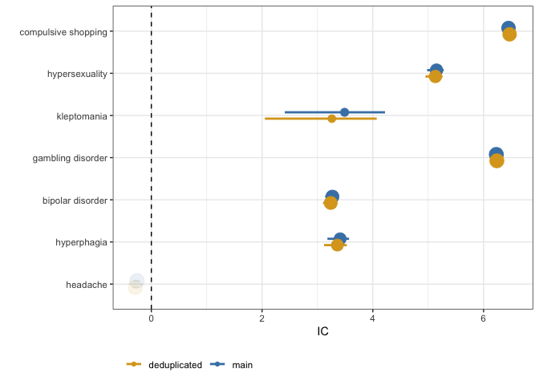
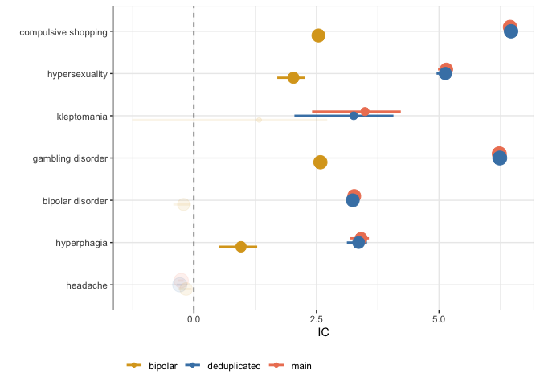
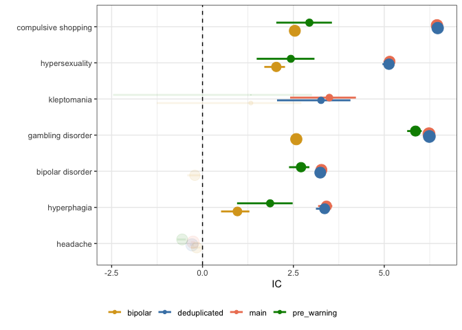
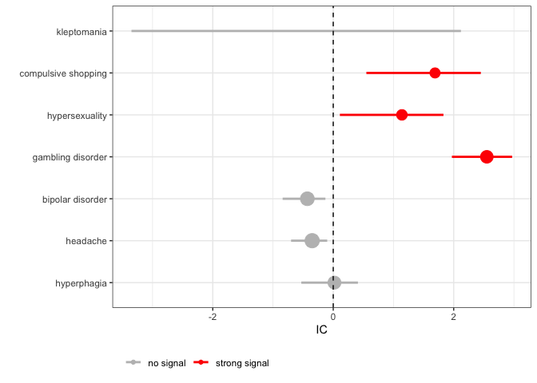

<!-- README.md is generated from README.Rmd. Please edit that file -->

# DiAna

<!-- badges: start -->
<!-- badges: end -->

The goal of DiAna is to enchance the transparency,
flexibility,replicability, and tool exchange capabilities within the
domain of pharmacovigilance studies. This specialized R package has been
meticulously crafted to facilitate the intricate process of
disproportionality analysis on the FDA Adverse Event Reporting System
(FAERS) data. DiAna empowers researchers and pharmacovigilance
professionals with a comprehensive toolkit to conduct rigorous and
transparent analyses. By providing customizable functions and clear
documentation, the package ensures that each step of the analysis is
fully understood and reproducible. Pharmacovigilance studies often
require tailored approaches due to the diverse nature of adverse event
data. The package offers a range of versatile tools that can be
seamlessly adapted to different study designs, data structures, and
analytical goals. Researchers can effortlessly modify parameters and
methods to suit their specific requirements. Collaboration and
knowledge-sharing are fundamental to advancing pharmacovigilance
research. DiAna plays a pivotal role in enabling the exchange of tools
and methodologies among researchers. Its modular design encourages the
development and integration of new analysis techniques, fostering a
dynamic environment for innovation.

## Installation

You can install the development version of DiAna from
[GitHub](https://github.com/) with:

``` r
# install.packages("devtools")
devtools::install_github("fusarolimichele/DiAna_package")
```

## Example

This is a basic example which shows you how to solve a common problem:

### Setting up DiAna

The first time we use DiAna, we have to set up the folder where the data
will be stored together with the results of the analyses. We suggest to
create anywhere (e.g., the desktop) a folder named DiAna, and to open in
it an R project “DiAna.Rproj”. On the console, we can then run the two
rows below, the first importing the DiAna package (i.e., the toolbox
with all the functions that we will use in our analyses), and the second
automaticatilly setting up everything else for us: it will create a
folder to store cleaned FAERS data, that will be downloaded from an OSF
repository. The entire cleaning process is made transparent on the
github. It will also create a folder for external sources and a folder
to store projects.

``` r
library(DiAna)
setup_DiAna(quarter = "23Q1")
# input yes when asked to download the FAERS
```

### Starting a project

We then are ready to start a project and the first thing we do is open a
new script and insert some details on the project. Every time we use a
\# we are inserting a comment, that is extremely useful to document and
explain our project, but that is not run and does not affect the
results.

``` r
# Information -----------------------------------------------------------------
## Project title --------------------------------------------------------------
### Was the association between impulse control disorders and aripiprazole already solid before the FDA warning and taking into account expected biases?

## Data -----------------------------------------------------------------------
### FDA Adverse Event Reporting System Quarterly Data up to 23Q1

## Authors --------------------------------------------------------------------
### Michele Fusaroli

## Version --------------------------------------------------------------------
### Set up: 2023-09-04
### Last update: 2023-09-06
```

### Disproportionality Analysis

We use library() to access the DiAna package, and define the drug
(“aripiprazole”) and events of interest. For this study we are
investigating 5 manfestations of pathologic impulsivity (impulse control
disorders: “gambling”, “hypersexuality”, “shopping”, “hyperphagia”,
“kleptomania”) together with one known adverse drug reaction of
aripiprazole (“headache”) and one clear bias (“bipolar disorder” is one
of the major indications for using aripiprazole).

``` r
library(DiAna) # access DiAna
#> Loading required package: data.table
#> Loading required package: gtsummary
#> Loading required package: questionr
#> Loading required package: tidyverse
#> ── Attaching core tidyverse packages ──────────────────────── tidyverse 2.0.0 ──
#> ✔ dplyr     1.1.3     ✔ readr     2.1.4
#> ✔ forcats   1.0.0     ✔ stringr   1.5.0
#> ✔ ggplot2   3.4.3     ✔ tibble    3.2.1
#> ✔ lubridate 1.9.3     ✔ tidyr     1.3.0
#> ✔ purrr     1.0.2     
#> ── Conflicts ────────────────────────────────────────── tidyverse_conflicts() ──
#> ✖ dplyr::between()     masks data.table::between()
#> ✖ dplyr::filter()      masks stats::filter()
#> ✖ dplyr::first()       masks data.table::first()
#> ✖ lubridate::hour()    masks data.table::hour()
#> ✖ lubridate::isoweek() masks data.table::isoweek()
#> ✖ dplyr::lag()         masks stats::lag()
#> ✖ dplyr::last()        masks data.table::last()
#> ✖ lubridate::mday()    masks data.table::mday()
#> ✖ lubridate::minute()  masks data.table::minute()
#> ✖ lubridate::month()   masks data.table::month()
#> ✖ lubridate::quarter() masks data.table::quarter()
#> ✖ lubridate::second()  masks data.table::second()
#> ✖ purrr::transpose()   masks data.table::transpose()
#> ✖ lubridate::wday()    masks data.table::wday()
#> ✖ lubridate::week()    masks data.table::week()
#> ✖ lubridate::yday()    masks data.table::yday()
#> ✖ lubridate::year()    masks data.table::year()
#> ℹ Use the conflicted package (<http://conflicted.r-lib.org/>) to force all conflicts to become errors
#> Loading required package: writexl
#> 
#> Welcome to DiAna package. A tool for standardized, flexible, and transparent disproportionality analysis on the FAERS.
#> 
#> To cite package ‘DiAna’ in publications use:
#> 
#>   Fusaroli M, Giunchi V (2023). _DiAna: Advanced
#>   Disproportionality Analysis in the FAERS for Drug
#>   Safety_.
#>   https://github.com/fusarolimichele/DiAna_package,
#>   https://github.com/fusarolimichele/DiAna,
#>   https://osf.io/zqu89/.

drug_selected <- "aripiprazole" # define the drug of interest

reac_selected <- list( # define the events of interest
  "gambling disorder",
  "hypersexuality",
  "compulsive shopping",
  "hyperphagia",
  "kleptomania",
  "bipolar disorder",
  "headache"
)
```

Then we import the different datasets from the FAERS relational database
that we are going to use in the simplest analysis: the datases storing
information about drugs and reactions.

We perform a disproportionality analysis using the
disproportionality_analysis() function to see whether each of the events
investigated is more reported with the drug of interest than what
expected based on the entire FAERS database assuming that the drug and
the event are independent.

And we visualize the information component, a measure of
disproportionality, using a forest plot.

``` r
FAERS_version <- "23Q1"
import("DRUG") # import FAERS drug information
#>           primaryid   drug_seq       substance role_cod
#>        1:   4261825 1004486228        atropine        C
#>        2:   4261825 1004486228   diphenoxylate        C
#>        3:   4262057 1004487206     amoxicillin       PS
#>        4:   4262057 1004487206 clavulanic acid       PS
#>        5:   4262057 1004487210        macrogol        C
#>       ---                                              
#> 64409055:  99974963          6       ibuprofen        I
#> 64409056:  99974963          7       lorazepam        I
#> 64409057:  99974963          8            <NA>        I
#> 64409058:  99974963          9     paracetamol        I
#> 64409059:  99974963         10    zolmitriptan       SS
import("REAC") # import FAERS reaction information
#>           primaryid                   pt drug_rec_act
#>        1:   4204616       abdominal pain         <NA>
#>        2:   4204616 heart rate increased         <NA>
#>        3:   4204616               nausea         <NA>
#>        4:   4204616              pyrexia         <NA>
#>        5:   4204616   uterine tenderness         <NA>
#>       ---                                            
#> 48356242: 998834879          joint noise         <NA>
#> 48356243:  99953304     drug interaction         <NA>
#> 48356244:  99953304        breast cancer         <NA>
#> 48356245:  99974963        breast cancer         <NA>
#> 48356246:  99974963     drug interaction         <NA>

DPA_df <- disproportionality_analysis( # perform disproportionality analysis
  drug_selected,
  reac_selected
)

render_forest(DPA_df, "IC",
  row = "event"
)
```


Apart from the warning, that in this case should not bother us, we found
an association between aripiprazole and all the events investigated
apart from headache.

Sharing this script, we allow everyone to replicate the study, to use
this study design for their own similar inquiries, and to make as
suggestions to improve the quality of our evidence, for example taking
care of some important biases.

# Removing distortions due to duplicates

Duplicates may distort our results. DiAna already applied multiple
strategies to detect potential duplicates, and will soon add even more
advanced algorithms. The results of these duplicates detection is stored
in the DEMO dataset, that we are now importing.

We are using now the RB_duplicates_only_susp algorithm, that looks for
the same exact values in sex, age, country of occurrence, event date,
list of events, and list of suspected drugs. This way we remove more
than 3 milion reports over 16 total reports in the FAERS (quarterly
data) up to 23Q1.

Deduplicated reports are selected as those that are not identified as
duplicates by the algorithm.

Then we perform the disproportionality analysis restricting to
deduplicated reports. And we store these results together with the
results of the previous analysis to allow for visual comparison using a
forest plot.

``` r
import("DEMO") # import demographic information
#>           primaryid  sex age_in_days wt_in_kgs             occr_country
#>        1:  45217461    M        9855        NA                     <NA>
#>        2:  57910401 <NA>          NA        NA                     <NA>
#>        3:  56962401 <NA>          NA        NA                     <NA>
#>        4:  54662121    F       22630        NA                     <NA>
#>        5:  31231172    F       21535        68                     <NA>
#>       ---                                                              
#> 16265820:  89418103    M        4015        NA  France, French Republic
#> 16265821:  89516744    M        4015        NA  France, French Republic
#> 16265822:  89516903    M        2920        NA  France, French Republic
#> 16265823:  90224005    M          NA        NA                   Canada
#> 16265824:  91610302    F        7665        NA United States of America
#>           event_dt occp_cod          reporter_country rept_cod init_fda_dt
#>        1: 19861106       MD  United States of America      DIR    19861224
#>        2:       NA     <NA>  United States of America      DIR    19920917
#>        3: 19960123     <NA>  United States of America      DIR    19960126
#>        4: 19960919       CN South Africa, Republic of      EXP    19961022
#>        5: 19970927       MD  United States of America      EXP    19971203
#>       ---                                                                 
#> 16265820:       NA       HP   France, French Republic      EXP    20121203
#> 16265821:       NA       HP   France, French Republic      EXP    20121204
#> 16265822:       NA       HP   France, French Republic      EXP    20121204
#> 16265823: 20020201       MD                    Canada      EXP    20130118
#> 16265824:       NA       HP  United States of America      PER    20130313
#>             fda_dt premarketing literature RB_duplicates
#>        1: 19861224        FALSE      FALSE         FALSE
#>        2: 19920917        FALSE      FALSE         FALSE
#>        3: 19960126        FALSE      FALSE         FALSE
#>        4: 19961022        FALSE      FALSE         FALSE
#>        5: 19971212        FALSE      FALSE         FALSE
#>       ---                                               
#> 16265820: 20230331        FALSE       TRUE         FALSE
#> 16265821: 20230331        FALSE       TRUE         FALSE
#> 16265822: 20230331        FALSE       TRUE         FALSE
#> 16265823: 20230331        FALSE      FALSE         FALSE
#> 16265824: 20230331        FALSE       TRUE         FALSE
#>           RB_duplicates_only_susp
#>        1:                   FALSE
#>        2:                   FALSE
#>        3:                   FALSE
#>        4:                   FALSE
#>        5:                   FALSE
#>       ---                        
#> 16265820:                   FALSE
#> 16265821:                   FALSE
#> 16265822:                   FALSE
#> 16265823:                   FALSE
#> 16265824:                   FALSE

deduplicated <- Demo[RB_duplicates_only_susp == FALSE]$primaryid # identify deduplicated reports

DPA_df_deduplicated <- disproportionality_analysis( # disproportionality analysis with restriction
  drug_selected,
  reac_selected,
  restriction = deduplicated
)

df <- rbindlist(list( # storing together the results of different analyses
  DPA_df[, nested := "main"],
  DPA_df_deduplicated[, nested := "deduplicated"]
), fill = TRUE)

render_forest(df, "IC", # compare the results using a forest plot
  nested = "nested",
  row = "event"
)
```



In these cases, in fact, we don’t see much a difference comparing the
analysis on the entire FAERS with the analysis on deduplicated data.
This is not generalizable to other drugs and events, and to other
deduplication algorithms.

# Conditioning on the indication

Since bipolar disorder is a reason for using aripiprazole, we could
think that patients with bipolar disorder are more susceptible to
impulsivity and impulsive behaviors, and maybe that could be the only
reason for the association between aripiprazole and impulsive behaviors
(what is known as confounding by indication).

The way we can mitigate this bias is by conditioning on the indication,
for example restricting to patients with bipolar disorder alone.

We therefore need to import the Indi dataset.

To be more sensitive the search for bipolar disorder, we want to use the
MedDRA hierarchy. Alas, the access to MedDRA is by subscription only and
we cannot provide our ready-to-use file. But with a prescription you can
follow the algorithm deascribed in the
<https://github.com/fusarolimichele/DiAna> to make your own
DiAna-compatible MedDRA.

Thus, we can select only reports with, among indications, terms included
in the hlgt “manic and bipolar mood disorders and disturbances”. And we
repeat again the disproportionality analysis with a different
restriction, and compare the results using the forest plot.

``` r
##
import("INDI") # import indications information
#>           primaryid   drug_seq                             indi_pt
#>        1:   4204616 1004278786                    abortion induced
#>        2:   4223542 1004334703                     crohn's disease
#>        3:   4250482 1004434717                     crohn's disease
#>        4:   4261823 1004486217                 bronchial carcinoma
#>        5:   4261823 1004486218                 bronchial carcinoma
#>       ---                                                         
#> 38150726:  99974963          6 product used for unknown indication
#> 38150727:  99974963          7 product used for unknown indication
#> 38150728:  99974963          8 product used for unknown indication
#> 38150729:  99974963          9 product used for unknown indication
#> 38150730:  99974963         10                            migraine
import_MedDRA() # import MedDRA hierarchy
#>          def                                            soc
#>     1:  cong     congenital, familial and genetic disorders
#>     2:   inv                                 investigations
#>     3:   inv                                 investigations
#>     4:   inv                                 investigations
#>     5:   inv                                 investigations
#>    ---                                                     
#> 25408: inj&p injury, poisoning and procedural complications
#> 25409:  preg pregnancy, puerperium and perinatal conditions
#> 25410:  surg                surgical and medical procedures
#> 25411:  surg                surgical and medical procedures
#> 25412: blood           blood and lymphatic system disorders
#>                                                         hlgt
#>     1:        metabolic and nutritional disorders congenital
#>     2:          endocrine investigations (incl sex hormones)
#>     3:          endocrine investigations (incl sex hormones)
#>     4:          endocrine investigations (incl sex hormones)
#>     5:          endocrine investigations (incl sex hormones)
#>    ---                                                      
#> 25408:     procedural related injuries and complications nec
#> 25409: pregnancy, labour, delivery and postpartum conditions
#> 25410:   obstetric and gynaecological therapeutic procedures
#> 25411:             male genital tract therapeutic procedures
#> 25412:                            white blood cell disorders
#>                                                  hlt
#>     1:            inborn errors of steroid synthesis
#>     2:                 reproductive hormone analyses
#>     3:                 reproductive hormone analyses
#>     4:                 reproductive hormone analyses
#>     5:                 reproductive hormone analyses
#>    ---                                              
#> 25408:    non-site specific procedural complications
#> 25409:         normal pregnancy, labour and delivery
#> 25410:                 cervix therapeutic procedures
#> 25411: male genital tract therapeutic procedures nec
#> 25412:                        eosinophilic disorders
#>                                      pt
#>     1:   11-beta-hydroxylase deficiency
#>     2:            17 ketosteroids urine
#>     3:  17 ketosteroids urine decreased
#>     4:  17 ketosteroids urine increased
#>     5:     17 ketosteroids urine normal
#>    ---                                 
#> 25408:     incision site skin puckering
#> 25409: spontaneous rupture of membranes
#> 25410:           cervix stent placement
#> 25411:           sperm cryopreservation
#> 25412:      paraneoplastic eosinophilia

bipolar_disorder <- Indi[indi_pt %in% MedDRA[ # select reports with bipolar disorder among indications
  hlgt == "manic and bipolar mood disorders and disturbances"
]$pt]$primaryid

DPA_df_bipolar <- disproportionality_analysis( # disproportionality analysis with restriction
  drug_selected,
  reac_selected,
  restriction = bipolar_disorder
)

df <- rbindlist(list( # storing together the results of different analyses
  df,
  DPA_df_bipolar[, nested := "bipolar"]
), fill = TRUE)

render_forest(df, "IC", # compare the results using a forest plot
  nested = "nested",
  row = "event"
)
```


Conditioning on the indication, we see that the association with bipolar
disorder disappears (as it should be). Also the association with impulse
control disorders is weakened, supporting the hypothesis that bipolar
disorder is a risk factor for impulsivity but it is not sufficient alone
to completely explain these pervasive behaviors. The confidence interval
of kleptomania gets wider, since the number of cases gets too small, and
the signal disappear.

We can also see that the signal for headache, which is not associated
with bipolar disorder, is not affected by this restriction.

# Restricting to reports submitted before the warning

The FDA warning in 2016 may have inflated the reporting distorting the
results (i.e., notoriety bias). To mitigate this bias we can select only
reports submitted before the date of the warning, and repeating the
disproportionality analysis.

``` r
warning_date <- 20160305 # define the warning date
pre_warning <- Demo[init_fda_dt < warning_date]$primaryid # select only reports submitted before the warning

preW <- disproportionality_analysis( # disproportionality analysis with restriction
  drug_selected,
  reac_selected,
  restriction = pre_warning
)

df <- rbindlist(list( # storing together the results of different analyses
  df,
  preW[, nested := "pre_warning"]
), fill = TRUE)

render_forest(df, "IC", # compare the results using a forest plot
  nested = "nested",
  row = "event"
)
```



Here you see in green the results of the analysis restricting to the
pre-warning. You can see that this analysis does not affect bipolar
disorder nor headache, but it affects all the impulse control disorders
apart gambling. Plausibly the FDA warning was based mainly on suspect
aripiprazole-induced gambling disorder.

# Custom event groupings

MedDRA, used to code adverse events, is highly redundant: there are
multiple terms that may be used to express the same concept. Therefore a
more sensitive and specific approach should take into account all these
terms. We can therefore redefine our reactions of interest for higher
sensitivity.

``` r
##
reac_selected <- list( # redefined reaction for higher sensitivity
  "gambling disorder" = list("gambling disorder", "gambling"),
  "hypersexuality" = list(
    "compulsive sexual behaviour", "hypersexuality",
    "excessive masturbation", "excessive sexual fantasies", "libido increased",
    "sexual activity increased", "kluver-bucy syndrome", "erotophonophilia",
    "exhibitionism", "fetishism", "frotteurism", "masochism", "paraphilia",
    "paedophilia", "sadism", "transvestism", "voyeurism",
    "sexually inappropriate behaviour"
  ),
  "compulsive shopping" = list("compulsive shopping"),
  "hyperphagia" = list(
    "binge eating", "food craving", "hyperphagia",
    "increased appetite"
  ),
  "kleptomania" = list("kleptomania", "shoplifting"),
  "bipolar disorder" = as.list(MedDRA[hlt == "bipolar disorders"]$pt),
  "headache" = as.list(MedDRA[hlgt == "headaches"]$pt)
)

custom_group <- disproportionality_analysis( # perform the disproportionality analysis
  drug_selected,
  reac_selected,
  meddra_level = "custom"
)

df <- rbindlist(list( # storing together the results of different analyses
  df,
  custom_group[, nested := "custom-groups"]
), fill = TRUE)

render_forest(df, "IC", # compare the results using a forest plot
  nested = "nested",
  row = "event"
)
```

 As
we can see here custom groups affect mainly kleptomania. Indeed many
reporters prefer to use shoplifting instead of kleptomania, and
therefore the signal is now much stronger.

# Complete analysis

In conclusion, we can integrate all the restrictions and use custom
groups to have a unified analysis.

``` r
##
restriction <- intersect(intersect(deduplicated, bipolar_disorder), pre_warning) # integrate all the restrictions

complete <- disproportionality_analysis( # disproportionality
  drug_selected,
  reac_selected,
  meddra_level = "custom",
  restriction = restriction
)
render_forest(complete, "IC", # forest plot
  row = "event"
)
```



Therefore, you can see that even before the warning and taking into
account all the considered biases, the FDA had enough information to
publish the warning.
