This tutorial demonstrates how to apply causal inference reasoning to disproportionality analyses (DPAs), using a step-by-step example from the preprint article available at [this link](https://osf.io/preprints/osf/h5w9u). In pharmacovigilance, there are two common but opposing tendencies: either avoiding any consideration of causality altogether, which renders the analysis cautious but ineffective, or mistakenly equating association with causation, leading to incorrect conclusions. However, tools exist for performing causal inference even on observational and imperfect data, after specifying certain assumptions. In this tutorial, we demonstrate the practical benefits of using Directed Acyclic Graphs (DAGs) to guide conditioning in disproportionality analysis of Individual Case Safety Reports (ICSRs). This approach can serve as a valuable link to more comprehensive pharmacovigilance and pharmacoepidemiological studies.

For an extensive discussion about applying causal inference to disproportionality analysis, check the [preprint](https://osf.io/preprints/osf/h5w9u).

## Requisites

This tutorial requires that you have first:

1.  installed R and R Studio,

2.  installed the DiAna package,

3.  and set up your project folder.

Otherwise get back to the ReadMe and follow the instructions.

It is also recommended that you have read the previous vignettes. In particular, the [disproportionality analysis tutorial](Disproportionality_Analysis.html) is extremely recommended.

## Start the subproject

From the DiAna main project, we open a new R script and run the snippet 'new_FAERS_project' to set up a project, and then tailor the information thus precompiled (note that we are here running the analysis including also quarter up to 24Q1, while the preprint was limited to 23Q1).


``` r
# Information -----------------------------------------------------------------
## Project title --------------------------------------------------------------
### "Causal inference tools for pharmacovigilance"
## Data -----------------------------------------------------------------------
### FDA Adverse Event Reporting System Quarterly Data

## Authors of the preprint ----------------------------------------------------
### - Michele Fusaroli
### - Joseph Mitchell
### - Annette Rudolph
### - Elena Rocca
### - Riccardo Fusaroli

## Version --------------------------------------------------------------------
### Set up: 2024-07-29
### Last update: 2024-07-29
### DiAna version: 2.1.0

# Set up ----------------------------------------------------------------------
## upload DiAna ---------------------------------------------------------------
library(DiAna)

## Project_path ---------------------------------------------------------------
DiAna_path <- here::here()
project_name <- "Causal inference"
project_path <- paste0(DiAna_path, "/projects/", project_name)
if (!file.exists(project_path)) {
  dir.create(project_path)
}
project_path <- paste0(project_path, "/")

## FAERS_version --------------------------------------------------------------

FAERS_version <- "24Q1"

## Import data ----------------------------------------------------------------
import("DRUG")
#>           primaryid   drug_seq       substance role_cod
#>               <num>      <int>          <fctr>    <ord>
#>        1:   4261825 1004486228        atropine        C
#>        2:   4261825 1004486228   diphenoxylate        C
#>        3:   4262057 1004487206     amoxicillin       PS
#>        4:   4262057 1004487206 clavulanic acid       PS
#>        5:   4262057 1004487210        macrogol        C
#>       ---                                              
#> 69763501: 992001227        580      loratadine       SS
#> 69763502: 992001227        581      loratadine       SS
#> 69763503: 992001227        582      loratadine       SS
#> 69763504: 992001227        586       magnesium        C
#> 69763505: 992001227        587       magnesium        C
import("REAC")
#>           primaryid                            pt drug_rec_act
#>               <num>                         <ord>        <ord>
#>        1:   4204616                abdominal pain         <NA>
#>        2:   4204616          heart rate increased         <NA>
#>        3:   4204616                        nausea         <NA>
#>        4:   4204616                       pyrexia         <NA>
#>        5:   4204616            uterine tenderness         <NA>
#>       ---                                                     
#> 52222720: 237079291         chemical burn of skin         <NA>
#> 52222721: 237079291    toxicity to various agents         <NA>
#> 52222722: 237079291                          scar         <NA>
#> 52222723: 237203351 injection site discolouration         <NA>
#> 52222724: 237203351       injection site bruising         <NA>
import("DEMO")
#>           primaryid    sex age_in_days wt_in_kgs occr_country event_dt occp_cod          reporter_country rept_cod
#>               <num> <fctr>       <num>     <num>       <fctr>    <int>   <fctr>                    <fctr>   <fctr>
#>        1:  45217461      M        9855        NA         <NA> 19861106       MD  United States of America      DIR
#>        2:  57910401   <NA>          NA        NA         <NA>       NA     <NA>  United States of America      DIR
#>        3:  56962401   <NA>          NA        NA         <NA> 19960123     <NA>  United States of America      DIR
#>        4:  54662121      F       22630        NA         <NA> 19960919       CN South Africa, Republic of      EXP
#>        5:  31231172      F       21535        68         <NA> 19970927       MD  United States of America      EXP
#>       ---                                                                                                         
#> 17598475: 236937711      F        9490        68         <NA> 20240318       CN  United States of America      DIR
#> 17598476: 236937721      M        6205        NA         <NA> 20240101       CN  United States of America      DIR
#> 17598477: 236937741      F       13140       134         <NA> 20240322       CN  United States of America      DIR
#> 17598478: 237079261      F       15695        90         <NA>       NA       CN  United States of America      DIR
#> 17598479: 237079291      M       22265       108         <NA> 20240228       CN  United States of America      DIR
#>           init_fda_dt   fda_dt premarketing literature RB_duplicates RB_duplicates_only_susp
#>                 <int>    <int>       <lgcl>     <lgcl>        <lgcl>                  <lgcl>
#>        1:    19861224 19861224        FALSE      FALSE         FALSE                   FALSE
#>        2:    19920917 19920917        FALSE      FALSE         FALSE                   FALSE
#>        3:    19960126 19960126        FALSE      FALSE         FALSE                   FALSE
#>        4:    19961022 19961022        FALSE      FALSE         FALSE                   FALSE
#>        5:    19971203 19971212        FALSE      FALSE         FALSE                   FALSE
#>       ---                                                                                   
#> 17598475:    20240331 20240331        FALSE      FALSE         FALSE                   FALSE
#> 17598476:    20240331 20240331        FALSE      FALSE         FALSE                   FALSE
#> 17598477:    20240331 20240331        FALSE      FALSE         FALSE                   FALSE
#> 17598478:    20240331 20240331        FALSE      FALSE         FALSE                   FALSE
#> 17598479:    20240331 20240331        FALSE      FALSE         FALSE                   FALSE
import("INDI")
#>           primaryid   drug_seq                                 indi_pt
#>               <num>      <int>                                   <ord>
#>        1:   4204616 1004278786                        abortion induced
#>        2:   4223542 1004334703                         crohn's disease
#>        3:   4250482 1004434717                         crohn's disease
#>        4:   4261823 1004486217                     bronchial carcinoma
#>        5:   4261823 1004486218                     bronchial carcinoma
#>       ---                                                             
#> 41380269: 992001227        583     product used for unknown indication
#> 41380270: 992001227        586     product used for unknown indication
#> 41380271: 236936391          1 beta haemolytic streptococcal infection
#> 41380272: 237079291          1                    acrochordon excision
#> 41380273: 237203351          1     product used for unknown indication
import("OUTC")
#>           primaryid outc_cod
#>               <num>    <ord>
#>        1:   4204616       HO
#>        2:   4204616       RI
#>        3:   4214534       DE
#>        4:   4223542       OT
#>        5:   4250482       OT
#>       ---                   
#> 12914603: 986902733       OT
#> 12914604: 987122169       HO
#> 12914605: 987122169       OT
#> 12914606: 992001227       HO
#> 12914607: 992001227       OT
import_ATC()
#>                                      substance    code primary_code   Lvl4
#>                                         <char>  <char>       <char> <char>
#>    1:   lutetium (177lu) vipivotide tetraxetan V10XX05      V10XX05  V10XX
#>    2:                lutetium (177lu) dotatate V10XX04      V10XX04  V10XX
#>    3:                    radium-223 dichloride V10XX03      V10XX03  V10XX
#>    4:                     ibritumomab tiuxetan V10XX02      V10XX02  V10XX
#>    5:                        lutetium (lu 177)   V10XX        V10XX  V10XX
#>   ---                                                                     
#> 3205:                         sodium perborate A01AB19      A01AB19  A01AB
#> 3206:                                 domiphen A01AB06      A01AB06  A01AB
#> 3207:               sodium monofluorophosphate A01AA02      A01AA02  A01AA
#> 3208:                          sodium fluoride A01AA01      A01AA01  A01AA
#> 3209: stomatological preparations, unspecified    A01A         A01A   A01A
#>                                                        Class4   Lvl3                               Class3   Lvl2
#>                                                        <char> <char>                               <char> <char>
#>    1:                Various therapeutic radiopharmaceuticals   V10X Other diagnostic radiopharmaceutical    V10
#>    2:                Various therapeutic radiopharmaceuticals   V10X Other diagnostic radiopharmaceutical    V10
#>    3:                Various therapeutic radiopharmaceuticals   V10X Other diagnostic radiopharmaceutical    V10
#>    4:                Various therapeutic radiopharmaceuticals   V10X Other diagnostic radiopharmaceutical    V10
#>    5:                Various therapeutic radiopharmaceuticals   V10X Other diagnostic radiopharmaceutical    V10
#>   ---                                                                                                           
#> 3205: Antiinfectives and antiseptics for local oral treatment   A01A          Stomatological preparations    A01
#> 3206: Antiinfectives and antiseptics for local oral treatment   A01A          Stomatological preparations    A01
#> 3207:                              Caries prophylactic agents   A01A          Stomatological preparations    A01
#> 3208:                              Caries prophylactic agents   A01A          Stomatological preparations    A01
#> 3209:                                                    <NA>   A01A          Stomatological preparations    A01
#>                                 Class2   Lvl1                    Class1
#>                                 <char> <char>                    <char>
#>    1: Therapeutic radiopharmaceuticals      V                   Various
#>    2: Therapeutic radiopharmaceuticals      V                   Various
#>    3: Therapeutic radiopharmaceuticals      V                   Various
#>    4: Therapeutic radiopharmaceuticals      V                   Various
#>    5: Therapeutic radiopharmaceuticals      V                   Various
#>   ---                                                                  
#> 3205:      Stomatological preparations      A Alimentary and Metabolism
#> 3206:      Stomatological preparations      A Alimentary and Metabolism
#> 3207:      Stomatological preparations      A Alimentary and Metabolism
#> 3208:      Stomatological preparations      A Alimentary and Metabolism
#> 3209:      Stomatological preparations      A Alimentary and Metabolism
import_MedDRA()
#>           def                                            soc                                                  hlgt
#>        <char>                                         <char>                                                <char>
#>     1:   cong     congenital, familial and genetic disorders        metabolic and nutritional disorders congenital
#>     2:    inv                                 investigations          endocrine investigations (incl sex hormones)
#>     3:    inv                                 investigations          endocrine investigations (incl sex hormones)
#>     4:    inv                                 investigations          endocrine investigations (incl sex hormones)
#>     5:    inv                                 investigations          endocrine investigations (incl sex hormones)
#>    ---                                                                                                            
#> 25408:  inj&p injury, poisoning and procedural complications     procedural related injuries and complications nec
#> 25409:   preg pregnancy, puerperium and perinatal conditions pregnancy, labour, delivery and postpartum conditions
#> 25410:   surg                surgical and medical procedures   obstetric and gynaecological therapeutic procedures
#> 25411:   surg                surgical and medical procedures             male genital tract therapeutic procedures
#> 25412:  blood           blood and lymphatic system disorders                            white blood cell disorders
#>                                                  hlt                               pt
#>                                               <char>                           <char>
#>     1:            inborn errors of steroid synthesis   11-beta-hydroxylase deficiency
#>     2:                 reproductive hormone analyses            17 ketosteroids urine
#>     3:                 reproductive hormone analyses  17 ketosteroids urine decreased
#>     4:                 reproductive hormone analyses  17 ketosteroids urine increased
#>     5:                 reproductive hormone analyses     17 ketosteroids urine normal
#>    ---                                                                               
#> 25408:    non-site specific procedural complications     incision site skin puckering
#> 25409:         normal pregnancy, labour and delivery spontaneous rupture of membranes
#> 25410:                 cervix therapeutic procedures           cervix stent placement
#> 25411: male genital tract therapeutic procedures nec           sperm cryopreservation
#> 25412:                        eosinophilic disorders      paraneoplastic eosinophilia

## Tutorial -------------------------------------------------------------------
```

### Statistical and causal dependence


Our inquiry (grey arrow with a question mark) concerns the existence of a direct causal relationship between drug and event. Assuming, for the sake of the example, a simplified scenario with no other factor involved, a sample size sufficient to reliably exclude chance association, and no reporting bias, there are only two possible scenarios: statistical independence suggesting causal independence  or statistical dependence suggesting causal dependence. Disproportionality analysis helps discriminate between these two scenarios.

#### Statistical independence


Based on what we know, we expect that paracetamol has no causal dependence with breast cancer. For this reason we expect to find no association (statistical dependence) between the two.


``` r
## Tutorial -------------------------------------------------------------------
disproportionality_df <- disproportionality_analysis(
  drug_selected = "paracetamol",
  reac_selected = "breast cancer"
)
paste0("IC = ",disproportionality_df$label_IC)
#> [1] "IC = -1.63 (-1.72--1.57) [1511]"
```


``` r
render_forest(disproportionality_df)
```


Note that the negative association that we find should not be interpreted as the existence of a protective effect of paracetamol against breast cancer. First, DPA has amongst its goals to identify early warnings of ADRs, and not unexpected positive effects. Second, DPA relies on reports that are likely not representative of patients with the same susceptibility to the event but not being administered the drug. We could for example imagine that patients with breast cancer are less likely to record paracetamol in favour of anticancer drugs relative to patients with other diseases. Whether a causal inference informed pharmacovigilance could make better use of negative associations is outside the scope of this tutorial.

#### Statistical dependence

##### Direct causality


A well known example of direct causality (an actual adverse drug reaction) is pramipexole-induced impulse-control disorder. Here below we find a strong association between the reporting of pramipexole and the reporting of impulse-control disorders.


``` r
disproportionality_df <- disproportionality_analysis(
  drug_selected = "pramipexole",
  reac_selected = "impulse-control disorder"
)
paste0("IC = ",disproportionality_df$label_IC)
#> [1] "IC = 6.78 (6.61-6.89) [418]"
```

``` r
render_forest(disproportionality_df)
```


##### Reverse causality

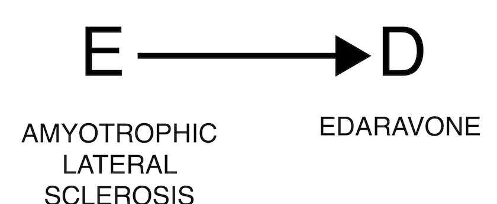

The occurrence of an event may justify the administration of a drug, as in the case where the event is the indication for using the drug. For example, edaravone is used to treat amyotrophic lateral sclerosis, and we will expect to find an association between the two (DPA cannot discriminate between direct and reverse causality). In these cases, clinical reasoning is crucial to correctly assess the association.


``` r
disproportionality_df <- disproportionality_analysis(
  drug_selected = "edaravone",
  reac_selected = "amyotrophic lateral sclerosis"
)
paste0("IC = ",disproportionality_df$label_IC)
#> [1] "IC = 7.7 (7.46-7.88) [189]"
```

``` r
render_forest(disproportionality_df)
```
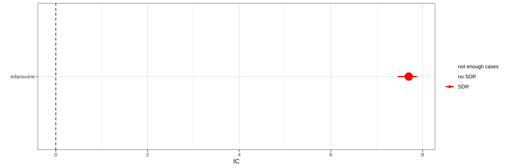

### Confounding bias

Many pharmacovigilance biases can be reframed as confounding biases, that is, open backdoor paths through which information flows even in absence of causal dependencies, thus potentially resulting in a spurious association. In all these cases the solution is the same: closing the backdoor, that is conditioning directly on this element - the confounder C -, or on any of the other nodes on the backdoor path.

#### Confounding by indication

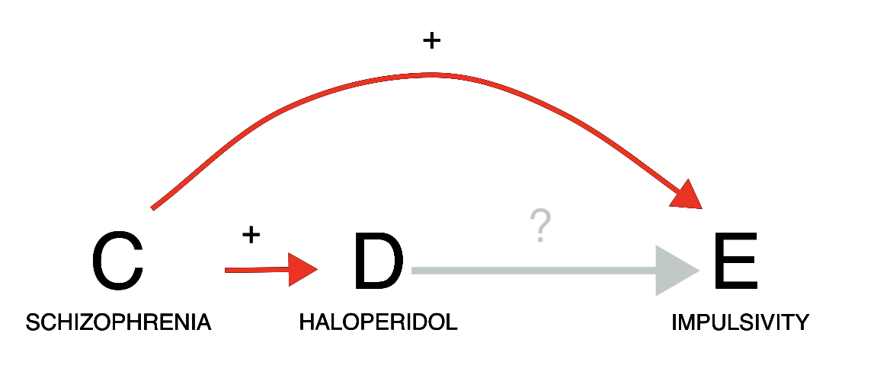

Let us consider a case of indication bias (an event associated with a drug is in fact caused by the drug indication). If we investigate the relation between haloperidol and gambling, we do indeed find a positive statistical association in the data (grey estimate). However, we need to consider that schizophrenia is likely a common cause of both: schizophrenia is both an approved indication for haloperidol, and often associated with impulsivity. Since patients prescribed haloperidol are likely to have schizophrenia, and patients with schizophrenia tend to be more impulsive, we might observe an association between haloperidol and impulsivity even without any causal effect of D on E. We should thus condition on schizophrenia, for instance by restricting our analysis to only reports recording schizophrenia among indications. As we do so, the association between haloperidol and impulsivity disappears (gold estimate), suggesting a lack of causation. Note, however, that restricting the analysis to reports that do not mention schizophrenia would not be as effective at closing the backdoor: many of these reports might still pertain to patients with schizophrenia without specifying that, and indeed in those reports we observe the same positive association (blue estimate) that we also observe without conditioning. In this scenario, appropriately conditioning on the confounder allowed us to discard a spurious signal of disproportionate reporting during signal refinement.

The negative association we get could suggest a protective effect of haloperidol against impulsivity. That seems indeed to be the case: by treating (some aspects of) schizophrenia, which also causes impulsivity, haloperidol can reduce impulsivity. However, in pharmacovigilance negative associations are typically not considered. This caution is again driven by the specific features of disproportionality analysis. First, DPA has amongst its goals to identify early warnings of ADRs, and not unexpected positive effects. Second, DPA relies on reports that are likely not representative of patients with the same susceptibility to the event but not being administered the drug. Whether a causal inference informed pharmacovigilance could make better use of negative associations is outside the scope of this tutorial.


``` r
pids_schizophrenia <- unique(Indi[indi_pt%in%MedDRA[hlgt=="schizophrenia and other psychotic disorders"]$pt]$primaryid)

restrictions <- list("main"=list(unique(Demo$primaryid)),"schizophrenia"=list(pids_schizophrenia))#,"not_schizophrenia"=list(setdiff(unique(Demo$primaryid),pids_schizophrenia)))
disproportionality_df <- data.table()
for (n in 1:length(restrictions)){
  t <- restrictions[n]
  t_name <- names(t)
  t_pids <- unlist(t)
  df <- disproportionality_analysis(drug_selected="haloperidol",
                                    reac_selected = "gambling disorder",
                                    meddra_level = "pt",
                                    restriction = t_pids)[,nested:=t_name]
  disproportionality_df <- rbindlist(list(disproportionality_df,df),fill = TRUE)
}


disproportionality_df <- disproportionality_df[,nested:=factor(nested, levels=c("not_schizophrenia","main","schizophrenia"),ordered=TRUE)]
disproportionality_df[,.(nested,label_IC)]
#>           nested                label_IC
#>            <ord>                  <char>
#> 1:          main   2.19 (1.69-2.54) [45]
#> 2: schizophrenia -0.91 (-1.64--0.4) [21]
```


``` r
render_forest(disproportionality_df,nested = "nested",nested_colors=c("blue","gray45","goldenrod"))
```
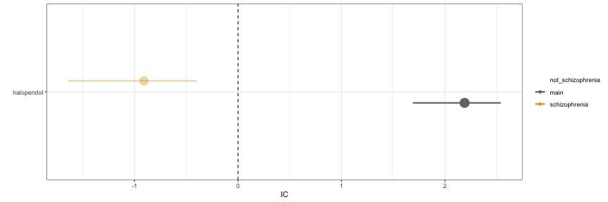


#### Confounding by comorbidity

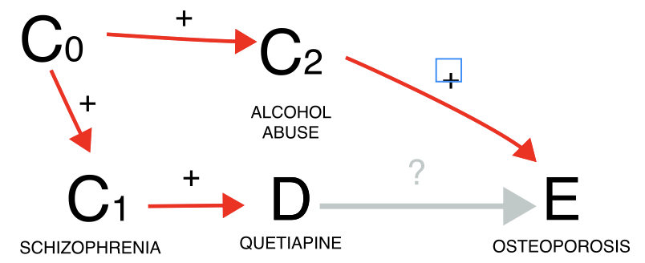

Another instance involves the issue of confounding by comorbidity (a comorbidity of the indication for using the drug is the real cause of the event). Here, our focus might be on investigating whether quetiapine leads to osteoporosis. However, since quetiapine is often prescribed for schizophrenia, which frequently co-occurs with alcoholism—a known risk factor for osteoporosis—we encounter a positive confounding effect. This means we could find a statistical dependence (grey estimate) even in the absence of a causal dependence. When we condition on reports of alcoholism, the association tends to vanish (gold estimate), although we cannot determine whether this is simply due to increased uncertainty, since only a small number of reports mentions alcoholism-related terms. Alternatively, we could restrict to schizophrenia reports, which would mitigate the positive confounding effect. Note, however, this restriction would also address a negative confounding factor not depicted in the Directed Acyclic Graph (DAG): the association between schizophrenia and younger age, which correlates with a reduced risk of osteoporosis. For this reason it is always important to remember that DAG help causal inference, but that these inferences are true as long as the assumptions drawn in the DAG are verified (and may be distorted by an incomplete or wrong DAG). Thus, the impact of conditioning is less straightforward to predict. Another possibility would be to restrict to all reports without mentions of alcoholism (blue estimate), however, alcoholism is drastically under-reported in ICSRs, and the conditioning unlikely to be effective in closing the backdoor path - information would still flow through the reports from alcoholic patients, not reporting alcoholism.


``` r
alcoholism <- c("alcoholism","alcohol problem","alcoholic encephalopathy","alcoholic coma",
                "alcohol use disorder","alcoholic ketoacidosis","ex-alcohol user",
                "alcoholic pancreopathy","ex-alcoholic","alcoholic pancreatitis",
                "prophylaxis against alcoholic withdrawal syndrome",
                "alcoholic seizure","alcohol rehabilitation","alcohol withdrawal syndrome",
                "alcohol detoxification","alcohol use","social alcohol drinker",
                "polyneuropathy alcoholic","hepatitis alcoholic","gastritis alcoholic haemorrhagic",
                "gastritis alcoholic","fatty liver alcoholic","cirrhosis alcoholic",
                "cardiomyopathy alcoholic","amblyopia alcohol","alcoholic psychosis",
                "alcoholic pseudo cushing's syndrome","alcoholic liver disease",
                "alcoholic hangover","alcohol poisoning","alcohol induced persisting dementia",
                "alcohol abuse")
pids_alcoholism <- union(Reac[pt%in%alcoholism]$primaryid,Indi[indi_pt%in%alcoholism]$primaryid)
restrictions <- list("main"=list(unique(Demo$primaryid)),"alcoholism"=list(pids_alcoholism))#,
                  #   "non-alcoholism"=list(setdiff(Demo$primaryid,pids_alcoholism)))

disproportionality_df <- data.table()
for (n in 1:length(restrictions)){
  t <- restrictions[n]
  t_name <- names(t)
  t_pids <- unlist(t)
  df <- disproportionality_analysis(drug_selected="quetiapine",
                                    reac_selected = "osteoporosis",
                                    meddra_level = "pt",
                                    restriction = t_pids)[,nested:=t_name]
  disproportionality_df <- rbindlist(list(disproportionality_df,df),fill = TRUE)
}

disproportionality_df <- disproportionality_df[,nested:=factor(nested, levels=c("non-alcoholism","main","alcoholism"),ordered=TRUE)]
disproportionality_df[,.(nested,label_IC)]
#>        nested               label_IC
#>         <ord>                 <char>
#> 1:       main 0.59 (0.44-0.69) [526]
#> 2: alcoholism  0.21 (-1.86-1.41) [3]
```


``` r
render_forest(disproportionality_df,nested = "nested",nested_colors=c("blue","gray45","goldenrod"))
```


#### Confounding by differential prescription


A third example concerns confounding by differential prescription (allocation bias/channelling bias). The statistical dependence (or its lack of) is here generated by the existence of differential prescriptive habits in subgroups with different susceptibility to the event. If we investigate the relation between nivolumab and risk of preterm birth, we do find a negative statistical association (grey estimate), that is, no evidence of a positive association, according to pharmacovigilance standards (see footnote 2). However, pregnancy is associated with both the risk of the event (no pregnancy, no preterm delivery), and a lower use of nivolumab. The drug is indeed unlikely to be used during pregnancy due to lower probability of cancer in fertile age and lack of safety evidence for this population (partial contraindication). Drawing the DAG, we can infer that confounding would push towards a negative association (odd number of minus signs): nivolumab is less used in pregnancy and therefore is less co-reported with preterm birth. Restricting to cases of pregnancy, a positive association between nivolumab and preterm birth emerges (gold estimate). In this instance, not conditioning on the confounder would have led to missing a potential safety signal during signal detection.


``` r
pids_pregnancy_indi <- unique(Indi[indi_pt%in%MedDRA[soc=="pregnancy, puerperium and perinatal conditions"]$pt]$primaryid)
pids_pregnancy_reac <- unique(Reac[pt%in%MedDRA[soc=="pregnancy, puerperium and perinatal conditions"]$pt]$primaryid)
pids_pregnancy <- union(pids_pregnancy_indi,pids_pregnancy_reac)

restrictions <- list("main"=list(unique(Demo$primaryid)),"pregnancy"=list(pids_pregnancy))
disproportionality_df <- data.table()
for (n in 1:length(restrictions)){
  t <- restrictions[n]
  t_name <- names(t)
  t_pids <- unlist(t)
  df <- disproportionality_analysis(drug_selected="nivolumab",
                                    reac_selected = list("preterm birth"=list("premature baby","premature delivery")),
                                    restriction = t_pids)[,nested:=t_name]
  disproportionality_df <- rbindlist(list(disproportionality_df,df),fill = TRUE)
}
disproportionality_df <- disproportionality_df[,nested:=factor(nested, levels=c("main","pregnancy"),ordered=TRUE)]
disproportionality_df[,.(nested,label_IC)]
#>       nested                 label_IC
#>        <ord>                   <char>
#> 1:      main -2.11 (-2.62--1.74) [42]
#> 2: pregnancy    1.04 (0.53-1.41) [42]
```


``` r
render_forest(disproportionality_df,nested = "nested",nested_colors=c("gray45","goldenrod"))
```
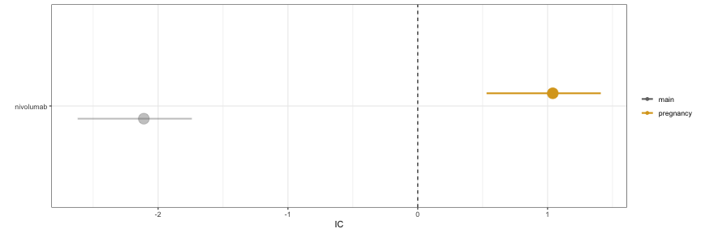


#### Confounding by coprescription


Confounding due to co-prescription is generated by the frequent coprescription of the drug of interest with a drug that is the real cause of the event. When examining the potential link between hydrochlorothiazide and dysphonia, it is important to consider that hydrochlorothiazide is commonly co-prescribed with valsartan, which causes dysphonia through coughing. By restricting to reports mentioning valsartan (gold estimate), we can infer that the observed association between the drug and the event (grey estimate) is likely solely due to the co-prescription with valsartan. In both confounding by comorbidity and by co-prescription we see again that restricting to reports not recording the value (blue estimate) does not seem to affect the IC estimate, likely due to residual unaccounted confounding.


``` r
pids_valsartan <- unique(Drug[substance=="valsartan"]$primaryid)

restrictions <- list("main"=list(unique(Demo$primaryid)),"valsartan"=list(pids_valsartan))#,
                     #"non-valsartan"=list(setdiff(Demo$primaryid,pids_valsartan)))
disproportionality_df <- data.table()
for (n in 1:length(restrictions)){
  t <- restrictions[n]
  t_name <- names(t)
  t_pids <- unlist(t)
  df <- disproportionality_analysis(drug_selected="hydrochlorothiazide",
                                    reac_selected = "dysphonia",
                                    meddra_level = "pt",
                                    restriction = t_pids)[,nested:=t_name]
  disproportionality_df <- rbindlist(list(disproportionality_df,df),fill = TRUE)
}

disproportionality_df <- disproportionality_df[,nested:=factor(nested, levels=c("non-valsartan","main","valsartan"),ordered=TRUE)]
disproportionality_df[,.(nested,label_IC)]
#>       nested                label_IC
#>        <ord>                  <char>
#> 1:      main 0.91 (0.83-0.97) [1678]
#> 2: valsartan 0.01 (-0.23-0.18) [193]
```


``` r
render_forest(disproportionality_df,nested = "nested",nested_colors=c("blue","gray45","goldenrod"))
```
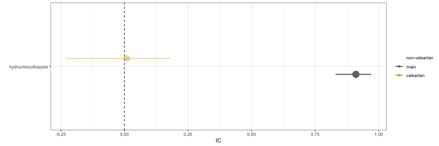

#### Confounding by demographic factor


Lastly, demographic factors can also introduce confounding. For instance, when exploring the potential link between trastuzumab and prostate cancer, we must consider that among all individuals receiving trastuzumab (primarily for breast cancer), only a small subset is male and thus at risk of prostate cancer. This demographic confounding can decrease the statistical dependence (grey estimate), although it remains statistically not significant when focusing solely on males (gold estimate).


``` r
pids_male <- Demo[sex=="M"]$primaryid

restrictions <- list("main"=list(unique(Demo$primaryid)),"male"=list(pids_male))
disproportionality_df <- data.table()
for (n in 1:length(restrictions)){
  t <- restrictions[n]
  t_name <- names(t)
  t_pids <- unlist(t)
  df <- disproportionality_analysis(drug_selected="trastuzumab",
                                    reac_selected = "prostate cancer",
                                    meddra_level = "pt",
                                    restriction = t_pids)[,nested:=t_name]
  disproportionality_df <- rbindlist(list(disproportionality_df,df),fill = TRUE)
}
disproportionality_df <- disproportionality_df[,nested:=factor(nested, levels=c("main","male"),ordered=TRUE)]
disproportionality_df[,.(nested,label_IC)]
#>    nested                label_IC
#>     <ord>                  <char>
#> 1:   main  -6.69 (-9.28--5.3) [2]
#> 2:   male -3.77 (-6.36--2.38) [2]
```


``` r
render_forest(disproportionality_df,nested = "nested",nested_colors=c("gray45","goldenrod"))
```


### Collider bias

#### Collider bias by outcome


```
#> Error in knitr::include_graphics("causal_inference-outc.png", dpi = 144): Cannot find the file(s): "causal_inference-outc.png"
```

If we investigate the causal dependence between Chimeric Antigen Receptor T (CAR-T) therapy and infections, we find a positive statistical association (grey estimate). Were we to limit our analysis to reports that mention death as one of the outcomes we would find an even stronger association (red estimate). This is because CAR-T therapies reduce mortality, and infections themselves may lead to mortality, thus restricting to reports mentioning death opens a path and likely introduces a positive distortion into the data. Again, were we to restrict to reports not mentioning death, we would produce a noisy inference (blue estimate).


``` r
pids_death <- unique(Outc[outc_cod=="DE"]$primaryid)
restrictions <- list("main"=list(unique(Demo$primaryid)),"Dead"=list(pids_death))#,"non_Dead"=list(setdiff(unique(Demo$primaryid),pids_death)))
disproportionality_df <- data.table()
for (n in 1:length(restrictions)){
  t <- restrictions[n]
  t_name <- names(t)
  t_pids <- unlist(t)
  df <- disproportionality_analysis(drug_selected="axicabtagene ciloleucel",
                                    reac_selected = "infections and infestations",
                                    meddra_level = "soc",
                                    restriction = t_pids)[,nested:=t_name]
  disproportionality_df <- rbindlist(list(disproportionality_df,df),fill = TRUE)
}
disproportionality_df <- disproportionality_df[,nested:=factor(nested, levels=c("non_Dead","main","Dead"),ordered=TRUE)]
disproportionality_df[,.(nested,label_IC)]
#>    nested                label_IC
#>     <ord>                  <char>
#> 1:   main 0.52 (0.41-0.59) [1047]
#> 2:   Dead     1 (0.84-1.12) [416]
```

``` r
render_forest(disproportionality_df,nested = "nested",nested_colors=c("blue","gray45","red"))
```


#### Collider bias by prophylaxis

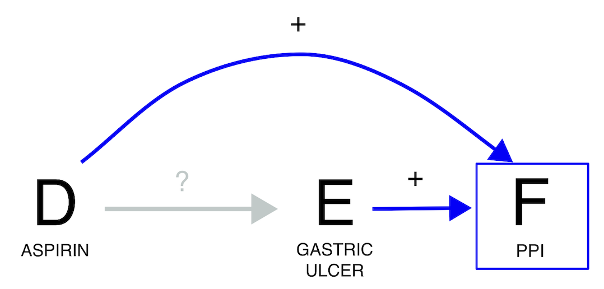
If we investigate the relation between aspirin and gastric ulcer, we find a positive statistical association (grey estimate). However, we should be wary of conditioning on whether the report also mentions proton pump inhibitors (PPIs). PPIs can indeed be used to treat gastric ulcer or – if administered together with aspirin - to prevent it. In this case, if we condition on the use of proton pump inhibitors (red estimate), the expected association between aspirin and gastric ulcer is going to be biased towards the null: among patients taking PPIs, those not taking aspirin are more likely to not be in prophylaxis and therefore to already have gastric ulcer. Therefore, by conditioning on a collider we risk losing a potential signal. Once more, we observe that restricting to reports that do not mention PPIs (blue estimate) has minimal impact on the IC estimate. This is likely because the reporting rate of PPIs when they are not the suspected drug is presumed to be very low.


``` r
pids_PPI <- unique(Drug[substance%in%ATC[Class4=="Proton pump inhibitors"]$substance]$primaryid)

restrictions <- list("main"=list(unique(Demo$primaryid)),"PPI"=list(pids_PPI))#,"non_PPI"=list(setdiff(unique(Demo$primaryid),pids_PPI)))
disproportionality_df <- data.table()
for (n in 1:length(restrictions)){
  t <- restrictions[n]
  t_name <- names(t)
  t_pids <- unlist(t)
  df <- disproportionality_analysis(drug_selected="acetylsalicylic acid",
                                    reac_selected = "gastric ulcer",
                                    meddra_level = "pt",
                                    restriction = t_pids)[,nested:=t_name]
  disproportionality_df <- rbindlist(list(disproportionality_df,df),fill = TRUE)
}
disproportionality_df <- disproportionality_df[,nested:=factor(nested, levels=c("non_PPI","main","PPI"),ordered=TRUE)]
disproportionality_df[,.(nested,label_IC)]
#>    nested                label_IC
#>     <ord>                  <char>
#> 1:   main 1.91 (1.85-1.95) [2852]
#> 2:    PPI  0.15 (0.03-0.24) [746]
```


``` r
render_forest(disproportionality_df,nested = "nested",nested_colors=c("blue","gray45","red"))
```
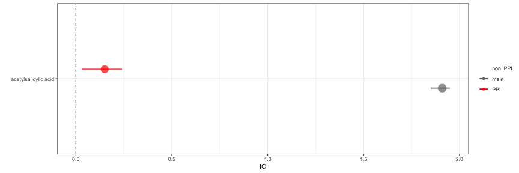

#### Collider bias by double mechanism


Another scenario arises when we are aware that a drug induces an event, and the suspected reaction itself may contribute to that event (i.e., a potential indirect effect of the drug). For example, if we are interested in the causal dependence between Glucagone Like Peptide GLP 1-agonists and anxiety, their statistical association is negative (grey estimate). However, we have to be wary that both GLP 1-agonists and anxiety cause weight-loss. Therefore, if we were to condition on weight-loss we would open a path and introduce a negative collider bias (red estimate). In this case, the direction of the statistical association does not change, but we can anticipate and then confirm the shift towards a more negative estimate. Once again, restricting to reports that do not mention weight loss does not change the outcome (blue estimate).


``` r
pids_weight <- union(Reac[pt%in%c("weight decreased")]$primaryid,
                     Indi[indi_pt%in%c("weight decreased")]$primaryid)
restrictions <- list("main"=list(unique(Demo$primaryid)),"weight loss"=list(pids_weight))#
                     #,"non-weight loss"=list(setdiff(Demo$primaryid,pids_weight)))

disproportionality_df <- data.table()
for (n in 1:length(restrictions)){
  t <- restrictions[n]
  t_name <- names(t)
  t_pids <- unlist(t)
  df <- disproportionality_analysis(drug_selected=list("GLP1-agonist"=list("liraglutide","exenatide","semaglutide","dulaglutide")),
                                    reac_selected = "anxiety disorders and symptoms",
                                    meddra_level = "hlgt",
                                                         restriction = t_pids)[,nested:=t_name]
                                    disproportionality_df <- rbindlist(list(disproportionality_df,df),fill = TRUE)
}

disproportionality_df <- disproportionality_df[,nested:=factor(nested, levels=c("non-weight loss","main","weight loss"),ordered=TRUE)]
disproportionality_df[,.(nested,label_IC)]
#>         nested                   label_IC
#>          <ord>                     <char>
#> 1:        main -0.26 (-0.31--0.23) [5114]
#> 2: weight loss  -1.31 (-1.42--1.23) [906]
```


``` r
render_forest(disproportionality_df,nested = "nested",nested_colors=c("blue","gray45","red"))
```


### Information bias
In a report the information about the presence or absence of an exposure, outcome, confounder, or collider could be affected by measurement error. The deriving bias is known as information component, and can be similarly addressed with the strategies described above. Here some examples.

#### Ascertainment bias

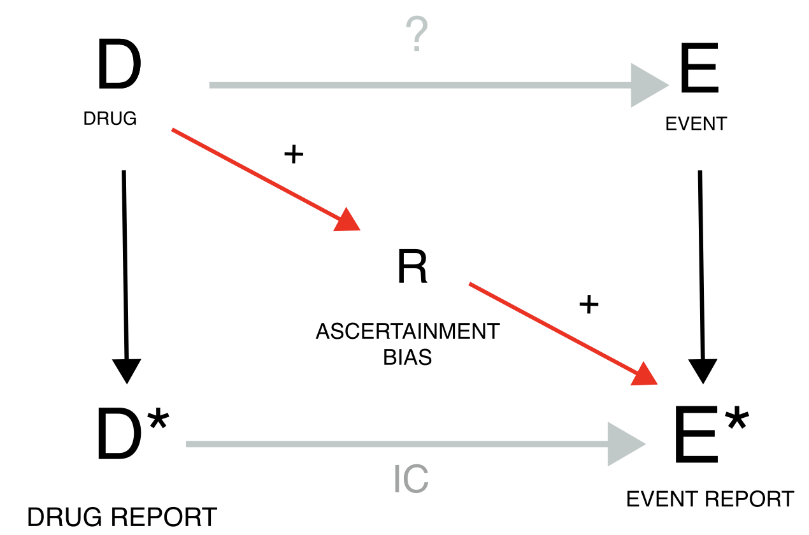
Ascertainment bias occurs when the exposure to a drug determines an increased attention and reporting rate for a specific event. Taking clozapine, because of the risk of agranulocytosis, results in frequent blood tests and higher probability of detecting and reporting hyperkalaemia. For this reason, the analysis on the entire population (grey estimate), gives a higher (but still not significant) IC than when we restrict to reports recording any investigation (gold estimate).


``` r
pids_investigations <- Reac[pt%in%MedDRA[soc=="investigations"]$pt]$primaryid
restrictions <- list("main"=list(unique(Demo$primaryid)),"investigation"=list(pids_investigations))
disproportionality_df <- data.table()
for (n in 1:length(restrictions)){
  t <- restrictions[n]
  t_name <- names(t)
  t_pids <- unlist(t)
  df <- disproportionality_analysis(drug_selected="clozapine",
                                    reac_selected = "hyperkalaemia",
                                    restriction = t_pids)[,nested:=t_name]
  disproportionality_df <- rbindlist(list(disproportionality_df,df),fill = TRUE)
}
disproportionality_df <- disproportionality_df[,nested:=factor(nested, levels=c("main","investigation"),ordered=TRUE)]
disproportionality_df[,.(nested,label_IC)]
#>           nested                 label_IC
#>            <ord>                   <char>
#> 1:          main  -1.7 (-2.13--1.39) [60]
#> 2: investigation -2.25 (-2.94--1.77) [24]
```


``` r
render_forest(disproportionality_df,nested = "nested",nested_colors=c("gray45","goldenrod"))
```


#### Surrogate confounder and missing data

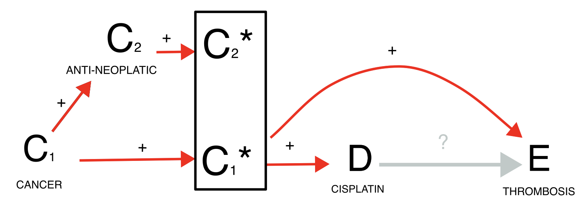

Finally, missing data is a common issue of ICSRs because only the suspected drug and reaction are mandatory fields in the reporting system. For instance, when investigating whether cisplatin causes thrombosis, we find an association (grey estimate) but we recognize that cancer is a likely common cause for both exposure and outcome. We may condition on the confounder either restricting to reports recording cancer among the indications or to reports recording any antineoplastic agent (blue estimates), but this may lead to a small sample and reduced accuracy because of missing information. To address this challenge, we might restrict to reports satisfying any of the two inclusion criteria (gold estimate).


``` r
pids_onco_indi <- Indi[indi_pt%in%MedDRA[soc=="neoplasms benign, malignant and unspecified (incl cysts and polyps)"]$pt]$primaryid
pids_onco_drug <- Drug[substance%in%c(ATC[Class2=="Antineoplastic"]$substance,
                                      "navitoclax")]$primaryid
pids_onco_drugindi <- union(pids_onco_drug,pids_onco_indi)
restrictions <- list("main"=list(unique(Demo$primaryid)),"onco_drug"=list(pids_onco_drug),"onco_indi"=list(pids_onco_indi),"onco_drugindi"=list(pids_onco_drugindi))
disproportionality_df <- data.table()
for (n in 1:length(restrictions)){
  t <- restrictions[n]
  t_name <- names(t)
  t_pids <- unlist(t)
  df <- disproportionality_analysis(drug_selected="cisplatin",
                                    reac_selected = "thrombosis",
                                    meddra_level = "pt",
                                    restriction = t_pids)[,nested:=t_name]
  disproportionality_df <- rbindlist(list(disproportionality_df,df),fill = TRUE)
}

disproportionality_df <- disproportionality_df[,nested:=factor(nested, levels=c("onco_drug","onco_indi","main","onco_drugindi"),ordered=TRUE)]
disproportionality_df[,.(nested,label_IC)]
#>           nested                  label_IC
#>            <ord>                    <char>
#> 1:          main    0.43 (0.26-0.55) [376]
#> 2:     onco_drug    0.19 (0.02-0.32) [376]
#> 3:     onco_indi -0.52 (-0.71--0.38) [300]
#> 4: onco_drugindi -0.24 (-0.41--0.11) [376]
```


``` r
render_forest(disproportionality_df,nested = "nested",nested_colors=c("blue","blue","gray45","goldenrod"))
```


### Reporting bias

Reporting biases are instead characterized by the fact that specific episodes of drug-event combination may have not been reported at all, and that this preferential reporting may have affected differently cases and non-cases.
Up to this point, our discussion has assumed direct access to drug exposure and event incidence rates and therefore mostly ignored that ICSRs are reports likely to be generated through biased measurement processes. Indeed, many drug-event co-occurrences are never reported (underreporting) due, for instance, to lack of awareness or motivation in the patient and/or clinician, or to the complexity and time demands in submitting a report. Perhaps even more worrisome, drug exposure without adverse events is not reported, nor are events occurring without drug administration. To account for such scenarios, DAGs have to incorporate biases that differentially affect baseline reported occurrences and cases of interest. In the following DAGs, we will accordingly introduce measurements of underlying variables, denoted with an asterisk \*, and partly deviate from more traditional DAG conventions. In particular, disproportionality can be directly assessed if we know how often drug D is used – with and without the occurrence of the event E - and how often event E occurs – with and without the administration of D. However, we do not have access to such data. Rather, disproportionality analyses calculate measures of drug use (D) relying on the number of reports with the drug and event of interest (DE) and the number of reports with the drug of interest and other events (DnE, rather than directly counting patients taking the drug but not experiencing the event), compared to reports (of other drug-event occurrences) not mentioning the drug (nD). Analogously, we do not have access to the occurrence of event E, but we rely on the number of reports with the drug and event of interest (DE) and reports of the same event co-occurring with other drugs but D (nDE), compared to reports not mentioning the event (nE). These measurements are used to calculate the IC as a measure of association between D and E\* but, if they present measurement errors (reporting biases, R), they can introduce inaccuracies and imprecision into the inference. The utility of the IC as a surrogate measure of association between the drug and the event is based on the key assumption that any reporting bias will equally affect the reporting of all drugs and events (independent reporting bias). The problem arises when there is dependent reporting bias, differentially affecting the four different measures (DE, nDE, DnE, nDnE). We can distinguish positive and negative reporting biases based on whether they amplify (i.e., increase DE\* and/or nDnE) or dampen the IC (i.e., increase DnE\* and/or nDE). We can tackle reporting biases by restricting our analyses to the reports not affected by the biased measurement error, or in principle – although not done yet in practice – explicitly include estimates of measurement error in the model as mitigation factors. Reporting rates can vary depending on report type (e.g., spontaneous, solicited, literature case report), reporter’s expertise (misclassification bias, e.g., use of ambiguous terms to refer to speech impairment) and diverse reporting habits among different reporter types (e.g., medical doctors, patients, lawyers), regulatory systems, and settings of use. The variability in the way pharmacovigilance officers code verbatim events recorded by patients to MedDRA might further affect the downstream statistical analyses. When anticipating such differential effects, it may be appropriate to consider restrictions, even if predicting the exact direction of the distortion is often challenging: e.g., the severity of an event might increase its reporting rate, and therefore both DE (which inflates the IC) and nDE\* (which deflates the IC). For the better investigated reporting biases, the exact direction of the distortion can be predicted.

#### Notoriety bias


Let us take the example of the notoriety bias, which may affect both healthcare professionals and patients. When regulatory warnings are issued, healthcare professionals may become more aware of and inclined to report specific drug-event combinations. Similarly, a few highly publicized cases can attract media attention, leading the public to higher awareness and inclination to report. This inflates the DE\* reporting rate compared to reporting just the drug or the event alone, and therefore inflates the IC (grey estimate). To address this bias, we can, for instance, restrict the DPA to the reports collected before the regulatory warning, if enough cases are available, thereby conditioning on the source of the bias (gold estimate). As a proof of concept, we can restrict to the cases following the regulatory warning and obtain an inflated statistical dependence (blue estimate).


``` r
pids_warning <- Demo[init_fda_dt<20160503]$primaryid
restrictions <- list("main"=list(unique(Demo$primaryid)),"pre-warning"=list(pids_warning),
                     "post-warning"=setdiff(Demo$primaryid,pids_warning))
disproportionality_df <- data.table()
for (n in 1:length(restrictions)){
  t <- restrictions[n]
  t_name <- names(t)
  t_pids <- unlist(t)
  df <- disproportionality_analysis(drug_selected="aripiprazole",
                                    reac_selected = "hypersexuality",
                                    restriction = t_pids)[,nested:=t_name]
  disproportionality_df <- rbindlist(list(disproportionality_df,df),fill = TRUE)
}
disproportionality_df <- disproportionality_df[,nested:=factor(nested, levels=c("post-warning","main","pre-warning"),ordered=TRUE)]
disproportionality_df[,.(nested,label_IC)]
#>          nested               label_IC
#>           <ord>                 <char>
#> 1:         main 5.19 (5.03-5.32) [383]
#> 2:  pre-warning  2.68 (1.84-3.27) [16]
#> 3: post-warning 5.45 (5.28-5.58) [367]
```


``` r
render_forest(disproportionality_df,nested = "nested",nested_colors=c("blue","gray45","goldenrod"))
```
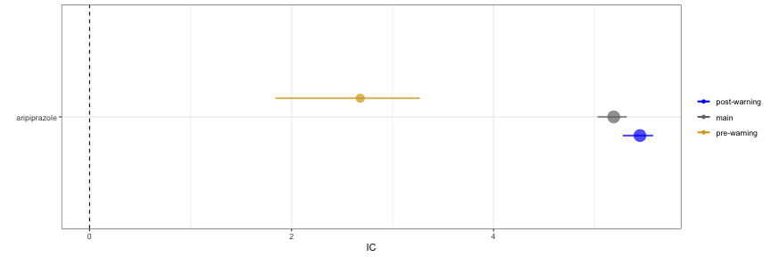

#### Lawyers reports

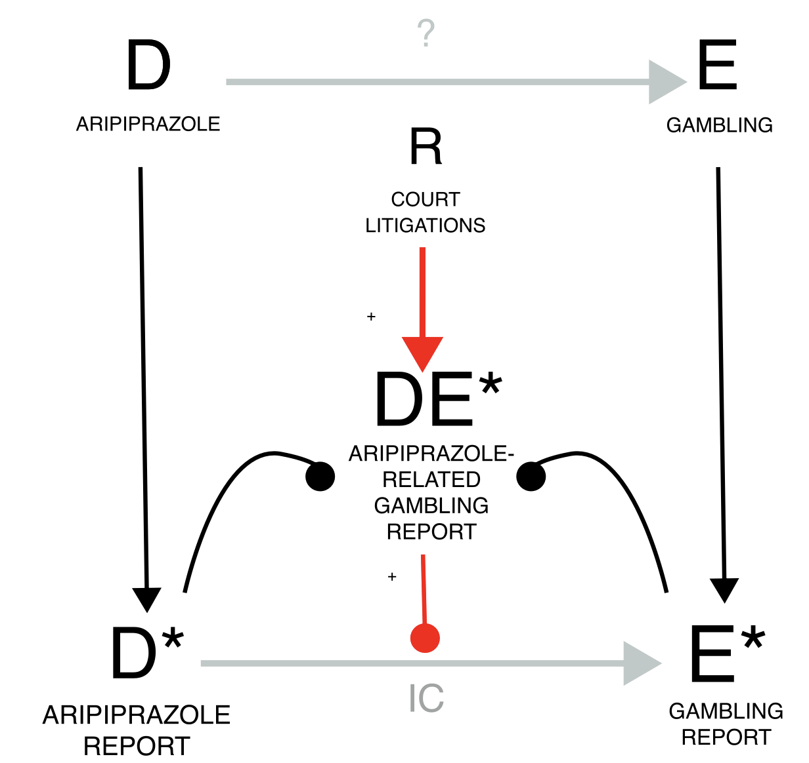
The notoriety bias and the similarly acting precautionary bias (e.g., reports from patient support programs, with increased reporting rate) could be characterized as differential underreporting: more DE are reported – i.e., less underreported - than background cases. Conversely, reports may even occur in the lack of an actual event – as in the case of superficial diagnostic verification (e.g., reporting drug-induced liver injury without verifying all diagnostic criteria) and of malicious reporting (as speculated for court litigations) – or may proliferate from a single report into many duplicates. This differential reporting of DE\* can be dealt with conditioning on the source of the bias: e.g., removing reports by lawyers and duplicates. For instance, when investigating the causal dependence between aripiprazole and gambling, we find a positive association (grey estimate). However, due to potential malicious reporting by lawyers within court litigation, this result may not be reliable. To inspect this potential bias, we restrict to reports not produced by lawyers and we find a smaller but still significant association (gold estimate). As proof of concept, we can restrict to reports produced by lawyers and there we find a bigger association (blue estimates). It’s important to note that all reports are valuable, as illustrated by the FDA warning for aripiprazole-induced impulse control disorders in 2016, which relied on reports by patients and lawyers (REF DAA partial). Hence, all reports should be encouraged, and considerations on the potential bias should be limited to the analysis and not to data collection. Based on the DAG, sensitivity quantitative and qualitative analyses can be performed by restricting to specific subpopulations to account for expected biases. When conducting such sensitivity analyses, both the raw disproportionality result and the result of the sensitivity analysis should be reported and discussed together.


``` r
pids_lawyers <- Demo[occp_cod=="LW"]$primaryid
restrictions <- list("main"=list(unique(Demo$primaryid)),"lawyers"=list(pids_lawyers),
                     "non-lawyers"=setdiff(Demo$primaryid,pids_lawyers))
disproportionality_df <- data.table()
for (n in 1:length(restrictions)){
  t <- restrictions[n]
  t_name <- names(t)
  t_pids <- unlist(t)
  df <- disproportionality_analysis(drug_selected="aripiprazole",
                                    reac_selected = "gambling disorder",
                                    restriction = t_pids)[,nested:=t_name]
  disproportionality_df <- rbindlist(list(disproportionality_df,df),fill = TRUE)
}

disproportionality_df[,.(nested,label_IC)]
#>         nested                label_IC
#>         <char>                  <char>
#> 1:        main 6.27 (6.19-6.32) [2014]
#> 2:     lawyers 7.68 (7.58-7.75) [1118]
#> 3: non-lawyers  5.56 (5.45-5.64) [896]
```


``` r
render_forest(disproportionality_df,nested = "nested",nested_colors=c("blue","gray45","goldenrod"))
```
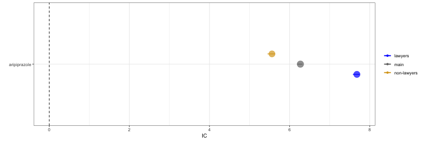

#### Masking

Masking/cloaking is an additional example of reporting bias and can take the form of a drug-competition bias (increased reporting rate for the same event with other drugs nDE\*) or an event competition bias (increased reporting rate for the same drug with other events DnE\*), which may also derive from notoriety biases sharing with DE exclusively the drug or the event. This bias likely dampens the IC and can be tackled by removing from the database reports of the competing drug-event pair. The fact that these distortions induced by masking are not so evident compared to the effect of other biases presented in this manuscript is in agreement with previous studies that question its importance.

##### Drug competition bias


Investigating the causal dependence between cariprazine and gambling, we find a statistical dependence (grey estimate) which nonetheless increases even more when we remove reports of gambling with the competing dopamine agonists (gold estimate).


``` r
pids_unmasked <- setdiff(Demo$primaryid,Drug[substance%in%ATC[Class4=="Dopamine agonists"]$substance]$primaryid)
pids_unmasked <- setdiff(Demo$primaryid,intersect(Drug[substance%in%ATC[Class4=="Dopamine agonists"]$substance]$primaryid,Reac[pt=="gambling disorder"]$primaryid))
restrictions <- list("main"=list(unique(Demo$primaryid)),"unmasked"=list(pids_unmasked))
disproportionality_df <- data.table()
for (n in 1:length(restrictions)){
  t <- restrictions[n]
  t_name <- names(t)
  t_pids <- unlist(t)
  df <- disproportionality_analysis(drug_selected="cariprazine",
                                    reac_selected = "gambling disorder",
                                    restriction = t_pids)[,nested:=t_name]
  disproportionality_df <- rbindlist(list(disproportionality_df,df),fill = TRUE)
}

disproportionality_df[,.(nested,label_IC)]
#>      nested              label_IC
#>      <char>                <char>
#> 1:     main 3.23 (2.43-3.78) [18]
#> 2: unmasked    3.79 (3-4.34) [18]
```


``` r
render_forest(disproportionality_df,nested = "nested",nested_colors=c("gray45","goldenrod"))
```


##### Event competition bias

Similarly, when investigating the causal dependence between warfarin and skin discoloration we observe a statistical dependence (grey estimate) which even increase when we remove reports of warfarin with the competing event bleeding (gold estimate).


``` r
pids_unmasked <- setdiff(Demo$primaryid,intersect(Reac[pt%in%MedDRA[grepl("bleeding|haemorrhage",pt)]$pt]$primaryid,Drug[substance=="warfarin"]$primaryid))
restrictions <- list("main"=list(unique(Demo$primaryid)),"unmasked"=list(pids_unmasked))
disproportionality_df <- data.table()
for (n in 1:length(restrictions)){
  t <- restrictions[n]
  t_name <- names(t)
  t_pids <- unlist(t)
  df <- disproportionality_analysis(drug_selected="warfarin",
                                    reac_selected = "skin discolouration",
                                    restriction = t_pids)[,nested:=t_name]
  disproportionality_df <- rbindlist(list(disproportionality_df,df),fill = TRUE)
}

disproportionality_df[,.(nested,label_IC)]
#>      nested               label_IC
#>      <char>                 <char>
#> 1:     main 0.99 (0.88-1.06) [967]
#> 2: unmasked    1 (0.88-1.08) [835]
```


``` r
render_forest(disproportionality_df,nested = "nested",nested_colors=c("gray45","goldenrod"))
```
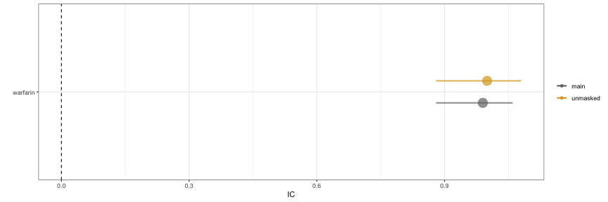
