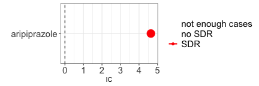

``` r
library(DiAna)
```

``` r
## Definitions --------------------------------------------------------------------------
drug_selected <- "aripiprazole"
reac_selected <- "impulse-control disorder"

## Disproportionality analysis ----------------------------------------------------------
disproportionality_df <- disproportionality_analysis(
  drug_selected = drug_selected,
  reac_selected = reac_selected
)
```

``` r
render_forest(disproportionality_df, index = "IC")
```


